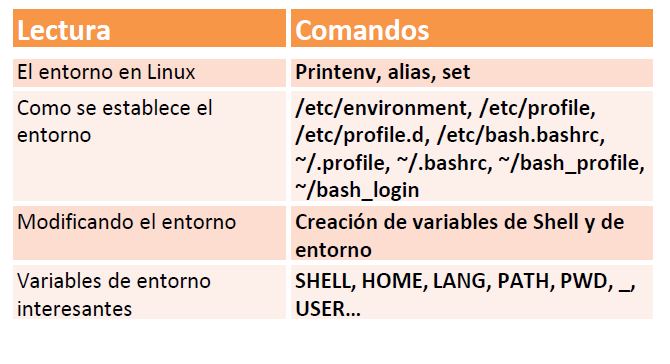

| **Inicio**         | **atrás 9**                                             | **Siguiente 11**                                                 |
| ------------------ | ------------------------------------------------------- | ---------------------------------------------------------------- |
| [🏠](../README.md) | [⏪](./1_9_Gestion_de_paquetes_y_librerias_en_Linux.md) | [⏩](./1_11_Dispositivos_de_almacenamiento_externos_en_Linux.md) |

---

## **Índice**

| Temario                                                                                                   |
| --------------------------------------------------------------------------------------------------------- |
| [90. El entorno en Linux](#90-el-entorno-en-linux)                                                        |
| [91. ¿Cómo se establece el entorno?](#91-cómo-se-establece-el-entorno)                                    |
| [92. System Wide Scripts vs Session-wide Scripts](#92-system-wide-scripts-vs-session-wide-scripts)        |
| [93. Modificando el entorno](#93-modificando-el-entorno)                                                  |
| [94. Variables de entorno interesantes](#94-variables-de-entorno-interesantes)                            |
| [95. Caso Práctico: Personalizando la shell de Linux](#95-caso-práctico-personalizando-la-shell-de-linux) |

---

# **El entorno en Linux**



## **90. El entorno en Linux**

### 🧭 ¿Qué es el entorno en Linux?

El **entorno** en Linux es el **conjunto de variables que influyen en cómo se comporta tu sistema operativo y los programas**.

Estas **variables de entorno** guardan información como:

| Variable | ¿Para qué sirve?                                      |
| -------- | ----------------------------------------------------- |
| `PATH`   | Dónde buscar los programas cuando escribes un comando |
| `HOME`   | Tu carpeta personal (`/home/puma`, por ejemplo)       |
| `USER`   | Tu nombre de usuario actual (`puma`)                  |
| `SHELL`  | Qué intérprete de comandos estás usando               |

---

### 🎯 ¿Para qué se usa el entorno?

- Configurar el comportamiento del sistema.
- Decirle al sistema dónde están los comandos y archivos importantes.
- Controlar variables que afectan compiladores, editores, terminal, etc.
- Automatizar configuraciones personales o del sistema.

---

### ✅ Comandos para trabajar con el entorno (y ejemplos que diste)

---

#### 1. `printenv`

```bash
printenv
```

📌 **¿Qué hace?**
Muestra **todas las variables de entorno** activas actualmente.

🧠 **Ejemplo útil**:

```bash
printenv USER
```

Muestra tu usuario actual.

---

#### 2. `set | less`

```bash
set | less
```

📌 **¿Qué hace?**
Muestra **todas las variables** (entorno + funciones + shell) con paginación (`less` = para navegar con flechas).

💡 Muy útil para revisar configuraciones.

🔧 Si no usas `| less`, la salida puede ser muy larga y difícil de leer.

---

#### 3. `printenv PATH`

```bash
printenv PATH
```

📌 **¿Qué hace?**
Muestra el contenido de la variable `PATH`.

🧠 **¿Qué es `PATH`?**
Una lista de **rutas (carpetas)** donde Linux busca los programas cuando escribes un comando.

🧪 Ejemplo:

```bash
/usr/local/sbin:/usr/local/bin:/usr/bin:/bin
```

🔧 Si un programa no funciona al escribir su nombre, **puede ser que no esté en el PATH**.

---

#### 4. `echo $PATH`

```bash
echo $ PATH
```

📌 Este comando muestra el valor de una variable de entorno, en este caso `PATH`.

---

### 🔧 Otros comandos útiles

| Comando  | ¿Para qué sirve?                               |
| -------- | ---------------------------------------------- |
| `env`    | Muestra variables de entorno (como `printenv`) |
| `export` | Define o modifica variables de entorno         |
| `unset`  | Elimina una variable del entorno               |

---

### 🧪 Ejemplo útil: agregar una carpeta al `PATH`

Supongamos que tienes programas en `~/misprogramas`, y quieres poder ejecutarlos con solo escribir su nombre.

#### Paso 1: Añadir al PATH (temporalmente)

```bash
export PATH=$PATH:/home/puma/misprogramas
```

#### Paso 2: Verificar que se añadió

```bash
echo $PATH
```

#### Paso 3: Hacerlo permanente

Edita el archivo `~/.bashrc` y agrega la línea al final:

```bash
export PATH=$PATH:/home/puma/misprogramas
```

Luego aplica cambios:

```bash
source ~/.bashrc
```

---

### ❗ Posibles errores comunes

| Error                         | Causa                                 | Solución                                       |
| ----------------------------- | ------------------------------------- | ---------------------------------------------- |
| `echo $ PATH` no muestra nada | Hay un espacio entre `$` y `NOMBRE`   | Usa `echo $PATH` sin espacio                   |
| Comando no encontrado         | El programa no está en el PATH        | Añadir su carpeta al PATH o usar ruta completa |
| Variable no definida          | Escribes mal el nombre de la variable | Verifica con `printenv` o `set`                |

---

### 🧠 Resumen final

| Comando            | ¿Qué hace?                                                     |
| ------------------ | -------------------------------------------------------------- |
| `printenv`         | Muestra variables de entorno                                   |
| `printenv VAR`     | Muestra solo una variable (ej. `PATH`)                         |
| `echo $VAR`        | Imprime el valor de una variable                               |
| `set`              | Muestra todas las variables y funciones                        |
| `export VAR=valor` | Crea o cambia una variable                                     |
| `unset VAR`        | Elimina una variable                                           |
| `PATH`             | Es una variable muy importante: rutas para encontrar programas |

---

[🔼](#índice)

---

## **91. ¿Cómo se establece el entorno?**

### 🧭 ¿Qué significa "establecer el entorno" en Linux?

Cuando abres tu terminal o entras a tu sistema, **Linux carga automáticamente ciertas configuraciones** que definen el comportamiento del entorno, como:

- Variables como `PATH`, `LANG`, `EDITOR`, etc.
- Alias personalizados
- Funciones y configuraciones para el shell (como Bash)

✅ Esto se hace **a través de archivos ocultos de configuración** en tu carpeta personal (`~`).

---

### 📁 Archivos que establecen el entorno

Los comandos que escribiste:

```bash
ls .profile
ls .bash_profile
ls .bash_login
ls .bashrc
```

Te muestran si estos **archivos existen en tu directorio personal**. Ahora te explico para qué sirve cada uno.

---

#### 🧾 1. `.bashrc`

- 📌 **Se ejecuta cada vez que abres una terminal interactiva**
- ✅ Aquí se suelen poner:

  - Alias (`alias ll='ls -l'`)
  - Variables temporales
  - Cambios visuales del prompt

🔧 **Ejemplo**: agregar un alias

```bash
echo "alias cls='clear'" >> ~/.bashrc
source ~/.bashrc
```

---

#### 🧾 2. `.profile`

- 📌 **Se ejecuta al iniciar sesión (GUI o terminal de login)**.
- Se usa para establecer variables de entorno permanentes como `PATH`, `EDITOR`, `JAVA_HOME`.

🔧 **Ejemplo**:

```bash
echo 'export EDITOR=nano' >> ~/.profile
source ~/.profile
```

---

#### 🧾 3. `.bash_profile` y `.bash_login`

- 📌 Son **alternativas** a `.profile`.
- Linux **solo usa uno de ellos**: el primero que encuentra entre `.bash_profile`, `.bash_login` o `.profile`.

📝 Si tienes `.bash_profile`, puedes usarlo igual que `.profile`.

---

### 📥 ¿Cómo se cargan estos archivos?

| Archivo         | Cuándo se carga                            |
| --------------- | ------------------------------------------ |
| `.bashrc`       | Cada vez que abres una terminal            |
| `.profile`      | Al iniciar sesión (una vez)                |
| `.bash_profile` | Si existe, reemplaza `.profile` al iniciar |
| `.bash_login`   | Alternativa a `.bash_profile`              |

✅ Puedes usar `source` para aplicar los cambios sin reiniciar:

```bash
source ~/.bashrc
source ~/.profile
```

---

### 🧠 ¿Para qué se utiliza establecer el entorno?

- 🧩 Configurar el sistema automáticamente al iniciar sesión.
- 🛠️ Definir qué editor usar, qué programa se ejecuta, o qué ruta se añade al `PATH`.
- 🎨 Personalizar el comportamiento de la terminal (colores, alias, etc.).

---

### 🧪 Ejemplo fácil y completo

#### Quieres que siempre se abra tu editor favorito `nano` por defecto y agregar una carpeta al `PATH`.

##### Paso 1: Edita tu archivo `.profile`

```bash
nano ~/.profile
```

##### Paso 2: Agrega estas líneas al final:

```bash
export EDITOR=nano
export PATH=$PATH:$HOME/scripts
```

##### Paso 3: Aplica los cambios sin reiniciar:

```bash
source ~/.profile
```

##### Paso 4: Verifica que se aplicó:

```bash
echo $EDITOR
echo $PATH
```

---

### ❗ Posibles errores y soluciones

| Error                              | Causa                                       | Solución                                                                    |
| ---------------------------------- | ------------------------------------------- | --------------------------------------------------------------------------- |
| `ls .bash_profile` no muestra nada | El archivo no existe                        | Crea uno si quieres usarlo: `touch ~/.bash_profile`                         |
| Cambios no se aplican              | No hiciste `source` o no reiniciaste sesión | Usa `source ~/.archivo` o cierra y abre terminal                            |
| PATH no se actualiza               | Mal uso de `export`                         | Verifica que no sobrescribiste el PATH (usa `export PATH=$PATH:nueva/ruta`) |

---

### 🧾 Resumen

| Archivo         | ¿Qué hace?                                         | Cuándo se usa                   |
| --------------- | -------------------------------------------------- | ------------------------------- |
| `.bashrc`       | Configura terminales interactivas (alias, colores) | Cada vez que abres una terminal |
| `.profile`      | Establece variables de entorno y rutas             | Al iniciar sesión               |
| `.bash_profile` | Alternativa a `.profile` (toma prioridad)          | Al iniciar sesión si existe     |
| `.bash_login`   | Otra alternativa si no existen los anteriores      | Menos común                     |

---

[🔼](#índice)

---

## **92. System Wide Scripts vs Session-wide Scripts**

### 🧭 ¿Qué son los "System-Wide" y "Session-Wide Scripts"?

#### 🖥️ **System-Wide Scripts**

Son archivos de configuración que afectan **a todos los usuarios del sistema**.

#### 🙋‍♂️ **Session-Wide Scripts**

Son archivos de configuración que afectan **solo al usuario actual**.

---

### 🧠 ¿Para qué se utilizan?

| Tipo de Script   | ¿Para qué sirve?                                                                                                       |
| ---------------- | ---------------------------------------------------------------------------------------------------------------------- |
| **System-Wide**  | Establecer configuraciones comunes a todos los usuarios (como variables de entorno globales, PATH, idioma, etc.)       |
| **Session-Wide** | Personalizar la experiencia de **tu propia cuenta** (alias, colores, PATH personalizados, editor predeterminado, etc.) |

---

### 🗂️ Archivos comunes según el tipo

| Tipo         | Archivos comunes                                       | ¿Cuándo se ejecutan?                   |
| ------------ | ------------------------------------------------------ | -------------------------------------- |
| System-wide  | `/etc/profile`, `/etc/bash.bashrc`, `/etc/environment` | Al iniciar cualquier sesión de usuario |
| Session-wide | `~/.bashrc`, `~/.profile`, `~/.bash_profile`           | Solo para el usuario actual            |

---

### 🧪 Ejemplo sencillo y comparativo

#### 🎯 Objetivo: Añadir una carpeta al PATH

---

#### 1. **System-Wide (todos los usuarios)**

Editamos el archivo global:

```bash
sudo nano /etc/profile
```

Añadimos al final:

```bash
export PATH=$PATH:/opt/mi_programa
```

🔄 Se aplica para **todos los usuarios** al iniciar sesión.

---

#### 2. **Session-Wide (solo para ti)**

Editamos tu archivo personal:

```bash
nano ~/.bashrc
```

Añadimos al final:

```bash
export PATH=$PATH:$HOME/mis_programas
```

Luego lo aplicamos:

```bash
source ~/.bashrc
```

🔄 Solo afecta tu terminal.

---

### 🔧 Comandos útiles y su explicación

| Comando                  | ¿Para qué sirve?                             |
| ------------------------ | -------------------------------------------- |
| `source ~/.bashrc`       | Carga los cambios de tu bashrc sin reiniciar |
| `env` o `printenv`       | Muestra variables de entorno activas         |
| `sudo nano /etc/profile` | Edita el archivo global de entorno           |
| `echo $PATH`             | Muestra el valor de una variable (ej. PATH)  |

---

### ❗ Posibles errores y soluciones

| Problema                              | Causa común                                         | Solución                                              |
| ------------------------------------- | --------------------------------------------------- | ----------------------------------------------------- |
| Cambios no se aplican                 | No hiciste `source` o no cerraste sesión            | Ejecuta `source ~/.bashrc` o reinicia sesión          |
| PATH roto o sobrescrito               | Usaste mal `export PATH=...`                        | Asegúrate de escribir: `export PATH=$PATH:nueva_ruta` |
| Permiso denegado en `/etc/profile`    | No usaste `sudo`                                    | Usa `sudo nano /etc/profile`                          |
| Variables globales no afectan a todos | Las pusiste en `.bashrc` en lugar de `/etc/profile` | Usa `/etc/profile` o `/etc/environment` si es global  |

---

### 🧾 Resumen rápido

| Categoría        | Archivos                                               | Afecta a...        | ¿Cuándo se carga?                  |
| ---------------- | ------------------------------------------------------ | ------------------ | ---------------------------------- |
| **System-Wide**  | `/etc/profile`, `/etc/bash.bashrc`, `/etc/environment` | Todos los usuarios | Al iniciar sesión                  |
| **Session-Wide** | `~/.bashrc`, `~/.profile`, `~/.bash_profile`           | Solo tu usuario    | Al abrir terminal o iniciar sesión |

---

### 🎓 ¿Cómo saber qué archivo editar?

| ¿Qué quieres hacer?                                  | Edita este archivo                  |
| ---------------------------------------------------- | ----------------------------------- |
| Que todos los usuarios tengan la misma configuración | `/etc/profile` o `/etc/environment` |
| Personalizar solo tu entorno de terminal             | `~/.bashrc`                         |
| Establecer variables para ti al iniciar sesión       | `~/.profile`                        |

---

[🔼](#índice)

---

## **93. Modificando el entorno**

### 🧭 ¿Qué significa "modificar el entorno"?

Modificar el entorno en Linux significa **crear, cambiar o eliminar variables de entorno**, que son **valores usados por el sistema** para definir comportamientos, como:

- Qué editor de texto usar (`EDITOR`)
- En qué idioma trabajar (`LANG`)
- Qué rutas buscar (`PATH`)
- Dónde está tu carpeta personal (`HOME`)

---

### 🎯 ¿Para qué se utiliza?

| Uso común                                        | ¿Ejemplo?                              |
| ------------------------------------------------ | -------------------------------------- |
| Personalizar comportamiento del sistema          | Elegir tu editor: `EDITOR=nano`        |
| Agregar carpetas al PATH                         | Para ejecutar programas personalizados |
| Definir configuraciones para scripts o programas | Como `JAVA_HOME`, `NODE_ENV`, etc.     |

---

### ✅ Comandos que usaste y qué hacen

---

#### 1. `printenv | grep editar`

```bash
printenv | grep editar
```

🔎 **¿Qué hace?**

- Muestra las variables de entorno que contienen la palabra “editar”.

📌 Pero no existe por defecto ninguna variable llamada "editar", así que probablemente **no devuelve nada**.

✅ **Ejemplo útil:**

```bash
printenv | grep EDITOR
```

---

#### 2. `export editor`

```bash
export editor
```

```bash
export EDITOR=nano
```

📌 Esto le dice al sistema que tu editor de texto por defecto será **nano**.

🔧 **Verifica:**

```bash
echo $EDITOR
```

---

#### 3. `echo $HOME`

```bash
echo $HOME
```

---

### 🛠️ Cómo modificar variables de entorno (temporal y permanente)

---

#### ✏️ Cambiar temporalmente (solo para la sesión actual)

```bash
export EDITOR=nano
export PATH=$PATH:/home/puma/scripts
```

🧠 Se pierde al cerrar la terminal.

---

#### 💾 Cambiar **permanentemente** (para que se guarde)

Edita tu archivo personal `~/.bashrc` o `~/.profile`:

```bash
nano ~/.bashrc
```

Agrega al final:

```bash
export EDITOR=nano
export PATH=$PATH:$HOME/scripts
```

Aplica los cambios:

```bash
source ~/.bashrc
```

---

### 🧪 Ejemplo completo: Cambiar editor predeterminado

1. Abrir `.bashrc`

```bash
nano ~/.bashrc
```

2. Agregar:

```bash
export EDITOR=nano
```

3. Aplicar sin reiniciar:

```bash
source ~/.bashrc
```

4. Verificar:

```bash
echo $EDITOR
```

---

### ❗Errores comunes y soluciones

| Error                       | Causa                                            | Solución                                   |
| --------------------------- | ------------------------------------------------ | ------------------------------------------ |
| No muestra la variable      | Usaste mal el nombre (`$Home` en vez de `$HOME`) | Usa mayúsculas correctas                   |
| `export editor` no funciona | No asignaste valor                               | Usa `export EDITOR=nano`                   |
| Cambios se pierden          | Solo usaste `export` en la sesión                | Agrégalo a `~/.bashrc` o `~/.profile`      |
| PATH se rompe               | Sobrescribiste sin `:$PATH`                      | Usa siempre `export PATH=$PATH:nueva_ruta` |

---

### 📌 Resumen rápido

| Acción                       | Comando                       |
| ---------------------------- | ----------------------------- |
| Ver variables del entorno    | `printenv`                    |
| Ver una variable específica  | `echo $NOMBRE`                |
| Crear o cambiar variable     | `export NOMBRE=valor`         |
| Hacerlo permanente           | Agrega `export` a `~/.bashrc` |
| Aplicar cambios de inmediato | `source ~/.bashrc`            |

---

[🔼](#índice)

---

## **94. Variables de entorno interesantes**

- ✅ Qué son
- 🎯 Para qué se usan
- 🧪 Ejemplos fáciles de entender
- ⚙️ Comandos para verlas y modificarlas
- ❗Errores comunes y cómo solucionarlos

---

### 📦 ¿Qué son las **variables de entorno**?

Son **valores predefinidos en el sistema operativo** que influyen en cómo funcionan los programas y comandos en Linux.

🧠 Se guardan como pares:
`NOMBRE=valor`
Ejemplo: `EDITOR=nano`

---

### 🌟 Variables de entorno **interesantes y comunes**

Aquí tienes una lista de las más importantes y útiles:

| Variable   | ¿Para qué sirve?                                 | Ejemplo de valor               |
| ---------- | ------------------------------------------------ | ------------------------------ |
| `PATH`     | Lista de carpetas donde Linux busca programas    | `/usr/bin:/bin:/home/guss/bin` |
| `HOME`     | Tu directorio personal                           | `/home/guss`                   |
| `USER`     | Tu nombre de usuario actual                      | `guss`                         |
| `SHELL`    | El intérprete de comandos que estás usando       | `/bin/bash`                    |
| `EDITOR`   | Define tu editor de texto por defecto            | `nano`, `vim`                  |
| `LANG`     | Idioma y codificación del sistema                | `es_PE.UTF-8`                  |
| `PWD`      | El directorio actual donde estás trabajando      | `/home/guss/proyectos`         |
| `HOSTNAME` | El nombre de tu computadora                      | `DESKTOP-GUSS`                 |
| `TERM`     | Tipo de terminal                                 | `xterm-256color`               |
| `PS1`      | El formato de tu prompt de terminal              | `\u@\h:\w\$`                   |
| `LOGNAME`  | Similar a `USER`, muestra quién inició la sesión | `guss`                         |

---

### 🔎 ¿Cómo ver las variables?

#### Ver todas:

```bash
printenv
```

#### Ver una específica:

```bash
echo $HOME
echo $PATH
```

#### Buscar por palabra clave:

```bash
printenv | grep EDITOR
```

---

### ⚙️ ¿Cómo modificar variables?

#### 🔧 Temporalmente (solo en la sesión actual):

```bash
export EDITOR=nano
```

#### 💾 Permanentemente:

Agrega esto a `~/.bashrc` o `~/.profile`:

```bash
export EDITOR=nano
```

Luego aplica los cambios:

```bash
source ~/.bashrc
```

---

### 🧪 Ejemplos prácticos

#### 📝 Cambiar tu editor de texto por defecto a nano:

```bash
export EDITOR=nano
```

#### 📁 Añadir una carpeta personal al PATH:

```bash
export PATH=$PATH:$HOME/scripts
```

#### 🌐 Cambiar el idioma a inglés:

```bash
export LANG=en_US.UTF-8
```

---

### ❗Errores comunes y soluciones

| Error                               | Causa                                       | Solución                                    |
| ----------------------------------- | ------------------------------------------- | ------------------------------------------- |
| `echo $Home` no funciona            | Las variables son **sensible a mayúsculas** | Usa `echo $HOME`                            |
| PATH deja de funcionar              | Sobrescribiste mal la variable              | Usa `export PATH=$PATH:/nueva/ruta`         |
| Cambios no se guardan               | Usaste `export` sin editar `.bashrc`        | Agrega la variable a `~/.bashrc`            |
| Variables duplicadas o conflictivas | Definiste mal en `.bashrc`                  | Revisa con `printenv` y edita correctamente |

---

### 🧾 Resumen rápido

| Acción                              | Comando                          |
| ----------------------------------- | -------------------------------- |
| Ver todas las variables             | `printenv`                       |
| Ver una variable específica         | `echo $NOMBRE`                   |
| Cambiar temporalmente               | `export NOMBRE=valor`            |
| Cambiar permanentemente             | Edita `~/.bashrc` o `~/.profile` |
| Aplicar cambios sin cerrar terminal | `source ~/.bashrc`               |

---

[🔼](#índice)

---

## **95. Caso Práctico: Personalizando la shell de Linux**

### 🧭 ¿Qué es personalizar la shell de Linux?

La **shell** (como `bash`, `zsh`, etc.) es el programa que interpreta los comandos que escribes en la terminal.

**Personalizarla** significa ajustar su comportamiento o apariencia para que se adapte a **tus gustos o necesidades**.

---

### 🎯 ¿Para qué se utiliza?

✅ La personalización te permite:

- Mejorar la productividad
- Agilizar tareas repetitivas
- Tener una experiencia visual más clara
- Crear alias para comandos largos
- Definir rutas, variables, colores y más

---

### 📁 Archivos importantes para personalizar tu shell

| Archivo                          | ¿Qué hace?                                 | Afecta a |
| -------------------------------- | ------------------------------------------ | -------- |
| `~/.bashrc`                      | Se ejecuta cada vez que abres una terminal | Solo tú  |
| `~/.profile` o `~/.bash_profile` | Se ejecuta al iniciar sesión               | Solo tú  |
| `/etc/bash.bashrc`               | Afecta a todos los usuarios                | Global   |

---

### 🧪 Caso práctico: personalizar tu shell paso a paso

---

#### 🧩 Paso 1: Crear alias útiles

##### 👉 Qué es:

Un alias es una abreviación de un comando largo o difícil de recordar.

##### ✏️ Cómo hacerlo:

```bash
nano ~/.bashrc
```

Agrega al final:

```bash
alias cls='clear'
alias ll='ls -l --color=auto'
alias gs='git status'
```

Guarda y cierra con `Ctrl + O`, luego `Enter`, y `Ctrl + X`.

##### 🔄 Aplica los cambios:

```bash
source ~/.bashrc
```

---

#### 🧩 Paso 2: Cambiar el prompt (PS1)

##### 👉 Qué es:

El prompt (`PS1`) es lo que ves antes de escribir un comando (por ejemplo `puma@linux:~$`).

##### 🧠 Ejemplo:

```bash
export PS1="\[\e[32m\]\u@\h:\w \$ \[\e[0m\]"
```

Explicación:

- `\u` = tu usuario
- `\h` = nombre de la máquina
- `\w` = carpeta actual
- `\[\e[32m\]` = verde

🔧 Para hacerlo permanente, agrégalo a `~/.bashrc`:

```bash
echo 'export PS1="\[\e[32m\]\u@\h:\w \$ \[\e[0m\]"' >> ~/.bashrc
source ~/.bashrc
```

---

#### 🧩 Paso 3: Añadir rutas personalizadas al `PATH`

Si tienes scripts en `~/scripts`, puedes hacerlos accesibles fácilmente:

```bash
echo 'export PATH=$PATH:$HOME/scripts' >> ~/.bashrc
source ~/.bashrc
```

---

#### 🧩 Paso 4: Cambiar tu editor predeterminado

```bash
echo 'export EDITOR=nano' >> ~/.bashrc
source ~/.bashrc
```

---

### 🔧 Comandos usados y su explicación

| Comando            | ¿Qué hace?                                             |
| ------------------ | ------------------------------------------------------ |
| `alias`            | Crea comandos cortos personalizados                    |
| `export`           | Crea/modifica variables de entorno                     |
| `source ~/.bashrc` | Aplica cambios hechos en `.bashrc` sin cerrar terminal |
| `nano ~/.bashrc`   | Abre el archivo de configuración personal de la shell  |

---

### ❗Errores comunes y soluciones

| Problema               | Causa                            | Solución                                                  |
| ---------------------- | -------------------------------- | --------------------------------------------------------- |
| Alias no funciona      | No hiciste `source ~/.bashrc`    | Ejecuta `source ~/.bashrc`                                |
| El prompt se ve raro   | Error al escribir `PS1`          | Usa doble comilla `"`, no `'` si hay variables            |
| PATH da error          | Sobrescribiste en vez de agregar | Usa `export PATH=$PATH:/nueva/ruta`                       |
| Cambios no permanentes | No los escribiste en `.bashrc`   | Asegúrate de editarlo y no solo usar `export` en terminal |

---

### 🧾 Resumen rápido

| Personalización      | ¿Dónde hacerlo?            | ¿Cómo aplicarlo?   |
| -------------------- | -------------------------- | ------------------ |
| Alias                | `~/.bashrc`                | `source ~/.bashrc` |
| Prompt (`PS1`)       | `~/.bashrc`                | `source ~/.bashrc` |
| Variables de entorno | `~/.bashrc` o `~/.profile` | `source ~/.bashrc` |
| Rutas (`PATH`)       | `~/.bashrc`                | `source ~/.bashrc` |

---

### 🎁 Bonus: alias para salir de la terminal rápido

```bash
echo "alias salir='exit'" >> ~/.bashrc
source ~/.bashrc
```

---

[🔼](#índice)

---

| **Inicio**         | **atrás 9**                                             | **Siguiente 11**                                                 |
| ------------------ | ------------------------------------------------------- | ---------------------------------------------------------------- |
| [🏠](../README.md) | [⏪](./1_9_Gestion_de_paquetes_y_librerias_en_Linux.md) | [⏩](./1_11_Dispositivos_de_almacenamiento_externos_en_Linux.md) |
