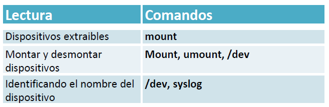

| **Inicio**         | **atrás 10**                        | **Siguiente 12**                                            |
| ------------------ | ----------------------------------- | ----------------------------------------------------------- |
| [🏠](../README.md) | [⏪](./1_10_El_entorno_en_Linux.md) | [⏩](./1_12_Archivando_y_comprimiendo_ficheros_en_Linux.md) |

---

## **Índice**

| Temario                                                                                                               |
| --------------------------------------------------------------------------------------------------------------------- |
| [96. Dispositivos extraíbles en Linux](#96-dispositivos-extraíbles-en-linux)                                          |
| [97. Montar y desmontar dispositivos](#97-montar-y-desmontar-dispositivos)                                            |
| [98. Identificando el nombre del dispositivo](#98-identificando-el-nombre-del-dispositivo)                            |
| [99. Caso práctico: Análisis forense de un dispositivo USB](#99-caso-práctico-análisis-forense-de-un-dispositivo-usb) |

---

# **Dispositivos de almacenamiento externos en Linux**



## **96. Dispositivos extraíbles en Linux**

### 💽 **Dispositivos extraíbles en Linux**

Te explicaré:

- ✅ Qué son
- 🎯 Para qué se utilizan
- 🧪 Ejemplos fáciles
- 🧰 Comandos útiles (como `mount`)
- ❗Errores comunes y sus soluciones

---

### 🧭 ¿Qué son los **dispositivos extraíbles**?

Son **dispositivos de almacenamiento externos** que puedes conectar o quitar de tu computadora, como:

- 🧲 USB (pendrives)
- 📀 Discos duros externos
- 💾 Tarjetas SD
- 📱 Teléfonos con almacenamiento en modo USB

---

### 🎯 ¿Para qué se utilizan?

- Copiar archivos entre computadoras.
- Hacer respaldos.
- Instalar sistemas operativos.
- Ejecutar programas desde unidades externas.

---

### 📌 ¿Cómo maneja Linux estos dispositivos?

Linux **no los monta automáticamente** en todas las configuraciones (aunque en escritorios como Ubuntu sí).
Por eso se suele usar el comando `mount`.

---

### 🧰 Comando: `mount`

```bash
mount
```

🔍 **¿Qué hace?**

- Lista los sistemas de archivos montados en el momento (internos y externos).
- También se puede usar para **montar manualmente** un dispositivo.

---

### 🧪 Ejemplo fácil: Montar un USB manualmente

#### Paso 1: Insertar el USB

Luego, encuentra su nombre con:

```bash
lsblk
```

🔎 Verás algo como:

```
sdb      8:16   1  16G  0 disk
└─sdb1   8:17   1  16G  0 part
```

#### Paso 2: Crear carpeta donde se montará

```bash
sudo mkdir /media/usb
```

#### Paso 3: Montar el dispositivo

```bash
sudo mount /dev/sdb1 /media/usb
```

✔️ Ahora puedes acceder a los archivos en `/media/usb`

---

### 📤 Desmontar un dispositivo: `umount`

Antes de quitar un USB, **siempre debes desmontarlo**:

```bash
sudo umount /media/usb
```

---

### 🧠 Otros comandos útiles

| Comando  | ¿Qué hace?                                        |
| -------- | ------------------------------------------------- |
| `lsblk`  | Muestra todos los discos y particiones conectadas |
| `df -h`  | Muestra el uso del disco                          |
| `mount`  | Muestra lo que está montado o monta un disco      |
| `umount` | Desmonta un dispositivo montado                   |
| `blkid`  | Muestra información sobre particiones y UUIDs     |

---

### ❗Posibles errores y soluciones

| Error                          | Causa                                  | Solución                                                 |
| ------------------------------ | -------------------------------------- | -------------------------------------------------------- |
| `mount: only root can do that` | No usaste `sudo`                       | Usa `sudo mount ...`                                     |
| `mount: wrong fs type`         | Tipo de sistema de archivos incorrecto | Añade `-t` y especifica, por ejemplo: `-t vfat`          |
| `device is busy` al desmontar  | Estás dentro del dispositivo o en uso  | Sal del directorio (`cd ~`) y vuelve a intentar `umount` |
| USB no aparece en `lsblk`      | Puede estar dañado o mal conectado     | Vuelve a conectar el dispositivo                         |

---

### 🧾 Resumen rápido

| Acción                      | Comando                           |
| --------------------------- | --------------------------------- |
| Ver dispositivos conectados | `lsblk`                           |
| Ver dispositivos montados   | `mount`                           |
| Crear punto de montaje      | `sudo mkdir /media/usb`           |
| Montar dispositivo          | `sudo mount /dev/sdX1 /media/usb` |
| Desmontar dispositivo       | `sudo umount /media/usb`          |

---

[🔼](#índice)

---

## **97. Montar y desmontar dispositivos**

### 💽 Montar y desmontar dispositivos en Linux

---

##### 🧭 ¿Qué significa "montar" y "desmontar"?

##### 🔧 **Montar**

Es el proceso de **hacer accesible un dispositivo** (como una USB, disco externo o ISO) al sistema Linux.
📁 Se monta en una **carpeta vacía** (llamada punto de montaje) para acceder a sus archivos.

##### 🔌 **Desmontar (umount)**

Es **liberar el dispositivo**, cerrando su uso para poder retirarlo sin perder datos.

---

#### 🎯 ¿Para qué se utiliza?

- Acceder a **pendrives, discos duros externos, ISO, CDs/DVDs**.
- Evitar errores o pérdida de datos al desconectar dispositivos.
- Hacer respaldos o copiar archivos.

---

#### 🧪 Ejemplo fácil: Montar y desmontar una USB

Supón que conectas una USB y quieres montarla manualmente.

##### ✅ Paso 1: Ver los dispositivos conectados

```bash
lsblk
```

🔍 Ejemplo de salida:

```
sdb      8:16   1  16G  0 disk
└─sdb1   8:17   1  16G  0 part
```

> El dispositivo es `/dev/sdb1`.

---

##### ✅ Paso 2: Crear un punto de montaje

```bash
sudo mkdir /media/usb
```

---

##### ✅ Paso 3: Montar la unidad

```bash
sudo mount /dev/sdb1 /media/usb
```

✔️ Ya puedes ver los archivos en `/media/usb`.

---

##### ✅ Paso 4: Desmontar correctamente

```bash
sudo umount /media/usb
```

🔐 Esto garantiza que todos los archivos se escribieron correctamente.

---

#### 📌 Comandos útiles y su explicación

| Comando                           | ¿Para qué sirve?                            |
| --------------------------------- | ------------------------------------------- |
| `lsblk`                           | Muestra todos los discos conectados         |
| `mount`                           | Lista o monta dispositivos                  |
| `umount`                          | Desmonta un dispositivo (correcto, sin "n") |
| `df -h`                           | Muestra el uso de espacio por dispositivos  |
| `sudo mkdir /media/usb`           | Crea el punto de montaje                    |
| `sudo mount /dev/sdb1 /media/usb` | Monta el dispositivo                        |
| `sudo umount /media/usb`          | Desmonta correctamente                      |

---

#### ❗Errores comunes y soluciones

| Error                        | Causa                           | Solución                                     |
| ---------------------------- | ------------------------------- | -------------------------------------------- |
| `command not found: unmount` | Comando mal escrito             | Usa `umount`                                 |
| `device is busy`             | Estás dentro del dispositivo    | Usa `cd ~` antes de `umount`                 |
| `only root can do that`      | No usaste `sudo`                | Añade `sudo` al comando                      |
| `mount: wrong fs type`       | Sistema de archivos desconocido | Usa `-t vfat` o `-t ntfs` si conoces el tipo |

---

#### 🧾 Resumen visual

| Acción                      | Comando                                                   |
| --------------------------- | --------------------------------------------------------- |
| Ver dispositivos conectados | `lsblk`                                                   |
| Crear punto de montaje      | `sudo mkdir /media/usb`                                   |
| Montar USB                  | `sudo mount /dev/sdX1 /media/usb`                         |
| Desmontar USB               | `sudo umount /media/usb`                                  |
| Ver errores comunes         | Revisa si estás dentro del dispositivo o si usaste `sudo` |

---

[🔼](#índice)

---

## **98. Identificando el nombre del dispositivo**

### 🧭 ¿Qué significa "identificar el nombre del dispositivo"?

Cuando conectas un dispositivo (como un USB), **Linux lo detecta con un nombre**, como por ejemplo:

```
/dev/sdb     (el disco)
/dev/sdb1    (una partición del disco)
```

Este nombre es necesario para poder:

- Montarlo
- Desmontarlo
- Formatearlo
- Revisar su uso o salud

---

### 🎯 ¿Para qué sirve identificarlo?

| Situación     | ¿Por qué necesitas el nombre?    |
| ------------- | -------------------------------- |
| Montar un USB | Para usarlo con `mount`          |
| Desmontar     | Para usar `umount /dev/sdX1`     |
| Formatear     | Para pasarle el nombre a `mkfs`  |
| Ver espacio   | Para usar `df`, `lsblk`          |
| Clonar discos | Para usar herramientas como `dd` |

---

### 🧪 Comandos para identificar el nombre de un dispositivo

Aquí te explico los más útiles y sencillos:

---

#### 🔹 `lsblk`

```bash
lsblk
```

✅ Muestra todos los **discos, particiones y tamaños**.

📌 Ideal para ver rápidamente los nombres como:

```
sda       8:0    0   50G  0 disk
├─sda1    8:1    0   50G  0 part  /
sdb       8:16   1   16G  0 disk
└─sdb1    8:17   1   16G  0 part
```

> Aquí `sdb` es el USB y `sdb1` es la partición útil.

---

#### 🔹 `dmesg | tail`

```bash
dmesg | tail
```

✅ Muestra los últimos mensajes del kernel, incluidos los nuevos dispositivos conectados.

🔍 Útil justo **después de conectar** un USB, te puede mostrar:

```
[12345.6789] sdb: sdb1
```

---

#### 🔹 `sudo fdisk -l`

```bash
sudo fdisk -l
```

✅ Muestra información más **detallada sobre todos los discos**, incluyendo particiones y sistemas de archivos.

---

#### 🔹 `ls /dev/sd*`

```bash
ls /dev/sd*
```

✅ Lista todos los dispositivos de tipo disco conectados:

```
/dev/sda   /dev/sda1   /dev/sdb   /dev/sdb1
```

---

#### 🔹 `blkid`

```bash
sudo blkid
```

✅ Muestra etiquetas, UUIDs y sistemas de archivos:

```
/dev/sdb1: UUID="A1B2-C3D4" TYPE="vfat"
```

---

### 🧠 Ejemplo completo paso a paso

1. Conectas tu USB.
2. Ejecutas:

```bash
lsblk
```

3. Ves esto:

```
sda      8:0   0  100G  0 disk
├─sda1   8:1   0   99G  0 part  /
sdb      8:16  1   16G  0 disk
└─sdb1   8:17  1   16G  0 part
```

🎯 El dispositivo nuevo es `/dev/sdb1`. ¡Ya puedes montarlo o hacer lo que necesites!

---

### ❗Errores comunes y soluciones

| Error                     | Causa                                             | Solución                                                                        |     |
| ------------------------- | ------------------------------------------------- | ------------------------------------------------------------------------------- | --- |
| No veo el dispositivo     | No lo conectaste bien o no lo reconoce el sistema | Vuelve a conectar o prueba otro puerto USB                                      |     |
| No aparece en `lsblk`     | El dispositivo no tiene particiones válidas       | Usa `sudo fdisk -l` o formatea desde cero                                       |     |
| No sabes cuál es el nuevo | Varios discos conectados                          | Usa `dmesg                                   \| tail` justo después de conectar |
| No tienes permiso         | Estás como usuario normal                         | Usa `sudo` en comandos como `fdisk` o `blkid`                                   |     |

---

### 🧾 Resumen de comandos

| Comando                 | ¿Qué hace?                                    |     |
| ----------------------- | --------------------------------------------- | --- |
| `lsblk`                 | Ver discos y particiones conectadas           |     |
| `dmesg         \| tail` | Ver los últimos dispositivos conectados       |
| `sudo fdisk -l`         | Ver detalles técnicos de discos y particiones |     |
| `ls /dev/sd*`           | Ver todos los discos conectados               |     |
| `sudo blkid`            | Ver etiquetas y UUID de dispositivos          |     |

---

### 🎓 Tip útil

Si conectas un USB y no sabes cuál es, haz esto:

```bash
lsblk > antes.txt
# conecta el USB
lsblk > despues.txt
diff antes.txt despues.txt
```

🔍 Eso te muestra exactamente **qué apareció nuevo**.

---

[🔼](#índice)

---

## **99. Caso práctico: Análisis forense de un dispositivo USB**

### 🧭 ¿Qué es el análisis forense de un USB?

Es el proceso de **investigar un dispositivo USB** para encontrar:

- Archivos eliminados
- Tiempos de acceso o modificación
- Archivos sospechosos
- Evidencia de actividad maliciosa

Se usa en casos de **investigación digital**, cibercrimen o auditorías.

---

### 🎯 ¿Para qué se utiliza?

- Analizar USB usados en ataques
- Ver archivos borrados o modificados
- Obtener evidencia digital en casos legales
- Aprender ciberseguridad práctica

---

### 🧪 Herramienta: `Autopsy`

`autopsy` es una herramienta **forense gráfica** que permite analizar discos, imágenes y dispositivos como USB de forma detallada.

---

### 📌 Comando que escribiste

```bash
puma@DESKTOP-NT4I4PK:~$ autopsy
```

✅ **¿Qué hace?**

- Inicia la aplicación **Autopsy** en el navegador.
- Por defecto corre en: `http://localhost:9999`

📌 Si no funciona, revisa si está instalada.

---

### ✅ Cómo usar Autopsy paso a paso (análisis real de USB)

#### 🔹 1. Instalar Autopsy (si no lo tienes)

##### En Debian/Ubuntu:

```bash
sudo apt update
sudo apt install autopsy sleuthkit
```

> Sleuthkit es la base de Autopsy.

---

#### 🔹 2. Crear una imagen forense del USB

Primero identifica tu USB:

```bash
lsblk
```

Ejemplo: `/dev/sdb`

Ahora crea una **imagen forense sin modificar el dispositivo**:

```bash
sudo dd if=/dev/sdb of=usb.img bs=4M status=progress
```

🧠 Esto crea un archivo llamado `usb.img` que es una **copia exacta** del USB.

---

#### 🔹 3. Iniciar Autopsy

```bash
autopsy
```

Y abre en tu navegador:

```
http://localhost:9999
```

---

#### 🔹 4. Crear un caso y analizar la imagen

1. **Nuevo caso** → nómbralo (por ejemplo: `USB-Forense`)
2. Agrega una **imagen de disco** → elige `usb.img`
3. Selecciona módulos como:

   - Análisis de archivos eliminados
   - Metadatos
   - Tiempos de acceso
   - Palabras clave

---

#### 🔍 ¿Qué puedes descubrir?

- Archivos eliminados recientemente
- Fechas de creación/modificación
- Archivos ocultos o sospechosos
- Estructura de carpetas
- Logs de sistema o malware

---

### 🧰 Comandos útiles relacionados

| Comando                     | ¿Para qué sirve?                                          |
| --------------------------- | --------------------------------------------------------- |
| `lsblk`                     | Identificar el USB                                        |
| `dd if=... of=...`          | Clonar el USB en una imagen                               |
| `file usb.img`              | Ver tipo de archivo                                       |
| `autopsy`                   | Iniciar herramienta forense en navegador                  |
| `fls`, `icat`, `tskrecover` | Herramientas de línea de comandos de SleuthKit (avanzado) |

---

### ❗Errores comunes y soluciones

| Error                            | Causa                                 | Solución                                      |
| -------------------------------- | ------------------------------------- | --------------------------------------------- |
| `command not found: autopsy`     | No está instalado                     | Instala con `sudo apt install autopsy`        |
| El navegador no abre             | No ejecutaste `autopsy` correctamente | Verifica que corra en `http://localhost:9999` |
| `Permission denied` al usar `dd` | No usaste `sudo`                      | Siempre usa `sudo` para acceder al USB        |
| Imagen se genera mal             | Usaste el dispositivo equivocado      | Asegúrate con `lsblk` antes de usar `dd`      |

---

### 🧾 Resumen práctico

| Tarea                       | Comando                                |
| --------------------------- | -------------------------------------- |
| Ver USB                     | `lsblk`                                |
| Clonar USB                  | `sudo dd if=/dev/sdX of=usb.img bs=4M` |
| Iniciar Autopsy             | `autopsy`                              |
| Analizar en navegador       | `http://localhost:9999`                |
| Herramienta alternativa CLI | `sleuthkit` (`fls`, `icat`, etc.)      |

---

### 🎓 ¿Quieres hacerlo sin interfaz gráfica?

Usa solo línea de comandos con **SleuthKit**:

```bash
fls -r -m / usb.img
```

Muestra archivos eliminados, ocultos y normales.

---

[🔼](#índice)

---

| **Inicio**         | **atrás 10**                        | **Siguiente 12**                                            |
| ------------------ | ----------------------------------- | ----------------------------------------------------------- |
| [🏠](../README.md) | [⏪](./1_10_El_entorno_en_Linux.md) | [⏩](./1_12_Archivando_y_comprimiendo_ficheros_en_Linux.md) |
