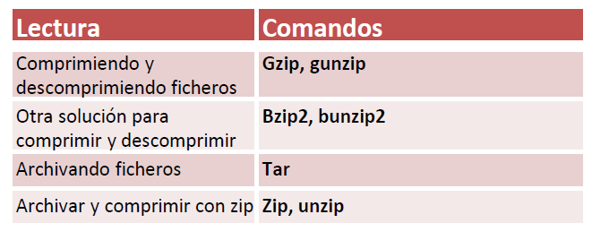

| **Inicio**         | **atrás 11**                                                     | **Siguiente 13**                                            |
| ------------------ | ---------------------------------------------------------------- | ----------------------------------------------------------- |
| [🏠](../README.md) | [⏪](./1_11_Dispositivos_de_almacenamiento_externos_en_Linux.md) | [⏩](./1_13_Expresiones_regulares_y_busquedas_avanzadas.md) |

---

## **Índice**

| Temario                                                                                                        |
| -------------------------------------------------------------------------------------------------------------- |
| [100. Comprimiendo y descomprimiendo ficheros en Linux](#100-comprimiendo-y-descomprimiendo-ficheros-en-linux) |
| [101. Bzip2: Otra solución para comprimir/descomprimir](#101-bzip2-otra-solución-para-comprimirdescomprimir)   |
| [102. Archivando ficheros: tar](#102-archivando-ficheros-tar)                                                  |
| [103. Archivar y comprimir con zip](#103-archivar-y-comprimir-con-zip)                                         |

---

# **Archivando y comprimiendo ficheros en Linux**



## **100. Comprimiendo y descomprimiendo ficheros en Linux**

### 🧭 ¿Qué significa comprimir y descomprimir?

- **Comprimir** es reducir el tamaño de un archivo o carpeta para ahorrar espacio o facilitar su envío.
- **Descomprimir** es recuperar el contenido original a partir del archivo comprimido.

---

### 🎯 ¿Para qué se utiliza?

✅ Comprimir archivos sirve para:

- Ahorrar espacio en disco
- Enviar archivos más rápido por red
- Agrupar muchos archivos en uno solo
- Hacer respaldos o copias de seguridad

---

### 🧰 Comandos que estás usando y su explicación

---

#### 🔹 `gzip syslog`

```bash
gzip syslog
```

✅ **¿Qué hace?**
Comprime el archivo `syslog` y lo reemplaza por `syslog.gz`.

🧠 El archivo original se borra y solo queda la versión comprimida.

---

#### 🔹 `gunzip syslog.gz`

```bash
gunzip syslog.gz
```

✅ **¿Qué hace?**
Descomprime el archivo `syslog.gz` y lo restaura como `syslog`.

🧠 También **elimina el archivo `.gz`** automáticamente.

---

#### 🔹 `gzip -r testdir`

```bash
gzip -r testdir
```

✅ **¿Qué hace?**
Comprime **recursivamente** todos los archivos (no carpetas) dentro del directorio `testdir`.

📁 Por ejemplo, si tienes:

```
testdir/file1.txt
testdir/file2.log
```

Se convertirán en:

```
testdir/file1.txt.gz
testdir/file2.log.gz
```

---

### 🧠 Resumen de los comandos de compresión más comunes

| Comando             | ¿Qué hace?                                          |
| ------------------- | --------------------------------------------------- |
| `gzip archivo`      | Comprime un archivo                                 |
| `gunzip archivo.gz` | Descomprime un archivo `.gz`                        |
| `gzip -r carpeta`   | Comprime todos los archivos dentro de una carpeta   |
| `zcat archivo.gz`   | Muestra el contenido de un `.gz` sin descomprimirlo |
| `file archivo.gz`   | Verifica si el archivo está realmente comprimido    |

---

### 📌 Comprimir y descomprimir múltiples archivos o carpetas

Linux tiene otras herramientas como `tar` que se combinan con `gzip`:

#### 🔸 Comprimir en `.tar.gz` (muy común):

```bash
tar -czf backup.tar.gz carpeta/
```

- `-c`: crear
- `-z`: usar gzip
- `-f`: nombre del archivo resultante

#### 🔸 Descomprimir `.tar.gz`:

```bash
tar -xzf backup.tar.gz
```

---

### ❗Errores comunes y soluciones

| Error                                     | Causa                                 | Solución                                                                 |
| ----------------------------------------- | ------------------------------------- | ------------------------------------------------------------------------ |
| `gzip: syslog: No such file or directory` | El archivo no existe                  | Verifica con `ls` que esté en el directorio                              |
| `gzip: testdir is a directory -- ignored` | Usaste `gzip` sin `-r` en una carpeta | Usa `gzip -r testdir`                                                    |
| Archivo dañado al descomprimir            | El `.gz` está incompleto o corrupto   | Intenta descargarlo o copiarlo de nuevo                                  |
| Descomprime pero no se ve el archivo      | Lo extrae en otro directorio          | Usa `tar -xzf archivo.tar.gz -C destino/` para indicar el lugar correcto |

---

### 🧪 Ejemplo práctico

1. Crear un archivo:

```bash
echo "Hola GussDev" > saludo.txt
```

2. Comprimir:

```bash
gzip saludo.txt
# crea saludo.txt.gz
```

3. Ver contenido sin descomprimir:

```bash
zcat saludo.txt.gz
```

4. Descomprimir:

```bash
gunzip saludo.txt.gz
```

---

### 🧾 Resumen rápido

| Acción                                       | Comando                            |
| -------------------------------------------- | ---------------------------------- |
| Comprimir archivo                            | `gzip archivo.txt`                 |
| Descomprimir archivo                         | `gunzip archivo.txt.gz`            |
| Comprimir carpeta completa (archivos dentro) | `gzip -r carpeta/`                 |
| Comprimir carpeta como `.tar.gz`             | `tar -czf archivo.tar.gz carpeta/` |
| Descomprimir `.tar.gz`                       | `tar -xzf archivo.tar.gz`          |

---

[🔼](#índice)

---

## **101. Bzip2: Otra solución para comprimir/descomprimir**

### 🔹 ¿Qué es **Bzip2**?

**Bzip2** es una herramienta de **compresión de archivos** que se usa comúnmente en sistemas tipo Unix (como Linux). Sirve para **reducir el tamaño de archivos**, lo que ahorra espacio en disco y facilita su envío o almacenamiento.

- Comprime archivos **más eficientemente** que `gzip`, aunque puede ser un poco más lento.
- Usa el algoritmo **Burrows-Wheeler** para lograr esa compresión.

---

### 🔹 ¿Para qué se usa?

- Para **comprimir archivos** grandes y reducir su tamaño.
- Para **descomprimir** esos archivos cuando necesitas ver o usar el contenido original.
- Se usa mucho en tareas de **administración de sistemas**, **backup**, y **transporte de logs o datos**.

---

### 🔹 ¿Qué hacen estos comandos?

```bash
puma@DESKTOP-NT4I4PK:~$ bzip2 syslog2
```

Este comando:

✅ **Comprime** el archivo llamado `syslog2`
🔁 Lo convierte en: `syslog2.bz2`
🚫 El archivo original `syslog2` se borra (por defecto).

---

```bash
puma@DESKTOP-NT4I4PK:~$ bunzip2 syslog2.bz2
```

Este comando:

✅ **Descomprime** el archivo `syslog2.bz2`
🔁 Lo convierte nuevamente en `syslog2`
🚫 El archivo comprimido `syslog2.bz2` se borra (por defecto).

---

### 🔹 Ejemplo fácil de entender

Imagina que tienes una hoja con mucha información (`syslog2`) y la doblas muchas veces para que ocupe menos espacio (eso hace `bzip2`).

Luego, cuando necesitas verla de nuevo, la desdoblas (`bunzip2`) para tenerla en su tamaño original.

---

### 🔹 Comandos útiles relacionados con Bzip2

| Comando                  | ¿Qué hace?                                          |
| ------------------------ | --------------------------------------------------- |
| `bzip2 archivo`          | Comprime el archivo y crea `archivo.bz2`            |
| `bunzip2 archivo.bz2`    | Descomprime el archivo `.bz2`                       |
| `bzip2 -k archivo`       | Comprime pero **mantiene el archivo original**      |
| `bzip2 -v archivo`       | Muestra mensajes mientras comprime (modo "verbose") |
| `bunzip2 -v archivo.bz2` | Muestra mensajes mientras descomprime               |
| `bzip2 -d archivo.bz2`   | Igual que `bunzip2`, descomprime                    |

---

### 🔹 Posibles errores / soluciones

| Problema común                          | Solución                                                |
| --------------------------------------- | ------------------------------------------------------- |
| "No such file or directory"             | Verifica que el archivo existe con `ls`                 |
| "Permission denied"                     | Usa `sudo` si necesitas permisos (`sudo bzip2 archivo`) |
| "Command not found"                     | Instala bzip2: `sudo apt install bzip2`                 |
| Archivo comprimido eliminado sin querer | Usa `bzip2 -k` para **mantener copia del original**     |

---

### ✅ Resumen corto

- **Bzip2** = herramienta para **comprimir archivos**.
- **bunzip2** = herramienta para **descomprimir archivos** `.bz2`.
- Sirve para ahorrar espacio.
- ¡Muy útil en administración de servidores o Linux en general!

---

[🔼](#índice)

---

## **102. Archivando ficheros: tar**

### 🔹 ¿Qué es `tar`?

`tar` significa "**Tape ARchive**" y es una herramienta muy usada en Linux para **agrupar muchos archivos en uno solo**.

> **Importante:** `tar` por sí solo **no comprime**, solo **empaqueta** (junta) archivos en un solo archivo. Pero se puede combinar con compresión (`gzip`, `bzip2`, `xz`, etc.).

---

### 🔹 ¿Para qué se usa `tar`?

- Para **archivar** múltiples archivos o carpetas en un solo archivo `.tar`.
- Para **comprimir y archivar** al mismo tiempo (por ejemplo: `.tar.gz`, `.tar.bz2`).
- Para **hacer backups**, compartir carpetas, empaquetar proyectos, etc.

---

### 🔹 Ejemplo fácil de entender

Imagina que tienes varios documentos (`fichero1`, `fichero2`, `fichero3`) y los quieres guardar todos juntos en una caja llamada `fichero.tar`.
Así puedes mover una sola caja en lugar de llevar cada archivo por separado.

---

### 🔹 Explicación de los comandos que escribiste

#### 🟢 1. Crear un archivo `.tar` (sin compresión)

```bash
tar -cf fichero.tar ./fichero*
```

📦 **Significa:** crea un archivo llamado `fichero.tar` que contiene todos los archivos que empiezan con `fichero`.

- `-c`: crear (`create`) el archivo
- `-f`: usar nombre de archivo (`fichero.tar`)
- `./fichero*`: todos los archivos que comienzan con "fichero"

---

#### 🟢 2. Extraer el contenido del archivo `.tar`

```bash
tar -xvf fichero.tar
```

📦 **Significa:** extraer (`-x`) todo lo que está dentro de `fichero.tar`.

- `-x`: extraer (`extract`)
- `-v`: modo "verbose", muestra qué archivos se están extrayendo
- `-f fichero.tar`: indica el archivo a usar

---

#### 🟢 3. Crear archivo `.tar.gz` (con compresión gzip)

```bash
tar -czf fichero.tar.gz .g3 ./fichero*
```

📦 **Significa:** crea un archivo comprimido `fichero.tar.gz` que incluye el archivo `.g3` y todos los que empiezan con `fichero`.

- `-c`: crear
- `-z`: **comprimir con gzip**
- `-f`: usar nombre `fichero.tar.gz`

---

#### 🟢 4. Crear archivo `.tar.bz2` (con compresión bzip2)

```bash
tar -cjf fichero.tar.bz2 .bz2 ./fichero*
```

📦 **Significa:** crea un archivo comprimido `fichero.tar.bz2` usando bzip2, incluyendo el archivo `.bz2` y todos los que empiezan con `fichero`.

- `-j`: **comprimir con bzip2**
- `-c`: crear
- `-f`: usar nombre `fichero.tar.bz2`

---

### 🔹 Comandos comunes de `tar`

| Comando                             | ¿Qué hace?                              |
| ----------------------------------- | --------------------------------------- |
| `tar -cf archivo.tar carpeta/`      | Empaqueta sin comprimir                 |
| `tar -czf archivo.tar.gz carpeta/`  | Empaqueta y **comprime con gzip**       |
| `tar -cjf archivo.tar.bz2 carpeta/` | Empaqueta y **comprime con bzip2**      |
| `tar -xf archivo.tar`               | Extrae el contenido de un `.tar`        |
| `tar -xzf archivo.tar.gz`           | Extrae el contenido de un `.tar.gz`     |
| `tar -xjf archivo.tar.bz2`          | Extrae el contenido de un `.tar.bz2`    |
| `tar -tvf archivo.tar`              | Muestra lista del contenido sin extraer |

---

### 🔹 Posibles errores y soluciones

| Problema común                        | Solución                                          |
| ------------------------------------- | ------------------------------------------------- |
| `No such file or directory`           | Asegúrate de que el archivo o carpeta exista      |
| `tar: Error is not recoverable`       | El archivo puede estar dañado o mal escrito       |
| `Permission denied`                   | Usa `sudo` si no tienes permisos (`sudo tar ...`) |
| Quieres ver sin extraer               | Usa `tar -tvf archivo.tar`                        |
| No sabes qué tipo de compresión tiene | Usa `file archivo.tar.gz` para detectar el tipo   |

---

### ✅ Resumen

- `tar` **empaqueta** archivos y carpetas en uno solo.
- Se puede **combinar con gzip (`-z`) o bzip2 (`-j`)** para comprimir.
- Es ideal para backups o mover múltiples archivos fácilmente.
- Muy útil para cualquier usuario de Linux, especialmente en administración de sistemas.

---

[🔼](#índice)

---

## **103. Archivar y comprimir con zip**

### 🔹 ¿Qué es `zip`?

`zip` es una **herramienta de compresión y archivado** que:

- Junta (archiva) y **comprime** archivos en un solo archivo `.zip`
- Se puede usar en Linux, Windows y macOS
- Es muy conocida por usuarios comunes (por ejemplo, al enviar archivos por correo)

---

### 🔹 ¿Para qué se utiliza?

- Para **reducir el tamaño** de archivos o carpetas
- Para **agrupar** muchos archivos en uno solo
- Para facilitar **copias de seguridad** (backups), envío por email, compartir en la web, etc.

---

### 🔹 ¿Qué hacen estos comandos?

#### 🟢 1. Comprimir un archivo simple

```bash
zip fichero1.zip fichero1.txt
```

✅ Este comando **comprime** el archivo `fichero1.txt` en un archivo ZIP llamado `fichero1.zip`.

- `zip`: el programa
- `fichero1.zip`: nombre del archivo comprimido a crear
- `fichero1.txt`: archivo a incluir

📝 El archivo original **no se elimina**.

---

#### 🟢 2. Comprimir otro archivo

```bash
zip syslog.zip syslog2
```

✅ Crea un archivo ZIP llamado `syslog.zip` que contiene el archivo `syslog2`.

---

#### 🟢 3. Comprimir una carpeta **manteniendo enlaces simbólicos**

```bash
zip -y testdir2.zip testdir2
```

✅ Crea un ZIP de la carpeta `testdir2` pero con la opción `-y`:

- `-y`: guarda los **enlaces simbólicos** como son, no sigue su contenido.

🗂️ Esto es útil si estás comprimiendo carpetas que contienen accesos directos o enlaces a otros archivos.

---

### 🔹 Ejemplo fácil de entender

Imagina que tienes varios papeles (archivos `.txt`, `.pdf`, etc.) y los pones todos en una **bolsa comprimida con aire** (archivo `.zip`). La bolsa es más fácil de llevar y ocupa menos espacio.

---

### 🔹 Comandos comunes con `zip`

| Comando                               | ¿Qué hace?                                     |
| ------------------------------------- | ---------------------------------------------- |
| `zip archivo.zip archivo1 archivo2`   | Comprime múltiples archivos en un solo `.zip`  |
| `zip -r archivo.zip carpeta/`         | Comprime **recursivamente** una carpeta entera |
| `zip -9 archivo.zip archivo`          | Máxima compresión (`-9`)                       |
| `unzip archivo.zip`                   | Extrae el contenido de un archivo `.zip`       |
| `zip -d archivo.zip archivo_a_borrar` | Elimina un archivo del `.zip`                  |
| `zip -m archivo.zip archivo.txt`      | Comprime y **mueve** (elimina el original)     |

---

### 🔹 Comandos relacionados

- `unzip archivo.zip`: Descomprime un archivo `.zip`
- `unzip -l archivo.zip`: Muestra lista del contenido sin extraer

---

### 🔹 Posibles errores y soluciones

| Problema común                              | Solución                                                     |
| ------------------------------------------- | ------------------------------------------------------------ |
| `zip: command not found`                    | Instala zip con: `sudo apt install zip unzip`                |
| `zip warning: name not matched`             | El archivo o carpeta no existe, revisa con `ls`              |
| `Permission denied`                         | Usa `sudo` si necesitas permisos                             |
| Archivo zip creado pero está vacío          | Asegúrate de que el archivo o carpeta existe y no esté vacío |
| Enlaces simbólicos se siguen (y no quieres) | Usa `-y` para mantenerlos como están                         |

---

### ✅ Resumen

- `zip` sirve para **archivar y comprimir** archivos o carpetas.
- Es útil para compartir archivos y ahorrar espacio.
- Los archivos `.zip` son multiplataforma (funcionan en Windows, Linux, etc.)
- Usa `unzip` para descomprimir fácilmente.

---

[🔼](#índice)

---

| **Inicio**         | **atrás 11**                                                     | **Siguiente 13**                                            |
| ------------------ | ---------------------------------------------------------------- | ----------------------------------------------------------- |
| [🏠](../README.md) | [⏪](./1_11_Dispositivos_de_almacenamiento_externos_en_Linux.md) | [⏩](./1_13_Expresiones_regulares_y_busquedas_avanzadas.md) |
