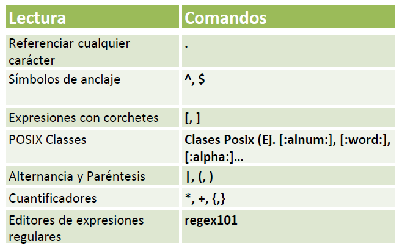

| **Inicio**         | **atrás 12**                                                | **Siguiente 14**             |
| ------------------ | ----------------------------------------------------------- | ---------------------------- |
| [🏠](../README.md) | [⏪](./1_12_Archivando_y_comprimiendo_ficheros_en_Linux.md) | [⏩](./1_14_Shell_Script.md) |

---

## **Índice**

| Temario                                                                                                                                     |
| ------------------------------------------------------------------------------------------------------------------------------------------- |
| [104. ¿Qué son las expresiones regulares?](#104-qué-son-las-expresiones-regulares)                                                          |
| [105. Referenciar cualquier caracter](#105-referenciar-cualquier-caracter)                                                                  |
| [106. Símbolos de anclaje](#106-símbolos-de-anclaje)                                                                                        |
| [107. Expresiones con corchetes y rangos](#107-expresiones-con-corchetes-y-rangos)                                                          |
| [108. POSIX Classes](#108-posix-classes)                                                                                                    |
| [109. Expresiones regulares básicas](#109-expresiones-regulares-básicas)                                                                    |
| [110. POSIX Básico vs Extendido](#110-posix-básico-vs-extendido)                                                                            |
| [111. Alternancia y paréntesis](#111-alternancia-y-paréntesis)                                                                              |
| [112. Cuantificadores](#112-cuantificadores)                                                                                                |
| [113. Editor de expresiones regulares](#113-editor-de-expresiones-regulares)                                                                |
| [114. Trabajando con expresiones regulares](#114-trabajando-con-expresiones-regulares)                                                      |
| [115. Ejercicio: ¿Puedes mejorar las expresiones regulares anteriores?](#115-ejercicio-puedes-mejorar-las-expresiones-regulares-anteriores) |

---

# **Expresiones regulares y búsquedas avanzadas**



## **104. ¿Qué son las expresiones regulares?**

### 🔹 ¿Qué son las expresiones regulares?

Una **expresión regular** es un **patrón de búsqueda** que se utiliza para encontrar, validar o manipular texto.

> 🎯 **Son como "filtros inteligentes"** que te permiten buscar texto con reglas muy precisas.

---

### 🔹 ¿Para qué se utilizan?

Las expresiones regulares se usan para:

- Buscar palabras o patrones específicos en un texto
- Validar datos (como correos, números de teléfono, etc.)
- Reemplazar partes de texto
- Extraer información de archivos, logs, HTML, etc.

---

### 🔹 Ejemplos fáciles de entender

#### 🔸 Buscar un correo electrónico

```regex
\w+@\w+\.\w+
```

📌 Encuentra cadenas como: `usuario@gmail.com`, `prueba@yahoo.es`

---

#### 🔸 Validar un número de celular peruano

```regex
^9\d{8}$
```

📌 Encuentra cadenas que **empiezan con 9** y tienen **exactamente 9 dígitos**.

Ejemplo válido: `987654321`

---

#### 🔸 Buscar palabras que terminan en `.txt`

```regex
.*\.txt$
```

📌 Encuentra cosas como: `archivo.txt`, `notas.txt`

---

### 🔹 Principales símbolos de regex

| Símbolo   | Significado                              | Ejemplo                                          |     |     |
| --------- | ---------------------------------------- | ------------------------------------------------ | --- | --- |
| `.`       | Cualquier carácter (excepto nueva línea) | `a.c` encuentra `abc`, `a1c`                     |     |     |
| `*`       | 0 o más repeticiones                     | `lo*l` encuentra `ll`, `lol`, `loool`            |     |     |
| `+`       | 1 o más repeticiones                     | `go+` encuentra `go`, `goo`, `gooo`              |     |     |
| `?`       | 0 o 1 repetición                         | `colou?r` encuentra `color`, `colour`            |     |     |
| `\d`      | Dígito del 0 al 9                        | `\d\d` encuentra `12`, `45`                      |     |     |
| `\w`      | Cualquier letra o número                 | `\w+` encuentra `hola123`                        |     |     |
| `^`       | Inicio de línea                          | `^Hola` encuentra líneas que empiezan con "Hola" |     |     |
| `$`       | Fin de línea                             | `fin$` encuentra líneas que terminan en "fin"    |     |     |
| `[]`      | Conjunto de caracteres                   | `[aeiou]` encuentra cualquier vocal              |     |     |
| `     \|` | O lógico                                 | `gato \| perro`encuentra`gato`o`perro`           |

---

### 🔹 ¿Dónde se usan las expresiones regulares?

- En comandos de terminal (como `grep`, `sed`, `awk`)
- En lenguajes de programación: Python, JavaScript, Java, etc.
- En editores de texto como VS Code o Notepad++
- En formularios web (para validar correos, contraseñas, etc.)

---

### 🔹 Ejemplos con comandos de terminal

#### 🟢 Buscar líneas que contienen “error”

```bash
grep "error" archivo.log
```

#### 🟢 Buscar líneas que **empiezan** con "INFO"

```bash
grep "^INFO" archivo.log
```

#### 🟢 Buscar líneas que **terminan** con ".conf"

```bash
grep "\.conf$" lista.txt
```

#### 🟢 Reemplazar “hola” por “adiós” usando sed

```bash
sed 's/hola/adiós/g' archivo.txt
```

---

### 🔹 Posibles errores comunes y soluciones

| Problema común                             | Solución                                             |
| ------------------------------------------ | ---------------------------------------------------- |
| No encuentra coincidencias                 | Asegúrate de usar bien los símbolos (`^`, `$`, etc.) |
| Confusión entre regex básicas y extendidas | Usa `grep -E` para expresiones extendidas            |
| Paréntesis o corchetes mal cerrados        | Verifica que todos estén bien balanceados            |
| Quiero usar regex en código                | Usa librerías como `re` en Python o `RegExp` en JS   |

---

### ✅ Resumen

- Las **expresiones regulares** son patrones usados para buscar, validar o reemplazar texto.
- Se usan en comandos como `grep`, `sed`, `awk` y en programación.
- Te permiten hacer búsquedas **muy potentes** que serían imposibles con simples palabras.

---

[🔼](#índice)

---

## **105. Referenciar cualquier caracter**

### 🔹 ¿Qué significa "referenciar cualquier carácter"?

En **expresiones regulares**, referenciar o representar **cualquier carácter** se hace con el **punto (`.`)**.

> 🔸 El `.` en una expresión regular **coincide con cualquier carácter**, excepto el salto de línea (`\n`).

---

### 🔹 ¿Para qué se utiliza?

Se utiliza cuando:

- No sabes exactamente **qué carácter aparecerá en cierta posición**, pero sí sabes su **estructura**.
- Quieres **buscar patrones flexibles** en archivos o textos.

---

### 🔹 Ejemplo fácil de entender

#### 🟢 Ejemplo con `grep`

```bash
grep 'zip,' salida_ls.txt
```

🔍 Este comando busca literalmente el texto **`zip,`** (la palabra `zip` seguida de una coma) dentro del archivo `salida_ls.txt`.

---

#### 🔸 Pero si quieres referenciar **cualquier carácter** entre "z" y "p", usarías:

```bash
grep 'z.p' salida_ls.txt
```

📌 Esto encuentra cualquier texto que comience con "z", tenga **cualquier carácter** en el medio y termine en "p".
Ejemplos que coinciden: `zip`, `zap`, `z9p`, etc.

---

### 🔹 Otros ejemplos usando `.` (punto)

| Regex  | Coincide con...                                                                                                |
| ------ | -------------------------------------------------------------------------------------------------------------- |
| `c.t`  | `cat`, `cut`, `c1t`, `c@t`, etc.                                                                               |
| `a..z` | Cualquier texto que empiece con `a`, tenga **dos caracteres en medio** y termine con `z`, como `abcdz`, `a12z` |
| `...`  | Cualquier palabra de 3 caracteres                                                                              |

---

### 🔹 Combinando con otros símbolos

Puedes combinar `.` con `*`, `+`, etc.

| Patrón | Significado                                                                                       |
| ------ | ------------------------------------------------------------------------------------------------- |
| `a.*z` | Comienza con `a`, termina con `z`, y entre ellos puede haber **cualquier cantidad de caracteres** |
| `^.`   | Primera posición de la línea (cualquier carácter)                                                 |
| `.*`   | Cualquier texto (incluyendo vacío)                                                                |

---

### 🔹 ¿Qué hace este comando?

```bash
grep 'zip,' salida_ls.txt
```

✅ **Busca la palabra `zip,` exactamente** dentro del archivo `salida_ls.txt`.

- `grep`: herramienta para buscar texto
- `'zip,'`: patrón de búsqueda (sin expresión regular especial aquí)
- `salida_ls.txt`: archivo donde buscar

---

### 🔹 Cómo usar `.` para buscar cualquier carácter

#### 🟢 Buscar cualquier archivo `.zip` (con punto literal)

```bash
grep '\.zip' salida_ls.txt
```

✅ Busca archivos como `archivo.zip`
📌 El `\.` es importante porque el punto **normalmente significa "cualquier carácter"**, pero aquí lo escapamos (`\.`) para decir: "quiero el **punto literal**".

---

### 🔹 Soluciones y tips

| Problema común                      | Solución                                                                           |
| ----------------------------------- | ---------------------------------------------------------------------------------- |
| No encuentra coincidencias          | Asegúrate de escribir correctamente los caracteres especiales (`.` vs `\.`)        |
| Coincide con más de lo esperado     | Usa patrones más específicos (por ejemplo, `zip$` si quieres que termine en `zip`) |
| `.` encuentra demasiado             | Usa `[^ ]` para excluir ciertos caracteres si es necesario                         |
| Quiero usar mayúsculas y minúsculas | Agrega `-i` a `grep`: `grep -i 'Zip' archivo`                                      |

---

### ✅ Resumen

- `.` en expresiones regulares **representa cualquier carácter** (excepto salto de línea).
- Muy útil con `grep`, `sed`, `awk`, etc.
- El comando `grep 'zip,' salida_ls.txt` **no usa regex avanzada**, pero si usas `.` podrías hacer búsquedas más flexibles como `z.p` o `z.*p`.

---

[🔼](#índice)

---

## **106. Símbolos de anclaje**

```bash
puma@DESKTOP-NT4I4PK:~$ grep '^zip'
```

---

### 🔹 ¿Qué son los **símbolos de anclaje**?

Los **símbolos de anclaje** son caracteres especiales usados en expresiones regulares que **indican la posición** de un patrón dentro de una línea de texto.

> 📌 **No buscan letras ni palabras**, sino **lugares** donde puede comenzar o terminar un patrón.

---

### 🔹 Los dos anclajes principales:

| Símbolo | Significado                     | Ejemplo                                          |
| ------- | ------------------------------- | ------------------------------------------------ |
| `^`     | Ancla el **inicio** de la línea | `^Hola` encuentra líneas que empiezan con "Hola" |
| `$`     | Ancla el **final** de la línea  | `fin$` encuentra líneas que terminan con "fin"   |

---

### 🔹 ¿Para qué se utilizan?

- Para **buscar solo al principio o al final** de una línea.
- Para validar formatos como:

  - líneas que **empiezan con una palabra**
  - líneas que **terminan con una extensión**
  - validar contraseñas, correos, etc. en programación

---

### 🔹 Explicación del comando:

```bash
grep '^zip'
```

🔍 **Busca líneas que empiezan con `zip`**

- `^zip`: patrón anclado al inicio de la línea
- `grep`: busca ese patrón en la entrada (puedes añadir un archivo después para especificarlo)

🧠 Ejemplo: si un archivo contiene esto:

```
zip backup.zip
unzip backup.zip
gzip archivo.txt
zip documentos
```

✅ El comando solo mostrará:

```
zip backup.zip
zip documentos
```

Porque **esas líneas empiezan con `zip`**.

---

### 🔹 Otros ejemplos fáciles

| Comando                     | ¿Qué hace?                                           |
| --------------------------- | ---------------------------------------------------- |
| `grep '^#' archivo.txt`     | Encuentra líneas que comienzan con `#` (comentarios) |
| `grep 'fin$' archivo.txt`   | Encuentra líneas que terminan con la palabra `fin`   |
| `grep '^$' archivo.txt`     | Encuentra líneas **vacías**                          |
| `grep '[0-9]$' archivo.txt` | Encuentra líneas que terminan en un número           |

---

### 🔹 Anclajes en combinación con otros patrones

- `^Nombre: ` → busca líneas que **empiecen con "Nombre: "**
- `[0-9]+$` → busca líneas que **terminen en uno o más números**

---

### 🔹 Posibles errores y soluciones

| Problema común                      | Solución                                                                                                                |     |
| ----------------------------------- | ----------------------------------------------------------------------------------------------------------------------- | --- |
| No encuentra coincidencias          | Asegúrate de que la palabra esté al inicio o fin, según el anclaje (`^` o `$`)                                          |     |
| Busca en el lugar incorrecto        | Usa `cat archivo.txt                                                          \| grep '^zip'`o`grep '^zip' archivo.txt` |
| No se escapan caracteres especiales | Si usas `^`, `$`, `.` en otros contextos, escápalos con `\` si es necesario                                             |     |
| Sensibilidad a mayúsculas           | Usa `-i` para ignorar mayúsculas (`grep -i '^zip' archivo.txt`)                                                         |     |

---

### ✅ Resumen

- Los **símbolos de anclaje** (`^` y `$`) te permiten **buscar por posición**:

  - `^` = **inicio de línea**
  - `$` = **final de línea**

- Son muy útiles para filtrar textos con precisión.
- Tu comando `grep '^zip'` busca **líneas que comienzan con "zip"**.

---

[🔼](#índice)

---

## **107. Expresiones con corchetes y rangos**

### 🔹 ¿Qué son las expresiones con corchetes `[]`?

Los **corchetes `[]`** en expresiones regulares se usan para **indicar un conjunto de caracteres permitidos** en una posición específica.

> 📌 **Buscan coincidencias con cualquiera de los caracteres dentro del corchete.**

---

#### 🔸 Ejemplo básico

```bash
grep 'c[ae]sa' archivo.txt
```

✅ Encuentra líneas que contienen `casa` o `cesa`, porque `[ae]` significa: "puede ser **a o e**".

---

### 🔹 ¿Qué son los rangos?

Los **rangos** permiten indicar un **grupo de caracteres en secuencia** dentro de los corchetes usando el símbolo **guion `-`**.

> 🎯 Por ejemplo, `[a-z]` representa **todas las letras minúsculas** de la "a" a la "z".

---

#### 🔸 Ejemplo con rango

```bash
grep '[a-z]' archivo.txt
```

✅ Encuentra líneas que contienen al menos una **letra minúscula**.

---

### 🔹 Tabla de ejemplos de corchetes y rangos

| Expresión     | Coincide con...                         | No coincide con...                |
| ------------- | --------------------------------------- | --------------------------------- |
| `[aeiou]`     | vocales: a, e, i, o, u                  | consonantes                       |
| `[0-9]`       | cualquier **dígito** del 0 al 9         | letras o símbolos                 |
| `[A-Z]`       | cualquier **letra mayúscula**           | minúsculas o números              |
| `[a-zA-Z]`    | cualquier letra (mayúscula o minúscula) | números o símbolos                |
| `[0-9a-f]`    | dígitos hexadecimales (de 0 a f)        | letras g-z, símbolos              |
| `[^aeiou]`    | cualquier carácter **que no sea vocal** | vocales (`^` niega el contenido)  |
| `[A-Za-z0-9]` | cualquier **letra o número**            | símbolos como `@`, `#`, `!`, etc. |

---

### 🔹 Combinaciones útiles con `grep`

#### 🟢 Buscar líneas con números

```bash
grep '[0-9]' archivo.txt
```

✅ Encuentra todas las líneas que contienen **al menos un número**.

---

#### 🟢 Buscar palabras que empiecen con una vocal

```bash
grep '^[aeiouAEIOU]' archivo.txt
```

✅ Encuentra líneas que **empiezan con una vocal**, sin importar si es mayúscula o minúscula.

---

#### 🟢 Buscar palabras que contienen letras entre la `g` y la `p`

```bash
grep '[g-p]' archivo.txt
```

✅ Coincide con letras como `h`, `i`, `j`, `k`, `l`, `m`, `n`, `o`, `p`.

---

#### 🟢 Buscar líneas que **no contienen números**

```bash
grep -v '[0-9]' archivo.txt
```

✅ `-v` niega la coincidencia. Esto encuentra líneas que **no tienen números**.

---

### 🔹 Uso de negación dentro de corchetes: `[^...]`

Cuando pones un **acento circunflejo `^` al comienzo** de los corchetes, **niegas** el conjunto.
Es decir: **“cualquier carácter que NO esté dentro de los corchetes”**.

#### 🔸 Ejemplo:

```bash
grep '[^0-9]' archivo.txt
```

✅ Encuentra líneas con **cualquier cosa que no sea un número**.

---

### 🔹 Casos comunes con sus soluciones

| Problema                      | Solución o explicación                                                                       |
| ----------------------------- | -------------------------------------------------------------------------------------------- |
| No reconoce letras con tilde  | Usa codificación UTF-8 o incluye explícitamente los caracteres (por ejemplo: `[aáeéiíoóuú]`) |
| Quiero letras y números       | Usa: `[A-Za-z0-9]`                                                                           |
| No encuentro coincidencias    | Verifica que no estés usando rangos mal escritos como `[z-a]`                                |
| Solo quiero letras minúsculas | Usa: `[a-z]`                                                                                 |

---

### ✅ Resumen

- Los corchetes `[]` indican un **grupo de caracteres** aceptables.
- Puedes usar **rangos con `-`** como `[0-9]` o `[a-z]`.
- Puedes **negar el grupo** con `[^...]`.
- Se usan mucho para validar o buscar patrones más flexibles que una palabra exacta.

---

[🔼](#índice)

---

## **108. POSIX Classes**

### 🔹 ¿Qué son las **POSIX character classes**?

Las **clases POSIX** son **nombres predefinidos entre corchetes dobles** que representan **grupos comunes de caracteres**. Se usan para hacer tus expresiones regulares **más legibles y portables**.

> 📌 En lugar de escribir algo como `[A-Za-z0-9_]`, puedes usar `[:alnum:]` (alphanumeric).

---

### 🔹 Sintaxis

Las clases POSIX se escriben dentro de **corchetes dobles `[:...]`** que a su vez están **dentro de corchetes `[]`**:

```bash
[[:class:]]
```

Por ejemplo:

```bash
[[:digit:]]  → coincide con cualquier dígito (0 al 9)
```

---

### 🔹 Lista de clases POSIX más comunes

| Clase POSIX  | Equivale a...                 | Significado                                 |
| ------------ | ----------------------------- | ------------------------------------------- |
| `[:alnum:]`  | `[A-Za-z0-9]`                 | Letras y números (alphanumeric)             |
| `[:alpha:]`  | `[A-Za-z]`                    | Solo letras (mayúsculas y minúsculas)       |
| `[:digit:]`  | `[0-9]`                       | Dígitos numéricos                           |
| `[:lower:]`  | `[a-z]`                       | Solo letras minúsculas                      |
| `[:upper:]`  | `[A-Z]`                       | Solo letras mayúsculas                      |
| `[:space:]`  | espacio, tab, salto           | Espacios en blanco                          |
| `[:punct:]`  | `!"#$%&'()*+,-./:;<=>?@[\]^_` | Signos de puntuación                        |
| `[:xdigit:]` | `[0-9A-Fa-f]`                 | Dígitos hexadecimales                       |
| `[:cntrl:]`  | caracteres de control         | Caracteres no imprimibles (como `\n`, `\t`) |
| `[:print:]`  | imprimibles + espacios        | Todo lo visible                             |
| `[:graph:]`  | imprimibles sin espacio       | Todo lo visible menos el espacio en blanco  |

---

### 🔹 🔍 Ejemplos prácticos con `grep`

#### ✅ Buscar líneas que contienen al menos un **dígito**

```bash
grep '[[:digit:]]' archivo.txt
```

Coincide con líneas que contienen: `2025`, `teléfono 9`, `clave123`, etc.

---

#### ✅ Buscar líneas que contienen **solo letras**

```bash
grep '[[:alpha:]]' archivo.txt
```

Coincide con: `hola`, `Perú`, `Gustavo`, `zip`, etc.

---

#### ✅ Buscar líneas que contienen **espacios en blanco**

```bash
grep '[[:space:]]' archivo.txt
```

Coincide con líneas como: `"hola mundo"`, `"nombre completo"`, `"a	b"` (espacios o tabulaciones).

---

#### ✅ Buscar líneas con solo **caracteres imprimibles**

```bash
grep '[[:print:]]' archivo.txt
```

Coincide con cualquier línea que tenga **texto visible**, incluyendo espacios.

---

#### ✅ Buscar direcciones hexadecimales

```bash
grep '[[:xdigit:]][[:xdigit:]]' archivo.txt
```

Coincide con cosas como: `1A`, `9f`, `FF`, `2c`.

---

### 🔹 Comparación: POSIX vs rangos

| Ejemplo usando rangos | Mismo con POSIX |
| --------------------- | --------------- |
| `[A-Za-z0-9]`         | `[[:alnum:]]`   |
| `[A-Za-z]`            | `[[:alpha:]]`   |
| `[0-9A-Fa-f]`         | `[[:xdigit:]]`  |
| `[ \t\r\n\f]`         | `[[:space:]]`   |

✅ Las POSIX classes son **más portables**, claras y fáciles de leer.

---

### 🔹 Casos de uso reales

#### 🧩 Validar nombres de archivos que solo contienen letras y números

```bash
grep '^[[:alnum:]]\+$' archivos.txt
```

✅ Busca líneas que solo tienen letras y/o números, sin símbolos ni espacios.

---

#### 🧩 Encontrar líneas con puntuación

```bash
grep '[[:punct:]]' archivo.txt
```

✅ Encuentra líneas con `!`, `.`, `:`, `@`, etc.

---

### 🔹 Posibles errores y soluciones

| Problema                              | Solución                                                                                |
| ------------------------------------- | --------------------------------------------------------------------------------------- |
| El patrón no funciona                 | Asegúrate de **usar los corchetes correctamente**: `[[:alpha:]]`, no `[:alpha:]` suelto |
| No encuentra coincidencias            | Tal vez no hay ningún carácter de ese tipo en el texto                                  |
| Funciona diferente en algunas distros | Usa `grep -E` o `egrep` para expresiones extendidas                                     |

---

### ✅ Resumen

- Las **clases POSIX** son nombres que representan **grupos de caracteres comunes**.
- Se escriben dentro de `[[:nombre:]]` y se usan dentro de corchetes regulares `[]`.
- Son más **claras, portables y legibles** que los rangos manuales como `[A-Z]`.

---

[🔼](#índice)

---

## **109. Expresiones regulares básicas**

### 🔹 ¿Qué son las expresiones regulares básicas?

Las **expresiones regulares básicas** son **patrones de texto** que permiten buscar coincidencias dentro de cadenas de caracteres. Son muy utilizadas en herramientas como `grep`, `sed`, `awk`, editores de texto, y también en lenguajes de programación como Python, JavaScript, etc.

> 🎯 Imagina que son como filtros inteligentes: **te permiten encontrar exactamente lo que necesitas**, incluso si no conoces el texto completo.

---

### 🔹 ¿Dónde se usan?

- Buscar texto en archivos: `grep`, `sed`, `awk`
- Validar entradas: correos, contraseñas, números, etc.
- Reemplazar texto
- Extraer información de logs o textos estructurados
- Formularios web, programación, bash scripting

---

### 🔹 Caracteres básicos más comunes

| Símbolo | Significado                                   | Ejemplo                                   |
| ------- | --------------------------------------------- | ----------------------------------------- |
| `.`     | Cualquier carácter (excepto salto de línea)   | `a.c` → `abc`, `a1c`, `a_c`               |
| `*`     | Cero o más repeticiones del carácter anterior | `lo*l` → `ll`, `lol`, `lool`              |
| `^`     | Inicio de línea                               | `^Hola` → líneas que comienzan con "Hola" |
| `$`     | Fin de línea                                  | `mundo$` → líneas que terminan en "mundo" |
| `[]`    | Conjunto de caracteres                        | `[aeiou]` → cualquier vocal               |
| `[^]`   | Conjunto negado                               | `[^0-9]` → cualquier cosa menos números   |
| `\`     | Escapar un carácter especial                  | `\.` → busca punto literal `.`            |

> 📌 Nota: en terminal, a veces hay que usar `grep -E` o `egrep` para activar expresiones extendidas que permiten símbolos como `+`, `?`, `{}`, `|`.

---

### 🔹 Ejemplos detallados

#### 🟢 1. Buscar líneas que contienen cualquier letra

```bash
grep '[A-Za-z]' archivo.txt
```

🔍 Encuentra cualquier línea que contenga letras (mayúsculas o minúsculas).

---

#### 🟢 2. Buscar líneas que empiezan con "ERROR"

```bash
grep '^ERROR' archivo.log
```

🔍 Muestra líneas que comienzan con la palabra **ERROR**.

---

#### 🟢 3. Buscar líneas que terminan en `.log`

```bash
grep '\.log$' archivo.txt
```

🔍 Muestra líneas que terminan exactamente en `.log`.

> 📌 El `\.` se usa para buscar el **punto literal** (porque `.` solo significa "cualquier carácter").

---

#### 🟢 4. Buscar cualquier número de dígitos seguidos

```bash
grep '[0-9][0-9]*' archivo.txt
```

🔍 Encuentra secuencias de uno o más dígitos.

---

#### 🟢 5. Buscar líneas que contengan exactamente "zip" con una letra variable en medio

```bash
grep 'z.p' archivo.txt
```

🔍 Encuentra `zip`, `zap`, `z1p`, etc.

---

#### 🟢 6. Buscar líneas vacías

```bash
grep '^$' archivo.txt
```

🔍 Coincide con líneas **que no tienen ningún carácter**.

---

### 🔹 Cómo usar con `grep`

```bash
grep 'expresión_regular' archivo.txt
```

#### 🔸 Ejemplo práctico:

Supón que `archivo.txt` contiene:

```
Hola mundo
123 datos
error fatal
ERROR 404
zip backup
```

```bash
grep '^ERROR' archivo.txt
```

✅ Salida:

```
ERROR 404
```

```bash
grep '[0-9]' archivo.txt
```

✅ Salida:

```
123 datos
ERROR 404
```

---

### 🔹 Comportamiento del `*`

- `a*` → cero o más "a" → coincide con "", "a", "aa", "aaa"
- `ba*` → "b", "ba", "baa", etc.

#### Ejemplo:

```bash
grep 'lo*l' archivo.txt
```

Coincide con: `ll`, `lol`, `lool`, `loool`, etc.

---

### 🔹 Posibles errores y soluciones

| Error común               | Solución                                               |
| ------------------------- | ------------------------------------------------------ |
| `grep: warning: stray \`  | Escapa correctamente: usa `'` o doble barra `\\`       |
| No se encuentra el patrón | Verifica el patrón exacto (mayúsculas, espacios, etc.) |
| No funciona `+` o `{}`    | Usa `grep -E` o `egrep` para expresiones extendidas    |
| Coincide demasiado        | Usa anclajes `^` y `$` para restringir posición        |

---

### ✅ Resumen

- Las expresiones regulares básicas te permiten buscar texto de manera **precisa y flexible**.
- Usan símbolos como `^`, `$`, `.`, `*`, `[]`, `\`.
- Se aplican en herramientas como `grep`, `sed`, `awk`, y lenguajes de programación.
- ¡Son fundamentales para cualquier persona que trabaje con texto o datos en Linux!

---

[🔼](#índice)

---

## **110. POSIX Básico vs Extendido**

### 🔹 ¿Qué es POSIX?

**POSIX** (Portable Operating System Interface) es un conjunto de estándares que define cómo funcionan ciertas herramientas en sistemas operativos tipo UNIX (como Linux). Esto incluye las **expresiones regulares** (regex).

---

### 🔹 ¿Qué significa "POSIX Básico" y "POSIX Extendido"?

Hay **dos modos principales** de expresiones regulares en POSIX:

| Tipo            | Herramientas comunes      | Uso                                                   |
| --------------- | ------------------------- | ----------------------------------------------------- |
| POSIX Básico    | `grep`, `sed`             | Más limitado (requiere escapes para algunos símbolos) |
| POSIX Extendido | `egrep`, `grep -E`, `awk` | Más flexible y legible                                |

---

### 🔹 Principales diferencias entre POSIX Básico y Extendido

| Elemento                     | POSIX Básico            | POSIX Extendido     |     |     |
| ---------------------------- | ----------------------- | ------------------- | --- | --- |
| `+`                          | Debe escaparse: `\+`    | Se usa directamente |     |     |
| `?`                          | Debe escaparse: `\?`    | Se usa directamente |     |     |
| `{}`                         | Debe escaparse: `\{3\}` | Se usa directamente |     |     |
| `          \|` (alternativa) | `\|`                    | `\|` directo        |
| `()` (grupo)                 | `\(` y `\)`             | `(` y `)` directo   |     |     |

> 📌 En resumen: en POSIX básico necesitas **escapar más símbolos** con `\` para que tengan su función especial.

---

### 🔹 Tabla comparativa con ejemplos

| ¿Qué se quiere hacer?            | POSIX Básico  | POSIX Extendido          |     |
| -------------------------------- | ------------- | ------------------------ | --- |
| Coincidir 1 o más letras a       | `a\+`         | `a+`                     |     |
| Coincidir 0 o 1 letra a          | `a\?`         | `a?`                     |     |
| Coincidir exactamente 3 letras a | `a\{3\}`      | `a{3}`                   |     |
| Coincidir entre 2 y 4 letras a   | `a\{2,4\}`    | `a{2,4}`                 |     |
| Alternativa entre gato o perro   | `gato\|perro` | `gato          \| perro` |
| Agrupar expresión `(ab)+`        | `\(ab\)\+`    | `(ab)+`                  |     |

---

### 🔹 Ejemplo real con `grep` (POSIX básico)

#### Archivo `texto.txt`:

```
gato
perro
ratón
gatito
```

#### 🐢 POSIX básico (con escape):

```bash
grep 'gato\|perro' texto.txt
```

✅ Resultado:

```
gato
perro
```

---

### 🔹 Ejemplo real con `grep -E` (POSIX extendido)

```bash
grep -E 'gato|perro' texto.txt
```

✅ Resultado:

```
gato
perro
```

📌 **Sin `\`**, porque el modo extendido **ya entiende** el símbolo `|`.

---

### 🔹 ¿Cómo activar el modo extendido?

| Herramienta | Comando para usar regex extendida                   |
| ----------- | --------------------------------------------------- |
| `grep`      | `grep -E 'regex' archivo.txt`                       |
| `egrep`     | `egrep 'regex' archivo.txt` (obsoleto, pero válido) |
| `sed`       | `sed -E 's/regex/...' archivo.txt`                  |
| `awk`       | Lo usa por defecto                                  |

---

### 🔹 ¿Cuándo usar cada uno?

| Si estás en...          | Usa...        | Porque...                                                        |     |
| ----------------------- | ------------- | ---------------------------------------------------------------- | --- |
| Scripts básicos, rápido | `grep`, `sed` | Son más simples, pero limitados                                  |     |
| Búsquedas complejas     | `grep -E`     | Soporta `+`, `{}`, `                       \|`, etc. sin escapes |
| Programación avanzada   | `awk`         | Usa POSIX extendido por defecto y es potente                     |     |

---

### 🔹 Resumen visual

| Símbolo   | Básico (`grep`) | Extendido (`grep -E`) |     |     |
| --------- | --------------- | --------------------- | --- | --- |
| `+`       | `\+`            | `+`                   |     |     |
| `?`       | `\?`            | `?`                   |     |     |
| `{}`      | `\{n\}`         | `{n}`                 |     |     |
| `     \|` | `\|`            | `\|`                  |
| `()`      | `\(`, `\)`      | `(`, `)`              |     |     |

---

### ✅ Conclusión

- **POSIX básico**: más antiguo, requiere escapar símbolos especiales → `grep`, `sed`
- **POSIX extendido**: más moderno, más limpio y legible → `grep -E`, `awk`, `sed -E`
- Siempre puedes pasar de básico a extendido usando la opción `-E`.

---

[🔼](#índice)

---

## **111. Alternancia y paréntesis**

> 🔸 **Alternancia (`|`)**
> 🔸 **Paréntesis de agrupación `()`**

Ambos son conceptos clave en expresiones regulares (regex) que te permiten construir **patrones más flexibles y potentes**.

---

### 🔹 ¿Qué es la **alternancia** (`|`)?

La **alternancia** permite **elegir entre varias opciones**.

> 📌 Es como decir: “busca esto **o** esto otro”.

#### 🧠 Sintaxis:

```bash
opción1|opción2
```

---

#### ✅ Ejemplo básico

```bash
grep 'gato|perro' archivo.txt
```

🔍 Esto busca **líneas que contengan `gato` o `perro`**.

---

#### 📝 Archivo de ejemplo `archivo.txt`:

```
Tengo un gato
Ella tiene un perro
Hay un ratón
```

📤 Resultado:

```
Tengo un gato
Ella tiene un perro
```

✅ Porque ambas líneas contienen **al menos una de las opciones**.

---

#### ⚠️ Importante:

- En **regex POSIX básico**, necesitas escapar el `|`:

```bash
grep 'gato\|perro' archivo.txt
```

- En **regex extendido**, como con `grep -E`, puedes usar `|` directamente:

```bash
grep -E 'gato|perro' archivo.txt
```

---

### 🔹 ¿Qué son los **paréntesis de agrupación** `()`?

Los **paréntesis** se usan para **agrupar partes de un patrón**. Son útiles para:

1. **Aplicar repetición o alternancia a todo un grupo**
2. **Capturar coincidencias** (en programación o herramientas como `sed`)

> 📌 Si quieres repetir o combinar más de una palabra, usa paréntesis.

---

#### ✅ Ejemplo: Agrupar palabras para aplicar alternancia

```bash
grep -E 'per(rito|ra)' archivo.txt
```

🔍 Esto busca:

- `perrito`
- `perra`

✅ Porque el patrón busca "per" seguido de "rito" o "ra".

---

#### ✅ Ejemplo: Repetir un grupo

```bash
grep -E '(ja)+' archivo.txt
```

🔍 Coincide con:

- `ja`
- `jaja`
- `jajajaja`

✅ Porque está repitiendo el grupo `(ja)` una o más veces.

---

#### 🧠 Agrupación sin paréntesis vs con paréntesis

##### Sin agrupar:

```bash
grep -E 'el|ella es' archivo.txt
```

🔍 Coincide con:

- `el`
- `ella es`

##### Con agrupación:

```bash
grep -E 'el(la)? es' archivo.txt
```

🔍 Coincide con:

- `el es`
- `ella es`

✅ Aquí `(la)?` indica que el grupo `la` puede aparecer **una vez o ninguna**.

---

### 🔹 Combinar alternancia + agrupación

```bash
grep -E '(gato|perro) grande' archivo.txt
```

🔍 Coincide con:

- `gato grande`
- `perro grande`

✅ Porque `gato` o `perro` deben ir seguidos de ` grande`.

---

### 🔹 Reglas para `()` y `|`

| Situación                    | ¿Qué hacer?                                     |     |
| ---------------------------- | ----------------------------------------------- | --- |
| En `grep` básico             | Escapa con `\(`, `\)`, `\|`                     |     |
| En `grep -E` o `egrep`       | Usa paréntesis y `        \|` directamente      |
| En programación (Python, JS) | Usa `()` y `              \|` como en extendido |

---

### 🔹 Posibles errores y soluciones

| Error común                               | Causa                                                   | Solución                            |     |
| ----------------------------------------- | ------------------------------------------------------- | ----------------------------------- | --- |
| No funciona el `             \|` en`grep` | Estás usando `grep` (modo básico)                       | Usa `grep -E` o escapa con `\|`     |
| No se agrupa bien                         | Te falta usar paréntesis `()` o los estás escapando mal | Verifica si usas extendido          |     |
| Coincide solo parte del texto             | Necesitas agrupar o usar anclajes `^` o `$`             | Usa paréntesis y verifica tu patrón |     |

---

### ✅ Resumen general

| Elemento    | Uso principal                                                               | Ejemplo                                                   |     |     |
| ----------- | --------------------------------------------------------------------------- | --------------------------------------------------------- | --- | --- |
| `       \|` | Alternancia: una opción **o** la otra                                       | `gato           \| perro`                                 |
| `()`        | Agrupación de patrones                                                      | `(gato                                  \| perro) grande` |     |
| `grep`      | Usa `\|`, `\(` y `\)` (modo básico)                                         | `grep 'gato\|perro' archivo.txt`                          |     |     |
| `grep -E`   | Usa `                             \|`, `(`y`)` sin escapes (modo extendido) | `grep -E '(gato \| perro)' archivo.txt`                   |

---

### 🚀 ¿Quieres practicar?

Te dejo un mini reto con un ejemplo de archivo y comandos:

#### 📝 archivo: `animales.txt`

```
perro grande
gato pequeño
ratón gris
perrita traviesa
gatita blanca
```

#### 🧪 Reto:

1. Encuentra líneas que contengan **"perro" o "gato"**:

   ```bash
   grep -E 'perro|gato' animales.txt
   ```

2. Encuentra líneas que contengan **"gato" o "gatita"**:

   ```bash
   grep -E 'gato|gatita' animales.txt
   ```

3. Encuentra líneas que contengan **"perr" seguido de "o" o "ita"**:

   ```bash
   grep -E 'perr(o|ita)' animales.txt
   ```

---

[🔼](#índice)

---

## **112. Cuantificadores**

### 🔹 ¿Qué son los **cuantificadores**?

Los **cuantificadores** son símbolos que indican **cuántas veces** debe aparecer un carácter o un grupo en una expresión regular.

> 📌 Se aplican **al carácter inmediatamente anterior** o a un grupo entre paréntesis `()`.

---

### 🔹 Tipos de cuantificadores

| Cuantificador | Significado                       | Ejemplo  | Coincide con...                |
| ------------- | --------------------------------- | -------- | ------------------------------ |
| `*`           | 0 o más veces                     | `lo*l`   | `ll`, `lol`, `lool`, `loooool` |
| `+`           | 1 o más veces                     | `lo+l`   | `lol`, `lool`, `loooool`       |
| `?`           | 0 o 1 vez                         | `lo?l`   | `ll`, `lol`                    |
| `{n}`         | Exactamente `n` veces             | `a{3}`   | `aaa`                          |
| `{n,}`        | Al menos `n` veces                | `a{2,}`  | `aa`, `aaa`, `aaaa`            |
| `{n,m}`       | Entre `n` y `m` veces (inclusive) | `a{2,4}` | `aa`, `aaa`, `aaaa`            |

---

### 🔹 ¿Cómo usarlos?

Depende del tipo de expresión regular:

| Entorno / Herramienta                      | ¿Cuáles se pueden usar directamente?                            |     |
| ------------------------------------------ | --------------------------------------------------------------- | --- |
| `grep` básico                              | Solo `*` — necesitas `\+`, `\?`, `\{n,m\}`                      |     |
| `grep -E` / `egrep`                        | Puedes usar `+`, `?`, `{}`, `             \|`, `()` sin escapes |
| `sed -E`, `awk`, lenguajes de programación | También aceptan los extendidos directamente                     |     |

---

### 🔹 Ejemplos prácticos con `grep -E`

Supón que tienes un archivo `frases.txt` con este contenido:

```
hola
hooola
holaaaaa
hol
hoooola mundo
```

---

#### 🔸 1. `*` — Cero o más repeticiones

```bash
grep -E 'ho*l' frases.txt
```

🔍 Coincide con:

- `hl` (aunque no hay en este caso)
- `hol`, `hool`, `hooool`...

---

#### 🔸 2. `+` — Una o más repeticiones

```bash
grep -E 'ho+l' frases.txt
```

🔍 Coincide con:

- `hol`, `hool`, `hooool`
- ❌ **NO** coincidirá con `hl` (porque necesita al menos una "o")

---

#### 🔸 3. `?` — Cero o una vez

```bash
grep -E 'ho?l' frases.txt
```

🔍 Coincide con:

- `hl`, `hol`
- ❌ **NO** con `hool` o más

---

#### 🔸 4. `{n}` — Exactamente n veces

```bash
grep -E 'o{3}' frases.txt
```

🔍 Coincide con líneas que tienen **exactamente 3 letras "o" seguidas** como `hoool`.

---

#### 🔸 5. `{n,}` — Al menos n veces

```bash
grep -E 'o{2,}' frases.txt
```

🔍 Coincide con líneas que tengan 2 o más "o" seguidas: `hoool`, `hooool`, `hooooooool`

---

#### 🔸 6. `{n,m}` — Entre n y m veces

```bash
grep -E 'o{2,4}' frases.txt
```

🔍 Coincide con:

- `hool`, `hoool`, `hooool`
- ❌ **NO** con `hol` o `hooooool`

---

### 🔹 Ejemplo usando grupos con cuantificadores

Si quieres repetir un **grupo**, necesitas agrupar con `()`.

```bash
grep -E '(ja){2,4}' frases.txt
```

🔍 Coincide con:

- `jaja`, `jajaja`, `jajajaja`

---

### 🔹 Cuantificadores en POSIX básico (`grep` sin `-E`)

Tienes que **escapar los cuantificadores**:

| Quieres usar... | Usas en `grep` básico |
| --------------- | --------------------- |
| `+`             | `\+`                  |
| `?`             | `\?`                  |
| `{3}`           | `\{3\}`               |

```bash
grep 'ja\{3\}' archivo.txt
```

✅ Coincide con `jaaa`

---

### 🔹 Posibles errores y soluciones

| Problema                    | Causa                               | Solución                                 |
| --------------------------- | ----------------------------------- | ---------------------------------------- |
| No funciona `+` o `{}`      | Estás usando `grep` en modo básico  | Usa `grep -E` o `egrep`                  |
| Coincide demasiado          | Falta de agrupación con `()`        | Usa paréntesis para aplicar repeticiones |
| Cuantificador se aplica mal | No hay carácter o grupo antes de él | Siempre debe haber **algo antes**        |

---

### ✅ Resumen

| Cuantificador | ¿Qué hace?            | Ejemplo  | Coincide con...          |
| ------------- | --------------------- | -------- | ------------------------ |
| `*`           | 0 o más repeticiones  | `ho*l`   | `hl`, `hol`, `hool`, ... |
| `+`           | 1 o más repeticiones  | `ho+l`   | `hol`, `hool`, ...       |
| `?`           | 0 o 1 repetición      | `ho?l`   | `hl`, `hol`              |
| `{n}`         | Exactamente `n` veces | `o{3}`   | `ooo`                    |
| `{n,}`        | Al menos `n` veces    | `o{2,}`  | `oo`, `ooo`, ...         |
| `{n,m}`       | Entre `n` y `m` veces | `o{2,4}` | `oo`, `ooo`, `oooo`      |

---

[🔼](#índice)

---

## **113. Editor de expresiones regulares**

### 🔹 ¿Qué es un **editor de expresiones regulares**?

Un **editor de expresiones regulares** es una herramienta interactiva (normalmente visual o en línea) que te permite:

- ✍️ **Escribir expresiones regulares**
- 🔎 **Probarlas en tiempo real** sobre cadenas de texto
- 🟩 Ver qué parte del texto coincide
- 🧠 Obtener explicaciones del patrón
- 🔁 Reemplazar texto usando regex
- ✅ Validar si una expresión funciona como esperas

---

### 🔹 ¿Para qué se utiliza?

- **Aprender y practicar regex**
- **Probar expresiones complejas** sin usar comandos en consola
- **Depurar errores** en patrones que no funcionan como esperas
- **Realizar reemplazos inteligentes de texto**

---

### 🔹 Ejemplos de editores populares (en línea)

| Editor                                                                                | Descripción breve                                              |
| ------------------------------------------------------------------------------------- | -------------------------------------------------------------- |
| [regex101.com](https://regex101.com)                                                  | 🎯 Explicación paso a paso, modo Python, JavaScript, PHP, etc. |
| [regexr.com](https://regexr.com)                                                      | 🧠 Interfaz visual con ejemplos, muy amigable                  |
| [RegEx Testing Tool (FreeFormatter)](https://www.freeformatter.com/regex-tester.html) | ✔️ Simple y directo                                            |
| [Debuggex](https://www.debuggex.com)                                                  | 📈 Muestra gráficamente cómo se interpreta tu regex            |

> 📌 Lo más común es usar `regex101.com`, ya que tiene soporte para muchos lenguajes y explica cada parte del patrón.

---

### 🔹 ¿Cómo se usa un editor?

1. ✅ Escribes la **expresión regular** en el área superior.
2. ✍️ Pegas o escribes el **texto de prueba** debajo.
3. 🟨 El editor **resalta lo que coincide** con tu patrón.
4. 📘 Te muestra una **explicación** línea por línea del regex.
5. 🛠️ Puedes elegir el modo: **JavaScript**, **Python**, **PCRE**, etc.
6. ➕ También puedes hacer **reemplazos** en muchos de ellos.

---

### 🔹 Ejemplo práctico

#### 🔍 Regex:

```
\b\d{3}-\d{2}-\d{4}\b
```

#### 📝 Texto de prueba:

```
Mi número de seguro es 123-45-6789 y no debería ser público.
Otro número similar es 987-65-4321.
```

🔎 En `regex101`, esto coincidirá con:

```
123-45-6789
987-65-4321
```

📘 Explicación automática:

- `\b` → límite de palabra
- `\d{3}` → 3 dígitos
- `-` → guion literal
- `\d{2}` → 2 dígitos
- `\d{4}` → 4 dígitos
- `\b` → límite de palabra

---

### 🔹 Funciones útiles del editor

| Función                  | ¿Para qué sirve?                           |
| ------------------------ | ------------------------------------------ |
| Vista previa             | Ver lo que coincide en tiempo real         |
| Colores en coincidencias | Resalta por grupos o secciones             |
| Explicación en texto     | Te ayuda a entender parte por parte        |
| Estadísticas del patrón  | Repeticiones, grupos, cuantificadores      |
| Reemplazo                | Puedes probar `regex replace` directamente |
| Guardar y compartir      | Puedes generar un enlace con tu prueba     |

---

### 🔹 ¿Cómo lo combino con la terminal?

Lo ideal es usar el editor para:

✅ Probar tu expresión
✅ Afinar la lógica
✅ Copiar y pegar en un comando `grep`, `sed`, `awk` o en código

#### 🧪 Ejemplo:

1. Pruebas esta regex en `regex101`:

   ```regex
   ^ERROR.*\d{3}
   ```

2. Luego la usas en tu terminal así:

   ```bash
   grep -E '^ERROR.*[0-9]{3}' archivo.log
   ```

---

### 🔹 Beneficios reales para ti como estudiante o profesional

- 💡 Entiendes **cómo piensa la máquina** al aplicar regex
- 🛠️ Depuras errores en tiempo real sin frustrarte
- 🚀 Aprendes más rápido que solo usando consola
- 📚 Puedes practicar sin necesidad de escribir scripts
- 🧩 Ideal para usar en validación de formularios, scrapping, análisis de logs, etc.

---

### ✅ Resumen

| Punto clave        | Descripción                                              |
| ------------------ | -------------------------------------------------------- |
| ¿Qué es?           | Herramienta para escribir y probar expresiones regulares |
| ¿Para qué sirve?   | Ver coincidencias, depurar errores, aprender             |
| Ejemplo útil       | Validar correos, números, fechas, logs, palabras, etc    |
| Editor recomendado | [regex101.com](https://regex101.com)                     |

---

### 🎁 ¿Quieres practicar?

Te dejo un ejercicio para probar en `regex101.com`:

### 🧩 Prueba esta expresión:

```regex
\b[a-zA-Z0-9._%+-]+@[a-zA-Z0-9.-]+\.[a-z]{2,}\b
```

### Texto de prueba:

```
Mi correo es contacto@gusdev.pe y el de soporte es ayuda@ejemplo.com.
También hay uno inválido: correo@@dominio..com
```

🔍 Verás que solo los correos válidos son reconocidos por la expresión.

---

[🔼](#índice)

---

## **114. Trabajando con expresiones regulares**

### 🔹 ¿Qué significa _trabajar con expresiones regulares_?

Significa **utilizar patrones** para:

- 🔎 **Buscar coincidencias** de texto
- ✂️ **Extraer información**
- 🧼 **Validar formatos**
- 🔁 **Reemplazar o transformar texto**

Se usan en terminal (`grep`, `sed`, `awk`) y en lenguajes como Python, JavaScript, etc.

---

### 🔹 ¿Dónde se usan?

| Herramienta / Lenguaje | Uso común                              |
| ---------------------- | -------------------------------------- |
| `grep`                 | Buscar patrones en archivos            |
| `sed`                  | Buscar y reemplazar texto              |
| `awk`                  | Filtrar columnas y datos estructurados |
| Python                 | Validación, extracción, reemplazo      |
| JavaScript             | Validación de formularios              |
| Editores de texto      | Buscar y reemplazar avanzado           |

---

### 🔹 Componentes clave para trabajar con regex

| Elemento     | Significado                            | Ejemplo                |     |     |
| ------------ | -------------------------------------- | ---------------------- | --- | --- |
| `.`          | Cualquier carácter (menos salto línea) | `c.t` → `cat`, `cut`   |     |     |
| `*`          | 0 o más repeticiones                   | `lo*l` → `ll`, `lol`   |     |     |
| `+`          | 1 o más repeticiones                   | `lo+l` → `lol`, `lool` |     |     |
| `?`          | 0 o 1 vez                              | `lo?l` → `ll`, `lol`   |     |     |
| `{n}`        | Exactamente n repeticiones             | `a{3}` → `aaa`         |     |     |
| `[aeiou]`    | Cualquier vocal                        |                        |     |     |
| `[^aeiou]`   | Cualquier carácter que no sea vocal    |                        |     |     |
| `^`          | Inicio de línea                        | `^Hola`                |     |     |
| `$`          | Fin de línea                           | `mundo$`               |     |     |
| `        \|` | Alternancia                            | `gato \| perro`        |
| `()`         | Agrupación                             | `(ab)+`                |     |     |
| `\b`         | Límite de palabra                      | `\bcat\b`              |     |     |

---

### 🔸 EJEMPLO 1: Buscar texto con `grep`

#### Archivo `animales.txt`:

```
El gato duerme.
El perro ladra.
Una gata maulla.
El tigre ruge.
```

#### 🧪 1. Buscar líneas con "gato" o "gata"

```bash
grep -E 'gato|gata' animales.txt
```

✅ Resultado:

```
El gato duerme.
Una gata maulla.
```

---

#### 🧪 2. Buscar líneas que comiencen con "El"

```bash
grep '^El' animales.txt
```

✅ Resultado:

```
El gato duerme.
El perro ladra.
El tigre ruge.
```

---

#### 🧪 3. Buscar líneas que terminan en punto

```bash
grep '\.$' animales.txt
```

✅ Resultado:
(todas las líneas, porque terminan con `.`)

---

### 🔸 EJEMPLO 2: Buscar y reemplazar con `sed`

```bash
sed -E 's/perro/gato/' animales.txt
```

🔁 Reemplaza la palabra `perro` por `gato`.

✅ Resultado parcial:

```
El gato ladra.
```

---

#### 🧪 Reemplazar solo si la línea empieza con "El"

```bash
sed -E '/^El/s/perro/tigre/' animales.txt
```

✅ Cambia "perro" por "tigre" solo si la línea empieza con "El".

---

### 🔸 EJEMPLO 3: Validar o extraer con `awk`

Supongamos un archivo `usuarios.csv`:

```
nombre,correo
Gustavo,gus@gmail.com
Ana,ana@ejemplo.pe
Carlos,correo_invalido
```

#### 🧪 Mostrar solo líneas con correos válidos

```bash
awk -F',' '$2 ~ /^[a-z0-9._%+-]+@[a-z0-9.-]+\.[a-z]{2,}$/' usuarios.csv
```

✅ Resultado:

```
Gustavo,gus@gmail.com
Ana,ana@ejemplo.pe
```

---

### 🔸 EJEMPLO 4: Validar con Python

```python
import re

email = "gusdev@openai.com"

if re.match(r"^[\w\.-]+@[\w\.-]+\.\w{2,}$", email):
    print("Correo válido")
else:
    print("Correo inválido")
```

✅ Detecta si el correo es válido.

---

### 🔸 EJEMPLO 5: Usar en editores de texto (VS Code, Sublime, Notepad++)

#### Buscar números:

```
\d+
```

#### Reemplazar todas las comas por puntos:

Buscar:

```
,
```

Reemplazar con:

```
.
```

✅ Muy útil para convertir CSV con decimal coma a decimal punto.

---

### 🔹 Casos prácticos comunes

| Caso                            | Regex                         |
| ------------------------------- | ----------------------------- |
| Validar correo                  | `^[\w\.-]+@[\w\.-]+\.\w{2,}$` |
| Detectar número de teléfono     | `^\d{9}$` (Perú)              |
| Palabras que empiezan con "pre" | `\bpre\w*`                    |
| Líneas vacías                   | `^$`                          |
| Extraer palabras en mayúsculas  | `\b[A-Z]+\b`                  |

---

### 🔹 Posibles errores al trabajar con regex

| Error común                       | Causa                            | Solución                          |
| --------------------------------- | -------------------------------- | --------------------------------- |
| El patrón no coincide             | El texto no tiene lo esperado    | Revisa mayúsculas, espacios, etc. |
| Coincide demasiado                | Falta de anclajes `^`, `$`, `\b` | Añade límites de palabra/línea    |
| Uso incorrecto de cuantificadores | `+`, `?`, `{}` en `grep` básico  | Usa `grep -E` para evitar escapes |
| Regex demasiado genérica          | Uso de `.*` sin control          | Usa grupos y límites con cuidado  |

---

### ✅ Resumen general

| Acción                        | Herramienta        | Ejemplo                              |
| ----------------------------- | ------------------ | ------------------------------------ |
| Buscar líneas con patrón      | `grep`, `awk`      | `grep 'error' archivo.log`           |
| Reemplazar texto              | `sed`              | `sed 's/viejo/nuevo/' archivo.txt`   |
| Validar correos, fechas, etc. | Python, JavaScript | `re.match(r"...", texto)`            |
| Probar regex                  | regex101.com       | Pruebas visuales en tiempo real      |
| Extraer datos estructurados   | `awk`, Python      | `awk -F',' '{print $2}' archivo.csv` |

---

[🔼](#índice)

---

## **115. Ejercicio: ¿Puedes mejorar las expresiones regulares anteriores?**

### 🔹 ¿Por qué es importante mejorar expresiones regulares?

Las expresiones regulares pueden funcionar, pero eso no significa que sean **eficientes, seguras o legibles**. Mejorarlas te permite:

- ✨ Hacerlas **más específicas** (evitar falsos positivos)
- 🚀 Hacerlas **más rápidas** (evitar sobrecarga)
- 📘 Hacerlas **más legibles y mantenibles**
- 💡 Evitar **errores silenciosos**

---

### 🔹 Ejemplo 1: Validar correos electrónicos

#### ❌ Expresión poco precisa:

```regex
.+@.+\..+
```

📉 Problemas:

- Coincide con: `correo@@@dominio..com`
- Coincide con espacios o caracteres inválidos
- Muy general

---

#### ✅ Mejorada:

```regex
^[a-zA-Z0-9._%+-]+@[a-zA-Z0-9.-]+\.[a-z]{2,}$
```

📌 Qué hace:

- `[a-zA-Z0-9._%+-]+` → usuario válido (letras, números, puntos, etc.)
- `@` → símbolo obligatorio
- `[a-zA-Z0-9.-]+` → dominio válido
- `\.` → punto obligatorio
- `[a-z]{2,}` → extensión de al menos dos letras

📤 Coincide con:

- `gus.dev@gmail.com`
- `ana@example.edu.pe`

❌ No coincide con:

- `correo@@gmail`
- `correo.com`

---

### 🔹 Ejemplo 2: Buscar fechas en formato DD/MM/AAAA

#### ❌ Versión simple:

```regex
\d{2}/\d{2}/\d{4}
```

📉 Problemas:

- Coincide con `99/99/9999`
- No valida días ni meses reales

---

#### ✅ Mejorada:

```regex
^(0[1-9]|[12][0-9]|3[01])/(0[1-9]|1[0-2])/\d{4}$
```

📌 Qué hace:

- Día: `01` a `31`
- Mes: `01` a `12`
- Año: cualquier 4 dígitos

✅ Coincide con:

- `23/06/2025`

❌ No coincide con:

- `99/99/9999`
- `31/13/2025`

> 💡 ¿Quieres validar incluso febrero y años bisiestos? Eso requeriría lógica adicional (fuera del alcance de regex estándar).

---

### 🔹 Ejemplo 3: Nombres propios

#### ❌ Muy genérica:

```regex
[a-zA-Z]+
```

📉 Coincide con:

- `ana`
- `ANA`
- `anA`
  (no distingue si está bien capitalizado)

---

#### ✅ Mejorada (primera letra mayúscula):

```regex
^[A-Z][a-z]+$
```

📌 Coincide con:

- `Ana`
- `Carlos`

❌ No con:

- `ana`, `ANA`, `AnA`, `123Carlos`

---

### 🔹 Ejemplo 4: Palabras específicas usando alternancia

#### ❌ Alternancia sin agrupar:

```regex
grep -E 'perro|gato grande' archivo.txt
```

📉 Coincide con:

- `perro`
- `gato grande`

❌ Pero también con frases como solo `perro`, incluso si no contiene `gato grande`.

---

#### ✅ Agrupación correcta:

```regex
grep -E '(perro|gato) grande' archivo.txt
```

📌 Coincide con:

- `perro grande`
- `gato grande`

❌ No coincide con solo `perro`

---

### 🔹 Ejemplo 5: Extraer números válidos

#### ❌ Coincide con cualquier dígito:

```regex
\d+
```

📉 Coincide con:

- `0000`
- `00123`

---

#### ✅ Mejorada: evitar ceros iniciales

```regex
\b([1-9][0-9]*)\b
```

📌 Coincide con:

- `1`, `10`, `123`

❌ No con:

- `00123`, `000`

---

### 🔹 Estrategias para mejorar expresiones regulares

| Estrategia                          | Cómo aplicarla                                    |     |
| ----------------------------------- | ------------------------------------------------- | --- |
| **Usa anclas**                      | Usa `^` y `$` para asegurar inicio y fin          |     |
| **Usa grupos y alternancia**        | Agrupa con `()` y combina opciones con `      \|` |
| **Restringe caracteres**            | Usa `[a-z]` o clases POSIX (`[:alpha:]`)          |     |
| **Evita comodines amplios**         | No uses `.*` sin control, usa cuantificadores     |     |
| **Valida contexto con `\b`**        | Usa `\b` para limitar palabras exactas            |     |
| **Usa cuantificadores adecuados**   | Reemplaza `*` por `+` si necesitas al menos uno   |     |
| **Comenta o documenta (en Python)** | Usa `re.VERBOSE` para expresiones claras          |     |

---

### 🔸 Ejercicio para ti

Dado este texto:

```
Mi nombre es Gustavo y mi correo es gus.dev+123@gmail.com.
El número de soporte es 988854321. Otro correo malo: test@dom..com
```

#### 🎯 Objetivos:

1. Extraer correos válidos
2. Detectar números de celular (9 dígitos, sin espacios)
3. Validar solo nombres propios (primera letra mayúscula)

---

#### ✅ Soluciones posibles:

##### 1. Correos válidos:

```regex
[a-zA-Z0-9._%+-]+@[a-zA-Z0-9.-]+\.[a-z]{2,}
```

##### 2. Números de celular:

```regex
\b9[0-9]{8}\b
```

##### 3. Nombre propio:

```regex
\b[A-Z][a-z]+\b
```

---

### ✅ Conclusión

🔧 Mejorar expresiones regulares te permite hacerlas:

- Más **específicas**
- Más **claras**
- Más **robustas** (menos falsos positivos)
- Más **eficientes**

---

[🔼](#índice)

---

| **Inicio**         | **atrás 12**                                                | **Siguiente 14**             |
| ------------------ | ----------------------------------------------------------- | ---------------------------- |
| [🏠](../README.md) | [⏪](./1_12_Archivando_y_comprimiendo_ficheros_en_Linux.md) | [⏩](./1_14_Shell_Script.md) |
