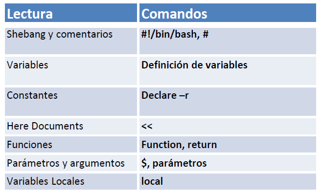

| **Inicio**         | **atrás 13**                                                | **Siguiente 15**                              |
| ------------------ | ----------------------------------------------------------- | --------------------------------------------- |
| [🏠](../README.md) | [⏪](./1_13_Expresiones_regulares_y_busquedas_avanzadas.md) | [⏩](./1_15_Shell_Script_Control_de_flujo.md) |

---

## **Índice**

| Temario                                                                                                           |
| ----------------------------------------------------------------------------------------------------------------- |
| [116. ¿Qué es Shell Script?](#116-qué-es-shell-script)                                                            |
| [117. Nuestro primer Shell Script: shebang y comentarios](#117-nuestro-primer-shell-script-shebang-y-comentarios) |
| [118. Variables](#118-variables)                                                                                  |
| [119. Constantes](#119-constantes)                                                                                |
| [120. Here Documents](#120-here-documents)                                                                        |
| [121. Funciones](#121-funciones)                                                                                  |
| [122. Parámetros y argumentos](#122-parámetros-y-argumentos)                                                      |
| [123. Variables Locales](#123-variables-locales)                                                                  |

---

# **Shell Script**



## **116. ¿Qué es Shell Script?**

Un **Shell Script** es un **archivo de texto** que contiene una **serie de comandos** que se ejecutan en el **intérprete de comandos** (o **shell**) de Linux/Unix.

> 📌 Es como grabar en un archivo lo que normalmente escribes en la terminal.

---

#### 🧠 ¿Por qué se usa?

- ✅ Automatizar tareas repetitivas
- 📦 Instalar paquetes, configurar servidores
- 🔄 Procesar archivos o logs
- 🧪 Crear pruebas automatizadas
- 🧰 Gestionar backups, servicios, y más

---

### 🔹 ¿Qué es **bash**?

`bash` significa **Bourne Again SHell**.
Es el **intérprete de comandos más común** en sistemas GNU/Linux.

> 🧾 Cuando escribes `bash script.sh`, le estás diciendo al sistema que ejecute tu script con **bash**.

---

### 🔹 ¿Entonces "Shell Script" = "Bash Script"?

**Sí y no.**

- ✅ En la práctica, **la mayoría de Shell Scripts están escritos para bash**, así que el término se usa como sinónimo.
- 🔄 Pero un _Shell Script_ puede estar escrito para otro shell como `sh`, `zsh`, `dash`, etc.

---

### 🔹 ¿Qué es **POSIX**?

**POSIX** (Portable Operating System Interface) es un **estándar** para garantizar que los scripts y comandos funcionen igual en diferentes sistemas Unix/Linux.

> ⚠️ Un **script POSIX-compliant** es más **portable**, pero evita funciones avanzadas de `bash` (como arrays, `[[ ]]`, etc.)

---

### 🔹 Estructura básica de un **Shell Script**

```bash
#!/bin/bash

# Esto es un comentario

echo "Hola, Gustavo"
```

---

#### 📁 Guardado como: `hola.sh`

#### 🔐 Luego das permisos:

```bash
chmod +x hola.sh
```

#### ▶️ Y lo ejecutas:

```bash
./hola.sh
```

---

### 🔹 Ejemplo 1: Script interactivo

```bash
#!/bin/bash

echo "¿Cómo te llamas?"
read nombre
echo "Hola, $nombre. ¡Bienvenido a bash!"
```

---

### 🔹 Ejemplo 2: Bucle `for`

```bash
#!/bin/bash

for i in {1..5}
do
  echo "Número: $i"
done
```

---

### 🔹 Ejemplo 3: Condicional

```bash
#!/bin/bash

echo "Ingrese su edad:"
read edad

if [ "$edad" -ge 18 ]; then
  echo "Eres mayor de edad."
else
  echo "Eres menor de edad."
fi
```

---

### 🔹 Ejemplo 4: Script POSIX-compliant

```sh
#!/bin/sh

# Este script cumple con POSIX, así que es portable

echo "Hola desde POSIX"
```

> Usamos `#!/bin/sh` (más genérico que `#!/bin/bash`)
> Evitamos `[[ ]]`, `function`, `let`, arrays, etc.

---

### 🔹 Diferencias clave: bash vs POSIX

| Característica            | `bash`        | `sh` (POSIX)                     |
| ------------------------- | ------------- | -------------------------------- |
| Arrays                    | ✅ sí         | ❌ no                            |
| `[[ ... ]]` condicional   | ✅ sí         | ❌ no                            |
| `let`, `(( ))` aritmética | ✅ sí         | ❌ no (usar `expr` o `"$(( ))"`) |
| Más rápido y seguro       | ❌ Más pesado | ✅ Más liviano y portable        |

---

### 🔹 ¿Dónde se usan los Shell Scripts?

- En **/etc/init.d/** para servicios
- En **automatización de cronjobs**
- Para **instaladores**, **respaldo**, **configuración**
- En **scripting de DevOps**, **seguridad**, **sistemas embebidos**

---

### ✅ Resumen general

| Concepto            | Significado                                     |
| ------------------- | ----------------------------------------------- |
| Shell Script        | Archivo con comandos que se ejecutan en shell   |
| bash                | Intérprete de comandos más usado en GNU/Linux   |
| POSIX               | Estándar para asegurar compatibilidad           |
| bash ≈ shell script | En la práctica, la mayoría de scripts usan bash |
| `#!/bin/bash`       | Declara que se usa bash                         |
| `#!/bin/sh`         | Compatible con POSIX                            |

---

[🔼](#índice)

---

## **117. Nuestro primer Shell Script: shebang y comentarios**

- `shebang` (`#!`)
- Comentarios `#`
- Uso del editor `emacs -nw`
- Ejecución del script

---

### 🧾 ¿Qué es un Shell Script?

Es un **archivo de texto plano** que contiene comandos que normalmente escribirías en la terminal. Es usado para **automatizar tareas**.

---

### 🔹 1. ¿Qué es el **shebang** (`#!`)?

El **shebang** es la **primera línea** de un script y le dice al sistema **con qué programa debe ejecutarse** el script.

```bash
#!/bin/bash
```

📌 Significa: “Este script se debe ejecutar con el intérprete `bash` (ubicado en `/bin/bash`)”.

> Si usas otro shell (como `sh`, `zsh`, `python`), puedes cambiar esa ruta.

---

### 🔹 2. ¿Qué son los comentarios?

Cualquier línea que **comienza con `#`** (y **no sea el shebang**) es un **comentario**. Sirve para:

- Explicar qué hace el script
- Anotar instrucciones
- Dejar recordatorios

```bash
# Esto es un comentario
```

---

### 🔹 3. Creamos el script con `emacs -nw`

#### ▶️ Paso a paso

1. Abre tu terminal

2. Crea y abre el script con:

```bash
emacs -nw hola_mundo.sh
```

📌 `-nw` significa “**no window**” → Emacs en modo consola.

---

#### ✍️ Dentro de `emacs`, escribe:

```bash
#!/bin/bash

# Script que muestra un saludo por pantalla

echo "Hola, Gustavo. ¡Este es tu primer script!"
```

---

#### 💾 Para **guardar y salir** en Emacs:

- Presiona `Ctrl + X` (mantén `Ctrl` presionado y luego toca `X`)
- Luego presiona `Ctrl + S` para guardar (opcional, ya guarda al salir)
- Finalmente, `Ctrl + X`, luego `Ctrl + C` para salir

---

### 🔹 4. Hacer el script ejecutable

Dale permisos de ejecución:

```bash
chmod +x hola_mundo.sh
```

✅ Esto permite que el sistema lo ejecute como un programa.

---

### 🔹 5. Ejecuta el script

```bash
./hola_mundo.sh
```

🔎 Salida esperada:

```
Hola, Gustavo. ¡Este es tu primer script!
```

---

### 📘 Explicación línea por línea

```bash
#!/bin/bash
```

👉 Usa `bash` como intérprete para este script

```bash
# Script que muestra un saludo por pantalla
```

👉 Esto es solo un comentario, no se ejecuta

```bash
echo "Hola, Gustavo. ¡Este es tu primer script!"
```

👉 `echo` imprime texto en la terminal

---

### 🧪 Ejercicio opcional

Agrega al mismo script lo siguiente:

```bash
# Pide tu nombre y lo muestra con saludo

read -p "¿Cuál es tu nombre?: " nombre
echo "Hola, $nombre. Bienvenido a bash scripting."
```

✅ Prueba ejecutar el script y verás que ahora te pide tu nombre.

---

### ✅ Resumen

| Elemento        | Descripción                                     |
| --------------- | ----------------------------------------------- |
| `#!/bin/bash`   | Indica que usas bash como intérprete            |
| `# comentario`  | Texto explicativo que no se ejecuta             |
| `emacs -nw`     | Abre Emacs en la terminal para editar scripts   |
| `chmod +x`      | Da permiso de ejecución al archivo              |
| `./nombre.sh`   | Ejecuta el script desde la terminal             |
| `read` y `echo` | Comandos básicos para entrada y salida de datos |

---

[🔼](#índice)

---

## **118. Variables**

- Cómo se declaran
- Cómo se usan
- Tipos de variables
- Buenas prácticas
- Casos de uso comunes

---

### 🔹 ¿Qué es una **variable** en Shell Script?

Una **variable** en bash es un **nombre que almacena un valor** (como texto o número) y que puedes usar luego en el script.

> 📌 Es como una caja con nombre que guarda información para reutilizarla.

---

### 🔹 1. ¿Cómo se declara una variable?

```bash
variable=valor
```

- ❌ **NO debe haber espacios** alrededor del signo `=`.
- ✅ El valor puede ser un número o texto.

### ✅ Ejemplos:

```bash
nombre="Gustavo"
edad=25
ciudad="Lima"
```

---

### 🔹 2. ¿Cómo se usa una variable?

Para **obtener su valor**, se usa el símbolo `$` antes del nombre:

```bash
echo "Hola, $nombre"
```

También puede usarse entre llaves `{}` para mayor claridad:

```bash
echo "Hola, ${nombre}, tienes ${edad} años."
```

---

### 🔹 3. Ejemplo completo: saludo interactivo

```bash
#!/bin/bash

# Declaramos variables
nombre="Gustavo"
edad=25

# Mostramos en pantalla
echo "Hola, $nombre. Tienes $edad años."
```

---

### 🔹 4. Leer variables desde el usuario (`read`)

```bash
#!/bin/bash

echo "¿Cuál es tu nombre?"
read nombre

echo "Hola, $nombre"
```

✅ Cuando ejecutes el script, te pedirá ingresar tu nombre.

---

### 🔹 5. Variables y comandos

Puedes **guardar el resultado de un comando** en una variable usando comillas invertidas `` `comando` `` o `$(comando)`.

#### ✅ Ejemplo:

```bash
fecha=$(date)
echo "La fecha actual es: $fecha"
```

📤 Resultado:

```
La fecha actual es: Mon Jun 24 19:10:11 -05 2025
```

---

### 🔹 6. Operaciones con variables numéricas

bash no hace operaciones con `+` como en Python. Usa `let`, `(( ))`, o `expr`.

#### ➤ Método 1: `let`

```bash
let suma=5+3
echo $suma
```

#### ➤ Método 2: `(( ))`

```bash
a=4
b=6
(( resultado = a + b ))
echo "Resultado: $resultado"
```

#### ➤ Método 3: `expr`

```bash
resultado=$(expr 5 + 3)
echo $resultado
```

---

### 🔹 7. Variables de entorno vs. locales

| Tipo           | Descripción                                     |
| -------------- | ----------------------------------------------- |
| **Local**      | Solo existe en el script actual                 |
| **De entorno** | Se hereda por otros scripts o comandos llamados |

#### ➤ Declarar una variable de entorno:

```bash
export PATH_DEL_SCRIPT="/home/gustavo/scripts"
```

Ahora cualquier subproceso puede usar `$PATH_DEL_SCRIPT`.

---

### 🔹 8. Buenas prácticas

| Práctica                      | Ejemplo                                |
| ----------------------------- | -------------------------------------- |
| Sin espacios en la asignación | `nombre="Gus"` ✅ `nombre = "Gus"` ❌  |
| Usa comillas si hay espacios  | `mensaje="Hola mundo"`                 |
| Usa `${}` para claridad       | `"Hola ${nombre}"`                     |
| Usa nombres descriptivos      | `ruta_backup`, `contador`, `fecha_hoy` |

---

### 🔹 9. Script con variables y condicional

```bash
#!/bin/bash

echo "Ingrese su edad:"
read edad

if [ "$edad" -ge 18 ]; then
  echo "Eres mayor de edad."
else
  echo "Eres menor de edad."
fi
```

---

### ✅ Resumen general

| Acción                 | Sintaxis                | Ejemplo                              |
| ---------------------- | ----------------------- | ------------------------------------ |
| Declarar variable      | `variable=valor`        | `nombre="Gustavo"`                   |
| Usar variable          | `$variable`             | `echo $nombre`                       |
| Leer valor del usuario | `read variable`         | `read edad`                          |
| Ejecutar comandos      | `$(comando)`            | `fecha=$(date)`                      |
| Aritmética básica      | `((a + b))`, `expr`     | `resultado=$((a + b))`               |
| Variable de entorno    | `export variable=valor` | `export PATH_DEL_SCRIPT="/home/..."` |

---

[🔼](#índice)

---

## **119. Constantes**

### 🔹 ¿Qué es una constante?

En programación, una **constante** es un valor que **no debe cambiar una vez definido**. A diferencia de las variables, **su valor es fijo durante la ejecución del programa o script**.

> 📌 En bash no existen "constantes" nativas como en otros lenguajes (C, Python), pero **puedes simularlas**.

---

### 🔸 Entonces... ¿bash tiene constantes?

❌ **No directamente.**
✅ Pero puedes **simular una constante** usando dos métodos:

1. **No sobrescribir una variable por convención**
2. **Protegerla contra modificación con `readonly` o `declare -r`**

---

### 🔹 1. Declarar una constante con `readonly`

```bash
#!/bin/bash

readonly PI=3.1416

echo "Valor de PI: $PI"

# Intentar cambiar el valor
PI=3.15  # ❌ Esto mostrará un error: readonly variable
```

🔐 Con `readonly`, bash impide que la variable sea modificada después de su asignación.

---

### 🔹 2. Usar `declare -r` (forma alternativa)

```bash
#!/bin/bash

declare -r SALUDO="Hola, Gustavo"

echo "$SALUDO"

# SALUDO="Otro saludo"  ❌ También dará error
```

Ambas (`readonly` y `declare -r`) son equivalentes.

---

### 🔹 3. Constantes por convención

Cuando no usas `readonly`, pero decides **no cambiar el valor manualmente**, es una **constante por convención**.
Suele escribirse en **mayúsculas**:

```bash
#!/bin/bash

MENSAJE_BIENVENIDA="¡Bienvenido al sistema, usuario!"

echo "$MENSAJE_BIENVENIDA"
```

⚠️ Pero esta sí se puede cambiar si no usas `readonly`.

---

### 🔹 4. Ejemplo completo: área de un círculo

```bash
#!/bin/bash

readonly PI=3.1416

read -p "Ingrese el radio: " radio
area=$(echo "$PI * $radio * $radio" | bc)

echo "El área del círculo es: $area"
```

✅ `bc` se usa para calcular con decimales.

---

### 🔹 5. Qué pasa si intentas modificar una constante

```bash
readonly MENSAJE="Hola mundo"
MENSAJE="Cambiar texto"  # ❌ Error: MENSAJE: readonly variable
```

Salida:

```
./script.sh: line 3: MENSAJE: readonly variable
```

---

### 🔹 Buenas prácticas con constantes

| Práctica                     | Recomendación                        |
| ---------------------------- | ------------------------------------ |
| Usar mayúsculas              | Ejemplo: `readonly API_KEY="abc123"` |
| Definir al inicio del script | Antes de usar cualquier función      |
| Comentar su propósito        | `# Constante para el impuesto fijo`  |
| No modificar su valor        | Protege usando `readonly`            |

---

### ✅ Resumen general

| Acción                  | Sintaxis                              |
| ----------------------- | ------------------------------------- |
| Definir constante       | `readonly NOMBRE=valor`               |
| Alternativa             | `declare -r NOMBRE=valor`             |
| Convención informal     | `NOMBRE_MAYUS=valor` (sin protección) |
| Proteger contra cambios | `readonly` o `declare -r`             |
| Mostrar error si cambia | Sí, bash lanza error si modificas     |

---

[🔼](#índice)

---

## **120. Here Documents**

### 🔹 ¿Qué es un _Here Document_ (heredoc)?

Un **Here Document** (`<<`) es una forma de **redirigir múltiples líneas de texto** como entrada a un comando. Es muy útil para:

- Simular entrada de usuario a comandos interactivos (`ftp`, `sql`, `ssh`, etc.)
- Generar archivos o bloques de texto en scripts
- Automatizar comandos que normalmente piden input manual

---

#### 📌 Sintaxis general:

```bash
comando << marcador
línea 1
línea 2
...
marcador
```

- `comando`: el comando que recibirá el bloque de texto
- `marcador`: palabra que indica el inicio y fin del bloque (puede ser `EOF`, `eof`, `END`, etc.)
- Todo lo que esté entre los `marcadores` se pasa como **entrada estándar** (`stdin`) al comando

---

### 🔸 Ejemplo 1: Imprimir texto con `cat`

```bash
cat << EOF
Hola, Gustavo
Este es un ejemplo de Here Document.
EOF
```

🟢 Salida:

```
Hola, Gustavo
Este es un ejemplo de Here Document.
```

➡️ `cat` recibe las líneas entre `EOF` como si fueran entrada estándar.

---

### 🔸 Ejemplo 2: Crear un archivo con contenido

```bash
cat << EOF > saludo.txt
¡Hola, Gustavo!
Este archivo fue creado desde un Here Document.
EOF
```

✅ Esto genera un archivo `saludo.txt` con ese contenido.

---

### 🔸 Ejemplo 3: Automatizar una sesión FTP

Esto es muy importante: muchos comandos (como `ftp`, `sftp`, `mysql`, etc.) aceptan **input interactivo**. Heredoc ayuda a automatizarlos.

#### ▶️ Script de ejemplo:

```bash
ftp -n << EOF
open ftp.ejemplo.com
user usuario contraseña
cd /directorio
get archivo.txt
bye
EOF
```

📌 ¿Qué significa esto?

- `ftp -n`: abre sesión FTP sin login automático
- El bloque entre `<< EOF ... EOF` son **comandos que normalmente escribirías a mano**
- Esto automatiza toda la sesión

✅ Muy útil en scripts de backup, servidores, etc.

---

### 🔸 Ejemplo 4: Variables dentro de Here Document

```bash
nombre="Gustavo"

cat << EOF
Hola, $nombre.
Este es un mensaje personalizado.
EOF
```

🟢 Resultado:

```
Hola, Gustavo.
Este es un mensaje personalizado.
```

---

### 🔸 Ejemplo 5: Evitar que las variables se expandan (`<< 'EOF'`)

Si no quieres que bash reemplace variables (por ejemplo en plantillas):

```bash
cat << 'EOF'
Hola, $nombre
Esto no se va a expandir.
EOF
```

🟢 Resultado:

```
Hola, $nombre
Esto no se va a expandir.
```

> 🔒 Las comillas simples en `'EOF'` **evitan la expansión de variables** y ejecución de comandos dentro del heredoc.

---

### 🔸 Ejemplo 6: Comando dentro de Here Document

```bash
cat << EOF
La fecha actual es: $(date)
EOF
```

🟢 Salida:

```
La fecha actual es: Mon Jun 24 20:00:01 -05 2025
```

> 🧠 Puedes ejecutar comandos dentro de `$(...)` como de costumbre.

---

### ✅ Resumen rápido

| Elemento                      | Ejemplo         | Uso                             |
| ----------------------------- | --------------- | ------------------------------- |
| Heredoc básico                | `cat << EOF`    | Mostrar texto o generar archivo |
| Heredoc con comando externo   | `ftp -n << EOF` | Automatizar entrada interactiva |
| Evitar expansión de variables | `<< 'EOF'`      | Mostrar `$variable` tal cual    |
| Ejecutar comandos             | `$(date)`       | Incluir resultados dinámicos    |

---

### 🧪 Mini ejercicio para ti

👉 Crea un script llamado `menu.sh` que muestre este menú con un `Here Document`:

```bash
Bienvenido, Gustavo
1) Opción A
2) Opción B
3) Salir
```

Y luego te permita ingresar una opción con `read`.

### ✅ Script: `menu.sh`

```bash
#!/bin/bash

# Mostramos el menú usando un Here Document
cat << EOF
===========================
     Bienvenido, Gustavo
===========================
1) Opción A
2) Opción B
3) Salir
===========================
EOF

# Pedimos una opción al usuario
read -p "Elige una opción [1-3]: " opcion

# Evaluamos la opción con un case
case $opcion in
  1)
    echo "Elegiste la Opción A"
    ;;
  2)
    echo "Elegiste la Opción B"
    ;;
  3)
    echo "Saliendo... ¡Hasta pronto!"
    ;;
  *)
    echo "Opción no válida. Intenta de nuevo."
    ;;
esac
```

---

### ▶️ Instrucciones para ejecutarlo

1. **Guarda el script** como `menu.sh`

2. **Dale permisos de ejecución**:

```bash
chmod +x menu.sh
```

3. **Ejecuta el script**:

```bash
./menu.sh
```

---

### 💡 Salida esperada

```
===========================
     Bienvenido, Gustavo
===========================
1) Opción A
2) Opción B
3) Salir
===========================
Elige una opción [1-3]: 2
Elegiste la Opción B
```

---

[🔼](#índice)

---

## **121. Funciones**

### 🔹 ¿Qué es una función en Bash?

Una **función** es un bloque de código que puedes **definir una sola vez** y luego **llamar muchas veces**. Sirve para:

- Evitar repetir código
- Dividir el script en tareas pequeñas
- Mejorar la legibilidad y mantenimiento

---

### 🔸 Sintaxis de una función

#### 🧾 Forma 1: la más común

```bash
nombre_funcion() {
  # código aquí
}
```

#### 🧾 Forma 2: alternativa (menos común)

```bash
function nombre_funcion {
  # código aquí
}
```

> ⚠️ Ambas formas son válidas en `bash`, pero la primera es más estándar.

---

### 🔹 ¿Cómo se usa una función?

Primero la defines y luego la llamas por su nombre:

```bash
saludar() {
  echo "Hola, Gustavo"
}

# Llamar a la función
saludar
```

---

### 🔹 Ejemplo 1: función sin parámetros

```bash
#!/bin/bash

mostrar_bienvenida() {
  echo "============================"
  echo "  ¡Bienvenido a mi script! "
  echo "============================"
}

# Llamamos a la función
mostrar_bienvenida
```

---

### 🔹 Ejemplo 2: función con parámetros

En bash, los **parámetros se reciben como `$1`, `$2`, `$3`, ...\`**

```bash
saludar_persona() {
  echo "Hola, $1. ¡Bienvenido!"
}

saludar_persona "Gustavo"
saludar_persona "Ana"
```

🟢 Resultado:

```
Hola, Gustavo. ¡Bienvenido!
Hola, Ana. ¡Bienvenido!
```

---

### 🔹 Ejemplo 3: función que retorna un valor (por salida)

```bash
sumar() {
  resultado=$(( $1 + $2 ))
  echo $resultado
}

total=$(sumar 4 5)
echo "La suma es: $total"
```

✅ Aquí `sumar 4 5` imprime `9`, y lo capturamos con `$(...)`.

---

### 🔹 Ejemplo 4: menú con funciones

```bash
#!/bin/bash

mostrar_menu() {
  cat << EOF
=== MENÚ PRINCIPAL ===
1) Saludar
2) Mostrar fecha
3) Salir
EOF
}

saludar() {
  echo "Hola, Gustavo"
}

mostrar_fecha() {
  date
}

# Programa principal
mostrar_menu
read -p "Selecciona una opción: " opcion

case $opcion in
  1) saludar ;;
  2) mostrar_fecha ;;
  3) echo "Adiós" ;;
  *) echo "Opción inválida" ;;
esac
```

---

### 🔹 Ejemplo 5: funciones con condicionales

```bash
es_mayor_de_edad() {
  if [ "$1" -ge 18 ]; then
    echo "Eres mayor de edad"
  else
    echo "Eres menor de edad"
  fi
}

read -p "Ingresa tu edad: " edad
es_mayor_de_edad "$edad"
```

---

### ✅ Buenas prácticas al usar funciones

| Práctica                              | ¿Por qué?                              |
| ------------------------------------- | -------------------------------------- |
| Usa nombres descriptivos              | `validar_usuario` es mejor que `f1`    |
| Define funciones al inicio            | Ayuda a organizar el script            |
| Comenta cada función                  | Explica su propósito si es compleja    |
| Usa parámetros, no variables globales | Hace las funciones más reutilizables   |
| Usa `return` para códigos de estado   | `return 0` (éxito), `return 1` (error) |

---

### 🔸 Extra: Función que retorna un código de estado

```bash
verificar_archivo() {
  if [ -f "$1" ]; then
    return 0  # éxito
  else
    return 1  # error
  fi
}

verificar_archivo "mi_archivo.txt"
if [ $? -eq 0 ]; then
  echo "El archivo existe"
else
  echo "El archivo no existe"
fi
```

---

### ✅ Resumen general

| Acción                  | Sintaxis                    |
| ----------------------- | --------------------------- |
| Definir función         | `funcion() { ... }`         |
| Llamar función          | `funcion`                   |
| Pasar argumentos        | `funcion arg1 arg2`         |
| Leer argumentos         | `$1`, `$2`, etc.            |
| Retornar valor (texto)  | `echo` dentro de la función |
| Retornar estado (`0/1`) | `return`                    |

---

### 🎯 ¿Quieres practicar?

Te dejo un reto:

> ✍️ Crea un script que defina una función `calcular_igv` que reciba un precio y calcule el precio final con IGV (18%).

### ✅ Script: `calcular_igv.sh`

```bash
#!/bin/bash

# Constante: Tasa de IGV
readonly IGV=0.18

# Función para calcular el precio total con IGV
calcular_igv() {
  precio_base=$1
  igv=$(echo "$precio_base * $IGV" | bc -l)
  total=$(echo "$precio_base + $igv" | bc -l)

  echo "Precio base: S/ $precio_base"
  echo "IGV (18%):   S/ $igv"
  echo "Total a pagar: S/ $total"
}

# Pedimos el precio al usuario
read -p "Ingrese el precio base del producto: S/ " precio

# Llamamos a la función con el precio ingresado
calcular_igv "$precio"
```

---

### 🧾 ¿Qué hace el script?

1. Define una constante `IGV=0.18` con `readonly`.
2. La función `calcular_igv`:

   - Recibe el precio base como argumento.
   - Calcula el IGV y el total usando `bc` (para decimales).
   - Muestra todo formateado.

3. Pide al usuario que ingrese el precio base.
4. Llama a la función con ese valor.

---

### ▶️ ¿Cómo usarlo?

1. **Guarda el script** como `calcular_igv.sh`
2. **Hazlo ejecutable**:

```bash
chmod +x calcular_igv.sh
```

3. **Ejecuta el script**:

```bash
./calcular_igv.sh
```

---

### 🧪 Ejemplo de ejecución:

```
Ingrese el precio base del producto: S/ 100
Precio base: S/ 100
IGV (18%):   S/ 18.00
Total a pagar: S/ 118.00
```

---

[🔼](#índice)

---

## **122. Parámetros y argumentos**

### 🧠 ¿Qué son los **parámetros y argumentos**?

- Un **parámetro** es una **variable dentro de un script o función** que recibe un valor.
- Un **argumento** es el **valor que el usuario pasa al script** o a la función cuando la ejecuta.

> 🔁 Los **argumentos se convierten en parámetros** cuando los recibe el script o función.

---

### 🟦 En un script: Argumentos posicionados

Cuando ejecutas un script como este:

```bash
./saludo.sh Gustavo 25
```

- `$0` → nombre del script (`saludo.sh`)
- `$1` → primer argumento (`Gustavo`)
- `$2` → segundo argumento (`25`)

---

### ✅ Ejemplo 1: script que usa parámetros

#### 📁 Script: `saludo.sh`

```bash
#!/bin/bash

echo "Hola, $1"
echo "Tu edad es $2"
```

📌 Ejecución:

```bash
./saludo.sh Gustavo 25
```

🔸 Salida:

```
Hola, Gustavo
Tu edad es 25
```

---

### 🟨 Otros parámetros especiales

| Símbolo     | Significado                                           |
| ----------- | ----------------------------------------------------- |
| `$0`        | Nombre del script                                     |
| `$1`, `$2`… | Argumentos posicionales                               |
| `$#`        | Número total de argumentos                            |
| `$@`        | Todos los argumentos como lista (palabra por palabra) |
| `$*`        | Todos los argumentos como una sola cadena             |

---

### ✅ Ejemplo 2: mostrar todos los argumentos

```bash
#!/bin/bash

echo "Número de argumentos: $#"
echo "Todos los argumentos: $@"
```

📌 Ejecución:

```bash
./mi_script.sh hola mundo 123
```

🔸 Salida:

```
Número de argumentos: 3
Todos los argumentos: hola mundo 123
```

---

### ✅ Ejemplo 3: bucle sobre argumentos

```bash
#!/bin/bash

echo "Mostrando todos los argumentos:"
for arg in "$@"
do
  echo "- $arg"
done
```

📌 Ejecución:

```bash
./listador.sh uno dos tres
```

🔸 Salida:

```
Mostrando todos los argumentos:
- uno
- dos
- tres
```

---

### 🔷 En funciones: parámetros internos

Las funciones en bash **también usan `$1`, `$2`, ...\`** para recibir argumentos.

---

#### ✅ Ejemplo 4: función con parámetros

```bash
mostrar_info() {
  echo "Nombre: $1"
  echo "Edad: $2"
}

mostrar_info "Gustavo" 25
```

🔸 Salida:

```
Nombre: Gustavo
Edad: 25
```

---

### 🔶 Validar argumentos: comprobando cuántos hay

```bash
#!/bin/bash

if [ $# -lt 2 ]; then
  echo "Uso: $0 nombre edad"
  exit 1
fi

echo "Hola, $1. Tienes $2 años."
```

📌 Si olvidas pasar argumentos, el script te lo indica y termina.

---

### ✅ Resumen de variables especiales

| Variable | Significado                               | Ejemplo (`./script.sh uno dos`) |
| -------- | ----------------------------------------- | ------------------------------- |
| `$0`     | Nombre del script                         | `./script.sh`                   |
| `$1`     | Primer argumento                          | `uno`                           |
| `$2`     | Segundo argumento                         | `dos`                           |
| `$#`     | Número total de argumentos                | `2`                             |
| `$@`     | Lista de argumentos (separados)           | `uno dos`                       |
| `$*`     | Todos los argumentos como una sola cadena | `"uno dos"`                     |

---

### 🧪 Reto (opcional)

Crea un script llamado `calculadora.sh` que:

1. Reciba 3 argumentos: número1, operador (+, -, \*, /), número2
2. Muestre el resultado

📌 Ejemplo:

```bash
./calculadora.sh 10 + 5
Resultado: 15
```

### ✅ Script: `calculadora.sh`

```bash
#!/bin/bash

# Verificamos que haya exactamente 3 argumentos
if [ $# -ne 3 ]; then
  echo "Uso: $0 numero1 operador numero2"
  echo "Ejemplo: $0 10 + 5"
  exit 1
fi

# Capturamos los argumentos
num1=$1
operador=$2
num2=$3

# Validamos que los números sean realmente números (opcional, básico)
if ! [[ $num1 =~ ^[0-9]+$ && $num2 =~ ^[0-9]+$ ]]; then
  echo "Error: Los dos operandos deben ser números enteros."
  exit 2
fi

# Realizamos la operación
case $operador in
  +)
    resultado=$((num1 + num2))
    ;;
  -)
    resultado=$((num1 - num2))
    ;;
  \*)
    resultado=$((num1 * num2))
    ;;
  /)
    if [ "$num2" -eq 0 ]; then
      echo "Error: División por cero no permitida."
      exit 3
    fi
    resultado=$((num1 / num2))
    ;;
  *)
    echo "Operador inválido. Usa: +, -, *, /"
    exit 4
    ;;
esac

# Mostramos el resultado
echo "Resultado: $resultado"
```

---

### ▶️ ¿Cómo lo uso?

1. **Guarda el archivo** como `calculadora.sh`
2. **Dale permisos de ejecución**:

```bash
chmod +x calculadora.sh
```

3. **Ejecuta ejemplos**:

```bash
./calculadora.sh 10 + 5      # Resultado: 15
./calculadora.sh 20 / 4      # Resultado: 5
./calculadora.sh 3 \* 8      # Resultado: 24
./calculadora.sh 7 - 2       # Resultado: 5
```

> 📌 Para el operador `*`, necesitas escribir `\*` en la terminal para evitar que bash lo interprete como comodín de archivos.

---

### 🔒 Validaciones incluidas

- Número incorrecto de argumentos
- Operadores inválidos
- División por cero
- Entrada no numérica básica

---

[🔼](#índice)

---

## **123. Variables Locales**

### 🔹 ¿Qué es una variable local en Bash?

Una **variable local** en Bash es una variable **que sólo existe dentro de una función**. No afecta ni es visible fuera de esa función.

> 📌 Se declara con `local` dentro de una función.

---

### 🔸 ¿Por qué usar variables locales?

| Razón                   | Explicación                                                    |
| ----------------------- | -------------------------------------------------------------- |
| Evitar conflictos       | No sobrescriben variables globales del mismo nombre            |
| Facilitar mantenimiento | Aíslan la lógica de cada función                               |
| Reutilización segura    | Las funciones pueden usar sus propias variables sin interferir |

---

### 🔹 Sintaxis para declarar una variable local

```bash
local nombre_variable=valor
```

✅ Solo se puede usar **dentro de funciones**.

---

### ✅ Ejemplo 1: Variable local vs. global

```bash
#!/bin/bash

mensaje="Hola desde fuera"

mi_funcion() {
  local mensaje="Hola desde dentro"
  echo "$mensaje"
}

echo "Antes de llamar a la función: $mensaje"
mi_funcion
echo "Después de llamar a la función: $mensaje"
```

🟢 Salida:

```
Antes de llamar a la función: Hola desde fuera
Hola desde dentro
Después de llamar a la función: Hola desde fuera
```

> 📌 La variable `mensaje` dentro de `mi_funcion` es **local** y **no afecta** la global.

---

### ✅ Ejemplo 2: Variable local numérica

```bash
#!/bin/bash

calcular_cuadrado() {
  local numero=$1
  local cuadrado=$((numero * numero))
  echo "El cuadrado de $numero es $cuadrado"
}

calcular_cuadrado 5
calcular_cuadrado 8
```

🟢 Salida:

```
El cuadrado de 5 es 25
El cuadrado de 8 es 64
```

> ✅ Las variables `numero` y `cuadrado` **no existen fuera** de la función.

---

### ✅ Ejemplo 3: Evitar errores usando `local`

Sin `local`, podrías accidentalmente cambiar una variable global:

```bash
#!/bin/bash

contador=10

incrementar() {
  contador=$((contador + 1))  # ¡Modifica la variable global!
}

incrementar
echo "Contador fuera: $contador"  # Muestra 11
```

🔄 Pero con `local`:

```bash
#!/bin/bash

contador=10

incrementar() {
  local contador=5
  contador=$((contador + 1))
  echo "Dentro de la función: $contador"
}

incrementar
echo "Fuera de la función: $contador"
```

🟢 Resultado:

```
Dentro de la función: 6
Fuera de la función: 10
```

✅ El valor global no se vio afectado.

---

### 🔶 ¿Qué pasa si no usas `local`?

- Tus funciones pueden modificar variables sin querer
- Es difícil depurar errores
- Se pierde el aislamiento de funciones

---

### 🔁 Variable local dentro de un bucle o condicional

Las locales también funcionan dentro de funciones que contienen estructuras de control:

```bash
mi_funcion() {
  local suma=0
  for i in 1 2 3
  do
    suma=$((suma + i))
  done
  echo "Suma dentro de la función: $suma"
}

mi_funcion
```

---

### ✅ Resumen

| Concepto                   | Explicación                                      |
| -------------------------- | ------------------------------------------------ |
| `local`                    | Restringe el alcance de la variable a la función |
| Solo dentro de funciones   | No se puede usar `local` fuera de funciones      |
| Protege variables globales | Evita sobrescribir valores fuera de la función   |
| Mejora la organización     | Hace tus scripts más seguros y ordenados         |

---

### 🎯 ¿Quieres practicar?

Aquí va un reto corto:

> ✍️ Crea un script con una función `saludar_usuario` que reciba un nombre como argumento, lo guarde en una **variable local**, y salude usando esa variable. Asegúrate de que no cambie una variable global llamada `usuario`.

### ✅ Script: `saludo_local.sh`

```bash
#!/bin/bash

# Variable global
usuario="Gustavo"

# Función con variable local
saludar_usuario() {
  local usuario=$1
  echo "Hola, $usuario. ¡Bienvenido al sistema!"
}

# Mostrar la variable global antes
echo "Variable global antes de llamar la función: $usuario"

# Llamar a la función con un argumento
saludar_usuario "Ana"

# Mostrar la variable global después
echo "Variable global después de llamar la función: $usuario"
```

---

### ▶️ Instrucciones para ejecutarlo

1. Guarda este contenido como `saludo_local.sh`
2. Dale permisos de ejecución:

```bash
chmod +x saludo_local.sh
```

3. Ejecuta el script:

```bash
./saludo_local.sh
```

---

### 🔎 Salida esperada

```
Variable global antes de llamar la función: Gustavo
Hola, Ana. ¡Bienvenido al sistema!
Variable global después de llamar la función: Gustavo
```

✅ Como puedes ver:

- Dentro de la función, usamos la variable local `usuario` que vale `"Ana"`.
- La **variable global `usuario` sigue siendo `"Gustavo"`**.

---

[🔼](#índice)

---

| **Inicio**         | **atrás 13**                                                | **Siguiente 15**                              |
| ------------------ | ----------------------------------------------------------- | --------------------------------------------- |
| [🏠](../README.md) | [⏪](./1_13_Expresiones_regulares_y_busquedas_avanzadas.md) | [⏩](./1_15_Shell_Script_Control_de_flujo.md) |
