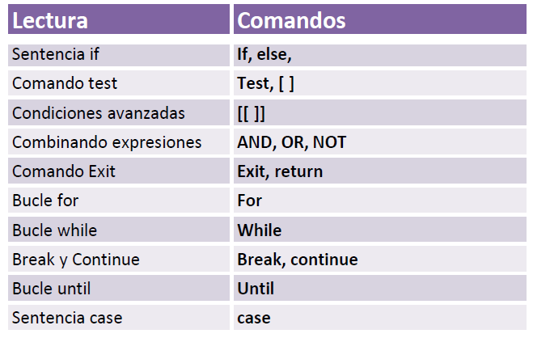

| **Inicio**         | **atrás 14**                 | **Siguiente 16**                                           |
| ------------------ | ---------------------------- | ---------------------------------------------------------- |
| [🏠](../README.md) | [⏪](./1_14_Shell_Script.md) | [⏩](./1_16_Shell_Script_Otros_componentes_importantes.md) |

---

## **Índice**

| Temario                                                                                |
| -------------------------------------------------------------------------------------- |
| [124. Sentencia if](#124-sentencia-if)                                                 |
| [125. Sentencia if: Comando test](#125-sentencia-if-comando-test)                      |
| [126. Expresiones para el comando test](#126-expresiones-para-el-comando-test)         |
| [127. Sentencia if: Condiciones avanzadas](#127-sentencia-if-condiciones-avanzadas)    |
| [128. Combinando expresiones: AND, OR y NOT](#128-combinando-expresiones-and-or-y-not) |
| [129. Comando Exit](#129-comando-exit)                                                 |
| [130. Bucle for](#130-bucle-for)                                                       |
| [131. Ejercicio: Mejorando el script](#131-ejercicio-mejorando-el-script)              |
| [132. Bucle while](#132-bucle-while)                                                   |
| [133. Break y Continue](#133-break-y-continue)                                         |
| [134. Bucle until](#134-bucle-until)                                                   |
| [135. Sentencia case](#135-sentencia-case)                                             |

---

# **Shell Script: Control de flujo**



## **124. Sentencia if**

### 🔷 ¿Qué es la sentencia `if`?

La sentencia `if` en Bash te permite **tomar decisiones** en tus scripts:

> "Si se cumple una condición, entonces haz esto... si no, haz otra cosa."

Es similar a otros lenguajes como Python o JavaScript.

---

### 🧱 Sintaxis básica

```bash
if [ condición ]; then
  # comandos si la condición es verdadera
fi
```

---

### ✅ Sintaxis completa con `else` y `elif` (else if)

```bash
if [ condición1 ]; then
  # comandos si condición1 es verdadera
elif [ condición2 ]; then
  # comandos si condición2 es verdadera
else
  # comandos si ninguna se cumple
fi
```

---

### 🧪 Ejemplo práctico paso a paso

Vamos a hacer un script llamado `verificar_edad.sh` que:

- Pide una edad
- Usa `if` para saber si eres menor de edad, mayor de edad o ingresaste un valor inválido

---

### ✅ Código completo: `verificar_edad.sh`

```bash
#!/bin/bash

# Pedimos al usuario su edad
read -p "Ingresa tu edad: " edad

# Verificamos si es un número
if ! [[ $edad =~ ^[0-9]+$ ]]; then
  echo "❌ Error: Ingresa solo números enteros."
  exit 1
fi

# Sentencia if para verificar la edad
if [ "$edad" -lt 18 ]; then
  echo "Eres menor de edad."
elif [ "$edad" -ge 18 ] && [ "$edad" -lt 60 ]; then
  echo "Eres mayor de edad."
else
  echo "Eres adulto mayor."
fi
```

---

### ▶️ ¿Cómo usarlo?

1. Guarda el archivo como `verificar_edad.sh`
2. Dale permisos de ejecución:

```bash
chmod +x verificar_edad.sh
```

3. Ejecútalo:

```bash
./verificar_edad.sh
```

---

### 💡 Salida esperada

#### Caso 1: ingresas `15`

```
Ingresa tu edad: 15
Eres menor de edad.
```

#### Caso 2: ingresas `30`

```
Ingresa tu edad: 30
Eres mayor de edad.
```

#### Caso 3: ingresas `65`

```
Ingresa tu edad: 65
Eres adulto mayor.
```

#### Caso 4: ingresas `hola`

```
Ingresa tu edad: hola
❌ Error: Ingresa solo números enteros.
```

---

### ✅ Operadores que puedes usar con `if` en Bash

| Operador   | Significado                   |
| ---------- | ----------------------------- |
| `-eq`      | Igual a                       |
| `-ne`      | No igual a                    |
| `-lt`      | Menor que                     |
| `-le`      | Menor o igual                 |
| `-gt`      | Mayor que                     |
| `-ge`      | Mayor o igual                 |
| `=` o `==` | Igual (para cadenas de texto) |
| `!=`       | No igual (cadenas de texto)   |
| `-z`       | Cadena vacía                  |

---

### 🧠 Ejemplo con cadenas

```bash
#!/bin/bash

read -p "¿Cómo te llamas? " nombre

if [ "$nombre" = "Gustavo" ]; then
  echo "¡Hola, tocayo!"
else
  echo "Hola, $nombre"
fi
```

✅ Se repita **hasta que el usuario ingrese una edad válida**
✅ Incluya una pregunta adicional: **sexo del usuario**
✅ Muestre un mensaje personalizado con **edad y sexo**

---

### 🟦 Script completo mejorado: `verificar_edad.sh`

```bash
#!/bin/bash

# Función para validar si es un número entero
es_entero() {
  [[ "$1" =~ ^[0-9]+$ ]]
}

# Bucle para pedir la edad válida
while true; do
  read -p "Ingresa tu edad: " edad
  if es_entero "$edad"; then
    break
  else
    echo "❌ Error: Debes ingresar solo números enteros. Intenta de nuevo."
  fi
done

# Bucle para pedir el sexo (M/F)
while true; do
  read -p "Ingresa tu sexo (M/F): " sexo
  sexo_mayus=${sexo^^}  # convierte a mayúscula
  if [[ "$sexo_mayus" = "M" || "$sexo_mayus" = "F" ]]; then
    break
  else
    echo "❌ Error: Ingresa M para masculino o F para femenino."
  fi
done

# Mostrar resultado personalizado
if [ "$edad" -lt 18 ]; then
  tipo="menor de edad"
elif [ "$edad" -ge 18 ] && [ "$edad" -lt 60 ]; then
  tipo="mayor de edad"
else
  tipo="adulto mayor"
fi

# Mostrar resultado con género
if [ "$sexo_mayus" = "M" ]; then
  echo "Eres un $tipo de sexo masculino."
else
  echo "Eres una $tipo de sexo femenino."
fi
```

---

### ▶️ ¿Cómo usarlo?

1. **Guarda el script** como `verificar_edad.sh`
2. **Dale permisos de ejecución**:

```bash
chmod +x verificar_edad.sh
```

3. **Ejecuta el script**:

```bash
./verificar_edad.sh
```

---

### 🔎 Ejemplo de ejecución

```
Ingresa tu edad: hola
❌ Error: Debes ingresar solo números enteros. Intenta de nuevo.
Ingresa tu edad: 17
Ingresa tu sexo (M/F): f
Eres una menor de edad de sexo femenino.
```

---

### 📌 ¿Qué aprendiste con este ejemplo?

- Uso de `while` para validar la entrada del usuario
- Funciones como `es_entero`
- Uso de `^^` para convertir a mayúsculas
- Uso de `if`, `elif`, `else` con validaciones
- Personalización del mensaje con lógica de negocio simple

---

[🔼](#índice)

---

## **125. Sentencia if: Comando test**

### 🔷 ¿Qué es el comando `test`?

El comando `test` (también escrito como `[ ]`) permite evaluar **expresiones condicionales** en Bash:

- Comparar números
- Comparar cadenas
- Verificar archivos (si existen, si están vacíos, etc.)

> 🔸 Se usa comúnmente con `if` para decidir qué hacer según la condición.

---

### 🔹 Sintaxis básica

```bash
if test condición; then
  # comandos si la condición es verdadera
fi
```

También puedes usar la forma más común y moderna:

```bash
if [ condición ]; then
  # comandos
fi
```

> ✅ `[ ... ]` es **una forma corta** de escribir `test`. ¡Ambas hacen lo mismo!

---

### 🧱 Ejemplo simple con números

```bash
#!/bin/bash

read -p "Ingresa un número: " num

if test "$num" -gt 10; then
  echo "El número es mayor que 10."
else
  echo "El número es 10 o menor."
fi
```

📌 `-gt` significa "greater than" (mayor que).

---

### 🧾 Operadores comunes con `test` o `[ ]`

#### 🔢 Comparación numérica

| Operador | Significado   | Ejemplo        |
| -------- | ------------- | -------------- |
| `-eq`    | igual         | `test 5 -eq 5` |
| `-ne`    | no igual      | `test 5 -ne 3` |
| `-lt`    | menor que     | `test 3 -lt 5` |
| `-le`    | menor o igual | `test 3 -le 5` |
| `-gt`    | mayor que     | `test 7 -gt 4` |
| `-ge`    | mayor o igual | `test 7 -ge 7` |

---

#### 🔤 Comparación de cadenas

| Operador   | Significado     | Ejemplo            |
| ---------- | --------------- | ------------------ |
| `=` o `==` | igual           | `[ "$a" = "$b" ]`  |
| `!=`       | no igual        | `[ "$a" != "$b" ]` |
| `-z`       | cadena vacía    | `[ -z "$a" ]`      |
| `-n`       | cadena no vacía | `[ -n "$a" ]`      |

---

#### 📁 Comprobación de archivos

| Operador | Significado                 |
| -------- | --------------------------- |
| `-e`     | El archivo existe           |
| `-f`     | Es un archivo común         |
| `-d`     | Es un directorio            |
| `-r`     | Tiene permisos de lectura   |
| `-w`     | Tiene permisos de escritura |
| `-x`     | Tiene permisos de ejecución |

---

### ✅ Ejemplo completo: `test_condicional.sh`

```bash
#!/bin/bash

# Verifica si el usuario ingresó un archivo existente

read -p "Ingresa el nombre de un archivo: " archivo

if test -e "$archivo"; then
  echo "✅ El archivo '$archivo' existe."
else
  echo "❌ El archivo '$archivo' NO existe."
fi
```

---

#### ▶️ ¿Cómo usarlo?

1. Guarda el archivo como `test_condicional.sh`
2. Dale permisos:

```bash
chmod +x test_condicional.sh
```

3. Ejecútalo:

```bash
./test_condicional.sh
```

---

### 🔎 Ejemplo de ejecución

```
Ingresa el nombre de un archivo: saludo.sh
✅ El archivo 'saludo.sh' existe.
```

O si no existe:

```
Ingresa el nombre de un archivo: archivo.txt
❌ El archivo 'archivo.txt' NO existe.
```

---

### 🧠 Resumen rápido

| Forma            | Equivalente                 |
| ---------------- | --------------------------- |
| `test EXPRESIÓN` | `[ EXPRESIÓN ]`             |
| `[ "$a" -eq 5 ]` | igual que `test "$a" -eq 5` |
| Se usa con `if`  | Para decisiones             |

---

[🔼](#índice)

---

## **126. Expresiones para el comando test**

### 🔷 ¿Qué es el comando `test`?

El comando `test` (o `[ ]`) se usa para **evaluar condiciones** en Bash: números, cadenas, archivos, y más.

Lo usamos junto con `if` para tomar decisiones:

```bash
if test condición; then
  # comandos
fi

# o forma abreviada
if [ condición ]; then
  # comandos
fi
```

---

### 🟦 1. **Expresiones numéricas**

#### 🔢 Operadores para comparar números enteros

| Operador | Significado   | Ejemplo       |
| -------- | ------------- | ------------- |
| `-eq`    | igual         | `[ 5 -eq 5 ]` |
| `-ne`    | no igual      | `[ 5 -ne 3 ]` |
| `-lt`    | menor que     | `[ 3 -lt 5 ]` |
| `-le`    | menor o igual | `[ 3 -le 5 ]` |
| `-gt`    | mayor que     | `[ 7 -gt 4 ]` |
| `-ge`    | mayor o igual | `[ 7 -ge 7 ]` |

---

### 🟨 2. **Expresiones con cadenas**

| Operador   | Significado                       | Ejemplo            |
| ---------- | --------------------------------- | ------------------ |
| `=` o `==` | igual (doble `==` es más moderno) | `[ "$a" = "$b" ]`  |
| `!=`       | diferente                         | `[ "$a" != "$b" ]` |
| `-z`       | cadena vacía                      | `[ -z "$a" ]`      |
| `-n`       | cadena no vacía                   | `[ -n "$a" ]`      |

---

### 🟩 3. **Expresiones con archivos**

| Operador | Significado                |
| -------- | -------------------------- |
| `-e`     | El archivo existe          |
| `-f`     | Es un archivo regular      |
| `-d`     | Es un directorio           |
| `-r`     | Tiene permiso de lectura   |
| `-w`     | Tiene permiso de escritura |
| `-x`     | Tiene permiso de ejecución |
| `-s`     | El archivo no está vacío   |

---

### 🟧 4. **Expresiones lógicas**

Puedes combinar varias expresiones:

| Símbolo | Significado    | Ejemplo                         |
| ------- | -------------- | ------------------------------- |
| `-a`    | AND (y)        | `[ "$a" -gt 3 -a "$a" -lt 10 ]` |
| `-o`    | OR (o)         | `[ "$a" -lt 5 -o "$b" -gt 10 ]` |
| `!`     | NOT (negación) | `[ ! -f "archivo.txt" ]`        |

---

### ✅ Código de ejemplo: `expresiones_test.sh`

```bash
#!/bin/bash

read -p "Ingresa un número: " numero
read -p "Ingresa una palabra: " palabra
read -p "Ingresa un archivo a verificar: " archivo

echo "==========================="

# Número mayor a 10
if [ "$numero" -gt 10 ]; then
  echo "✅ El número es mayor a 10"
else
  echo "❌ El número es 10 o menor"
fi

# La palabra no está vacía
if [ -n "$palabra" ]; then
  echo "✅ Palabra ingresada: $palabra"
else
  echo "❌ No ingresaste una palabra"
fi

# El archivo existe y es regular
if [ -f "$archivo" ]; then
  echo "✅ El archivo '$archivo' existe y es un archivo común"
else
  echo "❌ El archivo '$archivo' no existe o no es válido"
fi

# Combinar expresiones: número entre 5 y 20
if [ "$numero" -ge 5 -a "$numero" -le 20 ]; then
  echo "✅ El número está entre 5 y 20"
else
  echo "❌ El número está fuera del rango"
fi
```

---

### ▶️ ¿Cómo lo uso?

1. Guarda el archivo como `expresiones_test.sh`
2. Dale permisos:

```bash
chmod +x expresiones_test.sh
```

3. Ejecuta el script:

```bash
./expresiones_test.sh
```

---

### 🔎 Ejemplo de salida

```
Ingresa un número: 15
Ingresa una palabra: hola
Ingresa un archivo a verificar: calculadora.sh
===========================
✅ El número es mayor a 10
✅ Palabra ingresada: hola
✅ El archivo 'calculadora.sh' existe y es un archivo común
✅ El número está entre 5 y 20
```

---

### ✅ Resumen rápido

| Categoría     | Ejemplo                         |
| ------------- | ------------------------------- |
| Números       | `[ "$a" -gt 5 ]`                |
| Cadenas       | `[ "$palabra" = "hola" ]`       |
| Archivos      | `[ -f archivo.txt ]`            |
| Combinaciones | `[ "$a" -gt 5 -a "$a" -lt 10 ]` |

---

[🔼](#índice)

---

## **127. Sentencia if: Condiciones avanzadas**

### 🔷 ¿Qué son las condiciones avanzadas en `if`?

Las condiciones avanzadas en Bash permiten:

✅ Combinar varias condiciones con lógica (`AND`, `OR`, `NOT`)
✅ Usar paréntesis para agrupar
✅ Comparar múltiples valores
✅ Aplicar condiciones a cadenas, números y archivos juntos

---

### 🧱 Sintaxis avanzada con `[[ ... ]]`

Bash permite usar `[[ ... ]]` para condiciones más potentes:

```bash
if [[ condición1 && condición2 ]]; then
  # acciones si ambas condiciones son verdaderas
fi
```

---

### 🟩 Operadores avanzados más usados

| Símbolo                                          | Significado                     |     |     |
| ------------------------------------------------ | ------------------------------- | --- | --- |
| `&&`                                             | AND lógico (y)                  |     |     |
| `         \|                                 \|` | OR lógico (o)                   |
| `!`                                              | NOT lógico (negación)           |     |     |
| `[[ ... ]]`                                      | Evaluación avanzada             |     |     |
| `(( ... ))`                                      | Evaluación aritmética (números) |     |     |

---

### ✅ Código de ejemplo: `condiciones_avanzadas.sh`

Este script:

- Pide un nombre de usuario
- Pide edad
- Pide nombre de archivo
- Evalúa varias condiciones combinadas

```bash
#!/bin/bash

# Solicitar datos al usuario
read -p "Ingrese su nombre de usuario: " usuario
read -p "Ingrese su edad: " edad
read -p "Ingrese el nombre de un archivo: " archivo

echo "=========================="

# Evaluar condiciones combinadas
if [[ -n "$usuario" && "$edad" -ge 18 && -f "$archivo" ]]; then
  echo "✅ Usuario válido, mayor de edad y archivo encontrado."
elif [[ -z "$usuario" || "$edad" -lt 18 ]]; then
  echo "⚠️ El usuario está vacío o es menor de edad."
elif [[ ! -e "$archivo" ]]; then
  echo "❌ El archivo '$archivo' no existe."
else
  echo "❓ Algo no cumple las condiciones esperadas."
fi
```

---

### ▶️ Cómo usarlo

1. **Guarda el archivo** como `condiciones_avanzadas.sh`
2. **Dale permisos de ejecución**:

```bash
chmod +x condiciones_avanzadas.sh
```

3. **Ejecuta el script**:

```bash
./condiciones_avanzadas.sh
```

---

### 🧪 Ejemplo de ejecución

```
Ingrese su nombre de usuario: Gustavo
Ingrese su edad: 21
Ingrese el nombre de un archivo: script.sh
==========================
✅ Usuario válido, mayor de edad y archivo encontrado.
```

O si falla una condición:

```
Ingrese su nombre de usuario:
Ingrese su edad: 16
Ingrese el nombre de un archivo: nada.txt
==========================
⚠️ El usuario está vacío o es menor de edad.
```

---

### ✅ Explicación de las condiciones

```bash
if [[ -n "$usuario" && "$edad" -ge 18 && -f "$archivo" ]]; then
```

- `-n "$usuario"` → verifica que el nombre no esté vacío
- `"$edad" -ge 18` → verifica si tiene 18 o más años
- `-f "$archivo"` → verifica que el archivo existe y es regular

```bash
elif [[ -z "$usuario" || "$edad" -lt 18 ]]; then
```

- `-z "$usuario"` → nombre vacío
- `"$edad" -lt 18` → edad menor de 18

```bash
elif [[ ! -e "$archivo" ]]; then
```

- `! -e "$archivo"` → el archivo no existe

---

### 🧠 BONUS: También puedes usar `(( ))` para expresiones aritméticas

```bash
numero=25

if (( numero > 10 && numero < 30 )); then
  echo "Número entre 10 y 30"
fi
```

---

### ✅ En resumen

| Sintaxis                                                  | Qué hace                                |     |     |
| --------------------------------------------------------- | --------------------------------------- | --- | --- |
| `[[ cond ]]`                                              | Evaluación avanzada de strings y lógica |     |     |
| `&&`                                                      | Y lógico                                |     |     |
| `          \|                                         \|` | O lógico                                |
| `!`                                                       | Negación                                |     |     |
| `(( expr ))`                                              | Evaluación matemática directa           |     |     |

---

[🔼](#índice)

---

## **128. Combinando expresiones: AND, OR y NOT**

### 🧠 ¿Qué significa combinar expresiones?

Cuando escribimos scripts Bash, muchas veces queremos verificar **más de una condición** a la vez. Por ejemplo:

- ✅ "Si el archivo existe **y** tiene permiso de lectura"
- ⚠️ "Si el usuario es menor de edad **o** no ingresó un nombre"
- ❌ "Si **no** existe el archivo"

Para esto usamos operadores lógicos: `&&`, `||`, y `!`.

---

### 🔹 Operadores lógicos en Bash

| Operador                  | Significado | Se usa para...                                     |     |     |
| ------------------------- | ----------- | -------------------------------------------------- | --- | --- |
| `&&`                      | AND         | Verificar que **todas** las condiciones se cumplan |     |     |
| `      \|             \|` | OR          | Verificar que **al menos una** condición se cumpla |
| `!`                       | NOT         | Verificar que una condición **no se cumpla**       |     |     |

---

### 🔸 Forma recomendada: `[[ ... ]]`

Usar `[[ ... ]]` permite evaluaciones más avanzadas con combinaciones.

---

### ✅ Ejemplo paso a paso: `combinando_expresiones.sh`

Este script:

- Pide edad
- Pide nombre
- Pide archivo
- Evalúa múltiples condiciones combinadas

---

#### 🧾 Código completo:

```bash
#!/bin/bash

read -p "Ingresa tu nombre: " nombre
read -p "Ingresa tu edad: " edad
read -p "Ingresa el nombre de un archivo: " archivo

echo "============================"

# Verificar si el nombre no está vacío Y edad >= 18 Y el archivo existe
if [[ -n "$nombre" && "$edad" -ge 18 && -f "$archivo" ]]; then
  echo "✅ Acceso permitido: Usuario válido, mayor de edad, archivo existe."
# Verificar si el nombre está vacío O la edad < 18
elif [[ -z "$nombre" || "$edad" -lt 18 ]]; then
  echo "⚠️ Acceso denegado: Nombre vacío o eres menor de edad."
# Verificar si el archivo NO existe
elif [[ ! -e "$archivo" ]]; then
  echo "❌ El archivo '$archivo' no existe."
else
  echo "❓ Algo no cumple las condiciones esperadas."
fi
```

---

#### ▶️ ¿Cómo usarlo?

1. Guarda el archivo como `combinando_expresiones.sh`
2. Dale permisos de ejecución:

```bash
chmod +x combinando_expresiones.sh
```

3. Ejecuta el script:

```bash
./combinando_expresiones.sh
```

---

### 🔍 Ejemplo de uso

```
Ingresa tu nombre: Gustavo
Ingresa tu edad: 20
Ingresa el nombre de un archivo: hola.sh
============================
✅ Acceso permitido: Usuario válido, mayor de edad, archivo existe.
```

Otro ejemplo:

```
Ingresa tu nombre:
Ingresa tu edad: 16
Ingresa el nombre de un archivo: script.sh
============================
⚠️ Acceso denegado: Nombre vacío o eres menor de edad.
```

---

### 🧠 Explicación de cada condición

#### ✔️ AND – `&&`

```bash
[[ -n "$nombre" && "$edad" -ge 18 && -f "$archivo" ]]
```

Todas las condiciones deben ser verdaderas.

---

#### ✔️ OR – `||`

```bash
[[ -z "$nombre" || "$edad" -lt 18 ]]
```

Al menos una debe ser verdadera (nombre vacío o menor de edad).

---

#### ✔️ NOT – `!`

```bash
[[ ! -e "$archivo" ]]
```

Evalúa si el archivo **no** existe.

---

### 🔁 BONUS: Operaciones con `(( ))` para números

También puedes usar `(( ... ))` para trabajar con números directamente:

```bash
numero=25

if (( numero > 10 && numero < 50 )); then
  echo "El número está entre 10 y 50"
fi
```

---

### ✅ En resumen

| Operador                  | Usar con... | Ejemplo dentro de `[[ ... ]]`                |     |     |     |     |
| ------------------------- | ----------- | -------------------------------------------- | --- | --- | --- | --- |
| `&&`                      | AND         | `[[ -n "$a" && "$b" -gt 10 ]]`               |     |     |     |     |
| `      \|             \|` | OR          | `[[ "$a" = "admin" \|   \| "$a" = "root" ]]` |
| `!`                       | NOT         | `[[ ! -f archivo.txt ]]`                     |     |     |     |     |

---

[🔼](#índice)

---

## **129. Comando Exit**

### 🔷 ¿Qué es el comando `exit`?

El comando `exit` en Bash se utiliza para:

✅ Terminar un **script de shell** inmediatamente
✅ Salir de una función o del script con un **código de estado personalizado**
✅ Comunicar al sistema (o a otro programa) **cómo terminó el script**

---

### 🧠 ¿Qué es un "código de salida"?

- Un **código de salida** (también llamado _exit status_) es un número que indica si un script o comando terminó correctamente o con errores.
- **Por convención:**

  - `0` = Éxito ✅
  - `1-255` = Error ❌

```bash
exit 0     # Todo bien
exit 1     # Hubo un error
```

Puedes verificar el código de salida del último comando con:

```bash
echo $?
```

---

### 🧾 Ejemplo simple con `exit`

```bash
#!/bin/bash

echo "Este script terminará ahora."
exit 0
echo "Esto NUNCA se verá."
```

> 🧠 Todo lo que está después de `exit` ya **no se ejecuta**.

---

### ✅ Script completo con ejemplos: `exit_demo.sh`

Este script:

- Pide una contraseña
- Verifica si es correcta
- Usa `exit` con distintos códigos según el caso

---

#### 📄 Código:

```bash
#!/bin/bash

# Contraseña esperada
password_correcta="secreto123"

# Pedimos la contraseña
read -sp "Ingresa la contraseña: " password
echo ""

# Comprobamos
if [ "$password" != "$password_correcta" ]; then
  echo "❌ Contraseña incorrecta. Cerrando..."
  exit 1
fi

echo "✅ Contraseña correcta. Bienvenido, $USER"
# Aquí podrías continuar con más acciones...

# Simulamos una operación exitosa
echo "Ejecutando una tarea importante..."
sleep 2
echo "✅ Tarea completada con éxito."
exit 0
```

---

#### ▶️ ¿Cómo lo ejecuto?

1. Guarda el archivo como `exit_demo.sh`
2. Dale permisos de ejecución:

```bash
chmod +x exit_demo.sh
```

3. Ejecuta el script:

```bash
./exit_demo.sh
```

---

#### 🔍 Verifica el código de salida

Después de ejecutar el script, ejecuta:

```bash
echo $?
```

- Si la contraseña fue correcta: mostrará `0`
- Si fue incorrecta: mostrará `1`

---

### 🧠 ¿Para qué sirve realmente `exit` en scripts?

| Caso de uso                            | Ejemplo                                          |
| -------------------------------------- | ------------------------------------------------ |
| Detener el script ante un error        | `exit 1`                                         |
| Terminar con éxito una ejecución       | `exit 0`                                         |
| Usar códigos personalizados para debug | `exit 42`                                        |
| Funciones con retorno de estado        | Se puede usar en funciones con `return` o `exit` |

---

### 🔁 BONUS: Uso dentro de funciones

```bash
verificar_archivo() {
  if [ ! -f "$1" ]; then
    echo "Archivo '$1' no encontrado."
    exit 2
  fi
}
```

---

### ✅ En resumen

| Comando   | Significado                                    |
| --------- | ---------------------------------------------- |
| `exit`    | Sale del script inmediatamente                 |
| `exit 0`  | Finalización exitosa                           |
| `exit 1`  | Finalización con error                         |
| `echo $?` | Muestra el código de salida del último comando |

---

[🔼](#índice)

---

## **130. Bucle for**

### 🔷 ¿Qué es el bucle `for` en Bash?

El bucle `for` en Bash se utiliza para **repetir una acción varias veces**, ya sea:

- Para recorrer una **lista de elementos** (archivos, palabras, números)
- Para ejecutar algo un número determinado de veces

Es una de las estructuras de control más comunes en programación.

---

### 🔹 Sintaxis básica del bucle `for`

```bash
for variable in lista_de_elementos
do
  # comandos que se repiten
done
```

---

#### ✅ Ejemplo simple: listar nombres

```bash
for nombre in Gustavo Ana Luis Carla
do
  echo "Hola, $nombre"
done
```

**Salida:**

```
Hola, Gustavo
Hola, Ana
Hola, Luis
Hola, Carla
```

---

### 🔹 Bucle `for` con rangos numéricos

Usando `{inicio..fin}`:

```bash
for i in {1..5}
do
  echo "Número: $i"
done
```

**Salida:**

```
Número: 1
Número: 2
Número: 3
Número: 4
Número: 5
```

---

### 🔹 Otra forma con C-style (como en otros lenguajes)

```bash
for (( i=1; i<=5; i++ ))
do
  echo "Iteración: $i"
done
```

---

### ✅ Ejemplo completo: `bucle_for_demo.sh`

Este script:

- Muestra una cuenta regresiva
- Recorre todos los archivos `.sh` del directorio
- Suma números del 1 al 5

---

#### 📄 Código:

```bash
#!/bin/bash

echo "🔁 Cuenta regresiva:"
for i in {5..1}
do
  echo "$i..."
  sleep 1
done
echo "🚀 ¡Despegue!"

echo ""
echo "📁 Archivos .sh en este directorio:"
for archivo in *.sh
do
  echo "🔹 $archivo"
done

echo ""
echo "🧮 Suma de números del 1 al 5:"
suma=0
for i in {1..5}
do
  suma=$((suma + i))
done
echo "Resultado: $suma"
```

---

#### ▶️ Cómo ejecutarlo

1. Guarda el archivo como `bucle_for_demo.sh`
2. Dale permisos de ejecución:

```bash
chmod +x bucle_for_demo.sh
```

3. Ejecuta el script:

```bash
./bucle_for_demo.sh
```

---

### 🔍 Salida esperada

```
🔁 Cuenta regresiva:
5...
4...
3...
2...
1...
🚀 ¡Despegue!

📁 Archivos .sh en este directorio:
🔹 bucle_for_demo.sh
🔹 otro_script.sh

🧮 Suma de números del 1 al 5:
Resultado: 15
```

---

### 🧠 Casos comunes de uso del bucle `for`

| Caso                            | Ejemplo                                   |
| ------------------------------- | ----------------------------------------- |
| Recorrer una lista              | `for user in ana luis pedro`              |
| Recorrer archivos               | `for file in *.txt`                       |
| Ejecutar con números            | `for i in {1..10}`                        |
| C-style (como en C o Java)      | `for (( i=0; i<10; i++ ))`                |
| Ejecutar comandos repetidamente | `for cmd in ls pwd whoami; do $cmd; done` |

---

### ✅ En resumen

| Forma de `for`     | Uso común                        |
| ------------------ | -------------------------------- |
| `for var in lista` | Recorre palabras, archivos, etc. |
| `for ((...))`      | Recorre usando números estilo C  |
| `{inicio..fin}`    | Rango de números o letras        |

---

[🔼](#índice)

---

## **131. Ejercicio: Mejorando el script**

Vamos a construir un script que use:

✅ `if`, `test`, operadores `&&`, `||`, `!`
✅ Validación de usuario y edad
✅ Validación de existencia de archivo
✅ Uso de `for` para mostrar contenido
✅ Uso de `exit` con diferentes códigos de estado

---

### 🎯 Objetivo del Script

El usuario debe:

1. Ingresar su nombre y edad
2. Validar si es mayor de edad
3. Ingresar el nombre de un archivo
4. Verificar si el archivo existe y está lleno
5. Si todo está bien, mostrar las 5 primeras líneas del archivo con un `for`

---

### 📄 Código del script: `mejorar_script.sh`

```bash
#!/bin/bash

# 💬 Paso 1: Solicitar nombre y edad
read -p "Ingrese su nombre: " nombre
read -p "Ingrese su edad: " edad

# 🚫 Verificar si la edad es un número
if ! [[ "$edad" =~ ^[0-9]+$ ]]; then
  echo "❌ Edad inválida. Debe ser un número."
  exit 1
fi

# 👤 Verificar si el nombre está vacío o edad < 18
if [[ -z "$nombre" || "$edad" -lt 18 ]]; then
  echo "⛔ Acceso denegado. Debes tener al menos 18 años y no dejar el nombre vacío."
  exit 2
fi

# 📄 Paso 2: Pedir un archivo
read -p "Ingrese el nombre de un archivo: " archivo

# ✅ Verificar si el archivo existe y no está vacío
if [[ ! -f "$archivo" || ! -s "$archivo" ]]; then
  echo "⚠️ El archivo '$archivo' no existe o está vacío."
  exit 3
fi

# ✅ Todo está correcto
echo ""
echo "✅ Hola, $nombre. Eres mayor de edad y tu archivo existe. Mostrando primeras 5 líneas:"

# 🔁 Mostrar primeras 5 líneas con un bucle for
i=1
for linea in $(head -n 5 "$archivo"); do
  echo "Línea $i: $linea"
  ((i++))
done

echo "🎉 Fin del script."
exit 0
```

---

### 🧪 ¿Cómo usarlo?

1. Guárdalo como `mejorar_script.sh`
2. Dale permisos:

```bash
chmod +x mejorar_script.sh
```

3. Crea un archivo de prueba:

```bash
echo -e "Una\nDos\nTres\nCuatro\nCinco\nSeis" > datos.txt
```

4. Ejecuta el script:

```bash
./mejorar_script.sh
```

---

### 🔍 Posibles salidas

**✅ Caso exitoso:**

```
Ingrese su nombre: Gustavo
Ingrese su edad: 22
Ingrese el nombre de un archivo: datos.txt

✅ Hola, Gustavo. Eres mayor de edad y tu archivo existe. Mostrando primeras 5 líneas:
Línea 1: Una
Línea 2: Dos
Línea 3: Tres
Línea 4: Cuatro
Línea 5: Cinco
🎉 Fin del script.
```

**❌ Edad no válida:**

```
Ingrese su nombre: Gustavo
Ingrese su edad: hola
❌ Edad inválida. Debe ser un número.
```

**❌ Menor de edad o nombre vacío:**

```
Ingrese su nombre:
Ingrese su edad: 17
⛔ Acceso denegado. Debes tener al menos 18 años y no dejar el nombre vacío.
```

**❌ Archivo no existe o vacío:**

```
Ingrese su nombre: Ana
Ingrese su edad: 20
Ingrese el nombre de un archivo: noexiste.txt
⚠️ El archivo 'noexiste.txt' no existe o está vacío.
```

---

### ✅ ¿Qué se está aplicando aquí?

| Tema                                                                     | Usado en...                                 |     |     |
| ------------------------------------------------------------------------ | ------------------------------------------- | --- | --- |
| `if`, `test`, `[[ ... ]]`                                                | Validar edad, nombre, existencia de archivo |     |     |
| Operadores `            \|                                \|`, `&&`, `!` | Condiciones compuestas                      |
| `exit`                                                                   | Finalización del script según casos         |     |     |
| `for`                                                                    | Mostrar líneas del archivo                  |     |     |
| `head`                                                                   | Obtener las 5 primeras líneas del archivo   |     |     |

---

[🔼](#índice)

---

## **132. Bucle while**

### 🔷 ¿Qué es el bucle `while` en Bash?

El bucle `while` permite **repetir un bloque de instrucciones mientras una condición sea verdadera**.

Se usa mucho para:

- Repetir algo hasta que el usuario ingrese un valor válido
- Contadores
- Leer archivos línea por línea
- Esperar que una condición cambie

---

### 🔹 Sintaxis del bucle `while`

```bash
while [ condición ]
do
  # comandos a ejecutar mientras la condición sea verdadera
done
```

También se puede usar con `[[ ... ]]` o `(( ... ))`.

---

### ✅ Ejemplo simple: contar del 1 al 5

```bash
#!/bin/bash

contador=1

while [ $contador -le 5 ]
do
  echo "Número: $contador"
  contador=$((contador + 1))
done
```

**Resultado:**

```
Número: 1
Número: 2
Número: 3
Número: 4
Número: 5
```

---

### 💡 Ejercicio práctico: Validar una contraseña con `while`

Vamos a hacer un script que:

1. Pide una contraseña
2. La compara con la correcta
3. Si es incorrecta, la vuelve a pedir hasta que sea correcta o se excedan 3 intentos

---

### 📄 Código: `while_password.sh`

```bash
#!/bin/bash

# Contraseña correcta
clave="secreto123"
intentos=0
max_intentos=3

# Bucle while: repetir hasta acertar o agotar intentos
while [ $intentos -lt $max_intentos ]
do
  read -sp "🔐 Ingrese la contraseña: " input
  echo ""

  if [ "$input" = "$clave" ]; then
    echo "✅ Contraseña correcta. Acceso concedido."
    exit 0
  else
    echo "❌ Contraseña incorrecta."
    intentos=$((intentos + 1))
    echo "Intento $intentos de $max_intentos"
  fi
done

# Si llega aquí, agotó los intentos
echo "⛔ Has superado el número de intentos permitidos."
exit 1
```

---

#### ▶️ Cómo usarlo

1. Guarda el archivo como `while_password.sh`
2. Dale permisos de ejecución:

```bash
chmod +x while_password.sh
```

3. Ejecútalo:

```bash
./while_password.sh
```

---

### 🔍 Posibles salidas

#### Caso correcto:

```
🔐 Ingrese la contraseña: **********
✅ Contraseña correcta. Acceso concedido.
```

#### Caso incorrecto (3 intentos):

```
🔐 Ingrese la contraseña: ****
❌ Contraseña incorrecta.
Intento 1 de 3
🔐 Ingrese la contraseña: ****
❌ Contraseña incorrecta.
Intento 2 de 3
🔐 Ingrese la contraseña: ****
❌ Contraseña incorrecta.
Intento 3 de 3
⛔ Has superado el número de intentos permitidos.
```

---

### 🔁 ¿Qué está pasando en este script?

| Línea                          | Explicación                                       |
| ------------------------------ | ------------------------------------------------- |
| `while [ $intentos -lt $max ]` | Repite mientras los intentos no lleguen al máximo |
| `read -sp`                     | Pide input sin mostrarlo por pantalla             |
| `if [ "$input" = "$clave" ]`   | Compara la entrada con la clave correcta          |
| `exit 0 / exit 1`              | Sale del script con éxito o error                 |

---

### 🧠 Otras ideas para usar `while`

- Menú que se repite hasta que el usuario elija salir
- Esperar a que un archivo aparezca:

  ```bash
  while [ ! -f archivo.txt ]; do
    sleep 1
  done
  ```

---

### ✅ Resumen

| Uso de `while`             | Sirve para...                       |
| -------------------------- | ----------------------------------- |
| `while [ condición ]`      | Repetir mientras algo sea verdadero |
| `while true`               | Bucle infinito (salir con `break`)  |
| `read -p` dentro del bucle | Recolectar entrada del usuario      |

---

[🔼](#índice)

---

## **133. Break y Continue**

### 🔷 ¿Qué son `break` y `continue` en Bash?

Tanto `break` como `continue` se usan **dentro de bucles (`for`, `while`, `until`)** para controlar su flujo de ejecución.

---

### 🟥 `break`

👉 **Sale completamente del bucle**, aunque aún queden iteraciones.

```bash
for i in {1..10}; do
  if [ "$i" -eq 5 ]; then
    break
  fi
  echo "Número: $i"
done
```

**Resultado:**

```
Número: 1
Número: 2
Número: 3
Número: 4
```

---

### 🟨 `continue`

👉 **Salta la iteración actual** y pasa a la siguiente sin ejecutar lo que queda en esa vuelta.

```bash
for i in {1..5}; do
  if [ "$i" -eq 3 ]; then
    continue
  fi
  echo "Número: $i"
done
```

**Resultado:**

```
Número: 1
Número: 2
Número: 4
Número: 5
```

---

### ✅ Ejercicio práctico: menú con break y continue

Este script:

1. Muestra un menú con opciones
2. Usa `continue` si la opción es inválida
3. Usa `break` para salir cuando el usuario elige salir

---

#### 📄 Código: `menu_break_continue.sh`

```bash
#!/bin/bash

while true; do
  echo "===================="
  echo "📋 MENÚ PRINCIPAL"
  echo "1) Mostrar la fecha"
  echo "2) Mostrar archivos actuales"
  echo "3) Mostrar usuario actual"
  echo "4) Salir"
  echo "===================="

  read -p "Selecciona una opción [1-4]: " opcion
  echo ""

  case "$opcion" in
    1)
      echo "📅 Fecha actual: $(date)"
      ;;
    2)
      echo "📂 Archivos en el directorio actual:"
      ls -1
      ;;
    3)
      echo "👤 Usuario actual: $USER"
      ;;
    4)
      echo "👋 Saliendo del menú..."
      break
      ;;
    *)
      echo "❌ Opción inválida. Intenta nuevamente."
      continue
      ;;
  esac

  echo ""  # Espacio visual
  sleep 1
done

echo "✅ Fin del script."
```

---

#### ▶️ Cómo usarlo

1. Guarda el archivo como `menu_break_continue.sh`
2. Dale permisos:

```bash
chmod +x menu_break_continue.sh
```

3. Ejecuta:

```bash
./menu_break_continue.sh
```

---

### 🧠 Explicación del código

| Parte               | Qué hace                                     |
| ------------------- | -------------------------------------------- |
| `while true`        | Bucle infinito hasta que se use `break`      |
| `read -p`           | Pide una opción al usuario                   |
| `case "$opcion"`    | Evalúa lo ingresado                          |
| `break` en opción 4 | Sale del bucle cuando elige salir            |
| `continue` en `*)`  | Salta la iteración si la opción no es válida |

---

### 🧪 Ejemplo de uso

```
📋 MENÚ PRINCIPAL
1) Mostrar la fecha
2) Mostrar archivos actuales
3) Mostrar usuario actual
4) Salir
Selecciona una opción [1-4]: 5
❌ Opción inválida. Intenta nuevamente.

📋 MENÚ PRINCIPAL
...
Selecciona una opción [1-4]: 4
👋 Saliendo del menú...
✅ Fin del script.
```

---

### ✅ En resumen

| Comando    | Qué hace                       | Cuándo usarlo                       |
| ---------- | ------------------------------ | ----------------------------------- |
| `break`    | Sale del bucle completamente   | Cuando quieres terminar el bucle    |
| `continue` | Salta a la siguiente iteración | Cuando quieres omitir una iteración |

---

[🔼](#índice)

---

## **134. Bucle until**

### 🔷 ¿Qué es el bucle `until` en Bash?

El bucle `until` ejecuta un bloque de código **hasta que** una condición **se vuelva verdadera**.

Es decir:

```bash
until [ condición ]
do
  # comandos
done
```

➡️ A diferencia de `while`, que **ejecuta mientras la condición sea verdadera**,
➡️ `until` ejecuta **mientras la condición sea falsa**.

---

### 🔁 Comparación rápida: `while` vs `until`

| Bucle   | Ejecuta mientras...            |
| ------- | ------------------------------ |
| `while` | la condición sea **verdadera** |
| `until` | la condición sea **falsa**     |

---

### ✅ Ejemplo simple: contar hasta 5

```bash
#!/bin/bash

contador=1

until [ $contador -gt 5 ]
do
  echo "Número: $contador"
  contador=$((contador + 1))
done
```

**Resultado:**

```
Número: 1
Número: 2
Número: 3
Número: 4
Número: 5
```

---

### 💡 Ejercicio realista: Validar nombre de archivo hasta que exista

Este script:

1. Pide al usuario un nombre de archivo
2. Si no existe, lo vuelve a pedir
3. Termina cuando el archivo realmente existe

---

#### 📄 Código: `until_archivo.sh`

```bash
#!/bin/bash

echo "📂 Verificador de archivo"

# Iniciamos el bucle until
until [ -f "$archivo" ]; do
  read -p "📝 Ingresa el nombre de un archivo existente: " archivo

  if [ ! -f "$archivo" ]; then
    echo "❌ El archivo '$archivo' no existe. Inténtalo de nuevo."
  fi
done

echo "✅ El archivo '$archivo' existe. ¡Gracias!"
```

---

#### ▶️ ¿Cómo usarlo?

1. Guarda el script como `until_archivo.sh`
2. Dale permisos de ejecución:

```bash
chmod +x until_archivo.sh
```

3. Ejecuta el script:

```bash
./until_archivo.sh
```

---

#### 🧪 Ejemplo de uso

```
📂 Verificador de archivo
📝 Ingresa el nombre de un archivo existente: nada.txt
❌ El archivo 'nada.txt' no existe. Inténtalo de nuevo.
📝 Ingresa el nombre de un archivo existente: datos.txt
✅ El archivo 'datos.txt' existe. ¡Gracias!
```

---

### 🧠 Explicación del código

| Línea                      | Descripción                                          |
| -------------------------- | ---------------------------------------------------- |
| `until [ -f "$archivo" ]`  | Se repite mientras el archivo NO exista              |
| `read -p ...`              | Pide al usuario el nombre del archivo                |
| `if [ ! -f "$archivo" ]`   | Si el archivo no existe, muestra un mensaje de error |
| `echo ...` fuera del bucle | Solo se ejecuta cuando el archivo finalmente existe  |

---

### ✅ En resumen

| Concepto     | Explicación                                 |
| ------------ | ------------------------------------------- |
| `until`      | Ejecuta mientras la condición sea **falsa** |
| `-f archivo` | Comprueba si el archivo existe              |
| `read -p`    | Entrada del usuario en una línea            |

---

### 🎁 Bonus: Con contador y límite de intentos

Puedes mejorar el script así:

```bash
#!/bin/bash

intentos=0
max_intentos=3

until [ -f "$archivo" ] || [ $intentos -eq $max_intentos ]; do
  read -p "📝 Ingresa el nombre de un archivo existente: " archivo
  ((intentos++))

  if [ ! -f "$archivo" ]; then
    echo "❌ Intento $intentos/$max_intentos: Archivo no encontrado."
  fi
done

if [ -f "$archivo" ]; then
  echo "✅ ¡El archivo '$archivo' existe!"
else
  echo "⛔ Demasiados intentos. Saliendo..."
fi
```

---

[🔼](#índice)

---

## **135. Sentencia case**

### 🧠 ¿Qué es la sentencia `case` en Bash?

La sentencia `case` en Bash es similar a `switch` en otros lenguajes como C, Java o JavaScript.

🔹 Se utiliza para **evaluar una variable contra múltiples valores posibles**
🔹 Es ideal para construir **menús interactivos**, **responder a opciones** o **controlar diferentes flujos de un script**
🔹 Es más **limpia** y **legible** que usar varios `if`/`elif`

---

### 🔹 Sintaxis básica

```bash
case $variable in
  valor1)
    # comandos
    ;;
  valor2)
    # comandos
    ;;
  *)
    # comandos por defecto (opcional)
    ;;
esac
```

- `*)` representa el **caso por defecto** (como "else").
- `;;` indica el **fin de un bloque** de comandos por cada valor.

---

### ✅ Ejemplo simple

```bash
read -p "¿Quieres continuar? (s/n): " respuesta

case $respuesta in
  s|S)
    echo "Continuando..."
    ;;
  n|N)
    echo "Saliendo..."
    ;;
  *)
    echo "Opción no válida."
    ;;
esac
```

---

### 💡 Ejercicio práctico: Menú interactivo con `case`

Vamos a crear un script que:

1. Muestra un menú con opciones numeradas
2. Permite ejecutar una acción según la opción elegida
3. Usa `case` para responder adecuadamente
4. Repite hasta que el usuario elija salir

---

#### 📄 Código completo: `menu_case.sh`

```bash
#!/bin/bash

while true; do
  echo "=========================="
  echo "📋 MENÚ PRINCIPAL"
  echo "1) Ver fecha actual"
  echo "2) Ver quién está conectado"
  echo "3) Ver espacio en disco"
  echo "4) Salir"
  echo "=========================="

  read -p "Elige una opción [1-4]: " opcion

  case $opcion in
    1)
      echo "📅 La fecha actual es: $(date)"
      ;;
    2)
      echo "👥 Usuarios conectados:"
      who
      ;;
    3)
      echo "💽 Espacio en disco:"
      df -h
      ;;
    4)
      echo "👋 Saliendo del menú. ¡Hasta luego!"
      break
      ;;
    *)
      echo "❌ Opción no válida. Por favor elige entre 1 y 4."
      ;;
  esac

  echo ""  # Espacio visual
  sleep 1
done

echo "✅ Script finalizado."
```

---

#### ▶️ ¿Cómo usarlo?

1. Guarda el archivo como `menu_case.sh`
2. Dale permisos de ejecución:

```bash
chmod +x menu_case.sh
```

3. Ejecútalo:

```bash
./menu_case.sh
```

---

### 🧪 Ejemplo de uso

```
📋 MENÚ PRINCIPAL
1) Ver fecha actual
2) Ver quién está conectado
3) Ver espacio en disco
4) Salir
Elige una opción [1-4]: 1
📅 La fecha actual es: lun 24 jun 2025 21:10:53 -05

📋 MENÚ PRINCIPAL
...
```

Si escribes una opción inválida:

```
Elige una opción [1-4]: 9
❌ Opción no válida. Por favor elige entre 1 y 4.
```

---

### ✅ En resumen

| Componente     | Qué hace                                |
| -------------- | --------------------------------------- |
| `case $var in` | Evalúa la variable `$var`               |
| `valor1)`      | Coincide si `$var` == `valor1`          |
| `*)`           | Caso por defecto si no hay coincidencia |
| `;;`           | Finaliza cada bloque                    |

---

### 🧠 Buenas prácticas

- Usa `break` si estás dentro de un bucle y quieres salir tras cierta opción.
- Puedes usar `s|S` para aceptar mayúsculas y minúsculas.
- Puedes combinar con `while` para crear menús repetitivos como hicimos aquí.

---

[🔼](#índice)

---

| **Inicio**         | **atrás 14**                 | **Siguiente 16**                                           |
| ------------------ | ---------------------------- | ---------------------------------------------------------- |
| [🏠](../README.md) | [⏪](./1_14_Shell_Script.md) | [⏩](./1_16_Shell_Script_Otros_componentes_importantes.md) |
