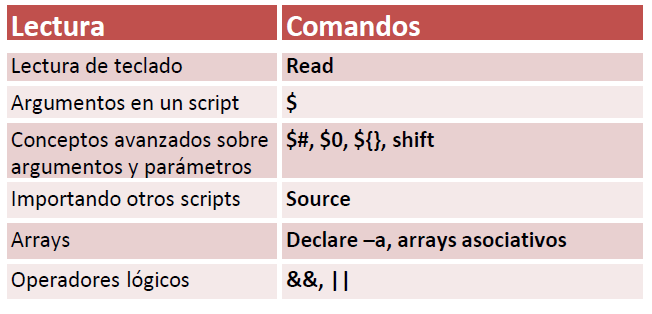

| **Inicio**         | **atrás 15**                                  |
| ------------------ | --------------------------------------------- |
| [🏠](../README.md) | [⏪](./1_15_Shell_Script_Control_de_flujo.md) |

---

## **Índice**

| Temario                                                                                               |
| ----------------------------------------------------------------------------------------------------- |
| [136. Lectura de teclado: read](#136-lectura-de-teclado-read)                                         |
| [137. Argumentos en un shell script](#137-argumentos-en-un-shell-script)                              |
| [138. Argumentos y Parámetros: Conceptos avanzados](#138-argumentos-y-parámetros-conceptos-avanzados) |
| [139. Importando otros scripts: source](#139-importando-otros-scripts-source)                         |
| [140. Arrays](#140-arrays)                                                                            |
| [141. Operadores lógicos: && y \|\|](#141-operadores-lógicos--y-or)                                   |

---

# **Shell Script: Otros componentes importantes**



## **136. Lectura de teclado: read**

### 🧠 ¿Qué es el comando `read` en Bash?

El comando `read` permite **leer entrada del usuario desde el teclado**. Es esencial para interactuar en tiempo real dentro de un script de Shell.

---

### 🔹 Sintaxis básica

```bash
read variable
```

Esto **espera a que el usuario escriba algo** y lo guarda en la variable.

---

### 🔹 Opciones comunes de `read`

| Opción | Descripción                                           |
| ------ | ----------------------------------------------------- |
| `-p`   | Muestra un **mensaje antes de leer**                  |
| `-s`   | Oculta el texto mientras se escribe (**modo seguro**) |
| `-n`   | Lee solo **n caracteres**                             |
| `-t`   | Establece un **tiempo límite** para escribir          |
| `-a`   | Guarda **varias palabras** en un **array**            |
| `-r`   | No interpreta `\` como carácter especial (muy útil)   |

---

### ✅ Ejemplo básico

```bash
#!/bin/bash

read -p "¿Cómo te llamas?: " nombre
echo "Hola, $nombre 👋"
```

---

### ✅ Ejemplo con contraseña oculta

```bash
#!/bin/bash

read -sp "🔐 Ingresa tu contraseña: " clave
echo ""
echo "Tu clave ha sido registrada (pero no la mostraremos 😉)"
```

---

### ✅ Ejemplo con múltiples variables

```bash
#!/bin/bash

read -p "Ingresa tu nombre y edad separados por espacio: " nombre edad
echo "Tu nombre es $nombre y tienes $edad años."
```

---

### ✅ Ejemplo con arrays

```bash
#!/bin/bash

read -a frutas -p "Escribe 3 frutas separadas por espacios: "
echo "Fruta 1: ${frutas[0]}"
echo "Fruta 2: ${frutas[1]}"
echo "Fruta 3: ${frutas[2]}"
```

---

### 💡 Ejercicio completo: `leer_usuario.sh`

Este script hace lo siguiente:

1. Pide nombre y edad
2. Pide una contraseña sin mostrarla
3. Muestra un resumen de la información

---

#### 📄 Código: `leer_usuario.sh`

```bash
#!/bin/bash

# Paso 1: Leer nombre y edad
read -p "📝 ¿Cuál es tu nombre?: " nombre
read -p "🎂 ¿Cuántos años tienes?: " edad

# Paso 2: Leer contraseña en modo oculto
read -sp "🔐 Ingresa tu contraseña secreta: " clave
echo ""  # Salto de línea

# Paso 3: Confirmar con el usuario
echo "==========================="
echo "✅ Información ingresada:"
echo "Nombre: $nombre"
echo "Edad: $edad años"
echo "Contraseña: [oculta por seguridad]"
echo "==========================="
```

---

#### ▶️ ¿Cómo usarlo?

1. Guarda el archivo como `leer_usuario.sh`
2. Dale permisos:

```bash
chmod +x leer_usuario.sh
```

3. Ejecuta:

```bash
./leer_usuario.sh
```

---

### ✅ En resumen

| Forma             | Descripción                                  |
| ----------------- | -------------------------------------------- |
| `read var`        | Guarda la entrada del usuario en `var`       |
| `read -p "texto"` | Muestra un mensaje antes de leer             |
| `read -sp`        | Oculta la entrada (contraseña)               |
| `read var1 var2`  | Captura múltiples valores en diferentes vars |
| `read -a array`   | Captura palabras como un array               |
| `read -t 5 var`   | Espera 5 segundos para leer input            |

---

[🔼](#índice)

---

## **137. Argumentos en un shell script**

### 🧠 ¿Qué son los argumentos en un Shell Script?

Cuando ejecutas un script en Bash, puedes **pasar información directamente desde la línea de comandos**, por ejemplo:

```bash
./mi_script.sh Gustavo 25
```

Esa información se llama **argumentos posicionales** y se accede dentro del script con:

| Variable | Contenido                                 |
| -------- | ----------------------------------------- |
| `$0`     | El nombre del script                      |
| `$1`     | Primer argumento (ej: "Gustavo")          |
| `$2`     | Segundo argumento (ej: "25")              |
| `$#`     | Número de argumentos recibidos            |
| `$@`     | Todos los argumentos como lista           |
| `$*`     | Todos los argumentos como una sola cadena |

---

### ✅ Ejemplo simple

```bash
#!/bin/bash

echo "Script: $0"
echo "Hola, $1. Tienes $2 años."
```

Ejecución:

```bash
./mi_script.sh Gustavo 25
```

**Salida:**

```
Script: ./mi_script.sh
Hola, Gustavo. Tienes 25 años.
```

---

### 🔍 Validación básica de argumentos

Antes de usar argumentos, es **buena práctica validar que se hayan proporcionado**:

```bash
#!/bin/bash

if [ $# -lt 2 ]; then
  echo "❌ Uso: $0 <nombre> <edad>"
  exit 1
fi
```

---

### 💡 Ejercicio completo: `saludo_argumentos.sh`

Este script hace lo siguiente:

1. Verifica que reciba al menos 2 argumentos (`nombre` y `edad`)
2. Muestra un saludo usando los argumentos
3. Muestra el total de argumentos
4. Lista todos los argumentos

---

#### 📄 Código completo:

```bash
#!/bin/bash

# Verificar número de argumentos
if [ $# -lt 2 ]; then
  echo "❌ Uso: $0 <nombre> <edad>"
  exit 1
fi

# Argumentos posicionales
nombre=$1
edad=$2

echo "👋 Hola, $nombre. Tienes $edad años."

# Mostrar el total de argumentos
echo "📦 Total de argumentos: $#"

# Listar todos los argumentos
echo "📝 Lista de argumentos:"
for arg in "$@"; do
  echo " - $arg"
done
```

---

#### ▶️ ¿Cómo usarlo?

1. Guarda el archivo como `saludo_argumentos.sh`
2. Dale permisos de ejecución:

```bash
chmod +x saludo_argumentos.sh
```

3. Ejecuta el script pasando argumentos:

```bash
./saludo_argumentos.sh Gustavo 28 estudiante
```

---

#### ✅ Salida esperada:

```
👋 Hola, Gustavo. Tienes 28 años.
📦 Total de argumentos: 3
📝 Lista de argumentos:
 - Gustavo
 - 28
 - estudiante
```

---

### 🧠 Explicación de las variables usadas

| Variable | ¿Qué contiene?                              |
| -------- | ------------------------------------------- |
| `$0`     | El nombre del script (ej: `./script.sh`)    |
| `$1`     | Primer argumento (ej: nombre)               |
| `$2`     | Segundo argumento (ej: edad)                |
| `$#`     | Cuántos argumentos fueron pasados           |
| `$@`     | Todos los argumentos separados (como array) |
| `$*`     | Todos los argumentos como una sola cadena   |

---

### ✅ En resumen

| Caso de uso                 | Código                             |
| --------------------------- | ---------------------------------- |
| Ver cuántos argumentos hay  | `echo "$#"`                        |
| Obtener el 1er argumento    | `echo "$1"`                        |
| Iterar todos los argumentos | `for i in "$@"; do ...; done`      |
| Validar que no falten       | `if [ $# -lt 2 ]; then exit 1; fi` |

---

### 🎯 ¿Qué más podrías hacer con argumentos?

- Crear scripts que acepten rutas de archivos, opciones o comandos
- Automatizar tareas con diferentes parámetros
- Combinar con `case` para crear scripts con opciones como `--help` o `--version`

---

[🔼](#índice)

---

## **138. Argumentos y Parámetros: Conceptos avanzados**

### 🧠 ¿Qué son argumentos y parámetros en Bash?

Cuando ejecutas un script, puedes pasarle **argumentos posicionales** desde la línea de comandos:

```bash
./script.sh uno dos tres
```

Dentro del script, esos valores se conocen como **parámetros** y se accede a ellos con:

| Variable        | Contenido                                                        |
| --------------- | ---------------------------------------------------------------- |
| `$0`            | Nombre del script                                                |
| `$1`, `$2`, ... | Argumentos por posición (`$1` es el primero, `$2` el segundo...) |
| `$#`            | Número de argumentos pasados                                     |
| `$@`            | Todos los argumentos como lista (mejor para bucles)              |
| `$*`            | Todos los argumentos como **una sola cadena**                    |
| `"$@"`          | Cada argumento separado, útil en bucles                          |
| `"$*"`          | Todos los argumentos como un solo string (menos recomendado)     |

---

### 🔎 Diferencia entre `$@` y `$*`

Supón que ejecutas:

```bash
./script.sh "uno dos" tres
```

Dentro del script:

- `$@` se interpreta como: `"uno dos"` `"tres"` → cada uno como argumento individual
- `$*` se interpreta como: `"uno dos tres"` → todo como una sola cadena

---

### ✅ Ejemplo simple de bucle con `$@`

```bash
#!/bin/bash

echo "Total de argumentos: $#"

for arg in "$@"; do
  echo "Argumento: $arg"
done
```

---

### 📌 Conceptos avanzados

#### 1. **Shift**: Desplaza los argumentos

`shift` mueve los argumentos hacia la izquierda. Es útil cuando procesas uno a uno:

```bash
#!/bin/bash

while [ "$#" -gt 0 ]; do
  echo "Procesando: $1"
  shift
done
```

#### 2. **Parámetros nombrados opcionales (manual)**

Como Bash no tiene nombres de argumentos como otros lenguajes, los puedes simular así:

```bash
#!/bin/bash

while [ $# -gt 0 ]; do
  case "$1" in
    --nombre)
      nombre="$2"
      shift 2
      ;;
    --edad)
      edad="$2"
      shift 2
      ;;
    *)
      echo "❌ Opción desconocida: $1"
      shift
      ;;
  esac
done

echo "Nombre: $nombre"
echo "Edad: $edad"
```

Ejecución:

```bash
./script.sh --nombre Gustavo --edad 28
```

---

### 💡 Ejercicio completo: `parámetros_avanzados.sh`

Este script:

1. Acepta parámetros opcionales `--usuario`, `--archivo`, `--verbose`
2. Muestra errores si faltan argumentos
3. Usa `shift` y `case` para procesar los parámetros
4. Imprime los valores encontrados

---

#### 📄 Código del ejercicio

```bash
#!/bin/bash

# Valores por defecto
usuario=""
archivo=""
verbose=false

# Procesar argumentos
while [ $# -gt 0 ]; do
  case "$1" in
    --usuario)
      usuario="$2"
      shift 2
      ;;
    --archivo)
      archivo="$2"
      shift 2
      ;;
    --verbose)
      verbose=true
      shift
      ;;
    *)
      echo "❌ Opción no reconocida: $1"
      exit 1
      ;;
  esac
done

# Validaciones
if [ -z "$usuario" ] || [ -z "$archivo" ]; then
  echo "❗ Uso: $0 --usuario <nombre> --archivo <archivo> [--verbose]"
  exit 1
fi

# Mostrar resultados
echo "👤 Usuario: $usuario"
echo "📄 Archivo: $archivo"
if $verbose; then
  echo "🔍 Modo verbose activado"
  echo "📂 Contenido del archivo:"
  cat "$archivo"
fi
```

---

#### ▶️ Cómo usarlo

1. Guarda como `parámetros_avanzados.sh`
2. Dale permisos:

```bash
chmod +x parámetros_avanzados.sh
```

3. Crea un archivo de prueba:

```bash
echo -e "Línea 1\nLínea 2\nLínea 3" > prueba.txt
```

4. Ejecuta:

```bash
./parámetros_avanzados.sh --usuario Gustavo --archivo prueba.txt --verbose
```

---

#### ✅ Salida esperada

```
👤 Usuario: Gustavo
📄 Archivo: prueba.txt
🔍 Modo verbose activado
📂 Contenido del archivo:
Línea 1
Línea 2
Línea 3
```

---

### 🧠 En resumen

| Comando    | Uso                                                             |
| ---------- | --------------------------------------------------------------- |
| `$1`, `$2` | Acceder a argumentos individuales                               |
| `$@`       | Todos los argumentos, como lista (¡el preferido para bucles!)   |
| `$*`       | Todos los argumentos como una sola cadena                       |
| `shift`    | Desplaza los argumentos hacia la izquierda                      |
| `case`     | Evaluar opciones por nombre como `--usuario`, `--archivo`, etc. |

---

[🔼](#índice)

---

## **139. Importando otros scripts: source**

### 🧠 ¿Qué es `source` en Bash?

El comando `source` (o su sinónimo `.`) sirve para **ejecutar el contenido de otro script en el mismo contexto del shell actual**, lo que significa que:

- Se **importan funciones**
- Se **importan variables**
- Todo se ejecuta **sin crear un nuevo proceso**

> Es como incluir un archivo `.js`, `.py` o `.css` en otros lenguajes.

---

### 🔹 ¿Cuál es la diferencia entre `source` y ejecutar un script?

| Forma              | ¿Qué hace?                                       |
| ------------------ | ------------------------------------------------ |
| `./script.sh`      | Ejecuta en un **nuevo proceso**                  |
| `source script.sh` | Ejecuta en el **mismo proceso actual del shell** |
| `. script.sh`      | Es lo mismo que `source script.sh`               |

✅ Con `source`, **las variables y funciones quedan disponibles** en el script principal.

---

### ✅ Ejemplo simple

#### 📁 Archivo: `utils.sh`

```bash
#!/bin/bash

saludo() {
  echo "👋 ¡Hola desde utils.sh!"
}
```

#### 📁 Archivo: `main.sh`

```bash
#!/bin/bash

source ./utils.sh  # o: . ./utils.sh

saludo
```

Ejecución:

```bash
chmod +x main.sh utils.sh
./main.sh
```

**Salida:**

```
👋 ¡Hola desde utils.sh!
```

---

### 💡 Ejercicio práctico: `source` para reutilizar funciones

Vamos a crear dos scripts:

- `funciones.sh`: contiene funciones comunes
- `menu.sh`: las importa y las usa con `source`

---

#### 📄 Código de `funciones.sh`

```bash
#!/bin/bash

mostrar_fecha() {
  echo "📅 Fecha actual: $(date)"
}

mostrar_usuario() {
  echo "👤 Usuario actual: $USER"
}

mostrar_directorio() {
  echo "📂 Estás en: $(pwd)"
}
```

---

#### 📄 Código de `menu.sh`

```bash
#!/bin/bash

# Importar funciones
source ./funciones.sh

# Mostrar menú
echo "======================"
echo "📋 MENÚ"
echo "1) Mostrar fecha"
echo "2) Mostrar usuario"
echo "3) Mostrar directorio"
echo "4) Salir"
echo "======================"

read -p "Selecciona una opción [1-4]: " opcion

case $opcion in
  1) mostrar_fecha ;;
  2) mostrar_usuario ;;
  3) mostrar_directorio ;;
  4) echo "👋 Saliendo..."; exit 0 ;;
  *) echo "❌ Opción inválida" ;;
esac
```

---

#### ▶️ Cómo ejecutarlo

1. Guarda los archivos como `funciones.sh` y `menu.sh`
2. Da permisos de ejecución:

```bash
chmod +x funciones.sh menu.sh
```

3. Ejecuta el menú:

```bash
./menu.sh
```

✅ Verás que el menú puede usar funciones definidas en otro archivo.

---

### 🧠 ¿Por qué usar `source`?

| Caso de uso                            | Ventaja                                      |
| -------------------------------------- | -------------------------------------------- |
| Separar funciones en archivos          | Mejora la organización del código            |
| Reutilizar funciones en muchos scripts | Evitas duplicar código                       |
| Cargar configuración (`.env`, `.conf`) | Puedes leer variables y usarlas directamente |

---

### 📁 Extra: importar un archivo de configuración

#### `config.sh`

```bash
API_KEY="123456"
USER_ID="gustavo"
```

#### `usar_config.sh`

```bash
#!/bin/bash
source ./config.sh

echo "🔑 Usando clave: $API_KEY"
echo "🧑 Usuario ID: $USER_ID"
```

---

### ✅ En resumen

| Comando             | Significado                                 |
| ------------------- | ------------------------------------------- |
| `source archivo.sh` | Ejecuta y **importa funciones y variables** |
| `. archivo.sh`      | Sinónimo de `source`                        |
| `./archivo.sh`      | Ejecuta el script en un nuevo proceso       |

---

[🔼](#índice)

---

## **140. Arrays**

### 🧠 ¿Qué es un array en Bash?

Un **array** es una **colección ordenada de valores**, como una lista.
Cada valor se accede mediante un **índice numérico**, que **empieza en 0**.

> En Bash, los arrays te permiten agrupar y manejar múltiples datos relacionados fácilmente.

---

### ✅ Cómo declarar arrays

#### 1. Array simple

```bash
frutas=("manzana" "naranja" "plátano")
```

#### 2. Array vacío y luego agregar valores

```bash
colores=()
colores+=("rojo")
colores+=("verde")
```

---

### ✅ Cómo acceder a los valores

| Operación                     | Ejemplo                    |
| ----------------------------- | -------------------------- |
| Acceder a un valor específico | `${frutas[0]}` → `manzana` |
| Todos los valores             | `${frutas[@]}`             |
| Longitud del array            | `${#frutas[@]}`            |
| Índices del array             | `${!frutas[@]}`            |

---

### ✅ Cómo recorrer un array

```bash
for fruta in "${frutas[@]}"; do
  echo "Fruta: $fruta"
done
```

---

### ✅ Cómo modificar valores

```bash
frutas[1]="kiwi"  # Cambia "naranja" por "kiwi"
```

---

### ✅ Cómo eliminar elementos

```bash
unset frutas[2]  # Elimina el valor en la posición 2
```

---

### 💡 Script completo: `arrays_ejemplo.sh`

Este script:

1. Declara un array de frutas
2. Muestra todos los elementos
3. Muestra uno por uno
4. Muestra la cantidad total
5. Modifica y elimina un valor

---

#### 📄 Código del script

```bash
#!/bin/bash

# Declarar array
frutas=("manzana" "naranja" "plátano" "uva")

echo "🍎 Lista de frutas:"
echo "${frutas[@]}"

echo ""
echo "🔢 Recorriendo el array con un bucle:"
for fruta in "${frutas[@]}"; do
  echo " - $fruta"
done

echo ""
echo "📏 Número de elementos: ${#frutas[@]}"
echo "📍 Índices del array: ${!frutas[@]}"

# Mostrar un valor específico
echo ""
echo "🍌 Fruta en posición 2: ${frutas[2]}"

# Modificar un valor
frutas[1]="kiwi"
echo "✅ Fruta en posición 1 cambiada a: ${frutas[1]}"

# Eliminar un valor
unset frutas[3]
echo "❌ Elemento en posición 3 eliminado"

# Mostrar array actualizado
echo ""
echo "🆕 Array actualizado: ${frutas[@]}"
```

---

#### ▶️ Cómo usarlo

1. Guarda como `arrays_ejemplo.sh`
2. Dale permisos:

```bash
chmod +x arrays_ejemplo.sh
```

3. Ejecuta:

```bash
./arrays_ejemplo.sh
```

---

#### ✅ Salida esperada

```
🍎 Lista de frutas:
manzana naranja plátano uva

🔢 Recorriendo el array con un bucle:
 - manzana
 - naranja
 - plátano
 - uva

📏 Número de elementos: 4
📍 Índices del array: 0 1 2 3

🍌 Fruta en posición 2: plátano
✅ Fruta en posición 1 cambiada a: kiwi
❌ Elemento en posición 3 eliminado

🆕 Array actualizado: manzana kiwi plátano
```

---

### ✅ En resumen

| Acción              | Sintaxis                     |
| ------------------- | ---------------------------- |
| Declarar un array   | `arr=(valor1 valor2 valor3)` |
| Acceder por índice  | `${arr[0]}`                  |
| Todos los elementos | `${arr[@]}` o `${arr[*]}`    |
| Longitud del array  | `${#arr[@]}`                 |
| Recorrer con bucle  | `for i in "${arr[@]}"`       |
| Modificar valor     | `arr[1]="nuevo"`             |
| Eliminar valor      | `unset arr[2]`               |

---

[🔼](#índice)

---

## **141. Operadores lógicos: && y OR**

### 🧠 ¿Qué son los operadores lógicos `&&` y `||` en Bash?

Bash permite **combinar comandos** usando operadores lógicos:

| Operador                     | Significado    | Se ejecuta si...                                         |     |     |
| ---------------------------- | -------------- | -------------------------------------------------------- | --- | --- |
| `&&`                         | AND (Y lógico) | El **comando anterior fue exitoso** (`exit status == 0`) |     |     |
| `      \|                \|` | OR (O lógico)  | El **comando anterior falló** (`exit status ≠ 0`)        |

---

### ✅ Operador `&&` (AND)

> Solo se ejecuta el segundo comando **si el primero tiene éxito** (es decir, `exit status == 0`).

#### 📌 Ejemplo:

```bash
mkdir test && echo "Directorio creado exitosamente"
```

- Si `mkdir test` **funciona**, se muestra el mensaje.
- Si **falla**, el mensaje **no se muestra**.

---

### ✅ Operador `||` (OR)

> El segundo comando se ejecuta **solo si el primero falla** (`exit status ≠ 0`).

#### 📌 Ejemplo:

```bash
mkdir test || echo "No se pudo crear el directorio"
```

- Si `mkdir test` falla (por ejemplo, si ya existe), se mostrará el mensaje de error.

---

### 🔁 Combinación de ambos operadores

Puedes combinarlos para crear **estructuras tipo if/else** sin usar `if`.

```bash
comando && echo "Éxito" || echo "Fallo"
```

⚠️ Pero **esto puede ser peligroso** si el segundo comando (`echo "Éxito"`) falla, porque entonces se ejecutaría el del fallo también.
Una mejor forma sería:

```bash
if comando; then
  echo "Éxito"
else
  echo "Fallo"
fi
```

---

### 💡 Ejercicio práctico: `operadores_logicos.sh`

Este script:

- Pide un nombre de archivo
- Verifica si existe y tiene permisos de lectura
- Usa `&&` y `||` para actuar en consecuencia

---

#### 📄 Código del script:

```bash
#!/bin/bash

read -p "📝 Ingresa el nombre de un archivo: " archivo

[ -f "$archivo" ] && echo "✅ El archivo '$archivo' existe." || echo "❌ El archivo '$archivo' NO existe."

[ -r "$archivo" ] && echo "📖 Tienes permiso de lectura." || echo "⛔ No tienes permiso de lectura."
```

---

#### ▶️ Cómo usarlo

1. Guarda como `operadores_logicos.sh`
2. Da permisos de ejecución:

```bash
chmod +x operadores_logicos.sh
```

3. Ejecuta:

```bash
./operadores_logicos.sh
```

4. Ingresa un nombre de archivo como:

```
documento.txt
```

---

#### ✅ Salida esperada (caso exitoso)

```
📝 Ingresa el nombre de un archivo: documento.txt
✅ El archivo 'documento.txt' existe.
📖 Tienes permiso de lectura.
```

---

#### ❌ Salida si el archivo no existe

```
📝 Ingresa el nombre de un archivo: archivo_falso.txt
❌ El archivo 'archivo_falso.txt' NO existe.
⛔ No tienes permiso de lectura.
```

---

### 🧠 En resumen

| Símbolo                                                       | Qué hace                                         | Cuándo se ejecuta el segundo comando        |     |     |
| ------------------------------------------------------------- | ------------------------------------------------ | ------------------------------------------- | --- | --- |
| `&&`                                                          | Ejecuta el segundo **si el primero tiene éxito** | Solo si el primero devuelve `0`             |     |     |
| `     \|                                                  \|` | Ejecuta el segundo **si el primero falla**       | Solo si el primero devuelve distinto de `0` |

---

### 🎯 Uso típico

- Validación de comandos:

  ```bash
  cp archivo.txt destino/ && echo "✅ Copiado con éxito"
  ```

- Validación con error:

  ```bash
  rm archivo.txt || echo "❌ No se pudo eliminar"
  ```

---

### **Ejercicio**

1. Ejecuta un escaneo `nmap` con detección de versiones (`-sV`) sobre la red `192.168.239.0/24`.
2. Guarda la salida en formato raw.
3. Parsea esa salida para extraer los hosts con servicios detectados.
4. Genera un archivo HTML con los resultados.
5. Establece los permisos del script.
6. Abre el HTML generado en Firefox.
7. Divide el archivo raw con `csplit` para análisis más detallado si deseas.

---

### ✅ Script: `nmap_parser.sh`

```bash
#!/bin/bash
# 1. Ejecutar Nmap y guardar salida raw
echo "[+] Ejecutando escaneo Nmap..."
nmap -sV 192.168.239.0/24 -oN salida_nmap.raw

# 2. Crear archivo HTML mejorado
echo "[+] Generando archivo HTML con estilos y filtrado..."
output="resultado_nmap.html"

echo "<!DOCTYPE html>
<html lang='es'>
<head>
  <meta charset='UTF-8'>
  <title>Resultado Nmap</title>
  <style>
    body { font-family: Arial, sans-serif; background-color: #f4f4f4; padding: 20px; }
    h1 { color: #333; }
    input { margin-bottom: 10px; padding: 8px; width: 300px; }
    table { width: 100%; border-collapse: collapse; margin-top: 10px; }
    th, td { padding: 10px; border: 1px solid #ddd; text-align: left; }
    th { background-color: #444; color: #fff; }
    tr:nth-child(even) { background-color: #f9f9f9; }
    .open { color: green; font-weight: bold; }
    .closed { color: red; }
    .filtered { color: orange; }
  </style>
  <script>
    function filtrar() {
      const filtro = document.getElementById('buscador').value.toLowerCase();
      const filas = document.querySelectorAll('tbody tr');
      filas.forEach(fila => {
        const texto = fila.textContent.toLowerCase();
        fila.style.display = texto.includes(filtro) ? '' : 'none';
      });
    }
  </script>
</head>
<body>
  <h1>Resultado de escaneo Nmap</h1>
  <input type='text' id='buscador' onkeyup='filtrar()' placeholder='Filtrar por host, IP, puerto, servicio...'>
  <table>
    <thead>
      <tr><th>Host</th><th>IP</th><th>Puerto</th><th>Estado</th><th>Servicio</th><th>Versión</th></tr>
    </thead>
    <tbody>" > $output

# 3. Parsear la salida raw de Nmap
host=""
ip=""
while IFS= read -r line; do
    if [[ "$line" =~ ^Nmap\ scan\ report\ for ]]; then
        host=$(echo "$line" | cut -d ' ' -f 5-)
        ip=$(echo "$host" | grep -Eo '[0-9]+\.[0-9]+\.[0-9]+\.[0-9]+')
        host_name=$(echo "$host" | sed "s/($ip)//" | sed 's/ *$//')
        [ -z "$host_name" ] && host_name="$ip"
    elif [[ "$line" =~ ^[0-9]+/tcp ]]; then
        port=$(echo "$line" | awk '{print $1}')
        state=$(echo "$line" | awk '{print $2}')
        service=$(echo "$line" | awk '{print $3}')
        version=$(echo "$line" | cut -d ' ' -f 4-)

        case "$state" in
            open) estado="<span class='open'>Abierto</span>" ;;
            closed) estado="<span class='closed'>Cerrado</span>" ;;
            filtered) estado="<span class='filtered'>Filtrado</span>" ;;
            *) estado="$state" ;;
        esac

        echo "<tr><td>$host_name</td><td>$ip</td><td>$port</td><td>$estado</td><td>$service</td><td>$version</td></tr>" >> $output
    fi
done < salida_nmap.raw

echo "</tbody></table></body></html>" >> $output

# 4. Asignar permisos de ejecución si aún no están
chmod 755 nmap_parser.sh

# 5. Abrir HTML generado con Firefox
echo "[+] Abriendo resultado en Firefox..."
firefox resultado_nmap.html &

# 6. Dividir el archivo de salida por cada host encontrado
echo "[+] Dividiendo archivo de salida por host con csplit..."
csplit -sz salida_nmap.raw '/^Nmap scan report for/' '{*}'
```

---

### ✅ Instrucciones de uso

1. Guarda el script en un archivo:

   ```bash
   nano nmap_parser.sh
   ```

2. Pega el código y guarda (Ctrl + O, Enter, Ctrl + X).

3. Dale permisos de ejecución:

   ```bash
   chmod 755 nmap_parser.sh
   ```

4. Ejecuta el script:

   ```bash
   ./nmap_parser.sh
   ```

---

[🔼](#índice)

---

| **Inicio**         | **atrás 15**                                  |
| ------------------ | --------------------------------------------- |
| [🏠](../README.md) | [⏪](./1_15_Shell_Script_Control_de_flujo.md) |
