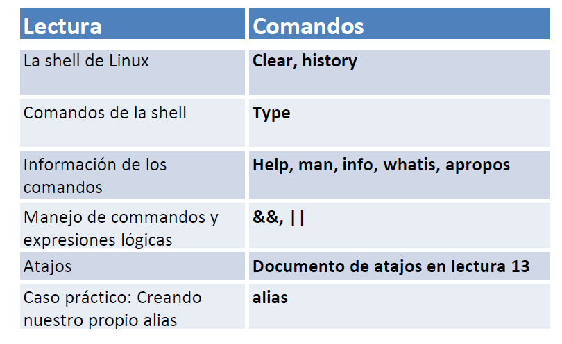

| **Inicio**         | **atrás 1**                 | **Siguiente 3**                                        |
| ------------------ | --------------------------- | ------------------------------------------------------ |
| [🏠](../README.md) | [⏪](./1_1_Que_es_Linux.md) | [⏩](./1_3_Manejo_del_sistema_de_ficheros_de_Linux.md) |

---

## **Índice**

| Temario                                                                                                                         |
| ------------------------------------------------------------------------------------------------------------------------------- |
| [3. La shell de Linux](#3-la-shell-de-linux)                                                                                    |
| [4. Comandos de la shell de Linux](#4-comandos-de-la-shell-de-linux)                                                            |
| [5. Información de los comandos: help, man, info, whatis, apropos](#5-información-de-los-comandos-help-man-info-whatis-apropos) |
| [6. Manejo de comandos y expresiones lógicas](#6-manejo-de-comandos-y-expresiones-lógicas)                                      |
| [7. Atajos útiles para la shell de Linux](#7-atajos-útiles-para-la-shell-de-linux)                                              |
| [8. Listado de atajos para la shell de Linux](#8-listado-de-atajos-para-la-shell-de-linux)                                      |
| [9. Caso práctico: Creando nuestro propio comando alias](#9-caso-práctico-creando-nuestro-propio-comando-alias)                 |
| [10. Curiosidad: ¿Qué significa "is hashed"?](#10-curiosidad-qué-significa-is-hashed)                                           |

---

# **La shell de Linux**



## **3. La shell de Linux**

### ✅ ¿Qué es la **shell de Linux**?

La **shell** es un **intérprete de comandos**, es decir, una herramienta que **te permite comunicarte con el sistema operativo escribiendo órdenes** en lugar de hacer clic.

🔍 **¿Dónde la ves?**
Cuando abres la "terminal" en Linux, estás usando una shell.
La más común es **Bash** (`Bourne Again SHell`), pero hay otras como `zsh`, `sh`, `fish`.

🧠 **Función principal:**

- Ejecutar comandos
- Administrar archivos y carpetas
- Instalar programas
- Ejecutar scripts o automatizar tareas

---

### 🔧 ¿Qué son los **comandos** de Linux?

Los comandos son **órdenes que tú escribes** en la terminal para que el sistema haga algo.

#### 📦 Cada comando puede:

- Ver archivos → `ls`
- Crear carpetas → `mkdir`
- Borrar archivos → `rm`
- Cambiar de usuario → `su`
- Obtener privilegios → `sudo`
- Ver historial → `history`
- Limpiar pantalla → `clear`

---

### ✍️ Tus comandos explicados uno por uno (¡con ejemplos fáciles!)

Supongamos que tú eres el usuario **`puma`**.

---

#### `sudo su`

🔑 **Significado:**

- `sudo` = ejecuta algo como superusuario (root)
- `su` = cambia al usuario root (el administrador del sistema)

📌 Este comando te **convierte temporalmente en "root"**, el usuario con **máximos privilegios**.

🧠 **¿Para qué se usa?**

- Para instalar software
- Para modificar archivos protegidos del sistema

#### ❗ Ejemplo:

```bash
puma@PC:~$ sudo su
[sudo] password for puma:
root@PC:/home/puma#
```

Ahora tu prompt cambia a `#` → estás como **root**.

---

#### `su puma`

🔁 **Significado:** Cambia al usuario llamado `puma`.

📌 Este comando es lo contrario del anterior: si estabas como root, vuelves a tu usuario normal.

**Ejemplo:**

```bash
root@PC:/home/puma# su puma
puma@PC:~$
```

---

#### `clear`

🧹 **Significado:** Limpia la pantalla de la terminal.

**¿Para qué se usa?**

- Para dejar la terminal más ordenada si hay muchos mensajes.

🧪 Ejemplo:

```bash
puma@PC:~$ clear
```

(Pantalla limpia, como si recién la abrieras)

---

#### `history`

📜 **Significado:** Muestra los comandos que has usado antes.

🧠 **¿Para qué sirve?**

- Ver qué comandos ejecutaste
- Reutilizarlos con flechas ↑ ↓ o `!número`

🧪 Ejemplo:

```bash
puma@PC:~$ history
1  sudo su
2  su puma
3  clear
4  history
```

---

#### `ls`

📂 **Significado:** Lista el contenido del directorio actual (carpetas y archivos).

🧠 **¿Para qué sirve?**

- Para saber qué hay en una carpeta

🧪 Ejemplo:

```bash
puma@PC:~$ ls
Documentos  Descargas  Escritorio  imágenes
```

🧠 Tip extra:
Puedes usar `ls -l` (lista en forma detallada) o `ls -a` (muestra archivos ocultos)

---

#### `mkdir`

📁 **Significado:** `make directory` = crea una nueva carpeta.

🧠 **¿Para qué sirve?**

- Para organizar archivos en carpetas.

🧪 Ejemplo:

```bash
puma@PC:~$ mkdir proyectos
```

Esto crea una carpeta llamada `proyectos` dentro del directorio actual.

---

### 💡 POSIBLES SITUACIONES Y SOLUCIONES

| Situación                           | Posible solución                                        |
| ----------------------------------- | ------------------------------------------------------- |
| No puedes usar `sudo`               | Tu usuario no está en el grupo `sudo`                   |
| `mkdir` da error “Permiso denegado” | Estás en una carpeta protegida → usa `sudo mkdir`       |
| `ls` no muestra nada                | Puede estar vacía → crea archivos o usa `ls -a`         |
| `su` da “Authentication failure”    | Estás poniendo mal la contraseña o el usuario no existe |
| Usas `sudo su` y no puedes volver   | Escribe `exit` o `Ctrl+D` para salir de root            |

---

### 🎓 Resumen

| Comando   | ¿Qué hace?                               | Ejemplo de uso         |
| --------- | ---------------------------------------- | ---------------------- |
| `sudo su` | Cambia a usuario root (administrador)    | `sudo su`              |
| `su puma` | Cambia al usuario `puma`                 | `su puma`              |
| `clear`   | Limpia la pantalla                       | `clear`                |
| `history` | Muestra el historial de comandos         | `history`              |
| `ls`      | Lista los archivos del directorio actual | `ls`, `ls -l`, `ls -a` |
| `mkdir`   | Crea una nueva carpeta                   | `mkdir carpeta1`       |

---

[🔼](#índice)

---

## **4. Comandos de la shell de Linux**

### ✅ ¿Qué son los **comandos de la shell de Linux**?

Los **comandos** son **órdenes que escribes en la terminal** (la shell) para que el sistema haga algo.

📌 **Ejemplos de comandos comunes:**

| Comando | ¿Qué hace?                          |
| ------- | ----------------------------------- |
| `ls`    | Lista archivos y carpetas           |
| `cp`    | Copia archivos                      |
| `rm`    | Elimina archivos o carpetas         |
| `mkdir` | Crea carpetas                       |
| `cd`    | Cambia de directorio (carpeta)      |
| `type`  | Muestra qué tipo de comando es otro |

---

### ✅ ¿Qué son los **parámetros (opciones o flags)**?

Los **parámetros** son **modificadores que le agregas a un comando** para que haga algo **específico o diferente**.

📌 Se escriben normalmente con `-` o `--`:

| Comando básico | Con parámetro | ¿Qué hace?                                   |
| -------------- | ------------- | -------------------------------------------- |
| `ls`           | `ls -l`       | Muestra los archivos con más detalles        |
| `ls`           | `ls -a`       | Muestra también los archivos ocultos         |
| `ls`           | `ls -lah`     | Combina: detalles + ocultos + tamaño legible |

🔁 Puedes **combinar parámetros** como `-la` o `-lah`.

---

### 🧠 Explicación de tus comandos paso a paso:

#### 🔹 `type type`

```bash
puma@PC:~$ type type
```

📌 **¿Qué hace?**

Muestra qué tipo de comando es `type`.

🔍 Resultado esperado:

```bash
type is a shell builtin
```

✅ Significa que `type` es **un comando interno de la shell** (no es un archivo ejecutable, es parte del propio Bash).

---

#### 🔹 `type cp`

```bash
puma@PC:~$ type cp
```

📌 Muestra qué tipo de comando es `cp`.

🔍 Resultado:

```bash
cp is /bin/cp
```

✅ `cp` (copiar archivos) es un programa ubicado en `/bin/cp`.

---

#### 🔹 `type ls`

```bash
puma@PC:~$ type ls
```

📌 Muestra que `ls` es un programa ejecutable.

🔍 Resultado:

```bash
ls is aliased to 'ls --color=auto'
```

✅ En muchos sistemas, `ls` está **aliado (alias)** para mostrar colores automáticamente.

---

### 🔹 Comandos `ls` con parámetros

#### 🔸 `ls -l`

📌 **¿Qué hace?**
Muestra los archivos con **detalles**:

- permisos
- número de enlaces
- propietario
- tamaño
- fecha de modificación

🧪 Ejemplo:

```bash
puma@PC:~$ ls -l
-rw-r--r--  1 puma puma  1234 jun 17  archivo.txt
```

---

#### 🔸 `ls -la`

📌 **¿Qué hace?**

- `-l`: vista detallada
- `-a`: incluye archivos ocultos (los que empiezan con `.`)

🧪 Ejemplo:

```bash
puma@PC:~$ ls -la
total 20
drwxr-xr-x  3 puma puma 4096 jun 17 .
drwxr-xr-x  5 root root 4096 jun 16 ..
-rw-r--r--  1 puma puma    0 jun 17 .bashrc
```

---

#### 🔸 `ls -lah`

📌 Combina:

- `-l` → detalles
- `-a` → ocultos
- `-h` → **tamaños legibles** (K, M, G)

🧪 Ejemplo:

```bash
puma@PC:~$ ls -lah
total 16K
drwxr-xr-x 3 puma puma 4.0K jun 17 .
-rw-r--r-- 1 puma puma 1.2K jun 17 archivo.txt
```

---

#### 🔸 `ls -lah Desktop`

📌 **Mismo que arriba, pero aplicado a la carpeta `Desktop` (Escritorio).**

🧪 Ejemplo:

```bash
puma@PC:~$ ls -lah Desktop
total 12K
-rw-r--r-- 1 puma puma 5.2K jun 17 notas.txt
```

---

### 💡 Posibles problemas y soluciones

| Problema                         | Posible solución                                     |
| -------------------------------- | ---------------------------------------------------- |
| `command not found`              | El comando no existe → revisa si lo escribiste bien  |
| `permission denied` al usar `ls` | Estás viendo una carpeta sin permiso → usa `sudo ls` |
| `ls` no muestra nada             | Carpeta vacía o archivos ocultos → usa `ls -a`       |
| No entiendes qué hace un comando | Usa `man comando` o `comando --help`                 |

---

### 📘 Resumen final

#### 🔹 ¿Qué es la shell?

Un intérprete para dar órdenes al sistema (como la terminal de Linux).

#### 🔹 ¿Qué son los comandos?

Instrucciones que escribes para que el sistema haga algo.

#### 🔹 ¿Qué son los parámetros?

Opciones que modifican el comportamiento de un comando.

---

### 🧪 Mini práctica sugerida

```bash
mkdir practica
cd practica
touch archivo1.txt archivo2.txt .oculto.txt
ls
ls -a
ls -la
ls -lah
```

[🔼](#índice)

---

## **5. Información de los comandos: help, man, info, whatis, apropos**

### ✅ ¿Para qué sirven estos comandos?

Son herramientas para **consultar ayuda o documentación** directamente desde la terminal. Muy útiles cuando no conoces un comando o quieres saber cómo usarlo correctamente.

| Comando   | ¿Para qué sirve?                              | Tipo de comando                                |
| --------- | --------------------------------------------- | ---------------------------------------------- |
| `help`    | Ayuda para comandos internos de la shell      | Shell interna (`bash`)                         |
| `man`     | Muestra el **manual** del comando             | Manual general                                 |
| `info`    | Muestra una **versión extendida** del manual  | Más detallado que `man`                        |
| `whatis`  | Da una **descripción corta** del comando      | Breve y directo                                |
| `apropos` | Busca comandos relacionados por palabra clave | Ideal si no sabes el nombre exacto del comando |

---

### 📌 Explicación con tus ejemplos:

---

#### 🔹 `help type`

```bash
puma@PC:~$ help type
```

📌 Muestra la ayuda de un **comando interno del shell** (como `type`, `cd`, `echo`, `help`, etc.)

🧠 Útil si el comando **es parte de Bash** y no tiene `man`.

🧪 Resultado:

```bash
type: type [-afptP] name [name ...]
    Indica si un comando es interno o externo y su ubicación.
```

---

#### 🔹 `help help`

```bash
puma@PC:~$ help help
```

📌 Te explica **cómo usar `help`**. Es como pedirle ayuda al mismo `help`.

---

#### 🔹 `ls --help`

```bash
puma@PC:~$ ls --help
```

📌 Muestra una **ayuda rápida** del comando `ls`.
Funciona con muchos comandos externos como `cp`, `mv`, `rm`, etc.

🧪 Muestra:

- qué hace el comando
- lista de parámetros
- ejemplos

✅ Es más **rápido** que `man`.

---

#### 🔹 `type man`

```bash
puma@PC:~$ type man
```

📌 Muestra que `man` es un comando externo (ubicado generalmente en `/usr/bin/man`).

🧪 Resultado:

```bash
man is /usr/bin/man
```

---

#### 🔹 `man ls`

```bash
puma@PC:~$ man ls
```

📌 Abre el **manual del comando `ls`**.

🧠 ¿Qué incluye?

- Descripción
- Uso
- Opciones
- Ejemplos

🧪 Puedes moverte con las teclas ↑ ↓, salir con `q`.

---

#### 🔹 `whatis ls`

```bash
puma@PC:~$ whatis ls
```

📌 Muestra una **línea resumen** sobre el comando `ls`.

🧪 Resultado:

```bash
ls (1)               - list directory contents
```

---

#### 🔹 `type info`

```bash
puma@PC:~$ type info
```

📌 Muestra que `info` es otro comando externo (como `man`), pero con **manuales más extensos y estructurados**.

---

#### 🔹 `info ls`

```bash
puma@PC:~$ info ls
```

📌 Abre la documentación detallada de `ls`, **organizada como libro**, con enlaces y secciones.

🔍 Puedes moverte con:

- flechas
- tecla `n` (next)
- `q` para salir

---

#### 🔹 `apropos directory`

```bash
puma@PC:~$ apropos directory
```

📌 Busca comandos relacionados con la palabra **"directory"** (directorio, carpeta).

🧠 Muy útil si no sabes cómo se llama un comando.

🧪 Ejemplo de salida:

```bash
mkdir (1)  - make directories
rmdir (1)  - remove empty directories
ls (1)     - list directory contents
```

---

#### 🔹 `apropos "list directory"`

```bash
puma@PC:~$ apropos "list directory"
```

📌 Lo mismo que arriba, pero busca **frases exactas**.

---

### 💡 Posibles problemas y soluciones

| Problema                      | Solución                                         |
| ----------------------------- | ------------------------------------------------ |
| `whatis: nothing appropriate` | Actualiza la base de datos con `sudo mandb`      |
| `man` no está instalado       | Instálalo con `sudo apt install man-db`          |
| `apropos` no da resultados    | También necesita `mandb` actualizado             |
| `info` parece confuso         | Usa `man` o `--help` si quieres algo más directo |

---

### 📘 Resumen Final

| Comando   | ¿Para qué sirve?                          | Uso práctico                        |
| --------- | ----------------------------------------- | ----------------------------------- |
| `help`    | Ayuda de comandos internos (bash)         | `help cd`, `help type`              |
| `man`     | Manual completo del comando               | `man ls`, `man cp`                  |
| `info`    | Documentación más detallada (como libros) | `info ls`, `info grep`              |
| `whatis`  | Descripción rápida del comando            | `whatis rm`                         |
| `apropos` | Buscar comandos por tema o palabra clave  | `apropos copy`, `apropos directory` |

---

### 🧪 ¿Quieres practicar?

Prueba estos comandos en tu terminal y observa qué te muestran:

```bash
help cd
ls --help
man mkdir
info cp
whatis touch
apropos permissions
```

---

[🔼](#índice)

---

## **6. Manejo de comandos y expresiones lógicas**

### ✅ ¿Qué es el **manejo de comandos y expresiones lógicas**?

Son **formas de combinar varios comandos** en una sola línea de la terminal, usando **símbolos especiales** para controlar **cómo y cuándo se ejecutan**.

Estos operadores se llaman **expresiones lógicas** o **operadores de control**.

---

### 🔧 Comandos usados:

| Símbolo | Nombre                | ¿Qué hace?                                                                  |     |     |
| ------- | --------------------- | --------------------------------------------------------------------------- | --- | --- |
| `;`     | Separador             | Ejecuta el siguiente comando **siempre**, sin importar si el anterior falló |     |     |
| `&&`    | Lógico AND            | Ejecuta el segundo **solo si el primero tuvo éxito (exit 0)**               |     |     |
| `\|\|`  | Lógico OR             | Ejecuta el segundo **solo si el primero falló (exit diferente de 0)**       |
| `\`     | Continuación de línea | Permite dividir un comando largo en varias líneas                           |     |     |

---

### 📌 Ejemplos con tus comandos

#### 🔹 1. Comando con `\` (continuación de línea)

```bash
puma@PC:~$ ls \
> -lah
> Desktop
```

✅ Esto es **igual que escribir**:

```bash
ls -lah Desktop
```

🔍 El `\` le dice al shell:
“Lo que sigue todavía es parte del mismo comando, aunque haya salto de línea”.

---

#### 🔹 2. Comando con `;` (separador)

```bash
puma@PC:~$ clear; ls
```

✅ Esto:

1. Limpia la pantalla (`clear`)
2. Luego lista los archivos (`ls`)

💡 **No importa si `clear` falla o no**, `ls` **igual se ejecutará**.

---

#### 🔹 3. Comando con `&&` (AND lógico)

```bash
puma@PC:~$ clear && ls -lah
```

✅ Esto:

1. Limpia la pantalla (`clear`)
2. Si `clear` **funciona bien**, ejecuta `ls -lah`

🧠 Si el primer comando **falla**, el segundo **no se ejecuta**.

---

#### 🔹 4. Comando con `||` (OR lógico)

```bash
puma@PC:~$ dfddea || ls
```

📌 Aquí `dfddea` **no existe**, así que **fallará**.

✅ Entonces el shell ejecutará `ls`.

🧠 `||` se usa para decir:
**“Si este comando falla, ejecuta este otro”**

---

#### 🔹 5. Otro `||`, pero con `clear`

```bash
puma@PC:~$ clear || ls
```

✅ Aquí, como `clear` **normalmente funciona**, entonces `ls` **no se ejecuta**.

Si `clear` fallara por alguna razón (raro), entonces sí se ejecutaría `ls`.

---

### 🧠 Ejemplos fáciles de entender

| Comando                                                                                                    | ¿Qué hace?                                                      |     |     |
| ---------------------------------------------------------------------------------------------------------- | --------------------------------------------------------------- | --- | --- |
| `echo hola; echo mundo`                                                                                    | Muestra `hola` y luego `mundo`, sin importar si alguno falla    |     |     |
| `mkdir test && cd test`                                                                                    | Crea una carpeta y entra en ella **si la creación fue exitosa** |     |     |
| `rm archivo.txt    O                                                                     echo "No existe"` | Intenta borrar un archivo. Si falla, muestra mensaje            |
| `false                                                                                   echo "falló"`     | `false` siempre falla, así que se ejecuta `echo`                |

---

### 💡 Posibles problemas y soluciones

| Problema                                  | Solución o explicación                         |
| ----------------------------------------- | ---------------------------------------------- |
| `command not found`                       | Escribiste mal un comando (como `dfddea`)      |
| El segundo comando no se ejecuta con `&&` | Revisa que el primero esté funcionando bien    |
| No pasa a la siguiente línea con `\`      | Asegúrate de no dejar espacios después del `\` |
| Sale mucho texto o errores                | Usa `clear`, `less`, o redirecciona con `>`    |

---

### 📘 Resumen visual

| Operador | Significado      | Ejemplo                   | Resultado                                             |     |     |     |     |
| -------- | ---------------- | ------------------------- | ----------------------------------------------------- | --- | --- | --- | --- |
| `;`      | Siempre ejecutar | `comando1 ; comando2`     | Ejecuta ambos, sin importar si alguno falla           |     |     |     |     |
| `&&`     | Solo si éxito    | `comando1 && comando2`    | Ejecuta el segundo **solo si el primero fue exitoso** |     |     |     |     |
| `\|\|`   | Solo si falla    | `comando1  \|\| comando2` | Ejecuta el segundo **solo si el primero falló**       |
| `\`      | Continuar línea  | `comando \` + ENTER       | Permite escribir el comando en varias líneas          |     |     |     |     |

---

### 🧪 ¿Quieres practicar esto?

Te dejo un mini reto en tu terminal:

```bash
mkdir reto && cd reto && touch archivo.txt || echo "Error al crear"
ls -lah > resultado.txt; cat resultado.txt
```

---

[🔼](#índice)

---

## **7. Atajos útiles para la shell de Linux**

### ✅ ¿Qué son los **atajos de teclado en la shell**?

Son combinaciones de teclas (como `Ctrl + algo` o `Alt + algo`) que te permiten:

- Moverte por el texto de la terminal
- Reutilizar comandos
- Borrar o completar automáticamente comandos
- Navegar por el historial

---

### 📌 Ejemplos que diste, explicados uno por uno

#### 🔹 `Ctrl + A`

🔹 **Mover el cursor al inicio de la línea actual**
Ejemplo:

```
puma@PC:~$ echo "Hola Mundo"
               ↑ ↑ ↑ ↑ ↑ ↑ ↑ ↑ ↑ ↑ ↑
```

Presionas `Ctrl + A` y el cursor va justo antes de `echo`.

---

#### 🔹 `Ctrl + E`

🔹 **Mover el cursor al final de la línea actual**
Ejemplo:

```
puma@PC:~$ echo "Hola Mundo"⬅️
```

---

#### 🔹 `Ctrl + L`

🔹 **Limpia la pantalla** (como si usaras `clear`)
Muy útil si tienes la terminal llena de texto.

---

#### 🔹 `Ctrl + P`

🔹 **Trae el comando anterior del historial** (como ↑ flecha)

Ejemplo:

```bash
puma@PC:~$ ls
(presionas Ctrl + P)
puma@PC:~$ ls  ← vuelve a aparecer
```

---

#### 🔹 `Alt + .`

🔹 **Pega el último argumento del último comando**

Ejemplo:

```bash
puma@PC:~$ mkdir proyecto2025
(presionas Alt + .)
puma@PC:~$ cd proyecto2025
```

Esto inserta `proyecto2025` automáticamente. ¡Genial para no repetir texto!

---

#### 🔹 `Ctrl + R`

🔹 **Búsqueda inversa en el historial de comandos**

Empieza a escribir parte de un comando anterior y aparecerá si ya lo usaste.

Ejemplo:

```bash
(presionas Ctrl + R)
(reverse-i-search)`ls -l': ls -lah
```

Presiona `ENTER` para usarlo, o `Ctrl + G` para cancelar.

---

#### 🔹 `!ls`

🔹 **Ejecuta el último comando que empezó con `ls`**

Ejemplo:

```bash
puma@PC:~$ ls -lah
(pasaron muchos comandos)
puma@PC:~$ !ls  # vuelve a ejecutar ls -lah
```

---

#### 🔹 `!!`

🔹 **Ejecuta el último comando que usaste**

Ejemplo:

```bash
puma@PC:~$ echo "Hola mundo"
puma@PC:~$ !!  # repite el echo
```

También útil si olvidaste usar `sudo`:

```bash
puma@PC:~$ apt install algo
(pide permiso)
puma@PC:~$ sudo !!
```

---

#### 🔹 `!$`

🔹 **Último argumento del comando anterior**

Ejemplo:

```bash
puma@PC:~$ cp archivo.txt /home/puma/
puma@PC:~$ cd !$   # se convierte en: cd /home/puma/
```

---

#### 🔹 `cl + TAB`

🔹 Completado automático
Escribes parte del comando, presionas `TAB` y el sistema **lo completa si lo reconoce**.

Ejemplo:

```bash
puma@PC:~$ cl + TAB
# se convierte en:
puma@PC:~$ clear
```

✅ También sirve para nombres de archivos, rutas, scripts, etc.

---

#### 🔹 `exit`

🔹 **Salir de la shell** (cerrar la terminal o sesión)

---

### 💡 Tabla de resumen rápida

| Atajo      | ¿Qué hace?                                           |
| ---------- | ---------------------------------------------------- |
| `Ctrl + A` | Ir al inicio de la línea                             |
| `Ctrl + E` | Ir al final de la línea                              |
| `Ctrl + L` | Limpiar pantalla (como `clear`)                      |
| `Ctrl + P` | Comando anterior (historial)                         |
| `Alt + .`  | Último argumento del último comando                  |
| `Ctrl + R` | Buscar en el historial                               |
| `!!`       | Ejecutar el último comando                           |
| `!comando` | Ejecutar el último comando que empieza con `comando` |
| `!$`       | Último argumento del comando anterior                |
| `TAB`      | Autocompletar comandos, rutas, archivos              |
| `exit`     | Salir del shell                                      |

---

### 💬 Posibles errores o soluciones

| Problema                        | Solución                                                     |
| ------------------------------- | ------------------------------------------------------------ |
| `Alt + .` no funciona           | Usa `Esc` y luego `.`                                        |
| `Ctrl + R` se ve raro           | Es normal, presiona `Ctrl + G` para salir                    |
| Comando repetido con `!!` falla | Revisa si necesita `sudo`                                    |
| Autocompletar no responde       | Asegúrate de no haber escrito mal o presiona `TAB` dos veces |

---

### 🧪 Ejercicio práctico

Prueba escribir esto:

```bash
mkdir nuevo_proyecto
cd ⬅️ (luego presiona `Alt + .`)
```

Luego prueba:

```bash
clear; echo "Bienvenido"
!!  # vuelve a saludar
```

---

[🔼](#índice)

---

## **8. Listado de atajos para la shell de Linux**

### ✅ ¿Qué son los **atajos de la shell**?

Son combinaciones de teclas que te permiten:

- Navegar por la línea de comandos
- Repetir, editar o cancelar comandos
- Buscar en el historial
- Autocompletar nombres
- Salir o borrar la pantalla fácilmente

---

### 📘 ¿Qué no son?

No son comandos como `ls`, `cd`, `echo`, etc.
👉 Son **teclas especiales** como `Ctrl`, `Alt`, `Tab`, combinadas con letras.

---

### 🧠 Tabla: Listado de atajos útiles en Bash

| Atajo               | ¿Qué hace?                                                               |
| ------------------- | ------------------------------------------------------------------------ |
| `Ctrl + A`          | Ir al **inicio** de la línea                                             |
| `Ctrl + E`          | Ir al **final** de la línea                                              |
| `Ctrl + U`          | Borrar desde el cursor **hacia el inicio**                               |
| `Ctrl + K`          | Borrar desde el cursor **hasta el final**                                |
| `Ctrl + W`          | Borrar la palabra a la izquierda del cursor                              |
| `Ctrl + L`          | Limpiar la pantalla (igual que `clear`)                                  |
| `Ctrl + C`          | Cancelar un comando en ejecución                                         |
| `Ctrl + D`          | Cerrar la terminal (si no hay comando en curso)                          |
| `Ctrl + R`          | Buscar en el **historial** de comandos (búsqueda inversa)                |
| `Ctrl + P`          | Mostrar el **comando anterior** (también puedes usar flecha ↑)           |
| `Ctrl + N`          | Mostrar el **siguiente comando** (igual que flecha ↓)                    |
| `Alt + .`           | Insertar el **último argumento** del comando anterior                    |
| `!!`                | Repetir el **último comando completo**                                   |
| `!nombre`           | Ejecutar el **último comando que empieza con ese nombre** (`!ls`, `!cd`) |
| `!$`                | Último argumento del comando anterior (`cd !$` para ir a última carpeta) |
| `TAB`               | **Autocompletar** comandos, rutas, archivos, etc.                        |
| `exit` o `Ctrl + D` | Salir de la shell                                                        |

---

### 📌 Ejemplos paso a paso (fáciles)

---

#### 🔹 1. `Ctrl + A` / `Ctrl + E`

```bash
puma@PC:~$ echo "Hola mundo"
                ↑ Cursor está aquí
(Ctrl + A)      → va al inicio de la línea
(Ctrl + E)      → va al final de la línea
```

---

#### 🔹 2. `Ctrl + U` y `Ctrl + K`

```bash
puma@PC:~$ echo "Texto largo para borrar"
                  ↑ Cursor en medio

(Ctrl + U) → borra desde aquí hasta el inicio
(Ctrl + K) → borra desde aquí hasta el final
```

---

#### 🔹 3. `Ctrl + R`

```bash
(reverse-i-search)`ls -l': ls -lah
```

Presiona `Ctrl + R`, escribe parte de un comando usado antes.
Presiona `Enter` para ejecutarlo o `Ctrl + G` para cancelarlo.

---

#### 🔹 4. `Alt + .` y `!$`

```bash
puma@PC:~$ mkdir nueva_carpeta
puma@PC:~$ cd !$       # resultado: cd nueva_carpeta
```

o

```bash
puma@PC:~$ cp archivo.txt /home/guss/
puma@PC:~$ cd Alt + .  # inserta: /home/guss/
```

---

#### 🔹 5. `!!` (doble signo de exclamación)

```bash
puma@PC:~$ echo "Hola"
puma@PC:~$ !!
# repite el comando anterior: echo "Hola"
```

---

#### 🔹 6. `TAB` para autocompletar

```bash
puma@PC:~$ cle + TAB → se convierte en `clear`
```

Si hay varias opciones, presiona `TAB` dos veces y verás la lista.

---

### 💡 Soluciones a problemas comunes

| Problema                              | Solución                                |
| ------------------------------------- | --------------------------------------- |
| `Alt + .` no funciona                 | Usa `Esc` y luego `.`                   |
| `Ctrl + R` no encuentra lo que quiero | Escribe más letras del comando          |
| TAB no completa                       | Puede que no exista o no esté instalado |
| `!!` repite un error                  | Agrega `sudo !!` si olvidaste permisos  |

---

### 🧪 Reto rápido para ti

Escribe estos comandos en tu terminal:

```bash
echo "Aprendiendo atajos"
Ctrl + A → escribe: # al inicio de la línea
Ctrl + E → mueve al final y agrega: 👏
```

---

[🔼](#índice)

---

## **9. Caso práctico: Creando nuestro propio comando alias**

### ✅ ¿Qué es un alias en Linux?

Un **alias** es un **atajo o apodo para un comando**.
Se usa para no escribir comandos largos o repetitivos cada vez.

🔁 Tú defines una palabra (como `clist`) y Linux la reemplaza por el comando que tú quieras, como `clear; ls`.

---

### 🧠 ¿Para qué sirve?

- Ahorra tiempo
- Reduce errores al tipear
- Hace tu trabajo en la terminal más cómodo y personalizado

---

### 📘 Sintaxis básica

```bash
alias nombre='comando'
```

> Ojo: **no debe haber espacios alrededor del `=`**.

---

### 📌 Caso práctico paso a paso

#### Paso 1: Verificar si el alias ya existe

```bash
type clist
```

📤 Salida:

```
clist: not found
```

---

#### Paso 2: Crear el alias

```bash
alias clist='clear; ls'
```

🔹 ¿Qué hace este alias?
Cada vez que escribas `clist`, ejecutará:

1. `clear` (limpia la pantalla)
2. `ls` (lista los archivos del directorio)

---

#### Paso 3: Verificar que se creó

```bash
type clist
```

📤 Salida:

```
clist is aliased to `clear; ls`
```

---

#### Paso 4: Usar el alias

```bash
clist
```

📤 Salida:
Primero limpia la pantalla, luego lista los archivos y carpetas actuales.

---

#### Paso 5: Ver todos los alias existentes

```bash
alias
```

---

#### Paso 6: Eliminar el alias

```bash
unalias clist
```

Verifica de nuevo:

```bash
type clist
```

📤 Salida:

```
clist: not found
```

---

### 🧠 ¿Cómo hacerlo **permanente**?

Los alias que creas **solo duran hasta que cierras la terminal**.
Para que se guarden siempre:

1. Abre tu archivo de configuración de Bash:

```bash
nano ~/.bashrc
```

2. Agrega al final:

```bash
alias clist='clear; ls'
```

3. Guarda y recarga:

```bash
source ~/.bashrc
```

---

## ⚠️ Errores comunes y soluciones

| Problema                           | Solución                                   |
| ---------------------------------- | ------------------------------------------ |
| `alias clist = '...'` no funciona  | ❌ No debe haber espacios en el `=`        |
| No se guarda el alias              | Agrégalo a `~/.bashrc` o `~/.bash_aliases` |
| El alias hace cosas raras          | Verifica comillas simples `'` y comandos   |
| El alias no se borra con `unalias` | Revisa si está en `.bashrc` o `.zshrc`     |

---

### 💡 Ejemplos útiles de alias

```bash
alias ll='ls -lah'
alias gs='git status'
alias rm='rm -i'        # Protege contra borrado accidental
alias ..='cd ..'
alias update='sudo apt update && sudo apt upgrade'
```

---

[🔼](#índice)

---

## **10. Curiosidad: ¿Qué significa "is hashed"?**

### 🔍 ¿Qué significa `is hashed` en Linux?

Cuando usas el comando:

```bash
type <comando>
```

Puedes ver una salida como esta:

```bash
ls is /bin/ls
ls is hashed (/bin/ls)
```

---

### ✅ Significado de **"is hashed"**

Significa que **la ubicación del comando ya está almacenada en caché por la shell (Bash)**.

🧠 **"Hashed"** en este contexto no se refiere a encriptación, sino a una **tabla interna** (una **hash table**) donde Bash guarda los caminos a los comandos que ya usaste.

Esto hace que la shell **no tenga que buscar en todo el PATH** cada vez que ejecutas un comando.
💡 **Ahorra tiempo** y hace que todo funcione más rápido.

---

### 📌 Ejemplo:

```bash
type ls
```

📤 Salida:

```
ls is hashed (/bin/ls)
```

Significa:

- Ya ejecutaste `ls` antes
- Bash recuerda que está en `/bin/ls`
- Usará esa ruta la próxima vez sin buscarla

---

### 🛠 ¿Dónde se guarda esta información?

Se guarda en la **tabla hash** de Bash.
Puedes verla con:

```bash
hash
```

Y puedes **limpiarla** (como si Bash olvidara dónde están los comandos) con:

```bash
hash -r
```

---

### 🧪 Prueba rápida para entenderlo

1. Escribe:

```bash
type echo
```

2. Luego:

```bash
hash
```

Verás una lista de comandos que están "hashed" (con su ruta).

---

### ⚠️ ¿Problemas posibles?

A veces, si actualizas un programa o mueves su ruta, Bash puede seguir usando el "hash" antiguo.
🔧 Solución:

```bash
hash -r
```

---

### 🧠 En resumen

| Término          | Significado                                                             |
| ---------------- | ----------------------------------------------------------------------- |
| `is hashed`      | El comando fue usado antes, y su ruta está guardada en memoria por Bash |
| ¿Por qué?        | Para evitar búsquedas repetidas en el sistema (`$PATH`)                 |
| ¿Cómo limpiarlo? | Usando `hash -r`                                                        |

---

[🔼](#índice)

---

| **Inicio**         | **atrás 1**                 | **Siguiente 3**                                        |
| ------------------ | --------------------------- | ------------------------------------------------------ |
| [🏠](../README.md) | [⏪](./1_1_Que_es_Linux.md) | [⏩](./1_3_Manejo_del_sistema_de_ficheros_de_Linux.md) |
