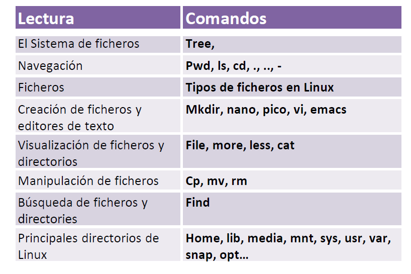

| **Inicio**         | **atrás 2**                      | **Siguiente 4**                                                                |
| ------------------ | -------------------------------- | ------------------------------------------------------------------------------ |
| [🏠](../README.md) | [⏪](./1_2_La_shell_de_Linux.md) | [⏩](./1_4_Conceptos_Avanzados_del_sistema_de_ficheros_y_la_shell_de_Linux.md) |

---

## **Índice**

| Temario                                                                                                             |
| ------------------------------------------------------------------------------------------------------------------- |
| [11. El sistema de ficheros de Linux](#11-el-sistema-de-ficheros-de-linux)                                          |
| [12. Navegación: Rutas relativas y absolutas](#12-navegación-rutas-relativas-y-absolutas)                           |
| [13. Ficheros en Linux](#13-ficheros-en-linux)                                                                      |
| [14. Creación de ficheros y editores de texto](#14-creación-de-ficheros-y-editores-de-texto)                        |
| [15. Visualización de ficheros y directorios en Linux](#15-visualización-de-ficheros-y-directorios-en-linux)        |
| [16. Manipulación de ficheros y directorios en Linux](#16-manipulación-de-ficheros-y-directorios-en-linux)          |
| [17. Búsqueda de ficheros y directorios](#17-búsqueda-de-ficheros-y-directorios)                                    |
| [18. Principales directorios de Linux](#18-principales-directorios-de-linux)                                        |
| [19. Caso práctico: Análisis forense del fichero swapfile](#19-caso-práctico-análisis-forense-del-fichero-swapfile) |

---

# **Manejo del sistema de ficheros de Linux**



## **11. El sistema de ficheros de Linux**

### 🧠 ¿Qué es el sistema de ficheros de Linux?

Es la **estructura organizativa** que usa Linux para guardar y acceder a archivos y directorios.
📂 Piensa en él como el "esqueleto" del sistema donde todo está ordenado en forma de **árbol**.

#### 📌 Características clave:

- Todo es un archivo: directorios, discos, procesos, dispositivos… ¡todo!
- Tiene una **estructura jerárquica** (como un árbol que parte de `/`)
- No usa letras de unidad como en Windows (`C:`, `D:`), sino una sola raíz `/`

---

### 🌳 Ejemplo visual: estructura tipo árbol

```plaintext
/
├── bin       → comandos esenciales como ls, cp, mv
├── boot      → archivos de arranque (kernel, GRUB)
├── dev       → dispositivos del sistema (como disco duro, USB)
├── etc       → configuración del sistema
├── home      → carpetas de los usuarios
│   └── puma  → tu carpeta personal
├── lib       → bibliotecas del sistema
├── tmp       → archivos temporales
├── usr       → programas de usuario (no críticos)
├── var       → datos que cambian (logs, correo, bases de datos)
└── root      → carpeta del usuario root (administrador)
```

---

### 🛠 Comando `tree`: ver estructura de archivos

`tree` te muestra esa estructura como un árbol. Primero debes instalarlo:

```bash
sudo apt install tree
```

---

#### 🧪 Ejemplo 1: ver todo desde la raíz

```bash
tree /
```

❗ Muy largo. Muestra _todo el árbol_, cientos de archivos. Puede tardar.

---

#### 🧪 Ejemplo 2: limitar la profundidad

```bash
tree -L 1 /
```

🔎 Muestra solo **el primer nivel** de directorios:

```plaintext
/
├── bin
├── boot
├── dev
├── etc
├── home
└── ...
```

---

#### 🧪 Ejemplo 3: ver más profundidad

```bash
tree -L 2 /
```

Esto entra **un nivel más** dentro de cada carpeta:

```plaintext
/home
└── puma
/etc
├── apt
├── bash.bashrc
└── ...
```

---

### 📘 Otros comandos relacionados útiles

| Comando                | ¿Para qué sirve?                                   |
| ---------------------- | -------------------------------------------------- |
| `ls /`                 | Lista solo la raíz del sistema                     |
| `cd /home/puma`        | Navega a tu carpeta personal                       |
| `pwd`                  | Muestra en qué carpeta estás ahora                 |
| `du -h /home/puma`     | Muestra cuánto espacio ocupa cada carpeta          |
| `df -h`                | Ver el uso del disco por particiones               |
| `find / -name archivo` | Buscar archivos en todo el sistema (tarda un poco) |

---

### ⚠️ Posibles errores y soluciones

| Problema                    | Solución                                      |
| --------------------------- | --------------------------------------------- |
| `tree: command not found`   | Ejecuta `sudo apt install tree`               |
| `Permiso denegado`          | Usa `sudo` para acceder a carpetas protegidas |
| Muestra demasiados archivos | Usa `-L` para limitar niveles (ej. `-L 1`)    |

---

### 🧠 En resumen

| Concepto            | Explicación simple                                     |
| ------------------- | ------------------------------------------------------ |
| Sistema de ficheros | Cómo Linux organiza y accede a todos los archivos      |
| `/` (root)          | El inicio de todo en Linux                             |
| `tree`              | Muestra la estructura como un árbol                    |
| `tree -L 1 /`       | Ver solo el primer nivel de directorios                |
| Todo es archivo     | Incluso discos, procesos y dispositivos son "archivos" |

---

[🔼](#índice)

---

## **12. Navegación: Rutas relativas y absolutas**

### 🧭 Navegación: **Rutas relativas y absolutas**

---

#### 🔍 ¿Qué es una **ruta** en Linux?

Una **ruta** (path) es la dirección que usas para decirle al sistema dónde encontrar un archivo o directorio.

---

### 📁 Tipos de rutas

| Tipo de ruta         | ¿Qué es?                                                           |
| -------------------- | ------------------------------------------------------------------ |
| 📍 **Ruta absoluta** | Empieza desde la raíz `/`. Siempre muestra la **ruta completa**.   |
| 🧭 **Ruta relativa** | Parte desde **donde estás ahora**. Depende de tu ubicación actual. |

---

#### ✅ Ejemplos simples

**Supón que estás en `/home/puma` y tienes esto:**

```plaintext
/home/puma
├── Documentos
└── Escritorio
```

##### Ruta absoluta:

```bash
cd /home/puma/Escritorio
```

🔁 Siempre te lleva al mismo lugar sin importar dónde estés.

##### Ruta relativa:

```bash
cd Escritorio
```

🔁 Solo funciona si ya estás dentro de `/home/puma`.

---

### 📘 Comandos para navegar y trabajar con rutas

#### 📍 `pwd` (print working directory)

```bash
pwd
```

📤 Muestra **dónde estás parado actualmente**.

---

#### 📁 `cd` (change directory)

```bash
cd /home/puma/Desktop  # Ruta absoluta
cd Desktop             # Ruta relativa (desde /home/puma)
```

| Comando           | ¿Qué hace?                                          |
| ----------------- | --------------------------------------------------- |
| `cd`              | Te lleva a tu carpeta personal (`/home/puma`)       |
| `cd /`            | Te lleva al directorio raíz                         |
| `cd .`            | No hace nada, te mantiene en el mismo lugar         |
| `cd ..`           | Sube un nivel                                       |
| `cd ../..`        | Sube dos niveles                                    |
| `cd -`            | Te lleva al directorio anterior                     |
| `cd ~/Documentos` | Accede a tu carpeta Documentos desde cualquier lado |

---

#### 📋 `ls` (list)

```bash
ls -l
ls -lh
ls -t
ls -a
```

| Opción | ¿Qué hace?                                   |
| ------ | -------------------------------------------- |
| `-l`   | Lista en formato largo (permisos, tamaño...) |
| `-lh`  | Tamaños legibles (KB, MB, etc.)              |
| `-t`   | Ordena por fecha de modificación             |
| `-a`   | Muestra archivos ocultos (empiezan con `.`)  |

---

### 🧠 Ejemplos explicados con rutas

```bash
cd /home/puma/Desktop    # Ruta absoluta
cd Desktop               # Ruta relativa (si estás en /home/puma)
cd ../..                 # Subes dos niveles
cd ~                     # Vuelves a tu carpeta personal
cd -                     # Vuelves a donde estabas antes
```

---

### 🧠 Resumen visual

| Ruta         | Tipo            | Ejemplo de uso                        |
| ------------ | --------------- | ------------------------------------- |
| `/home/puma` | Absoluta        | `cd /home/puma`                       |
| `Escritorio` | Relativa        | `cd Escritorio` (si estás en `puma/`) |
| `..`         | Relativa        | Subes un directorio                   |
| `.`          | Relativa        | Directorio actual                     |
| `~`          | Absoluta (home) | Ir a tu carpeta personal              |

---

### ⚠️ Posibles errores y soluciones

| Error                                 | Solución                                 |
| ------------------------------------- | ---------------------------------------- |
| `cd: no such file or directory`       | Verifica que la carpeta exista (`ls`)    |
| `cd` sin argumentos no funciona       | Verifica que tu home exista o usa `cd ~` |
| No sabes dónde estás                  | Usa `pwd` para ver tu ubicación actual   |
| Confundes rutas relativas y absolutas | Usa `ls` y `pwd` para orientarte         |

---

[🔼](#índice)

---

## **13. Ficheros en Linux**

### 📁 ¿Qué es un fichero en Linux?

En Linux, **todo es un archivo**:
✔ Un documento,
✔ Una imagen,
✔ Un directorio,
✔ Un programa,
✔ Un disco duro,
✔ ¡Incluso un dispositivo!

> 🧠 "Fichero" = "Archivo". Son lo mismo, solo cambia el nombre entre regiones o sistemas.

---

### 🛠 ¿Para qué se utilizan los ficheros?

- Almacenar información: texto, imágenes, música, código, configuraciones.
- Ejecutar programas o scripts.
- Registrar actividad (logs).
- Comunicar procesos (por ejemplo, pipes o archivos temporales).

---

### 📂 Tipos comunes de ficheros en Linux

| Tipo               | Ejemplo                     | ¿Qué es?                             |
| ------------------ | --------------------------- | ------------------------------------ |
| Archivo normal     | `documento.txt`, `foto.png` | Texto, imágenes, código, etc.        |
| Directorio         | `/home/puma/`               | Carpeta que contiene otros archivos  |
| Archivo ejecutable | `programa.sh`, `script.py`  | Puede ejecutarse (si tiene permisos) |
| Enlace simbólico   | `link -> archivo.txt`       | Un acceso directo                    |
| Dispositivo        | `/dev/sda`, `/dev/null`     | Representan hardware                 |

---

### 📘 Comandos útiles para manejar ficheros

#### 📍 1. **Crear ficheros**

```bash
touch archivo.txt
```

📄 Crea un archivo vacío llamado `archivo.txt`.

---

#### 📍 2. **Ver contenido de un fichero**

```bash
cat archivo.txt      # Muestra todo el contenido
less archivo.txt     # Muestra el contenido página por página
head archivo.txt     # Muestra las primeras 10 líneas
tail archivo.txt     # Muestra las últimas 10 líneas
```

---

#### 📍 3. **Copiar, mover y borrar**

```bash
cp archivo.txt copia.txt        # Copiar archivo
mv archivo.txt nuevo_nombre.txt # Renombrar o mover
rm archivo.txt                  # Borrar archivo
```

> ⚠️ ¡Ten cuidado con `rm`! No hay papelera como en Windows.

---

#### 📍 4. **Ver información de ficheros**

```bash
ls -l archivo.txt      # Muestra permisos, tamaño, fecha
stat archivo.txt       # Muestra información más detallada
file archivo.txt       # Detecta el tipo de archivo (texto, imagen, etc.)
```

---

#### 📍 5. **Editar ficheros de texto (básico)**

```bash
nano archivo.txt       # Editor de texto en consola
```

---

### 🧪 Ejemplo práctico completo

```bash
touch mi_nota.txt
echo "Hola Guss" > mi_nota.txt
cat mi_nota.txt
mv mi_nota.txt notas/hola.txt
cp notas/hola.txt backup.txt
rm backup.txt
```

---

### 🧰 Posibles errores y soluciones

| Problema                    | Solución                                                       |
| --------------------------- | -------------------------------------------------------------- |
| `Permission denied`         | Usa `sudo` o revisa permisos (`ls -l`)                         |
| `No such file or directory` | Verifica que la ruta exista (`pwd`, `ls`)                      |
| `rm` borró algo por error   | ⚠ No se puede recuperar fácil (usa papelera con GUI si puedes) |
| Error de edición en `nano`  | Presiona `Ctrl + X` para salir y guarda con `Y`                |

---

### ✅ Resumen rápido

| Comando | ¿Qué hace?                             |
| ------- | -------------------------------------- |
| `touch` | Crea un archivo vacío                  |
| `cat`   | Muestra el contenido del archivo       |
| `cp`    | Copia archivos                         |
| `mv`    | Mueve o renombra archivos              |
| `rm`    | Elimina archivos                       |
| `nano`  | Abre un archivo para editar en consola |
| `file`  | Muestra el tipo de archivo             |
| `stat`  | Da detalles completos del archivo      |

---

[🔼](#índice)

---

## **14. Creación de ficheros y editores de texto**

### 🧠 ¿Qué es un fichero y para qué se utiliza?

Un **fichero** (o archivo) en Linux sirve para almacenar **texto, código, configuraciones, scripts, datos, etc.**.
Se puede crear con comandos o usando editores de texto.

---

### 🛠 Comandos para **crear ficheros**

#### 📌 `touch`

```bash
touch hola.txt
```

✅ Crea un archivo vacío llamado `hola.txt`.

#### 📌 `echo` (también útil)

```bash
echo "Hola Guss" > saludo.txt
```

✅ Crea el archivo `saludo.txt` con el texto `"Hola Guss"` dentro.

---

### 🧾 ¿Qué es un **editor de texto**?

Un **editor de texto** permite **ver, escribir o modificar texto** dentro de archivos desde la terminal o desde una interfaz gráfica.

---

### 🖥 Editores de texto por consola más usados:

#### 📘 1. `nano`

Fácil, simple y amigable para principiantes.

```bash
nano archivo.txt
```

🧩 Para guardar y salir:

- `Ctrl + O` → Guardar
- `Ctrl + X` → Salir

---

#### 📘 2. `pico`

Es muy similar a `nano`, a veces viene instalado por defecto en algunas distros. Su uso es igual:

```bash
pico archivo.txt
```

---

#### 📘 3. `emacs`

Editor más avanzado, usado por desarrolladores. Puede funcionar en modo gráfico o en consola.

##### Instalar:

```bash
sudo apt install emacs
```

##### Ver ayuda:

```bash
emacs --help
```

##### Ejecutar en consola (sin interfaz gráfica):

```bash
emacs -nw
```

🧠 Curiosidad: `-nw` significa "no window" = sin abrir ventana gráfica.

---

### 🧪 Ejemplo práctico

```bash
mkdir test                  # Crear carpeta
cd test
nano notas.txt             # Crear y editar archivo con nano
echo "Linux es genial" > info.txt
cat info.txt               # Ver contenido del archivo
```

---

### ⚠️ Problemas comunes y soluciones

| Problema                             | Solución                                      |
| ------------------------------------ | --------------------------------------------- |
| `command not found: nano/pico/emacs` | Instálalo con `sudo apt install nombre`       |
| No sabes cómo salir de `nano`        | `Ctrl + X`, luego `Y` para guardar            |
| Emacs abre una ventana rara          | Usa `emacs -nw` para terminal                 |
| Permiso denegado                     | Usa `sudo nano archivo.txt` si es del sistema |

---

### ✅ Resumen visual

| Editor  | Comando principal       | Dificultad  | Notas                              |
| ------- | ----------------------- | ----------- | ---------------------------------- |
| `nano`  | `nano archivo.txt`      | 🟢 Fácil    | Ideal para comenzar                |
| `pico`  | `pico archivo.txt`      | 🟢 Fácil    | Similar a `nano`                   |
| `emacs` | `emacs -nw archivo.txt` | 🔵 Avanzado | Muy poderoso, curva de aprendizaje |

---

[🔼](#índice)

---

## **15. Visualización de ficheros y directorios en Linux**

### 🧠 ¿Qué significa "visualizar ficheros o directorios"?

**Visualizar** un archivo o un directorio en Linux significa **ver su contenido o saber qué tipo de archivo es** (texto, imagen, binario, etc.).

---

### 🔧 ¿Para qué se utiliza?

- Saber **qué contiene** un archivo de texto o log.
- Comprobar el **tipo de archivo** (¿es un texto? ¿una imagen?).
- Leer archivos **muy grandes** sin abrirlos completos.
- Navegar dentro de directorios.

---

### 🛠 Comandos más usados

---

#### 📌 `file`

Este comando **detecta el tipo de archivo**.

```bash
file nombre_del_archivo
```

##### Ejemplos:

```bash
file lastlog
file syslog
file imagen.png
```

📌 Esto te dirá si el archivo es:

- Texto plano
- Imagen PNG
- Archivo binario
- Archivo de registro (log), etc.

---

#### 📌 `cat`

**Muestra el contenido completo** de un archivo de texto.

```bash
cat archivo.txt
```

##### Ejemplo:

```bash
cat auth.log
```

⚠️ _Si el archivo es muy largo, te va a llenar la pantalla de golpe_.

---

#### 📌 `less`

**Visualiza archivos largos, página por página.**
Ideal para archivos grandes.

```bash
less archivo.txt
```

##### Ejemplo:

```bash
less auth.log
```

🔹 Usa las flechas ↑ ↓ para navegar.
🔹 Presiona `q` para salir.

---

#### 📌 `more`

Parecido a `less`, pero más simple.
No tiene tantas funciones.

```bash
more archivo.txt
```

---

### 🧾 También puedes ver **directorios** con:

#### 📌 `ls`

Lista los archivos dentro de un directorio.

```bash
ls                # Lista nombres
ls -l             # Lista con detalles (permisos, tamaño, fecha)
ls -la            # Incluye archivos ocultos
ls -lh            # Tamaños legibles (MB, KB)
```

---

### ⚠️ Posibles errores y soluciones

| Mensaje de error                            | Posible causa                          | Solución                         |
| ------------------------------------------- | -------------------------------------- | -------------------------------- |
| `No such file or directory`                 | El archivo no existe                   | Usa `ls` antes para verificar    |
| `Permission denied`                         | No tienes permisos para ver el archivo | Usa `sudo` si es seguro hacerlo  |
| Archivo se ve en "símbolos raros" con `cat` | Es un archivo binario                  | Usa `file nombre` para verificar |
| Pantalla se llena muy rápido con `cat`      | Archivo muy largo                      | Usa `less` en su lugar           |

---

### ✅ Ejemplo completo

```bash
cd /var/log
ls -lh            # Ver archivos de logs
file auth.log     # Ver qué tipo de archivo es
less auth.log     # Leerlo poco a poco
```

---

### 🧠 Resumen de comandos

| Comando | ¿Qué hace?                              |
| ------- | --------------------------------------- |
| `file`  | Muestra el tipo de archivo              |
| `cat`   | Muestra todo el contenido del archivo   |
| `less`  | Muestra contenido largo, con navegación |
| `ls`    | Lista archivos y carpetas               |

---

[🔼](#índice)

---

## **16. Manipulación de ficheros y directorios en Linux**

### 🧠 ¿Qué significa “manipulación de ficheros y directorios”?

Manipular ficheros o directorios significa:

| Acción   | Significado                           |
| -------- | ------------------------------------- |
| Crear    | Hacer un nuevo archivo o carpeta      |
| Ver      | Mostrar contenido de archivos         |
| Copiar   | Hacer una copia del archivo o carpeta |
| Mover    | Cambiar ubicación o renombrar         |
| Eliminar | Borrar archivo o carpeta del sistema  |

---

### 🔧 Comandos básicos para manipular archivos y carpetas

---

#### ✅ `mkdir`: **Crear directorios**

```bash
mkdir directorio
```

📌 Crea una carpeta llamada `directorio`.

---

#### ✅ `pico` o `nano`: **Crear o editar archivos de texto**

```bash
pico fichero.txt
```

📌 Crea el archivo `fichero.txt` y permite editarlo.

---

#### ✅ `cat`: **Ver el contenido del archivo**

```bash
cat fichero.txt
```

---

#### ✅ `cp`: **Copiar archivos o carpetas**

```bash
cp fichero.txt fichero2.txt
```

📌 Crea una copia llamada `fichero2.txt`.

```bash
cp -i fichero.txt fichero2.txt
```

🧠 `-i` pregunta antes de sobrescribir el archivo destino.

```bash
cp fichero.txt fichero2.txt fichero3.txt
```

📌 Copia un archivo a varios destinos si están separados por espacios.

```bash
cp -r directorio1 directorio2
```

📌 `-r` permite copiar **carpetas y su contenido**.

---

#### ✅ `mv`: **Mover o renombrar archivos y carpetas**

```bash
mv fichero_mover.txt directorio
```

📌 Mueve el archivo a la carpeta `directorio`.

```bash
mv fichero.txt fichero4.txt
```

📌 Renombra el archivo.

```bash
mv -u fichero2.txt fichero3.txt ../
```

📌 `-u` mueve solo si el archivo de destino no existe o es más antiguo.

---

#### ✅ `rm`: **Eliminar archivos**

```bash
rm fichero.txt fichero3.txt
```

📌 Borra uno o varios archivos.

```bash
rm -r directorio1
```

📌 Borra carpetas y su contenido.

```bash
rm -rf directorio2
```

🧠 `-f` fuerza el borrado sin preguntar.

⚠️ ¡Cuidado con `rm -rf`! Puede borrar **todo tu sistema** si se usa mal.

---

### 🧪 Ejemplo completo paso a paso

```bash
mkdir test
cd test
pico saludo.txt                    # Crear archivo
cat saludo.txt                     # Ver contenido
cp saludo.txt copia.txt            # Copiar
mv copia.txt renombrado.txt        # Renombrar
mkdir respaldo
mv renombrado.txt respaldo/        # Mover archivo
rm saludo.txt                      # Eliminar archivo
rm -r respaldo                     # Eliminar carpeta
```

---

### ❗ Posibles errores y soluciones

| Error o situación                     | Causa                            | Solución                          |
| ------------------------------------- | -------------------------------- | --------------------------------- |
| `Permission denied`                   | No tienes permisos               | Usa `sudo` si es seguro hacerlo   |
| `No such file or directory`           | Archivo o carpeta no existe      | Usa `ls` para confirmar nombres   |
| `cp: omitting directory`              | Intentas copiar carpeta sin `-r` | Usa `cp -r carpeta destino`       |
| Usaste `rm -rf` en carpeta incorrecta | Borraste todo                    | ⚠️ ¡Siempre revisa antes de usar! |

---

### 🧠 Resumen rápido de comandos

| Comando                   | ¿Qué hace?                    |
| ------------------------- | ----------------------------- |
| `mkdir nombre`            | Crea un directorio            |
| `pico archivo.txt`        | Crea y edita archivo de texto |
| `cp origen destino`       | Copia archivo                 |
| `cp -r carpeta1 carpeta2` | Copia carpetas                |
| `mv origen destino`       | Mueve o renombra              |
| `rm archivo.txt`          | Elimina archivo               |
| `rm -r carpeta`           | Elimina carpeta               |
| `rm -rf carpeta`          | Fuerza eliminación            |

---

[🔼](#índice)

---

## **17. Búsqueda de ficheros y directorios**

### 🔍 ¿Qué es la búsqueda de ficheros y directorios?

La **búsqueda en Linux** permite localizar archivos o carpetas en tu sistema usando comandos potentes, como `find`. Esto es útil cuando no sabes dónde está un archivo o necesitas trabajar con muchos archivos a la vez.

---

### 🛠️ Comando principal: `find`

#### 📌 Sintaxis básica:

```bash
find [ruta] [condición]
```

---

#### 📁 Ejemplo 1: Buscar un archivo específico por nombre

```bash
find /var/log/home/puma -name auth.log
```

🔎 Busca un archivo **exactamente llamado** `auth.log` dentro de `/var/log/home/puma`.

---

#### ⚠️ Ejemplo 2: Eliminar errores de permisos al buscar

```bash
find /var -name auth.log 2> /dev/null
```

✅ Elimina los mensajes de error si no tienes permisos para acceder a algunos directorios.

---

#### 🧾 Ejemplo 3: Ver detalles del archivo encontrado

```bash
find /var -name auth.log -ls 2> /dev/null
```

📋 Muestra información completa como tamaño, permisos, fecha de modificación.

---

#### 📍 Ejemplo 4: Buscar en el directorio actual

```bash
find . -name auth.log
```

📁 Busca `auth.log` **en el directorio actual y sus subdirectorios**.

---

#### 🗂️ Ejemplo 5: Buscar todos los archivos `.log`

```bash
find /var/log -name '*.log' 2> /dev/null
```

🔎 Encuentra todos los archivos que **terminen en `.log`** dentro de `/var/log`.

---

#### 🏷️ Ejemplo 6: Buscar un directorio específico

```bash
find / -name log -type d
```

📁 Busca un **directorio** llamado `log`.
🧠 `-type d` indica que debe ser **directorio** (`d` = directory).

---

#### 👤 Ejemplo 7: Buscar archivos por usuario

```bash
find /home/puma -name '*' -user puma
```

🔎 Encuentra todos los archivos en `/home/puma` que pertenezcan al usuario `puma`.

---

### ⚠️ Posibles errores y soluciones

| 💬 Mensaje de error                   | 💡 Causa                                        | ✅ Solución                                     |
| ------------------------------------- | ----------------------------------------------- | ----------------------------------------------- |
| `Permission denied`                   | No tienes permisos en ciertas carpetas          | Usa `sudo` o redirige errores con `2>/dev/null` |
| `find: paths must precede expression` | El orden del comando está mal                   | Verifica que escribiste bien la ruta y opciones |
| No devuelve resultados                | El archivo no existe o escribiste mal el nombre | Revisa el nombre con `ls` o sin comillas        |

---

### 🧠 ¿Qué más puedes hacer con `find`?

| Opción          | ¿Qué hace?                                   |
| --------------- | -------------------------------------------- |
| `-name "*.txt"` | Buscar por nombre y patrón                   |
| `-type f`       | Buscar solo archivos                         |
| `-type d`       | Buscar solo directorios                      |
| `-user puma`    | Archivos del usuario `puma`                  |
| `-size +1M`     | Archivos de más de 1 MB                      |
| `-mtime -1`     | Archivos modificados en las últimas 24 horas |

---

### 📌 Resumen práctico

| Comando                        | ¿Para qué sirve?                            |
| ------------------------------ | ------------------------------------------- |
| `find /ruta -name archivo.txt` | Buscar archivo específico por nombre        |
| `find . -name '*.log'`         | Buscar archivos `.log` en la carpeta actual |
| `find / -name log -type d`     | Buscar carpeta llamada `log`                |
| `find / -user usuario`         | Buscar archivos de cierto usuario           |
| `find / -size +5M`             | Buscar archivos grandes                     |
| `find / 2> /dev/null`          | Evitar errores de permisos                  |

---

[🔼](#índice)

---

## **18. Principales directorios de Linux**

### 📁 ¿Qué es el sistema de directorios en Linux?

En Linux, **todo es un archivo o un directorio**, y todos están organizados bajo una estructura jerárquica que parte de la raíz: `/`.

#### 🧠 `/` es el directorio raíz (root directory).

Desde ahí cuelgan todos los demás.

---

### 📂 Principales directorios de Linux

| Directorio | ¿Para qué se usa?                                                          |
| ---------- | -------------------------------------------------------------------------- |
| `/`        | Raíz del sistema. Punto de partida.                                        |
| `/bin`     | Comandos básicos (como `ls`, `cp`, `mv`, `rm`).                            |
| `/boot`    | Archivos de arranque del sistema, incluido el kernel.                      |
| `/dev`     | Dispositivos del sistema (disco, USB, etc.).                               |
| `/etc`     | Archivos de configuración del sistema.                                     |
| `/home`    | Carpetas personales de los usuarios. Ejemplo: `/home/puma`.                |
| `/lib`     | Bibliotecas compartidas necesarias para los programas en `/bin` y `/sbin`. |
| `/media`   | Montaje automático de medios como USB o CD.                                |
| `/mnt`     | Punto de montaje manual de dispositivos externos.                          |
| `/opt`     | Programas opcionales de terceros.                                          |
| `/proc`    | Información sobre procesos del sistema y kernel (virtual, no física).      |
| `/root`    | Carpeta personal del superusuario (root).                                  |
| `/run`     | Información del sistema después de arrancar.                               |
| `/sbin`    | Comandos de administración del sistema.                                    |
| `/tmp`     | Archivos temporales.                                                       |
| `/usr`     | Programas de usuario, librerías, etc.                                      |
| `/var`     | Archivos que cambian, como logs, correos, spool de impresión, etc.         |

---

### 🛠️ Comandos para explorar estos directorios

#### 1. Ver estructura del sistema hasta 1 nivel

```bash
tree / -L 1
```

📂 Muestra los principales directorios de la raíz `/`.
🔸 `-L 1` = profundidad de 1 nivel.

---

#### 2. Ver contenido de un archivo de estado o texto

```bash
less status
```

🔍 Abre el archivo `status` para leerlo con desplazamiento.
⚠️ Si ese archivo no existe, dará error. Este comando se usa mejor así:

```bash
less /proc/self/status
```

💡 Esto muestra información del proceso actual (RAM usada, PID, etc.).

---

#### 3. Mostrar el ID del proceso actual (PID)

```bash
echo $$
```

🧠 Muestra el **PID (Process ID)** de tu shell actual. Útil para depuración.

---

### ⚠️ Posibles errores y soluciones

| Mensaje de error                       | Causa                            | Solución                                            |
| -------------------------------------- | -------------------------------- | --------------------------------------------------- |
| `status: No such file or directory`    | El archivo no existe en la ruta  | Asegúrate de usar una ruta como `/proc/self/status` |
| `tree: command not found`              | El comando no está instalado     | Ejecuta `sudo apt install tree` para instalarlo     |
| Permiso denegado (`Permission denied`) | No tienes acceso a un directorio | Usa `sudo` o accede a directorios permitidos        |

---

### 🧪 Ejemplo completo y fácil:

```bash
sudo apt install tree        # Instala tree si no lo tienes
tree / -L 1                  # Muestra la estructura principal
cd /proc/self                # Ve al directorio del proceso actual
less status                  # Lee el estado del proceso
echo $$                     # Muestra tu PID
```

---

### 🎯 Resumen

- Linux tiene una estructura clara de directorios.
- Los comandos como `tree`, `less` y `echo $$` te ayudan a **explorar y entender** el sistema.
- Saber para qué sirve cada carpeta te permite **administrar mejor tu sistema o servidor**.

---

[🔼](#índice)

---

## **19. Caso práctico: Análisis forense del fichero swapfile**

### 🕵️‍♂️ ¿Qué es el **análisis forense del fichero swapfile** en Linux?

El **`swapfile`** en Linux es un archivo que actúa como **memoria virtual**. Es decir, cuando la RAM se llena, el sistema usa este archivo para "descansar" temporalmente partes de programas o procesos.

En **análisis forense**, el `swapfile` puede contener **fragmentos de información sensible** (contraseñas, chats, procesos, etc.) que estuvieron en RAM y fueron desplazados.

---

### 📂 ¿Dónde está el `swapfile`?

Normalmente en la raíz del sistema:

```
/swapfile
```

---

### 🧪 Caso práctico: pasos y comandos explicados

#### 🔎 1. Ver si existe y su información

```bash
ls -la / swapfile
```

✅ Muestra los permisos, dueño y tamaño del archivo `/swapfile`.

---

#### ✏️ 2. Editar un archivo importante del sistema (simulando una acción)

```bash
emacs /etc/passwd
```

🛠 Editas el archivo de usuarios. Si lo dejas abierto, el contenido puede quedar parcialmente en RAM y luego en `swap`.

---

#### 🛑 3. Suspender un proceso con atajo

```bash
ctrl + z
```

⏸ Suspende temporalmente `emacs`. Lo deja en segundo plano.

---

#### 🔍 4. Ver procesos activos

```bash
ps
```

🧠 Muestra los procesos activos de tu sesión con sus PID.

---

#### 🚫 5. Limitar uso de memoria

```bash
prlimit --as=1000 --pid 62358
```

✔️ Correcto comando: `prlimit` limita recursos de un proceso. Aquí se intenta limitar el espacio de direcciones (RAM).

> 📝 **Solución si no funciona:**
> Asegúrate de tener `util-linux` instalado:
>
> ```bash
> sudo apt install util-linux
> ```

---

#### ▶️ 6. Volver a primer plano el proceso suspendido

```bash
fg
```

📌 Trae de vuelta el `emacs` al primer plano para seguir usándolo.

---

#### 📋 7. Copiar el `swapfile` para análisis

```bash
sudo cp /swapfile /home/puma/Desktop/
```

📂 Copias el `swapfile` a tu escritorio para examinarlo sin afectar el original.

---

#### 🔐 8. Darle permisos de lectura

```bash
sudo chmod 755 /home/puma/Desktop/swapfile
```

🔓 Cambias los permisos para poder accederlo.
✔️ Permite lectura, escritura y ejecución al dueño, y lectura y ejecución a otros.

---

### 🔧 ¿Cómo analizar el contenido del swapfile?

Puedes usar herramientas forenses como:

- `strings` → muestra texto legible dentro del archivo:

  ```bash
  strings /home/puma/Desktop/swapfile | less
  ```

- `binwalk`, `volatility`, `grep` → para buscar datos o patrones.

---

### ❗ Precauciones

- El archivo swap puede ser muy grande.
- Solo usuarios con privilegios (`sudo`) pueden manipularlo.
- Nunca lo edites directamente, **haz una copia** como en el ejemplo.

---

### 🧠 Resumen

| Acción                   | Comando                  | Para qué sirve                      |
| ------------------------ | ------------------------ | ----------------------------------- |
| Ver el swapfile          | `ls -la / swapfile`      | Ver si existe y sus propiedades     |
| Simular trabajo en RAM   | `emacs /etc/passwd`      | Crear actividad que pueda ir a swap |
| Suspender proceso        | `ctrl + z`               | Poner proceso en segundo plano      |
| Ver procesos             | `ps`                     | Ver PIDs                            |
| Limitar memoria (RAM)    | `prlimit --as=...`       | Forzar uso de swap                  |
| Volver proceso al frente | `fg`                     | Retomar proceso                     |
| Copiar swapfile          | `sudo cp ...`            | Crear copia para análisis           |
| Dar permisos             | `sudo chmod 755 archivo` | Permitir su lectura o análisis      |

---

[🔼](#índice)

---

| **Inicio**         | **atrás 2**                      | **Siguiente 4**                                                                |
| ------------------ | -------------------------------- | ------------------------------------------------------------------------------ |
| [🏠](../README.md) | [⏪](./1_2_La_shell_de_Linux.md) | [⏩](./1_4_Conceptos_Avanzados_del_sistema_de_ficheros_y_la_shell_de_Linux.md) |
