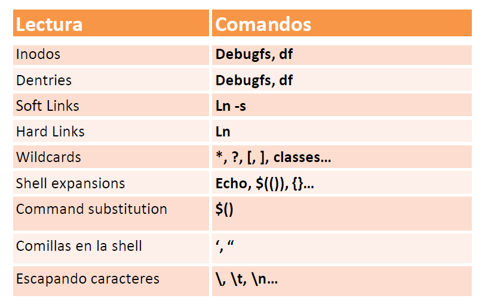

| **Inicio**         | **atrás 3**                                            | **Siguiente 5**                          |
| ------------------ | ------------------------------------------------------ | ---------------------------------------- |
| [🏠](../README.md) | [⏪](./1_3_Manejo_del_sistema_de_ficheros_de_Linux.md) | [⏩](./1_5_Redirecciones_y_pipelines.md) |

---

## **Índice**

| Temario                                                                                                       |
| ------------------------------------------------------------------------------------------------------------- |
| [20. Inodos](#20-inodos)                                                                                      |
| [21. Dentries](#21-dentries)                                                                                  |
| [22. Enlaces simbólicos (Soft Links)](#22-enlaces-simbólicos-soft-links)                                      |
| [23. Enlaces duros (Hard Links)](#23-enlaces-duros-hard-links)                                                |
| [24. Wildcards](#24-wildcards)                                                                                |
| [25. Shell Expansions](#25-shell-expansions)                                                                  |
| [26. Command Substitution](#26-command-substitution)                                                          |
| [27. Comillas en la Shell de Linux](#27-comillas-en-la-shell-de-linux)                                        |
| [28. Escapando caracteres especiales](#28-escapando-caracteres-especiales)                                    |
| [29. Caso práctico: El programa vulnerable persistente](#29-caso-práctico-el-programa-vulnerable-persistente) |

---

# **Conceptos Avanzados del sistema de ficheros y la shell de Linux**



## **20. Inodos**

### 📦 ¿Qué es un **inodo**?

Un **inodo** es como la "ficha técnica" de un archivo o carpeta en Linux.
No contiene el contenido del archivo, sino **información sobre él**.

---

#### 🧠 El inodo almacena:

| Atributo                   | Descripción                                     |
| -------------------------- | ----------------------------------------------- |
| Tipo de archivo            | Archivo, directorio, enlace, etc.               |
| Permisos de acceso         | Lectura, escritura, ejecución                   |
| Propietario y grupo        | Usuario y grupo dueño del archivo               |
| Fecha de creación y acceso | Tiempos (`ctime`, `mtime`, `atime`)             |
| Número de enlaces          | Cuántos nombres apuntan a ese inodo             |
| Ubicación de los bloques   | Dónde está el contenido del archivo en el disco |

🔍 El **nombre del archivo** _no está en el inodo_; está en la entrada del directorio que apunta al inodo.

---

### 🔧 ¿Para qué se usa un inodo?

- Saber **cómo y cuándo fue modificado** un archivo.
- Ver **detalles internos** de archivos y directorios.
- Diagnóstico y análisis de disco.
- Herramientas forenses y de recuperación de archivos.

---

### 🛠️ Comandos relacionados con inodos

---

#### 📌 1. Ver uso de inodos en discos

```bash
df -i
```

🔎 Muestra la cantidad total, usados y libres de inodos por sistema de archivos.

---

#### 📌 2. Ver el número de inodo de un archivo

```bash
ls -i fichero.txt
```

🧠 Cada archivo tiene un **número de inodo único** en su partición.

---

#### 📌 3. Ver detalles del archivo (incluye número de inodo)

```bash
ls -la fichero.txt
```

---

#### 📌 4. Ver detalles técnicos de un inodo (por número)

```bash
stat fichero.txt
```

📄 Muestra los **metadatos completos** del archivo: tamaño, permisos, fechas, inodo, etc.

---

#### 📌 5. Ver directamente el inodo por su número (con `debugfs`)

```bash
sudo debugfs /dev/sda3
```

Y dentro de `debugfs`, ejecutas:

```bash
stat <395297>
```

💡 Este comando accede a nivel **bajo del sistema de archivos** para ver el contenido del inodo `395297`.

---

### 🧪 Ejemplo completo paso a paso

```bash
# Crear un archivo
echo "Hola Guss" > fichero.txt

# Ver el inodo asignado
ls -i fichero.txt

# Obtener metadatos
stat fichero.txt

# Ver el sistema de archivos donde está el archivo
df fichero.txt

# Ver uso de inodos
df -i

# Suponiendo que está en /dev/sda3, usamos debugfs
sudo debugfs /dev/sda3

# Dentro del modo interactivo de debugfs
stat <número_de_inodo>
```

---

### ❗ Posibles errores y soluciones

| Error                                      | Causa                                                                  | Solución                                   |
| ------------------------------------------ | ---------------------------------------------------------------------- | ------------------------------------------ |
| `stat 395297`: `No such file or directory` | Estás usando el número de inodo como si fuera un archivo               | Usa `stat fichero.txt` o entra a `debugfs` |
| `sudo debugfs`: `command not found`        | `debugfs` no está instalado                                            | Ejecuta `sudo apt install e2fsprogs`       |
| `debugfs: Filesystem not found`            | `/dev/sda3` no es el dispositivo correcto                              | Usa `df fichero.txt` para ver el correcto  |
| No muestra info del inodo                  | Estás en sistema de archivos que no usa inodos visibles (como `tmpfs`) | Usa archivos en `/home` o `/var`           |

---

### 🧠 Resumen

| Comando                          | ¿Para qué sirve?                                 |
| -------------------------------- | ------------------------------------------------ |
| `df -i`                          | Ver cuántos inodos hay disponibles               |
| `ls -i`                          | Ver el número de inodo de un archivo             |
| `stat fichero.txt`               | Ver detalles del archivo e inodo                 |
| `debugfs -R "stat <n>" /dev/sdX` | Ver información directa del inodo desde el disco |

---

[🔼](#índice)

---

## **21. Dentries**

### 📘 ¿Qué son los **dentries** en Linux?

La palabra **dentry** viene de **"directory entry"** (entrada de directorio).

> Un **dentry** es una estructura en la memoria que **asocia un nombre de archivo con su inodo**.

---

#### 🧠 En otras palabras:

- El **nombre** de un archivo se guarda en el directorio (estructura `dentry`).
- El **contenido y metadatos** del archivo se guardan en el **inodo**.

---

### 🧩 ¿Dónde están los dentries?

Están **en RAM**, como parte del **dentry cache** o **dcache** del sistema.
No son visibles como archivos. Linux los usa para acceder más rápido a archivos y directorios.

---

#### 📊 ¿Para qué sirve un dentry?

- **Acelera el acceso** a archivos usados frecuentemente.
- **Evita reconsultar el disco** cada vez que accedes a un archivo.
- Participa en comandos como `ls`, `cd`, `stat`, etc.

---

### 🛠️ ¿Cómo se relaciona con los inodos?

| Concepto | Contenido                               | Ejemplo                      |
| -------- | --------------------------------------- | ---------------------------- |
| `dentry` | Asocia nombre de archivo ↔ número inodo | `'archivo.txt' -> inodo 123` |
| `inode`  | Contiene atributos del archivo y datos  | Tamaño, permisos, ubicación  |

---

### 🔧 Comandos relacionados

---

#### 🔍 Ver el inodo de un archivo (nombre ↔ inodo)

```bash
ls -lid /home/puma
```

📌 Muestra el número de inodo del directorio `/home/puma`.

---

#### 📄 Ver metadatos del archivo o directorio

```bash
stat /home/puma
```

📋 Muestra atributos del archivo, incluyendo su número de inodo y fechas de modificación.

---

#### 📚 Ver los inodos de los archivos dentro de un directorio

```bash
ls -lia /home/puma
```

📂 Muestra todos los archivos (incluso ocultos) de `/home/puma` **con su número de inodo**.

---

#### 🚫 ¿Qué pasa con este comando?

```bash
puma@DESKTOP-NT4I4PK:~$ dentries
```

❌ No existe un comando llamado `dentries` por defecto.

> 🧪 Si querías ver el **uso de dentry cache**, puedes usar comandos del kernel o herramientas como:

```bash
cat /proc/slabinfo | grep dentry
```

🔎 Esto muestra cuántos dentries están almacenados en caché.

---

### 💡 ¿Cuándo se usan los dentries?

- Al ejecutar `ls`, `cd`, o `stat`, el sistema:

  1. Consulta el nombre del archivo (dentry).
  2. Obtiene su inodo para ver detalles.

- El cache dentry permite que operaciones repetidas sean **mucho más rápidas**.

---

### 🧪 Ejemplo simple

```bash
# Muestra inodo de tu carpeta personal
ls -lid /home/puma

# Muestra los archivos y sus inodos
ls -lia /home/puma

# Muestra toda la info de un archivo
stat /home/puma/.bashrc
```

---

### ❗ Posibles errores y soluciones

| Error o situación                 | Causa                           | Solución                                         |
| --------------------------------- | ------------------------------- | ------------------------------------------------ |
| `command not found: dentries`     | El comando `dentries` no existe | Usa `/proc/slabinfo` para ver caché              |
| `/home/puma: No such file or dir` | El directorio no existe         | Verifica que estés en la ruta correcta con `pwd` |
| `Permission denied`               | Sin permiso para acceder        | Usa `sudo` si es seguro hacerlo                  |

---

### 🧠 Resumen

| Concepto | ¿Qué hace?                                           |
| -------- | ---------------------------------------------------- |
| `dentry` | Asocia nombre del archivo con su inodo en la memoria |
| `inode`  | Guarda metadatos y ubicaciones de bloques de datos   |
| `ls -li` | Muestra inodos asociados a nombres                   |
| `stat`   | Muestra atributos completos de un archivo            |

---

[🔼](#índice)

---

## **22. Enlaces simbólicos (Soft Links)**

### 🔗 ¿Qué es un **enlace simbólico** (soft link)?

Un **enlace simbólico** (o _symlink_) es un **archivo especial que apunta a otro archivo o carpeta**.
Es como un **acceso directo** en Windows.

---

#### 🎯 ¿Para qué se usa?

- Para **acceder fácilmente** a un archivo desde otra ubicación.
- Para crear **alias** de rutas largas.
- Para que diferentes versiones de software apunten al mismo ejecutable.
- Para organización o compatibilidad.

---

### 🧠 Características del enlace simbólico

| Característica                                      | Soft Link (Enlace simbólico) |
| --------------------------------------------------- | ---------------------------- |
| Es un archivo especial                              | ✅                           |
| Tiene su propio inodo                               | ✅ (distinto al original)    |
| Apunta a una ruta                                   | ✅ (no al contenido)         |
| Si se borra el archivo original, el enlace se rompe | ✅                           |

---

### 📂 Ejemplo real paso a paso

#### 👣 1. Ver contenido del sistema (ya lo hiciste)

```bash
ls -la /
ls -li /
```

🔍 Muestra los archivos y sus inodos en el directorio raíz.

---

#### 📍 2. Ver si `/bin` es un enlace simbólico

```bash
ls -lid /usr/bin
ls -li /bin
```

📌 Probablemente `/bin` apunta simbólicamente a `/usr/bin`. Así Linux unifica ubicaciones de comandos.

---

#### ✏️ 3. Crear un archivo original

```bash
echo "Soy el original" > Desktop/fichero_escrito.txt
```

---

#### 🔗 4. Crear el enlace simbólico

```bash
ln -s Desktop/fichero_escrito.txt fich_sim
```

Esto crea un enlace llamado `fich_sim` en tu carpeta actual que apunta a ese archivo en `Desktop`.

✅ Puedes verificarlo con:

```bash
ls -la
```

Verás algo como:

```
fich_sim -> Desktop/fichero_escrito.txt
```

---

#### 📖 5. Leer el contenido del enlace

```bash
cat fich_sim
```

🔍 Muestra el contenido del archivo original, porque el enlace apunta a él.

---

#### 🧨 6. ¿Qué pasa si borras el archivo original?

```bash
rm Desktop/fichero_escrito.txt
```

Ahora:

```bash
cat fich_sim
```

🚫 Error: **"No such file or directory"**

📛 El enlace **queda roto** porque ya no encuentra el destino.

---

#### 🧹 7. Eliminar el enlace

```bash
rm fich_sim
```

---

#### 📌 Otro ejemplo con ruta absoluta

```bash
ln -s /home/puma/Desktop/fichero.txt enlace
```

🔗 El enlace `enlace` ahora apunta al archivo en el escritorio, sin importar desde dónde lo llames.

---

### 🛠️ Comandos útiles

| Comando                | ¿Qué hace?                                |
| ---------------------- | ----------------------------------------- |
| `ln -s origen destino` | Crea un enlace simbólico                  |
| `ls -la`               | Muestra enlaces con la flecha `->`        |
| `cat enlace`           | Muestra el contenido del archivo original |
| `rm enlace`            | Borra solo el enlace, no el archivo real  |
| `readlink enlace`      | Muestra a dónde apunta el enlace          |

---

### ⚠️ Posibles errores y soluciones

| Error o problema                     | Causa                                   | Solución                                   |
| ------------------------------------ | --------------------------------------- | ------------------------------------------ |
| `cat: fich_sim: No such file`        | El archivo original fue eliminado       | Recrea el archivo o elimina el enlace roto |
| `ln: failed to create symbolic link` | No diste el nombre del enlace           | Usa: `ln -s origen destino`                |
| `Permission denied`                  | No tienes permiso para crear enlaces    | Usa `sudo` si es necesario                 |
| El enlace no funciona con `cd`       | Solo funciona si apunta a un directorio | Verifica con `file nombre_enlace`          |

---

### 📌 Diferencia entre hard link y soft link

| Característica                 | Soft Link (`ln -s`) | Hard Link (`ln`) |
| ------------------------------ | ------------------- | ---------------- |
| Apunta al archivo              | Por su **ruta**     | Por su **inodo** |
| Inodo compartido               | ❌                  | ✅               |
| Sobre carpetas                 | ✅ (si usas `-s`)   | ❌               |
| Se rompe si borras el original | ✅                  | ❌               |

---

[🔼](#índice)

---

## **23. Enlaces duros (Hard Links)**

### 🔗 ¿Qué es un **enlace duro** (hard link)?

Un **hard link** es una **referencia directa al mismo inodo** de un archivo.
En otras palabras:

> ✅ **Dos archivos distintos que en realidad son el mismo archivo**, compartiendo exactamente el mismo contenido y el mismo identificador (inodo).

---

#### 🎯 ¿Para qué se usa un hard link?

- Para tener **copias "idénticas"** de un archivo sin duplicar espacio.
- Para asegurar que **aunque se borre un nombre**, el archivo siga existiendo.
- Para mantener **versiones sincronizadas** de archivos críticos.

---

### 🧠 Diferencias entre hard link y soft link

| Característica                   | Enlace duro (`ln`)         | Enlace simbólico (`ln -s`)    |
| -------------------------------- | -------------------------- | ----------------------------- |
| Apunta al inodo                  | ✅ Sí                      | ❌ No (apunta al nombre/ruta) |
| Mismo contenido/espacio          | ✅ Mismo inodo y contenido | ❌ Tiene su propio inodo      |
| Se rompe si el original se borra | ❌ No se rompe             | ✅ Sí se rompe                |
| Entre diferentes particiones     | ❌ No se puede             | ✅ Sí se puede                |
| Funciona con directorios         | ❌ No                      | ✅ Sí                         |

---

### 🧪 Ejemplo práctico paso a paso

#### 🔹 1. Crear el archivo original

```bash
echo "Hola Guss" > Desktop/fichero.txt
```

---

#### 🔹 2. Crear un **enlace duro**

```bash
ln Desktop/fichero.txt enlace_duro
```

✅ Crea un nuevo archivo `enlace_duro` en tu directorio actual que **comparte el mismo inodo** con `fichero.txt`.

---

#### 🔹 3. Verifica con `ls`

```bash
ls -l
```

Ambos archivos deben tener el **mismo tamaño y permisos**.

---

#### 🔹 4. Verifica con `ls -li` (inodos)

```bash
ls -li Desktop/fichero.txt enlace_duro
```

🔍 Ambos archivos tienen el **mismo número de inodo**. Son el **mismo archivo físico**.

---

#### 🔹 5. Borra el archivo original

```bash
rm Desktop/fichero.txt
```

---

#### 🔹 6. El archivo sigue existiendo gracias al hard link

```bash
cat enlace_duro
```

✅ Aún puedes ver el contenido. El archivo **no fue eliminado realmente** porque sigue teniendo al menos un nombre (enlace) apuntando a su inodo.

---

### 🎯 Otros comandos y ejemplos

#### Crear varios hard links:

```bash
ln Desktop/fichero?.txt enlace_duro2
```

🔁 Usa `?` como comodín para igualar un solo carácter.

---

#### Ver todos los inodos del directorio:

```bash
ls -lai
```

🧠 Verás qué archivos comparten el mismo inodo (misma columna izquierda).

---

### 🛠️ Posibles errores y soluciones

| Error                                  | Causa                                                      | Solución                                          |
| -------------------------------------- | ---------------------------------------------------------- | ------------------------------------------------- |
| `ln: cross-device link not permitted`  | Intentas crear un enlace duro entre particiones diferentes | Usa un **enlace simbólico** (`ln -s`) en su lugar |
| `ln: 'fichero.txt' no existe`          | Estás en una ruta incorrecta o falta el archivo            | Usa `ls` para confirmar existencia                |
| No puedes crear hard links de carpetas | Linux lo prohíbe por seguridad                             | Usa `ln -s` para carpetas                         |
| `rm enlace_duro?` elimina todo         | Cuidado con comodines `?`                                  | Usa `ls` primero para confirmar los archivos      |

---

### 🧠 Resumen rápido

| Comando               | ¿Para qué sirve?                           |
| --------------------- | ------------------------------------------ |
| `ln archivo enlace`   | Crear un enlace duro                       |
| `ls -li`              | Ver número de inodo de archivos            |
| `cat enlace`          | Leer el archivo original desde el enlace   |
| `rm archivo_original` | No afecta al enlace duro (ni al contenido) |
| `rm enlace_duro`      | No afecta al archivo si hay más enlaces    |

---

[🔼](#índice)

---

## **24. Wildcards**

### 🃏 ¿Qué son los **wildcards** en Linux?

Los **wildcards** (comodines) son **símbolos especiales** que se usan en la línea de comandos para **representar uno o varios caracteres**.
Se utilizan principalmente para **buscar, listar o aplicar comandos a varios archivos** sin escribirlos uno por uno.

---

### 🎯 ¿Para qué se usan?

- Para trabajar con **varios archivos a la vez**.
- Para evitar escribir nombres largos o repetitivos.
- Para **filtrar** archivos por nombres, extensiones o patrones.

---

### 🛠️ Principales **wildcards** y ejemplos

| Comodín       | ¿Qué hace?                                       | Ejemplo                                                       |
| ------------- | ------------------------------------------------ | ------------------------------------------------------------- |
| `*`           | Coincide con **cero o más caracteres**           | `ls fichero*` → todos los que empiezan con “fichero”          |
| `?`           | Coincide con **un solo carácter**                | `ls fichero?.txt` → `fichero1.txt`, `ficheroA.txt`            |
| `[abc]`       | Coincide con **uno de los caracteres indicados** | `ls fichero[12].txt` → `fichero1.txt`, `fichero2.txt`         |
| `[!abc]`      | Coincide con **todo menos esos caracteres**      | `ls fichero[!12].txt` → excluye 1 y 2                         |
| `[[:digit:]]` | Coincide con **un dígito** (`0` al `9`)          | `ls fichero[[:digit:]].txt`                                   |
| `[[:upper:]]` | Coincide con **una letra mayúscula**             | `ls -d [[:upper:]]*` → directorios que empiezan con mayúscula |
| `[[:lower:]]` | Coincide con **una letra minúscula**             | `ls -d [[:lower:]]*` → directorios que empiezan con minúscula |

---

### 🧪 Ejemplos fáciles y detallados

#### 🎯 Usando `*` (asterisco)

```bash
ls fichero*
```

🔎 Muestra: `fichero.txt`, `ficheros.txt`, `ficheroc.txt`

---

#### 🎯 Usando `?` (un solo carácter)

```bash
cat fichero?.txt
```

🔍 Coincide con: `fichero1.txt`, `ficheroA.txt`
❌ No coincide con: `fichero10.txt`

---

#### 🎯 Usando corchetes `[ ]`

```bash
cat fichero[1234].txt
```

✅ Coincide con `fichero1.txt`, `fichero2.txt`, etc.
❌ No con `fichero5.txt`

---

#### 🎯 Usando negación `[! ]`

```bash
cat fichero[!1234].txt
```

✅ Coincide con archivos como `fichero9.txt`, `ficheroA.txt`
❌ No con `fichero1.txt`

---

#### 🎯 Usando clases POSIX

```bash
cat fichero[[:digit:]].txt
```

✅ Coincide con archivos como `fichero0.txt`, `fichero1.txt`, etc.

```bash
ls -d [[:upper:]]*
```

✅ Lista carpetas/archivos que **empiezan en mayúscula**.

```bash
ls -d [[:lower:]]*
```

✅ Lista carpetas/archivos que **empiezan en minúscula**.

---

### 🧹 Borrar archivos con wildcards

```bash
rm *.csv
```

🧨 ¡Ten cuidado! Esto borra **todos los archivos `.csv`** del directorio actual.

---

#### 💡 Consejo: antes de usar `rm`, prueba con `ls`

```bash
ls *.csv
```

✅ Así verificas qué archivos coinciden antes de eliminarlos.

---

### ⚠️ Posibles errores y soluciones

| Problema                               | Causa                                      | Solución                                                 |
| -------------------------------------- | ------------------------------------------ | -------------------------------------------------------- |
| No muestra archivos esperados          | No hay coincidencias                       | Usa `ls` para verificar                                  |
| `cat: fichero*: No such file`          | No hay archivos que empiecen con `fichero` | Asegúrate de estar en el directorio correcto             |
| `rm *` borra más de lo deseado         | Uso incorrecto del comodín                 | Prueba con `ls *` antes de ejecutar                      |
| `command not found: echo ficheroc.txt` | Faltó el símbolo `$`                       | Usa: `echo ficheroc.txt` (sin espacio antes del comando) |

---

### 🧠 Resumen

| Wildcard      | ¿Para qué sirve?              |
| ------------- | ----------------------------- |
| `*`           | Cualquier cosa                |
| `?`           | Un solo carácter              |
| `[abc]`       | Uno de esos caracteres        |
| `[!abc]`      | Cualquier carácter menos esos |
| `[[:digit:]]` | Cualquier número (`0-9`)      |
| `[[:upper:]]` | Letra mayúscula               |
| `[[:lower:]]` | Letra minúscula               |

---

[🔼](#índice)

---

## **25. Shell Expansions**

### 🧠 ¿Qué es **Shell Expansion**?

La **expansión en la shell** (o _Shell Expansion_) es el proceso por el cual **el intérprete de comandos (bash)** reemplaza ciertos patrones antes de ejecutar un comando.

> 🔄 Es como una **auto-completación inteligente** que la shell hace **antes** de ejecutar tu orden.

---

### 🧰 Tipos de Shell Expansions y ejemplos prácticos

---

#### 1. **Expansión de nombres de archivos (Globbing)**

Usa **wildcards** para coincidir con archivos.

```bash
ls fichero*
```

📄 Lista todos los archivos que comienzan con "fichero".

```bash
echo fichero*
```

🧾 Imprime todos los nombres de archivos que coinciden.

---

#### 2. **Expansión del directorio home `~`**

```bash
echo ~
```

✅ Muestra tu carpeta personal: `/home/puma` (o similar).

---

#### 3. ❌ Error común con comandos mal escritos

```bash
echo*
```

❌ Esto da error porque no hay ningún archivo llamado `echo*`.

---

#### 4. **Expansión de pathname (combinación de directorios)**

```bash
echo /*/log
```

🔍 Intenta mostrar todas las carpetas `log` que estén dentro de subdirectorios de `/`.

```bash
ls /*/log
```

✅ Lista las rutas `/var/log`, `/usr/log`, etc., si existen.

---

#### 5. **Expansión aritmética**

Permite hacer operaciones matemáticas simples.

```bash
echo $((2 + 2))
```

📤 Resultado: `4`

```bash
cat fichero$((1 + 1)).txt
```

📄 Esto busca el archivo `fichero2.txt`

---

#### 6. **Expansión por llaves `{ }`**

Muy útil para generar secuencias o combinaciones rápidamente.

```bash
echo {1,2,3}
```

➡️ Resultado: `1 2 3`

```bash
echo fichero{1,2,3}.txt
```

➡️ Resultado: `fichero1.txt fichero2.txt fichero3.txt`

```bash
echo {A..Z}
```

🔡 Resultado: `A B C ... Z`

```bash
mkdir dir{1..5}
```

📁 Crea 5 carpetas: `dir1`, `dir2`, ..., `dir5`

```bash
echo texto {A{1,2},B{3,4}} final
```

🧠 Expansión combinada:

> Resultado:
> `texto A1 final` > `texto A2 final` > `texto B3 final` > `texto B4 final`

---

#### 7. ❌ Error común en expansión con espacios

```bash
mkdir {2020..2024} - {01..12}
```

⚠️ Esto **no funcionará bien** como esperas porque el `-` se toma como texto literal y no como unión.

✅ Solución correcta (expansión cruzada entre años y meses):

```bash
for y in {2020..2024}; do mkdir -p $y/{01..12}; done
```

📁 Crea carpetas como:

```
2020/01
2020/02
...
2024/12
```

---

### ✅ Resumen de los tipos de Shell Expansion

| Tipo                      | Ejemplo                | Resultado                          |
| ------------------------- | ---------------------- | ---------------------------------- |
| Globbing (`*`, `?`, `[]`) | `ls *.txt`             | Archivos con extensión `.txt`      |
| `~` expansión de home     | `echo ~`               | `/home/usuario`                    |
| Aritmética `$(( ))`       | `echo $((3 * 2))`      | `6`                                |
| Expansión con llaves `{}` | `echo {a,b,c}`         | `a b c`                            |
| Rango con llaves `{..}`   | `echo {1..5}`          | `1 2 3 4 5`                        |
| Expansión cruzada         | `echo {A{1,2},B{3,4}}` | `A1 A2 B3 B4`                      |
| Expansión de rutas        | `ls /*/log`            | Carpetas log de varios directorios |

---

### ⚠️ Errores comunes y soluciones

| Error                           | Causa                           | Solución                                  |
| ------------------------------- | ------------------------------- | ----------------------------------------- |
| `echo*` da error                | No hay archivo `echo*`          | Usa `echo *` con espacio                  |
| `ls $ ((2 + 2))` da error       | Mal uso de expansión aritmética | Usa `ls $((2 + 2))` sin espacio entre `$` |
| `mkdir {2020..2024} - {01..12}` | Expansión mal estructurada      | Usa un bucle `for` con `mkdir -p`         |

---

[🔼](#índice)

---

## **26. Command Substitution**

### 🧠 ¿Qué es **Command Substitution**?

**Command Substitution** (sustitución de comandos) es una técnica que te permite **usar el resultado de un comando dentro de otro comando**.

> 🔄 Básicamente, la shell \*\*ejecuta primero el comando dentro de `$(...)` o `` `...` `` y luego reemplaza esa parte por el resultado.

---

### 🎯 ¿Para qué se utiliza?

- Para **ahorrar pasos**: ejecutar un comando **dentro de otro**.
- Para **automatizar tareas**.
- Para **capturar valores de salida**.
- Para **encadenar comandos** de forma más dinámica.

---

### 🧪 Sintaxis

Tienes dos formas:

| Sintaxis moderna ✅ | Sintaxis antigua ⚠️         |
| ------------------- | --------------------------- |
| `$(comando)`        | `` `comando` `` (backticks) |

> 🎯 **Recomendado**: usar `$(...)` por claridad y anidación más sencilla.

---

### 🔍 Ejemplos prácticos y fáciles

#### 📌 1. Usando `which` para obtener la ruta de un comando

```bash
which cat
```

🧾 Muestra la ruta: `/usr/bin/cat`

---

#### ✅ Con command substitution:

```bash
ls -la $(which cat)
```

💡 Esto es igual que hacer:

```bash
ls -la /usr/bin/cat
```

📄 Lista detalles del binario del comando `cat`.

---

#### 📌 2. Con Python como generador de texto

```bash
echo $(python3 -c 'print("Hola mundo")')
```

✅ Ejecuta el código Python y luego **imprime el resultado** del `print()`.

---

#### 📌 3. Otra forma (con backticks)

```bash
ls -la `which cat`
```

🔁 Hace lo mismo, pero es **menos legible** y más propenso a errores si anidas comandos.

---

### 🧠 ¿Cómo funciona internamente?

```bash
echo $(comando)
```

1. Primero se ejecuta `comando`.
2. Luego el resultado se reemplaza dentro del `echo`.
3. Finalmente se ejecuta el `echo`.

---

### ⚠️ Posibles errores comunes y soluciones

| Error                             | Causa                                        | Solución                                            |
| --------------------------------- | -------------------------------------------- | --------------------------------------------------- |
| `command not found`               | Escribiste mal el comando dentro de `$(...)` | Revisa que el comando exista (`which nombre`)       |
| Comportamiento raro con backticks | Usaste `` ` ` `` en lugar de `$(...)`        | Usa `$(...)` siempre que puedas                     |
| Espacios o comillas mal cerradas  | Comando complejo sin comillas o con errores  | Usa comillas simples o dobles para proteger cadenas |

---

### 🧪 Casos de uso comunes de `$(...)`

| Comando                              | ¿Qué hace?                                       |
| ------------------------------------ | ------------------------------------------------ |
| `ls -la $(which python3)`            | Muestra detalles del binario de Python           |
| `echo $(date)`                       | Muestra la fecha y hora actual                   |
| `echo $(whoami)`                     | Muestra tu nombre de usuario actual              |
| `cp $(which bash) ./`                | Copia el binario de `bash` al directorio actual  |
| `grep $(whoami) /etc/passwd`         | Busca tu usuario en el archivo `/etc/passwd`     |
| `cat $(find . -name "archivo*.txt")` | Muestra el contenido de los archivos encontrados |

---

### ✅ Resumen

| Elemento                | Explicación corta                                      |
| ----------------------- | ------------------------------------------------------ |
| `$(comando)`            | Sustituye por el resultado del comando ejecutado       |
| Uso recomendado         | En scripts, automatización, y dentro de otros comandos |
| Ventaja sobre backticks | Más legible, soporta anidación                         |

---

[🔼](#índice)

---

## **27. Comillas en la Shell de Linux**

### 🧠 ¿Qué son las **comillas en la shell**?

En Bash (y otras shells), las comillas se utilizan para **controlar cómo la shell interpreta lo que escribimos**:

#### Tipos:

| Tipo de comillas                | Ejemplo         | Uso principal                                  |
| ------------------------------- | --------------- | ---------------------------------------------- |
| Comillas dobles                 | `"texto"`       | Permiten **expansiones** (`$`, `$(...)`, etc.) |
| Comillas simples                | `'texto'`       | Todo se interpreta literalmente                |
| Comillas invertidas (backticks) | `` `comando` `` | Para _command substitution_ (como `$(...)`)    |

---

### 🎯 ¿Para qué se usan las comillas?

- Para agrupar texto con **espacios** como una sola unidad.
- Para **evitar errores de interpretación** por parte de la shell.
- Para proteger o permitir **variables**, **expansiones**, y **comodines** (`*`, `?`).
- Para dar **claridad** y evitar conflictos con nombres raros.

---

### 🔍 Ejemplos detallados y fáciles de entender

---

#### ✅ Sin comillas

```bash
echo esta frase tiene varios   espacios
```

🧾 Resultado:

```
esta frase tiene varios espacios
```

➡️ La shell **comprime** los espacios múltiples en uno solo.

---

#### ✅ Con comillas dobles (`"`)

```bash
echo "esta frase tiene varios       espacios"
```

🧾 Resultado:

```
esta frase tiene varios       espacios
```

🔐 Las **comillas dobles preservan los espacios** tal como los escribiste.

---

#### ✅ Archivos con espacios en el nombre

```bash
ls -la "nombre separado.txt"
```

📄 Sin comillas fallaría si hay espacios. Con comillas, funciona perfecto.

```bash
mv "nombre separado.txt" nombre_separado.txt
```

📦 Renombra el archivo protegiendo su nombre original con espacios.

---

#### ✅ Expresiones dentro de comillas dobles

```bash
echo "la ruta de cat es: $(which cat)"
```

📤 Resultado:

```
la ruta de cat es: /usr/bin/cat
```

✅ Ejecuta `which cat` dentro de las comillas y **expande su resultado**.

---

#### ⚠️ Comillas dobles con expresión mal escrita

```bash
echo "la ruta de cat es: 'which cat'"
```

📤 Resultado literal:

```
la ruta de cat es: 'which cat'
```

🔍 No se ejecuta nada, porque pusiste el comando como texto.

---

#### ❌ Usar comillas simples impide expansión

```bash
echo 'la ruta de cat es: $(which cat)'
```

🧾 Resultado literal:

```
la ruta de cat es: $(which cat)
```

🚫 `$(which cat)` no se ejecuta porque las **comillas simples lo protegen totalmente**.

---

#### 🔁 Diferencia entre `$(ls)` y `"$(ls)"`

```bash
echo $(ls)
```

📤 Resultado: muestra todos los archivos como una sola línea, pero **los trata como palabras separadas** (puede romper espacios).

```bash
echo "$(ls)"
```

📤 Resultado: imprime todo el contenido del directorio tal cual como una sola cadena de texto (con saltos de línea si existen).

---

#### 🧪 Casos mixtos

```bash
echo "esto es una comilla simple '' "
echo 'es una comilla doble "" '
```

📤 Resultado:

```
esto es una comilla simple ''
es una comilla doble ""
```

✅ Puedes **mezclar tipos** de comillas dentro de otras, siempre y cuando no cierres antes de tiempo.

---

### ⚠️ Errores comunes y soluciones

| Problema                           | Causa                                      | Solución                                   |
| ---------------------------------- | ------------------------------------------ | ------------------------------------------ |
| Archivo con espacios no encontrado | No usar comillas para proteger el nombre   | Usa `"archivo con espacios.txt"`           |
| Comando no se ejecuta              | Estás usando comillas simples `'$(...)'`   | Usa comillas dobles `"$(...)"`             |
| Resultado inesperado               | Uso incorrecto de expansiones sin comillas | Encierra con `"` para preservar estructura |

---

### ✅ Resumen rápido

| Tipo de comilla | Permite expansiones (`$`, `$(...)`) | Protege espacios | Literal (sin evaluar) |
| --------------- | ----------------------------------- | ---------------- | --------------------- |
| `"dobles"`      | ✅ Sí                               | ✅ Sí            | ❌ No                 |
| `'simples'`     | ❌ No                               | ✅ Sí            | ✅ Sí                 |

---

[🔼](#índice)

---

## **28. Escapando caracteres especiales**

### 🔹 1. ¿Qué es “escapar caracteres especiales”?

#### ✅ **Definición simple:**

"Escapar" un carácter significa **decirle a la terminal que no lo interprete como algo especial**, sino como texto literal.

#### 🔥 ¿Por qué es importante?

En Bash (como en muchas terminales de Linux), hay caracteres que tienen significados especiales. Por ejemplo:

- `"` → Comillas para agrupar texto con espacios.
- `\` → Carácter de escape.
- `$` → Se usa para hacer expansiones como `$(comando)` o `${VARIABLE}`.
- `*`, `?` → comodines.

Si quieres usar esos caracteres **como texto normal**, tienes que "escaparlos" con una **barra invertida (`\`)**.

---

#### ✅ Ejemplos fáciles:

```bash
echo $(whoami)       # Expande el comando: muestra el usuario actual.
echo \$(whoami)      # Muestra el texto literal: $(whoami)
```

```bash
echo hola mundo       # Muestra: hola mundo
echo hola\ mundo      # El espacio está escapado: también muestra hola mundo
```

```bash
ls archivo\ con\ espacios.txt   # Escapas los espacios para que se lea como un solo nombre de archivo
```

---

### 🔹 2. Explicación de tus comandos

#### 📌 1. `echo "esto es una expansion $(which cat)"`

- `$(which cat)` → ejecuta el comando `which cat` y reemplaza eso por su resultado (por ejemplo `/usr/bin/cat`)
- Resultado:

  ```bash
  esto es una expansion /usr/bin/cat
  ```

---

#### 📌 2. `echo "esto es una expansion $(which cat), y esto no es una expansion  \ $(which cat)"`

- Aquí estás escapando el espacio antes del segundo `$(which cat)` con `\ `
- Eso hace que la terminal **no interprete bien esa segunda expansión**, o la considere parte de la cadena literal.
- Resultado aproximado:

  ```bash
  esto es una expansion /usr/bin/cat, y esto no es una expansion  $(which cat)
  ```

---

#### 📌 3. `ls -la fichero\ espacio.txt`

- El nombre del archivo es `fichero espacio.txt` con un **espacio en el nombre**.
- El `\ ` escapa el espacio para que se lea como un solo nombre.
- Si no usaras `\`, pensaría que buscas dos archivos: `fichero` y `espacio.txt`

---

#### 📌 4. `echo -e "\a"`

- `-e` → permite interpretar secuencias especiales.
- `\a` → **alerta o beep del sistema** (puede que no haga nada en algunas terminales).

---

#### 📌 5. `echo -e "este texto \t esta tabulado"`

- `\t` → representa un tabulador (como en Excel).
- Resultado:

  ```bash
  este texto 	 esta tabulado
  ```

---

#### 📌 6. `echo -e "esto es una \n nueva linea"`

- `\n` → representa una **nueva línea**.
- Resultado:

  ```bash
  esto es una
   nueva linea
  ```

---

### 🔹 3. Posibles soluciones / buenas prácticas

| Problema                               | Solución con escape                          |
| -------------------------------------- | -------------------------------------------- |
| Archivos con espacios                  | `archivo\ con\ espacios.txt`                 |
| Mostrar `$(comando)` como texto        | `\$(comando)`                                |
| Texto en nueva línea o tabulado        | Usa `echo -e` con `\n` o `\t`                |
| Mostrar comillas o símbolos especiales | Usa `\` antes del carácter: `\"`, `\$`, etc. |

---

### 🧠 En resumen

| Carácter especial | Significado                     | Para escapar    |
| ----------------- | ------------------------------- | --------------- |
| `$`               | Expansión de variable o comando | `\$`            |
| `"`               | Comillas dobles                 | `\"`            |
| `'`               | Comillas simples                | `\'`            |
| ` ` (espacio)     | Separador de argumentos         | `\ `            |
| `\n`, `\t`, `\a`  | Secuencias especiales con `-e`  | Ya incluyen `\` |

---

[🔼](#índice)

---

## **29. Caso práctico: El programa vulnerable persistente**

### 🔐 ¿Qué es un “programa vulnerable persistente”?

#### ✅ Definición:

Un **programa vulnerable persistente** es un programa que contiene una vulnerabilidad (por ejemplo, permite ejecución de comandos con privilegios elevados, sin verificar permisos correctamente) **y que persiste** incluso si se elimina su archivo original.

Esto se puede lograr, por ejemplo, mediante **hardlinks** (enlaces duros), los cuales **mantienen acceso al mismo contenido en disco**, incluso si se borra el original.

---

### 📌 ¿Para qué se utiliza?

- En **seguridad ofensiva** (hacking ético), sirve para:

  - Mantener acceso a un binario con vulnerabilidad.
  - **Persistencia**: seguir ejecutando un programa aunque el administrador haya tratado de eliminarlo.

- En **auditorías de seguridad**: para mostrar lo importante que es controlar bien los permisos y borrar enlaces duros o copias.

---

### 🔧 Vamos a explicar los comandos paso a paso

#### 1. `ls /usr/bin`

Lista todos los programas del sistema en `/usr/bin` (una carpeta donde viven programas ejecutables). Aquí puedes ver si existe un binario vulnerable llamado `vulnprog`.

---

#### 2. `vulnprog`

Ejecuta el programa vulnerable directamente. Si existe y es ejecutable, hará lo que está programado (podría ser peligroso si está mal diseñado).

---

#### 3. `sudo ln /usr/bin/vulnprog vulnprog.hardlink`

🔐 **Crea un hardlink** (enlace duro) al binario vulnerable.

- `ln` → comando para crear enlaces.
- `vulnprog.hardlink` apunta **al mismo contenido** que `/usr/bin/vulnprog`.
- Aunque borres el original, este sigue funcionando.

---

#### 4. `ls -la vulnprog.hardlink`

Verifica que el enlace fue creado. Verás algo como:

```bash
-rwxr-xr-x 2 root root 12345 fecha vulnprog.hardlink
```

Nota el número **2** al inicio: significa que hay **2 nombres (nodos)** apuntando al mismo archivo físico.

---

#### 5. `sudo rm /usr/bin/vulnprog`

🚨 Aquí borras el archivo original, **pero NO el contenido**, porque sigue existiendo gracias al hardlink.

---

#### 6. `pico vulnprog`

Abres un editor de texto (como nano) para crear o editar un nuevo archivo llamado `vulnprog`. Podrías estar haciendo una nueva versión del programa (tal vez una modificada).

---

#### 7. `sudo cp vulnprog /usr/bin/vulnprog vulnprog`

Probablemente aquí querías hacer:

```bash
sudo cp vulnprog /usr/bin/vulnprog
```

Estás copiando un archivo llamado `vulnprog` que editaste **de nuevo a `/usr/bin`**. El final `vulnprog` adicional parece un error.

---

#### 8. `ls -la vulnprog.hadlink`

Parece un typo. El nombre correcto era `vulnprog.hardlink`.

---

#### 9. `./vulnprog.hardlink`

Ejecutas el programa a través del enlace duro. Si el original fue eliminado, **esto sigue funcionando** porque el enlace duro aún apunta al contenido.

---

### 🧠 ¿Qué aprendemos con este caso práctico?

| Acción                              | Resultado                                                      |
| ----------------------------------- | -------------------------------------------------------------- |
| Crear un hardlink con `ln`          | Apunta al mismo contenido físico que el original.              |
| Borrar el archivo original con `rm` | No borra el contenido mientras exista al menos un hardlink.    |
| Ejecutar el hardlink                | Es como ejecutar el archivo original, aunque lo hayas borrado. |
| Esto permite persistencia           | El atacante mantiene acceso aunque borres el archivo original. |

---

### 🛡️ Posibles soluciones o prevención

| Riesgo                                     | Solución recomendada                                          |
| ------------------------------------------ | ------------------------------------------------------------- |
| Usuarios crean hardlinks a binarios root   | Restringir permisos en `/usr/bin`, usar ACLs.                 |
| Binarios con vulnerabilidades persistentes | Usar `find` para buscar múltiples inodos con el mismo número. |
| Auditar cambios en el sistema              | Usar herramientas como `auditd`, `inotify`, etc.              |
| Uso de sudo sin restricción                | Controlar muy bien el uso de `sudo` y monitorear su uso.      |

---

### 🧪 Prueba tú mismo (entorno de práctica)

Puedes crear un script de prueba en tu home:

```bash
echo -e '#!/bin/bash\necho "Soy vulnerable"' > vuln.sh
chmod +x vuln.sh
ln vuln.sh vuln.hard
rm vuln.sh
./vuln.hard
```

Aun borrando `vuln.sh`, puedes seguir ejecutando `vuln.hard`.

---

[🔼](#índice)

---

| **Inicio**         | **atrás 3**                                            | **Siguiente 5**                          |
| ------------------ | ------------------------------------------------------ | ---------------------------------------- |
| [🏠](../README.md) | [⏪](./1_3_Manejo_del_sistema_de_ficheros_de_Linux.md) | [⏩](./1_5_Redirecciones_y_pipelines.md) |
