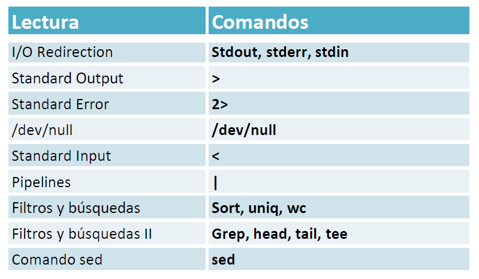

| **Inicio**         | **atrás 4**                                                                    | **Siguiente 6**                             |
| ------------------ | ------------------------------------------------------------------------------ | ------------------------------------------- |
| [🏠](../README.md) | [⏪](./1_4_Conceptos_Avanzados_del_sistema_de_ficheros_y_la_shell_de_Linux.md) | [⏩](./1_6_Permisos_y_usuarios_en_Linux.md) |

---

## **Índice**

| Temario                                                                                                          |
| ---------------------------------------------------------------------------------------------------------------- |
| [30. I/O Redirection](#30-io-redirection)                                                                        |
| [31. Standard Output (stdout) Redirection](#31-standard-output-stdout-redirection)                               |
| [32. Standard Error (stderr) Redirection](#32-standard-error-stderr-redirection)                                 |
| [33. /dev/null](#33-devnull)                                                                                     |
| [34. Standard Input (stdin) Redirection](#34-standard-input-stdin-redirection)                                   |
| [35. Pipelines](#35-pipelines)                                                                                   |
| [36. Filtros y búsquedas: sort, uniq, wc](#36-filtros-y-búsquedas-sort-uniq-wc)                                  |
| [37. Filtros y búsquedas (Parte II): grep, head, tail, tee](#37-filtros-y-búsquedas-parte-ii-grep-head-tail-tee) |
| [38. Tarea: Filtros y búsquedas](#38-tarea-filtros-y-búsquedas)                                                  |
| [39. Extra: Comando sed](#39-extra-comando-sed)                                                                  |

---

# **Redirecciones y pipelines**



## **30. I/O Redirection**

### 🧠 ¿Qué es I/O Redirection?

#### ✅ Definición:

**I/O Redirection** significa **redirigir la entrada o salida** de un comando o programa desde/hacia **archivos o dispositivos**, en vez de usar la pantalla (salida estándar) o el teclado (entrada estándar).

---

### 📌 ¿Para qué se utiliza?

| ¿Para qué sirve?                    | Ejemplo común                |
| ----------------------------------- | ---------------------------- |
| Guardar la salida de un comando     | `ls > archivos.txt`          |
| Leer entrada desde un archivo       | `cat < archivo.txt`          |
| Añadir contenido sin sobrescribir   | `echo "Hola" >> archivo.txt` |
| Redirigir errores a un archivo      | `comando 2> errores.txt`     |
| Redirigir salida y errores a la vez | `comando > todo.txt 2>&1`    |

---

### 🧰 Tipos de redirección con ejemplos simples

#### 🔹 1. **Redirección de salida estándar (`>` y `>>`)**

##### ▶️ `>` (sobrescribe):

```bash
echo "Hola mundo" > saludo.txt
```

- Crea el archivo `saludo.txt` con el contenido `Hola mundo`.
- Si ya existe, lo **sobrescribe**.

##### ▶️ `>>` (añade al final):

```bash
echo "Otra línea" >> saludo.txt
```

- Añade una línea más sin borrar el contenido anterior.

---

#### 🔹 2. **Redirección de entrada estándar (`<`)**

```bash
cat < saludo.txt
```

- Lee el contenido de `saludo.txt` como si lo escribieras con el teclado.

Otro ejemplo:

```bash
sort < numeros.txt
```

- Ordena las líneas del archivo `numeros.txt`.

---

#### 🔹 3. **Redirección de errores (`2>` y `2>>`)**

##### ▶️ `2>` (errores → archivo, sobrescribe):

```bash
ls archivo_que_no_existe 2> errores.txt
```

- Guarda el error en `errores.txt`.

##### ▶️ `2>>` (errores → archivo, añade al final):

```bash
ls otro_error 2>> errores.txt
```

- Añade el error sin borrar el anterior.

---

#### 🔹 4. **Redirigir salida estándar y errores juntos (`> archivo 2>&1`)**

```bash
comando > todo.txt 2>&1
```

- Guarda tanto **la salida normal** como **los errores** en `todo.txt`.

---

#### 🔹 5. **Aquí documentos (`<<`)** – Entrada multilínea

```bash
cat << EOF
Hola
Esto es una entrada
Multilínea
EOF
```

- Entra varias líneas a un comando. Se detiene cuando se escribe `EOF`.

---

### 📂 Explicación de los "descriptores de archivos"

| Descriptor | Significa                | Uso          |
| ---------: | ------------------------ | ------------ |
|        `0` | Entrada estándar (stdin) | `<`          |
|        `1` | Salida estándar (stdout) | `>` o `>>`   |
|        `2` | Error estándar (stderr)  | `2>` o `2>>` |

---

### 🔧 Comandos frecuentes relacionados

| Comando | ¿Para qué se usa?                                 |
| ------- | ------------------------------------------------- |
| `>`     | Redirige salida estándar (sobrescribe)            |
| `>>`    | Redirige salida estándar (añade)                  |
| `<`     | Redirige entrada estándar desde archivo           |
| `2>`    | Redirige errores (stderr)                         |
| `2>&1`  | Junta salida estándar y errores                   |
| `tee`   | Guarda la salida y también la muestra en pantalla |

---

#### 🧪 Ejemplo práctico

```bash
ls carpeta_no_existente > salida.txt 2> error.txt
```

- `salida.txt`: estará vacío (no hay archivos que listar).
- `error.txt`: contendrá el mensaje de error.

---

#### 🛠️ Posibles problemas y soluciones

| Problema                               | Solución                                            |
| -------------------------------------- | --------------------------------------------------- |
| Archivo sobrescrito accidentalmente    | Usa `>>` en lugar de `>` si no quieres perder datos |
| Error no capturado                     | Asegúrate de redirigir con `2>`                     |
| Mezcla confusa de salida y error       | Usa `> archivo 2>&1` para unificarlo                |
| No se muestra nada en pantalla con `>` | Porque la salida fue redirigida a un archivo        |

---

### ✅ En resumen:

- Redirigir entrada y salida te permite **automatizar tareas, guardar logs**, y hacer scripts más robustos.
- Los operadores básicos son:

  - `>` → guardar salida
  - `>>` → añadir salida
  - `<` → usar archivo como entrada
  - `2>` → capturar errores
  - `2>&1` → combinar salida y error

---

[🔼](#índice)

---

## **31. Standard Output (stdout) Redirection**

### 🔵 ¿Qué es Standard Output (stdout) Redirection?

#### ✅ Definición rápida:

**stdout (salida estándar)** es lo que normalmente **se muestra en pantalla cuando ejecutas un comando**.

**Redirigir stdout** significa enviar esa salida a **un archivo en lugar de a la pantalla**. Esto se hace con los operadores:

- `>` → sobrescribe el archivo.
- `>>` → añade al final del archivo.

---

### 🎯 ¿Para qué se utiliza?

| Objetivo                          | Ejemplo                        |
| --------------------------------- | ------------------------------ |
| Guardar resultados de un comando  | `ls > lista.txt`               |
| Crear archivos de logs            | `echo "Error" >> log.txt`      |
| Automatizar tareas                | Redirigir salidas a archivos   |
| No mostrar resultados en pantalla | Redirigir stdout a `/dev/null` |

---

### 🧰 Explicación paso a paso de tus comandos

#### 🔹 1. `ls -lah > salida_ls.txt`

- `ls -lah`: muestra los archivos y carpetas con detalles.
- `>`: redirige la salida.
- `salida_ls.txt`: archivo donde se guarda la salida.

**✅ Resultado:**
Se guarda el resultado del comando `ls -lah` dentro del archivo `salida_ls.txt`.
Si el archivo ya existía, **se borra su contenido anterior** y se reemplaza.

---

#### 🔹 2. `less salida_ls.txt`

- Abre el archivo en el visor de texto `less` para leerlo.

**✅ Resultado:**
Ves el contenido del archivo redirigido. Puedes navegar con flechas o `q` para salir.

---

#### 🔹 3. `echo "esto es una linea nueva en el fichero"`

- Imprime esa línea en pantalla (stdout).

---

#### 🔹 4. `echo "esto es una linea nueva en el fichero" >> salida_ls.txt`

- `>>`: redirige stdout al archivo **añadiendo al final** sin borrar lo anterior.

**✅ Resultado:**
La línea `"esto es una linea nueva en el fichero"` se **añade** al final del archivo `salida_ls.txt`.

---

### 🧪 Resumen visual

```bash
echo "uno" > archivo.txt    # Crea archivo.txt con "uno"
echo "dos" > archivo.txt    # Sobrescribe: archivo.txt solo contiene "dos"
echo "tres" >> archivo.txt  # Añade: archivo.txt ahora contiene "dos" y "tres"
```

---

### 🔧 Posibles problemas y soluciones

| Problema                               | Solución                                             |     |
| -------------------------------------- | ---------------------------------------------------- | --- |
| Archivo se sobrescribe accidentalmente | Usar `>>` en lugar de `>`                            |     |
| Quieres guardar y ver al mismo tiempo  | Usa `tee`: `ls -lah                  \| tee archivo` |
| No se ve nada en pantalla              | Porque redirigiste la salida                         |     |
| El archivo no se crea                  | Revisa permisos o errores de sintaxis                |     |

---

### 🔁 Bonus: diferenciar stdout y stderr

- `>` o `1>` → redirige la **salida estándar (stdout)**
- `2>` → redirige la **salida de error (stderr)**

Ejemplo:

```bash
ls archivo.txt 1> salida.txt 2> error.txt
```

- Si `archivo.txt` existe, va a `salida.txt`.
- Si no existe, el error va a `error.txt`.

---

### ✅ En resumen

| Operador | Función                                |
| -------- | -------------------------------------- |
| `>`      | Redirige stdout y **sobrescribe**      |
| `>>`     | Redirige stdout y **añade**            |
| `1>`     | Redirige stdout explícitamente         |
| `less`   | Visualiza el archivo página por página |

---

[🔼](#índice)

---

## **32. Standard Error (stderr) Redirection**

### 🔴 ¿Qué es **Standard Error (stderr) Redirection**?

#### ✅ Definición:

`stderr` es el **canal por donde los programas envían mensajes de error**. Por defecto, estos errores se muestran en la pantalla.

👉 **Redirigir stderr** significa enviar esos errores **a un archivo** o **a otro lugar**, en lugar de verlos en pantalla.

---

### 🎯 ¿Para qué se utiliza?

| Objetivo                                 | Ejemplo                        |
| ---------------------------------------- | ------------------------------ |
| Guardar errores en un archivo            | `comando 2> errores.txt`       |
| Evitar que se muestren errores           | `comando 2> /dev/null`         |
| Unir salida normal y errores             | `comando > todo.txt 2>&1`      |
| Registrar errores separados de la salida | `1> salida.txt 2> errores.txt` |

---

### 🧰 Comandos y sus significados

| Comando | ¿Qué hace?                                            |
| ------- | ----------------------------------------------------- |
| `2>`    | Redirige stderr (errores) y sobrescribe archivo       |
| `2>>`   | Redirige stderr y añade al final del archivo          |
| `2>&1`  | Une stderr con stdout (los dos se van al mismo lugar) |
| `&>`    | Redirige stdout **y** stderr (bash moderno)           |
| `&>>`   | Igual que `&>`, pero añade al archivo                 |

---

### 🧪 Explicación de tus comandos

#### 🔹 1. `ls -l dfddfs 2> error_ls.txt`

- `dfddfs` no existe → produce un error.
- `2>` redirige ese error al archivo `error_ls.txt`.

📁 **Resultado**: el archivo contiene algo como:

```bash
ls: cannot access 'dfddfs': No such file or directory
```

---

#### 🔹 2. `ls -lah 1> salida_fd_ls.txt`

- `1>` redirige **stdout** (la salida normal).
- El contenido del listado se guarda en `salida_fd_ls.txt`.

✅ Esto es igual a `ls -lah > salida_fd_ls.txt`.

---

#### 🔹 3. `ls -lah > ls_salida.txt 2>&1`

- `>` guarda stdout en `ls_salida.txt`.
- `2>&1` hace que **stderr también vaya al mismo lugar que stdout**.

✅ Resultado: salida normal **y errores** van juntos al archivo.

---

#### 🔹 4. `ls -lah sfsfdd &> ls_salida.txt`

- `&>` redirige **stdout y stderr** al mismo archivo.
- Si `sfsfdd` no existe, el error también se guarda ahí.

✅ Esto es equivalente a:

```bash
ls -lah sfsfdd > ls_salida.txt 2>&1
```

---

#### 🔹 5. `ls -lah sfsfdd &>> ls_salida.txt`

- `&>>` redirige **stdout y stderr** y **añade** al archivo.

✅ Muy útil si estás registrando eventos sin sobrescribir.

---

### 🛠️ Problemas comunes y soluciones

| Problema                                    | Solución                                            |
| ------------------------------------------- | --------------------------------------------------- |
| Los errores no se guardan con `>`           | Usa `2>` o `&>` para redirigir errores              |
| No quieres mostrar errores en pantalla      | Usa `2> /dev/null`                                  |
| Quieres guardar todo junto (salida + error) | Usa `> archivo 2>&1` o `&>`                         |
| Quieres separarlos en dos archivos          | Usa `1> salida.txt 2> error.txt`                    |
| El archivo se sobrescribe                   | Usa `>>` o `2>>` o `&>>` para **añadir sin borrar** |

---

### 📂 Tabla rápida de redirección

| Operador | Qué hace                               |
| -------- | -------------------------------------- |
| `>`      | Redirige stdout (sobrescribe)          |
| `>>`     | Redirige stdout (añade)                |
| `2>`     | Redirige stderr (sobrescribe)          |
| `2>>`    | Redirige stderr (añade)                |
| `2>&1`   | Une stderr a stdout                    |
| `&>`     | Redirige stdout y stderr (sobrescribe) |
| `&>>`    | Redirige stdout y stderr (añade)       |

---

### ✅ Prueba práctica para ti

```bash
# 1. Crear error
ls archivo_inexistente 2> error.txt
cat error.txt

# 2. Salida normal
ls > salida.txt
cat salida.txt

# 3. Salida + error juntos
ls archivo_inexistente > todo.txt 2>&1
cat todo.txt

# 4. Añadir errores sin borrar
ls otro_error 2>> error.txt
cat error.txt
```

---

[🔼](#índice)

---

## **33. /dev/null**

### 🧨 ¿Qué es `/dev/null`?

#### ✅ Definición:

`/dev/null` es un **dispositivo especial** en Linux que **descarta todo lo que le envíes**.
También se le conoce como:

- El "agujero negro" del sistema.
- El "basurero digital".

> Todo lo que mandes a `/dev/null` se destruye y **no se guarda ni se muestra**.

---

### 🎯 ¿Para qué se utiliza `/dev/null`?

| Uso común                            | ¿Qué hace?                                                 |
| ------------------------------------ | ---------------------------------------------------------- |
| Ocultar errores                      | Redirige `stderr` a `/dev/null` → no se muestran errores.  |
| Ocultar salida de un comando         | Redirige `stdout` a `/dev/null` → no se muestra resultado. |
| Ocultar todo (stdout y stderr)       | Redirige ambos a `/dev/null`.                              |
| En scripts, evitar mensajes molestos | Elimina mensajes innecesarios.                             |

---

### 📂 Tu primer comando

#### 🔹 `ls -lah /dev/null`

Este comando:

- Muestra información sobre el archivo especial `/dev/null`.

🔎 Verás algo como:

```bash
crw-rw-rw- 1 root root 1, 3 fecha /dev/null
```

- `c` = carácter especial
- `rw-rw-rw-` = todos pueden escribir en él
- No es un archivo normal: es un **dispositivo virtual**.

---

### 🧪 Tus ejemplos explicados

#### 🔹 1. `find /var/log -name auth.log 2>find_error.txt`

- Busca el archivo `auth.log` en `/var/log`.
- `2>` redirige los **errores** a `find_error.txt`.

✅ Resultado:

- Si hay errores (por ejemplo, permisos denegados), se guardan en `find_error.txt`.
- La salida normal va a la pantalla.

---

#### 🔹 2. `find /var/log -name auth.log 2> /dev/null`

- Misma búsqueda, pero ahora los **errores se descartan**.

✅ Resultado:

- No verás mensajes de error, ni se guardan en ningún lado.
- Si encuentra algo, lo verás en pantalla.

---

### 📌 Ejemplos fáciles con `/dev/null`

#### ▶️ 1. Ocultar la salida de un comando

```bash
ls > /dev/null
```

🔇 No se mostrará la salida del comando, aunque el comando se ejecute.

---

#### ▶️ 2. Ocultar errores del comando

```bash
ls archivo_no_existe 2> /dev/null
```

❌ El error no se muestra, aunque el archivo no exista.

---

#### ▶️ 3. Ocultar todo (salida y error)

```bash
ls archivo_no_existe > /dev/null 2>&1
```

🧹 Ni salida ni errores aparecerán. Todo va al “agujero negro”.

---

### 🔧 Problemas que `/dev/null` puede ayudar a evitar

| Problema                                        | Solución usando `/dev/null`                      |
| ----------------------------------------------- | ------------------------------------------------ |
| Ver errores molestos al usar `find`, `ls`, etc. | `2> /dev/null`                                   |
| Llenar pantalla con salida innecesaria          | `> /dev/null`                                    |
| Salida mixta (stdout + stderr) que no necesitas | `> /dev/null 2>&1`                               |
| Evitar crear archivos de logs temporales        | Reemplázalos por `/dev/null` si no los necesitas |

---

### 🧪 Prueba rápida

```bash
# Error normal en pantalla
ls archivo_no_existe

# Redirige error a archivo
ls archivo_no_existe 2> error.txt
cat error.txt

# Redirige error al "agujero negro"
ls archivo_no_existe 2> /dev/null

# Redirige todo al "agujero negro"
ls archivo_no_existe > /dev/null 2>&1
```

---

### ✅ En resumen

| Elemento           | ¿Qué hace?                                               |
| ------------------ | -------------------------------------------------------- |
| `/dev/null`        | Dispositivo especial que **descarta todo lo que recibe** |
| `2> /dev/null`     | Oculta errores (stderr)                                  |
| `> /dev/null`      | Oculta salida normal (stdout)                            |
| `> /dev/null 2>&1` | Oculta **todo** (stdout y stderr)                        |

---

[🔼](#índice)

---

## **34. Standard Input (stdin) Redirection**

### 🔵 ¿Qué es Standard Input (stdin) Redirection?

#### ✅ Definición:

**`stdin`** (entrada estándar) es la fuente de donde un comando **lee datos**.
Por defecto, `stdin` es **el teclado** (cuando tú escribes).

**Redirigir stdin** significa decirle a un comando:
➡️ _“En lugar de leer del teclado, lee de este archivo u otra fuente.”_

---

### 🎯 ¿Para qué se utiliza?

| Objetivo                                | ¿Qué hace?                                     |
| --------------------------------------- | ---------------------------------------------- |
| Leer datos desde un archivo             | En lugar de escribirlos a mano                 |
| Automatizar entrada en scripts          | Evita interacción humana manual                |
| Probar comandos que usan stdin          | Como `cat`, `sort`, `grep`, `wc`, etc.         |
| Usar entrada interactiva desde terminal | Redirige para crear nuevos archivos fácilmente |

---

### 🧰 Comandos y redirecciones

| Comando          | ¿Qué hace?                                                |
| ---------------- | --------------------------------------------------------- |
| `< archivo`      | Redirige `stdin` desde ese archivo                        |
| `cat > archivo`  | Redirige `stdout` hacia un archivo, lee desde teclado     |
| `cat < archivo`  | Redirige `stdin` desde un archivo (igual a `cat archivo`) |
| `sort < archivo` | Ordena el contenido del archivo (leer desde stdin)        |

---

### 🧪 Explicación de tus comandos paso a paso

#### 🔹 1. Crear archivos

```bash
echo "contenido fichero1" > fichero1
echo "fichero2" > fichero2
echo "fichero3" > fichero3
```

Crea tres archivos con texto simple.

---

#### 🔹 2. Unir archivos en uno nuevo

```bash
cat fichero1 fichero2 fichero3 > fichero_total
```

- `cat` concatena los tres archivos.
- La salida se redirige (`>`) a `fichero_total`.

📁 Resultado: `fichero_total` contiene el contenido de los tres.

---

#### 🔹 3. Usar comodín

```bash
cat fichero* > fichero_total2
```

- `fichero*` incluye todos los archivos cuyo nombre empieza con `fichero`.
- Se concatenan todos y se guardan en `fichero_total2`.

---

#### 🔹 4. Crear archivo usando el teclado (entrada estándar)

```bash
cat > nuevo_fichero.txt
```

- Espera que escribas texto. Lo que escribas se guarda en el archivo.
- Termina al presionar `Ctrl + D`.

🎯 Esto redirige **stdin (teclado)** al archivo.

---

#### 🔹 5. Leer archivo usando stdin

```bash
cat < nuevo_fichero.txt
```

- Esto redirige `stdin` desde el archivo.
- Es equivalente a:

  ```bash
  cat nuevo_fichero.txt
  ```

📌 Se usa con `<` solo para demostrar redirección de entrada. No es obligatorio con `cat`, pero sí con otros comandos como `sort`, `wc`, `grep`, etc.

---

### ✅ Ejemplos fáciles con stdin `<`

#### ▶️ 1. Ordenar líneas

```bash
sort < fichero_total
```

- Ordena las líneas del archivo usando stdin.

---

#### ▶️ 2. Contar líneas, palabras y caracteres

```bash
wc < fichero_total
```

- Muestra conteo de líneas, palabras y caracteres.
- `wc` también puede usarse así: `wc fichero_total` (sin redirección).

---

#### ▶️ 3. Buscar palabras

```bash
grep "fichero" < fichero_total
```

- Busca todas las líneas que contienen la palabra "fichero".

---

### 🔧 Problemas comunes y soluciones

| Problema                                     | Solución                                            |
| -------------------------------------------- | --------------------------------------------------- |
| El comando espera entrada y se queda colgado | Verifica si falta `<` o presiona `Ctrl + D`         |
| Confusión entre `>` y `<`                    | Recuerda: `>` guarda, `<` lee desde archivo         |
| Salida no se muestra                         | Tal vez redirigiste a un archivo por error          |
| Archivos vacíos                              | Puede que hayas sobrescrito sin contenido (cuidado) |

---

### ✅ En resumen

| Redirección | ¿Qué hace?                               |
| ----------- | ---------------------------------------- |
| `>`         | Redirige salida (`stdout`) a un archivo  |
| `>>`        | Añade a un archivo                       |
| `<`         | Redirige entrada (`stdin`) desde archivo |
| `2>`        | Redirige errores (`stderr`) a archivo    |

---

### 🧪 Prueba rápida para ti

```bash
echo "banana" > frutas.txt
echo "manzana" >> frutas.txt
echo "pera" >> frutas.txt

# Ordena usando stdin
sort < frutas.txt

# Contar palabras y líneas usando stdin
wc < frutas.txt

# Ver archivo usando stdin
cat < frutas.txt
```

---

[🔼](#índice)

---

## **35. Pipelines**

### 🔄 ¿Qué es un **Pipeline**?

#### ✅ Definición:

Un **pipeline** es una técnica en la terminal de Linux que permite **encadenar múltiples comandos**, de modo que **la salida de uno se convierte en la entrada del siguiente**.

Esto se hace con el **símbolo de tubería (`|`)**.

---

### 🎯 ¿Para qué se utiliza?

| Objetivo                        | Ejemplo                                                   |     |     |
| ------------------------------- | --------------------------------------------------------- | --- | --- |
| Filtrar datos de un comando     | `ls                               \| grep ".txt"`         |     |
| Procesar resultados paso a paso | `cat archivo                      \| sort           uniq` |
| Navegar salidas largas          | `ls -l /usr/bin                   \| less`                |     |
| Automatizar cadenas de comandos | Juntar muchos comandos en uno solo                        |     |     |

---

### 🧪 Tu ejemplo explicado

#### 🔹 Comando:

```bash
ls -l /usr/bin | less
```

#### 🔍 ¿Qué hace?

1. `ls -l /usr/bin`: lista todos los archivos con detalles en `/usr/bin` (¡muchísimos!).
2. `| less`: en lugar de que se muestren todos en pantalla de golpe, **manda la salida al visor `less`** para navegar página por página.

✅ **Resultado**: puedes ver la salida larga cómodamente con flechas o barra espaciadora. Presiona `q` para salir.

---

### 🧰 Estructura general de un pipeline

```bash
comando1 | comando2 | comando3 ...
```

🔁 Cada comando **recibe la salida anterior como `stdin`** y produce una salida nueva (`stdout`).

---

### ✅ Ejemplos fáciles para practicar

#### ▶️ 1. Buscar archivos `.txt` en el directorio

```bash
ls | grep ".txt"
```

- `ls` lista archivos
- `grep` filtra los que contienen `.txt`

---

#### ▶️ 2. Contar cuántos procesos están ejecutándose

```bash
ps aux | wc -l
```

- `ps aux` muestra todos los procesos
- `wc -l` cuenta las líneas

---

#### ▶️ 3. Ver archivos ordenados por tamaño

```bash
ls -lhS | less
```

- `-S` ordena por tamaño
- `less` permite navegar

---

#### ▶️ 4. Eliminar duplicados de una lista

```bash
cat nombres.txt | sort | uniq
```

- `sort`: ordena la lista
- `uniq`: elimina líneas duplicadas

---

### 🔧 Posibles problemas y soluciones

| Problema                                                                  | Solución                                                       |     |
| ------------------------------------------------------------------------- | -------------------------------------------------------------- | --- |
| La salida es muy larga y se pierde en pantalla                            | Usar `                                  \| less` para navegar  |
| Comando no funciona con `                    \|`                          | Asegúrate de que el comando de la derecha acepte `stdin`       |
| Pierdes información al combinar comandos                                  | Prueba cada comando por separado primero                       |     |
| `                                            \|` no funciona en un script | Verifica que sea un **script de shell válido** (`#!/bin/bash`) |

---

### 📌 Comandos útiles para usar con pipelines

| Comando | ¿Qué hace?                           |
| ------- | ------------------------------------ |
| `grep`  | Busca texto                          |
| `sort`  | Ordena líneas                        |
| `uniq`  | Elimina duplicados                   |
| `wc`    | Cuenta líneas, palabras o caracteres |
| `head`  | Muestra las primeras líneas          |
| `tail`  | Muestra las últimas líneas           |
| `less`  | Navega en la salida                  |

---

### ✅ En resumen

| Símbolo   | Significado                                               |     |
| --------- | --------------------------------------------------------- | --- |
| `     \|` | Tubería: conecta salida de un comando con entrada de otro |

---

### 🧪 Prueba

```bash
echo -e "perro\nperro\ngato\nave" > animales.txt

cat animales.txt | sort | uniq | tee resultado.txt
```

- Verás en pantalla el resultado sin duplicados.
- También se guarda en `resultado.txt`.

---

[🔼](#índice)

---

## **36. Filtros y búsquedas: sort, uniq, wc**

### 🔍 ¿Qué son **filtros y búsquedas**?

En Linux, puedes **filtrar, ordenar, contar y buscar texto** con comandos que se usan comúnmente con **pipelines** (`|`).
Esto es ideal para procesar archivos, logs, listas de archivos, salidas de otros comandos, etc.

---

### 🔧 Comandos que estás usando:

| Comando | ¿Qué hace?                                        |
| ------- | ------------------------------------------------- |
| `sort`  | Ordena líneas de texto alfabética o numéricamente |
| `uniq`  | Elimina (o selecciona) líneas duplicadas          |
| `wc`    | Cuenta líneas, palabras y caracteres              |

---

### 📌 Comando: `sort`

#### ✅ ¿Qué hace?

Ordena líneas **alfabéticamente** o **numéricamente** si se le indica.

#### 🧪 Ejemplo:

```bash
sort nombres.txt
```

📁 Si `nombres.txt` contiene:

```
Carlos
Ana
Beatriz
```

📤 Salida:

```
Ana
Beatriz
Carlos
```

---

### 📌 Comando: `uniq`

#### ✅ ¿Qué hace?

Elimina **líneas duplicadas consecutivas** en un texto. Para que funcione correctamente, primero hay que aplicar `sort`.

#### 🧪 Ejemplo:

```bash
sort lista.txt | uniq
```

📁 Contenido:

```
Ana
Ana
Beatriz
Carlos
Carlos
```

📤 Resultado:

```
Ana
Beatriz
Carlos
```

---

### 📌 Comando: `wc` (word count)

#### ✅ ¿Qué hace?

Cuenta:

- líneas (`-l`)
- palabras (`-w`)
- caracteres (`-c`)

#### 🧪 Ejemplo:

```bash
wc archivo.txt
```

📤 Resultado típico:

```
5 10 80 archivo.txt
```

→ 5 líneas, 10 palabras, 80 caracteres

---

### 🔎 Explicación de tus comandos paso a paso

---

#### 🔹 1. `ls /bin /usr/bin | sort | less`

- `ls /bin /usr/bin`: lista todos los archivos binarios del sistema.
- `sort`: los ordena alfabéticamente.
- `less`: permite navegar página por página.

---

#### 🔹 2. `ls /bin /usr/bin | sort | uniq | less`

- `sort`: ordena la lista.
- `uniq`: elimina duplicados exactos (consecutivos).
- `less`: para verlos cómodamente.

---

#### 🔹 3. `ls /bin /usr/bin | uniq -d | less`

- **Error lógico**: estás usando `uniq -d` sin ordenar antes, por lo tanto **no detectará duplicados** correctamente.

✅ Corrección:

```bash
ls /bin /usr/bin | sort | uniq -d | less
```

- `-d`: muestra **solo las líneas duplicadas**.

---

#### 🔹 4. `wc /var/log/auth.log`

- Muestra el **número de líneas, palabras y bytes** del archivo `auth.log`.

---

#### 🔹 5. `wc -l /var/log/auth.log`

- Muestra **solo el número de líneas** (por ejemplo, cantidad de accesos registrados).

---

#### 🔹 6. `ls /bin /usr/bin | sort | uniq | wc -l`

- Lista todos los binarios, los ordena, elimina duplicados y cuenta **cuántos comandos únicos** hay.

---

#### 🔹 7. `ls /bin /usr/bin | sort | wc -l`

- Igual que antes, pero **no elimina duplicados**, por lo tanto el número será **mayor o igual** al anterior.

---

### 🔧 Posibles problemas y soluciones

| Problema                               | Solución                                                          |     |
| -------------------------------------- | ----------------------------------------------------------------- | --- |
| `uniq` no elimina duplicados           | Asegúrate de ordenar antes con `sort`                             |     |
| La salida es muy larga                 | Usa `less` para navegar                                           |     |
| ¿Por qué usar `sort` antes de `uniq`?  | Porque `uniq` solo elimina **duplicados consecutivos**            |     |
| Duplicados no detectados con `uniq -d` | Falta ordenar: `sort                                  \| uniq -d` |

---

### ✅ Resumen rápido

| Comando         | Función principal                                        |     |
| --------------- | -------------------------------------------------------- | --- |
| `sort`          | Ordenar líneas de texto                                  |     |
| `uniq`          | Eliminar o mostrar duplicados consecutivos               |     |
| `wc`            | Contar líneas (`-l`), palabras (`-w`), caracteres (`-c`) |     |
| `      \| less` | Navegar fácilmente resultados largos                     |

---

### 🧪 ¿Quieres practicar?

```bash
echo -e "banana\npera\nmanzana\nbanana\npera" > frutas.txt

# Ordena, elimina duplicados, y muestra
sort frutas.txt | uniq | tee frutas_unicas.txt

# Cuenta líneas únicas
sort frutas.txt | uniq | wc -l
```

---

[🔼](#índice)

---

## **37. Filtros y búsquedas (Parte II): grep, head, tail, tee**

### 🧠 ¿Qué son filtros y búsquedas en Linux (Parte II)?

Se refiere al uso de comandos que **buscan o filtran líneas específicas** dentro de archivos o resultados, ayudándote a ver **solo lo que te interesa**.

---

### 🧰 Comandos que estás usando:

| Comando | ¿Para qué sirve?                                   |
| ------- | -------------------------------------------------- |
| `grep`  | Buscar texto por patrón o palabra clave            |
| `head`  | Mostrar las primeras líneas de un archivo o salida |
| `tail`  | Mostrar las últimas líneas                         |
| `tee`   | Mostrar la salida **y** guardarla al mismo tiempo  |

---

### 📌 1. `grep`: Buscar texto

#### ✅ ¿Qué hace?

Busca **líneas que contengan un texto o patrón** dentro de archivos o resultados.

#### 🔧 Uso básico:

```bash
grep "texto" archivo
```

#### 🧪 Ejemplos tuyos explicados:

##### 🔹 `grep puma /var/log/auth.log`

- Muestra líneas donde aparece la palabra `"puma"` (sensitivo a mayúsculas).

##### 🔹 `grep -i puma /var/log/auth.log`

- Lo mismo, pero **sin importar mayúsculas/minúsculas** (`-i` = ignore case).

##### 🔹 `grep -v puma /var/log/auth.log`

- Muestra **todas las líneas que NO contienen** `"puma"` (`-v` = invert match).

##### ⚠️ `grep -i puma */var/log/auth.log`

- Comando mal escrito. El asterisco `*` antes del path causa error.

✅ Corrección:

```bash
grep -i puma /var/log/auth.log
```

##### 🔹 `ls /usr/bin | sort uniq | grep zip`

- Error común: falta un `|` entre `sort` y `uniq`.

✅ Corrección:

```bash
ls /usr/bin | sort | uniq | grep zip
```

---

### 📌 2. `head`: Mostrar primeras líneas

#### ✅ ¿Qué hace?

Muestra las primeras **10 líneas por defecto** de un archivo.

🔧 Opcional: `-n N` para mostrar N líneas.

##### 🧪 Tus ejemplos:

##### 🔹 `head /var/log/auth.log`

- Muestra las primeras 10 líneas del archivo de log.

##### 🔹 `ls /usr/bin | head -n 5`

- Muestra los primeros 5 resultados del listado de comandos binarios.

---

### 📌 3. `tail`: Mostrar últimas líneas

#### ✅ ¿Qué hace?

Muestra las últimas **10 líneas por defecto** de un archivo.

🔧 Opcional: `-n N` para mostrar N líneas.

#### 🧪 Tus ejemplos:

##### 🔹 `tail /var/log/auth.log`

- Muestra las últimas 10 líneas del archivo de log.

##### 🔹 `ls /usr/bin | tail -n 5`

- Muestra las últimas 5 líneas del resultado del listado.

##### ⚠️ `tail -f /var | log/auth.log`

- Mal formato: estás usando `|` dentro del nombre del archivo.

✅ Corrección:

```bash
tail -f /var/log/auth.log
```

- `-f`: sigue mostrando nuevas líneas en tiempo real (modo "seguimiento").

---

### 📌 4. `tee`: Mostrar y guardar a la vez

#### ✅ ¿Qué hace?

**Guarda** la salida de un comando en un archivo, **y también la muestra** en pantalla.

#### 🧪 Tu ejemplo:

```bash
ls /usr/bin | sort | tee fichero_sort.txt | uniq | grep cat
```

🔍 Explicación paso a paso:

1. `ls /usr/bin`: lista comandos.
2. `sort`: los ordena.
3. `tee fichero_sort.txt`: guarda esa salida en el archivo y la pasa al siguiente comando.
4. `uniq`: elimina duplicados.
5. `grep cat`: filtra los comandos que contienen "cat".

✅ Resultado:

- Verás en pantalla los comandos únicos que contienen "cat".
- `fichero_sort.txt` tendrá toda la lista ordenada (antes de `uniq`).

---

### 🔧 Posibles problemas y soluciones

| Problema                             | Solución                                                               |     |
| ------------------------------------ | ---------------------------------------------------------------------- | --- |
| `grep` no encuentra nada             | Usa `-i` para ignorar mayúsculas                                       |     |
| Te sale error en `tail -f`           | Verifica que la ruta sea correcta y completa                           |     |
| Quieres guardar y ver salida         | Usa `tee`                                                              |     |
| Eliminar duplicados no funciona bien | Asegúrate de usar `sort                     \| uniq` en orden correcto |

---

### ✅ Resumen rápido de cada comando

| Comando         | ¿Qué hace?                                    |
| --------------- | --------------------------------------------- |
| `grep texto`    | Busca líneas con ese texto                    |
| `grep -v texto` | Muestra líneas que **NO** contienen ese texto |
| `head -n N`     | Muestra las **primeras** N líneas             |
| `tail -n N`     | Muestra las **últimas** N líneas              |
| `tail -f`       | Muestra nuevas líneas en **tiempo real**      |
| `tee archivo`   | Guarda la salida y la muestra en pantalla     |

---

### 🧪 Prueba práctica recomendada

```bash
echo -e "perro\ngato\nconejo\ngato\nave" > animales.txt

# Ver primeras y últimas líneas
head -n 2 animales.txt
tail -n 2 animales.txt

# Buscar una palabra
grep gato animales.txt

# Mostrar lo que tiene y guardarlo al mismo tiempo
cat animales.txt | tee copia_animales.txt

# Filtrar sin "gato"
grep -v gato animales.txt
```

---

[🔼](#índice)

---

## **38. Tarea: Filtros y búsquedas**

### 📌 ¿Qué es una "Tarea de Filtros y Búsquedas"?

Es una práctica o ejercicio que combina comandos de Linux para:

🔍 **Buscar**,
🧹 **Filtrar**,
🔠 **Ordenar**,
🔢 **Contar**
y 📄 **Guardar** resultados, usando archivos o salidas de comandos.

---

### 🎯 ¿Para qué se utiliza?

Estas tareas son útiles para:

| Uso práctico                          | Ejemplo claro                               |     |
| ------------------------------------- | ------------------------------------------- | --- |
| Leer y analizar logs del sistema      | `/var/log/auth.log`                         |     |
| Encontrar archivos o comandos         | `ls /usr/bin            \| grep zip`        |
| Ver solo los primeros o últimos datos | `head -n 10 archivo.txt`                    |     |
| Eliminar duplicados                   | `sort                   \| uniq`            |
| Contar líneas o palabras              | `wc -l archivo.txt`                         |     |
| Guardar salidas mientras las ves      | `comando                \| tee archivo.txt` |
| Monitorear eventos en tiempo real     | `tail -f archivo.log`                       |     |

---

### 🧰 Comandos más usados en tareas de filtros y búsquedas

| Comando | ¿Qué hace?                                              |
| ------- | ------------------------------------------------------- |
| `grep`  | Busca líneas con texto específico                       |
| `sort`  | Ordena líneas alfabética o numéricamente                |
| `uniq`  | Elimina o muestra líneas duplicadas (tras ordenar)      |
| `wc`    | Cuenta líneas, palabras o caracteres (`-l`, `-w`, `-c`) |
| `head`  | Muestra las primeras líneas (`-n`)                      |
| `tail`  | Muestra las últimas líneas (`-n` o `-f` en tiempo real) |
| `tee`   | Guarda la salida en un archivo y también la muestra     |

---

### 🧪 Ejemplos de tareas fáciles

#### 🧩 Tarea 1: Buscar líneas con "puma" en los logs

```bash
grep puma /var/log/auth.log
```

🔍 **¿Qué hace?** Muestra solo las líneas que contienen "puma".

---

#### 🧩 Tarea 2: Contar cuántas veces aparece "puma"

```bash
grep -i puma /var/log/auth.log | wc -l
```

🔢 Cuenta líneas que mencionan "puma", sin importar mayúsculas.

---

#### 🧩 Tarea 3: Mostrar primeros 5 comandos en `/usr/bin`

```bash
ls /usr/bin | head -n 5
```

👀 Útil para ver una muestra del contenido de una carpeta.

---

#### 🧩 Tarea 4: Ver duplicados entre comandos de `/bin` y `/usr/bin`

```bash
ls /bin /usr/bin | sort | uniq -d
```

🔁 `uniq -d`: solo muestra los nombres duplicados (mismo nombre en ambos lugares).

---

#### 🧩 Tarea 5: Guardar salida y verla al mismo tiempo

```bash
ls /usr/bin | tee lista_comandos.txt | grep zip
```

📁 Guarda toda la lista y muestra solo las líneas con "zip".

---

#### 🧩 Tarea 6: Ver el final de un log en tiempo real

```bash
sudo tail -f /var/log/auth.log
```

⏱️ Sirve para monitorear accesos o errores de login en vivo.

---

### 🧯 Posibles errores comunes y soluciones

| Problema                          | Solución                                                                               |     |     |
| --------------------------------- | -------------------------------------------------------------------------------------- | --- | --- |
| `uniq` no elimina duplicados      | Usa `sort                                         \| uniq` para que estén consecutivos |     |
| `grep` no encuentra texto         | Usa `-i` si hay diferencia de mayúsculas                                               |     |     |
| `tail -f` no funciona con logs    | Verifica permisos o la ruta correcta                                                   |     |     |
| `grep archivo*` da error          | Comillas o comodines mal usados → revisa el patrón                                     |     |     |
| `sort uniq` sin `             \|` | Siempre conecta comandos con `   \|`                                                   |

---

### ✅ Tarea práctica paso a paso (para ti)

Copia y prueba estos comandos:

```bash
# Crear archivo de prueba
echo -e "gato\nperro\nave\ngato\nperro\npez" > animales.txt

# 1. Mostrar primeras líneas
head -n 3 animales.txt

# 2. Mostrar las últimas
tail -n 2 animales.txt

# 3. Ordenar y eliminar duplicados
sort animales.txt | uniq

# 4. Buscar "gato"
grep gato animales.txt

# 5. Contar líneas
wc -l animales.txt

# 6. Ver mientras guardas
cat animales.txt | tee copia_animales.txt | grep gato
```

---

### 📋 ¿Qué puedes aprender con esto?

✔ Cómo analizar archivos
✔ Cómo filtrar información útil
✔ Cómo automatizar búsquedas
✔ Cómo combinar comandos para tareas reales

---

[🔼](#índice)

---

## **39. Extra: Comando sed**

### 🧠 ¿Qué es el comando `sed`?

#### ✅ Definición:

`sed` significa **Stream EDitor** (editor de flujo).
Se usa para **buscar, reemplazar, insertar o eliminar texto** en uno o varios archivos, **sin abrir un editor como `nano` o `vim`**.

---

### 🎯 ¿Para qué se utiliza `sed`?

| Uso común                  | Ejemplo                                     |
| -------------------------- | ------------------------------------------- |
| Reemplazar texto           | Cambiar "perro" por "gato"                  |
| Eliminar líneas            | Borrar la línea 3 de un archivo             |
| Mostrar líneas específicas | Ver solo ciertas líneas                     |
| Insertar o modificar texto | Agregar una línea antes o después de otra   |
| Automatizar cambios        | Usar en scripts para editar muchos archivos |

---

### 🔧 Estructura básica del comando

```bash
sed 'expresión' archivo
```

> 📌 Para reemplazar texto, se usa la sintaxis:

```bash
sed 's/texto_viejo/texto_nuevo/' archivo
```

---

### 📘 Ejemplos fáciles de entender

#### 🔹 1. Reemplazar la primera coincidencia en cada línea

```bash
echo "hola mundo" | sed 's/mundo/Linux/'
```

📤 Resultado:

```
hola Linux
```

---

#### 🔹 2. Reemplazar **todas** las coincidencias en cada línea

```bash
echo "gato gato gato" | sed 's/gato/perro/g'
```

📤 Resultado:

```
perro perro perro
```

> `g` al final = **global**, reemplaza todas en la línea.

---

#### 🔹 3. Reemplazar directamente en un archivo (crea copia antes)

```bash
sed 's/gato/perro/g' animales.txt
```

👉 Esto **muestra el resultado**, pero no modifica el archivo.

---

#### 🔹 4. Reemplazo directo en archivo (con opción `-i`)

```bash
sed -i 's/gato/perro/g' animales.txt
```

✔ Esto **modifica directamente** el archivo (¡cuidado!).

> En sistemas BSD/macOS debes usar:

```bash
sed -i '' 's/gato/perro/g' archivo.txt
```

---

#### 🔹 5. Eliminar líneas que contienen una palabra

```bash
sed '/error/d' log.txt
```

🧹 Elimina las líneas que contienen "error".

---

#### 🔹 6. Eliminar una línea específica (por número)

```bash
sed '3d' archivo.txt
```

🧹 Elimina la línea 3 del archivo.

---

#### 🔹 7. Mostrar solo líneas con cierto número

```bash
sed -n '5p' archivo.txt
```

👀 Muestra solo la línea 5 (`-n` evita imprimir todo).

---

#### 🔹 8. Insertar texto antes de una línea

```bash
sed '2i\Línea nueva antes de la 2' archivo.txt
```

📝 Inserta una línea nueva **antes** de la línea 2.

---

### ✅ ¿Para qué sirve en la vida real?

- **Cambiar contraseñas o IPs** automáticamente en archivos de configuración.
- **Limpiar archivos CSV o logs**.
- **Corregir errores de tipeo en muchos archivos**.
- **Reformatear texto** en scripts automatizados.

---

### 🔧 Posibles problemas y soluciones

| Problema                             | Solución                                        |
| ------------------------------------ | ----------------------------------------------- |
| No se modifica el archivo            | Usa `-i` para editar directamente               |
| Reemplaza solo la primera ocurrencia | Agrega la bandera `g`: `'s/esto/aquello/g'`     |
| Aparece error con comillas y `\`     | Escapa correctamente (usa `'`, no `"`)          |
| No quieres sobreescribir el archivo  | Guarda en otro: `sed '...' archivo > nuevo.txt` |

---

### 🧪 Prueba práctica

```bash
# Crear archivo
echo -e "gato\nperro\ngato\nratón" > animales.txt

# Reemplazar gato por tigre (sin cambiar archivo)
sed 's/gato/tigre/' animales.txt

# Reemplazar todas las apariciones y guardar
sed -i 's/gato/tigre/g' animales.txt

# Verificar
cat animales.txt
```

---

### ✅ En resumen

| Función            | Comando ejemplo                              |
| ------------------ | -------------------------------------------- |
| Reemplazo simple   | `sed 's/viejo/nuevo/' archivo.txt`           |
| Reemplazo global   | `sed 's/viejo/nuevo/g' archivo.txt`          |
| Reemplazo in-place | `sed -i 's/viejo/nuevo/g' archivo.txt`       |
| Eliminar línea     | `sed 'Nd' archivo.txt` (N = número de línea) |
| Mostrar línea      | `sed -n 'Np' archivo.txt`                    |

---

[🔼](#índice)

---

| **Inicio**         | **atrás 4**                                                                    | **Siguiente 6**                             |
| ------------------ | ------------------------------------------------------------------------------ | ------------------------------------------- |
| [🏠](../README.md) | [⏪](./1_4_Conceptos_Avanzados_del_sistema_de_ficheros_y_la_shell_de_Linux.md) | [⏩](./1_6_Permisos_y_usuarios_en_Linux.md) |
