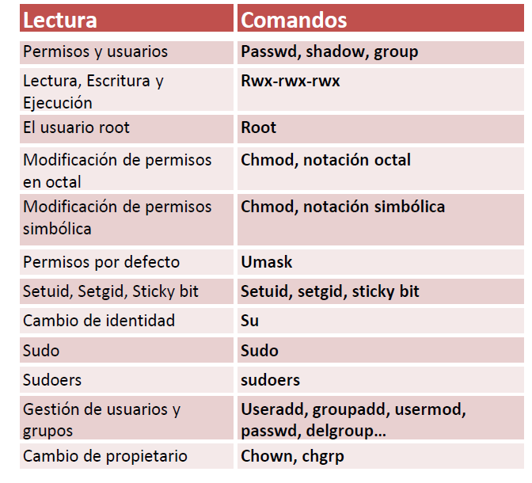

| **Inicio**         | **atrás 5**                              | **Siguiente 7**                  |
| ------------------ | ---------------------------------------- | -------------------------------- |
| [🏠](../README.md) | [⏪](./1_5_Redirecciones_y_pipelines.md) | [⏩](./1_7_Procesos_en_Linux.md) |

---

## **Índice**

| Temario                                                                                                                                 |
| --------------------------------------------------------------------------------------------------------------------------------------- |
| [40. Permisos y usuarios: passwd, shadow, group](#40-permisos-y-usuarios-passwd-shadow-group)                                           |
| [41. Lectura (r), Escritura (w) y Ejecución (x)](#41-lectura-r-escritura-w-y-ejecución-x)                                               |
| [42. Test identificacion de permisos](#42-test-identificacion-de-permisos)                                                              |
| [43. Permisos en directorios](#43-permisos-en-directorios)                                                                              |
| [44. El usuario root](#44-el-usuario-root)                                                                                              |
| [45. Modificación de permisos en octal](#45-modificación-de-permisos-en-octal)                                                          |
| [46. Test permisos octal](#46-test-permisos-octal)                                                                                      |
| [47. Modificación de permisos simbólica](#47-modificación-de-permisos-simbólica)                                                        |
| [48. Permisos por defecto: umask](#48-permisos-por-defecto-umask)                                                                       |
| [49. Setuid, Setgid, Sticky bit](#49-setuid-setgid-sticky-bit)                                                                          |
| [50. Cambio de identidad: su](#50-cambio-de-identidad-su)                                                                               |
| [51. sudo](#51-sudo)                                                                                                                    |
| [52. sudoers](#52-sudoers)                                                                                                              |
| [53. Gestión usuarios y grupos: useradd, groupadd, usermod, deluser...](#53-gestión-usuarios-y-grupos-useradd-groupadd-usermod-deluser) |
| [54. Cambio de propietario: chown y chgrp](#54-cambio-de-propietario-chown-y-chgrp)                                                     |
| [55. Caso Práctico: Explotando el bit setuid](#55-caso-práctico-explotando-el-bit-setuid)                                               |

---

# **Permisos y usuarios en Linux**



## **40. Permisos y usuarios: passwd, shadow, group**

### 🧑‍💻 ¿Qué son los **usuarios y permisos** en Linux?

#### ✅ Usuarios

Un **usuario** es una cuenta que puede iniciar sesión y usar el sistema. Cada usuario tiene:

- Un **ID de usuario (UID)**.
- Un **nombre de usuario** (como `puma`).
- Un **grupo principal** y posiblemente otros grupos.

#### ✅ Permisos

Los **permisos** definen **quién puede hacer qué** con un archivo o directorio:

- **r**: read (leer)
- **w**: write (escribir)
- **x**: execute (ejecutar)

Cada archivo tiene permisos asignados para:

- **Dueño (usuario)**
- **Grupo**
- **Otros**

---

### 📁 Archivos importantes de usuarios

#### 1. `/etc/passwd`

Contiene la información básica de **todos los usuarios del sistema**.

**Formato de una línea:**

```
nombre_usuario:x:UID:GID:comentario:directorio_home:shell
```

**Ejemplo:**

```
puma:x:1000:1000:Puma:/home/puma:/bin/bash
```

##### ¿Para qué se usa?

- Para saber quiénes son los usuarios.
- Para saber su UID, GID, directorio personal, etc.

---

#### 2. `/etc/shadow`

Contiene las **contraseñas cifradas** de los usuarios y más información de seguridad (como vencimiento de contraseñas).

Este archivo **solo lo puede ver el superusuario (root)** por seguridad.

**Ejemplo (simplificado):**

```
puma:$6$HuIOz...$...:19282:0:99999:7:::
```

##### ¿Para qué se usa?

- Para validar contraseñas al iniciar sesión.
- Para gestionar vencimiento y bloqueo de contraseñas.

---

#### 3. `/etc/group`

Lista los **grupos del sistema** y qué usuarios pertenecen a cada uno.

**Formato:**

```
nombre_grupo:x:GID:miembro1,miembro2
```

**Ejemplo:**

```
sudo:x:27:puma
```

---

### 🛠️ Comandos que usaste — Explicación y ejemplos

#### 🔹 `id`

**Muestra tu UID, GID y grupos.**

```bash
puma@DESKTOP-NT4I4PK:~$ id
```

**Salida esperada:**

```
uid=1000(puma) gid=1000(puma) grupos=1000(puma),27(sudo)
```

✅ Útil para saber en qué grupos estás y con qué permisos cuentas.

---

#### 🔹 `cat /etc/passwd`

**Muestra todo el contenido del archivo de usuarios.**

```bash
cat /etc/passwd
```

🔐 No muestra contraseñas. Es de solo lectura para usuarios normales.

---

#### 🔹 `grep puma /etc/passwd`

**Busca la línea del usuario `puma` en `/etc/passwd`.**

```bash
grep puma /etc/passwd
```

❗ En tu ejemplo faltó un espacio entre `grep` y el archivo:

```bash
# CORRECTO
grep puma /etc/passwd
```

---

#### 🔹 `cat /etc/shadow`

Este comando **no funcionará como usuario normal**, verás un error de permiso:

```bash
cat /etc/shadow
```

🔒 Este archivo es solo para `root`.

---

#### 🔹 `sudo cat /etc/shadow`

Este comando **te da acceso como administrador** (si tienes permisos):

```bash
sudo cat /etc/shadow
```

🛡️ Te pedirá tu contraseña y te mostrará las contraseñas cifradas de todos los usuarios.

---

#### 🔹 `cat /etc/group`

**Muestra los grupos del sistema y sus miembros.**

```bash
cat /etc/group
```

Útil para ver a qué grupos perteneces o qué usuarios están en `sudo`, `docker`, etc.

---

### ✅ Posibles soluciones a errores comunes

| Comando                | Problema común          | Solución                                                                     |
| ---------------------- | ----------------------- | ---------------------------------------------------------------------------- |
| `grep puma/etc/passwd` | Falta espacio           | Usa: `grep puma /etc/passwd`                                                 |
| `cat /etc/shadow`      | Permiso denegado        | Usa: `sudo cat /etc/shadow`                                                  |
| `sudo cat /etc/shadow` | Contraseña incorrecta   | Verifica tu contraseña o si estás en grupo `sudo`                            |
| `id`                   | No muestra grupo `sudo` | Asegúrate de que tu usuario está en el grupo `sudo` (`groups` también ayuda) |

---

### 🧠 Resumen final

| Archivo       | ¿Qué contiene?                         | ¿Quién puede verlo? |
| ------------- | -------------------------------------- | ------------------- |
| `/etc/passwd` | Usuarios del sistema (sin contraseñas) | Todos los usuarios  |
| `/etc/shadow` | Contraseñas cifradas y vencimiento     | Solo root (`sudo`)  |
| `/etc/group`  | Grupos y usuarios dentro de cada grupo | Todos los usuarios  |

---

[🔼](#índice)

---

## **41. Lectura (r), Escritura (w) y Ejecución (x)**

- Qué son los **permisos de lectura (r), escritura (w) y ejecución (x)** en Linux.
- Para qué sirven.
- Ejemplos reales.
- Qué hacen los comandos que escribiste.
- Posibles errores y soluciones.

---

### 📖 ¿Qué son los permisos r, w y x en Linux?

En Linux, **todo es un archivo** (archivos, carpetas, scripts, etc.). Cada archivo o directorio tiene **permisos** que controlan quién puede hacer qué.

#### 🔐 Tipos de permisos:

| Símbolo | Nombre    | ¿Qué permite hacer?                                                |
| ------- | --------- | ------------------------------------------------------------------ |
| `r`     | Lectura   | Ver el contenido del archivo o listar archivos de un directorio.   |
| `w`     | Escritura | Modificar el archivo o agregar/eliminar archivos de un directorio. |
| `x`     | Ejecución | Ejecutar el archivo como programa o entrar a un directorio.        |

---

### 📂 ¿Para quién aplican los permisos?

Cada archivo/directorio tiene **tres niveles de permisos**:

1. **Usuario (owner)** → el dueño del archivo.
2. **Grupo** → usuarios del mismo grupo.
3. **Otros (otros usuarios)** → todos los demás.

---

### 🧪 Ejemplo visual con `ls -l`

```bash
puma@DESKTOP-NT4I4PK:~$ ls -lh
```

Ejemplo de salida:

```
-rwxr-xr-- 1 puma puma  4.0K jun 19 14:10 script.sh
```

Desglosemos:

- `-rwxr-xr--`

  - `-`: tipo (archivo)
  - `rwx`: permisos del usuario (puma) → puede leer, escribir y ejecutar.
  - `r-x`: permisos del grupo → puede leer y ejecutar, pero no escribir.
  - `r--`: permisos para otros → solo pueden leer.

---

### 🔧 ¿Para qué sirven?

#### ✅ Permiso de lectura (r)

- Archivos: Ver su contenido (ej. con `cat` o `less`).
- Directorios: Listar archivos (con `ls`).

#### ✅ Permiso de escritura (w)

- Archivos: Modificar o eliminar su contenido.
- Directorios: Crear o borrar archivos dentro.

#### ✅ Permiso de ejecución (x)

- Archivos: Ejecutar scripts o programas (`./archivo`).
- Directorios: Entrar o recorrer carpetas.

---

### 🛠️ Comandos que usaste — explicaciones y ejemplos

---

#### 🔹 `ls -lh`

Lista archivos con detalles:

```bash
ls -lh
```

- `-l`: formato largo (muestra permisos, dueño, tamaño).
- `-h`: tamaño legible (por ejemplo, 4.0K en lugar de 4096).

📌 Sirve para **ver los permisos de archivos/directorios.**

---

#### 🔹 `id`

Muestra tu UID, GID y grupos.

```bash
id
```

Te ayuda a saber quién eres y qué grupos tienes (para entender qué permisos aplican para ti).

---

#### 🔹 `find /var/log -name auth.log`

Busca el archivo `auth.log` dentro de `/var/log`.

```bash
find /var/log -name auth.log
```

✅ Muy útil para encontrar logs de autenticación.

---

#### 🔹 `ls -ald /var/log/gdm3/`

```bash
ls -ald /var/log/gdm3/
```

- `-a`: muestra incluso archivos ocultos.
- `-l`: formato largo (con permisos).
- `-d`: muestra **el directorio en sí**, no su contenido.

📌 Útil para ver los permisos de una carpeta específica.

---

### ❗ Posibles errores y soluciones

| Comando                              | Error típico                           | Solución                                        |
| ------------------------------------ | -------------------------------------- | ----------------------------------------------- |
| `ls -ald /varlog/gdm3/`              | No existe el archivo/directorio        | Corregir a `/var/log/gdm3/`                     |
| `find /var/log -name auth.log`       | Permiso denegado en algunos dirs       | Usar `sudo find /var/log -name auth.log`        |
| `ls -lh`                             | No muestra archivos ocultos            | Agrega `-a`: `ls -alh`                          |
| Quiero ejecutar un script y no puedo | Permiso denegado (`Permission denied`) | Dar permiso de ejecución: `chmod +x archivo.sh` |

---

### 🧠 ¿Cómo cambiar permisos?

#### 🔹 `chmod` — Cambiar permisos

```bash
chmod u+x script.sh
```

Significa: añade permiso de ejecución al **usuario**.

| Comando             | Significado                            |
| ------------------- | -------------------------------------- |
| `chmod +x archivo`  | Añadir permiso de ejecución a todos    |
| `chmod u-w archivo` | Quitar permiso de escritura al usuario |
| `chmod g+r archivo` | Dar permiso de lectura al grupo        |

---

### ✅ Resumen final

| Permiso | Archivos permite... | Directorios permite...  |
| ------- | ------------------- | ----------------------- |
| `r`     | Leer el contenido   | Ver archivos dentro     |
| `w`     | Modificar/eliminar  | Crear o borrar archivos |
| `x`     | Ejecutar programas  | Entrar al directorio    |

---

[🔼](#índice)

---

## **42. Test identificacion de permisos**

### 🧪 ¿Qué es un Test de Identificación de Permisos?

Es una forma de **verificar o probar qué permisos tienes** (o tiene otro usuario) sobre archivos o directorios. Se usa para responder preguntas como:

- ¿Puedo **leer** este archivo?
- ¿Puedo **escribir/modificar** este archivo?
- ¿Puedo **ejecutar** este script?
- ¿Puedo **entrar a este directorio**?

---

### 🎯 ¿Para qué se usa?

- Validar que los permisos están bien configurados.
- Detectar **fallos de seguridad** (por ejemplo, archivos que cualquiera puede modificar).
- Prepararte para ataques o defensa en **pentesting o hardening de sistemas**.

---

### 📁 Ejemplos prácticos y fáciles de entender

Supón que tienes un archivo llamado `secreto.txt`.

#### 1. 🔍 Ver permisos con `ls -l`

```bash
ls -l secreto.txt
```

Salida:

```
-rw-r--r-- 1 puma puma 0 jun 19 14:00 secreto.txt
```

Esto significa:

- El dueño (`puma`) puede **leer y escribir**.
- El grupo puede **leer**.
- Los demás (otros) pueden **leer**.

---

### 📌 Comandos para identificar permisos y probarlos

| Comando                      | ¿Para qué sirve?                             |
| ---------------------------- | -------------------------------------------- |
| `ls -l archivo`              | Ver los permisos del archivo                 |
| `cat archivo`                | Probar si puedes **leer** el archivo         |
| `echo "algo" > archivo`      | Probar si puedes **escribir** (sobrescribir) |
| `./archivo`                  | Probar si puedes **ejecutarlo**              |
| `cd carpeta`                 | Probar si puedes **entrar** a una carpeta    |
| `touch archivo`              | Probar si puedes **crear un archivo**        |
| `rm archivo`                 | Probar si puedes **eliminar un archivo**     |
| `sudo -l`                    | Ver qué comandos puedes ejecutar con `sudo`  |
| `test -r archivo && echo OK` | Probar si tienes **lectura**                 |
| `test -w archivo && echo OK` | Probar si tienes **escritura**               |
| `test -x archivo && echo OK` | Probar si puedes **ejecutar**                |

---

#### 🧪 Ejemplo 1: Test de lectura

```bash
test -r secreto.txt && echo "Tengo permiso de lectura"
```

Si no tienes permiso:

```bash
test -r secreto.txt || echo "NO tengo permiso de lectura"
```

---

#### 🧪 Ejemplo 2: Test de escritura

```bash
test -w secreto.txt && echo "Tengo permiso de escritura"
```

---

#### 🧪 Ejemplo 3: Test de ejecución

```bash
test -x script.sh && echo "Puedo ejecutar el script"
```

---

### 🛠️ Posibles errores y soluciones

| Error                                             | Causa posible                             | Solución                                                               |
| ------------------------------------------------- | ----------------------------------------- | ---------------------------------------------------------------------- |
| `Permission denied` al leer archivo (`cat`)       | No tienes permiso de lectura              | Ejecuta `chmod +r archivo` si eres el dueño, o pide permisos           |
| `Permission denied` al escribir (`echo >`)        | No tienes permiso de escritura            | Usa `chmod +w archivo` o revisa si es de solo lectura (`lsattr`)       |
| `Permission denied` al ejecutar                   | No tienes permiso de ejecución (`x`)      | Usa `chmod +x archivo` si eres dueño                                   |
| `cd carpeta`: `Permission denied`                 | No tienes permiso de ejecución en carpeta | Revisa permisos con `ls -ld carpeta`                                   |
| `./script.sh`: comando no encontrado o no ejecuta | Sin permiso de ejecución o sin `shebang`  | Añade `#!/bin/bash` al principio y da permiso con `chmod +x script.sh` |

---

### ✅ Resumen rápido

| Test                               | ¿Qué evalúa?               | Comando de prueba                      |
| ---------------------------------- | -------------------------- | -------------------------------------- |
| ¿Puedo **leer** el archivo?        | Permiso de lectura (`r`)   | `test -r archivo && echo OK`           |
| ¿Puedo **escribir** en el archivo? | Permiso de escritura (`w`) | `test -w archivo && echo OK`           |
| ¿Puedo **ejecutar** el archivo?    | Permiso de ejecución (`x`) | `test -x archivo && echo OK`           |
| ¿Puedo **entrar** a un directorio? | `x` sobre el directorio    | `cd directorio` o `test -x directorio` |

---

[🔼](#índice)

---

## **43. Permisos en directorios**

### 📂 ¿Qué son los permisos en directorios?

Los permisos en un directorio definen **qué se puede hacer dentro de esa carpeta**.

| Permiso   | Símbolo | ¿Qué permite en un directorio?                                              |
| --------- | ------- | --------------------------------------------------------------------------- |
| Lectura   | `r`     | Ver los nombres de los archivos dentro del directorio (`ls`)                |
| Escritura | `w`     | Crear, borrar o renombrar archivos dentro del directorio                    |
| Ejecución | `x`     | Entrar al directorio (`cd`), o acceder a archivos dentro si sabes su nombre |

---

### 🎯 ¿Para qué se utilizan?

- Controlar el acceso a carpetas.
- Permitir o restringir la creación/eliminación de archivos.
- Proteger contenido sensible.
- Definir qué pueden hacer otros usuarios o procesos.

---

### 🧪 Ejemplo simple

Supón que tienes una carpeta llamada `privado/` con estos permisos:

```bash
drwxr-x--- 2 puma puma 4096 jun 19 16:00 privado/
```

Esto significa:

- `d`: Es un directorio.
- `rwx` para el usuario `puma` → puede ver, crear, borrar, y entrar.
- `r-x` para el grupo → puede listar e ingresar, pero no crear ni borrar.
- Sin permisos para otros.

---

### 🔧 Comandos útiles para trabajar con permisos en directorios

| Comando                            | ¿Para qué se usa?                                        |
| ---------------------------------- | -------------------------------------------------------- |
| `ls -ld nombre_directorio`         | Ver los permisos de la carpeta (no su contenido)         |
| `cd nombre_directorio`             | Entrar a la carpeta                                      |
| `touch nombre_archivo`             | Crear un archivo (requiere permiso `w` en el directorio) |
| `mkdir nueva_carpeta`              | Crear carpeta dentro (requiere permiso `w`)              |
| `rm archivo`                       | Borrar un archivo dentro (requiere permiso `w`)          |
| `chmod permisos nombre_directorio` | Cambiar los permisos del directorio                      |
| `chown usuario:grupo nombre_dir`   | Cambiar dueño y grupo de la carpeta                      |

---

### 📘 Ejemplos prácticos fáciles

#### 🔹 Ver permisos de una carpeta

```bash
ls -ld documentos/
```

Salida:

```
drwxr-xr-x 2 puma puma 4096 jun 19 16:00 documentos/
```

---

#### 🔹 Intentar entrar a una carpeta sin permiso

```bash
cd privado/
```

Si no tienes permiso `x`, te saldrá:

```
bash: cd: privado/: Permission denied
```

---

#### 🔹 Crear archivo sin permiso de escritura

```bash
touch privado/ejemplo.txt
```

Si no tienes permiso `w`, te saldrá:

```
touch: cannot touch 'ejemplo.txt': Permission denied
```

---

#### 🔹 Cambiar permisos para un directorio

Dar acceso total a todos:

```bash
chmod 777 carpeta
```

Dar solo lectura y entrada a otros:

```bash
chmod 755 carpeta
```

Quitar todos los permisos a otros:

```bash
chmod 770 carpeta
```

---

### 🧠 Permisos en formato numérico (rwx → número)

| Permiso | Binario | Decimal |
| ------- | ------- | ------- |
| `r--`   | 100     | 4       |
| `rw-`   | 110     | 6       |
| `rwx`   | 111     | 7       |
| `--x`   | 001     | 1       |
| `---`   | 000     | 0       |

Entonces:

```bash
chmod 750 carpeta
```

- `7`: usuario puede leer, escribir y entrar
- `5`: grupo puede leer y entrar
- `0`: otros no pueden hacer nada

---

### ❗ Posibles errores y soluciones

| Error                               | Causa común                            | Solución                                          |
| ----------------------------------- | -------------------------------------- | ------------------------------------------------- |
| `Permission denied` al hacer `cd`   | No tienes permiso `x`                  | Añadir permiso con `chmod +x carpeta/`            |
| No puedes crear archivos            | No tienes permiso `w`                  | `chmod +w carpeta/` (si eres el dueño)            |
| No puedes ver el contenido con `ls` | Falta permiso `r` o `x`                | Necesitas ambos para listar carpetas              |
| `rm` no funciona en carpeta         | Sin permiso `w` en el directorio padre | Usa `chmod +w .` en el directorio que lo contiene |

---

### ✅ Resumen visual

| Acción                      | Permiso requerido en el directorio |
| --------------------------- | ---------------------------------- |
| Ver nombres de archivos     | `r`                                |
| Entrar al directorio (`cd`) | `x`                                |
| Crear archivos o carpetas   | `w` + `x`                          |
| Borrar archivos             | `w` + `x`                          |
| Listar archivos (`ls`)      | `r` + `x`                          |

---

[🔼](#índice)

---

## **44. El usuario root**

### 👑 ¿Qué es el usuario `root`?

El usuario **`root`** es el **administrador supremo del sistema Linux**. Tiene **todos los permisos** sin restricciones:

- Puede **leer, escribir, borrar o cambiar cualquier archivo** del sistema.
- Puede **crear y eliminar usuarios**.
- Puede **instalar y eliminar programas**.
- Puede **modificar permisos y configuraciones críticas**.

Piensa en `root` como el “**dueño del sistema**”.

---

### 🎯 ¿Para qué se utiliza el usuario `root`?

- Tareas administrativas (crear usuarios, instalar software, modificar servicios).
- Acceder a archivos protegidos (`/etc/shadow`, `/root`, etc.).
- Ejecutar comandos que afectan a todo el sistema.
- Hacer mantenimiento o recuperación de errores graves.

⚠️ **Precaución:** Usar `root` sin cuidado puede dañar el sistema. Siempre es mejor usar `sudo` cuando sea necesario, **no iniciar sesión directamente como root**.

---

### 🛠️ ¿Cómo actuar como root?

#### 🔹 Usando `sudo` (recomendado)

```bash
sudo comando
```

Ejecuta un comando **como root**, pero desde tu cuenta.

#### 🔹 Cambiar a root (con contraseña)

```bash
sudo su
```

O:

```bash
su -
```

Ambos te cambian a una **sesión como root**. Se recomienda solo si sabes lo que haces.

---

### 🧪 Ejemplos sencillos de uso del usuario root

| Tarea                                   | Comando como root                   |
| --------------------------------------- | ----------------------------------- |
| Ver contenido de `/etc/shadow`          | `sudo cat /etc/shadow`              |
| Instalar un programa                    | `sudo apt install nombre`           |
| Cambiar contraseña de otro usuario      | `sudo passwd usuario`               |
| Agregar un usuario nuevo                | `sudo adduser nuevo_usuario`        |
| Cambiar permisos a archivos del sistema | `sudo chmod 644 archivo_importante` |

---

### 🔍 Comandos que usaste — explicación clara

---

#### 🔹 `cat /etc/passwd | less`

```bash
cat /etc/passwd | less
```

Muestra el contenido del archivo de usuarios, pero **con paginador** (`less`), útil si hay muchas líneas.

📌 Este archivo es **público**, así que cualquier usuario puede leerlo.

---

#### 🔹 `ls -la /etc/shadow`

```bash
ls -la /etc/shadow
```

Este comando lista los detalles del archivo `/etc/shadow`.

Salida esperada:

```
-r-------- 1 root shadow 1.2K jun 19 13:00 /etc/shadow
```

📌 Solo el usuario `root` tiene permiso para **leerlo**. Si no eres root:

```
ls: cannot access '/etc/shadow': Permission denied
```

---

#### 🔹 `ls -la`

```bash
ls -la
```

Lista **todos los archivos del directorio actual**, incluso los ocultos (los que comienzan con `.`), y muestra:

- Permisos
- Dueño
- Grupo
- Tamaño
- Fecha

📌 Muy útil para revisar **propietarios y permisos** antes de usar `chmod` o `chown`.

---

### ❗ Posibles errores y soluciones

| Error / Mensaje                             | ¿Por qué sucede?                                 | Solución                                           |
| ------------------------------------------- | ------------------------------------------------ | -------------------------------------------------- |
| `Permission denied` al ver `/etc/shadow`    | Solo `root` puede acceder                        | Usa: `sudo cat /etc/shadow`                        |
| `sudo: command not found`                   | Tu sistema no tiene instalado `sudo`             | Instalar `sudo` como root o usar `su` directamente |
| `su: Authentication failure`                | Contraseña de root incorrecta o root desactivado | Asegúrate de conocer la clave o usar `sudo su`     |
| `ls -la` no muestra archivos ocultos        | Mal ejecutado                                    | Usa `ls -la` o `ls -al`, no solo `ls`              |
| Te pide contraseña con `sudo` y no la sabes | No tienes permisos de sudo                       | Solicita acceso al administrador del sistema       |

---

### ✅ Resumen visual

| Acción                        | Usuario normal | Usuario root | Comando con `sudo`     |
| ----------------------------- | -------------- | ------------ | ---------------------- |
| Ver `/etc/passwd`             | ✅             | ✅           | No necesita `sudo`     |
| Ver `/etc/shadow`             | ❌             | ✅           | `sudo cat /etc/shadow` |
| Instalar programas            | ❌             | ✅           | `sudo apt install`     |
| Cambiar contraseña a otro     | ❌             | ✅           | `sudo passwd nombre`   |
| Eliminar archivos del sistema | ❌             | ✅           | `sudo rm archivo`      |

---

[🔼](#índice)

---

## **45. Modificación de permisos en octal**

### 🔢 ¿Qué es la **modificación de permisos en octal**?

La **modificación de permisos en octal** es una forma **rápida y precisa** de establecer permisos a archivos y directorios usando **números (del 0 al 7)**, en lugar de letras (`r`, `w`, `x`).

---

### 🎯 ¿Para qué se utiliza?

Se usa para **asignar o cambiar los permisos** de archivos o carpetas, controlando:

- quién puede **leer**
- quién puede **escribir**
- quién puede **ejecutar**

Con el comando `chmod`, puedes hacerlo **de forma compacta y directa**.

---

### 🔢 ¿Cómo se traduce de `rwx` a números octales?

| Permisos | Binario | Octal | Significado               |
| -------- | ------- | ----- | ------------------------- |
| `---`    | 000     | 0     | Sin permisos              |
| `--x`    | 001     | 1     | Solo ejecutar             |
| `-w-`    | 010     | 2     | Solo escribir             |
| `-wx`    | 011     | 3     | Escribir y ejecutar       |
| `r--`    | 100     | 4     | Solo leer                 |
| `r-x`    | 101     | 5     | Leer y ejecutar           |
| `rw-`    | 110     | 6     | Leer y escribir           |
| `rwx`    | 111     | 7     | Leer, escribir y ejecutar |

Los permisos se agrupan en 3:

```
[usuario][grupo][otros]
    u      g      o
```

---

#### 🧪 Ejemplo que hiciste

```bash
puma@DESKTOP-NT4I4PK:~$ echo "fichero de pruebas" > fichero_pruebas.txt
```

📌 Crea un archivo llamado `fichero_pruebas.txt`.

```bash
puma@DESKTOP-NT4I4PK:~$ chmod 600 fichero_pruebas.txt
```

📌 Cambia los permisos con el modo octal `600`:

- `6` → usuario: `rw-` (leer y escribir)
- `0` → grupo: sin acceso
- `0` → otros: sin acceso

Comprobación:

```bash
ls -la fichero_pruebas.txt
```

Salida esperada:

```
-rw------- 1 puma puma ... fichero_pruebas.txt
```

✅ Solo el **dueño (puma)** puede leer y escribir.

---

### 🔧 Comandos usados — explicaciones claras

#### 🔹 `chmod 600 fichero.txt`

Establece los permisos:

| Tipo de usuario | Permisos con `600` |
| --------------- | ------------------ |
| Usuario         | `rw-`              |
| Grupo           | `---`              |
| Otros           | `---`              |

---

#### 🔹 `ls -la fichero.txt`

Muestra los permisos y metadatos del archivo, incluyendo:

- Propietario
- Grupo
- Permisos en `rwx`
- Fecha de modificación

---

#### 🔹 `ls -la /etc/shadow`

Verifica permisos del archivo `/etc/shadow`. Salida típica:

```
-r-------- 1 root shadow 1.3K jun 19 12:00 /etc/shadow
```

📌 Solo el usuario `root` puede leerlo. Si tú lo intentas:

```
ls: cannot access '/etc/shadow': Permission denied
```

---

### 📚 Más ejemplos fáciles con octal

| Comando             | ¿Qué hace?                             |
| ------------------- | -------------------------------------- |
| `chmod 777 archivo` | Todos pueden leer, escribir y ejecutar |
| `chmod 755 archivo` | Usuario: `rwx`, grupo/otros: `r-x`     |
| `chmod 700 archivo` | Solo el dueño tiene todos los permisos |
| `chmod 644 archivo` | Usuario: `rw-`, grupo/otros: `r--`     |
| `chmod 000 archivo` | Nadie puede hacer nada (ni leer)       |

---

### ❗ Posibles errores y soluciones

| Error o problema                             | Causa común                                  | Solución                                   |
| -------------------------------------------- | -------------------------------------------- | ------------------------------------------ |
| `Permission denied` al leer archivo          | No tienes permiso de lectura (`r`)           | `chmod u+r archivo` si eres el dueño       |
| No puedes ejecutar un script (`./script.sh`) | No tiene permiso `x`                         | `chmod +x script.sh`                       |
| Otro usuario no puede acceder a tu archivo   | Permisos muy restrictivos (ej. `600`, `700`) | `chmod 644 archivo` si quieres que lo vean |
| Grupo no puede editar el archivo             | Le falta permiso `w` al grupo                | `chmod 664 archivo`                        |

---

### ✅ Resumen visual: Modificación de permisos en octal

```bash
chmod XYZ archivo
```

- `X` = permisos para el usuario (owner)
- `Y` = permisos para el grupo
- `Z` = permisos para otros

| Octal | Permisos `rwx` |
| ----- | -------------- |
| 0     | `---`          |
| 1     | `--x`          |
| 2     | `-w-`          |
| 3     | `-wx`          |
| 4     | `r--`          |
| 5     | `r-x`          |
| 6     | `rw-`          |
| 7     | `rwx`          |

---

[🔼](#índice)

---

## **46. Test permisos octal**

### 🔍 ¿Qué son los **test de permisos octales**?

Son **pruebas o verificaciones** que hacemos para comprobar si un archivo o carpeta tiene los **permisos correctos**, expresados en **formato octal** (como `600`, `644`, `755`, etc.).

---

### 🎯 ¿Para qué se utilizan?

- Para **verificar** que un archivo tiene los permisos correctos (por seguridad o funcionalidad).
- Para **detectar fallos** en accesos (por ejemplo, cuando un usuario no puede leer o ejecutar algo).
- Para **configurar** scripts, configuraciones o archivos protegidos.

---

### 🔢 Repaso rápido: ¿Qué es el octal?

| Permisos | Octal | ¿Qué permite?             |
| -------- | ----- | ------------------------- |
| `rw-`    | 6     | Leer y escribir           |
| `r--`    | 4     | Solo lectura              |
| `rwx`    | 7     | Leer, escribir y ejecutar |
| `---`    | 0     | Ningún permiso            |

Permisos se agrupan como:

```
usuario (u) | grupo (g) | otros (o)
      6          4          4     = 644
```

---

### 🧪 Ejemplo real y fácil de entender

#### Paso 1: Crear un archivo de prueba

```bash
echo "Hola mundo" > archivo.txt
```

#### Paso 2: Darle permisos 644

```bash
chmod 644 archivo.txt
```

#### Paso 3: Verificar permisos actuales

```bash
ls -l archivo.txt
```

Salida esperada:

```
-rw-r--r-- 1 puma puma ... archivo.txt
```

Esto corresponde a:

- `6` → usuario (rw-)
- `4` → grupo (r--)
- `4` → otros (r--)

---

### 🔧 Comandos usados para testear permisos

| Comando                        | ¿Para qué sirve?                                 |
| ------------------------------ | ------------------------------------------------ |
| `ls -l archivo`                | Ver permisos en formato `rwx`                    |
| `stat archivo`                 | Ver permisos en octal directamente (más técnico) |
| `test -r archivo && echo "OK"` | Verifica si tienes permiso de lectura            |
| `test -w archivo && echo "OK"` | Verifica si tienes permiso de escritura          |
| `test -x archivo && echo "OK"` | Verifica si tienes permiso de ejecución          |

---

#### 🧪 Ejemplo de test usando `test` y `echo`

##### Leer el archivo

```bash
test -r archivo.txt && echo "Tengo permiso de lectura"
```

##### Escribir en el archivo

```bash
test -w archivo.txt && echo "Tengo permiso de escritura"
```

##### Ejecutar archivo

```bash
test -x archivo.txt && echo "Tengo permiso de ejecución"
```

---

### 🧠 Comando extra útil: `stat`

```bash
stat archivo.txt
```

Salida parcial:

```
Access: 2025-06-19 ...
Permissions: 0644 (-rw-r--r--)
```

✅ Muestra los permisos **en octal y en letras**. Muy útil para comparar.

---

### ❗ Posibles errores y soluciones

| Error / Comando                         | Causa probable                                 | Solución                                       |
| --------------------------------------- | ---------------------------------------------- | ---------------------------------------------- |
| `Permission denied` al leer             | No tienes permiso de lectura (`r`)             | Usa `chmod u+r archivo` si eres el dueño       |
| `test -w archivo && echo OK` no imprime | No tienes permiso de escritura (`w`)           | Usa `chmod u+w archivo`                        |
| `stat: command not found`               | `stat` no está instalado                       | En Debian/Ubuntu: `sudo apt install coreutils` |
| `test -x archivo && echo OK` no imprime | El archivo no tiene permiso de ejecución (`x`) | Usa `chmod +x archivo`                         |

---

### ✅ Resumen: test de permisos octales

| Acción                     | Comando de test                |
| -------------------------- | ------------------------------ |
| Ver si puedes **leer**     | `test -r archivo && echo "OK"` |
| Ver si puedes **escribir** | `test -w archivo && echo "OK"` |
| Ver si puedes **ejecutar** | `test -x archivo && echo "OK"` |
| Ver permisos en octal      | `stat archivo`                 |
| Cambiar permisos a `600`   | `chmod 600 archivo`            |
| Ver permisos en letras     | `ls -l archivo`                |

---

### 🧪 Ejercicio recomendado para ti

1. Crea un archivo:

   ```bash
   echo "Probando" > mi_archivo.txt
   ```

2. Cámbiale los permisos a `600`:

   ```bash
   chmod 600 mi_archivo.txt
   ```

3. Haz los tests:

   ```bash
   test -r mi_archivo.txt && echo "Lectura OK"
   test -w mi_archivo.txt && echo "Escritura OK"
   test -x mi_archivo.txt && echo "Ejecución OK"
   ```

---

[🔼](#índice)

---

## **47. Modificación de permisos simbólica**

### 🔤 ¿Qué es la modificación de permisos simbólica?

Es una forma de cambiar los **permisos de archivos o directorios** usando **letras y signos**, en lugar de números (octal). Se usa con el comando `chmod`.

---

### 🎯 ¿Para qué se utiliza?

- Para **agregar, quitar o establecer** permisos de lectura (`r`), escritura (`w`) o ejecución (`x`) a usuarios específicos (`u`, `g`, `o`, `a`).
- Es más **intuitiva** cuando quieres hacer cambios parciales sin afectar los permisos existentes.

---

### 🧩 ¿Cómo se construye la sintaxis?

```bash
chmod [quién][operador][permiso] archivo
```

#### 🔹 ¿Quién?

| Letra | Significa             |
| ----- | --------------------- |
| `u`   | Usuario (propietario) |
| `g`   | Grupo                 |
| `o`   | Otros                 |
| `a`   | Todos (u + g + o)     |

---

#### 🔹 Operadores

| Símbolo | Acción                   |
| ------- | ------------------------ |
| `+`     | Añadir permiso           |
| `-`     | Quitar permiso           |
| `=`     | Asignar permisos exactos |

---

#### 🔹 Permisos

| Letra | Permiso   |
| ----- | --------- |
| `r`   | Lectura   |
| `w`   | Escritura |
| `x`   | Ejecución |

---

### 🧪 Ejemplos prácticos con tus comandos

---

#### 🔹 Comando 1: `chmod a=r fichero1`

```bash
chmod a=r fichero1
```

✅ Esto **quita todos los permisos actuales** y deja solo **lectura** para **todos (usuario, grupo y otros)**.

Permisos quedan así:

```
-r--r--r-- 1 puma puma ... fichero1
```

---

#### 🔹 Comando 2: `chmod u+w, g+w fichero1`

```bash
chmod u+w, g+w fichero1
```

✅ Añade permiso de **escritura** al **usuario** y al **grupo**, sin afectar otros permisos.

Resultado:

```
-rw-rw-r-- 1 puma puma ... fichero1
```

---

#### 🔹 Comando 3: `chmod g-w fichero1`

```bash
chmod g-w fichero1
```

✅ Quita el permiso de escritura del **grupo**.

Resultado:

```
-rw-r--r-- 1 puma puma ... fichero1
```

---

#### 🔹 Comando 4: `chmod g+x, o+x fichero1`

```bash
chmod g+x, o+x fichero1
```

✅ Da permiso de ejecución al **grupo** y a **otros**.

Resultado:

```
-rw-r-xr-x 1 puma puma ... fichero1
```

---

### 📌 Comando para verificar: `ls -la fichero1`

Muestra los permisos actuales del archivo, por ejemplo:

```
-rw-r-xr-x 1 puma puma ... fichero1
```

---

### ❗ Posibles errores y soluciones

| Error / Comando                    | ¿Qué pasó?                                  | Solución                                         |
| ---------------------------------- | ------------------------------------------- | ------------------------------------------------ |
| `ls -la ficha1`                    | El archivo se llama `fichero1`, no `ficha1` | Revisa el nombre con `ls` o autocompleta con Tab |
| No puedes modificar un archivo     | No tienes permiso de escritura (`w`)        | Usa `chmod u+w archivo` si eres el dueño         |
| `chmod` no cambia permisos         | No eres el propietario del archivo          | Usa `sudo chmod ...` o toma posesión con `chown` |
| El archivo ya no se puede ejecutar | Le quitaste `x`                             | Usa `chmod +x archivo` para restaurarlo          |

---

### ✅ Resumen rápido: simbólico vs octal

| Acción                       | Simbólico                   | Octal               |
| ---------------------------- | --------------------------- | ------------------- |
| Dar permisos a todos         | `chmod a+rwx archivo`       | `chmod 777 archivo` |
| Solo lectura para todos      | `chmod a=r archivo`         | `chmod 444 archivo` |
| Quitar ejecución a grupo     | `chmod g-x archivo`         | —                   |
| Agregar escritura al usuario | `chmod u+w archivo`         | —                   |
| Establecer permisos exactos  | `chmod u=rw,g=r,o= archivo` | `chmod 640 archivo` |

---

### 🧪 Ejercicio práctico para ti

1. Crea un archivo:

   ```bash
   echo "Hola mundo" > prueba.txt
   ```

2. Verifica sus permisos:

   ```bash
   ls -l prueba.txt
   ```

3. Quita todos los permisos:

   ```bash
   chmod a= prueba.txt
   ```

4. Dale solo lectura al dueño:

   ```bash
   chmod u=r prueba.txt
   ```

5. Ahora añade ejecución al grupo y escritura a otros:

   ```bash
   chmod g+x,o+w prueba.txt
   ```

6. Verifica nuevamente:

   ```bash
   ls -l prueba.txt
   ```

---

[🔼](#índice)

---

## **48. Permisos por defecto: umask**

### 🧠 ¿Qué es `umask`?

**`umask`** (máscara de permisos de usuario) es un valor que **resta permisos por defecto** cuando se crea un **archivo** o una **carpeta** en Linux.

---

#### 🧮 ¿Cómo funciona?

Linux usa **permisos base por defecto** al crear:

- 📝 Archivos: **666** (`rw-rw-rw-`)
- 📁 Directorios: **777** (`rwxrwxrwx`)

> Luego, el valor de `umask` se **resta (bit a bit)** de esos valores.

---

#### Ejemplo rápido:

Si `umask = 0022`, entonces:

- Archivos: `666 - 022 = 644` → `rw-r--r--`
- Directorios: `777 - 022 = 755` → `rwxr-xr-x`

---

### 🎯 ¿Para qué sirve `umask`?

- Controlar los **permisos iniciales** de seguridad de archivos y carpetas.
- Evitar que otros usuarios accedan o modifiquen tus archivos nuevos.
- Configurar entornos seguros sin tener que usar `chmod` siempre.

---

### 📘 Comandos que usaste — explicación clara

#### 🔹 `umask`

```bash
umask
```

📌 Muestra la **máscara actual** (ejemplo: `0022`).

---

#### 🔹 `umask 0000`

```bash
umask 0000
```

📌 Cambia la máscara a **no restringir nada**, es decir, se crean archivos con **permisos máximos**.

Resultado al crear un archivo:

- `666 - 000 = 666` → `rw-rw-rw-`

Resultado al crear carpeta:

- `777 - 000 = 777` → `rwxrwxrwx`

---

#### 🔹 `rm fichero.txt > fichero.txt`

Este comando no es correcto: `rm` no redirige a archivo, y además es peligroso si el archivo no existe. Lo correcto era:

```bash
rm fichero.txt
echo "nuevo contenido" > fichero.txt
```

---

#### 🔹 `umask 0006`

```bash
umask 0006
```

📌 Quita el permiso de **escritura a otros** al crear nuevos archivos.

- Archivos: `666 - 006 = 660` → `rw-rw----`
- Carpetas: `777 - 006 = 771` → `rwxrwx--x`

---

#### 🔹 `umask 0002`

Muy común en sistemas donde **usuarios del mismo grupo trabajan juntos**.

- Archivos: `664` → `rw-rw-r--`
- Carpetas: `775` → `rwxrwxr-x`

---

#### 🔹 `umask 0066`

Más restrictivo: Quita **todos los permisos al grupo y a otros**.

- Archivos: `666 - 066 = 600` → `rw-------`
- Carpetas: `777 - 066 = 711` → `rwx--x--x`

---

### 🧪 Ejemplo práctico paso a paso

#### 1. Ver la `umask` actual

```bash
umask
```

#### 2. Crear un archivo y ver permisos

```bash
echo "Hola" > prueba.txt
ls -l prueba.txt
```

#### 3. Cambiar `umask` a 0077 (muy seguro)

```bash
umask 0077
echo "archivo privado" > privado.txt
ls -l privado.txt
```

Resultado:

```
-rw------- 1 puma puma ... privado.txt
```

---

### 📌 Tabla de ejemplos útiles de `umask`

| Umask | Archivos nuevos     | Carpetas nuevas     | Comentario                               |
| ----- | ------------------- | ------------------- | ---------------------------------------- |
| 0000  | `666` (`rw-rw-rw-`) | `777` (`rwxrwxrwx`) | Máximos permisos (⚠️ inseguro)           |
| 0022  | `644`               | `755`               | Predeterminado en la mayoría de sistemas |
| 0002  | `664`               | `775`               | Ideal para trabajo en grupo              |
| 0077  | `600`               | `700`               | Muy seguro: solo el dueño accede         |
| 0066  | `600`               | `711`               | Privado: otros pueden entrar, no ver     |

---

### ❗ Posibles errores y soluciones

| Error o comportamiento                    | Causa                                          | Solución                                      |
| ----------------------------------------- | ---------------------------------------------- | --------------------------------------------- |
| Archivos se crean sin permisos esperados  | `umask` está mal configurada                   | Revisa con `umask`, cambia si es necesario    |
| Otro usuario no puede leer tu archivo     | `umask` muy restrictiva (`0077`, `0066`, etc.) | Usa `chmod o+r archivo` si deseas compartirlo |
| Al reiniciar, se vuelve la umask original | La cambiaste solo temporalmente                | Agrégala en `~/.bashrc` o `/etc/profile`      |

---

### ✅ ¿Cómo cambiar `umask` de forma permanente?

Para usuarios individuales:

```bash
nano ~/.bashrc
```

Agrega al final:

```bash
umask 0022
```

Luego recarga:

```bash
source ~/.bashrc
```

---

### 🔚 Resumen

| Comando         | ¿Qué hace?                                     |
| --------------- | ---------------------------------------------- |
| `umask`         | Muestra la umask actual                        |
| `umask 0022`    | Establece nueva máscara temporal               |
| `echo ...`      | Crea un archivo (aplica umask automáticamente) |
| `ls -l archivo` | Verifica los permisos aplicados                |

---

[🔼](#índice)

---

## **49. Setuid, Setgid, Sticky bit**

### 🔐 ¿Qué son `Setuid`, `Setgid` y `Sticky bit`?

Son **permisos especiales** que alteran el comportamiento normal de archivos o directorios para fines específicos de seguridad y colaboración.

---

### 🧠 1. `Setuid` (Set User ID)

📌 **¿Qué hace?**
Cuando un archivo ejecutable tiene el bit `Setuid` activado, **se ejecuta con los permisos del propietario del archivo**, no del usuario que lo ejecuta.

#### 🔧 ¿Para qué se usa?

- Permitir que usuarios normales ejecuten comandos con **privilegios elevados** (usualmente como root o como otro usuario).

#### ✅ Ejemplo simple

```bash
chmod u+s script.sh
```

Si el dueño del script es `root`, cuando lo ejecute otro usuario se ejecutará **como root**.

#### 🔎 Verificar `Setuid`

```bash
ls -l script.sh
```

Verás algo como:

```
-rwsr-xr-x 1 root root  ... script.sh
         ↑
        s = Setuid activado
```

---

### 🧠 2. `Setgid` (Set Group ID)

📌 **¿Qué hace?**

#### ✅ En archivos ejecutables:

- Se ejecutan con los **permisos del grupo propietario**, no del grupo del usuario.

#### ✅ En directorios:

- Todos los archivos creados **heredan el grupo del directorio**, no el grupo del usuario.

#### 🔧 ¿Para qué se usa?

- Facilita el **trabajo colaborativo en grupos**, sin cambiar el grupo manualmente cada vez.

#### 🔧 Activarlo

```bash
chmod g+s carpeta_colaborativa
```

#### 🔎 Verificar `Setgid` en directorio

```bash
ls -ld carpeta_colaborativa
```

Salida esperada:

```
drwxr-sr-x 2 puma developers ...
         ↑
        s = Setgid activado
```

---

### 🧠 3. `Sticky bit`

📌 **¿Qué hace?**
Solo el **dueño del archivo o root puede eliminar/modificar archivos** dentro de ese directorio, **aunque otros tengan permisos de escritura**.

#### 🔧 ¿Para qué se usa?

- Evita que usuarios borren archivos de otros en carpetas compartidas como `/tmp`.

#### ✅ Activarlo

```bash
chmod +t carpeta_publica
```

#### 🔎 Verificar `Sticky bit`

```bash
ls -ld carpeta_publica
```

Salida esperada:

```
drwxrwxrwt 2 puma puma ...
          ↑
         t = Sticky bit activado
```

---

### 🧪 Ejemplos prácticos con tus comandos

---

#### 🔹 `chmod 4770 fichero.txt`

Activa **Setuid** y permisos `770`:

- `4` (Setuid)
- `7` (usuario = rwx)
- `7` (grupo = rwx)
- `0` (otros = ---)

Resultado:

```
-rwsrwx--- 1 puma puma ... fichero.txt
```

---

#### 🔹 `chmod 2770 fichero.txt`

Activa **Setgid**:

```
-rwxr-s--- 1 puma puma ... fichero.txt
```

---

#### 🔹 `chmod 1770 testdir`

Activa **Sticky bit**:

```
drwxrwx--T 2 puma puma ...
```

🟡 `T` en vez de `t` si **el directorio no tiene permiso de ejecución**.

---

#### 🔹 `chmod u+s`

Este comando está incompleto: falta el archivo.

Correcto:

```bash
chmod u+s archivo
```

---

#### 🔹 `chmod g+s`

También incompleto. Correcto:

```bash
chmod g+s archivo_o_directorio
```

---

#### 🔹 `chmod +t testdir`

Activa Sticky bit en carpeta `testdir`.

---

### 📚 Tabla resumen

| Bit especial | Comando                                    | Efecto principal                                                   |
| ------------ | ------------------------------------------ | ------------------------------------------------------------------ |
| `Setuid`     | `chmod u+s archivo`                        | Ejecuta con permisos del **usuario dueño** del archivo             |
| `Setgid`     | `chmod g+s archivo` o `chmod 2000 archivo` | Ejecuta o crea archivos con **grupo heredado**                     |
| `Sticky bit` | `chmod +t directorio`                      | Solo el **dueño puede borrar/modificar** archivos en el directorio |

---

### 📌 ¿Cómo ver todos estos permisos?

```bash
ls -l archivo_o_directorio
```

Los indicadores aparecen así:

- `s` en posición de ejecución del usuario → **Setuid**
- `s` en posición de ejecución del grupo → **Setgid**
- `t` en posición de ejecución de otros → **Sticky bit**

---

### ❗ Posibles errores y soluciones

| Problema                                      | Causa                                    | Solución                        |
| --------------------------------------------- | ---------------------------------------- | ------------------------------- |
| `chmod u+s` da error                          | Falta el nombre del archivo              | Usa: `chmod u+s nombre_archivo` |
| El archivo no cambia a `s` en permisos        | El archivo no es ejecutable (`x` falta)  | Usa: `chmod +x archivo` antes   |
| Sticky bit no aparece                         | Falta permiso de ejecución en directorio | Usa: `chmod +x carpeta`         |
| No se hereda el grupo en carpeta colaborativa | No activaste `Setgid` en esa carpeta     | Usa: `chmod g+s carpeta`        |

---

### 🧪 ¿Te gustaría probarlo?

Podemos crear una carpeta de prueba y archivos, y te guío para aplicar estos bits especiales y ver cómo cambian los permisos y comportamientos. Por ejemplo:

```bash
mkdir testdir
chmod 1777 testdir
touch testdir/archivo1
ls -ld testdir
ls -l testdir
```

---

[🔼](#índice)

---

## **50. Cambio de identidad: su**

### 🔐 ¿Qué es el comando `su`?

`su` significa **substitute user** o **switch user**. Permite **cambiar de usuario** dentro de la misma terminal **sin cerrar sesión**.

---

### 🎯 ¿Para qué se utiliza?

- Cambiar temporalmente a otro usuario (como `root` o `testuser`).
- Ejecutar comandos como si fueras otro usuario.
- Diagnosticar o probar configuraciones de otros usuarios.
- Hacer tareas administrativas sin iniciar sesión como `root`.

---

### 🧱 Sintaxis básica

```bash
su [opciones] [usuario]
```

---

### 🧪 Explicación de tus comandos paso a paso

---

#### 🔹 `sudo adduser testuser`

📌 Crea un nuevo usuario llamado `testuser`.

---

#### 🔹 `cat /etc/passwd`

📌 Muestra todos los usuarios del sistema. Debes ver una línea como:

```
testuser:x:1001:1001::/home/testuser:/bin/bash
```

---

#### 🔹 `su testuser`

📌 Cambia a `testuser` **pero sin cargar su entorno completo** (usa el shell actual).

- Cambia tu prompt a:

  ```
  testuser@DESKTOP...$
  ```

- Luego ejecutaste:

  ```bash
  id
  ```

  Resultado esperado:

  ```
  uid=1001(testuser) gid=1001(testuser) groups=1001(testuser)
  ```

---

#### 🔹 `exit`

📌 Vuelves al usuario anterior (`puma`) cerrando la sesión de `testuser`.

---

#### 🔹 `su -testuser`

📌 Cambia a `testuser` **y además carga su entorno de inicio** (`.bashrc`, `.profile`, etc.).

> Nota: hay un pequeño error. El espacio correcto es:

```bash
su - testuser
```

---

#### 🔹 `su -c 'chmod o+r puma' puma`

📌 Intenta ejecutar el comando `chmod o+r puma` como usuario `puma`.

- El `-c` sirve para ejecutar un **comando único** con la identidad de otro usuario.

  Ejemplo correcto:

  ```bash
  su -c 'ls -l' testuser
  ```

⚠️ En tu ejemplo, el archivo llamado `puma` no existe. Y `puma` también es el nombre del usuario, así que probablemente se confundió el nombre del archivo.

---

#### 🔹 `su root`

📌 Cambias a la cuenta `root`. Necesitas conocer su **contraseña**.

Si tienes `sudo`, puedes usar mejor:

```bash
sudo su
```

---

### 🧰 Comandos útiles con `su`

| Comando                   | ¿Qué hace?                                            |
| ------------------------- | ----------------------------------------------------- |
| `su`                      | Cambia a `root` (si no se especifica otro usuario)    |
| `su usuario`              | Cambia al usuario especificado                        |
| `su - usuario`            | Cambia y carga el entorno completo del usuario        |
| `su -c 'comando' usuario` | Ejecuta solo ese comando como el usuario especificado |
| `exit`                    | Sale del usuario actual (vuelve al anterior)          |

---

### ❗ Posibles errores y soluciones

| Problema                     | Causa común                                      | Solución                                         |
| ---------------------------- | ------------------------------------------------ | ------------------------------------------------ |
| `su: Authentication failure` | Contraseña incorrecta del usuario                | Asegúrate de escribirla bien o usa `sudo`        |
| `su: usuario no existe`      | Usuario mal escrito o no creado                  | Verifica con `cat /etc/passwd`                   |
| `su root` no funciona        | El usuario `root` está deshabilitado (en Ubuntu) | Usa `sudo su`                                    |
| `su -testuser` da error      | Falta un espacio entre `-` y el nombre           | Usa `su - testuser`                              |
| `su` sin permisos            | Tu usuario no está autorizado para cambiar       | Usa `sudo su` o da permisos desde `/etc/sudoers` |

---

### 🧪 Ejercicio recomendado para practicar

1. Crea un usuario:

   ```bash
   sudo adduser usuario1
   ```

2. Cambia a ese usuario:

   ```bash
   su - usuario1
   ```

3. Crea un archivo:

   ```bash
   echo "Hola desde usuario1" > hola.txt
   ```

4. Sal y vuelve a `puma`:

   ```bash
   exit
   ```

5. Intenta ver el archivo como `puma`:

   ```bash
   cat /home/usuario1/hola.txt
   ```

   Si no tienes permisos, prueba:

   ```bash
   sudo cat /home/usuario1/hola.txt
   ```

---

### ✅ Resumen visual

| Acción                        | Comando                   |
| ----------------------------- | ------------------------- |
| Cambiar a otro usuario        | `su usuario`              |
| Cambiar con entorno completo  | `su - usuario`            |
| Ejecutar un comando como otro | `su -c 'comando' usuario` |
| Volver al usuario anterior    | `exit`                    |
| Entrar como root              | `su root` o `sudo su`     |

---

[🔼](#índice)

---

## **51. sudo**

### 🔐 ¿Qué es `sudo`?

`sudo` significa **“superuser do”**, es decir, **haz algo como superusuario (root)**.

Permite que un usuario **ejecute comandos con privilegios elevados** **temporalmente**, sin necesidad de iniciar sesión como root.

---

### 🎯 ¿Para qué se utiliza `sudo`?

- Leer o modificar archivos del sistema (como `/etc/shadow`).
- Instalar, actualizar o eliminar software.
- Crear usuarios o cambiar permisos especiales.
- Ejecutar tareas administrativas sin estar logueado como `root`.

---

### 📘 Ejemplo básico

```bash
sudo apt update
```

Este comando **actualiza los paquetes del sistema**, pero solo puede ser ejecutado con privilegios elevados.

---

### 🧪 Explicación de tus comandos uno por uno

---

#### 🔹 `sudo cat /etc/shadow`

📌 El archivo `/etc/shadow` **contiene las contraseñas cifradas** de todos los usuarios. Solo root puede verlo.

Por eso usaste `sudo`:

```bash
sudo cat /etc/shadow
```

✅ Resultado: te pedirá tu contraseña y luego te permitirá ver el contenido.

---

#### 🔹 `cat /etc/passwd`

📌 Este archivo **es público**, no necesita permisos especiales.

```bash
cat /etc/passwd
```

✅ Verás la lista de todos los usuarios del sistema.

---

#### 🔹 `su -i`

⚠️ Este comando está mal escrito. No existe la opción `-i` para `su`.

🔧 Corrección:

- Para cambiar a `root`:

  ```bash
  sudo su
  ```

- O si estás usando `su` solo:

  ```bash
  su -
  ```

---

#### 🔹 `uid`

⚠️ El comando `uid` por sí solo **no existe**.

🔧 Lo correcto sería:

```bash
id
```

Esto te muestra:

- `uid=` (ID del usuario)
- `gid=` (ID del grupo)
- `groups=` (grupos a los que pertenece)

---

### ✅ Comandos útiles con `sudo`

| Comando                     | ¿Qué hace?                                           |
| --------------------------- | ---------------------------------------------------- |
| `sudo comando`              | Ejecuta un comando como root                         |
| `sudo su`                   | Abre una **sesión de root**                          |
| `sudo -i`                   | Inicia sesión como root con el entorno de root       |
| `sudo visudo`               | Edita el archivo seguro de configuración de sudo     |
| `sudo apt install nombre`   | Instala software (ejemplo en sistemas Debian/Ubuntu) |
| `sudo chmod` / `sudo chown` | Cambia permisos o dueño de archivos protegidos       |

---

### 🔐 ¿Qué pasa cuando usas `sudo`?

- Se te pedirá tu **contraseña** (la del usuario actual, no la de root).
- Se guardará un **registro en el sistema** de lo que hiciste.
- Tienes **acceso limitado temporal** (por 5 minutos por defecto).

---

### ❗ Posibles errores y soluciones

| Error / Mensaje                           | Causa                                         | Solución                                                   |
| ----------------------------------------- | --------------------------------------------- | ---------------------------------------------------------- |
| `user is not in the sudoers file`         | Tu usuario no tiene permiso para usar `sudo`  | Iniciar sesión como root y agregarlo al grupo `sudo`       |
| `sudo: comando no encontrado`             | El comando está mal escrito o no instalado    | Verifica el nombre o instala el paquete adecuado           |
| `Permission denied` sin `sudo`            | El archivo necesita permisos elevados         | Anteponer `sudo` al comando                                |
| `sudo: unable to resolve host ...`        | Error de hostname en `/etc/hosts`             | Corregir línea del hostname en `/etc/hosts`                |
| Te pide contraseña pero no acepta ninguna | Teclado mal configurado, o no tienes permisos | Usa `whoami`, revisa si tu usuario está en el grupo `sudo` |

---

### 📌 ¿Cómo saber si tengo acceso a `sudo`?

```bash
groups
```

Deberías ver algo como:

```
puma sudo
```

Si no estás en el grupo `sudo`, otro usuario con acceso debe ejecutar:

```bash
sudo usermod -aG sudo puma
```

---

### 🧪 Ejercicio práctico recomendado

1. Muestra tu UID (identificador de usuario):

   ```bash
   id
   ```

2. Intenta ver un archivo protegido:

   ```bash
   cat /etc/shadow
   ```

3. Ahora con `sudo`:

   ```bash
   sudo cat /etc/shadow
   ```

4. Cambia a sesión root (si lo deseas):

   ```bash
   sudo su
   ```

---

### ✅ Resumen visual

| Acción                         | Comando                |
| ------------------------------ | ---------------------- |
| Ejecutar comando como root     | `sudo comando`         |
| Ingresar a sesión root         | `sudo su`              |
| Ver UID del usuario actual     | `id`                   |
| Ver usuarios del sistema       | `cat /etc/passwd`      |
| Ver contraseñas (cifrado)      | `sudo cat /etc/shadow` |
| Saber si estás en grupo `sudo` | `groups`               |

---

[🔼](#índice)

---

## **52. sudoers**

### 🧠 ¿Qué es el archivo `sudoers`?

`/etc/sudoers` es un **archivo de configuración** que le dice al sistema:

- **Qué usuarios o grupos pueden usar `sudo`**
- **Qué comandos específicos pueden ejecutar con `sudo`**
- Si necesitan **contraseña** o no
- Si pueden ejecutar comandos como **otros usuarios o grupos**

---

### 🎯 ¿Para qué se utiliza?

Para:

- Dar **acceso limitado a privilegios administrativos** (sin hacerlos root)
- Permitir que un usuario ejecute **solo ciertos comandos**
- Evitar que usuarios dañen el sistema, pero aún así puedan trabajar

---

### 🧪 Explicación de tus comandos y acciones

---

#### 🔹 `ls -la /etc/sudoers`

📌 Muestra detalles del archivo sudoers. Deberías ver algo así:

```
-r--r----- 1 root root  ... /etc/sudoers
```

📌 Solo root puede leerlo y modificarlo.

---

#### 🔹 `sudo cat /etc/sudoers`

📌 Muestra el contenido del archivo. Útil **solo para ver**; ⚠️ **no lo edites con editores normales (nano, vim)** porque puedes romper el sistema.

---

#### 🔹 `sudo visudo`

📌 ✅ La **única forma segura** de editar `/etc/sudoers`.

✔️ Abre el archivo con validación de sintaxis. Si hay errores, te **avisa y evita que guardes**.

---

#### 🔹 `su testuser`

📌 Cambiaste a un usuario normal (`testuser`) para probar si puede usar `sudo`.

---

#### 🔹 `sudo cat /etc/shadow` (desde testuser)

⚠️ Si `testuser` **no está en sudoers**, esto fallará con:

```
testuser is not in the sudoers file. This incident will be reported.
```

---

#### 🔹 `sudo visudo /etc/sudoers.d/config`

📌 Esto está mal formulado.

✔️ Lo correcto sería:

```bash
sudo visudo -f /etc/sudoers.d/config
```

✅ Esto te permite crear un archivo de configuración separado. Linux **lee todos los archivos en `/etc/sudoers.d/`** si están bien formateados.

---

#### 🔹 `testuser ALL=(ALL:ALL) /usr/bin/cat`

📌 Esta es una **regla sudoers**.

Significa:

- `testuser` puede ejecutar **solo el comando `/usr/bin/cat`** como **cualquier usuario y grupo**.

🔧 Para agregarlo correctamente, haz:

```bash
sudo visudo -f /etc/sudoers.d/testuser
```

Y escribe dentro:

```bash
testuser ALL=(ALL:ALL) /usr/bin/cat
```

---

#### 🔹 `sudo usermod -aG sudo testuser`

📌 ✅ Esto añade `testuser` al grupo `sudo`. Es equivalente a decir: **"testuser ahora puede usar `sudo` como administrador."**

Efecto inmediato después de **cerrar y abrir sesión**.

---

### 🧾 Estructura de una regla en `sudoers`

```
usuario  host=(usuario_objetivo:grupo_objetivo) comando
```

#### Ejemplo simple:

```bash
juan ALL=(ALL) ALL
```

📌 Juan puede usar cualquier comando con `sudo`.

---

#### Ejemplo restringido:

```bash
ana ALL=(ALL) /usr/bin/apt-get, /usr/bin/systemctl
```

📌 Ana **solo puede usar `apt-get` y `systemctl` con `sudo`**.

---

### 🧰 Comandos útiles con `sudoers`

| Comando                                 | ¿Qué hace?                                       |
| --------------------------------------- | ------------------------------------------------ |
| `sudo visudo`                           | Abre el archivo `/etc/sudoers` de forma segura   |
| `sudo visudo -f /etc/sudoers.d/archivo` | Crea/edita reglas personalizadas para usuarios   |
| `sudo cat /etc/sudoers`                 | Solo visualizar el archivo                       |
| `sudo usermod -aG sudo usuario`         | Añade usuario al grupo `sudo` (permiso total)    |
| `groups testuser`                       | Verifica si el usuario pertenece al grupo `sudo` |

---

### ❗ Posibles errores y soluciones

| Error / Mensaje                                    | Causa                                                | Solución                                              |
| -------------------------------------------------- | ---------------------------------------------------- | ----------------------------------------------------- |
| `user is not in the sudoers file`                  | El usuario no está en el grupo sudo ni en el archivo | Usar `sudo visudo` como root y agregar la regla       |
| `sudo visudo /etc/sudoers.d/...` no funciona       | Error de sintaxis del comando                        | Usar: `sudo visudo -f /etc/sudoers.d/archivo`         |
| El sistema se rompe por un error al editar sudoers | Se usó `nano /etc/sudoers` directamente              | Siempre usar `visudo` para evitar errores de sintaxis |
| El usuario no puede usar `sudo` tras agregarlo     | No cerraste sesión                                   | Cierra y vuelve a entrar, o usa `newgrp sudo`         |

---

### ✅ Ejemplo completo de configuración

1. Crea usuario:

```bash
sudo adduser tecnico
```

2. Crea archivo:

```bash
sudo visudo -f /etc/sudoers.d/tecnico
```

3. Dentro del archivo, agrega:

```bash
tecnico ALL=(ALL:ALL) /usr/bin/systemctl, /usr/bin/journalctl
```

🔐 El usuario `tecnico` ahora **solo puede usar `systemctl` y `journalctl` con sudo**, nada más.

---

### 📌 Resumen visual

| Acción                            | Comando                                |
| --------------------------------- | -------------------------------------- |
| Ver archivo sudoers               | `sudo cat /etc/sudoers`                |
| Editar de forma segura            | `sudo visudo`                          |
| Crear regla separada              | `sudo visudo -f /etc/sudoers.d/nombre` |
| Dar sudo total a un usuario       | `sudo usermod -aG sudo usuario`        |
| Probar si un usuario tiene `sudo` | `sudo -l -U usuario`                   |

---

[🔼](#índice)

---

## **53. Gestión usuarios y grupos: useradd, groupadd, usermod, deluser...**

### 🧠 ¿Qué es la gestión de usuarios y grupos?

Linux es un sistema **multiusuario**. Para administrarlo, necesitas:

- Crear y eliminar usuarios: 👤
- Crear y eliminar grupos: 👥
- Modificar usuarios y grupos
- Darles permisos, cambiar sus carpetas o IDs

---

### 🔧 Comandos esenciales de gestión de usuarios y grupos

| Comando                 | ¿Para qué sirve?                                |
| ----------------------- | ----------------------------------------------- |
| `adduser`               | Crear usuarios fácilmente (forma interactiva)   |
| `useradd`               | Crear usuarios (más técnica, sin preguntas)     |
| `groupadd` / `addgroup` | Crear grupos nuevos                             |
| `usermod`               | Modificar usuarios (grupo, nombre, shell, etc.) |
| `passwd`                | Cambiar la contraseña del usuario               |
| `deluser`               | Eliminar usuarios                               |
| `delgroup`              | Eliminar grupos                                 |

---

### 🧪 Explicación de tus comandos uno por uno

---

#### 🔹 `sudo adduser newuser`

📌 Crea un usuario llamado `newuser`.

✅ Se crea su carpeta `/home/newuser`, se pide contraseña, y se agrega al grupo con su mismo nombre.

---

#### 🔹 `sudo addgroup newgroup`

📌 Crea un grupo llamado `newgroup`.

---

#### 🔹 `groups`

📌 Muestra a qué grupos pertenece el **usuario actual** (en este caso, `puma`).

---

#### 🔹 `usermod`

⚠️ Así solo no hace nada. Muestra las opciones disponibles.

✅ Lo correcto es usarlo con argumentos, como:

```bash
sudo usermod -a -G grupo usuario
```

---

#### 🔹 `sudo usermod -a -G newgroup newuser`

📌 Añade `newuser` al grupo `newgroup` sin quitarlo de los demás grupos.

- `-a`: Añadir
- `-G`: Grupos adicionales

✔️ Muy útil para dar permisos sin perder configuraciones previas.

---

#### 🔹 `groups newuser`

📌 Verifica los grupos a los que pertenece `newuser`.

---

#### 🔹 `id newuser`

📌 Muestra:

- UID (identificador del usuario)
- GID (grupo principal)
- Grupos secundarios

---

#### 🔹 `sudo usermod -g newgroup newuser`

📌 Cambia el **grupo principal** de `newuser` a `newgroup`.

🟡 Solo puede haber **un grupo principal**, pero muchos secundarios.

---

#### ⚠️ Los siguientes comandos tienen errores:

---

#### 🔻 `sudo usermod -l newuser 2 newuser`

❌ Mal uso de `-l` (cambiar nombre de usuario). Debe ser:

```bash
sudo usermod -l nuevonombre nombre_actual
```

Ejemplo correcto:

```bash
sudo usermod -l juan newuser
```

---

#### 🔻 `sudo usermod -d /home/puma newuser`

```bash
sudo usermod -d /home/puma newuser
```

☑️ Esto cambia el directorio **home** de `newuser` a `/home/puma`.

---

#### 🔻 `sudo usermod -u 250 newuser`

```bash
sudo usermod -u 250 newuser
```

☑️ Cambia el UID de `newuser` a 250. No recomendado a menos que sepas lo que haces.

---

#### 🔹 `sudo passwd newuser`

📌 Cambia la contraseña de `newuser`. Muy útil si olvida la suya.

---

#### 🔹 `sudo delgroup newgroup`

📌 Elimina el grupo `newgroup`.

⚠️ Solo si **no está en uso** por ningún usuario como grupo principal.

---

#### 🔹 `sudo deluser newuser`

📌 Elimina al usuario `newuser`, pero **no borra su carpeta personal**.

---

#### 🔻 `sudo deluser --remove -home`

❌ Error de sintaxis.

✅ Correcto:

```bash
sudo deluser --remove-home newuser
```

✔️ Elimina **el usuario y su carpeta personal** `/home/newuser`.

---

### 📘 Ejemplo completo práctico

```bash
# 1. Crear usuario y grupo
sudo adduser juan
sudo addgroup ventas

# 2. Agregar usuario al grupo
sudo usermod -aG ventas juan

# 3. Verificar
groups juan

# 4. Cambiar grupo principal
sudo usermod -g ventas juan

# 5. Cambiar nombre
sudo usermod -l juan2 juan

# 6. Eliminar grupo
sudo delgroup ventas

# 7. Eliminar usuario y carpeta
sudo deluser --remove-home juan2
```

---

### ❗ Posibles errores y soluciones

| Error / Síntoma                                | Causa                               | Solución                                 |
| ---------------------------------------------- | ----------------------------------- | ---------------------------------------- |
| `useradd: user exists`                         | Usuario ya existe                   | Usa otro nombre o borra el existente     |
| `usermod: group 'x' does not exist`            | Grupo no creado                     | Usa `addgroup x` antes de agregarlo      |
| `Cannot remove group: it is the primary group` | El grupo está en uso como principal | Cambia grupo principal antes de borrarlo |
| `usermod: UID already in use`                  | Estás repitiendo un UID             | Usa uno libre o revisa con `id`          |

---

### ✅ Resumen visual

| Acción                        | Comando                                |
| ----------------------------- | -------------------------------------- |
| Crear usuario                 | `sudo adduser usuario`                 |
| Crear grupo                   | `sudo addgroup grupo`                  |
| Agregar usuario a grupo       | `sudo usermod -aG grupo usuario`       |
| Cambiar grupo principal       | `sudo usermod -g grupo usuario`        |
| Cambiar nombre de usuario     | `sudo usermod -l nuevo actual`         |
| Cambiar UID o directorio home | `sudo usermod -u UID -d /ruta usuario` |
| Eliminar usuario              | `sudo deluser usuario`                 |
| Eliminar usuario y su carpeta | `sudo deluser --remove-home usuario`   |
| Eliminar grupo                | `sudo delgroup grupo`                  |

---

[🔼](#índice)

---

## **54. Cambio de propietario: chown y chgrp**

### 🧠 ¿Qué es `chown` y `chgrp`?

#### 🔹 `chown` → **Change Owner**

Sirve para cambiar **el dueño (usuario)** y/o **el grupo** de un archivo o directorio.

#### 🔹 `chgrp` → **Change Group**

Sirve para cambiar **solo el grupo** de un archivo o directorio.

---

### 🎯 ¿Para qué se utilizan?

- Asignar archivos a un usuario específico (`chown`)
- Organizar el acceso según grupos (`chgrp`)
- Cambiar la propiedad cuando copias archivos entre usuarios
- Controlar el acceso a carpetas compartidas

---

### 🧪 Tus comandos explicados paso a paso

---

#### 🔹 `echo "fichero prueba" > prueba.txt`

📌 Crea un archivo llamado `prueba.txt` con contenido.

---

#### 🔹 `ls -la prueba.txt`

📌 Muestra el **propietario** y el **grupo** del archivo. Algo así:

```
-rw-r--r-- 1 puma puma 15 jun 19 17:00 prueba.txt
         └──┘ └───┘
        dueño grupo
```

---

#### 🔹 `sudo chmod 770 prueba.txt`

📌 Cambia los permisos para que:

- El dueño pueda leer/escribir/ejecutar
- El grupo pueda leer/escribir/ejecutar
- Otros: sin acceso

---

#### 🔹 `sudo chown testuser prueba.txt`

📌 ✅ Cambia el **usuario propietario** del archivo a `testuser`. El grupo no cambia.

---

#### 🔹 `sudo chown :testuser prueba.txt`

📌 ✅ Cambia **solo el grupo** del archivo a `testuser`.

🔔 Esto solo funciona si hay un grupo llamado `testuser`.

---

#### 🔹 `sudo chown puma:puma prueba.txt`

📌 ✅ Cambia el propietario a `puma` y el grupo a `puma`.

---

#### 🔻 `sudo chown testuser : prueba.txt`

```bash
sudo chown testuser: prueba.txt
```

☑️ Cambia el dueño a `testuser` y **grupo actual se mantiene**.

---

#### 🔹 `sudo chgrp sudo prueba.txt`

📌 ✅ Cambia el grupo del archivo a `sudo`.

⚠️ Solo tiene efecto si el usuario `puma` (o quien lo usa) **pertenece al grupo `sudo`** o si lo hace con `sudo`.

---

### 📘 Formato correcto de `chown`

```bash
sudo chown usuario:grupo archivo
```

| Variante                        | ¿Qué hace?               |
| ------------------------------- | ------------------------ |
| `chown juan archivo.txt`        | Cambia solo el **dueño** |
| `chown :ventas archivo.txt`     | Cambia solo el **grupo** |
| `chown juan:ventas archivo.txt` | Cambia **dueño y grupo** |

---

### 📘 Formato de `chgrp`

```bash
sudo chgrp grupo archivo
```

Ejemplo:

```bash
sudo chgrp contabilidad reporte.txt
```

---

### ✅ Comandos útiles relacionados

| Comando                           | ¿Qué hace?                                     |
| --------------------------------- | ---------------------------------------------- |
| `ls -l archivo`                   | Ver propietario y grupo del archivo            |
| `chown usuario archivo`           | Cambia el dueño del archivo                    |
| `chown usuario:grupo archivo`     | Cambia dueño y grupo                           |
| `chown :grupo archivo`            | Cambia solo el grupo                           |
| `chgrp grupo archivo`             | Cambia el grupo del archivo                    |
| `chown -R usuario:grupo carpeta/` | Cambia recursivamente a todo dentro de carpeta |

---

### 🧪 Ejemplo práctico completo

```bash
# 1. Crear archivo
echo "prueba" > ejemplo.txt

# 2. Ver dueño
ls -l ejemplo.txt

# 3. Cambiar dueño a testuser
sudo chown testuser ejemplo.txt

# 4. Cambiar grupo a ventas
sudo chgrp ventas ejemplo.txt

# 5. Cambiar ambos a puma
sudo chown puma:puma ejemplo.txt
```

---

### ❗ Posibles errores y soluciones

| Error o mensaje           | Causa                                      | Solución                                       |
| ------------------------- | ------------------------------------------ | ---------------------------------------------- |
| `invalid user`            | El usuario no existe                       | Verifica con `cat /etc/passwd`                 |
| `invalid group`           | El grupo no existe                         | Verifica con `cat /etc/group` o usa `addgroup` |
| `Operation not permitted` | No tienes permisos para cambiar el archivo | Anteponer `sudo`                               |
| `Permission denied`       | El archivo no te pertenece                 | Usa `sudo` o cambia los permisos con `chmod`   |
| `chown: missing operand`  | Faltó el archivo al final del comando      | Añade el nombre del archivo correctamente      |

---

### 🧾 Resumen visual

| Acción                | Comando                            |
| --------------------- | ---------------------------------- |
| Cambiar dueño         | `sudo chown usuario archivo`       |
| Cambiar grupo         | `sudo chown :grupo archivo`        |
| Cambiar dueño y grupo | `sudo chown usuario:grupo archivo` |
| Solo grupo            | `sudo chgrp grupo archivo`         |
| Ver dueño y grupo     | `ls -l archivo`                    |

---

[🔼](#índice)

---

## **55. Caso Práctico: Explotando el bit setuid**

### 🔐 ¿Qué es el bit `setuid`?

`setuid` (Set User ID) es **un permiso especial** en Linux que le dice al sistema:

> “Cuando cualquier usuario ejecute este programa, que lo haga como si fuera el **dueño del archivo**.”

#### ✅ Ejemplo:

- Si un archivo pertenece a `root` y tiene el bit `setuid`, **se ejecutará con permisos de root**, ¡incluso si lo ejecuta un usuario normal!

---

### 🎯 ¿Para qué se usa?

- Para permitir que **usuarios comunes realicen tareas restringidas** sin dar acceso completo.
- Programas como `passwd`, `sudo`, y `ping` usan `setuid` para funcionar.

---

### ⚠️ ¿Por qué puede ser peligroso?

Porque si el programa **no valida entradas**, ejecuta comandos del sistema (como `ls`, `bash`, `system`) o deja rutas modificables por el usuario, se puede **explotar para obtener privilegios de root**.

---

### 🧪 Tu código: análisis y fallos

#### `test_prog.c`

```c
#include <stdio.h>
#include <stdlib.h>
#include <sys/types.h>
#include <unistd.h>

int main() {
    setuid(0);                       // Eleva privilegios a root
    system("ls /home/puma");         // Ejecuta un comando como root
    return 0;
}
```

---

### ✅ Corrección del programa

```c
#include <stdio.h>
#include <stdlib.h>
#include <sys/types.h>
#include <unistd.h>

int main() {
    setuid(0);
    system("ls /home/puma");
    return 0;
}
```

---

### 📘 Paso a paso explicado (lo que hiciste)

#### 🔹 `sudo apt install gcc`

📌 Instalas el compilador para compilar código en C.

---

#### 🔹 `gcc test_prog.c -o test_prog`

📌 Compilas el archivo.

---

#### 🔹 `chmod u+s test_prog`

📌 Activas el bit `setuid` para que se ejecute con los permisos del dueño (root si lo moviste con `sudo`).

---

#### 🔹 `mv test_prog /usr/bin`

📌 Mueves el binario al directorio global `/usr/bin`, accesible por todos.

---

#### 🔹 `test_prog`

📌 Ejecutas el programa como usuario común, pero si tiene `setuid` y pertenece a `root`, se ejecutará como **root**.

---

### ⚠️ Peligro real: `$PATH` y `system()`

La línea:

```c
system("ls /home/puma");
```

ejecuta `ls` **buscándolo en el PATH del usuario**. Si tú haces:

```bash
export PATH=/home/
```

Y en `/home/` hay un archivo llamado `ls` como este:

```bash
#!/bin/bash
/bin/bash
```

Ese script se ejecutará **como root**, porque tu binario fue ejecutado como root.

🎯 Resultado: ¡Acceso root sin contraseña!

---

### 🧪 Comando de búsqueda de binarios con `setuid`:

```bash
find / -type f -perm -4000 2>/dev/null
```

✅ Esto busca todos los binarios con **setuid activo**.

---

### ❗ Riesgos comunes

| Riesgo                            | Ejemplo                                      |
| --------------------------------- | -------------------------------------------- |
| Rutas manipulables por el usuario | `system("ls")` usando un PATH contaminado    |
| Archivos en `/tmp` sin protección | Creados por el script                        |
| Shells interactivas (`/bin/bash`) | Dentro de programas con setuid               |
| Archivos con permisos `777`       | Cualquiera puede modificar el comportamiento |

---

### ✅ ¿Cómo mitigar?

- No uses `system()` en programas con `setuid`.
- Usa rutas absolutas: `system("/bin/ls")`.
- Limpia el PATH antes de ejecutar comandos.
- No pongas programas con `setuid` en rutas donde usuarios puedan escribir.

---

### 📌 Resumen visual

| Acción                         | Comando                        |
| ------------------------------ | ------------------------------ |
| Verificar permisos especiales  | `ls -l archivo`                |
| Activar `setuid`               | `chmod u+s archivo`            |
| Ver archivos con `setuid`      | `find / -perm -4000 -type f`   |
| Ver contenido de `$PATH`       | `echo $PATH`                   |
| Exportar nuevo PATH (riesgoso) | `export PATH=/home/`           |
| Compilar código                | `gcc test_prog.c -o test_prog` |

---

### 🎓 Conclusión

- El bit `setuid` permite que un archivo se **ejecute con los privilegios del dueño**, lo cual puede ser útil **pero muy peligroso** si el programa no está bien escrito.
- Usar `system()` es especialmente riesgoso.
- Este ejemplo simula una **vulnerabilidad que podría usarse para escalar privilegios**, tal como se estudia en ciberseguridad.

---

[🔼](#índice)

---

| **Inicio**         | **atrás 5**                              | **Siguiente 7**                  |
| ------------------ | ---------------------------------------- | -------------------------------- |
| [🏠](../README.md) | [⏪](./1_5_Redirecciones_y_pipelines.md) | [⏩](./1_7_Procesos_en_Linux.md) |
