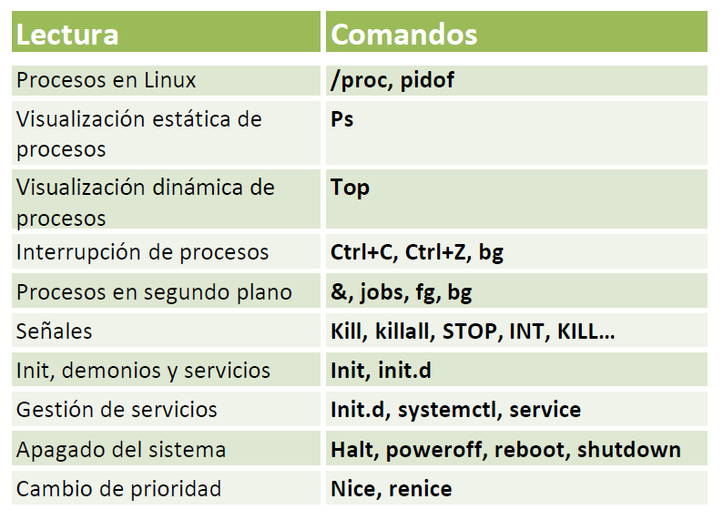

| **Inicio**         | **atrás 6**                                 | **Siguiente 8**                    |
| ------------------ | ------------------------------------------- | ---------------------------------- |
| [🏠](../README.md) | [⏪](./1_6_Permisos_y_usuarios_en_Linux.md) | [⏩](./1_8_Networking_en_Linux.md) |

---

## **Índice**

| Temario                                                                                                            |
| ------------------------------------------------------------------------------------------------------------------ |
| [56. Procesos en Linux](#56-procesos-en-linux)                                                                     |
| [57. Visualización estática de procesos](#57-visualización-estática-de-procesos)                                   |
| [58. Visualización dinámica de procesos](#58-visualización-dinámica-de-procesos)                                   |
| [59. Interrupción de procesos](#59-interrupción-de-procesos)                                                       |
| [60. Procesos en segundo plano](#60-procesos-en-segundo-plano)                                                     |
| [61. Señales (Signals)](#61-señales-signals)                                                                       |
| [62. Init, demonios y servicios](#62-init-demonios-y-servicios)                                                    |
| [63. Gestión de servicios: init.d, systemctl, service](#63-gestión-de-servicios-initd-systemctl-service)           |
| [64. Las 6 etapas del proceso de arranque de Linux](#64-las-6-etapas-del-proceso-de-arranque-de-linux)             |
| [65. Apagado del sistema: halt, poweroff, reboot, shutdown](#65-apagado-del-sistema-halt-poweroff-reboot-shutdown) |
| [66. Cambio de prioridad: nice, renice](#66-cambio-de-prioridad-nice-renice)                                       |
| [67. Caso práctico: Hacking de la memoria de un proceso](#67-caso-práctico-hacking-de-la-memoria-de-un-proceso)    |

---

# **Procesos en Linux**



## **56. Procesos en Linux**

### 🧠 ¿Qué es un **proceso** en Linux?

Un **proceso** es simplemente:

> 🔁 Un programa en ejecución (como Firefox, Emacs, bash, un script, etc.)

Cada vez que ejecutas un comando o aplicación, el sistema crea un **proceso** con un **PID (Process ID)** único.

---

### 🎯 ¿Para qué se utiliza saber sobre procesos?

- Ver qué programas se están ejecutando
- Saber quién los inició y cuántos recursos usan
- Finalizar procesos que consumen mucha RAM/CPU
- Depurar errores de programas colgados
- Detectar procesos sospechosos (seguridad)

---

### 🔧 Comandos comunes para ver y manejar procesos

| Comando                              | ¿Qué hace?                                                                       |     |
| ------------------------------------ | -------------------------------------------------------------------------------- | --- |
| `ps`                                 | Muestra procesos actuales (muy útil en scripts)                                  |     |
| `top` o `htop`                       | Monitor en tiempo real de CPU, RAM, procesos (como el "Administrador de tareas") |     |
| `pidof nombre_prog`                  | Muestra el PID de un programa                                                    |     |
| `kill PID`                           | Finaliza un proceso según su ID                                                  |     |
| `killall nombre`                     | Finaliza todos los procesos con ese nombre                                       |     |
| `ps aux                \| grep algo` | Busca procesos específicos                                                       |
| `cat /proc/PID/cmdline`              | Muestra cómo se ejecutó un proceso                                               |     |

---

### 🧪 Explicación de tus comandos

---

#### 🔹 `pid`

❌ No existe un comando llamado `pid`.

✅ Usa en su lugar:

```bash
echo $$
```

Esto te muestra el PID de tu **shell actual** (por ejemplo, bash).

---

#### 🔹 `pidof emacs`

📌 Muestra el PID del programa `emacs`, si está ejecutándose.

Ejemplo:

```bash
pidof emacs
```

Resultado:

```
3021
```

Ese número es el **ID del proceso de emacs**.

---

#### 🔹 `cat cmdline`

❌ `cmdline` no está en la ruta actual.

✅ Deberías hacer:

```bash
cat /proc/<PID>/cmdline
```

Por ejemplo:

```bash
cat /proc/3021/cmdline
```

📌 Esto te muestra **el comando exacto que inició ese proceso**, útil para ver argumentos o rutas.

---

### ✅ Ejemplo práctico completo

```bash
# 1. Abre un programa (por ejemplo: emacs o firefox)
emacs &

# 2. Encuentra su PID
pidof emacs

# 3. Verifica su línea de comando de inicio
cat /proc/<PID>/cmdline

# 4. Ver procesos activos
ps aux | grep emacs

# 5. Detén el proceso
kill <PID>
```

---

### 🧰 Otros comandos útiles

#### 🔹 `ps aux`

📌 Muestra todos los procesos con info como:

```
USER       PID %CPU %MEM COMMAND
puma       1234 0.1  1.2  /usr/bin/emacs
```

---

#### 🔹 `top` o `htop`

📌 Monitor en tiempo real de procesos.

- `htop` es más visual, pero debes instalarlo:

```bash
sudo apt install htop
htop
```

---

#### 🔹 `kill <PID>`

📌 Termina un proceso:

```bash
kill 1234
```

Si no se detiene:

```bash
kill -9 1234  # Forzado
```

---

#### 🔹 `killall nombre`

📌 Termina **todos los procesos** con ese nombre:

```bash
killall emacs
```

---

### ❗ Posibles errores y soluciones

| Error / Comando mal                      | Causa                          | Solución                               |     |
| ---------------------------------------- | ------------------------------ | -------------------------------------- | --- |
| `pid: command not found`                 | No existe ese comando          | Usa `pidof` o `echo $$`                |     |
| `cat cmdline: No such file or directory` | No diste la ruta completa      | Usa `/proc/PID/cmdline`                |     |
| `kill: Operation not permitted`          | No tienes permisos suficientes | Usa `sudo kill PID`                    |     |
| `pidof nombre` no da resultados          | El proceso no está corriendo   | Verifica con `ps aux   \| grep nombre` |

---

### 🧾 Resumen visual

| Acción                          | Comando                 |
| ------------------------------- | ----------------------- |
| Ver procesos                    | `ps aux` o `top`        |
| Ver PID de un programa          | `pidof nombre`          |
| Ver comando de inicio de un PID | `cat /proc/PID/cmdline` |
| Ver PID del shell actual        | `echo $$`               |
| Terminar proceso                | `kill PID`              |
| Terminar por nombre             | `killall nombre`        |

---

[🔼](#índice)

---

## **57. Visualización estática de procesos**

### 🧠 ¿Qué es la visualización estática de procesos?

La **visualización estática de procesos** te muestra un **"pantallazo" (snapshot)** de todos los procesos activos en ese **instante**, usando comandos como `ps`.

> 🔎 Es como tomar una **foto del estado de todos los procesos**: qué usuarios los lanzaron, cuánto CPU o memoria usan, y qué comandos se ejecutaron.

---

### 🎯 ¿Para qué se utiliza?

- Verificar si un programa está corriendo.
- Analizar cuántos procesos tiene un usuario.
- Diagnosticar procesos zombis o congelados.
- Buscar procesos sospechosos (ciberseguridad).
- Sacar una lista para analizarla más tarde (a diferencia de `top`, que es dinámico).

---

### 🧰 Comandos que usaste y su explicación

---

#### 🔹 `ps`

📌 Muestra **solo los procesos actuales del usuario en esta terminal**.

**Ejemplo de salida:**

```
PID TTY          TIME CMD
1214 pts/0    00:00:00 bash
1301 pts/0    00:00:00 ps
```

✅ Te dice el PID (ID del proceso), el tipo de terminal (TTY), y el comando.

---

#### 🔹 `ps x`

📌 Muestra **todos tus procesos**, incluso los **que no están ligados a una terminal** (por ejemplo, procesos en segundo plano).

**Ejemplo de salida:**

```
  PID TTY      STAT   TIME COMMAND
 1000 ?        S      0:00 /usr/lib/policykit-1/polkitd
 1020 ?        Ss     0:00 /usr/sbin/cron
 1100 pts/0    Ss     0:00 -bash
 1305 pts/0    R+     0:00 ps x
```

- `?` indica procesos sin terminal (servicios o demonios).
- `STAT`: estado del proceso (`S` = sleeping, `R` = running, etc.)

---

#### 🔹 `ps aux | less`

📌 Este comando es muy completo y **estándar**. Muestra todos los procesos del sistema.

**Desglose:**

- `a`: muestra procesos de todos los usuarios
- `u`: muestra el usuario dueño de cada proceso
- `x`: muestra procesos sin terminal asociada
- `| less`: te permite navegar con flechas o barra espaciadora

**Ejemplo parcial:**

```
USER       PID %CPU %MEM    VSZ   RSS TTY      STAT START   TIME COMMAND
root         1  0.0  0.1 166640  5908 ?        Ss   10:01   0:01 /sbin/init
puma      2035  0.1  1.0 124500 10000 pts/0    S+   10:15   0:00 emacs
```

- `%CPU`: uso de CPU
- `%MEM`: uso de RAM
- `COMMAND`: qué programa se ejecuta

---

### ✅ Resumen visual de opciones de `ps`

| Comando                  | ¿Qué hace?                                          |     |
| ------------------------ | --------------------------------------------------- | --- |
| `ps`                     | Procesos de tu sesión actual                        |     |
| `ps x`                   | Todos tus procesos, incluyendo en segundo plano     |     |
| `ps aux`                 | Todos los procesos del sistema (todos los usuarios) |     |
| `ps aux \| less`         | Igual que arriba, pero navegable                    |
| `ps aux \| grep firefox` | Busca procesos específicos                          |

---

### 🛠 Posibles soluciones y usos

#### 🧪 Ver si un programa está corriendo

```bash
ps aux | grep firefox
```

📌 Busca todos los procesos con “firefox” en el nombre.

---

#### 🧪 Ordenar por uso de CPU (más útil con `top`, pero posible con `ps`)

```bash
ps aux --sort=-%cpu | head
```

📌 Muestra los procesos que más CPU consumen.

---

#### 🧪 Ver solo procesos de un usuario

```bash
ps -u puma
```

---

### ❗ Errores comunes

| Problema                                        | Causa                                          | Solución                                           |     |
| ----------------------------------------------- | ---------------------------------------------- | -------------------------------------------------- | --- |
| `ps: command not found`                         | `ps` no está instalado (raro en Debian/Ubuntu) | `sudo apt install procps`                          |     |
| `ps aux                \| less` no muestra todo | El archivo de scroll es muy corto              | Usa `Shift + G` para ir al final o exporta con `>` |

---

### 📌 Resumen general

| Comando                 | ¿Para qué sirve?                           |     |
| ----------------------- | ------------------------------------------ | --- |
| `ps`                    | Ver tus procesos actuales en terminal      |     |
| `ps x`                  | Ver todos tus procesos, con o sin terminal |     |
| `ps aux`                | Ver todos los procesos del sistema         |     |
| `ps aux \| less`        | Lo mismo, pero navegable                   |
| `ps aux \| grep nombre` | Buscar un proceso específico               |

---

[🔼](#índice)

---

## **58. Visualización dinámica de procesos**

### 🧠 ¿Qué es la **visualización dinámica de procesos**?

Es cuando puedes **ver en tiempo real** cómo cambian los procesos del sistema: cuánta CPU usan, cuánta memoria, cuál consume más recursos, si se cuelgan, si se multiplican, etc.

> 📺 Es como el “Administrador de tareas” de Windows, pero en la terminal.

---

### 🛠 ¿Qué comando se usa?

#### 🔹 `top`

Este es el comando estándar en casi todas las distribuciones Linux.

---

### 🎯 ¿Para qué se utiliza?

- Detectar procesos que consumen mucha CPU o RAM
- Ver el uso total de memoria
- Finalizar procesos directamente desde la terminal
- Diagnosticar cuelgues o sobrecargas del sistema
- Ver quién está ejecutando qué

---

### 🧪 Ejemplo y explicación del comando que diste

#### 🔹 `top`

Cuando ejecutas `top`, verás una pantalla como esta:

```
top - 17:30:00 up 3:25,  2 users,  load average: 0.10, 0.12, 0.08
Tasks: 125 total,   1 running, 124 sleeping,   0 stopped,   0 zombie
%Cpu(s):  5.0 us,  2.0 sy,  0.0 ni, 90.0 id,  3.0 wa,  0.0 hi,  0.0 si,  0.0 st
MiB Mem :   7980.2 total,   423.1 free,  3450.4 used,  4106.7 buff/cache
PID USER      PR  NI    VIRT    RES    SHR S  %CPU %MEM     TIME+ COMMAND
3021 puma     20   0  721980 132840  48600 S   9.5  1.6   0:23.12 firefox
```

---

### 🧩 ¿Qué significa cada parte?

| Campo     | Significado                                       |
| --------- | ------------------------------------------------- |
| `PID`     | ID del proceso                                    |
| `USER`    | Usuario dueño del proceso                         |
| `%CPU`    | % de CPU que usa ese proceso                      |
| `%MEM`    | % de RAM que consume                              |
| `TIME+`   | Tiempo total que ha estado usando la CPU          |
| `COMMAND` | Nombre del programa o comando                     |
| `S`       | Estado (S = sleep, R = running, Z = zombie, etc.) |

---

### ✅ Acciones útiles dentro de `top`

Cuando `top` está corriendo, puedes hacer cosas presionando teclas:

| Tecla | Acción                          |
| ----- | ------------------------------- |
| `q`   | Salir de `top`                  |
| `k`   | "Kill" un proceso (te pide PID) |
| `r`   | Cambiar prioridad de un proceso |
| `P`   | Ordenar por uso de CPU          |
| `M`   | Ordenar por uso de memoria      |
| `h`   | Ver ayuda dentro de `top`       |

---

### 🧠 Comando mejorado: `htop`

#### 🔹 `htop` (si está disponible)

Es una versión más bonita, a color e interactiva. Para instalarlo:

```bash
sudo apt install htop
```

Y luego:

```bash
htop
```

✅ Puedes usar flechas para navegar, F9 para matar procesos, F6 para ordenar columnas, etc.

---

### ❗ Posibles errores y soluciones

| Error                    | Causa                                         | Solución                                          |
| ------------------------ | --------------------------------------------- | ------------------------------------------------- |
| `command not found: top` | Sistema mínimo o incompleto                   | `sudo apt install procps`                         |
| Mucho consumo de CPU     | Procesos pesados (navegadores, apps gráficas) | Usa `k` en `top` o `kill PID` desde otra terminal |
| No se actualiza          | Está pausado (poco común)                     | Presiona `d` para definir tiempo de actualización |

---

### 📘 Resumen

| Acción                           | Comando                                       |
| -------------------------------- | --------------------------------------------- |
| Ver procesos en tiempo real      | `top`                                         |
| Ver versión colorida interactiva | `htop` (requiere instalación)                 |
| Ordenar por CPU dentro de `top`  | Presiona `P`                                  |
| Ordenar por memoria              | Presiona `M`                                  |
| Salir de `top`                   | Presiona `q`                                  |
| Matar un proceso                 | Dentro de `top`, presiona `k`, escribe el PID |

---

### ✅ Ejemplo práctico para ti

```bash
# 1. Abre dos terminales
# 2. En la primera ejecuta un proceso:
sleep 60

# 3. En la segunda, ejecuta:
top

# 4. Encuentra el proceso `sleep` y presiona `k`
# 5. Introduce el PID que aparece en la columna PID y presiona ENTER

# Resultado: el proceso `sleep` se detendrá
```

---

[🔼](#índice)

---

## **59. Interrupción de procesos**

### 🧠 ¿Qué es una **interrupción de procesos**?

En Linux, **interrumpir un proceso** significa **alterar su ejecución normal** desde la terminal. Puedes:

- ❗ **Pausarlo temporalmente** (CTRL + Z)
- 🔁 **Reanudarlo en segundo plano** (`bg`)
- 🔁 **Reanudarlo en primer plano** (`fg`)
- ❌ **Terminarlo** (`kill`)

> Esto te da control sobre los procesos que iniciaste, sin necesidad de cerrarlos bruscamente.

---

### 🧰 Comandos relacionados

| Comando    | ¿Qué hace?                                          |
| ---------- | --------------------------------------------------- |
| `CTRL + Z` | Suspende (pausa) un proceso y lo pone en espera     |
| `bg %1`    | Reanuda el proceso `1` en segundo plano             |
| `fg %1`    | Reanuda el proceso `1` en primer plano              |
| `jobs`     | Muestra los procesos suspendidos o en segundo plano |
| `kill %1`  | Termina el proceso suspendido o en segundo plano    |

---

### 📘 ¿Para qué se utiliza?

- ⌛ Pausar un proceso largo mientras haces otra cosa
- 🧪 Mandar al fondo tareas como `sleep`, `ping`, `emacs`, etc.
- ⚙️ Reanudar trabajos manualmente sin cerrar la terminal
- 🚫 Finalizar procesos congelados sin cerrar toda la terminal

---

### ✅ Ejemplo paso a paso

Vamos a simular una interrupción con `sleep` (puedes usar cualquier otro programa):

#### 1️⃣ Ejecuta un proceso largo

```bash
sleep 1000
```

Esto mantendrá la terminal ocupada.

---

#### 2️⃣ Suspéndelo (interrúmpelo temporalmente)

Presiona:

```bash
CTRL + Z
```

Verás algo como:

```
[1]+  Stopped   sleep 1000
```

---

#### 3️⃣ Manda el proceso al fondo (background)

```bash
bg %1
```

Ahora se sigue ejecutando, pero **liberaste la terminal**.

---

#### 4️⃣ Verifica los procesos activos de la terminal

```bash
jobs
```

Te mostrará algo como:

```
[1]+  Running   sleep 1000 &
```

---

#### 5️⃣ Vuelve a primer plano

```bash
fg %1
```

El proceso volverá a ocupar la terminal hasta que termine.

---

#### 6️⃣ Detén el proceso

Presiona `CTRL + C` o usa:

```bash
kill %1
```

---

### 🛠 Otros comandos útiles

#### 🔹 `jobs`

Muestra los procesos iniciados desde la terminal actual que están:

- Corriendo en segundo plano
- Suspendidos (pausados)

---

#### 🔹 `kill`

Finaliza un proceso con su número de job (`%1`, `%2`, etc.) o con su PID.

```bash
kill %1      # Finaliza job 1
kill -9 PID  # Finaliza por la fuerza (si se resiste)
```

---

#### 🔹 `fg` / `bg`

Controlan la ejecución en primer o segundo plano:

- `fg %1` → Reanuda el proceso 1 al frente.
- `bg %1` → Reanuda el proceso 1 en segundo plano.

---

### ❗ Errores comunes y soluciones

| Problema                 | Causa                                      | Solución                             |
| ------------------------ | ------------------------------------------ | ------------------------------------ |
| `bg: no such job`        | No usaste `%` o el número de job no existe | Usa `jobs` para verificar            |
| `fg: job has terminated` | El proceso ya finalizó                     | Nada que hacer, inicia otro          |
| `kill: not permitted`    | No tienes permisos para matar ese proceso  | Usa `sudo` o mata solo tus procesos  |
| `CTRL + C` no funciona   | El proceso ignora señales                  | Usa `kill -9 PID` para forzar salida |

---

### 🧪 Ejemplo con `emacs`, `nano` o `ping`

```bash
ping google.com
# Luego presiona CTRL+Z
bg %1         # Sigue haciendo ping en segundo plano
jobs          # Verifica el job
fg %1         # Vuelve al frente
CTRL+C        # Finaliza
```

---

### 📌 Resumen general

| Acción                    | Comando    |
| ------------------------- | ---------- |
| Suspender un proceso      | `CTRL + Z` |
| Ver jobs activos          | `jobs`     |
| Reanudar en segundo plano | `bg %1`    |
| Reanudar en primer plano  | `fg %1`    |
| Finalizar proceso         | `kill %1`  |

---

[🔼](#índice)

---

## **60. Procesos en segundo plano**

### 🧠 ¿Qué son los procesos en segundo plano?

Un **proceso en segundo plano** es un programa o comando que **se ejecuta sin bloquear tu terminal**, permitiéndote seguir usando la línea de comandos.

> Ejemplo típico: abrir un editor como `emacs`, `pico`, o ejecutar un `sleep 60 &` para que se ejecute sin esperar a que termine.

---

### 🎯 ¿Para qué se utilizan?

- Para **hacer varias tareas al mismo tiempo** desde una sola terminal.
- Para dejar ejecutándose procesos largos o interactivos sin perder el control de la terminal.
- Para automatizar, monitorear o analizar procesos sin interrupciones.
- Ideal en scripting o administración de sistemas.

---

### ✅ Ejemplo práctico explicado

#### 🔹 `emacs &`

```bash
emacs &
```

📌 Ejecuta `emacs` en segundo plano.

Verás una salida como:

```
[1] 1234
```

- `[1]`: número de job
- `1234`: PID (process ID)

---

#### 🔹 `jobs`

```bash
jobs
```

📌 Lista los procesos en segundo plano o suspendidos desde esa terminal.

Ejemplo de salida:

```
[1]-  Running                 emacs &
[2]+  Running                 pico &
```

---

#### 🔹 `pico &`

```bash
pico &
```

📌 Igual que con `emacs`, ejecuta el editor `pico` en segundo plano.

---

#### 🔹 `bg %3`

```bash
bg %3
```

📌 Reanuda el **job número 3** en segundo plano si estaba **suspendido**.

> ⚠️ Si no tienes un job suspendido con ese número, te dará error. Usa `jobs` para verificar primero.

---

#### 🔹 `fg %3`

📌 Esto **trae al frente** el job número 3, es decir, lo vuelve a mostrar y controla en la terminal actual.

---

### 🧩 ¿Cómo se manejan?

| Acción                         | Comando                |
| ------------------------------ | ---------------------- |
| Ejecutar en segundo plano      | `comando &`            |
| Ver procesos en segundo plano  | `jobs`                 |
| Suspender proceso en 1er plano | `CTRL + Z`             |
| Reanudar en segundo plano      | `bg %n`                |
| Reanudar en primer plano       | `fg %n`                |
| Terminar proceso               | `kill %n` o `kill PID` |

---

### 🧪 Ejemplo paso a paso para practicar

```bash
sleep 60 &       # Inicia un proceso que duerme 60 segundos en segundo plano
jobs             # Verifica que esté corriendo
fg %1            # Lo trae al frente
CTRL+Z           # Lo pausa
bg %1            # Lo manda nuevamente al fondo
jobs             # Verifica estado
kill %1          # Mata el proceso por número de job
```

---

### ❗ Posibles errores y soluciones

| Error / Comando         | Causa                               | Solución                                  |
| ----------------------- | ----------------------------------- | ----------------------------------------- |
| `gf: command not found` | Escribiste mal `fg`                 | Usa `fg %n`                               |
| `bg: %3: no such job`   | No existe job número 3              | Ejecuta `jobs` para verificar el número   |
| `kill: not permitted`   | No tienes permisos para ese proceso | Usa `sudo kill PID` o mata solo los tuyos |

---

### 📘 Resumen final

| Comando     | Función                                        |
| ----------- | ---------------------------------------------- |
| `comando &` | Ejecuta un proceso en segundo plano            |
| `jobs`      | Lista los procesos de la sesión                |
| `fg %n`     | Trae el job `n` al primer plano                |
| `bg %n`     | Reanuda un job suspendido en segundo plano     |
| `kill %n`   | Termina un job                                 |
| `CTRL + Z`  | Pausa un proceso y lo pone como job suspendido |

---

[🔼](#índice)

---

## **61. Señales (Signals)**

### 🧠 ¿Qué son las **señales (signals)** en Linux?

Las **señales** son mensajes que el sistema operativo **envía a los procesos** para indicar que deben hacer algo.

> Por ejemplo: **terminarse**, **pausarse**, **continuar**, **reiniciarse**, etc.

Estas señales se usan con comandos como `kill`, aunque el nombre pueda confundirte: **no siempre significa "matar"**.

---

### 🎯 ¿Para qué se utilizan?

- ✅ Terminar procesos de forma ordenada o forzada
- ⏸️ Pausar o reanudar procesos
- 🚨 Interrumpir tareas en ejecución
- 🔒 Diagnosticar procesos que no responden
- ⚙️ Enviar señales personalizadas entre procesos

---

### 🧰 Comando base: `kill`

```bash
kill -SIGNAL PID
```

Donde:

- `SIGNAL`: es la señal a enviar (por nombre o número)
- `PID`: es el ID del proceso (puedes verlos con `ps`, `top`, `pidof`)

---

### 📜 Lista de señales comunes (`kill -l`)

Cuando usas `kill -l` verás esto:

```bash
kill -l
```

Ejemplo de señales útiles:

| Señal     | Número | Descripción                          |
| --------- | ------ | ------------------------------------ |
| `SIGTERM` | 15     | Termina el proceso de forma ordenada |
| `SIGKILL` | 9      | Mata el proceso **inmediatamente**   |
| `SIGSTOP` | 19     | Pausa el proceso                     |
| `SIGCONT` | 18     | Continúa un proceso pausado          |
| `SIGINT`  | 2      | Interrupción (como `CTRL + C`)       |
| `SIGHUP`  | 1      | Reinicia proceso o cierra sesión     |
| `SIGUSR1` | 10     | Señal definida por el usuario        |

---

### ✅ Ejemplos con explicación

#### 🔹 `kill`

```bash
kill PID
```

✅ Por defecto, envía `SIGTERM` (terminar proceso limpiamente).

---

#### 🔹 `kill -9 31273` o `kill -KILL 31273`

✅ Mata el proceso **sin preguntar ni limpiar nada**.

Usado cuando el proceso está colgado y no responde.

---

#### 🔹 `kill -STOP 31152`

✅ Pausa el proceso con PID 31152 (equivalente a `CTRL+Z`).

---

#### 🔹 `kill -CONT 31152` o `kill -18 31152`

✅ Reanuda el proceso pausado.

---

#### 🔹 `kill -INT 31152`

✅ Simula presionar `CTRL+C` sobre el proceso (interrupción).

---

#### 🔹 `kill -l`

✅ Muestra todas las señales disponibles:

```
 1) SIGHUP   2) SIGINT  3) SIGQUIT ...
```

---

#### 🔹 `kill -20 31152`

✅ Esto es lo mismo que `kill -TSTP 31152` (pausar).

---

#### 🔹 `killall emacs`

✅ Mata **todos los procesos con nombre `emacs`**.

---

### 📘 Resumen práctico de señales

| Señal            | Comando                     | ¿Qué hace?                             |
| ---------------- | --------------------------- | -------------------------------------- |
| Terminar         | `kill -15 PID` o `kill PID` | Finaliza correctamente                 |
| Forzar salida    | `kill -9 PID`               | Mata el proceso de inmediato           |
| Pausar           | `kill -STOP PID`            | Suspende el proceso                    |
| Reanudar         | `kill -CONT PID`            | Reanuda un proceso suspendido          |
| Interrumpir      | `kill -INT PID`             | Equivale a `CTRL+C`                    |
| Ver señales      | `kill -l`                   | Lista las señales disponibles          |
| Matar por nombre | `killall nombre`            | Mata todos los procesos con ese nombre |

---

### 🧪 Mini ejercicio práctico para ti

```bash
# 1. Ejecuta un proceso:
sleep 300 &

# 2. Verifica su PID:
ps aux | grep sleep

# 3. Paúsalo:
kill -STOP PID

# 4. Reanúdalo:
kill -CONT PID

# 5. Mátalo:
kill -9 PID
```

---

### ❗ Posibles errores y soluciones

| Error                           | Causa                                   | Solución                             |
| ------------------------------- | --------------------------------------- | ------------------------------------ |
| `kill: (PID) - No such process` | El PID no existe o ya terminó           | Verifica con `ps aux`                |
| `kill: Operation not permitted` | No tienes permiso para matar el proceso | Usa `sudo kill PID`                  |
| `kill: invalid signal`          | Escribiste mal la señal                 | Usa `kill -l` para ver las correctas |
| `kill all`                      | Comando mal escrito                     | Usa `killall nombre_proceso`         |

---

[🔼](#índice)

---

## **62. Init, demonios y servicios**

### 🧠 ¿Qué es `init`, qué son los **demonios** y los **servicios**?

#### 🔸 `init`

Es el **primer proceso** que arranca cuando se inicia Linux. Tiene PID = 1.

> Su trabajo es **iniciar todos los demás servicios y procesos** del sistema.

Hoy en día, el sistema `init` más usado es **`systemd`**, pero también existen **SysVinit**, **Upstart**, etc.

---

#### 🔸 Demonio (**daemon**)

Un **demonio** es un programa que **corre en segundo plano**, sin necesidad de intervención del usuario. Se usan para servicios como:

| Daemon    | Función                    |
| --------- | -------------------------- |
| `sshd`    | Acepta conexiones SSH      |
| `cron`    | Ejecuta tareas programadas |
| `cupsd`   | Maneja impresoras          |
| `apache2` | Servidor web               |
| `mysqld`  | Base de datos MySQL        |

> Tienen nombres que **terminan en `d`** (de _daemon_), y corren **siempre en segundo plano**.

---

#### 🔸 Servicios

Un **servicio** es un demonio **gestionado por el sistema operativo**. Puede:

- Iniciarse al arrancar el sistema
- Detenerse manualmente
- Reiniciarse si falla

> Hoy se gestionan con `systemctl` (de `systemd`).

---

### 🎯 ¿Para qué se utilizan?

- Activar o desactivar funcionalidades como red, base de datos, web, SSH, etc.
- Automatizar tareas al inicio del sistema
- Supervisar servicios y reiniciarlos si fallan
- Configurar seguridad, firewalls, backup, monitoreo, etc.

---

### 🛠 Comandos útiles con `systemd`

| Comando                               | ¿Para qué sirve?                |
| ------------------------------------- | ------------------------------- |
| `systemctl status nombre`             | Ver estado del servicio         |
| `systemctl start nombre`              | Iniciar servicio                |
| `systemctl stop nombre`               | Detener servicio                |
| `systemctl restart nombre`            | Reiniciar servicio              |
| `systemctl enable nombre`             | Activar al inicio del sistema   |
| `systemctl disable nombre`            | Desactivar al inicio            |
| `systemctl list-units --type=service` | Ver todos los servicios activos |

---

### ✅ Ejemplos sencillos

#### 1. Ver si el servicio SSH está activo

```bash
systemctl status ssh
```

---

#### 2. Iniciar y detener un servicio

```bash
sudo systemctl start apache2
sudo systemctl stop apache2
```

---

#### 3. Habilitar un servicio al iniciar el sistema

```bash
sudo systemctl enable apache2
```

---

#### 4. Ver todos los servicios activos

```bash
systemctl list-units --type=service
```

---

### ❗ Posibles problemas y soluciones

| Problema                         | Causa                  | Solución                                            |
| -------------------------------- | ---------------------- | --------------------------------------------------- |
| `Unit xyz.service not found`     | No existe el servicio  | Asegúrate de que esté instalado (`apt install`)     |
| `Permission denied`              | No tienes permisos     | Usa `sudo`                                          |
| Servicio no inicia               | Error en configuración | Revisa `journalctl -xe` para ver detalles del error |
| Servicio no arranca al reiniciar | No está habilitado     | Usa `systemctl enable nombre`                       |

---

### 🧩 ¿Y cómo se relaciona con `init`?

- Cuando Linux arranca, el kernel lanza el proceso `init`.
- `init` (o `systemd`, en la mayoría de sistemas modernos) se encarga de lanzar todos los **servicios y demonios** necesarios.
- Si usas `ps -p 1`, verás:

```bash
ps -p 1 -o comm=
```

Posible salida:

```
systemd
```

---

### 📘 Resumen

| Término     | Descripción                                        |
| ----------- | -------------------------------------------------- |
| `init`      | Primer proceso del sistema (PID 1)                 |
| Demonio     | Proceso en segundo plano (ej. `sshd`, `cron`)      |
| Servicio    | Demonio gestionado por el sistema con `systemctl`  |
| `systemctl` | Herramienta para gestionar servicios con `systemd` |

---

### 🧪 Ejercicio práctico

```bash
# 1. Ver qué servicios se están ejecutando
systemctl list-units --type=service

# 2. Verifica el estado de cron
systemctl status cron

# 3. Detén y luego inicia el servicio
sudo systemctl stop cron
sudo systemctl start cron

# 4. Haz que se inicie automáticamente con el sistema
sudo systemctl enable cron
```

---

[🔼](#índice)

---

## **63. Gestión de servicios: init.d, systemctl, service**

### 🔧 Gestión de servicios: `init.d`, `service`, `systemctl`

---

### 🧠 ¿Qué es la **gestión de servicios**?

En Linux, **los servicios** (como `ssh`, `cron`, `mysql`, `apparmor`, etc.) son programas que se ejecutan en **segundo plano** para realizar tareas importantes.
La gestión de servicios permite **iniciar, detener, reiniciar y verificar** estos procesos.

---

### 🧰 ¿Qué herramientas existen?

#### 🔹 1. `/etc/init.d/` (más antiguo)

- Usado por **SysVinit** (sistemas antiguos).
- Cada servicio tiene un script en `/etc/init.d/`.

```bash
sudo /etc/init.d/ssh start
sudo /etc/init.d/apache2 stop
```

#### 🔹 2. `service` (interfaz más simple de `init.d`)

- Compatible con `SysVinit` y algunos sistemas `systemd`.
- Más fácil de recordar y usar.

```bash
sudo service apache2 start
sudo service ssh status
```

#### 🔹 3. `systemctl` (el más moderno)

- Es la herramienta de `systemd`, usada en la mayoría de distros modernas como Ubuntu, Debian, Fedora, Arch, etc.
- Más potente, moderna y flexible.

```bash
sudo systemctl start ssh
sudo systemctl status apache2
sudo systemctl restart apparmor
```

---

### 📌 ¿Para qué se utiliza?

- 🟢 **Iniciar servicios** cuando los necesitas
- 🔴 **Detener servicios** que no estás usando o que fallaron
- ♻️ **Reiniciar servicios** después de configurar algo
- 🔍 **Verificar el estado** (activo, inactivo, fallando)
- ⚙️ **Automatizar el inicio** de servicios al encender el sistema

---

### ✅ Ejemplos explicados

#### 🔹 Con `systemctl`

```bash
sudo systemctl start apparmor       # Inicia el servicio
sudo systemctl stop apparmor        # Lo detiene
sudo systemctl restart apparmor     # Reinicia el servicio
sudo systemctl status apparmor      # Muestra el estado actual
```

> ⚠️ Ojo: `sudo systemctl status apparmor.service` también funciona, pero no es necesario agregar `.service`.

---

#### 🔹 Con `service`

```bash
sudo service apparmor start
sudo service apparmor stop
sudo service apparmor status
sudo service apparmor restart
```

📌 Funciona como puente entre `init.d` y `systemctl`. Útil si vienes de sistemas antiguos.

---

#### 🔹 Con `/etc/init.d/`

```bash
sudo /etc/init.d/apparmor start
sudo /etc/init.d/apparmor stop
```

📌 Se usa cuando no tienes `systemd`, o en sistemas embebidos.

---

### 🔍 Ver todos los servicios activos

```bash
systemctl list-units --type=service
```

> 💡 A veces escribimos mal esto. El comando correcto es:

```bash
systemctl list-units --type=service
```

---

### ❗ Posibles errores y soluciones

| Mensaje de error    | Causa                                     | Solución                                  |
| ------------------- | ----------------------------------------- | ----------------------------------------- |
| `Failed to start`   | Servicio da error al arrancar             | Revisa logs: `journalctl -xe`             |
| `Unit not found`    | El servicio no existe o no está instalado | Asegúrate de que está instalado           |
| `Permission denied` | No tienes permisos                        | Añade `sudo` delante del comando          |
| `apparmor.service.` | Hay un punto al final (error de sintaxis) | Quita el punto final (`apparmor.service`) |

---

### 🧪 Ejercicio guiado para ti

```bash
# 1. Verifica si apparmor está activo
sudo systemctl status apparmor

# 2. Detén el servicio
sudo systemctl stop apparmor

# 3. Verifica que se detuvo
sudo systemctl status apparmor

# 4. Inícialo nuevamente
sudo systemctl start apparmor

# 5. Reinícialo
sudo systemctl restart apparmor

# 6. Habilita para que se inicie al prender
sudo systemctl enable apparmor

# 7. Lista todos los servicios
systemctl list-units --type=service
```

---

### 📘 Resumen

| Herramienta    | Uso actual | Ejemplo                 |
| -------------- | ---------- | ----------------------- |
| `/etc/init.d/` | Antiguo    | `/etc/init.d/ssh start` |
| `service`      | Medio      | `service ssh stop`      |
| `systemctl`    | Moderno    | `systemctl restart ssh` |

---

[🔼](#índice)

---

## **64. Las 6 etapas del proceso de arranque de Linux**

### 🚀 ¿Qué es el proceso de arranque de Linux?

Es el conjunto de **etapas que ocurren desde que enciendes la computadora hasta que tienes una terminal lista** para usar en Linux. Si alguna etapa falla, el sistema **no arranca** correctamente.

---

### 🔢 Las 6 etapas del arranque de Linux

---

#### 1. 🧬 **BIOS / UEFI**

- **Qué es:** Es el firmware de la placa madre. Se ejecuta al encender la computadora.
- **Función:** Verifica el hardware (memoria, discos, teclado) y busca un **dispositivo de arranque** (disco, USB, etc.).
- **Uso común:** Entrar al BIOS para cambiar el orden de arranque o activar opciones de virtualización.

🔧 Ejemplo:

- Enciendes la PC y presionas `F2`, `Del` o `F10` para entrar al BIOS y configurar el disco desde donde arrancará Linux.

🛠 No hay comandos en esta etapa porque no hay sistema operativo cargado aún.

---

#### 2. 💿 **MBR (Master Boot Record) / GPT**

- **Qué es:** Es el primer sector del disco duro (en modo MBR) o partición de arranque (en GPT).
- **Función:** Contiene **código de arranque** que carga el gestor de arranque (como GRUB).
- **Uso común:** Si está dañado, el sistema no arrancará.

🛠 Comandos útiles:

```bash
sudo fdisk -l     # Ver particiones MBR
sudo parted -l    # Ver info de particiones (GPT o MBR)
```

🔧 Solución si falla:

- Reparar con `grub-install` o herramientas como `boot-repair`.

---

#### 3. 📦 **GRUB (GRand Unified Bootloader)**

- **Qué es:** Es el **gestor de arranque**.
- **Función:** Muestra un menú para elegir qué sistema operativo arrancar, y carga el **kernel de Linux**.
- **Uso común:** Elegir entre Ubuntu, Windows, modo recuperación, etc.

🛠 Comandos útiles:

- Editar GRUB:

```bash
sudo nano /etc/default/grub
```

- Actualizar GRUB:

```bash
sudo update-grub
```

🔧 Problemas típicos:

- “GRUB rescue” ⇒ faltan archivos de arranque.
- Solución: Usar un Live USB y correr:

```bash
sudo grub-install /dev/sda
sudo update-grub
```

---

#### 4. 🧠 **Kernel de Linux**

- **Qué es:** Es el **núcleo del sistema operativo**.
- **Función:** Detecta el hardware, carga drivers y monta el sistema de archivos raíz.
- **Uso común:** Al arrancar, ves el mensaje `Loading Linux...`.

🛠 Comandos útiles:

- Ver versión del kernel:

```bash
uname -r
```

- Ver módulos cargados:

```bash
lsmod
```

🔧 Problemas:

- Kernel panic: error grave del sistema.
- Solución: arrancar con otro kernel desde GRUB o usar modo recuperación.

---

#### 5. 🏁 **Init / systemd**

- **Qué es:** Es el primer **proceso de usuario** (PID 1).
- **Función:** Se encarga de iniciar los servicios y preparar el sistema.
- En sistemas modernos, se usa `systemd`, no el antiguo `init`.

🛠 Comandos útiles:

- Ver qué gestiona el inicio:

```bash
ps -p 1 -o comm=
```

- Ver estado de arranque:

```bash
systemd-analyze
```

---

#### 6. 💼 **Programas de nivel de ejecución (Runlevel / Targets)**

- **Qué es:** Son los servicios y programas que se inician al final del arranque.
- **Función:** Activan interfaces gráficas, redes, servicios como SSH, cron, etc.
- En `systemd`, los runlevels se llaman **targets**.

🛠 Comandos útiles:

- Ver en qué target estás:

```bash
systemctl get-default
```

- Cambiar a modo gráfico o consola:

```bash
sudo systemctl set-default graphical.target
sudo systemctl set-default multi-user.target
```

- Ver todos los servicios en ejecución:

```bash
systemctl list-units --type=service
```

---

### 🧪 Resumen de las etapas

| Etapa        | ¿Qué hace?                                      | Comando útil                       |
| ------------ | ----------------------------------------------- | ---------------------------------- |
| 1. BIOS/UEFI | Inicia el hardware y busca un disco de arranque | No aplica (presiona F2, F12, etc.) |
| 2. MBR/GPT   | Carga el gestor de arranque                     | `fdisk -l`, `parted -l`            |
| 3. GRUB      | Muestra menú y carga kernel                     | `update-grub`, `grub-install`      |
| 4. Kernel    | Detecta hardware y monta sistema de archivos    | `uname -r`, `lsmod`                |
| 5. Init      | Inicia `systemd` y carga servicios principales  | `systemd-analyze`, `ps -p 1`       |
| 6. Targets   | Activa red, login gráfico, servicios            | `systemctl get-default`            |

---

### ❗ Problemas comunes y soluciones

| Problema                            | Posible etapa  | Solución                      |
| ----------------------------------- | -------------- | ----------------------------- |
| Pantalla negra después del arranque | GRUB o kernel  | Arrancar en modo recuperación |
| `grub rescue>` al iniciar           | GRUB           | Reparar con `grub-install`    |
| Kernel panic                        | Kernel         | Usar otro kernel desde GRUB   |
| Servicios no cargan                 | Init / systemd | Ver con `journalctl -xe`      |
| No carga entorno gráfico            | Runlevel       | Cambiar a `graphical.target`  |

---

[🔼](#índice)

---

## **65. Apagado del sistema: halt, poweroff, reboot, shutdown**

### 🧠 ¿Qué son los comandos `halt`, `poweroff`, `reboot`, `shutdown`?

Son comandos que permiten **apagar, reiniciar o detener el sistema** Linux de manera **ordenada** y **segura**.

---

### 🧰 ¿Para qué se utilizan?

- 📴 **Apagar completamente** la computadora
- 🔄 **Reiniciar** el sistema
- 🛑 **Cerrar sesión** y detener todos los procesos del sistema correctamente
- 📅 **Programar un apagado o reinicio para más tarde**

---

### 🔎 Comandos explicados con ejemplos fáciles

---

#### 🔹 `halt`

**Detiene el sistema operativo**, pero no apaga el hardware (en muchos casos solo muestra "sistema detenido").

```bash
sudo halt
```

📌 En algunas distribuciones modernas equivale a `poweroff`.

---

#### 🔹 `poweroff`

**Apaga completamente la computadora** (hardware y sistema operativo).

```bash
sudo poweroff
```

✅ Ideal cuando terminas de trabajar y quieres apagar la máquina de forma segura.

---

#### 🔹 `reboot`

**Reinicia el sistema**. Detiene todos los procesos y vuelve a arrancar.

```bash
sudo reboot
```

✅ Útil después de instalar actualizaciones del kernel o configurar servicios que requieren reinicio.

---

#### 🔹 `shutdown`

Permite **apagar o reiniciar con más opciones y mensajes personalizados**, además de programar una hora específica.

##### Apagar de inmediato:

```bash
sudo shutdown -h now
```

`-h` = halt (detener), `now` = ahora

##### Reiniciar de inmediato:

```bash
sudo shutdown -r now
```

`-r` = reboot

##### Apagar en 5 minutos con mensaje:

```bash
sudo shutdown -h +5 "Guardando trabajo, se apagará en 5 minutos"
```

---

### 🔄 Equivalencias rápidas

| Acción           | Comando                                  |
| ---------------- | ---------------------------------------- |
| Apagar ahora     | `sudo poweroff` o `sudo shutdown -h now` |
| Reiniciar ahora  | `sudo reboot` o `sudo shutdown -r now`   |
| Apagar en 10 min | `sudo shutdown -h +10`                   |
| Cancelar apagado | `sudo shutdown -c`                       |

---

### 🛠 Posibles problemas y soluciones

| Problema                      | Causa probable                  | Solución                       |
| ----------------------------- | ------------------------------- | ------------------------------ |
| `Permission denied`           | No estás usando `sudo`          | Agrega `sudo` al principio     |
| No se apaga el equipo físico  | `halt` no apaga hardware        | Usa `poweroff` en su lugar     |
| Se apaga sin avisar           | Falta de confirmación o mensaje | Usa `shutdown` con aviso       |
| Apagado programado accidental | Programaste con `shutdown`      | Cancela con `sudo shutdown -c` |

---

### 🧪 Práctica rápida

```bash
# 1. Apaga el sistema ahora mismo
sudo shutdown -h now

# 2. Reinicia ahora mismo
sudo reboot

# 3. Programa un apagado para dentro de 1 minuto con mensaje
sudo shutdown -h +1 "El sistema se apagará en 1 minuto. Guarda tu trabajo."

# 4. Cancelar el apagado antes de que ocurra
sudo shutdown -c
```

---

### 🧘‍♂️ Consejos

- Usa siempre `sudo` para estos comandos.
- Evita `halt` en servidores si no sabes si apaga todo el hardware.
- En escritorios modernos (`systemd`), todos los comandos son alias de:

```bash
systemctl poweroff
systemctl reboot
```

---

### 📘 Resumen

| Comando           | ¿Qué hace?               | Requiere `sudo` |
| ----------------- | ------------------------ | --------------- |
| `halt`            | Detiene el sistema       | ✅              |
| `poweroff`        | Apaga el sistema         | ✅              |
| `reboot`          | Reinicia el sistema      | ✅              |
| `shutdown -h now` | Apaga de inmediato       | ✅              |
| `shutdown -r now` | Reinicia de inmediato    | ✅              |
| `shutdown -h +5`  | Apaga en 5 minutos       | ✅              |
| `shutdown -c`     | Cancela apagado/reinicio | ✅              |

---

[🔼](#índice)

---

## **66. Cambio de prioridad: nice, renice**

### 🧠 ¿Qué es la prioridad de un proceso?

En Linux, cuando hay muchos procesos corriendo al mismo tiempo, el sistema usa una **prioridad** para decidir **cuánto tiempo de CPU** darle a cada uno.
🔺 A menor prioridad (más “importante”), más CPU recibe.
🔻 A mayor _valor nice_ (menos importante), menos CPU recibe.

---

### 🎯 ¿Qué son `nice` y `renice`?

#### 🔹 `nice`

Sirve para **iniciar un proceso con una prioridad específica**.

- El **valor `nice` va de -20 (alta prioridad)** a **+19 (baja prioridad)**.
- Por defecto, los procesos inician con `nice = 0`.

```bash
nice -n 10 ./programa.sh
```

✅ Esto ejecuta `programa.sh` con **menor prioridad que el resto**.

---

#### 🔹 `renice`

Sirve para **cambiar la prioridad de un proceso que ya está corriendo**.

```bash
sudo renice -10 -p 157111
```

✅ Esto cambia la prioridad del proceso con PID `157111` a `-10` (más alta).

---

### 🧰 ¿Para qué se utilizan?

- ⚙️ Dar **más prioridad** a un proceso importante (por ejemplo, un backup o un servidor).
- 💤 Bajar la prioridad de un proceso pesado que **no es urgente** (como un render o descarga grande).
- 🎯 Optimizar el rendimiento del sistema **cuando hay muchos procesos compitiendo**.

---

### 🔎 Ejemplos fáciles de entender

---

#### 🟢 Iniciar un proceso con prioridad baja (no molestar al sistema)

```bash
nice -n 15 ./programa_lento.sh
```

El sistema solo le dará CPU cuando esté libre.

---

#### 🔵 Aumentar prioridad de un proceso (requiere sudo)

```bash
sudo renice -5 -p 1234
```

Sube la prioridad del proceso con PID 1234 para que reciba más tiempo de CPU.

---

#### 🔴 Bajar prioridad de un proceso que consume mucho

```bash
renice 19 -p 4567
```

Reduce la prioridad del proceso 4567, ideal para procesos molestos.

---

### 📊 Ver prioridades de procesos

```bash
ps -eo pid,ni,cmd --sort=ni | less
```

- `ni` muestra el valor nice actual
- Puedes buscar fácilmente qué procesos tienen más o menos prioridad

---

### ❗ Posibles errores y soluciones

| Problema                                                   | Causa                                  | Solución                      |
| ---------------------------------------------------------- | -------------------------------------- | ----------------------------- |
| `Permission denied` al usar `renice` con valores negativos | Solo root puede aumentar la prioridad  | Usa `sudo`                    |
| `command not found: nice`                                  | Comando no disponible o error de tipeo | Instala `coreutils` o corrige |
| `No such process`                                          | El PID no existe                       | Verifica con `ps aux` primero |

---

### 🧪 Casos prácticos

```bash
# 1. Verifica tu script:
./programa.sh &

# 2. Ejecuta con baja prioridad:
nice -n 10 ./programa.sh &

# 3. Encuentra su PID:
ps aux | grep programa.sh

# 4. Cámbiale la prioridad (más alta):
sudo renice -10 -p [PID]

# 5. Verifica con:
ps -o pid,ni,cmd -p [PID]
```

---

### 📘 Resumen

| Comando              | ¿Qué hace?                                | Requiere `sudo` |
| -------------------- | ----------------------------------------- | --------------- |
| `nice -n 10 comando` | Ejecuta un proceso con menor prioridad    | ❌              |
| `nice -n -5 comando` | Ejecuta con mayor prioridad               | ✅              |
| `renice 15 -p 1234`  | Cambia prioridad de un proceso (más baja) | ❌              |
| `renice -10 -p 1234` | Cambia prioridad (más alta)               | ✅              |

---

[🔼](#índice)

---

## **67. Caso práctico: Hacking de la memoria de un proceso**

### 🎯 ¿Qué es el _Hacking de la memoria de un proceso_?

Se refiere a **leer, modificar o manipular directamente el contenido de la memoria RAM de un proceso en ejecución**.
Esto puede hacerse para:

- 🧪 **Investigación y debugging**
- 🧠 **Estudio de vulnerabilidades**
- 🛡️ **Análisis de malware**
- 🚨 **Explotación de procesos para obtener ventajas** (como elevar privilegios)

---

### ⚠️ Advertencia

Manipular memoria es **peligroso y puede dañar procesos o el sistema**.
Además, en entornos reales puede ser **ilegal sin autorización**. Úsalo solo en entornos de prueba o laboratorios.

---

### 🧰 ¿Para qué se utiliza?

| Uso                     | Descripción                                      |
| ----------------------- | ------------------------------------------------ |
| 🎮 Trucos en juegos     | Cambiar valores de vida, munición, dinero        |
| 🔍 Análisis de procesos | Ver si un proceso está manipulando datos         |
| 🧬 Reverse engineering  | Ver cómo funciona una aplicación por dentro      |
| 💣 Explotación          | Inyectar código, cambiar variables, etc.         |
| 🔐 Forense/memoria      | Ver contraseñas en texto plano o datos sensibles |

---

### 🛠 Herramientas y comandos comunes

#### 📌 `/proc/[PID]/mem` y `/proc/[PID]/maps`

Linux expone los procesos a través del sistema de archivos `/proc`.
Ahí puedes inspeccionar su memoria y estructura.

#### ✅ Comandos útiles:

1. Ver PID del proceso:

```bash
ps aux | grep [programa]
```

2. Ver los segmentos de memoria:

```bash
cat /proc/[PID]/maps
```

3. Leer memoria (requiere privilegios):

```bash
sudo gdb -p [PID]
```

O bien:

```bash
sudo dd if=/proc/[PID]/mem bs=1 skip=[OFFSET] count=[N]
```

4. Usar `gdb` (GNU Debugger):

```bash
sudo gdb -p [PID]
(gdb) x/s 0x[Dirección]   # Leer string en una dirección
(gdb) set {int}0x[dirección] = 99  # Escribir en memoria
```

---

### 🧪 Caso práctico (Ejemplo simple de manipulación)

#### Paso 1: Creamos un programa vulnerable

```c
// archivo: objetivo.c
#include <stdio.h>
#include <unistd.h>

int secreto = 1234;

int main() {
    while(1) {
        printf("Valor secreto: %d\n", secreto);
        sleep(2);
    }
    return 0;
}
```

#### Paso 2: Lo compilamos y ejecutamos

```bash
gcc objetivo.c -o objetivo
./objetivo &
```

#### Paso 3: Buscamos el PID

```bash
ps aux | grep objetivo
```

#### Paso 4: Usamos `gdb` para modificar la variable

```bash
sudo gdb -p [PID]
(gdb) print secreto
(gdb) set secreto = 9999
(gdb) continue
```

🎯 ¡Ahora el valor impreso cambia en tiempo real!

---

### 🧠 ¿Cómo saber qué modificar?

1. **Leer `/proc/[pid]/maps`** para ver qué rangos están disponibles para leer/escribir.
2. **Usar `strings`, `gdb`, `readelf`, `objdump`** para encontrar símbolos o variables en binarios.
3. Puedes usar `pmap [pid]` para ver el mapeo visual de memoria.

---

### 🔐 Protección y prevención

En sistemas reales, esto **requiere permisos de root**. Para prevenirlo:

- Usa `ptrace_scope`:

```bash
echo 1 | sudo tee /proc/sys/kernel/yama/ptrace_scope
```

- Usa compilación sin símbolos (`-s`), ASLR, PIE, etc.
- Usa `AppArmor` o `SELinux`.

---

### 📘 Resumen

| Herramienta            | ¿Qué hace?                                 | ¿Requiere sudo? |
| ---------------------- | ------------------------------------------ | --------------- |
| `/proc/[pid]/mem`      | Acceso directo a memoria del proceso       | ✅              |
| `gdb -p [pid]`         | Adjunta un depurador al proceso vivo       | ✅              |
| `cat /proc/[pid]/maps` | Muestra los rangos de memoria usados       | ❌              |
| `dd`                   | Copia bytes desde una dirección específica | ✅              |

---

### 🚨 Consejo final

Este tipo de técnicas son **usadas por atacantes y defensores**. Saberlas te prepara tanto para:

- Encontrar vulnerabilidades (pentesting)
- Defender sistemas (hardening, detección)
- Comprender cómo funciona el software en el bajo nivel

---

[🔼](#índice)

---

| **Inicio**         | **atrás 6**                                 | **Siguiente 8**                    |
| ------------------ | ------------------------------------------- | ---------------------------------- |
| [🏠](../README.md) | [⏪](./1_6_Permisos_y_usuarios_en_Linux.md) | [⏩](./1_8_Networking_en_Linux.md) |
