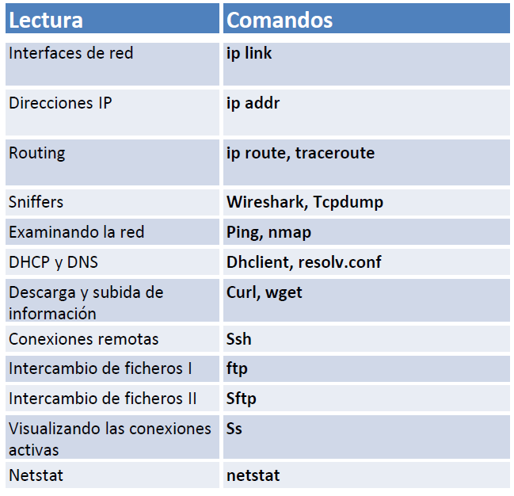

| **Inicio**         | **atrás 7**                      | **Siguiente 9**                                         |
| ------------------ | -------------------------------- | ------------------------------------------------------- |
| [🏠](../README.md) | [⏪](./1_7_Procesos_en_Linux.md) | [⏩](./1_9_Gestion_de_paquetes_y_librerias_en_Linux.md) |

---

## **Índice**

| Temario                                                                                                         |
| --------------------------------------------------------------------------------------------------------------- |
| [68. Interfaces de red](#68-interfaces-de-red)                                                                  |
| [69. Direcciones IP](#69-direcciones-ip)                                                                        |
| [70. Dirección de broadcast](#70-dirección-de-broadcast)                                                        |
| [71. Routing](#71-routing)                                                                                      |
| [72. Sniffers: Wireshark y Tcpdump](#72-sniffers-wireshark-y-tcpdump)                                           |
| [73. Examinando la red: Ping y Nmap](#73-examinando-la-red-ping-y-nmap)                                         |
| [74. DHCP y DNS](#74-dhcp-y-dns)                                                                                |
| [75. Descarga y subida de información: Curl y Wget](#75-descarga-y-subida-de-información-curl-y-wget)           |
| [76. Conexiones remotas: SSH](#76-conexiones-remotas-ssh)                                                       |
| [77. Intercambio de ficheros I: FTP](#77-intercambio-de-ficheros-i-ftp)                                         |
| [78. Intercambio de ficheros II: SFTP](#78-intercambio-de-ficheros-ii-sftp)                                     |
| [79. Visualizando las conexiones activas: SS](#79-visualizando-las-conexiones-activas-ss)                       |
| [80. Netstat](#80-netstat)                                                                                      |
| [81. Caso práctico: Despliegue de Linux en la nube (AWS)](#81-caso-práctico-despliegue-de-linux-en-la-nube-aws) |
| [82. Extra: Creando una cuenta segura en AWS](#82-extra-creando-una-cuenta-segura-en-aws)                       |

---

# **Networking en Linux**



## **68. Interfaces de red**

### 🔌 ¿Qué son las Interfaces de Red?

Una **interfaz de red** es como la **puerta de entrada o salida de tu computadora** para conectarse con otras computadoras. Puede ser física (como el puerto de red Ethernet o la tarjeta Wi-Fi) o virtual (como `lo` o `localhost`).

#### 📌 Ejemplos comunes:

- **eth0** o **ens33**: son interfaces de red **Ethernet** (por cable).
- **wlan0**: es una interfaz **Wi-Fi**.
- **lo**: es la interfaz de **loopback** o `localhost`, que se usa para que tu PC se comunique **consigo misma**.

---

### 🧠 ¿Para qué sirven?

Las interfaces permiten que:

- Te conectes a Internet.
- Te conectes a redes locales (LAN).
- Te comuniques con otros dispositivos.
- Tu PC se comunique internamente con servicios (como usando `localhost`).

---

### 💻 Explicación de tus comandos y su uso

#### 1. `ip`

Este comando se usa para **ver y configurar** cosas de red (interfaces, IPs, rutas, etc).

---

#### 2. `ip link help`

Te muestra una **ayuda rápida** sobre cómo usar `ip link`, que sirve para ver o modificar **interfaces de red**.

---

#### 3. `ip l` (es un atajo de `ip link`)

Muestra un **resumen de todas las interfaces de red**.

📌 Ejemplo de salida:

```bash
1: lo: <LOOPBACK,UP,LOWER_UP> mtu 65536 ...
2: ens33: <BROADCAST,MULTICAST,UP,LOWER_UP> mtu 1500 ...
```

---

#### 4. `localhost`

Este comando **no hace nada por sí solo**. `localhost` es solo un **alias** de la IP `127.0.0.1`, usada para acceder a servicios locales.

✅ Correcto sería:

```bash
ping localhost
```

---

#### 5. `ip l show dev ens33`

Muestra **detalles específicos de la interfaz `ens33`**, como su estado (UP o DOWN), dirección MAC, MTU, etc.

---

#### 6. `ip -s link`

Muestra **estadísticas de tráfico** en las interfaces (paquetes enviados, errores, etc).

📌 Te ayuda a diagnosticar si una interfaz está recibiendo o perdiendo paquetes.

---

#### 7. `ping localhost`

Envía paquetes a `127.0.0.1`. Sirve para **probar si la red local funciona** correctamente.

✅ Si ves esto:

```
64 bytes from localhost: icmp_seq=1 ttl=64 time=0.026 ms
```

Entonces todo está bien con el loopback.

---

#### 8. `ip link show up`

✅ Muestra solo las interfaces que están **activas** (`UP`).

---

#### 9. `sudo ip l set ens33 down`

Apaga la interfaz `ens33`. Es como **desconectarla del cable**.

🚫 Luego de esto, **ya no tendrás conexión** hasta que la actives otra vez con:

```bash
sudo ip link set ens33 up
```

---

### 🛠 Posibles soluciones a problemas comunes

| Problema                      | Posible comando o solución                                  |
| ----------------------------- | ----------------------------------------------------------- |
| No tengo Internet             | `ip a` → revisa si tienes IP asignada                       |
| Interface aparece como "DOWN" | `sudo ip link set ens33 up`                                 |
| Interface desapareció         | `sudo lshw -C network` o `lspci` para verificar el hardware |
| No puedo hacer ping a otros   | `ping 8.8.8.8` → prueba si tienes salida a Internet         |
| DNS no responde               | `ping google.com` y revisa `/etc/resolv.conf`               |

---

[🔼](#índice)

---

## **69. Direcciones IP**

### 🌐 ¿Qué es una Dirección IP?

Una **dirección IP** (Internet Protocol) es como el **DNI de un dispositivo en una red**. Sirve para **identificar** y **ubicar** tu computadora (o celular, impresora, router, etc.) en una red local o en Internet.

---

### 🧠 ¿Para qué se utilizan?

Se usan para:

- Enviar y recibir datos entre dispositivos.
- Identificar tu equipo en una red.
- Permitir conexiones con sitios web, servidores, y otros equipos.

---

### 📌 Tipos de direcciones IP

| Tipo     | Ejemplo                    | Explicación fácil                   |
| -------- | -------------------------- | ----------------------------------- |
| **IPv4** | `192.168.0.100`            | El más usado. 4 bloques de números. |
| **IPv6** | `fe80::1ff:fe23:4567:890a` | Más largo, pensado para el futuro.  |

---

### 🏠 Ejemplos cotidianos

- **Tu PC en casa**: tiene una IP como `192.168.1.10`
- **Tu router**: puede tener `192.168.1.1`
- **Una página web**: como Google.com tiene su propia IP pública (por ejemplo, `142.250.190.78`)
- **`127.0.0.1`** o `localhost`: es tu propia computadora hablándose a sí misma.

---

### 🧪 Explicación de tus comandos

#### 1. `ip addr` o `ip a`

Muestra **todas las direcciones IP** asignadas a las interfaces de red.

📌 Ejemplo de salida:

```bash
2: ens33: <...> ...
    inet 192.168.1.10/24 ...
```

Eso significa que la interfaz `ens33` tiene la IP `192.168.1.10`.

---

#### 2. `ip -6 a`

Muestra solo las direcciones **IPv6**.

📌 Ejemplo:

```
inet6 fe80::a00:27ff:fe4e:66a1/64 scope link
```

---

#### 3. `sudo ip a add 192.168.239.188/24 dev ens33`

🔧 **¿Qué hace?**
Le asigna **manualmente** una dirección IP (`192.168.239.188`) a la interfaz `ens33`.

🧠 `/24` significa que la **máscara de red** es `255.255.255.0`.

---

#### 4. `sudo ip a del 192.168.239.188/24 dev ens33`

🔧 **¿Qué hace?**
Quita la IP que habías asignado manualmente a la interfaz `ens33`.

---

### 🛠 Posibles problemas y soluciones

| Problema                             | Solución                                                     |
| ------------------------------------ | ------------------------------------------------------------ |
| No tienes una IP asignada            | Usa `sudo dhclient ens33` o reinicia el adaptador            |
| IP mal configurada (fuera del rango) | Usa `sudo ip a del ...` y luego `ip a add ...` correctamente |
| Conectado pero sin Internet          | Verifica puerta de enlace y DNS (`/etc/resolv.conf`)         |
| IP duplicada en la red               | Cambia manualmente la IP o usa DHCP automáticamente          |

---

### ✅ Extra: Ver tu IP pública

Tu IP local es como `192.168.x.x`, pero tu IP pública es la que ve Internet.

Para verla:

```bash
curl ifconfig.me
```

---

[🔼](#índice)

---

## **70. Dirección de broadcast**

### 📢 ¿Qué es una Dirección de Broadcast?

Una **dirección de broadcast** es una dirección especial que permite enviar un mensaje a **todos los dispositivos de una red local** (LAN) **al mismo tiempo**.

🔍 Piensa en ella como un **megáfono**: en lugar de hablar con un solo dispositivo, hablas con **todos los que están escuchando**.

---

### 🧠 ¿Para qué se utiliza?

- Para **descubrir dispositivos** en la red.
- Para **enviar mensajes de red** a todos los equipos (como ARP, DHCP, etc.).
- Para pruebas de conectividad o tareas de red como Wake-on-LAN.

---

### 📌 Ejemplo fácil

Supón que estás en la red `192.168.1.0/24` (o sea, con máscara `255.255.255.0`).

- Dirección de red: `192.168.1.0`
- Rango de IPs válidas: `192.168.1.1` a `192.168.1.254`
- **Dirección de broadcast**: `192.168.1.255`

👉 Si haces un ping o envías un mensaje a `192.168.1.255`, **todos los dispositivos conectados a la red recibirán ese mensaje**.

---

### 💻 Comandos útiles

#### 🔎 1. Ver la dirección de broadcast

```bash
ip a
```

Busca una línea como esta:

```bash
inet 192.168.1.10/24 brd 192.168.1.255 ...
```

`brd` indica la dirección de **broadcast** asociada a tu IP.

---

#### 📣 2. Hacer ping al broadcast (para ver quién responde)

```bash
ping -b 192.168.1.255
```

**Nota:** Puede que debas activar permisos en tu red o sistema para que funcione correctamente.

---

#### ⚙️ 3. Asignar manualmente una dirección con broadcast

```bash
sudo ip addr add 192.168.1.10/24 brd 192.168.1.255 dev ens33
```

Esto asigna una IP a la interfaz `ens33` con su dirección de broadcast específica.

---

### ⚠️ Posibles errores y soluciones

| Problema                                        | Causa y solución                                                                  |
| ----------------------------------------------- | --------------------------------------------------------------------------------- |
| `ping -b` no funciona                           | Tu sistema puede bloquear pings broadcast. Usa `sudo` o revisa reglas de firewall |
| No ves la dirección de broadcast en `ip a`      | Usa la opción completa: `ip -br a` o `ip addr show dev ens33`                     |
| Red con máscara distinta (por ejemplo /16)      | Calcula la nueva dirección de broadcast. Ej: `192.168.0.0/16` → `192.168.255.255` |
| Asignas IP sin poner `brd` y ves una incorrecta | El sistema la calcula automáticamente. Usa `brd` explícitamente si la necesitas   |

---

### 🧠 Resumen rápido

| Concepto            | Explicación fácil                                    |
| ------------------- | ---------------------------------------------------- |
| Dirección de red    | Es el inicio de tu red, ej. `192.168.1.0`            |
| Dirección IP        | Identifica tu dispositivo, ej. `192.168.1.10`        |
| Dirección broadcast | Manda datos a todos los equipos, ej. `192.168.1.255` |

---

[🔼](#índice)

---

## **71. Routing**

### 🛣️ ¿Qué es el Routing?

**Routing** o **enrutamiento** es el proceso de decidir **por dónde enviar los datos** que salen de tu computadora para llegar a otra red (como Internet o una red remota).

> 📦 Imagina que tu PC es una casa y quieres enviar una carta: el **router** es la oficina de correos que decide por qué camino va tu paquete.

---

### 🧠 ¿Para qué se utiliza?

- Para que tu PC **sepa hacia dónde enviar los paquetes de red**.
- Para poder comunicarte con dispositivos **fuera de tu red local** (como acceder a Google).
- Para definir **rutas personalizadas** (por ejemplo, para una red corporativa o VPN).

---

### 📌 Ejemplo simple

Supón que estás en la red:

- Tu IP: `192.168.239.188`
- Tu puerta de enlace (gateway): `192.168.239.3`
- Tu red: `192.168.239.0/24`

Para acceder a Google, tu PC necesita saber que todo lo que no sea `192.168.239.x` debe **salir por el gateway**. Esa instrucción se configura con una **ruta por defecto**.

---

### 🖥️ Comandos que usaste y su explicación

---

#### 1. `ip route` o `ip r`

🔍 **¿Qué hace?**
Muestra la **tabla de enrutamiento**: cómo y por dónde tu computadora envía los datos.

📌 Ejemplo de salida:

```bash
default via 192.168.239.3 dev ens33
192.168.239.0/24 dev ens33 proto kernel scope link src 192.168.239.188
```

Significa:

- Todo lo que no sea `192.168.239.x` se envía a `192.168.239.3` (el router).
- Para la red `192.168.239.0/24`, los datos se quedan en la red local.

---

#### 2. `sudo apt install traceroute`

Instala el comando `traceroute`, que te ayuda a **ver el camino (rutas) que sigue un paquete** hasta llegar a un destino.

---

#### 3. `sudo traceroute -T www.google.es`

🔍 Muestra todos los **saltos intermedios** (routers) que recorre el paquete hasta llegar a Google, usando TCP (`-T`).

📌 Ejemplo:

```
 1  192.168.239.3
 2  190.41.x.x (tu proveedor)
 3  ...
...
```

---

#### 4. `sudo traceroute -T 192.168.239.2`

Hace lo mismo, pero a una IP dentro de tu red local.

---

#### 5. `sudo ip route add default via 192.168.239.3`

Esto agrega una ruta por defecto: todos los datos que **no tienen una ruta específica** salen por `192.168.239.3`.

---

#### 6. `sudo ip r add default via 192.168.239.3 dev ens33`

Lo mismo que arriba, pero especificando la interfaz (`ens33`). Esto es más **preciso** y recomendable.

---

#### 7. `sudo ip route del default via 192.168.239.3`

Esto **elimina la ruta por defecto**, y si no tienes otra, **tu PC ya no podrá salir a Internet**.

---

### ⚠️ Posibles problemas y soluciones

| Problema                             | Solución                                                      |
| ------------------------------------ | ------------------------------------------------------------- |
| Error en `defoult`                   | Escribe bien: `default`                                       |
| No puedes acceder a Internet         | Verifica que la ruta por defecto esté presente con `ip r`     |
| Red local funciona pero no Internet  | Agrega la ruta por defecto: `sudo ip route add default ...`   |
| El traceroute no llega a su destino  | Puede ser bloqueado por firewall o router intermedio          |
| Se agregaron muchas rutas duplicadas | Usa `sudo ip route flush table main` para limpiar y reiniciar |

---

### 🧠 Resumen

| Concepto             | Explicación fácil                                  |
| -------------------- | -------------------------------------------------- |
| **Routing**          | Decidir por dónde salen los paquetes de red        |
| **Ruta por defecto** | Lo que se usa para salir a Internet                |
| **Traceroute**       | Ver el camino de los paquetes hacia su destino     |
| **Gateway**          | El router de tu red que te conecta con otras redes |

---

[🔼](#índice)

---

## **72. Sniffers: Wireshark y Tcpdump**

### 🕵️‍♂️ ¿Qué es un Sniffer?

Un **sniffer** es una herramienta que **captura y analiza el tráfico de red** que pasa por una interfaz de red (como Wi-Fi o Ethernet).

Es como si pusieras un **micrófono en la red** para escuchar todo lo que se dice entre los dispositivos.

---

### 🧠 ¿Para qué se utiliza?

- Diagnóstico de problemas de red.
- Ver si los paquetes llegan a su destino.
- Detectar ataques o actividades sospechosas.
- Analizar protocolos como HTTP, DNS, TCP, etc.
- Aprender cómo funciona el tráfico en una red.

---

### 🛠️ Herramientas principales

#### 1. **Tcpdump** (modo consola, rápido y ligero)

#### 2. **Wireshark** (interfaz gráfica, muy detallada)

---

### 📦 Comandos que usaste y explicación

---

#### 🔎 `tcpdump -h`

Muestra la **ayuda** de `tcpdump`, donde puedes ver todas las opciones disponibles.

---

#### 🖥️ `sudo tcpdump -i ens33`

📌 Captura **todo el tráfico** que pase por la interfaz `ens33` en tiempo real.

💡 Ejemplo de salida:

```
IP 192.168.239.188.53444 > 192.168.239.1.53: 12345+ A? google.com. (29)
```

Eso significa que tu PC pidió resolver `google.com` por DNS.

---

#### ℹ️ `sudo tcpdump -V -i ens33`

Muestra el tráfico con información más detallada, incluyendo:

- Timestamps (fecha y hora exacta)
- Protocolo
- Dirección IP y puertos
- Flags de TCP

---

#### 🧪 `sudo apt install wireshark`

Instala **Wireshark**, el sniffer con interfaz gráfica más popular.

🧠 Durante la instalación te puede preguntar si quieres permitir que usuarios no root puedan capturar paquetes.

---

#### 🖥️ `sudo wireshark`

Abre Wireshark como administrador para **empezar a capturar y analizar paquetes** desde una interfaz (como `ens33`, `lo`, etc).

---

### 📚 Ejemplo práctico fácil de entender

Supón que abres Google en tu navegador:

1. Usas `tcpdump` o `Wireshark` para capturar paquetes.
2. Verás:

   - Una petición DNS preguntando por `google.com`.
   - Una conexión TCP con el servidor de Google.
   - Paquetes HTTP(S) enviando y recibiendo datos.

🧠 Puedes ver direcciones IP, puertos, tipo de protocolo, etc.

---

### ⚠️ Posibles problemas y soluciones

| Problema                                 | Causa y solución                                                   |
| ---------------------------------------- | ------------------------------------------------------------------ |
| `tcpdump` no muestra nada                | La interfaz puede estar mal escrita (`ifconfig` o `ip a` para ver) |
| No puedes ver tráfico HTTPS              | Está encriptado. Solo ves cabeceras TCP, no el contenido real.     |
| Wireshark no abre o da error de permisos | Usa `sudo wireshark`, o agrega tu usuario al grupo `wireshark`     |
| Wireshark no detecta interfaz            | Revisa con `ip a` si tienes permisos sobre la interfaz             |
| Captura demasiado tráfico                | Usa filtros (ej: `tcp port 80`, `host 192.168.1.1`)                |

---

### 🧪 Filtros útiles en `tcpdump` o Wireshark

| Filtro              | ¿Qué hace?                  |
| ------------------- | --------------------------- |
| `host 192.168.1.10` | Solo tráfico de/para esa IP |
| `port 80`           | Solo tráfico HTTP           |
| `tcp`               | Solo paquetes TCP           |
| `udp`               | Solo paquetes UDP           |
| `icmp`              | Solo pings                  |
| `tcp port 443`      | Solo tráfico HTTPS          |

---

### 🎯 Resumen rápido

| Herramienta | ¿Qué hace?                              | Ideal para...                    |
| ----------- | --------------------------------------- | -------------------------------- |
| `tcpdump`   | Captura en consola, rápido y liviano    | Admins y scripts rápidos         |
| `Wireshark` | Captura con interfaz gráfica y análisis | Visualizar y estudiar protocolos |

---

[🔼](#índice)

---

## **73. Examinando la red: Ping y Nmap**

### 🕸️ ¿Qué es examinar la red?

Es el proceso de **ver qué dispositivos están conectados**, si están accesibles, qué servicios ofrecen y cómo responden.

---

### 1️⃣ **Ping**

#### 🧠 ¿Qué es `ping`?

Es una herramienta para **probar si otro dispositivo está encendido y accesible** por red. Envía un "eco" y espera una respuesta.

> 🗣️ Como si dijeras: “¿Estás ahí?” y esperas que el otro responda: “¡Sí!”.

---

#### 📌 ¿Para qué se usa?

- Verificar si un dispositivo responde en la red.
- Medir la velocidad de respuesta (latencia).
- Diagnosticar pérdida de paquetes.

---

#### ✅ Ejemplos de tus comandos:

##### 🔹 `ping 192.168.239.180`

Envía paquetes a esa IP hasta que lo detengas con `Ctrl + C`.

##### 🔹 `ping 192.168.239.2`

Lo mismo, útil para saber si esa máquina está **activa** o no.

##### 🔹 `ping -c 5 192.168.239.2`

Solo envía **5 paquetes** y se detiene automáticamente.

📌 Resultado típico:

```
64 bytes from 192.168.239.2: icmp_seq=1 ttl=64 time=1.21 ms
```

---

#### ⚠️ Posibles errores y soluciones:

| Problema                       | Solución                                                |
| ------------------------------ | ------------------------------------------------------- |
| `Destination Host Unreachable` | La IP no está conectada o no hay ruta. Verifica la red. |
| `Request timed out`            | El dispositivo podría estar apagado o bloquear `ping`.  |
| Responde lento o se pierde     | Puede haber problemas de red o congestión               |

---

### 2️⃣ **Nmap**

#### 🧠 ¿Qué es `nmap`?

Es una herramienta para **explorar redes**, ver qué dispositivos están conectados y qué **puertos o servicios** tienen abiertos.

> 🧪 Es como hacer un **escaneo de seguridad o mapeo** de la red.

---

#### 📌 ¿Para qué se usa?

- Ver qué dispositivos hay en una red (`escaneo de red`).
- Ver puertos abiertos y servicios (`escaneo de puertos`).
- Detección de sistema operativo y versiones.
- Pruebas básicas de seguridad.

---

#### ✅ Ejemplos de tus comandos:

##### 🔹 `sudo apt install nmap`

Instala `nmap` en tu sistema.

---

##### 🔹 `sudo nmap -sS 192.168.239.0/24`

🔍 **Escaneo SYN** (modo rápido y sigiloso) de toda la subred `192.168.239.0/24`, es decir, desde `192.168.239.1` hasta `192.168.239.254`.

📌 Resultado típico:

```
Nmap scan report for 192.168.239.2
Host is up (0.0010s latency).
PORT     STATE SERVICE
22/tcp   open  ssh
80/tcp   open  http
```

Eso significa que la máquina `192.168.239.2` está activa y tiene **puertos abiertos** como:

- `22`: SSH (acceso remoto)
- `80`: HTTP (página web)

---

#### ⚠️ Posibles problemas y soluciones

| Problema                              | Causa/Solución                                                              |
| ------------------------------------- | --------------------------------------------------------------------------- |
| Muy lento                             | Agrega `-T4` para hacerlo más rápido: `nmap -sS -T4 192.168.239.0/24`       |
| Host no detectado pero está encendido | Puede estar detrás de firewall. Prueba con `-Pn` para forzar escaneo        |
| Te bloquea el sistema de seguridad    | Algunos firewalls detectan escaneos. Usa nmap solo en redes que administres |
| No encuentra nada                     | Verifica que tu IP esté en la misma red (usa `ip a`)                        |

---

### 🎯 Resumen rápido

| Herramienta | ¿Qué hace?                              | Ejemplo útil              |
| ----------- | --------------------------------------- | ------------------------- |
| `ping`      | Verifica si una IP responde (está viva) | `ping 192.168.1.1`        |
| `nmap`      | Escanea dispositivos y puertos abiertos | `nmap -sS 192.168.1.0/24` |

---

### 🧪 Extra: Escaneos Nmap útiles

| Comando                       | Qué hace                                       |
| ----------------------------- | ---------------------------------------------- |
| `nmap -sP 192.168.1.0/24`     | Ver qué dispositivos están activos (ping scan) |
| `nmap -p 80,443 192.168.1.10` | Escanea solo los puertos 80 y 443              |
| `nmap -sV 192.168.1.10`       | Detecta versiones de los servicios             |
| `nmap -O 192.168.1.10`        | Intenta detectar el sistema operativo          |

---

[🔼](#índice)

---

## **74. DHCP y DNS**

### 🌐 ¿Qué es **DHCP**?

#### 🧠 Significado:

**DHCP** = _Dynamic Host Configuration Protocol_

#### 📌 ¿Qué hace?

Es un servicio que **asigna automáticamente**:

- Una dirección IP
- La puerta de enlace (gateway)
- La máscara de red
- El servidor DNS

> 🧠 En otras palabras: es como que el **router actúe como recepcionista**, y cuando tu PC llega a la red, le entrega una IP y todos los datos necesarios para funcionar.

---

#### ✅ Ejemplo fácil:

Cuando conectas tu laptop al Wi-Fi, no escribes la IP a mano. El router te la da automáticamente gracias a DHCP.

---

#### 🧪 Comandos que usaste:

---

#### 🔹 `man dhclient`

Abre el **manual de `dhclient`**, que es el programa usado para pedir una IP por DHCP en Linux.

---

#### 🔹 `sudo dhclient`

Fuerza a tu computadora a **pedir una IP nueva** al servidor DHCP (normalmente tu router).

📌 Se usa cuando:

- No tienes IP
- Cambió tu red
- El DHCP no se ejecutó automáticamente

---

#### ⚠️ Posibles errores con DHCP:

| Problema                      | Solución                                           |
| ----------------------------- | -------------------------------------------------- |
| No tienes IP (ver con `ip a`) | Ejecuta `sudo dhclient`                            |
| Red no asigna IP              | Reinicia el router, o verifica conexión física     |
| Interface incorrecta          | Usa `sudo dhclient ens33` (especifica tu interfaz) |

---

### 🌐 ¿Qué es **DNS**?

#### 🧠 Significado:

**DNS** = _Domain Name System_

#### 📌 ¿Qué hace?

Traduce los **nombres de dominio** (como `google.com`) a direcciones IP (como `142.250.190.78`).

> 🧠 Es como una **agenda telefónica de Internet**: tú escribes un nombre y el DNS busca su número (IP).

---

#### ✅ Ejemplo fácil:

Cuando escribes `youtube.com`, el sistema DNS lo convierte a una IP para que tu PC sepa a dónde conectarse.

---

#### 🧪 Comandos que usaste:

---

#### 🔹 `dig`

Es una herramienta para hacer **consultas DNS manuales**.

📌 Ejemplo:

```bash
dig google.com
```

Te mostrará la IP pública de Google, servidores DNS usados, tiempo de respuesta, etc.

---

#### 🔹 `sudo pico /etc/resolv.conf`

O también:

```bash
sudo nano /etc/resolv.conf
```

Este archivo contiene los **servidores DNS** que tu PC usará.

📌 Ejemplo de contenido:

```
nameserver 8.8.8.8
nameserver 1.1.1.1
```

---

#### 🔹 `sudo reboot`

Reinicia el sistema. Puede usarse cuando haces cambios importantes en red, aunque **no siempre es necesario**.

---

### ⚠️ Posibles errores con DNS:

| Problema                                 | Solución                                                          |
| ---------------------------------------- | ----------------------------------------------------------------- |
| Puedes hacer ping a IP pero no a dominio | Problema DNS. Verifica `/etc/resolv.conf` o usa `dig` para probar |
| Servidor DNS muy lento o bloqueado       | Usa DNS públicos como `8.8.8.8` (Google) o `1.1.1.1` (Cloudflare) |
| DNS borrado al reiniciar                 | Edita archivo de configuración permanente o usa `resolvconf`      |

---

### 🎯 Resumen rápido

| Servicio | ¿Qué hace?                | Herramienta / comando     |
| -------- | ------------------------- | ------------------------- |
| **DHCP** | Asigna IP automáticamente | `dhclient`, `ip a`        |
| **DNS**  | Traduce nombres a IP      | `dig`, `/etc/resolv.conf` |

---

[🔼](#índice)

---

## **75. Descarga y subida de información: Curl y Wget**

### 📥 ¿Qué son Curl y Wget?

#### 🧠 Ambos son programas para:

- Descargar archivos desde Internet.
- Hacer solicitudes a páginas web (como un navegador, pero sin interfaz).
- Subir datos o conectarse a APIs.
- Trabajar con proxys, autenticación, etc.

---

### 🧪 Diferencias principales:

| Herramienta | Ventaja principal                      | Ideal para...                           |
| ----------- | -------------------------------------- | --------------------------------------- |
| `curl`      | Versátil: descarga, envío, APIs REST   | APIs, subir archivos, conexión avanzada |
| `wget`      | Ideal para descargar archivos o sitios | Descargas grandes, sitios enteros       |

---

### 🧩 Explicación de tus comandos (caso por caso)

---

#### 🔹 `sudo apt install curl`

Instala **curl**, si no estaba instalado.

---

#### 🔹 `curl https://www.winrar.es/descargas > winrar.html`

Descarga el contenido HTML de la página y lo **guarda en un archivo** usando redirección de Bash (`>`).

📌 Luego lo abriste con:

```bash
firefox winrar.html
```

Y viste cómo se vería la página en el navegador.

---

#### 🔹 `curl https://pagina.recursos{1..4}.txt`

❌ Esto no funciona directamente así. Si quieres descargar varios archivos numerados, debes usar comillas simples para que Bash expanda:

```bash
curl 'https://pagina.recursos{1..4}.txt'
```

O mejor:

```bash
for i in {1..4}; do curl -O "https://pagina.recursos$i.txt"; done
```

---

#### 🔹 `curl -O https://d.winrar.es/d/rarlinux-x64-611.tar.gz`

✅ Descarga el archivo y lo guarda con el **mismo nombre original** del servidor.

---

#### 🔹 `curl -o winrar2.html https://www.winrar.es/descargas`

✅ Igual que antes, pero el contenido se guarda como **`winrar2.html`** (nombre personalizado).

---

#### 🔹 `curl -x proxy_name:port url`

📡 Usa un **proxy** para hacer la conexión.

📌 Ejemplo real:

```bash
curl -x 192.168.1.100:8080 http://example.com
```

---

#### 🔹 `curl -u user:contrasena -x proxy_name:port url`

🔐 Igual que arriba, pero con **autenticación** al proxy.

📌 Ejemplo:

```bash
curl -u miusuario:miclave -x 192.168.1.100:8080 http://example.com
```

---

#### 🔹 `wget -b https://www.ejemplo.com/archivo.zip`

**Descarga en segundo plano** (modo background), pero de nuevo falta la URL.

#### 🔹 `tail wget_log`

Muestra las **últimas líneas del archivo `wget_log`**, que se genera cuando usas `wget -b`.

---

#### 🔹 `wget -i fichero.txt -o nombre`

✅ Usa una **lista de URLs** en un archivo `fichero.txt` para descargar muchas cosas.

- `-i`: lee URLs desde el archivo.
- `-o`: guarda el log en `nombre`.

📌 Ejemplo:

```bash
wget -i urls.txt -o mi_log.txt
```

---

#### 🔹 `wget -o log.txt https://www.ejemplo.com/archivo.pdf`

### ⚠️ Problemas comunes y soluciones

| Problema                            | Solución                                                |
| ----------------------------------- | ------------------------------------------------------- |
| Curl o Wget no están instalados     | Usa: `sudo apt install curl wget`                       |
| Error 403 o 404                     | Verifica la URL, puede estar mal o bloqueada            |
| Descarga incompleta                 | Reintenta con `wget -c` para continuar                  |
| Proxy no funciona                   | Verifica IP/puerto y permisos                           |
| No reconoce múltiples URLs `{1..4}` | Usa Bash o script `for`, o escribe las URLs manualmente |

---

### 🎯 Resumen rápido

| Comando               | ¿Qué hace?                               |
| --------------------- | ---------------------------------------- |
| `curl URL`            | Muestra contenido en terminal            |
| `curl -O URL`         | Guarda archivo con su nombre original    |
| `curl -o nombre URL`  | Guarda con nombre personalizado          |
| `curl -x proxy`       | Usa proxy para la conexión               |
| `wget URL`            | Descarga archivo                         |
| `wget -b URL`         | Descarga en segundo plano                |
| `wget -i archivo.txt` | Descarga múltiples URLs desde un archivo |

---

[🔼](#índice)

---

## **76. Conexiones remotas: SSH**

### 🔐 ¿Qué es **SSH**?

#### 🧠 SSH = **Secure Shell**

SSH es un **protocolo de red seguro** que permite conectarte a otra computadora de forma **remota y cifrada** por línea de comandos.

> 🧳 Imagina que tu PC es como un "control remoto", y con SSH puedes manejar otra computadora que está lejos, como si estuvieras frente a ella.

---

### 🧠 ¿Para qué se utiliza?

- Acceder a servidores o computadoras remotas.
- Administrar sistemas Linux desde otra máquina.
- Transferir archivos de forma segura (usando `scp` o `sftp`).
- Automatizar tareas o despliegues desde tu PC local.

---

### 🧪 Explicación de tus comandos

---

#### 🔹 `ping 192.168.239.169`

Verifica si la computadora remota (`.169`) **está encendida y conectada**.

✅ Si responde, entonces puedes intentar conectarte con SSH.

---

#### 🔹 `ssh`

Este comando solo, sin argumentos, muestra la ayuda de `ssh`.

---

#### 🔹 `sudo apt install openssh-server`

✅ Instala el **servidor SSH** en tu máquina. Necesario si **tú quieres aceptar conexiones SSH** (ser "servidor").

📌 Si tú solo quieres conectarte a otros equipos (ser "cliente"), no es necesario instalar esto.

---

#### 🔹 `sudo service ssh`

Este comando está incompleto. Faltó indicar la acción (`start`, `status`, etc.).

✅ Ejemplo correcto:

```bash
sudo service ssh start    # Inicia el servicio SSH
sudo service ssh status   # Muestra si está activo
```

---

#### 🔹 `ssh 192.168.239.169`

Se conecta al host `.169` con el **usuario actual** (en tu caso, `puma`).

---

#### 🔹 `ssh puma@192.168.239.169`

✅ Especificas explícitamente el usuario `puma` al conectarte a la IP.

📌 Si la conexión es exitosa, tendrás una terminal en la otra máquina.

---

### ✅ Ejemplo fácil

Supongamos:

- Tu PC (cliente): IP `192.168.239.188`
- El servidor (al que te quieres conectar): IP `192.168.239.169`
- Usuario remoto: `puma`

👉 Solo escribe:

```bash
ssh puma@192.168.239.169
```

Y tendrás acceso remoto (si el servidor SSH está encendido y permitido).

---

### ⚠️ Problemas comunes y soluciones

| Problema                                          | Causa / Solución                                                     |
| ------------------------------------------------- | -------------------------------------------------------------------- |
| `Connection refused`                              | El servidor no tiene SSH activo. Ejecuta: `sudo service ssh start`   |
| `Connection timed out`                            | No hay conexión de red. Verifica con `ping`                          |
| `Permission denied (publickey,password,keyboard)` | Usuario o clave incorrectos, o no permitido en `sshd_config`         |
| `Host key verification failed`                    | El servidor cambió de clave. Elimina entrada de `~/.ssh/known_hosts` |
| SSH muy lento al conectar                         | Agrega `UseDNS no` al archivo `/etc/ssh/sshd_config`                 |

---

### 🧠 ¿Cómo saber si el servidor SSH está escuchando?

En la máquina que hace de servidor, ejecuta:

```bash
sudo netstat -tulnp | grep ssh
```

O con `ss`:

```bash
sudo ss -tnlp | grep ssh
```

Debería aparecer algo como:

```
LISTEN 0 128 0.0.0.0:22 ...
```

Eso indica que el servidor SSH está **escuchando en el puerto 22**.

---

### 🧪 Extra: copiar archivos por SSH

Si quieres copiar un archivo desde tu PC a otra por SSH:

```bash
scp archivo.txt puma@192.168.239.169:/home/puma/
```

---

### 🎯 Resumen rápido

| Comando                           | ¿Qué hace?                                    |
| --------------------------------- | --------------------------------------------- |
| `ssh usuario@IP`                  | Se conecta a otra máquina por terminal segura |
| `sudo apt install openssh-server` | Instala el servidor SSH en tu máquina         |
| `sudo service ssh start/status`   | Inicia o verifica el servicio SSH             |
| `scp archivo usuario@IP:/ruta`    | Copia archivos de forma segura por SSH        |

---

[🔼](#índice)

---

## **77. Intercambio de ficheros I: FTP**

### 📂 ¿Qué es FTP?

**FTP (File Transfer Protocol)** es un protocolo de red que permite **subir y descargar archivos** entre un cliente y un servidor.

> 🧠 Es como entrar a una “carpeta compartida” de otra computadora desde la terminal.

---

### 🎯 ¿Para qué se usa FTP?

- Subir archivos desde tu PC a un servidor.
- Descargar archivos del servidor a tu PC.
- Administrar archivos en servidores antiguos o de páginas web.
- En redes locales para compartir archivos rápidamente.

---

### 🧪 Explicación de tus comandos

---

#### 🔹 `sudo apt install vsftpd`

Instala **`vsftpd`**, que es un servidor FTP seguro y liviano.

🧠 Esto se usa si **tu PC será el servidor FTP**, es decir, otros se conectarán a ella.

---

#### 🔹 `sudo service vsftpd status`

Muestra si el servicio `vsftpd` está **activo**, **detenido** o ha tenido errores.

---

#### 🔹 `sudo service vsftpd restart`

Reinicia el servidor FTP. Útil si hiciste cambios en la configuración o no responde.

---

#### 🔹 `ftp 192.168.239.169`

Intenta conectarte al **servidor FTP con IP `.169`**. Te pedirá:

- Usuario
- Contraseña

✅ Si el servidor acepta la conexión, entrarás en el modo interactivo `ftp>`.

---

#### 🔹 `ftp> get fichero1.txt`

📥 Descarga el archivo `fichero1.txt` desde el servidor a tu PC local.

---

#### 🔹 `ftp> put fichero3.txt`

📤 Sube el archivo `fichero3.txt` desde tu PC al servidor FTP.

---

### ✅ Ejemplo completo fácil

Supón que:

- Tienes dos PCs en red: la tuya y otra con IP `192.168.239.169`.
- Ya instalaste `vsftpd` en la PC con `.169`.
- Desde tu máquina cliente, haces:

```bash
ftp 192.168.239.169
```

Luego dentro del prompt `ftp>`:

```bash
get informe.txt        # descarga del servidor
put reporte.pdf        # subida al servidor
bye                    # salir del modo FTP
```

---

### ⚠️ Posibles errores y soluciones

| Problema                         | Causa y solución                                                           |
| -------------------------------- | -------------------------------------------------------------------------- |
| `Connection refused`             | El servidor `vsftpd` no está activo. Solución: `sudo service vsftpd start` |
| Usuario o contraseña incorrectos | Verifica el usuario del sistema en el servidor FTP                         |
| No puedes subir archivos (`put`) | El usuario no tiene permisos de escritura en el servidor                   |
| No puedes ver archivos           | El FTP está restringido a ciertos directorios (ajustar `/etc/vsftpd.conf`) |
| Modo pasivo/activo bloqueado     | Verifica firewall o habilita `pasv_enable=YES` en config                   |
| `ftp` no instalado               | Instala con `sudo apt install ftp`                                         |

---

### 📁 Archivos de configuración importantes

- `/etc/vsftpd.conf`: archivo principal de configuración.
- Puedes ajustar ahí:

  - Directorio raíz del FTP.
  - Permitir escribir (`write_enable=YES`).
  - Habilitar modo pasivo.
  - Permitir usuarios anónimos o no.

---

### 📌 FTP vs otras opciones modernas

| Protocolo | Encriptado | ¿Recomendado hoy?     | Alternativa moderna  |
| --------- | ---------- | --------------------- | -------------------- |
| FTP       | ❌ No      | Solo en redes locales | SFTP (por SSH), SCP  |
| SFTP      | ✅ Sí      | ✅ Sí                 | Parte de `ssh`       |
| HTTP(S)   | ✅ Sí      | Para descarga web     | `curl`, `wget`, APIs |

---

### 🧠 Resumen rápido

| Comando                     | ¿Qué hace?                |
| --------------------------- | ------------------------- |
| `sudo apt install vsftpd`   | Instala el servidor FTP   |
| `sudo service vsftpd start` | Inicia el servicio        |
| `ftp IP`                    | Conecta a un servidor FTP |
| `get archivo.txt`           | Descarga un archivo       |
| `put archivo.txt`           | Sube un archivo           |

---

[🔼](#índice)

---

## **78. Intercambio de ficheros II: SFTP**

### 🔐 ¿Qué es **SFTP**?

#### 🧠 Significado:

**SFTP = Secure File Transfer Protocol**

Es un **protocolo de transferencia de archivos cifrado** que funciona sobre **SSH** (no sobre FTP).

> 🧠 Es como FTP, pero mucho más **seguro**, porque **usa cifrado y autenticación**.

---

### 📌 ¿Para qué se utiliza?

- Subir archivos a un servidor remoto de forma segura.
- Descargar archivos desde un servidor.
- Administrar archivos en un servidor (borrar, mover, listar carpetas).
- Es una alternativa moderna a FTP, usada en Linux, servidores web, etc.

---

### ✅ Comparación rápida

| Característica       | FTP    | SFTP (✅ Mejor)                  |
| -------------------- | ------ | -------------------------------- |
| Usa cifrado          | ❌ No  | ✅ Sí                            |
| Puerto por defecto   | 21     | 22 (como SSH)                    |
| Seguro para Internet | ❌ No  | ✅ Sí                            |
| Autenticación        | Básica | Con usuario y clave, o llave SSH |

---

### 🧪 Comandos que usaste explicados

---

#### 🔹 `sftp`

Este comando solo entra al modo interactivo, pero no se conecta aún. Necesitas darle un destino.

---

#### 🔹 `sftp demo@test.rebex.net`

✅ Te conectaste a un servidor **de prueba pública** (muy usado para practicar SFTP).

- Usuario: `demo`
- Servidor: `test.rebex.net`
- Te pedirá una contraseña: `password`

---

#### 🔹 `sftp> get readme.txt`

📥 Descarga el archivo `readme.txt` **desde el servidor remoto a tu PC local**.

---

### 🧪 Otros comandos útiles dentro de SFTP

| Comando        | ¿Qué hace?                             |
| -------------- | -------------------------------------- |
| `ls`           | Lista los archivos en el servidor      |
| `cd carpeta/`  | Cambia de carpeta en el servidor       |
| `lcd carpeta/` | Cambia la carpeta **local** (de tu PC) |
| `get archivo`  | Descarga archivo del servidor a tu PC  |
| `put archivo`  | Sube archivo desde tu PC al servidor   |
| `exit` o `bye` | Cierra la sesión SFTP                  |

---

### ✅ Ejemplo fácil completo

Supón que quieres descargar un archivo:

```bash
sftp demo@test.rebex.net
# password: password
```

Dentro de SFTP:

```bash
ls                 # ver qué hay en el servidor
get readme.txt     # descarga archivo a tu carpeta actual
bye                # salir
```

---

### ⚠️ Posibles problemas y soluciones

| Problema                         | Causa / Solución                                                 |
| -------------------------------- | ---------------------------------------------------------------- |
| `Connection refused`             | El servidor no está usando SSH o está apagado                    |
| `Permission denied`              | Usuario o contraseña incorrectos                                 |
| `sftp: command not found`        | Instala con: `sudo apt install openssh-client`                   |
| El archivo no aparece en tu PC   | Verifica con `lcd` en qué carpeta estás localmente               |
| Error de clave SSH               | El servidor puede requerir clave en vez de contraseña            |
| Firewall o red bloquea puerto 22 | Asegúrate de que el puerto esté abierto o intenta desde otra red |

---

### 💡 ¿Cómo usar SFTP con claves SSH?

Puedes usar `sftp` con autenticación por clave (sin contraseña):

```bash
sftp -i ~/.ssh/id_rsa usuario@192.168.1.10
```

---

### 🧠 ¿Cómo saber si tienes SFTP activo en tu servidor?

En el servidor remoto, ejecuta:

```bash
sudo service ssh status
```

Y asegúrate de que esté en funcionamiento, ya que **SFTP es parte de SSH**.

---

### 🎯 Resumen rápido

| Comando                  | ¿Qué hace?                       |
| ------------------------ | -------------------------------- |
| `sftp usuario@servidor`  | Conecta a un servidor SFTP       |
| `get archivo.txt`        | Descarga un archivo              |
| `put archivo.txt`        | Sube un archivo                  |
| `ls`, `cd`, `lcd`, `bye` | Navegación básica dentro de SFTP |

---

[🔼](#índice)

---

## **79. Visualizando las conexiones activas: SS**

### 🔍 ¿Qué es `ss`?

#### 🧠 Significado:

`ss` = **Socket Statistics**

Es una herramienta que **muestra información sobre conexiones de red activas** (como TCP, UDP, puertos abiertos, conexiones entrantes/salientes, etc.).

> 🧠 Es el **reemplazo moderno** y más rápido del viejo comando `netstat`.

---

### 🧩 ¿Para qué se usa?

- Ver **qué puertos están escuchando** en tu máquina.
- Ver **conexiones activas** (por ejemplo, si estás conectado por SSH).
- Diagnosticar **problemas de red o servicios**.
- Ver si un programa o servicio está usando un puerto.

---

### ✅ Explicación de tus comandos

---

#### 🔹 `ss`

Muestra un resumen **básico** de las conexiones activas, generalmente TCP.

---

#### 🔹 `ss -a`

📌 **`-a` = all (todas)**
Muestra **todas las conexiones y puertos abiertos**, incluso si están **en espera/listen**.

---

#### 🔹 `ss -ta`

📌 `-t` = TCP
📌 `-a` = todas (activa y en espera)

🧪 Muestra todas las conexiones TCP, incluyendo:

- Conexiones activas (`ESTABLISHED`)
- Puertos en espera (`LISTEN`)

✅ Ejemplo:

```
LISTEN  0  128  *:22   *:*     # SSH escuchando
ESTAB   0  0    192.168.1.10:ssh 192.168.1.5:port
```

---

#### 🔹 `ss -ua`

📌 `-u` = UDP
📌 `-a` = todas

🧪 Muestra los **puertos UDP abiertos** y sus conexiones (si las hay). Por ejemplo, DNS o DHCP.

✅ Ejemplo:

```
UNCONN  0  0  0.0.0.0:68  0.0.0.0:*   # DHCP client
```

---

#### 🔹 `ssh puma@192.168.239.169`

Establece una conexión SSH al servidor con IP `.169`. Luego puedes ver esa conexión con `ss`.

---

#### 🔹 `ss -a | grep ssh`

🔍 Filtra solo las conexiones relacionadas con **SSH**. Útil para ver:

- Si el servicio SSH está escuchando.
- Si hay conexiones activas (remotas o locales).

✅ Ejemplo de salida:

```
LISTEN  0  128  0.0.0.0:ssh  0.0.0.0:*   # Puerto 22 escuchando
ESTAB   0  0    192.168.239.188:ssh  192.168.239.169:52720
```

---

#### 🔹 `ss -t`

Muestra **solo conexiones TCP activas** (`ESTABLISHED`).

---

#### 🔹 `ss -u`

Muestra **solo conexiones UDP activas**, aunque UDP no establece "conexión", por lo que suelen ser puertos **en escucha** (`UNCONN`).

---

### 🛠️ Posibles problemas y soluciones

| Problema                          | Causa / Solución                                         |
| --------------------------------- | -------------------------------------------------------- |
| No se muestra nada en `ss`        | No hay conexiones activas o el servicio está detenido    |
| No ves el puerto 22 (SSH)         | El servidor SSH no está activo: `sudo service ssh start` |
| ¿Un servicio no responde?         | Verifica si está escuchando con: `ss -tuln`              |
| Ver el programa que usa un puerto | Usa: `ss -tulnp` (requiere `sudo`) para ver PID/programa |

---

### 🧪 Extra: Comandos avanzados útiles

| Comando                  | ¿Qué hace?                                         |
| ------------------------ | -------------------------------------------------- |
| `ss -tuln`               | Ver solo los puertos abiertos (TCP/UDP)            |
| `ss -tulnp`              | Igual, pero mostrando el proceso (requiere `sudo`) |
| `ss -s`                  | Muestra estadísticas resumidas de conexiones       |
| `ss -tn dst 192.168.1.1` | Conexiones activas con destino a esa IP            |

---

### 🎯 Resumen rápido

| Comando                | ¿Qué muestra?                                 |     |
| ---------------------- | --------------------------------------------- | --- |
| `ss`                   | Conexiones activas básicas                    |     |
| `ss -a`                | Todas las conexiones (activas + en espera)    |     |
| `ss -ta`               | Conexiones TCP (activas y en espera)          |     |
| `ss -ua`               | Conexiones UDP                                |     |
| `ss -a    \| grep ssh` | Filtra conexiones relacionadas con SSH        |
| `ss -tuln`             | Puertos TCP/UDP abiertos (sin resolución DNS) |     |

---

[🔼](#índice)

---

## **80. Netstat**

### 🌐 ¿Qué es `netstat`?

#### 🧠 Significado:

**`netstat`** = **network statistics** (estadísticas de red)

Es una herramienta que muestra:

- Conexiones de red activas (TCP, UDP)
- Puertos abiertos
- Tabla de rutas
- Estadísticas de red

> 🧠 Es como un **monitor de tráfico y puertos** de tu sistema.

---

### 📌 ¿Para qué se utiliza?

- Ver **conexiones activas** en tu computadora.
- Detectar **puertos abiertos** o en uso.
- Ver **qué procesos están usando la red**.
- Comprobar la **tabla de enrutamiento** de tu sistema.
- Diagnosticar **problemas de red o seguridad**.

---

### ✅ Comandos que usaste y para qué sirven

---

#### 🔹 `sudo apt install net-tools`

Instala `netstat`, ya que hoy en día no viene por defecto en algunas distros (como Ubuntu). El paquete se llama `net-tools`.

---

#### 🔹 `netstat -nr`

📌 Muestra la **tabla de rutas de red**, sin resolver los nombres DNS (`-n` = numérico).

🧠 Sirve para ver:

- Qué **rutas** usa tu PC para llegar a otras redes o a Internet.
- Qué puerta de enlace (gateway) estás usando.

---

#### 🔹 `netstat -a`

📌 Muestra **todas las conexiones activas y puertos en escucha**, tanto TCP como UDP.

---

#### 🔹 `netstat -at`

📌 Muestra **solo conexiones TCP**, incluyendo activas y en espera.

---

#### 🔹 `netstat -au`

📌 Muestra **solo conexiones UDP**.

---

#### 🔹 `netstat -l`

📌 Muestra **puertos en escucha** (`listening`), es decir, los servicios que están esperando conexiones.

---

#### 🔹 `sudo netstat -pnltu`

Este es uno de los más potentes. Muestra:

- `-p`: proceso que usa el puerto
- `-n`: direcciones en formato numérico
- `-l`: solo los puertos en escucha
- `-t`: TCP
- `-u`: UDP

✅ Útil para saber **qué servicios están escuchando y qué proceso los usa**.

📌 Ejemplo de salida:

```
Proto Recv-Q Send-Q Local Address    Foreign Address  State   PID/Program name
tcp   0      0    0.0.0.0:22         0.0.0.0:*        LISTEN  1234/sshd
```

---

#### 🔹 `sudo netstat -pntu`

📌 Igual que el anterior, pero sin `-l`, así que muestra **todos los puertos TCP/UDP activos**, no solo los que están esperando conexiones.

---

#### 🔹 `netstat -s`

📈 Muestra **estadísticas por protocolo**: cuántos paquetes TCP, UDP, ICMP, etc. se han enviado/recibido, errores, etc.

✅ Ideal para **diagnóstico profundo de red**.

---

### 🎯 Ejemplo fácil

Supón que quieres saber si el servicio SSH está activo:

```bash
sudo netstat -tulnp | grep ssh
```

Salida esperada:

```
tcp   0   0 0.0.0.0:22   0.0.0.0:*  LISTEN  1234/sshd
```

Significa que el **puerto 22 (SSH)** está escuchando y el proceso `sshd` lo está usando.

---

### ⚠️ Problemas comunes y soluciones

| Problema                     | Causa / Solución                                                  |
| ---------------------------- | ----------------------------------------------------------------- |
| `netstat: command not found` | Solución: `sudo apt install net-tools`                            |
| No ves ningún puerto abierto | Usa `sudo`, agrega `-l` y verifica que el servicio esté corriendo |
| IPs o dominios no aparecen   | Usa `-n` para forzar salida numérica y evitar lentitud            |
| No ves procesos              | Asegúrate de usar `-p` con `sudo`                                 |
| Prefieres algo más moderno   | Usa `ss`, que es más rápido y más actualizado                     |

---

### 🧠 Comparativa rápida: `netstat` vs `ss`

| Función              | `netstat`            | `ss` (moderno)         |
| -------------------- | -------------------- | ---------------------- |
| Velocidad            | Más lento            | Más rápido             |
| Detalles de procesos | Sí (con `-p`)        | Sí (con `-p`)          |
| Instalación          | A veces no instalada | Siempre en Linux nuevo |
| Soporte futuro       | Obsoleto             | Recomendado            |

---

### 📌 Resumen rápido

| Comando               | ¿Qué muestra?                                  |
| --------------------- | ---------------------------------------------- |
| `netstat -nr`         | Tabla de rutas de red                          |
| `netstat -a`          | Todas las conexiones y puertos                 |
| `netstat -at` / `-au` | Solo TCP o solo UDP                            |
| `netstat -l`          | Puertos que están en espera (LISTEN)           |
| `netstat -pnltu`      | Puertos TCP/UDP abiertos + proceso que los usa |
| `netstat -s`          | Estadísticas de red por protocolo              |

---

[🔼](#índice)

---

## **81. Caso práctico: Despliegue de Linux en la nube (AWS)**

### ☁️ ¿Qué significa "Despliegue de Linux en la nube (AWS)"?

#### 🧠 Es instalar y usar una máquina Linux (Ubuntu, Debian, etc.) **en internet** a través de AWS EC2 (Elastic Compute Cloud).

> Es como tener una **PC encendida 24/7** en la nube, a la que puedes acceder desde tu casa por SSH para trabajar, alojar webs, instalar servicios, etc.

---

### 📌 ¿Para qué se usa?

- Crear servidores web (como Apache, Nginx, Node.js).
- Alojar bases de datos.
- Desarrollar y probar proyectos sin tener tu PC prendida.
- Automatizar tareas (bots, cron jobs, scripts, etc.).
- Aprender administración de servidores y ciberseguridad.

---

### 📁 ¿Qué es un archivo `.pem`?

Es un **archivo de clave privada (keypair)** que permite conectarte a la instancia de AWS por **SSH de forma segura** (sin contraseña).

> AWS te da este archivo cuando creas una instancia. Es **súper importante**: sin él, no puedes entrar a tu servidor.

---

### ✅ Comandos que ejecutaste y qué hacen

---

#### 🔹 `chmod 400 ubuntu-keypair.pem`

📌 Cambia los **permisos del archivo `.pem`** para que solo tú (el dueño) puedas leerlo.

✅ Esto es **obligatorio** antes de usar la clave para conectarte por SSH.

🧠 Si no haces esto, SSH lanza este error:

```
UNPROTECTED PRIVATE KEY FILE
```

🔒 `chmod 400` significa:

- El dueño puede **leerlo**
- Nadie más tiene acceso

---

#### 🔹 `ls -la ubuntu-keypair.pem`

📌 Lista el archivo y muestra sus **permisos, propietario y fecha**.

✅ Verás algo como:

```
-r-------- 1 puma puma 1702 jun 23 14:00 ubuntu-keypair.pem
```

Eso indica que **solo el usuario `puma` puede leerlo**, y está correcto.

---

### 🎯 Paso a paso: cómo conectarte a un servidor en AWS

Supongamos:

- Creaste una instancia EC2 Ubuntu
- Tienes el archivo `ubuntu-keypair.pem`
- IP pública de la instancia: `54.180.22.5`
- Usuario: `ubuntu` (por defecto en Ubuntu EC2)

#### 1. Mueve el archivo `.pem` a tu carpeta:

```bash
mv Descargas/ubuntu-keypair.pem ~/
```

#### 2. Protege la clave:

```bash
chmod 400 ubuntu-keypair.pem
```

#### 3. Conéctate al servidor:

```bash
ssh -i ubuntu-keypair.pem ubuntu@54.180.22.5
```

✅ Si todo está bien, tendrás acceso a una terminal **dentro de tu servidor en la nube**.

---

### ⚠️ Posibles problemas y soluciones

| Problema                                        | Causa / Solución                                                                     |
| ----------------------------------------------- | ------------------------------------------------------------------------------------ |
| `UNPROTECTED PRIVATE KEY FILE`                  | Ejecuta: `chmod 400 ubuntu-keypair.pem`                                              |
| `Permission denied (publickey)`                 | Verifica que estés usando el nombre correcto de usuario (`ubuntu`, `ec2-user`, etc.) |
| `ssh: Could not resolve hostname`               | La IP o dominio está mal escrito                                                     |
| `Connection timed out`                          | La instancia está apagada o tu red/firewall bloquea el puerto 22                     |
| `No such file or directory: ubuntu-keypair.pem` | Estás en la carpeta equivocada o escribiste mal el nombre                            |

---

### 🧠 Usuario por tipo de instancia AWS

| Sistema operativo en AWS | Usuario por defecto |
| ------------------------ | ------------------- |
| Ubuntu                   | `ubuntu`            |
| Amazon Linux             | `ec2-user`          |
| Debian                   | `admin` o `debian`  |
| CentOS                   | `centos`            |

---

### 📌 Resumen de comandos clave

| Comando                         | ¿Qué hace?                              |
| ------------------------------- | --------------------------------------- |
| `chmod 400 archivo.pem`         | Protege la clave privada para SSH       |
| `ls -la archivo.pem`            | Muestra permisos y detalles del archivo |
| `ssh -i archivo.pem usuario@IP` | Conecta a tu servidor en AWS            |

---

[🔼](#índice)

---

## **82. Extra: Creando una cuenta segura en AWS**

### 🧠 ¿Qué es "crear una cuenta segura en AWS"?

Crear una cuenta en [https://aws.amazon.com/](https://aws.amazon.com/) te permite usar los servicios de Amazon Web Services como:

- **EC2** (servidores virtuales)
- **S3** (almacenamiento)
- **RDS** (bases de datos)
- **Lambda** (funciones sin servidor)

> Pero si no la proteges bien, alguien podría **entrar a tu cuenta y generar gastos enormes**.

---

### 🎯 ¿Para qué se usa crear una cuenta segura?

- Tener acceso controlado a los recursos de la nube.
- Proteger datos y servidores.
- Evitar que terceros accedan a tu cuenta o usen tus recursos.
- Hacer prácticas reales sin comprometer tu seguridad.

---

### 🧪 Pasos para crear una cuenta segura en AWS

---

#### ✅ 1. Crear cuenta desde el sitio oficial

1. Ve a [https://aws.amazon.com/](https://aws.amazon.com/)
2. Haz clic en **"Crear una cuenta gratuita"**
3. Ingresa:

   - Un correo electrónico válido y personal
   - Una contraseña fuerte (más de 12 caracteres, letras + números + símbolos)
   - Nombre de cuenta (puede ser tu nombre o nombre del proyecto)

🔐 **Importante**: ese correo será tu acceso principal. Cuídalo bien.

---

#### ✅ 2. Verificación de identidad

Te pedirá:

- Un número de teléfono válido (recibirás un código)
- Una tarjeta de crédito/débito (cobro de \$1 USD temporal para validar)

> 🧠 **NO COBRARÁ** si usas solo los servicios **gratis del plan Free Tier** (como 750 horas EC2 al mes por 1 año).

---

#### ✅ 3. Elegir plan

Selecciona el **plan gratuito** (Free Tier) si estás aprendiendo.

---

#### ✅ 4. Acceder a la consola

Una vez creada, entra a [https://console.aws.amazon.com/](https://console.aws.amazon.com/) con tu correo y contraseña.

---

### 🔐 Extra seguridad: protege tu cuenta

---

#### 🔹 Activa la autenticación en dos pasos (MFA)

1. En la consola, ve a:
   `Mi cuenta` → `Seguridad de cuenta` → `Activar MFA`

2. Usa una app como:

   - Google Authenticator
   - Authy
   - Microsoft Authenticator

Esto agrega un **segundo paso** para ingresar, incluso si alguien consigue tu contraseña.

---

#### 🔹 Crea un usuario IAM (no uses el root)

El **usuario root** es muy poderoso. Para tareas normales:

1. Ve a **IAM (Identity and Access Management)**.
2. Crea un **usuario IAM** con permisos limitados.
3. Asigna permisos (como acceso a EC2, S3, etc.)
4. Usa ese usuario IAM para el día a día.

---

### 🔐 Buenas prácticas de seguridad

| Recomendación                           | ¿Por qué?                                                      |
| --------------------------------------- | -------------------------------------------------------------- |
| No compartas tu archivo `.pem`          | Permite acceso a tus servidores. ¡Trátalo como una contraseña! |
| No uses el usuario `root` directamente  | Usa usuarios IAM con permisos específicos                      |
| Activa la verificación en 2 pasos (MFA) | Protege tu cuenta si roban tu correo o contraseña              |
| Revisa uso y facturación periódicamente | Para evitar cobros inesperados                                 |
| Elimina recursos no usados              | Para evitar pagar por cosas que no usas                        |

---

### ❌ Errores comunes y soluciones

| Error o riesgo                     | Solución recomendada                                      |
| ---------------------------------- | --------------------------------------------------------- |
| Usar una contraseña débil          | Usa generadores de contraseñas fuertes                    |
| No activar MFA                     | Actívalo desde la consola para más protección             |
| Usar el root para todo             | Crea usuarios IAM con permisos específicos                |
| Olvidar cerrar instancias EC2      | Usa alarmas o revisa la consola de facturación            |
| Compartir claves privadas o `.pem` | Nunca lo hagas. Usa sistemas de control de acceso seguros |

---

### 🧠 ¿Y comandos?

Aunque **crear la cuenta y protegerla no usa comandos**, después podrás usar comandos en Linux o la terminal para trabajar con AWS, por ejemplo:

- `aws configure` → Configura la CLI de AWS
- `aws ec2 describe-instances` → Ver tus instancias EC2
- `aws s3 ls` → Ver tus archivos en S3

Pero antes necesitas:

```bash
sudo apt install awscli
aws configure
```

Y luego ingresar:

- Access Key ID
- Secret Access Key
- Región (ej. `us-east-1`)
- Formato (ej. `json`)

---

### 📌 Resumen rápido

| Paso                          | Qué hacer                           |
| ----------------------------- | ----------------------------------- |
| Crear cuenta AWS              | Desde aws.amazon.com                |
| Activar MFA                   | Doble autenticación con app         |
| Crear usuario IAM             | Para no usar el root                |
| Cuidar archivo `.pem`         | Es la llave a tus servidores        |
| Revisar facturación           | Para no llevarte sorpresas          |
| Instalar y configurar AWS CLI | Para usar comandos desde tu máquina |

---

[🔼](#índice)

---

| **Inicio**         | **atrás 7**                      | **Siguiente 9**                                         |
| ------------------ | -------------------------------- | ------------------------------------------------------- |
| [🏠](../README.md) | [⏪](./1_7_Procesos_en_Linux.md) | [⏩](./1_9_Gestion_de_paquetes_y_librerias_en_Linux.md) |
