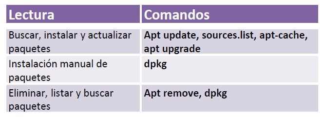

| **Inicio**         | **atrás 8**                        | **Siguiente 10**                    |
| ------------------ | ---------------------------------- | ----------------------------------- |
| [🏠](../README.md) | [⏪](./1_8_Networking_en_Linux.md) | [⏩](./1_10_El_entorno_en_Linux.md) |

---

## **Índice**

| Temario                                                                                                             |
| ------------------------------------------------------------------------------------------------------------------- |
| [83. Gestión de paquetes en Linux](#83-gestión-de-paquetes-en-linux)                                                |
| [84. Buscar, instalar y actualizar paquetes](#84-buscar-instalar-y-actualizar-paquetes)                             |
| [85. Instalación manual de paquetes](#85-instalación-manual-de-paquetes)                                            |
| [86. Eliminar, listar y buscar paquetes instalados](#86-eliminar-listar-y-buscar-paquetes-instalados)               |
| [87. Actualizar la distribución de Linux](#87-actualizar-la-distribución-de-linux)                                  |
| [88. Añadir nuevos repositorios de paquetes](#88-añadir-nuevos-repositorios-de-paquetes)                            |
| [89. Extra: Otra forma de añadir repositorios de paquetes](#89-extra-otra-forma-de-añadir-repositorios-de-paquetes) |

---

# **Gestión de paquetes y librerías en Linux**



## **83. Gestión de paquetes en Linux**

### 🧰 ¿Qué es la gestión de paquetes en Linux?

La **gestión de paquetes** es un sistema que te ayuda a:

- 📥 **Instalar**
- ♻️ **Actualizar**
- ❌ **Eliminar**
- 🔍 **Buscar**

programas o herramientas (llamados _paquetes_) en tu sistema Linux, **de forma automática** y segura.

---

### 📦 ¿Qué es un paquete?

Un **paquete** es como una **cajita que contiene un programa** listo para instalar. Puede ser:

- Una aplicación (ej. Firefox, Emacs)
- Una herramienta del sistema (ej. `curl`, `nano`)
- Una librería que necesita otro programa para funcionar

Ejemplo:
El paquete `firefox` contiene todo lo necesario para instalar el navegador Firefox en tu Linux.

---

### 🌐 ¿Qué es un repositorio de paquetes?

Un **repositorio** es como una **tienda en línea de paquetes**. Linux va a este lugar cuando tú:

- Instalas un programa (`sudo apt install firefox`)
- Buscas un programa (`apt-cache search`)

Ejemplo:

- Cuando usas Ubuntu, los paquetes se descargan desde **repositorios oficiales de Ubuntu**.

---

### 🔗 ¿Qué es una dependencia?

Una **dependencia** es un **paquete que otro paquete necesita para funcionar**.

Ejemplo fácil:

- Si instalas un programa de música, este podría depender de:

  - Un paquete para reproducir sonido
  - Otro para mostrar botones en pantalla

El gestor de paquetes **descarga automáticamente** estas dependencias por ti.

---

### 🔧 Comandos básicos para gestionar paquetes (con ejemplos y soluciones)

| Comando                      | ¿Para qué sirve?                               | Ejemplo correcto         | Posibles errores y solución                                 |
| ---------------------------- | ---------------------------------------------- | ------------------------ | ----------------------------------------------------------- |
| `sudo apt update`            | Actualiza la lista de paquetes del repositorio | `sudo apt update`        | Si no usas `sudo`, da error de permisos                     |
| `sudo apt install <paquete>` | Instala un paquete                             | `sudo apt install emacs` | Si escribes mal el nombre, dará “no se pudo encontrar”      |
| `sudo apt remove <paquete>`  | Elimina un programa                            | `sudo apt remove nano`   | Si el paquete no está instalado, no pasará nada             |
| `apt-cache search <palabra>` | Busca paquetes relacionados con esa palabra    | `apt-cache search ssh`   | Si usas mal el comando como `apt -cache search`, dará error |
| `sudo apt upgrade`           | Actualiza todos los paquetes instalados        | `sudo apt upgrade`       | Si hay problemas de red o espacio, fallará                  |

---

### 🧪 Ejemplo completo paso a paso

Imagina que quieres instalar el programa `htop`, que muestra procesos del sistema.

1. **Actualizar la lista de paquetes**

```bash
sudo apt update
```

2. **Buscar el paquete**

```bash
apt-cache search htop
```

3. **Instalar el paquete**

```bash
sudo apt install htop
```

4. **Abrir el programa**

```bash
htop
```

---

### 🎓 En resumen

| Concepto                | Explicación sencilla                                |
| ----------------------- | --------------------------------------------------- |
| **Gestión de paquetes** | Forma automática de manejar programas en Linux      |
| **Paquete**             | Programa comprimido listo para instalar             |
| **Repositorio**         | Lugar en Internet desde donde se descargan paquetes |
| **Dependencia**         | Paquete adicional que necesita otro para funcionar  |
| **Comandos útiles**     | `apt`, `apt-get`, `apt-cache`, `dpkg`, `snap`, etc. |

---

[🔼](#índice)

---

## **84. Buscar, instalar y actualizar paquetes**

### 📦 ¿Qué es un paquete en Linux?

Un **paquete** es un archivo que contiene un programa o aplicación, junto con sus instrucciones para instalarse. Por ejemplo:

- El navegador Firefox es un paquete.
- El editor de texto Emacs también es un paquete.

---

### 🔍 Buscar, instalar y actualizar paquetes

| Acción         | ¿Para qué sirve?                               | Ejemplo simple                |
| -------------- | ---------------------------------------------- | ----------------------------- |
| **Buscar**     | Ver si un programa existe para instalarlo      | Buscar "emacs"                |
| **Instalar**   | Descargar e instalar un programa nuevo         | Instalar "firefox"            |
| **Actualizar** | Poner al día todos los programas ya instalados | Mejorar seguridad y funciones |

---

### 📘 ¿Qué es un comando?

Un **comando** es una instrucción que escribes en la terminal para que el sistema haga algo, como instalar un programa.

---

### ✅ Explicación de los comandos que escribiste

#### 1. `apt`

```bash
puma@DESKTOP-NT4I4PK:~$ apt
```

- ✅ Este es un comando correcto.
- Sirve para **gestionar paquetes**: buscar, instalar, actualizar, eliminar.
- Si lo ejecutas solo, muestra ayuda sobre cómo usarlo.

---

#### 2. `rpm`

```bash
puma@DESKTOP-NT4I4PK:~$ rpm
```

- ❌ No es útil en Ubuntu (que usa `apt`), porque `rpm` es para otras distribuciones como Fedora o Red Hat.
- ✅ En Ubuntu, usa `apt` o `dpkg` en su lugar.

---

#### 3. `sudo apt update`

```bash
puma@DESKTOP-NT4I4PK:~$ sudo apt update
```

- ✅ **Correcto**. Este comando **actualiza la lista de paquetes disponibles** desde Internet.
- Es como actualizar la tienda antes de buscar nuevos programas.

---

#### 4. `apt-cache search <palabra>`

Por ejemplo:

```bash
apt-cache search emacs
```

- Sirve para **buscar paquetes disponibles** que contengan la palabra "emacs".

---

#### 5. `sudo apt install openssh-server`

- Esto sirve para **permitir conexiones remotas por SSH** a tu máquina.

---

#### 6. `apt -cache search emacs`

```bash
puma@DESKTOP-NT4I4PK:~$ apt -cache search emacs
```

- ❌ Incorrecto.
- ✅ Usa `apt-cache` como comando separado:

```bash
apt-cache search emacs
```

---

#### 7. `sudo apt install`

```bash
puma@DESKTOP-NT4I4PK:~$ sudo apt install
```

- ⚠️ El comando está incompleto.
- ✅ Debes agregar el nombre del paquete. Por ejemplo:

```bash
sudo apt install emacs
```

- Esto **descarga e instala** el programa Emacs.

---

### 💡 Resumen general

| Comando                   | ¿Para qué sirve?                            |
| ------------------------- | ------------------------------------------- |
| `sudo apt update`         | Actualiza la lista de programas disponibles |
| `apt-cache search nombre` | Busca programas por nombre                  |
| `sudo apt install nombre` | Instala el programa especificado            |
| `sudo apt upgrade`        | Actualiza todos los programas instalados    |

---

### ¿Quieres probar con un ejemplo práctico?

**Ejemplo: instalar el editor de texto `nano`**

```bash
sudo apt update
sudo apt install nano
```

[🔼](#índice)

---

## **85. Instalación manual de paquetes**

### 🧱 ¿Qué es la instalación manual de paquetes?

La **instalación manual** de paquetes en Linux se usa cuando:

- No puedes o no quieres usar `apt`.
- Descargaste un paquete desde una página web (por ejemplo, `.deb`).
- Estás instalando software que no está en los repositorios oficiales.

👉 Normalmente se hace con el comando `dpkg`.

---

### 📦 ¿Qué es `dpkg`?

`dpkg` (Debian Package) es una herramienta **de bajo nivel** que permite instalar paquetes `.deb` **manualmente**.

No descarga nada desde internet, solo **instala un archivo que ya tienes**.

---

### 🔧 Comando: `sudo dpkg -i nombre-del-paquete.deb`

- `sudo`: permisos de administrador (necesarios para instalar)
- `dpkg`: herramienta de instalación manual
- `-i`: significa "install" (instalar)
- `Messus-10.30`: debería ser un archivo `.deb`

---

#### ❗Error en tu ejemplo:

```bash
sudo dpkg -i Messus-10.30
```

🔴 **Problema:** El archivo no tiene la extensión `.deb`.

✅ **Solución:** Asegúrate de que el archivo sea un paquete `.deb`, como:

```bash
sudo dpkg -i Messus-10.30.deb
```

---

#### ✅ Ejemplo completo paso a paso:

Supongamos que descargaste Google Chrome desde su web oficial. El archivo es:
`google-chrome-stable_current_amd64.deb`

##### 1. Instala manualmente el paquete:

```bash
sudo dpkg -i google-chrome-stable_current_amd64.deb
```

##### 2. Puede salir un error de dependencias (muy común):

```bash
dpkg: error processing package ... --dependency problems - leaving unconfigured
```

##### 3. Solución del error:

```bash
sudo apt install -f
```

Este comando corrige automáticamente las dependencias que faltan.

---

### 🧪 Otro ejemplo práctico con comandos:

```bash
wget https://example.com/programa.deb     # Descargar un paquete desde internet
sudo dpkg -i programa.deb                 # Instalar manualmente
sudo apt install -f                       # Corregir dependencias si falla
```

---

### 🧠 Resumen

| Concepto         | Explicación                                                        |
| ---------------- | ------------------------------------------------------------------ |
| `dpkg`           | Instala paquetes `.deb` manualmente                                |
| `-i`             | Opción para instalar                                               |
| `.deb`           | Paquete de software para distribuciones como Ubuntu                |
| `apt install -f` | Corrige errores de dependencias tras una instalación fallida       |
| ¿Cuándo se usa?  | Cuando descargas un `.deb` desde una página o no está en los repos |

---

[🔼](#índice)

---

## **86. Eliminar, listar y buscar paquetes instalados**

### 📌 ¿Qué significa?

| Acción                | ¿Para qué se utiliza?                                                         |
| --------------------- | ----------------------------------------------------------------------------- |
| **Eliminar paquetes** | Para quitar programas instalados que ya no necesitas.                         |
| **Listar paquetes**   | Para ver qué programas están instalados actualmente en tu sistema.            |
| **Buscar paquetes**   | Para revisar si un programa está disponible, instalado, o buscar información. |

---

### 🧱 Comandos explicados paso a paso

---

#### 🧨 1. **Eliminar un paquete**

```bash
sudo apt remove nessus
```

- **¿Qué hace?**: Elimina el paquete `nessus` (solo el programa, **no** sus archivos de configuración).
- ✅ **Útil cuando ya no lo necesitas**.
- ❗**Error común**:

  - Si no está instalado, verás:

    ```
    E: Unable to locate package nessus
    ```

  - 🔧 **Solución**: Verifica si está instalado:

    ```bash
    dpkg -l | grep nessus
    ```

---

#### ♻️ 2. **Actualizar programas ya instalados**

```bash
sudo apt upgrade
```

- **¿Qué hace?**: Actualiza **todos los paquetes** que ya están instalados.
- 🔄 Es como "actualizar todas tus apps".
- 🔧 Si da error por dependencias, puedes hacer:

  ```bash
  sudo apt install -f
  ```

---

#### 📦 3. **Instalar paquete manualmente**

```bash
dpkg -i nessus-10.3.0
```

- ❗**Error**: Falta `.deb`. El nombre correcto sería algo como:

  ```bash
  dpkg -i nessus-10.3.0.deb
  ```

- ✅ **¿Para qué se usa?**: Para instalar un archivo `.deb` que descargaste manualmente.
- 🔧 Si falla por dependencias:

  ```bash
  sudo apt install -f
  ```

---

#### 📋 4. **Listar paquetes instalados**

```bash
dpkg -l | grep emacs
```

- **¿Qué hace?**: Lista todos los paquetes que contienen la palabra `emacs`.

---

#### 🔍 5. **Buscar un paquete instalado (filtrar por nombre)**

```bash
dpkg -l | grep nessus
```

- ✅ **Correcto**.
- **¿Qué hace?**: Muestra si `nessus` está instalado y en qué versión.

---

#### 📄 6. **Ver información detallada de un paquete instalado**

```bash
dpkg -s nessus
```

o también:

```bash
dpkg --status nessus
```

- ✅ **Correctos ambos**.
- **¿Qué hacen?**: Muestran detalles como la versión, estado, descripción del paquete `nessus`.

---

#### 🛍️ 7. **Ver información de un paquete disponible (incluso si no está instalado)**

```bash
apt show emacs
```

- ✅ **Correcto**.
- **¿Qué hace?**: Muestra detalles sobre el paquete `emacs` del repositorio: versión, tamaño, dependencias, etc.

---

#### ⚙️ 8. **Ver el estado de un servicio (como el servidor de Nessus)**

```bash
sudo service nessusd status
```

- ✅ **Correcto**.
- **¿Qué hace?**: Muestra si el servicio `nessusd` está activo, detenido o fallando.

---

#### ▶️ 9. **Iniciar el servicio de Nessus**

```bash
sudo service nessusd start
```

- ✅ **Correcto**.
- **¿Qué hace?**: Inicia el servicio `nessusd` (el motor que corre Nessus).
- ❗ **Si falla**, puede ser que:

  - El paquete no esté instalado.
  - Falte una configuración.
  - 🔧 Solución: Revisa errores con:

    ```bash
    journalctl -xe
    ```

---

### ✅ RESUMEN FINAL

| Comando                                     | ¿Para qué sirve?                   | Solución si falla                                   |     |
| ------------------------------------------- | ---------------------------------- | --------------------------------------------------- | --- |
| `sudo apt remove nombre`                    | Elimina un paquete                 | Verifica si está instalado                          |     |
| `sudo apt upgrade`                          | Actualiza todo el sistema          | Usa `sudo apt install -f` si hay errores            |     |
| `dpkg -i archivo.deb`                       | Instala un `.deb` manual           | Asegúrate que el archivo exista y termine en `.deb` |     |
| `dpkg -l                    \| grep nombre` | Lista si el paquete está instalado | Asegúrate de usar `grep`                            |
| `dpkg -s nombre`                            | Muestra detalles del paquete       | El paquete debe estar instalado                     |     |
| `apt show nombre`                           | Muestra info del repositorio       | El paquete debe existir en los repositorios         |     |
| `sudo service nombre status`                | Ver estado de un servicio          | El servicio debe estar correctamente instalado      |     |
| `sudo service nombre start`                 | Inicia un servicio                 | Revisa errores si no arranca                        |     |

---

[🔼](#índice)

---

## **87. Actualizar la distribución de Linux**

### 🧭 ¿Qué es actualizar la distribución de Linux?

Actualizar la **distribución de Linux** significa:

> 👉 **Pasar de una versión del sistema operativo a una más nueva** (por ejemplo, de Ubuntu 22.04 a 24.04).

#### 🎯 ¿Para qué se usa?

- Obtener **nuevas funciones del sistema**
- Mejorar el rendimiento y la **seguridad**
- Actualizar **núcleo (kernel)** y programas base
- Seguir recibiendo **soporte oficial**

---

### ⚙️ ¿Qué es diferente de `apt upgrade`?

| Comando                      | ¿Qué hace?                                        |
| ---------------------------- | ------------------------------------------------- |
| `sudo apt upgrade`           | Solo actualiza los programas instalados           |
| `actualizar la distribución` | Cambia **toda la versión de Linux** (mayor salto) |

---

### ✅ Comandos para actualizar la distribución de Linux

---

#### 1. **Actualizar los paquetes actuales primero**

```bash
sudo apt update
sudo apt upgrade
```

- 📌 **Esto es obligatorio antes de hacer una actualización mayor**.
- 🔧 **Solución si falla**:

  - Usa `sudo apt install -f` para corregir dependencias rotas.

---

#### 2. **Verificar si hay una nueva versión disponible**

```bash
lsb_release -a
```

- Te dice la versión actual de tu sistema (ej: Ubuntu 22.04).

---

#### 3. **Actualizar la distribución (Ubuntu y derivadas)**

```bash
sudo do-release-upgrade
```

- 📌 Este comando **descarga e instala una nueva versión de Ubuntu**.
- ⚠️ A veces primero debes instalar esta herramienta:

```bash
sudo apt install update-manager-core
```

---

#### 🧪 Ejemplo completo paso a paso:

```bash
# Paso 1: Actualizar todos los paquetes actuales
sudo apt update
sudo apt upgrade
sudo apt dist-upgrade  # (opcional: mejora aún más a nivel de sistema)

# Paso 2: Asegurar que tienes la herramienta necesaria
sudo apt install update-manager-core

# Paso 3: Ejecutar la actualización del sistema
sudo do-release-upgrade
```

---

### ❗Posibles errores y soluciones

| Error                                 | Causa                                           | Solución                                                                          |
| ------------------------------------- | ----------------------------------------------- | --------------------------------------------------------------------------------- |
| `No new release found`                | No hay nueva versión estable disponible todavía | Usa `-d` para probar una versión en desarrollo _(no recomendado para producción)_ |
| Problemas de dependencias             | Paquetes rotos                                  | Ejecuta `sudo apt install -f` antes                                               |
| Falla en el medio de la actualización | Red o energía interrumpida                      | Reintenta con `sudo dpkg --configure -a` y luego `sudo apt install -f`            |
| "do-release-upgrade no se encuentra"  | No tienes la herramienta instalada              | Ejecuta `sudo apt install update-manager-core`                                    |

---

### 💡 ¿Qué hacer **después** de actualizar la distribución?

1. Reinicia el sistema:

```bash
sudo reboot
```

2. Verifica tu nueva versión:

```bash
lsb_release -a
```

3. Limpia los paquetes antiguos:

```bash
sudo apt autoremove
sudo apt clean
```

---

### 🎓 Resumen final

| Acción                                | Comando                                  |
| ------------------------------------- | ---------------------------------------- |
| Actualizar paquetes normales          | `sudo apt update && sudo apt upgrade`    |
| Ver versión actual del sistema        | `lsb_release -a`                         |
| Instalar herramienta de actualización | `sudo apt install update-manager-core`   |
| Actualizar toda la distribución       | `sudo do-release-upgrade`                |
| Limpiar después de actualizar         | `sudo apt autoremove` y `sudo apt clean` |

---

[🔼](#índice)

---

## **88. Añadir nuevos repositorios de paquetes**

### 📦 ¿Qué es un repositorio de paquetes?

Un **repositorio** es un **lugar en internet donde están almacenados programas (paquetes)** que Linux puede descargar e instalar.

#### Ejemplo simple:

Ubuntu trae repositorios oficiales como si fueran una **tienda de aplicaciones**. Pero a veces tú quieres añadir **nuevas tiendas (repositorios)** para instalar software que **no viene por defecto**, como:

- Google Chrome
- Visual Studio Code
- Nessus
- Spotify

---

### 🎯 ¿Para qué se usa añadir un nuevo repositorio?

✅ Sirve para:

- Instalar software que **no está en los repositorios oficiales**
- Obtener versiones **más recientes o personalizadas**
- Agregar confianza a programas de terceros (por medio de una clave GPG)

---

### 🛠️ Comandos típicos usados

---

#### 🧲 1. `wget` – Descargar archivos desde Internet

```bash
wget "https://example.com/archivo.deb"
```

- ✅ Sirve para **descargar instaladores o claves GPG** desde páginas web.
- 📌 Por ejemplo:

```bash
wget -qO - https://packages.microsoft.com/keys/microsoft.asc | gpg --dearmor > microsoft.gpg
```

- ❗**Error común**: Si solo haces `wget "https://"` sin una URL completa, dará:

  ```
  wget: missing URL
  ```

---

#### ➕ 2. `add-apt-repository` – Añadir repositorios PPA

```bash
sudo add-apt-repository ppa:nombre/repositorio
```

- Ejemplo:

```bash
sudo add-apt-repository ppa:deadsnakes/ppa
```

- ✅ Se usa para añadir **PPAs** (repositorios mantenidos por la comunidad).
- ❗ Si no tienes esta herramienta instalada:

  ```bash
  sudo apt install software-properties-common
  ```

---

#### 🧾 3. Añadir repositorios manualmente con `echo` y `.list`

```bash
echo "deb [arch=amd64] https://repo.example.com stable main" | sudo tee /etc/apt/sources.list.d/example.list
```

- Esto **registra el nuevo repositorio** dentro de tu sistema.

---

#### 🔑 4. Añadir la clave GPG del repositorio

Los repositorios firmados usan una **clave GPG** para verificar que los paquetes son confiables.

```bash
wget -qO - https://repo.example.com/gpg | sudo gpg --dearmor -o /etc/apt/trusted.gpg.d/example.gpg
```

---

#### 🔄 5. Actualizar lista de paquetes

Después de añadir un repositorio nuevo, **siempre debes hacer**:

```bash
sudo apt update
```

Así el sistema "ve" los nuevos programas disponibles en el nuevo repositorio.

---

#### 🧪 Ejemplo completo: Añadir repositorio e instalar VS Code

```bash
# 1. Descargar y agregar la clave GPG
wget -qO- https://packages.microsoft.com/keys/microsoft.asc | gpg --dearmor | sudo tee /etc/apt/trusted.gpg.d/microsoft.gpg > /dev/null

# 2. Añadir el repositorio
echo "deb [arch=amd64] https://packages.microsoft.com/repos/vscode stable main" | sudo tee /etc/apt/sources.list.d/vscode.list

# 3. Actualizar lista de paquetes
sudo apt update

# 4. Instalar VS Code
sudo apt install code
```

---

### ❗ Posibles errores y soluciones

| Error                                   | Causa                                | Solución                                              |
| --------------------------------------- | ------------------------------------ | ----------------------------------------------------- |
| `wget: missing URL`                     | No escribiste una URL completa       | Asegúrate de poner la URL entera (https\://...)       |
| `command not found: add-apt-repository` | Falta la herramienta                 | Ejecuta `sudo apt install software-properties-common` |
| `GPG error` al hacer `apt update`       | Clave GPG no añadida o inválida      | Revisa y vuelve a importar la clave correctamente     |
| `403 Forbidden` al añadir repositorio   | No tienes permisos o la URL está mal | Verifica que la URL del repo sea correcta             |

---

### 🧠 Resumen

| Acción                       | Comando                                          | ¿Para qué sirve?                              |     |
| ---------------------------- | ------------------------------------------------ | --------------------------------------------- | --- |
| Descargar archivo            | `wget "URL"`                                     | Baja instaladores o claves GPG                |     |
| Añadir repositorio PPA       | `add-apt-repository ppa:nombre`                  | Agrega una fuente de software de la comunidad |     |
| Añadir repo manual           | `echo ... > .list`                               | Añade un nuevo origen de paquetes             |     |
| Añadir clave GPG             | `wget ...                      \| gpg --dearmor` | Verifica la autenticidad de los paquetes      |
| Actualizar lista de paquetes | `sudo apt update`                                | Detecta los nuevos programas disponibles      |     |

---

[🔼](#índice)

---

## **89. Extra: Otra forma de añadir repositorios de paquetes**

### 📌 ¿Qué significa "añadir un repositorio de otra forma"?

Se refiere a métodos alternativos (manuales) para **agregar nuevas fuentes de paquetes** en el sistema, como:

- **Escribir directamente en un archivo `.list`**
- **Agregar claves GPG manualmente**
- Usar scripts `.sh` que hacen todo automáticamente

---

### 🎯 ¿Para qué se usa?

- Instalar software de terceros como Google Chrome, Docker, VS Code, Nessus, etc.
- Obtener versiones más nuevas que no están en los repositorios de Ubuntu.
- Usar software corporativo o privado.

---

### 🧱 Comandos para añadir repositorios manualmente

---

#### 1. **Escribir en un archivo `.list` con `echo` y `tee`**

```bash
echo "deb [arch=amd64] https://example.com/repos stable main" | sudo tee /etc/apt/sources.list.d/example.list
```

📌 **¿Qué hace?**

- Crea un nuevo archivo de repositorio.
- Indica que se puede instalar software desde esa URL.

🛠️ **Ejemplo real (Docker)**:

```bash
echo "deb [arch=amd64] https://download.docker.com/linux/ubuntu focal stable" | sudo tee /etc/apt/sources.list.d/docker.list
```

---

#### 2. **Añadir la clave GPG del repositorio**

Esto garantiza que los paquetes descargados **no han sido modificados**.

```bash
wget -qO - https://download.docker.com/linux/ubuntu/gpg | sudo gpg --dearmor -o /etc/apt/trusted.gpg.d/docker.gpg
```

---

#### 3. **Actualizar la lista de paquetes**

Siempre que añades un repositorio nuevo, debes actualizar:

```bash
sudo apt update
```

---

#### 4. **Instalar el paquete desde el nuevo repositorio**

Una vez actualizado, ya puedes instalar normalmente:

```bash
sudo apt install docker-ce
```

---

### 🧪 Ejemplo completo (añadir repo de Docker):

```bash
# Paso 1: Añadir clave GPG
wget -qO - https://download.docker.com/linux/ubuntu/gpg | sudo gpg --dearmor -o /etc/apt/trusted.gpg.d/docker.gpg

# Paso 2: Añadir el repositorio manualmente
echo "deb [arch=amd64] https://download.docker.com/linux/ubuntu focal stable" | sudo tee /etc/apt/sources.list.d/docker.list

# Paso 3: Actualizar paquetes
sudo apt update

# Paso 4: Instalar el programa
sudo apt install docker-ce
```

---

### ⚠️ Posibles errores y soluciones

| Problema                          | Causa                           | Solución                                                                                   |     |
| --------------------------------- | ------------------------------- | ------------------------------------------------------------------------------------------ | --- |
| `403 Forbidden`                   | URL incorrecta o privada        | Verifica que estés usando la URL correcta                                                  |     |
| `NO_PUBKEY` al hacer `apt update` | No añadiste la clave GPG        | Usa `wget ...                                              \| gpg --dearmor` para añadirla |
| `Malformed entry`                 | Error al escribir el `.list`    | Asegúrate de que la línea del repo esté bien escrita                                       |     |
| `command not found: tee`          | Falta utilidad (raro en Ubuntu) | Instala con `sudo apt install coreutils` si fuera necesario                                |     |

---

### 🧠 Resumen final

| Acción             | Comando                                    | ¿Para qué sirve?                                      |     |
| ------------------ | ------------------------------------------ | ----------------------------------------------------- | --- |
| Añadir repo manual | `echo "deb ..."          \| tee`           | Crea nuevo archivo `.list` con la URL del repositorio |
| Añadir clave GPG   | `wget ...                \| gpg --dearmor` | Verifica la seguridad de los paquetes                 |
| Actualizar         | `sudo apt update`                          | Refresca lista de paquetes disponibles                |     |
| Instalar paquete   | `sudo apt install nombre`                  | Instala desde el nuevo repositorio                    |     |

---

### 📎 Nota extra

También puedes encontrar **scripts `.sh`** que hacen todo esto por ti (por ejemplo, en páginas oficiales como Docker, Nessus o Google). Solo asegúrate de que sea **una fuente confiable** antes de ejecutarlo.

---

[🔼](#índice)

---

| **Inicio**         | **atrás 8**                        | **Siguiente 10**                    |
| ------------------ | ---------------------------------- | ----------------------------------- |
| [🏠](../README.md) | [⏪](./1_8_Networking_en_Linux.md) | [⏩](./1_10_El_entorno_en_Linux.md) |
