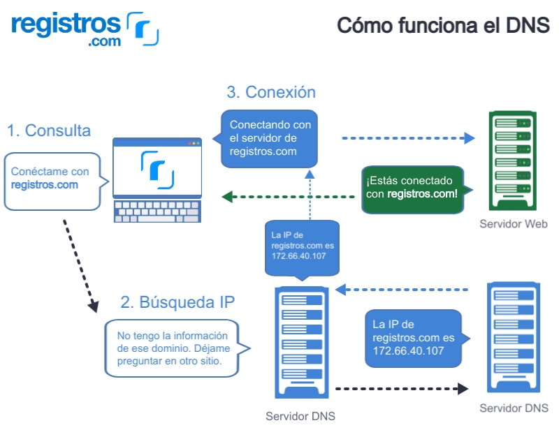
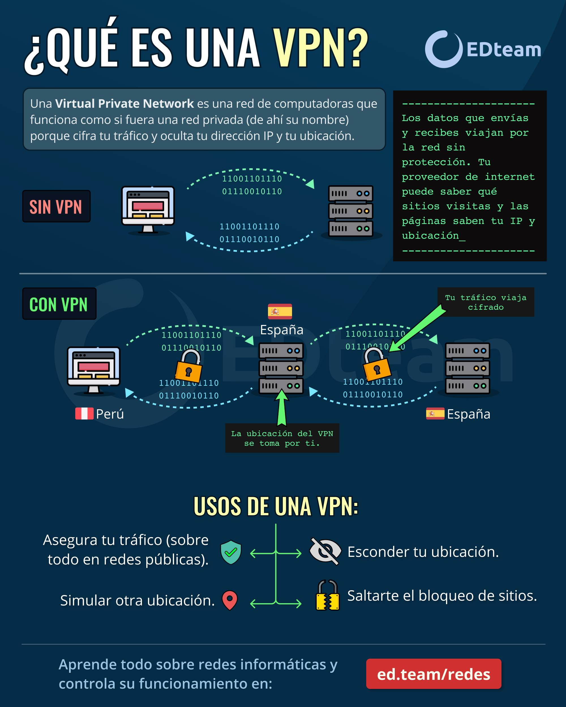

| **Inicio**         | **atrás 2**                                       | **Siguiente 4**                                   |
| ------------------ | ------------------------------------------------- | ------------------------------------------------- |
| [🏠](../README.md) | [⏪](./2_2_Recopilacion_pasiva_de_informacion.md) | [⏩](./2_4_Recopilacion_activa_de_informacion.md) |

---

## **Índice**

| Temario                                                                                                  |
| -------------------------------------------------------------------------------------------------------- |
| [17. Recopilacion semi-pasiva de informacion](#17-recopilacion-semi-pasiva-de-informacion)               |
| [18. FOCA: Análisis de metadatos](#18-foca-análisis-de-metadatos)                                        |
| [19. Otras utilidades para el análisis de metadatos](#19-otras-utilidades-para-el-análisis-de-metadatos) |
| [20. Introducción al protocolo DNS](#20-introducción-al-protocolo-dns)                                   |
| [21. CentralOps y DNSdumpster](#21-centralops-y-dnsdumpster)                                             |
| [22. Sniffers: Wireshark](#22-sniffers-wireshark)                                                        |
| [23. Sniffers: TCPdump](#23-sniffers-tcpdump)                                                            |
| [24. El anonimato en Internet](#24-el-anonimato-en-internet)                                             |

---

# **Recopilacion semi-pasiva de informacion**

## **17. Recopilacion semi-pasiva de informacion**

### ¿Qué es la "recopilación de información" en ciberseguridad?

En ciberseguridad (por ejemplo, en **pentesting** o **OSINT**), “recopilación de información” (o **reconocimiento**) es la **primera fase** de un ataque o análisis de seguridad:

✅ Reunir toda la información posible sobre un objetivo (empresa, red, persona) **para planificar el siguiente paso**.

---

### Tipos de recopilación

En ciberseguridad, suelen clasificarse en:

- **Activa**: tú interactúas directamente con el objetivo (puede alertarlo).
- **Pasiva**: sólo observas fuentes públicas o indirectas sin interactuar con el objetivo.
- **Semi-pasiva**: está entre ambas.

---

### ¿Qué es la **recopilación semi-pasiva**?

✅ Es un **término intermedio**:

- Obtienes información **sin ser demasiado invasivo**.
- Técnicamente puede dejar trazas **pero con bajo riesgo de detección**.
- Se basa en **consultas públicas** que el objetivo puede ver en sus registros pero que suelen ser normales.

**No es 100% pasiva** (como revisar redes sociales)
**No es 100% activa** (como un escaneo agresivo de puertos).

---

### Características clave

✔ Usas fuentes públicas o consultas “normales”

✔ El objetivo puede **ver esas consultas**, pero no parecen un ataque.

✔ Suelen ser **legales** (aunque depende de la intención).

---

### Ejemplos muy claros y sencillos

---

#### ✅ Ejemplo 1: Consulta de DNS (Whois y registros)

Supón que quieres saber **quién es dueño de un sitio web**.

📌 Whois:

```bash
whois ejemplo.com
```

✅ Resultado: Te dice registrante, fechas, servidores DNS.

**Semi-pasivo** porque la consulta va al servidor Whois, no al servidor del objetivo.
El objetivo _no se entera directamente_, pero en algunos casos ciertos Whois privados registran consultas.

---

📌 DNS Zone Transfer (intento pasivo pero detectable):

```bash
dig axfr @ns1.ejemplo.com ejemplo.com
```

✅ Si está mal configurado, revela toda la zona DNS.

✅ El servidor DNS **del objetivo** ve esta consulta (puede detectar la actividad).

**Es semi-pasivo** porque es consulta “normal”, pero el objetivo puede notarlo en sus logs.

---

#### ✅ Ejemplo 2: Consultas a buscadores públicos

✅ Google Hacking:

```google
site:ejemplo.com inurl:admin
```

✅ Nadie en “ejemplo.com” lo ve directamente.

✅ Esto es más **pasivo** que semi-pasivo.

Pero si usas servicios de búsqueda más avanzados (Shodan, Censys) que rastrean puertos abiertos, se considera más **semi-pasivo** porque esos servicios escanean activamente, tú solo consultas su base.

---

#### ✅ Ejemplo 3: Uso de Shodan

📌 Buscas:

```
port:22 org:"Empresa XYZ"
```

✅ Tú no escaneas a la empresa directamente.

✅ Shodan ya tiene esos datos.

✅ El escaneo original fue activo (hecho por Shodan), pero tu búsqueda es semi-pasiva porque aprovechas ese escaneo público.

---

#### ✅ Ejemplo 4: Reverse DNS

📌 Usar herramientas para ver qué hosts hay en el rango IP:

```bash
dnsrecon -r 192.168.1.0/24
```

✅ El servidor DNS puede registrar estas consultas.

✅ Es más sigiloso que un escaneo de puertos completo, pero deja huellas.

---

### Resumen en palabras simples

✅ **Pasivo** = 100% sigiloso (solo miras fuentes públicas que no avisan al objetivo).

✅ **Semi-pasivo** = usas fuentes públicas o consultas legítimas que pueden ser vistas en logs del objetivo **pero no parecen ataques directos**.

✅ **Activo** = escaneas o interactúas de forma clara (y potencialmente alarmante) con el objetivo.

---

### Tabla comparativa

| Tipo        | Ejemplo                      | Riesgo de detección |
| ----------- | ---------------------------- | ------------------- |
| Pasivo      | Leer redes sociales, Google  | Muy bajo            |
| Semi-pasivo | Whois, consultas DNS, Shodan | Bajo                |
| Activo      | Escaneo de puertos con Nmap  | Alto                |

---

### Herramientas comunes para recopilación semi-pasiva

✅ `whois`

✅ `dig`, `nslookup`

✅ `dnsrecon`, `dnsenum`

✅ Shodan, Censys

✅ Recon-ng

---

### En la práctica (escenario fácil)

**Escenario:** Vas a evaluar la seguridad de un sitio.

✅ Pasivo: Miras sus redes sociales y notas nombres de empleados.

✅ Semi-pasivo: Haces un Whois para ver datos del dominio. Usas dig para ver registros MX y TXT. Buscas en Shodan si su IP tiene puertos abiertos conocidos.

✅ Activo: Haces un escaneo Nmap completo a su servidor.

---

### Conclusión fácil de recordar

> **Semi-pasivo = Información pública + Consultas que pueden ser vistas, pero no son abiertamente agresivas.**

---

[🔼](#índice)

---

## **18. FOCA: Análisis de metadatos**

### ¿Qué es FOCA?

**FOCA** es una **herramienta de ciberseguridad** hecha en España (su nombre significa **Fingerprinting Organizations with Collected Archives**).

✅ Sirve para **buscar, descargar y analizar metadatos** de documentos públicos en internet.

✅ Ayuda a los **pentesters** y **analistas de seguridad** a **hacer reconocimiento (recon)** de un objetivo.

**En palabras simples:**

> FOCA te ayuda a encontrar documentos que la empresa ha publicado (PDF, Word, Excel) y extraer información oculta (metadatos) de esos archivos.

---

### ¿Qué son los metadatos?

✔ Son **datos sobre los datos**.

✔ Están **dentro del archivo**, pero **no siempre se ven**.

📌 Ejemplos de metadatos en un archivo Word:

- Autor del documento
- Nombre de la empresa
- Nombre de usuario del computador
- Software y versión usada
- Fecha de creación y modificación
- Ruta del archivo en el sistema

---

📌 **Ejemplo muy fácil:**
Supongamos que una empresa publica un PDF en su web:

✅ Documento: `Plan_Estrategico.pdf`

✅ Metadatos extraídos:

- Autor: "Juan Pérez"
- Empresa: "EmpresaXYZ"
- Software: "Microsoft Word 2016"
- Computadora: "PC-JPEREZ"

🔎 Con eso ya sabes:

✔ Nombre de empleado (para ingeniería social)

✔ Software que usan (para exploits)

✔ Convenciones de nombres de equipos

---

### ¿Para qué sirve analizar metadatos en ciberseguridad?

✔ Es parte de la **fase de reconocimiento**.

✔ Te ayuda a reunir **información útil** para planificar un ataque o evaluar riesgos.

✅ **Objetivos típicos:**

- Descubrir nombres reales de empleados
- Encontrar direcciones de correo
- Conocer software o versiones para buscar vulnerabilidades
- Identificar la estructura interna de archivos o carpetas

---

### ¿Qué hace FOCA exactamente?

FOCA **automatiza** este trabajo en 3 fases principales:

---

#### Búsqueda de documentos

✅ FOCA puede **buscar automáticamente en Google o Bing**:

- site\:empresa.com filetype\:pdf
- site\:empresa.com filetype\:docx
- site\:empresa.com filetype\:xlsx

✔ Descubre todos los documentos públicos que la empresa tiene en su web.

---

📌 **Ejemplo práctico:**

```
site:empresa.com filetype:pdf
```

➡ Google devuelve todos los PDF públicos.

---

#### Descarga de documentos

✅ FOCA descarga esos archivos **automáticamente**.

✅ Puedes elegir qué archivos bajar.

✔ Ahorra mucho tiempo frente a hacerlo manualmente.

---

#### Extracción y análisis de metadatos

✅ FOCA analiza cada archivo.

✅ Extrae metadatos de:

- PDF
- Word
- Excel
- PowerPoint
- Imágenes (EXIF)
- etc.

✔ Muestra todo en una lista fácil de leer.

---

📌 **Ejemplo de resultados de FOCA:**

| Archivo       | Autor       | Empresa    | Software      | PC Name   |
| ------------- | ----------- | ---------- | ------------- | --------- |
| Plan2025.docx | Juan Pérez  | EmpresaXYZ | MS Word 2019  | PC-JPEREZ |
| Propuesta.pdf | María López | EmpresaXYZ | Adobe Acrobat | PC-MLOPEZ |

---

### Ejemplo realista y sencillo

#### 🔎 Escenario

Eres un **pentester** contratado para auditar **empresa.com**.

✅ Usas FOCA:

**1️⃣ Búsqueda**

- FOCA hace:

  ```
  site:empresa.com filetype:pdf
  ```

- Encuentra 10 PDFs y 5 DOCX en su web pública.

---

**2️⃣ Descarga**

- FOCA baja todos esos archivos automáticamente.

---

**3️⃣ Análisis**

- FOCA analiza metadatos:

```
Archivo: Plan2025.docx
- Autor: Juan Pérez
- Empresa: EmpresaXYZ
- Software: MS Word 2019
- Computadora: PC-JPEREZ
```

✅ Aprendiste:

✔ Hay un empleado llamado Juan Pérez.

✔ Usan Word 2019.

✔ Convención de nombres de PCs: `PC-NOMBRE`.

---

**4️⃣ Inteligencia obtenida:**

- Puedes enviar phishing dirigido a Juan Pérez.
- Sabes que usan Word 2019 (¿vulnerable?).
- Sabes cómo nombran equipos (útil para ataques internos).

---

### Otras funciones útiles de FOCA

✔ Resolver nombres de dominio internos.

✔ Identificar IPs públicas e internas (a partir de documentos mal configurados).

✔ Construir un mapa de la infraestructura.

✅ Todo esto con **documentos públicos**.

---

### Ventajas y desventajas

📌 **Ventajas:**

- Gratuita (FOCA Community).
- Muy fácil de usar.
- Automatiza búsqueda y análisis.
- Extrae mucha información útil para OSINT y pentesting.

📌 **Desventajas:**

- Depende de los documentos públicos.
- No funciona si los metadatos fueron limpiados.
- Puede generar falsos positivos si metadatos están vacíos o alterados.

---

### ¿Es legal usar FOCA?

✔ Usar FOCA para analizar tus propios dominios = ✅ 100% legal.

✔ Usar FOCA para auditar con permiso = ✅ Legal.

✔ Usar FOCA sin permiso = ⚠️ Puede ser ilegal si se usa con fines maliciosos.

✅ En general, FOCA solo usa **datos públicos** (no hackea nada por sí mismo), pero la **intención** importa.

---

### Herramientas alternativas

✔ **ExifTool** (análisis de metadatos en imágenes y documentos)

✔ **Metagoofil** (búsqueda y análisis de documentos en Linux)

✔ **PDFinfo** (extraer metadatos PDF)

---

### Resumen sencillo

> **FOCA = Herramienta para buscar, descargar y analizar metadatos de documentos públicos en la web de un objetivo.**

✅ Te da:

- Nombres de empleados
- Software usado
- Nombres de equipos
- Correos
- Infraestructura posible

---

### Explicación en 1 línea

**"FOCA sirve para espiar los metadatos de documentos públicos y averiguar cosas ocultas de una empresa sin hackear nada directamente."**

---

### ¿Quieres practicar?

📌 Puedes instalar FOCA Community (Windows) y probar con tu propio sitio o con ejemplos públicos:

```
site:example.com filetype:pdf
```

✅ Descargas el PDF.

✅ FOCA te dirá:

- Autor
- Software
- Fecha
- Etc.

---

[🔼](#índice)

---

## **19. Otras utilidades para el análisis de metadatos**

### 🔍 ¿Por qué usar otras herramientas además de FOCA?

Aunque **FOCA** es muy buena para Windows, tiene limitaciones:

✅ No siempre funciona bien con imágenes.

✅ No tiene versión para Linux o Mac.

✅ No es ideal para línea de comandos o automatización.

Por eso existen otras herramientas que **complementan** o **reemplazan** a FOCA, especialmente para:

- Archivos **PDF, DOCX, imágenes, vídeos, audios**
- Entornos **Linux/Mac**
- Automatización de procesos

---

### 🧰 UTILIDADES POPULARES PARA ANÁLISIS DE METADATOS

A continuación, te explico cada herramienta con ejemplos simples.

---

#### **ExifTool** – El más completo y flexible

📌 **¿Qué es?**

Herramienta de línea de comandos que **lee, edita y elimina metadatos** de casi cualquier tipo de archivo.

📌 **Plataforma:** Windows, Linux, Mac

📌 **Tipo:** CLI (línea de comandos)

📌 **Creador:** Phil Harvey

---

📎 **Archivos compatibles:**

✅ Imágenes (JPG, PNG, TIFF)

✅ PDF, DOCX, MP3, MP4, videos, etc.

---

📌 **Ejemplo 1:** Revisar metadatos de una imagen

```bash
exiftool imagen.jpg
```

🧾 Resultado:

```
File Name       : imagen.jpg
Camera Model    : Canon EOS 80D
Create Date     : 2023:05:01 14:23:11
GPS Latitude    : -12.0432
GPS Longitude   : -77.0282
Author          : Juan Pérez
```

✅ Te revela incluso la **ubicación GPS** si la cámara lo guardó. Muy útil en análisis forense.

---

📌 **Ejemplo 2:** Revisar metadatos de un PDF

```bash
exiftool documento.pdf
```

🧾 Resultado:

```
Title           : Informe financiero
Author          : María López
Producer        : Acrobat Distiller 20.0
CreationDate    : 2024-02-15
```

✅ Ya sabes quién lo hizo, con qué programa y cuándo.

---

📌 **Ejemplo 3:** Eliminar metadatos

```bash
exiftool -all= imagen.jpg
```

✅ Borra todos los metadatos. Útil para proteger tu privacidad.

---

📌 **Ventajas:**

- Extremadamente poderosa
- Muy compatible
- Útil para forense digital

📌 **Desventajas:**

- No tiene interfaz gráfica (aunque hay GUI opcionales)

---

#### **Metagoofil** – Buscador de documentos públicos con metadatos

📌 **¿Qué es?**

Herramienta en Linux para buscar documentos en Google y extraer metadatos.

📌 **Tipo:** OSINT + Metadatos

📌 **Archivos soportados:** PDF, DOC, XLS, PPT, ODT, etc.

📌 **Ideal para:** Fase de reconocimiento de objetivos web

---

📌 **Ejemplo:**

```bash
python metagoofil.py -d empresa.com -t pdf,docx,xls -l 50 -n 10 -o salida/ -f resultados.html
```

✅ Esto busca 50 archivos, descarga 10, los guarda y extrae los metadatos.

🧾 Resultado:

```
Archivo: propuesta.docx
Autor: juan.perez
Software: Word 2016
Empresa: EmpresaXYZ
```

---

📌 **Ventajas:**

- Automatiza la búsqueda y análisis
- Útil para pentesting y OSINT

📌 **Desventajas:**

- Requiere Python y Linux
- A veces falla si Google bloquea consultas automatizadas

---

#### **PDFinfo / PDFid / PDF-parser** – Para análisis profundo de PDF

📌 Herramientas especializadas en **PDFs**, muy usadas en forense digital y malware analysis.

---

##### 📄 **PDFinfo**

```bash
pdfinfo archivo.pdf
```

🧾 Resultado:

```
Title: Manual técnico
Author: Luis Salazar
Pages: 12
CreationDate: 2023-10-11
```

---

##### 🔍 **PDFid**

```bash
pdfid archivo.pdf
```

🧾 Detecta cosas como:

- Uso de JavaScript
- Formularios
- Acciones automáticas (maliciosas)

---

##### 🛠️ **PDF-parser**

```bash
pdf-parser archivo.pdf
```

🧾 Permite ver el contenido interno del PDF, útil para detectar código oculto.

✅ Especialmente útil si sospechas que el PDF contiene malware.

---

📌 **Ventajas:**

- Excelente para PDF maliciosos
- PDFid y parser ayudan a detectar exploits

📌 **Desventajas:**

- Técnicos y especializados

---

#### **ExifGUI (GUI para ExifTool)**

📌 Si no te gusta la línea de comandos, puedes usar interfaces gráficas para ExifTool.

✅ Algunas opciones:

- **ExifToolGUI**
- **ExifCleaner**
- **Metadata++**

🔧 Estas permiten **ver y limpiar metadatos fácilmente con clics**, ideal para usuarios menos técnicos.

---

#### **Tika** – Librería de Apache para extraer contenido y metadatos

📌 Usado en programación y automatización.

📌 Ejemplo en Linux:

```bash
tika --metadata documento.docx
```

🧾 Resultado:

```
Author: Juan Pérez
Content-Type: application/vnd.openxmlformats-officedocument.wordprocessingml.document
```

📌 Ideal para integrarlo en pipelines de análisis de datos o apps web que necesitan extraer metadatos.

---

#### **OSINT Tools Online**

##### 🌐 Ejemplos:

- [Get-Metadata.com](https://www.get-metadata.com/)
- [Metapicz.com](https://www.metapicz.com/)
- [Jeffrey’s Image Metadata Viewer](https://exif.regex.info/exif.cgi)

✅ Subes una imagen o PDF y ves sus metadatos en el navegador.

📌 Son rápidos y no requieren instalación.

⚠️ _No los uses con archivos sensibles, ya que estás subiendo tus datos a terceros._

---

### 📊 Tabla Comparativa

| Herramienta  | Tipo | Archivos soportados       | Plataforma    | Ideal para                       |
| ------------ | ---- | ------------------------- | ------------- | -------------------------------- |
| ExifTool     | CLI  | Imágenes, PDF, DOCX, etc. | Win/Linux/Mac | Forense, análisis profundo       |
| Metagoofil   | CLI  | PDF, DOCX, XLS            | Linux         | Reconocimiento web (OSINT)       |
| PDFinfo      | CLI  | PDF                       | Win/Linux     | Metadatos básicos de PDFs        |
| PDFid/parser | CLI  | PDF                       | Win/Linux     | Análisis de malware en PDFs      |
| FOCA         | GUI  | DOC, PDF, etc.            | Windows       | Reconocimiento rápido            |
| ExifCleaner  | GUI  | Imágenes, documentos      | Win/Linux/Mac | Borrar metadatos fácil           |
| Metapicz     | Web  | JPG, PNG                  | Navegador web | Ver metadatos de imágenes rápido |

---

### 🧠 Resumen fácil

| Pregunta                           | Respuesta sencilla                                          |
| ---------------------------------- | ----------------------------------------------------------- |
| ¿Qué es una utilidad de metadatos? | Una herramienta que lee los "datos ocultos" de tus archivos |
| ¿Para qué sirven?                  | Para OSINT, auditoría, análisis forense, privacidad         |
| ¿Cuál es la más completa?          | ExifTool                                                    |
| ¿Cuál es la más fácil?             | FOCA (en Windows), o Metapicz (web)                         |
| ¿Qué tipo de archivos se analizan? | Imágenes, PDF, Word, Excel, videos, audio, etc.             |

---

### ¿Quieres probar?

#### 🔧 En Linux o Mac:

```bash
sudo apt install exiftool
exiftool imagen.jpg
```

#### 🖱️ En Windows:

- Descarga [ExifTool GUI](https://exiftool.org/gui/) o FOCA desde ElevenPaths
- Sube un archivo a [Metapicz.com](https://www.metapicz.com/)

---

[🔼](#índice)

---

## **20. Introducción al protocolo DNS**



### ¿Qué es el protocolo DNS?

✔️ **DNS** significa **Domain Name System**.

✔️ Es un **sistema** y **protocolo** de Internet que traduce **nombres de dominio** legibles (como `www.ejemplo.com`) en **direcciones IP** (como `192.0.2.1`).

✅ Es como **la agenda o directorio telefónico de Internet**.

---

#### 📌 Ejemplo súper simple:

✅ Tú escribes en el navegador:

```
www.google.com
```

❓ Pero las computadoras **no entienden nombres**, solo números.

✅ DNS traduce:

```
www.google.com ➜ 142.250.190.36
```

Así tu computadora **sabe a qué servidor conectarse**.

---

### ¿Por qué es importante el DNS?

- Sin DNS tendrías que memorizar **IP numéricas** de cada sitio.
  🧠 Imagina tener que recordar **142.250.190.36** en lugar de **google.com**.

- DNS **automatiza** esta traducción, haciendo Internet **fácil y usable**.

---

### Analogía muy sencilla

📖 **DNS es como la guía telefónica:**

- Nombre: “Juan Pérez” ➜ Número: “987654321”
- Dominio: “[www.ejemplo.com”](http://www.ejemplo.com”) ➜ IP: “192.0.2.1”

✅ Cuando quieres llamar a alguien, buscas su **nombre** y obtienes su **número**.

✅ Cuando quieres visitar un sitio web, usas su **dominio** y DNS te da su **IP**.

---

### ¿Cómo funciona el DNS? (Explicado paso a paso)

Cuando escribes **[www.ejemplo.com](http://www.ejemplo.com)** en tu navegador, ocurre este proceso:

---

#### 🔎 Paso 1: Consulta del navegador

El navegador pregunta:

> "¿Cuál es la IP de [www.ejemplo.com](http://www.ejemplo.com)?"

---

#### 🔎 Paso 2: Verificar caché local

Tu computadora primero **revisa su memoria** (caché local):

✅ Si ya consultó antes, **usa la respuesta guardada**.

❌ Si no la tiene ➜ Sigue al siguiente paso.

---

#### 🔎 Paso 3: Preguntar al Resolver DNS

El sistema operativo pregunta a su **resolver** (generalmente tu proveedor de internet o Google DNS 8.8.8.8):

> "¿Tienes la IP de [www.ejemplo.com](http://www.ejemplo.com)?"

El **resolver** es como **el operador de la guía telefónica**.

---

#### 🔎 Paso 4: Recursividad (si el resolver no sabe)

Si el resolver **no sabe la respuesta**, empieza a preguntar:

✅ **Root servers** (servidores raíz)

✅ **TLD servers** (.com, .org, .net)

✅ **Authoritative servers** (servidores autoritativos del dominio)

---

**✅ En detalle:**

✔️ 4.1. Resolver ➜ Root server

- "Dame la IP de [www.ejemplo.com](http://www.ejemplo.com)"
- Root: "No sé, pero pregunta a .com"

✔️ 4.2. Resolver ➜ TLD server (.com)

- "Dame la IP de [www.ejemplo.com](http://www.ejemplo.com)"
- TLD: "Pregunta al servidor autoritativo de ejemplo.com"

✔️ 4.3. Resolver ➜ Authoritative server de ejemplo.com

- "¿Cuál es la IP de [www.ejemplo.com](http://www.ejemplo.com)?"
- Authoritative: "192.0.2.1"

---

#### 🔎 Paso 5: Resolver responde

✅ El resolver **devuelve la respuesta** a tu computadora:

```
www.ejemplo.com ➜ 192.0.2.1
```

---

#### 🔎 Paso 6: Tu navegador se conecta

✅ El navegador **ya sabe la IP** ➜ Establece conexión al servidor web y carga la página.

---

#### 📌 Resumen súper corto del flujo:

1. **Navegador pregunta ➜ Resolver**
2. **Resolver busca ➜ Root ➜ TLD ➜ Authoritative**
3. **Resolver responde al navegador ➜ Navegador accede al sitio**

---

### Componentes principales del sistema DNS

✔️ **Resolver DNS (o Recursor):**

- Es el “operador” que hace la búsqueda por ti.
- Ejemplo: 8.8.8.8 (Google Public DNS).

---

✔️ **Root servers:**

- Primer nivel.
- Hay 13 conjuntos principales en el mundo (letras A–M).
- Redirigen a servidores TLD.

---

✔️ **TLD servers:**

- Manejan dominios de nivel superior.
- Ejemplo: `.com`, `.org`, `.pe`.
- Redirigen al servidor autoritativo correcto.

---

✔️ **Authoritative DNS server:**

- Tiene la **respuesta final**.
- Guarda los registros reales del dominio.
- Ejemplo: “[www.ejemplo.com](http://www.ejemplo.com) ➜ 192.0.2.1”

---

### Tipos de registros DNS más comunes

📌 **A** ➜ Asocia un nombre con una dirección IPv4.

```
ejemplo.com ➜ 192.0.2.1
```

📌 **AAAA** ➜ IPv6.

```
ejemplo.com ➜ 2001:db8::1
```

📌 **CNAME** ➜ Alias.

```
www.ejemplo.com ➜ ejemplo.com
```

📌 **MX** ➜ Correo.

```
ejemplo.com ➜ mail.ejemplo.com
```

📌 **NS** ➜ Servidores de nombres.

```
ejemplo.com ➜ ns1.ejemplo.com
```

📌 **TXT** ➜ Texto, SPF/DKIM para correo.

```
"v=spf1 include:ejemplo.com ~all"
```

---

### Ejemplo real en consola (usando _dig_)

✅ Consulta sencilla:

```bash
dig www.google.com
```

🧾 Resultado (simplificado):

```
;; ANSWER SECTION:
www.google.com.  300 IN A 142.250.190.36
```

✅ Te da la IP.

---

✅ Preguntar solo registros MX:

```bash
dig ejemplo.com MX
```

🧾 Resultado:

```
ejemplo.com. 3600 IN MX 10 mail.ejemplo.com.
```

✅ Muestra el servidor de correo.

---

✅ Consultar servidor autoritativo:

```bash
dig ejemplo.com NS
```

🧾 Resultado:

```
ejemplo.com. 3600 IN NS ns1.ejemplo.com.
```

---

✅ Ejemplo en Windows:

```powershell
nslookup www.google.com
```

---

### Caché DNS – ¿Por qué es importante?

✅ Para **acelerar** las consultas, las respuestas se guardan en caché:

- Tu computadora
- Tu router
- Tu ISP

✔ Así no necesitas repetir la búsqueda completa cada vez.

---

### Problemas y amenazas comunes

⚠️ **DNS Spoofing / Cache poisoning:**

- Ataques que modifican las respuestas DNS para redirigirte a sitios maliciosos.

⚠️ **DNS Hijacking:**

- Secuestro de un dominio para cambiar sus registros.

⚠️ **DNS Amplification Attack:**

- Ataque DDoS que explota el protocolo DNS para inundar objetivos.

---

### Conceptos relacionados

✔️ **DNS over HTTPS (DoH):**

- Encripta las consultas DNS para mayor privacidad.

✔️ **DNSSEC:**

- Firma digital para verificar la autenticidad de las respuestas.

---

### Resumen ultra corto para memorizar

> **DNS = Sistema que traduce nombres de dominio en direcciones IP para que podamos usar Internet fácilmente.**

✅ Como la guía telefónica de Internet.

✅ Usa servidores jerárquicos (root ➜ TLD ➜ Authoritative).

✅ Hay registros como A, MX, CNAME, NS.

---

### 📌 📚 Tabla resumen

| Concepto      | Explicación sencilla        | Ejemplo                        |
| ------------- | --------------------------- | ------------------------------ |
| Resolver DNS  | Hace la búsqueda por ti     | 8.8.8.8 (Google DNS)           |
| Root Servers  | Punto de partida global     | 13 conjuntos (A–M)             |
| TLD Servers   | Manejan .com, .org, .pe     | .com servers                   |
| Authoritative | Responde con la IP correcta | ns1.ejemplo.com                |
| Registro A    | Nombre ➜ IPv4               | ejemplo.com ➜ 192.0.2.1        |
| Registro MX   | Servidor de correo          | ejemplo.com ➜ mail.ejemplo.com |

---

[🔼](#índice)

---

## **21. CentralOps y DNSdumpster**

### 🎯 ¿Qué es CentralOps?

**CentralOps.net** es un **sitio web gratuito** con un conjunto de herramientas para hacer **consultas de red e información sobre dominios**.

✅ Muy usado por analistas de seguridad, pentesters y administradores.

✅ No requiere instalar nada.

---

#### 📌 ¿Para qué sirve?

✔️ Hacer consultas **Whois**

✔️ Resolver **DNS**

✔️ Ver registros **MX, NS, A, AAAA, CNAME**

✔️ Ver trazas de ruta (traceroute)

✔️ Hacer búsquedas inversas (reverse DNS)

✔️ Revisar puertos abiertos (básico)

✅ Es ideal para **reconocimiento semi-pasivo**.

---

#### 📌 Ejemplo sencillo

✅ Quieres saber **quién es dueño de un dominio**:

```
ejemplo.com
```

CentralOps te dará:

```
Registrant: EmpresaXYZ
Registrar: Namecheap
Created: 2015-07-01
Expires: 2025-07-01
Name Servers: ns1.ejemplo.com, ns2.ejemplo.com
```

✅ Ya sabes:

✔ Nombre de la empresa

✔ Proveedor de dominio

✔ Fechas clave

✔ Servidores de nombres

---

### Principales herramientas en CentralOps

Vamos a explicar **las más útiles**, con **ejemplos fáciles**:

---

#### ✅ A) Domain Dossier

Es la **herramienta más popular** de CentralOps.
Permite hacer **varias consultas a la vez** sobre un dominio:

✅ Whois

✅ DNS Records (A, MX, NS)

✅ Traceroute

✅ Reverse DNS

---

📌 **Cómo usarla paso a paso**

1️⃣ Ve a 👉 [https://centralops.net](https://centralops.net)

2️⃣ Haz clic en **Domain Dossier**

3️⃣ Escribe el dominio:

```
ejemplo.com
```

4️⃣ Selecciona las opciones que quieras (Whois, DNS records, traceroute)

5️⃣ Haz clic en **Go**

---

📌 **Ejemplo real: búsqueda de ejemplo.com**

✅ Resultado típico:

```
Whois Record
-------------
Domain Name: ejemplo.com
Registrar: Namecheap
Registrant: EmpresaXYZ
Created: 2015-07-01
Expires: 2025-07-01

DNS Records
-----------
A Record: 192.0.2.123
MX Record: mail.ejemplo.com
NS Record: ns1.ejemplo.com, ns2.ejemplo.com

Traceroute
----------
Shows path to server from CentralOps
```

---

✅ Así obtienes:

✔ IP pública del sitio

✔ Servidores de correo (MX) ➜ útil para phishing o ataques a correo

✔ Servidores de nombres (NS) ➜ para identificar infraestructura

✔ Whois ➜ datos del registrante

---

#### ✅ B) DNS Lookup

Para **ver registros DNS específicos**.

📌 **Ejemplo paso a paso:**

1️⃣ Ve a **DNS Lookup** en CentralOps.

2️⃣ Escribe:

```
ejemplo.com
```

3️⃣ Haz clic en **Go**.

✅ Resultado:

```
A Record: 192.0.2.123
MX Record: mail.ejemplo.com
NS Record: ns1.ejemplo.com, ns2.ejemplo.com
```

✔ Muy útil para enumerar servicios de correo y nombres de servidor.

---

#### ✅ C) Traceroute

✅ Para ver la **ruta de red** hasta el servidor objetivo.

📌 Paso a paso:

1️⃣ Ve a **Traceroute** en CentralOps.

2️⃣ Escribe:

```
ejemplo.com
```

3️⃣ Haz clic en **Go**.

✅ Resultado:

```
Hop 1: ISP
Hop 2: Backbone
...
Hop N: 192.0.2.123
```

✔️ Útil para ver proveedores intermedios, posibles filtrados o proxys.

---

#### ✅ D) Service Scan (básico)

✅ Revisa puertos comunes abiertos.

✅ Ejemplo:

```
Port 80/tcp: open (HTTP)
Port 443/tcp: open (HTTPS)
Port 25/tcp: open (SMTP)
```

✔ Te dice **qué servicios pueden estar expuestos**.

---

### ✅ 📌 Resumen súper simple de CentralOps

✅ Todo online, sin instalar nada

✅ Muy fácil de usar

✅ Combina Whois, DNS, traceroute, escaneo de puertos

✅ **Ideal para:** OSINT, pentesting, admin de red

---

### ¿Qué es DNSdumpster?

✔️ **DNSdumpster.com** es un **servicio gratuito online** para **mapear infraestructura de dominios**.

✔️ Muy usado para **OSINT**, **reconocimiento pasivo/semi-pasivo**.

✔️ Muestra **subdominios, registros DNS, servidores, direcciones IP, y mapas visuales**.

---

#### 📌 ¿Para qué sirve?

✅ Encontrar **subdominios ocultos**.

✅ Descubrir **IP públicas** del objetivo.

✅ Ver proveedores de hosting.

✅ Reconstruir la **arquitectura de red pública**.

✅ Es como **hacer inteligencia para planear un ataque o auditoría**.

---

### Cómo usar DNSdumpster paso a paso

1️⃣ Ve a 👉 [https://dnsdumpster.com](https://dnsdumpster.com)

2️⃣ Escribe el dominio objetivo:

```
ejemplo.com
```

3️⃣ Haz clic en **Search**

---

✅ Resultado típico:

#### 📌 Tabla de registros DNS encontrados

✔️ Registros A:

```
www.ejemplo.com ➜ 192.0.2.123
app.ejemplo.com ➜ 192.0.2.124
```

✔️ Registros MX:

```
mail.ejemplo.com ➜ 192.0.2.125
```

✔️ Registros NS:

```
ns1.ejemplo.com ➜ 192.0.2.126
```

✔️ Registros TXT:

```
"v=spf1 include:ejemplo.com ~all"
```

---

✅ También te muestra:

✔️ **Mapa visual** de la infraestructura

✔️ Proveedores de hosting (AWS, Cloudflare, etc.)

✔️ Información de IPs (geolocalización aproximada)

---

#### 📌 Ejemplo sencillo:

✅ Tú escribes:

```
example.com
```

✅ DNSdumpster devuelve:

```
Found subdomains:
- www.example.com ➜ 93.184.216.34
- mail.example.com ➜ 93.184.216.35
- dev.example.com ➜ 93.184.216.36
```

✅ Mapa visual:

```
example.com
│
├── www
├── mail
└── dev
```

---

### ¿Qué hace DNSdumpster que es tan útil?

✔️ Encuentra **subdominios olvidados** ➜ Riesgo de vectores de ataque.

✔️ Muestra **IP expuestas** ➜ Puedes ver qué está online.

✔️ Ayuda a planificar **ataques dirigidos** (pentesting ético).

✔️ Permite **construir un diagrama de red público**.

✅ Todo **sin interactuar activamente** con el objetivo (semi-pasivo).

---

### Diferencias clave entre CentralOps y DNSdumpster

| Característica        | CentralOps                      | DNSdumpster                            |
| --------------------- | ------------------------------- | -------------------------------------- |
| Tipo                  | Conjunto de herramientas        | Especializado en mapeo DNS             |
| Principales funciones | Whois, DNS, Traceroute, Puertos | Enumerar subdominios, infraestructura  |
| Resultado             | Texto/tablas                    | Tablas + mapa visual                   |
| Facilidad             | Muy simple                      | Muy simple                             |
| Uso ideal             | Consultas variadas              | Mapeo de subdominios e infraestructura |

---

### Resumen súper corto

> 🌐 **CentralOps:**

> ✅ Herramienta online para Whois, DNS, traceroute, escaneo básico.

> ✅ Ideal para **consultas generales**.

> 🌐 **DNSdumpster:**

> ✅ Herramienta online para descubrir **subdominios, registros DNS y estructura**.

> ✅ Ideal para **OSINT y mapeo de infraestructura**.

---

### ¿Cómo usarlas en conjunto?

✔️ Usar **CentralOps** para:

✅ Verificar Whois y propietarios

✅ Revisar registros DNS básicos

✅ Hacer traceroute

✔️ Usar **DNSdumpster** para:

✅ Descubrir subdominios ocultos

✅ Identificar todas las IP públicas

✅ Construir el diagrama de la red pública

---

### Casos reales (ejemplo sencillo)

✅ Objetivo: **auditar seguridad de empresa.com**

#### Paso 1️⃣ – CentralOps:

- Ver Whois ➜ datos del registrante
- DNS ➜ registros A, MX, NS

📌 Resultado:

```
A ➜ 192.0.2.100
MX ➜ mail.empresa.com
NS ➜ ns1.empresa.com
```

---

#### Paso 2️⃣ – DNSdumpster:

- Buscar subdominios

```
www.empresa.com ➜ 192.0.2.100
intranet.empresa.com ➜ 192.0.2.101
dev.empresa.com ➜ 192.0.2.102
```

✅ Ya sabes:

✔ Existen servidores "intranet" y "dev" ➜ Potenciales blancos para pentesting.

---

### Conclusión fácil

✔️ **CentralOps** ➜ Herramienta todo-en-uno para consultar datos de red de forma puntual.

✔️ **DNSdumpster** ➜ Herramienta para descubrir y mapear la infraestructura DNS y subdominios.

✅ Ambas son **gratuitas, online y fáciles de usar**.

✅ Son esenciales para la **fase de reconocimiento** en ciberseguridad.

---

[🔼](#índice)

---

## **22. Sniffers: Wireshark**

### ¿Qué es un **sniffer**?

Un **sniffer** es una herramienta que **"huele" el tráfico de red**.
Es decir, **captura los paquetes** (mensajes) que se envían y reciben en una red.

---

📌 **Analogía fácil**:

Imagina que estás en una sala con muchas personas hablando al mismo tiempo.
Un sniffer sería como alguien con una **grabadora**, capturando todo lo que se dice.

> ✅ El sniffer no envía datos, **solo escucha** lo que circula en la red.

---

### ¿Qué es **Wireshark**?

**Wireshark** es el **sniffer más famoso y potente** del mundo.

✔️ Gratuito y de código abierto.

✔️ Funciona en Windows, Linux y macOS.

✔️ Tiene una interfaz gráfica muy amigable.

---

#### ¿Qué puede hacer Wireshark?

✅ Captura paquetes en tiempo real

✅ Muestra todo el contenido de cada paquete (capas OSI)

✅ Filtra tráfico por IP, protocolo, puerto, etc.

✅ Analiza protocolos como HTTP, TCP, DNS, FTP, etc.

✅ Útil para forense, pentesting, y solución de problemas de red

---

### ¿Para qué sirve un sniffer como Wireshark?

- 📡 Ver qué pasa en una red (quién habla con quién)
- 🕵️‍♂️ Analizar protocolos como HTTP, DNS, TCP, ARP
- 💣 Detectar tráfico sospechoso o malicioso
- 💬 Ver contraseñas si están en texto plano (como en HTTP)
- 🔧 Solucionar problemas de conectividad
- 🛡️ Verificar reglas de firewall o IDS

---

### ¿Cómo funciona Wireshark? (Explicado fácil)

Wireshark **captura paquetes** que pasan por tu tarjeta de red (adaptador de red).

✔️ Por defecto solo captura el tráfico **de tu equipo**.

✔️ Si quieres ver **todo lo que pasa en la red**, debes poner tu tarjeta de red en **modo promiscuo** o usar técnicas más avanzadas como port mirroring o ARP spoofing (para entornos de pruebas).

---

### Instalación de Wireshark (muy fácil)

#### 🪟 Windows

1. Ir a [https://www.wireshark.org](https://www.wireshark.org)
2. Descargar Wireshark para Windows
3. Durante la instalación, acepta instalar también **WinPcap o Npcap** (necesario para capturar tráfico)

---

#### 🐧 Linux (Debian/Ubuntu)

```bash
sudo apt update
sudo apt install wireshark
```

Te preguntará si quieres permitir captura sin sudo ➜ di que sí.

---

### Cómo usar Wireshark (PASO A PASO)

---

#### 🔹 PASO 1: Abrir Wireshark

Te mostrará las interfaces de red disponibles:

- Ethernet
- Wi-Fi
- Virtuales (si usas VMs)

✅ Elige la interfaz correcta (ejemplo: Wi-Fi).

---

#### 🔹 PASO 2: Comenzar la captura

Haz clic en la interfaz ➜ Wireshark empieza a **mostrar tráfico en tiempo real**.

Verás muchas líneas como:

```
No.   Time       Source        Destination    Protocol   Info
1     0.000000   192.168.1.2   8.8.8.8        DNS        Standard query A google.com
2     0.001200   8.8.8.8       192.168.1.2    DNS        Standard response A 142.250.190.36
```

✅ Cada fila es un paquete de red.

---

#### 🔹 PASO 3: Aplicar filtros

Puedes escribir filtros en la barra superior para **ver solo lo que te interesa**.

🟢 **Ejemplos útiles:**

| Filtro Wireshark         | Significado                               |
| ------------------------ | ----------------------------------------- |
| `http`                   | Solo tráfico HTTP                         |
| `dns`                    | Solo paquetes DNS                         |
| `ip.addr == 192.168.1.2` | Solo tráfico con esa IP                   |
| `tcp.port == 80`         | Solo paquetes que usen puerto 80 (HTTP)   |
| `frame contains "login"` | Paquetes que contienen la palabra "login" |

---

#### 🔹 PASO 4: Analizar paquetes

Haz doble clic sobre un paquete ➜ se abre una vista detallada.

Verás las **capas del modelo OSI**:

- Ethernet
- IP
- TCP/UDP
- Aplicación (HTTP, DNS, etc.)

✅ Puedes ver el contenido **hexadecimal y en texto claro**.

---

### Ejemplo práctico sencillo

#### 🧪 Ejemplo: Analizar una consulta DNS

1. Abre Wireshark
2. Filtra con:

```
dns
```

3. Abre tu navegador y visita `www.google.com`
4. Wireshark mostrará algo así:

```
No.  Time     Source         Destination  Protocol  Info
5    1.234    192.168.1.2    8.8.8.8      DNS       Standard query A www.google.com
6    1.236    8.8.8.8        192.168.1.2  DNS       Standard response A 142.250.190.36
```

✅ Puedes ver:

- Qué IP se consultó
- Qué servidor DNS respondió
- Qué dirección IP tiene el sitio

---

### Otro ejemplo: Ver una contraseña en HTTP

📌 Importante: solo funciona si la web **NO usa HTTPS** (raro hoy en día, pero útil para pruebas).

1. Inicia Wireshark
2. Usa el filtro:

```
http
```

3. Abre una página **HTTP no segura** con formulario de login
4. Inicia sesión (ficticio)

🔎 Wireshark te mostrará el paquete `POST` con:

- Usuario
- Contraseña

  ✳️ En **texto plano**.

Esto demuestra por qué **no debe usarse HTTP en sitios reales**.

---

### ¿Qué tipos de tráfico puedes analizar con Wireshark?

✅ Protocolos más comunes:

- DNS
- ARP
- HTTP / HTTPS
- FTP / FTPS
- SSH
- SMTP / POP3 / IMAP
- DHCP
- ICMP (ping)
- SMB (Windows sharing)

---

### ✅ 🔐 ¿Es legal usar Wireshark?

📌 **Sí**, **solo si capturas tráfico en redes que te pertenecen o tienes permiso para auditar**.

❌ Capturar tráfico de otros sin permiso puede violar la ley (en la mayoría de países).

✅ Úsalo con fines educativos, pruebas de seguridad, o en entornos de laboratorio.

---

### Casos de uso reales

| Caso de uso            | Descripción rápida                                    |
| ---------------------- | ----------------------------------------------------- |
| Analizar caídas de red | Ver si hay errores de conexión, retransmisiones, etc. |
| Investigar malware     | Ver a qué servidores se conecta un archivo sospechoso |
| Hacer pentesting       | Analizar tráfico no cifrado, detectar fallos          |
| Capturar contraseñas   | Solo si no están cifradas (HTTP, FTP)                 |
| Monitorear rendimiento | Revisar tiempos de respuesta, latencia                |

---

### Consejos para usar Wireshark

✅ Usa filtros para no perderte

✅ Guarda capturas como `.pcapng`

✅ Crea tus propios perfiles de análisis

✅ Usa la función "Follow TCP Stream" para ver conversaciones completas

✅ En laboratorio, usa `http://neverssl.com` para pruebas HTTP

---

### 📚 Resumen fácil

| Pregunta                          | Respuesta corta                                         |
| --------------------------------- | ------------------------------------------------------- |
| ¿Qué es un sniffer?               | Una herramienta que **captura tráfico de red**          |
| ¿Qué hace Wireshark?              | Captura, analiza y muestra **paquetes en tiempo real**  |
| ¿Es gratis?                       | ✅ 100% gratuito                                        |
| ¿Qué protocolos ve?               | HTTP, DNS, TCP, UDP, ARP, ICMP, etc.                    |
| ¿Requiere conocimientos técnicos? | No al principio, pero se vuelve más potente con ellos   |
| ¿Es legal usarlo?                 | ✅ Si tienes permiso / ⚠️ No si lo usas en redes ajenas |

---

### 🧪 ¿Quieres practicar?

✅ Prueba abrir Wireshark, activar la captura, abrir Google y filtrar con:

```
dns
```

✅ Luego filtra con:

```
ip.addr == TU_IP
```

Y verás todo el tráfico de tu equipo.

---

[🔼](#índice)

---

## **23. Sniffers: TCPdump**

### ¿Qué es un sniffer?

✔️ Un **sniffer** es una herramienta que **captura y analiza el tráfico de red**.

✔️ Permite ver **todos los paquetes** que pasan por tu tarjeta de red.

📌 Analogia sencilla:

**Como un micrófono en una sala**: graba todas las conversaciones, aunque no sean tuyas.

---

### ¿Qué es **tcpdump**?

✅ **tcpdump** es un **sniffer de línea de comandos**.

✅ Muy popular en **Linux y Unix**, aunque también funciona en macOS y Windows (con adaptaciones).

✅ Es **ligero y poderoso**.

---

📌 **Características clave de tcpdump:**

- Captura paquetes en tiempo real.
- Te muestra los encabezados de los paquetes.
- Permite aplicar **filtros** para capturar solo lo que te interesa.
- Puede guardar las capturas en archivos `.pcap` para analizarlas con Wireshark.

---

✅ **Ventaja principal**:

✔️ No necesitas entorno gráfico.

✔️ Perfecto para servidores, terminales remotas, auditorías en entornos restringidos.

---

### Instalación rápida

📌 En **Debian/Ubuntu/Linux Mint:**

```bash
sudo apt update
sudo apt install tcpdump
```

📌 En **Red Hat/CentOS/Fedora:**

```bash
sudo yum install tcpdump
```

📌 En **macOS:**

```bash
brew install tcpdump
```

✅ ¡Listo! Es muy ligero.

---

### Uso básico: **Capturar tráfico en tiempo real**

📌 Ver todas las interfaces disponibles:

```bash
sudo tcpdump -D
```

✅ Ejemplo de salida:

```
1.eth0
2.wlan0
3.lo
```

✅ Así sabes **qué interfaz usar**.

---

📌 Capturar tráfico en una interfaz:

```bash
sudo tcpdump -i wlan0
```

✅ Resultado:

```
13:45:02.123456 IP 192.168.1.2.12345 > 142.250.190.36.80: Flags [S], seq 0, win 65535
```

✅ Traducción fácil:

- Hora
- Protocolo (IP)
- Origen ➜ Destino
- Puerto origen ➜ puerto destino
- Flags TCP (S = SYN)

---

### Aplicar filtros básicos

✔️ **Para no capturar TODO** (que puede ser caótico), usamos filtros.

---

#### 📌 Capturar solo tráfico hacia una IP específica:

```bash
sudo tcpdump -i wlan0 host 8.8.8.8
```

✅ Solo mostrará paquetes enviados/recibidos con 8.8.8.8 (Google DNS).

---

#### 📌 Solo tráfico de entrada

```bash
sudo tcpdump -i wlan0 src 8.8.8.8
```

✅ Solo paquetes **que vienen de** 8.8.8.8.

---

#### 📌 Solo tráfico de salida

```bash
sudo tcpdump -i wlan0 dst 8.8.8.8
```

✅ Solo paquetes **que van hacia** 8.8.8.8.

---

#### 📌 Solo paquetes ICMP (ejemplo: ping)

```bash
sudo tcpdump -i wlan0 icmp
```

✅ Verás solo tráfico de tipo ping.

---

#### 📌 Solo tráfico HTTP (puerto 80)

```bash
sudo tcpdump -i wlan0 port 80
```

---

#### 📌 Solo tráfico TCP

```bash
sudo tcpdump -i wlan0 tcp
```

---

✅ Combinaciones:

```bash
sudo tcpdump -i wlan0 tcp and port 443
```

✅ Solo tráfico TCP en puerto 443 (HTTPS).

---

### Ver datos más detallados

✅ Por defecto, tcpdump **resume** los paquetes.

📌 Mostrar más detalles:

```bash
sudo tcpdump -i wlan0 -v
```

✅ Aún más:

```bash
sudo tcpdump -i wlan0 -vv
sudo tcpdump -i wlan0 -vvv
```

✔️ Agrega niveles de detalle.

---

📌 Ver datos en hexadecimal y ASCII:

```bash
sudo tcpdump -i wlan0 -X
```

✅ Útil para ver contenido de texto plano (por ejemplo, contraseñas en HTTP no cifrado).

---

✅ Ejemplo práctico:

```bash
sudo tcpdump -i wlan0 tcp port 80 -X
```

✅ Verás solicitudes HTTP en **texto plano**:

```
POST /login HTTP/1.1
Host: example.com
username=juan&password=1234
```

✅ Por eso es tan útil para **pentesting y auditoría**.

---

### Guardar la captura en un archivo

✔️ Formato .pcap (compatible con Wireshark).

📌 Comando:

```bash
sudo tcpdump -i wlan0 -w captura.pcap
```

✅ Esto no muestra en pantalla, **lo guarda en el archivo**.

---

✅ Luego puedes abrirlo en Wireshark:

```bash
wireshark captura.pcap
```

---

✅ También puedes limitar el número de paquetes:

```bash
sudo tcpdump -i wlan0 -c 100 -w captura.pcap
```

✅ Captura **solo 100 paquetes**.

---

### ✅ 8️⃣ Leer un archivo de captura

✔️ Para analizar offline en consola:

```bash
tcpdump -r captura.pcap
```

✅ Muestra los paquetes del archivo.

---

### Ejemplos prácticos completos

---

#### ✅ A) Capturar todo el tráfico de DNS

```bash
sudo tcpdump -i wlan0 port 53
```

✅ Muestra consultas y respuestas DNS.

---

#### ✅ B) Ver tráfico hacia un sitio específico

```bash
sudo tcpdump -i wlan0 host www.ejemplo.com
```

---

#### ✅ C) Ver todos los paquetes HTTP (puerto 80) en detalle

```bash
sudo tcpdump -i wlan0 port 80 -A
```

✅ Opción `-A` ➜ Muestra contenido ASCII.

---

#### ✅ D) Capturar paquetes ICMP (para analizar pings)

```bash
sudo tcpdump -i wlan0 icmp
```

✅ Muy útil para detectar barridos de red.

---

### Consejos útiles

✅ Siempre usa **sudo** para capturar tráfico.

✅ Usa **filtros** para reducir ruido.

✅ Guarda las capturas para analizar después.

✅ Usa **-c** para limitar la cantidad de paquetes y no llenar el disco.

✅ Usa **-n** para evitar resoluciones DNS innecesarias:

```bash
sudo tcpdump -n -i wlan0
```

✅ Combina con Wireshark para análisis profundo.

---

### Limitaciones

⚠️ Por defecto, tcpdump **solo ve el tráfico de tu interfaz**.

✔️ Para ver tráfico ajeno en la red necesitas:

✅ Modo promiscuo

✅ Port mirroring en el switch

✅ ARP spoofing (en pruebas controladas)

⚠️ **Nunca hagas sniffing sin permiso.** Es ilegal espiar redes ajenas.

---

### Resumen súper corto

> **tcpdump = sniffer en consola para capturar y analizar tráfico de red.**

✔️ Muy ligero y poderoso

✔️ Filtra por IP, puerto, protocolo

✔️ Guarda capturas para Wireshark

✔️ Ideal para auditorías y forense de red

---

### 📌 Tabla de comandos más usados

| Comando                            | Explicación                            |
| ---------------------------------- | -------------------------------------- |
| `tcpdump -D`                       | Listar interfaces                      |
| `tcpdump -i wlan0`                 | Capturar todo en wlan0                 |
| `tcpdump -i wlan0 host 8.8.8.8`    | Filtrar tráfico hacia/desde 8.8.8.8    |
| `tcpdump -i wlan0 port 80`         | Solo puerto 80 (HTTP)                  |
| `tcpdump -i wlan0 icmp`            | Solo ICMP (ping)                       |
| `tcpdump -i wlan0 -X`              | Mostrar contenido en hexadecimal/ASCII |
| `tcpdump -i wlan0 -w archivo.pcap` | Guardar en archivo                     |
| `tcpdump -r archivo.pcap`          | Leer archivo .pcap                     |
| `tcpdump -c 100`                   | Limitar a 100 paquetes                 |
| `tcpdump -n`                       | No resolver nombres (solo IPs)         |

---

### Ejercicio práctico para ti

1️⃣ Abre tu terminal.

2️⃣ Lista interfaces:

```bash
sudo tcpdump -D
```

3️⃣ Elige tu interfaz (ejemplo wlan0).

4️⃣ Captura solo 20 paquetes:

```bash
sudo tcpdump -i wlan0 -c 20
```

5️⃣ Guarda en archivo:

```bash
sudo tcpdump -i wlan0 -c 50 -w mi_captura.pcap
```

6️⃣ Ábrelo con Wireshark:

```
wireshark mi_captura.pcap
```

✅ ¡Ya hiciste análisis mixto tcpdump + Wireshark!

---

### ¿Para qué sirve en ciberseguridad?

✔️ Monitoreo de red en tiempo real

✔️ Detección de malware o tráfico raro

✔️ Captura de credenciales en texto plano

✔️ Investigación forense de incidentes

✔️ Auditorías y pruebas de penetración

---

[🔼](#índice)

---

## **24. El anonimato en Internet**

### ¿Qué significa “anonimato en Internet”?

El **anonimato en Internet** significa **ocultar tu identidad real y tu dirección IP**, para que otras personas, sitios web o gobiernos **no puedan saber quién eres o desde dónde te conectas**.

✅ No significa necesariamente **ser invisible**, sino **ocultar o proteger tu información personal**.

---

#### 📌 Ejemplo súper simple:

➡️ Sin anonimato:

- Navegas a un sitio ➜ ven tu IP (como tu dirección postal)
- Ven tu ubicación aproximada, proveedor de internet (ISP)
- Pueden rastrear qué páginas visitas

➡️ Con anonimato:

- Navegas a un sitio ➜ tu IP es reemplazada por otra (VPN, Tor)
- Sitio no sabe dónde estás ni quién eres
- Puedes eludir censura o restricciones

---

### ¿Por qué es importante el anonimato?

✔️ Proteger la **privacidad**

✔️ Evitar **rastreo publicitario excesivo**

✔️ Esquivar **censura** en países con restricciones

✔️ Proteger **informantes, periodistas**

✔️ Evitar **ataques dirigidos** (como doxxing)

---

#### 📌 Analogía sencilla

✅ Imagina que quieres enviar una carta:

- Sin anonimato ➜ pones tu nombre, dirección real.
- Con anonimato ➜ usas un remitente falso o intermediario para ocultarla.

---

### ¿Qué datos te delatan en Internet?

✅ Dirección IP pública ➜ quién eres y desde dónde te conectas.

✅ Cookies ➜ identificadores de seguimiento entre webs.

✅ User-Agent ➜ tu navegador, versión, sistema operativo.

✅ Fingerprinting ➜ tu resolución de pantalla, plugins, fuentes instaladas.

✅ Historial de navegación ➜ sitios que visitaste.

---

✅ Para ser anónimo debes **ocultar o “ofuscar”** estos datos.

---

### Herramientas para el anonimato

✔️ VPN

✔️ Tor

✔️ Proxy

✔️ Navegadores privados

✔️ Redes públicas o compartidas

✔️ Sistemas en vivo (Tails)

✔️ Bloqueadores de rastreo

---

Vamos a explicarlos **uno por uno, con ejemplos y cómo usarlos**.

---

### VPN (Virtual Private Network)



✔️ Es un **túnel cifrado** entre tú y el servidor VPN.

✔️ Tu tráfico sale **con la IP del servidor VPN**, no con la tuya.

---

✅ **Cómo funciona (súper simple):**

- Tú ➜ VPN ➜ Internet

El sitio solo ve la IP de la VPN.

---

✅ Ejemplo:

- Sin VPN ➜ Tu IP: 190.40.123.10 (Lima, Perú)
- Con VPN (servidor en Alemania) ➜ IP: 85.214.132.10 (Berlín)

---

✅ **Ventajas:**

✔️ Cambia tu ubicación virtual

✔️ El tráfico está cifrado ➜ tu ISP no ve qué visitas

✔️ Fácil de usar

---

✅ **Desventajas:**

⚠️ Dependencia del proveedor (puede guardar logs)

⚠️ Algunos servicios bloquean VPNs

---

✅ **Cómo usar una VPN (ejemplo fácil):**

1️⃣ Descarga **ProtonVPN** (tiene plan gratis).

2️⃣ Instálalo en tu PC o móvil.

3️⃣ Abre la app ➜ elige un país ➜ conecta.

4️⃣ Verifica tu IP en [https://whatismyipaddress.com](https://whatismyipaddress.com).

✅ Tu IP pública habrá cambiado. ¡Anónimo para la web!

---

### Proxy

✔️ Similar a VPN, pero menos seguro.

✔️ Redirige tu tráfico **a través de un servidor intermediario**.

✅ Tú ➜ Proxy ➜ Internet

---

✅ Diferencias con VPN:

- VPN cifra **todo** tu tráfico.
- Proxy suele cifrar solo el tráfico de la app configurada.
- Proxy es más simple, pero menos seguro.

---

✅ Ejemplo de uso:

- Configurar un proxy HTTP en tu navegador.
- Salir con IP diferente.

---

✅ Herramientas:

- Proxy gratuito (peligroso, cuidado con la privacidad).
- Proxy premium (más confiable).
- SOCKS5 (como en Tor).

---

✅ Uso típico:

1️⃣ Ve a las opciones de red de tu navegador.

2️⃣ Configura el proxy: IP y puerto.

3️⃣ Navega con otra IP.

---

### Tor

✔️ Tor = The Onion Router.

✔️ Red de voluntarios que enruta tu tráfico **a través de múltiples nodos cifrados**.

✔️ Muy difícil de rastrear.

---

✅ **Cómo funciona (fácil):**

- Tú ➜ Nodo 1 ➜ Nodo 2 ➜ Nodo 3 (salida) ➜ Internet

Cada nodo solo sabe **su vecino inmediato**.

---

✅ Ejemplo:

- Tu IP real ➜ oculta entre 3 capas.
- Sitio ve la IP del nodo de salida (que puede ser de cualquier país).

---

✅ Ventajas:

✔️ Muy anónimo.

✔️ Gratis.

✔️ Evita censura.

✔️ Accede a la “Dark Web” (dominios .onion).

---

✅ Desventajas:

⚠️ Más lento (tráfico pasa por varios saltos).

⚠️ Algunos sitios bloquean salidas Tor.

---

✅ Cómo usar Tor (muy fácil):

1️⃣ Descarga **Tor Browser** ➜ [https://www.torproject.org](https://www.torproject.org).

2️⃣ Instálalo en tu PC o móvil.

3️⃣ Abre Tor Browser ➜ navega normalmente.

✅ Tu IP estará oculta.

---

#### 📌 Ejemplo práctico

- En Chrome ➜ \[whatismyip.com]:

```
Tu IP: 190.40.123.10 (Perú)
```

- En Tor Browser ➜ \[whatismyip.com]:

```
Tu IP: 185.220.101.45 (Alemania)
```

---

### Navegadores privados

✔️ Navegadores con **modo privado/incógnito**

✔️ No guardan historial ni cookies.

✅ Pero ojo: **NO ocultan tu IP**.

---

✅ Mejores opciones:

✔️ Brave ➜ Bloqueo de rastreadores.

✔️ Firefox ➜ Protecciones fuertes.

✔️ Tor Browser ➜ Anonimato completo.

---

✅ Ejemplo de uso:

- Abre Chrome en modo incógnito.
- Visita un sitio.

  ✔️ No quedará en tu historial.

  ⚠️ Pero tu IP sigue igual.

---

### Tails

✔️ Sistema operativo en vivo basado en Linux.

✔️ Se ejecuta desde USB.

✔️ Todo tráfico ➜ Tor.

✔️ No deja rastros en el PC.

✅ Uso típico:

- Para activistas, periodistas, pentesters.
- Para trabajar en máquinas prestadas sin dejar huellas.

---

✅ Cómo usar Tails (fácil):

1️⃣ Descarga Tails ISO.

2️⃣ Graba en USB con balenaEtcher.

3️⃣ Arranca el PC desde USB.

4️⃣ Usa Tor preconfigurado.

---

### Bloqueadores de rastreo

✔️ Complemento para el navegador.

✔️ Evita que te sigan con cookies, fingerprinting.

✅ Ejemplos:

- uBlock Origin
- Privacy Badger
- Ghostery

---

✅ Ejemplo de uso:

- Instalas uBlock Origin en Firefox.
- Bloquea scripts de rastreo en webs.

  ✔️ Menos seguimiento ➜ Más anonimato.

---

### Redes públicas o compartidas

✔️ Conectarte desde:

✅ Biblioteca

✅ Café

✅ Aeropuerto

✅ Beneficio: la IP pública **no es tuya**, es compartida con otros.

---

✅ Pero ojo:

⚠️ Son redes inseguras.

⚠️ Usa VPN o Tor siempre en Wi-Fi públicos.

---

### Ejemplo práctico paso a paso (VPN + Tor)

✅ Máxima privacidad combinada:

1️⃣ Conéctate a una VPN.

2️⃣ Abre Tor Browser.

✅ Resultado:

- Tu ISP solo ve conexión cifrada a VPN.
- VPN solo ve conexión cifrada a Tor.
- Sitio ve IP del nodo de salida Tor.

---

### Tabla resumen

| Herramienta  | ¿Oculta IP? | ¿Cifra tráfico?      | Pros                  | Contras                |
| ------------ | ----------- | -------------------- | --------------------- | ---------------------- |
| VPN          | ✅ Sí       | ✅ Sí                | Fácil, rápida         | Dependes del proveedor |
| Proxy        | ✅ Sí       | ⚠️ No siempre        | Simple, barato        | Menos seguro           |
| Tor          | ✅ Sí       | ✅ Sí (varias capas) | Muy anónimo           | Más lento              |
| Incógnito    | ❌ No       | ❌ No                | Sin historial local   | IP sigue igual         |
| Tails        | ✅ Sí       | ✅ Sí (solo Tor)     | No deja rastros       | Uso más técnico        |
| Bloqueadores | ❌ No       | ⚠️ No                | Evita rastreo cookies | No oculta IP           |

---

### Conclusión sencilla

> **El anonimato en Internet = ocultar tu IP y reducir tu huella digital.**

✅ Usar VPN o Tor para **ocultar IP**.

✅ Navegadores privados para **no guardar historial**.

✅ Bloqueadores para **evitar rastreo**.

✅ Tails para **privacidad total en dispositivos**.

---

### ¿Qué te recomiendo empezar?

✅ Más fácil ➜ **VPN gratuita (ProtonVPN)**.

✅ Más anónimo ➜ **Tor Browser**.

✅ Para expertos ➜ **Tails**.

---

### 🚀 Tarea práctica para ti

✅ 1️⃣ Abre \[whatismyip.com] ➜ Mira tu IP real.

✅ 2️⃣ Conéctate a una VPN ➜ Revisa IP.

✅ 3️⃣ Abre Tor Browser ➜ Revisa IP.

✅ 4️⃣ Instala uBlock Origin en tu navegador.

✅ Verás **cómo cambia tu privacidad en cada paso**.

---

[🔼](#índice)

---

| **Inicio**         | **atrás 2**                                       | **Siguiente 4**                                   |
| ------------------ | ------------------------------------------------- | ------------------------------------------------- |
| [🏠](../README.md) | [⏪](./2_2_Recopilacion_pasiva_de_informacion.md) | [⏩](./2_4_Recopilacion_activa_de_informacion.md) |
