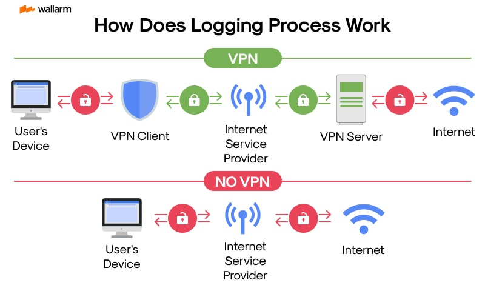

| **Inicio**         | **Siguiente 2**      |
| ------------------ | -------------------- |
| [🏠](../README.md) | [⏩](./3_2_Proxy.md) |

---

## **Índice**

| Temario                                                                                                    |
| ---------------------------------------------------------------------------------------------------------- |
| [98. ¿Qué es una VPN?](#98-qué-es-una-vpn)                                                                 |
| [99. Instalando un cliente VPN (Windows, Linux, MacOS)](#99-instalando-un-cliente-vpn-windows-linux-macos) |
| [100. Instalación Wireshark](#100-instalación-wireshark)                                                   |
| [101. Funcionamiento y configuración de una VPN](#101-funcionamiento-y-configuración-de-una-vpn)           |
| [102. Análisis del tráfico VPN](#102-análisis-del-tráfico-vpn)                                             |
| [103. ¿Qué es OpenVPN?](#103-qué-es-openvpn)                                                               |
| [104. Navegadores con VPN incorporada](#104-navegadores-con-vpn-incorporada)                               |
| [105. Funcionamiento y análisis de navegador con VPN](#105-funcionamiento-y-análisis-de-navegador-con-vpn) |
| [106. Problemas con Bettercap](#106-problemas-con-bettercap)                                               |
| [107. VPN para protegerte contra algunos ataques](#107-vpn-para-protegerte-contra-algunos-ataques)         |
| [108. ¿Por qué protonVPN? - TOSDR](#108-por-qué-protonvpn---tosdr)                                         |

---

# **VPN - Virtual Private Network**

## **98. ¿Qué es una VPN?**



### ✅ ¿Qué significa VPN?

**VPN** = **Virtual Private Network** = **Red Privada Virtual**.

Es una tecnología que crea **una conexión segura y cifrada** entre tu dispositivo (celular, computadora) y otro lugar en Internet.

👉 Su objetivo es proteger tu tráfico de miradas ajenas y permitirte “aparentar” estar en otra ubicación.

---

### ✅ Metáfora sencilla

Imagina que Internet es **una autopista pública**.

- Sin VPN: Vas en un auto de vidrio transparente. Todos pueden ver adónde vas y qué llevas.
- Con VPN: Entras en **un túnel privado y oscuro**. Nadie puede ver dentro del túnel ni rastrear tu destino.

---

### ✅ ¿Cómo funciona una VPN en la práctica?

1️⃣ Te conectas a un servidor VPN (en otro país o región).

2️⃣ Tu tráfico se **cifra (encripta)** para que nadie más lo lea.

3️⃣ Todo lo que haces en Internet pasa **a través del servidor VPN**.

4️⃣ El sitio web que visitas ve la dirección IP del **servidor VPN**, no la tuya real.

---

### ✅ Ejemplo fácil paso a paso

#### 🔹 Sin VPN:

- Tú (Perú) accedes a **[www.ejemplo.com](http://www.ejemplo.com)**
- Tu proveedor de Internet (ISP) ve:

  - Tu IP real (Perú)
  - Que visitas [www.ejemplo.com](http://www.ejemplo.com)
  - Qué páginas ves allí.

---

#### 🔹 Con VPN:

- Tú te conectas a un servidor VPN en Alemania.
- Tu ISP ve:

  - Que estás conectado a la VPN.
  - Nada más (no ve qué sitios visitas).

- [www.ejemplo.com](http://www.ejemplo.com) ve:

  - Una IP de Alemania.
  - Cree que estás en Alemania.

---

### ✅ ¿Para qué sirve una VPN?

Aquí te dejo usos comunes con ejemplos:

✅ **Privacidad**

> Navegar sin que tu proveedor de Internet, gobierno o redes públicas puedan espiar tu tráfico.

✅ **Seguridad en Wi-Fi público**

> En un café o aeropuerto, cualquiera puede interceptar datos. Con VPN, se cifran.

✅ **Acceso a contenido bloqueado**

> Ver Netflix de EE. UU. desde Perú conectándote a un servidor estadounidense.

✅ **Evitar censura**

> En países donde bloquean ciertas páginas, puedes acceder conectándote a otro país.

✅ **Trabajo remoto seguro**

> Empresas usan VPN para que empleados se conecten a la red interna desde casa.

---

### ✅ Ventajas de usar VPN

✅ Cifrado de datos → tus datos viajan seguros.

✅ Ocultas tu IP real.

✅ Eludes bloqueos geográficos.

✅ Mayor privacidad.

---

### ✅ Desventajas

❗ Puede ser más lento → el cifrado y la distancia del servidor añaden latencia.

❗ Algunas VPN gratis venden tus datos o son poco seguras.

❗ No te hace **anónimo total**: otros rastros (cookies, cuentas) pueden identificarte.

---

### ✅ Ejemplo real con Netflix

🎯 _Sin VPN:_

- Estás en Perú. Netflix solo muestra contenido disponible para Perú.

🎯 _Con VPN:_

- Te conectas a un servidor en EE. UU.
- Netflix cree que estás en EE. UU. y te muestra su catálogo.

---

### ✅ Cómo se usa una VPN (muy fácil)

1️⃣ Descargas la app de la VPN (por ejemplo, NordVPN, Surfshark, ProtonVPN).

2️⃣ Abres la app y te logueas.

3️⃣ Seleccionas un país/servidor.

4️⃣ Presionas “Conectar”.

5️⃣ Tu conexión ahora pasa cifrada por ese servidor.

---

### ✅ Resumen corto

> **VPN = túnel cifrado en Internet. Protege tu privacidad, oculta tu IP y te permite simular estar en otro lugar.**

---

[🔼](#índice)

---

## **99. Instalando un cliente VPN (Windows, Linux, MacOS)**

### 🌐 ¿Qué es un cliente VPN?

Un **cliente VPN** es un programa que instalas en tu computadora y que se encarga de:

✅ Conectarse al servidor VPN que elijas.

✅ Cifrar todo el tráfico de tu conexión.

✅ Cambiar tu IP.

Casi todas las VPN comerciales tienen su propio cliente. También puedes usar clientes genéricos como **OpenVPN** o **WireGuard**.

---

#### 🟢 Instalando un cliente VPN en **Windows**

##### 📘 Ejemplo 1: Usando una VPN comercial (NordVPN, Surfshark, etc.)

Es la manera más sencilla.

✅ **Paso 1:**

Ve al sitio web oficial de tu proveedor de VPN. Ejemplo:
[https://nordvpn.com](https://nordvpn.com)

✅ **Paso 2:**

Descarga el instalador de Windows. Suele ser un archivo `.exe`.

✅ **Paso 3:**

Haz doble clic en el archivo descargado y sigue el asistente de instalación (Siguiente > Siguiente > Instalar).

✅ **Paso 4:**

Abre el programa VPN.

✅ **Paso 5:**
Inicia sesión con tu cuenta de VPN.

✅ **Paso 6:**

Elige un país y haz clic en “Conectar”.

✅ **¡Listo!** Ahora todo tu tráfico pasa por el servidor elegido.

---

##### 📘 Ejemplo 2: Usando el cliente **OpenVPN** gratuito

Si tu empresa o tú mismo configuraste un servidor OpenVPN.

✅ **Paso 1:**

Descarga el cliente oficial:
[https://openvpn.net/community-downloads/](https://openvpn.net/community-downloads/)

✅ **Paso 2:**

Instala el programa.

✅ **Paso 3:**

Recibirás un archivo de configuración `.ovpn` de tu proveedor.

✅ **Paso 4:**

Copia ese archivo a la carpeta `C:\Program Files\OpenVPN\config`.

✅ **Paso 5:**

Abre **OpenVPN GUI** como administrador.

✅ **Paso 6:**

Haz clic derecho en el icono de OpenVPN (en la barra de tareas) y selecciona “Connect”.

---

#### 🟢 Instalando un cliente VPN en **Linux**

Aquí depende de la distribución (Ubuntu, Fedora, Arch…), pero vamos con ejemplos sencillos.

---

##### 📗 Ejemplo 1: Usando **OpenVPN** en Ubuntu

✅ **Paso 1:**

Abre la terminal.

✅ **Paso 2:**

Instala OpenVPN:

```bash
sudo apt update
sudo apt install openvpn
```

✅ **Paso 3:**

Guarda tu archivo `.ovpn` (configuración) en una carpeta.

✅ **Paso 4:**

Conéctate usando:

```bash
sudo openvpn --config /ruta/al/archivo.ovpn
```

**Ejemplo:**

```bash
sudo openvpn --config ~/Descargas/mi_vpn.ovpn
```

✅ **Paso 5:**

Verás mensajes que indican que la VPN está activa.

---

##### 📗 Ejemplo 2: Usando una app comercial (NordVPN)

✅ **Paso 1:**

Abre la terminal.

✅ **Paso 2:**

Instala NordVPN:

```bash
sh <(curl -sSf https://downloads.nordcdn.com/apps/linux/install.sh)
```

✅ **Paso 3:**

Inicia sesión:

```bash
nordvpn login
```

✅ **Paso 4:**

Conéctate:

```bash
nordvpn connect
```

---

##### 📗 Ejemplo 3: Usando **NetworkManager** (interfaz gráfica)

Si prefieres no usar terminal:

✅ Abre “Configuración de Red”.

✅ Añade una nueva VPN.

✅ Elige OpenVPN.

✅ Carga tu archivo `.ovpn`.

✅ Introduce usuario y contraseña si hace falta.

✅ Guarda y conéctate.

---

#### 🟢 Instalando un cliente VPN en **macOS**

##### 📘 Ejemplo 1: Usando un proveedor comercial

✅ **Paso 1:**

Ve al sitio oficial de tu VPN (Ej. ExpressVPN, NordVPN).

✅ **Paso 2:**

Descarga el instalador para macOS (.dmg).

✅ **Paso 3:**

Abre el archivo .dmg y arrastra el ícono de la aplicación a la carpeta **Aplicaciones**.

✅ **Paso 4:**

Abre la app VPN.

✅ **Paso 5:**

Inicia sesión con tu cuenta.

✅ **Paso 6:**

Elige un servidor y haz clic en “Connect”.

---

##### 📘 Ejemplo 2: Usando Tunnelblick (OpenVPN gratuito)

✅ **Paso 1:**

Descarga Tunnelblick:
[https://tunnelblick.net](https://tunnelblick.net)

✅ **Paso 2:**

Instálalo (abre el .dmg y sigue instrucciones).

✅ **Paso 3:**

Abre Tunnelblick.

✅ **Paso 4:**

Importa el archivo `.ovpn` que te haya dado tu proveedor o tu empresa.

✅ **Paso 5:**

Haz clic en “Connect”.

---

### 🔑 ¿Qué necesitas para cualquier método?

✅ Un proveedor de VPN o un servidor propio.

✅ Tus datos de acceso (usuario y contraseña).

✅ Archivos de configuración (.ovpn o similares) si tu VPN no tiene app propia.

---

### 🟢 Resumen por sistema operativo

| Sistema Operativo | Método fácil              | Alternativa técnica   |
| ----------------- | ------------------------- | --------------------- |
| **Windows**       | App oficial VPN           | OpenVPN GUI           |
| **Linux**         | App oficial VPN o OpenVPN | NetworkManager        |
| **macOS**         | App oficial VPN           | Tunnelblick (OpenVPN) |

---

### 🔍 Tip Final

Si eres principiante, **usa la aplicación oficial del proveedor VPN**. Es la forma más rápida y sencilla.

Si eres usuario avanzado, puedes optar por OpenVPN o WireGuard con configuraciones manuales.

---

[🔼](#índice)

---

## **100. Instalación Wireshark**

### ✅ ¿Qué es Wireshark?

Wireshark es un **analizador de protocolos de red**.
Te permite **capturar y examinar en detalle el tráfico de red** que pasa por tu computadora.

📌 Es como un **microscopio** para ver los paquetes de datos que viajan por la red.

✅ Usos comunes:

- Analizar problemas de red.
- Aprender protocolos.
- Ver qué datos viajan por la red.
- Realizar auditorías de seguridad.

---

### ✅ Requisitos previos

✅ Un sistema operativo compatible (Windows, Linux, macOS).

✅ Permisos de administrador para la instalación.

---

### ✅ Instalación en **Windows** (ejemplo paso a paso)

#### 💻 **Versión recomendada:** Windows 10 o 11

✅ **Paso 1: Descargar Wireshark**

- Ve al sitio oficial:

  👉 [https://www.wireshark.org/download.html](https://www.wireshark.org/download.html)

- Haz clic en el instalador de Windows.

✅ **Paso 2: Ejecutar el instalador**

- Doble clic en el archivo `.exe` descargado.
- Aparecerá el asistente de instalación.

✅ **Paso 3: Elegir componentes**

- Normalmente puedes dejar las opciones predeterminadas.
- Asegúrate de que **WinPcap** o **Npcap** estén seleccionados:

  - Son los drivers que permiten capturar paquetes.
  - Npcap es el más nuevo y recomendado.

✅ **Paso 4: Aceptar licencia**

- Acepta los términos.
- Sigue haciendo clic en “Next” o “Siguiente”.

✅ **Paso 5: Instalar Npcap**

- Cuando se te pregunte si quieres instalar **Npcap**, di que **Sí**.
- Npcap es necesario para capturar tráfico en vivo.

✅ **Paso 6: Finalizar instalación**

- Haz clic en **Finish**.
- Marca la casilla para iniciar Wireshark si quieres abrirlo enseguida.

✅ **¡Listo!**

- Abre Wireshark desde el menú de inicio.
- Verás la lista de interfaces de red para empezar a capturar.

---

### ✅ 📌 Ejemplo sencillo de uso en Windows

✅ Abre Wireshark.

✅ Elige tu adaptador de red (por ejemplo: Ethernet o Wi-Fi).

✅ Haz clic en **Start**.

✅ Mira los paquetes que aparecen en tiempo real.

✅ Para detener la captura, haz clic en el botón **Stop** (el cuadrado rojo).

---

### ✅ Instalación en **Linux**

Aquí depende de la distribución. Vamos a ver los más comunes.

---

#### 💻 **Ejemplo 1: Ubuntu / Debian**

✅ Abre la terminal.

✅ Escribe:

```bash
sudo apt update
sudo apt install wireshark
```

✅ Durante la instalación te puede preguntar:

> “¿Desea que los no administradores puedan capturar paquetes?”
>
> ✅ Puedes responder **Sí** o **No**:

- Sí → podrás usar Wireshark como usuario normal.
- No → necesitarás sudo para capturar.

✅ Después de instalar:

```bash
wireshark
```

o búscalo en el menú de aplicaciones.

---

#### ✅ Para permitir captura sin sudo

Si elegiste “No” y quieres cambiarlo después:

```bash
sudo dpkg-reconfigure wireshark-common
```

✅ Elige **Sí**.

✅ Luego añade tu usuario al grupo wireshark:

```bash
sudo usermod -aG wireshark $USER
```

✅ Cierra sesión y vuelve a entrar.

---

#### 💻 **Ejemplo 2: Fedora**

```bash
sudo dnf install wireshark wireshark-qt
```

✅ Para poder capturar:

```bash
sudo usermod -aG wireshark $USER
```

✅ Cierra sesión y vuelve a entrar.

---

#### 💻 **Ejemplo 3: Arch Linux / Manjaro**

```bash
sudo pacman -S wireshark-qt
```

✅ Para capturar como usuario normal:

```bash
sudo gpasswd -a $USER wireshark
```

✅ Cierra sesión y vuelve a entrar.

---

### ✅ Instalación en **macOS**

✅ **Paso 1: Descargar**

- Ve a [https://www.wireshark.org/download.html](https://www.wireshark.org/download.html).
- Descarga el instalador de macOS (.dmg).

✅ **Paso 2: Instalar**

- Abre el archivo `.dmg`.
- Arrastra el ícono de Wireshark a la carpeta **Applications**.

✅ **Paso 3: Permisos para capturar**

- macOS puede pedirte permisos para permitir la captura de tráfico.
- Es posible que necesites instalar un “ChmodBPF” helper para permitir la captura de paquetes:

  - Te preguntará al abrir Wireshark la primera vez.
  - Acepta e instala siguiendo las instrucciones en pantalla.

✅ **Paso 4: Abrir Wireshark**

- Ve a **Launchpad** o **Aplicaciones**.
- Haz clic en **Wireshark**.

✅ **¡Listo!**

- Verás las interfaces de red disponibles.
- Selecciona una y empieza a capturar.

---

### ✅ Resumen rápido por sistema operativo

| Sistema Operativo | Comando / Método fácil                       |
| ----------------- | -------------------------------------------- |
| **Windows**       | Descargar el .exe oficial y ejecutar         |
| **Ubuntu/Debian** | `sudo apt install wireshark`                 |
| **Fedora**        | `sudo dnf install wireshark`                 |
| **Arch/Manjaro**  | `sudo pacman -S wireshark-qt`                |
| **macOS**         | Descargar el .dmg oficial y arrastrar a Apps |

---

### ✅ Ejemplo de uso sencillo (todos los sistemas)

✅ Abre Wireshark.

✅ Selecciona tu adaptador de red (Wi-Fi o Ethernet).

✅ Haz clic en el botón azul con el tiburón para **Iniciar captura**.

✅ Navega en Internet o usa alguna app para generar tráfico.

✅ Observa los paquetes que aparecen.

✅ Haz clic en el botón rojo para **Detener** la captura.

---

### ✅ Tips de principiante

⭐ Usa **filtros** para no abrumarte:

```
http
ip.addr == 192.168.1.1
tcp.port == 80
```

⭐ Guarda capturas para analizarlas después.

⭐ Recuerda: necesitas permisos de administrador para capturar paquetes en muchos sistemas.

⭐ Usa solo en redes donde tengas permiso — capturar tráfico sin autorización puede ser ilegal.

---

### ✅ En resumen

> **Wireshark** = herramienta para capturar y analizar tráfico de red.
>
> **Instalación** = muy sencilla, varía un poco según el sistema operativo.
>
> ✅ Windows: descargador oficial .exe
>
> ✅ Linux: `apt`, `dnf`, `pacman`
>
> ✅ macOS: .dmg oficial

---

[🔼](#índice)

---

## **101. Funcionamiento y configuración de una VPN**

### ✅ ¿Qué es y para qué sirve una VPN?

**VPN** = **Virtual Private Network** = Red Privada Virtual.

✅ Es un sistema que **crea un “túnel cifrado” entre tu dispositivo y otro servidor en Internet.**

✅ Todo el tráfico que envías o recibes **viaja cifrado y seguro** por ese túnel.

✅ Además, **la dirección IP pública que verá el mundo será la del servidor VPN, no la tuya real.**

---

### ✅ 🌟 Ventajas principales

✅ Seguridad → El tráfico se cifra.

✅ Privacidad → Ocultas tu IP real.

✅ Acceso → Puedes “simular” estar en otro país.

✅ Saltar bloqueos → Evitar censura o restricciones geográficas.

---

### ✅ ¿Cómo funciona una VPN? (Explicación con ejemplos)

Imagina que Internet es **una carretera pública**:

🚗 _Sin VPN:_

- Vas en un auto de vidrio transparente.
- Todos (ISP, hackers en Wi-Fi público) pueden ver a dónde vas y qué llevas.

🚙 _Con VPN:_

- Entras en un túnel privado.
- Nadie puede ver dentro del túnel.
- Saldrás por la otra punta (el servidor VPN), y el destino solo ve la salida, no tu origen real.

---

✅ **Flujo paso a paso**

1️⃣ Tu dispositivo → Cifra tu tráfico.

2️⃣ Envia el tráfico cifrado → Servidor VPN.

3️⃣ Servidor VPN → Descifra y reenvía hacia el destino.

4️⃣ Respuesta del destino → Servidor VPN → Tu dispositivo (cifrado).

5️⃣ Tú descifras la respuesta.

---

✅ **Ejemplo súper sencillo**

- Estás en Lima.
- Te conectas a un servidor VPN en Nueva York.
- Abres **Google.com**.
- Google cree que estás en Nueva York (ve la IP del servidor VPN).
- Tu ISP (Movistar/Claro/etc.) solo ve que te conectas a la VPN, no sabe que visitas Google.

---

✅ **Con VPN puedes:**

⭐ Ver Netflix de EE. UU. desde otro país.

⭐ Usar Wi-Fi público sin miedo a robo de datos.

⭐ Evitar la censura de tu gobierno o red corporativa.

---

### ✅ ¿Cómo se configura una VPN? (explicación bien detallada y sencilla)

Hay **dos formas principales**:

✅ A. Usar un proveedor de VPN comercial (más fácil).

✅ B. Configurarla manualmente (más técnico, pero posible).

---

### ✅ A. Usar un proveedor VPN (Fácil)

**1️⃣ Paso 1: Elegir proveedor**

- Ejemplos: NordVPN, Surfshark, ExpressVPN, ProtonVPN.
- Ellos te dan la app, servidores y soporte.

---

**2️⃣ Paso 2: Crear cuenta y pagar (o usar plan gratuito)**

---

**3️⃣ Paso 3: Descargar la aplicación**

✅ Windows: archivo .exe

✅ MacOS: archivo .dmg

✅ Linux: .deb/.rpm o AppImage

✅ Android/iOS: desde Play Store/App Store

---

**4️⃣ Paso 4: Instalar**

✅ Sigue el asistente de instalación.

✅ Usualmente es: "Siguiente → Siguiente → Instalar".

---

**5️⃣ Paso 5: Abrir la app y entrar con tu cuenta**

---

**6️⃣ Paso 6: Elegir ubicación**

✅ Ejemplo:

- Quieres ver contenido de EE. UU. → seleccionas “Estados Unidos”.
- Quieres privacidad → seleccionas el país que prefieras.

---

**7️⃣ Paso 7: Hacer clic en “Connect”**

✅ ¡Listo!

- Todo el tráfico de tu dispositivo pasa por el servidor elegido.
- Tu IP pública cambia.
- Tu tráfico está cifrado.

---

### ✅ 📌 Ejemplo real

🎯 Imagina que usas Surfshark:

- Abres la app.
- Inicias sesión.
- Eliges “United States”.
- Haces clic en **Connect**.
- Ahora todo tu tráfico aparenta venir de EE. UU.

---

### ✅ B. Configurar una VPN manualmente (más técnico)

Si no usas una app comercial, puedes configurarla manualmente usando protocolos como **OpenVPN** o **WireGuard**.

---

#### ✅ 🌟 Ejemplo de configuración con OpenVPN

🔹 Necesitas:

✅ Archivo de configuración `.ovpn` (te lo da tu proveedor o tu empresa).

✅ Cliente OpenVPN.

---

#### **Windows**

✅ 1️⃣ Descargar e instalar OpenVPN:

👉 [https://openvpn.net/community-downloads/](https://openvpn.net/community-downloads/)

✅ 2️⃣ Copiar el archivo `.ovpn` a la carpeta:

```
C:\Program Files\OpenVPN\config
```

✅ 3️⃣ Abrir **OpenVPN GUI** como administrador.

✅ 4️⃣ Clic derecho en el ícono → **Connect**.

✅ ¡Conectado!

---

### **Linux (Ubuntu ejemplo)**

```bash
sudo apt update
sudo apt install openvpn
```

✅ Ejecutar:

```bash
sudo openvpn --config /ruta/a/tu/archivo.ovpn
```

✅ ¡Listo!

---

#### **macOS con Tunnelblick**

✅ Descargar desde:

👉 [https://tunnelblick.net](https://tunnelblick.net)

✅ Instalar.

✅ Importar archivo `.ovpn`.

✅ Conectar.

---

### ✅ Nota

- Con WireGuard es similar, pero con archivos `.conf`.
- Muchos proveedores ofrecen archivos para ambos protocolos.

---

### ✅ ¿Qué datos necesitas para configuración manual?

✅ Servidor (IP o dominio).

✅ Puerto.

✅ Protocolo (UDP/TCP, OpenVPN/WireGuard).

✅ Usuario y contraseña o certificado.

✅ Archivos de configuración.

---

### ✅ Resumen súper claro

✅ Una VPN → crea un **túnel cifrado** entre tú y un servidor.

✅ El mundo ve la IP del servidor VPN, no la tuya real.

✅ Usos: privacidad, saltar bloqueos, seguridad en Wi-Fi público.

✅ Configuración fácil:

⭐ Usar la app del proveedor (solo iniciar sesión y conectar).

✅ Configuración manual:

⭐ Usar OpenVPN, WireGuard, etc. con archivos de configuración.

---

### ✅ Ejemplo completo y fácil

**Escenario:** Quiero ver Netflix de EE. UU. desde Perú.

✅ Paso 1: Descargo NordVPN.

✅ Paso 2: Ingreso con mi cuenta.

✅ Paso 3: Selecciono “United States”.

✅ Paso 4: Hago clic en “Connect”.

✅ Paso 5: Abro Netflix → me muestra catálogo de EE. UU.

---

### ✅ Tips finales

⭐ Usa apps oficiales → más fácil y seguro.

⭐ No todas las VPN gratis son confiables → investiga bien.

⭐ Para empresas → pueden requerir configuraciones avanzadas.

⭐ Usa siempre cifrado fuerte (OpenVPN, WireGuard).

---

[🔼](#índice)

---

## **102. Análisis del tráfico VPN**

### ✅ ¿Qué es el análisis del tráfico VPN?

**Análisis de tráfico** significa examinar los datos que se transmiten por la red para entender qué ocurre:

✅ Qué protocolos se usan.

✅ Qué direcciones IP se comunican.

✅ Cuándo y cuánto se transmite.

✅ Qué contenido hay en los paquetes.

---

**Pero cuando se usa una VPN**, tu tráfico está **cifrado**.

✅ El objetivo de la VPN es **ocultar** el contenido real del tráfico.

✅ El análisis del tráfico VPN solo te permite ver:

⭐ Metadatos → quién se conecta a quién, cuándo, cuánto.

⭐ No el contenido → porque está cifrado.

---

### ✅ ¿Qué se puede analizar en el tráfico VPN?

Cuando analizas tráfico VPN en la red (por ejemplo con Wireshark), puedes ver:

✅ **1️⃣ Conexión al servidor VPN**

- Dirección IP del servidor VPN.
- Puerto usado (ej: 1194 para OpenVPN, 443 para HTTPS).
- Protocolo → TCP/UDP.
- Hora de conexión.

✅ **2️⃣ Protocolo de VPN usado**

- OpenVPN.
- WireGuard.
- IPSec.
- L2TP.
- SSL/TLS.

✅ **3️⃣ Tamaño de paquetes**

- Cuánto se transmite.
- Cuán frecuentemente.

✅ **4️⃣ Enrutamiento**

- Qué interfaz se usa.
- Qué rutas se agregan.

✅ **¡Pero NO puedes ver:**

❌ A qué páginas visita el usuario dentro del túnel.

❌ Qué datos se envían (contraseñas, mensajes).

---

### ✅ ¿Cómo se ve el tráfico VPN en Wireshark?

Vamos a hacerlo con **un ejemplo fácil de entender**.

---

#### 🎯 Escenario:

Un usuario en su casa se conecta a un servidor VPN usando **OpenVPN**.

✅ Antes de conectarse a la VPN:

- Wireshark muestra:

```
TCP connections a google.com
HTTP requests a example.com
DNS queries a 8.8.8.8
```

✅ Todo es visible.

---

✅ Después de conectarse a la VPN:

- Wireshark muestra:

```
UDP traffic a 203.0.113.10:1194
OpenVPN Protocol
```

- El tráfico “real” a Google o Example.com desaparece de la red local.
- Solo ves los paquetes cifrados saliendo hacia el servidor VPN.

---

✅ Detalle en Wireshark:

```
Packet 1: Client Hello (TLS) → inicio del túnel.
Packet 2: Encrypted Application Data
Packet 3: Encrypted Application Data
...
```

- TODO el contenido después de negociar la clave está cifrado.

---

### 📌 **En resumen:**

✅ Puedes ver:

- Que alguien usa VPN.
- A qué servidor VPN se conecta.
- Cuánto tráfico envía.

✅ No puedes ver:

- Sitios web visitados.
- Contraseñas.
- Mensajes.

---

### ✅ Ejemplo práctico paso a paso en Wireshark

✅ Imagina que estás usando **OpenVPN** en tu PC.

#### 🔹 Paso 1:

Abres Wireshark y eliges tu interfaz (Wi-Fi o Ethernet).

---

#### 🔹 Paso 2:

Empiezas la captura → clic en el botón azul.

---

#### 🔹 Paso 3:

Conectas tu VPN.

- De pronto ves muchas líneas como:

```
UDP 203.0.113.10 → 1194
Protocol: OpenVPN
Length: 134 bytes
```

✅ Son paquetes cifrados.

---

#### 🔹 Paso 4:

Filtras en Wireshark:

```
udp.port == 1194
```

✅ Solo ves el tráfico OpenVPN.

---

✅ _Explicación sencilla de lo que estás viendo:_

- Tu PC → servidor VPN → todo cifrado.
- No sabes si dentro hay Netflix, Google, o Facebook → porque está cifrado.

---

### ✅ Otro ejemplo: WireGuard

✅ WireGuard usa UDP (típicamente puerto 51820).

✅ Paquetes en Wireshark se ven así:

```
UDP 203.0.113.20 → 51820
WireGuard
Message Type: Transport Data
Length: 148 bytes
```

✅ TODO el contenido → cifrado.

---

### ✅ Ejemplo de análisis más técnico

✅ Puedes medir:

- Cuánto tráfico genera la VPN.
- Cuándo se conecta.
- A qué IP del servidor VPN se conecta.

✅ Pero **no puedes** descifrar:

- Qué sitios web está visitando.
- Qué datos se envían.

---

### ✅ Limitaciones del análisis de tráfico VPN

✅ El cifrado protege el contenido.

✅ Solo puedes ver metadatos:

⭐ Quién se conecta.

⭐ Cuándo.

⭐ Cuánto tráfico.

⭐ A qué servidor VPN.

✅ No puedes ver:

❌ Qué páginas visita.

❌ Qué escribe.

❌ Qué descarga.

---

### ✅ ¿Para qué sirve analizar el tráfico VPN?

✅ Seguridad de red:

⭐ Detectar si alguien usa VPN en una red corporativa.

⭐ Ver si hay conexiones no autorizadas.

⭐ Monitorear volumen de tráfico.

✅ Investigación forense:

⭐ Saber que alguien usaba VPN.

⭐ Inferir comportamiento (horario, tamaño de transferencia).

✅ Optimización:

⭐ Ver latencia y pérdida de paquetes en el túnel.

---

### ✅ Consideraciones éticas y legales

⚠️ Analizar tráfico de red en redes ajenas o sin permiso puede ser ilegal.

⚠️ Usar Wireshark para espiar tráfico ajeno sin autorización es un delito en muchos países.

✅ Siempre analiza el tráfico en redes que **te pertenezcan** o tengas permiso para auditar.

---

### ✅ Resumen súper claro

⭐ **VPN crea un túnel cifrado entre tu dispositivo y un servidor remoto.**

⭐ **El análisis de tráfico VPN en herramientas como Wireshark te permite ver:**

✅ IP y puerto del servidor VPN.

✅ Protocolo (OpenVPN, WireGuard, IPSec).

✅ Tamaño y cantidad de tráfico.

✅ Tiempo de conexión.

⭐ **NO puedes ver:**

❌ Contenido de las páginas.

❌ Mensajes.

❌ Contraseñas.

---

### ✅ Metáfora para cerrar

🎯 Imagínate:

- Sin VPN → paquete postal transparente → todos ven el contenido.
- Con VPN → caja fuerte sellada → solo ves de dónde sale y a dónde va, pero no puedes abrirla.

---

[🔼](#índice)

---

## **103. ¿Qué es OpenVPN?**

### ✅ Definición sencilla

**OpenVPN** es un **software** (y protocolo) de VPN **gratuito y de código abierto**.

✅ Te permite **crear un túnel cifrado** entre tu dispositivo y un servidor remoto.

✅ Su principal objetivo es **proteger tu conexión a Internet** y **ocultar tu dirección IP**.

En otras palabras:

> ⭐ OpenVPN = herramienta para crear tu propia VPN o conectarte a un servicio VPN usando su protocolo.

---

### ✅ Metáfora sencilla

🎯 Imagina que Internet es **una autopista pública**.

- Sin VPN → Vas en un coche transparente → todos pueden ver a dónde vas.
- Con OpenVPN → Vas en un **túnel privado, oscuro y seguro** → nadie puede ver lo que transportas ni tu destino final.

---

### ✅ ¿Cómo funciona OpenVPN? (Explicación paso a paso)

✅ Crea un **túnel cifrado** (usualmente con TLS/SSL).

✅ Todo el tráfico de tu dispositivo pasa **cifrado** hacia un servidor OpenVPN.

✅ El servidor descifra tu tráfico y lo envía al destino en Internet.

✅ Las respuestas viajan de vuelta cifradas por el túnel.

---

✅ **Paso a paso práctico:**

1️⃣ Tu dispositivo → Empaqueta y **cifra** el tráfico.

2️⃣ Lo envía a un **servidor OpenVPN** (por ejemplo en EE. UU.).

3️⃣ El servidor OpenVPN lo **descifra** y lo reenvía a Google, Netflix, etc.

4️⃣ La respuesta vuelve al servidor.

5️⃣ El servidor **cifra** la respuesta y la envía de vuelta a ti.

6️⃣ Tú la **descifras** y la ves en tu navegador.

---

✅ **Resultado:**

⭐ Tu proveedor de Internet (ISP) solo ve que estás conectado al servidor OpenVPN.

⭐ No sabe qué páginas visitas ni el contenido.

⭐ El sitio web que visitas ve la IP del servidor OpenVPN, no la tuya real.

---

### ✅ Ejemplo fácil de entender

Imagina:

- Estás en Perú.
- Te conectas con OpenVPN a un servidor en EE. UU.

✅ Abres Netflix.

✅ Netflix ve la IP de EE. UU. → te muestra el catálogo de Estados Unidos.

✅ Tu ISP en Perú solo ve tráfico cifrado → no sabe que es Netflix.

---

### ✅ Usos típicos de OpenVPN

✅ Conexiones **seguras** en redes públicas (cafés, aeropuertos).

✅ Acceso **remoto** a redes corporativas.

✅ Evitar **censura** (acceder a sitios bloqueados en tu país).

✅ **Ocultar tu IP** real.

✅ Montar tu **propio servidor VPN** (autohospedado).

---

### ✅ ¿Qué necesito para usar OpenVPN?

✅ 1️⃣ Cliente OpenVPN → tu computadora o celular.

✅ 2️⃣ Servidor OpenVPN → al que te vas a conectar.

💡 El servidor puede ser:

⭐ De un proveedor comercial (ejemplo: NordVPN, Surfshark, ProtonVPN).

⭐ Tu propio servidor en la nube (AWS, DigitalOcean, tu casa).

---

### ✅ Componentes principales de OpenVPN

✅ **Cliente** → el software en tu dispositivo que establece la conexión.

✅ **Servidor** → el punto remoto que recibe tu tráfico cifrado y lo reenvía.

✅ **Archivos de configuración** → generalmente terminan en `.ovpn`.

✅ **Certificados y claves** → para autenticar y cifrar la conexión.

---

### ✅ Ejemplo práctico: Conexión con OpenVPN

**Escenario:** Quieres conectarte a un servidor VPN de tu trabajo.

✅ Paso 1: Tu empresa te da un archivo `empresa.ovpn`.

✅ Paso 2: Descargas el cliente OpenVPN.

✅ Paso 3: Importas el archivo `empresa.ovpn`.

✅ Paso 4: Haces clic en **Connect**.

✅ Resultado:

⭐ Todo tu tráfico va cifrado hacia la red de tu empresa.

⭐ Puedes acceder a recursos internos (servidores, bases de datos).

⭐ Nadie en la red pública ve el contenido de tu conexión.

---

### ✅ ¿Cómo se ve el archivo de configuración? (.ovpn)

Ejemplo muy simplificado:

```
client
dev tun
proto udp
remote vpn.empresa.com 1194
resolv-retry infinite
nobind
persist-key
persist-tun
<ca>
-----BEGIN CERTIFICATE-----
(Contenido del certificado)
-----END CERTIFICATE-----
</ca>
```

✅ Contiene:

⭐ Dirección del servidor.

⭐ Puerto y protocolo.

⭐ Certificados para autenticación.

---

### ✅ Ventajas de OpenVPN

✅ Código abierto y gratuito.

✅ Muy seguro (usa TLS/SSL con cifrado fuerte).

✅ Altamente configurable.

✅ Compatible con muchos sistemas (Windows, Linux, macOS, Android, iOS).

✅ Puede funcionar en puertos típicos como 443 → difícil de bloquear.

---

### ✅ Desventajas de OpenVPN

⚠️ Un poco más complejo de configurar manualmente.

⚠️ Puede ser más lento que WireGuard (más ligero y moderno).

⚠️ Requiere gestionar certificados y claves si haces tu propio servidor.

---

### ✅ Proveedores comerciales que usan OpenVPN

Muchos servicios VPN comerciales permiten usar OpenVPN:

✅ NordVPN.

✅ ProtonVPN.

✅ Surfshark.

✅ ExpressVPN.

💡 Te dan **archivos .ovpn** para usarlos con el cliente oficial de OpenVPN si quieres.

---

### ✅ Instalación sencilla del cliente OpenVPN

✅ **Windows:**

- Descargar de [https://openvpn.net/community-downloads/](https://openvpn.net/community-downloads/).
- Instalar.
- Importar `.ovpn`.
- Conectar.

---

✅ **Linux (Ubuntu):**

```bash
sudo apt update
sudo apt install openvpn
sudo openvpn --config tuarchivo.ovpn
```

---

✅ **macOS:**

- Usar **Tunnelblick** (cliente gráfico para OpenVPN).
- Importar archivo `.ovpn`.
- Conectar.

---

✅ **Android/iOS:**

- App oficial **OpenVPN Connect**.
- Importar archivo `.ovpn`.
- Conectar.

---

### ✅ Resumen súper sencillo

> **OpenVPN** = Software y protocolo para crear conexiones VPN seguras y cifradas.

✅ Es como **un túnel seguro en Internet**:

⭐ Nadie puede ver el contenido.

⭐ El destino ve la IP del servidor VPN, no la tuya.

⭐ Protege tu privacidad y te permite simular estar en otro país.

---

### ✅ Metáfora para cerrar

> ⭐ **OpenVPN es como enviar tus cartas en un cofre cerrado con candado.**
>
> Solo tú y el servidor tienen la llave para abrirlo.

---

[🔼](#índice)

---

## **104. Navegadores con VPN incorporada**

### ✅ ¿Qué es un navegador con VPN incorporada?

Un **navegador con VPN incorporada** es un navegador web (como Chrome o Firefox) que trae **una función de VPN integrada**.

✅ Te permite cifrar el tráfico **que sale del navegador**, **sin necesidad de instalar apps adicionales**.

✅ Generalmente tiene un botón o ajuste para **encender/apagar la VPN**.

✅ Suele ofrecer **ubicaciones de servidor** para elegir en qué país quieres simular estar.

---

✅ ⭐ Idea sencilla:

> Es como si el navegador tuviera un **túnel privado propio** para todo lo que haces en él.

⚠️ _Pero solo para el navegador._

✅ Otras apps (Netflix, Spotify, correo externo) **no usan esa VPN.**

---

### ✅ ¿Cómo funciona? (explicación paso a paso con ejemplo)

#### 🎯 Imagina este escenario:

✅ Sin VPN:

- Abres tu navegador.
- Tu proveedor de Internet ve:

  - Que visitas Google.
  - Que visitas Facebook.
  - Qué páginas visitas.

---

✅ Con VPN incorporada:

- Activas el botón de VPN en el navegador.
- Todo el tráfico del navegador se **cifra**.
- Tu proveedor de Internet **solo ve que te conectas al servidor VPN**.
- Google, Facebook y demás **ven la IP del servidor VPN** (en otro país).

---

✅ **Ejemplo real fácil de entender:**

- Estás en Perú.
- Activas la VPN del navegador y eliges "Estados Unidos".
- Abres YouTube.
- YouTube cree que estás en EE. UU.
- Tu ISP no puede ver que visitas YouTube, solo que estás conectado a la VPN.

---

✅ **Flujo técnico simplificado:**

```
Tú (navegador) → Servidor VPN (cifra y reenvía) → Destino en Internet
```

---

### ✅ Ventajas y limitaciones

✅ **⭐ Ventajas:**

✅ Muy fácil de usar → solo activar un botón.

✅ No necesitas instalar programas extras.

✅ Protege tu tráfico de navegación web.

✅ Puede ayudarte a saltar bloqueos geográficos de páginas.

---

✅ **⚠️ Limitaciones:**

❌ Solo protege lo que pasa en el navegador.

- Otras apps (correo externo, descargas P2P) **no usan la VPN**.

  ❌ No siempre tiene servidores en todos los países.

  ❌ Suele ser más básico que un servicio VPN completo.

  ❌ Algunas opciones son de pago o limitadas en datos.

---

### ✅ Ejemplos de navegadores con VPN incorporada

✅ **🌟 1. Opera**

- Muy popular.
- VPN gratuita integrada.
- Puedes elegir regiones generales (Américas, Europa, Asia).
- Sin límite de tiempo ni datos.
- Muy fácil de activar desde la barra de direcciones.

---

✅ **🌟 2. Opera GX**

- Versión para gamers.
- Incluye la misma VPN que Opera.
- Personalizable y con estética gamer.

---

✅ **🌟 3. Brave (Firewall + VPN en móvil)**

- Brave Desktop → VPN no incorporada (usa Tor en pestañas privadas).
- Brave en iOS/Android → incluye VPN (de pago, funciona como VPN de dispositivo completo).

---

✅ **🌟 4. Mozilla Firefox (con Mozilla VPN)**

- No trae VPN gratuita “incorporada” como Opera.
- Pero ofrece **Mozilla VPN** como servicio extra (de pago).
- Funciona a nivel de sistema, no solo navegador.

---

✅ **🌟 5. Edge y Chrome**

- No tienen VPN incorporada estándar.
- Pero Edge está probando un “Secure Network” (VPN básica).
- Chrome permite extensiones de VPN (no es lo mismo que tener VPN integrada).

---

### ✅ Ejemplo práctico de uso fácil

✅ ⭐ **Opera (el más conocido y sencillo)**

📌 **Paso a paso:**

1️⃣ Descarga Opera desde [https://www.opera.com](https://www.opera.com).

2️⃣ Instala el navegador.

3️⃣ Abre Opera.

4️⃣ Ve a “Configuración” (⚙️).

5️⃣ Busca **VPN**.

6️⃣ Activa la opción **“Habilitar VPN”**.

7️⃣ Aparecerá un botón azul en la barra de direcciones → haz clic para activarla.

8️⃣ Elige región → América, Europa, Asia.

9️⃣ Navega con VPN activada → IP cambiada y tráfico cifrado.

---

✅ ⭐ **Opera GX (para gamers):**

- Mismo proceso, pero con diseño gamer.
- Incluye la misma VPN gratuita.

---

✅ ⭐ **Brave en iPhone/Android:**

- Descarga Brave desde la tienda.
- Ve a Configuración → VPN.
- Activa el servicio (requiere pago).
- VPN cifra todo el tráfico del teléfono.

---

### ✅ Comparación fácil

| Navegador       | VPN Gratis                    | Ubicaciones            | Funciona en todo el sistema | Observaciones               |
| --------------- | ----------------------------- | ---------------------- | --------------------------- | --------------------------- |
| Opera           | ✅ Sí                         | Américas, Europa, Asia | ❌ Solo navegador           | Muy fácil de usar           |
| Opera GX        | ✅ Sí                         | Américas, Europa, Asia | ❌ Solo navegador           | Igual que Opera             |
| Brave (desktop) | ❌ (Tor en pestañas privadas) | -                      | ❌ Solo Tor en pestañas     | No es VPN tradicional       |
| Brave (móvil)   | ❌ (de pago)                  | Varias                 | ✅ Sí                       | VPN de dispositivo completo |
| Firefox         | ❌ (VPN de pago)              | 30+ países             | ✅ Sí                       | Mozilla VPN cuesta extra    |

---

### ✅ Resumen súper claro

⭐ **Un navegador con VPN incorporada** te permite:

✅ Cifrar el tráfico web que generas en ese navegador.

✅ Cambiar tu ubicación virtual (IP).

✅ Evitar bloqueos y censura en páginas web.

⚠️ **Limitación importante:**

❌ Solo cifra el tráfico DEL NAVEGADOR → otras apps no usan esa VPN.

---

### ✅ Metáfora sencilla para recordar

> Navegador con VPN incorporada = **Cabina privada y segura solo para tu navegación web.**
>
> VPN de sistema completo = **Carretera privada para TODO el tráfico de tu dispositivo.**

---

### ✅ ¿Para quién es ideal un navegador con VPN?

✅ Usuarios que solo quieren privacidad básica al **navegar**.

✅ Saltar restricciones web rápidas (como leer un artículo bloqueado por región).

✅ No quieren pagar ni complicarse instalando apps.

---

### ✅ Tip final

✅ Si quieres **protección total de todo tu dispositivo**, considera una **VPN completa** (NordVPN, Surfshark, ProtonVPN).

✅ Si solo quieres privacidad en navegación → **Opera VPN** es perfecto, gratis y fácil.

---

[🔼](#índice)

---

## **105. Funcionamiento y análisis de navegador con VPN**

### ✅ ¿Qué es un navegador con VPN incorporada?

Es un navegador web (como Opera o Brave) que tiene **una función de VPN integrada directamente en el propio navegador**.

✅ No necesitas instalar programas externos.

✅ Activas la VPN dentro del navegador.

✅ Solo el tráfico generado por el navegador pasa por la VPN.

---

✅ **Ejemplo concreto:**

- Usas Opera.
- Activas su VPN.
- Cuando visitas Google en Opera, tu tráfico va cifrado al servidor VPN y sale con otra IP (por ejemplo, de EE. UU.).
- Pero si abres Spotify (app de escritorio), **ese tráfico no usa la VPN**.

---

### ✅ ¿Cómo funciona? (explicación paso a paso)

✅ Veamos **el flujo de datos** con un ejemplo claro.

#### ⭐ Sin VPN (navegador normal):

- Tú → proveedor de Internet (ISP) → destino (Google, Facebook).
- Tu ISP ve **todas las webs** que visitas.
- Las webs ven tu **IP real**.

---

✅ ⭐ Con VPN incorporada:

- Tú → navegador cifra el tráfico → servidor VPN → destino.
- Tu ISP solo ve que te conectas a un servidor VPN.
- Las webs ven la **IP del servidor VPN**.

---

✅ **Flujo en pasos fáciles:**

1️⃣ Activar VPN en el navegador.

2️⃣ Elegir ubicación (por ejemplo, "Américas").

3️⃣ El navegador cifra las solicitudes HTTP/HTTPS.

4️⃣ El tráfico cifrado viaja al servidor VPN.

5️⃣ El servidor VPN descifra y reenvía la solicitud al sitio web.

6️⃣ El sitio web responde al servidor VPN.

7️⃣ El servidor VPN cifra la respuesta y la devuelve a tu navegador.

---

✅ **Resultado:**

⭐ Tu ISP no sabe a qué webs entras.

⭐ Las webs piensan que estás en el país del servidor VPN.

⭐ Tu dirección IP pública cambia.

---

### ✅ Ejemplo muy fácil de entender

✅ Imagina:

- Estás en Perú.
- Activas la VPN en Opera y eliges "Europa".

✅ Luego:

- Abres YouTube.
- YouTube ve una IP de Europa → te muestra contenido europeo.
- Tu proveedor de Internet (Movistar, Claro) solo ve que te conectaste a la VPN → no sabe que visitas YouTube.

---

✅ **Metáfora sencilla:**

⭐ Sin VPN: envías cartas en sobres transparentes → todos ven el contenido.

⭐ Con VPN en el navegador: tus cartas del navegador viajan en un tubo blindado hasta un amigo en otro país → tu amigo las manda al destino → el destinatario cree que tu amigo las envió.

---

### ✅ Qué datos protege y qué NO protege

✅ **Protege:**

⭐ Todo el tráfico generado DENTRO del navegador.

⭐ Ejemplo: navegar en Google, Facebook, YouTube.

⭐ Oculta tu IP real en el navegador.

⭐ Cifra el contenido para tu ISP o red local.

---

✅ **No protege:**

❌ Aplicaciones fuera del navegador (Spotify, juegos en línea, apps de videollamadas).

❌ Todo el tráfico del sistema operativo.

❌ DNS a veces puede filtrarse (si la VPN del navegador no maneja bien el DNS).

---

### ✅ Análisis del tráfico con Wireshark

✅ Vamos a explicar cómo se ve en la red local cuando usas un navegador con VPN.

---

#### ⭐ Caso 1: Sin VPN

📌 Qué verías en Wireshark:

```
GET / HTTP/1.1
Host: google.com

DNS request: google.com
```

✅ Tu ISP o Wireshark ve:

- A qué dominio te conectas.
- Qué protocolo usas.
- Incluso detalles del contenido si no es HTTPS.

---

#### ⭐ Caso 2: Con VPN en el navegador

✅ El tráfico del navegador se cifra y se envía al servidor VPN.

✅ Wireshark ya NO ve el contenido real.

✅ En Wireshark se ve algo así:

```
TCP connection to 34.102.199.55:443
Encrypted Application Data
```

✅ Solo ves:

⭐ IP del servidor VPN.

⭐ Puerto usado (generalmente 443 o 80 o algún puerto custom).

⭐ Tamaño de los paquetes.

✅ No puedes ver:

❌ El sitio real visitado.

❌ El contenido de la página.

---

✅ **Explicación sencilla:**

> La VPN del navegador mete todo el tráfico web en un “túnel cifrado”.
>
> Tu ISP solo ve el túnel, no lo que pasa adentro.

---

#### ✅ Ejemplo súper práctico:

- Sin VPN activada:

```
DNS: youtube.com
TCP: IP de youtube.com
HTTPS: Certificado de YouTube
```

- Con VPN activada en Opera:

```
TCP: IP del servidor VPN (por ejemplo, 146.58.102.3)
Encrypted Application Data
```

✅ YouTube no ve tu IP real.

✅ Tu ISP no ve que visitas YouTube.

---

#### ✅ Pero ojo:

- Spotify (app) no usa la VPN del navegador.
- WhatsApp Desktop tampoco.
- Solo el tráfico del navegador pasa por el túnel.

---

### ✅ Ventajas y limitaciones

✅ **⭐ Ventajas:**

✅ Fácil de activar → botón en el navegador.

✅ No necesitas instalar apps adicionales.

✅ Protege privacidad al navegar.

✅ Cambia tu IP pública en el navegador.

✅ Puede desbloquear contenido georrestringido.

---

✅ **⚠️ Limitaciones:**

❌ Solo protege el navegador → no cubre otras apps.

❌ Suele ser menos configurable.

❌ Pocas ubicaciones disponibles (Opera ofrece regiones generales).

❌ A veces es más lento que una VPN completa.

---

### ✅ Resumen súper claro

✅ Navegador con VPN incorporada = **túnel cifrado solo para tu navegación web**.

✅ Cifra el tráfico del navegador → ISP no ve tus páginas.

✅ Cambia tu IP pública → puedes parecer en otro país.

✅ Fácil de usar → botón on/off.

✅ No protege apps externas ni todo el dispositivo.

---

### ✅ Metáfora para cerrar

⭐ **Navegador con VPN:**

✅ Es como una “cabina blindada” para tus paseos en el navegador.

✅ Todo lo que haces ahí está protegido y oculto.

❌ Pero si sales de la cabina (otras apps), **no tienes protección**.

---

[🔼](#índice)

---

## **106. Problemas con Bettercap**

### ✅ ¿Qué es Bettercap?

⭐ **Bettercap** es una herramienta de ciberseguridad.

✅ Es muy usada para **tests de penetración** y **auditorías de seguridad en redes**.

✅ Permite hacer ataques como:

- Interceptar tráfico (Man in the Middle, MITM).
- Sniffing (escuchar paquetes).
- Spoofing (falsificar direcciones).
- Escaneo de red.

✅ Es potente y se usa en **Linux, macOS y Windows** (con limitaciones en Windows).

---

✅ **Metáfora sencilla:**

> Bettercap es como un "cuchillo suizo" para redes. Puedes analizar, modificar o redirigir tráfico de red, todo desde un terminal.

---

### ✅ ¿Para qué se usa?

✅ Simular ataques para detectar fallas.

✅ Interceptar tráfico HTTP.

✅ Ver credenciales en texto claro (en tráfico no cifrado).

✅ Hacer ARP spoofing para interceptar tráfico LAN.

✅ Analizar redes Wi-Fi.

---

✅ **Ejemplo práctico fácil:**

- Te conectas a una red Wi-Fi pública.
- Usas Bettercap para interceptar tráfico no cifrado.
- Puedes ver contraseñas que alguien escriba en HTTP (¡no HTTPS!).

---

### ✅ Problemas comunes con Bettercap

✅ Bettercap es muy poderoso, pero suele dar problemas:

⚠️ **Problema A:** Requiere privilegios de root/sudo.

⚠️ **Problema B:** Falta de dependencias o instalación incorrecta.

⚠️ **Problema C:** Problemas con permisos de red (firewall, iptables).

⚠️ **Problema D:** HTTPS hace imposible ver contenido sin trucos extra.

⚠️ **Problema E:** Ataques MITM no funcionan en redes segmentadas.

⚠️ **Problema F:** Windows tiene limitaciones.

⚠️ **Problema G:** Antenas Wi-Fi incompatibles.

⚠️ **Problema H:** Sistema IDS/IPS bloquea el ataque.

---

### ✅ Ejemplos concretos y causas

Vamos uno por uno, **con lenguaje fácil y ejemplos**:

---

#### ⭐ Problema A: Privilegios de root

✅ Bettercap necesita acceso a interfaces de red.

✅ Sin sudo/root → muchos módulos no funcionan.

📌 **Ejemplo:**

```
bettercap -iface eth0
```

❌ Error: Permission denied.

✅ **Solución:**

```
sudo bettercap -iface eth0
```

---

#### ⭐ Problema B: Dependencias faltantes

✅ Si no instalas paquetes necesarios, falla.

📌 **Ejemplo:**

```
caplets/http-req-dump.cap: module 'http.proxy' not found
```

✅ Falta instalar el módulo.

✅ **Solución:**

```
sudo apt install bettercap
bettercap -eval "caplets.update"
```

---

#### ⭐ Problema C: Firewall o iptables

✅ El sistema puede bloquear redirección de puertos.

📌 **Ejemplo:**

ARP spoofing funciona → pero no ves tráfico.

✅ Causa → iptables no redirige tráfico.

✅ **Solución:**

```
sudo sysctl -w net.ipv4.ip_forward=1
sudo iptables -t nat -A PREROUTING -p tcp --destination-port 80 -j REDIRECT --to-port 8080
```

---

#### ⭐ Problema D: HTTPS cifrado

✅ Aunque hagas MITM, no ves datos HTTPS.

📌 **Ejemplo:**

- Capturas tráfico.
- Todo está cifrado.

✅ Causa → HTTPS usa TLS.

✅ **Solución:**

⭐ No hay forma “legal” de romperlo sin certificates falsos.

⭐ Técnicas avanzadas → sslstrip, HSTS bypass, muy limitadas hoy.

⭐ Mejor: interceptar solo HTTP.

---

#### ⭐ Problema E: Redes segmentadas

✅ ARP spoofing solo funciona en la misma subred.

📌 **Ejemplo:**

- Bettercap activo.
- No intercepta tráfico de otro segmento.

✅ Causa → Switch/router impide ARP poisoning.

✅ **Solución:**

❌ No puedes saltar redes segmentadas con ARP spoof.

✅ Necesitas acceso en la misma LAN.

---

#### ⭐ Problema F: Limitaciones en Windows

✅ Windows tiene menos soporte.

📌 **Ejemplo:**

- ARP spoofing no funciona igual.
- Falta soporte para algunos módulos.

✅ **Solución:**

⭐ Usar Linux o Kali.

⭐ WSL2 en Windows → mejor, pero no todo funciona.

---

#### ⭐ Problema G: Antenas Wi-Fi incompatibles

✅ Para ataques Wi-Fi → necesitas tarjeta en modo monitor.

📌 **Ejemplo:**

```
wifi.recon on
```

❌ Error → no hay interfaz en modo monitor.

✅ Causa → hardware no compatible.

✅ **Solución:**

⭐ Usar adaptador compatible (Alfa AWUS036NHA, etc.).

---

#### ⭐ Problema H: IDS/IPS en la red

✅ Redes empresariales → IDS/IPS bloquea ARP spoof.

📌 **Ejemplo:**

- En casa funciona.
- En la empresa, no.

✅ Causa → sistemas detectan ARP poisoning.

✅ **Solución:**

⭐ No hay solución sencilla → ataque bloqueado por diseño.

---

### ✅ 5️⃣ Ideas de solución por problema

| Problema            | Causa                       | Solución fácil                     |
| ------------------- | --------------------------- | ---------------------------------- |
| Sin permisos        | No usas root                | Ejecuta con sudo                   |
| Dependencias faltan | Instalación incompleta      | Reinstala, actualiza caplets       |
| iptables/firewall   | Falta redirección           | Configura iptables y forwarding    |
| HTTPS               | Tráfico cifrado             | Usa sslstrip (limitado), HTTP solo |
| Redes segmentadas   | No está en misma subred     | Necesitas estar en la misma LAN    |
| Windows limitado    | Falta soporte               | Usa Linux/Kali/WSL2                |
| Wi-Fi incompatible  | Hardware no soportado       | Compra adaptador compatible        |
| IDS/IPS bloquea     | Detección activa de ataques | Imposible o muy difícil de evadir  |

---

### ✅ Resumen súper claro

⭐ **Bettercap** = herramienta para hacer ataques MITM y analizar redes.

⭐ Muy poderosa para seguridad, pero con limitaciones reales.

⭐ Problemas comunes:

✅ Falta permisos → usa sudo.

✅ Faltan módulos → actualiza caplets.

✅ Firewall/iptables → configura redirección.

✅ HTTPS cifrado → no podrás ver datos.

✅ Redes segmentadas → no sirve ARP spoof.

✅ Windows → soporte limitado.

✅ Wi-Fi → necesitas hardware adecuado.

✅ IDS/IPS → te bloquean.

---

✅ **Metáfora para recordar:**

> Bettercap es como un “cuchillo suizo” para redes. Muy útil, pero necesitas saber **dónde puedes cortar y dónde no te dejan cortar**.

---

[🔼](#índice)

---

## **107. VPN para protegerte contra algunos ataques**

### ✅ ¿Qué es una VPN? (resumen rápido)

⭐ Una **VPN (Virtual Private Network)** es un servicio o tecnología que **cifra tu conexión a Internet** y la envía a través de un **servidor remoto**.

✅ Resultado:

- Tu tráfico está cifrado → nadie puede leerlo fácilmente.
- Tu IP real se oculta → el destino ve la IP del servidor VPN.
- Puedes “simular” estar en otro país.

---

✅ **Metáfora sencilla:**

> Es como enviar tus cartas dentro de un **tubo de acero blindado** en lugar de un sobre transparente. Nadie en el camino puede abrirlo y leerlo.

---

### ✅ Tipos de ataques contra los que una VPN te protege

Veamos **ataques comunes** que una VPN ayuda a prevenir o reducir.

---

#### ⭐ A. Sniffing de red (espionaje de tráfico)

✅ **Qué es:**

- Alguien en tu misma red Wi-Fi (por ejemplo en un café) puede interceptar paquetes y ver lo que envías.
- Herramientas como Wireshark permiten capturar tráfico.

✅ **Cómo ayuda la VPN:**

- Cifra todos tus datos entre tu dispositivo y el servidor VPN.
- El atacante en la red solo ve “ruido cifrado”.

✅ **Ejemplo fácil:**

- Sin VPN → tu solicitud HTTP a example.com viaja en claro → el atacante la lee.
- Con VPN → el atacante solo ve paquetes cifrados → no puede ver el contenido.

---

#### ⭐ B. Ataques Man-in-the-Middle (MITM) en redes públicas

✅ **Qué es:**

- Un atacante se interpone entre tú e Internet, modificando o espiando tus datos.
- Muy común en Wi-Fi públicas mal configuradas.

✅ **Cómo ayuda la VPN:**

- Todo el tráfico entre tu dispositivo y el servidor VPN está cifrado y autenticado.
- El atacante ya no puede interceptar ni alterar el contenido.

✅ **Ejemplo fácil:**

- Estás en un aeropuerto.
- El atacante hace ARP spoofing.
- Sin VPN → él puede leer y modificar tu tráfico.
- Con VPN → el tráfico está cifrado → no puede espiar ni alterar.

---

#### ⭐ C. Ataques de ISP curioso o malicioso

✅ **Qué es:**

- Tu proveedor de Internet (ISP) puede registrar:

  - Qué páginas visitas.
  - Cuándo te conectas.
  - Cuánto tiempo navegas.

✅ **Cómo ayuda la VPN:**

- Tu ISP solo ve que te conectaste al servidor VPN.
- No puede ver qué sitios visitas o qué haces allí.

✅ **Ejemplo fácil:**

- Sin VPN → tu ISP ve:

  - example.com
  - netflix.com
  - facebook.com

- Con VPN → tu ISP ve:

  - Conexión cifrada al servidor VPN (nada más).

---

#### ⭐ D. Evitar bloqueos y censura

✅ **Qué es:**

- Gobiernos o redes bloquean ciertos sitios.
- Ejemplo: no puedes entrar a YouTube en un país.

✅ **Cómo ayuda la VPN:**

- Tu tráfico va cifrado al servidor VPN en otro país.
- El firewall local no ve a qué sitio te conectas realmente.

✅ **Ejemplo fácil:**

- Sin VPN → bloquean acceso a YouTube.com.
- Con VPN → tu tráfico sale del servidor VPN en otro país donde YouTube está libre.

---

#### ⭐ E. Evitar filtrado y seguimiento en redes públicas

✅ **Qué es:**

- Wi-Fi públicas pueden registrar qué sitios visitas.
- Hoteles, aeropuertos a veces venden tus datos de navegación.

✅ **Cómo ayuda la VPN:**

- El operador de la red solo ve tráfico cifrado hacia el servidor VPN.
- No sabe qué sitios visitas.

✅ **Ejemplo fácil:**

- Sin VPN → la red del hotel registra todos los dominios que visitas.
- Con VPN → ve solo “VPN encriptada”.

---

### ✅ Ejemplo práctico fácil de entender

🎯 Escenario: Estás en un café con Wi-Fi gratis.

- El atacante está en la misma red con Wireshark.

✅ Sin VPN:

```
GET /login HTTP/1.1
Host: example.com
username=juan&password=1234
```

⭐ El atacante lee todo.

✅ Con VPN:

```
Encrypted packet
Encrypted packet
Encrypted packet
```

⭐ Solo ve datos cifrados → no puede espiar.

---

✅ Otro ejemplo: Saltar censura

- Estás en un país que bloquea WhatsApp.
- VPN → te conectas a un servidor en Europa.
- El firewall local no sabe que usas WhatsApp.

---

### ✅ Qué ataques NO puede bloquear una VPN

⚠️ Es importante ser realista: **la VPN no es mágica**.

✅ **No te protege de:**

❌ Malware en tu dispositivo.

- Virus, troyanos, keyloggers → siguen funcionando.

❌ Phishing.

- Si entras a un sitio falso y escribes tu clave, la VPN no te salva.

❌ Ataques en el servidor destino.

- Si el servidor es hackeado, la VPN no puede impedirlo.

❌ Filtrado local del dispositivo.

- Software espía en tu propio equipo → ve todo antes de cifrar.

---

✅ **Metáfora fácil:**

> La VPN es como un túnel seguro para tu tráfico.
>
> Pero si tú llevas una carta con información falsa o infectada, el túnel no la arregla.

---

---

### ✅ Resumen súper claro

✅ **VPN = túnel cifrado para tu tráfico de Internet.**

✅ Ayuda contra:

⭐ Espionaje en redes públicas.

⭐ Sniffing con Wireshark.

⭐ Ataques MITM.

⭐ ISP curioso o malicioso.

⭐ Bloqueos y censura.

✅ **Pero NO protege contra:**

❌ Virus y malware en tu dispositivo.

❌ Phishing.

❌ Ataques al servidor destino.

❌ Spyware local.

---

✅ **Idea clave para recordar:**

> ⭐ La VPN protege el CAMINO de tus datos.
>
> ⚠️ No puede limpiar el CONTENIDO de tus datos ni protegerte de todo.

---

[🔼](#índice)

---

## **108. ¿Por qué protonVPN? - TOSDR**

### ✅ ¿Qué es ProtonVPN?

⭐ ProtonVPN es un **servicio de VPN** desarrollado por la misma compañía detrás de **ProtonMail**, un popular servicio de correo cifrado.

✅ Objetivo principal: **proteger tu privacidad y seguridad online**.

✅ Disponible para Windows, macOS, Linux, Android, iOS.

✅ Tiene plan gratuito (con limitaciones) y planes de pago (más rápidos y más ubicaciones).

---

✅ **Metáfora sencilla:**

> Es como un **túnel cifrado** que lleva tus datos a Internet a través de un servidor seguro en otro país. Nadie puede ver el contenido de tu tráfico.

---

### ✅ ¿Por qué mucha gente elige ProtonVPN?

✅ Tiene buena reputación en privacidad.

✅ Está desarrollado por la misma empresa suiza conocida por la seguridad de ProtonMail.

✅ Opera bajo leyes suizas, que protegen la privacidad (fuera de jurisdicciones como EE. UU. y UE con leyes de retención masiva).

✅ Tiene políticas claras de **no guardar registros** (no logs).

✅ Código abierto → puedes revisarlo.

✅ Auditado por expertos independientes.

✅ Ofrece un plan gratuito sin anuncios ni vender datos.

---

✅ **Ejemplo sencillo:**

> - Estás en Perú y quieres navegar como si estuvieras en Alemania.
> - Abres ProtonVPN → eliges servidor en Alemania.
> - Tu tráfico viaja cifrado a Alemania → tu IP pública es alemana.
> - Tu ISP no sabe qué sitios visitas.

---

### ✅ ¿Qué es TOSDR?

⭐ TOSDR = **“Terms of Service; Didn’t Read”**.

✅ Es un proyecto comunitario que **analiza y resume los Términos de Servicio (ToS) y políticas de privacidad** de empresas y apps.

✅ Les da una **calificación (A a E)** según cuán buenos o malos son para el usuario.

✅ Traducido: te dice en lenguaje fácil si una app respeta tu privacidad o no.

---

✅ **Metáfora sencilla:**

> TOSDR es como un **semáforo de privacidad** para contratos complicados.
>
> - Verde (A/B): amigable para el usuario.
> - Rojo (D/E): abusivo o poco claro.

---

### ✅ ¿Qué dice TOSDR sobre ProtonVPN?

✅ TOSDR le da una **buena calificación (actualmente en el rango B/A dependiendo del detalle del análisis y del servicio Proton en general)**.

✅ **Puntos positivos señalados por TOSDR y otras fuentes:**

⭐ Política de **No Logs** clara → no guarda tu historial de navegación.

⭐ Transparencia → publican informes de transparencia.

⭐ Bajo leyes de privacidad suizas → fuertes protecciones legales.

⭐ Código abierto → cualquiera puede auditarlo.

⭐ Auditado externamente → seguridad verificada.

⭐ Política de privacidad legible y clara.

✅ **Traducción sencilla:**

> Sus Términos de Servicio no contienen sorpresas raras ni cláusulas para vender tu información.

---

✅ **Ejemplo fácil:**

- Otro proveedor dice en sus ToS:

  > “Podemos compartir datos de uso con nuestros socios para publicidad.”
  >
  > → TOSDR marca eso en rojo.

- ProtonVPN dice en sus ToS:

  > “No registramos ni compartimos tu actividad de navegación.”
  >
  > → TOSDR lo marca en verde.

---

✅ **Conclusión de TOSDR:**

⭐ Es mucho más respetuoso con tu privacidad que la mayoría de VPNs comerciales.

---

### ✅ Ventajas de usar ProtonVPN

✅ Política de No Logs → nadie puede pedir registros que no existen.

✅ Sede en Suiza → fuera de alianzas de vigilancia como Five Eyes.

✅ Código abierto → puedes verificar su seguridad.

✅ Auditorías de seguridad públicas.

✅ Plan gratuito genuino (sin anuncios ni venta de datos).

✅ Kill switch → evita filtraciones si la VPN se cae.

✅ Bloqueo de rastreadores (opcional).

---

✅ **Ejemplo práctico:**

- Viajas a un país con censura.
- Usas ProtonVPN → accedes a Internet libremente.
- Tu tráfico está cifrado → ISP o gobierno no ven a dónde navegas.

---

✅ **Limitaciones:**

❌ El plan gratuito es más lento y con menos servidores.

❌ Algunos servidores premium solo con pago.

❌ No siempre funciona para streaming (varía).

---

### ✅ Resumen súper claro

⭐ **ProtonVPN** = servicio VPN creado para la privacidad real.

✅ Cifra tu tráfico y oculta tu IP.

✅ No guarda logs.

✅ Bajo leyes suizas.

✅ Código abierto y auditado.

✅ TOSDR lo califica bien → términos claros y sin abuso.

✅ **En una frase sencilla:**

> “ProtonVPN es como un guardaespaldas suizo para tus datos en Internet.”

---

[🔼](#índice)

---

| **Inicio**         | **Siguiente 2**      |
| ------------------ | -------------------- |
| [🏠](../README.md) | [⏩](./3_2_Proxy.md) |
