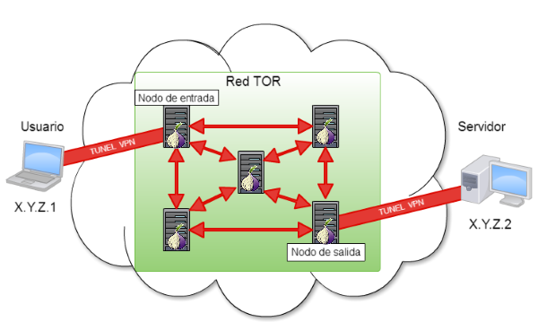

| **Inicio**         | **atrás 2**          | **Siguiente 4**       |
| ------------------ | -------------------- | --------------------- |
| [🏠](../README.md) | [⏪](./3_2_Proxy.md) | [⏩](./3_4_Whonix.md) |

---

## **Índice**

| Temario                                                                                  |
| ---------------------------------------------------------------------------------------- |
| [116. ¿Qué es la Red TOR?](#116-qué-es-la-red-tor)                                       |
| [117. TOR Browser](#117-tor-browser)                                                     |
| [118. Análisis del tráfico TOR](#118-análisis-del-tráfico-tor)                           |
| [119. Brave Browser con TOR](#119-brave-browser-con-tor)                                 |
| [120. ProxyChains con TOR](#120-proxychains-con-tor)                                     |
| [121. Herramientas de Hacking Ético con TOR](#121-herramientas-de-hacking-ético-con-tor) |
| [122. TOR sobre VPN](#122-tor-sobre-vpn)                                                 |
| [123. Servicios que bloquean TOR](#123-servicios-que-bloquean-tor)                       |

---

# **Red TOR**

## **116. ¿Qué es la Red TOR?**



### ✅ ¿Qué es la Red TOR?

**TOR** significa **The Onion Router**. Es una red de computadoras que te permite:

✅ Navegar por internet de forma anónima.

✅ Proteger tu privacidad.

✅ Acceder a sitios que están bloqueados o censurados.

✅ Entrar en la parte de internet llamada “deep web” o “dark web” (con cuidado).

Se llama **“Onion” (cebolla)** porque, al igual que una cebolla tiene muchas capas, **TOR cifra tu conexión en varias capas** antes de enviarla a su destino. Esto hace muy difícil rastrear quién eres o desde dónde te conectas.

---

#### 📌 Ejemplo fácil

Imagina que quieres enviarle una carta a tu amiga, pero no quieres que nadie sepa que tú se la mandaste.

✅ En lugar de enviarla directamente, la pones en un sobre.

✅ Luego la metes en otro sobre.

✅ Luego en otro.

✅ Y cada sobre tiene el nombre de una persona intermedia.

Cada persona solo abre un sobre y pasa la carta al siguiente. Nadie sabe el origen final.

**Así funciona TOR:** tu tráfico pasa por varios “nodos” o “relays” alrededor del mundo, cada uno descifra una capa y la manda al siguiente.

---

### ✅ ¿Para qué sirve TOR?

Aquí algunos **usos comunes**:

🟠 Proteger tu privacidad en países donde hay censura.

🟠 Evitar que tu proveedor de internet sepa qué páginas visitas.

🟠 Acceder a sitios bloqueados en tu país.

🟠 Investigar temas sensibles sin dejar rastros.

🟠 Entrar a “.onion” sites de la dark web (con precauciones).

---

### ✅ ¿Es ilegal usar TOR?

**NO**. Usar TOR es **legal** en la mayoría de países.

⚠️ Lo ilegal es **lo que hagas** con él. Por ejemplo: vender drogas, tráfico ilegal, etc. Eso está prohibido aunque uses TOR.

---

### ✅ ¿Es seguro usar TOR?

TOR te da **anonimato**, pero no es 100% seguro si tú mismo compartes tu información.

➡️ Ejemplo:

- Si te logueas en Facebook con tu cuenta real desde TOR, ya no eres anónimo.
- Si usas tu nombre real en foros .onion, tampoco.

---

### ✅ ¿Qué es un “.onion”?

Es un **dominio especial** que solo se abre con TOR.
Ejemplo:

```
http://3g2upl4pq6kufc4m.onion
```

Ese es un dominio TOR (es de DuckDuckGo en TOR).

---

### ✅ ¿Cómo se instala TOR?

La forma más sencilla es usando **Tor Browser**, que es un navegador web modificado de Firefox.

---

#### 💻 Paso a paso para instalar TOR en Windows

✅ 1. Ve a la web oficial:

```
https://www.torproject.org/
```

✅ 2. Haz clic en **Download Tor Browser**.
Selecciona tu sistema operativo (Windows, macOS, Linux, Android).

✅ 3. Descarga el instalador.
En Windows será un archivo .exe.

✅ 4. Ejecuta el instalador.
Sigue los pasos como con cualquier programa.

✅ 5. Abre Tor Browser.
Al abrirlo, te preguntará:

- **Conectar directamente**.
- **Configurar puente** (si tu red bloquea TOR).
  En la mayoría de los casos, solo haz clic en **Conectar**.

✅ 6. ¡Listo! Ya puedes navegar anónimamente.

---

#### 📱 ¿En Android?

✅ Descarga **Tor Browser** desde Google Play.

---

#### 🐧 En Linux:

✅ Ve a la web oficial.

✅ Descarga el paquete .tar.xz.

✅ Descomprímelo y ejecuta el archivo de inicio.

---

#### 🍎 En macOS:

✅ Descarga el instalador .dmg desde la web oficial.

✅ Ábrelo y arrastra el icono a tu carpeta de aplicaciones.

---

### ✅ Ejemplo de uso

Imagina que estás en un país donde está bloqueado **Wikipedia**.

➡️ Con TOR, puedes abrir Tor Browser.

➡️ Escribes la dirección de Wikipedia.

➡️ TOR la abre porque tu tráfico pasa por otros países donde no está bloqueada.

---

### ✅ Precauciones al usar TOR

✅ No inicies sesión en tus cuentas reales si quieres anonimato.

✅ No descargues archivos peligrosos.

✅ No abras documentos descargados sin precauciones (pueden revelar tu IP real).

✅ Ten cuidado en la dark web: hay contenido ilegal o peligroso.

---

### ✅ Resumen sencillo

👉 TOR = Red de computadoras para navegar anónimamente.

👉 Cifra tu tráfico en varias capas (como cebolla).

👉 Permite saltar censura y proteger privacidad.

👉 Se usa con Tor Browser.

👉 Es legal, pero cuidado con actividades ilegales.

---

[🔼](#índice)

---

## **117. TOR Browser**

### ✅ ¿Qué es TOR Browser?

**Tor Browser** es un **navegador web especial** (basado en Firefox) que te permite:

✅ Navegar por internet **anónimamente**.

✅ Proteger tu **privacidad**.

✅ Saltar **censura** o **bloqueos**.

✅ Acceder a sitios especiales **.onion** en la dark web.

En pocas palabras:

> **Tor Browser = un Firefox modificado para conectarte a la red Tor automáticamente.**

---

### ✅ ¿Cómo funciona TOR Browser? (Explicación fácil)

Cuando navegas normalmente, tu tráfico va:

```
Tú → Internet (sin cifrado intermedio)
```

Cualquiera (tu proveedor de internet, gobierno, hackers en Wi-Fi) puede ver a dónde te conectas.

---

✅ Con Tor Browser, tu tráfico hace esto:

```
Tú → Nodo 1 → Nodo 2 → Nodo 3 → Destino
```

✅ Cada nodo descifra **una capa** (como una cebolla 🧅):

- Nodo 1: sabe quién eres, pero no el destino final.
- Nodo 2: sabe de dónde viene, pero no el origen real.
- Nodo 3: solo sabe el destino final.

Resultado: nadie puede ver **toda la ruta completa**.

---

#### 📌 Ejemplo fácil

Imagina que quieres mandar una carta secreta a un amigo. Para que nadie sepa que tú la envías:

✅ La pones en 3 sobres:

- El primero con dirección del amigo intermedio 1.
- Dentro, otro sobre con dirección del intermedio 2.
- Al final, otro sobre con el destino final.

Cada persona abre **un solo sobre** y no sabe ni el origen ni el destino final completo.

---

Así, **Tor Browser** hace lo mismo con tus datos:

✔️ Los cifra en capas.

✔️ Los manda por varios relays alrededor del mundo.

✔️ Protege tu identidad.

---

### ✅ ¿Para qué sirve Tor Browser?

Algunos **usos comunes**:

🟠 Navegar sin ser rastreado.

🟠 Saltar bloqueos o censura (Wikipedia, redes sociales bloqueadas).

🟠 Investigar temas sensibles.

🟠 Acceder a sitios .onion de la dark web.

🟠 Evitar que tu proveedor de internet sepa qué visitas.

---

### ✅ ¿Es legal usar Tor Browser?

✅ **Sí, es legal** en la mayoría de países.

❗ Lo ilegal es lo que hagas con él (vender cosas ilegales, etc.).

---

### ✅ ¿Es seguro usar Tor Browser?

✔️ Es mucho más **anónimo** que un navegador normal.

❗ Pero tú debes ser cuidadoso:

- No inicies sesión en cuentas reales si quieres anonimato.
- No compartas datos personales.
- Cuidado al descargar archivos (pueden revelar tu IP real si los abres sin cuidado).

---

### ✅ ¿Qué son los sitios .onion?

Son sitios **especiales** que solo se abren con Tor Browser.

Ejemplo:

```
http://3g2upl4pq6kufc4m.onion  → Versión .onion de DuckDuckGo
```

Son parte de la llamada **dark web**.

---

### ✅ Instalación de Tor Browser (Paso a paso súper fácil)

A continuación te doy **guías muy claras por sistema operativo**.

---

#### 💻 A. En Windows

✅ 1️⃣ Ve al sitio oficial:

```
https://www.torproject.org/
```

✅ 2️⃣ Haz clic en **Download Tor Browser**.
Elige **Windows**.

✅ 3️⃣ Descarga el instalador (.exe).

✅ 4️⃣ Ábrelo y sigue las instrucciones:

- Siguiente → Siguiente → Instalar.

✅ 5️⃣ Abre **Tor Browser** desde el menú de inicio.

✅ 6️⃣ Al abrirlo, te dará dos opciones:

- **Connect** (Conectar directamente).
- **Configure** (Configurar puente si Tor está bloqueado en tu país).

✅ 7️⃣ Haz clic en **Connect**.

✅ 8️⃣ ¡Listo! Ya puedes navegar de forma anónima.

---

#### 🍎 B. En macOS

✅ 1️⃣ Ve a:

```
https://www.torproject.org/
```

✅ 2️⃣ Descarga la versión para **macOS** (.dmg).

✅ 3️⃣ Abre el archivo .dmg.

✅ 4️⃣ Arrastra el icono de **Tor Browser** a tu carpeta **Aplicaciones**.

✅ 5️⃣ Ábrelo desde **Aplicaciones**.

✅ 6️⃣ Haz clic en **Connect**.

✅ 7️⃣ ¡Listo!

---

#### 🐧 C. En Linux

✅ 1️⃣ Descarga el paquete para Linux desde:

```
https://www.torproject.org/
```

✅ 2️⃣ Descomprime el archivo .tar.xz.

✅ 3️⃣ Abre la carpeta y ejecuta:

```
./start-tor-browser.desktop
```

✅ 4️⃣ Se abrirá el navegador.

✅ 5️⃣ Haz clic en **Connect**.

---

#### 📱 D. En Android

✅ 1️⃣ Abre **Google Play**.

✅ 2️⃣ Busca **Tor Browser** (oficial de The Tor Project).

✅ 3️⃣ Instálalo.

✅ 4️⃣ Ábrelo y toca **Connect**.

✅ 5️⃣ ¡Listo!

---

### ⚠️ Nota importante

No existe **versión oficial para iOS** (iPhone o iPad).

En iOS puedes usar **Onion Browser**, que es compatible con la red Tor, pero no es exactamente igual que Tor Browser oficial.

---

### ✅ Ejemplo de uso real

✔️ Abre Tor Browser.

✔️ Escribe:

```
https://duckduckgo.com
```

✔️ Buscas lo que quieras sin que tu proveedor de internet sepa.

✔️ O escribe un dominio .onion:

```
http://3g2upl4pq6kufc4m.onion
```

✔️ Accedes a la versión oculta de DuckDuckGo.

---

### ✅ Resumen súper corto

🌟 Tor Browser = Firefox modificado que se conecta a la red Tor.

🌟 Te permite navegar anónimamente y acceder a la dark web.

🌟 Es legal usarlo.

🌟 Fácil de instalar como cualquier navegador.

---

[🔼](#índice)

---

## **118. Análisis del tráfico TOR**

### ✅ ¿Qué es el “análisis del tráfico TOR”?

El **análisis del tráfico TOR** es el estudio de cómo circulan los datos en la red TOR para:

✔️ Saber quién se conecta a TOR.

✔️ Ver cuándo y hacia dónde se conecta.

✔️ Tratar de romper el anonimato.

En pocas palabras:

> Es el intento de **vigilar** o **entender** el uso de la red TOR.

**Tor** protege tu privacidad cifrando los datos en “capas”, pero el tráfico todavía puede ser analizado por:

✅ Gobiernos.

✅ Investigadores.

✅ Hackers.

✅ Proveedores de Internet (ISP).

---

### ✅ ¿Cómo funciona la red TOR? (Resumido)

TOR usa **nodos** intermedios:

```
Tu PC → Nodo de Entrada → Nodo intermedio → Nodo de Salida → Internet
```

✔️ Cada “capa” se descifra en un nodo.

✔️ Nadie conoce el recorrido completo.

---

### ✅ ¿Qué se puede ver y qué no?

🔎 Un **analista de tráfico** no puede ver el contenido de tus datos (porque está cifrado).
❗ Pero puede ver **patrones**:

✅ Cuándo te conectas.

✅ Cuánto tráfico envías.

✅ Qué nodo de entrada usas.

---

### ✅ ¿Para qué sirve el análisis de tráfico TOR?

✔️ Detectar usuarios de TOR.

✔️ Bloquear el uso de TOR.

✔️ Intentar identificar al origen de conexiones (ataques de correlación).

✔️ Investigar actividades criminales.

---

### ✅ Ejemplo MUY fácil de entender

#### 🧅 Ejemplo 1: Enviar cartas

✅ Imagínate que TOR es un sistema de **cartas con sobres**:

- Escribes un mensaje → lo pones en varios sobres → cada persona intermedia abre un sobre.

✅ Resultado:

✔️ El cartero no sabe el contenido.

❌ Pero ve que envías algo (puede contar cuántas cartas y cuándo).

---

#### 🧅 Ejemplo 2: Autobuses

✅ Tú subes a un bus (Nodo de Entrada).

✅ Cambias de bus dos veces (Nodos intermedios).

✅ Te bajas en otro lugar (Nodo de Salida).

👀 Alguien con cámaras en todos los paraderos puede tratar de unir:

✅ Quién sube y quién baja → Correlacionar horarios → Intentar saber tu ruta.

---

El análisis de tráfico funciona igual:

✅ Mira **patrones de tiempo** y **volumen de datos**.

✅ Trata de **correlacionar** quién se conecta y qué destino final tiene.

---

### ✅ Técnicas de análisis de tráfico TOR

Algunas técnicas comunes:

✅ **Timing attacks**: medir el momento en que salen y llegan paquetes.

✅ **Volume correlation**: comparar el tamaño del tráfico.

✅ **Network fingerprinting**: identificar tráfico TOR vs tráfico normal.

✅ **Website fingerprinting**: adivinar qué sitio visitas dentro de TOR analizando patrones.

---

### ✅ ¿Es fácil romper el anonimato de TOR?

❌ NO es fácil.

✔️ TOR está diseñado para resistir estos análisis.

❗ Pero no es imposible:

- Atacantes con MUCHO control de la red pueden correlacionar datos.
- Errores del usuario (como entrar con cuenta real) revelan identidad.

---

### ✅ ¿Qué herramientas se usan para el análisis de tráfico TOR?

🛠️ Algunas herramientas conocidas:

✔️ **Wireshark**: para capturar y analizar paquetes.

✔️ **tcpdump**: para capturar tráfico en la terminal.

✔️ **MAT** (Metadata Anonymisation Toolkit): para ver metadatos en archivos.

✔️ **TorFlow**: herramienta de investigación sobre el flujo en la red TOR.

✔️ Scripts en Python usando **scapy** o **pyshark** para análisis personalizado.

---

#### 🧑‍💻 Ejemplo MUY fácil con Wireshark

✅ Capturas tráfico en tu PC:

```
sudo wireshark
```

✅ Filtro:

```
tcp.port == 9001
```

(uno de los puertos TOR)

✅ Resultado:

✔️ Verás paquetes cifrados.

✔️ No puedes leer contenido.

❗ Pero puedes ver patrones de tráfico.

---

### ✅ ¿Cómo se “instala” o “hace” un análisis de tráfico TOR?

Aquí te explico paso a paso **para fines educativos y legales**.

---

#### 💻 A. En Linux o Windows (usando Wireshark)

✅ 1️⃣ Descargar e instalar Wireshark:

- [https://www.wireshark.org/](https://www.wireshark.org/)

✅ 2️⃣ Abrir Wireshark.

✅ 3️⃣ Elegir la interfaz de red (tu Wi-Fi o Ethernet).

✅ 4️⃣ Aplicar filtro para TOR (puertos comunes):

```
tcp.port == 9001
```

o

```
tcp.port == 443
```

✅ 5️⃣ Iniciar captura.

✅ 6️⃣ Navegar en Tor Browser.

✅ 7️⃣ Observar paquetes:

- No podrás leer contenido.
- Verás patrones de conexión y tiempos.

---

### 📌 Nota ética:

⚠️ El análisis de tráfico TOR se usa para:

✅ Investigación de seguridad.

✅ Detectar bloqueos.

❗ Pero también puede usarse maliciosamente para rastrear a personas.

➡️ **Recomendación:** úsalo de forma responsable.

---

### ✅ Resumen MUY CLARO

✅ **Análisis de tráfico TOR** = estudiar cómo fluye el tráfico en la red TOR.

✅ Se usa para **detectar**, **bloquear** o **tratar de desanonimizar**.

✅ No puede ver contenido (está cifrado), pero puede analizar **patrones**.

✅ Herramientas comunes: **Wireshark**, **tcpdump**.

✅ Es un tema importante en **seguridad informática y privacidad**.

---

[🔼](#índice)

---

## **119. Brave Browser con TOR**

### ✅ ¿Qué es Brave Browser?

**Brave** es un navegador web basado en Chromium (como Chrome) pero enfocado en **privacidad y velocidad**.

✔️ Bloquea publicidad invasiva y rastreadores.

✔️ Tiene buscador propio (Brave Search).

✔️ Incluye **modo TOR** incorporado para navegación privada.

---

#### 📌 Ejemplo sencillo

🟢 Chrome: Carga rápido, pero te rastrea (cookies, anuncios).

🟢 Brave: Igual de rápido, pero **bloquea rastreadores** por defecto.

---

### ✅ ¿Qué es el “modo TOR” en Brave?

Brave tiene **una ventana privada especial con TOR**.

✔️ Te conecta a la red TOR **desde Brave**, sin usar Tor Browser separado.

✔️ Tu tráfico pasa por los **nodos TOR** para ocultar tu IP.

> ✅ Es más privado que una ventana de incógnito normal.

---

#### 📌 Ejemplo MUY claro

✔️ Ventana normal → Tu IP real se ve.

✔️ Ventana incógnita → Borra historial local, pero tu IP real sigue visible.

✔️ Ventana privada con TOR → Tu IP real queda oculta, el destino ve **IP de un nodo TOR**.

---

### ✅ ¿Cómo funciona el modo TOR en Brave?

Cuando abres una **ventana privada con TOR** en Brave:

✅ Brave establece conexión con la red TOR.

✅ Tu tráfico se enruta a través de **múltiples nodos TOR**.

✅ El sitio web final ve **la IP del nodo de salida TOR**, no la tuya.

---

#### 📌 Ilustración sencilla

```
Tú → Nodo 1 → Nodo 2 → Nodo 3 → Sitio web
```

Cada nodo descifra **una capa** (como una cebolla 🧅).

✔️ Nadie sabe el recorrido completo.

✔️ Brave hace esto automáticamente.

---

### ✅ Ventajas y limitaciones

✅ **Ventajas:**

- Fácil de usar, integrado en el navegador.
- No necesitas instalar Tor Browser.
- Oculta tu IP real.
- Bloquea rastreadores y anuncios.

---

❗ **Limitaciones:**

- Es **más básico** que Tor Browser.
- No permite acceder a todos los .onion (algunos funcionan, otros no bien).
- Puede filtrar información si no tienes cuidado (como iniciar sesión con datos reales).
- Solo enruta **las pestañas privadas con TOR** por la red TOR, las demás son tráfico normal.

---

### ✅ Ejemplo de uso muy fácil

Imagina que estás en un país donde **Wikipedia está bloqueada**.

✅ En pestaña normal: Error o censura.

✅ En pestaña privada con TOR:

✔️ Brave se conecta por la red TOR.

✔️ Salta la censura.

✔️ Wikipedia se abre normalmente.

---

### ✅ ¿Cómo instalar Brave Browser? (Guía paso a paso)

A continuación te dejo **PASOS CLAROS PARA WINDOWS, MAC y LINUX**.

---

#### 💻 A. Windows

✅ 1️⃣ Ve al sitio oficial:

```
https://brave.com/
```

✅ 2️⃣ Haz clic en **Download Brave**.

✅ 3️⃣ Descarga el instalador (.exe).

✅ 4️⃣ Ábrelo y sigue las instrucciones:

- Siguiente → Instalar.
  ✅ 5️⃣ Brave se abrirá automáticamente.

  ✅ 6️⃣ ¡Listo! Ya tienes Brave.

---

#### 🍎 B. macOS

✅ 1️⃣ Ve a:

```
https://brave.com/
```

✅ 2️⃣ Descarga el archivo .dmg.

✅ 3️⃣ Ábrelo.

✅ 4️⃣ Arrastra el icono de **Brave** a **Aplicaciones**.

✅ 5️⃣ Ábrelo desde **Aplicaciones**.

✅ 6️⃣ ¡Listo!

---

#### 🐧 C. Linux (Ubuntu/Debian)

✅ 1️⃣ Abre la terminal.

✅ 2️⃣ Copia y pega los comandos uno por uno:

```bash
sudo apt install apt-transport-https curl
sudo curl -fsSLo /usr/share/keyrings/brave-browser-archive-keyring.gpg https://brave.com/signing-keys/brave-browser-archive-keyring.gpg
echo "deb [signed-by=/usr/share/keyrings/brave-browser-archive-keyring.gpg arch=amd64] https://brave-browser-apt-release.s3.brave.com/ stable main" | sudo tee /etc/apt/sources.list.d/brave-browser-release.list
sudo apt update
sudo apt install brave-browser
```

✅ 3️⃣ Abre Brave desde el menú o con:

```
brave-browser
```

✅ 4️⃣ ¡Listo!

---

#### 📱 Android / iOS

✅ Brave para móvil NO tiene soporte para modo TOR.

✅ Solo la versión de escritorio tiene “ventana privada con TOR”.

---

### ✅ Cómo abrir una ventana con TOR en Brave

Muy fácil.

✅ Abre Brave.

✅ Haz clic en el **menú (tres rayitas o puntos arriba a la derecha)**.

✅ Selecciona:

```
Nueva ventana privada con TOR
```

✔️ Se abre una ventana nueva con color oscuro y un texto que indica que estás usando TOR.

---

#### 📌 Ejemplo paso a paso:

1️⃣ Abre Brave.

2️⃣ Menú → “Nueva ventana privada con TOR”.

3️⃣ Aparece la ventana especial.

4️⃣ Escribe cualquier sitio en la barra de direcciones:

```
https://duckduckgo.com
```

✅ DuckDuckGo se abrirá, pero a través de TOR.

---

#### ✅ Para sitios .onion

Puedes escribir directamente:

```
http://ejemplo.onion
```

✅ Brave intentará abrirlo usando la red TOR.

❗ Pero no siempre es tan compatible como Tor Browser puro.

---

### ✅ Ventana normal vs privada vs privada con TOR

✅ **Normal**:

- Tu IP real.
- Guardas historial (opcional).
- Rápida.

✅ **Privada (incógnito)**:

- Sin historial local.
- Tu IP real sigue visible.
- No rastreadores.

✅ **Privada con TOR**:

- Sin historial local.
- Tu IP se oculta (se ve la IP del nodo TOR).
- Navegación más anónima.

---

### ✅ Resumen ultra corto

🌟 **Brave Browser** = navegador rápido y privado.

🌟 Incluye **modo TOR** fácil de usar.

🌟 Perfecto para ocultar tu IP sin instalar Tor Browser separado.

🌟 Solo en escritorio, no en móviles.

---

[🔼](#índice)

---

## **120. ProxyChains con TOR**

### ✅ ¿Qué es ProxyChains?

**ProxyChains** es una herramienta de Linux que **fuerza** a cualquier programa (por ejemplo, curl, nmap, firefox) a conectarse a Internet **a través de uno o varios proxies**.

✔️ Piensa en ProxyChains como un **"túnel"**.

✔️ Hace que todo el tráfico de la app pase por los proxies que tú definas.

---

#### 📌 Ejemplo muy sencillo

✅ Sin ProxyChains:

```
Tu PC → Internet (IP real)
```

✅ Con ProxyChains:

```
Tu PC → Proxy 1 → Proxy 2 → Internet (IP del último proxy)
```

✅ Con ProxyChains + TOR:

```
Tu PC → ProxyChains → TOR → Internet (IP del nodo de salida TOR)
```

---

### ✅ ¿Qué es TOR en este contexto?

TOR (The Onion Router) es una **red anónima** que enruta tu tráfico a través de varios nodos cifrados, para **ocultar tu IP y ubicación**.

✔️ TOR incluye un **servicio local (SOCKS5 proxy)** en tu máquina, normalmente en:

```
127.0.0.1:9050
```

✅ Esto es lo que usa ProxyChains para enviar tráfico a la red TOR.

---

### ✅ ¿Cómo funcionan juntos ProxyChains y TOR?

✅ ProxyChains puede usar TOR como un **proxy SOCKS5**.

✅ Esto significa que cualquier app que se conecte a internet **a través de ProxyChains** saldrá a internet **por TOR**.

---

#### 📌 Resultado:

- Tu aplicación NO sabe nada de TOR.
- ProxyChains la obliga a usar TOR.
- Tu IP pública será la del **nodo de salida TOR**.

---

### ✅ Ejemplo MUY fácil

Supongamos que quieres usar **curl** para descargar una página sin revelar tu IP real.

✅ Normal:

```
curl http://example.com
```

El servidor ve tu IP real.

✅ Con ProxyChains + TOR:

```
proxychains curl http://example.com
```

El servidor ve **la IP del nodo de salida TOR**.

✔️ Tú permaneces anónimo.

---

### ✅ Ventajas de usar ProxyChains con TOR

⭐ Forzar **cualquier app** a usar TOR.

⭐ No necesitas que la app tenga soporte para proxy.

⭐ Puedes **encadenar varios proxies** antes de TOR.

⭐ Muy útil para pentesting, scraping, pruebas de privacidad.

---

### ✅ Limitaciones y precauciones

❗ TOR es más lento (pasa por varios nodos).

❗ Algunos servicios bloquean nodos TOR.

❗ Si revelas tu identidad en la app (logins reales), pierdes el anonimato.

❗ ProxyChains no cifra tu tráfico por sí mismo → TOR lo hace, pero solo hasta el nodo de salida.

---

#### ✅ Instalación paso a paso en Linux

✅ Te explico para Debian/Ubuntu (y derivados).

##### 🟢 Paso 1: Instalar TOR

```bash
sudo apt update
sudo apt install tor
```

El servicio TOR se inicia normalmente en:

```
127.0.0.1:9050
```

✅ Puedes verificar:

```bash
netstat -tulpen | grep 9050
```

o

```bash
ss -tulpen | grep 9050
```

---

##### 🟢 Paso 2: Instalar ProxyChains

```bash
sudo apt install proxychains
```

En algunas distros se llama `proxychains4`:

```bash
sudo apt install proxychains4
```

---

##### 🟢 Paso 3: Verifica instalación

```bash
proxychains curl http://example.com
```

Deberías ver que ProxyChains está interceptando.

---

### ✅ Configurar ProxyChains para usar TOR

El archivo de configuración suele estar en:

```
/etc/proxychains.conf
```

o

```
/etc/proxychains4.conf
```

✅ Abre el archivo:

```bash
sudo nano /etc/proxychains.conf
```

✅ Busca la sección al final que dice:

```
[ProxyList]
```

✅ Asegúrate de tener:

```
socks5  127.0.0.1 9050
```

✅ Borra o comenta otras líneas si no quieres usarlas.

---

#### 🧅 Ejemplo de sección final:

```
[ProxyList]
socks5  127.0.0.1 9050
```

---

✅ Guarda y cierra.

- En Nano: Ctrl+O (guardar), Enter, Ctrl+X (salir).

---

### ✅ Cómo usar ProxyChains con TOR

✅ Muy fácil.
Solo escribe **proxychains** antes del comando.

---

#### 🟢 Ejemplo 1: curl

```
proxychains curl http://example.com
```

✔️ El tráfico pasa por TOR.

✔️ El sitio ve IP del nodo de salida TOR.

---

#### 🟢 Ejemplo 2: nmap (con proxychains4)

```
proxychains nmap -sT -Pn -n example.com
```

✔️ Fuerza Nmap a usar TOR.

✔️ Bueno para pruebas de puertos sin revelar tu IP.

---

#### 🟢 Ejemplo 3: Firefox

```
proxychains firefox
```

✔️ Tu navegador entero usa TOR.

✔️ Como un Tor Browser improvisado (no recomendado para máxima privacidad porque Firefox normal puede filtrar cosas).

---

### ⚠️ Tip:

✅ Puedes elegir la **cadena** en ProxyChains:

- **dynamic_chain**: usa los proxies que estén disponibles.
- **strict_chain**: usa todos en orden.
- **random_chain**: usa un orden aleatorio.

Configúralo en el archivo:

```
/etc/proxychains.conf
```

Ejemplo:

```
dynamic_chain
```

---

### ✅ Resumen ultra corto

🌟 **ProxyChains** = Herramienta para forzar cualquier app a usar proxies.

🌟 Usándolo con TOR → Forzar apps a salir a Internet por la red TOR.

🌟 Ideal para anonimato en terminal.

🌟 Fácil de instalar en Linux.

---

### ✅ Instalación resumida (comandos rápidos en Ubuntu/Debian)

```
sudo apt update
sudo apt install tor proxychains
sudo nano /etc/proxychains.conf
```

✔️ En el archivo, al final:

```
socks5 127.0.0.1 9050
```

✔️ Guardar y salir.

✅ Para usar:

```
proxychains curl http://example.com
```

---

[🔼](#índice)

---

## **121. Herramientas de Hacking Ético con TOR**

### ✅ ¿Qué es el Hacking Ético?

El **Hacking Ético** es la práctica de **usar técnicas de hacking para el bien**:

✅ Encontrar vulnerabilidades en sistemas.

✅ Ayudar a empresas a mejorar su seguridad.

✅ Simular ataques reales (pentesting).

✅ Proteger usuarios y datos.

**Importante:** El hacking ético siempre se hace **con permiso**.

---

#### 📌 Ejemplo MUY sencillo

✔️ _Hacker malo:_ Encuentra una falla y roba datos.

✔️ _Hacker ético:_ Encuentra la falla y avisa para arreglarla.

---

### ✅ ¿Por qué usar TOR en Hacking Ético?

✔️ TOR oculta tu **dirección IP real**.

✔️ Evita que los objetivos del pentest sepan de dónde vienes.

✔️ Útil para **pruebas de caja negra** (black box) donde no quieres que se relacione tu IP con tu identidad.

✔️ Evita bloqueos geográficos o censura.

---

#### 📌 Ejemplo muy claro

✅ Sin TOR:

```
Tu IP real → Servidor
```

✅ Con TOR:

```
Tu IP real → Red TOR → Nodo de salida → Servidor
```

El servidor solo ve la **IP del nodo TOR**.

---

### ✅ ¿Qué herramientas de Hacking Ético se pueden usar con TOR?

✅ Muchas herramientas pueden enrutar su tráfico por TOR.

✅ Las más comunes:

1️⃣ **Nmap** (escaneo de puertos).

2️⃣ **Metasploit** (explotación de vulnerabilidades).

3️⃣ **Nikto** (escaneo de vulnerabilidades web).

4️⃣ **curl / wget** (descargas, pruebas de endpoints).

5️⃣ **Hydra** (ataques de fuerza bruta).

6️⃣ **sqlmap** (inyección SQL).

7️⃣ **Recon-ng** (reconocimiento).

8️⃣ **Browser (Firefox, Chromium) forzado por ProxyChains**.

---

✅ Todas estas se pueden forzar a usar TOR con **ProxyChains**.

---

### ✅ Ejemplo MUY fácil de cada herramienta

---

#### 🟠 1️⃣ Nmap

✔️ Escanea puertos de forma anónima:

```
proxychains nmap -sT -Pn example.com
```

El servidor ve la IP TOR.

---

#### 🟠 2️⃣ Metasploit

✔️ Para conectar a un objetivo:

```
proxychains msfconsole
```

Y dentro de msf, usas exploits como siempre.

---

#### 🟠 3️⃣ Nikto

✔️ Escanea un sitio web ocultando tu IP:

```
proxychains nikto -h http://example.com
```

---

#### 🟠 4️⃣ curl / wget

✔️ Descargar o consultar endpoints:

```
proxychains curl http://example.com
proxychains wget http://example.com
```

---

#### 🟠 5️⃣ Hydra

✔️ Ataque de fuerza bruta a login:

```
proxychains hydra -l user -P passwords.txt ftp://example.com
```

---

#### 🟠 6️⃣ sqlmap

✔️ Test de inyección SQL:

```
proxychains sqlmap -u "http://example.com/vuln?id=1" --dbs
```

---

#### 🟠 7️⃣ Recon-ng

✔️ Forzar recon-ng a usar TOR:

```
proxychains recon-ng
```

Dentro, todos los módulos de consulta web pasan por TOR.

---

### ✅ ¿Cómo se instala TOR y ProxyChains?

Te dejo el **PASO A PASO en Linux (ejemplo en Ubuntu/Debian/Kali)**.

---

#### 🟢 A. Instalar TOR

```
sudo apt update
sudo apt install tor
```

El servicio TOR por defecto escucha en:

```
127.0.0.1:9050
```

✅ Puedes verificar:

```
sudo systemctl status tor
```

✅ Debe decir **active (running)**.

---

#### 🟢 B. Instalar ProxyChains

```
sudo apt install proxychains
```

o en algunos sistemas:

```
sudo apt install proxychains4
```

---

#### 🟢 C. Configurar ProxyChains

Abre el archivo:

```
sudo nano /etc/proxychains.conf
```

o

```
sudo nano /etc/proxychains4.conf
```

✅ Al final, busca:

```
[ProxyList]
```

✅ Debe decir:

```
socks5  127.0.0.1 9050
```

✅ Puedes borrar otras líneas o comentarlas con `#`.

✅ Guarda y cierra (en nano: Ctrl+O, Enter, Ctrl+X).

---

### ✅ Cómo usar ProxyChains con TOR

✅ Solo antepones **proxychains** al comando.

---

#### Ejemplos súper claros

✅ Curl:

```
proxychains curl http://example.com
```

✅ Nmap:

```
proxychains nmap -sT -Pn example.com
```

✅ Nikto:

```
proxychains nikto -h http://example.com
```

✅ Sqlmap:

```
proxychains sqlmap -u "http://example.com/page?id=1" --dbs
```

✅ Metasploit:

```
proxychains msfconsole
```

---

✅ ¡Así todas esas herramientas pasan por TOR automáticamente!

---

### ✅ ¿Cómo probar que TOR funciona con ProxyChains?

✔️ Usa un servicio para ver tu IP:

```
proxychains curl https://ifconfig.me
```

✅ Resultado esperado:

- Muestra **IP del nodo de salida TOR**.
- Tu IP real queda oculta.

---

### ✅ Ventajas de usar TOR en Hacking Ético

✅ Ocultas tu IP real.

✅ Proteges tu identidad al probar sistemas.

✅ Evitas bloqueos o geolocalización.

✅ Accedes a servicios .onion si es necesario.

---

### ✅ Limitaciones y precauciones

❗ TOR es más lento (enrutamiento múltiple).

❗ Algunos sitios bloquean nodos TOR.

❗ No es 100% anónimo si te identificas tú mismo (logins reales).

❗ No cifrará el tráfico más allá del nodo de salida.

---

#### ⚠️ IMPORTANTE

✅ Usa estas técnicas **solo para fines legales y éticos**.

✅ Ten permiso para pentesting.

---

### ✅ Resumen muy claro

🌟 **Hacking Ético con TOR** = Usar herramientas de seguridad a través de la red TOR para proteger tu identidad.

🌟 **ProxyChains** = Herramienta que fuerza cualquier programa a usar TOR como proxy.

🌟 **Instalación sencilla** en Linux.

🌟 **Uso fácil**: Solo anteponer `proxychains` al comando.

---

### ✅ Comandos resumidos de instalación (Ubuntu/Debian)

```bash
sudo apt update
sudo apt install tor proxychains
sudo nano /etc/proxychains.conf
```

✔️ En el archivo:

```
socks5 127.0.0.1 9050
```

✔️ Guardar y salir.

✅ Para usar:

```
proxychains <comando>
```

---

[🔼](#índice)

---

## **122. TOR sobre VPN**

### ✅ ¿Qué es TOR sobre VPN?

**TOR sobre VPN** significa **usar primero una VPN** y luego conectarse a la red TOR.

En otras palabras:

```
Tú → VPN → TOR → Internet
```

✔️ Tu tráfico se cifra y pasa **primero por la VPN**.

✔️ Luego entra a la **red TOR**.

---

#### 📌 Diferencia con VPN sobre TOR

¡Ojo! Es diferente de **VPN sobre TOR**:

```
Tú → TOR → VPN → Internet
```

Eso es más raro de usar. Normalmente cuando alguien dice **TOR sobre VPN**, se refiere a:

```
Tú → VPN → TOR → Internet
```

---

### ✅ ¿Para qué sirve TOR sobre VPN?

✅ Añade **una capa extra de privacidad**.

✅ Tu Proveedor de Internet (ISP) **no ve que usas TOR**, solo ve la VPN.

✅ La VPN **no sabe** qué haces en TOR.

✅ Puedes **ocultar tu IP real** de los nodos de entrada de TOR.

✅ Útil si vives en un país donde TOR está bloqueado.

---

### ✅ Ejemplo MUY fácil

🎯 Sin VPN:

```
Tú (IP real) → Nodo de entrada TOR → Nodo intermedio → Nodo de salida → Internet
```

✔️ El nodo de entrada TOR sabe tu IP real.

---

🎯 Con TOR sobre VPN:

```
Tú → VPN (IP VPN) → Nodo de entrada TOR → Nodo intermedio → Nodo de salida → Internet
```

✔️ El nodo de entrada TOR **ve la IP de la VPN**, no tu IP real.

✔️ Tu ISP **solo ve que te conectas a la VPN**.

---

✅ Resultado:

- Tu ISP no sabe que usas TOR.
- TOR no sabe tu IP real.

---

### ✅ Ventajas de usar TOR sobre VPN

⭐ Más privacidad contra tu ISP.

⭐ Ocultas tu IP real del nodo de entrada TOR.

⭐ Saltas bloqueos que impiden acceder a la red TOR directamente.

⭐ Capa extra de cifrado (VPN cifra antes de entrar a TOR).

---

### ✅ Desventajas o precauciones

❗ La VPN puede ver tu IP real (elige una VPN de confianza).

❗ Más lento (VPN + TOR = doble encriptación y más saltos).

❗ No todas las VPN permiten tráfico TOR.

❗ No te hace invulnerable: si te logueas en cuentas reales, pierdes el anonimato.

---

### ✅ ¿Cuándo usar TOR sobre VPN?

✔️ Cuando tu ISP o gobierno **bloquea TOR**.

✔️ Cuando quieres ocultar **a TOR tu IP real**.

✔️ Cuando quieres **despistar tu ISP** (ellos solo ven VPN).

✔️ Para investigaciones o periodismo en entornos de censura.

---

### ✅ Ejemplo muy claro con historia

Imagina a Ana:

- Vive en un país donde TOR está bloqueado.
- Su ISP vigila qué sitios visita.

✅ Sin VPN:

Su ISP ve que se conecta a TOR → Puede bloquearla o registrarla.

✅ Con VPN:

Su ISP ve solo que se conecta a la VPN.
Luego su tráfico va por TOR → Internet.
Nadie sabe qué hace, ni su ISP ni la VPN pueden ver todo.

---

### ✅ ¿Cómo se instala y usa TOR sobre VPN? (PASO A PASO)

---

#### 💻 A. Requisitos

✅ 1️⃣ Una **VPN** (puede ser gratuita o de pago, pero idealmente confiable).

✅ 2️⃣ TOR Browser instalado.

---

##### 📌 1️⃣ Paso: Instalar TOR Browser

✅ Ve a:

```
https://www.torproject.org/
```

✅ Descarga para tu sistema (Windows, macOS, Linux).

✅ Sigue el instalador → Instala → Abre TOR Browser.

✅ Ya está listo para usarse.

---

##### 📌 2️⃣ Paso: Instalar o contratar una VPN

✅ Algunas VPNs comunes:

- ProtonVPN (gratuita y compatible con TOR).
- Mullvad.
- NordVPN.
- Surfshark.
- ExpressVPN.

✅ Todas tienen apps para Windows, macOS, Linux.

✅ Descárgala → Instálala → Ábrela.

---

##### 📌 3️⃣ Paso: Conectarse a la VPN

✅ Abre la aplicación de tu VPN.

✅ Elige un servidor.

✅ Haz clic en **Conectar**.

✅ Comprueba tu nueva IP (por ejemplo en [https://ifconfig.me](https://ifconfig.me)).

---

##### 📌 4️⃣ Paso: Abrir TOR Browser

✅ Una vez estés conectado a la VPN, **abre TOR Browser normalmente**.

✅ Haz clic en **Conectar**.

✅ ¡Ya estás usando TOR sobre VPN!

---

#### 🎯 Flujo real:

```
Tu computadora → VPN cifrada → TOR cifrado → Internet
```

✔️ Tu ISP solo ve VPN.

✔️ TOR solo ve IP de la VPN.

---

### ✅ Ejemplo fácil en Windows

✅ 1️⃣ Instalas ProtonVPN.

✅ 2️⃣ Abres la app, eliges servidor → “Connect”.

✅ 3️⃣ Verificas tu IP (será la de la VPN).

✅ 4️⃣ Abres TOR Browser → Conectar.

✅ 5️⃣ Navegas con doble anonimato.

---

### ✅ Ejemplo fácil en Linux

✅ 1️⃣ Instalas OpenVPN o la app oficial de tu VPN.

✅ 2️⃣ Te conectas:

```
sudo openvpn --config archivo.ovpn
```

✅ 3️⃣ Verificas tu IP pública.

✅ 4️⃣ Abres TOR Browser:

```
./start-tor-browser.desktop
```

✅ 5️⃣ ¡Listo!

---

### ✅ Resumen corto

🌟 **TOR sobre VPN = Tú → VPN → TOR → Internet**.

✅ ISP no ve que usas TOR.

✅ TOR no ve tu IP real.

✅ Sencillo: conecta VPN → abre TOR Browser.

---

### ✅ Opcional: Verificar que funciona

✔️ Abre TOR Browser.

✔️ Ve a:

```
https://check.torproject.org
```

✔️ Confirmarás que estás en la red TOR.

✔️ Puedes comprobar tu IP pública para asegurarte que es distinta de tu IP real y de tu VPN.

---

### ✅ Ventaja extra

Si la VPN tiene **no-logs**, ni siquiera la VPN guarda tu historial.

---

### ✅ Diferencias con Tor Browser solo

| Característica        | Tor Browser solo | Tor sobre VPN                |
| --------------------- | ---------------- | ---------------------------- |
| IP vista por Nodo TOR | Tu IP real       | IP del servidor VPN          |
| ISP ve tráfico TOR    | Sí               | No (solo ve VPN)             |
| Protección extra      | No               | Sí, capa de VPN antes de TOR |
| Complejidad de uso    | Muy fácil        | Fácil (requiere VPN)         |

---

### ✅ Resumen FINAL

✅ TOR sobre VPN es **fácil y potente**:

1️⃣ Instala una VPN y conéctate.

2️⃣ Abre TOR Browser.

3️⃣ ¡Listo! Navegas de forma más anónima y segura.

---

[🔼](#índice)

---

## **123. Servicios que bloquean TOR**

### ✅ ¿Qué significa “bloquear TOR”?

✔️ Bloquear TOR = impedir que la gente use la red TOR para conectarse a un servicio o a un sitio web.

En otras palabras:

➡️ Un servidor o red detecta que la conexión viene desde TOR → Y decide **bloquearla o limitarla**.

---

#### 📌 Ejemplo fácil

✅ Tú quieres visitar una web con TOR:

```
Tu navegador → Red TOR → Sitio web
```

Si el sitio bloquea TOR, te muestra:

```
❌ "Acceso denegado" o captcha o te banea.
```

---

### ✅ ¿Por qué algunos servicios bloquean TOR?

✔️ Evitar abusos: muchos ataques vienen desde nodos de salida TOR.

✔️ Evitar spam (comentarios, registros masivos).

✔️ Evitar scraping (robots que copian datos).

✔️ Cumplir leyes locales (censura, control).

✔️ Evitar fraude (fraude en pagos, cuentas falsas).

---

#### 📌 Ejemplo real

🌐 Wikipedia:

- Antes permitía editar anónimamente desde TOR.
- Pero por vandalismo constante → Bloqueó ediciones desde IPs TOR.

---

### ✅ ¿Cómo pueden detectar el tráfico TOR?

💡 Clave: Los nodos de salida TOR son **conocidos públicamente**.

✔️ La red TOR publica una lista de **nodos de salida**.

✔️ Cualquiera puede descargarla.

✔️ Un servidor puede **comparar la IP del visitante** con esa lista.

---

#### 📌 Resultado:

✅ Si tu IP = nodo de salida TOR → Bloqueo.

✅ Si no → Acceso normal.

---

### ✅ Ejemplo MUY fácil

Imagina un portero en un club:

✔️ Tiene una lista de gente problemática.

✔️ Si alguien de la lista quiere entrar → ❌ No puede.

✔️ Si no está en la lista → ✅ Pasa.

Así funcionan muchos sistemas anti-TOR.

---

### ✅ Técnicas comunes para bloquear TOR

Vamos a verlas **en lenguaje sencillo**, con ejemplos.

---

#### ⭐ 1️⃣ Listas negras (IP blacklists)

✅ Descargar la lista oficial de nodos de salida TOR.

✅ Bloquear todas esas IPs en el firewall o servidor.

---

##### 📌 Ejemplo:

En un servidor web (nginx):

```
deny 185.220.101.1;
deny 185.220.101.2;
...
```

Todas las IPs de salida TOR conocidas → Bloqueadas.

---

#### ⭐ 2️⃣ Firewalls / IDS / IPS

✅ Firewalls avanzados (como iptables, ufw, AWS Security Groups) pueden bloquear rangos de IP.

✅ Sistemas IDS/IPS (como Snort, Suricata) detectan tráfico TOR → Bloquean.

---

##### 📌 Ejemplo:

```
iptables -A INPUT -s <TOR_IP> -j DROP
```

---

#### ⭐ 3️⃣ Captchas

✔️ En lugar de bloquear directamente → Hacen difícil el acceso.

✔️ Usan captchas (Google reCAPTCHA, hCaptcha).

✔️ TOR suele tener puntaje bajo → Muchas veces fuerza resolver captchas infinitos.

---

##### 📌 Ejemplo:

Accedes con TOR → "Marca todos los semáforos".

---

#### ⭐ 4️⃣ Análisis de tráfico (Deep Packet Inspection)

✅ Algunos países o ISPs usan **DPI** (Deep Packet Inspection).

✅ Reconocen el **patrón del protocolo TOR** en el tráfico.

✅ Bloquean o limitan la conexión.

---

##### 📌 Ejemplo:

- Irán, China → Usan DPI para censurar TOR.
- Solución: **Bridges / Pluggable Transports** para disfrazar TOR.

---

#### ⭐ 5️⃣ Geo-restricciones

✔️ Algunos servicios bloquean todos los países con mucho tráfico TOR.

✔️ Por ejemplo, rechazan conexiones desde ciertos lugares.

---

##### 📌 Ejemplo:

"Este servicio no está disponible en tu país".

---

### ✅ Herramientas / Servicios que permiten bloquear TOR

Ahora vamos a la parte de **"cómo se instala" o "cómo se usa"** para bloquear TOR en un servidor.

---

#### 🟢 A. IP Blacklists automáticas

✅ Hay servicios que te dan listas actualizadas de nodos de salida TOR:

- **[https://www.dan.me.uk/torlist/](https://www.dan.me.uk/torlist/)**
- **[https://check.torproject.org/exit-addresses](https://check.torproject.org/exit-addresses)**

✅ Los descargas y los aplicas a tu firewall o servidor web.

---

##### 📌 Ejemplo en Linux (iptables)

```
for ip in $(curl -s https://check.torproject.org/exit-addresses | grep ExitAddress | awk '{print $2}'); do
    iptables -A INPUT -s $ip -j DROP
done
```

✅ Eso bloquea todas las IPs de salida TOR.

---

#### 🟢 B. Cloudflare

✅ Proveedor de CDN y seguridad web.

✅ Opción en el panel: "Threat Score" alto → Mostrar CAPTCHA.

✅ Bloquea tráfico TOR automáticamente o pide captcha.

---

##### 📌 Ejemplo:

- Activas "I'm under attack mode".
- TOR ve captchas constantes.

---

#### 🟢 C. Fail2Ban

✅ Monitorea logs.

✅ Bloquea IPs problemáticas.

✅ Puedes configurarlo para detectar accesos TOR + patrones maliciosos.

---

#### 🟢 D. Web Application Firewalls (WAF)

✅ Como AWS WAF, Azure Front Door, Cloudflare WAF.

✅ Reglas predefinidas para:

- Bloquear TOR.
- Bloquear países.
- Forzar captchas.

---

#### 🟢 E. Plugins de CMS

✅ WordPress:

- Plugins como "Wordfence" → Bloquean IPs TOR conocidas.
- Plugins de seguridad → Bloquean tráfico sospechoso.

---

### ✅ Instalación y configuración PASO A PASO (Ejemplo Linux)

✅ Te dejo un ejemplo muy sencillo para **bloquear TOR en un servidor Linux**.

---

#### ✔️ Paso 1: Descargar la lista de nodos TOR

```bash
curl -o tor-exit-nodes.txt https://check.torproject.org/exit-addresses
```

✅ El archivo tiene líneas así:

```
ExitAddress 185.220.101.1 ...
```

---

#### ✔️ Paso 2: Extraer solo IPs

```bash
grep ExitAddress tor-exit-nodes.txt | awk '{print $2}' > tor-ips.txt
```

✅ Ahora `tor-ips.txt` contiene solo las IPs.

---

#### ✔️ Paso 3: Bloquearlas en iptables

```bash
for ip in $(cat tor-ips.txt); do
    sudo iptables -A INPUT -s $ip -j DROP
done
```

✅ Resultado:

🔥 Todas esas IPs TOR → Bloqueadas.

---

#### ✔️ Paso 4: (Opcional) Automatizarlo

✅ Puedes ponerlo en un cron job para actualizar todos los días:

```
0 2 * * * /path/to/script.sh
```

---

### ✅ 8️⃣ Resumen CLARÍSIMO

🌟 **Servicios que bloquean TOR** = Sistemas que impiden el acceso desde la red TOR.

✅ Usan **listas de IPs públicas** de nodos TOR.

✅ Métodos comunes:

- Blacklists.
- Firewalls.
- Captchas.
- DPI.
- Geo-bloqueo.

✅ Se “instalan” configurando:

- Firewalls (iptables, ufw).
- WAF (Cloudflare, AWS).
- Plugins de CMS.
- Sistemas IDS/IPS.

---

### ✅ Ejemplo ULTRA corto de cómo bloquear TOR

```
sudo apt install iptables
curl -s https://check.torproject.org/exit-addresses | grep ExitAddress | awk '{print $2}' | while read ip; do
    sudo iptables -A INPUT -s $ip -j DROP
done
```

✅ ¡Listo! Tu servidor bloquea nodos de salida TOR.

---

### ✅ Precaución

❗ Bloquear TOR puede impedir que usuarios legítimos con buena razón usen tu servicio.

✅ Considera usar CAPTCHA en lugar de bloqueo total.

✅ O solo bloquear acciones sensibles (edición, comentarios).

---

[🔼](#índice)

---

| **Inicio**         | **atrás 2**          | **Siguiente 4**       |
| ------------------ | -------------------- | --------------------- |
| [🏠](../README.md) | [⏪](./3_2_Proxy.md) | [⏩](./3_4_Whonix.md) |
