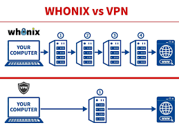

| **Inicio**         | **atrás 3**            | **Siguiente 5**         |
| ------------------ | ---------------------- | ----------------------- |
| [🏠](../README.md) | [⏪](./3_3_Red_TOR.md) | [⏩](./3_5_Qubes_OS.md) |

---

## **Índice**

| Temario                                                                                  |
| ---------------------------------------------------------------------------------------- |
| [124. ¿Qué es Whonix?](#124-qué-es-whonix)                                               |
| [125. Medidas de seguridad Whonix](#125-medidas-de-seguridad-whonix)                     |
| [126. Instalación y configuración de Whonix](#126-instalación-y-configuración-de-whonix) |
| [127. Funcionamiento de Whonix](#127-funcionamiento-de-whonix)                           |
| [128. Whonix con TOR Bridges](#128-whonix-con-tor-bridges)                               |

---

# **Whonix**

## **124. ¿Qué es Whonix?**



**Whonix** es un sistema operativo diseñado para **anonimato, privacidad y seguridad**.

✔️ Está basado en Debian (Linux).

✔️ Todo su tráfico está **forzado a pasar por TOR**.

✔️ Incluso si un programa trata de filtrar tu IP → NO puede, porque TOR es obligatorio para todo.

---

#### 📌 Explicación sencilla

✅ Imagina Whonix como **un escudo**:

✔️ No importa qué aplicación uses, siempre se conecta por TOR.

✔️ Incluso si un malware intenta revelar tu IP real → no puede.

---

#### 🧅 Es como una “caja fuerte” de TOR:

```
Todo → TOR → Internet
```

✅ Tú no tienes que configurar nada complicado.

✅ Whonix se encarga de forzarlo.

---

### ✅ ¿Cómo funciona Whonix?

Whonix se divide en **DOS máquinas virtuales**:

⭐ **Whonix-Gateway**

✔️ Solo tiene TOR.

✔️ Maneja todas las conexiones TOR.

✔️ No haces nada ahí, solo enruta tráfico.

⭐ **Whonix-Workstation**

✔️ Tu “escritorio” para trabajar.

✔️ Aquí navegas, escribes, haces pentesting, etc.

✔️ No tiene acceso directo a Internet → todo pasa por el Gateway.

---

#### 📌 Esquema muy fácil:

```
Tú → Workstation → Gateway → TOR → Internet
```

✅ Tu IP real nunca llega a Internet.

✅ Aunque algo en la Workstation intente filtrar, no puede saltarse el Gateway.

---

### ✅ ¿Para qué sirve Whonix?

✔️ Navegar anónimamente.

✔️ Investigar en la Dark Web (.onion).

✔️ Pentesting anónimo.

✔️ Periodismo en entornos hostiles.

✔️ Evitar vigilancia de ISPs o gobiernos.

✔️ Educación en privacidad.

---

#### 📌 Ejemplo real

🧑‍💻 Ana es periodista en un país con censura.

✅ Quiere contactar fuentes anónimas.

✅ Usa Whonix:

✔️ Todo pasa por TOR.

✔️ Su IP real está oculta.

✔️ Tiene escritorio completo para trabajar.

---

### ✅ Ventajas de Whonix

✅ TODO tráfico pasa por TOR (no hay fugas).

✅ Separación en Gateway y Workstation → mejor seguridad.

✅ Basado en Debian → estabilidad y soporte.

✅ Fácil de usar con VirtualBox o Qubes.

✅ Incluye apps seguras (Tor Browser, Thunderbird con Enigmail).

✅ Actualizaciones fáciles con APT.

---

### ✅ Limitaciones de Whonix

❗ Más lento (TOR no es rápido).

❗ Necesitas suficiente RAM (mínimo \~2-4 GB para comodidad).

❗ Algunas webs bloquean TOR.

❗ No te hace 100 % anónimo si tú mismo revelas tu identidad (iniciar sesión en Facebook con tu nombre real, por ejemplo).

---

### ✅ Ejemplo muy fácil de uso

1️⃣ Prendes tu computadora.

2️⃣ Abres VirtualBox.

3️⃣ Inicias Whonix-Gateway.

4️⃣ Inicias Whonix-Workstation.

5️⃣ Abres Tor Browser → Navegas anónimamente.

✅ Tu IP real nunca se revela.

---

### ✅ Requisitos para instalar Whonix

✔️ Una computadora con Windows, macOS o Linux.

✔️ VirtualBox (gratuito).

✔️ Al menos 4 GB de RAM (recomendado más).

✔️ \~20 GB de espacio en disco.

---

### ✅ ¿Cómo se instala Whonix? (PASO A PASO)

#### ⭐ PASO 1️⃣: Instalar VirtualBox

✅ Ve a:

```
https://www.virtualbox.org/
```

✅ Descarga para tu sistema operativo (Windows, macOS, Linux).

✅ Sigue el instalador → Instala.

✅ VirtualBox es el **programa para máquinas virtuales**.

---

#### ⭐ PASO 2️⃣: Descargar Whonix

✅ Ve a la página oficial:

```
https://www.whonix.org/
```

✅ Haz clic en **Download**.

✅ Descarga el **Whonix Xfce for VirtualBox** (son archivos .ova).

Normalmente tendrás **dos archivos .ova**:

✔️ Whonix-Gateway.ova

✔️ Whonix-Workstation.ova

---

#### ⭐ PASO 3️⃣: Importar en VirtualBox

✅ Abre VirtualBox.

✅ Menú → **Archivo → Importar appliance**.

✅ Selecciona **Whonix-Gateway.ova** → Siguiente → Importar.

✅ Repite para **Whonix-Workstation.ova**.

✔️ Ahora tienes dos VMs en VirtualBox.

---

#### ⭐ PASO 4️⃣: Configurar red (opcional)

✅ Normalmente Whonix ya viene preconfigurado:

✔️ Gateway → NAT (tiene Internet) y Host-only.

✔️ Workstation → Host-only.

✅ Esto significa:

```
Workstation → solo puede hablar con Gateway
Gateway → tiene acceso a Internet por TOR
```

✔️ No necesitas configurarlo a mano en la mayoría de casos.

---

#### ⭐ PASO 5️⃣: Iniciar las máquinas

✅ Primero → Inicia **Whonix-Gateway**.

✅ Espera a que arranque y se conecte a TOR.

✅ Segundo → Inicia **Whonix-Workstation**.

✅ Abre sesión.

---

#### ⭐ PASO 6️⃣: Usar Whonix

✅ En **Workstation** abre:

✔️ Tor Browser.

✔️ Thunderbird (con soporte para cifrado).

✔️ Terminal → todo el tráfico va por TOR.

✅ Tu IP real está protegida.

---

#### 📌 Ejemplo de comando en Workstation

```
curl ifconfig.me
```

✅ Resultado: IP de salida TOR, **no tu IP real**.

---

### ✅ Actualizaciones

Whonix se actualiza como Debian:

```
sudo apt update
sudo apt upgrade
```

✅ Mantén tu sistema seguro.

---

### ✅ Resumen clarísimo

🌟 **Whonix = sistema operativo para anonimato**.

✅ Basado en Debian.

✅ Siempre TOR.

✅ Dos partes:

✔️ Gateway → se conecta a TOR.

✔️ Workstation → tú trabajas allí.

✅ Ideal para:

✔️ Navegar anónimamente.

✔️ Periodismo.

✔️ Activismo.

✔️ Pentesting anónimo.

---

### ✅ Ejemplo ULTRA corto de uso

✔️ Enciendes Gateway.

✔️ Enciendes Workstation.

✔️ Abres Tor Browser.

✔️ Navegas por TOR.

---

### ✅ Ventajas vs usar solo Tor Browser

✅ Tor Browser solo → Navegador pasa por TOR.

✅ Whonix → **TODO el sistema** pasa por TOR.

✔️ Más seguro.

✔️ Sin fugas.

---

[🔼](#índice)

---

## **125. Medidas de seguridad Whonix**

### ✅ ¿Qué significa “medidas de seguridad” en Whonix?

Cuando hablamos de **medidas de seguridad en Whonix**, nos referimos a:

✔️ Características diseñadas para proteger tu identidad.

✔️ Configuraciones para reducir el riesgo de filtraciones.

✔️ Buenas prácticas para usar Whonix sin errores que te delaten.

En otras palabras: **cosas que haces o configuras para no arruinar el anonimato**.

---

#### 📌 Ejemplo muy sencillo

- Ana instala Whonix.
- Si usa su correo personal o su nombre real → Pierde anonimato.
- Si usa Whonix como se debe → Su IP real y su identidad quedan ocultas.

✅ Las **medidas de seguridad** son para evitar esos errores y protegerla.

---

### ✅ ¿Por qué es importante en Whonix?

✔️ Whonix obliga todo el tráfico a TOR, pero...

❗ No puede salvarte si tú mismo filtras tu información.

---

✅ Ejemplo fácil:

✔️ Tor oculta tu IP.

❌ Pero si usas Facebook con tu cuenta real → Revelas tu identidad.

Por eso necesitas **medidas de seguridad** que combinan:

✅ Protección técnica (del sistema).

✅ Buenas prácticas (del usuario).

---

### ✅ Principales medidas de seguridad en Whonix

Te las explico **una por una**, con **ejemplo claro** de cómo se usan.

---

#### ⭐ 1️⃣ Separación Gateway / Workstation

**✔️ Qué es:**

Whonix se divide en **dos máquinas virtuales**:

- Whonix-Gateway → solo maneja TOR.
- Whonix-Workstation → tú trabajas.

---

**✔️ Ejemplo fácil:**

Gateway es como un **router TOR**.

Workstation es como tu **PC personal**.

```
Workstation → Gateway → TOR → Internet
```

✅ Ningún programa en Workstation puede conectarse fuera de TOR.

✅ **¿Por qué es seguro?**

Si un malware se mete en Workstation → No puede filtrar tu IP real, porque solo puede comunicarse por TOR.

---

#### ⭐ 2️⃣ Forzar todo el tráfico a TOR

**✔️ Qué es:**

✔️ No hay forma de conectarse a Internet directamente desde Workstation.

✔️ El sistema está configurado para bloquear cualquier fuga de IP.

---

**✔️ Ejemplo:**

En Linux normal:

```
curl http://example.com
```

→ Sale con tu IP real.

En Whonix Workstation:

```
curl http://example.com
```

→ Obliga a pasar por TOR.

✅ Resultado: tu IP real nunca se filtra.

---

#### ⭐ 3️⃣ Uso de Tor Browser

**✔️ Qué es:**

El navegador por defecto en Whonix Workstation es **Tor Browser**.

✔️ Diseñado para el anonimato.

✔️ Previene rastreo.

✔️ Resiste fingerprinting.

---

**✔️ Ejemplo sencillo:**

✅ Firefox normal → Puede tener cookies que te identifican.

✅ Tor Browser en Whonix → Borra todo al cerrar.

✅ Mismo fingerprint para todos los usuarios de TOR.

---

#### ⭐ 4️⃣ Uso de conexiones .onion

**✔️ Qué es:**

✔️ Whonix promueve el uso de servicios ocultos .onion.

✔️ Son **extremo a extremo cifrados en TOR**.

---

**✔️ Ejemplo fácil:**

✅ Normal:

```
https://protonmail.com
```

→ Sale del nodo TOR → Internet normal.

✅ Mejor:

```
protonirockerxow.onion
```

→ 100 % dentro de TOR → Más seguro.

---

#### ⭐ 5️⃣ Uso de Qubes-Whonix (opcional avanzado)

✔️ Whonix también se puede usar en **Qubes OS**, que aísla las apps en máquinas virtuales.

✔️ Cada tarea → VM separada.

✔️ Si una se compromete → Las demás siguen seguras.

---

**✔️ Ejemplo:**

- Una VM para investigar.
- Otra VM para correo.
- Todas pasan por Whonix-Gateway.

✅ Seguridad por compartimentación.

---

#### ⭐ 6️⃣ Deshabilitar JavaScript o configurarlo en modo seguro

✔️ Tor Browser en Whonix puede restringir JavaScript.

---

**✔️ Ejemplo sencillo:**

✔️ Sitios pueden usar JavaScript para fingerprinting.

✔️ Whonix recomienda usar **Nivel de Seguridad Alto** en Tor Browser.

✅ Menos funcionalidad, pero más anonimato.

---

#### ⭐ 7️⃣ Uso de Tor Bridges

✔️ Para países donde TOR está bloqueado.

✔️ Whonix permite configurar **puentes** para evadir censura.

---

**✔️ Ejemplo fácil:**

Ana vive en un país donde TOR está censurado.

→ Usa puentes en Whonix-Gateway.

→ Salta la censura.

---

#### ⭐ 8️⃣ No usar identidad real

✔️ Recomendación básica:

✅ Nunca usar nombre real, correo real, cuentas reales en Workstation.

✅ Crear identidades separadas.

---

**✔️ Ejemplo claro:**

❌ Loguearte en Facebook real → Revela quién eres.

✅ Crear alias separado para investigar.

---

#### ⭐ 9️⃣ Uso de cifrado extremo a extremo

✔️ Whonix incluye Thunderbird + Enigmail (GPG).

✔️ Permite enviar correos cifrados.

---

**✔️ Ejemplo:**

✔️ Enviar correo cifrado a fuente → Nadie más puede leerlo.

---

#### ⭐ 10 Actualizaciones regulares

✔️ Whonix se actualiza con APT.

✔️ Mantiene el sistema seguro.

---

**✔️ Ejemplo fácil:**

En Workstation y Gateway:

```bash
sudo apt update
sudo apt upgrade
```

---

### ✅ Buenas prácticas adicionales (del usuario)

✔️ Usar VPN antes de TOR (TOR sobre VPN) si se desea.

✔️ No instalar software sospechoso en Workstation.

✔️ No compartir datos personales.

✔️ Usar contraseñas seguras.

✔️ No mezclar identidades.

✔️ Cerrar sesión al terminar.

---

### ✅ ¿Cómo se activan o configuran estas medidas en Whonix?

✅ Whonix ya viene preconfigurado para forzar TOR.

✅ Pero puedes ajustar algunas cosas extra:

---

#### 🟢 A. Seguridad de Tor Browser

✔️ Abrir Tor Browser en Workstation.

✔️ Hacer clic en el **icono de escudo**.

✔️ Seleccionar **Nivel de Seguridad → Más seguro / Más alto**.

✔️ Opcional: Deshabilitar JavaScript.

---

#### 🟢 B. Configurar Puentes TOR

✔️ En Gateway:

- Menú Whonix → Tor → Tor Control Panel.
- Agregar puentes (Bridges).
- Usar obfs4, meek, etc.

---

#### 🟢 C. Actualizar el sistema

✔️ En Terminal (Gateway y Workstation):

```bash
sudo apt update
sudo apt upgrade
```

---

#### 🟢 D. Usar servicios .onion siempre que se pueda

✔️ Buscar alternativas .onion a los servicios normales.

✅ Ejemplo:

- ProtonMail: `protonirockerxow.onion`
- DuckDuckGo: `3g2upl4pq6kufc4m.onion`

---

#### 🟢 E. Usar GPG para correos

✔️ Thunderbird en Whonix Workstation tiene Enigmail.

✔️ Puedes cifrar/firmar tus correos.

---

### ✅ Instalación de Whonix (resumen rápido)

✅ Descargar VirtualBox:

```
https://www.virtualbox.org/
```

✅ Descargar Whonix:

```
https://www.whonix.org/
```

✅ Importar las dos .ova en VirtualBox:

✔️ Whonix-Gateway

✔️ Whonix-Workstation

✅ Arrancar primero Gateway, luego Workstation.

✅ Ya estás usando TOR por defecto.

---

### ✅ Resumen clarísimo

🌟 Whonix = distro Linux para anonimato total.

✅ TODO tráfico → TOR.

✅ Separación Gateway/Workstation → Aísla fugas.

✅ Incluye Tor Browser, Thunderbird con GPG.

✅ Diseñado para resistir vigilancia y censura.

✅ **Medidas de seguridad clave:**

- Separación en Gateway/Workstation.
- Forzar todo tráfico a TOR.
- Usar Tor Browser bien configurado.
- Preferir .onion.
- Usar bridges si necesario.
- Actualizar siempre.
- No mezclar identidades reales.

---

[🔼](#índice)

---

## **126. Instalación y configuración de Whonix**

### ✅ ¿Qué es Whonix? (ultra breve)

Whonix es un sistema operativo para **anonimato y privacidad** que fuerza TODO tu tráfico a pasar por TOR.

✔️ Está dividido en dos máquinas virtuales:

- **Gateway**: maneja TOR.
- **Workstation**: tu escritorio para navegar y trabajar, sin acceso directo a Internet.

✅ Resultado:

```
Workstation → Gateway → TOR → Internet
```

🌟 Tu IP real nunca llega a Internet.

---

### ✅ Requisitos para instalar Whonix

✔️ Una computadora con Windows, macOS o Linux.

✔️ Al menos 4 GB de RAM (idealmente 8 GB o más).

✔️ \~20 GB de espacio libre en disco.

✔️ Conexión a Internet.

✔️ VirtualBox (gratis).

---

### ✅ ¿Qué usaremos?

Usaremos **Whonix para VirtualBox**, porque:

✔️ Es oficial.

✔️ Gratis.

✔️ Muy fácil de instalar.

✔️ Funciona en casi todos los sistemas.

---

### ✅ Resumen de pasos

✔️ 1. Instalar VirtualBox.

✔️ 2. Descargar Whonix.

✔️ 3. Importar las máquinas en VirtualBox.

✔️ 4. Iniciar Gateway y Workstation.

✔️ 5. Configuración básica.

✔️ 6. ¡Usar!

---

### ✅ PASO A PASO BIEN EXPLICADO

---

#### ⭐ PASO 1️⃣: Instalar VirtualBox

VirtualBox es el programa que ejecuta máquinas virtuales.

✅ Ve a:

```
https://www.virtualbox.org/
```

✅ Haz clic en **Download**.

✅ Elige tu sistema operativo:

- Windows hosts
- OS X hosts (macOS)
- Linux distributions

✅ Descarga e instala **como cualquier programa normal**.

---

#### 📌 Ejemplo para Windows

1️⃣ Ejecuta el archivo `.exe`.

2️⃣ Haz clic en **Next**.

3️⃣ Acepta términos → **Install**.

4️⃣ Finaliza con **Finish**.

✅ Ya tienes VirtualBox.

---

#### ⭐ PASO 2️⃣: Descargar Whonix

✅ Ve al sitio oficial:

```
https://www.whonix.org/
```

✅ Busca la sección **Download**.

✅ Elige **Whonix for VirtualBox**.

Descargarás DOS archivos `.ova`:

✔️ **Whonix-Gateway-Xfce.ova**

✔️ **Whonix-Workstation-Xfce.ova**

---

#### 📌 ¿Qué son esos archivos?

Son **máquinas virtuales ya configuradas**.

✅ No tienes que instalar Linux ni TOR manualmente.

✅ Solo importarlas a VirtualBox.

---

#### ⭐ PASO 3️⃣: Importar las máquinas en VirtualBox

✅ Abre **VirtualBox**.

✅ Menú → **Archivo → Importar appliance**.

✅ Selecciona **Whonix-Gateway-Xfce.ova**.

✅ Haz clic en **Next** → **Importar**.

✅ Espera (puede tomar varios minutos).

---

✅ Luego repite el proceso con **Whonix-Workstation-Xfce.ova**:

✔️ **Archivo → Importar appliance**.

✔️ Selecciona el archivo.

✔️ Next → Importar.

---

✅ Resultado esperado:

✔️ En la lista de máquinas virtuales verás:

- Whonix-Gateway-Xfce
- Whonix-Workstation-Xfce

---

#### ⭐ PASO 4️⃣: Configuración de red (opcional)

Normalmente **no hace falta cambiar nada** porque ya está preconfigurado así:

✅ **Gateway**

- Adaptador 1: NAT (acceso a Internet)
- Adaptador 2: Host-only (para la Workstation)

✅ **Workstation**

- Adaptador 1: Host-only (solo puede hablar con Gateway)

---

#### 📌 Traducción fácil:

✔️ Gateway puede acceder a Internet.

✔️ Workstation SOLO puede comunicarse con Gateway.

✅ No puede filtrar tu IP real.

---

✅ Si eres principiante → deja la red **como está**.

✅ Si eres avanzado → puedes personalizarla.

---

#### ⭐ PASO 5️⃣: Iniciar Whonix-Gateway

✅ En VirtualBox → selecciona **Whonix-Gateway-Xfce**.

✅ Haz clic en **Iniciar**.

✔️ Whonix-Gateway arrancará como un Linux normal.

✔️ Se conectará automáticamente a TOR.

✔️ Espera hasta que veas mensaje:

```
Connected to the Tor network.
```

✅ El Gateway ya está listo para enrutar tráfico.

---

#### ⭐ PASO 6️⃣: Iniciar Whonix-Workstation

✅ Ahora, en VirtualBox → selecciona **Whonix-Workstation-Xfce**.

✅ Haz clic en **Iniciar**.

✔️ Whonix-Workstation arrancará como otro Linux.

✔️ Automáticamente está configurada para **enviar TODO el tráfico al Gateway**.

✔️ No puede acceder directamente a Internet.

---

✅ Resultado:

```
Workstation → Gateway → TOR → Internet
```

✅ Tu IP real nunca sale.

---

#### ⭐ PASO 7️⃣: Primer uso

✔️ Abre Whonix-Workstation.

✔️ Ve al menú de aplicaciones.

✔️ Abre **Tor Browser**.

---

#### 📌 Ejemplo muy fácil:

✅ En Workstation → abrir terminal:

```
curl ifconfig.me
```

✔️ Verás una IP **TOR**, no tu IP real.

✅ En Tor Browser:

- Visita **[https://check.torproject.org](https://check.torproject.org)**
- Verás el mensaje: **Congratulations. This browser is configured to use Tor.**

---

✅ Todo el tráfico está forzado a TOR:

- Tor Browser.
- Terminal.
- Aplicaciones.

---

### ✅ Configuración básica recomendada

✅ Una vez instalado y encendido:

---

⭐ A. Actualizar paquetes

En **Gateway** y **Workstation**, abre la Terminal y escribe:

```bash
sudo apt update
sudo apt upgrade
```

✔️ Siempre mantén Whonix actualizado.

---

⭐ B. Configurar nivel de seguridad de Tor Browser

✔️ Abre Tor Browser en Workstation.

✔️ Haz clic en el ícono de escudo (esquina superior).

✔️ Elige **Nivel de Seguridad → Más seguro / Más alto**.

✅ Reduce fingerprinting y riesgos.

---

⭐ C. Usar servicios .onion siempre que puedas

✔️ .onion = extremo a extremo cifrado en TOR.

✔️ Mucho más seguro.

✅ Ejemplo:

- ProtonMail normal:

```
https://protonmail.com
```

- ProtonMail onion:

```
protonirockerxow.onion
```

---

⭐ D. No uses cuentas reales

❌ No inicies sesión en tu Facebook personal.

✅ Crea identidades separadas.

---

⭐ E. Opcional: Configurar Bridges

Si vives en un país que bloquea TOR:

✔️ Ve a Whonix-Gateway.

✔️ Abre **Tor Control Panel**.

✔️ Añade Bridges (obfs4, meek, etc.).

---

### ✅ Tips de uso seguro

✅ Nunca compartas tu IP real en Workstation.

✅ Usa identidades separadas.

✅ Evita JavaScript innecesario.

✅ Mantén tu sistema anfitrión actualizado.

✅ No uses programas fuera de Whonix para tareas sensibles.

---

### ✅ Resumen ULTRA CORTO

🌟 **Whonix = sistema operativo para anonimato**.

✅ Gateway → maneja TOR.

✅ Workstation → tu escritorio forzado a TOR.

✅ Pasos:

✔️ 1. Instalar VirtualBox.

✔️ 2. Descargar Whonix.

✔️ 3. Importar .ova en VirtualBox.

✔️ 4. Iniciar Gateway.

✔️ 5. Iniciar Workstation.

✔️ 6. Usar Tor Browser y herramientas en Workstation.

✅ Resultado:

✔️ TODO el tráfico pasa por TOR.

✔️ Tu IP real queda protegida.

---

[🔼](#índice)

---

## **127. Funcionamiento de Whonix**

### ✅ ¿Qué es Whonix? (Explicación sencilla)

**Whonix** es un sistema operativo especialmente diseñado para **anonimato y privacidad** en Internet.

✔️ Todo el tráfico de Internet pasa por la red TOR.

✔️ Está construido para **prevenir fugas de IP**.

✔️ Se ejecuta en máquinas virtuales (usualmente con VirtualBox).

---

#### ⭐ Ejemplo MUY fácil:

Imagina que TOR es **un túnel secreto** para tus datos.

✅ En tu computadora normal → Podrías filtrar tu IP por error.

✅ En Whonix → **Obligas TODO a pasar por TOR** → Tu IP real nunca se ve.

---

### ✅ ¿Cómo FUNCIONA Whonix? (Explicado simple)

Whonix está dividido en **dos partes separadas**:

✅ **A. Whonix-Gateway**

- Maneja la conexión a la red TOR.
- Se conecta a TOR por ti.
- Es la puerta de salida segura.

✅ **B. Whonix-Workstation**

- Es tu escritorio de trabajo.
- Aquí usas el navegador, correo, terminal, etc.
- NO tiene acceso directo a Internet → TODO pasa por el Gateway.

---

#### 📌 Esquema muy fácil:

```
Tú (Workstation) → Gateway → TOR → Internet
```

---

✔️ Así, aunque un programa en Workstation intente conectarse directamente → **No puede**.

✅ Solo puede hablar con el Gateway.

✅ El Gateway solo habla con TOR.

---

#### ✅ Ejemplo visual:

✅ Whonix-Gateway:

```
- Conecta a TOR
- IP real nunca sale
```

✅ Whonix-Workstation:

```
- Tu entorno de trabajo
- Forzado a usar TOR
```

---

✅ Resultado:

```
Tu IP real → oculta
```

---

### ✅ Ventajas de este diseño

✔️ Separación física (virtual) → Evita fugas.

✔️ Forzado a TOR → Cero escapes accidentales.

✔️ Ideal para:

- Periodistas
- Activistas
- Pentesters
- Usuarios en países con censura

---

### ✅ ¿Cómo se usa Whonix en la práctica?

✅ Se ejecuta en VirtualBox (u otro software de virtualización).

✅ Tienes dos máquinas virtuales:

1️⃣ **Whonix-Gateway**

2️⃣ **Whonix-Workstation**

---

✅ Proceso básico de uso:

⭐ 1. Arrancas **Gateway** primero → para conectarse a TOR.

⭐ 2. Arrancas **Workstation** → usa Gateway como puente.

⭐ 3. Abres Tor Browser en Workstation → Navegas anónimamente.

---

✔️ TODO tu tráfico → Entra a TOR → Sale con una IP anónima.

---

#### ⭐ Ejemplo real:

✔️ En Whonix-Workstation → Terminal:

```
curl ifconfig.me
```

✅ Verás una IP **TOR**, NO tu IP real.

---

---

### ✅ Ejemplo muy claro de flujo

✅ Usuario en Workstation:

✔️ Abre Tor Browser.

✔️ Escribe **[https://duckduckgo.com](https://duckduckgo.com)**.

➡️ Whonix-Workstation → envía la solicitud al Gateway.

➡️ Whonix-Gateway → la manda por la red TOR.

➡️ TOR → entrega la solicitud a DuckDuckGo desde una IP de salida TOR.

✅ DuckDuckGo solo ve la IP TOR.

---

✅ Resultado:

✔️ Tu dirección IP real → jamás se ve.

✔️ Aunque te hackearan Workstation → No podrían filtrar tu IP, porque no puede conectarse fuera de TOR.

---

### ✅ Características de seguridad (¿cómo logra esto?)

✅ 1️⃣ Todo el tráfico forzado a TOR

- No hay forma de saltarse el Gateway.

✅ 2️⃣ Red Host-only entre Gateway y Workstation

- Workstation no puede ir a Internet directo.

✅ 3️⃣ Tor Browser preinstalado en Workstation

- Resistencias contra fingerprinting.

✅ 4️⃣ Separación fuerte de funciones

- Gateway → TOR.
- Workstation → Trabajo.

---

✅ Ejemplo:

Si un malware infectara Workstation → Solo podría comunicarse por TOR → IP real sigue protegida.

---

### ✅ Requisitos para usar Whonix

✔️ Computadora con:

✅ Windows / macOS / Linux.

✅ 4 GB de RAM (mínimo).

✅ \~20 GB de espacio libre.

✅ VirtualBox (gratuito).

---

### ✅ PASO A PASO para instalar y usar Whonix

Vamos a hacerlo **MUY sencillo**.

---

#### ⭐ PASO 1️⃣: Instalar VirtualBox

✅ Ve a:

```
https://www.virtualbox.org/
```

✔️ Descarga para tu sistema operativo.

✔️ Instala → Siguiente, Siguiente → Listo.

---

#### ⭐ PASO 2️⃣: Descargar Whonix

✅ Ve a:

```
https://www.whonix.org/
```

✔️ Sección **Download**.

✔️ Elige **Whonix for VirtualBox**.

✔️ Descarga dos archivos `.ova`:

✅ Whonix-Gateway.ova

✅ Whonix-Workstation.ova

---

#### ⭐ PASO 3️⃣: Importar en VirtualBox

✅ Abre VirtualBox.

✅ Menú → **Archivo → Importar appliance**.

✅ Selecciona **Whonix-Gateway.ova** → Importar.

✅ Repite para **Whonix-Workstation.ova**.

---

✅ Resultado:

✔️ Verás en VirtualBox:

✅ Whonix-Gateway-Xfce

✅ Whonix-Workstation-Xfce

---

#### ⭐ PASO 4️⃣: Iniciar Gateway

✅ Selecciona **Whonix-Gateway**.

✅ Haz clic en **Iniciar**.

✔️ Se abre una ventana con Linux.

✔️ Espera a que diga **Connected to the Tor network**.

---

#### ⭐ PASO 5️⃣: Iniciar Workstation

✅ Ahora selecciona **Whonix-Workstation**.

✅ Haz clic en **Iniciar**.

✔️ Es tu escritorio privado.

✔️ Abre **Tor Browser** ahí.

---

✅ Ya estás usando TOR **obligatoriamente**.

---

### ✅ ¿Cómo se configura para uso seguro?

✅ Whonix ya está preconfigurado, pero puedes:

✔️ Actualizar paquetes:

En Terminal (Gateway y Workstation):

```
sudo apt update
sudo apt upgrade
```

✔️ Configurar Tor Browser:

- Abrir Tor Browser.
- Hacer clic en el ícono de escudo.
- Elegir **Nivel de Seguridad → Más seguro**.

---

✔️ Usar .onion cuando sea posible:

✅ Ejemplo:

```
protonirockerxow.onion
```

en lugar de

```
protonmail.com
```

---

---

### ✅ Resumen muy fácil

🌟 Whonix = sistema operativo para anonimato.

✅ Se divide en:

✔️ Gateway: Conecta a TOR.

✔️ Workstation: Tu entorno → TODO pasa por TOR.

✅ Usas VirtualBox para ejecutarlo.

✅ Beneficios:

✔️ No hay fugas de IP.

✔️ Separación de funciones.

✔️ Tor Browser optimizado.

---

### ✅ Ejemplo de uso súper corto

1️⃣ Abres VirtualBox.

2️⃣ Inicias **Whonix-Gateway**.

3️⃣ Inicias **Whonix-Workstation**.

4️⃣ Abres **Tor Browser** en Workstation.

5️⃣ ¡Listo! Estás navegando por TOR.

---

✅ Resultado:

➡️ Tu IP real → JAMÁS sale a Internet.

➡️ Tus conexiones → Anónimas y cifradas.

---

### ✅ Últimos tips

✔️ NO uses cuentas personales (Facebook real, etc.).

✔️ Actualiza Whonix regularmente.

✔️ Usa puentes TOR (Bridges) si vives en un país que bloquea TOR.

✔️ Usa servicios .onion siempre que puedas.

---

[🔼](#índice)

---

## **128. Whonix con TOR Bridges**

### ✅ ¿Qué son los TOR Bridges?

**TOR Bridges** (o **Puentes TOR**) son **nodos secretos** de entrada a la red TOR.

✔️ No aparecen en las listas públicas de nodos TOR.

✔️ Se usan para **evadir censura**.

✔️ Son útiles en países donde TOR está **bloqueado**.

---

#### 📌 Ejemplo sencillo:

✅ En países como China o Irán, los ISP bloquean los nodos TOR conocidos.

✅ Si intentas conectar directamente, falla.

✅ Los **bridges** son direcciones secretas → No están bloqueadas.

✅ Te conectas a TOR como si nada.

---

#### 🌟 Idea clave:

**Bridges = Puertas de entrada ocultas a TOR.**

---

### ✅ ¿Por qué usar TOR Bridges en Whonix?

✔️ Whonix, por diseño, **obliga todo el tráfico a TOR**.

✔️ Pero si TOR está bloqueado en tu país → Gateway no puede conectarse.

✔️ Usar **bridges** le permite **saltar la censura** y conectarse igual.

---

#### 📌 Ejemplo fácil:

🔴 Sin bridge:

```
Gateway → bloqueado → No se conecta a TOR
```

🟢 Con bridge:

```
Gateway → Bridge secreto → TOR → Internet
```

✅ ¡Funciona aunque tu gobierno censure TOR!

---

### ✅ ¿Cómo conseguir TOR Bridges?

✔️ Puedes conseguir bridges oficiales:

✅ En la web:

```
https://bridges.torproject.org/
```

✅ O por correo:

```
bridges@torproject.org (asunto: get bridges)
```

✅ O de amigos/otros usuarios.

---

✅ Ejemplo de un bridge obfs4 (ficticio):

```
obfs4 192.0.2.123:443 ...cert=abc... iat-mode=0
```

---

### ✅ ¿Cómo funciona Whonix con TOR Bridges?

✅ Whonix tiene **2 máquinas virtuales**:

1️⃣ **Gateway**: se conecta a TOR.

2️⃣ **Workstation**: tu escritorio privado → TODO pasa por Gateway.

✅ Los **bridges** se configuran en **Gateway**, porque es el que se conecta a TOR.

---

### ✅ Resumen de pasos para usar TOR Bridges en Whonix

✔️ Instala y arranca Whonix como siempre:

✅ 1. Inicia **Whonix-Gateway**.

✅ 2. Inicia **Whonix-Workstation**.

✔️ Configura los bridges en **Gateway**.

---

### ✅ PASO A PASO BIEN DETALLADO

#### ⭐ PASO 1️⃣: Abre Whonix-Gateway

✅ En VirtualBox → selecciona **Whonix-Gateway**.

✅ Haz clic en **Iniciar**.

✅ Espera a que arranque.

---

#### ⭐ PASO 2️⃣: Abre el "Tor Control Panel" en Gateway

✔️ En el escritorio de Gateway:

✅ Menú → Applications → Anonymity → **Tor Controller**

✅ O → "Tor Control Panel"

✅ Se abre la **ventana de control de TOR**.

---

#### ⭐ PASO 3️⃣: Ir a la sección de Puentes (Bridges)

✅ En el Tor Control Panel:

✔️ Ve a la pestaña **Bridge Settings** o botón **Configure Bridges**.

---

✅ Verás opciones como:

- No usar bridges.
- Usar bridges integrados.
- Proveer puentes personalizados.

---

#### ⭐ PASO 4️⃣: Elegir "Usar puentes personalizados"

✅ Marca la opción **"Provide custom bridges"** o **"Use custom bridges"**.

✅ Aparecerá un cuadro de texto.

---

✅ Aquí pegas tus bridges.

✔️ Ejemplo real (ficticio):

```
obfs4 192.0.2.123:443 cert=EXAMPLECERT iat-mode=0
```

---

✅ Puedes pegar varios bridges → Uno por línea.

---

#### ⭐ PASO 5️⃣: Guardar y aplicar

✅ Haz clic en **Save**, **OK** o **Apply**.

✅ Cierra la ventana del Tor Control Panel.

---

✅ Whonix-Gateway automáticamente:

✔️ Detiene TOR.

✔️ Aplica la configuración.

✔️ Reinicia TOR con bridges.

---

✅ Verás en la pantalla de Gateway:

```
Connecting to the Tor network using bridges...
Connected to the Tor network.
```

✅ ¡Ya está! Whonix-Gateway ahora usa los bridges.

---

### ✅ PASO 6️⃣: Usar Whonix-Workstation normalmente

✔️ Abre **Whonix-Workstation** en VirtualBox.

✔️ Abre **Tor Browser**.

✔️ Navega normalmente.

✅ Resultado:

```
Workstation → Gateway (con bridges) → TOR → Internet
```

✔️ Aunque tu ISP bloquee TOR, tu conexión funcionará.

---

### ✅ Ejemplo súper sencillo de uso real

🔹 Ana vive en un país con censura.
🔹 TOR está bloqueado.
🔹 Sin bridges → Gateway no se conecta.

✅ Solución:

1️⃣ Ana consigue bridges en:

```
https://bridges.torproject.org/
```

2️⃣ Los copia:

```
obfs4 192.0.2.123:443 cert=AAA iat-mode=0
obfs4 198.51.100.77:443 cert=BBB iat-mode=0
```

3️⃣ Abre Gateway → Tor Control Panel → Bridges → Pega → Save.

4️⃣ Gateway se conecta a TOR → usando esos bridges secretos.

✅ Ana puede usar Tor Browser en Workstation sin bloqueo.

---

### ✅ Ventajas de usar Bridges en Whonix

✔️ Evitar censura.

✔️ Saltar firewalls estatales.

✔️ Más privacidad (menos fácil de detectar que TOR estándar).

✔️ Obfs4 y otros transports → Ofuscan el tráfico para que parezca inocente.

---

### ✅ Resumen súper corto

⭐ TOR Bridges = Puertas secretas para entrar a TOR.

⭐ Sirven en países que bloquean TOR.

⭐ En Whonix → se configuran **solo en Gateway**.

⭐ Workstation no necesita saber → Todo se enruta automáticamente.

---

### ✅ Instalación de Whonix (en breve)

✔️ Descargar VirtualBox:

```
https://www.virtualbox.org/
```

✔️ Descargar Whonix (2 archivos .ova):

```
https://www.whonix.org/
```

✔️ Importar en VirtualBox:

- Whonix-Gateway.ova
- Whonix-Workstation.ova

✔️ Iniciar Gateway.

✔️ Iniciar Workstation.

✅ ¡Listo para usar!

---

### ✅ Resumen final del proceso de usar Bridges

✅ 1️⃣ Inicia Whonix-Gateway.

✅ 2️⃣ Abre Tor Control Panel.

✅ 3️⃣ Ve a Bridge Settings.

✅ 4️⃣ Marca "Usar puentes personalizados".

✅ 5️⃣ Pega tus bridges.

✅ 6️⃣ Guarda y cierra.

✅ 7️⃣ Espera a que se conecte a TOR.

✅ 8️⃣ Inicia Workstation y navega.

---

### ✅ Consejos finales

✔️ Consigue bridges actualizados:

```
https://bridges.torproject.org/
```

✔️ Usa obfs4 → Es el más recomendado.

✔️ Usa varios → Por si uno falla.

✔️ Actualiza Whonix regularmente:

```bash
sudo apt update
sudo apt upgrade
```

✔️ No uses tu identidad real en Whonix.

---

[🔼](#índice)

---

| **Inicio**         | **atrás 3**            | **Siguiente 5**         |
| ------------------ | ---------------------- | ----------------------- |
| [🏠](../README.md) | [⏪](./3_3_Red_TOR.md) | [⏩](./3_5_Qubes_OS.md) |
