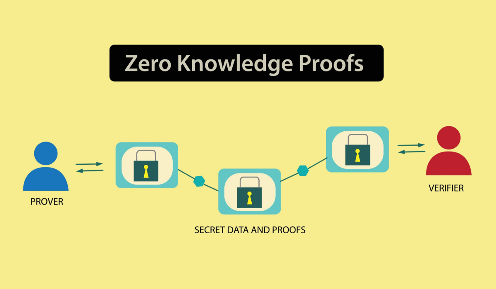

| **Inicio**         | **atrás 6**          |
| ------------------ | -------------------- |
| [🏠](../README.md) | [⏪](./3_6_TAILS.md) |

---

## **Índice**

| Temario                                                                                |
| -------------------------------------------------------------------------------------- |
| [143. ¿Qué son los Zero-Knowledge services?](#143-qué-son-los-zero-knowledge-services) |
| [144. SpiderOak CrossClave](#144-spideroak-crossclave)                                 |
| [145. Protonmail](#145-protonmail)                                                     |
| [146. Tresorit](#146-tresorit)                                                         |
| [147. KeePassXC](#147-keepassxc)                                                       |
| [148. Signal](#148-signal)                                                             |
| [149. Brave Browser y DuckDuckGo](#149-brave-browser-y-duckduckgo)                     |
| [150. TempMail](#150-tempmail)                                                         |
| [151. The Invisible Internet Project (I2P)](#151-the-invisible-internet-project-i2p)   |

---

# **Zero - Knowledge Services**

## **143. ¿Qué son los Zero-Knowledge services?**



### ✅ ¿QUÉ SIGNIFICA "ZERO-KNOWLEDGE"?

**“Zero-Knowledge”** significa literalmente **“conocimiento cero”**.

En el contexto de servicios online, **Zero-Knowledge** es una política de diseño y cifrado donde el proveedor **no sabe nada sobre tus datos.**

✅ Idea sencilla:

> Tú guardas datos en su servidor → ellos no pueden leerlos.

Ni empleados, ni hackers que roben sus servidores, ni órdenes legales pueden revelar el contenido sin tu clave.

---

✅ **Definición fácil:**

> Un servicio Zero-Knowledge está diseñado para que **solo tú tengas la clave de descifrado**. El proveedor almacena los datos cifrados y no puede descifrarlos.

---

### 🔒 ¿CÓMO FUNCIONA? (explicación sencilla)

✅ Paso a paso:

1️⃣ Tú eliges tu contraseña (clave maestra).

2️⃣ Antes de subir nada, **tu dispositivo cifra los datos localmente**.

3️⃣ Solo los datos cifrados viajan a la nube.

4️⃣ El servidor **no guarda tu clave**.

5️⃣ Cuando descargas, tu dispositivo los descifra.

✅ Resultado:

✔️ Nadie más puede ver tu información.

✔️ Si el proveedor es hackeado → solo obtienen datos cifrados.

✔️ Si una corte les pide datos → solo entregan basura cifrada.

---

✅ Analogia súper fácil:

> Imagínate un locker (casillero) en un gimnasio:
>
> Tú guardas tu mochila y cierras con tu candado.
>
> El gimnasio solo ve un locker cerrado → no sabe qué hay adentro.

---

### 🌟 EJEMPLOS DE SERVICIOS ZERO-KNOWLEDGE

✅ **Almacenamiento en la nube:**

- Tresorit
- Sync.com
- Proton Drive
- MEGA (con matices, pero usa cifrado cliente-lado)
- SpiderOak

✅ **Contraseñas:**

- Bitwarden (opción Zero-Knowledge)
- 1Password
- Proton Pass

✅ **Correo electrónico:**

- Proton Mail
- Tutanota

✅ **Mensajería:**

- Signal (usa cifrado extremo a extremo, que es una forma de Zero-Knowledge)
- Threema

---

✅ Ejemplo muy claro:

> Usas Proton Mail → Proton no conoce tus claves de descifrado.
>
> Tus correos están cifrados → ni siquiera ellos pueden leerlos.

---

### ✅ ¿POR QUÉ USAR ZERO-KNOWLEDGE?

✅ Ventajas:

✔️ Privacidad real → solo tú puedes descifrar tus datos.

✔️ Protección contra hackeos → datos inútiles sin la clave.

✔️ Protección legal → el proveedor no puede entregar contenido.

✔️ Confianza → diseño que impide abuso interno.

✅ Limitaciones:

❗ Si olvidas tu clave → perdiste acceso (no pueden recuperarla por ti).

❗ Normalmente algo más lento → cifrar y descifrar toma tiempo.

❗ Almacenamiento un poco más costoso (suelen ser servicios premium).

---

### ✅ ¿CÓMO SE “INSTALA” O SE USA UN ZERO-KNOWLEDGE SERVICE?

✅ No siempre se “instala” como un programa complejo.

✅ Más bien **se configura** o se **contrata**.

✅ Pero muchos ofrecen apps que SÍ se instalan en tu dispositivo.

---

✅ Aquí te dejo **PASO A PASO con un ejemplo muy sencillo**:

---

#### 🌱 EJEMPLO 1: USAR Proton Mail

✅ Proton Mail = correo electrónico Zero-Knowledge.

⭐ Paso 1: Ve a [proton.me](https://proton.me).

⭐ Paso 2: Regístrate → crea cuenta.

⭐ Paso 3: Elige contraseña fuerte.

✔️ Esa contraseña cifra tus claves privadas → Proton no la guarda.

⭐ Paso 4: Escribe y envía correos.

✔️ Tus correos se cifran en tu navegador antes de enviarse.

⭐ Paso 5: El destinatario recibe (si es usuario de Proton, descifra automáticamente).

✅ Resultado:

✔️ Proton solo almacena basura cifrada → no puede leer tus mails.

---

✅ **Instalación (opcional):**

✔️ App oficial (Android/iOS): Descárgala y úsala.

✔️ Cliente de escritorio (Proton Mail Bridge): para Thunderbird, Outlook.

---

#### 🌱 EJEMPLO 2: USAR Tresorit (almacenamiento cifrado Zero-Knowledge)

⭐ Paso 1: Ve a [tresorit.com](https://tresorit.com).

⭐ Paso 2: Crea cuenta → establece clave maestra.

✔️ Esa clave **nunca se manda al servidor**.

⭐ Paso 3: Descarga e instala la app en Windows, macOS, Linux, iOS o Android.

⭐ Paso 4: Sube tus archivos → la app los cifra en tu dispositivo.

⭐ Paso 5: Comparte o sincroniza → el servidor solo ve datos cifrados.

✅ Resultado:

✔️ Solo tú (o quienes tú autorices) pueden descifrar los archivos.

---

✅ **Idea súper sencilla:**

> Es como un Dropbox → pero con candado del lado del cliente.

---

#### 🌱 EJEMPLO 3: USAR Bitwarden (gestor de contraseñas)

✔️ Bitwarden puede funcionar en Zero-Knowledge:

⭐ Paso 1: Crea cuenta → define contraseña maestra.

⭐ Paso 2: Descarga e instala app o extensión de navegador.

⭐ Paso 3: Todas tus contraseñas se cifran con tu clave.

⭐ Paso 4: Bitwarden almacena solo el cofre cifrado.

⭐ Paso 5: Cuando inicias sesión → se descifra localmente.

✅ Resultado:

✔️ Bitwarden no conoce tus contraseñas.

✔️ Hackear sus servidores no revela nada legible.

---

### ✅ PASOS GENERALES PARA USAR UN SERVICIO ZERO-KNOWLEDGE

Aunque cada app es diferente, siempre sigue este patrón:

✅ 1️⃣ Regístrate y crea una contraseña maestra fuerte.

✅ 2️⃣ La app usa esa clave para cifrar datos **localmente**.

✅ 3️⃣ Sube los datos cifrados al servidor.

✅ 4️⃣ Para acceder → vuelves a introducir tu contraseña → descifras localmente.

✅ 5️⃣ Nunca compartas tu clave maestra → el proveedor **no puede recuperarla**.

---

✅ **Instalar y usar es fácil:**

✔️ Descargas la app.

✔️ Creas cuenta.

✔️ Configuras tu contraseña maestra.

✔️ Subes/guardas tus datos.

✔️ Accedes solo con tu clave.

---

### 🌟 COMPARACIÓN CON SERVICIOS NO ZERO-KNOWLEDGE

| Característica               | Zero-Knowledge               | No Zero-Knowledge                        |
| ---------------------------- | ---------------------------- | ---------------------------------------- |
| ¿Proveedor puede ver datos?  | ❌ No                        | ✅ Sí                                    |
| ¿Hackers pueden robar datos? | ❌ Solo cifrado inutilizable | ✅ Datos legibles si acceden             |
| ¿Recuperar contraseña?       | ❌ No (por diseño)           | ✅ Sí (proveedor la guarda o la resetea) |
| ¿Confianza requerida?        | Muy baja                     | Alta (confías en el proveedor)           |

✅ Ejemplo:

> Google Drive = No Zero-Knowledge. Google puede ver tus archivos.
>
> Tresorit = Zero-Knowledge. Solo tú puedes ver tus archivos.

---

### ✅ BUENAS PRÁCTICAS AL USARLOS

✔️ Usa contraseñas maestras muy fuertes y únicas.

✔️ Guarda tu clave en un lugar seguro (o memorízala bien).

✔️ Activa 2FA (autenticación en dos factores).

✔️ Desconfía de servicios que dicen ser cifrados pero pueden recuperar tu clave por ti.

✔️ Verifica que el proveedor tenga auditorías públicas o código abierto cuando sea posible.

---

### ✅ RESUMEN ULTRA RÁPIDO

⭐ **Zero-Knowledge = el proveedor NO puede ver tus datos.**

⭐ Tú cifras antes de subir.

⭐ Ellos solo guardan datos cifrados.

⭐ Ejemplos: Proton Mail, Tresorit, Bitwarden.

⭐ Uso típico: instala app, crea cuenta, sube/descarga → todo cifrado con tu clave.

---

[🔼](#índice)

---

## **144. SpiderOak CrossClave**

### ¿QUÉ ES SPIDEROAK CROSSCLAVE?

**SpiderOak CrossClave** es una **aplicación de almacenamiento y colaboración en la nube** enfocada en **seguridad y privacidad Zero-Knowledge**.

✅ Es como un Dropbox o Google Drive, pero:

> 🛡️ Más seguro → ellos no pueden ver tus datos.
>
> 🔐 Zero-Knowledge → los archivos están cifrados extremo a extremo.
>
> 👥 Pensado para **trabajo en equipo seguro** → puedes compartir archivos y carpetas solo con las personas que invites.

---

✅ Idea muy sencilla:

> Es un "Dropbox cifrado extremo a extremo para equipos".

---

✅ SpiderOak CrossClave es la evolución de SpiderOak ONE (el backup cifrado tradicional). Pero CrossClave está diseñado **para colaboración de equipos en tiempo real**.

---

### 🌱 ¿CÓMO FUNCIONA? (Explicación sencilla)

✅ Funcionamiento básico:

1️⃣ Tú subes archivos a CrossClave.

2️⃣ La app cifra los archivos **en tu dispositivo** (antes de enviarlos).

3️⃣ Los archivos cifrados se suben a los servidores de SpiderOak.

4️⃣ Solo las personas que tú invites (con la clave de tu equipo) pueden descifrarlos.

5️⃣ SpiderOak **no tiene las claves** → no puede ver nada.

---

✅ Analogia muy fácil:

> Es como poner tus archivos en una caja fuerte.
>
> Tú y tus compañeros tienen la combinación.
>
> SpiderOak solo guarda la caja fuerte, pero **no tiene la combinación**.

---

✅ Lo más importante:

- **Zero-Knowledge** → ni SpiderOak ni nadie más puede leer tus datos.
- **Compartición controlada** → solo las personas del equipo pueden acceder.
- **Colaboración** → puedes subir, editar, comentar archivos.

---

### ✅ ¿PARA QUÉ SIRVE? (Ventajas)

✅ Es ideal para:

✔️ Grupos que necesitan compartir documentos sensibles.

✔️ Empresas que manejan datos confidenciales.

✔️ Investigadores, periodistas, activistas.

✔️ Cualquier persona que no quiera que su proveedor de nube pueda ver sus archivos.

---

✅ Ventajas:

- Zero-Knowledge (ni SpiderOak ve nada).
- Cifrado extremo a extremo.
- Historial de versiones.
- Colaboración en equipo.
- Multi-plataforma (Windows, macOS, Linux, iOS, Android).

---

✅ Ejemplo claro:

> Un equipo de abogados sube contratos al espacio de CrossClave.
>
> Todos los miembros del equipo pueden verlos y editarlos.
>
> SpiderOak solo almacena datos cifrados.
>
> Si los servidores de SpiderOak fueran hackeados, los datos serían ilegibles.

---

### ✅ ¿CÓMO SE “INSTALA”? (Guía paso a paso para cada sistema)

¡Ahora vamos a lo que pediste!
Aquí te doy **explicación bien detallada y fácil** para Windows, Mac, Linux, iOS y Android.

---

#### ✅ A. **INSTALAR EN WINDOWS**

⭐ Paso 1: Ve al sitio oficial

👉 [https://spideroak.com/crossclave/](https://spideroak.com/crossclave/)

⭐ Paso 2: Haz clic en **Download** → elige **Windows**.

- Se descargará un instalador `.exe`.

⭐ Paso 3: Ejecuta el instalador.

- Sigue las instrucciones: "Next → Next → Install".

⭐ Paso 4: Abre CrossClave desde el menú Inicio.

⭐ Paso 5: Crea cuenta o inicia sesión.

⭐ Paso 6: Únete o crea un **Team Space** (espacio de equipo).

- Ahí podrás subir y compartir archivos.

---

✅ Resultado:

✔️ App instalada → lista para cifrado extremo a extremo.

---

#### ✅ B. **INSTALAR EN macOS**

⭐ 1️⃣ Descarga desde [https://spideroak.com/crossclave/](https://spideroak.com/crossclave/)

⭐ 2️⃣ Elige **macOS**.

⭐ 3️⃣ Se descargará un `.dmg`.

⭐ 4️⃣ Ábrelo → arrastra el ícono a **Applications**.

⭐ 5️⃣ Abre CrossClave desde **Launchpad**.

⭐ 6️⃣ Crea cuenta o inicia sesión.

⭐ 7️⃣ Únete o crea un Team Space.

---

✅ Resultado:

✔️ Todo tu equipo puede usarlo en Mac.

---

#### ✅ C. **INSTALAR EN LINUX**

SpiderOak CrossClave tiene soporte para .deb y .rpm.

✅ Para Ubuntu/Debian:

⭐ 1️⃣ Descarga el paquete `.deb` desde su web.

⭐ 2️⃣ Instala con:

```bash
sudo dpkg -i spideroak-crossclave*.deb
sudo apt --fix-broken install
```

⭐ 3️⃣ Abre desde el menú de aplicaciones.

⭐ 4️⃣ Inicia sesión o crea cuenta.

---

✅ Para Fedora/CentOS:

⭐ 1️⃣ Descarga el `.rpm`.

⭐ 2️⃣ Instala con:

```bash
sudo rpm -i spideroak-crossclave*.rpm
```

---

✅ Resultado:

✔️ Funciona en las principales distros.

---

#### ✅ D. **INSTALAR EN iOS / Android**

⭐ Abre **App Store** o **Google Play Store**.

⭐ Busca: **SpiderOak CrossClave**.

⭐ Toca **Instalar**.

⭐ Abre la app.

⭐ Inicia sesión o regístrate.

⭐ Accede a tus espacios de equipo.

---

✅ Resultado:

✔️ Puedes ver y subir archivos cifrados desde el celular.

---

### 🌟 ¿CÓMO SE USA? (Paso a paso fácil)

✅ Te dejo una guía de uso **bien sencilla**:

---

⭐ 1️⃣ Abre CrossClave.

⭐ 2️⃣ Inicia sesión o crea cuenta.

⭐ 3️⃣ Crea un **Team Space** (espacio de equipo).

- Es como una carpeta compartida cifrada.
- Puedes invitar a otros miembros por correo.

---

⭐ 4️⃣ Sube archivos:

- Arrástralos a la app o usa el botón "Upload".

---

⭐ 5️⃣ Comparte con tu equipo:

- Todos los miembros del espacio pueden verlos y editarlos.
- El cifrado extremo a extremo garantiza que solo ellos pueden abrirlos.

---

⭐ 6️⃣ Descarga o edita:

- Baja los archivos a tu dispositivo.
- CrossClave mantiene versiones antiguas.

---

✅ Ejemplo muy claro:

> Imagínate que eres periodista.
>
> Creas un espacio llamado **Investigation2024**.
>
> Subes documentos sensibles.
>
> Invitas a tu compañero con su correo.
>
> Ambos pueden ver los archivos cifrados, nadie más.

---

### ✅ BUENAS PRÁCTICAS

✔️ Usa contraseña fuerte para tu cuenta.

✔️ Activa 2FA (autenticación en dos factores).

✔️ Solo invita a miembros de confianza a tu espacio.

✔️ Haz backups cifrados adicionales si son datos críticos.

✔️ Mantén la app actualizada para parches de seguridad.

---

### ✅ MINI RESUMEN

✅ **SpiderOak CrossClave** = almacenamiento y colaboración cifrada extremo a extremo.

✅ **Zero-Knowledge** → ni SpiderOak ve tus datos.

✅ Ideal para:

✔️ Equipos de trabajo que comparten datos sensibles.

✔️ Empresas preocupadas por la privacidad.

✔️ Usuarios que quieren más seguridad que Google Drive o Dropbox.

✅ Fácil de instalar:

✔️ Windows, macOS, Linux, iOS, Android.

---

### ✅ ANALOGÍA FINAL MUY FÁCIL

> Imagínate que tú y tu equipo tienen un cofre con combinación secreta.
>
> Lo guardan en un almacén (SpiderOak).
>
> El almacén no conoce la combinación.
>
> Solo ustedes pueden abrirlo y ver el contenido.

✅ Así funciona CrossClave.

---

[🔼](#índice)

---

## **145. Protonmail**

### ✅ ¿QUÉ ES PROTONMAIL?

✅ ProtonMail es un **servicio de correo electrónico cifrado extremo a extremo y Zero-Knowledge**.

✔️ Fundado en Suiza por científicos del CERN.

✔️ Enfocado en **privacidad y seguridad**.

✔️ Zero-Knowledge = ni ProtonMail puede leer tus correos.

✔️ Basado en leyes de privacidad suizas muy estrictas.

---

✅ Idea fácil:

> Es como Gmail, pero con **candado** que solo tú puedes abrir.

---

✅ Características principales:

⭐ Cifrado extremo a extremo.

⭐ Zero-Knowledge → ni ProtonMail puede descifrar tus mensajes.

⭐ Código abierto.

⭐ Servidores en Suiza.

⭐ Acceso vía Web, Android, iOS.

⭐ Soporte para clientes como Thunderbird mediante **ProtonMail Bridge**.

---

### 🌟 ¿CÓMO FUNCIONA? (Explicación sencilla)

✅ Funcionamiento básico:

1️⃣ Tú escribes un correo en tu navegador o app.

2️⃣ Tu dispositivo cifra el mensaje antes de enviarlo.

3️⃣ ProtonMail almacena solo el **mensaje cifrado**.

4️⃣ El destinatario (otro usuario de ProtonMail) lo descifra automáticamente.

5️⃣ Si el destinatario no usa ProtonMail, puedes enviarle un correo protegido con contraseña.

---

✅ Analogia muy fácil:

> Imagínate enviar una carta en una caja fuerte.
>
> Solo el destinatario tiene la combinación para abrirla.
>
> El cartero (ProtonMail) no puede ver el contenido.

---

✅ Resultado:

✔️ Ni empleados de ProtonMail, ni hackers, ni gobiernos pueden leer tus correos.

---

### ✅ ¿PARA QUÉ SIRVE? (Ventajas)

✅ Ventajas clave:

✔️ Privacidad real → nadie más lee tus correos.

✔️ Sin publicidad invasiva.

✔️ Zero-Knowledge → no tienen tu contraseña ni claves de cifrado.

✔️ Leyes suizas → más protección legal.

✔️ Compatible con otros proveedores (puedes escribir a Gmail, Outlook, etc.).

✔️ Soporte para dominios personalizados (planes pagos).

---

✅ Limitaciones:

❗ Plan gratuito limitado (espacio y funcionalidades).

❗ Si olvidas tu contraseña → no pueden recuperarla (por diseño
Zero-Knowledge).

❗ Cifrado automático solo entre usuarios ProtonMail (para otros se usa cifrado con contraseña opcional).

---

✅ Ejemplo real:

> Una periodista usa ProtonMail para enviar correos cifrados a sus fuentes sin preocuparse de que su proveedor o un hacker lea su contenido.

---

### ✅ PLANES DE PROTONMAIL (simplificado)

✅ Gratis:

✔️ 1 dirección de correo.

✔️ 500 MB de almacenamiento.

✔️ 150 mensajes por día.

✔️ Dominio @proton.me o @protonmail.com.

✅ Pago (Plus, Unlimited):

✔️ Más espacio.

✔️ Múltiples direcciones.

✔️ Dominios personalizados.

✔️ Filtros avanzados.

✔️ Soporte para Bridge (cliente de escritorio).

---

### ✅ CÓMO SE USA E INSTALA (GUÍA PASO A PASO)

Ahora vamos a **cómo se instala y se usa** en:

✅ A. Web (la forma más fácil).

✅ B. Android.

✅ C. iOS.

✅ D. ProtonMail Bridge (para Thunderbird, Outlook).

---

#### ✅ A. USO EN WEB (ULTRA FÁCIL)

✅ 1️⃣ Abre [https://proton.me/mail](https://proton.me/mail)

✅ 2️⃣ Haz clic en **Sign Up** (Registrarse).

✅ 3️⃣ Elige un plan (Gratis o de pago).

✅ 4️⃣ Elige tu dirección:

⭐ [ejemplo@proton.me](mailto:ejemplo@proton.me)

✅ 5️⃣ Crea una contraseña fuerte (mínimo 12 caracteres, combina mayúsculas, minúsculas, números y símbolos).

✅ 6️⃣ Confirma tu correo de recuperación (opcional pero recomendado).

✅ 7️⃣ Entra a tu bandeja de entrada.

✅ Resultado:

✔️ ¡Ya tienes correo cifrado extremo a extremo!

---

✅ **Cómo enviar un correo cifrado:**

⭐ Haz clic en **Compose** (Redactar).

⭐ Escribe el destinatario.

⭐ Si es otro usuario de ProtonMail → cifrado automático.

⭐ Si es externo (Gmail, Outlook):
→ Haz clic en el candado → define contraseña → se enviará con cifrado y el destinatario usará la contraseña para abrirlo.

---

✅ Ejemplo real:

> Mónica usa ProtonMail en la web para mandar un correo cifrado a su contacto en Gmail usando contraseña.

---

#### ✅ B. INSTALAR EN ANDROID

✅ 1️⃣ Abre **Google Play Store**.

✅ 2️⃣ Busca: **ProtonMail**.

✅ 3️⃣ Toca **Instalar**.

✅ 4️⃣ Abre la app.

✅ 5️⃣ Inicia sesión o crea cuenta.

✅ 6️⃣ Empieza a enviar y recibir correos cifrados.

---

✅ Características móviles:

⭐ Notificaciones push.

⭐ Redactar y leer mensajes cifrados.

⭐ Gestión de carpetas, etiquetas.

⭐ Enviar correos protegidos por contraseña a externos.

---

✅ Ejemplo:

> Pedro recibe en su celular un correo cifrado de su colega. Lo abre con la app sin problema.

---

#### ✅ C. INSTALAR EN iOS

✅ 1️⃣ Abre **App Store**.

✅ 2️⃣ Busca: **ProtonMail**.

✅ 3️⃣ Toca **Obtener** o **Instalar**.

✅ 4️⃣ Abre la app.

✅ 5️⃣ Inicia sesión o crea cuenta.

✅ 6️⃣ Listo para usar.

---

✅ Funcionalidades idénticas:

✔️ Redacción cifrada.

✔️ Notificaciones.

✔️ Enviar con contraseña.

---

✅ Ejemplo:

> Andrea viaja y sigue leyendo sus correos cifrados en su iPhone.

---

#### ✅ D. PROTONMAIL BRIDGE (CLIENTE DE ESCRITORIO)

✅ ProtonMail Bridge permite usar tu cuenta ProtonMail en **Thunderbird, Outlook, Apple Mail**, etc.

✔️ El Bridge cifra y descifra en tu PC local.

✔️ ProtonMail sigue sin ver tus correos en texto plano.

---

✅ Requisito:

⭐ Solo para planes pagos.

---

✅ **Instalación en Windows/macOS/Linux:**

✅ 1️⃣ Ve a [https://proton.me/bridge](https://proton.me/bridge).

✅ 2️⃣ Descarga el instalador para tu sistema.

✅ 3️⃣ Ejecuta el instalador y sigue instrucciones.

✅ 4️⃣ Abre ProtonMail Bridge.

✅ 5️⃣ Inicia sesión con tu cuenta.

✅ 6️⃣ Bridge generará configuración IMAP/SMTP cifrada.

✅ 7️⃣ Abre Thunderbird u otro cliente.

✅ 8️⃣ Configura cuenta usando datos que Bridge te da.

---

✅ Resultado:

✔️ Usas ProtonMail en tu cliente favorito con cifrado Zero-Knowledge.

---

✅ Ejemplo real:

> Laura usa Thunderbird en su laptop con ProtonMail Bridge para gestionar su correo cifrado cómodamente.

---

### ✅ EJEMPLO DE USO MUY CLARO

✅ Imagina esto:

⭐ Tú y tu amiga usan ProtonMail:

→ Todo correo entre ustedes está **cifrado extremo a extremo** automáticamente.
→ ProtonMail solo almacena datos cifrados.

⭐ Tú quieres escribir a alguien en Gmail:

→ Puedes cifrar el correo con contraseña.

→ El destinatario recibe un link → introduce la contraseña → ve el mensaje.

---

### ✅ BUENAS PRÁCTICAS AL USAR PROTONMAIL

✔️ Usa contraseñas fuertes y únicas.

✔️ Activa la autenticación de dos factores (2FA).

✔️ Guarda tu clave de recuperación si la configuras.

✔️ Evita enviar información confidencial en correos sin cifrado (si el destinatario no tiene ProtonMail y no usas contraseña).

✔️ Mantén las apps actualizadas.

---

### ✅ RESUMEN ULTRA RÁPIDO

✅ ProtonMail = Correo electrónico cifrado extremo a extremo.

✅ Zero-Knowledge → ni ProtonMail puede leer tus correos.

✅ Fácil de usar en:

✔️ Navegador web

✔️ Android

✔️ iOS

✔️ Clientes de escritorio vía Bridge

✅ Gratis (con límites) y planes pagos.

---

### ✅ LINKS OFICIALES

⭐ Web: [https://proton.me/mail](https://proton.me/mail)

⭐ Bridge: [https://proton.me/bridge](https://proton.me/bridge)

⭐ Apps móviles:

✔️ [Google Play](https://play.google.com/store/apps/details?id=ch.protonmail.android)

✔️ [App Store](https://apps.apple.com/app/protonmail/id979659905)

---

[🔼](#índice)

---

## **146. Tresorit**

### ✅ ¿QUÉ ES TRESORIT?

**Tresorit** es un **servicio de almacenamiento en la nube cifrado extremo a extremo**.

✅ Es parecido a Dropbox o Google Drive pero **más seguro**.

✅ Su objetivo: que solo tú puedas acceder a tus archivos.

✅ Usa **Zero-Knowledge Encryption** → ni siquiera Tresorit puede ver tus archivos.

---

✅ Definición sencilla:

> Es como tener un “cofre digital” en la nube: tú lo cierras con llave en tu computadora antes de enviarlo al servidor, y solo tú puedes abrirlo.

---

✅ Origen:

- Empresa suiza/húngara.
- Muy popular entre abogados, médicos, empresas que manejan datos sensibles.

---

### ✅ ¿CÓMO FUNCIONA? (Explicación fácil)

✅ Paso a paso:

1️⃣ Tú eliges archivos o carpetas en tu computadora o móvil.

2️⃣ La app de Tresorit **cifra los datos localmente** (en tu dispositivo).

3️⃣ Solo los datos cifrados viajan a sus servidores.

4️⃣ Para abrirlos → tu app los descifra en tu dispositivo.

5️⃣ Tus claves de cifrado **nunca se suben a Tresorit**.

---

✅ Resultado:

✔️ Ni empleados de Tresorit, ni hackers, ni gobiernos pueden leer tus archivos.

✔️ Ni siquiera pueden resetear tu clave → Zero-Knowledge real.

---

✅ Analogia súper sencilla:

> Imagina que mandas tus cosas en una caja fuerte por correo.
>
> Solo tú tienes la combinación para abrirla.
>
> El mensajero (Tresorit) nunca puede ver el contenido.

---

### ✅ ¿PARA QUÉ SIRVE? (Ventajas y desventajas)

✅ ✅ Ventajas:

✔️ Privacidad real → solo tú tienes la clave.

✔️ Cumple normativas como GDPR, HIPAA.

✔️ Versionado → puedes recuperar versiones antiguas.

✔️ Compartición segura → controla permisos.

✔️ Sin límite de tamaño de archivo (según plan).

✔️ Apps para Windows, macOS, Linux, Android, iOS.

---

✅ ❗ Desventajas:

❌ No hay plan gratuito ilimitado (solo prueba gratis).

❌ Un poco más caro que Dropbox o Google Drive.

❌ Si olvidas tu clave → no hay recuperación (por diseño Zero-Knowledge).

---

✅ Ejemplo de uso típico:

> Una firma de abogados sube contratos confidenciales a Tresorit para compartirlos con colegas.
>
> Todos tienen acceso cifrado, solo los miembros invitados pueden abrir los archivos.

---

### ✅ EJEMPLO MUY CLARO

✅ Imagina esto:

⭐ Tienes un archivo PDF con datos bancarios.

⭐ Lo subes a Google Drive → Google puede indexarlo (para publicidad o análisis).

⭐ Lo subes a Tresorit → tu computadora lo cifra primero.

⭐ Tresorit solo almacena un archivo cifrado ilegible.

⭐ Solo tu app de Tresorit puede abrirlo con tu clave.

✅ Resultado:

✔️ Más privacidad.

✔️ Nadie puede espiar tu información.

---

### ✅ PLANES DE TRESORIT (simplificado)

✅ ❇️ Individual:

✔️ 1 usuario.

✔️ 1 TB o más.

✔️ Enfoque en seguridad personal.

✅ ❇️ Business / Enterprise:

✔️ Múltiples usuarios.

✔️ Controles de permisos.

✔️ Auditoría y cumplimiento.

✔️ Gestión centralizada.

✅ ✅ Hay **prueba gratuita** de 14 días.

---

### ✅ ¿CÓMO SE INSTALA? (GUÍA PASO A PASO)

Aquí la parte más práctica: **cómo descargarlo e instalarlo en cada sistema.**

---

#### 🌟 A. **INSTALAR EN WINDOWS**

⭐ 1️⃣ Ve a [https://tresorit.com/download](https://tresorit.com/download)

⭐ 2️⃣ Haz clic en **Download for Windows**.

⭐ 3️⃣ Se descargará un archivo `.exe`.

⭐ 4️⃣ Ábrelo → acepta términos → haz clic en **Install**.

⭐ 5️⃣ Abre la app.

⭐ 6️⃣ Crea cuenta o inicia sesión.

---

✅ Resultado:

✔️ Tresorit ya está instalado → listo para subir archivos cifrados.

---

#### 🌟 B. **INSTALAR EN macOS**

⭐ 1️⃣ Visita [https://tresorit.com/download](https://tresorit.com/download)

⭐ 2️⃣ Haz clic en **Download for macOS**.

⭐ 3️⃣ Descarga el archivo `.dmg`.

⭐ 4️⃣ Ábrelo → arrastra el ícono a **Applications**.

⭐ 5️⃣ Abre Tresorit desde Launchpad.

⭐ 6️⃣ Inicia sesión o regístrate.

---

✅ Resultado:

✔️ Ya puedes usar el almacenamiento cifrado en tu Mac.

---

#### 🌟 C. **INSTALAR EN LINUX**

✅ Soporta paquetes .deb y .rpm.

⭐ 1️⃣ Descarga desde [https://tresorit.com/download](https://tresorit.com/download).

⭐ 2️⃣ Elige tu sistema (.deb para Ubuntu/Debian o .rpm para Fedora/CentOS).

✅ En Ubuntu/Debian:

```bash
sudo dpkg -i tresorit*.deb
sudo apt --fix-broken install
```

✅ En Fedora/CentOS:

```bash
sudo rpm -i tresorit*.rpm
```

⭐ 3️⃣ Abre Tresorit desde el menú de aplicaciones.

⭐ 4️⃣ Inicia sesión.

---

✅ Resultado:

✔️ Ya tienes tu nube cifrada en Linux.

---

#### 🌟 D. **INSTALAR EN ANDROID**

⭐ 1️⃣ Abre **Google Play Store**.

⭐ 2️⃣ Busca: **Tresorit**.

⭐ 3️⃣ Toca **Instalar**.

⭐ 4️⃣ Abre la app.

⭐ 5️⃣ Inicia sesión o regístrate.

⭐ 6️⃣ Puedes subir y acceder a tus archivos cifrados.

---

✅ Resultado:

✔️ Acceso seguro en el móvil.

---

#### 🌟 E. **INSTALAR EN iOS**

⭐ 1️⃣ Abre **App Store**.

⭐ 2️⃣ Busca: **Tresorit**.

⭐ 3️⃣ Toca **Obtener** o **Instalar**.

⭐ 4️⃣ Abre la app.

⭐ 5️⃣ Inicia sesión o crea cuenta.

⭐ 6️⃣ Accede y comparte tus archivos cifrados.

---

✅ Resultado:

✔️ Seguridad total en tu iPhone o iPad.

---

### ✅ CÓMO SE USA (EXPLICACIÓN MUY FÁCIL)

✅ Una vez instalado:

⭐ 1️⃣ Inicia sesión con tu cuenta.

⭐ 2️⃣ Crea una **Tresor** (carpeta cifrada en la nube).

⭐ 3️⃣ Arrastra archivos o carpetas a la app → se cifran automáticamente.

⭐ 4️⃣ Sincroniza en todos tus dispositivos.

⭐ 5️⃣ Comparte enlaces seguros o invita a colaboradores con permisos limitados.

---

✅ Resultado:

✔️ Tus datos viajan y se almacenan siempre cifrados.

✔️ Solo quienes tú autorices pueden abrirlos.

---

✅ Ejemplo muy claro:

> Creas un Tresor llamado “Proyectos 2024”.
>
> Subes archivos PDF y fotos.
>
> Los compartes con tu equipo con permisos de solo lectura o edición.
>
> Nadie fuera de tu equipo puede verlos, ni siquiera Tresorit.

---

### ✅ BUENAS PRÁCTICAS

✔️ Usa contraseñas fuertes.

✔️ Activa la autenticación de dos factores (2FA).

✔️ Mantén la app actualizada.

✔️ Verifica permisos al compartir.

✔️ Haz backup local si necesitas redundancia.

---

### ✅ MINI RESUMEN

⭐ **Tresorit = almacenamiento en la nube con cifrado extremo a extremo.**

⭐ Zero-Knowledge → ni ellos pueden leer tus datos.

⭐ Apps para Windows, Mac, Linux, Android, iOS.

⭐ Ideal para:

✔️ Profesionales.

✔️ Empresas.

✔️ Cualquiera que quiera máxima privacidad.

⭐ Instalación sencilla desde su web o tiendas de apps.

---

### ✅ LINK OFICIAL

👉 [https://tresorit.com](https://tresorit.com)

👉 Descargas: [https://tresorit.com/download](https://tresorit.com/download)

---

[🔼](#índice)

---

## **147. KeePassXC**

### ✅ ¿QUÉ ES KEEPASSXC?

**KeePassXC** es un **gestor de contraseñas local y de código abierto**.

✅ Es una aplicación para **guardar todas tus contraseñas** en **un solo archivo cifrado** (una “bóveda”).

✅ Tú solo necesitas **recordar una contraseña maestra**.

✅ Todo lo demás está protegido con **cifrado muy fuerte (AES-256)**.

✅ XC = Cross-Platform → funciona en Windows, macOS y Linux.

---

✅ Idea sencilla:

> Es como tener una **caja fuerte digital** donde guardas tus contraseñas, tarjetas, notas, y solo tú tienes la llave.

---

### ✅ ¿CÓMO FUNCIONA? (Explicación fácil)

✅ Muy simple:

1️⃣ Creas un archivo de base de datos `.kdbx`.

2️⃣ El archivo está cifrado con una contraseña maestra que solo tú sabes.

3️⃣ Puedes agregar contraseñas, notas, URLs, archivos adjuntos.

4️⃣ Cuando quieras verlas → abres la app con tu contraseña maestra.

5️⃣ Puedes usar **autocompletado** para llenar contraseñas en el navegador.

---

✅ Analogia sencilla:

> Es como una **agenda con candado**:
>
> ✔️ Tú escribes tus datos secretos ahí.
>
> ✔️ Está cerrada con llave (cifrado).
>
> ✔️ Solo tú tienes la llave (contraseña maestra).

---

✅ Resultado:

✔️ No tienes que recordar 100 contraseñas.

✔️ Solo recuerdas **una** contraseña maestra muy fuerte.

✔️ Nadie más puede abrir tu base de datos.

---

### ✅ ¿PARA QUÉ SIRVE? (Ventajas y desventajas)

✅ Ventajas:

✔️ Gratis y de código abierto.

✔️ Sin cuentas online obligatorias.

✔️ 100% local (tus datos están en tu máquina).

✔️ Compatible con Dropbox/Google Drive → puedes sincronizar tú mismo.

✔️ Cifrado AES-256 → muy seguro.

✔️ Generador de contraseñas seguras.

✔️ Autocompletado en navegador (con extensiones).

✔️ Multi-plataforma (Windows, macOS, Linux).

---

✅ Desventajas:

❌ Tienes que **recordar tu contraseña maestra** (no hay recuperación).

❌ No sincroniza solo → tú debes poner el archivo en la nube si quieres eso.

❌ Un poco más técnico que otros gestores online (como 1Password o Bitwarden).

---

### ✅ EJEMPLO DE USO MUY CLARO

✅ Imagínate esto:

⭐ Tienes 50 cuentas online: Gmail, Facebook, Netflix, Amazon, tu banco...

⭐ Cada una necesita una contraseña fuerte y diferente.

⭐ KeePassXC te permite:

✔️ Guardarlas todas en un solo archivo cifrado.

✔️ Generar contraseñas fuertes únicas para cada sitio.

✔️ Copiar/pegar o autocompletar en tu navegador.

---

✅ Resultado:

✔️ Solo tienes que recordar **una contraseña maestra**.

✔️ Todas tus cuentas tienen contraseñas distintas y seguras.

---

### ✅ ¿CÓMO SE INSTALA? (GUÍA PASO A PASO)

Ahora la parte más práctica: **cómo descargarlo e instalarlo en cada sistema**.

---

#### ✅ A. INSTALAR EN WINDOWS

⭐ 1️⃣ Ve a la web oficial:

👉 [https://keepassxc.org/download/](https://keepassxc.org/download/)

⭐ 2️⃣ Haz clic en **Windows Installer**.

⭐ 3️⃣ Descarga el archivo `.exe`.

⭐ 4️⃣ Ábrelo → sigue el asistente (Next, Install).

⭐ 5️⃣ Abre **KeePassXC** desde el menú de inicio.

✅ ¡Listo! App instalada.

---

#### ✅ B. INSTALAR EN macOS

⭐ 1️⃣ Ve a [https://keepassxc.org/download/](https://keepassxc.org/download/)

⭐ 2️⃣ Descarga el archivo `.dmg`.

⭐ 3️⃣ Ábrelo → arrastra el ícono a **Applications**.

⭐ 4️⃣ Abre KeePassXC desde **Launchpad** o **Applications**.

✅ ¡Listo!

---

#### ✅ C. INSTALAR EN LINUX

✅ En Ubuntu/Debian:

```bash
sudo apt install keepassxc
```

✅ O descarga el AppImage desde su web →

👉 [https://keepassxc.org/download/](https://keepassxc.org/download/)

⭐ Ventaja del AppImage:

✔️ No necesitas instalación → solo dale permisos y ejecútalo.

---

✅ Resultado:

✔️ Compatible con las principales distros (Ubuntu, Fedora, Arch, etc.).

---

### ✅ CÓMO SE USA (PASO A PASO MUY FÁCIL)

---

#### ⭐ A. CREAR TU BÓVEDA

✅ 1️⃣ Abre KeePassXC.

✅ 2️⃣ Haz clic en **Nuevo**.

✅ 3️⃣ Elige dónde guardar el archivo → por ejemplo: `MisContraseñas.kdbx`.

✅ 4️⃣ Crea una **contraseña maestra fuerte**.

👉 Recomendación: mínimo 12–16 caracteres, mezcla mayúsculas, minúsculas, números, símbolos.

✅ 5️⃣ Haz clic en **Guardar**.

✅ Resultado:

✔️ Tu bóveda cifrada está lista.

---

#### ⭐ B. AÑADIR CONTRASEÑAS

✅ 1️⃣ Abre tu base de datos `.kdbx` con la contraseña maestra.

✅ 2️⃣ Haz clic en **Añadir entrada** o **+**.

✅ 3️⃣ Escribe:

✔️ Nombre: Facebook

✔️ Usuario: tuusuario

✔️ Contraseña: lapasswordsupersegura

✔️ URL: [https://facebook.com](https://facebook.com)

✅ 4️⃣ Haz clic en **Aceptar**.

✅ Resultado:

✔️ La entrada está guardada, cifrada.

---

#### ⭐ C. USAR CONTRASEÑAS GUARDADAS

✅ 1️⃣ Abre tu archivo `.kdbx` con tu contraseña maestra.

✅ 2️⃣ Busca la entrada → selecciónala.

✅ 3️⃣ Haz clic en **Copiar usuario** o **Copiar contraseña**.

✅ 4️⃣ Pega en el sitio web.

✅ ¡Así de fácil!

---

#### ⭐ D. GENERADOR DE CONTRASEÑAS

✅ KeePassXC tiene un generador de contraseñas aleatorias:

⭐ 1️⃣ Abre KeePassXC.

⭐ 2️⃣ Haz clic en **Generador de contraseñas** (icono de dado).

⭐ 3️⃣ Configura la longitud y tipo de caracteres.

⭐ 4️⃣ Copia la contraseña generada.

⭐ 5️⃣ Guárdala en tu bóveda para la cuenta que quieras.

✅ Resultado:

✔️ Contraseñas seguras únicas para cada sitio.

---

#### ⭐ E. SINCRONIZACIÓN ENTRE DISPOSITIVOS

✅ KeePassXC es **100% local**. Pero puedes sincronizar así:

✔️ Guarda tu archivo `.kdbx` en Dropbox, Google Drive, Nextcloud.

✔️ Abre el mismo archivo en todos tus dispositivos.

✅ Resultado:

✔️ Siempre la misma bóveda actualizada.

✔️ Los datos siguen cifrados incluso en la nube.

---

✅ Ejemplo:

> Tienes `MisContraseñas.kdbx` en Dropbox.
>
> Lo abres en tu laptop y en tu PC de trabajo.
>
> Todo sincronizado y cifrado.

---

#### ⭐ F. AUTOCOMPLETADO EN NAVEGADOR

✅ KeePassXC se puede conectar a extensiones en Chrome/Firefox.

✅ Pasos:

⭐ Instala la extensión **KeePassXC-Browser** desde la tienda de tu navegador.

⭐ Actívala en KeePassXC (opción **Herramientas → Integración de navegador**).

⭐ Empareja la extensión con KeePassXC.

⭐ Al entrar en un sitio → la extensión puede autocompletar usuario y contraseña.

✅ Resultado:

✔️ Mucho más cómodo.

---

### ✅ BUENAS PRÁCTICAS

✔️ Usa **contraseña maestra muy fuerte**.

✔️ Haz **backups** de tu archivo `.kdbx`.

✔️ Guarda el archivo en la nube **cifrado** (opcional).

✔️ Activa **2FA** en tus cuentas online.

✔️ Mantén KeePassXC actualizado.

---

### ✅ MINI RESUMEN

✅ **KeePassXC = Gestor de contraseñas local, seguro y gratis.**

✅ Todo se guarda en un archivo cifrado con AES-256.

✅ Zero-Knowledge → solo tú conoces la contraseña maestra.

✅ Apps para Windows, macOS, Linux.

✅ Autocompletado en navegador disponible.

✅ Sin cuentas online obligatorias → control total.

---

### ✅ LINKS OFICIALES

⭐ Sitio oficial y descargas:

👉 [https://keepassxc.org](https://keepassxc.org)

⭐ Documentación oficial:

👉 [https://keepassxc.org/docs/](https://keepassxc.org/docs/)

---

[🔼](#índice)

---

## **148. Signal**

### ✅ ¿QUÉ ES SIGNAL?

**Signal** es una **aplicación de mensajería cifrada de extremo a extremo**, **gratis** y **de código abierto**.

✅ Se usa para enviar:

✔️ Mensajes de texto.

✔️ Fotos, videos, archivos.

✔️ Llamadas y videollamadas.

✅ Todo **100% cifrado de extremo a extremo**.

✅ Ni Signal puede leer tus mensajes.

✅ Muy recomendada por expertos en privacidad (Edward Snowden, periodistas, activistas).

---

✅ Idea sencilla:

> Es como WhatsApp o Telegram, pero con **candado súper fuerte**: nadie (ni Signal) puede leer lo que envías.

---

✅ ¿Quién la desarrolla?

✔️ Signal Foundation (sin fines de lucro).

✔️ Código abierto → cualquiera puede revisar cómo funciona.

---

### ✅ ¿CÓMO FUNCIONA? (Explicación fácil)

✅ Principio clave: **cifrado de extremo a extremo**.

⭐ Cuando tú escribes un mensaje → se cifra en tu teléfono.

⭐ Solo se descifra en el teléfono del destinatario.

⭐ Ni Signal, ni hackers, ni gobiernos pueden leerlo en tránsito.

⭐ Llamadas y videollamadas también están cifradas.

---

✅ Analogia sencilla:

> Imagínate mandar una carta en una caja fuerte que solo el destinatario puede abrir.

---

✅ Resultado:

✔️ Solo tú y la otra persona pueden ver el contenido.

✔️ Seguridad y privacidad reales.

---

### ✅ ¿PARA QUÉ SIRVE? (Ventajas y desventajas)

✅ ✅ Ventajas:

✔️ Totalmente gratis.

✔️ Sin publicidad.

✔️ Código abierto → transparente.

✔️ Cifrado extremo a extremo por defecto.

✔️ Chats individuales y grupales seguros.

✔️ Llamadas y videollamadas cifradas.

✔️ Mensajes que desaparecen (temporizadores).

✔️ Enviar archivos, notas de voz, stickers.

✔️ Compatible con móviles y PC.

---

✅ ❗ Desventajas:

❌ Requiere número de teléfono para registrarse.

❌ Sin respaldo en la nube por defecto (para mayor privacidad).

❌ Menos popular → tus amigos podrían no usarlo todavía.

---

✅ Ejemplo de uso:

> Una periodista usa Signal para chatear con sus fuentes de forma privada.
>
> Un abogado coordina con su cliente sin miedo a filtraciones.
>
> Amigos se mandan memes y videos con privacidad real.

---

### ✅ EJEMPLO CLARO DE USO

✅ Imagínate:

⭐ Le escribes a tu amigo:

> “Hola, vamos a cenar hoy 🍕”

✅ WhatsApp o Messenger:

→ La empresa puede acceder a metadatos (quién, cuándo, a veces contenido si no está bien cifrado).

✅ Signal:

→ Solo tú y tu amigo pueden leerlo.

→ Ni Signal ve nada.

→ Incluso pueden poner mensajes que se autodestruyen en 10 segundos.

---

✅ Resultado:

✔️ Más privacidad.

✔️ Sin publicidad.

✔️ Sin minería de datos.

---

### ✅ ¿CÓMO SE INSTALA? (GUÍA PASO A PASO)

¡Ahora la parte más práctica!

---

#### ✅ A. ANDROID

⭐ 1️⃣ Abre **Google Play Store**.

⭐ 2️⃣ Busca **Signal Private Messenger**.

⭐ 3️⃣ Toca **Instalar**.

⭐ 4️⃣ Abre la app.

⭐ 5️⃣ Acepta los permisos.

⭐ 6️⃣ Introduce tu número de teléfono → recibirás un código SMS.

⭐ 7️⃣ Ingresa el código → listo.

✅ Resultado:

✔️ Signal configurado.

✔️ Puedes empezar a chatear.

---

#### ✅ B. iOS (iPhone/iPad)

⭐ 1️⃣ Abre **App Store**.

⭐ 2️⃣ Busca **Signal - Private Messenger**.

⭐ 3️⃣ Toca **Obtener**.

⭐ 4️⃣ Abre la app.

⭐ 5️⃣ Introduce tu número de teléfono.

⭐ 6️⃣ Recibirás un SMS con código → ingrésalo.

⭐ 7️⃣ Configura tu PIN de Signal (opcional pero recomendado).

✅ Resultado:

✔️ Signal listo para usar.

---

#### ✅ C. WINDOWS

✅ Necesitas **Signal en el celular primero** (obligatorio).

⭐ 1️⃣ Ve a [https://signal.org/download/](https://signal.org/download/)

⭐ 2️⃣ Descarga **Signal para Windows**.

⭐ 3️⃣ Instala el archivo `.exe` (clic en “Next”, “Install”).

⭐ 4️⃣ Abre Signal en tu PC → verás un código QR.

⭐ 5️⃣ Abre Signal en tu teléfono → Configuración → Dispositivos enlazados

→ **Enlazar nuevo dispositivo**.

⭐ 6️⃣ Escanea el QR con tu celular.

✅ Resultado:

✔️ Tus chats aparecen también en tu computadora.

---

#### ✅ D. macOS

⭐ 1️⃣ Ve a [https://signal.org/download/](https://signal.org/download/)

⭐ 2️⃣ Descarga **Signal para Mac** (.dmg).

⭐ 3️⃣ Arrástralo a **Applications**.

⭐ 4️⃣ Ábrelo → muestra un código QR.

⭐ 5️⃣ En tu móvil: Configuración de Signal → Dispositivos enlazados → Enlazar nuevo dispositivo.

⭐ 6️⃣ Escanea el QR con el teléfono.

✅ Resultado:

✔️ Sincronizado y listo en tu Mac.

---

#### ✅ E. LINUX

⭐ Signal Desktop está disponible como paquete .deb o .rpm.

⭐ 1️⃣ Ve a [https://signal.org/download/](https://signal.org/download/)

⭐ 2️⃣ Descarga el paquete correspondiente.

✅ En Ubuntu/Debian:

```bash
wget -O- https://updates.signal.org/desktop/apt/keys.asc | sudo apt-key add -
echo "deb [arch=amd64] https://updates.signal.org/desktop/apt xenial main" | sudo tee -a /etc/apt/sources.list.d/signal-xenial.list
sudo apt update && sudo apt install signal-desktop
```

✅ En Fedora/CentOS:

```bash
sudo rpm --import https://updates.signal.org/desktop/rpm/keys.asc
sudo dnf config-manager --add-repo https://updates.signal.org/desktop/rpm/signal.repo
sudo dnf install signal-desktop
```

⭐ Abre la app → escanea el QR con el teléfono → listo.

---

---

### ✅ CÓMO SE USA (PASO A PASO MUY FÁCIL)

✅ A. Enviar mensajes:

⭐ Abre Signal.

⭐ Toca el ícono de lápiz o “Nuevo mensaje”.

⭐ Selecciona un contacto (que también tenga Signal).

⭐ Escribe y envía.

✅ B. Hacer llamadas:

⭐ Abre el chat.

⭐ Toca el ícono de teléfono o cámara.

⭐ Llamada cifrada extremo a extremo.

✅ C. Chats grupales:

⭐ Toca “Nuevo chat”.

⭐ Crea un grupo.

⭐ Invita contactos.

⭐ Todas las conversaciones son privadas.

✅ D. Mensajes que desaparecen:

⭐ Abre el chat.

⭐ Toca el nombre del contacto → **Mensajes que desaparecen**.

⭐ Define tiempo (5s, 1h, 1d, etc.).

⭐ Todos los mensajes se autodestruyen pasado ese tiempo.

✅ E. Bloquear contacto:

⭐ Abre chat → toca nombre → **Bloquear**.

✅ F. Cambiar PIN de Signal:

⭐ Configuración → **Privacidad** → **PIN de Signal**.

---

### ✅ BUENAS PRÁCTICAS

✔️ Usa PIN de Signal → evita que alguien use tu cuenta en otro dispositivo.

✔️ Activa bloqueo con huella o FaceID.

✔️ Usa mensajes que desaparecen para temas sensibles.

✔️ Actualiza siempre la app.

✔️ Verifica la seguridad del contacto (códigos de seguridad).

---

### ✅ EJEMPLO MUY CLARO

✅ Imagina:

⭐ Tú y tu amiga usan Signal.

⭐ Quieres contarle algo muy personal.

⭐ Abres el chat, escribes y envías.

⭐ Signal cifra el mensaje → nadie puede interceptarlo.

⭐ Pones temporizador de 1 minuto → el mensaje se borra después de leerlo.

---

✅ Resultado:

✔️ Comunicación ultra privada.

✔️ Sin rastreadores.

✔️ Sin publicidad.

---

### ✅ MINI RESUMEN

✅ Signal = Mensajería **cifrada de extremo a extremo**.

✅ Gratis, código abierto, sin publicidad.

✅ Mensajes, fotos, videos, archivos, llamadas y videollamadas.

✅ Funciona en Android, iOS, Windows, macOS, Linux.

✅ Solo necesitas número de teléfono para registrarte.

---

### ✅ LINKS OFICIALES

⭐ Sitio web oficial:

👉 [https://signal.org](https://signal.org)

⭐ Descarga para PC:

👉 [https://signal.org/download/](https://signal.org/download/)

---

[🔼](#índice)

---

## **149. Brave Browser y DuckDuckGo**

### ✅ BRAVE BROWSER

---

#### 🔹 ¿QUÉ ES BRAVE?

**Brave** es un navegador web (como Chrome, Firefox o Edge), pero con un enfoque muy fuerte en **privacidad y velocidad**.

✅ Bloquea anuncios intrusivos por defecto.

✅ Bloquea rastreadores (trackers).

✅ Incluye HTTPS Everywhere.

✅ Compatible con extensiones de Chrome.

✅ Tiene un sistema de recompensas opcional (Brave Rewards con BAT).

---

✅ Idea sencilla:

> Es como **Chrome**, pero más rápido y más privado, porque elimina anuncios y rastreadores que te espían.

---

#### 🔹 ¿CÓMO FUNCIONA? (Explicación fácil)

✔️ Bloquea anuncios en las páginas → carga más rápido.

✔️ Bloquea rastreadores de Facebook, Google, etc. → más privacidad.

✔️ Fuerza conexión segura (HTTPS) si está disponible.

✔️ Puedes activar **Brave Rewards** para recibir anuncios opcionales y ganar tokens BAT.

✔️ Incluye Tor en una pestaña privada → navegación anónima.

---

✅ Ejemplo muy fácil:

> En Chrome abres un diario y ves 10 anuncios y cookies de rastreo.
>
> En Brave abres lo mismo → anuncios bloqueados → página más limpia y rápida.

---

#### 🔹 VENTAJAS

✅ Gratuito y de código abierto.

✅ Súper rápido (menos anuncios = menos peso).

✅ Bloqueo automático de rastreadores.

✅ Compatible con todas las extensiones de Chrome.

✅ Incluye modo Tor para privacidad extra.

✅ Opcional: ganar tokens BAT viendo anuncios privados.

---

#### 🔹 DESVENTAJAS

❌ Brave Rewards te muestra anuncios si los activas (opcional).

❌ Algunas páginas pueden pedirte desactivar bloqueadores.

❌ Tor en Brave es útil, pero menos seguro que el Tor Browser dedicado.

---

#### 🔹 EJEMPLO CLARO DE USO

✅ Escenario:

> Navegas en Facebook → Brave bloquea rastreadores de Facebook en otros sitios.
>
> Compras online → te proteges de seguimiento.
>
> Abres pestaña privada con Tor → ocultas tu IP.

---

#### 🔹 ¿CÓMO SE INSTALA? (Pasos sencillos)

---

##### ✅ A. WINDOWS y macOS

⭐ 1️⃣ Ve al sitio oficial:

👉 [https://brave.com](https://brave.com)

⭐ 2️⃣ Haz clic en **Download Brave**.

⭐ 3️⃣ Descarga el instalador.

⭐ 4️⃣ Abre el archivo:

✔️ Windows: .exe → sigue el asistente.

✔️ macOS: .dmg → arrástralo a **Applications**.

⭐ 5️⃣ Abre Brave desde el escritorio o el menú.

✅ ¡Listo! Ya puedes usar Brave.

---

##### ✅ B. LINUX

⭐ Brave está en los repos oficiales o puedes usar su repositorio.

✅ En Ubuntu/Debian:

```bash
sudo apt install apt-transport-https curl
sudo curl -fsSLo /usr/share/keyrings/brave-browser-archive-keyring.gpg https://brave-browser-apt-release.s3.brave.com/brave-browser-archive-keyring.gpg
echo "deb [signed-by=/usr/share/keyrings/brave-browser-archive-keyring.gpg arch=amd64] https://brave-browser-apt-release.s3.brave.com/ stable main" | sudo tee /etc/apt/sources.list.d/brave-browser-release.list
sudo apt update
sudo apt install brave-browser
```

✅ Resultado:

✔️ Brave instalado.

---

##### ✅ C. ANDROID / iOS

⭐ Abre **Google Play Store** o **App Store**.

⭐ Busca **Brave Browser**.

⭐ Toca **Instalar**.

⭐ Abre la app.

✅ Resultado:

✔️ Navegador seguro en tu móvil.

---

##### ✅ D. USO BÁSICO

⭐ Abre Brave.

⭐ Usa la barra de direcciones como en Chrome.

⭐ Activa/desactiva escudo en cada sitio (icono de león 🦁).

⭐ Abre **pestañas privadas con Tor** para más anonimato.

⭐ Ve a **Configuración → Bloqueadores → Personaliza reglas**.

✅ ¡Navegación más limpia y privada!

---

### 🌟 ✅ DUCKDUCKGO

---

#### 🔹 ¿QUÉ ES DUCKDUCKGO?

**DuckDuckGo (DDG)** es **un buscador web** (como Google o Bing) **que no te rastrea**.

✅ No guarda tu historial.

✅ No crea perfiles publicitarios tuyos.

✅ Te muestra resultados neutrales.

✅ Bloquea rastreadores con su app/extension.

---

✅ Idea sencilla:

> Es como Google, pero **sin espiarte** ni vender tus datos.

---

#### 🔹 ¿CÓMO FUNCIONA? (Explicación fácil)

✔️ Tú escribes tu búsqueda.

✔️ DuckDuckGo te da resultados sin personalizarlos para manipularte.

✔️ No almacena tu IP.

✔️ No guarda cookies de rastreo.

✔️ En el navegador o app, bloquea rastreadores en las webs que visitas.

---

✅ Ejemplo muy claro:

> Buscas "mejores zapatos" en Google → ves anuncios personalizados.
>
> Buscas en DuckDuckGo → resultados limpios, sin seguimiento.

---

#### 🔹 VENTAJAS

✅ Gratis.

✅ Sin seguimiento.

✅ Resultados neutrales.

✅ Bloquea rastreadores (con su app/extensión).

✅ Motor de búsqueda centrado en privacidad.

---

#### 🔹 DESVENTAJAS

❌ Resultados menos personalizados (algunos lo consideran ventaja).

❌ Algunas búsquedas muy de nicho a veces tienen menos resultados.

❌ No tiene algunos servicios (como Gmail, Maps integrados).

---

#### 🔹 EJEMPLO CLARO DE USO

✅ Escenario:

> Buscas "cómo cocinar pizza".
>
> DuckDuckGo te muestra recetas sin asociarlas a tu historial ni guardarlas.
>
> Nadie puede usar esa búsqueda para mostrarte anuncios de hornos.

---

#### 🔹 ¿CÓMO SE USA? (Muy sencillo)

---

✅ ✅ A. COMO BUSCADOR

⭐ Ve a:

👉 [https://duckduckgo.com](https://duckduckgo.com)

⭐ Escribe tu búsqueda.

⭐ ¡Listo!

✅ Resultado:

✔️ Sin seguimiento.

---

✅ ✅ B. COMO EXTENSIÓN EN CHROME/BRAVE/FIREFOX/EDGE

⭐ 1️⃣ Abre la tienda de extensiones del navegador.

⭐ 2️⃣ Busca **DuckDuckGo Privacy Essentials**.

⭐ 3️⃣ Haz clic en **Añadir a Chrome/Brave/Firefox**.

⭐ 4️⃣ La extensión:

✔️ Bloquea rastreadores.

✔️ Fuerza HTTPS.

✔️ Cambia el buscador por defecto a DuckDuckGo.

✅ Resultado:

✔️ Más privacidad en todo tu navegador.

---

✅ ✅ C. EN ANDROID

⭐ Abre **Google Play Store**.

⭐ Busca **DuckDuckGo Private Browser**.

⭐ Toca **Instalar**.

⭐ Abre la app.

⭐ Navega con el buscador integrado y bloqueo de rastreadores.

⭐ Usa el ícono de 🔥 para borrar todo con un toque.

✅ Resultado:

✔️ Navegación privada y sencilla.

---

✅ ✅ D. EN iOS

⭐ Abre **App Store**.

⭐ Busca **DuckDuckGo Privacy Browser**.

⭐ Toca **Obtener**.

⭐ Abre la app.

⭐ Usa el buscador o navega con bloqueo de rastreadores.

⭐ 🔥 Borra historial con un toque.

✅ Resultado:

✔️ Sin rastreo en el móvil.

---

### ✅ RESUMEN RÁPIDO

🌟 **Brave Browser**:

✔️ Navegador completo.

✔️ Bloquea anuncios y rastreadores.

✔️ Incluye Tor en pestañas privadas.

✔️ Súper rápido.

🌟 **DuckDuckGo**:

✔️ Buscador privado.

✔️ Sin rastreo ni personalización invasiva.

✔️ Extensión y app que bloquea rastreadores.

✔️ Gratis.

---

✅ LINKS OFICIALES

⭐ **Brave** → [https://brave.com](https://brave.com)

⭐ **DuckDuckGo** → [https://duckduckgo.com](https://duckduckgo.com)

---

[🔼](#índice)

---

## **150. TempMail**

### ✅ ¿QUÉ ES TEMPMAIL?

**TempMail** es un servicio de **correo electrónico temporal y desechable**.

✅ Te da una dirección de correo _falsa/temporal_ → automáticamente.

✅ Sirve para **recibir correos de forma anónima y sin usar tu email real**.

✅ Normalmente dura unas horas o días → luego desaparece.

---

✅ Idea sencilla:

> Es como un “email de usar y tirar”.

---

### ✅ ¿PARA QUÉ SIRVE? (CON EJEMPLOS CLAROS)

✔️ Evitar SPAM en tu correo real.

✔️ Registrarte en sitios sospechosos o que solo vas a usar una vez.

✔️ Descargar algo que pide email pero no quieres dar el tuyo.

✔️ Probar servicios sin comprometer tu email real.

---

✅ Ejemplo 1:

> Quieres descargar un ebook gratuito pero te piden correo → usas TempMail → recibes el enlace → listo → nadie te manda spam después.

✅ Ejemplo 2:

> Te quieres registrar en un foro solo para leer un post → usas TempMail → verificas la cuenta → jamás vuelves.

---

✅ Resultado:

✔️ Más privacidad.

✔️ Menos spam en tu correo personal.

✔️ Protección contra filtraciones de bases de datos.

---

### ✅ ¿CÓMO FUNCIONA? (Explicación sencilla)

✅ Súper fácil:

⭐ Abres TempMail.

⭐ Automáticamente te dan una dirección de email temporal.

⭐ Copias esa dirección y la usas donde quieras.

⭐ Cuando te envíen un correo → aparecerá en la página/app de TempMail.

⭐ Tú lo lees → si quieres lo borras → después de un tiempo desaparece solo.

---

✅ Analogia sencilla:

> Es como un **buzón público de correos** que usas solo para un paquete → lo recoges → y se destruye solo.

---

### ✅ VENTAJAS Y DESVENTAJAS

✅ ✅ VENTAJAS:

✔️ Gratis (versión básica).

✔️ Anónimo → sin registrar nada.

✔️ Evitas spam en tu correo personal.

✔️ Muy rápido y fácil de usar.

---

✅ ❗ DESVENTAJAS:

❌ Solo para recibir correos → no puedes enviar.

❌ No sirve para cuentas que quieras mantener a largo plazo.

❌ Algunos servicios bloquean dominios de correos temporales.

---

### ✅ ¿CÓMO SE USA? (SIN INSTALAR NADA)

✅ Lo más fácil: ¡usar la web!

⭐ Ve a:

👉 [https://temp-mail.org](https://temp-mail.org)

✅ Pasos:

✔️ Al abrir, ya tienes un email generado (por ejemplo: `abc123@tempmail.org`).

✔️ Copia esa dirección → pégala donde necesites registrarte.

✔️ Espera en la misma página → los correos llegarán allí.

✔️ Lee el correo → copia códigos de verificación o enlaces → listo.

✔️ Puedes borrar o generar una dirección nueva.

✅ Resultado:

✔️ Rápido, gratis y sin instalar nada.

---

✅ Ejemplo clarísimo:

1️⃣ Abres [https://temp-mail.org](https://temp-mail.org).

2️⃣ Te dan: `random123@tempmail.org`.

3️⃣ Vas a un sitio que pide email → pegas ese email.

4️⃣ El sitio te envía un correo de confirmación.

5️⃣ Vuelves a TempMail → lees el correo → clic en el enlace de verificación.

6️⃣ ¡Cuenta creada sin usar tu email real!

---

### ✅ ¿CÓMO SE INSTALA? (GUÍA SÚPER FÁCIL)

#### ✅ A. ANDROID

⭐ 1️⃣ Abre **Google Play Store**.

⭐ 2️⃣ Busca **Temp Mail**.

⭐ 3️⃣ Toca **Instalar**.

⭐ 4️⃣ Abre la app.

✔️ Te genera un email temporal automáticamente.

✔️ Puedes copiarlo y recibir correos ahí mismo.

✔️ Puedes borrar o refrescar la dirección.

✅ ¡Listo!

---

#### ✅ B. iOS (iPhone/iPad)

⭐ 1️⃣ Abre **App Store**.

⭐ 2️⃣ Busca **Temp Mail**.

⭐ 3️⃣ Toca **Obtener**.

⭐ 4️⃣ Abre la app.

✔️ Te dará un correo temporal.

✔️ Puedes copiarlo, recibir correos, eliminarlos.

✔️ O generar uno nuevo.

✅ ¡Así de fácil!

---

#### ✅ C. EXTENSIÓN PARA NAVEGADOR

⭐ Algunas extensiones permiten acceder rápido a TempMail.

✅ Para **Chrome / Brave / Edge**:

1️⃣ Abre la Chrome Web Store.

2️⃣ Busca **Temp Mail**.

3️⃣ Haz clic en **Añadir a Chrome**.

4️⃣ Verás el icono en la barra → un clic te da tu correo temporal.

✅ Para **Firefox**:

1️⃣ Abre **Mozilla Add-ons**.

2️⃣ Busca **Temp Mail**.

3️⃣ Añádelo a Firefox.

4️⃣ Haz clic en el icono → copia tu email.

---

✅ Resultado:

✔️ Mucho más cómodo → no tienes ni que abrir la web.

---

### ✅ USO PASO A PASO SÚPER FÁCIL (WEB O APP)

✅ 1️⃣ Abre TempMail (web o app).

✅ 2️⃣ Copia el email que te dan automáticamente.

✅ 3️⃣ Pega ese email en el sitio donde te registras.

✅ 4️⃣ Espera el correo → aparece en TempMail.

✅ 5️⃣ Abre el mensaje → copia código o enlace.

✅ 6️⃣ ¡Verifica la cuenta y listo!

✅ 7️⃣ El correo desaparecerá solo después de un tiempo.

---

✅ Resultado:

✔️ Registrado sin exponer tu email real.

✔️ Sin spam futuro.

---

### ✅ BUENAS PRÁCTICAS

⭐ Úsalo solo para registros temporales.

⭐ Nunca para cuentas importantes (banco, correo personal).

⭐ Verifica si el sitio acepta correos temporales.

⭐ Borra la dirección si terminas de usarla.

---

### ✅ RESUMEN RÁPIDO

🌟 **TempMail = Correo temporal y desechable.**

✔️ Gratis y fácil.

✔️ Sin registro.

✔️ Protege tu email real del spam.

✔️ Perfecto para pruebas y registros de una sola vez.

✔️ Web, apps para Android/iOS, extensiones de navegador.

---

✅ LINKS ÚTILES

⭐ Sitio oficial:

👉 [https://temp-mail.org](https://temp-mail.org)

⭐ App Android:

👉 [Temp Mail en Google Play](https://play.google.com/store/apps/details?id=com.tempmail)

⭐ App iOS:

👉 [Temp Mail en App Store](https://apps.apple.com/app/temp-mail/id1214259095)

---

[🔼](#índice)

---

## **151. The Invisible Internet Project (I2P)**

### ✅ ¿QUÉ ES I2P?

**I2P** significa **Invisible Internet Project**.

✅ Es una **red anónima y cifrada**.

✅ Permite a sus usuarios **comunicarse y compartir datos de forma privada**.

✅ No es para navegar en la "web normal" (la llamada clearnet) como Google o Facebook.

✅ Sirve para acceder a **servicios ocultos** (llamados **eepsites**) y para compartir archivos, chats, correos, etc. de forma anónima.

---

✅ Idea sencilla:

> I2P es como **un internet dentro del internet** → diseñado para ser **oculto, cifrado y anónimo**.

---

✅ Es similar en idea a **Tor**, pero con algunas diferencias:

✔️ Tor está más orientado a acceder a la web normal de forma anónima.

✔️ I2P está más orientado a **servicios dentro de la red I2P** (chats, páginas, torrents, etc.).

---

### ✅ ¿PARA QUÉ SIRVE? (CON EJEMPLOS SÚPER FÁCILES)

✅ Casos comunes:

⭐ Navegar por **sitios ocultos de I2P** (eepsites):
→ como navegar por la dark web, pero en la red I2P.

⭐ Compartir archivos de forma anónima.

⭐ Usar correo cifrado (I2P-Bote).

⭐ Tener foros y chats sin revelar IP.

⭐ Compartir torrents de forma anónima.

---

✅ Ejemplo 1:

> Tú tienes un sitio web que no quieres que sepa nadie dónde está → lo publicas como un **eepsite** en I2P.

✅ Ejemplo 2:

> Quieres chatear de forma privada con amigos → usan I2P Messenger → sus IPs están ocultas.

✅ Ejemplo 3:

> Quieres descargar un archivo con torrent sin revelar tu IP → usas I2P Snark.

---

✅ Resultado:

✔️ Comunicaciones privadas.

✔️ Imposible rastrear quién eres fácilmente.

✔️ Compartir datos con cifrado de extremo a extremo.

---

### ✅ ¿CÓMO FUNCIONA? (EXPLICACIÓN MUY FÁCIL)

✅ I2P es **una red dentro de la red**.

✔️ Todo el tráfico está cifrado.

✔️ Se enruta por "túneles" → otros usuarios de I2P reenvían tu tráfico de forma cifrada.

✔️ Nadie ve quién habla con quién.

✔️ Usa su propio sistema de direcciones → termina en `.i2p`.

✔️ No depende de Internet normal → los servicios son internos.

---

✅ Analogia sencilla:

> Imagínate que quieres enviar una carta.
>
> En lugar de enviarla directamente → la pasas a 5 amigos distintos, cada uno solo sabe de quién la recibió y a quién se la pasa.
>
> Además, la carta está dentro de 5 sobres.
>
> Nadie sabe el contenido ni el remitente original.

---

✅ Resultado:

✔️ Comunicación **anónima y privada**.

✔️ Muy difícil de rastrear.

---

### ✅ VENTAJAS Y DESVENTAJAS

✅ ✅ VENTAJAS:

✔️ Comunicación cifrada extremo a extremo.

✔️ Diseño descentralizado → difícil de censurar.

✔️ Anónimo → oculta tu IP real.

✔️ No solo para web → chats, torrents, correo.

✔️ Gratis y de código abierto.

---

✅ ❗ DESVENTAJAS:

❌ Más complicado de configurar que Tor.

❌ No sirve bien para acceder a la web normal.

❌ Velocidad más baja (como toda red anónima).

❌ Menos usuarios → menos contenido disponible.

---

### ✅ ¿CÓMO SE INSTALA? (GUÍA PASO A PASO)

¡Ahora lo más importante!
Te explico cómo instalar **I2P Router**, que es el programa para acceder a la red I2P.

---

#### ✅ A. WINDOWS

⭐ 1️⃣ Ve al sitio oficial:

👉 [https://geti2p.net](https://geti2p.net)

⭐ 2️⃣ Haz clic en **Download**.

⭐ 3️⃣ Descarga el instalador de Windows (`.exe`).

⭐ 4️⃣ Abre el archivo descargado.

⭐ 5️⃣ Sigue el asistente de instalación:

✔️ Acepta la licencia.

✔️ Elige carpeta (puedes dejar la predeterminada).

✔️ Instala.

⭐ 6️⃣ Abre **I2P Router**.

⭐ 7️⃣ La primera vez, abre en tu navegador:

```
http://127.0.0.1:7657
```

✅ Esa es la consola de control de I2P.

---

✅ Resultado:
✔️ ¡I2P Router funcionando en tu Windows!

---

#### ✅ B. macOS

⭐ 1️⃣ Ve a [https://geti2p.net](https://geti2p.net).

⭐ 2️⃣ Descarga el **archivo .jar** (I2P para Java).

⭐ 3️⃣ Asegúrate de tener **Java instalado**:

```bash
java -version
```

✔️ Si no tienes → descarga desde [https://www.java.com](https://www.java.com).

⭐ 4️⃣ Ejecuta I2P:

```bash
java -jar i2pinstall_*.jar
```

⭐ 5️⃣ Sigue las instrucciones del instalador gráfico.

⭐ 6️⃣ Una vez instalado, inicia con:

```bash
i2prouter start
```

⭐ 7️⃣ Abre en navegador:

```
http://127.0.0.1:7657
```

✅ Resultado:

✔️ I2P Router corriendo en macOS.

---

#### ✅ C. LINUX

✅ Muy fácil si usas Debian/Ubuntu:

⭐ 1️⃣ Abre Terminal.

⭐ 2️⃣ Agrega el repositorio:

```bash
echo "deb https://deb.i2p2.no/ stable main" | sudo tee /etc/apt/sources.list.d/i2p.list
wget -qO - https://deb.i2p2.no/repoinfo.asc | sudo apt-key add -
```

⭐ 3️⃣ Actualiza e instala:

```bash
sudo apt update
sudo apt install i2p
```

⭐ 4️⃣ Inicia I2P Router:

```bash
i2prouter start
```

⭐ 5️⃣ Abre en tu navegador:

```
http://127.0.0.1:7657
```

✅ Resultado:

✔️ I2P instalado y funcionando en Linux.

---

### ✅ ¿CÓMO SE USA? (PASO A PASO SÚPER FÁCIL)

✅ 1️⃣ Abre I2P Router.

✅ 2️⃣ Ve en tu navegador a:

```
http://127.0.0.1:7657
```

✅ 3️⃣ Ahí tienes el **Panel de Control**:

⭐ Ver estado de túneles.

⭐ Crear túneles propios.

⭐ Ver ancho de banda.

⭐ Configurar puertos.

✅ 4️⃣ Accede a **Eepsites**:

⭐ Eepsites = sitios terminados en `.i2p`.

⭐ Desde la consola → selecciona "I2P Sites" o escribe la dirección `.i2p` en el navegador **(con proxy configurado o con I2P Browser).**

✅ 5️⃣ Usa aplicaciones:

✔️ I2PSnark → Torrents anónimos.

✔️ I2P-Bote → Correo cifrado.

✔️ I2P Messenger → Chat privado.

✔️ Susurro → Foros.

✅ 6️⃣ Configura tu navegador:

⭐ Para acceder a eepsites necesitas configurar proxy:

→ HTTP Proxy:

```
127.0.0.1 : 4444
```

→ HTTPS Proxy (opcional):

```
127.0.0.1 : 4445
```

⭐ Muchos navegadores permiten hacerlo en Opciones → Red → Proxy.

✅ Resultado:

✔️ Puedes visitar `.i2p` sitios, usar torrents, chatear, enviar correos en la red I2P → todo de forma anónima.

---

### ✅ EJEMPLO SÚPER CLARO DE USO

✅ Escenario:

⭐ Quieres leer un foro secreto en I2P:

✔️ Abres I2P Router.

✔️ Abres tu navegador en:

```
http://127.0.0.1:7657
```

✔️ Encuentras un enlace al foro:

```
exampleforum.i2p
```

✔️ Configuras el proxy en tu navegador.

✔️ Navegas de forma anónima → tu IP real está oculta.

✅ Resultado:

✔️ Nadie sabe quién eres ni dónde estás.

---

### ✅ RESUMEN RÁPIDO

🌟 **I2P = Invisible Internet Project**

✔️ Red anónima y cifrada.

✔️ Para servicios internos → eepsites, torrents, chat, correo.

✔️ Gratis y de código abierto.

✔️ Más complicado que Tor pero muy privado.

---

✅ Acceso:

✔️ Sitio oficial → [https://geti2p.net](https://geti2p.net)

✔️ Instaladores para Windows, macOS, Linux.

---

[🔼](#índice)

---

| **Inicio**         | **atrás 6**          |
| ------------------ | -------------------- |
| [🏠](../README.md) | [⏪](./3_6_TAILS.md) |
