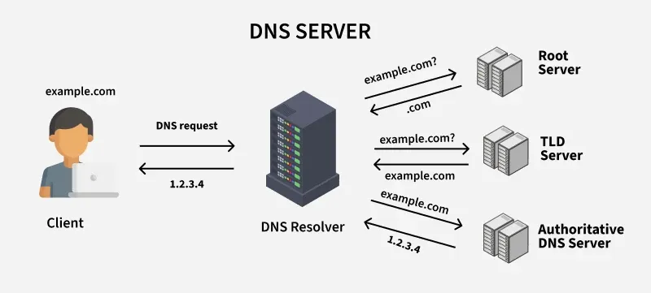

| **Inicio**         | **atrás 1**                                                             | **Siguiente 3**                                                                |
| ------------------ | ----------------------------------------------------------------------- | ------------------------------------------------------------------------------ |
| [🏠](../README.md) | [⏪](4_2_Investigacion_de_fuentes_abiertas_OSINT_con_Python_Hacking.md) | [⏩](./4_3_Escaneos_y_analisis_de_redes_con_Python_Hosts_Puertos_Servicios.md) |

---

## **Índice**

| Temario                                                                                                                                                           |
| ----------------------------------------------------------------------------------------------------------------------------------------------------------------- |
| [170. Descubriendo dispositivos en Internet con Shodan](#170-descubriendo-dispositivos-en-internet-con-shodan)                                                    |
| [171. Shodan con Python: Identificando aplicaciones webs y hosts automáticamente](#171-shodan-con-python-identificando-aplicaciones-webs-y-hosts-automáticamente) |
| [172. Autenticación y Login automatizado con Python y Shodan](#172-autenticación-y-login-automatizado-con-python-y-shodan)                                        |
| [173. Automatiza el Login con Selenium](#173-automatiza-el-login-con-selenium)                                                                                    |
| [174. Procesamiento en paralelo con Python: Multithreading](#174-procesamiento-en-paralelo-con-python-multithreading)                                             |
| [175. Multithreading con Python](#175-multithreading-con-python)                                                                                                  |
| [176. Otros buscadores interesantes: Censys, ZoomEye, GreyNoise, DeHashed](#176-otros-buscadores-interesantes-censys-zoomeye-greynoise-dehashed)                  |
| [177. Investigación de información histórica: Wayback Machine](#177-investigación-de-información-histórica-wayback-machine)                                       |
| [178. Filtrado de información histórica: PDF, DOC, TXT](#178-filtrado-de-información-histórica-pdf-doc-txt)                                                       |
| [179. Análisis y enumeración de DNS](#179-análisis-y-enumeración-de-dns)                                                                                          |
| [180. ¿Cómo funciona DNS?](#180-cómo-funciona-dns)                                                                                                                |
| [181. Investigación de un nombre de dominio: WHOIS](#181-investigación-de-un-nombre-de-dominio-whois)                                                             |
| [182. Geolocalización e investigación de una dirección IP](#182-geolocalización-e-investigación-de-una-dirección-ip)                                              |
| [183. Geolocalización e investigación de un número de teléfono](#183-geolocalización-e-investigación-de-un-número-de-teléfono)                                    |
| [184. Análisis de metadatos con Python: Imágenes](#184-análisis-de-metadatos-con-python-imágenes)                                                                 |
| [185. Análisis de metadatos con Python: PDFs y Documentos](#185-análisis-de-metadatos-con-python-pdfs-y-documentos)                                               |
| [186. Herramientas OSINT desarrolladas en Python: Sherlock, Spiderfoot](#186-herramientas-osint-desarrolladas-en-python-sherlock-spiderfoot)                      |

---

# **Investigacion de fuentes abiertas (OSINT) con Python Hacking**

## **170. Descubriendo dispositivos en Internet con Shodan**

### ✅ ¿Qué es Shodan?

**Shodan** es un **motor de búsqueda para dispositivos conectados a Internet.**

A diferencia de Google (que busca páginas web), Shodan indexa **dispositivos y servicios expuestos en Internet**, como:

✔️ Cámaras IP

✔️ Routers

✔️ Servidores web

✔️ Bases de datos expuestas

✔️ IoT

✔️ Sistemas SCADA / ICS

✅ **Lo importante:**

> Shodan recopila banners y metadatos de servicios escuchando en puertos abiertos.

---

✅ 🟢 **Ejemplo de búsqueda en Shodan**:

```
apache country:"PE"
```

✔️ Encuentra servidores Apache en Perú.

---

✅ 🟢 **Otro ejemplo**:

```
port:22 "OpenSSH"
```

✔️ Encuentra hosts con SSH abierto.

---

✅ Es usado en **hacking ético, OSINT y ciberseguridad** para:

- Reconocimiento externo (external recon).
- Encontrar vectores de ataque.
- Identificar versiones vulnerables.
- Auditoría de exposición.

---

### ✅ ¿Cómo se usa desde el navegador?

✅ Visita: [https://www.shodan.io](https://www.shodan.io)

⭐ Búsqueda básica (gratis):

- Puedes escribir dorks de Shodan.
- Ejemplo: `product:"MongoDB"`

⭐ Búsqueda avanzada (con cuenta):

- Filtrar por país, puerto, organización.
- Exportar resultados.

✅ **Gratis:** resultados limitados.

✅ **De pago:** más resultados, API.

---

### ✅ Dorks y operadores en Shodan

✅ **Operadores típicos:**

| Operador | Ejemplo             | Qué hace                         |
| -------- | ------------------- | -------------------------------- |
| port     | `port:80`           | Busca dispositivos en puerto 80  |
| country  | `country:"PE"`      | Limita a Perú                    |
| city     | `city:"Lima"`       | Filtra por ciudad                |
| org      | `org:"Telefónica"`  | Filtra por ISP u organización    |
| product  | `product:"Apache"`  | Filtra por software              |
| version  | `version:"2.4.49"`  | Busca versión específica         |
| before   | `before:2023-01-01` | Resultados vistos antes de fecha |

✅ Puedes **combinarlos**:

```
product:"Apache" country:"PE" port:80
```

---

### ✅ ¿Cómo obtener una cuenta en Shodan?

✅ 1️⃣ Ve a [https://account.shodan.io/register](https://account.shodan.io/register)

✅ 2️⃣ Crea cuenta (correo y contraseña).

✅ 3️⃣ Activa el correo.

✅ 4️⃣ Obtén tu **API Key**:

✔️ Ve a: [https://account.shodan.io](https://account.shodan.io)

✔️ Copia tu **API Key personal**.

✅ Esa **API Key** es la clave para usar Shodan **programáticamente**.

---

### ✅ ¿Por qué usar Shodan con Python?

✅ Ventajas de usar el **API**:

- Hacer búsquedas automáticas.
- Analizar resultados en masa.
- Filtrar y procesar datos.
- Integrar en scripts de recon, pentest, OSINT.

✅ Evita límites de la web (para cuentas pagadas).

✅ Puedes exportar a JSON, CSV.

---

### ✅ Instalación de la librería de Shodan en Python

✅ Paso 1: Tener Python instalado

Verificar:

```bash
python --version
```

---

✅ Paso 2: Crear un **entorno virtual** (opcional, recomendado)

```bash
python -m venv venv
```

Activar:

- Windows:

```bash
venv\Scripts\activate
```

- macOS/Linux:

```bash
source venv/bin/activate
```

---

✅ Paso 3: Instalar la librería oficial

```bash
pip install shodan
```

✅ ¡Listo! Ya puedes usar el API de Shodan en Python.

---

### ✅ Ejemplo básico en Python

✅ Objetivo:

✔️ Conectar con la API.

✔️ Hacer una búsqueda.

✔️ Imprimir resultados.

---

**🟢 Archivo: `shodan_search_basic.py`**

```python
import shodan

API_KEY = "TU_API_KEY_AQUI"

# Crear cliente
api = shodan.Shodan(API_KEY)

# Hacer búsqueda
query = 'apache country:"PE"'
resultados = api.search(query)

print(f"Resultados encontrados: {resultados['total']}")

for servicio in resultados['matches']:
    ip = servicio['ip_str']
    org = servicio.get('org', 'N/A')
    puerto = servicio['port']
    banner = servicio.get('data', 'N/A')
    print(f"\nIP: {ip}")
    print(f"Org: {org}")
    print(f"Puerto: {puerto}")
    print(f"Banner: {banner}")
```

---

✅ ¿Qué hace este script?

✔️ Conecta con Shodan usando tu API Key.

✔️ Busca servidores Apache en Perú.

✔️ Imprime:

- IP pública.
- Organización.
- Puerto abierto.
- Banner del servicio.

---

### ✅ Resultado esperado (ejemplo)

```
Resultados encontrados: 128

IP: 190.123.45.67
Org: Telefónica del Perú
Puerto: 80
Banner: HTTP/1.1 200 OK ...

IP: 200.40.50.60
Org: Movistar
Puerto: 80
Banner: Server: Apache/2.4.6 ...
```

✅ Útil para:

✔️ Mapeo de infraestructura.

✔️ Reconocimiento externo.

✔️ Detección de software obsoleto.

---

### ✅ Guardar resultados en archivo

✅ Puedes **guardar en JSON**:

```python
import json

with open("resultados.json", "w", encoding="utf-8") as f:
    json.dump(resultados, f, indent=2)
```

✅ Resultado ➜ Archivo con todos los datos brutos.

---

✅ O en **texto plano**:

```python
with open("ips.txt", "w") as f:
    for servicio in resultados['matches']:
        f.write(servicio['ip_str'] + "\n")
```

✅ Resultado ➜ Lista de IPs para posterior análisis.

---

### ✅ Ejemplo avanzado con argparse

✅ Script para usar desde línea de comandos:

```
python shodan_dork.py -q 'product:"nginx" country:"PE"'
```

---

**🟢 Código ejemplo: `shodan_dork.py`**

```python
import shodan
import argparse

API_KEY = "TU_API_KEY_AQUI"

def main():
    parser = argparse.ArgumentParser(description='Busqueda Shodan automatica.')
    parser.add_argument('-q', '--query', help='Dork de Shodan', required=True)
    args = parser.parse_args()

    api = shodan.Shodan(API_KEY)
    resultados = api.search(args.query)

    print(f"Resultados: {resultados['total']}")
    for servicio in resultados['matches']:
        print(f"{servicio['ip_str']}:{servicio['port']} - {servicio.get('org', 'N/A')}")

if __name__ == "__main__":
    main()
```

---

✅ Resultado al ejecutar:

```
Resultados: 55
190.123.45.67:80 - Telefónica
200.40.50.60:80 - Movistar
...
```

---

### ✅ Buenas prácticas y uso ético

✅ Shodan es **legal** y **público**.

✔️ Solo indexa puertos abiertos / banners.

✔️ Todo lo que muestra está expuesto a Internet.

✅ PERO:

❗ Usa la información solo con fines éticos:

✔️ Auditorías con permiso.

✔️ Investigación académica.

✔️ OSINT para seguridad defensiva.

❌ Evitar explotación sin autorización.

---

✅ Shodan **bloquea** uso excesivo en cuentas gratuitas.

✔️ Pagos ➜ más búsquedas, resultados, API requests.

---

### ✅ Resumen práctico

✅ ✔️ Shodan = buscador de dispositivos en Internet.

✅ ✔️ Encuentra servidores, cámaras, IoT, bases de datos.

✅ ✔️ Usa dorks con operadores: port, country, product.

✅ ✔️ API Key = acceso programático.

✅ ✔️ Python ➜ instala con `pip install shodan`.

✅ ✔️ Automatiza búsquedas ➜ guarda resultados.

---

### ✅ Estructura típica del proyecto

```
shodan-scan/
  ├── shodan_dork.py
  ├── resultados.json
  ├── ips.txt
  └── requirements.txt
```

✅ `requirements.txt`

```
shodan
```

---

### 🚀 **Conclusión**

✅ Shodan es una herramienta esencial para **OSINT y ciberseguridad**.

✅ Python + API ➜ automatiza búsquedas, procesa grandes volúmenes de datos.

✅ Perfecto para:

✔️ Reconocimiento externo.

✔️ Auditoría de exposición.

✔️ Pentesting ético.

---

[🔼](#índice)

---

## **171. Shodan con Python: Identificando aplicaciones webs y hosts automáticamente**

### ✅ ¿Qué es Shodan?

**Shodan** es un motor de búsqueda para dispositivos conectados a Internet.

✔️ A diferencia de Google, Shodan indexa **dispositivos y servicios**:

- Servidores web
- Routers
- Cámaras
- IoT
- Bases de datos expuestas

---

✅ **¿Cómo lo hace?**

- Escanea puertos públicos.
- Guarda banners (información de servicio).
- Permite búsquedas con filtros.

---

✅ **Ejemplo de búsqueda en Shodan:**

```
product:"Apache" country:"PE"
```

➡️ Encuentra servidores Apache en Perú.

---

### ✅ ¿Qué significa “identificar aplicaciones web y hosts automáticamente”?

✔️ **Identificar hosts:** Obtener IPs y puertos abiertos.

✔️ **Identificar aplicaciones web:** Determinar _qué software_ está corriendo (Apache, nginx, IIS...).

✔️ Hacerlo _automáticamente_ con Python:

- Ejecutar consultas.
- Procesar resultados.
- Filtrar por tipo de app.
- Guardar en archivo para análisis posterior.

✅ ¡Muy útil para **OSINT** y **reconocimiento en pentest ético**!

---

### ✅ Crear cuenta en Shodan y obtener API Key

✅ Paso 1. Ve a [https://account.shodan.io/register](https://account.shodan.io/register)

➡️ Crea una cuenta (email y contraseña).

✅ Paso 2. Activa tu cuenta por correo.

✅ Paso 3. Obtén tu **API Key** en [https://account.shodan.io](https://account.shodan.io)

➡️ Copia la clave.

⭐ Necesitarás esta clave para autenticar tu script de Python.

---

### ✅ Instalación de Shodan en Python

✅ **Requisitos previos**:

✔️ Tener Python instalado.

Verifica:

```bash
python --version
```

---

✅ **(opcional, recomendado)** Crea un entorno virtual:

```bash
python -m venv venv
```

Actívalo:

- Windows:

```bash
venv\Scripts\activate
```

- macOS/Linux:

```bash
source venv/bin/activate
```

---

✅ **Instalar librería oficial de Shodan**:

```bash
pip install shodan
```

⭐ Verifica:

```bash
pip list
```

➡️ Deberías ver `shodan` en la lista.

---

✅ Tu proyecto puede verse así:

```
shodan-scan/
  ├── script.py
  ├── requirements.txt
```

✅ En `requirements.txt`:

```
shodan
```

---

### ✅ Código básico: Buscar hosts con Shodan

✅ Objetivo:

- Usar la API Key.
- Ejecutar una consulta.
- Listar IPs, puertos, producto detectado.

---

**Ejemplo simple en Python: `basic_scan.py`**

```python
import shodan

API_KEY = "TU_API_KEY_AQUI"

# Inicializar cliente
api = shodan.Shodan(API_KEY)

# Hacer búsqueda
query = 'product:"Apache" country:"PE"'
result = api.search(query)

print(f"Resultados totales: {result['total']}")

# Mostrar hosts
for service in result['matches']:
    print("="*40)
    print(f"IP: {service['ip_str']}")
    print(f"Puerto: {service['port']}")
    print(f"Producto: {service.get('product', 'N/A')}")
    print(f"Organización: {service.get('org', 'N/A')}")
```

---

✅ Salida típica:

```
Resultados totales: 124
========================================
IP: 190.123.45.67
Puerto: 80
Producto: Apache httpd
Organización: Telefónica
...
```

✔️ ¡Ya estás identificando **hosts** y **apps web**!

---

### ✅ Código más avanzado: Identificar apps web y guardar resultados

✅ Objetivo:

✔️ Leer múltiples queries (dorks).

✔️ Ejecutar cada búsqueda.

✔️ Guardar resultados en archivo (JSON o TXT).

---

**✅ A. Prepara archivo de dorks**

`dorks.txt`:

```
product:"Apache" country:"PE"
product:"nginx" country:"PE"
product:"IIS" country:"PE"
```

✅ Esto te permite _identificar varias aplicaciones web_.

---

**✅ B. Código en Python: `advanced_scan.py`**

```python
import shodan
import json
import time
import random

API_KEY = "TU_API_KEY_AQUI"
OUTPUT_FILE = "resultados.json"

# Inicializar cliente
api = shodan.Shodan(API_KEY)

# Leer queries
with open("dorks.txt", "r", encoding="utf-8") as f:
    queries = [line.strip() for line in f if line.strip()]

all_results = []

for query in queries:
    print(f"\n🔎 Buscando: {query}\n")
    try:
        result = api.search(query)

        print(f"✅ Encontrados: {result['total']} resultados")
        for service in result['matches']:
            entry = {
                "query": query,
                "ip": service['ip_str'],
                "port": service['port'],
                "product": service.get('product', 'N/A'),
                "org": service.get('org', 'N/A'),
                "data": service.get('data', '')
            }
            all_results.append(entry)
            print(f"- {entry['ip']}:{entry['port']} ({entry['product']})")

        # Pausa para evitar rate limit
        time.sleep(random.uniform(1, 3))

    except shodan.APIError as e:
        print(f"❌ Error: {e}")

# Guardar resultados
with open(OUTPUT_FILE, "w", encoding="utf-8") as f:
    json.dump(all_results, f, indent=2)

print(f"\n✅ Resultados guardados en {OUTPUT_FILE}")
```

---

✅ **Explicación paso a paso:**

✔️ Lee las consultas del archivo `dorks.txt`.

✔️ Busca en Shodan con la API.

✔️ Recorre cada resultado:

- IP
- Puerto
- Producto
- Organización
- Banner (data)

✔️ Guarda **todos los resultados** en un JSON estructurado.

---

✅ Salida típica en `resultados.json`:

```json
[
  {
    "query": "product:\"Apache\" country:\"PE\"",
    "ip": "190.123.45.67",
    "port": 80,
    "product": "Apache httpd",
    "org": "Telefónica",
    "data": "HTTP/1.1 200 OK ..."
  },
  ...
]
```

---

✅ **Ventajas del JSON:**

✔️ Fácil de procesar después.

✔️ Puedes importarlo en Excel o Pandas.

✔️ Puedes filtrar por app, país, puerto.

---

### ✅ Ideas para Filtrar y Analizar

✅ Solo servidores web:

```python
if "http" in service.get('product', '').lower():
    # Guardar
```

✅ Solo puerto 80 o 443:

```python
if service['port'] in [80, 443]:
    # Guardar
```

✅ Solo organizaciones específicas:

```python
if "Telefónica" in service.get('org', ''):
    # Guardar
```

---

✅ **Guardar IPs en TXT**:

```python
with open("ips.txt", "w") as f:
    for entry in all_results:
        f.write(entry["ip"] + "\n")
```

---

### ✅ Buenas prácticas y consejos

✅ Shodan **es legal**, pero debes usarlo **éticamente**:

✔️ Auditorías autorizadas.

✔️ OSINT defensivo.

✔️ Investigación.

✅ Evita:

❌ Usar resultados para atacar sin permiso.

❌ Compartir IPs sensibles sin contexto.

---

✅ Maneja **rate limits**:

✔️ Las cuentas gratuitas tienen límite bajo (\~10-100 resultados por query).

✔️ Cuentas de pago ➜ más resultados, más requests.

---

✅ Siempre respeta **robots.txt**, leyes locales y el **consentimiento** en pentests.

---

### ✅ Resumen práctico

⭐ Shodan = buscador de dispositivos en Internet.

⭐ Te permite identificar:

✔️ Hosts (IPs públicas).

✔️ Aplicaciones web (Apache, nginx, IIS...).

✅ **Pasos para usar con Python:**

1️⃣ Crea cuenta en Shodan.

2️⃣ Obtén tu API Key.

3️⃣ Instala con `pip install shodan`.

4️⃣ Escribe script en Python:

✔️ Autenticación.

✔️ Consulta.

✔️ Resultados.

✔️ Guardar en archivo.

---

✅ **Estructura de proyecto sugerida:**

```
shodan-scan/
  ├── advanced_scan.py
  ├── dorks.txt
  ├── resultados.json
  └── requirements.txt
```

---

✅ **requirements.txt**

```
shodan
```

---

### 🚀 Conclusión

✅ Shodan + Python = herramienta poderosa para **reconocimiento externo** y **OSINT**.

✅ Identifica automáticamente:

✔️ IPs públicas.

✔️ Puertos abiertos.

✔️ Aplicaciones web.

✔️ Organización dueña.

✔️ Información de banner.

✅ Útil en:

✔️ Pentesting ético.

✔️ Auditorías de exposición.

✔️ Red Team / Blue Team.

✔️ Research de seguridad.

---

[🔼](#índice)

---

## **172. Autenticación y Login automatizado con Python y Shodan**

### 🔎 Pero primero: Aclaración importante

✅ Shodan **no tiene un "login web" que automatices con Selenium o formularios** para su API.

✔️ El **login y autenticación** en Shodan para uso **programático** se hace **con su API KEY**.

✅ Por eso:

👉 Para “autenticarse” automáticamente con Shodan **en Python**, usas **tu clave API**.

👉 ¡No necesitas Selenium para hacer login en la página!

---

✅ Así que aquí veremos **cómo hacer esa autenticación automática** en Python con Shodan:

---

### 💡 Plan de explicación

✅ 1️⃣ ¿Qué es la autenticación con Shodan?

✅ 2️⃣ ¿Qué es la API KEY?

✅ 3️⃣ Cómo obtener tu API KEY en Shodan

✅ 4️⃣ Cómo instalar la librería de Shodan en Python

✅ 5️⃣ Código sencillo para autenticarse y buscar

✅ 6️⃣ Código más completo con argumentos y guardado en archivo

✅ 7️⃣ Buenas prácticas

---

### ✅ ¿Qué es la autenticación con Shodan?

✔️ Es la forma de **demostrarle a Shodan que eres tú** y tienes permiso para usar su servicio.

⭐ Shodan tiene una **API** (interfaz para programadores) que requiere un **token de autenticación único**: tu **API KEY**.

✅ Cada cuenta tiene su propia API KEY.

---

✅ Ventajas de autenticarse con API KEY:

- Usas la **API oficial**.
- No necesitas "login web" con navegador.
- Acceso a resultados más completos.
- Cumples con las **políticas** de uso.

---

### ✅ ¿Qué es la API KEY?

✔️ Es un **código único** (una cadena de texto) que te da Shodan.

✔️ Se usa para identificarte en la API.

✅ Ejemplo (ficticio):

```
API_KEY = "a1b2c3d4e5f6g7h8i9j0"
```

---

### ✅ ¿Cómo obtener tu API KEY de Shodan?

✅ Paso 1. Crea cuenta (si no tienes):

👉 [https://account.shodan.io/register](https://account.shodan.io/register)

✅ Paso 2. Inicia sesión en [https://account.shodan.io](https://account.shodan.io)

✅ Paso 3. Copia tu **API Key** (en el panel de tu cuenta)

✅ ¡Guárdala! Es tu **clave personal** para usar en scripts.

---

### ✅ ¿Cómo instalar la librería oficial de Shodan en Python?

✅ Requisitos: tener **Python**.

✔️ Verifica:

```bash
python --version
```

---

✅ (opcional) Crea un **entorno virtual**:

```bash
python -m venv venv
```

Activa:

- Windows:

```bash
venv\Scripts\activate
```

- macOS/Linux:

```bash
source venv/bin/activate
```

---

✅ Instala la librería oficial:

```bash
pip install shodan
```

---

✅ Revisa que esté instalado:

```bash
pip list
```

➡️ Deberías ver **shodan** en la lista.

---

✅ Crea un **requirements.txt**:

```
shodan
```

---

### ✅ Código más **fácil y claro** para "login" (autenticación) y búsqueda

✅ Vamos a escribir un **script básico**:

**🟢 Archivo: `shodan_login_simple.py`**

```python
import shodan

# 👉 Pega aquí tu API KEY
API_KEY = "TU_API_KEY_AQUI"

# Crear cliente autenticado
api = shodan.Shodan(API_KEY)

# Ejecutar búsqueda
query = 'apache country:"PE"'
resultados = api.search(query)

# Mostrar resultados
print(f"Total encontrados: {resultados['total']}")
for servicio in resultados['matches']:
    print("=" * 30)
    print(f"IP: {servicio['ip_str']}")
    print(f"Puerto: {servicio['port']}")
    print(f"Producto: {servicio.get('product', 'N/A')}")
    print(f"Organización: {servicio.get('org', 'N/A')}")
```

---

✅ 📌 Explicación:

✔️ `import shodan` ➜ Importa la librería.

✔️ `api = shodan.Shodan(API_KEY)` ➜ Aquí ocurre el **login automático**.

✔️ `.search(query)` ➜ Ejecuta la búsqueda.

✔️ Imprime resultados: IP, puerto, producto.

---

✅ Resultado típico:

```
Total encontrados: 56
==============================
IP: 190.123.45.67
Puerto: 80
Producto: Apache httpd
Organización: Telefónica
...
```

✅ Con solo tu API KEY ya estás **autenticado** ✅

---

### ✅ Código más completo y profesional con argumentos

✅ Vamos a hacerlo más flexible:

✔️ Que puedas pasar la búsqueda por línea de comandos.

✔️ Que puedas guardar resultados en JSON.

---

✅ Prepara tu archivo:

**🟢 Archivo: `shodan_login_advanced.py`**

```python
import shodan
import argparse
import json

# Tu clave personal
API_KEY = "TU_API_KEY_AQUI"

def main():
    # Parser de argumentos
    parser = argparse.ArgumentParser(description='Busqueda automatica en Shodan.')
    parser.add_argument('-q', '--query', required=True, help='Query de Shodan')
    parser.add_argument('-o', '--output', default='resultados.json', help='Archivo de salida JSON')
    args = parser.parse_args()

    # Autenticación (login automático con API KEY)
    api = shodan.Shodan(API_KEY)

    try:
        print(f"🔎 Buscando: {args.query}")
        resultados = api.search(args.query)

        print(f"✅ Resultados totales: {resultados['total']}\n")

        data = []
        for servicio in resultados['matches']:
            entry = {
                "ip": servicio['ip_str'],
                "port": servicio['port'],
                "product": servicio.get('product', 'N/A'),
                "org": servicio.get('org', 'N/A'),
                "data": servicio.get('data', '')
            }
            data.append(entry)

            print(f"- {entry['ip']}:{entry['port']} ({entry['product']})")

        # Guardar en archivo
        with open(args.output, 'w', encoding='utf-8') as f:
            json.dump(data, f, indent=2)

        print(f"\n✅ Resultados guardados en {args.output}")

    except shodan.APIError as e:
        print(f"❌ Error: {e}")

if __name__ == "__main__":
    main()
```

---

✅ 📌 ¿Qué hace este script?

⭐ 1️⃣ Se **autentica** automáticamente con tu API KEY.

⭐ 2️⃣ Toma la búsqueda desde **la línea de comandos**.

⭐ 3️⃣ Consulta Shodan.

⭐ 4️⃣ Imprime IP, puerto, producto, organización.

⭐ 5️⃣ Guarda resultados en JSON.

---

✅ 📌 **Ejemplo de uso:**

```
python shodan_login_advanced.py -q 'nginx country:"PE"' -o nginx_peru.json
```

✅ Resultado:

```
🔎 Buscando: nginx country:"PE"

✅ Resultados totales: 34

- 190.123.45.67:80 (nginx)
- 200.40.50.60:80 (nginx)
...

✅ Resultados guardados en nginx_peru.json
```

✅ Y en `nginx_peru.json` tendrás:

```json
[
  {
    "ip": "190.123.45.67",
    "port": 80,
    "product": "nginx",
    "org": "Telefónica",
    "data": "HTTP/1.1 200 OK ..."
  },
  ...
]
```

---

### ✅ Buenas prácticas

✅ ⭐ Nunca compartas tu **API KEY** públicamente.

✅ ⭐ Usa entornos virtuales.

✅ ⭐ Maneja errores de red y rate limit (Shodan limita uso gratuito).

✅ ⭐ Usa **pausas** entre múltiples consultas para evitar bloqueo.

✅ ⭐ Usa resultados solo para **OSINT / auditorías éticas**.

---

### ✅ Resumen

✔️ **Shodan no necesita Selenium para login.**

✔️ Su **API** usa **API KEY** ➜ Autenticación automática.

✔️ Python + librería oficial ➜ Fácil de instalar y usar.

✔️ Puedes automatizar:

- Login con API KEY
- Búsqueda de dorks
- Descarga de resultados
- Filtrado y guardado en JSON

---

### ✅ Estructura de proyecto recomendada

```
shodan-login/
  ├── shodan_login_simple.py
  ├── shodan_login_advanced.py
  ├── requirements.txt
  └── resultados.json
```

✅ `requirements.txt`:

```
shodan
```

---

### 🚀 Conclusión

✅ Autenticación con Shodan = usar tu **API KEY** en el cliente oficial.

✅ No necesitas Selenium ni emular el navegador.

✅ Python ➜ súper fácil:

✔️ Instalar con pip.

✔️ Autenticarse con API KEY.

✔️ Hacer búsquedas.

✔️ Guardar y procesar resultados.

---

[🔼](#índice)

---

## **173. Automatiza el Login con Selenium**

### ✅ ¿Qué es Selenium?

✔️ **Selenium** es una herramienta para **automatizar navegadores web**.

✔️ Te permite "simular" a un usuario humano:

✅ Abrir un navegador

✅ Escribir en formularios

✅ Hacer clic en botones

✅ Leer contenido

---

✅ Usos típicos:

- Pruebas automáticas (QA).
- Raspado web (web scraping con páginas dinámicas).
- Automatización de tareas repetitivas (por ejemplo, iniciar sesión).

---

### ✅ ¿Cuándo usar Selenium para login?

✅ Úsalo cuando:

⭐ El login es **web**, con formularios y JavaScript.

⭐ Necesitas **emular** un navegador real.

⭐ No hay **API oficial** para login.

✅ Ejemplo clásico:

- Login en una página de email.
- Login en un sistema bancario (para tests).
- Acceso a paneles administrativos internos.

---

✅ No necesitas Selenium si:

✔️ Hay una **API** con token (como Shodan).

✔️ Puedes mandar un request POST con datos.

---

### ✅ Instalación paso a paso

✅ Paso 1️⃣ Asegúrate de tener **Python** instalado

Verifica:

```bash
python --version
```

---

✅ Paso 2️⃣ Crea un **entorno virtual** (opcional pero recomendado)

```bash
python -m venv venv
```

Activa:

- Windows:

```bash
venv\Scripts\activate
```

- macOS/Linux:

```bash
source venv/bin/activate
```

---

✅ Paso 3️⃣ Instala Selenium

```bash
pip install selenium
```

✅ Verifica:

```bash
pip list
```

➡️ Deberías ver `selenium`.

---

✅ Paso 4️⃣ Instala un driver para tu navegador

⭐ Selenium necesita un **driver** para controlar tu navegador.

✔️ Chrome ➜ ChromeDriver

✔️ Firefox ➜ GeckoDriver

✔️ Edge ➜ msedgedriver

---

✅ Por ejemplo (Chrome):

1️⃣ Verifica tu versión de Google Chrome.

2️⃣ Descarga **ChromeDriver** que coincida:

➡️ [https://sites.google.com/chromium.org/driver/](https://sites.google.com/chromium.org/driver/)

3️⃣ Extrae el ejecutable (chromedriver.exe en Windows, o `chromedriver` en macOS/Linux).

4️⃣ Asegúrate de tener el ejecutable en el PATH o en la misma carpeta que tu script.

---

✅ Alternativa más fácil: usar **webdriver-manager** (opcional)

Puedes instalar:

```bash
pip install webdriver-manager
```

---

### ✅ Ejemplo muy simple: abrir navegador

**Archivo: `abrir_navegador.py`**

```python
from selenium import webdriver

# Usaremos Chrome
driver = webdriver.Chrome()

driver.get("https://www.google.com")

# Mantén abierto unos segundos para ver
input("Presiona Enter para salir...")
driver.quit()
```

✅ Resultado:

✔️ Se abre Chrome.

✔️ Va a Google.

✔️ Espera a que presiones Enter.

✅ ¡Ya tienes Selenium funcionando!

---

✅ Variante con webdriver-manager (opcional y recomendado):

```python
from selenium import webdriver
from webdriver_manager.chrome import ChromeDriverManager

driver = webdriver.Chrome(ChromeDriverManager().install())
driver.get("https://www.google.com")
input("Presiona Enter para salir...")
driver.quit()
```

✔️ No necesitas descargar chromedriver manualmente.

---

### ✅ Ejemplo práctico: Login automático

✅ Vamos a simular un login en un **formulario web genérico**.

✅ ⚠️ _Usaremos un ejemplo genérico — tú deberías adaptar los selectores (name, id, class) a la página real que quieres automatizar._

---

#### 🌟 Supongamos esta estructura HTML:

```html
<form action="/login">
  <input type="text" name="username" />
  <input type="password" name="password" />
  <button type="submit">Login</button>
</form>
```

---

✅ Objetivo del script:

- Abrir la página de login.
- Escribir usuario y contraseña.
- Hacer clic en el botón de login.

---

✅ Código explicado paso a paso:

**Archivo: `login_automatico.py`**

```python
from selenium import webdriver
from selenium.webdriver.common.by import By
from selenium.webdriver.common.keys import Keys
from time import sleep

# ✅ 1. Configurar driver
driver = webdriver.Chrome()

try:
    # ✅ 2. Ir a la página de login
    driver.get("https://tusitio.com/login")
    sleep(2)  # Espera para que cargue

    # ✅ 3. Encontrar campos de texto
    username_input = driver.find_element(By.NAME, "username")
    password_input = driver.find_element(By.NAME, "password")

    # ✅ 4. Escribir credenciales
    username_input.send_keys("mi_usuario")
    password_input.send_keys("mi_contraseña")

    # ✅ 5. Enviar el formulario
    password_input.send_keys(Keys.RETURN)

    sleep(5)  # Espera para que se vea el resultado

    # ✅ 6. Verificar que logueó
    print("✅ Login intentado. Revisa el navegador.")

finally:
    driver.quit()
```

---

✅ 📌 Explicación:

⭐ `driver.get(...)` ➜ abre la URL.

⭐ `find_element(By.NAME, "username")` ➜ encuentra el campo de usuario.

⭐ `.send_keys(...)` ➜ escribe el texto.

⭐ `Keys.RETURN` ➜ envía el formulario.

⭐ `sleep()` ➜ espera para que puedas ver el navegador.

---

✅ Resultado:

✔️ El navegador se abre.

✔️ Va a la página de login.

✔️ Escribe usuario y contraseña.

✔️ Envía el formulario.

✔️ Verás el resultado en pantalla.

---

#### ✅ Variación con CSS Selector o ID

Si el HTML tiene:

```html
<input id="email" />
<input id="pass" />
<button id="loginBtn">Login</button>
```

✅ Puedes hacer:

```python
username_input = driver.find_element(By.ID, "email")
password_input = driver.find_element(By.ID, "pass")
login_button = driver.find_element(By.ID, "loginBtn")

username_input.send_keys("mi_usuario")
password_input.send_keys("mi_contraseña")
login_button.click()
```

---

✅ Otro ejemplo con CSS selector:

```python
login_button = driver.find_element(By.CSS_SELECTOR, "button#loginBtn")
```

✅ O con XPATH:

```python
login_button = driver.find_element(By.XPATH, "//button[@id='loginBtn']")
```

---

✅ ⭐ Puedes **ajustar los selectores** según la página real.

✅ ⭐ Puedes agregar **esperas explícitas** para que funcione incluso en páginas lentas o dinámicas.

---

### ✅ Buenas prácticas

✅ Usa **WebDriverWait** en lugar de `sleep`:

```python
from selenium.webdriver.support.ui import WebDriverWait
from selenium.webdriver.support import expected_conditions as EC

wait = WebDriverWait(driver, 10)
username_input = wait.until(EC.presence_of_element_located((By.NAME, "username")))
```

✅ Evita hardcodear contraseñas en código ➜ usa variables de entorno.

✅ Respeta los **Términos de Servicio** del sitio web ➜ algunos prohíben automatización.

✅ Nunca uses Selenium para logins sin **permiso** ➜ sé ético.

---

### ✅ Resumen

✅ ✔️ Selenium ➜ herramienta para automatizar navegadores.

✅ ✔️ Login automático = abrir navegador, llenar formulario, hacer clic.

✅ ✔️ Instalación sencilla:

- `pip install selenium`
- Instalar driver (ChromeDriver, GeckoDriver)

  ✅ ✔️ Código muy flexible:

- Abre URL
- Encuentra campos
- Escribe credenciales
- Envía formulario

✅ ✔️ Casos de uso:

- Tests automáticos
- Raspado de páginas con login
- Simular usuarios reales

---

✅ ⭐ Estructura sugerida:

```
selenium-login/
  ├── abrir_navegador.py
  ├── login_automatico.py
  ├── requirements.txt
```

✅ `requirements.txt`:

```
selenium
webdriver-manager
```

---

[🔼](#índice)

---

## **174. Procesamiento en paralelo con Python: Multithreading**

### ✅ ¿Qué es Multithreading?

✅ Multithreading = usar **varios hilos** de ejecución en un programa.

✔️ Un **hilo (thread)** es una "subrutina" que corre en paralelo con otras.

✔️ El proceso es el programa completo; los hilos son tareas que comparten su memoria.

✅ Ventaja:

- Permite **hacer varias cosas al mismo tiempo**.

---

✅ Ejemplo fácil de entender:

🧵 Imagínate que tienes un cocinero (proceso) con 3 manos (threads):

✔️ Mano 1: Pela papas

✔️ Mano 2: Corta cebolla

✔️ Mano 3: Fríe el pollo

➡️ Todas las manos trabajan a la vez.

---

### ✅ ¿Cuándo usar multithreading?

✅ Ideal para tareas **I/O-bound**:

✔️ Esperar descargas de internet.

✔️ Leer/escribir archivos.

✔️ Consultar APIs.

✔️ Scraping web.

✅ No tan útil para **CPU-bound** (cálculo pesado), porque Python tiene el **GIL** (Global Interpreter Lock).

---

✅ **I/O-bound ejemplo:**

➡️ Descargar 10 archivos a la vez.

✅ **CPU-bound ejemplo (no ideal para threads):**

❌ Calcular 1 millón de primos ➜ mejor multiprocessing.

---

### ✅ Instalación en Python

✅ ¡No necesitas instalar nada extra!

✔️ `threading` es parte de la **librería estándar de Python**.

✔️ Funciona en Windows, Linux, macOS.

✅ Solo necesitas:

```python
import threading
```

---

✅ (Opcional) Usa `concurrent.futures.ThreadPoolExecutor` ➜ más fácil para tareas en paralelo.

✔️ También estándar en Python 3.

---

### ✅ Ejemplo básico con threading

✅ Haremos un **hola mundo multithreaded** muy simple.

✅ Objetivo: lanzar 3 hilos que imprimen mensajes.

---

**🟢 Código: `threading_basico.py`**

```python
import threading
import time

def tarea(nombre):
    for i in range(3):
        print(f"[{nombre}] Iteración {i+1}")
        time.sleep(1)

# Crear hilos
thread1 = threading.Thread(target=tarea, args=("Hilo-1",))
thread2 = threading.Thread(target=tarea, args=("Hilo-2",))
thread3 = threading.Thread(target=tarea, args=("Hilo-3",))

# Iniciar hilos
thread1.start()
thread2.start()
thread3.start()

# Esperar a que terminen
thread1.join()
thread2.join()
thread3.join()

print("✅ ¡Todos los hilos han terminado!")
```

---

✅ 📌 Explicación:

- `threading.Thread` ➜ crea un nuevo hilo que ejecuta `tarea`.
- `.start()` ➜ arranca el hilo.
- `.join()` ➜ espera a que termine.

---

✅ Salida típica:

```
[Hilo-1] Iteración 1
[Hilo-2] Iteración 1
[Hilo-3] Iteración 1
[Hilo-1] Iteración 2
[Hilo-2] Iteración 2
[Hilo-3] Iteración 2
...
✅ ¡Todos los hilos han terminado!
```

➡️ Las líneas se intercalan ➜ porque corren en paralelo.

---

### ✅ Ejemplo práctico: descargar varias URLs en paralelo

✅ Caso real: quieres **descargar 5 páginas web al mismo tiempo**.

---

✅ **Instalación previa** (si quieres usar `requests`):

```bash
pip install requests
```

---

**🟢 Código: `descargas_threads.py`**

```python
import threading
import requests
import time

urls = [
    "https://example.com",
    "https://httpbin.org/delay/2",
    "https://www.google.com",
    "https://www.python.org",
    "https://www.wikipedia.org"
]

def descargar(url):
    print(f"📥 Empezando descarga: {url}")
    try:
        resp = requests.get(url)
        print(f"✅ {url} - Status: {resp.status_code} - Bytes: {len(resp.content)}")
    except Exception as e:
        print(f"❌ Error descargando {url}: {e}")

# Crear lista de hilos
threads = []

start_time = time.time()

for url in urls:
    t = threading.Thread(target=descargar, args=(url,))
    threads.append(t)
    t.start()

# Esperar todos
for t in threads:
    t.join()

end_time = time.time()
print(f"\n⏱️ Todo listo en {end_time - start_time:.2f} segundos")
```

---

✅ 📌 Explicación:

✔️ Define función `descargar()` ➜ hace `requests.get()`.

✔️ Crea un hilo por URL.

✔️ Lanza todos los hilos en paralelo.

✔️ Espera que terminen con `join()`.

✅ Resultado:

✔️ Todas las descargas empiezan al mismo tiempo.

✔️ Ahorra tiempo si algunas URLs son lentas.

---

✅ Sin hilos ➜ sería **secuencial** (mucho más lento).

---

### ✅ 6️⃣ Diferencia entre Threads y Procesos

✅ Threads:

✔️ Comparte memoria.

✔️ Ligero.

✔️ Perfecto para **I/O-bound**.

✅ Procesos:

✔️ Separada memoria.

✔️ Más pesado.

✔️ Perfecto para **CPU-bound**.

✅ Python tiene el GIL ➜ 1 hilo a la vez ejecuta código Python puro ➜ I/O-bound ✅, CPU-bound ❌.

✅ Para CPU-bound ➜ usa `multiprocessing`.

---

### ✅ Buenas prácticas y limitaciones

✅ Usa **ThreadPoolExecutor** ➜ más fácil y limpio.

---

✅ **Ejemplo con ThreadPoolExecutor**

```python
from concurrent.futures import ThreadPoolExecutor
import requests

urls = [
    "https://example.com",
    "https://httpbin.org/delay/2",
    "https://www.google.com"
]

def descargar(url):
    print(f"📥 Descargando: {url}")
    r = requests.get(url)
    print(f"✅ {url} - Status: {r.status_code}")

with ThreadPoolExecutor(max_workers=3) as executor:
    executor.map(descargar, urls)
```

✅ Ventajas:

✔️ No manejas `.start()` y `.join()`.

✔️ Más corto y legible.

---

✅ Limitaciones:

❌ No acelera CPU-bound por el GIL.

✅ Ideal para redes, I/O.

✅ Evitar crear miles de threads ➜ usa un **pool** con límite.

---

✅ Tips:

✔️ Maneja excepciones.

✔️ Usa locks si compartes datos.

✔️ Controla el número de threads.

---

### ✅ Resumen

✅ **Multithreading en Python**:

✔️ Ejecuta varias tareas al mismo tiempo.

✔️ Perfecto para I/O (descargas, APIs).

✔️ Usa `threading` o `concurrent.futures.ThreadPoolExecutor`.

✅ **Instalación**:

⭐ ¡No necesitas nada extra! ➜ `threading` está en Python.

⭐ Para requests ➜ `pip install requests`.

✅ **Ejemplo real**:

✔️ Descargar múltiples URLs en paralelo.

✔️ Ahorra mucho tiempo.

---

✅ **Estructura de proyecto sugerida**:

```
multithreading-demo/
  ├── threading_basico.py
  ├── descargas_threads.py
  └── requirements.txt
```

✅ `requirements.txt`:

```
requests
```

---

✅ ¡Listo! Ahora sabes **qué es**, **para qué sirve**, **cómo se instala** y **cómo usar** **multithreading** en Python con ejemplos claros. 🚀

---

[🔼](#índice)

---

## **175. Multithreading con Python**

### 📌 ¿Qué es Multithreading?

**Multithreading** en Python te permite ejecutar **varias tareas a la vez** en el **mismo proceso**. Cada tarea corre en un **hilo de ejecución (thread)** diferente.

✅ Útil cuando quieres que tu programa haga **cosas al mismo tiempo**, como:

- Descargar archivos desde internet
- Leer varios archivos al mismo tiempo
- Hacer peticiones a muchas APIs en paralelo
- Automatizar tareas repetitivas que esperan respuestas

---

### 📌 ¿Qué es un “hilo” (thread)?

Un **hilo** es como una “mini-tarea” dentro de tu programa principal.
El programa puede tener **muchos hilos trabajando al mismo tiempo** (de forma casi paralela), compartiendo la misma memoria.

---

### ✅ ¿Cuándo usar multithreading?

| 💡 Bueno para...           | ❌ No tan bueno para...                                  |
| -------------------------- | -------------------------------------------------------- |
| Tareas que **esperan**:    | Tareas que hacen **mucho cálculo** (matemáticas pesadas) |
| - Descargar cosas por red  | - Procesamiento de imágenes                              |
| - Leer o escribir archivos | - IA y Machine Learning                                  |
| - Consultar APIs           |                                                          |

---

### ✅ ¿Qué necesitas instalar?

Nada. Python ya trae el módulo `threading` de forma **nativa**.

Solo necesitas tener Python instalado.

---

#### ✅ Verifica tu instalación de Python

Abre la terminal y escribe:

```bash
python --version
```

Si dice algo como `Python 3.10.6`, ya estás listo.

---

#### ✅ Primer ejemplo: Multithreading básico

##### 🎯 Objetivo:

Vamos a crear 3 hilos que imprimen mensajes en paralelo.

---

##### 📄 Código: `ejemplo_multithreading_basico.py`

```python
import threading
import time

# Función que usaremos en cada hilo
def tarea(nombre):
    for i in range(3):
        print(f"{nombre} trabajando... iteración {i+1}")
        time.sleep(1)

# Crear hilos
hilo1 = threading.Thread(target=tarea, args=("Hilo-1",))
hilo2 = threading.Thread(target=tarea, args=("Hilo-2",))
hilo3 = threading.Thread(target=tarea, args=("Hilo-3",))

# Iniciar hilos
hilo1.start()
hilo2.start()
hilo3.start()

# Esperar que terminen
hilo1.join()
hilo2.join()
hilo3.join()

print("✅ ¡Todos los hilos han terminado!")
```

---

#### 🧠 Explicación paso a paso:

| Línea de código         | ¿Qué hace?                   |
| ----------------------- | ---------------------------- |
| `import threading`      | Importa la librería          |
| `def tarea(nombre)`     | Define lo que hace cada hilo |
| `threading.Thread(...)` | Crea el hilo                 |
| `.start()`              | Lanza el hilo                |
| `.join()`               | Espera a que el hilo termine |

---

#### 🖥️ Salida esperada (intercalada):

```
Hilo-1 trabajando... iteración 1
Hilo-2 trabajando... iteración 1
Hilo-3 trabajando... iteración 1
Hilo-1 trabajando... iteración 2
...
✅ ¡Todos los hilos han terminado!
```

---

#### ✅ Segundo ejemplo: Descargar páginas al mismo tiempo

Ahora haremos un ejemplo más **útil y real**: descargar varias páginas web **en paralelo**.

---

##### ✅ Instala `requests`

```bash
pip install requests
```

---

##### 📄 Código: `descargas_con_threads.py`

```python
import threading
import requests
import time

# Lista de URLs para descargar
urls = [
    "https://example.com",
    "https://www.wikipedia.org",
    "https://www.python.org"
]

def descargar(url):
    print(f"📥 Descargando: {url}")
    try:
        respuesta = requests.get(url)
        print(f"✅ {url} - {len(respuesta.content)} bytes")
    except Exception as e:
        print(f"❌ Error: {url} - {e}")

# Crear e iniciar hilos
hilos = []

inicio = time.time()

for url in urls:
    hilo = threading.Thread(target=descargar, args=(url,))
    hilos.append(hilo)
    hilo.start()

# Esperar que terminen todos
for hilo in hilos:
    hilo.join()

fin = time.time()
print(f"⏱️ Descarga completada en {fin - inicio:.2f} segundos")
```

---

#### 💡 ¿Qué hace este script?

1. Crea 1 hilo por URL
2. Cada hilo descarga su página
3. Todas se descargan al mismo tiempo
4. Al final muestra cuánto demoró

---

#### ✅ Alternativa moderna: `ThreadPoolExecutor`

Es más limpio y seguro que usar `threading.Thread` directamente.

---

##### 📄 Código: `con_threadpool.py`

```python
from concurrent.futures import ThreadPoolExecutor
import requests

urls = [
    "https://example.com",
    "https://www.wikipedia.org",
    "https://www.python.org"
]

def descargar(url):
    print(f"📥 Descargando: {url}")
    r = requests.get(url)
    print(f"✅ {url} - {r.status_code}")

# Usar ThreadPoolExecutor
with ThreadPoolExecutor(max_workers=3) as executor:
    executor.map(descargar, urls)
```

✅ Más limpio, no necesitas `.start()` ni `.join()`.

---

### ✅ Comparación: `threading` vs `multiprocessing`

| Característica           | `threading`             | `multiprocessing`            |
| ------------------------ | ----------------------- | ---------------------------- |
| ¿Corre en paralelo real? | No (por el GIL)         | Sí (procesos independientes) |
| ¿Ideal para...?          | Tareas con espera (I/O) | Tareas con CPU intensivo     |
| ¿Comparte memoria?       | Sí                      | No                           |
| ¿Fácil de usar?          | Sí                      | Requiere más cuidado         |

---

### ✅ Buenas prácticas con hilos

✔️ No uses **demasiados hilos** (usa un límite, como 5 o 10).

✔️ Maneja errores con `try/except`.

✔️ Usa `ThreadPoolExecutor` para código más limpio.

✔️ No compartas variables sin protección ➜ usa `Lock` si es necesario.

✔️ No lo uses para tareas muy pesadas ➜ ahí mejor usar `multiprocessing`.

---

### ✅ Estructura recomendada del proyecto

```
multithreading-python/
├── ejemplo_multithreading_basico.py
├── descargas_con_threads.py
├── con_threadpool.py
└── requirements.txt
```

#### `requirements.txt`:

```
requests
```

---

### ✅ En resumen

| Pregunta                 | Respuesta                                        |
| ------------------------ | ------------------------------------------------ |
| ¿Qué es?                 | Ejecutar varias tareas en paralelo con hilos     |
| ¿Cuándo usarlo?          | Cuando tu programa espera (I/O-bound)            |
| ¿Qué necesitas instalar? | Nada, solo `requests` si usas internet           |
| ¿Cómo lo uso?            | Con `threading.Thread` o `ThreadPoolExecutor`    |
| ¿Qué evitar?             | Tareas de cálculo pesado (usa `multiprocessing`) |

---

[🔼](#índice)

---

## **176. Otros buscadores interesantes: Censys, ZoomEye, GreyNoise, DeHashed**

### 🧠 ¿Qué son estos buscadores?

Son **herramientas especializadas** para recolectar información sobre:

- Dispositivos conectados a internet (IoT, servidores, routers)
- IPs, puertos y servicios expuestos
- Vulnerabilidades
- Brechas de datos (DeHashed)
- Actividad de escaneo malicioso (GreyNoise)

---

### 🔸 1. **Censys** ([https://search.censys.io](https://search.censys.io))

#### ✅ ¿Qué es?

Es un buscador como Shodan, que **escanea continuamente internet** y ofrece datos detallados sobre:

- Servicios expuestos (HTTP, SSH, RDP, etc.)
- Certificados SSL
- IPs por país
- Detección de versiones vulnerables

---

#### 🧪 Uso típico:

🔍 Buscar: `services.service_name: "http"`

🔍 Buscar: `ip:8.8.8.8`

---

#### 🔐 API Key de Censys

1. Ve a [https://accounts.censys.io/register](https://accounts.censys.io/register)
2. Activa tu cuenta
3. En tu panel, entra a **"API"**
4. Copia el **Access ID** y **Secret**

---

#### 🛠️ Instalación y uso en Python

```bash
pip install censys
```

---

##### 📄 Ejemplo básico: buscar hosts con HTTP

```python
from censys.search import CensysHosts

# Tus credenciales
UID = "TU_ACCESS_ID"
SECRET = "TU_SECRET"

h = CensysHosts(UID, SECRET)

# Consulta simple
query = "services.service_name: HTTP AND location.country: Peru"
results = h.search(query, per_page=5)

for r in results:
    print(r["ip"])
```

---

### 🔸 2. **ZoomEye** ([https://www.zoomeye.org](https://www.zoomeye.org))

#### ✅ ¿Qué es?

Buscador chino de ciberseguridad muy similar a Shodan.
Indexa:

- IPs y puertos abiertos
- Servicios y banners
- Sitios web por tecnología (CMS, base de datos, etc.)

---

#### 🔐 API Key de ZoomEye

1. Crea cuenta en [https://www.zoomeye.org/signup](https://www.zoomeye.org/signup)
2. Luego ve a tu perfil: [https://www.zoomeye.org/profile](https://www.zoomeye.org/profile)
3. Copia tu **API Key**

---

#### 🛠️ Instalación en Python

```bash
pip install zoomeye-sdk
```

---

##### 📄 Ejemplo: buscar dispositivos con Apache en Perú

```python
from zoomeye.sdk import ZoomEye

z = ZoomEye(api_key='TU_API_KEY')
data = z.dork_search('app:"Apache" country:"PE"', page=1)

for host in data['matches']:
    print(host['ip'])
```

---

### 🔸 3. **GreyNoise** ([https://www.greynoise.io](https://www.greynoise.io))

#### ✅ ¿Qué es?

GreyNoise es diferente.
No busca dispositivos, sino que analiza el **comportamiento de IPs**:

- ¿Es una IP que escanea mucho internet?
- ¿Es benigna o maliciosa?
- ¿Es de un bot?

✅ Muy usado para **filtrar falsos positivos**.

---

#### 🔐 API Key de GreyNoise

1. Regístrate en [https://viz.greynoise.io/signup](https://viz.greynoise.io/signup)

2. Ve a tu perfil y copia tu **API key gratuita**

---

#### 🛠️ Instalación

```bash
pip install greynoise
```

---

##### 📄 Ejemplo: analizar una IP

```python
from greynoise import GreyNoise

gn = GreyNoise(api_key="TU_API_KEY", timeout=10)

# Consulta IP
resultado = gn.ip("8.8.8.8")
print(resultado["classification"])  # malicious, benign, unknown
```

---

### 🔸 4. **DeHashed** ([https://www.dehashed.com](https://www.dehashed.com))

#### ✅ ¿Qué es?

Es un buscador especializado en **filtraciones de datos**:
Correos, contraseñas, IPs, nombres de usuario, etc.

✅ Útil para saber si tu email ha sido filtrado en algún leak.

---

#### ⚠️ Requiere cuenta premium (plan gratuito muy limitado)

1. Regístrate: [https://www.dehashed.com/register](https://www.dehashed.com/register)
2. Ve a tu perfil para obtener tu **API Key**

---

##### 🛠️ Ejemplo de uso con `requests` (no hay SDK oficial)

```python
import requests

api_key = "TU_API_KEY"
email = "ejemplo@correo.com"

headers = {
    "Accept": "application/json",
    "Authorization": f"Basic {api_key}"
}

params = {"query": email}

response = requests.get("https://api.dehashed.com/search", headers=headers, params=params)

if response.status_code == 200:
    data = response.json()
    print(data)
else:
    print("❌ Error:", response.status_code)
```

---

### ✅ Tabla resumen comparativa

| Buscador      | ¿Qué busca?                         | Gratis | API Key | Ideal para...                      |
| ------------- | ----------------------------------- | ------ | ------- | ---------------------------------- |
| **Censys**    | Dispositivos, puertos, certificados | ✅     | ✅      | Escaneo de infraestructura         |
| **ZoomEye**   | Dispositivos, servicios, CMS        | ✅     | ✅      | Alternativa a Shodan (muy potente) |
| **GreyNoise** | Comportamiento de IPs               | ✅     | ✅      | Clasificar IPs buenas o malas      |
| **DeHashed**  | Brechas de datos personales         | ⚠️     | ✅      | OSINT de correos o leaks           |

---

### ✅ Recomendaciones de uso ético

✔️ Usa solo con fines educativos o de **auditoría con permiso**

✔️ Nunca intentes explotar o atacar dispositivos

✔️ Usa estos datos para **prevenir**, **alertar** o **informar**

✔️ Lee los términos de servicio de cada plataforma

---

[🔼](#índice)

---

## **177. Investigación de información histórica: Wayback Machine**

### 🧭 ¿Qué es la Wayback Machine?

✅ La **Wayback Machine** es un servicio de [Internet Archive](https://archive.org) que **guarda copias antiguas de páginas web**.

🗓️ Te permite ver **cómo lucía un sitio web en el pasado**, por ejemplo:

- Versiones anteriores de una página corporativa
- Contenido eliminado o modificado
- Páginas caídas o ya no disponibles

---

✅ 🌐 Link oficial:

➡️ [https://web.archive.org](https://web.archive.org)

---

### ✅ ¿Para qué sirve en investigación?

✔️ OSINT (Open Source Intelligence): ver información que fue borrada

✔️ Investigación forense y ciberseguridad: reconstruir timelines

✔️ Periodismo: verificar cambios en información pública

✔️ Archivar recursos para referencias futuras

---

### ✅ 📌 Ejemplo real

Quiero ver cómo era **google.com** en 2001:

➡️ [https://web.archive.org/web/20010201000000\*/http://google.com](https://web.archive.org/web/20010201000000*/http://google.com)

✅ Puedes explorar capturas por fecha y navegar como si fuera el pasado.

---

### ✅ ¿Cómo investigar manualmente?

✅ Paso 1️⃣ Ve a [https://web.archive.org](https://web.archive.org)

✅ Paso 2️⃣ Escribe la URL del sitio que quieres investigar

✅ Paso 3️⃣ Explora el calendario de capturas

✅ Paso 4️⃣ Haz clic en la fecha que quieras ver

---

✅ Resultado:

- Puedes ver capturas en distintos años
- Incluso descargar recursos (HTML, imágenes)

---

✅ ✔️ Usos típicos:

- Ver contenido eliminado
- Ver precios antiguos
- Ver correos o nombres de contacto publicados antes
- Analizar cambios en políticas de privacidad

---

### ✅ ⚙️ Acceso programático: la **API** de la Wayback Machine

✅ Internet Archive ofrece **API** para consultar sus datos automáticamente.

✔️ No requiere registro ni clave para uso básico.

✅ La forma más sencilla es usando **peticiones HTTP** a su API.

---

#### 📌 API de consulta de snapshots más cercanos

**Formato:**

```
https://archive.org/wayback/available?url={URL}&timestamp={YYYYMMDDhhmmss}
```

✅ Parámetros:

- `url` = URL objetivo
- `timestamp` = fecha deseada (opcional)

---

✅ 📌 Respuesta ejemplo (JSON):

```json
{
  "archived_snapshots": {
    "closest": {
      "available": true,
      "url": "https://web.archive.org/web/20210101000000/http://example.com/",
      "timestamp": "20210101000000",
      "status": "200"
    }
  }
}
```

---

### ✅ 🛠️ Instalación de herramientas para usar desde Python

No hay paquete oficial, pero puedes usar:

✔️ `requests` para consultar la API

✔️ `waybackpy` (opcional) — librería de terceros muy fácil

---

#### ✅ Instalar `requests` y `waybackpy`

```bash
pip install requests waybackpy
```

---

#### ✅ Ejemplo 1: usar la API con `requests`

📄 **Código: wayback_api_requests.py**

```python
import requests

url = "http://example.com"
api_url = "https://archive.org/wayback/available"

params = {"url": url, "timestamp": "20210101"}

response = requests.get(api_url, params=params)

data = response.json()

if "archived_snapshots" in data and "closest" in data["archived_snapshots"]:
    snapshot = data["archived_snapshots"]["closest"]
    print(f"📸 Snapshot encontrado: {snapshot['url']}")
else:
    print("❌ No se encontró snapshot")
```

✅ Resultado esperado:

```
📸 Snapshot encontrado: https://web.archive.org/web/20210101000000/http://example.com/
```

---

✅ Explicación paso a paso:

1️⃣ Importa `requests`

2️⃣ Define la URL a investigar

3️⃣ Construye el request a la API

4️⃣ Analiza la respuesta JSON

5️⃣ Imprime el enlace a la versión archivada

---

#### ✅ Ejemplo 2: usar `waybackpy` (más fácil)

✅ [`waybackpy`](https://pypi.org/project/waybackpy/) es un paquete de Python muy amigable para interactuar con la Wayback Machine.

---

📄 **Código: waybackpy_example.py**

```python
from waybackpy import WaybackMachineCDXServerAPI

# Define la URL objetivo
url = "http://example.com"
user_agent = "Mozilla/5.0 (compatible; WaybackPy/1.0)"

# Crear cliente
c = WaybackMachineCDXServerAPI(url, user_agent)

# Obtener la captura más antigua
oldest = c.oldest()
print(f"📜 Captura más antigua: {oldest.archive_url}")

# Obtener la captura más reciente
newest = c.newest()
print(f"🆕 Captura más reciente: {newest.archive_url}")
```

---

✅ Resultado esperado:

```
📜 Captura más antigua: https://web.archive.org/web/19970101000000/http://example.com/
🆕 Captura más reciente: https://web.archive.org/web/20240101000000/http://example.com/
```

---

✅ 📌 Explicación:

- `WaybackMachineCDXServerAPI` ➜ busca todas las capturas
- `.oldest()` ➜ obtiene la más antigua
- `.newest()` ➜ obtiene la más reciente

---

#### ✅ Ejemplo 3: guardar resultados en archivo

```python
import requests
import json

url = "http://example.com"
api_url = "https://archive.org/wayback/available"

params = {"url": url}
response = requests.get(api_url, params=params)
data = response.json()

with open("resultado_wayback.json", "w") as f:
    json.dump(data, f, indent=2)

print("✅ Resultado guardado en resultado_wayback.json")
```

---

✅ Resultado:

✔️ Archivo `resultado_wayback.json` con los datos de la API.

✔️ Útil para análisis posterior o auditoría.

---

### ✅ ¿Qué ventajas tiene usar la Wayback Machine en OSINT?

⭐ Ver páginas borradas (corrupción, estafas)

⭐ Ver cambios en infraestructura (subdominios)

⭐ Ver información de contacto eliminada

⭐ Confirmar cambios de precios, promesas, políticas

⭐ Auditar historial de cambios en tiempo

---

### ✅ Resumen de herramientas

| Herramienta         | Instalación             | Uso principal          | Ejemplo fácil                   |
| ------------------- | ----------------------- | ---------------------- | ------------------------------- |
| Wayback Machine web | Ninguna                 | Navegar capturas       | web.archive.org                 |
| requests            | `pip install requests`  | Consultar API          | obtener snapshot cercano        |
| waybackpy           | `pip install waybackpy` | Acceso fácil en Python | capturas más antiguas/recientes |

---

✅ **Recomendado**:

✔️ Para scripts sencillos ➜ `requests`

✔️ Para exploración más avanzada ➜ `waybackpy`

---

#### ✅ Estructura sugerida de proyecto

```
wayback-research/
├── wayback_api_requests.py
├── waybackpy_example.py
└── requirements.txt
```

✅ requirements.txt:

```
requests
waybackpy
```

---

✅ En resumen:

✔️ La Wayback Machine es **esencial para investigación histórica**.

✔️ Te deja ver **el pasado de la web**.

✔️ Puedes **automatizar consultas** en Python fácilmente.

✔️ Herramienta **clave** en **OSINT**, ciberseguridad, periodismo, forense digital.

---

[🔼](#índice)

---

## **178. Filtrado de información histórica: PDF, DOC, TXT**

### 🌟 ¿Qué significa "filtrado de información histórica" en este contexto?

✅ Es **extraer** y **analizar** información **guardada en archivos antiguos o recolectados** en formatos como:

- PDF (documentos digitales)
- DOC/DOCX (documentos de Microsoft Word)
- TXT (texto plano)

---

✅ Por ejemplo:

- Auditar documentos históricos de tu empresa
- Extraer datos de políticas viejas
- Buscar nombres, fechas, correos, o términos clave en muchos archivos
- Hacer análisis forense o de ciberseguridad en documentos filtrados

---

### ✅ Instalación de las herramientas necesarias

Vamos a trabajar en **Python**, y usaremos librerías populares:

| Tipo de archivo | Librería recomendada    |
| --------------- | ----------------------- |
| PDF             | `PyPDF2` o `pdfplumber` |
| DOC/DOCX        | `python-docx`           |
| TXT             | nativo en Python        |

---

✅ 📌 Instalación rápida en terminal:

```bash
pip install PyPDF2 pdfplumber python-docx
```

✅ Recomendación:

✔️ Crea un **entorno virtual** para mantener tu proyecto organizado.

---

### ✅ Leer archivos TXT (el más fácil)

✅ 📄 Ejemplo de archivo: `ejemplo.txt`

```
Nombre: Gustavo
Correo: gustavo@example.com
Fecha: 15/07/2015
```

---

✅ **Código en Python: `leer_txt.py`**

```python
# Abrir y leer un archivo TXT
with open('ejemplo.txt', 'r', encoding='utf-8') as f:
    contenido = f.read()

print("Contenido del archivo:")
print(contenido)

# Filtrar líneas que contengan "Correo"
for linea in contenido.splitlines():
    if "Correo" in linea:
        print("📌 Encontrado:", linea)
```

---

✅ 💡 Resultado esperado:

```
Contenido del archivo:
Nombre: Gustavo
Correo: gustavo@example.com
Fecha: 15/07/2015

📌 Encontrado: Correo: gustavo@example.com
```

---

✅ ✔️ Explicación:

- `open()` ➜ abre el archivo
- `.read()` ➜ lee todo el contenido
- `.splitlines()` ➜ divide por líneas
- `if "Correo" in linea` ➜ filtro simple

---

### ✅ Leer archivos DOCX (Word)

✅ 📄 Ejemplo de archivo: `ejemplo.docx`

```
Nombre: Gustavo
Correo: gustavo@example.com
Fecha: 15/07/2015
```

---

✅ **Código en Python: `leer_docx.py`**

```python
from docx import Document

doc = Document('ejemplo.docx')

print("Contenido del documento:")
for para in doc.paragraphs:
    print(para.text)
    if "Correo" in para.text:
        print("📌 Encontrado:", para.text)
```

---

✅ 💡 Resultado esperado:

```
Contenido del documento:
Nombre: Gustavo
Correo: gustavo@example.com
Fecha: 15/07/2015

📌 Encontrado: Correo: gustavo@example.com
```

---

✅ ✔️ Explicación:

- `Document()` ➜ abre el archivo DOCX
- `doc.paragraphs` ➜ lista de párrafos
- Filtro ➜ solo imprime los que contienen "Correo"

---

### ✅ Leer archivos PDF

✅ ⚠️ Nota: Los PDFs son más complejos ➜ el texto puede estar en imágenes.

✔️ Para PDF con texto real ➜ `PyPDF2` funciona bien

✔️ Para extraer más limpiamente ➜ `pdfplumber`

---

#### ✅ Leer PDF con PyPDF2

✅ 📄 Código: `leer_pdf.py`

```python
from PyPDF2 import PdfReader

reader = PdfReader('ejemplo.pdf')
texto_total = ""

for page in reader.pages:
    texto = page.extract_text()
    print(texto)
    texto_total += texto

print("\nFiltrar líneas con 'Correo':")
for linea in texto_total.splitlines():
    if "Correo" in linea:
        print("📌 Encontrado:", linea)
```

---

✅ ✔️ Explicación:

- `PdfReader` ➜ abre el PDF
- `.pages` ➜ lista de páginas
- `.extract_text()` ➜ extrae texto plano
- Búsqueda ➜ filtra líneas que contienen "Correo"

---

#### ✅ Leer PDF con pdfplumber (mejor extracción)

✅ 📄 Código: `leer_pdf_plumber.py`

```python
import pdfplumber

with pdfplumber.open('ejemplo.pdf') as pdf:
    texto_total = ""
    for page in pdf.pages:
        texto = page.extract_text()
        print(texto)
        texto_total += texto

print("\nFiltrar líneas con 'Correo':")
for linea in texto_total.splitlines():
    if "Correo" in linea:
        print("📌 Encontrado:", linea)
```

---

✅ ✔️ Ventaja:

- `pdfplumber` maneja mejor formatos complicados
- Más exacto para tablas o PDFs con estructura

---

### ✅ Filtrado más avanzado: usar expresiones regulares

✅ Puedes buscar correos, fechas, teléfonos en _cualquier_ texto.

---

✅ 📄 Código ejemplo: `filtrado_regex.py`

```python
import re

texto = """
Nombre: Gustavo
Correo: gustavo@example.com
Fecha: 15/07/2015
Teléfono: +51 987654321
"""

# Buscar correos
correos = re.findall(r"[a-zA-Z0-9._%+-]+@[a-zA-Z0-9.-]+\.[a-zA-Z]{2,}", texto)
print("📧 Correos encontrados:", correos)

# Buscar fechas
fechas = re.findall(r"\d{2}/\d{2}/\d{4}", texto)
print("📅 Fechas encontradas:", fechas)

# Buscar teléfonos
telefonos = re.findall(r"\+51\s\d{9}", texto)
print("📱 Teléfonos encontrados:", telefonos)
```

---

✅ Resultado esperado:

```
📧 Correos encontrados: ['gustavo@example.com']

📅 Fechas encontradas: ['15/07/2015']

📱 Teléfonos encontrados: ['+51 987654321']
```

---

✅ ✔️ Explicación:

- `re.findall()` ➜ encuentra todas las coincidencias
- Puedes definir patrones para cualquier dato (Nombres, ID, direcciones)

---

### ✅ Propuesta de proyecto completo

✅ Imagina una carpeta:

```
filtrado-historico/
├── archivos/
│   ├── ejemplo.txt
│   ├── ejemplo.docx
│   └── ejemplo.pdf
├── leer_txt.py
├── leer_docx.py
├── leer_pdf.py
├── leer_pdf_plumber.py
├── filtrado_regex.py
└── requirements.txt
```

---

✅ requirements.txt:

```
PyPDF2
pdfplumber
python-docx
```

---

✅ Ventaja:

✔️ Puedes organizar tu análisis de datos históricos de forma clara.

✔️ Reutilizar el código para muchos archivos.

✔️ Automatizar reportes de auditoría.

---

### ✅ Buenas prácticas

⭐ Usa entornos virtuales ➜ `python -m venv venv`

⭐ Controla la codificación ➜ usa `encoding='utf-8'` para TXT

⭐ Maneja excepciones ➜ `try/except` para archivos corruptos

⭐ Usa expresiones regulares para filtrar datos sensibles

⭐ Genera reportes ➜ guarda los resultados en CSV o JSON

---

### ✅ En resumen

| Formato | Librería    | Código clave            |
| ------- | ----------- | ----------------------- |
| TXT     | nativa      | `open()` y `.read()`    |
| DOCX    | python-docx | `Document().paragraphs` |
| PDF     | PyPDF2      | `.extract_text()`       |
| PDF     | pdfplumber  | `.extract_text()`       |

---

[🔼](#índice)

---

## **179. Análisis y enumeración de DNS**



### 🌟 **¿Qué es DNS? (explicación sencilla)**

✅ DNS (**Domain Name System**) es como la **guía telefónica de internet**.

- Tú escribes un **nombre de dominio** (ejemplo.com)
- El DNS te dice la **IP** (como 192.0.2.123) donde está el servidor

✅ Sin DNS, tendrías que memorizar puros números.

---

### ✅ **¿Qué es la enumeración de DNS?**

**Enumeración DNS** significa **descubrir información oculta o pública sobre un dominio**, como:

✅ Subdominios

✅ Registros (A, AAAA, MX, TXT, NS)

✅ Servidores autoritativos

✅ Zonas transferidas (si está mal configurado)

✅ Información sobre correos

---

✅ **Uso en ciberseguridad / OSINT / hacking ético:**

✔️ Reconocimiento previo a pruebas de penetración

✔️ Encontrar superficies de ataque (subdominios, endpoints)

✔️ Encontrar configuraciones débiles (transferencia de zona)

✔️ Identificar proveedores (CDN, correo, etc.)

---

### ✅ **Tipos de registros DNS más comunes**

| Registro | ¿Para qué sirve?                           |
| -------- | ------------------------------------------ |
| A        | IP v4 del servidor                         |
| AAAA     | IP v6 del servidor                         |
| MX       | Servidores de correo                       |
| NS       | Nameservers (quién responde las consultas) |
| TXT      | Textos, SPF, verificación de dominio       |
| CNAME    | Alias a otro nombre                        |
| SOA      | Información de la zona DNS                 |

---

### ✅ **Herramientas populares para enumerar DNS**

✅ CLI (terminal):

- `dig`
- `nslookup`
- `host`

✅ Python:

- `dnspython`
- `sublist3r` (para enumerar subdominios)
- `dnsenum` (automatizado)

✅ Web:

- dnsdumpster.com
- virustotal.com
- securitytrails.com

---

#### ✅ **Instalación en Linux / Windows / Mac**

✅ Todas las plataformas tienen **nslookup** o **dig**:

- Linux: ya vienen o `sudo apt install dnsutils`
- Windows: `nslookup` en CMD
- MacOS: ya vienen

✅ En Python:

```bash
pip install dnspython
```

---

##### ✅ 🔎 **Ejemplo 1: Usar `nslookup` en la terminal**

```bash
nslookup example.com
```

✅ Resultado típico:

```
Server:  8.8.8.8
Address: 8.8.8.8#53

Non-authoritative answer:
Name: example.com
Address: 93.184.216.34
```

---

✅ **Obtener registros MX:**

```bash
nslookup -query=MX gmail.com
```

```
gmail.com    MX preference = 5, mail exchanger = gmail-smtp-in.l.google.com
```

---

##### ✅ 🔎 **Ejemplo 2: Usar `dig` en la terminal**

✅ Obtener registro A:

```bash
dig example.com A
```

✅ Obtener todos los registros:

```bash
dig example.com ANY
```

✅ Obtener servidores de correo:

```bash
dig gmail.com MX
```

✅ Obtener servidores de nombres:

```bash
dig example.com NS
```

---

✅ Transferencia de zona (si está mal configurado):

```bash
dig @ns1.victima.com victima.com AXFR
```

⚠️ **¡Solo para auditoría autorizada!**

---

### ✅ 🐍 **Análisis y enumeración de DNS con Python**

✅ Usaremos la librería `dnspython`.

---

#### ✅ 📌 Instalación

```bash
pip install dnspython
```

---

##### ✅ 📄 Ejemplo básico: consulta de registros A

```python
import dns.resolver

dominio = "example.com"

respuesta = dns.resolver.resolve(dominio, 'A')
for rdata in respuesta:
    print(f"📌 IP encontrada: {rdata.address}")
```

✅ Salida esperada:

```
📌 IP encontrada: 93.184.216.34
```

---

##### ✅ 📄 Obtener registros MX (correo)

```python
import dns.resolver

dominio = "gmail.com"

respuesta = dns.resolver.resolve(dominio, 'MX')
for rdata in respuesta:
    print(f"📌 Servidor de correo: {rdata.exchange} con preferencia {rdata.preference}")
```

✅ Salida:

```
📌 Servidor de correo: gmail-smtp-in.l.google.com. con preferencia 5
```

---

##### ✅ 📄 Obtener registros NS (nameservers)

```python
dominio = "example.com"
respuesta = dns.resolver.resolve(dominio, 'NS')

for rdata in respuesta:
    print(f"📌 Nameserver: {rdata.target}")
```

✅ Salida:

```
📌 Nameserver: ns1.example.com.
```

---

##### ✅ 📄 Obtener registros TXT

```python
dominio = "example.com"
respuesta = dns.resolver.resolve(dominio, 'TXT')

for rdata in respuesta:
    print(f"📌 TXT: {rdata.strings}")
```

✅ Muy útil para:

- SPF
- Verificación de Google
- DKIM

---

### ✅ 🔍 **Enumeración de subdominios**

✅ ¿Qué es?

➡️ Descubrir subdominios como:

- api.example.com
- mail.example.com
- admin.example.com

---

✅ Herramientas populares:

- **sublist3r** (Python)

---

#### ✅ 📌 Instalación de sublist3r

```bash
git clone https://github.com/aboul3la/Sublist3r.git
cd Sublist3r
pip install -r requirements.txt
```

✅ Uso básico:

```bash
python sublist3r.py -d example.com
```

✅ Resultado esperado:

```
api.example.com
mail.example.com
test.example.com
```

---

✅ Puedes integrarlo en tu script en Python para **automatizar** recolección de subdominios.

---

#### ✅ 🔥 Proyecto sugerido en Python

✅ 🎯 Objetivo: consultar todos estos registros

```
dns-enumeration/
├── consultar_registros.py
└── requirements.txt
```

---

✅ **requirements.txt:**

```
dnspython
```

---

✅ 📄 consultar_registros.py

```python
import dns.resolver

dominio = input("Dominio a consultar: ")

tipos = ['A', 'AAAA', 'MX', 'NS', 'TXT']

for tipo in tipos:
    print(f"\n🔎 Consultando registros {tipo}:")
    try:
        respuesta = dns.resolver.resolve(dominio, tipo)
        for rdata in respuesta:
            print(f"  {rdata}")
    except dns.resolver.NoAnswer:
        print("  ❌ No hay respuesta")
    except dns.resolver.NXDOMAIN:
        print("  ❌ Dominio no existe")
```

✅ Resultado esperado:

```
Dominio a consultar: example.com

🔎 Consultando registros A:

  93.184.216.34

🔎 Consultando registros AAAA:

  ❌ No hay respuesta

🔎 Consultando registros MX:

  ❌ No hay respuesta

🔎 Consultando registros NS:

  ns1.example.com.

🔎 Consultando registros TXT:

  b'v=spf1 -all'
```

---

✅ **Ventajas:**

✔️ Filtra todos los registros básicos

✔️ Muy fácil de adaptar

✔️ Ideal para auditoría de dominios

---

### ✅ ⚙️ Buenas prácticas

⭐ Nunca ataques ni fuerces zonas sin autorización

⭐ Úsalo en pruebas de penetración autorizadas o OSINT legal

⭐ Respetar políticas de uso de servicios públicos

---

### ✅ 🌟 Resumen final

✅ **¿Qué es DNS?** ➜ sistema que traduce nombres a IPs

✅ **¿Qué es enumerar DNS?** ➜ recolectar información de un dominio

✅ **Herramientas en terminal:** ➜ dig, nslookup

✅ **Herramientas en Python:** ➜ dnspython, sublist3r

✅ **Instalación:** ➜ `pip install dnspython`

✅ **Usos:** ➜ reconocimiento, auditoría, OSINT

---

[🔼](#índice)

---

## **180. ¿Cómo funciona DNS?**

### 🌟 ✅ **Explicación sencilla: ¿Qué es DNS?**

✅ DNS = **Domain Name System**
Es el **"sistema de nombres de dominio"** de Internet.

✅ Es como **la agenda telefónica de Internet**.

✔️ Tú escribes un **nombre fácil** (como `www.google.com`)

✔️ DNS lo traduce a **una dirección IP** (como `142.250.64.100`)

➡️ Las computadoras solo entienden IPs, no nombres.

---

#### 🔎 ✅ Ejemplo real

🧑‍💻 Tú escribes en el navegador:

```
https://www.google.com
```

➡️ Tu computadora **pregunta al DNS**:

> “¿Cuál es la IP de [www.google.com?”](http://www.google.com?”)

✅ DNS responde:

```
142.250.64.100
```

➡️ Tu navegador ya sabe **a dónde conectarse**.

---

### 📌 ✅ **¿Por qué existe el DNS?**

✅ Porque las IPs son difíciles de recordar.

Imagina recordar:

```
172.217.1.174
```

en lugar de:

```
www.google.com
```

---

✅ DNS hace que **Internet sea usable** para humanos.

---

### 🌐 ✅ **Cómo funciona DNS paso a paso**

Vamos a verlo **como una historia sencilla**:

---

1️⃣ 🧑‍💻 Tú escribes **[www.ejemplo.com](http://www.ejemplo.com)** en el navegador.

2️⃣ Tu computadora pregunta al **resolver local (DNS del ISP o de Google)**:

> "¿Sabes la IP de [www.ejemplo.com](http://www.ejemplo.com)?"

3️⃣ Si el resolver no sabe, pregunta a un **servidor raíz**:

> "¿Quién sabe sobre .com?"

4️⃣ El servidor raíz responde:

> "Pregunta al servidor TLD .com"

5️⃣ El resolver pregunta al **servidor TLD (.com)**:

> "¿Quién sabe sobre ejemplo.com?"

6️⃣ El servidor TLD responde:

> "Pregunta al **servidor autoritativo** de ejemplo.com"

7️⃣ El resolver pregunta al **servidor autoritativo**:

> "¿Cuál es la IP de [www.ejemplo.com](http://www.ejemplo.com)?"

8️⃣ El servidor autoritativo responde:

> "La IP es 93.184.216.34"

✅ Finalmente ➜ el resolver **guarda la respuesta en caché** y se la da a tu navegador.

---

✅ Resultado:

➡️ Tu navegador se conecta a:

```
http://93.184.216.34
```

---

### ✅ 📌 **Roles en la cadena DNS**

✅ **Cliente**: tu computadora o celular.

✅ **Resolver**: usualmente tu ISP o 8.8.8.8 de Google.

✅ **Servidor raíz**: sabe quién tiene los TLD (.com, .net, .org).

✅ **Servidor TLD**: sabe quién es autoritativo para el dominio.

✅ **Servidor autoritativo**: la fuente final de verdad ➜ define la IP.

---

### ✅ 📜 **Tipos de registros DNS más comunes**

| Tipo  | Explicación                           | Ejemplo                                                     |
| ----- | ------------------------------------- | ----------------------------------------------------------- |
| A     | IPv4 address                          | A [www.ejemplo.com](http://www.ejemplo.com) ➜ 93.184.216.34 |
| AAAA  | IPv6 address                          | AAAA www ➜ 2606:2800:220:1:248:1893:25c8:1946               |
| MX    | Mail eXchanger ➜ servidores de correo | MX ejemplo.com ➜ mail.ejemplo.com                           |
| NS    | Name Servers ➜ delegación             | NS ejemplo.com ➜ ns1.hosting.com                            |
| CNAME | Alias ➜ otro nombre                   | www ➜ ejemplo.com                                           |
| TXT   | Texto libre ➜ SPF, verificación       | "v=spf1 include:\_spf.google.com \~all"                     |

---

---

#### ✅ 🧭 **Ejemplo real con `dig` o `nslookup`**

✅ En terminal (Linux/Mac):

```bash
dig www.google.com
```

✅ Resultado:

```
;; ANSWER SECTION:
www.google.com.  299  IN  A  142.250.64.100
```

---

✅ En Windows CMD:

```bash
nslookup www.google.com
```

✅ Resultado:

```
Name:    www.google.com
Address: 142.250.64.100
```

---

### ✅ 🧰 **Instalar herramientas para probar DNS**

#### ✅ En Linux / Ubuntu

```bash
sudo apt update
sudo apt install dnsutils
```

✅ Incluye: `dig`, `host`, `nslookup`.

---

#### ✅ En Windows

✔️ `nslookup` ya viene en CMD.

---

#### ✅ En MacOS

✔️ Ya viene con `dig`, `nslookup`, `host`.

---

### ✅ 🐍 **Consultar DNS en Python**

✅ Librería popular: **dnspython**

✅ Instalación:

```bash
pip install dnspython
```

---

#### ✅ 📄 Ejemplo 1: Consulta de registro A

```python
import dns.resolver

respuesta = dns.resolver.resolve("example.com", "A")

for rdata in respuesta:
    print(f"IP: {rdata.address}")
```

---

✅ Resultado esperado:

```
IP: 93.184.216.34
```

---

#### ✅ 📄 Ejemplo 2: Consulta de registros MX

```python
import dns.resolver

respuesta = dns.resolver.resolve("gmail.com", "MX")

for rdata in respuesta:
    print(f"Servidor de correo: {rdata.exchange} - Prioridad: {rdata.preference}")
```

---

✅ Resultado esperado:

```
Servidor de correo: gmail-smtp-in.l.google.com. - Prioridad: 5
```

---

### ✅ 📦 **Resumen**

✔️ DNS ➜ traduce nombres de dominio en IPs

✔️ Permite que internet sea usable

✔️ Tiene jerarquía: raíz ➜ TLD ➜ autoritativo

✔️ Usa **registros**: A, AAAA, MX, NS, TXT, CNAME

✔️ Se consulta con **dig**, **nslookup**, **dnspython**

---

### ✅ 🌟 **Ventajas de aprender DNS**

⭐ Reconocimiento en ciberseguridad / OSINT

⭐ Saber cómo funcionan dominios

⭐ Diagnosticar problemas de red

⭐ Auditar configuraciones de seguridad

---

### ✅ **Para practicar**

✅ En terminal:

```
dig ejemplo.com ANY
nslookup -query=MX gmail.com
```

✅ En Python:

```python
import dns.resolver
result = dns.resolver.resolve("example.com", "NS")
for r in result:
    print(r)
```

✅ Juega con tipos: A, AAAA, MX, NS, TXT

---

[🔼](#índice)

---

## **181. Investigación de un nombre de dominio: WHOIS**

### 🌟 ✅ ¿Qué es WHOIS? (explicación sencilla)

✅ WHOIS es **un protocolo y un servicio** que te permite **consultar la información de registro de un dominio** en Internet.

---

✅ **En palabras fáciles:**

➡️ Es como **preguntar en un registro público**:

> “¿Quién es el dueño de este dominio? ¿Cuándo se registró? ¿Con qué empresa? ¿Hasta cuándo está activo?”

---

✅ **Información típica que da un WHOIS:**

- Nombre del registrante (a veces privado)
- Registrador (empresa donde se compró el dominio)
- Fechas de creación y expiración
- Servidores de nombres (NS)
- Contactos administrativos/técnicos (a veces privados)
- Estado del dominio (activo, pendiente de borrado, etc.)

---

✅ 🌎 Es una herramienta básica en:

✔️ Ciberseguridad

✔️ OSINT (Open Source Intelligence)

✔️ Investigación de fraudes o phishing

✔️ Auditoría de dominios

---

#### ✅ 📌 Ejemplo real (explicación paso a paso)

✅ Imagina que quieres investigar:

```
example.com
```

---

✅ Haces consulta WHOIS:

```
whois example.com
```

---

✅ Resultado típico (resumen):

```
Domain Name: EXAMPLE.COM
Registry Domain ID: 2336799_DOMAIN_COM-VRSN
Registrar WHOIS Server: whois.iana.org
Registrar URL: http://res-dom.iana.org
Updated Date: 2023-01-01
Creation Date: 1995-08-14
Registrar: IANA
Name Server: A.IANA-SERVERS.NET
Name Server: B.IANA-SERVERS.NET
```

---

✅ Significa:

| Campo         | Significado                          |
| ------------- | ------------------------------------ |
| Domain Name   | Nombre del dominio                   |
| Registrar     | Empresa donde se registró el dominio |
| Creation Date | Fecha en que se creó                 |
| Updated Date  | Última actualización                 |
| Name Server   | Servidores de nombres (DNS)          |

---

### ✅ 📌 ¿Para qué sirve WHOIS?

✔️ Saber si un dominio está disponible

✔️ Ver cuándo expira un dominio (para monitoreo)

✔️ Investigar dominios maliciosos

✔️ Identificar empresas registrantes

✔️ Comprobar propiedad en disputas legales

---

#### ✅ 🔎 **¿Qué herramientas hay para WHOIS?**

✅ ✔️ Terminal/CLI:

- `whois` ➜ comando clásico
- `dig` ➜ también puede dar pistas (pero no WHOIS completo)

✅ ✔️ Web:

- [https://whois.domaintools.com/](https://whois.domaintools.com/)
- [https://www.whois.com/](https://www.whois.com/)
- [https://registro.pe/whois](https://registro.pe/whois) (para .PE en Perú)

✅ ✔️ Python:

- `python-whois` ➜ librería muy popular

---

### ✅ **Cómo se instala WHOIS**

---

#### ✅ 1️⃣ En Linux (Ubuntu/Debian)

```bash
sudo apt update
sudo apt install whois
```

✅ Luego en terminal:

```
whois example.com
```

---

#### ✅ 2️⃣ En MacOS

✅ Ya viene instalado en la mayoría.

Si no ➜ usar Homebrew:

```bash
brew install whois
```

✅ Uso:

```
whois example.com
```

---

#### ✅ 3️⃣ En Windows

✅ Windows no tiene `whois` por defecto.

✅ Opciones:

✔️ Descarga `whois.exe` desde Sysinternals:

➡️ [https://docs.microsoft.com/en-us/sysinternals/downloads/whois](https://docs.microsoft.com/en-us/sysinternals/downloads/whois)

✔️ O usa WSL (Windows Subsystem for Linux):

```bash
sudo apt install whois
```

✅ O usa servicios web (más fácil).

---

### ✅ Uso en la WEB (muy fácil)

✅ 👉 Solo visita:

➡️ [https://www.whois.com/](https://www.whois.com/)

➡️ Escribe el dominio ➜ te da el WHOIS en segundos.

✅ Ejemplo:

```
Dominio: google.com
Creation Date: 1997-09-15
Registrar: MarkMonitor Inc.
Expiration Date: 2028-09-14
```

---

### ✅ **Usar WHOIS en Python**

✅ Muy útil para scripts de OSINT y auditorías.

---

#### ✅ 📦 Instalación de librería

```bash
pip install python-whois
```

---

##### ✅ 📄 Ejemplo sencillo en Python

✅ **Archivo:** `whois_simple.py`

```python
import whois

dominio = "example.com"
resultado = whois.whois(dominio)

print(resultado)
```

---

✅ Resultado típico:

```
{
  "domain_name": "EXAMPLE.COM",
  "registrar": "IANA",
  "creation_date": datetime.datetime(1995, 8, 14, 0, 0),
  "expiration_date": datetime.datetime(2025, 8, 13, 0, 0),
  "name_servers": ['A.IANA-SERVERS.NET', 'B.IANA-SERVERS.NET']
}
```

---

#### ✅ 📄 Ejemplo filtrado

✅ **Archivo:** `whois_filtrado.py`

```python
import whois

dominio = "example.com"
info = whois.whois(dominio)

print("📌 Dominio:", info.domain_name)
print("📌 Registrador:", info.registrar)
print("📌 Fecha de creación:", info.creation_date)
print("📌 Fecha de expiración:", info.expiration_date)
print("📌 Servidores de nombres:", info.name_servers)
```

✅ Resultado más claro:

```
📌 Dominio: EXAMPLE.COM

📌 Registrador: IANA

📌 Fecha de creación: 1995-08-14 00:00:00

📌 Fecha de expiración: 2025-08-13 00:00:00

📌 Servidores de nombres: ['A.IANA-SERVERS.NET', 'B.IANA-SERVERS.NET']
```

---

#### ✅ 📦 Proyecto sugerido (estructura simple)

```
whois-research/
├── whois_simple.py
├── whois_filtrado.py
└── requirements.txt
```

✅ `requirements.txt`:

```
python-whois
```

---

### ✅ 🔥 Buenas prácticas

✔️ WHOIS puede ser limitado ➜ muchos datos se ocultan con **privacy protection**

✔️ Respeta **legalidad y privacidad** ➜ no uses para doxxing

✔️ Usa para:

- Auditorías de dominios propios
- Investigación de phishing
- OSINT legal

---

### ✅ **En resumen**

✅ WHOIS = sistema para ver **quién registró un dominio**.

✅ Información: dueño, fechas, servidores, registrador.

✅ Herramientas:

- CLI ➜ `whois`
- Web ➜ whois.com, registro.pe
- Python ➜ `python-whois`

✅ Instalación:

```
pip install python-whois
```

✅ Ejemplo en Python:

```python
import whois
print(whois.whois("example.com"))
```

---

[🔼](#índice)

---

## **182. Geolocalización e investigación de una dirección IP**

### 🌟 ✅ ¿Qué es geolocalizar una IP?

✅ Geolocalizar una IP significa **saber en qué parte del mundo (aproximadamente)** está el dispositivo o servidor con esa IP.

✅ Te dice **información como**:

✔️ País

✔️ Ciudad (a veces)

✔️ Región/Estado

✔️ Proveedor de Internet (ISP)

✔️ Latitud y longitud aproximadas

---

✅ ⚠️ IMPORTANTE

- NO te da la dirección exacta de una casa.
- Los resultados son APROXIMADOS.
- IPs de VPN o proxys pueden engañar la geolocalización.

---

✅ **Usos reales**:

- Investigar ataques (ciberseguridad)
- Verificar ubicación de visitantes en una web
- Detección de fraudes
- Análisis forense

---

### ✅ **¿Cómo funciona la geolocalización de IP?**

✅ Las empresas mantienen **bases de datos** que relacionan rangos de IP con ubicaciones.

✅ Ejemplo:

```
181.65.0.0 - 181.65.255.255 ➜ Perú, Lima, Movistar
```

---

✅ ¿De dónde sale esa base de datos?

- Registros públicos de **RIPE, ARIN, LACNIC, APNIC, AFRINIC** (los registros regionales de Internet)
- Información de ISPs
- Datos recopilados por empresas comerciales

---

### ✅ **Herramientas para geolocalizar una IP**

✅ **En la web (fácil):**

- [https://ipinfo.io](https://ipinfo.io)
- [https://ipapi.co](https://ipapi.co)
- [https://geoiptool.com](https://geoiptool.com)

✅ **En la terminal:**

- `curl` con servicios web
- `whois` para saber quién es el ISP

✅ **En Python:**

- Librerías como **ipinfo**, **geoip2**

---

### ✅ **Cómo hacerlo paso a paso**

---

#### ✅ 1️⃣ Método súper fácil (web)

✅ Solo abre:

➡️ [https://ipinfo.io/8.8.8.8](https://ipinfo.io/8.8.8.8)

✅ Resultado:

```
IP: 8.8.8.8
City: Mountain View
Region: California
Country: US
Org: Google LLC
Location: 37.3860,-122.0840
```

---

#### ✅ 2️⃣ En la TERMINAL con curl

✅ Usando IPInfo:

```bash
curl ipinfo.io/8.8.8.8
```

✅ Resultado:

```json
{
  "ip": "8.8.8.8",
  "city": "Mountain View",
  "region": "California",
  "country": "US",
  "loc": "37.3860,-122.0840",
  "org": "AS15169 Google LLC"
}
```

✅ Súper útil en Linux/Mac/WSL.

---

### ✅ WHOIS para investigar el dueño

✅ También puedes ver **el ISP** o el dueño de un rango con WHOIS.

```bash
whois 8.8.8.8
```

✅ Resultado parcial:

```
NetName: GOOGLE
Organization: Google LLC
Country: US
```

---

✅ Explicación:

✔️ WHOIS te dice quién **controla** la IP

✔️ Geolocalización te dice **dónde** está (aproximadamente)

---

### ✅ Geolocalización de IP en Python

✅ Ahora vamos a hacerlo en **Python**, fácil paso a paso.

---

#### ✅ 📌 Usando la API de ipinfo.io

✅ 1️⃣ Instalar la librería oficial:

```bash
pip install ipinfo
```

---

✅ 2️⃣ Código básico

```python
import ipinfo

# Usa el token gratis (opcional, pero recomendado para más consultas)
access_token = 'tu_token_aqui'
handler = ipinfo.getHandler(access_token)

ip_address = '8.8.8.8'
details = handler.getDetails(ip_address)

print("IP:", details.ip)
print("Ciudad:", details.city)
print("Región:", details.region)
print("País:", details.country)
print("Ubicación:", details.loc)
print("ISP/Org:", details.org)
```

✅ Resultado esperado:

```
IP: 8.8.8.8
Ciudad: Mountain View
Región: California
País: US
Ubicación: 37.3860,-122.0840
ISP/Org: AS15169 Google LLC
```

---

✅ ✔️ Explicación del código:

- `ipinfo.getHandler()` ➜ conecta con la API de ipinfo.io
- `.getDetails(ip)` ➜ devuelve datos de geolocalización
- `.city`, `.region`, `.country`, etc. ➜ propiedades del objeto

---

✅ 3️⃣ Sobre el token de ipinfo.io

✔️ Ve a [https://ipinfo.io/signup](https://ipinfo.io/signup)

✔️ Obtén un token gratuito (tiene un límite diario gratuito generoso)

✔️ ¡Es opcional para pruebas pequeñas!

---

### ✅ 📌 Usar requests sin librerías especiales

✅ También puedes usar la API REST directamente:

```python
import requests

ip = '8.8.8.8'
url = f'https://ipinfo.io/{ip}/json'

response = requests.get(url)
data = response.json()

print("IP:", data.get('ip'))
print("Ciudad:", data.get('city'))
print("Región:", data.get('region'))
print("País:", data.get('country'))
print("Ubicación:", data.get('loc'))
print("Organización:", data.get('org'))
```

✅ Resultado igual:

```
IP: 8.8.8.8
Ciudad: Mountain View
Región: California
País: US
Ubicación: 37.3860,-122.0840
Organización: AS15169 Google LLC
```

---

✅ Ventajas:

⭐ Muy fácil

⭐ No necesitas instalar nada más que `requests`

⭐ Funciona en cualquier entorno Python

---

### ✅ Usar bases de datos locales (GeoIP2)

✅ Para proyectos más pro (opcional):

✔️ Usas bases locales (no dependes de Internet)

✔️ Usas GeoLite2 de MaxMind (gratis con registro)

---

✅ 1️⃣ Instalar:

```bash
pip install geoip2
```

---

✅ 2️⃣ Descargar la base de datos:

➡️ [https://dev.maxmind.com/geoip/geolite2-free-geolocation-data](https://dev.maxmind.com/geoip/geolite2-free-geolocation-data)

✅ Te dará un archivo `.mmdb`

---

✅ 3️⃣ Código en Python:

```python
import geoip2.database

reader = geoip2.database.Reader('GeoLite2-City.mmdb')
response = reader.city('8.8.8.8')

print("IP: 8.8.8.8")
print("Ciudad:", response.city.name)
print("Región:", response.subdivisions.most_specific.name)
print("País:", response.country.name)
print("Latitud:", response.location.latitude)
print("Longitud:", response.location.longitude)

reader.close()
```

✅ Resultado:

```
IP: 8.8.8.8
Ciudad: Mountain View
Región: California
País: United States
Latitud: 37.386
Longitud: -122.0838
```

---

✅ Ventajas:

✔️ No dependes de Internet para consultas

✔️ Ideal para procesar millones de IPs

---

### ✅ Proyecto sugerido en Python

✅ Estructura de carpetas:

```
geoip-research/
├── ipinfo_script.py
├── requests_script.py
├── geoip2_script.py
└── requirements.txt
```

---

✅ `requirements.txt`:

```
ipinfo
requests
geoip2
```

---

✅ Puedes crear scripts para:

✔️ Analizar logs de acceso de un servidor

✔️ Detectar ubicaciones de visitantes

✔️ Investigar IPs sospechosas

---

### ✅ Buenas prácticas

⭐ Verifica el uso legal de datos

⭐ Respeta privacidad y términos de las APIs

⭐ Usa un token si tu volumen de consultas es alto

⭐ Combina WHOIS + geolocalización para análisis más completo

---

### ✅ En resumen

✔️ Geolocalizar una IP ➜ saber país, ciudad, ISP aproximados

✔️ Herramientas:

✅ Web ➜ ipinfo.io, ipapi.co

✅ Terminal ➜ curl, whois

✅ Python ➜ ipinfo, requests, geoip2

✔️ Instalación en Python:

```bash
pip install ipinfo requests geoip2
```

✔️ Uso fácil:

```python
import ipinfo
handler = ipinfo.getHandler()
print(handler.getDetails('8.8.8.8'))
```

---

[🔼](#índice)

---

## **183. Geolocalización e investigación de un número de teléfono**

### 🌟 ✅ ¿Qué significa geolocalizar o investigar un número de teléfono?

✅ Es el proceso de **averiguar información pública o inferida sobre un número**, como:

✔️ País de origen

✔️ Código de área (región aproximada)

✔️ Tipo de línea (móvil, fija)

✔️ Operador/compañía telefónica

✔️ Formato internacional

---

✅ ⚠️ **Muy importante:**

- No obtienes **la ubicación exacta en tiempo real** de la persona.
- Solo obtienes **información del plan de numeración**, no la ubicación GPS.
- Para rastreo real ➜ necesitas permisos legales (policía, orden judicial).

---

### 🌎 **¿Para qué sirve investigar un número?**

✔️ Verificar si un número es real o falso.

✔️ Detectar llamadas sospechosas o spam.

✔️ Saber de qué país o región proviene.

✔️ Formatear números de manera internacional.

✔️ OSINT (Open Source Intelligence) en ciberseguridad o investigaciones.

---

#### ✅ **¿Cómo funciona? (Explicación sencilla)**

🌟 Los números de teléfono tienen una **estructura estandarizada** ➜ el plan E.164.

✅ Por ejemplo:

```
+51 1 2345678
```

✅ Partes:

- **+51** ➜ código de país (Perú)
- **1** ➜ código de área (Lima)
- **2345678** ➜ número local

---

✅ Consultar un número te dice:

➡️ A qué país pertenece.

➡️ Qué código de área tiene ➜ qué ciudad o región.

➡️ Si es móvil o fijo (en muchos países).

➡️ Qué operador o compañía asigna ese rango (algunos servicios ofrecen eso).

---

#### ✅ Herramientas para investigar números de teléfono

✅ WEB (muy fácil):

- [https://www.numlookup.com](https://www.numlookup.com)
- [https://www.truecaller.com](https://www.truecaller.com)
- [https://libphonenumber.appspot.com](https://libphonenumber.appspot.com)

✅ CLI:

- Usar **curl** con APIs
- Usar **npx libphonenumber-cli**

✅ PYTHON:

- **phonenumbers** ➜ librería muy potente.

---

#### ✅ Cómo hacerlo paso a paso

---

##### ✅ 1️⃣ MÉTODO SÚPER FÁCIL (en web)

✅ Abre:

➡️ [https://www.numlookup.com](https://www.numlookup.com)

✅ Escribe:

```
+51 987654321
```

✅ Resultado:

✔️ País: Perú

✔️ Línea: móvil

✔️ Operador (a veces): Claro, Movistar, Entel

✔️ Validez: válido / inválido

---

✅ Otra opción:

➡️ [https://libphonenumber.appspot.com](https://libphonenumber.appspot.com)

✅ Simula validaciones con la librería oficial de Google.

---

##### ✅ 2️⃣ Usar una API (opcional)

✅ Hay servicios pagos/gratuitos con límite:

✔️ Numverify ➜ [https://numverify.com](https://numverify.com)

✔️ Abstract API ➜ [https://www.abstractapi.com/phone-validation-api](https://www.abstractapi.com/phone-validation-api)

✅ Usas:

```bash
curl "https://api.numverify.com/validate?access_key=TU_API_KEY&number=51987654321"
```

✅ Resultado JSON:

```json
{
  "valid": true,
  "country_code": "PE",
  "country_name": "Peru",
  "location": "Lima",
  "carrier": "Claro",
  "line_type": "mobile"
}
```

---

##### ✅ 3️⃣ En la TERMINAL con Node.js (opcional)

✅ Si tienes **Node.js** instalado:

```bash
npx libphonenumber-cli parse "+51987654321"
```

✅ Resultado:

```
Country: PE
Country Calling Code: +51
National Number: 987654321
Valid: true
Type: MOBILE
```

---

##### ✅ 4️⃣ En Python ➜ MUY FÁCIL

✅ Librería súper popular ➜ **phonenumbers**

---

##### ✅ 1️⃣ Instalación

```bash
pip install phonenumbers
```

✅ ¡Solo eso!

---

##### ✅ 2️⃣ Ejemplo MUY sencillo

✅ Archivo ➜ `check_phone.py`

```python
import phonenumbers

number = "+51987654321"

parsed = phonenumbers.parse(number, None)

print("✅ Número:", number)
print("✅ País:", parsed.country_code)
print("✅ Nacional:", parsed.national_number)
```

✅ Resultado esperado:

```
✅ Número: +51987654321
✅ País: 51
✅ Nacional: 987654321
```

---

##### ✅ 3️⃣ Validar si es un número válido

```python
import phonenumbers

number = "+51987654321"

parsed = phonenumbers.parse(number, None)

if phonenumbers.is_valid_number(parsed):
    print("✅ Número válido")
else:
    print("❌ Número inválido")
```

✅ Resultado:

```
✅ Número válido
```

---

##### ✅ 4️⃣ Verificar el tipo de número (móvil o fijo)

```python
import phonenumbers
from phonenumbers import number_type, PhoneNumberType

number = "+51987654321"
parsed = phonenumbers.parse(number, None)

tipo = number_type(parsed)

if tipo == PhoneNumberType.MOBILE:
    print("✅ Es un número MÓVIL")
elif tipo == PhoneNumberType.FIXED_LINE:
    print("✅ Es un número FIJO")
else:
    print("✅ Otro tipo:", tipo)
```

✅ Resultado típico:

```
✅ Es un número MÓVIL
```

---

##### ✅ 5️⃣ Obtener información geográfica

```python
import phonenumbers
from phonenumbers import geocoder

number = "+51987654321"
parsed = phonenumbers.parse(number, None)

region = geocoder.description_for_number(parsed, "es")
print("📍 Región:", region)
```

✅ Resultado:

```
📍 Región: Perú
```

---

##### ✅ 6️⃣ Obtener información del operador (si hay datos)

```python
import phonenumbers
from phonenumbers import carrier

number = "+51987654321"
parsed = phonenumbers.parse(number, None)

company = carrier.name_for_number(parsed, "es")
print("📞 Operador:", company)
```

✅ Resultado:

```
📞 Operador: Claro
```

✅ Nota: depende del país y la base de datos ➜ no siempre sale exacto.

---

#### ✅ 📦 Proyecto sugerido en Python

✅ Estructura:

```
phone-research/
├── check_phone.py
└── requirements.txt
```

✅ `requirements.txt`:

```
phonenumbers
```

✅ `check_phone.py`:

```python
import phonenumbers
from phonenumbers import geocoder, carrier, number_type, PhoneNumberType

number = input("Escribe el número (con + y código de país): ")

try:
    parsed = phonenumbers.parse(number, None)

    if phonenumbers.is_valid_number(parsed):
        print("✅ Número válido")
        print("🌍 País:", parsed.country_code)
        print("📍 Región:", geocoder.description_for_number(parsed, "es"))
        print("📞 Operador:", carrier.name_for_number(parsed, "es"))

        tipo = number_type(parsed)
        if tipo == PhoneNumberType.MOBILE:
            print("📱 Tipo: MÓVIL")
        elif tipo == PhoneNumberType.FIXED_LINE:
            print("☎️ Tipo: FIJO")
        else:
            print("ℹ️ Otro tipo:", tipo)
    else:
        print("❌ Número inválido")
except:
    print("❌ Error al analizar el número")
```

✅ Resultado al ejecutarlo:

```
Escribe el número (con + y código de país): +51987654321
✅ Número válido
🌍 País: 51
📍 Región: Perú
📞 Operador: Claro
📱 Tipo: MÓVIL
```

---

### ✅ Buenas prácticas

⭐ Usa solo datos públicos ➜ respetar privacidad.

⭐ No intentes geolocalizar personas sin consentimiento.

⭐ Recuerda ➜ **NO puedes obtener GPS real sin su permiso.**

⭐ Usa solo para validación, OSINT ético, o filtros de spam.

---

### ✅ En resumen

✔️ Geolocalizar/investigar un número = saber país, región, tipo, operador.

✔️ NO es rastreo GPS.

✔️ Herramientas:

✅ WEB ➜ numlookup, truecaller

✅ CLI ➜ curl con APIs

✅ Python ➜ phonenumbers

✔️ Instalación en Python:

```bash
pip install phonenumbers
```

✔️ Código básico:

```python
import phonenumbers
print(phonenumbers.parse("+51987654321", None))
```

---

[🔼](#índice)

---

## **184. Análisis de metadatos con Python: Imágenes**

### 🌟 ✅ ¿Qué son los metadatos de una imagen?

✅ Son datos **sobre** la imagen que están **dentro del archivo**, como:

✔️ Dimensiones (ancho, alto)

✔️ Formato (JPEG, PNG)

✔️ Fecha de creación

✔️ Modelo de cámara

✔️ Configuración (ISO, exposición, etc.)

✔️ Geolocalización (latitud y longitud)

---

✅ ⚠️ MUY IMPORTANTE

- Algunos metadatos pueden contener **ubicación GPS**.
- A veces se usan en **forense digital** para investigar la procedencia de fotos.
- El proceso de quitar metadatos ➜ _sanitización_.

---

✅ Este tipo de datos se llama comúnmente **EXIF** en fotografía:

➡️ **EXIF** = Exchangeable Image File Format

---

### ✅ 📌 **Ejemplo fácil de la vida real**

✅ Tomas una foto con tu celular:

✔️ 📸 Foto de la playa.

✅ El archivo guardado puede tener metadatos como:

```
Fecha: 2023-06-20 16:25
Cámara: iPhone 13
GPS: -12.0464, -77.0428
```

➡️ Esto dice **dónde y cuándo** se tomó la foto.

---

✅ ⚠️ Esto es muy útil en:

✔️ Periodismo

✔️ Investigación forense

✔️ Análisis OSINT

✔️ Seguridad personal (para borrar metadatos)

---

#### ✅ **Objetivo de hoy**

✅ Vamos a aprender a:

1️⃣ Ver metadatos de una imagen en Python

2️⃣ Extraer información EXIF

3️⃣ Verificar si tiene ubicación GPS

4️⃣ Instalar todas las herramientas necesarias

---

#### ✅ Instalación

✅ Usaremos **Python 3** y las librerías:

- **Pillow** ➜ para cargar imágenes y sus datos EXIF
- **exif** ➜ para trabajar con metadatos EXIF más avanzados

---

✅ Paso 1️⃣ ➜ Instalar Pillow

En la terminal o CMD:

```bash
pip install Pillow
```

✅ Paso 2️⃣ ➜ Instalar exif

```bash
pip install exif
```

✅ ¡Listo! 🎉

---

### ✅ 🗂️ Estructura de carpetas sugerida

```
metadata-analysis/
├── foto.jpg
└── leer_metadata.py
```

✅ ⚠️ Usa cualquier foto que tengas como ejemplo.

---

#### ✅ **Ejemplo 1: Leer metadatos básicos con Pillow**

✅ Código ➜ `leer_metadata.py`

```python
from PIL import Image
from PIL.ExifTags import TAGS

# Abre la imagen
imagen = Image.open("foto.jpg")

# Extrae los datos EXIF
exif_data = imagen._getexif()

if exif_data is not None:
    for tag_id, value in exif_data.items():
        tag = TAGS.get(tag_id, tag_id)
        print(f"{tag:25}: {value}")
else:
    print("❌ No se encontraron metadatos EXIF en la imagen.")
```

---

✅ ¿Qué hace este código?

✔️ Abre la imagen con Pillow.

✔️ Extrae el diccionario de EXIF.

✔️ Imprime cada etiqueta (tag) y su valor.

---

✅ Resultado esperado (ejemplo):

```
DateTimeOriginal       : 2023:06:20 16:25:31
Make                    : Apple
Model                   : iPhone 13
ExifVersion             : 0230
...
```

---

#### ✅ **Explicación súper sencilla**

✔️ **Image.open()** ➜ abre el archivo.

✔️ **\_getexif()** ➜ devuelve un diccionario con los metadatos.

✔️ **TAGS.get()** ➜ traduce el número de etiqueta en un nombre legible.

---

✅ ⚠️ Si no hay EXIF ➜ probablemente la imagen se haya editado o convertido sin metadatos.

---

#### ✅ **Ejemplo 2: Extraer ubicación GPS**

Muchos celulares guardan **GPS** en las fotos.

✅ Código ➜ `extraer_gps.py`

```python
from PIL import Image
from PIL.ExifTags import TAGS, GPSTAGS

def get_exif_data(image):
    exif_data = {}
    info = image._getexif()
    if info:
        for tag_id, value in info.items():
            tag = TAGS.get(tag_id, tag_id)
            if tag == "GPSInfo":
                gps_data = {}
                for t in value:
                    sub_tag = GPSTAGS.get(t, t)
                    gps_data[sub_tag] = value[t]
                exif_data["GPSInfo"] = gps_data
            else:
                exif_data[tag] = value
    return exif_data

# Abrir imagen
imagen = Image.open("foto.jpg")
exif_data = get_exif_data(imagen)

if "GPSInfo" in exif_data:
    print("✅ Datos GPS encontrados:")
    for key, val in exif_data["GPSInfo"].items():
        print(f"{key}: {val}")
else:
    print("❌ No hay datos GPS en esta imagen.")
```

---

✅ Resultado esperado (si tiene GPS):

```
GPSLatitudeRef: S
GPSLatitude: (12, 2, 47.04)
GPSLongitudeRef: W
GPSLongitude: (77, 1, 47.04)
```

---

✅ ⚠️ **Explicación fácil:**

✔️ Los datos GPS están en un sub-bloque llamado `"GPSInfo"`.

✔️ Este script extrae y traduce las etiquetas.

✔️ Útil para verificar si la imagen **delata ubicación**.

---

#### ✅ **Extra bonus: convertir coordenadas a decimales**

✅ Muchas fotos guardan lat/lon en **grados, minutos, segundos**.

✅ Código ➜ para convertir:

```python
def convertir_coordenadas(valor, ref):
    grados = valor[0][0] / valor[0][1]
    minutos = valor[1][0] / valor[1][1]
    segundos = valor[2][0] / valor[2][1]

    decimal = grados + (minutos / 60.0) + (segundos / 3600.0)
    if ref in ['S', 'W']:
        decimal = -decimal
    return decimal
```

✅ Puedes usarlo así:

```python
lat = convertir_coordenadas(exif_data["GPSInfo"]["GPSLatitude"], exif_data["GPSInfo"]["GPSLatitudeRef"])
lon = convertir_coordenadas(exif_data["GPSInfo"]["GPSLongitude"], exif_data["GPSInfo"]["GPSLongitudeRef"])

print(f"🌎 Coordenadas decimales: {lat}, {lon}")
```

✅ Resultado:

```
🌎 Coordenadas decimales: -12.0464, -77.0428
```

✅ ¡Ahora es fácil verlo en Google Maps!

---

#### ✅ **Ejemplo 3: Usando la librería `exif` (opcional)**

✅ Instala:

```bash
pip install exif
```

✅ Código ➜ `exif_library.py`

```python
from exif import Image

with open("foto.jpg", "rb") as img_file:
    img = Image(img_file)

if img.has_exif:
    print(f"📸 Cámara: {img.make} {img.model}")
    print(f"📅 Fecha: {img.datetime_original}")

    if img.gps_latitude:
        print(f"🌎 Latitud: {img.gps_latitude} {img.gps_latitude_ref}")
        print(f"🌎 Longitud: {img.gps_longitude} {img.gps_longitude_ref}")
    else:
        print("❌ No tiene coordenadas GPS.")
else:
    print("❌ No hay metadatos EXIF.")
```

✅ Súper claro y fácil de leer.

---

### ✅ 🧭 **Resumen súper fácil**

✔️ **Metadatos EXIF** = información oculta en fotos.

✔️ Incluye: fecha, cámara, GPS, configuración.

✔️ Usos: forense digital, OSINT, privacidad.

✔️ Python ➜ puedes extraerlos con **Pillow** o **exif**.

✔️ Instalación:

```bash
pip install Pillow exif
```

✔️ Leer EXIF:

```python
from PIL import Image
Image.open("foto.jpg")._getexif()
```

✔️ Librería avanzada:

```python
from exif import Image
```

---

#### ✅ ¿Para qué sirve saber esto?

✔️ Revisar **propia privacidad** antes de compartir fotos.

✔️ Análisis forense en ciberseguridad.

✔️ Verificar **origen** de imágenes.

✔️ Investigar ubicación aproximada si tiene GPS.

---

#### ✅ 📌 Proyecto sugerido

```
metadata-analysis/
├── foto.jpg
├── leer_metadata.py
├── extraer_gps.py
└── exif_library.py
```

✅ ⚡ Practica con tus propias fotos.

✅ ⚡ Edita y elimina metadatos si quieres compartir sin datos privados.

---

[🔼](#índice)

---

## **185. Análisis de metadatos con Python: PDFs y Documentos**

### 🌟 ✅ ¿Qué son los metadatos en un PDF o documento?

**Metadatos** = **datos sobre el archivo**.

En **PDFs, DOCX** y otros documentos, pueden incluir:

✅ Título del documento

✅ Autor

✅ Fecha de creación

✅ Fecha de modificación

✅ Software usado para crearlo

✅ Palabras clave

✅ Productor (imprenta, empresa, etc.)

---

✅ ⚠️ En contextos de **forense digital** y **OSINT**, estos metadatos son muy útiles:

✔️ Pueden revelar el autor real.

✔️ Decir con qué programa se creó (MS Word, LibreOffice...).

✔️ Delatar fechas o versiones.

✔️ Indicar la empresa o usuario en el sistema.

---

✅ Ejemplo real:

```
Title: Proyecto Secreto
Author: Juan Pérez
Creator: Microsoft Word
Producer: Acrobat PDF
CreationDate: 2023-05-02
ModDate: 2023-05-05
Company: EmpresaPrivada
```

---

### ✅ Objetivo

Aprender a:

✅ Ver y extraer metadatos de **PDFs**.

✅ Ver y extraer metadatos de **documentos Word (DOCX)**.

✅ Instalar todas las librerías necesarias.

---

#### ✅ Instalación de librerías en Python

✅ Para **PDFs** ➜ `PyPDF2`

✅ Para **DOCX** ➜ `python-docx`

---

##### ✅ Instalación en terminal

```bash
pip install PyPDF2 python-docx
```

✅ ¡Listo! 🎉

---

##### ✅ 🗂️ Carpeta de ejemplo

```
metadata-analysis/
├── ejemplo.pdf
├── ejemplo.docx
├── leer_pdf.py
└── leer_docx.py
```

✅ Usa cualquier **PDF** o **DOCX** que tengas.

---

#### ✅ 1️⃣ Análisis de metadatos en PDF

✅ Usaremos **PyPDF2**.

---

##### ✅ Código súper sencillo ➜ `leer_pdf.py`

```python
from PyPDF2 import PdfReader

# Abrir el PDF
reader = PdfReader("ejemplo.pdf")

# Obtener metadatos
metadata = reader.metadata

print("✅ Metadatos del PDF:")
for key, value in metadata.items():
    print(f"{key}: {value}")
```

---

✅ Resultado típico:

```
✅ Metadatos del PDF:
/Title: Informe Final
/Author: Maria Lopez
/Subject: Proyecto 2023
/Producer: Microsoft Word
/Creator: Acrobat PDFMaker
/CreationDate: D:20230502143000Z
/ModDate: D:20230505120000Z
```

---

✅ Explicación fácil:

✔️ `PdfReader()` ➜ abre el PDF.

✔️ `.metadata` ➜ devuelve un diccionario de metadatos.

✔️ Iteramos e imprimimos clave y valor.

---

✅ ⚠️ No todos los PDFs tienen todos los campos ➜ algunos pueden estar vacíos.

---

#### ✅ 2️⃣ Extra: Ver número de páginas

¡También puedes!

```python
print(f"✅ Número de páginas: {len(reader.pages)}")
```

✅ Resultado:

```
✅ Número de páginas: 10
```

---

#### ✅ 3️⃣ Análisis de metadatos en documentos Word (DOCX)

✅ Usaremos **python-docx**.

---

##### ✅ Código ➜ `leer_docx.py`

```python
from docx import Document

# Abrir el documento
doc = Document("ejemplo.docx")

# Obtener propiedades
core_props = doc.core_properties

print("✅ Metadatos del DOCX:")
print(f"Título: {core_props.title}")
print(f"Autor: {core_props.author}")
print(f"Asunto: {core_props.subject}")
print(f"Palabras clave: {core_props.keywords}")
print(f"Comentarios: {core_props.comments}")
print(f"Última modificación: {core_props.last_modified_by}")
print(f"Fecha de creación: {core_props.created}")
print(f"Fecha de modificación: {core_props.modified}")
```

---

✅ Resultado típico:

```
✅ Metadatos del DOCX:
Título: Informe de Ventas
Autor: Juan Perez
Asunto: Análisis Q1
Palabras clave: ventas, 2023
Comentarios: Revisado por Gerencia
Última modificación: Maria Lopez
Fecha de creación: 2023-03-12 14:30:00
Fecha de modificación: 2023-03-14 10:00:00
```

---

✅ Explicación sencilla:

✔️ `Document()` ➜ abre el archivo DOCX.

✔️ `.core_properties` ➜ contiene los metadatos.

✔️ Accedes a cada campo como atributo.

---

✅ ⚠️ Igual que PDF ➜ algunos campos pueden estar vacíos.

---

### ✅ 🎁 BONUS: Listar todos los metadatos del DOCX

Si quieres **ver todo**:

```python
for prop in dir(core_props):
    if not prop.startswith('_'):
        print(f"{prop}: {getattr(core_props, prop)}")
```

✅ Resultado (más técnico):

```
author: Juan Perez
category: None
comments: Revisado
content_status: None
created: 2023-03-12 14:30:00
identifier: None
keywords: ventas, 2023
language: None
last_modified_by: Maria Lopez
...
```

---

### ✅ 🗂️ Estructura de proyecto sugerida

```
metadata-analysis/
├── ejemplo.pdf
├── ejemplo.docx
├── leer_pdf.py
└── leer_docx.py
```

✅ Puedes agregar un **requirements.txt**:

```
PyPDF2
python-docx
```

---

#### ✅ Instalación rápida (recordatorio)

```bash
pip install PyPDF2 python-docx
```

✅ ¡Así de fácil!

---

### ✅ Buenas prácticas

⭐ Nunca publiques documentos con metadatos sensibles.

⭐ Revisa metadatos antes de compartir informes.

⭐ Puedes borrarlos con software ➜ _sanitización_.

⭐ Muy usado en auditoría y forense digital.

---

### ✅ Resumen fácil

✔️ **PDF** ➜ PyPDF2

✅ Ver metadatos:

```python
from PyPDF2 import PdfReader
reader = PdfReader("archivo.pdf")
print(reader.metadata)
```

---

✔️ **DOCX** ➜ python-docx

✅ Ver metadatos:

```python
from docx import Document
doc = Document("archivo.docx")
print(doc.core_properties.author)
```

---

✅ ¡Así de simple y poderoso!

---

[🔼](#índice)

---

## **186. Herramientas OSINT desarrolladas en Python: Sherlock, Spiderfoot**

### ✅ 1️⃣ ¿Qué es OSINT?

✅ OSINT = **Open Source Intelligence**
\= **Inteligencia de Fuentes Abiertas**

✔️ Significa recolectar datos públicos de internet para investigar:

✅ Usuarios

✅ Infraestructura (IP, dominios)

✅ Perfiles en redes sociales

✅ Correo, teléfono

✅ Documentos filtrados

---

✅ Usos típicos:

✔️ Periodismo de investigación

✔️ Pentesting / hacking ético

✔️ Análisis forense digital

✔️ Vigilancia de amenazas

✔️ Rastreo de fraude

---

✅ Python tiene **herramientas famosas de OSINT**:

✔️ **Sherlock** ➜ buscar nombres de usuario en redes sociales

✔️ **Spiderfoot** ➜ escaneo OSINT súper completo y automatizado

---

#### 🌎 **1️⃣ SHERLOCK**

---

##### ✅ ✅ ¿Qué es?

✔️ Sherlock = herramienta en Python para buscar **un nombre de usuario** en **cientos de sitios web y redes sociales**.

✅ Idea:

> Entra un usuario ➜ ¿dónde tiene cuenta?

Ejemplo:

```
Objetivo: "juanito123"
```

Sherlock busca:

✅ facebook.com/juanito123

✅ instagram.com/juanito123

✅ github.com/juanito123

✅ twitter.com/juanito123

✅ ... ¡más de 300 sitios!

---

✅ **Muy usado en OSINT** para:

✔️ Encontrar presencia digital.

✔️ Investigar posibles identidades.

✔️ Verificar alias en redes sociales.

---

##### ✅ Instalación paso a paso

✅ Necesitas **Python 3.6+** y **git**.

---

✅ 1️⃣ Clonar el repositorio

En Linux / macOS / Windows con Git Bash:

```bash
git clone https://github.com/sherlock-project/sherlock.git
```

✅ Resultado:

```
sherlock/
├── sherlock.py
├── requirements.txt
...
```

---

✅ 2️⃣ Entrar a la carpeta

```bash
cd sherlock
```

---

✅ 3️⃣ Instalar dependencias

```bash
pip install -r requirements.txt
```

✅ Sherlock usa principalmente **requests**, **beautifulsoup4**, etc.

---

✅ ¡Ya está instalado! 🎉

---

##### ✅ Uso básico súper fácil

✅ En la terminal:

```bash
python sherlock.py juanito123
```

✅ Resultado típico:

```
[*] Checking username juanito123 on:
[+] Facebook: https://www.facebook.com/juanito123
[+] Instagram: https://www.instagram.com/juanito123
[-] Twitter: Not Found
...
```

---

✅ Sherlock **genera un archivo de resultados** si quieres:

```bash
python sherlock.py juanito123 --json
```

✅ Resultado:

```
juanito123.json
```

Contenido:

```json
{
  "facebook": "https://www.facebook.com/juanito123",
  "instagram": "https://www.instagram.com/juanito123"
}
```

---

✅ O generar un archivo de texto:

```bash
python sherlock.py juanito123 --output results.txt
```

---

#### ✅ Opciones útiles

✔️ Múltiples usuarios:

```bash
python sherlock.py juanito123 pepito456
```

✔️ Usar proxy:

```bash
python sherlock.py juanito123 --proxy socks5://127.0.0.1:9050
```

✔️ Modo silencioso (solo resultados positivos):

```bash
python sherlock.py juanito123 --quiet
```

---

#### ✅ En resumen (Sherlock):

✔️ Busca un nombre en +300 sitios

✔️ Súper fácil de instalar con git y pip

✔️ Genera JSON o TXT

✔️ Útil en OSINT y ciberinvestigación

---

### 🌎 **2️⃣ SPIDERFOOT**

---

#### ✅ ¿Qué es?

✔️ **Spiderfoot** = herramienta OSINT súper completa escrita en Python.

✅ Objetivo:

> Dar **información automática y detallada** sobre un objetivo.

---

✅ Puede investigar:

✅ IPs

✅ Dominios

✅ Direcciones de correo

✅ Nombres de usuario

✅ Números de teléfono

✅ Claves filtradas

✅ WhoIs

✅ Shodan, Censys, HaveIBeenPwned

✅ Dark Web (Tor)

---

✅ Spiderfoot ➜ **automatiza cientos de pasos OSINT**.

✅ Tiene:

✔️ CLI (línea de comandos)

✔️ Interfaz web (GUI)

---

##### ✅ Instalación paso a paso

✅ 1️⃣ Requisitos:

✔️ Python 3.8+

✔️ Git

---

✅ 2️⃣ Clonar repositorio

```bash
git clone https://github.com/smicallef/spiderfoot.git
```

---

✅ 3️⃣ Entrar en la carpeta

```bash
cd spiderfoot
```

---

✅ 4️⃣ Instalar dependencias

```bash
pip install -r requirements.txt
```

✔️ Incluye Flask para la interfaz web.

---

✅ ¡Listo! 🎉

---

#### ✅ Uso súper fácil

---

##### ✅ CLI (modo rápido)

```bash
python spiderfoot.py -s ejemplo.com -o simple
```

✅ Resultado:

```
[+] Target: ejemplo.com
[+] Detected IP: 123.45.67.89
[+] WHOIS Info...
[+] Email addresses found...
```

---

##### ✅ Interfaz web

✅ Para la GUI:

```bash
python spiderfoot.py -l 127.0.0.1:5001
```

✅ Abre en el navegador:

```
http://127.0.0.1:5001
```

✅ En la web:

✔️ Pones el objetivo

✔️ Seleccionas módulos (Shodan, WHOIS, etc.)

✔️ Lanzas el escaneo

✔️ Ves gráficos y tablas

---

#### ✅ Ejemplo práctico

✅ Buscando un dominio:

```bash
python spiderfoot.py -s openai.com -o csv
```

✅ Resultado CSV:

```
type,value
IP_ADDRESS,123.45.67.89
WHOIS_REGISTRAR,MarkMonitor
EMAIL_ADDRESS,contact@openai.com
```

---

✅ Más complejo (módulos seleccionados):

```bash
python spiderfoot.py -s openai.com -m sfscrape,sfwhois,sfdnsresolve -o csv
```

✅ Resultado:

```
Extrae solo los datos de scraping, whois y dns.
```

---

✅ En la interfaz web puedes:

✔️ Configurar APIS (Shodan, HaveIBeenPwned)

✔️ Ver resultados visuales

✔️ Descargar informes

---

#### ✅ Resumen (Spiderfoot):

✔️ OSINT súper completo

✔️ Modular y personalizable

✔️ CLI y Web

✔️ Permite APIs externas

✔️ Muy usado por profesionales de ciberseguridad

---

#### ✅ Instalación rápida resumen

---

✅ Sherlock

```bash
git clone https://github.com/sherlock-project/sherlock.git
cd sherlock
pip install -r requirements.txt
```

✅ Uso:

```bash
python sherlock.py nombreusuario
```

---

✅ Spiderfoot

```bash
git clone https://github.com/smicallef/spiderfoot.git
cd spiderfoot
pip install -r requirements.txt
```

✅ Uso:

```bash
python spiderfoot.py -l 127.0.0.1:5001
```

➡️ Abres navegador en [http://127.0.0.1:5001](http://127.0.0.1:5001)

---

#### ✅ Diferencias clave

| Característica | Sherlock                  | Spiderfoot                                |
| -------------- | ------------------------- | ----------------------------------------- |
| Uso principal  | Buscar nombres de usuario | OSINT completo y automatizado             |
| Entrada        | Nombre de usuario         | IP, dominio, email, usuario, etc.         |
| Salida         | URLs encontradas          | Datos WHOIS, IPs, emails, leaks, gráficos |
| Interfaz       | CLI                       | CLI + Web                                 |
| Dificultad     | Muy fácil                 | Media (muchas opciones)                   |

---

#### ✅ Buenas prácticas

⭐ Usar para **OSINT ético**.

⭐ Respetar términos de uso de sitios web.

⭐ Avisar a clientes o usuarios si haces un análisis.

⭐ Evitar abuso o scraping masivo ilegal.

---

[🔼](#índice)

---

| **Inicio**         | **atrás 1**                                                             | **Siguiente 3**                                                                |
| ------------------ | ----------------------------------------------------------------------- | ------------------------------------------------------------------------------ |
| [🏠](../README.md) | [⏪](4_2_Investigacion_de_fuentes_abiertas_OSINT_con_Python_Hacking.md) | [⏩](./4_3_Escaneos_y_analisis_de_redes_con_Python_Hosts_Puertos_Servicios.md) |
