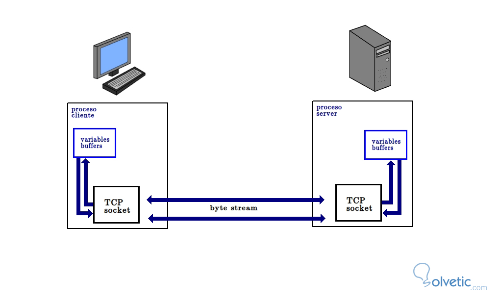

| **Inicio**         | **atrás 2**                                                               | **Siguiente 4**                                                 |
| ------------------ | ------------------------------------------------------------------------- | --------------------------------------------------------------- |
| [🏠](../README.md) | [⏪](./4_2_Investigacion_de_fuentes_abiertas_OSINT_con_Python_Hacking.md) | [⏩](./4_4_Analisis_de_vulnerabilidades_en_Hosts_con_Python.md) |

---

## **Índice**

| Temario                                                                                                                                      |
| -------------------------------------------------------------------------------------------------------------------------------------------- |
| [187. Sniffers con Python](#187-sniffers-con-python)                                                                                         |
| [188. Sniffers con Python: Pyshark y Tshark](#188-sniffers-con-python-pyshark-y-tshark)                                                      |
| [189. Introducción a Scapy](#189-introducción-a-scapy)                                                                                       |
| [190. Sniffers con Python: Scapy](#190-sniffers-con-python-scapy)                                                                            |
| [191. Networking y Sockets con Python: Cliente-Servidor](#191-networking-y-sockets-con-python-cliente-servidor)                              |
| [192. Entorno de aprendizaje: Instalación Linux vulnerable](#192-entorno-de-aprendizaje-instalación-linux-vulnerable)                        |
| [193. Escaneo de Hosts con Python y Sockets](#193-escaneo-de-hosts-con-python-y-sockets)                                                     |
| [194. Escaneo de Hosts con Scapy](#194-escaneo-de-hosts-con-scapy)                                                                           |
| [195. Escaneo ARP con Scapy](#195-escaneo-arp-con-scapy)                                                                                     |
| [196. Escaneo de Puertos con Python](#196-escaneo-de-puertos-con-python)                                                                     |
| [197. Escaneo de Servicios y Banner con Python](#197-escaneo-de-servicios-y-banner-con-python)                                               |
| [198. Entorno de aprendizaje: Instalación Windows](#198-entorno-de-aprendizaje-instalación-windows)                                          |
| [199. Configuración de un recurso/carpeta de red](#199-configuración-de-un-recursocarpeta-de-red)                                            |
| [200. Descubrimiento de recursos/carpetas de red con Python](#200-descubrimiento-de-recursoscarpetas-de-red-con-python)                      |
| [201. Descarga los ficheros y procesa su contenido](#201-descarga-los-ficheros-y-procesa-su-contenido)                                       |
| [202. Integración de Nmap con Python: Hosts, Puertos, Servicios](#202-integración-de-nmap-con-python-hosts-puertos-servicios)                |
| [203. Escaneo y priorización de hosts con Inteligencia Artificial (IA)](#203-escaneo-y-priorización-de-hosts-con-inteligencia-artificial-ia) |

---

# **Escaneos y analisis de redes con Python: Hosts, Puertos, Servicios**

## **187. Sniffers con Python**

### 📌 ¿Qué es un _sniffer_?

Un _sniffer_ es un programa que **captura y analiza paquetes de datos** que circulan por la red.

- Imagina la red como una autopista por donde pasan autos (paquetes de datos).
- El _sniffer_ es como un policía que se sienta al costado de la autopista y anota todo lo que ve pasar.

✅ Los sniffers pueden ser usados para:

- Diagnóstico de redes (identificar problemas)
- Monitoreo de tráfico
- Pruebas de seguridad (auditorías)

❗ También pueden ser usados maliciosamente para capturar contraseñas o datos sensibles.

---

#### 📌 ¿Cómo se hace un sniffer con Python?

En Python hay varias librerías para sniffing. Las dos más populares son:

✅ **scapy**

✅ **socket** (librería estándar)

Te explicaré la más fácil y popular para empezar:

---

### 🌟 Sniffer en Python con **scapy**

#### 1️⃣ ¿Qué es scapy?

- Es una librería de Python para manipular paquetes de red.
- Permite **enviar, recibir, analizar y crear paquetes**.

✅ Muy usada por pentesters y expertos en redes.

---

#### 2️⃣ Instalación de scapy

Para usar **scapy** necesitas Python instalado (recomiendo Python 3.8+).

En la terminal o CMD escribe:

```
pip install scapy
```

✅ ¡Listo! Ya tienes scapy.

---

#### 3️⃣ Crear un sniffer básico con scapy

Vamos a hacer un ejemplo muy sencillo:

```python
from scapy.all import sniff

def mostrar_paquete(paquete):
    print(paquete.summary())

# Capturar 10 paquetes en la interfaz por defecto
sniff(count=10, prn=mostrar_paquete)
```

✅ **Explicación del código:**

- `sniff()` es la función para capturar paquetes.
- `count=10` indica: para después de 10 paquetes.
- `prn=mostrar_paquete` llama a la función para imprimir el resumen de cada paquete.

🟢 Salida de ejemplo:

```
Ether / IP / TCP 192.168.1.5:50000 > 142.250.65.78:https S
Ether / IP / UDP 192.168.1.5:56845 > 8.8.8.8:domain
...
```

---

#### 4️⃣ Sniffer con filtrado

Puedes **filtrar paquetes** con un filtro BPF (como Wireshark).

✅ Ejemplo: capturar solo paquetes TCP

```python
sniff(filter="tcp", count=5, prn=mostrar_paquete)
```

✅ Ejemplo: solo tráfico a puerto 80 (HTTP)

```python
sniff(filter="tcp port 80", count=5, prn=mostrar_paquete)
```

---

#### 5️⃣ Sniffer que guarda en archivo (PCAP)

Puedes guardar el tráfico para analizarlo después con Wireshark.

```python
from scapy.all import sniff, wrpcap

paquetes = sniff(count=50)
wrpcap('captura.pcap', paquetes)
```

✅ Esto crea un archivo `captura.pcap` que puedes abrir en Wireshark.

---

#### 6️⃣ Sniffer más avanzado: ver campos

Puedes inspeccionar los campos del paquete:

```python
def mostrar_detallado(paquete):
    if paquete.haslayer('IP'):
        print(f"De {paquete[IP].src} a {paquete[IP].dst}")
    if paquete.haslayer('TCP'):
        print(f"Puerto origen: {paquete[TCP].sport}, destino: {paquete[TCP].dport}")

sniff(count=10, prn=mostrar_detallado)
```

✅ Salida de ejemplo:

```
De 192.168.1.5 a 142.250.65.78
Puerto origen: 50000, destino: 443
```

---

### 📌 🛠️ Instalación paso a paso (muy fácil)

✅ Paso 1: Instalar Python

- Descárgalo de [https://www.python.org](https://www.python.org)
- Verifica con:

```bash
python --version
```

✅ Paso 2: Instalar scapy

```bash
pip install scapy
```

✅ Paso 3: Crear un archivo

Por ejemplo, `sniffer.py`

✅ Paso 4: Copiar el código

```python
from scapy.all import sniff

def mostrar_paquete(p):
    print(p.summary())

sniff(count=10, prn=mostrar_paquete)
```

✅ Paso 5: Ejecutar

```bash
python sniffer.py
```

---

### 📌 ❗ Nota sobre permisos

- En Linux o macOS, debes tener **privilegios de root** para sniffing en modo promiscuo:

```
sudo python sniffer.py
```

- En Windows, debes **ejecutar CMD como administrador**.

---

### 🌟 Bonus: Sniffer con socket (básico)

✅ Python tiene un módulo nativo para hacer sniffers más primitivos:

```python
import socket

s = socket.socket(socket.AF_PACKET, socket.SOCK_RAW, socket.ntohs(3))

while True:
    paquete, addr = s.recvfrom(65535)
    print(paquete)
```

✅ Pros:

- Sin librerías externas.

✅ Contras:

- Crudo y sin análisis de capas alto nivel.

---

### ✅ Resumen súper corto

- _Sniffer_: captura tráfico de red.
- Usar **scapy** es la forma más fácil y poderosa en Python.
- Instalación → `pip install scapy`
- Código mínimo:

```python
from scapy.all import sniff
sniff(count=10, prn=lambda p: print(p.summary()))
```

---

[🔼](#índice)

---

## **188. Sniffers con Python: Pyshark y Tshark**

### ✅ Qué es Wireshark y Tshark

**Wireshark** es el analizador de paquetes más famoso. Permite capturar y analizar tráfico de red con una interfaz gráfica.

**Tshark** es la versión por consola de Wireshark. Hace lo mismo, pero en línea de comandos.

✅ Ejemplo de uso de tshark en terminal:

```
tshark -i eth0
```

(captura paquetes en la interfaz eth0).

---

### ✅ Qué es Pyshark

**Pyshark** es una librería de Python que:

- Usa **tshark** por debajo
- Permite capturar o analizar archivos PCAP en Python de forma muy fácil
- Devuelve paquetes ya **parseados** con sus capas (IP, TCP, DNS, etc.)

✅ Ventajas:

- Muy fácil de usar
- Ideal para analizar capturas o hacer sniffing en vivo con Python

---

### ✅ Instalación paso a paso

#### 📌 A. Instalar Python

- Asegúrate de tener Python 3.8 o superior.
- Verificar:

```
python --version
```

---

#### 📌 B. Instalar Wireshark (que incluye Tshark)

✅ Windows o macOS

- Descarga e instala desde: [https://www.wireshark.org](https://www.wireshark.org)
- Asegúrate de **seleccionar Tshark** en la instalación (opción por defecto).

✅ Linux

- Debian/Ubuntu:

```
sudo apt install wireshark
sudo apt install tshark
```

✅ Verifica la instalación:

```
tshark -v
```

Te debería mostrar la versión de Tshark.

---

#### 📌 C. Permisos

En Linux, Tshark a menudo requiere permisos para capturar tráfico en vivo:

```
sudo tshark -i eth0
```

Para evitar usar sudo siempre:

- Puedes agregar tu usuario al grupo wireshark (en Debian/Ubuntu):

```
sudo usermod -a -G wireshark $USER
```

Luego cierra sesión y vuelve a entrar.

---

#### 📌 D. Instalar Pyshark con pip

```
pip install pyshark
```

✅ ¡Listo!

---

### ✅ Usar Pyshark: ejemplos fáciles

#### ✅ A. Leer un archivo PCAP

Imagina que tienes `captura.pcap`.

```python
import pyshark

cap = pyshark.FileCapture('captura.pcap')

for pkt in cap:
    print(pkt)
```

✅ Salida (ejemplo):

```
Frame 1: 66 bytes on wire
Ethernet II
Internet Protocol Version 4
Transmission Control Protocol
...
```

✅ Ventaja:

- Muy fácil: analiza archivos guardados de Wireshark

---

#### ✅ B. Leer campos específicos

```python
import pyshark

cap = pyshark.FileCapture('captura.pcap')

for pkt in cap:
    if 'IP' in pkt:
        print(f"De {pkt.ip.src} a {pkt.ip.dst}")
```

✅ Salida de ejemplo:

```
De 192.168.1.5 a 142.250.65.78
```

---

#### ✅ C. Sniffing en tiempo real (captura en vivo)

✅ Capturar 5 paquetes en la interfaz por defecto (Linux/Mac suele ser eth0, wlan0; Windows algo como Ethernet o Wi-Fi):

```python
import pyshark

cap = pyshark.LiveCapture(interface='eth0')
cap.sniff(packet_count=5)

for pkt in cap:
    print(pkt)
```

✅ Notas:

- Cambia `'eth0'` por tu interfaz (usa `tshark -D` para listar interfaces disponibles).

---

#### ✅ D. Filtro de captura

Puedes usar filtros de captura tipo BPF (como en Wireshark):

```python
import pyshark

cap = pyshark.LiveCapture(interface='eth0', bpf_filter='tcp port 80')
cap.sniff(packet_count=5)

for pkt in cap:
    print(pkt)
```

✅ Esto solo captura tráfico HTTP.

---

#### ✅ E. Acceder a capas específicas

```python
import pyshark

cap = pyshark.LiveCapture(interface='eth0')

for pkt in cap.sniff_continuously(packet_count=5):
    if 'IP' in pkt and 'TCP' in pkt:
        print(f"{pkt.ip.src}:{pkt.tcp.srcport} -> {pkt.ip.dst}:{pkt.tcp.dstport}")
```

✅ Salida ejemplo:

```
192.168.1.5:50000 -> 142.250.65.78:443
```

---

#### ✅ F. Guardar captura en archivo PCAP

Pyshark no escribe PCAP directamente, pero puedes usar Tshark en consola para capturar:

```
tshark -i eth0 -c 10 -w salida.pcap
```

Luego lo lees con Pyshark:

```python
cap = pyshark.FileCapture('salida.pcap')
for pkt in cap:
    print(pkt)
```

---

### ✅ Resumen súper claro

✅ **Wireshark** → GUI para capturar/analizar tráfico.

✅ **Tshark** → CLI para capturar/analizar tráfico.

✅ **Pyshark** → Librería Python que usa Tshark y Wireshark para:

- Sniffing en vivo
- Análisis de archivos PCAP
- Extracción de campos de red

---

### ✅ Instalación resumida

📌 Windows/macOS

1. Instala Wireshark desde [https://www.wireshark.org](https://www.wireshark.org)
2. Verifica `tshark`:

```
tshark -v
```

3. Instala pyshark:

```
pip install pyshark
```

📌 Linux

```
sudo apt install wireshark tshark
pip install pyshark
```

---

### ✅ Comandos útiles de Tshark (opcional)

- Ver interfaces disponibles:

```
tshark -D
```

- Capturar en vivo a archivo:

```
tshark -i eth0 -c 10 -w captura.pcap
```

- Ver tráfico en consola:

```
tshark -i eth0
```

---

### ✅ ¿Por qué Pyshark usa Tshark?

Porque Tshark es el motor de análisis de Wireshark. Pyshark solo le pasa los parámetros y parsea la salida para que la uses en Python.

✅ Ventajas:

- Todo el poder de Wireshark en Python
- Muy fácil de usar

---

### ✅ Cosas importantes a tener en cuenta

⭐ En Linux/macOS puede requerir sudo:

```
sudo python tu_sniffer.py
```

⭐ En Windows, corre CMD como administrador.

⭐ Tshark debe estar en el PATH. Usualmente, si instalas Wireshark con opciones por defecto, ya está.

---

### ✅ Código mínimo de sniffing en vivo

✅ ¡Para copiar y pegar!

```python
import pyshark

cap = pyshark.LiveCapture(interface='eth0')
cap.sniff(packet_count=5)

for pkt in cap:
    print(pkt)
```

---

[🔼](#índice)

---

## **189. Introducción a Scapy**

### 🧠 ¿Qué es Scapy?

**Scapy** es una poderosa librería de Python para:

✅ Crear paquetes de red

✅ Enviar y recibir paquetes

✅ Analizar tráfico de red

✅ Realizar ataques o pruebas de seguridad (ethical hacking)

---

### 🌐 ¿Para qué sirve Scapy?

Scapy sirve para trabajar directamente con **paquetes de red** de cualquier capa (Ethernet, IP, TCP, UDP, ICMP, ARP, etc.).

---

#### 📦 Ejemplos de lo que puedes hacer con Scapy:

| Tarea                | ¿Qué hace?                                         |
| -------------------- | -------------------------------------------------- |
| Sniffing             | Capturar paquetes de red (como Wireshark)          |
| Envío de paquetes    | Crear y enviar paquetes TCP, ICMP, ARP, etc.       |
| Ataques de red       | Hacer pruebas como spoofing, ping sweep, etc.      |
| Pruebas de seguridad | Analizar vulnerabilidades                          |
| Análisis de red      | Ver quién está conectado, tráfico sospechoso, etc. |

---

### 🧰 Requisitos para usar Scapy

- Python (preferiblemente 3.8 o superior)
- pip
- Acceso de administrador (para sniffing)

---

### ✅ Cómo instalar Scapy (paso a paso)

#### 🔧 1. Instalar Python

Si no tienes Python:

- Ve a: [https://www.python.org/downloads](https://www.python.org/downloads)
- Instálalo y activa la opción **"Add Python to PATH"** durante la instalación

Verifica con:

```bash
python --version
```

---

#### 🔧 2. Instalar Scapy

En la terminal o CMD:

```bash
pip install scapy
```

✅ Esto instalará la última versión estable de Scapy.

---

#### 🔧 3. Verificar instalación

Abre Python:

```bash
python
```

Luego escribe:

```python
from scapy.all import *
```

Si no te da error, ¡Scapy está instalado correctamente!

---

### 💡 Conceptos básicos con Scapy

Vamos a ver **ejemplos fáciles**.

---

#### ✅ 1. Crear un paquete IP

```python
from scapy.all import *

paquete = IP(dst="8.8.8.8")
print(paquete.show())
```

📌 Explicación:

- `IP(dst="8.8.8.8")`: crea un paquete IP destinado a Google DNS.
- `.show()`: muestra detalles del paquete.

---

#### ✅ 2. Agregar una capa TCP

```python
paquete = IP(dst="8.8.8.8")/TCP(dport=80)
paquete.show()
```

✅ Esto crea un paquete IP + TCP destinado al puerto 80 (HTTP).

---

#### ✅ 3. Enviar un paquete (ej. ping ICMP)

```python
respuesta = sr1(IP(dst="8.8.8.8")/ICMP(), timeout=2)
if respuesta:
    print("Recibido de:", respuesta.src)
else:
    print("No hubo respuesta.")
```

📌 Explicación:

- `sr1()`: envía el paquete y espera 1 respuesta.
- `ICMP()`: es como un _ping_.

---

#### ✅ 4. Sniffer básico (capturar tráfico)

```python
from scapy.all import *

def mostrar_paquete(p):
    print(p.summary())

sniff(count=5, prn=mostrar_paquete)
```

✅ Esto captura 5 paquetes y los muestra.

---

#### ✅ 5. Sniffer con filtro

```python
sniff(filter="tcp port 80", count=5, prn=lambda p: print(p.summary()))
```

✅ Captura solo paquetes TCP del puerto 80 (HTTP).

---

### 📌 Comandos útiles de Scapy

| Comando   | ¿Qué hace?                                   |
| --------- | -------------------------------------------- |
| `IP()`    | Crea un paquete IP                           |
| `TCP()`   | Crea un segmento TCP                         |
| `ICMP()`  | Crea un paquete tipo ping                    |
| `ARP()`   | Crea una solicitud ARP                       |
| `send()`  | Envía paquetes sin esperar respuesta         |
| `sr1()`   | Envía un paquete y espera una sola respuesta |
| `sniff()` | Captura paquetes de red                      |

---

### 🛡️ Notas importantes

✅ En **Linux/Mac**, para sniffing y envío real de paquetes, probablemente necesites:

```bash
sudo python script.py
```

✅ En **Windows**, ejecuta la consola como **Administrador**.

---

### 💻 Ejemplo completo: Ping personalizado

```python
from scapy.all import *

paquete = IP(dst="8.8.8.8")/ICMP()
respuesta = sr1(paquete, timeout=2)

if respuesta:
    print("Respuesta de:", respuesta.src)
else:
    print("No hay respuesta")
```

---

### 📁 ¿Dónde guardar los scripts?

Puedes crear un archivo `ping_scapy.py` y ejecutarlo:

```bash
python ping_scapy.py
```

---

### 🧠 ¿Qué diferencia tiene con otras librerías?

| Librería  | ¿Qué hace?                           | Nivel      |
| --------- | ------------------------------------ | ---------- |
| `socket`  | Muy bajo nivel, crudo                | Bajo       |
| `scapy`   | Alto control, flexible               | Medio-Alto |
| `pyshark` | Solo análisis, usa tshark por detrás | Alto       |

Scapy te deja _crear_ y _modificar_ paquetes, ideal para hacking ético, análisis de red y simulación.

---

### ✅ Resumen final

| Tema                | Contenido                                      |
| ------------------- | ---------------------------------------------- |
| ¿Qué es Scapy?      | Librería Python para analizar y crear paquetes |
| ¿Cómo se instala?   | `pip install scapy`                            |
| ¿Qué puedes hacer?  | Sniffers, ping, spoofing, ARP, análisis        |
| ¿Requiere permisos? | Sí, para sniffing (sudo/Admin)                 |
| ¿Es fácil?          | ¡Sí! Muy poderosa y educativa                  |

---

[🔼](#índice)

---

## **190. Sniffers con Python: Scapy**

### 🌟 ¿Qué es un _sniffer_?

Un _sniffer_ es un programa que **escucha** el tráfico de red y **captura los paquetes** que pasan por una interfaz de red.

✅ Imagina el tráfico de red como autos en una autopista.

✅ El _sniffer_ es un policía que se sienta al costado y anota las placas de todos los autos que pasan.

---

### 🌟 ¿Qué es Scapy?

✅ **Scapy** es una librería de Python muy poderosa para:

- Crear paquetes de red
- Enviar paquetes
- Recibir paquetes
- **Sniffing** (capturar paquetes)
- Analizar paquetes

✅ Es muy usada por:

- Administradores de red
- Pentesters / hackers éticos
- Estudiantes para aprender redes

---

### 🌟 Instalación paso a paso

#### ✅ A. Tener Python instalado

Verifica si tienes Python:

```
python --version
```

✅ Si no tienes, descárgalo de:

👉 [https://www.python.org/downloads](https://www.python.org/downloads)

---

#### ✅ B. Instalar Scapy

Abre la terminal o CMD y escribe:

```
pip install scapy
```

✅ Eso descargará e instalará Scapy desde PyPI.

---

#### ✅ C. Verificar que funciona

Entra a Python:

```
python
```

Importa Scapy:

```python
from scapy.all import *
```

✅ Si no da error, ¡ya está instalado!

---

### 🌟 Primeros pasos con Scapy

Para que entiendas **muy fácil**, primero vamos a ver **cómo se ve un paquete**.

✅ Crear un paquete IP:

```python
from scapy.all import *

p = IP(dst="8.8.8.8")
p.show()
```

✅ Salida ejemplo:

```
###[ IP ]###
  version= 4
  ihl= None
  tos= 0x0
  len= None
  id= 1
  flags=
  frag= 0
  ttl= 64
  proto= ip
  chksum= None
  src= 127.0.0.1
  dst= 8.8.8.8
  options= []
```

📌 Aquí ves **todos los campos** de la cabecera IP.

---

### 🌟 ¿Qué es un _sniffer_ con Scapy?

✅ Un **sniffer** en Scapy es un script que:

- Escucha la red
- Captura paquetes
- Te permite analizarlos

✅ Es como un mini-Wireshark hecho en Python.

---

### 🌟 Código básico de un _sniffer_ con Scapy

✅ Ejemplo 1: Capturar 5 paquetes y mostrarlos

```python
from scapy.all import sniff

def mostrar_paquete(paquete):
    print(paquete.summary())

sniff(count=5, prn=mostrar_paquete)
```

✅ Explicación:

- `sniff()`: función para capturar tráfico
- `count=5`: captura solo 5 paquetes
- `prn=mostrar_paquete`: para cada paquete llama a la función

✅ Salida típica:

```
Ether / IP / TCP 192.168.1.5:54321 > 142.250.65.78:https S
Ether / ARP who has 192.168.1.1 says 192.168.1.10
...
```

---

### 🌟 Sniffer con filtro

✅ Puedes filtrar qué tipo de tráfico capturas.

✅ Ejemplo 2: solo paquetes TCP

```python
sniff(filter="tcp", count=5, prn=mostrar_paquete)
```

✅ Ejemplo 3: solo tráfico HTTP (puerto 80)

```python
sniff(filter="tcp port 80", count=5, prn=mostrar_paquete)
```

✅ Explicación:

- El filtro usa sintaxis BPF (como Wireshark).

---

### 🌟 Sniffer en modo continuo

✅ Capturar sin límite:

```python
sniff(prn=mostrar_paquete)
```

✅ Se detiene con Ctrl + C.

---

### 🌟 Ver detalles del paquete

✅ Mostrar campos específicos:

```python
from scapy.all import *

def mostrar_detallado(paquete):
    if paquete.haslayer(IP):
        print("De:", paquete[IP].src)
        print("A:", paquete[IP].dst)
    if paquete.haslayer(TCP):
        print("Puerto origen:", paquete[TCP].sport)
        print("Puerto destino:", paquete[TCP].dport)
    print("---")

sniff(count=5, prn=mostrar_detallado)
```

✅ Salida de ejemplo:

```
De: 192.168.1.5
A: 142.250.65.78
Puerto origen: 54321
Puerto destino: 443
---
```

---

### 🌟 Guardar captura en archivo PCAP

✅ Puedes guardar los paquetes en un archivo para abrirlo en Wireshark:

```python
from scapy.all import *

paquetes = sniff(count=20)
wrpcap('captura.pcap', paquetes)
```

✅ Esto crea `captura.pcap` en el mismo directorio.

✅ Lo puedes abrir en Wireshark.

---

### 🌟 Leer un archivo PCAP

✅ Analizar un archivo PCAP con Scapy:

```python
from scapy.all import *

paquetes = rdpcap('captura.pcap')
for p in paquetes:
    print(p.summary())
```

✅ Salida:

```
Ether / IP / TCP ...
Ether / ARP ...
```

---

### 🌟 Resumen de comandos clave

| Comando    | ¿Qué hace?                               |
| ---------- | ---------------------------------------- |
| `sniff()`  | Captura paquetes en vivo                 |
| `filter`   | Filtra tráfico (tcp, udp, port 80, etc.) |
| `count`    | Número de paquetes a capturar            |
| `prn`      | Función para procesar cada paquete       |
| `wrpcap()` | Guarda paquetes en PCAP                  |
| `rdpcap()` | Lee un archivo PCAP                      |

---

### 🌟 Permisos

✅ Importante:

- En **Linux o macOS**, debes usar **sudo** para sniffing:

```
sudo python tu_sniffer.py
```

- En **Windows**, abre **CMD como Administrador**.

---

### ✅ Instalación resumida en 1 minuto

✅ Windows / Mac / Linux:

```
pip install scapy
```

✅ Verificar:

```python
from scapy.all import *
```

✅ Sniffer mínimo:

```python
from scapy.all import sniff
sniff(count=5, prn=lambda x: print(x.summary()))
```

✅ ¡Y listo!

---

### 📌 🎁 Ejemplo final para copiar y pegar

✅ Sniffer completo:

```python
from scapy.all import *

def analizar(paquete):
    if paquete.haslayer(IP):
        print(f"IP: {paquete[IP].src} -> {paquete[IP].dst}")
    if paquete.haslayer(TCP):
        print(f"TCP puerto: {paquete[TCP].sport} -> {paquete[TCP].dport}")
    print("------")

sniff(filter="tcp", count=10, prn=analizar)
```

✅ Este script:

- Filtra solo tráfico TCP
- Muestra IPs y puertos
- Captura 10 paquetes

---

### 🌟 Resumen súper corto

✅ **Scapy** es una librería Python para redes.

✅ Permite hacer sniffers con pocas líneas.

✅ Instalación:

```
pip install scapy
```

✅ Código mínimo:

```python
from scapy.all import sniff
sniff(count=5, prn=lambda p: print(p.summary()))
```

---

[🔼](#índice)

---

## **191. Networking y Sockets con Python: Cliente-Servidor**



### 🌟 ¿Qué es _networking_?

**Networking** (o redes) significa conectar computadoras para intercambiar datos.

✅ Tu computadora se comunica con otras a través de la red (LAN, Internet, etc.).

✅ Los datos viajan en **paquetes** usando **protocolos** (TCP, UDP, HTTP, etc.).

---

### 🌟 ¿Qué es un _socket_?

✅ Un **socket** es como un **enchufe** de red.

✅ Sirve para **conectar** dos programas (en la misma máquina o en diferentes máquinas) para que intercambien datos.

Imagina:

```
[ Cliente ] <---- Red ----> [ Servidor ]
```

- **Servidor**: espera conexiones.
- **Cliente**: se conecta al servidor.

---

#### 💡 ¿Para qué sirven los sockets?

✅ Crear **chats**

✅ Conectar apps móviles a un servidor

✅ Servidores web

✅ Juegos online

---

### 🌟 Instalación

✅ ¡No hay nada que instalar!
El módulo **socket** ya viene con Python.

✅ Para verificar:

```python
import socket
print(socket)
```

Si no hay error → ¡listo!

---

### 🌟 Concepto de Cliente-Servidor

✅ El **servidor**:

- Abre un socket
- Se queda **escuchando**
- Acepta conexiones de clientes
- Lee y escribe datos

✅ El **cliente**:

- Abre un socket
- Se conecta al servidor
- Envía y recibe datos

---

### ✅ Ejemplo fácil: Servidor y Cliente en Python

---

#### ✅ A. Código del Servidor (server.py)

Este servidor:

- Escucha en `localhost` (127.0.0.1) y puerto `65432`
- Acepta 1 cliente
- Recibe un mensaje y responde

```python
import socket

HOST = '127.0.0.1'  # Localhost
PORT = 65432        # Puerto

# Crear el socket (IPv4, TCP)
with socket.socket(socket.AF_INET, socket.SOCK_STREAM) as s:
    s.bind((HOST, PORT))        # Asocia el socket al puerto
    s.listen()                   # Escucha conexiones
    print(f"Servidor escuchando en {HOST}:{PORT}")
    conn, addr = s.accept()      # Acepta una conexión
    with conn:
        print('Conectado por', addr)
        while True:
            data = conn.recv(1024)  # Recibe hasta 1024 bytes
            if not data:
                break
            print("Cliente dice:", data.decode())
            conn.sendall(b"Hola Cliente!")
```

✅ Explicación:

- `socket.socket()`: crea un socket TCP/IP
- `bind()`: lo asocia a IP y puerto
- `listen()`: lo pone a la espera de clientes
- `accept()`: espera hasta que un cliente se conecte
- `recv()`: lee datos del cliente
- `sendall()`: responde al cliente

---

#### ✅ B. Código del Cliente (client.py)

Este cliente:

- Se conecta al servidor
- Envía un mensaje
- Imprime la respuesta

```python
import socket

HOST = '127.0.0.1'  # IP del servidor
PORT = 65432        # Puerto

with socket.socket(socket.AF_INET, socket.SOCK_STREAM) as s:
    s.connect((HOST, PORT))
    s.sendall(b'Hola Servidor!')
    data = s.recv(1024)

print('Respuesta del servidor:', data.decode())
```

✅ Explicación:

- `connect()`: conecta al servidor
- `sendall()`: envía datos
- `recv()`: espera la respuesta

---

### 🌟 Cómo probarlo

✅ Paso 1: Guardar **server.py**

✅ Paso 2: Guardar **client.py**

✅ Paso 3: Abrir dos terminales

✅ Terminal 1:

```
python server.py
```

✅ Terminal 2:

```
python client.py
```

✅ Resultado esperado:

**Servidor (server.py):**

```
Servidor escuchando en 127.0.0.1:65432
Conectado por ('127.0.0.1', 54321)
Cliente dice: Hola Servidor!
```

**Cliente (client.py):**

```
Respuesta del servidor: Hola Cliente!
```

---

### 🌟 Explicación paso a paso del flujo

✅ El servidor **escucha** → `listen()`

✅ El cliente **se conecta** → `connect()`

✅ Cliente **envía mensaje** → `sendall()`

✅ Servidor **lee** → `recv()`

✅ Servidor **responde** → `sendall()`

✅ Cliente **lee respuesta** → `recv()`

---

### 🌟 Notas importantes

✅ Sockets TCP → conexión confiable (garantiza entrega)

✅ Debes coordinar IP y puerto entre cliente y servidor

✅ Puedes cambiar `localhost` por la IP de otra máquina en la red

---

### 🌟 Variaciones y extras (opcional)

✅ Cambiar puerto:

```python
PORT = 12345
```

✅ Conexiones múltiples (con hilos):

```python
import threading
```

✅ Usar UDP:

```python
socket.SOCK_DGRAM
```

✅ Enviar texto más grande:

- Ajustar buffer:

```python
data = conn.recv(4096)
```

✅ Mensajes múltiples:

- Un bucle en cliente:

```python
while True:
    s.sendall(input("Mensaje: ").encode())
```

---

### ✅ Resumen ultra corto

✅ _socket_ = enchufe de red para enviar/recibir datos

✅ Servidor:

- `bind()`, `listen()`, `accept()`, `recv()`, `sendall()`

✅ Cliente:

- `connect()`, `sendall()`, `recv()`

✅ Todo está en el módulo estándar de Python.

---

### 📦 Código mínimo **Servidor**

```python
import socket

with socket.socket() as s:
    s.bind(('127.0.0.1', 65432))
    s.listen()
    conn, addr = s.accept()
    with conn:
        print('Conectado por', addr)
        print(conn.recv(1024))
        conn.sendall(b'Hola Cliente!')
```

---

### 📦 Código mínimo **Cliente**

```python
import socket

with socket.socket() as s:
    s.connect(('127.0.0.1', 65432))
    s.sendall(b'Hola Servidor!')
    print(s.recv(1024))
```

---

### ✅ No necesitas instalar nada extra

✅ Python incluye el módulo **socket** de forma **nativa**.

✅ Funciona en Windows, macOS y Linux.

---

[🔼](#índice)

---

## **192. Entorno de aprendizaje: Instalación Linux vulnerable**

### 🌟 ¿Qué es un “Linux vulnerable”?

✅ Es una **máquina virtual** (VM) con Linux **intencionalmente mal configurado o con fallos de seguridad conocidos**.

- Tiene **vulnerabilidades reales** para practicar hacking ético.
- Sirve para aprender **explotación, análisis forense, hardening**.

✅ Es como un “campo de entrenamiento” seguro.

---

### 🌟 ¿Para qué sirve?

✅ Para **aprender y practicar**:

- Escaneo de puertos
- Enumeración
- Explotación de vulnerabilidades
- Uso de herramientas (Metasploit, Nmap, Nikto, etc.)
- Análisis forense

✅ ¡Sin atacar sistemas reales! Todo de forma **legal y controlada**.

---

### 🌟 Ejemplos de distros vulnerables populares

✅ **Metasploitable 2**

- Muy usado para practicar con Metasploit.
- Ubuntu viejo con muchos servicios inseguros.

✅ **DVWA (Damn Vulnerable Web App)**

- Una web app vulnerable en PHP/MySQL.
- Ideal para aprender ataques web (SQLi, XSS, CSRF).

✅ **VulnHub**

- Repositorio de muchas máquinas virtuales vulnerables para descargar gratis.

✅ **OWASP Broken Web Apps**

- Colección de apps web vulnerables para entrenamiento.

---

### 🌟 ¿Cómo se usan?

✅ Generalmente se descargan como **imágenes de máquina virtual** (.ova o .vmdk).

✅ Las ejecutas en **VirtualBox** o **VMware**.

✅ Tu máquina real es el **atacante** (con Kali, Parrot, etc.)

✅ La máquina vulnerable es el **objetivo**.

---

### ✅ Entorno recomendado para practicar

✅ **VirtualBox** (gratis, multiplataforma)

✅ Tu sistema real (Windows, Linux, macOS)

✅ VM atacante (Kali Linux)

✅ VM víctima (Metasploitable2)

---

### 🌟 Instalación paso a paso: VirtualBox

#### ✅ A. Descargar VirtualBox

👉 [https://www.virtualbox.org](https://www.virtualbox.org)

✅ Elige tu sistema (Windows, macOS, Linux).

✅ Instálalo como cualquier programa.

---

#### ✅ B. Descargar Metasploitable2

✅ Es una VM vulnerable de Ubuntu.

👉 Descargar aquí (registro gratuito):

- [https://sourceforge.net/projects/metasploitable/files/Metasploitable2](https://sourceforge.net/projects/metasploitable/files/Metasploitable2/)

✅ Archivo descargado:

- Generalmente un .zip con un .vmdk adentro.

---

#### ✅ C. Crear la VM en VirtualBox

1️⃣ Abre VirtualBox

2️⃣ Haz clic en **New** (Nueva)

3️⃣ Nombre: _Metasploitable2_

4️⃣ Tipo: **Linux**

5️⃣ Versión: **Ubuntu (32-bit o 64-bit)**

✅ Memoria: 512 MB (suficiente)

✅ Disco duro: Usa “**disco duro existente**”

- Selecciona el **.vmdk** descargado.

✅ ¡Listo!

---

#### ✅ D. Configurar Red

✅ Recomendado: **Red interna** o **Host-Only Adapter**

- Para practicar ataques desde Kali **sin exponer la VM a Internet**.
- En **Configuración de red** de la VM:

```
Red -> Adaptador 1 -> Host-Only Adapter
```

✅ Así Kali y Metasploitable se ven entre sí, pero no salen a Internet.

---

#### ✅ E. Iniciar la VM

✅ Inicia Metasploitable2 en VirtualBox.

✅ Usuario/contraseña por defecto:

```
msfadmin / msfadmin
```

✅ Verifica la IP interna con:

```
ifconfig
```

o

```
ip a
```

---

### 🌟 Tu entorno de laboratorio

✅ Tu máquina real → corre VirtualBox

✅ VM atacante → Kali Linux

✅ VM vulnerable → Metasploitable2

Ambas en **la misma red interna**.

✅ Ahora puedes practicar:

- Escaneo con Nmap
- Ataques con Metasploit
- Explotación manual

---

### 🌟 Otras opciones fáciles de instalar

✅ **DVWA (Damn Vulnerable Web App)**

- Es una app PHP+MySQL.
- Puedes instalarla en XAMPP o LAMP en Linux.

✅ Instrucciones rápidas:

1️⃣ Instala XAMPP/LAMP

2️⃣ Descarga DVWA:

```
git clone https://github.com/digininja/DVWA.git
```

3️⃣ Copia a /var/www/html/

4️⃣ Configura la base de datos (config.inc.php)

5️⃣ Accede en navegador:

```
http://localhost/dvwa
```

✅ Practica inyecciones SQL, XSS, CSRF, etc.

---

✅ **OWASP Broken Web Apps**

- Descargar VM lista para VirtualBox.
- Contiene muchas apps vulnerables en una sola imagen.

✅ **VulnHub**

- Página con decenas de máquinas vulnerables para VirtualBox y VMware:
  👉 [https://www.vulnhub.com](https://www.vulnhub.com)

✅ Descargar → Importar en VirtualBox → ¡Practicar!

---

### 🌟 Resumen súper corto

✅ Un **Linux vulnerable** es una VM con fallos de seguridad **a propósito**.

✅ Sirve para aprender hacking ético y análisis forense.

✅ Ejemplo famoso: **Metasploitable2**.

✅ Requisitos:

- VirtualBox
- Imagen de la VM vulnerable
- Configurar red segura (Host-Only / Interna)

✅ Resultado → Laboratorio seguro para practicar.

---

### ✅ Mini-guía ultra resumida para instalar Metasploitable2 en VirtualBox

✅ 1. Descarga e instala VirtualBox

✅ 2. Descarga Metasploitable2 (.zip)

✅ 3. Extrae el .vmdk

✅ 4. Crea nueva VM en VirtualBox

✅ 5. Usa el .vmdk como disco duro existente

✅ 6. Configura red en modo Host-Only

✅ 7. Inicia la VM → Login: **msfadmin / msfadmin**

✅ 8. Verifica la IP → ¡lista para atacar!

---

### ✅ ¿Qué necesito para usarla?

✅ VirtualBox (gratis)

✅ Imágenes vulnerables (Metasploitable2, VulnHub, etc.)

✅ Kali Linux (opcional pero recomendado para ataque)

---

[🔼](#índice)

---

## **193. Escaneo de Hosts con Python y Sockets**

### ✅ ¿Qué es el escaneo de hosts?

Es el proceso de **descubrir qué computadoras están activas** en una red.
Ejemplo: estás en una red Wi-Fi y quieres saber qué dispositivos están conectados.

🔍 El escaneo de hosts permite identificar:

- IPs activas
- Equipos disponibles para comunicarse
- Posibles objetivos para auditorías o pruebas

---

### 🧰 ¿Qué usaremos?

✅ Solo **Python** y el módulo **`socket`** que viene con Python

✅ No necesitas instalar nada externo

> ⚙️ El módulo `socket` permite interactuar con la red, abrir conexiones, enviar datos, etc.

---

### 🧪 ¿Cómo se hace un escaneo de hosts?

Una forma sencilla es:

1. Elegir un **rango de IPs** (por ejemplo, `192.168.1.1` a `192.168.1.254`)
2. Tratar de conectarse a un puerto común (como el 80 o el 443)
3. Si responde, entonces **el host está activo**

---

### ⚡ Ejemplo: Escáner de hosts con sockets

#### 📁 Código completo

```python
import socket
import ipaddress
from concurrent.futures import ThreadPoolExecutor

# Rango de IPs a escanear
red = ipaddress.IPv4Network('192.168.1.0/24', strict=False)

# Puerto que usaremos para probar (puedes usar 80, 443, 22, etc.)
PUERTO_OBJETIVO = 80
TIEMPO_ESPERA = 0.5  # medio segundo

def escanear_host(ip):
    try:
        with socket.socket(socket.AF_INET, socket.SOCK_STREAM) as s:
            s.settimeout(TIEMPO_ESPERA)
            resultado = s.connect_ex((str(ip), PUERTO_OBJETIVO))
            if resultado == 0:
                print(f"[+] Host activo: {ip}")
    except:
        pass

print(f"Escaneando red {red} en el puerto {PUERTO_OBJETIVO}...\n")

with ThreadPoolExecutor(max_workers=100) as executor:
    executor.map(escanear_host, red.hosts())
```

---

#### 🧠 ¿Qué hace este código?

| Parte                   | Función                                    |
| ----------------------- | ------------------------------------------ |
| `ipaddress.IPv4Network` | Define el rango de IPs a escanear          |
| `socket.socket()`       | Crea un socket para conectarse a cada IP   |
| `s.connect_ex()`        | Intenta conectar al puerto (0 = éxito)     |
| `ThreadPoolExecutor`    | Escanea múltiples IPs en paralelo (rápido) |
| `print()`               | Muestra IPs que están activas              |

---

#### 🔧 Personalización

- Cambia el rango de IPs:

```python
ipaddress.IPv4Network('192.168.0.0/24')  # 192.168.0.1 a 192.168.0.254
```

- Cambia el puerto a otro común:

  - 22 → SSH
  - 80 → HTTP
  - 443 → HTTPS
  - 3389 → Escritorio remoto (RDP)

---

### 📥 ¿Cómo se instala?

✅ Solo necesitas tener **Python 3.x** (viene con `socket` y `ipaddress`)

#### Verifica que tienes Python:

```bash
python --version
```

Si no lo tienes:

👉 Descargar desde: [https://www.python.org/downloads](https://www.python.org/downloads)

✅ Luego solo copia el script en un archivo `.py` y ejecútalo:

```bash
python escaneo_hosts.py
```

---

#### 🧪 Ejemplo de salida

```
Escaneando red 192.168.1.0/24 en el puerto 80...

[+] Host activo: 192.168.1.1
[+] Host activo: 192.168.1.5
[+] Host activo: 192.168.1.12
```

✅ Estos son los dispositivos que **respondieron al puerto 80**, por lo tanto están **conectados y accesibles**.

---

### 💡 Recomendaciones

- Usa puertos comunes que estén abiertos en dispositivos (como 80, 22 o 443).
- Si no te responde nadie, prueba cambiar de puerto o verifica tu red.
- Usa este script en redes donde tengas permiso. 🔐

---

### ✅ Bonus: ¿Qué más puedo hacer?

- Hacer ping en lugar de conexión de puertos (requiere módulo `os` o `subprocess`)
- Escanear **puertos abiertos** por IP (port scanning)
- Agregar una interfaz gráfica (con Tkinter, por ejemplo)
- Exportar los resultados a un archivo `.txt` o `.csv`

---

[🔼](#índice)

---

## **194. Escaneo de Hosts con Scapy**

### 🟣 ¿Qué es Scapy?

**Scapy** es una librería de Python para:

- Crear paquetes de red
- Enviar y recibir paquetes
- Analizar tráfico
- Hacer sniffing
- Simular ataques (ethical hacking)

✅ Es muy usada en ciberseguridad y redes.

---

### 🟣 ¿Qué es un “escaneo de hosts”?

✅ Es descubrir **qué dispositivos están activos en una red**.

- Por ejemplo: Ver qué computadoras hay en `192.168.1.0/24`
- Saber qué IPs están **encendidas** y **responden**

✅ Es básico para:

- Auditorías de red
- Pentesting
- Administración de redes

---

### 🟣 ¿Cómo se instala Scapy?

✅ Muy fácil, solo con **pip**:

```bash
pip install scapy
```

✅ Verificar instalación:

```python
python -c "from scapy.all import *; print('Scapy funciona')"
```

✅ ¡Ya está!

> 💡 Scapy es **multiplataforma** (Windows, Linux, macOS).

---

### 🟣 Concepto: ¿Cómo escanea hosts Scapy?

✅ El truco es enviar **paquetes** a varias IPs y ver **quién responde**.

✅ Hay varias técnicas:

| Técnica      | Qué usa       | Explicación sencilla              |
| ------------ | ------------- | --------------------------------- |
| ICMP Ping    | Paquetes ICMP | Como el comando `ping`            |
| ARP Scan     | Paquetes ARP  | Descubre hosts en red local LAN   |
| TCP SYN Scan | TCP SYN       | Ver si un puerto responde SYN-ACK |

---

### ✅ Ejemplo 1: Escaneo ICMP (Ping Scan)

✅ **Concepto**: Enviar un _ping_ (ICMP Echo Request) → Si responde → Está vivo.

#### 📌 Código súper fácil

```python
from scapy.all import *

# Definir rango de IPs
red = "192.168.1.0/24"

# Crear lista de IPs
ips = [str(ip) for ip in IPNetwork(red)]

# Función para escanear un host con ICMP
def escanear_icmp(ip):
    print(f"Enviando ping a {ip}...")
    respuesta = sr1(IP(dst=ip)/ICMP(), timeout=1, verbose=0)
    if respuesta:
        print(f"[+] Host activo: {ip}")

# Escanear todas las IPs
for ip in ips:
    escanear_icmp(ip)
```

---

#### ✅ Explicación clara:

| Línea                     | Qué hace                             |
| ------------------------- | ------------------------------------ |
| `from scapy.all import *` | Importa todo Scapy                   |
| `red = "192.168.1.0/24"`  | Define la red objetivo               |
| `IPNetwork()`             | Genera todas las IPs en el rango     |
| `sr1()`                   | Envía 1 paquete y espera 1 respuesta |
| `IP()/ICMP()`             | Construye un paquete ICMP (ping)     |

---

✅ Resultado esperado:

```
Enviando ping a 192.168.1.1...
[+] Host activo: 192.168.1.1
Enviando ping a 192.168.1.5...
[+] Host activo: 192.168.1.5
...
```

---

#### 💡 Pros y Contras

✅ Pros:

- Muy fácil
- Entendible

  ✅ Contras:

- Algunos equipos **bloquean pings** por seguridad

---

### ✅ Ejemplo 2: Escaneo ARP (LAN)

✅ ARP funciona **solo en red local** (LAN).

✅ Muy confiable en redes internas.

---

#### 📌 Código de escaneo ARP

```python
from scapy.all import *

# Define la red
red = "192.168.1.0/24"

# Enviar solicitud ARP a todos
ans, unans = arping(red, timeout=2)

# Mostrar resultados
for snd, rcv in ans:
    print(f"[+] Host activo: {rcv.psrc} - MAC: {rcv.hwsrc}")
```

---

#### ✅ Explicación sencilla

| Función     | Qué hace                        |
| ----------- | ------------------------------- |
| `arping()`  | Envía solicitudes ARP al rango  |
| `ans`       | Lista de hosts que respondieron |
| `rcv.psrc`  | IP del host activo              |
| `rcv.hwsrc` | Dirección MAC del host activo   |

✅ Resultado esperado:

```
[+] Host activo: 192.168.1.1 - MAC: aa:bb:cc:dd:ee:ff
[+] Host activo: 192.168.1.12 - MAC: 11:22:33:44:55:66
```

✅ Súper útil para:

- Identificar dispositivos en la LAN
- Ver direcciones MAC

---

#### 💡 Pros y Contras

✅ Pros:

- No necesita que el host tenga puertos abiertos
- Funciona incluso si ICMP está bloqueado

❌ Contra:

- Solo para redes locales (no funciona en Internet)

---

### ✅ Ejemplo 3: TCP SYN Scan simple

✅ Enviar paquetes **TCP SYN** a un puerto

✅ Ver si el host responde con **SYN-ACK** (indica puerto abierto)

---

#### 📌 Código ejemplo

```python
from scapy.all import *

# Lista de IPs objetivo
ips = ["192.168.1.1", "192.168.1.5", "192.168.1.12"]
PUERTO = 80

for ip in ips:
    print(f"Escaneando {ip}:{PUERTO}")
    pkt = IP(dst=ip)/TCP(dport=PUERTO, flags="S")
    resp = sr1(pkt, timeout=1, verbose=0)
    if resp and resp.haslayer(TCP) and resp[TCP].flags == 0x12:
        print(f"[+] {ip} tiene el puerto {PUERTO} abierto")
```

---

#### ✅ Explicación fácil

| Línea        | Qué hace                              |
| ------------ | ------------------------------------- |
| `IP()/TCP()` | Crea un paquete TCP con bandera SYN   |
| `sr1()`      | Envía y espera 1 respuesta            |
| `flags="S"`  | SYN = solicitud de inicio de conexión |
| `0x12`       | Respuesta SYN-ACK (puerto abierto)    |

✅ Resultado:

```
[+] 192.168.1.5 tiene el puerto 80 abierto
```

---

### ✅ 📌 ¿Cómo se instala Scapy?

✅ En cualquier sistema operativo con Python 3:

```bash
pip install scapy
```

✅ ¡Nada más!

✅ Verificar:

```python
from scapy.all import *
```

Si no da error → ¡Está listo!

---

### ✅ Resumen ultra corto

✅ **Escaneo de Hosts con Scapy** = Descubrir máquinas activas en red.

✅ Métodos fáciles:

| Método  | Paquete usado   | Uso principal        |
| ------- | --------------- | -------------------- |
| ICMP    | Ping (ICMP)     | General              |
| ARP     | Solicitud ARP   | LAN local            |
| TCP SYN | Paquete TCP SYN | Ver puertos abiertos |

✅ Instalación:

```
pip install scapy
```

✅ Ventajas:

- Muy flexible
- Código corto y claro
- Ideal para aprender redes y hacking ético

---

### ✅ Resumen de códigos

✅ **Escaneo ICMP**

```python
from scapy.all import *
for ip in IPNetwork('192.168.1.0/24'):
    if sr1(IP(dst=str(ip))/ICMP(), timeout=1, verbose=0):
        print(f"[+] Host activo: {ip}")
```

✅ **Escaneo ARP**

```python
from scapy.all import *
ans, _ = arping('192.168.1.0/24')
for snd, rcv in ans:
    print(f"[+] {rcv.psrc} - {rcv.hwsrc}")
```

✅ **Escaneo TCP SYN**

```python
from scapy.all import *
for ip in ['192.168.1.1', '192.168.1.5']:
    resp = sr1(IP(dst=ip)/TCP(dport=80, flags="S"), timeout=1, verbose=0)
    if resp and resp.haslayer(TCP) and resp[TCP].flags == 0x12:
        print(f"[+] {ip} puerto 80 abierto")
```

---

### 🎁 Bonus

✅ Puedes combinar escaneo ARP y luego escanear puertos en hosts encontrados.

✅ Puedes guardar resultados en archivos CSV o TXT.

✅ Puedes paralelizar con `concurrent.futures` para hacerlo rápido.

---

[🔼](#índice)

---

## **195. Escaneo ARP con Scapy**

### 🟣 ¿Qué es un escaneo ARP?

**ARP** (Address Resolution Protocol) es un protocolo que permite obtener la dirección MAC de un dispositivo dentro de la misma red local (LAN), a partir de su dirección IP.

#### 🧠 ¿Qué es escanear con ARP?

✅ Es enviar paquetes ARP a todas las IPs de una red local para saber:

- **Qué dispositivos están activos**
- Sus direcciones **IP**
- Sus direcciones **MAC**

📌 **Solo funciona en redes LAN**, no sirve en Internet.

---

### 🟣 ¿Para qué sirve?

✅ Saber quién está conectado a tu red

✅ Detección de dispositivos desconocidos

✅ Inventario de red local

✅ Componente clave para ataques como ARP spoofing (en entornos éticos)

---

### 🟣 ¿Qué es Scapy?

**Scapy** es una poderosa biblioteca de Python para manipular paquetes de red.

Con Scapy puedes:

- Crear paquetes personalizados (ARP, IP, TCP, etc.)
- Enviar y recibir paquetes
- Analizar tráfico de red
- Hacer sniffing, escaneos, ataques de red éticos y más

---

### ✅ Instalación de Scapy

#### 📦 Requisitos:

- Tener **Python 3.x**
- Tener **pip**

#### 🔧 Instalación rápida:

```bash
pip install scapy
```

#### ✅ Verificar instalación:

```python
python -c "from scapy.all import *; print('Scapy funcionando')"
```

---

### ✅ Escaneo ARP básico con Scapy

#### 📌 Código completo y funcional:

```python
from scapy.all import arping

# Red local a escanear
red = "192.168.1.0/24"

# Ejecutar escaneo ARP
respuesta, _ = arping(red, timeout=2)

# Mostrar los dispositivos activos
for envio, recepcion in respuesta:
    print(f"[+] IP: {recepcion.psrc} - MAC: {recepcion.hwsrc}")
```

---

#### 🧠 Explicación sencilla:

| Parte del código | ¿Qué hace?                                     |
| ---------------- | ---------------------------------------------- |
| `arping()`       | Envía solicitudes ARP a todas las IP del rango |
| `respuesta`      | Contiene los dispositivos que **respondieron** |
| `psrc`           | IP del dispositivo                             |
| `hwsrc`          | Dirección MAC del dispositivo                  |

---

#### 💻 Salida esperada:

```
[+] IP: 192.168.1.1 - MAC: aa:bb:cc:dd:ee:ff
[+] IP: 192.168.1.100 - MAC: 11:22:33:44:55:66
```

---

### ✅ Versión más personalizable

Aquí se hace el escaneo paso a paso con `Ether()` y `ARP()`:

```python
from scapy.all import Ether, ARP, srp

# Rango IP de la red local
red = "192.168.1.0/24"

# Crear paquete Ethernet + ARP
paquete = Ether(dst="ff:ff:ff:ff:ff:ff") / ARP(pdst=red)

# Enviar y recibir respuestas
respuestas, no_respondieron = srp(paquete, timeout=2, verbose=0)

# Mostrar resultados
for _, respuesta in respuestas:
    print(f"[+] IP: {respuesta.psrc} - MAC: {respuesta.hwsrc}")
```

---

#### ✅ ¿Qué es eso de `Ether()`?

- `Ether(dst="ff:ff:ff:ff:ff:ff")`: significa **broadcast**, se envía a todos en la red.
- `ARP(pdst=red)`: genera un ARP request para cada IP del rango.

---

### ✅ ¿Cómo ejecuto esto?

#### 🔹 Paso 1: Guardar el código en un archivo `.py`

Ejemplo: `escanear_arp.py`

#### 🔹 Paso 2: Abrir terminal como administrador

- En **Linux/macOS**:

  ```bash
  sudo python3 escanear_arp.py
  ```

- En **Windows**:
  Abre el CMD o PowerShell como administrador y ejecuta:

  ```bash
  python escanear_arp.py
  ```

✅ Scapy necesita permisos elevados para manipular paquetes.

---

### ✅ ¿Cómo saber mi red?

Antes de escanear, necesitas saber el rango de IPs de tu red local.

#### En Windows (CMD):

```bash
ipconfig
```

Busca tu IP, por ejemplo: `192.168.1.100`

Entonces tu red es `192.168.1.0/24`

#### En Linux/macOS (terminal):

```bash
ip a
```

o

```bash
ifconfig
```

---

### ✅ Guardar resultados en archivo `.txt`

```python
with open("dispositivos.txt", "w") as f:
    for _, respuesta in respuestas:
        linea = f"IP: {respuesta.psrc} - MAC: {respuesta.hwsrc}\n"
        f.write(linea)
```

---

### ✅ Resumen rápido

| Paso | Acción                                            |
| ---- | ------------------------------------------------- |
| 1    | Instalar Scapy con `pip install scapy`            |
| 2    | Crear un script de escaneo ARP                    |
| 3    | Ejecutarlo como administrador o con `sudo`        |
| 4    | Observar los dispositivos activos en tu red local |

---

### ✅ Código compacto (copiar y pegar)

```python
from scapy.all import *

ans, _ = arping("192.168.1.0/24", timeout=2)
for _, rcv in ans:
    print(f"[+] {rcv.psrc} - {rcv.hwsrc}")
```

---

[🔼](#índice)

---

## **196. Escaneo de Puertos con Python**

### 🟣 ¿Qué es el escaneo de puertos?

**Escanear puertos** = Intentar averiguar **qué puertos de red están abiertos en un host**.

✅ Un **puerto** es como una **puerta virtual** por la que se comunican programas y servicios.

✅ Cada servicio usa un puerto específico:

| Servicio | Puerto típico |
| -------- | ------------- |
| HTTP     | 80            |
| HTTPS    | 443           |
| SSH      | 22            |
| FTP      | 21            |
| RDP      | 3389          |

✅ Si un puerto está **abierto**, ese servicio está **activo y escuchando**.

---

### 🟣 ¿Para qué sirve el escaneo de puertos?

✅ Descubrir **qué servicios** hay en un servidor o equipo.

✅ Encontrar **vulnerabilidades** (seguridad ofensiva y defensiva).

✅ Inventariar servicios en redes corporativas.

✅ Ejemplo: saber si un servidor tiene **SSH abierto** para conectarte.

---

### 🟣 ¿Qué se necesita para hacerlo en Python?

✅ Solo necesitas **Python**.

✅ Usaremos el módulo **socket**, que ya viene con Python.

✅ ¡No necesitas instalar nada extra!

---

### ✅ Instalación de Python

Si aún no lo tienes:

👉 [Descargar desde python.org](https://www.python.org/downloads)

✅ Verificar instalación:

```bash
python --version
```

✅ Si dice algo como `Python 3.x.x`, ¡ya está!

---

### ✅ Concepto: ¿Cómo funciona un escáner de puertos?

✅ Intentamos **conectarnos** a un puerto de un servidor.

✅ Si **la conexión se abre**, el puerto está **abierto**.

✅ Si **falla** (rechazo o timeout), está **cerrado o filtrado**.

✅ Así funciona Nmap, pero nosotros lo haremos **en Python**.

---

### 🟣 Primer ejemplo: escaneo de 1 puerto

✅ Vamos a probar un solo puerto en un solo host.

```python
import socket

host = '127.0.0.1'  # IP local o IP remota
port = 80           # Puerto a probar

sock = socket.socket(socket.AF_INET, socket.SOCK_STREAM)
sock.settimeout(1)  # Timeout en segundos

resultado = sock.connect_ex((host, port))

if resultado == 0:
    print(f"[+] Puerto {port} abierto en {host}")
else:
    print(f"[-] Puerto {port} cerrado en {host}")

sock.close()
```

✅ Explicación:

| Línea             | Qué hace                                   |
| ----------------- | ------------------------------------------ |
| `socket.socket()` | Crea un socket TCP                         |
| `connect_ex()`    | Intenta conectarse (devuelve 0 si conecta) |
| `settimeout()`    | Evita que se cuelgue mucho tiempo          |

---

### ✅ Segundo ejemplo: escanear varios puertos

✅ Ahora vamos a probar un **rango de puertos** en 1 host.

```python
import socket

host = '127.0.0.1'
puertos = [21, 22, 23, 80, 443, 3389]

for port in puertos:
    sock = socket.socket(socket.AF_INET, socket.SOCK_STREAM)
    sock.settimeout(1)
    resultado = sock.connect_ex((host, port))
    if resultado == 0:
        print(f"[+] Puerto abierto: {port}")
    else:
        print(f"[-] Puerto cerrado: {port}")
    sock.close()
```

✅ Salida esperada:

```
[+] Puerto abierto: 80
[-] Puerto cerrado: 21
...
```

✅ Puedes cambiar la lista `puertos` como quieras.

---

### ✅ Tercer ejemplo: escaneo de un rango completo

✅ Digamos que quieres **escaneo completo** de 1 a 1024.

```python
import socket

host = '127.0.0.1'

for port in range(1, 1025):
    sock = socket.socket(socket.AF_INET, socket.SOCK_STREAM)
    sock.settimeout(0.5)
    resultado = sock.connect_ex((host, port))
    if resultado == 0:
        print(f"[+] Puerto abierto: {port}")
    sock.close()
```

✅ Muy básico, pero ya hace un escaneo real.

---

### ✅ Escaneo multihilo (más rápido)

✅ Podemos hacerlo **más rápido** con hilos.

```python
import socket
import threading

host = '127.0.0.1'
puertos = range(1, 1025)

def escanear_puerto(port):
    sock = socket.socket(socket.AF_INET, socket.SOCK_STREAM)
    sock.settimeout(0.5)
    resultado = sock.connect_ex((host, port))
    if resultado == 0:
        print(f"[+] Puerto abierto: {port}")
    sock.close()

threads = []

for port in puertos:
    hilo = threading.Thread(target=escanear_puerto, args=(port,))
    hilo.start()
    threads.append(hilo)

for hilo in threads:
    hilo.join()
```

✅ Ahora escanea **en paralelo**.

---

### ✅ Versión súper clara y comentada

```python
import socket

# Dirección IP del objetivo
target = '127.0.0.1'

# Rango de puertos a escanear
start_port = 20
end_port = 1024

print(f"Escaneando {target} del puerto {start_port} al {end_port}")

for port in range(start_port, end_port + 1):
    try:
        sock = socket.socket(socket.AF_INET, socket.SOCK_STREAM)
        sock.settimeout(0.5)
        result = sock.connect_ex((target, port))
        if result == 0:
            print(f"[+] Puerto abierto: {port}")
        sock.close()
    except KeyboardInterrupt:
        print("\n[!] Saliendo...")
        break
    except socket.error:
        print("[!] Error al conectar")
        break
```

✅ Explicación clara:

| Línea             | Qué hace                         |
| ----------------- | -------------------------------- |
| `socket.socket()` | Abre conexión TCP                |
| `connect_ex()`    | 0 = éxito, otro = fallo          |
| `settimeout()`    | Evita cuelgues largos            |
| `try/except`      | Maneja errores y salidas limpias |

---

### ✅ Guardar resultados en archivo

Agrega esto dentro del `if`:

```python
with open("resultados.txt", "a") as f:
    f.write(f"Puerto abierto: {port}\n")
```

✅ Te deja un **log**.

---

### ✅ Instalación y requisitos

✅ Solo necesitas **Python** (no más):

```bash
pip install nothing-needed
```

✅ Socket ya viene con Python. ¡Listo!

---

### ✅ Resumen ultra corto

✅ **Qué es:** Ver qué puertos están abiertos en un host.

✅ **Para qué:** Saber servicios activos, seguridad, administración.

✅ **Herramienta:** Python con módulo socket.

✅ **Instalación:** Solo Python.

✅ **Ejemplo mínimo:**

```python
import socket
sock = socket.socket()
sock.settimeout(1)
if sock.connect_ex(('127.0.0.1', 80)) == 0:
    print("Puerto 80 abierto")
sock.close()
```

---

### ✅ Cosas avanzadas (para después)

✅ Escaneo con UDP

✅ Banner grabbing (identificar servicios)

✅ Resultados en CSV o Excel

✅ Interfaces gráficas (Tkinter)

✅ Escaneo distribuido

---

### ✅ BONUS: cómo elegir puertos a escanear

✅ Algunos puertos comunes:

| Puerto | Servicio      |
| ------ | ------------- |
| 21     | FTP           |
| 22     | SSH           |
| 23     | Telnet        |
| 25     | SMTP (correo) |
| 53     | DNS           |
| 80     | HTTP (web)    |
| 110    | POP3 (correo) |
| 143    | IMAP          |
| 443    | HTTPS (web)   |
| 3306   | MySQL         |
| 3389   | RDP           |

---

[🔼](#índice)

---

## **197. Escaneo de Servicios y Banner con Python**

### 🟣 ¿Qué es el escaneo de servicios?

✅ El **escaneo de puertos** te dice **qué puertos están abiertos**.

✅ El **escaneo de servicios** te dice **qué servicio o programa** está escuchando en ese puerto.

✅ Ejemplo:

| Puerto | Resultado del escaneo de puertos | Resultado del escaneo de servicios |
| ------ | -------------------------------- | ---------------------------------- |
| 22     | abierto                          | OpenSSH 8.2p1 Ubuntu               |
| 80     | abierto                          | Apache httpd 2.4.29                |

✅ Así puedes saber _qué versión_ y _qué software_ usa el servidor.

---

### 🟣 ¿Qué es Banner Grabbing?

✅ "Banner" = información que un servicio ofrece cuando te conectas.

✅ **Banner Grabbing** = conectarte a un puerto y leer ese texto.

✅ Ejemplo real:

```
220 smtp.example.com ESMTP Postfix
```

✅ Otro ejemplo con HTTP:

```
HTTP/1.1 200 OK
Server: Apache/2.4.29 (Ubuntu)
```

✅ Sirve para:

- **Identificar servicios y versiones**
- Encontrar **vulnerabilidades conocidas** para esa versión

---

### 🟣 ¿Para qué sirve en ciberseguridad?

✅ Muy usado en **pentesting** y **auditorías**.

✅ Te ayuda a:

1️⃣ Saber **qué servicios corren** en el servidor

2️⃣ Ver **versiones vulnerables**

3️⃣ Planear ataques éticos o hardening

---

### 🟣 ¿Qué necesitas para hacerlo?

✅ Solo **Python**.

✅ Usaremos el módulo **socket** (viene con Python).

✅ ¡Nada más que instalar!

---

#### ✅ Verificar instalación de Python

En terminal o CMD:

```bash
python --version
```

Si no lo tienes:

✅ Descargar desde 👉 [https://www.python.org/downloads](https://www.python.org/downloads)

---

### 🟣 Concepto básico: ¿cómo funciona?

1️⃣ Te conectas al puerto con socket.

2️⃣ Envías algo (opcional).

3️⃣ Lees la respuesta (el banner).

✅ Muy parecido a "telnet" manual:

```
telnet target.com 80
GET / HTTP/1.1
Host: target.com
```

---

#### 🟣 Ejemplo mínimo en Python

✅ **Leer banner de un puerto abierto**

```python
import socket

target = 'example.com'
port = 80

# Crear socket
s = socket.socket()
s.settimeout(2)

try:
    s.connect((target, port))
    s.sendall(b"HEAD / HTTP/1.1\r\nHost: example.com\r\n\r\n")
    banner = s.recv(1024)
    print("[+] Banner recibido:")
    print(banner.decode(errors='ignore'))
except Exception as e:
    print("[-] Error:", e)
finally:
    s.close()
```

---

#### ✅ Explicación sencilla

| Línea             | Qué hace                     |
| ----------------- | ---------------------------- |
| `socket.socket()` | Crea conexión TCP            |
| `connect()`       | Abre conexión al host/puerto |
| `sendall()`       | Envía petición (HTTP HEAD)   |
| `recv()`          | Recibe respuesta (el banner) |

✅ Resultado esperado:

```
[+] Banner recibido:
HTTP/1.1 200 OK
Server: Apache/2.4.29 (Ubuntu)
...
```

---

### 🟣 Escaneo de múltiples puertos en un host

✅ Ahora vamos a hacer **banner grabbing en varios puertos**.

```python
import socket

target = 'example.com'
ports = [21, 22, 23, 25, 80, 110, 443]

for port in ports:
    try:
        s = socket.socket()
        s.settimeout(2)
        s.connect((target, port))
        s.sendall(b"\r\n")
        banner = s.recv(1024)
        print(f"[+] Puerto {port} abierto - Banner:")
        print(banner.decode(errors='ignore'))
    except:
        print(f"[-] Puerto {port} cerrado o sin banner")
    finally:
        s.close()
```

✅ Resultado esperado:

```
[+] Puerto 21 abierto - Banner:
220 FTP Service Ready
[+] Puerto 22 abierto - Banner:
SSH-2.0-OpenSSH_8.2p1 Ubuntu
...
```

---

### 🟣 Escaneo de un rango de puertos

✅ Vamos a probar **1 a 1024**:

```python
import socket

target = 'example.com'

for port in range(1, 1025):
    try:
        s = socket.socket()
        s.settimeout(0.5)
        s.connect((target, port))
        s.sendall(b"\r\n")
        banner = s.recv(1024)
        print(f"[+] {port} abierto - Banner:")
        print(banner.decode(errors='ignore'))
    except:
        pass
    finally:
        s.close()
```

✅ Muy básico, pero funciona.

---

### 🟣 Código con hilos (para hacerlo rápido)

✅ Usaremos **threading** para escanear más rápido.

```python
import socket
import threading

target = 'example.com'
ports = range(20, 1025)

def scan_port(port):
    try:
        s = socket.socket()
        s.settimeout(1)
        s.connect((target, port))
        s.sendall(b"\r\n")
        banner = s.recv(1024)
        print(f"[+] {port} abierto - Banner:")
        print(banner.decode(errors='ignore'))
    except:
        pass
    finally:
        s.close()

threads = []

for port in ports:
    t = threading.Thread(target=scan_port, args=(port,))
    t.start()
    threads.append(t)

for t in threads:
    t.join()
```

✅ Esto paraleliza el escaneo → mucho más veloz.

---

### ✅ ¿Qué banners puedes obtener?

✅ Algunos ejemplos reales:

- FTP:

```
220 FTP Server Ready
```

- SSH:

```
SSH-2.0-OpenSSH_8.2p1 Ubuntu
```

- HTTP:

```
HTTP/1.1 200 OK
Server: Apache/2.4.29 (Ubuntu)
```

✅ Otros servicios también dan banners:

- SMTP
- POP3
- Telnet

---

### ✅ ¿Cómo instalar todo?

✅ ¡Solo necesitas Python!

✅ Socket ya viene incluido:

```bash
pip install nothing-needed
```

✅ Guarda tu código en un archivo `.py` y ejecútalo:

```bash
python banner_scan.py
```

---

### ✅ Guardar resultados en un archivo

✅ Puedes modificar así:

```python
with open("resultados.txt", "a") as f:
    f.write(f"Puerto {port} abierto - Banner:\n{banner.decode(errors='ignore')}\n")
```

---

### ✅ Resumen ultra corto

✅ **Banner grabbing** = conectarte y leer respuesta inicial del servicio.

✅ **Sirve para**: Identificar versiones, servicios, planear auditorías.

✅ **Instalación**: solo Python, módulo socket ya está incluido.

✅ **Ejemplo mínimo**:

```python
import socket

s = socket.socket()
s.connect(('example.com', 80))
s.sendall(b"HEAD / HTTP/1.1\r\nHost: example.com\r\n\r\n")
print(s.recv(1024).decode())
s.close()
```

---

### ✅ Bonus: Puertos típicos para escanear

| Puerto | Servicio |
| ------ | -------- |
| 21     | FTP      |
| 22     | SSH      |
| 23     | Telnet   |
| 25     | SMTP     |
| 80     | HTTP     |
| 110    | POP3     |
| 143    | IMAP     |
| 443    | HTTPS    |
| 3306   | MySQL    |
| 3389   | RDP      |

---

[🔼](#índice)

---

## **198. Entorno de aprendizaje: Instalación Windows**

### 📌 ¿Qué es un "entorno de aprendizaje" en Windows?

Un **entorno de aprendizaje** es un conjunto de herramientas que preparas en tu computadora para **practicar**:

✅ Programación (Python)

✅ Redes y sockets

✅ Análisis de tráfico

✅ Pentesting básico (ético)

En Windows puedes crear un **laboratorio casero** para practicar **sin afectar otras computadoras**.

---

### ✅ ¿Para qué sirve?

✅ Aprender hacking ético **sin riesgos**

✅ Probar scripts de Python (sniffers, escáneres, exploits)

✅ Simular ataques y defensas

✅ Practicar análisis de red

---

### ✅ Concepto general

En Windows puedes:

✅ Usar **tu sistema principal** para programar y analizar.

✅ Usar **máquinas virtuales (VMs)** para simular víctimas o redes.

✅ Instalar herramientas de red, sniffers, interpretes de Python.

✅ Así creas un **entorno de laboratorio local**.

---

### 🟣 Pasos principales

Te explico **PASO A PASO**:

1️⃣ Instalar Python

2️⃣ Instalar VS Code (editor recomendado)

3️⃣ Instalar PowerShell o CMD con permisos

4️⃣ Instalar Wireshark (opcional para sniffers)

5️⃣ Instalar máquinas virtuales (VMWare / VirtualBox)

6️⃣ Descargar imágenes de sistemas vulnerables (para pruebas)

---

#### ✅ Instalar Python

**¿Por qué?**

Porque con Python vas a crear sniffers, escáneres de puertos y exploits.

✅ Ir a [https://www.python.org/downloads/windows/](https://www.python.org/downloads/windows/)

✅ Descargar el instalador para Windows.

✅ Muy importante en la instalación:

- Marca **Add Python to PATH** ✅

✅ Verificar instalación:

Abre CMD o PowerShell y escribe:

```bash
python --version
```

✅ Resultado esperado:

```
Python 3.x.x
```

---

✅ Instalar **pip** (ya suele venir con Python 3):

Verificar:

```bash
pip --version
```

---

#### ✅ Instalar VS Code

**¿Por qué?**

Para escribir y probar tus scripts de forma cómoda.

✅ Descargar desde [https://code.visualstudio.com/](https://code.visualstudio.com/)

✅ Instalar (opciones por defecto están bien).

✅ Extensiones útiles:

- Python
- Jupyter (opcional)
- Remote Development (opcional)

---

#### ✅ Consola: PowerShell o CMD

✅ Ya vienen con Windows.

✅ Abre **PowerShell** como Administrador:

```
Inicio > PowerShell > Ejecutar como administrador
```

✅ O abre **CMD** como Administrador.

✅ Necesario para:

- Instalar paquetes
- Ejecutar scripts con permisos elevados (por ejemplo, sniffers con Scapy)

---

#### ✅ Instalar Wireshark (opcional pero recomendado)

**¿Por qué?**

Para ver paquetes de red mientras pruebas tus scripts.

✅ Descargar desde: [https://www.wireshark.org/download.html](https://www.wireshark.org/download.html)

✅ Instalación:

- Aceptar WinPcap/Npcap (para capturar tráfico)
- Siguiente, siguiente, instalar ✅

✅ Verificar:

- Abre Wireshark
- Elige tu adaptador de red
- Empieza a capturar

✅ Súper útil para **validar sniffers en Python**.

---

#### ✅ Instalar VirtualBox o VMWare Workstation Player

**¿Por qué?**

Para crear **máquinas virtuales vulnerables** y practicar ataques **sin afectar tu PC real**.

✅ Opciones gratis:

- VirtualBox: [https://www.virtualbox.org/](https://www.virtualbox.org/)
- VMware Workstation Player: [https://www.vmware.com/products/workstation-player.html](https://www.vmware.com/products/workstation-player.html)

✅ Instalación fácil:

- Descargar
- Instalar con opciones por defecto

✅ Resultado: puedes **crear VMs** para simular redes.

---

#### ✅ Descargar imágenes de máquinas vulnerables

**¿Qué es?**

Máquinas virtuales **a propósito con fallos** para que practiques hacking ético.

✅ Ejemplos:

- Metasploitable 2 / 3
- OWASP Broken Web Apps
- VulnHub máquinas

✅ Lugares para descargar:

✅ [https://www.vulnhub.com/](https://www.vulnhub.com/)

✅ [https://sourceforge.net/projects/metasploitable/](https://sourceforge.net/projects/metasploitable/)

✅ Descarga → Importa en VirtualBox → ¡Listo para atacar!

---

#### ✅ Instalar paquetes de Python para ciberseguridad

✅ Abre PowerShell o CMD y escribe:

```bash
pip install scapy
pip install pyshark
pip install colorama
```

✅ Explicación:

- **scapy**: crear paquetes, sniffers, ataques de red
- **pyshark**: analizar capturas de Wireshark
- **colorama**: darle color a tus scripts en consola

---

#### ✅ Prueba básica de tu entorno

✅ Crea archivo **scanner.py**:

```python
import socket

target = '127.0.0.1'
port = 80

s = socket.socket()
s.settimeout(1)
result = s.connect_ex((target, port))
if result == 0:
    print("[+] Puerto abierto")
else:
    print("[-] Puerto cerrado")
s.close()
```

✅ Ejecuta:

```bash
python scanner.py
```

✅ Resultado esperado:

```
[+] Puerto abierto
```

✅ Con esto, ¡ya tienes tu entorno funcionando!

---

### ✅ Resumen corto

| Paso | Qué hacer                                   |
| ---- | ------------------------------------------- |
| 1️⃣   | Instalar Python 3                           |
| 2️⃣   | Instalar VS Code                            |
| 3️⃣   | Usar PowerShell/CMD como admin              |
| 4️⃣   | (Opcional) Instalar Wireshark               |
| 5️⃣   | Instalar VirtualBox o VMWare                |
| 6️⃣   | Descargar máquinas vulnerables              |
| 7️⃣   | Instalar módulos de Python (Scapy, Pyshark) |
| 8️⃣   | Probar tu primer script                     |

---

### ✅ Herramientas recomendadas

✅ Python 3.x ✅

✅ VS Code ✅

✅ PowerShell / CMD ✅

✅ Wireshark ✅

✅ VirtualBox o VMware ✅

✅ Kali Linux (opcional en VM para atacar) ✅

✅ Máquinas vulnerables (Metasploitable, VulnHub) ✅

---

### ✅ Resultado final

Con esto tendrás un entorno en **Windows** donde puedes:

✅ Crear sniffers con Python (Scapy)

✅ Escanear puertos con Python

✅ Hacer banner grabbing

✅ Usar Wireshark para analizar paquetes

✅ Atacar máquinas vulnerables en VM

✅ Probar exploits y defensas **de forma segura**

---

### ✅ BONUS: estructura recomendada de carpetas

```
C:\Users\TuUsuario\ciberseguridad\
    proyectos\
        scanner.py
        sniffer.py
    resultados\
        logs.txt
    vms\
        Metasploitable2.vmx
        OWASP-BWA.ova
```

✅ Así organizas bien tu laboratorio.

---

### ✅ Extra: Entorno gratis al 100%

✅ Todas las opciones tienen versión **gratuita**:

- Python = gratis ✅
- VS Code = gratis ✅
- VirtualBox = gratis ✅
- Wireshark = gratis ✅
- Máquinas vulnerables = gratis ✅

---

[🔼](#índice)

---

## **199. Configuración de un recurso/carpeta de red**

### ✅ ¿Qué es un recurso o carpeta de red?

Una **carpeta de red compartida** es una carpeta de tu PC que tú **compartes** en la red local (LAN), para que otras computadoras puedan **verla o copiar archivos**.

✅ Es como “prestar” una carpeta a otros.

✅ Es muy común en oficinas o casas.

---

### ✅ ¿Para qué sirve?

✅ Compartir documentos entre PCs.

✅ Pasar archivos sin USB.

✅ Que varias personas trabajen con los mismos archivos.

✅ Copias de seguridad en otra máquina.

---

### ✅ Requisitos básicos

✅ Dos o más PCs **conectadas a la misma red (LAN/WiFi).**

✅ Windows (funciona desde Windows 7 en adelante).

✅ (Opcional) Mismo grupo de trabajo (workgroup).

---

### ✅ Ejemplo de escenario

- **PC 1 (Servidor):** va a compartir la carpeta.

- **PC 2 (Cliente):** va a acceder a la carpeta.

---

### ✅ ¿Cómo se configura? (Paso a paso en Windows)

#### ✅ Paso 1: Crear la carpeta a compartir

1️⃣ Ve al **Explorador de archivos**.

2️⃣ Elige o crea una carpeta.

- Ejemplo: `C:\CompartidoRed`

  3️⃣ Coloca dentro los archivos que quieres compartir.

---

#### ✅ Paso 2: Habilitar descubrimiento de red

Es importante para que Windows “vea” otros dispositivos en la red.

✅ Ve a:

```
Panel de Control > Centro de redes y recursos compartidos > Cambiar configuración de uso compartido avanzado
```

✅ Marca:

- ✅ Activar detección de redes
- ✅ Activar uso compartido de archivos e impresoras

✅ Guarda cambios.

✅ En Windows 10/11:

- Ve a **Configuración > Red e Internet > Estado > Centro de redes y recursos compartidos.**

---

#### ✅ Paso 3: Compartir la carpeta

1️⃣ Haz **clic derecho** en la carpeta → **Propiedades**.

2️⃣ Pestaña **Compartir**.

3️⃣ Clic en **Uso compartido avanzado**.

4️⃣ Marca **Compartir esta carpeta** ✅.

5️⃣ (Opcional) Cambia el **nombre del recurso compartido** (será el nombre en la red).

6️⃣ Clic en **Permisos**:

- Agrega **Todos** o usuarios específicos.
- Permisos: **Lectura** o **Lectura/Escritura** según quieras.

  7️⃣ Clic en **Aceptar** → **Aplicar** → **Aceptar**.

✅ Ahora tu carpeta está **compartida** en la red.

---

#### ✅ Paso 4: Ver la ruta de red

✅ En **Propiedades > Compartir** te dirá:

```
\\NOMBRE-PC\NombreCompartido
```

✅ Esa es la **ruta UNC** (Universal Naming Convention).

✅ Es como la “dirección” de la carpeta en la red.

✅ Ejemplo real:

```
\\PC-DE-JUAN\CompartidoRed
```

---

### ✅ Acceder desde otra computadora

✅ Ve al **Explorador de archivos** en la segunda PC.

✅ En la **barra de direcciones** escribe:

```
\\NOMBRE-PC\NombreCompartido
```

✅ Ejemplo:

```
\\PC-DE-JUAN\CompartidoRed
```

✅ Presiona **Enter**.

✅ ¡Ya verás la carpeta!

✅ Si pide **usuario y contraseña**, usa las credenciales de la PC que comparte.

---

### ✅ Mapear como unidad de red (opcional)

✅ Para que aparezca siempre como un **disco más**:

1️⃣ En el Explorador de archivos → **Este equipo**.

2️⃣ Clic en **Conectar a unidad de red** (en la pestaña superior).

3️⃣ Elige una letra (Z:, Y:, etc.).

4️⃣ Escribe la ruta de red:

```
\\NOMBRE-PC\NombreCompartido
```

5️⃣ Marca **Reconectar al iniciar sesión** (opcional).

6️⃣ Listo ✅

✅ Ahora aparecerá siempre como disco **Z:**

---

### ✅ Ejemplo súper simple

#### ✅ En la PC que comparte:

- Carpeta: `C:\ProyectosCompartidos`
- Nombre de red del PC: `OFICINA-PC`
- Nombre compartido: `Proyectos`

✅ Ruta en red:

```
\\OFICINA-PC\Proyectos
```

---

#### ✅ En la PC que accede:

- Abrir **Explorador de archivos**.
- Escribir:

```
\\OFICINA-PC\Proyectos
```

✅ Ver archivos ✅

---

### ✅ Configuración de permisos

✅ Puedes elegir:

- **Lectura:** ver y copiar archivos.
- **Lectura/Escritura:** agregar, modificar o borrar archivos.

✅ Ve a:

```
Propiedades > Compartir > Uso compartido avanzado > Permisos
```

✅ O también en la pestaña **Seguridad** para permisos más finos.

---

### ✅ Opciones para redes más seguras

✅ Compartir solo con usuarios específicos.

✅ Usar contraseñas.

✅ Desactivar uso compartido con protección por contraseña si quieres acceso libre.

✅ Para eso:

```
Centro de redes > Cambiar configuración de uso compartido avanzado
```

✅ Ahí puedes:

- Activar/desactivar protección con contraseña.
- Cambiar opciones de red pública/privada.

---

### ✅ ¿Cómo saber el nombre de mi PC?

✅ Abre CMD:

```cmd
hostname
```

✅ Resultado:

```
OFICINA-PC
```

✅ Así sabes **cómo escribir la ruta de red**.

---

### ✅ Video/GUI en resumen (si te pierdes)

✅ Click derecho → Propiedades → Compartir.

✅ Siguiente → Elegir usuarios.

✅ Definir permisos.

✅ Aceptar.

✅ ¡Windows te da una GUI muy amigable!

---

### ✅ Cómo desactivar el recurso compartido

✅ Haz clic derecho → Propiedades → Compartir.

✅ Uso compartido avanzado.

✅ Desmarca **Compartir esta carpeta**.

✅ ¡Listo! Ya no se ve en la red.

---

### ✅ Resumen súper corto

| Paso | Acción                                             |
| ---- | -------------------------------------------------- |
| 1️⃣   | Crea la carpeta.                                   |
| 2️⃣   | Activa detección de red y uso compartido.          |
| 3️⃣   | Click derecho → Propiedades → Compartir.           |
| 4️⃣   | Configura permisos.                                |
| 5️⃣   | Accede desde otra PC con \NOMBRE-PC\NOMBRECARPETA. |
| 6️⃣   | (Opcional) Mapear como unidad de red.              |

---

### ✅ Resultado final

✅ Tienes una carpeta accesible desde cualquier PC en la misma red.

✅ Ideal para compartir archivos.

✅ Control total de permisos.

---

[🔼](#índice)

---

## **200. Descubrimiento de recursos/carpetas de red con Python**

### 🟣 ¿Qué es “descubrimiento de recursos/carpetas de red”?

Es el proceso de **encontrar carpetas o recursos compartidos** en una red local (LAN).

✅ En Windows, una carpeta compartida se ve como:

```
\\NOMBRE-PC\CARPETA
```

✅ Descubrir recursos = preguntar “¿qué carpetas compartes?”

✅ Ejemplo práctico:

- En tu casa, tienes 3 PCs.
- Una PC tiene `\\MI-PC\DocumentosCompartidos`.
- Quieres descubrirlo automáticamente con Python.

---

### 🟣 ¿Para qué sirve?

✅ Administración de redes.

✅ Inventario de recursos compartidos.

✅ Pentesting: mapear recursos expuestos.

✅ Automatizar auditorías.

✅ Reemplazar herramientas como **net view** o **nbtscan**.

---

### 🟣 ¿Cómo se hace a mano en Windows?

✅ En CMD:

```cmd
net view
```

✅ Para ver recursos de una máquina:

```cmd
net view \\NOMBRE-PC
```

✅ Resultado:

```
Carpeta compartida   Comentario
-------------------   ----------
CompartidoPublico
```

✅ Queremos **replicar eso con Python**.

---

### 🟣 Concepto general en Python

✅ Usaremos el **protocolo SMB/CIFS** (Windows File Sharing).

✅ Necesitamos un cliente Python que hable SMB.

✅ Opciones:

✅ `smbprotocol` (moderno)

✅ `smbclient` (simple)

✅ `impacket` (muy usado en pentesting)

✅ Vamos a usar **smbprotocol** y **impacket** porque son populares y fáciles.

---

### ✅ Instalación de Python

Si aún no lo tienes:

✅ Descargar: [https://www.python.org/downloads/](https://www.python.org/downloads/)

✅ Verificar:

```bash
python --version
```

✅ Resultado esperado:

```
Python 3.x.x
```

✅ Pip:

```bash
pip --version
```

✅ Resultado:

```
pip 23.x
```

---

### ✅ Instalar librerías necesarias

✅ En Windows PowerShell o CMD:

```bash
pip install smbprotocol impacket
```

✅ Explicación:

- **smbprotocol** → para conectarse a recursos SMB/CIFS modernos.
- **impacket** → excelente para descubrimiento y pentesting.

---

### ✅ Ejemplo súper básico: descubrimiento con impacket

✅ Impacket trae **scripts listos**, pero también puedes usar su API en Python.

✅ Vamos a crear un script básico para **listar shares** (carpetas compartidas) en un host:

---

#### ✅ Ejemplo 1: listar recursos compartidos en un host

```python
from impacket.smbconnection import SMBConnection

target_ip = "192.168.1.10"  # Cambia por la IP o nombre del objetivo
username = "usuario"        # Puede ser '' para anónimo
password = "contraseña"     # Puede ser '' para anónimo

try:
    # Crear conexión SMB
    conn = SMBConnection(target_ip, target_ip)
    conn.login(username, password)

    # Listar shares (carpetas compartidas)
    shares = conn.listShares()
    print(f"[+] Recursos compartidos en {target_ip}:")
    for share in shares:
        print(f"- {share['shi1_netname'][:-1]}")

    conn.logoff()

except Exception as e:
    print(f"[-] Error: {e}")
```

---

✅ Explicación paso a paso:

| Línea           | Qué hace                              |
| --------------- | ------------------------------------- |
| `SMBConnection` | Conecta al puerto SMB (445)           |
| `login()`       | Inicia sesión (puede ser anónimo)     |
| `listShares()`  | Obtiene lista de recursos compartidos |
| `for share`     | Imprime cada recurso                  |

✅ Resultado esperado:

```
[+] Recursos compartidos en 192.168.1.10:
- CompartidoPublico
- ADMIN$
```

✅ Nota: ADMIN\$ suele requerir permisos de admin.

---

### ✅ Probar con acceso anónimo

✅ Muchos recursos están abiertos sin contraseña.

```python
username = ""
password = ""
```

✅ ¡Ideal para auditoría de seguridad!

---

### ✅ Ejemplo 2: escaneo de red simple para encontrar hosts vivos

✅ Antes de buscar recursos, puedes buscar **hosts vivos**:

```python
import socket

subred = "192.168.1."  # Cambia por tu red local

print("[*] Escaneando hosts...")

for i in range(1, 255):
    ip = f"{subred}{i}"
    sock = socket.socket(socket.AF_INET, socket.SOCK_STREAM)
    sock.settimeout(0.5)
    result = sock.connect_ex((ip, 445))
    if result == 0:
        print(f"[+] Host con SMB activo: {ip}")
    sock.close()
```

✅ Esto busca hosts con puerto 445 abierto.

✅ Resultado esperado:

```
[+] Host con SMB activo: 192.168.1.10
[+] Host con SMB activo: 192.168.1.20
```

---

#### ✅ Ejemplo 3: descubrimiento automático

✅ Uniendo todo:

1️⃣ Escanea IPs con puerto 445 abierto.

2️⃣ Intenta listar shares.

✅ Código ejemplo:

```python
from impacket.smbconnection import SMBConnection
import socket

subred = "192.168.1."

def escanear_smb(ip):
    try:
        sock = socket.socket()
        sock.settimeout(0.5)
        result = sock.connect_ex((ip, 445))
        sock.close()
        return result == 0
    except:
        return False

def listar_shares(ip):
    try:
        conn = SMBConnection(ip, ip)
        conn.login('', '')
        shares = conn.listShares()
        print(f"[+] Recursos en {ip}:")
        for share in shares:
            print(f"    - {share['shi1_netname'][:-1]}")
        conn.logoff()
    except Exception as e:
        print(f"[-] No se pudo acceder a {ip}: {e}")

for i in range(1, 255):
    ip = f"{subred}{i}"
    if escanear_smb(ip):
        listar_shares(ip)
```

✅ Resultado esperado:

```
[+] Recursos en 192.168.1.10:
    - CompartidoPublico
    - ADMIN$
```

---

### ✅ Alternativa: usando smbprotocol

✅ smbprotocol es más moderno (SMBv2/v3).

✅ Instalación:

```bash
pip install smbprotocol
```

✅ Uso básico:

```python
from smbprotocol.connection import Connection
from smbprotocol.session import Session
from smbprotocol.tree import TreeConnect
from smbprotocol.share import list_directory

server = "192.168.1.10"
username = ""
password = ""

conn = Connection(uuid="conn", server=server, port=445)
conn.connect()
session = Session(conn, username, password)
session.connect()

tree = TreeConnect(session, r"\\%s\CompartidoPublico" % server)
tree.connect()

for f in list_directory(tree, ""):
    print(f.file_name)

session.disconnect()
conn.disconnect()
```

✅ Permite incluso **leer contenido** de carpetas.

---

### ✅ Resultado esperado

✅ Descubrimiento exitoso:

```
[+] Recursos en 192.168.1.10:
    - CompartidoPublico
    - ADMIN$
[+] Recursos en 192.168.1.20:
    - Public
```

✅ Descubrimiento fallido:

```
[-] No se pudo acceder a 192.168.1.30: NT_STATUS_ACCESS_DENIED
```

---

### ✅ Resumen ultra corto

✅ **Qué es:** Encontrar carpetas compartidas en red.

✅ **Para qué:** Auditoría, administración de red, pentesting.

✅ **Cómo:** Usando SMB.

✅ **Instalación:**

```bash
pip install impacket smbprotocol
```

✅ **Código mínimo:**

```python
from impacket.smbconnection import SMBConnection

conn = SMBConnection("192.168.1.10", "192.168.1.10")
conn.login("", "")
for share in conn.listShares():
    print(share['shi1_netname'][:-1])
conn.logoff()
```

---

### ✅ Bonus: herramientas gráficas equivalentes

✅ **Windows Explorer:**

```
\\192.168.1.10
```

✅ **CMD:**

```
net view \\192.168.1.10
```

✅ **nbtscan, nmap, smbclient en Linux**.

---

### ✅ Resultado final

✅ Con tu script en Python puedes:

- Escanear toda la red.
- Detectar hosts con SMB activo.
- Listar carpetas compartidas.
- Usar autenticación anónima o con usuario/contraseña.

---

### ✅ Variaciones avanzadas

✅ Guardar resultados en CSV.

✅ Escaneo multihilo.

✅ Compatibilidad con SMBv1, v2, v3.

✅ Acceso con credenciales de dominio.

---

[🔼](#índice)

---

## **201. Descarga los ficheros y procesa su contenido**

### ✅ ¿Qué significa “descargar ficheros y procesar su contenido”?

**Descargar ficheros** significa:

✔️ Obtener archivos desde internet (páginas web, APIs, enlaces directos).

✔️ Guardarlos en tu computadora.

**Procesar su contenido** significa:

✔️ Leer esos archivos.

✔️ Extraer o transformar datos.

✔️ Guardar resultados o analizarlos.

✅ Ejemplo real:

> 🔹 Descargar un CSV de precios.
> 🔹 Leer sus datos.
> 🔹 Calcular promedios.

---

### ✅ ¿Para qué sirve?

✅ Automatizar reportes.

✅ Procesar grandes volúmenes de datos.

✅ Hacer scrapers o ETL.

✅ Descargar imágenes, logs o documentos automáticamente.

---

### ✅ Instalación de Python

✔️ Ve a 👉 [https://www.python.org/downloads/](https://www.python.org/downloads/).

✔️ Descárgalo y **marca** ✅ _Add to PATH_ al instalar.

✔️ Verifica instalación:

```bash
python --version
```

✔️ Resultado esperado:

```
Python 3.x.x
```

---

### ✅ Librerías necesarias

✅ Librerías estándar (ya vienen con Python):

- urllib
- csv
- os

✅ Librerías populares (descarga con pip):

```bash
pip install requests pandas
```

✔️ requests → para descargas HTTP.

✔️ pandas → para procesar datos (opcional pero muy útil).

---

### ✅ Concepto general en Python

1️⃣ Pedir el archivo (HTTP).

2️⃣ Guardarlo en disco.

3️⃣ Abrirlo.

4️⃣ Procesar su contenido.

---

### ✅ Ejemplo 1: Descargar un archivo de texto y leerlo

#### 🔹 Paso 1: Descargar

```python
import requests

url = "https://example.com/archivo.txt"
response = requests.get(url)

with open("archivo.txt", "wb") as f:
    f.write(response.content)

print("[+] Archivo descargado como archivo.txt")
```

✅ Explicación:

| Línea                       | Qué hace                          |
| --------------------------- | --------------------------------- |
| `requests.get(url)`         | Hace la petición HTTP.            |
| `response.content`          | Obtiene los datos en binario.     |
| `open("archivo.txt", "wb")` | Crea archivo local para escribir. |

---

#### 🔹 Paso 2: Leerlo y procesarlo

```python
with open("archivo.txt", "r", encoding="utf-8") as f:
    for linea in f:
        print("->", linea.strip())
```

✅ Resultado esperado:

```
-> Primera línea del archivo
-> Segunda línea del archivo
...
```

---

✅ Ejemplo práctico:

✔️ Descargas un diccionario.

✔️ Lo procesas para buscar palabras clave.

---

### ✅ Ejemplo 2: Descargar y procesar un CSV

✅ Paso 1: Descargar

```python
import requests

url = "https://people.sc.fsu.edu/~jburkardt/data/csv/hw_200.csv"
response = requests.get(url)

with open("datos.csv", "wb") as f:
    f.write(response.content)

print("[+] CSV descargado como datos.csv")
```

---

✅ Paso 2: Procesar CSV con pandas

```python
import pandas as pd

df = pd.read_csv("datos.csv")
print(df.head())
```

✅ Resultado:

```
   "Index" "Height(Inches)" "Weight(Pounds)"
0        1            65.78           112.99
1        2            71.52           136.49
2        3            69.40           153.03
...
```

---

✅ Paso 3: Operaciones básicas

```python
print("Altura promedio:", df["Height(Inches)"].mean())
print("Peso promedio:", df["Weight(Pounds)"].mean())
```

✅ Resultado esperado:

```
Altura promedio: 67.993
Peso promedio: 127.79
```

---

### ✅ Ejemplo 3: Descargar una imagen

✅ Paso 1: Descargar

```python
import requests

url = "https://www.example.com/imagen.jpg"
response = requests.get(url)

with open("imagen.jpg", "wb") as f:
    f.write(response.content)

print("[+] Imagen descargada como imagen.jpg")
```

✅ Resultado:

✔️ imagen.jpg guardada en tu carpeta.

---

✅ Paso 2 (opcional): Procesar imagen

```python
from PIL import Image

img = Image.open("imagen.jpg")
print(img.format, img.size, img.mode)
img.show()
```

✅ Resultado:

✔️ Abre la imagen en visor.

✔️ Imprime sus propiedades.

---

### ✅ Ejemplo 4: Descargar varios archivos

✅ Lista de URLs:

```python
import requests

urls = [
    "https://example.com/file1.txt",
    "https://example.com/file2.txt",
    "https://example.com/file3.txt"
]

for i, url in enumerate(urls, start=1):
    response = requests.get(url)
    filename = f"file{i}.txt"
    with open(filename, "wb") as f:
        f.write(response.content)
    print(f"[+] Descargado {filename}")
```

✅ Resultado esperado:

```
[+] Descargado file1.txt
[+] Descargado file2.txt
[+] Descargado file3.txt
```

---

### ✅ Resumen ultra corto

| Paso | Qué hacer                             |
| ---- | ------------------------------------- |
| 1️⃣   | Instalar Python y pip.                |
| 2️⃣   | Instalar requests y pandas.           |
| 3️⃣   | Usar requests.get para descargar.     |
| 4️⃣   | Guardar en disco con open.            |
| 5️⃣   | Leer y procesar (texto, CSV, imagen). |

---

### ✅ Código mínimo para todo

```python
import requests
import pandas as pd

# Descargar
url = "https://example.com/datos.csv"
r = requests.get(url)
with open("datos.csv", "wb") as f:
    f.write(r.content)

# Procesar
df = pd.read_csv("datos.csv")
print(df.head())
```

---

### ✅ Variaciones avanzadas

✅ Autenticación con requests:

```python
requests.get(url, auth=("usuario", "contraseña"))
```

✅ Manejo de errores:

```python
try:
    response = requests.get(url, timeout=5)
    response.raise_for_status()
except requests.RequestException as e:
    print("Error:", e)
```

✅ Guardar en carpetas:

```python
import os

os.makedirs("descargas", exist_ok=True)
with open("descargas/archivo.txt", "wb") as f:
    f.write(response.content)
```

---

### ✅ Resultado final

✅ Puedes:

✔️ Descargar archivos automáticamente.

✔️ Guardarlos donde quieras.

✔️ Procesar su contenido con Python.

✔️ Automatizar reportes, análisis o backups.

---

### ✅ Instalación final resumida

✔️ Python:

```bash
python --version
```

✔️ Pip:

```bash
pip install requests pandas pillow
```

✔️ Listo para:

- Texto
- CSV
- Imágenes

---

[🔼](#índice)

---

## **202. Integración de Nmap con Python: Hosts, Puertos, Servicios**

### ✅ ¿Qué es Nmap?

**Nmap (Network Mapper)** es una herramienta de código abierto muy conocida para:

✔️ Descubrir hosts en la red.

✔️ Detectar puertos abiertos.

✔️ Identificar servicios y versiones.

✔️ Detección del sistema operativo.

✅ Es muy usado en **auditorías de seguridad, pentesting y administración de redes**.

---

### ✅ ¿Por qué integrarlo con Python?

✔️ Automatizar escaneos.

✔️ Crear herramientas propias.

✔️ Generar reportes personalizados.

✔️ Hacer auditorías en lote.

✔️ Combinar con bases de datos, APIs o interfaces gráficas.

✅ Con Python puedes usar Nmap como motor **¡y tú diseñas el resultado!**

---

### ✅ Instalación de Nmap

✅ 🔹 **Windows**

- Descarga desde: [https://nmap.org/download.html](https://nmap.org/download.html)
- Instala con el instalador.
- Verifica en CMD:

```bash
nmap --version
```

✅ Resultado esperado:

```
Nmap version 7.x
```

---

✅ 🔹 **Linux (Ubuntu/Debian)**

```bash
sudo apt update
sudo apt install nmap
```

✅ Verificar:

```bash
nmap --version
```

---

✅ 🔹 **macOS**

```bash
brew install nmap
```

✅ Verificar:

```bash
nmap --version
```

---

### ✅ Instalación de Python

✅ Verificar si tienes Python:

```bash
python --version
```

✅ Resultado esperado:

```
Python 3.x.x
```

✅ Si no tienes, descarga en: [https://www.python.org/downloads/](https://www.python.org/downloads/)

✅ Asegúrate de **marcar** ✅ _Add Python to PATH_.

---

### ✅ Instalación de la librería python-nmap

✅ Abre tu terminal o CMD:

```bash
pip install python-nmap
```

✅ Verifica instalación:

```bash
pip show python-nmap
```

✅ Resultado esperado:

```
Name: python-nmap
Version: ...
```

✅ **¡Listo!** Ahora puedes controlar Nmap desde Python.

---

### ✅ Concepto general

✅ python-nmap **no reemplaza** a Nmap.

✅ Es un **wrapper**: usa Nmap instalado en tu sistema.

✅ Tu script ejecuta Nmap y **procesa los resultados en Python**.

---

### ✅ Ejemplo mínimo en Python

✅ Código más simple:

```python
import nmap

scanner = nmap.PortScanner()
scanner.scan('127.0.0.1', '22-443')
print(scanner.all_hosts())
```

✅ Resultado:

```
['127.0.0.1']
```

---

### ✅ Ejemplo detallado: escaneo de hosts

✅ Escanea un rango completo para ver **quién está vivo**:

```python
import nmap

nm = nmap.PortScanner()

# Descubrimiento de hosts (Ping scan)
nm.scan(hosts='192.168.1.0/24', arguments='-sn')

print("[+] Hosts encontrados:")
for host in nm.all_hosts():
    print(f"- {host} ({nm[host].state()})")
```

✅ Explicación:

| Línea            | Qué hace                           |
| ---------------- | ---------------------------------- |
| `-sn`            | Ping Scan (descubre hosts activos) |
| `nm.all_hosts()` | Lista de IPs activas encontradas   |

✅ Resultado:

```
[+] Hosts encontrados:
- 192.168.1.1 (up)
- 192.168.1.10 (up)
```

---

### ✅ Ejemplo: escaneo de puertos abiertos

✅ Verificar qué puertos están abiertos en un host:

```python
import nmap

nm = nmap.PortScanner()
target_ip = '192.168.1.10'

nm.scan(target_ip, '1-1024')

print(f"[+] Puertos abiertos en {target_ip}:")
for proto in nm[target_ip].all_protocols():
    ports = nm[target_ip][proto].keys()
    for port in ports:
        state = nm[target_ip][proto][port]['state']
        print(f"- Puerto {port}/{proto}: {state}")
```

✅ Resultado esperado:

```
[+] Puertos abiertos en 192.168.1.10:
- Puerto 22/tcp: open
- Puerto 80/tcp: open
```

---

✅ Explicación:

| Línea             | Qué hace                     |
| ----------------- | ---------------------------- |
| `'1-1024'`        | Rango de puertos a escanear  |
| `all_protocols()` | Generalmente tcp/udp         |
| `state`           | Estado: open/closed/filtered |

---

### ✅ Ejemplo: detectar servicios y versiones

✅ Nmap puede **adivinar el servicio y su versión**:

```python
import nmap

nm = nmap.PortScanner()
target_ip = '192.168.1.10'

nm.scan(target_ip, '1-1024', '-sV')

print(f"[+] Servicios en {target_ip}:")
for proto in nm[target_ip].all_protocols():
    ports = nm[target_ip][proto].keys()
    for port in ports:
        service = nm[target_ip][proto][port]['name']
        product = nm[target_ip][proto][port].get('product', '')
        version = nm[target_ip][proto][port].get('version', '')
        state = nm[target_ip][proto][port]['state']
        print(f"- Puerto {port}/{proto}: {state} | Servicio: {service} {product} {version}")
```

✅ Resultado esperado:

```
[+] Servicios en 192.168.1.10:
- Puerto 22/tcp: open | Servicio: ssh OpenSSH 7.9
- Puerto 80/tcp: open | Servicio: http Apache 2.4.29
```

---

✅ Explicación:

| Línea                | Qué hace                                       |
| -------------------- | ---------------------------------------------- |
| `-sV`                | Pide a Nmap identificar el servicio y versión. |
| `name`               | Nombre del servicio (http, ssh, etc.)          |
| `product`, `version` | Info extra sobre el servicio.                  |

---

### ✅ Ejemplo completo: escaneo de red + puertos + servicios

✅ Junta todo:

```python
import nmap

nm = nmap.PortScanner()

# Paso 1: Encontrar hosts vivos
print("[*] Descubriendo hosts en red...")
nm.scan('192.168.1.0/24', arguments='-sn')
hosts_vivos = nm.all_hosts()
print(f"[+] Hosts vivos: {hosts_vivos}")

# Paso 2: Escanear puertos y servicios en cada host
for host in hosts_vivos:
    print(f"\n[*] Escaneando puertos en {host}...")
    nm.scan(host, '1-1024', arguments='-sV')
    for proto in nm[host].all_protocols():
        ports = nm[host][proto].keys()
        for port in ports:
            state = nm[host][proto][port]['state']
            service = nm[host][proto][port]['name']
            product = nm[host][proto][port].get('product', '')
            version = nm[host][proto][port].get('version', '')
            print(f"- {host}:{port}/{proto} {state} | {service} {product} {version}")
```

✅ Resultado esperado:

```
[*] Descubriendo hosts en red...
[+] Hosts vivos: ['192.168.1.10', '192.168.1.20']

[*] Escaneando puertos en 192.168.1.10...
- 192.168.1.10:22/tcp open | ssh OpenSSH 7.9
- 192.168.1.10:80/tcp open | http Apache 2.4.29

[*] Escaneando puertos en 192.168.1.20...
- 192.168.1.20:445/tcp open | microsoft-ds
```

---

### ✅ Resumen ultra corto

| Paso | Qué hacer                                        |
| ---- | ------------------------------------------------ |
| 1️⃣   | Instalar Nmap en tu sistema.                     |
| 2️⃣   | Instalar Python y pip.                           |
| 3️⃣   | Instalar python-nmap: `pip install python-nmap`. |
| 4️⃣   | Escribir script en Python.                       |
| 5️⃣   | Ejecutar escaneos automáticos.                   |

---

### ✅ Variantes útiles

✅ Escaneo rápido:

```python
nm.scan('192.168.1.10', arguments='-F')
```

✅ Escaneo de puertos específicos:

```python
nm.scan('192.168.1.10', '22,80,443')
```

✅ Guardar resultados en archivo:

```python
with open("resultado.txt", "w") as f:
    f.write(str(nm.csv()))
```

✅ Imprimir en formato CSV:

```python
print(nm.csv())
```

---

### ✅ Resultado final

✅ Puedes hacer desde Python:

✔️ Descubrimiento de hosts en red.

✔️ Escaneo de puertos abiertos.

✔️ Identificación de servicios y versiones.

✔️ Reportes automáticos.

✔️ Integración con otras apps.

---

### ✅ Instalación final resumida

✔️ Nmap:

✅ Windows → instalador.

✅ Linux → `sudo apt install nmap`.

✅ macOS → `brew install nmap`.

✔️ Python:

```bash
python --version
```

✔️ Instalar python-nmap:

```bash
pip install python-nmap
```

---

[🔼](#índice)

---

## **203. Escaneo y priorización de hosts con Inteligencia Artificial (IA)**

### 🟣 ¿Qué significa “escaneo y priorización de hosts con IA”?

✅ _Escaneo de hosts_ ➜ detectar **quién está en la red** y **qué puertos/servicios están abiertos**.

✅ _Priorización con IA_ ➜ usar técnicas de **Machine Learning** o **modelos automáticos** para decidir **qué hosts revisar primero**.

✔️ Por ejemplo:

> Si escaneas 100 hosts en la red, la IA puede ayudarte a decidir cuáles son **más críticos o vulnerables**.

✅ ¿Cómo?

- Analizando los puertos abiertos.
- Detectando servicios antiguos o peligrosos.
- Usando modelos entrenados para calificar el riesgo.

---

### 🟣 ¿Para qué sirve?

✅ En ciberseguridad/pentesting:

✔️ Ahorrar tiempo → ir directo a los objetivos más interesantes.

✔️ Evaluar el riesgo en redes grandes.

✔️ Automatizar reportes.

✔️ Facilitar auditorías.

---

### 🟣 Concepto general (cómo funciona)

✅ Flujo básico:

1️⃣ Escanear la red con **Nmap**.

2️⃣ Obtener resultados: hosts, puertos, servicios.

3️⃣ Procesar datos → convertirlos en un **dataset**.

4️⃣ Usar IA (Machine Learning o reglas) para **asignar prioridades**.

5️⃣ Generar reporte final.

---

✅ Ejemplo:

```
HOST           PUERTOS           PRIORIDAD
192.168.1.5    22,80,443         ALTA
192.168.1.12   80                BAJA
192.168.1.20   445,3389          MUY ALTA
```

---

### 🟣 Instalación de Python

✅ Descarga ➜ [https://www.python.org/downloads/](https://www.python.org/downloads/)

✅ Al instalar ➜ marca ✅ _Add Python to PATH_.

✅ Verifica:

```bash
python --version
```

✅ Resultado esperado:

```
Python 3.x.x
```

---

### 🟣 Instalación de Nmap

✅ **Windows**

- Descarga: [https://nmap.org/download.html](https://nmap.org/download.html).
- Instala.
- Verifica:

```bash
nmap --version
```

✅ **Linux (Debian/Ubuntu)**

```bash
sudo apt update
sudo apt install nmap
```

✅ **macOS**

```bash
brew install nmap
```

---

### 🟣 Instalar librerías de Python

✅ Abre CMD/Terminal:

```bash
pip install python-nmap pandas scikit-learn
```

✅ ¿Qué son?

- **python-nmap** ➜ controlar Nmap desde Python.
- **pandas** ➜ procesar datos como tablas.
- **scikit-learn** ➜ machine learning (clasificación, clustering).

---

### 🟣 Ejemplo práctico paso a paso

---

#### ✅ Paso 1: Escaneo con Nmap en Python

✔️ Escanea hosts vivos y sus puertos.

```python
import nmap

def escanear_red(rango):
    nm = nmap.PortScanner()
    print(f"[*] Escaneando {rango}...")
    nm.scan(hosts=rango, arguments='-sV')

    resultados = []
    for host in nm.all_hosts():
        puertos_abiertos = []
        for proto in nm[host].all_protocols():
            ports = nm[host][proto].keys()
            for port in ports:
                state = nm[host][proto][port]['state']
                if state == 'open':
                    service = nm[host][proto][port]['name']
                    puertos_abiertos.append((port, service))
        resultados.append({"host": host, "puertos": puertos_abiertos})

    return resultados

# Ejemplo de uso
resultados = escanear_red('192.168.1.0/24')
print(resultados)
```

✅ Resultado esperado (simplificado):

```
[
  {'host': '192.168.1.5', 'puertos': [(22, 'ssh'), (80, 'http')]},
  {'host': '192.168.1.20', 'puertos': [(445, 'microsoft-ds'), (3389, 'ms-wbt-server')]}
]
```

---

#### ✅ Paso 2: Procesar resultados en Pandas

✔️ Convertir a tabla para análisis.

```python
import pandas as pd

def convertir_a_dataframe(resultados):
    filas = []
    for r in resultados:
        puertos = ",".join(str(p) for p, s in r["puertos"])
        servicios = ",".join(s for p, s in r["puertos"])
        filas.append({
            "host": r["host"],
            "puertos": puertos,
            "servicios": servicios
        })
    df = pd.DataFrame(filas)
    return df

df = convertir_a_dataframe(resultados)
print(df)
```

✅ Resultado:

```
          host      puertos                servicios
0  192.168.1.5       22,80                 ssh,http
1  192.168.1.20     445,3389        microsoft-ds,ms-wbt-server
```

---

#### ✅ Paso 3: Crear “features” para IA

✔️ Traducir servicios/puertos en variables numéricas.

✔️ Ejemplo simplificado: “flag” de riesgo.

✅ Definir **puertos críticos**:

```python
PUERTOS_CRITICOS = [445, 3389, 21, 23, 25, 110]

def agregar_flag_riesgo(df):
    df["riesgo"] = df["puertos"].apply(
        lambda x: any(int(p) in PUERTOS_CRITICOS for p in x.split(',')) if x else False
    )
    return df

df = agregar_flag_riesgo(df)
print(df)
```

✅ Resultado:

```
          host      puertos                servicios  riesgo
0  192.168.1.5     22,80            ssh,http         False
1  192.168.1.20  445,3389  microsoft-ds,ms-wbt-server  True
```

---

✅ Explicación:

| Columna   | Qué significa              |
| --------- | -------------------------- |
| host      | IP del objetivo.           |
| puertos   | Puertos abiertos.          |
| servicios | Servicios detectados.      |
| riesgo    | Si tiene puertos críticos. |

---

#### ✅ Paso 4: Priorizar con IA (Ejemplo sencillo con Scikit-learn)

✔️ Supongamos que ya tienes datos históricos (training data) sobre hosts riesgosos.

✔️ Vamos a entrenar un **árbol de decisión** para predecir si un host nuevo es de ALTA o BAJA prioridad.

---

##### ➜ 4A. Simular datos de entrenamiento

```python
# Datos ficticios de entrenamiento
data_entrenamiento = pd.DataFrame({
    "num_puertos": [2, 4, 1, 5, 3],
    "riesgo": [0, 1, 0, 1, 1],
    "prioridad": ["BAJA", "ALTA", "BAJA", "ALTA", "ALTA"]
})
```

---

##### ➜ 4B. Entrenar modelo

```python
from sklearn.tree import DecisionTreeClassifier

X = data_entrenamiento[["num_puertos", "riesgo"]]
y = data_entrenamiento["prioridad"]

modelo = DecisionTreeClassifier()
modelo.fit(X, y)
```

---

##### ➜ 4C. Aplicar al escaneo real

```python
# Extraer features reales
df["num_puertos"] = df["puertos"].apply(lambda x: len(x.split(',')) if x else 0)

X_nuevos = df[["num_puertos", "riesgo"]]
df["prioridad_predicha"] = modelo.predict(X_nuevos)

print(df)
```

✅ Resultado esperado:

```
     host             puertos         servicios                  riesgo     num_puertos     prioridad_predicha
0   192.168.1.5        22,80          ssh,http                   False           2           BAJA
1   192.168.1.20      445,3389     microsoft-ds,ms-wbt-server    True            2           ALTA
```

---

✅ ¡Ahí está la magia!

✔️ El modelo aprende **qué características hacen a un host prioritario**.

✔️ Puedes ajustar el modelo con datos reales.

✔️ Puedes usar Random Forest, SVM, redes neuronales, etc.

---

### 🟣 Resumen ultra corto

1️⃣ Instalar:

```bash
pip install python-nmap pandas scikit-learn
```

2️⃣ Escanear hosts y puertos con Nmap.

3️⃣ Convertir resultados en DataFrame.

4️⃣ Crear features (número de puertos, servicios críticos).

5️⃣ Entrenar un modelo de IA (scikit-learn).

6️⃣ Usar el modelo para predecir prioridad.

---

### 🟣 Resultado final

✅ Tu pipeline automático:

✔️ Escanea red.

✔️ Detecta puertos y servicios.

✔️ Marca puertos críticos.

✔️ Usa IA para decidir prioridad.

✔️ Imprime o guarda el reporte.

---

### 🟣 Variaciones avanzadas

✅ Guardar en CSV/Excel:

```python
df.to_csv("reporte_final.csv", index=False)
```

✅ Usar RandomForest en lugar de DecisionTree.

✅ Entrenar con datos reales de pentests pasados.

✅ Generar reportes HTML o dashboards.

---

### 🟣 Instalación final resumida

✔️ Python:

```
python --version
```

✔️ Nmap:

```
nmap --version
```

✔️ Librerías:

```
pip install python-nmap pandas scikit-learn
```

✅ ¡Listo para escanear y priorizar hosts con IA en Python!

---

[🔼](#índice)

---

| **Inicio**         | **atrás 2**                                                               | **Siguiente 4**                                                 |
| ------------------ | ------------------------------------------------------------------------- | --------------------------------------------------------------- |
| [🏠](../README.md) | [⏪](./4_2_Investigacion_de_fuentes_abiertas_OSINT_con_Python_Hacking.md) | [⏩](./4_4_Analisis_de_vulnerabilidades_en_Hosts_con_Python.md) |
