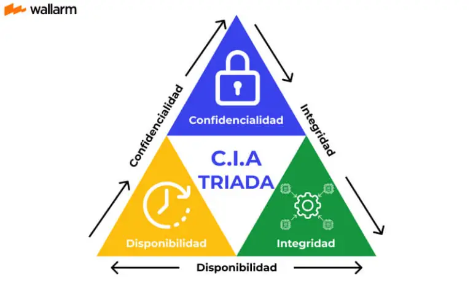

| **Inicio**         | **Siguiente 2**                                           |
| ------------------ | --------------------------------------------------------- |
| [🏠](../README.md) | [⏩](./6_2_Criptografia_y_Ciberseguridad_Introduccion.md) |

---

## **Índice**

| Temario                                                                                                                                                         |
| --------------------------------------------------------------------------------------------------------------------------------------------------------------- |
| [369. ¿Qué es la Ciberseguridad?](#369-qué-es-la-ciberseguridad)                                                                                                |
| [370. Pilares de la Ciberseguridad: Confidencialidad, Integridad, Disponibilidad](#370-pilares-de-la-ciberseguridad-confidencialidad-integridad-disponibilidad) |
| [371. Amenaza, Ataque y Vulnerabilidad](#371-amenaza-ataque-y-vulnerabilidad)                                                                                   |

---

# **¿Qué es la Ciberseguridad?**

## **369. ¿Qué es la Ciberseguridad?**

### ✅ Definición simple:

**La ciberseguridad es el conjunto de prácticas, herramientas y procesos que protegen los sistemas, redes, programas y datos digitales frente a ataques, accesos no autorizados o daños.**

---

### 🧠 ¿Por qué es importante?

Vivimos en un mundo digital: usamos computadoras, navegamos en internet, guardamos archivos en la nube, usamos redes sociales, y realizamos transacciones bancarias online. Sin ciberseguridad:

- Nos podrían **robar contraseñas**
- Nos podrían **hackear una cuenta**
- Un banco podría ser **atacado** y perder datos
- Una empresa podría sufrir **ransomware** y quedar paralizada

---

### 🛡️ Objetivos principales de la ciberseguridad (Modelo CIA)

| Letra | Significa            | Qué busca proteger                                                   |
| ----- | -------------------- | -------------------------------------------------------------------- |
| C     | **Confidencialidad** | Que solo las personas autorizadas accedan a la información           |
| I     | **Integridad**       | Que los datos no se modifiquen sin permiso                           |
| A     | **Disponibilidad**   | Que los sistemas estén siempre accesibles para quienes los necesiten |

---

### 💡 Ejemplos cotidianos fáciles de entender

#### 📱 1. WhatsApp con cifrado

WhatsApp cifra tus mensajes de extremo a extremo. Nadie (ni WhatsApp) puede leerlos excepto tú y el destinatario. Esto protege la **confidencialidad**.

#### 🏦 2. Banco online

Si alguien accede a tu banca móvil y cambia tu saldo, se compromete la **integridad** del sistema.

#### 🏢 3. Empresa caída por ransomware

Un ataque de ransomware puede encriptar todos los archivos de una empresa. Nadie puede trabajar. Esto afecta la **disponibilidad**.

---

### 🔧 Tipos de ciberseguridad

1. **Seguridad de red**: proteger la red de ataques (por ejemplo, con firewalls).
2. **Seguridad de aplicaciones**: proteger los programas de fallos y vulnerabilidades.
3. **Seguridad de la nube**: proteger los datos en plataformas como AWS, Azure o Google Cloud.
4. **Seguridad de dispositivos**: proteger PCs, móviles, routers, etc.
5. **Seguridad de datos**: cifrar y proteger la información personal o sensible.

---

### 🧑‍💻 Ejemplo práctico: Buenas prácticas de ciberseguridad personal

Imaginemos a **Lucas**, un estudiante universitario que usa su laptop para todo.

#### Malas prácticas:

- Usa la misma contraseña para todo.
- Se conecta a Wi-Fi públicas sin VPN.
- No actualiza su sistema operativo.
- Descarga programas de sitios desconocidos.

#### Buenas prácticas:

✅ Usa contraseñas seguras y distintas

✅ Activa la autenticación en dos pasos

✅ Usa un antivirus actualizado

✅ Usa una VPN en redes públicas

✅ Solo descarga software de fuentes oficiales

✅ Hace respaldos de sus archivos en la nube

---

### 🧪 Ejemplo real sencillo de protección (instalar un antivirus gratuito)

#### 🔹 ¿Qué es un antivirus?

Un software que detecta, bloquea y elimina programas maliciosos (virus, troyanos, spyware, etc.).

#### 🔹 Instalación de **Windows Defender** (ya viene en Windows):

1. Escribe `Seguridad de Windows` en el buscador de tu PC.
2. Ve a "Protección contra virus y amenazas".
3. Asegúrate de que **Protección en tiempo real** está activada.
4. Ejecuta un **análisis rápido** para ver si tienes amenazas.

#### 🔹 O instala uno externo gratuito como Avast:

```text
1. Ve a: https://www.avast.com
2. Haz clic en "Descargar antivirus gratis".
3. Instala y sigue los pasos del asistente.
4. Ejecuta un análisis.
```

---

### 🧩 ¿Cómo se empieza a aprender Ciberseguridad?

1. Aprender los conceptos básicos (como estos).
2. Estudiar redes (IP, TCP/IP, puertos, protocolos).
3. Usar Linux (muy usado en ciberseguridad).
4. Aprender a usar herramientas como Wireshark, Nmap, Burp Suite.
5. Practicar en laboratorios: [TryHackMe](https://tryhackme.com), [HackTheBox](https://www.hackthebox.com)

---

### 🧭 Resumen

| Elemento        | Explicación breve                            |
| --------------- | -------------------------------------------- |
| Qué es          | Protección de sistemas y datos digitales     |
| Por qué importa | Previene robos, fraudes, espionaje, caídas   |
| Qué protege     | Red, dispositivos, datos, nube, usuarios     |
| Cómo se aplica  | Buenas prácticas + herramientas de seguridad |
| Cómo empezar    | Estudiar redes, practicar en laboratorios    |

---

[🔼](#índice)

---

## **370. Pilares de la Ciberseguridad: Confidencialidad, Integridad, Disponibilidad**



### 🛡️ Pilares de la Ciberseguridad: C.I.A.

El **modelo C.I.A.** es la base fundamental sobre la que se construyen todas las estrategias de ciberseguridad. Se compone de:

1. 🔒 **Confidencialidad**
2. ✍️ **Integridad**
3. 🚦 **Disponibilidad**

Cada uno tiene un objetivo específico, y todos juntos aseguran que la información esté **protegida, correcta y accesible cuando se necesite.**

---

### 1️⃣ CONFIDENCIALIDAD 🔒

#### 📘 ¿Qué significa?

Evitar que **personas no autorizadas accedan a la información.**
Ejemplo: Solo tú puedes leer tus mensajes de WhatsApp.

#### 📌 Ejemplos cotidianos:

| Situación                        | ¿Confidencialidad aplicada?                    |
| -------------------------------- | ---------------------------------------------- |
| Acceder con usuario y contraseña | ✅ Solo tú puedes entrar a tu cuenta           |
| Cifrado de datos (como WhatsApp) | ✅ Solo el emisor y receptor leen los mensajes |
| Envío de datos por HTTPS         | ✅ La conexión está cifrada                    |

#### 🛠️ ¿Cómo se garantiza?

- Contraseñas seguras
- Cifrado (en archivos o conexiones)
- Autenticación multifactor (MFA)
- Políticas de acceso (quién puede ver qué)

---

### 2️⃣ INTEGRIDAD ✍️

#### 📘 ¿Qué significa?

Asegura que la información no sea **alterada, manipulada o dañada sin autorización**.

#### 📌 Ejemplos cotidianos:

| Situación                                     | ¿Integridad comprometida?  |
| --------------------------------------------- | -------------------------- |
| Editas un archivo y lo guardas correctamente  | ✅ Integridad mantenida    |
| Un hacker cambia el número de cuenta bancaria | ❌ Integridad comprometida |
| Un archivo se corrompe en una transferencia   | ❌ Integridad comprometida |

#### 🛠️ ¿Cómo se garantiza?

- Hashes (como SHA-256 para validar archivos)
- Firmas digitales
- Controles de acceso
- Backups frecuentes

---

### 3️⃣ DISPONIBILIDAD 🚦

#### 📘 ¿Qué significa?

La información y los sistemas deben estar **disponibles para las personas autorizadas cuando los necesiten.**

#### 📌 Ejemplos cotidianos:

| Situación                                      | ¿Disponibilidad asegurada?     |
| ---------------------------------------------- | ------------------------------ |
| Puedes entrar a tu correo en cualquier momento | ✅ Sí                          |
| El servidor de un banco está caído             | ❌ No hay disponibilidad       |
| Se cae un sistema tras un ciberataque          | ❌ Disponibilidad comprometida |

#### 🛠️ ¿Cómo se garantiza?

- Redundancia (más de un servidor)
- Respaldos (backups)
- Protección contra DDoS
- Sistemas de recuperación ante fallos

---

### 💡 Comparación resumen

| Pilar            | ¿Qué protege?                      | Ejemplo claro                  |
| ---------------- | ---------------------------------- | ------------------------------ |
| Confidencialidad | Acceso solo a personas autorizadas | WhatsApp cifrado, contraseña   |
| Integridad       | Datos correctos y no alterados     | Hash de archivo, firma digital |
| Disponibilidad   | Acceso en el momento necesario     | Servidores operativos 24/7     |

---

### ⚙️ Ejemplo práctico sencillo (con hash)

**Objetivo**: Validar la integridad de un archivo usando su hash SHA-256

#### 🔸 Paso 1: Crear un archivo

```bash
echo "Este es un archivo importante" > archivo.txt
```

#### 🔸 Paso 2: Calcular el hash del archivo

```bash
sha256sum archivo.txt
```

📌 Resultado:

```
d54c0db94e17a70... archivo.txt
```

#### 🔸 Paso 3: Cambiar el archivo

```bash
echo " ¡Alterado! " >> archivo.txt
```

#### 🔸 Paso 4: Calcular el hash nuevamente

```bash
sha256sum archivo.txt
```

📌 Resultado:

```
ae3d81c57b1c9c4... archivo.txt
```

> ⚠️ ¡El hash cambió! Por lo tanto, la **integridad** fue comprometida.

---

### 🧠 Conclusión

Los pilares C.I.A. son la base de toda estrategia de ciberseguridad:

- Si **alguien no autorizado accede** a tus datos → se rompe la **confidencialidad**.
- Si **los datos son modificados** → se rompe la **integridad**.
- Si **no puedes acceder** cuando lo necesitas → se rompe la **disponibilidad**.

---

[🔼](#índice)

---

## **371. Amenaza, Ataque y Vulnerabilidad**

### 🧠 ¿Por qué son importantes estos conceptos?

Entender **amenazas, ataques y vulnerabilidades** es esencial en ciberseguridad. Son los pilares para evaluar riesgos, proteger sistemas y responder a incidentes.

---

### 🛑 1. ¿Qué es una **Vulnerabilidad**?

> 🔍 **Es una debilidad o falla en un sistema, proceso, persona o tecnología que puede ser explotada.**

#### 📘 Ejemplos:

- Un sistema operativo sin actualizar.
- Una contraseña débil como `123456`.
- Un sitio web sin cifrado (HTTP en lugar de HTTPS).
- Un empleado que hace clic en cualquier enlace de correo.

#### 🔧 ¿Cómo se "instala" o se evita?

- **No se instala**: una vulnerabilidad ya existe en el sistema si no está bien protegido.
- Se **corrige** con:

  - Parcheo de software.
  - Buenas prácticas (contraseñas seguras, doble factor).
  - Auditorías de seguridad.

---

### ⚔️ 2. ¿Qué es una **Amenaza**?

> ⚠️ **Es cualquier cosa que pueda dañar o afectar negativamente un sistema informático.**

#### 📘 Ejemplos:

- Un hacker malintencionado.
- Un virus informático.
- Un empleado deshonesto.
- Un incendio que dañe los servidores.

📌 **No todas las amenazas causan daño**. Solo lo hacen si encuentran una vulnerabilidad para aprovechar.

---

### 💥 3. ¿Qué es un **Ataque**?

> 🚨 **Es la acción concreta de explotar una vulnerabilidad aprovechando una amenaza.**

#### 📘 Ejemplos:

- Un atacante explota una falla en una aplicación web para robar datos.
- Un malware que se propaga por una red sin antivirus.
- Un ransomware que cifra los archivos de una empresa.

---

### 📊 Relación entre los tres

##### 🧩 Analógico (ejemplo con una casa):

| Elemento          | Explicación                            |
| ----------------- | -------------------------------------- |
| 🔓 Vulnerabilidad | La puerta de tu casa sin seguro.       |
| 🦹 Amenaza        | Un ladrón que pasa por la calle.       |
| 🚪 Ataque         | El ladrón entra por la puerta abierta. |

👉 **Conclusión**: Si **no hay vulnerabilidad**, la amenaza **no puede atacarte**.

---

### 🎓 Ejemplo completo de los tres conceptos (Caso realista)

#### 🏢 Empresa “SecureTech S.A.C.”

##### 🔓 Vulnerabilidad:

El servidor web de la empresa tiene una versión antigua de Apache con una falla conocida (CVE-2021-41773).

##### ⚠️ Amenaza:

Un atacante escanea internet buscando servidores Apache vulnerables.

##### 🚨 Ataque:

El atacante encuentra el servidor, explota la falla con un _path traversal_ y accede a archivos del sistema.

🔚 Resultado: Exfiltración de información confidencial de la empresa.

---

### 💡 Ejercicio práctico para probar el concepto

> ⚠️ Solo con fines educativos. Nunca realices pruebas en sistemas que no te pertenezcan.

#### Simulando una vulnerabilidad con DVWA (Damn Vulnerable Web Application)

##### 🧰 Paso 1: Instala DVWA en tu máquina local (con Docker)

```bash
git clone https://github.com/digininja/DVWA.git
cd DVWA
docker-compose up -d
```

##### 🧰 Paso 2: Accede desde tu navegador

```
http://localhost
```

##### 🔍 Paso 3: Activa nivel de seguridad “bajo” y prueba una inyección SQL.

```sql
' OR 1=1 --
```

✅ Aquí:

- **Vulnerabilidad**: entrada sin sanitizar.
- **Amenaza**: tú como atacante ético.
- **Ataque**: inyección SQL que permite evadir login.

---

### 🧠 Conclusión

| Concepto       | ¿Qué es?                      | Ejemplo fácil                       |
| -------------- | ----------------------------- | ----------------------------------- |
| Vulnerabilidad | Falla que puede ser explotada | Contraseña débil                    |
| Amenaza        | Riesgo o peligro latente      | Hacker, virus, fallo humano         |
| Ataque         | Acción que explota la falla   | Inyección SQL, ransomware, phishing |

---

[🔼](#índice)

---

| **Inicio**         | **Siguiente 2**                                           |
| ------------------ | --------------------------------------------------------- |
| [🏠](../README.md) | [⏩](./6_2_Criptografia_y_Ciberseguridad_Introduccion.md) |
