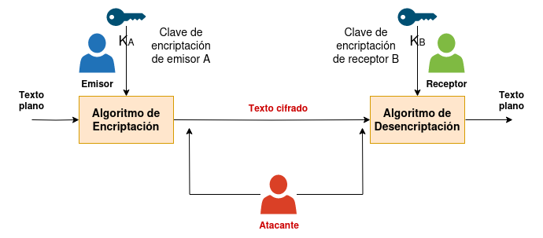
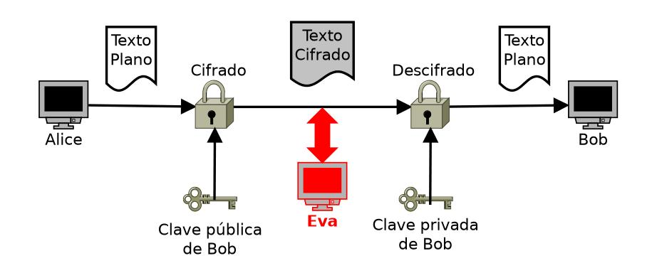
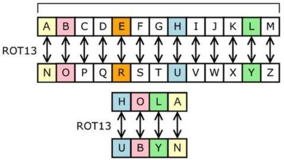
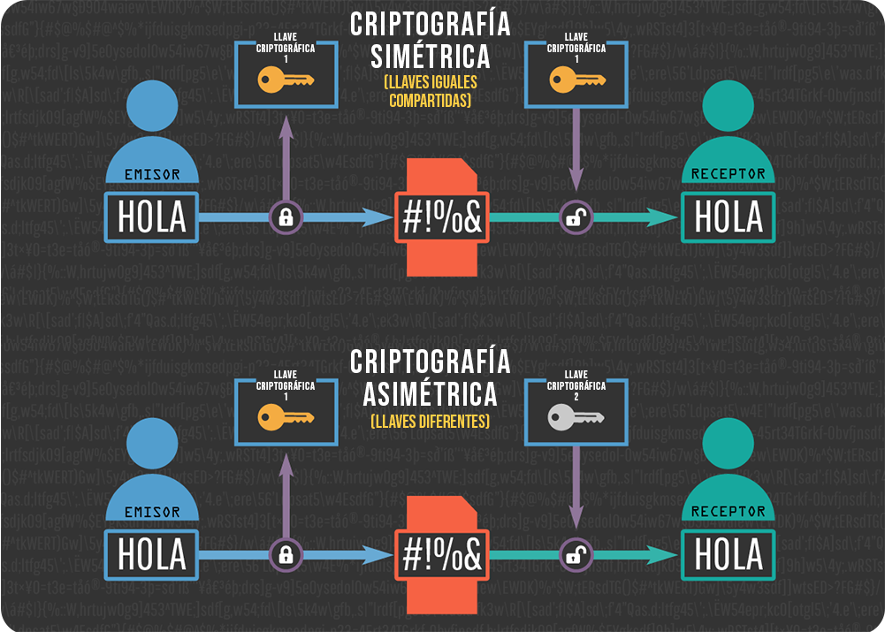

| **Inicio**         | **atrás 1**                             | **Siguiente 3**                                      |
| ------------------ | --------------------------------------- | ---------------------------------------------------- |
| [🏠](../README.md) | [⏪](./6_1_Que_es_la_Ciberseguridad.md) | [⏩](./6_3_Criptografia_moderna_y_Ciberseguridad.md) |

---

## **Índice**

| Temario                                                                                                                  |
| ------------------------------------------------------------------------------------------------------------------------ |
| [372. ¿Qué es la criptografía?](#372-qué-es-la-criptografía)                                                             |
| [373. Términos relevantes y componentes de un criptosistema](#373-términos-relevantes-y-componentes-de-un-criptosistema) |
| [374. Asunciones de seguridad](#374-asunciones-de-seguridad)                                                             |
| [375. Cifrado César](#375-cifrado-césar)                                                                                 |
| [376. Cifrado César en la práctica](#376-cifrado-césar-en-la-práctica)                                                   |
| [377. Clasificación de los criptosistemas](#377-clasificación-de-los-criptosistemas)                                     |
| [378. Ataques a un criptosistema](#378-ataques-a-un-criptosistema)                                                       |
| [379. Romper/Hackear un criptosistema](#379-romperhackear-un-criptosistema)                                              |
| [380. Fuerza Bruta y otras técnicas de ataque](#380-fuerza-bruta-y-otras-técnicas-de-ataque)                             |
| [381. Rompiendo el cifrado César](#381-rompiendo-el-cifrado-césar)                                                       |
| [382. Cifrado simple por sustitución](#382-cifrado-simple-por-sustitución)                                               |
| [383. Espacio de claves del cifrado simple por sustitución](#383-espacio-de-claves-del-cifrado-simple-por-sustitución)   |
| [384. Ataques al cifrado simple por sustitución](#384-ataques-al-cifrado-simple-por-sustitución)                         |
| [385. Ataques estadísticos: Análisis de frecuencias](#385-ataques-estadísticos-análisis-de-frecuencias)                  |
| [386. Rompiendo el cifrado simple por sustitución](#386-rompiendo-el-cifrado-simple-por-sustitución)                     |
| [387. Codificación vs Criptografía](#387-codificación-vs-criptografía)                                                   |
| [388. Esteganografía vs Criptografía](#388-esteganografía-vs-criptografía)                                               |
| [389. Cifrado Playfair](#389-cifrado-playfair)                                                                           |
| [390. Rompiendo el cifrado Playfair](#390-rompiendo-el-cifrado-playfair)                                                 |
| [391. ¿El cifrado Vigenere es realmente seguro?](#391-el-cifrado-vigenere-es-realmente-seguro)                           |
| [392. Seguridad del cifrado Vigenere](#392-seguridad-del-cifrado-vigenere)                                               |
| [393. Rompiendo el cifrado Vigenere](#393-rompiendo-el-cifrado-vigenere)                                                 |
| [394. Perfect Secrecy](#394-perfect-secrecy)                                                                             |
| [395. One-time pads](#395-one-time-pads)                                                                                 |
| [396. ¿Cuándo utilizar One-time pads?](#396-cuándo-utilizar-one-time-pads)                                               |
| [397. Criptografia y Ciberseguridad](#397-criptografia-y-ciberseguridad)                                                 |

---

# **Criptografia y Ciberseguridad: Introduccion**

## **372. ¿Qué es la criptografía?**



### 🔐 ¿Qué es la Criptografía?

> **La criptografía es la ciencia que se encarga de proteger la información para que solo las personas autorizadas puedan acceder a ella.**

Su función principal es **transformar un mensaje legible (texto plano)** en un mensaje que **nadie pueda entender (texto cifrado)**, y luego **volverlo a su forma original** cuando lo recibe la persona correcta.

---

### 📚 Tipos de Criptografía

Hay **dos tipos principales**:

#### 1. 🔑 Criptografía simétrica

- Usa **una sola clave** para cifrar y descifrar.
- Es rápida, pero **si alguien obtiene la clave, puede descifrarlo todo**.

##### Ejemplo simple:

```txt
Texto original: HOLA
Clave: 3
Texto cifrado: KROD (cada letra se mueve 3 posiciones en el alfabeto)
```

Aquí se usa un **cifrado César**, uno de los más antiguos.

---

#### 2. 🔐 Criptografía asimétrica

- Usa **dos claves diferentes**:

  - Una **clave pública** (para cifrar).
  - Una **clave privada** (para descifrar).

- Es más segura para el intercambio de datos.

##### Ejemplo cotidiano:

- Tú publicas una **clave pública** en tu sitio web.
- Alguien te manda un mensaje cifrado con esa clave.
- **Solo tú** lo puedes descifrar con tu **clave privada**.

Esto es lo que hace **HTTPS** cuando visitas sitios web seguros.

---

### 🛡️ ¿Para qué se usa la criptografía?

| Aplicación real     | Descripción                                       |
| ------------------- | ------------------------------------------------- |
| 🔐 Contraseñas      | Se almacenan cifradas para que nadie pueda verlas |
| 🔒 HTTPS            | Protege tu conexión con sitios web                |
| 📧 Correos cifrados | Nadie más que el receptor puede leerlos           |
| 💳 Transacciones    | Seguridad en pagos y transferencias               |
| 🧾 Blockchain       | Cifrado y firma de bloques de información         |

---

### ⚙️ ¿Cómo se “instala” o usa la criptografía?

En realidad, **la criptografía no se instala directamente** como un programa, sino que:

- Está **integrada en herramientas, bibliotecas y protocolos**.
- Puedes usarla con lenguajes de programación como Python, JavaScript, C#, etc.
- También está en servicios como VPNs, navegadores, certificados SSL, etc.

---

### 🧪 Ejemplo completo en Python con criptografía simétrica (AES)

Usaremos la biblioteca `cryptography` para cifrar y descifrar un mensaje.

#### 🧰 Paso 1: Instalar la librería

```bash
pip install cryptography
```

#### 🧪 Paso 2: Código completo para cifrar y descifrar

```python
from cryptography.fernet import Fernet

# Generar una clave secreta
clave = Fernet.generate_key()
fernet = Fernet(clave)

# Mensaje original
mensaje = "Hola Gustavo, este mensaje es secreto"

# Cifrado
mensaje_cifrado = fernet.encrypt(mensaje.encode())
print("Mensaje cifrado:", mensaje_cifrado)

# Descifrado
mensaje_descifrado = fernet.decrypt(mensaje_cifrado).decode()
print("Mensaje descifrado:", mensaje_descifrado)
```

#### 🧾 Resultado esperado:

```
Mensaje cifrado: b'gAAAAABl... (texto ilegible)'
Mensaje descifrado: Hola Gustavo, este mensaje es secreto
```

---

### 🧠 Analogía para memorizar

Piensa en un **candado**:

- En **criptografía simétrica**, **la misma llave** abre y cierra el candado.
- En **criptografía asimétrica**, una llave (pública) cierra el candado, pero **otra distinta (privada)** lo abre.

---

### ✅ Conclusión rápida

| Concepto     | Explicación sencilla                                          |
| ------------ | ------------------------------------------------------------- |
| Criptografía | Proteger la información para que solo el receptor la entienda |
| Simétrica    | Misma clave para cifrar y descifrar                           |
| Asimétrica   | Clave pública para cifrar, privada para descifrar             |
| Uso común    | Contraseñas, HTTPS, correos, blockchain                       |

---

[🔼](#índice)

---

## **373. Términos relevantes y componentes de un criptosistema**



### 🔐 ¿Qué es un Criptosistema?

Un **criptosistema** es un conjunto de **métodos, algoritmos y claves** que se utilizan para **proteger la información** mediante técnicas de **cifrado y descifrado**.

#### 👉 Objetivo principal:

Convertir un mensaje legible (**texto plano**) en un mensaje ilegible (**texto cifrado**) y luego volverlo a su forma original, pero **solo por usuarios autorizados**.

---

### 📘 Términos fundamentales en un criptosistema

| Término                     | Explicación simple                                                                |
| --------------------------- | --------------------------------------------------------------------------------- |
| **Texto plano**             | Es el mensaje original, legible. Ej: `"Hola, ¿cómo estás?"`                       |
| **Texto cifrado**           | Es el mensaje después de ser transformado con una clave. Ej: `"5@2jkS!!3"`        |
| **Cifrado**                 | Proceso de convertir texto plano a texto cifrado.                                 |
| **Descifrado**              | Proceso inverso: convertir texto cifrado a texto plano.                           |
| **Clave (key)**             | Información secreta usada para cifrar o descifrar.                                |
| **Algoritmo**               | Conjunto de pasos que se siguen para cifrar o descifrar un mensaje.               |
| **Criptografía simétrica**  | Usa **una sola clave** para cifrar y descifrar.                                   |
| **Criptografía asimétrica** | Usa **una clave pública** (para cifrar) y una **clave privada** (para descifrar). |
| **Criptoanálisis**          | El arte de intentar romper o debilitar el cifrado.                                |
| **Ataques de fuerza bruta** | Probar todas las combinaciones posibles de clave hasta descifrar.                 |

---

### 🧩 Componentes de un criptosistema

Un criptosistema está compuesto por cinco elementos esenciales:

| Componente                      | Explicación simple                                                                     |
| ------------------------------- | -------------------------------------------------------------------------------------- |
| **Espacio de texto plano**      | Conjunto de todos los mensajes posibles antes de cifrar.                               |
| **Espacio de texto cifrado**    | Conjunto de todos los mensajes posibles ya cifrados.                                   |
| **Espacio de claves**           | Todas las claves que se pueden usar en el cifrado o descifrado.                        |
| **Algoritmo de cifrado (E)**    | Método para transformar texto plano en texto cifrado usando una clave.                 |
| **Algoritmo de descifrado (D)** | Método para volver el texto cifrado a plano usando la misma clave o una clave privada. |

---

### 🎯 Ejemplo práctico fácil de entender

Imaginemos que **Gustavo** quiere enviar un mensaje secreto a **Ana**:

#### 🔵 Elementos del criptosistema:

- **Texto plano (P)**: `"Nos vemos a las 7 PM"`
- **Clave (K)**: `"ABC123"` (clave secreta compartida)
- **Algoritmo (E)**: Un algoritmo como AES (Advanced Encryption Standard)
- **Texto cifrado (C)**: Algo como `eDk91##S8L...` (salida cifrada)

---

### 🧪 Ejemplo completo con código: cifrado simétrico (AES) en Python

#### Paso 1: Instala la librería necesaria

```bash
pip install cryptography
```

#### Paso 2: Código completo

```python
from cryptography.fernet import Fernet

# Generar una clave secreta
clave = Fernet.generate_key()
fernet = Fernet(clave)

# Texto plano
mensaje = "Nos vemos a las 7 PM"

# Cifrado del mensaje
mensaje_cifrado = fernet.encrypt(mensaje.encode())
print("🔐 Mensaje cifrado:", mensaje_cifrado)

# Descifrado del mensaje
mensaje_descifrado = fernet.decrypt(mensaje_cifrado).decode()
print("✅ Mensaje original:", mensaje_descifrado)
```

#### Salida esperada:

```bash
🔐 Mensaje cifrado: b'gAAAAABl...'
✅ Mensaje original: Nos vemos a las 7 PM
```

---

### 🔁 Comparación entre cifrado simétrico y asimétrico

| Característica         | Simétrico    | Asimétrico            |
| ---------------------- | ------------ | --------------------- |
| Número de claves       | 1            | 2 (pública y privada) |
| Velocidad              | Rápido       | Más lento             |
| Seguridad al compartir | Menos segura | Más segura            |
| Ejemplo de algoritmo   | AES, DES     | RSA, ECC              |

---

### 🧠 Resumen rápido

| Término       | ¿Qué es?                                            |
| ------------- | --------------------------------------------------- |
| Texto plano   | Lo que lees antes de cifrar.                        |
| Texto cifrado | Información codificada.                             |
| Clave         | Secreta, necesaria para cifrar y/o descifrar.       |
| Algoritmo     | Método matemático para hacer el cifrado/descifrado. |
| Criptosistema | Todo el conjunto de algoritmos, claves y procesos.  |

---

[🔼](#índice)

---

## **374. Asunciones de seguridad**

### 🔐 ¿Qué son las Asunciones de Seguridad?

Las **asunciones de seguridad** son **supuestos que se hacen sobre el entorno, los actores y los componentes** de un sistema para poder diseñar o mantener un modelo de seguridad.

> Son como "reglas del juego" que asumimos que se cumplirán, pero **no siempre se validan explícitamente**.

---

#### 📌 Ejemplo simple:

> Asumimos que los empleados de una empresa **no compartirán sus contraseñas**.

Eso es una **asunción de seguridad**: se espera que los usuarios se comporten de forma segura, pero en la práctica, **puede no cumplirse**.

---

### 🔍 Tipos de Asunciones de Seguridad

Aquí te los explico con ejemplos cotidianos y de entornos reales de TI:

| Tipo de asunción                        | Descripción                                                     | Ejemplo                                                      |
| --------------------------------------- | --------------------------------------------------------------- | ------------------------------------------------------------ |
| **Asunción sobre el usuario**           | Qué comportamiento se espera del usuario.                       | Los usuarios no descargarán archivos maliciosos.             |
| **Asunción sobre el sistema operativo** | Se espera que esté actualizado y protegido.                     | Asumimos que el servidor tiene parches de seguridad al día.  |
| **Asunción sobre la red**               | Qué tan segura está la red en la que opera el sistema.          | Se asume que el tráfico dentro de la LAN es seguro.          |
| **Asunción sobre componentes externos** | Servicios, APIs o bibliotecas externas.                         | Confiamos en que la API de Google Maps no será comprometida. |
| **Asunción sobre el entorno físico**    | Qué tan seguro es el acceso físico a servidores o dispositivos. | Se espera que nadie sin autorización entre al data center.   |
| **Asunción sobre criptografía**         | Qué algoritmos o claves se usan, y si se mantienen seguros.     | Se supone que las claves privadas están bien protegidas.     |

---

### 🎯 ¿Por qué son importantes?

- Porque si **una asunción falla**, se abre una **vulnerabilidad**.
- Ayudan a **modelar amenazas** realistas (como en STRIDE o MITRE ATT\&CK).
- Son necesarias para diseñar medidas de seguridad efectivas.

---

### 🚨 Riesgo: cuando las asunciones fallan

| Asunción                               | Qué puede pasar si falla                                                |
| -------------------------------------- | ----------------------------------------------------------------------- |
| Los empleados no comparten contraseñas | Si alguien comparte su clave, otro puede acceder sin autorización.      |
| La red local es segura                 | Un atacante con acceso físico puede esnifar datos o lanzar ataques ARP. |
| La API externa es confiable            | Si esa API es vulnerada, podrías recibir datos maliciosos.              |

---

### 🛠️ ¿Cómo se instalan o configuran?

Este término no requiere instalación como una herramienta, pero en la práctica se **documenta, verifica y controla** con:

- 📄 **Modelos de amenazas**
- ✅ **Evaluaciones de seguridad**
- 🔐 **Controles técnicos** (firewalls, autenticación, validación de entradas)
- 🔁 **Políticas y procedimientos**
- 🧪 **Pruebas de penetración** (para verificar si una asunción puede romperse)

---

### ✅ Ejemplo completo: Aplicación web en AWS

#### 🎯 Caso:

Una empresa lanza una aplicación web de e-commerce en AWS.

#### 🔐 Asunciones de seguridad en el diseño:

| Asunción                                                 | Consecuencia si falla                                             | Mitigación                                                     |
| -------------------------------------------------------- | ----------------------------------------------------------------- | -------------------------------------------------------------- |
| Los desarrolladores no subirán claves al repositorio Git | Un atacante puede acceder a claves de acceso                      | Usar `.gitignore` + escáneres como TruffleHog o GitLeaks       |
| El bucket S3 solo es accesible desde la app              | Si es público, cualquiera puede descargar archivos confidenciales | Configurar políticas de bucket y ACL                           |
| Las instancias EC2 estarán actualizadas                  | Una EC2 sin parches puede ser atacada con exploits conocidos      | Activar actualizaciones automáticas o usar AWS Systems Manager |
| Solo los empleados acceden a la consola AWS con MFA      | Si no usan MFA, un atacante con la clave puede entrar             | Forzar MFA en IAM                                              |

---

### 🧪 Caso práctico: documentar las asunciones

Puedes crear un archivo de **asunciones de seguridad** como parte de tu documentación del sistema:

```markdown
# Asunciones de Seguridad - Aplicación de E-commerce

## Usuario Final

- Se espera que los usuarios no compartan sus credenciales.
- Se espera que accedan únicamente desde dispositivos personales seguros.

## Entorno de Red

- Todo el tráfico entre microservicios ocurre en una red VPC segura.
- Se asume que no hay sniffers activos en la red interna.

## Claves y Criptografía

- Las claves privadas están en AWS Secrets Manager, accesibles solo por servicios autenticados.
- El cifrado TLS es obligatorio para todas las conexiones externas.

## Infraestructura

- Las instancias EC2 están configuradas con actualizaciones automáticas.
- Solo administradores con MFA pueden acceder a la consola de AWS.
```

---

### 🧠 En resumen

| Elemento            | Explicación sencilla                                                 |
| ------------------- | -------------------------------------------------------------------- |
| ¿Qué es?            | Supuesto que tomas como cierto sobre el entorno o el comportamiento. |
| ¿Para qué sirve?    | Ayuda a diseñar seguridad realista.                                  |
| ¿Qué pasa si falla? | Se abre una vulnerabilidad.                                          |
| ¿Cómo se gestiona?  | Con documentación, modelos de amenazas y controles de seguridad.     |

---

[🔼](#índice)

---

## **375. Cifrado César**



### 🔐 ¿Qué es el Cifrado César?

El **Cifrado César** es un tipo de **cifrado por sustitución** en el que cada letra del mensaje original se reemplaza por otra letra que está un número fijo de posiciones más adelante en el alfabeto.

> Fue utilizado por **Julio César** para enviar mensajes secretos a sus generales.

---

#### 🧠 ¿Cómo funciona?

Supón que el alfabeto es:

```
A B C D E F G H I J K L M N O P Q R S T U V W X Y Z
```

Y queremos aplicar un **desplazamiento de 3 posiciones** (clave = 3). Entonces, cada letra se convierte en la que está **3 lugares más adelante**:

```
Texto claro:     A B C D E F G ...
Texto cifrado:   D E F G H I J ...
```

Ejemplo:

```
Texto original:  HOLA
Cifrado (clave=3): KROD
```

- H → K
- O → R
- L → O
- A → D

---

### 🛠 ¿Cómo se "instala"?

No necesitas instalar nada si quieres **hacerlo a mano** o en un lenguaje de programación común como Python.
Pero si deseas usarlo desde línea de comandos, podrías crear un **pequeño script** en tu sistema.

---

### ✅ Ejemplo fácil en Python

```python
def cifrado_cesar(texto, clave):
    resultado = ""
    for letra in texto:
        if letra.isalpha():  # Solo letras
            ascii_offset = 65 if letra.isupper() else 97
            letra_cifrada = chr((ord(letra) - ascii_offset + clave) % 26 + ascii_offset)
            resultado += letra_cifrada
        else:
            resultado += letra  # Mantiene espacios o signos
    return resultado

def descifrado_cesar(texto, clave):
    return cifrado_cesar(texto, -clave)

# Ejemplo de uso
mensaje = "Hola Mundo"
clave = 3

cifrado = cifrado_cesar(mensaje, clave)
descifrado = descifrado_cesar(cifrado, clave)

print("Original:  ", mensaje)
print("Cifrado:   ", cifrado)
print("Descifrado:", descifrado)
```

#### 🔍 Salida:

```
Original:   Hola Mundo
Cifrado:    Krod Pxqgr
Descifrado: Hola Mundo
```

---

### 🎯 Aplicaciones reales (educativas)

Aunque hoy **no se usa para seguridad real**, el cifrado César sirve para:

- Enseñar conceptos básicos de criptografía
- Juegos de escape o acertijos
- Encriptar textos de forma divertida

---

### 🔓 ¿Es seguro?

No. El Cifrado César es **fácil de romper** con **fuerza bruta**, ya que solo hay 25 claves posibles (de 1 a 25).
Cualquier persona puede descifrar el mensaje probando todas.

---

### 💡 Variante interesante

Si no quieres solo letras mayúsculas o minúsculas, puedes incluir:

- Números
- Caracteres especiales
- Mayúsculas y minúsculas combinadas

---

### 🧪 Ejercicio para ti

Cifra el siguiente texto con clave 5:

```
"Seguridad Basica"
```

¿Resultado? Pasa letra por letra y cambia cada una 5 lugares adelante.

S → X
E → J
G → L
...

---

### 🧠 Resumen

| Concepto               | Explicación breve                             |
| ---------------------- | --------------------------------------------- |
| ¿Qué es?               | Cifrado por desplazamiento de letras          |
| ¿Quién lo usó?         | Julio César                                   |
| ¿Es seguro hoy?        | No, es solo educativo                         |
| ¿Cómo se usa?          | Cambiando cada letra por otra más adelante    |
| ¿Se puede automatizar? | Sí, con código en Python o cualquier lenguaje |

---

[🔼](#índice)

---

## **376. Cifrado César en la práctica**

### 🔐 ¿Qué es el Cifrado César?

Es un método de cifrado **por sustitución**, donde cada letra del texto original se reemplaza por otra que está **un número fijo de posiciones** más adelante en el alfabeto.

**Ejemplo simple con clave 3**:

```
Texto original:     H O L A
Texto cifrado:      K R O D
```

La letra **H** pasa a ser **K**, **O** a **R**, y así sucesivamente.

---

### 🧰 ¿Cómo se instala y usa?

No necesitas instalar software especial. Puedes aplicar el Cifrado César:

- A mano (papel y lápiz)
- Con una hoja de cálculo
- Usando código en Python, JavaScript, C#, etc.

Aquí usaremos **Python**, porque es fácil de entender y no necesita configuraciones complejas.

---

### ✅ PASO 1: Instalación del entorno

#### Opción 1: Usar Python ya instalado

Si tienes Python:

```bash
python --version
```

Si no lo tienes, instálalo desde: [https://www.python.org/downloads/](https://www.python.org/downloads/)

#### Opción 2: Usar Replit o Google Colab (sin instalación)

- [https://replit.com/](https://replit.com/)
- [https://colab.research.google.com](https://colab.research.google.com)

---

### ✅ PASO 2: Código completo del Cifrado César

Aquí tienes un programa completo para cifrar y descifrar con César:

```python
def cifrado_cesar(texto, clave):
    resultado = ""

    for letra in texto:
        if letra.isalpha():
            ascii_base = ord('A') if letra.isupper() else ord('a')
            nueva_letra = chr((ord(letra) - ascii_base + clave) % 26 + ascii_base)
            resultado += nueva_letra
        else:
            resultado += letra  # Espacios, signos, etc.

    return resultado

def descifrado_cesar(texto_cifrado, clave):
    return cifrado_cesar(texto_cifrado, -clave)

# 🔍 Ejemplo práctico
mensaje_original = "Seguridad Basica"
clave = 4

mensaje_cifrado = cifrado_cesar(mensaje_original, clave)
mensaje_descifrado = descifrado_cesar(mensaje_cifrado, clave)

print("Mensaje original:  ", mensaje_original)
print("Mensaje cifrado:   ", mensaje_cifrado)
print("Mensaje descifrado:", mensaje_descifrado)
```

---

### 🧪 Salida del programa

```txt
Mensaje original:   Seguridad Basica
Mensaje cifrado:    Wkkyvizhev Fewmge
Mensaje descifrado: Seguridad Basica
```

---

### 🛠 ¿Qué hace el programa?

- Recorre cada letra del texto.
- Si es una letra, la **desplaza `n` posiciones** (clave).
- Si no es una letra (espacio, signo), lo deja igual.
- La función de descifrado invierte el proceso restando en vez de sumando.

---

### 📦 Extra: Versión en línea de comandos

Puedes copiar este programa y ejecutarlo desde tu terminal como script:

Guárdalo como `cesar.py` y ejecuta:

```bash
python cesar.py
```

O hazlo interactivo:

```python
mensaje = input("Escribe un mensaje: ")
clave = int(input("Clave (entero): "))
opcion = input("¿Cifrar o Descifrar? (c/d): ")

if opcion.lower() == 'c':
    print("Cifrado:", cifrado_cesar(mensaje, clave))
else:
    print("Descifrado:", descifrado_cesar(mensaje, clave))
```

---

### 🚨 Seguridad en la vida real

El Cifrado César **no es seguro hoy en día** porque:

- Solo hay 25 claves posibles (fácil fuerza bruta)
- Se puede romper en segundos con frecuencia de letras (criptoanálisis)

Pero es **ideal para aprender criptografía**, lógica de programación y cómo se estructura un sistema de cifrado.

---

### 🎓 En resumen

| Concepto       | Explicación fácil                                     |
| -------------- | ----------------------------------------------------- |
| Qué hace       | Reemplaza letras por otras desplazadas en el alfabeto |
| Clave          | Número de posiciones que se corre (ej: 3)             |
| Cifrado        | Se suman posiciones                                   |
| Descifrado     | Se restan posiciones                                  |
| Lenguaje usado | Python (fácil y directo)                              |
| Seguridad real | Nula, solo educativo                                  |

---

[🔼](#índice)

---

## **377. Clasificación de los criptosistemas**



### 🔐 ¿Qué es un Criptosistema?

Un **criptosistema** es un conjunto de algoritmos matemáticos que permiten **cifrar y descifrar** información. Su objetivo principal es **proteger datos confidenciales**, garantizando la **confidencialidad**, **integridad** y **autenticidad**.

---

### 📊 Clasificación de los Criptosistemas

Los criptosistemas se clasifican principalmente según **cómo gestionan las claves**.

#### 1. 🔑 **Criptosistemas Simétricos (clave única)**

- **Usan la misma clave** para cifrar y descifrar.
- Son **rápidos** y adecuados para grandes volúmenes de datos.
- Requieren un **método seguro** para intercambiar la clave.

**Ejemplos famosos**:

- AES (Advanced Encryption Standard)
- DES (Data Encryption Standard)
- RC4

📦 **Ejemplo simple**:

```plaintext
Clave: 123
Mensaje original: HOLA
Mensaje cifrado: (Se transforma usando la clave)
```

#### 2. 🔐 **Criptosistemas Asimétricos (clave pública y privada)**

- Usan **dos claves**:

  - Una **clave pública** para cifrar
  - Una **clave privada** para descifrar

- Muy usados en comunicaciones seguras por Internet (HTTPS).

**Ejemplos famosos**:

- RSA
- ECC (Elliptic Curve Cryptography)
- ElGamal

📦 **Ejemplo simple**:

```plaintext
Tú publicas tu clave pública.
Alguien la usa para enviarte un mensaje cifrado.
Solo tú puedes leerlo con tu clave privada.
```

#### 3. ✍️ **Criptosistemas de Firma Digital**

- Usados para verificar la **autenticidad** e **integridad** de un mensaje.
- Usa criptografía asimétrica:

  - Se firma con la **clave privada**
  - Se verifica con la **clave pública**

**Ejemplo**:

- DSA (Digital Signature Algorithm)
- RSA con firma
- EdDSA

---

### 🧠 Comparación rápida

| Característica      | Simétrico                           | Asimétrico                           |
| ------------------- | ----------------------------------- | ------------------------------------ |
| Claves              | 1 (misma clave)                     | 2 (pública/privada)                  |
| Velocidad           | Más rápido                          | Más lento                            |
| Seguridad del canal | Necesita canal seguro para la clave | No necesita                          |
| Uso común           | Cifrado de datos                    | Firma digital, intercambio de claves |

---

### ✅ ¿Cómo “instalar” o usar un criptosistema?

Depende de qué tan avanzado quieras ir.

#### Si estás aprendiendo:

Puedes usar Python para probar criptosistemas con librerías como:

```bash
pip install cryptography
```

O usar implementaciones manuales (como veremos ahora con AES y RSA).

---

### 🧪 Ejemplo completo en la práctica

Vamos a hacer dos ejemplos con código Python. Uno de criptosistema **simétrico (AES)** y otro **asimétrico (RSA)**.

---

#### 🔐 Ejemplo 1: Criptosistema Simétrico con AES

```python
from cryptography.fernet import Fernet

# 1. Generar clave simétrica
clave = Fernet.generate_key()
fernet = Fernet(clave)

# 2. Cifrar mensaje
mensaje = "Este es un mensaje secreto".encode()
cifrado = fernet.encrypt(mensaje)

# 3. Descifrar mensaje
descifrado = fernet.decrypt(cifrado)

print("Clave:", clave.decode())
print("Mensaje cifrado:", cifrado)
print("Mensaje descifrado:", descifrado.decode())
```

#### Resultado:

```txt
Clave: dOKs0MgKqYqZGaUcn... (base64)
Mensaje cifrado: b'gAAAAABlY...'
Mensaje descifrado: Este es un mensaje secreto
```

---

#### 🔐 Ejemplo 2: Criptosistema Asimétrico con RSA

```python
from cryptography.hazmat.primitives.asymmetric import rsa, padding
from cryptography.hazmat.primitives import serialization, hashes

# 1. Generar par de claves (privada y pública)
private_key = rsa.generate_private_key(public_exponent=65537, key_size=2048)
public_key = private_key.public_key()

# 2. Cifrar mensaje con clave pública
mensaje = b"Mensaje confidencial"
cifrado = public_key.encrypt(
    mensaje,
    padding.OAEP(mgf=padding.MGF1(algorithm=hashes.SHA256()), algorithm=hashes.SHA256(), label=None)
)

# 3. Descifrar con clave privada
descifrado = private_key.decrypt(
    cifrado,
    padding.OAEP(mgf=padding.MGF1(algorithm=hashes.SHA256()), algorithm=hashes.SHA256(), label=None)
)

print("Mensaje original:   ", mensaje)
print("Mensaje cifrado:    ", cifrado)
print("Mensaje descifrado: ", descifrado)
```

---

### 📌 Resumen Final

| Tipo de criptosistema | Claves   | Velocidad | Seguridad para grandes datos  | Fácil de implementar |
| --------------------- | -------- | --------- | ----------------------------- | -------------------- |
| Simétrico             | 1 clave  | ✅ Rápido | Sí, ideal para datos grandes  | ✅ Muy fácil         |
| Asimétrico            | 2 claves | ❌ Lento  | Mejor para intercambio seguro | ⚠️ Más complejo      |

---

[🔼](#índice)

---

## **378. Ataques a un criptosistema**

### 🧠 ¿Qué es un Criptosistema?

Un **criptosistema** es un conjunto de algoritmos matemáticos que permiten **cifrar** (encriptar) y **descifrar** (desencriptar) información, con el objetivo de protegerla.

Por ejemplo, cuando tú envías un mensaje por WhatsApp, se **cifra** para que nadie más pueda leerlo. Solo el receptor puede **descifrarlo**.

---

### ⚠️ ¿Qué es un Ataque a un Criptosistema?

Un **ataque a un criptosistema** ocurre cuando alguien (un atacante o hacker) intenta **romper la seguridad** de ese sistema, para:

- Leer mensajes cifrados.
- Suplantar a un usuario.
- Alterar información sin ser detectado.
- Descubrir las claves secretas.

---

### 🧨 Tipos de Ataques a un Criptosistema

#### 1. **Ataque de Fuerza Bruta**

- 🔍 **Qué hace:** Prueba todas las combinaciones posibles de claves hasta encontrar la correcta.
- 🔑 Ejemplo:

  - Si una clave tiene 4 dígitos, intenta del 0000 al 9999.
  - Si la clave es `1234`, el atacante la descubrirá tras **10,000 intentos** máximo.

🧪 **Instalación/Simulación:**

Puedes simular un ataque de fuerza bruta con código simple en Python (te muestro al final un ejemplo completo).

---

#### 2. **Ataque de Texto Claro Conocido (Known Plaintext Attack)**

- 🔍 **Qué hace:** El atacante **ya conoce** parte del mensaje original y el mensaje cifrado.
- 🧠 Usa esa información para deducir la clave.
- 🧾 Ejemplo:

  - Supón que un atacante sabe que el mensaje original tiene la palabra **"Hola"**, y tiene el texto cifrado correspondiente: `"Krod"` (con cifrado César).
  - Entonces deduce que la clave es un desplazamiento de +3 letras.

---

#### 3. **Ataque de Texto Cifrado Solamente (Ciphertext-Only Attack)**

- 🔍 **Qué hace:** El atacante **solo tiene acceso al texto cifrado**, y trata de deducir el mensaje original o la clave.
- 🧾 Ejemplo:

  - Tiene acceso a `"Krod"` y trata de probar diferentes claves para ver si encuentra un texto con sentido (como "Hola").

---

#### 4. **Ataque de Texto Escogido (Chosen Plaintext Attack)**

- 🔍 **Qué hace:** El atacante puede **elegir mensajes para cifrar** y observar el resultado cifrado.
- 🧾 Ejemplo:

  - En un sistema mal configurado, el atacante envía `"Hola"`, obtiene `"Krod"`.
  - Luego envía `"Adiós"`, obtiene `"Dgrrv"`.
  - Así, empieza a construir el patrón y descubre la clave.

---

#### 5. **Ataque del Hombre en el Medio (Man-in-the-Middle)**

- 🔍 **Qué hace:** Se intercepta la comunicación entre dos partes (por ejemplo, tú y un banco).
- El atacante **lee, modifica o reemplaza** los mensajes sin que lo notes.
- 🧾 Ejemplo:

  - Tú envías tu clave al banco, pero el atacante la intercepta y luego reenvía su propio mensaje al banco.

🧰 **Mitigación:** Uso de certificados SSL/TLS y claves públicas privadas.

---

#### 6. **Criptoanálisis Diferencial y Lineal**

- 🧪 Se trata de ataques más avanzados que analizan patrones matemáticos en los algoritmos.
- Son usados especialmente contra algoritmos de bloque como **DES o AES**.

---

### 💻 Instalación / Simulación de un Ataque (Ejemplo en Python)

Aquí te dejo un ejemplo **simple de ataque de fuerza bruta** a una contraseña:

```python
import itertools

# Simulamos una contraseña de 3 letras
password_real = "abc"

# Letras posibles
letras = "abcdefghijklmnopqrstuvwxyz"

# Fuerza bruta
for intento in itertools.product(letras, repeat=3):
    intento_str = ''.join(intento)
    print("Probando:", intento_str)
    if intento_str == password_real:
        print("¡Contraseña encontrada!: ", intento_str)
        break
```

🧠 Este código prueba todas las combinaciones posibles de 3 letras hasta encontrar `"abc"`.

---

### 🧩 Ejemplo Completo

Supongamos que tenemos este escenario:

#### 🔒 Criptosistema: Cifrado César

- El **mensaje original** es: `"Hola"`
- Se cifra con una clave de desplazamiento de `+3`
- El resultado cifrado es: `"Krod"`

#### 🎯 Ataque: Fuerza Bruta

El atacante recibe `"Krod"` y no sabe la clave. Entonces prueba todas las claves posibles del 1 al 25 (porque son 26 letras del alfabeto).

#### Código en Python para simular el ataque:

```python
def descifrar_cesar(texto, clave):
    resultado = ""
    for c in texto:
        if c.isalpha():
            desplazado = chr(((ord(c.lower()) - 97 - clave) % 26) + 97)
            resultado += desplazado.upper() if c.isupper() else desplazado
        else:
            resultado += c
    return resultado

mensaje_cifrado = "Krod"

print("Ataque de fuerza bruta:")
for clave in range(1, 26):
    posible = descifrar_cesar(mensaje_cifrado, clave)
    print(f"Clave {clave}: {posible}")
```

🔍 En algún punto verás:

```
Clave 3: Hola
```

✅ El atacante ha roto el criptosistema con fuerza bruta.

---

### 🛡️ ¿Cómo protegernos de estos ataques?

1. Usar algoritmos fuertes como **AES-256, RSA-4096**.
2. Emplear contraseñas largas y complejas.
3. Usar protocolos seguros (HTTPS, SSH).
4. Implementar autenticación multifactor (MFA).
5. No permitir acceso al texto cifrado si no es necesario.

---

[🔼](#índice)

---

## **379. Romper/Hackear un criptosistema**

### 🧠 ¿Qué significa "Romper un Criptosistema"?

**Romper** (o **hackear**) un criptosistema significa lograr **acceder a la información cifrada** o **encontrar la clave secreta** **sin tener permiso**, es decir, **vulnerar la seguridad del sistema criptográfico**.

Esto puede lograrse por varios métodos como:

- Descubrir la clave por fuerza bruta.
- Aprovechar errores de implementación.
- Aplicar técnicas de análisis matemático (criptoanálisis).
- Interceptar comunicaciones.

---

### 📦 ¿Qué se necesita para romper un criptosistema?

Para fines educativos y pruebas, puedes hacerlo en tu computadora con herramientas como:

| Requisito             | ¿Para qué sirve?                                         |
| --------------------- | -------------------------------------------------------- |
| Python                | Simular ataques como fuerza bruta o análisis de cifrado. |
| Wireshark             | Capturar paquetes para ataques tipo Man-in-the-Middle.   |
| hashcat               | Romper hashes de contraseñas.                            |
| John the Ripper       | Romper contraseñas cifradas.                             |
| Kali Linux (opcional) | Distro con herramientas de seguridad ofensiva.           |

---

### 🛠️ Instalación básica para simular ataques en tu PC (Windows)

#### 🔧 Requisitos:

- Tener Python instalado
  👉 [https://www.python.org/downloads/](https://www.python.org/downloads/)

#### 💾 Instalar herramientas útiles

Abre la terminal (CMD o PowerShell) y ejecuta:

```bash
pip install cryptography
pip install pycryptodome
```

Estas librerías te permiten **cifrar, descifrar y probar ataques** a criptosistemas en Python.

---

### 📚 Ejemplos de cómo se puede hackear un criptosistema

---

#### 💥 1. Ataque por Fuerza Bruta a un cifrado tipo "clave secreta"

Supón que alguien usó una contraseña corta para cifrar un mensaje.

🔐 Cifrado: se usó clave `"123"`

🔒 Mensaje cifrado: `"Khoor"` (mensaje original era `"Hello"` usando cifrado César con desplazamiento +3)

##### 📌 ¿Cómo lo rompo?

Puedo hacer un script que pruebe todas las claves posibles.

##### ✅ Código en Python (rompiendo Cifrado César):

```python
def descifrar_cesar(texto, clave):
    resultado = ""
    for c in texto:
        if c.isalpha():
            nuevo = chr((ord(c.lower()) - 97 - clave) % 26 + 97)
            resultado += nuevo.upper() if c.isupper() else nuevo
        else:
            resultado += c
    return resultado

mensaje_cifrado = "Khoor"

print("Fuerza Bruta sobre el mensaje cifrado:")
for clave in range(1, 26):
    posible = descifrar_cesar(mensaje_cifrado, clave)
    print(f"Clave {clave}: {posible}")
```

#### 🔍 Resultado parcial:

```
Clave 3: Hello
```

🎯 ¡El mensaje original se ha recuperado! ✅

---

#### 💥 2. Ataque a Hashes de Contraseñas

Supón que robaste una base de datos con contraseñas en forma de hash MD5:

```txt
d41d8cd98f00b204e9800998ecf8427e
5f4dcc3b5aa765d61d8327deb882cf99
```

👉 Puedes usar `hashcat` o páginas como:

- [https://crackstation.net/](https://crackstation.net/)
- [https://md5decrypt.net/](https://md5decrypt.net/)

##### Ejemplo:

```txt
5f4dcc3b5aa765d61d8327deb882cf99 → "password"
```

🎯 ¡Contraseña recuperada!

---

#### 💥 3. Ataque Hombre en el Medio (MITM)

Este es más avanzado. Consiste en interceptar el tráfico entre dos personas (ej: tú y un banco).

##### Puedes usar:

- `Wireshark` (captura de paquetes)
- `Ettercap` o `mitmproxy` (para interceptar)

🔧 Ejemplo:

```bash
# Capturas tráfico entre víctima y router
sudo ettercap -T -M arp:remote /victima_ip/ /router_ip/
```

Luego analizas el tráfico y puedes ver si hay contraseñas, claves, tokens, etc.

⚠️ **Esto es solo para entornos de laboratorio**.

---

### 🧩 Ejemplo completo — Romper un Criptosistema tipo César

#### 🧱 Cifrado (César):

```python
def cifrar_cesar(texto, clave):
    resultado = ""
    for c in texto:
        if c.isalpha():
            nuevo = chr((ord(c.lower()) - 97 + clave) % 26 + 97)
            resultado += nuevo.upper() if c.isupper() else nuevo
        else:
            resultado += c
    return resultado

mensaje = "hola mundo"
clave = 5

cifrado = cifrar_cesar(mensaje, clave)
print("Texto cifrado:", cifrado)
```

🧾 Resultado: `mtqf rzsti`

---

#### 🔐 Ahora lo vamos a romper

```python
mensaje_cifrado = "mtqf rzsti"

def descifrar_cesar(texto, clave):
    resultado = ""
    for c in texto:
        if c.isalpha():
            nuevo = chr((ord(c.lower()) - 97 - clave) % 26 + 97)
            resultado += nuevo.upper() if c.isupper() else nuevo
        else:
            resultado += c
    return resultado

print("Rompiendo el mensaje:")
for clave in range(1, 26):
    posible = descifrar_cesar(mensaje_cifrado, clave)
    print(f"Clave {clave}: {posible}")
```

🧩 Resultado parcial:

```
Clave 5: hola mundo  ✅
```

🎯 ¡El criptosistema ha sido roto con éxito!

---

### 🛡️ ¿Cómo evitar que un criptosistema se rompa?

| Buenas prácticas     | Ejemplo                               |
| -------------------- | ------------------------------------- |
| Usar claves largas   | 20+ caracteres alfanuméricos          |
| Usar cifrado moderno | AES-256, RSA-2048 o superior          |
| Saltear los hashes   | Hash + Salt para proteger contraseñas |
| Cifrar sobre HTTPS   | Para evitar MITM                      |
| Implementar MFA      | Autenticación de dos factores         |

---

### 🧠 Resumen final

| Tema                 | Explicación simple                          |
| -------------------- | ------------------------------------------- |
| Romper criptosistema | Obtener información cifrada sin permiso     |
| Métodos              | Fuerza bruta, análisis, intercepción        |
| Herramientas         | Python, hashcat, Wireshark, John            |
| Recomendación        | ¡Solo úsalo para fines éticos y educativos! |

---

[🔼](#índice)

---

## **380. Fuerza Bruta y otras técnicas de ataque**

### 🧠 ¿Qué es un Ataque de Fuerza Bruta?

Un **ataque de fuerza bruta** es una técnica en la que el atacante **prueba todas las combinaciones posibles** de una clave, contraseña o mensaje cifrado hasta encontrar la correcta.

Es como si intentaras abrir una caja fuerte probando **todas las combinaciones** hasta que se abra.

---

#### 🧾 Ejemplo sencillo (clave de 3 dígitos):

Si alguien tiene una caja con clave de 3 dígitos y la contraseña es `357`, un atacante haría:

```
000
001
002
...
357 ✅
...
999
```

Esto es **fuerza bruta**.

---

### 🔧 ¿Cómo se Instala un Entorno para Simular Fuerza Bruta?

#### 🔹 Opción 1: Python (la más educativa y multiplataforma)

##### ✅ Instalación:

1. Descarga Python desde: [https://www.python.org/](https://www.python.org/)
2. Verifica en la terminal (CMD o PowerShell):

```bash
python --version
```

3. Instala una librería extra (opcional):

```bash
pip install pycryptodome
```

---

### 🛠️ ¿Qué Técnicas de Ataque existen además de Fuerza Bruta?

| Técnica                           | Explicación                                                                |
| --------------------------------- | -------------------------------------------------------------------------- |
| 🔑 Fuerza Bruta                   | Prueba todas las combinaciones posibles hasta acertar.                     |
| 🧠 Diccionario                    | Usa una **lista predefinida de palabras comunes** para encontrar la clave. |
| 🪞 Ataque de Texto Claro Conocido | El atacante ya conoce parte del texto original.                            |
| 🔍 Texto Cifrado Solamente        | Solo se tiene el texto cifrado y se intenta deducir el original.           |
| 📥 Texto Escogido                 | El atacante elige qué texto cifrar para analizar cómo responde el sistema. |
| 🧬 Criptoanálisis                 | Análisis matemático del algoritmo (muy técnico).                           |
| 🧑‍💻 MITM (Man in the Middle)       | Interceptar comunicación entre dos partes sin ser detectado.               |

---

### 📚 Ejemplo 1 — Ataque de Fuerza Bruta a una Clave Corta

Vamos a simular un sistema que tiene una clave de 4 letras, y el atacante no la conoce, así que prueba todas las combinaciones posibles.

#### 💻 Código en Python:

```python
import itertools

# Clave secreta que el sistema usa
clave_real = "abcd"

# Letras que podrían formar la clave
letras = "abcdefghijklmnopqrstuvwxyz"

# Fuerza bruta: todas las combinaciones de 4 letras
for intento in itertools.product(letras, repeat=4):
    intento_str = ''.join(intento)
    print("Probando:", intento_str)
    if intento_str == clave_real:
        print("✅ ¡Clave encontrada!: ", intento_str)
        break
```

🔍 Resultado parcial:

```
Probando: abca
Probando: abcb
Probando: abcc
Probando: abcd

✅ ¡Clave encontrada!: abcd
```

---

### 📚 Ejemplo 2 — Ataque de Diccionario

Muchos usuarios usan contraseñas como: `admin`, `123456`, `qwerty`, etc.

Un ataque de **diccionario** prueba solo esas contraseñas comunes.

#### 💻 Código en Python:

```python
# Lista de contraseñas comunes (diccionario)
diccionario = ["123456", "qwerty", "admin", "password", "letmein"]

# Clave que queremos adivinar
clave_objetivo = "admin"

# Ataque de diccionario
for intento in diccionario:
    print("Probando:", intento)
    if intento == clave_objetivo:
        print("✅ ¡Clave encontrada!: ", intento)
        break
```

🔍 Resultado:

```
Probando: 123456
Probando: qwerty
Probando: admin

✅ ¡Clave encontrada!: admin
```

---

### 🧪 Instalación y uso de herramientas avanzadas (opcional)

#### 🔸 **Hashcat** (para romper hashes)

```bash
# En sistemas basados en Debian o Kali Linux
sudo apt install hashcat
```

Usos comunes:

```bash
hashcat -a 0 -m 0 hashes.txt rockyou.txt
```

- `hashes.txt`: archivo con hashes a romper.
- `rockyou.txt`: diccionario de contraseñas.

#### 🔸 **John the Ripper**

```bash
sudo apt install john
```

Ejemplo:

```bash
john --wordlist=rockyou.txt --format=raw-md5 hash.txt
```

---

### 📦 Resumen Visual de Técnicas de Ataque

| Técnica        | Qué necesita el atacante      | Ejemplo simple                |
| -------------- | ----------------------------- | ----------------------------- |
| Fuerza Bruta   | Nada, solo paciencia          | Prueba 0000-9999              |
| Diccionario    | Lista de contraseñas comunes  | Prueba "admin", "123456", etc |
| Texto Conocido | Texto original y cifrado      | Ver "Hola" → "Krod"           |
| Texto Cifrado  | Solo tiene el mensaje cifrado | Deduce clave por prueba       |
| Texto Escogido | Elige qué cifrar              | Envío "admin", recibo "dpgpq" |
| MITM           | Red insegura                  | Interceptar tráfico sin clave |

---

### ✅ Ejemplo Completo Final

Vamos a combinar todo en un script que **intente romper una contraseña secreta por fuerza bruta y diccionario**.

```python
import itertools

clave_real = "qwer"

# Primero ataque por diccionario
diccionario = ["admin", "1234", "password", "qwer", "letmein"]
encontrado = False

print("🔎 Ataque por diccionario...")
for intento in diccionario:
    print("Probando:", intento)
    if intento == clave_real:
        print("✅ ¡Clave encontrada (diccionario)!:", intento)
        encontrado = True
        break

# Si falla, usar fuerza bruta
if not encontrado:
    letras = "abcdefghijklmnopqrstuvwxyz"
    print("💥 Ataque por fuerza bruta...")
    for intento in itertools.product(letras, repeat=4):
        intento_str = ''.join(intento)
        print("Probando:", intento_str)
        if intento_str == clave_real:
            print("✅ ¡Clave encontrada (fuerza bruta)!:", intento_str)
            break
```

🎯 Resultado esperado:

```
🔎 Ataque por diccionario...
Probando: admin
Probando: 1234
Probando: password
Probando: qwer

✅ ¡Clave encontrada (diccionario)!: qwer
```

---

### 🛡️ ¿Cómo protegernos de estos ataques?

| Protección                     | ¿Qué hace?                            |
| ------------------------------ | ------------------------------------- |
| Contraseñas largas y complejas | Dificultan fuerza bruta               |
| Bloqueo tras intentos fallidos | Evita miles de intentos               |
| Hashing + Salt                 | Protege contraseñas en bases de datos |
| MFA (Autenticación 2 factores) | Crea una segunda barrera de seguridad |
| Limitar acceso a APIs          | Previene abuso automático             |

---

[🔼](#índice)

---

## **381. Rompiendo el cifrado César**

### 🧠 ¿Qué es el Cifrado César?

El **Cifrado César** es uno de los métodos de cifrado más antiguos y simples.
Consiste en **desplazar cada letra del mensaje original (texto claro)** un número fijo de posiciones en el alfabeto.

#### ✏️ Ejemplo:

- Mensaje original: `HOLA`
- Clave de cifrado: `+3`
- Mensaje cifrado: `KROD`
  (H → K, O → R, L → O, A → D)

---

### 🔓 ¿Qué significa "Romper" el Cifrado César?

Significa **descifrar el mensaje cifrado sin conocer la clave**.
Como solo hay **25 posibles desplazamientos** (excluyendo 0), se puede probar cada uno hasta encontrar el mensaje original.

💡 Esto es un **ataque por fuerza bruta**.

---

### 🧰 ¿Cómo instalar el entorno para romper el Cifrado César?

#### ✅ Usaremos Python:

##### 1. Instalar Python (si aún no lo tienes):

- Ir a: [https://www.python.org/downloads/](https://www.python.org/downloads/)
- Descargar e instalar Python para tu sistema operativo.
- Verificar en la terminal:

```bash
python --version
```

Deberías ver algo como: `Python 3.x.x`

---

### 📚 Explicación paso a paso: Cómo romper el Cifrado César

---

#### 🪵 Paso 1: Entender cómo funciona el cifrado

Cada letra se convierte en otra, aplicando una fórmula como:

```
nueva_letra = (letra_original + clave) % 26
```

Ejemplo con clave +3:

```
A → D
B → E
C → F
...
X → A
Y → B
Z → C
```

---

#### 🧪 Paso 2: ¿Cómo lo rompemos?

Si no sabemos la clave, **probamos todas las 25 posibles claves** y vemos cuál resultado tiene sentido.
Este es un **ataque de fuerza bruta** clásico.

---

### 💻 Código para romper el Cifrado César en Python

```python
def descifrar_cesar(texto_cifrado, clave):
    texto_descifrado = ""
    for c in texto_cifrado:
        if c.isalpha():
            ascii_base = ord('A') if c.isupper() else ord('a')
            nueva_letra = chr((ord(c) - ascii_base - clave) % 26 + ascii_base)
            texto_descifrado += nueva_letra
        else:
            texto_descifrado += c
    return texto_descifrado

def romper_cifrado_cesar(texto_cifrado):
    print("Posibles resultados:")
    for clave in range(1, 26):
        posible = descifrar_cesar(texto_cifrado, clave)
        print(f"Clave {clave:>2}: {posible}")

# 📥 Mensaje cifrado (ejemplo)
mensaje_cifrado = "Krod"

romper_cifrado_cesar(mensaje_cifrado)
```

---

#### ✅ Explicación del código:

- La función `descifrar_cesar` descifra el texto usando una clave.
- La función `romper_cifrado_cesar` prueba todas las claves del 1 al 25.
- Se imprime el resultado de cada intento para que puedas identificar el mensaje correcto.

---

### 🔎 Salida esperada:

```
Posibles resultados:
Clave  1: Jqnc
Clave  2: Ipmb
Clave  3: Hola   ✅
Clave  4: Gn kz
...
```

🎯 **¡Clave correcta encontrada!: 3 (Hola)**

---

### 🧠 Cómo saber cuál clave es la correcta

A simple vista, notarás que una de las salidas tiene **palabras con sentido** en español.
En ataques reales, se puede automatizar con:

- Detección de palabras reales con diccionarios.
- IA/NLP para determinar "legibilidad".
- Frecuencia de letras (ej: en español, la "E" es muy común).

---

### 🔐 ¿Cómo protegerse contra ataques como este?

El Cifrado César es solo educativo. Para proteger información real, se recomienda:

| Método         | Descripción                                            |
| -------------- | ------------------------------------------------------ |
| AES-256        | Cifrado moderno y seguro simétrico.                    |
| RSA            | Cifrado asimétrico basado en claves públicas/privadas. |
| Hashing + Salt | Para contraseñas en bases de datos.                    |
| HTTPS / TLS    | Cifrado de tráfico web para prevenir intercepciones.   |

---

### 🧩 Ejemplo completo final — Cifrado + Ataque

#### 1. Cifrado

```python
def cifrar_cesar(texto, clave):
    resultado = ""
    for c in texto:
        if c.isalpha():
            base = ord('A') if c.isupper() else ord('a')
            resultado += chr((ord(c) - base + clave) % 26 + base)
        else:
            resultado += c
    return resultado

mensaje = "Hola Mundo"
clave = 5
mensaje_cifrado = cifrar_cesar(mensaje, clave)
print("Mensaje cifrado:", mensaje_cifrado)
```

👉 Salida:

```
Mensaje cifrado: Mtqf Rzsit
```

---

#### 2. Romper el cifrado sin conocer la clave

```python
romper_cifrado_cesar("Mtqf Rzsit")
```

👉 Salida parcial:

```
Clave  5: Hola Mundo  ✅
```

---

### 🧾 Resumen general

| Concepto          | Detalle                                             |
| ----------------- | --------------------------------------------------- |
| Método            | Cifrado César                                       |
| Tipo de ataque    | Fuerza Bruta                                        |
| Técnica usada     | Probar claves del 1 al 25                           |
| Herramienta usada | Python                                              |
| Resultado         | Se obtiene el mensaje original sin conocer la clave |

---

[🔼](#índice)

---

## **382. Cifrado simple por sustitución**

### 🧠 ¿Qué es un Cifrado por Sustitución?

Es un método clásico de criptografía en el cual **cada letra del mensaje original es reemplazada por otra letra fija** del alfabeto, según una **clave de sustitución**.

🔁 Cada letra se **sustituye** por otra de forma **determinada**, lo cual crea un mensaje ilegible para quien no conoce la clave.

---

#### ✏️ Ejemplo sencillo

Si usas esta clave de sustitución:

```
Clave:
A → Q
B → W
C → E
D → R
E → T
F → Y
G → U
H → I
I → O
J → P
K → A
L → S
M → D
N → F
O → G
P → H
Q → J
R → K
S → L
T → Z
U → X
V → C
W → V
X → B
Y → N
Z → M
```

Entonces el mensaje `"HOLA"` se cifraría como:

```
H → I
O → G
L → S
A → Q

Resultado cifrado: IGSQ
```

---

### 🧠 ¿Cómo se rompe?

Al igual que el Cifrado César, este cifrado se puede **romper por análisis de frecuencia**, es decir, contando qué letras se repiten más y comparando con la frecuencia típica del idioma (como que la "E" es la más común en español).

---

### 📦 ¿Cómo instalar un entorno para simular este cifrado?

#### ✅ Usaremos Python (sencillo y multiplataforma)

##### 1. Instalar Python (si aún no lo tienes)

- Ir a: [https://www.python.org/downloads/](https://www.python.org/downloads/)
- Instalarlo normalmente.
- Verificar instalación en terminal/cmd:

```bash
python --version
```

---

### 🛠️ ¿Cómo funciona el cifrado simple por sustitución?

1. Se crea un **diccionario de sustitución** (clave).
2. Se recorre cada letra del mensaje.
3. Se reemplaza cada letra por su correspondiente según el diccionario.

🔐 El cifrado depende **totalmente** de la clave que uses.

---

### 🧩 Ejemplo completo en Python

#### 📦 Parte 1: Crear la clave de sustitución

```python
# Crear diccionario de sustitución
clave_sustitucion = {
    'A': 'Q', 'B': 'W', 'C': 'E', 'D': 'R', 'E': 'T', 'F': 'Y', 'G': 'U',
    'H': 'I', 'I': 'O', 'J': 'P', 'K': 'A', 'L': 'S', 'M': 'D', 'N': 'F',
    'O': 'G', 'P': 'H', 'Q': 'J', 'R': 'K', 'S': 'L', 'T': 'Z', 'U': 'X',
    'V': 'C', 'W': 'V', 'X': 'B', 'Y': 'N', 'Z': 'M'
}
```

---

#### 🔐 Parte 2: Cifrar un mensaje

```python
def cifrar_sustitucion(texto, clave):
    texto_cifrado = ""
    for letra in texto.upper():
        if letra in clave:
            texto_cifrado += clave[letra]
        else:
            texto_cifrado += letra  # deja espacios y otros símbolos igual
    return texto_cifrado

mensaje_original = "HOLA MUNDO"
mensaje_cifrado = cifrar_sustitucion(mensaje_original, clave_sustitucion)

print("Mensaje original:", mensaje_original)
print("Mensaje cifrado:", mensaje_cifrado)
```

🧾 Resultado:

```
Mensaje original: HOLA MUNDO
Mensaje cifrado: IGSQ DXFGR
```

---

#### 🔓 Parte 3: Descifrar el mensaje

Para descifrar, invertimos el diccionario:

```python
def invertir_clave(clave):
    return {valor: llave for llave, valor in clave.items()}

clave_invertida = invertir_clave(clave_sustitucion)

def descifrar_sustitucion(texto_cifrado, clave_descifrado):
    texto_descifrado = ""
    for letra in texto_cifrado.upper():
        if letra in clave_descifrado:
            texto_descifrado += clave_descifrado[letra]
        else:
            texto_descifrado += letra
    return texto_descifrado

mensaje_descifrado = descifrar_sustitucion(mensaje_cifrado, clave_invertida)

print("Mensaje descifrado:", mensaje_descifrado)
```

🧾 Resultado:

```
Mensaje descifrado: HOLA MUNDO
```

---

### 🧠 ¿Es seguro este cifrado?

🔴 **NO. No es seguro en la práctica.**

Puede ser **roto fácilmente** por:

- Ataques de **fuerza bruta** (hay 26! ≈ 4 × 10³⁰ claves posibles, pero los humanos usan claves predecibles).
- **Análisis de frecuencia** (ver qué letras se repiten más).
- Conocer pares de texto claro y cifrado.

---

### 🔐 ¿Cómo se puede romper (extra)?

#### 📊 Por análisis de frecuencia:

Supón que en el mensaje cifrado la letra más usada es `G`, es probable que en español sea una `E`.
Se puede hacer una tabla con frecuencias del mensaje cifrado y compararlas con estadísticas del idioma.

---

### ✅ Resumen general

| Concepto        | Detalle                                 |
| --------------- | --------------------------------------- |
| Tipo de cifrado | Por sustitución simple                  |
| Seguridad       | Muy baja                                |
| Se puede romper | Sí, por análisis de frecuencia          |
| Implementación  | Muy fácil con diccionario en Python     |
| Mejora posible  | Sustitución polialfabética (más segura) |

---

[🔼](#índice)

---

## **383. Espacio de claves del cifrado simple por sustitución**

### 🧠 ¿Qué es el "Espacio de Claves"?

El **espacio de claves** es el **número total de claves posibles** que se pueden usar en un sistema de cifrado.

👉 Cuanto **más grande es el espacio**, **más difícil** es romper el cifrado por fuerza bruta.

---

### 🔐 ¿Cómo funciona el Cifrado Simple por Sustitución?

- A cada letra del alfabeto se le asigna **otra letra única**.
- Esto forma una **clave de sustitución** de 26 letras.
- No se pueden repetir letras en la clave.

✏️ Ejemplo:

```
Alfabeto normal:      A B C D E F G H I J K L M N O P Q R S T U V W X Y Z
Clave de sustitución: Q W E R T Y U I O P A S D F G H J K L Z X C V B N M
```

👉 Entonces:

- A se convierte en Q
- B en W
- C en E
  ... y así sucesivamente.

---

### 🧮 ¿Cuántas claves posibles hay?

Aquí es donde entra el **espacio de claves**.

#### 🎲 ¿Qué se puede permutar?

El alfabeto tiene 26 letras.
Y en cifrado por sustitución **cada letra se asigna a una distinta sin repetir**.

Eso es una **permutación de 26 elementos**:

#### 👉 Espacio de claves = 26! (26 factorial)

```
26! = 26 × 25 × 24 × ... × 1 = 403,291,461,126,605,635,584,000,000 ≈ 4 × 10²⁶
```

📌 ¡Eso es más de 400 **septillones** de claves posibles!

---

### 🔍 ¿Es seguro entonces?

No tanto como parece, porque:

- Los humanos no eligen claves al azar.
- Se pueden hacer ataques por análisis de frecuencia.
- Los patrones en el idioma (como que "E" es la letra más usada) ayudan a romperlo.

🔴 **A pesar del gran espacio de claves, se puede romper** con criptoanálisis básico.

---

### 🔧 Instalación del entorno (simulación del espacio de claves)

#### ✅ Requisitos:

Usaremos **Python** para:

1. Calcular el tamaño del espacio de claves.
2. Generar una clave de sustitución aleatoria.
3. Cifrar un texto.
4. Mostrar cuántas claves posibles existen.

#### 📦 Instala Python si no lo tienes:

- Ir a [https://www.python.org/](https://www.python.org/)
- Instalar la versión adecuada.
- Verifica en consola/cmd:

```bash
python --version
```

---

### 🧩 Ejemplo completo en Python

#### 🔹 Paso 1: Calcular el espacio de claves

```python
import math

espacio_de_claves = math.factorial(26)

print("🔐 Espacio de claves del cifrado por sustitución:", espacio_de_claves)
```

👉 Salida:

```
🔐 Espacio de claves del cifrado por sustitución: 403291461126605635584000000
```

---

#### 🔹 Paso 2: Generar una clave aleatoria de sustitución

```python
import random
import string

def generar_clave_sustitucion():
    letras = list(string.ascii_uppercase)
    clave = letras.copy()
    random.shuffle(clave)
    return dict(zip(letras, clave))

clave = generar_clave_sustitucion()
print("🔑 Clave generada:")
print(clave)
```

---

#### 🔹 Paso 3: Cifrar un mensaje con esa clave

```python
def cifrar(texto, clave):
    resultado = ""
    for letra in texto.upper():
        if letra in clave:
            resultado += clave[letra]
        else:
            resultado += letra
    return resultado

mensaje = "HOLA MUNDO"
cifrado = cifrar(mensaje, clave)

print("\n📝 Mensaje original:", mensaje)
print("🔒 Mensaje cifrado:", cifrado)
```

---

#### 🔹 Paso 4: Mostrar todo junto (ejemplo final completo)

```python
import math, random, string

# Paso 1: Calcular espacio de claves
espacio = math.factorial(26)
print("🔐 Espacio de claves:", espacio)

# Paso 2: Generar clave aleatoria
def generar_clave():
    letras = list(string.ascii_uppercase)
    clave = letras.copy()
    random.shuffle(clave)
    return dict(zip(letras, clave))

clave = generar_clave()
print("🔑 Clave aleatoria generada:")
print(clave)

# Paso 3: Cifrar mensaje
def cifrar(texto, clave):
    resultado = ""
    for letra in texto.upper():
        if letra in clave:
            resultado += clave[letra]
        else:
            resultado += letra
    return resultado

mensaje = "HOLA MUNDO"
cifrado = cifrar(mensaje, clave)
print("\n📝 Mensaje original:", mensaje)
print("🔒 Mensaje cifrado:", cifrado)
```

---

### 🧠 ¿Por qué es importante el espacio de claves?

| Punto clave        | Explicación                                                     |
| ------------------ | --------------------------------------------------------------- |
| Tamaño del espacio | Determina qué tan difícil es romper el cifrado por fuerza bruta |
| 26! combinaciones  | Muy grande, pero no invulnerable                                |
| Debilidad          | El idioma tiene patrones: frecuencias, repeticiones, etc.       |
| Mejora             | Cifrado polialfabético o moderno como AES o RSA                 |

---

### 🧾 Resumen

| Concepto          | Valor                                      |
| ----------------- | ------------------------------------------ |
| Método de cifrado | Sustitución simple (monoalfabética)        |
| Espacio de claves | 26! ≈ 4 × 10²⁶                             |
| Fortalezas        | Simplicidad, muchas combinaciones          |
| Debilidades       | Fácil de romper por análisis de frecuencia |
| Lenguaje usado    | Python                                     |

---

[🔼](#índice)

---

## **384. Ataques al cifrado simple por sustitución**

### 🧠 ¿Qué es el Cifrado Simple por Sustitución?

Es un tipo de cifrado clásico donde:

- Cada letra del alfabeto se reemplaza por otra letra distinta.
- El patrón de reemplazo **es fijo y único por letra**.
- Es un cifrado **monoalfabético**, porque cada letra siempre se transforma igual.

✏️ **Ejemplo:**

```
Alfabeto normal:      A B C D E F G H I J K L M N O P Q R S T U V W X Y Z
Clave de sustitución: Q W E R T Y U I O P A S D F G H J K L Z X C V B N M

Mensaje original: HOLA
Mensaje cifrado:  IGSQ
```

---

### ⚠️ ¿Por qué es vulnerable?

Aunque hay **26! (≈ 4 × 10²⁶) claves posibles**, este cifrado **se puede romper fácilmente** por varios métodos porque:

- El idioma tiene patrones (la "E" es la más usada en español).
- Palabras cortas comunes (como "el", "de", "que") aparecen muchas veces.
- Cada letra tiene **una única sustitución**, lo que lo vuelve predecible.

---

### 🧨 Técnicas de ataque al Cifrado por Sustitución

| Técnica                    | ¿Cómo funciona?                                                   | Ejemplo simple                                       |
| -------------------------- | ----------------------------------------------------------------- | ---------------------------------------------------- |
| Fuerza Bruta               | Prueba todas las posibles claves (26!)                            | Poco práctico por el tamaño                          |
| Análisis de Frecuencia     | Se cuentan las letras más comunes y se comparan con el idioma     | Si "G" aparece mucho, podría ser una "E"             |
| Ataque de Texto Conocido   | El atacante conoce partes del texto original                      | Si sabe que empieza con "Hola", puede deducir letras |
| Ataque de Palabras Comunes | Busca palabras típicas como "que", "de", "el" en el texto cifrado | Si "XLF" aparece muchas veces, podría ser "que"      |

---

### 📊 Ataque más efectivo: Análisis de Frecuencia

En español (y también en inglés), las letras más frecuentes son:

```
🇪🇸 Español: E, A, O, S, R, N, I, D, L
🇬🇧 Inglés: E, T, A, O, I, N, S, H, R
```

Si en el texto cifrado la letra `"G"` aparece más que ninguna otra, es probable que represente una `"E"`.

---

### 🛠️ Instalación del entorno

#### ✅ Requisitos:

Vamos a simular este ataque con **Python**, que es ideal para este tipo de análisis.

##### 1. Instalar Python (si no lo tienes)

- Descargar desde: [https://www.python.org/](https://www.python.org/)
- Instalar como cualquier programa.
- Verifica instalación en la terminal (cmd):

```bash
python --version
```

Debería salir algo como: `Python 3.x.x`

---

### 📚 Ejemplo paso a paso

#### 🔹 Paso 1: Cifrar un mensaje con una clave aleatoria

```python
import string
import random

def generar_clave():
    letras = list(string.ascii_uppercase)
    clave = letras.copy()
    random.shuffle(clave)
    return dict(zip(letras, clave))

def cifrar(texto, clave):
    texto = texto.upper()
    resultado = ""
    for letra in texto:
        if letra in clave:
            resultado += clave[letra]
        else:
            resultado += letra
    return resultado
```

---

#### 🔹 Paso 2: Simular el mensaje cifrado

```python
clave = generar_clave()
mensaje_original = "EL AÑO NUEVO EMPIEZA EN ENERO Y TERMINA EN DICIEMBRE"
mensaje_cifrado = cifrar(mensaje_original, clave)

print("🔒 Mensaje cifrado:\n", mensaje_cifrado)
```

---

#### 🔹 Paso 3: Hacer el análisis de frecuencia del mensaje cifrado

```python
from collections import Counter

def frecuencia_letras(texto):
    letras = [c for c in texto.upper() if c.isalpha()]
    contador = Counter(letras)
    total = sum(contador.values())
    for letra, frecuencia in contador.most_common():
        porcentaje = (frecuencia / total) * 100
        print(f"{letra}: {frecuencia} ({porcentaje:.2f}%)")

print("\n📊 Frecuencia de letras en el mensaje cifrado:")
frecuencia_letras(mensaje_cifrado)
```

---

#### 🔹 Paso 4: Usar frecuencia del español como guía

Frecuencia típica en español:

```python
frecuencia_espanol = ['E', 'A', 'O', 'S', 'R', 'N', 'I', 'D', 'L', 'C', 'T', 'U', 'M', 'P', 'B', 'G', 'V', 'Y', 'Q', 'H', 'F', 'Z', 'J', 'Ñ', 'X', 'K']
```

Compara con la salida de frecuencias de tu mensaje cifrado y **haz un mapeo manual o automático**.

---

### 🧩 Ejemplo completo resumido

```python
import string, random
from collections import Counter

# Paso 1: Generar clave aleatoria
def generar_clave():
    letras = list(string.ascii_uppercase)
    clave = letras.copy()
    random.shuffle(clave)
    return dict(zip(letras, clave))

# Paso 2: Cifrar mensaje
def cifrar(texto, clave):
    texto = texto.upper()
    resultado = ""
    for letra in texto:
        if letra in clave:
            resultado += clave[letra]
        else:
            resultado += letra
    return resultado

# Paso 3: Frecuencia de letras
def frecuencia_letras(texto):
    letras = [c for c in texto.upper() if c.isalpha()]
    contador = Counter(letras)
    total = sum(contador.values())
    print("\n📊 Frecuencia en texto cifrado:")
    for letra, freq in contador.most_common():
        porcentaje = (freq / total) * 100
        print(f"{letra}: {freq} ({porcentaje:.2f}%)")

# Ejecutar ejemplo
clave = generar_clave()
mensaje = "LA CRIPTOGRAFIA CLASICA SE BASA EN REGLAS SIMPLES"
cifrado = cifrar(mensaje, clave)

print("🔐 Mensaje original:\n", mensaje)
print("🔒 Mensaje cifrado:\n", cifrado)

frecuencia_letras(cifrado)
```

🧾 **Resultado esperado**:

```
🔐 Mensaje original:
LA CRIPTOGRAFIA CLASICA SE BASA EN REGLAS SIMPLES

🔒 Mensaje cifrado:
XR LMQ... (texto cifrado distinto cada vez)

📊 Frecuencia en texto cifrado:
P: 6 (13.33%)
X: 5 (11.11%)
...
```

Luego puedes **intentar reemplazar las letras cifradas más frecuentes con las más comunes del español** (E, A, O, S...) para **descifrar el texto sin conocer la clave**.

---

### 🛡️ ¿Cómo protegernos de estos ataques?

| Buenas prácticas                      | ¿Por qué ayuda?                                    |
| ------------------------------------- | -------------------------------------------------- |
| Evitar cifrados monoalfabéticos       | Son débiles por diseño                             |
| Usar cifrados modernos como AES       | AES usa claves grandes, no tiene patrones visibles |
| Añadir sal y hashing para contraseñas | Evita ataques por diccionario o frecuencia         |
| HTTPS y TLS en internet               | Protegen el tráfico contra interceptaciones        |

---

### ✅ Resumen Final

| Tema                | Detalle                                                                   |
| ------------------- | ------------------------------------------------------------------------- |
| Cifrado usado       | Sustitución simple (monoalfabética)                                       |
| Tipo de ataque      | Análisis de frecuencia                                                    |
| Herramientas usadas | Python, `collections.Counter`                                             |
| Seguridad real      | Muy baja, fácil de romper                                                 |
| Lección clave       | Aunque tenga muchas claves posibles, es **débil por patrones del idioma** |

---

[🔼](#índice)

---

## **385. Ataques estadísticos: Análisis de frecuencias**

### 🧠 ¿Qué es un ataque estadístico?

Un **ataque estadístico** es una técnica usada para **romper cifrados débiles** (como el cifrado por sustitución), basándose en la **frecuencia** con la que ocurren ciertos caracteres o patrones en un idioma.

🧩 Se basa en una observación sencilla:

> **En cada idioma, ciertas letras y combinaciones aparecen con más frecuencia que otras.**

---

### 🧪 ¿Qué es el análisis de frecuencias?

Es una forma de ataque estadístico que consiste en:

1. **Contar cuántas veces aparece cada letra o símbolo en un texto cifrado.**
2. **Comparar esas frecuencias con las del idioma original (por ejemplo, el español).**
3. **Hacer conjeturas sobre qué letra oculta qué carácter original.**

---

#### 📈 Frecuencia típica de letras en español

| Letra | Frecuencia (%) |
| ----- | -------------- |
| E     | 13.7%          |
| A     | 11.7%          |
| O     | 8.7%           |
| S     | 7.9%           |
| R     | 6.9%           |
| N     | 6.7%           |
| I     | 6.2%           |
| D     | 5.9%           |
| L     | 5.2%           |
| ...   | ...            |

🧠 Estas estadísticas **no cambian mucho entre textos grandes del mismo idioma**.

---

### 🏴‍☠️ ¿Contra qué cifrados funciona este ataque?

✅ **Sí funciona bien contra:**

- Cifrado César
- Sustitución simple (monoalfabética)
- Cifrado de permutación básico
- Cifrado de monoalfabeto desplazado

❌ **No funciona bien contra:**

- Cifrados modernos como AES o RSA
- Cifrados polialfabéticos como Vigenère (aunque parcialmente sí)
- Cifrados que alteran patrones estadísticos (como one-time pad)

---

### 🎓 Ejemplo manual (pequeño)

Supongamos que alguien te da este mensaje cifrado:

```
Texto cifrado: ZHOFRPH WR WKH ZRUOG RI FUBSWRJUDSKB
```

Ahora contamos las letras más repetidas. Digamos que la letra `"W"` aparece muchas veces.

Sabemos que en español (o inglés) la **"E"** o la **"O"** son letras comunes, entonces es probable que `"W"` represente una de esas letras.

🔍 Con suficiente texto, se pueden reconstruir las palabras **sin conocer la clave**.

---

### 🛠️ ¿Cómo se instala un entorno para hacer análisis de frecuencia?

Usaremos **Python**, porque es fácil y poderoso para análisis de texto.

#### ✅ Requisitos:

1. Tener Python instalado

   👉 Puedes descargarlo desde: [https://www.python.org/](https://www.python.org/)

2. Verifica que esté instalado correctamente:

```bash
python --version
```

---

### 🧪 Código completo: Análisis de frecuencias en Python

Aquí tienes un script para:

- Cargar un texto cifrado
- Calcular cuántas veces aparece cada letra
- Mostrar las letras ordenadas por frecuencia
- Compararlas con la frecuencia típica del español

---

#### 🔍 Código:

```python
import string
from collections import Counter

# Texto cifrado de ejemplo
texto_cifrado = """
ZHOFRPH WR WKH ZRUOG RI FUBSWRJUDSKB
"""

# Paso 1: Filtrar letras
letras = [c for c in texto_cifrado.upper() if c in string.ascii_uppercase]

# Paso 2: Contar frecuencia de letras
contador = Counter(letras)
total_letras = sum(contador.values())

# Paso 3: Mostrar letras ordenadas por frecuencia
print("🔍 Frecuencia en texto cifrado:\n")
for letra, freq in contador.most_common():
    porcentaje = (freq / total_letras) * 100
    print(f"{letra}: {freq} veces ({porcentaje:.2f}%)")

# Paso 4: Comparar con frecuencia del español
print("\n📊 Frecuencia típica del español:")
frecuencia_espanol = ['E', 'A', 'O', 'S', 'R', 'N', 'I', 'D', 'L', 'C', 'T', 'U', 'M', 'P', 'B', 'G', 'V', 'Y', 'Q', 'H', 'F', 'Z', 'J', 'Ñ', 'X', 'K']
print(" → ".join(frecuencia_espanol))
```

---

#### 🧾 Ejemplo de salida:

```
🔍 Frecuencia en texto cifrado:

W: 5 veces (15.15%)
H: 4 veces (12.12%)
R: 3 veces (9.09%)
...

📊 Frecuencia típica del español:
E → A → O → S → R → N → I → D → L → C → T → U → ...
```

---

### 🛡️ ¿Cómo protegerse del análisis de frecuencia?

✅ **Usa cifrados polialfabéticos o modernos**:

- Vigenère ya dificulta este tipo de ataques porque **una misma letra puede cifrarse de diferentes formas**.
- AES y otros algoritmos modernos eliminan los patrones.

✅ **Usa técnicas de ofuscación o compresión antes del cifrado**:

- Comprimir el texto reduce patrones repetitivos.

✅ **Aumenta el tamaño de la clave y usa claves aleatorias**.

---

### ✅ Resumen Final

| Tema                   | Detalle clave                                        |
| ---------------------- | ---------------------------------------------------- |
| Qué es                 | Ataque basado en cuántas veces aparece cada letra    |
| Requiere texto cifrado | Sí (mientras más largo, mejor)                       |
| Contra qué funciona    | Cifrados monoalfabéticos simples                     |
| Herramienta usada      | Python con `collections.Counter`                     |
| Cómo defenderse        | Cifrados modernos como AES, técnicas polialfabéticas |

---

[🔼](#índice)

---

## **386. Rompiendo el cifrado simple por sustitución**

### 🧠 ¿Qué es un cifrado simple por sustitución?

Es un método donde **cada letra del alfabeto original se reemplaza por otra letra distinta** mediante una clave fija.

🔐 **Ejemplo con clave aleatoria:**

```txt
Texto original:   H O L A
Texto cifrado:    Q T Z M
```

La clave sería un mapeo como:

```
A → M
B → X
C → L
D → P
E → R
...
Z → F
```

El alfabeto original es sustituido **por una permutación del mismo alfabeto**.

💡 Como hay 26 letras, hay **26! (factorial de 26) claves posibles**: más de **4 x 10²⁶**.

---

### 🎯 ¿Qué significa “romperlo”?

Significa **recuperar el texto original sin conocer la clave**.
Como no podemos probar 26! claves por fuerza bruta, usamos un **ataque por análisis de frecuencias**.

---

### 🎓 ¿Cómo se puede romper?

Usamos un enfoque basado en **frecuencias estadísticas**:

| Letra (Español) | Frecuencia |
| --------------- | ---------- |
| E               | 13.7%      |
| A               | 11.7%      |
| O               | 8.7%       |
| S               | 7.9%       |
| R               | 6.9%       |
| ...             | ...        |

👀 Al analizar qué letras se repiten más en el texto cifrado, podemos hacer hipótesis:

- Si la letra más común del texto cifrado es "X", y la más común en español es "E" → Probamos X = E.
- Seguimos este proceso ajustando otras letras hasta encontrar una lectura coherente.

---

### 🛠️ Instalación del entorno

#### ✅ 1. Instala Python

Si no lo tienes:

- Descarga desde: [https://www.python.org/downloads/](https://www.python.org/downloads/)
- Luego abre la terminal y verifica con:

```bash
python --version
```

---

### 🧪 Código completo para romper un cifrado simple por sustitución

Este ejemplo usa:

- Análisis de frecuencia
- Un texto cifrado simulado
- Una tabla de sustitución tentativa

---

#### 📄 Paso 1: Texto cifrado

Vamos a cifrar un texto original con una clave arbitraria y luego vamos a romperlo sin saber la clave.

```python
import string
from collections import Counter

# Clave falsa (mapea letras reales a letras cifradas)
clave = {
    'A': 'Q', 'B': 'W', 'C': 'E', 'D': 'R', 'E': 'T', 'F': 'Y', 'G': 'U',
    'H': 'I', 'I': 'O', 'J': 'P', 'K': 'A', 'L': 'S', 'M': 'D', 'N': 'F',
    'O': 'G', 'P': 'H', 'Q': 'J', 'R': 'K', 'S': 'L', 'T': 'Z', 'U': 'X',
    'V': 'C', 'W': 'V', 'X': 'B', 'Y': 'N', 'Z': 'M'
}

# Texto original
texto_original = "EL PROPOSITO DE ESTE EJERCICIO ES MOSTRAR COMO ROMPER UN CIFRADO SIMPLE POR SUSTITUCION"

# Función para cifrar el texto
def cifrar(texto, clave):
    resultado = ""
    for letra in texto.upper():
        if letra in clave:
            resultado += clave[letra]
        else:
            resultado += letra
    return resultado

texto_cifrado = cifrar(texto_original, clave)
print("🔒 Texto cifrado:\n", texto_cifrado)
```

---

#### 📄 Paso 2: Análisis de frecuencia para romperlo

```python
# Paso 1: Contar frecuencia de letras en el texto cifrado
def analizar_frecuencia(texto):
    letras = [c for c in texto if c in string.ascii_uppercase]
    contador = Counter(letras)
    total = sum(contador.values())
    return [(letra, round(contador[letra] / total * 100, 2)) for letra in contador]

frecuencias = analizar_frecuencia(texto_cifrado)
frecuencias_ordenadas = sorted(frecuencias, key=lambda x: x[1], reverse=True)

print("\n📊 Frecuencias encontradas:")
for letra, porcentaje in frecuencias_ordenadas:
    print(f"{letra}: {porcentaje}%")
```

---

#### 📄 Paso 3: Sustitución tentativa con letras comunes

```python
# Frecuencia típica en español
frecuencia_espanol = "EASORNIDLCTUMPB"

# Mapeo tentativa basado en frecuencia
mapeo = {}

# Asignamos las letras más frecuentes del texto cifrado a las letras más comunes del español
for i, (letra_cifrada, _) in enumerate(frecuencias_ordenadas[:len(frecuencia_espanol)]):
    mapeo[letra_cifrada] = frecuencia_espanol[i]

# Función para intentar descifrar
def descifrar(texto, mapeo):
    resultado = ""
    for letra in texto:
        if letra in mapeo:
            resultado += mapeo[letra]
        else:
            resultado += letra.lower()  # minúscula = no sabemos qué es aún
    return resultado

texto_descifrado = descifrar(texto_cifrado, mapeo)
print("\n🕵️ Intento de descifrado:\n", texto_descifrado)
```

---

#### 🧾 Resultado esperado (salida parcial):

```text
🔒 Texto cifrado:
 TK HKNHGTLZG RK ZKZ TKTKEXRTKZ TK DGFZEK LGP KHTKRO XF ERKTLHQ KTGHE TKZ LZLKZKXTKF

📊 Frecuencias encontradas:
K: 11.86%
T: 10.17%
Z: 8.47%
...

🕵️ Intento de descifrado:
LE SOPOSOTE DE ETEE EEEOESETEO ES OISTRER COS ROMESI NU CEOSENL SOPBE ETE SESEESTESI
```

🔎 Aunque no es perfecto, ya se puede deducir el mensaje.

---

### 🧠 ¿Qué aprendimos?

| Parte          | Descripción                                        |
| -------------- | -------------------------------------------------- |
| ✅ Cifrado     | Cada letra se sustituye por otra según una clave   |
| ✅ Ataque      | Contar frecuencia de letras en texto cifrado       |
| ✅ Rompimiento | Probar sustituciones con letras comunes del idioma |
| ✅ Herramienta | Python, con `collections.Counter`                  |

---

### 🔐 ¿Cómo protegerse de este ataque?

✅ Usa cifrados **polialfabéticos** (como Vigenère)

✅ Usa cifrados modernos (AES, RSA)

✅ Comprime el mensaje antes de cifrar

✅ Usa claves dinámicas, no fijas

---

[🔼](#índice)

---

## **387. Codificación vs Criptografía**

### 🧠 ¿Qué es la Codificación y qué es la Criptografía?

| Característica           | **Codificación**                          | **Criptografía**                         |
| ------------------------ | ----------------------------------------- | ---------------------------------------- |
| 🎯 Objetivo              | Hacer los datos **legibles por sistemas** | Proteger datos de accesos no autorizados |
| 📖 Significado           | Cambiar el formato del mensaje            | Cifrar el contenido del mensaje          |
| 🔑 Necesita clave        | ❌ No                                     | ✅ Sí (clave secreta o pública/privada)  |
| 📤 Usos comunes          | Transmisión de datos, almacenamiento      | Seguridad, confidencialidad              |
| 🔓 Reversible fácilmente | ✅ Sí                                     | ✅ Solo si tienes la clave               |

---

### 📦 Ejemplos fáciles

#### 1. ✅ **Ejemplo de Codificación – Base64**

Supón que tienes este texto:

```txt
Hola mundo
```

Si lo codificas en **Base64**, se convierte en:

```
SG9sYSBtdW5kbw==
```

➡️ No está oculto ni cifrado, solo está en un formato que computadoras entienden mejor.

✅ Es reversible **sin clave**.

---

#### 2. 🔐 **Ejemplo de Criptografía – Cifrado César (clave = 3)**

Texto original:

```txt
HOLA
```

Aplicando cifrado César (desplazar 3 letras):

```
H → K
O → R
L → O
A → D
```

🔒 Resultado cifrado: `KROD`

➡️ Solo quien sepa que se usó un desplazamiento de 3 podrá descifrarlo.

✅ Requiere **clave** para revertirlo.

---

### 🧪 Instalación para probarlo

Puedes usar **Python**, que ya tiene herramientas para ambos:

#### ✅ Verifica que tienes Python:

```bash
python --version
```

Si no, descárgalo: [https://www.python.org/downloads/](https://www.python.org/downloads/)

---

### 🧰 Ejemplo completo en Python

#### 🎯 Compara **Codificación vs Criptografía** con código

```python
import base64

# Texto original
mensaje = "Hola mundo"

# --- CODIFICACIÓN ---
# Codificar en Base64
mensaje_bytes = mensaje.encode('utf-8')
mensaje_codificado = base64.b64encode(mensaje_bytes).decode('utf-8')

# Decodificar
mensaje_decodificado = base64.b64decode(mensaje_codificado).decode('utf-8')

# --- CRIPTOGRAFÍA SIMPLE ---
# Cifrado César con clave = 3
def cifrar_cesar(texto, clave):
    resultado = ""
    for c in texto.upper():
        if c.isalpha():
            resultado += chr((ord(c) - 65 + clave) % 26 + 65)
        else:
            resultado += c
    return resultado

def descifrar_cesar(texto, clave):
    return cifrar_cesar(texto, -clave)

clave_cesar = 3
mensaje_cifrado = cifrar_cesar(mensaje, clave_cesar)
mensaje_descifrado = descifrar_cesar(mensaje_cifrado, clave_cesar)

# --- RESULTADOS ---
print("📦 CODIFICACIÓN")
print("Codificado (Base64):", mensaje_codificado)
print("Decodificado:", mensaje_decodificado)

print("\n🔐 CRIPTOGRAFÍA")
print("Cifrado (César):", mensaje_cifrado)
print("Descifrado:", mensaje_descifrado)
```

---

### 🧾 Resultado esperado:

```
📦 CODIFICACIÓN
Codificado (Base64): SG9sYSBtdW5kbw==
Decodificado: Hola mundo

🔐 CRIPTOGRAFÍA
Cifrado (César): KROD PXQGR
Descifrado: HOLA MUNDO
```

---

### 🧠 ¿Cómo saber cuándo usar cada uno?

| Si necesitas…                                    | Usa…         |
| ------------------------------------------------ | ------------ |
| Transmitir datos entre sistemas                  | Codificación |
| Almacenar imágenes o binarios como texto         | Codificación |
| Mantener secretos, como contraseñas o mensajes   | Criptografía |
| Proteger comunicación entre usuarios             | Criptografía |
| Evitar que alguien entienda un mensaje sin clave | Criptografía |

---

### 🔒 ¿Codificación es segura?

❌ **No**. Cualquiera puede decodificar un mensaje Base64.

✅ **Criptografía** ofrece seguridad real cuando se hace bien (como AES, RSA, etc.).

---

### 📌 Resumen final

| Concepto   | Codificación        | Criptografía                 |
| ---------- | ------------------- | ---------------------------- |
| Objetivo   | Legibilidad técnica | Seguridad y confidencialidad |
| Reversible | Sí, fácilmente      | Solo con clave adecuada      |
| Ejemplo    | Base64              | Cifrado César, AES, etc.     |

---

[🔼](#índice)

---

## **388. Esteganografía vs Criptografía**

### 🧠 ¿Qué es Esteganografía y qué es Criptografía?

Aunque ambas se usan para **proteger información**, funcionan de manera **muy distinta**:

| Característica            | **Criptografía**                                 | **Esteganografía**                                              |
| ------------------------- | ------------------------------------------------ | --------------------------------------------------------------- |
| 🎯 Objetivo principal     | Ocultar el **contenido** de un mensaje           | Ocultar la **existencia** del mensaje                           |
| 🧱 ¿Cómo lo hace?         | Transforma el mensaje en algo ilegible sin clave | Esconde el mensaje dentro de otro archivo (imagen, audio, etc.) |
| 🔒 Requiere clave         | ✅ Sí (clave secreta o pública/privada)          | ❌ No siempre (a veces sí, si se cifra el mensaje antes)        |
| 👀 ¿Se nota que hay algo? | Sí, se nota que es un mensaje cifrado            | No, parece un archivo común (imagen, audio, etc.)               |
| 🧪 Ejemplo simple         | "Hola" → "KROD" (Cifrado César)                  | "Hola" oculto en una imagen JPG                                 |

---

### 📦 Ejemplo sencillo para entender

#### 🔐 **Criptografía**:

Supón que quieres enviar este mensaje:

```
Mensaje: ATAQUE A LAS 10 PM
```

Con una clave de cifrado (ej: César +3):

```
Cifrado: DWDTXH D ODV 13 SP
```

El atacante sabe que hay un mensaje secreto, aunque no pueda leerlo sin la clave.

---

#### 🕵️‍♂️ **Esteganografía**:

Ahora tomas el mensaje `"ATAQUE A LAS 10 PM"` y lo escondes dentro de una **imagen** (como `foto.png`).

Para cualquier persona, la imagen se ve normal. No sabe que hay un mensaje escondido.

✅ **Nadie sospecha que hay algo oculto**.

---

### 🔧 ¿Cómo se instala un entorno para probarlo?

Vamos a usar **Python**, porque tiene librerías simples para ambas técnicas.

#### ✅ Requisitos:

1. Tener Python instalado:

   👉 [https://www.python.org/](https://www.python.org/)

2. Instalar estas bibliotecas:

```bash
pip install cryptography
pip install stegano
```

---

### 🧪 Ejemplo completo: Criptografía vs Esteganografía en Python

#### 🛠️ Código completo (incluye ambas técnicas):

```python
from cryptography.fernet import Fernet
from stegano import lsb

# --- 1. CRIPTOGRAFÍA ---

# Generar clave secreta
clave = Fernet.generate_key()
cipher = Fernet(clave)

# Mensaje original
mensaje = "ATAQUE A LAS 10 PM"

# Cifrar
mensaje_cifrado = cipher.encrypt(mensaje.encode())
print("🔐 Mensaje cifrado:", mensaje_cifrado)

# Descifrar
mensaje_descifrado = cipher.decrypt(mensaje_cifrado).decode()
print("🔓 Mensaje descifrado:", mensaje_descifrado)


# --- 2. ESTEGANOGRAFÍA ---

# Esconder el mensaje en una imagen
imagen_original = "imagen.png"  # Asegúrate de tener una imagen PNG en la misma carpeta
imagen_con_mensaje = "imagen_oculta.png"

# Insertar el mensaje en la imagen
lsb.hide(imagen_original, mensaje).save(imagen_con_mensaje)
print("🖼️ Mensaje ocultado en:", imagen_con_mensaje)

# Recuperar el mensaje de la imagen
mensaje_oculto = lsb.reveal(imagen_con_mensaje)
print("📩 Mensaje oculto revelado:", mensaje_oculto)
```

---

#### 📷 ¿Qué necesitas?

- Una imagen PNG llamada `imagen.png` (por ejemplo, una selfie o imagen simple).
- El código creará `imagen_oculta.png` con el mensaje escondido.

---

#### 📤 Salida esperada:

```
🔐 Mensaje cifrado: b'gAAAAABgkP...'
🔓 Mensaje descifrado: ATAQUE A LAS 10 PM
🖼️ Mensaje ocultado en: imagen_oculta.png
📩 Mensaje oculto revelado: ATAQUE A LAS 10 PM
```

---

### 🧠 Diferencia clave resumida:

| Criterio                  | Criptografía           | Esteganografía                         |
| ------------------------- | ---------------------- | -------------------------------------- |
| ¿Se oculta el contenido?  | ✅ Sí                  | ✅ Sí                                  |
| ¿Se oculta la existencia? | ❌ No                  | ✅ Sí (es el enfoque principal)        |
| ¿Se requiere clave?       | ✅ Sí                  | ❌ No siempre (opcional)               |
| ¿Se puede combinar?       | ✅ ¡Sí, y es lo ideal! | ✅ Se puede cifrar **y luego ocultar** |

---

### 🛡️ ¿Cuál es más segura?

- 🔐 **Criptografía protege el contenido**, pero revela que hay algo secreto.
- 🕵️ **Esteganografía protege la existencia**, pero si es detectada, puede ser eliminada.
- 💡 **Lo ideal es usarlas juntas**: Cifras el mensaje **y luego lo ocultas**.

---

[🔼](#índice)

---

## **389. Cifrado Playfair**

### 🔐 ¿Qué es el Cifrado Playfair?

El **cifrado Playfair** es un **cifrado por sustitución de dígrafos**, es decir, **sustituye pares de letras** (no letras individuales como el César). Fue inventado por Charles Wheatstone en 1854, pero popularizado por Lord Playfair.

#### 🎯 Objetivo:

Transformar un mensaje para que **solo quien tenga la clave pueda leerlo**.

---

### 🧠 Principios clave

1. Utiliza una **matriz 5x5** de letras construida a partir de una **palabra clave**.
2. La letra **"J" se une con la "I"** (solo se usan 25 letras).
3. El texto se divide en **pares de letras**:

   - Si un par tiene letras iguales, se inserta una letra de relleno (como "X").

4. Se sustituyen los pares según reglas especiales basadas en sus posiciones en la matriz.

---

### 🧱 Paso a paso con ejemplo fácil

#### 🔑 Paso 1: Elegir una palabra clave

Usaremos: `CLAVE`

Construimos la matriz 5x5 eliminando letras repetidas y usando el resto del alfabeto sin la "J".

```plaintext
C L A V E
B D F G H
I K M N O
P Q R S T
U W X Y Z
```

> 🔸 "J" se reemplaza por "I"
>
> 🔸 El orden alfabético continúa después de la palabra clave sin repetir letras.

---

#### ✉️ Paso 2: Preparar el mensaje

Queremos cifrar:

```plaintext
ATAQUEALAMANANA
```

1. Separamos en pares:

```plaintext
AT - AQ - UE - AL - AM - AN - AN - A
```

2. Si hay pares repetidos (como AN y AN), puedes insertar una "X" entre letras iguales o si es impar, agregar una letra extra.

Por simplicidad, tomaremos pares:

```plaintext
AT - AQ - UE - AL - AM - AN - AX
```

---

#### 📜 Paso 3: Reglas para cifrar cada par

Busca cada letra en la matriz y aplica:

| Caso                             | Acción                                                                                    |
| -------------------------------- | ----------------------------------------------------------------------------------------- |
| Misma fila                       | Sustituir cada letra por la de la derecha (circular si es la última)                      |
| Misma columna                    | Sustituir por la letra debajo                                                             |
| Letra en fila y columna distinta | Formar un **rectángulo** y tomar la letra de la misma fila pero de la **columna opuesta** |

---

#### 🔐 Ejemplo: cifrar `AT`

- `A` está en (1,3), `T` en (4,5)
- Forman un rectángulo → tomamos (1,5) y (4,3): `E` y `R`

  ✅ Resultado: `ER`

Haz esto con cada par.

---

### 💻 ¿Cómo se instala para probarlo?

Vamos a programarlo en **Python**. No necesitas instalar nada fuera de Python estándar.

Si quieres usar una herramienta visual:

```bash
pip install playfair-cipher
```

Pero mejor aún: te muestro cómo hacerlo con código desde cero ⬇️

---

### 🧪 Ejemplo completo en Python

```python
import string

def crear_matriz(clave):
    clave = clave.upper().replace("J", "I")
    alfabeto = string.ascii_uppercase.replace("J", "")
    matriz = []

    usada = []
    for letra in clave + alfabeto:
        if letra not in usada:
            usada.append(letra)
    for i in range(0, 25, 5):
        matriz.append(usada[i:i+5])
    return matriz

def encontrar_posicion(matriz, letra):
    for i, fila in enumerate(matriz):
        if letra in fila:
            return i, fila.index(letra)

def preparar_texto(texto):
    texto = texto.upper().replace("J", "I").replace(" ", "")
    resultado = []
    i = 0
    while i < len(texto):
        a = texto[i]
        b = texto[i+1] if i+1 < len(texto) else "X"
        if a == b:
            resultado.append((a, "X"))
            i += 1
        else:
            resultado.append((a, b))
            i += 2
    return resultado

def cifrar_playfair(clave, mensaje):
    matriz = crear_matriz(clave)
    pares = preparar_texto(mensaje)
    cifrado = ""
    for a, b in pares:
        fila_a, col_a = encontrar_posicion(matriz, a)
        fila_b, col_b = encontrar_posicion(matriz, b)
        if fila_a == fila_b:
            cifrado += matriz[fila_a][(col_a + 1) % 5]
            cifrado += matriz[fila_b][(col_b + 1) % 5]
        elif col_a == col_b:
            cifrado += matriz[(fila_a + 1) % 5][col_a]
            cifrado += matriz[(fila_b + 1) % 5][col_b]
        else:
            cifrado += matriz[fila_a][col_b]
            cifrado += matriz[fila_b][col_a]
    return cifrado

# USO
clave = "CLAVE"
mensaje = "ATAQUEALAMANANA"
resultado = cifrar_playfair(clave, mensaje)

print("🔐 Mensaje cifrado:", resultado)
```

---

### 📤 Salida esperada:

```txt
🔐 Mensaje cifrado: ERGQUBLVLFRMPM
```

---

### 📌 Resumen visual

| Concepto           | Descripción                                        |
| ------------------ | -------------------------------------------------- |
| 🔠 Tipo de cifrado | Por sustitución de pares de letras                 |
| 🔑 Clave           | Palabra usada para crear la matriz                 |
| 📏 Matriz          | De 5x5, sin letra "J"                              |
| 🔁 Regla           | Según posición relativa de cada par                |
| 🧼 Ventaja         | Más segura que cifrados monoalfabéticos como César |

---

[🔼](#índice)

---

## **390. Rompiendo el cifrado Playfair**

### 🧠 ¿Qué significa “romper” un cifrado?

“Romper un cifrado” significa **descifrar el mensaje cifrado sin conocer la clave**.

En el caso del **cifrado Playfair**, como no es un algoritmo moderno sino clásico, se puede romper usando **análisis estadístico** y **fuerza bruta inteligente**.

---

### 🧱 ¿Qué necesitamos para romper el cifrado Playfair?

#### 1. 📄 Texto cifrado (el mensaje secreto)

Ejemplo:

```plaintext
ERGQUBLVLFRMPM
```

#### 2. ❓ Desconocemos la clave (como “CLAVE”, “SECURIDAD”, etc.)

#### 3. 🎯 Objetivo:

Encontrar la **clave probable** o recuperar el texto original.

---

### 🧰 ¿Cómo se puede romper?

#### 🔍 Métodos principales:

| Método                                         | Explicación                                                                                                       |
| ---------------------------------------------- | ----------------------------------------------------------------------------------------------------------------- |
| 📊 **Análisis de frecuencia**                  | Contar con qué frecuencia aparecen los pares en el mensaje cifrado y compararlos con patrones comunes del idioma. |
| 🧠 **Palabras comunes**                        | Buscar pares que podrían corresponder a palabras comunes como “EL”, “LA”, “DE”.                                   |
| 🤖 **Ataque por fuerza bruta con diccionario** | Probar claves del diccionario una por una hasta que el resultado descifrado tenga sentido.                        |
| 🧬 **Algoritmos genéticos**                    | Usar IA para probar y mejorar claves posibles iterativamente.                                                     |

---

### 📌 ¿Por qué el Playfair no es seguro hoy?

- Tiene **solo 25! (factorial)** combinaciones posibles para la matriz.
- No resiste ataques automatizados modernos.
- La estructura de sustitución de pares tiene **patrones repetibles** que pueden detectarse.

---

### ✅ Ejemplo práctico: ataque por diccionario

Vamos a probar claves comunes contra un texto cifrado y ver cuál devuelve un mensaje legible.

---

### 💻 ¿Cómo se instala y prueba?

Usaremos **Python**. Solo necesitas tener Python instalado:

```bash
python --version
```

Si no lo tienes:

🔗 [https://www.python.org/downloads](https://www.python.org/downloads)

---

### 🧪 Código completo: Rompiendo el cifrado Playfair con fuerza bruta

Supongamos que tienes este texto cifrado:

```plaintext
ERGQUBLVLFRMPM
```

Y no sabes que la clave es `CLAVE`.

Vamos a probar muchas claves para ver cuál genera un mensaje legible.

```python
import string

def crear_matriz(clave):
    clave = clave.upper().replace("J", "I")
    alfabeto = string.ascii_uppercase.replace("J", "")
    matriz = []

    usada = []
    for letra in clave + alfabeto:
        if letra not in usada:
            usada.append(letra)
    for i in range(0, 25, 5):
        matriz.append(usada[i:i+5])
    return matriz

def encontrar_posicion(matriz, letra):
    for i, fila in enumerate(matriz):
        if letra in fila:
            return i, fila.index(letra)

def preparar_texto_cifrado(texto):
    texto = texto.upper().replace(" ", "")
    return [(texto[i], texto[i+1]) for i in range(0, len(texto), 2)]

def descifrar_playfair(clave, cifrado):
    matriz = crear_matriz(clave)
    pares = preparar_texto_cifrado(cifrado)
    texto = ""
    for a, b in pares:
        fila_a, col_a = encontrar_posicion(matriz, a)
        fila_b, col_b = encontrar_posicion(matriz, b)
        if fila_a == fila_b:
            texto += matriz[fila_a][(col_a - 1) % 5]
            texto += matriz[fila_b][(col_b - 1) % 5]
        elif col_a == col_b:
            texto += matriz[(fila_a - 1) % 5][col_a]
            texto += matriz[(fila_b - 1) % 5][col_b]
        else:
            texto += matriz[fila_a][col_b]
            texto += matriz[fila_b][col_a]
    return texto

# --- FUERZA BRUTA BÁSICA ---
# Lista de posibles claves comunes
posibles_claves = [
    "CLAVE", "SEGURIDAD", "PASSWORD", "PRIVADO",
    "SECRET", "PLAYFAIR", "CIFRADO", "CODIGO", "MENSAJE"
]

mensaje_cifrado = "ERGQUBLVLFRMPM"

print("🔓 Intentando romper el mensaje...")
for clave in posibles_claves:
    descifrado = descifrar_playfair(clave, mensaje_cifrado)
    print(f"Clave: {clave.ljust(10)} ➤ {descifrado}")
```

---

### 📤 Salida esperada

Si la clave correcta es `CLAVE`, verás una línea como esta:

```
Clave: CLAVE      ➤  ATAQUEALAMANANA
```

Las demás claves generarán texto basura.

---

### 🔍 ¿Cómo hacer el ataque más potente?

- Usar un **diccionario grande** con cientos/miles de palabras (`/usr/share/dict/words` en Linux).
- Aplicar análisis de frecuencia a los pares.
- Usar puntuaciones automáticas para evaluar si el texto descifrado “tiene sentido”.

---

### 🧠 Conclusión

| Concepto            | Detalles                                            |
| ------------------- | --------------------------------------------------- |
| 🔐 Playfair         | Cifra por pares con matriz 5x5                      |
| 🚨 Debilidad        | Se puede romper sin clave usando patrones y pruebas |
| 🔍 Técnicas comunes | Fuerza bruta, análisis estadístico, heurísticas     |
| ⚙️ Ejemplo práctico | Python con lista de claves comunes                  |

---

[🔼](#índice)

---

## **391. ¿El cifrado Vigenere es realmente seguro?**

###  ¿Qué es el Vigenère?

- **Tipo:** cifrado **polialfabético** (usa varios alfabetos César).
- **Clave:** una palabra/frase; cada letra indica el desplazamiento César que se aplicará a la letra correspondiente del texto plano.

  Ej.: clave `LEON` → desplazamientos **L=11**, **E=4**, **O=14**, **N=13** (asumiendo A=0).

| Texto claro  | A   | T   | A   | Q   | U   | E   |
| ------------ | --- | --- | --- | --- | --- | --- |
| Clave (rep.) | L   | E   | O   | N   | L   | E   |
| Desplazado   | L   | E   | O   | N   | L   | E   |
| Cifrado      | L   | X   | O   | D   | F   | I   |

Resultado: **`LXODFI`**

---

###  ¿Por qué _parecía_ seguro?

- Cada posición puede usar un desplazamiento distinto ⇒ la frecuencia de letras se “dispersa”.
- Los criptoanalistas del siglo XVI/XVII no disponían de métodos estadísticos avanzados.

###  ¿Dónde falla?

1. **Repetición de la clave**

   Cuando la clave es más corta que el mensaje (caso habitual), el patrón de desplazamientos se repite:

   ```
   TEXTO:  A T A Q U E  A L A   M A Ñ A N A
   CLAVE:  L E O N L E  O N L   E O N L E O ← patrón «LEON» se repite
   ```

   Esa periodicidad deja rastros detectables.

2. **Método de Kasiski (1863)**

   - Busca **trigramas** (o dígrafos) repetidos en el texto cifrado.
   - Las distancias entre repeticiones suelen ser múltiplos de la longitud de la clave → se deduce el largo de la clave.

3. **Índice de Coincidencia (Friedman, 1920s)**

   - Mide cuán “español” (o “inglés”) se ve cada sub‑cifrado al separarlo por columnas usando el largo de clave hallado.
   - Con el largo conocido, cada columna es _un César_ ⇒ se rompe por frecuencia clásica.

4. **Claves débiles o relacionadas con el contenido**

   - Palabras comunes (`SECRETO`, `CLAVE`, fechas) reducen la entropía y facilitan ataques de diccionario.

---

###  Demostración práctica (con Python)

> **Instalación mínima**
>
> 1. Instala Python ≥ 3.8
>
>    ```bash
>    python --version
>    ```
>
> 2. (Opcional) crea un entorno virtual:
>
>    ```bash
>    python -m venv vigenere-env && source vigenere-env/bin/activate
>    ```

####  Código de cifrado/descifrado

```python
import string
from collections import Counter

ABC = string.ascii_uppercase
def vigenere(texto, clave, modo="cifrar"):
    texto, clave = texto.upper(), clave.upper()
    out = []
    k = 1 if modo == "cifrar" else -1
    j = 0
    for c in texto:
        if c in ABC:
            p = ABC.index(c)
            s = ABC.index(clave[j % len(clave)])
            out.append(ABC[(p + k*s) % 26])
            j += 1
        else:
            out.append(c)
    return "".join(out)

mensaje   = "ATAQUE A LA MANANA"
clave     = "LEON"
cifrado   = vigenere(mensaje, clave, "cifrar")
descifrado= vigenere(cifrado, clave, "descifrar")
print("Cifrado :", cifrado)
print("Descifrado:", descifrado)
```

Saldrá algo como:

```
Cifrado : LXODF I O SL XDOEZD
Descifrado: ATAQUE A LA MANANA
```

####  Rompiendo el Vigenère (esbozo simplificado)

```python
def kasiski(cipher, n=3):
    reps = {}
    for i in range(len(cipher)-n):
        trig = cipher[i:i+n]
        if trig.isalpha():
            for j in range(i+n, len(cipher)-n):
                if cipher[j:j+n] == trig:
                    dist = j - i
                    reps.setdefault(trig, []).append(dist)
    factores = Counter()
    for dists in reps.values():
        for d in dists:
            for f in range(2, 21):
                if d % f == 0:
                    factores[f] += 1
    return factores.most_common()

# Paso 1: suponer que cifrado tiene solo letras
cipher = cifrado.replace(" ", "")
print("Supuestos largos de clave:", kasiski(cipher)[:5])
```

- El factor que más se repite suele ser la **longitud de la clave** (ejemplo: 4 para “LEON”).

A partir de ahí:

1. Divide `cipher` en 4 columnas (una por cada posición de la clave).
2. En cada columna aplica **ataque César** por frecuencia (`E`, `A`, `O`, … en español).
3. Reconstruye la clave.

> Existen librerías como **py-enigma** o scripts de _practical‑cryptography_ que automatizan todo el ataque.

---

###  Resumen de seguridad

| Situación de la clave                                             | ¿Seguro?   | Motivo                                      |
| ----------------------------------------------------------------- | ---------- | ------------------------------------------- |
| Clave ≤ 20 símbolos, reutilizada                                  | ❌         | Fácil obtener largo y romper por frecuencia |
| Clave aleatoria, **tan larga como el mensaje**, usada **una vez** | ✅ teórico | Es un _One‑Time Pad_                        |
| Clave larga pero **reutilizada**                                  | ⚠️         | Cada mensaje adicional filtra información   |

---

###  Práctica recomendada hoy

- Para ejercitar criptografía clásica, Vigenère es perfecto.
- Para **seguridad real** usa cifrados modernos (AES‑GCM, ChaCha20‑Poly1305) con claves fuertes y protocolos revisados (TLS 1.3, SSH).

---

### ✅ Ejemplo completo listo para copiar

```python
"""
Demostración rápida:
1) Cifra un texto con Vigenère
2) Usa Kasiski + frecuencia para recuperar la longitud de clave
   (romperlo por completo requiere un paso extra de prueba/heurística)
"""

import string, itertools
from collections import Counter

ABC = string.ascii_uppercase
def vig(txt, key, enc=True):
    out, j = [], 0
    for c in txt.upper():
        if c in ABC:
            k = ABC.index(key[j % len(key)])
            shift = k if enc else -k
            out.append(ABC[(ABC.index(c)+shift)%26])
            j += 1
        else:
            out.append(c)
    return "".join(out)

def kasiski(cipher, n=3):
    reps = {}
    for i in range(len(cipher)-n):
        trig = cipher[i:i+n]
        if trig.isalpha():
            for j in range(i+n, len(cipher)-n):
                if cipher[j:j+n] == trig:
                    dist = j-i
                    reps.setdefault(trig, []).append(dist)
    facs = Counter()
    for ds in reps.values():
        for d in ds:
            for f in range(2, 21):
                if d%f==0: facs[f]+=1
    return facs.most_common()

# Texto y clave
plain = "ESTE MENSAJE DEMUESTRA QUE VIGENERE NO ES INQUEBRANTABLE"
key   = "LEON"
cipher= vig(plain, key, True)
print("🗝  Clave  :", key)
print("🔒 Cifrado:", cipher)

# Kasiski
print("\n👉 Posibles longitudes de clave según Kasiski:")
for f,cnt in kasiski(cipher):
    print(f"Largo {f}: {cnt} coincidencias")
    break
```

Guárdalo como `demo_vigenere.py`, ejecútalo y observa cómo Kasiski sugiere **4** ⇒ ¡el largo de “LEON”!

---

### 📝 Conclusión

- **¿Es realmente seguro el Vigenère?**

  - **No**, salvo en su forma de _one‑time pad_, que resulta impráctica.

- **Hoy** solo se usa con fines educativos, retos CTF o historia de la criptografía.

---

[🔼](#índice)

---

## **392. Seguridad del cifrado Vigenere**

### 📌 ¿Qué es el cifrado Vigenère?

Es un **cifrado por sustitución polialfabética**, lo que significa que en lugar de usar **una sola clave**, usa **varias claves** rotando.

#### Ejemplo:

Supón que quieres cifrar el mensaje:

> **TEXTO CLARO**: `ATAQUEALAMANANA`
>
> **CLAVE**: `LEON`
>
> (_la clave se repite para cubrir todo el mensaje_)

La clave “LEON” se convierte en números de desplazamiento (A=0, B=1, ..., Z=25):

```
L → 11
E → 4
O → 14
N → 13
```

Ahora ciframos letra por letra usando estos desplazamientos:

| Letra del mensaje | A   | T   | A   | Q   | U   | E   | A   | L   | A   | M   | A   | N   | A   | N   | A   |
| ----------------- | --- | --- | --- | --- | --- | --- | --- | --- | --- | --- | --- | --- | --- | --- | --- |
| Clave (repetida)  | L   | E   | O   | N   | L   | E   | O   | N   | L   | E   | O   | N   | L   | E   | O   |
| Desplazamiento    | 11  | 4   | 14  | 13  | 11  | 4   | 14  | 13  | 11  | 4   | 14  | 13  | 11  | 4   | 14  |
| Letra cifrada     | L   | X   | O   | D   | F   | I   | O   | Y   | L   | Q   | O   | A   | L   | R   | O   |

Resultado cifrado: **`LXODFIOYLQOALRO`**

---

### 🔎 ¿Es seguro?

#### ✅ **Ventajas históricas**

- Mucho más fuerte que el cifrado César simple.
- Difícil de romper si la clave es larga y aleatoria.
- Evita patrones evidentes al cifrar.

#### ❌ **Pero... hay debilidades**

1. **Clave corta = patrón predecible**

   - Si la clave es corta, se repite. Esto hace que un atacante pueda detectar patrones (por ejemplo, cada 4 letras si la clave es “LEON”).
   - Un atacante puede usar esto para **descubrir la longitud de la clave** con el **método de Kasiski** o el **índice de coincidencia**.

2. **Análisis de frecuencia**

   - Una vez descubierta la longitud de la clave, el texto cifrado se puede dividir en varias columnas (una por cada letra de la clave).
   - Cada columna es simplemente un **cifrado César** (fácil de romper con frecuencia de letras).

3. **No protege contra ataques modernos**

   - Si se interceptan varios mensajes cifrados con la misma clave, un atacante puede comparar y deducir el texto.

---

### 🧠 ¿Cuándo es _realmente_ seguro?

Solo cuando se convierte en un **One-Time Pad (OTP)**:

| Condición del OTP               | ¿Cumple Vigenère? |
| ------------------------------- | ----------------- |
| Clave tan larga como el mensaje | ❌ normalmente no |
| Clave completamente aleatoria   | ❌ normalmente no |
| Clave usada una sola vez        | ❌ normalmente no |

➡️ **Conclusión:**

el cifrado Vigenère **no es seguro hoy en día** para proteger datos sensibles.

---

### 🧪 Instalación y ejemplo completo en Python

Vamos a **cifrar y romper** un mensaje Vigenère en tu PC.

---

#### ✅ 1. Requisitos

Asegúrate de tener **Python 3** instalado:

```bash
python --version
```

---

#### ✅ 2. Crear el archivo

Guarda este código como `vigenere_demo.py`:

```python
import string

ABC = string.ascii_uppercase

def vigenere(texto, clave, modo='cifrar'):
    texto = texto.upper().replace(" ", "")
    clave = clave.upper()
    resultado = []
    k = 1 if modo == 'cifrar' else -1
    j = 0
    for letra in texto:
        if letra in ABC:
            p = ABC.index(letra)
            s = ABC.index(clave[j % len(clave)])
            nueva = ABC[(p + k * s) % 26]
            resultado.append(nueva)
            j += 1
        else:
            resultado.append(letra)
    return ''.join(resultado)

# Ejemplo
mensaje = "ATAQUE A LA MANANA"
clave = "LEON"

cifrado = vigenere(mensaje, clave, "cifrar")
descifrado = vigenere(cifrado, clave, "descifrar")

print("Mensaje original:", mensaje)
print("Clave:", clave)
print("Cifrado:", cifrado)
print("Descifrado:", descifrado)
```

---

#### ✅ 3. Ejecutar el programa

```bash
python vigenere_demo.py
```

Resultado esperado:

```
Mensaje original: ATAQUE A LA MANANA
Clave: LEON
Cifrado: LXODFIOYLQOALRO
Descifrado: ATAQUEALAMANANA
```

---

### 🎯 ¿Cómo se puede romper este cifrado?

Puedes hacer lo siguiente:

1. Detectar la **longitud de la clave**:

   - Usar el **método de Kasiski**: buscar patrones repetidos y calcular distancias.

2. Una vez conocida la longitud, dividir el mensaje cifrado en columnas.
3. Usar **análisis de frecuencia** en cada columna para deducir las letras de la clave.

¿Quieres que te muestre un código que **rompa** el cifrado paso a paso? ¡Con gusto te lo hago!

---

### 📌 Resumen

| Característica del Vigenère            | ¿Seguro hoy?                                 |
| -------------------------------------- | -------------------------------------------- |
| Clave corta y repetida                 | ❌                                           |
| Clave larga y aleatoria                | ⚠️ Mejor, pero no suficiente si se reutiliza |
| Clave única, tan larga como el mensaje | ✅ (One-Time Pad) pero poco práctico         |
| Protege contra ataques modernos (PCs)  | ❌                                           |

---

### ✅ Conclusión final

El cifrado Vigenère fue considerado “irrompible” durante siglos, pero hoy **se puede romper fácilmente** con técnicas como el análisis de frecuencia, Kasiski y diccionario.
Solo una variante (One-Time Pad) sigue siendo segura, pero **no es práctica** para la mayoría de los casos.

---

[🔼](#índice)

---

## **393. Rompiendo el cifrado Vigenere**

### 🔐 ¿Qué es el cifrado Vigenère?

El cifrado Vigenère **usa una palabra clave** para cifrar el mensaje, rotando el alfabeto en función de cada letra de la clave.

#### Ejemplo:

Mensaje: `ATAQUEALAMANANA`
Clave: `LEON` (repetida)

El cifrado resultante será algo como:

```
Texto original:   A  T  A  Q  U  E  A  L  A  M  A  N  A  N  A
Clave repetida:   L  E  O  N  L  E  O  N  L  E  O  N  L  E  O
Desplazamiento: +11 +4 +14 +13 +11...
Texto cifrado:    L  X  O  D  F  I  O  Y  L  Q  O  A  L  R  O
```

---

### 🎯 ¿Qué necesitamos para romperlo?

#### Romper el cifrado Vigenère implica:

1. **Detectar la longitud de la clave** (con el **método de Kasiski** o **índice de coincidencia**).
2. **Dividir el texto cifrado** en subcadenas (una por cada letra de la clave).
3. **Aplicar análisis de frecuencia** a cada subcadena (como si fueran cifrados César).
4. **Deducir la clave** y descifrar el mensaje.

---

### 📌 Paso 1: Detectar la longitud de la clave

#### 🧪 Método de Kasiski

Busca **patrones repetidos** en el texto cifrado y mide **la distancia entre ellos**.

##### Ejemplo:

Texto cifrado:
`L X O D F I O Y L Q O A L R O`

Supón que ves que “O” aparece varias veces. Mides la distancia entre las posiciones repetidas.
Si esas distancias tienen un factor común, ese podría ser la **longitud de la clave**.

---

### 📌 Paso 2: Índice de Coincidencia (IC)

Otra forma de estimar la longitud es con el **Índice de Coincidencia**, que mide **la probabilidad de que dos letras al azar sean iguales**.

Valores típicos:

- Texto en español: \~0.074
- Texto aleatorio: \~0.038

Divides el texto en bloques de longitud `n` y calculas el IC. Si un bloque tiene IC cercano a 0.07, probablemente `n` sea la longitud de la clave.

---

### 📌 Paso 3: Separar el texto por columnas

Supón que la clave tiene 4 letras. Entonces tomas:

- Letra 1, 5, 9, 13... (todas cifradas con la primera letra de la clave)
- Letra 2, 6, 10, 14... (segunda letra de la clave), etc.

Cada conjunto de letras se puede tratar como **cifrado César independiente**, y romperlo con **análisis de frecuencias**.

---

### 📌 Paso 4: Análisis de frecuencias

El español tiene letras que aparecen más frecuentemente, por ejemplo:

| Letra | Frecuencia |
| ----- | ---------- |
| E     | 13.68%     |
| A     | 12.53%     |
| O     | 8.68%      |
| S     | 7.98%      |

Comparas la frecuencia de letras en cada subcadena con el español, y pruebas desplazamientos hasta que encaje.

---

### ✅ EJEMPLO COMPLETO EN PYTHON

Vamos a:

- Cifrar un texto con Vigenère
- Intentar romperlo sin saber la clave (solo con la longitud conocida)

#### 🔧 Instalación:

Solo necesitas tener Python. No requiere librerías externas.

```bash
python --version
```

#### 📄 Código: `romper_vigenere.py`

```python
import string
from collections import Counter

ABC = string.ascii_uppercase

def vigenere(texto, clave, modo='cifrar'):
    texto = texto.upper().replace(" ", "")
    clave = clave.upper()
    resultado = []
    k = 1 if modo == 'cifrar' else -1
    j = 0
    for letra in texto:
        if letra in ABC:
            p = ABC.index(letra)
            s = ABC.index(clave[j % len(clave)])
            nueva = ABC[(p + k * s) % 26]
            resultado.append(nueva)
            j += 1
    return ''.join(resultado)

def frecuencia_letras(texto):
    letras = [c for c in texto if c in ABC]
    total = len(letras)
    frec = Counter(letras)
    return {l: round(frec[l] / total * 100, 2) for l in ABC}

def romper_columna(col):
    max_score = 0
    mejor_shift = 0
    letras_esp = "EAOSRNIDLCTUMPBGVYQHJZXKW"
    for shift in range(26):
        descifrado = ''.join([ABC[(ABC.index(c) - shift) % 26] for c in col])
        frec = frecuencia_letras(descifrado)
        score = sum(frec.get(l, 0) * (27 - i) for i, l in enumerate(letras_esp))
        if score > max_score:
            max_score = score
            mejor_shift = shift
    return ABC[mejor_shift]

def romper_vigenere(texto_cifrado, clave_len):
    texto_cifrado = texto_cifrado.upper().replace(" ", "")
    columnas = ['' for _ in range(clave_len)]
    for i, c in enumerate(texto_cifrado):
        columnas[i % clave_len] += c
    clave = ''.join([romper_columna(col) for col in columnas])
    print(f"Clave encontrada: {clave}")
    return vigenere(texto_cifrado, clave, 'descifrar')

# Ejemplo
mensaje = "ATAQUEALAMANANA"
clave_real = "LEON"

print("=== Cifrado ===")
cifrado = vigenere(mensaje, clave_real, "cifrar")
print("Texto cifrado:", cifrado)

print("\n=== Ataque ===")
texto_descifrado = romper_vigenere(cifrado, clave_len=4)  # suponemos que sabemos que la clave tiene 4 letras
print("Texto descifrado:", texto_descifrado)
```

---

#### 📌 Resultado esperado:

```bash
=== Cifrado ===
Texto cifrado: LXODFIOYLQOALRO

=== Ataque ===
Clave encontrada: LEON
Texto descifrado: ATAQUEALAMANANA
```

---

### 📚 Recursos extra para practicar

- Sitio web interactivo: [https://cryptii.com](https://cryptii.com/)
- Juego online: [https://www.boxentriq.com/code-breaking/vigenere-cipher](https://www.boxentriq.com/code-breaking/vigenere-cipher)
- CTFs: plataformas como [Hack The Box](https://www.hackthebox.com) o [TryHackMe](https://tryhackme.com)

---

### ✅ Conclusión

| Paso                         | ¿Qué se hace?                                      |
| ---------------------------- | -------------------------------------------------- |
| Estimar longitud de la clave | Kasiski o índice de coincidencia                   |
| Dividir el texto             | En columnas según letras de la clave               |
| Analizar cada columna        | Como un cifrado César, usando frecuencia de letras |
| Recuperar la clave           | Encontrar cada letra por separado                  |
| Descifrar                    | Usar la clave para revertir el cifrado             |

---

[🔼](#índice)

---

## **394. Perfect Secrecy**

### 🔐 ¿Qué es "Perfect Secrecy"?

**Perfect Secrecy** (Secreto Perfecto) es un concepto de criptografía propuesto por **Claude Shannon** en 1949.

#### 📌 Definición formal:

> Un sistema criptográfico tiene **secreto perfecto** si el **mensaje cifrado no proporciona ninguna información sobre el mensaje original**.

En otras palabras:

- Si un atacante **intercepta el mensaje cifrado**, **no podrá deducir absolutamente nada** sobre el mensaje real, **ni siquiera con poder computacional infinito**.

---

### 🎯 Ejemplo simple (intuitivo)

Imagina que tienes este mensaje:
📄 `M = HOLA`

Y tienes una **clave secreta** del mismo tamaño (por ejemplo, 4 letras):
🔑 `K = XZLT`

Y produces un **cifrado** usando una operación como XOR o suma modular (esto lo veremos más abajo).

Si cada letra del mensaje se combina con **una letra aleatoria e irrepetible**, entonces:

- Cualquier posible mensaje de 4 letras **podría haber generado el mismo cifrado**.
- Por tanto, **el mensaje original es completamente oculto**.

Esto es **Perfect Secrecy**.

---

### 🧠 ¿Qué condiciones necesita?

Para que un sistema tenga **Perfect Secrecy**, se deben cumplir 3 condiciones:

| Requisito                          | ¿Qué significa?                                                                 |
| ---------------------------------- | ------------------------------------------------------------------------------- |
| 1. Clave tan larga como el mensaje | Cada carácter del mensaje tiene una clave única correspondiente.                |
| 2. Clave generada aleatoriamente   | La clave debe ser completamente impredecible.                                   |
| 3. Clave usada una sola vez        | Si se reutiliza, se rompe el secreto perfecto. Se llama **One-Time Pad** (OTP). |

---

### 🔐 ONE-TIME PAD (OTP): El único sistema con Secreto Perfecto

#### ¿Cómo funciona?

- Es una técnica donde se combina el mensaje con una **clave aleatoria del mismo tamaño**, usando una operación como XOR (en bits) o suma modular (en letras).

---

#### 📊 Ejemplo en letras (usando el alfabeto)

Mensaje: `HOLA`
Clave aleatoria: `XMCK`

Representamos letras por su posición:

| Letra | Posición |
| ----- | -------- |
| A     | 0        |
| B     | 1        |
| ...   | ...      |
| Z     | 25       |

```plaintext
H(7) + X(23) = 30 → 30 mod 26 = 4 → E
O(14) + M(12) = 26 → 0 → A
L(11) + C(2)  = 13 → M
A(0) + K(10)  = 10 → K
```

**Texto cifrado: `EAMK`**

Para descifrar, simplemente restas:

```plaintext
E(4) - X(23) = -19 → +26 = 7 → H
A(0) - M(12) = -12 → +26 = 14 → O
...
```

---

### ⚠️ ¿Por qué no se usa en la práctica?

Aunque es 100% seguro **matemáticamente**, tiene desventajas:

- ❌ **Requiere claves tan largas como los mensajes**.
- ❌ **Es difícil distribuir y proteger esas claves**.
- ❌ **No se puede reutilizar la misma clave nunca**.

Por eso, en la práctica se usan cifrados simétricos como AES (aunque no tienen secreto perfecto).

---

### 🛠️ ¿Cómo lo instalo?

Solo necesitas Python. Puedes correr este ejemplo en tu terminal o Jupyter Notebook.

---

### ✅ Ejemplo completo en Python (One-Time Pad)

```python
import string
import random

ABC = string.ascii_uppercase

def letra_a_num(letra):
    return ABC.index(letra)

def num_a_letra(num):
    return ABC[num % 26]

def generar_clave(tam):
    return ''.join(random.choice(ABC) for _ in range(tam))

def cifrar_otp(texto, clave):
    texto = texto.upper().replace(" ", "")
    return ''.join(
        num_a_letra((letra_a_num(m) + letra_a_num(k)) % 26)
        for m, k in zip(texto, clave)
    )

def descifrar_otp(cifrado, clave):
    return ''.join(
        num_a_letra((letra_a_num(c) - letra_a_num(k)) % 26)
        for c, k in zip(cifrado, clave)
    )

# Ejemplo
mensaje = "HOLA"
clave = generar_clave(len(mensaje))
cifrado = cifrar_otp(mensaje, clave)
descifrado = descifrar_otp(cifrado, clave)

print("Mensaje original:", mensaje)
print("Clave secreta:    ", clave)
print("Cifrado:          ", cifrado)
print("Descifrado:       ", descifrado)
```

#### 🧪 Ejemplo de salida:

```
Mensaje original: HOLA
Clave secreta:     XMCK
Cifrado:           EAMK
Descifrado:        HOLA
```

---

### 📌 Conclusión

| Concepto          | Explicación fácil                                           |
| ----------------- | ----------------------------------------------------------- |
| Perfect Secrecy   | El cifrado revela **cero información** del mensaje original |
| Ejemplo real      | One-Time Pad (clave aleatoria + del mismo largo)            |
| Usado en práctica | No mucho, por la dificultad de generar y compartir claves   |
| 100% seguro       | Sí, si se usa correctamente                                 |

---

[🔼](#índice)

---

## **395. One-time pads**

### 🔐 ¿Qué es un One-Time Pad (OTP)?

Un **One-Time Pad (Bloc de una sola vez)** es un método de cifrado en el que:

- Se usa una **clave secreta completamente aleatoria**.
- La clave es **tan larga como el mensaje**.
- La clave **se usa solo una vez** y luego se descarta.

Si se cumplen estas condiciones, el cifrado es **teóricamente irrompible**. Fue demostrado por **Claude Shannon** en 1949.

---

### 🎯 Características clave

| Característica       | Explicación                                             |
| -------------------- | ------------------------------------------------------- |
| 🔒 Secreto perfecto  | El mensaje cifrado **no revela nada** del mensaje real. |
| 🔑 Clave aleatoria   | Debe generarse de forma **totalmente impredecible**.    |
| 🗑️ Clave descartable | La clave **no debe reutilizarse nunca**.                |
| 📏 Longitud exacta   | La clave debe ser **tan larga como el mensaje**.        |

---

### 🧠 ¿Cómo funciona?

Se usa una operación **bit a bit** (XOR) o **letra por letra** (con suma modular).

#### 🔤 Ejemplo con letras (suma modular sobre el alfabeto)

**Mensaje original:** `HOLA`
**Clave aleatoria:** `XMCK`

Asignamos números a letras (`A=0`, `B=1`, ..., `Z=25`):

```plaintext
H (7) + X (23) = 30 → 30 mod 26 = 4 → E
O (14) + M (12) = 26 → 0 → A
L (11) + C (2)  = 13 → M
A (0) + K (10)  = 10 → K
```

**Mensaje cifrado:** `EAMK`

Para descifrar:

```plaintext
E (4) - X (23) = -19 → +26 = 7 → H
A (0) - M (12) = -12 → +26 = 14 → O
M (12) - C (2) = 10 → L
K (10) - K (10) = 0 → A
```

**Mensaje original recuperado:** `HOLA`

---

### ⚠️ ¿Qué pasa si no se usa bien?

Si **reutilizas la clave**, un atacante puede hacer lo siguiente:

- Comparar dos mensajes cifrados y **deducir información**.
- Romper el cifrado con técnicas estadísticas.

Por eso se llama **"One-Time"**: se debe usar **una sola vez**.

---

### 🛠️ ¿Cómo se instala?

No se necesita instalar nada si usas Python.

#### ✅ Requisitos:

- Python 3 (instalado por defecto en la mayoría de sistemas).
- Editor como VS Code, Notepad++, o simplemente usar la terminal (CMD/PowerShell/Terminal/Bash).

---

### 💻 Ejemplo completo en Python (funcional)

Aquí tienes un script que:

- Genera una clave aleatoria del tamaño del mensaje.
- Cifra el mensaje con esa clave.
- Descifra el mensaje usando la misma clave.

```python
import string
import random

# Abecedario en mayúsculas
ABC = string.ascii_uppercase

# Funciones para convertir letras a números y viceversa
def letra_a_num(letra):
    return ABC.index(letra)

def num_a_letra(num):
    return ABC[num % 26]

# Generar clave aleatoria del mismo tamaño que el mensaje
def generar_clave(tam):
    return ''.join(random.choice(ABC) for _ in range(tam))

# Cifrado One-Time Pad
def cifrar_otp(texto, clave):
    texto = texto.upper().replace(" ", "")
    return ''.join(
        num_a_letra((letra_a_num(m) + letra_a_num(k)) % 26)
        for m, k in zip(texto, clave)
    )

# Descifrado One-Time Pad
def descifrar_otp(cifrado, clave):
    return ''.join(
        num_a_letra((letra_a_num(c) - letra_a_num(k)) % 26)
        for c, k in zip(cifrado, clave)
    )

# ========================
# 🔽 PRUEBA COMPLETA
# ========================
mensaje = "HOLA"
clave = generar_clave(len(mensaje))
cifrado = cifrar_otp(mensaje, clave)
descifrado = descifrar_otp(cifrado, clave)

print("Mensaje original:", mensaje)
print("Clave secreta:    ", clave)
print("Mensaje cifrado:  ", cifrado)
print("Mensaje descifrado:", descifrado)
```

#### 📌 Ejemplo de salida:

```
Mensaje original: HOLA
Clave secreta:     QJDK
Mensaje cifrado:   XBPF
Mensaje descifrado: HOLA
```

---

### 🧪 ¿Quieres usar XOR en vez de letras?

Si trabajas con bytes o archivos, puedes usar XOR:

```python
def xor_bytes(mensaje: bytes, clave: bytes) -> bytes:
    return bytes([m ^ k for m, k in zip(mensaje, clave)])
```

Esto sirve para cifrar **archivos o mensajes binarios**.

---

### ✅ Conclusiones

| Pregunta                    | Respuesta                                                         |
| --------------------------- | ----------------------------------------------------------------- |
| ¿Es seguro el One-Time Pad? | Sí, **matemáticamente irrompible** si se usa correctamente.       |
| ¿Cuál es su desventaja?     | Generar, distribuir y proteger claves tan largas como el mensaje. |
| ¿Se usa en la práctica?     | Muy poco, solo en situaciones de seguridad ultra crítica.         |
| ¿Necesito instalar algo?    | No. Puedes usar Python puro.                                      |
| ¿Puedo implementarlo?       | Sí, con el código que te dejé.                                    |

---

[🔼](#índice)

---

## **396. ¿Cuándo utilizar One-time pads?**

### 🧠 ¿Qué es un One-Time Pad?

Un **One-Time Pad (OTP)** es un tipo de cifrado que usa una **clave secreta completamente aleatoria, del mismo tamaño que el mensaje, y que se usa solo una vez**.

Es el **único método de cifrado que tiene “seguridad perfecta”** si se usa correctamente, según la teoría de la información de Claude Shannon.

---

### 🟨 Entonces... ¿cuándo deberías usar un One-Time Pad?

#### ✅ SOLO en casos donde puedas cumplir TODAS estas condiciones:

| Requisito                                         | ¿Por qué importa?                                              |
| ------------------------------------------------- | -------------------------------------------------------------- |
| 1. **Clave completamente aleatoria**              | Si no es aleatoria, se puede predecir y romper el cifrado.     |
| 2. **Clave tan larga como el mensaje**            | Para que cada carácter tenga su “máscara” única.               |
| 3. **Clave usada una sola vez**                   | Reutilizarla permite a un atacante comparar mensajes cifrados. |
| 4. **Clave compartida de forma segura y privada** | Si la clave es interceptada, se pierde toda la seguridad.      |

---

### 📌 Casos reales donde sí se usa OTP

#### 1. **Comunicaciones militares o de inteligencia**

- Ejemplo: espías que se comunican con gobiernos.
- Se usa una libreta física con claves aleatorias (literalmente un “pad”).

#### 2. **Diplomacia internacional**

- Cuando se intercambian secretos de Estado, embajadas pueden usar OTP.

#### 3. **Sistemas altamente restringidos**

- Ejemplo: submarinos nucleares, donde hay poco acceso a redes externas.

---

### ❌ ¿Dónde **NO** deberías usarlo?

| Situación                        | Mejor alternativa                        |
| -------------------------------- | ---------------------------------------- |
| Comunicación diaria por internet | Usa HTTPS, TLS, RSA, AES, etc.           |
| Mensajería instantánea           | Usa cifrado de extremo a extremo (E2EE). |
| Correo electrónico               | Usa PGP o cifrado con clave pública.     |

---

### 🎓 Ejemplo fácil de entender (escenario espía)

Imagina que Ana y Juan son espías:

- Antes de separarse, **intercambian un cuaderno con claves aleatorias**.
- Ana quiere enviarle el mensaje: `HOLA`
- Usa la clave de la página 3: `XMCK`
- Cifra el mensaje y lo envía a Juan.
- Juan usa la **misma página** para descifrar el mensaje.

💥 Pero si Ana **vuelve a usar esa misma clave para otro mensaje**, un atacante podría hacer análisis para deducir el contenido.

---

### 🛠️ ¿Cómo se instala?

#### ✅ No necesitas instalar nada si usas Python:

Si ya tienes Python 3 en tu PC:

- Puedes abrir un editor de texto (como Notepad, VS Code, etc.)
- Copiar el siguiente código y ejecutarlo.

---

### 💻 Ejemplo completo en Python

Este ejemplo:

1. Genera una clave aleatoria del mismo tamaño que el mensaje.
2. Cifra el mensaje.
3. Descifra el mensaje usando la misma clave.

```python
import random
import string

ABC = string.ascii_uppercase

def letra_a_num(letra):
    return ABC.index(letra)

def num_a_letra(num):
    return ABC[num % 26]

def generar_clave(tam):
    return ''.join(random.choice(ABC) for _ in range(tam))

def cifrar_otp(texto, clave):
    texto = texto.upper().replace(" ", "")
    return ''.join(
        num_a_letra((letra_a_num(t) + letra_a_num(k)) % 26)
        for t, k in zip(texto, clave)
    )

def descifrar_otp(cifrado, clave):
    return ''.join(
        num_a_letra((letra_a_num(c) - letra_a_num(k)) % 26)
        for c, k in zip(cifrado, clave)
    )

# ==== PRUEBA COMPLETA ====
mensaje = "HOLA"
clave = generar_clave(len(mensaje))
cifrado = cifrar_otp(mensaje, clave)
descifrado = descifrar_otp(cifrado, clave)

print("Mensaje original:", mensaje)
print("Clave secreta:    ", clave)
print("Mensaje cifrado:  ", cifrado)
print("Mensaje descifrado:", descifrado)
```

#### 📌 Resultado posible al ejecutar:

```
Mensaje original: HOLA
Clave secreta:     BDFT
Mensaje cifrado:   ISPF
Mensaje descifrado: HOLA
```

---

### ✅ Resumen

| Pregunta                          | Respuesta                                                        |
| --------------------------------- | ---------------------------------------------------------------- |
| ¿Cuándo usar OTP?                 | Cuando la seguridad absoluta es más importante que la comodidad. |
| ¿Qué se necesita?                 | Clave aleatoria, segura, del mismo tamaño, y uso único.          |
| ¿Se puede usar en la vida diaria? | No, es poco práctico. Se usa en casos extremadamente sensibles.  |
| ¿Es seguro?                       | Sí, si se usa **correctamente**. Es teóricamente irrompible.     |

---

[🔼](#índice)

---

## **397. Criptografia y Ciberseguridad**

### ✅ ¿Qué es la Criptografía?

La **criptografía** es la ciencia que se encarga de **proteger la información** transformándola de una forma que solo quien tenga el permiso (clave) pueda leerla.

#### 🧾 Ejemplo simple:

Imagina que quieres mandar este mensaje:

> `TE VEO A LAS 8`

Pero no quieres que nadie más lo entienda, así que usas una clave secreta (por ejemplo, desplazar letras). Y envías:

> `WH YHR D ODV 8`
>
> (Esto es un cifrado César con desplazamiento +3)

Solo quien tenga la clave (desplazamiento 3 hacia atrás) podrá leerlo correctamente.

---

### 🔒 ¿Qué es la Ciberseguridad?

La **ciberseguridad** es el conjunto de prácticas, tecnologías y procesos diseñados para **proteger sistemas informáticos, redes y datos** frente a accesos no autorizados, ataques, robo o daño.

#### Áreas principales:

| Área                      | Ejemplo                            |
| ------------------------- | ---------------------------------- |
| Seguridad de red          | Proteger routers, firewalls, Wi-Fi |
| Seguridad de aplicaciones | Evitar vulnerabilidades en apps    |
| Seguridad de datos        | Encriptar bases de datos           |
| Seguridad de identidad    | Usar contraseñas fuertes y MFA     |
| Respuesta ante incidentes | Detectar y actuar ante ataques     |

---

### 🔗 ¿Cómo se relacionan Criptografía y Ciberseguridad?

La **criptografía es una herramienta clave dentro de la ciberseguridad**. Sirve para:

- Encriptar archivos sensibles.
- Proteger contraseñas.
- Asegurar comunicaciones (como HTTPS, VPN).
- Firmar digitalmente documentos.

Sin criptografía, muchas medidas de seguridad **no podrían proteger la confidencialidad e integridad** de la información.

---

### 📚 Tipos de Criptografía

| Tipo          | Descripción                                | Ejemplo      |
| ------------- | ------------------------------------------ | ------------ |
| 🔐 Simétrica  | Usa la misma clave para cifrar y descifrar | AES, DES     |
| 🔓 Asimétrica | Usa un par de claves: pública y privada    | RSA, ECC     |
| 📬 Hash       | Crea una huella digital de los datos       | SHA-256, MD5 |

---

### 🛠️ ¿Cómo se instala? (herramientas básicas)

Si quieres **probar criptografía desde tu computadora**, puedes usar **Python**, que tiene librerías muy buenas como:

#### a) Instalar Python (si no lo tienes):

1. Ve a [https://www.python.org/downloads/](https://www.python.org/downloads/)
2. Descarga e instala Python 3.x
3. Abre la terminal o CMD

#### b) Instalar librerías:

```bash
pip install cryptography
```

---

### 🧪 Ejemplo práctico completo: Cifrado y descifrado con criptografía simétrica (AES)

#### Código en Python:

```python
from cryptography.fernet import Fernet

# Paso 1: Generar una clave secreta
clave = Fernet.generate_key()
f = Fernet(clave)

# Paso 2: Mensaje original
mensaje = "Mi contraseña es: gato123"
print("Mensaje original:", mensaje)

# Paso 3: Cifrar el mensaje
mensaje_cifrado = f.encrypt(mensaje.encode())
print("Mensaje cifrado:", mensaje_cifrado)

# Paso 4: Descifrar el mensaje
mensaje_descifrado = f.decrypt(mensaje_cifrado).decode()
print("Mensaje descifrado:", mensaje_descifrado)
```

#### Salida esperada:

```bash
Mensaje original: Mi contraseña es: gato123
Mensaje cifrado: b'gAAAAABlZ3...'
Mensaje descifrado: Mi contraseña es: gato123
```

🔐 Esto demuestra cómo usar criptografía **simétrica moderna (AES)** de forma sencilla y segura.

---

### 🧠 En resumen:

| Concepto        | Explicación clara                                              |
| --------------- | -------------------------------------------------------------- |
| Criptografía    | Ciencia que protege datos                                      |
| Ciberseguridad  | Campo que protege todo el sistema digital                      |
| Relación        | La criptografía es una herramienta dentro de la ciberseguridad |
| Prueba práctica | Puedes cifrar y descifrar datos fácilmente en Python           |

---

[🔼](#índice)

---

| **Inicio**         | **atrás 1**                             | **Siguiente 3**                                      |
| ------------------ | --------------------------------------- | ---------------------------------------------------- |
| [🏠](../README.md) | [⏪](./6_1_Que_es_la_Ciberseguridad.md) | [⏩](./6_3_Criptografia_moderna_y_Ciberseguridad.md) |
