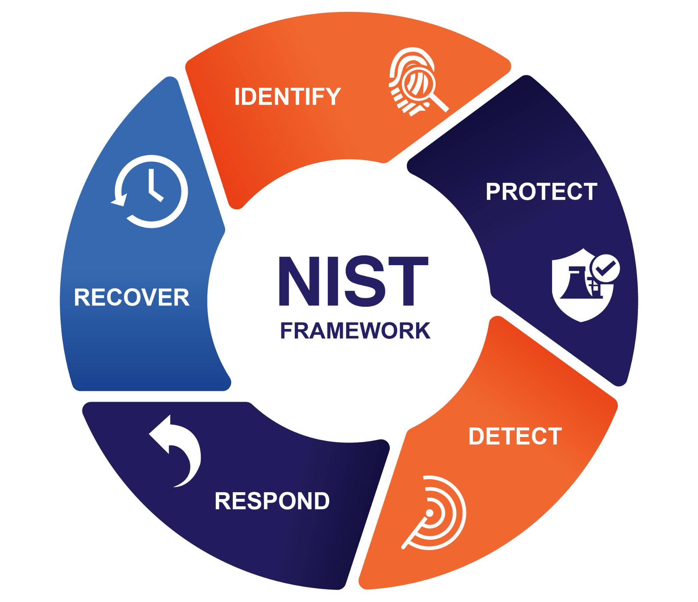
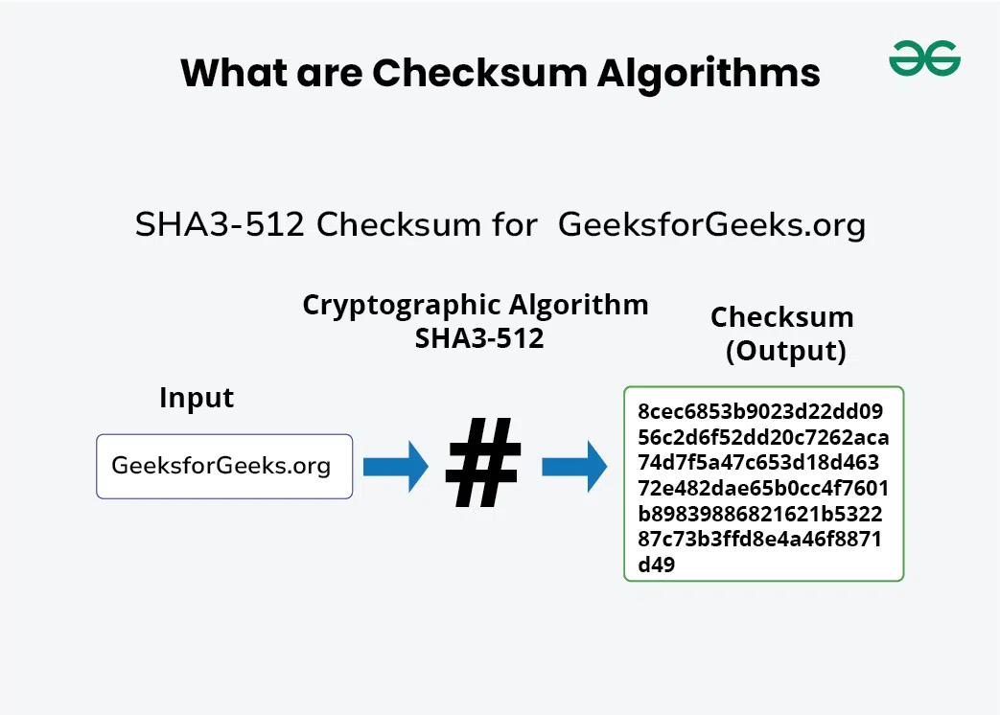
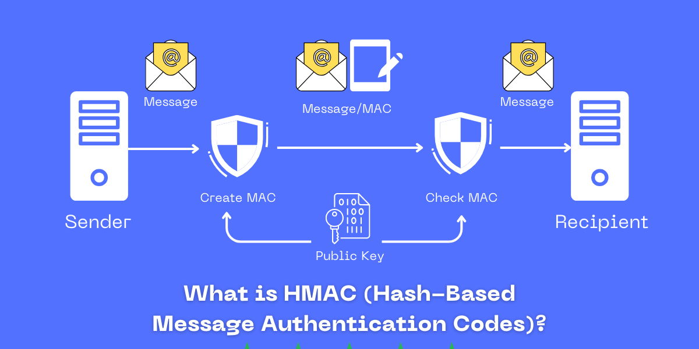
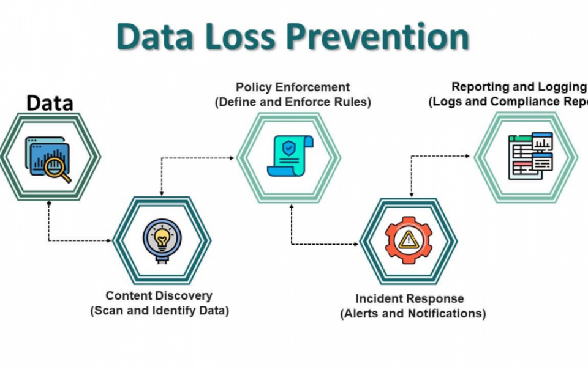

| **Inicio**         | **atrás 3**                                          | **Siguiente 5**                                                                           |
| ------------------ | ---------------------------------------------------- | ----------------------------------------------------------------------------------------- |
| [🏠](../README.md) | [⏪](./6_3_Criptografia_moderna_y_Ciberseguridad.md) | [⏩](./6_5_CiberSeguridad_de_las_Comunicaciones_y_redes_informaticas_Network_Security.md) |

---

## **Índice**

| Temario                                                                                                                                                 |
| ------------------------------------------------------------------------------------------------------------------------------------------------------- |
| [433. Seguridad de los datos](#433-seguridad-de-los-datos)                                                                                              |
| [434. Cyber Security Framework (CSF)](#434-cyber-security-framework-csf)                                                                                |
| [435. Integridad de los datos](#435-integridad-de-los-datos)                                                                                            |
| [436. Funciones Hash](#436-funciones-hash)                                                                                                              |
| [437. Aplicaciones de las funciones Hash](#437-aplicaciones-de-las-funciones-hash)                                                                      |
| [438. Funciones Hash modernas](#438-funciones-hash-modernas)                                                                                            |
| [439. Funciones Hash modernas en la práctica](#439-funciones-hash-modernas-en-la-práctica)                                                              |
| [440. Funcionamiento de SHA-2](#440-funcionamiento-de-sha-2)                                                                                            |
| [441. Caso práctico: Hashing de contraseñas en BBDD](#441-caso-práctico-hashing-de-contraseñas-en-bbdd)                                                 |
| [442. Ataques a funciones Hash (Rainbow tables)](#442-ataques-a-funciones-hash-rainbow-tables)                                                          |
| [443. Checksums](#443-checksums)                                                                                                                        |
| [444. Checksums en la práctica: CyberChef](#444-checksums-en-la-práctica-cyberchef)                                                                     |
| [445. Error Correcting Codes (ECC)](#445-error-correcting-codes-ecc)                                                                                    |
| [446. Funcionamiento Hamming Codes](#446-funcionamiento-hamming-codes)                                                                                  |
| [447. Error Correcting Codes en la práctica](#447-error-correcting-codes-en-la-práctica)                                                                |
| [448. Message Authentication Code (MAC)](#448-message-authentication-code-mac)                                                                          |
| [449. CBC-MAC](#449-cbc-mac)                                                                                                                            |
| [450. ¿Cómo construirías una función MAC con una función HASH?](#450-cómo-construirías-una-función-mac-con-una-función-hash)                            |
| [451. HMAC](#451-hmac)                                                                                                                                  |
| [452. No repudio y HMACs](#452-no-repudio-y-hmacs)                                                                                                      |
| [453. Confidencialidad, integridad y autenticación (aes-256-cbc-hmac-sha256)](#453-confidencialidad-integridad-y-autenticación-aes-256-cbc-hmac-sha256) |
| [454. Modo de operación GCM](#454-modo-de-operación-gcm)                                                                                                |
| [455. Protección de los datos](#455-protección-de-los-datos)                                                                                            |
| [456. Ampliación del entorno: Instalación Windows 11](#456-ampliación-del-entorno-instalación-windows-11)                                               |
| [457. Clasificación de la información: GDPR, PCI-DSS, HIPAA](#457-clasificación-de-la-información-gdpr-pci-dss-hipaa)                                   |
| [458. ISO 27001 y 27002](#458-iso-27001-y-27002)                                                                                                        |
| [459. Data Loss Prevention (DLP)](#459-data-loss-prevention-dlp)                                                                                        |
| [460. DLP Profesional/Empresarial](#460-dlp-profesionalempresarial)                                                                                     |
| [461. Cuadrante mágico de Gartner](#461-cuadrante-mágico-de-gartner)                                                                                    |
| [462. Information Rights Management (IRM)](#462-information-rights-management-irm)                                                                      |
| [463. IRM Profesional/Empresarial](#463-irm-profesionalempresarial)                                                                                     |
| [464. Full Disk Encryption](#464-full-disk-encryption)                                                                                                  |
| [465. Full Disk Encryption con Bitlocker](#465-full-disk-encryption-con-bitlocker)                                                                      |
| [466. Full Disk Encryption en Linux (LUKS)](#466-full-disk-encryption-en-linux-luks)                                                                    |
| [467. Autopsy con full disk encryption (Bitlocker)](#467-autopsy-con-full-disk-encryption-bitlocker)                                                    |
| [468. Tokenización](#468-tokenización)                                                                                                                  |
| [469. Disponibilidad y Ciberresiliencia](#469-disponibilidad-y-ciberresiliencia)                                                                        |
| [470. Ciberresiliencia](#470-ciberresiliencia)                                                                                                          |
| [471. Backups (Copias de seguridad)](#471-backups-copias-de-seguridad)                                                                                  |
| [472. Tipos de Backup: Completo, Incremental](#472-tipos-de-backup-completo-incremental)                                                                |
| [473. Tipos de Backups: Diferencial, Incremental inverso](#473-tipos-de-backups-diferencial-incremental-inverso)                                        |
| [474. ¿Cuándo utilizarías cada tipo de backup?](#474-cuándo-utilizarías-cada-tipo-de-backup)                                                            |
| [475. Caso práctico: Backup Profesional/Empresarial](#475-caso-práctico-backup-profesionalempresarial)                                                  |
| [476. Consideraciones de seguridad al almacenar Backups](#476-consideraciones-de-seguridad-al-almacenar-backups)                                        |
| [477. Inventariado de activos: CMDB](#477-inventariado-de-activos-cmdb)                                                                                 |
| [478. Almacenamiento de claves: TPM y HSM](#478-almacenamiento-de-claves-tpm-y-hsm)                                                                     |

---

# **CiberSeguridad de los datos (Data Scurity)**

## **433. Seguridad de los datos**

### ✅ ¿Qué es la Seguridad de los Datos?

La **seguridad de los datos** es el conjunto de prácticas, herramientas y medidas que se aplican para **proteger los datos** contra accesos no autorizados, corrupción, pérdida o robo.

#### 🎯 Objetivo:

Evitar que los datos sensibles (como contraseñas, números de tarjetas, historial médico, etc.) caigan en manos equivocadas o sean alterados.

---

### 🔐 Principios clave de la Seguridad de los Datos

1. **Confidencialidad**

   Solo las personas autorizadas pueden acceder a los datos.
   _Ejemplo: Las historias clínicas solo pueden verlas los doctores._

2. **Integridad**

   Los datos deben mantenerse completos y sin alteraciones no autorizadas.
   _Ejemplo: Que no se cambie el precio de un producto en una tienda online sin permisos._

3. **Disponibilidad**

   Los datos deben estar accesibles cuando se necesiten.
   _Ejemplo: Que un usuario pueda acceder a su cuenta bancaria sin fallas._

---

### 🧰 ¿Cómo se garantiza la Seguridad de los Datos?

Se puede garantizar aplicando una **combinación de tecnologías, políticas y buenas prácticas**.

### A. Cifrado de datos (Encryptación)

Transforma la información en un formato ilegible sin una clave.

```plaintext
Original: hola123
Cifrado: 7g#JHD@82ksd
```

📌 _Se usa para proteger contraseñas, datos de tarjetas, correos electrónicos, etc._

### B. Control de acceso (Autenticación y autorización)

- **Autenticación:** ¿Quién eres? (Ej: usuario + contraseña, huella, 2FA)
- **Autorización:** ¿Qué puedes hacer? (Ej: solo los administradores pueden borrar usuarios)

### C. Copias de seguridad (Backups)

Permiten recuperar la información ante desastres, errores o ataques (como ransomware).

### D. Firewalls y antivirus

Protegen los sistemas de accesos externos no autorizados o software malicioso.

### E. Normativas legales

Como el **GDPR (Europa)** o la **Ley de Protección de Datos Personales (Perú)**, que exigen medidas mínimas para proteger los datos personales.

---

### 🛠️ ¿Cómo se implementa la Seguridad de los Datos?

Depende del entorno. Te explico con ejemplos:

---

### 🧩 Ejemplo 1: En una base de datos (MySQL o SQL Server)

#### A. Cifrado de contraseñas al guardar usuarios:

```sql
-- Guardar una contraseña cifrada con SHA2
INSERT INTO usuarios (nombre, email, contraseña)
VALUES ('Ana', 'ana@email.com', SHA2('clave123', 256));
```

> ✅ Esto evita guardar contraseñas en texto plano.

---

#### B. Control de acceso por roles:

```sql
-- Crear un rol de solo lectura
CREATE ROLE solo_lectura;
GRANT SELECT ON base_de_datos.* TO 'usuario_lectura'@'localhost';
```

> ✅ Así se evita que un usuario pueda modificar datos sin autorización.

---

### 🧩 Ejemplo 2: En un backend con Node.js

Usando bcrypt para cifrar contraseñas antes de guardarlas:

```js
const bcrypt = require("bcrypt");
const contraseña = "secreta123";

bcrypt.hash(contraseña, 10, (err, hash) => {
  console.log("Contraseña cifrada:", hash);
});
```

> ✅ Aunque alguien robe la base de datos, no podrá ver las contraseñas reales.

---

### 🧩 Ejemplo 3: En un sistema web con autenticación

- Usas **JWT** (JSON Web Tokens) para validar que el usuario está autenticado.
- Los endpoints protegidos solo pueden ser accedidos si el token es válido.

```js
// Middleware de verificación en Express.js
function autenticarToken(req, res, next) {
  const token = req.headers["authorization"];
  if (!token) return res.sendStatus(403);

  jwt.verify(token, "clave_secreta", (err, user) => {
    if (err) return res.sendStatus(403);
    req.user = user;
    next();
  });
}
```

> ✅ Asegura que solo usuarios logueados accedan a rutas privadas.

---

### 🧪 Ejemplo completo: Seguridad de datos en un sistema de usuarios

Supongamos que tienes una API para registro y login.

#### 1. Registro de usuario

```js
// Express + MongoDB + bcrypt
app.post("/registro", async (req, res) => {
  const { email, password } = req.body;
  const hash = await bcrypt.hash(password, 10);
  const nuevoUsuario = new Usuario({ email, password: hash });
  await nuevoUsuario.save();
  res.send("Usuario registrado con seguridad");
});
```

#### 2. Login de usuario

```js
app.post("/login", async (req, res) => {
  const { email, password } = req.body;
  const usuario = await Usuario.findOne({ email });

  if (!usuario) return res.status(404).send("No existe el usuario");

  const valido = await bcrypt.compare(password, usuario.password);
  if (!valido) return res.status(401).send("Contraseña incorrecta");

  const token = jwt.sign({ id: usuario._id }, "clave_secreta");
  res.json({ token });
});
```

#### 3. Ruta protegida

```js
app.get("/perfil", autenticarToken, async (req, res) => {
  const usuario = await Usuario.findById(req.user.id);
  res.json({ email: usuario.email });
});
```

> ✅ Este sistema:

- Cifra las contraseñas (Confidencialidad)
- Usa autenticación por token (Control de acceso)
- Protege las rutas (Disponibilidad y control)
- Solo da acceso a quien esté autenticado (Autorización)

---

### ✅ Conclusión

La **Seguridad de los Datos** es vital en cualquier sistema o aplicación. Su implementación se basa en:

- **Cifrar información sensible**
- **Restringir accesos**
- **Guardar respaldos**
- **Seguir buenas prácticas de desarrollo seguro**
- **Cumplir con normativas legales**

---

[🔼](#índice)

---

## **434. Cyber Security Framework (CSF)**



### 🔐 ¿Qué es el Cybersecurity Framework (CSF)?

El **Cybersecurity Framework** (CSF) es una guía creada por el **NIST** (National Institute of Standards and Technology) de EE.UU., que ayuda a **organizaciones de cualquier tamaño** a **gestionar y reducir riesgos de ciberseguridad**.

---

### 🎯 ¿Para qué sirve?

- Ayuda a **identificar vulnerabilidades**.
- Establece un **lenguaje común** entre equipos técnicos y de gestión.
- Define pasos para **proteger, detectar y responder** ante ciberataques.
- Es flexible: se adapta a cualquier organización, sector o país.

---

### 🧱 Componentes del Cybersecurity Framework

El CSF se basa en 3 partes principales:

---

#### 1. **Funciones centrales (Core Functions)**

Son 5 funciones que definen el ciclo completo de la ciberseguridad:

| Función      | ¿Qué hace?                         | Ejemplo sencillo                             |
| ------------ | ---------------------------------- | -------------------------------------------- |
| **IDENTIFY** | Entender qué activos y riesgos hay | Saber qué equipos tienes y qué datos manejas |
| **PROTECT**  | Implementar defensas               | Usar antivirus, firewalls, cifrado, backups  |
| **DETECT**   | Encontrar incidentes rápidamente   | Sistemas que detectan accesos no autorizados |
| **RESPOND**  | Actuar ante incidentes             | Tener un plan cuando hay un ataque           |
| **RECOVER**  | Volver a la normalidad             | Restaurar backups, analizar lo que ocurrió   |

---

#### 2. **Categorías y Subcategorías**

Cada función tiene **categorías** (como "gestión de activos") y subcategorías (como "tener inventario de hardware y software").

Ejemplo:

- IDENTIFY → Asset Management (ID.AM)

  - ID.AM-1: Los activos físicos están inventariados
  - ID.AM-2: Los activos de software están identificados

---

#### 3. **Tiers de implementación (Niveles de madurez)**

Define cuán avanzado está tu programa de ciberseguridad:

| Nivel | Nombre        | ¿Qué tan preparado estás?              |
| ----- | ------------- | -------------------------------------- |
| 1     | Partial       | Reacción improvisada                   |
| 2     | Risk Informed | Algunas políticas pero no sistemáticas |
| 3     | Repeatable    | Políticas documentadas y repetibles    |
| 4     | Adaptive      | Monitoreo y mejoras continuas          |

---

### 💻 ¿Cómo se _instala_ o implementa el CSF?

No se "instala" como un programa, sino que se **implementa como una política y proceso continuo** en una organización.

---

### 🧭 Pasos para aplicar el CSF en una empresa o proyecto:

#### 1. **Entender el entorno**

- ¿Qué activos tengo?
- ¿Qué servicios manejo?
- ¿Qué tipo de datos manejo (personales, financieros, etc.)?

#### 2. **Evaluar el estado actual**

- ¿Qué tengo protegido?
- ¿Qué medidas de detección existen?
- ¿Hay backups? ¿Hay políticas?

#### 3. **Establecer el estado deseado**

- Quiero tener detección temprana de amenazas.
- Quiero políticas claras de acceso.
- Quiero que todos mis usuarios tengan autenticación de 2 pasos.

#### 4. **Crear un plan de acción**

- Implementar firewalls.
- Hacer inventario de activos.
- Capacitar al personal.
- Configurar copias de seguridad automáticas.

#### 5. **Medir y mejorar continuamente**

- Revisar alertas.
- Evaluar incidentes.
- Actualizar políticas.

---

### ✅ Ejemplo completo: Aplicación del CSF en una pequeña empresa de e-commerce

Supongamos que tienes una tienda online que vende productos tecnológicos.

#### 🚀 Objetivo:

Implementar el Cybersecurity Framework para proteger la web, base de datos y a los clientes.

---

### 🔎 1. IDENTIFY (Identificar)

**Acciones:**

- Crear un inventario de servidores, laptops y celulares usados por empleados.
- Identificar los datos sensibles: contraseñas, correos, tarjetas.
- Evaluar riesgos: ¿qué pasaría si un atacante borra la base de datos?

---

### 🔐 2. PROTECT (Proteger)

**Acciones:**

- Activar el cifrado de contraseñas con bcrypt en Node.js.
- Instalar un firewall en el servidor.
- Usar HTTPS en todo el sitio web.
- Habilitar 2FA en el panel de administración.
- Configurar backups automáticos diarios de la base de datos.

---

### 🧭 3. DETECT (Detectar)

**Acciones:**

- Instalar un sistema de detección de intrusos como **Fail2Ban** o **Wazuh**.
- Configurar alertas por correo si alguien intenta múltiples logins fallidos.
- Revisar logs de acceso una vez por semana.

---

### ⚠️ 4. RESPOND (Responder)

**Acciones:**

- Crear un plan de respuesta ante incidentes:

  - ¿Quién actúa si se detecta una brecha?
  - ¿Cómo se informa a los clientes?
  - ¿Qué sistemas se apagan?

- Tener contacto directo con un proveedor de hosting para cortar acceso rápidamente.

---

### ♻️ 5. RECOVER (Recuperar)

**Acciones:**

- Probar restaurar una copia de seguridad 1 vez al mes.
- Hacer un informe de qué ocurrió si hubo un incidente.
- Implementar mejoras basadas en lo aprendido.

---

### 📊 Resultado

| Función  | Estado actual                    |
| -------- | -------------------------------- |
| Identify | ✅ Inventario hecho              |
| Protect  | ✅ Cifrado, 2FA, backups         |
| Detect   | ✅ Logs y alertas                |
| Respond  | ✅ Plan de respuesta escrito     |
| Recover  | ✅ Backups probados mensualmente |

> 🎉 Esta empresa ahora tiene un sistema robusto y documentado basado en el **Cybersecurity Framework del NIST**.

---

### 🧠 Conclusión

| Pregunta           | Respuesta                                                 |
| ------------------ | --------------------------------------------------------- |
| ¿Qué es?           | Una guía estructurada para mejorar la ciberseguridad.     |
| ¿Se instala?       | No como software, se **implementa como proceso**.         |
| ¿Es flexible?      | Sí, sirve para cualquier empresa o proyecto.              |
| ¿Qué partes tiene? | 5 funciones: Identify, Protect, Detect, Respond, Recover. |
| ¿Dónde se usa?     | En gobiernos, empresas privadas, ONGs, hospitales, etc.   |

---

[🔼](#índice)

---

## **435. Integridad de los datos**

### 🧩 ¿Qué es la **Integridad de los Datos**?

La **integridad de los datos** es el principio que garantiza que la información almacenada y procesada en un sistema **es precisa, consistente y confiable a lo largo del tiempo**.

> 🎯 En pocas palabras: que los datos **no se corrompan**, **no se alteren sin permiso** y **se mantengan correctos** durante todo su ciclo de vida.

---

### 🔎 Ejemplos sencillos de pérdida de integridad:

1. Alguien cambia la nota de un alumno sin autorización.
2. Un número de DNI está mal escrito (por ejemplo, con letras).
3. Se registra una venta con fecha en el año 3025.
4. Una transacción bancaria se graba dos veces.

---

### 📋 Tipos de Integridad de los Datos

| Tipo                               | ¿Qué asegura?                                             | Ejemplo sencillo                                            |
| ---------------------------------- | --------------------------------------------------------- | ----------------------------------------------------------- |
| **Integridad de entidad**          | Que cada fila en una tabla tenga una identidad única.     | Cada usuario tiene un `id` único, no se repite.             |
| **Integridad referencial**         | Que las relaciones entre tablas sean válidas.             | Un pedido debe tener un cliente que exista.                 |
| **Integridad de dominio**          | Que los valores estén dentro de un rango o tipo aceptado. | El campo "edad" solo acepta números positivos.              |
| **Integridad lógica o de negocio** | Que se cumplan reglas específicas del negocio.            | Un producto no puede tener más ventas que stock disponible. |

---

### 🛠️ ¿Cómo se **implementa** la integridad de los datos?

#### ⚠️ No se "instala" como una app, sino que se asegura usando:

- Reglas de validación en **bases de datos**
- Restricciones en el **backend**
- Validaciones en el **frontend**
- Controles de acceso
- Verificaciones automáticas y manuales

---

### 🧱 Ejemplos prácticos por nivel:

#### 🔸 1. En una base de datos (SQL)

```sql
-- Integridad de entidad: clave primaria
CREATE TABLE usuarios (
  id INT PRIMARY KEY,
  nombre VARCHAR(100)
);

-- Integridad de dominio: restricción de edad
ALTER TABLE usuarios
ADD CONSTRAINT edad_valida CHECK (edad >= 0 AND edad <= 120);

-- Integridad referencial: pedidos deben tener un cliente válido
CREATE TABLE pedidos (
  id INT PRIMARY KEY,
  id_cliente INT,
  FOREIGN KEY (id_cliente) REFERENCES usuarios(id)
);
```

✅ Así te aseguras que:

- No haya dos usuarios con el mismo ID.
- No se ingresen edades inválidas.
- No se registre un pedido para un cliente inexistente.

---

#### 🔸 2. En un backend (Node.js + MongoDB)

```js
// Validación con Mongoose (MongoDB)
const pedidoSchema = new mongoose.Schema({
  cliente: {
    type: mongoose.Schema.Types.ObjectId,
    ref: "Usuario",
    required: true,
  },
  total: { type: Number, min: 0 },
  fecha: { type: Date, default: Date.now },
});
```

✅ Aquí se asegura que:

- Un pedido tenga un cliente real.
- El total no sea negativo.
- La fecha se establezca correctamente.

---

#### 🔸 3. En el frontend (React o HTML/JS)

```html
<input type="number" min="0" max="120" placeholder="Edad" />
```

✅ El usuario no podrá escribir una edad fuera de rango (prevención temprana).

---

### 🔄 Otras formas de asegurar integridad:

| Estrategia              | ¿Cómo ayuda?                                                |
| ----------------------- | ----------------------------------------------------------- |
| **Triggers**            | Detectan y bloquean cambios inválidos en BD.                |
| **Checksums / Hashing** | Detectan si los datos fueron alterados sin permiso.         |
| **Backups y registros** | Permiten restaurar información si se corrompe.              |
| **Control de acceso**   | Evitan que usuarios no autorizados alteren datos sensibles. |

---

### ✅ Ejemplo completo: Sistema de registro de estudiantes

#### 🧩 Supongamos que desarrollas un sistema web para una universidad.

##### 🎯 Requisitos:

- Cada estudiante debe tener un código único.
- La edad debe estar entre 15 y 100 años.
- Un curso no puede tener más de 30 alumnos.
- Un estudiante no puede matricularse dos veces al mismo curso.

---

### 🔸 1. Base de datos (SQL)

```sql
CREATE TABLE estudiantes (
  id INT PRIMARY KEY,
  nombre VARCHAR(100),
  edad INT CHECK (edad >= 15 AND edad <= 100)
);

CREATE TABLE cursos (
  id INT PRIMARY KEY,
  nombre VARCHAR(100),
  cupo_maximo INT DEFAULT 30
);

CREATE TABLE matriculas (
  id_estudiante INT,
  id_curso INT,
  PRIMARY KEY (id_estudiante, id_curso),
  FOREIGN KEY (id_estudiante) REFERENCES estudiantes(id),
  FOREIGN KEY (id_curso) REFERENCES cursos(id)
);
```

✅ Aquí:

- No se pueden duplicar estudiantes ni matrículas.
- Se evita inscribir a estudiantes con edades no válidas.

---

### 🔸 2. Backend (Node.js)

```js
// Validación lógica en backend
app.post("/matricular", async (req, res) => {
  const { idEstudiante, idCurso } = req.body;

  // Verificar si ya está matriculado
  const yaExiste = await Matricula.findOne({ idEstudiante, idCurso });
  if (yaExiste) return res.status(400).send("Ya está matriculado.");

  // Verificar el límite del curso
  const cantidad = await Matricula.countDocuments({ idCurso });
  if (cantidad >= 30) return res.status(400).send("Curso lleno.");

  await Matricula.create({ idEstudiante, idCurso });
  res.send("Matriculación exitosa");
});
```

---

### 🔸 3. Frontend (React)

```jsx
<input type="number" min={15} max={100} placeholder="Edad del estudiante" />
```

---

### 📌 Conclusión

| Pregunta               | Respuesta                                                    |
| ---------------------- | ------------------------------------------------------------ |
| ¿Qué es?               | Es mantener los datos correctos, sin alteraciones indebidas. |
| ¿Por qué importa?      | Evita errores, fraudes, corrupción o inconsistencias.        |
| ¿Cómo se implementa?   | Usando validaciones en BD, backend y frontend.               |
| ¿Se puede automatizar? | Sí, con triggers, reglas, y validadores.                     |
| ¿Qué protege?          | Veracidad y coherencia de la información.                    |

---

[🔼](#índice)

---

## **436. Funciones Hash**

### 🔐 ¿Qué es una Función Hash?

Una **función hash** es un **algoritmo matemático** que toma una entrada (como un texto, archivo o contraseña) y genera una **salida única y de longitud fija** (el "hash").

> 🎯 El objetivo principal es **representar los datos de forma segura y única**.

---

### 📦 Características de una función hash

| Característica    | Explicación                                                                     |
| ----------------- | ------------------------------------------------------------------------------- |
| 🔁 Determinística | La misma entrada siempre genera la misma salida.                                |
| 🔢 Longitud fija  | Sin importar el tamaño del dato original, el hash siempre tiene el mismo largo. |
| 🔐 Irreversible   | No se puede obtener la entrada original desde el hash.                          |
| 🧊 Única          | Dos entradas diferentes no deberían dar el mismo hash (colisión).               |
| ⚡ Rápida         | Debe calcularse rápidamente.                                                    |

---

### ✨ Ejemplo simple de función hash

Supongamos que tenemos esta contraseña:

```plaintext
"gato123"
```

Y aplicamos una función hash llamada SHA-256:

```plaintext
SHA-256("gato123") =
5e8ff9bf55ba3508199d22e984129be6... (64 caracteres hexadecimales)
```

Ahora almacenamos ese hash en la base de datos, **no la contraseña real**.

---

### 🛡️ ¿Para qué se usan las funciones hash?

| Uso común                               | Ejemplo                                                      |
| --------------------------------------- | ------------------------------------------------------------ |
| ✔️ Almacenamiento seguro de contraseñas | Cifrar contraseñas antes de guardarlas en una base de datos. |
| ✔️ Verificación de integridad           | Comprobar que un archivo no ha sido modificado.              |
| ✔️ Firmas digitales                     | Validar la autenticidad de mensajes o documentos.            |
| ✔️ Bloques de blockchain                | Identificar bloques y garantizar que no se han alterado.     |

---

### 🧰 Tipos de funciones hash comunes

| Nombre      | Longitud del hash        | Seguridad             | Uso actual                     |
| ----------- | ------------------------ | --------------------- | ------------------------------ |
| **MD5**     | 128 bits (32 caracteres) | ❌ Inseguro           | Solo para checksums            |
| **SHA-1**   | 160 bits (40 caracteres) | ❌ Inseguro           | Obsoleto                       |
| **SHA-256** | 256 bits (64 caracteres) | ✅ Seguro             | Contraseñas, blockchain        |
| **bcrypt**  | Variable + "sal"         | ✅ Muy seguro         | Contraseñas en sistemas reales |
| **Argon2**  | Variable                 | ✅ Recomendado actual | Seguridad moderna avanzada     |

---

### ⚙️ ¿Cómo se **instala** o se usa una función hash?

Depende del entorno. Aquí te explico 3 formas:

---

#### ✅ 1. En JavaScript (Node.js)

Instala el módulo `bcrypt`:

```bash
npm install bcrypt
```

Uso:

```js
const bcrypt = require("bcrypt");

const password = "gato123";

bcrypt.hash(password, 10, (err, hash) => {
  console.log("Contraseña cifrada:", hash);
});
```

Verificación:

```js
bcrypt.compare("gato123", hash, (err, result) => {
  if (result) {
    console.log("Coincide");
  } else {
    console.log("No coincide");
  }
});
```

---

#### ✅ 2. En Python

Usando la biblioteca `hashlib` para SHA-256:

```python
import hashlib

mensaje = "gato123"
hash = hashlib.sha256(mensaje.encode()).hexdigest()

print("Hash SHA-256:", hash)
```

---

#### ✅ 3. En SQL Server

Hash de una contraseña con SHA2_256:

```sql
SELECT HASHBYTES('SHA2_256', CONVERT(VARBINARY, 'gato123'));
```

---

### 🔐 ¿Qué es el "sal" (salt) en hashing?

El **"sal"** es un valor aleatorio que se agrega a la contraseña antes de aplicar el hash para evitar ataques de diccionario y rainbow tables.

> Ejemplo:

```plaintext
Contraseña: gato123
Sal: xz9#
Final: xz9#gato123 → hash → cifrado más fuerte
```

Librerías como **bcrypt** ya agregan el sal automáticamente.

---

### ✅ Ejemplo completo: Sistema de login con hash de contraseña

Vamos a construir un **pequeño sistema de registro y login en Node.js** usando bcrypt para aplicar funciones hash.

---

#### 🛠️ Paso 1: Instalar dependencias

```bash
npm init -y
npm install express bcrypt body-parser
```

---

#### 🧩 Paso 2: Código

```js
// app.js
const express = require("express");
const bcrypt = require("bcrypt");
const bodyParser = require("body-parser");

const app = express();
app.use(bodyParser.json());

const usuarios = []; // Simula base de datos

// Registro
app.post("/registro", async (req, res) => {
  const { usuario, contraseña } = req.body;
  const hash = await bcrypt.hash(contraseña, 10);
  usuarios.push({ usuario, contraseña: hash });
  res.send("Usuario registrado con contraseña segura");
});

// Login
app.post("/login", async (req, res) => {
  const { usuario, contraseña } = req.body;
  const user = usuarios.find((u) => u.usuario === usuario);
  if (!user) return res.status(404).send("Usuario no encontrado");

  const coincide = await bcrypt.compare(contraseña, user.contraseña);
  if (!coincide) return res.status(401).send("Contraseña incorrecta");

  res.send("Login exitoso");
});

app.listen(3000, () => console.log("Servidor corriendo en puerto 3000"));
```

---

#### 📦 Ejecución

1. Corre el servidor:

   ```bash
   node app.js
   ```

2. Enviar POST a `/registro`:

```json
{
  "usuario": "gussdev",
  "contraseña": "gato123"
}
```

3. Enviar POST a `/login` con los mismos datos.

---

#### 🔐 ¿Qué pasó?

- Al registrarte, la contraseña **se convirtió en un hash con bcrypt**.
- Se almacenó el hash, **no la contraseña real**.
- Al iniciar sesión, se compara la contraseña ingresada con el hash almacenado.

✅ Esto protege la seguridad incluso si la base de datos es robada.

---

### 🧠 Conclusión

| Pregunta            | Respuesta                                                                  |
| ------------------- | -------------------------------------------------------------------------- |
| ¿Qué es?            | Es una función que convierte datos en un resumen cifrado único.            |
| ¿Para qué sirve?    | Para proteger contraseñas, verificar integridad, firmar digitalmente, etc. |
| ¿Se puede revertir? | No. El hash no es reversible.                                              |
| ¿Qué tan segura es? | Depende del algoritmo (bcrypt, Argon2 = seguros).                          |
| ¿Dónde se usa?      | Login de usuarios, blockchain, antivirus, base de datos.                   |

---

[🔼](#índice)

---

## **437. Aplicaciones de las funciones Hash**

### 🧠 ¿Qué son las funciones hash? (Resumen rápido)

Una **función hash** transforma cualquier dato (texto, archivo, número, etc.) en una **cadena única y de longitud fija** llamada **hash**. Esta cadena representa el contenido de forma segura.

> Ejemplo:

```plaintext
Entrada: "Gustavo123"
Hash SHA-256: 8b7df0...c5ad (64 caracteres)
```

---

### 🎯 ¿Para qué sirven las funciones hash?

Las funciones hash tienen muchas aplicaciones en informática, seguridad y desarrollo. Vamos a ver las principales:

---

### 🔐 1. **Almacenamiento seguro de contraseñas**

#### ✅ ¿Qué problema resuelve?

Si guardas contraseñas **en texto plano**, cualquiera que robe la base de datos podrá verlas.

#### 🎯 Solución:

Hashear la contraseña y guardar **solo el hash**.

```js
// Node.js con bcrypt
const bcrypt = require("bcrypt");
const hash = await bcrypt.hash("Gato123", 10);
```

En la base de datos guardas:

```plaintext
usuario: gustavo
contraseña: $2b$10$Xkz...
```

---

### 🧾 2. **Verificación de integridad de archivos**

#### ✅ ¿Qué problema resuelve?

Cuando descargas un archivo, **puede corromperse o alterarse** por un atacante.

#### 🎯 Solución:

El autor publica un **hash oficial del archivo**. Tú comparas si el hash coincide después de descargarlo.

```bash
sha256sum archivo.zip
# → debe dar el mismo hash que el original publicado
```

> Si los hashes **no coinciden**, el archivo fue modificado.

---

### 🧑‍⚖️ 3. **Firmas digitales y certificados**

#### ✅ ¿Qué problema resuelve?

Asegurar que un mensaje o documento **fue creado por alguien específico** y **no ha sido alterado**.

#### 🎯 Solución:

Se genera un hash del mensaje, y luego se **firma ese hash** con una clave privada.

> El receptor puede verificar la firma usando la clave pública.

---

### 🔐 4. **Verificación de datos en bases de datos**

#### ✅ ¿Qué problema resuelve?

Detectar si algún dato fue **modificado sin autorización**.

#### 🎯 Solución:

Guardar el hash de los registros críticos. Si alguien cambia los datos, el nuevo hash no coincidirá.

```sql
-- Guarda hash de nombre+apellido+fecha
SELECT HASHBYTES('SHA2_256', CONCAT(nombre, apellido, fecha_nac))
```

---

### 🔗 5. **Blockchain y criptomonedas**

#### ✅ ¿Qué problema resuelve?

Asegurar que los bloques en una cadena de bloques **no puedan modificarse**.

#### 🎯 Solución:

Cada bloque tiene un hash que depende del contenido del bloque anterior.

> Si alteras un bloque, todos los hashes siguientes **cambian**, rompiendo la cadena.

---

### 📊 6. **Indexación rápida y estructuras como Hash Tables**

#### ✅ ¿Qué problema resuelve?

Buscar datos de forma lenta en estructuras lineales (como listas).

#### 🎯 Solución:

Usar una función hash para asignar una **posición directa** en memoria.

> Ejemplo: un diccionario usa hash para encontrar claves en milisegundos.

---

### ⚙️ ¿Cómo se _implementan_ las aplicaciones de funciones hash?

#### No se "instalan" como un programa, sino que se **usan con librerías o herramientas** según el entorno:

---

### 📦 En Node.js (JavaScript)

```bash
npm install bcrypt crypto
```

```js
// Bcrypt para contraseñas
const bcrypt = require("bcrypt");
const hash = await bcrypt.hash("Gato123", 10);

// SHA-256 para integridad
const crypto = require("crypto");
const hash2 = crypto.createHash("sha256").update("Hola mundo").digest("hex");
```

---

### 🐍 En Python

```python
import hashlib

mensaje = "gato123"
hash = hashlib.sha256(mensaje.encode()).hexdigest()
print("SHA-256:", hash)
```

---

### 🧾 En línea de comandos (Linux)

```bash
sha256sum archivo.txt
```

---

### 🛢️ En SQL Server

```sql
SELECT HASHBYTES('SHA2_256', CONVERT(VARBINARY, 'Gustavo123'));
```

---

### ✅ Ejemplo completo: Sistema de registro/login y verificación de integridad de archivo

Vamos a construir un mini proyecto con dos partes:

---

#### 🧩 Parte 1: Sistema de login con hash (Node.js + bcrypt)

```bash
npm init -y
npm install express bcrypt body-parser
```

```js
// app.js
const express = require("express");
const bcrypt = require("bcrypt");
const bodyParser = require("body-parser");

const app = express();
app.use(bodyParser.json());

const usuarios = [];

// Registro
app.post("/registro", async (req, res) => {
  const { usuario, contraseña } = req.body;
  const hash = await bcrypt.hash(contraseña, 10);
  usuarios.push({ usuario, contraseña: hash });
  res.send("Usuario registrado");
});

// Login
app.post("/login", async (req, res) => {
  const { usuario, contraseña } = req.body;
  const user = usuarios.find((u) => u.usuario === usuario);
  if (!user) return res.status(404).send("Usuario no encontrado");

  const valido = await bcrypt.compare(contraseña, user.contraseña);
  if (!valido) return res.status(401).send("Contraseña incorrecta");

  res.send("Login exitoso");
});

app.listen(3000, () => console.log("Servidor en puerto 3000"));
```

---

#### 🧩 Parte 2: Verificación de integridad de archivo

```js
const fs = require("fs");
const crypto = require("crypto");

const archivo = fs.readFileSync("archivo.txt");
const hash = crypto.createHash("sha256").update(archivo).digest("hex");

console.log("Hash del archivo:", hash);
```

> ✅ Puedes usar esto para verificar si el archivo `archivo.txt` ha sido alterado.

---

### 📌 Conclusión

| Aplicación     | ¿Qué permite?                   |
| -------------- | ------------------------------- |
| Contraseñas    | Guardar sin exponerlas.         |
| Archivos       | Verificar integridad.           |
| Blockchain     | Proteger la cadena de datos.    |
| Firmas         | Garantizar autenticidad.        |
| Bases de datos | Validar que no hubo alteración. |

---

[🔼](#índice)

---

## **438. Funciones Hash modernas**

### 🔐 ¿Qué son las funciones hash modernas?

Las **funciones hash modernas** son algoritmos criptográficos **más seguros y resistentes a ataques actuales** que las funciones hash tradicionales (como MD5 o SHA-1).
Estas se utilizan para proteger datos sensibles, especialmente **contraseñas** y **autenticación** en sistemas modernos.

---

### 🎯 Objetivo:

Evitar que un atacante:

- Obtenga las contraseñas reales si roba la base de datos.
- Use ataques de diccionario o fuerza bruta para encontrar las claves.

---

### 🧱 ¿Qué las hace modernas?

| Característica                            | Explicación                                                          |
| ----------------------------------------- | -------------------------------------------------------------------- |
| ✅ **Incluyen "sal" aleatorio**           | Se añade un valor único a cada entrada antes de hashearla.           |
| 🕒 **Son lentas a propósito**             | Esto dificulta los ataques automatizados por fuerza bruta.           |
| 🔁 **Permiten configurar la complejidad** | Puedes ajustar el "costo" o "número de rondas" del cálculo del hash. |
| 🔐 **Diseñadas para contraseñas**         | Están hechas específicamente para autenticación segura de usuarios.  |

---

### 🧬 ¿Cuáles son las funciones hash modernas más usadas?

| Función    | Ventajas                                                      | Uso común                  |
| ---------- | ------------------------------------------------------------- | -------------------------- |
| **bcrypt** | Amplio soporte, configurable, incluye sal                     | Login de usuarios, APIs    |
| **scrypt** | Más resistente a hardware especializado (ASICs)               | Seguridad extra alta       |
| **Argon2** | 🏆 Ganador del PHC (Password Hashing Competition), muy seguro | Recomendado en apps nuevas |

---

### ⚙️ ¿Cómo se _instalan_ o se usan?

No se instalan solas, sino que se implementan usando **librerías o módulos** disponibles para distintos lenguajes de programación.

---

#### ✅ En Node.js (JavaScript)

Instala `bcrypt`:

```bash
npm install bcrypt
```

Uso:

```js
const bcrypt = require("bcrypt");

const contraseña = "gato123";
const hash = await bcrypt.hash(contraseña, 10); // 10 es el "salt rounds"
console.log("Contraseña cifrada:", hash);
```

Verificación:

```js
const valido = await bcrypt.compare("gato123", hash);
console.log("¿Contraseña válida?", valido);
```

---

### ✅ En Python

Con `argon2-cffi`:

```bash
pip install argon2-cffi
```

Uso:

```python
from argon2 import PasswordHasher

ph = PasswordHasher()
hash = ph.hash("gato123")

print("Contraseña cifrada:", hash)
print("Verificación:", ph.verify(hash, "gato123"))  # Devuelve True
```

---

### ✅ En PHP

PHP tiene `password_hash()` con bcrypt incorporado:

```php
$hash = password_hash("gato123", PASSWORD_BCRYPT);
if (password_verify("gato123", $hash)) {
  echo "Contraseña válida";
}
```

---

### ✅ En SQL Server

SQL Server no soporta funciones modernas directamente (solo SHA2), así que debes hacerlo desde tu aplicación (backend).

---

### 💣 ¿Por qué no usar MD5 o SHA-1?

| Función antigua | ¿Por qué ya no se usa?                               |
| --------------- | ---------------------------------------------------- |
| **MD5**         | Vulnerable a colisiones. Se puede romper fácilmente. |
| **SHA-1**       | También puede romperse con ataques conocidos.        |

> ⚠️ **¡Nunca uses MD5 o SHA-1 para guardar contraseñas!**

---

### ✅ Ejemplo completo: Registro y login con bcrypt en Node.js

---

#### 🛠️ Paso 1: Instalar

```bash
npm init -y
npm install express bcrypt body-parser
```

---

#### 🧩 Paso 2: Código completo

```js
// app.js
const express = require("express");
const bcrypt = require("bcrypt");
const bodyParser = require("body-parser");

const app = express();
app.use(bodyParser.json());

const usuarios = []; // Simula una base de datos

// Registro
app.post("/registro", async (req, res) => {
  const { usuario, contraseña } = req.body;

  // Aplicar función hash moderna: bcrypt
  const hash = await bcrypt.hash(contraseña, 12); // 12 rondas de sal

  usuarios.push({ usuario, contraseña: hash });
  res.send("Usuario registrado de forma segura");
});

// Login
app.post("/login", async (req, res) => {
  const { usuario, contraseña } = req.body;

  const user = usuarios.find((u) => u.usuario === usuario);
  if (!user) return res.status(404).send("Usuario no encontrado");

  const valido = await bcrypt.compare(contraseña, user.contraseña);
  if (!valido) return res.status(401).send("Contraseña incorrecta");

  res.send("Login exitoso");
});

// Arranque
app.listen(3000, () => {
  console.log("Servidor corriendo en puerto 3000");
});
```

---

#### 🧪 ¿Cómo probarlo?

1. Ejecuta:

   ```bash
   node app.js
   ```

2. Usa Postman o curl para enviar un POST a:

- `/registro` con:

```json
{
  "usuario": "gustavo",
  "contraseña": "gato123"
}
```

- Luego un POST a `/login` con los mismos datos.

---

#### 🔍 ¿Qué está pasando?

- Al registrarte, la contraseña se **hashea con bcrypt (una función hash moderna)**.
- Se guarda el **hash** en lugar de la contraseña.
- En el login, se compara lo que ingresas con el hash guardado.

✅ Esto protege tus datos **incluso si alguien accede a la base de datos**.

---

### 📌 Conclusión

| Pregunta                    | Respuesta                                                                    |
| --------------------------- | ---------------------------------------------------------------------------- |
| ¿Qué son?                   | Algoritmos seguros para convertir datos en representaciones irreversibles.   |
| ¿Qué las hace modernas?     | Uso de sal, resistencia a ataques, configurables, lentitud intencional.      |
| ¿Para qué sirven?           | Principalmente para contraseñas, autenticación, y firmas digitales.          |
| ¿Cuáles son las más usadas? | `bcrypt`, `scrypt`, `Argon2`.                                                |
| ¿Debo usarlas?              | ✅ Sí, siempre para autenticación segura.                                    |
| ¿Cómo usarlas?              | Con librerías: `bcrypt` (Node.js), `argon2` (Python), `password_hash` (PHP). |

---

[🔼](#índice)

---

## **439. Funciones Hash modernas en la práctica**

### 🔍 ¿Qué son las funciones hash modernas **en la práctica**?

En la práctica, las funciones hash modernas se usan para **proteger información sensible**, especialmente **contraseñas**, y verificar **la integridad de los datos**. Estas funciones permiten transformar un dato (como una contraseña) en una cadena aparentemente aleatoria e irreversible.

---

### 🛡️ ¿Por qué no se usan funciones antiguas como MD5 o SHA1?

Porque son **rápidas y vulnerables**: los atacantes pueden hacer millones de intentos por segundo (ataques de fuerza bruta) o usar “diccionarios invertidos” (rainbow tables) y descubrir las contraseñas originales fácilmente.

---

### 🚀 Funciones hash modernas **más usadas en la práctica**

| Función  | Fortalezas principales                              | Uso típico               |
| -------- | --------------------------------------------------- | ------------------------ |
| `bcrypt` | Lenta, usa sal, muy adoptada                        | Almacenar contraseñas    |
| `scrypt` | Más fuerte que bcrypt contra hardware especializado | Apps de alta seguridad   |
| `Argon2` | 🥇 Ganador del Password Hashing Competition         | Recomendado por expertos |

---

### ⚙️ ¿Cómo se **instalan y usan** en la práctica?

Te muestro cómo se implementan en **Node.js (con bcrypt)** y **Python (con Argon2)**, los lenguajes más comunes en desarrollo moderno.

---

#### 🟢 1. Instalación y uso con Node.js (`bcrypt`)

##### 🧱 Instalación

```bash
npm install bcrypt
```

##### 🔐 Uso práctico: cifrar y verificar una contraseña

```js
const bcrypt = require("bcrypt");

const contraseñaOriginal = "gato123";

async function ejemploHash() {
  const hash = await bcrypt.hash(contraseñaOriginal, 12); // 12 rondas
  console.log("Hash generado:", hash);

  const esValida = await bcrypt.compare("gato123", hash);
  console.log("¿Contraseña válida?", esValida); // true
}

ejemploHash();
```

✅ Este flujo es usado **diariamente en millones de aplicaciones web**.

---

#### 🟣 2. Instalación y uso con Python (`argon2`)

##### 🧱 Instalación

```bash
pip install argon2-cffi
```

##### 🔐 Uso práctico:

```python
from argon2 import PasswordHasher

ph = PasswordHasher()

# Cifrar
hash = ph.hash("gato123")
print("Hash generado:", hash)

# Verificar
print("¿Es válida?", ph.verify(hash, "gato123"))  # True
```

---

### 🧠 ¿Qué pasa en la práctica cuando registramos usuarios?

1. **El usuario envía su contraseña.**
2. **Se aplica la función hash moderna con "sal".**
3. **Se guarda el hash en la base de datos (no la contraseña real).**
4. **En el login**, se aplica la misma función hash y se compara con el hash almacenado.

---

### 💡 ¿Qué ventajas prácticas ofrece esto?

| Ventaja                      | Explicación                                                 |
| ---------------------------- | ----------------------------------------------------------- |
| ✅ Seguridad                 | Nadie puede recuperar la contraseña original desde el hash. |
| ✅ Protección contra ataques | La sal y la lentitud dificultan ataques por fuerza bruta.   |
| ✅ Verificación segura       | Podemos saber si una contraseña es correcta sin conocerla.  |

---

### 🧪 EJEMPLO COMPLETO: Sistema de autenticación usando bcrypt (Node.js)

#### 🧰 Paso 1: Instalar dependencias

```bash
npm init -y
npm install express bcrypt body-parser
```

---

#### 📄 Paso 2: Código completo de API de registro y login

```js
// archivo: app.js
const express = require("express");
const bcrypt = require("bcrypt");
const bodyParser = require("body-parser");

const app = express();
app.use(bodyParser.json());

const usuarios = []; // Simula una base de datos

// Ruta: Registro
app.post("/registro", async (req, res) => {
  const { usuario, contraseña } = req.body;

  // Aplicar función hash moderna
  const hash = await bcrypt.hash(contraseña, 12);

  usuarios.push({ usuario, contraseña: hash });
  res.send("Usuario registrado con éxito");
});

// Ruta: Login
app.post("/login", async (req, res) => {
  const { usuario, contraseña } = req.body;
  const user = usuarios.find((u) => u.usuario === usuario);
  if (!user) return res.status(404).send("Usuario no encontrado");

  const valido = await bcrypt.compare(contraseña, user.contraseña);
  if (!valido) return res.status(401).send("Contraseña incorrecta");

  res.send("Login exitoso");
});

// Iniciar servidor
app.listen(3000, () => {
  console.log("Servidor en http://localhost:3000");
});
```

---

#### 📫 ¿Cómo probarlo?

1. Abre Postman o usa `curl`.
2. Envía POST a `http://localhost:3000/registro` con:

```json
{
  "usuario": "gustavo",
  "contraseña": "gato123"
}
```

3. Luego POST a `http://localhost:3000/login` con los mismos datos.

---

### 🔐 ¿Dónde está la función hash moderna en este ejemplo?

✅ Está aquí:

```js
const hash = await bcrypt.hash(contraseña, 12);
```

> Esto cifra la contraseña con sal + 12 rondas, lo cual la hace muy difícil de romper.

---

### 🧠 Preguntas frecuentes

**🔸 ¿Puedo ver la contraseña original desde el hash?**

No. El hash es **irreversible**.

**🔸 ¿Debo guardar la sal por separado?**

No en bcrypt, porque ya la incluye automáticamente en el hash generado.

**🔸 ¿Qué significa `12` en `bcrypt.hash`?**

Es el número de rondas. A mayor número, más lento y seguro.

**🔸 ¿Qué pasa si me roban la base de datos?**

Si usas bcrypt o Argon2 correctamente, **las contraseñas seguirán protegidas**, porque no se pueden revertir.

---

### 🧩 Conclusión

Las **funciones hash modernas en la práctica**:

✅ Se instalan mediante librerías (`bcrypt`, `argon2`, etc.)

✅ Se usan para proteger contraseñas y datos críticos

✅ Se aplican fácilmente en Node.js, Python, PHP, etc.

✅ Son esenciales para proteger a los usuarios en apps modernas

---

[🔼](#índice)

---

## **440. Funcionamiento de SHA-2**

### 🔐 ¿Qué es SHA-2?

**SHA-2** (Secure Hash Algorithm 2) es una **familia de funciones hash criptográficas** desarrollada por la NSA y publicada por el NIST en 2001. Es más segura que **SHA-1** y **MD5**, y se utiliza ampliamente en aplicaciones de seguridad como:

- Contraseñas
- Firmas digitales
- Certificados SSL
- Blockchain
- Integridad de archivos

---

### 📦 ¿Qué significa que es una _familia_ de funciones?

SHA-2 **no es una sola función**, sino un **grupo**:

| Variante   | Tamaño del hash | Uso común                          |
| ---------- | --------------- | ---------------------------------- |
| SHA-224    | 224 bits        | Seguridad moderada                 |
| SHA-256 ✅ | 256 bits        | Más usado hoy (Bitcoin, JWT, etc.) |
| SHA-384    | 384 bits        | Alta seguridad                     |
| SHA-512    | 512 bits        | Muy alta seguridad                 |

> En la práctica, **SHA-256** es el más usado. Es rápido, seguro y bien soportado.

---

### 🔄 ¿Cómo funciona SHA-2 (SHA-256)?

De forma resumida y entendible:

1. **Entrada:** Un texto, archivo o mensaje (de cualquier longitud)
2. **División:** Se divide en bloques de 512 bits
3. **Padding:** Se rellena el mensaje con ceros + la longitud original
4. **Compresión:** Se usan 64 rondas de operaciones matemáticas (bitwise, rotaciones, sumas) sobre los bloques
5. **Resultado:** Un _hash fijo_ de 256 bits (64 caracteres hexadecimales)

Ejemplo:

```txt
Texto original: hola123
SHA-256: 8c6976e5b5410415bde908bd4dee15dfb16fe528
         47bd1fc53a3d3a4a8d11a2f3
```

> ✅ Si cambias una sola letra, cambia totalmente el hash.
>
> ✅ Siempre devuelve la misma longitud (64 caracteres hexadecimales).

---

### ⚙️ ¿Cómo se instala SHA-2?

Depende del lenguaje. Aquí te muestro en los más comunes:

---

#### 🟢 Node.js (SHA-256)

SHA-2 ya viene incluido en Node.js (`crypto` module):

```bash
# No necesitas instalar nada extra
```

##### Ejemplo:

```js
const crypto = require("crypto");

const texto = "hola123";
const hash = crypto.createHash("sha256").update(texto).digest("hex");

console.log("SHA-256:", hash);
```

---

#### 🟣 Python (SHA-256)

SHA-2 ya está en la librería estándar (`hashlib`):

```bash
# No necesitas instalar nada
```

##### Ejemplo:

```python
import hashlib

texto = "hola123"
hash = hashlib.sha256(texto.encode()).hexdigest()

print("SHA-256:", hash)
```

---

#### 🟠 Linux (SHA-256)

Puedes calcularlo desde la terminal con:

```bash
echo -n "hola123" | sha256sum
```

---

#### 🔵 Windows (PowerShell)

```powershell
Get-FileHash -Algorithm SHA256 archivo.txt
```

---

### 🔐 Propiedades importantes de SHA-2

| Propiedad         | Descripción                                                            |
| ----------------- | ---------------------------------------------------------------------- |
| ✅ Unidireccional | No se puede “deshacer” el hash                                         |
| ✅ Determinístico | Siempre da el mismo resultado con la misma entrada                     |
| ✅ Sensible       | Cambiar una letra cambia completamente el resultado                    |
| ✅ Rápido         | Adecuado para integridad, pero no para contraseñas (mejor usar bcrypt) |

---

### 💡 Aplicaciones prácticas de SHA-2

| Caso                                | ¿Cómo lo usa SHA-256?                                  |
| ----------------------------------- | ------------------------------------------------------ |
| 🔐 Verificar integridad de archivos | Se calcula el hash y se compara después de la descarga |
| 🔑 Firmas digitales y certificados  | Se usa para resumir el mensaje antes de firmarlo       |
| 📦 Blockchain (Bitcoin)             | Cada bloque y transacción usa SHA-256                  |
| 🌐 JWT (JSON Web Tokens)            | Firma tokens con SHA-256 (HS256)                       |

---

### ✅ EJEMPLO COMPLETO: Verificar la integridad de un archivo usando SHA-256

Supongamos que quieres **asegurarte de que un archivo no ha sido alterado** durante una descarga.

---

#### 📝 Paso 1: Calcular el hash del archivo original

```bash
sha256sum archivo.txt
```

Supón que te devuelve:

```
e3b0c44298fc1c149afbf4c8996fb924... archivo.txt
```

---

#### 📦 Paso 2: Descargar el archivo en otro lugar y volver a calcular

```bash
sha256sum archivo_descargado.txt
```

Si el resultado **es exactamente igual**, el archivo está **íntegro y no fue modificado**.

---

#### 🧑‍💻 Mismo ejemplo en código Node.js

```js
const fs = require("fs");
const crypto = require("crypto");

function sha256Archivo(rutaArchivo) {
  const fileBuffer = fs.readFileSync(rutaArchivo);
  const hash = crypto.createHash("sha256").update(fileBuffer).digest("hex");
  console.log(`SHA-256 de ${rutaArchivo}: ${hash}`);
}

sha256Archivo("archivo.txt");
```

---

### 🛡️ Recomendaciones

- **SHA-256** no es para guardar contraseñas. Es rápido. Usa **bcrypt o Argon2** para eso.
- SHA-2 es excelente para:

  - Integridad de archivos
  - Firmas digitales
  - Tokens seguros (JWT)

- Nunca confíes en MD5 o SHA1 para seguridad.

---

### 📌 Conclusión

SHA-2 (especialmente SHA-256) es:

✅ Seguro y moderno

✅ Fácil de usar e integrar

✅ Esencial en la verificación de integridad y autenticación digital

✅ Disponible en casi todos los lenguajes

---

[🔼](#índice)

---

## **441. Caso práctico: Hashing de contraseñas en BBDD**

### 🧠 1. ¿Qué es el hashing de contraseñas y por qué se usa?

**Hashing de contraseñas** es el proceso de transformar una contraseña original (como `"gato123"`) en una **cadena irreconocible e irreversible**, llamada **hash**.

> Por ejemplo, usando `bcrypt`, `"gato123"` puede convertirse en:

```
$2b$12$2zshBlgHlHkRmK.x6pQsiOVXnA3PlW6p0Z6TTDK3CqvTbcRzKnxxG
```

#### 🔐 ¿Por qué hacer esto?

Porque **guardar contraseñas directamente en texto plano es un riesgo enorme**. Si un atacante accede a tu base de datos, podrá ver todas las contraseñas.
Con hashing:

- ✅ Nadie (ni tú) puede recuperar la contraseña original
- ✅ El sistema solo puede verificar si el usuario ingresó la misma contraseña

---

### 🧱 2. ¿Qué herramienta se usa para hashear?

Las funciones modernas de hashing para contraseñas son:

| Nombre      | Característica principal                        |
| ----------- | ----------------------------------------------- |
| `bcrypt` ✅ | Muy usado, seguro, con sal integrada            |
| `argon2`    | Más moderno y más robusto, pero menos soportado |
| `scrypt`    | Bueno contra ataques por hardware, menos usado  |

Aquí usaremos **bcrypt**, porque es seguro y fácil de usar en la práctica.

---

### ⚙️ 3. Instalación

#### Requisitos:

- Node.js
- MongoDB local o en la nube (usaremos `mongoose`)
- Un cliente como Postman para probar

#### 🛠️ Instalar dependencias

```bash
npm init -y
npm install express mongoose bcrypt body-parser
```

---

### ✅ 4. Ejemplo completo: Registro y Login con hashing en MongoDB

#### 📂 Estructura de archivos

```
hashing-app/
├── app.js
├── models/
│   └── Usuario.js
```

---

#### 📄 `models/Usuario.js`: Modelo de usuario con hash automático

```js
const mongoose = require("mongoose");
const bcrypt = require("bcrypt");

const UsuarioSchema = new mongoose.Schema({
  email: { type: String, required: true, unique: true },
  contraseña: { type: String, required: true },
});

// Middleware para hashear antes de guardar
UsuarioSchema.pre("save", async function (next) {
  if (!this.isModified("contraseña")) return next();

  const sal = await bcrypt.genSalt(12);
  this.contraseña = await bcrypt.hash(this.contraseña, sal);
  next();
});

// Método para comparar contraseñas
UsuarioSchema.methods.verificarContraseña = function (contraseñaIngresada) {
  return bcrypt.compare(contraseñaIngresada, this.contraseña);
};

module.exports = mongoose.model("Usuario", UsuarioSchema);
```

---

#### 📄 `app.js`: Rutas de registro y login

```js
const express = require("express");
const mongoose = require("mongoose");
const bodyParser = require("body-parser");
const Usuario = require("./models/Usuario");

const app = express();
app.use(bodyParser.json());

mongoose.connect("mongodb://localhost:27017/hashing", {
  useNewUrlParser: true,
  useUnifiedTopology: true,
});

// Ruta de registro
app.post("/registro", async (req, res) => {
  const { email, contraseña } = req.body;
  try {
    const nuevoUsuario = new Usuario({ email, contraseña });
    await nuevoUsuario.save();
    res.status(201).send("Usuario registrado correctamente");
  } catch (error) {
    res.status(400).send("Error al registrar: " + error.message);
  }
});

// Ruta de login
app.post("/login", async (req, res) => {
  const { email, contraseña } = req.body;
  try {
    const usuario = await Usuario.findOne({ email });
    if (!usuario) return res.status(404).send("Usuario no encontrado");

    const esCorrecta = await usuario.verificarContraseña(contraseña);
    if (!esCorrecta) return res.status(401).send("Contraseña incorrecta");

    res.send("Login exitoso");
  } catch (error) {
    res.status(500).send("Error del servidor");
  }
});

app.listen(3000, () => console.log("Servidor en http://localhost:3000"));
```

---

### 🔍 5. ¿Cómo probarlo?

#### 📮 Registro (POST a `/registro`)

```json
{
  "email": "gustavo@email.com",
  "contraseña": "gato123"
}
```

✅ En la base de datos, verás algo como:

```json
{
  "email": "gustavo@email.com",
  "contraseña": "$2b$12$qPUqKdaFSJTC5z2ipivEtuOSliMdqQ..."
}
```

#### 📮 Login (POST a `/login`)

```json
{
  "email": "gustavo@email.com",
  "contraseña": "gato123"
}
```

✅ Si la contraseña es correcta: `"Login exitoso"`

❌ Si es incorrecta: `"Contraseña incorrecta"`

---

### 📌 Conclusiones

| Concepto         | Resumen                                          |
| ---------------- | ------------------------------------------------ |
| 🔐 Hashing       | Transforma una contraseña en algo irreversible   |
| ✅ `bcrypt`      | Función moderna y segura                         |
| 📦 Base de datos | Solo guarda el hash, no la contraseña            |
| 👨‍💻 Práctica      | Verifica el hash para autenticar, no desencripta |

---

[🔼](#índice)

---

## **442. Ataques a funciones Hash (Rainbow tables)**

### 🧠 1. ¿Qué es una función Hash?

Una función hash convierte datos (como contraseñas) en una cadena _irreversible_ y _única_. Por ejemplo:

```bash
Contraseña: gato123
SHA-256: 8c6976e5b5410415bde908bd4dee15dfb16fe52847bd1fc53a3d3a4a8d11a2f3
```

> 🔐 Idealmente, no se puede obtener "gato123" solo viendo el hash. Pero…

---

### 💥 2. ¿Qué es un ataque con Rainbow Tables?

Un **ataque con Rainbow Tables** es una técnica que **usa una base de datos precalculada de hashes y sus contraseñas originales**.

#### 🗂️ ¿Cómo funciona?

1. Un atacante **genera millones de contraseñas posibles** (ej: `123456`, `admin`, `hola123`, etc.)
2. Calcula sus hashes (ej: usando SHA-1, SHA-256)
3. Guarda esos pares `contraseña → hash` en una gran **tabla**
4. Cuando roba una base de datos con hashes, **busca coincidencias en su tabla**

🔍 **Ejemplo simple** de una Rainbow Table (resumen):

| Contraseña | SHA-1 Hash                               |
| ---------- | ---------------------------------------- |
| 123456     | 7c4a8d09ca3762af61e59520943dc26494f8941b |
| password   | 5baa61e4c9b93f3f0682250b6cf8331b7ee68fd8 |
| hola123    | 8c6976e5b5410415bde908bd4dee15dfb16fe528 |

---

### 😨 ¿Por qué funciona?

Porque **funciones hash como MD5, SHA-1 o SHA-256 no son suficientes por sí solas** para proteger contraseñas si:

- ⚠️ Son rápidas (como SHA-1)
- ⚠️ No usan una “sal” (salt)
- ⚠️ Usan contraseñas comunes (como `admin123`, `123456`)

---

### 🛡️ 3. ¿Cómo defenderse?

#### ✅ Agregando una "sal" (salt)

Una **sal** es un valor aleatorio que se agrega a la contraseña **antes de hashearla**, así:

```bash
Contraseña: gato123
Salt: X7d2s9
Hash de ("gato123X7d2s9") → hash diferente y único
```

> 🔐 Así, incluso si dos usuarios tienen la misma contraseña, los hashes serán **completamente distintos**.

---

#### ✅ Usar funciones diseñadas para contraseñas

| Función     | Características                  |
| ----------- | -------------------------------- |
| `bcrypt` ✅ | Lenta, usa sal automáticamente   |
| `argon2`    | Mejor contra ataques de hardware |
| `scrypt`    | Buen equilibrio entre CPU y RAM  |

Estas funciones están diseñadas para evitar ataques por fuerza bruta y Rainbow Tables, porque son **intencionalmente lentas** y usan **salt por defecto**.

---

### ⚙️ 4. ¿Cómo se instala una herramienta para protegernos? (Usando `bcrypt` en Node.js)

```bash
npm install bcrypt
```

---

#### 🔐 Ejemplo de protección real con `bcrypt`

```js
const bcrypt = require("bcrypt");

// 1. Contraseña original
const contraseña = "gato123";

// 2. Generar hash con sal (automática)
bcrypt.hash(contraseña, 12, (err, hash) => {
  console.log("Hash seguro:", hash);

  // 3. Verificar luego la contraseña ingresada
  bcrypt.compare("gato123", hash, (err, esValido) => {
    console.log("¿Contraseña válida?", esValido); // true
  });
});
```

> 🔐 Cada vez que ejecutes este código, aunque uses la misma contraseña, se genera un hash distinto. ¡Eso es gracias al salt!

---

### 📌 5. Simulación: ¿Qué pasaría sin sal?

```js
const crypto = require("crypto");

const contraseña = "123456";
const hash1 = crypto.createHash("sha256").update(contraseña).digest("hex");
const hash2 = crypto.createHash("sha256").update(contraseña).digest("hex");

console.log(hash1 === hash2); // true ❌ ¡Muy predecible!
```

> ⚠️ Dos contraseñas iguales generan el mismo hash → vulnerable a rainbow tables

---

### ✅ 6. Simulación: ¿Qué pasa con `bcrypt`?

```js
const bcrypt = require("bcrypt");

const contraseña = "123456";

(async () => {
  const hash1 = await bcrypt.hash(contraseña, 12);
  const hash2 = await bcrypt.hash(contraseña, 12);

  console.log(hash1 === hash2); // false ✅ cada hash es diferente
})();
```

> ✅ Dos contraseñas iguales → hashes diferentes → Rainbow Table queda inútil

---

### 💻 7. Ejemplo completo: Guardar una contraseña protegida en MongoDB con bcrypt

#### 🧱 Instalación

```bash
npm install express mongoose bcrypt body-parser
```

---

#### 📄 `models/Usuario.js`

```js
const mongoose = require("mongoose");
const bcrypt = require("bcrypt");

const UsuarioSchema = new mongoose.Schema({
  email: String,
  contraseña: String,
});

UsuarioSchema.pre("save", async function (next) {
  if (!this.isModified("contraseña")) return next();
  const sal = await bcrypt.genSalt(12);
  this.contraseña = await bcrypt.hash(this.contraseña, sal);
  next();
});

UsuarioSchema.methods.verificar = function (contraseñaIngresada) {
  return bcrypt.compare(contraseñaIngresada, this.contraseña);
};

module.exports = mongoose.model("Usuario", UsuarioSchema);
```

---

#### 📄 `app.js`

```js
const express = require("express");
const mongoose = require("mongoose");
const bodyParser = require("body-parser");
const Usuario = require("./models/Usuario");

const app = express();
app.use(bodyParser.json());

mongoose.connect("mongodb://localhost:27017/rainbow", {
  useNewUrlParser: true,
  useUnifiedTopology: true,
});

// REGISTRO
app.post("/registro", async (req, res) => {
  const { email, contraseña } = req.body;
  const nuevoUsuario = new Usuario({ email, contraseña });
  await nuevoUsuario.save();
  res.send("Registrado con contraseña segura.");
});

// LOGIN
app.post("/login", async (req, res) => {
  const { email, contraseña } = req.body;
  const usuario = await Usuario.findOne({ email });
  if (!usuario) return res.send("No existe");

  const valido = await usuario.verificar(contraseña);
  res.send(valido ? "Acceso concedido" : "Contraseña incorrecta");
});

app.listen(3000, () => console.log("Servidor en http://localhost:3000"));
```

---

### 🛡️ 8. Resumen y buenas prácticas

| Riesgo                | Solución                       |
| --------------------- | ------------------------------ |
| Rainbow Tables        | ✅ Usar salt (bcrypt, argon2)  |
| Contraseñas comunes   | ✅ Obligar contraseñas fuertes |
| Hash rápido (SHA-1)   | ❌ No usarlo para contraseñas  |
| Reutilización de hash | ❌ Nunca usar el mismo hash    |

---

### 🧠 ¿Qué aprendiste hoy?

- Qué son los ataques con Rainbow Tables
- Por qué SHA-256 no es suficiente por sí solo
- Cómo `bcrypt` soluciona este problema
- Cómo aplicarlo en un sistema real

---

[🔼](#índice)

---

## **443. Checksums**



### ✅ ¿Qué es un **Checksum**?

Un **checksum** (suma de comprobación) es un valor generado a partir de un archivo, mensaje o conjunto de datos para **verificar su integridad**.

> En otras palabras: sirve para comprobar si un archivo **ha sido alterado, dañado o modificado**.

---

### 🧠 ¿Cómo funciona?

1. Aplicas un algoritmo a un archivo → genera una cadena (checksum)
2. Cuando alguien recibe el archivo, vuelve a calcular el checksum
3. Si **los checksums coinciden**, el archivo está **intacto**
4. Si **no coinciden**, el archivo está **corrupto o modificado**

---

### 🔒 Ejemplo de la vida real:

Supón que descargas un archivo llamado `antivirus.iso`. En la página del proveedor ves:

```bash
SHA256: 3a7bd3e2360f9d15e6fc7c7fdb68d2e4a96d3b7c2158b2753957a6b7f9dd4232
```

Ahora tú haces un checksum localmente:

```bash
sha256sum antivirus.iso
```

Si tu resultado es el mismo, ¡el archivo está bien!

Si **no lo es**, puede estar **corrupto o manipulado** (p. ej., un ataque).

---

### 🛠️ ¿Qué algoritmos de Checksum existen?

| Algoritmo | Característica                          |
| --------- | --------------------------------------- |
| CRC32     | Muy rápido, pero poco seguro (archivos) |
| MD5       | Popular, pero vulnerable                |
| SHA-1     | Mejor que MD5, pero obsoleto            |
| SHA-256   | Muy usado actualmente                   |

> ⚠️ Recuerda: **Checksum ≠ Seguridad criptográfica**. MD5 puede detectar errores, pero **no debe usarse para contraseñas**.

---

### 💻 ¿Cómo calcular checksums en tu computadora?

#### 📦 En Windows

Puedes usar PowerShell o instalar herramientas:

##### Con PowerShell:

```powershell
Get-FileHash .\archivo.txt -Algorithm SHA256
```

##### Con CertUtil:

```cmd
certutil -hashfile archivo.txt SHA256
```

---

#### 🐧 En Linux o WSL:

```bash
md5sum archivo.txt       # MD5
sha1sum archivo.txt      # SHA-1
sha256sum archivo.txt    # SHA-256
```

---

#### 🍏 En macOS:

```bash
shasum -a 256 archivo.txt
md5 archivo.txt
```

---

### 🧪 Ejemplo paso a paso (SHA-256 con archivo .txt)

#### 📌 Paso 1: Crea un archivo

```bash
echo "Hola Gustavo" > saludo.txt
```

#### 📌 Paso 2: Calcula su SHA-256

```bash
sha256sum saludo.txt
```

Resultado esperado (puede variar si hay espacios o saltos de línea):

```
c98c24b677effd69df0121e50253e90c0f0df196adce6d8d3d71f1005b8b9b62  saludo.txt
```

#### 📌 Paso 3: Modifica el archivo

```bash
echo "!" >> saludo.txt
```

#### 📌 Paso 4: Calcula nuevamente

```bash
sha256sum saludo.txt
```

Nuevo resultado:

```
ef2aa22b89fca35074f8d1471d6c843a5f3d38d2fd0a8e3e30043f4379ff1720  saludo.txt
```

> ❌ El hash cambió. ¡El archivo fue modificado!

---

### 🧰 ¿Dónde se usan los Checksums?

| Aplicación                    | Ejemplo práctico                      |
| ----------------------------- | ------------------------------------- |
| Descarga de software          | Verificar que el archivo es genuino   |
| Transmisión de datos          | Detectar errores en redes             |
| Backups y copias de seguridad | Asegurar que no se dañó un respaldo   |
| Archivos críticos             | Confirmar que no han sido manipulados |

---

### ⚙️ Ejemplo completo en Node.js

#### 📦 Instala las dependencias

```bash
npm init -y
npm install crypto fs
```

---

#### 📄 Código completo: `checksum.js`

```js
const fs = require("fs");
const crypto = require("crypto");

function calcularChecksum(archivo, algoritmo = "sha256") {
  const contenido = fs.readFileSync(archivo);
  const hash = crypto.createHash(algoritmo).update(contenido).digest("hex");
  return hash;
}

// Archivo de prueba
const archivo = "saludo.txt";

// Calcular checksum
const resultado = calcularChecksum(archivo, "sha256");
console.log(`SHA-256 de ${archivo}: ${resultado}`);
```

---

#### 📌 Uso

1. Crea un archivo llamado `saludo.txt` con algún texto
2. Corre el script:

```bash
node checksum.js
```

3. Modifica el archivo y vuelve a correr el script
4. Notarás que el hash cambia

---

### 🔐 Diferencia entre **Checksum** y **Hash para seguridad**

| Característica       | Checksum | Hash Criptográfico (bcrypt) |
| -------------------- | -------- | --------------------------- |
| Detecta errores      | ✅       | ✅                          |
| Evita ataques        | ❌       | ✅                          |
| Usado en contraseñas | ❌       | ✅                          |
| Usado en archivos    | ✅       | ✅                          |

---

### 📌 Resumen rápido

- **Checksum** = huella de un archivo para saber si fue alterado
- Muy útil en redes, sistemas de archivos y verificación de integridad
- No es seguro para proteger contraseñas, pero sí para detectar errores
- SHA-256 es uno de los más usados actualmente

---

[🔼](#índice)

---

## **444. Checksums en la práctica: CyberChef**

### ✅ ¿Qué es **CyberChef**?

**CyberChef** es una **herramienta web** gratuita creada por GCHQ (Reino Unido) que permite realizar operaciones comunes de ciberseguridad como:

- Codificación y decodificación (Base64, URL, etc.)
- Criptografía (hashes, cifrados)
- Análisis de datos binarios
- Conversión de formatos

> 🧠 **CyberChef se llama “el cuchillo suizo del análisis de datos”** porque puedes arrastrar y soltar funciones para procesar texto o archivos.

---

### 🔍 ¿Qué son los **Checksums** y cómo se aplican en CyberChef?

Un **checksum** es un valor numérico o hash que sirve para verificar la integridad de un archivo o mensaje. En CyberChef, puedes calcular:

- MD5
- SHA-1
- SHA-256
- SHA-512
- Entre muchos otros

Esto te permite verificar si **un archivo ha sido alterado o manipulado**, ideal para validar integridad.

---

### 💻 ¿Cómo accedo o instalo CyberChef?

#### Opción 1: Usar CyberChef online (más fácil)

👉 Sitio oficial:
[https://gchq.github.io/CyberChef/](https://gchq.github.io/CyberChef/)

No necesitas instalar nada. Solo abre el navegador.

---

#### Opción 2: Instalar CyberChef localmente

1. Asegúrate de tener **Git** y **Node.js** instalados.
2. Abre tu terminal y ejecuta:

```bash
git clone https://github.com/gchq/CyberChef.git
cd CyberChef
npm install
npm run dev
```

3. Abre en tu navegador: `http://localhost:8000`

> ✅ Útil si quieres trabajar sin internet.

---

### 🧪 Ejemplo completo en CyberChef: **Calcular SHA-256 de un texto o archivo**

---

#### 🔹 Escenario

Imagina que tienes una contraseña que se envía por red. Quieres calcular su **checksum SHA-256** para asegurarte que no fue alterada.

---

#### 📌 Paso a paso (sin instalar nada)

1. Abre: [https://gchq.github.io/CyberChef/](https://gchq.github.io/CyberChef/)

2. En el panel izquierdo, escribe el texto:

```
HolaGustavo2025!
```

3. En el panel derecho (Operations), busca y arrastra:

```
→ "SHA-256"
```

> También puedes buscar directamente escribiendo "sha" en la barra de búsqueda superior del panel de operaciones.

4. Verás el resultado al instante en la parte inferior derecha:

```
SHA256:
d8d4ddc78a177c09a1b7eb1142b0ac186b993f5f1f7c1564cc44fd55f88b5272
```

5. Ahora puedes copiar este valor como **checksum**, por ejemplo, para validar si ese valor llega intacto a una base de datos o a una API.

---

#### 📁 ¿Y si es un archivo?

1. Ve al panel de entrada (arriba a la izquierda)
2. Haz clic en el ícono 📁 y **sube el archivo**
3. Arrastra la operación `"SHA-256"` al panel de la receta
4. Obtendrás el hash del archivo en segundos

---

### 🔐 ¿Para qué se usa esto en ciberseguridad?

| Uso práctico           | Descripción                                      |
| ---------------------- | ------------------------------------------------ |
| Verificar integridad   | Comprobar que archivos no hayan sido modificados |
| Comparar archivos      | Asegurarse que dos archivos son idénticos        |
| Seguridad en descargas | Comprobar que el software descargado es original |
| Evidencia digital      | Verificar que un archivo forense no fue alterado |

---

### 🎯 Ejemplo real completo

#### Supón esto:

Tienes un archivo llamado `contrato.pdf` que el cliente firma digitalmente. Al enviarlo por correo, quieres asegurarte que **nadie lo alteró**.

1. Arrastras `contrato.pdf` a CyberChef

2. Aplicas `"SHA-256"`

3. Guardas el hash:
   `3b0a1dabc3efbd2d6e11d4b4c40a52b4bde1a1f5a6cd46e6f2431a2fa7999bc5`

4. Cuando te lo reenvían, vuelves a calcular su hash.

5. Si **el hash coincide**, el archivo está íntegro.

6. Si **no coincide**, el archivo fue modificado.

---

### 🧠 Diferencia rápida: Checksum vs Hash Criptográfico

| Característica        | Checksum simple (CRC32) | Hash (MD5, SHA-256)   |
| --------------------- | ----------------------- | --------------------- |
| Detecta corrupción    | ✅                      | ✅                    |
| Evita manipulación    | ❌                      | ✅                    |
| Uso legal/forense     | ❌                      | ✅                    |
| Resistencia a ataques | ❌                      | ✅ (SHA-256, SHA-512) |

---

### 🧰 Consejos prácticos en CyberChef

- Puedes **combinar operaciones**. Ejemplo: decodificar Base64 → aplicar SHA-256
- Puedes exportar recetas y compartirlas
- Muy útil para aprender **cómo funcionan hashes en vivo**
- Ideal para **tareas de forense digital**, análisis de malware, ciberseguridad

---

### 📌 Conclusión

- **CyberChef** es una herramienta visual para aplicar funciones hash y más.
- Es gratuita, abierta y se puede usar online o instalar localmente.
- Te permite verificar archivos, analizar datos, y aplicar hash fácilmente.
- En ciberseguridad, es esencial para comprobar integridad y autenticidad.

---

[🔼](#índice)

---

## **445. Error Correcting Codes (ECC)**

### 🔐 ¿Qué son los _Error Correcting Codes (ECC)_?

Los **ECC** son algoritmos que **detectan y corrigen errores** en los datos, especialmente cuando estos se **transmiten o almacenan**.

> 🧠 Imagina enviar un mensaje por WiFi, pero hay interferencia. Con ECC, el receptor **puede corregir los errores sin necesidad de reenviarlo**.

---

### 🧩 ¿Por qué ocurren errores?

Errores ocurren por muchas razones:

- Interferencia electromagnética
- Discos duros defectuosos
- Memoria RAM dañada
- Fallas en la red

Un **bit** puede cambiar de `1` a `0` o viceversa sin que el sistema lo note.

---

### 🛠️ Tipos comunes de ECC

| Tipo de código          | ¿Corrige errores? | ¿Detecta errores? | Fácil de entender |
| ----------------------- | ----------------- | ----------------- | ----------------- |
| **Parity (paridad)**    | ❌                | ✅                | ✅                |
| **Checksum**            | ❌                | ✅                | ✅                |
| **Hamming Code**        | ✅ (1 bit)        | ✅                | ✅✅              |
| **Reed-Solomon**        | ✅ (varios bits)  | ✅                | ❌                |
| **Golay Code**, **BCH** | ✅                | ✅                | ❌❌              |

---

### 📚 Explicación simple con ejemplo: **Código de Hamming (7,4)**

#### 🔎 ¿Qué es?

El **código de Hamming** es uno de los ECC más conocidos. Con él se puede **detectar y corregir un error de 1 bit** en un bloque de datos.

- `(7,4)` significa: 4 bits de datos + 3 bits de paridad = 7 bits en total

---

#### 🧮 Ejemplo paso a paso: codificar con Hamming (7,4)

Supón que quieres enviar los **4 bits**:

```
D = 1 0 1 1
```

Necesitamos calcular 3 bits de **paridad (P1, P2, P4)** para completar los 7 bits.

El orden final será:

```
[P1] [P2] D1 [P4] D2 D3 D4
```

→ Sustituimos:

```
 P1  P2  1   P4  0   1   1
```

Ahora calculamos los bits de paridad así:

- `P1 = bit 1 ⊕ 3 ⊕ 5 ⊕ 7 = 1 ⊕ 1 ⊕ 0 ⊕ 1 = 1`
- `P2 = bit 2 ⊕ 3 ⊕ 6 ⊕ 7 = 1 ⊕ 1 ⊕ 1 = 1`
- `P4 = bit 4 ⊕ 5 ⊕ 6 ⊕ 7 = 0 ⊕ 1 ⊕ 1 = 0`

Entonces, la secuencia final enviada es:

```
P1 P2 D1 P4 D2 D3 D4
1   1  1  0  0  1  1
```

→ **Transmitimos: `1110011`**

---

#### ❌ Supón que se corrompe el bit 5:

```
1110111 ← El bit 5 cambió de 0 a 1
```

Usamos el **algoritmo de Hamming** para detectar y corregir el error automáticamente.

📌 La suma de los bits de control muestra en qué posición está el error. Se repara **corrigiendo ese bit**.

---

### 💾 ¿Dónde se usan los ECC?

| Área                       | Ejemplo real                                     |
| -------------------------- | ------------------------------------------------ |
| Memoria RAM ECC            | Servidores que necesitan estabilidad 24/7        |
| Discos duros y SSD         | Detectan errores de escritura/lectura            |
| Comunicaciones satelitales | Corrigen errores por ruido cósmico               |
| Redes inalámbricas         | 802.11 (Wi-Fi), 4G/5G                            |
| CDs/DVDs                   | Reed-Solomon ECC corrige rayones leves           |
| Transmisión de video       | H.264 y MPEG usan FEC (Forward Error Correction) |

---

### 💻 ¿Cómo puedo practicar ECC (Hamming) en mi PC?

Puedes usar **Python**, es muy didáctico y no necesitas instalar más que lo básico.

#### ✅ Requisitos

Solo necesitas tener **Python 3** instalado.

#### 🧪 Ejemplo completo: codificación y detección de error (Hamming 7,4)

```python
def calculate_parity(bits):
    p1 = bits[0] ^ bits[1] ^ bits[3]
    p2 = bits[0] ^ bits[2] ^ bits[3]
    p4 = bits[1] ^ bits[2] ^ bits[3]
    return [p1, p2, bits[0], p4, bits[1], bits[2], bits[3]]

def detect_and_correct(code):
    s1 = code[0] ^ code[2] ^ code[4] ^ code[6]
    s2 = code[1] ^ code[2] ^ code[5] ^ code[6]
    s4 = code[3] ^ code[4] ^ code[5] ^ code[6]
    error_position = s1 + (s2 << 1) + (s4 << 2)
    if error_position != 0:
        print(f"❌ Error en el bit: {error_position}")
        code[error_position - 1] ^= 1
        print(f"✅ Bit corregido: {code}")
    else:
        print("✅ No hay errores detectados.")
    return code

# Ejemplo
data = [1, 0, 1, 1]
encoded = calculate_parity(data)
print(f"🔐 Código enviado: {encoded}")

# Simulamos un error en la posición 5
encoded[4] ^= 1
print(f"🧨 Código con error: {encoded}")

# Detección y corrección
corrected = detect_and_correct(encoded)
```

#### 🧾 Resultado esperado

```
🔐 Código enviado: [0, 1, 1, 0, 0, 1, 1]
🧨 Código con error: [0, 1, 1, 0, 1, 1, 1]
❌ Error en el bit: 5
✅ Bit corregido: [0, 1, 1, 0, 0, 1, 1]
```

---

### 🧠 Resumen

| Concepto          | Explicación breve                           |
| ----------------- | ------------------------------------------- |
| ¿Qué es ECC?      | Detecta y corrige errores en datos          |
| ¿Para qué sirve?  | Garantiza integridad de la información      |
| ¿Ejemplo clásico? | Código de Hamming (7,4)                     |
| ¿Dónde se usa?    | RAM ECC, discos, redes, satélites           |
| ¿Cómo probarlo?   | Con CyberChef, Python o herramientas online |

---

[🔼](#índice)

---

## **446. Funcionamiento Hamming Codes**

### 🔐 ¿Qué son los Códigos de Hamming?

Los **códigos de Hamming** son una técnica de **corrección y detección de errores** desarrollada por Richard Hamming en 1950. Son usados para **detectar y corregir errores de 1 bit** en transmisiones o almacenamiento de datos.

---

### 🧩 ¿Cómo funcionan?

Los códigos de Hamming agregan **bits de paridad (control)** a los datos originales para formar una palabra de código. Estos bits permiten:

- ✅ Detectar **hasta 2 errores** (pero no corregir 2).
- ✅ Corregir **1 error de un solo bit**.

> 👀 ¡Es como si agregaras "pistas" al mensaje para que el receptor pueda saber si algo se dañó en el camino!

---

### 🧠 Ejemplo: Código de Hamming (7,4)

El código Hamming **(7,4)** trabaja con:

- **4 bits de datos** (`D1 D2 D3 D4`)
- **3 bits de paridad** (`P1 P2 P4`)
- En total: 7 bits transmitidos

---

#### 🧮 ¿Cómo se organizan los bits?

Se colocan así:

```
Posición:     1  2  3  4  5  6  7
Contenido:   P1 P2 D1 P4 D2 D3 D4
```

> Los bits de paridad están en las posiciones que son potencias de 2: 1, 2 y 4.

---

### 🛠️ Paso a paso para codificar

Supongamos que queremos enviar los siguientes **4 bits de datos**:

```
D1 = 1, D2 = 0, D3 = 1, D4 = 1
```

#### Paso 1: Ubicar los bits

```
Posición:     1  2  3  4  5  6  7
Contenido:   P1 P2  1 P4  0  1  1
```

#### Paso 2: Calcular los bits de paridad

Usamos XOR (⊕) para calcular los bits de paridad:

- `P1` verifica posiciones: 1, 3, 5, 7 → P1 = D1 ⊕ D2 ⊕ D4 = 1 ⊕ 0 ⊕ 1 = **0**
- `P2` verifica posiciones: 2, 3, 6, 7 → P2 = D1 ⊕ D3 ⊕ D4 = 1 ⊕ 1 ⊕ 1 = **1**
- `P4` verifica posiciones: 4, 5, 6, 7 → P4 = D2 ⊕ D3 ⊕ D4 = 0 ⊕ 1 ⊕ 1 = **0**

#### Resultado final a transmitir:

```
[ P1 P2 D1 P4 D2 D3 D4 ] → [ 0 1 1 0 0 1 1 ]
```

---

### ❌ ¿Y si ocurre un error?

Supón que el bit 5 (D2) se corrompe y cambia de 0 a 1:

```
Recibido: 0 1 1 0 1 1 1
```

Ahora usamos los **bits de control** para detectar el error.

---

#### 🔎 Detección de errores: cálculo de síndrome

Calculamos tres bits de síndrome:

- `S1 = P1 ⊕ D1 ⊕ D2 ⊕ D4 = 0 ⊕ 1 ⊕ 1 ⊕ 1 = 1`
- `S2 = P2 ⊕ D1 ⊕ D3 ⊕ D4 = 1 ⊕ 1 ⊕ 1 ⊕ 1 = 0`
- `S4 = P4 ⊕ D2 ⊕ D3 ⊕ D4 = 0 ⊕ 1 ⊕ 1 ⊕ 1 = 1`

Resultado del síndrome:
`S4 S2 S1 = 1 0 1 = 5 (en decimal)`

→ ¡Error en el **bit 5**!

---

### ✅ Corrección

Simplemente invertimos el bit 5 (de 1 → 0), y los datos vuelven a estar correctos.

---

### 💻 ¿Cómo se instala y usa esto en la práctica?

#### Requisitos

- Solo necesitas tener **Python 3** en tu máquina
- No necesitas instalar librerías externas

---

### 🧪 Ejemplo completo en Python

```python
def calc_parity(data):
    # data = [D1, D2, D3, D4]
    P1 = data[0] ^ data[1] ^ data[3]
    P2 = data[0] ^ data[2] ^ data[3]
    P4 = data[1] ^ data[2] ^ data[3]
    return [P1, P2, data[0], P4, data[1], data[2], data[3]]

def detect_error(code):
    S1 = code[0] ^ code[2] ^ code[4] ^ code[6]
    S2 = code[1] ^ code[2] ^ code[5] ^ code[6]
    S4 = code[3] ^ code[4] ^ code[5] ^ code[6]
    position = S4 * 4 + S2 * 2 + S1
    return position

# Paso 1: codificar
data = [1, 0, 1, 1]
code = calc_parity(data)
print(f"🔐 Código generado: {code}")

# Paso 2: simular error
code[4] ^= 1  # cambiar el bit 5
print(f"🧨 Código con error: {code}")

# Paso 3: detectar y corregir
error = detect_error(code)
if error:
    print(f"❌ Error en la posición: {error}")
    code[error - 1] ^= 1
    print(f"✅ Código corregido: {code}")
else:
    print("✅ Sin errores detectados.")
```

#### 🧾 Resultado esperado

```
🔐 Código generado: [0, 1, 1, 0, 0, 1, 1]
🧨 Código con error: [0, 1, 1, 0, 1, 1, 1]
❌ Error en la posición: 5
✅ Código corregido: [0, 1, 1, 0, 0, 1, 1]
```

---

### 🧠 Resumen general

| Tema          | Detalle                                                     |
| ------------- | ----------------------------------------------------------- |
| ¿Qué es?      | Técnica para detectar/corregir errores en bits transmitidos |
| Tipo común    | Código Hamming (7,4)                                        |
| Capacidad     | Detecta 2 errores, corrige 1                                |
| Cómo lo hace  | Calcula bits de paridad y los distribuye estratégicamente   |
| Casos reales  | Memoria ECC, discos, comunicaciones, almacenamiento         |
| Cómo probarlo | Python puro, sin necesidad de librerías externas            |

---

[🔼](#índice)

---

## **447. Error Correcting Codes en la práctica**

### 🛡️ ¿Qué son los Error Correcting Codes (ECC)?

Los **Error Correcting Codes (ECC)** son técnicas que permiten:

- 🔍 **Detectar** errores durante la transmisión o almacenamiento de datos.
- 🛠️ **Corregir** errores sin tener que reenviar la información.

> Se usan en memorias, discos duros, redes, telecomunicaciones y más.

---

### 📦 Ejemplo de la vida real

Imagina que mandas una carta con la palabra:

```
GATO
```

Pero en el camino alguien la cambia a:

```
GALO
```

Un **código de corrección de errores (ECC)** incluiría información adicional para que el receptor diga:

> “¡Hey! Este dato fue alterado. El original era ‘GATO’. Lo corregiré.”

---

### 📚 Tipos comunes de ECC

| Código                      | Usado en...                | Capacidad                       |
| --------------------------- | -------------------------- | ------------------------------- |
| **Código de Hamming**       | Memoria RAM ECC, redes     | Corrige 1 error de 1 bit        |
| **CRC (Cyclic Redundancy)** | Ethernet, discos duros     | Detecta errores, no los corrige |
| **Reed-Solomon**            | CDs, DVDs, QR codes, 4G/5G | Corrige múltiples errores       |
| **LDPC**                    | WiFi 802.11n/ac/ax, 5G     | Alta eficiencia de corrección   |

---

### 🧠 ¿Cómo funciona un ECC en general?

1. 🧮 Se agregan **bits extras** (de paridad) al mensaje original.
2. 📤 Se transmite o guarda la versión **codificada**.
3. 📥 El receptor **verifica** si hubo errores y **los corrige** usando esos bits extras.

---

### ⚙️ ¿Cómo se instala o usa ECC en la práctica?

#### ✅ En hardware (RAM ECC)

- Algunas placas madre soportan **RAM con ECC**.
- Los módulos ECC tienen **un bit extra por byte** para corregir errores.
- Instalación:

  1. Asegúrate de que tu placa base y CPU soporten ECC.
  2. Compra memorias ECC compatibles.
  3. Activa ECC desde la BIOS si es necesario.

> ECC RAM es común en servidores, no tanto en PCs domésticas.

---

#### 💻 En software (práctica con Python)

Vamos a hacer un **ejemplo práctico con código de Hamming (7,4)** para:

- Codificar un mensaje de 4 bits
- Introducir un error
- Detectar y corregirlo

---

#### 🧪 Ejemplo completo en Python: Código de Hamming

```python
def agregar_paridad(data):
    # data: lista de 4 bits [D1, D2, D3, D4]
    D1, D2, D3, D4 = data
    P1 = D1 ^ D2 ^ D4
    P2 = D1 ^ D3 ^ D4
    P4 = D2 ^ D3 ^ D4
    return [P1, P2, D1, P4, D2, D3, D4]

def detectar_y_corregir(code):
    # Calcula los síndromes
    S1 = code[0] ^ code[2] ^ code[4] ^ code[6]
    S2 = code[1] ^ code[2] ^ code[5] ^ code[6]
    S4 = code[3] ^ code[4] ^ code[5] ^ code[6]
    error_pos = S4 * 4 + S2 * 2 + S1
    if error_pos:
        print(f"❌ Error detectado en la posición {error_pos}")
        code[error_pos - 1] ^= 1  # corregir el bit
        print("✅ Error corregido.")
    else:
        print("✅ Sin errores detectados.")
    return code

# 1. Datos originales
datos = [1, 0, 1, 1]  # D1 D2 D3 D4
codigo = agregar_paridad(datos)
print(f"📦 Código ECC generado: {codigo}")

# 2. Simular error
codigo[6] ^= 1  # cambiar bit 7 (D4)
print(f"🧨 Código con error: {codigo}")

# 3. Detectar y corregir
codigo_corregido = detectar_y_corregir(codigo)
print(f"🔄 Código final corregido: {codigo_corregido}")
```

---

#### 💻 Resultado esperado

```
📦 Código ECC generado: [0, 1, 1, 0, 0, 1, 1]
🧨 Código con error: [0, 1, 1, 0, 0, 1, 0]
❌ Error detectado en la posición 7
✅ Error corregido.
🔄 Código final corregido: [0, 1, 1, 0, 0, 1, 1]
```

---

### 📈 Aplicaciones reales de ECC

| Área              | Cómo se usa ECC                                                |
| ----------------- | -------------------------------------------------------------- |
| ☁️ Servidores     | RAM ECC para corregir errores de bits                          |
| 💽 Almacenamiento | RAID con Reed-Solomon para restaurar bloques dañados           |
| 📶 Telecom        | 5G/WiFi usa LDPC y Turbo Codes para transmisión confiable      |
| 📦 QR codes       | Reed-Solomon permite que escanees códigos aunque estén dañados |

---

### ✅ Ventajas de ECC

- Alta fiabilidad en transmisión y almacenamiento.
- Evita pérdidas de información.
- Reduce necesidad de retransmisiones.

### ⚠️ Limitaciones

- No todos los ECC pueden corregir muchos errores.
- Algunos solo **detectan**, no **corrigen** (como CRC).
- Agregan **sobrecarga** (más bits transmitidos).

---

### 🧠 Resumen general

| Concepto               | Detalle                                            |
| ---------------------- | -------------------------------------------------- |
| Qué es ECC             | Técnicas para detectar/corregir errores de datos   |
| Ejemplo simple         | Código de Hamming (corrige 1 error de bit)         |
| Aplicación en hardware | RAM ECC, discos duros, redes                       |
| Aplicación en software | Python para pruebas de codificación/decodificación |
| Ventaja clave          | Mayor confiabilidad sin necesidad de retransmisión |

---

[🔼](#índice)

---

## **448. Message Authentication Code (MAC)**

### 🔐 ¿Qué es un Message Authentication Code (MAC)?

Un **MAC** es un valor especial que se **calcula a partir de un mensaje y una clave secreta**, y que sirve para:

1. ✅ **Verificar la integridad** del mensaje (que no ha sido modificado).
2. ✅ **Autenticar el origen** del mensaje (que viene de quien tiene la clave secreta).

---

#### 📦 Ejemplo fácil de la vida real

Imagina que tu amigo y tú comparten una contraseña secreta: `secreto123`.

Tu amigo te envía el siguiente mensaje:

```
Mensaje: "Pasa a las 7"
MAC: "h4cK3aD0"
```

Tú, al recibir el mensaje y el MAC, **usas la clave secreta** para recalcular el MAC del mensaje. Si coincide, sabes:

- Que el mensaje no fue modificado.
- Que fue enviado por alguien que conoce el secreto (tu amigo).

🔐 Esto **NO cifra el mensaje**, solo garantiza **autenticidad e integridad**.

---

### 📚 ¿Cómo se calcula un MAC?

Se usa una **función hash o criptográfica especial** que toma:

- 📄 Un mensaje.
- 🔑 Una clave secreta compartida.

Y genera un **código único (MAC)** que:

- Cambia completamente si el mensaje cambia.
- Solo se puede generar si conoces la clave.

---

### 🧪 Fórmula conceptual

```
MAC = F(clave, mensaje)
```

Por ejemplo, usando HMAC (una forma de MAC con SHA-256):

```
MAC = HMAC-SHA256("claveSecreta", "Hola Mundo")
```

---

### 🔧 ¿Cómo se instala un sistema con MAC?

#### ✅ En una API o backend (ejemplo real)

1. 🔒 Generas un secreto compartido (`claveSecreta`).
2. 📤 Cada mensaje que envías a un cliente o servidor incluye:

   - El mensaje.
   - El MAC calculado.

3. ✅ El receptor recalcula el MAC con la clave.
4. 🛑 Si el MAC no coincide: el mensaje fue alterado o es falso.

> 🔐 Si alguien modifica el mensaje, el MAC dejará de coincidir.

---

### 🧰 Tipos de MAC más comunes

| Método        | Detalles                                                   |
| ------------- | ---------------------------------------------------------- |
| **HMAC**      | Usa funciones hash como SHA-256. Muy usado en APIs.        |
| **CMAC**      | Basado en cifrado simétrico (AES). Más seguro en hardware. |
| **UMAC/VMAC** | Más rápidos, pero menos comunes.                           |

---

### 📦 Instalación / uso en Python

Usaremos **HMAC con SHA-256**, que es parte de la biblioteca estándar de Python (`hmac` y `hashlib`).

---

#### ✅ Ejemplo completo y fácil en Python

```python
import hmac
import hashlib

# 🔑 Clave secreta compartida
clave = b"claveSecreta123"

# 📄 Mensaje a autenticar
mensaje = b"Transferir $1000 a la cuenta 123456"

# 🧮 Crear MAC usando HMAC-SHA256
mac = hmac.new(clave, mensaje, hashlib.sha256).hexdigest()

print("🔐 Mensaje:", mensaje.decode())
print("📎 MAC generado:", mac)

# ✅ Simular verificación del MAC en el receptor
def verificar_mac(mensaje_recibido, mac_recibido, clave_secreta):
    mac_verificacion = hmac.new(clave_secreta, mensaje_recibido, hashlib.sha256).hexdigest()
    return hmac.compare_digest(mac_verificacion, mac_recibido)

# ✔️ Prueba con mensaje correcto
es_valido = verificar_mac(mensaje, mac, clave)
print("✅ ¿MAC válido?:", es_valido)

# ❌ Simular mensaje alterado
mensaje_alterado = b"Transferir $5000 a la cuenta 123456"
es_valido = verificar_mac(mensaje_alterado, mac, clave)
print("🚨 ¿MAC válido con mensaje alterado?:", es_valido)
```

---

#### 🧪 Resultado esperado

```
🔐 Mensaje: Transferir $1000 a la cuenta 123456
📎 MAC generado: 5f4c8b7df2...
✅ ¿MAC válido?: True
🚨 ¿MAC válido con mensaje alterado?: False
```

---

### 🧠 ¿Por qué usar MAC?

| Ventaja                   | Explicación                                               |
| ------------------------- | --------------------------------------------------------- |
| 🛡️ Garantiza integridad   | Detecta si el mensaje fue modificado.                     |
| 🔒 Autentica al remitente | Solo quien tiene la clave puede generar el MAC correcto.  |
| 📦 Ligero y rápido        | No cifra, solo firma. Muy eficiente.                      |
| ✅ Usado en APIs REST     | HMAC-SHA256 es común en tokens de autenticación firmados. |

---

### 📌 Diferencias entre MAC, hash y cifrado

| Técnica     | Protege integridad | Protege confidencialidad | Requiere clave |
| ----------- | ------------------ | ------------------------ | -------------- |
| **Hash**    | ✅                 | ❌                       | ❌             |
| **MAC**     | ✅                 | ❌                       | ✅             |
| **Cifrado** | ❌ (normalmente)   | ✅                       | ✅             |

---

### 🧪 ¿Dónde se usa en el mundo real?

- ✅ **Tokens JWT** (firmados con HMAC-SHA256).
- ✅ **Servicios de pago** que verifican que no se alteró una orden.
- ✅ **APIs seguras** donde el cliente y servidor comparten una clave.
- ✅ **Sistemas de mensajería** que necesitan validar la fuente.

---

### ✅ Resumen general

| Concepto                 | Detalle                                                            |
| ------------------------ | ------------------------------------------------------------------ |
| Qué es                   | Un valor que garantiza la integridad y autenticidad de un mensaje. |
| Cómo se genera           | Usando una función hash y una clave secreta compartida.            |
| Cómo se instala o aplica | En APIs, mensajes o archivos que se desean proteger.               |
| Ejemplo práctico         | Python con HMAC-SHA256.                                            |
| Usos comunes             | Verificación de integridad y autenticación de mensajes.            |

---

[🔼](#índice)

---

## **449. CBC-MAC**

### 🧠 ¿Qué es CBC-MAC?

**CBC-MAC** es un tipo de **código de autenticación de mensajes (MAC)** que se basa en el uso de un **algoritmo de cifrado de bloque** (como AES) en modo **CBC (Cipher Block Chaining)**.

Su propósito es garantizar:

- ✅ **Autenticidad**: que el mensaje fue enviado por alguien con la clave secreta.
- ✅ **Integridad**: que el mensaje **no ha sido modificado**.

> No confundir con cifrado. CBC-MAC **no cifra el mensaje**, solo genera un código que valida su autenticidad e integridad.

---

### 🧩 ¿Cómo funciona CBC-MAC?

1. Divide el mensaje en **bloques de tamaño fijo** (por ejemplo, 128 bits).
2. Cifra cada bloque en **modo CBC**, encadenando el resultado anterior con el siguiente bloque.
3. El **último bloque cifrado** es el **MAC** (el código de autenticación).

📌 **Clave secreta compartida**: Tanto quien envía como quien recibe deben conocerla para generar y verificar el MAC.

---

### 🔐 CBC-MAC ≠ Cifrado CBC

| Concepto         | Cifrado CBC                      | CBC-MAC                                  |
| ---------------- | -------------------------------- | ---------------------------------------- |
| Objetivo         | Ocultar el contenido del mensaje | Validar que el mensaje es auténtico      |
| Salida           | Texto cifrado completo           | Solo el último bloque cifrado (MAC)      |
| IV (vector init) | Se usa y es necesario            | Suele ser **cero fijo** (para seguridad) |

---

### 📦 ¿Cómo se instala CBC-MAC?

En entornos prácticos (como Python), no existe una función `cbc_mac()` directa, pero puedes implementarlo tú mismo usando:

- Una **librería de cifrado** como `pycryptodome`
- Modo de operación `AES.MODE_CBC`
- Usar **un IV de ceros**
- Tomar el **último bloque cifrado como MAC**

---

#### ✅ Instalación en Python

Instala la librería recomendada:

```bash
pip install pycryptodome
```

---

### 🧪 Ejemplo completo: CBC-MAC en Python (con AES)

Vamos a implementar CBC-MAC desde cero.

```python
from Crypto.Cipher import AES
from Crypto.Util.Padding import pad
import os

# 🔑 Clave secreta de 16 bytes (AES-128)
clave = b'clave_super_segura'

# 📄 Mensaje original (puede tener cualquier longitud)
mensaje = b'Transferencia de $5000 a cuenta 123456789'

# 📦 Rellenamos a múltiplos de 16 bytes
mensaje_padded = pad(mensaje, 16)

# IV de ceros (para CBC-MAC)
iv = b'\x00' * 16

# 🔐 Crear el objeto AES en modo CBC
cipher = AES.new(clave, AES.MODE_CBC, iv)

# 📎 Cifrar el mensaje
mensaje_cifrado = cipher.encrypt(mensaje_padded)

# ✨ El MAC es el último bloque cifrado
cbc_mac = mensaje_cifrado[-16:]

# 🔍 Mostrar resultados
print("📄 Mensaje:", mensaje.decode())
print("📎 CBC-MAC (hex):", cbc_mac.hex())
```

---

### ✅ Verificación del MAC

Para verificar el MAC en el receptor:

1. Se recibe el mensaje original y el MAC.
2. El receptor vuelve a calcular CBC-MAC con la misma clave.
3. Compara el resultado con el MAC recibido.

```python
def verificar_cbc_mac(mensaje_recibido, mac_recibido, clave_secreta):
    mensaje_padded = pad(mensaje_recibido, 16)
    iv = b'\x00' * 16
    cipher = AES.new(clave_secreta, AES.MODE_CBC, iv)
    nuevo_mac = cipher.encrypt(mensaje_padded)[-16:]
    return nuevo_mac == mac_recibido

# ✔️ Verificación
es_valido = verificar_cbc_mac(mensaje, cbc_mac, clave)
print("✅ ¿MAC válido?:", es_valido)
```

---

### 🚨 ¿Qué pasa si alguien cambia el mensaje?

Prueba esto:

```python
mensaje_falso = b'Transferencia de $9000 a cuenta 123456789'
es_valido = verificar_cbc_mac(mensaje_falso, cbc_mac, clave)
print("🚨 ¿MAC válido con mensaje falso?:", es_valido)
```

#### Resultado:

```
📄 Mensaje: Transferencia de $5000 a cuenta 123456789
📎 CBC-MAC (hex): a13fbb0...
✅ ¿MAC válido?: True
🚨 ¿MAC válido con mensaje falso?: False
```

---

### ⚠️ Limitaciones de CBC-MAC

1. ❗ **Solo seguro para mensajes de longitud fija**.

   - Si varían en longitud, es vulnerable a ataques.

2. ✅ Por eso se recomienda usar **CMAC** (una versión mejorada).
3. ❌ **No debe usarse con IV aleatorio**, siempre IV = 0.

---

### 📌 CBC-MAC vs HMAC vs CMAC

| Tipo de MAC | Basado en                 | Seguro con long. variable | Uso recomendado         |
| ----------- | ------------------------- | ------------------------- | ----------------------- |
| CBC-MAC     | Cifrado por bloques (AES) | ❌                        | Solo con mensajes fijos |
| HMAC        | Funciones hash (SHA-256)  | ✅                        | APIs, Web, JWT, etc.    |
| CMAC        | AES + estándar NIST       | ✅                        | Hardware, dispositivos  |

---

### ✅ Resumen

| Concepto         | Detalles                                                     |
| ---------------- | ------------------------------------------------------------ |
| ¿Qué es?         | Método de autenticación de mensajes basado en cifrado CBC.   |
| ¿Para qué sirve? | Verificar integridad y autenticidad del mensaje.             |
| ¿Cómo se usa?    | Cifras el mensaje con CBC y tomas el último bloque como MAC. |
| ¿Qué librería?   | `pycryptodome` en Python.                                    |
| ¿Alternativas?   | HMAC (más común), CMAC (más moderno y seguro).               |

---

[🔼](#índice)

---

## **450. ¿Cómo construirías una función MAC con una función HASH?**

### 🧠 ¿Qué es una función MAC?

Una **MAC (Código de Autenticación de Mensajes)** es un valor que se **adjunta a un mensaje** para asegurar su:

- ✅ **Autenticidad** (que viene de quien dice ser).
- ✅ **Integridad** (que no ha sido alterado).

Una función MAC toma dos entradas:

- Una **clave secreta compartida**
- Un **mensaje**

Y devuelve un código (el MAC) que se envía junto al mensaje.

---

### 🔐 ¿Qué es HMAC?

**HMAC (Hash-based Message Authentication Code)** es una forma **segura y estándar** de construir una MAC usando una función hash como SHA-256 o SHA-1.

📌 **Ventajas de HMAC:**

- Seguro incluso si el hash tiene ciertas debilidades (como SHA-1).
- Usado ampliamente en **firmas digitales, APIs, tokens, JWT, OAuth, etc.**

---

### 📦 Fórmula de HMAC (simplificada)

```
HMAC(K, m) = H( (K' ⊕ opad) ∥ H((K' ⊕ ipad) ∥ m) )
```

Donde:

- `K` = clave secreta
- `K'` = clave ajustada al tamaño del bloque del hash (ej: 64 bytes para SHA-256)
- `m` = mensaje
- `H` = función hash (ej: SHA-256)
- `opad` = 0x5c...5c (relleno externo)
- `ipad` = 0x36...36 (relleno interno)
- `∥` = concatenación
- `⊕` = XOR (exclusiva)

> Básicamente, se hace un doble hash, mezclando la clave con dos máscaras distintas.

---

### 🧪 Ejemplo paso a paso: Construir HMAC con SHA-256

Usaremos Python y la librería `hashlib`.

#### ✅ 1. Instalación (ya viene con Python)

No necesitas instalar nada extra. `hashlib` está incluido por defecto.

---

#### ✅ 2. Código paso a paso

```python
import hashlib
import binascii

# 🔑 Clave secreta
clave = b'superclavecompartida'

# 📄 Mensaje a proteger
mensaje = b'Transfiere $5000 a cuenta 123456789'

# 🧱 Tamaño del bloque para SHA-256 = 64 bytes
block_size = 64

# 🔧 Paso 1: Ajustar la clave al tamaño del bloque
if len(clave) > block_size:
    clave = hashlib.sha256(clave).digest()
if len(clave) < block_size:
    clave = clave + b'\x00' * (block_size - len(clave))

# 📌 Paso 2: Definir los paddings
ipad = bytes([0x36] * block_size)
opad = bytes([0x5c] * block_size)

# 🧩 Paso 3: Preparar los valores intermedios
clave_ipad = bytes([b1 ^ b2 for b1, b2 in zip(clave, ipad)])
clave_opad = bytes([b1 ^ b2 for b1, b2 in zip(clave, opad)])

# 🔁 Paso 4: Hacer el doble hash
hash_interno = hashlib.sha256(clave_ipad + mensaje).digest()
hmac = hashlib.sha256(clave_opad + hash_interno).digest()

# 📎 Resultado
print("📄 Mensaje:", mensaje.decode())
print("🔐 HMAC (SHA-256):", hmac.hex())
```

---

#### 🧪 Salida esperada:

```
📄 Mensaje: Transfiere $5000 a cuenta 123456789
🔐 HMAC (SHA-256): 52a7ac21cde64b7a3775088b83f4fc1cbf8b1a26c11ae441e7dc9a7aaea9f3bc
```

---

### ✅ ¿Cómo verificar el HMAC?

El receptor hace lo mismo:

1. Tiene el mensaje y el HMAC.
2. Calcula el HMAC localmente con la misma clave.
3. Compara con el HMAC recibido.

```python
# Supongamos que recibimos este mensaje y HMAC
mensaje_recibido = b'Transfiere $5000 a cuenta 123456789'
hmac_recibido = hmac  # el que calculamos antes

# Repetimos el cálculo (usando misma clave)
clave_ipad = bytes([b1 ^ b2 for b1, b2 in zip(clave, ipad)])
clave_opad = bytes([b1 ^ b2 for b1, b2 in zip(clave, opad)])
hash_interno = hashlib.sha256(clave_ipad + mensaje_recibido).digest()
hmac_verificado = hashlib.sha256(clave_opad + hash_interno).digest()

print("✅ ¿HMAC válido?:", hmac_recibido == hmac_verificado)
```

---

### 🔒 ¿Qué pasa si alguien cambia el mensaje?

Cambia una letra del mensaje y el HMAC ya **no coincidirá**, mostrando que el mensaje fue alterado.

---

### 🔁 Forma simplificada con `hmac` de Python

Python ya tiene una función lista para HMAC:

```python
import hmac
import hashlib

clave = b'superclavecompartida'
mensaje = b'Transfiere $5000 a cuenta 123456789'

# 💡 Usar HMAC directamente
h = hmac.new(clave, mensaje, hashlib.sha256)

print("🔐 HMAC (simplificado):", h.hexdigest())
```

---

### 📦 Aplicaciones de HMAC

| Uso típico                     | Ejemplo práctico                                  |
| ------------------------------ | ------------------------------------------------- |
| APIs seguras                   | Verificación de firmas (ej: Amazon, Stripe, etc.) |
| Tokens JWT                     | Firmas de tokens JWT (`HS256`)                    |
| Verificación de archivos       | Descargas de software, backup, etc.               |
| Autenticación entre servidores | HMAC + timestamps para evitar reenvíos (replay)   |

---

### ✅ Resumen

| Elemento                | Explicación sencilla                                          |
| ----------------------- | ------------------------------------------------------------- |
| ¿Qué es MAC?            | Código para verificar autenticidad e integridad de un mensaje |
| ¿Cómo se hace con hash? | Se usa una función como SHA-256 con una clave secreta         |
| ¿Qué es HMAC?           | Es una fórmula segura que aplica hash 2 veces con la clave    |
| ¿Para qué sirve?        | Evita que se altere un mensaje sin que te des cuenta          |
| ¿Librería recomendada?  | `hashlib` o `hmac` (integradas en Python)                     |

---

[🔼](#índice)

---

## **451. HMAC**



### 🧠 ¿Qué es HMAC?

**HMAC** significa **Hash-based Message Authentication Code** (Código de Autenticación de Mensajes basado en Hash).

#### ✅ ¿Para qué sirve?

HMAC **verifica que un mensaje sea auténtico y no haya sido modificado**. Se usa mucho en:

- 🔐 Autenticación de APIs
- 📦 Verificación de integridad de archivos
- 🔑 Firmas digitales
- 🔐 Tokens JWT (HS256)

---

### 🧪 ¿Cómo funciona?

HMAC combina dos cosas:

1. Un **mensaje**
2. Una **clave secreta compartida**

Luego, aplica una **función hash** como SHA-256 sobre una combinación de ambos.

📌 **Fórmula técnica:**

```
HMAC(K, m) = H((K ⊕ opad) ∥ H((K ⊕ ipad) ∥ m))
```

- `K`: clave secreta
- `m`: mensaje
- `H`: función hash (SHA-256, SHA-1, etc.)
- `ipad` y `opad`: valores predefinidos
- `⊕`: XOR (operación bit a bit)

Esta doble aplicación del hash hace que HMAC sea muy **resistente a ataques**.

---

### 📦 Instalación

En la mayoría de lenguajes de programación, HMAC ya está incluido.

#### ✅ En Python

No necesitas instalar nada. Usa `hmac` y `hashlib`.

```bash
# Python lo trae por defecto
```

#### ✅ En JavaScript (Node.js)

Instalado por defecto en Node.js.

```bash
# No necesitas instalar nada. Usa el módulo 'crypto'
```

#### ✅ En otros lenguajes

- PHP: `hash_hmac()`
- Java: `javax.crypto.Mac`

---

### 🔧 Ejemplo completo paso a paso en Python

Supongamos que quieres proteger el mensaje:

```
"Usuario Gustavo ha transferido $1000 a la cuenta 123456789"
```

#### ✅ Paso 1: Código completo

```python
import hmac
import hashlib

# Mensaje que queremos proteger
mensaje = b"Usuario Gustavo ha transferido $1000 a la cuenta 123456789"

# Clave secreta compartida
clave = b"superclave_secreta"

# Usamos SHA-256 como función hash
hmac_obj = hmac.new(clave, mensaje, hashlib.sha256)

# Obtenemos el resultado en hexadecimal
hmac_hex = hmac_obj.hexdigest()

print("🔐 HMAC (SHA-256):", hmac_hex)
```

#### 🧪 Salida esperada:

```
🔐 HMAC (SHA-256): 385f52ac2606d0c187df3f871d0fa3bc6a3c5a55355dc3b6318c5dd97f49d3e2
```

Este valor **verifica que el mensaje no ha sido alterado**. Si alguien cambia una sola letra del mensaje o usa otra clave, el HMAC cambiará totalmente.

---

### 🛡️ ¿Cómo se verifica el HMAC?

Supón que el servidor te manda:

- El mensaje
- El HMAC

Entonces tú puedes comprobar si el mensaje fue modificado:

```python
# Supón que recibes estos dos valores
mensaje_recibido = b"Usuario Gustavo ha transferido $1000 a la cuenta 123456789"
hmac_recibido = "385f52ac2606d0c187df3f871d0fa3bc6a3c5a55355dc3b6318c5dd97f49d3e2"

# Calculas el HMAC con tu clave
hmac_calculado = hmac.new(clave, mensaje_recibido, hashlib.sha256).hexdigest()

# Compara
if hmac_recibido == hmac_calculado:
    print("✅ Mensaje auténtico y sin alteraciones.")
else:
    print("🚨 Alerta: El mensaje fue modificado.")
```

---

### 🧰 Ejemplo real: proteger una API

Supongamos que tienes una API que solo debe aceptar peticiones si vienen firmadas con HMAC:

#### En el cliente:

```python
import requests
import hmac
import hashlib

mensaje = b"GET:/datos/sensibles"
clave = b"miclaveapi123"

firma = hmac.new(clave, mensaje, hashlib.sha256).hexdigest()

# Enviar a la API
headers = {
    "X-Auth-Message": mensaje.decode(),
    "X-Auth-Signature": firma
}

# Simulación de petición
print(headers)
```

#### En el servidor:

```python
# El servidor recibe los encabezados y verifica:
mensaje = b"GET:/datos/sensibles"
firma_recibida = "firma_del_cliente"

firma_correcta = hmac.new(clave, mensaje, hashlib.sha256).hexdigest()

if hmac.compare_digest(firma_correcta, firma_recibida):
    print("✅ Acceso concedido.")
else:
    print("🚫 Acceso denegado. Firma inválida.")
```

---

### 🧠 Resumen

| Elemento           | Descripción                                                       |
| ------------------ | ----------------------------------------------------------------- |
| **¿Qué es?**       | Método para verificar la autenticidad e integridad de un mensaje. |
| **¿Qué usa?**      | Clave secreta + función hash (como SHA-256).                      |
| **¿Qué hace?**     | Genera una firma que cambia si el mensaje o clave cambian.        |
| **¿Dónde se usa?** | APIs, JWT, comunicaciones seguras, verificación de archivos.      |
| **¿Instalación?**  | Ya viene integrado en lenguajes como Python, JS, PHP, Java.       |

---

[🔼](#índice)

---

## **452. No repudio y HMACs**

### ✅ ¿Qué es el **no repudio**?

El **no repudio** es una propiedad en seguridad informática que **garantiza que una persona no pueda negar haber realizado una acción**.

Por ejemplo:

- 📩 Si tú envías un correo firmado digitalmente, **no puedes negar que lo enviaste**.
- 💳 Si realizas una transferencia electrónica con tu firma o clave, **no puedes decir luego que no fuiste tú**.

#### 🎯 En otras palabras:

> El **no repudio** asegura que una acción fue realizada por una identidad específica, y esa identidad **no puede negarlo después**.

---

### 🔐 ¿Qué es un HMAC?

HMAC (**Hash-based Message Authentication Code**) es una técnica criptográfica que:

- Garantiza que un mensaje no fue **modificado** (integridad)
- Y que viene de alguien que conoce la **clave secreta** (autenticación)

👉 Usa una **función hash** (como SHA-256) y una **clave secreta compartida** para generar una firma única del mensaje.

---

### 🤔 ¿Entonces HMAC garantiza el no repudio?

#### ❌ No del todo. Aquí viene lo importante:

- HMAC **no garantiza el no repudio**, porque **ambas partes conocen la misma clave secreta**.
- Por tanto, **ambas partes podrían haber generado ese HMAC**, y ninguna puede probar que **solo la otra parte lo hizo**.

---

### 📌 Comparación con firma digital (que sí da no repudio)

| Método                         | Integridad | Autenticidad | No repudio |
| ------------------------------ | ---------- | ------------ | ---------- |
| **HMAC**                       | ✅         | ✅           | ❌         |
| **Firma digital (RSA, ECDSA)** | ✅         | ✅           | ✅         |

---

### 🧪 Ejemplo fácil de entender:

#### 🧑‍💻 Caso 1: HMAC

- Alice y Bob **comparten una clave secreta**.
- Alice envía un mensaje a Bob con un HMAC.
- Bob puede verificar que el mensaje es correcto.
- Pero Bob **no puede probarle a un juez que Alice lo mandó**, porque **él también tiene la clave secreta y pudo generarlo**.

#### 🧑‍⚖️ Caso 2: Firma digital

- Alice firma el mensaje con su **clave privada**.
- Bob verifica con la **clave pública de Alice**.
- Solo Alice tiene su clave privada, entonces **sí se garantiza el no repudio**.

---

### 🚧 ¿Dónde sí se usa HMAC y está bien?

- APIs seguras entre servidores que confían entre sí
- Tokens JWT (usando HMAC con `HS256`)
- Verificación de integridad en sistemas internos
- Donde **no se necesita no repudio legal**, solo autenticación e integridad

---

### ⚙️ Instalación de HMAC

#### ✅ En Python (ya viene incluido)

```bash
# No necesitas instalar nada
```

#### ✅ En Node.js (crypto incluido)

```bash
# Nada que instalar
```

---

### 🧪 Ejemplo completo paso a paso en Python

Vamos a ver cómo **crear y verificar un HMAC**, y después analizamos por qué **no garantiza no repudio**.

#### 👩‍💻 Paso 1: Crear HMAC

```python
import hmac
import hashlib

# Mensaje
mensaje = b"Transferencia: Gustavo envió $500 a Ana"

# Clave secreta compartida
clave = b"clave_super_secreta"

# Crear HMAC con SHA-256
firma_hmac = hmac.new(clave, mensaje, hashlib.sha256).hexdigest()

print("🧾 Firma HMAC:", firma_hmac)
```

#### 👨‍💻 Paso 2: Verificar HMAC

```python
# Supón que recibes el mensaje y la firma
mensaje_recibido = b"Transferencia: Gustavo envió $500 a Ana"
firma_recibida = firma_hmac  # Viene del paso anterior

# Verificar la firma
firma_calculada = hmac.new(clave, mensaje_recibido, hashlib.sha256).hexdigest()

if hmac.compare_digest(firma_calculada, firma_recibida):
    print("✅ Mensaje auténtico, sin alteraciones.")
else:
    print("🚨 El mensaje fue modificado o es falso.")
```

---

### 🚫 ¿Dónde está el problema de no repudio?

Imagina esto:

- Bob dice: "Alice me envió este mensaje con esta firma HMAC".
- Alice dice: "No, yo no lo envié. Tú también tienes la clave secreta, pudiste haberlo generado tú".
- Bob **no puede demostrar** que fue Alice quien lo hizo.

Por eso **HMAC no es suficiente para no repudio**.

---

### ✅ ¿Cómo lograr no repudio real?

Usa **firmas digitales** (como RSA o ECDSA):

- Solo el emisor tiene la clave privada.
- Todos pueden verificar con la clave pública.
- Garantiza integridad, autenticidad y **no repudio**.

---

### 📚 Resumen final

| Concepto                       | Explicación                                             |
| ------------------------------ | ------------------------------------------------------- |
| **No repudio**                 | Nadie puede negar que hizo una acción.                  |
| **HMAC**                       | Firma con clave secreta para autenticidad + integridad. |
| **¿HMAC da no repudio?**       | ❌ No. Porque ambas partes tienen la clave.             |
| **¿Dónde usar HMAC?**          | APIs, tokens, integridad de archivos internos.          |
| **¿Qué usar para no repudio?** | Firmas digitales (clave privada y pública).             |

---

[🔼](#índice)

---

## **453. Confidencialidad, integridad y autenticación (aes-256-cbc-hmac-sha256)**

### 🧠 ¿Qué significan estos tres conceptos?

| Concepto             | ¿Qué garantiza?                                      | Ejemplo fácil de entender                       |
| -------------------- | ---------------------------------------------------- | ----------------------------------------------- |
| **Confidencialidad** | Que nadie pueda leer el mensaje si no tiene la clave | Como guardar un mensaje en una caja con candado |
| **Integridad**       | Que el mensaje **no haya sido alterado**             | Si el contenido cambia, se detecta              |
| **Autenticación**    | Que el mensaje fue enviado por quien dice enviarlo   | Verificamos quién lo envió                      |

---

### 🔐 ¿Qué es `AES-256-CBC + HMAC-SHA256`?

Es una **combinación de dos técnicas** para lograr esos tres objetivos:

1. **AES-256-CBC** = cifrado simétrico → da **confidencialidad**
2. **HMAC-SHA256** = función de hash con clave → da **integridad y autenticación**

---

### 📦 ¿Cómo se instalan estas herramientas?

En **Python**, puedes usar la librería `cryptography`, que cubre todo lo que necesitamos.

#### ✅ Instalación en terminal:

```bash
pip install cryptography
```

---

### 🧱 Estructura del cifrado AES-256-CBC + HMAC-SHA256

1. Generas una clave de **32 bytes** para AES-256.
2. Generas un **IV (vector de inicialización)** para CBC (16 bytes).
3. Cifras el mensaje con AES-256-CBC.
4. Calculas el **HMAC-SHA256** del IV + mensaje cifrado.
5. Envías: `IV + mensaje cifrado + HMAC`

---

### ✍️ Ejemplo práctico completo

Vamos a crear un script que:

1. Cifre un mensaje
2. Calcule HMAC
3. Descifre y verifique integridad

---

#### ✅ Código completo en Python:

```python
from cryptography.hazmat.primitives import hashes, hmac, padding
from cryptography.hazmat.primitives.ciphers import Cipher, algorithms, modes
from cryptography.hazmat.backends import default_backend
import os

# Claves (simulan ser compartidas entre emisor y receptor)
clave_aes = os.urandom(32)   # 256 bits
clave_hmac = os.urandom(32) # también 256 bits

def cifrar_y_firmar(mensaje, clave_aes, clave_hmac):
    # Convertir mensaje a bytes
    datos = mensaje.encode()

    # Padding (AES requiere múltiplos de 16)
    padder = padding.PKCS7(128).padder()
    datos_padded = padder.update(datos) + padder.finalize()

    # Crear IV (vector de inicialización)
    iv = os.urandom(16)

    # Cifrar con AES-256-CBC
    cipher = Cipher(algorithms.AES(clave_aes), modes.CBC(iv), backend=default_backend())
    cifrador = cipher.encryptor()
    mensaje_cifrado = cifrador.update(datos_padded) + cifrador.finalize()

    # Generar HMAC-SHA256 del IV + mensaje cifrado
    h = hmac.HMAC(clave_hmac, hashes.SHA256(), backend=default_backend())
    h.update(iv + mensaje_cifrado)
    firma = h.finalize()

    # Devolver todo junto
    return iv + mensaje_cifrado + firma

def verificar_y_descifrar(dato_total, clave_aes, clave_hmac):
    # Separar los componentes
    iv = dato_total[:16]
    mensaje_cifrado = dato_total[16:-32]
    firma_recibida = dato_total[-32:]

    # Verificar HMAC
    h = hmac.HMAC(clave_hmac, hashes.SHA256(), backend=default_backend())
    h.update(iv + mensaje_cifrado)
    try:
        h.verify(firma_recibida)
        print("✅ Integridad y autenticación confirmadas.")
    except:
        print("🚨 HMAC inválido: mensaje alterado o falso.")
        return None

    # Descifrar mensaje
    cipher = Cipher(algorithms.AES(clave_aes), modes.CBC(iv), backend=default_backend())
    descifrador = cipher.decryptor()
    datos_padded = descifrador.update(mensaje_cifrado) + descifrador.finalize()

    # Remover padding
    unpadder = padding.PKCS7(128).unpadder()
    datos = unpadder.update(datos_padded) + unpadder.finalize()

    return datos.decode()

# -------------------------------
# 🧪 Prueba del sistema completo
mensaje_original = "Hola Gustavo, esto es confidencial 🚀"

# Cifrar y firmar
paquete = cifrar_y_firmar(mensaje_original, clave_aes, clave_hmac)

# Simula enviar el paquete...

# Verificar y descifrar
mensaje_descifrado = verificar_y_descifrar(paquete, clave_aes, clave_hmac)

print("📝 Mensaje original:", mensaje_original)
print("🔓 Mensaje descifrado:", mensaje_descifrado)
```

---

### 🧠 ¿Qué logramos con esto?

| Objetivo         | Cómo se cumple                                               |
| ---------------- | ------------------------------------------------------------ |
| Confidencialidad | Con AES-256-CBC, nadie puede leer sin la clave               |
| Integridad       | El HMAC detecta si el mensaje fue alterado                   |
| Autenticación    | El HMAC usa clave secreta → solo el emisor real puede firmar |

---

### ❗ Importante

- El emisor y receptor deben **compartir las dos claves** (AES y HMAC).
- Este sistema no da **no repudio**, porque ambas partes conocen las claves.
- Si quieres confidencialidad + autenticación **sin clave compartida**, necesitas **criptografía asimétrica** (por ejemplo, GPG o RSA).

---

### 🎯 Resumen final

| Componente      | Función                                                   |
| --------------- | --------------------------------------------------------- |
| `AES-256-CBC`   | Cifrado simétrico para **confidencialidad**               |
| `HMAC-SHA256`   | Firma del mensaje para **integridad** y **autenticación** |
| `IV`            | Impide patrones repetitivos en el cifrado                 |
| `PKCS7 Padding` | Asegura que los bloques sean del tamaño adecuado          |

---

[🔼](#índice)

---

## **454. Modo de operación GCM**

### 🧠 ¿Qué es el Modo de operación GCM?

**GCM** significa **Galois/Counter Mode**. Es un **modo de cifrado** que trabaja con algoritmos como AES.

#### 🔐 GCM combina:

- **Confidencialidad** (cifra los datos como AES-Counter Mode)
- **Integridad + autenticación** (genera un _tag_ tipo HMAC)

---

### 📌 ¿Por qué es útil?

Tradicionalmente, se usaban dos pasos:

- Primero: **cifrar** (con AES)
- Segundo: **verificar** (con HMAC)

💡 **GCM hace ambas cosas al mismo tiempo**. Es rápido, eficiente y seguro. Muy usado en:

- HTTPS (TLS 1.2/1.3)
- VPNs
- API segura
- Dispositivos móviles

---

### 🔄 ¿Cómo funciona?

1. **Se cifra el texto** con un contador (como AES-CTR)
2. Se genera un **tag de autenticación** que permite:

   - Detectar si fue modificado
   - Confirmar la identidad del remitente

---

### 🔐 ¿Qué necesitas para usar AES-GCM?

- **Clave** (por ejemplo 256 bits → 32 bytes)
- **Nonce** o IV (único por mensaje, 12 bytes es lo recomendado)
- **Mensaje** (texto plano)
- **Tag** de autenticación (16 bytes típicamente)

---

### ⚙️ Instalación de herramienta

Usaremos la librería `cryptography`, que ya incluye soporte para GCM.

#### ✅ Instalación con pip:

```bash
pip install cryptography
```

---

### 💻 Ejemplo completo en Python

Vamos a:

1. Cifrar un mensaje usando AES-256-GCM
2. Incluir autenticación
3. Verificar y descifrar el mensaje

---

#### 🧾 Código completo:

```python
from cryptography.hazmat.primitives.ciphers import Cipher, algorithms, modes
from cryptography.hazmat.backends import default_backend
import os

# 🔐 Generar claves y datos
clave = os.urandom(32)          # AES-256 → 32 bytes
nonce = os.urandom(12)          # Recomendado: 12 bytes
mensaje = b"Hola Gustavo, esto es AES-GCM 💬"

# -------------------------------
# 🛡️ Cifrado
encryptor = Cipher(
    algorithms.AES(clave),
    modes.GCM(nonce),
    backend=default_backend()
).encryptor()

mensaje_cifrado = encryptor.update(mensaje) + encryptor.finalize()
tag = encryptor.tag  # 🔒 Etiqueta de autenticación (integridad)

print("🔐 Mensaje cifrado:", mensaje_cifrado.hex())
print("🔏 Tag de autenticación:", tag.hex())

# -------------------------------
# 🔓 Descifrado
decryptor = Cipher(
    algorithms.AES(clave),
    modes.GCM(nonce, tag),
    backend=default_backend()
).decryptor()

mensaje_descifrado = decryptor.update(mensaje_cifrado) + decryptor.finalize()

print("📬 Mensaje descifrado:", mensaje_descifrado.decode())
```

---

### ✅ Resultado esperado

```text
🔐 Mensaje cifrado: <texto en hexadecimal>
🔏 Tag de autenticación: <texto en hexadecimal>
📬 Mensaje descifrado: Hola Gustavo, esto es AES-GCM 💬
```

---

### 🧠 ¿Qué conseguimos con esto?

| Seguridad        | ¿Cómo lo logra GCM?                                      |
| ---------------- | -------------------------------------------------------- |
| Confidencialidad | Cifra con AES-Counter (rápido y seguro)                  |
| Integridad       | Usa el `tag` (Galois Field) para detectar manipulaciones |
| Autenticación    | El `tag` se calcula usando la clave → asegura el origen  |

---

### 🛡️ Ventajas de AES-GCM

- 🔐 Más seguro que CBC + HMAC si se usa correctamente
- ⚡ Rápido (paralelizable)
- 🔄 Puede cifrar + autenticar datos y metadatos (AAD)
- 🧪 Detecta cambios o corrupción automáticamente

---

### ⚠️ Buenas prácticas

| Recomendación                                   | ¿Por qué?                           |
| ----------------------------------------------- | ----------------------------------- |
| Nunca reutilices el **nonce**                   | Si lo haces, puede revelar la clave |
| Usa claves aleatorias seguras                   | Nunca claves hardcodeadas           |
| Almacena o transmite también el `nonce` y `tag` | Necesarios para descifrar           |

---

[🔼](#índice)

---

## **455. Protección de los datos**

### ✅ ¿Qué es la protección de los datos?

La **protección de los datos** consiste en aplicar métodos, tecnologías y buenas prácticas para **evitar la pérdida, el robo, la alteración o el uso indebido de la información**, ya sea en tránsito, en uso o en reposo.

---

### 🎯 Objetivos principales

| Objetivo             | Significado                                                       |
| -------------------- | ----------------------------------------------------------------- |
| **Confidencialidad** | Que solo las personas autorizadas vean los datos                  |
| **Integridad**       | Que los datos no se modifiquen sin autorización o accidentalmente |
| **Disponibilidad**   | Que los datos estén accesibles cuando se necesiten                |

---

### 📦 ¿Qué tipos de datos hay que proteger?

- **Datos personales**: nombre, DNI, dirección
- **Credenciales**: contraseñas, tokens
- **Datos financieros**: tarjetas, cuentas
- **Información empresarial**: secretos, planes
- **Archivos médicos**, jurídicos, etc.

---

### 🧰 ¿Cómo se protege la información? (Técnicas)

| Técnica                               | ¿Qué hace?                                                       |
| ------------------------------------- | ---------------------------------------------------------------- |
| **Cifrado (en reposo y en tránsito)** | Convierte los datos en ilegibles sin clave                       |
| **Autenticación y autorización**      | Verifica quién accede y qué puede hacer                          |
| **Copias de seguridad (backups)**     | Permite recuperar los datos si se pierden                        |
| **Control de acceso**                 | Solo usuarios específicos pueden ver o editar cierta información |
| **Firewall y antivirus**              | Bloquean accesos o archivos peligrosos                           |
| **Tokenización / enmascaramiento**    | Sustituye partes sensibles de los datos por valores ficticios    |
| **Hashing**                           | Protege contraseñas sin necesidad de almacenarlas directamente   |

---

### 💻 Herramientas comunes

- **BitLocker** / **VeraCrypt** (cifrado de discos)
- **OpenSSL** (cifrado con claves públicas/privadas)
- **GPG** (encriptar y firmar documentos)
- **Antivirus/EDR** (detección de malware)
- **Vault** (gestión segura de secretos)

---

### ⚙️ ¿Cómo se instala una solución básica de protección?

Te mostraré cómo proteger **archivos sensibles** usando **GPG (GNU Privacy Guard)**, una herramienta gratuita y muy usada para cifrar, descifrar y firmar información.

---

### ✅ Instalación de GPG

#### En Windows:

1. Descarga Gpg4win:
   👉 [https://gpg4win.org/](https://gpg4win.org/)
2. Instálalo normalmente

#### En Linux (Debian/Ubuntu):

```bash
sudo apt update
sudo apt install gnupg
```

#### En macOS (con Homebrew):

```bash
brew install gnupg
```

---

### 🔐 Ejemplo práctico: cifrado y protección de datos personales

#### 🎯 Escenario:

Tienes un archivo llamado `datos_sensibles.txt` que contiene información personal. No quieres que nadie lo vea sin tu permiso.

#### 📄 Paso 1: Crea el archivo

```bash
echo "DNI: 12345678 - Nombre: Gustavo" > datos_sensibles.txt
```

#### 🔑 Paso 2: Genera una clave GPG (solo la primera vez)

```bash
gpg --full-generate-key
```

- Tipo: `RSA and RSA`
- Tamaño: `2048 o 4096`
- Nombre/email: lo que quieras
- Passphrase: una contraseña fuerte

#### 🔐 Paso 3: Cifrar el archivo

```bash
gpg -e -r "TuNombre o email" datos_sensibles.txt
```

Esto genera `datos_sensibles.txt.gpg` que está cifrado.

#### 🔓 Paso 4: Descifrar el archivo

```bash
gpg -d datos_sensibles.txt.gpg > datos_sensibles_descifrado.txt
```

Solo se puede descifrar si tienes la clave privada.

---

### 🎁 Resultado final

| Archivo                          | Estado                                 |
| -------------------------------- | -------------------------------------- |
| `datos_sensibles.txt`            | Original (sin protección)              |
| `datos_sensibles.txt.gpg`        | Cifrado (solo tú puedes leerlo)        |
| `datos_sensibles_descifrado.txt` | Ya descifrado, protegido durante envío |

---

### 🧠 ¿Por qué esto protege los datos?

- ✅ **Cifrado fuerte** (RSA)
- ✅ **Autenticación de identidad** (firma opcional)
- ✅ **Evita fugas en tránsito o robo de archivos**
- ✅ **Se integra fácilmente en entornos reales (email, backup, etc.)**

---

[🔼](#índice)

---

## **456. Ampliación del entorno: Instalación Windows 11**

### ✅ ¿Qué significa "ampliación del entorno"?

**Ampliación del entorno** se refiere a mejorar o actualizar tu entorno de trabajo. En este caso, se trata de instalar un sistema operativo más moderno: **Windows 11**, que ofrece:

- Mejor seguridad
- Compatibilidad con aplicaciones modernas
- Mejor rendimiento
- Nuevas interfaces (más intuitiva)

---

### 📋 Requisitos para instalar Windows 11

Antes de instalar Windows 11, verifica si tu equipo lo soporta.

#### ✔️ Requisitos mínimos:

| Requisito       | Detalle                                 |
| --------------- | --------------------------------------- |
| CPU             | 1 GHz o más, con 2 o más núcleos 64-bit |
| RAM             | 4 GB mínimo                             |
| Almacenamiento  | 64 GB mínimo                            |
| TPM             | Versión 2.0                             |
| Secure Boot     | Debe estar activado                     |
| Tarjeta gráfica | Compatible con DirectX 12               |
| Pantalla        | 720p, 9" o más                          |

---

### 🧰 Herramienta para verificar compatibilidad

#### 🔍 "PC Health Check" (Revisión de compatibilidad)

1. Descárgala desde:
   👉 [https://aka.ms/GetPCHealthCheckApp](https://aka.ms/GetPCHealthCheckApp)
2. Ejecuta la herramienta y te dirá si tu PC puede instalar Windows 11.

---

### 🔄 Opciones para instalar Windows 11

| Método                         | ¿Cuándo se usa?                               |
| ------------------------------ | --------------------------------------------- |
| Actualización desde Windows 10 | Si ya tienes Windows 10 y tu PC es compatible |
| Instalación limpia desde USB   | Si quieres empezar desde cero (formateo)      |
| Máquina virtual (VM)           | Si quieres probarlo sin afectar tu PC         |

---

### 💾 Instalación desde USB paso a paso (instalación limpia)

#### 🧱 Paso 1: Descargar el instalador

Ve a la web oficial de Microsoft:
👉 [https://www.microsoft.com/es-es/software-download/windows11](https://www.microsoft.com/es-es/software-download/windows11)

Descarga la **herramienta de creación de medios** (Media Creation Tool).

---

#### 🔧 Paso 2: Crear un USB booteable

1. Conecta un USB de al menos 8 GB
2. Ejecuta el Media Creation Tool
3. Elige "USB Flash Drive" como medio
4. Espera que se cree el USB booteable

---

#### ⚙️ Paso 3: Cambiar el orden de arranque (boot)

1. Reinicia tu computadora
2. Presiona la tecla de BIOS/UEFI (normalmente F2, F10, F12, ESC o DEL)
3. Ve a la opción de **Boot Order** y pon el USB primero
4. Guarda y reinicia

---

#### 💻 Paso 4: Instalar Windows 11

1. Elige el idioma y zona
2. Selecciona "Instalación personalizada"
3. Borra la partición si deseas una instalación limpia
4. Elige la partición donde instalar
5. Espera que copie archivos (puede tardar 15–40 minutos)
6. Configura nombre de usuario, contraseña, idioma, red, etc.

---

### ✅ Ejemplo completo (resumen paso a paso)

Imaginemos que Gustavo quiere instalar Windows 11 desde cero en una laptop.

1. **Verifica requisitos** con PC Health Check
2. Descarga **Media Creation Tool**
3. Crea un USB booteable con Windows 11
4. Cambia el orden de arranque en BIOS
5. Inicia desde el USB
6. Elige instalación limpia y formatea la unidad
7. Sigue el asistente de configuración
8. Windows 11 queda instalado

---

### 🛡️ Ventajas de tener Windows 11

- Seguridad mejorada (TPM 2.0, Secure Boot, Windows Hello)
- Entorno moderno para desarrollo o ciberseguridad
- Mejor soporte de hardware
- Interfaz fluida (Snap Layouts, Widgets)
- Soporte para **WSL2** (Linux en Windows)

---

### 🚀 ¿Y si quiero probar sin afectar mi PC?

Usa **una máquina virtual** con VirtualBox o VMware. Así puedes experimentar sin borrar nada.

#### 🧪 Bonus: Instalar Windows 11 en VirtualBox

1. Descarga la **ISO de Windows 11**
2. Instala **VirtualBox**
3. Crea una nueva VM con:

   - Tipo: Windows 11 (64-bit)
   - RAM: 4 GB mínimo
   - Disco: 64 GB

4. Inicia y carga el ISO
5. Instala igual que en una máquina real

---

[🔼](#índice)

---

## **457. Clasificación de la información: GDPR, PCI-DSS, HIPAA**

### 📘 ¿Qué es la clasificación de la información?

Es el proceso de **organizar y etiquetar los datos según su nivel de sensibilidad** o riesgo en caso de pérdida, robo o mal uso.

Esto permite aplicar **niveles de protección adecuados**.
Piensa en ello como etiquetas que te dicen cuánto debes proteger algo, como:

- 🟢 **Pública**: Cualquiera puede verla (ej. folleto)
- 🟡 **Interna/confidencial**: Solo dentro de la empresa
- 🔴 **Secreta/Sensible**: Datos críticos o personales (ej. contraseñas, DNI, historial médico)

---

### 🎯 ¿Por qué es importante?

- Cumples con **leyes y normas**
- Proteges a los usuarios
- Evitas multas
- Reduces riesgos

---

### 📚 Normas importantes de protección de datos

#### 1. **GDPR** (Europa)

> Reglamento General de Protección de Datos
>
> Aplica a cualquier empresa que maneje datos de personas en la **Unión Europea**.

**Ejemplo de datos protegidos:**

- Nombre
- Dirección
- Correo
- IP
- Datos biométricos

**Requiere:**

- Consentimiento del usuario
- Eliminar datos si lo piden
- Informar si hay fuga de datos

---

#### 2. **HIPAA** (EE.UU. – Salud)

> Ley de Portabilidad y Responsabilidad del Seguro Médico

Protege la **información médica** de los pacientes.

**Ejemplo de datos protegidos:**

- Diagnósticos
- Historiales médicos
- Resultados de laboratorio

**Requiere:**

- Control de acceso a datos
- Auditorías
- Cifrado de datos médicos

---

#### 3. **PCI-DSS** (Global – Tarjetas de crédito)

> Estándar de Seguridad de Datos de la Industria de Tarjetas de Pago

Protege la información relacionada a pagos con tarjeta.

**Ejemplo de datos protegidos:**

- Números de tarjeta (PAN)
- CVV
- Fecha de expiración

**Requiere:**

- Cifrado de datos
- No almacenar CVV
- Registro de accesos

---

### 🧰 ¿Cómo se “instalan” estas normativas?

No se instalan como programas, sino que se **implementan como políticas, controles y procedimientos** dentro de una empresa.

---

### 🛠️ Paso a paso para aplicar una clasificación según estas normas

Supongamos que tienes una empresa que:

- Vende productos online (usa tarjetas)
- Tiene usuarios de la UE
- Recoge correos, direcciones, etc.
- Usa formularios con datos médicos

#### 1. **Identifica los datos recolectados**

Ejemplo:

| Dato               | Normativa afectada |
| ------------------ | ------------------ |
| Correo, nombre     | GDPR               |
| Número de tarjeta  | PCI-DSS            |
| Diagnóstico médico | HIPAA              |

---

#### 2. **Clasifica los datos**

| Dato               | Clasificación |
| ------------------ | ------------- |
| Nombre             | Interno       |
| Contraseña         | Sensible      |
| Número de tarjeta  | Crítico       |
| Diagnóstico médico | Crítico       |
| Dirección IP       | Personal      |

---

#### 3. **Aplica controles por nivel**

| Nivel    | Qué hacer                                     |
| -------- | --------------------------------------------- |
| Pública  | Puede estar en el sitio web                   |
| Interna  | Solo accesible por empleados                  |
| Sensible | Encriptación, acceso restringido              |
| Crítico  | Cifrado, monitoreo, control estricto, alertas |

---

#### 4. **Documenta tus políticas**

Crea políticas como:

- Política de clasificación de datos
- Política de retención y eliminación
- Política de cifrado y respaldo

---

### 🧪 Ejemplo completo práctico

**Contexto:** Gustavo crea una web para agendar consultas psicológicas. Recoge:

- Nombre completo
- Email
- Fecha de nacimiento
- Descripción del problema (dato de salud)
- Pago con tarjeta

#### 📍 Clasificación de la información:

| Dato                     | Normativa | Clasificación |
| ------------------------ | --------- | ------------- |
| Nombre, email            | GDPR      | Sensible      |
| Tarjeta de crédito       | PCI-DSS   | Crítico       |
| Descripción del problema | HIPAA     | Crítico       |

---

#### 🔐 Controles implementados por Gustavo:

- Cifrado con **AES-256** para datos sensibles
- Envío por HTTPS (SSL/TLS activado)
- Formulario con consentimiento (“Acepto que mis datos sean tratados según la política de privacidad”)
- Base de datos con **HMAC para autenticación de datos**
- No almacena CVV de la tarjeta
- Logs de acceso a la base de datos

---

#### 🧾 Resultado:

✅ Cumple con GDPR, PCI-DSS y HIPAA

✅ Clasifica correctamente los datos

✅ Protege los datos con controles adecuados

✅ Evita sanciones legales y protege la confianza del usuario

---

### 📌 Conclusión

La **clasificación de la información** es clave para cumplir con normas como **GDPR**, **PCI-DSS** y **HIPAA**.
No se instala como un programa, pero se **implementa** con buenas prácticas, cifrado, control de acceso, políticas internas y herramientas de seguridad.

---

[🔼](#índice)

---

## **458. ISO 27001 y 27002**

### 🧠 ¿Qué es ISO 27001?

Es un **estándar internacional** que te **guía para crear y mantener un Sistema de Gestión de Seguridad de la Información (SGSI)**.

> Su objetivo es **proteger la confidencialidad, integridad y disponibilidad de la información** en una organización.

---

### 📚 ¿Y qué es ISO 27002?

ISO 27002 **complementa a ISO 27001**.
Contiene una **lista detallada de controles y buenas prácticas** que puedes aplicar para cumplir los requisitos de ISO 27001.

- **ISO 27001** = _¿Qué debes hacer?_
- **ISO 27002** = _¿Cómo lo puedes hacer?_

---

### 🎯 ¿Para qué sirve?

Ayuda a:

- Proteger datos personales, financieros, confidenciales, etc.
- Cumplir con leyes (GDPR, HIPAA, etc.)
- Evitar hackeos, pérdidas de información, errores humanos
- Obtener certificación y confianza de clientes

---

### 🏷️ Ejemplo fácil

Imagina que tienes una **clínica virtual**. ISO 27001 te pide:

> “Debes proteger los datos médicos de tus pacientes”.

Entonces vas a ISO 27002 y encuentras controles como:

- Cifrado de datos sensibles
- Control de acceso por usuario
- Copias de seguridad
- Capacitación del personal

---

### 🧰 ¿Cómo se “instalan”? (Cómo se implementan en la práctica)

Aquí “instalar” significa **aplicar** el estándar paso a paso dentro de tu organización.

---

### ⚙️ PASOS PARA IMPLEMENTAR ISO 27001 + 27002

#### ✅ Paso 1: Evaluación inicial

- ¿Qué datos manejas? (Ej. correos, historiales, pagos)
- ¿Qué riesgos existen? (Hackeos, errores, robo de equipos)

#### ✅ Paso 2: Crear un SGSI (Sistema de Gestión de Seguridad de la Información)

- Documentar políticas
- Crear objetivos de seguridad
- Asignar roles y responsabilidades

#### ✅ Paso 3: Aplicar controles (usando ISO 27002)

- Ejemplos:

  - 🔐 Control de acceso (contraseñas fuertes)
  - 🧩 Gestión de incidentes (registro de ataques)
  - 💾 Respaldo de información (backups diarios)
  - 👨‍🏫 Capacitación a empleados

#### ✅ Paso 4: Documentación

Tienes que tener evidencia clara de tus procesos:

- Manual del SGSI
- Evaluaciones de riesgo
- Políticas de seguridad
- Registros de actividades

#### ✅ Paso 5: Auditoría interna

Te aseguras de que los controles funcionan.

#### ✅ Paso 6: Certificación (opcional)

Puedes contratar una empresa certificadora externa para que revise tu SGSI y te otorgue el certificado ISO 27001.

---

### 🧪 EJEMPLO COMPLETO

#### 🎯 Contexto: Clínica virtual “Salud Digital Perú”

**Recoge:**

- Nombre, correo, DNI
- Historial médico
- Pagos con tarjeta

---

#### 📝 Paso 1: Evaluación de riesgos

| Activo              | Riesgo                 | Impacto |
| ------------------- | ---------------------- | ------- |
| Historial médico    | Robo de datos (hacker) | Alto    |
| Base de datos       | Borrado accidental     | Medio   |
| Información de pago | Filtración por malware | Alto    |

---

#### 🛡️ Paso 2: Implementar controles (según ISO 27002)

| Control ISO 27002                   | Acción aplicada                             |
| ----------------------------------- | ------------------------------------------- |
| 5.1 Políticas de seguridad          | Se redactó política de uso de datos         |
| 8.2 Clasificación de la información | Se etiquetaron datos según sensibilidad     |
| 9.2 Gestión de acceso de usuarios   | Se creó control de acceso con roles         |
| 10.1 Cifrado                        | Se implementó AES-256 para la base de datos |
| 12.3 Copias de respaldo             | Backups automáticos diarios                 |
| 16.1 Gestión de incidentes          | Se definió un plan de respuesta             |
| 17.1 Continuidad del negocio        | Se desarrolló plan ante desastres           |

---

#### 📂 Paso 3: Documentación

- Manual de SGSI con controles aplicados
- Mapa de activos
- Evaluación de riesgos y tratamiento
- Registros de formación del personal

---

#### 🔎 Paso 4: Auditoría interna

- Se verifica el cumplimiento de controles.
- Se simulan incidentes para probar la respuesta.

---

#### 🥇 Paso 5: Certificación (opcional)

Se contrata a una entidad certificadora (como BSI, TÜV o SGS)
→ Se obtiene el certificado ISO 27001.

---

### 🔚 Conclusión

| ISO 27001                         | ISO 27002                            |
| --------------------------------- | ------------------------------------ |
| Define **qué hacer** (crear SGSI) | Sugiere **cómo hacerlo** (controles) |
| Estándar base                     | Guía práctica con controles          |
| Puedes certificarte               | Es guía de apoyo, no se certifica    |

---

### 🛠 ¿Y cómo se empieza?

Puedes usar herramientas gratuitas como:

- [ISO 27001 Toolkit de ISMS.online](https://www.isms.online/)
- Google Sheets para clasificar y documentar
- CyberChef o VeraCrypt para cifrado
- GitHub o Google Drive con control de versiones

---

[🔼](#índice)

---

## **459. Data Loss Prevention (DLP)**



### ✅ ¿Qué es DLP?

**Data Loss Prevention (Prevención de Pérdida de Datos)** es un conjunto de **herramientas y estrategias** que evitan que **información sensible** se pierda, se filtre o sea enviada a personas no autorizadas.

---

### 🎯 ¿Por qué es importante?

Las empresas manejan información muy valiosa como:

- Números de tarjeta
- Datos personales (DNI, nombres, teléfonos)
- Archivos médicos, legales o financieros
- Propiedad intelectual (códigos fuente, fórmulas, diseños)

Un error humano, un malware o un empleado malintencionado podría:

- Enviar un correo con archivos confidenciales por accidente
- Subir documentos sensibles a la nube pública
- Copiar la base de datos en un USB

DLP ayuda a **detectar, bloquear y alertar** sobre estos incidentes.

---

### 📦 Tipos de DLP

| Tipo de DLP      | ¿Dónde actúa?                           | Ejemplo                                     |
| ---------------- | --------------------------------------- | ------------------------------------------- |
| **Endpoint DLP** | En dispositivos: laptops, USB, etc.     | Bloquear copiar a USB                       |
| **Network DLP**  | En el tráfico de red                    | Detectar envío de datos por email o web     |
| **Storage DLP**  | En servidores, bases de datos o la nube | Evitar que subas info a Dropbox sin permiso |

---

### 🧪 Ejemplo fácil de entender

> Pedro trabaja en una empresa financiera. Sin querer, intenta enviar por correo un archivo Excel con datos de tarjetas de crédito a un cliente.

Con DLP:

- El sistema analiza el archivo.
- Detecta que contiene 16 dígitos que parecen tarjetas Visa.
- Bloquea el envío y le muestra una advertencia:

  _“Este archivo contiene información confidencial. Revisa antes de enviarlo.”_

---

### ⚙️ ¿Cómo se instala o implementa DLP?

---

### 🛠 1. Elegir una herramienta DLP

#### Algunas opciones populares:

| Herramienta               | Tipo                       | Detalles                          |
| ------------------------- | -------------------------- | --------------------------------- |
| **Microsoft Purview DLP** | Integrado en Microsoft 365 | Detecta y bloquea datos sensibles |
| **Symantec DLP**          | Empresarial                | Muy completo y personalizable     |
| **Forcepoint DLP**        | Empresarial                | Analítica avanzada                |
| **OpenDLP**               | Gratuito                   | Escanea datos en red/local        |

---

### 🛠 2. Definir las **políticas de seguridad**

¿Qué quieres proteger?

- Números de DNI, tarjetas, contraseñas, correos, archivos legales…
- ¿Qué acciones quieres evitar? (Enviar por email, copiar a USB, subir a Google Drive…)

---

### 🛠 3. Instalar los agentes o integraciones

- En **laptops o PCs** (agentes DLP)
- En el **servidor de correo electrónico** (Outlook, Gmail)
- En la **red** (firewalls, proxies)
- En la **nube** (Google Workspace, Microsoft 365, OneDrive)

---

### 🛠 4. Configurar reglas

Por ejemplo:

- **Regla 1**: Si un archivo contiene 10 o más números similares a DNI → bloquear.
- **Regla 2**: Si alguien intenta copiar archivos .xlsx a un USB → alertar.
- **Regla 3**: Si se detectan datos bancarios en correos salientes → detener y notificar.

---

### 🛠 5. Pruebas y monitoreo

- Envías datos de prueba para ver si la DLP reacciona correctamente.
- Generas reportes automáticos para el equipo de seguridad.

---

### 💻 EJEMPLO COMPLETO: DLP en una clínica

#### 🏥 Clínica “Salud Digital Perú”

**Objetivo**: Proteger información médica y DNI de pacientes.

---

#### 1. Selección de la solución DLP

➡️ Se elige **Microsoft Purview DLP** (viene con Microsoft 365 E5).

---

#### 2. Definición de política

- Bloquear cualquier correo externo que incluya:

  - Números de DNI (8 dígitos)
  - Palabras clave como “diagnóstico”, “historial clínico”

---

#### 3. Configuración en Microsoft Purview

Desde el portal [https://compliance.microsoft.com](https://compliance.microsoft.com):

🔹 Crear política nueva → DLP → Exchange email

🔹 Elegir condición:

**“Content contains Peruvian National ID Format”**

🔹 Acción:

**Bloquear envío** + **Notificar al usuario y administrador**

---

#### 4. Prueba

Pedro redacta este email desde Outlook:

> “Adjunto el diagnóstico del paciente con DNI 74563211 en archivo Word.”

Resultado:

🚫 Outlook bloquea el envío →
📩 Mensaje: _“No puedes enviar este contenido fuera de la organización.”_

---

#### 5. Reporte

El sistema guarda este intento y genera un **log de incidentes** para que lo revise el equipo de seguridad.

---

### 🔚 Conclusión

| Ventaja del DLP                           | ¿Cómo se aplica?                                            |
| ----------------------------------------- | ----------------------------------------------------------- |
| Protege datos personales y confidenciales | Detecta patrones (como DNI, tarjetas)                       |
| Previene fugas accidentales o maliciosas  | Bloquea, alerta y registra                                  |
| Se adapta a empresas pequeñas o grandes   | Desde soluciones como Microsoft 365 hasta DLP empresariales |

---

[🔼](#índice)

---

## **460. DLP Profesional/Empresarial**

### 🔐 ¿Qué es DLP profesional o empresarial?

**DLP (Data Loss Prevention)** profesional o empresarial es una **solución avanzada** usada por **empresas medianas y grandes** para:

- Detectar datos sensibles (como información personal, financiera, médica, etc.)
- Controlar cómo se **usan, mueven o comparten** esos datos
- Evitar fugas de información, tanto **accidentales como intencionales**
- Generar **alertas, bloqueos o reportes** detallados para los equipos de seguridad

---

### 🧠 Diferencias entre un DLP básico y uno profesional

| Característica       | DLP básico (gratuito o local) | DLP profesional (empresarial)                               |
| -------------------- | ----------------------------- | ----------------------------------------------------------- |
| Alcance              | PC o red local                | Toda la organización (nube, red, endpoints)                 |
| Integración          | Limitada                      | Con Microsoft 365, Google Workspace, correo, bases de datos |
| Inteligencia         | Reglas simples                | AI, aprendizaje automático, patrones predefinidos           |
| Auditoría y reportes | Básicos o inexistentes        | Centralizados, exportables, personalizables                 |
| Escalabilidad        | Manual                        | Centralizada y automatizada                                 |

---

### 🎯 ¿Qué protege un DLP empresarial?

- Nombres completos
- DNI / SSN / Pasaportes
- Tarjetas de crédito
- Archivos médicos (como PDF, Excel)
- Contratos confidenciales
- Código fuente

---

### 🛠 Ejemplos fáciles de entender

#### 1. Escenario común

> Un empleado quiere subir un archivo Excel con datos de pacientes a su cuenta personal de Google Drive.

**Sin DLP**: lo sube y no queda rastro.

**Con DLP**: el sistema detecta que el archivo contiene datos médicos y bloquea la subida. Envía una alerta al administrador.

---

#### 2. Otro escenario

> Una empleada copia 50 archivos PDF legales a su USB.

**Con DLP Endpoint**:

Detecta el tipo de archivo y el contexto → bloquea la acción o lo cifra automáticamente para evitar fuga.

---

### 🧰 ¿Qué herramientas DLP profesionales existen?

| Herramienta                         | Ventajas clave                                                |
| ----------------------------------- | ------------------------------------------------------------- |
| **Microsoft Purview DLP**           | Ideal para empresas con Microsoft 365                         |
| **Symantec DLP**                    | Potente, con inspección profunda de datos                     |
| **Forcepoint DLP**                  | Análisis del comportamiento, buena para insider threats       |
| **Digital Guardian**                | DLP para entornos con IP muy sensible (propiedad intelectual) |
| **McAfee Total Protection for DLP** | Muy completo, con módulos para nube y red                     |

---

### 🧪 ¿Cómo se instala e implementa un DLP empresarial?

---

#### 🔸 Paso 1: **Elegir el proveedor**

Ejemplo: Microsoft Purview (para una empresa con Microsoft 365)

---

#### 🔸 Paso 2: **Definir qué datos son sensibles**

- Números de tarjetas, DNI, correo corporativo
- Palabras clave como “confidencial”, “secreto”, “informe médico”

---

#### 🔸 Paso 3: **Instalar los agentes**

- En computadoras (Windows/macOS): para Endpoint DLP
- En el correo (Exchange, Gmail)
- En la nube (OneDrive, SharePoint, Google Drive)
- En red o servidores (si aplica)

---

#### 🔸 Paso 4: **Crear políticas DLP**

Ejemplo:

- Regla: Si alguien adjunta un archivo con 5 o más DNIs → bloquear el correo
- Regla: Si se detecta un patrón de tarjeta de crédito → enviar alerta
- Regla: Si alguien copia documentos a USB → solo si está encriptado

---

#### 🔸 Paso 5: **Probar y afinar**

Antes de bloquear, se puede poner en “modo auditoría” para revisar qué se detecta.

---

#### 🔸 Paso 6: **Supervisar y generar reportes**

- Informes de intentos bloqueados
- Usuarios que intentan mover datos sensibles
- Actividad sospechosa

---

### ✅ Ejemplo completo: DLP empresarial con Microsoft Purview

#### 🏢 Empresa: “LegalTech Perú SAC”

**Problema**: Los abogados envían contratos con datos personales por correo y quieren evitar fugas.

---

#### 🧩 Paso a paso

##### 🛠 Instalación/configuración (Microsoft 365)

1. Ingresar a [compliance.microsoft.com](https://compliance.microsoft.com)
2. Ir a “**Políticas de prevención de pérdida de datos (DLP)**”
3. Crear nueva política:

   - Nombre: “Protección de Contratos”
   - Ubicación: Outlook, Teams, OneDrive
   - Tipo de datos: Peruvian DNI, nombres y términos como “contrato”, “cliente”

##### ⚙️ Configurar regla:

- Acción: **Bloquear el envío si es a un correo externo**
- Notificación: enviar alerta al equipo de seguridad + mostrar mensaje al usuario

##### 🧪 Prueba:

Se intenta enviar un Word con el siguiente contenido:

```
Contrato del cliente Juan Pérez, DNI 78562341. Adjuntamos copia.
```

A: `cliente@gmail.com`

---

##### 🧾 Resultado:

- El correo **no se envía**
- El usuario ve: _“Este mensaje fue bloqueado por contener información sensible.”_
- El administrador recibe un correo:

  “⚠️ Intento de envío de datos personales bloqueado desde [pedro@legaltech.com](mailto:pedro@legaltech.com)”

---

### 📊 Beneficios para la empresa

✅ Cumple con normativas como **GDPR**, **Ley de protección de datos personales del Perú**, etc.

✅ Aumenta la **conciencia de seguridad** en los empleados

✅ Reduce riesgos de filtración, multas y daño reputacional

✅ Centraliza el control y reporte

---

### 📌 Conclusión

> Un DLP empresarial no solo **protege datos**, sino que **educa, audita y responde** automáticamente a intentos de fuga de información.

Es una **pieza clave en la ciberseguridad corporativa**.

---

[🔼](#índice)

---

## **461. Cuadrante mágico de Gartner**

### 🧠 ¿Qué es el Cuadrante Mágico de Gartner?

El **Cuadrante Mágico (Magic Quadrant)** es una herramienta visual desarrollada por la empresa **Gartner**, una de las firmas más importantes del mundo en **investigación y asesoría tecnológica**.

El Cuadrante Mágico **evalúa a los proveedores de tecnología** en función de:

- **Su capacidad de ejecución**
- **La integridad de su visión**

Y **los ubica en un gráfico dividido en 4 cuadrantes**, lo cual permite a empresas tomar **decisiones informadas** sobre qué proveedor o tecnología elegir.

---

### 🎯 ¿Cuál es el objetivo?

Ayudar a las empresas a responder preguntas como:

- ¿Qué herramientas o empresas son líderes en ciberseguridad?
- ¿Qué proveedor de nube tiene mejor rendimiento?
- ¿Qué software de análisis de datos está creciendo?

---

### 📈 Los 4 cuadrantes de Gartner

El gráfico se divide en 2 ejes:

- **Eje X:** _Integridad de visión_ (qué tan innovadora y clara es su estrategia)
- **Eje Y:** _Capacidad de ejecución_ (qué tan bien ejecutan esa estrategia)

Y forma estos **4 cuadrantes**:

| Cuadrante                     | Significado                                                                         |
| ----------------------------- | ----------------------------------------------------------------------------------- |
| **Líderes (Leaders)**         | Alta ejecución + visión sólida. Son empresas consolidadas. Ej: Microsoft, Palo Alto |
| **Retadores (Challengers)**   | Alta ejecución, pero visión limitada. Cumplen bien, pero no innovan tanto.          |
| **Visionarios (Visionaries)** | Visión innovadora, pero aún no ejecutan bien o no están consolidados.               |
| **Nicho (Niche Players)**     | Baja ejecución y visión limitada. Enfocados en mercados específicos.                |

---

#### 📊 Ejemplo visual:

```
               |
               |               ● Microsoft
 Capacidad     |    ● Fortinet     (Leaders)
 de ejecución  |                     ● Palo Alto
               |
               |    ● Sophos
               |         (Challengers)
               |
               -----------------------------------
                   Integridad de la visión →
                       ● SentinelOne (Visionary)
                       ● Empresa local X (Niche)
```

---

### 📌 Ejemplo real: Cuadrante de ciberseguridad (EDR - Endpoint Detection & Response)

Supongamos que una empresa quiere elegir una solución para proteger sus computadoras.

#### Gartner evalúa empresas como:

- **CrowdStrike**
- **Microsoft Defender for Endpoint**
- **SentinelOne**
- **Trend Micro**

Y en el cuadrante puedes ver que:

- **Microsoft y CrowdStrike** → están en “Líderes”
- **SentinelOne** → está como “Visionario”
- **Trend Micro** → puede estar en “Challenger”

---

### 🛠 ¿Cómo accedo al Cuadrante Mágico de Gartner?

#### 1. Acceso directo desde Gartner (requiere cuenta):

- Ir a: [https://www.gartner.com/en/research/magic-quadrant](https://www.gartner.com/en/research/magic-quadrant)
- Crear una cuenta gratuita (con correo corporativo)
- Buscar por categoría: ej. _Magic Quadrant for Endpoint Protection Platforms_

> ⚠️ Algunos informes son de pago, pero puedes acceder gratis si los **proveedores** los publican en sus páginas.

---

#### 2. Acceso gratuito desde proveedores:

Por ejemplo, busca en Google:

```
"Magic Quadrant EDR site:crowdstrike.com"
```

Allí verás algo como:

👉 [CrowdStrike - Gartner Magic Quadrant 2024](https://www.crowdstrike.com/resources/reports/gartner-magic-quadrant-2024/)

Solo te pedirá llenar un formulario (nombre, empresa, correo) y te descarga el PDF.

---

### ✅ Ejemplo completo: Cómo elegir una solución SIEM usando el Cuadrante de Gartner

#### 🏢 Empresa: “SeguriTech SAC”

**Necesidad**: Implementar un sistema **SIEM** (Security Information and Event Management) para monitorear eventos de seguridad.

---

#### 🔎 Paso 1: Buscar el cuadrante

- Google: `magic quadrant siem site:ibm.com`
- Accedemos al PDF gratuito de IBM

---

#### 📊 Paso 2: Analizar el cuadrante

El Cuadrante Mágico para SIEM 2023 posiciona así:

| Categoría         | Empresas                      |
| ----------------- | ----------------------------- |
| **Líderes**       | Splunk, Microsoft, IBM QRadar |
| **Visionarios**   | Sumo Logic, Exabeam           |
| **Challengers**   | LogRhythm                     |
| **Niche Players** | Devo, LogPoint                |

---

#### 🧠 Paso 3: Decidir

La empresa ya usa Microsoft 365, así que puede usar **Microsoft Sentinel** (que está como Líder).

Decisión: **Microsoft Sentinel** es la mejor opción por compatibilidad, liderazgo y escalabilidad.

---

### 🏁 Conclusión

El **Cuadrante Mágico de Gartner** es como una **"brújula tecnológica"**, ideal para tomar decisiones empresariales.

**Ventajas clave:**

✅ Permite comparar proveedores líderes

✅ Es visual y fácil de entender

✅ Se actualiza cada año

✅ Ayuda a justificar decisiones ante directivos

---

[🔼](#índice)

---

## **462. Information Rights Management (IRM)**

### 🧠 ¿Qué es _Information Rights Management (IRM)_?

**IRM** (Gestión de Derechos de la Información) es una tecnología que **controla qué pueden hacer las personas con la información**, incluso después de que ya la tengan.

🔐 Es como ponerle un "candado inteligente" a tus archivos:

- Solo ciertas personas pueden abrirlo
- No pueden copiarlo, reenviarlo, imprimirlo o editarlo
- Y puedes hacer que expire en una fecha específica

> IRM se usa en empresas para **proteger datos confidenciales**, como contratos, reportes financieros, secretos comerciales, etc.

---

### 🎯 ¿Para qué sirve IRM?

- **Evita filtraciones accidentales o malintencionadas**
- Protege documentos aunque salgan de tu red
- Permite revocar accesos incluso después de enviar el archivo
- Aplica controles como:

  - No copiar
  - No reenviar
  - No imprimir
  - Válido solo por ciertos días

---

### 📦 ¿Dónde se usa IRM?

- Microsoft Word, Excel, PowerPoint, Outlook
- PDF con Adobe Acrobat
- SharePoint, OneDrive, Teams
- Google Workspace (con funciones similares llamadas IRM o DLP)
- Herramientas empresariales como Azure Information Protection

---

### 🧩 Ejemplos fáciles de entender

| Ejemplo                         | Explicación                                                       |
| ------------------------------- | ----------------------------------------------------------------- |
| 📧 Mandas un informe por correo | Con IRM puedes evitar que el receptor lo reenvíe o lo imprima     |
| 📄 Proteges un contrato en Word | El documento se puede abrir, pero no se puede copiar su contenido |
| 🕒 Das acceso solo por 7 días   | Después del plazo, el archivo queda ilegible automáticamente      |
| 👀 Solo para el gerente         | Solo su correo puede abrirlo, nadie más                           |

---

### 🛠 Cómo instalar IRM (en Windows y Microsoft Office)

#### ✅ Requisitos:

1. Tener Microsoft 365 (Office moderno)
2. Una cuenta de empresa o educativa (no funciona con cuentas personales de Gmail)
3. Tener activado **Azure Information Protection (AIP)** o **Microsoft Purview**

---

#### 🔧 Paso a paso en Office Word (Ejemplo):

##### Paso 1: Abrir Word y el archivo que quieres proteger

##### Paso 2: Ir a `Archivo > Información > Proteger documento`

##### Paso 3: Clic en `Restringir acceso` → Aparecen opciones IRM

##### Paso 4: Elegir:

- **"No reenviar"** o
- **"Solo lectura"**,
- o personalizar permisos (quién puede ver, imprimir, editar)

##### Paso 5: Guardar el archivo

¡Listo! Solo los usuarios que autorices podrán acceder según las reglas.

---

### 🧪 Ejemplo completo: Proteger un informe financiero con IRM

#### 🏢 Escenario:

Eres analista financiero y tienes que enviar un informe a dos gerentes, pero **no quieres que se reenvíe ni copie el contenido**.

---

#### 1. Abrir el archivo en Microsoft Word

Archivo: `informe-financiero.docx`

---

#### 2. Aplicar IRM

- Ir a: `Archivo > Información > Proteger documento > Restringir acceso`
- Elegir:

  → “Solo los siguientes usuarios pueden leer”

  → Agregas: `gerente1@empresa.com` y `gerente2@empresa.com`

  → Desmarcas opción de imprimir, copiar y reenviar

  → Estableces fecha de expiración: 7 días

---

#### 3. Guardar el archivo y enviarlo

- Guardas el archivo como protegido (`.docx`)
- Lo envías por Outlook

---

#### 4. Resultado:

- Solo esos 2 gerentes pueden abrir el archivo
- No pueden copiar ni imprimir
- Después de 7 días el archivo deja de abrirse
- Si lo reenvían, otros usuarios no podrán verlo

---

### 🔍 ¿Y cómo se ve del lado del receptor?

Cuando abren el documento:

- Les pide **iniciar sesión** con su cuenta autorizada
- Si no está en la lista, **no podrán abrirlo**
- Las opciones de "copiar", "imprimir", "reenviar" estarán deshabilitadas

---

### 🎁 Bonus: IRM para correos en Outlook

También puedes enviar correos protegidos:

- Abrir Outlook
- Redactar nuevo correo
- En la pestaña “Opciones” → Clic en “Permisos”
- Selecciona: “No reenviar” o “Confidencial”
- Envías y el correo está protegido por IRM

---

### ✅ Ventajas de IRM

✔️ Protege información sensible

✔️ Controla acciones incluso fuera de tu red

✔️ Compatible con Office y otros programas

✔️ Evita fugas por error humano

---

### ❗ Nota final

IRM **no reemplaza otras medidas de seguridad** como cifrado o firewalls, pero **las complementa**. Y es una herramienta muy poderosa en entornos profesionales y de ciberseguridad.

---

[🔼](#índice)

---

## **463. IRM Profesional/Empresarial**

### 🛡 ¿Qué es IRM Profesional o Empresarial?

**IRM (Information Rights Management)** en el entorno **empresarial** es una solución avanzada que **protege la información confidencial dentro y fuera de la organización** mediante **controles de acceso persistentes**.

🔑 A diferencia del IRM básico (como proteger un documento en Word), en su versión empresarial:

- Se integra con políticas corporativas
- Usa sistemas como **Azure Information Protection**, **Microsoft Purview**, **Google Workspace DLP**, **Adobe DRM**, etc.
- Protege información en tránsito, en uso y en reposo
- Incluye monitoreo y auditoría de accesos

---

### ✅ ¿Qué puede hacer IRM Profesional?

| Capacidad                         | Ejemplo                                                  |
| --------------------------------- | -------------------------------------------------------- |
| 🔐 Controlar acceso por identidad | Solo los empleados del área legal pueden ver el contrato |
| ⏳ Caducar acceso automáticamente | Un documento se autodestruye en 7 días                   |
| ⛔ Restringir acciones            | Bloquear copiar, imprimir, capturas de pantalla          |
| 📩 Proteger correos electrónicos  | Solo destinatarios aprobados pueden abrirlo              |
| 📁 Proteger archivos en la nube   | En SharePoint, OneDrive o Google Drive                   |
| 📊 Auditar el acceso              | Saber quién abrió un documento, desde dónde y cuándo     |
| 🔁 Revocar acceso remoto          | Aun si el archivo ya se descargó                         |

---

### 🧠 ¿Cómo funciona IRM Empresarial?

1. **Un administrador** define las políticas: quién puede acceder, qué puede hacer.
2. Los documentos se **etiquetan y protegen automáticamente** según contenido.
3. Al abrir el documento, el usuario debe **autenticarse** (ej. Microsoft Entra ID o Google Workspace).
4. Si cumple con las reglas, puede usarlo con restricciones.

---

### 🧰 ¿Qué soluciones IRM existen en el mundo profesional?

| Solución IRM                          | Plataforma          | En qué se usa                                          |
| ------------------------------------- | ------------------- | ------------------------------------------------------ |
| **Microsoft Purview (antes AIP)**     | Windows, Office 365 | Word, Excel, PowerPoint, Outlook, OneDrive, SharePoint |
| **Google Workspace DLP + IRM**        | Gmail, Drive, Docs  | Control en Google Docs y correos                       |
| **Adobe LiveCycle Rights Management** | PDFs y Adobe Docs   | Control total sobre PDFs                               |
| **Vera IRM**                          | Multiplataforma     | Documentos y correos en cualquier plataforma           |
| **Seclore**, **Forcepoint DLP**       | Empresarial         | Protección avanzada y auditoría                        |

---

### ⚙️ Cómo se instala IRM Empresarial (Microsoft Purview – Ejemplo real)

#### 🔧 Paso 1: Requisitos

- Tener suscripción empresarial de **Microsoft 365 E3 o E5**
- Contar con Azure Active Directory (Microsoft Entra ID)
- Tener habilitado **Microsoft Purview Information Protection**

---

#### 🔐 Paso 2: Activar Rights Management

1. Ir a **Microsoft Purview Admin Center**: [https://compliance.microsoft.com/](https://compliance.microsoft.com/)
2. Navegar a **Information Protection**
3. Activar **Azure Rights Management** desde "Rights Management"

---

#### 📚 Paso 3: Crear etiquetas de confidencialidad

1. Crear una etiqueta como:

   - “Confidencial - Solo RRHH”
   - “Uso interno - No reenviar”

2. Definir políticas:

   - Quién puede ver
   - Si puede imprimir/copiar
   - Fecha de expiración
   - Protección en correos y archivos

3. Publicar etiquetas a grupos o usuarios

---

#### 📦 Paso 4: Aplicación de políticas

Los empleados podrán:

- Seleccionar una etiqueta desde Word/Excel/Outlook
- O las políticas se aplican automáticamente si el archivo contiene, por ejemplo, **números de tarjeta, DNI, contratos, etc.**

---

### 🧪 Ejemplo completo: Proteger un contrato solo visible por Legal

#### 🧾 Escenario:

Un abogado de la empresa debe compartir un contrato confidencial que solo el equipo legal puede leer. No debe imprimirse ni reenviarse.

---

#### 1. Crear etiqueta: “Legal - Confidencial”

- Acceso: Solo grupo `LegalTeam`
- Permisos: Leer, sin imprimir, sin copiar
- Expira: en 15 días
- Aplicable en Word y Outlook

---

#### 2. El abogado redacta el contrato en Word

- Selecciona en la cinta de Word:

  `Inicio > Sensibilidad > Legal - Confidencial`

---

#### 3. Envía por Outlook

- El archivo adjunto mantiene los controles
- En Outlook:

  `Opciones > Permisos > No reenviar`

---

#### 4. Resultado

- Solo el equipo legal puede abrir el archivo
- No pueden copiar, imprimir ni reenviar
- Si lo reenvían, el destinatario no podrá abrirlo
- El acceso expira en 15 días automáticamente

---

### 📈 Beneficios del IRM Empresarial

| Ventaja                     | ¿Por qué importa?                                   |
| --------------------------- | --------------------------------------------------- |
| 🔒 Seguridad persistente    | Protege el archivo sin importar dónde esté          |
| 👀 Control granular         | Decide quién, cómo y cuándo accede                  |
| 🕵️ Auditoría y trazabilidad | Puedes ver quién abrió, cuándo y desde dónde        |
| 🔄 Revocación remota        | Puedes bloquear el acceso incluso después del envío |

---

### 🧩 ¿DLP vs IRM?

- **DLP (Data Loss Prevention)**: Previene fugas en tiempo real (antes de salir)
- **IRM**: Protege la información **después de salir**

> ✅ **Lo ideal**: Usar **DLP + IRM juntos** para máxima protección

---

### ✅ Conclusión

**IRM Profesional** es una herramienta crítica en ciberseguridad empresarial, especialmente para organizaciones que manejan datos confidenciales, legales o financieros. Te permite **controlar y monitorear la información más allá de tu red**, cumpliendo con regulaciones como GDPR, HIPAA, etc.

---

[🔼](#índice)

---

## **464. Full Disk Encryption**

### 🔐 ¿Qué es Full Disk Encryption (FDE)?

**Full Disk Encryption (FDE)** significa **cifrar todo el contenido de un disco duro o SSD** para proteger los datos **en caso de robo, pérdida o acceso no autorizado**.

#### 🔍 En palabras simples:

> Es como poner una caja fuerte virtual a todo tu disco: solo alguien con la **contraseña correcta** puede abrirla.

---

### 🎯 ¿Por qué es importante?

Imagina que pierdes tu laptop con:

- Fotos personales
- Documentos del trabajo
- Contraseñas guardadas

Si tienes **FDE activado**, **nadie puede leer tu disco**, ni conectándolo a otro equipo. Verán solo “basura cifrada”.

---

### 🔒 ¿Qué cifra exactamente FDE?

- Archivos personales
- Archivos del sistema
- Programas instalados
- Particiones de recuperación

📌 _Solo se puede acceder al contenido después de autenticarte al inicio del sistema (antes de Windows o Linux)._

---

### ✅ Ejemplos de herramientas FDE populares

| Sistema        | Herramienta FDE | Tipo              |
| -------------- | --------------- | ----------------- |
| Windows        | BitLocker       | Nativo            |
| macOS          | FileVault       | Nativo            |
| Linux          | LUKS + dm-crypt | Nativo (avanzado) |
| Cross-platform | VeraCrypt       | Libre y gratuito  |

---

### ⚙️ ¿Cómo se instala y configura?

Te mostraré cómo hacerlo en:

---

#### 💻 1. **Windows 10/11 con BitLocker (Fácil)**

##### 📌 Requisitos:

- Windows 10/11 Pro o Enterprise
- TPM 1.2 o superior (la mayoría de laptops lo tienen)
- Ser administrador del sistema

##### 🔧 Pasos para activar BitLocker:

1. **Panel de Control** > “Sistema y Seguridad” > “Cifrado de unidad BitLocker”
2. Clic en “Activar BitLocker” en la unidad del sistema (usualmente C:)
3. Elige cómo desbloquear:

   - Contraseña al arrancar
   - USB con llave de inicio

4. Guarda la **clave de recuperación** (muy importante)
5. Elige:

   - “Solo espacio usado” (más rápido) o
   - “Disco completo” (más seguro)

6. Inicia el cifrado (toma unos minutos o horas)

✅ Cuando reinicies, pedirá la contraseña o usará TPM.

---

#### 🐧 2. **Linux Ubuntu con LUKS (Durante la instalación)**

##### 🔧 Pasos:

1. Al instalar Ubuntu, selecciona:

   > ✅ “Cifrar la nueva instalación de Ubuntu por seguridad”

2. Crea una contraseña maestra segura
3. El sistema instalará LUKS automáticamente
4. Cada vez que inicies Ubuntu, pedirá la contraseña

✔️ También se puede cifrar manualmente una partición usando:

```bash
cryptsetup luksFormat /dev/sdX
```

---

#### 🛡️ 3. **VeraCrypt (Multiplataforma)**

##### Compatible con Windows, macOS, Linux

Pasos básicos:

1. Descargar desde: [https://www.veracrypt.fr/](https://www.veracrypt.fr/)
2. Instalar y ejecutar
3. Crear un “volumen cifrado” o cifrar todo el disco
4. Seguir el asistente para seleccionar disco, algoritmo y contraseña
5. Montar el volumen cifrado como una unidad virtual

---

### 🧪 Ejemplo completo: Proteger tu laptop personal con BitLocker

#### 🎯 Escenario:

Gustavo trabaja como data scientist con información confidencial. Tiene una laptop con Windows 11 Pro y quiere evitar el robo de sus datos si le roban la laptop.

---

#### 📝 Pasos que sigue:

1. En el menú Inicio, escribe: `BitLocker` y abre “Administrar BitLocker”
2. En la unidad C:, hace clic en “Activar BitLocker”
3. Elige desbloquear con **contraseña al encender**
4. Guarda la clave de recuperación en su **cuenta Microsoft**
5. Escoge cifrar **todo el disco**
6. Inicia el proceso de cifrado (30 min aprox.)
7. Reinicia la laptop: pide la contraseña de BitLocker antes de Windows

---

#### ✅ Resultado:

- Si alguien roba el disco, **no puede acceder a nada** sin la contraseña
- Gustavo trabaja tranquilo sabiendo que sus datos están cifrados
- Cumple con buenas prácticas de seguridad y auditoría

---

### 📊 Ventajas y desventajas

| Ventajas                                  | Desventajas                                                               |
| ----------------------------------------- | ------------------------------------------------------------------------- |
| ✅ Protección total de datos              | ❌ Rendimiento puede bajar levemente (mínimo con SSD)                     |
| ✅ Cifrado automático al inicio           | ❌ Si olvidas la contraseña y la clave de recuperación, pierdes los datos |
| ✅ Compatible con políticas empresariales | ❌ TPM puede no estar disponible en PCs antiguas                          |

---

### 🔁 Buenas prácticas

- Usa **contraseñas fuertes**
- **Guarda la clave de recuperación** en un lugar seguro (nube o USB)
- Combina FDE con otras capas: antivirus, firewall, backups
- Usa FDE **desde el inicio del sistema**, no cuando ya hay malware

---

### ✅ Conclusión

**Full Disk Encryption** es una **herramienta fundamental en ciberseguridad personal y empresarial**. Es fácil de activar, protege todo tu disco, y te permite trabajar con confianza sabiendo que **nadie más podrá ver tus archivos** sin tu autorización.

---

[🔼](#índice)

---

## **465. Full Disk Encryption con Bitlocker**

### 🔐 ¿Qué es Full Disk Encryption (FDE)?

**Full Disk Encryption (FDE)** es una técnica que **cifra todos los datos del disco duro** de una computadora para protegerlos del acceso no autorizado.

#### 📌 ¿Qué significa cifrar?

Convertir los datos en un formato ilegible sin la **clave o contraseña correcta**.

---

### 💡 ¿Qué es BitLocker?

**BitLocker** es una herramienta de cifrado **nativa de Windows** (incluida en Windows 10/11 Pro, Enterprise o Education) que permite realizar FDE de forma sencilla.

#### 🛡️ ¿Qué cifra BitLocker?

- Todo el sistema operativo
- Programas y documentos
- Archivos temporales
- Archivos eliminados que aún no se sobrescribieron

---

### 🎯 ¿Para qué sirve usar BitLocker?

Imagina que pierdes tu laptop con información sensible. Aunque alguien saque el disco y lo conecte a otra computadora, **no podrá acceder a tus archivos** sin la contraseña de BitLocker.

---

### ✅ Requisitos para usar BitLocker

1. Windows 10/11 Pro, Enterprise o Education
2. Tener un chip **TPM (Trusted Platform Module)** en la placa madre (casi todas las laptops lo traen desde 2016)
3. Ser **administrador del equipo**

🧠 **¿Qué es el TPM?**

Un microchip de seguridad que almacena claves criptográficas. BitLocker lo usa para proteger la clave de cifrado.

---

### ⚙️ ¿Cómo se activa BitLocker? (Pasos paso a paso)

#### 🔧 Paso 1: Comprobar si tu Windows lo permite

1. Presiona `Windows + R`, escribe:

   ```shell
   winver
   ```

   ✅ Debes tener **Windows 10/11 Pro, Enterprise o Education**

---

#### 🔧 Paso 2: Activar BitLocker

1. Ve a:

   `Panel de Control > Sistema y seguridad > Cifrado de unidad BitLocker`

2. En la unidad del sistema (usualmente C:), haz clic en:

   ➤ **“Activar BitLocker”**

3. Selecciona **cómo quieres desbloquear el disco**:

   - Con una **contraseña**
   - Con una **unidad USB**
   - Automáticamente con el TPM (más cómodo pero menos control)

4. Guarda la **clave de recuperación**:

   - Puedes guardarla en tu cuenta Microsoft, USB, o imprimirla
   - ⚠️ ¡No la pierdas! Si olvidas la contraseña, esta clave es tu único acceso

5. Selecciona **qué parte del disco quieres cifrar**:

   - Solo el espacio usado (más rápido)
   - Todo el disco (más seguro, recomendado)

6. Elige **modo de cifrado**:

   - Nuevo modo (para discos en esta PC)
   - Compatible (para discos que podrías mover a otras PCs)

7. Haz clic en **“Iniciar cifrado”**

---

### 🕒 ¿Cuánto demora?

Depende del tamaño del disco y de qué opción elegiste:

- 128 GB: unos 10–30 minutos (solo espacio usado)
- 1 TB: puede demorar 1–3 horas (disco completo)

---

### 🧪 Ejemplo práctico completo

#### 🎯 Escenario:

Gustavo tiene una laptop con Windows 11 Pro y quiere proteger toda la información personal, de sus proyectos, y clientes.

---

#### 📝 Paso a paso de Gustavo:

1. Presiona `Windows + S`, escribe **BitLocker** y abre “Administrar BitLocker”
2. En la unidad **C:**, elige **“Activar BitLocker”**
3. Elige **“Usar contraseña para desbloquear la unidad”**
4. Crea una contraseña fuerte:
   `Gus$2025Seguridad`
5. Guarda la **clave de recuperación** en su cuenta Microsoft
6. Selecciona **“Cifrar todo el disco”** para mayor seguridad
7. Elige el **modo nuevo** de cifrado
8. Clic en **“Iniciar cifrado”**
9. Espera 20 minutos. Se reinicia la PC.
10. Enciende su laptop, ingresa la contraseña BitLocker, y listo ✅

---

#### 🔐 ¿Qué pasa ahora si alguien roba el disco duro?

- No podrá ver ni un solo archivo
- Aunque conecte el disco a otro PC, **todo estará cifrado**
- Gustavo conserva el control total de su información

---

### 📊 Ventajas de BitLocker

| ✅ Ventajas                     | ❌ Desventajas                                          |
| ------------------------------- | ------------------------------------------------------- |
| Muy fácil de usar en Windows    | Solo disponible en ediciones Pro o superiores           |
| Protección completa del disco   | Si pierdes la clave de recuperación, pierdes todo       |
| Usa el chip TPM de forma segura | Ligerísima reducción de rendimiento (casi nula en SSDs) |

---

### 🔁 Buenas prácticas

- Guarda la **clave de recuperación** en 2 lugares seguros (USB + nube)
- Usa una contraseña BitLocker distinta de tu usuario de Windows
- No uses solo el TPM: agrégale **una contraseña adicional**
- Haz **copias de seguridad cifradas** también

---

### 📌 ¿Quieres probar sin activar BitLocker?

Puedes usar una **unidad USB** de prueba:

1. Inserta un USB > click derecho > "Activar BitLocker"
2. Pon contraseña > guarda clave > cifra la unidad
3. Ahora solo puedes abrir el USB en PCs con la contraseña

---

[🔼](#índice)

---

## **466. Full Disk Encryption en Linux (LUKS)**

### 🧩 ¿Qué es Full Disk Encryption (FDE)?

**Full Disk Encryption (FDE)** significa **cifrar todo el contenido del disco**, incluyendo:

- Archivos
- Sistema operativo
- Memoria swap
- Espacio libre

#### 🎯 ¿Para qué sirve?

Si alguien roba tu disco o laptop, **no podrá leer nada sin la contraseña de cifrado**, ni siquiera arrancar el sistema.

---

### 🔐 ¿Qué es LUKS?

**LUKS** significa **Linux Unified Key Setup**, y es el **estándar en Linux** para hacer FDE.

- Usa **cifrado simétrico** (por ejemplo AES)
- Se combina con `dm-crypt`, que maneja la parte del cifrado en el kernel
- Puedes proteger con contraseña o llave USB
- Soporta múltiples claves (hasta 8 slots)

🔒 LUKS cifra el disco **desde el arranque (boot)**. Solo quien conozca la clave puede iniciar Linux.

---

### 🔨 ¿Dónde se usa LUKS?

- En laptops Linux para proteger archivos personales
- En servidores para proteger información sensible
- En sistemas donde la ley exige cifrado (como GDPR, HIPAA)

---

### 🛠️ ¿Cómo se instala/configura LUKS?

Hay **dos formas** comunes:

1. **Cifrar el disco completo al instalar Linux (recomendado para nuevos sistemas)**
2. **Cifrar un disco o partición ya existente** (útil si ya tienes Linux instalado)

---

### ✅ Ejemplo 1: LUKS desde instalación (Ubuntu, Debian, Arch, etc.)

> Esta es la forma más sencilla y segura. La mayoría de distros modernas lo permiten desde el instalador gráfico.

#### 🎯 Paso a paso:

1. Inicia desde el **USB de instalación** de tu distro
2. Cuando elijas cómo particionar:

   - Selecciona "Usar cifrado para seguridad" o "Cifrar disco con LVM y LUKS"

3. Elige una contraseña fuerte (ejemplo: `Guss!Cifra2025`)
4. Instala el sistema normalmente
5. Al reiniciar, el sistema pedirá **la contraseña LUKS antes de arrancar Linux**

---

### ✅ Ejemplo 2: Cifrar una partición o disco manualmente

> Ideal para discos externos, USBs, o particiones de respaldo.

#### 📦 Requisitos previos:

- Una distro Linux instalada
- Terminal con privilegios de root
- Paquete `cryptsetup` (viene por defecto en muchas distros)

---

#### ⚙️ Instalación de cryptsetup (por si no está):

```bash
sudo apt update
sudo apt install cryptsetup
```

---

#### 🔧 Paso a paso (disco `/dev/sdb` como ejemplo):

⚠️ Este proceso **borra todo lo que hay** en la unidad, úsalo con cuidado.

```bash
# 1. Verifica el disco
lsblk

# 2. Inicializa el cifrado LUKS en la unidad
sudo cryptsetup luksFormat /dev/sdb

# 3. Abre la unidad cifrada (le damos un nombre temporal: disco_cifrado)
sudo cryptsetup open /dev/sdb disco_cifrado

# 4. Crea un sistema de archivos dentro del contenedor cifrado
sudo mkfs.ext4 /dev/mapper/disco_cifrado

# 5. Monta el disco como cualquier otro
sudo mkdir /mnt/seguro
sudo mount /dev/mapper/disco_cifrado /mnt/seguro
```

✅ ¡Listo! Ahora `/mnt/seguro` es un disco completamente cifrado.

---

#### 💾 Para desmontar:

```bash
sudo umount /mnt/seguro
sudo cryptsetup close disco_cifrado
```

---

### 🧪 Ejemplo completo (caso real de práctica)

#### 🎯 Escenario:

Gustavo tiene un **disco externo USB** y quiere cifrarlo completamente con LUKS para guardar respaldos sensibles.

---

#### 🚀 Comandos usados por Gustavo:

```bash
# Detecta el disco
lsblk

# Inicializa LUKS (esto borra el contenido)
sudo cryptsetup luksFormat /dev/sdb

# Introduce contraseña fuerte: GussUSB2025!

# Abre el contenedor cifrado
sudo cryptsetup open /dev/sdb usb_cifrado

# Da formato ext4
sudo mkfs.ext4 /dev/mapper/usb_cifrado

# Monta y copia archivos
sudo mkdir /mnt/usbseguro
sudo mount /dev/mapper/usb_cifrado /mnt/usbseguro

# Copia documentos confidenciales
cp ~/Documentos/proyecto_final.pdf /mnt/usbseguro

# Cierra y desmonta
sudo umount /mnt/usbseguro
sudo cryptsetup close usb_cifrado
```

🎉 ¡Disco listo! Ahora si alguien roba el USB, **no podrá abrirlo sin la contraseña**.

---

### 📊 Comparación BitLocker vs LUKS

| Característica     | BitLocker (Windows) | LUKS (Linux)         |
| ------------------ | ------------------- | -------------------- |
| Sistema operativo  | Solo Windows Pro+   | Solo Linux           |
| Nivel de seguridad | Muy alto (TPM)      | Muy alto (flexible)  |
| Claves múltiples   | No                  | Sí (8 claves)        |
| Soporte gráfico    | Sí                  | Sí (algunas distros) |
| Código abierto     | No                  | Sí (auditable)       |

---

### 🧠 Recomendaciones de uso

- Usa contraseñas fuertes (mínimo 12 caracteres)
- Guarda un **respaldo de la clave LUKS**
- Usa `LUKS + LVM` para gestionar múltiples volúmenes fácilmente
- Aplica `auto unlock` con llaves en USB si te molesta escribir la clave

---

[🔼](#índice)

---

## **467. Autopsy con full disk encryption (Bitlocker)**

### 🧩 ¿Qué es Autopsy?

**Autopsy** es una herramienta de análisis forense digital gratuita y de código abierto. Sirve para examinar:

- Discos duros
- Particiones
- Imágenes de disco
- Archivos eliminados
- Actividades del sistema (navegadores, correo, etc.)

Es muy usada por investigadores, policías y expertos en ciberseguridad para hacer **análisis forense digital**.

---

### 🔐 ¿Qué es BitLocker?

**BitLocker** es una tecnología de cifrado de disco completo de Windows. Protege todo el contenido del disco duro usando:

- Algoritmos de cifrado como **AES-128 o AES-256**
- TPM (Trusted Platform Module)
- PIN o contraseña
- Llaves USB

Si un disco está protegido con BitLocker, **no se puede leer su contenido directamente sin la clave o el archivo de recuperación**.

---

### 🎯 Objetivo de este ejemplo

Queremos usar **Autopsy** para **analizar un disco cifrado con BitLocker**, por ejemplo, uno extraído de una laptop sospechosa.

Pero **Autopsy no puede abrir discos cifrados directamente** con BitLocker. Entonces, el flujo correcto es:

---

### 🧭 Flujo de trabajo completo

1. **Descifrar** o **desbloquear el disco cifrado con BitLocker**
2. Crear una imagen forense (por ejemplo, formato `.E01`, `.img` o `.dd`)
3. Cargar esa imagen en **Autopsy** para analizarla

---

### 🛠️ Requisitos

- Una PC con Windows 10/11 o Linux
- Autopsy instalado
- Acceso al **disco físico cifrado** (o imagen del disco)
- Clave de recuperación de BitLocker (requisito imprescindible)

---

### 🧩 1. Instalación de Autopsy

#### 🔹 En Windows:

1. Ve a: [https://www.sleuthkit.org/autopsy/](https://www.sleuthkit.org/autopsy/)
2. Descarga el instalador (ej: `autopsy-4.21.0.msi`)
3. Instálalo como cualquier otro programa
4. Al abrir, selecciona:

   - **New Case** → Escribe un nombre → Define una carpeta → Avanza

---

### 🔓 2. Desbloquear disco con BitLocker

#### 📌 Si tienes el disco conectado por USB o SATA:

1. Conecta el disco cifrado a tu PC (como disco externo)
2. Windows detectará que está cifrado con BitLocker
3. Escribe la clave de recuperación (o usa el archivo `.bek` o USB)

👉 Si no tienes la clave, **NO podrás hacer análisis con Autopsy**. Solo podrás hacer ataques por fuerza bruta (tema avanzado).

---

### 📥 3. Crear una imagen del disco ya descifrado

Usa herramientas como:

- **FTK Imager** (gratuito)
- **dd** (Linux/Mac)
- **Guymager** (Linux forense)

#### 🔸 Ejemplo con FTK Imager:

1. Abre FTK Imager
2. `File` → `Create Disk Image`
3. Selecciona `Physical Drive`
4. Escoge el disco ya desbloqueado
5. Elige formato `.E01` o `.img`
6. Guarda la imagen en otra unidad

---

### 🔍 4. Analizar imagen con Autopsy

1. Abre Autopsy
2. `New Case` → Dale un nombre (ej: `CasoLaptopBitlocker`)
3. Selecciona `Add Data Source` → `Disk Image or VM file`
4. Elige el archivo `.E01` o `.img`
5. Espera a que Autopsy lo cargue

#### Autopsy hará automáticamente:

- Indexación de archivos
- Búsqueda de documentos, imágenes, vídeos
- Extracción de archivos borrados
- Historial de navegador, registros de uso
- Metadatos, actividad del sistema, etc.

---

### ✅ Ejemplo completo paso a paso

#### 🎯 Escenario:

Gustavo tiene acceso a una laptop sospechosa, que tiene el disco cifrado con **BitLocker**. Se le ha proporcionado la clave de recuperación (clave de 48 dígitos).

---

#### 🧪 Procedimiento:

1. **Extrae el disco de la laptop y lo conecta por USB a su PC**
2. Windows detecta el disco cifrado y pide la **clave de recuperación**
3. Gustavo la introduce y accede a los archivos
4. Abre **FTK Imager** y crea una imagen del disco como `laptop_caso01.E01`
5. Abre **Autopsy**, crea un nuevo caso
6. Carga la imagen `laptop_caso01.E01`
7. Autopsy analiza:

   - Archivos eliminados
   - Historial de Chrome
   - Documentos sensibles en `C:\Users\...`
   - Carpetas sospechosas como `C:\Temp\hidden`

---

### 🧠 Consejos prácticos

- **Nunca trabajes sobre el disco original**: siempre usa una imagen.
- Guarda la clave de BitLocker en un lugar seguro (puede que sea requerida varias veces).
- Usa discos SSD externos para guardar las imágenes (rápido y seguro).
- Siempre documenta cada paso del proceso (buenas prácticas forenses).

---

### ⚠️ ¿Y si no tienes la clave BitLocker?

En ese caso:

- Autopsy **no puede ayudarte directamente**
- Necesitas usar herramientas como:

  - **Elcomsoft Forensic Disk Decryptor** (comercial)
  - **Passware Kit Forensic** (comercial)

- O intentar ataques con `hashcat` (requiere extraer hash de volumen)

Esas son técnicas más avanzadas que implican:

- Análisis de memoria RAM (si está encendida)
- Recuperación del archivo `VMK` y `FVEK`

Si te interesa, puedo explicarte ese proceso también.

---

[🔼](#índice)

---

## **468. Tokenización**

### 🔐 ¿Qué es la Tokenización?

**Tokenización** es un proceso de **seguridad de datos** que **reemplaza datos sensibles** (como números de tarjetas, DNI, correos, etc.) por un **token** que **no tiene valor por sí solo**.

🔹 Un **token** es como una ficha sustituta:

> En vez de guardar "4111 1111 1111 1111", se guarda "TKN-abc123xyz"

---

### 🛡️ ¿Para qué sirve?

La tokenización **protege los datos originales** porque:

- El token **no se puede revertir fácilmente** (no es como el cifrado)
- No expone los datos sensibles al hacer análisis, reportes, etc.
- Si un atacante roba tokens, **no obtiene los datos reales**

Se usa mucho en:

| Uso                   | Ejemplo                            |
| --------------------- | ---------------------------------- |
| 🛒 E-commerce         | Número de tarjeta de crédito       |
| 🏥 Salud              | Nombres/DNI de pacientes           |
| 💼 Recursos Humanos   | Sueldos, DNI, direcciones          |
| 📊 Analítica de datos | Emails, IDs, etc., sin ver lo real |

---

### 🔁 ¿En qué se diferencia del cifrado?

| Característica    | Cifrado                   | Tokenización                 |
| ----------------- | ------------------------- | ---------------------------- |
| Se puede revertir | ✅ (con clave)            | ❌ (no por sí solo)          |
| Usa algoritmo     | ✅ (AES, RSA...)          | ❌ (reemplazo por tabla)     |
| Relación directa  | 🔄 (uno a uno reversible) | 🔀 (uno a uno no reversible) |
| Requiere clave    | ✅                        | ❌                           |

---

### 🛠️ ¿Cómo se "instala" o aplica?

No es un programa que "instales" como Word, sino una **lógica que implementas en el sistema** (backend, app, API).

Puedes usar:

- 🔧 **Sistemas comerciales**: como **Protegrity**, **Thales CipherTrust**, **AWS Tokenization**
- 👨‍💻 O hacerlo tú mismo con código (veremos un ejemplo)

---

### 📦 Ejemplo práctico: Tokenización en Node.js

Vamos a ver un ejemplo en el que:

- Tenemos una lista con datos sensibles (como DNI o tarjeta)
- Usamos una tabla de tokens para guardar/reemplazar
- Simulamos guardar tokens en lugar de datos reales

---

#### 1. 🧱 Instalación básica

Instala Node.js desde [https://nodejs.org/](https://nodejs.org/)

Luego en tu proyecto:

```bash
mkdir tokenization-demo
cd tokenization-demo
npm init -y
npm install uuid
```

Usamos `uuid` para crear tokens únicos.

---

#### 2. 🧑‍💻 Código de ejemplo (`tokenizer.js`)

```js
const { v4: uuidv4 } = require("uuid");

// Base de datos simulada
const tokenDB = new Map(); // token => valor real
const reverseDB = new Map(); // valor real => token

// Función para tokenizar
function tokenize(data) {
  if (reverseDB.has(data)) {
    return reverseDB.get(data); // ya está tokenizado
  }
  const token = "TKN-" + uuidv4();
  tokenDB.set(token, data);
  reverseDB.set(data, token);
  return token;
}

// Función para detokenizar
function detokenize(token) {
  return tokenDB.get(token) || null;
}

// Simulación
const dniOriginal = "45789632";
const tarjeta = "4111 1111 1111 1111";

const tokenDNI = tokenize(dniOriginal);
const tokenCard = tokenize(tarjeta);

console.log("DNI tokenizado:", tokenDNI);
console.log("Tarjeta tokenizada:", tokenCard);

console.log("Recuperando datos reales:");
console.log("DNI original:", detokenize(tokenDNI));
console.log("Tarjeta original:", detokenize(tokenCard));
```

---

#### 3. 🔍 ¿Qué hace este script?

- Reemplaza los datos reales por un token tipo `TKN-abc123`
- Guarda una tabla interna para poder detokenizar si lo necesitas
- Evita guardar datos sensibles en bases de datos

---

### ✅ Salida esperada

```bash
DNI tokenizado: TKN-6d0b3569-7e95-4a4e-8a52-68e9093e3fc5
Tarjeta tokenizada: TKN-d3c9afce-e8dc-4f58-99b3-4c0f3cc6e6e4

Recuperando datos reales:
DNI original: 45789632
Tarjeta original: 4111 1111 1111 1111
```

---

### 🔐 Seguridad real: producción vs demo

⚠️ Este ejemplo **no es seguro para producción**. En la práctica, usarías:

- Un almacén seguro de tokens
- Control de acceso (para ver o revertir tokens)
- Auditoría de acceso
- Rotación de tokens
- Sistemas externos como:

  - AWS Macie / AWS Tokenization
  - Google DLP API
  - Thales CipherTrust

---

### 🧠 Resumen

| Concepto                 | Explicación breve                                     |
| ------------------------ | ----------------------------------------------------- |
| ¿Qué es tokenización?    | Sustituye datos reales por tokens sin valor útil      |
| ¿Por qué usarlo?         | Para proteger datos sensibles                         |
| ¿Cómo se aplica?         | Por software: API, backend, sistema de seguridad      |
| ¿Diferencia con cifrado? | No reversible, no usa claves, más difícil de explotar |
| ¿Dónde se usa?           | Finanzas, salud, e-commerce, analítica, RRHH          |
| ¿Cómo hacerlo?           | Manual con código o con soluciones comerciales        |

---

[🔼](#índice)

---

## **469. Disponibilidad y Ciberresiliencia**

### 🔒 ¿Qué es Disponibilidad?

La **Disponibilidad** es uno de los tres pilares de la seguridad de la información (junto con **Confidencialidad** e **Integridad**).

#### 👉 Definición sencilla:

> **Disponibilidad** significa que los datos, sistemas y servicios estén **accesibles cuando se necesiten**, por las personas autorizadas.

---

### 🛡️ ¿Qué es Ciberresiliencia?

La **Ciberresiliencia** es la capacidad de una organización o sistema para:

- **Prepararse ante ciberataques**
- **Resistir** o minimizar los impactos
- **Recuperarse rápidamente** después del incidente
- Y **adaptarse** para prevenir futuros ataques

🔁 En resumen:

> **Ciberresiliencia = Protección + Respuesta + Recuperación**

---

### 🧠 Diferencia entre Disponibilidad y Ciberresiliencia

| Característica     | Disponibilidad              | Ciberresiliencia                         |
| ------------------ | --------------------------- | ---------------------------------------- |
| Objetivo principal | Que el servicio esté activo | Que el servicio sobreviva a los ataques  |
| Enfoque            | Técnica / Operacional       | Estratégico / Integral                   |
| Protege contra     | Fallos técnicos             | Ciberataques, errores, fallos, desastres |
| Ejemplo            | Redundancia de servidores   | Plan de recuperación ante ransomware     |

---

### 🧰 ¿Cómo se implementa?

Aquí tienes formas de **instalar / aplicar** estos conceptos:

#### ✅ Disponibilidad

| Técnica                  | ¿Qué hace?                                             |
| ------------------------ | ------------------------------------------------------ |
| Balanceadores de carga   | Distribuyen tráfico entre varios servidores            |
| Redundancia              | Duplicación de componentes (servidores, discos, redes) |
| Backups frecuentes       | Copias de seguridad para restaurar datos               |
| Monitoreo de servicios   | Detecta fallos para responder rápidamente              |
| Alta disponibilidad (HA) | Clústeres que garantizan funcionamiento continuo       |

#### ✅ Ciberresiliencia

| Práctica                                  | Ejemplo práctico                                    |
| ----------------------------------------- | --------------------------------------------------- |
| Plan de recuperación ante desastres (DRP) | Plan para restaurar sistemas tras un fallo o ataque |
| Pruebas de incidentes (simulacros)        | Simular ataques o caídas de sistemas                |
| Entrenamiento al personal                 | Cómo actuar frente a phishing o ransomware          |
| Segmentación de red                       | Aísla partes de la red para contener ataques        |
| Cifrado y tokenización de datos           | Protección adicional si los datos son robados       |

---

### 🧪 Ejemplo práctico: Web con alta disponibilidad y resiliencia

#### 🎯 Objetivo:

Simular una web que:

- Está en alta disponibilidad
- Tiene backups automáticos
- Y se puede recuperar tras una caída

---

#### ⚙️ Herramientas usadas

| Herramienta               | ¿Para qué sirve?             |
| ------------------------- | ---------------------------- |
| **Docker**                | Crear entornos reproducibles |
| **NGINX**                 | Balanceador de carga         |
| **Node.js + Express**     | Servidor web simple          |
| **MongoDB (Replica Set)** | Base de datos redundante     |
| **Cron + rsync**          | Para backups automáticos     |

---

#### 💡 Simulación: 2 servidores web + balanceador

```
                        [ Cliente ]
                            |
                            ▼
                       [ NGINX LB ]
                          /    \
                         /      \
               [ Web 1 ]        [ Web 2 ]
                         ↘    ↙
                          [ MongoDB Replica ]
```

---

#### 🛠️ Instalación paso a paso (simplificada)

##### 1. Crear dos apps Node.js (`web1` y `web2`):

```bash
# web/app.js
const express = require('express');
const app = express();
app.get('/', (_, res) => res.send('Servidor activo 🚀'));
app.listen(3000, () => console.log('Web 1 escuchando'));
```

##### 2. Crear archivo `nginx.conf`:

```nginx
http {
    upstream backend {
        server web1:3000;
        server web2:3000;
    }

    server {
        listen 80;
        location / {
            proxy_pass http://backend;
        }
    }
}
```

##### 3. Montar con Docker Compose:

```yaml
version: "3.8"
services:
  web1:
    build: ./web
    container_name: web1

  web2:
    build: ./web
    container_name: web2

  nginx:
    image: nginx:latest
    volumes:
      - ./nginx.conf:/etc/nginx/nginx.conf
    ports:
      - "8080:80"
    depends_on:
      - web1
      - web2
```

🟢 Con esto, accediendo a `localhost:8080` verás que si uno de los servidores falla, el otro responde.

---

#### 💾 Backups y recuperación simulada:

Usar `cron` en Linux para hacer backups cada noche:

```bash
crontab -e

# Copia MongoDB a diario a las 3 am
0 3 * * * mongodump --out /mnt/backups/mongodb-$(date +\%F)
```

Para restaurar:

```bash
mongorestore /mnt/backups/mongodb-2025-07-22
```

---

### 🧠 Conclusión

| Concepto             | Explicación clave                                               |
| -------------------- | --------------------------------------------------------------- |
| **Disponibilidad**   | Garantizar que el sistema esté accesible siempre                |
| **Ciberresiliencia** | Poder sobrevivir y recuperarse de fallos o ciberataques         |
| **Cómo se aplica**   | Redundancia, backups, monitoreo, segmentación, simulacros       |
| **Ejemplo**          | Web balanceada, con respaldo diario, y replica de base de datos |

---

[🔼](#índice)

---

## **470. Ciberresiliencia**

### 🧠 ¿Qué es Ciberresiliencia?

La **ciberresiliencia** es la capacidad de una organización o sistema para:

1. **Prepararse** ante incidentes cibernéticos (como ataques o errores humanos)
2. **Resistir** el impacto cuando ocurren
3. **Responder y continuar operando**
4. **Recuperarse y adaptarse** rápidamente

🔐 **No se trata solo de prevenir ataques, sino de garantizar que el negocio sobreviva y siga funcionando incluso si ocurren.**

---

### 🧩 Relación con otros conceptos

| Concepto                    | Ciberresiliencia se asegura de...              |
| --------------------------- | ---------------------------------------------- |
| Seguridad informática       | Que los controles estén en su lugar            |
| Gestión de riesgos          | Que los riesgos estén identificados y tratados |
| Continuidad del negocio     | Que la operación no se detenga en una crisis   |
| Recuperación ante desastres | Que se puedan restaurar datos y sistemas       |

---

### 📌 Ejemplos fáciles de entender

#### 🏥 Ejemplo 1: Hospital

> Un ransomware encripta los datos del hospital. ¿Qué ocurre?

- 🛡️ Si el hospital **tiene copias de seguridad offline** y **plan de recuperación**, podrá restaurar su sistema en horas.
- 🔴 Si **no tiene nada**, los pacientes podrían quedar sin atención crítica durante días.

**💡 El hospital resiliente sigue funcionando. El que no lo es, se paraliza.**

---

#### 🧾 Ejemplo 2: Empresa con sitio web

> Un ataque DDoS tira la web de ventas durante Black Friday.

- Empresa **A** usa solo un servidor → se cae por 12 horas.
- Empresa **B** tiene balanceo de carga y servidores distribuidos → redirige tráfico y sigue vendiendo.

---

### 🛠️ ¿Cómo se instala o aplica la ciberresiliencia?

Implementar ciberresiliencia **no se trata de instalar un programa específico**, sino de aplicar buenas prácticas, tecnologías y cultura organizacional.

#### 🔧 Herramientas y prácticas

| Práctica                                              | ¿Qué hace?                                                 |
| ----------------------------------------------------- | ---------------------------------------------------------- |
| 🔁 **Backups automáticos**                            | Permiten restaurar información después de un ataque        |
| 🔐 **Segmentación de red**                            | Evita que un ataque afecte toda la infraestructura         |
| ⚠️ **Simulacros de ataque (Red Team)**                | Miden cómo responde el equipo ante un incidente            |
| 📋 **Planes de continuidad y recuperación (BCP/DRP)** | Define qué hacer si todo falla                             |
| 📈 **Monitoreo continuo**                             | Detecta anomalías antes de que causen daños graves         |
| 🧑‍🏫 **Capacitación al personal**                       | Reduce riesgos por errores humanos como el phishing        |
| 🧪 **Pruebas de penetración**                         | Detectan vulnerabilidades antes de que lo haga un atacante |

---

### ✅ Fases para implementar Ciberresiliencia

1. **Evaluar** los activos críticos
2. **Identificar** riesgos y amenazas
3. **Diseñar planes** de mitigación y respuesta
4. **Implementar controles** (tecnológicos y organizacionales)
5. **Simular ataques** (ej. ransomware, caídas, errores humanos)
6. **Actualizar continuamente** los planes

---

### 💡 Herramientas útiles para aplicar ciberresiliencia

| Herramienta                      | ¿Para qué sirve?                         |
| -------------------------------- | ---------------------------------------- |
| **Veeam / Bacula / Duplicati**   | Backups y restauración de sistemas       |
| **Zabbix / Nagios / Prometheus** | Monitoreo de disponibilidad              |
| **Metasploit / Kali Linux**      | Simulación de ataques                    |
| **Graylog / Splunk / ELK**       | Recolección de logs y detección temprana |
| **AWS/Azure/GCP HA Services**    | Alta disponibilidad en la nube           |

---

### 🧪 Ejemplo práctico: Simulación de ciberresiliencia en un servidor Linux

#### 🎯 Objetivo:

Configurar un entorno básico que pueda:

- Hacer backups automáticos
- Detectar fallos en servicios web
- Restaurarse rápidamente ante errores

---

#### 🔧 Requisitos:

- Ubuntu Server (puede ser en una máquina virtual o WSL)
- Cron (ya viene instalado)
- `rsync` para backups
- Un servicio web (como `nginx` o `apache`)
- Script de monitoreo

---

#### 👣 Paso a paso

##### 1. Instalar nginx y rsync

```bash
sudo apt update
sudo apt install nginx rsync
```

##### 2. Crear un script de backup

```bash
# backup.sh
#!/bin/bash
FECHA=$(date +%F)
DEST=/home/usuario/backups
mkdir -p $DEST
rsync -a /var/www/html $DEST/html-$FECHA
```

Hazlo ejecutable:

```bash
chmod +x backup.sh
```

##### 3. Programar backup diario con cron

```bash
crontab -e
```

Agrega esta línea:

```bash
0 2 * * * /home/usuario/backup.sh
```

✅ Esto hace un backup todos los días a las 2 am.

---

##### 4. Simular caída del servicio

```bash
sudo systemctl stop nginx
```

##### 5. Crear script de monitoreo automático

```bash
# monitor.sh
#!/bin/bash
if ! systemctl is-active --quiet nginx; then
    echo "¡Nginx está caído! Reiniciando..."
    systemctl start nginx
    echo "$(date): Se reinició nginx" >> /var/log/restart-nginx.log
fi
```

Y añade a `crontab` cada 5 minutos:

```bash
*/5 * * * * /home/usuario/monitor.sh
```

---

#### 🧪 Simula un ataque:

- Borra la carpeta `/var/www/html`
- Luego corre manualmente el backup para restaurar:

```bash
sudo cp -r /home/usuario/backups/html-2025-07-22/* /var/www/html/
```

✅ El servidor vuelve a estar funcional.

---

### 🧾 Resultado

Tienes un sistema básico pero resiliente que:

- Se respalda todos los días
- Detecta caídas del servicio web y lo reinicia
- Puede restaurar archivos dañados o eliminados

---

### 🧠 Conclusión

| Elemento                | Resultado esperado                                              |
| ----------------------- | --------------------------------------------------------------- |
| **Ciberresiliencia**    | El sistema puede resistir, recuperarse y adaptarse a incidentes |
| **Aplicación práctica** | Con backup, monitoreo y restauración automática                 |
| **No es una app**       | Es una **estrategia + procesos + tecnología**                   |

---

[🔼](#índice)

---

## **471. Backups (Copias de seguridad)**

### 🔐 ¿Qué son los _Backups_ (Copias de seguridad)?

Un **backup** es una **copia de tus datos importantes** que se guarda en un lugar diferente al original. Su objetivo es **recuperar información** en caso de:

- Ataques (como ransomware)
- Errores humanos (borrado accidental)
- Fallos del sistema (discos dañados, incendios, etc.)

### 🎯 ¿Por qué son importantes?

Porque **nada es 100% seguro**. Los sistemas pueden fallar, y sin un backup podrías **perder toda tu información**.

---

### 🧠 Ejemplos fáciles de entender

#### 🧑‍🎓 Caso 1: Estudiante

Imagina que estás escribiendo tu tesis en Word y se daña tu laptop.
**Si hiciste un backup en Google Drive o USB, no perdiste nada.**

---

#### 🏢 Caso 2: Empresa

Una tienda online sufre un ataque y se borra su base de datos.
**Con backups automáticos diarios, pueden restaurar y seguir vendiendo.**

---

### 🧩 Tipos de backups

| Tipo            | ¿Qué hace?                                    | Ventaja                     |
| --------------- | --------------------------------------------- | --------------------------- |
| **Completo**    | Copia todos los archivos                      | Rápida recuperación         |
| **Incremental** | Solo copia los cambios desde el último backup | Ahorra espacio              |
| **Diferencial** | Copia cambios desde el último backup completo | Más rápido que uno completo |

---

### 📦 ¿Dónde guardar los backups?

| Lugar                                             | ¿Cuándo usarlo?                   |
| ------------------------------------------------- | --------------------------------- |
| Disco externo (USB, HDD)                          | Para copias locales rápidas       |
| Otro servidor (NAS)                               | En redes de empresa               |
| Nube (Google Drive, AWS S3, Dropbox, Azure, etc.) | Copias remotas (muy recomendable) |

---

### 📌 Buenas prácticas

✅ Tener **múltiples copias** (regla 3-2-1):

- 3 copias en total
- 2 en medios diferentes
- 1 fuera del sitio (en la nube)

✅ **Probar la restauración** regularmente

✅ **Automatizar** el backup (para que no se te olvide)

✅ **Encriptar** los backups (para que nadie acceda a ellos si los roban)

---

### 🛠️ ¿Cómo se instala o configura un sistema de backup?

Te muestro cómo hacerlo en 3 entornos:

---

#### 🖥️ 1. En Windows (manual)

##### Opción básica: Copia en disco externo

1. Conecta un USB o disco externo
2. Usa "Historial de archivos" o “Copias de seguridad”
3. Configura qué carpetas respaldar y cada cuánto

**Ruta:**
`Panel de control → Sistema y seguridad → Historial de archivos`

---

#### 🖥️ 2. En Linux (automático con `rsync` y `cron`)

##### Paso 1: Instala rsync

```bash
sudo apt update && sudo apt install rsync
```

##### Paso 2: Crea un script

```bash
nano backup.sh
```

```bash
#!/bin/bash
FECHA=$(date +%F)
DEST=/home/usuario/backups
mkdir -p $DEST
rsync -a /home/usuario/documentos/ $DEST/documentos-$FECHA
```

Hazlo ejecutable:

```bash
chmod +x backup.sh
```

##### Paso 3: Automatiza con cron

```bash
crontab -e
```

Agrega:

```bash
0 3 * * * /home/usuario/backup.sh
```

👉 Esto ejecuta el backup cada día a las 3:00 a.m.

---

#### ☁️ 3. Backup en la nube (ej. con Google Drive)

##### Paso 1: Instala **rclone**

```bash
sudo apt install rclone
```

##### Paso 2: Configura acceso a Google Drive

```bash
rclone config
```

- Elige `n` para nueva configuración
- Nombre: `gdrive`
- Elige "Google Drive"
- Sigue las instrucciones del navegador

##### Paso 3: Backup hacia Google Drive

```bash
rclone copy /home/usuario/documentos gdrive:backups/documentos
```

---

### ✅ Ejemplo completo: Sistema automático de backup en Linux

#### 🎯 Objetivo:

Hacer un backup diario de `/home/gustavo/proyecto` hacia un disco externo o carpeta local

---

#### 👣 Paso a paso

##### 1. Crear script de backup

```bash
nano /home/gustavo/backup_proyecto.sh
```

```bash
#!/bin/bash
FECHA=$(date +%Y-%m-%d)
DEST=/mnt/disco_externo/backups
mkdir -p $DEST
rsync -a /home/gustavo/proyecto/ $DEST/proyecto-$FECHA
```

##### 2. Dar permisos

```bash
chmod +x /home/gustavo/backup_proyecto.sh
```

##### 3. Programar con cron

```bash
crontab -e
```

Agrega:

```bash
0 1 * * * /home/gustavo/backup_proyecto.sh
```

---

#### 🔄 ¿Cómo restaurar?

```bash
cp -r /mnt/disco_externo/backups/proyecto-2025-07-22 /home/gustavo/proyecto/
```

✅ ¡Recuperaste tu proyecto!

---

### 🧠 Conclusión

| Concepto              | Resumen                                             |
| --------------------- | --------------------------------------------------- |
| ¿Qué son los backups? | Copias de seguridad de tu información               |
| ¿Para qué sirven?     | Para **protegerte de pérdida de datos**             |
| ¿Dónde se guardan?    | Disco externo, red local o nube                     |
| ¿Cómo se instalan?    | Scripts automatizados, software como Veeam o rclone |
| Buenas prácticas      | Copias frecuentes, automatizadas y probadas         |
| Resultado             | ¡Tu información siempre segura y recuperable!       |

---

[🔼](#índice)

---

## **472. Tipos de Backup: Completo, Incremental**

### 🔍 ¿Qué son los tipos de backup?

Un **backup** (copia de seguridad) es un respaldo de tus archivos o datos importantes para poder restaurarlos si se pierden o dañan.
Pero **no todos los backups funcionan igual**: hay diferentes tipos, y cada uno tiene ventajas y desventajas.

---

### 📌 Tipos principales de Backup

#### 🟢 1. Backup **Completo**

- Copia **todos los archivos y datos seleccionados**, sin importar si han cambiado o no.

##### ✅ Ventajas:

- Restaura más rápido.
- Todo está en un solo lugar.

##### ❌ Desventajas:

- Lento de hacer.
- Usa mucho espacio.

##### 📘 Ejemplo fácil:

Copias toda tu carpeta "Mis Documentos" (20 GB) cada vez que haces un backup, incluso si solo cambiaste un archivo de Word.

---

#### 🔵 2. Backup **Incremental**

- Copia **solo los archivos que han cambiado** desde el último backup (completo o incremental).

##### ✅ Ventajas:

- Muy rápido de hacer.
- Ahorra espacio.

##### ❌ Desventajas:

- La restauración puede tardar más (necesitas el backup completo + todos los incrementales).

##### 📘 Ejemplo fácil:

Haces un backup completo el lunes. El martes solo cambias 2 archivos, entonces el backup incremental solo guarda esos 2 archivos. El miércoles cambias 1 más, entonces el backup del miércoles solo guarda ese.

---

#### 🟣 3. (Extra) Backup **Diferencial**

- Copia los archivos que han cambiado **desde el último backup completo**, no desde el último incremental.

> Es un punto intermedio. No lo veremos en detalle hoy, pero si lo necesitas también te lo explico.

---

### 🎯 Comparación rápida

| Tipo        | Tiempo de respaldo | Espacio usado | Velocidad de restauración   |
| ----------- | ------------------ | ------------- | --------------------------- |
| Completo    | Lento              | Mucho         | Rápido                      |
| Incremental | Rápido             | Poco          | Más lento (múltiples pasos) |

---

### 🛠️ ¿Cómo se instalan/configuran?

#### En Windows:

Puedes usar herramientas como:

- **Historial de archivos** (sistema)
- **Cobian Backup** (gratuito)
- **Acronis**, **Macrium Reflect** (profesionales)

#### En Linux:

Se usan scripts con herramientas como:

- `rsync`
- `tar`
- `duplicity`
- `borgbackup`
- o `rsnapshot` (ideal para backups incrementales)

---

### ✅ EJEMPLO COMPLETO Y PRÁCTICO

Te muestro **cómo hacer un backup completo + incrementales** en Linux usando `rsync`.

---

#### 🖥️ Supuesto:

- Tienes una carpeta: `/home/gustavo/proyecto`
- Quieres respaldarla en: `/mnt/backup/proyecto`
- Backup completo: cada lunes
- Backup incremental: martes a domingo

---

#### 1️⃣ Paso 1: Script de backup completo

```bash
# backup_completo.sh
#!/bin/bash
FECHA=$(date +%Y-%m-%d)
DEST="/mnt/backup/proyecto/semana-$FECHA"
mkdir -p "$DEST"
rsync -av --delete /home/gustavo/proyecto/ "$DEST"
```

Este script:

- Copia **todo el contenido**
- Borra archivos eliminados para mantener sincronía

---

#### 2️⃣ Paso 2: Script de backup incremental

```bash
# backup_incremental.sh
#!/bin/bash
FECHA=$(date +%Y-%m-%d)
DEST="/mnt/backup/proyecto/incremental-$FECHA"
mkdir -p "$DEST"
rsync -av --link-dest=/mnt/backup/proyecto/semana-ULTIMO-COMPLETO /home/gustavo/proyecto/ "$DEST"
```

Reemplaza `ULTIMO-COMPLETO` con el nombre de la última carpeta de backup completo.

`--link-dest` usa enlaces simbólicos para que solo se copien archivos nuevos o modificados.

---

#### 3️⃣ Paso 3: Programar en `cron`

```bash
crontab -e
```

Agrega:

```bash
# Backup completo todos los lunes a las 2 a.m.
0 2 * * 1 /home/gustavo/backup_completo.sh

# Backup incremental martes a domingo a las 2 a.m.
0 2 * * 2-7 /home/gustavo/backup_incremental.sh
```

---

#### 4️⃣ Restaurar archivos

Para restaurar:

- Si fue un backup completo: solo copias la carpeta.
- Si fue incremental, restauras primero el completo y luego agregas los incrementales.

---

### 🧠 Conclusión

| Concepto           | Detalles clave                                         |
| ------------------ | ------------------------------------------------------ |
| Backup completo    | Copia total. Útil para restauración rápida             |
| Backup incremental | Copia solo cambios. Ahorra espacio y tiempo            |
| ¿Cómo se instalan? | Scripts con `rsync`, herramientas GUI en Windows       |
| ¿Cuándo usarlos?   | Combinados: completo semanal + incrementales diarios   |
| Recomendación      | **Automatiza** y **verifica regularmente** tus backups |

---

[🔼](#índice)

---

## **473. Tipos de Backups: Diferencial, Incremental inverso**

### 🔐 ¿Qué es un backup?

Un **backup (copia de seguridad)** es una forma de proteger tus archivos importantes, haciendo una copia de ellos en otro lugar (disco externo, red, nube, etc.) por si se pierden, dañan o los atacan con malware.

Ya conoces el backup **completo** y el **incremental tradicional**, pero ahora vamos a ver dos tipos más avanzados y muy útiles.

---

### 🟡 1. Backup **Diferencial**

#### 📖 ¿Qué es?

Un backup diferencial copia **todos los archivos que han cambiado desde el último backup completo**, sin importar si ya se copiaron en un backup anterior.

#### 📌 Características:

| Característica       | Valor                   |
| -------------------- | ----------------------- |
| Copia desde...       | Último backup completo  |
| Tamaño con el tiempo | Aumenta gradualmente    |
| Restauración         | Rápida (solo 2 backups) |

#### ✅ Ventajas:

- **Fácil de restaurar**: solo necesitas el backup completo + el último diferencial.
- Más seguro que el incremental tradicional si tienes muchos cambios.

#### ❌ Desventajas:

- Consume más espacio que los incrementales porque repite archivos.

#### 📘 Ejemplo fácil:

| Día       | Cambios realizados    | Tipo de backup                                  |
| --------- | --------------------- | ----------------------------------------------- |
| Lunes     | Backup completo       | Todos los archivos                              |
| Martes    | Cambias archivo A y B | Copias A y B (diferencial)                      |
| Miércoles | Cambias archivo C     | Copias A, B y C (todos los cambios desde lunes) |

---

### 🔵 2. Backup **Incremental Inverso** (Reverse Incremental)

#### 📖 ¿Qué es?

Es una técnica **más avanzada**, donde siempre mantienes una **imagen completa actualizada**, y los cambios anteriores se guardan como **incrementos hacia atrás**.

Esto significa:

- El **último backup** es **siempre completo**.
- Los archivos anteriores se pueden reconstruir aplicando cambios hacia atrás.

#### 📌 Características:

| Característica       | Valor                                      |
| -------------------- | ------------------------------------------ |
| Último backup        | Siempre completo y actualizado             |
| Restauración última  | Muy rápida                                 |
| Versiones anteriores | Se reconstruyen aplicando parches inversos |

#### ✅ Ventajas:

- Restauración inmediata del estado más reciente.
- Menor uso de espacio con muchas versiones.
- Muy eficiente para backups diarios.

#### ❌ Desventajas:

- Más complejo de implementar.
- Requiere herramientas específicas (ej. `rsnapshot`, `rbackup`, `Veeam`).

---

#### 📘 Ejemplo fácil:

| Día       | Archivos modificados | Resultado (Backup)                                                           |
| --------- | -------------------- | ---------------------------------------------------------------------------- |
| Lunes     | Backup completo      | Imagen completa                                                              |
| Martes    | Cambias A y B        | Se actualiza la imagen, y guarda cambios previos de A y B en archivo inverso |
| Miércoles | Cambias C            | Imagen se actualiza (con C), y guarda versión anterior de C                  |

➡️ Si quieres restaurar a martes, aplicas el **incremento inverso** sobre el backup actual.

---

### 🛠️ ¿Cómo se instalan o usan?

#### 🔹 En Windows:

Herramientas como:

- **Macrium Reflect** (soporta incremental inverso)
- **Veeam Agent for Windows** (profesional)
- **AOMEI Backupper**

#### 🔸 En Linux:

Puedes usar:

- `rsnapshot` (diferencial y pseudo-incremental)
- `borgbackup` (soporta incremental inverso)
- `rbackup`
- `duplicity`

---

### ✅ EJEMPLO PRÁCTICO: Backup Diferencial en Linux con `rsync`

#### 🎯 Objetivo:

- Backup completo el lunes
- Backups diferenciales martes a viernes
- Carpeta fuente: `/home/gustavo/proyecto`
- Carpeta destino: `/mnt/backup/proyecto`

---

#### 📁 Estructura esperada:

```
/mnt/backup/proyecto/
│
├── completo-lunes/
├── diferencial-martes/
├── diferencial-miercoles/
...
```

---

#### 🔧 Script de backup completo (lunes)

```bash
# backup_completo.sh
#!/bin/bash
DEST="/mnt/backup/proyecto/completo-lunes"
mkdir -p "$DEST"
rsync -av --delete /home/gustavo/proyecto/ "$DEST"
```

---

#### 🔧 Script de backup diferencial (martes a viernes)

```bash
# backup_diferencial.sh
#!/bin/bash
FECHA=$(date +%Y-%m-%d)
DEST="/mnt/backup/proyecto/diferencial-$FECHA"
mkdir -p "$DEST"
rsync -av --compare-dest=/mnt/backup/proyecto/completo-lunes /home/gustavo/proyecto/ "$DEST"
```

`--compare-dest` hace que `rsync` compare contra el último completo y solo copie lo que ha cambiado.

---

### 🔁 Restaurar

- Para restaurar el backup del **miércoles**:

  1. Copias la carpeta `completo-lunes/`
  2. Sobrescribes con el contenido de `diferencial-miercoles/`

---

### 🧠 Conclusión general

| Tipo de Backup      | Uso recomendado                                     | Restauración                 |
| ------------------- | --------------------------------------------------- | ---------------------------- |
| Completo            | Semanal, para base sólida                           | Muy rápida                   |
| Diferencial         | Cambios diarios, fácil recuperación                 | Rápida                       |
| Incremental Inverso | Backups frecuentes y restauración rápida del último | Instantánea (última versión) |

---

[🔼](#índice)

---

## **474. ¿Cuándo utilizarías cada tipo de backup?**

### 🧠 ¿Qué tipos de backup existen?

Los principales tipos de backup son:

1. 🔵 **Backup completo**
2. 🟡 **Backup diferencial**
3. 🟠 **Backup incremental**
4. 🟣 **Backup incremental inverso**
5. 🔴 **Backup en espejo (mirror)** _(menos común)_

---

### ✅ ¿Cuándo usar cada uno? – Comparativa detallada

| Tipo de Backup             | ¿Cuándo usarlo?                                                            | Ventajas                    | Desventajas                             |
| -------------------------- | -------------------------------------------------------------------------- | --------------------------- | --------------------------------------- |
| 🔵 **Completo**            | Al iniciar un sistema, semanal o mensual                                   | Fácil de restaurar          | Lento y ocupa mucho espacio             |
| 🟡 **Diferencial**         | Si necesitas restauración rápida y no te preocupa el espacio               | Rápida recuperación         | Crece con el tiempo                     |
| 🟠 **Incremental**         | Cuando tienes poco espacio y muchos cambios diarios                        | Ahorra espacio              | Restauración más lenta                  |
| 🟣 **Incremental inverso** | Cuando necesitas restauración rápida del último backup (ideal empresarial) | Última copia es instantánea | Más complejo                            |
| 🔴 **Espejo (mirror)**     | Para sincronizar archivos (RAID, servidores)                               | Siempre al día              | Si se borra algo, se borra en el backup |

---

### 🎯 Casos prácticos (fáciles de entender)

#### ✅ 1. Backup Completo

🧩 **Caso**: Empresa pequeña hace backup todos los viernes

📁 Backup completo de toda la carpeta `/datos`

👉 **Ideal cuando**:

- Hay pocos archivos
- No se modifica mucho
- Se quiere simplicidad

🔁 **Restauración**: fácil, solo necesitas 1 copia.

---

#### ✅ 2. Backup Diferencial

🧩 **Caso**: Profesional que trabaja de lunes a viernes

📁 Hace backup completo los domingos y diferencial cada día

👉 **Ideal cuando**:

- Necesitas restaurar rápido
- Puedes sacrificar algo de espacio

🔁 **Restauración**: solo necesitas el backup completo + último diferencial

---

#### ✅ 3. Backup Incremental

🧩 **Caso**: Base de datos cambia todos los días

📁 Backup completo el domingo, y copias incrementales cada día

👉 **Ideal cuando**:

- Quieres ahorrar espacio
- Restauración completa no es frecuente

🔁 **Restauración**: necesitas el completo + todos los incrementales

---

#### ✅ 4. Incremental Inverso

🧩 **Caso**: Empresa con datos críticos (sistema contable)

📁 Siempre debe tener una **copia reciente lista para restaurar al instante**

👉 **Ideal cuando**:

- Último estado debe estar listo inmediatamente
- Tienes recursos para usar herramientas como **Veeam** o **borgbackup**

🔁 **Restauración**: instantánea para el último día

---

#### ✅ 5. Backup Espejo (Mirror)

🧩 **Caso**: Dos servidores sincronizados en tiempo real

📁 Lo que cambia en uno, se refleja en el otro

👉 **Ideal cuando**:

- Se necesita alta disponibilidad
- No hay tolerancia a la pérdida

🔁 **Restauración**: rápida, pero **no sirve contra errores humanos o ransomware**

---

### 🛠️ ¿Cómo se instala y usa?

#### 🧰 Herramientas comunes:

| Sistema | Herramienta recomendada                                         |
| ------- | --------------------------------------------------------------- |
| Windows | **Cobian Backup**, **Veeam Agent**, **Macrium Reflect**         |
| Linux   | **rsync**, **borgbackup**, **rsnapshot**, **duplicity**         |
| Cloud   | **Google Drive Backup**, **Dropbox Smart Sync**, **AWS Backup** |

---

### 📦 Ejemplo completo – Backup completo + diferencial en Windows con **Cobian Backup**

#### 🧾 Paso a paso:

1. **Descarga** Cobian Backup:
   [https://www.cobiansoft.com/](https://www.cobiansoft.com/)

2. **Instálalo** como servicio.

3. **Crea dos tareas**:

   - Una semanal (**completo**) cada domingo a las 9:00 a.m.
   - Una diaria (**diferencial**) de lunes a viernes a las 6:00 p.m.

4. **Configura la carpeta fuente y destino**, por ejemplo:

   - Origen: `C:\Usuarios\Gustavo\Documentos`
   - Destino: `D:\Backups\`

5. En “**Tipo de backup**” elige:

   - “Completo” para la tarea del domingo
   - “Diferencial” para los días de semana

6. Activa “**Compresión zip**” y “**eliminar backups antiguos**” si lo deseas

---

### 🧪 Restaurar archivos

- En **Cobian**, solo ve a la carpeta del último backup completo y copia los archivos.
- Luego **sobrescribe** con los archivos del último **diferencial**, si deseas el último estado.

---

### 🧠 Recomendaciones finales

| Recomendación               | Detalles                                                      |
| --------------------------- | ------------------------------------------------------------- |
| 🗓️ Usa múltiples tipos      | Backup completo + diferencial o incremental funciona muy bien |
| ☁️ Usa copia externa o nube | ¡Siempre ten backup fuera del equipo!                         |
| 🧪 Prueba la restauración   | No sirve de nada un backup que nunca fue probado              |
| 🔐 Encripta los backups     | Usa ZIP con contraseña o cifrado tipo AES-256                 |

---

[🔼](#índice)

---

## **475. Caso práctico: Backup Profesional/Empresarial**

### 🔐 ¿Qué es un Backup Profesional/Empresarial?

Un **backup empresarial** es una solución de copia de seguridad diseñada para proteger grandes volúmenes de datos, múltiples usuarios, y garantizar que la información crítica de la empresa **esté segura, disponible y recuperable** ante fallos, errores humanos, ataques o desastres.

---

### 🎯 Objetivos del backup empresarial

1. ✅ Proteger información confidencial (clientes, ventas, documentos legales)
2. ✅ Cumplir normativas (GDPR, HIPAA, ISO 27001)
3. ✅ Recuperar operaciones rápidamente (resiliencia)
4. ✅ Automatizar tareas (sin intervención manual)
5. ✅ Monitorizar y auditar los respaldos

---

### 🧠 Tipos de backup usados en empresas

| Tipo de backup          | ¿Para qué se usa en empresas?                                    |
| ----------------------- | ---------------------------------------------------------------- |
| **Completo**            | Copias maestras semanales o mensuales                            |
| **Incremental**         | Copias diarias (ahorra espacio)                                  |
| **Diferencial**         | Restauración más rápida sin tanto espacio                        |
| **Incremental inverso** | Último estado siempre disponible, ideal para recuperación rápida |

---

### 🧰 Herramientas profesionales populares

| Herramienta                    | Plataforma            | Ideal para...                              |
| ------------------------------ | --------------------- | ------------------------------------------ |
| **Veeam Backup & Replication** | Windows, VMware       | Empresas grandes y medianas                |
| **Acronis Cyber Protect**      | Multiplataforma       | Copias híbridas (local + nube)             |
| **Nakivo**                     | Windows/Linux         | Fácil integración con NAS y virtualización |
| **BorgBackup** + scripts       | Linux                 | Empresas con bajo presupuesto              |
| **Veritas NetBackup**          | Grandes corporaciones | Alto rendimiento y escalabilidad           |

---

### 🛠️ Instalación práctica – Ejemplo con **Veeam Agent for Windows (Gratuito)**

#### ✅ ¿Por qué Veeam Agent?

- Profesional y gratuito para servidores/workstations
- Admite backup completo, incremental y diferencial
- Puede guardar en disco externo, red (NAS), nube (Azure, AWS)
- Fácil de usar, interfaz gráfica

---

### 🔧 Instalación paso a paso de Veeam Agent

#### 🔽 1. Descarga

- Ir a: [https://www.veeam.com/windows-endpoint-server-backup-free.html](https://www.veeam.com/windows-endpoint-server-backup-free.html)
- Registrarse y descargar el instalador

#### 🖥️ 2. Instala Veeam Agent

- Ejecuta el `.exe` y acepta los términos
- Instala como **"Standalone"**

#### 🛠️ 3. Crea una tarea de backup

- Abre Veeam Agent → "Create Backup Job"
- Elegir **tipo de backup**:

  - "Entire Computer" (Completo)
  - "Volume level backup" (Ej. solo disco C:)
  - "File level backup" (Carpetas específicas)

- Elegir destino:

  - Disco externo, red (NAS), o nube

#### 🕓 4. Programa el backup

- Ejemplo:

  - Lunes a sábado → **Incremental diario a las 8:00 p.m.**
  - Domingo → **Completo a las 9:00 a.m.**

#### 🔐 5. (Opcional) Cifrado y notificaciones

- Activa cifrado AES-256 con clave
- Configura alertas por correo electrónico

---

### 📦 Ejemplo completo – Caso empresa contable

#### 📘 Escenario

Una empresa contable pequeña tiene:

- 10 empleados
- Archivos en red: `\\SERVIDOR\CONTABILIDAD`
- Equipos con Windows 10
- NAS Synology de respaldo (`\\NAS\Backups`)

#### 🎯 Objetivo del backup

- Backup completo semanal del servidor
- Backup incremental diario de carpetas compartidas
- Cifrado de backups
- Recuperación rápida ante ransomware

---

#### 🔄 Plan de respaldo

| Día          | Tipo de Backup | Origen                            | Destino         |
| ------------ | -------------- | --------------------------------- | --------------- |
| Domingo      | Completo       | Disco C: + Compartidos            | `\\NAS\Backups` |
| Lunes-Sábado | Incremental    | Carpeta `\\SERVIDOR\CONTABILIDAD` | `\\NAS\Backups` |

---

#### 🧪 Restauración simulada

En caso de que se borre accidentalmente una carpeta:

1. Abrir Veeam Agent
2. Ir a "Restore" → "File Level Restore"
3. Elegir la fecha y carpeta
4. Click derecho → "Restore" o "Export"

¡Listo! Archivos recuperados en minutos.

---

### 🧠 Consejos adicionales para empresas

✅ **Usa la regla 3-2-1**:

- 3 copias de cada archivo
- 2 medios distintos (disco local + red)
- 1 copia fuera del sitio (nube)

✅ **Monitorea los backups**:

- Con Veeam puedes ver logs y alertas por email

✅ **Prueba restauraciones regularmente**

✅ **Usa cifrado si hay datos sensibles**

✅ **Capacita al personal** para reconocer errores y reportarlos

---

[🔼](#índice)

---

## **476. Consideraciones de seguridad al almacenar Backups**

### 🧠 ¿Por qué es importante la seguridad en los backups?

Aunque los **backups (copias de seguridad)** son una medida para proteger los datos, **si no se protegen adecuadamente, pueden ser un punto débil**. Un backup inseguro puede:

- Ser robado fácilmente (si está sin cifrar).
- Ser manipulado (y restaurar datos maliciosos).
- Ser eliminado por ransomware.
- Filtrar información confidencial.

> **En resumen**: Un backup sin seguridad es como dejar la puerta abierta en una casa con sistema de alarmas.

---

### 🔒 Principales consideraciones de seguridad

#### 1. 🔐 **Cifrado de los Backups**

**¿Qué es?** Codificar los datos para que solo puedan ser leídos por quien tenga la clave.

- **Backup cifrado en reposo**: Protege el backup cuando está almacenado.
- **Backup cifrado en tránsito**: Protege los datos al enviarlos por red (por ejemplo, a la nube).

**Ejemplo práctico:**

- Con Veeam, puedes activar el cifrado AES-256 al crear el job.
- En Linux con `borgbackup`:

```bash
borg init --encryption=repokey /mnt/backups
```

---

#### 2. 🧑‍🤝‍🧑 **Control de acceso**

**¿Qué es?** Limitar quién puede acceder, modificar o borrar los backups.

- Usa **cuentas con permisos mínimos** (principio de menor privilegio).
- No almacenes backups con el mismo acceso del sistema original.
- Separa las cuentas de backup del dominio o acceso del sistema.

**Ejemplo:**

- Crea un usuario en el NAS solo con acceso de lectura para restaurar, y otro con escritura para respaldar.

---

#### 3. 🔄 **Integridad de los datos**

**¿Qué es?** Garantizar que el backup no se haya modificado o corrompido.

- Usa **checksums**, funciones hash (SHA-256) o firmas digitales.
- Verifica regularmente los backups.

**Ejemplo:**

```bash
sha256sum backup.tar.gz > hash.txt
# Luego, para verificar:
sha256sum -c hash.txt
```

---

#### 4. 🧪 **Pruebas de restauración**

**¿Por qué?** Un backup que no se puede restaurar, **no sirve**.

- Agenda pruebas de restauración mensuales o trimestrales.
- Documenta el procedimiento de recuperación.

---

#### 5. 🕵️ **Monitoreo y registros (logs)**

- Registra cada intento de backup, acceso o restauración.
- Activa alertas por correo o Slack en herramientas como Veeam o Bacula.

---

#### 6. ☁️ **Almacenamiento seguro (nube, NAS o físico)**

- Usa almacenamiento que **soporte cifrado**.
- Aísla los dispositivos de backup de la red principal.
- Aplica la regla **3-2-1**:

  - **3 copias**
  - **2 tipos de medios**
  - **1 copia off-site (en la nube o en otra ubicación física)**

---

### 💥 Casos de amenazas comunes

| Amenaza                        | ¿Cómo evitarla?                               |
| ------------------------------ | --------------------------------------------- |
| Ransomware elimina backups     | Backups **offline o inmutables**              |
| Robo de disco duro con backups | Cifrado AES-256                               |
| Acceso indebido                | Autenticación multifactor, permisos limitados |
| Error humano al borrar backups | Versionado, backup inmutable, notificaciones  |

---

### 🛠️ Herramientas que aplican buenas prácticas

| Herramienta    | Seguridad destacada                   |
| -------------- | ------------------------------------- |
| **Veeam**      | Cifrado AES, backup inmutable, logs   |
| **Acronis**    | Antivirus + backup, encriptación      |
| **BorgBackup** | Cifrado nativo, integridad con hash   |
| **Restic**     | Muy seguro, todo cifrado y verificado |
| **AWS Backup** | Copias inmutables + acceso granular   |

---

### ✅ Caso práctico completo – Backup empresarial seguro

#### 🏢 Escenario

- Empresa de marketing con archivos confidenciales de clientes.
- NAS local para backup diario.
- Backup mensual adicional en Google Cloud Storage.

---

#### 🔐 Plan de seguridad implementado

1. **Backup diario con Borg en Linux**:

```bash
borg init --encryption=repokey /mnt/nas/backups
borg create /mnt/nas/backups::$(date +%F) /home/empresa/docs
```

2. **Checksum diario de los backups**:

```bash
sha256sum /mnt/nas/backups/2025-07-22 > /mnt/nas/backups/2025-07-22.hash
```

3. **Sync mensual con Google Cloud (off-site)**:

```bash
rclone sync /mnt/nas/backups remote:gcs-backups --transfers=4
```

4. **Usuario NAS con permisos limitados**:

   - Solo acceso de escritura
   - Logs auditables

5. **Copia inmutable en la nube (GCS con Object Lock)**:

   - Protege contra borrado accidental o intencional

6. **Pruebas de restauración cada mes**:

   - Restauración parcial de 2 archivos al azar
   - Verificación con hash

---

### 🧠 Recomendaciones finales

- Nunca guardes backups en el mismo servidor que los datos originales.
- Usa backups inmutables si es posible.
- Asegura tanto el almacenamiento **como el transporte** de backups.
- Automatiza alertas de fallos o actividades sospechosas.
- Cifra siempre, incluso los backups en dispositivos externos.

---

[🔼](#índice)

---

## **477. Inventariado de activos: CMDB**

### 🔎 ¿Qué es una CMDB?

**CMDB** significa **Base de Datos de Gestión de Configuración** (en inglés _Configuration Management Database_). Es **una herramienta centralizada** donde se almacena toda la información relevante de los activos de una empresa, como:

- Computadoras, servidores, laptops, routers, móviles.
- Software instalado, licencias, versiones.
- Usuarios asociados, áreas, ubicación.
- Relación entre ellos (por ejemplo, qué servidor soporta qué aplicación).

> 🎯 **Objetivo**: Saber **qué tienes**, **dónde está**, **quién lo usa** y **cómo se conecta con otros elementos del sistema**.

---

### 🧠 ¿Por qué es importante una CMDB?

- 📋 Mantiene un **inventario exacto y actualizado**.
- 🛠️ Facilita el **soporte técnico y resolución de incidentes**.
- 🔐 Mejora la **gestión de riesgos y seguridad**.
- ✅ Es fundamental para cumplir normas como **ISO 27001**, **ITIL**, **GDPR**, etc.
- 📈 Permite decisiones informadas en upgrades, cambios o compras.

---

### 📌 Ejemplo sencillo de activos y relaciones

| Activo         | Tipo     | Usuario   | Ubicación | Relación                       |
| -------------- | -------- | --------- | --------- | ------------------------------ |
| PC-001         | Laptop   | Ana Gómez | Lima      | Conectado a WiFi-Oficina       |
| App-Cobranzas  | Software | --        | Servidor1 | Corre en `Servidor1`           |
| Servidor1      | Servidor | --        | CPD       | Soporta `App-Cobranzas`        |
| Router-Oficina | Red      | --        | Lima      | Da red a `PC-001`, `Servidor1` |

---

### 🧰 ¿Qué contiene una CMDB?

1. **CI (Configuration Items)**: Cada activo o componente.
2. **Atributos**: Nombre, IP, sistema operativo, fecha de compra, estado.
3. **Relaciones**: Qué depende de qué. Ej: App depende del servidor.
4. **Historial**: Cambios, actualizaciones, incidencias.

---

### 🛠️ Herramientas populares para CMDB

| Herramienta    | Características principales                   |
| -------------- | --------------------------------------------- |
| **GLPI**       | Gratuito, con módulos de CMDB e inventario    |
| **iTop**       | CMDB + ITSM (IT Service Management)           |
| **ServiceNow** | Profesional, potente, cloud, pago             |
| **Ralph**      | Inventario de hardware y red con CMDB         |
| **Open-AudIT** | Descubrimiento de red e inventario automático |

---

### 💻 Cómo instalar una CMDB básica: Ejemplo con GLPI

GLPI es uno de los sistemas de gestión de activos y CMDB más usados en el mundo de habla hispana. Aquí te muestro cómo instalarlo en **Windows** usando XAMPP.

#### 🔧 Requisitos

- Tener **XAMPP** (Apache + PHP + MySQL)
- Navegador web
- Descargar GLPI

---

#### 📦 Pasos de instalación en Windows

1. **Descargar e instalar XAMPP**
   [https://www.apachefriends.org](https://www.apachefriends.org)

2. **Descargar GLPI**
   Desde su sitio oficial: [https://glpi-project.org](https://glpi-project.org)

3. **Copiar GLPI a XAMPP**

   - Descomprime GLPI
   - Copia la carpeta `glpi` a:
     `C:\xampp\htdocs\`

4. **Iniciar Apache y MySQL desde XAMPP Control Panel**

5. **Crear base de datos GLPI**

   - Ir a: [http://localhost/phpmyadmin](http://localhost/phpmyadmin)
   - Crear una base de datos llamada `glpi`

6. **Iniciar la instalación en navegador**

   - Ve a: [http://localhost/glpi](http://localhost/glpi)
   - Sigue los pasos del asistente (idioma, DB, admin, etc.)

7. **Accede con usuario admin**

   - Usuario: `glpi`
   - Contraseña: `glpi`

---

### 🧑‍🏫 Ejemplo completo – CMDB de una empresa pequeña

**Empresa:** “SolucionesCloud”

**Activos a registrar:**

1. Laptop de María (PC-MAR)
2. Servidor de correos (SRV-MAIL)
3. App CRM en la nube (CRM-App)
4. Router de red (Router-01)

---

#### 1. 📋 Crear los activos (CI)

| Nombre    | Tipo     | IP            | Usuario    | Ubicación  | Estado     |
| --------- | -------- | ------------- | ---------- | ---------- | ---------- |
| PC-MAR    | Laptop   | 192.168.1.100 | María León | Lima       | Activo     |
| SRV-MAIL  | Servidor | 192.168.1.10  | --         | DataCenter | Producción |
| CRM-App   | Software | SaaS          | Todos      | Internet   | Activo     |
| Router-01 | Red      | 192.168.1.1   | --         | Lima       | Activo     |

---

#### 2. 🔗 Relacionarlos en la CMDB

- **CRM-App depende de internet (Router-01)**.
- **SRV-MAIL se comunica a través del Router-01**.
- **PC-MAR accede a SRV-MAIL y CRM-App**.

---

#### 3. 💼 Utilizar la CMDB para:

- 📥 Ver qué pasaría si se cae el router (impacto).
- 🧾 Verificar licencias de software.
- 🛠️ Hacer mantenimiento planificado.
- 📑 Auditorías de TI.

---

### ✅ Buenas prácticas en el uso de una CMDB

- 🔄 **Mantén la CMDB actualizada** con automatización o políticas claras.
- 🔐 **Controla los accesos**: No todos deben editar.
- 🔍 **Haz revisiones regulares** de exactitud.
- 🧩 **Relaciona los activos** para ver dependencias e impactos.
- 🗃️ Usa la CMDB como base para seguridad, cambios, continuidad, etc.

---

### 📌 Resumen final

| Clave                   | Detalle                                                  |
| ----------------------- | -------------------------------------------------------- |
| ¿Qué es?                | Base de datos que registra activos, relaciones y estados |
| ¿Para qué sirve?        | Saber qué hay en la empresa, cómo se usa y se conecta    |
| Herramienta recomendada | GLPI (gratis), ServiceNow (empresarial), iTop            |
| Casos de uso            | Auditorías, resolución de fallos, seguridad, cambios     |

---

[🔼](#índice)

---

## **478. Almacenamiento de claves: TPM y HSM**

### 🔎 ¿Qué significa almacenar claves de forma segura?

Cuando hablamos de **almacenar claves**, nos referimos a **guardar claves criptográficas** (como las de cifrado o firma digital) de forma que **no puedan ser robadas fácilmente**. Estas claves protegen:

- Contraseñas
- Certificados digitales
- Archivos cifrados
- Comunicación segura (VPN, HTTPS, etc.)
- Firmas electrónicas

Si las claves se guardan en texto plano o en disco, un atacante que compromete el equipo podría robarlas. Por eso se usan tecnologías especiales como:

---

### 🧱 TPM (Trusted Platform Module)

#### 📌 ¿Qué es?

Es un **chip físico** (soldado en la placa base) que **almacena y protege claves criptográficas**, contraseñas y certificados **de forma segura**.

> 🎯 Su función principal es **aislar las claves del sistema operativo** para que no puedan ser robadas incluso si el sistema está comprometido.

---

#### 🛡️ ¿Qué hace el TPM?

- Almacena claves de cifrado y firmas digitales.
- Genera números aleatorios seguros.
- Protege el **arranque seguro (Secure Boot)**.
- Valida la integridad del sistema al iniciarse (medición del arranque).

---

#### 🧠 Ejemplo fácil:

- Tienes una laptop con **BitLocker activado**.
- BitLocker usa el **TPM** para guardar la clave de cifrado del disco.
- Si un ladrón roba el disco duro e intenta usarlo en otra PC, **no podrá descifrarlo** sin el TPM original.

---

#### ✅ ¿Cómo saber si tengo TPM?

En Windows:

1. Presiona `Win + R`, escribe `tpm.msc` y presiona Enter.
2. Si aparece la consola de administración de TPM → tienes un chip TPM.
3. Verás versión 1.2 o 2.0.

---

### 🏢 HSM (Hardware Security Module)

#### 📌 ¿Qué es?

Es un **dispositivo físico externo** (hardware dedicado) para **gestionar claves criptográficas** en ambientes empresariales. Se usa principalmente en:

- Bancos
- Empresas grandes
- Centros de datos
- Autoridades certificadoras (CA)

> 🏦 Imagina un cofre de seguridad en un banco, pero para claves digitales.

---

#### 🔐 ¿Qué hace un HSM?

- Genera, guarda y usa claves sin exponerlas al sistema.
- Soporta operaciones criptográficas como:

  - Firma digital
  - Cifrado y descifrado
  - Autenticación

- Tiene protección contra manipulaciones físicas (autodestrucción si se abre).

---

#### 🧠 Ejemplo fácil:

- Un banco quiere firmar electrónicamente transacciones.
- Usa un **HSM** que contiene la clave privada.
- Solo el HSM puede firmar. **La clave nunca sale del dispositivo**.

---

### 🆚 Diferencias entre TPM y HSM

| Característica  | TPM                              | HSM                                |
| --------------- | -------------------------------- | ---------------------------------- |
| Uso             | Computadoras personales, laptops | Entornos empresariales             |
| Forma           | Chip soldado en placa madre      | Dispositivo físico dedicado        |
| Acceso          | Desde sistema operativo          | Desde aplicaciones vía API o red   |
| Claves privadas | Generadas y almacenadas          | Generadas y protegidas             |
| Rendimiento     | Limitado                         | Alto (puede manejar muchas claves) |
| Ejemplo de uso  | BitLocker, Secure Boot           | Firmas digitales de bancos         |

---

### 🛠️ Instalación / Uso

#### 🔧 TPM

No se instala manualmente. Viene **preinstalado en laptops y PCs modernas**. Para usarlo:

##### En Windows 10/11:

1. **Activar BitLocker**:

   - Ve a _Configuración > Actualización y seguridad > Cifrado de dispositivo_.
   - O usa `Control Panel > Sistema y seguridad > Cifrado de unidad BitLocker`.
   - BitLocker detecta el TPM automáticamente.

2. **Para programadores**:

   - Se puede acceder desde C, C++, o PowerShell usando `Windows.Security.Cryptography`.

---

#### 🔐 HSM

Un HSM se instala en:

- 🔌 Forma de appliance física (hardware conectado al servidor).
- ☁️ Forma de servicio cloud (por ejemplo, AWS CloudHSM, Azure Key Vault con HSM).

##### Ejemplo de uso con AWS CloudHSM:

```bash
# Crear una clave de cifrado en AWS CloudHSM (vía consola o CLI)
aws kms create-key \
  --customer-master-key-spec RSA_2048 \
  --key-usage SIGN_VERIFY \
  --origin AWS_CLOUDHSM
```

- Puedes integrar este HSM con servicios de firma, cifrado de datos, etc.
- El cliente nunca ve la clave privada: **solo usa la clave, no la extrae**.

---

### ✅ Ejemplo completo – Comparación y uso

Supón que tienes:

| Escenario                      | Solución recomendada  | Motivo                                                       |
| ------------------------------ | --------------------- | ------------------------------------------------------------ |
| Laptop personal                | TPM + BitLocker       | TPM asegura la clave del disco, fácil de usar, ya instalado. |
| Empresa que firma certificados | HSM                   | Mayor seguridad, velocidad y cumplimiento normativo.         |
| Aplicación en la nube          | CloudHSM (AWS, Azure) | Escalable, no requiere hardware físico.                      |

---

#### 🔒 Caso de uso real: Protección de documentos PDF

- Tienes documentos PDF legales que se firman digitalmente.
- En PC personal: usas **firma digital con certificado almacenado en TPM**.
- En empresa: el sistema firma los PDFs usando **clave alojada en un HSM**.

En ambos casos, la clave **no es accesible directamente** desde el sistema operativo.

---

### 📌 Resumen final

| Término | Descripción corta                                       | Ejemplo claro                              |
| ------- | ------------------------------------------------------- | ------------------------------------------ |
| **TPM** | Chip en PC/laptop para almacenar claves de forma segura | BitLocker usa TPM para proteger tu disco   |
| **HSM** | Módulo de seguridad de hardware usado en empresas       | Un banco usa HSM para firmar transacciones |

---

[🔼](#índice)

---

| **Inicio**         | **atrás 3**                                          | **Siguiente 5**                                                                           |
| ------------------ | ---------------------------------------------------- | ----------------------------------------------------------------------------------------- |
| [🏠](../README.md) | [⏪](./6_3_Criptografia_moderna_y_Ciberseguridad.md) | [⏩](./6_5_CiberSeguridad_de_las_Comunicaciones_y_redes_informaticas_Network_Security.md) |
