| **Inicio**         | **atrás 4**                                             | **Siguiente 6**                                                                    |
| ------------------ | ------------------------------------------------------- | ---------------------------------------------------------------------------------- |
| [🏠](../README.md) | [⏪](./6_4_CiberSeguridad_de_los_datos_Data_Scurity.md) | [⏩](./6_6_Ciberseguridad_y_Hardening_de_Sistemas_Operativos_Endpoint_Security.md) |

---

## **Índice**

| Temario                                                                                                                                       |
| --------------------------------------------------------------------------------------------------------------------------------------------- |
| [479. Seguridad de las comunicaciones](#479-seguridad-de-las-comunicaciones)                                                                  |
| [480. ¿Qué es una red informática?](#480-qué-es-una-red-informática)                                                                          |
| [481. ¿Qué es un protocolo de red?](#481-qué-es-un-protocolo-de-red)                                                                          |
| [482. Modelo OSI (Open Systems Interconection)](#482-modelo-osi-open-systems-interconection)                                                  |
| [483. Caso práctico: Sniffers, dirección MAC, direccion IP, puertos](#483-caso-práctico-sniffers-dirección-mac-direccion-ip-puertos)          |
| [484. Conceptos básicos: MAC, IP, puertos](#484-conceptos-básicos-mac-ip-puertos)                                                             |
| [485. Adaptadores Máquina Virtual](#485-adaptadores-máquina-virtual)                                                                          |
| [486. Modelo IPS (Internet Protocol Suite) o TCP/IP](#486-modelo-ips-internet-protocol-suite-o-tcpip)                                         |
| [487. Captura de tráfico de red: Pasiva vs Activa](#487-captura-de-tráfico-de-red-pasiva-vs-activa)                                           |
| [488. Protocolo ARP](#488-protocolo-arp)                                                                                                      |
| [489. Protocolo DHCP](#489-protocolo-dhcp)                                                                                                    |
| [490. SSL/TLS](#490-ssltls)                                                                                                                   |
| [491. Elliptic-curve Diffie-Hellman (ECDH)](#491-elliptic-curve-diffie-hellman-ecdh)                                                          |
| [492. Funcionamiento SSL/TLS](#492-funcionamiento-ssltls)                                                                                     |
| [493. Caso práctico: HTTP y HTTPs](#493-caso-práctico-http-y-https)                                                                           |
| [494. HSTS - Mecanismo para forzar HTTPs](#494-hsts---mecanismo-para-forzar-https)                                                            |
| [495. Segmentación de red](#495-segmentación-de-red)                                                                                          |
| [496. ¿Qué es una VLAN?](#496-qué-es-una-vlan)                                                                                                |
| [497. Microsegmentación](#497-microsegmentación)                                                                                              |
| [498. CIDR y Máscara de red/subred](#498-cidr-y-máscara-de-redsubred)                                                                         |
| [499. Introducción a AWS (Amazon Web Services)](#499-introducción-a-aws-amazon-web-services)                                                  |
| [500. Registro y configuración de una cuenta en AWS](#500-registro-y-configuración-de-una-cuenta-en-aws)                                      |
| [501. Costes en AWS](#501-costes-en-aws)                                                                                                      |
| [502. Despliegue de una aplicación web en la nube](#502-despliegue-de-una-aplicación-web-en-la-nube)                                          |
| [503. Firewall](#503-firewall)                                                                                                                |
| [504. Despliegue de un Firewall en AWS](#504-despliegue-de-un-firewall-en-aws)                                                                |
| [505. Zona Desmilitarizada (DMZ)](#505-zona-desmilitarizada-dmz)                                                                              |
| [506. Despliegue de una DMZ con un Firewall empresarial](#506-despliegue-de-una-dmz-con-un-firewall-empresarial)                              |
| [507. Explora las capacidades de Network Firewall de AWS](#507-explora-las-capacidades-de-network-firewall-de-aws)                            |
| [508. Balanceador de carga](#508-balanceador-de-carga)                                                                                        |
| [509. Despliegue de un balanceador profesional](#509-despliegue-de-un-balanceador-profesional)                                                |
| [510. Web Application Firewall (WAF)](#510-web-application-firewall-waf)                                                                      |
| [511. Despliegue de un WAF profesional](#511-despliegue-de-un-waf-profesional)                                                                |
| [512. Anti-DoS / Anti-DDoS](#512-anti-dos--anti-ddos)                                                                                         |
| [513. Caso de estudio: Akamai y CloudFlare](#513-caso-de-estudio-akamai-y-cloudflare)                                                         |
| [514. Intrusion Detection/Prevention Systems (IDS/IPS)](#514-intrusion-detectionprevention-systems-idsips)                                    |
| [515. Despliegue de un IDS profesional](#515-despliegue-de-un-ids-profesional)                                                                |
| [516. Caso Práctico: Security Onion (Suricata, BroIDS, Wazuh, Zeek...)](#516-caso-práctico-security-onion-suricata-broids-wazuh-zeek)         |
| [517. Caso Práctico: Despliegue de un IDS profesional - Security Onion](#517-caso-práctico-despliegue-de-un-ids-profesional---security-onion) |
| [518. Herramientas de detección de anomalías](#518-herramientas-de-detección-de-anomalías)                                                    |
| [519. Proxy](#519-proxy)                                                                                                                      |
| [520. Tipos de Proxy](#520-tipos-de-proxy)                                                                                                    |
| [521. Despliegue proxy WEB empresarial - SquidProxy](#521-despliegue-proxy-web-empresarial---squidproxy)                                      |
| [522. Caso práctico: Despliegue proxy WEB empresarial - SquidProxy](#522-caso-práctico-despliegue-proxy-web-empresarial---squidproxy)         |
| [523. VPN](#523-vpn)                                                                                                                          |
| [524. Principales protocolos de red para VPN: IPsec, PPTP, OpenVPN](#524-principales-protocolos-de-red-para-vpn-ipsec-pptp-openvpn)           |
| [525. Despliegue de una VPN empresarial - OpenVPN](#525-despliegue-de-una-vpn-empresarial---openvpn)                                          |
| [526. Privacidad y Anonimato en Internet](#526-privacidad-y-anonimato-en-internet)                                                            |
| [527. NAC](#527-nac)                                                                                                                          |
| [528. SASE (Zscaler) y CASB (Netskope)](#528-sase-zscaler-y-casb-netskope)                                                                    |
| [529. Zero Trust](#529-zero-trust)                                                                                                            |
| [530. Elimina los recursos de AWS](#530-elimina-los-recursos-de-aws)                                                                          |

---

# **CiberSeguridad de las Comunicaciones y redes informaticas (Network Security)**

## **479. Seguridad de las comunicaciones**

### 🛡️ ¿Qué es la Seguridad de las Comunicaciones?

La **seguridad de las comunicaciones** consiste en proteger **la información que viaja entre dos o más puntos** para que:

1. **No sea interceptada (confidencialidad)**
2. **No sea modificada (integridad)**
3. **Provenga de quien dice ser (autenticidad)**
4. **No se pueda negar haberla enviado o recibido (no repudio)**

---

### 🔐 Principios básicos

| Principio            | ¿Qué protege?                                  | Ejemplo diario                                             |
| -------------------- | ---------------------------------------------- | ---------------------------------------------------------- |
| **Confidencialidad** | Que solo el destinatario pueda leer el mensaje | Enviar un mensaje por WhatsApp cifrado                     |
| **Integridad**       | Que el mensaje no sea alterado en tránsito     | Recibir un correo sin que nadie haya cambiado el contenido |
| **Autenticación**    | Verificar quién envió el mensaje               | Usar un usuario y contraseña en una videollamada           |
| **No repudio**       | Que nadie niegue haber enviado/recibido algo   | Firmar un contrato digital con certificado electrónico     |

---

### 🔧 ¿Cómo se "instala" o implementa la seguridad en las comunicaciones?

Se hace con **tecnologías y protocolos** como:

#### 1. **Cifrado**

Convierte datos en algo ilegible para quien no tenga la clave.

- 🔒 **Simétrico**: usa la misma clave para cifrar y descifrar.

  - Ej: AES (Advanced Encryption Standard)

- 🔐 **Asimétrico**: usa una clave pública para cifrar y una privada para descifrar.

  - Ej: RSA

✅ **Instalación/Implementación**:

- En una app web, activas **HTTPS** (capa segura) que usa **TLS** para cifrar los datos.

  - Ejemplo: instalar un **certificado SSL** en tu sitio web.

#### 2. **Protocolos seguros**

Son reglas que garantizan comunicaciones seguras:

| Protocolo | Uso común                      | Seguridad que brinda          |
| --------- | ------------------------------ | ----------------------------- |
| HTTPS     | Sitios web                     | Cifrado + autenticación (TLS) |
| SSH       | Acceso remoto seguro           | Cifrado + autenticación       |
| VPN       | Navegación privada             | Cifrado de toda la conexión   |
| IPsec     | Redes privadas o entre routers | Cifrado a nivel de red        |
| S/MIME    | Correos electrónicos           | Cifrado + firma digital       |

✅ **Instalación/Implementación**:

- **HTTPS**: instalar un certificado SSL en tu servidor web.
- **VPN**: instalar software como OpenVPN o WireGuard en el servidor y cliente.
- **SSH**: instalar y habilitar `sshd` en el servidor Linux.

---

### 📦 Ejemplo fácil de entender

#### 🎯 Escenario:

> Carla quiere enviarle a Juan un mensaje privado por internet y asegurarse de que nadie más lo pueda leer o cambiar.

#### 🛠️ Solución paso a paso:

##### 1. **Cifrado con HTTPS (TLS)**

- Carla accede a `https://mensajes-privados.com`
- El navegador de Carla verifica el **certificado SSL** del servidor.
- Se crea una **clave de sesión cifrada** entre su navegador y el servidor.
- Luego, todo lo que ella escribe viaja cifrado.

##### 2. **Autenticación**

- Carla inicia sesión con su usuario y contraseña.
- El servidor verifica su identidad.

##### 3. **Integridad**

- El mensaje se firma digitalmente.
- Si alguien cambia el mensaje en tránsito, Juan lo sabrá al verificar la firma.

##### 4. **No repudio**

- Carla usa su **certificado digital** para firmar el mensaje.
- Juan puede demostrar legalmente que Carla fue quien lo envió.

---

### 💻 Ejemplo completo (práctico y técnico)

#### Objetivo:

Configurar un servidor web seguro (HTTPS) con un certificado SSL gratuito usando **Let's Encrypt** y **NGINX**.

#### Requisitos:

- Un servidor con Linux (Ubuntu)
- NGINX instalado
- Dominio propio apuntando al servidor

---

#### 🧩 Paso 1: Instalar Certbot

```bash
sudo apt update
sudo apt install certbot python3-certbot-nginx
```

---

#### 🧩 Paso 2: Obtener el certificado SSL

```bash
sudo certbot --nginx -d midominio.com -d www.midominio.com
```

Esto:

- Crea el certificado
- Configura NGINX automáticamente
- Activa HTTPS

---

#### 🧩 Paso 3: Probar la renovación automática

```bash
sudo certbot renew --dry-run
```

---

#### 🧩 Paso 4: Verificar que funciona

Abre tu navegador y visita:
`https://midominio.com`

Verás el 🔒 en la barra del navegador indicando que **la comunicación está cifrada y segura**.

---

### ✅ Conclusión

La **seguridad de las comunicaciones** es vital para proteger datos mientras viajan por redes como internet. Se logra con:

- **Cifrado**
- **Protocolos seguros (HTTPS, VPN, SSH)**
- **Autenticación y firmas digitales**
- **Certificados SSL/TLS**

Y se puede **"instalar"** fácilmente usando herramientas como Certbot, OpenVPN, o activando TLS en aplicaciones y servidores.

---

[🔼](#índice)

---

## **480. ¿Qué es una red informática?**

### 🧠 ¿Qué es una Red Informática?

Una **red informática** es un conjunto de **dispositivos conectados entre sí** para **compartir recursos e información**.

Esto incluye:

- **Computadoras**
- **Impresoras**
- **Servidores**
- **Smartphones**
- **Routers, switches y cables**

Todos estos dispositivos se comunican usando **protocolos de red** como **TCP/IP**.

---

### 🎯 ¿Para qué sirve una red informática?

- Compartir archivos o carpetas (documentos, imágenes, etc.)
- Compartir impresoras y escáneres
- Acceder a internet
- Enviar correos electrónicos
- Jugar en red o hacer videollamadas
- Administrar sistemas centralizados (empresas, escuelas, etc.)

---

### 📚 Tipos de redes (según tamaño)

| Tipo de red | Significado               | Ejemplo práctico                          |
| ----------- | ------------------------- | ----------------------------------------- |
| **PAN**     | Red personal              | Tu celular conectado por Bluetooth        |
| **LAN**     | Red de área local         | Red Wi-Fi de tu casa o ciber café         |
| **MAN**     | Red de área metropolitana | Red de cámaras de seguridad de una ciudad |
| **WAN**     | Red de área amplia        | Internet                                  |

---

### 🛠 Componentes básicos de una red

| Componente                         | ¿Qué hace?                                   | Ejemplo                                           |
| ---------------------------------- | -------------------------------------------- | ------------------------------------------------- |
| **Router**                         | Conecta la red local a internet              | El dispositivo que te da tu proveedor de internet |
| **Switch**                         | Conecta varios dispositivos en una LAN       | En oficinas, conecta muchas PCs por cable         |
| **Cable Ethernet**                 | Conecta físicamente dispositivos             | Cable de red RJ45                                 |
| **Tarjeta de red (NIC)**           | Permite a un dispositivo conectarse a la red | Integrada en tu laptop o PC                       |
| **Punto de acceso (Access Point)** | Emite la señal Wi-Fi                         | Parte de tu router inalámbrico                    |

---

### 🧠 ¿Cómo se comunican los dispositivos?

Todos los dispositivos usan **protocolos** para entenderse.

El principal es:

#### 📦 **Protocolo TCP/IP**

- TCP: divide los datos en paquetes
- IP: los dirige a su destino correcto

📦 Ejemplo:

- Envías un archivo de Word desde tu PC a otra por red local.
- Se convierte en paquetes → Se envían → Se reconstruye del otro lado.

---

### 🛠️ ¿Cómo se instala o crea una red informática?

#### ✅ Caso práctico: Red LAN simple en casa u oficina

##### 🔌 Requisitos:

- Un **router Wi-Fi**
- Un par de **PCs o laptops**
- Cables Ethernet (si es por cable) o Wi-Fi

---

#### 🧩 PASO 1: Conecta los dispositivos

- Por **Wi-Fi**: cada PC/laptop se conecta a la red inalámbrica del router
- Por **cable**: conecta cada PC al router mediante cable Ethernet

---

#### 🧩 PASO 2: Asegúrate que todos estén en la misma red

##### En Windows:

1. Ve a **Panel de control > Centro de redes y recursos compartidos**
2. Asegúrate de estar en la red **Privada**
3. Activa la **detección de redes y el uso compartido de archivos**

---

#### 🧩 PASO 3: Comparte una carpeta

1. Crea una carpeta → clic derecho → "Propiedades"
2. Ve a **"Compartir"**
3. Agrega usuarios o permite compartir con "Todos"
4. Ahora, desde otra PC en la misma red, puedes acceder a ella

---

#### 🧩 PASO 4: Accede desde otra computadora

- En el **Explorador de archivos** escribe:

  ```
  \\nombre-del-equipo
  ```

  o

  ```
  \\192.168.1.10
  ```

---

### ✅ Ejemplo completo: Crear una red doméstica para compartir archivos

#### 🎯 Objetivo:

Conectar 2 laptops por Wi-Fi para compartir archivos sin internet.

---

#### 🧩 Paso 1: Conectar ambas a la misma red Wi-Fi

Supón que ambas están conectadas al router con SSID: `MiCasaWiFi`.

---

#### 🧩 Paso 2: Configurar IPs estáticas

##### Laptop 1 (Servidor):

- IP: 192.168.1.10
- Máscara: 255.255.255.0

##### Laptop 2 (Cliente):

- IP: 192.168.1.20
- Máscara: 255.255.255.0

(Esto se hace en **Configuración de red > Cambiar adaptador > Propiedades TCP/IPv4**)

---

#### 🧩 Paso 3: Compartir carpeta

En la Laptop 1:

- Crea carpeta `Compartido`
- Clic derecho > Propiedades > Compartir con “Todos”

---

#### 🧩 Paso 4: Acceder desde Laptop 2

- En el explorador escribe:

  ```
  \\192.168.1.10
  ```

- Entras a la carpeta compartida y puedes copiar archivos

---

### 🧩 Bonus: Red con nombre de grupo

Puedes poner a ambas PCs en el mismo grupo de trabajo:

1. Panel de control → Sistema → Nombre del equipo
2. Cambiar grupo de trabajo a `CASA`
3. Reiniciar y ya puedes ver ambas PCs en "Red"

---

### ✅ Resumen final

| Elemento                   | Explicación                                                       |
| -------------------------- | ----------------------------------------------------------------- |
| **Red informática**        | Conjunto de dispositivos que se comunican entre sí                |
| **LAN**                    | Red local (tu casa, oficina, ciber)                               |
| **Router y Switch**        | Interconectan equipos y redes                                     |
| **Protocolos como TCP/IP** | Permiten enviar y recibir datos correctamente                     |
| **Se instala**             | Conectando dispositivos, configurando IPs y compartiendo recursos |

---

[🔼](#índice)

---

## **481. ¿Qué es un protocolo de red?**

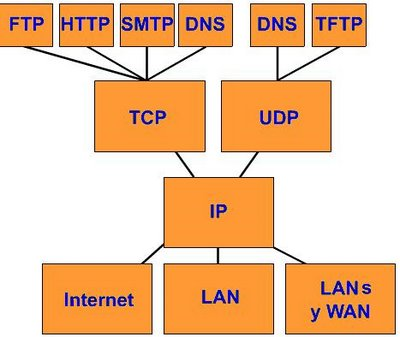

### 🧠 ¿Qué es un Protocolo de Red?

Un **protocolo de red** es un **conjunto de reglas** que define **cómo deben comunicarse los dispositivos** dentro de una red.

🔁 Son como los **idiomas o normas** que deben seguir dos computadoras (o celulares, routers, etc.) para **entenderse correctamente**.

---

#### 🗣 Ejemplo fácil:

Supón que tú hablas español y una persona habla japonés. No podrían comunicarse a menos que ambos sigan un mismo lenguaje o protocolo común.

En redes, pasa lo mismo:

- El **protocolo** define **cómo se inicia una conversación**,
- **cómo se transfieren los datos**,
- **cómo se termina la comunicación**,
- y cómo se verifican errores.

---

### 🔍 Ejemplos de Protocolos de Red

| Protocolo       | ¿Qué hace?                                    | Ejemplo fácil de entender                       |
| --------------- | --------------------------------------------- | ----------------------------------------------- |
| **HTTP**        | Envía páginas web                             | Cuando visitas `https://google.com`             |
| **HTTPS**       | Igual que HTTP, pero con cifrado (más seguro) | Navegar en Facebook o hacer compras online      |
| **FTP**         | Transfiere archivos entre equipos             | Subir o bajar archivos de un servidor           |
| **SMTP**        | Envía correos electrónicos                    | Al enviar un correo desde Gmail                 |
| **POP3 / IMAP** | Reciben correos desde el servidor             | Cuando abres tu correo en Outlook o Thunderbird |
| **TCP/IP**      | Base de internet: divide y dirige los datos   | Lo usan todos los protocolos anteriores         |
| **DHCP**        | Asigna IP automáticamente                     | Cuando tu celular se conecta al Wi-Fi           |
| **DNS**         | Traduce nombres de dominio a direcciones IP   | `google.com` → `142.250.184.78`                 |
| **SSH**         | Acceso remoto seguro a una computadora        | Administrar un servidor Linux por terminal      |

---

### 🧩 ¿Cómo se "instala" o configura un protocolo?

Muchos protocolos **ya están instalados** en los sistemas operativos modernos. Pero algunos puedes **configurarlos manualmente** o instalar programas para usarlos mejor.

#### 🔧 Ejemplos prácticos:

---

#### 📌 1. **HTTP/HTTPS**

Ya están integrados en tu navegador (Chrome, Firefox, etc.)
Pero si haces una **página web**, debes configurar un servidor con **HTTP o HTTPS**.

##### Instalar un servidor web con protocolo HTTP:

```bash
sudo apt install apache2
```

##### Servidor HTTPS (más seguro):

```bash
sudo apt install certbot python3-certbot-apache
sudo certbot --apache
```

---

#### 📌 2. **FTP**

Puedes instalar un servidor FTP para transferir archivos entre PCs:

```bash
sudo apt install vsftpd
```

Y luego puedes usar **FileZilla** para conectarte usando el protocolo FTP.

---

#### 📌 3. **DHCP (asignación automática de IP)**

Tu router ya tiene un servidor DHCP activado.

Pero si quieres instalar uno en Linux:

```bash
sudo apt install isc-dhcp-server
```

Y configuras el archivo `/etc/dhcp/dhcpd.conf` para repartir IPs automáticamente.

---

#### 📌 4. **DNS (traducción de nombres)**

Puedes usar DNS públicos (como los de Google):

- 8.8.8.8
- 8.8.4.4

O instalar un servidor DNS local con `bind9`:

```bash
sudo apt install bind9
```

---

### 📦 Ejemplo completo: Crear un mini servidor web que use HTTP

#### 🎯 Objetivo:

Instalar un servidor HTTP local para servir una página web simple.

---

#### 🧩 PASO 1: Instalar Apache

```bash
sudo apt update
sudo apt install apache2
```

---

#### 🧩 PASO 2: Crear tu página web

```bash
echo "<h1>Hola desde mi servidor HTTP</h1>" | sudo tee /var/www/html/index.html
```

---

#### 🧩 PASO 3: Probarlo en el navegador

Abre tu navegador y escribe:

```
http://localhost
```

✅ ¡Listo! Estás usando el **protocolo HTTP** para acceder a tu servidor.

---

#### 🔐 PASO OPCIONAL: Convertirlo a HTTPS

```bash
sudo apt install certbot python3-certbot-apache
sudo certbot --apache
```

Esto configurará **HTTPS** automáticamente usando un certificado de **Let's Encrypt** (gratis).

---

### ✅ Resumen Final

| Elemento                | Explicación simple                                                     |
| ----------------------- | ---------------------------------------------------------------------- |
| **Protocolo de red**    | Conjunto de reglas para comunicarse                                    |
| **Ejemplos comunes**    | HTTP, HTTPS, FTP, TCP/IP, DNS, DHCP                                    |
| **Cómo se instala**     | Muchos ya están en tu PC, otros como FTP/HTTP se instalan con comandos |
| **Uso en la vida real** | Navegar, enviar correos, compartir archivos, jugar en red, etc.        |

---

[🔼](#índice)

---

## **482. Modelo OSI (Open Systems Interconection)**

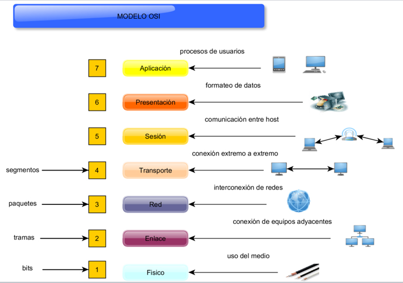

### 🧠 ¿Qué es el Modelo OSI?

El **Modelo OSI** (Interconexión de Sistemas Abiertos) es un **modelo teórico de 7 capas** que describe **cómo viaja la información** a través de una red desde un programa de usuario hasta otro.

📦 Fue creado por la ISO para **estandarizar la forma en que los dispositivos se comunican** en una red.

---

#### 🎯 ¿Para qué sirve?

- 📚 Para entender cómo funciona una red desde lo más abstracto (el software) hasta lo físico (cables).
- 🛠️ Para diagnosticar problemas de red.
- 📡 Para diseñar, implementar o proteger redes de manera estructurada.

---

### 🧱 Las 7 Capas del Modelo OSI (de arriba a abajo)

| Capa | Nombre          | ¿Qué hace?                              | Ejemplo fácil de entender        |
| ---- | --------------- | --------------------------------------- | -------------------------------- |
| 7    | Aplicación      | Lo que ve el usuario                    | Navegar en Chrome, enviar email  |
| 6    | Presentación    | Traduce y cifra datos                   | Cifrado SSL, formato JSON/XML    |
| 5    | Sesión          | Inicia y mantiene conexiones            | Iniciar sesión en WhatsApp Web   |
| 4    | Transporte      | Asegura entrega de datos                | TCP (envío fiable), UDP (rápido) |
| 3    | Red             | Decide por dónde van los datos (rutas)  | IP (Internet Protocol)           |
| 2    | Enlace de datos | Identifica físicamente los dispositivos | Direcciones MAC                  |
| 1    | Física          | Transmite los bits (0 y 1)              | Cables, señales, tarjetas        |

---

### 🧭 Ejemplo práctico del recorrido

Supón que envías un mensaje por WhatsApp desde tu celular a otro.

#### 1. **Capa 7 - Aplicación**

Escribes: "Hola, ¿cómo estás?"

#### 2. **Capa 6 - Presentación**

El texto se convierte a un formato estándar (UTF-8) y se cifra.

#### 3. **Capa 5 - Sesión**

Se crea y mantiene una conexión segura entre tú y el servidor de WhatsApp.

#### 4. **Capa 4 - Transporte**

Se parte el mensaje en "paquetes" usando TCP (garantiza que todo llegue y en orden).

#### 5. **Capa 3 - Red**

Cada paquete obtiene una dirección IP de destino (la del servidor de WhatsApp).

#### 6. **Capa 2 - Enlace de datos**

Se coloca la dirección MAC de tu router o celular.

#### 7. **Capa 1 - Física**

Los bits (0 y 1) viajan por Wi-Fi o cable.

✅ El receptor hace lo mismo, pero en sentido inverso (capa 1 hasta la 7).

---

### 🔧 ¿Cómo se "instala" el modelo OSI?

**El modelo OSI no se instala como un programa**. Es un **modelo conceptual**, pero **se implementa en la práctica** usando **protocolos reales** en cada capa.

#### 📌 Relación entre OSI y protocolos reales:

| Capa OSI | Protocolos o equipos que la implementan        |
| -------- | ---------------------------------------------- |
| 7        | HTTP, FTP, SMTP (navegador, app de correo)     |
| 6        | SSL/TLS, cifrado, compresión                   |
| 5        | NetBIOS, RPC, sockets                          |
| 4        | TCP, UDP                                       |
| 3        | IP, ICMP (ping), routers                       |
| 2        | Ethernet, Wi-Fi, switches, MAC                 |
| 1        | Cables, señales eléctricas, fibra óptica, hubs |

🧩 **Instalar** un servidor web, una VPN o una red física es una forma de aplicar el modelo OSI.

---

### 🧪 Ejemplo completo: Cómo viaja una página web desde un servidor al navegador

#### 🎯 Objetivo:

Ver cómo las 7 capas del modelo OSI actúan al visitar `https://midominio.com`.

---

#### PASO A PASO:

##### 🔹 Capa 7 - Aplicación:

- Tu navegador (Chrome) hace una solicitud HTTPS al servidor.

##### 🔹 Capa 6 - Presentación:

- Los datos se cifran con **TLS (SSL)** para seguridad.

##### 🔹 Capa 5 - Sesión:

- Se abre una sesión segura con el servidor usando certificados.

##### 🔹 Capa 4 - Transporte:

- Se usa **TCP** para enviar la solicitud en paquetes asegurados.

##### 🔹 Capa 3 - Red:

- Los paquetes viajan usando **IP**, y se enrutan hasta el servidor web.

##### 🔹 Capa 2 - Enlace:

- Cada salto (por ejemplo, router a router) usa direcciones MAC diferentes.

##### 🔹 Capa 1 - Física:

- Los bits se transmiten por Wi-Fi o cable Ethernet, y finalmente llegan al servidor.

---

#### Resultado:

El servidor web responde con la página HTML y todo el proceso se repite de regreso.

---

### 🎁 Bonus: Mini comando por capa (en Linux)

| Capa | Comando útil            | ¿Qué hace?                                |
| ---- | ----------------------- | ----------------------------------------- |
| 1-2  | `ip link` / `ifconfig`  | Ver interfaces de red                     |
| 3    | `ping` o `traceroute`   | Ver si llegas a una IP o cómo se enruta   |
| 4    | `netstat -tulpn` o `ss` | Ver puertos TCP/UDP abiertos              |
| 7    | Navegar a un sitio web  | Interactuar directamente desde aplicación |

---

### ✅ Resumen final

| Elemento            | Detalle                                           |
| ------------------- | ------------------------------------------------- |
| **Modelo OSI**      | Modelo teórico de 7 capas para entender redes     |
| **Sirve para**      | Diseñar, entender y resolver problemas en redes   |
| **No se instala**   | Pero se aplica usando protocolos y equipos reales |
| **Ejemplos reales** | HTTP, TCP/IP, MAC, cables, navegadores, routers   |

---

[🔼](#índice)

---

## **483. Caso práctico: Sniffers, dirección MAC, direccion IP, puertos**

### 🧠 ¿Qué es un _sniffer_?

Un **sniffer** es una **herramienta de software o hardware** que se usa para **capturar y analizar el tráfico de red**.

> En términos simples, es como poner una **oreja en la red** para escuchar lo que están enviando los dispositivos.

---

#### 🕵️ ¿Para qué sirve un sniffer?

- Analizar problemas de red
- Ver qué dispositivos están conectados
- Investigar tráfico sospechoso o intrusiones
- En ciberseguridad: detectar ataques o espiar (¡solo con fines éticos!)

---

### 📌 ¿Qué es una dirección MAC?

- MAC = **Media Access Control**
- Es una **dirección física única** que tiene **cada tarjeta de red** (Wi-Fi, Ethernet).
- Formato: `00:1A:2B:3C:4D:5E`
- No cambia, y se usa **en redes locales (LAN)**.

#### 📦 Ejemplo fácil:

Tu laptop tiene una MAC única, como una placa de auto. Así el router sabe cuál es cuál.

---

### 📌 ¿Qué es una dirección IP?

- IP = **Internet Protocol**
- Es una **dirección lógica y única** que **identifica a un dispositivo en la red**.
- Cambia dependiendo de la red a la que te conectes.
- Ejemplo IPv4: `192.168.1.10`

Hay dos tipos:

| Tipo    | Significado              | Ejemplo        |
| ------- | ------------------------ | -------------- |
| Pública | Se usa en internet       | `45.50.23.14`  |
| Privada | Se usa en redes internas | `192.168.0.10` |

---

### 📌 ¿Qué es un puerto?

- Es una especie de **puerta virtual** dentro de una IP.
- Ayuda a identificar **qué servicio o aplicación** está escuchando.

📦 Ejemplo:

- `192.168.0.10:80` = página web
- `192.168.0.10:22` = acceso SSH

| Puerto | Servicio común |
| ------ | -------------- |
| 80     | HTTP           |
| 443    | HTTPS          |
| 21     | FTP            |
| 22     | SSH            |
| 25     | SMTP (correo)  |

---

### 🛠️ ¿Cómo se "instala" o usa un sniffer?

El sniffer más famoso y profesional es **Wireshark**.

#### 📥 Instalar Wireshark (Linux)

```bash
sudo apt update
sudo apt install wireshark
```

### 📥 Instalar Wireshark (Windows/Mac)

Descárgalo desde:
🔗 [https://www.wireshark.org/download.html](https://www.wireshark.org/download.html)

---

### 📸 ¿Qué puede ver un sniffer?

✅ Con Wireshark puedes capturar:

- IP de origen y destino
- MAC de los dispositivos
- Puertos utilizados
- Protocolos (HTTP, TCP, DNS, etc.)
- Contenido (si no está cifrado)

---

### 🔐 ¿Sniffear es legal?

Depende:

- ✅ Legal: analizar tu red, hacer auditorías de seguridad con permiso.
- ❌ Ilegal: capturar datos sin autorización, espiar redes ajenas.

---

### 🧪 Ejemplo completo: Capturar y analizar tráfico en tu red local

#### 🎯 Objetivo:

Capturar un paquete en tu red LAN y ver:

- Dirección MAC
- IP
- Puerto
- Protocolo

---

#### 🧩 Paso 1: Abrir Wireshark

- Abre Wireshark como **administrador**
- Selecciona tu interfaz de red activa (Wi-Fi o Ethernet)
- Comienza la **captura** (`Start`)

---

#### 🧩 Paso 2: Filtrar tráfico

Filtra por protocolos, por ejemplo:

- Solo HTTP:

  ```
  http
  ```

- Solo paquetes hacia una IP:

  ```
  ip.dst == 192.168.1.10
  ```

- Por puerto:

  ```
  tcp.port == 80
  ```

---

#### 🧩 Paso 3: Generar tráfico

Desde otra PC o navegador:

```bash
ping 192.168.1.10
```

O visita un sitio web no cifrado como:

```bash
http://neverssl.com
```

---

#### 🧩 Paso 4: Analizar paquete capturado

Haz clic en un paquete y revisa:

##### 📋 Dirección MAC:

- En "Ethernet II"
- Verás origen (`MAC de tu PC`) y destino (`MAC del router o switch`)

##### 🌐 Dirección IP:

- En la sección "Internet Protocol"
- Origen y destino (ej: 192.168.1.5 → 142.250.184.78)

##### 🎯 Puerto:

- En la sección TCP o UDP
- Puerto origen (dinámico) y destino (ej: 80, 443)

---

#### 🧩 Paso 5: Exportar captura

Puedes guardar el análisis como `.pcap` para estudiar luego o enviar a alguien.

---

### ✅ Resumen final

| Elemento    | ¿Qué es?                                                                |
| ----------- | ----------------------------------------------------------------------- |
| **Sniffer** | Herramienta para capturar tráfico de red (Wireshark)                    |
| **MAC**     | Dirección física única de cada dispositivo de red                       |
| **IP**      | Dirección lógica que identifica un equipo en una red                    |
| **Puertos** | Identificadores numéricos que indican qué aplicación está usando la red |

---

### 📚 BONUS: ¿Cómo se relaciona con el modelo OSI?

| Capa OSI   | Elemento relacionado                    |
| ---------- | --------------------------------------- |
| Capa 1 y 2 | MAC (nivel físico y enlace)             |
| Capa 3     | IP (nivel de red)                       |
| Capa 4     | Puertos TCP/UDP                         |
| Capa 7     | Datos visibles por sniffer (HTTP, etc.) |

---

[🔼](#índice)

---

## **484. Conceptos básicos: MAC, IP, puertos**

### 🧠 1. ¿Qué es una **Dirección MAC**?

🔧 La dirección **MAC** (_Media Access Control_) es un **identificador único físico** asignado a **cada tarjeta de red** (como tu Wi-Fi o Ethernet).

- No cambia (a menos que la falsifiques)
- Está **grabada de fábrica**
- Sirve para identificar **dispositivos dentro de una red local (LAN)**

---

#### 📦 Ejemplo real:

Piensa en la **placa de un auto**.

Aunque se cambie de ruta o ciudad, su placa no cambia.
La dirección MAC identifica **quién es** dentro de una red.

🔢 Ejemplo de MAC real:

```
00:1A:2B:3C:4D:5E
```

---

#### 📍 ¿Dónde la encuentro?

##### En Windows:

```cmd
ipconfig /all
```

Busca algo como:

```
Physical Address. . . . . . . . . : 00-14-22-01-23-45
```

##### En Linux/macOS:

```bash
ip link show
```

o

```bash
ifconfig
```

---

### 🌐 2. ¿Qué es una **Dirección IP**?

La **dirección IP (Internet Protocol)** identifica a un **dispositivo en una red** (local o internet).

#### Tipos de IP:

| Tipo        | ¿Dónde se usa?                        | Ejemplo        |
| ----------- | ------------------------------------- | -------------- |
| **Privada** | Dentro de redes domésticas u oficinas | `192.168.0.12` |
| **Pública** | Para acceder a internet desde fuera   | `201.120.45.3` |

Las IP pueden cambiar, por eso a veces se asignan **automáticamente (DHCP)** o se fijan **manual (IP estática)**.

---

#### 📦 Ejemplo real:

La IP es como la **dirección de tu casa**.
Permite que te entreguen cartas (paquetes de datos) de otros dispositivos.

---

#### 📍 ¿Dónde veo mi IP?

##### En Windows:

```cmd
ipconfig
```

##### En Linux/macOS:

```bash
ip a
```

---

### 🚪 3. ¿Qué son los **puertos**?

Un **puerto** es un **número lógico** que permite identificar **qué servicio o aplicación** está utilizando la red en un dispositivo.

- Hay **65,535 puertos** posibles por protocolo (TCP o UDP).
- Cada aplicación escucha en **un puerto específico**.

---

#### 📦 Ejemplo real:

Piensa en un **edificio con una dirección (IP)**.
Dentro del edificio hay **departamentos (puertos)**:

- IP = `192.168.0.10`
- Puerto 80 → Web
- Puerto 22 → SSH
- Puerto 443 → Web seguro (HTTPS)

---

#### 🧠 Puertos más comunes

| Puerto | Servicio                        |
| ------ | ------------------------------- |
| 20-21  | FTP (transferencia de archivos) |
| 22     | SSH (acceso remoto)             |
| 23     | Telnet                          |
| 25     | SMTP (correo saliente)          |
| 53     | DNS (resolución de nombres)     |
| 80     | HTTP (web no segura)            |
| 443    | HTTPS (web segura)              |

---

### 🔧 ¿Cómo se configuran o se "instalan"?

#### 🧱 Dirección MAC

No se instala, **ya viene de fábrica**, pero puedes:

- Consultarla
- Cambiarla temporalmente (spoofing)

##### Cambiar MAC en Linux (solo por pruebas):

```bash
sudo ip link set dev eth0 down
sudo ip link set dev eth0 address 00:11:22:33:44:55
sudo ip link set dev eth0 up
```

---

#### 🧱 Dirección IP

##### Asignación automática (DHCP):

Viene del router, no necesitas hacer nada.

##### IP estática (manual):

En Linux (ejemplo con `netplan` en Ubuntu):

```yaml
network:
  version: 2
  ethernets:
    enp0s3:
      addresses: [192.168.0.10/24]
      gateway4: 192.168.0.1
      nameservers:
        addresses: [8.8.8.8]
```

---

#### 🧱 Puertos

Se usan automáticamente según la app.
Pero puedes abrir/cerrar puertos en el firewall o configurar servicios para que escuchen en ellos.

##### Ver puertos en uso (Linux):

```bash
sudo netstat -tuln
```

o

```bash
sudo ss -tuln
```

##### Abrir puerto en el firewall (ej: 80):

```bash
sudo ufw allow 80/tcp
```

---

### 🧪 Ejemplo completo práctico: Ver IP, MAC y puertos en uso

#### 🎯 Objetivo:

Ver tu IP, MAC y qué puertos están escuchando.

---

#### 🧩 Paso 1: Ver tu dirección MAC e IP

##### En Windows:

```cmd
ipconfig /all
```

##### En Linux/macOS:

```bash
ip a
```

---

#### 🧩 Paso 2: Ver puertos abiertos

##### En Windows:

```cmd
netstat -an | find "LISTEN"
```

##### En Linux:

```bash
sudo ss -tuln
```

Salida esperada (Linux):

```
LISTEN  0  128  0.0.0.0:22     *:*     # Puerto SSH
LISTEN  0  128  0.0.0.0:80     *:*     # Puerto HTTP
```

---

#### 🧩 Paso 3: Ver conexiones activas en tiempo real

Instala Wireshark y filtra por IP, MAC o puerto:

```bash
sudo apt install wireshark
```

Filtrar por HTTP:

```
http
```

Filtrar por puerto:

```
tcp.port == 80
```

---

### ✅ Resumen final

| Concepto   | ¿Qué es?                                     | Ejemplo             |
| ---------- | -------------------------------------------- | ------------------- |
| **MAC**    | Dirección física de la tarjeta de red        | `00:1A:2B:3C:4D:5E` |
| **IP**     | Dirección lógica de un dispositivo           | `192.168.1.5`       |
| **Puerto** | Identifica la app/servicio dentro de un host | `192.168.1.5:80`    |

---

[🔼](#índice)

---

## **485. Adaptadores Máquina Virtual**

### 🧠 ¿Qué es un Adaptador de Red en una Máquina Virtual?

Cuando creas una **máquina virtual (VM)**, como por ejemplo en **VirtualBox, VMware o Hyper-V**, el sistema necesita conectarse a una red (como el Wi-Fi de tu laptop), **pero no lo hace directamente**. En lugar de eso, usa un **adaptador virtual de red**, que **emula una tarjeta de red real**.

> 🎯 Es como darle una "tarjeta de red falsa" a tu máquina virtual, que se conecta **a través del host (tu PC real)**.

---

### 🎯 ¿Para qué sirve?

- Para que la VM pueda **tener acceso a internet**
- Para conectarse con el **host (tu PC)**
- Para **comunicarse con otras VMs**
- Para **simular entornos de red** (ideal para ciberseguridad o redes)

---

### 🧱 Tipos de adaptadores de red en máquinas virtuales (VirtualBox como referencia)

| Modo                 | ¿Cómo funciona?                                                    | Ejemplo fácil                                                |
| -------------------- | ------------------------------------------------------------------ | ------------------------------------------------------------ |
| **NAT**              | La VM comparte la conexión del host como si fuera un router NAT    | Como si tu VM fuera un dispositivo más del Wi-Fi             |
| **Bridged (Puente)** | La VM se conecta a la red **como un equipo más**, con IP propia    | La VM aparece en la red como si fuera otro computador físico |
| **Red Interna**      | Solo se comunica con otras VMs configuradas igual (sin internet)   | Ideal para simular redes privadas                            |
| **Solo-Anfitrión**   | La VM se comunica **solo con el host**, no tiene acceso a internet | Útil para laboratorios o pruebas                             |
| **Red Genérica**     | Para configuraciones avanzadas y scripts personalizados            | Usado en redes personalizadas complejas                      |

---

### 🖥️ Ejemplo visual

Imagina lo siguiente:

- Tu PC (host) tiene conexión a internet.
- Tienes una VM corriendo Linux o Windows.

Según el tipo de adaptador:

| Tipo           | IP de la VM                  | ¿Internet? | ¿Puede comunicarse con el host? | ¿Puede comunicarse con otras VMs? |
| -------------- | ---------------------------- | ---------- | ------------------------------- | --------------------------------- |
| NAT            | 10.x.x.x (oculta)            | ✅         | ✅ (limitado)                   | ❌ (directamente)                 |
| Puente         | 192.168.x.x (igual que host) | ✅         | ✅                              | ✅                                |
| Interna        | 192.168.100.x                | ❌         | ❌                              | ✅ (si usan misma red interna)    |
| Solo-Anfitrión | 192.168.56.x                 | ❌         | ✅                              | ❌                                |

---

### 🔧 ¿Cómo se configura un adaptador de red?

Usaremos **VirtualBox** como ejemplo (muy común en Windows y Linux):

---

### 🛠️ Paso a paso: configurar adaptador de red en VirtualBox

#### 🧩 Paso 1: Abrir VirtualBox

- Selecciona tu VM
- Clic en **"Configuración"**
- Ir a la pestaña **"Red"**

---

#### 🧩 Paso 2: Elegir el tipo de adaptador

Verás algo como esto:

- Adaptador 1 → Activado ✅
- Conectado a: 🔽 **NAT** (puedes cambiar a Puente, Interna, etc.)

---

#### 🧩 Paso 3: Iniciar la VM y verificar red

##### En Windows (dentro de la VM):

```cmd
ipconfig
```

##### En Linux (dentro de la VM):

```bash
ip a
```

Verifica si tiene IP, puerta de enlace y si responde a:

```bash
ping google.com
```

---

### 🎓 Ejemplo completo: Simular una red de 2 máquinas virtuales (laboratorio)

#### 🎯 Objetivo:

Conectar 2 VMs entre sí sin internet, usando **Red Interna**, ideal para practicar seguridad o red local.

---

#### 🔧 Paso a paso

##### 🔸 Requisitos:

- Tener VirtualBox instalado
- Dos VMs (por ejemplo, Ubuntu y Kali Linux)

---

#### 🧩 Paso 1: Crear Red Interna

- VM1 → Configuración → Red

  - Adaptador 1 → Activado
  - Conectado a: **Red Interna**
  - Nombre de la red: `red_privada`

- VM2 → Lo mismo (usar `red_privada`)

---

#### 🧩 Paso 2: Asignar IPs manualmente

##### En VM1:

```bash
sudo ip addr add 192.168.100.10/24 dev eth0
sudo ip link set eth0 up
```

##### En VM2:

```bash
sudo ip addr add 192.168.100.20/24 dev eth0
sudo ip link set eth0 up
```

---

#### 🧩 Paso 3: Probar conexión

Desde la VM1:

```bash
ping 192.168.100.20
```

Desde la VM2:

```bash
ping 192.168.100.10
```

✅ Si responden, ¡tienes una red privada funcionando!

---

### 📚 Resumen final

| Concepto             | Detalle                                                              |
| -------------------- | -------------------------------------------------------------------- |
| **Adaptador de red** | Tarjeta de red virtual que conecta la VM con la red física o virtual |
| **NAT**              | Compartes internet con el host (fácil y seguro)                      |
| **Puente**           | La VM es como un dispositivo más de la red                           |
| **Red interna**      | Solo para comunicación entre VMs, sin internet                       |
| **Solo-Anfitrión**   | La VM solo habla con el host                                         |
| **Configuración**    | Se hace desde el menú "Red" en VirtualBox                            |

---

[🔼](#índice)

---

## **486. Modelo IPS (Internet Protocol Suite) o TCP/IP**

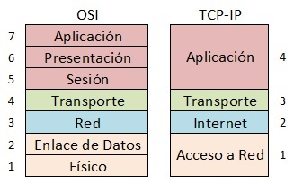

### ✅ ¿Qué es el Modelo TCP/IP (o IPS)?

El modelo **TCP/IP** es un **conjunto de protocolos** que define **cómo se comunican los dispositivos en una red**, desde tu computadora hasta los servidores de Internet.

📌 Es el **modelo real** que usa Internet actualmente.
Se llama así por sus dos protocolos más importantes:

- **TCP** (Transmission Control Protocol)
- **IP** (Internet Protocol)

---

### 📚 Diferencia con el modelo OSI

| Modelo OSI    | Modelo TCP/IP              |
| ------------- | -------------------------- |
| Tiene 7 capas | Tiene 4 capas              |
| Es teórico    | Es el que se usa realmente |
| Más detallado | Más práctico y directo     |

---

### 🧱 Las 4 capas del Modelo TCP/IP

| Capa TCP/IP         | ¿Qué hace?                                                       | Protocolos comunes   |
| ------------------- | ---------------------------------------------------------------- | -------------------- |
| **4. Aplicación**   | Interacción con el usuario, envío/recepción de datos útiles      | HTTP, FTP, SMTP, DNS |
| **3. Transporte**   | Divide datos en paquetes y asegura que lleguen correctamente     | TCP, UDP             |
| **2. Internet**     | Direcciona los paquetes entre redes                              | IP, ICMP             |
| **1. Acceso a red** | Maneja la transmisión física de datos a través de cables o Wi-Fi | Ethernet, Wi-Fi, ARP |

---

### 🧠 Ejemplo fácil de entender

Imagina que quieres enviar una carta:

| Acción en la carta                     | Capa del modelo | Equivalente técnico                           |
| -------------------------------------- | --------------- | --------------------------------------------- |
| Escribes la carta                      | Aplicación      | Tu mensaje en una app (ej: WhatsApp, web)     |
| Divides el mensaje en sobres numerados | Transporte      | TCP divide en paquetes, UDP los manda directo |
| Escribes direcciones en cada sobre     | Internet        | IP pone IP de origen y destino                |
| Usas un buzón para enviarlo            | Acceso a red    | Ethernet transmite por cable o Wi-Fi          |

---

### 🔍 Detalle de cada capa (con ejemplos):

---

#### 🧩 1. Capa de Aplicación

Es donde los **programas acceden a la red**.

🟢 Protocolos:

- **HTTP** → Navegar sitios web
- **SMTP** → Enviar correos
- **FTP** → Transferir archivos
- **DNS** → Traducir nombres (como google.com → IP)

📦 Ejemplo:

Tu navegador usa **HTTP** para pedir una página.

---

#### 🧩 2. Capa de Transporte

Se encarga de **dividir los datos en paquetes**, numerarlos y asegurarse de que lleguen bien.

🟢 Protocolos:

- **TCP**: Fiable, con verificación de entrega (ej: web, correo)
- **UDP**: Rápido, pero sin verificación (ej: videollamadas, juegos)

📦 Ejemplo:

TCP divide tu mensaje en bloques y asegura que lleguen en orden.

---

#### 🧩 3. Capa de Internet

Su tarea es **enviar los paquetes por diferentes redes** hasta el destino.

🟢 Protocolos:

- **IP**: Direccionamiento (usa IPs como 192.168.0.1)
- **ICMP**: Diagnóstico (como el comando `ping`)

📦 Ejemplo:

Tu paquete viaja de Lima a Londres pasando por varios routers.

---

#### 🧩 4. Capa de Acceso a Red

Es la capa **física**: cables, Wi-Fi, tarjeta de red, etc.

🟢 Protocolos:

- **Ethernet**, **Wi-Fi**, **ARP**

📦 Ejemplo:

Los bits viajan por el cable de red hasta el router.

---

### 🛠️ ¿Cómo se "instala" el modelo TCP/IP?

Ya viene **instalado en todos los sistemas operativos modernos** (Windows, Linux, macOS).
Pero puedes ver su configuración o modificar parámetros:

---

#### ✅ En Windows

🔍 Ver configuración:

```cmd
ipconfig /all
```

🛠️ Cambiar IP manual:

1. Panel de control → Centro de redes
2. Cambiar adaptador → Propiedades
3. Seleccionar "Protocolo de Internet versión 4 (TCP/IPv4)"
4. Puedes asignar IP, máscara, puerta de enlace, DNS.

---

#### ✅ En Linux

🔍 Ver IP:

```bash
ip a
```

🛠️ Asignar IP:

```bash
sudo ip addr add 192.168.0.10/24 dev eth0
sudo ip link set eth0 up
```

🔍 Ver rutas:

```bash
ip route
```

---

### 🔬 Ejemplo completo de funcionamiento del modelo TCP/IP

#### 🎯 Objetivo:

Analizar cómo funciona TCP/IP cuando accedes a una página web (por ejemplo, `https://www.google.com`)

---

#### 🔁 Paso 1: Resolución DNS (Capa de Aplicación)

- Tu navegador envía una petición **DNS** para saber la IP de `www.google.com`
- Obtiene: `142.250.190.36`

---

#### 🔁 Paso 2: Solicitud HTTP (Capa de Aplicación)

- El navegador usa **HTTP/HTTPS** para pedir la página

---

#### 🔁 Paso 3: TCP (Capa de Transporte)

- El mensaje se divide en varios paquetes **TCP**
- Cada paquete tiene un número de secuencia

---

#### 🔁 Paso 4: IP (Capa de Internet)

- Cada paquete recibe una IP de origen (tu PC) y de destino (Google)

---

#### 🔁 Paso 5: Ethernet o Wi-Fi (Capa de Acceso)

- Cada paquete se envía físicamente por tu tarjeta de red hasta tu router, luego a internet

---

#### 🔁 Paso 6: Google responde, y todo el proceso ocurre al revés:

- Sus servidores te devuelven la respuesta
- TCP reordena los paquetes
- Tu navegador muestra la página

✅ ¡Eso fue el modelo TCP/IP funcionando completo!

---

### 📌 Resumen final

| Capa TCP/IP  | Función principal                | Ejemplo         |
| ------------ | -------------------------------- | --------------- |
| Aplicación   | Habla con el usuario             | HTTP, FTP, DNS  |
| Transporte   | Asegura envío/recepción de datos | TCP, UDP        |
| Internet     | Dirección y enrutamiento         | IP, ICMP        |
| Acceso a red | Transmisión física de datos      | Ethernet, Wi-Fi |

---

[🔼](#índice)

---

## **487. Captura de tráfico de red: Pasiva vs Activa**

### 🔍 ¿Qué es la captura de tráfico de red?

La **captura de tráfico de red** consiste en **interceptar y analizar los datos** que viajan por una red. Esto permite observar:

- Quién se comunica con quién (IP origen/destino)
- Qué tipo de información se transmite (HTTP, DNS, etc.)
- Qué puertos están en uso
- Si hay actividad sospechosa o maliciosa

> Se utiliza para **auditoría, monitoreo, ciberseguridad, análisis forense**, o simplemente para entender cómo funciona una red.

---

### 🧭 Tipos de Captura: Pasiva vs Activa

#### 🟢 1. Captura Pasiva

🧠 **Observa sin intervenir.**

Solo escucha el tráfico de red sin alterar nada.

##### ✅ Características:

- No afecta la red.
- Totalmente **invisible** para los demás dispositivos.
- Ideal para análisis forense o detección de intrusos.

##### 📌 Ejemplo:

Usar Wireshark o tcpdump para ver qué tráfico entra y sale de tu PC.

##### 🎯 ¿Cuándo usarlo?

- Auditorías de seguridad
- Clases de redes
- Monitoreo de tráfico sin intervenir

---

#### 🔴 2. Captura Activa

🧠 **Genera tráfico o interviene en la red.**

Puede modificar, reenviar o bloquear paquetes.

##### ✅ Características:

- Puede **interrumpir o ralentizar** la red.
- Más detectable, pero útil para pruebas de seguridad.

##### 📌 Ejemplo:

- Usar herramientas como `nmap` para escanear puertos.
- Enviar paquetes falsos (`arpspoof`, `hping3`).
- Hacer un ataque de MITM (Man-in-the-Middle).

##### 🎯 ¿Cuándo usarlo?

- Pentesting ético
- Simulación de ataques
- Pruebas de estrés o vulnerabilidades

---

### 🛠️ ¿Cómo se instala y qué herramientas usar?

A continuación, te muestro cómo instalar herramientas para ambos tipos de captura en **Linux y Windows**.

---

#### ✅ 1. Herramienta: **Wireshark** (Pasiva)

🔹 Analizador de paquetes gráfico.
🔹 Muy completo, ideal para aprendizaje.

##### 🧪 Instalación:

**En Linux (Debian/Ubuntu):**

```bash
sudo apt update
sudo apt install wireshark
```

**En Windows:**

- Descárgalo desde [https://www.wireshark.org](https://www.wireshark.org)

🔐 Durante la instalación, acepta "Permitir captura a usuarios normales" si se te pregunta.

---

#### ✅ 2. Herramienta: **tcpdump** (Pasiva, consola)

🔹 Alternativa en terminal, muy ligera y rápida.

**En Linux:**

```bash
sudo apt install tcpdump
```

---

#### ✅ 3. Herramienta: **nmap** (Activa)

🔹 Escaneo de puertos, redes, dispositivos.

**Linux / Windows:**

```bash
sudo apt install nmap
```

o descargar desde: [https://nmap.org/download.html](https://nmap.org/download.html)

---

#### ✅ 4. Herramienta: **arpspoof** (Activa)

🔹 Usada para hacer ataques MITM (con precaución y ética).

**En Linux:**

```bash
sudo apt install dsniff
```

---

### 🧪 Ejemplo completo: Captura pasiva con Wireshark

#### 🎯 Objetivo:

Capturar el tráfico que genera un navegador al entrar a `google.com`

---

#### ✅ Paso 1: Abrir Wireshark

1. Ejecuta Wireshark como administrador.
2. Elige la interfaz de red correcta (Wi-Fi o Ethernet).
3. Presiona “Start”.

---

#### ✅ Paso 2: Aplicar filtro para ver solo tráfico HTTP

En la barra de filtro, escribe:

```
http
```

---

#### ✅ Paso 3: Entra a `http://example.com` (no https)

1. Abre tu navegador
2. Escribe: `http://example.com`

⚠️ Sitios `https` están cifrados y no verás el contenido fácilmente, pero puedes ver metadatos (IP, DNS, etc.).

---

#### ✅ Paso 4: Detener captura y analizar

1. Da clic en "Stop" en Wireshark.
2. Da clic en cualquier línea para ver:

   - IP origen/destino
   - Puerto usado
   - Datos que se están transmitiendo

📘 Puedes guardar la captura para estudiarla después.

---

### 🔴 Ejemplo de captura activa con `nmap`

#### 🎯 Objetivo:

Escanear los puertos abiertos de una máquina de prueba en la red local.

---

#### ✅ Paso 1: Identifica la IP de la víctima

Supón que la máquina tiene IP: `192.168.1.15`

---

#### ✅ Paso 2: Ejecutar nmap

```bash
nmap -sS -p- 192.168.1.15
```

Este comando hace un escaneo SYN (sigiloso) de todos los puertos.

---

#### ✅ Resultado

Verás una lista como:

```
PORT     STATE SERVICE
22/tcp   open  ssh
80/tcp   open  http
443/tcp  open  https
```

🧠 Aquí estás **generando tráfico** hacia el objetivo (captura activa).

---

### 🧾 Comparación final

| Característica       | Captura Pasiva         | Captura Activa          |
| -------------------- | ---------------------- | ----------------------- |
| Interviene en la red | ❌ No                  | ✅ Sí                   |
| Detectable           | ❌ Difícil de detectar | ✅ Puede ser detectada  |
| Riesgo de daño       | ❌ Nulo                | ⚠️ Posible interrupción |
| Ejemplos             | Wireshark, tcpdump     | nmap, arpspoof, hping3  |

---

### ✅ Conclusión

- Usa **captura pasiva** para **analizar tráfico sin alterar** el entorno.
- Usa **captura activa** cuando quieras hacer **pruebas de seguridad o pentesting** (siempre con autorización).
- Herramientas como **Wireshark, nmap y tcpdump** te permitirán **entender el tráfico de red** y entrenar habilidades en ciberseguridad.

---

[🔼](#índice)

---

## **488. Protocolo ARP**

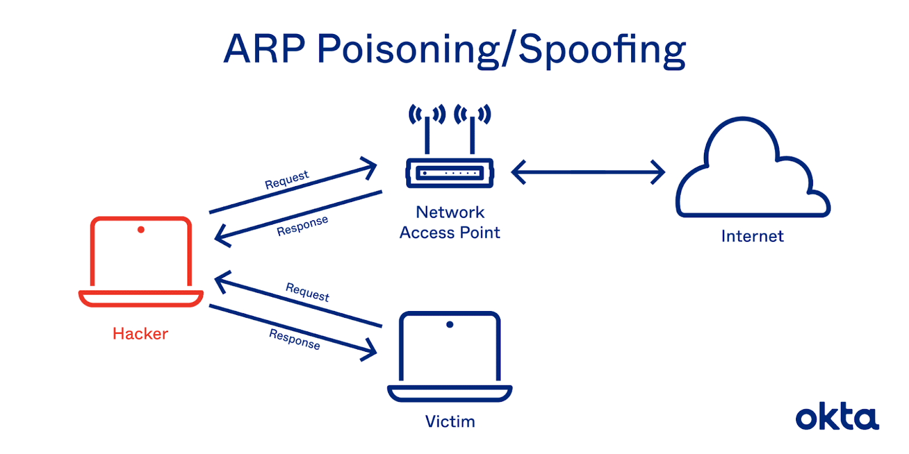

### 🧠 ¿Qué es el Protocolo ARP?

**ARP** (Address Resolution Protocol) es un **protocolo de red** que sirve para **descubrir la dirección MAC** de un dispositivo en una red local, **a partir de su dirección IP**.

---

#### 📌 ¿Por qué es necesario?

En una red local, las computadoras necesitan saber **a qué dirección física (MAC)** enviar los paquetes.

Por ejemplo:

> Si tu PC quiere enviar datos a la IP `192.168.1.15`, no puede enviar el paquete directamente sin saber **cuál es la dirección MAC** correspondiente.

Ahí es donde entra ARP.

---

### 🧭 ¿Cómo funciona ARP?

1. ✅ Tu PC dice:

   **"¿Quién tiene la IP `192.168.1.15`? ¡Dime tu MAC!"** (ARP Request)

2. ✅ La PC con esa IP responde:

   **"¡Soy yo! Mi MAC es `aa:bb:cc:dd:ee:ff`"** (ARP Reply)

3. ✅ Tu PC **guarda esa relación IP/MAC** en su tabla ARP y envía los datos correctamente.

---

### 📒 Ejemplo muy simple:

Supongamos:

| Dispositivo | IP           | MAC Address            |
| ----------- | ------------ | ---------------------- |
| PC A        | 192.168.1.10 | 00:11:22:33:44:55      |
| PC B        | 192.168.1.15 | aa\:bb\:cc\:dd\:ee\:ff |

- PC A quiere enviar datos a PC B.
- PC A **no conoce la MAC** de PC B.
- PC A **envía una solicitud ARP (broadcast)**.
- PC B responde con su MAC.
- PC A ahora puede **comunicarse directamente** con PC B.

---

### 🛠️ ¿Cómo ver y usar ARP en tu PC?

#### ✅ En Windows

Ver la tabla ARP:

```cmd
arp -a
```

Borrar la tabla ARP:

```cmd
arp -d
```

Agregar una entrada manual:

```cmd
arp -s 192.168.1.20 00-aa-bb-cc-dd-ee
```

---

#### ✅ En Linux / macOS

Ver la tabla ARP:

```bash
ip neigh show
# o también
arp -n
```

Borrar una entrada:

```bash
sudo ip neigh del 192.168.1.15 dev eth0
```

Agregar una entrada:

```bash
sudo arp -s 192.168.1.20 00:aa:bb:cc:dd:ee
```

---

### 🛡️ ARP y la Seguridad

El protocolo ARP **no tiene autenticación**, lo que lo hace vulnerable a ataques como:

- **ARP Spoofing**: Un atacante finge tener la IP de otro dispositivo y **engaña a otros** para que envíen datos a su MAC.
- **MITM (Man in the Middle)**: Combinado con ARP spoofing, un atacante puede **interceptar y modificar el tráfico** entre dos dispositivos.

---

### 🧪 Ejemplo completo: Captura y análisis de ARP con Wireshark

#### 🎯 Objetivo:

Ver en tiempo real cómo funciona ARP en una red local.

---

#### ✅ Paso 1: Instala Wireshark

**En Linux:**

```bash
sudo apt update
sudo apt install wireshark
```

**En Windows:**
Descarga desde: [https://www.wireshark.org](https://www.wireshark.org)

---

#### ✅ Paso 2: Inicia Wireshark

1. Abre Wireshark como administrador.
2. Elige tu interfaz de red activa (Wi-Fi o Ethernet).
3. En el filtro de captura, escribe:

```
arp
```

4. Haz clic en "Start".

---

#### ✅ Paso 3: Genera tráfico ARP

Abre una terminal y haz ping a una IP de tu red local (que no hayas usado antes):

```bash
ping 192.168.1.15
```

🔍 En Wireshark verás:

- Un paquete ARP Request:

  _"Who has 192.168.1.15? Tell 192.168.1.10"_

- Y luego, si existe:

  _"192.168.1.15 is at aa\:bb\:cc\:dd\:ee\:ff"_

---

#### ✅ Paso 4: Analiza el paquete

Haz clic en un paquete ARP en Wireshark y verás:

- IP origen y destino
- MAC origen y destino
- Tipo de operación (Request o Reply)

---

### 🧾 ¿Dónde se guarda esta info?

En la **tabla ARP** de tu sistema.

Revisa con:

```bash
arp -n
```

Verás algo como:

```
Address          HWtype  HWaddress           Interface
192.168.1.15     ether   aa:bb:cc:dd:ee:ff   eth0
```

---

### 📚 Resumen

| Concepto                   | Detalle fácil de entender                                       |
| -------------------------- | --------------------------------------------------------------- |
| **¿Qué es ARP?**           | Protocolo que traduce IP a MAC en una red local.                |
| **¿Para qué sirve?**       | Para que tu PC sepa a qué dirección física enviar los datos.    |
| **¿Cómo funciona?**        | Envía una pregunta a la red y obtiene una respuesta con la MAC. |
| **Comando útil (Windows)** | `arp -a` para ver la tabla                                      |
| **Herramienta gráfica**    | Wireshark para capturar y analizar ARP                          |

---

[🔼](#índice)

---

## **489. Protocolo DHCP**

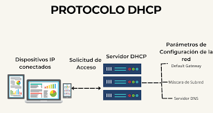

### 🧠 ¿Qué es el Protocolo DHCP?

**DHCP (Dynamic Host Configuration Protocol)** es un protocolo de red que **asigna automáticamente una dirección IP y otros parámetros de red** a los dispositivos que se conectan a una red.

> Es como un recepcionista en un hotel que te da una habitación (IP), llave (puerta de enlace) y acceso al restaurante (DNS).

---

### 🔧 ¿Qué datos asigna DHCP?

Cuando un dispositivo (cliente) se conecta a una red, el servidor DHCP le da:

- ✅ **IP**: Dirección única en la red (por ejemplo, `192.168.1.10`)
- ✅ **Máscara de subred**: Para saber qué parte de la IP identifica la red
- ✅ **Puerta de enlace (gateway)**: IP del router para salir a Internet
- ✅ **Servidor DNS**: Para traducir dominios como `google.com` a IPs
- ✅ **Tiempo de concesión (lease)**: Tiempo durante el cual puede usar esa IP

---

### 👣 ¿Cómo funciona DHCP? (Fácil de entender)

Hay **4 pasos principales**, conocidos como **DORA**:

1. 🛰️ **Discover** (Descubrir):

   El cliente grita:
   “¡Hola! ¿Hay algún servidor DHCP? ¡Necesito una IP!”

2. 📬 **Offer** (Oferta):

   El servidor responde:
   “¡Hola! Te ofrezco la IP `192.168.1.10`.”

3. 🙋 **Request** (Solicitud):

   El cliente responde:
   “¡Sí! Quiero esa IP que me ofreciste.”

4. ✅ **Acknowledge** (Reconocimiento):

   El servidor confirma:
   “¡Listo! IP `192.168.1.10` es tuya por 24 horas.”

> Este proceso se da automáticamente cuando te conectas al Wi-Fi o red por cable.

---

### 💻 Ejemplo simple de DHCP

Supón que tienes tres dispositivos conectados a tu router.

| Dispositivo | Dirección IP asignada (por DHCP) |
| ----------- | -------------------------------- |
| Laptop      | 192.168.0.10                     |
| Celular     | 192.168.0.11                     |
| Smart TV    | 192.168.0.12                     |

Todos **recibieron su IP automáticamente** del servidor DHCP (que en este caso es el router).

---

### 🛠️ ¿Cómo instalar un servidor DHCP?

#### ✅ En Linux (Debian/Ubuntu)

**Paso 1:** Instala el servidor DHCP

```bash
sudo apt update
sudo apt install isc-dhcp-server
```

**Paso 2:** Configura el archivo `/etc/dhcp/dhcpd.conf`

Ejemplo de configuración:

```bash
subnet 192.168.1.0 netmask 255.255.255.0 {
  range 192.168.1.100 192.168.1.200;
  option routers 192.168.1.1;
  option domain-name-servers 8.8.8.8, 8.8.4.4;
  default-lease-time 600;
  max-lease-time 7200;
}
```

**Paso 3:** Reinicia el servicio DHCP

```bash
sudo systemctl restart isc-dhcp-server
```

---

#### ✅ En Windows (como cliente)

Windows ya tiene cliente DHCP activo por defecto. Solo asegúrate de que esté configurado:

1. Ir a: Panel de Control → Red e Internet → Centro de redes
2. Cambiar configuración del adaptador → clic derecho → Propiedades
3. Selecciona “Protocolo de Internet versión 4 (TCP/IPv4)” → Propiedades
4. Asegúrate de que esté en:

```
☑ Obtener una dirección IP automáticamente
☑ Obtener la dirección del servidor DNS automáticamente
```

¡Listo! Ya usas DHCP.

---

### 🔍 ¿Cómo ver qué IP te asignó el DHCP?

#### En Windows

```cmd
ipconfig
```

Verás algo como:

```
Dirección IPv4 . . . . . . . . . . : 192.168.0.15
Puerta de enlace predeterminada . : 192.168.0.1
Servidor DHCP . . . . . . . . . . : 192.168.0.1
```

---

#### En Linux

```bash
ip a
# o
nmcli dev show
```

---

### 🔐 Seguridad de DHCP

DHCP **no tiene autenticación** por defecto. Eso lo hace vulnerable a:

- **DHCP Spoofing**: Un atacante ofrece IPs falsas para redirigir tráfico
- **DHCP Starvation**: El atacante pide muchas IPs y agota el rango

🔐 Solución avanzada: usar puertos seguros, VLANs o DHCP Snooping en switches gestionables.

---

### 🧪 Ejemplo completo: laboratorio DHCP

#### 🎯 Objetivo:

Simular una red con un servidor DHCP y un cliente, usando **VirtualBox** y **Linux**.

---

#### ✅ Paso 1: Crear dos máquinas virtuales en VirtualBox

- **VM1**: Ubuntu Server (servidor DHCP)
- **VM2**: Ubuntu Desktop (cliente)

Configura ambas VMs en **adaptador “Red interna”**.

---

#### ✅ Paso 2: Configurar servidor DHCP (VM1)

1. Instalar servidor:

```bash
sudo apt install isc-dhcp-server
```

2. Editar `/etc/dhcp/dhcpd.conf` con esta configuración:

```bash
subnet 10.0.0.0 netmask 255.255.255.0 {
  range 10.0.0.100 10.0.0.200;
  option routers 10.0.0.1;
  option domain-name-servers 8.8.8.8;
}
```

3. Configura una IP estática en la interfaz de red del servidor:

```bash
sudo nano /etc/netplan/01-netcfg.yaml
```

Ejemplo:

```yaml
network:
  version: 2
  ethernets:
    enp0s3:
      dhcp4: no
      addresses: [10.0.0.1/24]
```

Aplica:

```bash
sudo netplan apply
```

4. Reinicia DHCP:

```bash
sudo systemctl restart isc-dhcp-server
```

---

#### ✅ Paso 3: Cliente DHCP (VM2)

1. Asegúrate de que está configurado para obtener IP automáticamente:

```bash
sudo dhclient
```

2. Verifica:

```bash
ip a
```

📌 Deberías ver algo como:

```
inet 10.0.0.101/24
```

¡Éxito! La máquina cliente recibió su IP desde el servidor DHCP.

---

### 📚 Resumen final

| Concepto                | Explicación simple                             |
| ----------------------- | ---------------------------------------------- |
| ¿Qué es DHCP?           | Protocolo que da IP automáticamente            |
| ¿Qué asigna?            | IP, gateway, DNS, máscara, tiempo              |
| ¿Cómo funciona?         | DORA: Discover → Offer → Request → Acknowledge |
| ¿Qué lo usa?            | PCs, celulares, routers, impresoras, etc.      |
| ¿Riesgos de seguridad?  | Spoofing, agotamiento de IPs                   |
| ¿Herramienta de prueba? | isc-dhcp-server, Wireshark, VirtualBox         |

---

[🔼](#índice)

---

## **490. SSL/TLS**

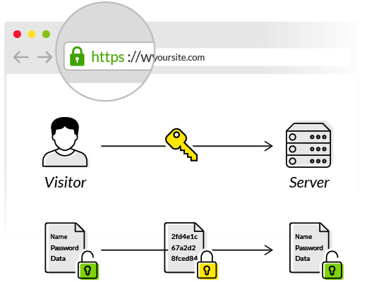

### 🛡️ ¿Qué es SSL/TLS?

**SSL (Secure Sockets Layer)** y **TLS (Transport Layer Security)** son protocolos de seguridad que **protegen la información enviada por internet** cifrándola (encriptándola), de modo que **solo el destinatario correcto pueda leerla**.

> **Ejemplo sencillo:**
>
> Imagina que envías una carta con información privada.
>
> - **Sin SSL/TLS:** es como enviar la carta sin sobre, cualquiera la puede leer.
>
> - **Con SSL/TLS:** la carta va en un sobre cerrado con candado, y solo el destinatario tiene la llave.

---

### 🔁 Diferencia entre SSL y TLS

| SSL                                 | TLS                              |
| ----------------------------------- | -------------------------------- |
| Más antiguo                         | Más moderno                      |
| Inseguro hoy                        | Más seguro                       |
| Versiones SSL 2.0 y 3.0 (obsoletas) | TLS 1.2 y TLS 1.3 (recomendadas) |

Actualmente, **cuando se dice SSL se refiere a TLS**, ya que **SSL está obsoleto**.

---

### 🧠 ¿Para qué sirve SSL/TLS?

Sirve para:

- 🔐 **Cifrar** los datos entre el cliente y el servidor
- ✅ **Verificar la identidad** del servidor (certificados digitales)
- ❌ **Evitar espionaje** o robo de información (man-in-the-middle)

---

### 🌐 Ejemplo simple: HTTPS

Cuando visitas una web:

```
https://www.banco.com
```

El navegador usa **TLS** para crear una conexión segura. Verás 🔒 en la barra de direcciones.

> HTTPS = HTTP + TLS

---

### 📦 ¿Qué protege TLS?

SSL/TLS se usa en varios servicios:

| Servicio       | Protocolo seguro                   |
| -------------- | ---------------------------------- |
| Navegación web | HTTPS                              |
| Correo         | SMTPS, IMAPS                       |
| FTP seguro     | FTPS                               |
| VPN            | TLS en OpenVPN                     |
| Mensajería     | TLS en apps como Signal o WhatsApp |

---

### 🔐 ¿Cómo funciona SSL/TLS? (Explicado fácil)

Cuando visitas una web segura:

1. 🧾 El navegador pide al servidor su **certificado SSL**.
2. 🔍 Verifica que:

   - Sea válido
   - No haya caducado
   - Lo emita una entidad confiable (como Let's Encrypt)

3. 🔑 Se realiza un **intercambio de llaves** para cifrar la comunicación.
4. 🔒 Todos los datos desde ese momento van **encriptados**.

---

### 🧪 ¿Cómo saber si una página usa SSL/TLS?

1. Fíjate si comienza con `https://`
2. Aparece un 🔒 en la barra del navegador
3. Haz clic en el 🔒 para ver el certificado

---

### 🧰 ¿Cómo instalar SSL/TLS en un servidor web?

Aquí veremos cómo instalarlo **en un servidor Apache con Ubuntu Linux** usando **Let's Encrypt**, que ofrece **certificados gratuitos**.

---

### 🔧 Instalación paso a paso de SSL/TLS (Apache + Let's Encrypt)

#### 🔨 Requisitos:

- Ubuntu 20.04 o superior
- Dominio apuntando a tu servidor (ej: `tusitio.com`)
- Apache instalado

---

#### ✅ Paso 1: Instala Apache (si no lo tienes)

```bash
sudo apt update
sudo apt install apache2
```

---

#### ✅ Paso 2: Instala Certbot (herramienta para SSL gratuito)

```bash
sudo apt install certbot python3-certbot-apache
```

---

#### ✅ Paso 3: Ejecuta Certbot para instalar SSL

```bash
sudo certbot --apache
```

- Te pedirá tu correo
- Acepta términos
- Elige el dominio
- ¡Listo! Certbot configura Apache con TLS

---

#### ✅ Paso 4: Verifica

- Ve a: `https://tusitio.com`
- Deberías ver el 🔒 y el navegador indicando "Conexión segura"

---

#### ✅ Paso 5: Renovación automática

Los certificados de Let's Encrypt duran 90 días.

Para renovarlo automáticamente:

```bash
sudo systemctl list-timers
# O prueba manualmente:
sudo certbot renew --dry-run
```

---

### 🧪 Ejemplo completo: Servidor Apache seguro

Supón que tienes un sitio web personal con el dominio:

```
tusitio.com
```

1. Apuntas el dominio a tu IP pública.
2. Instalas Apache y Certbot.
3. Ejecutas:

```bash
sudo certbot --apache
```

4. Certbot configura automáticamente Apache con este bloque seguro:

```apache
<VirtualHost *:443>
  ServerName tusitio.com
  DocumentRoot /var/www/html

  SSLEngine on
  SSLCertificateFile /etc/letsencrypt/live/tusitio.com/fullchain.pem
  SSLCertificateKeyFile /etc/letsencrypt/live/tusitio.com/privkey.pem
</VirtualHost>
```

5. Listo. Ahora los usuarios pueden visitar tu web de forma segura con `https://tusitio.com`

---

### 📚 Resumen general

| Concepto          | Explicación simple                                        |
| ----------------- | --------------------------------------------------------- |
| ¿Qué es?          | Protocolo para cifrar la comunicación en la red           |
| ¿Para qué sirve?  | Evitar que espien o roben tu información                  |
| ¿Qué protege?     | Web (HTTPS), correo, VPN, FTP, apps de mensajería         |
| ¿Cómo se instala? | Con Certbot (Let's Encrypt) + Apache o Nginx              |
| ¿Gratis?          | Sí, con Let's Encrypt                                     |
| ¿Lo necesito?     | Sí, si tienes una web, app o servidor expuesto a internet |

---

[🔼](#índice)

---

## **491. Elliptic-curve Diffie-Hellman (ECDH)**

### 🔐 ¿Qué es Elliptic-curve Diffie-Hellman (ECDH)?

**ECDH** es un **algoritmo criptográfico** que permite a dos partes (por ejemplo, tú y un servidor) **acordar una clave secreta compartida** a través de un canal inseguro (como internet), **sin revelar la clave** a nadie más, ni siquiera a un espía que esté espiando todo.

🔑 Esta clave compartida luego puede usarse para cifrar mensajes (con AES, por ejemplo).

---

### 📚 ¿Qué significa cada parte del nombre?

- **Elliptic-curve (curvas elípticas):**

  En vez de usar números grandes como en la criptografía RSA tradicional, usa propiedades matemáticas de **curvas elípticas**, que son **más rápidas y seguras** con claves más pequeñas.

- **Diffie-Hellman:**

  Es un método para **acordar una clave secreta** entre dos partes.

🧠 Entonces **ECDH = método Diffie-Hellman + curvas elípticas**.

---

### 🤯 ¿Para qué sirve ECDH?

Se usa para:

- Establecer **comunicaciones cifradas** entre navegador y servidor (`TLS 1.2+`)
- **Aplicaciones seguras** como Signal, WhatsApp, SSH moderno
- **IoT**, dispositivos con poca potencia
- Autenticación entre clientes y servidores

---

### 🧠 Ejemplo muy fácil de entender (metáfora):

1. Tú y otra persona están en público y quieren compartir una **clave secreta**.
2. Ustedes usan un **método matemático** (ECDH) que les permite intercambiar públicamente algunos números.
3. Cualquier persona que los escuche verá los números, **pero no podrá obtener la clave final**.
4. Ambos acaban con **la misma clave secreta** sin que nadie más pueda deducirla.

---

### 🔍 Ventajas de ECDH

| Ventaja                    | Explicación                       |
| -------------------------- | --------------------------------- |
| 🔒 Más seguro              | Con claves más pequeñas que RSA   |
| ⚡ Rápido                  | Ideal para dispositivos móviles   |
| 🔑 Perfect Forward Secrecy | Cada sesión tiene su propia clave |
| 🌐 Usado en HTTPS moderno  | TLS 1.3 lo utiliza mucho          |

---

### 🧰 ¿Cómo se “instala” o implementa ECDH?

#### ✅ En teoría:

ECDH no se instala como un programa.

Está **integrado** en herramientas de seguridad como:

- OpenSSL
- TLS 1.2 y TLS 1.3
- Signal, WireGuard, OpenSSH
- Librerías de lenguajes como Python, Java, Go, etc.

#### ✅ En la práctica:

Puedes **usarlo programando** con librerías como:

- `cryptography` en Python
- `openssl` en Linux
- `libsodium` o `nacl` en C/C++

---

### ✅ Ejemplo completo y práctico: ECDH en Python

Vamos a hacer un ejemplo usando la librería `cryptography` para que dos personas (Alice y Bob) acuerden una clave secreta.

#### 🧪 Paso 1: Instalar la librería

```bash
pip install cryptography
```

---

#### 🧩 Paso 2: Código ECDH en Python

```python
from cryptography.hazmat.primitives.asymmetric import ec
from cryptography.hazmat.primitives import serialization

# Crear claves privadas para Alice y Bob
alice_private_key = ec.generate_private_key(ec.SECP384R1())
bob_private_key = ec.generate_private_key(ec.SECP384R1())

# Derivar las claves públicas
alice_public_key = alice_private_key.public_key()
bob_public_key = bob_private_key.public_key()

# Intercambiar claves públicas (esto puede hacerse por red)
# y generar la clave secreta compartida
alice_shared_key = alice_private_key.exchange(ec.ECDH(), bob_public_key)
bob_shared_key = bob_private_key.exchange(ec.ECDH(), alice_public_key)

# Mostrar resultados (deben coincidir)
print("🔐 Clave secreta de Alice:", alice_shared_key.hex())
print("🔐 Clave secreta de Bob:  ", bob_shared_key.hex())
```

---

#### ✅ Resultado esperado:

Ambas claves deben ser **iguales**, aunque solo intercambiaron claves públicas.

```
🔐 Clave secreta de Alice:   ab35f1...
🔐 Clave secreta de Bob:     ab35f1...
```

🧠 Esto demuestra que **pudieron generar la misma clave secreta sin que nadie la viera**.

---

### 🧪 ¿Cómo verificar que ECDH está en un servidor?

Si visitas una web con HTTPS y quieres saber si usa ECDH:

1. Ve a [https://www.ssllabs.com/ssltest/](https://www.ssllabs.com/ssltest/)
2. Escribe el dominio (`https://github.com`)
3. Revisa si hay ciphers como `ECDHE-RSA` o `ECDHE-ECDSA`

Eso indica que **está usando ECDH** como parte de TLS.

---

### ✅ Resumen Final

| Concepto             | Explicación Fácil                                            |
| -------------------- | ------------------------------------------------------------ |
| **ECDH**             | Algoritmo para generar una clave secreta compartida          |
| **Curvas elípticas** | Matemáticas más eficientes que RSA                           |
| **Uso**              | TLS, apps seguras, IoT, VPNs                                 |
| **Instalación**      | Ya está integrado en herramientas modernas                   |
| **Ejemplo práctico** | Alice y Bob generan misma clave sin compartirla directamente |

---

[🔼](#índice)

---

## **492. Funcionamiento SSL/TLS**

### 🔐 ¿Qué es SSL/TLS?

**SSL (Secure Sockets Layer)** y **TLS (Transport Layer Security)** son **protocolos criptográficos** que permiten una **comunicación segura** entre dos dispositivos a través de Internet, como entre tu navegador y un servidor web.

> 🔄 TLS es la versión moderna y más segura de SSL. Aunque muchas personas aún dicen "SSL", en realidad se usa TLS (versión 1.2 o 1.3).

---

### 📦 ¿Qué protege SSL/TLS?

SSL/TLS proporciona 3 cosas esenciales:

1. **Cifrado:** Oculta los datos para que solo el receptor los entienda.
2. **Autenticación:** Verifica que estás hablando con el servidor correcto (por ejemplo, con un certificado).
3. **Integridad:** Asegura que los datos no se modificaron en tránsito.

---

### 🌐 ¿Dónde se usa?

- Sitios web HTTPS (como `https://google.com`)
- Correos seguros (SMTP con TLS)
- Aplicaciones móviles
- VPNs, APIs, conexiones de bases de datos

---

### 🔄 Funcionamiento paso a paso de TLS (versión simplificada)

Imaginemos que estás entrando a `https://ejemplo.com`. Aquí va el flujo típico:

#### 1. 📞 **Cliente dice "Hola" (Client Hello)**

Tu navegador inicia la conexión TLS enviando:

- Versión de TLS que soporta
- Lista de algoritmos de cifrado soportados (ciphersuites)
- Un número aleatorio
- Extensiones TLS como SNI (para saber qué dominio estás visitando)

---

#### 2. 💳 **Servidor responde (Server Hello + certificado)**

El servidor responde con:

- Versión TLS elegida
- Algoritmo de cifrado elegido
- Su propio número aleatorio
- **Certificado digital (X.509)** con su clave pública y datos del dominio

---

#### 3. 🔍 **Cliente verifica el certificado**

El navegador revisa:

- Que el certificado esté **firmado por una autoridad confiable (CA)**
- Que **el dominio coincida** (ejemplo.com)
- Que el certificado no esté vencido

---

#### 4. 🔐 **Se genera una clave secreta**

- El navegador usa un algoritmo como **ECDHE** para generar una **clave compartida**.
- Esta clave es **secreta y temporal** (perfect forward secrecy).
- Se cifra con la clave pública del servidor para que **solo él pueda leerla**.

---

#### 5. 📦 **Ambos derivan claves de sesión**

Usando la clave compartida, ambos derivan:

- Clave de cifrado
- Clave de autenticación
- Clave para verificar integridad

---

#### 6. ✅ **Se termina el handshake**

- El cliente y el servidor se envían un mensaje final de **“Finished”**.
- A partir de aquí, **todo lo que se transmita estará cifrado**.

---

### 🧠 Ejemplo con Metáfora:

> Imagina que quieres enviar una carta secreta a un amigo.

1. Le pides su **candado público** (clave pública del servidor).
2. Pones tu mensaje secreto en una caja.
3. Cierras la caja con **su candado**.
4. Solo tu amigo puede abrirla, porque solo él tiene **la llave privada**.
5. A partir de ahora, los dos se pasan mensajes usando claves temporales compartidas.

---

### ⚙️ ¿Cómo se “instala” SSL/TLS en un servidor?

Tú no "instalas SSL/TLS" como tal, sino que **lo configuras** en tu servidor web (como Apache, Nginx, Express, etc.).

#### ✅ Requisitos:

- Un **certificado digital** (`.crt`) emitido por una CA (puede ser gratuito como Let's Encrypt).
- Una **clave privada** (`.key`).
- Servidor web correctamente configurado.

---

#### 🧰 Ejemplo: Instalar SSL/TLS con Nginx (Linux)

##### 1. Instala Nginx

```bash
sudo apt update
sudo apt install nginx
```

##### 2. Instala Certbot (Let's Encrypt)

```bash
sudo apt install certbot python3-certbot-nginx
```

##### 3. Obtén un certificado gratuito

```bash
sudo certbot --nginx -d ejemplo.com -d www.ejemplo.com
```

##### 4. Certbot configura automáticamente Nginx para usar HTTPS

Nginx ahora escuchará en el puerto **443** con tu certificado.

---

### 🧪 Ejemplo completo: Ver TLS en acción con OpenSSL

Puedes **probar una conexión TLS** manual desde consola con:

```bash
openssl s_client -connect www.google.com:443
```

Verás:

- Certificado del servidor
- Cifrado negociado (por ejemplo `TLSv1.3, cipher TLS_AES_128_GCM_SHA256`)
- Claves, handshake y más

---

### 🔍 ¿Cómo saber si un sitio usa SSL/TLS?

1. Fíjate en el candado 🔒 del navegador.
2. Haz clic sobre él y verás el certificado.
3. Puedes ver más info con sitios como:

   - [https://www.ssllabs.com/ssltest/](https://www.ssllabs.com/ssltest/)

---

### ✅ Resumen Final

| Elemento                 | Descripción simple                                     |
| ------------------------ | ------------------------------------------------------ |
| **TLS**                  | Protocolo para comunicaciones seguras                  |
| **Reemplaza a SSL**      | TLS 1.2 y 1.3 son versiones modernas de SSL            |
| **Handshake**            | Intercambio inicial para generar claves y autenticarse |
| **Cifrado**              | Usa claves temporales para proteger datos              |
| **Autenticación**        | Certificado del servidor lo verifica                   |
| **Instalación práctica** | Certbot + Nginx o Apache                               |
| **Herramienta útil**     | `openssl s_client -connect dominio:443`                |

---

[🔼](#índice)

---

## **493. Caso práctico: HTTP y HTTPs**

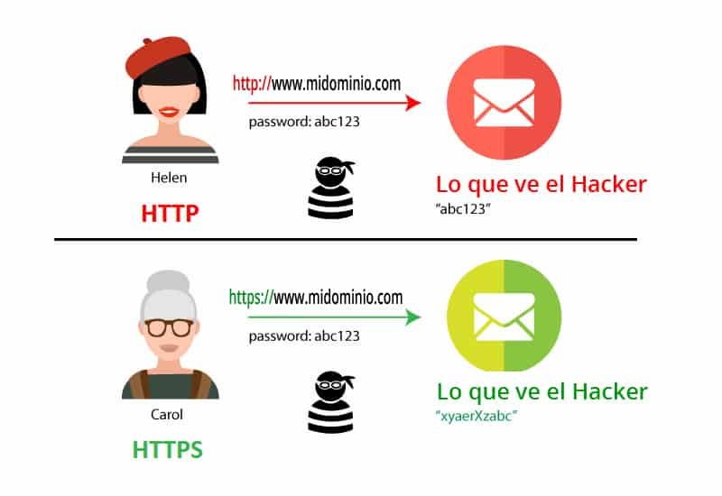

### 🔍 ¿Qué es HTTP?

**HTTP (HyperText Transfer Protocol)** es un **protocolo de red** que permite la **comunicación entre un navegador (cliente)** y un **servidor web**.

Fue diseñado para **transferir páginas web** (texto, imágenes, videos, etc.).

Cuando escribes en tu navegador:

```
http://ejemplo.com
```

Estás usando HTTP para pedir al servidor que te envíe esa página.

---

### 🛡️ ¿Qué es HTTPS?

**HTTPS (HTTP Secure)** es **HTTP pero con seguridad añadida usando SSL/TLS**.

Cifra los datos que se envían entre tu navegador y el servidor, protegiéndolos de:

- Espías en redes Wi-Fi públicas
- Robo de contraseñas, tarjetas, etc.
- Suplantación de identidad del servidor

HTTPS usa **el puerto 443**, mientras que HTTP usa el **puerto 80**.

---

### ⚖️ Diferencias entre HTTP y HTTPS

| Característica      | HTTP                     | HTTPS                  |
| ------------------- | ------------------------ | ---------------------- |
| Cifrado             | ❌ No                    | ✅ Sí (con TLS)        |
| Puerto              | 80                       | 443                    |
| URL                 | `http://`                | `https://`             |
| Seguridad           | Baja                     | Alta                   |
| Uso recomendado     | Solo sitios no sensibles | Todo sitio web moderno |
| Certificado digital | ❌ No necesita           | ✅ Obligatorio (X.509) |

---

### 🔐 ¿Por qué es importante HTTPS?

- Protege tus **datos personales**
- Mejora la **confianza del usuario**
- Es **requisito para comercio electrónico**
- Google **penaliza sitios sin HTTPS** en los resultados

---

### 📦 ¿Cómo se instala y configura HTTP/HTTPS?

#### Opción 1: Instalar servidor web con **Apache** (Linux)

```bash
sudo apt update
sudo apt install apache2
```

Esto instala Apache y comienza a servir sitios web por **HTTP (puerto 80)**.

---

#### Opción 2: Activar HTTPS con **Certbot (Let's Encrypt)**

1. Instala Certbot:

```bash
sudo apt install certbot python3-certbot-apache
```

2. Ejecuta Certbot para configurar automáticamente HTTPS:

```bash
sudo certbot --apache
```

3. Certbot obtiene un **certificado digital válido y gratuito**, lo instala, y redirige HTTP → HTTPS.

---

### 🧪 CASO PRÁCTICO COMPLETO: Servidor Web con HTTP y HTTPS

#### 🎯 Objetivo: Servir una página web por HTTP y luego asegurarla con HTTPS

---

#### 1️⃣ Instalar Apache (servidor web)

```bash
sudo apt update
sudo apt install apache2
```

Verifica que funciona:

- Abre tu navegador y visita:
  `http://localhost`
  Verás la página de bienvenida de Apache.

---

#### 2️⃣ Crear una página web simple

```bash
echo "<h1>Hola desde HTTP</h1>" | sudo tee /var/www/html/index.html
```

Visita de nuevo:
`http://localhost`
Ahora verás tu mensaje.

---

#### 3️⃣ Instalar Certbot y obtener certificado HTTPS

```bash
sudo apt install certbot python3-certbot-apache
sudo certbot --apache
```

Sigue los pasos:

- Ingresa tu dominio (ej. `midominio.com`)
- Certbot configurará automáticamente Apache para usar HTTPS

Si no tienes un dominio, puedes hacer pruebas con certificados autofirmados (no recomendados para producción):

```bash
sudo openssl req -x509 -nodes -days 365 -newkey rsa:2048 \
-keyout /etc/ssl/private/apache-selfsigned.key \
-out /etc/ssl/certs/apache-selfsigned.crt
```

Configura Apache para usarlos en tu VirtualHost HTTPS.

---

#### 4️⃣ Probar que HTTPS funciona

- Abre: `https://midominio.com`
- Deberías ver el candado 🔒 en el navegador

---

### 🧠 Extra: Simular HTTP vs HTTPS con Node.js

```js
// http-server.js
const http = require("http");

http
  .createServer((req, res) => {
    res.writeHead(200);
    res.end("Hola desde HTTP");
  })
  .listen(8080, () => console.log("Servidor HTTP en puerto 8080"));
```

Y para HTTPS necesitas generar un certificado local:

```bash
openssl req -newkey rsa:2048 -nodes -keyout key.pem -x509 -days 365 -out cert.pem
```

```js
// https-server.js
const https = require("https");
const fs = require("fs");

const options = {
  key: fs.readFileSync("key.pem"),
  cert: fs.readFileSync("cert.pem"),
};

https
  .createServer(options, (req, res) => {
    res.writeHead(200);
    res.end("Hola desde HTTPS");
  })
  .listen(8443, () => console.log("Servidor HTTPS en puerto 8443"));
```

---

### ✅ RESUMEN FINAL

| Tema              | Descripción simple                           |
| ----------------- | -------------------------------------------- |
| **HTTP**          | Protocolo inseguro para ver páginas web      |
| **HTTPS**         | Versión segura con cifrado SSL/TLS           |
| **Instalación**   | Apache o Nginx, Certbot para HTTPS           |
| **Caso práctico** | Servidor web configurado paso a paso         |
| **Ejemplo extra** | Servidor en Node.js para ver diferencia real |

---

[🔼](#índice)

---

## **494. HSTS - Mecanismo para forzar HTTPs**

### 🧠 ¿Qué es HSTS?

**HSTS (HTTP Strict Transport Security)** es un **mecanismo de seguridad** que obliga a los navegadores a **usar siempre HTTPS** para acceder a un sitio web.

> 🔒 Evita que un atacante intercepte tráfico usando HTTP (no cifrado) y lo redirija a HTTPS tarde.

---

#### 🎯 ¿Qué problema soluciona?

Imagina esto:

1. Escribes `midominio.com` (sin `https://`) → el navegador intenta con HTTP.
2. El atacante (en un Wi-Fi público) intercepta el HTTP y **no permite que llegues a HTTPS**.
3. Aunque tu sitio tenga HTTPS, **alguien pudo interceptar antes**.

👉 Con **HSTS**, el navegador recuerda que debe usar HTTPS y **ni siquiera intenta HTTP**.

---

### 📦 ¿Cómo funciona HSTS?

El servidor envía un **encabezado HTTP especial** como este:

```
Strict-Transport-Security: max-age=31536000; includeSubDomains; preload
```

Esto le dice al navegador:

- 💾 “Recuerda durante 1 año (31536000 segundos) que este sitio **solo debe usarse con HTTPS**”.
- 📍 `includeSubDomains`: aplica también a `sub.midominio.com`
- 🚀 `preload`: puedes enviar tu dominio a una lista global mantenida por navegadores para que **nunca usen HTTP ni la primera vez**

---

### 👀 Ejemplo real

Cuando visitas un sitio como `https://facebook.com`, y usas F12 → pestaña Red, puedes ver este encabezado:

```
Strict-Transport-Security: max-age=31536000; includeSubDomains; preload
```

---

### 🧰 ¿Cómo se instala o configura HSTS?

#### 🔧 Apache

1. Edita tu archivo de configuración o VirtualHost de HTTPS (ej. `/etc/apache2/sites-available/your-site.conf`):

```apache
<VirtualHost *:443>
    ServerName midominio.com
    SSLEngine on
    SSLCertificateFile /etc/letsencrypt/live/midominio.com/fullchain.pem
    SSLCertificateKeyFile /etc/letsencrypt/live/midominio.com/privkey.pem

    Header always set Strict-Transport-Security "max-age=31536000; includeSubDomains; preload"
</VirtualHost>
```

2. Activa el módulo de encabezados:

```bash
sudo a2enmod headers
sudo systemctl restart apache2
```

---

#### 🔧 Nginx

```nginx
server {
    listen 443 ssl;
    server_name midominio.com;

    ssl_certificate /etc/letsencrypt/live/midominio.com/fullchain.pem;
    ssl_certificate_key /etc/letsencrypt/live/midominio.com/privkey.pem;

    add_header Strict-Transport-Security "max-age=31536000; includeSubDomains; preload" always;
}
```

---

#### 🔧 Express.js (Node.js)

```js
const express = require("express");
const helmet = require("helmet");

const app = express();
app.use(
  helmet.hsts({
    maxAge: 31536000, // 1 año en segundos
    includeSubDomains: true,
    preload: true,
  })
);

app.get("/", (req, res) => res.send("Hola con HSTS"));
app.listen(443, () => console.log("Servidor HTTPS con HSTS"));
```

---

### ✅ Ejemplo práctico completo (con Apache y Certbot)

#### 🎯 Objetivo: Crear un sitio HTTPS y habilitar HSTS

---

#### 1️⃣ Instalar Apache y Certbot

```bash
sudo apt update
sudo apt install apache2
sudo apt install certbot python3-certbot-apache
```

---

#### 2️⃣ Obtener certificado HTTPS gratis

```bash
sudo certbot --apache
```

Elige tu dominio: `midominio.com`
Esto ya configura HTTPS.

---

#### 3️⃣ Habilitar encabezado HSTS

Edita tu VirtualHost HTTPS:

```bash
sudo nano /etc/apache2/sites-available/midominio.com-le-ssl.conf
```

Agrega esta línea dentro del bloque `<VirtualHost *:443>`:

```apache
Header always set Strict-Transport-Security "max-age=31536000; includeSubDomains; preload"
```

Guarda y reinicia:

```bash
sudo systemctl restart apache2
```

---

#### 4️⃣ Verifica HSTS

- Abre `https://midominio.com` en tu navegador
- Presiona F12 → pestaña Red → revisa la respuesta del servidor
- Busca:

  ```
  Strict-Transport-Security: max-age=31536000; includeSubDomains; preload
  ```

✅ ¡HSTS funcionando!

---

#### 5️⃣ (Opcional) Enviar tu dominio a la lista preload

- Ve a: [https://hstspreload.org](https://hstspreload.org)
- Verifica que cumples los requisitos
- Envía tu dominio para que los navegadores **lo recuerden incluso la primera vez**

---

### 🔁 Resumen final

| Concepto             | Explicación simple                                                                   |
| -------------------- | ------------------------------------------------------------------------------------ |
| **HSTS**             | Fuerza al navegador a usar solo HTTPS, nunca HTTP                                    |
| **Encabezado usado** | `Strict-Transport-Security`                                                          |
| **Protege contra**   | Ataques de tipo downgrade o MITM en la primera conexión                              |
| **Instalación**      | Se configura en el servidor web (Apache, Nginx, Node.js, etc.)                       |
| **Preload**          | Puedes registrar tu dominio para que **siempre** se acceda por HTTPS desde el inicio |

---

[🔼](#índice)

---

## **495. Segmentación de red**

### 🧠 ¿Qué es la segmentación de red?

La **segmentación de red** consiste en **dividir una red grande** en **subredes más pequeñas**, llamadas **segmentos**, para:

- 🛡️ **Aumentar la seguridad**
- 🚀 **Mejorar el rendimiento**
- 🔧 **Facilitar la administración**

Cada segmento puede tener sus propias reglas, usuarios o dispositivos, y puede estar **aislado** de los demás o tener control limitado sobre el tráfico que entra o sale.

---

#### 🎯 Ejemplo fácil de entender

Imagina una escuela con una sola red para todos:

- Los alumnos están en la misma red que los profesores y los administrativos.
- Si un alumno descarga un virus, puede afectar a todos.

✅ Si dividimos la red en segmentos:

- Red 1: Alumnos → solo acceden a internet y plataforma educativa.
- Red 2: Profesores → acceso a material interno y correo.
- Red 3: Administrativos → acceso a sistemas sensibles y base de datos.

Así, si hay un ataque o problema en la red de alumnos, **no afecta al resto**.

---

### 🔧 ¿Cómo se segmenta una red?

Las dos formas más comunes son:

#### 1️⃣ **Subredes IP (nivel lógico)**

- Divides usando rangos de IP diferentes, como:

  - 192.168.1.0/24 → Oficina
  - 192.168.2.0/24 → Laboratorio
  - 192.168.3.0/24 → Invitados

🛠️ Se hace configurando routers o firewalls.

---

#### 2️⃣ **VLANs (Redes LAN Virtuales)**

- Divide una red física en **redes virtuales independientes**, configuradas en **switches administrables**.
- Los dispositivos conectados al mismo switch pueden pertenecer a **diferentes VLANs** y no se ven entre sí a menos que se permita.

---

#### 💡 ¿Qué beneficios tiene la segmentación?

| Ventaja                  | Ejemplo                                              |
| ------------------------ | ---------------------------------------------------- |
| 🔐 **Más seguridad**     | Una impresora no puede conectarse a la base de datos |
| 📶 **Mejor rendimiento** | Menos tráfico innecesario en cada red                |
| 🔍 **Fácil monitoreo**   | Puedes ver qué ocurre en cada segmento               |
| 🚫 **Confinar amenazas** | Si una PC se infecta, no se propaga a toda la red    |

---

### 📦 ¿Cómo se instala o configura?

#### Opción 1: Segmentación con **VLANs** (en switches Cisco o similares)

##### Paso 1: Acceder al switch

Por consola o SSH:

```bash
enable
configure terminal
```

##### Paso 2: Crear VLANs

```bash
vlan 10
name PROFESORES

vlan 20
name ALUMNOS

vlan 30
name ADMINISTRACION
```

##### Paso 3: Asignar puertos a VLANs

```bash
interface fastEthernet 0/1
switchport mode access
switchport access vlan 10

interface fastEthernet 0/2
switchport mode access
switchport access vlan 20
```

##### Paso 4: Hacer que se comuniquen (opcional)

- Con un **router o un switch de Capa 3** puedes permitir que algunas VLANs se comuniquen si lo deseas.

---

#### Opción 2: Segmentación con **subredes y router**

En un router doméstico o Linux puedes crear subredes como:

| Subred         | Descripción    |
| -------------- | -------------- |
| 192.168.1.0/24 | Red principal  |
| 192.168.2.0/24 | Invitados      |
| 192.168.3.0/24 | IoT/Impresoras |

Y en el firewall del router puedes decir:

- Bloquear tráfico de la red 192.168.2.0 a la red 192.168.1.0
- Permitir acceso a internet desde todas

---

### 🧪 Caso práctico completo: Segmentar una red doméstica usando VLANs

#### 🎯 Objetivo:

Dividir la red doméstica en:

- VLAN 10: Dispositivos de trabajo
- VLAN 20: Consolas de juego
- VLAN 30: IoT y cámaras

---

#### Requisitos:

- Un switch administrable (ej. Cisco, TP-Link smart switch)
- Un router compatible con VLANs (como OpenWRT)
- PC o laptop para probar conectividad

---

#### 🔧 Paso 1: Crear VLANs en el switch

Entrar a la interfaz web o consola del switch:

```bash
vlan 10  // Trabajo
vlan 20  // Juegos
vlan 30  // IoT
```

Asignar puertos:

- Puerto 1: PC de trabajo → VLAN 10
- Puerto 2: Consola Xbox → VLAN 20
- Puerto 3: Cámara WiFi → VLAN 30

---

#### 🔧 Paso 2: Configurar el router

En OpenWRT (interfaz web o consola):

- Crear interfaces virtuales `eth0.10`, `eth0.20`, `eth0.30`
- Asignarles IPs distintas:

  - 192.168.10.1 (VLAN 10)
  - 192.168.20.1 (VLAN 20)
  - 192.168.30.1 (VLAN 30)

---

#### 🔧 Paso 3: Configurar reglas de firewall

- Permitir que todas las VLANs accedan a internet
- Bloquear comunicación entre VLANs, excepto lo necesario

Ejemplo de regla en OpenWRT (firewall):

```bash
config rule
    option src 'VLAN20'
    option dest 'VLAN10'
    option target 'DROP'
```

---

#### ✅ Verificación

1. Desde la PC en VLAN 10: puedes navegar, pero no hacer ping a la Xbox en VLAN 20.
2. Desde el router puedes hacer ping a todos.
3. Las cámaras en VLAN 30 solo pueden conectarse a internet, pero no a otras redes internas.

---

### ✅ Resumen final

| Elemento            | Explicación simple                                    |
| ------------------- | ----------------------------------------------------- |
| Segmentación de red | Dividir una red grande en subredes pequeñas           |
| Métodos comunes     | VLANs, subredes IP, firewalls                         |
| ¿Para qué sirve?    | Más seguridad, menos tráfico, más orden               |
| Herramientas usadas | Switch administrable, router, OpenWRT, Cisco, etc.    |
| Caso práctico       | VLAN para separar dispositivos domésticos por función |

---

[🔼](#índice)

---

## **496. ¿Qué es una VLAN?**

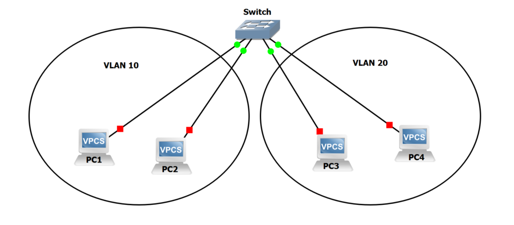

### 🧠 ¿Qué es una VLAN?

**VLAN** significa **Virtual Local Area Network** (Red de Área Local Virtual).

Es una **forma de dividir una red física** en varias redes **lógicas independientes**, aunque todos los dispositivos estén conectados al mismo **switch físico**.

---

#### 🔧 ¿Por qué usar VLANs?

Sin VLANs, todos los dispositivos conectados al mismo switch están en la **misma red** y pueden **verse entre sí** (por ejemplo, hacer ping o compartir archivos).

Con VLANs, puedes **aislar grupos de dispositivos**, **aumentar la seguridad**, y **reducir el tráfico innecesario**.

---

#### 🎯 Ejemplo fácil de entender

Imagina una oficina con este escenario:

| Persona | Departamento   | Dispositivo conectado |
| ------- | -------------- | --------------------- |
| Ana     | Administración | Puerto 1 del switch   |
| Luis    | Ventas         | Puerto 2 del switch   |
| Carla   | Ventas         | Puerto 3 del switch   |
| Pedro   | TI             | Puerto 4 del switch   |

##### Sin VLANs:

Todos los dispositivos **pueden verse entre sí**. Ana puede ver los archivos de Carla si no hay seguridad.

##### Con VLANs:

Creamos VLANs por departamento:

- **VLAN 10**: Administración → Puerto 1
- **VLAN 20**: Ventas → Puertos 2 y 3
- **VLAN 30**: TI → Puerto 4

Así, los dispositivos de **VLAN 10 y VLAN 20 no se ven entre sí** a menos que tú lo permitas.

---

### 🧰 ¿Cómo funciona técnicamente?

Cada **puerto del switch** se asigna a una VLAN.
Los switches **administrables** pueden etiquetar el tráfico con un **ID de VLAN** (por ejemplo, VLAN 10, 20, 30).

Cuando una PC envía un paquete, el switch lo **marca con su VLAN**, y **sólo los dispositivos de esa VLAN lo reciben**.

---

### 🛠️ ¿Qué se necesita para usar VLANs?

#### ✔️ Requisitos:

- Un **switch administrable** (como TP-Link Smart Switch, Cisco, Mikrotik, etc.)
- A veces, un **router** que entienda VLANs si necesitas que se comuniquen entre sí (Inter-VLAN Routing)
- PCs o dispositivos conectados por cable

---

### ⚙️ ¿Cómo se instala o configura una VLAN?

#### 🔧 Ejemplo con un **switch Cisco (CLI)**:

##### Paso 1: Entrar al modo configuración

```bash
enable
configure terminal
```

##### Paso 2: Crear las VLANs

```bash
vlan 10
name ADMINISTRACION

vlan 20
name VENTAS

vlan 30
name TI
```

##### Paso 3: Asignar puertos del switch a una VLAN

```bash
interface fastEthernet 0/1
switchport mode access
switchport access vlan 10

interface fastEthernet 0/2
switchport mode access
switchport access vlan 20

interface fastEthernet 0/3
switchport mode access
switchport access vlan 20

interface fastEthernet 0/4
switchport mode access
switchport access vlan 30
```

---

#### 🔧 Ejemplo con **TP-Link Smart Switch (interfaz web)**

1. Entras a la configuración del switch por navegador (ej. 192.168.0.1).
2. Vas a la pestaña **VLAN > 802.1Q VLAN**.
3. Creas las VLANs:

   - VLAN ID 10 → marcar solo el puerto 1 (sin trunk)
   - VLAN ID 20 → puertos 2 y 3
   - VLAN ID 30 → puerto 4

4. Guardas y reinicias el switch.

---

### 🧪 Ejemplo completo paso a paso (caso práctico)

#### 🎯 Objetivo:

Dividir una red local en dos grupos aislados:

- **VLAN 10**: Personal administrativo
- **VLAN 20**: Visitantes

---

#### 🧱 Infraestructura:

- Switch TP-Link TL-SG108E (administrable)
- Router (puede ser TP-Link, Mikrotik o uno con OpenWRT)
- 3 PCs con cable Ethernet

---

#### 🔌 Conexiones físicas:

| Puerto del switch | Conexión              |
| ----------------- | --------------------- |
| 1                 | PC de administración  |
| 2                 | PC de visitante       |
| 3                 | Router (puerto trunk) |

---

#### ⚙️ Paso 1: Crear VLANs en el switch

- VLAN 10 → Puerto 1
- VLAN 20 → Puerto 2
- Puerto 3 (al router) debe estar **en ambas VLANs y etiquetado como trunk**

---

#### ⚙️ Paso 2: Configurar el router

(Si usas OpenWRT)

1. Crear dos interfaces virtuales:

   - `eth0.10` → IP: 192.168.10.1/24
   - `eth0.20` → IP: 192.168.20.1/24

2. Activar DHCP para cada una.
3. Configurar reglas de firewall para que no se comuniquen entre sí.

---

#### 🧪 Prueba de conectividad

| Prueba                          | Resultado esperado    |
| ------------------------------- | --------------------- |
| Ping de PC admin a PC visitante | **Falla (bloqueado)** |
| Ambas PCs acceden a internet    | **Sí (permitido)**    |
| Ping entre PCs de la misma VLAN | **Sí (funciona)**     |

---

### ✅ Beneficios de usar VLANs

| Ventaja          | Ejemplo                                               |
| ---------------- | ----------------------------------------------------- |
| 🔐 Seguridad     | Aislas grupos de usuarios como visitantes o IoT       |
| 📶 Rendimiento   | Menos tráfico innecesario circulando                  |
| 🧩 Organización  | Puedes separar lógicamente por departamentos          |
| 🧱 Escalabilidad | Fácil de extender sin comprar nuevos switches físicos |

---

### 🧠 Resumen final

| Término              | Explicación                                                            |
| -------------------- | ---------------------------------------------------------------------- |
| VLAN                 | Red virtual dentro de una red física. Aísla tráfico por lógica.        |
| Requiere             | Switch administrable y router con soporte VLAN si haces interconexión. |
| Se usa para          | Seguridad, segmentación, rendimiento, orden                            |
| Herramientas comunes | Cisco, TP-Link Smart Switch, Mikrotik, OpenWRT                         |

---

[🔼](#índice)

---

## **497. Microsegmentación**

### 🧠 ¿Qué es la Microsegmentación?

La **microsegmentación** es una **técnica avanzada de seguridad de red** que consiste en **dividir una red en segmentos más pequeños y seguros**, **a nivel de aplicación o máquina virtual**, para **controlar con precisión el tráfico interno** y **limitar el movimiento lateral de los atacantes**.

> 🎯 A diferencia de las VLANs que segmentan por puertos físicos o lógicos, la microsegmentación segmenta a **nivel de host, servicio o aplicación**, incluso dentro de una misma VLAN o subred.

---

### 🧱 ¿Por qué es importante?

#### 🔥 Escenario tradicional sin microsegmentación:

Supongamos que tienes tres servidores en una misma red:

- **Servidor 1**: Base de datos
- **Servidor 2**: Aplicación web
- **Servidor 3**: Sistema de archivos

Un atacante que logra acceso al Servidor 2 puede fácilmente **moverse lateralmente** y atacar al 1 o 3.

#### ✅ Con microsegmentación:

Se crean **políticas granulares** (por ejemplo, usando un firewall o software de control) que **solo permiten lo estrictamente necesario**, como:

- El Servidor 2 **solo puede conectarse** al puerto 3306 de la base de datos en el Servidor 1.
- El Servidor 3 **no puede hablar** con nadie excepto el Servidor 1 por FTP.
- Todos los demás accesos se bloquean **incluso si están en la misma red**.

---

### 🛠️ ¿Cómo se implementa la microsegmentación?

#### 🔧 Opciones comunes:

| Método                     | Tecnología usada                             | Nivel      |
| -------------------------- | -------------------------------------------- | ---------- |
| 🔒 Firewall interno        | Windows Firewall, iptables, ufw              | Básico     |
| 🧱 Firewall basado en host | EDR/NGFW como CrowdStrike, SentinelOne, etc. | Intermedio |
| 📦 Soluciones SDN o NSX    | VMware NSX, Cisco ACI, Calico (Kubernetes)   | Avanzado   |
| 🐧 Microfirewalls          | Microseg, Cilium, Tetragon                   | Avanzado   |

---

### 🧰 Ejemplo simple con `iptables` (Linux)

Digamos que tienes dos servicios:

- Servidor Web (Puerto 80)
- Servidor de Base de Datos (Puerto 3306)

#### 🎯 Reglas de microsegmentación en el servidor de base de datos:

```bash
# 1. Permitir solo conexiones desde la IP 192.168.1.10 (servidor web)
sudo iptables -A INPUT -p tcp --dport 3306 -s 192.168.1.10 -j ACCEPT

# 2. Bloquear todo lo demás al puerto 3306
sudo iptables -A INPUT -p tcp --dport 3306 -j DROP
```

Con esto, **solo el servidor web puede hablar con el servidor de base de datos**, y **nadie más, aunque esté en la misma red**.

---

### 🧰 Ejemplo con **Windows Defender Firewall**

1. Ve al **Panel de control > Firewall de Windows Defender > Configuración avanzada**
2. Crea una **Regla de Entrada personalizada**:

   - Tipo: Puerto
   - Puerto: 1433 (SQL Server, por ejemplo)
   - Permitir solo si viene de una IP específica

3. Aplica la regla a **dominio, privado, público** según corresponda.

---

### 💻 Laboratorio completo: Microsegmentación en red local

#### 🔧 Infraestructura:

| Dispositivo         | IP           | Rol          |
| ------------------- | ------------ | ------------ |
| Servidor Web        | 192.168.1.10 | Apache/Nginx |
| Servidor Base Datos | 192.168.1.20 | MySQL        |
| Estación atacante   | 192.168.1.30 | Kali Linux   |

#### 🎯 Objetivo:

- El servidor web **puede acceder a la base de datos** (Puerto 3306)
- El atacante **no puede acceder** a la base de datos
- Todo en la **misma red** (sin VLANs ni switches especiales)

---

#### ⚙️ Paso 1: Configurar el acceso permitido

En el servidor de base de datos (Linux):

```bash
# Permitir al servidor web
iptables -A INPUT -p tcp -s 192.168.1.10 --dport 3306 -j ACCEPT

# Bloquear a todos los demás
iptables -A INPUT -p tcp --dport 3306 -j DROP
```

---

#### 🧪 Paso 2: Verificar con `nmap`

Desde el servidor web:

```bash
nmap -p 3306 192.168.1.20
# Resultado: puerto abierto
```

Desde el atacante:

```bash
nmap -p 3306 192.168.1.20
# Resultado: puerto cerrado o filtrado
```

---

#### 🔁 ¿Y si necesito que se comuniquen?

Puedes crear **excepciones** con más reglas específicas:

```bash
iptables -A INPUT -p tcp --dport 3306 -s 192.168.1.40 -j ACCEPT
```

---

### 🧠 Ventajas clave de la microsegmentación

| Ventaja                     | Beneficio práctico                          |
| --------------------------- | ------------------------------------------- |
| 🎯 Menos movimiento lateral | Los atacantes no pueden moverse fácilmente  |
| 🔒 Seguridad granular       | Controlas quién habla con quién exactamente |
| 🚀 Compatible con la nube   | Funciona en entornos virtuales y Kubernetes |
| 📦 Control de aplicaciones  | Puedes segmentar por tipo de servicio       |

---

### 🧪 ¿Cómo se vería en una empresa?

| Departamento  | Aplicación | IP         | Política de microsegmentación             |
| ------------- | ---------- | ---------- | ----------------------------------------- |
| Finanzas      | ERP        | 10.1.1.100 | Solo accesible por frontend ERP 10.1.1.20 |
| Recursos Hum. | HR App     | 10.1.1.120 | Solo accesible por usuario interno VPN    |
| Desarrollo    | Git Server | 10.1.1.150 | Solo accesible por ciertos devs           |

---

### 🧩 ¿Cuándo usar microsegmentación?

✅ Siempre que trabajes en:

- Redes empresariales
- Entornos en la nube (AWS, Azure, GCP)
- Infraestructura virtual (VMware, KVM, VirtualBox)
- Sistemas críticos (salud, finanzas, energía)

---

### ✅ Resumen final

| Concepto             | Descripción                                                                                                              |
| -------------------- | ------------------------------------------------------------------------------------------------------------------------ |
| Microsegmentación    | Técnica para dividir redes lógicas en pequeños segmentos seguros, controlando el tráfico a nivel de host o aplicación.   |
| ¿Para qué sirve?     | Evitar que un atacante que entra en un servidor pueda moverse lateralmente hacia otros.                                  |
| ¿Cómo se implementa? | Reglas firewall por IP, puerto, aplicación. Con software como iptables, NSX, Calico o firewalls de siguiente generación. |
| ¿Dónde se usa?       | Servidores locales, nubes, contenedores, entornos virtualizados.                                                         |

---

[🔼](#índice)

---

## **498. CIDR y Máscara de red/subred**

### 🧠 ¿Qué es una máscara de subred?

Una **máscara de subred** (subnet mask) es un número que **define qué parte de una dirección IP pertenece a la red** y qué parte pertenece al host.

> 🔢 Por ejemplo:
>
> IP: `192.168.1.10`
>
> Máscara: `255.255.255.0`
>
> Esto quiere decir:
>
> - Los **primeros 3 octetos** (`192.168.1`) identifican la red
>
> - El último octeto (`.10`) identifica al **host** (la computadora dentro de esa red)

---

### 🧠 ¿Qué es CIDR?

**CIDR** (Classless Inter-Domain Routing) es una **forma moderna de representar direcciones IP** y su máscara, en un formato **más corto y flexible**.

> 🎯 Ejemplo:
>
> - En vez de decir `192.168.1.0` con máscara `255.255.255.0`, usamos:
>
>   `192.168.1.0/24`
>
> Ese **/24** significa que los **primeros 24 bits** son de la red.

---

### 🧮 Comparación de máscara de subred vs CIDR

| Máscara de subred | CIDR | Nº de IPs disponibles (hosts) |
| ----------------- | ---- | ----------------------------- |
| 255.0.0.0         | /8   | 16,777,214                    |
| 255.255.0.0       | /16  | 65,534                        |
| 255.255.255.0     | /24  | 254                           |
| 255.255.255.240   | /28  | 14                            |
| 255.255.255.252   | /30  | 2                             |

> 🚨 CIDR te permite **crear subredes más pequeñas o más grandes** según lo que necesites.

---

### 🔧 ¿Cómo se configura una subred (CIDR/máscara)?

#### 🖥️ En Windows (manual)

1. Ve a **Panel de control > Centro de redes > Cambiar configuración del adaptador**
2. Haz clic derecho en tu adaptador → Propiedades
3. Selecciona **Protocolo de Internet versión 4 (TCP/IPv4)** → Propiedades
4. Coloca manualmente:

   - IP: `192.168.10.5`
   - Máscara: `255.255.255.0`
   - Gateway: `192.168.10.1`

---

#### 🐧 En Linux (Ubuntu, por terminal)

```bash
sudo ip addr add 192.168.10.5/24 dev eth0
```

Esto configura una IP con máscara **/24** (es decir, 255.255.255.0) en la interfaz `eth0`.

---

#### 🌐 En routers (como TP-Link, Cisco, MikroTik, pfSense)

Generalmente se puede poner:

```
IP Address: 192.168.100.1
Subnet mask: 255.255.255.0
o
CIDR: 192.168.100.1/24
```

En pfSense, MikroTik o routers Cisco puedes definir subredes usando CIDR directamente desde su consola o panel web.

---

### 📚 Ejemplos explicados

#### ✅ Ejemplo 1: Red /24

- IP: `192.168.1.0/24`
- Rango válido de hosts: `192.168.1.1` a `192.168.1.254`
- Total de hosts: 254

#### ✅ Ejemplo 2: Red /30 (solo para conectar 2 equipos)

- IP: `10.0.0.0/30`
- IPs válidas: `10.0.0.1` y `10.0.0.2`
- Total de hosts: 2
- Ideal para conexión punto a punto (router a router)

---

### 🔬 Ejemplo completo: Segmentar una red en 4 subredes usando CIDR

Supón que tienes la red: `192.168.1.0/24` (254 hosts) y quieres dividirla en **4 subredes**.

#### 📐 Paso 1: Calcular cuántos bits necesitas

Para 4 subredes → necesitas 2 bits adicionales (porque 2² = 4)

→ CIDR: `/24` + 2 bits = `/26`

---

#### 📦 Resultado:

| Subred             | Rango de IPs                  | Broadcast     |
| ------------------ | ----------------------------- | ------------- |
| `192.168.1.0/26`   | 192.168.1.1 – 192.168.1.62    | 192.168.1.63  |
| `192.168.1.64/26`  | 192.168.1.65 – 192.168.1.126  | 192.168.1.127 |
| `192.168.1.128/26` | 192.168.1.129 – 192.168.1.190 | 192.168.1.191 |
| `192.168.1.192/26` | 192.168.1.193 – 192.168.1.254 | 192.168.1.255 |

---

#### ⚙️ Paso 2: Asignar IPs

- Red 1: Departamento de Finanzas → usa `192.168.1.0/26`
- Red 2: Sistemas → usa `192.168.1.64/26`
- Red 3: Administración → usa `192.168.1.128/26`
- Red 4: Seguridad → usa `192.168.1.192/26`

Así cada área tiene su propio **espacio IP segmentado y aislado**.

---

### 🛠️ ¿Cómo probarlo?

#### 🧪 En VirtualBox (usando Ubuntu Server o Kali):

1. Crea 4 máquinas virtuales.
2. En cada una, configuras IP manualmente:

```bash
# Máquina 1 (Finanzas)
sudo ip addr add 192.168.1.10/26 dev enp0s3

# Máquina 2 (Sistemas)
sudo ip addr add 192.168.1.70/26 dev enp0s3

# Máquina 3 (Admin)
sudo ip addr add 192.168.1.130/26 dev enp0s3

# Máquina 4 (Seguridad)
sudo ip addr add 192.168.1.195/26 dev enp0s3
```

3. Puedes probar conectividad con `ping`.

---

### ✅ Resumen Final

| Concepto                  | Explicación                                                                       |
| ------------------------- | --------------------------------------------------------------------------------- |
| Máscara de subred         | Define qué parte de la IP es red y qué parte host.                                |
| CIDR                      | Forma abreviada moderna para expresar rango de IPs (ej. /24).                     |
| Ventaja de CIDR           | Mayor flexibilidad para crear subredes según necesidad.                           |
| Instalación/configuración | En routers, sistemas operativos o máquinas virtuales con IPs y máscaras manuales. |
| Ejemplo práctico          | Dividir una red `/24` en 4 subredes usando `/26`.                                 |

---

[🔼](#índice)

---

## **499. Introducción a AWS (Amazon Web Services)**

### 🧠 ¿Qué es AWS?

**Amazon Web Services (AWS)** es una **plataforma de servicios en la nube** creada por Amazon. Proporciona **infraestructura tecnológica a través de internet**, es decir: puedes tener servidores, bases de datos, almacenamiento, inteligencia artificial, seguridad, redes y más **sin tener que comprar hardware físico**.

#### 🧩 ¿Qué ofrece AWS?

AWS tiene **más de 200 servicios**, pero los más usados son:

| Servicio                                 | ¿Para qué sirve?                             | Ejemplo                               |
| ---------------------------------------- | -------------------------------------------- | ------------------------------------- |
| **EC2** (Elastic Compute Cloud)          | Crear servidores virtuales                   | Correr una app web, un honeypot, etc. |
| **S3** (Simple Storage Service)          | Guardar archivos en la nube                  | Subir PDFs, imágenes o backups        |
| **RDS** (Relational Database Service)    | Crear bases de datos como MySQL o PostgreSQL | Sitios web con base de datos          |
| **Lambda**                               | Ejecutar código sin servidor (serverless)    | Automatizar tareas o microservicios   |
| **VPC** (Virtual Private Cloud)          | Crear tu red privada en la nube              | Simular una red segmentada            |
| **IAM** (Identity and Access Management) | Gestionar usuarios y permisos                | Dar acceso solo a ciertas personas    |

---

### 🔧 ¿Cómo se “instala” o accede a AWS?

En realidad, AWS **no se instala**, porque todo corre en la nube. Lo que haces es crear una cuenta y usar los servicios desde el **navegador web o la terminal (CLI)**.

#### 🪜 PASOS para comenzar a usar AWS:

##### ✅ Paso 1: Crear una cuenta

1. Ve a [https://aws.amazon.com](https://aws.amazon.com)
2. Haz clic en **Crear una cuenta gratuita**
3. Llena tus datos personales
4. Debes ingresar una **tarjeta de crédito o débito válida** (tranquilo, muchos servicios tienen **capa gratuita**)
5. Verifica tu identidad (por SMS)

##### ✅ Paso 2: Inicia sesión en el panel (AWS Management Console)

Desde ahí puedes crear, configurar y controlar todos los servicios de AWS.

##### ✅ Paso 3 (opcional): Instalar AWS CLI (Command Line Interface)

Si quieres usar AWS desde la terminal (como en Linux), instala el CLI:

```bash
# En Ubuntu
curl "https://awscli.amazonaws.com/awscli-exe-linux-x86_64.zip" -o "awscliv2.zip"
unzip awscliv2.zip
sudo ./aws/install

# Luego configúralo
aws configure
```

Te pedirá:

- **Access Key ID**
- **Secret Access Key**
- Región (ej: `us-east-1`)

Estos datos los obtienes desde la consola de AWS → IAM → “Crear usuario”.

---

### 🌎 Ejemplo fácil de entender: ¿Para qué sirve AWS?

#### 🎯 Ejemplo 1: Hosting de sitio web

Supón que has creado un portafolio con React. Puedes usar AWS así:

- Subes los archivos a **S3** como almacenamiento
- Activas el modo “hosting estático” en S3
- Le pones un dominio con **Route 53**
- Proteges tu sitio con **CloudFront + HTTPS**

Y ¡listo! Tu sitio está en línea en la nube, sin comprar servidor.

---

#### 🎯 Ejemplo 2: Crear un servidor Linux en AWS

Usando **EC2**, puedes tener una máquina virtual como si fuera tu Kali Linux, Ubuntu, o Windows.

Pasos:

1. Entra a AWS Console → EC2
2. Elige “Launch instance”
3. Escoge una imagen (por ejemplo Ubuntu Server 22.04)
4. Selecciona tipo de instancia (usa la gratuita: `t2.micro`)
5. Crea una clave SSH
6. Lanza la instancia
7. Te dan una **IP pública** (ej: `3.89.13.11`)
8. Desde tu terminal conectas así:

```bash
ssh -i "tu_clave.pem" ubuntu@3.89.13.11
```

Y ya estás dentro de tu servidor en la nube.

---

### 🧪 Ejemplo práctico completo: subir y servir archivos desde S3

**Objetivo**: Crear un bucket S3 y alojar un archivo que puedes ver desde internet.

#### Paso 1: Crear bucket S3

1. Ve a **S3** en la consola de AWS
2. Haz clic en **“Create bucket”**
3. Nombre: `mis-pruebas-gustavo`
4. Región: us-east-1
5. Desactiva el bloqueo de acceso público (solo para pruebas)
6. Crear

---

#### Paso 2: Subir archivo

1. Dentro del bucket → **Upload**
2. Sube `index.html` con contenido como:

```html
<h1>Hola desde AWS S3!</h1>
```

3. Click en el archivo subido → “Make public”

---

#### Paso 3: Activar hosting estático

1. Dentro del bucket → pestaña **Properties**
2. Baja hasta **Static website hosting**
3. Activa y pon:

   - Index document: `index.html`
   - Error document: `404.html` (opcional)

4. Guarda

Te dan una URL como:

```
http://mis-pruebas-gustavo.s3-website-us-east-1.amazonaws.com
```

¡Visítala y verás tu página!

---

### 🧱 Capa gratuita de AWS (importante)

AWS tiene una capa gratuita por **12 meses**, ideal para aprender:

| Servicio                | Límite mensual          |
| ----------------------- | ----------------------- |
| EC2 (t2.micro)          | 750 horas               |
| S3                      | 5 GB                    |
| RDS (MySQL, PostgreSQL) | 750 horas               |
| Lambda                  | 1 millón de ejecuciones |
| DynamoDB                | 25 GB                   |

Puedes revisar siempre tu uso en **Billing Dashboard**.

---

### ✅ Resumen Final

| Concepto         | Explicación                                                           |
| ---------------- | --------------------------------------------------------------------- |
| AWS              | Plataforma de servicios en la nube de Amazon                          |
| ¿Para qué sirve? | Crear servidores, bases de datos, almacenamiento, seguridad, AI, etc. |
| ¿Cómo se accede? | Desde navegador (AWS Console) o terminal (CLI)                        |
| Ejemplo práctico | Crear un sitio web en S3 o servidor EC2 con Ubuntu                    |
| Costo            | Tiene capa gratuita por 12 meses (con límites)                        |

---

[🔼](#índice)

---

## **500. Registro y configuración de una cuenta en AWS**

### 🧠 ¿Qué es el registro en AWS y para qué sirve?

**Registrarse en AWS (Amazon Web Services)** significa crear una cuenta que te dará acceso a una **plataforma de servicios en la nube**, donde podrás:

- Crear servidores virtuales
- Subir archivos a la nube
- Instalar bases de datos
- Probar proyectos de ciberseguridad (honeypots, escaneos, redes virtuales, etc.)
- Desplegar páginas web o APIs

---

### ✅ Requisitos antes de registrarte

Antes de empezar, asegúrate de tener lo siguiente:

1. **Correo electrónico válido** (no usado antes en AWS)
2. **Tarjeta de débito o crédito internacional** (aunque hay capa gratuita, es obligatoria para verificar identidad)
3. **Número de celular activo** (recibirás un SMS de verificación)
4. Una **conexión a internet estable**

---

### 🪜 PASOS: Cómo registrarte en AWS

#### 🔹 Paso 1: Ir a la página oficial

- Abre tu navegador y ve a:
  👉 [https://aws.amazon.com/es/free/](https://aws.amazon.com/es/free/)

- Haz clic en el botón **"Crear una cuenta gratuita"**

---

#### 🔹 Paso 2: Ingresar datos personales

1. Ingresa tu **correo electrónico**
2. Escribe un **nombre de usuario** (ej: `gustavo-dev`)
3. Crea una **contraseña segura**
4. Selecciona si la cuenta es:

   - **Personal** (recomendado si estás aprendiendo)
   - **Empresa**

---

#### 🔹 Paso 3: Información de pago

- AWS pedirá tu **tarjeta** (acepta Visa o Mastercard internacionales)
- Te harán un cargo temporal de \$1 USD para verificar, pero luego lo devuelven

🔒 **Tranquilo**, si usas los servicios gratuitos (como `t2.micro` en EC2), **no pagarás nada**.

---

#### 🔹 Paso 4: Verificación de identidad

1. Debes colocar un número de teléfono celular
2. AWS te enviará un **código SMS**
3. Ingrésalo para continuar

---

#### 🔹 Paso 5: Seleccionar plan

Tendrás que elegir un plan de soporte:

- Selecciona **"Plan Básico (Free)"**
- Es gratuito y suficiente para comenzar

---

#### 🔹 Paso 6: Iniciar sesión en la consola

Ahora ya puedes acceder al **AWS Management Console**:

👉 [https://console.aws.amazon.com/](https://console.aws.amazon.com/)

Aquí verás el **panel principal** con todos los servicios disponibles.

---

### 🛠️ Configuración básica recomendada después de crear tu cuenta

#### 1. Activar autenticación de dos factores (MFA)

- Ve a: **"Servicios" → "IAM" → "Usuarios"**
- Selecciona tu usuario y activa MFA (puedes usar Google Authenticator)

Esto aumenta mucho la seguridad de tu cuenta.

---

#### 2. Crear usuario administrador seguro

Por defecto usas el **usuario root**, pero es recomendable:

- Crear un **usuario IAM** con permisos de administrador
- Así no usas el root para todo (buena práctica en seguridad)

---

#### 3. Elegir una región

Cada recurso en AWS está en una **región** (como `us-east-1` o `sa-east-1`):

- En la parte superior derecha, selecciona una **región cercana** (por ejemplo, São Paulo si estás en Perú)

---

### 💡 ¿Cómo saber si estás en la capa gratuita?

Desde la consola:

- Ve a: **"Billing" → "Free Tier"**
- Ahí puedes ver cuántas horas de EC2 o GB de S3 estás usando

---

### 🧪 EJEMPLO PRÁCTICO COMPLETO: Crear un servidor Linux gratis en AWS

Vamos a lanzar una **máquina virtual Linux (Ubuntu)** para que veas que tu cuenta ya funciona.

---

#### 🔸 1. Ir a EC2 (Elastic Compute Cloud)

- En consola → busca "**EC2**"
- Haz clic en “**Launch instance**”

---

#### 🔸 2. Configurar la instancia

1. **Nombre**: `MiServidorLinux`
2. **AMI (Amazon Machine Image)**: elige **Ubuntu Server 22.04 LTS**
3. **Tipo de instancia**: selecciona **t2.micro** (gratuito)
4. **Par de claves (key pair)**:

   - Crea una nueva → `clave-gustavo`
   - Tipo: `.pem`
   - Descárgala y guárdala en un lugar seguro

5. **Grupo de seguridad**:

   - Permitir SSH desde tu IP

---

#### 🔸 3. Lanzar y conectar

- Haz clic en **"Launch instance"**
- Espera unos segundos y haz clic en **“Connect”**
- Verás instrucciones SSH

Desde tu terminal (Linux o WSL):

```bash
chmod 400 clave-gustavo.pem
ssh -i "clave-gustavo.pem" ubuntu@<IP_PUBLICA>
```

Ejemplo:

```bash
ssh -i "clave-gustavo.pem" ubuntu@18.229.111.99
```

¡Estás dentro de tu servidor virtual Ubuntu desde AWS!

---

### ✅ RESUMEN GENERAL

| Elemento              | Detalles                                             |
| --------------------- | ---------------------------------------------------- |
| ¿Qué es?              | Registro y configuración para usar la nube de Amazon |
| ¿Qué necesitas?       | Correo, tarjeta, celular                             |
| ¿Tiene costo?         | Solo si usas servicios fuera de la capa gratuita     |
| ¿Qué puedes hacer?    | Servidores, webs, bases de datos, redes, apps, etc.  |
| Seguridad recomendada | Activar MFA y no usar root a diario                  |
| Ejemplo hecho         | Crear un servidor Linux t2.micro con SSH gratis      |

---

[🔼](#índice)

---

## **501. Costes en AWS**

### 🧠 ¿Qué son los costes en AWS?

Los **costes en AWS (Amazon Web Services)** representan lo que **pagas por usar servicios en la nube**, como servidores, bases de datos, almacenamiento o redes.

**AWS no tiene tarifas fijas** como una suscripción mensual. **Se paga por consumo**:

👉 Solo pagas lo que usas (como pagar la luz o el agua).

---

### 📦 Tipos de costes en AWS

| Tipo de servicio                | ¿Qué cobra AWS?                                        |
| ------------------------------- | ------------------------------------------------------ |
| EC2 (servidores virtuales)      | Por hora o segundo de uso + almacenamiento EBS         |
| S3 (almacenamiento)             | Por GB almacenado y transferido                        |
| RDS (bases de datos)            | Por hora de instancia + almacenamiento                 |
| Lambda (funciones sin servidor) | Por número de ejecuciones y duración                   |
| Transferencia de datos          | Gratis de entrada, pero salida (hacia internet) cuesta |

---

### 💡 Ejemplo fácil de entender

Piensa en AWS como un **mercado de servicios tecnológicos**:

- Tú puedes **alquilar una PC virtual (EC2)** por horas.
- Puedes **guardar archivos (S3)** como si fuera Google Drive.
- Puedes **tener una base de datos MySQL en la nube (RDS)**.
- Puedes correr funciones automáticas sin servidor (Lambda).

Cada uno tiene un **precio por uso**.

---

### 🆓 ¿Qué es el Free Tier o capa gratuita?

Cuando te registras en AWS por primera vez, **tienes 12 meses de acceso gratuito a ciertos recursos**, como:

| Servicio | Qué ofrece gratis                      |
| -------- | -------------------------------------- |
| EC2      | 750 horas/mes de t2.micro              |
| S3       | 5 GB de almacenamiento                 |
| RDS      | 750 horas de base de datos db.t2.micro |
| Lambda   | 1 millón de ejecuciones gratis al mes  |

🟢 **Consejo**: Si solo haces pruebas o prácticas, puedes quedarte dentro del Free Tier y **no pagar nada**.

---

### 💰 ¿Cómo controlar y evitar gastos en AWS?

#### 🔐 1. **Activar alertas de presupuesto**

- En consola → Ve a **Billing** → **Budgets**
- Crea un presupuesto, por ejemplo de **5 USD**
- AWS te envía un **correo si te acercas al límite**

#### 📊 2. **Ver uso y desglose de servicios**

- En consola → **Billing** → “Cost Explorer” o “Cost & Usage Reports”
- Puedes ver **qué servicio está generando gasto**, por ejemplo:

```
EC2 = $2.50
S3 = $0.10
RDS = $4.00
```

#### 🧽 3. **Eliminar recursos que no uses**

¡Muy importante! A veces dejas una instancia EC2 encendida y sigue cobrando.

- Ve a la consola de **EC2 / S3 / RDS / Lambda** y **detén o elimina** todo lo que no estés usando.

---

### 🧮 ¿Cómo se calcula el precio en AWS?

Veamos ejemplos sencillos:

---

#### ☁️ EC2 (Servidor Linux básico)

- Tipo: t2.micro (1 vCPU, 1 GB RAM)
- Precio: **gratis en Free Tier**
- Fuera del Free Tier: \$0.0116 por hora

**Si usas 10 horas en un mes:**

```bash
10 horas × $0.0116 = $0.116 (11 centavos de dólar)
```

---

#### 🗃️ S3 (almacenamiento de archivos)

- Precio: \$0.023 por GB al mes

**Si subes 1 video de 2 GB:**

```bash
2 GB × $0.023 = $0.046 (4.6 centavos de dólar por mes)
```

---

#### 🔄 Lambda (función sin servidor)

- Primer millón de ejecuciones al mes → GRATIS
- Luego: \$0.20 por cada millón adicional

**Si ejecutas 500 mil veces tu función → \$0**

---

### 🧪 EJEMPLO PRÁCTICO COMPLETO: Crear un servidor, subir archivos a S3 y calcular coste

#### 1. Crear un servidor EC2

- Tipo: t2.micro
- Tiempo encendido: 24 horas
- Precio: \$0 si estás en Free Tier

---

#### 2. Subir archivos a S3

- Archivos: 3 fotos (total 15 MB)
- Precio: dentro del Free Tier (5 GB gratis)

---

#### 3. Desplegar función Lambda

- Función: convierte texto en mayúsculas
- 10 ejecuciones de prueba → Gratis

---

#### 🔍 Verificación de costes:

1. En consola, ve a:
   → `Billing` → `Cost Explorer`
2. Verás:

```
EC2: $0.00
S3: $0.00
Lambda: $0.00
Total: $0.00
```

Si pasas los 12 meses gratuitos y haces lo mismo:

```
EC2 (24h) = 24 × 0.0116 = $0.278
S3 (15 MB) = ~ $0.0003
Lambda (10 ejecuciones) = $0
Total: ~ $0.28
```

---

### ✅ RESUMEN FINAL

| Tema                 | Explicación simple                                          |
| -------------------- | ----------------------------------------------------------- |
| ¿Qué son los costes? | Pago por lo que consumes: horas, GB, funciones              |
| ¿Gratis?             | Sí, 12 meses con servicios limitados                        |
| ¿Cómo evitar cobros? | Alertas, eliminar recursos, monitorear                      |
| ¿Cómo calcular?      | Cada servicio tiene tarifa por unidad (hora, GB, ejecución) |
| Herramientas útiles  | Billing Dashboard, Budgets, Cost Explorer                   |

---

[🔼](#índice)

---

## **502. Despliegue de una aplicación web en la nube**

### 🧠 ¿Qué significa "desplegar una aplicación web"?

"Desplegar" una aplicación web significa **hacer que esté disponible en internet**, para que cualquier persona pueda accederla desde un navegador (Chrome, Firefox, etc.).

👉 **Ejemplo**: Tienes una página hecha en React o una API con Node.js en tu computadora, pero quieres que esté accesible desde `https://mitienda.com`.

Para eso, **usas la nube**.

---

### ☁️ ¿Qué es la nube en este contexto?

"La nube" se refiere a **servicios como AWS, Render, Vercel, Heroku, Netlify, Azure, GCP**, etc.

Estos te permiten **alojar** (guardar) tu aplicación en **servidores remotos**, sin tener que usar tu propia computadora.

---

### 🧱 ¿Qué necesito para desplegar una app?

#### 1. **Código fuente de tu app**

(React, Vue, Express, Laravel, Django, etc.)

#### 2. **Plataforma de despliegue**

(Vercel, Render, Netlify, AWS EC2, etc.)

#### 3. **Repositorio Git** (opcional pero muy común)

(Por ejemplo, GitHub)

---

### 🚀 Plataformas de despliegue comunes

| Plataforma | Ideal para                          | Gratis            |
| ---------- | ----------------------------------- | ----------------- |
| Vercel     | Frontend (React, Next.js)           | ✅                |
| Netlify    | Frontend (HTML, JS, frameworks)     | ✅                |
| Render     | Backend (Node.js, Express, MongoDB) | ✅                |
| Heroku     | Backend y apps simples              | ✅ (limitado)     |
| AWS EC2    | Control total, más técnico          | ❌ (pago por uso) |

---

### 🛠️ ¿Cómo se instala o usa una plataforma para desplegar?

Aquí usaremos **Vercel** (para frontend) y **Render** (para backend Node.js). Ambas son gratuitas y muy usadas.

---

### 🟢 PASO A PASO: Despliegue de app React en Vercel

#### 1. Tener tu proyecto local

Por ejemplo:

```bash
npx create-react-app miapp
cd miapp
npm run build
```

#### 2. Subir tu código a GitHub

- Crea un repositorio en [GitHub](https://github.com)
- Sube tu carpeta `miapp`

```bash
git init
git remote add origin <tu-repo>
git add .
git commit -m "Primera subida"
git push -u origin main
```

#### 3. Crear cuenta en [https://vercel.com](https://vercel.com)

- Inicia sesión con tu GitHub
- Haz clic en “**Add New Project**”
- Selecciona tu repositorio
- Vercel detecta que es React y configura solo
- Espera 1 minuto… 🎉 ¡tu app está en línea!

**URL pública:**

```txt
https://miapp.vercel.app
```

---

### 🔵 PASO A PASO: Despliegue de backend Node.js en Render

#### 1. Tener tu backend en Node.js

Ejemplo simple:

```js
// index.js
const express = require("express");
const app = express();
app.get("/", (req, res) => res.send("Hola desde el backend"));
app.listen(3000, () => console.log("Servidor en puerto 3000"));
```

#### 2. Subirlo a GitHub (igual que antes)

#### 3. Crear cuenta en [https://render.com](https://render.com)

- Click en “New Web Service”
- Conecta tu GitHub
- Escoge el repo con tu backend
- En configuración:

```
Runtime: Node.js
Build command: npm install
Start command: node index.js
```

- Render te da una URL pública, por ejemplo:

```txt
https://mi-api.onrender.com
```

---

### ✅ EJEMPLO COMPLETO

#### Imagina que hiciste una app de tareas con:

- **Frontend React:** `https://tareas-front.vercel.app`
- **Backend Node:** `https://api-tareas.onrender.com`
- Ambos conectados: tu frontend hace fetch al backend.

##### Código del frontend:

```js
fetch("https://api-tareas.onrender.com/tareas")
  .then((res) => res.json())
  .then((data) => console.log(data));
```

##### Resultado:

- Usuario entra a tu URL de Vercel.
- El frontend pide los datos al backend en Render.
- Ambos están **desplegados en la nube** y funcionando.

---

### 🧾 Buenas prácticas

| Práctica                     | ¿Por qué?                                  |
| ---------------------------- | ------------------------------------------ |
| Usa variables de entorno     | Para ocultar credenciales (API keys, etc.) |
| Cierra servicios que no uses | Para evitar cobros si no es gratuito       |
| Lee documentación oficial    | Cada plataforma tiene sus detalles         |
| Usa HTTPS                    | Siempre que puedas, protege tus datos      |

---

### 📦 BONUS: ¿Y si tengo base de datos?

Puedes agregar:

- **MongoDB Atlas** (gratis, en la nube)
- **PlanetScale** (MySQL en la nube)
- **Firebase** (Realtime DB o Firestore)

Tu backend puede conectarse fácilmente a estas.

---

### 🏁 Conclusión

Desplegar en la nube:

| Paso | Qué haces                                       |
| ---- | ----------------------------------------------- |
| 1    | Subes tu app a GitHub                           |
| 2    | Conectas Vercel (frontend) o Render (backend)   |
| 3    | Vercel y Render lo montan por ti                |
| 4    | Obtienes una URL pública ¡lista para compartir! |

---

[🔼](#índice)

---

## **503. Firewall**


### 🔥 ¿Qué es un **Firewall**?

Un **firewall** (cortafuegos) es un **sistema de seguridad** que **controla el tráfico de red** (lo que entra o sale de tu computadora o red) según **reglas definidas**.

---

### 🧠 ¿Para qué sirve un firewall?

- **Permite o bloquea** conexiones según su origen, destino, puerto, protocolo, etc.
- Protege contra accesos no autorizados.
- Evita ataques como escaneo de puertos, conexiones no deseadas, malware, etc.

---

### 📦 Tipos de Firewalls

| Tipo                            | Explicación                                                 | Ejemplo                       |
| ------------------------------- | ----------------------------------------------------------- | ----------------------------- |
| **Firewall de red**             | Se instala en routers o switches para proteger toda una red | Cisco ASA, pfSense            |
| **Firewall de host**            | Se instala en un dispositivo individual                     | Windows Firewall, UFW (Linux) |
| **Firewall basado en software** | Programas que controlan el tráfico                          | ZoneAlarm, Comodo Firewall    |
| **Firewall basado en hardware** | Dispositivo físico que filtra el tráfico                    | Routers con firewall          |

---

### 🔄 ¿Cómo funciona un firewall?

Funciona con **reglas** que dicen:

- **Qué tipo de tráfico** está permitido (HTTP, HTTPS, SSH, etc.)
- **Desde dónde** (IP origen)
- **Hacia dónde** (IP destino)
- **Por qué puerto**

---

#### 🧱 Ejemplo sencillo:

**Regla del firewall**:

"Permitir tráfico entrante solo en el puerto 80 (HTTP) y 443 (HTTPS). Bloquear el resto."

Esto significa:

- Puedes navegar páginas web.
- Pero si alguien intenta conectarse a tu PC por el puerto 22 (SSH), será **bloqueado**.

---

### 🛠️ ¿Cómo instalar y configurar un firewall?

Depende del sistema operativo. Vamos a verlo en:

---

#### 🟩 🔒 En **Linux (Ubuntu/Debian)**: Usando `ufw`

**UFW** (Uncomplicated Firewall) es un firewall fácil de usar basado en iptables.

##### 📌 Instalación:

```bash
sudo apt update
sudo apt install ufw
```

##### 📌 Activar el firewall:

```bash
sudo ufw enable
```

##### 📌 Permitir tráfico HTTP (puerto 80) y HTTPS (443):

```bash
sudo ufw allow 80
sudo ufw allow 443
```

##### 📌 Bloquear un puerto (por ejemplo el 21, FTP):

```bash
sudo ufw deny 21
```

##### 📌 Ver reglas activas:

```bash
sudo ufw status
```

---

#### 🟦 🔒 En **Windows 10/11**

1. Ve a **Panel de Control** → **Sistema y seguridad** → **Firewall de Windows Defender**
2. Puedes:

   - Permitir o bloquear programas
   - Crear reglas personalizadas
   - Activar notificaciones

3. También puedes hacerlo por consola con `netsh advfirewall` o **PowerShell**.

---

#### 🟥 🔒 En **Redes empresariales**

- Se usan firewalls como **pfSense**, **Cisco ASA**, **Fortinet**, que protegen todo el tráfico de una red.
- Requieren configuración más avanzada (puertas de enlace, NAT, políticas, etc.).

---

### ✅ Ejemplo completo

#### 🧪 Escenario: Proteger un servidor web en Linux

##### Objetivo:

- Permitir tráfico web (puerto 80 y 443)
- Permitir conexión SSH desde una IP específica
- Bloquear todo lo demás

##### 🔧 Paso a paso con `ufw`:

```bash
# 1. Activar el firewall
sudo ufw enable

# 2. Permitir HTTP y HTTPS
sudo ufw allow 80
sudo ufw allow 443

# 3. Permitir SSH solo desde una IP (ej. 190.10.10.5)
sudo ufw allow from 190.10.10.5 to any port 22

# 4. Bloquear todo lo demás (por defecto ufw lo hace)
sudo ufw default deny incoming
sudo ufw default allow outgoing

# 5. Ver el estado
sudo ufw status verbose
```

##### Resultado:

- Tu servidor estará disponible en internet por el navegador.
- Nadie podrá conectarse por SSH salvo tú desde tu IP.
- Estás protegido de accesos no deseados.

---

### 🧾 Buenas prácticas

| Práctica                              | ¿Por qué?                               |
| ------------------------------------- | --------------------------------------- |
| Cierra todos los puertos que no uses  | Reduce superficie de ataque             |
| Cambia el puerto SSH si puedes        | Menos ataques automatizados             |
| Usa reglas específicas por IP o rango | Mejora control                          |
| Haz backups de reglas                 | Evita perder configuración si reinicias |
| Monitorea tráfico                     | Detectas intentos sospechosos           |

---

### 📌 Bonus: Firewall en la nube

Si usas **AWS, Azure, GCP**, etc., cada uno tiene **grupos de seguridad (security groups)** que son firewalls por instancia.
Ejemplo en AWS EC2:

```txt
Allow: TCP port 22 from 190.10.10.5
Allow: TCP port 80 and 443 from 0.0.0.0/0
```

---

### 🧠 Conclusión

- Un **firewall filtra tráfico** para proteger un sistema o red.
- Puede estar en el sistema operativo o en el router.
- Se configura con **reglas de puertos, IPs y protocolos**.
- Es clave en cualquier estrategia de **ciberseguridad**.

---

[🔼](#índice)

---

## **504. Despliegue de un Firewall en AWS**

### 🔥 ¿Qué es un Firewall en AWS?

En AWS, los **firewalls no se llaman directamente "firewall"** como en otros sistemas, pero **funcionan como tales** a través de **Security Groups**, **NACLs (Network ACLs)** y el **AWS Network Firewall** (más avanzado).

---

### 🧱 Tipos de Firewall en AWS

| Tipo                        | ¿Qué es?                                       | Uso común                                      |
| --------------------------- | ---------------------------------------------- | ---------------------------------------------- |
| ✅ **Security Groups**      | Firewall a nivel de instancia (EC2, RDS, etc.) | Permitir o denegar tráfico entrante y saliente |
| 🔁 **NACLs** (Network ACLs) | Firewall a nivel de subred VPC                 | Reglas más básicas y por orden de prioridad    |
| 🔥 **AWS Network Firewall** | Firewall avanzado, gestionado                  | Para redes grandes o múltiples VPCs            |

---

### 🧠 Diferencias clave

| Característica        | Security Group              | NACL                          |
| --------------------- | --------------------------- | ----------------------------- |
| Se aplica a...        | Instancias (EC2, RDS)       | Subredes                      |
| Estado                | **Con estado** (stateful)   | **Sin estado** (stateless)    |
| Reglas                | Solo permite reglas "Allow" | Permite "Allow" y "Deny"      |
| Dirección del tráfico | Entrada y salida            | Entrada y salida por separado |

---

### 🛠️ ¿Cómo se despliega un Firewall (Security Group) en AWS?

Te lo explico paso a paso con un caso **real y simple**.

---

#### 🌐 Escenario: Desplegar un servidor web en EC2 con firewall

**Objetivo:**

- Permitir acceso HTTP (puerto 80) y SSH (puerto 22) **solo desde tu IP**.
- Bloquear todo lo demás.

---

#### ✅ Paso 1: Crear un EC2 y configurar el Security Group (Firewall)

1. Entra a [AWS Console](https://console.aws.amazon.com)
2. Ve a **EC2** → **Launch Instance**
3. Llena:

   - Nombre: `Servidor-Web`
   - Imagen: Ubuntu 22.04 (u otra)
   - Tipo: `t2.micro` (gratuito)

4. En **Key pair**, selecciona o crea uno (ej: `web-key`)
5. En **Network settings**:

   - ⚠️ Aquí es donde defines el **Security Group** (firewall)
   - Haz clic en **Edit security groups**
   - Crea uno nuevo llamado `SG-Web` y añade las siguientes reglas:

| Tipo | Protocolo | Puerto | Origen                       |
| ---- | --------- | ------ | ---------------------------- |
| SSH  | TCP       | 22     | Tu IP (ej: `190.10.10.5/32`) |
| HTTP | TCP       | 80     | `0.0.0.0/0`                  |

---

#### ✅ Paso 2: Lanzar la instancia

- Termina el asistente y haz clic en **Launch instance**
- Espera a que diga “running”

---

#### ✅ Paso 3: Probar que el firewall funciona

1. Conéctate por SSH:

```bash
ssh -i web-key.pem ubuntu@<tu-IP-pública>
```

2. Instala un servidor web:

```bash
sudo apt update
sudo apt install apache2 -y
```

3. Verifica que el sitio carga abriendo en tu navegador:

```
http://<tu-IP-pública>
```

4. Intenta hacer SSH desde otra IP (o desactiva tu conexión VPN, etc.) y verás que **no podrás entrar** porque el firewall solo permite tu IP.

---

### 🧾 ¿Cómo se vería ese Security Group en AWS?

#### 🔒 Reglas de entrada (Inbound rules)

| Tipo | Protocolo | Puerto | Origen           | Descripción |
| ---- | --------- | ------ | ---------------- | ----------- |
| SSH  | TCP       | 22     | `190.10.10.5/32` | Solo tu IP  |
| HTTP | TCP       | 80     | `0.0.0.0/0`      | Público web |

#### 🔓 Reglas de salida (Outbound rules)

Por defecto, permite todo el tráfico saliente. Puedes limitarlo si deseas.

---

### 🚀 Ejemplo completo en consola (CLI)

Supongamos que ya tienes configurada tu CLI de AWS (`aws configure`).

```bash
# 1. Crear el Security Group
aws ec2 create-security-group --group-name SG-Web --description "Firewall para servidor web"

# 2. Obtener tu IP pública
MYIP=$(curl -s http://checkip.amazonaws.com)

# 3. Añadir reglas
aws ec2 authorize-security-group-ingress --group-name SG-Web --protocol tcp --port 22 --cidr $MYIP/32
aws ec2 authorize-security-group-ingress --group-name SG-Web --protocol tcp --port 80 --cidr 0.0.0.0/0
```

---

### 🧠 Buenas prácticas

- **NUNCA permitas SSH (puerto 22) desde `0.0.0.0/0`**: te vuelves blanco fácil de ataques.
- Usa puertos alternativos para SSH si puedes.
- Revisa tus logs y monitorea accesos con **CloudWatch** o **GuardDuty**.
- Usa AWS Network Firewall si gestionas muchas VPC o entornos complejos.

---

### 🧠 Conclusión

- En AWS, el firewall básico son los **Security Groups**.
- Son muy potentes, fáciles de usar y se aplican por recurso (EC2, RDS, etc.).
- Puedes restringir tráfico entrante y saliente por **IP, puerto y protocolo**.
- Puedes extender con **NACLs** o **AWS Network Firewall** si necesitas más control.

---

[🔼](#índice)

---

## **505. Zona Desmilitarizada (DMZ)**

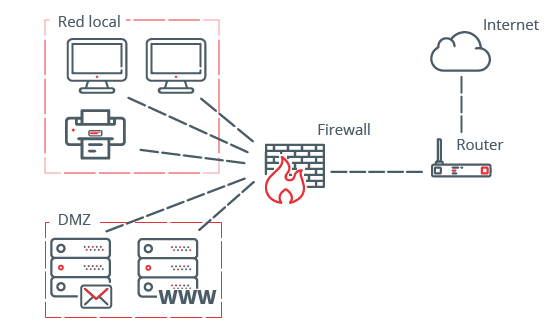

### 🔰 ¿Qué es una Zona Desmilitarizada (DMZ)?

Una **Zona Desmilitarizada (DMZ)**, en redes, **es una subred separada** que contiene **servicios públicos expuestos a Internet**, como sitios web o servidores de correo, pero **sin dar acceso directo a la red interna**.

👉 Se llama así por analogía militar: es una “zona neutral” entre dos lados —en este caso, entre Internet (público) y la red privada (interna).

---

### 🧱 ¿Por qué se usa una DMZ?

Para **proteger tu red interna**. Si alguien ataca un servidor web, lo hará contra la DMZ, **no contra tus computadoras internas, bases de datos, etc.**

---

### 🧠 ¿Qué tipo de servicios se ponen en la DMZ?

- 🌐 Servidores web (HTTP/HTTPS)
- 📧 Servidores de correo (SMTP)
- 📦 Servidores FTP
- 🔐 VPN Gateways
- 🗂️ Proxies

---

### 🎯 Objetivo de una DMZ

| Red            | ¿Qué contiene?                | Accesibilidad                |
| -------------- | ----------------------------- | ---------------------------- |
| 🌐 Internet    | Usuarios públicos             | Acceso limitado              |
| 🟨 DMZ         | Servicios públicos            | Acceso desde Internet y LAN  |
| 🔒 LAN interna | Computadoras, datos sensibles | Solo accesible desde adentro |

---

### 🔒 ¿Cómo funciona una DMZ?

Una DMZ se configura generalmente con **2 o 3 interfaces de red**:

- **Externa (Internet)**: acceso público
- **DMZ**: acceso controlado a servidores públicos
- **Interna (LAN)**: red privada de la empresa

El **firewall** regula lo que entra/sale entre estas zonas:

```
[Internet]
    |
[Firewall] -- [DMZ (Servidor Web)]
    |
[Red Interna (Base de Datos, PCs, etc.)]
```

---

### ⚙️ ¿Cómo se instala o implementa una DMZ?

#### Opción 1: Con dos firewalls (más seguro)

- Un firewall controla el tráfico entre **Internet ↔ DMZ**
- Otro firewall entre **DMZ ↔ Red Interna**

#### Opción 2: Con un solo firewall de 3 zonas

- Firewall con 3 interfaces (WAN, DMZ, LAN)
- Reglas de tráfico bien definidas en cada dirección

---

### 🧪 Reglas de Firewall típicas

| Fuente      | Destino      | Puerto                   | Acción              |
| ----------- | ------------ | ------------------------ | ------------------- |
| Internet    | Servidor DMZ | 80/443                   | Permitir            |
| DMZ         | Internet     | 53, 80                   | Permitir (limitado) |
| LAN Interna | DMZ          | Todos                    | Permitir            |
| DMZ         | LAN Interna  | Ninguno (o muy limitado) | Denegar             |

---

### 🛠️ Ejemplo Práctico: Crear una DMZ en **AWS (Amazon Web Services)**

#### 🎯 Escenario:

Tienes un sitio web público en una **instancia EC2** (servidor web), pero una base de datos privada en otra instancia. Quieres que:

- Solo el servidor web sea accesible desde Internet (DMZ)
- La base de datos **no** sea accesible desde fuera
- El servidor web sí pueda comunicarse con la base de datos

---

#### ✅ Paso 1: Crear una VPC con 2 subredes

- **Subred pública**: para la DMZ (servidor web)
- **Subred privada**: para la red interna (base de datos)

---

#### ✅ Paso 2: Configurar las instancias

- EC2 Web Server en la **subred pública**
- EC2 Base de Datos en la **subred privada**

---

#### ✅ Paso 3: Security Groups (Firewalls)

**Security Group del servidor web (DMZ):**

| Tipo         | Puerto | Origen                               |
| ------------ | ------ | ------------------------------------ |
| HTTP         | 80     | 0.0.0.0/0                            |
| HTTPS        | 443    | 0.0.0.0/0                            |
| SSH          | 22     | Tu IP                                |
| MYSQL/Aurora | 3306   | Solo desde el grupo del servidor web |

**Security Group de la base de datos (LAN privada):**

| Tipo  | Puerto | Origen (permitido desde)   |
| ----- | ------ | -------------------------- |
| MySQL | 3306   | Security Group del Web     |
| SSH   | 22     | Tu IP o saltando desde web |

---

#### ✅ Paso 4: Tabla de rutas

- Subred pública → salida a Internet a través del Internet Gateway
- Subred privada → solo comunicación interna, sin acceso directo a Internet

---

### 🧾 Diagrama resumen

```
                Internet
                    |
              [Internet Gateway]
                    |
             [Subred Pública / DMZ]
                    |
            [EC2 Web Server (HTTP)]
                    |
            [Subred Privada / LAN]
                    |
          [EC2 Base de Datos (MySQL)]
```

---

### ✅ Conclusión final

| ✅ Ventajas de usar DMZ          | ❌ Si no usas DMZ...                           |
| -------------------------------- | ---------------------------------------------- |
| Aísla servidores públicos        | Riesgo de que ataquen tu red interna           |
| Minimiza el daño si hackean algo | Hackean un servidor = toda tu red comprometida |
| Permite inspección y monitoreo   | Difícil ver por dónde entró el atacante        |

---

[🔼](#índice)

---

## **506. Despliegue de una DMZ con un Firewall empresarial**

### 🧠 ¿Qué es una DMZ con Firewall empresarial?

Una **DMZ (Zona Desmilitarizada)** es una subred que se encuentra **entre tu red privada y el Internet**. El **firewall empresarial** actúa como un **controlador de tráfico**, **protegiendo la red interna** de accesos no autorizados y **permitiendo sólo el tráfico necesario**.

---

### 🎯 ¿Por qué usar una DMZ?

Para **proteger la red interna**. Si tienes servidores públicos (como web, correo, FTP), los pones en la DMZ. Así, **aunque uno sea vulnerado, no entrarán a tu red privada**.

---

### 🧱 Estructura típica de red con DMZ y firewall empresarial

```
       Internet
          |
       [Firewall empresarial]
        /        \
   [DMZ]        [Red interna]
    |
[Servidor Web, FTP]
```

---

### 🔥 ¿Qué hace el firewall empresarial?

Un firewall como **pfSense, FortiGate, Cisco ASA, Palo Alto**, etc., puede:

- Crear múltiples zonas: WAN (Internet), DMZ, LAN
- Definir reglas específicas por zona
- Inspeccionar el tráfico (firewall de capa 7 o deep packet inspection)
- Crear VPNs, registros, alertas, NAT, etc.

---

### 🛠️ ¿Cómo se despliega una DMZ con firewall empresarial?

Hay dos formas:

---

#### 🧪 Opción 1: Laboratorio local (con VirtualBox + pfSense)

Ideal para practicar.

##### 🔧 Requisitos:

- VirtualBox o VMware
- Imagen ISO de **pfSense**
- 3 tarjetas de red virtuales:

  - WAN (Internet)
  - DMZ
  - LAN

##### 🔌 Paso a paso:

1. **Descarga pfSense:**
   Desde [https://www.pfsense.org/download/](https://www.pfsense.org/download/)

2. **Crea una máquina virtual con 3 interfaces de red:**

   - `Adapter 1`: NAT o puente (WAN)
   - `Adapter 2`: Red interna "DMZ"
   - `Adapter 3`: Red interna "LAN"

3. **Instala pfSense** normalmente.

4. **Asigna interfaces durante la instalación:**

   - WAN → Adapter 1
   - DMZ → Adapter 2
   - LAN → Adapter 3

5. **Agrega 2 VMs más:**

   - `Servidor Web` conectado a DMZ
   - `Cliente interno` conectado a LAN

6. **Configura reglas en el firewall pfSense:**

   - **WAN → DMZ (HTTP/HTTPS):** permitir
   - **DMZ → Internet:** permitir solo HTTP/HTTPS/DNS
   - **DMZ → LAN:** denegar
   - **LAN → DMZ:** permitir

7. **Prueba de funcionamiento:**

   - Accede desde el navegador del cliente interno al servidor web.
   - Desde Internet, accede al servidor web público (redirige puertos si estás en NAT).

---

#### ☁️ Opción 2: En la nube (AWS)

Si prefieres la nube, aquí va un ejemplo con **Amazon Web Services (AWS)**.

##### 🎯 Objetivo:

- Crear una VPC con 3 zonas:

  - **Subred pública (DMZ)** → Servidor web accesible desde Internet
  - **Subred privada (LAN)** → Base de datos o servicios internos
  - **Firewall (Security Groups y NACL)** como controlador de acceso

##### 🚀 Paso a paso:

1. **Crea una VPC** en AWS con una red /16

2. **Crea 2 subredes:**

   - `subnet-dmz` (pública, con acceso a Internet)
   - `subnet-lan` (privada, sin acceso a Internet)

3. **Crea un Internet Gateway** y asígnalo a la VPC

4. **Asocia una tabla de rutas:**

   - Para la `subnet-dmz`, permitir salida a 0.0.0.0/0 (Internet)
   - Para la `subnet-lan`, solo rutas privadas

5. **Lanza dos instancias EC2:**

   - `web-server` en la subnet DMZ (con IP pública)
   - `db-server` en la subnet LAN (sin IP pública)

6. **Crea Security Groups:**

   🔐 Web Server (DMZ):

   | Tipo  | Puerto | Origen    |
   | ----- | ------ | --------- |
   | HTTP  | 80     | 0.0.0.0/0 |
   | HTTPS | 443    | 0.0.0.0/0 |
   | SSH   | 22     | tu IP     |

   🔐 Base de Datos (LAN):

   | Tipo  | Puerto | Origen                 |
   | ----- | ------ | ---------------------- |
   | MySQL | 3306   | Security Group del Web |

7. **Prueba final:**

   - Desde tu navegador: http\://\[IP del web-server]
   - Conéctate al servidor web y prueba si este puede conectarse a la base de datos

---

### 🧾 Ejemplo final completo (red + reglas):

#### Red Virtual:

```
             Internet (0.0.0.0/0)
                    |
           [Internet Gateway]
                    |
            +-----------------+
            |  VPC Principal  |
            +-----------------+
             /             \
        [DMZ subnet]     [LAN subnet]
        (web-server)     (db-server)
```

#### Reglas Firewall (Security Groups):

| Dirección | Fuente     | Destino     | Puerto | Acción   |
| --------- | ---------- | ----------- | ------ | -------- |
| Entrada   | 0.0.0.0/0  | web-server  | 80/443 | Permitir |
| Entrada   | web-server | db-server   | 3306   | Permitir |
| Entrada   | db-server  | LAN interna | -      | Denegar  |

---

### ✅ Conclusión

- Una **DMZ con firewall empresarial** es **clave para la ciberseguridad moderna**.
- Puede ser desplegada **localmente con pfSense** o **en la nube con AWS**.
- El firewall define exactamente **quién puede hablar con quién**.
- Si configuras bien las reglas, puedes exponer tus servicios sin comprometer tu red interna.

---

[🔼](#índice)

---

## **507. Explora las capacidades de Network Firewall de AWS**

### 🧠 ¿Qué es AWS Network Firewall?

**AWS Network Firewall** es un **firewall administrado en la nube** que protege **tu red de VPC**. Te permite aplicar reglas para **controlar el tráfico de red a nivel de capa 3 (IP) y capa 4 (puertos)**, e incluso reglas a nivel de **capa 7 (contenido de paquetes)** usando inspección profunda de paquetes (**DPI**).

Es **ideal para organizaciones que necesitan un firewall potente y flexible**, pero sin tener que instalar dispositivos físicos o firewalls de terceros.

---

### 🔐 Capacidades de AWS Network Firewall

| Capacidad                          | Explicación sencilla                                                                |
| ---------------------------------- | ----------------------------------------------------------------------------------- |
| **Filtrado por IP/puerto**         | Puedes permitir o bloquear tráfico desde/hacia direcciones IP o puertos específicos |
| **Inspección de estado**           | Revisa el contexto de las conexiones (conexiones nuevas, activas, finalizadas)      |
| **Reglas basadas en dominios**     | Puedes bloquear dominios como `malware.com`, `phishing.net`, etc.                   |
| **Inspección de tráfico TLS**      | (Opcional) Puede inspeccionar conexiones cifradas si se configura con TLS proxy     |
| **Integración con CloudWatch**     | Puedes ver registros y crear alarmas cuando hay tráfico sospechoso                  |
| **Alta disponibilidad automática** | Funciona en múltiples zonas de disponibilidad (AZs) para evitar caídas              |

---

### 🧰 Casos de uso comunes

1. **Bloquear tráfico malicioso** desde o hacia direcciones IP específicas
2. **Evitar acceso a dominios no deseados**
3. **Proteger servicios internos** que no deberían exponerse al Internet
4. **Implementar políticas de red** similares a firewalls empresariales físicos (como Palo Alto o FortiGate)

---

### ⚙️ ¿Cómo se instala y configura?

Vamos paso a paso para **instalar y configurar AWS Network Firewall** dentro de una VPC en AWS.

#### 🧪 Requisitos previos

- Cuenta en AWS
- Una **VPC** ya creada con subredes públicas y privadas
- Una instancia EC2 de prueba

---

#### 🧱 Arquitectura básica con Network Firewall

```
                Internet
                   |
         +-------------------+
         | Internet Gateway  |
         +--------+----------+
                  |
            [ Subred pública ]
                  |
              [ Firewall ]
                  |
        +---------+-----------+
        |      Subredes       |
        |      privadas       |
        |  (EC2 web/db/etc)   |
        +---------------------+
```

---

### 🛠️ Paso a paso para desplegar AWS Network Firewall

---

#### **1. Crea el firewall**

1. Ve a **AWS Console → VPC → Network Firewall → Create firewall**
2. Nombre: `firewall-ejemplo`
3. Selecciona tu **VPC existente**
4. Selecciona **todas las zonas de disponibilidad**
5. Crea una **subred dedicada por zona de AZ** para el firewall (por ejemplo, `subnet-firewall-1a`, `subnet-firewall-1b`)

> 🔔 Estas subredes deben estar **vacías** y **no usar otras instancias**.

---

#### **2. Crea una política de firewall**

1. Ve a **Firewall policies → Create policy**
2. Nombre: `policy-firewall-demo`
3. Agrega reglas como:

##### 🔒 Regla para bloquear una IP

- Rule group type: **Stateful**
- Name: `bloqueo-ip-maligna`
- Rule type: **Suricata compatible rules**
- Regla:

  ```
  drop ip any any -> 198.51.100.1 any (msg:"Bloqueo IP maligna"; sid:1000001;)
  ```

##### 🛑 Regla para bloquear dominios

- Rule group type: **Stateless**
- Block domain `examplemalware.com` o cualquier otro

---

#### **3. Asocia la política al firewall**

- Vuelve al firewall creado y **asocia la política** creada
- Esto activará las reglas de bloqueo

---

#### **4. Modifica las tablas de ruta**

Tu firewall **no funciona automáticamente**, necesitas **dirigir el tráfico hacia él**.

##### 🧭 Tabla de ruta pública

- Redirige tráfico saliente desde subredes privadas **hacia el firewall** (en lugar del Internet Gateway directamente)

##### 🧭 Tabla de ruta privada

- Asegúrate de que las respuestas del firewall lleguen correctamente a las instancias EC2 internas

---

### ✅ Ejemplo completo paso a paso (usando la consola)

#### Escenario: Bloquear tráfico hacia una IP maliciosa `198.51.100.1`

1. Tienes una instancia EC2 dentro de una subred privada
2. Estás protegiendo esa instancia con Network Firewall
3. Has creado una regla para **bloquear esa IP maliciosa**
4. Cuando haces `curl http://198.51.100.1` desde tu EC2, **no hay respuesta**
5. Pero si accedes a `http://example.com`, sí funciona

#### 🧪 Prueba:

Desde la instancia EC2 (privada):

```bash
curl http://198.51.100.1
# No debería responder (bloqueado)

curl http://example.com
# Debería funcionar normalmente
```

---

### 📊 Monitoreo

AWS Network Firewall **envía logs a CloudWatch o S3**. Puedes ver:

- Tráfico permitido o bloqueado
- Reglas activadas
- Estadísticas de conexiones

---

### 💵 ¿Cuánto cuesta?

AWS cobra por:

- **Instancia de firewall** (por AZ)
- **Tráfico inspeccionado**
- **Uso de reglas y registros**

> 💡 Es ideal activar **solo en las zonas necesarias** y monitorear uso con presupuestos de AWS.

---

### 🧠 Conclusión

| Ventaja                        | Explicación breve                                      |
| ------------------------------ | ------------------------------------------------------ |
| Totalmente administrado        | AWS gestiona el hardware, actualizaciones y escalado   |
| Integración nativa con VPCs    | Se integra directo con subredes y tablas de rutas      |
| Seguridad de nivel empresarial | Compatible con Suricata, inspección de paquetes, etc.  |
| Muy configurable               | Puedes crear reglas personalizadas por flujo o dominio |

---

[🔼](#índice)

---

## **508. Balanceador de carga**

### 🧠 ¿Qué es un Balanceador de Carga?

Un **balanceador de carga (load balancer)** es un sistema que **distribuye el tráfico de red entre varios servidores** (backends), para evitar que uno solo se sobrecargue y los demás estén inactivos.

#### 🎯 Su objetivo principal es:

- Mejorar el rendimiento
- Asegurar la disponibilidad
- Dar tolerancia a fallos
- Aumentar la escalabilidad

---

#### 🛣️ Ejemplo sencillo

Imagina que tienes una aplicación web con **3 servidores web**:

```
Usuarios -> Balanceador -> [Servidor A]
                           [Servidor B]
                           [Servidor C]
```

El balanceador reparte las visitas de los usuarios entre los 3 servidores, como si fuese un "semáforo inteligente".

---

### 🔍 Tipos de balanceadores de carga

| Tipo                    | Función principal                                          | Ejemplo práctico                      |
| ----------------------- | ---------------------------------------------------------- | ------------------------------------- |
| **HTTP/HTTPS (Capa 7)** | Reparte tráfico web, puede inspeccionar URLs y encabezados | Balancear `/api` y `/admin` diferente |
| **TCP/SSL (Capa 4)**    | Balancea conexiones a nivel de puertos (sin ver contenido) | Servidores de base de datos, FTP      |
| **Global**              | Balancea entre regiones del mundo (DNS o CDN)              | Alta disponibilidad mundial           |

---

### 🔐 Beneficios clave

1. **Redundancia:** si un servidor falla, el balanceador redirige tráfico al resto
2. **Escalabilidad horizontal:** puedes añadir o quitar servidores sin interrumpir
3. **Seguridad:** puedes usarlo como punto de control HTTPS o WAF (Web Application Firewall)
4. **Monitoreo:** sabe si un servidor está activo antes de enviarle tráfico

---

### 🧰 ¿Dónde se puede usar?

- AWS (Elastic Load Balancer)
- Azure, GCP
- Servidores físicos con HAProxy o NGINX
- Docker, Kubernetes (Ingress)
- Apache HTTPD (con módulos como mod_proxy_balancer)

---

### ⚙️ ¿Cómo se instala un balanceador?

Vamos a ver dos formas:

---

#### 📌 Opción 1: Local con NGINX (muy usada para desarrollo o autoalojado)

##### 1. Instalar NGINX en Ubuntu:

```bash
sudo apt update
sudo apt install nginx
```

##### 2. Configurar NGINX como balanceador:

Edita el archivo:

```bash
sudo nano /etc/nginx/sites-available/default
```

Y reemplaza el contenido con:

```nginx
http {
    upstream backend {
        server 192.168.0.101;
        server 192.168.0.102;
    }

    server {
        listen 80;

        location / {
            proxy_pass http://backend;
        }
    }
}
```

##### 3. Reiniciar NGINX:

```bash
sudo systemctl restart nginx
```

✅ ¡Listo! Ahora NGINX actúa como un balanceador entre los dos servidores.

---

#### 📌 Opción 2: Balanceador de Carga en AWS (ALB o ELB)

##### Paso a paso para un **Application Load Balancer (ALB)**

1. Entra a la consola de AWS → **EC2 → Load Balancers → Create**

2. Elige **Application Load Balancer**

3. Asigna un nombre: `web-balancer`

4. Escoge:

   - IPv4
   - Subredes públicas (al menos 2 zonas de disponibilidad)
   - Security Group que permita HTTP (puerto 80) o HTTPS (puerto 443)

5. Crea un **Target Group**

   - Tipo: Instance
   - Puerto: 80
   - Añade las instancias EC2 que servirán contenido

6. Asocia el target group al balanceador

7. Crea una regla de enrutamiento:

   - Si viene `/`, envía al grupo de instancias

🔁 Cuando accedas al DNS del balanceador (`web-balancer-xxxxx.elb.amazonaws.com`), AWS repartirá automáticamente el tráfico entre las instancias.

---

### ✅ Ejemplo completo

#### Escenario: balancear dos instancias web en AWS

##### Paso 1: Lanza 2 instancias EC2

- Usa Amazon Linux 2
- Instala un servidor web simple:

  ```bash
  sudo yum install -y httpd
  echo "Hola desde Servidor 1" > /var/www/html/index.html
  sudo systemctl start httpd
  ```

- Repite en la segunda, pero con texto "Hola desde Servidor 2"

##### Paso 2: Crea un ALB

- Usa las dos instancias como **targets**
- El balanceador debe estar en subredes públicas
- Asegúrate de permitir tráfico entrante desde Internet en el security group

##### Paso 3: Prueba

Accede al DNS del ALB en el navegador:

```
http://web-balancer-123456789.elb.amazonaws.com
```

🔁 Refresca varias veces y verás alternar:

- "Hola desde Servidor 1"
- "Hola desde Servidor 2"

👉 ¡El balanceador de carga está funcionando!

---

### 🔒 ¿Y la seguridad?

Puedes agregar:

- **HTTPS** (certificados con ACM)
- **WAF** (Web Application Firewall) para bloquear ataques
- **Reglas por IP** con Security Groups
- **Health checks** para que no se envíe tráfico a servidores caídos

---

### 🧠 Conclusión

| Concepto clave         | Detalle rápido                              |
| ---------------------- | ------------------------------------------- |
| Mejora disponibilidad  | Si un servidor falla, el tráfico sigue      |
| Facilita escalabilidad | Añadir/quitar servidores sin cortar tráfico |
| Mejora la seguridad    | Punto único para aplicar cifrado, WAF, etc. |
| Opciones flexibles     | Local con NGINX o en la nube como AWS ALB   |

---

[🔼](#índice)

---

## **509. Despliegue de un balanceador profesional**

### 🧠 ¿Qué es un balanceador de carga profesional?

Un **balanceador de carga profesional** es una herramienta avanzada que **distribuye tráfico entre múltiples servidores** o contenedores para asegurar:

- 🔄 Disponibilidad continua (alta disponibilidad)
- ⚡ Rendimiento óptimo
- 🔐 Seguridad (firewall, SSL, detección de ataques)
- 🧠 Inteligencia (reenvío por reglas, métricas, health checks)
- ☁️ Escalabilidad (on-premise, nube, híbrido)

---

### 🛠️ Herramientas profesionales más comunes

| Herramienta             | Tipo             | Usos comunes                        |
| ----------------------- | ---------------- | ----------------------------------- |
| **NGINX Plus**          | Software Pro     | Web, microservicios, TLS, monitoreo |
| **HAProxy Enterprise**  | Software Pro     | Banca, fintech, tráfico pesado      |
| **AWS ALB/ELB**         | Nube             | Apps web escalables en Amazon       |
| **Azure Load Balancer** | Nube             | Balanceo entre VMs o servicios      |
| **F5 BIG-IP**           | Appliance Física | Corporativo, VPN, SSL offload, WAF  |
| **Citrix ADC**          | Virtual/Hardware | Cloud híbrida, balanceo inteligente |

---

### 📦 ¿Qué hace diferente a un balanceador profesional?

| Funcionalidad avanzada                | ¿Para qué sirve?                     |
| ------------------------------------- | ------------------------------------ |
| Balanceo L7 (por URL, cookie, agente) | Apps con muchas rutas                |
| TLS Offloading                        | Elimina carga de cifrado del backend |
| Integración con WAF                   | Seguridad contra ataques web         |
| Sticky Sessions                       | Mantiene sesión de usuario           |
| Autoscaling / Auto Healing            | Nube: EC2, GKE, Azure VMSS           |
| Monitoreo y logs avanzados            | Diagnóstico en tiempo real           |

---

### 💡 Ejemplo explicativo

Supongamos que tienes una app web con 3 instancias:

```
Internet
   |
   v
[F5 BIG-IP o NGINX Plus]
   |
   v
+----------+----------+----------+
| Server 1 | Server 2 | Server 3 |
```

Cada servidor entrega contenido dinámico, y el balanceador:

- Distribuye el tráfico equitativamente
- Redirige tráfico SSL
- Detecta si uno está caído
- Aplica reglas si `/admin` solo debe ir a Server 1

---

### 🔧 Instalación y despliegue: 2 formas

---

#### 🚀 OPCIÓN 1: Balanceador profesional en **local** con HAProxy Enterprise

HAProxy es un balanceador profesional usado en banca, telecomunicaciones, etc.

##### 🔹 Paso 1: Instalar HAProxy Enterprise en Ubuntu

```bash
sudo apt update
sudo apt install haproxy -y
```

##### 🔹 Paso 2: Configurar el archivo principal

Edita `/etc/haproxy/haproxy.cfg`:

```haproxy
global
    log /dev/log    local0
    maxconn 2048
    user haproxy
    group haproxy

defaults
    log     global
    option  redispatch
    timeout connect 5000ms
    timeout client  50000ms
    timeout server  50000ms

frontend http_front
    bind *:80
    default_backend http_back

backend http_back
    balance roundrobin
    server web1 192.168.0.101:80 check
    server web2 192.168.0.102:80 check
    server web3 192.168.0.103:80 check
```

##### 🔹 Paso 3: Reinicia HAProxy

```bash
sudo systemctl restart haproxy
```

##### ✅ Resultado:

- Puedes acceder al balanceador desde tu navegador ([http://IP](http://IP))
- Cada recarga distribuirá la carga entre los servidores
- Si uno se apaga, los otros siguen atendiendo

---

#### ☁️ OPCIÓN 2: Balanceador profesional en **la nube (AWS)**

Usaremos un **Application Load Balancer (ALB)** para balancear entre dos servidores web.

##### 🔹 Paso 1: Lanza dos instancias EC2

- Usa Amazon Linux o Ubuntu
- Instala Apache:

  ```bash
  sudo yum install -y httpd
  echo "Servidor 1" > /var/www/html/index.html
  sudo systemctl start httpd
  ```

- Haz algo similar en la segunda instancia con “Servidor 2”

##### 🔹 Paso 2: Crear un ALB

1. Ve a **EC2 → Load Balancers → Create**
2. Tipo: **Application Load Balancer**
3. Nombre: `web-balancer`
4. Escoge subredes en diferentes zonas de disponibilidad
5. Security Group: permite puerto 80 (HTTP)

##### 🔹 Paso 3: Crear un Target Group

1. Tipo: **Instance**
2. Añade las dos instancias creadas
3. Puerto: 80

##### 🔹 Paso 4: Asociar target group al ALB

1. Define regla: si llega tráfico `/`, lo redirige al grupo
2. Guarda y lanza

✅ ¡Hecho! Cuando ingreses al DNS del ALB, verás las respuestas de ambos servidores (prueba con F5 varias veces).

---

### 🔐 BONUS: Configuración de HTTPS

- **TLS Termination** en el balanceador:

  - Puedes usar un certificado gratuito de **AWS Certificate Manager**
  - El tráfico del cliente al balanceador es **seguro (HTTPS)**
  - El balanceador se comunica con los servidores vía HTTP si deseas

---

### 📊 Monitoreo profesional

Los balanceadores profesionales permiten:

- Logs detallados por backend
- Estadísticas de latencia, errores, throughput
- Alertas por health checks fallidos
- Integración con Prometheus, Grafana, CloudWatch, Datadog, etc.

---

### ✅ Ejemplo completo y final

#### 🎯 Escenario: Despliegue de un balanceador profesional (NGINX Plus o HAProxy) en Docker

```bash
# Dockerfile
FROM haproxy:2.6
COPY haproxy.cfg /usr/local/etc/haproxy/haproxy.cfg
```

```haproxy
# haproxy.cfg
frontend http_front
    bind *:80
    default_backend http_back

backend http_back
    balance roundrobin
    server web1 host.docker.internal:5001 check
    server web2 host.docker.internal:5002 check
```

```bash
# Construcción e inicio
docker build -t my-haproxy .
docker run -d -p 80:80 --name haproxy-lb my-haproxy
```

Levanta dos apps (en Flask, Node o HTML estático) en puertos 5001 y 5002 y verás cómo HAProxy balancea entre ambas.

---

### 🧠 Conclusión

| Ventaja     | Descripción                                 |
| ----------- | ------------------------------------------- |
| Escalable   | Permite crecer horizontalmente              |
| Seguro      | Centraliza TLS, WAF y control de acceso     |
| Inteligente | Enrutamiento según URL, geografía o headers |
| Profesional | Altamente confiable en entornos reales      |

---

[🔼](#índice)

---

## **510. Web Application Firewall (WAF)**

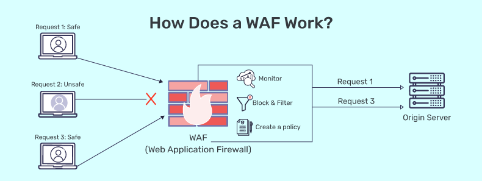

### 🧠 ¿Qué es un WAF (Web Application Firewall)?

Un **WAF** es un **firewall especializado** que **protege aplicaciones web** contra ataques **a nivel de aplicación**, como:

| Tipo de Ataque             | Ejemplo                                          |
| -------------------------- | ------------------------------------------------ |
| SQL Injection              | `?id=1 OR 1=1` para robar datos                  |
| Cross-Site Scripting (XSS) | Inyección de scripts maliciosos                  |
| File Inclusion             | Cargar archivos peligrosos                       |
| CSRF                       | Hacer que un usuario realice acciones sin querer |
| Bot attacks                | Bots que fuerzan contraseñas o hacen scraping    |

🔒 **Un WAF actúa como un guardia de seguridad para tu sitio web.**

Inspecciona y filtra las solicitudes HTTP(S) antes de que lleguen a tu servidor.

---

### 🏗️ ¿Dónde se coloca un WAF?

```bash
[Cliente] ---> [WAF] ---> [Servidor Web]
```

- El WAF intercepta y analiza el tráfico antes de que llegue a tu aplicación.
- Funciona a nivel de capa 7 del modelo OSI (capa de aplicación).

---

### 🔍 ¿Qué puede hacer un WAF?

✅ Permitir o bloquear tráfico basado en:

- Patrón en la URL
- Headers HTTP
- Cadenas de texto en el cuerpo
- País de origen IP
- Reglas OWASP Top 10

✅ Alertar sobre intentos maliciosos

✅ Proteger APIs REST y GraphQL

✅ Desafiar bots con CAPTCHA

---

### 🧰 Tipos de WAF

| Tipo               | Ejemplo                                    | Característica clave           |
| ------------------ | ------------------------------------------ | ------------------------------ |
| Basado en hardware | F5 BIG-IP, Fortinet, Barracuda             | Empresas grandes               |
| Basado en software | ModSecurity, NAXSI, WAF integrado en NGINX | Instalación local              |
| WAF en la nube     | AWS WAF, Cloudflare WAF, Azure WAF         | Fácil despliegue, autoescalado |

---

### 🧪 Ejemplo fácil de entender

Digamos que tienes un sitio web en PHP y alguien intenta enviar esto en un formulario:

```html
<script>
  alert("Hacked!");
</script>
```

Un WAF puede detectar ese **script malicioso (XSS)** y **bloquear la solicitud** antes de que llegue a tu servidor web.

---

### 🧱 Instalación: ModSecurity con Apache (Local)

Vamos a instalar **ModSecurity**, un WAF gratuito y de código abierto, compatible con Apache y NGINX.

#### 🔹 Requisitos:

- Ubuntu 20.04 o superior
- Apache

#### 🔹 Paso 1: Instala Apache (si no lo tienes)

```bash
sudo apt update
sudo apt install apache2 -y
```

#### 🔹 Paso 2: Instala ModSecurity

```bash
sudo apt install libapache2-mod-security2 -y
```

#### 🔹 Paso 3: Habilita ModSecurity

```bash
sudo a2enmod security2
```

#### 🔹 Paso 4: Activa el modo de prevención

Edita el archivo de configuración:

```bash
sudo nano /etc/modsecurity/modsecurity.conf-recommended
```

Cambia:

```
SecRuleEngine DetectionOnly
```

a:

```
SecRuleEngine On
```

Y guarda el archivo como:

```bash
sudo cp /etc/modsecurity/modsecurity.conf-recommended /etc/modsecurity/modsecurity.conf
```

#### 🔹 Paso 5: Reinicia Apache

```bash
sudo systemctl restart apache2
```

✅ ¡Listo! Ahora Apache está protegido por un WAF básico.

---

### 🧪 Cómo probarlo

1. Abre tu navegador y ve a tu servidor Apache.
2. Envía un request sospechoso, por ejemplo:

```
http://localhost/index.html?id=' OR 1=1 --
```

3. ModSecurity lo detectará y mostrará un error o bloqueará la solicitud.

---

### ☁️ Ejemplo en la nube: **AWS WAF con una aplicación web**

#### 🟢 Escenario:

Tienes una aplicación web desplegada en AWS a través de un **Load Balancer (ALB)** o **API Gateway**, y quieres protegerla con **AWS WAF**.

#### 🔹 Paso 1: Accede a AWS WAF

1. Ve al servicio **WAF & Shield**
2. Crea una **Web ACL**

   - Nombre: `web-protection-acl`
   - Asociar con: Application Load Balancer (escoge tu ALB)
   - Región: misma que tu ALB

#### 🔹 Paso 2: Agrega reglas

Puedes usar conjuntos de reglas administradas (AWS Managed Rules), por ejemplo:

- Core rule set (protección general)
- SQL injection protection
- IP reputation lists

O crear tus propias reglas personalizadas.

#### 🔹 Paso 3: Aplicar Web ACL al recurso

Seleccionas el Load Balancer o API Gateway y asocias la Web ACL.

✅ ¡Ya estás protegido!

---

### ✅ Ejemplo completo: WAF con NGINX y Docker

```bash
# Dockerfile
FROM nginx:latest
RUN apt update && apt install -y libnginx-mod-http-modsecurity
COPY nginx.conf /etc/nginx/nginx.conf
```

```nginx
# nginx.conf con ModSecurity activado
events {}
http {
    modsecurity on;
    modsecurity_rules_file /etc/nginx/modsec/main.conf;

    server {
        listen 80;
        location / {
            proxy_pass http://localhost:8080;
        }
    }
}
```

```bash
docker build -t nginx-waf .
docker run -d -p 80:80 nginx-waf
```

En `/etc/nginx/modsec/main.conf` puedes usar reglas de OWASP para bloquear ataques.

---

### 📊 Ventajas de usar WAF

| Ventaja                      | Descripción                               |
| ---------------------------- | ----------------------------------------- |
| Seguridad                    | Bloquea ataques comunes (OWASP Top 10)    |
| Escudo para apps vulnerables | Ayuda cuando no puedes cambiar el código  |
| Protección de APIs           | Filtra peticiones maliciosas a tu backend |
| Personalizable               | Puedes crear tus propias reglas           |

---

### 🧠 Conclusión

Un **WAF es una barrera crítica** que te ayuda a proteger tus aplicaciones web de ataques comunes y sofisticados. Puedes desplegarlo localmente (Apache, NGINX, HAProxy con ModSecurity) o usar soluciones gestionadas como AWS WAF o Cloudflare WAF.

---

[🔼](#índice)

---

## **511. Despliegue de un WAF profesional**

### 🔍 ¿Qué es un WAF profesional?

Un **WAF profesional** es una solución robusta, personalizable y escalable que **protege aplicaciones web y APIs contra ciberataques comunes y avanzados**, como:

- SQL Injection
- Cross-Site Scripting (XSS)
- Command Injection
- Ataques automatizados (bots, scraping)
- Zero-Day exploits

🔐 **A diferencia de un WAF gratuito (como ModSecurity),** un WAF profesional incluye:

| Característica              | WAF Gratuito | WAF Profesional                            |
| --------------------------- | ------------ | ------------------------------------------ |
| Reglas OWASP                | ✅           | ✅                                         |
| Actualizaciones automáticas | ❌           | ✅                                         |
| Soporte técnico             | ❌           | ✅                                         |
| Detección avanzada          | ❌           | ✅ (machine learning, reputación IP, etc.) |
| Escalabilidad cloud         | ❌           | ✅ (CDN, global)                           |

---

### 🧱 Ejemplos de WAFs profesionales

| WAF                | Entorno        | Ventajas clave                                                     |
| ------------------ | -------------- | ------------------------------------------------------------------ |
| **AWS WAF**        | Nube (AWS)     | Integración nativa con ALB/API Gateway                             |
| **Cloudflare WAF** | CDN/global     | Fácil activación, protección global, gratuita para sitios pequeños |
| **F5 BIG-IP ASM**  | Hardware/local | Solución empresarial muy potente                                   |
| **Imperva WAF**    | Cloud/local    | AI y firma de amenazas avanzadas                                   |
| **Azure WAF**      | Nube (Azure)   | Integración directa con Azure Front Door y Application Gateway     |

---

### 🛠️ Ejemplo profesional: **Despliegue de Cloudflare WAF + App Web**

Cloudflare es una opción profesional muy usada porque:

- Tiene plan gratuito
- WAF activable con un clic
- Protege sitios sin moverlos de servidor

#### 🎯 Escenario:

Supón que tienes una web `https://tusitio.com` en cualquier hosting (Heroku, AWS, Vercel, etc.).

---

### 🔧 Paso 1: Crear cuenta en Cloudflare

1. Ir a: [https://dash.cloudflare.com/](https://dash.cloudflare.com/)
2. Registrarte con tu correo
3. Clic en **“Agregar sitio”**
4. Escribe tu dominio: `tusitio.com`

---

### 🔧 Paso 2: Cambiar los DNS a Cloudflare

1. Cloudflare te mostrará **dos DNS nuevos** (ejemplo: `emma.ns.cloudflare.com`)
2. Ve a tu proveedor de dominio (GoDaddy, Namecheap, etc.)
3. Cambia los **nameservers** a los de Cloudflare

⏱️ Espera de 10 a 30 minutos hasta que el cambio se propague.

---

### 🧱 Paso 3: Activar el WAF

En el panel de Cloudflare:

1. Ve a **Seguridad > WAF**
2. Activa las **reglas administradas de Cloudflare**:

   - OWASP Top 10
   - SQL Injection
   - XSS
   - Bots

3. Puedes crear reglas personalizadas (ej: bloquear IPs, países, rutas específicas)

---

### 🔒 Paso 4: Prueba del WAF

Abre tu sitio y prueba estas URLs maliciosas:

```bash
https://tusitio.com/login.php?id=1' OR '1'='1
```

O este XSS:

```bash
https://tusitio.com/search?q=<script>alert(1)</script>
```

Cloudflare mostrará:

- **Error 403 (Forbidden)** si se bloquea
- En el dashboard verás logs de amenazas

---

### 🧪 Bonus: Hacer bypass de WAF y cómo defenderte

Algunos atacantes intentan evadir WAFs usando codificación especial, por ejemplo:

```bash
?id=%27%20OR%201%3D1--  (versión codificada)
```

WAFs profesionales como Cloudflare y AWS WAF **detectan esto automáticamente**, mientras que los básicos muchas veces no.

---

### 🧠 Alternativa: Despliegue de WAF con AWS (más técnico)

#### Escenario: Tienes un sitio web o API en AWS

##### Pasos:

1. Ve al servicio **WAF & Shield**

2. Crea un **Web ACL**

   - Región: donde esté tu app
   - Asociar con: ALB, API Gateway, CloudFront

3. Agrega **reglas administradas**:

   - AWSManagedRulesCommonRuleSet
   - AWSManagedRulesSQLiRuleSet
   - AWSManagedRulesKnownBadInputsRuleSet

4. Configura acciones: Bloquear, Permitir, o Contar

5. Guarda y asocia tu Web ACL al recurso web

🛡️ Resultado: AWS filtra el tráfico web antes de llegar a tu aplicación.

---

### ✅ Ventajas de usar un WAF profesional

| Ventaja                          | Descripción                                                                          |
| -------------------------------- | ------------------------------------------------------------------------------------ |
| Prevención automática de ataques | Sin tener que modificar el código                                                    |
| Protección continua              | Reglas se actualizan solas                                                           |
| Protección API + Web             | Útil para aplicaciones modernas                                                      |
| Estadísticas y alertas           | Puedes ver desde qué países atacan, qué tipo de amenazas                             |
| Integración CI/CD                | Algunos WAFs permiten aplicar reglas en entornos de desarrollo, staging y producción |

---

### 📦 Resumen general

| Elemento               | Detalle                                           |
| ---------------------- | ------------------------------------------------- |
| Qué es                 | Firewall especializado en apps web                |
| Qué protege            | SQLi, XSS, CSRF, Bots, etc.                       |
| Opciones profesionales | Cloudflare, AWS WAF, F5, Imperva                  |
| Despliegue fácil       | Cloudflare WAF (1 clic + cambiar DNS)             |
| Ejemplo completo       | App web protegida en minutos con Cloudflare o AWS |

---

[🔼](#índice)

---

## **512. Anti-DoS / Anti-DDoS**

### 📌 ¿Qué es un ataque DoS/DDoS?

Un **ataque de denegación de servicio (DoS)** o su versión distribuida (**DDoS**) es un intento malicioso de **hacer que un servidor, aplicación o red no pueda funcionar correctamente**, saturándola con **muchísimas peticiones falsas o tráfico basura**.

---

#### 🧠 Diferencia entre DoS y DDoS:

| Tipo     | Descripción                                                                         | Ejemplo                                                                             |
| -------- | ----------------------------------------------------------------------------------- | ----------------------------------------------------------------------------------- |
| **DoS**  | Un solo atacante lanza muchas solicitudes a un servidor para colapsarlo.            | Un atacante con una laptop lanza millones de peticiones HTTP falsas a `tusitio.com` |
| **DDoS** | Muchos dispositivos (botnets) coordinados lanzan el ataque desde múltiples lugares. | Miles de PCs infectadas envían tráfico falso simultáneamente                        |

---

### 🎯 Objetivo del atacante:

- Tirar tu sitio web
- Colapsar tu servidor o API
- Interrumpir un servicio online (correo, juegos, etc.)
- Afectar tu reputación o negocio

---

### 📌 ¿Qué es Anti-DoS / Anti-DDoS?

Son **técnicas, herramientas o servicios que detectan y bloquean ataques DoS/DDoS** automáticamente **antes de que lleguen a tu aplicación o servidor**.

---

### 🛠️ Tipos de Protección Anti-DDoS

| Tipo                         | ¿Qué hace?                                                                     | Ejemplo fácil                                          |
| ---------------------------- | ------------------------------------------------------------------------------ | ------------------------------------------------------ |
| **Filtros de tráfico**       | Detectan y bloquean IPs o países que envían tráfico sospechoso                 | Si una IP te hace 1000 visitas por segundo, se bloquea |
| **Rate limiting**            | Limita cuántas solicitudes puede hacer una IP en cierto tiempo                 | Una IP solo puede hacer 10 peticiones por segundo      |
| **CDNs con WAF**             | Reparten el tráfico globalmente y filtran amenazas antes de llegar al servidor | Cloudflare, AWS Shield, etc.                           |
| **Scrubbing centers**        | Redireccionan el tráfico a centros especiales que limpian ataques masivos      | Imperva, Akamai                                        |
| **CAPTCHAs y JS Challenges** | Detectan bots y les piden resolver pruebas                                     | Google reCAPTCHA o desafíos de Cloudflare              |

---

### 🔧 ¿Cómo se instala una protección Anti-DDoS?

Depende del entorno: nube, hosting, propio. Aquí te explico **dos maneras comunes**: Cloudflare (más sencillo) y AWS Shield (profesional).

---

### ✅ Opción 1: Protección Anti-DDoS con Cloudflare (Gratis y Rápida)

#### 💡 ¿Qué necesitas?

- Tener un dominio (`tusitio.com`)
- Tenerlo alojado en cualquier hosting (AWS, Vercel, Hostinger, etc.)

#### 🧱 Pasos:

1. **Crea cuenta en Cloudflare:**
   👉 [https://dash.cloudflare.com/](https://dash.cloudflare.com/)

2. **Agrega tu dominio a Cloudflare**
   Escribe `tusitio.com` y sigue los pasos

3. **Cambia tus DNS al de Cloudflare**
   En tu proveedor de dominio (GoDaddy, Namecheap, etc.), reemplaza los "nameservers"

4. **Activa protección Anti-DDoS en Cloudflare:**

   - Ve a la pestaña **"Firewall"**
   - Activa las **Reglas Administradas (Managed Rules)**
   - Ve a **"DDoS"** y deja activa la protección automática

💥 Cloudflare detectará automáticamente ataques y te protegerá sin que hagas nada más.

---

### ✅ Opción 2: Protección Anti-DDoS con AWS Shield (profesional)

Si estás en AWS (EC2, API Gateway, ALB):

#### Herramientas:

- **AWS Shield Standard** (gratis): activa por defecto
- **AWS Shield Advanced** (de pago): protección avanzada + respuesta automática

#### 🧱 Pasos para usar Shield Standard (gratis):

1. Ve a la consola de AWS
2. Usa servicios como:

   - **CloudFront** (CDN)
   - **Application Load Balancer**
   - **API Gateway**

3. Shield Standard se activa automáticamente

---

### 👨‍💻 Ejemplo práctico completo

#### 🎯 Escenario:

Tienes un sitio web en un servidor o servicio cualquiera, y quieres protegerlo de un posible ataque DDoS.

---

#### Opción 1: Anti-DDoS usando Cloudflare

##### 1. Registrar dominio

Supón que compras `midominio.com` en Namecheap.

##### 2. Crear cuenta y agregar dominio a Cloudflare

- Ir a [https://dash.cloudflare.com](https://dash.cloudflare.com)
- Clic en "Add Site", escribes `midominio.com`
- Cloudflare te da dos **nameservers** (por ejemplo: `dave.ns.cloudflare.com`)

##### 3. Ir a Namecheap y cambiar los DNS a los de Cloudflare

⏱️ Espera unos minutos para propagación.

##### 4. Activar reglas Anti-DDoS

- En el panel de Cloudflare:

  - Ve a **Firewall > Tools**: puedes bloquear IPs o países sospechosos
  - Ve a **Security > DDoS**: activa la protección automática
  - Activa **Rate Limiting**: limita a 20 peticiones por IP cada 10 segundos

---

#### Prueba del Anti-DDoS

Simula tráfico masivo con una herramienta como `ab` o `wrk`:

```bash
ab -n 1000 -c 100 https://midominio.com/
```

Cloudflare detectará el comportamiento anormal y comenzará a bloquear o mostrar captchas.

---

### 🧠 Extra: Herramientas comunes usadas en Anti-DDoS

| Herramienta          | Uso                                               |
| -------------------- | ------------------------------------------------- |
| **Cloudflare**       | CDN + WAF + DDoS gratuito                         |
| **AWS Shield**       | Protección profesional para infraestructura cloud |
| **Fail2ban**         | Bloquea IPs que hacen muchas conexiones fallidas  |
| **iptables**         | Filtros de red a bajo nivel en Linux              |
| **reCAPTCHA**        | Impide que bots accedan sin resolver desafíos     |
| **Snort / Suricata** | Detección de intrusiones                          |

---

### 🧩 Resumen final

| Tema               | Resumen                                                       |
| ------------------ | ------------------------------------------------------------- |
| ¿Qué es DoS/DDoS?  | Ataque que satura un servidor                                 |
| ¿Qué es Anti-DDoS? | Técnicas para detectar y frenar ese ataque                    |
| ¿Herramientas?     | Cloudflare, AWS Shield, CDNs, firewalls                       |
| ¿Instalación?      | Cambiar DNS (Cloudflare) o usar servicios AWS                 |
| ¿Ejemplo?          | Web protegida con reglas automáticas y limitadores de tráfico |

---

[🔼](#índice)

---

## **513. Caso de estudio: Akamai y CloudFlare**

### 🎯 ¿Qué son Akamai y Cloudflare?

Tanto **Akamai** como **Cloudflare** son **redes de distribución de contenido (CDN)** y **plataformas de seguridad web**. Su función principal es:

- Acelerar la carga de sitios web
- Proteger contra ataques (DDoS, bots, exploits)
- Filtrar tráfico malicioso
- Servir contenido desde servidores cercanos al usuario

---

### 🧠 Conceptos clave

| Término          | Significado                                                                             |
| ---------------- | --------------------------------------------------------------------------------------- |
| **CDN**          | Red de servidores distribuidos globalmente que almacenan en caché contenido web         |
| **WAF**          | Web Application Firewall: filtra y bloquea tráfico malicioso a aplicaciones web         |
| **Anti-DDoS**    | Protección automática contra ataques masivos de denegación de servicio                  |
| **Edge Network** | Procesamiento y entrega de contenido en la frontera de la red (cerca del usuario final) |

---

### 🥊 Comparación Akamai vs Cloudflare

| Característica       | **Akamai**                          | **Cloudflare**                            |
| -------------------- | ----------------------------------- | ----------------------------------------- |
| **Año de fundación** | 1998                                | 2009                                      |
| **Infraestructura**  | Muy extensa, operadores ISP, Tier 1 | Propia, moderna y muy optimizada          |
| **CDN**              | Potente, usado por Netflix, Apple   | Muy eficaz, ideal para medianos y grandes |
| **WAF**              | Avanzado, configuraciones profundas | Potente y fácil de usar                   |
| **Anti-DDoS**        | Escalable y empresarial             | Automático incluso en versión gratuita    |
| **Facilidad de uso** | Avanzado (requiere experiencia)     | Intuitivo y rápido                        |
| **Precios**          | Empresarial (alto coste)            | Desde gratuito hasta empresarial          |
| **Clientes famosos** | Apple, Adobe, Microsoft             | Discord, Shopify, Canva                   |

---

### 📦 ¿Cómo se instalan o configuran?

Ambos **trabajan por delante de tu sitio web**, como un **proxy inverso**. Es decir, reciben el tráfico antes de que llegue a tu servidor.

---

#### 🔧 Cloudflare – Instalación rápida (ideal para principiantes y medianas empresas)

##### ✅ Requisitos:

- Tener un dominio (ej: `misitio.com`)
- Tener acceso a los DNS del dominio

##### 🧱 Pasos para instalar Cloudflare:

1. Ve a 👉 [https://dash.cloudflare.com](https://dash.cloudflare.com) y crea una cuenta.
2. Agrega tu dominio (`misitio.com`).
3. Cloudflare escaneará tus DNS actuales.
4. Te dará **nameservers** como:

   ```
   dane.ns.cloudflare.com
   nancy.ns.cloudflare.com
   ```

5. Entra a tu proveedor de dominio (GoDaddy, Namecheap, etc.) y reemplaza tus **nameservers por los de Cloudflare**.
6. En el panel de Cloudflare:

   - Activa **SSL/TLS**
   - Activa el **WAF**
   - Activa la protección contra **DDoS**
   - Usa **caching** y **minificación de recursos**

💡 ¡Tu sitio estará protegido y acelerado en minutos!

---

#### 🔧 Akamai – Instalación empresarial (usado por grandes compañías)

##### ✅ Requisitos:

- Contrato con Akamai
- Asistencia técnica del equipo de integración
- Acceso a Akamai Control Center

##### 🧱 Pasos básicos (resumido):

1. Firmas contrato y creas cuenta en **Akamai Control Center**
2. Definen una configuración llamada **Property Configuration**
3. Asocias tu dominio a Akamai
4. Migras tus DNS hacia Akamai
5. Configuras reglas de caching, seguridad y protección avanzada (con asesoría de su equipo)
6. Haces pruebas A/B y luego rediriges el tráfico de forma gradual

🧠 Akamai no es plug-and-play. Es **personalizado para entornos de alto rendimiento y tráfico**, como bancos, e-commerce global, plataformas de streaming.

---

### 🧪 Ejemplo completo: Despliegue de un sitio web con Cloudflare

#### 🎯 Objetivo: Proteger `mipagina.com` con WAF, Anti-DDoS y HTTPS gratuito

##### 1. Crear cuenta en Cloudflare

[https://dash.cloudflare.com](https://dash.cloudflare.com)

##### 2. Agregar tu dominio

- Escribes `mipagina.com`
- Cloudflare detecta tu DNS actual
- Confirmas los registros

##### 3. Cambiar DNS en tu proveedor de dominio

- Vas a Namecheap, Hostinger, etc.
- Cambias los **nameservers**

##### 4. Configurar Seguridad

- Activa **SSL/TLS Full**
- Activa el **Firewall**

  - Bloquea países sospechosos
  - Agrega reglas como "Bloquear si tiene más de 100 requests por minuto"

- Activa **Bot Fight Mode**
- Activa el **caching** y comprime archivos

##### 5. Listo ✅

Tu sitio ya está protegido por Cloudflare con HTTPS, caché y WAF sin pagar nada.

---

### 📊 Caso real: Cloudflare mitigó un DDoS de 71 millones de solicitudes por segundo

En febrero de 2023, Cloudflare detectó y mitigó el **mayor ataque DDoS registrado**, dirigido a múltiples clientes. El tráfico provenía de más de **30,000 direcciones IP comprometidas**.

📌 Lo logró gracias a su sistema distribuido global, firewall inteligente y mitigación automática sin intervención humana.

---

### ✅ Conclusiones

| Tema                    | Akamai                | Cloudflare                     |
| ----------------------- | --------------------- | ------------------------------ |
| Ideal para              | Grandes corporaciones | Startups, pymes y grandes      |
| Tiempo de configuración | Lento, personalizado  | Rápido (10-15 min)             |
| Costo                   | Alto                  | Desde gratis                   |
| Soporte                 | Especializado, pago   | Bueno incluso en plan gratuito |
| Rendimiento             | Altísimo              | Muy bueno                      |

---

### 🧠 Recomendación final para ti

Si estás **empezando en ciberseguridad o despliegue web**, **Cloudflare es ideal para ti**:

- Es gratuito
- Fácil de usar
- Rápido de implementar
- Tiene funciones reales de protección WAF y Anti-DDoS
- Puedes probarlo en tu propio dominio y aprender desde ahí

---

[🔼](#índice)

---

## **514. Intrusion Detection/Prevention Systems (IDS/IPS)**

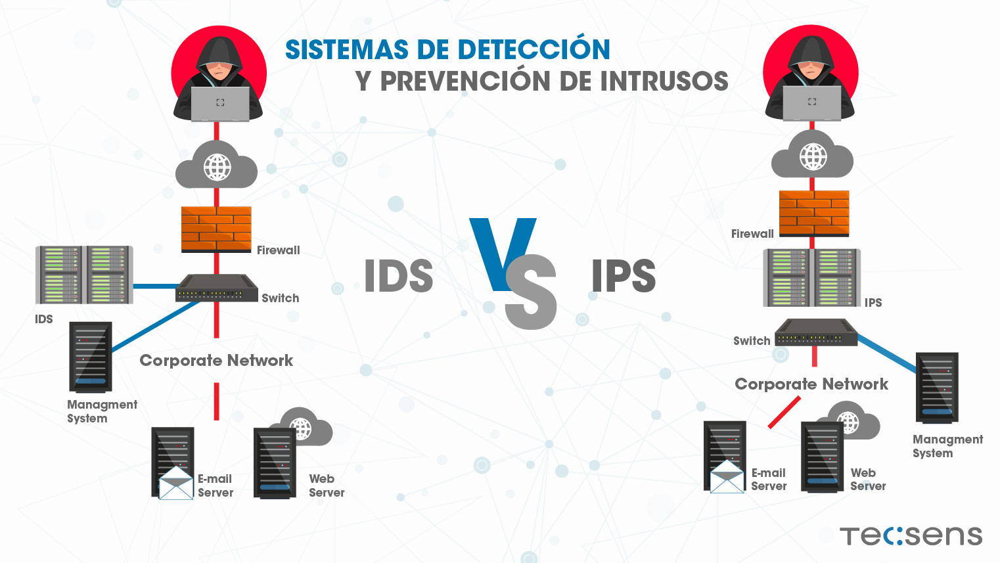

### 🔍 IDS – _Intrusion Detection System_ (Sistema de Detección de Intrusos)

- **Detecta** actividades sospechosas o maliciosas en una red.
- **No bloquea** directamente, solo **avisa** (alertas, logs).
- Ejemplo: Un IDS te avisa si alguien intenta hacer un escaneo de puertos a tu servidor.

### 🛑 IPS – _Intrusion Prevention System_ (Sistema de Prevención de Intrusos)

- Además de detectar, **bloquea o previene automáticamente** esas actividades maliciosas.
- Puede **cerrar conexiones**, **bloquear direcciones IP**, o **descartar paquetes** maliciosos.

---

### 🧠 Diferencia rápida:

| Sistema | ¿Detecta? | ¿Previene? | ¿Bloquea? |
| ------- | --------- | ---------- | --------- |
| **IDS** | ✅ Sí     | ❌ No      | ❌ No     |
| **IPS** | ✅ Sí     | ✅ Sí      | ✅ Sí     |

---

### 🎯 Ejemplo simple para entender

Imagina que tu red es como una **casa con cámaras**.

- El **IDS** es la **cámara de seguridad** que graba cuando alguien merodea, pero no hace nada más.
- El **IPS** es una **cámara con alarma** conectada a cerraduras automáticas: **si detecta a alguien rompiendo una ventana, cierra la puerta y llama a la policía.**

---

### 📦 Tipos de IDS/IPS

1. **Basado en red (NIDS/NIPS):** Analiza tráfico de red en tiempo real.
2. **Basado en host (HIDS/HIPS):** Se instala en servidores o PCs específicos y analiza comportamiento local (archivos, procesos, etc).

---

### 🔧 ¿Cómo se instala un IDS/IPS?

Vamos a usar **Snort**, una herramienta IDS/IPS muy conocida, de código abierto.

### 📌 Herramienta elegida: **Snort**

- Gratuito, muy usado en empresas y en ciberseguridad.
- Funciona como IDS, y también puede ser configurado como IPS.

---

### 🖥️ Instalación de Snort en Linux (ejemplo en Ubuntu/Debian)

> 💡 Requisitos: máquina virtual o servidor con Linux (Ubuntu recomendado)

#### 1. 📥 Instalar dependencias

```bash
sudo apt update
sudo apt install -y build-essential libpcap-dev libpcre3-dev libdumbnet-dev bison flex zlib1g-dev liblzma-dev openssl libssl-dev
```

#### 2. 📥 Descargar e instalar Snort

```bash
wget https://www.snort.org/downloads/snort/snort-2.9.20.tar.gz
tar -xvzf snort-2.9.20.tar.gz
cd snort-2.9.20
./configure && make && sudo make install
```

#### 3. 📁 Crear carpetas necesarias

```bash
sudo mkdir -p /etc/snort/rules
sudo mkdir /var/log/snort
sudo touch /etc/snort/rules/local.rules
```

#### 4. 🧠 Crear archivo de configuración

Crea un archivo en `/etc/snort/snort.conf` con reglas simples, como:

```conf
include $RULE_PATH/local.rules
```

Y en `local.rules`, pon esta regla de prueba:

```conf
alert icmp any any -> any any (msg:"Ping detectado"; sid:1000001;)
```

---

#### 🚀 Ejecutar Snort como IDS

```bash
sudo snort -A console -q -c /etc/snort/snort.conf -i eth0
```

- `-A console`: muestra las alertas en la consola
- `-q`: modo silencioso
- `-c`: ruta al archivo de configuración
- `-i`: interfaz de red a monitorear (ajústala según tu sistema)

---

### 🧪 Probar con un ping

Desde otra máquina o desde la misma:

```bash
ping <IP de la máquina con Snort>
```

🔔 Verás una alerta como:

```
[**] [1:1000001:0] Ping detectado [**]
```

¡Snort detectó un ping! 🎉

---

### 🛑 ¿Y cómo se convierte en IPS?

Snort puede integrarse con **iptables** o usar **inline mode**. Pero si deseas algo visual, puedes usar **Suricata** o incluso sistemas completos como **Security Onion** (distribución para análisis forense y detección).

---

### ✅ Ejemplo completo (resumen)

#### 🎯 Objetivo:

Detectar y bloquear tráfico sospechoso (por ejemplo, un escaneo de puertos con Nmap)

---

#### 🧱 Paso a paso:

1. Instalas Snort en una máquina virtual (Ubuntu).
2. Agregas una regla para detectar escaneo SYN de puertos:

```conf
alert tcp any any -> any any (flags:S; msg:"Posible escaneo de puertos SYN"; sid:1000002;)
```

3. Ejecutas Snort:

```bash
sudo snort -A console -q -c /etc/snort/snort.conf -i eth0
```

4. Desde otra máquina, ejecutas:

```bash
nmap -sS <IP de la máquina Snort>
```

5. Resultado en consola:

```
[**] [1:1000002:0] Posible escaneo de puertos SYN [**]
```

🚨 **Snort ha detectado un escaneo de puertos malicioso.**

---

### 👨‍💻 Alternativas modernas

| Herramienta          | Tipo                      | Ideal para                  |
| -------------------- | ------------------------- | --------------------------- |
| **Suricata**         | IDS/IPS avanzado          | Empresas y uso profesional  |
| **Zeek (antes Bro)** | IDS analítico             | Investigación y forense     |
| **Security Onion**   | Suite completa            | Pentesters, SOC, auditorías |
| **AWS GuardDuty**    | IDS en la nube            | AWS en producción           |
| **Azure Defender**   | IDS/IPS en nube Microsoft | Entornos híbridos           |

---

[🔼](#índice)

---

## **515. Despliegue de un IDS profesional**

### 🛡️ ¿Qué es un IDS profesional?

Un **IDS profesional** (como Suricata, Zeek o Security Onion) permite a una empresa **monitorear, detectar y analizar actividades maliciosas** en su red interna o externa.

### 🎯 Funciones:

- Detección de ataques (port scans, malware, anomalías, etc).
- Integración con firewalls, SIEMs (como Splunk), alertas por correo o Telegram.
- Soporte para alta disponibilidad (HA), múltiples interfaces de red y grandes volúmenes de tráfico.

---

### ✅ Herramienta recomendada: **Suricata**

Suricata es un IDS/IPS moderno y de alto rendimiento que soporta:

- Inspección profunda de paquetes (DPI).
- Reglas compatibles con Snort.
- JSON logs listos para enviar a ELK, Splunk, Graylog, etc.
- Detección basada en firmas y comportamientos.

---

### 🧱 Escenario profesional propuesto:

- **3 máquinas virtuales (o instancias en la nube)**:

  - `suricata`: IDS profesional.
  - `victima`: máquina vulnerable.
  - `atacante`: atacante (Kali Linux o Parrot OS).

Se puede montar en **VirtualBox**, **VMware**, **Proxmox**, o **AWS/GCP**.

---

### 🛠️ Instalación de Suricata en Ubuntu 22.04

#### 1. 🧼 Preparar el sistema

```bash
sudo apt update && sudo apt upgrade -y
sudo apt install -y software-properties-common
sudo add-apt-repository ppa:oisf/suricata-stable -y
```

#### 2. 📦 Instalar Suricata

```bash
sudo apt update
sudo apt install -y suricata
```

#### 3. ⚙️ Verificar instalación

```bash
suricata --build-info
```

---

### 📂 Estructura básica de Suricata

- `/etc/suricata/suricata.yaml`: archivo de configuración principal.
- `/etc/suricata/rules/`: reglas IDS.
- `/var/log/suricata/`: registros (alerts, logs, etc).

---

### 🔧 Configurar Suricata como IDS

1. **Editar configuración**:

```bash
sudo nano /etc/suricata/suricata.yaml
```

- Asegúrate que `af-packet` esté habilitado en la interfaz de red correcta (`eth0` o `enp0s3`).

2. **Agregar una regla personalizada**:

Archivo: `/etc/suricata/rules/local.rules`

```txt
alert icmp any any -> any any (msg:"Ping detectado - ICMP"; sid:1000001; rev:1;)
```

3. **Actualizar índice de reglas**:

```bash
sudo suricata-update
```

4. **Probar Suricata en modo IDS (solo escucha)**:

```bash
sudo suricata -c /etc/suricata/suricata.yaml -i eth0
```

> 🔎 Cambia `eth0` por tu interfaz real si es necesario: usa `ip a` para saberlo.

---

### 📦 Instalación profesional con interfaz gráfica (ELK)

En ambientes profesionales, Suricata se combina con:

- **Filebeat**: envía logs a Elasticsearch.
- **Elasticsearch**: almacena datos.
- **Kibana**: interfaz web para análisis.

> ¿Te gustaría que te prepare un despliegue completo con Docker o Ansible de Suricata + ELK? Pídemelo y te lo armo.

---

### ✅ Ejemplo completo: Detectar un escaneo Nmap desde Kali

#### 🧪 Entorno:

- `Ubuntu-Suricata`: IP 192.168.1.10
- `Kali-Linux`: IP 192.168.1.20

#### Paso a paso:

1. En **Suricata**, ejecuta en modo live:

```bash
sudo suricata -c /etc/suricata/suricata.yaml -i eth0
```

2. En **Kali**, ejecuta un escaneo:

```bash
nmap -sS 192.168.1.10
```

3. En Suricata, revisa alertas:

```bash
sudo tail -f /var/log/suricata/fast.log
```

Resultado esperado:

```
07/23/2025-20:31:12.123456 [**] [1:2000001:1] Ping detectado - ICMP [**] [Priority: 3] {ICMP} 192.168.1.20 -> 192.168.1.10
```

🔔 ¡Suricata ha detectado el escaneo!

---

### 🧠 Buenas prácticas para despliegue profesional

| Recomendación                                 | Detalle                                      |
| --------------------------------------------- | -------------------------------------------- |
| Actualiza reglas periódicamente               | Usa `suricata-update` y fuentes comunitarias |
| Centraliza logs                               | Envia los logs a Graylog, Splunk, ELK        |
| No instales en el mismo servidor que las apps | El IDS debe estar separado                   |
| Usa port mirroring (SPAN)                     | Para clonar tráfico sin interferir           |
| Implementa alertas automatizadas              | Email, Slack, Telegram                       |

---

### 💡 Opcional: Distribución todo-en-uno

Si no quieres instalar paso a paso, puedes usar:

- **Security Onion**: Sistema basado en Ubuntu con Snort, Suricata, Zeek, ELK y más.

  - [https://securityonion.net](https://securityonion.net)

---

[🔼](#índice)

---

## **516. Caso Práctico: Security Onion (Suricata, BroIDS, Wazuh, Zeek...)**

### 🔰 ¿Qué es Security Onion?

**Security Onion** es una distribución Linux especializada para **detección, análisis y respuesta ante incidentes (DFIR)**. Está diseñada para profesionales de ciberseguridad y viene con herramientas potentes **preinstaladas y preconfiguradas**.

---

### 🧰 ¿Qué herramientas incluye?

| Herramienta             | Función                                                |
| ----------------------- | ------------------------------------------------------ |
| **Suricata**            | IDS/IPS que detecta tráfico malicioso usando firmas.   |
| **Zeek (antes Bro)**    | Análisis de comportamiento de red (basado en eventos). |
| **Wazuh**               | Agente HIDS (detección de intrusos en hosts).          |
| **Strelka**             | Análisis de archivos en red.                           |
| **Elastic Stack (ELK)** | Almacenamiento, visualización y análisis de logs.      |
| **CyberChef**           | Análisis forense de datos (web).                       |
| **NetworkMiner**        | Análisis de paquetes .pcap (forense de red).           |

---

### 🎯 ¿Para qué sirve Security Onion?

- Detectar escaneos, malware, ataques, intrusiones.
- Inspeccionar paquetes y archivos sospechosos.
- Analizar comportamiento de red.
- Correlacionar eventos en tiempo real.
- Analizar tráfico desde archivos `.pcap`.

---

### 🛠️ Requisitos mínimos

| Recurso | Recomendado                                                       |
| ------- | ----------------------------------------------------------------- |
| CPU     | 4 núcleos                                                         |
| RAM     | 8 GB o más                                                        |
| Disco   | 200 GB SSD                                                        |
| Red     | 2 interfaces: una para gestión, otra para captura (SPAN o bridge) |

---

### 💿 ¿Cómo se instala Security Onion?

#### Opción 1: En máquina virtual (VirtualBox o VMware)

Ideal para laboratorio.

1. Descargar ISO:
   🔗 [https://securityonion.net/download](https://securityonion.net/download)

2. Crear una VM con:

   - Mínimo 4 GB de RAM
   - 2 CPU
   - 100 GB de disco
   - 2 tarjetas de red (NAT y red interna)

3. Instalar como Ubuntu normal (siguiente, siguiente…).

---

### 🚀 Instalación dentro de la VM

Una vez instalado Ubuntu, abre una terminal y ejecuta:

```bash
sudo sosetup
```

Security Onion te guiará con un **asistente interactivo**:

#### Ejemplo de configuración:

| Pregunta                | Ejemplo respuesta          |
| ----------------------- | -------------------------- |
| Tipo de despliegue      | `Standalone`               |
| Nombre de usuario SO    | `analista`                 |
| Contraseña del analista | `sosecure2025`             |
| Interfaz de captura     | `ens33` (según tu red)     |
| Interfaz de gestión     | `ens38` (NAT o acceso web) |

El script configurará automáticamente:

- Suricata (IDS)
- Zeek
- Wazuh
- Elasticsearch
- Kibana
- Curator
- Filebeat
- CyberChef
- Reglas de Suricata
- Monitoreo de red

---

### 🧪 Ejemplo completo: Detectar escaneo y acceso sospechoso

#### Escenario:

- VM `Security Onion`: monitorea red.
- VM atacante (Kali Linux o Parrot OS).
- VM víctima: un servidor Ubuntu simple.

#### Paso a paso:

1. Asegúrate de que **todas las VMs estén en la misma red interna** o usa **port mirroring/SPAN**.

2. En Kali (atacante):

```bash
nmap -sS 192.168.100.10
```

3. En Security Onion:

- Accede al panel web:
  👉 `https://<IP de gestión>:443`
  Usuario: `analista`
  Contraseña: `sosecure2025`

4. Explora:

- Dashboard de **Suricata**: verás alertas por escaneo.
- Logs de **Zeek**: conexiones sospechosas.
- Reglas de Wazuh si se instala en los hosts.

5. También puedes subir un `.pcap` y analizarlo con **NetworkMiner o CyberChef** directamente desde el panel.

---

### 🧠 Consejos para uso profesional

| Recomendación                              | Detalle                                |
| ------------------------------------------ | -------------------------------------- |
| Usa una interfaz dedicada a captura de red | Usa modo promiscuo o SPAN.             |
| Actualiza reglas Suricata y firmas Zeek    | `sudo so-rule-update`                  |
| Conecta agentes Wazuh en los endpoints     | Para detección de malware en archivos. |
| Envía alertas a Discord, Telegram, correo  | Soporta integraciones.                 |
| Analiza .pcap de red reales                | Ideal para forense o entrenamiento.    |

---

### 📘 Extra: Laboratorio en Proxmox o AWS (bajo pedido)

Si quieres puedo prepararte:

- Un laboratorio completo automatizado (Proxmox o VirtualBox).
- Instrucciones para despliegue en AWS EC2 con disco optimizado.
- Captura de tráfico real y análisis forense.

---

### ✅ Conclusión

Security Onion es un **paquete completo para Blue Team** y ciberseguridad defensiva. Te permite:

- Detectar ataques en tiempo real (Suricata, Zeek).
- Analizar eventos de red y host (Wazuh).
- Correlacionar todo en Kibana.

Es una de las mejores herramientas para **prácticas profesionales y reales**.

---

[🔼](#índice)

---

## **517. Caso Práctico: Despliegue de un IDS profesional - Security Onion**

### 🛡️ ¿Qué es un IDS?

Un **IDS (Intrusion Detection System)** es un sistema que **detecta actividad maliciosa o sospechosa** en una red o equipo. No bloquea (como un IPS), pero **genera alertas** para que el equipo de seguridad pueda actuar.

Security Onion incluye:

- **Suricata** (IDS basado en firmas y flujo de red)
- **Zeek** (IDS de análisis de comportamiento)
- **Wazuh** (para eventos en endpoints/hosts)
- Todo conectado a **Elastic Stack (Kibana)** para visualización

---

### 🧰 Requisitos previos

| Recurso        | Recomendado para entorno profesional |
| -------------- | ------------------------------------ |
| CPU            | 4 núcleos o más                      |
| RAM            | 8 GB (mínimo), 16+ GB ideal          |
| Disco          | 200+ GB SSD                          |
| Red            | 2 interfaces (captura y gestión)     |
| Virtualización | VirtualBox, VMware, Proxmox, ESXi    |

---

### 🧱 Etapas del despliegue

1. Descargar e instalar Security Onion.
2. Configurar las interfaces de red.
3. Ejecutar el instalador `sosetup`.
4. Probar con tráfico real y ver alertas.
5. Visualizar y analizar en Kibana.

---

### 🔽 Paso 1: Descargar Security Onion

- Página oficial: [https://securityonion.net/download](https://securityonion.net/download)
- Elige **ISO Installer** (basado en Ubuntu 22.04).

---

### 💻 Paso 2: Crear máquina virtual

En **VirtualBox**:

- CPU: 4
- RAM: 8 GB o más
- Disco: 150–200 GB (dinámico)
- 2 tarjetas de red:

  - **Red NAT o puenteada (gestión)**
  - **Red interna o adaptador puente (captura)**

💡 Asegúrate de **habilitar el modo promiscuo** en la interfaz de captura:

- Configuración de red → Avanzado → Modo promiscuo → **Permitir todo**

---

### 🛠️ Paso 3: Instalar y configurar Security Onion

1. Inicia desde la ISO y sigue la instalación como si fuera Ubuntu.
2. Cuando llegue al escritorio, abre terminal:

```bash
sudo sosetup
```

3. Sigue el asistente:

| Pregunta              | Ejemplo                        |
| --------------------- | ------------------------------ |
| Tipo de despliegue    | Standalone                     |
| Nombre de usuario     | `analista`                     |
| Interfaz de gestión   | `ens33`                        |
| Interfaz de captura   | `ens38`                        |
| Habilitar Wazuh       | Sí                             |
| Elegir herramientas   | Suricata, Zeek, Strelka        |
| Configurar red        | IP estática para gestión       |
| Contraseñas de acceso | Para web (Kibana), shell, etc. |

4. Al finalizar, reinicia la máquina:

```bash
sudo reboot
```

---

### 🕸️ Paso 4: Simular tráfico malicioso (desde otra VM)

1. Desde Kali Linux (u otra VM en la misma red):

```bash
nmap -sS 192.168.100.100
```

(Escaneo SYN a la IP de la víctima monitorizada por Security Onion)

2. Desde otra máquina, descarga un archivo con firma maliciosa de prueba (EICAR):

```bash
curl -O https://secure.eicar.org/eicar.com
```

---

### 🌐 Paso 5: Ingresar al dashboard

1. Abre tu navegador en el host y entra a:

```
https://<IP-de-la-gestión>:443
```

2. Ingresa con:

- Usuario: `analista`
- Contraseña: la que configuraste

3. Accede a **Kibana** → Dashboards:

- **HUNT - Suricata Alerts**: verás las alertas del escaneo
- **HUNT - Zeek Connections**: verás los intentos de conexión
- **Security Onion Console (SOC)**: para explorar todos los módulos

---

### ✅ Caso práctico completo

#### Escenario:

- Security Onion como IDS.
- Kali Linux como atacante.
- Ubuntu como víctima.

#### Flujo:

1. Kali escanea al Ubuntu (`nmap`).
2. Ubuntu está en la red monitorizada por SO.
3. Security Onion detecta el tráfico con Suricata y Zeek.
4. Las alertas se envían a Kibana.
5. El analista investiga la IP del atacante y el puerto.

#### ¿Qué se puede ver?

- Regla de Suricata activada: `"ET SCAN Nmap Scripting Engine User-Agent Detected"`
- En Zeek: conexión `TCP_SYN` a múltiples puertos.
- Opcional: análisis de archivo EICAR con **Strelka**.

---

### 🔒 Ventajas del uso profesional

| Herramienta  | Función clave                                |
| ------------ | -------------------------------------------- |
| Suricata     | Detección basada en firmas                   |
| Zeek         | Detección basada en comportamiento           |
| Wazuh        | Integridad de archivos, rootkits, logs       |
| Strelka      | Análisis profundo de archivos en red         |
| Kibana (ELK) | Visualización, dashboards y análisis central |

---

### 📦 ¿Cómo mantenerlo actualizado?

```bash
sudo so-rule-update
sudo so-status
```

Y para actualizar reglas personalizadas:

```bash
sudo so-suricata-update
```

---

### 📘 Conclusión

Has desplegado un **IDS profesional con Security Onion**. Tienes una solución **completa**, **modular** y **centralizada** para:

- Detectar escaneos y ataques
- Monitorear conexiones y eventos
- Correlacionar tráfico malicioso
- Integrar logs de endpoints

---

[🔼](#índice)

---

## **518. Herramientas de detección de anomalías**

### 🧠 ¿Qué son las herramientas de detección de anomalías?

Las herramientas de **detección de anomalías** son sistemas diseñados para **identificar comportamientos anormales o sospechosos** en una red o sistema informático. A diferencia de los IDS basados en firmas (que buscan patrones conocidos), estas herramientas **aprenden lo que es “normal”** y alertan cuando algo se sale de ese patrón.

---

### 🎯 ¿Para qué se usan?

Se utilizan para detectar:

- **Ataques desconocidos (zero-day)**
- **Infiltraciones lentas y sigilosas**
- **Comportamientos inusuales de usuarios o dispositivos**
- **Errores de configuración o actividades no autorizadas**

---

### 🧩 Tipos de anomalías detectadas

1. **De red**: tráfico inusual, escaneos, conexiones extrañas.
2. **De sistema**: procesos raros, aumentos súbitos en CPU/RAM.
3. **De usuario (UEBA)**: accesos en horarios atípicos, desde ubicaciones inusuales.
4. **De aplicación**: uso fuera de lo esperado, errores constantes.

---

### 🛠️ Herramientas populares

| Herramienta        | Tipo                     | Características clave                            |
| ------------------ | ------------------------ | ------------------------------------------------ |
| **Zeek (Bro)**     | Red                      | Analiza comportamiento del tráfico               |
| **Security Onion** | Red y sistema            | Incluye Zeek, Suricata, Wazuh                    |
| **Wazuh**          | Host                     | Monitorea endpoints (procesos, logs, integridad) |
| **Splunk + ML**    | Todo (SIEM)              | Correlación, machine learning para anomalías     |
| **Elastic SIEM**   | Todo                     | Visualización + detección de anomalías           |
| **Snort/Suricata** | Red (más firmas)         | Puede usarse con reglas personalizadas           |
| **CrowdStrike**    | Host + Red               | Solución comercial avanzada basada en AI         |
| **Fail2Ban**       | Sistema (SSH, servicios) | Bloqueo de ataques de fuerza bruta               |

---

### 📚 Ejemplo fácil de entender

Imagina que trabajas en una oficina y **todos llegan entre las 8:00 y 9:00 AM**. De pronto, una computadora inicia sesión **a las 3:00 AM desde una IP de Rusia**. Eso es una **anomalía**.

Una herramienta como **Zeek + Wazuh** podría detectar eso y **enviarte una alerta**.

---

### 🧰 Instalación de Zeek + Wazuh (caso real)

Aquí te muestro cómo desplegar ambas herramientas en Ubuntu para hacer detección de anomalías:

---

#### ✅ Paso 1: Instalar Zeek en Ubuntu

```bash
sudo apt update
sudo apt install -y zeek
```

Verifica que funcione:

```bash
zeek --version
```

---

#### ✅ Paso 2: Instalar Wazuh (agente)

Usaremos el agente Wazuh para monitorear anomalías locales:

```bash
curl -sO https://packages.wazuh.com/4.8/wazuh-install.sh
sudo bash wazuh-install.sh -a
```

Esto instala el **agente Wazuh**, útil para detectar:

- Cambios no autorizados
- Archivos maliciosos
- Usuarios con privilegios
- Ataques a SSH

---

#### ✅ Paso 3: Visualización con Elastic Stack

Puedes usar **Wazuh Dashboard**, que incluye Kibana, para ver alertas gráficas. Si ya tienes Security Onion, viene preconfigurado.

También puedes usar:

```bash
https://<tu-ip>:5601
```

Usuario: `admin`
Contraseña: `tu_contraseña_definida`

---

### 📦 Caso práctico completo

#### Escenario:

Supón que un atacante intenta conectarse al puerto SSH desde una IP no autorizada varias veces.

#### Flujo:

1. El atacante hace múltiples intentos fallidos por SSH (fuerza bruta).
2. Wazuh detecta los intentos de login fallidos:

   - Revisa `/var/log/auth.log`
   - Identifica más de 5 intentos fallidos en 1 minuto

3. Genera una **alerta de anomalía**
4. En Kibana ves:

```
Rule: sshd multiple failed logins
Location: /var/log/auth.log
Source IP: 45.67.89.12
```

Opcionalmente, puedes automatizar la respuesta con `fail2ban` para bloquear esa IP.

---

### 🧠 Cómo aprenden estas herramientas

- **Zeek**: No bloquea, pero **analiza cada conexión** para detectar patrones no comunes.
- **Wazuh**: Usa reglas predefinidas (y puedes crear nuevas) que **monitorean el comportamiento** de procesos, logs y usuarios.
- **Splunk/Elastic + ML**: Pueden entrenar modelos de comportamiento normal y detectar outliers.

---

### 🚨 ¿Qué hacer cuando se detecta una anomalía?

1. Revisar el **registro o log** generado.
2. Validar si fue **un comportamiento legítimo o malicioso**.
3. Si es una amenaza:

   - Bloquear IP o puerto
   - Revisar actividad del usuario
   - Informar al equipo de seguridad

---

### 📘 Conclusión

Las herramientas de detección de anomalías son fundamentales porque:

✅ Detectan amenazas que no están basadas en firmas

✅ Son útiles contra ataques zero-day

✅ Se adaptan a tu entorno con el tiempo

✅ Permiten automatizar respuestas

---

[🔼](#índice)

---

## **519. Proxy**

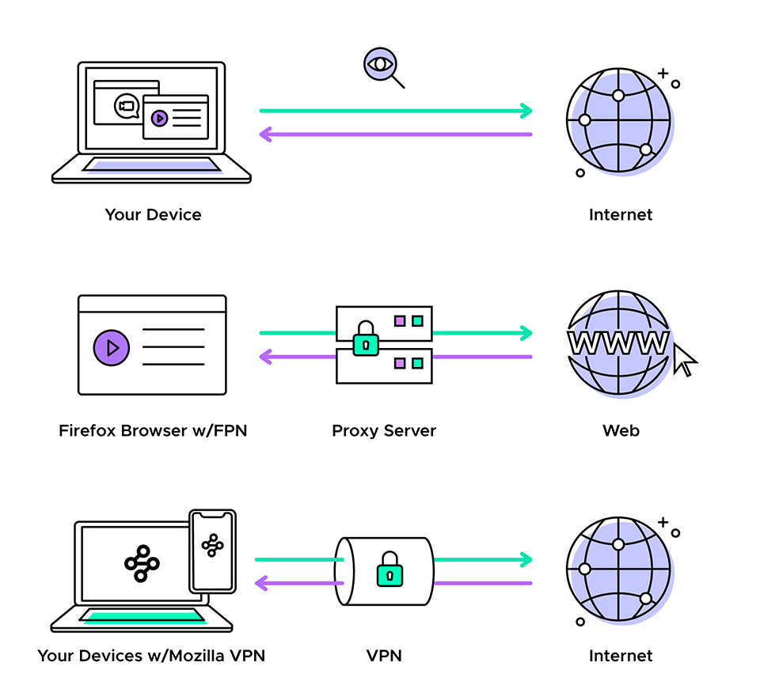

### 🧠 ¿Qué es un Proxy?

Un **Proxy** (o servidor proxy) es un intermediario entre tu computadora y el Internet.

Cuando usas un proxy, tu computadora **no se conecta directamente** al sitio web, sino que **le pide al proxy** que lo haga por ti.

---

#### 📦 ¿Para qué sirve un Proxy?

| Función                  | Ejemplo práctico                                    |
| ------------------------ | --------------------------------------------------- |
| 🔒 Ocultar IP real       | Navegar por internet sin que vean tu IP real        |
| 🌐 Control de acceso     | Bloquear redes sociales o YouTube en un colegio     |
| 📊 Monitoreo y registro  | Registrar a qué sitios web acceden los usuarios     |
| ⚡ Caché                 | Guardar contenido visitado para cargarlo más rápido |
| 🛡️ Filtrado de contenido | Bloquear sitios maliciosos o inapropiados           |

---

#### 🎯 Ejemplo fácil de entender

Imagina que tú (el usuario) estás en una empresa y quieres entrar a **[https://youtube.com](https://youtube.com)**.

1. Tu navegador **le pide al proxy** el sitio.
2. El proxy verifica si está permitido.

   - Si está **bloqueado**, te muestra un mensaje.
   - Si está **permitido**, se conecta a YouTube y te muestra la página.

3. El proxy puede **guardar una copia** (caché), así la próxima vez carga más rápido.

---

### 🛠️ Tipos de Proxy

| Tipo              | ¿Cómo funciona?                                                               |
| ----------------- | ----------------------------------------------------------------------------- |
| **Forward Proxy** | Cliente → Proxy → Internet (el que usamos los usuarios comunes)               |
| **Reverse Proxy** | Internet → Proxy → Servidor web (muy usado para balanceo y seguridad en webs) |

---

### 🛠️ ¿Cómo se instala un proxy?

Te mostraré cómo instalar un proxy **Forward** usando **Squid** en Ubuntu (muy común y gratuito).

---

### 🧰 Instalación paso a paso de Squid (Proxy)

#### 🔹 Requisitos:

- Máquina Ubuntu 20.04/22.04 (física o virtual)
- Acceso a consola (usuario con permisos sudo)

---

#### ✅ Paso 1: Instalar Squid

```bash
sudo apt update
sudo apt install squid -y
```

Verifica que el servicio esté corriendo:

```bash
sudo systemctl status squid
```

---

#### ✅ Paso 2: Configuración básica

Abre el archivo de configuración:

```bash
sudo nano /etc/squid/squid.conf
```

Cambia la línea:

```conf
http_port 3128
```

Asegúrate de que **permita conexiones** desde tu red local:

Busca esta línea:

```conf
http_access deny all
```

Y antes de ella, agrega:

```conf
acl localnet src 192.168.1.0/24  # Cambia según tu red
http_access allow localnet
```

Guarda con `Ctrl + O`, luego `Ctrl + X`.

---

#### ✅ Paso 3: Reinicia Squid

```bash
sudo systemctl restart squid
```

---

#### ✅ Paso 4: Configura tu navegador para usar el proxy

En tu navegador:

1. Ve a **Configuración → Red o Proxy**
2. Usa como proxy manual:

- IP: dirección IP de tu servidor Ubuntu
- Puerto: `3128`

---

#### ✅ Paso 5: Prueba el Proxy

Entra a cualquier sitio web. Si está funcionando, verás que el tráfico pasa por el proxy.

Verifica los registros en el servidor:

```bash
sudo tail -f /var/log/squid/access.log
```

---

### 🛡️ Cómo bloquear un sitio web (ejemplo: facebook.com)

1. Crea un archivo con sitios bloqueados:

```bash
sudo nano /etc/squid/blocked_sites.txt
```

Agrega:

```
.facebook.com
.youtube.com
```

2. Vuelve al archivo `squid.conf` y agrega:

```conf
acl blocked_sites dstdomain "/etc/squid/blocked_sites.txt"
http_access deny blocked_sites
```

3. Reinicia Squid:

```bash
sudo systemctl restart squid
```

✅ ¡Listo! Ahora esos sitios estarán bloqueados.

---

### 💡 Caso completo de uso

#### Escenario:

Una escuela quiere permitir solo sitios educativos y bloquear YouTube y redes sociales. Además, quiere ver qué páginas visitan los estudiantes.

#### Solución:

1. Instalan Squid en un servidor Ubuntu.
2. Configuran el archivo `squid.conf` para permitir solo la red local.
3. Agregan sitios bloqueados.
4. Activan el logging para registrar todas las conexiones.
5. Configuran los navegadores de los alumnos para pasar por el proxy.

---

#### Resultado:

- Los alumnos no pueden entrar a YouTube ni TikTok.
- El administrador puede ver logs de navegación en `/var/log/squid/access.log`.
- Todo el tráfico es más rápido si se repiten visitas (por el caché del proxy).

---

### 🔐 ¿Se puede usar proxy con autenticación?

¡Sí! Puedes configurar Squid para pedir **usuario y contraseña** antes de navegar. También puedes integrarlo con **LDAP o Active Directory**.

---

### 📘 Conclusión

| Ventajas del Proxy                   | Desventajas                               |
| ------------------------------------ | ----------------------------------------- |
| Aumenta privacidad                   | Puede ser bloqueado por algunos sitios    |
| Controla acceso y mejora rendimiento | Requiere configuración inicial            |
| Facilita monitoreo y auditoría       | Puede generar retrasos si mal configurado |

---

[🔼](#índice)

---

## **520. Tipos de Proxy**

### 🧠 ¿Qué es un Proxy? (Resumen Rápido)

Un **proxy** es un intermediario entre tu dispositivo (cliente) y el servidor al que quieres conectarte (como una página web). Tu solicitud pasa **primero por el proxy**, que decide si la transmite o no, y luego te devuelve la respuesta.

---

### 🧩 Tipos de Proxy explicados de forma sencilla

| Tipo de Proxy                 | ¿Qué hace?                                                                          | Ejemplo práctico                                                    |
| ----------------------------- | ----------------------------------------------------------------------------------- | ------------------------------------------------------------------- |
| **Forward Proxy**             | Representa al cliente ante el servidor. Filtra y controla lo que el cliente accede. | Un colegio bloquea YouTube a sus alumnos.                           |
| **Reverse Proxy**             | Representa al servidor ante el cliente. Protege, balancea o acelera servicios.      | Cloudflare protege una web de ataques y balancea tráfico.           |
| **Transparent Proxy**         | El usuario no sabe que existe; todo el tráfico pasa por él automáticamente.         | Una empresa registra el tráfico web sin que los empleados lo sepan. |
| **Anónimo / Alta anonimidad** | Oculta la IP real del usuario al navegar.                                           | Navegas con privacidad, como usando un proxy en Tor o VPN.          |
| **Caching Proxy**             | Guarda (en caché) los datos más visitados para entregarlos más rápido.              | Google guarda videos vistos para no descargarlos otra vez.          |
| **Web Proxy**                 | Se usa desde el navegador, sin instalar nada, accediendo a un sitio web proxy.      | Vas a "hide.me" o "kproxy.com" para navegar ocultando tu IP.        |
| **SOCKS Proxy**               | Redirige tráfico sin importar el tipo de protocolo (más versátil que HTTP proxy).   | Usado por apps como torrents, videojuegos o herramientas como Tor.  |

---

### 🔧 ¿Cómo se instala un proxy? (En Ubuntu, usando Squid para Forward Proxy)

Vamos a instalar un **Forward Proxy** (el más común) con **Squid**, un proxy gratuito y muy usado en redes reales.

---

#### 🛠️ Requisitos:

- Máquina Ubuntu (real o virtual)
- Acceso a Internet
- Usuario con permisos `sudo`

---

#### ✅ Paso 1: Instalar Squid

```bash
sudo apt update
sudo apt install squid -y
```

Verifica que el servicio está corriendo:

```bash
sudo systemctl status squid
```

---

#### ✅ Paso 2: Configuración básica

Abre el archivo principal:

```bash
sudo nano /etc/squid/squid.conf
```

Busca la línea:

```
http_port 3128
```

Confirma que el puerto es `3128`, que es el estándar. Luego busca la línea:

```
http_access deny all
```

Antes de ella, agrega esta regla para permitir tu red local (ajusta según tu red):

```conf
acl red_local src 192.168.1.0/24
http_access allow red_local
```

Guarda con `Ctrl + O` y `Ctrl + X`.

---

#### ✅ Paso 3: Reinicia el servicio

```bash
sudo systemctl restart squid
```

---

#### ✅ Paso 4: Configura el navegador

En el navegador (Firefox o Chrome):

1. Ve a **Configuración → Red/Proxy**
2. En "Configuración manual del proxy":

   - IP: la del servidor Ubuntu
   - Puerto: `3128`

---

#### ✅ Paso 5: Probar funcionamiento

Navega a cualquier sitio web y verifica el log del proxy:

```bash
sudo tail -f /var/log/squid/access.log
```

Si ves las solicitudes, ¡funciona!

---

### 🧪 Ejemplo completo: Colegio que usa proxies diferentes

#### Escenario:

Un colegio quiere:

1. **Filtrar YouTube** para los alumnos.
2. **Almacenar páginas más usadas** para acelerar la navegación.
3. **Proteger su página institucional** con un Reverse Proxy.

---

#### Solución con diferentes tipos de proxy:

| Necesidad                 | Tipo de Proxy         | Herramienta usada |
| ------------------------- | --------------------- | ----------------- |
| Bloquear contenido web    | Forward Proxy         | Squid             |
| Guardar páginas visitadas | Caching Proxy (Squid) | Squid             |
| Proteger web del colegio  | Reverse Proxy         | Nginx o HAProxy   |

---

#### 🧰 Instalar Reverse Proxy con Nginx (para proteger un servidor web)

Supón que tienes una web en `localhost:8080` y quieres que Nginx sea tu proxy frontal:

1. Instala Nginx:

```bash
sudo apt install nginx -y
```

2. Configura como Reverse Proxy:

```bash
sudo nano /etc/nginx/sites-available/default
```

Reemplaza el bloque `location /` por:

```nginx
location / {
    proxy_pass http://localhost:8080;
    proxy_set_header Host $host;
    proxy_set_header X-Real-IP $remote_addr;
}
```

3. Reinicia:

```bash
sudo systemctl restart nginx
```

Ahora todo el tráfico que llega al puerto 80 de tu máquina será redirigido al servidor local que está en el puerto 8080. ¡Eso es un reverse proxy!

---

### 🧠 Conclusión

| Tipo de Proxy | ¿Cuándo usarlo?                           |
| ------------- | ----------------------------------------- |
| Forward       | Para controlar o filtrar tráfico saliente |
| Reverse       | Para proteger servidores internos         |
| Transparente  | Para monitoreo sin que el usuario sepa    |
| Web Proxy     | Cuando no se puede instalar software      |
| SOCKS         | Para tráfico que no sea solo HTTP/HTTPS   |

---

[🔼](#índice)

---

## **521. Despliegue proxy WEB empresarial - SquidProxy**

### 🧠 ¿Qué es un Proxy Web Empresarial?

Un **proxy web empresarial** es un servidor que **actúa como intermediario** entre los usuarios internos (empleados) y el Internet. Este proxy:

- Controla y filtra el tráfico web
- Aumenta la seguridad
- Reduce el ancho de banda (con caché)
- Registra la navegación
- Permite políticas como bloqueo por horarios, palabras clave, dominios

En este caso, usamos **Squid Proxy**, uno de los servidores proxy más potentes y gratuitos disponibles.

---

### 🔧 ¿Qué es Squid?

Squid es un **proxy web (HTTP/HTTPS/FTP)** que puede:

- Filtrar contenido web
- Hacer caché de sitios visitados
- Autenticar usuarios
- Bloquear dominios o palabras
- Guardar registros de navegación

---

### 🧰 Caso de uso empresarial

**Empresa X** quiere:

1. Que los empleados **no puedan acceder a redes sociales**
2. Que el proxy **guarde registros** de navegación
3. Que **sólo los empleados autenticados puedan usar Internet**
4. Que las páginas se **carguen más rápido** con caché

---

### 🛠️ ¿Cómo se instala y configura Squid Proxy?

#### ✅ 1. Requisitos

- Máquina Linux (Ubuntu Server 20.04+)
- IP fija
- Acceso a Internet
- Usuario con permisos `sudo`

---

#### ✅ 2. Instalación de Squid

```bash
sudo apt update
sudo apt install squid -y
```

Verifica estado:

```bash
sudo systemctl status squid
```

---

#### ✅ 3. Configuración básica

Abre el archivo de configuración:

```bash
sudo nano /etc/squid/squid.conf
```

##### A. Permitir acceso desde tu red interna:

Busca la línea:

```bash
http_access deny all
```

Y antes de ella, agrega:

```bash
acl red_local src 192.168.1.0/24
http_access allow red_local
```

(Usa tu red real, por ejemplo: `10.0.0.0/24`)

##### B. Cambiar el puerto del proxy (opcional):

```bash
http_port 3128
```

---

#### ✅ 4. Activar caché (mejorar rendimiento)

En el mismo archivo:

```bash
cache_dir ufs /var/spool/squid 1000 16 256
maximum_object_size 4 MB
cache_mem 256 MB
```

Guarda y reinicia:

```bash
sudo systemctl restart squid
```

---

#### ✅ 5. Activar registros de navegación

Ya viene activado por defecto, pero lo puedes consultar con:

```bash
sudo tail -f /var/log/squid/access.log
```

Verás líneas como:

```
1700839013.563    123 192.168.1.25 TCP_MISS/200 2890 GET http://www.google.com/ - HIER_DIRECT/142.250.69.36 text/html
```

---

#### ✅ 6. Bloquear redes sociales

Agrega una lista:

```bash
sudo nano /etc/squid/bloqueo_sitios.txt
```

Contenido:

```
.facebook.com
.instagram.com
.twitter.com
.tiktok.com
```

Ahora edita el `squid.conf`:

```bash
acl sitios_bloqueados dstdomain "/etc/squid/bloqueo_sitios.txt"
http_access deny sitios_bloqueados
```

Reinicia:

```bash
sudo systemctl restart squid
```

---

#### ✅ 7. Autenticación de usuarios (opcional pero profesional)

Instala soporte de autenticación básica:

```bash
sudo apt install apache2-utils -y
sudo htpasswd -c /etc/squid/usuarios_proxy empleados
```

(Te pedirá crear una contraseña)

Edita `squid.conf`:

```bash
auth_param basic program /usr/lib/squid/basic_ncsa_auth /etc/squid/usuarios_proxy
auth_param basic realm Autenticacion_Proxy
acl autenticados proxy_auth REQUIRED
http_access allow autenticados
```

Ubica estas líneas antes de `http_access deny all`.

Reinicia:

```bash
sudo systemctl restart squid
```

---

### 🧪 Ejemplo completo final

#### Escenario empresarial

**Empresa X** con red interna `192.168.10.0/24` tiene:

- Un servidor Ubuntu con IP fija `192.168.10.1`
- Usuarios conectándose desde navegadores configurados para usar el proxy en `192.168.10.1:3128`
- Squid instalado como proxy

**Medidas implementadas:**

✅ Acceso solo desde la red interna

✅ Filtrado de redes sociales

✅ Autenticación por usuario

✅ Registros de navegación

✅ Caché para mejorar velocidad

---

#### 🌐 Cómo se ve desde el navegador

1. El empleado abre Google Chrome
2. El navegador pide usuario y contraseña
3. Si es válido, puede navegar (menos redes sociales)
4. Todo lo que hace queda registrado
5. Las páginas más visitadas se cargan más rápido por la caché

---

### 📊 Ventajas del Proxy empresarial con Squid

| Beneficio                 | ¿Por qué es útil?               |
| ------------------------- | ------------------------------- |
| Control del tráfico       | Decides quién accede y a qué    |
| Mejora de rendimiento     | Gracias a la caché              |
| Registro de actividad     | Útil para auditoría y seguridad |
| Autenticación de usuarios | Seguridad y personalización     |
| Ahorro de ancho de banda  | Menos descargas repetidas       |

---

[🔼](#índice)

---

## **522. Caso práctico: Despliegue proxy WEB empresarial - SquidProxy**

### 🧠 **¿Qué es Squid Proxy?**

**Squid** es un **servidor proxy** que actúa como intermediario entre los dispositivos de una red local e Internet. Sirve para:

- **Filtrar contenido web**
- **Guardar caché** (mejora la velocidad de navegación)
- **Registrar navegación**
- **Bloquear sitios** (redes sociales, etc.)
- **Autenticar usuarios**

Es ideal para empresas, instituciones educativas y redes corporativas.

---

### 🧱 Escenario del Caso Práctico

**Empresa ACME S.A.** quiere:

1. Que sus empleados **accedan a Internet a través de un proxy**.
2. Que **los sitios como Facebook e Instagram estén bloqueados**.
3. Que se **guarden registros de navegación**.
4. Que **los usuarios se autentiquen con usuario y contraseña**.
5. Que la navegación sea más **rápida gracias al caché**.

---

### 🛠️ Requisitos del sistema

- Una máquina con **Ubuntu Server 20.04 o superior**
- Conexión a Internet
- Red local: `192.168.100.0/24`
- IP del proxy: `192.168.100.1`

---

### ✅ Paso 1: Instalar Squid

```bash
sudo apt update
sudo apt install squid -y
```

Verifica el estado del servicio:

```bash
sudo systemctl status squid
```

---

### ✅ Paso 2: Configuración básica

Edita el archivo principal:

```bash
sudo nano /etc/squid/squid.conf
```

#### Permitir acceso solo desde la red local

Agrega lo siguiente al inicio:

```bash
acl red_local src 192.168.100.0/24
http_access allow red_local
```

Luego **asegúrate de dejar al final** esta línea:

```bash
http_access deny all
```

---

### ✅ Paso 3: Bloquear sitios como Facebook e Instagram

1. Crea un archivo con los dominios a bloquear:

```bash
sudo nano /etc/squid/sitios_bloqueados.txt
```

Contenido:

```
.facebook.com
.instagram.com
.tiktok.com
.youtube.com
```

2. Luego edita `squid.conf`:

```bash
acl sitios_restringidos dstdomain "/etc/squid/sitios_bloqueados.txt"
http_access deny sitios_restringidos
```

Guarda y cierra.

---

### ✅ Paso 4: Activar autenticación por usuario

1. Instala el módulo de autenticación:

```bash
sudo apt install apache2-utils -y
```

2. Crea el archivo de usuarios:

```bash
sudo htpasswd -c /etc/squid/usuarios_proxy juan
```

(Sigue el mismo comando para más usuarios, sin `-c`)

3. Edita `squid.conf`:

```bash
auth_param basic program /usr/lib/squid/basic_ncsa_auth /etc/squid/usuarios_proxy
auth_param basic realm Proxy_Empresarial
acl usuarios_autenticados proxy_auth REQUIRED
http_access allow usuarios_autenticados
```

Debes **poner esto antes de** `http_access deny all`.

---

### ✅ Paso 5: Configurar la caché

Dentro de `squid.conf`, asegúrate de tener:

```bash
cache_mem 256 MB
maximum_object_size 4 MB
cache_dir ufs /var/spool/squid 1000 16 256
```

Esto mejora el rendimiento de navegación almacenando contenido repetido localmente.

---

### ✅ Paso 6: Reiniciar el servicio

```bash
sudo systemctl restart squid
```

---

### ✅ Paso 7: Configurar los navegadores de los usuarios

En las máquinas de los empleados, configura manualmente el proxy en el navegador:

- IP del proxy: `192.168.100.1`
- Puerto: `3128`
- Se solicitará usuario y contraseña

---

### 🧪 Caso completo y en funcionamiento

**Empleado: juan**
**Navegador configurado para usar proxy**
**Al acceder a Facebook, se le niega el acceso.**
**Al entrar a Google, funciona normalmente.**
**El proxy guarda un log de la navegación** en:

```bash
/var/log/squid/access.log
```

Ejemplo del log:

```
1721980987.903   2154 192.168.100.25 TCP_DENIED/403 3892 CONNECT facebook.com:443 - NONE/- text/html
1721980992.019   1500 192.168.100.25 TCP_MISS/200 8210 GET http://www.google.com/ juan HIER_DIRECT/142.250.190.68 text/html
```

---

### 📊 Ventajas logradas

| Objetivo                      | Logrado ✅ |
| ----------------------------- | ---------- |
| Filtrado de redes sociales    | ✅ Sí      |
| Registro de navegación        | ✅ Sí      |
| Autenticación de empleados    | ✅ Sí      |
| Mejora de velocidad por caché | ✅ Sí      |

---

[🔼](#índice)

---

## **523. VPN**

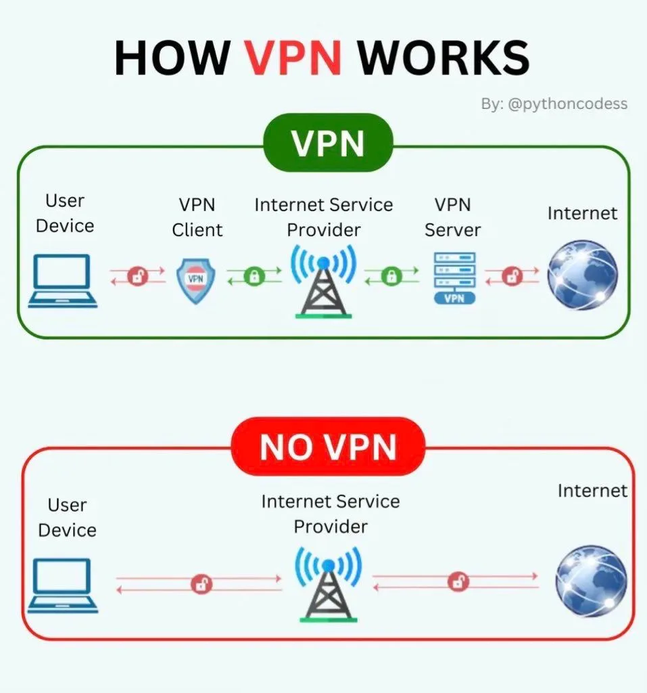

### 🧠 ¿Qué es una VPN? (Virtual Private Network)

Una **VPN** (Red Privada Virtual) es una tecnología que **crea una conexión segura y cifrada a través de Internet**, como si estuvieras conectado directamente a una red privada (como la de tu oficina o casa).

#### 🔐 ¿Para qué sirve?

- **Proteger la privacidad** al cifrar tu tráfico
- **Ocultar tu IP pública**
- **Conectarte a recursos privados desde fuera** (como servidores, archivos, etc.)
- **Evitar restricciones geográficas o de red**
- **Simular que estás en otra ubicación**

---

### 📦 Componentes de una VPN

| Componente   | Explicación sencilla                                       |
| ------------ | ---------------------------------------------------------- |
| Cliente VPN  | Programa que instalas en tu PC/móvil                       |
| Servidor VPN | Donde se establece la conexión segura                      |
| Protocolo    | Reglas de conexión (OpenVPN, WireGuard, IPsec, L2TP, etc.) |
| Cifrado      | Protege los datos (AES, RSA, ECC, etc.)                    |

---

### 🏠 Ejemplo fácil de entender

Imagina que:

- **Tu casa** es tu laptop
- **La oficina** es un servidor de archivos
- **Internet** es una autopista pública
- Una **VPN** es un túnel privado por el que viajas de tu casa a la oficina, **protegido de miradas ajenas** (hackers, proveedores, etc.)

---

### 🚀 ¿Cómo se instala una VPN?

Veremos un ejemplo real con **OpenVPN**, una de las más conocidas, **libre, gratuita y segura**.

---

### 💡 Escenario del ejemplo

**Empresa ACME** quiere que sus trabajadores accedan a la red interna desde sus casas de forma **segura con una VPN propia**.

- 🖥️ VPN Server: Ubuntu 20.04 con IP pública
- 👨‍💻 VPN Client: Windows o Linux
- 🔐 Protocolo: OpenVPN
- 🎯 Objetivo: Redireccionar el tráfico y proteger la conexión

---

### ✅ Paso 1: Instalar el servidor OpenVPN en Ubuntu

Conéctate a tu servidor con SSH:

```bash
ssh usuario@IP_PUBLICA
```

Actualiza paquetes:

```bash
sudo apt update && sudo apt upgrade -y
```

Instala OpenVPN y Easy-RSA:

```bash
sudo apt install openvpn easy-rsa -y
```

---

### ✅ Paso 2: Configurar la Autoridad Certificadora (CA)

Creamos el directorio de configuración:

```bash
make-cadir ~/openvpn-ca
cd ~/openvpn-ca
```

Edita el archivo `vars` y coloca datos como país, empresa, etc.

```bash
nano vars
```

Luego:

```bash
source vars
./clean-all
./build-ca
```

---

### ✅ Paso 3: Crear certificado del servidor

```bash
./build-key-server server
./build-dh
openvpn --genkey --secret keys/ta.key
```

Copia los archivos a la carpeta de configuración:

```bash
sudo cp keys/{server.crt,server.key,ca.crt,dh2048.pem,ta.key} /etc/openvpn
```

---

### ✅ Paso 4: Configurar el servidor OpenVPN

```bash
sudo gunzip -c /usr/share/doc/openvpn/examples/sample-config-files/server.conf.gz > /etc/openvpn/server.conf
```

Edita el archivo:

```bash
sudo nano /etc/openvpn/server.conf
```

Verifica estas líneas:

```ini
port 1194
proto udp
dev tun
ca ca.crt
cert server.crt
key server.key
dh dh2048.pem
tls-auth ta.key 0
cipher AES-256-CBC
user nobody
group nogroup
persist-key
persist-tun
status openvpn-status.log
verb 3
```

---

### ✅ Paso 5: Habilitar reenvío IP y firewall

Activa IP forwarding:

```bash
sudo nano /etc/sysctl.conf
```

Descomenta:

```conf
net.ipv4.ip_forward=1
```

Aplica cambios:

```bash
sudo sysctl -p
```

Agrega reglas de firewall (usando `ufw` por ejemplo):

```bash
sudo ufw allow 1194/udp
sudo ufw allow OpenSSH
sudo ufw enable
```

---

### ✅ Paso 6: Iniciar el servicio VPN

```bash
sudo systemctl start openvpn@server
sudo systemctl enable openvpn@server
```

---

### ✅ Paso 7: Crear cliente VPN

Desde el mismo servidor:

```bash
cd ~/openvpn-ca
source vars
./build-key cliente1
```

---

### ✅ Paso 8: Generar archivo `.ovpn` para el cliente

Crea un archivo como este:

```bash
nano cliente1.ovpn
```

Contenido:

```ini
client
dev tun
proto udp
remote TU_IP_PUBLICA 1194
resolv-retry infinite
nobind
persist-key
persist-tun
ca ca.crt
cert cliente1.crt
key cliente1.key
tls-auth ta.key 1
cipher AES-256-CBC
verb 3
```

Incluye los certificados dentro del archivo `.ovpn` o colócalos en la misma carpeta.

---

### ✅ Paso 9: Instalar cliente OpenVPN (Windows)

1. Descargar OpenVPN GUI desde [https://openvpn.net/community-downloads/](https://openvpn.net/community-downloads/)
2. Copiar `cliente1.ovpn` a la carpeta `C:\Program Files\OpenVPN\config`
3. Ejecutar OpenVPN GUI como administrador
4. Conectarse al servidor

---

### 🧪 Resultado final

Desde una laptop en casa, el trabajador de ACME:

- Conecta con OpenVPN
- Todo su tráfico pasa **cifrado**
- Accede a archivos internos
- Su IP pública cambia a la de la empresa

---

### 🎯 Ventajas de este enfoque

| Ventaja                | Detalle                                     |
| ---------------------- | ------------------------------------------- |
| Seguridad              | Cifrado extremo a extremo                   |
| Acceso remoto          | A recursos privados desde cualquier parte   |
| Control                | Se puede restringir por usuario/certificado |
| Gratuito y Open Source | No requiere licencias costosas              |

---

[🔼](#índice)

---

## **524. Principales protocolos de red para VPN: IPsec, PPTP, OpenVPN**

### 🧠 ¿Qué son los protocolos de red para VPN?

Los **protocolos VPN** son el **conjunto de reglas** que definen **cómo se establece y se mantiene una conexión segura entre tu dispositivo y un servidor VPN**.

Cada protocolo tiene su propia forma de:

- Autenticarse
- Cifrar datos
- Velocidad
- Seguridad

---

### 🎯 Protocolos más usados en VPNs

#### 1. **PPTP (Point-to-Point Tunneling Protocol)**

##### 🔎 ¿Qué es?

Uno de los **protocolos VPN más antiguos**, desarrollado por Microsoft.

##### ✅ Ventajas:

- **Muy fácil de configurar**
- Compatible con la mayoría de sistemas operativos

##### ❌ Desventajas:

- **Muy inseguro hoy en día**
- **Obsoleto**, no recomendado para seguridad real

##### 📘 Ejemplo práctico:

> Usado en redes antiguas corporativas o conexiones simples donde la seguridad no es prioritaria.

---

#### 2. **IPsec (Internet Protocol Security)**

##### 🔎 ¿Qué es?

Un conjunto de protocolos que **cifran datos a nivel de red (capa 3)**. Usado comúnmente con **L2TP** (Layer 2 Tunneling Protocol).

##### 🧱 Modos:

- **Túnel**: Cifra todo el paquete IP
- **Transporte**: Cifra solo el contenido (útil para comunicación entre dispositivos)

##### ✅ Ventajas:

- **Muy seguro**
- Estándar en **VPNs de empresa y routers**

##### ❌ Desventajas:

- Configuración más **compleja**
- Puede ser **bloqueado fácilmente por firewalls**

##### 📘 Ejemplo práctico:

> Ideal para **VPN site-to-site entre sucursales**, o entre empresas.

---

#### 3. **OpenVPN**

##### 🔎 ¿Qué es?

Protocolo **open source**, basado en SSL/TLS, uno de los **más seguros y populares** hoy en día.

##### ✅ Ventajas:

- Altamente **configurable**
- Compatible con puertos estándar (como 443)
- Utiliza **certificados**, autenticación fuerte

##### ❌ Desventajas:

- Requiere **más recursos** del CPU
- La instalación puede ser **más técnica**

##### 📘 Ejemplo práctico:

> Perfecto para **empresas pequeñas o medianas**, y para usuarios que quieren **privacidad real y control total** sobre su conexión.

---

### 📊 Comparativa rápida

| Protocolo  | Seguridad   | Velocidad | Facilidad | Uso actual     |
| ---------- | ----------- | --------- | --------- | -------------- |
| PPTP       | ❌ Baja     | ✅ Alta   | ✅ Fácil  | 🚫 Obsoleto    |
| IPsec/L2TP | ✅ Alta     | ❌ Media  | ❌ Media  | 🟢 Muy usado   |
| OpenVPN    | ✅ Muy Alta | ✅ Alta   | ❌ Media  | 🟢 Recomendado |

---

### 🛠️ ¿Cómo instalar estos protocolos?

Veamos un **ejemplo práctico por protocolo**.

---

### 📌 1. Ejemplo completo con **OpenVPN**

Ya lo instalamos en la respuesta anterior, pero aquí va un resumen simplificado:

#### Servidor:

```bash
sudo apt install openvpn easy-rsa
cd ~/openvpn-ca
./build-ca
./build-key-server server
./build-dh
```

Crea configuración y certificados → Inicia el servidor:

```bash
sudo systemctl start openvpn@server
```

#### Cliente:

- Descarga OpenVPN
- Usa archivo `.ovpn` con los certificados
- Conéctate

---

### 📌 2. Ejemplo con **IPsec/L2TP** usando `strongSwan`

#### Paso 1: Instalar IPsec en Ubuntu

```bash
sudo apt update
sudo apt install strongswan strongswan-pki libcharon-extra-plugins
```

#### Paso 2: Configurar archivo `/etc/ipsec.conf`

```conf
config setup
    charondebug="ike 2, knl 2, cfg 2"

conn myvpn
    auto=add
    keyexchange=ikev2
    left=%any
    leftid=@mi-vpn.com
    leftcert=server-cert.pem
    leftsubnet=0.0.0.0/0
    right=%any
    rightsourceip=10.10.10.0/24
    rightauth=eap-mschapv2
    eap_identity=%identity
```

#### Paso 3: Crear certificados, reiniciar servicio y listo:

```bash
sudo ipsec restart
```

---

### 📌 3. Ejemplo con **PPTP** (no recomendado, solo fines académicos)

#### Servidor Ubuntu:

```bash
sudo apt install pptpd
```

Edita `/etc/pptpd.conf` y agrega IPs:

```
localip 192.168.0.1
remoteip 192.168.0.100-200
```

En `/etc/ppp/chap-secrets`:

```
usuario pptpd contraseña *
```

Inicia el servicio:

```bash
sudo systemctl restart pptpd
```

Cliente: Windows o Android → Crear nueva VPN PPTP.

---

### 🎯 Recomendación final

| Necesitas...                                 | Usa                   |
| -------------------------------------------- | --------------------- |
| Seguridad empresarial fuerte                 | IPsec o OpenVPN       |
| Alta compatibilidad y privacidad moderna     | OpenVPN               |
| Una VPN rápida sin preocuparte por seguridad | PPTP (no recomendado) |

---

[🔼](#índice)

---

## **525. Despliegue de una VPN empresarial - OpenVPN**

### 🧠 ¿Qué es OpenVPN?

**OpenVPN** es un protocolo y software libre que permite crear **redes privadas virtuales (VPN)** seguras. Usa los protocolos **SSL/TLS para cifrar la comunicación**, por lo que es **muy confiable y ampliamente usado en empresas**.

---

### 🎯 ¿Para qué sirve una VPN empresarial?

- Permite que empleados se conecten **de forma segura desde cualquier lugar**.
- Protege los datos transmitidos a través de redes inseguras (como Wi-Fi públicas).
- Da acceso remoto a recursos internos de la empresa.
- Evita que espías, hackers o proveedores de internet vean tu tráfico.

---

### 🔧 ¿Qué necesitas para desplegar OpenVPN?

#### ✅ Requisitos:

1. **Servidor Linux (Ubuntu recomendado)** con IP pública → Puede ser un servidor local o en la nube (AWS, DigitalOcean, etc.).
2. Conexión SSH al servidor
3. Conocimientos básicos de terminal

---

### 🛠️ PASO A PASO: Despliegue de OpenVPN empresarial

---

#### ✅ 1. Instalar OpenVPN con el script automático (más fácil)

Usaremos el script de **Nyr**, muy popular y confiable.

##### Paso 1: Conéctate al servidor por SSH

```bash
ssh usuario@IP-del-servidor
```

##### Paso 2: Ejecutar el script de instalación

```bash
sudo apt update && sudo apt upgrade -y
curl -O https://raw.githubusercontent.com/Nyr/openvpn-install/master/openvpn-install.sh
chmod +x openvpn-install.sh
sudo ./openvpn-install.sh
```

> El script te hará una serie de preguntas:

- Dirección IP del servidor: acepta la que detecte
- Protocolo: UDP (por defecto, recomendado)
- Puerto: 1194 (por defecto)
- Nombre del cliente: por ejemplo `empleado1`

Cuando termine, generará un archivo `.ovpn` que será el **perfil de conexión del cliente**.

---

#### ✅ 2. Descargar el perfil del cliente `.ovpn`

Desde tu PC, descarga el archivo con `scp`:

```bash
scp usuario@IP-del-servidor:/root/empleado1.ovpn .
```

O puedes usar WinSCP si estás en Windows.

---

#### ✅ 3. Instalar cliente OpenVPN en el equipo del empleado

##### En **Windows**:

1. Descarga el cliente oficial: [https://openvpn.net/community-downloads/](https://openvpn.net/community-downloads/)
2. Instala
3. Copia el archivo `empleado1.ovpn` en `C:\Program Files\OpenVPN\config`
4. Haz clic derecho en el icono de OpenVPN → Conectar

##### En **Linux**:

```bash
sudo apt install openvpn
sudo openvpn --config empleado1.ovpn
```

##### En **Android** o **iOS**:

1. Instala la app **OpenVPN Connect**
2. Importa el archivo `.ovpn` desde tu email o nube
3. Conéctate

---

### 🧪 Ejemplo práctico de uso empresarial

Supongamos que tienes una empresa con:

- Un servidor en AWS que hospeda una base de datos y una aplicación
- 5 empleados que trabajan remoto

✅ Despliegas OpenVPN en ese servidor

✅ Creas 5 perfiles `.ovpn` con el script para cada empleado

✅ Cada empleado instala OpenVPN y se conecta

✅ La red interna de la empresa solo acepta conexiones desde la VPN

✅ **Todo el tráfico entre empleados y la empresa queda cifrado**

---

### 📘 ¿Cómo agregar más empleados?

Vuelves a ejecutar el script:

```bash
sudo ./openvpn-install.sh
```

Y eliges la opción:

```
1) Add a new user
```

---

### 🧱 Seguridad adicional recomendada

- Usa **autenticación con contraseña adicional** (TLS + user/pass)
- Limita acceso por IP a ciertos puertos
- Configura **firewall UFW** para aceptar solo tráfico VPN

---

### 🧩 Extras avanzados (opcional)

- Redirección total del tráfico (navegación privada)
- Push de DNS internos a los clientes
- Rutas personalizadas por subred (acceso solo a ciertos recursos)
- Logs y monitoreo con `logwatch`, `fail2ban`

---

### ✅ Conclusión

| Ventaja                         | Descripción                        |
| ------------------------------- | ---------------------------------- |
| Seguridad sólida                | Usa TLS y cifrado fuerte           |
| Muy configurable                | Puedes adaptar a cualquier empresa |
| Accesible desde cualquier lugar | Ideal para trabajo remoto o viajes |
| Código abierto                  | Totalmente gratuito y transparente |

---

[🔼](#índice)

---

## **526. Privacidad y Anonimato en Internet**

### 🧾 PRIVACIDAD:

Es el **control que tienes sobre tus datos personales** (ubicación, búsquedas, contactos, gustos, hábitos).

> Ejemplo: cuando visitas un sitio web y **rechazas las cookies**, estás defendiendo tu privacidad.

### 🎭 ANONIMATO:

Es la capacidad de **ocultar tu identidad** (IP, nombre real, ubicación, etc.) mientras estás conectado.

> Ejemplo: al usar Tor o una VPN, puedes navegar **sin que sepan quién eres realmente**.

---

### 📢 ¿Por qué es importante?

- Protegerte de **hackers**, **estafadores**, **gobiernos autoritarios** o **empresas invasivas**.
- Evitar la **recolección masiva de tus datos** por grandes plataformas.
- Prevenir **suplantación de identidad**, **robo de cuentas** o **rastreo**.
- Permitir que **periodistas, activistas o investigadores** trabajen sin riesgo.

---

### 🔧 ¿Cómo mantener tu privacidad y anonimato en Internet?

A continuación, te explico las **herramientas más importantes** con ejemplos:

---

#### 🛡️ 1. Navegadores que protegen tu privacidad

| Navegador       | Beneficios principales                                       |
| --------------- | ------------------------------------------------------------ |
| **Brave**       | Bloquea rastreadores, anuncios, huellas digitales.           |
| **Firefox**     | Protección de rastreo, configuración avanzada de privacidad. |
| **Tor Browser** | Enruta tu tráfico por varias capas para anonimato real.      |

✅ **Ejemplo**: con Brave, puedes navegar sin que Google/Facebook te sigan de sitio en sitio.

---

#### 🌐 2. Usar una VPN (Virtual Private Network)

- Cifra tu tráfico y **oculta tu IP real**.
- Te conecta a un servidor intermedio.
- Protege incluso en Wi-Fi públicas.

| VPN segura         | ¿Es buena para anonimato?     | ¿Requiere pagar? |
| ------------------ | ----------------------------- | ---------------- |
| ProtonVPN          | ✅ Sí                         | No (plan gratis) |
| Mullvad            | ✅ Sí (sin correo ni tarjeta) | Sí (\$5/mes)     |
| NordVPN, Surfshark | ✅ Sí                         | Sí               |

> ⚠️ VPNs gratuitas desconocidas a menudo **venden tus datos**. Cuidado.

---

#### 🎭 3. Navegar con Tor para anonimato real

**Tor (The Onion Router)** enruta tu tráfico por al menos 3 nodos encriptados → difícil rastrear.

##### ¿Cuándo usarlo?

- Periodismo de investigación
- Publicación anónima
- Acceso a contenido bloqueado

> Ejemplo: Tor es usado por personas en países censurados para acceder a información libre.

---

#### 🧹 4. Bloquear rastreadores y publicidad invasiva

Usa **extensiones** como:

- uBlock Origin (bloqueador de publicidad y scripts)
- Privacy Badger (bloquea rastreadores automáticamente)
- Decentraleyes (evita dependencias de Google/CDN)

✅ **Ejemplo práctico**:

Instalas Brave + uBlock Origin + DuckDuckGo como buscador = navegas sin que te sigan.

---

#### 🔐 5. Uso de buscadores privados

| Buscador     | Beneficio clave                     |
| ------------ | ----------------------------------- |
| DuckDuckGo   | No guarda historial ni IP           |
| Startpage    | Resultados de Google, pero anónimos |
| Brave Search | Sin rastreo, independiente          |

---

#### 📧 6. Correos electrónicos anónimos

- ProtonMail o Tutanota → cifrado de extremo a extremo
- TempMail → correos temporales sin registro

> Ejemplo: Si te registras en un foro sensible, no uses tu correo real → usa uno temporal.

---

#### 🧹 7. Limitar tu huella digital

> Tu **huella digital** es el rastro que dejas por tus hábitos de navegación, software, idioma, tamaño de pantalla, etc.

##### Herramientas para reducirla:

- Desactivar JavaScript si no es necesario
- Usar Tor o Firefox en modo estricto
- Navegar con extensiones que bloquean fingerprinting

---

#### 🔓 8. Sistema operativo para el anonimato: **Tails OS**

**Tails** es un sistema operativo que:

- Se ejecuta desde un USB
- No guarda rastros
- Usa Tor por defecto
- Perfecto para periodistas o personas perseguidas

> Ejemplo: Un denunciante que quiere filtrar documentos lo puede hacer desde Tails sin dejar rastros.

---

### ⚙️ EJEMPLO COMPLETO: Cómo navegar de forma privada y anónima

#### Objetivo: visitar un sitio web sin que nadie sepa quién eres.

##### PASOS:

1. **Descarga Tor Browser** desde [https://www.torproject.org](https://www.torproject.org)
2. Instálalo y ábrelo
3. Accede a [https://check.torproject.org](https://check.torproject.org) para confirmar que estás protegido
4. Abre una pestaña y navega por sitios como Wikipedia
5. Si deseas aún más privacidad:

   - Usa ProtonMail en Tor
   - Usa buscadores como DuckDuckGo
   - No abras archivos descargados en tu sistema normal

✅ Resultado: tu tráfico está cifrado, tu IP está oculta, no dejas rastro, y nadie sabe quién eres.

---

### 🧱 ¿Cómo "instalar" la privacidad?

No se instala como un solo programa, sino que es un **conjunto de hábitos + herramientas**:

| Acción                      | Herramienta sugerida      |
| --------------------------- | ------------------------- |
| Navegar sin ser rastreado   | Brave, Firefox con uBlock |
| Cifrar tu tráfico           | VPN (ProtonVPN, Mullvad)  |
| Ocultar tu identidad        | Tor Browser, Tails OS     |
| Evitar spam o robo de datos | ProtonMail, TempMail      |
| Buscar sin dejar rastro     | DuckDuckGo, Startpage     |

---

### 🧩 BONUS: ¿Cuál usar y cuándo?

| Situación                           | Herramienta recomendada        |
| ----------------------------------- | ------------------------------ |
| Navegar de forma privada normal     | Brave + uBlock + VPN           |
| Reunión sensible o denuncia anónima | Tails OS + Tor Browser         |
| Trabajar remoto sin rastreo         | VPN + Firefox en modo estricto |

---

### ✅ Conclusión

Privacidad y anonimato en Internet no son lo mismo, pero **se complementan**. Con buenas herramientas y hábitos, puedes protegerte de vigilancia, censura, estafas y robo de datos.

---

[🔼](#índice)

---

## **527. NAC**

### 🧠 ¿Qué es NAC (Network Access Control)?

**NAC** (Control de Acceso a la Red) es un sistema que **restringe o permite el acceso a la red** solo a dispositivos autorizados y en cumplimiento de ciertas políticas de seguridad.

---

### 📌 Ejemplo sencillo:

Imagina que tienes una empresa. No quieres que **cualquier laptop o celular se conecte a tu red**. Quieres:

- Que solo dispositivos de la empresa se conecten.
- Que si un equipo no tiene antivirus, no pueda entrar.
- Que invitados solo tengan acceso a internet, no a los servidores.

Eso es lo que hace **NAC** automáticamente.

---

### 🎯 ¿Para qué sirve NAC?

| Funcionalidad                    | Explicación clara                                                   |
| -------------------------------- | ------------------------------------------------------------------- |
| ✅ Autenticación de dispositivos | Solo dispositivos registrados acceden a la red.                     |
| 🛡 Verificación de políticas      | Comprueba si los equipos tienen antivirus, actualizaciones, etc.    |
| 📶 Segmentación de red dinámica  | Si eres empleado, vas a la red interna. Si eres invitado, a la DMZ. |
| 🔄 Respuesta automática          | Si detecta algo raro, bloquea, pone en cuarentena o limita acceso.  |

---

### 🏗 Componentes clave de NAC

| Componente        | Qué hace                                                                |
| ----------------- | ----------------------------------------------------------------------- |
| **Agente**        | Programa en el dispositivo que envía info sobre su estado de seguridad. |
| **Política**      | Reglas que definen quién puede entrar y en qué condiciones.             |
| **Servidor NAC**  | Donde se procesan las reglas y se decide si se permite o no el acceso.  |
| **Switch/Router** | Aplica las decisiones del NAC (permite o no el acceso).                 |

---

### 🛠️ ¿Cómo se instala un sistema NAC?

#### Puedes hacerlo con software comercial o libre:

| Herramienta NAC | Licencia  | Características clave                         |
| --------------- | --------- | --------------------------------------------- |
| Cisco ISE       | Comercial | Muy completo, para grandes empresas.          |
| Aruba ClearPass | Comercial | Fuerte en redes Wi-Fi empresariales.          |
| **PacketFence** | **Libre** | Open Source, ideal para laboratorios y pymes. |
| FortiNAC        | Comercial | Integración con dispositivos Fortinet.        |

---

### 💡 Ejemplo real fácil: Desplegar **PacketFence** (open source)

Vamos a montar un NAC **gratis** en una red de prueba, ideal para aprender y experimentar.

---

#### ✅ REQUISITOS

- PC con **Linux (Ubuntu o CentOS)** o una **máquina virtual**.
- Acceso a los switches/routers o a la configuración de red de prueba.
- (Opcional) Un switch manageable o WiFi AP para poner en cuarentena a dispositivos no conformes.

---

### 📦 INSTALACIÓN DE PACKETFENCE (modo laboratorio)

#### Paso 1: Instalar PacketFence en Ubuntu Server

```bash
sudo apt update
sudo apt install curl gnupg -y
curl https://packages.inverse.ca/key.asc | sudo apt-key add -
echo "deb http://inverse.ca/ubuntu focal main" | sudo tee /etc/apt/sources.list.d/packetfence.list
sudo apt update
sudo apt install packetfence -y
```

---

#### Paso 2: Acceder a la interfaz web de configuración

- Abre tu navegador: `https://<IP_DEL_SERVIDOR>:1443`
- Usuario: `admin`
- Contraseña: la que definiste durante la instalación

---

#### Paso 3: Configurar roles

1. Crea una política:

   - **Dispositivos con antivirus actualizado → acceso completo**
   - **Dispositivos sin antivirus → acceso limitado o cuarentena**
   - **Invitados → solo internet**

2. Activa inspección de dispositivos vía SNMP/802.1X si el switch lo permite.

---

#### Paso 4: Probar acceso a la red

Conecta un dispositivo:

- Si es un equipo autorizado → accede normalmente
- Si es un equipo sin parches → lo redirige a una página donde se informa que no cumple las políticas

---

### 📐 EJEMPLO COMPLETO: NAC en una oficina pequeña

**Escenario**: oficina con empleados, invitados y dispositivos BYOD.

| Rol      | Requisitos de acceso                     | Comportamiento en red              |
| -------- | ---------------------------------------- | ---------------------------------- |
| Empleado | Autenticación por MAC + Antivirus activo | Acceso a red interna y servidores  |
| Invitado | Portal cautivo con correo + verificación | Acceso a internet solamente        |
| BYOD     | Antivirus y actualizaciones al día       | Solo red de impresoras y archivos  |
| Inseguro | Sin antivirus                            | Cuarentena automática o sin acceso |

---

### Resultado:

- Si llega un visitante: el NAC lo redirige a una página para autenticarse como invitado.
- Si un empleado intenta conectar un equipo personal infectado, se bloquea o se pone en cuarentena.
- Si un dispositivo cumple políticas, se le da acceso normal.

---

### 🧠 Conclusión

**NAC** es esencial hoy en día para:

- Controlar quién accede a la red.
- Proteger la infraestructura de equipos infectados.
- Adaptarse a políticas BYOD, teletrabajo o visitas.

---

[🔼](#índice)

---

## **528. SASE (Zscaler) y CASB (Netskope)**

### ¿Qué es SASE?

**Secure Access Service Edge (SASE)** es un modelo en el que las funciones de **red** (conectividad, SD-WAN) y **seguridad** (SWG, CASB, ZTNA, DLP, FWaaS, etc.) se entregan como **servicio en la nube**, lo más cerca posible del usuario, sucursal o carga de trabajo. El objetivo: **acceso seguro de baja latencia desde cualquier lugar a cualquier aplicación** sin depender de backhauling al datacenter. ([Zscaler][1], [Zscaler][2])

Zscaler es uno de los proveedores líderes de SASE, combinando capacidades de **Secure Web Gateway (ZIA), Zero Trust Network Access (ZPA), CASB, DLP y SD-WAN de próxima generación** dentro de su **Zero Trust Exchange**, una nube distribuida globalmente. ([Zscaler][1], [wwt.com][3])

---

### ¿Qué es un CASB?

Un **Cloud Access Security Broker (CASB)** es un servicio que se coloca entre los **usuarios y las aplicaciones en la nube (SaaS, IaaS, PaaS)** para ofrecer **visibilidad, control de datos, cumplimiento y protección frente a amenazas** relacionadas con el uso de servicios cloud. Puede operar **inline (proxy forward o reverse)** para control en tiempo real, o **API / out-of-band** para escanear datos “en reposo” dentro de una app SaaS (como OneDrive, Google Drive, Slack). ([Netskope][4], [Exclusive Networks][5])

**Netskope** es una plataforma líder de **CASB + Secure Web Gateway + Data Protection**, muy conocida por su arquitectura “all-mode” que combina **API, forward proxy, reverse proxy e integración de logs** para cubrir tanto apps sancionadas como shadow IT. ([Netskope][4], [Exclusive Networks][5])

---

### Cómo se complementan SASE (Zscaler) y CASB (Netskope)

| Necesidad empresarial                                                 | Quién brilla                                 | Cómo funciona juntos                                                                                                                       |
| --------------------------------------------------------------------- | -------------------------------------------- | ------------------------------------------------------------------------------------------------------------------------------------------ |
| Acceso seguro a Internet y SaaS desde cualquier lugar                 | **Zscaler ZIA (SWG) + ZTNA / SASE**          | Rediriges tráfico de usuarios al cloud de Zscaler para inspección y control. ([Zscaler][1], [help.zscaler.com][6])                         |
| Acceso Zero Trust a apps privadas sin VPN tradicional                 | **Zscaler ZPA**                              | Política basada en identidad, sin exponer red interna. ([Zscaler][2], [wwt.com][3])                                                        |
| Visibilidad profunda de uso de apps cloud y gobernanza de datos       | **Netskope CASB**                            | API + proxy inline detectan, clasifican y aplican DLP a datos en SaaS. ([Netskope][4], [docs.netskope.com][7])                             |
| Control granular de actividades (subir, compartir, descargar) por app | **Netskope inline + políticas de actividad** | Políticas separadas para diferentes servicios y acciones. ([Netskope][4], [Exclusive Networks][5])                                         |
| Estrategia integral                                                   | **Integración combinada**                    | Muchos clientes usan **SASE primario + CASB especializado** en modo API/inline complementario. ([Netskope][4], [community.zscaler.com][8]) |

---

### Componentes principales de Zscaler (en rol SASE)

| Componente                               | Función                                                                                                                                 | Nota rápida |
| ---------------------------------------- | --------------------------------------------------------------------------------------------------------------------------------------- | ----------- |
| **ZIA – Zscaler Internet Access**        | Secure Web Gateway en la nube: inspección HTTP/HTTPS, URL filtering, DLP, CASB en línea. ([help.zscaler.com][6], [help.zscaler.com][9]) |             |
| **ZPA – Zscaler Private Access**         | Zero Trust Access a apps internas sin VPN de red. ([Zscaler][2], [wwt.com][3])                                                          |             |
| **Client Connector** (antes Zscaler App) | Agente endpoint que dirige tráfico al servicio Zscaler según políticas. ([help.zscaler.com][10], [help.zscaler.com][6])                 |             |
| **Integraciones SAML / IdP**             | Autenticación y aprovisionamiento de usuarios/roles (ej. Microsoft Entra ID). ([Microsoft Learn][11], [help.zscaler.com][6])            |             |
| **GRE / IPsec túneles desde sucursales** | Redirigir tráfico de sitios remotos a la nube Zscaler sin cliente. ([Cisco][12], [Zscaler][1])                                          |             |

---

### Flujo lógico de tráfico con Zscaler SASE

**Usuario remoto con Client Connector** → Autenticación SAML → Tráfico saliente se tuneliza al **punto de presencia (PoP) de Zscaler más cercano** → Se aplican políticas (URL filtering, sandbox, DLP, CASB inline) → Tráfico seguro hacia Internet/SaaS. ([help.zscaler.com][10], [Zscaler][1])

Sucursales pueden **construir túneles GRE/IPsec** al cloud Zscaler en lugar de backhaul al datacenter. Esto reduce latencia y complejidad WAN. ([Cisco][12], [Zscaler][1])

---

### Componentes principales de Netskope (en rol CASB / SSE)

| Componente                            | Modo                                                                                                                                                                 | Uso principal |
| ------------------------------------- | -------------------------------------------------------------------------------------------------------------------------------------------------------------------- | ------------- |
| **API Connector (Out-of-Band)**       | Se conecta vía API a apps SaaS (M365, Google Workspace, Box) para auditar y aplicar DLP a datos en reposo. ([Netskope][4], [docs.netskope.com][7])                   |               |
| **Forward Proxy (Inline)**            | Redirige tráfico web/cloud en tiempo real para inspección y control por actividad (subir archivo, compartir público, etc.). ([Netskope][4], [Exclusive Networks][5]) |               |
| **Reverse Proxy**                     | Protege acceso a SaaS cuando usuarios no administrados entran vía SSO (inserta controles sin agente). ([Netskope][4], [Exclusive Networks][5])                       |               |
| **Netskope Client**                   | Agente que asegura el desvío de tráfico para inspección en la nube Netskope. ([docs.netskope.com][13], [docs.netskope.com][7])                                       |               |
| **On-premises appliances / steering** | Opciones físicas / virtuales para entornos híbridos. ([docs.netskope.com][14], [Netskope][4])                                                                        |               |

---

### Arquitecturas de despliegue (alto nivel)

#### Zscaler SASE – Rutas comunes de implementación

**Escenario inicial recomendado (ZIA):**

1. Configurar tenant ZIA y administradores.
2. Integrar con IdP (SAML/SCIM) para usuarios/roles.
3. Elegir método de redirección de tráfico: Client Connector, PAC file, GRE/IPsec desde branch, o combinación.
4. Aplicar políticas: URL categories, malware, SSL inspection, Cloud App control (CASB ligero), DLP.
5. Validar logging vía Nanolog Streaming Service (NSS) hacia SIEM. ([help.zscaler.com][6], [Microsoft Learn][11], [Coralogix][15])

**Integración con SD-WAN (ej. Cisco):** túneles automáticos al cloud Zscaler, reducción de backhaul y políticas centralizadas. ([Cisco][12], [Zscaler][1])

---

#### Netskope CASB – Modos combinables

Netskope recomienda combinar **API + forward proxy + (cuando aplica) reverse proxy** para máxima cobertura:

- API: analiza datos ya almacenados (post-uso).
- Forward proxy: controla actividades en tiempo real.
- Reverse proxy: protege usuarios no gestionados que acceden vía SSO. ([Netskope][4], [Exclusive Networks][5], [docs.netskope.com][7])

Los clientes suelen iniciar con API para apps sancionadas (M365, GDrive) y luego añadir forward proxy para detectar **shadow IT** y aplicar control granular. ([Netskope][4], [Exclusive Networks][5])

---

### Instalación / Despliegue guiado

A continuación, te doy **procedimientos resumidos tipo checklist** para entornos empresariales. (Las plataformas son SaaS; “instalar” significa **aprovisionar tenant, integrar identidad, dirigir tráfico y aplicar políticas**.)

---

#### Despliegue básico de **Zscaler ZIA + Client Connector**

**Objetivo:** Proteger navegación de usuarios remotos y de oficina con inspección en la nube.

##### Paso 0 – Preparativos

- Licencias ZIA vigentes.
- Dominio verificado.
- IdP (Microsoft Entra ID, Okta) listo para SAML/SCIM. ([Microsoft Learn][11], [help.zscaler.com][6])

##### Paso 1 – Configuración inicial en consola ZIA

- Completa info de compañía y admins.
- Configura autenticación (SAML, LDAP, SCIM).
- Sincroniza grupos/usuarios. ([help.zscaler.com][6], [Microsoft Learn][11])

##### Paso 2 – Método de desvío de tráfico

Opciones:

- **Zscaler Client Connector** (endpoints gestionados).
- **PAC file** en navegadores.
- **Túneles GRE/IPsec** desde sucursales / SD-WAN. ([help.zscaler.com][10], [Cisco][12])

##### Paso 3 – Políticas

- URL Filtering por categorías.
- SSL Inspection activada selectivamente.
- Cloud App control (permitir/alertar subidas a apps).
- DLP templates (PII, PCI). ([help.zscaler.com][6], [Zscaler][1])

##### Paso 4 – Logs y monitoreo

- Configura **Nanolog Streaming Service (NSS)** para exportar a SIEM/SOC. ([Coralogix][15], [help.zscaler.com][6])

---

#### Despliegue básico de **Netskope CASB (API + Forward Proxy)**

**Objetivo:** Visibilidad de datos en SaaS + control en tiempo real de actividades.

##### Paso 0 – Preparativos

- Tenant Netskope activo.
- IdP SAML (Okta, Entra, Ping) para forward/reverse proxy y app steering. ([docs.netskope.com][7], [docs.netskope.com][13])

##### Paso 1 – API connectors

En la consola Netskope:

- Conecta M365, Google Workspace, Box, Slack, etc.
- Establece permisos de lectura/escritura según política.
- Configura escaneos DLP programados. ([docs.netskope.com][7], [Exclusive Networks][5])

##### Paso 2 – Forward proxy (tráfico en tiempo real)

- Instala **Netskope Client** en endpoints o configura proxy explícito / firewall redirigido.
- Define exclusiones de dominios críticos (bypass).
- Prueba conectividad a PoPs Netskope. ([docs.netskope.com][13], [Netskope][4])

##### Paso 3 – Reverse proxy (usuarios no gestionados)

- Habilita integración SAML proxy-in-the-middle para apps SaaS seleccionadas.
- Inserta controles DLP y avisos de política para dispositivos BYOD. ([Netskope][4], [Exclusive Networks][5])

##### Paso 4 – Políticas de actividad y DLP

- Bloquear “public link sharing” con datos sensibles.
- Alertar cuando archivo con tarjeta de crédito se carga a app personal. ([Netskope][4], [Exclusive Networks][5])

---

### Validaciones y pruebas recomendadas

| Prueba                                      | Zscaler                         | Netskope                              | Expectativa                                                                         |
| ------------------------------------------- | ------------------------------- | ------------------------------------- | ----------------------------------------------------------------------------------- |
| Usuario remoto navega sin túnel corporativo | Client Connector dirige tráfico | N/A                                   | Sitios categorizados correctamente. ([help.zscaler.com][10], [help.zscaler.com][6]) |
| Bloqueo URL “adulto”                        | Política URL ZIA                | (Opcional SWG Netskope)               | Acceso denegado/logueado. ([help.zscaler.com][6], [Netskope][4])                    |
| Subida de archivo con PII a OneDrive        | DLP ZIA o Netskope              | DLP API/inline Netskope               | Se alerta/bloquea o pone en cuarentena. ([Netskope][4], [docs.netskope.com][7])     |
| Usuario no gestionado accede M365           | ZPA opcional                    | Reverse proxy Netskope aplica control | Marca archivo solo lectura. ([Netskope][4], [Exclusive Networks][5])                |

---

### Caso práctico completo: Empresa híbrida con Zscaler + Netskope

#### Contexto

- 3 sucursales globales + teletrabajo.
- Apps: Microsoft 365, Salesforce, Slack, GitHub.
- Requisito: **Acceso seguro global + control de datos en SaaS + segmentación por rol + cumplimiento**.

---

#### Diseño de alto nivel

```
Usuarios (laptops, móviles)
   | (Client Connector / Netskope Client)
   v
Internet ---> Zscaler PoP (ZIA) ---> Inspección web / Threat / URL / DLP
                     |(App categorization passthrough)
                     v
              Netskope Inline CASB (actividad granular) + API scans para M365/Slack
                     v
           SaaS Apps / Internet Destinations
```

Sucursales conectan vía **túneles GRE al cloud Zscaler**; usuarios remotos usan **Zscaler Client Connector**. Para apps críticas, Netskope añade **control de actividad y DLP avanzado** (ej. bloquear compartir externo con datos sensibles). ([Cisco][12], [Netskope][4], [Exclusive Networks][5])

---

#### Implementación resumida

##### Paso A – Zscaler base

1. Integrar SAML con Entra ID; asignar grupos (Empleados, Contratistas).
2. Configurar Client Connector + PAC fallback.
3. Establecer políticas URL + Malware + SSL Inspection selectiva. ([Microsoft Learn][11], [help.zscaler.com][10], [help.zscaler.com][6])

##### Paso B – Netskope CASB

1. Conectar Microsoft 365 y Slack vía API para escaneo de datos en reposo.
2. Instalar Netskope Client en endpoints con superposición a Zscaler (solo tráfico SaaS selecto).
3. Crear políticas: bloquear subida de archivos con PCI, alertar PII compartida externamente. ([docs.netskope.com][7], [Netskope][4], [Exclusive Networks][5])

##### Paso C – Flujo de identidad & control

- SSO central en Entra ID → Asigna claims al usuario.
- Zscaler usa identidad para políticas de navegación.
- Cuando usuario accede M365: Netskope API revisa archivos; inline proxy inspecciona uploads en tiempo real. ([Microsoft Learn][11], [Netskope][4])

---

#### Pruebas de aceptación

**Prueba 1 – Navegación general:** Usuario remoto navega a sitios web no permitidos → bloqueado por ZIA; log en NSS. ([help.zscaler.com][6], [Coralogix][15])

**Prueba 2 – Subida de datos sensibles a OneDrive:** Archivo con números de tarjeta → Netskope detecta vía API DLP y coloca en cuarentena / alerta SOC. ([docs.netskope.com][7], [Exclusive Networks][5])

**Prueba 3 – Dispositivo no gestionado:** Usuario externo accede a enlace M365; Reverse proxy Netskope fuerza vista solo lectura y evita descarga. ([Netskope][4], [Exclusive Networks][5])

**Prueba 4 – Sucursal remota:** Tráfico sucursal→GRE a Zscaler; latencia reducida vs backhaul; políticas centralizadas. ([Cisco][12], [Zscaler][1])

---

### Buenas prácticas para un despliegue exitoso

| Fase       | Recomendación                                      | Por qué importa                                                                          |
| ---------- | -------------------------------------------------- | ---------------------------------------------------------------------------------------- |
| Planeación | Clasifica apps: sancionadas, toleradas, prohibidas | Permite políticas escalonadas CASB/SASE. ([Netskope][4], [Exclusive Networks][5])        |
| Identidad  | Usa SAML/SCIM central                              | Alinea políticas al usuario/rol, no a IP. ([Microsoft Learn][11], [help.zscaler.com][6]) |
| Tráfico    | Empieza en modo monitor antes de bloquear          | Reduce impacto al usuario. ([help.zscaler.com][6], [docs.netskope.com][7])               |
| Datos      | Activa DLP progresivo (alerta → bloqueo)           | Evita falsos positivos masivos. ([docs.netskope.com][7], [Exclusive Networks][5])        |
| Operación  | Exporta logs a SIEM (NSS / API Netskope)           | Correlación centralizada para SOC. ([Coralogix][15], [docs.netskope.com][13])            |

---

### Mini laboratorio en casa (versión aprendizaje)

¿Quieres practicar sin licencias grandes? Aquí un **laboratorio conceptual**:

1. **Simula Zscaler**: usa un proxy filtrante (Squid + listas) para entender redirección; agrega TLS intercept en entorno de prueba. (No es Zscaler real, pero sirve para comprender flujos).
2. **Simula CASB**: Configura un script que revise archivos subidos a un bucket (S3 / Nextcloud) buscando cadenas PII; bloquea/avisa. Así entiendes la lógica API/DLP que hace Netskope.
3. Añade **SSO (Keycloak)** como IdP y aplica claims por grupo para replicar políticas basadas en identidad como en Zscaler/Netskope.

> Cuando estés cómodo con el flujo, migra el concepto a un **trial oficial** (Zscaler & Netskope ofrecen evaluaciones comerciales). ([help.zscaler.com][6], [docs.netskope.com][7], [Netskope][4])

---

### Resumen rápido

| Tema                                                   | Zscaler (SASE)                       | Netskope (CASB)                                | Juntos                              |
| ------------------------------------------------------ | ------------------------------------ | ---------------------------------------------- | ----------------------------------- |
| Función base                                           | Acceso seguro + SWG global + ZTNA    | Visibilidad & control de datos en SaaS         | Cobertura completa usuario→app→dato |
| Despliegue                                             | Cliente + túneles + SAML             | API + forward proxy + reverse proxy            | Defensa en profundidad              |
| Política                                               | URL, malware, DLP, acceso Zero Trust | Actividad granular (subir/compartir), DLP SaaS | Cumplimiento integral y Zero Trust  |
| Ideal para                                             | Acceso global seguro                 | Protección de datos en la nube                 | Arquitectura moderna híbrida        |
| ([Zscaler][1], [Netskope][4], [Exclusive Networks][5]) |                                      |                                                |                                     |

---

[1]: https://www.zscaler.com/products-and-solutions/secure-access-service-edge-sase?utm_source=chatgpt.com "Zscaler Zero Trust SASE: Architecture for a Cloud and Mobile"
[2]: https://www.zscaler.com/zpedia/how-to-implement-zero-trust?utm_source=chatgpt.com "How Do You Implement Zero Trust?"
[3]: https://www.wwt.com/product/zscaler-sase/overview?utm_source=chatgpt.com "Zscaler Zero Trust SASE - Overview"
[4]: https://www.netskope.com/products/deployment-options?utm_source=chatgpt.com "Deployment Options"
[5]: https://www.exclusive-networks.com/ie/wp-content/uploads/sites/19/2020/12/netskope-cloud-access-security-broker-casb.pdf?utm_source=chatgpt.com "Netskope Cloud Access Security Broker (CASB)"
[6]: https://help.zscaler.com/zia/step-step-configuration-guide-zia?utm_source=chatgpt.com "Step-by-Step Configuration Guide for ZIA"
[7]: https://docs.netskope.com/en/quick-start/?utm_source=chatgpt.com "Quick Start"
[8]: https://community.zscaler.com/s/question/0D54u00009evmtuCAA/zscaler-zia-and-zpa-with-netskope-casb-and-dlp-services?utm_source=chatgpt.com "Zscaler ZIA and ZPA with NetSkope CASB and DLP services"
[9]: https://help.zscaler.com/zia/getting-started?utm_source=chatgpt.com "Getting Started"
[10]: https://help.zscaler.com/zscaler-client-connector/step-step-configuration-guide-zscaler-client-connector?utm_source=chatgpt.com "Client Connector"
[11]: https://learn.microsoft.com/en-us/entra/identity/saas-apps/zscaler-internet-access-administrator-tutorial?utm_source=chatgpt.com "Configure Zscaler Internet Access ..."
[12]: https://www.cisco.com/c/dam/en/us/td/docs/solutions/CVD/SDWAN/zscaler-cisco-sdwan-deployment-guide-2020feb.pdf?utm_source=chatgpt.com "zscaler-cisco-sdwan-deployment- ..."
[13]: https://docs.netskope.com/en/secure-tenant-configuration-and-hardening/?utm_source=chatgpt.com "Secure Tenant Configuration and Hardening"
[14]: https://docs.netskope.com/en/physical-setup/?utm_source=chatgpt.com "Physical Setup"
[15]: https://coralogix.com/docs/integrations/security/zscaler-internet-access-zia/?utm_source=chatgpt.com "Zscaler Internet Access (ZIA)"

---

[🔼](#índice)

---

## **529. Zero Trust**

### 🔐 ¿Qué es Zero Trust?

**Zero Trust** es un modelo de seguridad basado en el principio de **"nunca confiar, siempre verificar"**. En lugar de asumir que todo lo que está dentro de una red corporativa es seguro, Zero Trust trata a **todos los usuarios, dispositivos, aplicaciones y conexiones como potencialmente peligrosos**, incluso si ya están dentro de la red.

#### 🔍 ¿Por qué se creó?

Antes, las empresas confiaban en su **firewall** para mantener alejados a los atacantes. Pero ahora, con el trabajo remoto, el uso de la nube y dispositivos personales, ese enfoque ya no es suficiente. **Zero Trust protege todo, en todo momento y desde cualquier lugar**.

---

#### 📌 Principios Básicos del Zero Trust

1. **Verificación continua**

   - Autenticar y autorizar todo, siempre.
   - No basta con conectarte una vez y moverte libremente dentro de la red.

2. **Acceso mínimo necesario (Least Privilege)**

   - Solo se da acceso a lo que el usuario necesita.
   - Ejemplo: un diseñador no necesita acceder a bases de datos contables.

3. **Microsegmentación**

   - Dividir la red en pequeños segmentos.
   - Limita el movimiento lateral si un atacante entra.

4. **Monitoreo constante**

   - Analizar y registrar todo lo que ocurre en la red.
   - Detectar comportamientos anómalos.

---

### 🧠 Ejemplo sencillo para entender Zero Trust

Imagina una empresa como una discoteca:

- Antes: Si alguien entraba con una entrada, podía ir a cualquier parte del local.
- Con Zero Trust: Cada vez que quiere ir al bar, a los baños, o al VIP, debe **mostrar su entrada otra vez** y demostrar que **tiene permiso para estar ahí**.

---

#### 🛠️ ¿Cómo se “instala” o implementa Zero Trust?

Zero Trust no es un software que se instala como un antivirus. Es una **estrategia que se implementa por partes** usando tecnologías y políticas. Aquí van los pasos:

---

#### ✅ Paso a paso para implementar Zero Trust:

1. **Inventario completo de activos**

   - Saber qué usuarios, dispositivos, aplicaciones y datos existen en tu entorno.

2. **Autenticación fuerte**

   - Usar **MFA (autenticación multifactor)** para todos.

3. **Control de acceso basado en identidad**

   - Usar herramientas como Azure AD, Okta o Google Workspace.

4. **Microsegmentación**

   - Usar firewalls internos, VLANs o SDNs para dividir la red.

5. **Visibilidad y monitoreo**

   - Implementar SIEM (como Splunk o Wazuh), EDR y NDR para registrar todo.

6. **Revisión constante**

   - Actualizar políticas de acceso según cambien los roles o riesgos.

---

### 🧪 Ejemplo práctico completo: Caso de empresa ficticia con Zero Trust

#### 🎯 Escenario:

Una empresa llamada **DataSoft** tiene:

- 20 empleados trabajando desde casa.
- Servidores en la nube (AWS y Azure).
- Aplicaciones críticas: CRM, ERP y servidor de archivos.

#### 🎯 Objetivo:

Aplicar el modelo Zero Trust para proteger sus recursos sin importar dónde estén.

---

#### 🔧 Implementación:

| Etapa                       | Descripción                                                                                           | Herramienta                                         |
| --------------------------- | ----------------------------------------------------------------------------------------------------- | --------------------------------------------------- |
| 1. Autenticación fuerte     | Todos los usuarios deben usar contraseñas + código MFA para iniciar sesión en cualquier sistema.      | Google Authenticator + Azure AD                     |
| 2. Control de acceso        | Solo el equipo de finanzas puede acceder al ERP. Solo soporte técnico accede al servidor de archivos. | Azure AD con políticas de acceso condicional        |
| 3. Segmentación             | Se dividen los recursos por departamento: Finanza, Soporte, Marketing.                                | VLAN + reglas de firewall interno                   |
| 4. Verificación continua    | Si un empleado accede desde una IP rara o fuera del horario laboral, se le pide nueva autenticación.  | Zscaler o Cloudflare Zero Trust                     |
| 5. Monitoreo                | Se registra todo acceso, cambio de archivos y patrones extraños.                                      | Wazuh + ELK Stack (SIEM)                            |
| 6. Pruebas de acceso mínimo | Un usuario de marketing intenta entrar al ERP y se le niega el acceso. Funciona. ✅                   | Manual o automatizado con herramientas de auditoría |

---

### 💬 Conclusión

- Zero Trust **no es una herramienta específica**, sino un conjunto de buenas prácticas y herramientas para **minimizar riesgos**.
- Aunque requiere planificación, **puede iniciarse poco a poco**, empezando por MFA y control de accesos.
- Es ideal para **empresas modernas** que usan la nube, trabajo remoto y múltiples dispositivos.

---

[🔼](#índice)

---

## **530. Elimina los recursos de AWS**

### 🧠 ¿Por qué es importante eliminar recursos en AWS?

Cuando trabajas en Amazon Web Services (AWS), cada recurso que creas (como servidores, bases de datos, redes, etc.) **genera un costo**. Si no los eliminas cuando ya no los necesitas, seguirás **pagando innecesariamente**. Además, dejar recursos abiertos puede ser un **riesgo de seguridad**.

---

### 🧩 ¿Qué recursos puedes eliminar?

Aquí tienes una lista común de recursos que es posible y recomendable eliminar cuando ya no se usan:

| Recurso                | Servicio de AWS              | Ejemplo                              |
| ---------------------- | ---------------------------- | ------------------------------------ |
| Instancias EC2         | EC2 (máquinas virtuales)     | Servidores                           |
| Volúmenes EBS          | EC2 (almacenamiento)         | Disco duro de tu servidor            |
| Buckets S3             | S3 (almacenamiento)          | Archivos como PDFs, fotos            |
| Bases de datos         | RDS, DynamoDB                | MySQL, PostgreSQL, Mongo             |
| Balanceadores de carga | ELB (Elastic Load Balancing) | Distribuyen tráfico                  |
| Lambdas                | Lambda                       | Funciones sin servidor               |
| Grupos de seguridad    | EC2, VPC                     | Firewall virtual                     |
| VPCs                   | VPC                          | Redes privadas                       |
| Usuarios y roles IAM   | IAM (Identity Access)        | Accesos                              |
| CloudFormation stacks  | CloudFormation               | Recursos desplegados como plantillas |

---

### 🔒 ¿Qué precauciones tomar?

Antes de borrar cualquier cosa:

1. 📦 **Respalda** datos importantes (bases de datos, buckets S3).
2. 📋 **Revisa** dependencias. No puedes borrar un recurso si otro depende de él.
3. 👥 **Consulta al equipo** si estás en una empresa.
4. 💸 Usa el **Billing Dashboard** para ver qué recursos están generando costos.

---

### ✅ ¿Cómo eliminar recursos paso a paso?

A continuación, cómo eliminar algunos recursos comunes:

---

#### 🧹 1. Eliminar una instancia EC2

##### 👉 Vía consola de AWS

1. Ve al servicio **EC2**.
2. En el menú izquierdo, haz clic en **Instancias**.
3. Marca la instancia que quieres borrar.
4. En el menú superior, elige **Acciones > Instancia de estado > Terminar instancia**.
5. Confirma.

💡 **Importante**: esto solo elimina la máquina. Si tiene discos (EBS), elimínalos también si no los vas a usar.

---

#### 🧹 2. Eliminar un bucket S3

1. Ve a **Amazon S3**.
2. Haz clic sobre el bucket.
3. Elimina todos los archivos del bucket.
4. Luego regresa y haz clic en **Eliminar bucket**.
5. Confirma escribiendo el nombre del bucket.

---

#### 🧹 3. Eliminar una base de datos en RDS

1. Ve al servicio **RDS**.
2. En el menú, selecciona **Databases**.
3. Marca la base de datos a eliminar.
4. Clic en **Actions > Delete**.
5. AWS te pedirá que confirmes. Puedes marcar una casilla para hacer un backup antes de eliminar.

---

#### 🧹 4. Eliminar una VPC

1. Ve a **VPC**.
2. Elimina subredes, gateways, tablas de ruta, etc., en este orden.
3. Finalmente, elimina la VPC.

---

#### 🧹 5. Ver recursos activos por región

A veces crees que todo está limpio, pero hay cosas en otras regiones.

- Ve a este enlace: [https://console.aws.amazon.com/resource-groups](https://console.aws.amazon.com/resource-groups)
- Cambia de región arriba a la derecha y revisa todos los servicios.

---

### 🧪 Ejemplo completo: Limpieza total de un entorno de prueba en AWS

#### 🎯 Escenario:

Tuviste una práctica donde desplegaste una aplicación web en AWS con:

- 1 instancia EC2
- 1 base de datos RDS (PostgreSQL)
- 1 bucket S3
- 1 VPC personalizada

#### 🧽 Pasos para eliminar:

1. ✅ **Detener y eliminar la instancia EC2**

   - EC2 > Instancias > Seleccionar > Terminar

2. 💾 **Eliminar el volumen EBS si no se borró automáticamente**

   - EC2 > Volúmenes > Seleccionar > Acciones > Eliminar

3. 🗑 **Eliminar el bucket S3**

   - S3 > Tu bucket > Eliminar todos los archivos > Eliminar bucket

4. 🧷 **Eliminar base de datos RDS**

   - RDS > Bases de datos > Eliminar (sin snapshot si ya no la necesitas)

5. 🧱 **Eliminar VPC**

   - Eliminar subredes, gateways, tablas de rutas, luego la VPC

6. 🔐 **Eliminar roles o accesos temporales en IAM**

   - IAM > Roles > Eliminar los que ya no usas

7. 💸 **Revisar facturación**

   - Billing > Cost Explorer > Ver si hay cargos activos
   - Revisa por región si algo quedó encendido

---

### 🧼 Herramientas que te ayudan:

- **AWS Resource Explorer**: ver recursos por región
- **AWS Cost Explorer**: ver en qué estás gastando
- **AWS Trusted Advisor (si tienes plan premium)**: te avisa de recursos sin uso

---

### ✅ Conclusión

- Eliminar recursos en AWS es **clave para evitar cargos innecesarios**.
- Debes hacerlo con **orden y precaución**, especialmente si manejas entornos de producción.
- Usa las herramientas de monitoreo y facturación de AWS para asegurar que tu cuenta esté **limpia y optimizada**.

---

[🔼](#índice)

---

| **Inicio**         | **atrás 4**                                             | **Siguiente 6**                                                                    |
| ------------------ | ------------------------------------------------------- | ---------------------------------------------------------------------------------- |
| [🏠](../README.md) | [⏪](./6_4_CiberSeguridad_de_los_datos_Data_Scurity.md) | [⏩](./6_6_Ciberseguridad_y_Hardening_de_Sistemas_Operativos_Endpoint_Security.md) |
