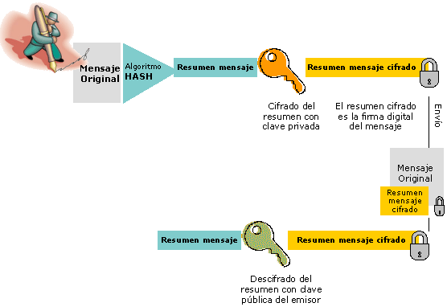

| **Inicio**         | **atrás 7**                                                                        | **Siguiente 9**                                                                            |
| ------------------ | ---------------------------------------------------------------------------------- | ------------------------------------------------------------------------------------------ |
| [🏠](../README.md) | [⏪](./6_7_Operaciones_de_Seguridad_SOC_Monitorizacion_y_Repuesta_a_Incidentes.md) | [⏩](./6_9_Otros_temas_relevantes_Gestion_de_Identidades_Gestion_de_riesgos_y_Amenazas.md) |

---

## **Índice**

| Temario                                                                                                                                      |
| -------------------------------------------------------------------------------------------------------------------------------------------- |
| [564. Firma digital](#564-firma-digital)                                                                                                     |
| [565. Firma digital con apéndice](#565-firma-digital-con-apéndice)                                                                           |
| [566. Firma digital con recuperación de mensaje](#566-firma-digital-con-recuperación-de-mensaje)                                             |
| [567. Confidencialidad y firma digital](#567-confidencialidad-y-firma-digital)                                                               |
| [568. Firma digital con cifrado](#568-firma-digital-con-cifrado)                                                                             |
| [569. Firma digital con OpenSSL](#569-firma-digital-con-openssl)                                                                             |
| [570. Public Key Infrastructure (PKI)](#570-public-key-infrastructure-pki)                                                                   |
| [571. Certificado de clave pública](#571-certificado-de-clave-pública)                                                                       |
| [572. Creación de un certificado de clave pública con OpenSSL](#572-creación-de-un-certificado-de-clave-pública-con-openssl)                 |
| [573. Autoridad de Certificación (Certificate Authority)](#573-autoridad-de-certificación-certificate-authority)                             |
| [574. Certificado digital vs Certificado de clave pública](#574-certificado-digital-vs-certificado-de-clave-pública)                         |
| [575. Certificado de clave pública real](#575-certificado-de-clave-pública-real)                                                             |
| [576. Modelos de gestión de certificados](#576-modelos-de-gestión-de-certificados)                                                           |
| [577. Modelo conectado - Relacion entre CAs](#577-modelo-conectado---relacion-entre-cas)                                                     |
| [578. ¿Qué modelo de gestión de certificados se implementa en la web?](#578-qué-modelo-de-gestión-de-certificados-se-implementa-en-la-web)   |
| [579. Modelo de gestión de certificados Web](#579-modelo-de-gestión-de-certificados-web)                                                     |
| [580. Certificados digitales en la navegación Web](#580-certificados-digitales-en-la-navegación-web)                                         |
| [581. Configuración y uso de una VPN con certificado digital (OpenVPN)](#581-configuración-y-uso-de-una-vpn-con-certificado-digital-openvpn) |

---

# **Firma digital, Certificado digital y PKI (Infraestructura de clave publica)**

## **564. Firma digital**

### 🧠 ¿Qué es una Firma Digital?

La **firma digital** es una tecnología que permite **verificar la identidad del autor de un documento electrónico** y garantizar que **no ha sido modificado**.

🔐 Es como una firma manuscrita, pero con **seguridad criptográfica**.

---

### 🎯 ¿Para qué sirve?

| Uso común                | Ejemplo                                          |
| ------------------------ | ------------------------------------------------ |
| Firmar documentos PDF    | Firmar contratos, certificados, informes legales |
| Enviar correos firmados  | Correos que confirman la identidad del remitente |
| Firmar código software   | Validar que el programa no fue alterado          |
| Procesos administrativos | SUNAT, Reniec, bancos, gobierno electrónico      |

---

### 🧬 ¿Cómo funciona internamente?

#### Se usa **criptografía asimétrica**:

1. El usuario tiene un **par de claves**:

   - 🔒 **Clave privada** (solo él la conoce)
   - 🔓 **Clave pública** (puede ser compartida)

2. Cuando firmas un documento:

   - Se genera un **hash (resumen)** del documento
   - Ese hash se **cifra con la clave privada**
   - Esto se adjunta como **firma digital**

3. Cualquiera puede **verificar la firma**:

   - Usa la **clave pública**
   - Compara el hash calculado del documento con el que viene en la firma
   - Si coinciden, el documento **es auténtico** y **no ha sido modificado**.

---

### 🏗️ ¿Cómo se instala una firma digital?

#### Depende del sistema operativo y la aplicación. Aquí te muestro cómo instalarla en un **PC con Windows** y usarla para firmar un documento PDF con **Adobe Acrobat Reader DC**.

---

#### 🧾 Paso a paso: Instalar un certificado de firma digital (Windows)

##### ✅ Requisitos:

- Un **archivo de certificado digital**, por ejemplo con extensión `.pfx` o `.p12`
- Este archivo lo puedes obtener de:

  - Entidades certificadoras (como RENIEC, CertiSur, Efirm, Digicert, etc.)
  - Token USB (como ePass, SafeNet)

---

#### 💻 Instalación en Windows:

1. Haz doble clic en el archivo `.pfx` o `.p12`
2. Se abrirá el **Asistente para importar certificados**
3. Selecciona:

   - **Usuario actual** (si solo tú usarás la firma)
   - Siguiente

4. Ingresa la **contraseña del certificado**
5. Marca:

   - **Habilitar protección de clave privada** (opcional)

6. Selecciona el almacén:

   - Usa el predeterminado: `Personal`

7. Finaliza

✅ ¡Tu firma digital ahora está lista en el sistema!

---

### ✍️ Firmar un documento PDF con Adobe Acrobat Reader

1. Abre el PDF en **Adobe Acrobat Reader DC**
2. Ve a:

   - “Herramientas” → “Certificados”

3. Haz clic en:

   - “Firmar digitalmente”

4. Dibuja un cuadro donde irá la firma
5. Elige tu certificado digital (el que instalaste)
6. Guarda el documento firmado

✅ El PDF ahora contiene una **firma digital legalmente válida**.

---

### 📦 Ejemplo práctico completo

#### 🎯 Escenario

Gustavo tiene un archivo llamado `contrato_trabajo.pdf` y quiere **firmarlo digitalmente** para enviarlo por correo a su cliente.

---

#### 📥 Paso 1: Obtener la firma

- Gustavo obtiene un **archivo `.pfx`** desde una entidad certificadora
- Guarda el archivo como `gustavo_firma.pfx`

---

#### 🛠️ Paso 2: Instalar en Windows

- Doble clic en `gustavo_firma.pfx`
- Ingresa la contraseña: `********`
- Deja que se instale en el almacén **"Personal"**

---

#### 📄 Paso 3: Firmar el PDF

1. Abre `contrato_trabajo.pdf` en **Adobe Acrobat Reader**
2. Activa la herramienta "Certificados"
3. Selecciona "Firmar digitalmente"
4. Aparece un cuadro para firmar
5. Selecciona tu certificado: `Gustavo Puma (emitido por Efirm)`
6. Guarda el PDF como `contrato_trabajo_firmado.pdf`

---

#### 📧 Paso 4: Enviar y verificar

- Envías el archivo firmado a tu cliente
- Tu cliente abre el PDF y ve:

  ✅ "Firma válida"

  ✅ Emitido por: Efirm

  ✅ Documento no modificado

---

### 🧠 Diferencia entre Firma Digital y Firma Electrónica

| Característica   | Firma Electrónica            | Firma Digital (Avanzada)                 |
| ---------------- | ---------------------------- | ---------------------------------------- |
| Validación legal | Puede tener valor legal      | Tiene respaldo criptográfico y legal     |
| Verificable      | No siempre                   | Siempre verificable con clave pública    |
| Seguridad        | Baja (ej. dibujar una firma) | Alta (criptografía asimétrica)           |
| Usos             | Formularios simples          | Contratos, trámites legales, facturación |

---

### 📚 Conclusión

- Una **firma digital** protege tu identidad y garantiza que un documento no fue alterado.
- Se basa en **certificados digitales** que puedes instalar y usar en tu PC.
- Firmar documentos PDF es fácil usando herramientas como **Adobe Reader**.
- Es una herramienta clave en trámites online, contratos, ciberseguridad, etc.

---

[🔼](#índice)

---

## **565. Firma digital con apéndice**

### 🧠 ¿Qué es una Firma Digital con Apéndice?

Una **firma digital con apéndice** es una forma de firmar digitalmente un archivo en la que la **firma y el contenido original se guardan juntos** en un solo archivo.

📦 Es decir:

- El archivo firmado **incluye el contenido original + la firma digital**
- Todo en un **formato contenedor** (por ejemplo: `.p7m`, `.asice`, `.pdf`, `.docx`, etc.)

---

#### 🧩 ¿Por qué se llama "con apéndice"?

Porque **la firma se adjunta (como un apéndice) al documento original**, **no se reemplaza ni se guarda por separado**. Esto permite:

✅ Enviar un solo archivo

✅ Verificar la firma y el contenido sin necesidad del documento original aparte

✅ Mayor compatibilidad legal y de auditoría

---

### 🧬 ¿Cómo funciona internamente?

1. Se genera un **hash** del contenido original (resumen matemático)
2. Ese hash se **cifra con la clave privada del firmante**
3. Se adjunta el resultado (la firma digital) al documento original
4. El archivo final puede tener formato `.p7m`, `.pdf` firmado, `.docx` firmado, etc.

🛡️ El receptor puede:

- Verificar que el documento no fue modificado
- Verificar que la firma es válida
- Conocer quién lo firmó y cuándo

---

### 📘 Ejemplos comunes

| Formato firmado | Descripción                                          |
| --------------- | ---------------------------------------------------- |
| `.pdf` firmado  | Contratos, boletas, facturas                         |
| `.p7m`          | Firma digital con formato CMS (usado en Europa/Perú) |
| `.asice`        | Estándar europeo de firma con apéndice ZIP           |
| `.docx` firmado | Documentos Word firmados digitalmente                |

---

### ⚙️ ¿Cómo se firma un documento con apéndice?

Hay muchas formas, pero veamos tres principales:

1. **Adobe Acrobat Reader (para PDF)**
2. **Herramientas de firma como SignServer, JSignPDF o Dike**
3. **Comando con `openssl` en Linux/WSL/Terminal**

---

### 🧪 Ejemplo completo (usando JSignPDF para firmar con apéndice)

#### 🎯 Escenario

Gustavo quiere firmar su contrato de servicios `contrato.pdf` con su **firma digital** y que el documento firmado contenga el contenido + la firma en un solo archivo.

---

#### 🔧 Requisitos

- Java instalado en tu computadora
- Archivo PDF original: `contrato.pdf`
- Certificado digital en formato `.pfx` (ej. `gustavo.pfx`)
- Aplicación: [JSignPDF](http://jsignpdf.sourceforge.net/)

---

#### 🪛 Paso a paso con JSignPDF

##### 1. Descargar JSignPDF

- Ir a: [http://jsignpdf.sourceforge.net/](http://jsignpdf.sourceforge.net/)
- Descargar el `.zip` o `.jar`
- Descomprimirlo en una carpeta

##### 2. Ejecutar JSignPDF

- Abre la terminal o haz doble clic en `JSignPdf.jar`

##### 3. Selecciona archivo a firmar

- En “PDF Input file”: selecciona `contrato.pdf`

##### 4. Selecciona certificado

- Marca “Use certificate from file”
- Carga `gustavo.pfx`
- Ingresa tu contraseña del certificado

##### 5. Opciones

- Firma visible (opcional)
- Selecciona ubicación de salida: `contrato_firmado.pdf`

##### 6. Clic en **Sign It!**

✅ Se generará un archivo `contrato_firmado.pdf` que **contiene el documento + la firma digital (con apéndice)**

---

### 📂 ¿Y si quiero ver la firma?

Abre el archivo `contrato_firmado.pdf` en **Adobe Acrobat Reader DC**. Verás:

- ✅ “Firmado y todas las firmas son válidas”
- Nombre del firmante: “Gustavo Puma”
- Fecha y hora exacta
- Confirmación de que **el contenido no fue alterado**

---

### 📘 Otro ejemplo: firma `.p7m` (usada en Perú)

#### Si tienes un archivo firmado llamado `boleta.pdf.p7m`

- Contiene el archivo original + la firma digital
- Para verlo, puedes usar:

  - Dike 6 (Italia)
  - Acrobat con plugin
  - Validador de firma en línea (ej. SUNAT o RENIEC)

---

### 🧠 Ventajas de la Firma Digital con Apéndice

| Ventaja                   | Explicación                                    |
| ------------------------- | ---------------------------------------------- |
| Portabilidad              | Todo en un solo archivo                        |
| Seguridad                 | Criptografía fuerte + integridad               |
| Legalidad                 | Aceptada en procesos legales (como en Perú/EU) |
| Facilidad de verificación | Compatible con lectores como Adobe, Dike, etc. |

---

### 🛡️ ¿Y si se modifica el archivo?

❌ Si alguien cambia un carácter en el archivo firmado:

- La firma deja de ser válida
- Aparece un error al verificarla: "El documento ha sido modificado después de firmarse"

---

### 📌 Conclusión

Una **firma digital con apéndice**:

- ✅ Añade la firma directamente al documento
- ✅ Garantiza autenticidad e integridad
- ✅ Es legalmente aceptada
- ✅ Puede verificarse con lectores comunes

---

### 📦 Extra: ¿Quieres hacerlo con comandos?

Puedo mostrarte cómo hacerlo con `openssl` o con `gpg` desde Linux, por ejemplo:

```bash
openssl smime -sign -in contrato.pdf -signer gustavo.pem -inkey gustavo.key -out contrato.p7m -outform DER
```

O también desde un entorno como **Java o Python**, si estás automatizando firmas en tu app.

---

[🔼](#índice)

---

## **566. Firma digital con recuperación de mensaje**



### 🧠 ¿Qué es una Firma Digital con Recuperación de Mensaje?

Es un tipo de firma digital donde:

> **El contenido del mensaje está _incluido_ dentro de la firma cifrada.**

Esto significa que **el mensaje puede ser recuperado directamente desde la firma** sin necesidad de enviarlo por separado.

---

### 🎯 Diferencia clave con la firma con apéndice

| Firma con Apéndice                       | Firma con Recuperación de Mensaje                  |
| ---------------------------------------- | -------------------------------------------------- |
| El archivo y la firma van juntos         | El mensaje se reconstruye desde la firma           |
| Se ve el contenido en el archivo firmado | Solo tienes la firma; el mensaje se extrae de ella |
| Típico en `.pdf`, `.p7m`, etc.           | Típico en protocolos criptográficos                |

---

### 🛠️ ¿Cómo funciona?

1. El mensaje original se **convierte a un número** (por codificación y hashing)
2. Se **combina con estructura especial** (esquema de firma como ISO/IEC 9796-3)
3. Se cifra con la **clave privada** del firmante
4. Se genera una **firma que contiene toda la información necesaria para recuperar el mensaje**

🔐 **El verificador**, con la clave pública, puede:

- Validar la autenticidad
- Recuperar el mensaje original

---

### 🧪 ¿Dónde se usa esto?

- **Protocolos criptográficos avanzados**
- **Sistemas de identificación electrónicos (e-ID)**
- **Dispositivos de firma inteligente**
- Firmas ligeras en hardware con poco espacio

---

### 📌 Ventajas

✅ No se necesita enviar el mensaje por separado

✅ La firma es autocontenida

✅ Se puede verificar y recuperar con solo la clave pública

---

### 🧱 Ejemplo práctico (con OpenSSL y RSA)

Vamos a hacer un ejemplo paso a paso desde una terminal tipo Linux/WSL (también sirve Git Bash o MacOS).

---

### 🔧 Requisitos

- Tener instalado `openssl`
- Crear claves pública y privada
- Firmar un mensaje con recuperación de mensaje simulada
- Verificar y recuperar el mensaje desde la firma

---

### 🧪 Ejemplo completo

#### 1. Crear claves

```bash
# Clave privada
openssl genrsa -out clave_privada.pem 2048

# Clave pública
openssl rsa -in clave_privada.pem -pubout -out clave_publica.pem
```

---

#### 2. Crear el mensaje original

```bash
echo "Hola, este mensaje será firmado y recuperado desde la firma." > mensaje.txt
```

---

#### 3. Simular recuperación de mensaje con `openssl rsautl`

```bash
# "Firmar" el mensaje (realmente es un cifrado con clave privada)
openssl rsautl -sign -inkey clave_privada.pem -in mensaje.txt -out firma.bin
```

> ⚠️ Este método **no usa hash ni padding seguro**, es solo **una simulación de firma con recuperación de mensaje**.

---

#### 4. Enviar solo `firma.bin`

Imagina que ahora **solo tienes la firma.bin** (no el mensaje original).

---

#### 5. Verificar la firma y recuperar el mensaje

```bash
openssl rsautl -verify -inkey clave_publica.pem -pubin -in firma.bin
```

✅ Resultado:

```bash
Hola, este mensaje será firmado y recuperado desde la firma.
```

🎉 ¡Acabas de recuperar el mensaje original desde la firma!

---

### 📂 ¿Esto se usa en la vida real?

Sí, pero de forma más segura. En sistemas avanzados se usa el **esquema ISO/IEC 9796-3**, con mecanismos como:

- RSA con recuperación parcial
- Sistemas de firma para dispositivos de bajo poder
- Firmas en tarjetas inteligentes o DNI electrónico

---

### ⚠️ Importante sobre seguridad

El ejemplo anterior **no implementa padding seguro (como PKCS#1 o PSS)**, por lo tanto, **NO debe usarse en producción**.

Para aplicaciones reales, se debe usar una **librería de firma avanzada** como:

- BouncyCastle (Java)
- pyca/cryptography (Python)
- Libsodium / NaCl
- eIDAS/PKCS#11 para tarjetas criptográficas

---

### ✅ Resumen Final

| Concepto                          | Descripción                                                                 |
| --------------------------------- | --------------------------------------------------------------------------- |
| Qué es                            | Una firma digital que permite recuperar el mensaje original desde la firma  |
| Cómo funciona                     | Se cifra el mensaje con clave privada, permitiendo extraerlo con la pública |
| Diferencia con firma con apéndice | Aquí no se necesita el mensaje original, se recupera desde la firma         |
| Ventajas                          | Ligereza, portabilidad, verificación rápida                                 |
| Ejemplo real                      | Dispositivos e-ID, firmas automáticas, hardware criptográfico               |

---

[🔼](#índice)

---

## **567. Confidencialidad y firma digital**

### 🧠 ¿Qué es la Confidencialidad?

Es uno de los pilares de la **seguridad de la información**. Significa que **solo las personas autorizadas pueden ver los datos**.

#### 🔒 Se logra usando: **Cifrado**

- **Simétrico** (misma clave para cifrar/descifrar): más rápido
- **Asimétrico** (clave pública/privada): más seguro para intercambios

---

### 🖊️ ¿Qué es una Firma Digital?

Es una técnica criptográfica que:

- **Verifica la identidad del emisor**
- **Garantiza que el mensaje no fue alterado**
- **Evita que el autor niegue haber enviado el mensaje (no repudio)**

🔑 Usa **la clave privada para firmar**
🔍 El receptor **verifica con la clave pública**

---

### 🔁 ¿Cómo se combinan?

Cuando queremos **confidencialidad + autenticidad**, se aplica:

#### ✉️ Ejemplo del flujo:

1. **El emisor firma el mensaje** con su **clave privada**
2. Luego, **cifra el mensaje firmado** con la **clave pública del receptor**
3. El receptor **descifra** el mensaje con su **clave privada**
4. Verifica la **firma con la clave pública del emisor**

Así se logra:

- **Confidencialidad:** Solo el receptor lo puede leer
- **Integridad y Autenticidad:** El receptor sabe quién lo envió y que no se alteró

---

### 📦 Instalación y herramientas

Necesitarás:

- Linux o terminal de Windows con OpenSSL
- Un editor de texto (por ejemplo: Notepad++ o Vim)
- Opcional: Python (para automatizar)

---

### 🧪 Ejemplo paso a paso usando OpenSSL

#### 1️⃣ Generar claves

```bash
# Emisor
openssl genrsa -out clave_privada_emisor.pem 2048
openssl rsa -in clave_privada_emisor.pem -pubout -out clave_publica_emisor.pem

# Receptor
openssl genrsa -out clave_privada_receptor.pem 2048
openssl rsa -in clave_privada_receptor.pem -pubout -out clave_publica_receptor.pem
```

---

#### 2️⃣ Crear mensaje

```bash
echo "Hola Gustavo, esto es un mensaje secreto con firma." > mensaje.txt
```

---

#### 3️⃣ Firmar el mensaje

```bash
openssl dgst -sha256 -sign clave_privada_emisor.pem -out firma.bin mensaje.txt
```

Esto genera la firma digital del mensaje.

---

#### 4️⃣ Combinar firma + mensaje

```bash
cat firma.bin mensaje.txt > mensaje_firmado.txt
```

(Esto es para el ejemplo; en producción se usaría un formato estandarizado como P7M o PGP)

---

#### 5️⃣ Cifrar el mensaje firmado con la clave pública del receptor

```bash
openssl rsautl -encrypt -inkey clave_publica_receptor.pem -pubin -in mensaje_firmado.txt -out mensaje_cifrado.bin
```

---

#### 6️⃣ El receptor descifra con su clave privada

```bash
openssl rsautl -decrypt -inkey clave_privada_receptor.pem -in mensaje_cifrado.bin -out mensaje_descifrado.txt
```

---

#### 7️⃣ El receptor separa la firma y el mensaje

Supongamos que la firma era de 256 bytes (RSA 2048):

```bash
dd if=mensaje_descifrado.txt of=firma_recibida.bin bs=1 count=256
dd if=mensaje_descifrado.txt of=mensaje_recibido.txt bs=1 skip=256
```

---

#### 8️⃣ Verificar la firma

```bash
openssl dgst -sha256 -verify clave_publica_emisor.pem -signature firma_recibida.bin mensaje_recibido.txt
```

✅ Si todo va bien, deberías ver:

```bash
Verified OK
```

---

### 🧩 ¿Qué aprendiste aquí?

| Parte                     | Técnica usada              | Herramienta      |
| ------------------------- | -------------------------- | ---------------- |
| Confidencialidad          | Cifrado con clave pública  | `openssl rsautl` |
| Firma Digital             | Hash + clave privada       | `openssl dgst`   |
| Verificación de identidad | Clave pública del emisor   | `openssl dgst`   |
| Reversibilidad            | Clave privada del receptor | `openssl rsautl` |

---

### ✅ Resumen gráfico

```
[Emisor]
mensaje.txt
   ↓
firmado con clave privada → firma.bin
   ↓
mensaje + firma → mensaje_firmado.txt
   ↓
cifrado con clave pública del receptor → mensaje_cifrado.bin
   ↓
[Se envía]

[Receptor]
mensaje_cifrado.bin
   ↓
descifra con clave privada → mensaje_firmado
   ↓
separa firma + mensaje
   ↓
verifica con clave pública del emisor
```

---

[🔼](#índice)

---

## **568. Firma digital con cifrado**

### 🧠 ¿Qué significa esto?

Cuando hablamos de **"firma digital con cifrado"**, nos referimos a aplicar **dos mecanismos de seguridad** sobre un mensaje:

| Propósito        | Técnica usada    |
| ---------------- | ---------------- |
| Autenticidad     | 🔏 Firma digital |
| Confidencialidad | 🔒 Cifrado       |

---

### 🔁 ¿En qué orden se aplican?

> 🟦 Primero se firma
>
> 🟨 Luego se cifra

🔐 Así logramos:

- ✔️ **Autenticidad**: El receptor verifica que tú lo firmaste.
- ✔️ **Integridad**: El mensaje no fue modificado.
- ✔️ **Confidencialidad**: Nadie más puede leerlo.

---

### 💡 Ejemplo del mundo real

Imagina que quieres enviarle a alguien tu CV firmado digitalmente **y además quieres que solo esa persona pueda verlo.**

Pasos:

1. Tú firmas el archivo con tu clave privada → autenticidad
2. Luego lo **cifras con la clave pública del receptor** → confidencialidad
3. El receptor lo descifra con su clave privada y verifica la firma con tu clave pública.

---

### ⚙️ Herramientas que usaremos

✅ **OpenSSL**

Sistema operativo: Linux o WSL en Windows
Editor de texto: Visual Studio Code, Vim o nano

---

### 🧪 Ejemplo práctico completo

#### 1️⃣ Generar claves

```bash
# Emisor (Tú)
openssl genrsa -out clave_privada_emisor.pem 2048
openssl rsa -in clave_privada_emisor.pem -pubout -out clave_publica_emisor.pem

# Receptor (Destinatario)
openssl genrsa -out clave_privada_receptor.pem 2048
openssl rsa -in clave_privada_receptor.pem -pubout -out clave_publica_receptor.pem
```

---

#### 2️⃣ Crear mensaje

```bash
echo "Hola Gustavo, este es un mensaje confidencial firmado digitalmente." > mensaje.txt
```

---

#### 3️⃣ Firmar el mensaje

```bash
openssl dgst -sha256 -sign clave_privada_emisor.pem -out firma.bin mensaje.txt
```

---

#### 4️⃣ Unir mensaje + firma

```bash
cat firma.bin mensaje.txt > mensaje_firmado.txt
```

Esto junta la firma con el mensaje original.

---

#### 5️⃣ Cifrar mensaje firmado con clave pública del receptor

```bash
openssl rsautl -encrypt -inkey clave_publica_receptor.pem -pubin -in mensaje_firmado.txt -out mensaje_final_cifrado.bin
```

Esto asegura que **solo el receptor** pueda leer el contenido.

---

### 🧑‍💻 Parte del Receptor

#### 6️⃣ Descifrar con su clave privada

```bash
openssl rsautl -decrypt -inkey clave_privada_receptor.pem -in mensaje_final_cifrado.bin -out mensaje_firmado_recibido.txt
```

---

#### 7️⃣ Separar firma y mensaje original

- Asumimos que la firma tiene 256 bytes (RSA 2048):

```bash
dd if=mensaje_firmado_recibido.txt of=firma_recibida.bin bs=1 count=256
dd if=mensaje_firmado_recibido.txt of=mensaje_recibido.txt bs=1 skip=256
```

---

#### 8️⃣ Verificar la firma con la clave pública del emisor

```bash
openssl dgst -sha256 -verify clave_publica_emisor.pem -signature firma_recibida.bin mensaje_recibido.txt
```

✅ Si todo fue correcto, verás:

```bash
Verified OK
```

---

### 📋 Resumen de todo el flujo

```
[ Emisor ]
 ↓
Firmar mensaje (clave privada) → firma.bin
 ↓
Unir firma + mensaje → mensaje_firmado.txt
 ↓
Cifrar (clave pública del receptor) → mensaje_final_cifrado.bin
 ↓
[ Se envía al receptor ]

[ Receptor ]
 ↓
Descifrar (clave privada) → mensaje_firmado
 ↓
Separar firma y mensaje
 ↓
Verificar firma (clave pública del emisor)
```

---

### ✅ ¿Qué ganamos?

| Seguridad        | ¿Cómo se logró?                        |
| ---------------- | -------------------------------------- |
| Autenticidad     | Firma con clave privada del emisor     |
| Integridad       | Hash del contenido firmado             |
| Confidencialidad | Cifrado con clave pública del receptor |

---

### 🧰 ¿Quieres hacerlo con GPG o Python?

Si deseas usar:

- **GPG (GNU Privacy Guard)**: Más estándar y fácil de compartir.
- **Python (`cryptography`, `PyNaCl`)**: Para automatizar procesos.

Solo dímelo y te preparo el ejemplo con código comentado.

---

[🔼](#índice)

---

## **569. Firma digital con OpenSSL**

### 🧠 ¿Qué es una firma digital?

Una **firma digital** es como una huella digital electrónica que se adjunta a un archivo para:

| Seguridad       | ¿Qué garantiza?                            |
| --------------- | ------------------------------------------ |
| 🧾 Autenticidad | El autor es quien dice ser (clave privada) |
| 🔒 Integridad   | El archivo no fue alterado                 |
| ❌ No repudio   | El autor no puede negar su autoría         |

---

### 🧰 ¿Qué se necesita para firmar digitalmente?

#### 1. **Clave privada**: para **firmar**

#### 2. **Clave pública**: para que otros puedan **verificar**

---

### 🚀 ¿Cómo lo hacemos con OpenSSL?

Te mostraré los pasos desde cero:

---

### 🛠️ Instalación de OpenSSL

En la mayoría de sistemas Linux o WSL ya está instalado.

📦 Si no lo tienes, instala con:

```bash
sudo apt update
sudo apt install openssl
```

✅ Verifica con:

```bash
openssl version
```

---

### 🧪 EJEMPLO PRÁCTICO COMPLETO

#### 🎯 Escenario:

Quieres firmar un archivo llamado `mensaje.txt` y que otra persona pueda verificar que fuiste tú quien lo firmó.

---

#### 1️⃣ Crear archivo de prueba

```bash
echo "Hola, este es un mensaje firmado digitalmente con OpenSSL." > mensaje.txt
```

---

#### 2️⃣ Generar un par de claves (privada y pública)

```bash
# Generar clave privada
openssl genpkey -algorithm RSA -out clave_privada.pem -pkeyopt rsa_keygen_bits:2048

# Extraer clave pública
openssl rsa -in clave_privada.pem -pubout -out clave_publica.pem
```

---

#### 3️⃣ Crear la firma digital del archivo

```bash
openssl dgst -sha256 -sign clave_privada.pem -out firma.bin mensaje.txt
```

✅ Esto genera una firma usando el **hash SHA-256** del contenido de `mensaje.txt`, y la firma se guarda en `firma.bin`.

---

#### 4️⃣ Verificar la firma (usando clave pública)

```bash
openssl dgst -sha256 -verify clave_publica.pem -signature firma.bin mensaje.txt
```

Si todo está correcto, verás:

```bash
Verified OK
```

Si el mensaje o la firma fueron modificados, verás:

```bash
Verification Failure
```

---

### 🧠 ¿Qué pasó aquí?

1. 🔏 El mensaje fue **resumido (hash SHA-256)**.
2. 🔐 Ese resumen fue **cifrado con tu clave privada** (esto es la firma).
3. 🧑‍💻 Otro puede verificar el mensaje:

   - Hace su propio hash del mensaje.
   - Desencripta tu firma con tu clave pública.
   - Compara ambos hashes.

---

### 💥 ¿Qué pasa si modifico el mensaje?

```bash
echo "Fui modificado" >> mensaje.txt
```

Luego verificas otra vez:

```bash
openssl dgst -sha256 -verify clave_publica.pem -signature firma.bin mensaje.txt
```

Resultado:

```bash
Verification Failure
```

🔒 Así sabes que **la integridad fue comprometida**.

---

### 🧳 ¿Cómo compartirlo con otros?

Puedes enviar:

- El archivo: `mensaje.txt`
- La firma: `firma.bin`
- Tu clave pública: `clave_publica.pem`

Y quien lo reciba puede ejecutar:

```bash
openssl dgst -sha256 -verify clave_publica.pem -signature firma.bin mensaje.txt
```

---

### ✅ Resumen visual

```
[ Tú ]
 ↓
mensaje.txt + clave_privada → firma.bin
 ↓
Envío: mensaje.txt + firma.bin + clave_publica

[ Receptor ]
 ↓
Verifica firma con clave_publica
 → Resultado: "Verified OK" o "Failure"
```

---

### 🧠 ¿Qué más puedes hacer con OpenSSL?

- Firmar PDFs, certificados, emails (S/MIME)
- Firmar tokens o hashes en automatizaciones
- Usar junto con GPG, TLS o scripts en Bash

---

### 🧰 ¿Te gustaría verlo con Python, GPG, o en una app web?

Puedo prepararte el mismo ejemplo en:

- 🐍 Python (`cryptography` o `PyNaCl`)
- 📦 GPG (`gpg --sign`)
- 🌐 Simulación web de firma/verificación

Solo dime cómo deseas avanzar.

---

[🔼](#índice)

---

## **570. Public Key Infrastructure (PKI)**

### 🧠 ¿Qué es PKI?

**PKI (Public Key Infrastructure)** es un sistema que permite emitir, gestionar y validar certificados digitales para garantizar **autenticidad, integridad y cifrado seguro** de datos. Es la base de la **seguridad en Internet**, como en HTTPS, firma digital, VPN, correos seguros, etc.

---

### 🧱 Elementos principales de PKI

| Elemento                | Explicación simple                                                           |
| ----------------------- | ---------------------------------------------------------------------------- |
| 🔑 Par de claves        | Una **clave pública** y una **clave privada**.                               |
| 📜 Certificado digital  | Asocia una clave pública a una **identidad** (nombre, dominio, correo, etc). |
| 🏢 CA (Autoridad Cert.) | Entidad confiable que **emite y firma certificados digitales**.              |
| 🕵️ RA (Autoridad Reg.)  | Verifica la identidad antes de solicitar el certificado a la CA.             |
| 📦 CRL / OCSP           | Listas o servicios para **revocar** certificados inválidos o comprometidos.  |

---

### 📋 ¿Para qué sirve?

- **HTTPS / SSL** → Sitios web seguros.
- **Firma digital** → Validar autoría e integridad.
- **Correo electrónico seguro**.
- **VPN / WiFi empresarial** con certificados.
- **Acceso seguro a servidores o APIs**.

---

### 🚀 ¿Cómo funciona la PKI? (Paso a paso)

1. Tú generas un par de claves (privada y pública).
2. Creas un CSR (Solicitud de firma de certificado) con tu info + clave pública.
3. Se lo envías a la CA.
4. La CA verifica tu identidad y **firma digitalmente tu certificado**.
5. Ahora puedes compartir tu certificado y usarlo para autenticación o cifrado.
6. Los demás confían en ti porque confían en la CA que firmó tu certificado.

---

### 🔧 ¿Cómo se instala o se implementa una PKI?

Puedes hacerlo de dos formas:

#### 🟢 Opción 1: Usar una CA externa (Let’s Encrypt, DigiCert, etc.)

- Más fácil, ideal para HTTPS.
- Usan herramientas como `certbot` para instalar certificados automáticamente.

#### 🟠 Opción 2: Crear tu propia CA (autoridad certificadora)

Ideal para laboratorios, intranets, ambientes privados o educación.

---

### ✅ EJEMPLO PRÁCTICO COMPLETO: Crear tu propia PKI con OpenSSL

Vamos a:

1. Crear nuestra propia CA
2. Emitir un certificado para un "usuario"
3. Verificar el certificado

---

### 1️⃣ Preparar directorios

```bash
mkdir -p ~/miCA/{certs,crl,newcerts,private}
touch ~/miCA/index.txt
echo 1000 > ~/miCA/serial
cd ~/miCA
```

---

### 2️⃣ Crear la clave privada de la CA

```bash
openssl genpkey -algorithm RSA -out private/ca.key.pem -aes256
```

---

### 3️⃣ Crear el certificado raíz de la CA

```bash
openssl req -x509 -new -nodes -key private/ca.key.pem -sha256 -days 3650 -out certs/ca.cert.pem
```

Te pedirá llenar el **nombre de la CA**, país, correo, etc.

---

### 4️⃣ Crear la clave privada del "usuario"

```bash
openssl genpkey -algorithm RSA -out usuario.key.pem
```

---

### 5️⃣ Crear una CSR (Solicitud de firma de certificado)

```bash
openssl req -new -key usuario.key.pem -out usuario.csr.pem
```

---

### 6️⃣ Firmar el certificado del usuario con la CA

```bash
openssl x509 -req -in usuario.csr.pem -CA certs/ca.cert.pem -CAkey private/ca.key.pem -CAcreateserial -out usuario.cert.pem -days 365 -sha256
```

---

### 7️⃣ Verificar el certificado del usuario

```bash
openssl verify -CAfile certs/ca.cert.pem usuario.cert.pem
```

Debe decir:

```
usuario.cert.pem: OK
```

---

### 🎯 ¿Qué tienes ahora?

- `ca.key.pem` → Clave privada de tu CA
- `ca.cert.pem` → Certificado raíz de tu CA
- `usuario.key.pem` → Clave privada del usuario
- `usuario.cert.pem` → Certificado firmado por tu CA

---

### 🧪 ¿Cómo lo usarías?

- Para firmar correos electrónicos.
- Para usarlo en un servidor HTTPS local.
- Para autenticar usuarios en una red.
- Para emitir certificados de cliente (por ejemplo, con VPN).

---

### 💡 BONUS: Ver el contenido de un certificado

```bash
openssl x509 -in usuario.cert.pem -text -noout
```

---

### 🧠 ¿Y si quiero usar esto en HTTPS local?

Puedes crear un servidor web (Apache, NGINX) y configurar los certificados así:

```nginx
ssl_certificate /ruta/usuario.cert.pem;
ssl_certificate_key /ruta/usuario.key.pem;
```

---

### ✅ RESUMEN

| Paso                   | Resultado                                      |
| ---------------------- | ---------------------------------------------- |
| Generar CA propia      | Autoridad confiable para firmar certificados   |
| Firmar certificados    | Certificados válidos para HTTPS, VPN, etc.     |
| Verificar certificados | Confirmar autenticidad con el certificado raíz |

---

### 📚 Recursos para seguir aprendiendo

- [https://www.openssl.org/docs/](https://www.openssl.org/docs/)
- [https://letsencrypt.org/docs/](https://letsencrypt.org/docs/)
- Curso de Seguridad Web (OWASP + HTTPS)
- Libros: "Cryptography Engineering", "Applied Cryptography"

---

[🔼](#índice)

---

## **571. Certificado de clave pública**

### 🧠 ¿Qué es un Certificado de Clave Pública?

Un **certificado de clave pública** es un **archivo digital** que vincula de forma **confiable** una **clave pública** con una identidad (persona, empresa, dominio, etc.).

> 🔐 Sirve para **probar que una clave pública pertenece a alguien auténtico**.

---

### 🎯 ¿Para qué sirve?

- En **HTTPS**, asegura que el sitio web es legítimo.
- En **firmas digitales**, prueba que un mensaje proviene de alguien.
- En **correos electrónicos seguros**, protege la privacidad y garantiza autenticidad.
- En **VPN o acceso remoto**, autentica dispositivos y usuarios.

---

### 🧱 ¿Qué contiene un certificado?

Un certificado digital (por ejemplo, en formato X.509) contiene:

| Campo                  | Descripción                                              |
| ---------------------- | -------------------------------------------------------- |
| 📌 Clave pública       | La clave que otros usarán para cifrar mensajes hacia ti. |
| 👤 Identidad           | Nombre, dominio, correo, etc. del dueño del certificado. |
| 🏢 Autoridad (CA)      | La entidad que firma y valida el certificado.            |
| 📅 Validez             | Fecha de inicio y vencimiento.                           |
| 🔏 Firma digital de CA | Garantiza que el certificado no ha sido alterado.        |

---

### 💡 Ejemplo cotidiano

Cuando entras a un sitio web como `https://google.com`, el navegador recibe un **certificado digital** con:

- Clave pública de Google
- Su identidad (`www.google.com`)
- Firma de una CA (como DigiCert)
- Validez de fechas

Tu navegador confía en ese certificado porque **confía en la CA que lo firmó**.

---

### 🧰 ¿Cómo se instala o se usa un certificado?

Depende del caso. Veamos tres:

#### 🔹 En un servidor web (como NGINX o Apache)

```nginx
ssl_certificate /etc/ssl/certs/mi_certificado.pem;
ssl_certificate_key /etc/ssl/private/mi_clave_privada.key;
```

#### 🔹 En un navegador

Puedes **importar** certificados raíz o personales desde la configuración de seguridad.

#### 🔹 En un sistema operativo

En Windows o Linux, puedes **instalar certificados raíz** para confiar en una CA personalizada.

---

### ✅ Ejemplo completo paso a paso con OpenSSL

Vamos a:

1. Generar un par de claves
2. Crear un certificado autofirmado
3. Verificar su contenido
4. Usarlo con NGINX

---

#### 1️⃣ Crear clave privada

```bash
openssl genpkey -algorithm RSA -out clave_privada.key
```

---

#### 2️⃣ Crear CSR (opcional, si deseas enviarlo a una CA)

```bash
openssl req -new -key clave_privada.key -out solicitud.csr
```

Te pedirá datos como:

- Nombre común (ej: `www.midominio.com`)
- País, ciudad, etc.

---

#### 3️⃣ Crear certificado autofirmado (válido por 365 días)

```bash
openssl req -x509 -key clave_privada.key -in solicitud.csr -out certificado.pem -days 365
```

Esto crea un certificado de clave pública vinculado a tu identidad.

---

#### 4️⃣ Ver el contenido del certificado

```bash
openssl x509 -in certificado.pem -text -noout
```

Verás:

- La clave pública
- Identidad
- Fecha de expiración
- Firma digital

---

#### 5️⃣ Usarlo en un servidor local NGINX

Ejemplo básico:

```nginx
server {
    listen 443 ssl;
    server_name localhost;

    ssl_certificate /ruta/certificado.pem;
    ssl_certificate_key /ruta/clave_privada.key;

    location / {
        root /var/www/html;
        index index.html;
    }
}
```

Luego recargas NGINX y accedes a `https://localhost`.

---

### 🧠 ¿Cuál es la diferencia entre un certificado autofirmado y uno de CA?

| Tipo              | ¿Quién firma?       | Uso común              | Confiabilidad              |
| ----------------- | ------------------- | ---------------------- | -------------------------- |
| Autofirmado       | Tú mismo            | Desarrollo, pruebas    | No es confiado por defecto |
| Certificado de CA | Autoridad confiable | Producción, sitios web | Reconocido automáticamente |

---

### 📚 ¿Dónde conseguir certificados reales?

- 🔐 [Let's Encrypt](https://letsencrypt.org) → Gratis y automático para HTTPS
- 🏢 Comodo, DigiCert, Sectigo → Para negocios, firmas, S/MIME
- 🧪 CAs internas → Para entornos de empresa o pruebas

---

### 🎯 RESUMEN FINAL

| Concepto                     | Explicación simple                                             |
| ---------------------------- | -------------------------------------------------------------- |
| Certificado de clave pública | Prueba que una clave pública pertenece a una entidad legítima. |
| ¿Qué contiene?               | Clave pública, identidad, fechas, firma de la CA.              |
| ¿Cómo se usa?                | Para cifrar, autenticar, firmar y proteger comunicaciones.     |
| ¿Cómo se instala?            | En servidores, navegadores o sistemas, según el caso.          |
| Herramienta principal        | `openssl` para crear, firmar y validar certificados.           |

---

[🔼](#índice)

---

## **572. Creación de un certificado de clave pública con OpenSSL**

### 🧠 ¿Qué es un certificado de clave pública?

Un **certificado de clave pública** es un archivo digital que contiene:

| Elemento           | Descripción                                                       |
| ------------------ | ----------------------------------------------------------------- |
| 🔑 Clave pública   | Que otros usan para enviarte datos cifrados o verificar tu firma. |
| 👤 Identidad       | Tu nombre, organización o dominio (por ejemplo: `www.miweb.com`). |
| 🏢 Firma de una CA | Garantiza que la identidad y la clave están validadas.            |
| 📅 Validez         | Fechas de inicio y vencimiento del certificado.                   |

---

### 🛠 Herramienta que usaremos: **OpenSSL**

**OpenSSL** es una herramienta gratuita y muy potente para trabajar con criptografía: generar claves, certificados, firmas digitales, etc.

---

### 🧪 ¿Qué haremos?

Vamos a:

1. Generar una clave privada 🔐
2. Crear una solicitud de firma de certificado (CSR) 📝
3. Generar un certificado **autofirmado** (sin CA) 📄
4. Verificar el certificado 🔍

---

### ✅ PASO A PASO CON EJEMPLO REAL

> Requisitos: Tener OpenSSL instalado (en Linux viene por defecto, en Windows puedes usar Git Bash o instalarlo desde [https://slproweb.com/products/Win32OpenSSL.html](https://slproweb.com/products/Win32OpenSSL.html))

---

#### 1️⃣ Generar clave privada

```bash
openssl genpkey -algorithm RSA -out clave_privada.key -pkeyopt rsa_keygen_bits:2048
```

📁 Esto genera un archivo `clave_privada.key` de 2048 bits.

---

#### 2️⃣ Crear archivo CSR (solicitud de certificado)

```bash
openssl req -new -key clave_privada.key -out solicitud.csr
```

📌 Aquí te pedirá llenar varios datos:

| Campo             | Qué poner                                         |
| ----------------- | ------------------------------------------------- |
| Country Name      | PE                                                |
| State             | Lima                                              |
| Locality          | Lima                                              |
| Organization Name | GussDev                                           |
| Common Name       | [www.midominio.com](http://www.midominio.com)     |
| Email             | [tuemail@ejemplo.com](mailto:tuemail@ejemplo.com) |

📁 Esto genera `solicitud.csr`, usado para que una CA firme tu certificado.

---

#### 3️⃣ Crear certificado **autofirmado** (válido por 1 año)

```bash
openssl x509 -req -in solicitud.csr -signkey clave_privada.key -out certificado.crt -days 365
```

📁 Esto crea el certificado: `certificado.crt`.

🟡 _Nota:_ Este es **autofirmado**. Sirve para **pruebas locales**. Para uso público (como HTTPS real), necesitas que lo firme una CA como Let's Encrypt.

---

#### 4️⃣ Verificar el contenido del certificado

```bash
openssl x509 -in certificado.crt -text -noout
```

Verás detalles como:

- Clave pública
- Sujeto (tu identidad)
- Fechas de validez
- Firma

---

### 📁 Archivos generados

| Archivo             | Contenido                       |
| ------------------- | ------------------------------- |
| `clave_privada.key` | Clave privada (¡guárdala bien!) |
| `solicitud.csr`     | Solicitud de certificado        |
| `certificado.crt`   | Certificado público autofirmado |

---

### 🧪 Ejemplo práctico: usar el certificado en un servidor NGINX local

Si tienes NGINX instalado, crea este bloque en `/etc/nginx/sites-available/default`:

```nginx
server {
    listen 443 ssl;
    server_name localhost;

    ssl_certificate     /ruta/a/certificado.crt;
    ssl_certificate_key /ruta/a/clave_privada.key;

    location / {
        root /var/www/html;
        index index.html;
    }
}
```

Reinicia NGINX:

```bash
sudo systemctl restart nginx
```

Y accede a:

```
https://localhost
```

🔒 Verás una advertencia en el navegador (porque es autofirmado), pero tu certificado está funcionando.

---

### 📦 ¿Y si quiero que una **CA real** firme mi certificado?

1. Generas el CSR (`solicitud.csr`)
2. Lo subes a una CA como:

   - [Let's Encrypt (gratis)](https://letsencrypt.org)
   - Sectigo, DigiCert, etc.

3. La CA te devolverá un archivo `.crt` que puedes usar con tu clave privada.

---

### 📌 RESUMEN FINAL

| Paso                          | Comando principal        |
| ----------------------------- | ------------------------ |
| Crear clave privada           | `openssl genpkey ...`    |
| Crear CSR                     | `openssl req -new ...`   |
| Crear certificado autofirmado | `openssl x509 -req ...`  |
| Verificar certificado         | `openssl x509 -text ...` |

---

### 🎯 ¿Y para qué lo usarías?

- Para **HTTPS local o de pruebas**
- Para **firmar archivos o correos**
- Para **acceso seguro con VPN**
- Como parte de tu **infraestructura PKI** corporativa

---

[🔼](#índice)

---

## **573. Autoridad de Certificación (Certificate Authority)**

### 📘 ¿Qué es una Autoridad de Certificación (CA)?

Una **Autoridad de Certificación** es una entidad **de confianza** que se encarga de:

- Verificar la identidad de una persona, empresa o servidor.
- Firmar certificados digitales con su **clave privada**.
- Emitir y revocar certificados.
- Garantizar que un certificado es **válido, confiable y auténtico**.

---

#### 🔒 ¿Por qué es importante?

Imagina que tú visitas `https://www.bancoseguro.com`. ¿Cómo sabes que realmente estás en ese sitio y no en una copia falsa?

➡️ Porque un **certificado digital firmado por una CA reconocida** asegura que:

- El dominio **pertenece realmente al banco**.
- La conexión está **cifrada y autenticada**.

---

### 🧱 ¿Cómo funciona una CA?

1. Tú (el solicitante) generas una **clave privada** y una **solicitud de firma de certificado (CSR)**.
2. Se la envías a la CA.
3. La CA **verifica tu identidad**.
4. Si todo está bien, **firma** el certificado con su propia clave privada.
5. Te devuelve el certificado firmado, que ahora es **válido**.

---

### 🧪 Vamos a crear nuestra propia CA (modo laboratorio)

---

#### 🎯 ¿Qué haremos?

1. Crear una estructura de carpetas para la CA.
2. Generar una clave privada para la CA.
3. Crear un certificado autofirmado para la CA.
4. Usar la CA para firmar un certificado de un servidor.

---

### 🛠️ Herramientas necesarias

- Sistema operativo: Linux (Ubuntu recomendado) o WSL (Windows)
- OpenSSL instalado (ya viene por defecto)

---

### 🗂️ Paso 1: Crear carpetas

```bash
mkdir -p ~/miCA/{certs,crl,newcerts,private}
touch ~/miCA/index.txt
echo 1000 > ~/miCA/serial
```

Esto crea una estructura básica:

| Carpeta/Archivo | Función                          |
| --------------- | -------------------------------- |
| `private/`      | Guarda la clave privada de la CA |
| `certs/`        | Certificados emitidos            |
| `newcerts/`     | Certificados nuevos              |
| `index.txt`     | Base de datos de certificados    |
| `serial`        | Número de serie                  |

---

### 🔐 Paso 2: Crear clave privada de la CA

```bash
openssl genrsa -out ~/miCA/private/ca.key.pem 4096
chmod 400 ~/miCA/private/ca.key.pem
```

Esto crea `ca.key.pem`, la **clave privada de la CA**.

---

### 📜 Paso 3: Crear certificado autofirmado de la CA

```bash
openssl req -x509 -new -nodes -key ~/miCA/private/ca.key.pem -sha256 -days 3650 -out ~/miCA/certs/ca.cert.pem
```

Te pedirá llenar algunos campos, como nombre, organización y dominio. Este archivo es el certificado **público** de la CA.

---

### 🧾 Paso 4: Crear un certificado para un servidor (firmado por la CA)

#### A. Crear la clave privada del servidor

```bash
openssl genrsa -out servidor.key.pem 2048
```

#### B. Crear CSR (Solicitud de certificado)

```bash
openssl req -new -key servidor.key.pem -out servidor.csr.pem
```

#### C. Firmar el certificado con tu CA

```bash
openssl ca -config /etc/ssl/openssl.cnf \
  -keyfile ~/miCA/private/ca.key.pem \
  -cert ~/miCA/certs/ca.cert.pem \
  -in servidor.csr.pem \
  -out servidor.cert.pem \
  -days 365 \
  -batch
```

⚠️ Nota: si te da error, asegúrate de modificar el archivo `/etc/ssl/openssl.cnf` para que use tu estructura de carpetas (`~/miCA`) en las secciones `[ CA_default ]`.

---

### ✅ Archivos finales

| Archivo             | Descripción                      |
| ------------------- | -------------------------------- |
| `ca.key.pem`        | Clave privada de la CA           |
| `ca.cert.pem`       | Certificado autofirmado de la CA |
| `servidor.key.pem`  | Clave privada del servidor       |
| `servidor.cert.pem` | Certificado firmado por la CA    |

---

### 🧪 Ejemplo práctico: usar este certificado en NGINX

```nginx
server {
    listen 443 ssl;
    server_name miweb.local;

    ssl_certificate     /ruta/servidor.cert.pem;
    ssl_certificate_key /ruta/servidor.key.pem;

    location / {
        root /var/www/html;
        index index.html;
    }
}
```

Y en tu navegador:

- Verás advertencia (porque tu CA no es reconocida aún).
- Si agregas el certificado `ca.cert.pem` como **CA raíz de confianza en tu sistema o navegador**, ya no habrá advertencias.

---

### 📌 RESUMEN

| Paso | Acción                                       |
| ---- | -------------------------------------------- |
| 1    | Crear carpeta de la CA                       |
| 2    | Generar clave privada de la CA               |
| 3    | Crear certificado autofirmado de la CA       |
| 4    | Crear certificado para servidor y firmarlo   |
| 5    | Usar el certificado en NGINX u otro servicio |

---

### 🎯 ¿Dónde se usa una CA?

- HTTPS (TLS/SSL)
- Firma digital de software
- VPN (OpenVPN)
- Cifrado de correos (S/MIME)
- Infraestructura PKI corporativa

---

[🔼](#índice)

---

## **574. Certificado digital vs Certificado de clave pública**

### 🔍 ¿Cuál es la diferencia entre "Certificado Digital" y "Certificado de Clave Pública"?

| Concepto          | Certificado Digital                                                                                                  | Certificado de Clave Pública                                                                      |
| ----------------- | -------------------------------------------------------------------------------------------------------------------- | ------------------------------------------------------------------------------------------------- |
| **Definición**    | Documento electrónico que **vincula una identidad con una clave pública** y está **firmado digitalmente por una CA** | Es un **tipo de certificado digital** que **contiene solamente la clave pública** del propietario |
| **Contenido**     | Clave pública, datos del titular, fecha de validez, emisor, número de serie, firma de la CA                          | Principalmente la clave pública y datos mínimos de identificación                                 |
| **Uso típico**    | Autenticación, HTTPS, firma digital, cifrado de correo, identificación personal                                      | Intercambio de claves, validación de firma, infraestructura interna (PKI)                         |
| **Está firmado?** | ✅ Sí, por una Autoridad de Certificación (CA)                                                                       | ❌ No necesariamente (puede estar autofirmado)                                                    |
| **Ejemplo real**  | Certificado SSL de un sitio web: `https://ejemplo.com`                                                               | Un `.pem` con clave pública generado por OpenSSL                                                  |
| **Formato común** | `.crt`, `.cer`, `.pem`                                                                                               | `.pem`, `.pub`                                                                                    |

---

### 🧠 En resumen:

- **Certificado de clave pública** → contiene **solo la clave pública**, puede ser usado dentro de sistemas internos o pruebas.
- **Certificado digital** → es un documento completo, firmado por una CA, que **verifica la identidad del titular y contiene la clave pública**.

---

### 🎯 ¿Por qué es importante entender esto?

Supón que quieres verificar si un correo firmado electrónicamente fue enviado por el **gobierno**, o si el sitio web donde pondrás tu tarjeta de crédito es auténtico.

✅ Usas un **certificado digital**, que está **firmado por una CA reconocida**.

En cambio, si estás creando un sistema de autenticación entre servidores en tu red privada, podrías usar simplemente un **certificado de clave pública sin firmar**, o autofirmado.

---

### 🛠️ Cómo se instala y usa

#### Requisitos:

- Tener instalado `openssl`
- Estar en Linux (puedes usar WSL en Windows)

---

### 🔐 PASO A PASO: Ejemplo completo

Vamos a:

1. Crear un par de claves (privada y pública)
2. Crear un **certificado de clave pública simple**
3. Crear un **certificado digital autofirmado**
4. Ver la diferencia entre ambos
5. Usarlos para firmar y verificar

---

#### 🧾 Paso 1: Generar clave privada y pública

```bash
openssl genrsa -out clave_privada.pem 2048
openssl rsa -in clave_privada.pem -pubout -out clave_publica.pem
```

- `clave_privada.pem`: contiene la clave privada
- `clave_publica.pem`: es la **clave pública** (esto sería un certificado de clave pública simple)

---

#### 🔒 Paso 2: Crear un certificado digital autofirmado

```bash
openssl req -new -x509 -key clave_privada.pem -out certificado_digital.crt -days 365
```

Este archivo `.crt` contiene:

- Clave pública
- Datos del propietario (nombre, organización, etc.)
- Firma digital (porque es autofirmado)
- Fecha de expiración
- Número de serie

---

#### 🧪 Paso 3: Comparación directa

```bash
openssl x509 -in certificado_digital.crt -text -noout
```

➡️ Verás datos como:

- Subject
- Issuer
- Validity
- Public Key
- Firma digital

Y si haces esto con la clave pública:

```bash
cat clave_publica.pem
```

➡️ Solo verás la clave en sí, sin metadatos ni firma.

---

#### ✅ Paso 4: Uso práctico — Firmar y verificar un archivo

1. Crear un archivo de prueba:

```bash
echo "Este es un mensaje secreto" > mensaje.txt
```

2. Firmarlo con tu clave privada:

```bash
openssl dgst -sha256 -sign clave_privada.pem -out firma.bin mensaje.txt
```

3. Verificar la firma con la clave pública:

```bash
openssl dgst -sha256 -verify clave_publica.pem -signature firma.bin mensaje.txt
```

✅ Si todo va bien, verás: `Verified OK`

Esto es un ejemplo de cómo el **certificado de clave pública permite verificar una firma** generada con su correspondiente clave privada.

---

### 📦 ¿Dónde se instalan?

#### Certificados Digitales:

- En servidores web (`/etc/ssl/certs/`, `IIS`, `Apache`, `Nginx`)
- En navegadores o sistemas operativos (Windows, Mac, Linux)
- En correos electrónicos (Thunderbird, Outlook)

#### Certificados de Clave Pública:

- En sistemas que intercambian claves (por ejemplo, SSH, VPN, etc.)
- Internamente en tu empresa o en sistemas personalizados

---

### 🔚 RESUMEN FINAL

| Acción                               | Certificado de Clave Pública | Certificado Digital    |
| ------------------------------------ | ---------------------------- | ---------------------- |
| Contiene solo la clave pública       | ✅                           | ✅                     |
| Contiene información del propietario | ❌                           | ✅                     |
| Está firmado por una CA              | ❌                           | ✅ (o autofirmado)     |
| Se usa para verificar firmas         | ✅                           | ✅                     |
| Se usa para HTTPS, correo seguro     | ❌                           | ✅                     |
| Formato típico                       | `.pem`, `.pub`               | `.crt`, `.cer`, `.pem` |

---

[🔼](#índice)

---

## **575. Certificado de clave pública real**

### ✅ ¿Qué es un **certificado de clave pública real**?

Un **certificado de clave pública real** es un **archivo digital** que:

- Contiene **la clave pública** de una persona, organización o sistema.
- **Demuestra que esa clave pertenece a alguien real** porque ha sido **firmado por una entidad confiable**, llamada Autoridad Certificadora (CA).
- Se usa para cosas como:

  - HTTPS (navegación segura)
  - Firmas digitales
  - Correos cifrados
  - Autenticación de sistemas

---

### 📘 ¿Qué contiene un certificado de clave pública real?

Un archivo `.crt` o `.cer` normalmente incluye:

| Campo                      | Significado                               |
| -------------------------- | ----------------------------------------- |
| **Clave pública**          | Para cifrar/verificar                     |
| **Sujeto (Subject)**       | A quién pertenece (nombre, empresa, etc.) |
| **Emisor (Issuer)**        | La CA que lo firmó (ej. Let's Encrypt)    |
| **Fecha de expiración**    | Desde cuándo y hasta cuándo es válido     |
| **Número de serie**        | Único para rastreo                        |
| **Firma digital de la CA** | Garantiza su autenticidad                 |

---

### 🧠 Ejemplo real en la vida diaria

Cuando visitas un sitio como `https://www.google.com`, tu navegador recibe un **certificado de clave pública real** que dice:

- "Esta es la clave pública del servidor de Google"
- "La firma digital confirma que fue emitido por una CA de confianza (ej. DigiCert)"

Tu navegador valida ese certificado, y si todo está bien, muestra el candado 🔒.

---

### 🛠️ ¿Cómo se instala o genera uno?

Hay dos formas:

#### OPCIÓN A – Obtener un certificado de clave pública real desde un sitio web

1. Abre tu navegador (Chrome, Firefox).
2. Ve a `https://example.com` (o cualquier sitio seguro).
3. Haz clic en el candado 🔒 y selecciona:
   → "Certificado" o "Información del certificado".
4. Puedes **verlo y exportarlo** como `.cer` o `.crt`.

---

#### OPCIÓN B – Generar uno tú y pedirlo a una CA (como Let's Encrypt o ZeroSSL)

Esto es lo que hacen los administradores de servidores web.

##### 🧪 PASO A PASO COMPLETO

Vamos a **generar un certificado real de clave pública** autofirmado (como ejemplo práctico), pero igual que lo haría una CA.

> 🧱 Requisitos: tener `OpenSSL` instalado en Linux, WSL o Mac.

---

#### 🔧 1. Generar una clave privada

```bash
openssl genrsa -out clave_privada.pem 2048
```

- Crea tu clave privada (que debes **proteger**)

---

#### 🔧 2. Generar la solicitud de firma (CSR)

```bash
openssl req -new -key clave_privada.pem -out solicitud.csr
```

- Aquí te pedirá datos como:

```
Country Name (2 letter code): PE
State or Province Name: Lima
Locality Name: Lima
Organization Name: MiEmpresa SAC
Common Name (e.g. server FQDN): www.miempresa.com
Email Address: contacto@miempresa.com
```

---

#### 🔧 3. Crear el certificado autofirmado (solo para pruebas)

```bash
openssl x509 -req -days 365 -in solicitud.csr -signkey clave_privada.pem -out certificado_real.crt
```

- Este archivo `.crt` es tu **certificado de clave pública real**, pero en este caso **autofirmado**.

> En producción, enviarías el `.csr` a Let's Encrypt, ZeroSSL, GoDaddy, etc., y ellos te devuelven un `.crt` **firmado por una CA real**.

---

#### 📄 4. Verifica el contenido del certificado

```bash
openssl x509 -in certificado_real.crt -text -noout
```

Saldrá algo como:

```
Subject: CN=www.miempresa.com
Issuer: CN=www.miempresa.com
Not Before: Jul 23 00:00:00 2025 GMT
Not After : Jul 23 00:00:00 2026 GMT
Public-Key: (2048 bit)
...
```

---

#### 📥 5. Instalar el certificado en tu navegador (para confiar en él)

> Solo necesario si **es autofirmado**, para evitar advertencias.

##### En Firefox:

1. Configuración → Privacidad y Seguridad → Ver certificados
2. Pestaña "Autoridades"
3. Importa el `.crt` y marca “Confiar para identificar sitios web”

##### En Windows:

1. Ejecuta `mmc`
2. Agrega "Certificados"
3. Importa en "Entidades de certificación raíz de confianza"

---

#### ✅ USO REAL EN SERVIDOR WEB

Si estás usando NGINX o Apache, se hace así:

```nginx
server {
  listen 443 ssl;
  server_name www.miempresa.com;

  ssl_certificate /ruta/certificado_real.crt;
  ssl_certificate_key /ruta/clave_privada.pem;
}
```

¡Y ya tienes HTTPS con tu certificado real!

---

### 📌 RESUMEN

| Tarea                          | Herramienta            | Archivo generado          |
| ------------------------------ | ---------------------- | ------------------------- |
| Generar clave privada          | `openssl genrsa`       | `clave_privada.pem`       |
| Crear solicitud de firma (CSR) | `openssl req -new`     | `solicitud.csr`           |
| Crear certificado real         | `openssl x509`         | `certificado_real.crt`    |
| Ver contenido del certificado  | `openssl x509 -text`   | (solo lectura)            |
| Instalarlo en navegador        | Importar `.crt` manual | (opcional si autofirmado) |

---

[🔼](#índice)

---

## **576. Modelos de gestión de certificados**

### 🧠 ¿Qué es la gestión de certificados?

La **gestión de certificados** es el conjunto de procesos y herramientas que permiten:

- **Emitir** certificados digitales
- **Validar** su autenticidad
- **Distribuirlos** a los sistemas que los necesitan
- **Revocarlos** cuando ya no son válidos
- **Renovarlos** antes de que expiren

Esta gestión se da en lo que llamamos una **infraestructura de clave pública (PKI)**.

---

### 🔍 ¿Por qué es importante?

- Para garantizar comunicaciones seguras (HTTPS, VPN, correo seguro, etc.)
- Para proteger identidades digitales (empleados, servidores, dispositivos)
- Para automatizar la autenticación (sin contraseñas)
- Para asegurar que los certificados **no expiren inesperadamente**, lo que puede provocar fallos graves (como dejar inaccesible un sitio web o una VPN)

---

### 📦 Principales modelos de gestión de certificados

Hay tres modelos principales. Veamos cada uno con ejemplos sencillos.

---

#### 🔹 1. **Modelo Jerárquico (o centralizado)**

> El más común. Usado en la mayoría de empresas e internet (ej. Let's Encrypt, DigiCert, etc.)

##### Estructura:

- Una **Root CA** (Autoridad Certificadora Raíz): totalmente confiable
- Una o más **CA intermedias**: delegadas por la raíz para emitir certificados
- Dispositivos, usuarios o servidores: reciben los certificados

##### 🟢 Ventajas:

- Alta confianza
- Escalable
- Fácil de administrar

##### 🔴 Desventajas:

- Si la Root CA se ve comprometida, toda la cadena pierde confianza

##### 📘 Ejemplo:

```plaintext
          Root CA
             |
       Intermedia CA
         /      \
     Cert1     Cert2
     (Web)     (VPN)
```

---

#### 🔹 2. **Modelo de red de confianza (Web of Trust)**

> Usado en sistemas como PGP (correo seguro)

##### Cómo funciona:

- No hay una autoridad central
- Los usuarios **se firman mutuamente los certificados**
- Cada persona **decide en quién confía**

##### 🟢 Ventajas:

- Más descentralizado
- Ideal para comunidades pequeñas (hackerspaces, organizaciones civiles)

##### 🔴 Desventajas:

- Difícil de escalar
- Gestión manual
- No hay validación global de confianza

##### 📘 Ejemplo:

```plaintext
Juan firma el certificado de Ana
Ana firma el de Carla
Carla firma el de Juan
```

---

#### 🔹 3. **Modelo de CA distribuida / descentralizada**

> Usado en entornos modernos con múltiples CA y automatización (ej. Kubernetes, ACME, HashiCorp Vault)

##### Características:

- No hay solo una Root CA
- Las CA pueden estar integradas en sistemas automatizados
- Ideal para infraestructura ágil (DevOps, contenedores, CI/CD)

##### 🟢 Ventajas:

- Alta automatización
- Control total interno
- No depende de terceros

##### 🔴 Desventajas:

- Más complejidad técnica
- Puede requerir herramientas especializadas (ej. HashiCorp Vault, Smallstep CA)

---

### ⚙️ ¿Cómo se instalan o implementan?

Depende del modelo que elijas. Aquí te muestro un ejemplo **completo y realista** con el modelo más usado: **Jerárquico con OpenSSL (Root CA + CA intermedia + certificado final)**

---

### 🧪 Ejemplo completo: Modelo de gestión jerárquico con OpenSSL

Vamos a simular una CA raíz, una intermedia, y emitir un certificado a un servidor web.

#### 📁 1. Crear la Root CA

```bash
# Crear clave privada de la Root CA
openssl genrsa -out rootCA.key 4096

# Crear certificado autofirmado
openssl req -x509 -new -nodes -key rootCA.key -sha256 -days 1024 -out rootCA.pem
```

> Este `rootCA.pem` es el certificado de la raíz. Se instala en navegadores y sistemas como **autoridad de confianza**.

---

#### 📁 2. Crear la CA Intermedia

```bash
# Crear clave privada
openssl genrsa -out intermediaCA.key 4096

# Crear CSR
openssl req -new -key intermediaCA.key -out intermediaCA.csr

# Firmar CSR con la Root CA
openssl x509 -req -in intermediaCA.csr -CA rootCA.pem -CAkey rootCA.key -CAcreateserial -out intermediaCA.pem -days 500 -sha256
```

> La intermedia se usa para emitir certificados reales.

---

#### 📁 3. Emitir certificado para un servidor

```bash
# Generar clave privada del servidor
openssl genrsa -out servidor.key 2048

# Generar CSR del servidor
openssl req -new -key servidor.key -out servidor.csr

# Firmar con CA intermedia
openssl x509 -req -in servidor.csr -CA intermediaCA.pem -CAkey intermediaCA.key -CAcreateserial -out servidor.crt -days 365 -sha256
```

---

#### 📁 4. Cadena de certificados

El servidor debe mostrar **su certificado** + **el certificado intermedio**, así:

```bash
cat servidor.crt intermediaCA.pem > cadena.pem
```

Ese archivo `cadena.pem` se usa en servidores web como NGINX o Apache para HTTPS.

---

### 📦 ¿Cómo se gestiona en la vida real?

Las empresas usan herramientas o servicios como:

- **Microsoft Active Directory Certificate Services (ADCS)** para entornos Windows
- **HashiCorp Vault** para entornos DevOps
- **ACME / Let's Encrypt** con **Certbot** para automatizar certificados HTTPS
- **Venafi, Keyfactor, DigiCert** para grandes corporaciones

---

### ✅ Conclusión

| Modelo                      | Ideal para...                | Ejemplo claro               |
| --------------------------- | ---------------------------- | --------------------------- |
| Jerárquico                  | Internet, empresas, HTTPS    | Let's Encrypt, DigiCert     |
| Red de confianza            | Grupos pequeños, correos PGP | GnuPG, comunidades          |
| CA distribuida/automatizada | Infraestructura ágil, DevOps | Kubernetes, HashiCorp Vault |

---

[🔼](#índice)

---

## **577. Modelo conectado - Relacion entre CAs**

### 🔐 ¿Qué es el Modelo Conectado entre CAs?

Es un **modelo de confianza cruzada** entre varias Autoridades Certificadoras (CA), en el que **una CA reconoce y confía en otra**, permitiendo validar certificados **fuera de su jerarquía directa**.

Se usa para **interconectar diferentes dominios de confianza**, por ejemplo:

- Dos empresas que se fusionan y cada una tiene su propia PKI
- Gobiernos o entidades que necesitan interoperabilidad entre sistemas
- Infraestructura crítica donde se requiere redundancia y validación cruzada

---

### 📘 ¿Cómo se relaciona con otros modelos?

| Modelo de gestión      | Descripción breve                                       | ¿Hay relación entre CAs? |
| ---------------------- | ------------------------------------------------------- | ------------------------ |
| Jerárquico             | Una Root CA con CAs subordinadas                        | No                       |
| Red de confianza (WoT) | Confianza distribuida, sin jerarquía                    | Parcial (manual)         |
| **Modelo conectado**   | Varias jerarquías interconectadas (cross-certificación) | ✅ Sí                    |

---

### 🔄 ¿Qué es la **cross-certification**?

La **certificación cruzada** ocurre cuando **una CA firma el certificado de otra CA**, diciendo: “confío en ti”.

Así, los certificados emitidos por la CA secundaria son válidos también en el entorno de la CA primaria.

> ⚠️ Esto no significa que todas las CAs estén en la misma jerarquía, sino que existe un **pacto de confianza explícito**.

---

### 🧠 ¿Por qué es útil el modelo conectado?

#### ✅ Casos comunes:

1. **Empresas fusionadas o colaboradoras**

   - Empresa A y Empresa B tienen sus propias PKI.
   - Cada una acepta los certificados de la otra mediante **cross-certificación**.

2. **Gobiernos / entidades multinacionales**

   - Por ejemplo, la Unión Europea tiene un marco común (eIDAS).
   - Cada país tiene su CA, pero todos se reconocen entre sí.

3. **Entornos híbridos (Microsoft + Linux)**

   - Se puede integrar ADCS con CAs Linux (ej. OpenSSL o EJBCA).

---

### 🔧 ¿Cómo se implementa?

#### 🔁 Proceso básico de **certificación cruzada (Cross-certification)**:

1. La **CA1** genera un CSR (Certificate Signing Request).
2. La **CA2** recibe ese CSR y lo firma.
3. CA1 instala el certificado firmado por CA2.
4. Ahora, los certificados emitidos por CA1 también son válidos para los sistemas de CA2.

> Y se puede hacer en sentido inverso, si ambas partes lo desean (bidireccional).

---

### 🛠️ Instalación: Ejemplo completo con OpenSSL

Vamos a simular **dos autoridades certificadoras (CA1 y CA2)** y establecer una relación de **confianza cruzada**.

---

#### 🎯 Objetivo

Crear:

- Una **CA1** (root1)
- Una **CA2** (root2)
- Hacer que root1 **confíe en** root2

---

#### 📁 Paso 1: Crear la primera CA (CA1)

```bash
openssl genrsa -out ca1.key 4096
openssl req -x509 -new -nodes -key ca1.key -sha256 -days 3650 -out ca1.pem -subj "/C=PE/O=Empresa1/CN=CA1"
```

---

#### 📁 Paso 2: Crear la segunda CA (CA2)

```bash
openssl genrsa -out ca2.key 4096
openssl req -x509 -new -nodes -key ca2.key -sha256 -days 3650 -out ca2.pem -subj "/C=PE/O=Empresa2/CN=CA2"
```

---

#### 📁 Paso 3: CA1 solicita a CA2 una certificación cruzada

```bash
# CA1 genera un CSR para que lo firme CA2
openssl req -new -key ca1.key -out ca1_cross.csr -subj "/C=PE/O=Empresa1/CN=CA1-Cross"

# CA2 firma el CSR de CA1
openssl x509 -req -in ca1_cross.csr -CA ca2.pem -CAkey ca2.key -CAcreateserial -out ca1_signed_by_ca2.pem -days 1000 -sha256
```

---

#### 📁 Paso 4: CA1 instala el certificado firmado por CA2

```bash
# Unimos la raíz original y el certificado cruzado
cat ca1.pem ca1_signed_by_ca2.pem > ca1_cross_chain.pem
```

Este archivo se usará en los servidores o dispositivos que **necesiten validar** certificados de CA1 pero **confían solo en CA2**.

---

#### 🧪 Verificación práctica

Imagina que **CA1** emite un certificado a un servidor:

```bash
openssl genrsa -out servidor.key 2048
openssl req -new -key servidor.key -out servidor.csr -subj "/C=PE/O=Empresa1/CN=servidor1"

openssl x509 -req -in servidor.csr -CA ca1.pem -CAkey ca1.key -CAcreateserial -out servidor.crt -days 365 -sha256
```

Ahora ese certificado (`servidor.crt`) será válido en sistemas que **confían en CA2**, porque CA2 **ha certificado a CA1**.

---

### 🎓 Conclusión

| Término clave           | Explicación sencilla                                         |
| ----------------------- | ------------------------------------------------------------ |
| **Modelo conectado**    | CAs que confían mutuamente mediante certificados cruzados    |
| **Cross-certification** | Proceso de firma de una CA por otra                          |
| **Cadena de confianza** | Conjunto de certificados que permiten validar un origen      |
| **Uso común**           | Integración de sistemas, empresas, gobiernos, redes híbridas |

---

[🔼](#índice)

---

## **578. ¿Qué modelo de gestión de certificados se implementa en la web?**

### ✅ Resumen corto:

**En la web se utiliza el modelo jerárquico de gestión de certificados**, también conocido como **modelo de cadena de confianza (chain of trust)**, con **una Autoridad Certificadora raíz (Root CA)** que delega la firma de certificados a **CAs intermedias (Intermediate CAs)**.

---

### 📘 Explicación fácil y detallada

#### ¿Qué es un modelo de gestión de certificados?

Un **modelo de gestión de certificados** define **cómo se crean, validan y confían los certificados digitales**.

En el caso de la web (HTTPS), necesitamos un sistema para asegurar que el sitio que visitamos:

1. **Es auténtico** (es quien dice ser)
2. **Usa cifrado seguro** (TLS)
3. **Tiene un certificado emitido por una entidad de confianza**

---

### 🏗️ ¿Qué es el modelo jerárquico?

El modelo jerárquico se basa en una **estructura en forma de árbol**:

```
Root CA (confianza máxima)
  └── Intermediate CA (delegada)
        └── Certificados SSL/TLS (para sitios web como google.com, github.com, etc.)
```

#### 🔐 ¿Por qué se usa este modelo?

- **Escalabilidad**: no es práctico que la Root CA firme directamente cada certificado.
- **Seguridad**: si se compromete una CA intermedia, no afecta la Root.
- **Gestión distribuida**: permite a varias organizaciones emitir certificados.

---

### 🌍 ¿Dónde se usa este modelo?

**En toda la web**:

- Cuando visitas un sitio HTTPS, como `https://www.google.com`, tu navegador valida el **certificado SSL**.
- Ese certificado fue emitido por una **CA intermedia**, que a su vez fue firmada por una **Root CA** ya **confiada por tu sistema operativo o navegador**.

---

### 🧠 ¿Cómo funciona la validación?

Ejemplo: Accedes a `https://example.com`
El navegador:

1. Lee el certificado de `example.com`
2. Revisa si fue firmado por una **CA intermedia**
3. Busca si esa CA intermedia fue firmada por una **Root CA confiable**
4. Si todo es válido, se establece la conexión segura

> Si algo falla (certificado vencido, no confiable, autofirmado), verás un **error de seguridad HTTPS**.

---

### 🔍 Ejemplo visual de una cadena de confianza

```bash
$ openssl s_client -connect www.github.com:443 -showcerts
```

Esto te mostrará la **cadena de certificados** del sitio.

Ejemplo (resumido):

```
Certificate chain
 0 s:/CN=www.github.com
   i:/C=US/O=DigiCert Inc/CN=DigiCert TLS RSA SHA256 2020 CA1
 1 s:/C=US/O=DigiCert Inc/CN=DigiCert TLS RSA SHA256 2020 CA1
   i:/C=US/O=DigiCert Inc/CN=DigiCert Global Root CA
```

---

### 🛠️ ¿Cómo se instala e implementa esto?

#### Opción 1: Usando una CA pública (como Let’s Encrypt)

1. Instalas `certbot` en tu servidor
2. Ejecutas el siguiente comando:

```bash
sudo certbot --nginx -d tu-dominio.com
```

Esto:

- Crea tu clave privada y solicitud de certificado (CSR)
- Solicita un certificado a Let’s Encrypt
- Instala el certificado
- Configura automáticamente NGINX o Apache

> Let’s Encrypt es una **CA intermedia** confiada por la **Root ISRG Root X1**.

---

#### Opción 2: Manual con OpenSSL

##### Paso 1: Crear tu propia CA (solo para pruebas, no navegadores)

```bash
openssl genrsa -out rootCA.key 4096
openssl req -x509 -new -nodes -key rootCA.key -sha256 -days 3650 -out rootCA.pem -subj "/C=PE/O=Gustavo/CN=MiRoot"
```

##### Paso 2: Crear certificado para un sitio web

```bash
openssl genrsa -out sitio.key 2048
openssl req -new -key sitio.key -out sitio.csr -subj "/C=PE/O=Gustavo/CN=misitio.local"
openssl x509 -req -in sitio.csr -CA rootCA.pem -CAkey rootCA.key -CAcreateserial -out sitio.crt -days 365 -sha256
```

##### Paso 3: Configurar NGINX o Apache con esos certificados

```nginx
server {
    listen 443 ssl;
    server_name misitio.local;

    ssl_certificate /ruta/a/sitio.crt;
    ssl_certificate_key /ruta/a/sitio.key;
}
```

⚠️ Navegadores no confiarán por defecto en esta CA; tendrás que **importarla como Root de confianza manualmente**.

---

### 🎯 Ejemplo práctico completo

Vamos a simular el modelo jerárquico de la web localmente.

#### 📁 Paso a paso:

##### 1. Crear Root CA

```bash
openssl genrsa -out rootCA.key 4096
openssl req -x509 -new -key rootCA.key -sha256 -days 3650 -out rootCA.pem -subj "/C=PE/O=GusRoot/CN=Gustavo Root CA"
```

##### 2. Crear CA Intermedia

```bash
openssl genrsa -out intermediateCA.key 4096
openssl req -new -key intermediateCA.key -out intermediateCA.csr -subj "/C=PE/O=GusIntermediate/CN=Intermedia"

openssl x509 -req -in intermediateCA.csr -CA rootCA.pem -CAkey rootCA.key -CAcreateserial -out intermediateCA.pem -days 1000 -sha256
```

##### 3. Emitir certificado para un servidor desde la CA intermedia

```bash
openssl genrsa -out servidor.key 2048
openssl req -new -key servidor.key -out servidor.csr -subj "/C=PE/O=GusWeb/CN=servidor.local"

openssl x509 -req -in servidor.csr -CA intermediateCA.pem -CAkey intermediateCA.key -CAcreateserial -out servidor.crt -days 365 -sha256
```

##### 4. Combinar la cadena

```bash
cat servidor.crt intermediateCA.pem rootCA.pem > cadena_completa.pem
```

Puedes usar `cadena_completa.pem` en NGINX o Apache para simular un sitio con **cadena de confianza** completa.

---

### 🧾 Conclusión

| Elemento                     | ¿Qué significa?                                      |
| ---------------------------- | ---------------------------------------------------- |
| Modelo usado en la web       | **Jerárquico (Chain of Trust)**                      |
| Autoridades involucradas     | Root CA → Intermediate CA → Certificado del servidor |
| Beneficio                    | Seguridad, escalabilidad, control                    |
| Implementación más usada hoy | Let’s Encrypt (automático con `certbot`)             |

---

[🔼](#índice)

---

## **579. Modelo de gestión de certificados Web**

### ✅ ¿Qué es?

El **modelo de gestión de certificados web** es el sistema que permite que los navegadores (como Chrome o Firefox) puedan **verificar si un sitio web es seguro** usando **certificados digitales**, generalmente para conexiones **HTTPS**.

Este modelo **garantiza la identidad y la seguridad** del sitio web que estás visitando mediante una **cadena de confianza**, usando criptografía.

---

### 🔐 ¿Qué es un certificado web?

Es un archivo digital que:

- Identifica a un sitio (por ejemplo, `www.bcp.com.pe`)
- Demuestra que fue verificado por una entidad de confianza (una CA)
- Contiene una clave pública usada para cifrar datos

---

### 🧱 Modelo utilizado en la Web: Modelo Jerárquico (o Cadena de Confianza)

#### 🔗 Es como una pirámide:

```
Navegador confía en:       Root CA
                             ↓
                   Intermediate CA
                             ↓
                    Certificado del sitio web
```

Tu navegador ya tiene precargadas las **Root CAs confiables**, así que si un certificado de sitio fue emitido por una CA intermedia **firmada por una Root confiable**, entonces el navegador **confía en el sitio** y permite el acceso seguro (HTTPS con candado 🔒).

---

### 📚 Ejemplo ilustrado

Imagina que visitas:

`https://www.sunat.gob.pe`

1. El navegador recibe el certificado del sitio.
2. El certificado fue emitido por **Certigna (una CA intermedia)**.
3. Certigna fue firmada por **Certigna Root CA**, que está en la lista de **CAs de confianza de tu navegador**.
4. Resultado: conexión segura ✅

---

### 🧰 ¿Cómo se instala un certificado web?

Hay dos caminos:

---

#### ✅ OPCIÓN 1: Usar una CA pública (como Let’s Encrypt)

Usaremos `certbot` para emitir un certificado automáticamente.

##### 🔧 Requisitos:

- Tener un dominio real (como `midominio.com`)
- Servidor con NGINX o Apache
- Sistema Linux (Ubuntu, Debian, etc.)

##### 💻 Instalación (NGINX en Ubuntu):

```bash
sudo apt update
sudo apt install certbot python3-certbot-nginx
```

##### 🔐 Obtener certificado:

```bash
sudo certbot --nginx -d midominio.com
```

Certbot:

- Genera la clave privada
- Crea un CSR (Certificate Signing Request)
- Contacta con Let’s Encrypt
- Verifica que el dominio te pertenece
- Instala el certificado en tu servidor NGINX

##### 🔁 Renovación automática:

```bash
sudo certbot renew --dry-run
```

---

#### ✅ OPCIÓN 2: Usar tu propia CA (solo para pruebas internas)

##### Paso 1: Crear tu CA raíz

```bash
openssl genrsa -out mi-root-ca.key 4096
openssl req -x509 -new -key mi-root-ca.key -sha256 -days 3650 -out mi-root-ca.pem -subj "/C=PE/O=MiCA/CN=RootGus"
```

##### Paso 2: Crear clave y CSR del sitio

```bash
openssl genrsa -out sitio.key 2048
openssl req -new -key sitio.key -out sitio.csr -subj "/C=PE/O=MiSitio/CN=localhost"
```

##### Paso 3: Firmar el certificado

```bash
openssl x509 -req -in sitio.csr -CA mi-root-ca.pem -CAkey mi-root-ca.key -CAcreateserial -out sitio.crt -days 365 -sha256
```

##### Paso 4: Configurar NGINX

```nginx
server {
    listen 443 ssl;
    server_name localhost;

    ssl_certificate /ruta/sitio.crt;
    ssl_certificate_key /ruta/sitio.key;
}
```

##### ⚠️ El navegador mostrará advertencia porque no confía en tu CA. Solución: importar tu `mi-root-ca.pem` al navegador como "Entidad de confianza".

---

### 🧪 Ejemplo práctico completo (Let’s Encrypt)

Supongamos que tienes un VPS y un dominio `gusdev.pe`. Así lo configurarías:

#### 1. Instalar NGINX y Certbot

```bash
sudo apt update
sudo apt install nginx
sudo apt install certbot python3-certbot-nginx
```

#### 2. Apuntar DNS de `gusdev.pe` a la IP de tu servidor

(Esto se hace en el panel de tu proveedor de dominio)

#### 3. Ejecutar certbot:

```bash
sudo certbot --nginx -d gusdev.pe
```

#### 4. Verificar configuración en `/etc/nginx/sites-available/default`

Certbot ya habrá añadido algo como:

```nginx
ssl_certificate /etc/letsencrypt/live/gusdev.pe/fullchain.pem;
ssl_certificate_key /etc/letsencrypt/live/gusdev.pe/privkey.pem;
```

#### 5. Acceder a `https://gusdev.pe` ✅

Tu navegador mostrará el candado 🟢 y conexión segura.

---

### 🎯 Conclusión

| Elemento                   | Detalle                                                          |
| -------------------------- | ---------------------------------------------------------------- |
| Modelo utilizado en la web | **Modelo jerárquico (cadena de confianza)**                      |
| Componentes clave          | Root CA, CA intermedia, Certificado del sitio                    |
| Cómo se instala            | Con Let’s Encrypt (`certbot`) o manual con OpenSSL               |
| Validez                    | La verificación se basa en la **confianza previa del navegador** |

---

[🔼](#índice)

---

## **580. Certificados digitales en la navegación Web**

### ✅ ¿Qué es?

El **modelo de gestión de certificados web** es el sistema que permite que los navegadores (como Chrome o Firefox) puedan **verificar si un sitio web es seguro** usando **certificados digitales**, generalmente para conexiones **HTTPS**.

Este modelo **garantiza la identidad y la seguridad** del sitio web que estás visitando mediante una **cadena de confianza**, usando criptografía.

---

### 🔐 ¿Qué es un certificado web?

Es un archivo digital que:

- Identifica a un sitio (por ejemplo, `www.bcp.com.pe`)
- Demuestra que fue verificado por una entidad de confianza (una CA)
- Contiene una clave pública usada para cifrar datos

---

### 🧱 Modelo utilizado en la Web: Modelo Jerárquico (o Cadena de Confianza)

#### 🔗 Es como una pirámide:

```
Navegador confía en:       Root CA
                             ↓
                   Intermediate CA
                             ↓
                    Certificado del sitio web
```

Tu navegador ya tiene precargadas las **Root CAs confiables**, así que si un certificado de sitio fue emitido por una CA intermedia **firmada por una Root confiable**, entonces el navegador **confía en el sitio** y permite el acceso seguro (HTTPS con candado 🔒).

---

### 📚 Ejemplo ilustrado

Imagina que visitas:

`https://www.sunat.gob.pe`

1. El navegador recibe el certificado del sitio.
2. El certificado fue emitido por **Certigna (una CA intermedia)**.
3. Certigna fue firmada por **Certigna Root CA**, que está en la lista de **CAs de confianza de tu navegador**.
4. Resultado: conexión segura ✅

---

### 🧰 ¿Cómo se instala un certificado web?

Hay dos caminos:

---

#### ✅ OPCIÓN 1: Usar una CA pública (como Let’s Encrypt)

Usaremos `certbot` para emitir un certificado automáticamente.

##### 🔧 Requisitos:

- Tener un dominio real (como `midominio.com`)
- Servidor con NGINX o Apache
- Sistema Linux (Ubuntu, Debian, etc.)

##### 💻 Instalación (NGINX en Ubuntu):

```bash
sudo apt update
sudo apt install certbot python3-certbot-nginx
```

##### 🔐 Obtener certificado:

```bash
sudo certbot --nginx -d midominio.com
```

Certbot:

- Genera la clave privada
- Crea un CSR (Certificate Signing Request)
- Contacta con Let’s Encrypt
- Verifica que el dominio te pertenece
- Instala el certificado en tu servidor NGINX

##### 🔁 Renovación automática:

```bash
sudo certbot renew --dry-run
```

---

#### ✅ OPCIÓN 2: Usar tu propia CA (solo para pruebas internas)

##### Paso 1: Crear tu CA raíz

```bash
openssl genrsa -out mi-root-ca.key 4096
openssl req -x509 -new -key mi-root-ca.key -sha256 -days 3650 -out mi-root-ca.pem -subj "/C=PE/O=MiCA/CN=RootGus"
```

##### Paso 2: Crear clave y CSR del sitio

```bash
openssl genrsa -out sitio.key 2048
openssl req -new -key sitio.key -out sitio.csr -subj "/C=PE/O=MiSitio/CN=localhost"
```

##### Paso 3: Firmar el certificado

```bash
openssl x509 -req -in sitio.csr -CA mi-root-ca.pem -CAkey mi-root-ca.key -CAcreateserial -out sitio.crt -days 365 -sha256
```

##### Paso 4: Configurar NGINX

```nginx
server {
    listen 443 ssl;
    server_name localhost;

    ssl_certificate /ruta/sitio.crt;
    ssl_certificate_key /ruta/sitio.key;
}
```

##### ⚠️ El navegador mostrará advertencia porque no confía en tu CA. Solución: importar tu `mi-root-ca.pem` al navegador como "Entidad de confianza".

---

### 🧪 Ejemplo práctico completo (Let’s Encrypt)

Supongamos que tienes un VPS y un dominio `gusdev.pe`. Así lo configurarías:

#### 1. Instalar NGINX y Certbot

```bash
sudo apt update
sudo apt install nginx
sudo apt install certbot python3-certbot-nginx
```

#### 2. Apuntar DNS de `gusdev.pe` a la IP de tu servidor

(Esto se hace en el panel de tu proveedor de dominio)

#### 3. Ejecutar certbot:

```bash
sudo certbot --nginx -d gusdev.pe
```

#### 4. Verificar configuración en `/etc/nginx/sites-available/default`

Certbot ya habrá añadido algo como:

```nginx
ssl_certificate /etc/letsencrypt/live/gusdev.pe/fullchain.pem;
ssl_certificate_key /etc/letsencrypt/live/gusdev.pe/privkey.pem;
```

#### 5. Acceder a `https://gusdev.pe` ✅

Tu navegador mostrará el candado 🟢 y conexión segura.

---

### 🎯 Conclusión

| Elemento                   | Detalle                                                          |
| -------------------------- | ---------------------------------------------------------------- |
| Modelo utilizado en la web | **Modelo jerárquico (cadena de confianza)**                      |
| Componentes clave          | Root CA, CA intermedia, Certificado del sitio                    |
| Cómo se instala            | Con Let’s Encrypt (`certbot`) o manual con OpenSSL               |
| Validez                    | La verificación se basa en la **confianza previa del navegador** |

---

[🔼](#índice)

---

## **581. Configuración y uso de una VPN con certificado digital (OpenVPN)**

### 🧠 ¿Qué es una VPN con certificado digital?

Una **VPN (Virtual Private Network)** crea un **túnel seguro** entre tu dispositivo y un servidor remoto. Así, puedes:

- Navegar **como si estuvieras en otra red o país**
- **Cifrar todo tu tráfico**
- **Evitar vigilancia o censura**
- Acceder a servicios internos de una empresa

En lugar de usar solo usuario y contraseña, puedes usar un **certificado digital** para **validar tu identidad de forma segura**. Esto se usa mucho en empresas.

---

### 🧱 ¿Qué es OpenVPN?

**OpenVPN** es un software gratuito y de código abierto para implementar VPNs. Usa:

- Cifrado SSL/TLS
- Certificados digitales para la autenticación
- Claves públicas y privadas

---

### 🎯 Arquitectura general

```plaintext
[ Cliente VPN ]
     |
     |  ➤ se conecta por Internet
     v
[ Servidor OpenVPN ]
     |
     |  ➤ red interna de la empresa
     v
[ Recursos internos ]
```

Ambos (cliente y servidor) **usan certificados digitales para autenticarse**.

---

### 📦 ¿Qué necesitas?

1. Un servidor Linux (Ubuntu recomendado)
2. Dominio o IP pública
3. Un cliente VPN (en PC o móvil)

---

### 🔧 INSTALACIÓN DE OPENVPN CON CERTIFICADOS (en Ubuntu)

Vamos a usar un script llamado `openvpn-install.sh` que lo hace todo más fácil.

---

#### ✅ Paso 1: Conectarse al servidor

Desde tu PC, con PuTTY o terminal:

```bash
ssh usuario@IP-del-servidor
```

---

#### ✅ Paso 2: Descargar el instalador de OpenVPN

```bash
wget https://git.io/vpn -O openvpn-install.sh
chmod +x openvpn-install.sh
```

---

#### ✅ Paso 3: Ejecutar el instalador

```bash
sudo ./openvpn-install.sh
```

Responde lo siguiente:

- IP pública o dominio del servidor
- Protocolo: UDP
- Puerto: 1194 (por defecto)
- DNS: 1.1.1.1 o Google DNS (8.8.8.8)
- Nombre del cliente: por ejemplo `gustavo`

Al final, te generará un archivo llamado:

```bash
gustavo.ovpn
```

Este archivo contiene:

✅ Certificado del cliente

✅ Clave privada del cliente

✅ Certificado del servidor

✅ Configuración completa de conexión

---

### 📲 ¿Cómo usar la VPN?

#### Opción 1: Usar en Windows

1. Descarga **OpenVPN GUI**: [https://openvpn.net/community-downloads/](https://openvpn.net/community-downloads/)
2. Copia el archivo `gustavo.ovpn` a `C:\Program Files\OpenVPN\config\`
3. Ejecuta **OpenVPN GUI** como administrador
4. Click derecho en el ícono de OpenVPN → **Conectar**

🎉 ¡Estás conectado a la VPN!

---

#### Opción 2: Usar en Linux

```bash
sudo apt install openvpn
sudo openvpn --config gustavo.ovpn
```

---

#### Opción 3: Usar en Android/iOS

1. Instala **OpenVPN Connect**
2. Importa el archivo `.ovpn`
3. Conéctate

---

### 🧪 Ejemplo completo

Imaginemos:

- IP del servidor: `45.67.123.89`
- Cliente: `gustavo`
- OS del servidor: Ubuntu 22.04

Pasos:

```bash
ssh root@45.67.123.89
wget https://git.io/vpn -O openvpn-install.sh
chmod +x openvpn-install.sh
sudo ./openvpn-install.sh
```

➡️ Se genera `gustavo.ovpn` en el servidor

Descárgalo con `scp`:

```bash
scp root@45.67.123.89:/root/gustavo.ovpn .
```

Copia el archivo a tu PC, importa en OpenVPN GUI, ¡y listo!

---

### 🔐 ¿Por qué usar certificados digitales?

Porque son:

- **Más seguros** que contraseñas solas
- **Autenticación mutua**: el cliente verifica al servidor y viceversa
- Útiles para **revocar acceso** a usuarios sin cambiar la VPN completa

---

### 🚨 Bonus: Revocar certificados

¿Un empleado ya no debe tener acceso?

```bash
sudo ./openvpn-install.sh
```

Selecciona la opción "Revocar un cliente existente" y elige `gustavo`.

¡Ese archivo `.ovpn` ya no funcionará más!

---

### 🧠 Conclusión

| Concepto                       | Detalle                                                   |
| ------------------------------ | --------------------------------------------------------- |
| ¿Qué es?                       | Una VPN que usa certificados digitales para autenticación |
| Herramienta usada              | OpenVPN                                                   |
| Autenticación                  | Por certificados (clave pública/privada)                  |
| ¿Para qué sirve?               | Seguridad, privacidad, acceso remoto, cifrado             |
| Cliente se conecta con archivo | `.ovpn` con todos los datos necesarios                    |

---

[🔼](#índice)

---

| **Inicio**         | **atrás 7**                                                                        | **Siguiente 9**                                                                            |
| ------------------ | ---------------------------------------------------------------------------------- | ------------------------------------------------------------------------------------------ |
| [🏠](../README.md) | [⏪](./6_7_Operaciones_de_Seguridad_SOC_Monitorizacion_y_Repuesta_a_Incidentes.md) | [⏩](./6_9_Otros_temas_relevantes_Gestion_de_Identidades_Gestion_de_riesgos_y_Amenazas.md) |
