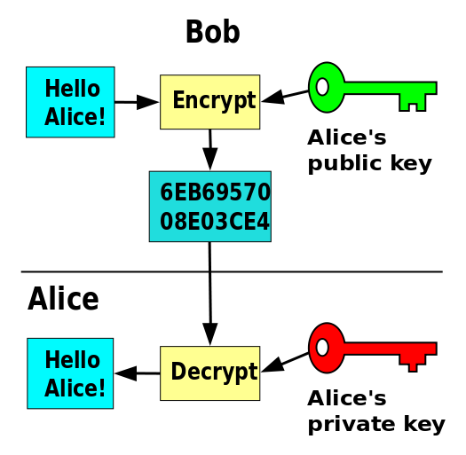

| **Inicio**         | **atrás 11**                       | **Siguiente 13**              |
| ------------------ | ---------------------------------- | ----------------------------- |
| [🏠](../README.md) | [⏪](./7_11_Pentesting_a_Redes.md) | [⏩](./7_13_Hacking_Etico.md) |

---

## **Índice**

| Temario                                                                                                                            |
| ---------------------------------------------------------------------------------------------------------------------------------- |
| [834. Las cartas secretas de María Estuardo, reina de Escocia](#834-las-cartas-secretas-de-maría-estuardo-reina-de-escocia)        |
| [835. Introducción a la Criptografía](#835-introducción-a-la-criptografía)                                                         |
| [836. Encripción y Estrategias de Ofuscación](#836-encripción-y-estrategias-de-ofuscación)                                         |
| [837. Criptografía Clásica](#837-criptografía-clásica)                                                                             |
| [838. Aleatoriedad](#838-aleatoriedad)                                                                                             |
| [839. Manejo de Aleatoriedad en JavaScript](#839-manejo-de-aleatoriedad-en-javascript)                                             |
| [840. Cryptoanálisis y Seguridad de Cifrado](#840-cryptoanálisis-y-seguridad-de-cifrado)                                           |
| [841. Seguridad Criptográfica](#841-seguridad-criptográfica)                                                                       |
| [842. Ciphers](#842-ciphers)                                                                                                       |
| [843. Advanced Encryption Standard](#843-advanced-encryption-standard)                                                             |
| [844. Cifrar y descrifrar archivos con JavaScript](#844-cifrar-y-descrifrar-archivos-con-javascript)                               |
| [845. Seguridad a través de Hashes](#845-seguridad-a-través-de-hashes)                                                             |
| [846. Funciones de hash comunes](#846-funciones-de-hash-comunes)                                                                   |
| [847. Aritmética modular en Criptografía Asimétrica](#847-aritmética-modular-en-criptografía-asimétrica)                           |
| [848. Intercambio de llaves y el problema del logaritmo discreto](#848-intercambio-de-llaves-y-el-problema-del-logaritmo-discreto) |
| [849. Algoritmo de Diffie-Hellman](#849-algoritmo-de-diffie-hellman)                                                               |
| [850. Cifrar mensajes con el algoritmo de Deffie-Hellman](#850-cifrar-mensajes-con-el-algoritmo-de-deffie-hellman)                 |
| [851. RSA y firma digital](#851-rsa-y-firma-digital)                                                                               |
| [852. Implementar Algoritmo de RSA y firma digital](#852-implementar-algoritmo-de-rsa-y-firma-digital)                             |
| [853. Criptografía de Curvas Elípticas](#853-criptografía-de-curvas-elípticas)                                                     |
| [854. ECDSA y tipos de curvas](#854-ecdsa-y-tipos-de-curvas)                                                                       |
| [855. Infraestructura de llave pública (PKI)](#855-infraestructura-de-llave-pública-pki)                                           |
| [856. Sistemas de pruebas interactivos](#856-sistemas-de-pruebas-interactivos)                                                     |
| [857. Computación Cuántica](#857-computación-cuántica)                                                                             |
| [858. Investigación en Criptografía](#858-investigación-en-criptografía)                                                           |

# **Fundamentos de Criptografía**

## **834. Las cartas secretas de María Estuardo, reina de Escocia**

### 📚 ¿Quién fue María Estuardo?

**María Estuardo (Mary Stuart)** fue reina de Escocia desde 1542 hasta 1567. También tenía derecho al trono de Inglaterra como prima de Isabel I. Su vida estuvo marcada por el conflicto político y religioso entre **católicos y protestantes**, y fue vista como una amenaza al trono inglés.

👉 Fue ejecutada en 1587 por orden de Isabel I tras ser acusada de conspirar para asesinarla.

---

### 📜 ¿Qué son las cartas secretas?

Durante su encarcelamiento en Inglaterra, María se comunicaba en **secreto con sus aliados católicos** mediante **cartas cifradas**. Estas cartas son parte de la **conspiración de Babington**, una trama para asesinar a Isabel I y poner a María en el trono.

Las cartas estaban:

- Escritas en **criptografía por sustitución** (código cifrado)
- Entregadas de forma clandestina (dentro de toneles de cerveza)
- Interceptadas por el espía y criptólogo **Thomas Phelippes**

---

### 🔐 ¿Cómo era el cifrado que usaba?

El sistema de cifrado era **sustitución monoalfabética**, a veces con símbolos, y también incluía **nombres codificados con glifos especiales**.

Ejemplo de un fragmento cifrado:

```
♘♝♞ = M
✶⚔♛ = Q
♦♣♠ = T
```

Frases como:

> “Matad a la Reina de Inglaterra tan pronto como podáis”

estaban escritas con estos símbolos, imposibles de entender sin la clave.

---

### 🔍 ¿Cómo se descifraron?

El criptólogo **Thomas Phelippes** logró **romper el código** usando técnicas de frecuencia de letras (similar al criptoanálisis moderno). Copió y manipuló el contenido para incriminar a María.

🔎 Ejemplo de técnica:

- Contar cuántas veces aparece un símbolo
- Compararlo con la frecuencia de letras en inglés
- Probar combinaciones comunes (“the”, “queen”, “kill”)

---

### 🧪 Ejemplo fácil de entender: Cifrado de sustitución

Vamos a simular una carta secreta como las de María usando un sistema simple.

#### Mensaje original (en español):

> **Matar a la reina pronto**

#### Cifrado simple por sustitución:

Usamos este alfabeto de símbolos:

| Letra | Símbolo |
| ----- | ------- |
| A     | ☀️      |
| E     | 🌕      |
| I     | ⭐️     |
| L     | 🔒      |
| M     | 👑      |
| N     | 🌙      |
| O     | 💧      |
| P     | 🔥      |
| Q     | ❓      |
| R     | 🌹      |
| S     | ⚡️     |
| T     | 🔑      |
| U     | 🌻      |
| ...   | ...     |

Cifrado del mensaje:

> **👑☀️🔑☀️🌹 ☀️ 🔒☀️ ❓🌕🌕🌙 ☀️💧🌙🔑💧**

(Así lucía una carta cifrada, incomprensible sin la clave)

---

### 📥 ¿Cómo se "instala" o recrea este caso hoy?

Puedes estudiar o jugar con estos cifrados históricos usando herramientas como:

#### 1. Python + Criptografía

```bash
pip install pycipher
```

#### 2. Simuladores en línea

- [dcode.fr](https://www.dcode.fr/cipher-identifier) – Reconoce y descifra automáticamente
- [Cryptii.com](https://cryptii.com) – Juega con cifrados históricos

---

### 💻 Ejemplo práctico con Python

Aquí tienes un ejemplo de cómo simular un cifrado simple como el de María Estuardo en Python:

```python
# Cifrado por sustitución simple
abc = "ABCDEFGHIJKLMNOPQRSTUVWXYZ"
clave = "QWERTYUIOPASDFGHJKLZXCVBNM"

def cifrar(texto):
    texto = texto.upper().replace(" ", "")
    return "".join(clave[abc.index(c)] if c in abc else c for c in texto)

mensaje = "MATARALAREINA"
cifrado = cifrar(mensaje)
print("Mensaje cifrado:", cifrado)
```

👉 Resultado:

```
Mensaje cifrado: LQQLKQQLKTOFQ
```

---

### 📌 Conclusión

| Elemento             | Detalle                                                  |
| -------------------- | -------------------------------------------------------- |
| ¿Quién?              | María Estuardo, reina de Escocia                         |
| ¿Qué hizo?           | Envío cartas cifradas conspirando contra Isabel I        |
| ¿Cómo se cifraban?   | Sustitución con símbolos únicos                          |
| ¿Quién las descifró? | Thomas Phelippes, espía y criptólogo del gobierno inglés |
| ¿Resultado?          | Las cartas fueron la **prueba clave** para ejecutarla    |

---

[🔼](#índice)

---

## **835. Introducción a la Criptografía**

### 📌 ¿Qué es la Criptografía?

La **criptografía** es la ciencia de escribir y descifrar mensajes secretos para proteger la información. Su objetivo principal es que **solo las personas autorizadas puedan entender la información**.

En términos simples:

> **Criptografía = "Esconder un mensaje para que nadie más lo entienda"**

---

### 🎯 ¿Por qué es importante?

- Protege **datos personales**, como contraseñas y números de tarjeta
- Se usa en **WhatsApp, bancos, correos electrónicos y sitios web**
- Permite la **autenticación** (saber si un mensaje viene de quien dice ser)
- Garantiza la **integridad** (que no se ha modificado un mensaje)

---

### 🔑 Conceptos clave

| Concepto          | Explicación fácil                         |
| ----------------- | ----------------------------------------- |
| **Texto claro**   | El mensaje original (ej. “Hola Juan”)     |
| **Texto cifrado** | El mensaje codificado (ej. “URYC WHNA”)   |
| **Cifrado**       | El proceso de ocultar el mensaje          |
| **Descifrado**    | Volver a obtener el mensaje original      |
| **Clave**         | Secreto necesario para cifrar o descifrar |
| **Algoritmo**     | Método matemático para cifrar/descifrar   |

---

### 🧠 Tipos de criptografía

#### 1. **Criptografía simétrica**

- Usa **una sola clave** para cifrar y descifrar
- Rápida pero menos segura si la clave se filtra
- Ejemplo: AES, DES

#### 2. **Criptografía asimétrica**

- Usa **dos claves**: una pública (para cifrar) y una privada (para descifrar)
- Más segura, pero más lenta
- Ejemplo: RSA

---

### 🔤 Ejemplo fácil – Cifrado César (básico)

El **Cifrado César** es un tipo de cifrado por sustitución. Consiste en mover cada letra un número fijo de posiciones.

#### Ejemplo:

- Texto: `HOLA`
- Desplazamiento: 3
- Resultado: `KROD`

```plaintext
H → K
O → R
L → O
A → D
```

---

### 🛠️ ¿Cómo se instala? (Para practicar)

Puedes usar **Python** y algunas bibliotecas para practicar criptografía.

#### 🔧 Instalar Python (si no lo tienes)

1. Ir a [https://www.python.org/downloads/](https://www.python.org/downloads/)
2. Descargar e instalar Python

#### 🔧 Instalar una biblioteca de criptografía (opcional)

```bash
pip install cryptography
```

---

### 💻 Ejemplo completo en Python – Cifrado César

```python
def cifrado_cesar(texto, desplazamiento):
    resultado = ""
    for letra in texto.upper():
        if letra.isalpha():
            resultado += chr((ord(letra) - 65 + desplazamiento) % 26 + 65)
        else:
            resultado += letra
    return resultado

def descifrado_cesar(texto, desplazamiento):
    return cifrado_cesar(texto, -desplazamiento)

# Prueba
mensaje = "HOLA JUAN"
cifrado = cifrado_cesar(mensaje, 3)
descifrado = descifrado_cesar(cifrado, 3)

print("Mensaje original:", mensaje)
print("Cifrado:", cifrado)
print("Descifrado:", descifrado)
```

#### 🧾 Resultado:

```
Mensaje original: HOLA JUAN
Cifrado: KROD MXDQ
Descifrado: HOLA JUAN
```

---

### 🔒 Ejemplo más avanzado – Cifrado con biblioteca `cryptography`

```python
from cryptography.fernet import Fernet

# Generar clave
clave = Fernet.generate_key()
f = Fernet(clave)

# Cifrar
mensaje = "Hola, esto es secreto".encode()
cifrado = f.encrypt(mensaje)

# Descifrar
descifrado = f.decrypt(cifrado)

print("Clave:", clave)
print("Cifrado:", cifrado)
print("Descifrado:", descifrado.decode())
```

---

### 📚 Conclusión

| Tema             | Resumen                                         |
| ---------------- | ----------------------------------------------- |
| ¿Qué es?         | Ciencia para ocultar información                |
| ¿Para qué sirve? | Proteger privacidad y seguridad                 |
| Tipos            | Simétrica (una clave) / Asimétrica (dos claves) |
| Herramientas     | Python, librerías como `cryptography`           |
| Ejemplo práctico | Cifrado César + Cifrado moderno con Fernet      |

---

[🔼](#índice)

---

## **836. Encripción y Estrategias de Ofuscación**

### 📌 ¿Qué es la Encripción?

> ❗ El término correcto en español es **cifrado** (en inglés: encryption).
>
> Aun así, “encripción” es comúnmente entendido como lo mismo.

La **encripción (cifrado)** es el proceso de **convertir información legible en ilegible** para protegerla de accesos no autorizados.

---

#### 🧠 Ejemplo simple:

> Mensaje original: **"Hola Mundo"**
>
> Mensaje cifrado: **"Khoor Pxqgr"** (usando el cifrado César con desplazamiento de 3)

Solo quien conoce la clave puede descifrarlo.

---

### 🎭 ¿Qué es la Ofuscación?

**Ofuscación** significa **hacer que el código fuente o el mensaje sea difícil de leer**, incluso si no está cifrado.

👉 Se usa para **ocultar intenciones maliciosas**, proteger código, evitar ingeniería inversa o esconder datos sensibles.

#### 🔍 Diferencias:

| Aspecto      | Cifrado                                      | Ofuscación                          |
| ------------ | -------------------------------------------- | ----------------------------------- |
| ¿Qué hace?   | Protege datos haciendo el contenido ilegible | Hace el código o texto más confuso  |
| ¿Reversible? | Sí (si tienes la clave)                      | A veces (puede ser reversible o no) |
| ¿Propósito?  | Seguridad de datos                           | Dificultar análisis o comprensión   |

---

### 🛠️ Instalación de herramientas para cifrado y ofuscación

Puedes usar **Python** para practicar ambos conceptos.

#### ✅ Requisitos

1. Instalar Python:

   👉 [https://www.python.org/downloads/](https://www.python.org/downloads/)

2. Instalar librería de cifrado:

```bash
pip install cryptography
```

3. Instalar herramienta de ofuscación (opcional):

```bash
pip install pyarmor
```

---

### 🔐 Parte 1: Ejemplo de Encripción (Cifrado) con Python

Usaremos la librería `cryptography` y el método **Fernet** (cifrado simétrico seguro).

#### 📄 Código:

```python
from cryptography.fernet import Fernet

# Paso 1: Generar una clave
clave = Fernet.generate_key()
cifrador = Fernet(clave)

# Paso 2: Cifrar el mensaje
mensaje = "Este es un mensaje secreto".encode()
cifrado = cifrador.encrypt(mensaje)

# Paso 3: Descifrarlo
descifrado = cifrador.decrypt(cifrado)

# Resultados
print("Clave secreta:", clave.decode())
print("Mensaje cifrado:", cifrado)
print("Mensaje descifrado:", descifrado.decode())
```

#### 🧾 Salida esperada:

```
Clave secreta: b'mi-clave-aqui=='
Mensaje cifrado: b'gAAAAABk...'
Mensaje descifrado: Este es un mensaje secreto
```

---

### 🎭 Parte 2: Estrategia de Ofuscación (Ocultar código fuente)

Vamos a usar `pyarmor` para ofuscar un script `.py` y hacer que sea difícil entenderlo.

#### 📥 Instalar PyArmor

```bash
pip install pyarmor
```

#### 📄 Crear script de prueba:

Archivo: `secreto.py`

```python
def mensaje():
    print("Información confidencial")

mensaje()
```

#### 🔐 Ofuscar el código:

```bash
pyarmor obfuscate secreto.py
```

Esto generará un archivo `dist/secreto.py` ofuscado. Si abres ese archivo, verás que es ilegible para humanos pero aún se puede ejecutar:

```bash
python dist/secreto.py
```

✅ **Resultado**: ejecuta lo mismo, pero ya no puedes entender el código fácilmente.

---

### 🧪 Proyecto Final: "Protector de Mensajes"

#### 📝 Objetivo:

Crear un programa que:

1. Cifre un mensaje usando `cryptography`
2. Guarde el mensaje cifrado en un archivo
3. Luego ofusque ese archivo con `pyarmor`

#### 📦 Archivos involucrados:

**Archivo original: `protector.py`**

```python
from cryptography.fernet import Fernet

def proteger():
    clave = Fernet.generate_key()
    f = Fernet(clave)

    mensaje = input("Escribe tu mensaje secreto: ").encode()
    cifrado = f.encrypt(mensaje)

    print("\n🔐 Mensaje cifrado:", cifrado.decode())
    print("🗝️ Clave para descifrar:", clave.decode())

if __name__ == "__main__":
    proteger()
```

#### ▶️ Ejecuta:

```bash
python protector.py
```

### 🔒 Luego, ofusca el archivo:

```bash
pyarmor obfuscate protector.py
```

Ahora tu programa está **cifrado + ofuscado** ✅

---

### 🧠 Conclusión rápida

| Tema                     | Explicación breve                                       |
| ------------------------ | ------------------------------------------------------- |
| **Cifrado (Encripción)** | Oculta datos usando una clave                           |
| **Ofuscación**           | Dificulta la lectura o análisis del código              |
| **Herramientas**         | `cryptography`, `pyarmor`, Python                       |
| **Usos reales**          | Proteger contraseñas, APIs, prevenir ingeniería inversa |

---

[🔼](#índice)

---

## **837. Criptografía Clásica**

### 📌 ¿Qué es la Criptografía Clásica?

La **criptografía clásica** es el estudio de los **métodos antiguos para ocultar mensajes**, antes de la era digital. Se basa en transformar letras o palabras usando reglas simples que no necesitan computadoras.

> 🎯 Su objetivo era **proteger mensajes en tiempos antiguos**, como en guerras, espionaje, o comunicación secreta.

---

### 🗝️ Tipos más comunes

| Tipo de cifrado         | Descripción fácil                                                 |
| ----------------------- | ----------------------------------------------------------------- |
| **Cifrado César**       | Desplaza las letras del alfabeto (ej. A → D con desplazamiento 3) |
| **Cifrado Atbash**      | Reemplaza A por Z, B por Y, etc.                                  |
| **Cifrado de Vigenère** | Usa una palabra clave para aplicar varios cifrados César          |
| **Transposición**       | Reordena letras según un patrón                                   |
| **Escítala Espartana**  | Cinta enrollada en un palo con mensaje escrito en espiral         |

---

### 🔐 Ejemplo visual – Cifrado César (desplazamiento 3)

Mensaje: `HOLA`

```
H → K
O → R
L → O
A → D
```

Resultado: `KROD`

Solo quien conoce el número (la clave) puede descifrarlo.

---

### 🛠️ ¿Cómo practicar criptografía clásica?

Puedes hacerlo de forma manual o usar **Python**.

#### ✅ Instalar Python

1. Ve a 👉 [https://www.python.org/downloads/](https://www.python.org/downloads/)
2. Descarga e instala Python (Windows/macOS/Linux)
3. Asegúrate de que funciona:

```bash
python --version
```

No necesitas instalar ninguna librería externa para estos ejemplos clásicos.

---

### 💻 Ejemplo completo en Python – Cifrado César

```python
def cifrado_cesar(texto, clave):
    resultado = ""
    for letra in texto.upper():
        if letra.isalpha():
            nueva_letra = chr((ord(letra) - 65 + clave) % 26 + 65)
            resultado += nueva_letra
        else:
            resultado += letra
    return resultado

def descifrado_cesar(texto, clave):
    return cifrado_cesar(texto, -clave)

# Prueba
mensaje = "ESTO ES UN MENSAJE SECRETO"
clave = 3

cifrado = cifrado_cesar(mensaje, clave)
descifrado = descifrado_cesar(cifrado, clave)

print("Mensaje original:", mensaje)
print("Mensaje cifrado:", cifrado)
print("Mensaje descifrado:", descifrado)
```

#### 🧾 Resultado:

```
Mensaje original: ESTO ES UN MENSAJE SECRETO
Mensaje cifrado: HVWR HV XQ PHQVDMH VHfUHWR
Mensaje descifrado: ESTO ES UN MENSAJE SECRETO
```

---

### 🔄 Otro ejemplo: Cifrado Atbash

```python
def atbash(texto):
    resultado = ""
    for letra in texto.upper():
        if letra.isalpha():
            resultado += chr(90 - (ord(letra) - 65))  # 90 = Z
        else:
            resultado += letra
    return resultado

# Prueba
mensaje = "SECRETO"
cifrado = atbash(mensaje)
descifrado = atbash(cifrado)

print("Mensaje original:", mensaje)
print("Cifrado:", cifrado)
print("Descifrado:", descifrado)
```

#### 🧾 Resultado:

```
Mensaje original: SECRETO
Cifrado: HVXIVGL
Descifrado: SECRETO
```

Atbash es **simétrico**, o sea: aplicas el mismo algoritmo para cifrar y descifrar.

---

### 🧪 Proyecto final: Herramienta de Criptografía Clásica

```python
def menu():
    print("=== HERRAMIENTA DE CRIPTOGRAFÍA CLÁSICA ===")
    print("1. Cifrado César")
    print("2. Cifrado Atbash")
    opcion = input("Selecciona una opción (1-2): ")

    if opcion == "1":
        texto = input("Escribe el mensaje: ")
        clave = int(input("Escribe la clave (número): "))
        cifrado = cifrado_cesar(texto, clave)
        print("🔐 Cifrado:", cifrado)
        print("🔓 Descifrado:", descifrado_cesar(cifrado, clave))

    elif opcion == "2":
        texto = input("Escribe el mensaje: ")
        cifrado = atbash(texto)
        print("🔐 Cifrado:", cifrado)
        print("🔓 Descifrado:", atbash(cifrado))

    else:
        print("❌ Opción no válida")

def cifrado_cesar(texto, clave):
    resultado = ""
    for letra in texto.upper():
        if letra.isalpha():
            nueva = chr((ord(letra) - 65 + clave) % 26 + 65)
            resultado += nueva
        else:
            resultado += letra
    return resultado

def descifrado_cesar(texto, clave):
    return cifrado_cesar(texto, -clave)

def atbash(texto):
    resultado = ""
    for letra in texto.upper():
        if letra.isalpha():
            resultado += chr(90 - (ord(letra) - 65))
        else:
            resultado += letra
    return resultado

menu()
```

---

### 📚 Conclusión

| Concepto              | Resumen práctico                                            |
| --------------------- | ----------------------------------------------------------- |
| Criptografía Clásica  | Método antiguo de ocultar mensajes                          |
| Ejemplos comunes      | César, Atbash, Vigenère, transposición                      |
| Herramientas actuales | Python (sin librerías extra)                                |
| Aplicación moderna    | Base para aprender criptografía moderna y seguridad digital |

---

[🔼](#índice)

---

## **838. Aleatoriedad**

### 📌 ¿Qué es la Aleatoriedad?

La **aleatoriedad** es la **ausencia de un patrón predecible** en una secuencia de datos. Es decir, algo es aleatorio cuando **no podemos predecirlo con certeza**.

#### 🎯 Ejemplos del mundo real:

| Ejemplo                  | ¿Por qué es aleatorio?            |
| ------------------------ | --------------------------------- |
| Lanzar un dado           | No puedes saber qué número saldrá |
| Barajar cartas           | No puedes predecir el orden       |
| Elegir un número al azar | Nadie sabe cuál saldrá antes      |

---

### 🧠 ¿Por qué es importante la aleatoriedad?

La usamos en:

- **Seguridad informática** (para crear contraseñas o claves seguras)
- **Simulación y juegos**
- **Criptografía** (para evitar que se predigan los datos)
- **Análisis estadístico**

---

### 💡 Tipos de Aleatoriedad

| Tipo                           | Explicación sencilla                          | Ejemplo                              |
| ------------------------------ | --------------------------------------------- | ------------------------------------ |
| **Aleatoriedad física**        | Viene de fenómenos naturales reales           | Ruido eléctrico, radioactividad      |
| **Aleatoriedad computacional** | Generada por algoritmos                       | `random()` en Python                 |
| **Criptográficamente segura**  | Muy difícil de predecir, ideal para seguridad | `secrets` o `os.urandom()` en Python |

---

### 🛠️ ¿Cómo usar aleatoriedad en la computadora?

Con Python es muy fácil.

#### ✅ Paso 1: Instalar Python (si no lo tienes)

1. Ve a 👉 [https://www.python.org/downloads/](https://www.python.org/downloads/)
2. Instala Python según tu sistema operativo
3. Abre una terminal y verifica:

```bash
python --version
```

---

### 🧪 Usando el módulo `random` (básico)

Python incluye el módulo `random` para generar números pseudoaleatorios (son aleatorios "simulados").

```python
import random

# Número entre 1 y 10
print("Número aleatorio:", random.randint(1, 10))

# Elegir un elemento aleatorio de una lista
colores = ["rojo", "verde", "azul"]
print("Color elegido:", random.choice(colores))

# Barajar una lista
random.shuffle(colores)
print("Colores barajados:", colores)
```

---

### 🔐 Usando el módulo `secrets` (seguro para contraseñas)

Este módulo es ideal para datos sensibles (criptografía, contraseñas).

```python
import secrets

# Número aleatorio entre 1 y 100, seguro
print("Número seguro:", secrets.randbelow(100) + 1)

# Crear una contraseña aleatoria de 12 caracteres
import string
caracteres = string.ascii_letters + string.digits
password = ''.join(secrets.choice(caracteres) for i in range(12))
print("Contraseña segura:", password)
```

---

### ⚠️ Diferencias entre `random` y `secrets`

| Módulo    | ¿Es seguro? | ¿Predecible? | Uso recomendado             |
| --------- | ----------- | ------------ | --------------------------- |
| `random`  | No          | Sí           | Juegos, simulaciones        |
| `secrets` | Sí          | No           | Contraseñas, tokens, claves |

---

### 🎁 Ejemplo completo: Generador de contraseña aleatoria

```python
import secrets
import string

def generar_contraseña(longitud=12):
    letras = string.ascii_letters  # A-Z + a-z
    numeros = string.digits        # 0-9
    simbolos = "!@#$%^&*()-_=+"
    conjunto = letras + numeros + simbolos

    contraseña = ''.join(secrets.choice(conjunto) for _ in range(longitud))
    return contraseña

# Uso
print("🔐 Tu nueva contraseña segura es:", generar_contraseña())
```

#### 🧾 Resultado (ejemplo):

```
🔐 Tu nueva contraseña segura es: @9jKl8^ZrM!2
```

---

### 🧠 Conclusión rápida

| Concepto               | Explicación fácil                      |
| ---------------------- | -------------------------------------- |
| Aleatoriedad           | Ausencia de patrones                   |
| Aleatoriedad en Python | Módulos `random` y `secrets`           |
| `random`               | Rápido, pero no seguro                 |
| `secrets`              | Lento, pero seguro (criptografía)      |
| Aplicaciones reales    | Juegos, seguridad, cifrado, simulación |

---

[🔼](#índice)

---

## **839. Manejo de Aleatoriedad en JavaScript**

### 📌 ¿Qué es la aleatoriedad?

La **aleatoriedad** es la capacidad de obtener resultados impredecibles, sin un patrón fijo. En programación, esto se traduce en la **generación de valores aleatorios**.

#### 🎯 ¿Para qué sirve en JavaScript?

- Juegos (tirar dados, cartas, ruletas)
- Interfaces (colores, efectos aleatorios)
- Seguridad básica (tokens, contraseñas)
- Simulaciones estadísticas

---

### 🧠 ¿Cómo se genera aleatoriedad en JavaScript?

JavaScript utiliza el método **`Math.random()`**, que es una **función incorporada**.

```js
let aleatorio = Math.random();
console.log(aleatorio); // Número decimal aleatorio entre 0 y 1
```

#### 🔍 ¿Qué devuelve `Math.random()`?

Devuelve un número **decimal entre 0 (inclusive) y 1 (exclusivo)**.
Ejemplo: `0.583920...`

---

### 🛠️ Cómo generar diferentes tipos de valores aleatorios

#### 1. 🔢 Número entero entre dos valores

```js
function numeroAleatorioEntre(min, max) {
  return Math.floor(Math.random() * (max - min + 1)) + min;
}

// Ejemplo: número entre 1 y 10
console.log(numeroAleatorioEntre(1, 10));
```

#### 2. 🎲 Elegir un elemento aleatorio de una lista

```js
const colores = ["rojo", "verde", "azul", "amarillo"];
const colorElegido = colores[Math.floor(Math.random() * colores.length)];

console.log("Color aleatorio:", colorElegido);
```

#### 3. 🔄 Barajar (mezclar) una lista

```js
function barajar(array) {
  for (let i = array.length - 1; i > 0; i--) {
    const j = Math.floor(Math.random() * (i + 1));
    [array[i], array[j]] = [array[j], array[i]]; // Intercambio
  }
  return array;
}

// Ejemplo
let cartas = ["A", "2", "3", "4", "5"];
console.log("Cartas barajadas:", barajar(cartas));
```

---

### 🧪 ¿Necesito instalar algo?

🟢 **No necesitas instalar nada**. JavaScript ya incluye `Math.random()` en todos los navegadores modernos y entornos como Node.js.

---

### 💻 Ejemplo completo: Simulador de dado de 6 caras 🎲

Aquí tienes un HTML que puedes abrir en tu navegador y lanzar un dado:

```html
<!DOCTYPE html>
<html lang="es">
  <head>
    <meta charset="UTF-8" />
    <title>Lanzador de Dado</title>
  </head>
  <body>
    <h1>🎲 Lanzador de Dado</h1>
    <button onclick="lanzarDado()">Lanzar</button>
    <p id="resultado"></p>

    <script>
      function lanzarDado() {
        const resultado = Math.floor(Math.random() * 6) + 1;
        document.getElementById("resultado").textContent =
          "Salió el número: " + resultado;
      }
    </script>
  </body>
</html>
```

🔧 **Cómo usarlo:**

1. Copia el código en un archivo llamado `dado.html`
2. Ábrelo en tu navegador
3. Haz clic en “Lanzar” para ver un número del 1 al 6

---

### 📚 Resumen Rápido

| Función                    | ¿Qué hace?                           |
| -------------------------- | ------------------------------------ |
| `Math.random()`            | Número decimal entre 0 y 1           |
| `Math.floor()`             | Redondea hacia abajo                 |
| `random * (max - min + 1)` | Escala al rango de enteros           |
| `array[Math.random()]`     | Elige elementos al azar de una lista |
| Mezcla de arrays           | Usando el algoritmo de Fisher–Yates  |

---

[🔼](#índice)

---

## **840. Cryptoanálisis y Seguridad de Cifrado**

### 📘 ¿Qué es el Criptoanálisis?

El **criptoanálisis** es el arte y la ciencia de **romper sistemas de cifrado**. Es decir, intentar obtener el **mensaje original (texto plano)** a partir del **mensaje cifrado (texto cifrado)** **sin tener la clave**.

> 👉 Es lo opuesto a la criptografía:
>
> La criptografía protege la información, el criptoanálisis intenta romper esa protección.

---

### 🎯 Objetivos del Criptoanálisis

1. **Descifrar mensajes cifrados sin conocer la clave**
2. **Encontrar debilidades en algoritmos de cifrado**
3. **Evaluar la seguridad de los sistemas criptográficos**
4. **Proteger mejor la información mediante el análisis de fallos**

---

### 🔓 Tipos de Criptoanálisis (con ejemplos sencillos)

| Tipo de Ataque                     | Explicación clara                                       | Ejemplo                              |
| ---------------------------------- | ------------------------------------------------------- | ------------------------------------ |
| **Ataque de texto cifrado**        | Solo tienes el mensaje cifrado                          | Ver texto: `Wklv lv d whvw phvvdjh.` |
| **Ataque de texto plano conocido** | Tienes pares de mensaje cifrado y su versión original   | Sabes que "HOLA" = "EOLA"            |
| **Ataque de texto plano elegido**  | Puedes elegir un texto para cifrar y ver el resultado   | Envías "AAA" y recibes "XYZ"         |
| **Ataque de clave elegida**        | Puedes elegir claves y observar cómo afectan el cifrado | Atacas sistemas de prueba            |
| **Ataques por canal lateral**      | Usas el consumo eléctrico o tiempo para deducir claves  | Avanzado, más físico                 |

---

### 🛡️ Seguridad en el Cifrado

Un cifrado es **seguro** si:

✅ Usa claves suficientemente largas

✅ No tiene patrones predecibles

✅ Es resistente al criptoanálisis

✅ Usa estándares modernos (AES, RSA, ECC)

✅ No se basa en el "secreto del algoritmo", sino en la clave

---

### 🧪 Herramientas para Criptoanálisis

Estas herramientas se usan para estudiar o romper cifrados:

| Herramienta         | ¿Para qué sirve?               | Instalación básica                                                          |
| ------------------- | ------------------------------ | --------------------------------------------------------------------------- |
| **CrypTool**        | Visualizar y analizar cifrados | [https://www.cryptool.org](https://www.cryptool.org)                        |
| **CyberChef**       | Herramienta web de análisis    | Web: [https://gchq.github.io/CyberChef/](https://gchq.github.io/CyberChef/) |
| **Hashcat**         | Romper hashes con fuerza bruta | `sudo apt install hashcat`                                                  |
| **John the Ripper** | Ataque a contraseñas cifradas  | `sudo apt install john`                                                     |

---

### 🧠 Ejemplo conceptual: Criptoanálisis de César

#### Mensaje cifrado:

```
Wklv lv d vhfxuh phvvdjh
```

Sabemos que es un **cifrado César** (cada letra se corre 3 lugares).

#### Descifrado manual (clave = 3):

```
W → T
k → h
l → i
v → s
...
```

Resultado final:

```
This is a secure message
```

---

### 🔧 Cómo probarlo tú mismo con Python (no requiere instalación si usas [replit.com](https://replit.com))

#### Código: Cifrado César + Criptoanálisis de fuerza bruta

```python
def descifrar_cesar(texto):
    for clave in range(1, 26):  # 25 posibles claves
        resultado = ''
        for letra in texto:
            if letra.isalpha():
                offset = 65 if letra.isupper() else 97
                resultado += chr((ord(letra) - offset - clave) % 26 + offset)
            else:
                resultado += letra
        print(f"🔐 Clave {clave}: {resultado}")

mensaje_cifrado = "Wklv lv d vhfxuh phvvdjh"
descifrar_cesar(mensaje_cifrado)
```

#### Salida esperada:

El programa probará las 25 claves posibles y mostrará la que tiene sentido. En este caso:

```
🔐 Clave 3: This is a secure message
```

---

### ✅ Conclusión

| Concepto clave           | Explicación                              |
| ------------------------ | ---------------------------------------- |
| **Criptoanálisis**       | Estudio para romper cifrados             |
| **Seguridad de cifrado** | Evaluar qué tan fuerte es un cifrado     |
| **Ejemplo usado**        | Ataque por fuerza bruta al cifrado César |
| **Lenguaje usado**       | Python (sencillo y sin instalación)      |

---

[🔼](#índice)

---

## **841. Seguridad Criptográfica**

### 📘 ¿Qué es la Seguridad Criptográfica?

La **Seguridad Criptográfica** es el conjunto de técnicas y algoritmos usados para **proteger información digital** mediante la **criptografía**.
Su objetivo es asegurar:

- **Confidencialidad** → Solo quien tenga la clave puede leer el mensaje
- **Integridad** → El mensaje no ha sido modificado
- **Autenticación** → Verifica quién envió el mensaje
- **No repudio** → El remitente no puede negar que lo envió

---

### 🔑 ¿Qué herramientas usa la criptografía?

#### Existen dos grandes tipos:

| Tipo de cifrado                | Explicación simple                                | Ejemplo común     |
| ------------------------------ | ------------------------------------------------- | ----------------- |
| **Simétrica**                  | Se usa **una sola clave** para cifrar y descifrar | AES, DES, RC4     |
| **Asimétrica (clave pública)** | Se usan **dos claves**: una pública y una privada | RSA, ECC, ElGamal |

---

### 🔐 Ejemplo sencillo de uso de criptografía

#### 🟢 Cifrado Simétrico (ej: AES)

Imagina que tú y un amigo comparten una **clave secreta**:

- Tú usas esa clave para cifrar el mensaje.
- Él usa la misma clave para descifrarlo.

#### 🔵 Cifrado Asimétrico (ej: RSA)

- Tú publicas tu clave pública.
- Cualquiera te puede mandar mensajes cifrados con ella.
- Solo tú puedes descifrarlo con tu **clave privada**.

---

### 🧰 ¿Cómo se usa la criptografía?

Se implementa en aplicaciones como:

- HTTPS (navegación segura en la web)
- Correo electrónico seguro (PGP, GPG)
- Firmas digitales
- Cifrado de archivos y discos

---

### ⚙️ ¿Cómo instalar y usar herramientas criptográficas?

#### Opción 1: Con Python y la librería `cryptography`

##### ✅ Instalación (en sistemas con Python):

```bash
pip install cryptography
```

---

### 🧪 Ejemplo práctico: Cifrado y descifrado simétrico con AES

Este código cifrará y descifrará un mensaje usando una clave secreta.

```python
from cryptography.fernet import Fernet

# 1. Generar una clave secreta
clave = Fernet.generate_key()
fernet = Fernet(clave)

# 2. Texto original
mensaje = "Este mensaje es secreto"

# 3. Cifrar el mensaje
mensaje_cifrado = fernet.encrypt(mensaje.encode())
print("🔒 Mensaje cifrado:", mensaje_cifrado)

# 4. Descifrar el mensaje
mensaje_descifrado = fernet.decrypt(mensaje_cifrado).decode()
print("🔓 Mensaje original:", mensaje_descifrado)
```

#### 📦 Resultado esperado:

```bash
🔒 Mensaje cifrado: b'gAAAAAB...'
🔓 Mensaje original: Este mensaje es secreto
```

> Puedes ejecutarlo en [https://replit.com/](https://replit.com/) sin instalar nada.

---

### 🔍 Buenas prácticas para seguridad criptográfica

| Práctica recomendada            | ¿Por qué?                            |
| ------------------------------- | ------------------------------------ |
| Usar claves largas y aleatorias | Más difícil de adivinar              |
| Nunca reutilizar claves         | Previene ataques con datos filtrados |
| Usar bibliotecas probadas       | No crear tu propio cifrado           |
| Cambiar claves periódicamente   | Mejora la seguridad a largo plazo    |
| Validar integridad (HMAC)       | Detecta cambios en los datos         |

---

### ✅ Resumen

| Concepto           | Ejemplo                       |
| ------------------ | ----------------------------- |
| Cifrado simétrico  | AES con una clave secreta     |
| Cifrado asimétrico | RSA con clave pública/privada |
| Librería en Python | `cryptography`                |
| Claves             | Siempre deben ser secretas    |
| Uso práctico       | HTTPS, correos, archivos      |

---

[🔼](#índice)

---

## **842. Ciphers**

### 📘 ¿Qué es un Cipher?

Un **cipher (cifrado)** es un **algoritmo que transforma información legible (texto plano)** en **información ilegible (texto cifrado)** para proteger su contenido.

> 👉 Solo quien tenga la **clave** correcta puede revertir esa transformación (descifrar).

---

### 📦 Tipos de Cifrado

#### 1. 🔄 Cifrado Simétrico

- Usa **una sola clave** para cifrar y descifrar.
- Rápido, ideal para cifrar grandes cantidades de datos.
- Ejemplos: **AES**, **DES**, **RC4**

📌 Ejemplo:

🔑 Clave: "abc123"

📝 Texto: "Hola Mundo"

🔒 Cifrado → "XyZ#@93asd"

🔓 Con la misma clave → "Hola Mundo"

---

#### 2. 🔁 Cifrado Asimétrico

- Usa **dos claves diferentes**: pública y privada.
- La **clave pública** cifra, y la **privada descifra** (o viceversa).
- Más lento, pero más seguro para comunicaciones.
- Ejemplos: **RSA**, **ECC**

📌 Ejemplo:

🔓 Cifras un archivo con la clave pública de alguien.

🔑 Solo esa persona puede leerlo con su clave privada.

---

#### 3. 📏 Cifrado por bloques vs flujo

| Tipo        | ¿Qué hace?                            | Ejemplo |
| ----------- | ------------------------------------- | ------- |
| **Bloques** | Divide el texto en bloques fijos      | AES     |
| **Flujo**   | Cifra bit a bit o carácter a carácter | RC4     |

---

### 🛠️ Instalación de Herramientas para usar Ciphers

#### ✔️ Opción 1: Python con la librería `cryptography`

##### 🔧 Instalación

Si usas Python local:

```bash
pip install cryptography
```

Si no quieres instalar nada:

📍 Usa [https://replit.com](https://replit.com)

---

### ✅ Ejemplo práctico completo: AES en Python

Vamos a cifrar y descifrar un texto usando **AES (Advanced Encryption Standard)**.

```python
from cryptography.fernet import Fernet

# 1. Generar clave segura
clave = Fernet.generate_key()
cipher = Fernet(clave)

# 2. Mensaje a cifrar
mensaje = "Este es un mensaje secreto"

# 3. Cifrar el mensaje
cifrado = cipher.encrypt(mensaje.encode())
print("🔒 Texto cifrado:", cifrado)

# 4. Descifrar el mensaje
descifrado = cipher.decrypt(cifrado).decode()
print("🔓 Texto descifrado:", descifrado)
```

#### 🔍 Salida esperada:

```
🔒 Texto cifrado: b'gAAAAABk...'
🔓 Texto descifrado: Este es un mensaje secreto
```

💡 **Fernet** es un sistema de cifrado simétrico que usa AES y HMAC internamente.

---

### 🧪 Ejemplo extra: Cifrado César (clásico)

Si quieres algo más simple y educativo:

```python
def cifrado_cesar(texto, clave):
    resultado = ""
    for letra in texto:
        if letra.isalpha():
            offset = 65 if letra.isupper() else 97
            resultado += chr((ord(letra) - offset + clave) % 26 + offset)
        else:
            resultado += letra
    return resultado

def descifrado_cesar(texto, clave):
    return cifrado_cesar(texto, -clave)

mensaje = "Hola Mundo"
clave = 3

cifrado = cifrado_cesar(mensaje, clave)
print("🔒 Cifrado César:", cifrado)

descifrado = descifrado_cesar(cifrado, clave)
print("🔓 Descifrado César:", descifrado)
```

✅ Resultado:

```
🔒 Cifrado César: Krod Pxqgr
🔓 Descifrado César: Hola Mundo
```

---

### 🧠 Resumen Final

| Concepto clave   | Detalle                               |
| ---------------- | ------------------------------------- |
| Cipher (cifrado) | Algoritmo para ocultar datos          |
| Simétrico        | Usa una sola clave (ej: AES)          |
| Asimétrico       | Usa clave pública y privada (ej: RSA) |
| Herramienta útil | `cryptography` en Python              |
| Ejemplo simple   | Cifrado César                         |

---

[🔼](#índice)

---

## **843. Advanced Encryption Standard**

### 📘 ¿Qué es AES?

**AES (Advanced Encryption Standard)** es un algoritmo de **cifrado simétrico** adoptado como estándar por el gobierno de EE.UU. en 2001.

#### ✅ Características principales:

- Usa la **misma clave para cifrar y descifrar**.
- Es rápido, seguro y confiable.
- Se usa en: **WiFi (WPA2/WPA3), VPNs, discos cifrados, apps, servidores HTTPS, etc.**

---

### 🔢 ¿Cómo funciona AES?

1. **Entrada**: Texto plano (ej. "Hola")
2. **Clave secreta**: (de 128, 192 o 256 bits)
3. **Proceso interno**: varias rondas de sustitución y mezcla
4. **Salida**: Texto cifrado (ilegible)

🔄 **Para descifrar**, se aplica el mismo proceso pero al revés, usando la **misma clave**.

---

### 🔐 Modos de operación

AES por sí solo trabaja en **bloques** de 128 bits. Pero puede usarse en varios **modos** según cómo quieras cifrar:

| Modo | Descripción breve                               | Seguridad     |
| ---- | ----------------------------------------------- | ------------- |
| ECB  | Cifra cada bloque por separado (no recomendado) | ❌ Inseguro   |
| CBC  | Cada bloque depende del anterior (recomendado)  | ✅ Bueno      |
| GCM  | Cifra y también verifica integridad             | ✅ Muy seguro |

---

### 🛠️ ¿Cómo instalar AES en tu sistema?

#### ✔️ Con Python usando `cryptography`

1. Abre tu terminal (o consola de comandos)
2. Instala la librería:

```bash
pip install cryptography
```

---

### ✅ Ejemplo práctico: Cifrado AES con `Fernet` (simétrico)

`Fernet` es una implementación segura de AES (usa AES-128 en modo CBC + HMAC)

```python
from cryptography.fernet import Fernet

# 1. Generar clave AES (segura y aleatoria)
clave = Fernet.generate_key()
cifrador = Fernet(clave)

# 2. Mensaje a cifrar
mensaje = "Este es un mensaje secreto"
print("📄 Texto original:", mensaje)

# 3. Cifrar mensaje
texto_cifrado = cifrador.encrypt(mensaje.encode())
print("🔒 Texto cifrado:", texto_cifrado)

# 4. Descifrar mensaje
texto_descifrado = cifrador.decrypt(texto_cifrado).decode()
print("🔓 Texto descifrado:", texto_descifrado)
```

---

### 💡 Resultado esperado:

```bash
📄 Texto original: Este es un mensaje secreto
🔒 Texto cifrado: b'gAAAAABi...'
🔓 Texto descifrado: Este es un mensaje secreto
```

Puedes ejecutar este código en:

- 🖥️ Replit: [https://replit.com/](https://replit.com/)
- 🐍 Consola local si tienes Python instalado

---

### 🧠 ¿Por qué usar AES?

AES es el estándar actual porque:

✅ Es rápido (incluso en hardware limitado)

✅ Es seguro (ningún ataque práctico conocido a AES-128 o AES-256)

✅ Es flexible (diferentes longitudes de clave)

✅ Está ampliamente soportado

---

### 🛡️ Buenas prácticas

| Práctica                         | ¿Por qué es importante?              |
| -------------------------------- | ------------------------------------ |
| Usar claves aleatorias           | Evita ataques por fuerza bruta       |
| No guardar claves en texto plano | Riesgo si hay filtración de archivos |
| Usar IV aleatorio (en CBC)       | Aumenta la seguridad del cifrado     |
| No reutilizar claves             | Previene correlación de mensajes     |

---

### 🧪 ¿Quieres un ejemplo más técnico?

Podemos implementar AES en **modo CBC manualmente** con el módulo `Crypto.Cipher` (más avanzado). Solo dímelo y te lo preparo también.

---

### ✅ Resumen Final

| Concepto         | Explicación rápida                 |
| ---------------- | ---------------------------------- |
| AES              | Algoritmo de cifrado simétrico     |
| Tamaños de clave | 128, 192 o 256 bits                |
| Uso común        | HTTPS, discos cifrados, VPNs, WiFi |
| Instalación      | `pip install cryptography`         |
| Ejemplo fácil    | Usar `Fernet` con Python           |

---

[🔼](#índice)

---

## **844. Cifrar y descrifrar archivos con JavaScript**

### 📘 ¿Qué significa cifrar un archivo?

Cifrar un archivo significa convertir su contenido en un formato ilegible, usando una **clave secreta**, para protegerlo contra accesos no autorizados.

👉 Luego, solo alguien con la **clave correcta** podrá **descifrarlo** y recuperar el archivo original.

---

### 📦 ¿Qué necesitamos para hacerlo en JavaScript?

Para trabajar con cifrado de archivos en JavaScript (en navegador o Node.js), usaremos:

- ✅ **Crypto API** (en navegador)
- ✅ **Node.js + crypto + fs** (en backend/local)

---

### ✅ Opción 1: Cifrar archivos en **Node.js**

#### 📥 Instalación de Node.js

Si aún no tienes Node.js:

1. Ve a 👉 [https://nodejs.org/](https://nodejs.org/)
2. Descarga la versión LTS
3. Instálala y abre una terminal

---

### 🛠️ Paso a paso: Cifrar y descifrar archivos

#### 1. 📁 Crear un archivo con contenido

Crea un archivo `mensaje.txt` con este contenido:

```
Este archivo contiene datos secretos.
```

---

#### 2. 📜 Código completo en Node.js

Crea un archivo `cifrado.js` con este contenido:

```javascript
const crypto = require("crypto");
const fs = require("fs");

// Clave y vector de inicialización (16 bytes para AES-128)
const clave = crypto.randomBytes(32); // Para AES-256
const iv = crypto.randomBytes(16);

// Función para cifrar archivo
function cifrarArchivo(inputPath, outputPath) {
  const cipher = crypto.createCipheriv("aes-256-cbc", clave, iv);
  const input = fs.createReadStream(inputPath);
  const output = fs.createWriteStream(outputPath);

  input.pipe(cipher).pipe(output);

  output.on("finish", () => {
    console.log("✅ Archivo cifrado correctamente");
  });
}

// Función para descifrar archivo
function descifrarArchivo(inputPath, outputPath) {
  const decipher = crypto.createDecipheriv("aes-256-cbc", clave, iv);
  const input = fs.createReadStream(inputPath);
  const output = fs.createWriteStream(outputPath);

  input.pipe(decipher).pipe(output);

  output.on("finish", () => {
    console.log("🔓 Archivo descifrado correctamente");
  });
}

// Cifrar
cifrarArchivo("mensaje.txt", "mensaje_cifrado.dat");

// Espera unos segundos, luego descifra
setTimeout(() => {
  descifrarArchivo("mensaje_cifrado.dat", "mensaje_descifrado.txt");
}, 3000);
```

---

#### 📌 Explicación del código

| Parte                   | Descripción                             |
| ----------------------- | --------------------------------------- |
| `crypto.createCipheriv` | Crea el objeto cifrador con AES-256-CBC |
| `fs.createReadStream`   | Lee el archivo original                 |
| `fs.createWriteStream`  | Guarda el archivo cifrado o descifrado  |
| `pipe()`                | Conecta el flujo de datos               |

---

### ▶️ Ejecutar el código

En tu terminal, escribe:

```bash
node cifrado.js
```

📂 Archivos generados:

- `mensaje_cifrado.dat`: contenido ilegible
- `mensaje_descifrado.txt`: igual al original

---

### 🚨 Importante

- **Guarda la clave y el IV** si quieres descifrar después.
- Puedes guardar `clave` e `iv` en un archivo JSON o `.env`.

---

### ✅ Opción 2: Cifrar archivos en el **navegador** con JavaScript

Esto es más limitado: no puedes acceder directamente a archivos del sistema, pero puedes hacerlo con archivos seleccionados por el usuario (por ejemplo, usando `FileReader`).

Si te interesa esa opción, puedo prepararte un ejemplo con HTML + JavaScript que permite:

- Seleccionar un archivo
- Cifrarlo en el navegador
- Descargarlo cifrado
- Volver a cargarlo para descifrarlo

---

### 🧠 Resumen Final

| Tema               | Detalle                                                                |
| ------------------ | ---------------------------------------------------------------------- |
| ¿Qué es?           | Cifrado simétrico de archivos con clave secreta                        |
| Algoritmo usado    | AES-256 en modo CBC                                                    |
| Herramienta        | Node.js (entorno backend/local JavaScript)                             |
| Librerías          | `crypto` y `fs` (ya vienen con Node.js)                                |
| Resultado esperado | Archivo cifrado ilegible + archivo descifrado que recupera el original |

---

[🔼](#índice)

---

## **845. Seguridad a través de Hashes**

### 📘 ¿Qué es un hash?

Un **hash** es una función matemática que transforma cualquier dato (texto, archivo, contraseña, etc.) en una **cadena fija de caracteres**.
Esta cadena se llama **valor hash**, **resumen** o **digest**.

#### 📌 Características principales:

- Es de **longitud fija** (sin importar el tamaño de entrada).
- Es **único** (dos entradas distintas generan hashes diferentes).
- Es **unidireccional**: no se puede revertir para obtener el original.
- Es **determinístico**: la misma entrada siempre da el mismo hash.

---

### 🔒 ¿Por qué se usa en seguridad?

Los hashes no cifran, pero se usan para:

| Aplicación                 | ¿Cómo se usa?                                      |
| -------------------------- | -------------------------------------------------- |
| Contraseñas                | Se guarda el hash en vez de la contraseña original |
| Integridad de archivos     | Verificar si un archivo fue alterado               |
| Firmas digitales           | Firmar documentos de forma segura                  |
| Blockchain / criptomonedas | Garantizar que bloques no cambien                  |

---

### 🧪 Ejemplo real: almacenamiento de contraseñas

#### Sin hash (❌ inseguro):

```json
{
  "usuario": "juan",
  "contraseña": "1234"
}
```

Si alguien roba la base de datos, ve tu contraseña.

---

#### Con hash (✅ seguro):

```json
{
  "usuario": "juan",
  "hash": "03ac674216f3e15c761ee1a5e255f067..."
}
```

Ese valor es el hash de "1234" con SHA-256.

➡️ Al iniciar sesión, comparas el hash de lo que escribió el usuario con el guardado.

---

### 🔧 Tipos de funciones hash comunes

| Algoritmo | Longitud | Seguridad        | Uso actual                       |
| --------- | -------- | ---------------- | -------------------------------- |
| MD5       | 128 bits | ❌ Roto          | Solo para pruebas                |
| SHA-1     | 160 bits | ❌ Roto          | Ya no se recomienda              |
| SHA-256   | 256 bits | ✅ Fuerte        | Muy usado (SSL, Blockchain)      |
| SHA-3     | 256 bits | ✅ Muy fuerte    | Última versión estándar          |
| bcrypt    | Variable | ✅ + Sal y lento | Ideal para contraseñas           |
| Argon2    | Variable | ✅ Recomendado   | Ganador de PHC, seguro y moderno |

---

### 🛠️ ¿Cómo se implementa?

#### En Python

Instalación (si usas bcrypt o hashlib):

```bash
pip install bcrypt
```

---

### ✅ Ejemplo completo: Hash de una contraseña en Python

```python
import bcrypt

# Contraseña del usuario
contrasena = b"miclave123"

# Crear un hash con "sal"
sal = bcrypt.gensalt()
hash_contrasena = bcrypt.hashpw(contrasena, sal)

print("🔒 Hash generado:", hash_contrasena)

# ✅ Verificar contraseña (por ejemplo, en login)
entrada = b"miclave123"
if bcrypt.checkpw(entrada, hash_contrasena):
    print("✅ Contraseña correcta")
else:
    print("❌ Contraseña incorrecta")
```

---

### 📁 Resultado esperado:

```bash
🔒 Hash generado: b'$2b$12$K8vny7h...'
✅ Contraseña correcta
```

---

### 🧠 ¿Qué es una “sal”?

Una **sal (salt)** es una cadena aleatoria añadida a la contraseña **antes de hacer el hash**, para evitar ataques por diccionario o tablas rainbow.

Ejemplo:

```plaintext
Hash("1234") → abc123
Hash("1234" + "random") → 8sfd7b9g
```

➡️ ¡Ahora, aunque dos usuarios usen la misma contraseña, tendrán **hashes distintos**!

---

### 🔐 Verificación de archivos con hash

#### En Linux/macOS:

```bash
sha256sum archivo.txt
```

#### En Windows (PowerShell):

```powershell
Get-FileHash archivo.txt -Algorithm SHA256
```

---

### ✅ Resumen

| Concepto          | Explicación fácil                         |
| ----------------- | ----------------------------------------- |
| Hash              | Valor único e irrevertible de una entrada |
| Uso común         | Contraseñas, integridad, blockchain       |
| Funciones seguras | SHA-256, SHA-3, bcrypt, Argon2            |
| No reversible     | No se puede obtener el texto original     |
| Sal               | Añade aleatoriedad a los hashes           |

---

[🔼](#índice)

---

## **846. Funciones de hash comunes**

### 🧠 ¿Qué es una función hash?

Una **función hash** es un algoritmo que toma una entrada de cualquier tamaño (como texto, archivos o contraseñas) y la transforma en una **salida de longitud fija**, llamada **hash** o **digest**.

---

#### 📌 Propiedades de una buena función hash:

| Propiedad                | ¿Qué significa?                                               |
| ------------------------ | ------------------------------------------------------------- |
| Determinismo             | La misma entrada siempre produce el mismo hash.               |
| Irreversibilidad         | No se puede obtener la entrada original desde el hash.        |
| Sensible al cambio       | Un pequeño cambio en la entrada cambia completamente el hash. |
| Único (pocas colisiones) | Dos entradas diferentes casi nunca generan el mismo hash.     |

---

### 🔧 ¿Para qué se usan los hashes?

- Verificar integridad de archivos.
- Almacenar contraseñas de forma segura.
- Crear firmas digitales.
- Cálculos en blockchain y criptomonedas.
- Generar identificadores únicos.

---

### 📦 Funciones de hash comunes

| Algoritmo   | Longitud | Seguridad actual | Usos típicos                          |
| ----------- | -------- | ---------------- | ------------------------------------- |
| **MD5**     | 128 bits | ❌ Inseguro      | Integridad simple (no seguridad real) |
| **SHA-1**   | 160 bits | ❌ Obsoleto      | Certificados antiguos, Git            |
| **SHA-256** | 256 bits | ✅ Seguro        | SSL/TLS, contraseñas, blockchain      |
| **SHA-512** | 512 bits | ✅ Seguro        | Hashes robustos                       |
| **SHA-3**   | Variable | ✅ Muy seguro    | Alternativa moderna a SHA-2           |
| **bcrypt**  | Variable | ✅ Muy seguro    | Contraseñas (usa sal y es lento)      |
| **scrypt**  | Variable | ✅ Muy seguro    | Contraseñas, derivación de claves     |
| **Argon2**  | Variable | ✅ Recomendado   | Mejor algoritmo para contraseñas      |

---

### 🛠️ Instalación e implementación

#### ✅ En Python (usaremos `hashlib` y `bcrypt`)

```bash
pip install bcrypt
```

---

### 🔍 Ejemplo 1: Usar funciones hash con hashlib (SHA-256, MD5, etc.)

```python
import hashlib

texto = "Hola mundo".encode()

hash_md5 = hashlib.md5(texto).hexdigest()
hash_sha1 = hashlib.sha1(texto).hexdigest()
hash_sha256 = hashlib.sha256(texto).hexdigest()
hash_sha512 = hashlib.sha512(texto).hexdigest()

print("MD5     :", hash_md5)
print("SHA-1   :", hash_sha1)
print("SHA-256 :", hash_sha256)
print("SHA-512 :", hash_sha512)
```

---

### 🧪 Resultado esperado:

```txt
MD5     : 3e25960a79dbc69b674cd4ec67a72c62
SHA-1   : 22596363b3de40b06f981fb85d82312e8c0ed511
SHA-256 : 7509e5bda0c762d2bac7f90d758b5b2263fa01ccbc7cd21b2ed82fd5b7c5cce3
SHA-512 : 861844d6704e8573fec34d967e20bcfe6c6d1... (más largo)
```

---

### 🔐 Ejemplo 2: Hashear contraseñas con bcrypt

```python
import bcrypt

# Contraseña original
contrasena = b"micontraseña123"

# Crear hash con sal
sal = bcrypt.gensalt()
hash_contra = bcrypt.hashpw(contrasena, sal)

print("Hash bcrypt:", hash_contra)

# Verificación
entrada = b"micontraseña123"
if bcrypt.checkpw(entrada, hash_contra):
    print("✅ Contraseña válida")
else:
    print("❌ Contraseña inválida")
```

---

### ✅ Resultado esperado

```txt
Hash bcrypt: b'$2b$12$qErBS8vh7R8ccwvks7U.6eLQ1BSZb...'
✅ Contraseña válida
```

---

### 📁 Extra: Verificar integridad de archivos (SHA-256)

```python
import hashlib

def hash_archivo(nombre_archivo):
    sha256 = hashlib.sha256()
    with open(nombre_archivo, 'rb') as f:
        while chunk := f.read(4096):
            sha256.update(chunk)
    return sha256.hexdigest()

print("Hash de archivo.txt:", hash_archivo("archivo.txt"))
```

---

### 🧠 Resumen

| Concepto      | Explicación fácil                             |
| ------------- | --------------------------------------------- |
| Hash          | "Huella digital" de un dato                   |
| Irreversible  | No se puede volver al dato original           |
| MD5 y SHA-1   | Rápidos pero inseguros                        |
| SHA-256/512   | Seguros y usados en criptografía moderna      |
| bcrypt        | Perfecto para guardar contraseñas             |
| scrypt/Argon2 | Aún más seguros (usados en sistemas modernos) |

---

[🔼](#índice)

---

## **847. Aritmética modular en Criptografía Asimétrica**

### 📘 ¿Qué es la aritmética modular?

La **aritmética modular** se basa en el operador "mod", que calcula el **resto** de una división.

📌 Se escribe como:

```
a mod n = r
```

➡️ Significa que **a dividido por n da un resto r**.

#### ✅ Ejemplo:

```plaintext
17 mod 5 = 2   (porque 17 ÷ 5 = 3 y sobra 2)
```

---

### 🔢 ¿Por qué es importante en criptografía?

En **criptografía asimétrica** (como **RSA**, **Diffie-Hellman**, **ElGamal**), la **seguridad depende de operaciones matemáticas sobre módulos**, como:

- Potencias modulares
- Inversos modulares
- Congruencias modulares

Estas operaciones son **fáciles de hacer en una dirección**, pero muy **difíciles de invertir sin una clave privada** (como factorizar números muy grandes).

---

### 🧠 Conceptos clave

| Término                    | Explicación                                                               |
| -------------------------- | ------------------------------------------------------------------------- |
| **Congruencia**            | `a ≡ b mod n` significa que a y b dejan el mismo resto al dividir entre n |
| **Inverso modular**        | El número x tal que: `(a * x) mod n = 1`                                  |
| **Exponenciación modular** | `a^b mod n` (usado en RSA y Diffie-Hellman)                               |

---

### 🔒 Uso en RSA

#### 🔐 Encriptación:

```plaintext
C = M^e mod n
```

#### 🔑 Desencriptación:

```plaintext
M = C^d mod n
```

Donde:

- M = mensaje
- C = mensaje cifrado
- e = exponente público
- d = exponente privado
- n = módulo (producto de dos primos grandes)

---

### ✅ Instalación en Python

Python ya incluye todo lo necesario para trabajar con aritmética modular usando `pow()` y `pow(..., mod)` para potencias modulares eficientes.

También puedes usar:

```bash
pip install sympy
```

---

### 🔁 Ejemplos simples de aritmética modular

#### 1. Calcular un módulo

```python
print(17 % 5)  # Resultado: 2
```

#### 2. Exponenciación modular

```python
# (7^3) mod 10 = 343 mod 10 = 3
print(pow(7, 3, 10))  # Resultado: 3
```

#### 3. Inverso modular (con sympy)

```python
from sympy import mod_inverse

# Inverso de 3 mod 11 es 4 porque (3*4) mod 11 = 1
inv = mod_inverse(3, 11)
print(inv)  # Resultado: 4
```

---

### 🧪 Ejemplo completo: Mini-RSA paso a paso

```python
from sympy import mod_inverse

# 1. Elegir dos primos pequeños
p = 11
q = 13
n = p * q            # módulo n
phi = (p - 1) * (q - 1)  # función totiente de Euler

# 2. Elegir e (clave pública), coprimo con phi
e = 7

# 3. Calcular d (clave privada)
d = mod_inverse(e, phi)

# 4. Encriptar un mensaje
mensaje = 9
cifrado = pow(mensaje, e, n)

# 5. Desencriptar
descifrado = pow(cifrado, d, n)

# 6. Resultados
print(f"p = {p}, q = {q}, n = {n}, φ = {phi}")
print(f"Clave pública: (e={e}, n={n})")
print(f"Clave privada: (d={d})")
print(f"Mensaje original: {mensaje}")
print(f"Mensaje cifrado: {cifrado}")
print(f"Mensaje descifrado: {descifrado}")
```

---

### 🔍 Resultado esperado:

```txt
p = 11, q = 13, n = 143, φ = 120
Clave pública: (e=7, n=143)
Clave privada: (d=103)
Mensaje original: 9
Mensaje cifrado: 48
Mensaje descifrado: 9
```

---

### ✅ Resumen final

| Concepto               | Explicación simple                      |
| ---------------------- | --------------------------------------- |
| `a mod n`              | El resto de dividir a entre n           |
| Exponenciación modular | `a^b mod n` usada en cifrado RSA        |
| Inverso modular        | x tal que `(a * x) mod n = 1`           |
| Importancia en RSA     | Toda la base matemática del sistema RSA |

---

[🔼](#índice)

---

## **848. Intercambio de llaves y el problema del logaritmo discreto**

### 🧠 ¿Qué es el intercambio de llaves?

El **intercambio de llaves** es un proceso criptográfico en el que dos partes (por ejemplo, Alice y Bob) **acuerdan una clave secreta** para cifrar mensajes, **sin que nadie más pueda saberla**, ni siquiera si interceptan la comunicación.

#### 🛡️ ¿Por qué es importante?

En internet, si dos personas quieren comunicarse de forma segura, deben tener una **clave compartida**. El problema es: **¿cómo la comparten sin que un atacante la intercepte?**

➡️ Ahí es donde entra el **Intercambio de claves de Diffie-Hellman**, que se basa en el **problema del logaritmo discreto**.

---

### 🔢 Aritmética modular recordatorio

La aritmética modular (como viste antes) opera sobre residuos de divisiones.

Ejemplo:

```plaintext
3^4 mod 5 = 81 mod 5 = 1
```

Esto es rápido de hacer.

Pero el proceso inverso:

```plaintext
¿Cuál es x tal que 3^x mod 5 = 1?
```

Es **mucho más difícil**. A esto se le llama:

---

### 💡 El problema del logaritmo discreto

El **logaritmo discreto** busca resolver esto:

> Si conocemos `g`, `p`, y `y = g^x mod p`,
>
> ¿cómo encontramos `x`?

Es **fácil calcular** `y = g^x mod p`,
pero **difícil encontrar** `x` si `p` es muy grande.

Este problema es **matemáticamente difícil** y forma la base de seguridad del protocolo de Diffie-Hellman.

---

### 🔐 ¿Cómo funciona Diffie-Hellman?

#### Paso a paso (con números pequeños para entenderlo):

1. **Alice y Bob acuerdan valores públicos**:

   - un número primo `p = 23`
   - una base generadora `g = 5`

2. **Cada uno elige un secreto privado**:

   - Alice: `a = 6`
   - Bob: `b = 15`

3. **Calculan sus claves públicas**:

   - Alice: `A = g^a mod p = 5^6 mod 23 = 8`
   - Bob: `B = g^b mod p = 5^15 mod 23 = 2`

4. **Se intercambian las claves públicas A y B**

5. **Calculan la clave secreta compartida**:

   - Alice: `K = B^a mod p = 2^6 mod 23 = 18`
   - Bob: `K = A^b mod p = 8^15 mod 23 = 18`

🔒 ¡Ambos tienen la misma clave secreta sin haberla enviado nunca!

---

### ⚠️ ¿Por qué es seguro?

Aunque un atacante vea `p`, `g`, `A`, y `B`, **no puede obtener** la clave secreta `K` sin resolver el logaritmo discreto, lo cual es **computacionalmente muy difícil** si `p` es grande (ej. 2048 bits).

---

### 🛠️ Implementación simple en Python

#### ✅ Instalación (si necesitas números grandes y seguridad real)

Python ya tiene todo lo necesario con funciones como `pow()`.

Si quieres hacerlo más seguro, puedes instalar `cryptography` o `PyCryptodome`, pero aquí lo hacemos a mano para entenderlo.

---

#### 🧪 Ejemplo completo en Python (Diffie-Hellman)

```python
import random

# Números públicos
p = 23   # número primo
g = 5    # base generadora

# Alice elige clave privada a
a = random.randint(1, p-1)
A = pow(g, a, p)  # clave pública de Alice

# Bob elige clave privada b
b = random.randint(1, p-1)
B = pow(g, b, p)  # clave pública de Bob

# Intercambio y cálculo de clave compartida
clave_alice = pow(B, a, p)
clave_bob = pow(A, b, p)

# Mostrar resultados
print("🔐 Valores públicos:")
print(f"p = {p}, g = {g}")
print("\n👩‍💻 Alice:")
print(f"Privada: {a}, Pública: {A}")
print("\n🧑‍💻 Bob:")
print(f"Privada: {b}, Pública: {B}")
print("\n🔑 Clave compartida:")
print(f"Alice: {clave_alice}")
print(f"Bob:   {clave_bob}")
```

---

#### 🧾 Resultado típico:

```plaintext
🔐 Valores públicos:
p = 23, g = 5

👩‍💻 Alice:
Privada: 6, Pública: 8

🧑‍💻 Bob:
Privada: 15, Pública: 2

🔑 Clave compartida:
Alice: 18
Bob:   18
```

---

### ✅ Resumen final

| Concepto                    | Explicación fácil                                  |
| --------------------------- | -------------------------------------------------- |
| Intercambio de claves       | Dos personas crean una clave secreta compartida    |
| Logaritmo discreto          | Encontrar el exponente `x` tal que `g^x mod p = y` |
| Seguridad de Diffie-Hellman | Se basa en que ese logaritmo es muy difícil        |
| Uso                         | HTTPS, VPN, SSH, Blockchain, etc.                  |

---

[🔼](#índice)

---

## **849. Algoritmo de Diffie-Hellman**

### 🧠 ¿Qué es el Algoritmo de Diffie-Hellman?

El algoritmo de **Diffie-Hellman (DH)** es un **método criptográfico** que permite a dos partes (por ejemplo, Alice y Bob) **compartir una clave secreta** para cifrar comunicaciones, **sin necesidad de enviarla directamente**.

> Es uno de los algoritmos más importantes de la criptografía moderna, y se basa en la dificultad de resolver el **logaritmo discreto**.

---

### 🔒 ¿Por qué se usa Diffie-Hellman?

Porque permite:

- Intercambiar una clave de forma segura.
- Prevenir que un atacante intercepte esa clave.
- Usarse en protocolos como **HTTPS, SSH, VPNs**.

---

### 🧮 Fundamentos matemáticos (explicado fácil)

#### 1. Números públicos

Dos números conocidos por todos:

- `p`: número primo grande.
- `g`: una base generadora.

#### 2. Claves privadas

Cada persona elige un número secreto:

- Alice elige `a`
- Bob elige `b`

#### 3. Claves públicas

Ambos calculan:

- Alice: `A = g^a mod p`
- Bob: `B = g^b mod p`

#### 4. Intercambio y clave compartida

- Alice recibe `B` y calcula: `K = B^a mod p`
- Bob recibe `A` y calcula: `K = A^b mod p`

🔐 Ambos terminan con la **misma clave secreta `K`**, aunque nunca la enviaron.

---

### 🎲 Ejemplo con números pequeños

Supongamos:

- `p = 23`
- `g = 5`

1. **Alice**:

   - Secreto: `a = 6`
   - `A = 5^6 mod 23 = 8`

2. **Bob**:

   - Secreto: `b = 15`
   - `B = 5^15 mod 23 = 2`

3. **Intercambio**:

   - Alice calcula: `2^6 mod 23 = 64 mod 23 = 18`
   - Bob calcula: `8^15 mod 23 = 18`

🔑 Ambos tienen `clave = 18`

---

### 🛠️ ¿Cómo se instala? (Python)

Python ya incluye lo necesario. No necesitas instalar librerías externas si solo quieres entender el algoritmo.

Pero si deseas criptografía profesional puedes instalar:

```bash
pip install cryptography
```

---

### ✅ Ejemplo completo en Python (educativo)

```python
import random

# Paso 1: elegir p y g
p = 23  # número primo
g = 5   # generador

# Paso 2: claves privadas (secretas)
a = random.randint(1, p-1)  # Alice
b = random.randint(1, p-1)  # Bob

# Paso 3: claves públicas
A = pow(g, a, p)  # g^a mod p
B = pow(g, b, p)  # g^b mod p

# Paso 4: intercambio de claves y generación de clave compartida
clave_Alice = pow(B, a, p)  # B^a mod p
clave_Bob = pow(A, b, p)    # A^b mod p

# Mostrar resultados
print("p =", p)
print("g =", g)
print("Clave privada de Alice (a):", a)
print("Clave pública de Alice (A):", A)
print("Clave privada de Bob (b):", b)
print("Clave pública de Bob (B):", B)
print("Clave secreta de Alice:", clave_Alice)
print("Clave secreta de Bob:", clave_Bob)
```

#### 🧾 Resultado esperado

```plaintext
p = 23
g = 5
Clave privada de Alice (a): 6
Clave pública de Alice (A): 8
Clave privada de Bob (b): 15
Clave pública de Bob (B): 2
Clave secreta de Alice: 18
Clave secreta de Bob: 18
```

🔐 ¡Ambos obtienen la misma clave!

---

### 📚 Resumen

| Elemento | Significado              |
| -------- | ------------------------ |
| `p`      | Número primo público     |
| `g`      | Generador (base) público |
| `a`, `b` | Claves privadas          |
| `A`, `B` | Claves públicas          |
| `K`      | Clave secreta compartida |

---

[🔼](#índice)

---

## **850. Cifrar mensajes con el algoritmo de Deffie-Hellman**

### 🧠 1. ¿Qué es Diffie-Hellman y para qué sirve?

**Diffie-Hellman** sirve para que dos partes (Alice y Bob) generen una **clave secreta compartida**, incluso si un atacante está escuchando.

📌 **No cifra ni descifra mensajes por sí solo**, pero genera la **clave secreta** que luego se puede usar para cifrar.

---

### 🔐 2. Flujo general

1. Alice y Bob usan DH para generar la **misma clave secreta K**.
2. Usan `K` como clave para cifrar y descifrar mensajes con **AES** u otro cifrador simétrico.

---

### 💻 3. Instalación

Usaremos Python con la biblioteca `cryptography` para manejar AES.

#### Instalar la librería:

```bash
pip install cryptography
```

---

### ✅ 4. Ejemplo completo paso a paso

#### 🔧 Código: Diffie-Hellman + AES para cifrar y descifrar mensajes

```python
from cryptography.hazmat.primitives.asymmetric import dh
from cryptography.hazmat.primitives import serialization, hashes
from cryptography.hazmat.primitives.kdf.hkdf import HKDF
from cryptography.hazmat.primitives.ciphers import Cipher, algorithms, modes
import os

# === Paso 1: Generar parámetros de DH (comunes)
parameters = dh.generate_parameters(generator=2, key_size=512)

# === Paso 2: Claves privadas y públicas
private_key_alice = parameters.generate_private_key()
public_key_alice = private_key_alice.public_key()

private_key_bob = parameters.generate_private_key()
public_key_bob = private_key_bob.public_key()

# === Paso 3: Intercambiar y generar clave compartida
shared_key_alice = private_key_alice.exchange(public_key_bob)
shared_key_bob = private_key_bob.exchange(public_key_alice)

# === Paso 4: Derivar clave para AES (clave de 32 bytes)
derived_key_alice = HKDF(
    algorithm=hashes.SHA256(),
    length=32,
    salt=None,
    info=b'demo',
).derive(shared_key_alice)

derived_key_bob = HKDF(
    algorithm=hashes.SHA256(),
    length=32,
    salt=None,
    info=b'demo',
).derive(shared_key_bob)

# === Paso 5: Cifrado AES con la clave derivada
mensaje = b"Hola, este es un mensaje secreto"
iv = os.urandom(16)  # vector de inicialización aleatorio

cipher = Cipher(algorithms.AES(derived_key_alice), modes.CFB(iv))
encryptor = cipher.encryptor()
ciphertext = encryptor.update(mensaje) + encryptor.finalize()

print("🔐 Mensaje cifrado:", ciphertext.hex())

# === Paso 6: Descifrado del mensaje
cipher2 = Cipher(algorithms.AES(derived_key_bob), modes.CFB(iv))
decryptor = cipher2.decryptor()
mensaje_descifrado = decryptor.update(ciphertext) + decryptor.finalize()

print("✅ Mensaje descifrado:", mensaje_descifrado.decode())
```

---

#### 🧾 Resultado esperado:

```plaintext
🔐 Mensaje cifrado: 3fd7e1b1d81d1f70c3...
✅ Mensaje descifrado: Hola, este es un mensaje secreto
```

---

### 🛡️ ¿Por qué funciona?

- Aunque DH **no cifra**, genera una **clave secreta compartida** entre Alice y Bob.
- Esa clave se convierte en una clave AES para cifrar mensajes.
- AES es un cifrado **simétrico**, rápido y seguro.
- El vector de inicialización (IV) cambia en cada sesión.

---

### 📦 Resumen

| Parte                     | Tecnología usada |
| ------------------------- | ---------------- |
| Intercambio de clave      | Diffie-Hellman   |
| Derivación de clave final | HKDF + SHA256    |
| Cifrado / Descifrado      | AES (modo CFB)   |

---

[🔼](#índice)

---

## **851. RSA y firma digital**

### 🔐 ¿Qué es RSA?

**RSA (Rivest–Shamir–Adleman)** es un algoritmo de **criptografía asimétrica**. Usa **dos claves**:

- 🔑 **Clave pública**: para cifrar o verificar firmas.
- 🔐 **Clave privada**: para descifrar o firmar.

Se usa en:

- Cifrado de datos.
- Firmas digitales.
- Autenticación.

---

### 📝 ¿Qué es una firma digital?

Una **firma digital** es como una **firma manuscrita**, pero en archivos o mensajes electrónicos.

- Garantiza:

  - **Autenticidad**: sabes quién lo envió.
  - **Integridad**: no ha sido modificado.
  - **No repudio**: el emisor no puede negar que lo envió.

---

### 📋 ¿Cómo funciona la firma digital con RSA?

#### Proceso:

1. ✍️ El emisor **firma** un mensaje:

   - Calcula un **hash** del mensaje (como un resumen).
   - Cifra ese hash con su **clave privada** → eso es la firma.

2. 👀 El receptor **verifica**:

   - Descifra la firma con la **clave pública** del emisor.
   - Calcula el hash del mensaje recibido.
   - Compara los hashes → si coinciden, el mensaje es auténtico.

---

### 🛠 Instalación

Usaremos Python y su biblioteca `cryptography`.

#### Paso 1: Instala la biblioteca

```bash
pip install cryptography
```

---

### ✅ Ejemplo completo: RSA + firma digital en Python

#### Código:

```python
from cryptography.hazmat.primitives.asymmetric import rsa, padding
from cryptography.hazmat.primitives import hashes
from cryptography.hazmat.primitives import serialization

# === 1. Generar claves RSA ===
private_key = rsa.generate_private_key(
    public_exponent=65537,
    key_size=2048
)
public_key = private_key.public_key()

# === 2. Mensaje a firmar ===
mensaje = b"Este mensaje es super secreto."

# === 3. Firmar el mensaje con la clave privada ===
firma = private_key.sign(
    mensaje,
    padding.PSS(
        mgf=padding.MGF1(hashes.SHA256()),
        salt_length=padding.PSS.MAX_LENGTH
    ),
    hashes.SHA256()
)

print("📦 Firma generada (hex):", firma.hex())

# === 4. Verificar la firma con la clave pública ===
try:
    public_key.verify(
        firma,
        mensaje,
        padding.PSS(
            mgf=padding.MGF1(hashes.SHA256()),
            salt_length=padding.PSS.MAX_LENGTH
        ),
        hashes.SHA256()
    )
    print("✅ Firma verificada correctamente.")
except Exception as e:
    print("❌ Firma inválida:", e)
```

---

#### 🧾 Resultado esperado:

```
📦 Firma generada (hex): 1a6fd87a3f...
✅ Firma verificada correctamente.
```

---

### 🧠 ¿Qué aprendimos?

- **RSA** sirve tanto para cifrar como para firmar.
- La firma digital **NO cifra el mensaje completo**, solo su **hash**.
- El receptor **verifica la firma** usando la **clave pública del emisor**.

---

### 🔐 Resumen de claves

| Clave   | Uso en Firma Digital |
| ------- | -------------------- |
| Privada | Firmar (emisor)      |
| Pública | Verificar (receptor) |

---

### 📦 Bonus: ¿Quieres guardar las claves en archivos?

```python
# Guardar clave privada
with open("clave_privada.pem", "wb") as f:
    f.write(private_key.private_bytes(
        serialization.Encoding.PEM,
        serialization.PrivateFormat.PKCS8,
        serialization.NoEncryption()
    ))

# Guardar clave pública
with open("clave_publica.pem", "wb") as f:
    f.write(public_key.public_bytes(
        serialization.Encoding.PEM,
        serialization.PublicFormat.SubjectPublicKeyInfo
    ))
```

---

[🔼](#índice)

---

## **852. Implementar Algoritmo de RSA y firma digital**



### 🧠 ¿Qué es el algoritmo RSA?

RSA es un algoritmo de **criptografía asimétrica**, es decir, usa un **par de claves**:

- 🔐 **Clave privada**: usada para **descifrar** o **firmar**.
- 🔑 **Clave pública**: usada para **cifrar** o **verificar firmas**.

---

### ✍️ ¿Qué es una firma digital?

Una **firma digital** garantiza que un mensaje:

1. Fue **enviado por quien dice ser** (autenticidad),
2. **No fue alterado** (integridad),
3. **No puede ser negado** por el emisor (no repudio).

Se firma el **hash del mensaje**, no el mensaje completo.

---

### ⚙️ ¿Cómo funciona RSA?

#### Generación de claves:

1. Se eligen dos números primos grandes `p` y `q`.
2. Se calcula `n = p * q` (módulo).
3. Se calcula `φ(n) = (p-1)*(q-1)`.
4. Se elige un número `e` tal que `1 < e < φ(n)` y que `e` sea coprimo con `φ(n)`.
5. Se calcula `d`, el **inverso modular** de `e` módulo `φ(n)`.

Las claves resultantes son:

- **Clave pública**: (e, n)
- **Clave privada**: (d, n)

#### Firma digital:

- Se hace un **hash del mensaje**.
- Se cifra el hash con la **clave privada** → esa es la firma.
- Se verifica descifrando la firma con la **clave pública** y comparando con el hash del mensaje recibido.

---

### 🧰 Requisitos

Solo necesitas **Python**. Vamos a usar módulos estándar: `hashlib`, `random`, `math`.

---

### 🧑‍💻 Código: Implementar RSA + Firma digital desde cero

```python
import hashlib
import random
import math

# === 1. Funciones auxiliares ===
def es_primo(n):
    if n <= 1:
        return False
    for i in range(2, int(n**0.5)+1):
        if n % i == 0:
            return False
    return True

def generar_primo(min=100, max=300):
    while True:
        p = random.randint(min, max)
        if es_primo(p):
            return p

def mcd(a, b):
    while b != 0:
        a, b = b, a % b
    return a

def inverso_modular(a, m):
    # Algoritmo extendido de Euclides
    m0, x0, x1 = m, 0, 1
    while a > 1:
        q = a // m
        m, a = a % m, m
        x0, x1 = x1 - q * x0, x0
    return x1 % m0

# === 2. Generar claves RSA ===
def generar_claves():
    p = generar_primo()
    q = generar_primo()
    n = p * q
    phi = (p - 1) * (q - 1)

    e = 65537  # Valor estándar
    while mcd(e, phi) != 1:
        e += 2

    d = inverso_modular(e, phi)
    return ((e, n), (d, n))  # (clave pública, clave privada)

# === 3. Función de hash (SHA-256) ===
def calcular_hash(mensaje):
    h = hashlib.sha256()
    h.update(mensaje.encode())
    return int.from_bytes(h.digest(), byteorder='big')

# === 4. Firmar mensaje ===
def firmar(mensaje, clave_privada):
    d, n = clave_privada
    hash_mensaje = calcular_hash(mensaje)
    firma = pow(hash_mensaje, d, n)
    return firma

# === 5. Verificar firma ===
def verificar(mensaje, firma, clave_publica):
    e, n = clave_publica
    hash_mensaje = calcular_hash(mensaje)
    hash_verificado = pow(firma, e, n)
    return hash_mensaje == hash_verificado

# === 6. Prueba completa ===
mensaje = "Este es un mensaje importante."

# Generar claves
clave_publica, clave_privada = generar_claves()

# Firmar
firma = firmar(mensaje, clave_privada)
print("📦 Firma digital generada:", firma)

# Verificar
if verificar(mensaje, firma, clave_publica):
    print("✅ Firma verificada correctamente.")
else:
    print("❌ Firma inválida.")
```

---

### 🧾 Resultado esperado:

```
📦 Firma digital generada: 2139736919923743298492384712...
✅ Firma verificada correctamente.
```

---

### 🔍 ¿Qué hicimos?

1. Generamos **claves RSA** desde cero (usando primos aleatorios).
2. Hash del mensaje con SHA-256.
3. Firmamos el hash con la clave privada.
4. Verificamos la firma con la clave pública.

---

### 🧩 Resumen

| Parte                       | Función              |
| --------------------------- | -------------------- |
| `generar_claves()`          | Genera par de claves |
| `firmar(mensaje, clave)`    | Genera firma digital |
| `verificar(mensaje, firma)` | Verifica la firma    |

---

[🔼](#índice)

---

## **853. Criptografía de Curvas Elípticas**

### 🧠 ¿Qué es la Criptografía de Curvas Elípticas (ECC)?

La **Criptografía de Curvas Elípticas (ECC)** es una técnica de criptografía asimétrica que se basa en las propiedades matemáticas de las **curvas elípticas** sobre un campo finito. ECC ofrece la **misma seguridad que RSA, pero con claves mucho más pequeñas**, lo que la hace más rápida y ligera.

---

### 📘 Conceptos básicos

#### 1. 📈 ¿Qué es una curva elíptica?

Una curva elíptica es una función matemática de la forma:

```
y² = x³ + ax + b
```

donde `a` y `b` son constantes, y la curva se define sobre un campo finito (por ejemplo, números módulo un primo `p`).

> Esta curva tiene un conjunto de puntos (x, y) que cumplen con la ecuación.

#### 2. 🔑 ¿Cómo se usa en criptografía?

En ECC:

- Los **puntos en la curva** representan claves.
- Hay operaciones como la **suma de puntos**, **multiplicación de puntos**, etc.
- El principio de seguridad se basa en que es **muy difícil invertir** la operación de **multiplicación de puntos** (lo que se llama el **Problema del Logaritmo Discreto en Curvas Elípticas**).

---

### ✅ ¿Por qué usar ECC?

| Comparación     | RSA (2048 bits) | ECC (256 bits)     |
| --------------- | --------------- | ------------------ |
| Tamaño de clave | Grande          | Pequeña            |
| Velocidad       | Más lenta       | Más rápida         |
| Seguridad       | Fuerte          | Igual o más fuerte |

---

### 🧰 ¿Cómo se instala?

Vamos a usar Python con la biblioteca `cryptography` o `eciespy` para ECC.

#### 📦 Instalar librerías necesarias (con `pip`):

```bash
pip install cryptography
```

**O** para otro enfoque:

```bash
pip install eciespy
```

---

### 🧪 Ejemplo completo en Python usando ECC

Este ejemplo:

1. Genera un par de claves ECC (pública y privada)
2. Cifra un mensaje con la clave pública
3. Descifra el mensaje con la clave privada

#### ✅ Opción 1: Usando `cryptography` (recomendado)

```python
from cryptography.hazmat.primitives.asymmetric import ec
from cryptography.hazmat.primitives import hashes, serialization
from cryptography.hazmat.primitives.asymmetric.utils import encode_dss_signature, decode_dss_signature
from cryptography.hazmat.primitives.asymmetric.ec import ECDSA

# === Generar claves ECC ===
private_key = ec.generate_private_key(ec.SECP256R1())  # Curva recomendada
public_key = private_key.public_key()

# === Firmar un mensaje ===
mensaje = b"Este mensaje es confidencial"
signature = private_key.sign(mensaje, ECDSA(hashes.SHA256()))

# === Verificar firma ===
try:
    public_key.verify(signature, mensaje, ECDSA(hashes.SHA256()))
    print("✅ Firma válida")
except:
    print("❌ Firma inválida")
```

---

#### ✅ Opción 2: Usando `eciespy` para cifrar/descifrar

```python
from ecies.utils import generate_key
from ecies import encrypt, decrypt

# === Generar claves ===
key = generate_key()
private_key = key.to_hex()
public_key = key.public_key.format(True).hex()

# === Cifrar mensaje ===
mensaje = "Mensaje secreto con ECC"
cifrado = encrypt(public_key, mensaje.encode())
print("🔐 Cifrado:", cifrado.hex())

# === Descifrar mensaje ===
descifrado = decrypt(private_key, cifrado)
print("🔓 Descifrado:", descifrado.decode())
```

---

### 📦 ¿Qué curva se usa?

Normalmente se usan curvas estándar como:

- `secp256r1` (también llamada P-256)
- `secp384r1`
- `Curve25519` (usada en Signal, WhatsApp, OpenSSH)

---

### 🧩 Resumen de ECC

| Elemento        | Significado                                             |
| --------------- | ------------------------------------------------------- |
| Claves          | Punto de la curva                                       |
| Seguridad       | Problema del logaritmo discreto en la curva             |
| Firma digital   | Se firma con clave privada y se verifica con la pública |
| Tamaño de clave | Más pequeña que RSA para misma seguridad                |

---

### 🛠 ¿Qué puedes hacer con ECC?

- Firmar y verificar mensajes
- Cifrar mensajes (ECDH + AES)
- Usarlo en certificados SSL/TLS (HTTPS)
- Enviar claves seguras por redes inseguras

---

[🔼](#índice)

---

## **854. ECDSA y tipos de curvas**

### 🔐 ¿Qué es ECDSA?

**ECDSA** significa **Elliptic Curve Digital Signature Algorithm**, o **Algoritmo de Firma Digital basado en Curvas Elípticas**.

Es una **variante de DSA (Digital Signature Algorithm)** que usa criptografía de curvas elípticas (**ECC**) para:

- **Firmar** mensajes con una clave privada
- **Verificar** esas firmas con una clave pública

Se usa en muchas tecnologías modernas:

- Bitcoin / Ethereum
- Comunicaciones seguras (SSL/TLS)
- Certificados digitales (X.509)
- Documentos electrónicos, etc.

---

### 🧠 ¿Cómo funciona ECDSA?

#### Paso a paso:

1. El usuario tiene una **clave privada** (secreta) y una **clave pública** (compartida).
2. Con la clave privada **firma un mensaje**, lo que genera una **firma digital**.
3. Con la clave pública cualquiera puede **verificar** que:

   - El mensaje no ha sido modificado
   - Lo firmó el dueño de la clave privada

---

### 📚 ¿Qué tipos de curvas existen?

ECDSA puede funcionar con distintas curvas elípticas. Algunas de las más comunes:

| Nombre de la curva    | Tamaño de clave | Seguridad equivalente RSA | Comentarios                  |
| --------------------- | --------------- | ------------------------- | ---------------------------- |
| **secp192r1**         | 192 bits        | \~1024 bits               | No se recomienda actualmente |
| **secp256r1** (P-256) | 256 bits        | \~3072 bits               | Muy usada (NIST estándar)    |
| **secp384r1**         | 384 bits        | \~7680 bits               | Alta seguridad               |
| **secp521r1**         | 521 bits        | \~15360 bits              | Seguridad muy alta           |
| **secp256k1**         | 256 bits        | \~3072 bits               | Usada por Bitcoin y Ethereum |

---

### 🛠️ Instalación (Python)

Vamos a usar la librería `cryptography` para trabajar con ECDSA.

#### Paso 1: Instalar la librería

```bash
pip install cryptography
```

---

### ✅ Ejemplo completo: Firmar y verificar usando ECDSA (Python)

#### Código paso a paso:

```python
from cryptography.hazmat.primitives import hashes
from cryptography.hazmat.primitives.asymmetric import ec
from cryptography.hazmat.primitives.asymmetric.ec import ECDSA
from cryptography.exceptions import InvalidSignature

# === 1. Generar claves ===
private_key = ec.generate_private_key(ec.SECP256R1())  # Usamos la curva secp256r1 (P-256)
public_key = private_key.public_key()

# === 2. Firmar un mensaje ===
mensaje = b"Este mensaje será firmado con ECDSA"
firma = private_key.sign(mensaje, ECDSA(hashes.SHA256()))
print("🔏 Firma generada:", firma.hex())

# === 3. Verificar la firma ===
try:
    public_key.verify(firma, mensaje, ECDSA(hashes.SHA256()))
    print("✅ Firma válida")
except InvalidSignature:
    print("❌ Firma inválida")
```

---

### 🧪 ¿Qué pasa si alguien cambia el mensaje?

```python
mensaje_alterado = b"Este mensaje ha sido modificado"
try:
    public_key.verify(firma, mensaje_alterado, ECDSA(hashes.SHA256()))
    print("✅ Firma válida (modificado)")
except InvalidSignature:
    print("❌ Firma inválida al modificar el mensaje")
```

➡️ Resultado: la firma **no será válida**, porque cualquier cambio en el mensaje hace que no coincida con la firma original. Esto **protege la integridad y autenticidad** del mensaje.

---

### 🧩 Resumen

| Concepto           | Explicación                                           |
| ------------------ | ----------------------------------------------------- |
| **ECDSA**          | Algoritmo para firmar y verificar mensajes usando ECC |
| **Curva elíptica** | Función matemática que define los puntos de clave     |
| **Clave privada**  | Se usa para firmar                                    |
| **Clave pública**  | Se usa para verificar                                 |
| **secp256r1**      | Una curva estándar muy común para ECDSA               |

---

### 🔐 ¿Dónde se usa ECDSA en el mundo real?

- Bitcoin/Ethereum usan **secp256k1**
- Certificados SSL usan **P-256 o P-384**
- Firmas de firmware, correos, documentos legales, etc.

---

[🔼](#índice)

---

## **855. Infraestructura de llave pública (PKI)**

### 🧠 ¿Qué es la Infraestructura de Llave Pública (PKI)?

**PKI** (Public Key Infrastructure) es un **conjunto de tecnologías, políticas y procedimientos** que permite:

- Emitir
- Distribuir
- Usar
- Revocar
- Gestionar
  certificados digitales basados en **criptografía de clave pública**.

---

#### 📌 ¿Para qué sirve PKI?

Sirve para:

- **Autenticar identidades**
- **Asegurar la confidencialidad de los datos**
- **Firmar digitalmente archivos o correos**
- **Establecer conexiones seguras (HTTPS)**

---

### 🔑 ¿Cómo funciona PKI?

#### Elementos clave:

| Componente                                       | Función                                                   |
| ------------------------------------------------ | --------------------------------------------------------- |
| 🏛️ **Autoridad Certificadora (CA)**              | Emite certificados digitales                              |
| 🧾 **Certificado digital**                       | Documento que vincula una clave pública con una identidad |
| 🔐 **Clave pública/privada**                     | Usadas para cifrar, descifrar y firmar                    |
| 📋 **CSR (Solicitud de firma de certificado)**   | Petición para que una CA firme tu clave pública           |
| 🚫 **CRL (Lista de revocación de certificados)** | Lista de certificados anulados                            |

---

### ✅ Flujo general de PKI

1. Un usuario genera su **clave pública y privada**
2. El usuario crea un **CSR** y lo envía a la **CA**
3. La **CA verifica la identidad** y firma el certificado con su propia clave
4. Se entrega al usuario un **certificado digital**
5. Otros usuarios confían en ese certificado porque confían en la CA

---

### 🛠️ Instalación de una PKI Básica (en Linux con OpenSSL)

#### Requisitos:

- Linux (Ubuntu o similar)
- OpenSSL (ya viene preinstalado en muchos sistemas)

---

#### 👨‍🔧 PASO 1: Crear la CA (Autoridad Certificadora)

```bash
mkdir -p ~/miCA
cd ~/miCA
mkdir certs newcerts private
touch index.txt
echo 1000 > serial
```

Crear la clave privada de la CA:

```bash
openssl genrsa -aes256 -out private/ca.key.pem 4096
```

Crear el certificado de la CA (válido por 10 años):

```bash
openssl req -x509 -new -nodes -key private/ca.key.pem -sha256 -days 3650 -out certs/ca.cert.pem
```

---

#### 👨‍🔧 PASO 2: Crear certificado para un servidor

Generar clave privada del servidor:

```bash
openssl genrsa -out server.key.pem 2048
```

Crear el CSR (Certificate Signing Request):

```bash
openssl req -new -key server.key.pem -out server.csr.pem
```

Firmar el CSR con la CA:

```bash
openssl x509 -req -in server.csr.pem -CA certs/ca.cert.pem -CAkey private/ca.key.pem -CAcreateserial -out server.cert.pem -days 365 -sha256
```

---

#### 🧪 PASO 3: Verificar certificado

```bash
openssl verify -CAfile certs/ca.cert.pem server.cert.pem
```

Debe salir:

```
server.cert.pem: OK
```

---

### 🧾 Ejemplo completo y simple de uso

Imagina que tienes un sitio web y quieres que los usuarios confíen en él mediante HTTPS.

1. Tú eres el servidor.
2. Creas tu clave privada y CSR.
3. Una CA (puede ser tú mismo en pruebas o una real como Let's Encrypt) firma tu CSR.
4. Recibes un certificado digital.
5. Instalas ese certificado en tu servidor web (como Apache o Nginx).
6. Los navegadores verifican que tu certificado fue firmado por una CA en la que confían.
7. Si todo está bien, aparece el candado 🔒 en la barra de direcciones.

---

### 🧩 Resumen

| Elemento                | Explicación                                            |
| ----------------------- | ------------------------------------------------------ |
| **PKI**                 | Sistema completo para emitir y validar certificados    |
| **CA**                  | Firma certificados con su autoridad                    |
| **Certificado digital** | Prueba que una clave pública pertenece a una identidad |
| **OpenSSL**             | Herramienta para manejar claves, certificados y CSRs   |
| **PKI en acción**       | HTTPS, firma de código, correos cifrados, etc.         |

---

### 📦 ¿Quieres una interfaz visual?

Puedes usar **XCA (X Certificate and Key Management)** en lugar de la consola:

```bash
sudo apt install xca
```

Es una herramienta gráfica que te permite gestionar toda tu PKI de forma visual.

---

[🔼](#índice)

---

## **856. Sistemas de pruebas interactivos**

### 🧠 ¿Qué son los Sistemas de Pruebas Interactivos?

Un **Sistema de Pruebas Interactivo (Interactive Testing System)** es un entorno en el cual:

- El usuario **interactúa directamente con el sistema** bajo prueba.
- Se pueden observar **respuestas en tiempo real** del sistema.
- Se utiliza especialmente en **educación**, **pentesting**, **simulación de ataques**, o para **evaluar conocimientos o habilidades técnicas**.

---

### 🎯 ¿Para qué se usan?

- Simular entornos reales para **pruebas de seguridad** o aprendizaje.
- **Evaluar** conocimientos técnicos (como en plataformas de hacking ético).
- Probar la **respuesta del sistema** ante entradas específicas.
- Crear laboratorios de prácticas en **ciberseguridad**, **redes**, **programación**, etc.

---

### 🧰 Ejemplos de Plataformas o Herramientas

| Herramienta           | Uso principal                         |
| --------------------- | ------------------------------------- |
| TryHackMe             | Laboratorios de ciberseguridad        |
| Hack The Box (HTB)    | Pruebas interactivas tipo pentesting  |
| CyberRange            | Simulación de entornos empresariales  |
| Codewars / HackerRank | Evaluación de código en línea         |
| Moodle + Quiz Plugins | Evaluaciones interactivas educativas  |
| Jupyter Notebook      | Pruebas interactivas de código Python |

---

### 🛠️ ¿Cómo se instala o configura uno?

#### Opción 1: Local con VirtualBox + ISO

Puedes crear un entorno de pruebas interactivo tú mismo con:

1. **VirtualBox** – para crear máquinas virtuales
2. **Kali Linux** – como sistema atacante
3. **Metasploitable 2 o DVWA** – como sistema víctima
4. **Red interna** entre ambas máquinas

---

#### Opción 2: Basado en Web (TryHackMe o HackTheBox)

1. Crear una cuenta en [TryHackMe.com](https://tryhackme.com)
2. Usar el **VPN de la plataforma** o conexión vía navegador (Web-based VM)
3. Elegir una sala interactiva (ej: “OWASP Top 10”)
4. Seguir las instrucciones y comandos en terminal

---

#### Opción 3: Crear tu propio sistema interactivo con Python

Si quieres algo simple y didáctico, puedes crear un sistema en **Python interactivo**, como un quiz técnico:

```python
# sistema_pruebas.py
def main():
    print("Sistema de Pruebas Interactivo - Seguridad Básica")

    score = 0

    pregunta1 = input("1. ¿Qué puerto usa HTTPS? ")
    if pregunta1.strip() == "443":
        print("✅ Correcto")
        score += 1
    else:
        print("❌ Incorrecto. La respuesta es 443.")

    pregunta2 = input("2. ¿Qué herramienta se usa para escaneo de puertos? ")
    if pregunta2.lower().strip() in ["nmap", "nmap.exe"]:
        print("✅ Correcto")
        score += 1
    else:
        print("❌ Incorrecto. La respuesta correcta es Nmap.")

    print(f"\nResultado final: {score}/2 respuestas correctas")

if __name__ == "__main__":
    main()
```

📦 Para ejecutarlo:

```bash
python3 sistema_pruebas.py
```

---

### ✅ Ejemplo completo: Sistema de Prueba Interactiva para Seguridad

#### Herramientas usadas:

- **VirtualBox**
- **Kali Linux** (como atacante)
- **DVWA** (Damn Vulnerable Web Application) como entorno víctima
- Red interna entre ambas máquinas

#### Flujo de trabajo:

1. **Instala VirtualBox**
2. **Descarga e instala Kali Linux** en una VM
3. **Descarga DVWA o Metasploitable2** y crea una segunda VM
4. Configura red NAT o interna para que ambas máquinas se comuniquen
5. En Kali, abre el navegador y accede a `http://<IP de la VM DVWA>`
6. Prueba interactiva: Explora fallas XSS, SQLi, File Inclusion, etc.

Resultado:

- Puedes hacer ataques reales en un entorno controlado
- El sistema responde en tiempo real según tus acciones
- Ideal para practicar y entender vulnerabilidades

---

### 📌 Resumen

| Elemento        | Descripción                                                         |
| --------------- | ------------------------------------------------------------------- |
| **Definición**  | Sistema donde el usuario interactúa para probar, evaluar o aprender |
| **Tipos**       | Laboratorios de hacking, quizzes interactivos, entornos simulados   |
| **Instalación** | Puede ser web, virtualizado o con scripts locales                   |
| **Usos**        | Práctica de seguridad, enseñanza, evaluaciones técnicas             |

---

[🔼](#índice)

---

## **857. Computación Cuántica**

### 🧠 ¿Qué es la Computación Cuántica?

La **computación cuántica** es un modelo de computación que usa principios de la **mecánica cuántica** para procesar información. A diferencia de la computación clásica (la que usamos todos los días), que usa **bits** que pueden ser 0 o 1, la computación cuántica usa **qubits**, que pueden ser 0, 1 o ambos a la vez (gracias a un fenómeno llamado **superposición**).

#### Conceptos clave:

| Concepto            | Explicación sencilla                                                                          |
| ------------------- | --------------------------------------------------------------------------------------------- |
| **Qubit**           | Unidad básica de información cuántica; puede ser 0, 1 o ambos a la vez (superposición).       |
| **Superposición**   | Un qubit puede representar múltiples estados al mismo tiempo.                                 |
| **Entrelazamiento** | Dos qubits pueden estar conectados y afectar su estado mutuamente, sin importar la distancia. |
| **Interferencia**   | Se usa para aumentar la probabilidad de que los resultados correctos aparezcan.               |

---

### 🎯 ¿Para qué sirve?

La computación cuántica se usa para resolver problemas que son muy difíciles (o imposibles) para los ordenadores clásicos:

- Criptografía (romper o mejorar algoritmos como RSA)
- Simulación de moléculas (química cuántica)
- Optimización (logística, rutas, recursos)
- Aprendizaje automático y procesamiento de datos masivos

---

### 🛠️ ¿Cómo se empieza a usar?

Aunque no tengas una computadora cuántica real, puedes usar **simuladores cuánticos** en tu propio ordenador.

#### Herramientas disponibles:

| Herramienta       | Descripción                                                                                                  |
| ----------------- | ------------------------------------------------------------------------------------------------------------ |
| **Qiskit (IBM)**  | Framework de Python para computación cuántica. Puedes ejecutar en simuladores o hardware real (vía la nube). |
| **Cirq (Google)** | Framework de Google para programación cuántica.                                                              |
| **Braket (AWS)**  | Servicio de Amazon para computación cuántica.                                                                |
| **QuTiP**         | Para simulaciones de sistemas cuánticos.                                                                     |

---

### 📦 Instalación de Qiskit (la más usada y fácil para empezar)

#### Requisitos:

- Tener **Python 3.8 o superior** instalado
- Instalar Qiskit con pip

#### Paso a paso:

1. Instala Qiskit:

```bash
pip install qiskit
```

2. (Opcional) Instala Jupyter para trabajar en notebooks:

```bash
pip install notebook
```

3. (Opcional) Inicia Jupyter:

```bash
jupyter notebook
```

---

### ✅ Ejemplo completo paso a paso

#### Objetivo:

Crear un programa cuántico que ponga un qubit en **superposición** y lo mida.

#### Código con explicación (Python + Qiskit):

```python
# Importar Qiskit
from qiskit import QuantumCircuit, Aer, execute

# Crear un circuito cuántico con 1 qubit y 1 bit clásico
circuito = QuantumCircuit(1, 1)

# Poner el qubit en superposición (puede ser 0 y 1 a la vez)
circuito.h(0)  # Puerta Hadamard

# Medir el qubit y guardar el resultado en el bit clásico
circuito.measure(0, 0)

# Usar un simulador cuántico
simulador = Aer.get_backend('qasm_simulator')

# Ejecutar el circuito 1000 veces
trabajo = execute(circuito, simulador, shots=1000)

# Obtener resultados
resultados = trabajo.result().get_counts()

# Mostrar resultados
print("Resultados de la medición:")
print(resultados)

# Dibujar el circuito (opcional)
circuito.draw('mpl')
```

#### Resultado típico (salida):

```
Resultados de la medición:
{'0': 503, '1': 497}
```

Esto significa que al medir un qubit en superposición, a veces obtienes 0 y a veces 1, como una moneda cuántica.

---

### 🧪 ¿Cómo ejecutar en una computadora cuántica real?

1. Crea una cuenta en [IBM Quantum](https://quantum-computing.ibm.com/)
2. Obtén tu **API Token** desde tu perfil
3. Instala el proveedor de IBM:

```bash
pip install qiskit-ibm-provider
```

4. Configura tu cuenta:

```python
from qiskit_ibm_provider import IBMProvider
provider = IBMProvider(token="TU_TOKEN_AQUÍ")
```

5. Puedes usar:

```python
backend = provider.get_backend('ibmq_quito')  # por ejemplo
```

Y ejecutar tu código en un **ordenador cuántico real** de IBM.

---

### 📌 Resumen

| Elemento         | Descripción                                               |
| ---------------- | --------------------------------------------------------- |
| ¿Qué es?         | Computadora que usa qubits y fenómenos cuánticos          |
| ¿Para qué sirve? | Resolver problemas imposibles para computadoras clásicas  |
| ¿Cómo usarla?    | Con simuladores como Qiskit o hardware real vía IBM Cloud |
| ¿Ejemplo?        | Crear un qubit en superposición y medir su resultado      |

---

[🔼](#índice)

---

## **858. Investigación en Criptografía**

### 🔐 ¿Qué es la Investigación en Criptografía?

La **investigación en criptografía** es el estudio profundo de técnicas y algoritmos para **proteger la información**, asegurando:

- **Confidencialidad**: Que solo los autorizados puedan ver la información.
- **Integridad**: Que la información no sea modificada sin detección.
- **Autenticidad**: Que el emisor de la información pueda ser verificado.
- **No repudio**: Que el emisor no pueda negar haber enviado la información.

La investigación puede enfocarse en:

- **Diseñar nuevos algoritmos de cifrado.**
- **Analizar la seguridad de algoritmos existentes.**
- **Descubrir vulnerabilidades criptográficas.**
- **Probar la resistencia ante ataques como fuerza bruta o criptoanálisis.**
- **Aplicar criptografía a tecnologías emergentes**: blockchain, IoT, computación cuántica, etc.

---

### 🔎 Áreas comunes de investigación

| Área                            | Descripción                                             |
| ------------------------------- | ------------------------------------------------------- |
| **Criptografía Simétrica**      | Uso de una misma clave para cifrar/descifrar (ej: AES). |
| **Criptografía Asimétrica**     | Uso de claves públicas y privadas (ej: RSA, ECC).       |
| **Criptoanálisis**              | Técnicas para romper cifrados.                          |
| **Protocolos Criptográficos**   | Sistemas como SSL/TLS, firma digital, etc.              |
| **Criptografía Post-Cuántica**  | Algoritmos resistentes a computadoras cuánticas.        |
| **Esteganografía y Ofuscación** | Ocultamiento de mensajes o su significado.              |

---

### 🧪 Herramientas para investigar criptografía

No necesitas hardware especial para comenzar. Puedes usar estas herramientas:

| Herramienta                                             | Uso                                                                     |
| ------------------------------------------------------- | ----------------------------------------------------------------------- |
| **Python + libraries (`cryptography`, `pycryptodome`)** | Para probar algoritmos criptográficos.                                  |
| **SageMath**                                            | Herramienta matemática para teoría de números, ideal para criptografía. |
| **Wireshark**                                           | Para observar protocolos criptográficos en redes.                       |
| **Hashcat**                                             | Para criptoanálisis por fuerza bruta (hash cracking).                   |
| **Qiskit**                                              | Para experimentar con criptografía cuántica.                            |

#### 🔧 Instalación básica (Python + criptografía):

```bash
pip install cryptography pycryptodome
```

---

### 🧠 Ejemplos fáciles de investigación

#### Ejemplo 1: ¿AES es sensible a pequeños cambios?

Objetivo: Comprobar si un pequeño cambio en el texto plano afecta mucho el cifrado.

```python
from Crypto.Cipher import AES
from Crypto.Util.Padding import pad
from Crypto.Random import get_random_bytes
import binascii

# Mismo texto con pequeña diferencia
text1 = b"Mensaje secreto A"
text2 = b"Mensaje secreto B"

# Clave y modo AES
key = get_random_bytes(16)
cipher = AES.new(key, AES.MODE_ECB)

# Cifrado
ct1 = cipher.encrypt(pad(text1, AES.block_size))
cipher = AES.new(key, AES.MODE_ECB)
ct2 = cipher.encrypt(pad(text2, AES.block_size))

# Mostrar resultados en hexadecimal
print("Texto 1 cifrado:", binascii.hexlify(ct1))
print("Texto 2 cifrado:", binascii.hexlify(ct2))
```

#### Resultado:

Verás que **aunque solo una letra cambia**, el texto cifrado cambia completamente. Eso demuestra el **efecto avalancha** en AES: un buen cifrado debe cambiar drásticamente si cambia un solo bit del mensaje.

---

### 🧪 Proyecto completo de ejemplo: Analizar fuerza bruta en una clave AES

#### Objetivo: Medir el tiempo estimado para romper una clave AES de 128 bits por fuerza bruta (simulada).

```python
from Crypto.Cipher import AES
from Crypto.Util.Padding import pad, unpad
from Crypto.Random import get_random_bytes
import time

# Generar clave y mensaje
key = get_random_bytes(16)
data = b"Mensaje muy secreto"
cipher = AES.new(key, AES.MODE_ECB)
ciphertext = cipher.encrypt(pad(data, AES.block_size))

# Simulación: probamos claves al azar hasta encontrar la correcta
def fuerza_bruta(ciphertext, original_data):
    intentos = 0
    start = time.time()
    while True:
        intentos += 1
        fake_key = get_random_bytes(16)
        fake_cipher = AES.new(fake_key, AES.MODE_ECB)
        try:
            decrypted = unpad(fake_cipher.decrypt(ciphertext), AES.block_size)
            if decrypted == original_data:
                print(f"Clave encontrada después de {intentos} intentos.")
                break
        except:
            continue
    end = time.time()
    print(f"Tiempo total: {end - start:.2f} segundos.")

# Ejecutar
fuerza_bruta(ciphertext, data)
```

⚠️ **Advertencia**: Esto puede tomar mucho tiempo y en realidad nunca encontrar la clave, porque AES-128 tiene **2^128 posibles claves**. Lo que verás es que incluso con una computadora moderna, **la fuerza bruta es inviable**. Esa es una conclusión de valor investigativo.

---

### 🧭 ¿Cómo continuar investigando?

1. **Lee papers científicos** en sitios como [IACR](https://eprint.iacr.org/).
2. **Participa en CTFs** (Capture the Flag) donde se prueban técnicas de criptografía y criptoanálisis.
3. **Crea tus propios algoritmos** y prueba sus debilidades.
4. **Colabora en GitHub** con proyectos de código abierto sobre criptografía.

---

### 📚 Recursos recomendados

- 📘 _"Understanding Cryptography" - Christof Paar & Jan Pelzl_
- 📘 _"Cryptography and Network Security" - William Stallings_
- 🔗 [https://cryptopals.com](https://cryptopals.com) (desafíos prácticos)
- 🔗 [https://github.com/topics/cryptography](https://github.com/topics/cryptography) (repositorios abiertos)

---

### ✅ Conclusión

| Elemento          | Explicación clara                                             |
| ----------------- | ------------------------------------------------------------- |
| ¿Qué es?          | Estudio de técnicas para proteger información digital.        |
| ¿Por qué es útil? | Para mejorar, analizar o romper sistemas criptográficos.      |
| ¿Qué necesitas?   | Python, algunas librerías y muchas ganas de experimentar.     |
| ¿Ejemplo?         | Cifrado con AES, análisis de cambios y simulación de ataques. |

---

[🔼](#índice)

---

| **Inicio**         | **atrás 11**                       | **Siguiente 13**              |
| ------------------ | ---------------------------------- | ----------------------------- |
| [🏠](../README.md) | [⏪](./7_11_Pentesting_a_Redes.md) | [⏩](./7_13_Hacking_Etico.md) |
