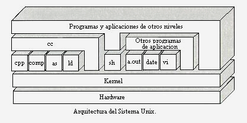
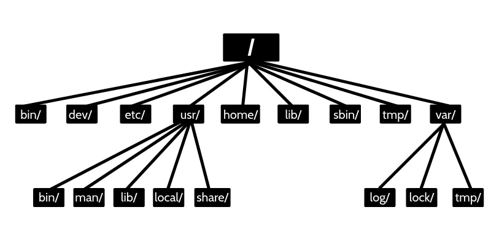

| **Inicio**         | **atrás 1**                                                   | **Siguiente 3**                                                      |
| ------------------ | ------------------------------------------------------------- | -------------------------------------------------------------------- |
| [🏠](../README.md) | [⏪](./7_1_Introduccion_a_la_Terminal_y_Linea_de_Comandos.md) | [⏩](./7_3_Administracion_de_Servidores_Linux_Manejo_de_Recursos.md) |

---

## **Índice**

| Temario                                                                                                              |
| -------------------------------------------------------------------------------------------------------------------- |
| [611. ¡Inicia en el mundo de los servidores Linux!](#611-inicia-en-el-mundo-de-los-servidores-linux)                 |
| [612. Habilidades y roles de un administrador](#612-habilidades-y-roles-de-un-administrador)                         |
| [613. ¿Qué son los servidores?](#613-qué-son-los-servidores)                                                         |
| [614. ¿Qué es un sistema Linux/UNIX?](#614-qué-es-un-sistema-linuxunix)                                              |
| [615. Arquitectura de un sistema UNIX/Linux](#615-arquitectura-de-un-sistema-unixlinux)                              |
| [616. Breve historia del software libre y el Open Source](#616-breve-historia-del-software-libre-y-el-open-source)   |
| [617. Sistemas operativos y distribuciones](#617-sistemas-operativos-y-distribuciones)                               |
| [618. ¿Dónde viven nuestros servidores?](#618-dónde-viven-nuestros-servidores)                                       |
| [619. Formas de montar un servidor](#619-formas-de-montar-un-servidor)                                               |
| [620. Instalación de VirtualBox](#620-instalación-de-virtualbox)                                                     |
| [621. Instalación de Ubuntu Server](#621-instalación-de-ubuntu-server)                                               |
| [622. Creando nuestra cuenta en RedHat y descargando RHEL](#622-creando-nuestra-cuenta-en-redhat-y-descargando-rhel) |
| [623. Instalación de RHEL](#623-instalación-de-rhel)                                                                 |
| [624. Configuración básica para un servidor remoto](#624-configuración-básica-para-un-servidor-remoto)               |
| [625. Sistemas de archivos y particionamiento](#625-sistemas-de-archivos-y-particionamiento)                         |
| [626. ¿Qué son los sistemas de archivos?](#626-qué-son-los-sistemas-de-archivos)                                     |
| [627. Particiones de un Servidor Linux](#627-particiones-de-un-servidor-linux)                                       |
| [628. Manejo de un archivo swap](#628-manejo-de-un-archivo-swap)                                                     |
| [629. Árbol de directorios](#629-árbol-de-directorios)                                                               |
| [630. Diferentes tipos de archivos](#630-diferentes-tipos-de-archivos)                                               |
| [631. Instalación y manejo de software](#631-instalación-y-manejo-de-software)                                       |
| [632. Conociendo los repositorios y paquetes](#632-conociendo-los-repositorios-y-paquetes)                           |
| [633. ¿Qué es un manejador de paquetes?](#633-qué-es-un-manejador-de-paquetes)                                       |
| [634. Aprende a usar el manejador de paquetes](#634-aprende-a-usar-el-manejador-de-paquetes)                         |
| [635. ¿Cómo instalar software?](#635-cómo-instalar-software)                                                         |
| [636. Manejo de repositorios a profundidad](#636-manejo-de-repositorios-a-profundidad)                               |
| [637. Procesos en Linux](#637-procesos-en-linux)                                                                     |
| [638. ¿Qué es un proceso en Linux?](#638-qué-es-un-proceso-en-linux)                                                 |
| [639. Escaneo de procesos](#639-escaneo-de-procesos)                                                                 |
| [640. Manejo de procesos](#640-manejo-de-procesos)                                                                   |
| [641. Creación y manejo de demonios](#641-creación-y-manejo-de-demonios)                                             |
| [642. Automatización de procesos con cron job](#642-automatización-de-procesos-con-cron-job)                         |

---

# **Introducción a la Administración de Servidores Linux**

## **611. ¡Inicia en el mundo de los servidores Linux!**

### 🌐 ¿Qué es un servidor Linux?

Un **servidor Linux** es simplemente una **computadora que ejecuta el sistema operativo Linux** y que está **configurada para ofrecer servicios** a otros dispositivos (como páginas web, archivos, bases de datos, etc.).

> 🎯 Piensa en un servidor como un restaurante y en Linux como el chef.
>
> Tú le das órdenes (comandos) y él te sirve la comida (respuestas/servicios).

---

### 🧠 ¿Por qué usar Linux en servidores?

Linux es el favorito para servidores por varias razones:

- 🆓 **Es gratis y de código abierto**.
- 🛡️ **Es seguro y estable** (ideal para mantener servicios activos 24/7).
- 🧩 Tiene **herramientas muy poderosas** para administración remota.
- 🌎 Es el sistema operativo **más usado en servidores web del mundo** (como Google, Facebook o Amazon).

---

### 🏁 Primeros pasos: ¿Cómo iniciar con servidores Linux?

#### 🔧 Opción 1: Simular un servidor en tu propia computadora usando WSL

Ideal si usas Windows. WSL te deja correr Linux dentro de Windows sin una máquina virtual.

> Ya aprendiste esto antes. Aquí solo activas Linux (como Ubuntu).

---

#### 🔧 Opción 2: Instalar una máquina virtual con VirtualBox

Puedes instalar Ubuntu Server como una máquina virtual. Así simulas un servidor real.

Pasos:

1. Instala [VirtualBox](https://www.virtualbox.org/)
2. Descarga la ISO de Ubuntu Server desde [ubuntu.com](https://ubuntu.com/download/server)
3. Crea una nueva máquina virtual y usa la ISO para instalar
4. Inicia sesión en modo consola (no hay escritorio)

---

#### 🔧 Opción 3: Rentar un servidor real (VPS)

Servicios como:

- [DigitalOcean](https://www.digitalocean.com/)
- [Linode](https://www.linode.com/)
- [AWS EC2](https://aws.amazon.com/ec2/)

Te dan acceso a un servidor Linux real en la nube por \$5 al mes o menos.

---

### 💻 Primeros comandos al iniciar sesión en un servidor

Cuando inicias sesión (en consola o por SSH), puedes usar estos comandos básicos:

| Comando            | ¿Para qué sirve?                    |
| ------------------ | ----------------------------------- |
| `pwd`              | Ver en qué carpeta estás            |
| `ls`               | Ver archivos/directorios            |
| `cd nombre`        | Entrar a un directorio              |
| `mkdir nombre`     | Crear una carpeta nueva             |
| `sudo apt update`  | Actualizar lista de paquetes        |
| `sudo apt upgrade` | Actualizar el sistema               |
| `sudo apt install` | Instalar programas (ej: nginx, git) |

---

### 📦 Servicios comunes que puedes instalar

| Servicio     | Descripción                       | Comando de instalación            |
| ------------ | --------------------------------- | --------------------------------- |
| **SSH**      | Conexión remota al servidor       | `sudo apt install openssh-server` |
| **Nginx**    | Servidor web                      | `sudo apt install nginx`          |
| **MySQL**    | Base de datos                     | `sudo apt install mysql-server`   |
| **UFW**      | Firewall para controlar puertos   | `sudo apt install ufw`            |
| **Fail2ban** | Protege contra intentos de ataque | `sudo apt install fail2ban`       |

---

### 🧪 EJEMPLO COMPLETO: Simulando un servidor web en tu PC con Ubuntu Server

#### 🎯 Objetivo:

Levantar un **servidor Linux Ubuntu** con **Nginx** que muestre una página web básica.

---

#### ✅ Paso 1: Instalar Ubuntu Server (en VirtualBox o WSL)

Si ya tienes WSL:

```bash
wsl --install -d Ubuntu
```

---

#### ✅ Paso 2: Actualizar el sistema

```bash
sudo apt update && sudo apt upgrade -y
```

---

#### ✅ Paso 3: Instalar el servidor web (Nginx)

```bash
sudo apt install nginx -y
```

---

#### ✅ Paso 4: Encender el servidor

```bash
sudo systemctl start nginx
```

Verifica que esté activo:

```bash
sudo systemctl status nginx
```

---

#### ✅ Paso 5: Ver la página web

Abre tu navegador y ve a:

```
http://localhost
```

Deberías ver la página de bienvenida de **Nginx**.

---

#### ✅ Paso 6: Cambiar el contenido web

Por defecto, los archivos del sitio están en:

```
/var/www/html
```

Edita el archivo principal:

```bash
sudo nano /var/www/html/index.html
```

Reemplaza su contenido por:

```html
<!DOCTYPE html>
<html>
  <head>
    <title>Mi primer servidor</title>
  </head>
  <body>
    <h1>¡Hola desde Linux Server!</h1>
  </body>
</html>
```

Guarda con `Ctrl + O` y `Ctrl + X`.

Actualiza el navegador: ¡verás tu página personalizada!

---

### 🎁 BONUS: Acceder a tu servidor desde otra PC (si usas red local o VPS)

Debes:

1. Abrir el puerto 80 (HTTP)
2. Usar la IP pública o local del servidor
3. Usar SSH si deseas administrarlo de forma remota

```bash
sudo ufw allow 80
sudo ufw enable
```

---

### 🧠 Conclusión

**Iniciar en el mundo de los servidores Linux** es aprender a usar una computadora como “motor” de servicios web, bases de datos, archivos, etc.

Puedes practicar desde casa con WSL o VirtualBox, y luego subir tus habilidades usando un servidor real en la nube.

---

[🔼](#índice)

---

## **612. Habilidades y roles de un administrador**

### 🧠 ¿Qué es un administrador de sistemas Linux?

Un **administrador de sistemas** (SysAdmin) es la persona encargada de **instalar, configurar, mantener y asegurar** los sistemas operativos y servicios que corren sobre un servidor (como sitios web, bases de datos, redes, etc.).

> 🎯 Piensa en él como el **“mecánico” de los servidores**. Si algo se rompe o debe mejorarse, él lo arregla o lo optimiza.

---

### 🧩 ¿Qué hace un administrador?

#### 📌 Principales **roles** de un administrador Linux:

| Rol                            | ¿Qué hace?                                                         |
| ------------------------------ | ------------------------------------------------------------------ |
| 🔧 Instalación y mantenimiento | Instala software y actualiza el sistema operativo.                 |
| 🔐 Seguridad del sistema       | Configura firewalls, usuarios, permisos y realiza backups.         |
| 🧰 Gestión de servicios        | Controla servidores web, bases de datos, DNS, correo, etc.         |
| 📦 Gestión de paquetes         | Instala y gestiona programas (como `nginx`, `mysql`, `ufw`, etc.). |
| 🕵️‍♂️ Monitorización              | Vigila el rendimiento, espacio, procesos y posibles errores.       |
| 👥 Gestión de usuarios         | Crea usuarios, asigna roles, modifica permisos y grupos.           |
| 🧑‍💻 Automatización              | Usa scripts Bash o herramientas como cron para tareas automáticas. |
| 🌐 Conectividad de red         | Configura IP, DNS, accesos remotos (SSH), puertos, etc.            |

---

### 🛠️ **Habilidades** que necesita un administrador

| Habilidad                  | Explicación                                                      |
| -------------------------- | ---------------------------------------------------------------- |
| ✅ Conocimiento en Linux   | Saber usar la terminal, comandos, permisos y servicios básicos.  |
| ✅ Redes y puertos         | Entender cómo funcionan IPs, DNS, puertos, firewalls, etc.       |
| ✅ Seguridad               | Saber proteger el sistema, limitar accesos y cifrar información. |
| ✅ Resolución de problemas | Saber leer logs y solucionar errores técnicos.                   |
| ✅ Automatización (Bash)   | Crear scripts para tareas repetitivas o programadas.             |
| ✅ Documentación           | Registrar configuraciones, procedimientos y manuales.            |
| ✅ Comunicación            | Coordinar con equipos de desarrollo o usuarios finales.          |

---

### 💡 Ejemplos de tareas reales que hace un administrador

| Tarea                                | Herramienta/comando usado                |
| ------------------------------------ | ---------------------------------------- |
| Instalar un servidor web             | `sudo apt install nginx`                 |
| Configurar el cortafuegos (firewall) | `sudo ufw allow 80`, `sudo ufw enable`   |
| Crear un nuevo usuario               | `sudo adduser juan`                      |
| Dar permisos específicos             | `chmod`, `chown`                         |
| Leer registros de errores            | `tail -f /var/log/syslog` o `journalctl` |
| Programar un respaldo diario         | Usar `cron` con un script `bash`         |
| Ver consumo de CPU y memoria         | `top`, `htop`, `free`, `df -h`           |
| Acceder a servidor remoto            | `ssh usuario@IP`                         |

---

### 🧪 EJEMPLO COMPLETO: Tareas típicas de un administrador

🎯 **Objetivo:** Simular un día típico de un SysAdmin, instalando un servicio, configurando seguridad y dejando todo operativo.

---

#### ✅ 1. Actualizar el servidor

```bash
sudo apt update && sudo apt upgrade -y
```

---

#### ✅ 2. Crear un nuevo usuario

```bash
sudo adduser gussdev
sudo usermod -aG sudo gussdev  # Le das permisos de administrador
```

---

#### ✅ 3. Instalar Nginx (servidor web)

```bash
sudo apt install nginx -y
sudo systemctl enable nginx
sudo systemctl start nginx
```

---

#### ✅ 4. Configurar el firewall (UFW)

```bash
sudo ufw allow OpenSSH     # Para conexión remota segura
sudo ufw allow 'Nginx Full'  # Permitir tráfico web
sudo ufw enable
```

---

#### ✅ 5. Crear un script de respaldo y automatizarlo

```bash
nano backup.sh
```

```bash
#!/bin/bash
tar -czf /home/gussdev/respaldo_home.tar.gz /home/gussdev
```

Hacerlo ejecutable:

```bash
chmod +x backup.sh
```

Programarlo para que corra todos los días a las 2:00 AM:

```bash
crontab -e
```

Agregar:

```bash
0 2 * * * /home/gussdev/backup.sh
```

---

#### ✅ 6. Monitorear el servidor

```bash
htop         # Ver procesos
df -h        # Ver espacio en disco
free -m      # Ver memoria disponible
uptime       # Tiempo de actividad
```

---

#### ✅ 7. Leer logs en tiempo real

```bash
tail -f /var/log/syslog
```

---

### 🧠 Conclusión

Un administrador Linux **no solo ejecuta comandos**, sino que:

- Entiende el sistema,
- Lo mantiene funcionando correctamente,
- Lo protege contra errores y ataques,
- Y deja todo documentado para su equipo o empresa.

---

[🔼](#índice)

---

## **613. ¿Qué son los servidores?**

### 🧠 ¿Qué es un servidor?

Un **servidor** es una **computadora (física o virtual)** que brinda servicios a otras computadoras, llamadas **clientes**, a través de una red (como Internet o una red local).

> 🎯 Piensa en el servidor como una “casa grande” con muchos cuartos (servicios) a la que varias personas (clientes) pueden entrar para usar lo que hay dentro: ver una página web, descargar un archivo, conectarse a una base de datos, etc.

---

#### 🔄 Diferencias clave entre **servidor** y **PC común**

| Característica    | PC de Escritorio 🖥️       | Servidor 🌐                            |
| ----------------- | ------------------------- | -------------------------------------- |
| Uso principal     | Navegar, trabajar, juegos | Ofrecer servicios a otros dispositivos |
| Siempre encendido | No                        | Sí, 24/7 (alta disponibilidad)         |
| Sistema operativo | Windows, macOS, Linux     | Mayormente Linux o Windows Server      |
| Control remoto    | Opcional                  | Esencial (SSH, RDP)                    |
| Hardware          | Normal                    | Potente y optimizado para cargas       |

---

### 🔧 Tipos comunes de servidores

| Tipo de servidor             | ¿Qué hace?                                        | Ejemplo en la vida real                 |
| ---------------------------- | ------------------------------------------------- | --------------------------------------- |
| 🌐 Servidor web              | Hospeda sitios web (HTML, CSS, JS)                | [www.google.com](http://www.google.com) |
| 📧 Servidor de correo        | Maneja el envío y recepción de correos            | Gmail, Outlook                          |
| 🛢️ Servidor de base de datos | Guarda y organiza información                     | MySQL, PostgreSQL, MongoDB              |
| 📁 Servidor de archivos      | Comparte carpetas y documentos entre computadoras | Google Drive, Dropbox (parte backend)   |
| 🕹️ Servidor de juegos        | Permite jugar en línea entre múltiples usuarios   | Minecraft Server, CS\:GO Server         |
| 🐧 Servidor SSH (Linux)      | Permite control remoto por terminal               | Administración de sistemas Linux        |

---

### 🚀 ¿Cómo tener un servidor?

Tienes 3 formas principales:

#### ✅ 1. Usar un servidor físico

Instalas Linux o Windows Server en una PC o laptop vieja y la configuras como servidor. Requiere electricidad, red, y algo de mantenimiento.

#### ✅ 2. Usar una **máquina virtual** (VirtualBox, VMware)

Ideal para prácticas. Simulas un servidor dentro de tu computadora con poco riesgo.

#### ✅ 3. Usar un servidor en la nube ☁️

Servicios como:

- [AWS](https://aws.amazon.com),
- [DigitalOcean](https://digitalocean.com),
- [Linode](https://linode.com),
- [Google Cloud](https://cloud.google.com),
- o incluso [Railway](https://railway.app), [Render](https://render.com).

Te dan acceso a un servidor Linux remoto por unos pocos dólares (o gratis con ciertas condiciones).

---

### 🧪 EJEMPLO COMPLETO: Crear tu primer servidor Linux con Ubuntu en DigitalOcean

Vamos a hacer un servidor que funcione 24/7 para practicar o desplegar una web.

---

#### ✅ Paso 1: Crear una cuenta

1. Ve a [https://digitalocean.com](https://digitalocean.com)
2. Regístrate (puedes usar tu cuenta de GitHub o Google).
3. Verifica tu correo y agrega un método de pago (algunas veces ofrecen crédito gratuito).

---

#### ✅ Paso 2: Crear tu Droplet (servidor)

1. Haz clic en "Create" > "Droplet".

2. Elige:

   - **Sistema operativo:** Ubuntu 22.04 LTS
   - **Plan:** Basic (el más barato, 1 GB RAM)
   - **Región:** Elige la más cercana a Perú (San Francisco o NY por ejemplo)
   - **Autenticación:** contraseña o clave SSH
   - **Nombre del servidor:** `servidor-prueba`

3. Haz clic en "Create Droplet".

---

#### ✅ Paso 3: Conectarte por SSH desde Windows

Abre tu terminal de WSL (por ejemplo Ubuntu en Windows):

```bash
ssh root@IP_DEL_SERVIDOR
```

Te pedirá aceptar la conexión y luego la contraseña.

> 💡 Si usaste clave SSH, te conectará automáticamente si configuraste bien.

---

#### ✅ Paso 4: Instalar y probar Nginx (servidor web)

```bash
sudo apt update && sudo apt install nginx -y
```

Habilitar y levantar el servidor web:

```bash
sudo systemctl enable nginx
sudo systemctl start nginx
```

Abre tu navegador y entra a `http://IP_DEL_SERVIDOR`. ¡Deberías ver la página de bienvenida de Nginx!

---

#### ✅ Paso 5: Asegurar con firewall

```bash
sudo ufw allow OpenSSH
sudo ufw allow 'Nginx Full'
sudo ufw enable
```

---

#### ✅ Paso 6: Crear una página web sencilla

```bash
sudo nano /var/www/html/index.html
```

Y escribe:

```html
<h1>¡Hola desde mi servidor Linux en la nube!</h1>
```

Guarda con `CTRL + O`, luego `Enter` y sal con `CTRL + X`.

---

### 🎉 ¡Listo!

Has creado y probado tu **primer servidor Linux real**. Puedes instalar servicios como Node.js, PHP, bases de datos, apps personales, paneles de administración, etc.

---

### 🧠 Conclusión

Un **servidor** es una computadora (física o virtual) que ofrece servicios a otras. Puede estar en tu casa, en una máquina virtual o en la nube.

Aprender a trabajar con servidores (especialmente Linux) te abre muchas puertas en:

- Desarrollo web
- Ciberseguridad
- Administración de sistemas
- DevOps y nube

---

[🔼](#índice)

---

## **614. ¿Qué es un sistema Linux/UNIX?**

### 🧠 ¿Qué es un sistema Linux/UNIX?

Un **sistema Linux o UNIX** es un **sistema operativo**. Es decir, es el programa más importante de una computadora, ya que se encarga de **controlar el hardware** (como la memoria, procesador, disco) y de **gestionar los programas** que el usuario ejecuta.

---

#### 🪪 Diferencias entre UNIX y Linux

| Característica  | UNIX                             | Linux                               |
| --------------- | -------------------------------- | ----------------------------------- |
| Año de creación | 1969 (Bell Labs)                 | 1991 (Linus Torvalds)               |
| Licencia        | Propietaria o comercial          | Libre y de código abierto (GPL)     |
| Ejemplos        | AIX, Solaris, HP-UX              | Ubuntu, Debian, Fedora, Arch Linux  |
| Uso             | Corporativo, servidores robustos | Personal, educativo, servidores web |

> 🧩 **Linux se inspiró en UNIX**, pero es un proyecto libre y más accesible. Ambos comparten muchas ideas, comandos y estructura de archivos.

---

#### 🧰 ¿Qué tiene un sistema Linux/UNIX?

- **Kernel:** el núcleo que se comunica con el hardware.
- **Shell:** la terminal donde escribimos comandos.
- **Sistema de archivos:** estructura jerárquica con `/` como raíz.
- **Utilidades básicas:** como `ls`, `cd`, `cp`, `mv`, `grep`, etc.
- **Gestor de paquetes:** para instalar software (por ejemplo `apt` o `yum`).

---

### 🚀 ¿Por qué usar Linux?

- Es **libre y gratuito**.
- Es **muy estable y rápido**.
- Es el estándar en **servidores y cloud computing**.
- Es ideal para **programación, hacking ético, y ciencia de datos**.
- Es **altamente personalizable**.

---

### 🖥️ Cómo instalar Linux (varias formas)

Tienes varias formas de instalar o usar Linux fácilmente, incluso sin eliminar Windows:

---

#### ✅ 1. **Usar WSL (Windows Subsystem for Linux)**

**Ideal si usas Windows 10/11.**

1. Abre PowerShell como administrador y ejecuta:

```powershell
wsl --install
```

2. Reinicia tu computadora.

3. Cuando se abra Ubuntu (u otra distro), crea tu usuario y contraseña.

> Ahora puedes usar Linux dentro de Windows desde tu terminal. ¡Sin máquinas virtuales!

---

#### ✅ 2. **Usar una máquina virtual (VirtualBox)**

**Ideal para pruebas completas.**

1. Descarga e instala [VirtualBox](https://www.virtualbox.org/).
2. Descarga una ISO de Linux, por ejemplo [Ubuntu Desktop](https://ubuntu.com/download/desktop).
3. Crea una nueva VM en VirtualBox, elige la ISO como disco de inicio.
4. Inicia y sigue los pasos del instalador.

---

#### ✅ 3. **Instalación real (dual boot)**

Puedes instalar Linux junto a Windows. Al encender la PC, eliges con cuál iniciar.

Esto requiere particionar el disco. No recomendado para principiantes, pero es muy útil si quieres hacer el cambio completo.

---

#### ✅ 4. **Usar Linux en la nube (DigitalOcean, AWS, etc.)**

Puedes crear un servidor Linux remoto al que accedes por SSH. Esto es común para proyectos web o pruebas en entornos reales.

---

### 📦 Algunas distribuciones Linux populares

| Distribución | Ideal para…                      | Gestor de paquetes |
| ------------ | -------------------------------- | ------------------ |
| Ubuntu       | Principiantes, servidores        | `apt`              |
| Debian       | Estabilidad, servidores          | `apt`              |
| Fedora       | Últimas tecnologías              | `dnf`              |
| Arch Linux   | Avanzados, personalización total | `pacman`           |
| Kali Linux   | Ciberseguridad y pentesting      | `apt`              |
| Linux Mint   | Usuarios que vienen de Windows   | `apt`              |

---

### 🧪 EJEMPLO COMPLETO: Primeros pasos con Ubuntu en WSL (Windows Subsystem for Linux)

#### 🎯 Objetivo

Instalar Ubuntu en Windows y crear una carpeta con un archivo de texto desde la terminal.

---

#### 🧱 Paso 1: Instalar WSL con Ubuntu

1. Abre PowerShell como administrador:

```powershell
wsl --install
```

2. Se instalará WSL y Ubuntu por defecto. Reinicia.

3. Aparecerá una ventana de Ubuntu. Espera y luego crea tu usuario y contraseña.

---

#### 🧱 Paso 2: Usar comandos básicos

1. Verifica dónde estás:

```bash
pwd
```

2. Crea una carpeta:

```bash
mkdir proyecto
```

3. Entra a la carpeta:

```bash
cd proyecto
```

4. Crea un archivo:

```bash
echo "Hola, esto es Linux en Windows" > saludo.txt
```

5. Muestra el contenido:

```bash
cat saludo.txt
```

> 🧠 ¡Acabas de crear y ver un archivo de texto usando comandos Linux desde Windows!

---

#### 🧱 Paso 3: Instalar software en Linux

Por ejemplo, instalar `htop`, un monitor de procesos:

```bash
sudo apt update
sudo apt install htop
htop
```

(Para salir de `htop`, presiona `q`)

---

### 🎉 Resumen

- **Linux/UNIX** es un sistema operativo robusto, estable y gratuito, ideal para programadores, sysadmins, devs y hackers éticos.
- Se puede usar en la nube, en máquinas virtuales o directamente desde Windows con **WSL**.
- Existen muchas distribuciones, siendo **Ubuntu** la más amigable para empezar.
- Puedes crear carpetas, archivos y administrar el sistema completamente desde la **terminal**.

---

[🔼](#índice)

---

## **615. Arquitectura de un sistema UNIX/Linux**



### 🧠 ¿Qué es la arquitectura de un sistema UNIX/Linux?

La **arquitectura de UNIX/Linux** se refiere a **cómo está organizado internamente** este sistema operativo: sus componentes principales y cómo trabajan juntos para ejecutar programas, comunicarse con el hardware, y servir a múltiples usuarios.

---

#### 🏛️ Partes principales de la arquitectura

```
+-----------------------------------------+
| Aplicaciones del usuario (comandos, GUI)|
+-------------------+---------------------+
|     Shell         |      Escritorio     |
+-------------------+---------------------+
|                Kernel                  |
+-----------------------------------------+
|       Drivers y acceso al hardware      |
+-----------------------------------------+
```

---

#### 1. **Hardware**

- El equipo físico: CPU, RAM, disco duro, teclado, monitor, etc.

---

#### 2. **Kernel (núcleo del sistema)**

- Es el **corazón del sistema operativo**.
- Controla todo lo que ocurre entre el hardware y el software.
- Maneja:

  - Gestión de procesos.
  - Gestión de memoria.
  - Acceso a dispositivos.
  - Seguridad.

💡 **Ejemplo:** Cuando tú haces `ls`, la terminal le pide al kernel que lea los archivos del disco y devuelva esa información.

---

#### 3. **Shell**

- Es el **intérprete de comandos**: un programa que recibe instrucciones que tú escribes (como `cd`, `ls`, `mkdir`) y las ejecuta.
- Hay varias shells: `bash`, `zsh`, `fish`, etc.

💡 **Ejemplo:** Tú escribes `mkdir prueba`, y el shell interpreta eso y le dice al kernel que cree un directorio.

---

#### 4. **Sistema de archivos**

- Es una **estructura jerárquica** (en forma de árbol).
- Todo empieza en `/` (raíz) y de ahí cuelgan carpetas como:

  - `/home` → Carpetas de usuarios.
  - `/etc` → Archivos de configuración.
  - `/bin` → Comandos básicos.
  - `/var` → Archivos variables (logs, correos).
  - `/usr` → Programas de usuario y librerías.

💡 **Ejemplo:** Cuando instalas algo con `sudo apt install`, se crean archivos en `/usr/bin` o `/etc`.

---

#### 5. **Utilidades del sistema (comandos básicos)**

- Conjunto de programas que permiten al usuario interactuar con el sistema:

  - `ls`, `cd`, `cp`, `mv`, `top`, `ps`, `kill`, etc.
  - Estas herramientas son **binarios** que viven en carpetas como `/bin` o `/usr/bin`.

---

#### 6. **Aplicaciones de usuario**

- Software como navegadores, editores de texto, servicios web, etc.

---

### 🧰 ¿Cómo "instalo" o veo esta arquitectura?

Si estás usando Linux (por ejemplo, Ubuntu con WSL, máquina virtual o servidor), **ya tienes toda esta arquitectura instalada y funcionando**. No hay que instalarla manualmente porque forma parte del sistema operativo.

Pero puedes **ver y explorar** cada parte con comandos:

---

#### 🔍 Comprobando partes de la arquitectura

```bash
uname -a             # Ver información del kernel
echo $SHELL          # Ver qué shell estás usando
ls /                 # Ver carpetas raíz del sistema
ls /bin              # Ver comandos básicos disponibles
ps aux               # Ver procesos corriendo
```

---

### 🧪 EJEMPLO PRÁCTICO COMPLETO: Explorando la arquitectura de Linux desde la terminal

#### 🎯 Objetivo

Entender visualmente los componentes clave: kernel, shell, sistema de archivos, y utilidades.

---

#### ✅ PASO 1: Conocer el kernel y tu shell

```bash
uname -r          # Muestra la versión del kernel
echo $SHELL       # Muestra el intérprete de comandos actual (por ejemplo: /bin/bash)
```

---

#### ✅ PASO 2: Ver el sistema de archivos

```bash
ls /              # Muestra las carpetas raíz del sistema
tree -L 2 /       # Muestra el árbol de carpetas (si tienes instalado `tree`)
```

> Si no tienes `tree`, instálalo con:

```bash
sudo apt update
sudo apt install tree
```

---

#### ✅ PASO 3: Ver comandos que forman parte del sistema

```bash
ls /bin           # Comandos básicos que el sistema necesita para arrancar
ls /usr/bin       # Comandos más avanzados e instalados por el usuario
```

---

#### ✅ PASO 4: Ver procesos y cómo el kernel los gestiona

```bash
ps aux            # Ver todos los procesos en ejecución
top               # Monitor en tiempo real (sal con `q`)
```

---

#### ✅ PASO 5: Probar la Shell ejecutando comandos

```bash
cd ~              # Ir a tu carpeta personal
mkdir arquitectura-linux
cd arquitectura-linux
echo "Hola desde el Shell" > ejemplo.txt
cat ejemplo.txt
```

---

### 🧠 Conclusión

La arquitectura de un sistema UNIX/Linux tiene **capas bien definidas**:

- El **hardware** en la base.
- El **kernel** se comunica con él.
- El **shell** es la interfaz para ti.
- El **sistema de archivos** organiza todo.
- Las **utilidades** permiten que tú interactúes.
- Y tú usas **comandos o programas** para trabajar.

Y lo mejor: puedes **verla y entenderla desde la terminal**.

---

[🔼](#índice)

---

## **616. Breve historia del software libre y el Open Source**

### 📜 Breve historia del Software Libre y el Open Source

#### 🧠 ¿Qué es el Software Libre?

El **Software Libre** es aquel que **respeta la libertad de los usuarios**. Según la Free Software Foundation (FSF), un programa es libre si cumple **estas 4 libertades**:

1. **Libertad 0:** Usar el programa con cualquier propósito.
2. **Libertad 1:** Estudiar cómo funciona y adaptarlo a tus necesidades (requiere acceso al código fuente).
3. **Libertad 2:** Redistribuir copias.
4. **Libertad 3:** Mejorar el programa y compartir las mejoras.

🔓 **Ejemplo:** Puedes descargar el sistema operativo **GNU/Linux**, estudiarlo, modificarlo y compartir tu versión sin pagar.

---

#### 💡 ¿Y qué es el Open Source?

**Open Source** (código abierto) es muy parecido, pero su enfoque es más **práctico que filosófico**. Se enfoca en los **beneficios del desarrollo colaborativo** y en la **calidad del código**, no tanto en la libertad.

Ambos términos suelen usarse como sinónimos, aunque tienen raíces distintas:

- **Software Libre** nace del movimiento ético/político.
- **Open Source** nace del lado técnico/comercial.

🔧 **Ejemplo:** El navegador web **Mozilla Firefox** es Open Source: cualquiera puede ver su código, modificarlo y colaborar en su desarrollo.

---

### 🕰️ Breve historia

#### 1. **Años 60–70: El software era libre por defecto**

- En las primeras computadoras, el software venía **con el código fuente abierto**, ya que las universidades y centros de investigación compartían libremente sus programas.

---

#### 2. **Años 80: El software empieza a volverse cerrado**

- Las empresas (como Microsoft) comienzan a **cerrar el código fuente** y vender software sin permitir modificarlo.

---

#### 3. **1983: Richard Stallman y el Proyecto GNU**

- Richard Stallman lanza el **Proyecto GNU** para crear un sistema operativo completamente libre.
- En 1985 funda la **Free Software Foundation (FSF)**.

✅ Se crean herramientas clave: `gcc` (compilador), `bash` (shell), `glibc` (biblioteca estándar).

---

#### 4. **1991: Nace Linux**

- **Linus Torvalds** crea el núcleo Linux y lo libera como Open Source.
- Linux se combina con GNU y nace el **sistema operativo GNU/Linux**.

---

#### 5. **1998: Nace el movimiento Open Source**

- Se crea la **Open Source Initiative (OSI)** para promover el código abierto de forma menos política.
- Se crea el término “Open Source” para atraer empresas.

---

#### 6. **Hoy en día**

- Grandes empresas (como Google, Meta, Microsoft) **usan y crean software libre**.
- Proyectos como **Python, Git, Firefox, Ubuntu, VLC** son libres y Open Source.
- Existen millones de contribuyentes y comunidades en GitHub, GitLab, etc.

---

### 🔧 ¿Cómo se “instala” o se usa?

No necesitas "instalar" el software libre como tal, **sino buscar y usar programas que sean libres o de código abierto**.

#### 🔍 ¿Dónde buscar?

- **Linux:** Muchos programas en distribuciones como Ubuntu, Debian, Fedora, etc. son libres.
- **Repositorio GitHub:** [https://github.com](https://github.com)
- **Alternativas libres:**

  - Photoshop → **GIMP**
  - Microsoft Office → **LibreOffice**
  - Windows → **Ubuntu/Linux Mint/Debian**
  - Zoom → **Jitsi Meet**
  - WhatsApp → **Signal**

---

### 🧪 EJEMPLO PRÁCTICO COMPLETO

#### 🎯 Objetivo:

Instalar un programa **libre y Open Source** usando la terminal en Linux.

---

#### ✅ Paso 1: Actualizar los repositorios

```bash
sudo apt update
```

---

#### ✅ Paso 2: Instalar un programa libre — ejemplo: GIMP

```bash
sudo apt install gimp
```

🖌️ **GIMP** es un editor de imágenes libre y potente, alternativa a Photoshop.

---

#### ✅ Paso 3: Usar el programa

Abre el menú de aplicaciones y escribe `GIMP`, o ejecuta desde terminal:

```bash
gimp
```

¡Y listo! Estás usando **software libre** creado por la comunidad.

---

### 🎁 Otro ejemplo: Ver el código fuente de un programa libre

```bash
sudo apt install sl  # Un programa divertido que muestra un tren al escribir "sl"
apt source sl        # Descarga el código fuente del programa "sl"
cd sl-*/             # Entra a la carpeta
ls                   # Ver los archivos fuente en C
cat sl.c             # Leer el código fuente
```

---

### ✅ Conclusión

| Concepto       | Significado                                                              |
| -------------- | ------------------------------------------------------------------------ |
| Software libre | Libertad de usar, modificar, estudiar y compartir el software.           |
| Open Source    | Código abierto que promueve el desarrollo colaborativo y de calidad.     |
| Ejemplo        | Linux, Firefox, LibreOffice, GIMP, Git, VLC, etc.                        |
| Cómo usarlo    | Instálalo desde los repositorios, descarga desde GitHub, o compílalo tú. |

---

[🔼](#índice)

---

## **617. Sistemas operativos y distribuciones**

### 🧠 ¿Qué es un sistema operativo?

Un **sistema operativo (SO)** es un programa fundamental que permite que tú (el usuario) interactúes con el hardware (la computadora). Es como un **traductor** entre el usuario y la máquina.

#### 📦 El sistema operativo:

- **Administra recursos**: CPU, memoria, disco, dispositivos, etc.
- **Coordina programas**: como navegadores, editores de texto o videojuegos.
- **Proporciona una interfaz**: ya sea gráfica (ventanas) o de texto (terminal).

---

### 🎯 Ejemplos de sistemas operativos

| Sistema Operativo | Interfaz        | Fabricante | ¿Libre?               |
| ----------------- | --------------- | ---------- | --------------------- |
| Windows           | Gráfica         | Microsoft  | ❌ No                 |
| macOS             | Gráfica         | Apple      | ❌ No                 |
| **Linux**         | Gráfica / Texto | Comunidad  | ✅ Sí                 |
| Android           | Gráfica (móvil) | Google     | 🔶 Parcialmente libre |
| FreeBSD           | Texto / Gráfica | Comunidad  | ✅ Sí                 |

---

### 🧪 ¿Qué es una distribución de Linux?

Linux **no es un sistema operativo completo por sí solo**. Lo que creó Linus Torvalds fue el **núcleo Linux** (el corazón del SO). Para ser útil, ese núcleo se combina con herramientas, escritorios, configuraciones, etc.

Estas combinaciones se llaman **distribuciones** (o distros).

#### 📦 ¿Qué es una distro?

Una **distribución de Linux** es un **sistema operativo completo** que incluye:

- Núcleo Linux
- Paquetes y programas
- Gestor de software
- Interfaz gráfica
- Soporte de hardware

---

### 🌱 Ejemplos de distribuciones de Linux

| Distribución   | Ideal para...                       | Características principales                   |
| -------------- | ----------------------------------- | --------------------------------------------- |
| **Ubuntu**     | Principiantes                       | Amigable, comunidad grande, muchos tutoriales |
| **Linux Mint** | Principiantes que venían de Windows | Muy fácil, apariencia similar a Windows       |
| **Debian**     | Avanzados                           | Estable, usada como base de muchas otras      |
| **Arch Linux** | Expertos                            | Configuración desde cero, muy flexible        |
| **Kali Linux** | Ciberseguridad                      | Viene con herramientas para hacking ético     |
| **Pop!\_OS**   | Usuarios de laptops/potencia        | Moderna, perfecta para programadores          |

---

### 💻 ¿Cómo se instala una distribución de Linux?

#### ✅ Paso 1: Descargar una imagen ISO

Ve a la página oficial. Ejemplo:

🔗 [https://ubuntu.com/download](https://ubuntu.com/download)

Descarga el archivo `.iso`.

---

#### ✅ Paso 2: Crear un USB booteable

Necesitas grabar el `.iso` en una memoria USB.

##### 🔧 Herramientas:

- **Windows:** usa [Rufus](https://rufus.ie)
- **Linux/macOS:** puedes usar `balenaEtcher` o el comando `dd`

##### En Windows con Rufus:

1. Abre Rufus
2. Selecciona tu USB
3. Carga la imagen `.iso`
4. Haz clic en "Iniciar"

---

#### ✅ Paso 3: Iniciar desde el USB

1. Reinicia tu PC
2. Entra al menú de arranque (generalmente con F12, F2, ESC o DEL)
3. Elige tu USB
4. Aparece el instalador de Linux

---

#### ✅ Paso 4: Instalar Linux

Sigue el asistente:

- Elige idioma
- Decide si quieres **borrar todo e instalar Linux** o **instalar junto a Windows**
- Configura tu zona horaria, nombre de usuario, contraseña

💡 Puedes **probar la distro** sin instalarla usando el modo "Live".

---

### 📦 EJEMPLO COMPLETO: Instalar Linux Mint (ideal para principiantes)

#### 🔹 Requisitos:

- Memoria USB de 4GB o más
- PC compatible

#### 🔹 Pasos:

1. Ir a [https://linuxmint.com](https://linuxmint.com)
2. Descargar la ISO (Cinnamon edition recomendada)
3. Crear USB booteable con Rufus
4. Reiniciar el equipo y arrancar desde el USB
5. Probar Linux Mint o dar clic en “Install Linux Mint”
6. Seguir los pasos del instalador (puedes borrar todo si es tu única SO o instalar junto a Windows)

Después del reinicio, tendrás un **sistema Linux completo, libre y funcional**, con navegador, gestor de archivos, editor de texto, calculadora y más.

---

### 🤖 Usar Linux por primera vez

Abres la terminal con:

```bash
Ctrl + Alt + T
```

Y puedes comenzar a practicar comandos como:

```bash
ls        # Ver archivos
cd        # Moverte entre carpetas
sudo apt update   # Actualizar el sistema
```

---

### 🧠 Conclusión

| Concepto             | Explicación clara                                         |
| -------------------- | --------------------------------------------------------- |
| Sistema operativo    | Intermediario entre el usuario y el hardware              |
| Distribución (Linux) | Sistema Linux completo con entorno gráfico y paquetes     |
| Instalación          | Descargar ISO → Crear USB → Bootear → Instalar            |
| Ejemplo práctico     | Usar Rufus y Linux Mint para tener un sistema Linux libre |

---

[🔼](#índice)

---

## **618. ¿Dónde viven nuestros servidores?**

### 🧠 En términos simples:

> Un servidor **“vive”** en un lugar físico o virtual donde puede estar **siempre encendido, disponible, conectado a Internet** y capaz de responder a solicitudes de otros dispositivos (clientes).

---

### 📦 Tipos de lugar donde pueden vivir los servidores

| Tipo de alojamiento                   | ¿Qué es?                                                                                        | Ejemplo                              |
| ------------------------------------- | ----------------------------------------------------------------------------------------------- | ------------------------------------ |
| 🏠 **Local (on-premise)**             | El servidor está **físicamente en tu casa, oficina o empresa**.                                 | Una PC configurada como servidor web |
| ☁️ **Nube (cloud)**                   | El servidor está en **infraestructura de otra empresa (como Amazon, Google, Microsoft, etc.)**. | AWS EC2, Google Cloud VM             |
| 🧱 **Centro de datos**                | Grandes salas llenas de servidores, con control de clima, seguridad, etc.                       | Empresas que alquilan servidores     |
| 🖥️ **VPS (Servidor Privado Virtual)** | Una porción virtual de un servidor físico.                                                      | DigitalOcean, Linode                 |
| 💻 **Contenedor o instancia efímera** | Servidor ligero que vive temporalmente dentro de otra infraestructura.                          | Docker, Heroku, Vercel               |

---

### 🧱 1. **Servidores físicos (on-premise)**

Un servidor físico es una **computadora que actúa como servidor**.

#### Ejemplo:

- En una empresa pequeña, tienen una PC con Ubuntu Server conectada todo el día, que guarda archivos o corre un sitio web interno.

✅ Ventajas:

- Control total
- No pagas mensualmente

❌ Desventajas:

- Debes mantenerlo (electricidad, red, seguridad)
- Si se apaga, tu servicio se cae

---

### ☁️ 2. **Servidores en la nube (Cloud)**

Tus servidores **viven en centros de datos de empresas como**:

- Amazon Web Services (AWS)
- Microsoft Azure
- Google Cloud Platform (GCP)

Pagas por lo que usas. Por ejemplo, puedes tener un servidor virtual en AWS que vive en Virginia (EE.UU.) o São Paulo (Brasil).

✅ Ventajas:

- Escalable, confiable, profesional
- Puedes crear o eliminar servidores en minutos

❌ Desventajas:

- Pagas mensualmente
- Necesitas aprender la plataforma

---

### 📦 3. **VPS (Servidor Privado Virtual)**

Un VPS es como **alquilar una porción de un servidor grande**. Es más barato que un servidor dedicado.

🏢 Empresas como:

- DigitalOcean
- Linode
- Vultr

Te dan acceso root (como si fuera tu propia máquina).

---

### 🧪 ¿Cómo se instala un servidor en la nube?

#### Ejemplo en DigitalOcean (muy popular):

1. Crea una cuenta en [https://digitalocean.com](https://digitalocean.com)
2. Eliges una distribución (como Ubuntu Server 22.04)
3. Seleccionas la región donde vivirá tu servidor (por ejemplo: Nueva York, Ámsterdam)
4. Presionas “Create Droplet”
5. En menos de 60 segundos, tienes un servidor corriendo

Te da una IP pública como: `178.62.56.99`

Ahora puedes conectarte por SSH:

```bash
ssh root@178.62.56.99
```

---

### 📌 ¿Dónde viven los servidores más comunes?

| Tipo de servidor  | ¿Dónde suele vivir?          | Ejemplo                     |
| ----------------- | ---------------------------- | --------------------------- |
| Sitios web        | Nube (AWS, Vercel, etc)      | `https://midominio.com`     |
| Archivos internos | Servidor local (empresa)     | Carpeta compartida          |
| Videojuegos       | Servidores dedicados / cloud | Minecraft en AWS            |
| API REST          | VPS o contenedor (Docker)    | Node.js API en DigitalOcean |

---

### 🧩 EJEMPLO COMPLETO: Crear un servidor Linux en la nube y subir un sitio web

#### Objetivo: Tener un servidor “viviendo” en la nube que sirva una página web.

##### Requisitos:

- Cuenta gratuita en [https://render.com](https://render.com) o [https://vercel.com](https://vercel.com)
- Un proyecto web (puede ser HTML estático)

##### Pasos con Render:

1. Sube tu proyecto a GitHub
2. Entra a [https://render.com](https://render.com)
3. Crea una cuenta
4. En “New Web Service”, conecta tu GitHub
5. Selecciona:

   - **Build Command**: si es HTML, deja en blanco
   - **Start Command**: si no aplica, deja vacío
   - **Region**: USA o Europa (ahí vivirá tu servidor)

6. ¡Listo! Render creará un servidor web que vive en la nube y te da una URL.

---

### 🧠 Resumen

| Concepto                     | Explicación breve                                |
| ---------------------------- | ------------------------------------------------ |
| ¿Dónde viven los servidores? | En tu casa, empresa, o la nube                   |
| ¿Qué es la nube?             | Centros de datos remotos                         |
| ¿Qué es un VPS?              | Servidor virtual alquilado                       |
| ¿Cómo creo uno?              | Usas plataformas como DigitalOcean, AWS o Render |
| ¿Qué dirección tienen?       | Una IP pública o dominio web                     |

---

[🔼](#índice)

---

## **619. Formas de montar un servidor**

### 🧠 ¿Qué significa “montar un servidor”?

Montar un servidor significa:

> **Preparar una computadora o instancia en la nube para que brinde un servicio**, como mostrar una página web, manejar una base de datos, permitir descargas de archivos, enviar correos, etc.

---

### 🏗️ FORMAS DE MONTAR UN SERVIDOR

Hay muchas formas de montar un servidor, y cada una se adapta a distintas necesidades. Vamos de lo más básico a lo más profesional:

| Método                                     | ¿Qué es?                       | ¿Para quién es ideal?                      |
| ------------------------------------------ | ------------------------------ | ------------------------------------------ |
| 🖥️ Servidor local (tu PC)                  | Usas tu propia computadora     | Estudiantes, pruebas                       |
| 💻 Máquina virtual (VirtualBox/VMware)     | Un Linux dentro de tu PC       | Para practicar Linux                       |
| 🐧 WSL en Windows                          | Linux dentro de Windows        | Usuarios de Windows que quieren usar Linux |
| ☁️ Nube (Cloud: AWS, DigitalOcean, Render) | Computadoras en internet       | Sitios web públicos, apps reales           |
| 📦 Docker                                  | Contenedores ligeros para apps | DevOps, backend modernos                   |
| 🧱 Raspberry Pi                            | Mini servidor físico           | Hobbistas, proyectos caseros               |

---

### 📌 1. MONTAJE LOCAL EN TU PC

#### ¿Qué necesitas?

- Tener instalado Linux (o usar WSL en Windows)
- Acceso a la terminal

#### Ejemplo: montar un servidor web local

```bash
sudo apt update
sudo apt install apache2 -y
```

Luego abres tu navegador y vas a:
➡️ `http://localhost`

Verás la página de bienvenida de Apache. Ya tienes un servidor web **funcionando en tu propia máquina**.

---

### 📌 2. MONTAJE CON MÁQUINA VIRTUAL

#### ¿Qué necesitas?

- Instalar VirtualBox (gratis)
- Descargar una imagen ISO de Ubuntu Server
- Crear una máquina virtual con 1–2 GB de RAM

Con eso puedes tener un servidor “falso” para practicar todo sin afectar tu sistema principal.

---

### 📌 3. MONTAJE EN WSL (Windows Subsystem for Linux)

```bash
wsl --install
```

Luego instalas Ubuntu y puedes correr comandos Linux como si fuera una distro real.

Ideal para desarrollar con Node.js, Python, etc.
Puedes correr tu propio servidor web desde WSL con:

```bash
python3 -m http.server 8000
```

Y verlo desde tu navegador:
➡️ `http://localhost:8000`

---

### 📌 4. MONTAJE EN LA NUBE

#### OPCIÓN GRATUITA: Render

1. Entra a [https://render.com](https://render.com)
2. Conéctate con tu cuenta de GitHub
3. Crea un nuevo Web Service
4. Elige el repositorio donde está tu app (puede ser HTML o Node.js)
5. Render monta tu servidor automáticamente y te da una URL pública como:
   `https://mi-app.onrender.com`

---

### 📌 5. MONTAJE CON VPS (Servidor Virtual Privado)

Ejemplo con DigitalOcean:

1. Crea cuenta en [https://digitalocean.com](https://digitalocean.com)
2. Crea un **Droplet** con Ubuntu Server
3. Recibes una IP pública
4. Conéctate por SSH:

```bash
ssh root@192.0.2.10
```

5. Instalas un servidor:

```bash
sudo apt update
sudo apt install nginx -y
```

6. Visita la IP en el navegador y ¡listo!

---

### 📌 6. MONTAJE CON DOCKER

```bash
docker run -d -p 8080:80 nginx
```

Esto crea un servidor web NGINX dentro de un contenedor.
Puedes entrar a `http://localhost:8080` para ver el servidor.

Ideal para ambientes profesionales con microservicios.

---

### 🧩 EJEMPLO COMPLETO: Montar un servidor web gratuito con Render

#### Paso 1: Crear tu proyecto

```bash
mkdir mi-servidor
cd mi-servidor
echo "<h1>Hola Mundo desde la nube</h1>" > index.html
```

Sube este proyecto a GitHub.

#### Paso 2: Usar Render

1. Entra a [https://render.com](https://render.com)
2. Inicia sesión con tu GitHub
3. Haz clic en **New Static Site**
4. Elige el repositorio con tu `index.html`
5. Dale un nombre al sitio
6. ¡Listo! Render te da un dominio como:

```
https://mi-servidor.onrender.com
```

---

### 🧠 RESUMEN VISUAL

| Forma de montar    | Fácil | Gratuito | Profesional | ¿Sirve en producción?         |
| ------------------ | ----- | -------- | ----------- | ----------------------------- |
| Local (PC)         | ✅    | ✅       | ❌          | No, es solo local             |
| Máquina virtual    | ✅    | ✅       | ❌          | No                            |
| WSL                | ✅    | ✅       | ❌          | No                            |
| Render (nube)      | ✅✅  | ✅✅     | ✅          | Sí, ideal para apps estáticas |
| VPS (DigitalOcean) | ❌    | ❌       | ✅✅        | Sí                            |
| Docker             | ❌    | ✅       | ✅✅✅      | Sí                            |

---

[🔼](#índice)

---

## **620. Instalación de VirtualBox**

### 🧠 ¿Qué es VirtualBox?

**VirtualBox** es un programa gratuito que te permite **crear y ejecutar máquinas virtuales** (VMs) en tu computadora.

> Una máquina virtual es como tener otra computadora dentro de tu computadora. Puedes instalar sistemas operativos como Linux, Windows, BSD, etc., y probar software o practicar sin afectar tu sistema principal.

---

### 🎯 ¿Por qué usar VirtualBox?

✅ Aprender Linux sin dañar tu Windows

✅ Probar configuraciones de servidores (Apache, Nginx, MySQL, etc.)

✅ Tener un entorno aislado para practicar ciberseguridad

✅ Simular una red o varios servidores

✅ Desarrollar y probar apps en distintas plataformas

---

### 🛠️ Requisitos

| Requisito  | Mínimo recomendado                                   |
| ---------- | ---------------------------------------------------- |
| RAM        | 4 GB (mejor si tienes 8 GB o más)                    |
| Disco duro | Al menos 20 GB libres                                |
| Procesador | Que tenga soporte para virtualización (VT-x o AMD-V) |

Puedes verificar si tu PC tiene la virtualización activada desde la BIOS o UEFI.

---

### 📦 PASOS PARA INSTALAR VIRTUALBOX

#### 🔽 Paso 1: Descargar VirtualBox

1. Ve a la página oficial:

   👉 [https://www.virtualbox.org](https://www.virtualbox.org)

2. Haz clic en “**Downloads**”

3. Descarga la versión según tu sistema:

- **Windows hosts** → para Windows
- **OS X hosts** → para macOS
- **Linux distributions** → para Ubuntu/Debian/Fedora, etc.

---

#### 💻 Paso 2: Instalar en Windows (ejemplo)

1. Ejecuta el archivo `.exe` que descargaste.
2. Acepta las opciones por defecto (puedes dejar las casillas marcadas).
3. Aparecerá un aviso de que puede reiniciar la red temporalmente → Acepta.
4. Presiona **Install**.
5. Espera unos minutos y haz clic en **Finish**.

¡Listo! Ya tienes instalado VirtualBox.

---

### 📥 Paso 3: Descargar un sistema operativo (ejemplo: Ubuntu Server)

Vamos a instalar **Ubuntu Server** (sin entorno gráfico), ideal para practicar comandos, servidores, etc.

1. Ir a:

   👉 [https://ubuntu.com/download/server](https://ubuntu.com/download/server)

2. Descarga la ISO de Ubuntu Server (por ejemplo, 22.04 LTS).

---

### 🧪 PASO A PASO: Crear una máquina virtual en VirtualBox

1. Abre VirtualBox
2. Haz clic en **Nueva**
3. Configura:

| Campo   | Valor recomendado |
| ------- | ----------------- |
| Nombre  | Ubuntu Server     |
| Tipo    | Linux             |
| Versión | Ubuntu (64-bit)   |

4. Asigna memoria RAM: **al menos 2048 MB (2 GB)**
5. Crea un disco duro virtual (VDI) → **20 GB mínimo**
6. Usa disco en modo **almacenamiento dinámico**

---

### 📤 Paso 4: Montar la ISO e instalar Ubuntu

1. Selecciona tu VM → Haz clic en **Configuración**
2. Ve a **Almacenamiento** → selecciona el **Disco vacío**
3. Haz clic en el ícono del CD → **Elegir un archivo de disco** → selecciona el `.iso` de Ubuntu Server que descargaste.
4. Inicia la máquina virtual

---

### 🧩 EJEMPLO COMPLETO FUNCIONAL: Instalar Ubuntu Server en VirtualBox

Cuando la VM arranca desde la ISO:

#### ✅ Pasos dentro de la instalación:

1. Selecciona el idioma: `Español`

2. Región: `Perú` o tu país

3. Tipo de teclado: `Español Latinoamericano`

4. Nombre del host: `ubuntu-vm`

5. Crear usuario:

   - Nombre: `gustavo`
   - Nombre del servidor: `server-prueba`
   - Contraseña: `********`

6. Puedes dejar el disco por defecto y decirle que lo use todo.

7. Espera a que termine la instalación y reinicia la máquina.

---

### 📦 Tu primer servidor funcional

Cuando reinicias, verás:

```
Ubuntu 22.04 LTS ubuntu-vm tty1

ubuntu-vm login: gustavo
Password: ******
```

Ya puedes usar comandos como:

```bash
sudo apt update
sudo apt install apache2 -y
```

Y has montado un servidor **real y funcional** en tu PC, aislado del resto del sistema.

---

### 🧠 CONCLUSIÓN

**VirtualBox** es una herramienta muy poderosa para:

- Aprender Linux sin necesidad de formatear
- Montar servidores web, base de datos, etc.
- Practicar administración de sistemas y ciberseguridad
- Crear entornos de prueba para tus proyectos

---

[🔼](#índice)

---

## **621. Instalación de Ubuntu Server**

### 🧠 ¿Qué es Ubuntu Server?

**Ubuntu Server** es una versión del sistema operativo Ubuntu **sin entorno gráfico** (sin ventanas ni íconos) diseñada para usarse en **servidores**. Es más liviana y estable que la versión de escritorio, y se usa para cosas como:

- Servidores web (Apache, Nginx)
- Servidores de archivos
- Servidores de bases de datos (MySQL, PostgreSQL)
- Aplicaciones en la nube
- Servidores caseros o empresariales

---

### ✅ ¿Por qué instalar Ubuntu Server?

| Ventaja                   | Explicación fácil                                    |
| ------------------------- | ---------------------------------------------------- |
| 🎯 Ligero                 | No tiene escritorio, consume menos RAM               |
| 🔐 Seguro                 | Ideal para servidores, recibe parches constantes     |
| ⚙️ Personalizable         | Tú eliges qué instalar                               |
| 🧠 Perfecto para aprender | Ideal para aprender comandos, administración y redes |

---

### 🛠️ Requisitos mínimos

| Recurso    | Recomendado mínimo               |
| ---------- | -------------------------------- |
| RAM        | 1 GB (mejor si tienes 2 o más)   |
| Disco duro | 8 GB (mínimo 20 GB recomendados) |
| Procesador | 1 GHz o superior (x86_64)        |

---

### 🧩 OPCIONES DE INSTALACIÓN

1. 🔁 **En una máquina virtual (VirtualBox o VMware)** → _Lo más recomendable para aprender y practicar sin riesgos_
2. 💻 **En una PC real** → Ideal si vas a usar una computadora solo como servidor
3. ☁️ **En la nube (DigitalOcean, AWS, etc.)** → Para servidores remotos (más avanzado)

---

### 📥 DESCARGA DE UBUNTU SERVER

1. Ve a [https://ubuntu.com/download/server](https://ubuntu.com/download/server)
2. Haz clic en **Ubuntu Server 22.04 LTS** (versión estable con soporte hasta 2032)
3. Descarga el archivo `.iso` (\~1 GB)

---

### 💻 INSTALACIÓN EN VIRTUALBOX (PASO A PASO)

#### Paso 1: Crear la máquina virtual

1. Abre VirtualBox → clic en **Nueva**
2. Nombre: `ubuntu-server`
3. Tipo: `Linux`
4. Versión: `Ubuntu (64-bit)`
5. RAM: al menos **2048 MB**
6. Disco duro virtual: **20 GB o más**, VDI, almacenamiento dinámico

---

#### Paso 2: Cargar la imagen ISO

1. Selecciona la VM → clic en **Configuración**
2. Ve a **Almacenamiento**
3. En “Controlador IDE” → selecciona el disco vacío → clic en el ícono del CD → “**Elegir un archivo de disco**”
4. Selecciona la imagen `.iso` que descargaste
5. Guarda los cambios

---

#### Paso 3: Iniciar e instalar Ubuntu Server

1. Inicia la VM
2. Aparecerá el instalador de Ubuntu Server

---

### 🧰 PASOS DENTRO DEL INSTALADOR

#### Paso a paso en pantalla:

| Pantalla                | Qué hacer                                                    |
| ----------------------- | ------------------------------------------------------------ |
| Selecciona el idioma    | Español (o el que prefieras)                                 |
| Disposición del teclado | Español Latinoamericano                                      |
| Tipo de instalación     | Instalar Ubuntu Server                                       |
| Conexión de red         | Automática o configurar manualmente                          |
| Proxy                   | Dejar vacío si no usas uno                                   |
| Espejo de Ubuntu        | Dejar por defecto                                            |
| Particionado del disco  | Usar disco entero (o manual si sabes particionar)            |
| Confirmar cambios       | Sí                                                           |
| Nombre del usuario      | `gustavo`                                                    |
| Nombre del servidor     | `server-prueba`                                              |
| Contraseña              | (elige una segura)                                           |
| Instalar OpenSSH        | ✔️ Sí (muy útil para conectarte desde otra PC)               |
| Paquetes adicionales    | (puedes dejar en blanco por ahora o instalar "Servidor web") |
| Instalar el GRUB        | Sí, en el disco principal                                    |
| Reiniciar               | ✔️                                                           |

---

### 🧪 EJEMPLO COMPLETO FUNCIONAL

Al terminar, verás la terminal con algo como:

```
Ubuntu 22.04 LTS server-prueba tty1

server-prueba login: gustavo
Password: ********
```

¡Ya tienes un Ubuntu Server funcional!

Ahora puedes ejecutar comandos como:

```bash
# Actualizar paquetes
sudo apt update && sudo apt upgrade

# Instalar un servidor web básico
sudo apt install apache2 -y

# Verificar que el servidor esté activo
systemctl status apache2
```

Si instalaste Apache, puedes abrir tu navegador (en la PC anfitriona) y escribir:

```
http://localhost:8080
```

(O la IP de la máquina virtual si configuraste red en puente)

---

### 🧠 CONSEJO FINAL

Ubuntu Server es ideal para:

- Aprender administración de sistemas
- Practicar comandos de Linux
- Montar servidores web, bases de datos, archivos
- Simular entornos reales de producción

---

[🔼](#índice)

---

## **622. Creando nuestra cuenta en RedHat y descargando RHEL**

### 🧠 ¿Qué es Red Hat Enterprise Linux (RHEL)?

**Red Hat Enterprise Linux (RHEL)** es un sistema operativo Linux empresarial desarrollado por **Red Hat**, una compañía líder en soluciones de código abierto.

#### 🔑 Características clave:

- Alta seguridad y estabilidad
- Soporte a largo plazo (hasta 10 años)
- Muy usado en servidores de empresas
- Certificaciones y cursos oficiales
- Basado en Fedora, pero más estable

🔧 Red Hat ofrece una **versión gratuita para desarrolladores y estudiantes**, perfecta para practicar.

---

### ✅ ¿Por qué crear una cuenta?

Para descargar RHEL legalmente y **usar la versión gratuita para desarrolladores**, necesitas crear una cuenta Red Hat Developer.

Esta cuenta te permitirá:

- Descargar RHEL
- Usar RHEL en entornos de desarrollo sin pagar
- Acceder a documentación, guías y herramientas exclusivas

---

### 📝 PASO A PASO: Crear cuenta en Red Hat Developer

#### 1. Ir al sitio oficial

👉 [https://developers.redhat.com](https://developers.redhat.com)

#### 2. Crear una cuenta

1. Haz clic en **"Join now"** (arriba a la derecha) o ve directo a:
   👉 [https://developers.redhat.com/register](https://developers.redhat.com/register)

2. Completa el formulario:

   - Nombre
   - Apellido
   - Correo electrónico
   - Contraseña
   - País
   - Empresa: puedes poner `Estudiante` o `Individual`
   - Cargo: `Developer`, `Student`, o el que desees

3. Acepta los términos y condiciones

4. Haz clic en **"Create My Account"**

5. Revisa tu correo y **verifica tu cuenta** haciendo clic en el enlace que Red Hat te envía

✅ ¡Listo! Ya tienes tu cuenta.

---

### 📥 Descarga de RHEL

#### 1. Ir a la página de descarga

🔗 [https://developers.redhat.com/products/rhel/download](https://developers.redhat.com/products/rhel/download)

#### 2. Iniciar sesión con tu cuenta de Red Hat Developer

🔑 Usa el correo y la contraseña que registraste

#### 3. Seleccionar la versión

Por ejemplo:

- **RHEL 9.3** (la más reciente al momento de escribir esto)
- Haz clic en **Download** para descargar el archivo `.iso`

📦 El archivo pesa entre **3 GB y 4 GB**, dependiendo de la versión

---

### 💻 ¿Dónde puedo instalar RHEL?

Tienes 3 opciones:

| Método         | Recomendado para...                  | Herramientas       |
| -------------- | ------------------------------------ | ------------------ |
| Virtualización | Practicar sin afectar tu PC          | VirtualBox, VMware |
| Máquina real   | Si tienes una PC de pruebas          | USB booteable      |
| Nube           | Para simulaciones remotas (avanzado) | AWS, Azure, GCP    |

---

### 🖥️ EJEMPLO: Instalar RHEL en VirtualBox

#### Requisitos:

- Tener VirtualBox instalado
- Tener descargada la ISO de RHEL

---

#### PASO A PASO EN VIRTUALBOX

##### 1. Crear la máquina virtual:

1. Abre VirtualBox > Clic en “**Nueva**”
2. Nombre: `rhel-9`
3. Tipo: `Linux`
4. Versión: `Red Hat (64-bit)`
5. RAM: **2048 MB mínimo** (mejor si usas 4096 MB)
6. Disco duro: 20 GB (VDI, dinámico)

---

##### 2. Cargar la ISO

1. Ir a **Configuración > Almacenamiento**
2. En “Controlador IDE”, selecciona “Vacío”
3. Clic en el ícono del CD > "Elegir un archivo de disco"
4. Selecciona el `.iso` de RHEL que descargaste

---

##### 3. Iniciar la instalación

Al iniciar, verás el menú de instalación. Sigue estos pasos:

| Pantalla                | Qué hacer                                             |
| ----------------------- | ----------------------------------------------------- |
| Instalador de RHEL      | Selecciona **Install Red Hat Enterprise Linux 9**     |
| Idioma del sistema      | Español o Inglés                                      |
| Disposición del teclado | Español Latinoamericano                               |
| Configuración del disco | “Instalar RHEL automáticamente”                       |
| Crear usuario           | Crea tu usuario (por ejemplo, `gustavo`) y contraseña |
| ROOT password           | Asigna una contraseña segura para el superusuario     |
| Red y hostname          | Activa la conexión y pon un nombre como `rhel-prueba` |
| Comenzar instalación    | ✔️ Espera unos minutos                                |

---

#### Activar el sistema (registro gratuito)

Cuando termine la instalación y entres por primera vez:

1. Ingresa como tu usuario
2. Abre la terminal y escribe:

```bash
sudo subscription-manager register
```

3. Ingresa tu usuario y contraseña de Red Hat
4. Luego escribe:

```bash
sudo subscription-manager attach --auto
```

✅ Esto vincula tu sistema con tu cuenta gratuita de desarrollador.

---

### 🎯 EJEMPLO COMPLETO FUNCIONAL

Una vez dentro, puedes probar comandos como:

```bash
# Ver la versión
cat /etc/redhat-release

# Actualizar el sistema
sudo dnf update -y

# Instalar Apache
sudo dnf install httpd -y

# Iniciar el servicio
sudo systemctl start httpd

# Habilitarlo al iniciar
sudo systemctl enable httpd
```

Y luego puedes ver tu servidor web accediendo a:

```
http://localhost:8080
```

(si configuraste red en puente)

---

### 🧠 RESUMEN

| Paso | Acción                                     |
| ---- | ------------------------------------------ |
| 1    | Crear cuenta gratuita en Red Hat Developer |
| 2    | Descargar la ISO de RHEL                   |
| 3    | Crear VM en VirtualBox                     |
| 4    | Instalar RHEL en la VM                     |
| 5    | Registrar el sistema con tu cuenta         |
| 6    | Probar e instalar servicios                |

---

[🔼](#índice)

---

## **623. Instalación de RHEL**

### 📘 ¿Qué es RHEL?

**RHEL** (Red Hat Enterprise Linux) es un sistema operativo basado en Linux, muy utilizado en entornos empresariales y servidores por su **estabilidad, soporte profesional y seguridad**.

Red Hat ofrece **una versión gratuita para desarrolladores** a través del programa **Red Hat Developer**, ideal para practicar, aprender y hacer pruebas.

---

### 🛠️ ¿Qué necesito para instalar RHEL?

#### ✅ Requisitos mínimos:

- PC con al menos **2 GB de RAM** (recomendado: 4 GB)
- Espacio en disco: **20 GB o más**
- ISO de RHEL (imagen del sistema)
- VirtualBox (o VMware) instalado
- Una **cuenta gratuita en Red Hat Developer**

---

### 👣 PASO A PASO: INSTALACIÓN COMPLETA DE RHEL

---

#### 🔶 1. Crear cuenta gratuita en Red Hat

1. Ve a: [https://developers.redhat.com](https://developers.redhat.com)
2. Haz clic en "Join now" (registrarse)
3. Llena tus datos (nombre, correo, país, etc.)
4. Verifica tu cuenta desde tu correo

🔑 ¡Ya tienes acceso a RHEL gratis para desarrollo!

---

#### 🔶 2. Descargar RHEL

1. Inicia sesión en [https://developers.redhat.com](https://developers.redhat.com)
2. Ve a la sección **"Downloads"**
3. Busca **Red Hat Enterprise Linux**
4. Descarga la imagen ISO (por ejemplo: `rhel-9.3-x86_64-dvd.iso`)

---

#### 🔶 3. Instalar VirtualBox (si no lo tienes)

1. Ve a [https://www.virtualbox.org/](https://www.virtualbox.org/)
2. Descarga VirtualBox para tu sistema (Windows, Mac o Linux)
3. Instálalo como cualquier otro programa

---

#### 🔶 4. Crear la máquina virtual en VirtualBox

1. Abre VirtualBox y haz clic en **“Nueva”**
2. Llena los datos:

   - Nombre: `RHEL 9`
   - Tipo: Linux
   - Versión: Red Hat (64-bit)

3. RAM: elige al menos **2048 MB** (mejor si puedes 4096 MB)
4. Disco duro:

   - Crear uno nuevo
   - Tipo: VDI (VirtualBox Disk Image)
   - Almacenamiento: dinámico
   - Tamaño: 20 GB o más

5. Termina la creación

---

#### 🔶 5. Insertar la ISO en la VM

1. Selecciona tu máquina > Clic en “Configuración”
2. Ve a **Almacenamiento**
3. En "Controlador IDE" haz clic en "Vacío"
4. A la derecha haz clic en el icono de CD > "Elegir archivo de disco"
5. Selecciona el archivo `.iso` que descargaste

---

#### 🔶 6. Iniciar la máquina virtual

1. Haz clic en **“Iniciar”**
2. Aparecerá el menú de instalación de RHEL
3. Selecciona **“Install Red Hat Enterprise Linux 9”**
4. Espera a que cargue el instalador gráfico

---

### 🖥️ Proceso de instalación dentro de RHEL

#### Paso a paso en la GUI:

| Pantalla                | Qué hacer                                                                       |
| ----------------------- | ------------------------------------------------------------------------------- |
| Idioma del sistema      | Elige **Español** o **Inglés**                                                  |
| Disposición del teclado | Español Latinoamericano                                                         |
| Configuración del disco | Elige disco automático (a menos que sepas particionar)                          |
| Usuario root            | Asigna una contraseña segura                                                    |
| Crear usuario           | Crea un usuario no root (por ejemplo: `gustavo`)                                |
| Red y nombre de equipo  | Activa la red (si aparece desactivada), opcionalmente cambia el nombre del host |
| Software a instalar     | Deja el entorno predeterminado (Server with GUI si está disponible)             |

Haz clic en **“Comenzar instalación”** y espera unos minutos.

Al terminar, haz clic en **Reiniciar**.

---

### 🔑 Activar tu sistema con Red Hat (registro)

Para acceder a actualizaciones y repositorios de paquetes, debes **registrar tu sistema con tu cuenta Red Hat Developer**.

Cuando entres a tu nuevo sistema:

Abre la terminal y ejecuta:

```bash
sudo subscription-manager register
```

Ingresa tus credenciales de Red Hat.

Luego ejecuta:

```bash
sudo subscription-manager attach --auto
```

✅ Esto activa tu subscripción gratuita de desarrollador.

---

### 🔁 EJEMPLO COMPLETO FINAL

#### Una vez instalado RHEL y activado:

Puedes probar lo siguiente:

```bash
# Ver la versión instalada
cat /etc/redhat-release

# Actualizar el sistema
sudo dnf update -y

# Instalar Apache
sudo dnf install httpd -y

# Iniciar Apache
sudo systemctl start httpd

# Habilitar Apache al arrancar
sudo systemctl enable httpd

# Ver el estado
sudo systemctl status httpd
```

Abre tu navegador y ve a:

```
http://localhost/
```

(o la IP de tu máquina virtual)

---

### ✅ RESUMEN VISUAL

| Paso | Acción                                     |
| ---- | ------------------------------------------ |
| 🧑‍💻 1 | Crear cuenta gratuita en Red Hat Developer |
| ⬇️ 2 | Descargar ISO de RHEL                      |
| 💻 3 | Crear VM en VirtualBox                     |
| 🛠️ 4 | Instalar RHEL en la VM                     |
| 🔑 5 | Registrar tu sistema con tu cuenta         |
| 🌐 6 | Probar actualizaciones y servidores        |

---

[🔼](#índice)

---

## **624. Configuración básica para un servidor remoto**

### 🧠 ¿Qué es un servidor remoto?

Un **servidor remoto** es una computadora (normalmente con Linux) ubicada en otro lugar, a la cual puedes acceder desde tu máquina local por internet o red privada, **usando una terminal**.

Se usa para:

- Alojar sitios web o aplicaciones.
- Procesar datos de manera centralizada.
- Almacenar archivos.
- Realizar tareas de administración remota.

---

### 🧰 ¿Qué necesitas?

| Elemento                   | Descripción                                |
| -------------------------- | ------------------------------------------ |
| 🖥️ Servidor Linux          | Real o virtual (como Ubuntu Server o RHEL) |
| 🌐 Conexión a red          | Idealmente con IP fija o pública           |
| 📦 SSH instalado           | Para acceso remoto seguro                  |
| 🔐 Un usuario con permisos | Para conectarte desde otra máquina         |

---

### 🪜 PASOS: Configuración básica para acceder remotamente a tu servidor

---

#### 🔹 1. Instalar y verificar SSH en el servidor

SSH (Secure Shell) es el protocolo para acceder a un servidor remoto de forma segura.

##### ✅ En Ubuntu/Debian:

```bash
sudo apt update
sudo apt install openssh-server -y
```

##### ✅ En RHEL/CentOS:

```bash
sudo dnf install openssh-server -y
```

#### 🔍 Verifica que el servicio esté activo:

```bash
sudo systemctl status ssh
```

Si no está activo, actívalo:

```bash
sudo systemctl enable ssh
sudo systemctl start ssh
```

---

#### 🔹 2. Obtener la IP del servidor

Necesitas saber la dirección IP local o pública del servidor:

```bash
ip a
```

🔍 Busca algo como: `inet 192.168.1.100` o `inet 10.0.2.15`.

También puedes usar:

```bash
hostname -I
```

---

#### 🔹 3. Probar conexión desde tu computadora cliente

Desde tu **PC local** (con Windows, Linux o WSL), usa el comando `ssh` para conectarte:

```bash
ssh usuario@ip-del-servidor
```

Ejemplo:

```bash
ssh gustavo@192.168.1.100
```

🔐 Si es la primera vez, el sistema te pedirá aceptar la clave del host. Luego te pedirá la contraseña.

---

#### 🔹 4. Crear un usuario nuevo en el servidor (opcional pero recomendable)

Para evitar trabajar como `root`:

```bash
sudo adduser gustavo
sudo usermod -aG sudo gustavo
```

Esto te permite conectarte como un usuario estándar y usar `sudo` para tareas administrativas.

---

#### 🔹 5. Configurar el firewall (si está activo)

Asegúrate de permitir conexiones SSH.

##### En Ubuntu:

```bash
sudo ufw allow ssh
sudo ufw enable
```

##### En RHEL/CentOS:

```bash
sudo firewall-cmd --permanent --add-service=ssh
sudo firewall-cmd --reload
```

---

#### 🔹 6. \[Opcional] Activar conexión por clave SSH (más seguro)

En lugar de ingresar una contraseña cada vez, puedes usar una clave SSH pública/privada.

##### Desde tu máquina local:

```bash
ssh-keygen -t rsa -b 4096
```

Presiona Enter varias veces hasta que se genere.

Luego copia tu clave al servidor:

```bash
ssh-copy-id gustavo@192.168.1.100
```

✅ Ahora podrás conectarte sin escribir la contraseña cada vez.

---

### 🧪 EJEMPLO COMPLETO

Supongamos que ya tienes una **VM con Ubuntu Server** corriendo.

#### 1. En el servidor:

```bash
sudo apt update
sudo apt install openssh-server -y
sudo systemctl enable ssh
sudo systemctl start ssh
ip a     # → 192.168.1.100
```

#### 2. Desde tu máquina local:

```bash
ssh gustavo@192.168.1.100
```

✅ ¡Ya estás conectado remotamente!

---

### 🧱 ¿Qué más puedes hacer desde la terminal remota?

Una vez conectado, puedes:

```bash
# Ver información del sistema
uname -a
uptime
df -h

# Instalar servicios
sudo apt install nginx -y

# Ver servicios en ejecución
sudo systemctl status nginx

# Crear archivos
touch archivo.txt

# Salir del servidor
exit
```

---

### 🛡️ Buenas prácticas

| Recomendación                    | Por qué                          |
| -------------------------------- | -------------------------------- |
| Usar clave SSH                   | Más seguro que contraseñas       |
| Deshabilitar acceso root por SSH | Reduce ataques directos          |
| Cambiar puerto SSH (ej. 2222)    | Evita escaneos automáticos       |
| Usar firewall y fail2ban         | Previene ataques de fuerza bruta |

---

[🔼](#índice)

---

## **625. Sistemas de archivos y particionamiento**

### 🧠 ¿Qué es un sistema de archivos?

Un **sistema de archivos** (file system) es una **forma de organizar y almacenar datos** en un dispositivo como un disco duro, SSD o USB.

Piensa en él como las "reglas" que determinan:

- Cómo se guardan los archivos.
- Cómo se accede a ellos.
- Qué tipo de metadatos se almacenan (fecha, permisos, etc.).

---

### 📁 Ejemplos de sistemas de archivos en Linux

| Sistema de archivos | Características principales                                            |
| ------------------- | ---------------------------------------------------------------------- |
| `ext4`              | El más común en Linux. Rápido y confiable.                             |
| `xfs`               | Muy usado en servidores y RHEL. Buen rendimiento con archivos grandes. |
| `btrfs`             | Avanzado, con snapshots, compresión, etc.                              |
| `vfat` / `exFAT`    | Compatibles con Windows y USBs. Sin permisos de Linux.                 |
| `ntfs`              | Sistema de Windows. Solo lectura/escritura limitada en Linux.          |

---

### 💽 ¿Qué es el particionamiento?

**Particionar** significa **dividir un disco físico** en partes independientes llamadas **particiones**.

Cada partición puede tener:

- Su propio sistema de archivos.
- Su propia función (ej. sistema, datos, swap, etc.).

Ejemplo:
Un disco puede tener 3 particiones:

- `sda1` → para el sistema `/`
- `sda2` → para la memoria virtual `swap`
- `sda3` → para archivos `/home`

---

### 🧱 Tipos comunes de particiones en Linux

| Tipo       | Descripción                                              |
| ---------- | -------------------------------------------------------- |
| `/` (root) | Obligatoria. Contiene todo el sistema.                   |
| `/home`    | Opcional. Guarda archivos de usuario.                    |
| `swap`     | Simula memoria RAM. Ayuda cuando se agota la RAM.        |
| `/boot`    | Opcional. Contiene archivos del arranque (GRUB, kernel). |

---

### 🧰 ¿Qué herramientas se usan para gestionar esto?

- `lsblk` → Ver discos y particiones.
- `fdisk` o `parted` → Crear/modificar particiones.
- `mkfs` → Formatear una partición con un sistema de archivos.
- `mount` → Montar una partición en un directorio.
- `df -h` → Ver uso del sistema de archivos.

---

### 🪜 PASOS para crear, formatear y montar una partición

Supongamos que tienes un segundo disco conectado llamado `/dev/sdb`.

---

#### ✅ 1. Verifica tus discos

```bash
lsblk
```

🔍 Verás algo así:

```
NAME   MAJ:MIN RM  SIZE RO TYPE MOUNTPOINT
sda      8:0    0   60G  0 disk
├─sda1   8:1    0   58G  0 part /
└─sda2   8:2    0    2G  0 part [SWAP]
sdb      8:16   0   20G  0 disk
```

---

#### ✅ 2. Crear una partición en `/dev/sdb`

```bash
sudo fdisk /dev/sdb
```

En el menú de `fdisk` escribe:

```
n  → nueva partición
p  → partición primaria
1  → número de partición
ENTER (dos veces para aceptar tamaño por defecto)
w  → escribir cambios
```

🔁 Esto crea `/dev/sdb1`

---

#### ✅ 3. Formatear la partición con `ext4`

```bash
sudo mkfs.ext4 /dev/sdb1
```

---

#### ✅ 4. Crear un punto de montaje

```bash
sudo mkdir /mnt/datos
```

---

#### ✅ 5. Montar la partición

```bash
sudo mount /dev/sdb1 /mnt/datos
```

---

#### ✅ 6. Verifica que está montado

```bash
df -h
```

Deberías ver:

```
/dev/sdb1       20G  24M   19G   1% /mnt/datos
```

---

#### ✅ 7. (Opcional) Hacer el montaje permanente

Edita el archivo `/etc/fstab`:

```bash
sudo nano /etc/fstab
```

Agrega al final:

```
/dev/sdb1   /mnt/datos   ext4   defaults   0   2
```

Guarda y sal (Ctrl + O, Enter, Ctrl + X).

---

### 🧪 EJEMPLO COMPLETO

```bash
# 1. Ver discos
lsblk

# 2. Crear partición en /dev/sdb
sudo fdisk /dev/sdb

# (En el menú de fdisk, usa: n → p → 1 → ENTER → ENTER → w)

# 3. Formatear
sudo mkfs.ext4 /dev/sdb1

# 4. Crear punto de montaje
sudo mkdir /mnt/datos

# 5. Montar la partición
sudo mount /dev/sdb1 /mnt/datos

# 6. Verificar
df -h
```

✅ ¡Ahora tu nueva partición está lista para usarse!

---

### 🛡️ Buenas prácticas

- Siempre **haz backup** antes de modificar particiones.
- Usa nombres descriptivos para puntos de montaje.
- No montes particiones sin formatear.
- Usa `ext4` para usos generales; `xfs` para servidores grandes.
- Usa `swap` si tu equipo tiene poca RAM.

---

[🔼](#índice)

---

## **626. ¿Qué son los sistemas de archivos?**

### 🧠 Definición simple

Un **sistema de archivos (file system)** es el **método que usa un sistema operativo para guardar, organizar y acceder a los datos** en un dispositivo de almacenamiento (como un disco duro, SSD o USB).

#### 🧾 Analogia:

Imagina un sistema de archivos como el **organizador de una biblioteca**:

- Cada libro (archivo) tiene una ubicación, nombre, autor, etc.
- El sistema de archivos mantiene el orden para que puedas encontrar rápidamente un libro (archivo) sin perderte.

---

### 📚 ¿Qué hace un sistema de archivos?

- Le dice al sistema cómo **escribir y leer archivos**.
- Administra el **espacio disponible**.
- Define los **permisos de acceso** (quién puede leer, escribir o ejecutar).
- Organiza la **estructura de carpetas** y subcarpetas.
- Almacena **metadatos**: fecha de creación, propietario, tamaño, etc.

---

### 🧩 Tipos de sistemas de archivos más comunes

| Sistema de archivos | Uso típico                             | Ventajas                                                  |
| ------------------- | -------------------------------------- | --------------------------------------------------------- |
| `ext4`              | Linux (por defecto)                    | Rápido, confiable, ampliamente soportado                  |
| `xfs`               | Servidores Linux (RedHat/CentOS)       | Rendimiento con archivos grandes                          |
| `btrfs`             | Avanzado (snapshots, compresión)       | Ideal para backups                                        |
| `vfat` / `exFAT`    | USB y memorias compatibles con Windows | Compatible con Windows/macOS                              |
| `ntfs`              | Windows                                | Soporte limitado en Linux (solo lectura/escritura básica) |

---

### 💾 ¿Dónde se aplica un sistema de archivos?

Se **aplica al formatear una partición o disco**.
Por ejemplo, si insertas una USB nueva, puedes formatearla como `FAT32`, `NTFS` o `ext4` según tu sistema.

---

### ⚙️ ¿Cómo se instala o configura?

En Linux, **"instalar" un sistema de archivos** significa:

1. Crear una partición.
2. Darle formato (formatear) con un sistema de archivos.
3. Montarla para que el sistema la use.

---

### 🧪 EJEMPLO PRÁCTICO COMPLETO

Imagina que tienes un segundo disco conectado llamado `/dev/sdb`, y quieres usarlo en Linux.

#### ✅ Paso 1: Verifica el disco

```bash
lsblk
```

Salida ejemplo:

```
NAME   MAJ:MIN RM  SIZE RO TYPE MOUNTPOINT
sda      8:0    0   60G  0 disk
├─sda1   8:1    0   58G  0 part /
└─sda2   8:2    0    2G  0 part [SWAP]
sdb      8:16   0   20G  0 disk
```

---

#### ✅ Paso 2: Crear una partición en el nuevo disco

```bash
sudo fdisk /dev/sdb
```

En el menú interactivo, escribe:

```
n   → nueva partición
p   → primaria
1   → número de partición
(ENTER 2 veces para aceptar el tamaño completo)
w   → guardar y salir
```

Esto creará `/dev/sdb1`.

---

#### ✅ Paso 3: Formatear la partición con `ext4`

```bash
sudo mkfs.ext4 /dev/sdb1
```

Esto instala el **sistema de archivos ext4** en la partición.

---

#### ✅ Paso 4: Crear un punto de montaje

```bash
sudo mkdir /mnt/midisco
```

---

#### ✅ Paso 5: Montar el sistema de archivos

```bash
sudo mount /dev/sdb1 /mnt/midisco
```

---

#### ✅ Paso 6: Verificar

```bash
df -h
```

Verás algo así:

```
/dev/sdb1      20G   24M   19G   1% /mnt/midisco
```

✅ ¡Listo! Ahora tu nuevo sistema de archivos `ext4` está en uso.

---

### 📦 Otros comandos útiles

| Comando            | Descripción                             |
| ------------------ | --------------------------------------- |
| `mkfs.ext4`        | Formatea una partición con sistema ext4 |
| `mkfs.xfs`         | Formatea como XFS                       |
| `mkfs.vfat`        | Formatea como FAT32 (para USB)          |
| `lsblk -f`         | Muestra sistemas de archivos actuales   |
| `mount` / `umount` | Monta o desmonta una partición          |

---

### ✅ Buenas prácticas

- **No formatees** una partición si ya contiene archivos importantes.
- Usa `ext4` por defecto en Linux general.
- Usa `xfs` para servidores de alto rendimiento.
- Para memorias USB, usa `vfat` o `exFAT` si vas a usarlas en Windows/macOS.

---

[🔼](#índice)

---

## **627. Particiones de un Servidor Linux**

### 🧠 ¿Qué son las particiones en un servidor Linux?

Una **partición** es una **división lógica del disco duro**. Aunque tengas un solo disco físico, puedes dividirlo en varias partes **para organizar mejor los datos y el sistema**.

#### 📦 ¿Para qué sirven?

- Aislar partes del sistema (por ejemplo: sistema operativo, usuarios, datos, logs).
- Evitar que un error llene todo el disco.
- Mejorar el rendimiento y la seguridad.

---

### 📁 Particiones típicas en un servidor Linux

Al instalar un servidor Linux (como Ubuntu Server, RHEL, etc.), puedes elegir crear varias particiones. Las más comunes son:

| Partición | Función                                          | Tamaño sugerido                                    |
| --------- | ------------------------------------------------ | -------------------------------------------------- |
| `/`       | Raíz del sistema: contiene todos los directorios | 10 - 20 GB mínimo                                  |
| `/boot`   | Archivos de arranque del sistema                 | 512 MB a 1 GB                                      |
| `/home`   | Directorios de los usuarios                      | Según número de usuarios                           |
| `/var`    | Logs, correos, bases de datos temporales         | 2 GB o más                                         |
| `/tmp`    | Archivos temporales                              | 1 - 2 GB                                           |
| `/swap`   | Memoria de intercambio (cuando falta RAM)        | Igual a la RAM si tienes ≤4GB, o 2GB si tienes más |
| `/srv`    | Datos de servicios (web, ftp, etc.)              | Según uso                                          |

> ⚠️ Algunas distribuciones modernas ya no crean `/boot` o `/tmp` por separado, pero **en servidores** aún es útil hacerlo.

---

### 🧩 ¿Qué ventajas tiene particionar?

1. **Seguridad**: Si `/var` se llena (por muchos logs), no afecta a `/` o `/home`.
2. **Facilidad de backup**: Puedes respaldar `/home` por separado.
3. **Mejor control de espacio**: Puedes limitar cuánto ocupa cada área.
4. **Mejor rendimiento**: Algunas particiones pueden tener sistemas de archivos distintos optimizados.

---

### ⚙️ ¿Cómo se crean las particiones?

Hay **dos formas principales**:

- **Durante la instalación del sistema operativo** (más común).
- **Después de instalado**, usando herramientas como `fdisk`, `parted`, `lsblk`, `mkfs`, etc.

---

### 🔧 Herramientas para particionar

| Herramienta                 | Tipo      | Uso                                                      |
| --------------------------- | --------- | -------------------------------------------------------- |
| `fdisk`                     | CLI       | Particionar discos estilo MBR                            |
| `parted`                    | CLI       | Compatible con GPT y MBR                                 |
| `lsblk`                     | CLI       | Ver discos y particiones                                 |
| `gparted`                   | GUI       | Interfaz gráfica (en modo gráfico)                       |
| Instalador de Ubuntu Server | GUI o CLI | Particionamiento automático o manual durante instalación |

---

### 🧪 EJEMPLO COMPLETO: Crear particiones durante la instalación de Ubuntu Server

#### 🎯 Escenario:

Tienes un disco de 100 GB y quieres usarlo en un servidor que tendrá:

- `/` (raíz) → 20 GB
- `/home` → 40 GB
- `/var` → 30 GB
- `swap` → 10 GB

---

#### 🛠️ Paso a paso (durante la instalación de Ubuntu Server):

1. **Selecciona "Instalación manual" o "particionamiento personalizado"**.
2. Verás el disco `/dev/sda` sin particiones.
3. Crea las particiones una por una:

---

##### ✅ Crear la partición raíz `/`

- Tipo: primaria
- Sistema de archivos: `ext4`
- Punto de montaje: `/`
- Tamaño: `20 GB`

---

##### ✅ Crear la partición `/home`

- Tipo: primaria
- Sistema de archivos: `ext4`
- Punto de montaje: `/home`
- Tamaño: `40 GB`

---

##### ✅ Crear la partición `/var`

- Tipo: primaria
- Sistema de archivos: `ext4`
- Punto de montaje: `/var`
- Tamaño: `30 GB`

---

##### ✅ Crear partición de intercambio (swap)

- Tipo: lógica
- Tipo de uso: `área de intercambio`
- Tamaño: `10 GB`

---

4. Aplica los cambios → te pedirá confirmación para formatear.
5. Continúa con la instalación del sistema operativo.

✅ ¡Listo! Ahora tu sistema está dividido en **particiones bien organizadas**.

---

### 🧠 Tips útiles

- Puedes usar **LVM** (volúmenes lógicos) si deseas cambiar tamaños después.
- Si tienes muchos usuarios, dale más espacio a `/home`.
- Si usarás bases de datos o servidores web, agranda `/var` o usa `/srv`.

---

### 🔍 Ver particiones después de instalar

```bash
lsblk -f
```

o

```bash
df -h
```

Ejemplo:

```
Filesystem      Size  Used Avail Use% Mounted on
/dev/sda1        20G  5.1G   14G  28% /
/dev/sda2        40G  3.0G   36G   8% /home
/dev/sda3        30G  1.5G   28G   6% /var
```

---

[🔼](#índice)

---

## **628. Manejo de un archivo swap**

### 🧠 ¿Qué es un archivo swap?

El **swap** (intercambio) es una **área del disco** que Linux usa como **memoria adicional** cuando la RAM se llena. Hay dos formas de usar swap:

1. ✅ **Partición swap**: área específica del disco (se crea al instalar el sistema).
2. ✅ **Archivo swap**: un archivo normal creado manualmente para que actúe como swap.

> El archivo swap es útil cuando **no tienes una partición dedicada de swap** o si necesitas **aumentar temporalmente la memoria** sin reinstalar o particionar.

---

### 🧩 ¿Por qué usar swap?

| Situación                       | ¿Por qué ayuda el swap?                    |
| ------------------------------- | ------------------------------------------ |
| Tienes poca RAM (ej. 2GB o 4GB) | Swap evita que el sistema se congele       |
| Servidor con picos de uso       | Swap maneja el exceso temporal de procesos |
| No puedes editar particiones    | Puedes crear un archivo swap fácilmente    |
| Máquina virtual o WSL           | Swap mejora el rendimiento                 |

---

### 📋 Requisitos para crear un archivo swap

- Tener espacio libre en disco (por ejemplo, 2 GB o más).
- Tener permisos de administrador (`sudo`).

---

### 🔧 PASOS: Cómo crear un archivo swap en Linux

Vamos a crear un archivo swap de **2 GB** en una distribución Linux (como Ubuntu, Debian, RHEL, Fedora, etc.)

---

#### 🛠️ Paso 1: Crear el archivo

```bash
sudo fallocate -l 2G /swapfile
```

🔍 Este comando crea un archivo llamado `/swapfile` con un tamaño de 2 gigabytes.

> ⚠️ Si `fallocate` no funciona (por ejemplo en VPS o ciertos sistemas), usa:

```bash
sudo dd if=/dev/zero of=/swapfile bs=1M count=2048
```

---

#### 🛠️ Paso 2: Asignar permisos seguros

```bash
sudo chmod 600 /swapfile
```

🔒 Esto asegura que **solo root pueda leer o escribir** el archivo, por seguridad.

---

#### 🛠️ Paso 3: Convertir el archivo en espacio swap

```bash
sudo mkswap /swapfile
```

🧠 Este comando **prepara** el archivo para ser usado como memoria virtual.

---

#### 🛠️ Paso 4: Activar el swap

```bash
sudo swapon /swapfile
```

✅ ¡Listo! Ahora el sistema usará este archivo como espacio swap.

---

#### 🛠️ Paso 5: Hacerlo permanente

Edita el archivo `/etc/fstab`:

```bash
sudo nano /etc/fstab
```

Agrega esta línea al final del archivo:

```
/swapfile none swap sw 0 0
```

💾 Guarda y cierra (`Ctrl + O`, `Enter`, `Ctrl + X` en `nano`).

---

#### ✅ Verifica que el swap está activo

```bash
swapon --show
```

Ejemplo de salida:

```
NAME      TYPE  SIZE   USED  PRIO
/swapfile file 2048M  0B    -2
```

También puedes ver el uso con:

```bash
free -h
```

Ejemplo:

```
              total        used        free      shared  buff/cache   available
Mem:           2.0G        1.5G        100M         50M        400M        300M
Swap:          2.0G          0B        2.0G
```

---

### 🧪 EJEMPLO COMPLETO

Supón que tienes una máquina virtual Ubuntu Server con solo 1 GB de RAM. Sientes que se pone lenta cuando abres muchas tareas, así que decides agregar un archivo swap de 2 GB.

#### Lo haces así:

```bash
sudo fallocate -l 2G /swapfile
sudo chmod 600 /swapfile
sudo mkswap /swapfile
sudo swapon /swapfile
echo '/swapfile none swap sw 0 0' | sudo tee -a /etc/fstab
swapon --show
```

🎉 Ahora tu servidor tiene 1 GB de RAM + 2 GB de swap = 3 GB de memoria virtual disponible.

---

### 🧼 ¿Cómo desactivar o eliminar el archivo swap?

Si ya no lo necesitas:

```bash
sudo swapoff /swapfile
sudo rm /swapfile
sudo nano /etc/fstab   # <-- elimina la línea que agregaste
```

---

### ✅ Consejos adicionales

- Usa swap como **respaldo**, no como sustituto de la RAM.
- Swap en **SSD** es más rápido que en HDD, pero tiene más desgaste. Úsalo con moderación.
- Puedes combinar **archivo swap + partición swap**, pero se usa según prioridad.

---

[🔼](#índice)

---

## **629. Árbol de directorios**



### 🌳 ¿Qué es el árbol de directorios en Linux?

En Linux (y en sistemas UNIX como macOS), el sistema de archivos está organizado en forma de **árbol**. Imagina un árbol al revés:

- La **raíz (`/`)** está en la parte superior.
- De ella **cuelgan ramas (directorios)**.
- Y de estas, **más subdirectorios y archivos**.

#### 🧱 Características principales:

- Todo comienza desde `/`, llamado **root** (la raíz del sistema).
- A diferencia de Windows, **no hay letras de unidad (C:, D:, etc.)**.
- Cada archivo o carpeta tiene una **ruta absoluta** desde `/`.

---

### 📁 Directorios principales del sistema

Aquí los más comunes que encontrarás en una instalación típica de Linux:

| Directorio | Función                                                    |
| ---------- | ---------------------------------------------------------- |
| `/`        | Raíz del sistema                                           |
| `/bin`     | Programas esenciales                                       |
| `/boot`    | Archivos del arranque (como el kernel)                     |
| `/dev`     | Archivos de dispositivos                                   |
| `/etc`     | Archivos de configuración                                  |
| `/home`    | Directorios personales de los usuarios                     |
| `/lib`     | Bibliotecas compartidas                                    |
| `/media`   | Medios externos montados (USB, CD)                         |
| `/mnt`     | Punto temporal para montar sistemas de archivos            |
| `/opt`     | Software adicional                                         |
| `/proc`    | Información del sistema y procesos                         |
| `/root`    | Carpeta personal del usuario root                          |
| `/sbin`    | Programas de administración del sistema                    |
| `/tmp`     | Archivos temporales                                        |
| `/usr`     | Archivos del sistema operativo (binarios, librerías, etc.) |
| `/var`     | Datos que cambian con el tiempo (logs, correos, etc.)      |

---

### 📌 Cómo visualizar el árbol de directorios

#### 🛠️ Opción 1: Comando `tree`

Este comando muestra el árbol de forma gráfica:

```bash
sudo apt install tree     # Solo si no está instalado (Ubuntu/Debian)
tree /
```

Ejemplo de salida (resumida):

```
/
├── bin
├── boot
├── dev
├── etc
│   ├── hostname
│   └── ssh
├── home
│   └── gus
│       ├── documentos
│       └── descargas
└── var
```

> 🔍 Si no tienes permisos para ver algunas carpetas, antepone `sudo`.

---

#### 🛠️ Opción 2: Comandos básicos

También puedes explorar usando comandos normales:

- `ls` – Lista archivos y carpetas:

  ```bash
  ls /
  ls /home
  ls /etc/ssh
  ```

- `cd` – Cambia de directorio:

  ```bash
  cd /
  cd /home/gus
  ```

- `pwd` – Muestra dónde estás parado:

  ```bash
  pwd
  ```

---

### 📂 Tipos de rutas

#### Ruta absoluta:

Siempre comienza desde la raíz `/`.

```bash
cd /home/gus/documentos
```

#### Ruta relativa:

Depende de tu ubicación actual.

```bash
cd documentos   # si ya estás en /home/gus
```

---

### 🔎 EJEMPLO COMPLETO

Imagina que tienes un servidor con este esquema:

```
/
├── home/
│   └── gus/
│       ├── documentos/
│       ├── descargas/
│       └── proyectos/
│           └── linux/
└── var/
    └── log/
```

#### ✅ Navegar usando el árbol:

1. Ir a la carpeta de proyectos:

   ```bash
   cd /home/gus/proyectos/linux
   ```

2. Ver dónde estás:

   ```bash
   pwd
   # Salida: /home/gus/proyectos/linux
   ```

3. Ver contenido de la raíz:

   ```bash
   ls /
   ```

4. Subir un nivel:

   ```bash
   cd ..
   pwd
   # Salida: /home/gus/proyectos
   ```

5. Ver el árbol desde `/home/gus`:

   ```bash
   tree /home/gus
   ```

---

### 🧠 Conclusión

El **árbol de directorios** es una forma lógica y jerárquica de organizar todo lo que hay en un sistema Linux:

- Todo está dentro de `/`.
- Cada carpeta tiene una función específica.
- Puedes navegar, listar y modificar usando comandos como `cd`, `ls`, `tree`.

---

[🔼](#índice)

---

## **630. Diferentes tipos de archivos**

### 📦 ¿Qué es un archivo en Linux?

En Linux, **todo es un archivo**: desde una imagen, hasta un programa, una impresora o incluso una carpeta.

Pero no todos los archivos son iguales. Existen **diferentes tipos de archivos**, y el sistema debe saber cómo tratarlos. Puedes ver el tipo de cualquier archivo usando:

```bash
file nombre_del_archivo
```

---

### 🧾 Tipos principales de archivos

Aquí tienes los más comunes:

| Tipo                                   | Descripción                                            | Símbolo (en `ls -l`)        |
| -------------------------------------- | ------------------------------------------------------ | --------------------------- |
| **Archivos normales**                  | Contienen texto, datos binarios, imágenes, etc.        | `-`                         |
| **Directorios**                        | Carpetas que contienen otros archivos o directorios    | `d`                         |
| **Archivos especiales de dispositivo** | Representan hardware (como discos o puertos)           | `b`, `c`                    |
| **Enlaces simbólicos (symlinks)**      | Apuntan a otro archivo como un acceso directo          | `l`                         |
| **Sockets**                            | Comunicación entre procesos (red o local)              | `s`                         |
| **Pipes (FIFOs)**                      | Comunicación entre procesos, pero en línea de comandos | `p`                         |
| **Scripts o ejecutables**              | Archivos que se pueden ejecutar (como `.sh`)           | `-` (pero con permisos `x`) |

---

### 🔧 Comando `file`: Verifica el tipo real

```bash
file archivo.txt
file /bin/bash
file /dev/sda
file imagen.jpg
```

Este comando **no se basa en la extensión**, sino en el contenido interno del archivo.

---

### 📂 Comando `ls -l`: Muestra el tipo en la columna de permisos

```bash
ls -l
```

- `-rw-r--r--` → archivo normal (`-`)
- `drwxr-xr-x` → directorio (`d`)
- `lrwxrwxrwx` → enlace simbólico (`l`)
- `crw-rw----` → dispositivo de carácter (`c`)
- `brw-rw----` → dispositivo de bloque (`b`)
- `prw-------` → pipe (`p`)
- `srw-------` → socket (`s`)

---

### 🛠️ Instalación (si no tienes `file`)

La mayoría de sistemas lo traen por defecto, pero si no está:

#### En Ubuntu/Debian:

```bash
sudo apt update
sudo apt install file
```

#### En Fedora/RHEL:

```bash
sudo dnf install file
```

#### En Arch Linux:

```bash
sudo pacman -S file
```

---

### 📌 Ejemplo de cada tipo

#### 1. **Archivo normal (texto o binario):**

```bash
echo "Hola Linux" > hola.txt
file hola.txt
# Resultado: ASCII text
```

#### 2. **Directorio:**

```bash
mkdir carpeta
file carpeta
# Resultado: directory
```

#### 3. **Enlace simbólico:**

```bash
ln -s hola.txt enlace_a_hola
file enlace_a_hola
# Resultado: symbolic link to `hola.txt`
```

#### 4. **Script ejecutable:**

```bash
echo -e '#!/bin/bash\necho "Hola mundo"' > script.sh
chmod +x script.sh
file script.sh
# Resultado: Bourne-Again shell script
```

#### 5. **Pipe (FIFO):**

```bash
mkfifo canal
file canal
# Resultado: fifo (named pipe)
```

#### 6. **Socket:**

```bash
# Esto requiere programación o un servicio como MySQL. Pero se puede crear así:
sudo socat -d -d UNIX-LISTEN:/tmp/socket_prueba -
file /tmp/socket_prueba
# Resultado: socket
```

#### 7. **Dispositivo de bloque:**

```bash
file /dev/sda
# Resultado: block special
```

---

### ✅ EJEMPLO COMPLETO PASO A PASO

Supón que tienes una carpeta `~/demo_archivos` donde practicarás:

```bash
mkdir ~/demo_archivos
cd ~/demo_archivos

# Crear un archivo de texto
echo "Este es un archivo" > texto.txt

# Crear un directorio
mkdir carpeta

# Crear un script
echo -e "#!/bin/bash\necho Hola mundo" > hola.sh
chmod +x hola.sh

# Crear un symlink
ln -s texto.txt enlace

# Crear una FIFO (pipe)
mkfifo canal

# Ver los tipos con `file`
file texto.txt carpeta hola.sh enlace canal

# Ver símbolos con `ls -l`
ls -l
```

#### Posible salida:

```
-rw-r--r-- 1 usuario usuario   20 Jul 23  texto.txt
drwxr-xr-x 2 usuario usuario 4096 Jul 23  carpeta
-rwxr-xr-x 1 usuario usuario   34 Jul 23  hola.sh
lrwxrwxrwx 1 usuario usuario    9 Jul 23  enlace -> texto.txt
prw-r--r-- 1 usuario usuario    0 Jul 23  canal
```

---

### 🧠 Conclusión

En Linux:

- No te guíes por la **extensión del archivo**.
- Usa `file` para conocer el tipo real.
- Usa `ls -l` para ver el tipo por símbolo.
- Saber el tipo de archivo es clave para decidir cómo interactuar con él (leerlo, ejecutarlo, montarlo, etc.).

---

[🔼](#índice)

---

## **631. Instalación y manejo de software**

### 🧠 ¿Qué significa "instalación y manejo de software" en Linux?

En Linux, instalar software es como instalar programas en Windows, pero generalmente se hace desde la **terminal** usando **gestores de paquetes**.

Un **gestor de paquetes**:

- Permite **instalar, actualizar, eliminar o buscar software** fácilmente.
- Automatiza la descarga de archivos desde los **repositorios oficiales** de la distribución.
- Se asegura de que las **dependencias** (otros programas necesarios) también se instalen correctamente.

---

### 🔧 ¿Qué gestor de paquetes usa cada distribución?

| Distribución         | Gestor de paquetes | Comando principal |
| -------------------- | ------------------ | ----------------- |
| Ubuntu, Debian       | APT                | `apt`             |
| Fedora, RHEL, CentOS | DNF                | `dnf`             |
| Arch Linux, Manjaro  | Pacman             | `pacman`          |
| openSUSE             | Zypper             | `zypper`          |

---

### 🧰 Comandos básicos de instalación

#### 🔹 En Ubuntu/Debian (APT):

```bash
sudo apt update            # Actualiza lista de paquetes
sudo apt upgrade           # Actualiza el software instalado
sudo apt install nombre    # Instala el software
sudo apt remove nombre     # Elimina el software
sudo apt purge nombre      # Elimina el software y su configuración
```

#### 🔹 En Fedora/RHEL (DNF):

```bash
sudo dnf install nombre
sudo dnf remove nombre
sudo dnf update
```

#### 🔹 En Arch Linux (Pacman):

```bash
sudo pacman -Syu               # Actualiza sistema y paquetes
sudo pacman -S nombre          # Instala
sudo pacman -R nombre          # Elimina
```

---

### 📦 ¿Dónde se instala el software?

- Generalmente en rutas como `/usr/bin`, `/usr/lib`, `/opt`
- Las configuraciones suelen ir en `~/.config` o `/etc`

---

### 🧩 ¿Y si no está en el repositorio?

Hay otras formas de instalar software:

| Método                          | Descripción                                         |
| ------------------------------- | --------------------------------------------------- |
| **Snap**                        | Paquetes universales aislados, de Canonical         |
| **Flatpak**                     | Similar a Snap, pero más usado por la comunidad     |
| **AppImage**                    | Un solo archivo ejecutable, no necesita instalación |
| **.deb / .rpm**                 | Paquetes individuales descargables                  |
| **Compilación desde el código** | Descargar el código fuente y compilarlo tú mismo    |

---

### 🔌 Instalación de Snap (si no lo tienes)

#### Ubuntu/Debian:

```bash
sudo apt install snapd
```

Ejemplo:

```bash
sudo snap install code --classic  # Instala Visual Studio Code
```

---

### ✅ EJEMPLO COMPLETO PASO A PASO: Instalar y usar `htop`

Vamos a instalar un programa útil llamado `htop` (muestra procesos del sistema).

#### 1. Abre la terminal.

#### 2. Actualiza tu lista de paquetes:

```bash
sudo apt update
```

#### 3. Instala `htop`:

```bash
sudo apt install htop
```

#### 4. Ejecuta `htop`:

```bash
htop
```

Esto abrirá una interfaz visual con los procesos en tiempo real.

#### 5. Cierra `htop` presionando `q`.

#### 6. Para eliminarlo si no lo necesitas:

```bash
sudo apt remove htop
```

---

### 🔍 Otros comandos útiles

```bash
apt search nombre           # Buscar un programa en el repositorio
apt show nombre             # Ver detalles del software
```

---

### 🎯 Conclusión

- En Linux, **no necesitas descargar archivos manualmente** desde internet como en Windows.
- Usas **gestores de paquetes** que hacen todo por ti.
- Puedes instalar software clásico (como editores de texto, navegadores) o herramientas avanzadas (como servidores, bases de datos, lenguajes de programación).
- Es más rápido, seguro y controlado desde la terminal.

---

[🔼](#índice)

---

## **632. Conociendo los repositorios y paquetes**

### 🧠 ¿Qué son los **repositorios** y los **paquetes**?

#### 🔸 Repositorios

Un **repositorio** es como una **tienda de software oficial en línea** para tu sistema operativo Linux. Contiene miles de programas (y actualizaciones) que puedes instalar fácilmente con tu gestor de paquetes.

🔧 Ejemplo en la vida real:

- En Windows usas el navegador para buscar e instalar un programa (.exe).
- En Linux simplemente haces: `sudo apt install firefox`.

Esto funciona porque `apt` se conecta a los **repositorios de Ubuntu**, busca el paquete llamado `firefox`, lo descarga y lo instala **automáticamente**.

---

#### 🔸 Paquetes

Un **paquete** es un **archivo comprimido que contiene un programa listo para instalar** (más sus instrucciones y dependencias).

Dependiendo de la distribución, los paquetes tienen extensiones diferentes:

| Distribución  | Gestor de paquetes | Formato de paquete | Ejemplo            |
| ------------- | ------------------ | ------------------ | ------------------ |
| Debian/Ubuntu | `apt`              | `.deb`             | `firefox.deb`      |
| Fedora/RHEL   | `dnf`              | `.rpm`             | `nginx.rpm`        |
| Arch Linux    | `pacman`           | `.pkg.tar.zst`     | `htop.pkg.tar.zst` |

---

### 📦 ¿Dónde están configurados los repositorios?

En Ubuntu y Debian están listados en:

```bash
/etc/apt/sources.list
```

Allí se encuentran las URLs de los servidores donde `apt` buscará paquetes.

---

### 🎯 Tipos de repositorios

1. **Oficiales**: proporcionados por los creadores de la distro (Ubuntu, Fedora…).
2. **Universo / Comunidad**: mantenidos por la comunidad.
3. **PPA (Personal Package Archives)**: para software más actualizado.
4. **Externos o de terceros**: como los de Google, VS Code, Docker, etc.

---

### ⚙️ ¿Cómo gestionar repositorios?

#### ➕ Agregar un repositorio (Ubuntu):

Ejemplo: VS Code

```bash
sudo apt update
sudo apt install software-properties-common apt-transport-https curl

# Importa la clave de Microsoft
curl -sSL https://packages.microsoft.com/keys/microsoft.asc | sudo gpg --dearmor -o /etc/apt/trusted.gpg.d/microsoft.gpg

# Agrega el repositorio
sudo sh -c 'echo "deb [arch=amd64] https://packages.microsoft.com/repos/vscode stable main" > /etc/apt/sources.list.d/vscode.list'

# Actualiza e instala VS Code
sudo apt update
sudo apt install code
```

---

### 🔧 Comandos básicos para manejar paquetes y repositorios

| Acción                       | Comando (Ubuntu/Debian con APT)         |
| ---------------------------- | --------------------------------------- |
| Actualizar lista de paquetes | `sudo apt update`                       |
| Instalar un paquete          | `sudo apt install nombre`               |
| Eliminar un paquete          | `sudo apt remove nombre`                |
| Ver detalles de un paquete   | `apt show nombre`                       |
| Buscar un paquete            | `apt search nombre`                     |
| Limpiar paquetes descargados | `sudo apt clean && sudo apt autoremove` |

---

### ✅ EJEMPLO COMPLETO: Conociendo y usando repositorios y paquetes

Vamos a:

1. **Buscar un paquete**
2. **Ver su información**
3. **Instalarlo**
4. **Probarlo**
5. **Eliminarlo**

#### Paso 1 – Buscar un paquete (por ejemplo: `htop`)

```bash
apt search htop
```

📘 Salida esperada:

```
htop/jammy 3.2.1-1 amd64
  interactive processes viewer
```

---

#### Paso 2 – Ver detalles del paquete

```bash
apt show htop
```

Verás cosas como: descripción, versión, dependencias, tamaño…

---

#### Paso 3 – Instalar el paquete

```bash
sudo apt install htop
```

---

#### Paso 4 – Ejecutar el programa instalado

```bash
htop
```

Se abrirá una ventana que muestra los procesos de tu sistema en tiempo real.

Pulsa `q` para salir.

---

#### Paso 5 – Eliminar el paquete si ya no lo necesitas

```bash
sudo apt remove htop
```

---

### 🧩 ¿Y si quiero usar un paquete `.deb`?

También puedes descargar un archivo `.deb` y usar:

```bash
sudo dpkg -i nombrearchivo.deb
sudo apt -f install  # Para resolver dependencias rotas
```

---

### 🧠 Resumen rápido

| Concepto           | Explicación fácil                              |
| ------------------ | ---------------------------------------------- |
| Repositorio        | Almacén online de programas                    |
| Paquete            | Archivo comprimido con el software             |
| Gestor de paquetes | Herramienta para instalar, actualizar o borrar |
| `.deb`, `.rpm`     | Tipos de paquetes según la distribución        |

---

[🔼](#índice)

---

## **633. ¿Qué es un manejador de paquetes?**

Un **manejador de paquetes** (o **gestor de paquetes**) es una **herramienta que permite instalar, actualizar, eliminar y gestionar programas (software)** en un sistema operativo (como Linux) **de forma automática y ordenada**.

Imagina que quieres instalar un programa llamado `htop` (un monitor de procesos). El manejador de paquetes:

- **Busca** el paquete en internet (en los repositorios).
- **Verifica** si hay dependencias necesarias.
- **Descarga** el paquete.
- **Lo instala** correctamente.
- Y **mantiene todo actualizado**.

---

### 📦 ¿Qué es un paquete?

Un **paquete** es un **archivo que contiene el software que quieres instalar**, junto con instrucciones y archivos adicionales (como bibliotecas o scripts).

---

### 🔧 Ejemplos de manejadores de paquetes populares

| Distribución             | Manejador de paquetes | Comando principal |
| ------------------------ | --------------------- | ----------------- |
| Ubuntu/Debian            | APT                   | `apt`             |
| Fedora/RHEL/CentOS       | DNF                   | `dnf`             |
| Arch Linux               | Pacman                | `pacman`          |
| openSUSE                 | Zypper                | `zypper`          |
| Todos (lenguaje Python)  | pip                   | `pip`             |
| Todos (lenguaje Node.js) | npm                   | `npm`             |

---

### 🖥️ ¿Cómo funciona un gestor de paquetes?

Un gestor de paquetes funciona **a través de la terminal**. Te permite instalar programas con un solo comando en vez de buscarlos manualmente.

#### Ejemplo:

```bash
sudo apt install htop
```

Este comando:

1. Busca el paquete `htop` en los repositorios.
2. Descarga el paquete.
3. Instala sus dependencias.
4. Lo deja listo para usarse.

---

### 📌 ¿Qué gestiona un manejador de paquetes?

- La **instalación** del software.
- Las **dependencias** necesarias.
- Las **actualizaciones**.
- La **eliminación** ordenada de software.
- Las **versiones** disponibles.
- Las **configuraciones** del repositorio.

---

### ⚙️ ¿Cómo se instala un gestor de paquetes?

💡 En la mayoría de distribuciones **ya viene instalado** por defecto.

Pero si por alguna razón no lo tienes, puedes instalarlo. Ejemplo para APT en Debian/Ubuntu (ya debería estar):

```bash
sudo apt update
sudo apt install apt
```

Para `pip` (para Python):

```bash
sudo apt install python3-pip
```

Para `npm` (Node.js):

```bash
sudo apt install nodejs npm
```

---

### 🧪 Ejemplo completo paso a paso

Vamos a usar APT (en Ubuntu/Debian) para instalar un programa útil: `curl`.

#### Paso 1: Actualizar la lista de paquetes

```bash
sudo apt update
```

Esto actualiza la información de los repositorios.

---

#### Paso 2: Instalar el paquete `curl`

```bash
sudo apt install curl
```

Esto descargará e instalará el programa `curl`, que sirve para hacer peticiones web desde la terminal.

---

#### Paso 3: Verifica que se instaló correctamente

```bash
curl --version
```

Deberías ver algo como:

```
curl 7.81.0 (x86_64-pc-linux-gnu)
```

---

#### Paso 4: Elimina el paquete (si deseas)

```bash
sudo apt remove curl
```

Y si quieres limpiar el sistema:

```bash
sudo apt autoremove
```

---

### 📚 Resumen

| Concepto              | Explicación rápida                                                 |
| --------------------- | ------------------------------------------------------------------ |
| Manejador de paquetes | Programa que instala, actualiza y elimina software automáticamente |
| Paquete               | Archivo que contiene el software listo para instalar               |
| Repositorio           | Lugar desde donde se descargan los paquetes                        |
| Ejemplo de uso        | `sudo apt install htop`                                            |

---

### 🎯 ¿Y si estás en otra distro?

- En Fedora usarías: `sudo dnf install nombre`
- En Arch usarías: `sudo pacman -S nombre`
- En Alpine Linux: `sudo apk add nombre`

---

[🔼](#índice)

---

## **634. Aprende a usar el manejador de paquetes**

### 🧠 ¿Qué significa “usar un manejador de paquetes”?

**Usar un manejador de paquetes** significa que puedes:

✅ Buscar programas disponibles

✅ Instalar programas y sus dependencias

✅ Actualizarlos a nuevas versiones

✅ Eliminar programas sin dañar el sistema

✅ Ver detalles sobre el software instalado

Piensa en el **manejador de paquetes como el Play Store de Linux**, pero desde la terminal.

---

### 🔧 ¿Qué manejador de paquetes tengo?

Depende de tu distribución de Linux:

| Distribución         | Manejador | Comando  |
| -------------------- | --------- | -------- |
| Ubuntu, Debian       | APT       | `apt`    |
| Fedora, RHEL, CentOS | DNF       | `dnf`    |
| Arch Linux           | Pacman    | `pacman` |
| openSUSE             | Zypper    | `zypper` |

Para este ejemplo usaremos `apt`, que es el más común (Ubuntu/Debian).

---

### ⚙️ ¿Cómo instalar APT?

APT ya viene preinstalado en distribuciones como Ubuntu. Pero si necesitas asegurarte:

```bash
sudo apt update
sudo apt install apt
```

Listo. Ya puedes usarlo.

---

### 📚 Comandos básicos del gestor de paquetes `apt`

| Tarea                             | Comando                     | Qué hace                                |
| --------------------------------- | --------------------------- | --------------------------------------- |
| 🔍 Buscar un programa             | `apt search <nombre>`       | Busca paquetes disponibles              |
| 📥 Instalar un programa           | `sudo apt install <nombre>` | Instala el software                     |
| 🔄 Actualizar lista de paquetes   | `sudo apt update`           | Actualiza el catálogo de software       |
| ⬆️ Actualizar todos los programas | `sudo apt upgrade`          | Actualiza software instalado            |
| ❌ Eliminar un programa           | `sudo apt remove <nombre>`  | Elimina el software pero no sus configs |
| 🧹 Eliminar completo              | `sudo apt purge <nombre>`   | Elimina también configuración           |
| 🧽 Limpiar dependencias viejas    | `sudo apt autoremove`       | Limpia dependencias que ya no se usan   |
| 📄 Ver info del paquete           | `apt show <nombre>`         | Muestra detalles del programa           |

---

### 🧪 Ejemplo completo: Aprendiendo a usar `apt`

#### 🎯 Objetivo:

Instalaremos `htop` (monitor de procesos en terminal), aprenderemos a buscarlo, instalarlo, consultarlo y luego eliminarlo.

---

#### Paso 1: Actualiza tu sistema

```bash
sudo apt update
```

Esto actualiza la lista de programas disponibles.

---

#### Paso 2: Busca el programa que quieres instalar

```bash
apt search htop
```

Verás algo como:

```
htop/jammy 3.0.5-7 amd64
  interactive processes viewer
```

---

#### Paso 3: Instálalo

```bash
sudo apt install htop
```

Resultado esperado:

```
Reading package lists... Done
...
Setting up htop (3.0.5-7) ...
```

---

#### Paso 4: Usa el programa

```bash
htop
```

Se abrirá un panel con los procesos de tu sistema. Puedes cerrarlo con la tecla `q`.

---

#### Paso 5: Consulta información del programa

```bash
apt show htop
```

Verás información como su versión, descripción, tamaño, etc.

---

#### Paso 6: Elimínalo (si deseas)

```bash
sudo apt remove htop
```

Y si quieres eliminar también su configuración:

```bash
sudo apt purge htop
```

Limpia dependencias innecesarias:

```bash
sudo apt autoremove
```

---

### 🧠 Consejo: ¡Practica con programas útiles!

Aquí tienes otros paquetes simples para practicar:

```bash
sudo apt install figlet     # Imprime texto como arte ASCII
sudo apt install cowsay     # Una vaca que habla en la terminal
sudo apt install neofetch   # Muestra info del sistema en bonito formato
```

---

### 📦 ¿Qué pasa con otros manejadores?

Si usas Fedora:

```bash
sudo dnf install htop
```

En Arch Linux:

```bash
sudo pacman -S htop
```

---

### ✅ Resumen final

| Acción                     | Comando ejemplo         |
| -------------------------- | ----------------------- |
| Actualizar repositorios    | `sudo apt update`       |
| Buscar un paquete          | `apt search htop`       |
| Instalar un programa       | `sudo apt install htop` |
| Ver detalles del programa  | `apt show htop`         |
| Eliminar programa          | `sudo apt remove htop`  |
| Eliminar y limpiar config  | `sudo apt purge htop`   |
| Limpiar paquetes huérfanos | `sudo apt autoremove`   |

---

[🔼](#índice)

---

## **635. ¿Cómo instalar software?**

### 🧠 ¿Qué significa "instalar software" en Linux?

Instalar software en Linux significa **añadir programas o herramientas** a tu sistema para que puedas usarlos, tal como lo harías en Windows con un `.exe` o en Android con una app desde la Play Store.

En Linux, esto se hace usualmente desde la **terminal** con ayuda de **gestores de paquetes**.

---

### 📦 ¿Cómo se instala el software en Linux?

#### 🔧 Existen varias formas:

| Método                               | Cuándo se usa                                                  |
| ------------------------------------ | -------------------------------------------------------------- |
| ✅ Usando un **gestor de paquetes**  | ✅ Recomendado y más seguro (ej: `apt`, `dnf`, `pacman`, etc.) |
| 📁 Usando un archivo `.deb` o `.rpm` | Para software descargado manualmente (como Google Chrome)      |
| ⚙️ Compilar desde código fuente      | Cuando el software no está en los repositorios                 |
| 🌐 Usar instaladores universales     | Como `snap`, `flatpak` o `AppImage`                            |

---

### 🔹 MÉTODO 1: Instalar software con **apt** (Ubuntu/Debian)

#### ✅ Ejemplo: Instalar VLC (reproductor multimedia)

#### Paso 1: Actualiza los repositorios

```bash
sudo apt update
```

Esto se asegura de que tienes el catálogo más reciente.

---

#### Paso 2: Instala el programa

```bash
sudo apt install vlc
```

Cuando termine, tendrás VLC instalado.

---

#### Paso 3: Ejecuta el programa

```bash
vlc
```

---

### 🔹 MÉTODO 2: Instalar software con archivo `.deb` (Debian/Ubuntu)

#### ✅ Ejemplo: Instalar Google Chrome

#### Paso 1: Descarga el archivo desde su web oficial

```bash
wget https://dl.google.com/linux/direct/google-chrome-stable_current_amd64.deb
```

---

#### Paso 2: Instálalo con `dpkg`

```bash
sudo dpkg -i google-chrome-stable_current_amd64.deb
```

---

#### Paso 3: Soluciona dependencias (si hay errores)

```bash
sudo apt install -f
```

---

#### Paso 4: Ejecuta Chrome

```bash
google-chrome
```

---

### 🔹 MÉTODO 3: Instalar software con **snap**

Snap es un formato universal. Ya viene instalado en Ubuntu por defecto.

#### ✅ Ejemplo: Instalar Spotify

```bash
sudo snap install spotify
```

---

### 🔹 MÉTODO 4: Instalar software con **flatpak**

Primero debes instalar `flatpak` si no lo tienes:

```bash
sudo apt install flatpak
```

Luego, agrega el repositorio de Flathub:

```bash
flatpak remote-add --if-not-exists flathub https://flathub.org/repo/flathub.flatpakrepo
```

Ejemplo: Instalar GIMP

```bash
flatpak install flathub org.gimp.GIMP
```

---

### 🔹 MÉTODO 5: Instalar software desde el código fuente

Esto es más avanzado, pero se usa cuando no existe paquete oficial.

#### ✅ Ejemplo simple: Compilar `htop`

```bash
sudo apt install build-essential libncurses-dev
wget https://github.com/htop-dev/htop/archive/refs/tags/3.3.0.tar.gz
tar -xzvf 3.3.0.tar.gz
cd htop-3.3.0
./autogen.sh && ./configure && make
sudo make install
```

---

### 🧪 EJEMPLO COMPLETO PASO A PASO

#### Objetivo: Instalar **Neofetch**, una herramienta que muestra información del sistema de forma bonita.

---

#### 1. Abrimos la terminal

Puedes usar la terminal de Ubuntu o WSL.

---

#### 2. Actualizamos el sistema

```bash
sudo apt update
```

---

#### 3. Instalamos el software

```bash
sudo apt install neofetch
```

---

#### 4. Ejecutamos el programa

```bash
neofetch
```

💡 Verás algo como esto:

```
            .-/+oossssoo+/-.        user@hostname
        `:+ssssssssssssssssss+:`    OS: Ubuntu 22.04
      -+ssssssssssssssssssyyssss+-  Kernel: 5.15.0
    .ossssssssssssssssssdMMMNysssso. Uptime: 1 hour
   /ssssssssssshdmmNNmmyNMMMMhssssss/ ...
```

---

### ✅ RESUMEN

| Método                      | Ejemplo de comando                         |
| --------------------------- | ------------------------------------------ |
| 🟢 APT (Ubuntu/Debian)      | `sudo apt install vlc`                     |
| 📦 Archivo `.deb`           | `sudo dpkg -i archivo.deb`                 |
| 🟣 Snap                     | `sudo snap install spotify`                |
| 🔵 Flatpak                  | `flatpak install flathub org.gimp.GIMP`    |
| ⚙️ Compilación desde código | `./configure && make && sudo make install` |

---

[🔼](#índice)

---

## **636. Manejo de repositorios a profundidad**

### 🧠 ¿Qué es un repositorio en Linux?

Un **repositorio** (o _repo_) es como una **tienda en línea** o **bodega de software** donde Linux busca los programas, bibliotecas o actualizaciones.

Cuando instalas algo con `apt install`, `dnf install`, `yum`, `pacman`, etc., el sistema va a uno o más **repositorios configurados** para descargar lo que pides.

---

#### 📦 Tipos de repositorios

| Tipo               | ¿Qué contiene?                             | Ejemplo                           |
| ------------------ | ------------------------------------------ | --------------------------------- |
| **Oficiales**      | Software mantenido por la distribución     | Ubuntu Main, Universe             |
| **De terceros**    | Repos externos de confianza                | Google Chrome, Docker, VSCode     |
| **Locales**        | Tus propios repos para red local o offline | Repos en tu empresa o laboratorio |
| **Personalizados** | PPA (Personal Package Archives, en Ubuntu) | ppa\:graphics-drivers/ppa         |

---

### 📁 ¿Dónde se configuran los repositorios?

Depende de la distribución:

- **Debian/Ubuntu**:
  Archivo principal:

  ```
  /etc/apt/sources.list
  ```

  Archivos adicionales (opcional):

  ```
  /etc/apt/sources.list.d/
  ```

- **RedHat/CentOS/Fedora**:
  Repos están en:

  ```
  /etc/yum.repos.d/*.repo
  ```

---

### 🛠️ ¿Qué contiene una entrada de repositorio?

En Ubuntu/Debian, una línea de repositorio se ve así:

```bash
deb http://archive.ubuntu.com/ubuntu focal main restricted
```

Significado:

- `deb`: repositorio de paquetes binarios
- URL del servidor: `http://archive.ubuntu.com/ubuntu`
- `focal`: nombre de la distribución (Ubuntu 20.04)
- `main restricted`: secciones del repo (componentes)

---

### 🔍 ¿Cómo ver los repositorios actuales?

#### Ubuntu/Debian:

```bash
cat /etc/apt/sources.list
```

o para ver todos los activos:

```bash
grep -r ^deb /etc/apt/
```

---

### 🧩 ¿Cómo agregar un nuevo repositorio?

#### ➕ Método 1: Agregar manualmente con `add-apt-repository` (Ubuntu)

Ejemplo: Agregar el repositorio de Docker

```bash
sudo add-apt-repository \
   "deb [arch=amd64] https://download.docker.com/linux/ubuntu \
   $(lsb_release -cs) stable"
```

> ⚠️ A veces también hay que agregar la **clave GPG**.

```bash
curl -fsSL https://download.docker.com/linux/ubuntu/gpg | sudo gpg --dearmor -o /usr/share/keyrings/docker-archive-keyring.gpg
```

---

#### ➕ Método 2: Agregar repos manualmente (escribiendo en `sources.list`)

```bash
sudo nano /etc/apt/sources.list
```

Agrega una línea como:

```bash
deb http://ppa.launchpad.net/deadsnakes/ppa/ubuntu focal main
```

Guarda y sal. Luego actualiza:

```bash
sudo apt update
```

---

#### ➕ Método 3: Usar `.repo` en RedHat/Fedora

Crear un archivo por ejemplo:

```bash
sudo nano /etc/yum.repos.d/docker.repo
```

Con el siguiente contenido:

```ini
[docker-ce-stable]
name=Docker CE Stable
baseurl=https://download.docker.com/linux/centos/7/x86_64/stable
enabled=1
gpgcheck=1
gpgkey=https://download.docker.com/linux/centos/gpg
```

Luego instalas:

```bash
sudo yum install docker-ce
```

---

### 🧪 EJEMPLO COMPLETO: Agregar el repositorio de **Visual Studio Code en Ubuntu**

#### Paso 1: Instalar dependencias

```bash
sudo apt install wget gpg
```

---

#### Paso 2: Descargar y registrar la clave GPG

```bash
wget -qO- https://packages.microsoft.com/keys/microsoft.asc | \
sudo gpg --dearmor -o /usr/share/keyrings/vscode.gpg
```

---

#### Paso 3: Agregar el repositorio

```bash
echo "deb [arch=amd64 signed-by=/usr/share/keyrings/vscode.gpg] \
https://packages.microsoft.com/repos/vscode stable main" | \
sudo tee /etc/apt/sources.list.d/vscode.list
```

---

#### Paso 4: Actualizar la lista de paquetes

```bash
sudo apt update
```

---

#### Paso 5: Instalar Visual Studio Code

```bash
sudo apt install code
```

---

### ✅ RESUMEN

| Acción                       | Comando                                                   |     |
| ---------------------------- | --------------------------------------------------------- | --- |
| Ver repos activos            | `cat /etc/apt/sources.list`                               |     |
| Agregar un repo (Ubuntu)     | `sudo add-apt-repository`                                 |     |
| Editar manualmente           | `sudo nano /etc/apt/sources.list`                         |     |
| Agregar clave GPG            | `wget ...                        \| gpg --dearmor -o ...` |
| Actualizar lista de paquetes | `sudo apt update`                                         |     |
| Instalar software            | `sudo apt install nombre`                                 |     |

---

[🔼](#índice)

---

## **637. Procesos en Linux**

### 🧠 ¿Qué es un proceso en Linux?

Un **proceso** es cualquier **programa o comando en ejecución**. Cuando ejecutas un comando como `ls`, `nano`, `firefox`, `python`, etc., el sistema crea un **proceso** que se encarga de ejecutarlo.

🔧 Técnicamente, un proceso es una **instancia en ejecución de un programa** con su propia memoria, identificador (PID) y estado.

---

### 🔍 ¿Cómo ver los procesos?

Linux tiene varias herramientas para ver los procesos que están corriendo:

| Comando | ¿Qué hace?                                               |
| ------- | -------------------------------------------------------- |
| `ps`    | Muestra procesos actuales (instantáneo)                  |
| `top`   | Muestra procesos en tiempo real                          |
| `htop`  | Similar a `top`, pero interactivo (requiere instalación) |
| `pidof` | Muestra el PID de un proceso por nombre                  |
| `pgrep` | Busca procesos según nombre o patrón                     |

#### 🧪 Ejemplos:

```bash
ps aux        # Lista todos los procesos
top           # Monitor en tiempo real
htop          # Versión mejorada (instalar con sudo apt install htop)
pidof firefox # PID de Firefox
pgrep ssh     # Busca procesos relacionados a "ssh"
```

---

### 🧱 Componentes de un proceso

Cada proceso tiene:

- **PID**: ID único
- **PPID**: ID del proceso padre (por ejemplo, el terminal)
- **UID**: Usuario que lo ejecuta
- **Estado**: `R` (running), `S` (sleeping), `Z` (zombie), etc.
- **Memoria usada**, **tiempo CPU**, etc.

---

### 🛠️ ¿Cómo se crea un proceso?

Cuando ejecutas un comando:

```bash
firefox
```

Se crea un proceso. Internamente, Linux utiliza las llamadas al sistema `fork()` y `exec()` para crear procesos.

---

### 🚦 Tipos de procesos

| Tipo                           | Explicación                                                  |
| ------------------------------ | ------------------------------------------------------------ |
| **Foreground (primer plano)**  | Procesos que se ejecutan en tu terminal y bloquean el prompt |
| **Background (segundo plano)** | Procesos que se ejecutan "detrás" sin bloquear tu terminal   |

---

### 🎮 Controlando procesos

#### ▶️ Ejecutar en segundo plano:

```bash
firefox &
```

#### ⏸️ Pausar un proceso:

Presiona `Ctrl + Z`

#### 🔁 Listar trabajos en segundo plano:

```bash
jobs
```

#### 🔄 Retomar un proceso en foreground:

```bash
fg %1
```

#### 🔄 Retomar en background:

```bash
bg %1
```

---

### 🔫 Terminar procesos

| Acción                  | Comando                   |
| ----------------------- | ------------------------- |
| Terminar por nombre     | `pkill nombre`            |
| Terminar por PID        | `kill PID`                |
| Forzar terminación      | `kill -9 PID`             |
| Interactivo (selección) | `htop` → seleccionar → F9 |

---

### 🔍 ¿Cómo saber si un proceso está activo?

```bash
ps aux | grep nombre
```

O simplemente:

```bash
pgrep nombre
```

---

### 🧪 EJEMPLO COMPLETO

#### 🎯 Objetivo: Ejecutar un script en segundo plano, monitorearlo, pausarlo y finalizarlo.

1. Crea un script simple llamado `contador.sh`:

```bash
nano contador.sh
```

Contenido:

```bash
#!/bin/bash
i=1
while true
do
  echo "Contando: $i"
  ((i++))
  sleep 1
done
```

Guarda y dale permisos:

```bash
chmod +x contador.sh
```

---

2. Ejecuta en segundo plano:

```bash
./contador.sh &
```

Esto iniciará el proceso y no bloqueará la terminal. Verás algo como:

```bash
[1] 12345
```

El `12345` es el **PID** del proceso.

---

3. Monitorea el proceso:

```bash
ps aux | grep contador
```

O usa `top` o `htop`.

---

4. Pausa el proceso:

Si lo lanzaste en foreground (sin `&`), presiona:

```bash
Ctrl + Z
```

Luego puedes verificar con:

```bash
jobs
```

---

5. Retoma en background:

```bash
bg %1
```

---

6. Finaliza el proceso:

```bash
kill %1         # Por número de trabajo
# o
kill 12345      # Por PID
```

---

### ✅ RESUMEN

| Tarea          | Comando                    |
| -------------- | -------------------------- |
| Ver procesos   | `ps aux`, `top`, `htop`    |
| Ejecutar en bg | `comando &`                |
| Pausar         | `Ctrl + Z`                 |
| Retomar        | `fg %1`, `bg %1`           |
| Matar proceso  | `kill PID`, `pkill nombre` |

---

[🔼](#índice)

---

## **638. ¿Qué es un proceso en Linux?**

### 🧠 DEFINICIÓN SENCILLA

En Linux (y otros sistemas operativos), un **proceso** es **un programa o comando que se está ejecutando**.

📌 Por ejemplo:

- Si tú escribes `firefox` en la terminal y presionas Enter, se abre el navegador y **Linux crea un proceso para ejecutarlo**.
- Ese proceso usa memoria, CPU, y otros recursos mientras esté funcionando.

---

### 🔍 ¿Qué contiene un proceso?

Un proceso tiene varios datos importantes:

| Atributo             | Explicación                                     |
| -------------------- | ----------------------------------------------- |
| **PID** (Process ID) | Identificador único del proceso                 |
| **PPID**             | ID del proceso padre (por ejemplo, la terminal) |
| **UID**              | Usuario que ejecutó el proceso                  |
| **Estado**           | Si está corriendo, en espera, detenido, etc.    |
| **Uso de CPU/RAM**   | Cuántos recursos está usando                    |

---

### 💡 ¿Cuándo se crea un proceso?

Cada vez que ejecutas algo como:

```bash
ls
nano archivo.txt
python script.py
```

➡️ Se **crea un proceso**.

---

### 🔁 ¿Y cómo se instala un proceso?

⚠️ Importante: **No se instala un proceso**, _se instala un programa_ que luego puede **ejecutarse como proceso**.

Ejemplo:

```bash
sudo apt install firefox  # Instala Firefox
firefox                   # Crea un proceso cuando se ejecuta
```

---

### 📦 ¿Cómo ver los procesos activos?

Hay comandos que puedes usar para **ver los procesos que están corriendo en tu sistema**:

#### 1. `ps aux` → Muestra todos los procesos

```bash
ps aux
```

Te dará una lista con muchas columnas, entre ellas: `PID`, `USER`, `COMMAND`.

---

#### 2. `top` → Monitor en tiempo real

```bash
top
```

Para salir, presiona `q`.

---

#### 3. `htop` → Versión mejorada de top

Primero se instala:

```bash
sudo apt install htop
```

Y luego se ejecuta con:

```bash
htop
```

Puedes moverte con el teclado, matar procesos con F9, etc.

---

### 🔧 Tipos de procesos

| Tipo       | Ejemplo           | Descripción                                                   |
| ---------- | ----------------- | ------------------------------------------------------------- |
| Foreground | `python app.py`   | Corre en primer plano y bloquea la terminal                   |
| Background | `python app.py &` | Corre en segundo plano, no bloquea la terminal                |
| Zombie     | ---               | Ya terminó pero aún tiene una entrada en la tabla de procesos |
| Huérfano   | ---               | El proceso padre murió, pero el proceso sigue ejecutándose    |

---

### 🎯 EJEMPLO COMPLETO PASO A PASO

Vamos a **crear, monitorear, pausar y terminar** un proceso en Linux usando un pequeño script de conteo.

---

#### Paso 1️⃣: Crear el script

```bash
nano contar.sh
```

Escribe esto dentro:

```bash
#!/bin/bash
i=1
while true
do
  echo "Contando: $i"
  ((i++))
  sleep 1
done
```

Guarda con `Ctrl + O`, luego `Enter`, y sal con `Ctrl + X`.

---

#### Paso 2️⃣: Darle permisos de ejecución

```bash
chmod +x contar.sh
```

---

#### Paso 3️⃣: Ejecutarlo en **foreground**

```bash
./contar.sh
```

Verás cómo imprime:
`Contando: 1`
`Contando: 2`
`Contando: 3`
...

---

#### Paso 4️⃣: Detenerlo temporalmente

Presiona `Ctrl + Z` → Esto lo pausa y lo pone en background detenido.

---

#### Paso 5️⃣: Ver los **jobs** en segundo plano

```bash
jobs
```

Verás algo como:

```bash
[1]+  Stopped                 ./contar.sh
```

---

#### Paso 6️⃣: Reanudar en segundo plano

```bash
bg %1
```

---

#### Paso 7️⃣: Ver el proceso con `ps`

```bash
ps aux | grep contar.sh
```

Te mostrará la línea con el PID del script.

---

#### Paso 8️⃣: Matar el proceso

Primero consigue su PID:

```bash
pidof contar.sh
```

Y luego:

```bash
kill <PID>
```

O directamente:

```bash
pkill contar.sh
```

---

### ✅ RESUMEN

| Acción                 | Comando                    |
| ---------------------- | -------------------------- |
| Ver procesos           | `ps aux`, `top`, `htop`    |
| Ejecutar en foreground | `./script.sh`              |
| Ejecutar en background | `./script.sh &`            |
| Pausar proceso         | `Ctrl + Z`                 |
| Reanudar (bg o fg)     | `bg %1` o `fg %1`          |
| Ver trabajos           | `jobs`                     |
| Matar proceso          | `kill PID`, `pkill nombre` |

---

[🔼](#índice)

---

## **639. Escaneo de procesos**

### 🧠 ¿Qué es escanear procesos?

**Escanear procesos** significa **ver y analizar los procesos que están corriendo en tu sistema Linux** para:

- Ver qué programas están en ejecución.
- Identificar cuántos recursos (CPU, RAM) usan.
- Ver qué usuario los ejecutó.
- Detectar posibles procesos sospechosos o maliciosos.
- Solucionar problemas de rendimiento o cuelgues del sistema.

---

### 🛠️ Herramientas más comunes para escanear procesos

| Herramienta      | ¿Para qué sirve?                                            |
| ---------------- | ----------------------------------------------------------- |
| `ps`             | Muestra procesos activos (no en tiempo real).               |
| `top`            | Monitoreo en tiempo real (como el administrador de tareas). |
| `htop`           | Similar a `top`, pero más visual y manejable.               |
| `pgrep`          | Busca procesos por nombre.                                  |
| `pstree`         | Muestra la jerarquía de procesos (padres e hijos).          |
| `lsof`           | Muestra archivos abiertos por procesos.                     |
| `netstat` o `ss` | Muestra conexiones de red usadas por procesos.              |

---

### ✅ Cómo instalar las herramientas (si no están ya)

#### 1. Instalar `htop`, `lsof`, `net-tools`, `psmisc`:

```bash
sudo apt update
sudo apt install htop lsof net-tools psmisc
```

(Para distribuciones basadas en Debian/Ubuntu. En RHEL usa `dnf install`)

---

### 🔎 EJEMPLOS DETALLADOS

#### 📌 1. Ver todos los procesos

```bash
ps aux
```

Muestra algo como:

```
USER       PID  %CPU %MEM  COMMAND
root         1  0.0  0.1  /sbin/init
gussdev   2345  1.2  4.5  firefox
```

- **PID** = ID del proceso
- **%CPU/%MEM** = Uso de CPU/memoria
- **COMMAND** = Qué se está ejecutando

---

#### 📌 2. Escaneo en tiempo real

```bash
top
```

Presiona `q` para salir.

---

#### 📌 3. Escaneo mejorado con `htop`

```bash
htop
```

- Usa las flechas para navegar.
- Puedes ordenar por uso de CPU, RAM, usuario, etc.
- F9 te permite "matar" procesos.

---

#### 📌 4. Buscar procesos por nombre

```bash
pgrep firefox
```

Devuelve solo los PIDs de `firefox`.

También:

```bash
ps aux | grep firefox
```

Muestra la línea completa de información.

---

#### 📌 5. Ver la jerarquía de procesos (padres e hijos)

```bash
pstree
```

Ejemplo:

```
systemd─┬─NetworkManager
        ├─sshd───bash───htop
        └─cron
```

---

#### 📌 6. Ver qué archivos tiene abiertos un proceso

```bash
lsof -p <PID>
```

Ejemplo:

```bash
lsof -p 2345
```

Te muestra los archivos que Firefox tiene abiertos (sockets, logs, librerías, etc.).

---

#### 📌 7. Ver procesos que usan red

```bash
netstat -tulpn
```

O con `ss` (más moderno y rápido):

```bash
ss -tulpn
```

Esto te permite ver procesos que están escuchando en puertos específicos (como servidores web, bases de datos, etc.).

---

### 🛡️ ¿Para qué se usa el escaneo de procesos?

- **Auditoría**: Revisar si hay procesos raros o maliciosos.
- **Optimización**: Identificar cuellos de botella de CPU o RAM.
- **Soporte**: Saber qué está colgado o causando errores.
- **Seguridad**: Saber si hay un script desconocido corriendo.

---

### ✅ EJEMPLO COMPLETO

Vamos a crear un script que simula una carga de trabajo, y lo vamos a escanear con diferentes comandos.

---

#### Paso 1️⃣: Crea el script

```bash
nano script_lento.sh
```

Contenido:

```bash
#!/bin/bash
for i in {1..30}
do
   echo "Procesando... $i"
   sleep 1
done
```

Guarda y sal.

---

#### Paso 2️⃣: Dale permisos de ejecución

```bash
chmod +x script_lento.sh
```

---

#### Paso 3️⃣: Ejecútalo en segundo plano

```bash
./script_lento.sh &
```

Guarda el PID:

```bash
echo $!
```

---

#### Paso 4️⃣: Escanea el proceso

```bash
ps aux | grep script_lento.sh
```

```bash
htop       # y búscalo por nombre o PID
```

```bash
lsof -p <PID>   # Ver si tiene archivos abiertos
```

```bash
pstree -p | grep script_lento
```

---

#### Paso 5️⃣: Finaliza el proceso

```bash
kill <PID>
```

O con `pkill`:

```bash
pkill -f script_lento.sh
```

---

### 🧠 CONCLUSIÓN

| Herramienta | Uso principal                      |
| ----------- | ---------------------------------- |
| `ps aux`    | Ver todos los procesos             |
| `top`       | Ver uso en tiempo real             |
| `htop`      | Escaneo visual mejorado            |
| `pgrep`     | Buscar procesos por nombre         |
| `lsof`      | Ver archivos abiertos por procesos |
| `pstree`    | Ver jerarquía de procesos          |

---

[🔼](#índice)

---

## **640. Manejo de procesos**

### ✅ ¿Qué es un proceso?

Un **proceso** en Linux es **un programa en ejecución**. Por ejemplo, cuando abres Firefox o ejecutas un script en la terminal, estás creando un proceso.

Cada proceso tiene:

- Un **PID (Process ID)** único.
- Un **usuario propietario**.
- Un **estado** (ejecutándose, detenido, en espera, etc).
- **Recursos asignados** (memoria, CPU, archivos abiertos...).

---

### ⚙️ ¿Para qué sirve manejar procesos?

- Para **ver qué está corriendo** en tu sistema.
- Para **detener procesos colgados**.
- Para **controlar la prioridad** de un proceso.
- Para **ejecutar tareas en segundo plano**.
- Para **evitar sobrecarga del sistema**.

---

### 🧰 Comandos clave para el manejo de procesos

| Comando           | ¿Qué hace?                                      |
| ----------------- | ----------------------------------------------- |
| `ps`              | Muestra los procesos activos.                   |
| `top`             | Monitoriza procesos en tiempo real.             |
| `htop`            | Versión mejorada de `top`.                      |
| `kill`            | Detiene un proceso por PID.                     |
| `killall`         | Mata procesos por nombre.                       |
| `nice` / `renice` | Cambia prioridad de ejecución.                  |
| `jobs`            | Muestra procesos en segundo plano.              |
| `fg` / `bg`       | Trae o manda procesos al foreground/background. |
| `&`, `nohup`      | Ejecuta procesos en segundo plano.              |

---

### 🛠️ Instalación de herramientas

Algunas herramientas (como `htop`) no vienen instaladas por defecto. Puedes instalarlas así:

```bash
sudo apt update
sudo apt install htop psmisc
```

_Para RHEL/Fedora:_

```bash
sudo dnf install htop psmisc
```

---

### 📌 Explicaciones con ejemplos

---

#### 🔍 1. Ver procesos activos

```bash
ps aux
```

Esto muestra una lista completa de procesos:

```
USER       PID  %CPU %MEM COMMAND
root         1  0.0  0.1 /sbin/init
gussdev   1256  1.2  4.5 firefox
```

---

#### 🔁 2. Ver procesos en tiempo real

```bash
top
```

Presiona `q` para salir.

---

#### 🔧 3. Cambiar prioridad de un proceso

```bash
nice -n 10 mi_programa
```

Prioridad va de -20 (más prioritario) a 19 (menos prioritario).

Cambiar la prioridad de un proceso ya corriendo:

```bash
renice 5 -p 1234
```

(1234 = PID)

---

#### ❌ 4. Matar un proceso por PID

```bash
kill 1234
```

---

#### 🔫 5. Matar un proceso por nombre

```bash
killall firefox
```

---

#### ⏮️ 6. Trabajar en segundo plano y foreground/background

##### Ejecutar un proceso en segundo plano:

```bash
./mi_script.sh &
```

##### Ver los jobs en segundo plano:

```bash
jobs
```

##### Mandar un proceso al fondo:

Estás ejecutando algo y quieres que siga corriendo:

- Pulsa `Ctrl + Z` para pausarlo.
- Luego haz:

```bash
bg
```

##### Traerlo de vuelta:

```bash
fg
```

---

#### 🧵 7. Supervisar múltiples procesos visualmente

```bash
htop
```

- Flechas para moverte.
- F9 para matar procesos.
- F6 para ordenar por CPU, RAM, etc.

---

### 🧪 EJEMPLO COMPLETO

Vamos a crear un pequeño programa en Bash, lanzarlo al fondo, ver su PID, matarlo y repetirlo con `htop`.

---

#### 1️⃣ Crea el script:

```bash
nano contador.sh
```

Contenido:

```bash
#!/bin/bash
for i in {1..20}
do
  echo "Contando... $i"
  sleep 1
done
```

Guarda con `Ctrl+O`, `Enter`, luego `Ctrl+X`.

---

#### 2️⃣ Dale permisos:

```bash
chmod +x contador.sh
```

---

#### 3️⃣ Ejecútalo en segundo plano:

```bash
./contador.sh &
```

Guarda el PID:

```bash
echo $!
```

---

#### 4️⃣ Supervisa el proceso

```bash
ps aux | grep contador
```

O usa:

```bash
htop
```

Búscalo y presiona F9 para matarlo.

---

#### 5️⃣ Finalízalo manualmente

```bash
kill <PID>
```

o

```bash
killall contador.sh
```

---

### 🧠 RESUMEN

| Acción                    | Comando            |
| ------------------------- | ------------------ |
| Ver todos los procesos    | `ps aux`           |
| Ver en tiempo real        | `top` / `htop`     |
| Matar proceso por PID     | `kill <PID>`       |
| Matar proceso por nombre  | `killall <nombre>` |
| Ejecutar en segundo plano | `./script.sh &`    |
| Ver jobs en segundo plano | `jobs`             |
| Traer al frente           | `fg`               |
| Enviar al fondo           | `bg`               |

---

[🔼](#índice)

---

## **641. Creación y manejo de demonios**

### 🧠 ¿Qué es un demonio?

Un **demonio** (o _daemon_ en inglés) es un **proceso que se ejecuta en segundo plano**, generalmente **al inicio del sistema**, sin interacción directa con el usuario. Ejemplos típicos:

- `sshd`: Permite conexiones SSH.
- `cron`: Programa tareas automáticas.
- `nginx`, `apache2`: Servidores web.
- `cupsd`: Maneja impresión.

> 💡 **Dato curioso**: El término "daemon" viene de la mitología griega. En informática, representa procesos invisibles que ayudan a otras tareas.

---

### 🛠️ ¿Cómo se crea un demonio?

Hoy en día, se suelen crear demonios con **systemd**, el sistema de inicio más común en distribuciones modernas como Ubuntu, Debian, CentOS, Fedora, etc.

---

### 🧰 ¿Qué necesitas?

- Un **script o programa** que quieras que se ejecute como demonio.
- Crear un **archivo de unidad** en `systemd` (`.service`).
- Controlar el demonio con `systemctl`.

---

### 📦 Instalación previa (si necesitas)

En la mayoría de distros modernas **ya viene systemd instalado**. Para verificarlo:

```bash
ps -p 1 -o comm=
```

Si devuelve `systemd`, ¡ya estás listo!

---

### 🛠️ PASO A PASO para crear tu propio demonio

---

#### ✅ 1. Crear un script que funcione como demonio

Por ejemplo, uno que guarde logs cada cierto tiempo.

```bash
sudo nano /usr/local/bin/mi_demonio.sh
```

Contenido:

```bash
#!/bin/bash
LOGFILE="/var/log/mi_demonio.log"

while true
do
    echo "[$(date)] Servicio corriendo..." >> "$LOGFILE"
    sleep 10
done
```

Guarda con `Ctrl + O`, Enter, `Ctrl + X`.

---

#### ✅ 2. Darle permisos de ejecución

```bash
sudo chmod +x /usr/local/bin/mi_demonio.sh
```

---

#### ✅ 3. Crear el archivo del servicio systemd

```bash
sudo nano /etc/systemd/system/mi_demonio.service
```

Contenido:

```ini
[Unit]
Description=Mi Servicio Personalizado
After=network.target

[Service]
ExecStart=/usr/local/bin/mi_demonio.sh
Restart=always
User=root

[Install]
WantedBy=multi-user.target
```

Guarda y cierra.

---

#### ✅ 4. Recargar systemd para registrar el nuevo servicio

```bash
sudo systemctl daemon-reexec
sudo systemctl daemon-reload
```

---

#### ✅ 5. Habilitar el demonio al arranque

```bash
sudo systemctl enable mi_demonio.service
```

---

#### ✅ 6. Iniciar el servicio

```bash
sudo systemctl start mi_demonio.service
```

---

#### ✅ 7. Verificar su estado

```bash
sudo systemctl status mi_demonio.service
```

---

#### ✅ 8. Ver el archivo log generado

```bash
sudo tail -f /var/log/mi_demonio.log
```

---

### 🧪 EJEMPLO COMPLETO

Supón que quieres que se registre un mensaje cada 10 segundos automáticamente.

#### 👉 Script:

```bash
#!/bin/bash
while true
do
  echo "$(date): Demonio activo" >> /var/log/demonio_custom.log
  sleep 10
done
```

Guárdalo como `/usr/local/bin/demonio_custom.sh` y dale permisos con:

```bash
sudo chmod +x /usr/local/bin/demonio_custom.sh
```

#### 👉 Archivo `.service`:

```ini
[Unit]
Description=Demonio Personalizado de Gustavo

[Service]
ExecStart=/usr/local/bin/demonio_custom.sh
Restart=always
User=root

[Install]
WantedBy=multi-user.target
```

Guárdalo en: `/etc/systemd/system/demonio_custom.service`

#### 👉 Activa y ejecuta:

```bash
sudo systemctl daemon-reload
sudo systemctl enable demonio_custom.service
sudo systemctl start demonio_custom.service
```

#### 👉 Verifica que funciona:

```bash
sudo tail -f /var/log/demonio_custom.log
```

---

### 🧽 ¿Cómo detenerlo o eliminarlo?

```bash
sudo systemctl stop demonio_custom.service
sudo systemctl disable demonio_custom.service
sudo rm /etc/systemd/system/demonio_custom.service
sudo systemctl daemon-reload
```

---

### ✅ RESUMEN RÁPIDO

| Acción                  | Comando                                       |
| ----------------------- | --------------------------------------------- |
| Crear demonio           | `nano /etc/systemd/system/mi_demonio.service` |
| Habilitar al arranque   | `sudo systemctl enable mi_demonio`            |
| Iniciar demonio         | `sudo systemctl start mi_demonio`             |
| Ver estado              | `sudo systemctl status mi_demonio`            |
| Ver logs personalizados | `tail -f /var/log/mi_demonio.log`             |
| Detener y deshabilitar  | `systemctl stop` y `systemctl disable`        |

---

[🔼](#índice)

---

## **642. Automatización de procesos con cron job**

### 🧠 ¿Qué es un cron job?

Un **cron job** es una **tarea programada** que se ejecuta automáticamente en intervalos regulares (cada minuto, hora, día, semana, etc.) gracias al servicio **cron**.

Esto es muy útil cuando quieres que un script, respaldo, actualización, o reporte se ejecute automáticamente **sin intervención humana**.

---

### 🧰 ¿Qué es `cron`?

- `cron` es un **demonio** (proceso en segundo plano) que lee las configuraciones y ejecuta las tareas programadas.
- El archivo donde se definen estas tareas se llama **crontab**.

---

### 📦 ¿Cómo se instala `cron`?

En la mayoría de sistemas Linux viene **preinstalado**. Pero si no lo tienes:

#### 🔧 Ubuntu/Debian

```bash
sudo apt update
sudo apt install cron
sudo systemctl enable cron
sudo systemctl start cron
```

#### 🔧 RHEL/CentOS/Fedora

```bash
sudo yum install cronie
sudo systemctl enable crond
sudo systemctl start crond
```

---

### 🔄 ¿Cómo se usa `cron`?

Para editar tus tareas programadas:

```bash
crontab -e
```

Esto abrirá tu archivo personal de cron. Cada línea representa una tarea automática.

---

### 🧭 Sintaxis de una línea de cron

```bash
* * * * * comando
│ │ │ │ │
│ │ │ │ └── Día de la semana (0–7) (domingo = 0 o 7)
│ │ │ └──── Mes (1–12)
│ │ └────── Día del mes (1–31)
│ └──────── Hora (0–23)
└────────── Minuto (0–59)
```

---

### 🛠️ Ejemplos simples

| Objetivo                                        | Línea en crontab                    |
| ----------------------------------------------- | ----------------------------------- |
| Ejecutar un script cada minuto                  | `* * * * * /ruta/a/mi_script.sh`    |
| Ejecutar a las 5:00 am todos los días           | `0 5 * * * /ruta/a/mi_script.sh`    |
| Ejecutar cada lunes a las 2:30 am               | `30 2 * * 1 /ruta/a/mi_script.sh`   |
| Ejecutar el primer día de cada mes a medianoche | `0 0 1 * * /ruta/a/mi_script.sh`    |
| Ejecutar cada 15 minutos                        | `*/15 * * * * /ruta/a/mi_script.sh` |

---

### 📂 ¿Dónde guardar scripts?

Puedes guardar tus scripts en:

```bash
/usr/local/bin/
```

Y darle permisos de ejecución:

```bash
sudo chmod +x /usr/local/bin/mi_script.sh
```

---

### 🧪 EJEMPLO COMPLETO

#### 🎯 Objetivo:

Crear un cron job que guarde la fecha y hora actual en un archivo de log **cada 2 minutos**.

---

#### ✅ Paso 1: Crear el script

```bash
sudo nano /usr/local/bin/log_hora.sh
```

Contenido:

```bash
#!/bin/bash
echo "Fecha y hora actual: $(date)" >> /var/log/mi_log_hora.log
```

Guardar con `Ctrl + O`, Enter, `Ctrl + X`.

---

#### ✅ Paso 2: Dar permisos

```bash
sudo chmod +x /usr/local/bin/log_hora.sh
```

---

#### ✅ Paso 3: Editar el crontab

```bash
crontab -e
```

Agrega al final:

```bash
*/2 * * * * /usr/local/bin/log_hora.sh
```

Guarda y cierra el editor.

---

#### ✅ Paso 4: Verificar que el cron está activo

```bash
systemctl status cron     # Debian/Ubuntu
systemctl status crond    # RHEL/Fedora
```

---

#### ✅ Paso 5: Verificar el resultado

Después de unos minutos:

```bash
cat /var/log/mi_log_hora.log
```

Salida esperada:

```
Fecha y hora actual: Wed Jul 24 13:00:01 UTC 2025
Fecha y hora actual: Wed Jul 24 13:02:01 UTC 2025
Fecha y hora actual: Wed Jul 24 13:04:01 UTC 2025
```

---

### 🔍 Comandos útiles relacionados a cron

| Comando                      | Descripción                               |
| ---------------------------- | ----------------------------------------- |
| `crontab -l`                 | Ver tareas programadas del usuario actual |
| `crontab -e`                 | Editar tareas programadas                 |
| `crontab -r`                 | Eliminar el crontab actual                |
| `sudo systemctl status cron` | Ver si el servicio cron está activo       |
| `grep CRON /var/log/syslog`  | Ver registros de ejecución (Ubuntu)       |
| `journalctl -u cron`         | Ver logs si usas `systemd`                |

---

### ✅ RESUMEN RÁPIDO

| Acción         | Comando                         |
| -------------- | ------------------------------- |
| Crear script   | `nano /usr/local/bin/script.sh` |
| Dar permisos   | `chmod +x script.sh`            |
| Editar crontab | `crontab -e`                    |
| Ver logs       | `cat archivo.log`               |
| Revisar cron   | `systemctl status cron`         |

---

[🔼](#índice)

| **Inicio**         | **atrás 1**                                                   | **Siguiente 3**                                                      |
| ------------------ | ------------------------------------------------------------- | -------------------------------------------------------------------- |
| [🏠](../README.md) | [⏪](./7_1_Introduccion_a_la_Terminal_y_Linea_de_Comandos.md) | [⏩](./7_3_Administracion_de_Servidores_Linux_Manejo_de_Recursos.md) |
