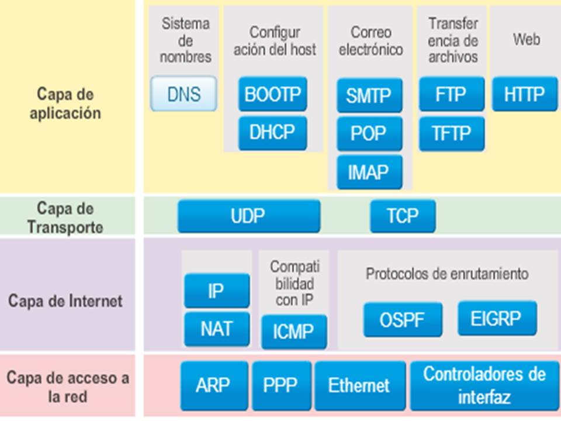
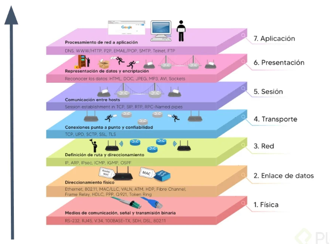

| **Inicio**         | **atrás 3**                                                          | **Siguiente 5**                              |
| ------------------ | -------------------------------------------------------------------- | -------------------------------------------- |
| [🏠](../README.md) | [⏪](./7_3_Administracion_de_Servidores_Linux_Manejo_de_Recursos.md) | [⏩](./7_5_Redes_de_Internet_Profesional.md) |

---

## **Índice**

| Temario                                                                                                                                |
| -------------------------------------------------------------------------------------------------------------------------------------- |
| [658. Antecedentes de las redes computacionales](#658-antecedentes-de-las-redes-computacionales)                                       |
| [659. Antecedentes de las redes computacionales](#659-antecedentes-de-las-redes-computacionale)                                        |
| [660. Importancia de las redes computacionales](#660-importancia-de-las-redes-computacionales)                                         |
| [661. Qué son Bits y Bytes](#661-qué-son-bits-y-bytes)                                                                                 |
| [662. Clasificación de las redes de computadoras o computacionales](#662-clasificación-de-las-redes-de-computadoras-o-computacionales) |
| [663. Protocolos de red](#663-protocolos-de-red)                                                                                       |
| [664. Modelo TCP/IP](#664-modelo-tcpip)                                                                                                |
| [665. Identificando las redes: IP y su estructura](#665-identificando-las-redes-ip-y-su-estructura)                                    |
| [666. Clases de redes: asignación direcciones IP](#666-clases-de-redes-asignación-direcciones-ip)                                      |
| [667. Qué es el Modelo OSI](#667-qué-es-el-modelo-osi)                                                                                 |
| [668. Capa Física](#668-capa-física)                                                                                                   |
| [669. El cable de par trenzado](#669-el-cable-de-par-trenzado)                                                                         |
| [670. Capa de enlace de datos](#670-capa-de-enlace-de-datos)                                                                           |
| [671. ¿Qué es la dirección MAC?](#671-qué-es-la-dirección-mac)                                                                         |
| [672. ¿Qué es la capa de red?](#672-qué-es-la-capa-de-red)                                                                             |
| [673. Capa de transporte](#673-capa-de-transporte)                                                                                     |
| [674. Capa de sesión](#674-capa-de-sesión)                                                                                             |
| [675. Capa de presentación](#675-capa-de-presentación)                                                                                 |
| [676. Instalación de Wireshark](#676-instalación-de-wireshark)                                                                         |
| [677. Capa de aplicación](#677-capa-de-aplicación)                                                                                     |
| [678. Diferencias entre el modelo OSI y TCP/IP](#678-diferencias-entre-el-modelo-osi-y-tcpip)                                          |
| [679. 8 tipos de dispositivos de red y cómo funcionan](#679-8-tipos-de-dispositivos-de-red-y-cómo-funcionan)                           |
| [680. Símbolos y cómo dibujar arquitecturas de redes](#680-símbolos-y-cómo-dibujar-arquitecturas-de-redes)                             |
| [681. Qué son las redes empresariales: ejemplos](#681-qué-son-las-redes-empresariales-ejemplos)                                        |

# **Redes Informáticas de Internet**

## **658. Antecedentes de las redes computacionales**

### 🧠 1. ¿Qué son las redes computacionales?

Una **red computacional o red de computadoras** es un conjunto de computadoras u otros dispositivos (como impresoras, celulares, cámaras, etc.) **conectados entre sí** para **compartir información, recursos y servicios** (como internet, archivos o impresoras).

---

### 📚 2. Antecedentes históricos de las redes computacionales

#### 🧩 Años clave y eventos importantes:

##### 🔹 1950s – Primeras ideas

- Las computadoras eran grandes y aisladas.
- Se usaban tarjetas perforadas.
- No había redes, cada computadora trabajaba sola.

##### 🔹 1960s – ARPANET (el origen de internet)

- Financiado por el **Departamento de Defensa de EE.UU.** a través de ARPA.
- Objetivo: conectar computadoras de distintas universidades para **compartir información**.
- **1969:** Se conecta la primera red entre:

  - Universidad de California en Los Ángeles (UCLA)
  - Universidad de Stanford

- ¡Se considera el **inicio del internet**!

##### 🔹 1970s – TCP/IP

- Se desarrollan los **protocolos TCP/IP**, que permiten que las computadoras se comuniquen sin importar su tipo.
- TCP/IP sigue siendo **la base del Internet actual**.

##### 🔹 1980s – Redes LAN

- Nacen las **redes locales (LAN)**, que conectan computadoras en oficinas o casas.
- Aparece **Ethernet**, el protocolo más usado para redes LAN.

##### 🔹 1990s – Expansión del Internet

- Se populariza el uso de internet en el mundo.
- Aparece la **World Wide Web (WWW)**.
- Las redes ya no eran solo para militares o universidades.

---

### 🛠 3. ¿Cómo se "instala" una red computacional?

**Instalar una red** significa en realidad **planificarla y configurarla**, no descargarla como un programa.

#### 🧱 Componentes básicos de una red:

| Componente                       | Función                                     |
| -------------------------------- | ------------------------------------------- |
| **Dispositivos** (PC, celulares) | Envían y reciben datos                      |
| **Router**                       | Conecta la red local con internet           |
| **Switch**                       | Interconecta varios dispositivos en red LAN |
| **Cableado o Wi-Fi**             | Medio de transmisión                        |
| **Direcciones IP**               | Identifican a cada dispositivo en la red    |
| **Protocolos (TCP/IP)**          | Reglas que permiten la comunicación         |

#### 🪛 Pasos para "instalar" o armar una red sencilla en casa u oficina:

##### 🔹 Paso 1: Conecta el router al proveedor de Internet

- El proveedor (Movistar, Claro, etc.) te da acceso a Internet.

##### 🔹 Paso 2: Conecta un switch (opcional)

- Si necesitas más puertos para más computadoras.

##### 🔹 Paso 3: Conecta las computadoras

- Puede ser **por cable (Ethernet)** o **por Wi-Fi** al router o switch.

##### 🔹 Paso 4: Verifica las direcciones IP

- Cada dispositivo recibe una IP, automáticamente (vía **DHCP** del router).

##### 🔹 Paso 5: Prueba la conexión

- Puedes hacer ping entre dispositivos:
  `ping 192.168.1.5` desde otra PC.

---

### ✅ 4. Ejemplo completo y fácil de entender

#### 🎯 Objetivo:

Tener 3 computadoras en una misma red local (LAN) para compartir archivos y conectarse a internet.

#### 🧰 Material:

- 1 Router (con acceso a Internet)
- 1 Switch de 4 puertos (opcional si el router no tiene muchos puertos)
- 3 computadoras con puertos Ethernet
- 3 cables de red (Ethernet)

#### 🪛 Pasos:

1. **Conectar el router a Internet** (ya lo hace tu proveedor).
2. **Conectar el switch al router** con un cable de red.
3. **Conectar las 3 computadoras al switch**.
4. Cada computadora recibe automáticamente una **IP interna**, como:

   - PC1: 192.168.0.10
   - PC2: 192.168.0.11
   - PC3: 192.168.0.12

5. Ahora pueden:

   - **Compartir carpetas** (por ejemplo, una carpeta con tareas de la oficina).
   - Acceder a **Internet**.
   - Hacerse **ping** entre sí:

     ```bash
     ping 192.168.0.11
     ```

6. Puedes activar el **uso compartido de archivos e impresoras** en Windows o Linux.

#### 🖼 Representación visual:

```
[Internet]
     |
   [Router]
     |
   [Switch]
  /   |   \
PC1 PC2  PC3
```

---

### 🧠 Conceptos importantes que puedes recordar

| Término      | Significado                                 |
| ------------ | ------------------------------------------- |
| ARPANET      | Primera red (1969)                          |
| TCP/IP       | Protocolo base de Internet                  |
| LAN          | Red local (Local Area Network)              |
| Router       | Conecta tu red con Internet                 |
| Switch       | Interconecta varios dispositivos localmente |
| Dirección IP | Identificador único en la red               |

---

[🔼](#índice)

---

## **659. Antecedentes de las redes computacionale**

### 🧠 ¿Qué son las redes computacionales?

Una **red computacional** es un conjunto de computadoras y dispositivos conectados entre sí con el objetivo de **compartir información, archivos, recursos** (como impresoras) o **acceder a Internet**.

---

### 📚 Parte 1: ANTECEDENTES DE LAS REDES COMPUTACIONALES

Para entender cómo surgieron las redes, veamos una **línea de tiempo** con ejemplos reales:

---

#### 🕰️ 1950s: Las computadoras eran **aisladas**

- Eran máquinas enormes que solo ejecutaban un proceso a la vez.
- No existía comunicación entre computadoras.
- Ejemplo: IBM 701 funcionaba con tarjetas perforadas y sin red.

---

#### 🕰️ 1960s: Nace la idea de compartir recursos

- El Departamento de Defensa de EE.UU. crea ARPA (Advanced Research Projects Agency).
- Se desarrolla **ARPANET** (1969), la primera red que conectaba universidades.

📌 **Ejemplo real:**

> En 1969, se conectaron 4 universidades de EE.UU. (UCLA, Stanford, UC Santa Barbara y Utah) para compartir información entre sus laboratorios. Se considera el nacimiento de lo que hoy es Internet.

---

#### 🕰️ 1970s: Se crean los primeros **protocolos de red**

- Nace **TCP/IP**, un conjunto de reglas para que computadoras diferentes puedan "hablar el mismo idioma".
- En 1973, se realiza la primera conexión internacional (EE.UU. y Reino Unido).

📌 **Ejemplo:**

> Si una computadora con sistema IBM quería hablar con otra con UNIX, necesitaban un protocolo común. Ahí entra TCP/IP, el corazón del Internet actual.

---

#### 🕰️ 1980s: Aparece la red **LAN (Local Area Network)**

- Se crean redes **domésticas y de oficina** con computadoras conectadas a través de cables.
- Se populariza **Ethernet**, el sistema más común para LANs.
- Aparece el término “cliente-servidor”.

📌 **Ejemplo:**

> Una oficina conecta 5 computadoras para compartir una impresora y enviar archivos sin usar disquetes.

---

#### 🕰️ 1990s: Se populariza **Internet**

- Nace la **World Wide Web (WWW)**.
- Las personas comienzan a tener acceso a Internet en sus casas.
- Aumenta el uso del correo electrónico y páginas web.

📌 **Ejemplo:**

> En 1995, muchas casas en EE.UU. ya tenían acceso a Internet a través de modems de 56 kbps. Podías chatear, enviar correos y visitar sitios web.

---

#### 🕰️ 2000s hasta hoy: Internet en todas partes

- Redes inalámbricas (Wi-Fi), fibra óptica, redes móviles.
- Aparecen los smartphones, IoT (Internet de las Cosas), videollamadas, redes sociales.

📌 **Ejemplo:**

> Hoy, tu teléfono, tu Smart TV, tu PC y tu reloj inteligente están todos conectados entre sí y a Internet a través de una red doméstica.

---

### 🛠️ Parte 2: ¿Cómo se "instala" o implementa una red computacional?

Instalar una red no significa “descargar un programa”, sino **conectar y configurar** los dispositivos correctamente.

---

#### 🧱 Componentes básicos de una red

| Componente        | Función                                          |
| ----------------- | ------------------------------------------------ |
| 🖥️ Dispositivos   | Computadoras, laptops, tablets, etc.             |
| 📶 Router         | Permite conectar la red a Internet               |
| 🔀 Switch         | Interconecta varios dispositivos en la red local |
| 🌐 IP             | Dirección única que identifica a cada equipo     |
| 📡 Cables o Wi-Fi | Medio físico o inalámbrico de transmisión        |

---

#### 🪛 Pasos para implementar una red sencilla:

##### ✅ Paso 1: Conecta el **router** al proveedor de Internet

- El router recibe señal de Internet desde el proveedor (Movistar, Claro, Entel, etc.).

##### ✅ Paso 2: Conecta los dispositivos al router

- Por **cable Ethernet** o por **Wi-Fi**.

##### ✅ Paso 3: Configura los dispositivos

- Cada dispositivo recibirá una dirección **IP** automática (por DHCP).
- Puedes acceder a sitios web, compartir archivos, usar impresoras de red.

##### ✅ Paso 4: Verifica la conexión

- En Windows puedes usar:

```bash
ping 192.168.0.1
```

- Esto prueba que puedes comunicarte con tu router o con otro equipo en la red.

---

### ✅ Parte 3: EJEMPLO COMPLETO Y FÁCIL DE ENTENDER

#### 🎯 Objetivo:

Crear una red doméstica donde 3 computadoras estén conectadas a Internet y puedan **compartir archivos entre ellas**.

---

#### 🧰 Materiales necesarios:

| Elemento                                 | Cantidad |
| ---------------------------------------- | -------- |
| Router con Wi-Fi                         | 1        |
| Computadoras (PC o laptop)               | 3        |
| Cables Ethernet (opcional si usas Wi-Fi) | 3        |

---

#### 🔧 Paso a paso:

##### 🔸 Paso 1: Conectar el router

- El router se conecta al módem de Internet.
- Lo enciendes y emite una red Wi-Fi o tiene puertos Ethernet.

##### 🔸 Paso 2: Conectar las computadoras

- PC1 y PC2 por Wi-Fi.
- PC3 por cable (si prefieres).

##### 🔸 Paso 3: Verifica las IP

En cada computadora, abre la terminal o consola y escribe:

```bash
ipconfig (en Windows)
```

o

```bash
ifconfig (en Linux o Mac)
```

Verás algo como:

```
IP: 192.168.1.10 (PC1)
IP: 192.168.1.11 (PC2)
IP: 192.168.1.12 (PC3)
```

##### 🔸 Paso 4: Prueba la comunicación

Desde PC1, abre el símbolo del sistema y escribe:

```bash
ping 192.168.1.11
```

Esto prueba que PC1 puede hablar con PC2. Si recibes respuestas, ¡la red funciona!

##### 🔸 Paso 5: Comparte una carpeta

- En Windows:

  1. Haz clic derecho en una carpeta → "Propiedades".
  2. Ve a la pestaña "Compartir".
  3. Activa el uso compartido en red.
  4. Asigna permisos de lectura o escritura.

- En Linux:
  Puedes usar `samba` para compartir archivos entre Linux y Windows.

---

#### 🖼 Diagrama visual de la red:

```
                   [ Internet ]
                        |
                    [ Router ]
                   /    |    \
               PC1    PC2   PC3
              (Wi-Fi) (Wi-Fi) (Cable)
```

---

### 🧠 ¿Qué aprendiste hasta ahora?

| Concepto | ¿Qué significa?                               |
| -------- | --------------------------------------------- |
| ARPANET  | Primer experimento de red en 1969             |
| TCP/IP   | Protocolo base del Internet                   |
| LAN      | Red local (ej. tu casa u oficina)             |
| Router   | Dispositivo que te conecta a Internet         |
| Switch   | Permite conectar varios dispositivos entre sí |
| IP       | Dirección que identifica cada equipo          |

---

[🔼](#índice)

---

## **660. Importancia de las redes computacionales**

### ✅ 1. ¿Qué son las redes computacionales?

Una **red computacional** es un conjunto de computadoras y dispositivos conectados entre sí para **compartir recursos, intercambiar información** o **comunicarse**, ya sea dentro de una casa, oficina, empresa o entre países (como Internet).

---

### 🌟 2. ¿Por qué son importantes las redes computacionales?

La **importancia** de las redes computacionales en la vida diaria, profesional y global es enorme. Aquí te explico **por qué** y te doy ejemplos claros:

---

#### 🧠 A. Comunicación instantánea

Las redes permiten enviar **mensajes, correos, hacer videollamadas** o chatear en tiempo real.

📌 **Ejemplo**:

Tú escribes un correo en Lima y en menos de 2 segundos llega a alguien en Londres. Eso es gracias a una red: **Internet**.

---

#### 📂 B. Compartir información y archivos

Puedes **compartir archivos, carpetas, documentos** o incluso trabajar en línea sobre el mismo documento.

📌 **Ejemplo**:

En una oficina, varios empleados pueden trabajar sobre el mismo archivo de Excel que está guardado en un servidor de red.

---

#### 🖨️ C. Uso compartido de recursos

Gracias a una red, puedes usar la **misma impresora** desde varias computadoras o acceder a una base de datos común.

📌 **Ejemplo**:

Una escuela tiene una sola impresora, pero todos los salones pueden imprimir desde ella sin moverse. Todo esto es posible gracias a una red local (LAN).

---

#### 🌐 D. Acceso a servicios en línea

Las redes permiten conectarse a Internet y usar **bancos virtuales, redes sociales, servicios de streaming, educación online**, etc.

📌 **Ejemplo**:

Acceder a tu cuenta bancaria por la web desde tu celular se logra porque estás conectado a una red (ya sea Wi-Fi o red móvil).

---

#### 🛡️ E. Seguridad centralizada y respaldo

En una red empresarial, los administradores pueden controlar qué usuarios tienen acceso a qué información, y **respaldar datos importantes** automáticamente.

📌 **Ejemplo**:

Una empresa realiza copias de seguridad automáticas de todos los equipos cada noche mediante una red.

---

#### 🏭 F. Mejora la productividad

Las redes permiten que las personas **trabajen colaborativamente** sin importar su ubicación geográfica.

📌 **Ejemplo**:

Un grupo de programadores trabaja desde Perú, México y Colombia en el mismo proyecto alojado en una red en la nube como GitHub.

---

### 🛠️ 3. ¿Cómo se "instala" o implementa una red computacional?

Aunque no se “instala” como un software, sí se **configura** e implementa paso a paso. Aquí te muestro cómo montar una red sencilla en casa u oficina.

---

#### 🧱 Componentes básicos necesarios

| Elemento                              | Función                               |
| ------------------------------------- | ------------------------------------- |
| Router                                | Permite acceso a Internet             |
| Switch (opcional)                     | Conecta varios dispositivos por cable |
| Dispositivos (PC, celular, impresora) | Envían y reciben datos                |
| Medio de conexión                     | Cable Ethernet o Wi-Fi                |
| Protocolo de red                      | TCP/IP (reglas de comunicación)       |

---

#### 🔧 Pasos para configurar una red básica:

##### ✅ Paso 1: Conectar el **router** al proveedor de Internet

- Esto te da acceso a Internet.

##### ✅ Paso 2: Conectar los dispositivos

- Por **cable (Ethernet)** o **inalámbrico (Wi-Fi)**.

##### ✅ Paso 3: Verifica las direcciones IP

- Cada equipo recibe una IP única, como `192.168.1.5`.

##### ✅ Paso 4: Probar la conexión

- Puedes hacer `ping` a otro equipo desde la consola:

```bash
ping 192.168.1.6
```

##### ✅ Paso 5: Compartir recursos (opcional)

- Compartir carpetas, impresoras o acceder a servidores locales.

---

### 🧪 4. Ejemplo completo y fácil de entender

#### 🎯 Escenario:

Una familia quiere que 3 laptops estén conectadas a Internet, puedan compartir archivos y usar la misma impresora inalámbrica.

---

#### 🧰 Material necesario:

- 1 Router Wi-Fi
- 3 laptops
- 1 impresora inalámbrica

---

#### 🔄 Pasos para implementar la red:

##### 1. Conecta el router al módem de Internet

Esto lo hace tu proveedor (Claro, Movistar, etc.).

##### 2. Conecta las laptops al router

- Por Wi-Fi → se conectan a la misma red con nombre y contraseña.

##### 3. Instala la impresora inalámbrica

- La impresora se conecta a la red Wi-Fi.
- Cada laptop puede buscar e instalar esa impresora desde la red.

##### 4. Verifica las direcciones IP

En cada laptop, abre la consola y escribe:

```bash
ipconfig (Windows)
```

Verás algo como:

```
IP de Laptop 1: 192.168.0.10
IP de Laptop 2: 192.168.0.11
IP de Laptop 3: 192.168.0.12
```

##### 5. Prueba si se ven entre sí

Desde la Laptop 1, escribe:

```bash
ping 192.168.0.11
```

Si responde, significa que están conectadas.

##### 6. Comparte una carpeta

En Windows:

- Haz clic derecho en una carpeta → "Propiedades" → pestaña "Compartir".
- Selecciona "Compartir con todos" o con usuarios específicos.

##### 7. Instala la impresora en cada laptop

- Ve a Panel de control → Dispositivos e impresoras → Agregar impresora.
- Selecciona la impresora en red.

---

#### 🖼 Diagrama de la red:

```
          [ Internet ]
               |
           [ Router Wi-Fi ]
            /     |     \
      Laptop 1  Laptop 2  Laptop 3
                      |
                 [ Impresora Wi-Fi ]
```

---

### 🔍 Resumen: ¿Por qué son importantes las redes computacionales?

| Beneficio          | ¿Por qué importa?                       | Ejemplo                            |
| ------------------ | --------------------------------------- | ---------------------------------- |
| Comunicación       | Hablas con otros al instante            | WhatsApp, correo                   |
| Compartir archivos | Trabajo colaborativo                    | Google Drive, carpetas compartidas |
| Uso de recursos    | Ahorra costos                           | Usar 1 impresora desde 5 PCs       |
| Acceso a servicios | Conexión global                         | YouTube, Netflix, clases virtuales |
| Seguridad          | Control de acceso y copias de seguridad | Redes de empresas y hospitales     |

---

[🔼](#índice)

---

## **661. Qué son Bits y Bytes**

### ✅ ¿Qué son los Bits y los Bytes?

#### 🔹 ¿Qué es un **bit**?

- La palabra **bit** viene de **"binary digit"** (dígito binario).
- Es la **unidad más pequeña de información** que usa una computadora.
- Un bit solo puede tener **dos valores posibles**:

  ✅ **0** (apagado)

  ✅ **1** (encendido)

📌 **Ejemplo fácil**:

Piensa en un interruptor de luz:

- Apagado = 0
- Encendido = 1
  Ese interruptor representa **un bit**.

---

#### 🔸 ¿Qué es un **byte**?

- Un **byte** está formado por **8 bits** juntos.
- Es la **unidad básica de almacenamiento** que usan las computadoras.

📌 **Ejemplo visual**:

```
1 byte = 8 bits = 10101100
```

Cada número (0 o 1) es un bit. Al juntarlos, forman un byte que puede representar:

- Una letra (como "A")
- Un número (como 5)
- Un símbolo (como "#")
- Parte de una imagen, sonido o video

---

### 📏 Tabla de unidades informáticas

| Unidad          | Equivalencia | Ejemplo en la vida real                 |
| --------------- | ------------ | --------------------------------------- |
| 1 bit           | 0 o 1        | Encendido o apagado                     |
| 1 byte          | 8 bits       | Una letra como "A"                      |
| 1 kilobyte (KB) | 1,024 bytes  | Una página de texto                     |
| 1 megabyte (MB) | 1,024 KB     | Una canción MP3                         |
| 1 gigabyte (GB) | 1,024 MB     | Una película en HD o 300 canciones      |
| 1 terabyte (TB) | 1,024 GB     | Un disco duro grande con miles de fotos |

---

### 🛠️ ¿Cómo se "instalan" o usan los bits y bytes?

#### ⚠️ Aclaración:

Los **bits y bytes no se instalan como programas**, pero están **presentes en todo lo que haces en una computadora o celular**.

---

#### 🧠 ¿Dónde se usan los bits y bytes?

1. **Almacenamiento de datos**

   - Cuando guardas una foto, un video o un documento, esos archivos se almacenan en **bytes**.

2. **Transmisión de datos**

   - Cuando descargas un archivo o ves una serie en streaming, la velocidad se mide en **bits por segundo (bps)**.

📌 Ejemplo práctico:

- Si tu conexión a Internet es de **100 Mbps**, eso significa 100 millones de bits por segundo.

---

#### 🧠 ¿Cómo afectan los bits y bytes en la vida real?

| Actividad diaria          | ¿Qué unidad se usa? | ¿Qué representa?                      |
| ------------------------- | ------------------- | ------------------------------------- |
| Escribir un documento     | Bytes               | Cada letra ocupa 1 byte               |
| Subir un video a YouTube  | Megabytes o GB      | Depende de la duración y calidad      |
| Descargar una app         | MB o GB             | Tamaño del archivo                    |
| Medir tu velocidad de red | Mbps (megabits/seg) | Cuántos datos puedes recibir por seg. |

---

### 🧪 Ejemplo completo y fácil de entender

#### 🎯 Escenario:

Estás escribiendo un documento en Word que contiene **1,000 letras**. ¿Cuánto espacio ocupa?

---

#### Paso 1: Saber cuántos **bytes**

Cada letra ocupa 1 byte (8 bits).
Entonces, 1,000 letras = **1,000 bytes**

---

#### Paso 2: Convertir a kilobytes (KB)

Sabemos que 1 kilobyte = 1,024 bytes.
Entonces:

```
1,000 bytes ÷ 1,024 ≈ 0.98 KB
```

📌 Tu documento ocupa **menos de 1 KB**.

---

#### Otro ejemplo:

##### 🎥 Descargas una película de 2 GB y tu internet es de 20 Mbps.

1. Primero convertimos 2 GB a bits:

```
2 GB = 2 × 1,024 MB = 2,048 MB
2,048 MB = 2,048 × 1,024 KB = 2,097,152 KB
2,097,152 KB = 2,097,152 × 1,024 bytes = 2,147,483,648 bytes
2,147,483,648 × 8 = 17,179,869,184 bits (≈ 17.2 Gb)
```

2. Ahora dividimos por la velocidad:

```
Tiempo = 17.2 Gb ÷ 20 Mbps = 0.86 segundos × 1,000 = 860 segundos ≈ 14 minutos
```

👉 Te tomaría **14 minutos descargar la película** si no hubiera interrupciones.

---

### 🧠 Resumen: Bits y Bytes

| Concepto     | Explicación simple                        |
| ------------ | ----------------------------------------- |
| Bit          | Unidad más pequeña, vale 0 o 1            |
| Byte         | Conjunto de 8 bits (ej. 10101010)         |
| KB, MB, GB   | Unidades para medir almacenamiento        |
| Mbps         | Velocidad de transmisión (megabits)       |
| Aplicaciones | Almacenar letras, imágenes, sonido, video |

---

[🔼](#índice)

---

## **662. Clasificación de las redes de computadoras o computacionales**

### ✅ 1. ¿Qué son las redes computacionales?

Una **red computacional** es un conjunto de computadoras u otros dispositivos (como impresoras, celulares, tablets, etc.) **conectados entre sí**, ya sea con cables o de forma inalámbrica, para **compartir información, recursos o servicios**.

---

### 📚 2. Clasificación de las redes de computadoras

Las redes se pueden clasificar según **distintos criterios**. A continuación te explico cada uno con ejemplos claros:

---

#### 🔹 A. Por su **tamaño o alcance geográfico**

##### 1. **PAN (Personal Area Network)**

Es una red pequeña que abarca unos pocos metros.

📌 **Ejemplo**:

- Tu celular conectado a tu smartwatch o audífonos Bluetooth.
- Conectar tu laptop al celular por Wi-Fi compartido (tethering).

---

##### 2. **LAN (Local Area Network)**

Red que cubre un espacio pequeño como una casa, oficina, colegio o empresa.

📌 **Ejemplo**:

- Red de computadoras en una oficina que comparten archivos e impresora.
- Red Wi-Fi de tu casa.

---

##### 3. **MAN (Metropolitan Area Network)**

Red más grande que la LAN, que cubre una ciudad o distrito.

📌 **Ejemplo**:

- Red de las sedes de la municipalidad de Lima interconectadas.
- Universidad que conecta todos sus edificios en una ciudad.

---

##### 4. **WAN (Wide Area Network)**

Red que cubre grandes distancias, incluso países o continentes.

📌 **Ejemplo**:

- Internet (¡es la WAN más grande!).
- Una empresa que tiene oficinas en Perú, México y EE.UU. conectadas por red privada.

---

#### 🔹 B. Por el **tipo de conexión**

##### 1. **Redes cableadas (por cable Ethernet)**

Usan cables físicos para conectar los dispositivos.

📌 **Ejemplo**:

- Computadoras conectadas con cables en un laboratorio.

##### 2. **Redes inalámbricas (Wi-Fi, Bluetooth)**

No usan cables. La conexión es a través del aire.

📌 **Ejemplo**:

- Celulares conectados al Wi-Fi de casa.
- Audífonos Bluetooth conectados al celular.

---

#### 🔹 C. Por su **topología (forma física de la red)**

Esto describe **cómo están conectados los dispositivos** en la red:

| Topología   | Descripción                           | Ejemplo                       |
| ----------- | ------------------------------------- | ----------------------------- |
| En bus      | Un solo cable conecta todos los nodos | Red antigua de oficinas       |
| En estrella | Todos conectados a un nodo central    | Red moderna con switch/router |
| En anillo   | Cada uno conecta con el siguiente     | Algunas redes industriales    |
| Malla       | Todos están conectados entre sí       | Redes militares o robustas    |

---

#### 🔹 D. Por su **función o rol de los dispositivos**

##### 1. **Red cliente-servidor**

Un equipo (servidor) centraliza recursos, y los demás (clientes) los usan.

📌 **Ejemplo**:

- Una empresa donde todas las PCs usan una base de datos central que está en el servidor.

##### 2. **Red punto a punto (P2P)**

Todos los dispositivos pueden ser clientes y servidores al mismo tiempo.

📌 **Ejemplo**:

- Compartir música entre dos laptops conectadas por Wi-Fi.
- Programas como BitTorrent.

---

### 🛠️ 3. ¿Cómo se "instala" una red computacional?

"Instalar" una red significa **diseñar, conectar y configurar** los dispositivos para que puedan comunicarse entre sí.

---

#### 🧰 Elementos básicos para instalar una red:

| Elemento       | Función                                          |
| -------------- | ------------------------------------------------ |
| Router         | Conecta todos los dispositivos e Internet        |
| Switch         | (opcional) Interconecta varios equipos por cable |
| Cables o Wi-Fi | Medio físico o inalámbrico de conexión           |
| Computadoras   | Dispositivos de la red                           |
| Direcciones IP | Identifican a cada dispositivo                   |

---

#### 🔧 Pasos básicos para instalar una red tipo LAN:

##### 1. Conecta el **router** al módem (de tu proveedor de Internet).

##### 2. Conecta las computadoras por **Wi-Fi** o **cable Ethernet**.

##### 3. Asegúrate de que cada dispositivo reciba una **IP automática**.

##### 4. Verifica la conexión con un comando como:

```bash
ping 192.168.1.10
```

##### 5. (Opcional) Comparte carpetas, impresoras o recursos.

---

### 🧪 4. Ejemplo completo y fácil de entender

#### 🎯 Objetivo:

Conectar 3 computadoras en una red tipo **LAN**, usando un router inalámbrico para que puedan compartir archivos y conectarse a Internet.

---

#### 🧰 Materiales:

- 1 Router Wi-Fi
- 3 Laptops o PCs
- 1 impresora inalámbrica (opcional)

---

#### 🔄 Pasos de instalación:

##### ✅ Paso 1: Conectar el router a Internet

- El proveedor (Claro, Movistar, Entel) te da el módem que se conecta al router Wi-Fi.

##### ✅ Paso 2: Conectar las computadoras al router

- Por Wi-Fi (nombre y contraseña) o con cables.

##### ✅ Paso 3: Verifica las IP de cada dispositivo

Abre la terminal en cada equipo:

- En Windows:

```bash
ipconfig
```

- En Linux/Mac:

```bash
ifconfig
```

Verás algo como:

- Laptop 1: 192.168.0.10
- Laptop 2: 192.168.0.11
- Laptop 3: 192.168.0.12

##### ✅ Paso 4: Probar conectividad

Desde Laptop 1, escribe:

```bash
ping 192.168.0.11
```

Si responde, ¡la red funciona!

##### ✅ Paso 5: Compartir archivos

- En Windows: Haz clic derecho sobre una carpeta → “Compartir con...”
- En Linux: Usa Samba (`smb://ip-del-equipo`)

---

#### 🖼 Diagrama visual de la red (Topología estrella):

```
             [ Internet ]
                  |
              [ Router ]
             /    |     \
       Laptop1  Laptop2  Laptop3
```

- Tipo de red: **LAN**
- Topología: **Estrella**
- Conexión: **Wi-Fi**
- Uso: **Compartir archivos e impresora**

---

### 🧠 Resumen general

| Clasificación | Tipos principales                     | Ejemplo práctico                         |
| ------------- | ------------------------------------- | ---------------------------------------- |
| Por alcance   | PAN, LAN, MAN, WAN                    | Wi-Fi en casa (LAN), Internet (WAN)      |
| Por conexión  | Cableada, Inalámbrica                 | Ethernet, Wi-Fi, Bluetooth               |
| Por topología | Bus, Estrella, Anillo, Malla          | Red de oficina (estrella con switch)     |
| Por función   | Cliente-servidor, Punto a punto (P2P) | Red de empresa, red de casa con carpetas |

---

[🔼](#índice)

---

## **663. Protocolos de red**



### ✅ 1. ¿Qué son los protocolos de red?

Un **protocolo de red** es un **conjunto de reglas y estándares** que permiten que los dispositivos en una red **se comuniquen entre sí correctamente**.

🔎 Es como un idioma común entre computadoras.

---

#### 🎯 Ejemplo fácil:

Imagina que dos personas quieren conversar:

- Si una habla solo español y la otra solo japonés, **no se entienden**.
- Si ambos hablan inglés, entonces pueden **comunicarse sin problema**.

👉 En redes ocurre lo mismo. Si dos dispositivos usan **el mismo protocolo**, pueden **entenderse** y **transmitir datos correctamente**.

---

### 🧠 2. ¿Para qué sirven los protocolos de red?

Sirven para:

- Establecer **cómo se envían y reciben los datos**.
- **Detectar errores** durante la transmisión.
- Establecer **cómo identificar dispositivos** (como las direcciones IP).
- Gestionar **la velocidad, seguridad y fiabilidad** de la conexión.

---

### 📚 3. Tipos de protocolos de red más importantes (con ejemplos)

Aquí te explico los **protocolos más comunes**, para qué sirven y ejemplos reales de uso:

| Protocolo          | Función principal                            | Ejemplo práctico                                 |
| ------------------ | -------------------------------------------- | ------------------------------------------------ |
| **HTTP/HTTPS**     | Transmitir páginas web                       | Cuando visitas Google o YouTube                  |
| **FTP**            | Transferir archivos                          | Subir archivos a un servidor                     |
| **SMTP/POP3/IMAP** | Enviar/recibir correos electrónicos          | Enviar un correo desde Gmail o Outlook           |
| **TCP/IP**         | Conjunto de reglas para transmisión de datos | Base de Internet                                 |
| **DNS**            | Traduce nombres (como google.com) a IPs      | Escribes `google.com` y el navegador lo resuelve |
| **DHCP**           | Asigna IP automáticamente                    | Cuando tu celular se conecta al Wi-Fi            |
| **ARP**            | Traduce IPs a direcciones MAC                | Comunicación entre dispositivos de red local     |
| **ICMP**           | Diagnóstico de red (como el comando `ping`)  | Saber si hay conexión entre dos dispositivos     |

---

### 🛠️ 4. ¿Cómo se "instalan" o aplican los protocolos de red?

⚠️ Los **protocolos no se instalan como programas**, pero sí se **configuran e implementan** dentro de:

- Sistemas operativos (Windows, Linux, macOS).
- Dispositivos de red (routers, switches).
- Navegadores, clientes de correo, servidores, etc.

---

#### 🔧 ¿Dónde y cómo se configuran?

##### A. En una red doméstica o de oficina:

Cuando conectas tu laptop o celular al Wi-Fi:

- El **router usa DHCP** para darte una IP.
- Tu navegador usa **HTTP/HTTPS** para cargar páginas.
- Usas **DNS** para traducir nombres (como `facebook.com`) a IPs.

✅ Todo esto se hace automáticamente gracias a la configuración del router y el sistema operativo.

---

##### B. En servidores o redes profesionales:

Ahí sí se **configuran manualmente** algunos protocolos.

📌 Ejemplo:

- En un servidor web configuras **HTTP/HTTPS** para que muestre tu sitio.
- En un servidor de correos configuras **SMTP y IMAP**.
- En redes empresariales puedes configurar un **servidor DHCP propio**.

---

### 🧪 5. Ejemplo completo y práctico

#### 🎯 Objetivo:

Ver cómo varios protocolos trabajan **juntos** cuando entras a un sitio web desde tu navegador.

---

#### 👣 Paso a paso del proceso:

1. **Tu PC se conecta al Wi-Fi**

   - El **protocolo DHCP** le asigna automáticamente una dirección IP, por ejemplo:
     `192.168.0.15`

2. **Escribes [www.google.com](http://www.google.com) en tu navegador**

   - Tu computadora usa el **protocolo DNS** para traducir ese nombre a una IP:
     `142.250.190.68`

3. **Se establece la conexión con el servidor**

   - Tu PC usa **TCP/IP** para asegurarse que los datos se envíen correctamente.

4. **Solicita la página web**

   - El navegador usa **HTTP o HTTPS** para pedir la página.
     Si es HTTPS, los datos están cifrados y seguros.

5. **El servidor responde con los datos**

   - Envía el contenido (texto, imágenes, videos) también usando HTTP(S).

6. **Tú ves la página cargada en pantalla**

---

#### 🔄 Protocolos usados en este simple ejemplo:

| Paso                   | Protocolo involucrado |
| ---------------------- | --------------------- |
| Obtener IP             | DHCP                  |
| Resolver dominio       | DNS                   |
| Comunicación confiable | TCP/IP                |
| Solicitar sitio web    | HTTP/HTTPS            |

---

#### 🖼 Ilustración del flujo de protocolos:

```
[ Tu PC ]
   |
   |-- DHCP --> (obtener IP)
   |
   |-- DNS --> (google.com = 142.250.190.68)
   |
   |-- TCP/IP + HTTPS --> (conexión segura con Google)
   |
   |<-- Respuesta HTTP con la web
```

---

### 🧠 Resumen: Lo que debes recordar

| Concepto   | Explicación clara                           |
| ---------- | ------------------------------------------- |
| Protocolo  | Conjunto de reglas para la comunicación     |
| TCP/IP     | Base del funcionamiento de Internet         |
| HTTP/HTTPS | Usado para acceder a sitios web             |
| DHCP       | Asigna direcciones IP automáticamente       |
| DNS        | Traduce nombres de dominio a direcciones IP |
| ICMP       | Diagnóstico de red (ej. comando `ping`)     |

---

### 🧪 ¿Quieres experimentar tú mismo?

Puedes probar algunos protocolos desde tu computadora:

#### A. Probar **DNS** y **ICMP**

Abre el símbolo del sistema (CMD) y escribe:

```bash
ping www.google.com
```

✔️ Esto usa **DNS** para traducir el nombre y **ICMP** para verificar la conexión.

---

#### B. Ver tu IP y configuración de red (DHCP, DNS, etc.)

##### En Windows:

```bash
ipconfig /all
```

##### En Linux:

```bash
ifconfig
```

o

```bash
ip a
```

---

[🔼](#índice)

---

## **664. Modelo TCP/IP**


### ✅ 1. ¿Qué es el Modelo TCP/IP?

El **modelo TCP/IP** es un conjunto de reglas o normas que permite que **las computadoras y dispositivos se comuniquen en una red, especialmente en Internet**.

🔍 También se le llama **modelo de Internet**, y fue creado por el Departamento de Defensa de EE.UU. en los años 70.

---

#### 🔹 ¿Por qué se llama TCP/IP?

Porque se basa en **dos protocolos principales**:

- **TCP (Transmission Control Protocol)**
- **IP (Internet Protocol)**

---

### 🧱 2. Capas del modelo TCP/IP

El modelo TCP/IP tiene **4 capas**, cada una con funciones específicas. Son como los niveles de una empresa, donde cada uno tiene una tarea clara.

| Capa            | Función principal                                   | Protocolos típicos      |
| --------------- | --------------------------------------------------- | ----------------------- |
| 4. Aplicación   | Lo que ve el usuario: apps, correos, páginas web    | HTTP, HTTPS, FTP, SMTP  |
| 3. Transporte   | Asegura que los datos lleguen completos y ordenados | TCP, UDP                |
| 2. Internet     | Envía los datos a través de la red (ruta e IPs)     | IP, ICMP, ARP           |
| 1. Acceso a red | Conecta físicamente con la red                      | Ethernet, Wi-Fi, cables |

---

#### 🧠 Explicación con un ejemplo fácil:

##### 🎯 Imagina que quieres enviar una carta (como un email o mensaje web):

1. **Aplicación**: Escribes la carta y pones la dirección del destinatario.
2. **Transporte**: Pones la carta en un sobre especial que garantiza que no se pierda ni se desordene.
3. **Internet**: El sobre se etiqueta con la dirección postal y se decide por qué rutas va a viajar.
4. **Acceso a red**: El cartero (Wi-Fi, cable, etc.) lleva físicamente la carta hasta su destino.

---

### 🔧 3. ¿Cómo se "instala" o usa el modelo TCP/IP?

🔹 **No se instala como un programa**, pero **forma parte del sistema operativo y del hardware de red**.

🖥️ En una computadora o celular:

- El sistema operativo **ya tiene configurado el modelo TCP/IP** por defecto.
- Tú solo configuras cosas como la **IP**, el **puerto**, o si usas **DHCP o IP fija**.

🔌 En redes más técnicas (servidores, routers, etc.):

- Se pueden **ajustar** manualmente los parámetros del modelo TCP/IP.

---

#### 📥 ¿Dónde se configura normalmente?

| Lugar             | Ejemplo de configuración TCP/IP                |
| ----------------- | ---------------------------------------------- |
| En Windows        | Cambiar IP, DNS o máscara de subred            |
| En routers        | Asignar IPs, usar NAT, configurar puertos      |
| En servidores web | Escuchar en un puerto TCP específico (ej. 443) |
| En apps web       | Conectarse a una IP y puerto vía TCP/IP        |

---

### 📚 4. Protocolos que funcionan en cada capa

#### 🔹 Capa 4: Aplicación

- **HTTP/HTTPS**: Páginas web
- **SMTP/POP3/IMAP**: Correos electrónicos
- **FTP/SFTP**: Transferencia de archivos

#### 🔸 Capa 3: Transporte

- **TCP**: Conexión confiable (web, correos)
- **UDP**: Rápido pero sin verificación (videojuegos, streaming)

#### 🔹 Capa 2: Internet

- **IP**: Dirección de origen y destino
- **ICMP**: Diagnóstico de red (como el comando `ping`)
- **ARP**: Traducción de IP a dirección MAC

#### 🔸 Capa 1: Acceso a red

- **Ethernet**: Red por cable
- **Wi-Fi**: Conexión inalámbrica
- **DSL/Fibra**: Conexiones a Internet

---

### 🧪 5. Ejemplo completo paso a paso

#### 🎯 Escenario:

Tú estás en tu laptop y quieres acceder a **[www.google.com](http://www.google.com)** desde tu navegador.

---

#### 🧭 ¿Qué ocurre en cada capa del modelo TCP/IP?

| Capa             | Acción que realiza tu computadora o red                                       |
| ---------------- | ----------------------------------------------------------------------------- |
| **Aplicación**   | El navegador (Chrome, Firefox) envía una solicitud HTTP al servidor de Google |
| **Transporte**   | TCP divide la información en "paquetes", se asegura de que lleguen bien       |
| **Internet**     | IP se encarga de dirigir los paquetes hacia la dirección IP de Google         |
| **Acceso a red** | Se usan cables o Wi-Fi para enviar físicamente los paquetes                   |

---

#### 🔄 Todo esto ocurre en segundos y tú solo ves:

✔️ Google cargando en tu navegador

---

### 🧠 Resumen visual del modelo TCP/IP

```
[ Usuario ]
    ↓ (HTTP)
[ Capa de Aplicación ]
    ↓ (TCP o UDP)
[ Capa de Transporte ]
    ↓ (IP)
[ Capa de Internet ]
    ↓ (Ethernet/Wi-Fi)
[ Capa de Acceso a red ]
```

---

### 📌 Curiosidades y datos útiles

- El modelo **TCP/IP** es más práctico y usado que el modelo **OSI** en la vida real.
- Todos los navegadores, correos electrónicos, aplicaciones y redes usan este modelo.
- Es la base **de cómo funciona Internet** actualmente.

---

### 🧰 ¿Cómo puedes probar tú mismo el modelo TCP/IP?

#### 👉 Usa el comando `ping` en tu PC:

```bash
ping www.google.com
```

Este comando usa **ICMP**, que forma parte de la **capa Internet**. Puedes ver cómo responde el servidor.

---

#### 👉 Usa `netstat` para ver conexiones TCP activas:

```bash
netstat -n
```

Así ves todos los **puertos abiertos** y conexiones TCP/IP actuales en tu equipo.

---

[🔼](#índice)

---

## **665. Identificando las redes: IP y su estructura**

### ✅ 1. ¿Qué es una dirección IP?

Una **IP** (Internet Protocol) es como el **número de casa de un dispositivo** en una red.
Así como cada casa tiene una dirección postal única, cada computadora, celular, impresora o router conectado a una red tiene una **dirección IP única**.

📌 **Sirve para identificar y comunicarse entre dispositivos en una red** (local o Internet).

---

### ✅ 2. Tipos de IP y su estructura

#### 🔹 A. Tipos según el alcance:

| Tipo de IP     | Uso                                                            | Ejemplo       |
| -------------- | -------------------------------------------------------------- | ------------- |
| **IP privada** | Dentro de redes locales (casa, oficina)                        | 192.168.1.100 |
| **IP pública** | Visible desde Internet (asignada por tu proveedor de Internet) | 190.42.15.88  |

---

#### 🔸 B. Versiones:

##### 📍 IPv4 (la más usada hoy en día)

- Tiene **4 bloques de números** separados por puntos.
- Cada bloque va de **0 a 255**
- Ejemplo: `192.168.0.1`

##### 📍 IPv6 (más moderna, para soportar más dispositivos)

- Tiene **8 bloques** separados por dos puntos `:`
- Cada bloque está en **hexadecimal**
- Ejemplo: `2001:0db8:85a3:0000:0000:8a2e:0370:7334`

🔍 Para este tema, nos enfocaremos en **IPv4**, que es más común y fácil de entender.

---

### ✅ 3. Estructura de una dirección IP (IPv4)

Una IP versión 4 se divide en **dos partes**:

1. **Red** (network): identifica la red donde está el dispositivo
2. **Host**: identifica al dispositivo específico en esa red

---

#### 🔢 Ejemplo: IP `192.168.1.10` con máscara `255.255.255.0`

- La parte de **Red** es: `192.168.1`
- La parte de **Host** es: `10`

➡️ Es decir, está en la red `192.168.1.0` y es el dispositivo número 10

---

#### 🧠 ¿Qué es la máscara de subred?

La **máscara de subred** (subnet mask) le dice a tu computadora cuántos bits son parte de la red y cuántos del host.

Ejemplo de máscara común:

- `255.255.255.0` → significa que los primeros **3 bloques (24 bits)** son red
- Y el último bloque es el número del dispositivo (host)

---

### ✅ 4. ¿Cómo se asigna o "se instala" una IP?

Hay **dos formas de asignar una IP a un dispositivo**:

---

#### 🔹 A. Automática (DHCP)

- La IP se asigna automáticamente por un **router o servidor DHCP**
- No necesitas hacer nada manualmente

📌 Ejemplo:

- Conectas tu laptop al Wi-Fi de tu casa
- El router te asigna la IP `192.168.1.15` automáticamente

---

#### 🔸 B. Manual (IP estática)

- Tú mismo defines la IP, la máscara y la puerta de enlace

📌 Ejemplo en Windows:

1. Ir a **Configuración de red**
2. Abrir **Propiedades del adaptador**
3. Entrar en **Protocolo TCP/IPv4**
4. Elegir “Usar la siguiente dirección IP” e ingresar:

```
Dirección IP:      192.168.1.100
Máscara de subred: 255.255.255.0
Puerta de enlace:  192.168.1.1
```

✅ Ahora el dispositivo siempre tendrá esa IP

---

### ✅ 5. Ejemplo completo paso a paso

#### 🎯 Escenario: Configurar manualmente una red local en una oficina

##### Tienes:

- 1 router con IP: `192.168.0.1`
- 3 computadoras
- Quieres asignar IPs fijas a cada una

---

#### 🧩 Paso 1: Definir el rango de IPs

- Rango privado para esta red: `192.168.0.1` a `192.168.0.254`
- Máscara: `255.255.255.0` (esto da 254 direcciones disponibles)

---

#### 🧩 Paso 2: Asignar IPs manualmente

| Dispositivo | Dirección IP | Máscara de subred | Puerta de enlace |
| ----------- | ------------ | ----------------- | ---------------- |
| Router      | 192.168.0.1  | 255.255.255.0     | —                |
| PC 1        | 192.168.0.10 | 255.255.255.0     | 192.168.0.1      |
| PC 2        | 192.168.0.11 | 255.255.255.0     | 192.168.0.1      |
| PC 3        | 192.168.0.12 | 255.255.255.0     | 192.168.0.1      |

---

#### 🧩 Paso 3: Verificar conectividad

Desde **PC 1**, puedes hacer:

```bash
ping 192.168.0.11
```

✅ Si responde, la red está correctamente configurada.

---

### 🧠 ¿Cómo ver tu IP en tu computadora?

#### En Windows:

1. Abre la terminal (`cmd`)
2. Escribe:

```
ipconfig
```

Verás algo como:

```
Dirección IPv4. . . . . . . . . . . . .: 192.168.1.10
Máscara de subred . . . . . . . . . . .: 255.255.255.0
Puerta de enlace predeterminada . . . : 192.168.1.1
```

---

### 🧠 Resumen general

| Concepto          | Explicación simple                                  |
| ----------------- | --------------------------------------------------- |
| IP                | Número único que identifica a cada dispositivo      |
| IPv4              | Formato más común: 4 bloques como 192.168.1.10      |
| IP privada        | Solo se usa dentro de tu red local (no en Internet) |
| IP pública        | Es la IP que ve el mundo exterior (Internet)        |
| Máscara de subred | Define cuántas IPs puede haber en la red            |
| DHCP              | Asigna IPs automáticamente                          |
| IP estática       | La IP se configura manualmente                      |

---

[🔼](#índice)

---

## **666. Clases de redes: asignación direcciones IP**

#### ✅ 1. ¿Qué son las clases de redes IP?

Las **clases de redes IP** son una forma de **organizar las direcciones IP IPv4** según su tamaño y uso.

Cada clase define **cuántos dispositivos pueden conectarse** a esa red (o sea, cuántas IPs puede tener una red).

IPv4 tiene **5 clases** (A, B, C, D, E), pero las más usadas en redes normales son:

- **Clase A**
- **Clase B**
- **Clase C**

---

#### ✅ 2. Estructura general de una dirección IPv4

Una IP versión 4 tiene **4 bloques de números** (llamados octetos), separados por puntos:

```
Ejemplo: 192.168.0.1
```

Cada bloque puede ir de `0` a `255` (porque cada uno es de 8 bits = 1 byte).

---

#### ✅ 3. Clases de direcciones IP (A, B, C, D, E)

| Clase | Primer número (rango) | ¿Para quién es?                    | Dispositivos que soporta      | Máscara por defecto | Ejemplo de IP |
| ----- | --------------------- | ---------------------------------- | ----------------------------- | ------------------- | ------------- |
| A     | 1 – 126               | Redes muy grandes (ISP, gobiernos) | 16 millones de hosts          | 255.0.0.0           | 10.0.0.1      |
| B     | 128 – 191             | Empresas medianas                  | 65,534 hosts                  | 255.255.0.0         | 172.16.0.1    |
| C     | 192 – 223             | Oficinas pequeñas, hogares         | 254 hosts                     | 255.255.255.0       | 192.168.1.1   |
| D     | 224 – 239             | Multicast (streaming, TV, etc.)    | No se usa para redes normales | —                   | 224.0.0.1     |
| E     | 240 – 255             | Experimental                       | Reservado, sin uso actual     | —                   | 240.0.0.1     |

> Nota: el número 127 está reservado para **localhost** (127.0.0.1)

---

#### ✅ 4. IPs privadas vs públicas

Cada clase tiene ciertos rangos **reservados para uso privado** (en tu casa, colegio, oficina):

| Clase | Rango de IPs privadas         | Ejemplo     |
| ----- | ----------------------------- | ----------- |
| A     | 10.0.0.0 – 10.255.255.255     | 10.0.1.1    |
| B     | 172.16.0.0 – 172.31.255.255   | 172.16.5.10 |
| C     | 192.168.0.0 – 192.168.255.255 | 192.168.1.1 |

Las IP **públicas** son las que **te asigna tu proveedor de Internet (ISP)** para conectarte a Internet.

---

#### ✅ 5. ¿Cómo se asignan las IPs?

Hay **2 formas principales**:

##### 🔸 A. Automáticamente (usando DHCP)

- Tu router asigna automáticamente direcciones IP a los dispositivos.
- Es lo más común en casas, colegios, oficinas.

📌 Ejemplo:

- Conectas tu laptop al Wi-Fi → el router te da la IP `192.168.1.12`

##### 🔸 B. Manualmente (IP estática)

- Tú defines la IP en la computadora (útil para impresoras, servidores, cámaras IP, etc.).

📌 Ejemplo:

- A una impresora le asignas:

  - IP: `192.168.1.100`
  - Máscara: `255.255.255.0`
  - Puerta de enlace: `192.168.1.1`

---

#### ✅ 6. ¿Cómo “se instala” o configura una IP?

##### 🔧 En Windows (IP manual o estática):

1. Ve a **Configuración de red**
2. Elige tu adaptador (Wi-Fi o Ethernet)
3. Entra a las propiedades de `Protocolo IPv4`
4. Marca “Usar la siguiente dirección IP”
5. Escribe:

```
Dirección IP:      192.168.1.50
Máscara de subred: 255.255.255.0
Puerta de enlace:  192.168.1.1
DNS preferido:     8.8.8.8
```

✅ Ahora tu equipo tendrá siempre esa IP.

---

### 📌 Ejemplo completo y paso a paso

#### 🎯 Objetivo:

Crear una red para 3 computadoras en una oficina pequeña usando direcciones clase C (IP privadas).

---

#### 🧩 Datos base:

- Red: `192.168.0.0`
- Máscara: `255.255.255.0` (Clase C → máximo 254 dispositivos)
- Puerta de enlace (router): `192.168.0.1`

---

#### 🧩 Asignación de IPs:

| Dispositivo | IP           | Máscara       | Gateway (puerta de enlace) |
| ----------- | ------------ | ------------- | -------------------------- |
| Router      | 192.168.0.1  | 255.255.255.0 | —                          |
| PC1         | 192.168.0.10 | 255.255.255.0 | 192.168.0.1                |
| PC2         | 192.168.0.11 | 255.255.255.0 | 192.168.0.1                |
| PC3         | 192.168.0.12 | 255.255.255.0 | 192.168.0.1                |

---

#### 🧪 Verificación de red

Desde **PC1**, abres la terminal y escribes:

```
ping 192.168.0.11
```

✅ Si PC2 responde, la red está bien configurada.

---

#### 🧠 ¿Cómo saber qué clase es una IP?

Solo mira el **primer número (primer octeto)**:

- Si empieza con `10` → Clase A (privada)
- Si empieza con `172` (entre 16 y 31) → Clase B (privada)
- Si empieza con `192.168` → Clase C (privada)

---

### 🎓 Resumen rápido

| Clase | Uso común               | IP privada típica | # de dispositivos por red |
| ----- | ----------------------- | ----------------- | ------------------------- |
| A     | Grandes empresas        | 10.0.0.0          | +16 millones              |
| B     | Medianas organizaciones | 172.16.0.0        | 65,534                    |
| C     | Hogares y oficinas      | 192.168.0.0       | 254                       |

---

[🔼](#índice)

---

## **667. Qué es el Modelo OSI**



### 🧠 ¿Qué es el Modelo OSI?

**OSI** significa **Open Systems Interconnection** (Interconexión de Sistemas Abiertos).
Es un **modelo teórico** creado por la **ISO** que **explica cómo viajan los datos a través de una red**, desde una computadora hasta otra, **dividiendo el proceso en 7 capas**.

---

### 🧩 ¿Por qué se creó?

Porque antes, cada fabricante (IBM, Apple, etc.) usaba sus propias reglas. El modelo OSI ayuda a **estandarizar** y **entender cómo se comunican los dispositivos en una red**, incluso si son de distintas marcas o tecnologías.

---

### 📶 ¿Qué hace cada capa del modelo OSI?

El modelo OSI tiene **7 capas**, cada una con una función **específica** en la comunicación de datos.

| Nº  | Capa            | Función principal                                        | Ejemplo sencillo                    |
| --- | --------------- | -------------------------------------------------------- | ----------------------------------- |
| 7   | Aplicación      | Lo que tú ves y usas                                     | Navegar en Chrome, usar WhatsApp    |
| 6   | Presentación    | Traduce, codifica, cifra la información                  | Codificación de caracteres (UTF-8)  |
| 5   | Sesión          | Controla el inicio y cierre de la sesión entre 2 equipos | Login en Gmail, llamada por Zoom    |
| 4   | Transporte      | Asegura que los datos lleguen completos y en orden       | TCP, UDP                            |
| 3   | Red             | Encuentra el mejor camino entre origen y destino         | IP, routers                         |
| 2   | Enlace de datos | Mueve los datos entre nodos de red                       | MAC, switches                       |
| 1   | Física          | Señales eléctricas o cables                              | Cables Ethernet, WiFi, fibra óptica |

> 🧠 Mnemotecnia: **"All People Seem To Need Data Processing"**
>
> (Application, Presentation, Session, Transport, Network, Data Link, Physical)

---

### 📦 Ejemplo fácil: Enviar un mensaje por WhatsApp

Imagina que **escribes un mensaje en WhatsApp desde tu celular a tu amigo**. Esto es lo que pasa, capa por capa:

1. **Aplicación**: Escribes "Hola"
2. **Presentación**: Se convierte a código (texto -> binario)
3. **Sesión**: Se establece la conexión con el servidor de WhatsApp
4. **Transporte**: Se divide en pequeños paquetes con números de orden
5. **Red**: Elige el camino hacia el servidor de WhatsApp
6. **Enlace**: Envía cada paquete al router/modem más cercano
7. **Física**: Los datos viajan por el aire (WiFi) o cable

Cuando llega a destino, se recorre en orden **inverso (de la 1 a la 7)**.

---

### ⚙️ ¿Cómo se “instala” o aplica el modelo OSI?

El modelo OSI **no se instala literalmente**, ya que es **teórico**, pero se aplica en:

- La **configuración de redes** (como asignar IPs, elegir protocolos)
- El **diseño de software y hardware de red**
- El **análisis de problemas de red (troubleshooting)**

Ejemplo: Si tienes internet pero no puedes abrir páginas web, puedes usar el modelo OSI para saber en qué capa falla:

- ¿La PC tiene cable o WiFi? → Capa 1 (Física)
- ¿Tiene IP? → Capa 3 (Red)
- ¿Funciona el navegador? → Capa 7 (Aplicación)

---

### 🛠️ Herramientas que trabajan en diferentes capas

| Herramienta        | Capa OSI que toca      |
| ------------------ | ---------------------- |
| Ping               | Red (3)                |
| Wireshark          | Transporte (4) y abajo |
| Navegador (Chrome) | Aplicación (7)         |
| Switch             | Enlace de datos (2)    |
| Router             | Red (3)                |

---

### ✅ Ejemplo completo paso a paso

#### 🧪 Situación:

Quieres enviar una imagen desde tu PC a una impresora conectada en red.

---

#### 🚶‍♂️ Paso a paso usando el Modelo OSI

1. **Aplicación (7)**: Abres el programa de impresión y seleccionas el archivo.
2. **Presentación (6)**: El archivo se codifica en un formato que la impresora entiende.
3. **Sesión (5)**: Se inicia la conexión con la impresora.
4. **Transporte (4)**: Los datos se dividen en paquetes.
5. **Red (3)**: Se decide el camino (ruta) hasta la impresora (usa IP).
6. **Enlace (2)**: Se transforma en tramas con la dirección MAC de la impresora.
7. **Física (1)**: Los datos viajan por cable Ethernet o Wi-Fi.

Finalmente, la impresora recibe los datos, reconstruye el archivo y lo imprime.

---

### 🎓 Resumen final

| Capa               | Lo que hace                          | Ejemplo real              |
| ------------------ | ------------------------------------ | ------------------------- |
| 7. Aplicación      | Interactúas con el programa          | Usar un navegador o Zoom  |
| 6. Presentación    | Traduce los datos (códigos, cifrado) | Ver imágenes o leer texto |
| 5. Sesión          | Abre y cierra conexiones             | Login en red, chat        |
| 4. Transporte      | Divide y verifica los datos          | TCP/UDP                   |
| 3. Red             | Encuentra el mejor camino            | Direcciones IP            |
| 2. Enlace de datos | Mueve los datos en la red local      | MAC address, switch       |
| 1. Física          | Transmite por cable o WiFi           | Cables, señales           |

---

[🔼](#índice)

---

## **668. Capa Física**

### 🧠 ¿Qué es la Capa Física?

La **Capa Física** es la **primera capa** del **modelo OSI**.
Se encarga de **transmitir bits (0 y 1)** a través de un **medio físico** como:

- Cables (Ethernet, fibra óptica)
- Señales inalámbricas (Wi-Fi, Bluetooth)
- Luz (láser en fibra óptica)
- Sonido (en algunos sistemas especiales)

> Es decir, la capa física **no entiende datos**, **solo señales eléctricas, ópticas o de radio**.

---

### 📦 ¿Qué hace la Capa Física?

| Función                  | Explicación                                                                     |
| ------------------------ | ------------------------------------------------------------------------------- |
| 🧲 Transmisión           | Envía y recibe bits en forma de señales                                         |
| 🔌 Conectores            | Define cómo se ven y se conectan los cables                                     |
| 🔁 Voltajes y frecuencia | Determina cómo se representan los 0 y 1                                         |
| 🧮 Velocidad             | Define cuántos bits por segundo se pueden enviar (ancho de banda)               |
| 🛠️ Topología física      | Cómo están físicamente conectados los dispositivos: estrella, bus, anillo, etc. |

---

### 📌 Ejemplos fáciles de entender

#### Ejemplo 1: Un cable Ethernet

Cuando conectas tu computadora con un **cable RJ45** a un router, ese cable transmite **señales eléctricas** que representan los bits.

- Señal alta = 1
- Señal baja = 0

---

#### Ejemplo 2: Una conexión Wi-Fi

La información se transmite por medio de **ondas de radio**.
El router convierte los datos en ondas y tu laptop los vuelve a convertir en datos.

---

#### Ejemplo 3: Fibra óptica

Aquí los bits se envían como **pulsos de luz**.

- Luz encendida = 1
- Luz apagada = 0

---

### 🔧 ¿Cómo se "instala" o se trabaja con la Capa Física?

La Capa Física no se instala como un programa, sino que **se instala físicamente** con **hardware y conexiones reales**.

#### 🔌 Cosas que configuras o instalas en esta capa:

| Elemento           | Ejemplo                                           |
| ------------------ | ------------------------------------------------- |
| 🔧 Cables          | Ethernet, coaxial, fibra óptica                   |
| 📡 Dispositivos    | Routers, switches, hubs, módems                   |
| 🔗 Puertos físicos | RJ45, puertos ópticos, conectores USB             |
| 🧰 Herramientas    | Crimpadora para cables, tester de red, multímetro |
| ⚠️ Infraestructura | Canaletas, bandejas, patch panel                  |

---

### 🛠️ Herramientas que se usan en esta capa

| Herramienta      | ¿Para qué sirve?                                  |
| ---------------- | ------------------------------------------------- |
| Tester de cables | Verifica si el cable funciona                     |
| Crimpadora       | Arma los cables con conectores RJ45               |
| Multímetro       | Mide el voltaje en conexiones eléctricas          |
| Wi-Fi Analyzer   | Detecta intensidad y calidad de señal inalámbrica |

---

### ✅ Ejemplo completo y sencillo

#### 🎯 Situación:

Vas a instalar una red LAN (red local) para una oficina con 3 computadoras y un router.

---

#### 🚶‍♂️ Paso a paso en la **Capa Física**

1. **Compras cables Ethernet (Cat 6)**.
2. **Ubicas la topología**: en estrella (todas las PC conectadas al router).
3. **Instalas canaletas** para que los cables no queden sueltos.
4. **Crimpas** (armas) los cables RJ45 con una crimpadora.
5. **Conectas cada cable a las PC y al router**.
6. **Usas un tester** para verificar que cada cable funcione.
7. **Pruebas la conexión**: si hay luz en los puertos del router y la PC, está todo bien.

🔎 Aquí todo ocurre en la **Capa Física**, ya que solo estás preparando el **camino físico por donde viajarán los datos**.

---

### 🧠 Resumen general

| Tema            | Detalle                                        |
| --------------- | ---------------------------------------------- |
| Qué es          | La primera capa del modelo OSI                 |
| Qué hace        | Transmite bits como señales por cables o aire  |
| Qué maneja      | Voltajes, conectores, cables, señal            |
| Ejemplos        | Wi-Fi, cable Ethernet, fibra óptica            |
| Cómo se instala | Colocando físicamente el hardware y conectores |

---

[🔼](#índice)

---

## **669. El cable de par trenzado**

### 🧠 ¿Qué es el cable de par trenzado?

El **cable de par trenzado (Twisted Pair)** es un tipo de cable utilizado para **transmitir señales eléctricas**, sobre todo en **redes de computadoras (LAN)** y **telefonía**.

Está formado por **pares de hilos de cobre** que están **entrelazados (trenzados entre sí)** para reducir la **interferencia electromagnética (EMI)**.

---

#### 🔍 ¿Por qué se trenzan los cables?

Porque el trenzado **reduce las interferencias** externas (de otros cables o aparatos eléctricos) y **las interferencias internas** (entre pares dentro del mismo cable).
Esto ayuda a que la señal **llegue más clara y sin errores**.

---

### 🧩 Tipos de cable de par trenzado

#### 1. **UTP** (_Unshielded Twisted Pair_) – Sin blindaje

- Es el más usado en redes de oficina o casa.
- Más económico.
- Más sensible a interferencias.

📌 Ejemplo: cable **Cat 5e**, **Cat 6**, **Cat 6a** para redes LAN.

---

#### 2. **STP** (_Shielded Twisted Pair_) – Con blindaje

- Tiene una **capa metálica** que protege contra interferencias.
- Se usa en lugares con mucho ruido eléctrico.

📌 Ejemplo: redes industriales, centros de datos.

---

### 🧵 ¿Cuántos pares tiene?

Normalmente, los cables de red tienen **4 pares trenzados** (8 hilos en total):

| Par | Color típico             |
| --- | ------------------------ |
| 1   | Blanco-Naranja / Naranja |
| 2   | Blanco-Verde / Verde     |
| 3   | Blanco-Azul / Azul       |
| 4   | Blanco-Marrón / Marrón   |

---

### 📏 Categorías más comunes de cables UTP

| Categoría | Velocidad máxima                | Frecuencia | Uso común                        |
| --------- | ------------------------------- | ---------- | -------------------------------- |
| Cat 5e    | 1 Gbps                          | 100 MHz    | Redes de oficina, hogar          |
| Cat 6     | 1 Gbps (hasta 10 Gbps en corto) | 250 MHz    | Empresas, gaming, streaming      |
| Cat 6a    | 10 Gbps                         | 500 MHz    | Centros de datos, alta velocidad |

---

### ⚙️ ¿Cómo se instala un cable de par trenzado?

Aquí te explico paso a paso cómo se **arma y usa** un cable de red (por ejemplo, un **cable Ethernet UTP Cat 6**).

#### 🛠️ Materiales que necesitas:

- Cable UTP (Cat 5e, Cat 6, etc.)
- Conectores RJ45
- Crimpadora
- Tester de red (opcional pero recomendado)
- Tijera o pela cables

---

#### 🔧 Pasos para instalar (hacer) un cable de red

1. **Corta el cable a la longitud deseada.**

2. **Pela (retira) unos 2-3 cm del revestimiento exterior.**

3. **Separa y ordena los 8 cables internos** siguiendo el **estándar de colores**:

   📌 Usa el estándar T568B (el más común):

   ```
   1. Blanco-Naranja
   2. Naranja
   3. Blanco-Verde
   4. Azul
   5. Blanco-Azul
   6. Verde
   7. Blanco-Marrón
   8. Marrón
   ```

4. **Recorta los cables al mismo nivel.**

5. **Inserta los cables en el conector RJ45** con cuidado.

6. **Usa la crimpadora** para fijar los cables al conector.

7. **(Opcional) Usa un tester de red** para verificar que todo está conectado correctamente.

---

### 💡 Ejemplo fácil de entender

#### 🎯 Situación:

Vas a conectar tu laptop directamente al router de tu casa usando un cable Ethernet Cat 6.

---

#### 🚶 Paso a paso:

1. Compras 5 metros de **cable UTP Cat 6**.
2. Lo pelas y colocas los hilos en orden T568B en ambos extremos.
3. Pones los hilos en conectores RJ45.
4. Crimpas los conectores con una **crimpadora**.
5. Verificas que funcione con un **tester**.
6. Conectas un extremo al router y el otro a tu laptop.

✅ ¡Listo! Tu laptop ya tiene acceso a la red usando el cable de par trenzado.

---

### 📘 Comparación rápida: UTP vs STP

| Característica  | UTP                      | STP                          |
| --------------- | ------------------------ | ---------------------------- |
| Blindaje        | No                       | Sí                           |
| Precio          | Más barato               | Más caro                     |
| Protección EMI  | Menor                    | Mayor                        |
| Uso recomendado | Casas, oficinas pequeñas | Industrias, centros de datos |

---

### 🧠 Resumen final

| Tema               | Detalle                                           |
| ------------------ | ------------------------------------------------- |
| Qué es             | Cable con pares de hilos de cobre trenzados       |
| Para qué sirve     | Transmitir datos en redes LAN y telefonía         |
| Tipos              | UTP (sin blindaje), STP (con blindaje)            |
| Categorías comunes | Cat 5e, Cat 6, Cat 6a                             |
| Instalación        | Pela, ordena los cables, crimpas, pruebas         |
| Ejemplo práctico   | Hacer un cable Ethernet para conectar PC a router |

---

[🔼](#índice)

---

## **670. Capa de enlace de datos**

### 🧠 ¿Qué es la Capa de Enlace de Datos?

La **Capa de Enlace de Datos** es la **segunda capa del modelo OSI**, justo **encima de la Capa Física**.

Su función principal es garantizar que los **datos que se envían entre dos dispositivos directamente conectados** (como una PC y un switch) **lleguen sin errores y en orden**.

---

### 🧩 ¿Qué hace esta capa?

| Función principal                         | Ejemplo sencillo                                      |
| ----------------------------------------- | ----------------------------------------------------- |
| Encapsula los bits en **tramas (frames)** | Convierte los datos en paquetes manejables            |
| Control de acceso al medio (MAC)          | Decide **quién puede usar el canal de comunicación**  |
| Detección de errores                      | Revisa si la **información llegó bien**               |
| Direccionamiento físico                   | Usa **direcciones MAC** para identificar dispositivos |

---

### 📦 ¿Qué es una trama?

Una **trama** es como un **sobre** que contiene los datos que viajan de un dispositivo a otro.

Dentro del sobre están:

- **Dirección MAC origen**
- **Dirección MAC destino**
- **Datos**
- **Control de errores**

---

### 📌 Ejemplos fáciles de entender

#### Ejemplo 1: PC enviando un archivo a otra PC en la red

Cuando tu computadora envía un archivo, la Capa de Enlace lo divide en **tramas**, les pone **la MAC de destino y origen**, y se lo entrega a la Capa Física para que lo envíe.

---

#### Ejemplo 2: Switch tomando decisiones

Un switch recibe tramas Ethernet y las **lee en la Capa de Enlace de Datos**.

Gracias a las **MAC**, sabe a qué puerto debe enviarlas, sin confundirse.

---

### 📘 Protocolos comunes en esta capa

| Protocolo               | ¿Dónde se usa?          |
| ----------------------- | ----------------------- |
| **Ethernet**            | Redes cableadas         |
| **Wi-Fi (IEEE 802.11)** | Redes inalámbricas      |
| **PPP**                 | Redes punto a punto     |
| **HDLC**                | En enlaces WAN antiguos |

---

### 🧪 ¿Qué es una dirección MAC?

Es un número **único y físico** que viene con cada tarjeta de red (NIC).

Ejemplo de MAC: `00:1A:2B:3C:4D:5E`

Cada dispositivo de red (PC, switch, impresora) tiene una.

---

### ⚙️ ¿Cómo se "instala" o se configura esta capa?

La **Capa de Enlace de Datos** está integrada en el **hardware de red** y sus **drivers**, pero tú puedes:

#### 🔧 Acciones prácticas:

| Acción                        | ¿Qué haces tú?                                                      |
| ----------------------------- | ------------------------------------------------------------------- |
| Instalar tarjeta de red (NIC) | Instalas físicamente el adaptador o lo activas                      |
| Ver dirección MAC             | Usas el comando `ipconfig /all` en Windows o `ifconfig` en Linux    |
| Configurar modo dúplex        | Defines si una interfaz es **half** o **full duplex**               |
| Activar Wi-Fi                 | La capa de enlace entra en acción al transmitir tramas inalámbricas |

---

### 🛠️ Herramientas que puedes usar

| Herramienta         | Para qué sirve            |
| ------------------- | ------------------------- |
| Wireshark           | Ver tramas en tiempo real |
| ipconfig / ifconfig | Ver direcciones MAC       |
| ping                | Probar si hay conexión    |
| Netstat             | Ver conexiones activas    |

---

### ✅ Ejemplo completo y fácil

#### 🎯 Situación:

Conectas tu laptop al router con un cable Ethernet y haces ping a otra laptop en la misma red.

---

#### 🔍 ¿Qué pasa en la Capa de Enlace de Datos?

1. Tu laptop crea una **trama Ethernet** con:

   - MAC de origen: tu laptop
   - MAC de destino: la otra laptop (consultada por ARP)
   - Datos: el mensaje `ping`

2. El switch recibe la trama.
3. Mira la MAC destino y **reenruta la trama al puerto correcto**.
4. La otra laptop recibe la trama, verifica que es para ella (por su MAC) y **acepta los datos**.
5. Si hay error (bits alterados), se detecta con un **CRC** (código de detección de errores).

---

#### 🔧 Cómo ver esto tú mismo

1. Conecta dos PCs al mismo switch.
2. Abre CMD en ambas.
3. Usa `ipconfig /all` para ver las MAC.
4. Haz `ping` desde una PC a la otra.
5. Abre **Wireshark** y verás tramas tipo "Ethernet" donde aparece la **MAC origen y destino**.

---

### 🧠 Resumen final

| Concepto            | Explicación                                       |
| ------------------- | ------------------------------------------------- |
| ¿Qué es?            | Segunda capa del modelo OSI                       |
| ¿Qué hace?          | Crea tramas, usa MAC, detecta errores             |
| Protocolos comunes  | Ethernet, Wi-Fi, PPP                              |
| Ejemplos            | Switch enviando tramas, Wi-Fi compartiendo datos  |
| Cómo se instala     | Usando tarjetas de red, drivers, configurando red |
| Herramientas útiles | Wireshark, ipconfig, ping                         |

---

[🔼](#índice)

---

## **671. ¿Qué es la dirección MAC?**

### 🧠 ¿Qué es la dirección MAC?

La **dirección MAC** (del inglés _Media Access Control_) es un **identificador único** que tiene **cada tarjeta de red** (también conocida como NIC - _Network Interface Card_).

👉 Es como el **DNI o huella digital de un dispositivo** dentro de una red local.

---

### 📌 Características de la dirección MAC

| Característica          | Explicación sencilla                                 |
| ----------------------- | ---------------------------------------------------- |
| Es única                | No hay dos dispositivos con la misma (en teoría)     |
| Se graba en el hardware | Viene **de fábrica** en la tarjeta de red            |
| Se usa en redes locales | Como una LAN o una red Wi-Fi de casa                 |
| Tiene 48 bits           | Equivale a **6 pares hexadecimales** (12 caracteres) |
| No cambia fácilmente    | Aunque _puede clonarse o falsificarse_               |

---

### 🧪 Ejemplo de dirección MAC

```txt
00:1A:2B:3C:4D:5E
```

Este valor está compuesto por:

- **00:1A:2B** → Identificador del fabricante (como Apple, Intel, etc.)
- **3C:4D:5E** → Número único asignado por el fabricante

---

### 🧩 ¿Para qué sirve la MAC?

1. 📦 **Identifica dispositivos en una red local**
   Por ejemplo, un switch sabe a qué puerto enviar una trama gracias a la dirección MAC.

2. 🔐 **Filtrado de dispositivos**
   Un router puede **permitir o bloquear** conexiones según la MAC.

3. 📡 **Asignación de IP estática**
   Puedes configurar que un dispositivo reciba **siempre la misma IP** basándose en su MAC.

4. 🔍 **Seguimiento de dispositivos**
   Algunos sistemas registran la MAC para identificar quién accedió a una red.

---

### 💡 Diferencia entre IP y MAC

| Característica | Dirección IP                      | Dirección MAC                   |
| -------------- | --------------------------------- | ------------------------------- |
| Es lógica      | Puede cambiar (asignada por DHCP) | Es física, viene del fabricante |
| Se usa en      | Internet y redes más amplias      | Redes locales (LAN, Wi-Fi)      |
| Formato        | IPv4: 192.168.1.10                | MAC: 00:1A:2B:3C:4D:5E          |

---

### ⚙️ ¿Cómo se “instala” o se configura una dirección MAC?

La **MAC no se instala como un software**, ya que viene **incrustada en el hardware**, pero puedes:

#### ✅ Ver tu dirección MAC

##### 🪟 En Windows

1. Abre la terminal (CMD).
2. Escribe:

   ```bash
   ipconfig /all
   ```

3. Verás algo como:

   ```
   Dirección física: 00-1A-2B-3C-4D-5E
   ```

##### 🐧 En Linux

1. Abre la terminal.
2. Escribe:

   ```bash
   ifconfig
   ```

3. Verás una línea con `ether 00:1A:2B:3C:4D:5E`.

---

#### ✏️ ¿Se puede cambiar una dirección MAC?

Sí, aunque **no se recomienda** para usuarios sin experiencia. Se llama **"spoofing de MAC"** y puede hacerse por razones de privacidad o pruebas.

##### ⚠️ Advertencia:

En redes controladas (como en empresas o universidades), cambiar la MAC puede generar problemas o bloquear el acceso a la red.

---

### ✅ Ejemplo completo paso a paso

#### 🎯 Escenario:

Tienes dos laptops conectadas al mismo router. Quieres identificar sus direcciones MAC para asignarles IPs fijas desde el router.

---

#### 🛠️ Paso a paso:

##### 1. Ver la dirección MAC en Laptop 1

- Abre `CMD`
- Escribe:

  ```bash
  ipconfig /all
  ```

- Copia la línea:

  ```
  Dirección física: 58-B0-35-7D-2A-6F
  ```

##### 2. Repite en la Laptop 2

- Dirección MAC: `14-DA-E9-12-3F-A2`

##### 3. Entra al router desde tu navegador

- Ve a `192.168.1.1` (o la IP de tu router)
- Accede con tu usuario/contraseña
- Busca la opción de **"Asignación de IP estática"**
- Para cada MAC, asigna:

  - Laptop 1 → 192.168.1.100
  - Laptop 2 → 192.168.1.101

##### 4. Guarda y reinicia las laptops

- Verifica que cada una tiene la IP asignada con:

  ```bash
  ipconfig
  ```

✅ ¡Listo! Cada laptop recibirá siempre la misma IP basada en su MAC.

---

### 🧠 Resumen Final

| Pregunta           | Respuesta corta y clara                 |
| ------------------ | --------------------------------------- |
| ¿Qué es la MAC?    | Identificador único de red física       |
| ¿Dónde se usa?     | En redes locales (LAN/Wi-Fi)            |
| ¿Formato?          | 00:1A:2B:3C:4D:5E (hexadecimal)         |
| ¿Para qué sirve?   | Identificar, enrutar y controlar acceso |
| ¿Cómo la veo?      | Con `ipconfig /all` o `ifconfig`        |
| ¿Se puede cambiar? | Sí, pero con precaución                 |

---

[🔼](#índice)

---

## **672. ¿Qué es la capa de red?**

### 🧠 ¿Qué es la Capa de Red?

La **Capa de Red** es la **tercera capa** del modelo OSI. Su principal función es **llevar los datos desde el origen hasta el destino**, incluso si están en **redes diferentes** (por ejemplo, de Lima a Londres 🌍).

#### 📦 Piensa en ella como un **GPS** para los datos:

- Encuentra la **ruta correcta**
- Se encarga de las **direcciones IP**
- Usa dispositivos como **routers**
- Divide la información en **paquetes**

---

### 🔍 ¿Qué hace exactamente la Capa de Red?

| Función                 | Explicación sencilla                                                      |
| ----------------------- | ------------------------------------------------------------------------- |
| Direccionamiento lógico | Asigna una **IP de origen y una IP de destino** a cada paquete            |
| Enrutamiento            | Encuentra el **camino más adecuado** entre redes para enviar los datos    |
| Fragmentación           | Divide paquetes grandes si la red no los soporta                          |
| Encapsulación           | Pone la información dentro de un "paquete IP" con la dirección de destino |

---

### 🧩 ¿Qué protocolos trabaja en la Capa de Red?

| Protocolo                                       | Función                              |
| ----------------------------------------------- | ------------------------------------ |
| **IP (Internet Protocol)**                      | El más importante, da las **IP**     |
| **ICMP** (como `ping`)                          | Diagnóstico, ver si un host responde |
| **IPSec**                                       | Seguridad en redes IP                |
| **ARP** (aunque se considera de enlace a veces) | Traducir IP a MAC                    |

---

### 📘 Ejemplos fáciles de entender

#### Ejemplo 1: Envío de correo electrónico

Envías un correo desde tu laptop en Lima a una persona en México.
La Capa de Red:

- Usa la **IP de tu laptop** como origen
- Usa la **IP del servidor de correo del destinatario** como destino
- **Elige el camino correcto** a través de los routers de internet

---

#### Ejemplo 2: Jugar en línea

Estás jugando en línea en un servidor en Estados Unidos.
La Capa de Red:

- Asegura que los paquetes vayan desde **tu IP pública en Perú** hasta la **IP del servidor en EE.UU.**
- Si el camino cambia (porque un router cae), **redirecciona automáticamente** por otro camino.

---

### 🛠️ ¿Cómo se "instala" o configura?

La Capa de Red no se instala manualmente, pero **se configura cuando trabajamos con IPs y enrutadores**.

#### 🔧 ¿Qué puedes hacer tú?

| Acción                 | Herramienta                              | Ejemplo                                |
| ---------------------- | ---------------------------------------- | -------------------------------------- |
| Ver tu dirección IP    | `ipconfig` (Windows), `ifconfig` (Linux) | IP privada: 192.168.1.10               |
| Configurar IP estática | Panel de red o router                    | Asignar IP fija a un dispositivo       |
| Usar ping o traceroute | `ping`, `tracert` o `traceroute`         | Probar conexión o camino a un servidor |
| Configurar un router   | Interfaz web o CLI                       | Definir cómo se enrutan los datos      |

---

### 💻 Encapsulación en la Capa de Red

Cuando se envía un mensaje:

1. La **Capa de Aplicación** crea el mensaje.
2. La **Capa de Transporte** lo convierte en un segmento.
3. La **Capa de Red** lo convierte en un **paquete**, agregando:

   - **IP de origen**
   - **IP de destino**

---

### ✅ Ejemplo completo paso a paso

#### 🎯 Escenario:

Tu laptop está conectada a una red Wi-Fi en casa. Quieres entrar a [www.google.com](http://www.google.com).

---

#### 🔍 ¿Qué hace la Capa de Red?

1. Tu laptop busca la IP de Google usando DNS.

   - Obtiene: `172.217.3.110`

2. La Capa de Red crea un **paquete IP** con:

   - IP origen: `192.168.1.20` (la IP de tu laptop)
   - IP destino: `172.217.3.110` (la IP de Google)

3. El paquete es enviado al **router doméstico**, que lo **reenvía a través de Internet** pasando por muchos routers.

4. Cada router:

   - **Lee la IP de destino**
   - Decide a qué dirección enviarlo después
   - No le importa el contenido, solo enruta el paquete

5. Cuando llega al servidor de Google, este responde con su IP como origen y la tuya como destino.

6. ¡Y la página se muestra en tu navegador!

---

#### 🛠️ Puedes verlo tú mismo con `tracert`:

1. Abre CMD en Windows.
2. Escribe:

   ```bash
   tracert www.google.com
   ```

3. Verás **todos los routers por donde pasan los paquetes** desde tu red hasta Google.

---

### 📌 Comparación rápida

| Capa OSI           | Qué hace en este contexto                       |
| ------------------ | ----------------------------------------------- |
| Capa de Red        | Define el camino para los datos usando IP       |
| Capa de Enlace     | Envía datos entre dispositivos cercanos con MAC |
| Capa de Transporte | Controla que los datos lleguen completos        |

---

### 🧠 Resumen Final

| Pregunta                   | Respuesta clara                                      |
| -------------------------- | ---------------------------------------------------- |
| ¿Qué es?                   | Es la tercera capa del modelo OSI                    |
| ¿Para qué sirve?           | Para enviar paquetes entre redes distintas usando IP |
| ¿Qué protocolo usa?        | IP (v4 o v6), ICMP                                   |
| ¿Qué dispositivos la usan? | Routers, firewalls                                   |
| ¿Cómo se ve?               | Al usar comandos como `ping`, `tracert`, ver IPs     |
| ¿Qué encapsula?            | Dirección IP de origen y destino en cada paquete     |

---

[🔼](#índice)

---

## **673. Capa de transporte**

### 🧠 ¿Qué es la Capa de Transporte?

La **Capa de Transporte** es la **cuarta capa del modelo OSI**.

Su función principal es:

> **Asegurar que los datos lleguen completos, en orden y sin errores** desde un dispositivo a otro.

Es como un **mensajero responsable** que:

- Divide los datos en partes manejables (segmentos)
- Se asegura de que **cada parte llegue**
- Vuelve a **armarlos en el orden correcto**
- Reenvía si alguna parte **se pierde o daña**

---

### 📦 ¿Qué hace la Capa de Transporte?

| Función                        | Explicación sencilla                                                                            |
| ------------------------------ | ----------------------------------------------------------------------------------------------- |
| 📦 Segmentación                | Divide los datos grandes en **segmentos** más pequeños                                          |
| 🔁 Reensamblaje                | Une los segmentos en el orden correcto                                                          |
| ✅ Control de errores          | Verifica si los datos llegaron bien                                                             |
| 📶 Control de flujo            | Regula la velocidad del envío para evitar saturación                                            |
| 🎯 Direccionamiento de puertos | Usa **puertos** para enviar datos a la aplicación correcta (como el puerto 80 para páginas web) |

---

### 🔁 ¿Qué protocolos usa la Capa de Transporte?

| Protocolo                               | Características                                                                    |
| --------------------------------------- | ---------------------------------------------------------------------------------- |
| **TCP (Transmission Control Protocol)** | Confiable, ordenado, reenvía si hay errores (por ejemplo: navegación web, correos) |
| **UDP (User Datagram Protocol)**        | Rápido pero sin garantía (por ejemplo: videollamadas, juegos en línea)             |

---

### 📘 Ejemplos fáciles de entender

#### Ejemplo 1: TCP (como un correo certificado)

- Enviar un correo **certificado**: te aseguras que llegue y recibes confirmación.
- Si no llega, se vuelve a enviar.

🧠 Así funciona TCP:

- Divide tu correo en sobres (segmentos)
- Numera cada sobre
- Espera confirmación de cada sobre
- Si no llega, lo reenvía

---

#### Ejemplo 2: UDP (como una transmisión en vivo)

- En un **streaming**, si un segundo de audio se pierde, **no se repite**, sigue avanzando.

🧠 Así funciona UDP:

- Envía todo de manera rápida
- No espera confirmación
- Ideal para **velocidad**, no para precisión

---

### 🛠️ ¿Cómo se "instala" o se configura?

No se instala directamente, pero tú puedes **configurar el uso de esta capa** al trabajar con **puertos** o servicios.

#### ⚙️ ¿Qué se puede hacer?

| Acción                       | ¿Cómo se hace?                                                 |
| ---------------------------- | -------------------------------------------------------------- |
| Ver puertos abiertos         | Con herramientas como `netstat` o `nmap`                       |
| Bloquear o abrir puertos     | En el **firewall** del sistema o router                        |
| Usar puertos en servidores   | Al configurar un servidor web (usa el **puerto 80** para HTTP) |
| Elegir protocolo (TCP o UDP) | En configuraciones de juegos, apps, servicios de red           |

---

### 🧪 ¿Dónde ves esta capa en acción?

- Cuando haces una conexión a una web con `http://google.com`, usas **TCP por el puerto 80**
- Cuando haces un **ping de voz** o llamada por WhatsApp, se usa **UDP por un puerto dinámico**

---

### ✅ Ejemplo completo paso a paso

#### 🎯 Escenario:

Estás viendo un video de YouTube en tu laptop.

---

#### 🔍 ¿Qué hace la Capa de Transporte?

1. Tu navegador le pide a YouTube el video.

2. El servidor de YouTube usa **TCP**, porque quiere que el **video se cargue sin errores**.

3. El video se divide en **segmentos TCP**.

4. Cada segmento tiene:

   - Un **número de secuencia**
   - Un **puerto de origen y destino**
   - Una **verificación de errores**

5. Tu laptop recibe cada segmento:

   - Verifica si está correcto
   - Lo coloca en orden
   - Pide **retransmisión si falta alguno**

6. Finalmente, el video se arma y se reproduce.
   ¡Todo esto gracias a la Capa de Transporte!

---

#### 📦 ¿Y si fuera un juego en línea?

- El juego usaría **UDP**, porque si se pierde un dato, **no importa mucho** mientras el juego siga fluido.
- No hay tiempo para esperar reenvíos, la prioridad es la **velocidad**.

---

### 🧠 Resumen general

| Tema           | Detalle                                       |
| -------------- | --------------------------------------------- |
| ¿Qué es?       | 4ta capa del modelo OSI                       |
| ¿Qué hace?     | Controla envío y recepción confiable de datos |
| Protocolos     | TCP (confiable), UDP (rápido)                 |
| Usa            | Puertos y segmentos                           |
| ¿Dónde lo ves? | Navegadores, apps, juegos, llamadas           |

---

### 🔧 ¿Quieres probarlo tú mismo?

Puedes abrir tu terminal (CMD en Windows) y escribir:

```bash
netstat -an
```

Verás todas las conexiones **activas**, sus **puertos** y si usan **TCP o UDP**.
Por ejemplo:

- `TCP 192.168.1.10:49738 ESTABLISHED`
- `UDP 192.168.1.10:1900 LISTENING`

---

[🔼](#índice)

---

## **674. Capa de sesión**

### 🧠 ¿Qué es la Capa de Sesión?

La **Capa de Sesión** es la **quinta capa** del modelo OSI.
Su principal función es:

> **Establecer, mantener y finalizar una sesión de comunicación entre dos dispositivos.**

Una **sesión** es como una **conversación** entre dos computadoras: se inicia, se mantiene viva mientras intercambian información, y se cierra cuando termina.

---

### 📦 ¿Qué hace la Capa de Sesión?

| Función principal         | ¿Qué significa?                                          |
| ------------------------- | -------------------------------------------------------- |
| 🟢 **Establecer sesión**  | Inicia la comunicación entre dos dispositivos            |
| 🔄 **Mantener sesión**    | Mantiene viva la conexión mientras se intercambian datos |
| 🔚 **Cerrar sesión**      | Termina la comunicación ordenadamente                    |
| 🔁 **Sincronización**     | Guarda "puntos de control" por si se corta la conexión   |
| 🔐 **Control de diálogo** | Define quién habla y cuándo (turnos de envío de datos)   |

---

### 📘 Ejemplos fáciles de entender

#### ✅ Ejemplo 1: Videollamada (como Zoom o WhatsApp)

- Al iniciar la videollamada, se crea una **sesión**.
- Durante la llamada, la sesión se **mantiene** para que ambos puedan hablar y verse.
- Cuando uno cuelga, la sesión se **cierra**.

🧠 En este caso, la **Capa de Sesión** se encarga de gestionar esa conexión de ida y vuelta.

---

#### ✅ Ejemplo 2: Inicio de sesión en un sitio web seguro

- Cuando accedes a `https://gmail.com`, el servidor y tu navegador crean una **sesión cifrada**.
- Mientras navegas por tu correo, esa sesión sigue activa.
- Al cerrar sesión, se **finaliza la comunicación**.

---

#### ✅ Ejemplo 3: Transmisión de archivos grandes

- Si estás enviando un archivo de 1 GB, la Capa de Sesión puede guardar **puntos de recuperación**.
- Si la conexión se cae en el 50%, puede **retomar desde allí**, sin empezar de cero.

---

### 🔧 ¿Cómo se “instala” o configura?

La Capa de Sesión **no se instala manualmente** como un software específico, pero sí puedes **verla en acción** al usar protocolos o servicios que trabajan con sesiones.

#### 🛠️ Herramientas y tecnologías que la usan:

| Herramienta       | ¿Qué hace?                                |
| ----------------- | ----------------------------------------- |
| HTTPS             | Establece sesiones seguras (SSL/TLS)      |
| SSH               | Crea una sesión de acceso remoto          |
| NetMeeting / Zoom | Mantienen sesiones de comunicación activa |
| NFS / SMB         | Manejan sesiones para compartir archivos  |

#### 🔐 Protocolos que operan en esta capa:

| Protocolo                       | ¿Para qué sirve?                        |
| ------------------------------- | --------------------------------------- |
| **NetBIOS**                     | Comunicación entre PCs en redes locales |
| **RPC (Remote Procedure Call)** | Ejecutar funciones a distancia          |
| **SQL Sessions**                | Mantener conexión con bases de datos    |

---

### ✅ Ejemplo completo paso a paso

#### 🎯 Escenario:

Estás en una videollamada de WhatsApp Web desde tu navegador.

---

#### 🧩 ¿Qué pasa en cada paso?

1. **Inicio**: haces clic en "Llamar".

   - Se establece una **sesión** entre tu navegador y el servidor de WhatsApp.
   - Se negocian los parámetros (audio, video, cifrado, etc.).

2. **Durante la llamada**:

   - La **Capa de Sesión mantiene viva** la comunicación.
   - Controla que **ambos puedan hablar y recibir datos sincronizadamente**.
   - Puede **sincronizar** la transmisión de datos y manejar pausas, reintentos, etc.

3. **Finalizas la llamada**:

   - La sesión se **cierra ordenadamente**.
   - Libera recursos usados (micrófono, cámara, puertos, memoria).

---

### 🧪 ¿Cómo puedes “ver” o trabajar con la Capa de Sesión?

Aunque no la configures directamente, puedes:

| Acción                            | Herramienta                                           |
| --------------------------------- | ----------------------------------------------------- |
| Ver sesiones activas en red local | `netstat` o `ss`                                      |
| Capturar sesiones con tráfico     | **Wireshark** (filtro: `tcp.stream eq X`)             |
| Crear sesiones en apps            | Usando sesiones en `Express.js` o `PHP`               |
| Simular sesiones                  | En Packet Tracer, simulando transferencia de archivos |

---

### 🧠 Resumen final

| Concepto            | Detalle                                                                   |
| ------------------- | ------------------------------------------------------------------------- |
| ¿Qué es?            | Quinta capa del modelo OSI                                                |
| Función             | Crear, mantener y cerrar sesiones entre dispositivos                      |
| Ejemplos            | Videollamadas, inicio de sesión web, transferencia de archivos            |
| Protocolos          | NetBIOS, RPC, SQL Sessions, SSL/TLS                                       |
| ¿Cómo se “instala”? | Usando apps y servicios que manejen sesiones (web, redes, bases de datos) |

---

[🔼](#índice)

---

## **675. Capa de presentación**

### 🧠 ¿Qué es la Capa de Presentación?

La **Capa de Presentación** es la **sexta capa del modelo OSI**.
Su función principal es:

> **Traducir, codificar y comprimir los datos** para que el emisor y el receptor puedan entenderse, **sin importar el sistema o formato que usen**.

---

### 📦 ¿Qué hace exactamente esta capa?

| Función                           | Explicación fácil                                                                              |
| --------------------------------- | ---------------------------------------------------------------------------------------------- |
| 🧑‍💻 **Traducción**                 | Convierte los datos al **formato que entiende la aplicación** del receptor. Ej: Unicode, ASCII |
| 🔐 **Cifrado y descifrado**       | Cifra los datos para mantenerlos seguros al enviarlos (como HTTPS)                             |
| 📦 **Compresión y descompresión** | Reduce el tamaño de los datos antes de enviarlos y los expande al recibirlos                   |

---

### 📘 Ejemplos sencillos

#### ✅ Ejemplo 1: Subes una imagen a Google Drive

- Tu PC convierte la imagen a un formato compatible (.JPG).
- Si se cifra (por seguridad), lo hace aquí.
- Puede comprimir la imagen antes de enviarla.
- Todo eso ocurre **en la Capa de Presentación**.

---

#### ✅ Ejemplo 2: Video en YouTube

- El video se **comprime** con un formato como H.264 para que cargue rápido.
- Se **transmite cifrado** (HTTPS).
- El reproductor de YouTube lo **traduce y descomprime** para que lo veas correctamente.

---

### 🧠 ¿Qué tipo de datos maneja?

Esta capa trabaja con datos que **tienen formato especial**, como:

- Texto (ASCII, UTF-8)
- Imágenes (JPEG, PNG)
- Audio (MP3, WAV)
- Video (MP4, AVI)
- Archivos comprimidos (ZIP, RAR)
- Datos cifrados (SSL/TLS)

---

### 📚 ¿Qué protocolos y formatos usa esta capa?

| Protocolo / Formato | ¿Para qué sirve?       |
| ------------------- | ---------------------- |
| **JPEG, PNG**       | Imágenes               |
| **MP3, AAC**        | Audio                  |
| **MPEG, H.264**     | Video                  |
| **ASCII, UTF-8**    | Texto                  |
| **SSL/TLS**         | Cifrado de datos       |
| **ZIP, GZIP**       | Compresión de archivos |

---

### ⚙️ ¿Cómo se “instala” o se usa?

No necesitas “instalar” esta capa como una aplicación independiente.
**Funciona dentro de programas y protocolos** que ya usas todos los días:

| Acción del usuario         | La capa actúa en...             |
| -------------------------- | ------------------------------- |
| Ver una web con HTTPS      | Navegador usa cifrado SSL/TLS   |
| Descargar un archivo ZIP   | Se descomprime el archivo       |
| Subir una foto a Facebook  | Se convierte, comprime y cifra  |
| Enviar emojis por WhatsApp | Se traduce a Unicode y se envía |

---

### 🛠️ Herramientas relacionadas

| Herramienta                | ¿Qué hace en esta capa?                       |
| -------------------------- | --------------------------------------------- |
| **Wireshark**              | Permite ver si los datos están cifrados (TLS) |
| **WinRAR / 7-Zip**         | Trabaja con compresión                        |
| **OpenSSL**                | Cifra y descifra datos                        |
| **Convertidores de texto** | Pasan texto entre ASCII y UTF-8               |

---

### ✅ Ejemplo completo paso a paso

#### 🎯 Escenario:

Envías un documento por correo usando Gmail.

---

#### 🧩 ¿Qué ocurre en la Capa de Presentación?

1. **Traducción**:

   - Si el documento tiene caracteres especiales (acentos, emojis), Gmail lo **convierte a UTF-8** para que no se vean símbolos raros.

2. **Compresión (opcional)**:

   - Gmail puede comprimir archivos adjuntos para enviarlos más rápido.

3. **Cifrado**:

   - Usa **TLS (Transport Layer Security)** para que nadie pueda leer el contenido del correo mientras viaja por Internet.

4. En el destino:

   - El servidor de correo del receptor **descifra** los datos, los **descomprime** si es necesario, y **traduce** el texto al formato que entienda su dispositivo.

---

#### 🧪 ¿Cómo puedes probarlo tú?

1. Envía un correo con un archivo `.zip` y emojis en el mensaje.
2. En el navegador, verifica que la URL comience con `https://` (eso indica cifrado).
3. Abre el archivo en otro dispositivo. Todo llega en el **formato correcto** gracias a la Capa de Presentación.

---

### 🧠 Resumen final

| Concepto              | Explicación                                                               |
| --------------------- | ------------------------------------------------------------------------- |
| ¿Qué es?              | Sexta capa del modelo OSI                                                 |
| ¿Qué hace?            | Traduce, comprime y cifra datos                                           |
| Ejemplos reales       | WhatsApp, YouTube, Gmail, sitios HTTPS                                    |
| Protocolos y formatos | TLS, UTF-8, JPEG, MP3, ZIP                                                |
| ¿Cómo se usa?         | Está integrada en programas que manejan datos multimedia, cifrado o texto |

---

[🔼](#índice)

---

## **676. Instalación de Wireshark**

### 🧠 ¿Qué es Wireshark?

**Wireshark** es una herramienta de **análisis de red** que permite ver en tiempo real lo que está ocurriendo en una red.

#### 📌 ¿Qué hace?

- Captura los paquetes de datos que viajan por la red.
- Muestra información detallada como:

  - IP de origen y destino.
  - Protocolos usados (TCP, UDP, HTTP, DNS, etc.).
  - Contenido de los paquetes (si no está cifrado).
  - Tiempo de transmisión y errores.

---

### 🧪 ¿Para qué sirve?

| Usos comunes                     | Ejemplo sencillo                                                           |
| -------------------------------- | -------------------------------------------------------------------------- |
| 📡 Diagnosticar problemas de red | Ver si tu PC realmente se conecta a un servidor                            |
| 🔍 Analizar seguridad            | Ver si hay tráfico sospechoso en tu red                                    |
| 📚 Aprender protocolos           | Observar cómo se comunican el navegador y un sitio web                     |
| 💼 Profesionalmente              | Técnicos de redes, ciberseguridad y forense digital lo usan todos los días |

---

### 💻 ¿Cómo se instala Wireshark?

#### 🔧 Requisitos:

- Sistema operativo: Windows, macOS o Linux.
- Permisos de administrador.

---

### 🪟 **Instalación en Windows (más común)**

#### 🧭 Paso a paso:

1. **Ir a la web oficial**
   👉 [https://www.wireshark.org/download.html](https://www.wireshark.org/download.html)

2. **Selecciona tu sistema operativo (Windows)**
   Haz clic en el archivo instalador, por ejemplo:
   `Wireshark-win64-x.x.x.exe`

3. **Ejecuta el instalador**
   Haz doble clic en el archivo descargado.

4. **Instala también WinPcap o Npcap**
   Esto es importante: Wireshark necesita capturar los paquetes usando un "capturador".

   - ✅ Acepta la instalación de **Npcap** (actual).
   - Marca la opción "Install Npcap in WinPcap API-compatible Mode".

5. **Completa la instalación**
   Solo sigue haciendo clic en **Next** hasta que veas "Finish".

6. **Abre Wireshark**
   Desde el menú de inicio. Ya está listo para usar.

---

### 🐧 Instalación en Linux (Ubuntu)

```bash
sudo apt update
sudo apt install wireshark -y
```

> Si te pregunta si los usuarios no root deben capturar paquetes, elige **Sí**.

---

### 🍏 Instalación en macOS

1. Instala **Homebrew** si no lo tienes:

   ```bash
   /bin/bash -c "$(curl -fsSL https://raw.githubusercontent.com/Homebrew/install/HEAD/install.sh)"
   ```

2. Luego instala Wireshark:

   ```bash
   brew install --cask wireshark
   ```

---

### ✅ Ejemplo completo y sencillo de uso

#### 🎯 Objetivo: Ver cómo tu navegador se conecta a Google

---

#### 👣 Paso a paso:

1. **Abre Wireshark**.

2. Selecciona la interfaz de red que usas:

   - Si usas Wi-Fi, selecciona `Wi-Fi`.
   - Si usas cable, selecciona `Ethernet`.

3. Haz clic en **Start capturing packets** (ícono del tiburón azul).

4. **Abre tu navegador** y entra a [https://www.google.com](https://www.google.com).

5. Vuelve a Wireshark y **detén la captura** (ícono del cuadrado rojo).

6. En el filtro superior, escribe:

   ```
   ip.addr == 142.250.0.0/16
   ```

   _(Ese es un rango común de IPs de Google)_

7. Verás paquetes con protocolos como **TLSv1.3, TCP, DNS, HTTPS**, etc.

---

#### 🔍 ¿Qué puedes observar?

| Columna     | Significado                          |
| ----------- | ------------------------------------ |
| Time        | Tiempo desde el inicio de la captura |
| Source      | IP de origen (tu PC)                 |
| Destination | IP de destino (Google)               |
| Protocol    | Protocolo usado (HTTPS, DNS, etc.)   |
| Info        | Detalles del paquete                 |

Puedes hacer clic en cualquier línea para ver los detalles **bit a bit**.

---

### 🧠 Resumen general

| Tema                | Detalles                                                     |
| ------------------- | ------------------------------------------------------------ |
| ¿Qué es?            | Analizador de tráfico de red                                 |
| ¿Para qué sirve?    | Diagnóstico, monitoreo, ciberseguridad, educación            |
| ¿Cómo se instala?   | Desde su web oficial (Windows), con apt o brew (Linux/macOS) |
| ¿Qué más necesitas? | Npcap (para capturar paquetes)                               |
| ¿Ejemplo real?      | Analizar cómo tu navegador se comunica con Google            |

---

[🔼](#índice)

---

## **677. Capa de aplicación**

### 🧠 ¿Qué es la Capa de Aplicación?

La **Capa de Aplicación** es la **séptima y última capa del modelo OSI**.
Es la **más cercana al usuario final**, es decir, **la que interactúa directamente contigo** a través de programas como navegadores, clientes de correo, apps de mensajería, etc.

---

### 🧩 ¿Qué hace esta capa?

La Capa de Aplicación **proporciona servicios de red directamente a las aplicaciones del usuario**.

No se encarga de transmitir datos en sí, sino de **permitir que las aplicaciones los soliciten o los envíen**.

---

#### 🔍 Funciones clave:

| Función                           | Ejemplo                                                 |
| --------------------------------- | ------------------------------------------------------- |
| Permite que las apps usen la red  | Navegar por Internet, enviar correos                    |
| Determina qué protocolo usar      | HTTP, FTP, SMTP, etc.                                   |
| Gestiona sesiones de comunicación | Conexiones cliente-servidor                             |
| Traduce lo que quieres hacer      | "Abrir un sitio web" se convierte en una solicitud HTTP |

---

### 📱 Ejemplos fáciles de entender

| Acción real                        | Capa de aplicación en acción                                              |
| ---------------------------------- | ------------------------------------------------------------------------- |
| Abrir Google en Chrome             | El navegador usa **HTTP** para pedir la página                            |
| Enviar un correo con Gmail         | Usa el protocolo **SMTP** para enviarlo y **IMAP** para recibirlo         |
| Usar WhatsApp Web                  | Usa **HTTPS** (una versión segura de HTTP) para enviar y recibir mensajes |
| Descargar un archivo con FileZilla | Usa el protocolo **FTP**                                                  |

---

### 📦 Protocolos típicos de la Capa de Aplicación

| Protocolo        | ¿Para qué sirve?                       |
| ---------------- | -------------------------------------- |
| **HTTP/HTTPS**   | Navegar por sitios web                 |
| **FTP/SFTP**     | Transferir archivos                    |
| **SMTP**         | Enviar correos                         |
| **IMAP/POP3**    | Recibir correos                        |
| **DNS**          | Traducir nombres de dominio a IP       |
| **DHCP**         | Asignar direcciones IP automáticamente |
| **Telnet / SSH** | Acceder a otros equipos por terminal   |

---

### ⚙️ ¿Cómo se “instala” o usa esta capa?

No se instala como una app sola. Se **usa cuando instalas o usas aplicaciones que se comunican por red**. Ejemplos:

#### 🖥️ En Windows:

| Aplicación    | ¿Qué hace con la Capa de Aplicación?        |
| ------------- | ------------------------------------------- |
| Google Chrome | Usa HTTP/HTTPS para cargar páginas          |
| Outlook       | Usa SMTP/IMAP para correos                  |
| FileZilla     | Usa FTP para subir/bajar archivos           |
| Steam         | Usa HTTPS, DNS, etc., para descargar juegos |

> 👉 Cada vez que usas una app que se conecta a Internet, estás usando la **Capa de Aplicación** del modelo OSI.

---

### 🛠️ ¿Cómo “verla en acción”?

Puedes usar herramientas como:

- **Wireshark**: Para ver qué protocolos está usando cada app.
- **netstat**: Para ver las conexiones activas en tu computadora.
- **curl o Postman**: Para enviar solicitudes HTTP manualmente.
- **ping o nslookup**: Para probar servicios DNS.

---

### ✅ Ejemplo completo y fácil paso a paso

#### 🎯 Objetivo: Ver cómo la Capa de Aplicación funciona al navegar a un sitio web.

---

#### 👣 Pasos:

1. Abre tu navegador (por ejemplo, Google Chrome).
2. Escribe en la barra de direcciones:
   👉 `https://www.wikipedia.org`
3. Presiona **Enter**.

---

#### 🔍 ¿Qué pasa detrás de escena (por capas)?

| Capa                        | Qué hace                                                      |
| --------------------------- | ------------------------------------------------------------- |
| 🧑‍💻 **Aplicación**           | Chrome genera una solicitud **HTTP GET** para pedir la página |
| 📦 Presentación             | Cifra los datos usando **TLS** (si es HTTPS)                  |
| 💬 Sesión                   | Establece una sesión segura entre tú y Wikipedia              |
| 🚚 Transporte               | Usa **TCP** para garantizar la entrega                        |
| 🗺️ Red                      | Usa la dirección **IP** de Wikipedia para enviar el paquete   |
| 🔌 Enlace de datos + Física | Envía los datos a través del **router y cables/Wi-Fi**        |

---

#### 📘 Detalles con Wireshark (si deseas ver en vivo):

1. Abre **Wireshark**.
2. Comienza la captura en tu interfaz de red (Wi-Fi, Ethernet).
3. Abre tu navegador y visita un sitio.
4. En el filtro de Wireshark escribe:

   ```
   http || tls
   ```

5. Verás solicitudes como:

```
Hypertext Transfer Protocol
GET / HTTP/1.1
Host: www.wikipedia.org
```

---

### 🧠 Resumen final

| Elemento                | Descripción                                                               |
| ----------------------- | ------------------------------------------------------------------------- |
| ¿Qué es?                | Capa 7 del modelo OSI. Interactúa con las aplicaciones del usuario.       |
| ¿Qué hace?              | Permite que las apps usen la red mediante protocolos como HTTP, FTP, SMTP |
| ¿Cómo se usa?           | Mediante apps como navegadores, gestores de correo, herramientas FTP      |
| ¿Qué protocolos maneja? | HTTP, HTTPS, FTP, SMTP, IMAP, DNS, DHCP, SSH, Telnet                      |
| Ejemplo práctico        | Navegar a `www.google.com` o enviar un correo                             |

---

[🔼](#índice)

---

## **678. Diferencias entre el modelo OSI y TCP/IP**

### ✅ 1. ¿Qué es el **Modelo OSI**?

El **Modelo OSI (Open Systems Interconnection)** es una **referencia teórica** creada por la ISO para entender cómo se comunican los sistemas en una red.
Se divide en **7 capas** que explican paso a paso lo que sucede desde que un usuario envía un dato hasta que llega al otro lado.

📌 **NO es un protocolo real**, solo una guía.

#### Capas del modelo OSI (de arriba hacia abajo):

1. Aplicación
2. Presentación
3. Sesión
4. Transporte
5. Red
6. Enlace de datos
7. Física

---

### ✅ 2. ¿Qué es el **Modelo TCP/IP**?

El **Modelo TCP/IP (Transmission Control Protocol / Internet Protocol)** **sí es un modelo real** con protocolos **que usamos todos los días en Internet**.
Fue creado por el Departamento de Defensa de EE.UU.

📌 Es el **modelo base de Internet**.

#### Capas del modelo TCP/IP (de arriba hacia abajo):

1. Aplicación
2. Transporte
3. Internet
4. Acceso a la red (o red física)

---

### 🧾 Comparación de ambos modelos

| Característica             | Modelo OSI                             | Modelo TCP/IP                                     |
| -------------------------- | -------------------------------------- | ------------------------------------------------- |
| 📚 Tipo                    | Modelo de referencia teórico           | Modelo práctico y real                            |
| 📦 Número de capas         | 7 capas                                | 4 capas                                           |
| 🎯 Uso                     | Enseñanza, análisis de redes           | Comunicación real en Internet                     |
| 🚀 Desarrollado por        | ISO                                    | Departamento de Defensa de EE.UU.                 |
| 🔄 Relación con protocolos | Describe **cómo deberían comportarse** | Contiene **protocolos reales** como TCP, IP, HTTP |
| 💬 Estructura              | Separación clara de funciones          | Algunas funciones combinadas                      |

---

### 📊 Comparación de capas: OSI vs TCP/IP

| Modelo OSI      | Modelo TCP/IP   | Ejemplo (navegar en Internet)        |
| --------------- | --------------- | ------------------------------------ |
| Aplicación      | Aplicación      | HTTP, FTP, SMTP                      |
| Presentación    |                 | Cifrado (TLS), codificación de datos |
| Sesión          |                 | Control de sesión                    |
| Transporte      | Transporte      | TCP, UDP                             |
| Red             | Internet        | IP, ICMP                             |
| Enlace de datos | Acceso a la red | Ethernet, Wi-Fi                      |
| Física          | Acceso a la red | Cable, señal Wi-Fi                   |

🔸 **Nota**: TCP/IP combina las capas de Sesión, Presentación y Aplicación en **una sola capa de Aplicación**.

---

### 🧠 Ejemplos fáciles de entender

#### 🎯 Enviar un correo electrónico

| Acción                      | Modelo OSI                 | Modelo TCP/IP    |
| --------------------------- | -------------------------- | ---------------- |
| Escribes el mensaje         | Aplicación                 | Aplicación       |
| Codifica texto (UTF-8)      | Presentación               | Parte de la app  |
| Establece la conexión       | Sesión                     | Parte de la app  |
| Asegura que llegue completo | Transporte (TCP)           | Transporte (TCP) |
| Se decide la ruta           | Red (IP)                   | Internet (IP)    |
| Se empaqueta el mensaje     | Enlace de datos (Ethernet) | Acceso a la red  |
| Se transmite por el cable   | Física                     | Acceso a la red  |

---

### 🛠️ ¿Cómo se “instalan” o usan?

Realmente no se instalan por separado. Pero **el Modelo TCP/IP sí se usa en todos los sistemas operativos modernos** para que puedas conectarte a redes.

📌 **Ejemplos reales de uso del modelo TCP/IP**:

- En **Windows, Linux, macOS**: Usan TCP/IP para conectarse a redes.
- Cuando configuras una dirección IP, DNS o gateway: estás trabajando con la **Capa de Internet** y la **Capa de Acceso a Red** del modelo TCP/IP.
- Navegadores (Chrome, Firefox) usan **HTTP (Capa de Aplicación)** y **TCP (Capa de Transporte)**.

---

### ✅ Ejemplo completo y fácil paso a paso

#### 🎯 Escenario: Abrir `https://chat.openai.com` en el navegador

---

#### 📌 Paso a paso en ambos modelos:

| Proceso                         | Modelo OSI                   | Modelo TCP/IP       |
| ------------------------------- | ---------------------------- | ------------------- |
| Escribir la URL en el navegador | **Aplicación**               | Aplicación          |
| HTTPS cifra la solicitud        | **Presentación**             | Parte de Aplicación |
| Se inicia una sesión segura     | **Sesión**                   | Parte de Aplicación |
| Solicitud va por TCP            | **Transporte**               | Transporte (TCP)    |
| Se usa DNS para encontrar la IP | **Red**                      | Internet (IP, DNS)  |
| Se envía por Ethernet o Wi-Fi   | **Enlace de datos + Física** | Acceso a la red     |

💡 Todo esto ocurre **en segundos**, sin que lo notes, gracias al modelo TCP/IP implementado en tu sistema operativo y navegador.

---

### 🎓 Resumen visual

```text
              MODELO OSI                    MODELO TCP/IP
         ---------------------         ------------------------
         7. Aplicación                →  4. Aplicación
         6. Presentación              ↘
         5. Sesión                    ↘
         4. Transporte                →  3. Transporte
         3. Red                       →  2. Internet
         2. Enlace de datos           ↘
         1. Física                    →  1. Acceso a la red
```

---

### ✅ En resumen

| Modelo OSI                | Modelo TCP/IP                       |
| ------------------------- | ----------------------------------- |
| Modelo teórico (7 capas)  | Modelo práctico (4 capas)           |
| Usado para enseñar        | Usado para implementar redes reales |
| Más detallado             | Más compacto y directo              |
| No se implementa tal cual | Se usa en Internet y redes reales   |

---

[🔼](#índice)

---

## **679. 8 tipos de dispositivos de red y cómo funcionan**

### 📡 8 Tipos de Dispositivos de Red y Cómo Funcionan

Los dispositivos de red permiten que las computadoras y otros equipos se **conecten y comuniquen entre sí**. Sin ellos, **Internet, redes domésticas o redes empresariales no existirían**.

---

### ✅ 1. **Router (Enrutador)**

#### 📌 ¿Qué hace?

- Conecta **una red local (LAN)** con **otra red**, como **Internet**.
- Asigna direcciones **IP** a cada dispositivo.
- Envía los datos al destino correcto.

#### 📦 Ejemplo fácil:

Tienes Wi-Fi en casa gracias a tu **router**. Él se conecta a tu proveedor de Internet y te da acceso a todos tus dispositivos.

#### ⚙️ Instalación/uso:

- Se conecta al **módem** mediante un cable Ethernet.
- Luego distribuye Wi-Fi o señal por cable a los dispositivos.
- Tiene una interfaz web para configurarlo (como `192.168.1.1`).

---

### ✅ 2. **Switch (Conmutador)**

#### 📌 ¿Qué hace?

- Conecta varios dispositivos **en una red local (LAN)**.
- Recibe datos y los envía solo al dispositivo **correcto** (más inteligente que un hub).

#### 📦 Ejemplo fácil:

En una oficina, conectas 10 computadoras con cables de red a un **switch**, que les permite comunicarse entre sí.

#### ⚙️ Instalación/uso:

- Conectas cada dispositivo por cable al switch.
- Luego el switch se conecta al router para dar acceso a Internet.

---

### ✅ 3. **Hub**

#### 📌 ¿Qué hace?

- Es como un switch **menos inteligente**.
- Reenvía los datos a **todos los dispositivos** conectados.

#### 📦 Ejemplo fácil:

Si 4 computadoras están conectadas a un **hub**, y una envía un archivo a otra, **todas las demás también lo reciben**, aunque no lo necesiten.

#### ⚙️ Instalación/uso:

- Se conecta como un switch, pero **ya casi no se usa** por ser ineficiente.

---

### ✅ 4. **Access Point (Punto de acceso inalámbrico)**

#### 📌 ¿Qué hace?

- Proporciona **señal Wi-Fi** a los dispositivos.
- Se conecta a un router o switch por cable.

#### 📦 Ejemplo fácil:

En un centro comercial, ves muchas señales Wi-Fi. Cada una es un **punto de acceso** conectado a la red.

#### ⚙️ Instalación/uso:

- Se conecta por cable a un switch o router.
- Se configura con nombre Wi-Fi y contraseña.

---

### ✅ 5. **Módem**

#### 📌 ¿Qué hace?

- Conecta tu red local a tu proveedor de Internet.
- Convierte la señal de **fibra, coaxial o ADSL** a una señal digital entendible por tu red.

#### 📦 Ejemplo fácil:

Tu proveedor (Movistar, Claro) te da un **módem** que se conecta por cable al router.

#### ⚙️ Instalación/uso:

- Se conecta a la línea telefónica o coaxial.
- Luego al router por cable Ethernet.

---

### ✅ 6. **Bridge (Puente)**

#### 📌 ¿Qué hace?

- Une **dos redes LAN diferentes** y permite que se comuniquen como una sola.

#### 📦 Ejemplo fácil:

Tienes una red en el primer piso y otra en el segundo. Usas un **bridge** para unirlas en una sola.

#### ⚙️ Instalación/uso:

- Puede ser físico o virtual (software).
- Se configura con direcciones IP.

---

### ✅ 7. **Firewall (Cortafuegos)**

#### 📌 ¿Qué hace?

- Protege tu red filtrando el **tráfico entrante y saliente**.
- Evita **ataques, accesos no autorizados o virus**.

#### 📦 Ejemplo fácil:

Bloquea conexiones de ciertos países o de IPs sospechosas.

#### ⚙️ Instalación/uso:

- Puede estar integrado en el router.
- O puede ser un software o dispositivo físico dedicado.

---

### ✅ 8. **Servidor Proxy**

#### 📌 ¿Qué hace?

- Actúa como **intermediario** entre un cliente y un servidor.
- Permite filtrar contenido, **ocultar IPs**, o mejorar velocidad por caché.

#### 📦 Ejemplo fácil:

Tu empresa usa un **proxy** para controlar qué páginas web puedes visitar.

#### ⚙️ Instalación/uso:

- Se configura en la red o navegador.
- Algunos se instalan en servidores con software como Squid o Apache.

---

### 📸 Imagen resumen de funciones

```text
Internet
   |
 [Módem]
   |
 [Router]
   ├── Wi-Fi → [Celular]
   └── Cable → [Switch] → [PC], [Impresora], [Cámara IP]
```

---

### 🧪 Ejemplo práctico completo

#### 🏠 Escenario: Red doméstica

Tienes:

- Un módem de Movistar
- Un router Wi-Fi TP-Link
- Una PC de escritorio, una laptop y un celular
- Un switch (porque tu PC y laptop no tienen Wi-Fi)
- Quieres Wi-Fi en el segundo piso

#### 🛠 Paso a paso:

1. **Conectas el módem** a la línea coaxial de tu proveedor.
2. **Conectas el router** al módem con un cable Ethernet.
3. En el router, conectas un **switch** en un puerto LAN.
4. Al switch conectas por cable tu **PC** y **laptop**.
5. El **router da señal Wi-Fi** a tu celular.
6. En el segundo piso, conectas un **Access Point** al router por cable o por modo repetidor.
7. Instalas un **firewall en el router** para evitar ataques externos.
8. Puedes configurar un **servidor proxy en tu PC** para filtrar contenido.

🔒 Todo eso funciona en conjunto gracias a los dispositivos de red.

---

### 🧠 Conclusión rápida

| Dispositivo  | Función Principal                           |
| ------------ | ------------------------------------------- |
| Módem        | Conecta tu red al proveedor de Internet     |
| Router       | Conecta tu red local a Internet             |
| Switch       | Conecta varios dispositivos en la red local |
| Hub          | Reenvía datos a todos (obsoleto)            |
| Access Point | Proporciona señal Wi-Fi                     |
| Bridge       | Une dos redes LAN                           |
| Firewall     | Protege tu red                              |
| Proxy        | Intermediario que filtra y controla         |

---

[🔼](#índice)

---

## **680. Símbolos y cómo dibujar arquitecturas de redes**

### 🧠 ¿Qué es una arquitectura de red?

Es un **dibujo o diagrama** que muestra **cómo están conectados los dispositivos** en una red. Sirve para **planificar, entender o explicar** cómo se comunican computadoras, routers, switches, impresoras, etc.

#### 📌 ¿Por qué usar símbolos?

Porque es una forma **estándar** y **visual** de representar los equipos y conexiones. Ayuda a que cualquier persona del área de redes entienda el diseño rápidamente.

---

### 🔣 **Símbolos comunes en una arquitectura de red**

| Dispositivo          | Símbolo    | Descripción fácil                                |
| -------------------- | ---------- | ------------------------------------------------ |
| 💻 PC/Computadora    | 🖥️         | Usuario común, equipo de escritorio              |
| 📱 Dispositivo móvil | 📱         | Celulares, tablets, etc.                         |
| 📶 Router            | 🔁 o 📡    | Conecta LAN a Internet (red doméstica o empresa) |
| 🌐 Internet          | ☁️ o 🌍    | Conexión a la red mundial                        |
| 📦 Switch            | 🔲         | Conecta varios dispositivos en una LAN           |
| 🔌 Hub               | ⬛         | Como el switch, pero menos eficiente (obsoleto)  |
| 📡 Access Point (AP) | 📡         | Da señal Wi-Fi a dispositivos inalámbricos       |
| 🖨️ Impresora en red  | 🖨️         | Recurso compartido                               |
| 🔐 Firewall          | 🧱 o 🔥    | Seguridad, filtra tráfico                        |
| 🧩 Servidor          | 🖥️ en rack | Almacena datos o servicios                       |
| 🧭 Línea/conexión    | ───        | Cable Ethernet o enlace inalámbrico              |

> ✍️ Puedes usar estos símbolos en herramientas como **draw\.io**, **Lucidchart**, **Microsoft Visio**, **Google Drawings**, o incluso en papel.

---

### 📐 ¿Cómo dibujar una arquitectura de red?

#### 🔧 Paso a paso:

1. **Define el alcance**

   - ¿Es una red doméstica? ¿De una oficina? ¿Para una escuela?

2. **Lista los dispositivos**

   - Ejemplo: 1 router, 1 switch, 4 computadoras, 1 impresora, 1 AP

3. **Coloca el acceso a Internet**

   - Generalmente como una nube ☁️ arriba del diagrama

4. **Dibuja el router y sus conexiones**

   - Desde la nube al router
   - Luego del router a los demás dispositivos

5. **Conecta el switch si hay muchos dispositivos por cable**

   - Desde el router al switch
   - Del switch a cada equipo de escritorio

6. **Agrega Wi-Fi si hay dispositivos inalámbricos**

   - Conecta el Access Point al router o dibújalo integrado

7. **Agrega íconos como impresoras, servidores o firewalls si aplican**

---

### 🧱 Herramientas para instalar y dibujar arquitecturas de red

#### Opción 1: [**Draw.io** (gratuito, online)](https://draw.io)

- Fácil de usar
- Tiene símbolos de redes
- Guarda en Google Drive

#### Opción 2: [**Lucidchart**](https://www.lucidchart.com)

- Intuitivo y más profesional
- Tiene plantillas para redes

#### Opción 3: **Microsoft Visio**

- De pago, más usado en empresas
- Ideal para planos complejos

#### Opción 4: Lápiz y papel

- Útil para exámenes o bosquejos rápidos

---

### 🧪 Ejemplo completo: Red doméstica sencilla

#### 🎯 Objetivo:

Tener Wi-Fi en casa y conectar una PC, un celular y una impresora.

#### 📝 Dispositivos:

- Internet (nube)
- Módem/router Wi-Fi
- PC de escritorio
- Impresora con Wi-Fi
- Celular

#### 🗺️ Diagrama representado:

```
     ☁️ Internet
         │
      ┌───────┐
      │ Router│  📡 Wi-Fi
      └──┬────┘     ▲
         │          │
     ┌───▼───┐     📱 Celular
     │  PC   │
     └───────┘
        ▲
        │
     📡 Impresora Wi-Fi
```

#### 📌 Explicación del diagrama:

- El router recibe la señal de Internet.
- La PC está conectada al router por cable.
- La impresora y el celular están conectados por Wi-Fi.
- Todos están en la misma red y pueden comunicarse.

---

### 🎓 ¿Para qué sirve esto?

- Para presentar proyectos de red en la universidad.
- Para planificar redes empresariales.
- Para detectar errores en instalaciones físicas.
- Para entender cómo fluyen los datos.

---

### 🧠 Conclusión

Dibujar arquitecturas de red te ayuda a **visualizar cómo se conectan los dispositivos** y planificar redes **seguras y eficientes**. Usar los **símbolos estándar** permite que otros (profesores, técnicos o colegas) entiendan tu diseño sin explicarlo mucho.

---

[🔼](#índice)

---

## **681. Qué son las redes empresariales: ejemplos**

### 🧠 Definición simple

Una **red empresarial** es un conjunto de **dispositivos conectados entre sí dentro de una empresa** (computadoras, servidores, impresoras, cámaras, etc.) que permite **compartir información, recursos y servicios** de manera segura y eficiente.

---

### 🎯 ¿Para qué sirve una red empresarial?

- Compartir **archivos** entre empleados.
- Conectarse a **Internet** desde varios dispositivos.
- Usar una **impresora o servidor central**.
- Hacer copias de seguridad (backups).
- Conectar sistemas de vigilancia (cámaras IP).
- Proteger la información con **firewalls y control de acceso**.
- Permitir **trabajo remoto** (VPN).

---

### 👀 Ejemplos fáciles de entender

#### 1. **Oficina pequeña (1 a 10 empleados)**

- Router Wi-Fi con Internet
- 1 impresora en red
- 5 laptops conectadas por Wi-Fi
- 1 NAS (servidor para almacenar documentos)
- 1 switch para conectar todo por cable

🧩 _Objetivo:_ Compartir archivos y tener Internet para todos.

---

#### 2. **Empresa mediana (50 empleados)**

- Red cableada con switches distribuidos
- Segmentos de red (VLANs): administración, ventas, TI
- Servidores para correo interno, base de datos, etc.
- Firewall y antivirus centralizados
- Cámaras de seguridad IP

🧩 _Objetivo:_ Mayor seguridad, rendimiento y control.

---

#### 3. **Empresa con sedes (multisede)**

- Redes LAN en cada oficina
- Todas conectadas por VPN o MPLS
- Centro de datos en la sede principal
- Acceso remoto seguro para empleados

🧩 _Objetivo:_ Comunicación entre sucursales como si estuvieran en una sola red.

---

### ⚙️ ¿Cómo se instala una red empresarial?

#### ✅ Paso a paso general:

1. **Planificación**

   - ¿Cuántos dispositivos hay?
   - ¿Qué servicios se necesitan?
   - ¿Qué nivel de seguridad se requiere?

2. **Compra de equipos**

   - Router empresarial
   - Switches gestionables
   - Cables de red (Cat6 o superior)
   - Servidor (opcional)
   - Access Points (si hay Wi-Fi)

3. **Instalación física**

   - Tirar el cableado estructurado
   - Colocar los racks y los puntos de red
   - Conectar los dispositivos al switch/router

4. **Configuración**

   - Asignar direcciones IP (manual o por DHCP)
   - Crear grupos de usuarios o VLANs
   - Configurar el firewall y antivirus
   - Instalar software de monitoreo (como Zabbix, PRTG o Nagios)

5. **Pruebas y documentación**

   - Verificar que todos los dispositivos se vean entre sí
   - Probar la velocidad y estabilidad
   - Documentar la red para futuros cambios

---

### 🧪 Ejemplo completo: Red de oficina con 10 empleados

#### 🎯 Objetivo:

- Tener acceso a Internet, compartir archivos y una impresora.

#### 🧰 Equipos:

- 1 Router Wi-Fi empresarial
- 1 Switch de 16 puertos
- 10 PCs
- 1 Impresora en red
- 1 NAS (almacenamiento central)
- 1 Access Point (para mejorar cobertura Wi-Fi)

#### 📶 Diagrama básico:

```
             🌍 Internet
                 │
             ┌─────────┐
             │ Router  │─────📡 Access Point (Wi-Fi)
             └────┬────┘
                  │
             ┌────▼────┐
             │ Switch  │
             └─┬──┬──┬─┘
               │  │  │
             PC1 PC2 PC3...
               │  │
            NAS 🖨️ Impresora
```

#### ✅ Funcionalidades:

- Todos tienen Internet.
- Todos pueden imprimir.
- Guardan documentos en el NAS.
- Wi-Fi para smartphones o laptops.

---

### 📌 Ventajas de una red empresarial

| Ventaja          | Explicación simple                              |
| ---------------- | ----------------------------------------------- |
| 🔐 Seguridad     | Se puede controlar quién accede a qué           |
| ⚡ Rapidez       | La transferencia de datos es muy rápida         |
| 📁 Colaboración  | Todos pueden trabajar sobre los mismos archivos |
| 💵 Ahorro        | Una sola impresora para todos, por ejemplo      |
| 📡 Escalabilidad | Se pueden añadir más equipos fácilmente         |

---

### 🧠 Conclusión

Las **redes empresariales** son fundamentales para que las empresas funcionen de manera eficiente y segura. Diseñarlas correctamente desde el inicio evita problemas a futuro y mejora el trabajo en equipo.

---

[🔼](#índice)

---

| **Inicio**         | **atrás 3**                                                          | **Siguiente 5**                              |
| ------------------ | -------------------------------------------------------------------- | -------------------------------------------- |
| [🏠](../README.md) | [⏪](./7_3_Administracion_de_Servidores_Linux_Manejo_de_Recursos.md) | [⏩](./7_5_Redes_de_Internet_Profesional.md) |
